# Part 37 - TLS Inspection, Certificates, Privacy, Bypass, and Troubleshooting in Zscaler

> **Audience:** Candidates preparing for a Zscaler Security Operations Technical Success Manager role after enterprise Support Escalation Engineering.
>
> **Purpose:** Explain Zscaler Internet Access TLS inspection from zero: the two-leg proxy, certificate and trust mechanics, enterprise root distribution, origin validation, inspection-policy scope, bypass categories and governance, certificate pinning, mutual TLS, application-specific trust stores, unsupported protocols, QUIC and HTTP/3, privacy/legal/data handling, performance and capacity, troubleshooting, staged rollout, rollback, evidence, and metrics.
>
> **Scope and honesty:** Northstar Meridian Holdings, abbreviated NMH, is fictional. Every NMH certificate, user, app, policy, log, trace, incident, metric, rollout, and outcome is synthetic. You have production Microsoft 365 TLS, certificate, proxy, browser, client, network, privacy-conscious evidence, escalation, and change-validation experience. Production Zscaler SSL/TLS Inspection policy administration, intermediate-CA management, and enterprise decryption rollout are not established experience.
>
> **Currency caveat:** Zscaler public help commonly uses "SSL/TLS Inspection" or "SSL inspection," though SSL is obsolete and modern traffic uses TLS. Product actions, rule criteria/order, predefined exemptions, CA choices, supported protocols/ciphers, undecryptable handling, QUIC behavior, certificate deployment, logs, UI paths, licensing, limits, and packaging change. Confirm current authenticated ZIA help, release notes, tenant policy, assigned cloud, contract, legal/privacy decisions, application support statements, and transaction evidence before production use.

## Section goal

Ordinary TLS creates one encrypted relationship between a client and a server. Inspection deliberately creates two separate TLS relationships: client to Zscaler and Zscaler to origin. The client trusts an enterprise-approved issuing chain for the certificate presented by Zscaler; Zscaler, acting as a TLS client, validates and connects to the real origin. Between those encrypted legs, authorized security services can inspect content and apply policy.

Think of a controlled translation desk. A traveler seals a message for the desk, not directly for the overseas office. The desk verifies the overseas office, opens the message under policy, checks it, then reseals it for the office. On the return path, the same happens in reverse. If the traveler does not trust the desk, if the desk does not validate the office, if the application insists on the office's exact seal, or if law forbids opening the message, the flow cannot simply be inspected.

This architecture is powerful and sensitive. It can expose malware and data movement hidden inside TLS, but it also grants the inspection system temporary plaintext visibility. Therefore, certificate security, origin validation, policy minimization, privacy review, access control, incident handling, user notice, and exception governance are part of the control, not paperwork around it.

By the end, you should be able to:

| Outcome | Demonstrated capability | Proof artifact |
|---|---|---|
| Explain native TLS | Describe authentication, confidentiality, integrity, handshake, and certificates | One-leg flow |
| Explain inspection | Draw two independent TLS legs and plaintext inspection boundary | Sequence diagram |
| Explain trust | Separate public origin chain, enterprise inspection chain, and application trust store | Trust matrix |
| Protect origin validation | State why the proxy must validate the real server | Certificate checklist |
| Design policy | Scope inspect/do-not-inspect/allow/block outcomes by source/destination/context | Policy matrix |
| Govern bypass | Record lost controls, owner, approval, scope, expiry, tests, and monitoring | Exception register |
| Diagnose compatibility | Distinguish missing root, pinning, mTLS, protocol/cipher, QUIC, policy, and origin failures | Decision trees |
| Address privacy | Map plaintext visibility, logs, purpose, notice, access, retention, region, and legal authority | Data flow and DPIA inputs |
| Measure performance | Baseline matched transactions, handshake, throughput, latency, errors, and capacity evidence | Scorecard |
| Roll out safely | Use discovery, trust-first distribution, rings, gates, rollback, and post-change review | Rollout plan |
| Bridge experience | Apply Microsoft certificate and proxy evidence without overstating Zscaler work | Interview narrative |

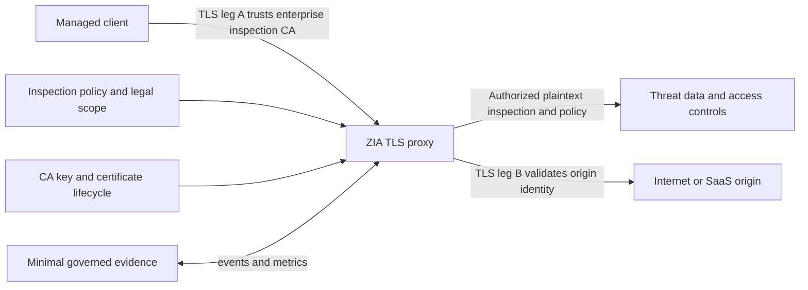

## JD Mapping

| Role expectation | Part 37 capability | TSM artifact | experience bridge and boundary |
|---|---|---|---|
| Analyze architecture | Map client trust, two handshakes, policy, inspection, and origin path | TLS flow diagram | M365 TLS/proxy isolation transfers |
| Identify risk | Find uninspected traffic, weak trust, failed origin validation, broad decryption, and stale bypass | Risk register | Legal decisions remain customer-owned |
| Tailor mitigation | Choose root repair, app trust update, policy correction, narrow bypass, or staged rollout | Options record | Exact ZIA features require current validation |
| Resolve escalations | Separate client-leg, proxy-policy, origin-leg, protocol, and app failures | Hypothesis matrix | Trace-led escalation discipline transfers |
| Advocate best practices | Trust-first deployment, two-leg validation, minimum exemptions, privacy controls, metrics | Adoption plan | Production inspection operation is new |
| Partner broadly | Coordinate PKI, endpoint, network, app, SOC, privacy, legal, HR, compliance, Support | RACI | Cross-functional M365 incidents transfer |
| Train stakeholders | Explain why a browser shows an enterprise-issued leaf and why that can be expected | Workshop | Training is established strength |
| Communicate outcomes | Tie visibility to tested threat/data controls and user impact with caveats | Executive scorecard | Do not promise 100 percent inspection or zero latency |

## Candidate honesty note

| Claim class | Safe Part 37 statement | Unsupported conversion |
|---|---|---|
| Production transfer | "I analyzed Microsoft TLS chains, trust stores, proxies, HARs, and packet traces." | "I ran global ZIA inspection." |
| Demonstrated study | "I built a synthetic inspection rollout and certificate-failure lab." | "I deployed an enterprise intermediate CA." |
| Public fact | "Zscaler help describes separate TLS tunnels to browser and destination." | "Every flow uses the same TLS version and cipher on both legs." |
| Explicit limitation | "Zscaler help says inspection does not support sites that mandate mutual TLS." | "All client-certificate apps automatically bypass." |
| Unknown | "I need both-leg evidence before assigning certificate ownership." | "The certificate warning proves the origin is bad." |

Zscaler product pages make scale, capacity, visibility, and performance claims. Treat them as vendor positioning. Customer outcomes depend on traffic mix, forwarding, region/path, protocols, endpoints, applications, policy, entitlements, service conditions, and matched measurement. Do not repeat "unlimited," "100 percent," or "never slows" as an unsupported production guarantee.

## Beginner vocabulary and memory hooks

| Term | Plain meaning | Why it matters | Memory hook |
|---|---|---|---|
| TLS | Transport Layer Security; protocol for authenticated, confidential, integrity-protected communication | Modern HTTPS depends on it | Sealed authenticated channel |
| SSL | Obsolete predecessor name often used casually for TLS | Product labels may retain the term | Old name, modern TLS |
| HTTPS | HTTP semantics carried over authenticated TLS | Most web/SaaS traffic is encrypted | Web inside TLS |
| Handshake | Negotiation that establishes identity, algorithms, and keys | Failures occur before application data | Secure introduction |
| Certificate | Signed statement binding a public key to an identity/context | Clients use it to authenticate servers | Digital passport |
| CA | Certificate Authority that signs certificates | Trust in a CA permits trusting issued chains | Passport office |
| Root CA | Top trust anchor installed independently | Adding a root grants broad trust power | Master passport office |
| Intermediate CA | CA signed by a root and used to issue leaf certificates | Inspection commonly presents leaves under an intermediate | Delegated passport office |
| Leaf certificate | Certificate presented for a specific server name | Browser/app validates name, chain, validity, and policy | Site passport |
| Trust store | Set of roots/intermediates an application accepts | Apps can use system or private stores | Accepted passport offices |
| Private key | Secret corresponding to a public key | Compromise can enable impersonation/signing | Never-shared seal |
| Public key | Shareable key used for verification/encryption mechanics | Appears in certificates | Public lock or seal sample |
| Proxy | Intermediary that creates/handles connections for policy | TLS inspection is active termination, not passive reading | Translation desk |
| MITM | Man in the middle; an on-path terminator | Unauthorized MITM is attack; authorized enterprise proxy is deliberate control | Middle endpoint |
| Two-leg proxy | Separate client-proxy and proxy-origin TLS connections | Versions, ciphers, certs, timings, and failures can differ | Two sealed envelopes |
| Origin | Actual destination server for the requested service | Proxy must verify it independently | Overseas office |
| Origin validation | Checking name, chain, time, signature, use, and status as applicable | Prevents proxy from hiding a bad destination certificate | Desk verifies recipient |
| Inspection | Decrypt, analyze under policy, then re-encrypt | Enables content controls but creates sensitive plaintext boundary | Open, check, reseal |
| Bypass/do not inspect | Do not decrypt a matched flow | Compatibility/privacy may improve while controls lose content visibility | Keep envelope sealed |
| Pinning | App accepts only a known certificate/public key set | Enterprise-issued leaf can be rejected even when system trusts it | Exact seal expected |
| mTLS | Mutual TLS; server also requests/authenticates a client certificate | Proxy termination can break end-to-end client-certificate semantics | Both show passports |
| Cipher suite | Cryptographic algorithms negotiated for a TLS leg | Legs can negotiate differently | Lock design |
| PFS | Perfect Forward Secrecy, commonly shorthand for ephemeral key exchange properties | Past sessions resist later long-term key compromise under conditions | New key per meeting |
| SNI | Server Name Indication sent in TLS handshake | Helps select server/certificate; privacy behavior evolves | Requested office name |
| ECH | Encrypted Client Hello, current IETF mechanism protecting more ClientHello metadata | Middlebox compatibility and policy must be current-tested | Hide the requested office label |
| ALPN | Application-Layer Protocol Negotiation | Selects HTTP/2, HTTP/3, or another protocol | Choose language before talking |
| QUIC | Secure multiplexed transport carried in UDP datagrams | HTTP/3 uses QUIC rather than TCP TLS in the usual mapping | Secure UDP-based highway |
| HTTP/3 | HTTP semantics over QUIC | Policy/inspection path may differ from HTTP/1.1/2 | Web over QUIC |
| Undecryptable | Traffic that cannot be inspected under current support/policy | Must be explicitly allowed, blocked, or otherwise governed | Sealed box desk cannot open |
| DPIA | Data Protection Impact Assessment in applicable privacy programs | Decryption can materially change processing | Privacy design review |

## Native TLS: what inspection changes

TLS aims to authenticate the server, optionally authenticate the client, keep application data confidential from non-endpoints, and detect modification. Current RFC 9846 specifies TLS 1.3 and obsoletes RFC 8446 while retaining the TLS 1.3 version number and backward compatibility.

| Property | Native client-to-origin TLS | With authorized inspection | Required assurance |
|---|---|---|---|
| Client peer | Origin server | ZIA proxy on leg A | Client trusts approved enterprise chain |
| Origin peer | Client | ZIA proxy on leg B | Origin accepts proxy as client for normal server-auth TLS |
| Origin identity check | Client/app validates origin | ZIA validates origin | Never skip origin validation silently |
| Plaintext endpoints | Client and origin | Client, authorized proxy processing, origin | Strong governance and minimization |
| Certificate shown to client | Origin leaf/chain | Dynamically issued inspection leaf/chain | Expected issuer and name must validate |
| Keys | Client/origin session keys | Independent keys per leg | Protect CA and ephemeral/session material |
| TLS version/cipher | One negotiation | Independent negotiation on each leg | Do not expect exact equality |
| Application protocol | Direct negotiated ALPN | May be independently handled per leg | Compatibility tests required |
| Logs | Endpoint/server/network metadata | Additional proxy policy/security evidence | Access and retention controls |

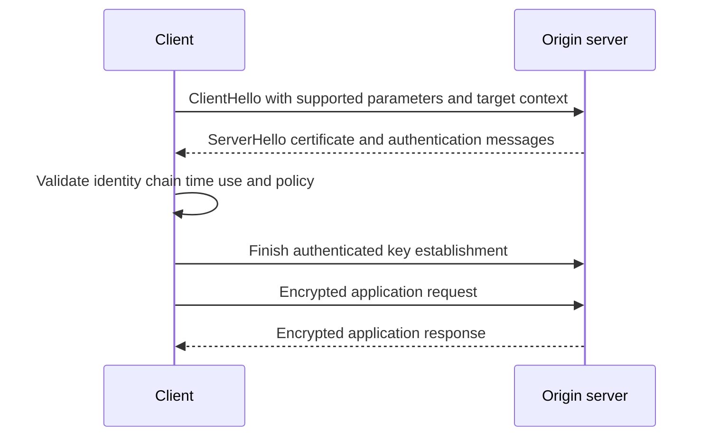

### Plain-English deep-dive 1 - Inspection does not "break encryption and leave it open"

Imagine two locked rooms connected by a staffed screening room. The first door uses a key shared between the employee and screening room. The second uses a different key shared between screening room and destination. Authorized content is visible only while being processed inside the screening room, then it is protected again.

That is the useful conceptual model. Inspection terminates one TLS connection and originates another; it is not one original end-to-end TLS session with a magical viewer. This changes endpoint identity. The client cryptographically connects to the inspection proxy, trusting an enterprise-approved CA. The proxy separately authenticates the origin. The design is secure only if both legs and the plaintext-processing boundary are governed correctly.

## Two-leg Zscaler inspection flow

Zscaler public help states that ZIA functions as a full TLS proxy and establishes a separate tunnel with the user's browser and destination server. It presents a dynamically issued server certificate signed by the Zscaler intermediate CA or a customer-specific intermediate chain, depending on configuration.

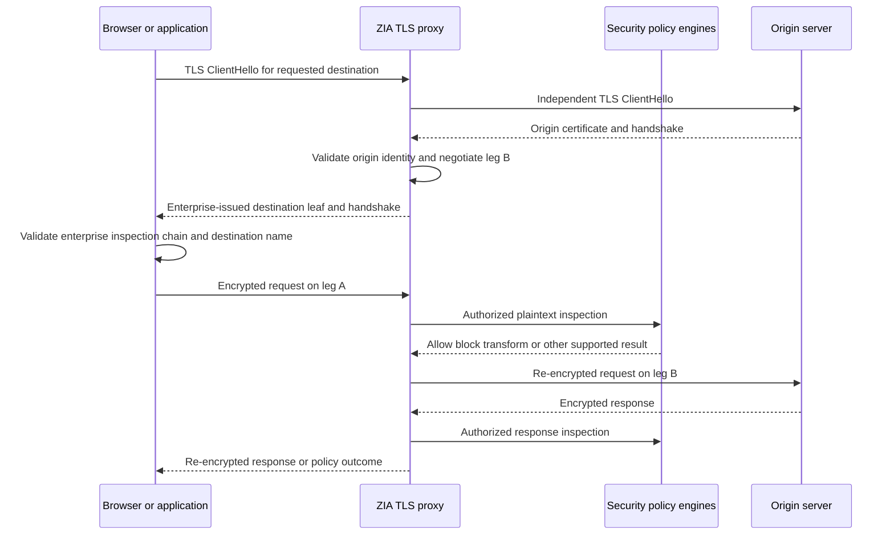

| Step | Client leg evidence | Origin leg evidence | Failure class |
|---|---|---|---|
| Traffic reaches ZIA | Client forwarding/path and service log | Not started yet | Steering/network |
| Policy decides inspect | Effective inspection reason/action | Rule audit | Policy/order |
| Origin handshake starts | Client may wait | Origin DNS/TCP/TLS event | Origin reachability |
| Origin certificate validates | Client cannot infer directly | Chain/name/time/status result | Bad origin certificate |
| Inspection leaf generated | Presented issuer/name/validity | Origin leaf separately recorded | Issuance/compatibility |
| Client validates leaf | App/browser certificate result | Leg B may already be healthy | Root/private-store/pinning |
| Content processed | Request sent to proxy | Security action/log | Threat/data/policy |
| Origin operation completes | Response/error | Origin HTTP/app result | SaaS/app failure |

Two-leg means asymmetry is normal. The client could negotiate TLS 1.3 while the origin leg uses a different supported version or cipher. The client sees an enterprise inspection certificate while ZIA sees the origin certificate. A client-side unknown-CA error does not prove the origin certificate is invalid. An origin-side expiration can be represented to the client through product-specific handling. Use both-leg evidence.

## Certificate chains and enterprise root distribution

A trust chain links a leaf to one or more intermediate certificates and ultimately to a root trust anchor the verifier already accepts. Roots are normally distributed separately; they are not made trustworthy merely by being sent during a handshake.

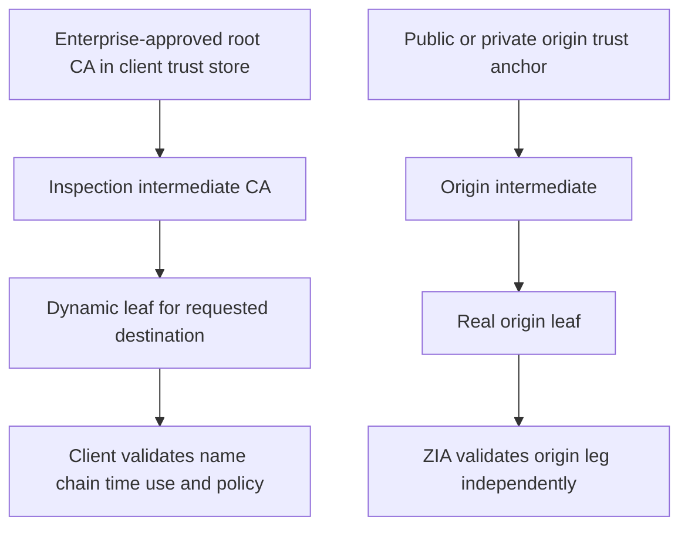

| Certificate object | Where held/seen | Contains private key? | Operational rule |
|---|---|---:|---|
| Enterprise root public certificate | Managed device trust stores | No | Deploy only approved public root material |
| Enterprise/custom root private key | Customer CA security boundary if customer-owned | Yes | Never export casually; HSM/process controls as applicable |
| Zscaler or custom intermediate public certificate | Chain/management context | No | Track identity, validity, rotation, purpose |
| Intermediate private key | Controlled signing boundary | Yes | Protect, rotate, revoke/replace under current design |
| Dynamic inspection leaf | Presented to client for destination | Associated signing occurs through inspection service | Validate expected issuer/name and policy behavior |
| Origin leaf/chain | Presented to ZIA on leg B | Origin holds leaf private key | Proxy must validate as a compliant client |

### Distribution methods and caveats

Zscaler help says the service itself does not install a root certificate on user machines merely because inspection is enabled. Client Connector app profiles can support deployment on specified desktop platforms under current behavior; GPO, Intune/MDM, or other management can distribute trusted certificates. Mobile and application-specific stores need platform-specific handling.

| Distribution path | Suitable context | Evidence | Caveat |
|---|---|---|---|
| Client Connector profile | Supported managed Windows/macOS context | Effective profile and trust-store certificate | Verify exact version/profile behavior |
| Group Policy | Domain-managed Windows computers/users | GPO scope/result and machine store | Off-domain/timing/OU scope can fail |
| Intune trusted certificate profile | Supported managed platforms | Assignment/device status and destination store | Separate platform profiles and current support |
| Other MDM | Managed mobile/desktop | Profile installation and platform trust | User versus system trust differs |
| Image/provisioning | Controlled device build | Image inventory and post-build validation | Rotation and already-deployed devices |
| Manual install | Small authorized lab or exception | Store/path verification | Poor scale, removal, and human-error risk |
| Application-specific store | Java, Python, npm, Git, Firefox, CLI, or other private store | App-specific chain test | System trust may not propagate |

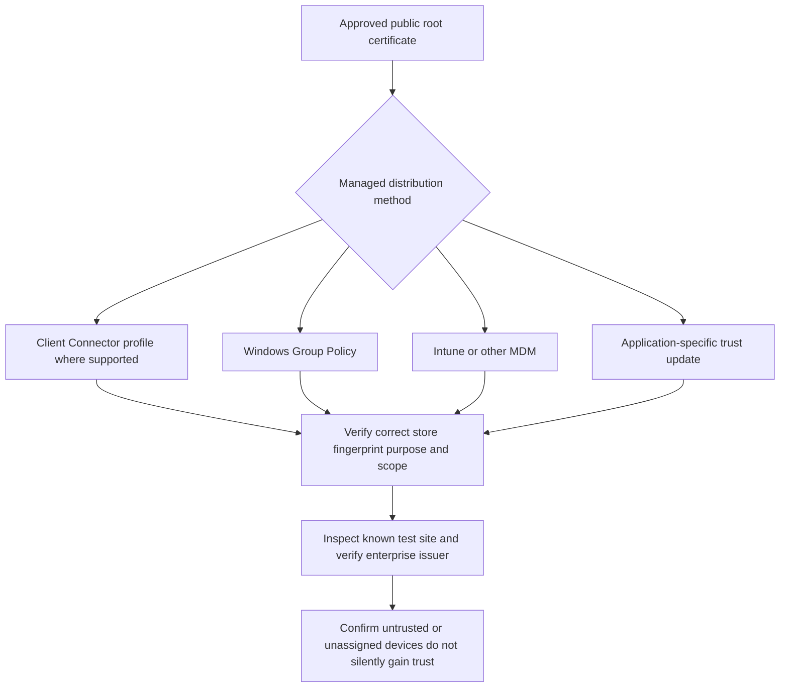

Do not distribute a private key with a trusted root profile. Microsoft Intune guidance explicitly distinguishes the public `.cer` used for trust from a private-key-bearing `.pfx`. Root deployment grants the issuer authority to authenticate names to that trust store, so assignments, administrative access, change audit, rotation, revocation/removal, and offboarding require the same seriousness as other privileged controls.

### Plain-English deep-dive 2 - Trusting a root is delegating signature authority

Adding a root is not like adding a bookmark. It is like telling every guard in a building, "Badges approved by this office are acceptable." If that office or its signing key is misused, convincing badges can be made for many doors.

That is why root trust must be purpose-bound and managed. Use approved sources, verify fingerprints through a trusted channel, deploy to only intended stores and devices, restrict CA administration, plan rotation, and test removal. Never solve a certificate warning by teaching users to click through or by disabling validation.

## Origin validation: the nonnegotiable second half

Current RFC 9846 states that a TLS-terminating middlebox must act as a compliant server to the original client and a compliant client to the original server, including verifying the origin certificate. This is the core invariant for secure inspection.

| Origin check | Question | Failure evidence | Unsafe response |
|---|---|---|---|
| Name identity | Does certificate match requested service identity under applicable rules? | Name mismatch/unrecognized name | Ignore hostname globally |
| Chain | Does chain reach an accepted trust anchor? | Unknown CA/incomplete chain | Trust arbitrary self-signed leaf |
| Validity time | Is certificate valid now with correct clocks? | Expired/not-yet-valid | Change clocks or bypass broadly |
| Signature/algorithm | Is chain cryptographically acceptable? | Bad/unsupported certificate | Enable weak algorithms casually |
| Key usage | Is certificate appropriate for server authentication/signing? | Usage/extended-use mismatch | Ignore purpose |
| Status | Is revocation/status handling acceptable under current behavior? | Revoked/status error | Suppress without risk decision |
| Protocol/cipher | Can leg B negotiate supported secure parameters? | Handshake/protocol/cipher failure | Downgrade below approved baseline |
| Application identity | Does SaaS/app accept requested host and transaction? | 421/HTTP/app error | Blame certificate automatically |

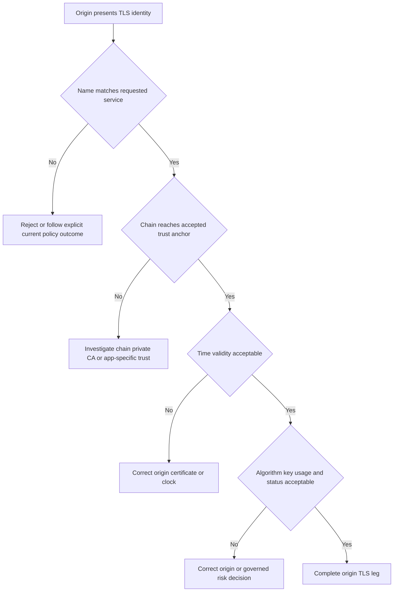

Inspection must not transform a bad origin into an apparently healthy enterprise certificate without an explicit, visible, supported policy outcome. Exact ZIA behavior for untrusted, expired, revoked, or undecryptable destinations must be confirmed in current help and tested. Preserve the real origin certificate evidence when troubleshooting.

## Inspection policy scope and order

Zscaler help describes SSL/TLS Inspection policies based on source and destination criteria and documents current criteria such as URL categories, cloud applications, users/groups, locations, devices/trust, endpoint applications, and other objects. The exact list is volatile; design by intent and verify fields in the current tenant.

| Policy dimension | Example intent | Evidence | Design warning |
|---|---|---|---|
| User/group | Inspect managed employees | Identity and effective rule | Stale/unknown identity |
| Device/trust | Inspect managed trusted devices | Device context and freshness | BYOD cannot receive root |
| Location/network | Different on/off-network handling | Location mapping | NAT identity ambiguity |
| Destination/category | Exclude legally sensitive categories | Category at transaction time | Category can change/misclassify |
| Cloud application | Apply app-aware scope | Recognized app evidence | Embedded third-party domains |
| Endpoint application | Scope native app compatibility | Process/tag evidence | Platform/version variation |
| Source IP group | Bound infrastructure sources | Source attribution | Shared/NAT address |
| Action | Inspect, do not inspect, allow/block undecryptable, or other supported result | Effective reason/action | Labels/actions change by release |
| Rule order/admin rank | Resolve overlapping rules | Effective rule and audit | A higher rule can shadow intended rule |

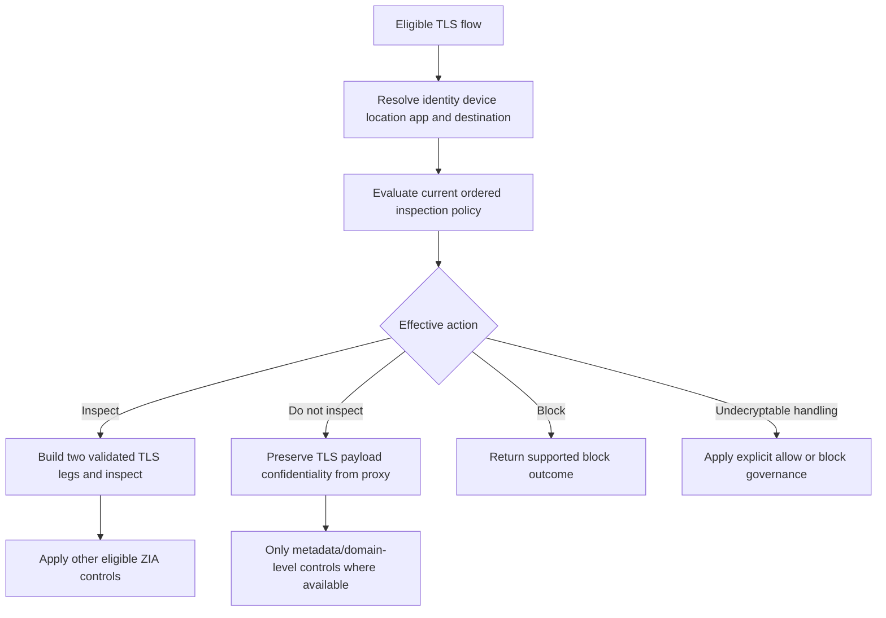

Zscaler documents predefined special rules, including recommended exemptions, and notes that bypassed traffic limits later policy visibility, often to domain rather than full URI. Do not assume a predefined rule is immutable truth or disable it casually. Record current contents/reason, rule order, observed match percentage, compatibility owner, and security effect. Product-managed lists can change.

### Inspect versus do not inspect

| Capability | Inspected flow | Uninspected flow |
|---|---|---|
| Full URL/path visibility | Potentially available according to product/policy | Often limited to domain/metadata |
| Content malware scanning | Eligible content can be scanned | Encrypted payload unavailable |
| DLP/content classification | Eligible plaintext can be evaluated | Content controls unavailable/limited |
| Origin certificate view to client | Enterprise-issued inspection leaf | Origin certificate passes end to end |
| Pinning compatibility | May fail | Often preserves pinned origin relationship |
| mTLS end-to-end | Public help says mandatory mTLS sites not supported for inspection | Direct tunnel/bypass may preserve semantics if architecture permits |
| Privacy exposure | Authorized proxy sees plaintext transiently | Proxy lacks payload plaintext |
| Troubleshooting evidence | Two TLS legs and inspection logs | One client-origin TLS relationship, less content evidence |

## Bypass categories and governance

There are two different reasons to avoid inspection: normative scope decisions and technical incompatibility. Normative decisions arise from law, labor agreements, privacy, ethics, or organizational policy, often for healthcare, finance, personal communications, or other sensitive classes. Technical decisions arise from pinning, mTLS, private trust stores, unsupported protocols/ciphers, or confirmed app behavior. Both need governance.

| Exception class | Example | Correct owner set | Review trigger |
|---|---|---|---|
| Legal/privacy | Sensitive category excluded by approved policy | Legal, privacy, security, HR/works council as applicable | Law/purpose/category change |
| Certificate pinning | Native app rejects generated leaf | App owner, security, vendor | App/version/vendor support change |
| Mandatory mTLS | Server needs end-client certificate | App/PKI/security/network | Architecture or server-auth change |
| Private trust store | App ignores system root | App/endpoint/PKI | Trust-store deployment support |
| Unsupported protocol/cipher | Product cannot inspect negotiation | Security/app/vendor | Protocol modernization/support change |
| Bootstrap | IdP/Client Connector enrollment needs documented bypass | Identity/endpoint/Zscaler | Endpoint requirement change |
| Emergency continuity | Critical operation fails during rollout | Change owner/risk/business | Short expiry and root-cause correction |

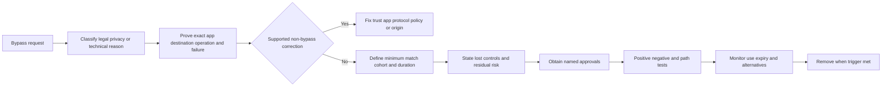

| Required exception field | Minimum answer |
|---|---|
| Business operation | Exact user action and criticality |
| Technical proof | Certificate/trace/app-owner evidence showing failure class |
| Match scope | Smallest domains/app/cohort/platform supported; avoid broad wildcards |
| Lost controls | Threat, sandbox, DLP, URL, app, logging, or origin-warning changes |
| Compensating controls | Endpoint/app/vendor controls, monitoring, restrictions |
| Owners | App, security, privacy/legal, risk, and change owners as needed |
| Time | Start, expiry, periodic review, removal trigger |
| Tests | Required function, path proof, prohibited destinations/actions |
| Metrics | Match volume, users, errors, incidents, age, trend |

### Plain-English deep-dive 3 - Bypass fixes one failure by accepting another blind spot

If a screening desk cannot open one supplier's package, routing it around the desk may restore delivery. It also removes the desk's ability to find prohibited material. That may be the correct decision, but it is not free.

Every bypass answer must name the visibility or control lost. It should then minimize the side road, add compensating controls, and define when the main route can return. A bypass with no owner or expiry is not a troubleshooting step; it is an unmanaged architecture.

## Certificate pinning and application-specific trust stores

Pinning is stronger than normal system trust. A pinned app compares the presented certificate or public-key relationship to a known set. Zscaler help explains that a dynamically issued inspection leaf may not match; the proxy cannot reliably infer pinning from one reset because client failure behavior is not standardized.

| Pattern | System trust result | App result | Correct hypothesis |
|---|---|---|---|
| Browser succeeds, native app fails | Enterprise root likely trusted system-wide | Private store or pinning possible | Compare presented cert and app design |
| All managed browsers fail unknown CA | Root/chain absent, wrong store, or scope | Broad trust failure | Verify root fingerprint and store |
| One version fails after app update | System trust unchanged | Pin set/private store/protocol changed | Version-specific compatibility |
| Direct succeeds, inspected resets after certificate | Origin accepted direct | Pinning likely but not proven | App logs/vendor evidence needed |
| CLI fails, browser succeeds | Browser/system store differs | CLI bundle/private store missing root | Configure supported app store |

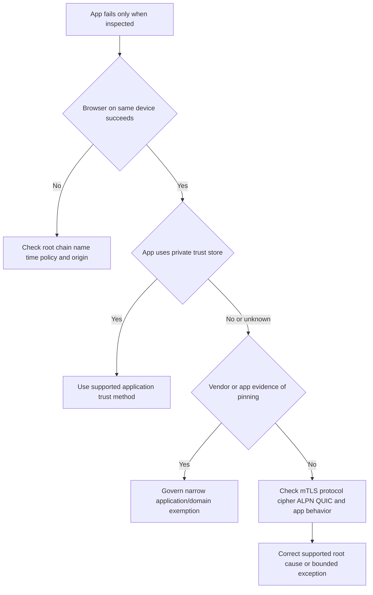

Zscaler help provides application-specific trust guidance for tools such as Java, Python, npm, Git, Firefox, CLIs, and development platforms. Prefer adding the approved root to the documented private store over disabling certificate validation. Never set permanent insecure flags such as "skip verify" merely to make a build work.

## Mutual TLS and unsupported protocols

In mTLS, the server requests a client certificate, and the client proves possession of its private key. A generic inspecting proxy changes the peer relationship. Zscaler help explicitly states that ZIA inspection does not support websites that mandate mTLS. This does not mean all mTLS-looking failures should receive broad bypass; prove the server request and application requirement.

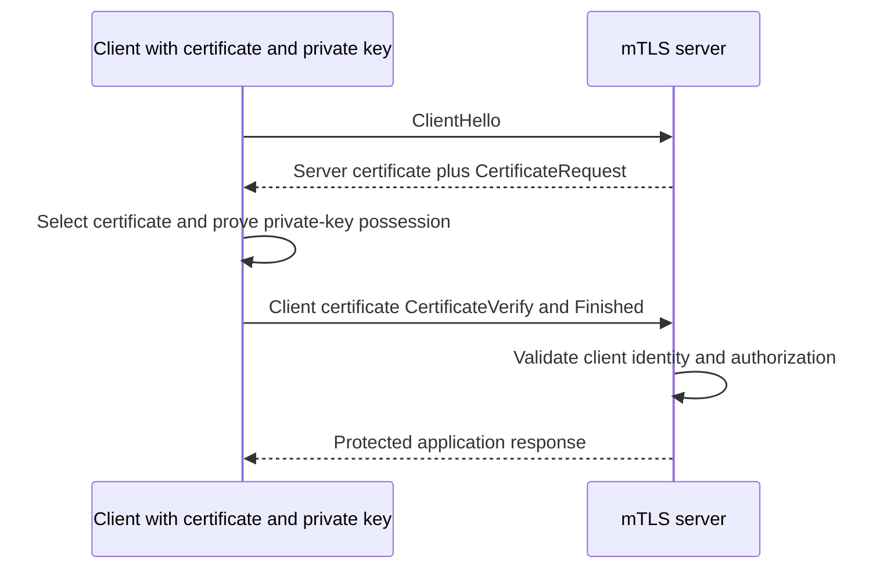

| Compatibility class | Why inspection may fail | Evidence | Governed response |
|---|---|---|---|
| Mandatory mTLS | Server expects end-client certificate/private-key proof | CertificateRequest, client selection, server log | Supported bypass/tunnel or redesign |
| Pinning | App expects exact cert/key | App/vendor/log and cert timing | Narrow exemption |
| Private app trust | App ignores system store | App trust configuration | Add approved CA to supported store |
| Unsupported TLS/cipher | No common supported secure negotiation | Both-leg handshake/cipher evidence | Modernize or explicit undecryptable policy |
| Non-TLS proprietary encryption | Not parseable as supported TLS | Protocol identification | Appropriate non-TLS control/path |
| Certificate-bound/channel-bound auth | App binds auth to original TLS properties | App protocol/vendor evidence | Compatibility design, not guess |
| ECH/new extension | Client/origin/proxy support differs | Current version/extension evidence | Validate current support and policy |

Zscaler's current cipher help may list legacy protocol versions for compatibility even though current IETF RFC 9846 and RFC 8996 prohibit TLS 1.0/1.1 in compliant modern deployments. Product support does not equal security approval. Customer cryptographic policy, applicable standards, app modernization, and current vendor guidance control. Avoid enabling weak protocols simply because a matrix mentions them.

## QUIC and HTTP/3 considerations

QUIC version 1 is a secure multiplexed transport carried in UDP datagrams and integrates TLS for key negotiation. HTTP/3 maps HTTP semantics over QUIC. This differs from the common HTTP/1.1 or HTTP/2 pattern over TCP plus TLS. Product handling, forwarding, inspection, fallback, browser behavior, and policy evolve; keep the discussion high level unless current Zscaler help provides exact tenant-specific behavior.

| Dimension | HTTP/1.1 or HTTP/2 common path | HTTP/3 path |
|---|---|---|
| Transport | TCP | QUIC over UDP datagrams |
| Security | TLS over reliable TCP stream | TLS integrated with QUIC packet protection |
| ALPN | Commonly `http/1.1` or `h2` | `h3` |
| Multiplexing | HTTP/2 above TCP; HTTP/1.1 limited | QUIC streams |
| Network failure | TCP/TLS error | UDP/QUIC/TLS/HTTP3 error or fallback |
| Inspection proof | TCP/TLS legs and HTTP | Must prove actual QUIC/HTTP3 or fallback path |
| Fallback | App/browser specific | RFC 9114 says clients should try TCP-based HTTP if QUIC cannot establish |

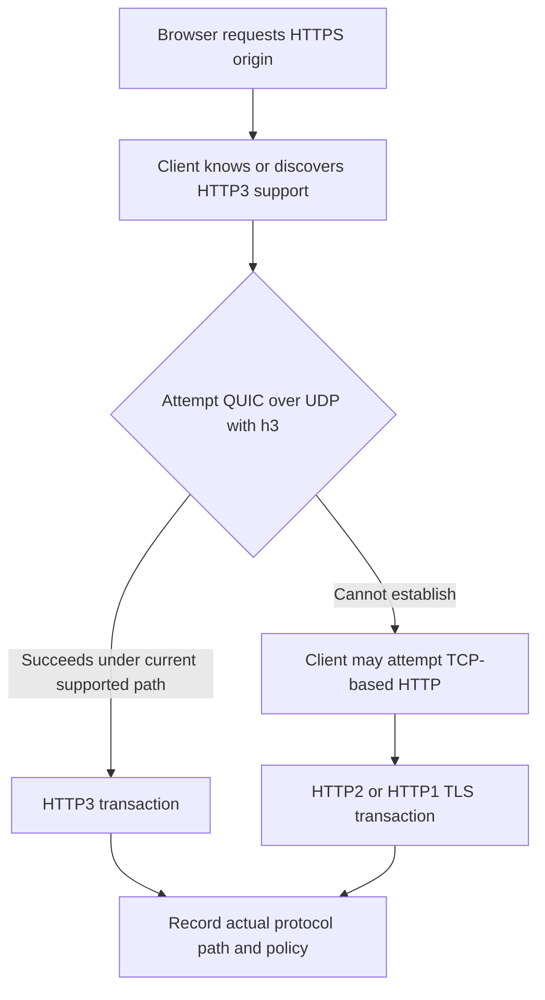

Blocking UDP and observing success does not prove equivalent experience or policy coverage. It may force fallback, alter latency, connection reuse, loss behavior, and logs. Use it only as a bounded diagnostic if approved. Compare browser network protocol, packet transport, service logs, effective inspection, destination behavior, and complete business operations.

## Privacy, legal, and data handling

TLS inspection changes data processing because authorized infrastructure can see payload plaintext transiently and security systems may derive metadata, findings, snippets, or incident artifacts. Legal basis, employee notice, works-council obligations, sector rules, privilege, personal use, health/financial data, residency, subprocessors, retention, and access depend on jurisdiction and contract. A TSM facilitates evidence and design; qualified customer counsel decides legality.

| Governance question | Required artifact | Failure if omitted |
|---|---|---|
| Purpose | Specific security/data-protection purposes | Function creep |
| Legal authority | Counsel-approved basis and constraints | Unlawful processing risk |
| Scope | Users, devices, destinations, categories, regions, operations | Overbroad decryption |
| Notice/transparency | User/employee notice and policy | Surprise and trust damage |
| Sensitive exclusions | Approved categories/apps/populations | Exposure of privileged/private content |
| Data map | Plaintext, logs, findings, snippets, admins, exports, regions | Unknown processing |
| Access control | Least-privilege roles, approval, audit | Insider misuse |
| Retention/deletion | Dataset-specific periods and deletion verification | Excessive persistence |
| Vendor/contract | Product terms, DPA, subprocessor/residency commitments | Unsupported assumptions |
| Incident response | CA compromise, plaintext/log exposure, misuse procedure | Slow containment |
| Rights/requests | Search, access, restriction, deletion handling where applicable | Compliance failure |
| Review | Periodic and change-triggered assessment | Stale scope |

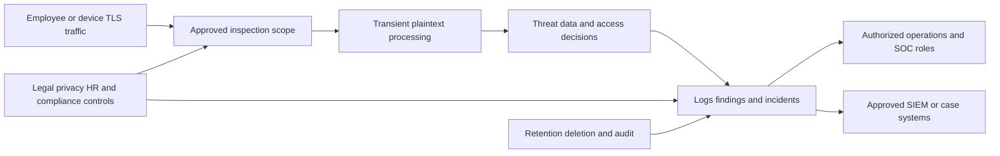

### Plain-English deep-dive 4 - "We do not store content" is not a complete privacy answer

A receptionist may read a letter and write down sender, recipient, subject, risk marker, and a short excerpt without photocopying the whole letter. Saying "we did not keep the letter" does not explain the data that was observed or recorded.

Similarly, distinguish transient plaintext processing from persisted URLs, user/device identity, policy actions, file hashes, classifications, snippets, threat artifacts, or exported incidents. Verify current product behavior and contract. The data map must state what is processed, what persists, where, for how long, who can access it, and how deletion or legal requests work.

## Security and certificate lifecycle controls

| Lifecycle area | Questions | Evidence |
|---|---|---|
| CA choice | Zscaler-provided or customer-specific chain; why? | Architecture and ownership decision |
| Key generation | Where/how is signing key generated and protected? | Current vendor/customer control evidence |
| Distribution | Which public roots/intermediates reach which stores? | MDM/GPO/profile and fingerprints |
| Issuance | Which service creates leaves for which scope? | Effective inspection transaction |
| Rotation | Overlap, new trust first, issuance switch, old removal? | Rotation plan and dual-chain tests |
| Expiration | Who monitors CA and profile dates? | Alert and owner |
| Revocation/compromise | How are trust and signing stopped/replaced? | Incident playbook |
| Administration | Who can change CA, policy, exceptions, and exports? | RBAC/audit review |
| Retirement | How are old roots and exceptions removed? | Device and tenant reconciliation |

```mermaid
flowchart LR
    PLAN[Approve CA purpose ownership and scope] --> GEN[Generate or select protected issuing chain]
    GEN --> TRUST[Distribute public trust anchor first]
    TRUST --> VERIFY[Verify fingerprints stores and app trust]
    VERIFY --> ISSUE[Enable bounded inspection issuance]
    ISSUE --> MON[Monitor validity usage policy and incidents]
    MON --> ROTATE[Rotate before expiry or on risk]
    ROTATE --> REMOVE[Remove old issuance then old trust after proof]
```

CA compromise is a security incident, not a normal app outage. Potential actions include stopping affected issuance/inspection under approved continuity policy, preserving audit evidence, rotating or replacing keys/certificates, distributing new trust, removing/revoking old trust as applicable, validating fleet state, assessing impersonation exposure, notifying stakeholders, and following vendor/customer legal incident processes. Exact steps depend on who controls the CA and current product design.

## Performance, capacity, and experience

TLS inspection adds handshake termination, cryptographic operations, content parsing, security scanning, and onward connections. Cloud architecture can remove customer appliance bottlenecks, but no design makes computation or network path free. Measure customer transactions rather than arguing from product claims.

| Metric | Definition | Segment | Caveat |
|---|---|---|---|
| Inspection coverage | Inspected eligible TLS transactions/bytes divided by defined eligible total | User/device/location/app/category | Eligibility and logs must be defined |
| Bypass rate | Do-not-inspect transactions/bytes by reason | Rule/owner/age | Low rate can still hide critical data |
| Undecryptable rate | Flows that cannot be decrypted by reason | Protocol/cipher/app | Allow/block action matters |
| Client handshake success | Successful leg-A handshakes/attempts | Platform/app/version | Retries can hide failures |
| Origin handshake success | Successful leg-B handshakes/attempts | Destination/issuer/version | Origin outages confound |
| Handshake latency | Time for each leg under controlled evidence | Region/network/app | Capture visibility varies |
| Transaction success | Complete business operation/attempts | Cohort/path | Home-page success insufficient |
| Transaction latency | End-to-end percentiles | App/region/ISP/size | Match cache/payload/protocol |
| Throughput | Useful bytes/time for representative transfers | Size/path/cohort | Compression and server limits |
| Security yield | Valid threats/data incidents found in inspected scope | Control/severity | More alerts may mean noise |
| False-positive impact | Incorrect blocks/alerts and user-hours | Rule/app/cohort | Labeling quality required |
| Exception aging | Open exceptions by age and expiry | Owner/reason | Count alone ignores scope |

```mermaid
flowchart LR
    BASE[Matched pre-change baseline] --> CLIENT[Client and local network timing]
    CLIENT --> LEG1[Client-to-ZIA handshake]
    LEG1 --> INSPECT[Policy and inspection processing]
    INSPECT --> LEG2[ZIA-to-origin handshake and path]
    LEG2 --> APP[Origin application operation]
    APP --> TOTAL[End-to-end success and percentile]
    TOTAL --> COMPARE[Compare ring cohort protocol and payload]
```

Capacity review should examine peak concurrency, handshakes, bytes, object/file mix, long-lived sessions, upload/download, geography, service path, policy engines, and origin limits. Zscaler operates the public cloud service, but customers still own forwarding, endpoint trust, policy design, representative testing, app exceptions, and evidence. Private/virtual components, if used, change sizing and ownership and must follow current guidance.

## Failure patterns and evidence matrix

| Symptom | Likely boundary | Cheap discriminating check | Evidence |
|---|---|---|---|
| Browser unknown CA | Client leg trust | Inspect presented issuer and correct trust store | Certificate chain/store |
| Name mismatch | Client leaf generation/request name or origin behavior | Compare requested host, SNI, leaf SANs | Browser/cert and service log |
| Only native app fails | Pinning/private store/mTLS/protocol | Same device browser plus app vendor docs | App log and packet timing |
| Origin expired | Leg B origin validation | Direct safe cert observation plus ZIA reason | Origin chain and timestamps |
| Works uninspected | Inspection compatibility/policy, not proof of defect | Compare exact inspected/uninspected path | Effective rule and both legs |
| Reset after certificate | Pinning possible | App log/vendor confirmation | TLS sequence; reset alone insufficient |
| Client certificate prompt/fail | mTLS/app auth | Confirm CertificateRequest and app requirement | TLS/app/server evidence |
| HTTP/3 differs | QUIC path/fallback | Prove actual UDP/QUIC versus TCP path | Browser protocol/packet/service log |
| One region slow | ISP/service path/origin geography | Matched cohort by region and leg timings | ZDX/network/app metrics |
| Broad failure after root rotation | Trust distribution/chain switch | Fingerprint by ring/store | MDM/GPO/client evidence |
| Block page on bypassed traffic | Other policy still evaluates at limited visibility | Effective inspection and URL/app rule | Policy reasons |
| No content DLP event | Uninspected/direct/unsupported/log scope | Prove decryption and complete transaction | Inspection reason and DLP logs |

## Troubleshooting certificate and application failures

### Step 1: define exact transaction

Capture user/device, OS, application and version, destination/operation, network/location, forwarding method, time zone, first/last occurrence, impact, and known-good comparison. Do not collect secrets or unrelated content.

### Step 2: prove path and effective inspection decision

Confirm traffic reaches ZIA, exact destination/protocol, effective SSL/TLS rule and reason, inspect versus do-not-inspect versus undecryptable action, and any other applicable policy. A certificate shown by a browser is useful path evidence; still correlate service logs.

### Step 3: split the two legs

For leg A, inspect enterprise chain, destination name, client trust store, app-specific trust, platform, and client error. For leg B, inspect DNS, TCP/QUIC as applicable, TLS negotiation, real origin chain/name/time/status, and origin error. Normalize clocks.

### Step 4: classify compatibility

Test for missing/incorrect root, private trust store, certificate pinning, mandatory mTLS, unsupported protocol/cipher, QUIC/HTTP3 differences, ECH/new extensions, or application authorization. Use vendor documentation and current Zscaler support guidance.

### Step 5: choose narrow correction

Repair root distribution, store placement, origin chain, supported protocol, policy order, or app trust first. Use a bypass only when the reason and lost controls are documented and approved.

### Step 6: validate security and experience

Repeat the complete operation, both-leg certificate checks, negative tests, policy/security logs, latency/throughput baseline, alternate networks, and rollback. Remove diagnostic bypasses.

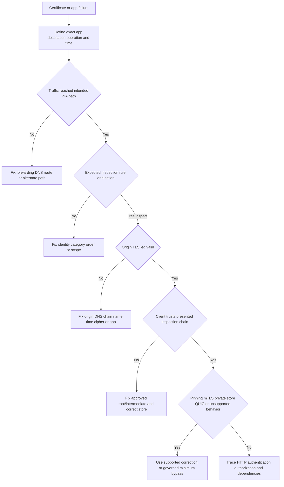

### Certificate-warning tree

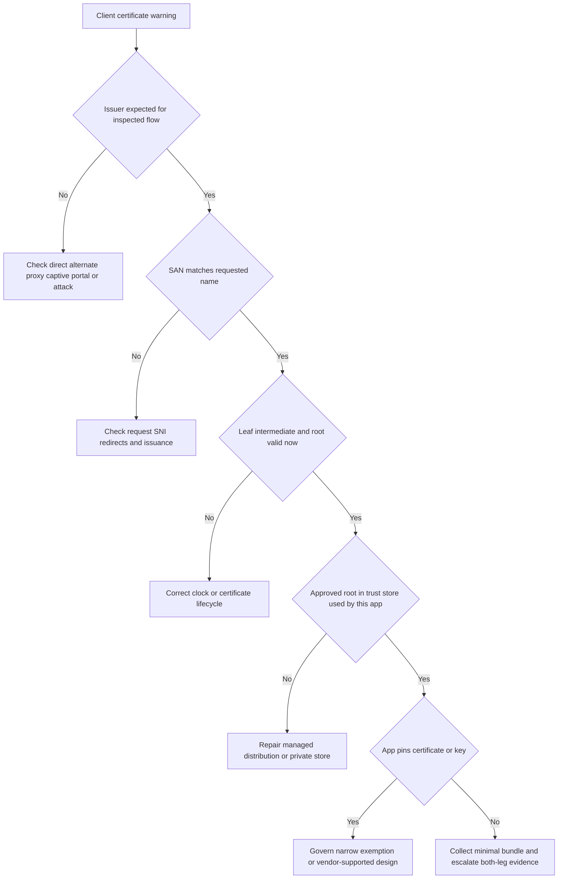

### Do not make these troubleshooting changes together

Reinstalling Client Connector, adding a root manually, disabling validation, bypassing the domain, disabling QUIC, clearing browser state, changing forwarding, and changing inspection policy at once destroys causality and may expose traffic. Use one reversible discriminating change on an owned/approved cohort after preserving evidence.

## Staged rollout and rollback

Rollout begins with governance and trust, not with an inspect-all rule. Inventory user populations, devices, apps, protocols, trust stores, mTLS, pinning, privacy categories, legal constraints, network paths, current controls, metrics, support readiness, and certificate ownership.

| Phase | Work | Gate |
|---|---|---|
| 0 Governance | Purpose, legal/privacy review, scope, data map, owners, incident plan | Written approval |
| 1 Discovery | Traffic/apps/protocols/trust stores/pinning/mTLS/baseline | Inventory coverage and unknown register |
| 2 Trust first | Distribute approved root/intermediate to canaries | Fingerprint/store and non-inspected app tests |
| 3 Lab | Inspect owned test destinations and representative apps | Both legs, controls, privacy, rollback pass |
| 4 Canary | IT/security/service desk small ring | Error, performance, support, log gates |
| 5 Representative pilot | Regions/platforms/business apps | Complete operations and exceptions owned |
| 6 Waves | Expand by cohort/category/app | Metrics within threshold; no unowned bypass |
| 7 Steady state | Version/app changes, exception review, CA rotation | SLO, audit, exercise, improvement |

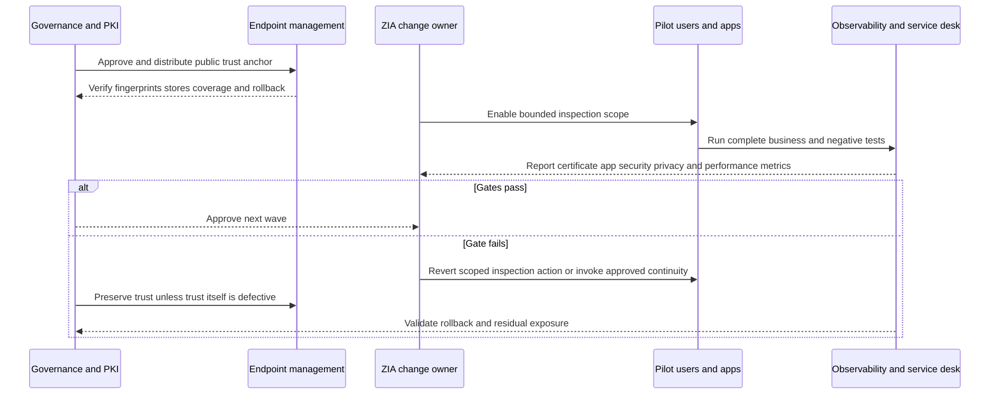

Rollback is layered. If one app fails, revert its bounded inspection rule or cohort rather than the enterprise program. If a root is wrong or compromised, follow PKI incident procedures; simply leaving a bad root installed while disabling inspection is not remediation. If performance degrades, pause expansion and isolate path/leg/control rather than bypass all TLS. Every rollback must prove intended traffic path, retained controls, logs, and business operation.

## Fictional NMH inspection rollout and incidents

NMH wants to inspect managed workforce internet/SaaS traffic for malware and data leakage while excluding approved personal healthcare and banking categories. The plan begins with legal/privacy approval and certificate distribution to a 40-device canary. It is synthetic.

### NMH scope matrix

| Cohort/app | Initial action | Reason | Validation |
|---|---|---|---|
| Managed browser SaaS | Inspect in canary | Main threat/data use case | Both legs, uploads, downloads, SSO |
| Developer CLI tools | Inspect after app-store trust validation | Private trust stores likely | Git/npm/Python owned repositories |
| Payroll SaaS | Inspect after owner/privacy review | Sensitive business data | Login, payslip, export, DLP negative tests |
| Personal banking category | Do not inspect | Approved privacy scope | Domain/category and limited-policy evidence |
| Health category | Do not inspect | Approved privacy scope | Category governance and misclassification path |
| Vendor mTLS portal | Do not inspect narrowly | Mandatory client certificate | CertificateRequest and server evidence |
| Pinned mobile app | Exempt app domains | Vendor-confirmed pinning | Version/domain/expiry review |

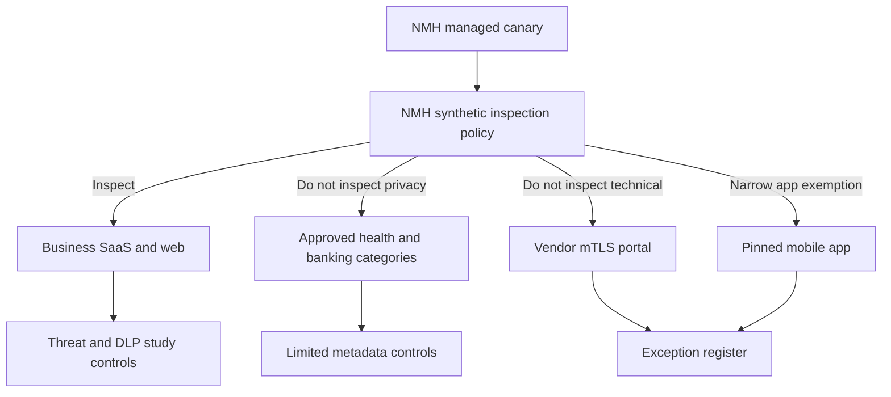

### Incident A: Python client fails while browser works

The same managed laptop can browse the owned package repository through inspection, but a Python client reports certificate verification failure. The ZIA origin leg is healthy and the browser sees the expected NMH inspection issuer. The Python environment uses a separate CA bundle that lacks the NMH-approved root.

The correction is the supported application-specific trust configuration distributed through developer tooling, not disabling certificate verification and not bypassing all package repositories. Tests cover package lookup, download, hash verification, negative destination, ZIA policy/logs, and removal/rotation.

### Incident B: vendor portal asks for a client certificate

The portal works direct in an approved lab but fails under inspection when the server requests client authentication. TLS and server logs confirm mandatory mTLS. Current Zscaler help states this inspection case is unsupported. NMH creates a narrow destination exemption with app/PKI/security approval, records lost content controls, applies endpoint and vendor monitoring, and reviews redesign options. It does not exempt the vendor's entire parent domain.

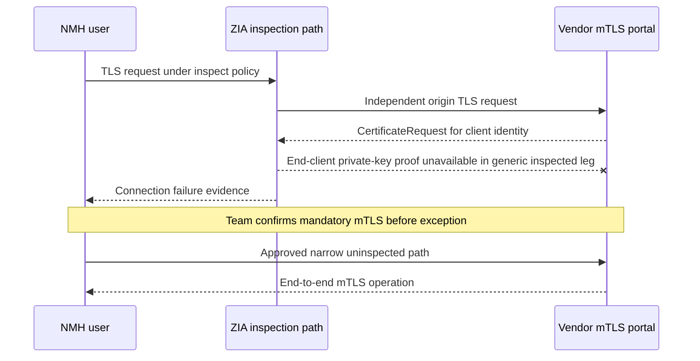

### Incident C: root rotation causes partial outage

NMH switches issuance before all macOS devices receive the new root. Windows canaries pass; some macOS developer apps fail. The rollback restores the prior approved issuing chain for the affected ring while distribution is repaired. The team does not remove the old root until all expected applications validate the new chain and old issuance has stopped. The lesson is "trust first, issuance second, old trust last."

## Outcomes and proactive TSM review

| Review area | TSM question | Evidence | Action |
|---|---|---|---|
| Coverage | What eligible traffic is actually inspected? | Rule reasons/bytes/transactions | Investigate unexplained gaps |
| Exceptions | Which bypasses are broad, old, or unowned? | Register and match volume | Narrow, renew, or remove |
| Trust | Which devices/apps lack current approved root? | MDM/GPO/store tests | Repair before expansion |
| Compatibility | New pinning/mTLS/private stores/protocols? | App changes and failures | Pretest versions |
| Origin hygiene | What bad origin certs are observed? | Leg-B validation reasons | Engage app/vendor owners |
| Privacy | Scope/data/roles/retention still approved? | DPIA/data map/access audit | Reassess on change |
| Performance | Which cohorts show tail regressions? | Matched percentiles and ZDX/path | Isolate leg/path/control |
| Security value | Which valid threat/data events depend on decryption? | Findings with quality review | Tune controls and communicate value |
| Changes | Upcoming CA, browser, OS, QUIC, IdP, app updates? | Roadmap/release notes | Joint test calendar |
| Resilience | Are rollback and CA compromise plans rehearsed? | Exercise results | Close readiness gaps |

## Your experience bridge to Zscaler

| prior production strength | Part 37 transfer | New Zscaler learning | Honest language |
|---|---|---|---|
| Browser and OneDrive TLS errors | Separate certificate, proxy, origin, and application | ZIA inspection logs/policy | "TLS method transfers; ZIA operation is new." |
| Entra sign-in endpoints | Bootstrap/IdP bypass dependency reasoning | Current Zscaler required domains | "I verify current config, not memorize lists." |
| Intune and Windows trust concepts | Root profile/ring/assignment validation | Client Connector certificate deployment | "Management concepts transfer." |
| Wireshark/netsh/HAR | Handshake, reset, protocol, HTTP timing | Two-leg ZIA evidence | "I correlate both legs and protect content." |
| M365 service changes | App version, pinning, endpoint, protocol regression | Zscaler compatibility process | "I use representative canaries." |
| Privacy-sensitive support | Minimize tokens, URLs, content, and access | Inspection data map/contracts | "Legal decisions stay with qualified owners." |
| Critical incidents | Parallel PKI, endpoint, network, app, vendor tracks | CA/inspection rollback | "I bring escalation discipline." |
| Power BI/SQL | Coverage, exception aging, percentiles, false positives | ZIA schemas/retention | "I validate denominator and grain." |

### 30-second interview bridge

"TLS inspection is a controlled two-leg proxy. The client establishes TLS to ZIA and trusts an enterprise-approved inspection chain; ZIA separately acts as a TLS client and must validate the real origin. Authorized controls can inspect plaintext only at that processing boundary before re-encryption. I would deploy trust first, pilot representative apps, govern privacy and every bypass, and troubleshoot client leg, policy, origin leg, protocol, and application separately. My prior certificate, proxy, trace, privacy, and escalation experience transfers, while production ZIA inspection administration remains a learning boundary."

## Labs and rehearsal

Use only owned or explicitly authorized endpoints, CAs, servers, applications, and data. Never intercept third-party traffic or install a test root on unmanaged/customer devices.

### Lab 1: native TLS chain

Create an owned local CA and test server. Inspect root, intermediate, leaf, SAN, validity, key usage, and handshake. Explain why the root is independently trusted.

### Lab 2: generic two-leg proxy

Use an approved local debugging proxy on an owned lab only. Compare client-presented and origin certificates. State why this demonstrates concepts, not Zscaler internals.

### Lab 3: trust distribution

Use a disposable managed lab VM. Deploy only a public test root with a management profile, verify fingerprint/store, then remove it and prove trust disappears.

### Lab 4: private trust store

Configure an owned Java/Python test to use a private CA bundle. Show browser success/app failure, then add the approved test root to the app store without disabling validation.

### Lab 5: origin failure

Create owned test endpoints with expired, wrong-name, incomplete-chain, and untrusted certificates. Build expected leg-B evidence and safe correction.

### Lab 6: pinning model

Use a purpose-built owned sample app/library that pins a test public key. Observe generic proxy failure and document why a reset alone is not proof in production.

### Lab 7: mTLS

Build an owned server requiring a client certificate. Trace CertificateRequest and client proof, then explain why a two-leg proxy changes semantics.

### Lab 8: policy matrix

Create synthetic inspect, privacy do-not-inspect, pinning, mTLS, undecryptable allow/block, and default rules. Test order and lost controls.

### Lab 9: QUIC/HTTP3

Use browser developer tools and a packet trace against an owned/public test endpoint without decrypting others' data. Identify UDP/QUIC versus TCP fallback and caveats.

### Lab 10: performance baseline

Measure owned small/large, upload/download, cold/warm, HTTP versions, and percentiles through a generic lab. Avoid converting results into Zscaler claims.

### Lab 11: NMH incidents

Rehearse Python private-store, vendor mTLS, and root-rotation cases. Produce hypotheses, minimum exception, rollback, privacy note, and tests.

### Lab 12: interview teach-back

Explain TLS, certificate chain, two legs, origin validation, policy, bypass, pinning, mTLS, QUIC, privacy, rollout, and troubleshooting in 30 seconds each.

## Common misconceptions to correct

| Misconception | Corrected understanding |
|---|---|
| SSL and TLS are equally current | SSL is obsolete; SSL inspection is common product shorthand for TLS inspection |
| HTTPS means content is safe | TLS protects transport; malicious content and data loss can also be encrypted |
| Inspection passively reads one session | It terminates and creates two separate TLS connections |
| The client still authenticates the origin directly | Under inspection the client authenticates the proxy-issued identity; proxy validates origin |
| Same cipher/version must appear on both legs | Each leg negotiates independently |
| Enterprise root is just another app setting | It delegates broad certificate trust authority |
| The root arrives safely from the inspected website | Trust anchors are distributed independently through approved management |
| Root profiles should include private keys | Clients need public trust certificates, not CA private keys |
| Saved inspection policy proves effect | Path, identity, rule order, action, client cert, and service log prove effect |
| Bypass means no policy | Some metadata/domain policy may still apply, but content visibility is limited |
| Bypassed traffic has full URL controls | Without decryption, visibility may be limited to domain or other metadata |
| Pinning can always be auto-detected | Client failures vary; reset/FIN alone is not proof |
| Browser success disproves certificate issue | Native apps can use private trust stores or pinning |
| Disable validation fixes a private store | It removes authentication and is unsafe; add approved trust correctly |
| mTLS is ordinary server-auth TLS | Both peers authenticate with certificates; inspection changes end-client semantics |
| All mTLS traffic automatically bypasses | Current policy must deliberately handle it after evidence |
| Product cipher support approves legacy TLS | Security policy and current standards can prohibit technically supported legacy modes |
| QUIC is TCP with a new name | QUIC is a secure transport carried in UDP; HTTP/3 maps HTTP over it |
| Blocking QUIC has no side effects | It can force fallback and alter performance, behavior, and evidence |
| Full inspection is automatically lawful | Purpose, scope, notice, jurisdiction, role, retention, and contracts need review |
| No stored content means no personal data | Logs, URLs, identity, findings, snippets, and exports can remain personal/sensitive |
| Unlimited capacity means no measurement | Customer path, app, policy, and tail experience still require baselines |
| One direct test proves inspection latency | Direct changes path and controls; match protocol, cache, payload, region, and time |
| Rollback means bypass all TLS | Revert the smallest scope to an approved known-good state |
| This Part proves ZIA admin experience | It proves conceptual preparation and synthetic practice |

## Official Source Anchors

Sources in this section were reviewed on **2026-08-24**.

RFC 9846 is the current TLS 1.3 Standards Track specification and obsoletes RFC 8446 while retaining TLS 1.3 compatibility. Zscaler help is the controlling public product documentation anchor but authenticated/current tenant help, release notes, support statements, contract, and evidence override remembered fields. Product pages are positioning, not universal outcome guarantees. Microsoft guidance illustrates managed trust distribution, not a Zscaler-specific deployment mandate. Legal/privacy decisions require qualified customer review.

| Source | URL | Used for | Boundary |
|---|---|---|---|
| Zscaler Understanding SSL/TLS Inspection | https://help.zscaler.com/zia/understanding-ssltls-inspection | Full proxy, separate browser and destination TLS tunnels, certificate presentation, mandatory mTLS limitation | UI/actions may change; verify authenticated help |
| Zscaler inspection policy | https://help.zscaler.com/zia/about-ssltls-inspection-policy | Source/destination policy, predefined exemptions, bypass visibility caveat | Product-managed lists and rule fields change |
| Zscaler configuring inspection policy | https://help.zscaler.com/zia/configuring-ssltls-inspection-policy | Current criteria/order/action and save/activate anchor | Do not copy field list as timeless schema |
| Choosing CA certificate | https://help.zscaler.com/zia/choosing-ca-certificate-ssl-inspection | Zscaler/custom intermediate choice and customer root distribution responsibilities | Platform deployment differs |
| Certificate pinning and inspection | https://help.zscaler.com/zia/certificate-pinning-and-ssl-inspection | Pinning definition, nonstandard failure behavior, exemption approach | App/domain list changes; validate vendor |
| Application-specific trust store | https://help.zscaler.com/zia/adding-custom-certificate-application-specific-trust-store | System versus private stores and supported root-addition concept | Never use disable-validation advice as production default |
| Supported cipher suites | https://help.zscaler.com/zia/supported-cipher-suites-ssltls-inspection | Public current ZIA TLS/cipher/undecryptable handling anchor | Support does not equal cryptographic-policy approval |
| Safeguarding keys/data | https://help.zscaler.com/zia/safeguarding-ssltls-keys-and-data-collected-during-ssltls-inspection | Vendor key/data safeguard documentation anchor | Verify contract and detailed current controls |
| SSL inspection product page | https://www.zscaler.com/products-and-solutions/ssl-inspection | Public scale, policy, privacy-category, performance positioning | Do not convert marketing claims to guarantees |
| RFC 9846 | https://www.rfc-editor.org/rfc/rfc9846 | Current TLS 1.3, two-connection terminator duties, authentication/confidentiality/integrity, privacy updates | Protocol standard, not Zscaler configuration |
| RFC 9114 | https://www.rfc-editor.org/rfc/rfc9114 | HTTP/3 over QUIC, h3 ALPN, UDP failure and TCP-based fallback | Does not define Zscaler handling |
| RFC 9000 | https://www.rfc-editor.org/rfc/rfc9000 | QUIC as secure multiplexed transport in UDP datagrams | Version 1 protocol, not product policy |
| NIST SP 800-52 Rev. 2 | https://csrc.nist.gov/pubs/sp/800/52/r2/final | TLS implementation configuration guidance | Under NIST review as of 2026 planning note; federal scope |
| Microsoft Intune trusted roots | https://learn.microsoft.com/en-us/intune/device-configuration/certificates/trusted-root-profiles | Public `.cer`, platform profiles, root/intermediate trust deployment | UI/platform support changes |
| Microsoft Group Policy certificate distribution | https://learn.microsoft.com/en-us/windows-server/identity/ad-cs/distribute-certificates-group-policy | Windows domain trust distribution concept | Windows/domain-specific |
| Zscaler privacy overview | https://www.zscaler.com/privacy-compliance/overview | Vendor privacy/compliance entry point | Contract and product data map control |

## Likely Interview Questions

### Q1. Explain Zscaler TLS inspection in plain English.

**Model answer:** ZIA acts as an authorized full TLS proxy and creates two independent encrypted connections. On leg A, the client connects to ZIA and accepts a destination leaf signed under an enterprise-approved inspection chain. ZIA decrypts only at its controlled processing boundary to apply eligible security/data policy. On leg B, ZIA acts as a TLS client, validates the real origin identity, and re-encrypts traffic. Both legs, CA security, policy, privacy, and logs must be governed.

### Q2. Why must an enterprise root be distributed, and how would you do it safely?

**Model answer:** The client must trust the CA that signs dynamically generated inspection leaves; otherwise it correctly reports unknown CA. I would approve the CA purpose and ownership, distribute only the public root/intermediate through supported Client Connector, GPO, Intune/MDM, or app-specific stores, verify fingerprints and destination stores, pilot trust before enabling inspection, restrict CA administration, monitor validity, and test rotation/removal. I would never distribute the CA private key.

### Q3. What is origin validation in a two-leg proxy?

**Model answer:** ZIA must behave as a compliant TLS client to the destination. It should validate the requested service identity, certificate chain to a trusted anchor, validity time, signatures/algorithms, key usage, status as applicable, and protocol negotiation under current policy. Otherwise an inspection proxy could hide an invalid origin behind a trusted enterprise leaf. I collect the real origin certificate and leg-B reason separately from the client-presented certificate.

### Q4. How do pinning and mTLS affect inspection?

**Model answer:** A pinned app expects a known certificate or key, so a valid enterprise-issued inspection leaf may still be rejected; reset behavior alone does not prove pinning, so I use app/vendor and handshake evidence. In mTLS, the server requests a client certificate and proof of its private key. Zscaler public help states sites mandating mTLS are not supported for inspection. After proof, I use a minimum governed exemption or supported redesign, not broad bypass.

### Q5. How would you govern TLS inspection bypasses?

**Model answer:** I classify legal/privacy versus technical reason, prove the exact operation and incompatibility, seek a supported root correction first, then define the smallest destination/app/cohort and duration. I document lost threat, DLP, URL, app, or logging controls; compensating controls; owners and approvals; expiry; match volume; positive and negative tests; and removal trigger. I review product-managed exemptions and never treat temporary bypass as invisible maintenance.

### Q6. How would you troubleshoot a certificate failure that occurs only under inspection?

**Model answer:** I define the transaction, prove ZIA path and effective inspection rule, then split both TLS legs. I check origin DNS/TLS and real certificate first, then the client-presented name/issuer/validity and the exact trust store used by the failing app. If browser works but native app fails, I test private store, pinning, mTLS, protocol/cipher, QUIC, and app auth. I make one reversible change, then validate function, controls, logs, and performance.

### Q7. What are the privacy and performance considerations?

**Model answer:** Inspection creates authorized transient plaintext visibility and may persist identity, URL, action, findings, or incident artifacts. Qualified customer owners must approve purpose, legal basis, scope, notice, exclusions, roles, region, retention, exports, and incident response. Performance adds two handshakes, paths, cryptography, and scanning, so I use matched complete transactions, per-leg errors/timing, percentiles, throughput, cohorts, and bypass rates. I do not promise zero latency or universal capacity.

### Q8. How does your prior background prepare you for this work?

**Model answer:** I have production experience isolating Microsoft 365 certificate chains, trust stores, TLS handshakes, proxies, DNS, browser versus native clients, HARs, packet traces, identity dependencies, privacy-sensitive evidence, critical incidents, and staged change validation. Those methods map directly to two-leg TLS fault isolation, root distribution, app compatibility, and rollout governance. I would be explicit that production ZIA inspection policy and CA administration are new product-specific skills.

## 30-Second Memory Hooks

| Concept | Memory hook |
|---|---|
| TLS | Authenticated sealed channel |
| Inspection | Open, check, reseal under policy |
| Two legs | Client-to-proxy and proxy-to-origin |
| Enterprise root | Delegated signature authority |
| Intermediate CA | Controlled issuing office |
| Leaf | Destination passport shown to client |
| Origin validation | Desk verifies real recipient |
| Policy | Who, where, which destination, what action |
| Bypass | Compatibility plus a visibility debt |
| Pinning | Exact seal, not any trusted office |
| Private trust store | App carries its own passport-office list |
| mTLS | Both sides show passports |
| QUIC | Secure transport in UDP datagrams |
| HTTP/3 | HTTP semantics over QUIC |
| Privacy | Plaintext boundary plus derived records |
| Performance | Measure both legs and full operation |
| Rollout | Trust first, inspect second, old trust last |
| Troubleshooting | Path, rule, origin leg, client leg, app |
| NMH lesson | Narrow exception, explicit lost control |
| Experience bridge | Microsoft TLS method transfers; ZIA admin is new |

## Completion Checklist

- [ ] I define TLS, SSL history, HTTPS, certificate, CA, root, intermediate, leaf, trust store, and private key from zero.
- [ ] I can explain authentication, confidentiality, integrity, handshake, and record protection at a beginner level.
- [ ] I cite RFC 9846 as the current TLS 1.3 specification, not RFC 8446 as current.
- [ ] I can draw native one-leg TLS and inspected two-leg TLS.
- [ ] I know inspection terminates one TLS connection and originates another.
- [ ] I can explain why client and origin legs may use different versions/ciphers/certificates.
- [ ] I can explain Zscaler/default versus customer-specific intermediate concepts without inventing key internals.
- [ ] I know customer endpoints need approved root trust through a supported distribution method.
- [ ] I never distribute or request CA private keys in a trusted certificate profile.
- [ ] I can distinguish system and application-specific trust stores.
- [ ] I never solve a private-store failure by permanently disabling certificate validation.
- [ ] I can state the current-middlebox requirement to validate the real origin.
- [ ] I can test origin name, chain, time, signatures, use, status, and protocol at a supportable level.
- [ ] I verify current ZIA handling for untrusted, expired, revoked, or undecryptable traffic.
- [ ] I can map inspection policy by source, destination, identity, device, location, app, action, and order conceptually.
- [ ] I verify exact current fields, special rules, UI, packaging, and actions.
- [ ] I understand uninspected traffic can limit later policy to domain/metadata rather than full URI/content.
- [ ] I distinguish privacy/legal exclusions from technical compatibility exceptions.
- [ ] Every bypass states minimum match, lost controls, compensating controls, owners, expiry, tests, and removal.
- [ ] I can explain pinning and why reset/FIN alone does not prove it.
- [ ] I can explain mandatory mTLS and the documented inspection limitation.
- [ ] I can identify private stores, unsupported protocols/ciphers, and application bindings.
- [ ] I do not equate a product support list with customer cryptographic approval.
- [ ] I can define QUIC and HTTP/3 accurately at a high level.
- [ ] I know HTTP/3 uses QUIC over UDP and may fall back to TCP-based HTTP when QUIC fails.
- [ ] I do not make unsupported claims about current Zscaler QUIC inspection mechanics.
- [ ] I can build a privacy data map covering plaintext, logs, findings, exports, roles, regions, retention, and deletion.
- [ ] I defer legal determinations to qualified customer owners.
- [ ] I can explain why "content not stored" is not a full privacy answer.
- [ ] I can design CA generation/selection, distribution, issuance, monitoring, rotation, compromise, and retirement controls.
- [ ] I treat CA compromise as an incident.
- [ ] I measure coverage, bypass, undecryptable, both-leg success, latency, throughput, security yield, false positives, and exception age.
- [ ] I use matched percentiles and complete business operations, not slogans or averages alone.
- [ ] I do not promise 100 percent inspection, unlimited practical performance, or zero added latency.
- [ ] I can use the failure matrix and both troubleshooting trees.
- [ ] I preserve both client-presented and real origin certificate evidence.
- [ ] I make one reversible discriminating change after evidence capture.
- [ ] I can design governance, discovery, trust-first, lab, canary, pilot, wave, and steady-state phases.
- [ ] I can roll back the smallest affected scope and prove retained controls.
- [ ] I can explain all three fictional NMH incidents without presenting them as real production work.
- [ ] I can run all twelve labs only in owned/authorized environments.
- [ ] I can deliver your 30-second bridge with a clear experience boundary.
- [ ] I can cite current Zscaler, IETF, NIST, and Microsoft sources with limitations.
- [ ] I state tenant, assigned-cloud, version, protocol, UI, entitlement, packaging, privacy, and app caveats.
- [ ] I can answer Q1-Q8 and expand with architecture, evidence, policy, metrics, rollout, and limitations.

[Part 38 - Zscaler Digital Experience (ZDX) and End-to-End Experience Analysis](Part-38-zdx-digital-experience.md)