# Part 38 - Zscaler Digital Experience (ZDX) and End-to-End Experience Analysis

> **Audience:** Arti Thakur, preparing for a Zscaler Security Operations Technical Success Manager role after Microsoft enterprise Support Escalation Engineering.
>
> **Purpose:** Explain Zscaler Digital Experience from zero: the public architecture, Client Connector monitoring module, users/devices/locations, applications/services, synthetic Web and Cloud Path probes, device and Wi-Fi health, Real User Monitoring, scores, baselines, diagnostics, incidents, alerting, Microsoft 365 use cases, privacy, evidence limits, troubleshooting, proactive TSM reviews, rollout, and outcomes.
>
> **Scope and honesty:** Northstar Meridian Holdings, abbreviated NMH, is fictional. Every NMH device, user, site, application, score, probe, baseline, incident, alert, metric, investigation, and outcome is synthetic. Arti has production Microsoft enterprise endpoint, browser, Microsoft 365, networking, trace, service-health, escalation, analytics, and customer-communication experience. Production ZDX administration, probe design, Diagnostics operation, Real User Monitoring deployment, and incident response through ZDX are not established experience.
>
> **Currency caveat:** ZDX names, architecture labels, score formulas, thresholds, probe cadence/protocols, RUM behavior, incident logic, AI/ML behavior, diagnostics types, feature compatibility, UI paths, filters, time ranges, retention, platform support, privacy collection, subscription requirements, role permissions, and limits change. Confirm current authenticated ZDX help, tenant behavior, Client Connector and ZDX Module versions, ranges and limitations, release notes, contract, privacy/legal decisions, application-owner guidance, and actual telemetry before production use.

## Section goal

ZDX is a Digital Experience Monitoring, or DEM, capability. It gathers signals close to the user, tests selected application and network paths, organizes telemetry by user/device/application/location, and helps support teams narrow a poor experience to a likely boundary: device, Wi-Fi/local network, ISP/intermediate path, Zscaler service path, private-access path, application/service, or an interaction among them.

Think of diagnosing a late train trip. A complaint that "the trip was slow" is not enough. Useful evidence includes whether the passenger reached the station, platform wait, train speed, transfer delay, destination congestion, and whether other passengers on the same segment were affected. ZDX provides instruments at several segments. It does not turn a score into a perfect causal verdict; engineers still compare cohorts, timestamps, raw metrics, changes, service evidence, and the user's complete operation.

The central reasoning rule is:

> A score prioritizes where to look. Raw matched evidence decides what to conclude.

By the end, Arti should be able to:

| Outcome | Demonstrated capability | Proof artifact |
|---|---|---|
| Explain ZDX | Define digital experience and public component responsibilities | Architecture map |
| Map signals | Separate synthetic, RUM, device, Wi-Fi, path, service, and incident evidence | Telemetry matrix |
| Design probes | Choose representative operations, destination, protocol, cohort, cadence, and thresholds | Probe plan |
| Interpret metrics | Explain availability, DNS, server response, page fetch, latency, loss, jitter, CPU, memory, and signal | Metric dictionary |
| Use scores safely | Apply filters, baseline, raw metrics, and cohort comparison | Score worksheet |
| Isolate boundaries | Distinguish user/device, local network, ISP, Zscaler path, and SaaS/app | Decision tree |
| Analyze Microsoft 365 | Test OneDrive, Outlook, SharePoint, and Teams experience with service-owner context | M365 scenario map |
| Correlate incidents | Align user reports, ZDX, changes, security logs, service health, and app evidence | Incident timeline |
| Protect privacy | Govern user/device/location/Wi-Fi/browser/process/packet evidence | Data map |
| Operate proactively | Build alerts, reviews, improvement backlog, and outcome metrics | TSM scorecard |

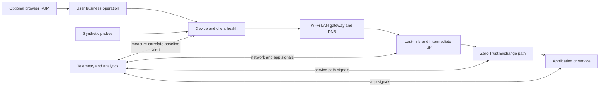

## JD Mapping

| Role expectation | Part 38 capability | TSM artifact | Arti bridge and boundary |
|---|---|---|---|
| Understand architecture | Map endpoint module, telemetry gateway, analytics, identity context, probes, and portal | Responsibility map | Microsoft telemetry correlation transfers |
| Improve customer outcomes | Turn recurring poor experience into owned actions and validation | Improvement backlog | Outcome operations are established |
| Troubleshoot complexity | Isolate device, local network, ISP/path, Zscaler, and app/service | Evidence matrix | M365 escalation method transfers |
| Analyze trends | Segment users, applications, locations, ISPs, OSs, and time | Review dashboard | Power BI/SQL reasoning transfers |
| Proactive engagement | Detect trends before ticket volume grows | Health review | ZDX-specific setup remains new |
| Lead incidents | Correlate reports, probes, diagnostics, paths, service health, and changes | Unified timeline | Critical-incident coordination transfers |
| Communicate clearly | Convert metrics into user/business impact and bounded conclusions | Executive brief | Avoid dashboard theater |
| Partner broadly | Coordinate endpoint, network, Wi-Fi, ISP, Zscaler, SaaS, app, privacy, and Support owners | RACI/escalation pack | Cross-team Microsoft work transfers |
| Advocate adoption | Expand representative monitoring, not probe count for its own sake | Coverage roadmap | Current entitlements/limits must be checked |

## Candidate honesty note

| Claim class | Safe Part 38 statement | Unsupported conversion |
|---|---|---|
| Production transfer | "I correlated Microsoft endpoint, network, service, and user evidence." | "I operated enterprise ZDX." |
| Demonstrated study | "I built fictional ZDX probe and incident-analysis plans." | "I configured customer probes." |
| Public fact | "Current help describes synthetic, RUM, device, path, score, and incident capabilities." | "Every feature is available on every OS and subscription." |
| Evidence conclusion | "A cohort showed high endpoint CPU aligned with user degradation." | "A poor device score proves CPU caused the app issue." |
| Vendor positioning | "ZDX is designed to help isolate experience boundaries." | "ZDX automatically finds every root cause." |
| Unknown | "I would verify current formula, threshold, role, retention, and raw metric." | "Green always means healthy." |

Product language can say "every user," "end-to-end," "root cause," "real time," or "negligible" resource use. Treat these as capability positioning. Actual visibility depends on eligible managed devices, module/version, platform, subscription, role, probe/app configuration, browser extension, network response, privacy settings, telemetry availability, data window, and user population. Actual resource and experience impact requires measurement.

## Beginner vocabulary and memory hooks

| Term | Plain meaning | Why it matters | Memory hook |
|---|---|---|---|
| Digital experience | How well a user completes a digital task | Availability alone can hide slowness or friction | Can the user finish? |
| DEM | Digital Experience Monitoring | Category for observing user-facing technology performance | Measure the journey |
| ZDX | Zscaler Digital Experience | Zscaler's DEM service | User-to-app instruments |
| Telemetry | Measurements sent for analysis | Conclusions need timely, scoped evidence | Instrument readings |
| Synthetic probe | Automated test that imitates a defined operation | Provides regular comparable data without waiting for complaints | Robot traveler |
| Web probe | Test for web availability and timing stages | Separates DNS, response, fetch, and errors | Timed web request |
| Cloud Path probe | Network measurement toward a destination | Shows latency/loss and path/hop evidence | Route survey |
| RUM | Real User Monitoring | Measures actual supported browser interactions | Observe real passengers |
| Score | Normalized number summarizing selected experience metrics | Fast prioritization, not standalone proof | Dashboard warning light |
| Baseline | Expected historical behavior for a matching context | Detects deviations from normal | Usual travel time |
| Threshold | Value that changes severity or triggers alert | Wrong thresholds create noise or silence | Alarm setting |
| Availability | Portion of tests that successfully reach expected result | Basic reachability is necessary but incomplete | Did the station open? |
| DNS time | Time to resolve a name to addresses | Distant/slow/failing DNS can harm SaaS entry selection | Find the address |
| Server response time | Time until server begins responding, depending on product definition | Can reflect path, proxy, origin, or app | First answer delay |
| Page Fetch Time | Time to retrieve measured web content under probe definition | Broader than one packet delay | Collect the page |
| Latency | Time for data to travel; often measured as round trip | Interactive SaaS is sensitive to delay | Travel time |
| Packet loss | Portion of test packets without expected response | Can cause retries, stalls, poor media | Missing parcels |
| Jitter | Variation in delay | Audio/video suffers when packets arrive unevenly | Irregular arrivals |
| Hop | Observed network-layer step along a tested path | Helps localize where measurements change | Transfer station |
| ASN | Autonomous System Number, identity for a routed network | Groups ISP/backbone ownership | Network operator number |
| Last mile | User's local ISP segment to broader internet | Common remote-user boundary | Home-to-highway |
| P50 | Median; half values are at or below it | Shows typical behavior | Middle traveler |
| P95 | 95th percentile; only five percent are worse | Shows tail impact hidden by averages | Slow-edge traveler |
| Cohort | Comparable group sharing app/location/ISP/OS/path | Enables fair contrast | Similar passengers |
| Incident | Correlated multi-user issue under product logic | Prioritizes shared impact | Many trips fail together |
| Diagnostics | Time-bounded deeper collection for a selected user/device/app | Higher detail and privacy sensitivity | Bring the inspection kit |
| PCAP | Packet capture | Can show protocols/timing but may expose sensitive data | Packet recording |
| SLO | Service Level Objective | Target for reliability/experience operation | Promised operating target |
| SLA | Service Level Agreement | Contractual commitment with defined terms | Contracted promise |
| Error budget | Allowed amount of unreliability relative to an SLO | Balances change and reliability | Spendable failure allowance |

## What ZDX is and is not

Current Zscaler help describes ZDX as a multi-tenant cloud monitoring platform that uses Zscaler Client Connector to run synthetic probes toward configured SaaS/internet services and collect device/path/application experience data. Public architecture also includes cloud control/telemetry, analytics, admin access, identity/location context, and optional integrations.

| ZDX can help answer | ZDX alone cannot universally prove |
|---|---|
| Which users/apps/locations show degraded metrics? | The exact code defect inside a SaaS provider |
| Is a device resource metric abnormal during impact? | That the resource metric caused every reported symptom |
| Is Wi-Fi signal/path performance correlated with poor experience? | RF root cause without wireless/site evidence |
| Which measured path leg or ASN deviates from baseline? | That a silent hop is dropping production traffic |
| Do synthetic web timings worsen across a cohort? | That every real transaction is equally affected |
| Do browser RUM metrics show page-load regression? | Native-client behavior when RUM covers browsers only |
| Is impact broad or isolated by cohort? | Users/devices that are not reporting telemetry |
| Did degradation align with a network/app/change event? | Causality from timing alone |
| Should support gather deeper diagnostics? | Permission to collect sensitive diagnostics without governance |

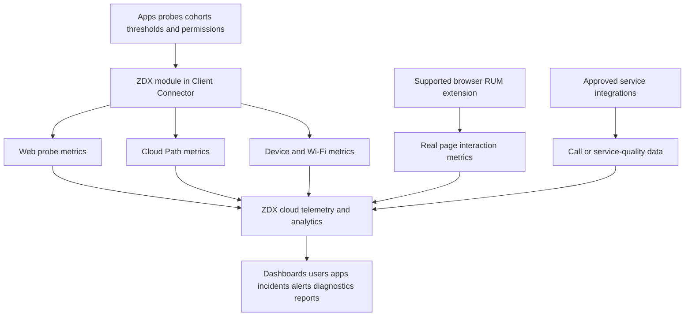

## Public architecture and responsibility boundaries

Zscaler's architecture help names components including the ZDX Central Authority, Zscaler Client Connector, Zero Trust Exchange integrations, Telemetry and Policy Gateway, admin portal, analytics service, and call-quality integration. Exact internal implementation can change; a TSM needs functional responsibilities and evidence, not invented internals.

| Functional component | Public responsibility | Customer dependency | Key evidence |
|---|---|---|---|
| Client Connector ZDX module | Receives config, runs supported probes, reports metrics | Compatible version/platform, healthy process, egress | Module/version, active probe, last telemetry |
| Control/config service | Provides policies/configuration/software updates | Admin configuration, activation, reachability | Effective app/probe assignment |
| Telemetry gateway | Receives metrics and connects to analytics/data services | Network reachability and service health | Upload/ingestion state |
| Analytics/data layer | Aggregates, scores, baselines, visualizes, detects patterns | Sufficient data and correct filters | Raw metric, time grain, aggregation |
| Admin portal | Configuration, analysis, alerting, reporting, roles | Subscription, SSO, RBAC | Audit and view scope |
| Identity/location context | Users, groups, departments, locations, geolocation | Correct provisioning and definitions | Current user/device/location mapping |
| RUM browser extension | Captures supported browser interaction metrics | Supported OS/browser/version/deployment | Extension/version and page events |
| Service integrations | Pull approved service/call-quality data | Consent/onboarding/API permissions | Integration health and timestamps |

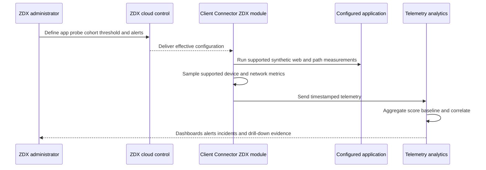

An absence of data has multiple possible owners: device offline, sleeping, unsupported platform/version, unhealthy module, no assignment, blocked telemetry path, privacy setting, subscription/role limitation, ingestion issue, or no configured probe. Do not interpret "no red data" as healthy until monitoring coverage is known.

### Plain-English deep-dive 1 - Monitoring silence is not a green signal

If a smoke detector has no battery, it makes no noise during a fire. A quiet dashboard can likewise mean the monitored population is healthy, or it can mean the instruments are missing.

Every health statement needs a coverage denominator: expected eligible devices/users, reporting devices/users, active probes, last-seen age, platform/version distribution, and missing-data reasons. The safest phrase is "No degradation was observed among reporting entities under these filters," not "There is no issue."

## The observation stack

| Layer | Typical ZDX evidence | Other evidence | Question |
|---|---|---|---|
| User/task | RUM, report, synthetic operation | Ticket, screen recording, business KPI | What exact operation failed? |
| Browser/app | RUM load/Core Web Vitals, Web probe | HAR, app logs, version | Rendering, authentication, dependency, or server? |
| Device | CPU, memory, disk, crashes/hangs, process detail | OS logs, EDR, endpoint analytics | Resource or stability issue? |
| Wi-Fi/local | Signal, gateway latency/jitter, AP/SSID/BSSID where collected | WLAN controller, RF survey, DHCP/DNS | Local access problem? |
| Last mile | Probe latency/loss/error, ISP/ASN | ISP status, packet trace | Home/branch ISP boundary? |
| Intermediate path | Hops, ASN edges, path metrics | Traceroute/MTR/provider data | Shared routing/peering issue? |
| Zscaler path | ZTE/service-edge leg and ZIA/ZPA-related incident data | ZIA/ZPA logs, trust status | Zscaler path or policy issue? |
| SaaS/application | Web timings, HTTP errors, RUM, service integration | Vendor health, origin/APM, tenant logs | App/service or dependency issue? |

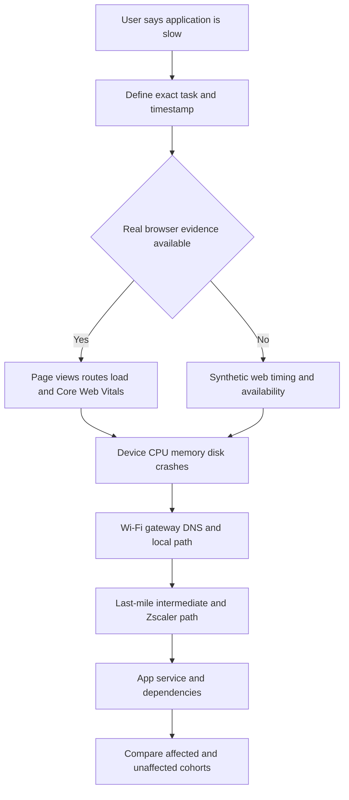

## Measurement types: synthetic, RUM, device, and service

| Measurement | Generated by | Strength | Blind spot |
|---|---|---|---|
| Web synthetic | Client module automated request | Regular comparable availability/timing | May not reproduce complete signed-in workflow |
| Cloud Path synthetic | Client module network tests | Segment/path latency/loss/hops | Probe protocol can differ from app traffic |
| Device metrics | Client module/OS | User-adjacent resource/stability context | Correlation is not causation |
| Wi-Fi metrics | Supported device/platform collection | AP/SSID/signal/gateway context | Privacy setting/platform and RF evidence limits |
| RUM | Supported browser extension/module | Actual page interactions and Core Web Vitals | Browser-only scope and page instrumentation boundaries |
| Call-quality integration | Approved API integration/telemetry | Real meeting/call experience | Onboarding, API, product, and metric differences |
| Incidents | Product correlation/anomaly logic | Shared-impact prioritization | Threshold/minimum-device and model limits |
| Diagnostics | Time-bounded deeper session | Minute-level/probe/device/process/optional PCAP detail | Requires active probe/version/role and privacy control |

Synthetic and real-user evidence answer different questions. A synthetic probe asks, "Can this defined robot operation perform now from this device/path?" RUM asks, "How did supported actual browser page interactions behave?" Neither automatically reproduces a native Outlook sync, Teams media session, OneDrive large-file upload, or privileged workflow unless the specific feature/integration measures it.

## Applications and probe design

A probe should represent a decision-worthy user journey. Monitoring only a generic home page can stay green while authenticated APIs, content hosts, identity, media, upload, or regional dependencies fail.

| Design choice | Strong question | Weak shortcut |
|---|---|---|
| Business operation | Which exact user task are we approximating? | Monitor company homepage |
| Destination | Which stable supported URL/host represents it? | First URL found in browser |
| Authentication | Is probe anonymous, authenticated, or outside auth scope? | Assume login success from 200 |
| Dependencies | Identity, CDN, API, storage, media, DNS? | Treat app as one hostname |
| Cohort | Which locations, users, devices, OSs, ISPs? | Assign every device immediately |
| Protocol | Which supported Web/Cloud Path protocol matches question? | Use ICMP as proof of HTTPS |
| Cadence | What interval detects issue without excessive traffic? | Fastest possible |
| Success | Which status/content/timing criteria indicate useful function? | Any TCP connection |
| Threshold | Baseline plus user-impact objective? | Vendor color alone |
| Privacy | What URL/query/content/identity/location is collected? | Enable first, review later |
| Ownership | Who maintains destination, thresholds, and escalation? | Monitoring team owns all apps |

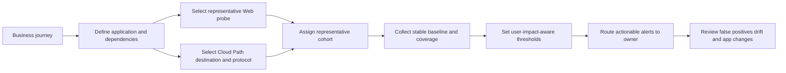

Current help describes configuration steps broadly as authentication/provisioning, role administration, required domains, Client Connector setup, application, probe, alerting, and Diagnostics. Exact order and fields must be confirmed in current tenant help. Probe limits and compatibility are subscription/version dependent.

## Web probes and timing interpretation

Current score help lists Web probe metrics such as Page Fetch Time, Server Response Time, DNS Time, and Availability. Definitions should come from current help, because timing start/end points can differ among products.

| Metric | Plain meaning | Possible contributors | Discriminating comparison |
|---|---|---|---|
| Availability | Defined probe operation succeeds | DNS, path, TLS, HTTP, app | Error reason by cohort and direct/path |
| DNS time | Name resolution duration | Resolver distance/load, cache, network | Same host/resolver/location/time |
| Server response | Delay to origin/proxy response stage | Network, Zscaler processing, origin/app | Path metrics plus origin/vendor data |
| Page Fetch Time | Time to retrieve measured page/resource set | DNS, connection, server, redirects, bytes | Payload/cache/status matched |
| HTTP status/error | Application-layer result | Policy, auth, redirect, origin, dependency | HAR/app/service log |
| Redirect count | Number of HTTP redirects where available | Auth/region/app routing | Affected versus healthy sequence |
| TTFB | Time to first byte where current feature exposes it | Connection, request processing, origin | Split network and app evidence |

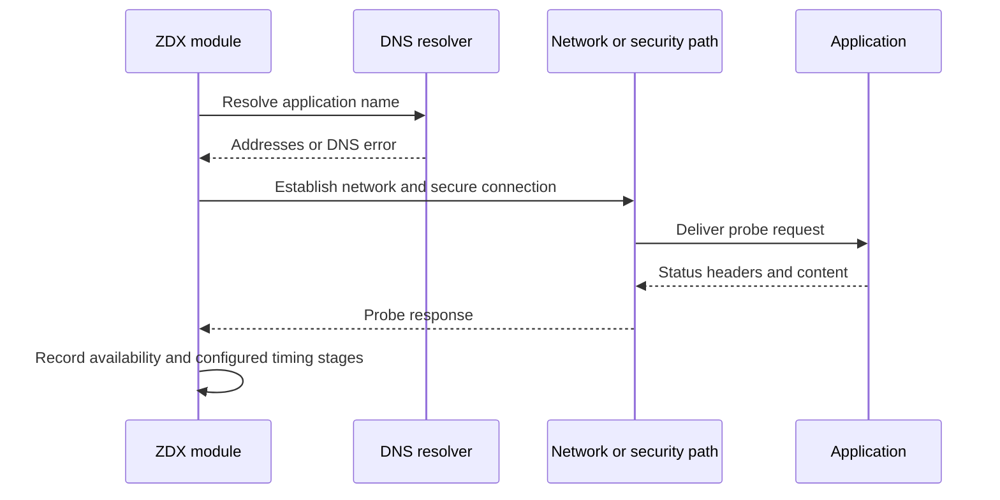

A high Page Fetch Time is not synonymous with a slow origin. It can include DNS, connection establishment, proxy/service path, redirects, response wait, and transfer. Compare page composition, bytes, cache, protocol, status, geography, and path. A synthetic request may be unauthenticated or cached differently from the user's real workflow.

## Cloud Path, hops, ISPs, and network isolation

Cloud Path probes provide path-oriented measurements. Current public help lists supported protocols that vary by OS/module version, including modes using ICMP, TCP, or UDP. Pick the protocol based on the application question and current support.

| Network evidence | What it can suggest | What it cannot prove alone |
|---|---|---|
| End-to-end latency | Overall path delay changed | Which hop caused it |
| Packet loss | Probe responses missing | Production application loss at identical rate |
| Hop count/path | Observed route/visibility changed | Every router forwards identically to probes |
| Hop latency | Response timing at a hop | That router delays transit traffic |
| ASN edge | Administrative network boundary | Contractual fault or ownership of root cause |
| Last-mile grouping | Shared ISP/geography pattern | CPE/Wi-Fi/ISP exact cause without local evidence |
| Forward/reverse view | Directional path evidence where available | Symmetric route or full production path |
| Baseline deviation | Behavior differs from historical pattern | User impact without score/task evidence |

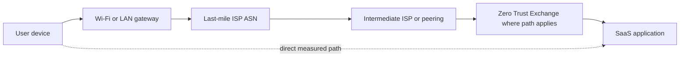

Routers often rate-limit or ignore probe responses while forwarding production traffic normally. A silent hop followed by responsive later hops is usually not proof of a forwarding outage at that hop. Look for sustained increases that begin at a boundary and continue downstream, end-to-end impact, loss, multi-user/cohort correlation, path changes, and independent provider evidence.

### Plain-English deep-dive 2 - A slow transfer station is not guilty because it answered slowly

Imagine asking each station manager to reply to a survey while your train passes. One busy manager answers late, but trains continue on time. Another manager does not answer at all, yet downstream stations reply. The survey response measures how the manager treats surveys, not necessarily trains.

Traceroute-style hop responses have the same issue. Routers prioritize forwarding over diagnostic replies. A convincing network boundary appears when increased latency or loss begins there and persists in later measurements, affects the end-to-end result, aligns across comparable users, and survives protocol/path cross-checks.

## Device health and process context

Current ZDX help describes Windows/macOS device-health scoring using contributing factors such as CPU, memory, disk, disk queue, battery, Wi-Fi quality, crashes, and software issues, with feature/version differences. These signals narrow endpoint hypotheses.

| Device metric | Potential experience effect | Required cross-check |
|---|---|---|
| CPU usage | UI stalls, browser/app processing delay | Process attribution, duration, affected task |
| Memory usage | Paging, app pressure, instability | Available memory, process working set, trend |
| Disk usage/queue | Slow launch/cache/sync/log operations | Disk type, queue duration, I/O process |
| Battery/power | Throttling or user mobility | Power plan, temperature, device model |
| Network I/O | Saturation/background transfer | Interface/link capacity and process |
| System crash/reboot | Interrupted operations | OS crash evidence and timing |
| App crash/hang | Direct productivity interruption | App/version/event and affected workflow |
| Hardware profile | Potential underprovisioning cohort | Workload/usage comparison, not label alone |
| Software/process inventory | Version or high-resource cohort | Privacy/entitlement/current feature support |

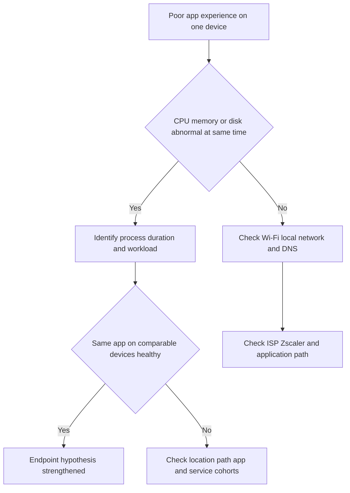

Device data can be inaccurate or insufficient when a device is unavailable for much of the selected period; current help explicitly notes insufficient data caveats. Also note the user-device grain: multiple users on one device can create separate user-associated device data. Define the entity and aggregation before counting devices.

## Wi-Fi and local network analysis

| Wi-Fi evidence | Beginner meaning | Hypothesis | Corroboration |
|---|---|---|---|
| Signal strength/quality | Radio strength/quality at device | Distance, obstruction, interference | WLAN controller and site test |
| SSID | Human-readable network name | Cohort on same network | BSSID/AP and location |
| BSSID/AP MAC | Specific radio/access point identity | One AP cluster degraded | Controller AP health/config |
| Band/channel | Radio frequency choice | Congestion/interference/roaming | Spectrum/RF data |
| Retransmission rate | Frames sent again | RF loss/contention | Controller/client radio stats |
| Source-to-gateway latency | Local path delay | Wi-Fi/LAN/gateway problem | Wired comparison and gateway load |
| Jitter | Variation in local delay | Media quality risk | Call metrics and packet loss |
| Devices/users per AP | Load/concentration | Capacity issue | Airtime/utilization/controller |

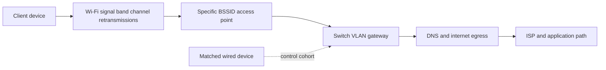

Current help notes privacy/location settings can prevent collection of identifiers such as SSID/BSSID on some current OS versions. Missing Wi-Fi detail may therefore reflect privacy configuration, platform/version, or permissions rather than no Wi-Fi issue. Treat SSID/BSSID, MAC-like identifiers, geolocation, and user association as potentially sensitive.

## ZDX scores, aggregation, and baselines

Current help describes a 0-100 ZDX Score with current categories Good 66-100, Okay 34-65, and Poor 0-33. The score changes with selected time and filters. Help also describes five-minute synthetic measurements and an hourly value based on the lowest value within the hour. Synthetic, RUM, and combined score types use different inputs. Verify current formula and granularity before using a score contractually.

| Score property | Operational consequence |
|---|---|
| Normalized 0-100 | Useful common display; hides units without drill-down |
| Good/Okay/Poor bands | Fast triage; thresholds may not equal business tolerance |
| Filter-dependent | Same system can show different scores by cohort |
| Time-dependent | Window and aggregation change the apparent severity |
| Lowest hourly synthetic value in current help | Brief bad interval can represent the hour |
| Rounded values | Small differences may be display artifacts |
| Synthetic/RUM/combined | Compare only when score type and input are understood |
| App/user/location rollup | Weighting/population can hide minorities or amplify groups |

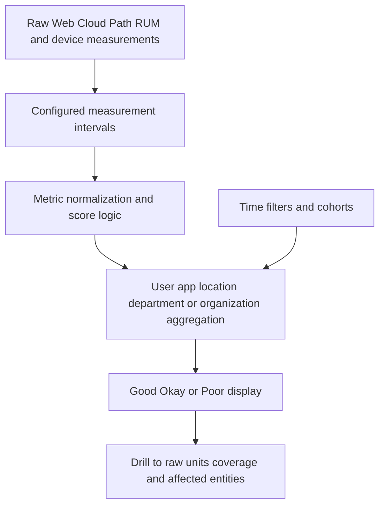

A baseline is a historical expectation for a comparable context. Network Intelligence public help describes baseline comparisons, including seven-day baselines in current performance tables. A baseline can be wrong after office moves, ISP changes, hybrid-work seasonality, application migrations, or prolonged degradation. A three-times deviation from 10 ms to 40 ms may be anomalous but not user-impacting; current help explicitly makes that distinction.

### Plain-English deep-dive 3 - A score is a compressed story with pages removed

A movie rating of 60 does not reveal whether viewers disliked sound, acting, length, or subtitles. It also changes depending on who voted. A ZDX score similarly compresses multiple measurements, scopes, and time windows.

Always expand the story: score type, raw metric and unit, affected entities, reporting coverage, time aggregation, baseline, threshold, protocol, application, and healthy comparison. Use the score as an index into evidence, not the final diagnosis.

## Real User Monitoring and actual browser experience

Current help describes RUM for supported web-browser interactions on Windows and macOS, with prerequisites including subscription, role, compatible Client Connector/ZDX Module, current browser extension, process allowlisting, and app configuration.

| RUM metric/concept | What it describes | Caveat |
|---|---|---|
| Page views | Observed supported page visits | Not every business operation |
| Route changes | Single-page app navigation where measured | App instrumentation behavior varies |
| Page load time | Browser experience loading a page | Cache/device/content affect result |
| Largest Contentful Paint | Time until largest visible content paints | Visual milestone, not transaction completion |
| Core Web Vitals | Browser UX performance indicators | Current definitions evolve |
| Real user cohort | Actual reporting users | Non-reporting browsers/devices absent |
| RUM alert | Thresholded actual browser metric | Needs owner, duration, population, deduplication |

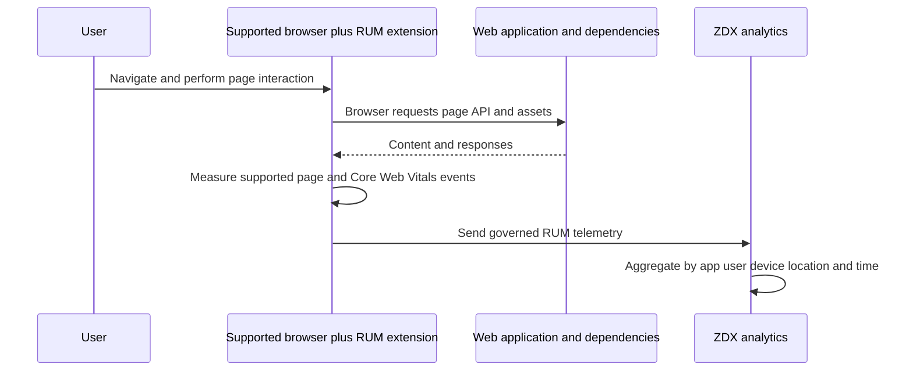

RUM creates a stronger link to actual browser experience than a synthetic probe, but it is still not server Application Performance Monitoring, native-client telemetry, or direct proof of business transaction success. Pair with HAR/browser console, tenant/app logs, service health, user statement, and synthetic controls.

## Microsoft 365 use cases

Microsoft 365 is a distributed SaaS with global front doors and many dependencies. Microsoft guidance emphasizes local DNS, local egress, avoiding hairpins, current endpoint data, and minimizing intrusive traffic handling for required endpoints. It also warns TLS termination, protocol blocking/downgrade, proxy authentication, and inspection can affect supportability/performance. Treat this as service-owner design guidance and validate the agreed Zscaler/Microsoft architecture.

| Workload | Representative operations | ZDX evidence | Additional Microsoft evidence |
|---|---|---|---|
| Outlook Online | Load mailbox, search, send | Web/RUM/path/device | M365 service health, HAR, Exchange logs |
| Outlook desktop | Startup, sync, search | Device/path/probes around dependencies | Client logs, connectivity tests, Exchange telemetry |
| OneDrive | Sign-in, enumerate, upload/download/sync | Web/path/device; app-specific coverage | Sync client logs, tenant health, file details |
| SharePoint Online | Site/page/document operation | Web/RUM/path | HAR, ULS unavailable to customer, tenant/support evidence |
| Teams web | Load, chat, meeting join | RUM/Web/path/device | Teams service health/client logs |
| Teams media | Join/call quality/audio/video/share | Call integration/path/device where supported | Call Quality Dashboard and client media logs |
| Entra sign-in | Token/auth redirects/MFA | Web/RUM/path around defined operation | Entra sign-in logs, Conditional Access |

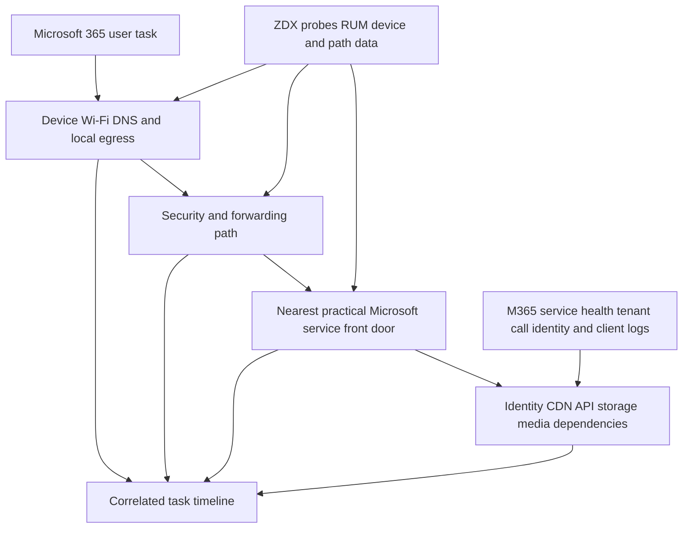

### Example: OneDrive slow in one city

Do not conclude "Microsoft is slow" from one high Page Fetch Time. Compare:

1. Exact OneDrive operation and client type.
2. Affected city versus another city on same tenant/app/version.
3. Device CPU/memory/disk and sync process.
4. DNS time and resolved front-door context.
5. Local Wi-Fi/gateway metrics.
6. Last-mile ISP and path baseline/P95.
7. Zscaler service path/effective forwarding.
8. Microsoft service health and sync logs.
9. Time alignment and change history.

If two ISPs in the city are healthy and one ISP shows a sustained downstream latency/loss increase with poor user operations, the ISP/path hypothesis strengthens. If all regions and paths show server-response increase while network latency is stable and Microsoft reports an incident, service hypothesis strengthens. If one device is affected with disk queue/process spikes, endpoint hypothesis strengthens.

## Incidents, alerts, and correlation

Current Incidents help lists public incident areas including Device, Wi-Fi, Last Mile ISP, Intermediate ISP, ZIA Public Service Edge, ZPA, and Application. Product AI/ML and thresholds correlate metrics across multiple users. Minimum-device and dimension logic means a real single-user problem may not become an incident.

| Signal | Best use | Risk |
|---|---|---|
| Threshold alert | Notify when a defined metric crosses sustained scope | Noise from poor thresholds |
| ZDX incident | Prioritize shared correlated impact | Model/threshold blind spots |
| User ticket | Captures business operation and subjective impact | Incomplete timestamps/technical detail |
| Service health | Confirms provider-known event | Delayed or broad reporting |
| Change record | Identifies deployment/routing/app change | Coincidence does not prove cause |
| Security log | Shows forwarding/policy/action/path | Log gaps/clock/schema mismatch |
| Diagnostics session | Deepens selected endpoint evidence | Starts after issue or changes conditions |

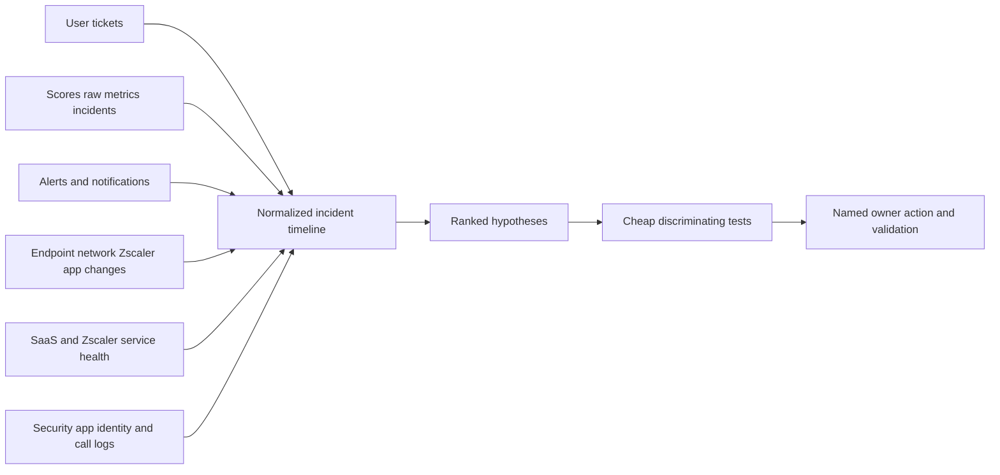

### Alert design

| Field | Strong design |
|---|---|
| User impact | Business operation/population at risk |
| Metric | Raw unit plus score if useful |
| Scope | App/location/ISP/OS/cohort |
| Trigger | Threshold relative to SLO/baseline and duration |
| Recovery | Clear recovery threshold/duration |
| Minimum volume | Enough samples/reporting users |
| Dedupe | Group related signals into one actionable event |
| Routing | Owner with permission and runbook |
| Enrichment | Dashboard link, filters, comparison, changes, service health |
| Review | False positives, missed incidents, stale destination, coverage |

Avoid alerting independently on every low score, latency, DNS value, CPU spike, and packet loss sample. Use duration, sample count, impact, cohort, and suppression. One incident can create many symptoms; alert floods slow resolution.

## Diagnostics and deeper evidence

Current help says Diagnostics can collect Web probe, Cloud Path, and device statistics every minute during a selected session, with current session windows of 5-60 minutes and optional deeper types such as PCAP depending on platform/version/subscription/role. It requires an active probe and current help states the active probe must have run for a minimum period.

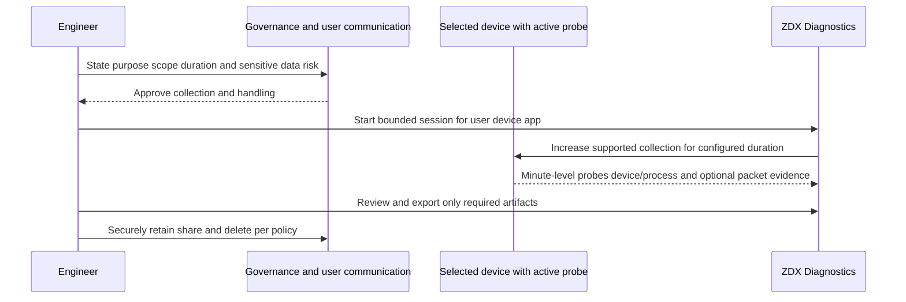

### Plain-English deep-dive 4 - Deeper diagnostics is a microscope, not a default camera

A microscope helps after you choose the right sample. Running it on every person all day would be expensive, invasive, and mostly noise. ZDX Diagnostics should likewise answer a defined hypothesis for a bounded user/device/application and duration.

Before PCAP or process-level collection, identify purpose, approver, user notice where required, interfaces/filter, expected sensitive data, storage, viewers, transfer, retention, and deletion. Afterward, record what the evidence did and did not show. A packet capture from after the incident can be clean without disproving the earlier failure.

## Privacy, security, and data governance

ZDX can associate technical telemetry with named users/devices, applications, geolocation, IP/ASN, Wi-Fi identifiers, hardware/software/processes, browser pages/metrics, calls, and packet data depending on features. This can be personal, sensitive, security-relevant, or employee-monitoring data.

| Data class | Example | Governance question |
|---|---|---|
| Identity | User, group, department, device name | Who needs named versus aggregated view? |
| Location | Geolocation, Zscaler location | Is collection necessary/accurate/approved? |
| Network | IP, ISP, ASN, hops, SSID/BSSID | Can it reveal home/work location or infrastructure? |
| Device | OS, model, CPU, memory, disk, battery | Purpose, retention, hardware decision fairness? |
| Software/process | Installed software, process resource detail | Security and employee-monitoring implications? |
| Browser/RUM | Page URL/route, load, Core Web Vitals | Query/tenant/content sensitivity and extension notice? |
| Call data | Meeting/call quality and participants/context as exposed | API permission and collaboration privacy? |
| Diagnostics/PCAP | Headers, names, addresses, possible payload/credentials | Strict filter, encryption, access, deletion |
| Derived insight | Score, incident, profile, anomaly | Accuracy, contestability, human review |

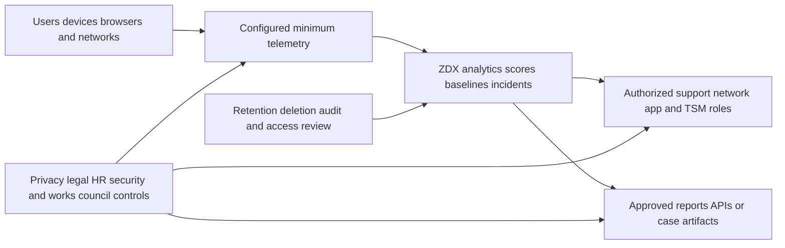

Required decisions include purpose, lawful basis, notice, opt/required behavior where applicable, minimum fields, location settings, named versus aggregated access, RBAC, API/service permissions, region/residency, retention, exports, support sharing, automated-profile use, and deletion. Do not use experience scores as employee-performance ratings. A score describes instrumented technology under a context, not worker effort.

## Limits and analytical traps

| Trap | Why it misleads | Correction |
|---|---|---|
| Score-only RCA | Compressed/filtered/rounded | Drill to raw metrics and cohorts |
| Average-only reporting | Hides tail users | P50/P95 and affected distribution |
| Green means healthy | Missing coverage may be silent | Report denominator/last seen |
| Synthetic equals real | Robot operation differs from user workflow | Pair with RUM/tickets/app logs |
| RUM equals all app clients | Browser scope may exclude native clients | Define client coverage |
| ICMP equals app path | Protocol and policy can differ | Use supported representative probe and app evidence |
| Hop silence equals loss | Routers de-prioritize replies | Check downstream/end-to-end persistence |
| Correlation equals causation | Shared timestamps can be coincidental | Use discriminating test/control cohort |
| Baseline equals good | Historical state can be chronically bad | Compare SLO and user outcome |
| Direct is perfect control | Direct changes path/security/DNS | State changed variables |
| Incident absence means no issue | Minimum population/model logic | Analyze individual raw evidence |
| More probes means coverage | Redundant homepages miss dependencies | Map business journeys |

## Troubleshooting workflow

### Step 1: define the experience

Capture exact app/client/version, task, expected versus actual result, user/device, network/location/ISP, start/end/time zone, recurrence, impact, and a healthy comparison. "Teams slow" is not a transaction; "meeting join reached media at 10:04 but audio broke for 90 seconds" is.

### Step 2: confirm monitoring coverage

Verify compatible Client Connector/ZDX Module, feature support, assignment, active probe, last telemetry, browser extension/integration if applicable, privacy settings, subscription, role, and selected filters/window.

### Step 3: inspect raw app evidence

Review availability, Web probe stages/errors, RUM events where applicable, HTTP/app status, complete task, and SaaS/service health. Note whether synthetic scope matches user path.

### Step 4: inspect device and local network

Align CPU/memory/disk/process/crash with impact. Review Wi-Fi signal/AP/gateway/DNS and compare wired/alternate-network or peer cohorts where authorized.

### Step 5: inspect path legs

Review end-to-end latency/loss, last mile, intermediate ASN, Zscaler leg, direct/application path where available, protocol, P50/P95, and baseline. Do not blame the first silent hop.

### Step 6: correlate changes and shared impact

Align ZDX incident/alerts, tickets, endpoint/network/Zscaler/app changes, provider status, security logs, identity/app logs, and all clocks. Segment affected versus unaffected.

### Step 7: test one hypothesis and validate

Choose a cheap reversible test: process reduction, wired/known-good network, same device/different ISP, same ISP/different device, alternate location, probe-protocol comparison, or app-owner test. Do not disable security broadly. Validate complete operation, telemetry recovery, controls, and recurrence.

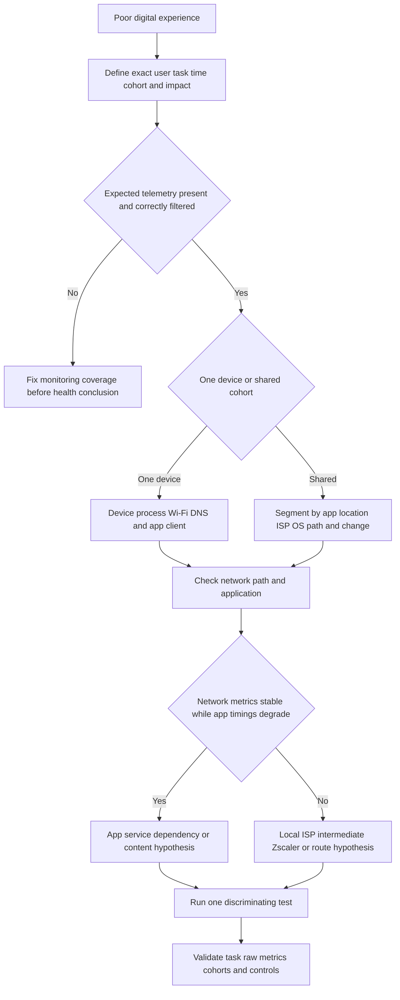

### Wi-Fi versus ISP tree

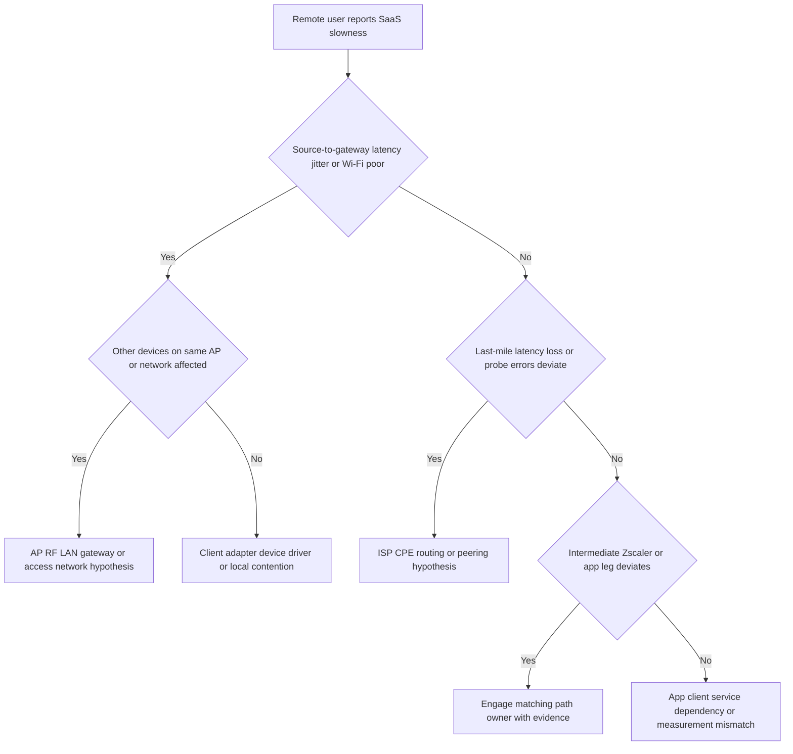

### Application versus network tree

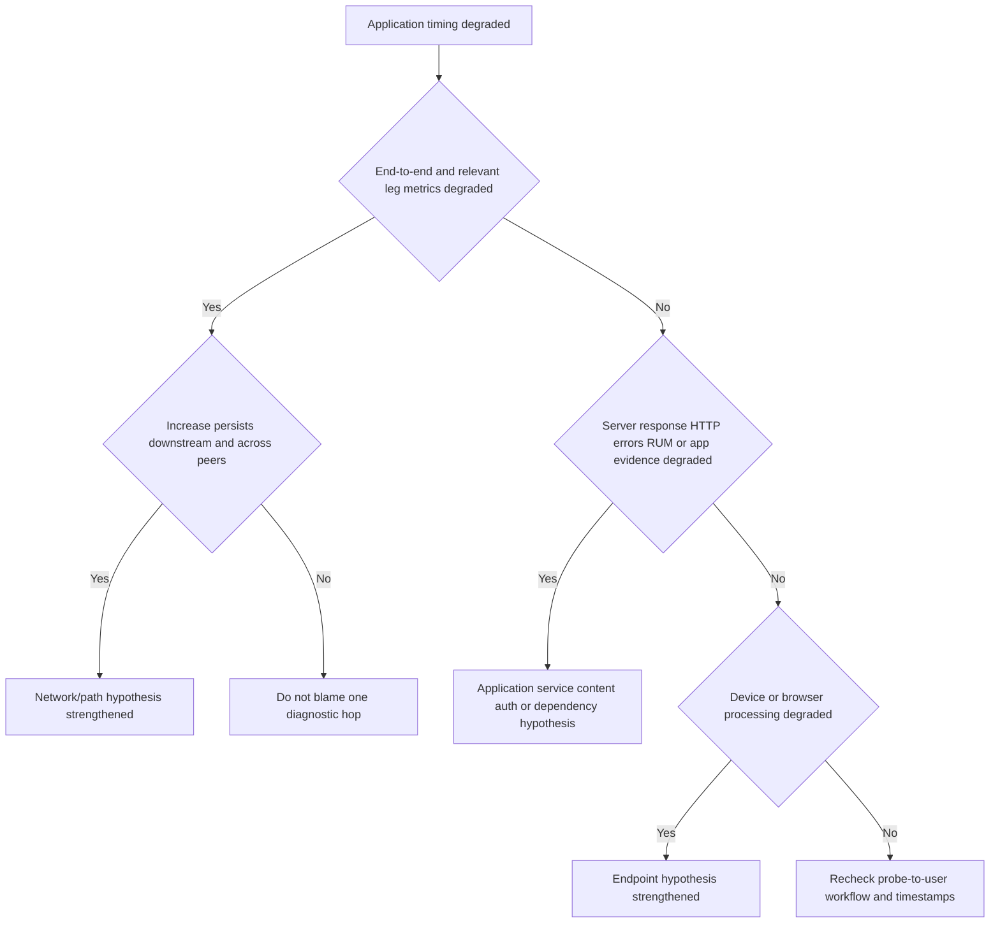

## Fictional NMH deployment and incidents

NMH plans ZDX for managed Windows/macOS employees using Microsoft 365, Salesforce, and a private HR app. It begins with one owned test app, OneDrive web, Outlook web, and a path probe per representative region. Privacy review excludes PCAP by default and restricts named device views to support roles. Everything is synthetic.

### NMH monitoring map

| Journey | Signal plan | Cohorts | Owner |
|---|---|---|---|
| Outlook web load/search | Web probe plus RUM plus path | US/EU/APAC, major ISPs | M365 and network |
| OneDrive upload/download | Representative Web/path plus client evidence on incident | Same plus OS/device | M365 endpoint |
| Teams meetings | Call integration where approved plus path/device | Site/remote/ISP | Collaboration/network |
| Salesforce page navigation | Web/RUM/path | Sales regions/browsers | SaaS app owner |
| Private HR app | Web/path through expected private-access architecture | Employee regions | HR app/ZPA/network |
| Device health | CPU/memory/disk/crash/Wi-Fi | Model/OS/department | Endpoint |

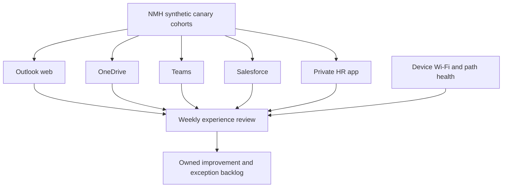

### Incident A: Teams quality is poor for one home ISP

Tickets and call-quality data show audio loss for remote users on ISP Alpha from 09:15-10:05. Device and Wi-Fi gateway metrics are stable. Cloud Path P95 latency and loss increase at an Alpha-to-transit boundary and persist downstream; other ISPs in the same city are healthy. The team engages ISP/network owners with normalized timestamps, affected users, path/ASN evidence, call metrics, and controls. It does not claim one hop's diagnostic response alone proves fault.

### Incident B: Outlook web score falls but users are not impacted

Network Intelligence flags a latency deviation from a 10 ms baseline to 38 ms. ZDX scores and RUM remain acceptable, tasks complete, and tickets do not increase. The team records an anomaly without declaring an incident, tunes the operational alert to include user-impact and duration criteria, and continues monitoring. "Three times baseline" was mathematically notable but not materially harmful.

### Incident C: OneDrive is slow on a laptop model

OneDrive reports cluster on one older laptop model. Network and service cohorts are healthy. Device metrics show prolonged disk queue and memory pressure aligned with sync, and peer modern hardware is healthy. Endpoint owners reproduce with matching files, validate process I/O, test a controlled hardware/storage remediation, and track complete sync duration. ZDX supports the endpoint hypothesis; it does not replace the reproduction.

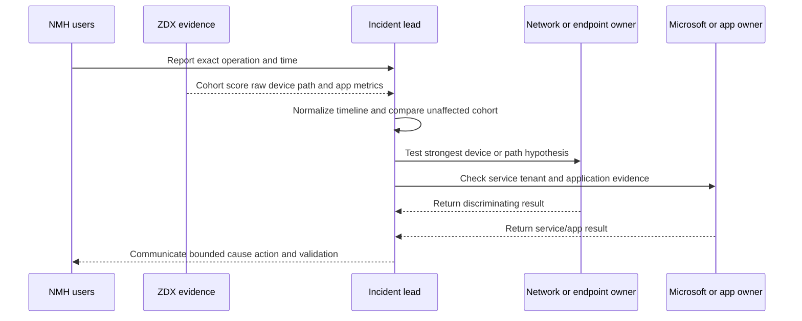

## Proactive TSM reviews and outcome metrics

| Review question | Evidence | Customer action |
|---|---|---|
| Is coverage representative? | Reporting/eligible by OS, location, department, ISP | Close blind cohorts |
| Are probes tied to journeys? | Journey-to-probe map | Replace redundant homepages |
| Which apps/users/locations trend down? | Raw percentiles and scores | Assign owner/improvement |
| Which device cohorts are underprovisioned? | Device raw metrics plus workload | Reproduce and prioritize refresh |
| Which Wi-Fi/AP cohorts recur? | Signal/gateway/retransmission/user count | WLAN investigation |
| Which ISPs/routes deviate with impact? | P50/P95/loss/baseline/tasks | Provider engagement |
| Are alerts actionable? | Precision, recall proxy, pages, dedupe | Tune and route |
| Are incidents resolved faster? | MTTD/MTTI/MTTR with severity | Improve runbooks/integrations |
| Is privacy scope still minimal? | Fields, roles, exports, diagnostics | Restrict/delete/reapprove |
| Are platform versions current? | Client Connector/ZDX Module/extension matrix | Ringed upgrade |

### Metrics that resist dashboard theater

| Metric | Definition | Caveat |
|---|---|---|
| Monitoring coverage | Reporting eligible entities/expected eligible entities | Define eligibility and last-seen age |
| Journey coverage | Critical journeys with representative app/path/user evidence/total critical journeys | One probe can be insufficient |
| User-impact minutes | Sum or bounded estimate of impacted users x duration | Avoid double counting incidents |
| MTTD | Start of impact to reliable detection | Start time may be uncertain |
| MTTI | Detection to useful isolation boundary | Define "useful" consistently |
| MTTR | Start/detection to restored validated task | Separate mitigation and root correction |
| Alert precision | Actionable true alerts/reviewed alerts | Labeling quality matters |
| Recurrence | Repeated incidents after closure | Match root condition, not title |
| Tail experience | P95/P99 task or timing metric | Sufficient samples needed |
| Baseline deviation with impact | Deviations that align with affected tasks | Avoid anomaly-only success claims |
| Prevented tickets | Validated proactive fixes before contact | Counterfactual uncertainty |

```mermaid
flowchart LR
    MONITOR[Representative telemetry] --> DETECT[Detect user-impact-aware change]
    DETECT --> ISOLATE[Isolate likely boundary]
    ISOLATE --> ACT[Owner mitigates or corrects]
    ACT --> VERIFY[Verify business task and raw metrics]
    VERIFY --> LEARN[Update probe alert runbook and architecture]
    LEARN --> MONITOR
```

## Rollout and operationalization

| Phase | Work | Exit gate |
|---|---|---|
| Governance | Purpose, privacy, roles, retention, integrations, diagnostics | Approval/data map |
| Inventory | Journeys, apps, dependencies, devices, locations, ISPs, owners | Prioritized coverage map |
| Compatibility | Client Connector/ZDX Module/browser/platform/subscription matrix | Supported canary |
| Pilot config | Few representative apps/probes/cohorts | Stable telemetry and known resource impact |
| Baseline | Collect normal/peak/change windows | Raw baseline plus business SLO |
| Alert pilot | Route low-volume actionable alerts | Owner/runbook/recovery tested |
| Diagnostics rehearsal | Bounded approved session and handling | Evidence plus secure deletion |
| Expansion | Cohort/app waves | Coverage, noise, privacy, support gates |
| Operations | Weekly incidents/monthly trends/quarterly outcomes | Backlog and version lifecycle |

```mermaid
flowchart LR
    GOV[Govern purpose privacy and roles] --> INV[Inventory journeys and populations]
    INV --> COMP[Validate versions subscription and feature support]
    COMP --> PILOT[Deploy small representative pilot]
    PILOT --> BASE[Establish coverage and baselines]
    BASE --> ALERT[Test alerts incidents and diagnostics]
    ALERT --> WAVE[Expand in measured waves]
    WAVE --> OPERATE[Review outcomes drift and changes]
```

Rollback may disable or re-scope a probe, RUM assignment, alert, integration, diagnostics session, or module upgrade for a bounded cohort. Do not remove all monitoring because one threshold is noisy. Preserve pre-change evidence, stop privacy-impacting collection promptly if unauthorized, verify module/client health, and document resulting visibility gaps.

## Arti's Microsoft-to-Zscaler bridge

| Microsoft production strength | ZDX transfer | New learning | Honest wording |
|---|---|---|---|
| M365 client/service isolation | Define task, compare cohorts, correlate service health | ZDX app/probe/score drill-down | "Method transfers; ZDX operation is new." |
| Teams call-quality work | Align call, device, Wi-Fi, ISP, and service evidence | ZDX call integration/Autosense | "I verify integration coverage." |
| OneDrive/Outlook traces | Separate endpoint, DNS, path, auth, and service | Web/Cloud Path/RUM evidence | "I add ZDX as another evidence plane." |
| Windows performance | CPU/memory/disk/process/crash reasoning | ZDX device scoring/inventory | "Raw metrics outrank color." |
| Wi-Fi/network traces | Gateway, loss, latency, DNS, route isolation | ZDX Wi-Fi/Network Intelligence | "A silent hop is not guilt." |
| Critical incidents | Timeline, owners, hypotheses, validation | ZDX incidents/Diagnostics | "Correlation needs a disconfirming test." |
| Power BI/SQL analytics | Grain, cohort, percentile, denominator | ZDX views/reports/exports | "I state coverage and aggregation." |
| Privacy-sensitive support | Minimal collection, RBAC, retention, safe sharing | RUM/location/process/PCAP governance | "Deep collection is bounded and approved." |

### 30-second interview bridge

"ZDX is an evidence-correlation platform for digital experience. Client Connector can run synthetic Web and Cloud Path probes and report device/network context; supported features can add Wi-Fi, browser RUM, call quality, incidents, alerts, and bounded Diagnostics. I start with the exact user task and monitoring coverage, then drill below the score into raw app, device, local network, ISP/path, Zscaler, and service evidence. I compare affected and healthy cohorts and run one discriminating test before assigning cause. My Microsoft 365, endpoint, network, analytics, privacy, and escalation methods transfer, while production ZDX configuration remains a learning boundary."

## Labs and rehearsal

Use only owned or explicitly authorized devices, test accounts, destinations, networks, telemetry, and packet data. Do not probe third-party systems aggressively or collect another person's traffic.

### Lab 1: journey map

Choose an owned web app and define login-free page load, API check, upload, and complete transaction. State which can be safely represented synthetically.

### Lab 2: Web timing

Use standard developer tools or an approved monitor to record DNS, connection, first response, fetch, redirects, status, and bytes. Explain metric boundaries.

### Lab 3: path evidence

Run authorized ICMP/TCP/UDP path tests to an owned destination. Introduce controlled delay/loss and observe end-to-end versus hop evidence.

### Lab 4: silent hop

Use an owned lab router/firewall that ignores diagnostic probes but forwards app traffic. Demonstrate why downstream success matters.

### Lab 5: device pressure

On a disposable VM, create bounded CPU, memory, and disk load. Compare user task timing and process metrics without harming production.

### Lab 6: Wi-Fi versus wired

On an authorized network, compare signal/gateway latency/jitter to a wired control. Do not infer RF cause without AP/controller evidence.

### Lab 7: synthetic versus RUM

Compare a simple HTTP synthetic result with browser page-load/Core Web Vitals on an owned app. Explain cache/render/dependency differences.

### Lab 8: baseline and percentiles

Create synthetic seven-day-like data with normal, seasonal, chronic-slow, and incident periods. Calculate P50/P95 and identify baseline traps.

### Lab 9: alerts

Design noisy threshold-only and improved impact/duration/sample/cohort alerts. Estimate false positives and route owners.

### Lab 10: Microsoft 365 scenario

Using non-sensitive approved evidence, draft a OneDrive or Teams timeline combining user report, client, path, device, and service signals.

### Lab 11: privacy review

Create a data map for user/device/location/Wi-Fi/RUM/process/PCAP. Define minimum fields, roles, retention, sharing, and deletion.

### Lab 12: NMH incident drill

Rehearse the ISP, non-impacting anomaly, and device-model scenarios. Require one alternative hypothesis and disconfirming test each.

## Common misconceptions to correct

| Misconception | Corrected understanding |
|---|---|
| ZDX is just uptime monitoring | It combines user-adjacent app, path, device, and optional real-user/service evidence |
| ZDX sees every user automatically | Coverage depends on eligible reporting clients, assignments, versions, features, and privacy |
| End-to-end means every internal SaaS component | It means visibility across measured journey layers, not provider source-code/APM omniscience |
| Green proves no issue | Missing or filtered telemetry can look quiet |
| Red proves root cause | A score prioritizes investigation; raw evidence and tests establish cause |
| Synthetic equals a user's workflow | Synthetic tests a defined automated operation |
| RUM covers native clients | Current RUM scope is supported browser interactions |
| One web probe covers Microsoft 365 | M365 has identity, API, CDN, storage, media, and client dependencies |
| High CPU caused slowness | Timing correlation and process/control evidence are needed |
| One silent hop is broken | Routers can ignore diagnostic replies while forwarding traffic |
| ICMP loss equals app loss | Protocol/policy treatment can differ |
| More hops always means worse | Latency/loss/path quality and app result matter |
| Three times baseline is user-impacting | A small absolute change can be anomalous but harmless |
| Historical baseline equals acceptable | Chronic poor experience can become baseline |
| Average latency represents everyone | Tail percentiles and affected distribution matter |
| Incident absence means no problem | Product minimum-user/model logic can miss isolated issues |
| Alert on every metric | Correlated, sustained, impact-aware alerts are more actionable |
| Direct test is a perfect control | It changes route, security path, DNS, and possibly service entry |
| Diagnostics should always run | It is deeper, bounded, permissioned, and privacy-sensitive |
| PCAP always contains payload | Encryption may hide payload, but metadata can still be sensitive |
| Location and Wi-Fi data are harmless | They can identify home/site/device context and require governance |
| Device score can rate employee performance | It measures instrumented technology, not worker effort |
| Microsoft recommends one universal design for every security need | Microsoft guidance is service-owner input; customer risk architecture requires explicit decisions |
| A dashboard is an outcome | Faster isolation, fewer impact minutes, better coverage, and validated fixes are outcomes |
| This Part proves ZDX production experience | It proves study, architecture reasoning, and synthetic practice |

## Official Source Anchors

Sources in this section were reviewed on **2026-08-24**.

Zscaler public help is the product anchor, but feature names, UI, formulas, thresholds, ranges, permissions, versions, and data handling change. Confirm authenticated current help, tenant behavior, contract, and telemetry. Zscaler product claims about full coverage or root-cause speed are positioning, not universal guarantees. Microsoft 365 guidance is application-owner network guidance and must be reconciled with the customer's approved security architecture and current Zscaler support guidance.

| Source | URL | Used for | Boundary |
|---|---|---|---|
| What Is ZDX | https://help.zscaler.com/zdx/what-is-zscaler-digital-experience | Multi-tenant monitoring, Client Connector probes, device/path/app features | Capability availability varies |
| ZDX cloud architecture | https://help.zscaler.com/zdx/understanding-zdx-cloud-architecture | Public components, telemetry, portal, analytics, service integrations | Do not infer undocumented internals |
| ZDX configuration guide | https://help.zscaler.com/zdx/step-step-configuration-guide-zdx | Provisioning, roles, domains, client, app, probe, alert, Diagnostics flow | Current UI can change |
| Feature compatibility | https://help.zscaler.com/zdx/supported-versions-feature-compatibility | OS/module/client/feature prerequisites | Version table changes; verify current |
| ZDX Score | https://help.zscaler.com/zdx/understanding-zdx-score | Current score bands, filter dependence, cadence/hour aggregation, score types | Formula/thresholds can change |
| Performance Dashboard | https://help.zscaler.com/zdx/monitoring-performance-dashboard | Filters, time ranges, apps, regions, page metrics | UI/time limits can change |
| Device Health Dashboard | https://help.zscaler.com/zdx/monitoring-device-health-dashboard | Device metrics, profiles, insufficient-data and user-device caveats | Platform/subscription dependent |
| Wi-Fi Dashboard | https://help.zscaler.com/zdx/monitoring-wi-fi-dashboard | SSID/AP/signal/gateway/jitter and privacy-setting caveat | Collection/platform differences |
| Network Intelligence | https://help.zscaler.com/zdx/monitoring-network-intelligence-dashboard | Baselines, P50/P95, ISP/ASN/path legs, anomaly versus user impact | Feature/threshold logic changes |
| Real User Monitoring | https://help.zscaler.com/zdx/understanding-real-user-monitoring | Browser RUM metrics and prerequisites | Browser/OS/version scope |
| Incidents Dashboard | https://help.zscaler.com/zdx/monitoring-incidents-dashboard | Incident areas, shared-impact logic, current thresholds/dimensions | AI/ML and thresholds evolve |
| Diagnostics | https://help.zscaler.com/zdx/about-diagnostics | Session cadence, duration, active-probe and deep collection | Role/version/subscription/privacy controls |
| Self Service Dashboard | https://help.zscaler.com/zdx/monitoring-self-service-dashboard | CPU/Wi-Fi notifications, user feedback, adoption metrics | Current feature compatibility |
| Data Explorer | https://help.zscaler.com/zdx/monitoring-data-explorer-views | Custom views, metrics, aggregation, admin ownership | Permissions and data sources vary |
| Microsoft 365 connectivity principles | https://learn.microsoft.com/en-us/microsoft-365/enterprise/microsoft-365-network-connectivity-principles | Distributed front doors, local DNS/egress, hairpins, inspection/protocol guidance | M365-specific and evolving |
| Microsoft 365 networking overview | https://learn.microsoft.com/en-us/microsoft-365/enterprise/microsoft-365-networking-overview | User experience, latency, SaaS architecture, local egress | Not a ZDX configuration guide |
| RFC 2330 | https://www.rfc-editor.org/rfc/rfc2330 | IP performance metric framework concepts | Historical framework; use current metric specs as needed |

## Likely Interview Questions

### Q1. What is ZDX, and what business problem does it solve?

**Model answer:** ZDX is Zscaler's digital experience monitoring service. From eligible managed endpoints it can collect synthetic Web and Cloud Path tests plus device/network context, with supported options such as Wi-Fi, browser RUM, call-quality integrations, incidents, alerts, and Diagnostics. It helps teams see whether poor productivity is isolated to a device, local network, ISP/path, Zscaler path, or application/service and act before ticket volume grows. Coverage and conclusions still depend on configuration and raw evidence.

### Q2. What is the difference between synthetic probes and RUM?

**Model answer:** A synthetic probe is a regular automated test of a defined web or network operation, useful for comparable baselines and pre-user detection. RUM measures actual supported browser page interactions, including page-load and Core Web Vitals metrics. Synthetic may not reproduce authentication/rendering/native clients; RUM covers only reporting supported browsers and can be affected by content/device context. I use them as complementary evidence.

### Q3. How do you interpret a poor ZDX Score?

**Model answer:** First I record score type, filters, time window, entity, coverage, and aggregation. Current help has synthetic, RUM, and combined types and specific hourly behavior, so I verify current logic. Then I drill to raw availability, DNS, response/fetch, path latency/loss, device, Wi-Fi, HTTP, or RUM metrics and compare affected versus healthy cohorts and business task. The score ranks attention; it does not prove cause.

### Q4. How would you isolate device, Wi-Fi, ISP, Zscaler, and application issues?

**Model answer:** Define the exact task/time, prove telemetry coverage, and segment impact. Align device/process metrics, Wi-Fi/gateway/DNS, end-to-end and path-leg P50/P95/loss, Zscaler/security logs, Web/RUM metrics, app/service health, and changes. Compare controls such as same device/different network and same network/different device. I look for downstream persistence rather than blaming one silent hop, then run one reversible discriminating test.

### Q5. Give a Microsoft 365 ZDX use case.

**Model answer:** For OneDrive slowness in one city, I compare complete upload/sync operations by ISP, location, client/version, and device. I check device disk/process, DNS and local egress, Wi-Fi/gateway, last-mile/intermediate/Zscaler path percentiles and loss, Web evidence, effective forwarding, Microsoft service health, and sync logs. If one ISP path degrades while other cohorts and the service are healthy, I engage that path owner with evidence rather than saying Microsoft or Zscaler is broadly slow.

### Q6. How would you design ZDX alerts and incidents operationally?

**Model answer:** Alerts need a raw metric, business scope, baseline/SLO threshold, duration, sample/reporting minimum, recovery, dedupe, owner, runbook, and enrichment. I use ZDX incidents as correlated shared-impact hypotheses and understand product minimum-device and model boundaries. I measure precision, missed issues, impact minutes, detection/isolation/restore time, recurrence, and alert usefulness rather than page count.

### Q7. What privacy risks does ZDX introduce?

**Model answer:** Depending on features, ZDX can associate identity/device with location, IP/ASN, Wi-Fi identifiers, hardware/software/processes, browser page metrics, call quality, and Diagnostics/PCAP. I require purpose, legal/HR/privacy review, minimum collection, notice, location choices, named-view RBAC, API permissions, retention, region, exports, support-sharing rules, audit, and deletion. Scores must not become employee-performance ratings, and Diagnostics is bounded and hypothesis-driven.

### Q8. How does your Microsoft background transfer to ZDX work?

**Model answer:** I have production experience defining Microsoft 365 user operations, correlating endpoint/network/browser/client/service telemetry, analyzing Teams and OneDrive/Outlook issues, using traces and service health, comparing cohorts and percentiles, protecting customer evidence, coordinating incidents, and communicating bounded conclusions. Those methods map directly to ZDX. I would be clear that production ZDX probe, RUM, alert, and Diagnostics administration is new.

## 30-Second Memory Hooks

| Concept | Memory hook |
|---|---|
| ZDX | Instruments from user to app |
| Digital experience | Can the user finish the task? |
| Synthetic | Robot traveler on a schedule |
| RUM | Observe actual supported browser trips |
| Device health | Is the laptop the bottleneck? |
| Wi-Fi | Radio, AP, gateway, then internet |
| Cloud Path | Route survey, not omniscience |
| Silent hop | No survey reply is not guilt |
| Score | Warning light, not verdict |
| Baseline | Normal is not always good |
| P50/P95 | Typical and tail travelers |
| Cohort | Compare like with like |
| Incident | Shared correlated impact hypothesis |
| Alert | Impact, duration, samples, owner |
| Diagnostics | Bounded microscope |
| Privacy | Identity plus technical context can be sensitive |
| M365 | Local DNS/egress and distributed front doors |
| Workflow | Task, coverage, raw layers, cohort, test |
| Outcomes | Fewer impact minutes and faster isolation |
| Arti bridge | Microsoft correlation transfers; ZDX admin is new |

## Completion Checklist

- [ ] I can define digital experience, DEM, ZDX, telemetry, synthetic, RUM, score, baseline, P50, P95, ASN, and Diagnostics from zero.
- [ ] I explain ZDX as an evidence-correlation service, not a universal root-cause oracle.
- [ ] I can draw the user-device-local-ISP-Zscaler-application journey.
- [ ] I can explain the public Client Connector module, control, telemetry, analytics, identity, portal, RUM, and integration responsibilities.
- [ ] I avoid inventing proprietary implementation details.
- [ ] I verify Client Connector/ZDX Module/platform/feature/subscription/role compatibility in current help.
- [ ] I can explain why no telemetry is not automatically healthy.
- [ ] I calculate coverage using expected eligible and reporting entities plus last-seen age.
- [ ] I can distinguish Web probes, Cloud Path probes, device metrics, Wi-Fi, RUM, call data, incidents, and Diagnostics.
- [ ] I map probes to business journeys and dependencies rather than generic homepages.
- [ ] I define destination, cohort, protocol, cadence, success, threshold, privacy, and owner for a probe.
- [ ] I can explain availability, DNS time, response, fetch, HTTP errors, redirects, latency, loss, jitter, CPU, memory, disk, and signal.
- [ ] I confirm exact product metric definitions before comparing other tools.
- [ ] I do not equate high Page Fetch Time with origin slowness without decomposition.
- [ ] I can explain Cloud Path protocols and platform/version dependence.
- [ ] I do not blame a silent or slow diagnostic hop without downstream/end-to-end persistence.
- [ ] I can segment last mile, intermediate ASN, Zscaler leg, direct leg, and app leg where current evidence supports it.
- [ ] I can use P50 and P95 rather than averages alone.
- [ ] I can investigate CPU/memory/disk/process/crash without assuming causation.
- [ ] I understand device data can be insufficient and user-device aggregation can change counts.
- [ ] I can distinguish Wi-Fi signal/AP/gateway from ISP path.
- [ ] I govern SSID/BSSID/geolocation and missing privacy-enabled collection.
- [ ] I know current public ZDX score categories and verify them before use.
- [ ] I record score type, filter, time, aggregation, rounding, coverage, and raw inputs.
- [ ] I understand the current five-minute synthetic and lowest-hourly-value description, while treating it as changeable.
- [ ] I know a baseline deviation can be statistically unusual but not user-impacting.
- [ ] I know a chronic problem can become the baseline.
- [ ] I can explain RUM prerequisites and browser-only boundaries.
- [ ] I pair RUM with synthetic, device, path, app, and service evidence.
- [ ] I can map Outlook, OneDrive, SharePoint, Teams, and Entra operations to evidence.
- [ ] I incorporate current Microsoft 365 local DNS/egress, front-door, endpoint, inspection, and protocol guidance as owner input.
- [ ] I do not treat Microsoft guidance or direct bypass as an uncontrolled troubleshooting shortcut.
- [ ] I can explain current public ZDX incident areas and minimum-population caveat.
- [ ] I design alerts with impact, duration, sample, recovery, dedupe, owner, and runbook.
- [ ] I align tickets, alerts, incidents, changes, security logs, service health, app logs, and clocks.
- [ ] I obtain proper approval before Diagnostics, process detail, location, RUM, call, or PCAP collection.
- [ ] I define Diagnostics purpose, user/device/app, duration, fields, interface/filter, access, retention, sharing, and deletion.
- [ ] I never use ZDX scores as employee-performance ratings.
- [ ] I can state at least twelve analytical traps and corrections.
- [ ] I can execute the seven-step troubleshooting workflow.
- [ ] I can use the general, Wi-Fi/ISP, and application/network decision trees.
- [ ] I choose one cheap reversible discriminating test and preserve controls.
- [ ] I can explain all three fictional NMH incidents without presenting them as production work.
- [ ] I measure coverage, journey coverage, impact minutes, MTTD, MTTI, MTTR, precision, recurrence, and tail experience carefully.
- [ ] I can run proactive weekly/monthly/quarterly reviews that produce named actions.
- [ ] I can design governance, inventory, compatibility, pilot, baseline, alert, Diagnostics, expansion, and operations phases.
- [ ] I can roll back a bounded probe/RUM/alert/integration/module change and document visibility loss.
- [ ] I can run all twelve labs only in owned/authorized environments.
- [ ] I can deliver Arti's 30-second bridge with an explicit production boundary.
- [ ] I can cite current Zscaler and Microsoft sources while stating UI/version/entitlement/privacy caveats.
- [ ] I can answer Q1-Q8 and expand with architecture, evidence, limitations, metrics, and outcomes.

[Part 39 - Zscaler Data Security, DLP, CASB, SaaS, and AI Data Protection](Part-39-zscaler-data-security.md)