# Part 39 - Zscaler Data Security, DLP, CASB, SaaS, and AI Data Protection

> **Audience:** Arti Thakur, preparing for a Zscaler Security Operations Technical Success Manager role after Microsoft enterprise Support Escalation Engineering.
>
> **Purpose:** Explain data security from zero and map it to current Zscaler concepts: data at rest, in motion, and in use; discovery and classification; inline, SaaS API, endpoint, browser, and posture planes; DLP dictionaries, engines, conditions, actions, and incidents; Exact Data Match and Indexed Document Match; OCR and ML/LLM classification at a safe high level; multimode CASB; shadow IT; SaaS posture; BYOD; generative AI; Microsoft Copilot permissions and labels; false positives/negatives; privacy; rollout, tuning, troubleshooting, and metrics.
>
> **Scope and honesty:** Northstar Meridian Holdings, abbreviated NMH, is fictional. Every NMH employee, dataset, identifier, app, tenant, prompt, file, policy, classification, incident, permission, metric, test, and outcome is synthetic. Arti has production Microsoft 365 identity, permissions, OneDrive/SharePoint, Purview-adjacent support, client/networking, trace, escalation, analytics, and customer communication experience. Production Zscaler DLP, Endpoint DLP, SaaS API, CASB, SSPM, DSPM, browser data controls, AI policy, EDM/IDM indexing, and Microsoft Copilot protection administration are not established experience.
>
> **Currency caveat:** Zscaler product families, licensing, supported apps/channels/files, limits, classifiers, DLP evaluation modes, actions, incident fields, SaaS APIs, permissions, remediation, browser form factors, AI/Copilot features, UI paths, reports, retention, and region behavior change. Microsoft Copilot names, permission behavior, Purview integration, agents, subprocessors, storage, retention, and privacy terms also evolve. Confirm current authenticated help, tenant behavior, contract, release notes, ranges/limits, product-owner guidance, legal/privacy decisions, and controlled test evidence before production use.

## Section goal

Data security is not one block rule. It is a lifecycle that answers five questions:

1. What data matters?
2. Where is it and who can access it?
3. How is it moving or being used?
4. Which action is appropriate for this user, device, app, destination, and purpose?
5. How will the organization investigate, correct, tune, and prove outcomes?

Think of a museum. The catalog identifies valuable objects. Labels explain sensitivity. Doors and guards control movement. Storage audits find unlocked rooms. Cameras observe handling. Visitor rules differ for employees, conservators, contractors, and the public. An incident team distinguishes theft from an approved loan. No single guard sees every risk, and blocking every movement would close the museum.

Zscaler's public data-security portfolio spans multiple enforcement and visibility planes. Inline controls can inspect eligible transactions. API integrations can scan supported SaaS data and sharing outside the live user request. Endpoint controls can monitor local channels. Browser controls can constrain actions on unmanaged devices. SSPM/DSPM can identify configuration, access, and posture risk. AI controls can discover apps and inspect eligible prompts or uploads. These planes can share classification concepts, but their timing, coverage, permissions, actions, evidence, and failure modes differ.

By the end, Arti should be able to:

| Outcome | Demonstrated capability | Proof artifact |
|---|---|---|
| Map the lifecycle | Separate data at rest, in motion, and in use | Data-state map |
| Map control planes | Distinguish inline, API, endpoint, browser, SSPM/DSPM, and native controls | Responsibility matrix |
| Classify safely | Explain dictionaries, engines, regex, EDM, IDM, OCR, and semantic classifiers | Classifier selection table |
| Build policy | Connect identity/device/app/destination/data/action/severity/workflow | Policy decision flow |
| Govern CASB | Explain inline and out-of-band/API modes, shadow IT, and sanctioned apps | CASB comparison |
| Protect SaaS | Identify risky sharing, third-party integration, posture, and excessive access | SaaS risk register |
| Address BYOD | Select browser isolation/data controls according to managed state | Device-mode matrix |
| Protect AI | Govern AI app access, prompts, uploads, outputs, agents, and acceptable use | AI use-case map |
| Prepare Copilot | Treat Microsoft permissions, labels, DLP, audit, retention, and Zscaler controls as layers | Copilot data flow |
| Tune operations | Measure false positives/negatives, incidents, coverage, response, and user impact | Tuning scorecard |

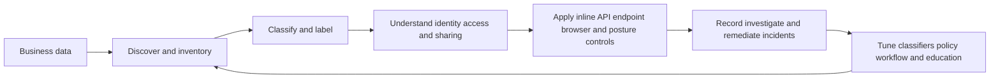

## JD Mapping

| Role expectation | Part 39 capability | TSM artifact | Arti bridge and boundary |
|---|---|---|---|
| Understand customer risk | Map critical data, apps, users, channels, permissions, and gaps | Data-risk map | M365 permissions and support transfer |
| Drive outcomes | Convert visibility into reduced exposure and usable policy | Improvement roadmap | Outcome discipline transfers |
| Troubleshoot incidents | Separate path, inspection, classification, policy, action, and workflow | DLP evidence matrix | Trace-led escalation transfers |
| Guide adoption | Stage monitor, coach, restrict, block, and remediate | Rollout plan | Zscaler policy operation is new |
| Coordinate stakeholders | Bring data owners, app owners, endpoint, IAM, SOC, privacy, legal, HR, and vendors | RACI | Cross-team incident work transfers |
| Analyze trends | Track exposure, violations, precision, response, and exceptions | Review dashboard | Power BI/SQL strength transfers |
| Secure SaaS/AI | Explain CASB, SSPM, shadow IT, Copilot, and GenAI layers | Architecture decision record | Current licensing/features need verification |
| Communicate tradeoffs | Explain security, privacy, productivity, and control gaps | Executive brief | Avoid compliance guarantees |

## Candidate honesty note

| Claim class | Safe Part 39 statement | Unsupported conversion |
|---|---|---|
| Production transfer | "I diagnosed Microsoft 365 identity, access, sharing, and client/service issues." | "I ran Zscaler DLP globally." |
| Demonstrated study | "I built synthetic DLP/CASB/Copilot policy and tuning exercises." | "I indexed customer PII in EDM." |
| Public fact | "Current help describes inline DLP, Endpoint DLP, EDM/IDM, SaaS reports, and SSPM concepts." | "Every classifier/action works on every channel." |
| Detection conclusion | "The incident matched an EDM record under the tested policy." | "A match proves malicious exfiltration." |
| Vendor positioning | "Zscaler positions the platform as unified data security." | "One policy guarantees identical enforcement everywhere." |
| Unknown | "I would verify file type, size, archive, channel, tenant, app API, rule mode, and action." | "No incident means no leakage." |

Product pages use phrases such as "all data," "airtight," "zero configuration," "complete visibility," "unlimited," and "single source of truth." Treat those as positioning. Production coverage depends on traffic steering, TLS inspection, app/API support, tenant consent, endpoint/browser coverage, file/parser limits, encryption, classifier quality, versions, actions, roles, privacy choices, and data paths outside the product.

## Beginner vocabulary and memory hooks

| Term | Plain meaning | Why it matters | Memory hook |
|---|---|---|---|
| Data security | Protecting data from unauthorized access, use, change, disclosure, or loss | The asset is data, not only the network | Protect the museum collection |
| DLP | Data Loss Prevention | Detects and responds when sensitive data is used or moved against policy | Guard the exits |
| CASB | Cloud Access Security Broker | Adds visibility/control for cloud app use and data | Cloud-app security desk |
| Multimode CASB | CASB using more than one observation/control method | Inline and API modes see different moments | Door guard plus storage auditor |
| Inline | In the live transaction path | Can enforce before a transfer completes | Guard at the door |
| API/out-of-band | Uses supported application APIs outside the live request path | Can scan stored SaaS data/sharing later | Auditor in the storage room |
| Endpoint DLP | DLP controls on a managed device | Covers printing, removable media, shares, or sync under supported design | Guard on the laptop |
| Browser isolation | Runs or renders web activity in a controlled browser context | Can keep risky content/data actions away from unmanaged device | Display case between visitor and object |
| SSPM | SaaS Security Posture Management | Assesses SaaS configuration against recommended policies | Audit the museum locks |
| DSPM | Data Security Posture Management | Finds/classifies data and correlates storage, access, exposure, and posture | Map valuables and risky rooms |
| Shadow IT | Apps used without formal approval/oversight | Sensitive data may enter unknown services | Unregistered side exhibit |
| Shadow AI | AI apps/features used without approved governance | Prompts/uploads can expose data | Unapproved AI assistant |
| Sanctioned app | App approved under organization policy | Approval still needs configuration and least privilege | Registered vendor |
| Unsanctioned app | App explicitly not approved | May be blocked, restricted, coached, or isolated | Prohibited vendor |
| Data at rest | Stored data | API CASB/DSPM/permissions can address it | Object in storage |
| Data in motion | Data moving between systems | Inline/TLS-aware controls may inspect it | Object at the door |
| Data in use | Data being viewed, edited, copied, printed, or prompted | Endpoint/browser/app controls matter | Object being handled |
| Classification | Assigning a sensitivity/type category | Policy depends on knowing what data is | Museum label |
| Dictionary | Detection patterns/phrases/labels/criteria under product design | Basic building block for matching | List of valuable traits |
| DLP engine | Logical collection/expression of dictionaries | Policy references engines in current ZIA model | Combined detector |
| Regex | Regular expression pattern matching | Useful for structured text, but can overmatch | Text shape stencil |
| EDM | Exact Data Match | Correlates tokens from structured source records | Match known catalog rows |
| IDM | Indexed Document Match | Fingerprints documents to find complete/partial matches | Match known artwork patterns |
| OCR | Optical Character Recognition | Extracts text from images/screenshots where supported | Read text in a photo |
| ML/LLM classifier | Model-based content categorization | Can add semantic context but needs validation | Meaning-aware curator |
| Sensitivity label | Metadata/protection marking such as a Purview label | Can drive access, encryption, DLP, and Copilot behavior | Classification sticker |
| Incident | Recorded policy match/activity requiring review | A detection is evidence, not intent verdict | Alarm to investigate |
| False positive | Benign activity incorrectly flagged | Excess noise harms trust and productivity | Alarm on approved loan |
| False negative | Risky activity not detected | Quiet dashboard can hide loss | Stolen object without alarm |
| Precision | True relevant detections divided by reviewed detections | Measures alert usefulness | How often alarms matter |
| Recall | Detected true risks divided by all true risks, usually estimated | Measures missed-risk performance | How many thefts alarms catch |
| Least privilege | Only necessary access for necessary time | Reduces oversharing and blast radius | Minimum room keys |
| Tenant restriction | Limits which cloud tenant/account can be used | Helps separate corporate and personal destinations | Approved museum branch only |

## Data states and the control lifecycle

| Data state | Example | Main risks | Candidate controls |
|---|---|---|---|
| At rest | SharePoint file, SaaS record, cloud object, endpoint disk | Broad sharing, stale access, misconfiguration, malware | API CASB, DSPM, SSPM, labels, native permissions |
| In motion | Upload, email, form post, sync, API call, AI prompt | Exfiltration, wrong tenant/app, unencrypted/hidden channel | Inline DLP, app control, TLS inspection, email/API controls |
| In use | Copy/paste, print, screenshot, edit, download, prompt response | Accidental disclosure, local capture, unmanaged device | Endpoint DLP, browser/isolation controls, app-native controls |

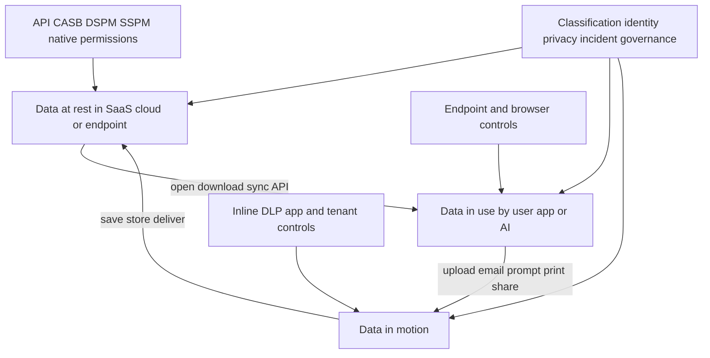

A file changes state repeatedly. A SharePoint document is at rest, becomes in use when opened, travels in motion when copied to an AI prompt, and becomes at rest again in prompt history or another app. Protecting only one transition leaves gaps.

### Plain-English deep-dive 1 - One file can cross five security desks in a minute

An employee opens a stored financial plan, copies a paragraph, pastes it into an AI site, downloads the response, prints it, and saves it to personal storage. The same information has crossed SaaS permissions, endpoint clipboard/print, inline web, AI-app policy, and cloud storage boundaries.

No single control necessarily observes every step. Build the architecture by data journey and user action, then assign each step to an enforcement plane. "We have DLP" is not a coverage statement until the channel, state, app, file type, encryption, device, and action are named.

## Data inventory, ownership, and classification

Before enforcement, identify high-value data and normal business flows. A policy that starts with thousands of patterns and no owners creates noise.

| Inventory field | Example question | Why needed |
|---|---|---|
| Data class | Customer PII, payroll, source code, legal privilege? | Determines sensitivity and controls |
| Owner/steward | Who authorizes use and exceptions? | Security cannot decide business purpose alone |
| Systems | Where created, stored, backed up, indexed, and exported? | Finds at-rest exposure |
| Users/groups | Who needs access, and why? | Least privilege |
| Destinations | Which tenants/apps/partners are approved? | Inline/CASB policy |
| Actions | View, edit, download, upload, print, share, prompt? | Right-sized enforcement |
| Volume/format | Text, CSV, image, source, archive, database? | Classifier/parser suitability |
| Retention | How long should data/incidents/indexes persist? | Privacy/compliance |
| Normal flow | What legitimate transfers resemble leakage? | Tuning and exceptions |
| Impact | What happens if disclosed or blocked incorrectly? | Severity and rollout |

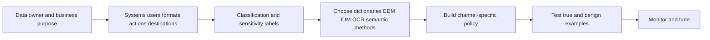

Classification is not immutable truth. Labels can be missing or wrong. Regex can match random numbers. Models can misclassify. EDM source data can be stale. IDM similarity can overmatch templates. OCR quality varies. Use multiple signals and human review proportionate to consequence.

## Classification methods

| Method | Best fit | Strength | Failure mode |
|---|---|---|---|
| Keyword/phrase | Distinct business terms | Simple and explainable | Context-free overmatch/evasion |
| Regex/pattern | Structured identifiers | Flexible text shape | Invalid random numbers match |
| Validation/checksum | IDs with mathematical rule | Reduces random matches | Not all valid numbers are sensitive |
| Proximity | Multiple terms near each other | Adds context | Formatting changes defeat it |
| Sensitivity label | Already-classified documents/items | Aligns native governance | Missing/wrong/unsupported labels |
| EDM | Known structured records | High-specificity correlated values | Source/index freshness and privacy |
| IDM | Known document family/content | Detects partial/whole document similarity | Threshold/template/version tuning |
| OCR | Text embedded in image | Extends image detection | Quality, language, handwriting, cost |
| File/type/size | Broad movement condition | Fast coarse control | Content-independent false positives |
| ML/LLM semantic | Meaning/category rather than exact words | Can detect varied language | Drift, opacity, bias, false results |

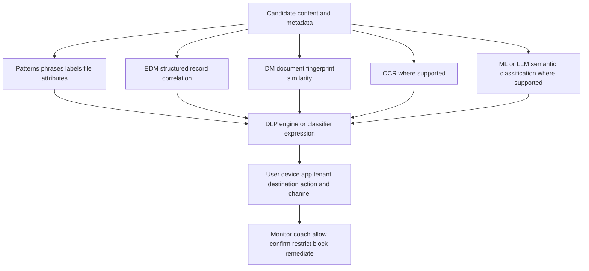

Current ZIA help defines a DLP engine as one or more DLP dictionaries and allows logical combinations in supported configurations. Policy generally references engines, not standalone dictionaries. Exact evaluation mode, rule ordering, exception behavior, and available fields/actions must be confirmed because current help documents multiple modes.

## Exact Data Match, Indexed Document Match, OCR, and semantic classifiers

### Exact Data Match

EDM correlates multiple tokens from structured source records. A single common first name should not trigger a high-severity identity event; a configured combination such as employee ID plus surname plus date of birth may identify a known record more precisely. Current help describes templates created through an Index Tool from CSV-based structured data and then referenced through dictionaries/engines/policy.

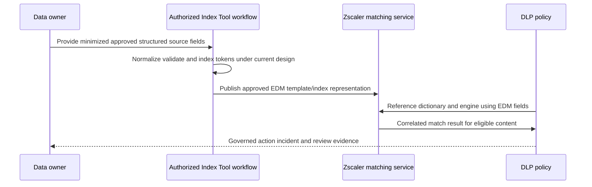

Do not state that raw source records never leave, are always hashed in a particular way, or cannot be reconstructed unless current official design and contract prove it. Document source minimization, Index Tool ownership, VM hardening, transfer, template limits, refresh, deletion, access, disaster recovery, and incident handling.

### Indexed Document Match

IDM fingerprints known documents and detects complete or partial similarity according to configured accuracy. It is useful for source code, designs, forms, contracts, or confidential reports where wording may be copied. Current help says matching is against document fingerprints rather than simple keyword searches.

| EDM | IDM |
|---|---|
| Structured records/cells | Documents and content similarity |
| Correlates configured fields/tokens | Compares whole/partial fingerprint |
| Example: customer record values | Example: confidential product design |
| Requires source-record refresh | Requires document repository/template refresh |
| Precision depends on field combination | Precision depends on similarity threshold/content |
| Privacy risk in indexed structured dataset | Confidentiality risk in fingerprint source workflow |

### OCR and semantic methods

OCR attempts to extract text from images. Semantic ML/LLM classifiers attempt to understand topic or sensitivity without relying only on exact keywords. Product pages position these capabilities, but exact models, training, thresholds, languages, supported channels, data handling, and explainability are product-specific and change. Do not invent model architecture or claim deterministic accuracy.

### Plain-English deep-dive 2 - "AI classified it" is the start of an explanation

A curator may recognize that an unlabeled sketch is a confidential prototype even if no forbidden keyword appears. Another curator may be wrong. Semantic classification can add that kind of contextual judgment, but it is probabilistic.

For high-impact blocking, require tested examples, confidence/threshold behavior where exposed, human-review process, appeal/exception path, drift monitoring, and a fallback. Record which classifier version/policy produced the incident when possible. Never use "AI" as a substitute for evidence.

## DLP policy mechanics

Conceptually, a DLP decision combines context and content:

| Dimension | Examples | Failure risk |
|---|---|---|
| Source identity | User, group, department, location | Unknown/stale identity |
| Device | Managed state, device group, platform | Unsupported/offline/misclassified device |
| Channel | Web, email, SaaS API, print, USB, network share, cloud sync | Assumed coverage gap |
| Destination | App, category, corporate/personal tenant, partner | App/tenant recognition error |
| Action | Upload, post, share, print, copy, download | Action granularity unavailable |
| Content | Engine/dictionary/label/EDM/IDM/OCR/semantic | False match or parser limit |
| Size/file | Type, archive, bytes, encryption | Unsupported or oversized file |
| Rule mode/order | First match, evaluate-all, parent/exception logic | Shadowed or compounded rule |
| Response | Monitor, allow, coach/confirm, block, notify, quarantine/remediate | Channel-specific differences |
| Severity/workflow | Informational to high; auditor/case | Alert overload or mishandling |

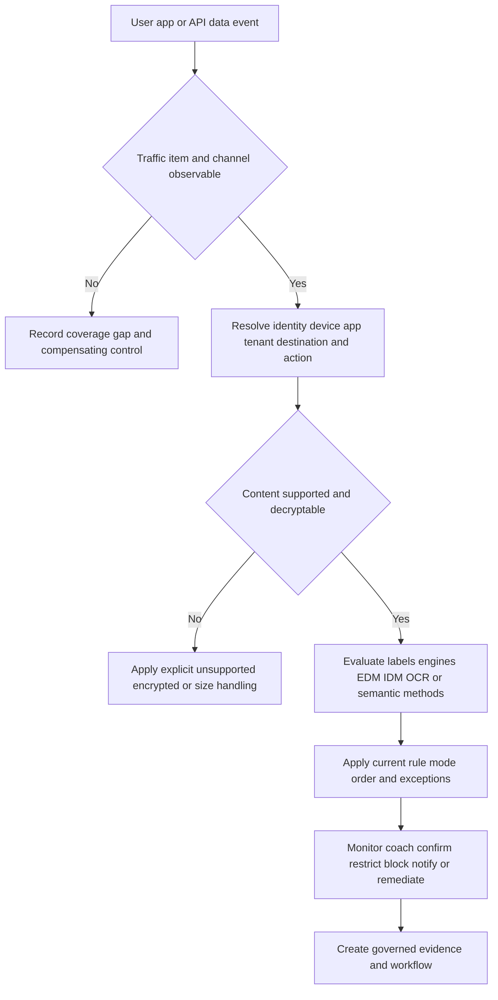

The match and action must be tested on each intended channel. An engine available in a common-resource list does not prove identical support for inline web, endpoint, email, SaaS API, DSPM, or AI prompts. Check current channel column/help, file limits, archive depth, encoding, encryption, and exact action.

## Inline DLP: data in motion

Inline DLP evaluates eligible content while a transaction traverses the enforcement path. It can potentially stop an upload before completion, but it depends on correct forwarding, identity, TLS inspection for encrypted payload where applicable, protocol/app parsing, content support, and policy.

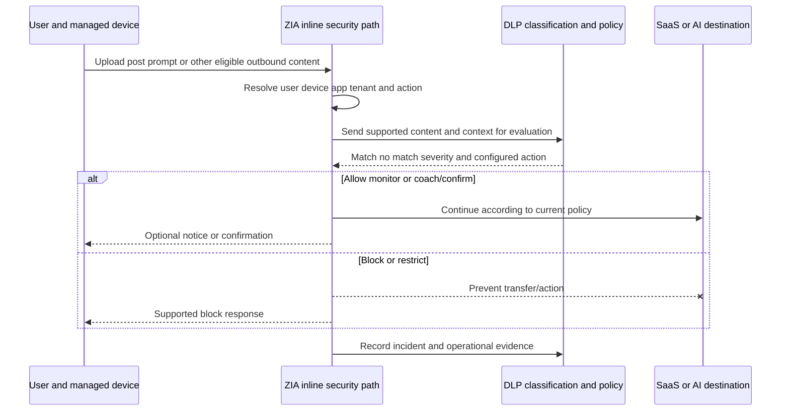

| Inline strength | Inline limitation |
|---|---|
| Acts during observed transaction | Misses stored data created outside path |
| Can use live identity/device/app context | Bypassed/direct/unsupported traffic is blind |
| Can prevent risky upload/prompt in time | TLS pinning/mTLS/privacy exceptions reduce content visibility |
| Useful for sanctioned and unsanctioned app access | App action/tenant recognition varies |
| Can combine URL/app/data controls | Large/encrypted/archive/file parser limits apply |

## Endpoint DLP: local and offline channels

Current help says Endpoint DLP complements inline DLP and can cover supported printing, removable storage, network shares, and personal cloud storage activities. Policy is retrieved through Client Connector; help says enforcement and incident logging can continue offline after policy retrieval under supported behavior.

| Endpoint channel | Risk | Example control question |
|---|---|---|
| Printing | Sensitive paper leaves digital controls | Is print required for this role/data? |
| Removable storage | Copy to USB/external media | Is device approved/encrypted and activity allowed? |
| Network share | Copy to unapproved/overbroad share | Is destination resource/tag approved? |
| Personal cloud sync | Native client copies to personal account | Can corporate versus personal destination be identified? |
| Offline operation | User disconnected from cloud policy service | Which cached policy/version/action applies? |

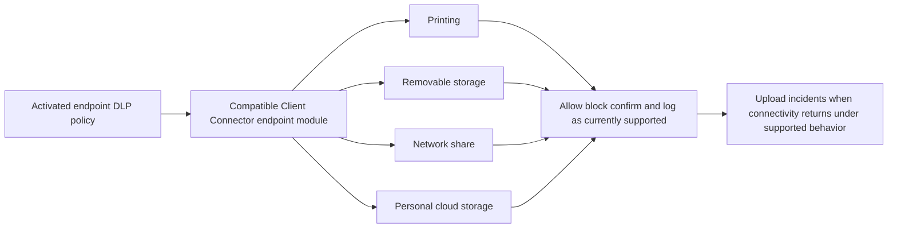

Endpoint controls can directly affect productivity and privacy. Pilot by OS/version/device group/channel. Test policy refresh, offline enforcement, incident upload, uninstall/tamper boundaries, performance, exceptions, accessibility, print workflows, encrypted media, VDI/shared devices, and break-glass procedures according to current help.

## Multimode CASB: inline and API/out-of-band

| Dimension | Inline CASB | API/out-of-band CASB |
|---|---|---|
| Observation time | During user/app transaction | After/in parallel through supported SaaS API |
| Primary state | Data in motion/use | Data at rest, sharing, activity, posture where supported |
| App coverage | Recognized traffic through path | Specifically integrated/authorized tenants/apps |
| Unsanctioned apps | Strong discovery/control opportunity | Usually no tenant API consent |
| Real-time prevention | Possible for supported action | Often asynchronous; action timing varies |
| Historical/stored data | Limited to live transactions | Can scan existing supported content |
| Identity | Traffic identity/context | SaaS object/activity/owner identity from API |
| Action | Allow/block/restrict/coach/isolate where supported | Quarantine, unshare, label, revoke, remediate where supported |
| Dependency | Forwarding/TLS/app parsing | OAuth/API permissions, rate limits, connector health |
| Main gap | Off-path transactions | Unsupported apps/objects/actions and scan delay |

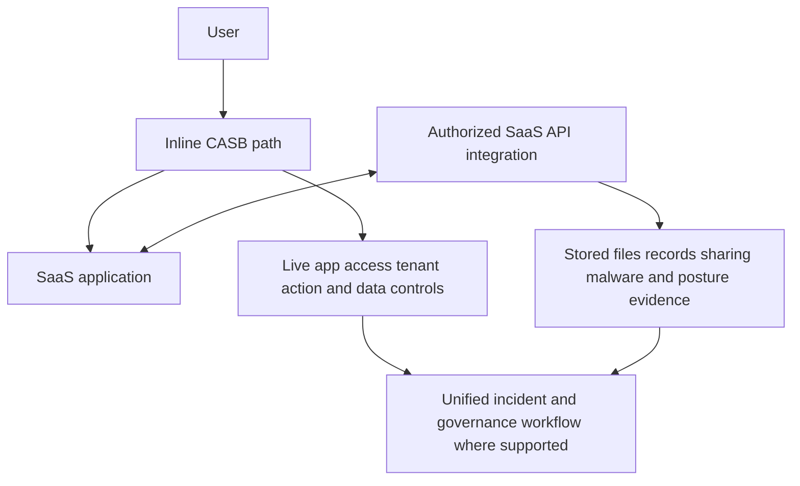

### Plain-English deep-dive 3 - The door guard and the night auditor see different risks

The door guard can stop someone carrying a painting out now, but cannot find a painting that was accidentally placed in an unlocked basement last month. The night auditor can find that storage problem, but may arrive after the movement occurred.

Inline and API CASB are complementary. Do not say the API connector blocks all transactions in real time, and do not say inline traffic inspection audits every stored object. State the app, object/action, timing, permissions, scan cadence, remediation, and failure behavior.

## SaaS onboarding, API permissions, and operations

An API integration commonly requires administrative authorization and app scopes. These permissions can read content, metadata, sharing, configuration, or activity and may perform remediation, depending on product/app. Use least privilege and change control.

| Onboarding area | Question | Evidence |
|---|---|---|
| Supported app | Is tenant/app/object/action currently supported? | Current compatibility help |
| Consent | Who approves API access? | Admin consent/audit record |
| Scopes | What can integration read/change? | Exact app registration scopes |
| Accounts | Service principal/account ownership and lifecycle? | IAM inventory and credential controls |
| Initial scan | What objects/time/volume are included? | Scan plan and rate-limit impact |
| Incremental scan | How are changes detected? | Last successful scan/cursor/event |
| Remediation | Quarantine, unshare, label, delete, revoke, notify? | Tested reversible action |
| Failure | What happens on token expiry/API throttling/outage? | Health alert and backlog |
| Offboarding | Revoke consent, remove app, retain/delete findings? | Exit checklist |

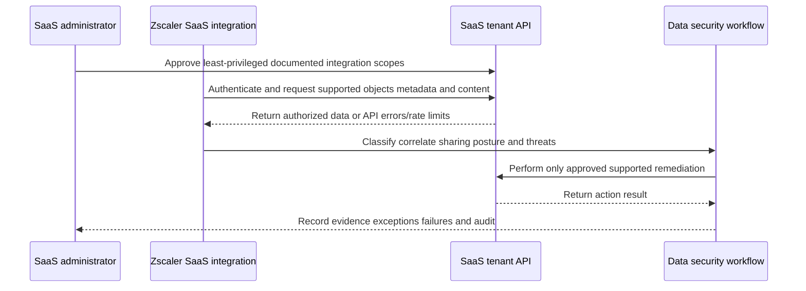

Never test destructive API remediation first in production. Begin with monitor/read-only where supported, a disposable object/tenant cohort, reversible sharing changes, and explicit app-owner approval. Native SaaS audit logs remain essential.

## Shadow IT and cloud application governance

Current SaaS Security Report help describes applications by sanctioned, unsanctioned, unclassified, or under-review status and provides users, locations, bytes, categories, risk index, certifications/attributes, transactions, and potential integrations where supported.

| Status | Meaning | Appropriate next step |
|---|---|---|
| Sanctioned | Approved for defined uses/populations | Maintain owner, tenant, data, and configuration controls |
| Unsanctioned | Prohibited under policy | Block/restrict/coach/migrate according to risk |
| Under review | Decision pending | Limit sensitive actions and collect owner/use evidence |
| Unclassified | Not yet decided/recognized in governance | Triage material usage and data risk |

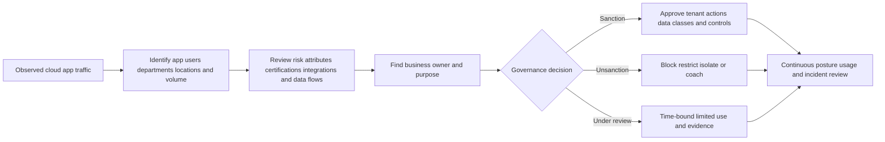

An app risk score is not a purchase decision by itself. Assess actual data, tenant/account ownership, SSO/MFA, contract, privacy, residency, retention, breach history, integrations, encryption, export/deletion, business need, and alternatives. A sanctioned app can be misconfigured; an unsanctioned app can have excellent technical controls but lack contractual approval.

## SaaS posture, third-party integrations, and DSPM

SSPM evaluates enabled recommended policies against supported SaaS tenant configuration. Current help reports statuses such as passed, failed, partial, disabled, or pending and can show affected/excluded assets. Disabled policy means not evaluated, not safe.

| Capability | Main object | Example risk | Typical outcome |
|---|---|---|---|
| SSPM | SaaS configuration/control | MFA incomplete, sharing/config drift | Recommendation and remediation workflow |
| CASB API | SaaS data/activity | Sensitive public file or malware | Incident and app-supported remediation |
| Third-party app governance | OAuth/integration/app grants | Risky app accesses corporate SaaS | Review/revoke/restrict |
| DSPM | Data stores/access/exposure | Sensitive data broadly exposed | Prioritized data-risk remediation |
| Native IAM/Purview | Tenant permissions/labels/DLP/retention | Oversharing or missing protection | Native enforcement and audit |

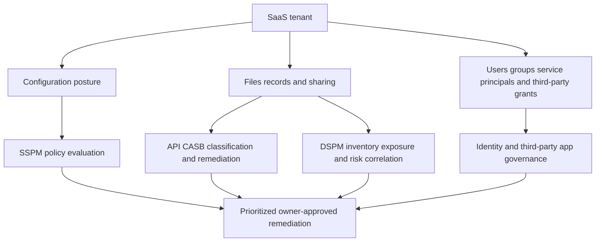

Posture tools do not own the SaaS application's business semantics. Before remediation, app/IAM owners confirm expected configuration, compensating control, dependency, outage risk, and rollback. Track exclusion reasons and expiry; do not improve a percentage by disabling hard checks.

## BYOD, unmanaged devices, and browser controls

| Device mode | Possible architecture | Data actions to consider | Limitation |
|---|---|---|---|
| Managed endpoint | Client Connector plus inline/endpoint DLP | Upload/download/print/USB/share/sync | OS/version/channel support |
| Managed browser | Inline plus extension/enterprise browser controls | Copy/paste/download/upload/print/screenshots | Exact form factor and app support |
| Unmanaged/BYOD | Clientless/browser isolation or controlled browser access | Keep data remote, block download/copy/print | Web-app scope and user experience |
| Partner device | App-specific zero-trust/browser access | Least app access and session controls | Identity/app onboarding required |
| Native mobile app | App/network/native MAM controls | Share/open-in/screenshot/storage | Browser controls may not apply |

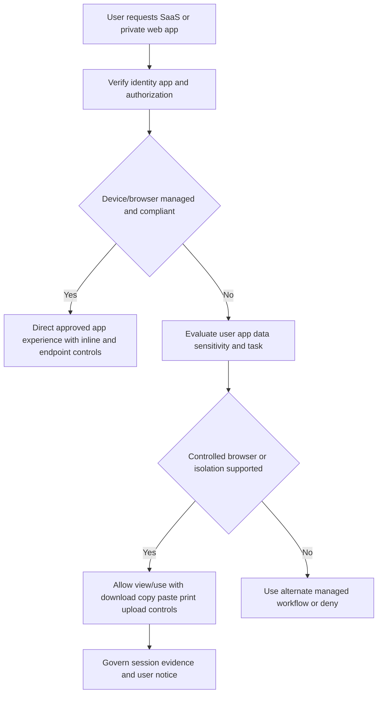

Browser isolation can keep web content off an unmanaged endpoint and constrain last-mile actions, but it is not a universal endpoint DLP substitute. Cameras, external recording, manual retyping, unsupported native apps, accessibility, file workflows, performance, and offline data remain considerations.

## Generative AI and shadow AI protection

AI data risk includes more than a prompt. It includes app access, account/tenant, pasted text, uploaded files, API/IDE calls, retrieved enterprise data, generated output, browser actions, agents/connectors, storage/history, model/provider terms, and users' decisions.

| AI control question | Example policy choice | Evidence |
|---|---|---|
| Which AI apps? | Sanction, block, under review, isolate | App inventory and owner |
| Which users? | Allow approved roles; coach others | Identity/group |
| Which tenant/account? | Corporate tenant only where supported | Tenant/app action evidence |
| Which input? | Permit general prompts; block sensitive data/files | DLP incident/test |
| Which action? | Prompt allowed, file upload restricted | App action recognition |
| Which output? | Govern download/copy according to sensitivity | Browser/native controls |
| Which developer path? | Govern IDE/API/agent access | API/domain/process evidence |
| Which retention/training? | Review provider terms and enterprise commitments | Contract/configuration |
| Which agents/connectors? | Approve scopes and data sources | OAuth/API permission audit |
| Which monitoring? | Minimal lawful prompt/response evidence | Privacy data map |

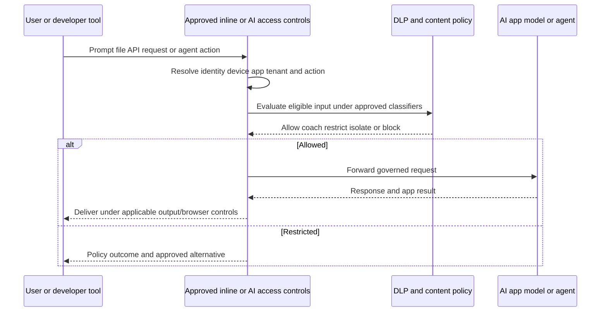

Prompt/response visibility is highly sensitive. It can contain source code, health information, legal advice, HR content, credentials, strategy, or personal text. Decide whether content extraction is necessary, which portions persist, who can view them, retention, redaction, user notice, and investigation controls. Product capability does not establish legal authority.

## Microsoft Copilot data protection

Current Microsoft documentation says Microsoft Copilot grounds responses in data the user can access through Microsoft 365 permissions and honors supported sensitivity-label/encryption rights. Prompts/responses and citations can be stored in interaction history and governed through Microsoft Purview capabilities. Therefore, broad SharePoint/OneDrive permissions and missing labels can become highly visible through natural-language retrieval.

Zscaler product pages position a combination of inline prompt visibility/DLP and API/posture capabilities for Copilot usage, OneDrive permissions, Purview label updates, and Microsoft 365/Copilot configuration. Verify exact availability, supported remediation, required permissions, tenant scope, and interaction with Microsoft native controls.

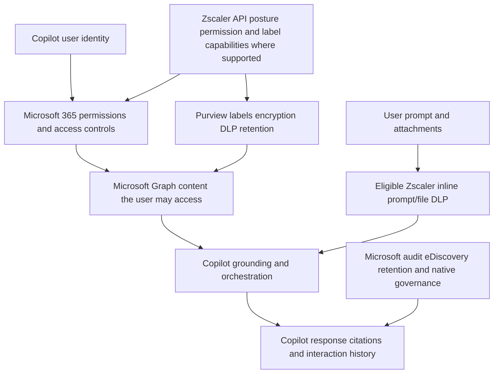

| Risk | First control | Complementary control |
|---|---|---|
| User can access too much | Fix SharePoint/OneDrive/group permissions | API posture/DSPM discovery and remediation |
| Sensitive file unlabeled | Purview/data-owner classification and auto/manual labeling | Zscaler supported classification/label workflow |
| Sensitive text pasted into prompt | Inline prompt DLP/acceptable-use controls where supported | User education and native Purview controls |
| Risky file uploaded | Inline app/action/file DLP | Browser/endpoint control |
| Third-party agent sees data | Microsoft admin approval, scopes, terms, least privilege | SaaS/third-party app governance |
| Interaction retained too long | Microsoft Purview retention/deletion | Zscaler incident/log retention alignment |
| User trusts inaccurate output | Human review and responsible AI practice | Training and workflow controls |

### Plain-English deep-dive 4 - Copilot does not invent permission; it makes existing access easier to use

Imagine a worker already has keys to 500 filing cabinets when they need 20. Before AI, finding the wrong document took time. A highly capable assistant can search those cabinets quickly. The assistant did not cut new keys, but the old overpermission becomes more consequential.

Copilot readiness starts with access governance: site membership, sharing links, groups, external users, labels, encryption rights, lifecycle, and owner accountability. Prompt DLP is useful, but it cannot compensate for a tenant where users legitimately appear authorized to broadly shared sensitive content.

## DLP incidents, evidence, and workflow

An incident should answer what happened without exposing more sensitive data than necessary.

| Incident field | Question |
|---|---|
| Detection | Which engine/dictionary/template/label/classifier matched? |
| Context | User, device, location, app, tenant, destination, channel, action? |
| Object | File/type/size/hash/object ID, minimized snippet/fingerprint? |
| Policy | Effective rule, mode/order/exception, version, action, severity? |
| Result | Allowed, monitored, coached, confirmed, blocked, quarantined, unshared? |
| Intent | Accidental, approved workflow, malicious, test, unknown? Human review required |
| Exposure | Did data actually leave or remain accessible, to whom, and for how long? |
| Response | Containment, owner, legal/privacy/HR escalation, preservation? |
| Correction | Permission, label, app, classifier, policy, training, process? |
| Closure | Validation, residual risk, recurrence monitor, retention/deletion? |

```mermaid
flowchart LR
    MATCH[Policy match or posture finding] --> TRIAGE[Validate evidence classifier channel and actual outcome]
    TRIAGE --> SEV[Assess data sensitivity exposure user intent and impact]
    SEV --> CONTAIN[Block quarantine unshare revoke or preserve as authorized]
    CONTAIN --> OWNER[Engage data app IAM endpoint privacy legal HR or SOC owners]
    OWNER --> CORRECT[Correct permissions labels config workflow or policy]
    CORRECT --> VALIDATE[Retest positive negative and business operations]
    VALIDATE --> LEARN[Tune classifier exception education and metrics]
```

Blocking a transaction means the tested transaction was blocked; it does not prove the content never reached another path, clipboard, local copy, screenshot, alternate account, encrypted archive, or previous share. Determine actual exposure.

## False positives, false negatives, and tuning

| Tuning dimension | False-positive example | False-negative example | Improvement |
|---|---|---|---|
| Pattern | Random 16 digits match card | Spaced/encoded ID missed | Validation/proximity/format tests |
| Threshold | One token triggers | Required combination too strict | Use business-risk thresholds |
| EDM | Common fields correlate wrong record | Index stale/missing new records | Better fields and refresh monitoring |
| IDM | Generic template overmatches | Revised document below similarity | Tune repository/accuracy/version |
| OCR | Image artifacts read as text | Low-quality screenshot unreadable | Quality/language tests and fallback |
| Semantic | Benign policy topic marked secret | Novel phrasing missed | Reviewed corpus, version/drift tests |
| App/action | Approved corporate upload blocked | Personal tenant action unrecognized | Tenant/action-aware policy |
| Exception | Necessary team repeatedly blocked | Broad exception creates blind spot | Narrow owner/expiry/review |
| Parser | Harmless archive cannot scan | Nested/encrypted/large file bypass | Explicit unsupported handling |

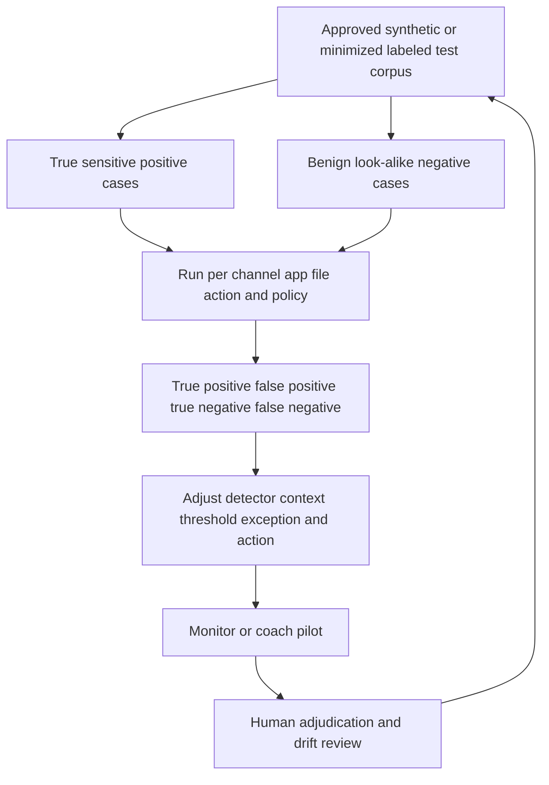

### Metrics

| Metric | Definition | Caveat |
|---|---|---|
| Precision | Confirmed relevant incidents/reviewed incidents | Requires consistent adjudication |
| Estimated recall | Detected seeded/known positives/known positives | Real unknown misses remain unknown |
| False-positive rate | Benign events incorrectly acted upon/benign tested or reviewed population | Denominator matters |
| Block accuracy | Correct blocks/reviewed blocks | A correct match can still be wrong action |
| User-impact hours | Time lost to incorrect/unclear controls | Survey/ticket underreporting |
| Time to triage | Incident creation to validated classification | Severity and automation differ |
| Time to containment | Detection to exposure stopped | API remediation may be asynchronous |
| Exception aging | Active exceptions by age/expiry/scope | Count ignores traffic volume |
| Exposure reduction | Public/broadly shared sensitive objects corrected | Discovery coverage required |
| Coverage | Eligible observed channels/entities/expected scope | Avoid "all data" denominator |

Do not optimize for incident count. Fewer incidents can mean better behavior, broken collection, broader exceptions, or missed detection. More incidents can mean improved coverage, a bad rule, or real risk increase.

## Privacy, legal, and ethical boundaries

DLP systems deliberately inspect sensitive content to protect it. Incidents, prompt text, snippets, file names, user identity, HR/legal/health data, EDM source records, document fingerprints, SaaS permissions, and activity histories can be more sensitive than ordinary security logs.

| Governance area | Required decision |
|---|---|
| Purpose | Security/compliance purposes, prohibited secondary use |
| Authority/notice | Legal basis, employee notice, works council, acceptable use |
| Data minimization | Fields/content/snippets/index source truly required |
| Role separation | Policy admin, incident reviewer, data owner, HR/legal roles |
| Masking/redaction | Which identifiers/snippets are masked and reveal workflow |
| Region/transfer | Processing/storage/export/support locations |
| Retention/deletion | Incidents, indexes, files, prompt content, reports, exports |
| Investigation | When content may be viewed and approval/audit required |
| Automation | Human review before punitive/destructive decisions |
| Subject rights | Search/access/correction/deletion where applicable |
| Breach response | Exposure of DLP evidence/index/credentials/API grants |

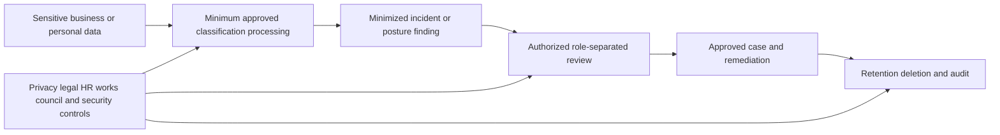

Never paste real customer secrets, PII, source code, or incident snippets into training labs or public AI tools. Use synthetic records. Never infer employee intent from a classifier alone. An approved business exception is not misconduct; a match is not guilt.

## Rollout strategy

| Phase | Work | Exit gate |
|---|---|---|
| 0 Governance | Purpose, data owners, privacy/legal/HR, roles, retention, incident process | Approved operating model |
| 1 Discovery | Apps, shadow IT, data stores, channels, permissions, native controls | Prioritized risk map |
| 2 Classifier lab | Synthetic positives/negatives, files, labels, EDM/IDM/OCR as needed | Accuracy and data-handling approval |
| 3 Monitor | Inline/API/endpoint visibility without broad blocking | Stable coverage and adjudication |
| 4 Coach/confirm | User notice/justification for selected low-risk workflows | Helpfulness and precision gates |
| 5 Bounded block | High-confidence high-impact cases in canary cohort | Business and security validation |
| 6 SaaS remediation | Read-only scan then reversible unshare/label/quarantine | App-owner rollback tested |
| 7 Endpoint/browser | Ring by OS/device/channel and BYOD use case | Offline/performance/accessibility tests |
| 8 AI/Copilot | Sanctioned apps, permissions/labels, prompt/file policy, agents | Responsible-use and privacy review |
| 9 Operations | Tuning, exceptions, posture drift, API health, metrics, exercises | Continuous owner backlog |

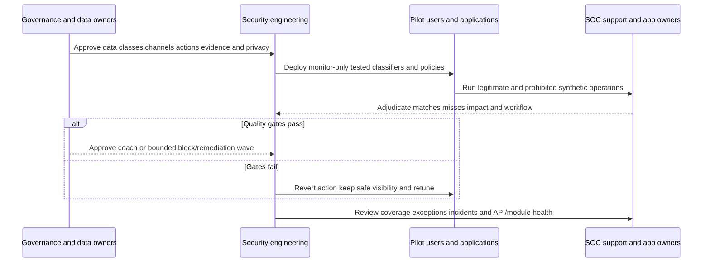

Rollback can change block to monitor/coach, disable a new classifier, narrow scope, restore a SaaS permission, release quarantine, revert label, stop an endpoint channel rule, or remove a browser control for a bounded cohort. Preserve evidence and retained protections. Do not solve one false positive by globally bypassing DLP or TLS inspection.

## Troubleshooting DLP and CASB behavior

### Step 1: define the exact event

User/device, app and corporate/personal tenant, channel/action, destination, file/content/type/size/encryption/archive, time/time zone, expected rule/action, actual result, and a known comparison.

### Step 2: prove observation path

For inline, prove forwarding, identity, TLS inspection, app/action recognition, and complete transaction. For endpoint, prove compatible module, effective policy, channel, online/offline state, and last sync. For API, prove integration auth/scopes, object support, last successful scan, queue, and API errors.

### Step 3: prove classification

Record exact engine/dictionary/template/label/classifier, version/modified time, thresholds/proximity/accuracy, parser support, limits, and minimized match evidence. Do not expose raw secret unnecessarily.

### Step 4: prove policy evaluation

Check effective rule mode/order, parent/exception logic, identity/device/app/tenant/destination/action criteria, action, severity, activation, and conflicts.

### Step 5: prove enforcement and incident workflow

Did bytes/object/action actually complete? Was block page/confirm/remediation delivered? Was incident created, assigned, exported, and retained? For API actions, confirm SaaS-native object state/audit.

### Step 6: test one difference

Use a synthetic benign look-alike, synthetic positive, different app/tenant/channel, smaller supported file, unencrypted file, assigned versus unassigned endpoint, or read-only API object. Change one variable.

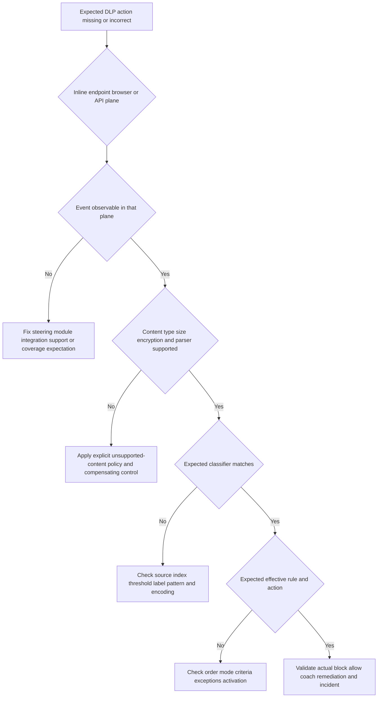

### API CASB tree

```mermaid
flowchart TD
    MISSING[SaaS object not found or remediated] --> SUPPORT{App tenant object and action supported}
    SUPPORT -->|No| GAP[Document coverage gap and native control]
    SUPPORT -->|Yes| AUTH{Consent token scopes and service principal healthy}
    AUTH -->|No| FIXAUTH[Restore least privilege authentication safely]
    AUTH -->|Yes| SCAN{Initial/incremental scan reached object}
    SCAN -->|No| QUEUE[Check rate limit cursor backlog filter and API errors]
    SCAN -->|Yes| DETECT{Policy/classifier detected object}
    DETECT -->|No| TUNE[Check parser label EDM IDM threshold and exclusions]
    DETECT -->|Yes| ACTION{Remediation action attempted and succeeded}
    ACTION -->|No| APP[Check SaaS permissions conflicts holds and native audit]
    ACTION -->|Yes| VERIFY[Verify object sharing label quarantine and recurrence]
```

### False-positive tree

```mermaid
flowchart TD
    FP[User says legitimate activity blocked] --> PROVE[Preserve minimized event and confirm exact rule]
    PROVE --> MATCH{Content really matched configured detector}
    MATCH -->|No| BUG[Parser policy mapping or evidence defect]
    MATCH -->|Yes| BUSINESS{Business purpose approved by data owner}
    BUSINESS -->|No| ENFORCE[Explain policy and approved alternative]
    BUSINESS -->|Yes| NARROW{Can context improve rule without blind spot}
    NARROW -->|Yes| TUNE[Add tenant action role threshold proximity or better detector]
    NARROW -->|No| EXC[Create minimum owner-approved expiring exception]
    TUNE --> TEST[Positive negative and regression tests]
    EXC --> TEST
```

## Fictional NMH architecture and incidents

NMH protects synthetic customer records, payroll, source code, legal documents, and product designs across Microsoft 365, Salesforce, developer tools, managed laptops, contractors, and approved AI. It begins monitor-only.

### NMH control map

| Data/journey | Classifier | Plane | Initial action |
|---|---|---|---|
| Customer records uploaded to web/SaaS | Synthetic EDM correlated fields | Inline | Monitor then high-confidence block |
| Product designs copied/renamed | Synthetic IDM repository | Inline/API where supported | Monitor and owner review |
| Payroll spreadsheets | Purview label plus EDM/pattern | M365 API/inline/endpoint | Unshare/coach/block by action |
| Source code to GenAI | Source detector plus app/action/role | Inline AI policy | Coach approved tool; block unapproved |
| Sensitive file to USB/print | Label/engine | Endpoint DLP | Confirm then bounded block |
| Contractor access | App/data sensitivity | Browser/isolation | View-only/no download as required |
| Copilot retrieval | Permissions/labels/posture | Microsoft native plus Zscaler supported API/inline | Correct sharing/label and prompt policy |

```mermaid
flowchart TB
    DATA[NMH synthetic sensitive data] --> M365[Microsoft 365 and Copilot]
    DATA --> SAAS[Salesforce and approved SaaS]
    DATA --> DEV[Developer and GenAI tools]
    DATA --> END[Managed endpoints]
    M365 --> API[API CASB permission label posture controls]
    SAAS --> CASB[Inline and API CASB]
    DEV --> AI[AI app access prompt upload DLP]
    END --> EDLP[Print USB share and cloud sync DLP]
    API --> SOC[Unified review and data-owner workflow]
    CASB --> SOC
    AI --> SOC
    EDLP --> SOC
```

### Incident A: common number causes false card matches

A custom pattern flags order numbers as payment-card data. Review shows the pattern lacked validation and context. NMH adds a checksum/validation method where appropriate, proximity terms, and excludes the known order format without weakening real test cards. It runs synthetic positive/negative tests across web, email, and endpoint channels because one detector can behave differently by parser/channel.

### Incident B: sensitive OneDrive folder appears in Copilot

A user receives a Copilot response citing a strategy document they can technically view through a broad group. Copilot honored existing access. NMH removes the user/group's unnecessary permission, audits sharing links and group membership, applies/repairs the appropriate sensitivity label and lifecycle policy, validates search/Copilot behavior, and uses supported posture/API findings to identify similar exposure. Prompt DLP alone would not fix the accessible source.

### Incident C: API remediation stops after consent change

SaaS findings stop while inline events continue. The dashboard is quiet, but integration health shows token/scope failure after an admin change. NMH restores the documented least-privilege scopes, measures backlog, scans a test object, validates native SaaS audit, and processes queued objects by risk. It reports the monitoring gap rather than claiming there were no incidents.

```mermaid
sequenceDiagram
    participant U as NMH user
    participant C as Microsoft Copilot
    participant M as Microsoft 365 permissions and labels
    participant Z as Zscaler supported data controls
    participant O as Data and app owners
    U->>C: Ask about synthetic strategy topic
    C->>M: Retrieve content user is authorized to view
    M-->>C: Return broadly shared strategy document
    C-->>U: Response cites sensitive document
    Z-->>O: Surface permission label or prompt risk where supported
    O->>M: Correct group sharing label and lifecycle
    O->>Z: Tune/validate complementary policy
    C-->>U: Retest no longer exposes content after access correction
```

## Proactive TSM reviews and outcomes

| Review question | Evidence | Action |
|---|---|---|
| Which channels are actually covered? | Eligible/reporting users/devices/apps/tenants/transactions | Close or document gaps |
| Which sensitive data is most exposed? | DSPM/API findings plus owner validation | Prioritize permissions/configuration |
| Which shadow apps/AI are material? | Users, upload bytes, data incidents, risk, integrations | Sanction, migrate, restrict, or block |
| Are classifiers useful? | Precision, seeded recall, false patterns, drift | Tune or retire |
| Are actions proportional? | Blocks, confirms, overrides, user impact | Move monitor/coach/block intentionally |
| Are exceptions aging? | Scope, owner, volume, expiry | Narrow/remove/renew with approval |
| Is SaaS API healthy? | Last scan, backlog, errors, scopes | Restore and disclose gaps |
| Is posture improving? | Failed/partial assets, age, exclusions | Owner remediation and validation |
| Is Copilot foundation ready? | Broad permissions, unlabeled sensitive content, agents, retention | Fix access/labels/governance |
| Are incidents resolved well? | Triage/containment/closure/recurrence | Improve workflow and education |

### Outcome metrics

| Metric | Good interpretation | Dangerous interpretation |
|---|---|---|
| Sensitive exposure corrected | Validated broadly shared objects reduced | "Compliance achieved" |
| High-confidence risky transfers prevented | Tested prohibited events blocked | "No data can leave" |
| Precision improved | Reviewed incidents more actionable | "Lower incident count is always better" |
| Exception scope/age reduced | Blind spots smaller and owned | "Zero exceptions required" |
| API health/coverage improved | More supported objects scanned on time | "Every SaaS object covered" |
| User-impact hours reduced | Fewer incorrect blocks/friction | "Security weakened" |
| Triage/containment time improved | Faster validated handling | "Automation decides intent" |
| Shadow app decisions completed | Material apps governed | "All cloud apps safe" |

## Arti's Microsoft-to-Zscaler bridge

| Microsoft production strength | Part 39 transfer | New Zscaler learning | Honest wording |
|---|---|---|---|
| SharePoint/OneDrive permissions | Copilot oversharing and API CASB investigation | Zscaler remediation/reporting | "Permissions method transfers." |
| Entra identity/groups | User/group/app/tenant context | ZIA/CASB identity mapping | "I verify effective identity." |
| M365 client/service traces | Prove upload, tenant, action, HTTP outcome | Inline DLP app/action logs | "Trace correlation transfers." |
| Purview-adjacent support | Labels, rights, retention, audit concepts | Zscaler label/classifier integration | "I do not claim Purview architecture ownership." |
| Incident escalation | Timeline, impact, evidence, owners, validation | DLP/CASB workflow | "A detection is not intent." |
| Power BI/SQL | Precision, cohorts, denominators, aging | Zscaler reports/exports | "Metrics require adjudication." |
| Privacy-sensitive support | Minimize content, restrict access, safe transfer | EDM/IDM/prompts/incidents | "Inspection capability needs authority." |
| Training | Explain policy/alternatives and reduce recurrence | Coaching/confirmation workflows | "Product actions require current validation." |

### 30-second interview bridge

"I model data security across data at rest, in motion, and in use. Zscaler can provide complementary planes: inline DLP for eligible live transactions, API CASB for supported stored SaaS data and sharing, Endpoint DLP for local channels, browser controls for unmanaged access, and posture tools for configuration and exposure. Classification can use dictionaries/engines, labels, EDM, IDM, OCR, or semantic methods, but every method needs channel-specific tests and human review. For Copilot, I start with Microsoft 365 permissions and labels, then add prompt/file and posture controls. My Microsoft identity, permissions, service, trace, privacy, and incident methods transfer; production Zscaler data-security administration is new."

## Labs and rehearsal

Use only synthetic data, owned/authorized tenants, disposable files, approved test accounts, and nonproduction policies. Never index real customer PII or confidential files for a learning lab.

### Lab 1: data journey map

Map a synthetic payroll file from SharePoint to browser, endpoint, print, personal storage, AI prompt, and prompt history. Assign each step to a control plane.

### Lab 2: pattern classifier

Create synthetic identifiers and benign look-alikes. Test regex, validation, proximity, threshold, false positives, and false negatives.

### Lab 3: EDM model

Use fictional CSV records. Select minimized correlated fields, define refresh/deletion, and test one-field versus multi-field precision without implementing undocumented internals.

### Lab 4: IDM model

Create fictional templates and altered copies. Test conceptual similarity thresholds and version drift using a safe local fingerprinting demonstration.

### Lab 5: image/OCR

Place synthetic text in clean/noisy images. Compare detection quality and explain why OCR does not guarantee screenshot coverage.

### Lab 6: inline policy matrix

Build monitor/coach/block decisions by managed state, corporate/personal tenant, sanctioned/unsanctioned app, data class, and action.

### Lab 7: Endpoint DLP channels

Design tests for print, removable storage, network share, personal cloud, offline cached policy, incident upload, and exceptions on a disposable managed VM.

### Lab 8: CASB API

In an owned test tenant, draft least-privilege scopes, read-only scan, reversible unshare/label/quarantine, token failure, backlog, and offboarding tests.

### Lab 9: shadow IT review

Create fictional app usage with users, bytes, risk attributes, contracts, integrations, and data incidents. Decide sanctioned/unsanctioned/under-review with owners.

### Lab 10: SaaS posture

Create passed/failed/partial/disabled/pending controls. Demonstrate why disabled does not mean passed and exclusions need expiry.

### Lab 11: AI/Copilot

Use synthetic prompts and SharePoint files. Map access, labels, prompt DLP, output, history, agents, audit, and retention. Correct source permission first.

### Lab 12: tuning and interview drill

Calculate a confusion matrix, precision, estimated recall, block accuracy, exception aging, and user impact. Rehearse Q1-Q8 aloud.

## Common misconceptions to correct

| Misconception | Corrected understanding |
|---|---|
| DLP is one block rule | It is classification, context, action, incident, tuning, and governance across planes |
| One policy means identical channel behavior | Parsers, actions, timing, versions, and support differ |
| CASB is only a proxy | Multimode CASB includes inline and API/out-of-band capabilities |
| API CASB blocks every upload live | API scanning/remediation is commonly asynchronous |
| Inline CASB scans every stored SaaS file | It observes eligible traversing transactions, not all history |
| Sanctioned means secure | Approval does not prevent misconfiguration or oversharing |
| High app risk score means block immediately | Actual use, data, contract, controls, and owner decision matter |
| No incidents means no loss | Coverage, collection, direct paths, indexes, and API health may be broken |
| A DLP match proves malicious intent | It proves configured matching under context; human review determines intent |
| Blocked means data never left anywhere | Only the observed tested action/path is proven blocked |
| Regex is enough for PII | Validation, correlation, context, and exact matching often improve precision |
| EDM is a keyword list | It correlates configured fields from structured records |
| IDM searches for phrases | It fingerprints/indexes documents for whole/partial similarity |
| OCR reads every image | Quality, format, language, parser, and support vary |
| AI classification is deterministic | Semantic models can misclassify and drift |
| More incidents means more risk | It may mean more coverage or worse tuning |
| Fewer incidents means success | It may mean blind spots or exceptions |
| Endpoint DLP requires constant internet | Current help says supported cached enforcement/logging can continue offline after retrieval |
| Browser isolation prevents all data capture | Cameras, manual retyping, unsupported clients, and workflows remain |
| SSPM remediates safely without app owners | Configuration changes can break business dependencies |
| Disabled posture control is passed | It is not evaluated |
| DSPM and DLP are the same | DSPM discovers/correlates posture; DLP controls data actions/movement |
| Prompt DLP solves Copilot oversharing | Existing Microsoft permissions and labels control what Copilot can retrieve |
| Copilot grants new permissions | It uses content the user can access; easier retrieval magnifies overpermission |
| Microsoft Graph data trains foundation Copilot models | Current Microsoft documentation says prompts/responses/Graph data are not used to train foundation LLMs |
| AI app approved means every prompt is safe | Data/action/agent/provider/retention still need controls |
| DLP automatically proves compliance | It is one control and evidence source; compliance is broader and legally determined |
| This Part proves production Zscaler experience | It proves beginner-to-interview preparation and synthetic practice |

## Official Source Anchors

Sources in this section were reviewed on **2026-08-24**.

Zscaler Help is the public configuration/behavior anchor; authenticated current help, tenant settings, support statements, ranges/limits, and contracts govern production. Zscaler product pages are positioning and must not be converted into universal guarantees. Microsoft Learn is the controlling public anchor for current Microsoft Copilot permissions, labels, interaction storage, agents, and privacy commitments. Customer legal/privacy/data owners control purpose, lawful authority, sanctions, and response.

| Source | URL | Used for | Boundary |
|---|---|---|---|
| Zscaler About DLP | https://help.zscaler.com/zia/about-data-loss-prevention | Inline DLP purpose, engines, monitor/block, ICAP forwarding, evaluation modes | Current policy fields/actions change |
| Zscaler DLP Engines | https://help.zscaler.com/zia/about-dlp-engines | Engines as dictionary collections/expressions, channel listings, current limits | Limits/support must be rechecked |
| Zscaler EDM | https://help.zscaler.com/zia/about-exact-data-match | Structured record correlation, templates, Index Tool workflow | Do not infer undocumented crypto/data handling |
| Zscaler IDM | https://help.zscaler.com/zia/about-indexed-document-match | Document fingerprinting, partial/whole similarity, accuracy | Template/file support changes |
| Zscaler Endpoint DLP | https://help.zscaler.com/zia/about-endpoint-data-loss-prevention | Print, removable storage, network share, personal cloud, offline enforcement concept | Platform/version/action dependent |
| Zscaler SaaS Security Report | https://help.zscaler.com/zia/about-saas-security-report | Sanctioned status, risk, users, bytes, integrations, shadow IT | Risk attributes and UI change |
| Zscaler SSPM Report | https://help.zscaler.com/zia/about-posture-management-report | Policy evaluation and passed/failed/partial/disabled/pending concepts | Subscription/app support differs |
| Zscaler Data Security | https://www.zscaler.com/products-and-solutions/data-security | Portfolio positioning, channels, classification, workflow, AI/Copilot themes | Marketing claims, not guarantees |
| Zscaler DLP | https://www.zscaler.com/products-and-solutions/data-loss-prevention | Unified web/email/endpoint/cloud positioning and classifier families | Verify current product help |
| Zscaler Endpoint DLP | https://www.zscaler.com/products-and-solutions/endpoint-dlp | Product positioning for local channels and sync | Verify platform and entitlement |
| Zscaler CASB | https://www.zscaler.com/products-and-solutions/cloud-access-security-broker-casb | Inline/API multimode, shadow IT, app/tenant controls, posture | Product positioning and app variability |
| Zscaler SaaS Security | https://www.zscaler.com/products-and-solutions/saas-security | CASB plus SSPM, risky sharing, integrations, least privilege | Verify integrations/remediation |
| Zscaler DSPM | https://www.zscaler.com/products-and-solutions/data-security-posture-management-dspm | Discovery, classification, inventory, exposure/access/posture correlation | Product positioning |
| Zscaler Zero Trust Browser | https://www.zscaler.com/products-and-solutions/zero-trust-browser | Browser form factors and data controls | Exact actions/support change |
| Zscaler AI Access Security | https://www.zscaler.com/products-and-solutions/ai-access-security | Shadow AI, app/user access, prompt/file DLP, content controls | Current app/action support required |
| Zscaler Microsoft Copilot Security | https://www.zscaler.com/products-and-solutions/microsoft-copilot-security | Inline/API positioning for prompts, permissions, labels, posture | Verify tenant, API, action, license |
| Microsoft Copilot privacy/security | https://learn.microsoft.com/en-us/microsoft-365/copilot/microsoft-365-copilot-privacy | Graph permissions, training statement, interaction storage, agents, residency | Microsoft features/terms evolve |
| Microsoft Copilot data protection architecture | https://learn.microsoft.com/en-us/microsoft-365/copilot/microsoft-365-copilot-architecture-data-protection-auditing | Labels/encryption, SharePoint/OneDrive access, audit/eDiscovery/retention | Microsoft-native architecture, not Zscaler config |
| NIST Privacy Framework | https://www.nist.gov/privacy-framework | Privacy-risk management structure | Voluntary framework; legal advice excluded |

## Likely Interview Questions

### Q1. Explain the data-security lifecycle and Zscaler control planes.

**Model answer:** I start with data at rest, in motion, and in use. Discovery/classification and ownership identify what matters. Inline DLP can inspect eligible live transactions; API CASB can scan supported stored SaaS content/sharing asynchronously; Endpoint DLP covers supported local channels; browser/isolation controls constrain unmanaged-device actions; SSPM/DSPM find configuration, access, and exposure risk. They can share policy concepts but have different timing, support, permissions, and evidence.

### Q2. How do DLP dictionaries and engines work, and how would you choose classifiers?

**Model answer:** Current ZIA help describes a dictionary as detection criteria and an engine as one or more dictionaries combined logically; policy references engines. I choose patterns/validation/proximity for structured text, labels for governed items, EDM for known structured records, IDM for known document similarity, OCR for supported image text, and semantic classifiers for varied meaning. I validate each on positive and benign examples per channel and avoid claiming deterministic accuracy.

### Q3. Compare EDM and IDM.

**Model answer:** EDM correlates configured fields from structured source records, such as employee ID plus surname, to improve precision. IDM fingerprints known documents and finds whole or partial similarity at a configured accuracy, such as a design copied into another file. Both require authorized source handling, refresh, access, deletion, capacity, testing, and privacy controls. I would not speculate about undocumented internal representation.

### Q4. Compare inline CASB with API CASB.

**Model answer:** Inline CASB is in the live traffic path and can enforce supported app/tenant/action/data policy before a transaction completes; it can also discover unsanctioned apps. API/out-of-band CASB uses authorized SaaS APIs to scan existing data, sharing, activities, or configuration and perform supported remediation, often asynchronously. Inline misses off-path/stored history; API is limited to integrated apps, scopes, objects, rate limits, and scan health. Multimode coverage combines them.

### Q5. How would you reduce DLP false positives without creating blind spots?

**Model answer:** Preserve the incident, confirm exact detector and effective rule, and validate business purpose with the data owner. Improve the detector using validation, proximity, correlated EDM fields, IDM threshold, tenant/action, role, file context, or a semantic alternative. Test true positives, benign look-alikes, and regression cases on every channel. If an exception remains necessary, make it minimum scope, owner-approved, monitored, and expiring. Measure precision and seeded recall plus user impact.

### Q6. How do you protect BYOD and generative AI use?

**Model answer:** For BYOD I prefer least-privileged web-app access with supported browser/isolation controls that can restrict download, copy/paste, print, or upload, while recognizing cameras/native apps and unsupported workflows remain. For AI I govern app and tenant, user/role, prompt, file upload, output actions, IDE/API/agent paths, provider terms, history, and privacy. I can allow general prompts while blocking sensitive files or data, coach users, and provide approved alternatives.

### Q7. How would you prepare Microsoft Copilot securely?

**Model answer:** Microsoft says Copilot retrieves content the user can already access, so I first correct SharePoint/OneDrive permissions, groups, sharing links, external access, lifecycle, and Purview labels/encryption. Then I align native DLP, audit, eDiscovery, retention, agents/scopes, and responsible-use controls. Zscaler can add currently supported inline prompt/file DLP and API/posture/permission/label capabilities. I verify exact tenant actions and never claim prompt DLP fixes source oversharing.

### Q8. How does your Microsoft background transfer to this role?

**Model answer:** I have production experience with Microsoft 365 identity, group membership, SharePoint/OneDrive access and sharing, client/service traces, incident timelines, sensitive evidence, cross-team escalation, analytics, and user communication. Those methods transfer to CASB/DLP/Copilot investigations and tuning. I would explicitly state that production Zscaler DLP, EDM/IDM, API CASB, Endpoint DLP, and AI policy administration are new product-specific skills.

## 30-Second Memory Hooks

| Concept | Memory hook |
|---|---|
| Data security | Protect the collection across its journey |
| Rest/motion/use | Stored, traveling, handled |
| Classification | Label the valuable object |
| DLP engine | Combined detector referenced by policy |
| EDM | Match known structured catalog rows |
| IDM | Match known document fingerprints |
| OCR | Read text in images |
| Semantic classifier | Meaning-aware but probabilistic |
| Inline CASB | Door guard during the transaction |
| API CASB | Storage auditor after/in parallel |
| Endpoint DLP | Guard print, USB, share, sync |
| SSPM | Audit SaaS locks and settings |
| DSPM | Map sensitive data and exposure |
| Shadow IT/AI | Unapproved app or assistant |
| BYOD | Keep data controlled at the browser boundary |
| Copilot | Fix cabinet keys before prompt policy |
| Incident | Match plus context, not guilt |
| Tuning | Positive, negative, channel, regression |
| Coverage | Name the path, app, file, device, and action |
| Arti bridge | M365 permissions/evidence transfer; Zscaler admin is new |

## Completion Checklist

- [ ] I define DLP, CASB, inline, API/out-of-band, Endpoint DLP, SSPM, DSPM, shadow IT, and shadow AI from zero.
- [ ] I can explain data at rest, in motion, and in use with one file journey.
- [ ] I map inline, API, endpoint, browser, posture, and native SaaS responsibilities separately.
- [ ] I do not claim one plane provides universal coverage.
- [ ] I can build a data inventory with owner, purpose, systems, users, destinations, actions, formats, retention, and impact.
- [ ] I define classification as testable and revisable, not truth by label.
- [ ] I can explain keyword, regex, validation, proximity, labels, EDM, IDM, OCR, file/size, and semantic methods.
- [ ] I know current ZIA DLP policy references engines built from dictionaries.
- [ ] I verify current DLP evaluation mode, order, parent/exception logic, activation, and actions.
- [ ] I can explain EDM as structured-field correlation and avoid invented internals.
- [ ] I can explain IDM as whole/partial document fingerprint matching and accuracy tuning.
- [ ] I govern Index Tool/source/template refresh/access/deletion/capacity.
- [ ] I treat OCR and semantic classification as support- and quality-dependent.
- [ ] I can construct a policy from identity, device, channel, app, tenant, action, content, file, rule, response, and severity.
- [ ] I verify classifier and action support per channel.
- [ ] I check type, size, archive, compression, encryption, parser, and product limits.
- [ ] I can draw inline DLP and prove forwarding, TLS inspection, identity, app/action, classification, rule, action, and incident.
- [ ] I can explain current Endpoint DLP channels: print, removable storage, network share, and personal cloud storage.
- [ ] I test Endpoint DLP module/version, policy sync, offline behavior, incident upload, exceptions, and performance.
- [ ] I compare inline and API CASB accurately.
- [ ] I know API remediation may be asynchronous and rate-limited.
- [ ] I govern SaaS integration consent, scopes, accounts, scans, failures, remediation, and offboarding.
- [ ] I validate API actions in a reversible test cohort and native SaaS audit.
- [ ] I can interpret sanctioned, unsanctioned, under-review, and unclassified apps.
- [ ] I do not make governance decisions from app risk score alone.
- [ ] I can distinguish SSPM, API CASB, third-party app governance, DSPM, and native IAM/Purview.
- [ ] I know disabled posture policy means not evaluated, not passed.
- [ ] I require app-owner validation and rollback before posture remediation.
- [ ] I can select managed endpoint, managed browser, BYOD/isolation, partner, or mobile controls by use case.
- [ ] I understand browser isolation cannot stop cameras/manual capture or cover every native app.
- [ ] I map AI app/user/tenant/input/action/output/developer/agent/provider/history/privacy controls.
- [ ] I treat prompts/responses as potentially highly sensitive.
- [ ] I can explain Microsoft Copilot's current permission-grounding model.
- [ ] I know overbroad M365 permission is a source problem that prompt DLP cannot solve.
- [ ] I align Purview labels/encryption/DLP/audit/eDiscovery/retention with complementary Zscaler controls.
- [ ] I verify current Zscaler Copilot app/API/permission/label/action support.
- [ ] I can build a DLP incident with detection, context, object, policy, result, intent review, exposure, response, correction, and closure.
- [ ] I never infer malicious intent or employee performance from a classifier alone.
- [ ] I can explain true/false positives and negatives, precision, and estimated recall.
- [ ] I use a reviewed synthetic/minimized test corpus and channel regression tests.
- [ ] I do not optimize incident count without checking coverage and quality.
- [ ] I can calculate user-impact hours, time to triage/containment, exposure reduction, exception age, and API health.
- [ ] I apply purpose, notice, minimization, role separation, masking, region, retention, human review, and breach response.
- [ ] I never use real customer secrets/PII/source code in labs or public AI tools.
- [ ] I can stage governance, discovery, classifier lab, monitor, coach, block, SaaS remediation, endpoint/browser, AI/Copilot, and operations.
- [ ] I can perform bounded rollback without disabling all DLP/TLS inspection.
- [ ] I can use all three troubleshooting decision trees.
- [ ] I change one variable and validate actual bytes/object/action plus incident workflow.
- [ ] I can explain all three fictional NMH incidents without claiming production work.
- [ ] I can conduct proactive reviews that produce owner-approved data-risk reduction actions.
- [ ] I can run all twelve labs using only synthetic and owned/authorized data/systems.
- [ ] I can deliver Arti's 30-second bridge with an explicit experience boundary.
- [ ] I can cite current Zscaler and Microsoft sources and state packaging/tenant/privacy caveats.
- [ ] I can answer Q1-Q8 and expand with architecture, policy, evidence, tuning, metrics, and limitations.

[Part 40 - Zscaler Cloud, Workload, Branch, IoT/OT, and B2B Security Overview](Part-40-zscaler-cloud-branch-iot-b2b.md)