# Part 40 - Zscaler Cloud, Workload, Branch, IoT/OT, and B2B Security Overview

> **Audience:** Arti Thakur, preparing for a Zscaler Security Operations Technical Success Manager role after Microsoft enterprise Support Escalation Engineering.
>
> **Purpose:** Explain the broader Zscaler cloud, workload, branch, device, operational technology, cellular, privileged access, and partner-access portfolio from zero. Organize it by flows: workload ingress/egress/east-west and micro-flows; branch user/device/server-to-application; IoT/OT device discovery and segmentation; privileged technician-to-asset; cellular device-to-service; and B2B partner-to-specific application.
>
> **Scope and honesty:** Northstar Meridian Holdings, abbreviated NMH, is fictional. Every NMH cloud, workload, VPC/VNet, tag, branch, factory, IoT/OT device, production line, SIM, contractor, partner, protocol, policy, incident, test, metric, and outcome is synthetic. Arti has production Microsoft enterprise identity, cloud-service support, networking, DNS/TCP/TLS/proxy, endpoint, trace, escalation, analytics, and customer communication experience. Production Zscaler Zero Trust Cloud, Zero Trust Gateway, Cloud Connector, Microsegmentation, Zero Trust Branch/SD-WAN, OT/IoT Segmentation, Privileged Remote Access, Zscaler Cellular, and B2B architecture administration are not established experience.
>
> **Currency caveat:** Product names, bundles, deployment forms, virtual/managed components, cloud-provider integrations, routing, tags, supported protocols, inspection, identity, edge hardware, SD-WAN functions, IoT/OT classification, segmentation, privileged protocols, browser/desktop features, vaulting, session recording, SIM/operator coverage, B2B patterns, UI paths, limits, regions, licenses, and availability claims change. Confirm current authenticated help, contracts, release notes, cloud/branch/OT design guides, vendor support, safety assessment, and controlled test evidence before production use.

## Section goal

This Part looks broad because the assets differ: cloud microservices, branch users, printers, cameras, programmable logic controllers, kiosks, cellular sensors, vendor technicians, and partner companies. The consistent zero trust question is narrower:

> Which verified subject or workload may communicate with which specific application, service, or device, for which purpose, under which conditions, with what monitoring and fail behavior?

Traditional networking often starts by connecting networks and then restricting traffic. Zero trust starts with a resource relationship and grants only the required communication. NIST SP 800-207 frames zero trust as moving from static network perimeters toward users, assets, and resources. That does not mean IP routing, firewalls, cloud security groups, physical safety, native IAM, or resilience disappear. It means network location alone is not sufficient trust.

Think of a modern port. Cargo, passengers, maintenance staff, robots, partner trucks, and emergency crews need different destinations. Building one giant road among all warehouses creates easy movement after compromise. A zero trust design creates purpose-specific routes and checkpoints, while emergency and industrial routes retain tested safety behavior.

By the end, Arti should be able to:

| Outcome | Demonstrated capability | Proof artifact |
|---|---|---|
| Select by flow | Identify source, destination, direction, protocol, identity, data, and criticality | Flow inventory |
| Explain cloud paths | Distinguish ingress, egress, east-west, and local microsegmentation | Workload diagrams |
| Compare deployment | Explain customer-managed virtual form versus managed gateway at a high level | Responsibility matrix |
| Design least privilege | Use workload/app tags and validated dependencies instead of broad network reach | Policy table |
| Modernize branches | Map users/devices/servers to internet/SaaS/private apps without assuming full mesh | Branch design |
| Protect IoT/OT | Discover, validate, classify, segment, and monitor agentless devices safely | OT communication matrix |
| Secure privileged access | Use task/time/app/asset-specific access, credentials, session controls, and audit | PRA workflow |
| Address cellular | Map SIM/device identity, operator path, policy, destination, availability, and telemetry | Cellular flow |
| Protect B2B | Grant partner access to specific applications rather than enterprise networks | Partner-access pattern |
| Operate safely | Define pilot, fail mode, rollback, break glass, evidence, and outcome metrics | Runbook |

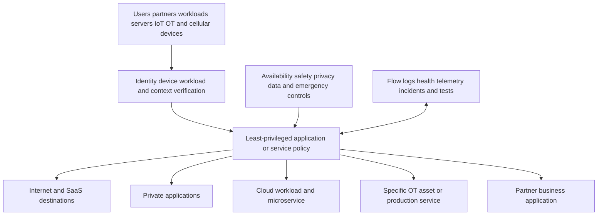

## JD Mapping

| Role expectation | Part 40 capability | TSM artifact | Arti bridge and boundary |
|---|---|---|---|
| Discover architecture | Inventory cloud, branch, OT, partner, cellular flows and dependencies | Discovery questionnaire | Network/support method transfers |
| Guide transformation | Compare network-centric and application-centric designs | Architecture decision record | Product deployment is new |
| Reduce risk | Minimize exposure, lateral movement, standing access, and broad partner connectivity | Risk roadmap | Outcome discipline transfers |
| Protect operations | Integrate safety, uptime, legacy protocol, and rollback constraints | OT change plan | OT safety authority remains customer-owned |
| Troubleshoot | Separate identity, policy, steering/routing, service component, destination, and application | Evidence matrix | DNS/TCP/TLS trace method transfers |
| Coordinate incidents | Engage cloud, network, endpoint, OT, IAM, app, carrier, vendor, and Zscaler owners | Timeline and RACI | Critical escalation transfers |
| Measure value | Track flow coverage, denied paths, availability, incident impact, exceptions, and operating effort | Scorecard | Avoid marketing ROI claims |
| Communicate boundaries | State current product support and shared responsibility | Executive brief | No unsupported production claims |

## Candidate honesty note

| Claim class | Safe Part 40 statement | Unsupported conversion |
|---|---|---|
| Production transfer | "I isolated enterprise DNS, TCP/TLS, proxy, identity, and service paths." | "I deployed Zero Trust Branch in factories." |
| Demonstrated study | "I built fictional cloud/OT/partner flow and migration labs." | "I segmented production PLCs." |
| Public fact | "Zscaler positions Zero Trust Cloud for ingress/egress/east-west and microsegmentation." | "It secures every protocol in every cloud identically." |
| Safety boundary | "OT owners validate dependencies, safety, fail mode, and windows." | "Security policy overrides process safety." |
| Vendor positioning | "Product pages describe zero attack surface and zero lateral movement goals." | "Ransomware can never spread." |
| Unknown | "I would verify current component, route, health, version, support, and logs." | "The green portal means the application works." |

Product pages use claims such as "zero attack surface," "zero lateral movement," "all traffic," "100 percent visibility," "nothing to configure," "under ten minutes," "no downtime," and specific savings. Treat those as positioning or cited customer/typical estimates. Actual outcomes depend on topology, coverage, integrations, protocols, identities/tags, native controls, versions, cloud/ISP/operator availability, operations, safety, testing, and residual paths.

## Beginner vocabulary and memory hooks

| Term | Plain meaning | Why it matters | Memory hook |
|---|---|---|---|
| Workload | Software process/service running on VM, container, serverless, or host | It communicates without a human browser | Machine doing business work |
| VPC/VNet | Isolated virtual network construct in public cloud | Common cloud routing/security boundary | Cloud neighborhood |
| Ingress | Traffic entering a workload/application environment | Public exposure and inbound attack risk | Traffic coming in |
| Egress | Traffic leaving a workload toward internet/SaaS/service | Command/control, malicious download, data loss | Traffic going out |
| East-west | Workload-to-workload traffic inside/across cloud/data-center environments | Lateral movement occurs here | Sideways service traffic |
| North-south | Traffic entering/leaving a broader environment | Perimeter-style direction | In/out of the neighborhood |
| Micro-flow | Specific communication between two workload identities/services | Basis for fine-grained least privilege | One service conversation |
| Microsegmentation | Fine-grained policy among workloads/resources | Limits lateral movement after compromise | Lock every internal door |
| Cloud Connector | Customer-deployed virtual component in current Zero Trust Cloud patterns | Steering/connectivity/operation responsibilities vary | Customer-operated cloud checkpoint |
| Zero Trust Gateway | Zscaler-managed workload security gateway offering | Moves infrastructure lifecycle toward provider | Managed cloud checkpoint |
| Tag | Metadata describing workload/app/environment/role | Stable policy intent can outlive changing IPs | Luggage label |
| SD-WAN | Software-defined wide area networking | Selects paths and connects sites/apps | Smart route chooser |
| Branch edge | Physical/virtual gateway at branch/campus/factory | Forwards and segments local traffic | Site traffic station |
| Local breakout | Internet/SaaS traffic exits near the site/user | Avoids central backhaul | Nearest highway entrance |
| IoT | Internet of Things device, often headless/embedded | May not support agents or modern controls | Connected appliance |
| OT | Operational Technology interacting with physical processes | Safety and availability can dominate | Digital control of physical work |
| ICS | Industrial Control System | OT category for industrial processes | Factory control system |
| PLC | Programmable Logic Controller | Controls industrial equipment/processes | Industrial logic computer |
| SCADA | Supervisory Control and Data Acquisition | Monitors/controls distributed industrial process | Industrial control dashboard |
| Purdue model | Common hierarchy for industrial zones/levels | Useful reference, not automatic policy truth | Factory level map |
| Headless device | Device without normal interactive user interface | Cannot use many endpoint-agent workflows | Computer without keyboard/screen |
| Agentless | Control without installing software on protected endpoint | Important for legacy IoT/OT | Secure without endpoint install |
| PRA | Privileged Remote Access | Brokers high-risk admin/vendor sessions | Temporary escorted maintenance |
| JIT | Just in time access | Grants privilege only when needed | Key issued for appointment |
| Break glass | Emergency access path under strict controls | Needed when normal system unavailable | Sealed emergency key |
| SIM/eSIM | Subscriber identity module for cellular network access | Can anchor provisioning/steering context | Cellular identity token |
| B2B | Business-to-business partner interaction | Partners need apps, not broad network trust | Company-to-company doorway |
| RTO | Recovery Time Objective | Maximum target time to restore function | How fast must it return? |
| RPO | Recovery Point Objective | Maximum acceptable data loss period | How much history can be lost? |
| Fail-open | Allow traffic if enforcement unavailable | Preserves availability but raises exposure | Door unlocks on failure |
| Fail-closed | Deny traffic if enforcement unavailable | Preserves policy but can stop operations | Door stays locked on failure |

## Start with flows, not products

| Flow | Source | Destination | Core question | Candidate product area |
|---|---|---|---|---|
| Workload egress | VM/container/service | Internet/SaaS/API | Which outbound destinations/actions are required? | Zero Trust Cloud/Gateway egress |
| Workload ingress | External client/service | Published workload/app | How is app exposed and inspected without broad network access? | Zero Trust Cloud ingress plus native/app controls |
| East-west | Workload A | Workload B across VPC/VNet/cloud | Which service dependency is legitimate? | Zero Trust Cloud east-west |
| Local micro-flow | Process/workload | Peer on same/near host network | How is lateral movement constrained locally? | Microsegmentation |
| Branch user/device | User/IoT/server | SaaS/private app/internet | Does source need application or network reach? | Zero Trust Branch/SD-WAN/ZIA/ZPA |
| OT device | PLC/HMI/sensor | Required controller/historian/vendor service | What deterministic communication is safe? | OT/IoT Segmentation |
| Privileged technician | Employee/vendor | Specific IT/OT asset/protocol | Who, why, when, credential, session control? | PRA |
| Cellular endpoint | SIM device | Approved service | Which destinations/protocols/operators and fail behavior? | Zscaler Cellular |
| Partner user | Partner identity/device | Specific business app | How to avoid network extension/standing trust? | ZPA/B2B/browser/PRA pattern |

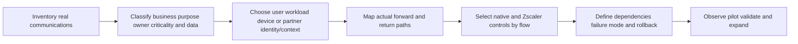

### Plain-English deep-dive 1 - A product diagram is not a packet path

A subway brochure can show that two stations connect without showing which platform, transfer tunnel, ticket gate, or maintenance closure a passenger uses. Product diagrams similarly communicate an architecture idea, not every route, NAT, return path, DNS answer, load balancer, cloud route table, tunnel, connector, or policy evaluation.

For troubleshooting and change, draw the real flow in both directions with addresses/names, identities/tags, interfaces, native cloud constructs, Zscaler components, encryption, action, and timestamps. A portal saying a gateway is healthy does not prove packets entered it or the application accepted them.

## Zero trust principles for workloads and sites

| Principle | Workload/branch expression | Evidence |
|---|---|---|
| Resource focus | Connect to named app/service, not entire network | Destination/service policy |
| No implicit location trust | Same VPC/site/VLAN is not automatic authorization | Default-deny or explicit relationship |
| Strong identity/context | Workload tags, service identity, user/device, branch/device class | Current identity/tag source |
| Least privilege | Only required protocol/port/action/destination | Observed dependency matrix |
| Continuous assessment | Re-evaluate context/health/configuration as supported | Policy and health events |
| Minimize exposure | Avoid unnecessary public listeners/site mesh | Exposure scan and route review |
| Assume breach | Segment and monitor internal communications | Lateral movement tests |
| Evidence and response | Log decisions, health, denied paths, incidents | Correlated telemetry |

Zero trust does not require removing all IP controls. Cloud security groups, network ACLs, route tables, load balancers, service meshes, identity roles, encryption, DNS, endpoint/workload protections, backups, and physical safeguards remain. The architecture should clarify which layer owns which threat.

## Zero Trust Cloud and workload paths

Zscaler publicly positions Zero Trust Cloud as workload security for ingress/egress, east-west, and microsegmentation across clouds, regions, and data centers, with customer-deployed virtual and managed-gateway options. Exact components and capabilities require current authenticated documentation.

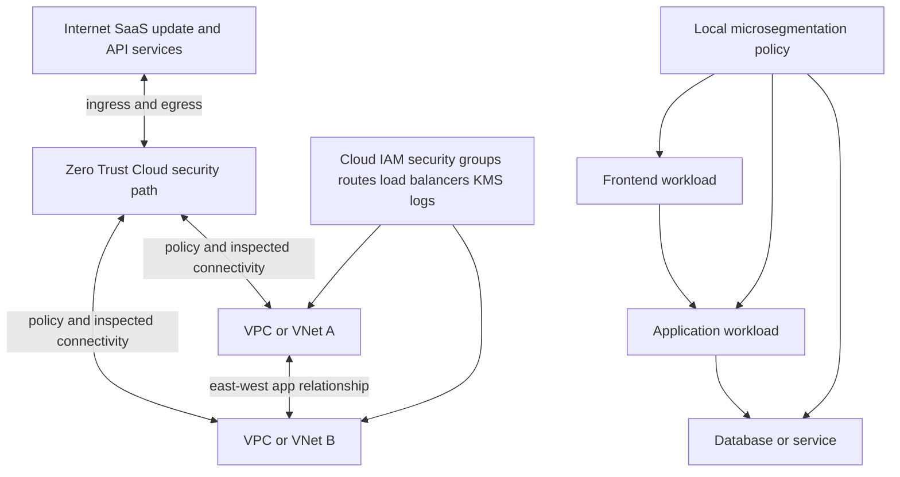

### Workload egress

A workload may retrieve operating-system updates, call a payment API, send telemetry, access package repositories, resolve DNS, contact identity services, or reach SaaS. Broad `0.0.0.0/0 any` egress is easy but increases risk.

| Egress dependency | Needed evidence | Policy consideration |
|---|---|---|
| DNS/NTP | Resolver/time source and bootstrap | Do not break foundational services |
| OS/package update | Official domains/CDNs/signatures | Dynamic endpoints and TLS/pinning |
| SaaS/API | Names, tenant, protocol, authentication | Data/threat inspection and app behavior |
| Cloud provider service | Private/public endpoint path | Service endpoints and route specificity |
| Telemetry | Destination, data fields, retry/backoff | Privacy, volume, outage behavior |
| Admin tooling | Build/deploy repository/registry | Machine identity and supply chain |

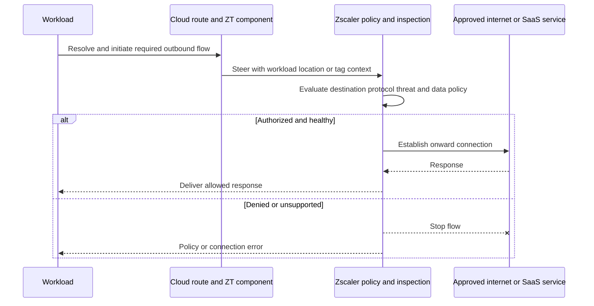

TLS inspection can add threat/data visibility but may conflict with pinning, mTLS, private trust, modern protocols, or machine clients. Apply Part 37's two-leg model and trust governance. Never claim all workload egress is inspected without proving eligible routed flows and exclusions.

### Workload ingress

Ingress means clients/services reach an application. Security design includes DNS, DDoS/CDN/WAF/API gateway/load balancer, TLS identity, authentication, authorization, application policy, Zscaler path, cloud route, and workload exposure. "No public IP on workload" reduces one exposure path but does not eliminate application risk.

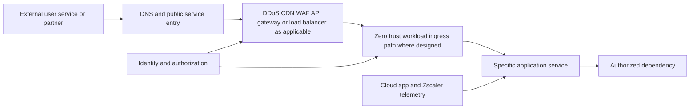

### East-west

East-west connects workloads within or across VPCs/VNets, regions, clouds, or data centers. The goal is explicit application dependency rather than a transitive flat network.

| Dependency field | Example |
|---|---|
| Source identity/tag | `app=orders`, `env=prod`, `role=api` |
| Destination identity/tag | `app=payments`, `env=prod`, `role=service` |
| Protocol/port | TLS API on approved port |
| Direction | Orders API to payments only |
| Purpose | Charge authorized checkout |
| Data | Tokenized payment request, no raw secret in logs |
| Availability | RTO, retries, queue, timeout, region failover |
| Owner | Orders and payments teams |
| Evidence | Flow log, policy decision, application trace |

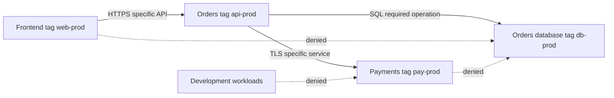

Overlapping IP addresses are operationally difficult in network-centric mergers or multi-cloud routing. Application/tag-oriented policy may reduce reliance on unique IP relationships, but routing/steering and supported identity remain real requirements. Validate exact behavior.

### Microsegmentation

Zscaler product pages describe agent-based workload microsegmentation with asset/flow visibility, grouping recommendations, and local enforcement. This differs from broader gateway-based workload flows and agentless OT/IoT segmentation.

| Gateway/east-west control | Workload microsegmentation |
|---|---|
| Secures traffic routed through gateway/path | Can enforce at/near protected workload under current design |
| Suitable across networks/clouds/regions | Suitable for granular local workload relationships |
| Requires route/steering symmetry | Requires agent/platform/version/deployment support |
| Policy can use workload/application context | Fine-grained process/workload visibility can support grouping |
| Does not automatically see same-host/local bypass | Local enforcement can cover otherwise unrouted micro-flows |

### Plain-English deep-dive 2 - A moat does not replace locks inside the castle

A guarded bridge controls people entering a castle. If every room inside is open, a compromised servant can move anywhere. A gateway controls traffic that crosses it; microsegmentation controls more granular internal relationships.

First observe dependencies. Recommendations or AI grouping are hypotheses, not authorization. Application owners validate startup, backup, monitoring, failover, patching, health checks, management, and emergency flows before enforcement.

## Deployment models and shared responsibility

| Area | Customer-deployed virtual form (high level) | Managed Zero Trust Gateway (high level) |
|---|---|---|
| Infrastructure lifecycle | Customer owns deployment/integration/scaling according to design | Zscaler positions gateway infrastructure as managed |
| Cloud routing | Customer still owns route/service integration | Customer still must integrate workloads/routes/endpoints as documented |
| Policy | Customer owns intent, data/app owners, tests | Customer owns intent, data/app owners, tests |
| Availability | Customer validates component architecture and cloud dependencies | Provider manages service component HA; customer validates end-to-end |
| Observability | Component, cloud, Zscaler, and app logs | Cloud, managed service, Zscaler, and app evidence |
| Change | Customer coordinates infra and policy | Customer coordinates service integration and policy |
| Cost | Cloud resources/operations plus product | Managed service consumption plus cloud/network effects |

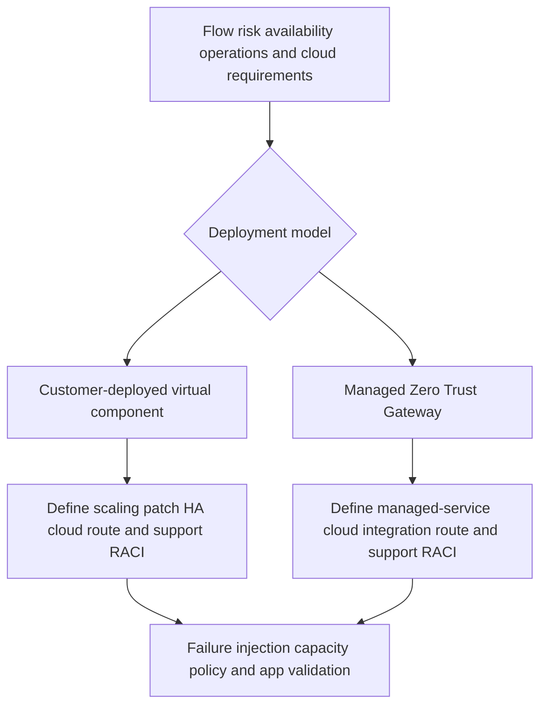

"Fully managed" does not make the customer's application, route tables, DNS, cloud IAM, tags, data policy, capacity assumptions, failover dependencies, or incident response provider-owned. Build an explicit RACI.

## Branch and Zero Trust SD-WAN

Traditional branch designs often create site-to-site tunnels and a routable enterprise WAN. Zscaler positions Zero Trust Branch/SD-WAN around direct-to-cloud/application access, branch segmentation, traffic forwarding/path selection, and integrated IoT/OT/PRA patterns. Product pages describe physical or virtual Zscaler Edge modes; verify current hardware, interfaces, HA, routing, protocol, and service behavior.

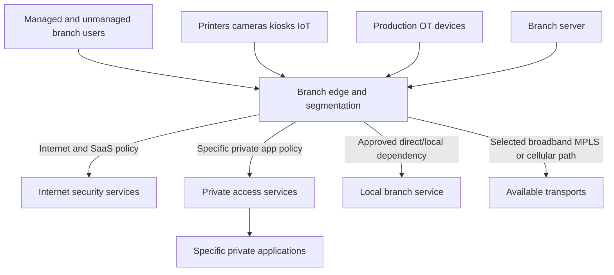

| Branch concern | Discovery question | Test |
|---|---|---|
| Internet/SaaS | Which apps need local egress and inspection/bypass? | Full user transactions and ZDX |
| Private apps | Which users/devices need which apps/protocols? | Positive and denied app access |
| Local services | DHCP, DNS, print, voice, building, OT dependencies? | WAN/cloud outage operation |
| Underlay | Broadband/MPLS/cellular capacity/SLA/NAT? | Brownout/failover/return-to-primary |
| Path selection | Which app uses which link and why? | Loss/latency/path changes |
| Segmentation | Which sources may communicate locally? | Lateral movement negative tests |
| HA/power | Edge, circuits, UPS, cabling, config recovery? | Planned component/link failure |
| Bootstrap | Provisioning, DNS, NTP, identity, certificates? | New/replacement site bring-up |
| Emergency | What must work if cloud/control is unavailable? | Documented break-glass/fail behavior |

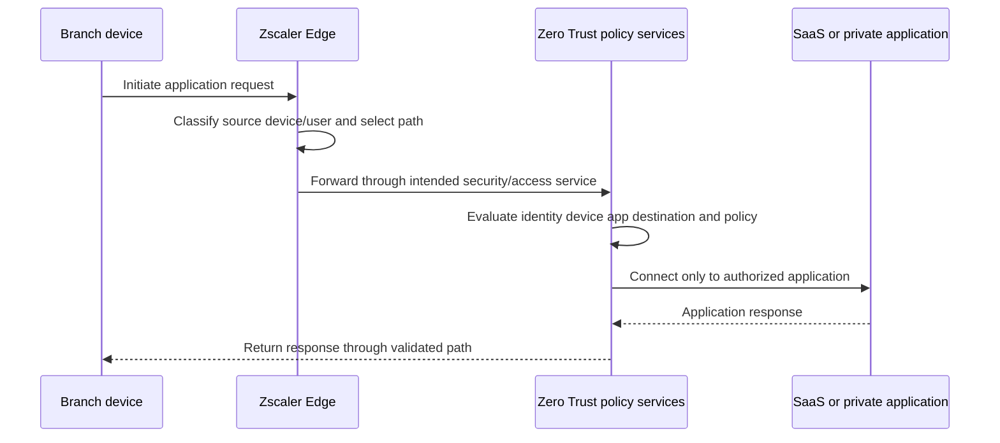

The phrase "cafe-like branch" is an analogy: branch sources receive application/internet access without automatically joining a broadly trusted enterprise network. It does not mean branches need no local network engineering, physical controls, QoS, resiliency, or services.

## IoT and OT discovery and segmentation

IoT/OT devices can be unmanaged, legacy, safety-critical, vendor-dependent, and unable to run agents. Product pages position agentless device discovery/classification and segmentation, including device grouping and fine-grained isolation. Treat discovered identity as confidence-based evidence and validate it with asset/OT owners.

| Discovery source | Useful signal | Risk |
|---|---|---|
| MAC/OUI | Manufacturer hint | Spoofable/shared/replaced interfaces |
| DHCP/hostname | Device naming/client behavior | Stale/generic/missing |
| Traffic profile | Protocols/destinations/timing | Behavior changes or shared templates |
| Network location/port | Physical/logical context | Moves, trunks, virtual paths |
| Asset inventory | Owner/model/serial/criticality | Stale/manual errors |
| Vendor/controller | Authoritative operational context | Integration/coverage limits |
| Active probing | Richer fingerprint in some environments | Can disrupt fragile OT; require approval |

```mermaid
flowchart LR
    OBSERVE[Passively observe device and communication where possible] --> CLASSIFY[Propose device type owner and criticality]
    CLASSIFY --> VALIDATE[OT engineering and asset owner validate]
    VALIDATE --> BASE[Document normal dependencies timing and failover]
    BASE --> POLICY[Design minimum device-to-app/service policy]
    POLICY --> MONITOR[Monitor-only or low-risk pilot]
    MONITOR --> ENFORCE[Staged enforcement with rollback]
    ENFORCE --> REVIEW[Drift firmware vendor and process review]
```

### Communication matrix

| Source | Destination | Protocol/purpose | Criticality | Safety/failure behavior |
|---|---|---|---|---|
| PLC | HMI/controller | Vendor industrial protocol | Production critical | Local control must remain deterministic |
| HMI | Historian | Telemetry/event upload | High | Buffer/retry behavior tested |
| Engineering workstation | PLC | Authorized programming | High-risk maintenance only | JIT/PRA/change window |
| Camera | Video recorder | Stream | Operational | Loss may reduce safety/security visibility |
| Sensor | Cloud analytics | TLS/MQTT/vendor API | Medium/high by process | Store-and-forward and certificate lifecycle |
| Printer | Print server | Printing/management | Business | No reach to OT controller |
| Vendor | Diagnostic service | RDP/SSH/VNC/thick client as applicable | High-risk privileged | Approval, record, usher, rollback |

### Safety and availability hierarchy

NIST SP 800-82 Rev. 3 emphasizes OT's unique performance, reliability, and safety requirements. Security changes must involve OT engineering, process safety, operations, vendors, and risk owners.

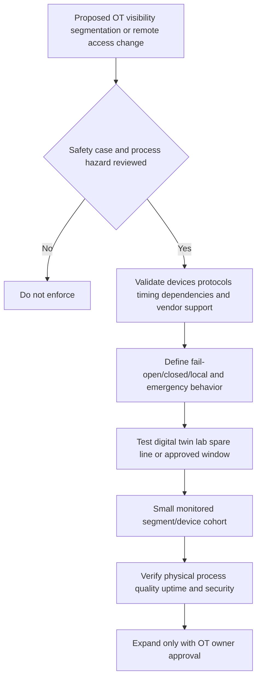

### Plain-English deep-dive 3 - In OT, a secure outage can still be a disaster

For an office website, fail-closed may produce an inconvenience. For cooling, dosing, pressure, safety interlocks, medical systems, or conveyor control, loss of communication can damage equipment or people. Cybersecurity is one contributor to safe operation, not the only objective.

Never use production OT as a generic network lab. Prefer passive discovery, vendor documentation, spare equipment, digital twins, offline analysis, maintenance windows, local manual control, clear abort conditions, and tested recovery. The plant/process owner has stop authority.

## Privileged Remote Access for IT and OT

Zscaler product pages describe PRA features such as clientless browser access for protocols including RDP/SSH/VNC, identity/MFA, JIT/time-bound access, credential vault/mapping/injection, file sandboxing, clipboard controls, privileged desktop for thick clients, and session monitoring/recording. Availability varies by package/protocol/use case.

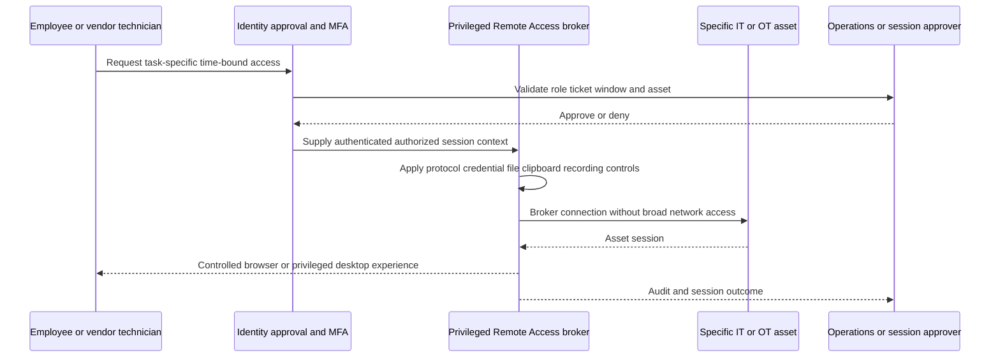

| PRA control | Purpose | Operational caution |
|---|---|---|
| MFA/identity federation | Verify technician | IdP outage and recovery identities |
| Role/asset policy | Limit accessible systems | Group/asset drift |
| JIT/time window | Remove standing access | Clock/ticket/emergency delay |
| Credential injection/vault | Avoid sharing asset password | Vault outage/rotation/account lockout |
| Session recording | Investigation/compliance | Highly sensitive video/keystroke retention |
| File sandbox/control | Reduce malware introduction | Vendor firmware/signature and offline process |
| Clipboard/download restriction | Reduce data loss | Support workflow and accessibility |
| Ushered/approved session | Human oversight | On-call availability and separation of duty |
| Privileged desktop | Isolate thick-client tools | Image/tool/version/licensing/latency |
| Break glass | Emergency recovery | Strict logging, physical/local alternative, review |

PRA is not automatically a full PAM replacement for every secrets lifecycle, machine account, database privilege, command control, or local emergency use. Inventory existing PAM/jump-host/vault functions and map each to current supported capability or retained tool.

## Cellular IoT and mobile security

Zscaler positions Zscaler Cellular as SIM-based, agentless steering of cellular-connected device traffic to Zero Trust Exchange services, with direct and partner-managed variants, policy, telemetry, segmentation, multi-operator/global coverage, and use cases such as kiosks, sensors, EV chargers, vehicles, retail, logistics, and backup connectivity.

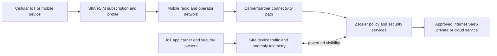

| Cellular dependency | Failure mode | Evidence |
|---|---|---|
| SIM/eSIM state | Not provisioned/suspended/wrong profile | Subscription and device registration |
| Radio coverage | Weak/no service/interference | Signal/registration/technology |
| Operator/roaming | Network unavailable/restricted | Carrier and roaming status |
| APN/core path | Session cannot establish or route | APN/PDP context/carrier evidence |
| DNS/NTP | Service bootstrap fails | Resolver/time tests |
| Zscaler steering/policy | Wrong destination/action | Policy and path logs |
| Destination app | Server/API/certificate failure | Application/transaction log |
| Power/firmware | Device offline or incompatible | Device telemetry |
| Data plan/cost | Throttled/exhausted/unexpected spend | Usage/billing/cap |

"Any protocol" or "100 percent visibility" requires validation. Some traffic may be encrypted, private, unsupported for content inspection, tunneled, peer-to-peer, emergency, or outside the intended SIM path. Define allowed destinations and management paths. Test roaming, multi-operator failover, latency, data limits, firmware updates, certificates, offline buffering, power cycles, and physical tamper.

## B2B and partner access

Partners, suppliers, auditors, merger teams, and vendors usually need a small set of business applications, not network-level connectivity. Identity lifecycle and contracts matter as much as packets.

| B2B question | Example answer |
|---|---|
| Partner identity | Federated SSO or sponsored account with named owner |
| User population | Vendor maintenance team, not entire partner domain |
| Device state | Managed, unmanaged, posture unknown, shared kiosk? |
| Application | Specific portal, API, RDP asset, or web app |
| Action/data | View orders; no bulk export; approved upload only |
| Time | Contract period or maintenance window |
| Approval | App owner and risk/OT owner |
| Session control | Browser restriction, PRA recording, file sandbox |
| Offboarding | Automated expiry, SCIM/deprovision, access review |
| Incident | Partner contact, isolation, evidence, legal notification |

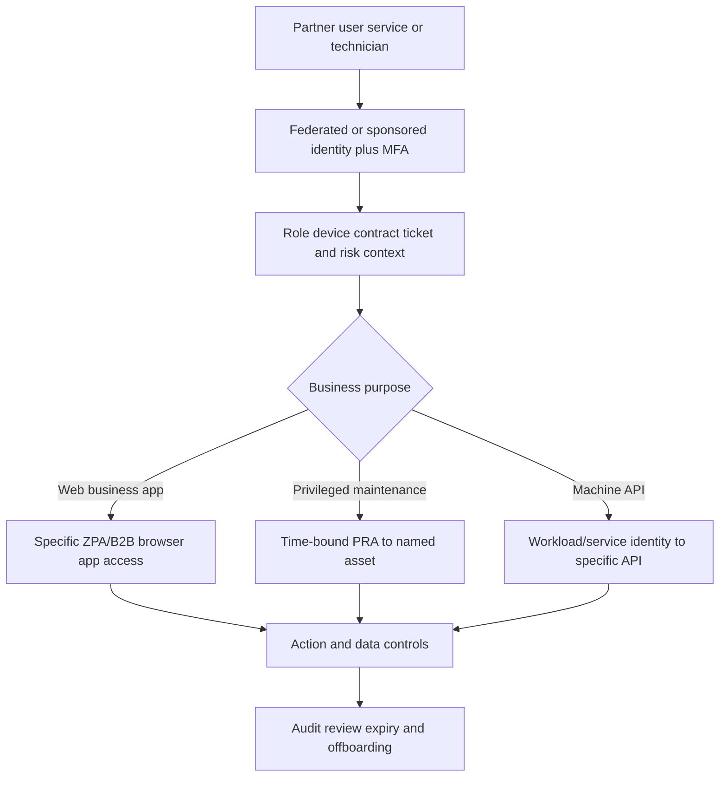

### Plain-English deep-dive 4 - A partner badge should open one room, not connect two buildings

A contractor repairing an elevator needs the elevator control room during a maintenance window. Giving the contractor a master badge for the campus because it is easy creates unnecessary risk.

Traditional site-to-site VPNs can connect broad address spaces. A zero trust B2B pattern identifies the user/service, exact application/asset, allowed action, time, device context, and audit. Some machine integrations still require network/protocol designs; the goal is minimum relationship, not forcing every flow through a browser.

## Identity, policy, traffic, and data model

| Policy axis | Human/partner | Workload | IoT/OT | Cellular |
|---|---|---|---|---|
| Subject identity | User, group, role, partner | Tag, service identity, account, environment | Device identity/class/asset | SIM/device/subscription |
| Context | Device posture, location, risk, ticket | Cloud, region, tag, build, posture | Line, zone, mode, maintenance state | Operator, country, device state |
| Destination | SaaS/private app/asset | API/service/workload | Controller/historian/vendor service | Approved app/service |
| Protocol/action | HTTP, RDP, SSH, download, upload | TLS API, database, queue | Industrial/vendor protocols | Any required tested protocol |
| Data | User/file/session | Service payload/secrets | Process/telemetry/commands | Telemetry/location/commands |
| Time | Session/JIT/contract | Continuous/service lifecycle | Schedule/process state | Continuous/event-based |
| Response | Allow/restrict/record/block | Allow/inspect/deny/isolate | Allow/deny/kill switch only if safe | Allow/block/anomaly/contain |

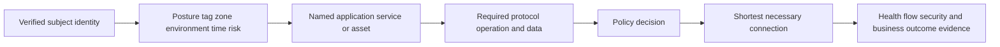

IP address can remain an enforcement input but should not be the only identity. Tags and classifications also drift: cloud automation can apply wrong tags, device discovery can misclassify, partner groups can be stale, and SIM inventory can be wrong. Protect metadata sources and audit changes.

## Architecture comparisons

| Legacy/network-centric pattern | Resource-centric alternative | Retained requirement |
|---|---|---|
| Site-to-site VPN mesh | Branch/partner to specific apps | Underlay routing and resilience |
| Broad cloud peering | Explicit workload/app relationships | Cloud routes, IAM, DNS |
| Perimeter firewall only | Ingress/egress plus east-west/microsegmentation | Native cloud/app protections |
| VLAN as trust zone | Validated device-to-service policy | Switching, physical safety, QoS |
| Shared vendor jump host | JIT/PRA named-asset session | Local emergency and vendor tools |
| Direct cellular internet | SIM-steered policy to approved services | Carrier/radio/APN operations |
| Flat branch LAN | Device/user/server segmentation and app access | Local DHCP/DNS/print/OT operations |

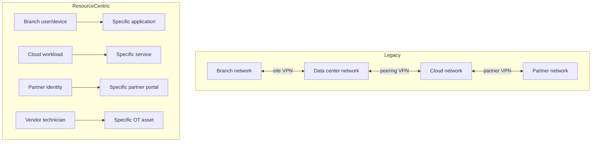

This is not a mandate to delete legacy controls immediately. Some non-proxy protocols, multicast/broadcast, discovery, real-time industrial, safety, regulatory, offline, or migration flows may require retained network controls. Document boundaries and defense in depth.

## Data and threat protection across these flows

| Flow | Threat questions | Data questions |
|---|---|---|
| Workload egress | Malware download, C2, vulnerable destination, supply chain? | Secrets/records leaving? TLS inspectable? |
| Workload ingress | Exploit, bot, DDoS, auth abuse, malicious payload? | Sensitive response exposure? |
| East-west | Compromised service, unexpected dependency, ransomware movement? | Cross-environment data access? |
| Branch | Phishing, malware, unauthorized local movement? | SaaS upload, print, IoT data? |
| OT | IT-to-OT intrusion, unsafe command, vendor compromise? | Process recipes, telemetry, safety data? |
| PRA | Credential theft, malicious file, session abuse? | Clipboard/download/recording sensitivity? |
| Cellular | Device compromise, unexpected destination, anomaly? | Location/telemetry/commands and cost? |
| B2B | Partner account/device compromise, overprivilege? | Bulk export/share/upload restrictions? |

Inspection has protocol and privacy boundaries. Encryption, certificate pinning, mTLS, proprietary protocols, performance, safety, and data laws can constrain content controls. Use endpoint/workload/app-native identity and authorization, segmentation, DLP where supported, and monitoring as layers.

## Availability, resilience, and failure modes

| Component/dependency | Failure impact | Design response |
|---|---|---|
| Identity provider | User/vendor access denied or stale | Resilient IdP, emergency process, no shared permanent bypass |
| DNS/NTP | Names/auth/certificates fail | Approved redundant local/cloud sources |
| Branch edge | Site traffic loss or wrong path | HA/power/config replacement test |
| Underlay/ISP | Branch/app degradation | Diverse paths and tested failover |
| Cloud route | Blackhole/asymmetry/bypass | IaC review, flow logs, rollback |
| Connector/gateway | Workload path interruption | Supported HA/managed SLA and end-to-end test |
| Policy service | New decision/config issue | Current documented behavior and cached/emergency plan |
| OT segmentation | Production communication blocked | Monitor-first, local safe state, rollback/kill-switch governance |
| PRA | Maintenance access unavailable | Approved local emergency process and audit |
| Cellular operator | Device offline/roaming issue | Multi-operator/backup/offline buffering |
| Destination app | Secure path healthy but task fails | App owner telemetry and recovery |

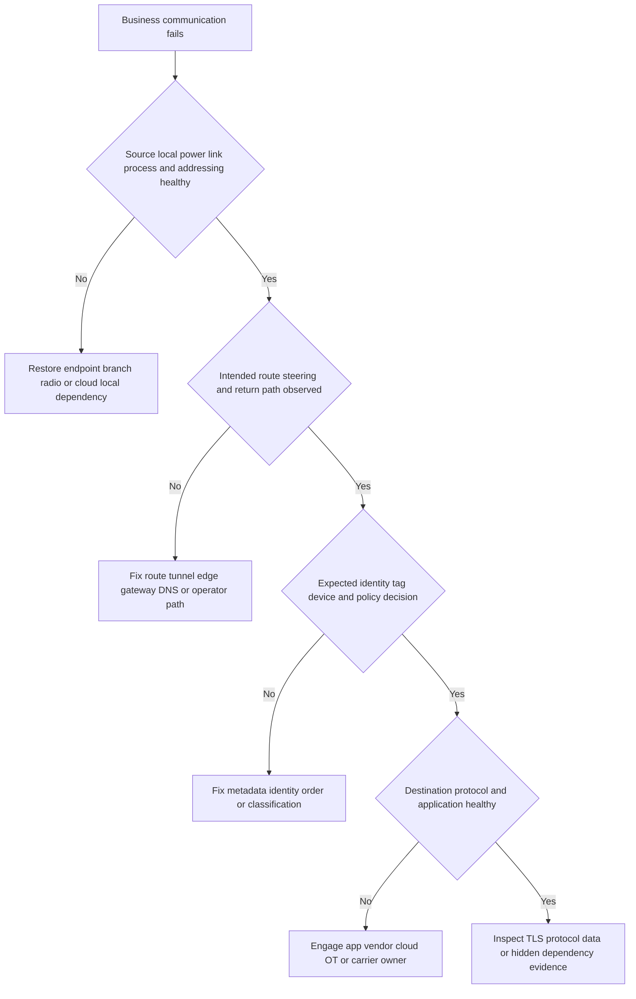

For every critical flow, state fail-open/closed/local behavior, RTO/RPO, emergency communications, safety state, control-plane/data-plane dependency, cached policy, and who can invoke rollback. Verify current product behavior; do not guess.

## Troubleshooting workflow

### Step 1: define the flow and business operation

Source asset/user/workload/SIM, destination app/service/device, direction, names/addresses, protocol/port, cloud/branch/line/operator, identity/tag/class, time zone, expected and actual result, criticality, safety impact, and healthy comparison.

### Step 2: prove source and local conditions

Workload/process health, branch edge/interface/VLAN/local service, OT device/controller/process mode, cellular radio/SIM/APN, or partner device/browser/identity. Avoid active OT scans without approval.

### Step 3: prove forward and return path

DNS, cloud route tables, next hops, edge path selection, tunnels/service health, gateway/connector, NAT, load balancers, operator/carrier, asymmetric route, and direct/bypass alternatives. Use native flow logs and packet evidence where safe.

### Step 4: prove identity and policy

User/group/partner lifecycle, device posture/classification, workload tags/service identity, SIM mapping, destination object, rule/action/order, activation, exception, and current component configuration.

### Step 5: prove protocol and destination

TCP/UDP, TLS certificate/mTLS/pinning, app request/response, industrial protocol timing, API/auth, load balancer/health check, and complete transaction. A TCP handshake is not a business operation.

### Step 6: correlate and test one hypothesis

Align Zscaler, cloud, branch, carrier, identity, OT, app, and change logs. Choose one safe reversible change. In OT, obtain operation/safety approval and abort criteria.

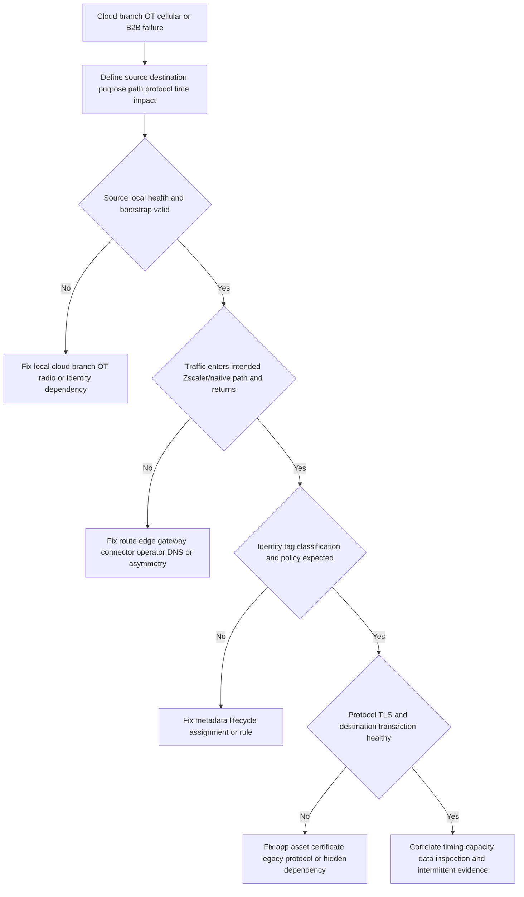

### Segmentation failure tree

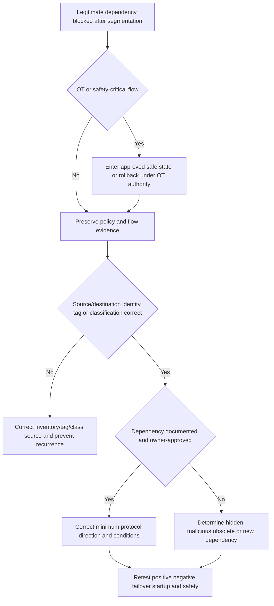

### PRA failure tree

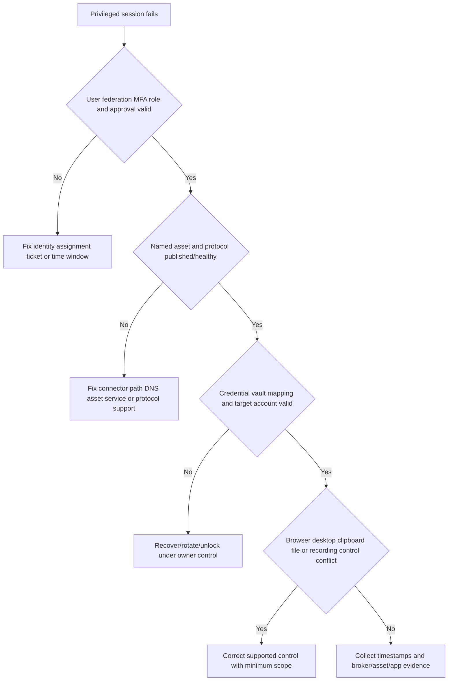

## Rollout patterns

| Phase | Work | Exit gate |
|---|---|---|
| Governance | Owners, criticality, safety, privacy, legal, support, incident, emergency | Approved RACI/risk model |
| Inventory | Real flows, assets, tags, apps, protocols, routes, identities, data | Dependency/unknown register |
| Observe | Flow logs/passive OT discovery/current state | Coverage and classification confidence |
| Design | Application/device relationships, native/Zscaler layers, failure modes | Architecture and rollback review |
| Lab | Cloud sandbox, spare branch, digital twin, test SIM, test partner | Positive/negative/failure tests |
| Canary | Noncritical workloads/site/devices/users | Availability/security/support gates |
| Wave | App/branch/line/region cohorts | Owner signoff and metrics |
| Decommission | Remove obsolete VPN/firewall/routes only after proof | No hidden dependency and recovery plan |
| Operate | Drift, versions, incidents, exceptions, exercises, capacity | Continuous backlog |

```mermaid
sequenceDiagram
    participant O as App cloud branch and OT owners
    participant S as Security and Zscaler team
    participant P as Pilot environment
    participant M as Monitoring and support
    O->>S: Approve flows safety criticality failure and rollback
    S->>P: Deploy observe-first or minimum pilot policy
    P->>M: Run startup steady-state peak failover and denied tests
    M-->>O: Report business safety performance security and coverage
    alt Gates pass
        O-->>S: Approve next cohort
    else Gate fails
        S->>P: Roll back bounded change
        M-->>O: Verify restored operation and residual exposure
    end
```

Do not decommission old paths because a small happy-path pilot worked. Test backups, batch jobs, patching, monitoring, certificate renewal, scaling, disaster recovery, vendor maintenance, region failover, broadcast/multicast, local operations, and emergency access as applicable.

## Fictional NMH architecture and incidents

NMH has two public clouds, 45 branches, three factories, retail kiosks, cellular environmental sensors, external maintenance vendors, and a logistics partner. Everything is synthetic.

### NMH flow map

| Domain | Synthetic design | Critical validation |
|---|---|---|
| Cloud egress | Tagged workloads reach approved SaaS/update APIs through workload security | DNS/TLS/pinning, scaling, data policy |
| East-west | Orders API reaches payment and its own database only | Startup/failover/queue/backup dependencies |
| Microsegmentation | Production workloads get local fine-grained policy | Agent/platform/performance/health |
| Branch | Users to SaaS/private apps; printers/kiosks isolated | DHCP/DNS/print/voice/outage behavior |
| Factory OT | PLC/HMI/historian communication allowlist | Process safety, timing, local control |
| PRA | Vendor JIT browser/desktop to named asset | Ticket, credential, file, record, break glass |
| Cellular | Sensor SIM to telemetry API only | Operator/APN/roaming/offline buffer |
| B2B | Logistics partner to order portal/API | Federation, app/data actions, expiry |

```mermaid
flowchart TB
    CLOUD1[NMH Cloud A workloads] <-->|explicit east-west| CLOUD2[NMH Cloud B workloads]
    CLOUD1 -->|approved egress| ZTC[Zero Trust Cloud path]
    BRANCH[Branch users devices servers] --> EDGE[Zero Trust Branch edge]
    FACTORY[Factory OT IoT] --> SEG[Agentless validated segmentation]
    VENDOR[Maintenance vendor] --> PRA[PRA JIT named asset]
    SENSOR[Cellular sensors] --> CELL[SIM/operator/Zscaler cellular path]
    PARTNER[Logistics partner] --> B2B[Specific portal/API]
    ZTC --> APPS[NMH apps and internet/SaaS]
    EDGE --> APPS
    SEG --> APPS
    PRA --> FACTORY
    CELL --> APPS
    B2B --> APPS
```

### Incident A: cloud workload update fails

After egress restriction, a Linux workload cannot update. Zscaler policy allows the documented repository, but DNS shows a CDN dependency not in the inventory and TLS uses a pinned machine workflow. NMH validates the vendor's official endpoint set and certificate behavior, adds the minimum supported dependency or governed inspection exception, and tests package signature validation. It does not allow all internet egress.

### Incident B: factory line pauses after enforcement

A PLC-to-historian heartbeat was visible during steady-state observation but a rare controller recovery flow was absent from the baseline. Enforcement blocks it during restart, and the line pauses. The OT owner invokes the approved rollback, restores safe operation, captures controller/vendor evidence, updates the dependency matrix, retests in a digital twin and maintenance window, and adds a narrowly defined recovery flow. Security does not declare success because lateral movement was blocked.

### Incident C: vendor PRA cannot connect

Identity and approval pass, but the injected target credential is locked after an unmanaged rotation. The team proves broker-to-asset reachability and protocol health, then the asset/PAM owner safely recovers and remaps the account. It verifies recording, file controls, JIT expiry, and post-session credential state. A broad VPN is not restored.

### Incident D: cellular sensors disappear in one country

SIMs are active and policy unchanged. Devices fail to register with the expected roaming operator after a carrier change. Other countries and Wi-Fi lab devices are healthy. Carrier/operator evidence identifies roaming restriction; NMH invokes the approved alternate operator/profile, validates APN/steering and telemetry delivery, and monitors cost/latency. The Zscaler portal alone could not identify radio registration failure.

```mermaid
sequenceDiagram
    participant D as NMH cellular sensor
    participant O as Mobile operator and roaming
    participant Z as Zscaler cellular/security path
    participant A as NMH telemetry application
    participant I as Incident team
    D-xO: Registration/roaming fails after carrier change
    D--xZ: No data session reaches policy path
    Z-->>I: No recent device traffic; policy unchanged
    I->>O: Check SIM subscription roaming and radio registration
    O-->>I: Identify restricted roaming profile
    I->>O: Activate approved alternate profile/operator
    D->>Z: Data session resumes
    Z->>A: Approved telemetry flow
    A-->>I: Confirm complete sensor transaction and timestamps
```

## TSM discovery questions

| Area | High-value questions |
|---|---|
| Business | Which apps/processes cannot stop, and what is impact per minute/hour? |
| Workloads | Which ingress/egress/east-west flows exist by app/environment/owner? |
| Clouds | Providers, accounts/subscriptions, VPC/VNet, regions, overlapping IPs, IaC? |
| Native controls | IAM, security groups, WAF, load balancer, service mesh, EDR, KMS, logs? |
| Branches | Sites, users, devices, local services, underlays, HA, power, QoS, voice? |
| OT | Asset inventory, safety case, vendors, protocols, Purdue zones, passive visibility? |
| Privileged | Who connects, to what, why, protocol/tool, credential, files, recording, emergency? |
| Cellular | Countries/operators/APNs/SIMs/devices/data plans/roaming/offline/firmware? |
| B2B | Partner identities, devices, apps/APIs, actions/data, contracts, expiry, incident contacts? |
| Data | Sensitive payloads, inspection boundaries, privacy, residency, retention? |
| Reliability | RTO/RPO, fail-open/closed/local, DR, maintenance, break glass, exercises? |
| Operations | Teams, skills, monitoring, ticket flow, escalation, vendor support, metrics? |

## Metrics and outcomes

| Metric | Useful definition | Caveat |
|---|---|---|
| Flow inventory coverage | Validated critical flows/expected critical flows | Unknown denominator must be tracked |
| Explicit-policy coverage | Flows governed by named source-destination purpose/eligible flows | Broad allow is not meaningful coverage |
| Exposure reduction | Public listeners/VPN peers/broad routes removed after validation | Native/app exposure remains |
| Lateral negative-test success | Prohibited paths denied under safe tests | Cannot prove every attack blocked |
| Availability | Successful complete critical transactions/attempts | Separate planned/safety events |
| User/process impact minutes | Affected users/devices/processes x duration | Avoid double counting |
| Segmentation exception age | Open broad/temporary rules by scope and age | Criticality and traffic matter |
| PRA standing privilege reduction | Persistent privileged paths/accounts removed | Break-glass remains controlled |
| Vendor access lead time | Approved request to usable JIT session | Do not trade safety review for speed |
| Cellular session success | Devices completing registration/data/app transaction | Radio/operator/app layers differ |
| Change failure/rollback | Changes causing impact and recovery time | Honest reporting improves safety |
| Operating effort | Hours/devices/rules/incidents for steady-state operation | Migration effort separated |

```mermaid
flowchart LR
    DISCOVER[Discover and validate flows] --> REDUCE[Reduce broad exposure and standing connectivity]
    REDUCE --> ENFORCE[Enforce minimum app/device/workload relationships]
    ENFORCE --> VERIFY[Verify business process safety availability and denied paths]
    VERIFY --> OPERATE[Operate drift incidents versions and exceptions]
    OPERATE --> IMPROVE[Measure impact and improve architecture]
    IMPROVE --> DISCOVER
```

## Arti's Microsoft-to-Zscaler bridge

| Microsoft production strength | Part 40 transfer | New Zscaler learning | Honest wording |
|---|---|---|---|
| Azure/M365 service-path support | Cloud DNS/TCP/TLS/app dependency mapping | Zero Trust Cloud routing/components | "Flow method transfers; product deployment is new." |
| Entra identity and groups | Partner/PRA/user policy context | Zscaler identity mapping and JIT workflows | "I verify effective access." |
| Endpoint/network escalation | Branch source-to-app isolation | Zscaler Edge/SD-WAN operations | "I bring trace discipline." |
| Packet/ETW/HAR evidence | Both-direction flow and protocol validation | Workload/branch/OT telemetry | "OT capture requires safety approval." |
| Critical incidents | Timeline, owners, hypotheses, rollback, communication | Multi-owner cloud/OT/carrier incidents | "I protect operations first." |
| Power BI/SQL | Flow coverage, incidents, exceptions, percentiles | Product reports/APIs | "I state denominator and limits." |
| Change management | Rings, canaries, known-good rollback | Cloud/branch/OT staged enforcement | "OT owners have stop authority." |
| Training | Explain resource access vs network trust | Portfolio use-case workshops | "I avoid slogans and show flows." |

### 30-second interview bridge

"I organize this portfolio by communication flow. Zero Trust Cloud addresses workload ingress, egress, east-west, and granular microsegmentation with current virtual or managed deployment choices. Zero Trust Branch/SD-WAN connects branch users, devices, and servers to specific apps rather than extending a flat WAN. Agentless IoT/OT segmentation and PRA can limit device and technician relationships, while Cellular applies policy to SIM-connected devices and B2B access limits partners to named apps. I inventory real dependencies, define identity/tag and failure behavior, pilot safely, and measure business and denied-path outcomes. My Microsoft identity, networking, trace, incident, and analytics methods transfer; production operation of these Zscaler products is new."

## Labs and rehearsal

Use only owned/authorized cloud accounts, networks, devices, SIMs, identities, applications, and synthetic data. Never scan or change production OT without formal safety and operations authorization.

### Lab 1: flow inventory

Build a synthetic cloud/branch/OT/partner inventory with source, destination, protocol, purpose, owner, data, criticality, and failure behavior.

### Lab 2: workload egress

In an owned cloud sandbox, restrict a test workload to DNS/NTP, one package repository, and one API. Trace CDN/certificate dependencies and rollback.

### Lab 3: east-west tags

Create frontend/API/database tags and positive/negative relationships. Change an IP while retaining tag intent; test tag drift.

### Lab 4: microsegmentation

Use local VMs/containers and a standard host firewall or lab library to demonstrate observed dependencies, monitor, enforce, and denied lateral paths. Do not claim it is Zscaler internals.

### Lab 5: managed-versus-virtual RACI

Write a responsibility matrix for routes, DNS, IAM, HA, scaling, upgrades, policy, telemetry, app, incident, and cost.

### Lab 6: branch failover

Use a virtual lab router with two links. Test DNS, SaaS, private app, voice-like traffic, brownout, failover, return, and local services.

### Lab 7: passive IoT discovery

Observe owned devices without active probes. Compare traffic-profile classification to asset inventory and record confidence/unknowns.

### Lab 8: OT safety change

Use a digital twin or simulated PLC/HMI/historian. Write hazards, abort conditions, safe state, maintenance window, rollback, and process validation.

### Lab 9: PRA design

Create synthetic vendor JIT access to one test VM with MFA, approval, credential mapping, file/clipboard policy, recording notice, expiry, and break glass.

### Lab 10: cellular lifecycle

Model SIM order/provision/activate/register/data session/policy/app/roam/suspend/retire. Inject failures at each boundary.

### Lab 11: B2B access

Build a test partner identity that reaches one web app but no network peers. Test group expiry, unmanaged browser controls, denied app, and offboarding.

### Lab 12: NMH incident drill

Rehearse workload update, factory restart, PRA credential, and cellular roaming incidents with evidence, alternative hypotheses, owner, rollback, and validation.

## Common misconceptions to correct

| Misconception | Corrected understanding |
|---|---|
| Zero trust means no networks | Networks still transport traffic; trust/authorization focuses on resources/context |
| Same cloud/VPC/VLAN means trusted | Network location alone is insufficient authorization |
| Product diagram equals packet path | Real DNS/routes/NAT/return path/components must be proven |
| Healthy connector/gateway proves app health | It proves one component state, not complete transaction |
| One product replaces all native cloud controls | IAM, security groups, WAF, KMS, logging, backups, and app controls remain |
| Egress is just internet allow/deny | Machine TLS, updates, APIs, data, supply chain, and bootstrap matter |
| No public workload IP means no ingress risk | Public entry, identity, app vulnerabilities, and dependencies remain |
| East-west means same subnet only | It includes workload communications across VPC/VNet/cloud/region/data center |
| Gateway policy sees every local micro-flow | Traffic must traverse the enforcement point; local enforcement may be needed |
| AI grouping can be enforced automatically | Owners validate recommendations and hidden dependencies |
| Tags are always correct | Metadata can drift or be maliciously/mistakenly applied |
| Managed gateway makes customer operations disappear | Customer still owns flow intent, integration, apps, data, tests, and incidents |
| Cafe-like branch means no local design | DHCP/DNS/QoS/HA/power/local/OT services remain |
| SD-WAN alone is zero trust | Path selection/connectivity does not by itself provide resource authorization |
| Local breakout is always faster | ISP/DNS/service edge/path and policy must be measured |
| Agentless classification is identity proof | It is evidence with confidence and owner validation |
| Zero downtime is guaranteed | Any change can affect fragile OT; safety testing and rollback are mandatory |
| Fail-closed is always safer | In OT, loss of communication can create physical hazard |
| Segmentation blocks mean success | Legitimate process interruption can be unacceptable |
| PRA is just a prettier VPN | It should broker specific task/time/asset access without broad network reach |
| Session recording has no privacy impact | Recordings can contain credentials, personal data, trade secrets, and actions |
| PRA replaces every PAM function | Inventory vault, secrets, machine, database, local emergency, and workflow needs |
| Cellular traffic starts at Zscaler | Radio, SIM, operator, roaming, APN/core path precede Zscaler |
| Active SIM proves application connectivity | Data session, steering, policy, DNS/TLS, and app can still fail |
| Partner federation makes partner trusted | Authorization remains app/action/time/device-specific |
| Removing VPN automatically removes all lateral movement | Other paths, local networks, credentials, and apps remain |
| 100 percent visibility can be assumed | Coverage must be measured by eligible flows and blind paths |
| Product ROI estimates are customer outcomes | Customer baseline and measured realized value are required |
| This Part proves production experience | It proves portfolio understanding and synthetic architecture practice |

## Official Source Anchors

Sources in this section were reviewed on **2026-08-24**.

Zscaler product pages are public capability-positioning anchors. Authenticated current product/help documentation, design guides, support statements, tenant/cloud behavior, contracts, and tested flows govern production. NIST SP 800-207 anchors resource-focused zero trust concepts. NIST SP 800-82 Rev. 3 anchors OT performance, reliability, and safety concerns; NIST lists Rev. 4 as draft, so use Rev. 3 final until superseded. Product claims such as zero attack surface, zero lateral movement, all traffic, no downtime, or instant deployment are not universal guarantees.

| Source | URL | Used for | Boundary |
|---|---|---|---|
| Zscaler Zero Trust Cloud | https://www.zscaler.com/products-and-solutions/zero-trust-cloud | Portfolio ingress/egress/east-west/microsegmentation and deployment positioning | Marketing; verify current design docs |
| Workload ingress/egress | https://www.zscaler.com/products-and-solutions/secure-ingress-and-egress-traffic | Outbound/inbound workload use cases, threat/data controls, virtual/managed options | "100 percent" not assumed |
| East-west workload traffic | https://www.zscaler.com/products-and-solutions/secure-east-west-traffic | Cross-cloud/region/VPC/VNet app connections and tag policy positioning | Verify protocols/topology |
| Microsegmentation | https://www.zscaler.com/products-and-solutions/microsegmentation | Agent-based workload flow visibility/grouping/local enforcement positioning | Platform/version support varies |
| Zero Trust Gateway | https://www.zscaler.com/products-and-solutions/zero-trust-gateway | Managed workload gateway and shared-operations concept | Customer responsibilities remain |
| Zero Trust Branch | https://www.zscaler.com/products-and-solutions/zero-trust-branch | Branch/campus/factory portfolio, SD-WAN, segmentation, PRA | Savings/no-downtime claims are positioning |
| Zero Trust SD-WAN | https://www.zscaler.com/products-and-solutions/zero-trust-sd-wan | Edge, path selection, branch segmentation, app connectivity | Verify current edge modes/features |
| OT/IoT Segmentation | https://www.zscaler.com/products-and-solutions/zero-trust-device-segmentation | Agentless device discovery/classification/segmentation positioning | Safety validation mandatory |
| Privileged Remote Access | https://www.zscaler.com/products-and-solutions/privileged-remote-access | JIT, browser/desktop, protocols, vault, file/clipboard, session audit | Capability/package/protocol varies |
| Zscaler Cellular | https://www.zscaler.com/products-and-solutions/zscaler-cellular | SIM-based agentless traffic steering, direct/partner service, telemetry | Operator/country/device support varies |
| Third-Party/BYOD | https://www.zscaler.com/products-and-solutions/byod-with-ztna | Partner/BYOD app access and browser data control positioning | Web/app/action support varies |
| NIST SP 800-207 | https://csrc.nist.gov/pubs/sp/800/207/final | Zero trust shift from static perimeters to users/assets/resources | Technology-neutral standard |
| NIST SP 800-82 Rev. 3 | https://csrc.nist.gov/pubs/sp/800/82/r3/final | OT security with performance, reliability, and safety requirements | Rev. 4 draft not final |
| CISA Zero Trust Maturity Model 2.0 | https://www.cisa.gov/resources-tools/resources/zero-trust-maturity-model | Maturity and cross-pillar planning | Federal guidance, not product design |

## Likely Interview Questions

### Q1. How do you organize this broad Zscaler portfolio?

**Model answer:** I organize by source-to-resource flow, not product name. I inventory workload ingress, egress, east-west, and local micro-flows; branch user/device/server to internet/SaaS/private apps; IoT/OT device dependencies; privileged technician to named asset; cellular device to approved service; and partner to specific app/API. For each I define identity/tag, path, protocol, data, criticality, failure mode, owner, evidence, and minimum policy, then select current supported Zscaler and native controls.

### Q2. Explain Zero Trust Cloud and its traffic directions.

**Model answer:** Public positioning covers workload ingress/egress, east-west across clouds/regions/VPCs/VNets, and granular microsegmentation. Egress secures workload calls to internet/SaaS/services; ingress secures application entry; east-west controls service dependencies and limits lateral movement; microsegmentation can enforce finer local workload relationships. Current virtual/customer-managed and managed-gateway options have different infrastructure responsibilities, but the customer still owns routes, tags, app intent, data, tests, and response.

### Q3. How does a zero trust branch differ from traditional SD-WAN?

**Model answer:** Traditional SD-WAN often creates a routable overlay among sites. A zero trust branch goal is to connect users/devices/servers to specific applications or internet services without granting broad site/network reach, while selecting suitable underlay paths and segmenting local devices. Local DHCP/DNS/QoS/voice/print/OT, edge HA, power, broadband/MPLS/cellular, failover, and emergency behavior still need engineering and tests.

### Q4. How would you segment IoT/OT without causing downtime?

**Model answer:** I would not promise no downtime. I start with passive observation and authoritative asset inventory, then OT owners validate device identity, protocols, timing, startup/recovery, vendor, safety, and criticality. I build a source-destination-purpose matrix, define fail/safe/rollback and abort criteria, test in a digital twin/spare line or maintenance window, use monitor-first and a small noncritical cohort, and verify the physical process plus security. OT owners retain stop authority.

### Q5. What should privileged remote access include?

**Model answer:** Named identity and MFA, task/ticket/role, named asset/protocol, JIT/time bound approval, device/context conditions, credential vault/mapping/injection where supported, file and clipboard controls, session recording/monitoring with privacy governance, and immediate expiry/offboarding. For thick clients a privileged desktop may apply. I also retain a strictly governed local break-glass path and map existing PAM functions rather than assuming PRA replaces all of them.

### Q6. How would you troubleshoot a cellular IoT failure?

**Model answer:** I walk the lifecycle: device power/firmware, SIM/eSIM provisioning, radio signal and registration, operator/roaming, APN/data session, carrier core/partner path, Zscaler steering/policy, DNS/TLS, and complete destination application transaction. If Zscaler sees no traffic, I investigate pre-Zscaler radio/carrier layers. I compare another country/operator/device and validate failover, cost, and buffered data after restoration.

### Q7. How would you secure B2B access?

**Model answer:** Give the partner access to the exact app, API, or asset rather than a network. Use federated or sponsored identity, MFA, group/role, device context, contract/ticket, data/action controls, and expiry. Use browser restrictions for unmanaged web access or PRA for privileged maintenance; use workload identity for machine APIs. Audit sessions/actions, test denied resources, automate offboarding, and maintain incident contacts and data obligations.

### Q8. How does your Microsoft background transfer?

**Model answer:** My Microsoft production work required defining exact user/service operations, isolating DNS/TCP/TLS/proxy/identity/application boundaries, analyzing packet and client traces, coordinating cloud/network/app incidents, staging changes, measuring cohorts, and communicating limitations. Those methods transfer to Zscaler cloud, branch, partner, and cellular flows. For OT I add strict safety governance and customer owner authority. I do not claim production administration of these Zscaler products.

## 30-Second Memory Hooks

| Concept | Memory hook |
|---|---|
| Flow first | Source, resource, purpose, path, failure |
| Zero trust | Application/resource access, not location trust |
| Ingress | Traffic coming to workload |
| Egress | Workload going to external service |
| East-west | Sideways workload dependency |
| Microsegmentation | Lock internal workload doors |
| Gateway | Controls only traffic that reaches it |
| Managed service | Provider runs component; customer owns outcome |
| Branch | App access without flat site mesh |
| SD-WAN | Smart path selection, not automatic zero trust |
| IoT identity | Classification is evidence, not certainty |
| OT | Safety and availability before enforcement |
| PRA | Escorted, JIT access to one asset |
| Cellular | Device, SIM, radio, operator, policy, app |
| B2B | Partner badge opens one room |
| Tags | Useful identity metadata that can drift |
| Resilience | Fail behavior, RTO, rollback, break glass |
| Evidence | Component health is not transaction success |
| Outcomes | Less exposure with safe working operations |
| Arti bridge | Microsoft path isolation transfers; product ops are new |

## Completion Checklist

- [ ] I define workload, VPC/VNet, ingress, egress, east-west, micro-flow, microsegmentation, SD-WAN, IoT, OT, ICS, PLC, SCADA, PRA, JIT, SIM, and B2B from zero.
- [ ] I organize the portfolio by source-to-resource flow, not product names.
- [ ] I can inventory source, destination, direction, protocol, purpose, identity/tag, data, criticality, failure behavior, and owner.
- [ ] I explain zero trust as resource-focused and do not claim networks/IP controls disappear.
- [ ] I can draw Zero Trust Cloud ingress/egress/east-west and local microsegmentation.
- [ ] I can distinguish workload egress, ingress, east-west, and same/local micro-flows.
- [ ] I can inventory workload bootstrap dependencies such as DNS, NTP, update, identity, API, telemetry, and certificates.
- [ ] I apply the two-leg TLS and exception governance from Part 37 to workload traffic.
- [ ] I do not claim every routed flow/protocol is inspected.
- [ ] I include DDoS/CDN/WAF/API gateway/load balancer/auth/app controls in ingress thinking.
- [ ] I build source/destination tag relationships with direction, protocol, purpose, data, availability, owner, and evidence.
- [ ] I understand overlapping IPs may motivate resource/tag policy but do not eliminate routing needs.
- [ ] I distinguish gateway/east-west and agent-based microsegmentation roles.
- [ ] I validate grouping recommendations with application owners before enforcement.
- [ ] I compare customer-deployed virtual and managed-gateway responsibility at a high level.
- [ ] I know managed service does not transfer customer routes, apps, tags, data, policy intent, tests, or incidents.
- [ ] I can draw a branch flow for users, IoT/OT, servers, internet/SaaS, private apps, local services, and underlays.
- [ ] I treat "cafe-like" as an application-access analogy, not an absence of local engineering.
- [ ] I inventory DHCP/DNS/voice/print/building/OT/HA/power/QoS/bootstrap/emergency branch dependencies.
- [ ] I test link failure, brownout, path selection, return to primary, edge failure, and local operations.
- [ ] I can explain agentless IoT/OT discovery and its confidence limits.
- [ ] I validate device classification with authoritative asset/OT owners.
- [ ] I avoid active probes on fragile OT without approval.
- [ ] I build a communication matrix for PLC, HMI, historian, engineering, camera, sensor, printer, and vendor flows as applicable.
- [ ] I use NIST SP 800-82's performance, reliability, and safety priorities.
- [ ] I define safe state, fail-open/closed/local behavior, abort, maintenance window, rollback, and owner stop authority.
- [ ] I never use production OT as a generic lab.
- [ ] I can explain PRA identity/MFA, role/asset, JIT, credentials, file/clipboard, session audit, privileged desktop, and break glass.
- [ ] I do not assume PRA replaces every PAM/secrets/local emergency function.
- [ ] I govern session recording as sensitive data.
- [ ] I can trace cellular power/firmware, SIM, radio, operator/roaming, APN/session, core, Zscaler, DNS/TLS, and app.
- [ ] I know an active SIM or healthy Zscaler policy does not prove radio or application health.
- [ ] I test cellular roaming, failover, data caps, latency, buffering, firmware, certificates, and retirement.
- [ ] I design B2B access for a specific app/API/asset with identity, device, action, time, approval, audit, and expiry.
- [ ] I distinguish human browser/PRA access from machine-to-machine API identity.
- [ ] I can compare VPN mesh, cloud peering, perimeter-only, VLAN, jump host, cellular internet, and flat branch with resource-centric alternatives.
- [ ] I retain native IAM/security-group/WAF/KMS/log/backup/app/physical controls in defense in depth.
- [ ] I can map threat and data questions across all eight flow types.
- [ ] I recognize encryption, mTLS, pinning, proprietary protocols, privacy, and safety as inspection boundaries.
- [ ] I document identity, DNS/NTP, edge, underlay, route, gateway, OT, PRA, cellular, and app failure modes.
- [ ] I can use the general, segmentation, and PRA troubleshooting trees.
- [ ] I prove forward and return paths and do not stop at component health.
- [ ] I validate complete transactions, not only TCP handshakes.
- [ ] I choose one safe reversible test and get OT safety approval where applicable.
- [ ] I can stage governance, inventory, observe, design, lab, canary, wave, decommission, and operations.
- [ ] I do not decommission legacy paths until rare/startup/failover/emergency dependencies are tested.
- [ ] I can explain all four fictional NMH incidents without claiming production work.
- [ ] I can ask the TSM discovery questions across business, cloud, branch, OT, privileged, cellular, B2B, data, reliability, and operations.
- [ ] I measure flow coverage, explicit policy, exposure reduction, denied paths, availability, impact, exceptions, privilege, cellular success, rollback, and effort carefully.
- [ ] I do not convert product savings/zero/no-downtime claims into customer guarantees.
- [ ] I can run all twelve labs only in owned/authorized nonproduction environments.
- [ ] I can deliver Arti's 30-second bridge with an explicit experience boundary.
- [ ] I can cite current Zscaler and NIST sources with product/safety/version caveats.
- [ ] I can answer Q1-Q8 and expand with architecture, identity, traffic, data, safety, failure, metrics, and boundaries.

[Part 41 - Zscaler Logging, Nanolog Concepts, NSS, SIEM, APIs, and Integrations](Part-41-zscaler-logging-nss-siem-integrations.md)