# Part 41 - Zscaler Logging, Nanolog Concepts, NSS, SIEM, APIs, and Integrations

> **Audience:** Candidates preparing for a Zscaler Security Operations Technical Success Manager role after enterprise Support Escalation Engineering.
>
> **Purpose:** Explain Zscaler logging and integration concepts from zero: telemetry, logs, events, alerts, transaction and policy evidence, the public Nanolog concept, Nanolog Streaming Service (NSS), VM-based NSS, Cloud NSS, cloud logging and export paths, SIEM integration, syslog, CEF, JSON, APIs, webhooks, fields, normalization, latency, loss, duplication, ordering, time synchronization, retention, privacy, RBAC, health, scale, backpressure, correlation, troubleshooting, escalation, and measurable operations.
>
> **Scope and honesty:** Northstar Meridian Holdings, abbreviated NMH, is fictional. Every NMH user, transaction, tenant, feed, collector, SIEM, event, identifier, timestamp, incident, dashboard, test, metric, and outcome is synthetic. You have production enterprise support experience with client and service evidence, network traces, timelines, escalation packages, analytics, and customer communication. Your direct production operation of Zscaler Nanolog, NSS, Cloud NSS, Zscaler log APIs, SIEM parsers, and Zscaler partner integrations is a learning boundary. The affirmative interview position is: "I understand the architecture, can demonstrate the reliability method with synthetic evidence, and would verify the current tenant contract before changing production."
>
> **Currency caveat:** Product names, licenses, log families, fields, limits, feed counts, transport choices, authentication, formats, filtering, retention, regions, replay behavior, buffering, ordering, APIs, webhooks, UI paths, partner packages, and support boundaries change. Current authenticated Zscaler Help, tenant configuration, contracts, release notes, SIEM vendor guidance, privacy decisions, and controlled observations govern production. This Part uses public high-level facts and labels all deeper implementation choices as designs to verify.

## Section goal

Logging is the evidence system around a security service. A secure transaction may work while its export fails. A SIEM alert may fire after the user action because transport or ingestion was delayed. A parser may place a source address into the wrong field. A dashboard may show zero events because a filter excluded them. Each statement concerns a different stage.

Think of an international parcel journey. The parcel is the transaction. A scan at each checkpoint is telemetry. A stored scan record is a log entry. A meaningful change such as customs rejection is an event. A rule that pages an investigator is an alert. The tracking warehouse resembles a log platform. A SIEM resembles a security operations room that combines scans from many carriers and looks for suspicious journeys. Missing a page does not prove the parcel never moved; it means the evidence chain must be tested stage by stage.

By the end, you should be able to:

| Outcome | Demonstrated capability | Proof artifact |
|---|---|---|
| Use precise language | Separate telemetry, log, event, alert, finding, and incident | Vocabulary map |
| Explain evidence | Map transaction, identity, policy, action, threat, admin, and health records | Evidence matrix |
| Explain Nanolog safely | State the public architectural concept without inventing storage internals | Annotated architecture |
| Compare export paths | Distinguish VM-based NSS, Cloud NSS, API, webhook, and product-specific connectors | Integration decision record |
| Design SIEM intake | Define source contract, format, transport, normalization, and validation | Source onboarding contract |
| Operate reliable delivery | Measure generation, export, transit, ingest, parse, index, and searchable latency | Pipeline service-level indicators |
| Diagnose quality | Detect loss, duplication, reordering, clock drift, schema drift, and truncation | Reconciliation report |
| Protect evidence | Apply minimization, RBAC, retention, masking, encryption, and audit | Log governance standard |
| Scale safely | Model volume, peak rate, queues, backpressure, retries, and downstream capacity | Capacity worksheet |
| Escalate well | Produce a bounded timeline, reproduction, component evidence, and ownership map | Escalation package |

```mermaid
flowchart LR
    ACTION[User device workload or admin action] --> ENFORCE[Zscaler enforcement or management component]
    ENFORCE --> RECORD[Transaction policy threat admin or health record]
    RECORD --> STORE[Zscaler reporting or Nanolog concept]
    STORE --> EXPORT[NSS Cloud NSS API or supported connector]
    EXPORT --> COLLECT[Customer collector or endpoint]
    COLLECT --> PARSE[Parse normalize and enrich]
    PARSE --> SIEM[SIEM search detection and case workflow]
    SIEM --> RESPONSE[Investigation response and improvement]
    RESPONSE --> POLICY[Governed policy or operational change]
    POLICY --> ENFORCE
```

The central operating rule is simple: **name the stage, the timestamp, the identifier, and the evidence before claiming where a failure occurred.**

## JD Mapping

| Role expectation | Part 41 capability | TSM artifact | experience bridge and boundary |
|---|---|---|---|
| Analyze complex environments | Draw generation-to-SIEM paths with owners and dependencies | Logging architecture | Trace correlation transfers |
| Identify security risk | Find blind spots, stale feeds, weak RBAC, excessive retention, and parser errors | Risk register | Security interpretation is learned |
| Drive best practices | Establish source contracts, canaries, reconciliation, and change gates | Logging standard | Quality discipline transfers |
| Resolve escalations | Separate transaction, Zscaler storage, export, network, collector, parser, and SIEM | Fault-isolation runbook | Critical escalation transfers |
| Use data and analytics | Measure volume, latency, completeness, duplicates, and schema health | Scorecard | SQL and Power BI strengths transfer |
| Integrate tools | Compare stream, API, webhook, and connector semantics | Integration decision record | Product configuration remains a lab area |
| Communicate with SecOps | Translate raw records into event, alert, case, and response context | SOC briefing | Customer communication transfers |
| Protect customer trust | Minimize and govern sensitive security telemetry | Privacy and RBAC matrix | M365 data-handling habits transfer |

## Candidate honesty note

Use affirmative claim labels. Each one says what you can substantiate and how you would proceed.

| Evidence label | Affirmative statement | Supporting proof |
|---|---|---|
| Production transfer | "I correlated Microsoft client, network, identity, and service evidence during enterprise escalations." | Factual Microsoft case or RCA |
| Structured learning | "I can explain the public Nanolog and NSS architecture and its reliability boundaries." | This Part and teach-back diagram |
| Synthetic lab | "I built a source-to-SIEM simulator with delayed, duplicate, missing, and out-of-order records." | Saved lab inputs and reconciliation |
| Current product validation | "I would confirm the tenant's licensed feed, field, transport, limit, certificate, and retention behavior in current Help and a controlled canary." | Validation plan |
| Customer collaboration | "I would align SecOps, network, platform, privacy, and source owners on acceptance criteria." | RACI and source contract |
| Experience boundary | "My direct Zscaler NSS and SIEM administration experience is presently conceptual and lab based." | Clear interview disclosure |

This guardrail is useful because confidence comes from the method and evidence. It gives the interviewer a positive view of what you already bring: disciplined scoping, trace correlation, analytics, escalation leadership, and transparent validation.

## Beginner vocabulary and memory hooks

| Term | Plain meaning | Why it matters | Memory hook |
|---|---|---|---|
| Telemetry | Measurements or observations emitted by a system | Broad category that can include metrics, logs, traces, and state | Instruments reporting |
| Log | Persisted record of activity or state | Supports audit, troubleshooting, and analysis | Written checkpoint receipt |
| Event | A meaningful occurrence represented by one or more records | Gives an occurrence a security or operational meaning | Something happened |
| Alert | Notification created when logic decides an event pattern needs attention | Starts triage; it is not a verdict | Bell from a rule |
| Finding | Assessed issue or condition supported by evidence | Can exist without an active alert | Reviewed concern |
| Incident | Confirmed or managed adverse situation requiring coordinated response | Higher-level case, not one raw row | Case around harmful activity |
| Transaction log | Record about a request, connection, transfer, or policy evaluation | Shows the unit of user or workload activity | Receipt for one interaction |
| Policy evidence | Fields indicating which policy or rule applied and the resulting action | Explains allow, block, inspect, coach, or other outcome | Which rule decided |
| Nanolog | Public ZIA architecture term for clustered transaction-log storage and reporting | Source concept for reporting and NSS streaming | Zscaler log warehouse |
| NSS | Nanolog Streaming Service | Family of offerings that exchanges Zscaler event logs with third-party security systems | Conveyor from Nanolog |
| VM-based NSS | Customer-network virtual machine form of NSS | Streams toward a SIEM using documented raw TCP or HTTP choices | Customer-hosted conveyor |
| Cloud NSS | Cloud-delivered NSS offering using an HTTPS API feed to a compatible collector | Removes the customer NSS VM from that path | Cloud-to-cloud conveyor |
| NSS Collector | Separate inbound collection function described for third-party proxy/firewall logs and SaaS Security Report | Direction and use case differ from outbound NSS log streaming | Conveyor pointing into Zscaler |
| SIEM | Security Information and Event Management | Collects, searches, correlates, detects, and supports security operations | Security event control room |
| Syslog | Message transport and formatting family widely used for logs | Common bridge between products | Standard log envelope |
| CEF | Common Event Format | Delimited security-event representation used by SIEMs | Common security packing slip |
| LEEF | Log Event Extended Format | SIEM-oriented event representation associated with QRadar | Another packing slip |
| JSON | Structured name/value document format | Useful for typed, nested, API-friendly data | Labeled boxes |
| API | Programmatic contract for requesting or sending data | Can support polling, configuration, or integration | Service counter with rules |
| Webhook | Provider-initiated HTTP notification to a subscriber | Signals that something happened; delivery semantics require verification | Signed callback |
| Parser | Logic that converts raw text or objects into fields | A parser defect can create false meaning | Opens the envelope |
| Normalization | Mapping different source fields into a common schema | Enables cross-source searches and detections | Translate to one vocabulary |
| Enrichment | Adding context such as owner, criticality, identity, or threat data | Turns an address into business meaning | Add the address book |
| Event time | Time the observed action occurred according to the source | Basis for actual sequence | When parcel moved |
| Ingest time | Time the destination accepted the record | Measures delivery delay | When warehouse received scan |
| Index time | Time the record became searchable | Measures operational availability | When scan appeared in search |
| Correlation ID | Identifier that links related records or stages | Stronger than matching only time and user | Tracking number |
| Deduplication | Recognizing repeated deliveries of the same logical record | Prevents double counting and duplicate alerts | Ignore duplicate receipt |
| Backpressure | Downstream inability to accept data at the offered rate | Causes queues, delay, rejection, or loss depending on design | Conveyor is full |
| Checkpoint | Durable position showing how far processing completed | Supports safe resume and replay | Bookmark after committed work |
| Replay | Sending historical records through a pipeline again | Repairs gaps but can duplicate data | Re-scan saved receipts |
| Retention | Period records remain available | Balances investigations, law, privacy, and cost | How long receipts stay |
| RBAC | Role-Based Access Control | Limits log access and administration by job need | Different keys by role |
| Data Fabric | Architecture for unifying, resolving, enriching, and operationalizing broader security and business data | It can use logs but has a different center of gravity | Linked business context fabric |

## Telemetry, logs, events, alerts, findings, and incidents

These words form a progression, not synonyms. Telemetry is the widest set. A log is a stored representation. An event is an interpreted occurrence. An alert is a decision to seek attention. A finding is an assessed condition. An incident is a managed security situation.

| Layer | Example | Main question | Typical owner | Common mistake |
|---|---|---|---|---|
| Telemetry | Tunnel health gauge changes | What did the component observe? | Platform or network operations | Treating one gauge as full service health |
| Log | Web transaction record | What was persisted about an action? | Product/logging owner | Assuming every field is ground truth |
| Event | Policy blocked an upload | What meaningful occurrence happened? | Security operations | Equating blocked action with malicious intent |
| Alert | Rule detects repeated blocks plus risky sign-in | Why should an analyst inspect now? | Detection/SOC | Treating detection logic as confirmation |
| Finding | Feed lacks required user identity for a control | What verified condition needs correction? | TSM/source owner | Hiding uncertainty in a severity score |
| Incident | Confirmed compromised account attempted exfiltration | What coordinated response is required? | Incident commander | Building the timeline from arrival time only |

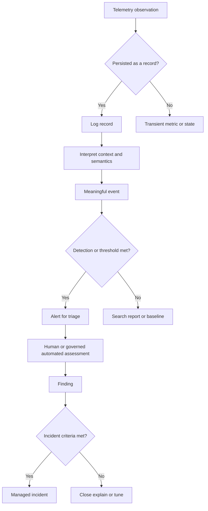

A blocked request may be a successful preventive control, not a service outage. An allowed request may be normal business, policy weakness, or compromise. The record contributes evidence; context establishes meaning.

### Plain-English deep-dive 1 - A log line is a witness statement, not the whole courtroom

A witness reports what was visible from one position. The statement can be accurate and still incomplete. A Zscaler transaction record may show that a policy action occurred at a service component. It may not show the user's full intent, the endpoint's local file state, the destination application's later processing, or the SIEM parser's interpretation.

Use five questions for every record: Who created it? At which observation point? What clock and schema were used? Which identifier links it to other evidence? What conclusion does the record directly support? This keeps analysis rigorous and prevents one field from carrying more meaning than it owns.

## Transaction and policy evidence

A useful transaction record answers enough questions to reconstruct an action while respecting privacy. Exact Zscaler fields vary by product, log type, format, subscription, tenant, and release. The following is a conceptual field map, not an undocumented schema.

| Conceptual field family | Questions answered | Example meaning | Validation concern |
|---|---|---|---|
| Time | When did source say the action occurred? | UTC event timestamp with precision | Zone, precision, drift, delayed finalization |
| Organization/source | Which tenant, product, feed, component, or location? | ZIA web feed for a named tenant | Stable source naming and tenant isolation |
| Subject identity | Which user, group, device, workload, or location? | Federated user and managed endpoint | Missing identity, privacy, reassignment |
| Network source | Which client/public/private address and port? | Egress address plus internal context where available | NAT and proxy transformations |
| Destination | Which domain, URL category, application, host, address, or port? | Approved SaaS destination | URL sensitivity and name resolution timing |
| Protocol/action | Which request, method, connection, upload, or download? | HTTPS upload | Encryption and protocol visibility |
| Policy | Which policy/rule/category applied? | Data policy or firewall rule reference | Name changes and ordering |
| Decision | Which allow, block, inspect, warn, coach, isolate, or error outcome? | Blocked by policy | Action versus final app outcome |
| Security | Which threat, sandbox, category, reputation, or DLP context? | Threat verdict reference | Verdict can change; field support varies |
| Data volume | How many bytes, records, or duration? | Uploaded bytes and elapsed time | Partial transaction and unit semantics |
| Identifiers | Which transaction/session/request/event IDs link records? | Stable source event identifier | Uniqueness scope and lifecycle |
| Error/health | Which component or transport state was reported? | Export connection error | Product-specific interpretation |

The source contract should mark every required field as required, optional, conditional, derived, or prohibited. A null user can be legitimate for unauthenticated traffic. A missing field can mean unsupported log type, parser failure, filter exclusion, old schema, privacy masking, or source omission. These meanings must remain distinguishable.

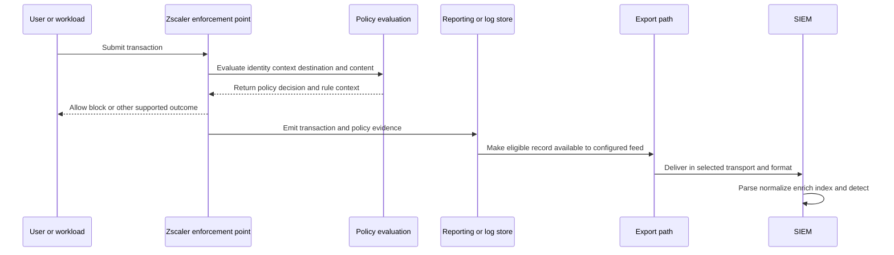

## Public Nanolog concept without invented internals

Zscaler's public ZIA cloud architecture describes Public Service Edges generating transaction log data, compressing and tokenizing it, and exporting it over secure TLS connections to Log Routers. Log Routers direct records to the organization's regional Nanolog cluster. The same public page says Nanolog clusters store transaction logs, support reporting, correlate records to an organization, and provide fault-tolerant clustered operation. It also presents NSS as a way to stream logs toward customer SIEM systems.

That is enough for an interview architecture. It does not authorize claims about undisclosed database engines, partition keys, exact replication protocols, internal token algorithms, internal queue depths, storage media details, consistency models, recovery point guarantees, or every product family's implementation.

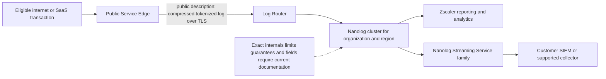

| Publicly supportable statement | Operational implication | Verification boundary |
|---|---|---|
| Service Edge creates transaction log data | Processing and evidence generation are related stages | Confirm exact log family and eligibility |
| Log Routers direct organization logs | Routing is a stage that can have health evidence | Internal implementation remains provider-owned |
| Nanolog stores transaction logs for reporting | Portal/report evidence may precede customer export | Retention and search behavior are tenant specific |
| NSS streams Nanolog logs to third-party systems | Customer export is downstream from source storage concept | Feed filters and delivery semantics require Help |
| Organization is provisioned on a Zscaler cloud | Region/cloud context matters in architecture | Contract and residency decisions govern |

### Plain-English deep-dive 2 - Explain Nanolog like a public airport map

An airport map can accurately show terminal, security, baggage routing, and arrival hall. It does not reveal the control software, every conveyor sensor, database table, or emergency algorithm. The public Nanolog map is similar. It is sufficient to explain where transaction evidence comes from and how a customer export relates to reporting.

A strong answer says, "The public architecture shows Service Edge log generation, secure routing to the organization's Nanolog cluster, reporting, and NSS export. I would use authenticated documentation and tenant evidence for feed types, formats, limits, latency, retention, and recovery behavior." That answer is specific without inventing internals.

## Nanolog Streaming Service concepts

Zscaler Help describes NSS as a family of products enabling Zscaler cloud communication with third-party security solutions for exchanging event logs. Its public comparison identifies two outbound patterns:

1. VM-based NSS uses a virtual machine in the customer network and streams toward the SIEM over documented raw TCP or HTTP choices.
2. Cloud NSS uses an HTTPS API feed that pushes logs to an HTTPS API-based collector on the SIEM side.

The same Help area describes NSS Collector as an inbound pattern for collecting third-party firewall and web proxy logs for SaaS Security Report use. Direction matters: outbound NSS sends Zscaler logs toward customer systems; NSS Collector sends selected third-party logs toward Zscaler for a particular reporting purpose.

| Pattern | High-level direction | Customer component | Public transport concept | Best question |
|---|---|---|---|---|
| VM-based NSS | Nanolog to customer | NSS VM plus SIEM receiver | Raw TCP or HTTP choices | Who patches, monitors, and scales the VM/receiver? |
| Cloud NSS | Zscaler cloud to customer | HTTPS API-based collector | HTTPS API push | Can the endpoint authenticate, absorb peaks, and expose acknowledgments? |
| NSS Collector | Customer third-party logs to Zscaler | Collector function | Current Help governs | Is the use case specifically SaaS Security Report log collection? |
| API polling | Product API to customer client | Scheduled client/connector | HTTPS request/response | How do pagination, cursor, quota, and replay work? |
| Webhook | Provider to subscriber callback | Public/reachable receiver or broker | HTTPS notification | How are authenticity, retries, duplicates, and reconciliation handled? |

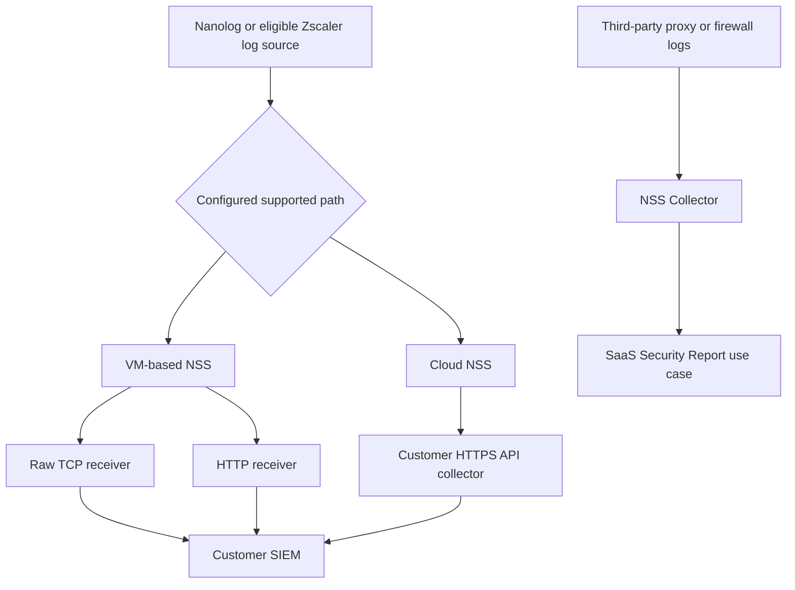

An NSS server object in the Zscaler Admin Console represents an NSS VM. Public Help states that Zscaler issues a client certificate and private key for the VM to authenticate to the service. Public Help also exposes server status/state and feed management. Specific feed counts appear in current public documentation, but capacity design should always use the latest licensed documentation and measured event rate rather than memorizing one limit.

## Cloud logging, export, streaming, API, and webhook paths

"Integration" is a category, not a delivery guarantee. A stream is usually a continuing flow. An API poll asks for data. A webhook calls the subscriber when an event occurs. A native connector may hide one of these mechanisms behind vendor-managed configuration. Each has different failure and recovery behavior.

| Mechanism | Initiator | State model | Common strength | Reliability question |
|---|---|---|---|---|
| Continuous stream | Source/exporter | Connection plus sequence/checkpoint as supported | Low-latency continuous delivery | What happens during disconnect or receiver slowdown? |
| HTTP push | Source/exporter | Request/response and source retry policy | Cloud-to-cloud delivery | Which response means durable acceptance? |
| API polling | Customer/client | Cursor, time window, page, or offset | Customer controls schedule and backfill | Can overlap and dedupe repair gaps? |
| Webhook | Provider | Delivery ID and retry behavior | Fast notification | Is payload authoritative or a trigger to retrieve? |
| File/object export | Source | File name, manifest, partition | Efficient bulk/archive | How are completeness and late files proven? |
| Partner connector | Product/integration | Vendor-specific | Faster onboarding | Which party owns schema, token, queue, and support? |

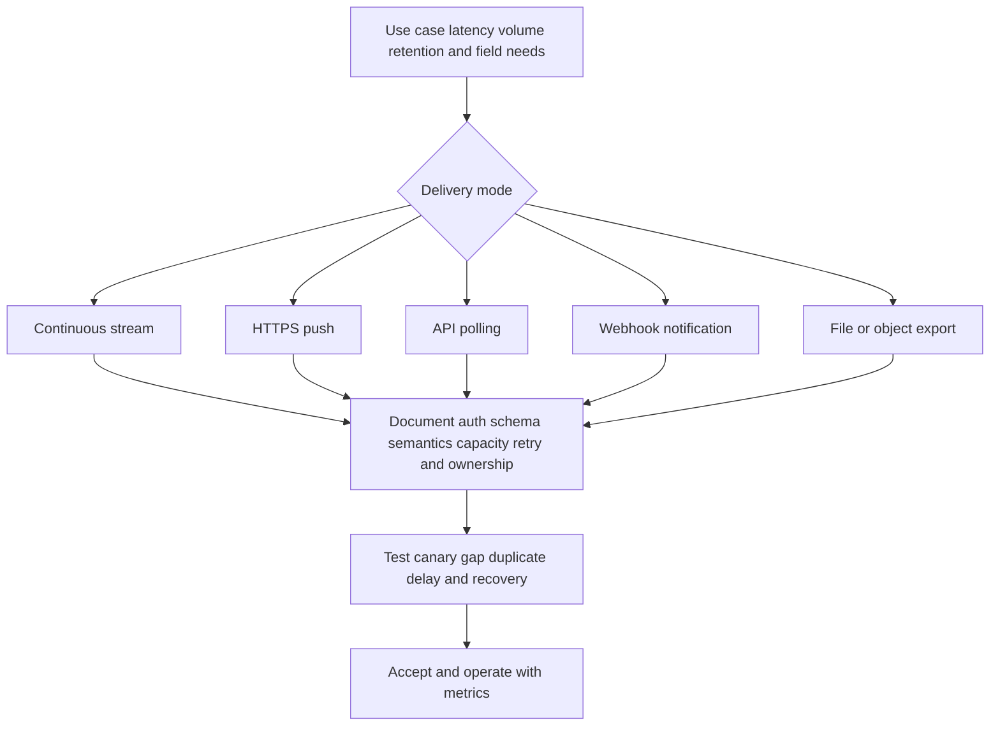

API and webhook patterns from Part 24 still apply. A robust poller uses least-privileged credentials, bounded pagination, durable checkpointing after commit, retry with backoff and jitter, explicit quota handling, schema validation, idempotent writes, and overlapping reconciliation where allowed. A webhook receiver authenticates the sender according to the documented contract, validates freshness and replay, responds quickly, queues durable work, deduplicates delivery IDs, and periodically reconciles with the authoritative source.

Exact Zscaler APIs and webhooks vary. The word "API" in a product page is not enough to infer endpoint paths, auth flows, objects, rate limits, historical windows, or delivery semantics.

## SIEM purpose and integration design

A SIEM centralizes security-relevant records from many sources, makes them searchable, correlates activity, runs detections, and supports investigations and cases. It may also provide retention, reporting, and response integrations. A SIEM is downstream of the source's enforcement decision. If SIEM ingestion stops, Zscaler traffic processing may continue even though monitoring is impaired.

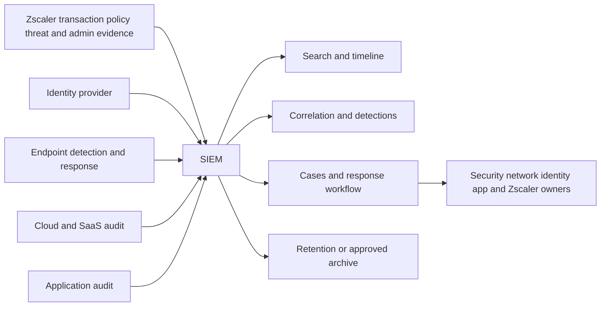

### Zscaler logging versus SIEM versus Data Fabric

| Capability | Zscaler logging/reporting | SIEM | Data Fabric for Security |
|---|---|---|---|
| Center of gravity | Zscaler product transactions, policy, threats, administration, and health | Security event/log collection, search, detections, investigations, and response | Broader security/business data unification, entities, relationships, context, scoring, workflows, and reporting |
| Typical unit | Product-specific record or report | Event, alert, timeline, case | Entity, relationship, finding, exposure, business context, workflow |
| Inputs | Native Zscaler product activity | Many vendor logs/events including Zscaler | Many security/business sources, potentially including SIEM and Zscaler |
| Primary value | Explain product activity and decisions | Detect and investigate across event sources | Resolve fragmented data into contextual operational decisions |
| Time focus | Transaction and operational history | Often event-time and near-real-time detection plus history | Current and historical entity/context/exposure views depending on use case |
| Replacement statement | Source and product reporting | Event operations platform | Complementary data architecture/product foundation |
| Validation | Portal/source record and policy context | Ingestion, parser, index, detection, case | Connector, mapping, entity, relationship, scoring, workflow |

Data Fabric is not a synonym for NSS and is not simply a larger log pipe. NSS exports event logs. A SIEM analyzes security events across sources. Data Fabric focuses on integrating, harmonizing, resolving, enriching, and operationalizing wider security and business data. They may exchange data, but each needs a separate source contract and success measure.

### Plain-English deep-dive 3 - Warehouse, control room, and city map

Zscaler logging is the warehouse of receipts from Zscaler activity. NSS is a conveyor carrying selected receipts. A SIEM is the control room combining receipts from many companies and looking for dangerous patterns. A Data Fabric is closer to a living city map that links buildings, owners, business importance, inspections, vulnerabilities, and work orders.

The same receipt may pass through all three, yet each answers a different question. Logging asks what Zscaler observed. The SIEM asks what cross-source event pattern deserves investigation. Data Fabric asks how the event or finding relates to trusted entities, business context, exposure, ownership, and operational action.

## Formats: syslog, CEF, LEEF, JSON, and custom schemas

Zscaler's public Syslog Overview explains RFC 5424 and RFC 3164 concepts and identifies CEF and LEEF as SIEM-oriented formats. It also says Zscaler supports many syslog formats and custom log strings. Current configuration documentation controls available feed templates and fields.

| Format | Structure | Useful property | Common hazard |
|---|---|---|---|
| RFC 5424 syslog | Header, structured data, message | Timestamp can include year, zone, and subsecond precision | Receiver/parser profile mismatch |
| RFC 3164 syslog | Traditional header plus message | Broad legacy compatibility | Timestamp lacks year/zone/subsecond in classic form |
| CEF | Pipe-delimited header plus extension fields | Common security-event mapping | Escaping delimiters and semantic field mismatch |
| LEEF | Delimited header and attributes | Common QRadar-oriented mapping | Delimiter and type assumptions |
| JSON | Named values, arrays, nested objects | Explicit structure and easier schema validation | Type drift, nested-field mapping, large payloads |
| Custom text | Tenant-defined field order/string | Fits existing receiver | Brittle parsing and undocumented changes |

```mermaid
flowchart LR
    RAW[Source record] --> FORMAT[Selected feed format]
    FORMAT --> TRANSPORT[Transport framing]
    TRANSPORT --> RECEIVE[Receiver accepts bytes]
    RECEIVE --> PARSER[Parser splits and types fields]
    PARSER --> NORMAL[Normalized schema]
    NORMAL --> ENRICH[Identity asset and business context]
    ENRICH --> INDEX[Searchable event]
    INDEX --> DETECT[Detection and dashboard]
```

Format and transport are separate. CEF describes event representation; it can travel through syslog-style transport or another supported path. JSON describes data structure; HTTPS describes transport protection and request semantics. A raw TCP connection provides a byte stream, so framing and receiver behavior still matter. TLS protects a channel but does not correct a malformed timestamp or wrong field map.

## Source contracts and normalization

Before onboarding, write a source contract. It becomes the shared definition among the Zscaler owner, NSS/integration owner, network team, SIEM engineer, SOC, privacy team, and support path.

| Contract area | Required decision | Acceptance evidence |
|---|---|---|
| Use cases | Investigation, detection, compliance, metrics, archive | Named searches and tests |
| Source scope | Products, log types, users, locations, actions, filters | Source inventory and sample coverage |
| Format/schema | Version, fields, types, nulls, escaping, size | Versioned sample corpus |
| Transport | Endpoint, port, TLS, proxy, firewall, DNS, certificates | Successful connection and negative tests |
| Authentication | Client certificate, token, key, or documented method | Rotation and revoked-credential test |
| Delivery semantics | Retry, acknowledgment, duplicate, ordering, replay | Failure-injection observations |
| Performance | Average/peak events and bytes per second | Capacity and load test |
| Freshness | Event-to-search latency objective | Canary percentile dashboard |
| Completeness | Expected coverage and reconciliation method | Count and control-total report |
| Privacy | Allowed/prohibited fields, masking, region | Approved data-flow assessment |
| Retention | Hot/search/archive/delete periods | Lifecycle policy and deletion test |
| Ownership | Operational RACI and escalation route | On-call and runbook exercise |

Normalization maps source semantics into a common model. It should preserve raw evidence or a secure reference to it, record parser/schema versions, and avoid false equivalence. A source IP before NAT differs from an observed public egress IP. A policy action differs from an HTTP status. A rule identifier may be stable while its display name changes. A user email can be reassigned over time.

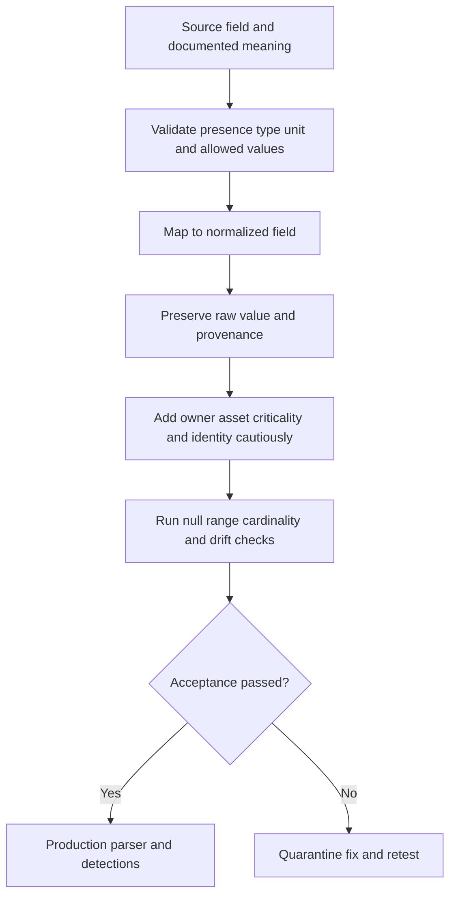

## Time, identifiers, and correlation

Security timelines fail when analysts treat every timestamp as event time. Keep at least the available source event time, export/send time, receiver time, ingest time, and index/searchable time. Use Coordinated Universal Time, abbreviated UTC, internally where practical; retain original zone and precision; document clock source and known drift.

| Time or identity element | Meaning | Use | Failure signal |
|---|---|---|---|
| Event time | Source's time for action | Incident sequence | Source clock drift or ambiguous zone |
| Record-finalized time | Time source completed record | Long transaction analysis | Appears after action by design |
| Export time | Exporter attempted delivery | Source queue delay | Growing event-to-export lag |
| Receiver time | Collector accepted bytes/request | Transport latency | Gap between export and receive |
| Ingest time | SIEM pipeline accepted event | Collector/parser queue | Receiver-to-ingest backlog |
| Index time | Event became searchable | Analyst availability | Ingest-to-index delay |
| Transaction ID | Source identifier for one activity | Exact joins | Missing, reused, or scoped ID |
| Session/request ID | Links related operations | Multi-step flow | Different layer creates new IDs |
| User/device ID | Links subject over time | Entity correlation | Rename, reassignment, shared identity |
| Feed/source ID | Names delivery path | Isolate affected feed | Unstable naming after migration |

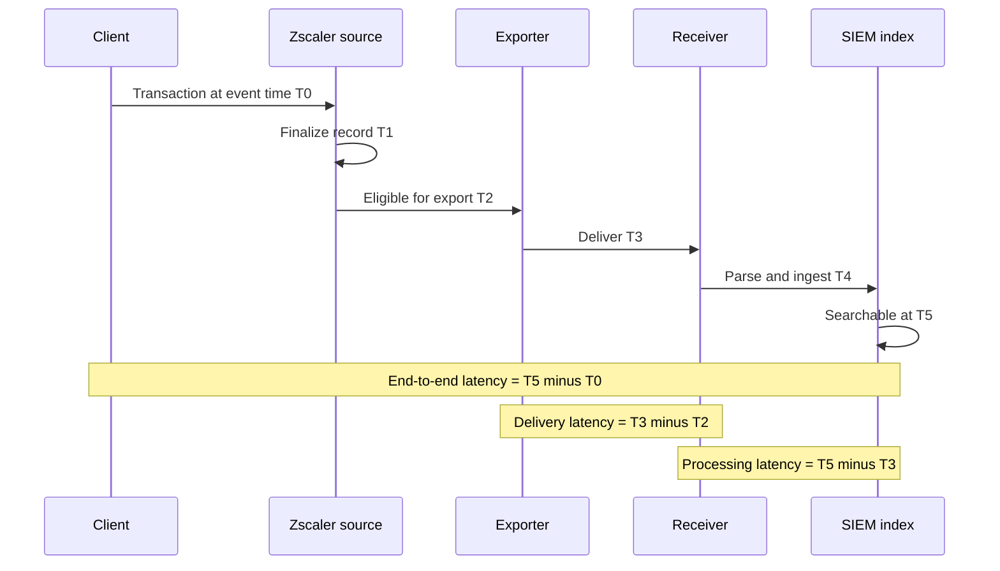

Time correlation should use identifiers first and bounded time windows second. Join on stable transaction/session/user/device/source identifiers when available. Then add destination, action, bytes, and known clock uncertainty. A five-minute match on username alone can merge unrelated activity during a busy period.

## Latency, loss, duplication, ordering, and schema drift

Delivery quality has several independent dimensions:

| Dimension | Definition | Detection method | Operational response |
|---|---|---|---|
| Latency | Delay between defined stages | Percentiles from paired timestamps/canaries | Locate stage with growing queue |
| Loss | Eligible source records absent at destination after window | Control totals, tagged canaries, sequence gaps | Bound scope, preserve source, replay if supported |
| Duplication | Same logical record delivered/indexed multiple times | Stable ID/hash and count | Idempotent ingest and dedupe |
| Ordering | Arrival sequence differs from event sequence | Compare event and receive sequence/time | Event-time windows and late-event handling |
| Truncation | Record or field cut off | Length/schema checks and raw comparison | Adjust limits/format or reduce safely |
| Corruption | Bytes/fields altered or unreadable | Parse failures, integrity checks, samples | Quarantine and inspect transport/parser |
| Schema drift | Field name/type/meaning changes | Versioned contract and profiling | Gate parser release and update mappings |
| Cardinality drift | Unexpected value variety change | Daily distinct-value baseline | Investigate source or parser change |

### Plain-English deep-dive 4 - Delivery can be successful and still produce bad evidence

A courier can deliver two copies, deliver Tuesday's box before Monday's, place the correct box in the wrong department, or deliver a box whose label was cut off. "Connection succeeded" proves only one narrow step.

Logging acceptance therefore needs end-to-end tests. Create a safe tagged event, find its source record, observe export, confirm receiver acceptance, inspect raw payload, verify parsed fields and types, search it in the SIEM, and confirm the intended detection or dashboard behavior. Repeat during a controlled disconnect and after recovery. This tests meaning, not merely connectivity.

## Reliable delivery, queues, retries, and backpressure

Backpressure occurs when a downstream stage accepts data more slowly than the upstream stage produces it. The response depends on documented product behavior: queue, throttle, retry, spill, reject, drop, disconnect, or some combination. Never invent which behavior NSS or a connector uses. Measure supported health indicators and confirm current documentation.

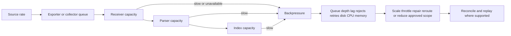

Capacity planning begins with rate and size:

$$
\text{daily bytes} = \text{events per second} \times \text{average bytes per event} \times 86{,}400
$$

For design, use measured percentiles and peaks rather than one average. Include protocol framing, encryption, indexing expansion, replicas, retention, bursts after outages, and multiple feeds. A source averaging 5,000 events per second may peak at 20,000 and then replay queued data at the same time normal traffic resumes.

| Capacity input | Why needed | Evidence source |
|---|---|---|
| Events per second by feed | Processing load | Source and receiver counters |
| Bytes per event distribution | Network/storage load | Raw sample histogram |
| Peak-to-average ratio | Burst headroom | Busy-hour trend |
| Outage duration objective | Potential backlog | Continuity plan |
| Recovery catch-up rate | Time to clear backlog | Controlled recovery test |
| Parser/index expansion | SIEM compute/storage | Vendor measurement |
| Retention tiers | Total storage and cost | Governance policy |
| Duplicate/retry rate | Extra load | Delivery metrics |

Retries must be bounded and use backoff appropriate to the contract. Retrying immediately from many workers can worsen an outage. A durable checkpoint should advance only after the destination's documented durable-acceptance point. Idempotency uses a stable event key or source ID so retries do not double-count.

## Connector and API health

Health should be expressed as specific observable statements rather than a green icon. "The feed delivered 99.7 percent of tagged canaries to searchable SIEM storage within the 180-second objective over the last hour" is more useful than "integration healthy."

| Health layer | Indicator | Alert condition example | Owner |
|---|---|---|---|
| Source generation | Tagged event visible at source | Missing source event | Product/policy owner |
| Authentication | Certificate/token valid and accepted | Expiry window or auth failures | IAM/integration owner |
| Connection | Established attempts and failures | Sustained reconnects | Network/export owner |
| Export | Records/bytes sent and lag | Event-to-export percentile rises | NSS/integration owner |
| Receiver | Accepted/rejected requests or bytes | Reject rate or unavailable listener | Collector owner |
| Queue | Depth/oldest age where exposed | Oldest age breaches objective | Pipeline owner |
| Parser | Success/failure/unknown fields | Parse failures or schema drift | SIEM engineer |
| Index | Searchable count and latency | Ingest-to-search lag | SIEM platform owner |
| Detection | Canary rule fires once | Missing or duplicate alert | Detection engineer |
| Reconciliation | Source/destination control totals | Unexplained variance | Joint service owner |

Use synthetic canaries that are safe, uniquely tagged, approved, and excluded from production incident metrics where appropriate. A canary should test a real path and format without containing real secrets or causing harmful actions.

## Retention, privacy, residency, and RBAC

Logs can contain usernames, addresses, URLs, search terms, file names, policy names, application names, device information, threat details, and administrative actions. Some fields may reveal health, union, legal, financial, personal, credential, or business-sensitive activity. Security value does not remove privacy duties.

| Governance control | Practical question | Evidence |
|---|---|---|
| Purpose limitation | Which investigation, detection, operations, or legal purpose needs this field? | Approved use-case register |
| Minimization | Can a token, category, prefix, or restricted raw tier meet the need? | Field-level decision |
| RBAC | Who can view raw URLs, identities, DLP content, or admin actions? | Role matrix and access test |
| Segregation of duties | Who configures feed, parser, detection, and deletion? | RACI and audit trail |
| Encryption | How is data protected in transit and at rest? | Configuration and key/cert lifecycle |
| Residency | Which regions and cross-border transfers apply? | Data-flow map and contract |
| Retention | How long are hot, searchable, archived, and backup copies kept? | Lifecycle policy |
| Legal hold | How is deletion paused for authorized matters? | Legal process and audit |
| Deletion | How are expired records and derived copies removed? | Deletion test and report |
| Access monitoring | Who queried or exported sensitive logs? | Admin/query audit |
| Incident handling | How is log exposure assessed and reported? | Response plan |

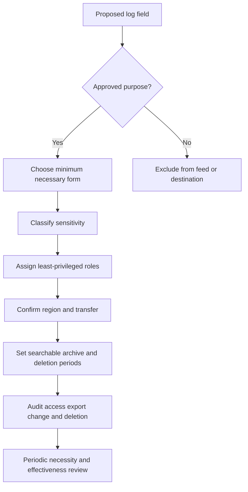

NIST SP 800-92 is an older but still useful log-management foundation. It emphasizes enterprise log-management infrastructure and processes. NIST SP 800-61 Rev. 3 connects incident response with cybersecurity risk management. Current law, regulation, contracts, and organizational policy decide retention and privacy; neither a generic standard nor a vendor default decides them alone.

## Security of the logging pipeline

Logging infrastructure is high value because it reveals user behavior, policy, defenses, detections, and investigations. It can also become an attacker target. Protect management interfaces, credentials, certificates, receivers, archives, parsers, service accounts, and administrative changes.

| Threat | Example | Preventive/detective controls |
|---|---|---|
| Credential theft | Stolen API token or NSS private key | Vaulting, least privilege, rotation, revocation, access logs |
| Endpoint impersonation | Rogue receiver accepts pushed data | Strong documented authentication and certificate validation |
| Eavesdropping | Unprotected transport reveals URLs/users | Supported encryption and trusted endpoints |
| Tampering | Parser or pipeline changes action field | Change control, integrity checks, raw preservation |
| Deletion | Attacker removes evidence | Restricted deletion, immutable/controlled archive where required, audit |
| Injection | Crafted field breaks parser or query | Strict parsing, escaping, validation, safe query handling |
| Denial of service | Event storm exhausts receiver | Capacity, quotas, isolation, backpressure handling |
| Excess access | Broad analyst sees sensitive content | Field minimization, masking, tiered RBAC |
| Silent disablement | Feed/filter changed without notice | Config audit, canaries, reconciliation, alerts |

## Troubleshooting from transaction to SIEM

Troubleshooting should begin with one exact expected record. Define user/device/location, transaction, destination, policy/action, UTC time window, source log type, feed/filter, expected SIEM index, and a unique safe marker.

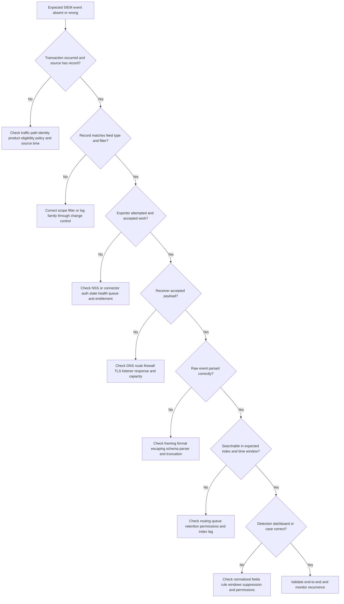

### Stage-by-stage evidence matrix

| Stage | Evidence to collect | Discriminating test | Caution |
|---|---|---|---|
| Transaction | Client/app result, source/destination/time | Repeat approved tagged action | Repetition may be unsafe for threats/DLP |
| Zscaler source | Portal/report raw record and policy context | Search exact identifier/time | Portal timezone/filter can mislead |
| Feed selection | Type, filter, format, active config | Compare included/excluded canaries | Config activation may be separate |
| NSS/integration | Status/state, auth, connection, counters, errors | Restart-free connectivity/auth check | UI health may lag |
| Network | DNS, route, firewall, TCP/TLS, proxy | Controlled endpoint test | Generic curl may use different auth/path |
| Receiver | Listener logs, status code, accepted/rejected bytes | Send approved format sample | A 2xx may precede durable commit |
| Parser | Raw payload, parser version, parse errors | Replay one sanitized raw event | Replay can create duplicates |
| SIEM index | Index/routing, ingest/index time, retention | Search raw marker broadly | Permissions can hide data |
| Detection | Rule version, window, normalized fields, suppression | Approved canary rule | Keep canaries out of real incidents |

### Common failure patterns

| Symptom | Plausible causes | First useful comparison |
|---|---|---|
| Portal event exists; SIEM event absent | Filter, export auth, receiver, parser, routing, index delay | Another event on same feed and same event on another feed |
| All feeds stop together | Shared NSS VM, certificate, route, receiver, SIEM outage | Source portal and exporter connection state |
| One log type stops | Feed filter/type, schema/parser, license/config | Another log type through same transport |
| Events arrive late | Source finalization, queue, backpressure, receiver/index load | Timestamp deltas by stage |
| Duplicate alerts | Source replay, retry, multi-path ingest, missing dedupe | Stable event ID and feed IDs |
| Timeline appears reversed | Event versus ingest time, clock drift, late arrival | UTC event time and source clock health |
| User field becomes blank | Authentication/context change, schema, parser, privacy mask | Raw source versus normalized event |
| Bytes or action wrong | Unit mapping, field collision, parser/template mismatch | Raw payload and documented semantics |
| Volume drops after change | Policy/traffic shift, filter, bypass, outage, parser loss | Transaction denominator and canaries |
| Receiver CPU spikes | Event burst, replay, parsing cost, malformed storm | Input rate/size and parse failure trend |

### Plain-English deep-dive 5 - Start with one receipt, then widen

When a million-event dashboard looks wrong, searching the whole pipeline produces noise. Pick one safe transaction with a unique marker. Find it at the source. Then walk that same receipt through feed eligibility, exporter, network, receiver, raw storage, parser, normalized record, search, and detection.

This is the logging version of your OneDrive troubleshooting. You did not begin with every sync client in the world; you bounded one user, library, item, operation, time, and error, then compared layers. The method transfers directly even while Zscaler-specific administration remains new.

## Escalation package

A strong escalation enables the receiving team to test one hypothesis quickly. It protects sensitive data and separates observed facts from interpretations.

| Package section | Content |
|---|---|
| Business impact | Affected detections, investigations, users, regions, and risk window |
| Environment | Tenant/cloud, product/log type, NSS/Cloud NSS/API pattern, SIEM/collector versions as approved |
| Timeline | UTC event, source, export, receive, ingest, index, alert times |
| Scope | First/last known, feeds, regions, event types, affected versus healthy comparisons |
| Reproduction | Safe canary steps, expected result, actual result, frequency |
| Evidence | Sanitized IDs, counters, statuses, errors, raw/parsed comparison, network observations |
| Changes | Feed, parser, certificate, firewall, SIEM, policy, release, volume changes |
| Hypotheses | Ranked statements with supporting and conflicting evidence |
| Mitigation | Temporary visibility measures, alternate search/path, operational risk |
| Request | Exact question or owner action needed |

Use a secure approved channel. Replace raw credentials, private keys, tokens, personal data, full sensitive URLs, DLP content, and customer secrets with minimal identifiers or protected attachments. Record redaction method so fields are not accidentally changed in ways that invalidate parsing analysis.

## Metrics and service objectives

Metrics need denominators, stage definitions, time windows, and exclusions. "99 percent logs delivered" is incomplete until eligible source count, destination acceptance, late window, duplicates, and replay are defined.

| Metric | Definition | Why useful | Misuse warning |
|---|---|---|---|
| Source coverage | Required source/log types onboarded divided by required types | Tracks intended visibility | Counts sources, not event completeness |
| Canary success | Searchable canaries within objective divided by emitted canaries | End-to-end health | Canary may not cover every type/region |
| Event-to-search latency | Index/search time minus event time | Analyst readiness | Source clock affects value |
| Delivery latency | Receiver time minus export time | Transport/export health | Missing stage timestamps limit precision |
| Parse success rate | Parsed records divided by received records | Schema health | Parser can succeed with wrong semantics |
| Duplicate rate | Duplicate logical records divided by received records | Idempotency quality | Requires stable key |
| Reconciliation variance | Source eligible count minus destination unique count | Completeness signal | Filters/windows must align |
| Oldest backlog age | Age of oldest pending item | Backpressure impact | Metric may be unavailable per product |
| Detection canary success | Expected canary alerts created exactly once | Rule path health | Avoid contaminating incident measures |
| Sensitive-field access | Queries/exports of restricted fields by role | Privacy oversight | Interpretation requires legitimate purpose |
| Mean time to detect feed failure | Failure start to alert | Operations responsiveness | Known start may be estimated |
| Mean time to restore | Detection to restored accepted flow | Recovery | Also measure backlog clearance |

For percentile latency, report at least median, 95th, and 99th percentile where volume supports it. An average can hide a long tail that causes incident records to arrive outside detection windows.

## Detection content and downstream use lifecycle

Getting a record into a SIEM creates potential value; it does not create a useful detection automatically. Detection content needs a hypothesis, data requirements, logic, testing, severity, response, ownership, tuning, and retirement. A Zscaler block can contribute to a detection, but the meaning depends on action, identity, endpoint, destination, frequency, other sources, and business context.

| Detection lifecycle stage | Core question | Artifact | Failure risk |
|---|---|---|---|
| Hypothesis | Which adversary, policy abuse, control failure, or operational condition should be found? | Detection statement | Rule searches noise without purpose |
| Data contract | Which Zscaler and non-Zscaler fields, IDs, timestamps, and freshness are required? | Field dependency map | Missing/null/misparsed field silently weakens logic |
| Logic | Which conditions, sequence, threshold, suppression, and time window apply? | Versioned query/rule | Arrival-time assumptions or broad matching |
| Test | Which positive, negative, duplicate, delayed, and boundary cases prove behavior? | Synthetic corpus | Happy-path test hides false results |
| Triage | Which evidence helps an analyst decide quickly? | Alert enrichment and runbook | Alert repeats raw fields without context |
| Response | Which human or automated actions are authorized? | Response playbook | Disruptive action without approval/context |
| Measurement | Which precision, volume, coverage, latency, and outcome measures matter? | Detection scorecard | Lower alert count mistaken for improvement |
| Maintenance | Which schema, threat, policy, app, and business changes require review? | Review schedule | Detection decays silently |
| Retirement | Why and when is content removed, replaced, or archived? | Decision record | Stale rules create cost and distrust |

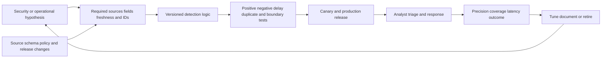

### Correlation patterns

| Pattern | Example use | Required discipline |
|---|---|---|
| Same entity, short window | One user receives repeated high-risk blocks | Stable user ID, event time, dedupe, baseline |
| Cross-source sequence | Risky sign-in followed by unusual download and DLP block | Clock uncertainty, session/entity mapping, ordered hypothesis |
| Rare destination | Device contacts a domain unseen for its peer group | Sufficient history, category drift, business exceptions |
| Control contradiction | Policy says inspect but record shows bypass for in-scope app | Current policy version, path proof, supported semantics |
| Volume anomaly | Upload bytes rise sharply for a role or app | Denominator, seasonality, unit, partial transaction handling |
| Health correlation | SIEM gap aligns with NSS/receiver errors | Stage timestamps and independent canary |

Detection engineering should preserve source semantics. A source action such as `blocked` should not be normalized into `malicious=true` unless a separate validated analytic establishes that conclusion. A policy name should not become a severity. A destination category can change. A threat verdict can be updated. The detection record should preserve source value, parser version, rule version, and enrichment provenance.

### Triage packet design

A useful alert presents enough context to decide the next safe action without copying every sensitive field into a broad queue. Include source event ID, event time, entity, destination/application, Zscaler action and policy reference, relevant threat/data context, related-event count, key cross-source evidence, business owner/criticality where reliable, confidence, and a link to restricted raw detail. State which fields are absent or stale.

| Triage question | Good alert support |
|---|---|
| What happened? | Plain event and action description |
| Who/what is involved? | Stable user/device/workload identifiers with provenance |
| When? | Event time, arrival delay, clock caveat |
| Why did it alert? | Human-readable rule conditions and version |
| What else is related? | Bounded identity, endpoint, app, and time correlation |
| What is the business context? | Owner/criticality with freshness and source |
| What should analyst verify? | Three to five discriminating checks |
| What action is authorized? | Approval and response boundary |

Automated response requires stronger evidence and governance than notification. A rule that blocks an already blocked transaction may only open a case. A rule suggesting compromised identity may justify analyst review, while account disablement needs current confidence, blast-radius analysis, approval, and recovery. Record every action, result, and reversal path.

## Integration migration, cutover, and decommissioning

Organizations may move from one SIEM, collector, format, or NSS delivery pattern to another. Migration should use parallel evidence and reconciliation rather than a same-day replacement that removes the known-good path before the new path is proven.

| Migration phase | Work | Gate |
|---|---|---|
| Inventory | Feeds, filters, formats, receivers, parsers, rules, dashboards, archives, owners | Every dependency mapped |
| Define target | New transport/schema/index/retention/security/support model | Architecture approved |
| Build | Least-privileged endpoint, parser, normalization, monitoring | Golden corpus passes |
| Parallel run | Send equivalent eligible scope to old and new paths where supported | Counts, fields, latency, and detections reconcile |
| Controlled cutover | Move bounded log types/use cases with change and rollback | Acceptance sustained |
| Backfill | Import/replay approved history if required and supported | Dedupe and time semantics verified |
| Decommission | Revoke old credentials, stop feeds, archive/delete, update docs/rules | No consumers or obligations remain |
| Review | Measure quality, cost, incidents, and analyst usability | Owners accept target operation |

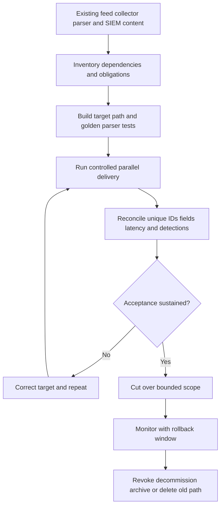

Parallel delivery can create duplicates or double alerting. Tag source paths, isolate test indexes or suppress duplicate production actions through an approved design, and compare unique source IDs rather than raw received counts. If a source cannot send two equivalent feeds, use time-bounded canaries, source exports, controlled replay, or another supported comparison; document the limitation.

### Schema-change management

Treat format/template/parser modifications as production changes. Keep a golden corpus representing common records and hard edges: null identity, IPv4/IPv6, long URL/category, delimiter characters, Unicode source values represented safely in test tooling, unknown enum, optional field absent, large byte count, negative number where invalid, multiple timestamps, and malformed record. This ASCII guide describes those tests; actual approved test data can exercise supported encodings.

| Change gate | Required result |
|---|---|
| Syntax | Every valid sample parses; malformed sample is quarantined |
| Semantics | Source action, IDs, addresses, times, bytes, and policy retain meaning |
| Types | Integers, booleans, strings, arrays, nulls, and timestamps map correctly |
| Compatibility | Old and new supported variants behave intentionally |
| Counts | No unexplained drop, multiplication, or routing change |
| Detection | Critical rules and dashboards pass regression cases |
| Privacy | Restricted fields remain masked/role-controlled |
| Performance | Peak sample rate stays within accepted capacity |
| Rollback | Prior parser/template can be restored without losing evidence |

### Archive and decommission evidence

Before decommissioning, identify investigations, legal holds, regulatory retention, dashboards, detections, reports, machine-learning jobs, threat hunts, auditors, and external consumers that depend on the old data. Decide which history migrates, remains read-only, expires normally, or is deleted. Revoke certificates/tokens, remove firewall/DNS entries, disable service accounts, stop compute, update inventories, and confirm that monitoring no longer expects the retired feed.

A successful cutover is not "new events are visible." It is: required events are uniquely and correctly searchable within the objective; critical detections and investigations work; privacy and retention are approved; operators can support the target; outage/recovery is tested; old dependencies are closed; and the decision record captures residual differences.

## Fictional NMH architecture and scenarios

NMH is a synthetic manufacturer with Microsoft 365, private applications, factories, remote users, ZIA and ZPA learning scenarios, an enterprise SIEM, and regulated business data. The architecture below is practice material.

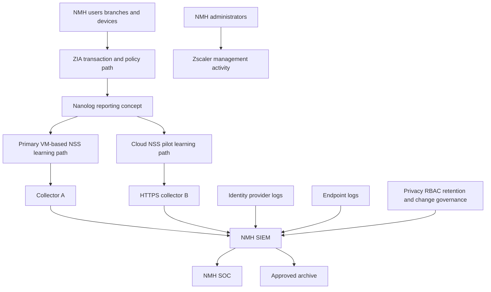

### Scenario A: portal event exists, SIEM search is empty

At 10:02 UTC, synthetic user `nmh-log-canary-41` reaches an approved test URL and receives the expected policy block. The Zscaler reporting view shows the event. The SIEM has no result after the accepted five-minute window.

You anchor on the source transaction identifier and feed. Another web event on the same feed arrived at 10:03, proving the shared network and receiver are not wholly down. The missing canary contains a category excluded by a newly changed feed filter. The team restores the approved filter version, emits another canary, and reconciles the affected interval. The root cause is filter scope, not transaction processing.

### Scenario B: duplicates after receiver recovery

The synthetic receiver is unavailable for six minutes. After recovery, SIEM volume doubles and a rule creates duplicate alerts. Raw records have the same source event identifiers but different ingest times and the same feed path. The lab consumer advanced checkpoints before durable deduplication and replayed records into a non-idempotent destination.

The correction is a consumer design change: stable source ID as idempotency key, checkpoint after durable commit, duplicate metrics, and a recovery test. This is a generic lab result; actual Cloud NSS or VM-based NSS acknowledgment and replay behavior requires current documentation.

### Scenario C: reversed incident timeline

An identity event appears in the SIEM before a Zscaler block when sorted by index time. Source event times show the sign-in occurred first, followed by the web action; the Zscaler record arrived later because of a downstream queue. The incident timeline stores both event and index times and documents clock uncertainty. Analysts update the query to reason over event time with late-arrival handling.

### Scenario D: sensitive URL visible to a broad role

A privacy review finds that a general operations role can search full URL paths containing synthetic project names. The team validates which use cases require path detail, restricts raw access, creates a minimized normalized field for routine dashboards, retains approved raw data in a smaller role-controlled tier, audits prior access, and updates the source contract.

## TSM discovery questions

| Area | Questions |
|---|---|
| Outcomes | Which investigations, detections, reports, archives, and regulatory purposes need Zscaler evidence? |
| Sources | Which products, log families, users, locations, applications, and actions are in scope? |
| Architecture | Which Nanolog/NSS, Cloud NSS, API, webhook, file, or partner paths are licensed and supported? |
| Format | Which schema/version/fields/types does the SIEM expect? How is raw evidence preserved? |
| Volume | What are average, peak, outage-recovery, and growth rates by feed? |
| Latency | What event-to-search and alert objectives apply by use case? |
| Completeness | How will source and destination counts or canaries reconcile? |
| Reliability | What are documented retry, queue, acknowledgment, replay, duplicate, and ordering behaviors? |
| Time | Which clocks, zones, precision, and identifiers support correlation? |
| Privacy | Which fields are sensitive, minimized, masked, region-limited, or role-restricted? |
| Retention | Which hot, searchable, archive, backup, legal-hold, and deletion periods apply? |
| Change | Who owns feed, certificate, parser, SIEM, rule, and release changes? |
| Incident | Who is paged when generation, export, receiver, parser, or index health fails? |
| Support | Which evidence and severity criteria are required for vendor escalation? |

## Your experience bridge to Zscaler

You already know that a service trace, client log, packet capture, and customer symptom describe different observation points. You have bounded incidents by user, tenant, file, operation, timestamp, network path, and change. You have compared known-good and failing cases, built timelines, worked with Engineering, validated fixes, and translated evidence for customers.

The bridge is to apply the same discipline to logging stages:

| enterprise support strength | Zscaler logging application | Honest boundary |
|---|---|---|
| Correlating client/service timestamps | Event/export/ingest/index timeline | NSS operation is learned |
| Network trace analysis | DNS/TCP/TLS path to collector | Product auth/transport requires Help |
| OneDrive/SharePoint identifiers | Transaction/session/event correlation | Exact fields vary by log family |
| Escalation packages | Sanitized feed and parser evidence | Customer data stays protected |
| SQL/Power BI analytics | Latency, volume, duplicates, freshness scorecard | Metrics use synthetic or authorized data |
| Case quality and mentoring | Runbook, source contract, teach-back | SIEM admin is not claimed production work |

### 30-second interview bridge

"In enterprise support I learned to treat telemetry as evidence from a specific observation point. I correlated client, network, identity, and service records, built UTC timelines, isolated the first divergent stage, and created engineering-ready escalations. For Zscaler logging I apply that method from transaction and policy record through Nanolog, NSS or another supported export, receiver, parser, SIEM index, and detection. I understand the public architecture and have practiced delay, loss, duplicate, order, and schema cases with synthetic data. My direct Zscaler NSS administration is a learning area, so I would validate current tenant fields, limits, delivery semantics, and health before production change."

## Labs and rehearsal

All labs use owned, authorized, nonproduction systems and synthetic records. No real credentials, customer logs, personal data, malware, or proprietary content is used.

### Lab 1 - Vocabulary classifier

Create 30 short examples and label each telemetry, log, event, alert, finding, or incident. Explain ambiguous cases and record which additional context changes the label.

### Lab 2 - Conceptual field dictionary

Design a synthetic web transaction schema with event time, user, device, source, destination, action, policy, rule, bytes, IDs, and source provenance. Mark required, optional, conditional, sensitive, and prohibited fields.

### Lab 3 - Nanolog whiteboard

Draw only the publicly described Service Edge, secure log routing, Nanolog/reporting, NSS, and customer SIEM stages. Add a boundary box listing internals that require authenticated documentation.

### Lab 4 - Format parsing

Represent the same synthetic event as RFC 5424-style syslog, CEF, and JSON. Include an escaped delimiter, null identity, IPv6 address, long URL category, and UTC timestamp. Parse each into one normalized model and compare data loss.

### Lab 5 - Time model

Generate records with event, export, receive, ingest, and index times. Introduce one drifting clock and one delayed batch. Calculate stage latencies and produce a correct event-time timeline.

### Lab 6 - Duplicate-safe consumer

Process synthetic events with stable IDs. Deliver each once, then inject retries and replay. Verify unique destination count, duplicate count, and checkpoint advancement only after commit.

### Lab 7 - Gap reconciliation

Create 10,000 synthetic source records, filter an approved subset, deliberately remove 17 destination records, duplicate 11, and delay 29. Build a reconciliation report that separates each outcome.

### Lab 8 - Backpressure exercise

Model a producer faster than a consumer. Track queue depth, oldest age, reject count, and recovery catch-up. Change batch size and worker capacity one variable at a time.

### Lab 9 - Privacy design

Classify synthetic URL, user, IP, DLP, threat, and admin fields. Define operator, analyst, incident responder, platform admin, privacy reviewer, and auditor roles. Test allowed and denied searches.

### Lab 10 - Missing-event runbook

Run Scenario A with one unique canary. Stop at each stage and record the exact evidence that proves or disproves that stage. Produce a one-page customer update.

### Lab 11 - Parser change gate

Create a golden sample corpus with nulls, escapes, old/new enum values, very long fields, and unknown fields. Change the parser and require semantic, count, and detection regression tests before release.

### Lab 12 - Escalation simulation

Build a sanitized package containing impact, scope, UTC timeline, architecture, expected/actual behavior, canary, healthy comparison, raw/parsed samples, changes, hypotheses, mitigation, and exact support request.

| Lab evidence | Completion standard |
|---|---|
| Diagrams | Source, stage, owner, direction, and caveat visible |
| Data | Synthetic, reproducible, versioned, and safely shareable |
| Tests | Positive, negative, delay, duplicate, gap, order, and recovery cases |
| Metrics | Denominator, time window, stage, percentile, and exclusion documented |
| Report | Observation, interpretation, uncertainty, action, and validation separated |
| Honesty | Artifact labeled lab evidence rather than production operation |

## Common misconceptions to correct

| Misconception | Better model |
|---|---|
| Telemetry, log, event, and alert are synonyms | They represent observation, persistence, meaning, and attention stages |
| No SIEM event means no user transaction | Source generation, export, network, receiver, parser, index, or query can differ |
| Portal event proves SIEM delivery | Portal/report and customer export are separate stages |
| An alert proves an incident | An alert triggers assessment; incident criteria require context |
| Nanolog details can be inferred from the name | Use the public architecture and verify unpublished internals |
| NSS Collector is the same direction as outbound NSS | NSS Collector is an inbound third-party log collection use case described for SaaS Security Report |
| CEF is a transport protocol | CEF is an event representation; transport is a separate choice |
| HTTPS guarantees correct records | It protects a channel; schema and semantics still need validation |
| TCP guarantees end-to-end business delivery | It provides ordered bytes for a connection, not SIEM durable commit or correct parsing |
| API delivery is exactly once | Verify semantics and design idempotency, reconciliation, and replay |
| Arrival order equals event order | Queues, retries, batching, and clocks can reorder observations |
| One timestamp is enough | Preserve event, receive, ingest, and index time where available |
| Parser success means semantic success | A field can parse cleanly into the wrong normalized meaning |
| A green connector proves searchable events | Define source-to-search canary and reconciliation evidence |
| More retention is always safer | Retention adds privacy, breach, legal, and cost exposure |
| Every analyst needs raw URLs and DLP content | Least privilege and minimized views can support routine work |
| SIEM replaces source evidence | Preserve source provenance and raw reference for disputes |
| Data Fabric is another name for SIEM | They have complementary event and entity/context focuses |
| Logging is only a SOC concern | Network, IAM, privacy, legal, platform, app, and product owners share it |
| This Part proves production Zscaler operation | It proves architecture understanding and synthetic practice |

## Official Source Anchors

Sources in this section were reviewed on **2026-08-24**.

Public Zscaler Help establishes the high-level architecture and available categories. Authenticated current Help, tenant-specific configuration, licenses, support statements, contracts, and observed canaries govern production. Public scale, fault-tolerance, real-time, or complete-logging language is product positioning and architecture description; customer acceptance still requires measured path, field, latency, completeness, privacy, and recovery evidence.

| Source | URL | Used for | Boundary |
|---|---|---|---|
| Zscaler cloud architecture for Internet and SaaS | https://help.zscaler.com/zia/about-zscaler-cloud-architecture | Public Service Edge log generation, secure routing, Nanolog cluster/reporting, NSS context | Avoid invented internals and universal guarantees |
| Understanding Nanolog Streaming Service | https://help.zscaler.com/zia/understanding-nanolog-streaming-service | NSS family, VM-based NSS raw TCP/HTTP, Cloud NSS HTTPS API feed, SIEM purposes, NSS Collector distinction | Current feed behavior and licensing vary |
| About NSS Servers | https://help.zscaler.com/zia/about-nss-servers | NSS server object, client certificate/private key, status/state, feed management | Current counts, UI, capacity, and deployment requirements govern |
| Syslog Overview | https://help.zscaler.com/zia/syslog-overview | RFC 5424, RFC 3164, CEF, LEEF, custom-format concepts | Templates and fields require current configuration docs |
| Zscaler Internet Access | https://www.zscaler.com/products-and-solutions/zscaler-internet-access | Public SIEM/SOAR/XDR integration positioning and administrative visibility | Marketing claims require tested coverage |
| NIST SP 800-92 | https://csrc.nist.gov/pubs/sp/800/92/final | Enterprise computer-security log management concepts | Published 2006; combine with current technology and law |
| NIST SP 800-61 Rev. 3 | https://csrc.nist.gov/pubs/sp/800/61/r3/final | Incident response integrated with cybersecurity risk management | Technology-neutral guidance |
| RFC 5424 | https://www.rfc-editor.org/rfc/rfc5424 | Syslog protocol structure and timestamp concepts | Product profiles and transport choices vary |
| MITRE ATT&CK Data Sources | https://attack.mitre.org/datasources/ | Detection-oriented data-source and component vocabulary | Not a completeness guarantee or product schema |

## Likely Interview Questions

### Q1. Distinguish telemetry, logs, events, alerts, findings, and incidents.

**Model answer:** Telemetry is the broad set of system observations, including metrics, logs, traces, and state. A log is a persisted record. An event is a meaningful occurrence represented by records. An alert is a rule or analytic deciding that activity deserves attention. A finding is an assessed issue supported by evidence. An incident is a managed adverse situation requiring coordinated response. A blocked transaction can be a useful event and successful control without being an incident.

### Q2. Explain the Nanolog and NSS architecture without inventing internals.

**Model answer:** Zscaler's public ZIA architecture says Public Service Edges generate transaction log data and send compressed, tokenized logs over secure TLS through Log Routers to the organization's regional Nanolog cluster for storage, reporting, and analytics. NSS is the public family for exchanging those event logs with third-party systems. I stop at that documented level and verify current authenticated Help for exact fields, retention, limits, queues, delivery guarantees, and recovery behavior.

### Q3. Compare VM-based NSS and Cloud NSS.

**Model answer:** Public Help says VM-based NSS uses a VM in the customer network to stream logs toward a SIEM over raw TCP or HTTP choices. Cloud NSS pushes logs through an HTTPS API feed to an HTTPS API-based collector. I compare licensing, supported log types and formats, endpoint/auth requirements, customer infrastructure, scale, network path, observability, continuity, delivery/replay behavior, privacy, and support ownership. I validate all of those with current documentation and a canary rather than assuming cloud delivery is automatically simpler.

### Q4. How would you prove an end-to-end Zscaler-to-SIEM integration works?

**Model answer:** I define a safe uniquely tagged transaction and the expected source log, feed, normalized fields, searchable index, latency objective, and detection. I find the source record, confirm feed eligibility, observe exporter and receiver evidence, inspect raw payload, verify parser types and semantics, find the indexed record, and confirm the alert exactly once. I repeat under a controlled disconnect and recovery, then reconcile source eligible count against destination unique count.

### Q5. How do you troubleshoot a source event that is absent from the SIEM?

**Model answer:** I walk one event: source generation, feed type/filter, export entitlement/auth/state, DNS/TCP/TLS path, receiver acceptance, raw payload, parser, index routing/retention/permissions, and detection logic. I compare a healthy event through the same feed and the failing event through adjacent stages. I keep event, receive, ingest, and index timestamps separate, change one variable, preserve evidence, and escalate with a bounded sanitized package.

### Q6. How do you handle latency, loss, duplicates, and out-of-order events?

**Model answer:** I establish stable IDs, stage timestamps, source control totals, and end-to-end canaries. Consumers commit idempotently and checkpoint after durable acceptance. Queries use event time with allowed lateness rather than arrival order alone. Metrics track latency percentiles, missing unique IDs, duplicate rate, parse failures, oldest backlog, and reconciliation variance. Replay and retry behavior is product-specific, so I verify the contract before recovery.

### Q7. How do Zscaler logging, a SIEM, and Data Fabric differ?

**Model answer:** Zscaler logging records native product transactions, policy decisions, threats, administration, and health. NSS or another supported path exports eligible records. A SIEM combines event logs from many sources for search, detection, investigation, and response. Data Fabric has a broader entity and business-context center: ingestion, harmonization, entity resolution, relationships, enrichment, scoring, workflows, and reporting. They can complement and exchange data; none should be declared a universal replacement without use-case analysis.

### Q8. How does your prior background transfer to this work?

**Model answer:** In enterprise support I correlated client, network, identity, and service evidence, built UTC timelines, isolated first divergence, analyzed trends, and prepared engineering escalations. That method maps directly to transaction, source log, NSS or integration, network, receiver, parser, SIEM, and detection stages. I have reinforced it with synthetic delay, gap, duplicate, ordering, parser, and privacy labs. My direct Zscaler NSS administration is a learning area, so current product validation is part of my operating method.

## 30-Second Memory Hooks

| Concept | Memory hook |
|---|---|
| Telemetry | Any instrument reading |
| Log | Stored receipt |
| Event | Meaningful occurrence |
| Alert | Rule rings a bell |
| Incident | Coordinated case |
| Transaction evidence | Who did what, where, when, and which rule decided |
| Nanolog | Public Zscaler reporting warehouse concept |
| NSS | Conveyor from Zscaler logs to customer tools |
| VM-based NSS | Customer-hosted conveyor |
| Cloud NSS | HTTPS cloud-to-collector conveyor |
| NSS Collector | Third-party logs moving into Zscaler reporting use case |
| SIEM | Cross-source event control room |
| Data Fabric | Linked entity and business-context map |
| CEF/JSON | Packing slip, not delivery road |
| Normalize | Translate while preserving provenance |
| Time | Event, receive, ingest, index |
| Identifier | Tracking number beats timestamp guessing |
| Backpressure | Downstream conveyor is full |
| Reliability | Canary plus reconciliation |
| Privacy | Minimum fields, minimum roles, defined lifetime |
| Troubleshooting | Walk one receipt stage by stage |
| Experience bridge | prior evidence correlation transfers; Zscaler operation is learned |

## Completion Checklist

- [ ] I define telemetry, log, event, alert, finding, and incident as distinct concepts.
- [ ] I explain a transaction record as evidence from one observation point.
- [ ] I can map conceptual time, identity, source, destination, action, policy, security, volume, ID, and error fields.
- [ ] I verify exact product fields and avoid presenting the conceptual map as a Zscaler schema.
- [ ] I can state the public Service Edge, Log Router, Nanolog, reporting, NSS, and SIEM flow.
- [ ] I keep Nanolog storage engines, keys, queues, and consistency internals outside my claims.
- [ ] I define NSS as a family for exchanging Zscaler event logs with third-party systems.
- [ ] I compare VM-based NSS raw TCP/HTTP and Cloud NSS HTTPS API feed at the public level.
- [ ] I distinguish outbound log streaming from NSS Collector's inbound SaaS Security Report use case.
- [ ] I can explain NSS server representation, certificate authentication, status/state, and feed concepts from public Help.
- [ ] I verify current licensing, log types, feed limits, formats, capacity, and deployment requirements.
- [ ] I distinguish stream, HTTP push, API polling, webhook, file, and partner connector patterns.
- [ ] I treat provider-specific API and webhook semantics as contracts to verify.
- [ ] I design API clients with least privilege, pagination, checkpoint, backoff, idempotency, and reconciliation.
- [ ] I validate webhook authenticity, freshness, replay, duplicates, queueing, and reconciliation where applicable.
- [ ] I explain SIEM collection, search, correlation, detection, investigation, and response.
- [ ] I know SIEM failure can impair visibility while traffic processing continues.
- [ ] I distinguish Zscaler logging, SIEM, and Data Fabric by unit, focus, inputs, and use case.
- [ ] I explain RFC 5424, RFC 3164, CEF, LEEF, JSON, and custom formats at a conceptual level.
- [ ] I distinguish event format from network transport.
- [ ] I write a source contract covering use case, scope, schema, transport, auth, delivery, capacity, freshness, completeness, privacy, retention, and ownership.
- [ ] I preserve raw value/provenance when normalizing.
- [ ] I avoid mapping source address, destination, action, rule, or time fields by name alone.
- [ ] I retain event, receive, ingest, and index times where available.
- [ ] I use stable identifiers before fuzzy time correlation.
- [ ] I can detect and explain latency, loss, duplication, ordering, truncation, corruption, and schema drift.
- [ ] I measure percentile latency rather than relying only on averages.
- [ ] I understand backpressure as a downstream capacity problem and verify actual product behavior.
- [ ] I calculate average and peak event/byte rates and include recovery bursts.
- [ ] I checkpoint only after the documented durable-acceptance point in my own consumers.
- [ ] I use idempotency keys and duplicate metrics for retry/replay safety.
- [ ] I define health as stage-specific evidence, not a color.
- [ ] I use safe end-to-end canaries and source/destination reconciliation.
- [ ] I govern purpose, minimization, RBAC, segregation, encryption, residency, retention, deletion, and access audit.
- [ ] I protect URLs, identities, DLP content, credentials, certificates, tokens, and private keys.
- [ ] I can walk the missing-event decision tree from transaction to detection.
- [ ] I compare one healthy and one failing event on the narrowest shared path.
- [ ] I change one variable and validate source, raw, normalized, searchable, and alert results.
- [ ] I can interpret all ten common failure patterns without equating correlation with cause.
- [ ] I can assemble an escalation with impact, environment, UTC timeline, scope, reproduction, evidence, changes, hypotheses, mitigation, and request.
- [ ] I redact evidence through an approved method and preserve semantic validity.
- [ ] I define coverage, canary, latency, parse, duplicate, variance, backlog, detection, access, and recovery metrics with denominators.
- [ ] I can explain the four fictional NMH scenarios as synthetic practice.
- [ ] I can ask discovery questions across outcomes, source, architecture, format, volume, latency, reliability, time, privacy, retention, change, and support.
- [ ] I can complete all twelve labs using synthetic and authorized data.
- [ ] I can deliver the 30-second support-to-Zscaler bridge with an affirmative experience boundary.
- [ ] I can cite current official Zscaler, NIST, RFC, and MITRE sources with product caveats.
- [ ] I can answer Q1-Q8 and expand with architecture, flow, evidence, metrics, failures, privacy, and troubleshooting.

[Part 42 - Zscaler Deployment, Operations, Health, Change, and Troubleshooting](Part-42-zscaler-deployment-operations-troubleshooting.md)