# Part 42 - Zscaler Deployment, Operations, Health, Change, and Troubleshooting

> **Audience:** Candidates preparing for a Zscaler Security Operations Technical Success Manager role after enterprise Support Escalation Engineering.
>
> **Purpose:** Build a complete beginner-first operating model for a Zscaler program: discovery, prerequisites, architecture, licensing, roles, identity, forwarding, policy, certificates, logging, integrations, pilot cohorts, test plans, acceptance, rollout, change, rollback, service continuity, monitoring, health, administration, releases, maintenance, supportability, incidents, escalation, evidence packages, root-cause analysis, adoption, documentation, training, operational readiness, common failures, and an end-to-end runbook.
>
> **Scope and honesty:** Northstar Meridian Holdings, abbreviated NMH, is fictional. Every NMH tenant, user, site, application, license, connector, certificate, policy, deployment, incident, test, metric, person, and outcome is synthetic. You have production enterprise experience in discovery, client/service troubleshooting, identity, networking, TLS, change validation, critical escalation, RCA, analytics, mentoring, and customer communication. Your direct production administration of Zscaler tenants, ZIA/ZPA/ZDX/Client Connector policy, App Connectors, Service Edges, NSS, and Zscaler release operations is a learning boundary. The affirmative interview position is: "I bring a proven enterprise operating method, can demonstrate it with a complete synthetic runbook, and would pair it with current Zscaler documentation, tenant evidence, and product specialists."
>
> **Currency caveat:** Product names, bundles, licenses, administrator roles, portals, object models, prerequisites, cloud addresses, ports, forwarding methods, certificates, versions, policy order, activation, health states, logs, APIs, maintenance, notifications, service continuity, support matrices, end-of-life dates, and escalation requirements change. Current authenticated Help, release notes, Zscaler Config for the assigned cloud, Trust Portal, contracts, support statements, customer architecture, and controlled tests govern production.

## Section goal

A deployment is not finished when traffic first passes. It is finished when the organization can operate the service safely: owners understand the design, required business transactions work, prohibited paths fail, evidence arrives, continuity is tested, changes are controlled, support can diagnose failures, users know where to get help, and metrics show adoption and outcomes.

Think of opening a new airport terminal. Architects design gates and routes. Identity teams issue badges. Network teams connect roads and radios. Security teams define screening. Operations staff monitor queues. Airlines test passenger and baggage journeys. Emergency teams rehearse outages. Training prepares staff. A ribbon cutting without these capabilities creates a fragile terminal. Zscaler deployment has the same lifecycle: technology, people, process, evidence, and recovery must become one operating service.

By the end, you should be able to:

| Outcome | Demonstrated capability | Proof artifact |
|---|---|---|
| Discover accurately | Inventory business services, users, devices, sites, apps, data, dependencies, and owners | Discovery workbook |
| Design intentionally | Map control, data, identity, logging, and support planes with failure domains | Architecture decision record |
| Prepare prerequisites | Validate licenses, roles, identities, routes, DNS, certificates, endpoints, and integrations | Readiness checklist |
| Test safely | Define positive, negative, security, performance, continuity, and evidence tests | Acceptance plan |
| Roll out progressively | Use lab, canary, pilot, early adopter, and production rings | Cohort plan |
| Change responsibly | State risk, approval, implementation, abort, rollback, and validation | Change record |
| Operate continuously | Monitor user, transaction, component, dependency, logging, and business health | Health scorecard |
| Respond effectively | Triage impact, isolate first failure, maintain cadence, and escalate with evidence | Incident runbook |
| Learn after incidents | Separate trigger, conditions, controls, response, and corrective actions | Blame-aware RCA |
| Sustain adoption | Maintain documentation, training, governance, metrics, and roadmap | Operational readiness review |

```mermaid
flowchart LR
    DISCOVER[Discover goals estate dependencies and risk] --> DESIGN[Design architecture ownership and controls]
    DESIGN --> READY[Validate licenses prerequisites and readiness]
    READY --> BUILD[Configure identity forwarding policy certs logs integrations]
    BUILD --> TEST[Test required prohibited failure and recovery paths]
    TEST --> PILOT[Pilot representative cohorts]
    PILOT --> ROLLOUT[Expand through measurable rings]
    ROLLOUT --> OPERATE[Monitor administer support and maintain]
    OPERATE --> IMPROVE[Review incidents adoption releases and outcomes]
    IMPROVE --> DISCOVER
```

## JD Mapping

| Role expectation | Part 42 capability | TSM artifact | experience bridge and boundary |
|---|---|---|---|
| Lead strategic engagements | Convert goals and risks into phased deployment and operating governance | Program charter and roadmap | Customer ownership transfers |
| Analyze complex environments | Map users, identity, devices, networks, apps, data, controls, and dependencies | Current-state architecture | M365 fault isolation transfers |
| Recommend best practices | Use prerequisites, staged controls, acceptance gates, and continuity tests | Design and readiness review | Product specifics require current Help |
| Drive adoption and value | Measure protected transactions, active cohorts, policy coverage, and user outcomes | Adoption scorecard | Analytics strength transfers |
| Resolve critical escalations | Run impact-first triage, workstreams, evidence, and executive updates | Incident and escalation package | critical-situation experience transfers |
| Partner with Sales/Support/Product | Clarify commercial, implementation, defect, roadmap, and operational ownership | RACI and decision log | Cross-functional experience transfers |
| Deliver training | Create admin, service desk, SOC, network, and user enablement | Role-based curriculum | Mentoring strength transfers |
| Communicate honestly | Separate observed fact, product documentation, assumption, and lab evidence | Decision/evidence register | Transparent customer communication transfers |

## Candidate honesty note

Use affirmative claim labels that describe demonstrated value and the current learning boundary.

| Evidence label | Affirmative statement | Supporting proof |
|---|---|---|
| Production transfer | "I led enterprise investigations, change validation, engineering escalations, and customer communications." | Factual case and RCA examples |
| Architecture readiness | "I can map ZIA, ZPA, Client Connector, identity, forwarding, policy, certificates, logging, and app dependencies." | Whiteboard and design artifact |
| Synthetic practice | "I built a fictional deployment plan with cohorts, gates, rollback, health, incidents, and adoption metrics." | NMH capstone in this Part |
| Current validation | "I would confirm the assigned cloud, license, supported version, object model, network requirements, and release behavior before implementation." | Readiness checklist |
| Collaboration | "I would work with Zscaler specialists and customer owners for product-specific and risk decisions." | RACI and review cadence |
| Experience boundary | "My direct Zscaler tenant operation is presently conceptual and lab based." | Clear interview disclosure |

The positive story is strong: You already understand how enterprise services fail across client, identity, network, proxy, TLS, service, data, and organizational boundaries. This Part turns that experience into a proactive Zscaler deployment and operations method.

## Beginner vocabulary and memory hooks

| Term | Plain meaning | Why it matters | Memory hook |
|---|---|---|---|
| Deployment | Introducing a service into an environment | Includes design, build, test, rollout, and transition | Open the terminal safely |
| Operations | Recurring work that keeps a service effective | Health, support, changes, access, capacity, and improvement continue | Run the terminal every day |
| Prerequisite | Condition needed before a later step | Missing prerequisites create misleading failures | Foundation before walls |
| Architecture | Components, connections, responsibilities, and constraints | Shows how policy and traffic actually work | Building and route plan |
| Control plane | Management, configuration, identity, and policy distribution functions | Can fail separately from traffic processing | Instructions desk |
| Data plane | Path that carries and enforces user/workload traffic | Directly affects transactions | Passenger route |
| Management plane | Administrative access, audit, APIs, and operations | High-value privileged surface | Airport operations office |
| Logging plane | Generation, export, storage, parsing, and monitoring of evidence | Visibility can fail while traffic works | Tracking and cameras |
| License/entitlement | Purchased and assigned right to use capability | Visible UI does not always mean usable feature | Ticket class |
| RBAC | Role-Based Access Control | Limits administrators to required duties | Badge opens needed rooms |
| SSO | Single Sign-On | Uses an identity provider for authentication | One trusted badge desk |
| SCIM | System for Cross-domain Identity Management | Automates user/group provisioning where supported | Automated staff roster |
| Forwarding | Steering eligible traffic to the intended Zscaler service path | No path means no intended enforcement | Route passengers to screening |
| Location | Product context for a network/source in ZIA | Supports identity and policy for site traffic | Which terminal entrance |
| App Connector | ZPA customer-side component connecting toward private apps | App-side health and reachability matter | Secure shuttle to private gate |
| Client Connector | Managed endpoint software for supported service steering/context | Installation is one state, not full success | Personal travel guide |
| Policy | Ordered decision logic for access or security action | Effective rule determines transaction outcome | Screening rulebook |
| Certificate | Signed binding used for trust or authentication | Expiry, chain, name, and private-key custody affect service | Digital passport |
| Pilot | Limited real-world deployment used to learn safely | Reduces blast radius | Open a few gates first |
| Ring | Cohort that receives a change before the next group | Makes rollout measurable and reversible | Terminal sections in sequence |
| Acceptance criteria | Measurable conditions required to proceed | Replaces optimism with evidence | Opening inspection checklist |
| Abort criterion | Condition that pauses/stops implementation | Protects users and controls | Emergency stop line |
| Rollback | Return to a defined approved prior state | Must be practical and tested | Restore known route |
| Roll-forward | Apply a new correction rather than revert | Useful when reversal is unsafe or impossible | Repair ahead |
| Service continuity | Ability to sustain or restore critical operations | Includes provider and customer dependencies | Keep essential flights moving |
| Health | Evidence that a named layer performs an expected function | A green icon is only one observation | Subject plus successful verb |
| Runbook | Step-by-step operational procedure with decisions and evidence | Supports repeatable response | Operations playbook |
| Playbook | Broader response pattern for a scenario | Coordinates teams and options | Scenario plan |
| Maintenance | Planned work to preserve or improve a service | Can alter behavior even without new features | Scheduled terminal work |
| Release note | Vendor record of product changes | Input to impact assessment and testing | What's changing at the terminal |
| Supportability | Ability to run within supported versions/designs and collect useful evidence | Unsupported states raise risk and delay help | Serviceable equipment |
| RCA | Root-Cause Analysis | Explains why impact occurred and how recurrence risk changes | Learn beyond repair |
| Operational readiness | Proof that people, process, technology, evidence, and continuity are prepared | Final transition gate | Ready to run, not just install |

## The deployment and operations lifecycle

A lifecycle prevents the team from jumping directly from product demo to global enforcement. Each phase has an entry condition, owner, artifacts, tests, and exit gate.

| Phase | Core work | Exit evidence |
|---|---|---|
| Discover | Goals, scope, estate, pain, risk, constraints, stakeholders | Approved discovery baseline |
| Design | Flows, components, policy, identity, data, resilience, ownership | Architecture and decisions approved |
| Prepare | License, access, platform, network, certificates, integrations | Prerequisite checklist passed |
| Build | Configure smallest viable nonproduction/pilot design | Peer-reviewed configuration |
| Test | Functional, negative, security, performance, continuity, logs | Acceptance report |
| Pilot | Representative low-blast-radius users/sites/apps | Pilot gates passed |
| Rollout | Controlled rings with monitoring and communications | Each ring accepted |
| Transition | Support, runbooks, training, inventory, ownership | Operational readiness signoff |
| Operate | Health, incidents, changes, access, lifecycle, reviews | Service objectives sustained |
| Improve | RCA, optimization, adoption, release and roadmap reviews | Prioritized improvement backlog |

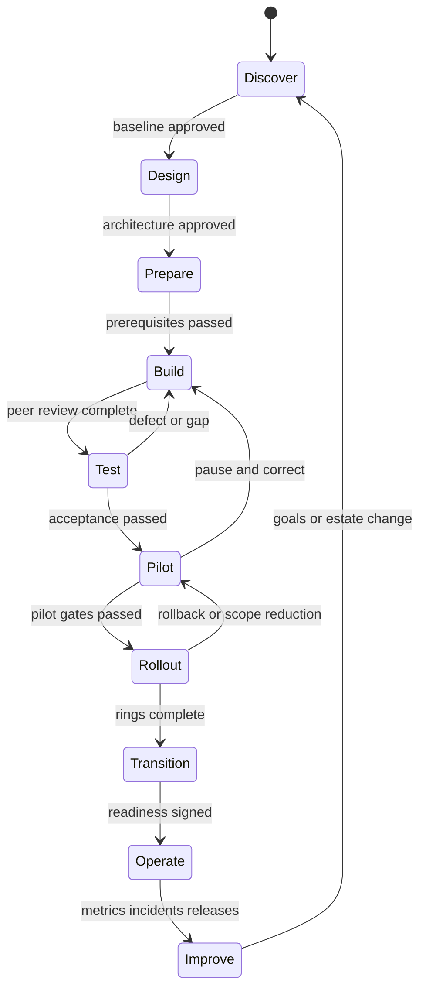

### Plain-English deep-dive 1 - A configuration is not a service

A restaurant can install ovens and still be unable to open. It needs ingredients, trained staff, safety inspections, menus, suppliers, cleaning routines, reservations, emergency procedures, and a way to handle complaints. A Zscaler policy object is like one oven: important, but only one element.

The operating service includes identity lifecycle, traffic steering, DNS and certificates, policy ownership, logs, endpoint and connector updates, user support, privacy, continuity, changes, incidents, and outcomes. The deployment plan must design these together.

## Discovery and prerequisites

Discovery starts with business operations rather than product modules. Ask what people and systems must accomplish, what harm must be reduced, and which constraints are immovable.

| Discovery domain | Questions | Artifact |
|---|---|---|
| Business | Which services, users, sites, applications, and data are critical? | Business-service map |
| Risk | Which exposures, lateral paths, threats, data movements, and audit needs matter? | Risk register |
| Users | Employees, admins, contractors, partners, service accounts, locations? | Persona/cohort matrix |
| Endpoints | Platforms, versions, ownership, MDM, EDR, VPN, proxy, DNS, certificates? | Endpoint inventory |
| Identity | IdPs, domains, groups, attributes, MFA, provisioning, break glass? | Identity flow |
| Internet/SaaS | Destinations, protocols, uploads, TLS, privacy, local breakout? | ZIA flow inventory |
| Private apps | Names, addresses, ports, dependencies, owners, authorization, availability? | Application inventory |
| Sites | Links, routes, DNS, NAT, tunnels, branch services, failure modes? | Site topology |
| Data | Classifications, channels, regions, retention, DLP, legal constraints? | Data-flow map |
| Operations | Service desk, SOC, network, IAM, app, endpoint, change, incident processes? | Operating model |
| Baseline | Experience, volume, incidents, controls, costs, adoption, support rates? | Before-state scorecard |

Prerequisites are specific to the chosen products and assigned cloud. Zscaler public step-by-step guides provide categories, while current linked detail supplies exact values.

| Prerequisite family | Example readiness evidence | Owner |
|---|---|---|
| Commercial | License, edition, quantity, region, term, support level | Procurement/account team |
| Administrative | Named tenant, least-privileged admins, MFA/SSO, break glass, audit | Security/IAM |
| Platform | Supported OS, VM/cloud image, compute/storage, endpoint tooling | Endpoint/cloud/platform |
| Network | Current assigned-cloud destinations, DNS, routes, firewall, proxy, TLS path | Network |
| Identity | Domains, IdP metadata, certificates/secrets, groups/attributes, lifecycle | IAM |
| Certificates | Trust distribution, issuing chain, expiry, custody, rotation | PKI/security |
| Applications | Authoritative names, ports, dependencies, owners, test accounts | App owners |
| Logging | Source types, NSS/API path, SIEM receiver, privacy, retention | SOC/logging |
| Support | Contacts, entitlement, severity, evidence methods, secure upload | Service owner |
| Change | Windows, CAB, approvals, rollback, communication, freeze periods | Change manager |

The Zscaler Config portal is a live operational source for cloud/component requirements and its changelog. Designs should reference the customer's assigned cloud and current component section. Copying a static list into a permanent firewall standard creates drift.

## Architecture and design

Architecture should show five planes: identity, control/management, data/traffic, logging/evidence, and support/operations. It should also show customer and provider ownership.

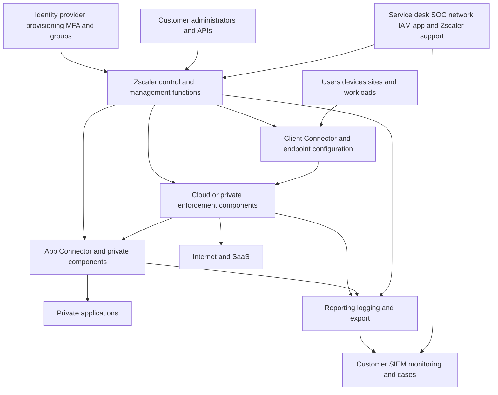

### Design decisions

| Decision | Options to analyze | Required evidence |
|---|---|---|
| User path | Client Connector, site forwarding, browser, other supported patterns | Personas, platforms, protocols, mobility |
| Internet forwarding | Current proxy/PAC/tunnel/branch/workload methods | Traffic scope, identity, failover, performance |
| Private app access | Client/browser, app segments, connector placement/groups | App dependencies and protocol support |
| Enforcement location | Public/private/branch/workload component as applicable | Latency, residency, continuity, ownership |
| Identity | SSO, provisioning, attributes, groups, MFA, service identities | Lifecycle and availability |
| Certificate model | Enterprise trust, inspection, connector/service certificates | PKI authority and rotation |
| Policy model | Global baseline, business cohorts, exceptions, admin separation | Risk, purpose, order, tests |
| Logging | Native reporting, NSS/Cloud NSS/API/integration | Use cases, fields, latency, retention |
| Continuity | Redundant paths/components, bounded fallback, local operations | RTO/RPO and failure tests |
| Operations | Admin model, on-call, change, support, training, metrics | RACI and readiness |

Architecture diagrams need real flows in both directions. Product icons alone hide DNS, NAT, routes, firewalls, proxies, certificate trust, application dependencies, return paths, and owner boundaries.

### Plain-English deep-dive 2 - Draw the roads, not just the buildings

A city map containing only "home," "airport," and "hotel" cannot guide a traveler. It needs roads, intersections, tolls, closures, and alternate routes. Product architecture often names buildings. Deployment architecture must draw the roads.

For one transaction, show endpoint or site, DNS, forwarding decision, Zscaler component, identity and policy context, destination, return path, application authorization, logs, and dependencies. Then mark what happens when each critical road closes.

## Licensing, entitlements, and administrative roles

Licensing affects available products, features, log types, capacity, support, and commercial obligations. An administrator should never infer entitlement from a remembered screenshot. Keep an approved entitlement register tied to contract and tenant evidence.

| Register field | Example question |
|---|---|
| Product/edition | Which ZIA, ZPA, ZDX, data, branch, workload, or logging package? |
| Quantity/metric | Users, devices, sites, workloads, connectors, data volume, or another metric? |
| Tenant/region | Which tenant, cloud, geography, and business unit? |
| Start/end/renewal | When does use begin, expire, or renew? |
| Feature dependency | Which base license, add-on, version, or component is required? |
| Support | Which service level, contacts, and response expectations apply? |
| Owner | Who tracks use, true-up, budget, and renewal? |
| Evidence | Contract, order, portal, account-team confirmation? |

Administrative design applies least privilege and separation of duties. Roles and exact permissions are product-specific, so define duties first and map them to current supported roles.

| Duty | Candidate role boundary | Sensitive action |
|---|---|---|
| Tenant governance | Small accountable platform-owner group | Company-wide settings and admin delegation |
| Identity administration | IAM integration owners | IdP metadata, provisioning, group attributes |
| Network/forwarding | Network service owners | Locations, forwarding, tunnels, route dependencies |
| Security policy | Security control owners | URL, firewall, TLS, DLP, threat, access policy |
| Private-app administration | ZPA/app owners | Segments, connector associations, access rules |
| Endpoint administration | Endpoint engineering | Client Connector profiles and software rings |
| Logging/integration | SOC/platform engineers | Feeds, credentials, parser destinations |
| Read-only operations | Service desk/SOC/TSM as justified | Search and health visibility |
| Audit | Independent reviewer | Admin activity and change evidence |
| Emergency access | Tightly controlled break-glass custodians | Recovery when normal identity unavailable |

All privileged access should use named identities, strong authentication, approved devices/context, logging, periodic review, prompt offboarding, and tested break-glass procedures. Automation accounts receive only required scopes and have owned rotation.

## Identity and provisioning

Identity deployment includes domains, authentication, provisioning, groups, attributes, sessions, MFA, lifecycle, and emergency access. Authentication proves an identity under an IdP flow; authorization decides what that identity may access.

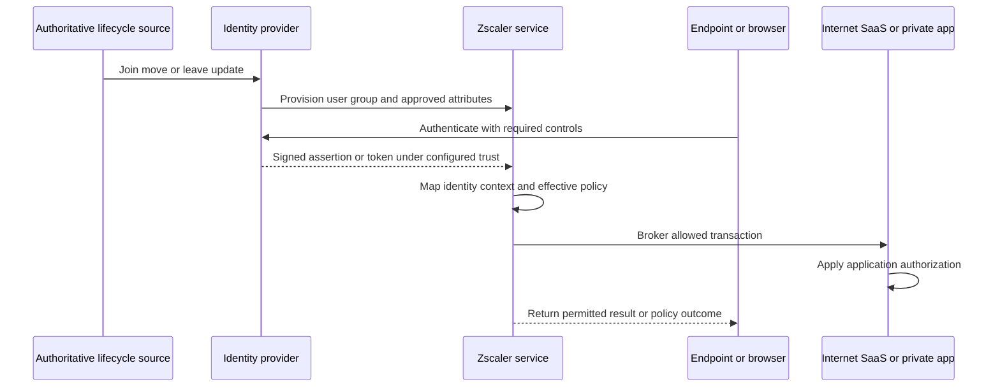

| Identity test | Positive case | Negative or lifecycle case |
|---|---|---|
| Domain | Approved employee domain maps correctly | Unknown domain rejected or handled as designed |
| Group | Finance user receives finance scope | Nonfinance user denied finance app |
| Attribute | Valid department/location value maps | Missing or unexpected value uses safe behavior |
| MFA | Required challenge succeeds | Failed/absent MFA prevents protected access |
| Joiner | New user receives intended minimum access | Premature broad access absent |
| Mover | Changed role gains/removes correct access | Old privilege no longer works |
| Leaver | Access revoked within objective | Cached/session behavior tested |
| IdP outage | Defined continuity behavior works | Broad unauthenticated access stays unavailable |
| Break glass | Named emergency procedure succeeds | Use is alerted, logged, reviewed, and closed |

Clock synchronization, certificate validity, redirect URIs, entity identifiers, claim names, group size, provisioning scope, duplicate users, guest identities, and attribute changes commonly affect identity. Preserve sanitized assertions/tokens only through approved evidence handling.

## Traffic forwarding, locations, and private-app connectivity

ZIA's public configuration guide orders identity/provisioning before traffic forwarding, locations, policies, and analytics. A location identifies a network source from which the organization sends internet traffic. Client Connector has its own prerequisite, administration, profile, package, and deployment workflow. ZPA adds app-side connectors and application definitions.

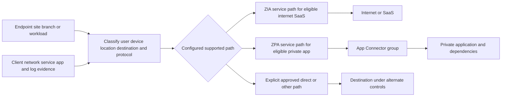

| Forwarding validation | Evidence |
|---|---|
| Path ownership | Which component steered the exact flow? |
| Assigned cloud | Current tenant/cloud and destinations from authoritative source |
| DNS | Resolver, answer, split view, cache, and connector/source context |
| Route/NAT | Forward and return route, translated addresses, asymmetric risks |
| Firewall/proxy | Required egress, TLS interception, upstream proxy, response behavior |
| Tunnel/session | Establishment, selected endpoint, health, failover, reconnection |
| Identity/location | User/device/location mapping at transaction time |
| Policy | Effective rule and action for the flow |
| Destination | TCP/TLS/HTTP/app response and authorization |
| Evidence | Source log, export/SIEM, client/app trace, timestamps |

For ZPA, App Connector health is necessary but not sufficient. Connector-context DNS, route, firewall, load balancer, server listener, certificate, application login, authorization, and hidden dependencies can fail while a connector still reports service connectivity.

## Policy design and staged enforcement

Policy translates business purpose and risk into decisions. Start with a policy model, naming standard, owner, order, comments, test cases, exception lifecycle, and evidence requirement.

| Policy field | Design question |
|---|---|
| Purpose | Which risk or business outcome does this rule address? |
| Scope | Which users, devices, locations, apps, destinations, data, and actions? |
| Conditions | Which identity, posture, threat, time, and context signals? |
| Action | Allow, block, inspect, coach, isolate, require control, or another supported action? |
| Order | Which broader or narrower rules can match first? |
| Owner | Who approves meaning and exceptions? |
| Evidence | Which transaction/log proves match and result? |
| Test | Required, prohibited, boundary, and regression cases? |
| Exception | Reason, risk, compensating control, approver, expiry? |
| Review | Which cadence and trigger revisits the rule? |

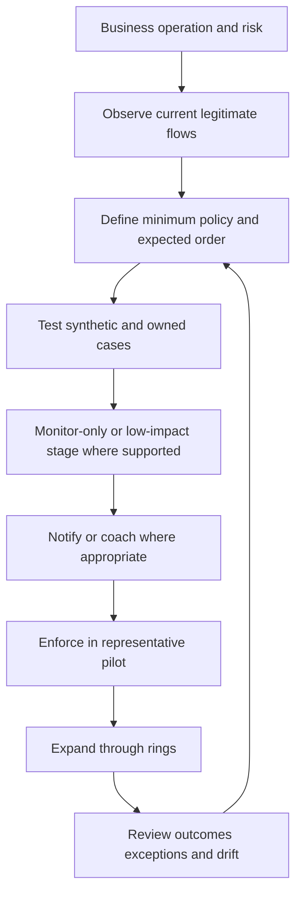

Policy activation mechanics differ by product and release. Current authenticated Help and the tenant determine whether save, activation, publishing, approval, or propagation states apply. The change record should capture the authored object, approved diff, activation time, endpoint/component receipt where visible, and effective transaction result.

### Plain-English deep-dive 3 - Policy order is a line of gates

A passenger may pass identity check, baggage rules, customs, airline authorization, and destination entry. Passing one gate does not erase the others. Zscaler products similarly have multiple policy families and destination applications retain their own authorization.

Troubleshooting asks which gate made the observed decision. A URL allow does not automatically override TLS, threat, DLP, firewall, private-app, browser, endpoint, or destination controls. Use the exact transaction and current policy evidence.

## Certificates, trust, and secrets

Certificates appear in several roles: administrator/SSO trust, TLS inspection, Client Connector trust, App Connector provisioning, service authentication, NSS, APIs, and private applications. Build a certificate and secret register.

| Register field | Required detail |
|---|---|
| Purpose | SSO signing, inspection issuing CA, client auth, connector enrollment, API, app TLS |
| Subject/issuer | Identity and chain |
| Owner/custodian | Accountable team and key custodian |
| Storage | HSM, vault, platform secret store, endpoint trust store |
| Validity | Start, expiry, renewal lead time |
| Distribution | Which systems/endpoints receive public trust or secret material? |
| Rotation | Overlap, staged rollout, verification, old-material removal |
| Revocation | Trigger and emergency response |
| Monitoring | Expiry, use, failed auth, inventory drift |
| Evidence | Fingerprint, chain, approved configuration, test |

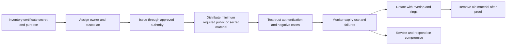

The TLS inspection model from Part 37 remains important: clients must trust the approved enterprise inspection chain; the proxy must validate the real destination; privacy and compatibility exceptions require governance. Private keys stay in approved custody and are never placed in a public trusted-root profile.

## Logging and integrations

Logging readiness is an acceptance gate, not a later convenience. Part 41 provides the full source-to-SIEM model. Deployment must prove source generation, export, receiver, parser, index, detection, retention, privacy, and ownership.

| Evidence family | Deployment use |
|---|---|
| Authentication/provisioning | Prove identity, group, attribute, lifecycle, and failures |
| Endpoint | Prove install, enrollment, profile, forwarding, posture, update, resource use |
| ZIA transaction | Prove path, user/location, destination, policy, action, threat/data result |
| ZPA access | Prove app match, access policy, connector path, app transaction |
| Certificate/TLS | Prove chain, trust, inspection state, origin behavior, expiry |
| Admin/audit | Prove who changed what and when |
| Component health | Prove service connectivity, capacity, software, dependencies |
| NSS/API/SIEM | Prove delivery, parse, normalized fields, searchable time, detection |
| Destination app | Prove business operation and app authorization |
| User support | Prove impact, cohort, recurrence, and usability |

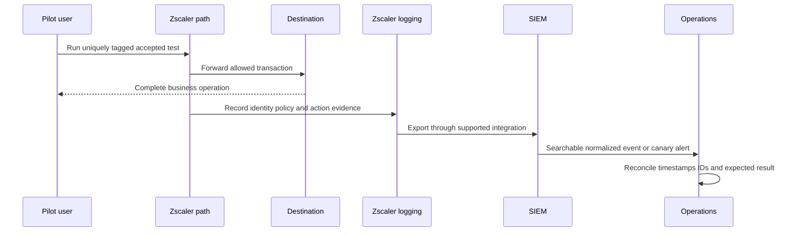

Integrations also include IdP, MDM, EDR, SIEM, ticketing, cloud, SaaS APIs, and automation. Each requires least privilege, owner, schema/contract, credential rotation, health, rate/volume plan, privacy, failure behavior, reconciliation, and offboarding.

## Test plan and acceptance criteria

Testing should cover complete business operations, not only ping, login, or TCP handshake. A OneDrive test might include authentication, opening a library, downloading, editing, saving, syncing, sharing according to policy, and observing logs. A private app test might include login, query, export, dependent API, and logout.

| Test family | Example | Acceptance question |
|---|---|---|
| Installation/enrollment | Client installs and enrolls | Are software, service, tenant, user, and profile correct? |
| Identity | SSO, MFA, groups, join/move/leave | Does lifecycle create minimum intended access? |
| Forwarding | Internet/SaaS/private/direct ownership | Does each eligible flow use the intended path? |
| Functional | Complete required business transaction | Does the user finish correctly? |
| Negative | Unauthorized app/data/action | Is prohibited access denied with evidence? |
| Policy | Exact effective rule and action | Does order match design? |
| TLS/certificate | Inspected, bypassed, pinned, private store | Is trust correct and exception minimum? |
| Threat/data | Safe vendor test artifacts/synthetic DLP | Does supported control respond as designed? |
| Performance | DNS, connect, TLS, first byte, full operation | Are percentiles within agreed baseline/objective? |
| Mobility | Office, home, hotspot, VPN coexistence, transitions | Does context change safely? |
| Resilience | Link/component/IdP/collector failure | Does defined continuity behavior occur? |
| Logging | Source through SIEM/detection | Is evidence complete and timely? |
| Support | Service desk follows runbook | Can operators identify first failed boundary? |
| Rollback | Return to known-good state | Can scope recover within objective? |

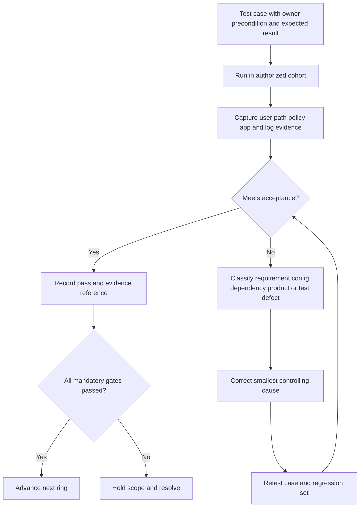

Acceptance criteria use thresholds and must-pass cases. Examples: 100 percent of defined critical workflows pass; every prohibited path test denies; 95th percentile user operation remains within agreed tolerance; tagged events become searchable within the objective; failover works within RTO; rollback rehearsal completes; no unresolved severity-one issue; service desk and on-call pass a runbook exercise.

## Pilot and rollout rings

A good pilot is representative, observable, supported, and small enough to protect the enterprise. It includes more than friendly IT users.

| Ring | Population | Purpose | Exit gate |
|---|---|---|---|
| Lab | Synthetic accounts/apps/devices | Validate basic design safely | Core tests pass |
| Engineering canary | Product/network/endpoint/IAM owners | Find obvious configuration defects | Evidence path and rollback pass |
| Business pilot | Representative roles, apps, sites, platforms | Validate real workflows and support | Mandatory criteria and user feedback pass |
| Early adopter | Larger diverse voluntary/managed cohort | Test scale and operational process | Metrics stable across business cycle |
| Production wave | Bounded region/business/platform | Expand with controlled blast radius | Wave acceptance passes |
| Broad operation | Remaining approved scope | Sustain service | Continuous health and adoption review |

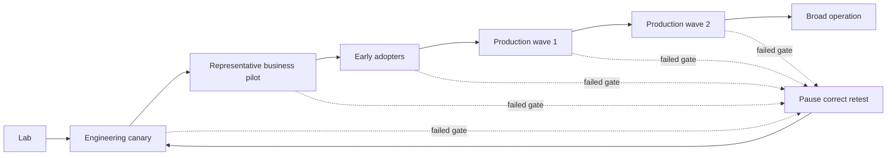

Pilot selection covers operating systems, managed/unmanaged state, office/home/mobile networks, regions, departments, privileged roles, accessibility needs, critical apps, high-volume users, special protocols, and support channels. Record informed expectations and a fast way to report problems.

## Change, rollout, and rollback

Every change record should explain why the change exists and how success will be proven.

| Change field | Required content |
|---|---|
| Objective | Risk or business outcome |
| Scope | Tenant, cohort, site, app, policy, component, version |
| Baseline | Current state and health |
| Dependencies | Identity, network, DNS, cert, endpoint, app, log, vendor |
| Risk | Security, availability, privacy, performance, supportability |
| Implementation | Ordered steps and owners |
| Verification | Positive, negative, security, experience, logging tests |
| Abort | Thresholds that stop expansion |
| Rollback | Exact known-good state, steps, permissions, time, caveats |
| Communication | Before/during/after audiences and cadence |
| Evidence | IDs, screenshots/data references, timestamps, approvals |
| Closure | Outcome, residual issues, documentation, follow-up |

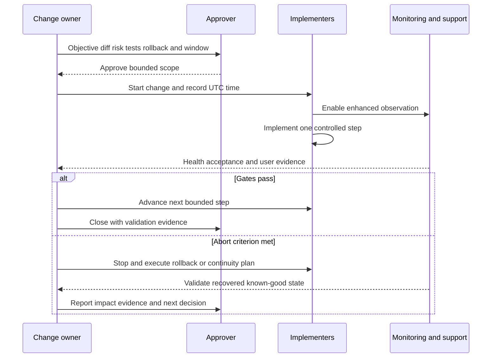

Rollback must preserve security thoughtfully. A broad bypass can restore connectivity while creating unmeasured exposure. Prefer reverting the smallest policy/profile/version/routing change to an approved state. When rollback is impossible, define roll-forward and continuity options before implementation.

### Plain-English deep-dive 4 - Rollback is a destination, not a button

Saying "we can undo it" is like telling a pilot to turn around without naming an airport, fuel, weather, or runway. A rollback plan identifies the exact prior configuration or version, who can restore it, required dependencies, expected time, data/session effects, and tests that prove recovery.

The team rehearses rollback in a lower-risk environment. During an incident, operators follow evidence rather than inventing a recovery route under pressure.

## Service continuity and failure design

Continuity begins with critical business operations and recovery objectives. It includes customer components, provider service, internet links, identity, DNS, certificates, endpoints, connectors, logging, and destination apps.

| Failure domain | Design question | Test |
|---|---|---|
| User endpoint | What if service/process/profile/update fails? | Supported recovery and alternate managed device |
| Local network/ISP | Which alternate link/path exists? | Link loss and brownout |
| DNS | Which resolver/view/cache dependencies exist? | Resolver failure and wrong-answer drill |
| Identity provider | What is safe access behavior during outage? | IdP outage/break-glass exercise |
| Zscaler service path | How is alternate edge/path selected under current design? | Documented continuity test |
| App Connector | Are connectors independent and capacity sufficient? | Instance/site failure |
| Private app | Does ZPA health distinguish app dependency failure? | App/listener/load-balancer failure |
| Certificate/secret | Can expiry/rotation/compromise be handled? | Rotation and revoked credential test |
| Logging/SIEM | How is visibility gap detected/reconciled? | Collector outage and recovery |
| Admin access | Can approved administrators respond? | Normal SSO failure and break glass |
| Destination SaaS/app | How is third-party outage isolated? | Synthetic transaction and provider status |

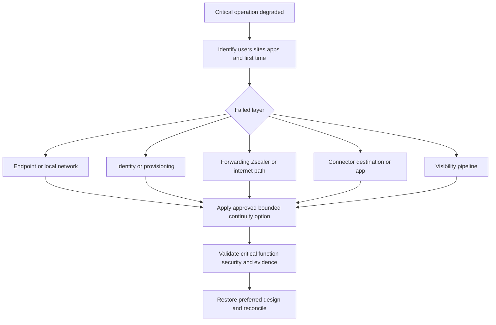

Zscaler's public customer-notification documentation points customers to the Trust Portal and Admin Console for cloud status, maintenance, updates, security advisories, and operational notices. The notification protocol distinguishes planned and unplanned activity. Customers still need subscriptions, contact ownership, internal impact assessment, and local change procedures.

## Monitoring and health

Health is layered. Ask: "Which subject successfully performed which verb, at what time, against which objective?"

| Health layer | Example health statement | Evidence |
|---|---|---|
| Business | Payroll approval completed for canary account | Synthetic transaction |
| User experience | 95th percentile sign-in/save within objective | Cohort telemetry |
| Endpoint | Client enrolled, current profile applied, resource use normal | Endpoint/admin evidence |
| Identity | SSO and provisioning current for canary identities | IdP and Zscaler logs |
| Forwarding | Eligible traffic reached intended service path | Client/network/transaction logs |
| Policy | Expected rule and action matched | Policy/transaction evidence |
| TLS/cert | Both required trust/auth paths succeeded | Certificate and handshake evidence |
| ZPA connector/app | Eligible connector reached app and completed login | Health plus app transaction |
| Logging | Tagged event searchable within objective | Source-to-SIEM canary |
| Provider | Assigned service/cloud status reviewed | Trust Portal and notices |
| Operations | Alerts acknowledged and runbook action completed | Incident system |

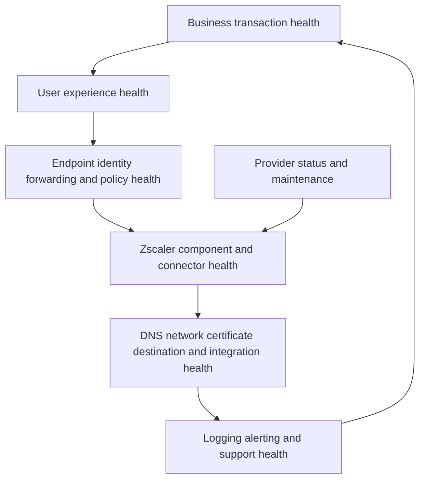

Dashboards should show cohorts and percentiles, not only global averages. Alert on leading indicators such as certificate expiry, unsupported versions, profile staleness, connector capacity, failed canaries, feed lag, exception age, and repeated fallback use.

## Administrative operations

Steady-state administration needs a cadence.

| Cadence | Activities |
|---|---|
| Continuous | Critical alerts, canaries, provider incidents, connector/path/log health |
| Daily | Failed auth/provisioning, significant policy blocks, component failures, queue/latency, open incidents |
| Weekly | Change review, exceptions, support trends, new apps/sites/users, release notes/notices |
| Monthly | Access review, certificate forecast, versions, capacity, policy hygiene, adoption, SLA/metrics |
| Quarterly | Architecture, continuity test, business outcomes, risk, license use, training, roadmap |
| Annually or policy cadence | Full role recertification, recovery exercise, contract/support review, lifecycle plan |

Administrative hygiene includes naming, descriptions, owners, tags/groups, duplicate objects, disabled/stale rules, broad wildcards, expired exceptions, unused connectors, old packages, orphan service accounts, failed integrations, and incomplete audit trails. Automation helps only when change approval, test, idempotency, secret custody, and rollback are explicit.

## Release and change management

The public Zscaler Release Notes page organizes notes by product families including ZIA, ZPA, ZDX, Client Connector, Cloud and Branch Connector, and others. Treat release notes as an impact-analysis input.

| Release review question | Action |
|---|---|
| What changes? | Feature, fix, default, UI, API, schema, platform, certificate, address, behavior |
| Which scope applies? | Product, cloud, tenant, version, platform, region, license |
| Is customer action required? | Configuration, allowlist, upgrade, trust, parser, training |
| What can break? | Forwarding, identity, policy, app, endpoint, integration, operations |
| What should be tested? | Targeted acceptance plus regression set |
| Which window/cadence? | Provider schedule and customer ring/change calendar |
| How will impact be observed? | Canaries, dashboards, service desk, audit, app owners |
| What is rollback/support path? | Supported prior state or vendor guidance |

```mermaid
flowchart LR
    NOTICE[Release note Config changelog Trust notice or EOL update] --> TRIAGE[Determine applicability]
    TRIAGE --> IMPACT[Assess architecture security user and operations impact]
    IMPACT --> PLAN[Create test ring communication rollback and support plan]
    PLAN --> LAB[Test current representative environment]
    LAB --> RINGS[Deploy through approved rings]
    RINGS --> OBSERVE[Observe health cases and evidence]
    OBSERVE --> CLOSE[Update inventory docs and known issues]
    CLOSE --> REVIEW[Feed lessons into future releases]
```

The Zscaler Config portal changelog matters because cloud enforcement ranges and component requirements can evolve. The customer notification process describes notice categories, but the current portal and contract control applicable details. Track end-of-sale and end-of-life separately from routine continuity notices.

## Supportability and maintenance

Supportability means the deployed combination is documented, within lifecycle, observable, and reproducible enough to support. A custom architecture can function while remaining difficult to maintain or outside supported guidance.

| Supportability dimension | Evidence |
|---|---|
| Version | Current supported OS/client/connector/product version |
| Architecture | Matches supported reference and current requirements |
| Interoperability | Tested VPN, EDR, proxy, DNS, browser, MDM, and app combinations |
| Configuration | Versioned export/diff, owner, approval, known exceptions |
| Observability | Logs, health, canaries, timestamps, support bundle process |
| Reproduction | Minimal safe steps and known-good comparison |
| Lifecycle | Upgrade, renewal, certificate, EOL, and replacement dates |
| Capacity | Measured headroom and failover capacity |
| Skills | Named trained owners and on-call coverage |
| Vendor support | Entitlement, contacts, severity process, secure evidence route |

Maintenance covers endpoint/client updates, connectors/private components, certificates/secrets, IdP metadata, policy cleanup, integration tokens, parsers, firewall lists, DNS entries, capacity, backups/exports where supported, test accounts, runbooks, and training.

## Incident response and escalation

An incident begins with impact and scope, not blame. Establish an incident commander, technical workstreams, communications lead, scribe/timeline, and decision owner according to severity.

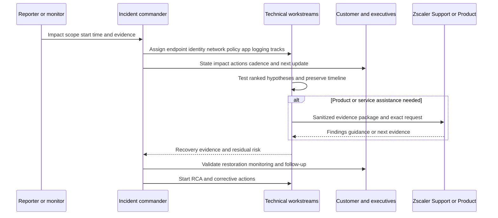

| Incident phase | Required output |
|---|---|
| Detect | Signal, first observed time, source, confidence |
| Declare | Severity, business impact, commander, cadence |
| Scope | Users, sites, apps, platforms, regions, first/last known |
| Stabilize | Safe containment or continuity action |
| Investigate | Ranked hypotheses, tests, evidence, first failed boundary |
| Escalate | Product/environment package and exact assistance request |
| Recover | Required transactions, controls, logs, and backlog validated |
| Monitor | Recurrence window and owners |
| Close | Customer agreement, known issues, RCA plan |

Status updates state facts, uncertainty, actions, owners, and next update. An estimated time of restoration is shared only when supported by the team owning the recovery path. "Engineering is investigating" becomes useful when paired with the exact question and evidence.

## Evidence package

| Evidence section | Content |
|---|---|
| Executive impact | Business operations, users/sites/apps, security and regulatory implications |
| Environment | Tenant/cloud, products, licenses, versions, topology, cohort |
| Expected/actual | Exact transaction and accepted design |
| UTC timeline | Symptom, changes, source, path, app, logging, mitigation events |
| Reproduction | Safe minimal steps, frequency, preconditions |
| Comparisons | Working versus failing user/site/app/path/version/time |
| Zscaler evidence | Transaction IDs, effective policy, component health, admin audit |
| Customer evidence | Client logs, DNS/route, packet/HAR, IdP, app, SIEM |
| Changes | Product, policy, identity, network, cert, app, parser, release |
| Hypotheses | Supporting and conflicting evidence plus next test |
| Mitigation | Current workaround, lost controls, scope, expiry, owner |
| Request | Exact Zscaler/customer action or question |

Evidence is minimized and shared through approved secure channels. Credentials, private keys, bearer tokens, full sensitive URLs, personal data, DLP content, and unrelated customer records remain protected. Record time zones, observation points, tool versions, filters, and redaction effects.

## Root-cause analysis and corrective action

RCA goes beyond "the certificate expired" or "the policy changed." Ask why the condition reached production, why controls did not prevent or detect it earlier, how response worked, and which actions reduce recurrence.

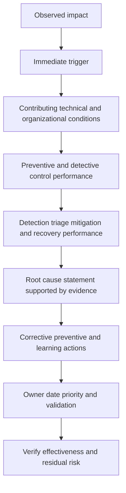

| RCA element | Good question | Weak shortcut |
|---|---|---|
| Impact | Which operations and controls failed, for how long? | "Users had issues" |
| Trigger | Which exact change/event initiated failure? | Naming the team |
| Conditions | Which dependency, process, design, or knowledge gaps enabled impact? | One human error |
| Detection | Which signal existed and when did it alert? | "Monitoring failed" without stage |
| Response | Which actions helped or delayed recovery? | Timeline without decisions |
| Root cause | Which controllable system condition explains evidence? | Symptom restatement |
| Actions | Which design/process/test/monitoring changes reduce recurrence? | "Be more careful" |
| Validation | How will effectiveness be measured? | Closing when task is assigned |

NIST SP 800-61 Rev. 3 frames incident response as part of cybersecurity risk management. The lesson is operational: feed incidents back into architecture, risk, controls, training, and governance instead of treating them as isolated support tickets.

## Adoption, documentation, training, and operational readiness

Adoption means intended users and teams consistently use the service to achieve outcomes. Installation count alone is insufficient.

| Adoption dimension | Measure | Interpretation caution |
|---|---|---|
| Enrollment | Eligible active devices/users enrolled | Does not prove traffic coverage |
| Protected transactions | Required workflows using intended path | Needs denominator and path proof |
| Policy coverage | In-scope users/apps/sites under approved policy | Broad rules may inflate coverage |
| Legacy dependence | Traffic/users still requiring VPN or bypass | Some approved coexistence may remain |
| Operational use | Teams using logs, dashboards, runbooks, reviews | Login count is weak evidence |
| Support readiness | First-contact resolution and correct routing | Low tickets can also mean poor reporting |
| Exception health | Owned, bounded, monitored, expiring exceptions | Quantity alone ignores risk |
| Outcome | Reduced exposure, better experience, faster diagnosis, stronger data control | Requires baseline and causal caution |

### Documentation set

| Document | Audience | Minimum content |
|---|---|---|
| Architecture | Engineers and reviewers | Planes, flows, dependencies, failure modes, ownership |
| Build record | Platform admins | Versioned configuration and decisions |
| Source of truth inventory | Operations | Tenants, products, components, versions, certificates, integrations |
| Policy standard | Security/app owners | Naming, order, owner, tests, exceptions, review |
| Runbooks | Service desk/on-call | Symptoms, scope, evidence, decisions, escalation |
| Continuity plan | Incident/change teams | Critical operations, options, RTO, tests, communications |
| User guide | End users | Expected prompts, support route, privacy-approved guidance |
| Training | Role-based teams | Tasks, boundaries, labs, assessment |
| Known issues | Support and admins | Scope, workaround, lost controls, owner, expiry |
| Decision log | Governance | Choice, alternatives, evidence, approver, revisit trigger |

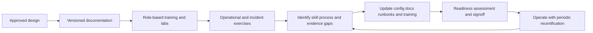

### Operational readiness gate

| Readiness area | Pass condition |
|---|---|
| Ownership | Service, product, IAM, network, endpoint, app, SOC, privacy, and support roles accepted |
| Technology | Supported architecture, prerequisites, capacity, certificates, and integrations validated |
| Security | Positive and negative policies, admin controls, evidence, and exceptions approved |
| Continuity | Critical failures, fallback, rollback, and recovery exercised |
| Monitoring | Business canaries and layer health alerts reach named owners |
| Support | Service desk and on-call complete scenario drills |
| Change | Release, Config, notification, CAB, ring, and rollback processes active |
| Documentation | Architecture, inventory, runbooks, known issues, contacts current |
| Training | Admins/operators/users complete role-appropriate enablement |
| Metrics | Baselines, objectives, denominators, review cadence agreed |
| Governance | Risks, decisions, residual issues, and executive acceptance recorded |

## Common failure modes and first isolation

| Symptom | Candidate layers | First discriminating evidence |
|---|---|---|
| Client installed but no protection | Enrollment, profile, entitlement, forwarding, identity | Endpoint tenant/profile and tagged transaction path |
| User authentication loop | IdP trust, cookie/session, time, redirect, certificate, group | IdP and browser trace with UTC timeline |
| Site traffic absent | Tunnel/PAC/route/NAT/location/firewall | Source public IP and service transaction log |
| Internet works direct but not ZIA | Forwarding, DNS, TLS, policy, destination, app compatibility | Exact path and two-leg transaction evidence |
| Private app works on VPN only | Segment match, policy, connector DNS/route/firewall, hidden dependency | Connector-context dependency test |
| Connector green but app fails | App DNS/listener/load balancer/auth/dependency | Complete synthetic app transaction |
| Certificate errors after rollout | Root distribution, private store, pinning, mTLS, origin cert, clock | Client-presented and origin chains |
| One group has wrong access | Provisioning/attribute, policy order, stale session | Current group/attribute and effective rule |
| SIEM events missing | Source, feed, NSS/API, network, parser, index | One source event walked end to end |
| Performance degrades in one site | ISP, DNS, edge/path, MTU, policy, destination, local resource | Matched cohort and stage percentiles |
| Failure after release | Applicability, default/schema/version/interoperability change | Release/change timeline and known-good ring |
| Rollback fails | Prior state incomplete, dependency changed, propagation/session | Rehearsed rollback evidence and current state |
| Tickets spike without telemetry change | Communication, UX, reporting route, cohort issue | Ticket taxonomy and tagged user transactions |
| Dashboard green during outage | Component-only health, missing business canary | Complete business transaction evidence |

## End-to-end troubleshooting runbook

The runbook uses one concrete transaction and walks outward only when evidence requires it.

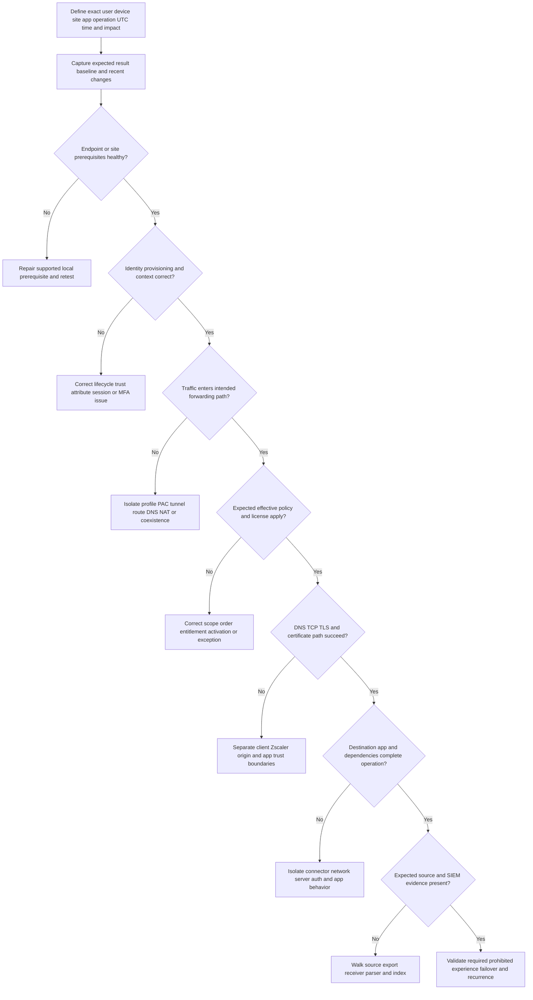

### Runbook steps

1. **Define impact.** Record who, what business operation, where, when, how many, severity, security implication, and current workaround.
2. **Create a precise transaction statement.** User/device/site attempted action against named destination at UTC time and observed exact result.
3. **Preserve before-change evidence.** Client, identity, route/DNS, certificate, policy, component, app, source log, SIEM, and recent changes.
4. **Compare known good.** Choose the narrowest useful difference: user, device, site, group, app, version, path, or time.
5. **Validate prerequisites.** Supported versions, entitlement, clock, resources, network, trust, and component state.
6. **Prove identity.** Authentication, provisioning, attributes/groups, posture freshness, session, and effective context.
7. **Prove path.** DNS, forwarding owner, route/NAT, tunnel/proxy, assigned cloud, return path, and coexistence.
8. **Prove policy.** Exact product/log family, matching object, order, action, activation, and exception.
9. **Split protocol legs.** DNS, TCP, TLS, HTTP/application; client-to-Zscaler and Zscaler/connector-to-destination.
10. **Validate full destination operation.** Application authentication, authorization, dependencies, payload/action, and response.
11. **Reconcile evidence.** Source transaction through export/SIEM with event and ingest times.
12. **Run one discriminating change.** Small, reversible, approved, with explicit predicted result.
13. **Recover and validate.** Required and prohibited paths, security controls, experience, logging, failover, and recurrence window.
14. **Escalate when needed.** Provide minimized package and exact request to the owning team.
15. **Close the loop.** RCA, corrective actions, documentation, monitoring, training, and customer confirmation.

### Plain-English deep-dive 5 - The first failed handoff owns the next question

In a relay race, the final runner cannot finish if an earlier baton handoff failed. Troubleshooting finds the first failed handoff: endpoint to identity, identity to policy, endpoint/site to service path, Zscaler to destination, destination to business operation, or source log to SIEM.

This prevents unproductive blame. The owner of the first failed boundary gets a precise question and evidence. Later symptoms remain real, but fixing a downstream dashboard cannot repair an upstream route.

## Fictional NMH deployment and incident

NMH is a synthetic global manufacturer with 18,000 users, factories, Microsoft 365, private engineering and finance applications, existing VPN, SIEM, IdP, endpoint management, and change governance.

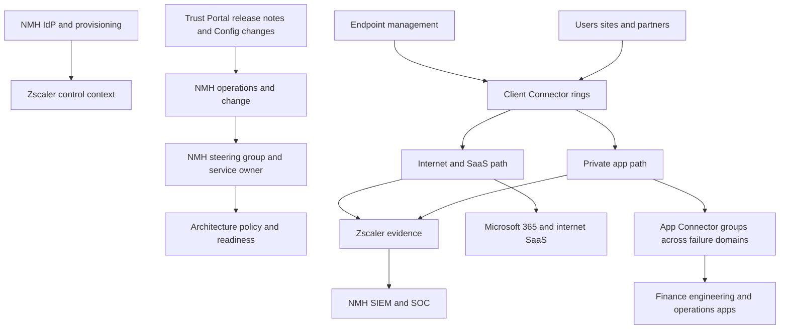

### NMH phased plan

| Phase | Synthetic scope | Gate |
|---|---|---|
| Discover | Ten personas, 60 critical apps, 12 sites, identity and dependency map | Owners approve inventory |
| Design | ZIA/ZPA paths, connector failure domains, TLS/privacy, logging, support | Architecture review passes |
| Prepare | Licenses, admin RBAC, IdP, MDM, network, cert, SIEM, test accounts | Prerequisites pass |
| Canary | 20 IT/security users and three test apps | Core plus rollback tests pass |
| Pilot | 300 users across finance, engineering, sales, accessibility, regions | Business and operational gates pass |
| Waves | Region/platform/business cohorts | Metrics stable and defects bounded |
| Transition | Runbooks, training, on-call, dashboards, continuity exercise | Readiness board signs |
| Operate | Weekly health, monthly adoption, quarterly value/architecture | Improvement backlog active |

### Incident: finance app saves fail after policy wave

At 09:10 UTC, pilot finance users can open a private budgeting app but saving a report fails. VPN users succeed. ZPA access events show the main app allowed; App Connectors are service-healthy. The app trace shows a call to a separate report host not included in the approved application dependency inventory.

The team pauses the wave, preserves evidence, and validates the report host from connector context. App owners confirm the dependency and business purpose. Security defines a narrow segment/service relationship, tests required save plus denied unrelated hosts, validates logs and experience, and records the inventory gap. The pilot resumes after acceptance. The RCA identifies an incomplete dependency discovery method and a test that covered login/open but not save/export. Corrective actions add server-side dependency observation, owner signoff, and full-operation tests.

### Incident: SIEM canary fails while traffic works

ZIA business transactions pass, but the source-to-SIEM canary misses its objective. Part 41's runbook shows source records exist and the receiver accepted payloads. Parser failures began after a schema/template change. The team keeps enforcement operating, alerts the SOC to the visibility gap, repairs the parser with a golden corpus, replays only according to supported process, deduplicates, reconciles the interval, and updates the integration change gate.

## Your experience bridge to Zscaler

| prior production strength | Zscaler deployment/operations application | Honest boundary |
|---|---|---|
| OneDrive/SharePoint end-to-end troubleshooting | Full business transaction acceptance and hidden dependencies | Zscaler config remains learned |
| DNS/TCP/TLS/proxy traces | Forwarding, two-leg TLS, connector/app isolation | Current product path requires tenant evidence |
| Identity and permissions | SSO, provisioning, groups, policy versus app authorization | Product role mapping requires Help |
| Critical-situation leadership | Incident command, workstreams, cadence, escalation | Zscaler severity process verified per support plan |
| Fix validation | Rings, positive/negative regression, rollback proof | Production rollout not claimed |
| Analytics and case quality | Health, adoption, failure and support metrics | Synthetic metrics for lab |
| Mentoring and documentation | Role-based training, service desk runbooks, readiness | Direct Zscaler training delivery is future practice |

### 30-second interview bridge

"My prior escalation background taught me that enterprise deployment succeeds only when architecture, identity, endpoint, network, certificates, application behavior, evidence, support, and change become one service. For Zscaler I would discover full business transactions and dependencies, verify assigned-cloud prerequisites and licenses, design ZIA/ZPA/Client Connector and logging flows, stage policy through representative rings, gate on positive and negative tests, rehearse rollback and continuity, and transition with health, runbooks, training, and ownership. I have built that operating model synthetically; direct Zscaler tenant administration is a learning area, so current Help, tenant evidence, and specialist review are built into my method."

## Labs and rehearsal

Use only owned, authorized, nonproduction systems and synthetic identities/data. Product-specific simulations are labeled conceptual when licensed access is unavailable.

### Lab 1 - Discovery workbook

Inventory synthetic users, devices, sites, internet/SaaS, private apps, data, identity, DNS, routes, certificates, logs, owners, criticality, and continuity. Identify ten unknowns that block design.

### Lab 2 - Five-plane architecture

Draw identity, control/management, traffic, logging, and support planes. Add customer/provider ownership and at least eight failure domains.

### Lab 3 - License and RBAC register

Create synthetic entitlements and duties. Map least-privileged roles, break glass, service accounts, review cadence, and evidence without inventing Zscaler permission names.

### Lab 4 - Identity lifecycle

Simulate joiner, mover, leaver, guest, group change, missing attribute, MFA failure, IdP outage, and break-glass cases. Record expected policy and application outcomes.

### Lab 5 - Forwarding map

Model home endpoint, office site, VPN coexistence, private app, and SaaS. Prove which component owns DNS, route, proxy/tunnel, policy, and return path in each context.

### Lab 6 - Certificate rotation

Create a synthetic certificate register and rehearse overlap, distribution, canary, broad rollout, old-material removal, expiry alert, and compromise response.

### Lab 7 - Policy test pack

Design 40 cases across required access, prohibited access, order, group, device, location, TLS, threat-test, DLP-test, private-app dependency, and exception expiry.

### Lab 8 - Ring and rollback tabletop

Create lab, canary, pilot, early-adopter, and production cohorts. Define gates, abort thresholds, communication, rollback destination, permissions, and recovery validation.

### Lab 9 - Continuity exercise

Inject ISP, IdP, App Connector, certificate, SIEM, and destination-app failures one at a time. Measure detection, decision, critical function, security state, recovery, and reconciliation.

### Lab 10 - Health scorecard

Build synthetic business, user, endpoint, identity, path, policy, connector, app, log, provider, and operational metrics with cohorts, percentiles, denominators, and targets.

### Lab 11 - Incident and escalation

Run the NMH finance-save incident. Produce first update, workstream map, hypothesis table, evidence package, support request, recovery validation, and customer closure.

### Lab 12 - Operational readiness board

Present architecture, prerequisite evidence, acceptance, pilot results, unresolved risks, continuity, monitoring, support, documents, training, metrics, and explicit go/hold decision.

| Lab artifact | Completion standard |
|---|---|
| Scope | Synthetic, authorized, reproducible, clearly labeled |
| Architecture | Flows, planes, owners, dependencies, failures visible |
| Test | Expected result, evidence, pass/fail, defect, retest recorded |
| Change | Objective, risk, gate, abort, rollback, communication complete |
| Incident | Impact, timeline, hypotheses, recovery, RCA separated |
| Readiness | Residual risk and accountable approvals explicit |

## Common misconceptions to correct

| Misconception | Better operating model |
|---|---|
| Deployment is software installation | Deployment includes design, controls, test, transition, continuity, and adoption |
| Product architecture slide is enough | Draw real DNS, route, identity, policy, app, log, and return paths |
| License can be inferred from UI | Confirm contract, tenant entitlement, edition, quantity, and dependency |
| Global admin is easiest | Map duties to least privilege and separate sensitive roles |
| SSO success means access success | Provisioning, group, policy, path, and app authorization remain |
| SCIM makes identity automatically correct | Scope, attributes, lifecycle, duplicates, failures, and reconciliation need operation |
| Client installed means traffic protected | Enrollment, profile, path, entitlement, policy, and logs must prove it |
| Connector green means app healthy | DNS, route, listener, TLS, authorization, and dependencies remain |
| One allow rule permits the transaction | Multiple policy families and destination authorization apply |
| Saving config proves effective change | Verify activation/propagation and transaction result using current product behavior |
| Certificate renewal is routine clerical work | Trust, private-key custody, overlap, distribution, and rollback create service risk |
| Logging can wait until after rollout | Evidence is required for acceptance, safety, and support |
| Login test proves application migration | Complete business operations and dependencies must pass |
| Friendly IT users are representative | Pilot across platforms, roles, sites, networks, apps, and accessibility |
| Global rollout is faster | Rings expose defects before they become enterprise incidents |
| Rollback means bypass Zscaler | Return the smallest scope to an approved secure state |
| Provider cloud status proves customer health | Endpoint, ISP, identity, policy, connector, app, and logs can fail independently |
| Green dashboards prove service health | Run complete synthetic business transactions |
| Release notes are informational only | Assess applicability, regression, operations, communication, and lifecycle |
| Current functionality means supportability | Verify versions, architecture, interoperability, evidence, and lifecycle |
| Incident communication needs constant ETAs | Share impact, actions, uncertainty, cadence, and owner-supported estimates |
| Root cause is the immediate error | Include contributing conditions and failed preventive/detective controls |
| Adoption equals installed users | Measure intended path, workflows, policy, legacy dependence, and outcomes |
| Documentation is complete at go-live | Update it after changes, incidents, releases, and exercises |
| This Part proves production Zscaler administration | It proves a complete operating method and synthetic practice |

## Official Source Anchors

Sources in this section were reviewed on **2026-08-24**.

Zscaler Help pages establish the current public configuration categories and operational documentation surfaces. Exact values and actions come from current linked/authenticated articles, the assigned tenant/cloud, support statements, release notes, and contracts. The public configuration-activation article was unavailable during review, so this Part states only the general requirement to verify save/activation/propagation behavior in current authenticated Help. Marketing performance, replacement, continuity, and outcome claims remain hypotheses for customer testing.

| Source | URL | Used for | Boundary |
|---|---|---|---|
| ZIA step-by-step guide | https://help.zscaler.com/zia/step-step-configuration-guide-internet-saas | Public sequence: company/admin, identity/provisioning, forwarding, locations, policies, analytics | Linked current detail governs exact configuration |
| ZPA step-by-step guide | https://help.zscaler.com/zpa/step-step-configuration-guide-zpa | Public sequence: admin, certificates, SSO, Client Connector, App Connectors, apps, attributes, policies, log streaming, portals | Objects, fields, licenses, and order can change |
| Client Connector step-by-step guide | https://help.zscaler.com/zscaler-client-connector/step-step-configuration-guide-zscaler-client-connector | Prerequisites, administration settings, profiles, download/customization, deployment | Platform/version behavior varies |
| Client Connector Help | https://help.zscaler.com/zscaler-client-connector | Documentation families for deployment, administration, profiles, posture, forwarding, monitoring, interoperability, troubleshooting | Current authenticated paths control |
| Zscaler Config | https://config.zscaler.com/ | Assigned-cloud/component network requirements and changelog | Dynamic source; avoid permanent copied lists |
| Zscaler Release Notes | https://help.zscaler.com/release-notes | Product-family release review surface | Applicability depends on tenant/product/version |
| Understanding Customer Notifications | https://help.zscaler.com/zia/understanding-customer-notifications | Trust Portal/Admin Console notices and service continuity notification categories | Current policy and contract govern details |
| Zscaler Trust Portal | https://trust.zscaler.com/ | Cloud status, maintenance, incidents, advisories, data-center context | Provider view does not prove customer transaction health |
| ZIA product page | https://www.zscaler.com/products-and-solutions/zscaler-internet-access | Public internet/SaaS and integration positioning | Marketing claims require acceptance tests |
| ZPA product page | https://www.zscaler.com/products-and-solutions/zscaler-private-access | Public app-specific access, segmentation, connector/continuity positioning | Exact operations require Help and tenant evidence |
| NIST Cybersecurity Framework 2.0 | https://www.nist.gov/cyberframework | Govern, Identify, Protect, Detect, Respond, Recover outcome framework | Vendor-neutral and risk based |
| NIST SP 800-128 Update 1 | https://csrc.nist.gov/pubs/sp/800/128/upd1/final | Security-focused configuration management and monitoring | Federal guidance; tailor to organization |
| NIST SP 800-61 Rev. 3 | https://csrc.nist.gov/pubs/sp/800/61/r3/final | Incident response integrated with cybersecurity risk management | Technology-neutral guidance |
| NIST SP 800-207 | https://csrc.nist.gov/pubs/sp/800/207/final | Resource-centric zero trust and continuous policy concepts | Not Zscaler configuration guidance |

## Likely Interview Questions

### Q1. How would you structure an enterprise Zscaler deployment?

**Model answer:** I use a lifecycle: discover business operations, risk, estate, dependencies, owners, and baseline; design identity, control, traffic, logging, and support planes; validate licenses and prerequisites; build the smallest viable configuration; test full required and prohibited transactions; pilot representative cohorts; expand through gated rings; transition with runbooks, monitoring, training, continuity, and support; then operate and improve through metrics, incidents, release reviews, and architecture governance.

### Q2. What prerequisites would you validate before a pilot?

**Model answer:** Contract and entitlement, tenant and assigned cloud, least-privileged administrators, supported endpoint/component versions, IdP/provisioning/groups/MFA, current network and DNS requirements, forwarding and return paths, certificate trust and rotation, private-app dependencies and owners, logging/SIEM path, privacy/retention, test accounts, change windows, rollback, support entitlement, and named operational owners. I require evidence for each rather than a verbal ready status.

### Q3. How do you design a useful pilot and acceptance plan?

**Model answer:** I choose a bounded but representative cohort across platforms, roles, sites, networks, applications, accessibility, and special protocols. Tests cover install/enrollment, identity lifecycle, forwarding, complete business operations, prohibited paths, policy order, TLS, safe threat/data controls, performance percentiles, mobility, component failures, logging, service-desk response, and rollback. Mandatory thresholds, abort criteria, evidence, owners, and retest rules determine whether the next ring advances.

### Q4. How would you manage a risky policy or client change?

**Model answer:** I document objective, scope, baseline, dependencies, diff, risk, approvals, implementation, enhanced monitoring, positive/negative/regression tests, abort thresholds, exact rollback destination, permissions, communications, and closure evidence. I start with canary and representative rings, change one bounded element, verify effective transaction behavior and logs, and pause immediately on a failed gate. Rollback restores the smallest approved secure state rather than opening a broad bypass.

### Q5. What does Zscaler service health mean to you?

**Model answer:** Health is layered evidence: a critical synthetic business operation completes; user experience meets objectives; endpoint, identity, forwarding, policy, certificate, connector, and app dependencies work; required logs reach the SIEM; provider status/notices are reviewed; and operations can respond. A Trust Portal or component green state is useful but cannot prove a customer-specific transaction. I use subject-plus-verb statements, cohorts, percentiles, canaries, and failure tests.

### Q6. How would you troubleshoot a widespread access failure?

**Model answer:** I start with impact, exact transaction, UTC timeline, changes, and a known-good comparison. I walk endpoint/site prerequisites, identity/provisioning, forwarding and assigned-cloud path, effective policy/entitlement, DNS/TCP/TLS and certificates, connector/destination/application dependencies, then source-to-SIEM evidence. I find the first failed handoff, make one reversible discriminating test, apply approved continuity if needed, validate required and prohibited paths after recovery, and escalate with a minimized evidence package.

### Q7. What is required for operational readiness after rollout?

**Model answer:** Accepted ownership and RACI; supported architecture, versions, capacity, licenses, certificates, and integrations; tested security and exceptions; exercised continuity and rollback; business and layer monitoring; trained service desk and on-call; release/Config/notification/change processes; current architecture, inventory, runbooks, known issues, and contacts; role-based admin/user training; defined adoption/outcome metrics; and explicit acceptance of residual risks. That is when a configuration becomes an operable service.

### Q8. How does your prior background transfer to Zscaler operations?

**Model answer:** My prior work already required end-to-end client, identity, DNS, TCP, TLS, proxy, SaaS, permissions, telemetry, escalation, RCA, fix validation, analytics, documentation, and customer leadership. Those skills map directly to Zscaler discovery, prerequisite proof, transaction acceptance, ring deployment, first-failure isolation, incident command, and operational improvement. I have built a detailed synthetic Zscaler runbook, while direct tenant administration remains a learning area that I address through current documentation, tenant evidence, labs, and specialist partnership.

## 30-Second Memory Hooks

| Concept | Memory hook |
|---|---|
| Deployment | Discover, design, prepare, build, test, pilot, roll out |
| Operations | Keep control effective every day |
| Prerequisite | Foundation before configuration |
| Architecture | Five planes plus real roads |
| License | Contract and tenant prove entitlement |
| RBAC | Duties first, minimum role second |
| Identity | Join, move, leave, authenticate, authorize |
| Forwarding | No intended path, no intended control |
| Policy | Purpose, scope, order, action, owner, evidence |
| Certificate | Purpose, custody, expiry, rotation, recovery |
| Logging | Acceptance gate, not afterthought |
| Test | Complete operation plus prohibited path |
| Pilot | Representative and bounded |
| Ring | Gate before expansion |
| Abort | Pre-agreed stop line |
| Rollback | Known secure destination, rehearsed route |
| Continuity | Preserve critical function with explicit security state |
| Health | Named subject successfully performs a verb |
| Release | Assess, test, ring, observe, document |
| Supportability | Supported, observable, reproducible, maintained |
| Incident | Impact, first failed handoff, cadence, evidence |
| RCA | Trigger plus conditions plus control improvement |
| Adoption | Intended workflows and outcomes, not installs |
| Readiness | People, process, technology, evidence, recovery |
| Experience bridge | Microsoft operating rigor transfers; Zscaler tenant work is learned |

## Completion Checklist

- [ ] I define deployment, operations, prerequisite, architecture, control/data/management/logging planes, pilot, ring, rollback, continuity, supportability, and readiness.
- [ ] I can explain why installation or first traffic is not operational completion.
- [ ] I use discover, design, prepare, build, test, pilot, rollout, transition, operate, and improve phases.
- [ ] Each phase has owner, entry condition, artifacts, tests, and exit gate.
- [ ] I discover business services, risks, users, endpoints, identity, apps, sites, data, operations, and baselines.
- [ ] I maintain authoritative inventories and track unknowns that block design.
- [ ] I validate commercial, administrative, platform, network, identity, certificate, app, logging, support, and change prerequisites.
- [ ] I use current Zscaler Config values for the assigned cloud/component rather than static copied lists.
- [ ] I draw identity, control/management, data/traffic, logging/evidence, and support/operations planes.
- [ ] I show forward and return paths, DNS, NAT, routes, firewalls, trust, app dependencies, and ownership.
- [ ] I record architecture choices and alternatives with evidence and revisit triggers.
- [ ] I verify product, edition, quantity, tenant, region, term, dependencies, and support entitlement.
- [ ] I define administrative duties before mapping current least-privileged product roles.
- [ ] I use named admins, strong authentication, access review, audit, and tested break glass.
- [ ] I govern service/automation accounts with minimum scope, owner, vaulting, and rotation.
- [ ] I can trace joiner, mover, leaver, SSO, provisioning, groups, attributes, MFA, session, outage, and break glass.
- [ ] I distinguish authentication, Zscaler authorization, and destination application authorization.
- [ ] I can prove forwarding ownership for endpoint, site, branch, workload, internet/SaaS, private app, and approved direct paths.
- [ ] I validate assigned cloud, DNS, route/NAT, firewall/proxy, tunnel, identity/location, policy, destination, and logs.
- [ ] I know App Connector health does not prove private-app transaction health.
- [ ] I design policies with purpose, scope, conditions, action, order, owner, evidence, tests, exceptions, and review.
- [ ] I stage policy through observation, lab, monitor/coach where supported, pilot, and waves.
- [ ] I verify current save, activation, publishing, approval, and propagation mechanics in authenticated Help.
- [ ] I maintain a certificate/secret register with purpose, owner, storage, validity, distribution, rotation, revocation, monitoring, and evidence.
- [ ] I keep private keys in approved custody and distribute only intended public trust material.
- [ ] I rehearse certificate rotation and compromise response.
- [ ] I treat logging and SIEM integration as deployment acceptance gates.
- [ ] I prove source generation, export, receiver, parser, index, detection, privacy, retention, and ownership.
- [ ] I give every API/connector an owner, least privilege, health, reconciliation, rotation, and offboarding plan.
- [ ] I test complete business operations rather than ping, login, or handshake alone.
- [ ] My plan includes install, identity, forwarding, functional, negative, policy, TLS, threat/data, performance, mobility, resilience, logging, support, and rollback tests.
- [ ] Every test has precondition, expected result, evidence, pass/fail, owner, and retest rule.
- [ ] I define mandatory thresholds and abort criteria before pilot.
- [ ] My pilot represents platforms, roles, sites, networks, apps, regions, accessibility, and special protocols.
- [ ] I use lab, canary, business pilot, early adopter, and bounded production rings.
- [ ] I advance only after measurable gates pass.
- [ ] Every change states objective, scope, baseline, dependencies, risk, steps, verification, abort, rollback, communications, and closure.
- [ ] I prefer the smallest secure rollback over broad bypass.
- [ ] I define roll-forward when reversal is unsafe or unavailable.
- [ ] I map endpoint, ISP, DNS, IdP, service path, connector, app, certificate, logging, admin, and destination continuity.
- [ ] I define RTO/RPO or applicable service objectives for critical operations.
- [ ] I exercise failure, brownout, failover, recovery, return to preferred state, and reconciliation.
- [ ] I subscribe named owners to Trust Portal, release, Config, security, and operational notices.
- [ ] I distinguish provider status from customer transaction health.
- [ ] I monitor business, user, endpoint, identity, path, policy, certificate, connector/app, logging, provider, and operations layers.
- [ ] I write health as a subject performing a successful verb at a time.
- [ ] I use cohorts, percentiles, canaries, denominators, and leading lifecycle indicators.
- [ ] I can run continuous, daily, weekly, monthly, quarterly, and lifecycle admin cadences.
- [ ] I review naming, owners, duplicate/stale objects, broad rules, exceptions, components, packages, service accounts, integrations, and audits.
- [ ] I assess release notes and Config changes for applicability, action, regression, operations, support, and communications.
- [ ] I track routine releases, service notifications, certificates, and EOL/EOS through appropriate processes.
- [ ] I define supportability across version, architecture, interoperability, configuration, observability, reproduction, lifecycle, capacity, skills, and vendor support.
- [ ] I maintain endpoint, connector, certificate, identity, policy, integration, parser, network, capacity, runbook, and training lifecycles.
- [ ] I can declare and run incidents with commander, workstreams, communications, timeline, decisions, and evidence.
- [ ] I communicate impact, facts, uncertainty, action, owners, and next update without unsupported restoration estimates.
- [ ] I build an escalation package with impact, environment, expected/actual, UTC timeline, reproduction, comparisons, evidence, changes, hypotheses, mitigation, and request.
- [ ] I minimize sensitive evidence and use approved secure channels.
- [ ] My RCA covers impact, trigger, contributing conditions, controls, detection, response, root cause, actions, owner/date, and effectiveness.
- [ ] I measure corrective-action completion and effectiveness rather than assignment alone.
- [ ] I measure enrollment, protected transactions, policy coverage, legacy dependence, operational use, support, exceptions, and outcomes carefully.
- [ ] I maintain architecture, build record, inventory, policy standard, runbooks, continuity, user guide, training, known issues, and decisions.
- [ ] I train administrators, service desk, SOC, network, IAM, endpoint, app owners, and users according to role.
- [ ] I require readiness signoff for ownership, technology, security, continuity, monitoring, support, change, documentation, training, metrics, and governance.
- [ ] I can diagnose all listed common failure modes by the first discriminating evidence.
- [ ] I can execute the complete 15-step troubleshooting runbook.
- [ ] I can explain both NMH incidents as synthetic practice and derive corrective actions.
- [ ] I can complete all twelve labs only with owned, authorized, nonproduction systems and synthetic data.
- [ ] I can deliver the 30-second support-to-Zscaler bridge with an affirmative experience boundary.
- [ ] I can cite current Zscaler Help, Config, Trust, release, NIST, and product sources with caveats.
- [ ] I can answer Q1-Q8 and expand with discovery, architecture, flow, evidence, metrics, failures, troubleshooting, change, readiness, and adoption.

[Part 43 - Security Data Literacy and the Data Lifecycle](Part-43-security-data-literacy-lifecycle.md)