# Part 43 - Security Data Literacy and the Data Lifecycle

> **Audience:** Arti Thakur, preparing for a Zscaler Security Operations Technical Success Manager role after Microsoft enterprise Support Escalation Engineering.
>
> **Purpose:** Build a beginner-first but technically rigorous mental model for security data: how raw observations become trustworthy information, knowledge, insight, and controlled action; how events, findings, entities, relationships, dimensions, measures, and metadata differ; and how data moves from collection through deletion.
>
> **Scope and honesty:** Northstar Meridian Holdings, abbreviated NMH, is fictional. Every NMH source, asset, identity, vulnerability, event, finding, relationship, dashboard, query result, owner, threshold, incident, and outcome is synthetic. Arti's production strengths include Microsoft 365 troubleshooting, evidence collection, customer communication, SQL, PostgreSQL, Excel, Power BI, statistics, and service analytics. Direct production administration of Zscaler Data Fabric for Security is a learning boundary. This Part uses public Zscaler positioning only for high-level context and does not claim undocumented schemas, connector behavior, product limits, scoring logic, or customer outcomes.
>
> **Currency caveat:** Data regulations, organizational policies, source schemas, APIs, connector catalogs, retention rules, PostgreSQL versions, and Zscaler product capabilities change. Sources in this Part were reviewed on **2026-08-24**. Current laws, contracts, authenticated product documentation, tenant evidence, approved architecture, data-owner decisions, and controlled tests govern production.

## Section goal

Security programs do not act on "data" in the abstract. They act on claims supported by observations. A scanner may report that an IP address has a vulnerability. An endpoint platform may report that a device owns that address. A CMDB may say the device supports payroll. An identity system may identify its owner. Those records differ in purpose, timing, grain, authority, and certainty. Combining them can produce a useful remediation priority, but only if the team preserves meaning and limitations.

Think of a hospital laboratory. A vial is not a diagnosis, a machine reading is not a treatment, and a dashboard is not a recovered patient. Staff label the sample, record who collected it, validate the instrument, interpret the result in context, obtain clinical review, choose an intervention, observe the response, and retain or dispose of records according to policy. Security data needs the same disciplined chain from observation to decision.

By the end, Arti should be able to:

| Outcome | Demonstrated capability | Proof artifact |
|---|---|---|
| Use precise language | Separate data, information, knowledge, insight, decision, and action | Concept map |
| Classify records | Distinguish events, findings, entities, relationships, dimensions, measures, and metadata | Record taxonomy |
| Choose handling patterns | Compare structured, semi-structured, unstructured, batch, stream, operational, and analytical data | Workload decision table |
| Trace the lifecycle | Explain collect, ingest, store, process, model, analyze, operationalize, archive, and delete | Lifecycle diagram and control register |
| Establish meaning | State source, grain, time semantics, units, provenance, lineage, owner, and contract | Data contract |
| Protect quality | Test completeness, validity, uniqueness, consistency, timeliness, and integrity | Quality scorecard |
| Protect people and customers | Apply purpose, minimization, access, retention, deletion, and audit controls | Privacy assessment |
| Troubleshoot systematically | Find the first failed data handoff and run a discriminating check | Reconciliation runbook |
| Bridge analytics skills | Use synthetic PostgreSQL and Power BI artifacts without overstating production experience | NMH lab portfolio |

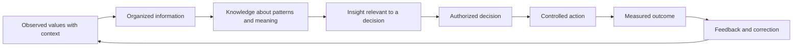

The arrows do not guarantee correctness. Each handoff needs an owner, definition, evidence, control, and feedback path. More records can increase confidence, but they can also multiply duplicates, stale values, privacy risk, and false precision.

## JD Mapping

| Role expectation | Part 43 capability | TSM artifact | Arti bridge and boundary |
|---|---|---|---|
| Analyze complex customer environments | Inventory sources, owners, grains, times, contracts, and dependencies | Security-data source map | Enterprise troubleshooting transfers |
| Develop Data Fabric expertise | Explain the documented raw-to-context-to-workflow idea without inventing internals | Conceptual data-flow map | Product administration remains a learning area |
| Recommend best practices | Establish contracts, quality controls, privacy rules, lineage, and acceptance gates | Onboarding standard | SQL and analytics rigor transfers |
| Drive risk mitigation | Convert a supported finding into an owned, time-bound action | Finding-to-action register | Critical escalation ownership transfers |
| Troubleshoot integrations | Reconcile counts and timestamps at each handoff | Data-pipeline runbook | First-failure isolation transfers |
| Communicate with executives | Translate technical measures into decisions and outcomes with caveats | Power BI value brief | Power BI experience transfers |
| Partner across functions | Assign source, platform, security, privacy, and business accountability | Data RACI | Cross-functional Microsoft work transfers |
| Maintain transparency | Label observation, inference, assumption, synthetic practice, and product fact | Evidence legend | Honest customer communication transfers |

## Candidate honesty note

Data fluency is highly transferable, but a familiar analytical technique does not prove familiarity with a specific security product. Use claim labels deliberately.

| Evidence label | Safe affirmative statement | Avoid |
|---|---|---|
| Production transfer | "I used SQL, Power BI, case analytics, and evidence correlation to improve enterprise support decisions." | Claiming those tools prove Zscaler tenant operation |
| Synthetic practice | "I modeled an authorized fictional security-data lifecycle and built reproducible queries and checks." | Presenting NMH values as customer outcomes |
| Documented context | "Zscaler publicly positions Data Fabric for Security around unifying and contextualizing security and business data." | Inventing schemas, algorithms, limits, or connector behavior |
| Analytical inference | "Given the stated source times and matching rules, this relationship is plausible and needs validation." | Calling an inferred relationship a product-confirmed fact |
| Current validation | "I would verify the current tenant, contract, source API, mapping, freshness, privacy, and product documentation." | Relying on a remembered screenshot or marketing number |
| Experience boundary | "My direct Data Fabric administration is currently conceptual and lab based." | Hiding the boundary behind general data experience |

Arti's advantage is not that every security field is familiar. It is that she already knows how to ask whether evidence is complete, current, comparable, and sufficient for a customer decision. The new work is to apply that discipline to security entities, findings, controls, relationships, and risk workflows.

## Beginner vocabulary and memory hooks

| Term | Plain meaning | Why it matters | Memory hook |
|---|---|---|---|
| Data | Recorded values or observations | Raw values need context before use | Ingredients, not dinner |
| Information | Data organized to answer a basic question | Structure makes records interpretable | Labeled ingredients |
| Knowledge | Tested understanding of meaning or patterns | Supports explanation and prediction | The recipe |
| Insight | Decision-relevant interpretation | Connects analysis to a choice | What the tasting reveals |
| Action | Authorized change in the real world | Value appears only when action is appropriate | Serve or adjust |
| Event | A time-stamped observation that something occurred | Preserves activity history | A frame in a movie |
| Finding | An assessed condition that may require attention | Carries status, evidence, and workflow | An inspector's note |
| Entity | A thing with identity over time | Users, assets, apps, controls, and tickets can be linked | A cast member |
| Relationship | A typed connection between entities | Context often lives between records | The line between cast members |
| Dimension | Descriptive context used to group or filter | Answers who, what, where, and when | Labels on a filing drawer |
| Measure | Numeric value intended for aggregation or comparison | Supports counts, rates, age, and trends | What the scale reads |
| Metric | Defined calculation with purpose and denominator | A raw number is not automatically meaningful | A score with rules |
| Metadata | Data that describes other data | Provides meaning, ownership, format, and history | Label on the label |
| Source | System or process that produced a record | Authority and limitations begin here | Witness origin |
| Grain | What exactly one record represents | Prevents duplicates and invalid joins | One row means one what? |
| Schema | Defined structure and allowed types | Makes expectations testable | Form layout |
| Contract | Producer-consumer agreement about meaning and behavior | Controls change and acceptance | Shipping agreement |
| Provenance | Origin and custody history of a value | Supports trust and audit | Passport stamps |
| Lineage | Transformations and movements from source to use | Explains how a result was made | Route on a map |
| Batch | Bounded data processed together | Simple and replayable, but less immediate | Scheduled mailbag |
| Stream | Continuing records processed as they arrive | Low latency, but ordering and replay are harder | Conveyor belt |
| Operational workload | Data work that supports current actions | Optimized for state and transactions | Checkout desk |
| Analytical workload | Data work that compares many records over time | Optimized for scans, trends, and exploration | Research room |
| Retention | How long data is kept | Balances need, law, cost, and risk | Expiry date |
| Deletion | Controlled removal according to authority | Must include copies, indexes, and evidence | Complete disposal process |

## From data to action without magical thinking

The words data, information, knowledge, insight, and action describe different levels of interpretation. Teams often collapse them into one sentence: "The data says patch this server." Data cannot issue an instruction by itself. People and systems apply definitions, transformations, policies, risk tolerances, and authority.

| Level | NMH example | Required question | Common mistake |
|---|---|---|---|
| Data | Scanner value `severity = critical` | What generated it, when, and under which definition? | Treating a label as universal truth |
| Information | 36 open critical findings on production assets | What is the grain and denominator? | Counting duplicates as separate exposure |
| Knowledge | Internet-reachable assets with exploitable conditions have higher urgency | What evidence supports the pattern? | Turning correlation into certainty |
| Insight | Two payroll assets combine high criticality, reachable service, and missing control | Is this relevant to today's decision? | Ignoring stale reachability evidence |
| Decision | Security owner approves emergency mitigation | Who has authority and what tradeoff was accepted? | Letting a score silently make policy |
| Action | Network owner restricts exposure and app owner schedules remediation | Was change controlled and validated? | Calling ticket creation remediation |
| Outcome | Exposure path is closed and service still works | Did risk actually change and for how long? | Reporting activity rather than effect |

### Plain-English deep-dive 1 - A dashboard does not know what to do

A car dashboard reports speed, fuel, engine temperature, and warnings. It does not know whether the driver is passing a truck, approaching a school, escaping danger, or sitting on a test rig. The values become decision-relevant only with context and a responsible driver.

A security dashboard behaves similarly. A risk score can summarize defined inputs, but it cannot silently supply missing asset ownership, business importance, compensating controls, legal constraints, maintenance windows, or current exploit evidence. The score is a decision aid. The organization remains responsible for definitions, thresholds, approvals, exceptions, and validation.

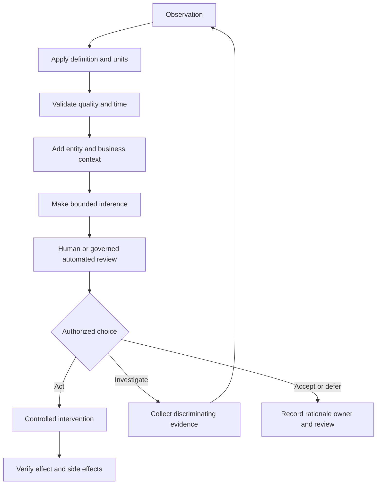

## Security record types: event, finding, entity, and relationship

An event records an occurrence. A finding records an assessed condition. An entity represents a thing. A relationship connects things. Confusing these types creates poor schemas and weak analysis.

An authentication event might say user `u-104` completed an authentication attempt from device `a-212` at a time. A vulnerability finding might say scanner `s-7` observed condition `CVE-X` on an asset at a scan time. The user and asset are entities. `uses`, `owns`, `runs`, `depends_on`, and `affected_by` are relationship types. The same entity can participate in many events and findings without becoming a new entity each time.

| Record type | Identity rule | Typical time fields | Changes over time | Security example |
|---|---|---|---|---|
| Event | Unique occurrence identifier or source sequence | Event time, receive time | Usually append corrections rather than overwrite history | Login attempt |
| Finding | Source finding key plus scope/version | First seen, last seen, status time | Status and evidence evolve | Vulnerability on asset |
| Entity | Stable business or technical identity | Created, observed, effective intervals | Attributes and aliases evolve | Device or user |
| Relationship | Endpoints plus type and often interval | Valid from/to, observed at | Connection can appear, change, or expire | User owns device |
| Dimension | Stable analytical key and descriptive version | Effective from/to for history | Description may change | Department or asset criticality |
| Measure | Defined numeric observation at a grain | Measurement period/time | New observations append | Finding age days |
| Metadata | Identifier for field, source, contract, or transformation | Version and update time | Evolves under governance | Field description and owner |

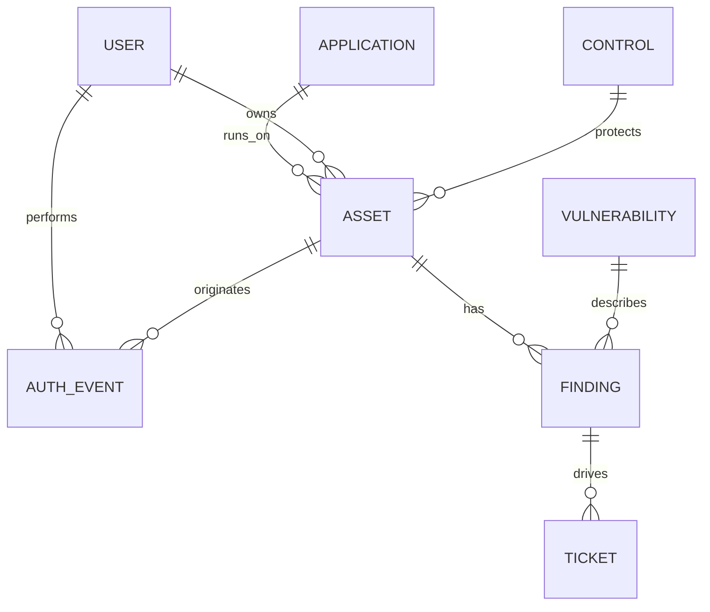

Cardinality matters. The diagram says one asset can have zero or many findings, not that every asset has one. It says a finding may drive tickets, but a ticket is not proof of remediation. Part 44 will formalize relationship constraints; here the goal is conceptual accuracy.

## Dimensions, measures, metrics, and metadata

A dimension is descriptive context, such as department, region, asset type, severity, owner, or calendar month. A measure is a value that can be aggregated under defined rules, such as finding count, elapsed hours, cost, or protected transaction count. A metric combines measures, dimensions, filters, a time window, and often a target.

| Analytical element | Example | Aggregation caution | Useful definition |
|---|---|---|---|
| Additive measure | Ticket count | Add only at compatible grains | Count of distinct ticket IDs created in period |
| Semi-additive measure | Open backlog snapshot | Can add across teams, not across daily snapshots | Open findings at end of day |
| Non-additive measure | Percentage compliant | Recompute from numerator and denominator | Compliant in-scope assets divided by in-scope assets |
| Dimension | Business unit | History may change | Unit effective at observation time or current unit, state which |
| Metric | Remediation SLA attainment | Exclusions and clock rules matter | Closed in-scope findings within policy target divided by eligible closures |
| Metadata | `event_time` definition | Name alone is insufficient | Time reported by producer, UTC, millisecond precision |

If a dashboard averages percentages from teams of different sizes, it can mislead. Team A at 90 percent over 10 assets and Team B at 50 percent over 1,000 assets do not combine to 70 percent. Recompute the combined numerator and denominator: `(9 + 500) / (10 + 1000)`.

### Plain-English deep-dive 2 - Grain is the hidden sentence behind every row

Imagine a grocery receipt. One row might mean one purchased line item, one product summarized for the receipt, or one individual physical unit. "Apples, quantity 3" is one line but three items. Counting rows would answer a different question from summing quantity.

Every dataset has a hidden sentence: "One row represents one _____." For an event table it may be one source event. For a finding snapshot it may be one source finding on one source asset at one extraction time. For a dashboard it may be one asset per day. State that sentence before counting, joining, or comparing. Most fanout and denominator errors begin when analysts never write it down.

## Structured, semi-structured, and unstructured data

Data form describes how strongly structure is declared, not whether the content is good. A relational table can be full of stale or ambiguous values. A text incident report can contain the most important context in the investigation.

| Form | Shape | Strengths | Tradeoffs | Security example |
|---|---|---|---|---|
| Structured | Rows, named columns, declared types | Validation, joins, constraints, efficient aggregation | Schema changes require coordination; nuance may be flattened | Asset inventory table |
| Semi-structured | Repeating tags or key-value structure, often JSON | Flexible fields, nested context, easier source fidelity | Optional fields, type drift, nested arrays, inconsistent meaning | API event payload |
| Unstructured | Free text, image, audio, packet bytes, document | Preserves rich evidence and narrative | Harder to search, classify, minimize, and aggregate | Incident notes or screenshot |
| Binary structured | Encoded format with formal parser | Compact and exact when parser/version is known | Opaque without tooling; parser risk | Packet capture |
| Derived feature | Calculated value used by analysis/model | Speeds repeated analysis | Can hide assumptions and drift | Days since last scan |

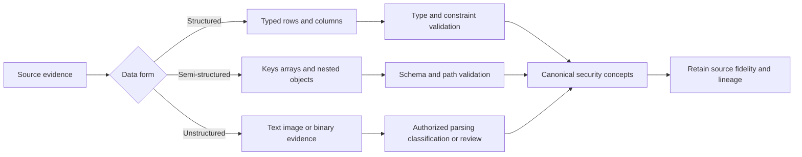

Do not discard the original evidence merely because a parsed table exists. At the same time, do not retain everything forever. The design should preserve enough authorized source fidelity to reproduce or challenge a result while applying minimization and retention policy.

## Batch and stream are delivery patterns, not quality levels

Batch processing handles a bounded collection on a schedule or trigger. Streaming handles a continuing sequence as records arrive or are made available. Near-real-time marketing language does not define an engineering guarantee. The team needs measured source-to-use latency, ordering expectations, replay behavior, and failure handling.

| Concern | Batch pattern | Stream pattern | Design question |
|---|---|---|---|
| Latency | Minutes, hours, or days | Often seconds or minutes | What decision becomes invalid if delayed? |
| Boundary | File, page set, scan, daily extract | Offset, sequence, time window | How is completeness known? |
| Ordering | Usually controlled within input | Late and out-of-order records are common | Which timestamp and tolerance govern? |
| Retry | Re-run batch or partition | Retry record/window; manage poison messages | Is processing idempotent? |
| Replay | Reprocess retained batch | Requires retained log/checkpoint | Can history be rebuilt? |
| Cost | Efficient for periodic bulk work | Continuous infrastructure and observability | Does urgency justify complexity? |
| Use case | Daily vulnerability snapshot | Authentication or policy event feed | Is action truly time sensitive? |

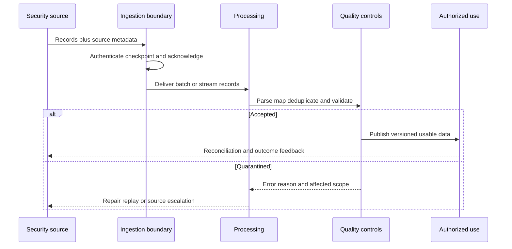

### Failure mechanics in time-sensitive delivery

A source can create an event at 09:00, send it at 09:03, have it received at 09:04, processed at 09:08, and displayed at 09:10. "The event happened at 09:00" and "the dashboard knew at 09:10" are both true. A ten-minute freshness lag matters differently for monthly posture reporting and active incident containment.

Late records can revise historical windows. Duplicate delivery can happen when a producer retries after an acknowledgment is lost. Out-of-order records can make a closed finding appear open if processing trusts arrival order. Clock skew can make cause appear after effect. Robust designs retain multiple time fields and define precedence rather than pretending one timestamp answers every question.

## Operational and analytical workloads

Operational systems support current transactions and state changes: open a ticket, update an owner, acknowledge an alert, or record an exception. Analytical systems scan and compare many records: trend backlog by month, calculate exposure age, or compare source coverage. The same database technology can support both, but the design goals differ.

| Characteristic | Operational workload | Analytical workload |
|---|---|---|
| Primary question | What is the current state and what changes now? | What happened, why, and what pattern matters? |
| Access pattern | Small targeted reads and writes | Large scans, joins, grouping, and history |
| Data shape | Normalized current entities and transactions | Historical facts plus descriptive context |
| Consistency priority | Correct state transition and concurrency | Reproducible snapshot and semantic consistency |
| Latency priority | Fast individual transaction | Fast aggregate or acceptable scheduled result |
| Example | Assign a finding ticket | Compare median age by business unit |
| Failure risk | Lost or conflicting action | Misleading trend or denominator |

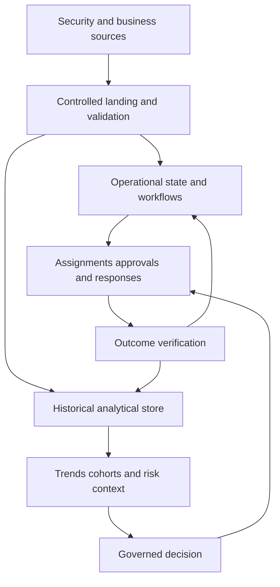

One store should not be assumed to serve every workload. Copying operational records for analysis introduces latency and reconciliation obligations. Running broad analytical queries against a production workflow store can compete with customer transactions. Choosing an architecture means naming these tradeoffs, not declaring one universal platform.

## The complete security data lifecycle

The lifecycle is collect, ingest, store, process, model, analyze, operationalize, archive, and delete. Governance, security, privacy, quality, metadata, and observability surround every stage. The stages can repeat: analysis may reveal a mapping defect that sends data back for reprocessing.

| Stage | Core question | Main artifact | Typical failure |
|---|---|---|---|
| Collect | What observation is needed and authorized? | Source specification | Excessive or missing collection |
| Ingest | Did the expected records cross the boundary? | Receipt/checkpoint log | Authentication, quota, gap, duplicate |
| Store | Where is each class protected and recoverable? | Storage and retention design | Exposure, corruption, uncontrolled copies |
| Process | How are records parsed, cleaned, mapped, and enriched? | Versioned transformation | Silent coercion or partial processing |
| Model | What entities, events, facts, and relationships mean? | Semantic model and contract | Wrong grain or false equivalence |
| Analyze | Which bounded question is being answered? | Query/notebook/report evidence | Bias, bad denominator, stale snapshot |
| Operationalize | Who acts under which guardrails? | Workflow, approval, SLA | Ticket equals outcome; unsafe automation |
| Archive | What must remain accessible but inactive? | Archive catalog and retrieval test | Unreadable or forgotten archive |
| Delete | What must be removed, from which copies, with what proof? | Deletion record | Primary removed but replicas retained |

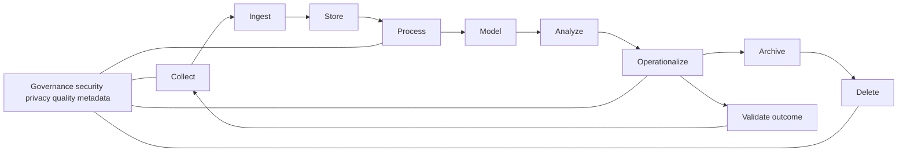

### Collect: start with purpose and authority

Collection should begin with a decision need, not a technical ability. State the purpose, record classes, data subjects, business owner, legal or contractual authority, security owner, expected volume, sensitivity, minimum fields, and stop condition. If the purpose is to measure scanner coverage, the organization may need asset identifiers, source scope, and observation time. It may not need packet payloads, employee message content, or indefinite raw logs.

| Collection question | Good evidence | Warning sign |
|---|---|---|
| Purpose | Named decision or control objective | "We may need it someday" |
| Scope | Systems, populations, regions, fields, exclusions | Entire tenant by default |
| Authority | Owner approval and applicable policy/contract/law review | Tool access treated as permission |
| Necessity | Field-to-use mapping | Sensitive field with no consumer |
| Transparency | Notice and documentation where required | Hidden secondary use |
| Stop/review | Date or condition for reassessment | Permanent collection by inertia |

Security telemetry can be sensitive. URLs, usernames, device names, IP addresses, file names, location, content classifications, and incident notes can expose behavior or personal information. Classification depends on context and jurisdiction; this Part does not provide legal advice. Engage privacy and legal owners for the actual environment.

### Ingest: prove the boundary

Ingestion is the controlled movement from source to a receiving system. Mechanics include authentication, authorization, endpoint selection, pagination, file transfer, schema recognition, checkpointing, acknowledgments, retries, rate limits, and error handling. A green connector state is one signal, not proof that all expected records arrived correctly.

The minimal reconciliation unit includes source count, source high-water mark, received count, accepted count, rejected count, duplicate count, oldest/newest source time, extraction time, and contract version. Counts may legitimately differ because one source object can become many child records or filtering can be intentional. The transformation must explain the difference.

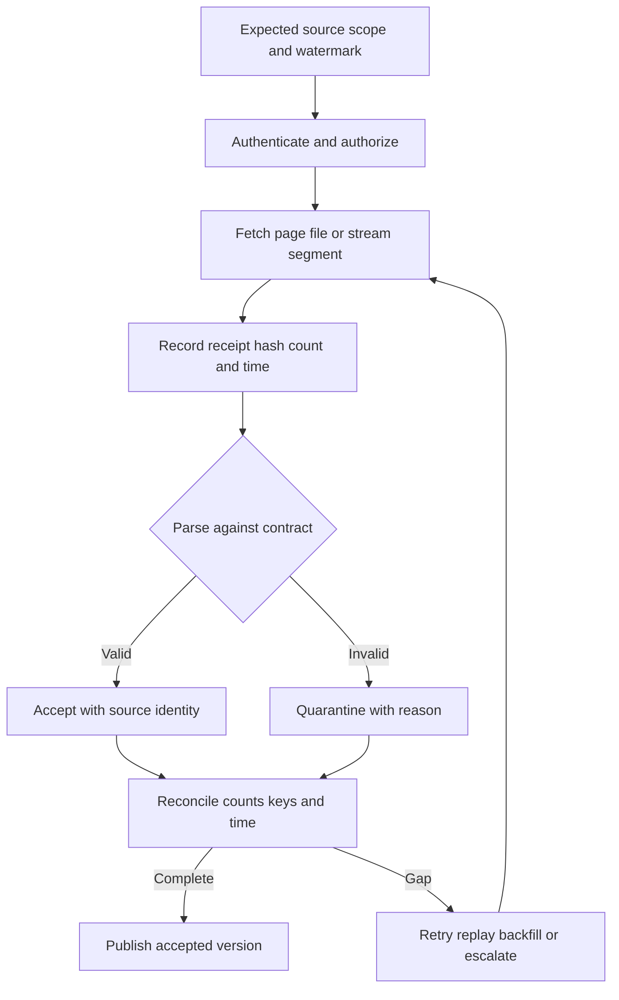

### Store: design for protection, recovery, and lifecycle

Storage choices include relational databases, object storage, warehouses, search indexes, graph stores, queues, archives, and product-managed repositories. Selection should follow workload, sensitivity, recovery, volume, query, consistency, retention, and operational ownership requirements. "Put it in the lake" is not a control design.

At minimum, define encryption and key ownership, network and identity boundaries, least-privileged roles, administrative audit, backup and restore, regional requirements, retention classes, deletion mechanics, resilience, capacity, and cost. Derived data and indexes can be as sensitive as the raw source. A table that maps pseudonymous device IDs back to employees may restore identifiability.

### Process: make every transformation visible

Processing includes decompression, parsing, type conversion, normalization, validation, deduplication, mapping, enrichment, aggregation, and feature calculation. Each transformation should have a version, owner, input contract, output contract, tests, error behavior, deployment record, and lineage.

| Transformation | Example | Main risk | Control |
|---|---|---|---|
| Parse | Read JSON vulnerability payload | Optional path disappears | Schema tests and quarantine |
| Cast | Text time to `timestamptz` | Wrong zone or invalid value | Explicit format/zone and reject count |
| Normalize | Map `CRIT` and `Critical` to one value | False semantic equivalence | Approved mapping table |
| Deduplicate | Collapse retried event IDs | Different events merged | Source-aware key and audit |
| Enrich | Add asset owner from CMDB | Stale or incorrect owner | Effective time and provenance |
| Aggregate | Daily finding count | Grain and denominator hidden | Published metric definition |
| Classify | Label data sensitivity | Under-classification | Review, tests, exception path |

### Model: define the world the analysis can see

A model chooses concepts and relationships. If a model represents only servers, cloud functions and SaaS applications may disappear from coverage. If it stores one current owner, historical accountability can be rewritten. If it assumes one IP equals one asset, NAT, DHCP, containers, and shared infrastructure can produce false matches.

Models are useful simplifications. They are not reality. Document included and excluded entity types, identity rules, relationship semantics, temporal behavior, unknown states, confidence, and extension strategy. Relational, dimensional, event, document, and graph approaches will be developed in Parts 44 and 45.

### Analyze: ask a bounded, reproducible question

An analysis needs a question, population, grain, time window, filters, definitions, query version, snapshot, assumptions, uncertainty, and reviewer. "How many critical vulnerabilities do we have?" is incomplete. A useful form is: "At 00:00 UTC on 2026-08-20, how many distinct open source findings mapped with high confidence to in-scope production assets, grouped by business owner, using the approved severity mapping?"

That detailed question may sound slower, but it prevents days of disagreement later. It also distinguishes a source severity label from a contextual business priority.

### Operationalize: connect analysis to controlled work

Operationalization turns a result into a workflow, decision, control, ticket, notification, or response. Define trigger, conditions, exclusions, owner, approval, idempotency key, retry, timeout, rollback, audit, escalation, and outcome validation. Creating a ticket is an output. Closing a verified exposure is an outcome.

| Automation level | Example | Appropriate guardrail |
|---|---|---|
| Inform | Dashboard highlights stale critical findings | Definition, freshness banner, drill-through |
| Recommend | System proposes owner and priority | Confidence, evidence, human review |
| Prepare | Workflow drafts ticket with source links | Idempotency, sensitive-data minimization |
| Execute with approval | Approved change isolates an asset | Named approver, test, rollback, audit |
| Bounded automatic | Known low-risk action under policy | Narrow scope, rate limit, stop condition, monitoring |
| Prohibited automatic | Destructive action from ambiguous match | Require investigation and authority |

### Archive and delete: inactive does not mean unmanaged

Archive moves data from active use to lower-cost or restricted retention while preserving required accessibility and integrity. Test retrieval, format readability, keys, authorization, and chain of custody. An archive that cannot be searched or decrypted when needed does not meet its purpose.

Deletion must consider primary stores, replicas, caches, indexes, search clusters, exports, temporary files, backups, derived tables, dashboards, local analyst copies, legal holds, and downstream partners. Some backups may age out rather than support individual deletion; the documented policy, law, and technical design govern. Record authority, scope, method, exceptions, completion, and verification without retaining the deleted sensitive content as proof.

### Plain-English deep-dive 3 - Deletion is a graph problem

Deleting a photo from a phone gallery may leave it in a trash folder, cloud sync, another device, a message, a backup, and a thumbnail cache. Security data spreads similarly. One source record can appear in raw storage, parsed tables, entity indexes, reports, ticket attachments, exports, and backups.

Therefore deletion is not one SQL statement. First map descendants through lineage. Then apply the approved rule to each store, account for legal holds and backup behavior, prevent re-ingestion, and verify completion. The lineage graph makes deletion scope visible.

## Sources, authority, and the limits of source of truth

A source is authoritative only for a defined claim and time. Human resources may be authoritative for employment status, identity systems for account state, endpoint management for enrollment, an application owner for business criticality, and a scanner for what its method observed during a scan. No source is universally authoritative.

| Claim | Candidate authority | Necessary caveat |
|---|---|---|
| Person is employed | HR system | Feed latency and special worker classes |
| Account is enabled | Identity provider | Does not prove employee status or active use |
| Device is managed | Endpoint management | Enrollment does not prove current health |
| Asset had an open port | Scanner observation | Scope, vantage point, time, and scan success matter |
| Application is critical | Approved business-service catalog | Classification owner and review date matter |
| Finding is remediated | Source rescan plus control evidence | Absence may reflect failed scan or scope change |
| Ticket is closed | Ticketing system | Closure does not prove technical effect |

Use an authority matrix at attribute level. One system may own `employee_status`, another `account_enabled`, and another `last_successful_login`. When sources conflict, preserve both values, provenance, observed times, and the resolution rule. Silent overwrite destroys evidence.

## Grain: define one record before counting

Grain has entity, event, and time components. "One finding" can mean one vulnerability definition, one scanner plugin observation, one vulnerability on one asset, one port-specific instance, one remediation unit, or one daily snapshot row. These are not interchangeable.

| Dataset | Grain sentence | Safe count | Unsafe shortcut |
|---|---|---|---|
| `asset` | One resolved NMH asset identity | Distinct `asset_id` | Count source aliases |
| `source_finding` | One source finding instance on one source asset | Distinct source key | Assume CVE count equals finding count |
| `finding_snapshot` | One finding state at one snapshot time | Count within one snapshot | Sum snapshots for current backlog |
| `auth_event` | One producer authentication event | Distinct source event ID | Count joined rows after enrichment |
| `asset_owner_history` | One asset-owner relationship for an effective interval | Current valid relationship | Count historical owners as current |
| `daily_metric` | One metric/dimension combination per day | Sum compatible additive measures | Average percentages blindly |

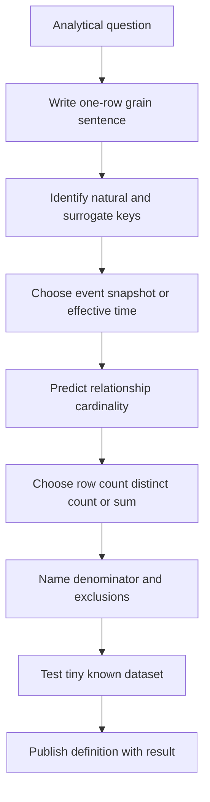

## Time semantics: one timestamp is rarely enough

Security data has multiple clocks. Event time is when the producer says something happened. Observation time is when a sensor saw it. Source update time is when the source record changed. Ingest time is when the receiver obtained it. Processing time is when a transformation ran. Effective time is when a business fact is considered valid. Snapshot time is when a state picture was taken.

| Time field | Meaning | Example use | Failure if confused |
|---|---|---|---|
| `event_time` | Claimed occurrence time | Incident timeline | Source clock skew changes ordering |
| `observed_at` | Sensor observation | Scanner evidence | Treated as remediation time |
| `source_updated_at` | Source record change | Incremental extraction | Source can revise historical event |
| `ingested_at` | Receiver arrival | Pipeline latency | Mistaken for event occurrence |
| `processed_at` | Transformation execution | Version audit | Reprocessing looks like new activity |
| `valid_from` / `valid_to` | Business-effective interval | Historical owner | Current owner incorrectly applied to past |
| `snapshot_at` | State as captured | Backlog trend | Multiple snapshots summed |

Use UTC for cross-system correlation while retaining original offset when needed. PostgreSQL `timestamp with time zone`, commonly written `timestamptz`, represents instants and displays according to session time zone; it does not preserve an original named zone by itself. Business calendars, daylight-saving changes, and local SLA hours need explicit rules.

### Plain-English deep-dive 4 - Two histories can both be true

Suppose a laptop moved from Finance to Engineering on Monday, but the CMDB update arrived Wednesday. Event history asks, "What department actually owned it on Tuesday?" System history asks, "What did our platform believe on Tuesday?" The answers may differ.

This is called bitemporal thinking: valid time describes when a fact is true in the business world, while system time describes when the database knew or recorded it. Not every system needs full bitemporal modeling, but every analysis should decide whether it uses current truth, historical effective truth, or historical known-at-the-time truth.

## Provenance, lineage, and metadata

Provenance answers where a value came from and how custody was maintained. Lineage traces movement and transformation. Metadata makes records understandable and governable. Together they let an analyst explain a result, repair a defect, assess affected outputs, and respond to access or deletion obligations.

| Metadata family | Example fields | Decision supported |
|---|---|---|
| Business | Definition, purpose, steward, classification | Is use appropriate? |
| Technical | Type, format, nullable, enum, precision | Can producer and consumer interoperate? |
| Operational | Freshness, volume, error rate, last success | Is the pipeline healthy? |
| Security | Sensitivity, role, encryption, access log | Who may use it and how? |
| Privacy | Data subject, purpose, retention, region, deletion rule | What obligations apply? |
| Quality | Rule, threshold, result, exception owner | Is it fit for this decision? |
| Lineage | Source field, transform version, output field | How was this value produced? |
| Product | Tenant, feature, connector/version where documented | Which current behavior must be verified? |

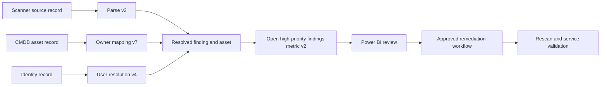

If owner mapping version 7 is defective, lineage identifies the affected entity records, metrics, reports, and tickets. Without lineage, the team may correct tomorrow's dashboard but leave yesterday's misassigned tickets and executive report unexplained.

## Schemas and data contracts

A schema describes structure: field names, types, required values, keys, and relationships. A data contract adds behavior and accountability: semantic definitions, owner, version, compatibility, delivery, quality, security, retention, change notice, and support.

| Contract element | NMH example | Acceptance evidence |
|---|---|---|
| Producer/consumer | Synthetic scanner to NMH landing service | Named technical owners |
| Purpose | In-scope vulnerability posture analysis | Approved use statement |
| Grain/key | One source finding per asset/plugin/port/scan | Uniqueness test |
| Fields/types | UUID, text, `timestamptz`, integer, enum mapping | Schema validation |
| Time semantics | Source observation in UTC plus ingest time | Known test cases |
| Delivery | Daily batch by 02:00 UTC | Timestamped receipt history |
| Completeness | All successful in-scope scan results | Source/receiver reconciliation |
| Error behavior | Reject malformed required fields to quarantine | Error sample and alert |
| Change | Versioned additive field with notice | Compatibility test |
| Security/privacy | Least privilege, encryption, minimized fields | Access and design review |
| Retention/deletion | Raw 30 days; modeled data per policy | Lifecycle job and evidence |
| Support | Severity, owner, evidence, response path | Runbook exercise |

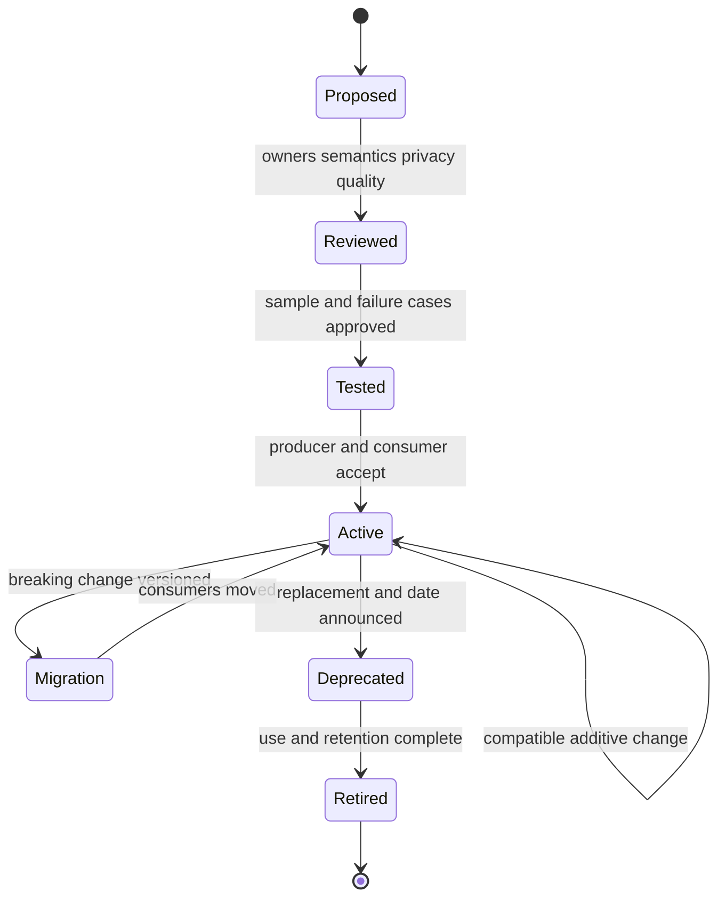

### Compatibility and schema drift

An additive optional field may be backward compatible for consumers that ignore unknown fields. Renaming a field, changing its type, changing enum meaning, making optional data required, changing units, altering time zone, or changing grain can be breaking even if the transport still succeeds. A parser that accepts the payload does not prove semantic compatibility.

Use representative fixtures, consumer contract tests, version negotiation where appropriate, canary delivery, dual-run comparison, migration windows, and rollback. Record whether unknown fields are ignored, stored, or rejected. Avoid automatic coercion that converts malformed values to null without an error count.

## Data quality: fitness for a named use

Quality is not a single score. Data can be complete but stale, valid but duplicated, timely but wrongly matched, or consistent but biased by missing scope. Define quality relative to a decision.

| Dimension | Question | Example control | Caveat |
|---|---|---|---|
| Completeness | Are required records and fields present? | Source count and null profiling | Source itself may be incomplete |
| Validity | Do values follow type/domain rules? | Enum, range, and timestamp checks | Valid format can carry wrong meaning |
| Uniqueness | Are intended identifiers unique? | Duplicate-key query | Identity rule may be wrong |
| Consistency | Do related values agree under defined rules? | Owner and department cross-check | Legitimate timing differences exist |
| Timeliness | Is data available soon enough? | Source-to-publish latency percentile | Fast stale source is still stale |
| Accuracy | Does value reflect reality? | Sample against authoritative evidence | Usually expensive to establish |
| Integrity | Are relationships and transformations intact? | Foreign-key/reconciliation tests | Distributed systems need compensating checks |
| Coverage | What population was observed successfully? | Successful scan denominator | Registered assets are not all assets |

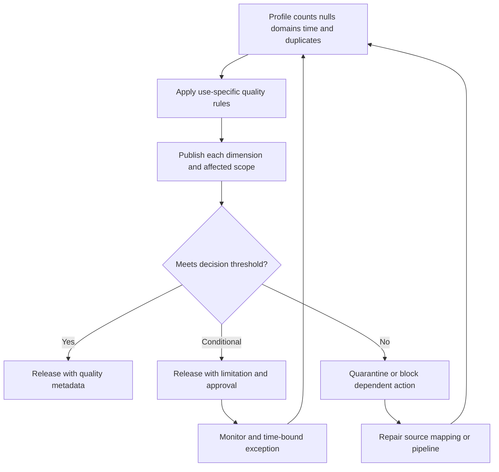

Do not hide dimensions in one average. A 98 percent composite can mask zero percent freshness for the highest-risk source. Publish affected population, threshold, trend, and owner. Quality exceptions need expiry and review just like security exceptions.

## Privacy, security, and governance across the lifecycle

Privacy risk concerns adverse effects on individuals arising from data processing, not merely data breach. Security protects confidentiality, integrity, and availability, but secure processing can still create privacy risk if collection is excessive, opaque, or used beyond its purpose. NIST's Privacy Framework is a voluntary tool for identifying and managing privacy risk; it is not a substitute for applicable law or organizational counsel.

| Principle/control | Lifecycle application | Practical NMH question |
|---|---|---|
| Purpose specification | Define why data is processed | Which security decision needs this field? |
| Minimization | Collect and retain only needed data | Can a pseudonymous identifier serve? |
| Transparency | Document processing and limitations | Who needs notice or explanation? |
| Access control | Restrict by role and purpose | Can a dashboard omit raw usernames? |
| Integrity | Prevent/detect unauthorized or accidental change | Are mappings versioned and reviewed? |
| Audit/accountability | Record administrative and sensitive use | Can access and action be reconstructed? |
| Retention | Keep according to approved schedule | When does investigative value expire? |
| Deletion | Remove according to authority and holds | Which descendants and exports exist? |
| Segregation | Separate tenants, environments, and duties | Can lab data mix with customer data? |
| Incident response | Handle exposure or misuse | Who assesses security and privacy impact? |

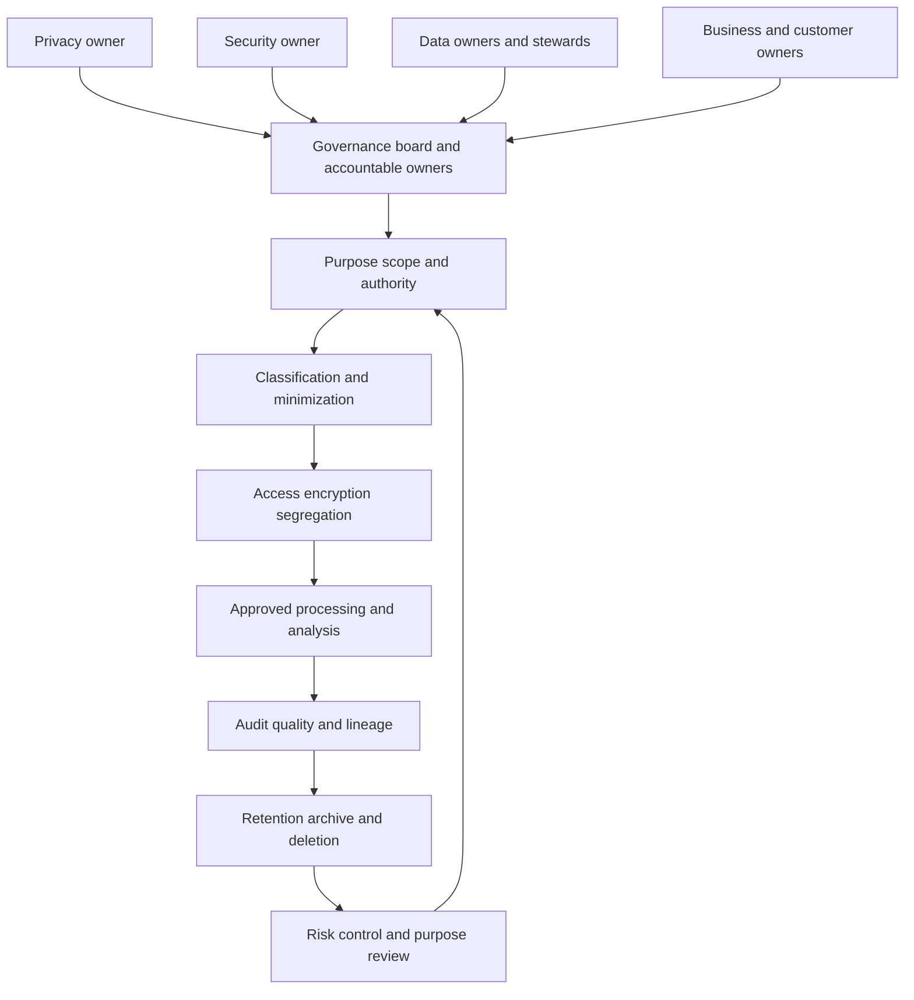

### Governance roles

| Role | Accountable concern | Example decision |
|---|---|---|
| Data owner | Authorized use, access, quality, retention | Approve source use and consumers |
| Data steward | Definitions, metadata, issue coordination | Resolve severity mapping ambiguity |
| Source owner | Source operation and semantics | Confirm extraction scope and changes |
| Platform owner | Reliable protected processing | Repair failed load and restore data |
| Security owner | Security controls and risk | Approve privileged access model |
| Privacy/legal owner | Privacy and legal obligations | Review purpose, region, and deletion |
| Business owner | Criticality and outcome | Accept remediation priority tradeoff |
| Analyst | Reproducible bounded interpretation | Publish query and limitations |
| TSM | Customer alignment, adoption, evidence, escalation | Coordinate acceptance and value review |

Governance should speed responsible decisions by making authority clear. It should not become a committee that approves every query. Use risk tiers: standardized low-risk reporting can follow pre-approved patterns, while new sensitive sources, cross-purpose reuse, automated containment, or cross-region movement receive deeper review.

### Plain-English deep-dive 5 - Security data can create security risk

A master key helps defenders enter every room during an emergency, but losing it is worse than losing one room key. A unified security dataset behaves similarly. It may reveal asset inventory, vulnerabilities, identities, owners, business criticality, controls, and incident history in one place. That context improves defense and also raises the consequence of misuse or compromise.

Therefore "more context" is not automatically better. Use least privilege, separation, purpose-specific views, aggregation, masking or pseudonymization where appropriate, strong administrative controls, logging, retention, secure exports, and incident plans. The value case and protection case must be designed together.

## Security examples across the lifecycle

| Use case | Main records | Decision | Key risk | Essential control |
|---|---|---|---|---|
| Vulnerability prioritization | Assets, findings, reachability, controls, criticality | What to remediate first | Duplicate/stale or false asset match | Provenance and effective time |
| Asset coverage | Source observations and resolved entities | Which assets lack control | Unknown denominator | Scope and source reconciliation |
| Authentication investigation | Events, user/device entities, geo/context | Is activity suspicious? | Clock skew and shared identity | Multiple times and identity confidence |
| DLP review | Policy events and content metadata | Is action required? | Sensitive content overcollection | Minimization and restricted views |
| Connector health | Runs, pages, counts, errors, watermarks | Is data trustworthy now? | Green status with partial data | End-to-end reconciliation |
| Executive posture | Aggregated measures and dimensions | Is risk moving acceptably? | False precision and changing definitions | Versioned metrics and caveats |
| Ticket workflow | Finding, owner, SLA, status, evidence | Who acts by when? | Ticket closure treated as remediation | Independent effectiveness validation |

## A reusable troubleshooting model

When a dashboard looks wrong, do not start by editing the chart. Trace from the user-visible claim backward to its source. Define expected and actual result, affected scope, first known time, last known good, recent change, and a tiny known example.

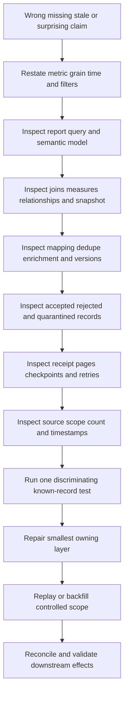

| Symptom | Plausible causes | First discriminating check |
|---|---|---|
| Count suddenly drops | Source scope, failed page, filter, mapping reject, report filter | Compare source and receipt counts by watermark |
| Count doubles | Retry duplicate, one-to-many join, duplicate aliases, snapshots summed | Group by intended key before and after each stage |
| Data is stale | Source unchanged, connector delay, queue backlog, failed publish, cache | Compare event/source/ingest/process/report times |
| Owner is wrong | Current owner applied historically, match collision, stale CMDB | Inspect provenance and effective interval for one asset |
| Closed finding reopens | Out-of-order status, new source instance, rescan evidence | Order source status by event and source-update time |
| Metric changes after release | Definition, mapping, schema, join, denominator changed | Compare versions on frozen input fixture |
| User cannot view report | Role, workspace, row filter, license, dataset permissions | Test authorized role at each access boundary |
| Sensitive value appears | Classification/masking failure, export, broad role | Stop exposure, preserve minimal audit, invoke response |

### The evidence package

Capture UTC timeline, environment, tenant or dataset identifier where safe, contract and transform versions, source scope, expected/actual counts, high-water marks, sample record IDs, rejection reasons, quality results, query/report version, recent changes, known-good comparison, privacy classification, attempted mitigation, and exact assistance requested. Minimize sensitive content and use approved channels.

## Synthetic NMH security-data model

NMH is a fictional manufacturer. The synthetic exercise uses six source families: endpoint inventory, vulnerability scanner, CMDB, identity, ticketing, and control coverage. No record represents a real person, customer, host, vulnerability, or Zscaler tenant.

| Synthetic source | Claimed authority | Grain | Delivery | Quality concern |
|---|---|---|---|---|
| `nmh_endpoint` | Enrollment and endpoint health | One managed-device observation | Hourly batch | Unmanaged assets absent |
| `nmh_scanner` | Scanner observation | One plugin/asset/port/scan finding | Daily batch | Failed scan and duplicate host aliases |
| `nmh_cmdb` | Approved business service and owner | One CI version | Daily incremental | Retired items and delayed ownership |
| `nmh_identity` | Account state and organization attributes | One account version | Stream plus daily reconcile | Shared/service account semantics |
| `nmh_ticket` | Workflow state | One ticket | Webhook plus batch reconcile | Closed does not mean fixed |
| `nmh_control` | Reported control observation | One control/asset/time | Daily batch | Agent present versus effective |

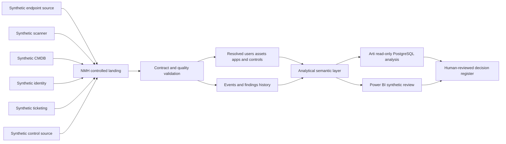

### Illustrative PostgreSQL schema

The following SQL is executable in PostgreSQL when run by an authorized lab user with permission to create a schema. It is illustrative training code, not a Zscaler schema and not production guidance. The names make grain and provenance visible.

```sql
CREATE SCHEMA IF NOT EXISTS nmh_lab;

CREATE TABLE nmh_lab.asset (
    asset_id uuid PRIMARY KEY,
    asset_name text NOT NULL,
    asset_type text NOT NULL,
    business_unit text NOT NULL,
    criticality text NOT NULL CHECK (criticality IN ('low', 'medium', 'high')),
    source_system text NOT NULL,
    source_record_id text NOT NULL,
    source_updated_at timestamptz NOT NULL,
    ingested_at timestamptz NOT NULL,
    UNIQUE (source_system, source_record_id)
);

CREATE TABLE nmh_lab.finding (
    finding_id uuid PRIMARY KEY,
    asset_id uuid NOT NULL REFERENCES nmh_lab.asset(asset_id),
    source_system text NOT NULL,
    source_finding_id text NOT NULL,
    vulnerability_ref text,
    source_severity text NOT NULL,
    status text NOT NULL CHECK (status IN ('open', 'closed', 'accepted')),
    first_observed_at timestamptz NOT NULL,
    last_observed_at timestamptz NOT NULL,
    ingested_at timestamptz NOT NULL,
    UNIQUE (source_system, source_finding_id)
);

CREATE TABLE nmh_lab.pipeline_run (
    run_id uuid PRIMARY KEY,
    source_system text NOT NULL,
    extraction_started_at timestamptz NOT NULL,
    extraction_completed_at timestamptz,
    source_count integer CHECK (source_count >= 0),
    received_count integer CHECK (received_count >= 0),
    accepted_count integer CHECK (accepted_count >= 0),
    rejected_count integer CHECK (rejected_count >= 0),
    contract_version text NOT NULL,
    status text NOT NULL
);
```

The primary and unique constraints express identity. The foreign key says a finding must reference an existing modeled asset. The check constraints reject values outside the synthetic domain. These controls do not prove real-world accuracy: a valid `asset_id` can still represent a false entity match.

### Synthetic data and a safe read-only query

```sql
INSERT INTO nmh_lab.asset
    (asset_id, asset_name, asset_type, business_unit, criticality,
     source_system, source_record_id, source_updated_at, ingested_at)
VALUES
    ('00000000-0000-0000-0000-000000000101', 'nmh-lab-payroll-01', 'server',
     'Finance', 'high', 'synthetic_cmdb', 'ci-101',
     '2026-08-20 01:00:00+00', '2026-08-20 01:10:00+00'),
    ('00000000-0000-0000-0000-000000000102', 'nmh-lab-design-01', 'server',
     'Engineering', 'medium', 'synthetic_cmdb', 'ci-102',
     '2026-08-20 01:00:00+00', '2026-08-20 01:10:00+00');

INSERT INTO nmh_lab.finding
    (finding_id, asset_id, source_system, source_finding_id,
     vulnerability_ref, source_severity, status,
     first_observed_at, last_observed_at, ingested_at)
VALUES
    ('00000000-0000-0000-0000-000000000201',
     '00000000-0000-0000-0000-000000000101',
     'synthetic_scanner', 'sf-201', 'CVE-SYNTHETIC-0001', 'critical', 'open',
     '2026-08-10 02:00:00+00', '2026-08-20 02:00:00+00', '2026-08-20 02:20:00+00'),
    ('00000000-0000-0000-0000-000000000202',
     '00000000-0000-0000-0000-000000000102',
     'synthetic_scanner', 'sf-202', 'CVE-SYNTHETIC-0002', 'high', 'open',
     '2026-08-18 02:00:00+00', '2026-08-20 02:00:00+00', '2026-08-20 02:20:00+00');

SELECT
    a.business_unit,
    COUNT(*) AS open_finding_count,
    MIN(f.first_observed_at) AS oldest_first_observed_at,
    MAX(f.ingested_at - f.last_observed_at) AS maximum_observation_to_ingest_lag
FROM nmh_lab.finding AS f
JOIN nmh_lab.asset AS a ON a.asset_id = f.asset_id
WHERE f.status = 'open'
GROUP BY a.business_unit
ORDER BY a.business_unit;
```

The query counts rows at the finding grain after a many-findings-to-one-asset join. It does not claim contextual risk, exploitability, internet exposure, control failure, or remediation priority. The result is a synthetic operational clue, not a production security conclusion.

### Arti's SQL reasoning checklist

| Step | Question | Evidence in the example |
|---|---|---|
| Purpose | What decision does this support? | Inspect open finding distribution and lag |
| Grain | What does one row mean before and after join? | One source finding; still one after many-to-one join |
| Time | Which time answers which question? | First observed for age; lag uses last observed and ingest |
| Filters | Which population is included? | Only `status = 'open'` |
| Denominator | Is a rate being claimed? | No; counts need an asset denominator for coverage |
| Authority | What can each source assert? | Scanner observation and CMDB business unit |
| Caveat | What is not established? | Accuracy, reachability, exploit, control, real priority |
| Reproducibility | Can the result be rebuilt? | Fixed SQL and synthetic rows |

## Power BI bridge: from model to customer conversation

Power BI should consume a governed semantic model rather than encode different definitions in every visual. Use explicit measures, a calendar dimension, stable relationships, role-appropriate views, freshness metadata, quality banners, drill-through to minimized evidence, and a definition page. Keep customer identifiers and sensitive details out of broad executive views.

| Report page | Intended user | Measures | Required caveat/action |
|---|---|---|---|
| Data health | Source/platform owners | Last success, lag, accepted/rejected, reconciliation | Investigate failed acceptance gate |
| Coverage | Security program owner | Observed assets, expected assets, coverage rate | Denominator and scope date visible |
| Finding posture | Vulnerability owner | Open count, age bands, owner backlog | Source severity is not contextual risk |
| Workflow | Remediation leaders | Assigned, overdue, verified closed | Ticket closure separated from verification |
| Executive | CISO/business leaders | Selected trends, outcomes, data confidence | Definitions, uncertainty, and decision request |

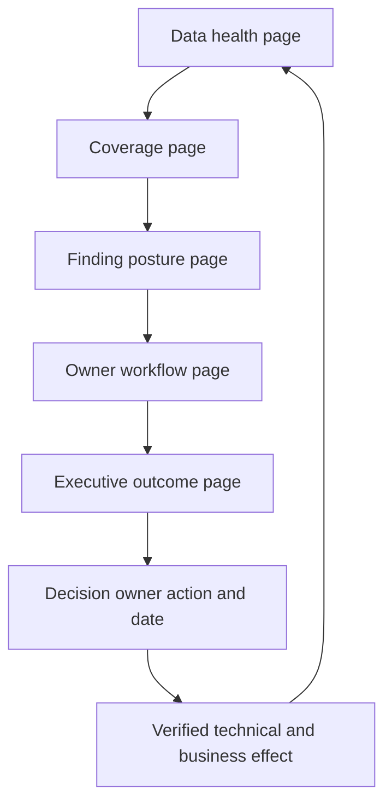

An executive narrative should follow: decision, current evidence, trend, business implication, uncertainty, recommended action, owner, due date, and validation. Avoid screenshots crowded with fields. The TSM should be able to drill from a trend to its definition and quality status before discussing product or customer value.

## Mechanics, tradeoffs, and failure modes

| Design choice | Benefit | Cost/risk | Decision evidence |
|---|---|---|---|
| Keep raw source | Replay and audit | Sensitive retention and cost | Reproduction need and approved retention |
| Normalize early | Consistent queries | Source nuance can be lost | Mapping tests and preserved provenance |
| Flexible JSON landing | Handles source variation | Drift and optional fields hide errors | Contract validation and profiling |
| Strict relational model | Integrity and clear semantics | Migration coordination | Stable core concepts and ownership |
| Streaming | Faster awareness | Ordering, retry, and operational complexity | Time-sensitive decision requirement |
| Daily batch | Simple reconciliation and replay | Delayed action | Decision tolerates measured latency |
| Centralize context | Better correlation | Higher concentration risk | Segregation and access design |
| Automate action | Faster consistent response | Wrong match can amplify harm | Confidence, approval, rollback, monitoring |
| Retain history | Trend and investigation | Privacy, security, and cost | Specific use and schedule |
| Current-state overwrite | Simple operations | Historical truth disappears | Only when history has no approved use |

### Frequent failure modes

1. **Unknown denominator:** The team reports scanner coverage over assets seen by the scanner, making coverage appear perfect. Use an independent in-scope population and publish unknowns.
2. **Alias duplication:** Hostname, IP, agent ID, cloud ID, and CMDB ID create multiple records for one asset. Preserve aliases and match confidence; do not merge on name alone.
3. **False merge:** Shared IP or recycled hostname combines different assets. Use time, source-specific identity, and reversible merge history.
4. **Stale enrichment:** Current owner or criticality is attached to historical findings. Use effective intervals and state which historical view is intended.
5. **Schema drift:** A source changes an enum or nested path while transport remains green. Run contract and distribution tests, alert on unknown values, and quarantine unsafe records.
6. **Silent partial load:** Pagination stops early or one partition fails. Reconcile counts, page tokens, watermarks, and expected scope.
7. **Retry duplication:** An acknowledgment is lost and the producer resends. Use source-aware idempotency keys and preserve retry audit.
8. **Time confusion:** Arrival time is used as event time. Store distinct clocks and measure their lag.
9. **Snapshot inflation:** Daily open-backlog snapshots are summed. Filter one snapshot or model changes rather than treating snapshots as events.
10. **Metric drift:** A severity mapping changes without a version break. Version definitions and restate history only through an approved process.
11. **Ticket theater:** Created or closed tickets are reported as reduced risk. Validate the technical condition and required service behavior.
12. **Uncontrolled export:** Analysts download sensitive datasets to local files. Use approved views, export restrictions, access logs, lifecycle controls, and training.
13. **Overconfident correlation:** Two records share a name or timestamp and are declared related. State match rule, confidence, alternatives, and review path.
14. **Source disappearance:** Absence of a finding is treated as closure even though the source stopped scanning. Separate negative evidence from missing evidence.
15. **Dashboard caching:** Correct backend data appears stale in a cached report. Compare source, model refresh, report refresh, and client cache times.

## End-to-end data troubleshooting runbook

1. **Protect the environment.** Stop unsafe automation or exposure, preserve minimal evidence, and invoke security/privacy response when needed.
2. **State the user-visible claim.** Record exact expected and actual value, filter, report, role, time, and affected population.
3. **Name the grain and definition.** Write what one row means, the metric formula, dimensions, denominator, exclusions, and snapshot.
4. **Build a UTC timeline.** Include source event/update, extraction, receipt, processing, publication, report refresh, and observation.
5. **Choose a known record.** Use an authorized synthetic or minimized identifier traceable through every stage.
6. **Check the report layer.** Validate role filters, visual filters, measure version, cache, and semantic model.
7. **Check the model.** Inspect relationship cardinality, joins, active relationships, grain, current/history rules, and null handling.
8. **Check transformations.** Compare contract and code versions, rejected records, mapping distributions, deduplication, and enrichment.
9. **Check storage boundaries.** Reconcile raw, accepted, quarantined, and published counts with hashes or watermarks where appropriate.
10. **Check ingestion.** Validate authentication, pagination, offsets, acknowledgments, rate limits, retries, and last complete checkpoint.
11. **Check the source.** Confirm source health, successful collection scope, authoritative semantics, and source-side count.
12. **Run one discriminating test.** Change or replay the smallest safe synthetic case to distinguish competing hypotheses.
13. **Repair the owning layer.** Prefer a versioned, reversible change with peer review and an affected-scope estimate.
14. **Backfill deliberately.** Define time range, idempotency, capacity, business impact, and downstream reconciliation.
15. **Validate end to end.** Check corrected and negative cases, counts, times, access, audit, reports, workflows, and side effects.
16. **Communicate limitations.** State affected decisions, confidence, mitigation, owner, next update, and whether historical outputs require correction.
17. **Prevent recurrence.** Add contract tests, lineage, monitoring, runbook changes, ownership, and effectiveness review.

## Arti's Microsoft-to-security-data bridge

| Demonstrated Microsoft strength | Security-data application | Honest boundary |
|---|---|---|
| Case and backlog analytics | Define grain, aging, owner, status, and denominator | Case severity is not security risk |
| SharePoint/OneDrive evidence correlation | Reconcile client, identity, network, service, and permissions evidence | Security source semantics are new |
| SQL and PostgreSQL | Profile, join, aggregate, validate, and explain synthetic data | Product-managed schemas require documentation |
| Power BI | Build role-specific trends and drill paths | A visual does not prove data quality or outcomes |
| CRITSIT leadership | Establish timeline, first failed handoff, owners, and cadence | Data incident privacy duties need current process |
| RCA and fix validation | Trace trigger, conditions, controls, correction, and effectiveness | Correlation does not establish root cause |
| Customer communication | Separate facts, hypotheses, limitations, and requests | Avoid unsupported Zscaler claims |

### 30-second interview bridge

"My Microsoft escalation work taught me that evidence is useful only when its source, time, scope, meaning, and limitations are understood. I bring SQL, PostgreSQL, Power BI, statistics, cross-layer troubleshooting, and customer communication. For security data, I apply that method to events, findings, entities, relationships, quality, privacy, and controlled action. I have built the NMH lifecycle as synthetic practice. My direct Zscaler Data Fabric administration is still a learning area, so I would validate current documentation, tenant evidence, source contracts, and product-specialist guidance before making a production recommendation."

## Labs and rehearsal

Use only owned, authorized, nonproduction systems and synthetic data. Do not copy customer logs, credentials, personal data, vulnerability details, or proprietary product schemas into the exercises.

### Lab 1 - Concept ladder

Take one synthetic scanner record and write seven separate statements: data, information, knowledge, insight, decision, action, and outcome. Label every inference and authority boundary.

### Lab 2 - Record taxonomy

Create a catalog of 25 synthetic records. Mark each as event, finding, entity, relationship, dimension, measure, metric, or metadata. Explain ambiguous cases.

### Lab 3 - Source and authority matrix

For endpoint, scanner, CMDB, identity, ticket, and control sources, assign authority at attribute level. Create a conflict example and a resolution rule that preserves provenance.

### Lab 4 - Grain challenge

Define grains for assets, aliases, source findings, finding snapshots, events, owner history, tickets, and daily metrics. Predict how a careless join inflates counts.

### Lab 5 - Time map

Create ten synthetic records with event, source-update, ingest, process, effective, and snapshot times. Include late, duplicated, and out-of-order records; explain correct ordering for three different questions.

### Lab 6 - Data contract

Write the full NMH scanner contract: purpose, producer, consumer, grain, key, schema, delivery, reconciliation, quality, error behavior, security, privacy, retention, change, and support.

### Lab 7 - PostgreSQL lifecycle

Run the illustrative schema and inserts in an isolated lab. Add a pipeline-run row, create one malformed test, observe the relevant constraint, and record the result. Use a transaction and roll back disposable tests.

### Lab 8 - Quality scorecard

Profile completeness, validity, uniqueness, timeliness, integrity, and coverage. Set use-specific thresholds, create one conditional exception, and define its owner and expiry.

### Lab 9 - Lineage and deletion tabletop

Trace a synthetic username from raw event through parsed table, entity, report, export, ticket, archive, and backup policy. Design an approved deletion response without pretending all technologies behave identically.

### Lab 10 - Power BI semantic design

Sketch data-health, coverage, finding, workflow, and executive pages. Write every measure definition and denominator before choosing a visual. Add freshness, quality, caveat, owner, and action fields.

### Lab 11 - Pipeline incident

Simulate a missing final API page that drops 18 percent of records while connector status remains successful. Produce impact, timeline, reconciliation, root cause, repair, backfill, downstream correction, and prevention.

### Lab 12 - TSM customer review

Present the fictional NMH data lifecycle in ten minutes. Separate documented Zscaler context, vendor-neutral architecture, synthetic results, assumptions, risks, decisions, and next validation steps.

| Lab artifact | Completion standard |
|---|---|
| Safety | Synthetic, authorized, minimized, and reproducible |
| Semantics | Grain, key, time, units, source, and limitations stated |
| Mechanics | Inputs, transformations, errors, outputs, and controls visible |
| Analytics | Query/measure, denominator, snapshot, and caveats documented |
| Governance | Owner, purpose, access, retention, and deletion addressed |
| Communication | Fact, inference, assumption, and product context separated |
| Outcome | Action and independent validation distinguished from activity |

## Common misconceptions to correct

| Misconception | Correct model |
|---|---|
| Data is objective | Collection, definitions, scope, time, and models shape what is visible |
| More data always improves security | Excess data can add noise, privacy risk, cost, and false confidence |
| An event is an alert or incident | Events are observations; assessment and policy create higher-level records |
| A finding is a vulnerability | A finding is a source assessment about a condition in a context |
| One IP means one asset | Address reuse, NAT, DHCP, clusters, and time break that assumption |
| A valid schema proves accurate data | Structure can be valid while meaning or real-world match is wrong |
| Streaming means real time | Measure end-to-end latency and action readiness |
| A green connector proves complete data | Reconcile source, receipt, acceptance, and publish boundaries |
| Current values explain history | Effective-time and known-at-time views may differ |
| A risk score is a decision | It is a governed input with assumptions and uncertainty |
| Closed ticket means reduced exposure | Verify the technical condition and business service |
| Archive means harmless | Archived data still needs access, integrity, retrieval, and lifecycle controls |
| Deleting the main row is enough | Descendants, replicas, caches, exports, and backups need governed handling |
| Power BI fixes inconsistent definitions | A report amplifies whatever semantic model it receives |
| Data Fabric is automatically a SIEM or warehouse replacement | Compare documented purpose, workloads, boundaries, and customer architecture |
| This Part proves production Zscaler experience | It proves vendor-neutral understanding and synthetic analytical practice |

## Official Source Anchors

Sources in this section were reviewed on **2026-08-24**.

These anchors establish general concepts and high-level public positioning. They do not establish an NMH production design, Zscaler tenant schema, connector catalog, limits, latency, scoring, storage, retention, security architecture, or customer outcome. DAMA-DMBOK is a broad non-prescriptive reference, not a regulation, product manual, or implementation standard. NIST frameworks and controls must be tailored to organizational risk and applicable obligations. PostgreSQL behavior depends on the selected supported version and configuration.

| Source | URL | Used for | Boundary |
|---|---|---|---|
| PostgreSQL Data Definition | https://www.postgresql.org/docs/current/ddl.html | Tables, schemas, constraints, privileges, partitioning, and data definition context | Current docs resolve to a version; production version governs |
| PostgreSQL Data Types | https://www.postgresql.org/docs/current/datatype.html | Standard and PostgreSQL types including time, UUID, network, and JSON types | Type choice requires workload-specific design |
| PostgreSQL Querying a Table | https://www.postgresql.org/docs/current/tutorial-select.html | SELECT structure, expressions, filters, ordering, and DISTINCT cautions | Tutorial examples are not security analytics guidance |
| NIST Cybersecurity Framework 2.0 | https://www.nist.gov/cyberframework | Risk-management outcomes and Govern/Identify/Protect/Detect/Respond/Recover context | Voluntary framework; not a data schema |
| NIST Privacy Framework | https://www.nist.gov/privacy-framework | Voluntary privacy-risk management context | Not legal advice; current applicable obligations govern |
| NIST SP 800-53 Rev. 5 | https://csrc.nist.gov/pubs/sp/800/53/r5/upd1/final | Security/privacy control families including access, audit, integrity, PII processing, and accountability | Control catalog requires tailoring and assessment |
| DAMA-DMBOK overview | https://www.dama.org/cpages/body-of-knowledge | General data-management vocabulary, governance, integration, and lifecycle context | Non-prescriptive, not a regulation or technology manual |
| Zscaler Data Fabric | https://www.zscaler.com/products-and-solutions/data-fabric | Public positioning for ingest, harmonize/map, deduplicate, correlate/enrich, logic, workflows, and reporting | Exact capabilities, schemas, connectors, limits, and tenant behavior require current official evidence |

## Likely Interview Questions

### Q1. What is the difference between data, information, knowledge, insight, and action?

**Model answer:** Data is recorded observation. Information organizes it with context and definitions. Knowledge is tested understanding of meaning or patterns. Insight connects that understanding to a specific decision. An authorized owner makes the decision, and controlled action changes the environment. I then validate the outcome and feed evidence back into the data. I never say a dashboard acted by itself.

### Q2. How do events, findings, entities, and relationships differ?

**Model answer:** An event is a time-stamped occurrence, such as an authentication attempt. A finding is an assessed condition, such as a scanner observation on an asset. An entity is a thing with identity over time, such as a user, asset, app, or control. A relationship is a typed, often time-bounded connection, such as a user owning an asset. Separating them preserves history and prevents one observation from becoming a duplicate entity.

### Q3. Why are grain and time semantics so important?

**Model answer:** Grain states exactly what one row represents, which controls valid counts and joins. Time semantics distinguish occurrence, observation, source update, ingestion, processing, effective validity, and snapshot. If I ignore grain, joins can inflate findings. If I ignore time, late or stale records can reverse a timeline or apply today's owner to yesterday's event. I publish both definitions with every important metric.

### Q4. How would you choose between batch and streaming ingestion?

**Model answer:** I begin with the decision's maximum tolerable latency, then compare completeness boundaries, ordering, replay, retry, idempotency, operational complexity, cost, and source capability. Daily vulnerability posture may fit a reconciled batch; an active authentication use case may justify streaming. I measure source-to-usable latency and never equate the word streaming with guaranteed real time.

### Q5. What does good data quality mean in a security program?

**Model answer:** It means fitness for a named use across separate dimensions: completeness, validity, uniqueness, consistency, timeliness, accuracy, integrity, and coverage. I define thresholds by affected decision, publish population and failures, and avoid hiding a critical weakness in one average score. A green connector is not enough; I reconcile source, receipt, acceptance, transformation, and publication.

### Q6. How do privacy and governance affect security data?

**Model answer:** Security telemetry can reveal people, behavior, assets, vulnerabilities, and business context. I establish purpose, authority, minimization, classification, least privilege, segregation, encryption, audit, retention, deletion, and incident handling across the lifecycle. Security and privacy overlap but are not identical: securely processing excessive or unexpected personal data can still create privacy risk. Actual law, contract, and organizational policy require qualified review.

### Q7. How would you troubleshoot a security dashboard that suddenly shows half the expected assets?

**Model answer:** I restate the metric, grain, denominator, time, filters, and last known good. I trace backward through the report, semantic model, joins, mappings, accepted/quarantined storage, ingestion pages or checkpoints, and source scope. I compare counts and watermarks at every handoff, trace one known synthetic record, run one discriminating check, repair the owning layer, backfill idempotently, and validate downstream reports and workflows.

### Q8. How does your background prepare you for security data and Zscaler Data Fabric work?

**Model answer:** Microsoft escalation work gave me cross-layer evidence correlation, UTC timelines, first-failure isolation, RCA, customer communication, and outcome validation. SQL, PostgreSQL, statistics, Excel, and Power BI give me practical modeling and reporting skills. I have applied them to a complete synthetic NMH lifecycle. Direct Zscaler Data Fabric administration remains a learning boundary, so I would pair these transferable methods with current official documentation, tenant evidence, source contracts, controlled tests, and product specialists.

## 30-Second Memory Hooks

| Concept | Memory hook |
|---|---|
| Data | Ingredient, not decision |
| Information | Organized data answers a basic question |
| Knowledge | Tested pattern and meaning |
| Insight | Relevant to a named choice |
| Action | Authorized change with validation |
| Event | One frame in time |
| Finding | Assessed condition with workflow |
| Entity | Thing with identity over time |
| Relationship | Typed connection with time and provenance |
| Grain | One row means one what? |
| Dimension | Group and describe |
| Measure | Aggregate only under defined rules |
| Metadata | Meaning, owner, format, history |
| Batch | Scheduled mailbag |
| Stream | Conveyor belt with ordering problems |
| Operational | Current state and action |
| Analytical | History and comparison |
| Provenance | Where the value came from |
| Lineage | How the value became the result |
| Contract | Structure plus behavior and accountability |
| Quality | Fit for this decision |
| Privacy | Effects on people from processing |
| Archive | Inactive but governed |
| Delete | Follow every authorized descendant |
| Troubleshoot | Claim backward, known record forward |
| Arti bridge | Evidence rigor plus analytics, product claims bounded |

## Completion Checklist

- [ ] I can separate data, information, knowledge, insight, decision, action, and outcome.
- [ ] I can explain why more data does not automatically create a better security decision.
- [ ] I can define event, finding, entity, relationship, dimension, measure, metric, and metadata.
- [ ] I write a one-row grain sentence before counting or joining.
- [ ] I distinguish structured, semi-structured, unstructured, binary, and derived data.
- [ ] I choose batch or stream from decision latency, completeness, ordering, replay, complexity, and cost.
- [ ] I distinguish operational state/workflow from analytical history/comparison workloads.
- [ ] I can trace collect, ingest, store, process, model, analyze, operationalize, archive, and delete.
- [ ] I begin collection with purpose, authority, scope, necessity, sensitivity, and review.
- [ ] I prove ingestion with counts, watermarks, times, rejects, duplicates, and contract version.
- [ ] I design storage for access, encryption, audit, recovery, region, retention, deletion, capacity, and cost.
- [ ] I version parsing, casting, normalization, deduplication, enrichment, aggregation, and classification.
- [ ] I treat models as documented simplifications with exclusions and uncertainty.
- [ ] I make analytical population, time window, filters, definitions, snapshot, and assumptions reproducible.
- [ ] I distinguish ticket or notification output from verified risk reduction.
- [ ] I map archive retrieval and deletion descendants rather than assuming one store.
- [ ] I assign source authority at attribute and claim level.
- [ ] I preserve conflicting values, source, time, and resolution rule.
- [ ] I distinguish event, observation, source-update, ingest, process, effective, and snapshot time.
- [ ] I understand current truth, effective historical truth, and known-at-the-time history.
- [ ] I can use provenance and lineage to explain impact and repair a defective transformation.
- [ ] My data contract covers semantics, delivery, quality, security, privacy, change, and support.
- [ ] I test schema compatibility beyond successful transport and parsing.
- [ ] I assess completeness, validity, uniqueness, consistency, timeliness, accuracy, integrity, and coverage separately.
- [ ] I apply purpose, minimization, transparency, access, audit, retention, deletion, and response controls.
- [ ] I assign accountable data, source, platform, security, privacy, business, analytical, and TSM roles.
- [ ] I can explain why unified security context needs stronger protection and segregation.
- [ ] I can run the end-to-end troubleshooting method from visible claim back to source.
- [ ] I can execute the synthetic PostgreSQL examples and explain their limits.
- [ ] I can design Power BI pages with definitions, freshness, quality, denominators, owners, and actions.
- [ ] I can explain all frequent failure modes and name a first discriminating check.
- [ ] I can complete all labs with only authorized synthetic data.
- [ ] I separate documented Zscaler context, vendor-neutral concepts, synthetic evidence, and production claims.
- [ ] I can answer the eight interview prompts with mechanics, examples, tradeoffs, failures, and honest boundaries.

[Part 44 - Relational Data Modeling from Zero](Part-44-relational-data-modeling.md)