# Part 44 - Relational Data Modeling from Zero

> **Audience:** Arti Thakur, preparing for a Zscaler Security Operations Technical Success Manager role after Microsoft enterprise Support Escalation Engineering.
>
> **Purpose:** Build relational modeling from first principles: tables, rows, columns, domains, schemas, keys, relationships, cardinality, optionality, constraints, normalization, denormalization, indexes, transactions, isolation, temporal history, and executable PostgreSQL DDL for a synthetic security operations model.
>
> **Scope and honesty:** Northstar Meridian Holdings, abbreviated NMH, is fictional. Every user, asset, application, vulnerability, finding, control, ticket, incident, schema, query, metric, and outcome is synthetic. The SQL models are educational PostgreSQL examples, not Zscaler schemas and not a claim about Zscaler Data Fabric internals. Arti has transferable SQL, PostgreSQL, Power BI, analytics, troubleshooting, and Microsoft enterprise experience. Direct production administration of Zscaler Data Fabric for Security remains a learning boundary.
>
> **Currency caveat:** SQL implementations, PostgreSQL versions, optimizer behavior, index options, privileges, isolation behavior, organizational data definitions, privacy requirements, and product schemas change. Sources in this Part were reviewed on **2026-08-24**. The deployed database version, official documentation, approved data architecture, current source contracts, security/privacy review, and measured workload govern production.

## Section goal

A relational model is a set of explicit promises about data. It says what kinds of things exist, how each thing is identified, which facts belong together, which relationships are allowed, and which invalid states the database should reject. A diagram alone is not the model; names, types, keys, constraints, temporal rules, transactions, and ownership complete it.

Think of a well-run library. A book title, a physical copy, an author, a member, and a loan are different concepts. One title can have many copies. A copy can participate in many loans over time, but only one current loan. A member can borrow many copies. Stable identifiers prevent two people named Alex from becoming one member. Rules prevent a loan from referencing a copy that does not exist. Relational design makes comparable promises for users, assets, applications, findings, controls, tickets, and incidents.

By the end, Arti should be able to:

| Outcome | Demonstrated capability | Proof artifact |
|---|---|---|
| Explain relational foundations | Define table, row, column, domain, relation, schema, and database | Vocabulary map |
| Choose identities | Compare primary, foreign, candidate, composite, natural, and surrogate keys | Key decision record |
| Model relationships | State cardinality and optionality in both directions | ER diagrams |
| Enforce integrity | Use not-null, unique, check, primary-key, foreign-key, and transactional controls | Executable DDL |
| Normalize deliberately | Explain 1NF, 2NF, 3NF, BCNF, dependencies, and anomalies | Normalization walkthrough |
| Denormalize responsibly | Tie duplication to measured read needs and refresh controls | Tradeoff note |
| Design indexes | Connect access patterns to index choice, cost, and evidence | Index hypothesis table |
| Reason about transactions | Explain atomicity, consistency, isolation, durability, anomalies, and retry | Concurrency scenario |
| Model security operations | Connect users, assets, apps, vulnerabilities, findings, controls, tickets, and incidents | NMH schema |
| Preserve time | Distinguish current, effective, event, and system history | Temporal model |
| Troubleshoot models | Diagnose duplicates, orphans, fanout, nulls, stale history, and slow queries | Runbook |

```mermaid
flowchart LR
    WORLD[Real security environment] --> CONCEPTS[Users assets apps vulnerabilities controls work]
    CONCEPTS --> RELATIONS[Tables with stated row grain]
    RELATIONS --> DOMAINS[Columns with types and allowed values]
    DOMAINS --> KEYS[Stable row identity]
    KEYS --> LINKS[Foreign-key relationships]
    LINKS --> RULES[Constraints and transactions]
    RULES --> QUERIES[Reproducible questions]
    QUERIES --> DECISIONS[Governed decisions]
    DECISIONS --> VALIDATE[Outcome and model feedback]
    VALIDATE --> CONCEPTS
```

## JD Mapping

| Role expectation | Part 44 capability | TSM artifact | Arti bridge and boundary |
|---|---|---|---|
| Analyze customer environments | Turn ambiguous inventory and finding concepts into explicit entities and relationships | Conceptual/logical model | Microsoft environment mapping transfers |
| Develop Data Fabric expertise | Understand why identity, relationship, and integrity rules matter before product configuration | Model review checklist | No claim about product-managed schemas |
| Troubleshoot complex integrations | Detect duplicate keys, missing references, wrong cardinality, and temporal mismatch | Reconciliation runbook | Fault isolation and SQL transfer |
| Recommend best practices | Use constraints, versions, least privilege, and measured index choices | Design decision record | PostgreSQL experience transfers |
| Drive security outcomes | Connect finding evidence to assets, apps, controls, tickets, and incidents | Finding-to-action model | Workflow reasoning transfers |
| Communicate with stakeholders | Explain ER diagrams as business rules rather than database decoration | Whiteboard narrative | Customer communication transfers |
| Protect customer data | Model purpose, ownership, access, retention, and deletion dependencies | Data governance appendix | Current policy and legal review required |
| Demonstrate transparency | Separate logical concepts, synthetic DDL, observed performance, and vendor facts | Evidence legend | Honest boundary transfers |

## Candidate honesty note

| Claim type | Safe statement | Boundary |
|---|---|---|
| Production transfer | "I have used SQL, PostgreSQL, analytics, evidence relationships, and data-driven support decisions." | Does not establish security-product schema operation |
| Synthetic practice | "I designed and tested a normalized NMH security operations schema." | NMH is not a customer environment |
| Vendor-neutral concept | "Relational keys and constraints make identity and integrity assumptions testable." | A product may expose a different model or no direct database |
| Documented product context | "Zscaler publicly positions Data Fabric around unifying and contextualizing security and business data." | No undocumented table, key, or constraint claim |
| Performance statement | "This index is a hypothesis for this query and distribution; I would verify with plans and workload tests." | Never promise universal speedup |
| Experience boundary | "My direct Zscaler Data Fabric administration is conceptual and lab based." | Pair with current official evidence and specialists |

The strongest interview position is practical and bounded: Arti can reason precisely about data identity, integrity, time, and customer decisions; she will learn the current product's actual configuration and semantics rather than projecting a lab schema onto it.

## Beginner vocabulary and memory hooks

| Term | Plain meaning | Why it matters | Memory hook |
|---|---|---|---|
| Relation | A mathematical set of tuples with named attributes | Foundation behind the relational model | A fact set |
| Table | SQL structure of rows and columns | Practical storage/query object | A typed spreadsheet with rules |
| Row | One record at the declared grain | Counts depend on its meaning | One row means one what? |
| Column | Named attribute with a type/domain | Expresses one property | One labeled question |
| Domain | Allowed set and meaning of values | Prevents meaningless combinations | Valid answer space |
| Schema | Named namespace and structural design | Organizes and qualifies objects | Database folder plus blueprint |
| Database | Managed collection of schemas and objects | Security and transaction boundary varies by platform | The library building |
| Primary key | Chosen unique non-null row identifier | Lets every row be referenced | Official library card number |
| Candidate key | Any minimal attribute set that could uniquely identify a row | Shows identity alternatives | Eligible card number |
| Alternate key | Candidate key not chosen as primary | Still deserves uniqueness when required | Backup official identifier |
| Natural key | Identifier from the business/source domain | Carries meaning but may change | Passport number |
| Surrogate key | System-created identifier without business meaning | Stable joins and history | Internal catalog number |
| Composite key | Key made from multiple columns | Identity may depend on a combination | Building plus room number |
| Foreign key | Value that must reference an allowed key | Enforces relationships | Catalog cross-reference |
| Cardinality | Maximum relationship count in each direction | Prevents fanout assumptions | How many? |
| Optionality | Whether a relationship must exist | Determines nullability and workflow | Must it have one? |
| Constraint | Database-enforced rule | Rejects invalid states centrally | Guardrail at the door |
| Integrity | Correctness of structure and relationships under defined rules | Supports trustworthy operations | Rules remain true |
| Functional dependency | One attribute set determines another | Drives normalization | This key determines that fact |
| Normalization | Decomposing facts to reduce harmful redundancy | Prevents update/insert/delete anomalies | Store each fact in its home |
| Denormalization | Intentional duplication or precomputation | Can improve reads at consistency cost | Approved shortcut with upkeep |
| Index | Auxiliary structure for locating rows | Speeds some access at storage/write cost | Book index |
| Transaction | Statements committed or rolled back as a unit | Protects multi-step state change | All steps or none |
| ACID | Atomicity, consistency, isolation, durability | Core transaction properties | Complete, valid, separated, lasting |
| Isolation | Rules for concurrent visibility and interference | Prevents some concurrency anomalies | What simultaneous editors see |
| Temporal model | Representation of facts and changes over time | Current values alone rewrite history | Facts with validity dates |

## Relational foundations: relation, table, row, column, and domain

Relational theory models data as relations. A relation has a heading of named attributes and a body of tuples. In pure theory, tuples are unordered and duplicate tuples do not exist. SQL tables are influenced by that model but are not identical to it: SQL permits nulls and duplicate rows unless constraints prevent them, and row order is unspecified unless a query uses `ORDER BY`.

| Concept | Theoretical idea | PostgreSQL expression | Security example |
|---|---|---|---|
| Relation | Set of tuples under a heading | Table or query result, with SQL differences | In-scope assets |
| Tuple | One combination of attribute values | Row | One modeled asset |
| Attribute | Named property from a domain | Column | Asset criticality |
| Domain | Permitted values and operations | Data type, domain, checks, references | Severity vocabulary |
| Degree | Number of attributes | Column count | Eight asset columns |
| Cardinality | Number of tuples; also relationship multiplicity in modeling | Row count or ER relationship rule | 10,000 assets; one app to many assets |

A column type is necessary but not sufficient. `text` permits strings, but it does not say whether `high`, `HIGH`, and `H` mean the same thing. A PostgreSQL domain can package a base type with constraints, but a shared lookup table may be better when values have descriptions, owners, translations, lifecycle, or references.

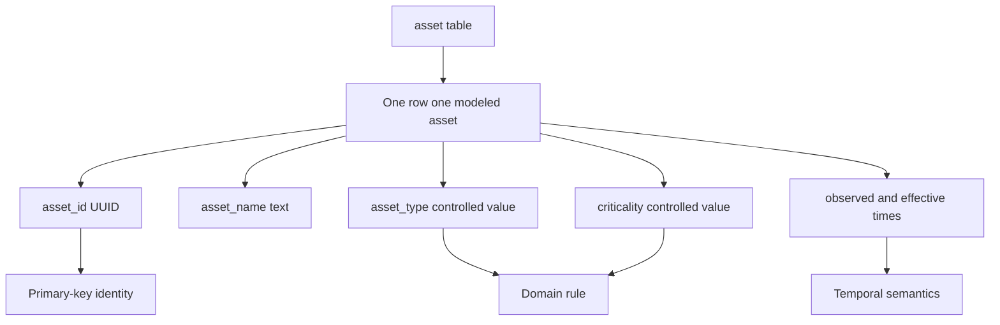

### Plain-English deep-dive 1 - A table is a claim, not a container

A box labeled "employees" can contain badges, contracts, photos, and old access cards. The label does not tell you what one item means. A database table named `user` has the same problem unless its grain and identity are explicit.

Ask: Does one row mean a human, an account, an identity-source record, or a person-at-a-point-in-time? A human can have multiple accounts; a service account may have no human; a renamed account remains the same account; two sources may describe the same person. The table is a claim about which distinctions matter. Write that claim before creating columns.

## Schemas as namespaces and trust boundaries

In PostgreSQL, a database contains named schemas, and schemas contain tables and other objects. Schemas organize names but are not automatically hard isolation boundaries. Access depends on database, schema, object, column, and possibly row privileges. Unqualified names are resolved through `search_path`, so writable schemas in that path can create security risk.

| Schema purpose | NMH example | Benefit | Caution |
|---|---|---|---|
| Raw landing | `nmh_raw` | Preserve source fidelity and quarantine | Highly restricted and retention limited |
| Curated relational | `nmh_core` | Stable entities and integrity | Mapping and entity rules need versions |
| Analytical serving | `nmh_mart` | Controlled views for reporting | Avoid duplicate metric definitions |
| Lab | `nmh_lab` | Synthetic practice | Must never contain customer data |
| Audit/metadata | `nmh_meta` | Contracts, lineage, quality, runs | Protect operational/security details |

Use schema-qualified names in controlled scripts. Review ownership and `CREATE` privileges. Do not assume moving a table into a schema protects it. The official PostgreSQL privilege and row-security documentation governs exact behavior for the deployed version.

## Keys: how a model knows which thing is which

A key is a minimal set of attributes used to identify a row uniquely. "Minimal" means no unnecessary attribute remains. If employee number alone is unique, employee number plus surname is unique but not a candidate key because surname is unnecessary.

| Key type | NMH example | Strength | Risk |
|---|---|---|---|
| Primary | Internal `asset_id` UUID | Chosen stable reference | Meaning must be obtained elsewhere |
| Candidate | `(source_system, source_asset_id)` | Represents source identity | Same real asset has several source keys |
| Alternate | Unique asset inventory tag | Preserves business uniqueness | Tags can be missing/reused |
| Natural | CVE identifier for a public vulnerability definition | Recognizable and interoperable | Not every finding has a CVE; definitions evolve |
| Surrogate | Generated `finding_id` UUID | Stable narrow foreign key | Does not stop business duplicates by itself |
| Composite | `(control_id, asset_id, observed_at)` | Encodes contextual identity | Wide joins and temporal precision matter |
| Foreign | `finding.asset_id` | Prevents orphan reference | Does not prove the match is correct in reality |

### Natural versus surrogate keys

Natural and surrogate keys are not enemies. A robust model often uses both: a surrogate primary key for stable internal references plus a unique constraint on the source or business candidate key. If the model keeps only the surrogate, duplicate source records can enter under different generated IDs. If it uses a mutable email address as the primary key, a rename cascades through relationships or rewrites history.

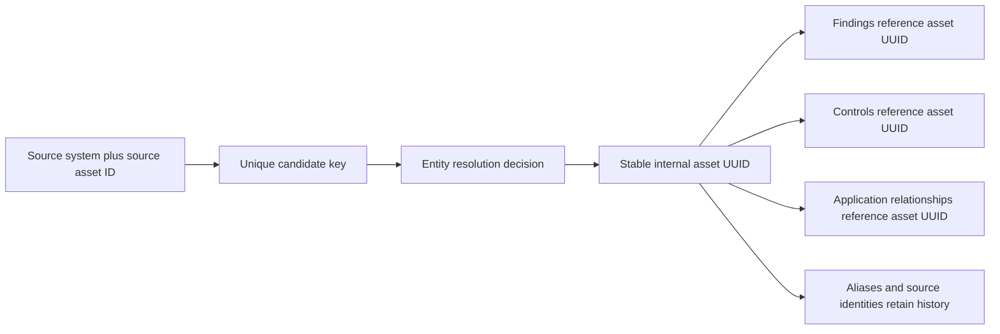

### Composite keys

A composite key is correct when identity is genuinely a combination. An application-to-asset bridge can use `(application_id, asset_id)` if the relationship can appear only once. A finding source may require source, tenant, source finding ID, and perhaps source asset ID. Do not append a surrogate key merely to avoid understanding the combination; do add one when other tables need a narrow stable reference or relationship history requires multiple versions.

### Primary-key choice checklist

| Question | Why it matters | Warning example |
|---|---|---|
| Is it unique in the required scope? | Source IDs may only be tenant-local | `asset-42` appears in two tenants |
| Is it stable over the entity lifetime? | Mutable keys create cascades/history loss | Email address changes |
| Is it always present? | Primary keys cannot be null | Serial number absent for cloud function |
| Is it minimal? | Extra columns complicate references | ID plus display name |
| Is it sensitive? | Keys propagate into logs and exports | National identifier as join key |
| Can it be recycled? | Reuse can merge different temporal entities | Hostname reassigned after retirement |
| Does it identify the real concept? | Account and person are different | Username treated as employee |

## Relationships, cardinality, and optionality

Relationships need verbs and rules in both directions. "Asset-app relationship" is vague. Say: an application can run on zero or many assets; an asset can host zero or many applications. That is many-to-many and requires an associative table. If an asset must have exactly one current business owner, the schema and workflow need to enforce or monitor that rule.

| Pattern | Example | Relational implementation | Question |
|---|---|---|---|
| One-to-one | Incident has one approved executive summary | Shared primary key or unique foreign key | Is it truly separate or just columns? |
| One-to-many | Asset has many findings | Foreign key on finding | Can a finding exist before asset resolution? |
| Many-to-many | Applications run on many assets | Bridge table with two foreign keys | Does relationship have attributes/history? |
| Optional one | Ticket may reference one incident | Nullable foreign key | What does null mean? |
| Required one | Finding must reference one vulnerability definition in this model | Not-null foreign key | Are non-CVE/internal findings allowed? |
| Recursive | Ticket may have a parent ticket | Self-referencing foreign key | How are cycles prevented? |

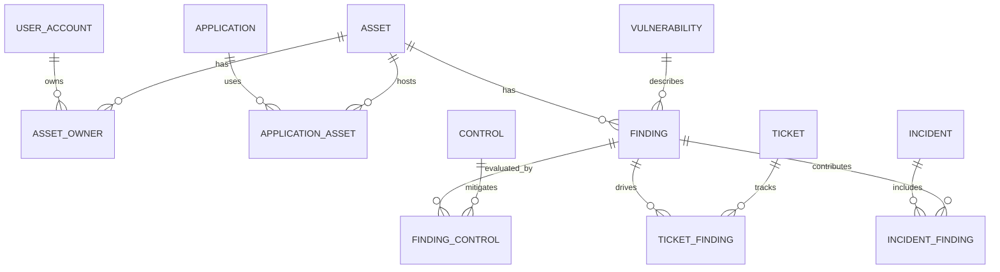

### Optionality is a business rule

A nullable `owner_id` might mean not yet assigned, not applicable, source unavailable, resolution failed, or intentionally withheld. One null cannot distinguish those states. Options include a status/reason column, a separate relationship table, a controlled unknown member for analytics, or workflow validation. Do not invent fake people such as `UNKNOWN_OWNER` in an operational entity table unless the semantics and controls are explicit.

### Plain-English deep-dive 2 - Foreign keys prevent orphans, not mistaken identity

A hotel can require every room charge to reference a valid guest account. That prevents an orphan charge, but staff can still post the charge to the wrong guest. The reference is structurally valid and factually wrong.

A foreign key from finding to asset works the same way. It guarantees that the `asset_id` exists. It cannot prove the entity-resolution process chose the correct asset. Preserve source identities, match method, confidence, effective time, and review evidence. Database integrity is necessary, not sufficient, for real-world accuracy.

## Constraints and integrity

Constraints make invalid states fail close to the data. Application validation improves usability but can be bypassed by another loader, script, or concurrent session. Database constraints provide a common final guardrail.

| Constraint | Promise | Security example | Important caveat |
|---|---|---|---|
| Data type | Value has a representable type | `timestamptz` for an instant | Correct type does not prove correct time |
| `NOT NULL` | Value must be present | Finding source ID required | Null may need modeled reason elsewhere |
| `CHECK` | Row-local Boolean rule passes or is null | End time not before start | Add not-null when null must fail |
| `UNIQUE` | Combination does not repeat under null semantics | Source + source finding ID | PostgreSQL null treatment and portability matter |
| `PRIMARY KEY` | Chosen key is unique and non-null | Internal asset UUID | Only one primary key per table |
| `FOREIGN KEY` | Reference matches a permitted unique/primary key | Finding references asset | Referencing columns are not auto-indexed |
| Exclusion | Specified comparisons cannot all overlap | Prevent overlapping effective periods | PostgreSQL-specific mechanism and index semantics |

### Entity, referential, domain, and business integrity

| Integrity type | Meaning | Mechanism | Example |
|---|---|---|---|
| Entity integrity | Every row has stable identity | Primary key | Every finding has `finding_id` |
| Referential integrity | Related row exists | Foreign key | Ticket-finding bridge references both |
| Domain integrity | Attribute uses allowed values | Type, domain, check, lookup | Status in approved lifecycle |
| Temporal integrity | Intervals and ordering are valid | Checks, exclusion, transaction logic | `valid_to > valid_from` |
| Business integrity | Cross-row/process rule holds | Constraints where possible; transaction/service logic | Only one current primary owner |
| Audit integrity | Changes are attributable and protected | Roles, logging, append history | Owner change has actor and time |

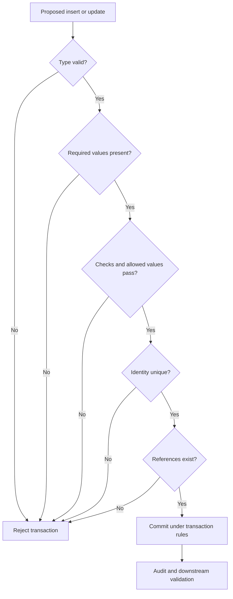

### Delete and update actions

`ON DELETE` is a business decision, not cleanup syntax. Cascading deletion can be appropriate for a component that has no meaning without its parent, such as a bridge row when its relationship is removed. It is dangerous when independent evidence must survive, such as deleting an asset and silently deleting historical findings or incidents.

| Action | Behavior | Possible use | Risk |
|---|---|---|---|
| `NO ACTION` | Constraint checked, possibly deferred | Default explicit repair inside transaction | Failure occurs if references remain |
| `RESTRICT` | Prevent referenced deletion immediately | Protect independent historical entity | Requires deliberate retirement workflow |
| `CASCADE` | Delete dependent rows | Pure component/bridge rows | Large or surprising data loss |
| `SET NULL` | Remove optional reference | Assignee deleted but ticket retained | Loses link unless history exists |
| `SET DEFAULT` | Apply defined default | Rare controlled fallback | Default must still satisfy integrity |

Prefer status-based retirement for security evidence when retention and audit require history. Physical deletion still needs a governed lifecycle and privacy/legal rules.

## Functional dependencies and normalization

A functional dependency `X -> Y` means that for a given valid value of X, there is one determined value of Y in the relation. If `asset_id -> asset_name, criticality`, asset ID determines those attributes at the chosen time grain. Dependencies come from business rules, not a small sample. A dataset with no duplicate names today does not prove name is a key.

Normalization organizes facts according to dependencies to reduce anomalies. It is a reasoning method, not a contest to create the most tables.

| Anomaly | Poor design example | Consequence |
|---|---|---|
| Update anomaly | Owner email copied into every finding row | One row remains stale after email change |
| Insert anomaly | Cannot add vulnerability definition until an asset has it | Knowledge depends on unrelated occurrence |
| Delete anomaly | Deleting last finding removes vulnerability description | Independent fact disappears |
| Duplication | Application criticality repeated for every hosted asset | Storage and inconsistent values |
| Hidden multi-value | Comma-separated control IDs in finding column | No referential integrity or reliable joins |

### First Normal Form: one value per attribute at the row grain

First Normal Form, or 1NF, is often explained as atomic values and no repeating groups. "Atomic" depends on intended operations. A full address may be one value for display but not for country-level policy. For this guide, 1NF means each cell holds one value from its declared domain, repeating collections move to rows, and each row has a key.

Bad design:

| finding_id | asset_name | control_ids |
|---|---|---|
| f-1 | payroll-01 | c-1,c-2,c-9 |

The string hides three relationships. A bridge table with one `(finding_id, control_id)` per row supports constraints, attributes, and joins.

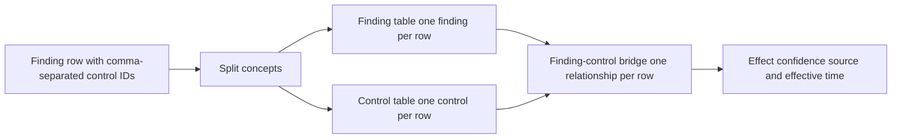

### Second Normal Form: no partial dependency on part of a composite key

Second Normal Form, or 2NF, requires 1NF and that every non-key attribute depend on the whole candidate key, not only part of a composite key. Suppose `application_asset(application_id, asset_id, application_name, asset_name, installed_version)` has composite key `(application_id, asset_id)`. Application name depends only on application ID; asset name depends only on asset ID. Move those attributes to their entity tables. Installed version may genuinely describe the relationship.

| Attribute | Determinant | Correct home |
|---|---|---|
| `application_name` | `application_id` | `application` |
| `asset_name` | `asset_id` | `asset` |
| `installed_version` | `(application_id, asset_id)` at a time | `application_asset` history |
| `first_observed_at` | Relationship instance | `application_asset` |

### Third Normal Form: no non-key fact depends on another non-key fact

Third Normal Form, or 3NF, requires 2NF and removes problematic transitive dependencies of non-key attributes on keys through other non-key attributes. If an asset row stores `owner_user_id`, `owner_display_name`, and `owner_department`, the names and department are facts about the user or organizational assignment, not stable facts determined directly by asset ID. Keep the owner relationship and join to the appropriate history.

### Boyce-Codd Normal Form overview

Boyce-Codd Normal Form, or BCNF, strengthens dependency rules: for every nontrivial functional dependency `X -> Y`, X should be a superkey. BCNF addresses uncommon cases where 3NF permits overlap among candidate keys and dependencies. For interviews, explain the principle and recognize that real temporal, subtype, and multi-valued domains may need more advanced forms or carefully documented compromises. Do not mechanically decompose without preserving dependencies and lossless reconstruction.

| Form | Beginner test | Security example fixed |
|---|---|---|
| 1NF | One value per cell and no repeating group? | Control list becomes bridge rows |
| 2NF | Does every non-key fact depend on the whole composite key? | Asset/app names leave relationship table |
| 3NF | Does a non-key fact depend on another non-key fact? | Owner department leaves asset row |
| BCNF | Is every determinant a superkey? | Resolve overlapping candidate-key dependency |

### Plain-English deep-dive 3 - Normalization gives each fact an address

If a company keeps an employee's phone number in HR, payroll, travel, every project plan, and every ticket, changing the number becomes a scavenger hunt. Each copy can disagree. A normalized design gives the employee phone fact an authoritative home and stores relationships elsewhere.

That does not mean every screen performs twenty joins against the source system. Operational services may use caches, materialized views, or analytical models. The key is to know which copy is authoritative, how replicas refresh, how staleness is measured, and how corrections propagate.

## Denormalization: an engineered tradeoff

Denormalization intentionally duplicates, combines, or precomputes data for a measured need. Examples include storing a finding's source severity text for source fidelity, maintaining a current summary table, or publishing a star schema for Power BI. Accidental duplication is not denormalization; it is an undocumented consistency problem.

| Technique | Benefit | Consistency risk | Required control |
|---|---|---|---|
| Cached display name | Fewer joins for display | Rename appears stale | Source key, refresh SLA, freshness field |
| Materialized aggregate | Fast trend/dashboard | Refresh lag and partial refresh | Transactional publish and reconciliation |
| Wide analytical table | Simple BI consumption | Repeated dimensions and history ambiguity | Semantic definition and rebuild process |
| Source payload copy | Audit/replay | Sensitive duplicate and schema drift | Restricted access and retention |
| Derived age band | Faster grouping | Band rules change | Store calculation version or compute centrally |
| Current-state snapshot | Fast operational read | History disappears | Separate append-only history |

Before denormalizing, capture the slow query, row counts, data distribution, plan, latency objective, write rate, freshness tolerance, rebuild method, owner, and rollback. Sometimes a suitable index, query correction, partitioning, or analytical replica solves the problem without copying facts.

## Indexes: faster paths with real costs

An index is like the term index in a book. It lets the database find some rows without reading every row. PostgreSQL maintains the index when table rows change and the planner chooses whether to use it. An index is not guaranteed to be selected and is not free.

| Index concern | Benefit | Cost/risk | Evidence |
|---|---|---|---|
| Selective lookup | Faster equality/range search | Storage and write maintenance | Actual plan and latency |
| Join key | Faster matching | Extra write work | Join workload and row distribution |
| Foreign-key referencing column | Faster parent delete/update checks and joins | Space/maintenance | Constraint and query pattern |
| Multicolumn | Supports combined predicates/order | Column order and workload specificity | Predicate/order pattern |
| Partial | Index only relevant subset | Query predicate must imply condition | Stable subset such as open findings |
| Expression | Supports transformed predicate | Exact expression and maintenance | Repeated case-normalized lookup |
| Covering/include | May avoid heap visits | Larger index and update cost | Read-heavy measured need |

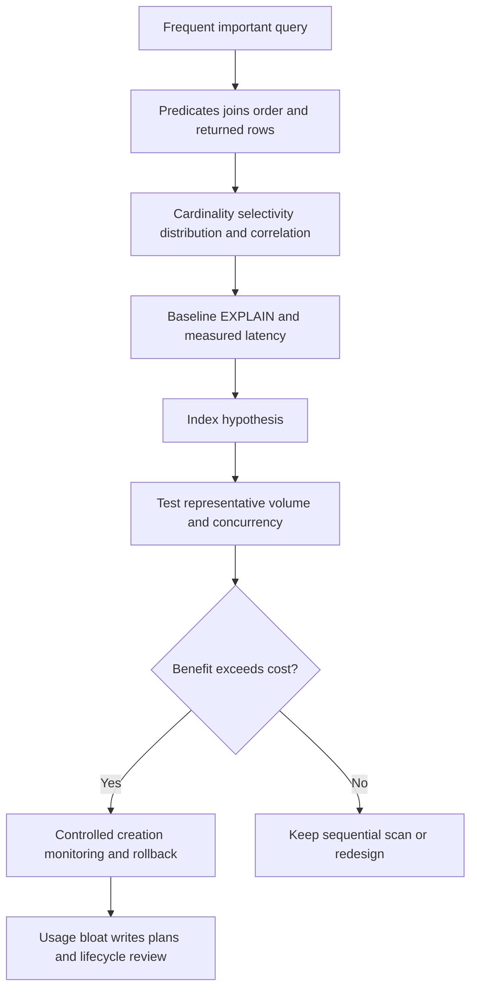

### Common PostgreSQL index types

| Type | General strength | Security-data example | Caveat |
|---|---|---|---|
| B-tree | Equality, range, and ordered retrieval | Finding status plus observed time | Default and common, not universal |
| Hash | Equality | Exact immutable identifier lookup | B-tree often remains sufficient; test |
| GIN | Multi-component values such as arrays and document containment | Authorized JSONB/array search | Write and size costs; operator-specific |
| GiST | Extensible search strategies and ranges | Time-range overlap constraints | Operator class determines behavior |
| SP-GiST | Partitioned search structures | Specialized network/text/geometric patterns | Workload-specific |
| BRIN | Block-range summaries for physically correlated large data | Append-oriented event time | Less selective; correlation matters |

### Multicolumn order

For a B-tree index on `(status, last_observed_at)`, equality on leading `status` plus a range on time is a strong pattern. A query filtering only time may or may not benefit depending on planner estimates and current PostgreSQL behavior. Do not repeat a simplistic "leftmost only" slogan as an absolute; use official version documentation and actual plans. PostgreSQL currently documents skip-scan possibilities, but selectivity and distribution govern the choice.

```sql
CREATE INDEX finding_open_age_idx
    ON nmh_rel.finding (last_observed_at, finding_id)
    WHERE status = 'open';

CREATE INDEX finding_asset_idx
    ON nmh_rel.finding (asset_id);
```

These are hypotheses for the later synthetic workload. The partial index helps only queries whose predicates are compatible with `status = 'open'`. The asset index supports asset-specific finding access and can help foreign-key-related operations. Validate with representative data, `EXPLAIN`, latency, write overhead, and index usage.

### Plain-English deep-dive 4 - More indexes can make the database slower

Imagine a librarian maintaining twelve separate card catalogs. Finding a book may become faster, but every new book, correction, move, and deletion must update all twelve catalogs. Rarely used catalogs consume space and effort.

Database indexes have the same tradeoff. Inserts, updates, and deletes maintain relevant indexes. Wide or duplicate indexes consume cache and storage. Index builds and maintenance have operational effects. Create indexes from important access patterns and measured plans, then review whether they remain useful.

## Transactions and ACID

A transaction groups statements into one unit. PostgreSQL treats individual statements as transactions even without an explicit transaction block; `BEGIN` and `COMMIT` group several statements. `ROLLBACK` discards the unit. Savepoints allow partial rollback within a transaction.

| ACID property | Plain meaning | NMH example | Important boundary |
|---|---|---|---|
| Atomicity | All statements take effect or none do | Create ticket plus finding link together | External API calls need separate coordination |
| Consistency | Declared invariants hold before/after committed transaction | Foreign keys and status checks remain valid | Database cannot infer every business truth |
| Isolation | Concurrent work follows visibility/interference rules | Two owners do not silently overwrite assignment | Level and access pattern matter |
| Durability | Committed changes survive covered failures | Approved ticket state remains recorded | Backup/DR and configuration still matter |

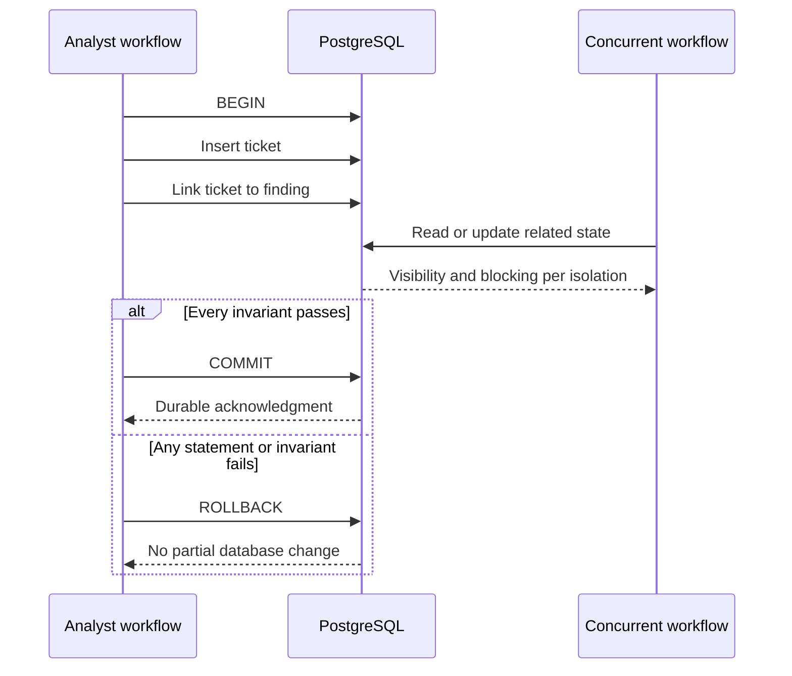

Consistency in ACID does not mean "the data matches reality." It means the transaction takes the database from one valid state to another under declared constraints and transaction logic. A wrong but structurally valid asset match can commit successfully.

## Isolation and concurrency overview

Concurrent sessions improve throughput but create visibility and update questions. The SQL standard describes isolation levels through prohibited phenomena. PostgreSQL implements specific behavior: `READ UNCOMMITTED` acts like `READ COMMITTED`; `READ COMMITTED` is the default; PostgreSQL `REPEATABLE READ` provides a transaction-stable snapshot and prevents phantom reads but can still have serialization anomalies; `SERIALIZABLE` detects unsafe dependency patterns and requires retry handling.

| Level requested in PostgreSQL | Snapshot idea | Possible concern | Application duty |
|---|---|---|---|
| Read Uncommitted | Behaves as Read Committed | Same as below | Do not assume dirty reads |
| Read Committed | New snapshot for each statement | Nonrepeatable/phantom/serialization anomalies | Keep logic simple or lock/retry/design stronger |
| Repeatable Read | Stable transaction snapshot | Serialization anomaly and update conflict | Retry failed updating transactions |
| Serializable | Effect equivalent to some serial order for committed transactions | Serialization failures and overhead | Retry entire transaction on SQLSTATE `40001` |

### Concurrency anomalies in plain language

| Phenomenon | Plain meaning | Security workflow example |
|---|---|---|
| Dirty read | See another transaction's uncommitted change | PostgreSQL standard levels do not expose this |
| Nonrepeatable read | Same row changes between reads | Finding owner differs in two statements |
| Phantom read | Repeated predicate returns changed row set | New open finding appears during count workflow |
| Lost update | One writer overwrites another's change | Two analysts assign different owners |
| Write skew | Separate rows change based on shared rule | Two approvers each remove a different required reviewer |
| Serialization anomaly | Combined result matches no one-at-a-time order | Concurrent summary-derived inserts conflict logically |

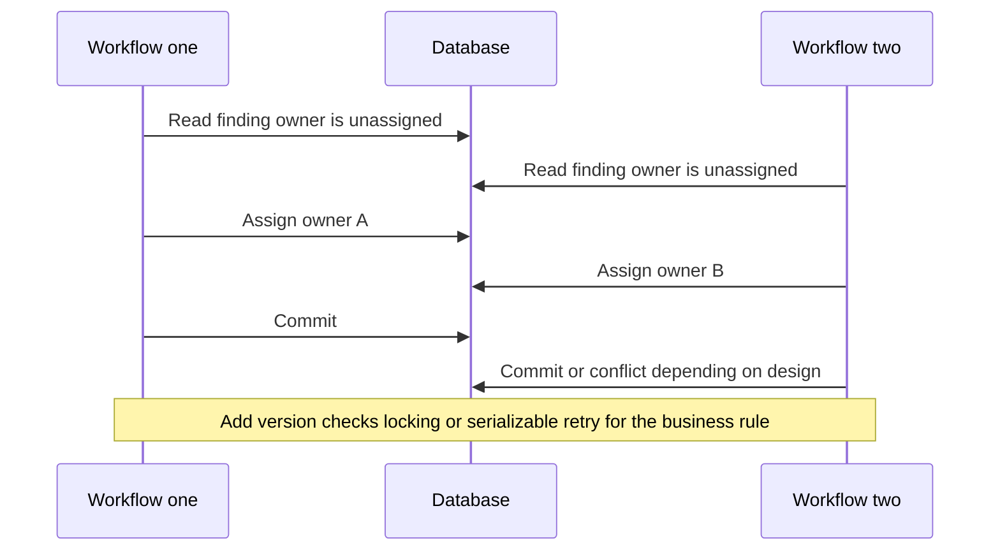

Do not solve every concurrency problem with the strictest isolation level. Use constraints, compare-and-set version columns, row locks, short transactions, serializable transactions with generalized retry, queues, or single-writer designs according to the invariant and workload. Never leave sessions idle in transaction while a human decides.

## Conceptual NMH security operations model

The NMH model separates eight major concepts:

| Entity | Row grain | Stable identity | Key temporal concern |
|---|---|---|---|
| User account | One modeled account | Internal UUID plus source candidate key | Rename, disable, reassignment |
| Asset | One resolved technical asset identity | Internal UUID plus source aliases | Ephemeral/recycled identities |
| Application | One business/technical application | Internal UUID plus catalog key | Criticality and ownership history |
| Vulnerability | One vulnerability definition/reference | Internal UUID plus qualified external key | Definition revisions |
| Finding | One source finding instance mapped to asset and vulnerability | Internal UUID plus source key | First/last seen and state events |
| Control | One defined control capability | Internal UUID plus control catalog key | Coverage effectiveness by time |
| Ticket | One workflow item | Internal UUID plus system/ticket key | Status and assignment events |
| Incident | One declared incident | Internal UUID plus incident-system key | Timeline and scope evolution |

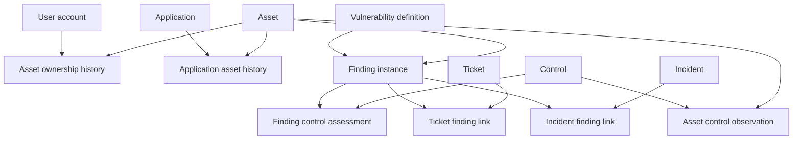

### Relationship decisions

| Relationship | Cardinality/optionality | Reason |
|---|---|---|
| User to asset ownership | Many-to-many over time; asset may temporarily lack resolved owner | Shared devices and history |
| Application to asset | Many-to-many over time | Distributed apps and shared hosts |
| Asset to finding | One asset to many findings; finding requires resolved asset in curated model | Structural integrity after resolution |
| Vulnerability to finding | One vulnerability to many findings; nullable only if model supports non-vulnerability findings | Separate definition from occurrence |
| Asset to control | Many-to-many observations over time | Control state changes and multiple controls |
| Finding to ticket | Many-to-many | One ticket can batch findings; one finding can have follow-up work |
| Finding to incident | Many-to-many | Incidents can include many findings; evidence can inform several investigations |
| Ticket to parent ticket | Optional recursive many-to-one | Work breakdown without duplicate hierarchy columns |

## Executable illustrative PostgreSQL DDL

Run only in an authorized isolated lab. This is a teaching model, not a complete production platform. It omits many concerns such as migration tooling, audit implementation, tenant isolation, partitioning, backup, row-level policies, encryption operations, API/service logic, and regulatory tailoring.

### Schema, domains, and entity tables

```sql
CREATE SCHEMA IF NOT EXISTS nmh_rel;

CREATE DOMAIN nmh_rel.criticality_code AS text
    CHECK (VALUE IN ('low', 'medium', 'high'));

CREATE DOMAIN nmh_rel.work_status AS text
    CHECK (VALUE IN ('new', 'assigned', 'in_progress', 'blocked', 'closed'));

CREATE TABLE nmh_rel.user_account (
    user_account_id uuid PRIMARY KEY,
    source_system text NOT NULL,
    source_account_id text NOT NULL,
    account_name text NOT NULL,
    account_kind text NOT NULL CHECK (account_kind IN ('human', 'service', 'shared')),
    enabled boolean NOT NULL,
    source_updated_at timestamptz NOT NULL,
    ingested_at timestamptz NOT NULL,
    CONSTRAINT user_source_key UNIQUE (source_system, source_account_id)
);

CREATE TABLE nmh_rel.asset (
    asset_id uuid PRIMARY KEY,
    canonical_name text NOT NULL,
    asset_type text NOT NULL,
    lifecycle_status text NOT NULL CHECK (lifecycle_status IN ('active', 'inactive', 'retired')),
    criticality nmh_rel.criticality_code NOT NULL,
    first_observed_at timestamptz NOT NULL,
    last_observed_at timestamptz NOT NULL,
    CONSTRAINT asset_observation_order CHECK (last_observed_at >= first_observed_at)
);

CREATE TABLE nmh_rel.asset_source_identity (
    source_system text NOT NULL,
    source_asset_id text NOT NULL,
    asset_id uuid NOT NULL REFERENCES nmh_rel.asset(asset_id) ON DELETE RESTRICT,
    match_method text NOT NULL,
    match_confidence numeric(5,4) NOT NULL CHECK (match_confidence BETWEEN 0 AND 1),
    valid_from timestamptz NOT NULL,
    valid_to timestamptz,
    PRIMARY KEY (source_system, source_asset_id, valid_from),
    CONSTRAINT asset_identity_period CHECK (valid_to IS NULL OR valid_to > valid_from)
);

CREATE TABLE nmh_rel.application (
    application_id uuid PRIMARY KEY,
    catalog_system text NOT NULL,
    catalog_application_id text NOT NULL,
    application_name text NOT NULL,
    criticality nmh_rel.criticality_code NOT NULL,
    CONSTRAINT application_catalog_key UNIQUE (catalog_system, catalog_application_id)
);

CREATE TABLE nmh_rel.vulnerability (
    vulnerability_id uuid PRIMARY KEY,
    namespace text NOT NULL,
    external_reference text NOT NULL,
    title text NOT NULL,
    published_at timestamptz,
    CONSTRAINT vulnerability_reference_key UNIQUE (namespace, external_reference)
);
```

The source identity table allows one resolved asset to have many aliases and allows source identifiers to change mapping over time. The confidence field is synthetic and does not imply a Zscaler algorithm. A check ensures numeric range but cannot prove calibration.

### Findings, controls, tickets, and incidents

```sql
CREATE TABLE nmh_rel.finding (
    finding_id uuid PRIMARY KEY,
    asset_id uuid NOT NULL REFERENCES nmh_rel.asset(asset_id) ON DELETE RESTRICT,
    vulnerability_id uuid REFERENCES nmh_rel.vulnerability(vulnerability_id) ON DELETE RESTRICT,
    source_system text NOT NULL,
    source_finding_id text NOT NULL,
    source_severity text NOT NULL,
    status text NOT NULL CHECK (status IN ('open', 'closed', 'accepted')),
    first_observed_at timestamptz NOT NULL,
    last_observed_at timestamptz NOT NULL,
    closed_at timestamptz,
    row_version bigint NOT NULL DEFAULT 1 CHECK (row_version > 0),
    CONSTRAINT finding_source_key UNIQUE (source_system, source_finding_id),
    CONSTRAINT finding_observation_order CHECK (last_observed_at >= first_observed_at),
    CONSTRAINT finding_close_rule CHECK (
        (status = 'closed' AND closed_at IS NOT NULL AND closed_at >= first_observed_at)
        OR (status <> 'closed' AND closed_at IS NULL)
    )
);

CREATE TABLE nmh_rel.control (
    control_id uuid PRIMARY KEY,
    control_catalog text NOT NULL,
    control_reference text NOT NULL,
    control_name text NOT NULL,
    CONSTRAINT control_catalog_key UNIQUE (control_catalog, control_reference)
);

CREATE TABLE nmh_rel.ticket (
    ticket_id uuid PRIMARY KEY,
    ticket_system text NOT NULL,
    external_ticket_id text NOT NULL,
    parent_ticket_id uuid REFERENCES nmh_rel.ticket(ticket_id) ON DELETE RESTRICT,
    status nmh_rel.work_status NOT NULL,
    assigned_user_account_id uuid REFERENCES nmh_rel.user_account(user_account_id) ON DELETE SET NULL,
    created_at timestamptz NOT NULL,
    closed_at timestamptz,
    CONSTRAINT ticket_external_key UNIQUE (ticket_system, external_ticket_id),
    CONSTRAINT ticket_close_rule CHECK (
        (status = 'closed' AND closed_at IS NOT NULL AND closed_at >= created_at)
        OR (status <> 'closed' AND closed_at IS NULL)
    ),
    CONSTRAINT ticket_not_own_parent CHECK (parent_ticket_id IS NULL OR parent_ticket_id <> ticket_id)
);

CREATE TABLE nmh_rel.incident (
    incident_id uuid PRIMARY KEY,
    incident_system text NOT NULL,
    external_incident_id text NOT NULL,
    title text NOT NULL,
    declared_at timestamptz NOT NULL,
    resolved_at timestamptz,
    CONSTRAINT incident_external_key UNIQUE (incident_system, external_incident_id),
    CONSTRAINT incident_time_order CHECK (resolved_at IS NULL OR resolved_at >= declared_at)
);
```

The self-parent check stops a ticket from directly parenting itself, but it does not prevent a longer cycle such as A -> B -> C -> A. That cross-row rule needs controlled service logic, a trigger designed with care, or a different hierarchy strategy. This illustrates why a `CHECK` constraint is not a universal business-rule engine.

### Relationship and history tables

```sql
CREATE TABLE nmh_rel.asset_owner_history (
    asset_id uuid NOT NULL REFERENCES nmh_rel.asset(asset_id) ON DELETE RESTRICT,
    user_account_id uuid NOT NULL REFERENCES nmh_rel.user_account(user_account_id) ON DELETE RESTRICT,
    ownership_type text NOT NULL CHECK (ownership_type IN ('business', 'technical', 'custodian')),
    valid_from timestamptz NOT NULL,
    valid_to timestamptz,
    source_system text NOT NULL,
    PRIMARY KEY (asset_id, user_account_id, ownership_type, valid_from),
    CONSTRAINT asset_owner_period CHECK (valid_to IS NULL OR valid_to > valid_from)
);

CREATE TABLE nmh_rel.application_asset_history (
    application_id uuid NOT NULL REFERENCES nmh_rel.application(application_id) ON DELETE RESTRICT,
    asset_id uuid NOT NULL REFERENCES nmh_rel.asset(asset_id) ON DELETE RESTRICT,
    relationship_type text NOT NULL CHECK (relationship_type IN ('hosts', 'depends_on', 'accesses')),
    valid_from timestamptz NOT NULL,
    valid_to timestamptz,
    source_system text NOT NULL,
    PRIMARY KEY (application_id, asset_id, relationship_type, valid_from),
    CONSTRAINT application_asset_period CHECK (valid_to IS NULL OR valid_to > valid_from)
);

CREATE TABLE nmh_rel.asset_control_observation (
    asset_id uuid NOT NULL REFERENCES nmh_rel.asset(asset_id) ON DELETE RESTRICT,
    control_id uuid NOT NULL REFERENCES nmh_rel.control(control_id) ON DELETE RESTRICT,
    observed_at timestamptz NOT NULL,
    reported_state text NOT NULL CHECK (reported_state IN ('effective', 'ineffective', 'unknown')),
    source_system text NOT NULL,
    PRIMARY KEY (asset_id, control_id, observed_at, source_system)
);

CREATE TABLE nmh_rel.finding_control (
    finding_id uuid NOT NULL REFERENCES nmh_rel.finding(finding_id) ON DELETE CASCADE,
    control_id uuid NOT NULL REFERENCES nmh_rel.control(control_id) ON DELETE RESTRICT,
    assessment text NOT NULL CHECK (assessment IN ('mitigates', 'does_not_mitigate', 'unknown')),
    assessed_at timestamptz NOT NULL,
    evidence_reference text,
    PRIMARY KEY (finding_id, control_id, assessed_at)
);

CREATE TABLE nmh_rel.ticket_finding (
    ticket_id uuid NOT NULL REFERENCES nmh_rel.ticket(ticket_id) ON DELETE CASCADE,
    finding_id uuid NOT NULL REFERENCES nmh_rel.finding(finding_id) ON DELETE RESTRICT,
    linked_at timestamptz NOT NULL,
    link_reason text NOT NULL,
    PRIMARY KEY (ticket_id, finding_id)
);

CREATE TABLE nmh_rel.incident_finding (
    incident_id uuid NOT NULL REFERENCES nmh_rel.incident(incident_id) ON DELETE CASCADE,
    finding_id uuid NOT NULL REFERENCES nmh_rel.finding(finding_id) ON DELETE RESTRICT,
    relevance text NOT NULL CHECK (relevance IN ('confirmed', 'supporting', 'dismissed')),
    linked_at timestamptz NOT NULL,
    PRIMARY KEY (incident_id, finding_id)
);
```

`ON DELETE CASCADE` is used only for selected relationship components when the relationship row has no independent meaning after its ticket/incident/finding parent is removed. Whether deletion is permitted at all depends on retention policy. Production security evidence often uses retirement and controlled lifecycle rather than direct deletion.

### Index hypotheses and read-only role pattern

```sql
CREATE INDEX finding_asset_idx ON nmh_rel.finding (asset_id);
CREATE INDEX finding_vulnerability_idx ON nmh_rel.finding (vulnerability_id);
CREATE INDEX ticket_assignee_status_idx
    ON nmh_rel.ticket (assigned_user_account_id, status);
CREATE INDEX asset_owner_current_idx
    ON nmh_rel.asset_owner_history (asset_id, ownership_type)
    WHERE valid_to IS NULL;
CREATE INDEX asset_control_latest_idx
    ON nmh_rel.asset_control_observation (asset_id, control_id, observed_at DESC);

-- Execute role creation and grants only as an authorized administrator.
-- CREATE ROLE nmh_rel_reader NOLOGIN;
-- GRANT USAGE ON SCHEMA nmh_rel TO nmh_rel_reader;
-- GRANT SELECT ON ALL TABLES IN SCHEMA nmh_rel TO nmh_rel_reader;
-- ALTER DEFAULT PRIVILEGES IN SCHEMA nmh_rel
--     GRANT SELECT ON TABLES TO nmh_rel_reader;
```

Grant design needs environment-specific ownership and role membership. A `NOLOGIN` group role can receive privileges and be granted to login roles, but current PostgreSQL role documentation and organizational standards govern. Row-level security is not automatically needed or sufficient; if used, test owner/bypass behavior, policy combinations, race conditions, backup behavior, and covert-channel risks described in official docs.

## Temporal challenges

Security entities and relationships change. An asset can be renamed, reimaged, reassigned, retired, and its hostname recycled. A user can change department or account. An application can move hosts. A finding can reopen. A control can be reported effective and later fail.

| Temporal question | Required model | Wrong shortcut |
|---|---|---|
| Who owns the asset now? | Current open ownership interval | Latest row by ingest time without tie rule |
| Who owned it at incident time? | Effective ownership interval containing event time | Current owner |
| What did we believe during the review? | System-version history or immutable snapshot | Recomputed current data |
| When was finding first observed? | Stable first observation across state events | Earliest current extract row only |
| Was control effective then? | Time-bounded observation and freshness rule | Current agent installed flag |
| Is hostname the same asset? | Source identity plus lifecycle/time evidence | Name equality |

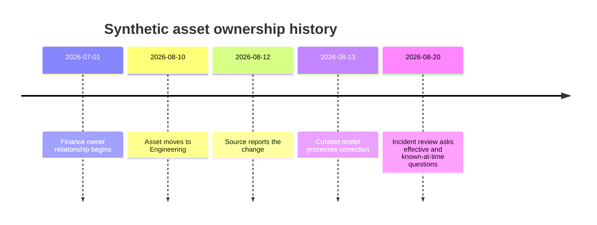

### Valid time and system time

Valid time states when a fact applies in the modeled world. System time states when the database knew or stored it. A late correction can have `valid_from = 2026-08-10` and `recorded_at = 2026-08-13`. Current-state tables alone cannot answer what the system showed on August 11.

| Temporal approach | Strength | Limitation | Use |
|---|---|---|---|
| Current row overwrite | Simple reads | Loses history | Disposable state only |
| Effective-dated rows | Answers business history | Late corrections need care | Owners and app hosting |
| State-event log | Preserves transitions | Rebuilding current state is work | Finding/ticket status |
| Periodic snapshot | Easy point-in-time reporting | Storage and snapshot fanout | Daily backlog |
| Bitemporal history | Answers valid and known-at-time | More keys, logic, and tests | Audit-sensitive corrections |

### Preventing overlapping current periods

A check ensures `valid_to > valid_from` but cannot compare other rows. PostgreSQL exclusion constraints with range types can prevent overlaps for a key, but the exact DDL, bounds, operator classes, extension requirements, and concurrency behavior need version-specific design. An alternative is a partial unique index for one open row, which prevents multiple `valid_to IS NULL` rows but does not prevent closed intervals from overlapping.

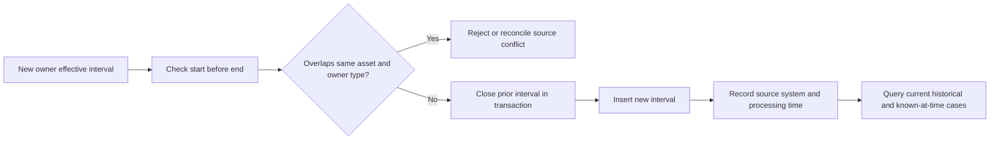

### Reopen and status history

A single `finding.status` supports current operations but not a full transition history. Add `finding_status_event(finding_id, status, effective_at, recorded_at, source_event_id)` for audit and trend. Derive or transactionally maintain current status. Define whether a reopened source finding keeps the same finding identity or becomes a new occurrence; that depends on the source contract and analytical purpose.

## Modeling incorrect approaches and their consequences

| Incorrect approach | Why it seems easy | Consequence | Repair |
|---|---|---|---|
| One giant security table | No joins | Repeated facts, nulls, update anomalies, mixed grain | Separate entities/events/relationships |
| IP as asset primary key | Available in logs | DHCP, NAT, shared/reused IP cause merges | Stable entity and time-bounded aliases |
| Email as user primary key | Human readable | Rename and reassignment | Internal account ID plus unique source key |
| CVE as finding key | Familiar identifier | One CVE can affect many assets/ports/source instances | Separate vulnerability definition and finding |
| Ticket ID as remediation proof | Workflow is visible | Closed work may not fix condition | Independent verification relationship/event |
| Boolean control coverage | Simple dashboard | Unknown/stale/partial states disappear | Observation, source, time, and freshness |
| Comma-separated IDs | One column | No foreign keys or cardinality | Bridge table |
| Nullable everything | Easy loads | Unknown semantics and weak integrity | Stage/quarantine then curated constraints |
| Cascade all deletes | Easy cleanup | Historical evidence disappears | Restrict/retire and lifecycle workflow |
| Index every column | Hope for speed | Write/storage/planning overhead | Workload-driven measured indexes |
| Serializable with no retry | Strong label | Runtime failures break workflow | Generalized full-transaction retry |
| Current owner on old event | Easy enrichment | Historical accountability rewritten | Effective-time join |

## Power BI and analytical bridge

The normalized core supports integrity and operations. Power BI often benefits from a dimensional serving model rather than direct navigation across many normalized tables. Part 45 will build facts and dimensions. The bridge begins by identifying grains and preserving keys.

| Relational source | Analytical role | Power BI caution |
|---|---|---|
| `asset` | Asset dimension source | Choose current versus historical attributes |
| `application` | Application dimension source | Many-to-many bridge needed for hosted apps |
| `finding` | Finding fact source | Define snapshot/event/accumulating grain |
| `asset_owner_history` | Ownership bridge/history | Avoid ambiguous active relationships |
| `asset_control_observation` | Control observation fact | Latest state requires deterministic rule |
| `ticket_finding` | Factless bridge | Fanout can multiply measures |
| `incident_finding` | Investigation bridge | Relevance and time need filtering |

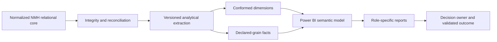

Arti should explain that normalization and a star schema solve different problems. The normalized model protects update integrity; the dimensional model makes analytical filtering and aggregation understandable. They can coexist with lineage and reconciliation.

## Data security, privacy, and governance in the relational model

| Concern | Modeling/design response | Limitation |
|---|---|---|
| Least privilege | Separate owner, writer, reader, and migration roles | Grants require lifecycle review |
| Sensitive identifiers | Use internal keys and purpose-specific views | Surrogates do not anonymize linked data |
| Tenant/environment isolation | Explicit tenant/environment key and policy where required | Every unique/foreign key must preserve scope |
| Audit | Append state/change events and administrative logs | Database logs need protection/retention |
| Retention | Classify tables and relationship descendants | Foreign keys can block or cascade deletion |
| Deletion | Map dependencies and approved action per relationship | Backups/exports require separate design |
| Row security | Policy-based row filtering where justified | Owners/bypass roles and policy races matter |
| Search path | Qualify objects and remove untrusted writable paths | Platform/version settings govern details |
| Lab separation | Dedicated synthetic schema/database | Naming alone does not prevent data mixing |

Do not place credentials, secrets, raw tokens, or unnecessary personal content in the model. Store secret references to an approved secret-management system when needed. Hashing or replacing an identifier does not automatically remove privacy obligations if records can still be linked to a person.

## Troubleshooting relational models

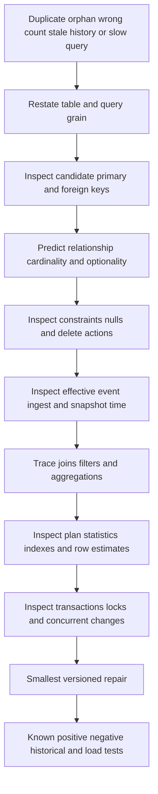

| Symptom | Likely model defect | First discriminating check |
|---|---|---|
| Duplicate assets | Missing candidate uniqueness or entity alias error | Group by source key and inspect match history |
| Orphan report rows | No foreign key or extraction order gap | Anti-join child keys to parent snapshot |
| Finding count multiplies | Many-to-many bridge joined before aggregation | Compare row count and distinct finding ID per join |
| Unknown owners disappear | Inner join used on optional relationship | Count assets before/after join; inspect null/interval |
| Historical incident shows new owner | Current-state join | Join owner interval to incident event time |
| Delete fails | Restrict/no-action dependency | Inspect foreign-key dependency and lifecycle intent |
| Delete removes too much | Cascade on independent evidence | Review DDL and transaction audit before recovery |
| Check allows null | SQL three-valued logic | Test null explicitly; add `NOT NULL` if required |
| Lookup remains slow | Low selectivity, stale stats, wrong index/order | Compare estimated/actual plan on representative data |
| Deadlock/blocking | Transactions acquire resources in conflicting order | Capture lock graph and transaction sequence |
| Serialization error | Serializable dependency conflict | Retry whole transaction and inspect workload pattern |
| Current owner duplicates | Overlapping/open temporal rows | Query intervals by asset/type and enforce rule |

### Model-change runbook

1. Define the business concept, current defect, affected decisions, and data sensitivity.
2. Write current and proposed row grain, keys, dependencies, cardinality, optionality, and time semantics.
3. Profile nulls, duplicates, orphans, distributions, and affected volume.
4. Identify every producer, consumer, query, report, workflow, export, retention rule, and privilege.
5. Choose a migration strategy: additive, dual-write, backfill, compatibility view, cutover, and retirement.
6. Add constraints safely after repairing or quarantining invalid historical rows.
7. Test positive, negative, boundary, concurrency, historical, rollback, backup/restore, and performance cases.
8. Review locks, build duration, storage, write amplification, replication, and maintenance impact.
9. Deploy through a controlled environment and canary consumers.
10. Reconcile counts and keys, compare old/new outputs, and validate customer-visible workflows.
11. Monitor query plans, constraint failures, lag, error queues, locks, and support signals.
12. Retire old fields only after consumers, retention, and rollback windows are complete.
13. Record lineage, contract version, owner, decision, caveat, and effectiveness result.

## Arti's Microsoft-to-relational-modeling bridge

| Demonstrated strength | Relational application | Interview boundary |
|---|---|---|
| SharePoint/OneDrive identity and permissions | Separate person, account, object, permission, relationship, and time | Product object models differ |
| SQL/PostgreSQL | Define keys, constraints, joins, transactions, and tests | Synthetic schema is not a product schema |
| Power BI | Understand why normalized operational sources need a semantic layer | BI measures require Part 45 grain design |
| Case analytics | Model case, customer, owner, status, event, and age separately | Support case priority is not vulnerability risk |
| RCA | Trace invalid state to missing rule or failed handoff | Database failure may be symptom, not root cause |
| Critical escalation | Protect integrity while coordinating repair and communication | Production database changes need authorized owners |

### 30-second interview bridge

"I model relational data by naming the thing, writing the one-row grain, identifying candidate keys, stating cardinality and optionality in both directions, and enforcing the rules the database can reliably own. I normalize to prevent update, insert, and delete anomalies, then denormalize only for a measured read need with freshness and rebuild controls. My NMH PostgreSQL model connects users, assets, apps, vulnerabilities, findings, controls, tickets, and incidents with temporal history. It is synthetic practice, not a claim about Zscaler internals; I would validate current product semantics and customer contracts before production design."

## Labs and rehearsal

Use only an authorized PostgreSQL lab and synthetic NMH data. Never import customer logs, identifiers, vulnerabilities, credentials, tokens, or proprietary schemas.

### Lab 1 - Grain and concept inventory

Write one-row grain sentences for user, account, asset, source identity, application, vulnerability, finding, control observation, ticket, incident, and every bridge. Identify concepts wrongly combined in a hypothetical wide table.

### Lab 2 - Key workshop

List candidate, natural, composite, surrogate, and foreign keys for each entity. Test scope, stability, nullability, sensitivity, and reuse. Produce a decision record for `asset_id`.

### Lab 3 - Cardinality whiteboard

Draw every relationship with minimum and maximum cardinality in both directions. Add one counterexample that disproves each overly simple one-to-many assumption.

### Lab 4 - Constraint failure pack

Run the DDL in an isolated schema. Attempt duplicate source keys, orphan foreign keys, reversed times, invalid statuses, and null required values inside a transaction. Record exact failures and roll back.

### Lab 5 - Normalize a wide finding sheet

Start with asset, owner, app, vulnerability, finding, controls, ticket, and incident columns in one sheet. Identify functional dependencies and anomalies; transform through 1NF, 2NF, and 3NF. Explain BCNF relevance.

### Lab 6 - Denormalization decision

Choose one slow fictional report. Compare join correction, index, materialized view, and wide export. Document freshness, write cost, rebuild, lineage, and rollback.

### Lab 7 - Index experiment

Generate synthetic rows in an authorized lab, capture `EXPLAIN (ANALYZE, BUFFERS)` only where safe, compare sequential and index plans, and vary selectivity. Do not generalize the result beyond the tested distribution/version.

### Lab 8 - Transaction exercise

Insert a ticket and finding link in one transaction; trigger a second-statement failure and verify rollback. Repeat with a savepoint. Explain what remains outside database atomicity if an external API is called.

### Lab 9 - Isolation tabletop

Use two lab sessions to observe Read Committed snapshots and an update conflict. Design an optimistic `row_version` update and a Serializable retry loop concept without writing production application code.

### Lab 10 - Temporal ownership

Create current, historical, late-corrected, overlapping, and missing ownership intervals. Answer current, effective-at-incident, and known-at-review questions separately.

### Lab 11 - Power BI bridge

Map normalized tables to candidate facts, dimensions, and bridges. Predict fanout and ambiguous relationship risks. Do not build the final star until Part 45 definitions are complete.

### Lab 12 - Customer model review

Present the model to fictional security, CMDB, vulnerability, SOC, privacy, and platform owners. Capture disputed definitions, authority, unknown states, retention, and approval decisions.

| Lab evidence | Completion standard |
|---|---|
| Safety | Isolated, authorized, synthetic, and disposable |
| Semantics | Grain, domains, keys, cardinality, optionality, and time stated |
| Integrity | Positive and negative constraint tests recorded |
| Normalization | Dependencies and anomalies explain each decomposition |
| Performance | Plans and tradeoffs tied to tested workload |
| Concurrency | Isolation expectation and retry/locking strategy stated |
| Governance | Access, sensitivity, retention, deletion, and owner included |
| Honesty | No product-internal or production-experience overclaim |

## Common misconceptions to correct

| Misconception | Correct model |
|---|---|
| A table is just a spreadsheet | It has declared grain, types, keys, relationships, constraints, and transaction behavior |
| SQL rows have a natural order | Use `ORDER BY`; table row order is unspecified |
| An ID-looking column is a key | A key needs scoped uniqueness, minimality, stability, and presence |
| Surrogate keys solve duplicates | Add uniqueness for real candidate/source keys |
| Natural keys are always best | Mutable, reused, sensitive, or wide keys create problems |
| Foreign keys prove the real-world match | They prove the referenced row exists |
| Nullable means optional | Null semantics need a defined reason and workflow |
| One-to-many is obvious | State minimum/maximum in both directions and test exceptions |
| Check constraints reject null | A check passes on true or null; add not-null when required |
| Foreign keys automatically index children | PostgreSQL does not automatically index referencing columns |
| Cascades are convenient cleanup | They can silently destroy independent history |
| Normalization always makes queries slow | Measure; integrity and query performance are separate design concerns |
| More tables means more normalized | Dependencies, not table count, determine normalization |
| Denormalization means copying columns | It is an intentional measured tradeoff with consistency controls |
| Every index makes reads faster | Planner, selectivity, distribution, operators, and cost decide |
| More indexes are harmless | They consume storage and add write/maintenance overhead |
| ACID consistency means accurate reality | It means declared database invariants hold |
| Repeatable Read is identical everywhere | PostgreSQL behavior is implementation-specific |
| Serializable means no errors | Applications must retry serialization failures |
| Current state can answer history | Effective and known-at-time histories differ |
| A normalized core is a Power BI star | Operational integrity and analytical usability use different models |
| This DDL represents Zscaler Data Fabric | It is an illustrative synthetic PostgreSQL model only |

## Official Source Anchors

Sources in this section were reviewed on **2026-08-24**.

PostgreSQL documentation supplies implementation behavior for the current documentation version. ANSI/ISO SQL concepts provide general vocabulary, but implementations legitimately differ; the selected platform/version governs execution. Normal forms are described as established relational modeling concepts, not as a quotation or substitute for a full database-design text. NIST and DAMA are general governance references, not schema specifications. Zscaler's public Data Fabric page provides only high-level context.

| Source | URL | Used for | Boundary |
|---|---|---|---|
| PostgreSQL Table Basics | https://www.postgresql.org/docs/current/ddl-basics.html | Rows, columns, types, unspecified row order, table creation | Current URL resolves to current supported docs |
| PostgreSQL Constraints | https://www.postgresql.org/docs/current/ddl-constraints.html | Check, not-null, unique, primary, foreign, exclusion, delete/update behavior | Null and portability details require version review |
| PostgreSQL Schemas | https://www.postgresql.org/docs/current/ddl-schemas.html | Namespace, search path, ownership, secure usage patterns | Schema is not automatic isolation |
| PostgreSQL Data Types | https://www.postgresql.org/docs/current/datatype.html | Built-in types, domains context, UUID/time/JSON/network choices | Type selection is workload-specific |
| PostgreSQL Index Introduction | https://www.postgresql.org/docs/current/indexes-intro.html | Planner choice, lookup benefit, maintenance and build cost | Index benefit must be measured |
| PostgreSQL Index Types | https://www.postgresql.org/docs/current/indexes-types.html | B-tree, Hash, GiST, SP-GiST, GIN, and BRIN | Operator classes and workload govern |
| PostgreSQL Multicolumn Indexes | https://www.postgresql.org/docs/current/indexes-multicolumn.html | Leading columns, skip scan, and sparing multicolumn use | Version behavior and estimates vary |
| PostgreSQL Transactions | https://www.postgresql.org/docs/current/tutorial-transactions.html | Atomic transaction blocks, commit, rollback, savepoints | External side effects are not automatically atomic |
| PostgreSQL Isolation | https://www.postgresql.org/docs/current/transaction-iso.html | SQL phenomena and PostgreSQL level behavior/retry | Other databases can differ |
| PostgreSQL Privileges | https://www.postgresql.org/docs/current/ddl-priv.html | Ownership, GRANT/REVOKE, object privilege context | Environment role design required |
| PostgreSQL Row Security | https://www.postgresql.org/docs/current/ddl-rowsecurity.html | Row-policy behavior, default deny, owner/bypass and race caveats | RLS is advanced and must be tested |
| NIST SP 800-53 Rev. 5 | https://csrc.nist.gov/pubs/sp/800/53/r5/upd1/final | Access, audit, integrity, privacy, and accountability context | Requires organizational tailoring |
| DAMA-DMBOK overview | https://www.dama.org/cpages/body-of-knowledge | General data architecture, modeling, quality, and governance context | Non-prescriptive, not a regulation or product manual |
| Zscaler Data Fabric | https://www.zscaler.com/products-and-solutions/data-fabric | Public unification/context/workflow/reporting positioning | No schema, key, constraint, performance, or tenant claim |

## Likely Interview Questions

### Q1. How do you start a relational data model?

**Model answer:** I begin with business/security questions and concepts, then write one-row grain for each table. I identify candidate keys, choose a stable primary key, preserve source/business uniqueness, state cardinality and optionality in both directions, define time semantics, and encode reliable rules with types and constraints. I test the model with examples, counterexamples, failures, privacy needs, and required queries before optimizing.

### Q2. What is the difference between primary, candidate, natural, surrogate, composite, and foreign keys?

**Model answer:** Candidate keys are minimal unique identity options. One becomes the primary key; other candidates can remain alternate unique keys. A natural key comes from the source or business domain, while a surrogate is system-created and carries no business meaning. A composite key uses multiple columns. A foreign key references a primary or permitted unique key to enforce structural relationships. I often use a surrogate primary key plus a unique source candidate key.

### Q3. What do cardinality and optionality mean?

**Model answer:** Cardinality states the maximum relationship multiplicity, such as one-to-many or many-to-many. Optionality states the minimum, such as zero-or-one versus exactly one. I state both directions with verbs: an asset can have zero or many findings; each curated finding must reference exactly one asset. Many-to-many relationships become bridge tables, especially when the relationship has attributes or history.

### Q4. Explain 1NF, 2NF, 3NF, and BCNF simply.

**Model answer:** 1NF removes repeating groups so each cell has one value at the declared grain. 2NF removes non-key facts that depend on only part of a composite key. 3NF removes non-key facts that depend on other non-key facts rather than the key. BCNF strengthens the rule so every determinant is a superkey. The goal is to give each fact an authoritative home and prevent update, insert, and delete anomalies, not maximize table count.

### Q5. When would you denormalize?

**Model answer:** Only for a measured requirement such as a recurring analytical scan, materialized summary, or bounded low-latency read. I first test query correction and indexing. For denormalization I define the authoritative source, duplicated fields, refresh or transaction rule, acceptable staleness, reconciliation, rebuild, security/retention, owner, and rollback. A copied field without those controls is just inconsistent data waiting to happen.

### Q6. How do you choose an index?

**Model answer:** I start with an important query's predicates, joins, ordering, selected rows, table size, distribution, selectivity, and write rate. I capture a baseline plan and latency, form an index hypothesis, test representative volume/concurrency, and measure read benefit against storage and write maintenance. I remember that PostgreSQL's planner may correctly choose a sequential scan and that foreign keys do not automatically index referencing columns.

### Q7. What do ACID and isolation mean in a security workflow?

**Model answer:** Atomicity makes a multi-statement database change all-or-nothing. Consistency preserves declared invariants. Isolation controls concurrent visibility and interference. Durability preserves committed changes under the database's guarantees. PostgreSQL Read Committed uses statement snapshots; stronger levels alter guarantees, and Serializable can abort unsafe transactions. Applications need short transactions, appropriate locking/version checks, and whole-transaction retry for serialization failures.

### Q8. How would you model users, assets, vulnerabilities, findings, controls, tickets, and incidents over time?

**Model answer:** I separate each entity and its source identities, then use explicit bridge/history tables for ownership, app hosting, control observations, ticket-finding links, and incident-finding relevance. A vulnerability is a definition; a finding is a source occurrence on an asset. I store event/observation/effective/system times as needed, prevent invalid intervals, preserve state events, and distinguish current from historical and known-at-time questions. The NMH DDL demonstrates this synthetically, not as a Zscaler schema claim.

## 30-Second Memory Hooks

| Concept | Memory hook |
|---|---|
| Table | A claim about one kind of row |
| Row | One what? |
| Column | One typed question |
| Domain | Allowed answer space |
| Schema | Namespace plus blueprint, not automatic isolation |
| Candidate key | Minimal identity option |
| Primary key | Chosen unique non-null identity |
| Natural key | Meaningful but can change |
| Surrogate key | Stable internal handle, not duplicate control |
| Composite key | Identity is the combination |
| Foreign key | No orphan, but wrong match still possible |
| Cardinality | How many in both directions? |
| Optionality | Must it exist? |
| Constraint | Reject invalid state centrally |
| 1NF | One value, no repeating list |
| 2NF | Depend on the whole composite key |
| 3NF | Depend on the key, not a non-key |
| BCNF | Every determinant is a superkey |
| Denormalize | Measured shortcut with upkeep |
| Index | Faster path, slower writes, prove it |
| Transaction | All steps or none |
| ACID | Complete, valid, separated, lasting |
| Serializable | Strong guarantee plus retry |
| Temporal | Current, effective, and known-at-time differ |
| Power BI bridge | Normalize operations, dimensionalize analytics |
| Arti bridge | SQL rigor transfers; product schema claims do not |

## Completion Checklist

- [ ] I can define relation, table, row, column, domain, schema, and database.
- [ ] I know SQL row order is unspecified without explicit ordering.
- [ ] I write the grain sentence before selecting columns.
- [ ] I separate human, account, source record, and historical version concepts.
- [ ] I can identify candidate, alternate, natural, surrogate, composite, and foreign keys.
- [ ] I test keys for scope, uniqueness, minimality, stability, presence, sensitivity, and reuse.
- [ ] I use a surrogate key and a source/business uniqueness constraint when both are needed.
- [ ] I state cardinality and optionality in both directions with verbs.
- [ ] I use bridge tables for many-to-many relationships and their attributes/history.
- [ ] I understand that foreign keys prevent orphans, not incorrect real-world matches.
- [ ] I can use types, not-null, check, unique, primary-key, foreign-key, and exclusion concepts appropriately.
- [ ] I know a check expression evaluating null does not reject the row by itself.
- [ ] I choose delete/update actions from relationship meaning and retention, not convenience.
- [ ] I can explain entity, referential, domain, temporal, business, and audit integrity.
- [ ] I derive normalization from functional dependencies and candidate keys.
- [ ] I can identify update, insert, delete, duplication, and hidden-multi-value anomalies.
- [ ] I can explain and apply 1NF, 2NF, 3NF, and the BCNF overview.
- [ ] I denormalize only with measured need, authority, freshness, reconciliation, rebuild, and owner.
- [ ] I choose indexes from predicates, joins, ordering, selectivity, distribution, write rate, and plans.
- [ ] I know referencing foreign-key columns are not automatically indexed in PostgreSQL.
- [ ] I can compare B-tree, Hash, GiST, SP-GiST, GIN, and BRIN at a high level.
- [ ] I treat multicolumn order and skip scan as version/workload-specific, not slogans.
- [ ] I can explain atomicity, consistency, isolation, and durability with boundaries.
- [ ] I distinguish database atomicity from external API side effects.
- [ ] I know PostgreSQL Read Uncommitted maps to Read Committed.
- [ ] I distinguish statement snapshots, transaction snapshots, and serializable execution effects.
- [ ] I design whole-transaction retry for serialization failures where used.
- [ ] I can model all eight NMH security concepts and their bridges.
- [ ] I distinguish vulnerability definition from finding occurrence.
- [ ] I model control state as sourced, timed observation rather than a timeless Boolean.
- [ ] I preserve ticket and incident links without treating closure as remediation proof.
- [ ] I distinguish current, effective-at-time, and known-at-time questions.
- [ ] I can explain why temporal overlap is a cross-row/concurrency problem.
- [ ] I use schema-qualified objects and review search-path trust and privileges.
- [ ] I can map the normalized model toward Power BI without creating fanout.
- [ ] I can run the model and change troubleshooting runbooks.
- [ ] I can complete every lab using only authorized synthetic data.
- [ ] I separate ANSI concepts, PostgreSQL behavior, synthetic NMH practice, and Zscaler public context.
- [ ] I can answer the eight interview prompts with definitions, mechanics, examples, tradeoffs, failures, and boundaries.

[Part 45 - Dimensional, Star, Snowflake, Event, Document, and Graph Models](Part-45-analytical-security-data-models.md)