# Part 45 - Dimensional, Star, Snowflake, Event, Document, and Graph Models

> **Audience:** Candidates preparing for a Zscaler Security Operations Technical Success Manager role after enterprise Support Escalation Engineering.
>
> **Purpose:** Build a practical model-selection toolkit for security and customer analytics: facts, dimensions, grain, measures, slowly changing dimensions, conformed dimensions, bridges, star and snowflake schemas, event records, JSON documents, graph nodes/edges/paths, hybrid architectures, transformations, analytical pitfalls, and Power BI delivery.
>
> **Scope and honesty:** Northstar Meridian Holdings, abbreviated NMH, is fictional. Every source, entity, event, finding, relationship, query, report, measure, path, and outcome is synthetic. SQL and JSON examples are educational PostgreSQL illustrations, not Zscaler schemas. Zscaler Data Fabric for Security is referenced only through public high-level positioning; this Part does not assert undocumented storage models, graph technology, connector behavior, field names, algorithms, limits, performance, or customer results. Your SQL, PostgreSQL, Power BI, statistics, enterprise troubleshooting, and customer communication transfer; direct production Data Fabric operation remains a learning boundary.
>
> **Currency caveat:** Product capabilities, Power BI behavior, PostgreSQL versions, JSON/SQL features, event schemas, graph technologies, and organizational definitions change. Sources in this Part were reviewed on **2026-08-24**. Current official documentation, licensed features, tenant evidence, source contracts, privacy/security review, measured workloads, and approved architecture govern production.

## Section goal

No single data model is best for every question. A star schema makes repeated filtering and aggregation understandable. An event model preserves what happened. A document preserves a flexible nested payload. A graph makes relationships and paths central. A normalized relational core protects operational integrity. A useful architecture assigns each model a job and preserves identity, time, provenance, and reconciliation while data moves between them.

Think of a city. A street map helps find routes. A census table supports counts by neighborhood. A diary records events in order. A property file keeps details about one building. A transit dashboard summarizes ridership by time and station. All describe the same city, but forcing one representation to answer every question produces awkward or wrong results.

By the end, you should be able to:

| Outcome | Demonstrated capability | Proof artifact |
|---|---|---|
| Design dimensions and facts | State grain before keys and measures | Bus matrix and star diagram |
| Classify measures | Separate additive, semi-additive, non-additive, and derived metrics | Measure catalog |
| Preserve history | Choose SCD Type 0, 1, 2, or limited Type 3 deliberately | Dimension change design |
| Reuse context | Define conformed dimensions and role-playing dates | Conformance contract |
| Handle many-to-many | Use factless/weighted bridges without double counting | Bridge test pack |
| Compare star and snowflake | Balance simplicity, reuse, hierarchy, storage, and performance | Model decision record |
| Model events | Preserve identity, time, actor, action, target, result, and source | Event envelope |
| Model documents | Use JSON for bounded aggregate/context flexibility | JSON schema and extraction |
| Model graphs | Define nodes, typed edges, direction, time, confidence, and path controls | Security relationship graph |
| Choose hybrids | Assign operational, analytical, document, event, and graph workloads intentionally | Hybrid architecture |
| Transform safely | Reconcile keys, grain, time, duplicates, and late data between models | Transformation tests |
| Deliver Power BI | Build clear filters, relationships, explicit measures, and quality context | NMH semantic model |

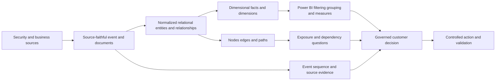

## JD Mapping

| Role expectation | Part 45 capability | TSM artifact | experience bridge and boundary |
|---|---|---|---|
| Analyze complex security environments | Select models for entities, events, history, aggregates, and paths | Model landscape | Cross-layer Microsoft analysis transfers |
| Develop Data Fabric expertise | Understand harmonized context as a modeling problem without inventing internals | Conceptual hybrid map | Product implementation remains unclaimed |
| Troubleshoot integrations | Isolate grain, key, time, fanout, schema, and path defects | Transformation runbook | SQL and fault isolation transfer |
| Drive customer value | Turn modeled observations into trustworthy measures and workflow evidence | KPI catalog | Power BI experience transfers |
| Explain security exposure | Connect assets, identities, apps, findings, controls, and paths | Graph whiteboard | Graph product specifics require validation |
| Recommend best practices | Use SCD, conformed dimensions, contracts, quality, privacy, and lineage | Architecture decision record | Analytics rigor transfers |
| Communicate to executives | Separate observation, relationship, metric, inference, and action | Executive model narrative | Customer communication transfers |
| Maintain honesty | Label synthetic examples and model uncertainty | Evidence legend | No unsupported Zscaler claims |

## Candidate honesty note

| Evidence class | Safe statement | Do not claim |
|---|---|---|
| Production transfer | "I have modeled analytical data and delivered Power BI/SQL insights for enterprise support." | Production Zscaler data-model ownership |
| Synthetic practice | "I built star, event, document, and graph representations for fictional NMH." | Real security or customer outcomes |
| General model concept | "A Type 2 dimension preserves historical versions with effective dates and surrogate keys." | That a named product uses that implementation |
| Public product context | "Zscaler publicly describes Data Fabric capabilities around unifying and contextualizing data." | Internal storage engine, schema, scoring, or graph claims |
| Performance hypothesis | "This design should be tested against the stated query and distribution." | Universal star/JSON/graph performance |
| Current validation | "I would confirm source semantics, tenant behavior, current docs, access, quality, and workload." | Remembered features as present fact |

The interview advantage is model literacy, not model certainty. You can ask what one record means, what changed, how entities match, which query pattern dominates, and how a decision will be validated. That is more credible than naming a fashionable model without its failure modes.

## Beginner vocabulary and memory hooks

| Term | Plain meaning | Why it matters | Memory hook |
|---|---|---|---|
| Analytical model | Structure optimized for repeatable questions and summaries | Makes measures and filters understandable | A map for questions |
| Fact | Observation or event at a declared grain | Carries dimension keys and often measures | What happened or was measured |
| Dimension | Descriptive context for filtering/grouping | Answers who, what, where, when, and why | Labels around the fact |
| Grain | Exact meaning of one fact row | Determines valid measures and joins | Declare before design |
| Measure | Numeric fact intended for defined aggregation | Drives counts, amounts, age, and rates | Number with aggregation rules |
| Additive | Can sum across all intended dimensions | Simplest reusable measure | Sum safely |
| Semi-additive | Can sum across some dimensions but not time | Snapshots need special treatment | Sum sideways, not through time |
| Non-additive | Must not be summed | Ratios and scores need recomputation | Recalculate, do not pile up |
| Star schema | Fact table surrounded by denormalized dimensions | Clear filtering and aggregation | Fact at the center |
| Snowflake | Dimension normalized into related tables | Reuse/hierarchy at usability cost | Branching dimension |
| Surrogate key | Warehouse-created dimension-version identifier | Supports SCD history and one-side relationships | Version handle |
| Business key | Stable source/business identity across versions | Connects versions of same member | Same member, changing rows |
| SCD | Slowly Changing Dimension | Preserves or overwrites descriptive change | How labels age |
| Conformed dimension | Shared definition usable across facts | Enables comparable measures | One ruler for many facts |
| Role-playing dimension | Same dimension used for different roles | Event, ingest, close, and due dates differ | Same calendar, different hat |
| Bridge table | Rows connecting many-to-many concepts | Prevents ambiguous direct relationships | Controlled crossing |
| Factless fact | Fact containing keys but no numeric measure | Represents occurrence or coverage | Count the relationship |
| Event | Immutable or correction-aware record of occurrence | Preserves sequence and audit | One thing happened |
| Event envelope | Common fields around event-specific payload | Supports routing, identity, time, and version | Addressed package |
| Document | Self-contained nested record, often JSON | Preserves variable source context | One case folder |
| Node | Entity represented in a graph | Starting/ending point for traversal | A dot with identity |
| Edge | Typed directed relationship between nodes | Encodes how entities connect | A labeled arrow |
| Path | Ordered sequence of nodes and edges | Answers reachability/dependency questions | Route through relationships |
| Hybrid model | Several models assigned to different workloads | Avoids one-model-for-everything | Right map for each question |

## Why multiple models exist

Every model makes some questions easy and others expensive or ambiguous. Model choice follows workload, consistency, latency, history, relationship depth, schema variability, query skill, security, privacy, operations, and cost.

| Model | Makes easy | Makes harder | Strong security use |
|---|---|---|---|
| Normalized relational | Correct updates and explicit integrity | Broad repeated BI joins | Operational entities/workflows |
| Star/dimensional | Filtering, grouping, stable measures | Transactional updates and recursive paths | Posture, SLA, trend, coverage |
| Snowflake | Reused normalized hierarchies | BI usability and filter chains | Large governed taxonomies |
| Event | Sequence, replay, state reconstruction | Current-state queries without projection | Authentication and status history |
| Document | Source fidelity and variable nested fields | Cross-document integrity and standardized aggregation | Vendor payloads and case evidence |
| Graph | Multi-hop relationship/path questions | Simple bulk totals and operational transactions | Attack paths and dependencies |

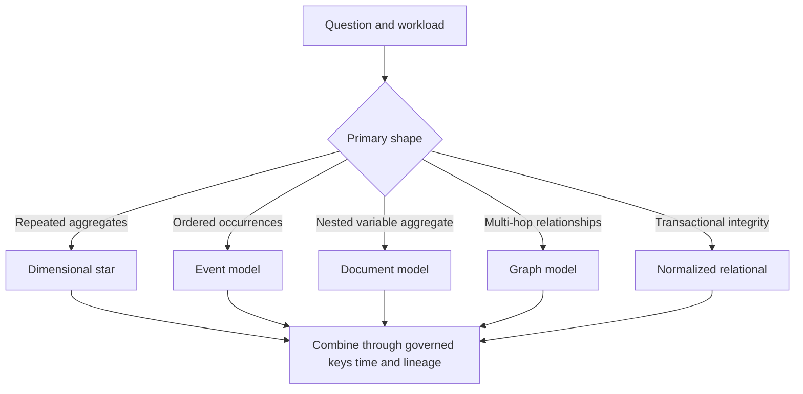

### Plain-English deep-dive 1 - The best model depends on the verb

Ask what the user wants to do. "Count open findings by business unit" suggests a dimensional model. "Show every status transition" suggests events. "Preserve a source's nested evidence" suggests a document. "Find all paths from an exposed identity to a critical application" suggests a graph. "Assign a ticket and prevent an orphan reference" suggests normalized relational transactions.

The noun "security data" does not pick a model. The verb and guarantees do. Count, reconstruct, preserve, traverse, and update are different workloads.

## Dimensional modeling from first principles

Dimensional modeling separates descriptive dimensions from observational facts. A dimension row describes a member such as an asset, user, vulnerability, business unit, control, source, or date. A fact row records an event, measurement, transaction, relationship, or snapshot using dimension keys.

### Declare the grain first

Grain is a complete sentence. Examples:

| Fact candidate | Grain sentence | Keys implied | Measures |
|---|---|---|---|
| Finding observation | One source finding observed on one resolved asset in one scan | Asset, vulnerability, source, scan date | Observation count, evidence age |
| Daily finding snapshot | One modeled finding's state at end of one UTC day | Date, finding, asset, owner, status | Open flag, age days |
| Control coverage | One control's observed state for one asset at one observation time | Asset, control, source, date/time | Effective flag, freshness hours |
| Authentication event | One producer authentication event | Event date/time, user, asset, source, result | Event count, duration |
| Ticket lifecycle | One ticket represented across milestones | Ticket, created/assigned/closed dates, owner | Cycle durations, open flag |
| Asset-application coverage | One observed app-to-asset relationship at a time | App, asset, source, date | Factless row count |

Changing grain after loading facts is dangerous. One source finding per scan is not the same as one current finding. One asset per day cannot answer event sequence. A fact table should keep one consistent grain; mixed daily and monthly rows create double counting.


## Facts and fact-table patterns

| Fact pattern | What it stores | Security example | Main caution |
|---|---|---|---|
| Transaction/event fact | One completed occurrence | Authentication attempt | High volume and late events |
| Periodic snapshot | State at regular interval | Daily open finding backlog | Do not sum across time |
| Accumulating snapshot | One process row updated at milestones | Ticket from creation to verified closure | Reopened/repeated milestones complicate |
| Factless occurrence | Dimension keys without numeric measure | Asset observed by source | Row count is implicit measure |
| Factless coverage | Allowed/expected combination | Asset expected to have control | Compare to actual fact carefully |
| Aggregate fact | Pre-summarized higher grain | Monthly owner backlog | Cannot drill below stored grain |

### Measures and aggregation

| Measure class | NMH example | Safe operation | Unsafe operation |
|---|---|---|---|
| Additive | New finding event count | Sum across date, asset, owner | Count joined bridge rows without distinct key |
| Semi-additive | End-of-day open backlog | Sum across owners within one date | Sum all daily snapshots as total findings |
| Non-additive | SLA attainment rate | Recompute numerator/denominator | Sum or average group percentages blindly |
| Derived | Finding age days | Compute from defined times/snapshot | Treat age as source-stored timeless fact |
| Distinct-count | Assets with open findings | Distinct asset key under filter | Add distinct counts across overlapping groups |
| Weighted | Allocated finding count across owners | Sum weights that equal one per fact | Use arbitrary weights as truth |

### Fact table keys

A fact can have a surrogate row key for load management, but dimension keys plus degenerate identifiers still define its grain. Preserve source event/finding ID for traceability. A unique constraint or quality rule should detect duplicate grain. Dimensions need an explicit unknown member when facts arrive before context; a null foreign key can break filters and hide records.

## Dimensions: descriptive context with controlled history

Common security dimensions include date, time, asset, user/account, application, vulnerability, control, source, business unit, owner, severity mapping, status, region, and incident classification.

| Dimension design | Meaning | Example |
|---|---|---|
| Standard dimension | Describes one entity type | Asset attributes |
| Date dimension | Calendar/fiscal attributes | UTC date, week, month, quarter |
| Role-playing dimension | Same type used through several fact keys | First observed, last observed, closed date |
| Degenerate dimension | Identifier retained in fact without separate descriptive table | External ticket number |
| Junk dimension | Bundled low-cardinality flags/statuses | Result, disposition, exception flags |
| Mini-dimension | Rapidly changing subset separated from large dimension | Asset posture band if history/query justify |
| Outrigger | Dimension linked to another dimension | Use sparingly; may create snowflake behavior |

### Conformed dimensions

A conformed dimension has shared identity, attributes, meanings, history, and keys across fact tables. If finding facts and control facts use different asset definitions, a dashboard cannot safely compare them.

| Conformance element | Required agreement | Failure if absent |
|---|---|---|
| Business key | Same asset/account concept and scope | False joins or missing matches |
| Surrogate version key | Same historical member version where required | Current attribute rewrites history |
| Attributes | Same criticality, owner, business unit definitions | Conflicting filters |
| Unknown member | Same handling for unresolved/late data | Silent fact loss |
| Effective time | Same boundaries and time zone | Facts map to different versions |
| Governance | Same owner, contract, change process | Metric drift across marts |

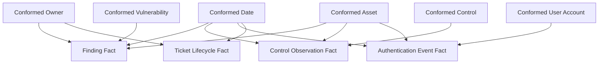

## Star schema

A star has one central fact table with direct many-to-one relationships to surrounding dimensions. Dimensions are usually denormalized for usability. Power BI guidance emphasizes that dimensions support filtering/grouping, facts support summarization, and facts should have consistent grain.

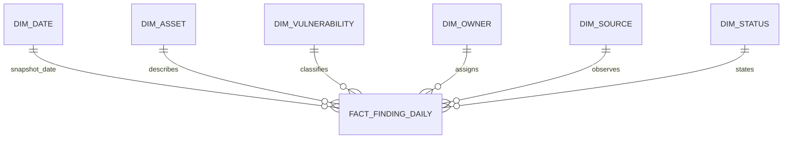

| Star strength | Why it helps | Security example |
|---|---|---|
| Simple filter paths | Dimensions directly filter fact | Business unit to daily backlog |
| Consistent grain | Measures have clear meaning | One finding per snapshot day |
| Denormalized labels | Fewer user-visible tables/joins | Asset type, region, criticality together |
| Explicit measures | Central formulas and denominators | Verified closure rate |
| Conformed dimensions | Compare processes | Findings versus control observations |
| Performance opportunity | Columnar/BI engines can aggregate efficiently | Trend by date and owner |

### Star tradeoffs

Dimension attributes repeat. Type 2 history increases rows. Many-to-many relationships need bridges. Frequent event payloads may be too wide. Recursive paths remain awkward. A star is an analytical serving model, not necessarily the system of record.

## Slowly Changing Dimensions

SCD means a dimension member's descriptive attributes change over time. The word "slowly" contrasts descriptive change with fact-like rapid measurements; it is not a latency promise.

| SCD type | Mechanic | Security example | Historical answer |
|---|---|---|---|
| Type 0 | Never change stored attribute | Original asset discovery source | Original only |
| Type 1 | Overwrite current row | Correct spelling of display label | Current value applied everywhere |
| Type 2 | Expire old row and insert version with new surrogate key | Asset business unit/criticality history | Facts retain then-effective version |
| Type 3 | Store limited prior/current columns | Previous owner for narrow transition need | Only limited previous state |

### Type 1

Use Type 1 when history is not meaningful or a correction should restate all uses. A corrected typo may qualify. Changing a criticality from medium to high may not: incident analysis might need the value known at event time. State the analytical intent.

### Type 2

Type 2 uses a stable business key across versions, a unique surrogate key for each version, effective start/end, and often current flag. Facts resolve to the version effective at the fact's chosen time. If late source corrections arrive, the load may need to split intervals and restate affected facts under governance.

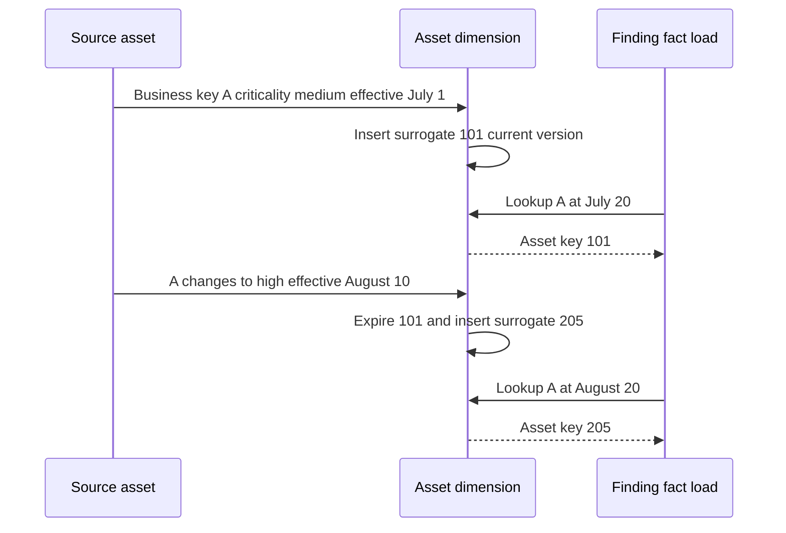

### Type 3 and mixed strategies

Type 3 supports limited previous state but cannot preserve an unlimited chain. A dimension can use Type 1 for display-name correction and Type 2 for business unit/criticality. Maintain an attribute-level policy so load behavior does not depend on developer memory.

### Plain-English deep-dive 2 - A Type 2 key identifies a version, not just a thing

A passport identifies one person, but passports are reissued with different numbers and validity dates. Historical border records reference the passport version presented then. The person's business identity continues across versions.

In a Type 2 asset dimension, `asset_business_key` identifies the continuing asset concept. `asset_key` identifies one historical version. A July fact points to the July version even after August attributes change. This prevents today's department or criticality from silently rewriting historical analysis.

## Role-playing dimensions and date mechanics

A finding can have first-observed date, last-observed date, ingest date, due date, closed date, and verification date. They are different roles of calendar/time. In a warehouse, one date dimension can be joined several ways. In Power BI, only one relationship between the same two tables can be active by default; options include explicit measures using inactive relationships or separate role-playing date tables with clear names.

| Date role | Question | Common error |
|---|---|---|
| First observed | When did exposure age begin under definition? | Use ingest date |
| Last observed | When did source last confirm condition? | Treat as closure |
| Snapshot | What was state at period end? | Sum snapshots across dates |
| Due | When does policy target expire? | Ignore business calendar/time zone |
| Closed | When did source/workflow close? | Treat ticket closure as technical closure |
| Verified | When did independent evidence confirm effect? | Omit verification |

## Bridge tables and many-to-many analysis

An asset can support multiple applications. A finding can map to multiple tickets. An application can have several business owners. Direct many-to-many Power BI relationships can be ambiguous and measures can multiply. A bridge makes membership explicit.

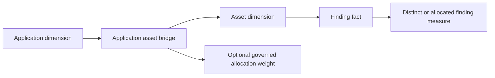

| Bridge design | Grain | Measure rule | Risk |
|---|---|---|---|
| Factless membership | One app-asset relationship | Distinct facts/assets | Double count across apps |
| Time-bounded membership | One app-asset-effective interval | Join at fact time | Overlap and late corrections |
| Weighted allocation | One membership plus weight | Weights sum to one per allocated fact/entity | Weight implies arbitrary attribution |
| Ticket-finding bridge | One ticket-finding link | Count tickets/findings distinctly | Batch tickets create fanout |
| Owner group bridge | One entity-owner membership | Scope through group | Ambiguous primary ownership |

Test bridge totals with a tiny dataset where one asset belongs to two apps. A dashboard grouped by app may legitimately count that asset twice across rows; the grand total should follow the stated distinct or allocation rule, not simply sum displayed groups.

## Snowflake schema

A snowflake normalizes one or more dimensions into related tables. An asset dimension might reference business unit, geography, and classification tables. This can reduce repeated hierarchy values and centralize governed taxonomies, but it lengthens filter paths and exposes more tables.

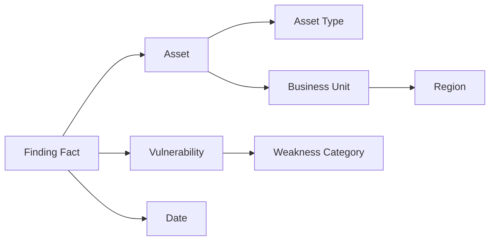

| Decision factor | Star dimension | Snowflake dimension |
|---|---|---|
| Report usability | Fewer direct tables | More navigation and relationships |
| Hierarchy reuse | Repeated in dimensions | Central reusable hierarchy |
| Storage | Repeated attributes | Less repetition in hierarchy |
| Filter path | Short/direct | Longer and potentially ambiguous |
| Power BI hierarchy | One table supports convenient hierarchy | Cross-table hierarchy limitations |
| Governance | ETL must synchronize copies | Shared table centralizes value |
| Performance | Often simpler for BI | Depends on engine and volume |

Microsoft's Power BI guidance notes that combining a snowflaked hierarchy into one model dimension often improves usability, while acknowledging storage and volume tradeoffs. Keep normalized warehouse structures if they serve governance, then publish a flattened semantic dimension where appropriate.

## Event model

An event records that something happened. It should be append-oriented, uniquely identifiable, time-aware, source-aware, versioned, and correction-capable. Event models support sequence, replay, state derivation, incident timeline, and late-data reasoning.

### Event envelope

| Field | Meaning | Example caveat |
|---|---|---|
| `event_id` | Producer or canonical event identity | Retry must not create a new logical event silently |
| `event_type` | Versioned occurrence category | Names require taxonomy governance |
| `event_time` | Producer-claimed occurrence instant | Clock skew and zone matter |
| `observed_at` | Sensor observation time | May differ from action time |
| `ingested_at` | Receiver arrival time | Used for latency, not occurrence |
| `actor` | Entity initiating action | Shared/service identity may be unresolved |
| `action` | Verb performed or attempted | Vocabulary should be controlled |
| `target` | Entity affected | One event can have multiple targets |
| `result` | Success/failure/unknown | Source semantics differ |
| `source` | Producer/tenant/context | Authority and scope begin here |
| `schema_version` | Payload contract version | Transport success does not prove semantic compatibility |
| `payload` | Event-specific authorized details | Minimize sensitive content |

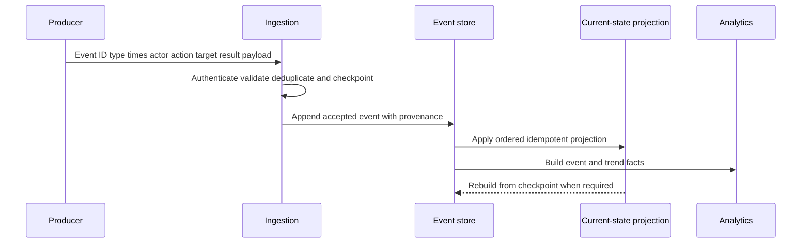

### Events versus snapshots versus current state

| Representation | Strength | Weakness | Example question |
|---|---|---|---|
| Event log | Complete sequence and replay | Current answer requires projection | How did finding status change? |
| Current-state table | Fast operational lookup | History overwritten | Is finding open now? |
| Periodic snapshot fact | Easy point-in-time trend | Repetition and period resolution | Backlog at each day end? |
| Accumulating snapshot | Process milestone durations | Reopen/repeat paths awkward | Time from ticket create to verify? |

### Event failure modes

Duplicate delivery, missing sequence, late arrival, out-of-order status, clock skew, schema drift, poison event, replay side effects, non-idempotent projections, and source deletion all need explicit handling. Event sourcing is a broader application architecture and is not automatically justified because logs exist.

## Document and JSON model

A document groups data commonly read or changed together, usually around an aggregate such as one source event, connector run, finding evidence package, or incident case. JSON supports nested objects and arrays and flexible optional fields.

```json
{
  "schema_version": "1.0",
  "source": "synthetic_scanner",
  "source_finding_id": "sf-2042",
  "observed_at": "2026-08-20T02:00:00Z",
  "asset": {
    "source_asset_id": "host-17",
    "names": ["nmh-lab-payroll-01"]
  },
  "condition": {
    "namespace": "synthetic",
    "reference": "CVE-SYNTHETIC-0042",
    "severity": "critical"
  },
  "evidence": {
    "port": 443,
    "protocol": "tcp"
  }
}
```

The payload contains no real vulnerability or customer data. Its document boundary follows one source finding. Repeating source, observation, and finding identity make independent processing possible.

| Document choice | Benefit | Risk/control |
|---|---|---|
| Embed asset names | Source fidelity in one read | Names are aliases, not resolved identity |
| Nested evidence | Keeps related fields together | Sensitive fields need minimization/classification |
| Optional keys | Handles source versions | Missing versus null versus unknown must be defined |
| Arrays | Natural repeated values | Unnesting can multiply rows |
| `jsonb` in PostgreSQL | Parsing, operators, indexing | Does not preserve whitespace/key order/duplicate keys |
| Raw `json` | Preserves input text details | Reparse cost and fewer index features |

PostgreSQL documentation generally recommends `jsonb` for most applications, but exact source-text fidelity can justify `json`. A `jsonb` value does not retain duplicate object keys; the last value survives. If duplicate keys are evidence of malformed input, validate before conversion or preserve the raw authorized payload separately.

### Document design rules

1. Give documents a bounded aggregate and identity.
2. Include schema version, source, event/observation time, and provenance.
3. Keep a reasonably predictable structure even when fields are optional.
4. Promote frequently joined, filtered, constrained, sensitive, or governed attributes into typed relational columns/tables.
5. Avoid unbounded arrays and giant documents; PostgreSQL updates lock the containing row.
6. Validate required paths and types before analytical extraction.
7. Define SQL null, JSON null, missing key, empty array, and empty string separately.
8. Index observed query patterns, not every key.
9. Apply retention/deletion to raw documents and extracted descendants.
10. Preserve contract and extraction versions in lineage.

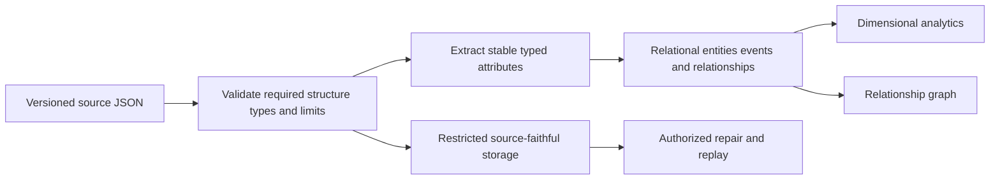

### Plain-English deep-dive 3 - Flexible schema is still a schema

A backpack lets a traveler carry different items. That flexibility does not mean airport staff can assume every backpack contains the same object in the same pocket. Useful travel still needs labels, limits, prohibited-item rules, and inspection.

JSON is similar. Optional and nested fields reduce migration friction, but producers and consumers still need a contract. Without predictable structure, the same key can shift type or meaning, missing fields become silent nulls, and dashboards compare unlike records. Flexibility moves some schema enforcement from database DDL into validation, code, tests, and governance; it does not eliminate it.

## Graph model

A graph represents entities as nodes and relationships as edges. A property graph can attach properties to both. The model is valuable when relationships and multi-hop paths are the main question.

| Graph element | NMH example | Required semantics |
|---|---|---|
| Node | Asset, account, app, vulnerability, control | Stable ID, type, provenance, validity |
| Edge | `USES`, `HOSTS`, `CAN_REACH`, `HAS_FINDING`, `PROTECTED_BY` | Direction, type, source, time, confidence |
| Property | Criticality, port, evidence time, status | Owner, type, unit, history behavior |
| Path | Account to asset to app to finding | Allowed edge sequence, direction, time consistency |
| Subgraph | Payroll exposure context | Scope and extraction time |

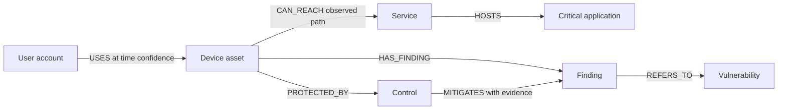

### Paths are claims, not pictures

A path must be temporally coherent: relationships should overlap the evaluation time or defined window. It must respect direction and semantics. `OBSERVED_CONNECTIVITY` is not the same as `AUTHORIZED_ACCESS`; `MEMBER_OF` does not prove an active session; `HAS_FINDING` does not prove exploitability. Edge confidence and provenance should be available for review.

| Path question | Edge constraints | Invalid shortcut |
|---|---|---|
| Can identity reach app? | Active identity, device use, policy/network reachability, app hosting at time | Any historical connection |
| Which critical apps depend on asset? | Current validated dependency direction | Shared tag treated as dependency |
| Which findings lack controls? | Finding-control assessment with freshness | Absence of edge means no control |
| What is blast radius? | Approved traversable edge types and bounds | Traverse every relationship indefinitely |
| Who owns remediation? | Current accountable ownership plus scope | Nearest graph user becomes owner |

### Relational edge list and recursive traversal

A graph can be represented relationally as a node table and edge table. PostgreSQL recursive CTEs can traverse it; a dedicated graph engine may improve graph-specific ergonomics or performance for some workloads. Selection requires measurement and operational fit.

```sql
CREATE SCHEMA IF NOT EXISTS nmh_models;

CREATE TABLE nmh_models.graph_node (
    node_id uuid PRIMARY KEY,
    node_type text NOT NULL,
    business_key text NOT NULL,
    properties jsonb NOT NULL DEFAULT '{}'::jsonb,
    UNIQUE (node_type, business_key)
);

CREATE TABLE nmh_models.graph_edge (
    edge_id uuid PRIMARY KEY,
    from_node_id uuid NOT NULL REFERENCES nmh_models.graph_node(node_id),
    to_node_id uuid NOT NULL REFERENCES nmh_models.graph_node(node_id),
    edge_type text NOT NULL,
    valid_from timestamptz NOT NULL,
    valid_to timestamptz,
    confidence numeric(5,4) CHECK (confidence BETWEEN 0 AND 1),
    source_system text NOT NULL,
    CHECK (valid_to IS NULL OR valid_to > valid_from)
);
```

```sql
WITH RECURSIVE reachable AS (
    SELECT
        e.from_node_id,
        e.to_node_id,
        e.edge_type,
        1 AS depth,
        ARRAY[e.from_node_id, e.to_node_id] AS path
    FROM nmh_models.graph_edge AS e
    WHERE e.from_node_id = '00000000-0000-0000-0000-000000000501'
      AND e.valid_from <= TIMESTAMPTZ '2026-08-20 00:00:00+00'
      AND (e.valid_to IS NULL OR e.valid_to > TIMESTAMPTZ '2026-08-20 00:00:00+00')

    UNION ALL

    SELECT
        e.from_node_id,
        e.to_node_id,
        e.edge_type,
        r.depth + 1,
        r.path || e.to_node_id
    FROM reachable AS r
    JOIN nmh_models.graph_edge AS e ON e.from_node_id = r.to_node_id
    WHERE r.depth < 5
      AND NOT (e.to_node_id = ANY(r.path))
      AND e.valid_from <= TIMESTAMPTZ '2026-08-20 00:00:00+00'
      AND (e.valid_to IS NULL OR e.valid_to > TIMESTAMPTZ '2026-08-20 00:00:00+00')
)
SELECT *
FROM reachable
ORDER BY depth, from_node_id, to_node_id;
```

The synthetic query bounds depth, avoids revisiting a node within a path, and aligns edge validity to a chosen instant. It still needs an approved list of traversable edge types and a real starting node in the lab. PostgreSQL also documents `SEARCH` and `CYCLE` syntax; portability and version support require review.

### Plain-English deep-dive 4 - A graph edge is evidence with a verb

Drawing a line between two people on a whiteboard can mean knows, reports to, emailed, approved, or merely appeared in the same meeting. The line is useless without a verb, direction, source, and time.

Security edges need the same precision. "Asset connected to application" is weak. "Scanner S observed TCP reachability from asset A to service B on port 443 at time T with method M" is reviewable. The graph becomes trustworthy when each arrow is a bounded evidence claim, not when it has many arrows.

## Model selection framework

| Decision question | Relational | Star | Event | Document | Graph |
|---|---:|---:|---:|---:|---:|
| Strict operational integrity | High | Low | Medium through projections | Medium within aggregate | Medium depending platform |
| Repeated aggregates | Medium | High | Medium after transformation | Low/medium | Low/medium |
| Full occurrence sequence | Medium | Medium | High | Medium | Medium |
| Variable nested source payload | Low/medium | Low | Medium | High | Low |
| Multi-hop path traversal | Low/medium with recursion | Low | Low | Low | High |
| Easy BI filtering | Medium | High | Low | Low | Low |
| Cross-record constraints | High | Medium during load | Low/medium | Low | Medium |
| Flexible source onboarding | Medium through staging | Low | Medium | High | Medium |

### Selection steps

1. State the decision and users.
2. Declare required grain and latency.
3. Identify dominant verbs: update, count, reconstruct, preserve, or traverse.
4. Define consistency, history, replay, and correction requirements.
5. Estimate volume, velocity, relationship density/depth, and schema variability.
6. Define security, privacy, retention, deletion, and tenant boundaries.
7. Inventory team skills, operations, backup, observability, and supportability.
8. Prototype known questions and failure cases with representative synthetic volume.
9. Measure correctness, explainability, latency, cost, and repair.
10. Choose the simplest model or hybrid that meets requirements.

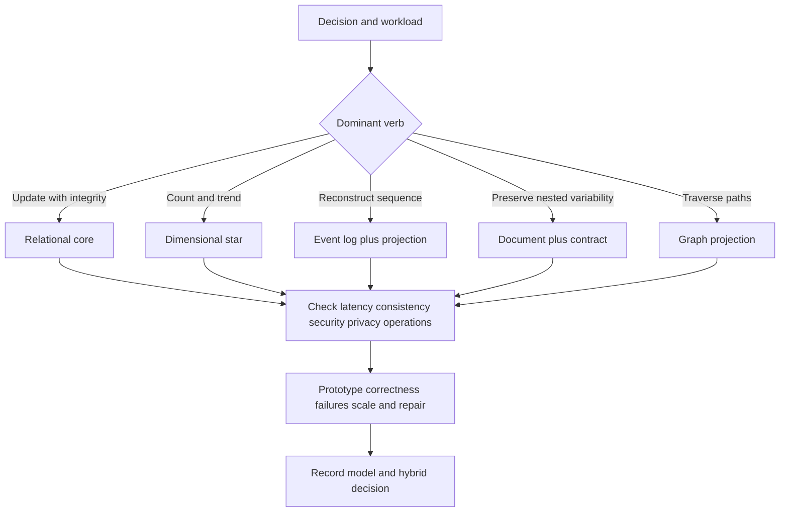

## Hybrid architecture for NMH

NMH uses each model for a bounded purpose:

| Layer | Model | Responsibility | Source of authority |
|---|---|---|---|
| Landing | Versioned JSON/document and files | Preserve authorized source fidelity and receipt | Producer contract plus receipt metadata |
| Event | Append-oriented event records | Sequence, replay, state transitions | Accepted producer events |
| Core | Normalized relational | Resolved entities, governed relationships, operational integrity | Attribute-level authority rules |
| Analytical | Dimensional star | Facts, dimensions, measures, trends | Versioned transformations from core/events |
| Graph | Node/edge projection | Multi-hop relationship/path analysis | Versioned core relationships/evidence |
| Semantic | Power BI model | User-friendly filters, explicit measures, RLS where approved | Curated star and quality metadata |
| Workflow | Operational service/tickets | Authorized action and status | Workflow system plus verification evidence |

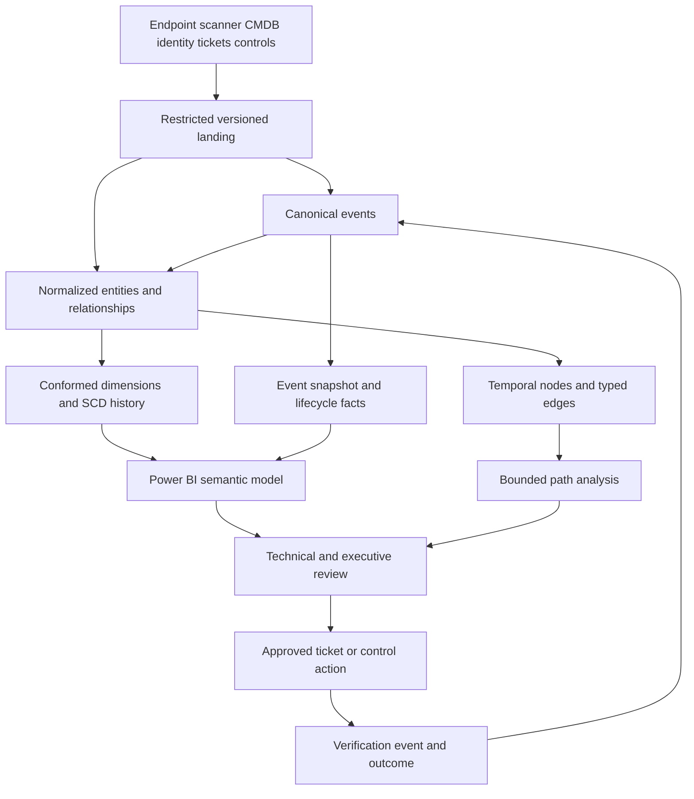

This is a teaching architecture. It does not assert that a Zscaler product uses these layers or technologies. In a real customer environment, existing platforms may combine or omit them.

## Transformations between models

### Document to relational

Validate schema/version, preserve raw receipt, extract stable typed fields, explode arrays at declared grains, map source keys, quarantine malformed required data, and retain JSON paths in lineage. Missing key, JSON null, SQL null, and empty collection must remain distinguishable where relevant.

### Event to current state

Partition by entity, order by governed event/source-update sequence, deduplicate idempotently, apply valid transitions, handle late correction, checkpoint, and make projection rebuildable. Never trigger external actions again during replay without explicit protection.

### Relational to star

Choose business process and grain, create conformed dimensions, apply SCD policy, resolve fact-time dimension keys, classify measures, map unknown members, and reconcile fact counts/keys/totals to source/core.

### Relational to graph

Map entity IDs to nodes, relationship records to typed directed edges, preserve source/effective time/confidence, validate allowed endpoint types, and compare node/edge counts. Keep graph projection version and deletion propagation.

### Star to Power BI

Load dimensions and facts, create one-to-many relationships with clear filter direction, use role-playing dimensions, hide technical keys, create explicit measures, format descriptions, add quality/freshness metadata, test RLS if used, and reconcile visuals to warehouse SQL.

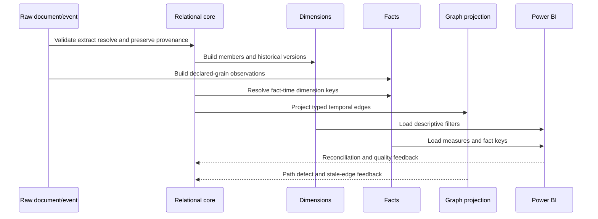

## Executable NMH dimensional DDL

The following PostgreSQL example is intentionally small. It demonstrates grain and Type 2 identity, not a complete warehouse.

```sql
CREATE SCHEMA IF NOT EXISTS nmh_models;

CREATE TABLE nmh_models.dim_date (
    date_key integer PRIMARY KEY,
    calendar_date date NOT NULL UNIQUE,
    calendar_year integer NOT NULL,
    calendar_month integer NOT NULL CHECK (calendar_month BETWEEN 1 AND 12),
    month_name text NOT NULL,
    quarter_number integer NOT NULL CHECK (quarter_number BETWEEN 1 AND 4)
);

CREATE TABLE nmh_models.dim_asset (
    asset_key bigint GENERATED ALWAYS AS IDENTITY PRIMARY KEY,
    asset_business_key uuid NOT NULL,
    asset_name text NOT NULL,
    asset_type text NOT NULL,
    business_unit text NOT NULL,
    criticality text NOT NULL CHECK (criticality IN ('low', 'medium', 'high', 'unknown')),
    effective_from timestamptz NOT NULL,
    effective_to timestamptz,
    is_current boolean NOT NULL,
    CHECK (effective_to IS NULL OR effective_to > effective_from),
    UNIQUE (asset_business_key, effective_from)
);

CREATE TABLE nmh_models.dim_vulnerability (
    vulnerability_key bigint GENERATED ALWAYS AS IDENTITY PRIMARY KEY,
    namespace text NOT NULL,
    external_reference text NOT NULL,
    title text NOT NULL,
    UNIQUE (namespace, external_reference)
);

CREATE TABLE nmh_models.dim_source (
    source_key bigint GENERATED ALWAYS AS IDENTITY PRIMARY KEY,
    source_name text NOT NULL UNIQUE,
    source_category text NOT NULL
);

CREATE TABLE nmh_models.fact_finding_daily (
    snapshot_date_key integer NOT NULL REFERENCES nmh_models.dim_date(date_key),
    asset_key bigint NOT NULL REFERENCES nmh_models.dim_asset(asset_key),
    vulnerability_key bigint NOT NULL REFERENCES nmh_models.dim_vulnerability(vulnerability_key),
    source_key bigint NOT NULL REFERENCES nmh_models.dim_source(source_key),
    finding_business_key uuid NOT NULL,
    open_flag integer NOT NULL CHECK (open_flag IN (0, 1)),
    age_days integer NOT NULL CHECK (age_days >= 0),
    PRIMARY KEY (snapshot_date_key, finding_business_key)
);
```

The fact grain is one modeled finding at one daily snapshot. `open_flag` is additive across findings within a date but semi-additive across dates. The primary key assumes a finding appears once per snapshot across its source model; if multi-source instances are separate, source or a source-finding key belongs in the grain.

### Type 2 fact-time lookup

```sql
SELECT
    f.source_finding_id,
    d.asset_key
FROM nmh_stage.finding_event AS f
JOIN nmh_models.dim_asset AS d
  ON d.asset_business_key = f.asset_business_key
 AND f.observed_at >= d.effective_from
 AND (d.effective_to IS NULL OR f.observed_at < d.effective_to);
```

This illustrative query assumes a staging table and non-overlapping dimension intervals. Production loads need unknown-member behavior, overlap/missing-match tests, late-arriving handling, transaction boundaries, and idempotency.

## Power BI bridge

Power BI should present human concepts, not warehouse plumbing. Use direct dimension-to-fact one-to-many relationships where possible, consistent fact grain, explicit measures, self-describing role-playing dates, and model descriptions. Hide surrogate keys and raw technical columns from report authors unless needed.

| Semantic object | NMH design | Test |
|---|---|---|
| Asset dimension | One row per SCD version; business key also available | Current and historical filtering |
| Finding daily fact | One finding per day | Duplicate-grain query returns zero |
| Snapshot date | Active relationship to fact | Daily totals match SQL |
| First-seen date | Separate role table or explicit measure | Does not change snapshot filter unexpectedly |
| Open backlog measure | `SUM(open_flag)` within one date context | Card requires selected/latest date logic |
| Distinct affected assets | Distinct asset business key under chosen history semantics | Bridge/app filters do not inflate |
| SLA rate | Numerator divided by eligible denominator | Zero denominator returns controlled blank |
| Data-quality banner | Latest accepted load and threshold state | Visible when source stale/partial |

### Example measure definitions in plain language

| Measure | Numerator | Denominator/time rule | Caveat |
|---|---|---|---|
| Open findings | Sum open flag | One selected snapshot date | Not unique vulnerabilities |
| Affected assets | Distinct asset business key | Open facts at selected date | SCD version distinct count differs |
| Average age | Sum age / open findings | Open findings at selected date | Distribution may be skewed; add percentiles |
| Verified closure rate | Verified technical closures | Eligible closures in period | Ticket closure alone excluded |
| Control coverage | Assets with fresh effective observation | Independent in-scope asset denominator | Unknown and stale shown separately |

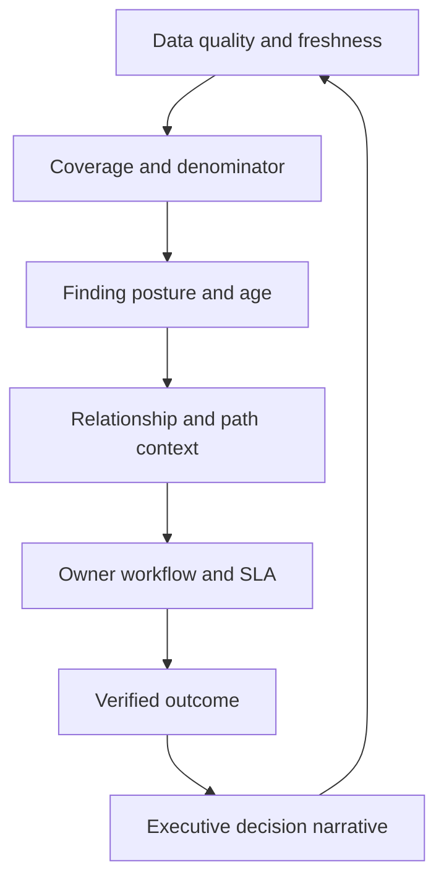

Avoid bidirectional relationships by default; they can create ambiguous filters and unexpected totals. Use them only with a clear need and testing. Row-level security must be tested with roles, relationships, unknown members, exports, and underlying permissions; it is not a complete data-security strategy.

## Analytical pitfalls

| Pitfall | Mechanic | Symptom | Prevention |
|---|---|---|---|
| Mixed fact grain | Event and daily rows in one fact | Inflated totals | Separate facts and declare grain |
| Snapshot summing | Semi-additive state added over time | Huge backlog | Select one date or derive change |
| SCD current join | Business key joins to current version | History rewritten | Fact-time surrogate lookup |
| Overlapping SCD intervals | Two versions match fact time | Duplicate facts | Interval quality/exclusion control |
| Late arriving dimension | Fact has no dimension version | Fact dropped/null | Unknown member and later restatement |
| Bridge fanout | One fact reaches several dimension rows | Totals exceed source | Distinct/weights and known-answer tests |
| Average of averages | Group ratios weighted equally | Misleading executive rate | Aggregate numerator/denominator |
| Distinct-count addition | Overlapping groups summed | Grand total too high | Recompute under total filter context |
| Role-date confusion | Active relation uses wrong date | Trend shifts | Named role dimensions/measures |
| JSON missing path | Extraction returns null | Silent incomplete data | Strict validation and error metrics |
| JSON array explosion | Nested values become several rows | Duplicated parent measures | Declare child grain before unnest |
| Graph edge ambiguity | Untyped/stale edge traversed | False attack path | Verb, direction, time, source, confidence |
| Graph cycle | Recursive traversal revisits nodes | Infinite/huge result | Path tracking, cycle detection, depth bounds |
| Event arrival ordering | Last arrival overwrites latest event | State goes backward | Source sequence/effective time rules |
| Unbounded replay | Historical events trigger actions again | Duplicate tickets/containment | Separate projection and side-effect idempotency |
| Model drift | Independent marts redefine asset | Conflicting totals | Conformed dimension governance |

## Failure modes and troubleshooting

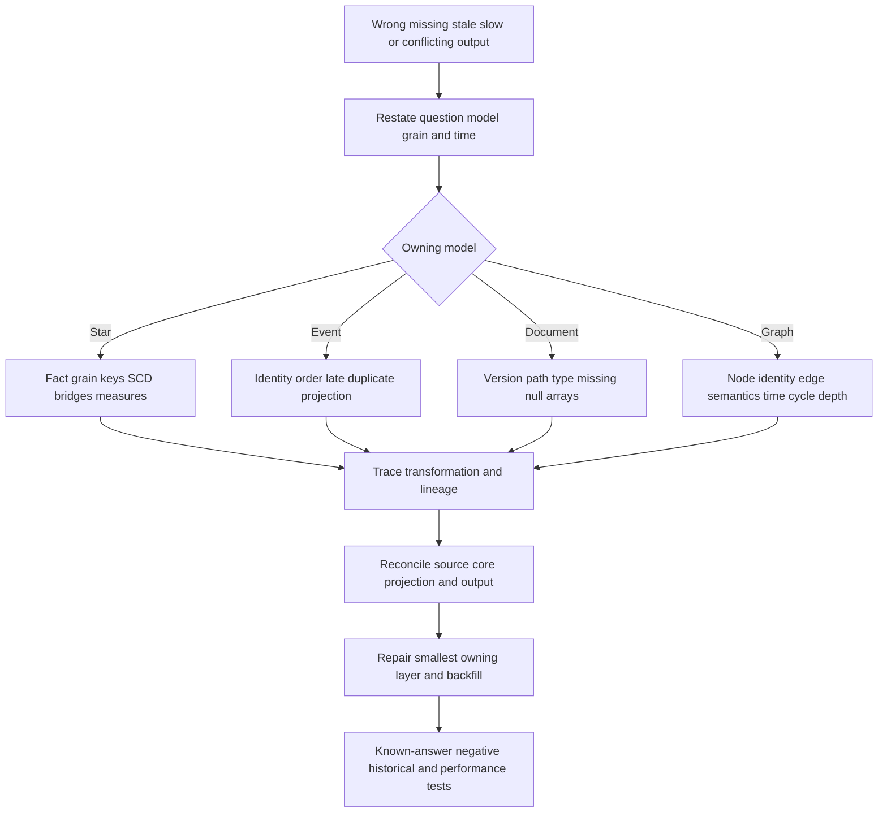

| Symptom | Model hypothesis | First discriminating check |
|---|---|---|
| Power BI total exceeds SQL | Bridge/bidirectional/mixed grain | Compare fact keys before and after each relation |
| Historical business unit changes | Type 1/current-key join | Inspect fact surrogate key and SCD interval |
| Facts disappear | Late/unresolved dimension inner join | Count unknown/missing dimension lookups |
| Daily backlog grows impossibly | Snapshots summed across dates | Filter one date and inspect grain |
| JSON severity null after source release | Path/type/schema version drift | Compare raw payload versions and rejection profile |
| Graph path crosses retired asset | Edge validity ignored | Re-run all edges at one evaluation instant |
| Path count explodes | Cycle/high-degree edge/unbounded type | Add edge allowlist, cycle test, depth limit |
| Current state regresses | Out-of-order event applied by arrival | Compare event, source update, ingest, and sequence |
| Two reports disagree | Non-conformed dimension/metric | Compare business keys, SCD policy, formula version |
| Dashboard is slow | Wide fact, snowflake chains, high cardinality, measure/relationship issue | Use model/query diagnostics with representative filters |

### End-to-end model troubleshooting runbook

1. Protect customers: pause unsafe automated decisions and minimize exposed evidence.
2. State expected/actual result, report/query, role, filters, snapshot, and UTC timeline.
3. Name the model that directly owns the failing question.
4. Write the fact/event/document/edge grain in one sentence.
5. Trace one authorized known record from source through every projection.
6. Reconcile counts and identities at landing, core, fact/event/graph, and semantic layers.
7. For star models, inspect surrogate lookup, SCD intervals, unknown members, bridge fanout, and measure denominator.
8. For events, inspect event ID, sequence, event/source/ingest time, duplicates, late arrivals, and projection checkpoint.
9. For documents, inspect schema version, required path/type, JSON null/missing, array grain, extraction errors, and raw fidelity.
10. For graphs, inspect node resolution, edge verb/direction/source/time/confidence, allowlist, cycles, and depth.
11. Compare last-known-good contract, transformation, dimension, model, and report versions.
12. Run one discriminating synthetic test that separates the top hypotheses.
13. Repair the smallest owning layer with version, review, rollback, and affected-scope estimate.
14. Backfill/replay idempotently and suppress unintended external side effects.
15. Validate positive, negative, boundary, historical, privacy/access, total, and performance cases.
16. Correct affected dashboards, tickets, decisions, and communications where necessary.
17. Add contract, quality, conformance, cycle, fanout, and known-answer regression tests.

## Your experience bridge to modeling

| Demonstrated strength | Model application | Boundary |
|---|---|---|
| Power BI and business analytics | Star schemas, role dimensions, explicit measures, drill paths | Security measure semantics need owner approval |
| SQL/PostgreSQL | Transform, reconcile, test JSON, recursive CTE, and fact grains | Platform/version behavior must be verified |
| M365 troubleshooting | Combine event sequence, current state, nested evidence, and dependencies | M365 object model is not a security graph |
| Case/backlog analysis | Periodic snapshots, aging, owner and lifecycle facts | Case severity is not risk |
| RCA | Trace model projection defects and affected decisions | Data correlation alone is not root cause |
| Customer communication | Explain why reports differ and what decision is safe | Avoid vendor implementation claims |

### 30-second interview bridge

"I select a data model from the decision verb. For repeated counts and trends, I declare a fact grain and use conformed dimensions and explicit measures. For sequence and replay, I preserve events. For flexible nested source evidence, I use versioned documents with typed extraction. For multi-hop dependency or exposure questions, I use typed temporal graph edges and bounded paths. My Power BI, SQL, PostgreSQL, and troubleshooting background transfers directly. The NMH models are synthetic, and I would verify actual Zscaler and customer schemas, product capabilities, contracts, and workload evidence before production recommendations."

## Labs and rehearsal

Use only authorized nonproduction infrastructure and synthetic data. Do not import customer logs, vulnerabilities, personal data, credentials, tokens, or proprietary product schemas.

### Lab 1 - Model by verb

Take 20 NMH questions and label the dominant verb: update, count, reconstruct, preserve, or traverse. Choose a primary model and explain why alternatives are weaker.

### Lab 2 - Fact grain workshop

Design finding-event, finding-daily, control-observation, authentication-event, and ticket-lifecycle facts. State dimensions, measures, and duplicate test for each.

### Lab 3 - Measure classification

Classify 25 measures as additive, semi-additive, non-additive, derived, distinct-count, or weighted. Create a wrong total and repair it from numerator/denominator.

### Lab 4 - SCD simulation

Load one asset that changes business unit and criticality. Apply Type 1 to a typo and Type 2 to analytical history. Resolve facts before and after the change to different surrogate versions.

### Lab 5 - Conformed dimension test

Build finding and control facts sharing date and asset dimensions. Create a conflicting asset definition, show the broken comparison, and define the conformance contract.

### Lab 6 - Bridge fanout

Map one asset to two apps and one finding to two tickets. Calculate grouped rows, distinct facts, and optional allocation. Explain the grand-total rule.

### Lab 7 - Event projection

Create open, assigned, closed, late-reopen, and duplicate events. Derive current state idempotently, checkpoint, replay, and prove external actions are not repeated.

### Lab 8 - JSON document

Store synthetic documents as `json` and `jsonb` in an isolated PostgreSQL lab. Test missing keys, JSON null, SQL null, array expansion, containment, strict/lax paths, and one measured GIN hypothesis.

### Lab 9 - Graph traversal

Create ten nodes and twelve typed edges including a cycle, expired edge, low-confidence edge, and two paths to a critical app. Traverse with an allowlist, time instant, cycle detection, and depth bound.

### Lab 10 - Hybrid reconciliation

Trace one source finding through raw document, event, relational core, daily fact, graph edge, Power BI measure, ticket, and verification. Reconcile identity and time at every handoff.

### Lab 11 - Power BI semantic model

Build a small star from the NMH DDL, use explicit measures, add snapshot and role-playing dates, hide technical keys, show freshness/quality, and test bridge totals and an unknown member.

### Lab 12 - Customer architecture review

Present a hybrid architecture with workload, guarantee, privacy, retention, cost, owner, failure mode, and exit criteria for every model. Clearly separate public Zscaler context from proposed customer design.

| Lab evidence | Completion standard |
|---|---|
| Safety | Authorized, synthetic, isolated, minimized |
| Grain | One-row or one-event/edge/document meaning stated |
| Keys | Business, surrogate, source, and version identities visible |
| Time | Event, observation, ingest, effective, snapshot, and correction rules |
| Correctness | Known-answer, duplicate, fanout, unknown, cycle, and late-data tests |
| Performance | Hypothesis measured at representative synthetic scale |
| Governance | Source, owner, quality, privacy, retention, and lineage |
| Honesty | No unsupported product architecture or customer outcome claim |

## Common misconceptions to correct

| Misconception | Correct model |
|---|---|
| One data model should hold everything | Assign models to workload verbs and integrate them deliberately |
| A fact is any big table | It records one process at one consistent declared grain |
| A dimension is just a lookup | It carries descriptive context, identity, hierarchy, and history policy |
| Measures can always be summed | Semi-additive and non-additive measures need specific rules |
| Daily snapshots are events | They repeat state at intervals |
| Type 2 versions the entity itself | It versions a dimension member's descriptive state |
| Current dimension key is good enough | It rewrites historical facts |
| Every changing attribute needs Type 2 | Use attribute-level analytical requirements |
| A bridge solves double counting automatically | Measures still need distinct or allocation rules |
| Snowflake is always more normalized and better | BI usability and filter paths may favor flattened dimensions |
| JSON has no schema | Structure and meaning still require contracts and validation |
| JSON null equals SQL null or missing | They are distinct states |
| `jsonb` preserves exact source text | It does not preserve whitespace, key order, or duplicate keys |
| Graphs discover truth from relationships | Edges need source, verb, direction, time, and confidence |
| Any graph path is an attack path | Traversable edge semantics and evidence must support the claim |
| Recursive SQL cannot query graphs | It can traverse edge lists, with cycle and depth controls |
| Event arrival order equals occurrence order | Preserve event/source/ingest times and sequence rules |
| Replay is harmless | Non-idempotent projections/actions can duplicate effects |
| Power BI relationships fix bad grain | The semantic layer amplifies upstream modeling choices |
| This hybrid describes Zscaler internals | It is a vendor-neutral synthetic teaching design |

## Official Source Anchors

Sources in this section were reviewed on **2026-08-24**.

Microsoft guidance establishes Power BI star-schema concepts and explicitly notes that optimal design includes judgment. PostgreSQL documentation establishes current JSON and recursive-query behavior for its current documentation version. NIST SP 800-92 is a 2006 log-management guide and is used only as historical, technology-neutral context; current architecture and newer controls govern. DAMA is non-prescriptive. Zscaler's page supplies public positioning only.

| Source | URL | Used for | Boundary |
|---|---|---|---|
| Microsoft Power BI star schema guidance | https://learn.microsoft.com/en-us/power-bi/guidance/star-schema | Facts, dimensions, grain, measures, surrogate keys, snowflake, SCD, role dates, factless bridges | Not a complete dimensional-modeling text; current Power BI behavior governs |
| PostgreSQL JSON Types | https://www.postgresql.org/docs/current/datatype-json.html | `json`/`jsonb`, document design, duplicate keys, concurrency, containment, indexing | Version-specific; JSON is not automatically a document database architecture |
| PostgreSQL JSON Functions | https://www.postgresql.org/docs/current/functions-json.html | Extraction, creation, paths, strict/lax behavior, JSON_TABLE | SQL/JSON and PostgreSQL extensions differ |
| PostgreSQL WITH Queries | https://www.postgresql.org/docs/current/queries-with.html | Recursive traversal, search order, cycle handling, materialization | Relational traversal performance must be measured |
| PostgreSQL Table Expressions | https://www.postgresql.org/docs/current/queries-table-expressions.html | Joins, grouping, table functions, window processing | Query behavior is PostgreSQL-version specific |
| NIST SP 800-92 | https://csrc.nist.gov/pubs/sp/800/92/final | Historical vendor-neutral log-management context | Published 2006; not a current event-schema/product architecture |
| NIST Cybersecurity Framework 2.0 | https://www.nist.gov/cyberframework | Cybersecurity outcome and risk-management context | Not a data model or implementation guide |
| DAMA-DMBOK overview | https://www.dama.org/cpages/body-of-knowledge | General modeling, architecture, integration, quality, and governance context | Non-prescriptive, not a regulation or product manual |
| Zscaler Data Fabric | https://www.zscaler.com/products-and-solutions/data-fabric | Public data unification, context, logic, workflow, and reporting positioning | No internal storage, graph, schema, connector, latency, or performance claim |

## Likely Interview Questions

### Q1. What is the difference between a fact and a dimension?

**Model answer:** A fact records an observation, event, transaction, relationship, or snapshot at a declared grain and contains dimension keys plus optional measures. A dimension describes the entities and context used to filter or group facts, such as asset, owner, vulnerability, source, or date. I declare fact grain before choosing keys or measures and keep dimensions governed and conformed where facts must be compared.

### Q2. How do you choose a fact table grain and measure behavior?

**Model answer:** I write one complete sentence for one row, including entity/event and time. Then I identify dimensions and classify each measure as additive, semi-additive, non-additive, derived, distinct-count, or weighted. I create duplicate-grain, bridge-fanout, snapshot-total, and denominator tests. If two processes or grains differ, I use separate facts rather than a type flag in one table.

### Q3. Explain slowly changing dimensions and when you would use Type 2.

**Model answer:** Type 0 preserves original values, Type 1 overwrites history, Type 2 creates a surrogate-keyed version with effective dates, and Type 3 keeps limited prior/current values. I use Type 2 when historical facts must retain attributes effective at fact time, such as asset business unit or criticality. The load expires the old version, inserts the new one, prevents interval overlap, and performs fact-time surrogate lookup.

### Q4. What problem do conformed dimensions and bridges solve?

**Model answer:** Conformed dimensions give multiple facts the same identity, attributes, history, unknown handling, and governance, so measures compare under one ruler. Bridges represent many-to-many membership explicitly. A bridge does not automatically solve totals: I define whether measures use distinct counts, repeated membership, or governed allocation and test one entity belonging to several groups.

### Q5. When would you choose an event model or a document model?

**Model answer:** I choose events when sequence, replay, transition history, and state reconstruction matter. I choose a document when a bounded aggregate has nested or source-variable context commonly processed together. Events need identity, ordering, late/duplicate handling, and idempotent projections. Documents still need versioned contracts, predictable structure, bounded size, sensitive-data controls, and typed extraction for governed analytics.

### Q6. When is a graph model useful, and what makes a path trustworthy?

**Model answer:** Graphs are useful when multi-hop relationships such as identity-to-device-to-service-to-app or asset dependencies dominate. A trustworthy path uses resolved node identities and allowed typed, directed edges whose validity overlaps the evaluation time. Each edge has source, evidence, confidence, and semantics. I bound depth, detect cycles, distinguish absence from unknown, and never label any arbitrary connected sequence an attack path.

### Q7. How would you build a hybrid security-data architecture?

**Model answer:** I preserve authorized source fidelity in versioned landing documents, maintain append-oriented events for sequence/replay, resolve entities and relationships in a normalized core, publish conformed dimensions and declared-grain facts for analytics, project typed temporal edges for bounded path questions, and expose explicit measures through Power BI. Every transformation preserves source identity, time, lineage, quality, privacy, and reconciliation.

### Q8. How does your background transfer to these models?

**Model answer:** My SQL, PostgreSQL, statistics, Power BI, case analytics, and Microsoft troubleshooting experience gives me practical skill in grain, joins, events, time, measures, quality, dependencies, and customer explanations. I have implemented these concepts on synthetic NMH data. I do not present that as production Zscaler experience; I would validate current product docs, tenant evidence, schemas, contracts, security/privacy controls, and measured workloads with specialists.

## 30-Second Memory Hooks

| Concept | Memory hook |
|---|---|
| Model selection | Choose by verb |
| Fact | What happened at one grain |
| Dimension | Who, what, where, when labels |
| Grain | Declare before keys and measures |
| Additive | Sum safely |
| Semi-additive | Not through time |
| Non-additive | Recompute numerator and denominator |
| Star | Fact center, dimensions around |
| Snowflake | Normalized dimension branches |
| Type 1 | Overwrite history |
| Type 2 | New version key and interval |
| Conformed | One ruler across facts |
| Role date | Same calendar, different question |
| Bridge | Many-to-many crossing with total rule |
| Factless fact | Relationship/occurrence counted by rows |
| Event | Identity, sequence, replay, projection |
| Document | Bounded nested aggregate with contract |
| JSON null | Not SQL null or missing |
| Node | Entity with identity |
| Edge | Evidence with verb, direction, time |
| Path | Bounded temporally coherent route |
| Hybrid | Right map for each workload |
| Power BI | Dimensions filter, facts summarize |
| Experience bridge | Analytics transfers; product internals do not |

## Completion Checklist

- [ ] I select models from decision verbs and required guarantees.
- [ ] I can compare normalized relational, star, snowflake, event, document, and graph strengths.
- [ ] I declare a consistent fact grain in one sentence before keys and measures.
- [ ] I distinguish transaction, periodic snapshot, accumulating snapshot, factless, and aggregate facts.
- [ ] I classify additive, semi-additive, non-additive, derived, distinct-count, and weighted measures.
- [ ] I avoid summing daily snapshot states across time.
- [ ] I define dimension identity, attributes, hierarchy, unknown member, and history behavior.
- [ ] I can explain standard, date, role-playing, degenerate, junk, mini, and outrigger dimensions.
- [ ] I define conformed business keys, version keys, attributes, time, unknowns, and governance.
- [ ] I can explain star strengths and limitations for security analytics.
- [ ] I compare star and snowflake on usability, hierarchy, storage, filters, governance, and measured performance.
- [ ] I choose SCD Type 0, 1, 2, or 3 at attribute level.
- [ ] I use fact-time surrogate lookup and prevent overlapping Type 2 versions.
- [ ] I plan for late-arriving dimensions and corrections.
- [ ] I handle role-playing dates explicitly in the warehouse and Power BI.
- [ ] I use bridges for many-to-many relationships and define distinct/allocation totals.
- [ ] I can define an event envelope with identity, type, times, actor, action, target, result, source, version, and payload.
- [ ] I handle duplicate, late, out-of-order, malformed, and replayed events.
- [ ] I separate event history, current projection, periodic snapshot, and accumulating process views.
- [ ] I design JSON documents around bounded aggregates with versioned contracts.
- [ ] I distinguish `json`, `jsonb`, missing keys, JSON null, SQL null, empty arrays, and empty strings.
- [ ] I declare child grain before exploding JSON arrays.
- [ ] I understand `jsonb` source-fidelity and row-update tradeoffs.
- [ ] I define graph nodes and edges with stable ID, type, verb, direction, source, time, and confidence.
- [ ] I evaluate graph paths with edge allowlists, time coherence, cycle detection, and depth bounds.
- [ ] I distinguish missing relationship evidence from proof of no relationship.
- [ ] I can use a relational edge list and recursive CTE conceptually.
- [ ] I can assign every NMH hybrid layer a model, responsibility, authority, owner, and failure mode.
- [ ] I transform documents, events, core entities, dimensions/facts, and graphs with lineage/reconciliation.
- [ ] I can execute and explain the illustrative PostgreSQL DDL and queries using synthetic data.
- [ ] I build Power BI with clear one-to-many filters, explicit measures, role dates, and quality context.
- [ ] I test mixed grain, snapshots, SCD, unknowns, bridges, averages, JSON paths, events, graph cycles, and conformance.
- [ ] I can run the end-to-end model troubleshooting runbook.
- [ ] I can complete every lab safely with authorized synthetic data.
- [ ] I separate general model concepts, PostgreSQL/Power BI behavior, synthetic NMH evidence, and Zscaler public context.
- [ ] I can answer the eight interview prompts with mechanics, examples, tradeoffs, failure modes, and honest boundaries.

[Part 46 - SQL Fundamentals for Security and Customer Analytics](Part-46-sql-fundamentals.md)