# Part 46 - SQL Fundamentals for Security and Customer Analytics

> **Audience:** Candidates preparing for a Zscaler Security Operations Technical Success Manager role after enterprise Support Escalation Engineering.
>
> **Purpose:** Build SQL from zero through correct read-only analysis: `SELECT`, `FROM`, `WHERE`, predicates, null and three-valued logic, aliases, expressions, `CASE`, types, casts, string/date/numeric functions, `DISTINCT`, deterministic ordering and limits, grouping, aggregates, denominators, safe execution, troubleshooting, and answer-backed exercises on a synthetic NMH schema.
>
> **Scope and honesty:** Northstar Meridian Holdings, abbreviated NMH, is fictional. Every table, user, asset, finding, control observation, ticket, source, query result, threshold, and outcome is synthetic. SQL examples target PostgreSQL and use general ANSI/ISO SQL concepts where practical. They are not Zscaler schemas, queries, or production recommendations. You have SQL, PostgreSQL, Power BI, statistics, business analytics, and enterprise troubleshooting experience; direct production operation of Zscaler Data Fabric for Security remains a learning boundary.
>
> **Currency caveat:** SQL implementations, PostgreSQL versions, functions, implicit casts, null ordering, collations, query plans, permissions, customer schemas, and product capabilities change. Sources in this Part were reviewed on **2026-08-24**. Current deployed-version documentation, read-only access policy, source contracts, data classification, approved query practices, and measured plans govern production.

## Section goal

SQL is a language for describing a result, not a list of instructions for reading rows one at a time. The analyst states which source rows are eligible, how they are grouped, which expressions become output columns, how duplicates and order are handled, and how many rows are returned. The database planner chooses a physical execution strategy that preserves the required semantics.

Think of a restaurant order. `FROM` identifies the pantry or menu source. `WHERE` states which ingredients qualify. `GROUP BY` collects ingredients into dishes. `HAVING` removes dishes that do not meet a group rule. `SELECT` chooses what appears on the plate. `DISTINCT` removes identical plates. `ORDER BY` arranges them. `LIMIT` serves only the requested number. The kitchen may choose an efficient preparation order, but the promised result follows the order's meaning.

By the end, you should be able to:

| Outcome | Demonstrated capability | Proof artifact |
|---|---|---|
| Read a query | Explain written syntax and conceptual processing order | Query annotation |
| Project columns | Use `SELECT`, expressions, literals, and aliases clearly | Readable result set |
| Filter rows | Use comparison, Boolean, range, membership, pattern, and null predicates | Predicate truth table |
| Handle unknowns | Apply SQL three-valued logic and explicit null semantics | Null test pack |
| Control output | Use `DISTINCT`, `ORDER BY`, null ordering, and deterministic limits | Top-N query |
| Transform safely | Use `CASE`, string, date/time, numeric functions, and explicit casts | Derived columns |
| Aggregate correctly | Use `COUNT`, `SUM`, `AVG`, `MIN`, `MAX`, `GROUP BY`, and `HAVING` | Owner backlog summary |
| Define denominators | Publish numerator, denominator, scope, time, and exclusions | Metric contract |
| Query safely | Use read-only roles, bounded scope, transactions/timeouts, and evidence minimization | Query safety checklist |
| Troubleshoot results | Isolate grain, filter, null, type, time, duplicate, and grouping defects | SQL runbook |
| Bridge to Power BI | Align SQL grain and measures with semantic-model behavior | Reconciliation query |

```mermaid
flowchart LR
    QUESTION[Bounded security or customer question] --> GRAIN[State one input and output row grain]
    GRAIN --> SOURCE[Choose authorized tables/views]
    SOURCE --> FILTER[Define row predicates and null behavior]
    FILTER --> GROUP[Choose detail or grouping]
    GROUP --> EXPRESS[Compute selected expressions and aggregates]
    EXPRESS --> ORDER[Define deterministic output order]
    ORDER --> LIMIT[Bound result when appropriate]
    LIMIT --> VERIFY[Reconcile known cases and denominators]
    VERIFY --> EXPLAIN[Communicate result limitations and action]
```

## JD Mapping

| Role expectation | Part 46 capability | TSM artifact | experience bridge and boundary |
|---|---|---|---|
| Analyze security/customer data | Write bounded, reproducible read-only queries | Query workbook | SQL/PostgreSQL experience transfers |
| Troubleshoot complex issues | Isolate predicate, null, type, time, group, and data-quality errors | Incorrect-result runbook | Microsoft fault isolation transfers |
| Develop Data Fabric expertise | Reason about modeled data without inventing product tables | Conceptual query patterns | Product schema access remains unclaimed |
| Drive measurable outcomes | Define numerators, denominators, snapshots, and caveats | Metric catalog | Power BI/statistics transfer |
| Communicate to stakeholders | Translate SQL result into evidence and decision language | Customer analytical note | Customer communication transfers |
| Protect customer data | Use least privilege, minimization, bounded output, and approved tools | Query safety standard | Current customer policy governs |
| Recommend best practices | Use explicit types, deterministic order, readable aliases, and review | SQL review checklist | Analytics rigor transfers |
| Maintain transparency | Separate observed values, derived fields, assumptions, and product facts | Evidence legend | No unsupported Zscaler claims |

## Candidate honesty note

| Evidence class | Safe statement | Boundary |
|---|---|---|
| Production transfer | "I use SQL/PostgreSQL and Power BI to analyze operational data and explain decisions." | Does not prove access to a Zscaler product schema |
| Synthetic practice | "I wrote and tested NMH security/customer queries on fictional data." | No production security result |
| General concept | "WHERE retains rows whose predicate is true; false and unknown are removed." | Exact functions/behavior still version-specific |
| Performance hypothesis | "I would inspect a plan and representative workload before recommending optimization." | `LIMIT` or an index is not a universal safety guarantee |
| Product context | "Public Zscaler material provides high-level Data Fabric context." | No invented SQL endpoint, field, latency, or table |
| Experience boundary | "Direct Data Fabric operation is currently conceptual and lab based." | Pair with current docs, tenant evidence, and specialists |

SQL confidence comes from explaining what a query means and where it can be wrong. Memorizing syntax without null, grain, denominator, time, and access reasoning is not sufficient for customer-facing analytics.

## Beginner vocabulary and memory hooks

| Term | Plain meaning | Why it matters | Memory hook |
|---|---|---|---|
| SQL | Structured Query Language | Describes data definition, access, manipulation, and queries | Ask tables a precise question |
| Query | Request for a result set | Should be bounded and reproducible | Question in executable form |
| Result set | Rows and columns returned by a query | Has its own grain and ordering rules | Answer table |
| Clause | Named query section such as `WHERE` | Each shapes a different stage | Sentence part |
| Expression | Calculation that produces a value | Can use columns, literals, operators, functions | Formula per row/group |
| Literal | Value written directly in SQL | Type and quoting matter | Value in the sentence |
| Identifier | Name of table, column, schema, alias | Quoting/case rules differ from strings | Label, not data |
| Predicate | Expression returning true, false, or unknown | Controls filtering | Yes/no/unknown question |
| Null | Marker for missing or unknown value | Not zero, empty text, or literal `NULL` | We do not know |
| Alias | Temporary name for source/output | Improves clarity and resolves ambiguity | Name tag |
| Projection | Selection/calculation of output columns | `SELECT` defines the output shape | What appears |
| Selection/filter | Keeping rows that satisfy a predicate | `WHERE` controls population | Who qualifies |
| Distinct | Duplicate output row removal | Can hide upstream duplication | Deduplicate whole selected row |
| Sort | Ordered result according to expressions | Only `ORDER BY` guarantees output order | Arrange explicitly |
| Aggregate | One value computed from many rows | Enables count, sum, average, min, max | Many rows to one value |
| Group | Rows sharing grouping expressions | Aggregates run per group | Separate baskets |
| Denominator | Eligible population below a rate | Prevents misleading percentages | Out of how many? |
| Cast | Explicit conversion between types | Makes intent and failure visible | Change data lens |
| Collation | Rules for text comparison/sort | Affects order and matching | Dictionary rules |
| UTC | Coordinated Universal Time | Common basis for cross-system timelines | Shared clock |
| Read-only | Privilege/mode that prevents intended writes | Reduces analyst risk | Observe, do not change |

## The NMH practice surface

The examples use the synthetic tables from Parts 44-45. If those lab tables do not exist, the following minimal read model documents expected columns. Do not create it in production.

| Table | Grain | Important columns |
|---|---|---|
| `nmh_rel.asset` | One resolved synthetic asset | `asset_id`, `canonical_name`, `asset_type`, `criticality`, `lifecycle_status`, times |
| `nmh_rel.finding` | One source finding instance | `finding_id`, `asset_id`, `source_system`, severity, status, first/last/closed times |
| `nmh_rel.ticket` | One synthetic workflow ticket | `ticket_id`, external key, status, assignee, created/closed times |
| `nmh_rel.ticket_finding` | One ticket-finding relationship | Both keys, `linked_at`, reason |
| `nmh_rel.asset_control_observation` | One asset/control/source observation at a time | asset, control, state, source, observed time |
| `nmh_models.fact_finding_daily` | One finding at one UTC daily snapshot | snapshot date, dimension keys, finding key, open flag, age |

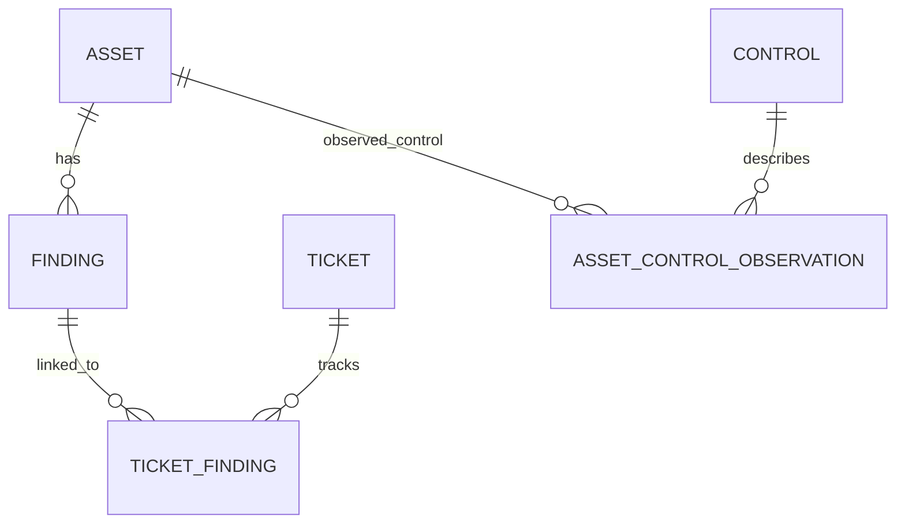

All results are illustrative. A source severity is not contextual risk, a ticket closure is not remediation proof, and absence of a control observation is not proof of no control.

## SQL written order and conceptual processing order

SQL is commonly written:

```sql
SELECT expression_list
FROM source
WHERE row_condition
GROUP BY grouping_expressions
HAVING group_condition
ORDER BY sort_expressions
LIMIT row_count;
```

Conceptually, PostgreSQL documents `WITH`, `FROM`, `WHERE`, grouping/aggregates, `HAVING`, `SELECT`, `DISTINCT`, set operations, `ORDER BY`, then `LIMIT/OFFSET`, followed by locking behavior where used. A physical plan can reorder operations when semantics permit.

| Conceptual stage | Question | Can output alias normally be used? |
|---|---|---|
| `FROM` | Which source rows/virtual table exist? | No |
| `WHERE` | Which individual rows remain? | No; output alias not created yet |
| `GROUP BY` | Which rows belong in each group? | PostgreSQL allows some output-name references; avoid ambiguity |
| Aggregate | Which group values are computed? | Within grouped expressions |
| `HAVING` | Which groups remain? | No output alias; repeat expression or use subquery/CTE |
| `SELECT` | Which output values/labels are produced? | Alias is defined here |
| `DISTINCT` | Which identical output rows are removed? | Operates on selected output |
| `ORDER BY` | In what output order? | Yes, standalone alias can be used |
| `LIMIT`/`OFFSET` | Which ordered subset returns? | After ordering conceptually |


### Plain-English deep-dive 1 - SQL is written from the answer backward

English starts with "show me" and SQL starts with `SELECT`, so beginners expect `SELECT` to happen first. Conceptually the database must know the source rows before it can calculate output expressions. It must filter rows before grouping them, and group them before calculating group aggregates.

This explains why `WHERE open_count > 10` cannot usually reference `open_count` defined as a `SELECT` alias: the alias does not exist at the row-filter stage. `HAVING COUNT(*) > 10` filters the groups after counting. A subquery or CTE can make a calculated result into an input for the next query level.

## SELECT: projection, literals, and expressions

`SELECT` defines output columns. Prefer explicit columns in durable analysis. `SELECT *` is useful for a small exploratory sample but can expose sensitive/new columns, transfer unnecessary data, change downstream shape, and make review harder.

```sql
SELECT
    a.asset_id,
    a.canonical_name AS asset_name,
    a.asset_type,
    a.criticality
FROM nmh_rel.asset AS a;
```

| Select-list item | Meaning | Example |
|---|---|---|
| Column reference | Existing source value | `a.asset_type` |
| Literal | Fixed typed/unknown value | `'synthetic'`, `42`, `DATE '2026-08-20'` |
| Arithmetic | Numeric/date calculation | `age_days + 7` |
| Function | Named computation | `lower(a.canonical_name)` |
| Conditional | Branching output | `CASE WHEN ... END` |
| Cast | Explicit type conversion | `source_value::integer` |
| Alias | Output label | `AS asset_name` |

### Table and column aliases

Use short, meaningful table aliases and always use `AS` for output aliases. After a table alias is assigned in PostgreSQL, use that alias for the source in the rest of that query level.

```sql
SELECT
    f.finding_id,
    f.status AS finding_status,
    f.first_observed_at
FROM nmh_rel.finding AS f;
```

Aliases do not rename stored columns. They label the query result and improve readability. Avoid opaque single letters when many tables participate; `finding` or `f` can be reasonable, but `x1` and `x2` hide meaning.

## FROM: source and row population

`FROM` names tables, views, functions, subqueries, or later CTEs that produce the input virtual table. Part 47 covers joins. At this stage, always state input grain and source authority.

```sql
SELECT
    f.finding_id,
    f.source_severity,
    f.status
FROM nmh_rel.finding AS f;
```

Schema qualification (`nmh_rel.finding`) prevents search-path ambiguity. An analyst also needs `SELECT` privilege on every referenced column. A view can present minimized, governed fields instead of broad base-table access.

## WHERE: filter individual rows

`WHERE` retains only rows whose predicate evaluates to true. False and unknown rows are removed. This is the central rule for null behavior.

```sql
SELECT
    f.finding_id,
    f.source_severity,
    f.first_observed_at
FROM nmh_rel.finding AS f
WHERE f.status = 'open'
  AND f.source_severity IN ('critical', 'high');
```

### Comparison and Boolean operators

| Predicate | Meaning | NMH example |
|---|---|---|
| `=` | Equal | `status = 'open'` |
| `<>` | Standard not equal | `status <> 'closed'` |
| `<`, `<=`, `>`, `>=` | Ordered comparison | `age_days >= 30` |
| `AND` | All conditions true | Open and critical |
| `OR` | At least one true; unknown rules apply | Critical or high |
| `NOT` | Negates true/false, preserves unknown | `NOT enabled` |
| `BETWEEN` | Inclusive lower and upper endpoints | `age_days BETWEEN 30 AND 59` |
| `IN` | Equal to one listed value | Severity in a set |
| `LIKE` | Pattern match using `%` and `_` | `asset_name LIKE 'nmh-lab-%'` |
| `IS NULL` | Missing/unknown marker | `closed_at IS NULL` |
| `IS DISTINCT FROM` | Null-aware inequality | Compare optional values safely |

### Operator precedence and parentheses

`NOT` binds more tightly than `AND`, and `AND` more tightly than `OR` in ordinary SQL reasoning, but explicit parentheses communicate intent and survive edits.

Wrong for the likely intent:

```sql
WHERE status = 'open'
  AND source_severity = 'critical'
   OR source_severity = 'high'
```

This includes every high-severity row, even closed ones. Write:

```sql
WHERE status = 'open'
  AND source_severity IN ('critical', 'high')
```

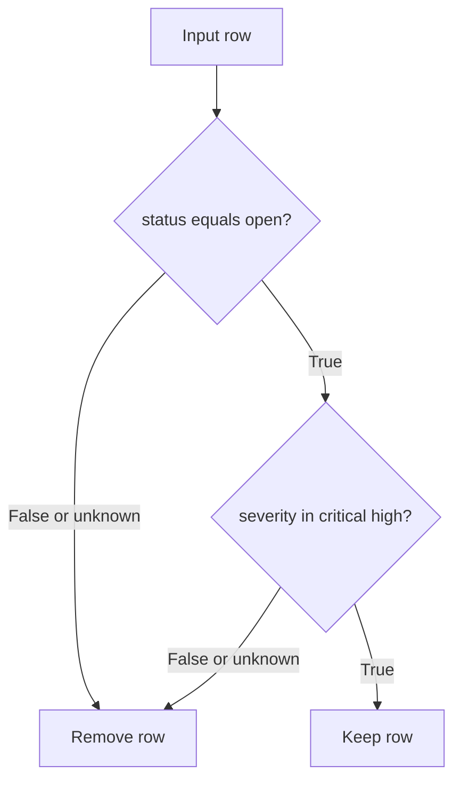

## Null and three-valued logic

Null is not zero, empty text, false, or the literal string `'NULL'`. It means a value is missing/unknown under the model. Ordinary comparisons to null return unknown. Use `IS NULL` and `IS NOT NULL`, not `= NULL` or `<> NULL`.

| Expression | Result | Reason |
|---|---|---|
| `5 = 5` | True | Values equal |
| `5 = 7` | False | Values differ |
| `5 = NULL` | Unknown | Unknown cannot be compared normally |
| `NULL = NULL` | Unknown | Two unknowns are not known equal |
| `NULL IS NULL` | True | Explicit null predicate |
| `5 IS DISTINCT FROM NULL` | True | Null-aware comparison |
| `NULL IS NOT DISTINCT FROM NULL` | True | Treats both nulls as not distinct |

### Three-valued Boolean truth

| A | B | `A AND B` | `A OR B` |
|---|---|---|---|
| True | True | True | True |
| True | False | False | True |
| True | Unknown | Unknown | True |
| False | False | False | False |
| False | Unknown | False | Unknown |
| Unknown | Unknown | Unknown | Unknown |

`NOT Unknown` remains Unknown. In `WHERE`, only True survives. Therefore `WHERE closed_at <> TIMESTAMPTZ '2026-08-20 00:00:00+00'` does not keep rows where `closed_at` is null. If null should also qualify, state it:

```sql
WHERE closed_at <> TIMESTAMPTZ '2026-08-20 00:00:00+00'
   OR closed_at IS NULL
```

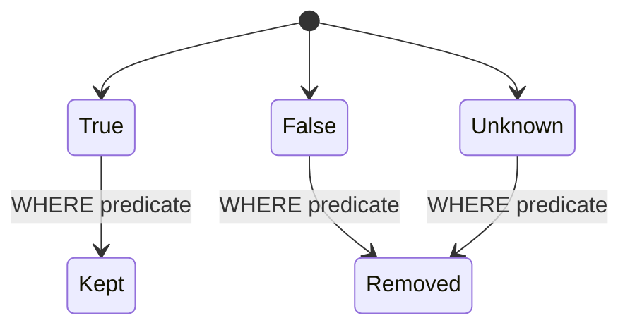

### Plain-English deep-dive 2 - Unknown does not mean false

Suppose a form asks, "Was this finding verified closed?" A blank answer does not mean no. It means the answer is absent. Treating blank as false can make an incomplete workflow look like a failed verification; treating it as true would be worse.

SQL preserves this third state. The analyst decides whether unknown belongs in the population, appears as its own category, triggers a quality warning, or blocks a decision. `COALESCE(value, false)` is not harmless cleanup; it makes a semantic claim that missing should behave as false.

## DISTINCT: duplicate output removal

`SELECT DISTINCT` removes duplicate rows after selected expressions are formed. It compares the entire selected row. It does not explain why duplicates existed.

```sql
SELECT DISTINCT
    f.source_system,
    f.source_severity
FROM nmh_rel.finding AS f
ORDER BY f.source_system, f.source_severity;
```

| Situation | Is `DISTINCT` appropriate? | Better first question |
|---|---|---|
| List allowed observed severity labels | Yes, distinct values are the goal | Are null/unknown labels included? |
| Join accidentally multiplies findings | No as a repair | Which relationship changed grain? |
| Count unique assets | Use `COUNT(DISTINCT asset_id)` deliberately | What is asset identity and time scope? |
| Get one arbitrary row per asset | No | Which row: latest, highest, or authoritative? |
| Exact duplicate source retries | Maybe after source-aware identity | Why did idempotency fail? |

PostgreSQL `DISTINCT ON` is nonstandard and requires careful `ORDER BY` to choose a predictable row. Part 47 uses window functions for portable explicit latest-row logic.

## ORDER BY, LIMIT, OFFSET, and deterministic results

Without `ORDER BY`, SQL does not guarantee row order. Disk layout, parallelism, index use, statistics, and plan changes can alter it. `LIMIT` without a unique order returns an unpredictable subset.

```sql
SELECT
    f.finding_id,
    f.source_severity,
    f.first_observed_at
FROM nmh_rel.finding AS f
WHERE f.status = 'open'
ORDER BY
    f.first_observed_at ASC,
    f.finding_id ASC
LIMIT 20;
```

The unique `finding_id` tie-breaker makes ordering deterministic when times match.

| Element | Meaning | Caveat |
|---|---|---|
| `ASC` | Ascending | Default direction |
| `DESC` | Descending | Applies only to preceding expression |
| `NULLS FIRST` | Nulls before non-null | State explicitly for portability/intent |
| `NULLS LAST` | Nulls after non-null | State explicitly where relevant |
| Multiple expressions | Later expression breaks earlier ties | Add unique final key |
| `LIMIT n` | At most n rows | Does not make an expensive query automatically safe |
| `OFFSET n` | Skip n computed rows | Large offset can be inefficient and unstable under change |
| `FETCH FIRST` | Standard-style row limit syntax | Version/database support varies |

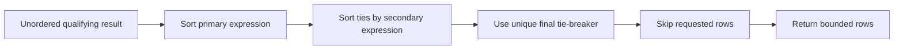

### Top-N semantics

"Top 10 oldest open findings" requires open status, a definition of age time, ascending first-observed time, deterministic tie-breaker, and scope. It does not automatically mean highest priority. Never use top-N as a substitute for complete denominator analysis.

## Data types and explicit casts

Types define representable values and operator/function behavior. Text `'10'` sorts before text `'2'` lexically, while integer `10` sorts after integer `2`. An explicit cast documents intended interpretation and can fail on malformed input rather than silently producing misleading output.

| Type family | NMH use | Caution |
|---|---|---|
| `boolean` | Enabled/open flag | Null is unknown, not false |
| `smallint`/`integer`/`bigint` | Counts/keys | Integer division truncates |
| `numeric(p,s)` | Exact rates/weights | Precision/scale and rounding policy |
| `real`/`double precision` | Approximate measurement/statistics | Floating-point approximation |
| `text`/`varchar` | Names/status/source IDs | Collation, case, whitespace, semantics |
| `date` | Calendar day | No time or zone |
| `timestamp` | Local/unspecified date-time | No time-zone context |
| `timestamptz` | Instant displayed in session zone | Original named zone not retained |
| `interval` | Duration/calendar interval | Month/day semantics differ from seconds |
| `uuid` | Synthetic stable IDs | Not ordered business meaning |
| `jsonb` | Versioned flexible payload | Missing/null/type drift and source fidelity |

### Cast syntax

ANSI-style:

```sql
CAST(source_value AS integer)
```

PostgreSQL shorthand:

```sql
source_value::integer
```

Prefer `CAST` when portability is important and `::` when local PostgreSQL style favors it. Do not cast a typed indexed column to text merely to make a predicate convenient; it can change semantics and access paths. Parse/validate staging data before curated use.

### Integer division and safe rates

In PostgreSQL, integral division truncates toward zero. Force an exact/approximate non-integral type and protect zero denominators:

```sql
SELECT
    closed_count::numeric / NULLIF(eligible_count, 0) AS closure_rate
FROM nmh_lab.metric_input;
```

`NULLIF(eligible_count, 0)` returns null for zero, avoiding division by zero and signaling an undefined rate. Do not automatically coalesce it to zero; zero percent and no eligible population are different.

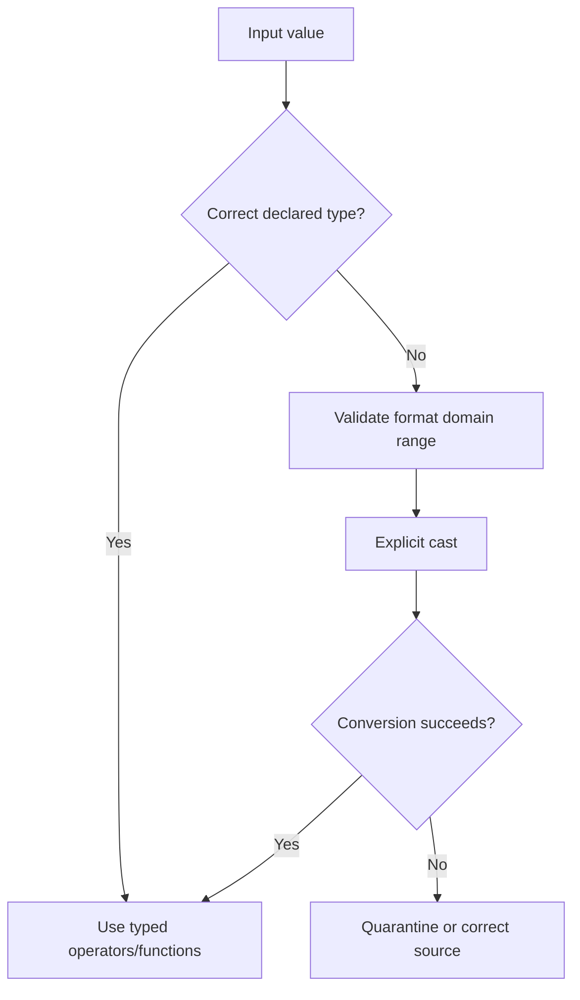

## Expressions and CASE

`CASE` produces a value based on ordered conditions. It does not update data. Conditions are evaluated in order; the first true branch supplies the result. If no condition is true and no `ELSE` exists, result is null.

```sql
SELECT
    f.finding_id,
    f.source_severity,
    CASE
        WHEN f.source_severity = 'critical' THEN 'tier_1_source_label'
        WHEN f.source_severity = 'high' THEN 'tier_2_source_label'
        WHEN f.source_severity IN ('medium', 'low') THEN 'tier_3_source_label'
        ELSE 'unmapped_source_label'
    END AS source_severity_band
FROM nmh_rel.finding AS f;
```

The alias says source label, not risk priority. Actual priority could require exploitability, reachability, asset context, controls, confidence, and policy.

| Expression | Purpose | Caveat |
|---|---|---|
| Searched `CASE` | Different Boolean conditions | First true branch wins |
| Simple `CASE value WHEN` | Equality against alternatives | Null does not equal null |
| `COALESCE(a,b,c)` | First non-null value | Substitution changes meaning |
| `NULLIF(a,b)` | Null when equal | Useful for zero denominator |
| `GREATEST`/`LEAST` | Select extreme among expressions | PostgreSQL null behavior differs from SQL standard/other DBs |

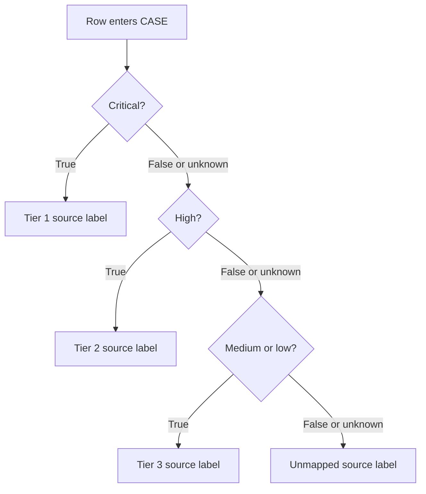

Do not encode business mappings independently in dozens of queries. Stable governed mappings belong in reference data or a semantic model with owner/version, then queries join to them.

## String functions and text caveats

| Function/operator | Example purpose | Caveat |
|---|---|---|
| `lower(text)` | Case-normalized comparison/display | Locale/collation affects behavior |
| `upper(text)` | Uppercase output | Not an identity rule |
| `trim(text)` | Remove boundary spaces | Can hide source-quality defects |
| `length(text)` | Character count | Byte count differs for multibyte text |
| `substring` | Extract a portion | Positions/regex dialect vary |
| `position` | Locate substring | Returns zero when absent |
| `text || text` | Concatenate | Null input often yields null |
| `concat_ws` | Join non-null values with separator | PostgreSQL function, portability varies |
| `LIKE` | `%` any sequence, `_` one character | Case and collation behavior matter |

```sql
SELECT
    a.asset_id,
    a.canonical_name,
    lower(trim(a.canonical_name)) AS normalized_name_for_review,
    length(a.canonical_name) AS name_character_count
FROM nmh_rel.asset AS a
WHERE lower(a.canonical_name) LIKE 'nmh-lab-%';
```

This is a review transformation, not entity resolution. Two assets with equal lowercased names can still be different, and one asset can have several names.

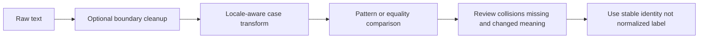

Avoid concatenating user/customer input into dynamic SQL. Use parameterized queries through the application/client API. Quoting helpers are not a replacement for parameterization and least privilege.

## Date and time functions

Security analysis depends on precise clocks. Store instants as `timestamptz` where appropriate, retain source time/offset metadata when needed, choose a reporting zone explicitly, and distinguish event, observation, ingest, processing, snapshot, due, closure, and verification time.

| Operation | PostgreSQL example | Use/caveat |
|---|---|---|
| Extract field | `EXTRACT(YEAR FROM observed_at)` | Pair ISO week with ISO year |
| Truncate | `date_trunc('day', observed_at, 'UTC')` | `timestamptz` truncation uses a zone |
| Convert display zone | `observed_at AT TIME ZONE 'America/New_York'` | Result type/meaning depends on input type |
| Difference | `last_observed_at - first_observed_at` | Returns interval; calendar semantics matter |
| Current transaction time | `CURRENT_TIMESTAMP` | Stable from transaction start in PostgreSQL |
| Current clock | `clock_timestamp()` | PostgreSQL-specific and changes during statement |
| Bin | `date_bin('15 minutes', ts, origin)` | PostgreSQL feature; stride constraints |

```sql
SELECT
    f.finding_id,
    f.first_observed_at,
    f.last_observed_at,
    f.last_observed_at - f.first_observed_at AS observed_duration,
    date_trunc('day', f.last_observed_at, 'UTC') AS last_observed_utc_day
FROM nmh_rel.finding AS f
WHERE f.last_observed_at >= TIMESTAMPTZ '2026-08-01 00:00:00+00'
  AND f.last_observed_at <  TIMESTAMPTZ '2026-09-01 00:00:00+00';
```

Use half-open intervals (`>= start AND < end`) for adjacent periods. `BETWEEN` is inclusive at both ends, so daily windows ending at midnight can double-count boundary events.

```mermaid
timeline
    title Half-open UTC reporting windows
    2026-08-01 00:00Z : August window starts inclusive
    2026-08-31 23:59Z : Events remain inside August
    2026-09-01 00:00Z : August ends exclusive and September starts inclusive
```

### Plain-English deep-dive 3 - A timestamp needs a story

"The incident happened at 9:00" is incomplete. Nine in which zone? Was it event time, source update, receipt, dashboard refresh, or analyst observation? Did the source clock drift? Was the value stored without a zone and later interpreted under a session setting?

A good query names the clock in the column/alias, uses typed literals, chooses UTC for cross-system correlation, and documents any local business calendar. Formatting a timestamp for display should not replace the underlying instant.

## Numeric functions and analytical precision

Useful numeric operations include `abs`, `round`, `floor`, `ceil`, `sqrt`, `power`, and arithmetic. Exact `numeric` is appropriate for controlled decimal precision; `double precision` is approximate and common for statistical computations. Type choice follows the question.

```sql
SELECT
    f.source_system,
    COUNT(*) AS finding_count,
    ROUND(AVG(EXTRACT(EPOCH FROM (f.last_observed_at - f.first_observed_at)) / 86400.0), 2)
        AS average_observed_days
FROM nmh_rel.finding AS f
GROUP BY f.source_system
ORDER BY f.source_system;
```

An average can hide skew and outliers. Part 49 will cover distributions, percentiles, and statistical honesty. Do not round before aggregation unless the metric definition requires it; early rounding accumulates error.

## Aggregates: many rows to one value

General aggregates include `COUNT`, `SUM`, `AVG`, `MIN`, and `MAX`. Most ignore null input values. `COUNT(*)` counts rows; `COUNT(column)` counts non-null values in that expression; `COUNT(DISTINCT column)` counts distinct non-null values.

| Aggregate | Meaning | Null behavior | Security example |
|---|---|---|---|
| `COUNT(*)` | Number of input rows | Counts rows regardless of null columns | Finding rows |
| `COUNT(column)` | Non-null values | Excludes null expression | Findings with vulnerability reference |
| `COUNT(DISTINCT x)` | Distinct non-null values | Excludes null | Affected assets |
| `SUM(x)` | Sum non-null values | Null if no input rows | Open flags in one snapshot |
| `AVG(x)` | Mean of non-null values | Null if no non-null input | Average age |
| `MIN(x)` | Minimum non-null value | Null if no non-null input | Oldest first-observed time |
| `MAX(x)` | Maximum non-null value | Null if no non-null input | Latest ingest time |

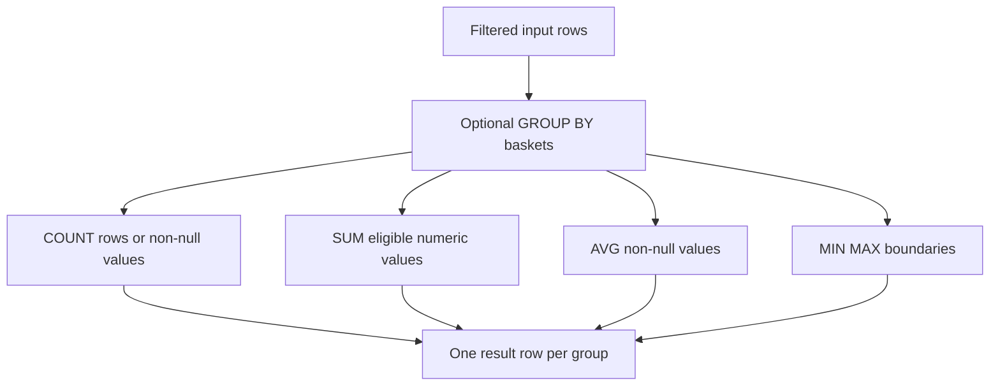

### Empty input

Except for `COUNT`, PostgreSQL general aggregates commonly return null for no input rows. `SUM` does not automatically return zero. `COALESCE(SUM(x), 0)` is appropriate only when the metric defines no eligible rows as zero total. For a rate, no denominator often means undefined, not zero percent.

## GROUP BY: one result per group

`GROUP BY` collects filtered rows sharing grouping-expression values. Every selected expression must be grouped, aggregated, or functionally dependent under supported rules.

```sql
SELECT
    f.source_system,
    f.source_severity,
    COUNT(*) AS open_finding_count,
    MIN(f.first_observed_at) AS oldest_first_observed_at,
    MAX(f.last_observed_at) AS newest_last_observed_at
FROM nmh_rel.finding AS f
WHERE f.status = 'open'
GROUP BY
    f.source_system,
    f.source_severity
ORDER BY
    f.source_system,
    open_finding_count DESC,
    f.source_severity;
```

| Clause | Scope | Can use aggregate? | Example |
|---|---|---:|---|
| `WHERE` | Individual source row before grouping | No | Open findings only |
| `GROUP BY` | Defines group keys | No ordinary aggregate in grouping expression | Source and severity |
| `SELECT` | One value per output row/group | Yes | `COUNT(*)` |
| `HAVING` | Group after aggregate | Yes | Groups with count >= 5 |
| `ORDER BY` | Final result | Yes/output alias | Count descending |


## HAVING: filter groups, not source rows

```sql
SELECT
    f.source_system,
    COUNT(*) AS open_finding_count
FROM nmh_rel.finding AS f
WHERE f.status = 'open'
GROUP BY f.source_system
HAVING COUNT(*) >= 5
ORDER BY open_finding_count DESC, f.source_system;
```

`WHERE status = 'open'` reduces rows before counting. `HAVING COUNT(*) >= 5` removes whole source groups after counting. Put row predicates in `WHERE` when semantically correct; it is clearer and often reduces work earlier.

## Numerators, denominators, and rates

A percentage is a ratio plus scope and time. "95 percent covered" is meaningless until the denominator and evidence freshness are known.

| Metric element | NMH coverage example | Required question |
|---|---|---|
| Numerator | Distinct in-scope assets with fresh effective control observation | What counts as fresh/effective? |
| Denominator | Distinct approved in-scope active assets | Which source defines in-scope? |
| Exclusions | Approved exception categories | Who authorized and until when? |
| Snapshot | 2026-08-20 00:00 UTC | Current, daily close, or event window? |
| Grain | One resolved asset | How are aliases/duplicates handled? |
| Unknowns | No recent observation | Separate from ineffective? |
| Formula | numerator / nonzero denominator | What happens when denominator is zero? |

```sql
SELECT
    COUNT(*) FILTER (WHERE lifecycle_status = 'active') AS active_asset_count,
    COUNT(*) FILTER (
        WHERE lifecycle_status = 'active'
          AND criticality = 'high'
    ) AS active_high_criticality_asset_count,
    COUNT(*) FILTER (
        WHERE lifecycle_status = 'active'
          AND criticality = 'high'
    )::numeric
        / NULLIF(COUNT(*) FILTER (WHERE lifecycle_status = 'active'), 0)
        AS active_high_criticality_share
FROM nmh_rel.asset;
```

`FILTER` on aggregates is PostgreSQL-supported and SQL-standard in modern SQL, but database support/version varies. A portable alternative uses conditional aggregation such as `SUM(CASE WHEN ... THEN 1 ELSE 0 END)`.

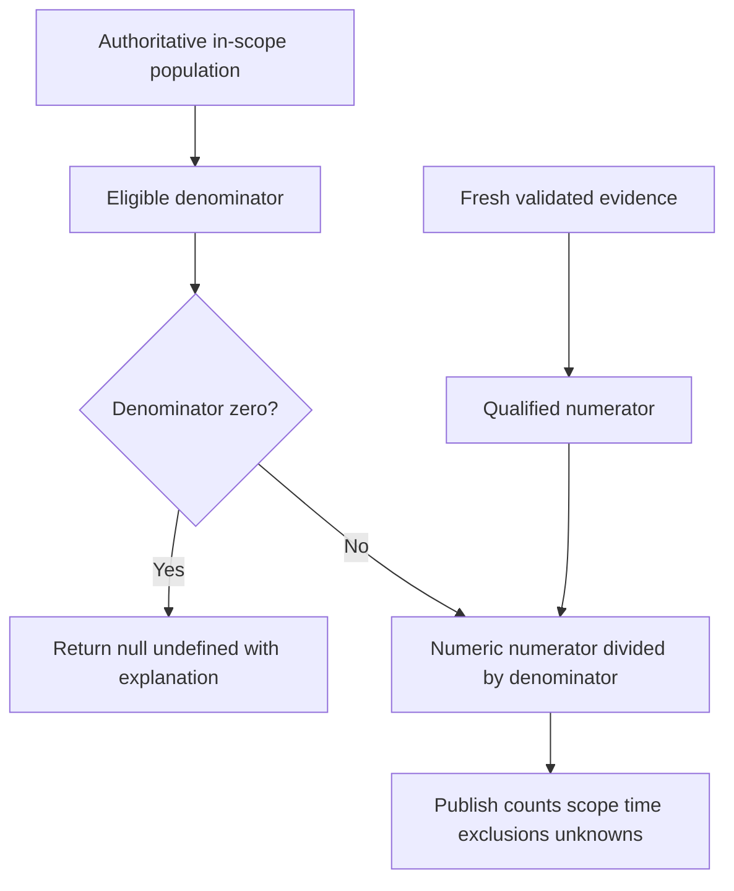

### Plain-English deep-dive 4 - Every rate has a hidden population

If 9 of 10 scanned assets have a control, coverage is 90 percent of scanned assets. If the company actually has 1,000 in-scope assets, the same numerator represents less than 1 percent enterprise coverage. The arithmetic can be correct while the decision is wrong.

Write the denominator first. Use an independent authoritative population where the metric requires it. Publish numerator and denominator beside the percentage so scope drift cannot hide behind a stable-looking rate.

## Safe read-only querying

Read-only SQL can still cause harm through resource consumption, sensitive output, lock interactions, cached exports, or misleading decisions. Safety is permissions plus query design plus operating process.

| Control | Practice | Why |
|---|---|---|
| Authorization | Use approved account, environment, purpose | Access is not permission to use everything |
| Least privilege | Read governed views/columns through read-only role | Reduce modification and disclosure risk |
| Environment | Start in synthetic/nonproduction or approved replica | Protect customer transactions |
| Scope | Filter time/population and select needed columns | Minimize scan and sensitive output |
| Bound | Explore with deterministic sample/limit after selective predicates | Prevent accidental huge client transfer |
| Timeout | Use approved statement timeout/resource governance | Avoid runaway work |
| Transaction | Use read-only transaction where appropriate | Enforce no writes for transaction |
| Explain | Use `EXPLAIN` first under policy; `ANALYZE` actually runs query | Understand plan without surprise execution |
| Privacy | Mask/minimize identifiers; avoid local uncontrolled exports | Protect people/customer data |
| Reproducibility | Record query, parameters, version, snapshot, definitions | Enable review and correction |
| Communication | Label synthetic, assumption, quality, and uncertainty | Prevent result overclaim |

```sql
BEGIN TRANSACTION READ ONLY;
SET LOCAL statement_timeout = '30s';

SELECT
    f.source_system,
    COUNT(*) AS open_finding_count
FROM nmh_rel.finding AS f
WHERE f.status = 'open'
  AND f.last_observed_at >= TIMESTAMPTZ '2026-08-01 00:00:00+00'
  AND f.last_observed_at <  TIMESTAMPTZ '2026-09-01 00:00:00+00'
GROUP BY f.source_system
ORDER BY open_finding_count DESC, f.source_system;

ROLLBACK;
```

The timeout value is illustrative, not a production recommendation. Approved settings depend on workload and platform. `ROLLBACK` ends the read-only transaction; no write was intended. A long read can still consume resources or interact with maintenance, so coordinate heavy analysis.

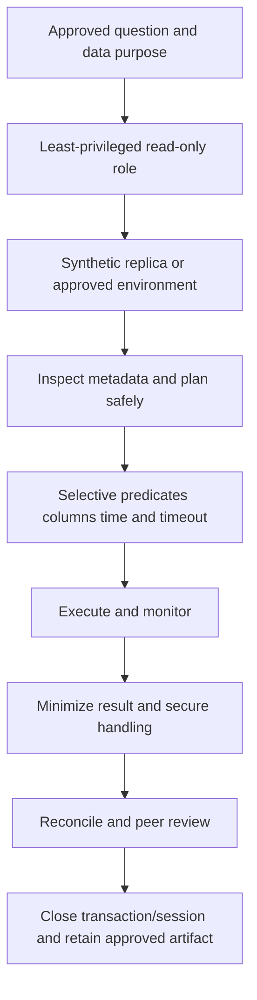

### Avoid dynamic SQL injection

When an application supplies values, use parameters rather than building a SQL string through concatenation. Values, identifiers, and SQL syntax are different. Prepared/parameterized statements let the driver transmit values separately. Dynamic identifiers require allowlists and platform-safe APIs; they cannot usually be parameterized like values.

## PostgreSQL and ANSI/ISO caveats

| Topic | General/standard concept | PostgreSQL note |
|---|---|---|
| Not equal | `<>` | `!=` accepted as alias; prefer `<>` for portability |
| Cast | `CAST(x AS type)` | `x::type` is PostgreSQL shorthand |
| Row limit | `FETCH FIRST/NEXT` in modern SQL | `LIMIT/OFFSET` common PostgreSQL-specific syntax |
| Case-insensitive pattern | No universal identical behavior | `ILIKE` is PostgreSQL extension; collation matters |
| Distinct row per group | Use window/group techniques | `DISTINCT ON` is PostgreSQL extension |
| Null extrema | Standard behavior differs | PostgreSQL `GREATEST/LEAST` ignore nulls unless all null |
| Output alias | Rules differ by clause/implementation | Alias usable in `ORDER BY`, not `WHERE`/`HAVING` |
| Functional dependency | Standard permits more cases | PostgreSQL recognizes limited primary-key case for grouping |
| Current time | Standard functions exist | PostgreSQL current timestamp is transaction-start time |
| Null sort | Implementation defaults vary | PostgreSQL default depends on ASC/DESC; state explicitly |
| Functions | Names/signatures vary | Verify current official docs |

Write portable core SQL when it does not harm clarity. When using a PostgreSQL feature, label it and explain why. Never assume a query runs identically on a SIEM query language, warehouse, Microsoft SQL Server, BigQuery, Snowflake, or a product's internal search interface.

## Mechanics, tradeoffs, and failure modes

| Mistake | Why it fails | Better pattern |
|---|---|---|
| `SELECT *` in durable report | Shape/sensitivity changes | Explicit needed columns |
| `= NULL` | Result is unknown | `IS NULL` |
| `NOT IN` with possible null list | Unknown can remove all candidates | Validate nulls; later use `NOT EXISTS` pattern |
| Missing parentheses with `AND`/`OR` | Population changes | Group business logic explicitly |
| `DISTINCT` after fanout | Hides wrong grain | Fix relationship/join and assert keys |
| `LIMIT` without order | Unpredictable subset | Unique deterministic `ORDER BY` |
| Sort without tie-breaker | Equal rows reorder | Add stable unique key |
| Text date comparison | Lexical/type ambiguity | Typed date/timestamp literals |
| Inclusive end timestamp | Adjacent windows double-count | Half-open interval |
| Integer division | Truncated rate | Cast numerator/denominator |
| Zero denominator | Runtime error or false metric | `NULLIF` plus undefined explanation |
| `COUNT(column)` assumed rows | Null values excluded | Choose `COUNT(*)` or state non-null count |
| Average of percentages | Ignores group size | Aggregate numerators/denominators |
| Null coalesced to zero | Unknown becomes observed zero | Preserve separate unknown state |
| `WHERE` used for aggregate | Aggregate not available at row stage | `HAVING` |
| `HAVING` used for simple row filter | Later, less clear processing | `WHERE` when equivalent |
| Local current date in reproducible report | Results change by run/session | Fixed as-of parameter and documented zone |
| Function on indexed predicate column | May alter access path/selectivity | Type/normalize earlier or test expression index |
| Huge offset pagination | Work grows and results shift | Keyset pattern later, deterministic key |
| Query result treated as cause | SQL shows relationship, not causality | Corroborate evidence and mechanisms |

## SQL troubleshooting runbook

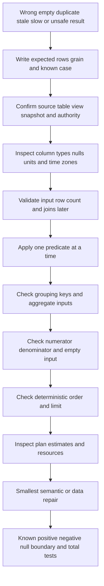

1. Restate the question, population, input/output grain, snapshot, and expected known row.
2. Confirm database, schema, table/view, environment, role, and data version.
3. Inspect metadata rather than guessing types, nullability, keys, and descriptions.
4. Start with explicit columns and a tiny authorized known-key filter.
5. Check raw values for case, spaces, enum drift, malformed types, and nulls.
6. Add each `WHERE` predicate separately and record row counts.
7. Parenthesize mixed Boolean logic and test true/false/unknown cases.
8. Compare typed times, session zone, half-open boundaries, and selected clock.
9. Before grouping, count input rows and distinct intended grain keys.
10. For every aggregate, state null behavior and empty-input behavior.
11. For every rate, publish numerator and denominator independently.
12. For duplicates, remove `DISTINCT` and locate the multiplication point.
13. For top-N, add complete deterministic `ORDER BY` before trusting rows.
14. For slowness, inspect estimated/actual plans only under policy and representative scope.
15. Check blocking, timeout, output size, and client behavior; `LIMIT` may not reduce all server work.
16. Repair the owning query/model/source, then rerun positive, negative, null, boundary, and reconciliation tests.
17. Record query, parameters, result time, data quality, assumptions, and decision limitation.

## Customer and security examples

### Open findings by source severity

```sql
SELECT
    f.source_severity,
    COUNT(*) AS open_finding_count
FROM nmh_rel.finding AS f
WHERE f.status = 'open'
GROUP BY f.source_severity
ORDER BY open_finding_count DESC, f.source_severity;
```

Interpretation: counts source finding rows, not distinct vulnerabilities, assets, or contextual risks.

### Aging bands as of a fixed time

```sql
SELECT
    CASE
        WHEN TIMESTAMPTZ '2026-08-25 00:00:00+00' - f.first_observed_at < INTERVAL '30 days'
            THEN '00-29 days'
        WHEN TIMESTAMPTZ '2026-08-25 00:00:00+00' - f.first_observed_at < INTERVAL '60 days'
            THEN '30-59 days'
        ELSE '60+ days'
    END AS age_band,
    COUNT(*) AS open_finding_count
FROM nmh_rel.finding AS f
WHERE f.status = 'open'
GROUP BY age_band
ORDER BY age_band;
```

The fixed as-of time makes the result reproducible. Ordering labels works because they include sortable numeric prefixes; a governed dimension is better for richer bands.

### Data freshness by source

```sql
SELECT
    f.source_system,
    MAX(f.last_observed_at) AS newest_source_observation,
    MAX(f.last_observed_at) < TIMESTAMPTZ '2026-08-24 00:00:00+00' AS review_as_potentially_stale
FROM nmh_rel.finding AS f
GROUP BY f.source_system
ORDER BY newest_source_observation ASC, f.source_system;
```

The Boolean flag is a synthetic review rule, not a production threshold or a claim that the whole source is unhealthy. Scope and expected cadence are still required.

### Ticket cycle summary

```sql
SELECT
    t.status,
    COUNT(*) AS ticket_count,
    AVG(t.closed_at - t.created_at) AS average_closed_cycle
FROM nmh_rel.ticket AS t
GROUP BY t.status
ORDER BY t.status;
```

For open tickets, `closed_at - created_at` is null and `AVG` ignores it. Label the measure "average cycle among rows with closure time," not average age of all tickets.

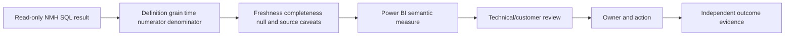

## Power BI bridge

SQL and Power BI must agree on grain, relationships, filters, and measure formulas. A SQL query can be a reconciliation oracle for a small fixed snapshot, but the semantic model's filter context may produce different results if relationships or date roles differ.

| SQL concept | Power BI bridge | Reconciliation question |
|---|---|---|
| `WHERE` | Report/page/visual filter context | Are the same rows/population eligible? |
| `GROUP BY` | Visual grouping by dimensions | Are dimension keys/relationships conformed? |
| `COUNT(*)` | Row count measure | Does bridge fanout change rows? |
| `COUNT(DISTINCT asset_id)` | Distinct-count measure | Is counting business key or SCD version key? |
| Fixed timestamp | As-of/date filter | Is Power BI using snapshot, event, or refresh date? |
| Null | Blank behavior | Are blanks replaced or excluded? |
| Rate | `DIVIDE(numerator, denominator)`-style explicit measure | Is denominator identical under filter context? |
| `ORDER BY` | Visual sort | Tie-break/display behavior may differ |

Create a tiny known-answer matrix with zero, one, duplicate, null, unknown, late, and boundary rows. Compare SQL outputs to Power BI cards, tables, totals, and filtered views. Differences are usually model/filter semantics, not cosmetic issues.

## Exercises with answers

Use only the synthetic authorized lab. Predict the result shape and null behavior before running each query.

### Exercise 1 - Projection and alias

**Task:** Return asset ID, canonical name labeled `asset_name`, type, and criticality.

**Answer:**

```sql
SELECT
    a.asset_id,
    a.canonical_name AS asset_name,
    a.asset_type,
    a.criticality
FROM nmh_rel.asset AS a;
```

### Exercise 2 - Filter open higher source severities

**Task:** Return open findings whose source severity is critical or high.

**Answer:**

```sql
SELECT
    f.finding_id,
    f.source_severity,
    f.first_observed_at
FROM nmh_rel.finding AS f
WHERE f.status = 'open'
  AND f.source_severity IN ('critical', 'high');
```

### Exercise 3 - Null-aware open workflow

**Task:** Return findings not closed, treating a null `closed_at` as eligible but without confusing it with a non-null different time.

**Answer:**

```sql
SELECT
    f.finding_id,
    f.status,
    f.closed_at
FROM nmh_rel.finding AS f
WHERE f.closed_at IS NULL;
```

The status should also be checked if source rules permit inconsistent rows. The Part 44 DDL constrains the synthetic relationship.

### Exercise 4 - Deterministic oldest ten

**Task:** Return the ten oldest open findings with stable ordering.

**Answer:**

```sql
SELECT
    f.finding_id,
    f.first_observed_at,
    f.source_severity
FROM nmh_rel.finding AS f
WHERE f.status = 'open'
ORDER BY f.first_observed_at ASC, f.finding_id ASC
LIMIT 10;
```

### Exercise 5 - Source severity band

**Task:** Map critical/high/other source labels without calling the result risk.

**Answer:**

```sql
SELECT
    f.finding_id,
    CASE
        WHEN f.source_severity = 'critical' THEN 'critical_source_label'
        WHEN f.source_severity = 'high' THEN 'high_source_label'
        ELSE 'other_or_unmapped_source_label'
    END AS source_label_band
FROM nmh_rel.finding AS f;
```

### Exercise 6 - Count rows versus non-null closures

**Task:** For each status, count ticket rows and tickets with a closure timestamp.

**Answer:**

```sql
SELECT
    t.status,
    COUNT(*) AS ticket_row_count,
    COUNT(t.closed_at) AS tickets_with_closed_at
FROM nmh_rel.ticket AS t
GROUP BY t.status
ORDER BY t.status;
```

### Exercise 7 - Filter groups

**Task:** Return source systems with at least five open finding rows.

**Answer:**

```sql
SELECT
    f.source_system,
    COUNT(*) AS open_finding_count
FROM nmh_rel.finding AS f
WHERE f.status = 'open'
GROUP BY f.source_system
HAVING COUNT(*) >= 5
ORDER BY open_finding_count DESC, f.source_system;
```

### Exercise 8 - Half-open August window

**Task:** Return findings last observed during August 2026 UTC.

**Answer:**

```sql
SELECT
    f.finding_id,
    f.last_observed_at
FROM nmh_rel.finding AS f
WHERE f.last_observed_at >= TIMESTAMPTZ '2026-08-01 00:00:00+00'
  AND f.last_observed_at <  TIMESTAMPTZ '2026-09-01 00:00:00+00'
ORDER BY f.last_observed_at, f.finding_id;
```

### Exercise 9 - Safe ratio

**Task:** Calculate closed tickets divided by all tickets, returning null for no tickets.

**Answer:**

```sql
SELECT
    COUNT(*) FILTER (WHERE t.status = 'closed')::numeric
        / NULLIF(COUNT(*), 0) AS closed_ticket_share
FROM nmh_rel.ticket AS t;
```

### Exercise 10 - Explain an incorrect result

**Task:** Why does `WHERE source_severity <> 'critical'` omit null severities?

**Answer:** Ordinary comparison with null returns unknown; `WHERE` keeps only true. If null should be reported separately, use an explicit condition such as `source_severity <> 'critical' OR source_severity IS NULL`, preferably with a separate category rather than merging unknown into noncritical.

### Exercise 11 - Reconcile SQL and Power BI

**Task:** Define a fixed query for open findings by source at one daily snapshot.

**Answer:**

```sql
SELECT
    s.source_name,
    SUM(f.open_flag) AS open_finding_count
FROM nmh_models.fact_finding_daily AS f
JOIN nmh_models.dim_source AS s ON s.source_key = f.source_key
WHERE f.snapshot_date_key = 20260820
GROUP BY s.source_name
ORDER BY open_finding_count DESC, s.source_name;
```

This preview uses a join, covered formally in Part 47. Power BI must use the same snapshot and source relationship.

### Exercise 12 - Review query safety

**Task:** Before executing an unfamiliar customer query, list the minimum safety checks.

**Answer:** Confirm authorized purpose, environment, read-only role/view, classification, expected grain/volume, selective time/key filters, explicit columns, timeout/resource policy, plan-inspection policy, secure output handling, reproducibility metadata, and an owner/escalation path. Start on synthetic or approved replica data and never paste customer data into unapproved tools.

## Labs and rehearsal

### Lab 1 - Clause annotation

Annotate 20 queries with written and conceptual order. Predict where each alias becomes available.

### Lab 2 - Predicate truth pack

Create synthetic true, false, and null rows. Evaluate comparisons, `AND`, `OR`, `NOT`, `IN`, `BETWEEN`, `LIKE`, `IS NULL`, and `IS DISTINCT FROM`.

### Lab 3 - Type and cast pack

Compare text and integer sorting, integer and numeric division, valid/invalid timestamp casts, UUID casts, and null casts. Record failures rather than suppressing them.

### Lab 4 - Deterministic top-N

Create equal timestamps and show unstable conceptual order without a key. Add explicit null placement and unique tie-breaker.

### Lab 5 - String review

Profile case, trim, length, empty string, and null. Demonstrate why normalized name is not entity identity.

### Lab 6 - Time boundaries

Test UTC half-open days/months, local display zones, DST transition examples, transaction/current clock differences, and ISO week/year.

### Lab 7 - Aggregate nulls

Compare `COUNT(*)`, `COUNT(column)`, distinct count, sum/average with nulls, and empty-input behavior.

### Lab 8 - Denominator challenge

Build scanner-observed and independently in-scope populations. Show two valid arithmetic rates that answer different questions.

### Lab 9 - Read-only safety

Use an authorized lab read-only transaction, local timeout, explicit columns, fixed window, deterministic order, and rollback. Capture no sensitive data.

### Lab 10 - Incorrect query clinic

Repair 15 defects: null comparison, precedence, text time, inclusive end, integer division, fanout hidden by distinct, missing group, wrong having, average-of-averages, and unstable limit.

### Lab 11 - Power BI reconciliation

Create a fixed SQL result and reproduce it with explicit Power BI measures. Test blank, zero denominator, unknown member, and filter context.

### Lab 12 - TSM explanation

Explain one result in two minutes: question, source, grain, time, predicate, numerator/denominator, quality, limitation, recommendation, owner, and validation.

| Lab evidence | Completion standard |
|---|---|
| Safety | Authorized, synthetic, read-only, minimized |
| Query | Formatted, schema-qualified, explicit columns and aliases |
| Semantics | Grain, types, nulls, time, filters, and order stated |
| Metric | Numerator, denominator, exclusions, snapshot, unknowns |
| Correctness | Positive, negative, null, duplicate, boundary, empty tests |
| Performance | Bounded and plan-aware under approved process |
| Reproducibility | Query, version, parameters, as-of time, result hash/count |
| Communication | Fact, derivation, assumption, and boundary separated |

## Common misconceptions to correct

| Misconception | Correct model |
|---|---|
| SQL executes top to bottom as written | Conceptual and physical processing differ |
| `SELECT` happens first | Source/filter/group stages logically precede output |
| Null means zero or false | Null represents missing/unknown under the model |
| `NULL = NULL` is true | Ordinary comparison returns unknown |
| `WHERE` keeps not-false rows | It keeps only true; false and unknown are removed |
| `COUNT(column)` counts rows | It counts non-null expression values |
| `DISTINCT` fixes duplicates | It may hide a grain/join defect |
| Table order is stable | Only explicit `ORDER BY` guarantees output order |
| `LIMIT 10` returns the same ten | Not without a deterministic unique order |
| A row limit guarantees cheap execution | Server may still scan/sort substantial data |
| `BETWEEN` is ideal for date windows | Inclusive end can overlap adjacent periods |
| Integer division returns a decimal | PostgreSQL integral division truncates |
| Zero denominator means zero percent | It often means undefined/no eligible population |
| Average percentages can be averaged | Recompute aggregate numerator/denominator |
| `COALESCE` is harmless formatting | It changes missing-value semantics |
| Current timestamp is always the live clock | PostgreSQL standard current timestamp is transaction-start time |
| Lowercased hostname is an asset identity | It is only a transformed label |
| Read-only queries cannot cause harm | They can consume resources or expose/mislead with data |
| SQL result proves cause | It answers a defined data question, not causality by itself |
| These examples are Zscaler queries | They are synthetic PostgreSQL teaching queries |

## Official Source Anchors

Sources in this section were reviewed on **2026-08-24**.

PostgreSQL documentation establishes behavior for the current documentation version. ANSI/ISO SQL provides the general conceptual baseline, but dialects differ. This Part uses documented PostgreSQL extensions only when labeled. NIST and DAMA provide governance context, not query syntax. Zscaler's public Data Fabric page does not expose or guarantee the SQL interface assumed by these labs.

| Source | URL | Used for | Boundary |
|---|---|---|---|
| PostgreSQL SELECT | https://www.postgresql.org/docs/current/sql-select.html | Conceptual processing, aliases, distinct, grouping, ordering, limits, compatibility | Version-specific extensions and behavior |
| PostgreSQL Select Lists | https://www.postgresql.org/docs/current/queries-select-lists.html | Projection, labels, expressions, DISTINCT | `DISTINCT ON` is nonstandard |
| PostgreSQL Sorting | https://www.postgresql.org/docs/current/queries-order.html | Explicit ordering, ties, null placement, output aliases | Collation and type operator classes matter |
| PostgreSQL LIMIT/OFFSET | https://www.postgresql.org/docs/current/queries-limit.html | Unpredictable subsets without order and offset cost | `LIMIT` syntax is PostgreSQL-specific |
| PostgreSQL Comparison | https://www.postgresql.org/docs/current/functions-comparison.html | Operators, null-aware predicates, three-valued comparisons | Row-valued and settings details need current docs |
| PostgreSQL Conditional Expressions | https://www.postgresql.org/docs/current/functions-conditional.html | CASE, COALESCE, NULLIF, GREATEST, LEAST | Null behavior can differ from standard/other systems |
| PostgreSQL Aggregate Functions | https://www.postgresql.org/docs/current/functions-aggregate.html | Count/sum/avg/min/max and null/empty behavior | Function availability/version differs |
| PostgreSQL Table Expressions | https://www.postgresql.org/docs/current/queries-table-expressions.html | FROM, WHERE, GROUP BY, HAVING pipeline | Joins and advanced grouping continue later |
| PostgreSQL Type Conversion | https://www.postgresql.org/docs/current/typeconv.html | Implicit/explicit conversion context | Explicit intent still required |
| PostgreSQL String Functions | https://www.postgresql.org/docs/current/functions-string.html | Text functions, locale/encoding caveats | Portability varies |
| PostgreSQL Date/Time Functions | https://www.postgresql.org/docs/current/functions-datetime.html | Extract, truncation, time zones, current-time semantics | Session zone/DST/version matter |
| PostgreSQL Mathematical Functions | https://www.postgresql.org/docs/current/functions-math.html | Numeric operators, integer division, rounding | Approximate behavior/platform can vary |
| NIST Privacy Framework | https://www.nist.gov/privacy-framework | Purpose, minimization, and privacy-risk context | Not query guidance or legal advice |
| Zscaler Data Fabric | https://www.zscaler.com/products-and-solutions/data-fabric | Public high-level data context | No SQL schema/interface/performance claim |

## Likely Interview Questions

### Q1. What is the conceptual processing order of a SELECT query?

**Model answer:** I think in this order: optional `WITH`, `FROM`, `WHERE`, `GROUP BY` and aggregates, `HAVING`, `SELECT`, `DISTINCT`, set operations, `ORDER BY`, then `LIMIT/OFFSET` or `FETCH`. That explains why a select alias is generally unavailable in `WHERE` or `HAVING` but can be used in `ORDER BY`. The optimizer can choose a different physical plan while preserving semantics.

### Q2. How does SQL null affect filtering?

**Model answer:** Ordinary comparisons with null return unknown, creating three-valued logic. `WHERE` keeps only true, so false and unknown rows are removed. I use `IS NULL`, `IS NOT NULL`, and where appropriate `IS DISTINCT FROM` instead of `= NULL`. I do not coalesce unknown to zero or false unless the metric's business definition explicitly requires that mapping.

### Q3. How do you make a top-N query deterministic?

**Model answer:** I define the population, then use `ORDER BY` with the intended primary sort, explicit null placement when relevant, and a stable unique final tie-breaker. Only then do I apply `LIMIT` or standard `FETCH`. Without a unique order, repeated runs or different plans can return different tied rows. I also state that top-N is a subset, not a denominator or risk model.

### Q4. What is the difference between WHERE and HAVING?

**Model answer:** `WHERE` filters individual source rows before grouping. `HAVING` filters groups after aggregate values exist. For open finding counts, `WHERE status = 'open'` defines eligible rows, `GROUP BY source_system` forms groups, and `HAVING COUNT(*) >= 5` keeps only qualifying source groups. Using the correct stage makes population and performance clearer.

### Q5. What is the difference between COUNT(*), COUNT(column), and COUNT(DISTINCT column)?

**Model answer:** `COUNT(*)` counts input rows. `COUNT(column)` counts rows where that expression is non-null. `COUNT(DISTINCT column)` counts distinct non-null values. I choose based on grain: finding rows, findings with a mapped vulnerability, or distinct affected assets are different measures. I test join fanout before counting.

### Q6. How do you calculate a trustworthy percentage?

**Model answer:** I define an authoritative population, exact numerator, denominator, exclusions, unknown handling, grain, and snapshot. I cast to a non-integral type and use `NULLIF(denominator, 0)` so no eligible population returns undefined rather than a false zero. I publish counts next to the rate and aggregate numerators/denominators rather than averaging group percentages.

### Q7. What makes a read-only security query safe?

**Model answer:** Approved purpose and environment, least-privileged read-only role/views, explicit minimized columns, selective key/time predicates, approved timeout/resource controls, plan review, deterministic bounded output, secure result handling, no unapproved exports, and reproducibility metadata. I begin with synthetic or approved replica data. Read-only prevents intended writes but does not prevent resource or disclosure harm.

### Q8. How does your background transfer to security SQL and Data Fabric work?

**Model answer:** My SQL, PostgreSQL, Power BI, statistics, enterprise support analytics, and evidence-based troubleshooting give me practical skill with grain, nulls, time, types, aggregates, denominators, quality, and customer explanation. I have rehearsed those skills on synthetic NMH security data. I do not claim a Zscaler SQL schema or production Data Fabric access; I would validate current product interfaces, tenant evidence, contracts, and specialist guidance.

## 30-Second Memory Hooks

| Concept | Memory hook |
|---|---|
| SQL | Describe the result, planner chooses the path |
| Grain | One input/output row means what? |
| SELECT | What appears |
| FROM | Where rows come from |
| WHERE | Keep only true rows |
| Null | Unknown, not zero |
| Three-valued logic | True, false, unknown |
| DISTINCT | Duplicate selected rows, not root-cause repair |
| ORDER BY | Only order guarantee |
| LIMIT | Bound after unique order |
| Alias | Output name exists late |
| Cast | Make type intent explicit |
| CASE | First true branch wins |
| String cleanup | Label transform, not identity |
| Time | Name clock, zone, and boundary |
| Half-open window | Start inclusive, end exclusive |
| COUNT(*) | Rows |
| COUNT(column) | Non-null values |
| GROUP BY | One basket per key combination |
| HAVING | Filter baskets |
| Rate | Numerator out of named denominator |
| Zero denominator | Undefined, not automatically zero |
| Read-only | Least privilege plus resource/privacy discipline |
| Power BI | Reconcile filter context to SQL population |
| Experience bridge | SQL depth transfers; product schema claims do not |

## Completion Checklist

- [ ] I can explain SQL as a declarative result language.
- [ ] I state input/output grain, source authority, snapshot, and question first.
- [ ] I can recite and apply the conceptual SELECT processing order.
- [ ] I understand why output aliases are unavailable in WHERE/HAVING.
- [ ] I use schema-qualified sources and explicit durable select lists.
- [ ] I can use literals, identifiers, expressions, functions, casts, and aliases correctly.
- [ ] I use comparison, Boolean, range, membership, pattern, and null predicates.
- [ ] I parenthesize mixed AND/OR logic and test counterexamples.
- [ ] I can construct three-valued truth tables.
- [ ] I never compare a value to null with ordinary equality.
- [ ] I use `IS DISTINCT FROM` when null-aware comparison is intended.
- [ ] I use DISTINCT only when duplicate output values are the actual question.
- [ ] I never use DISTINCT to conceal unexplained fanout.
- [ ] I know row order is unspecified without ORDER BY.
- [ ] I add explicit null placement and a unique tie-breaker for deterministic top-N.
- [ ] I understand LIMIT does not guarantee a cheap server plan.
- [ ] I select data types according to identity, precision, time, and operations.
- [ ] I use explicit casts when conversion intent matters.
- [ ] I prevent integer division from truncating rates.
- [ ] I use CASE with ordered conditions and an explicit ELSE when appropriate.
- [ ] I treat COALESCE as a semantic decision, not cosmetic cleanup.
- [ ] I use governed mappings instead of duplicating CASE rules across reports.
- [ ] I use string functions without mistaking normalized labels for identity.
- [ ] I use parameterized values rather than concatenated dynamic SQL.
- [ ] I distinguish event, observation, ingest, processing, snapshot, close, and verify times.
- [ ] I use typed timestamp literals, explicit zones, and half-open periods.
- [ ] I understand transaction-start, statement-start, and actual clock time differences in PostgreSQL.
- [ ] I distinguish exact numeric from approximate floating types and delay rounding.
- [ ] I distinguish COUNT(*), COUNT(expression), and COUNT(DISTINCT expression).
- [ ] I know most aggregates ignore null and return null on empty input except count behavior.
- [ ] I group only at a declared consistent grain.
- [ ] I filter rows in WHERE and aggregate groups in HAVING.
- [ ] I publish numerator, denominator, exclusions, unknowns, scope, and snapshot with every rate.
- [ ] I return null/undefined for zero denominator unless an approved definition says otherwise.
- [ ] I use authorized read-only roles, minimized views, bounded scope, timeouts, and secure outputs.
- [ ] I know EXPLAIN ANALYZE executes the query and use it only under approved process.
- [ ] I can distinguish ANSI concepts from PostgreSQL extensions and implementation behavior.
- [ ] I can execute and explain every synthetic exercise and answer.
- [ ] I can reconcile fixed SQL results to Power BI filter context and measures.
- [ ] I can run the SQL troubleshooting method from expectation through plan and verification.
- [ ] I can complete every lab using only authorized synthetic data.
- [ ] I separate query evidence, analytical inference, product context, and production claims.
- [ ] I can answer the eight interview prompts with mechanics, examples, failure modes, and honest boundaries.

[Part 47 - SQL Joins, CTEs, Subqueries, Window Functions, and Set Operations](Part-47-sql-joins-ctes-window-functions.md)