# Part 47 - SQL Joins, CTEs, Subqueries, Window Functions, and Set Operations

> **Audience:** Arti Thakur, preparing for a Zscaler Security Operations Technical Success Manager role after Microsoft enterprise Support Escalation Engineering.
>
> **Purpose:** Build advanced read-only SQL reasoning for security and customer analytics: join types and grain, fanout, semi/anti joins, `EXISTS`, subqueries, common table expressions, recursive traversal, set operations, window partitions/orders/frames, ranking, lag/lead, running metrics, latest-row and deduplication patterns, cohorts, aging, trends, performance plans, and incorrect-query diagnosis.
>
> **Scope and honesty:** Northstar Meridian Holdings, abbreviated NMH, is fictional. Every user, asset, app, finding, ticket, event, cohort, query, plan, metric, and outcome is synthetic. Examples target PostgreSQL and general ANSI/ISO SQL concepts where practical. They are not Zscaler schemas, product queries, or production recommendations. Public Zscaler Data Fabric context is used only at a high level; no undocumented storage, SQL endpoint, field, graph, connector, limit, or performance claim is made. Arti's SQL, PostgreSQL, Power BI, analytics, troubleshooting, and Microsoft enterprise experience transfer; direct production Data Fabric operation remains a learning boundary.
>
> **Currency caveat:** PostgreSQL versions, optimizer behavior, CTE materialization, window features, plans, statistics, indexes, permissions, customer schemas, and product capabilities change. Sources in this Part were reviewed on **2026-08-24**. Current deployed-version documentation, approved read-only practices, representative plans, source contracts, security/privacy controls, and tenant evidence govern production.

## Section goal

Advanced SQL is mostly disciplined control of row meaning. A join can turn one asset into ten rows. A subquery can return zero, one, or many values. A window can compare a row with peers without collapsing it. A set operation can remove duplicates. A recursive CTE can follow a path forever if cycles are ignored. Every construct is safe only when grain, cardinality, null, time, and ordering are explicit.

Think of assembling customer case folders. An inner join keeps folders with matching reference records. A left join keeps every main folder and leaves missing reference fields blank. A semi join asks only whether supporting evidence exists. An anti join asks whether it does not. A window numbers or compares pages while preserving them. A set operation compares entire folder lists. A CTE gives an intermediate pile a name. If one folder has three tickets and four findings, combining both can produce twelve page pairs unless the analyst controls the grain.

By the end, Arti should be able to:

| Outcome | Demonstrated capability | Proof artifact |
|---|---|---|
| Join intentionally | Choose inner, left, right, full, cross, or self join from row-preservation needs | Join decision table |
| Predict fanout | State relationship cardinality and output grain before execution | Row-count proof |
| Test existence | Use `EXISTS`/`NOT EXISTS` for semi/anti logic and explain null behavior | Coverage-gap query |
| Structure complexity | Use subqueries and CTEs as named relational steps | Layered query |
| Traverse hierarchy | Use bounded recursive CTE concepts with cycle control | Dependency path query |
| Combine sets | Apply `UNION`, `INTERSECT`, `EXCEPT`, and `ALL` deliberately | Reconciliation query |
| Use windows | Define partition, order, peers, and frame | Window specification sheet |
| Rank and compare | Use row number, rank, lag, lead, and running metrics | Trend query |
| Select latest safely | Use deterministic tie-breakers and preserve duplicate evidence | Latest-record pattern |
| Analyze cohorts/aging | Align entry, observation, denominator, and calendar | Cohort matrix |
| Diagnose incorrect SQL | Find wrong keys, outer-filter collapse, null anti-join, fanout, frame, and plan defects | Query runbook |
| Interpret plans | Distinguish estimates, actuals, loops, scans, joins, sorts, and side effects | EXPLAIN note |

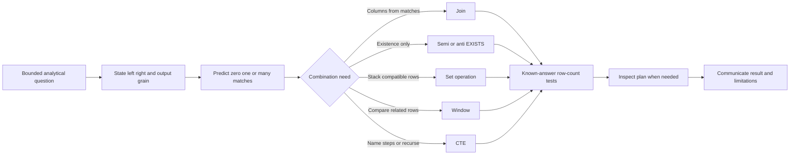

## JD Mapping

| Role expectation | Part 47 capability | TSM artifact | Arti bridge and boundary |
|---|---|---|---|
| Analyze complex customer data | Combine entities and histories without corrupting grain | Query workbook | SQL/Power BI transfer |
| Troubleshoot integrations | Find missing, duplicate, stale, and mismatched records | Reconciliation queries | Fault isolation transfer |
| Develop Data Fabric expertise | Reason about cross-source context without assuming product internals | Conceptual correlation patterns | Product schema remains unclaimed |
| Drive risk mitigation | Identify unowned/stale/gap cohorts with bounded evidence | Exception list | Workflow/analytics transfer |
| Explain trends | Use windows for change, rank, age, and running measures | Trend narrative | Statistics/BI transfer |
| Recommend best practices | Use explicit keys, deterministic order, null-safe anti logic, and plans | SQL review standard | Analytical rigor transfer |
| Protect customer operations | Use read-only roles, bounded queries, and cautious `EXPLAIN ANALYZE` | Safety checklist | Current policy governs |
| Maintain transparency | Separate query result, inference, product fact, and synthetic practice | Evidence legend | Honest communication transfer |

## Candidate honesty note

| Evidence class | Safe statement | Boundary |
|---|---|---|
| Production transfer | "I use SQL/PostgreSQL, Power BI, and cross-system evidence to diagnose operational issues." | Not proof of a Zscaler SQL/schema interface |
| Synthetic practice | "I implemented NMH join, window, cohort, and gap patterns on fictional data." | Not a customer result |
| General concept | "A semi join returns left rows based on existence without copying right rows." | Physical plan may differ |
| Performance claim | "The plan shows estimates; actual representative tests are needed." | No universal join/index recommendation |
| Public product context | "Zscaler publicly positions Data Fabric around unified/contextual data and workflows." | No internal model or query capability assertion |
| Experience boundary | "Direct production Data Fabric administration remains conceptual/lab based." | Validate current docs, tenant, contract, and specialists |

Good SQL interview answers begin with semantics and finish with validation. Saying "use a window function" is incomplete until the partition, order, frame, tie-breaker, grain, and null behavior are defined.

## Beginner vocabulary and memory hooks

| Term | Plain meaning | Why it matters | Memory hook |
|---|---|---|---|
| Join | Pair rows from two table expressions | Can add columns and multiply rows | Match and combine |
| Join key | Expression used to decide matches | Wrong scope/time creates false links | Match rule, not just same name |
| Cardinality | Number of possible matches | Predicts fanout | Zero, one, or many? |
| Fanout | One input row becomes several output rows | Inflates counts/sums | Multiplication after match |
| Inner join | Keep matching pairs only | Drops unmatched rows | Intersection of relationships |
| Left join | Keep every left row plus matching right rows | Preserves left population | Left survives |
| Full join | Keep matches plus unmatched from both | Useful for reconciliation | Both sides survive |
| Cross join | Every left row paired with every right row | Intentional grid or accidental explosion | N times M |
| Self join | Join a table to another alias of itself | Compares related rows in one entity set | Same table, two roles |
| Semi join | Keep left row when at least one match exists | Avoids right-side fanout | Does evidence exist? |
| Anti join | Keep left row when no match exists | Finds gaps/exceptions | What is missing? |
| Subquery | Query nested inside another query | Produces a value, set, or table | Question inside a question |
| Correlated subquery | Inner query references current outer row | Semantics may imply repeated evaluation | Per-outer-row question |
| CTE | Named query result for one statement | Clarifies stages and enables recursion | Temporary named step |
| Recursive CTE | CTE that refers to prior iteration | Traverses hierarchy/graph | Seed, step, stop |
| Set operation | Combines compatible query results by rows | Uses entire rows and duplicate rules | Stack/overlap/subtract |
| Window | Related rows available to a current row calculation | Preserves row identity | Look around without collapsing |
| Partition | Independent group for a window | Restarts rank/calculation | Window room |
| Peer | Rows tied on window order expressions | Rank/frame behavior depends on peers | Same place in line |
| Frame | Subset of partition visible to frame-sensitive function | Controls running/rolling result | Rows in reach |
| Row number | Sequential position, ties still separate | Supports deterministic latest/dedup | Unique seat number |
| Rank | Position with gaps for ties | Preserves competition rank | 1, 2, 2, 4 |
| Lag/lead | Value from prior/next ordered row | Computes change and intervals | Look behind/ahead |
| Cohort | Population sharing an entry condition/time | Makes comparison fairer | Started together |
| EXPLAIN | Planner's estimated plan | Shows scans, joins, estimates, and costs | Map before trip |
| EXPLAIN ANALYZE | Executes and annotates actual plan | Can consume resources/cause side effects | Drive the trip |

## NMH tables and grain

| Table | Row grain | Join candidates | Risk |
|---|---|---|---|
| `nmh_rel.asset` | One resolved asset | `asset_id` | Source aliases are separate |
| `nmh_rel.finding` | One source finding instance | `asset_id`, `vulnerability_id`, `finding_id` | Many findings per asset |
| `nmh_rel.ticket` | One ticket | `ticket_id`, assignee | Many findings can share ticket |
| `nmh_rel.ticket_finding` | One ticket-finding relationship | Both keys | Many-to-many bridge |
| `nmh_rel.asset_owner_history` | One asset-owner-type-effective interval | Asset/user plus time | Several owners and historical rows |
| `nmh_rel.asset_control_observation` | One control observation per asset/source/time | Asset/control/time | Many observations per asset |
| `nmh_models.fact_finding_daily` | One finding per daily snapshot | Dimension keys, finding key, date | Semi-additive across dates |
| `nmh_models.graph_edge` | One typed temporal edge | From/to nodes | Cycles and high-degree fanout |

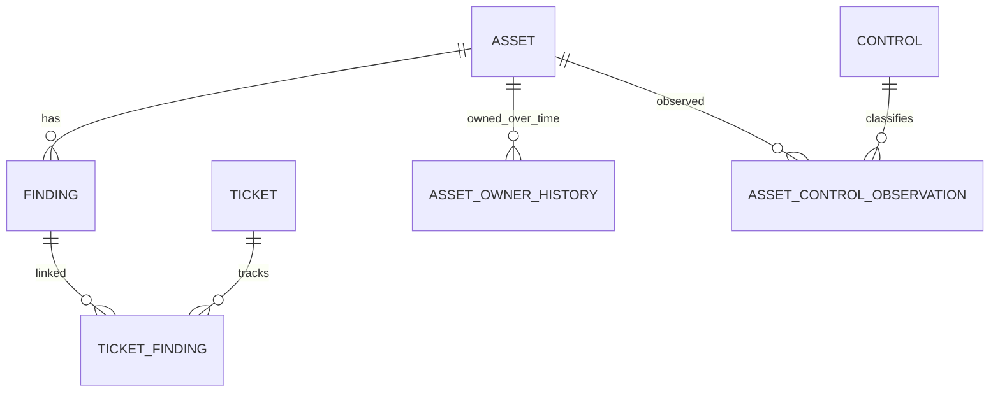

Before every join, write three sentences: one left row means, one right row means, and one output row will mean. Then predict minimum/maximum output rows for a tiny case.

## Join mechanics and output grain

Conceptually, a join considers row pairs and applies a join condition. The optimizer does not have to compare every pair; it may use nested loop, hash, merge, indexes, or other plan choices. Semantics stay the same.

| Left relationship | Right matches per left | Output effect |
|---|---:|---|
| One-to-zero/one | 0 or 1 | Inner may drop; left preserves; no match fanout |
| One-to-many | 0 to many | Left row repeats for every right match |
| Many-to-one | Exactly/at most one | Output often preserves left grain if key is valid |
| Many-to-many | Many | Pair combinations can explode |
| Temporal many | Several historical rows | Need effective-time predicate to select valid version |

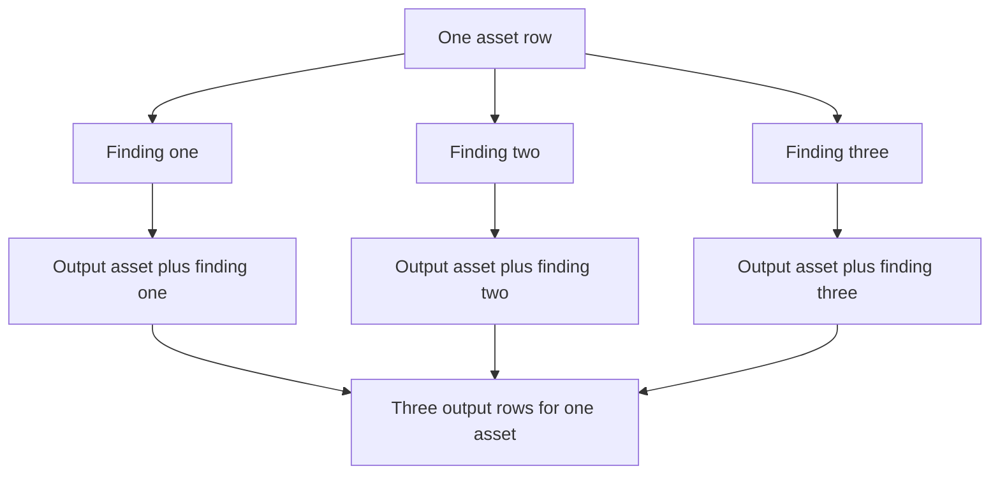

### Plain-English deep-dive 1 - A join changes the unit you are counting

If one customer order has three line items, joining order to line item produces three rows. Counting rows now counts line items-with-order-context, not orders. The order was not duplicated in reality; its columns repeat because each output row represents a different pair.

Security joins behave the same. Joining one asset to ten findings yields ten asset-finding rows. `COUNT(*)` counts findings at that grain. `COUNT(DISTINCT asset_id)` counts assets, but distinct is not a cure for every fanout; sums and further joins can remain wrong. Control grain before aggregating.

## INNER JOIN

Inner join returns one output row for each pair whose condition is true. Unmatched rows from either side disappear.

```sql
SELECT
    f.finding_id,
    f.status,
    a.asset_id,
    a.canonical_name AS asset_name,
    a.criticality
FROM nmh_rel.finding AS f
INNER JOIN nmh_rel.asset AS a
    ON a.asset_id = f.asset_id
WHERE f.status = 'open';
```

The expected relationship is many findings to one asset, so output remains one row per qualifying finding if `asset.asset_id` is unique and every curated finding has one asset. Verify constraints and row counts; do not infer from column names.

| Test | Query idea | Expected |
|---|---|---|
| Left grain | Count open distinct finding IDs before join | Baseline |
| Output grain | Count rows and distinct finding IDs after join | Equal under many-to-one |
| Right uniqueness | Group assets by `asset_id` having count > 1 | Zero due primary key |
| Orphans | Anti join findings to assets | Zero due foreign key in curated schema |
| Attributes | Inspect known finding/asset | Correct real-world mapping still needs lineage |

## LEFT, RIGHT, and FULL OUTER JOIN

Left join returns every left row. Each matching right row produces a pair; if no right match exists, right columns are null. Right join is the mirror. Full join returns matches plus unmatched rows from both sides.

### Find every asset and optional open finding count

Pre-aggregate the many side to preserve one row per asset:

```sql
SELECT
    a.asset_id,
    a.canonical_name,
    COALESCE(f.open_finding_count, 0) AS open_finding_count
FROM nmh_rel.asset AS a
LEFT JOIN (
    SELECT
        asset_id,
        COUNT(*) AS open_finding_count
    FROM nmh_rel.finding
    WHERE status = 'open'
    GROUP BY asset_id
) AS f
    ON f.asset_id = a.asset_id
ORDER BY a.asset_id;
```

The subquery produces at most one row per asset, preserving asset grain. `COALESCE` is valid because no matching open-finding group means zero open finding rows under the queried table/scope; it does not prove the source scanned the asset.

### ON versus WHERE for outer joins

These are not equivalent:

```sql
-- Preserve every asset; only open findings can match.
SELECT a.asset_id, f.finding_id
FROM nmh_rel.asset AS a
LEFT JOIN nmh_rel.finding AS f
  ON f.asset_id = a.asset_id
 AND f.status = 'open';
```

```sql
-- Removes null-extended rows and behaves like an inner match for this condition.
SELECT a.asset_id, f.finding_id
FROM nmh_rel.asset AS a
LEFT JOIN nmh_rel.finding AS f
  ON f.asset_id = a.asset_id
WHERE f.status = 'open';
```

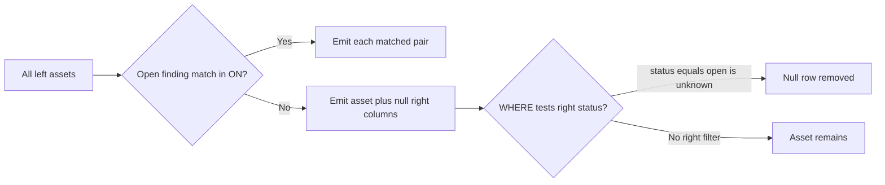

Use full outer joins for source reconciliation when both unmatched sides matter. Full joins can be harder to reason about and often work best with pre-aggregated unique keys.

| Join | Preserves unmatched left | Preserves unmatched right | Typical use |
|---|---:|---:|---|
| Inner | No | No | Enrich known matches |
| Left | Yes | No | Keep authoritative population and optional evidence |
| Right | No | Yes | Usually rewrite as left for readability |
| Full | Yes | Yes | Reconcile two source key sets |

## CROSS JOIN

Cross join returns every possible pair: N left rows times M right rows. It is useful for generating expected coverage combinations, calendars, scenario matrices, and test data. An omitted join condition can accidentally create the same explosion.

```sql
SELECT
    a.asset_id,
    c.control_id
FROM nmh_rel.asset AS a
CROSS JOIN nmh_rel.control AS c
WHERE a.lifecycle_status = 'active';
```

This creates every active-asset/control combination, which may be incorrect if controls do not apply to every asset type. Add an applicability model before calling missing observations gaps.

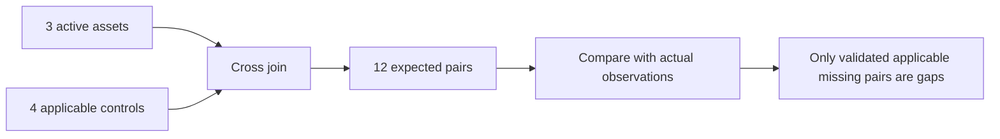

Always estimate N times M before running. A million-by-thousand cross join has a billion candidate pairs before later filtering.

## SELF JOIN

A self join uses two aliases for the same table. It can compare duplicates, parent/child tickets, overlapping periods, or related versions.

### Detect overlapping asset-owner intervals

```sql
SELECT
    left_owner.asset_id,
    left_owner.ownership_type,
    left_owner.user_account_id AS left_user,
    right_owner.user_account_id AS right_user,
    left_owner.valid_from AS left_start,
    right_owner.valid_from AS right_start
FROM nmh_rel.asset_owner_history AS left_owner
JOIN nmh_rel.asset_owner_history AS right_owner
  ON right_owner.asset_id = left_owner.asset_id
 AND right_owner.ownership_type = left_owner.ownership_type
 AND right_owner.valid_from < COALESCE(left_owner.valid_to, 'infinity'::timestamptz)
 AND left_owner.valid_from < COALESCE(right_owner.valid_to, 'infinity'::timestamptz)
 AND (left_owner.user_account_id, left_owner.valid_from)
     < (right_owner.user_account_id, right_owner.valid_from);
```

The final tuple comparison selects one orientation to avoid reporting both A-B and B-A. This is PostgreSQL-specific in details and only illustrative. A production overlap rule should use approved constraints and tested interval semantics.

## Join grain, fanout, and the fan trap

A fan trap occurs when one parent joins independently to two many-side tables. One asset with three findings and two owner rows becomes six combinations. Summing finding counts or owner allocations after that join is wrong unless the desired grain is finding-owner pair.

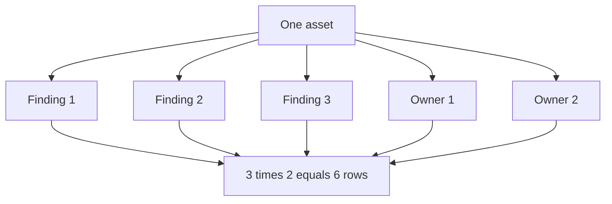

| Control pattern | When to use | Caveat |
|---|---|---|
| Pre-aggregate each many side | Need one summary row per parent | Loses child detail by design |
| Semi join with `EXISTS` | Need presence only | Cannot select right attributes |
| Separate measures/subqueries | Need independent counts | Keep filters aligned |
| Bridge at declared grain | Many-to-many is real | Define allocation/distinct totals |
| Window after correct join | Need row detail plus group values | Window cannot undo incorrect fanout |
| `COUNT(DISTINCT ...)` | Measure truly is distinct entity count | Other measures may still be multiplied |

### Fanout diagnostics

```sql
SELECT
    COUNT(*) AS output_rows,
    COUNT(DISTINCT f.finding_id) AS distinct_findings,
    COUNT(DISTINCT a.asset_id) AS distinct_assets
FROM nmh_rel.asset AS a
JOIN nmh_rel.finding AS f ON f.asset_id = a.asset_id;
```

Count rows and intended keys before and after every join. Ratios such as `output_rows / distinct_findings` expose average multiplication but can hide a few extreme entities; inspect distribution per key.

### Plain-English deep-dive 2 - DISTINCT is not an antidote to a wrong join

Imagine photocopying each invoice once per contact person and then removing visually identical pages. If contact names appear on the pages, none are identical, so duplicates remain. If names are hidden, `DISTINCT` may collapse them but also discard legitimate differences.

Fix the grain instead. Pre-aggregate contacts, select one governed current contact, use `EXISTS` if only presence matters, or keep the invoice-contact grain and calculate invoice measures separately.

## Semi joins with EXISTS

SQL has no `SEMI JOIN` keyword in ordinary PostgreSQL syntax, but `EXISTS` expresses the behavior: return a left row if at least one qualifying right row exists. Right-side multiplicity does not copy the left row.

### Assets with at least one open finding

```sql
SELECT
    a.asset_id,
    a.canonical_name
FROM nmh_rel.asset AS a
WHERE EXISTS (
    SELECT 1
    FROM nmh_rel.finding AS f
    WHERE f.asset_id = a.asset_id
      AND f.status = 'open'
)
ORDER BY a.asset_id;
```

The inner subquery is correlated because it references `a.asset_id`. `EXISTS` cares only whether any row is returned, not its selected value; `SELECT 1` is a convention.

## Anti joins with NOT EXISTS

### Active assets with no fresh control observation

```sql
SELECT
    a.asset_id,
    a.canonical_name
FROM nmh_rel.asset AS a
WHERE a.lifecycle_status = 'active'
  AND NOT EXISTS (
      SELECT 1
      FROM nmh_rel.asset_control_observation AS o
      WHERE o.asset_id = a.asset_id
        AND o.observed_at >= TIMESTAMPTZ '2026-08-24 00:00:00+00'
  )
ORDER BY a.asset_id;
```

This proves no qualifying row exists in the queried table/snapshot. It does not prove no control exists. Source scope, expected cadence, ingestion health, applicability, and entity matching must be validated before calling a control gap.

### Left anti join alternative

```sql
SELECT
    a.asset_id,
    a.canonical_name
FROM nmh_rel.asset AS a
LEFT JOIN nmh_rel.asset_control_observation AS o
  ON o.asset_id = a.asset_id
 AND o.observed_at >= TIMESTAMPTZ '2026-08-24 00:00:00+00'
WHERE a.lifecycle_status = 'active'
  AND o.asset_id IS NULL
ORDER BY a.asset_id;
```

Use a non-null right key for the null test. `NOT EXISTS` often states the intent more directly and avoids choosing a nullable test column.

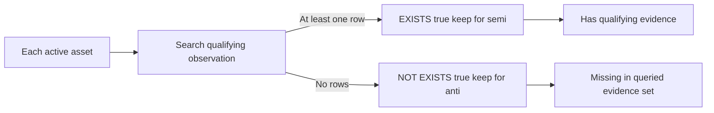

## IN and NOT IN null trap

`IN (subquery)` can express membership. `NOT IN` is dangerous when the subquery can return null. If no equal value exists but one right value is null, the comparison can be unknown rather than true, and `WHERE` removes the row.

| Left value | Right set | `IN` | `NOT IN` |
|---|---|---|---|
| 2 | 1,2,3 | True | False |
| 4 | 1,2,3 | False | True |
| 4 | 1,2,NULL | Unknown | Unknown |
| NULL | 1,2,3 | Unknown | Unknown |
| 4 | Empty set | False | True |

For anti logic, prefer correlated `NOT EXISTS` unless non-null semantics are guaranteed and obvious. If using `NOT IN`, prove the subquery column is non-null by schema and logic.

## Subqueries

A subquery can appear as a scalar expression, table expression, membership/existence test, or derived aggregation. Its shape matters.

| Subquery type | Required output | Example use | Failure mode |
|---|---|---|---|
| Scalar | Zero or one row, one column; zero becomes null | Compare to global average | More than one row errors |
| Row | Zero or one row, matching columns | Compare composite values | Null row semantics |
| Table/derived | Any rows/columns with alias | Pre-aggregate findings | Hidden grain |
| `EXISTS` | Any columns; existence only | Semi/anti join | Side effects/evaluation assumptions |
| `IN` | One compatible column | Membership | Null can yield unknown |
| Correlated | References outer row | Per-asset existence/aggregate | Can be expensive depending plan/data |

### Scalar subquery example

```sql
SELECT
    f.finding_id,
    f.first_observed_at
FROM nmh_rel.finding AS f
WHERE f.first_observed_at < (
    SELECT MIN(first_observed_at) + INTERVAL '30 days'
    FROM nmh_rel.finding
);
```

The uncorrelated aggregate subquery returns one row. Whether this is a useful security question depends on scope and data quality.

### Correlated aggregate example

```sql
SELECT
    a.asset_id,
    a.canonical_name,
    (
        SELECT COUNT(*)
        FROM nmh_rel.finding AS f
        WHERE f.asset_id = a.asset_id
          AND f.status = 'open'
    ) AS open_finding_count
FROM nmh_rel.asset AS a;
```

This is semantically clear. The optimizer may transform it or execute a subplan pattern. Pre-aggregation plus left join may be faster or easier to extend; compare plans under representative data rather than assuming.

## Common Table Expressions

A Common Table Expression, or CTE, gives a query result a name for the duration of one statement. It can clarify stages, expose grain, avoid repeated text, or support recursion. It is not automatically stored or faster.

```sql
WITH open_findings AS (
    SELECT
        finding_id,
        asset_id,
        source_system,
        first_observed_at
    FROM nmh_rel.finding
    WHERE status = 'open'
),
asset_summary AS (
    SELECT
        asset_id,
        COUNT(*) AS open_finding_count,
        MIN(first_observed_at) AS oldest_first_observed_at
    FROM open_findings
    GROUP BY asset_id
)
SELECT
    a.asset_id,
    a.canonical_name,
    s.open_finding_count,
    s.oldest_first_observed_at
FROM nmh_rel.asset AS a
JOIN asset_summary AS s ON s.asset_id = a.asset_id
ORDER BY s.open_finding_count DESC, a.asset_id;
```

| CTE benefit | Use | Caution |
|---|---|---|
| Names stages | `open_findings`, `asset_summary` | Names do not prove correct grain |
| Reuses result textually | Refer multiple times | Materialization/folding behavior matters |
| Supports testing | Run each stage separately | Snapshot can change between separate tests |
| Enables recursion | Hierarchy/path traversal | Need seed, stop, cycles, depth |
| Encapsulates window result | Filter by row number outside | Still ensure deterministic order |

PostgreSQL may fold a side-effect-free non-recursive CTE into the parent or materialize it depending on references and version. `MATERIALIZED` and `NOT MATERIALIZED` are PostgreSQL features with tradeoffs. Treat readability and semantics first; inspect the actual plan for performance.

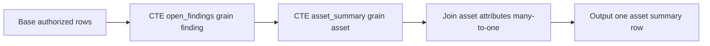

## Recursive CTE overview

A recursive CTE has a non-recursive seed, `UNION` or `UNION ALL`, and a recursive term that consumes prior output until no new rows remain. Use it for ticket hierarchies, application dependencies, ownership trees, or relational graph edges.

```sql
WITH RECURSIVE ticket_tree AS (
    SELECT
        t.ticket_id,
        t.parent_ticket_id,
        0 AS depth,
        ARRAY[t.ticket_id] AS path
    FROM nmh_rel.ticket AS t
    WHERE t.ticket_id = '00000000-0000-0000-0000-000000000701'

    UNION ALL

    SELECT
        child.ticket_id,
        child.parent_ticket_id,
        parent.depth + 1,
        parent.path || child.ticket_id
    FROM ticket_tree AS parent
    JOIN nmh_rel.ticket AS child
      ON child.parent_ticket_id = parent.ticket_id
    WHERE parent.depth < 10
      AND NOT (child.ticket_id = ANY(parent.path))
)
SELECT
    ticket_id,
    parent_ticket_id,
    depth,
    path
FROM ticket_tree
ORDER BY depth, ticket_id;
```

The UUID is synthetic. Depth is bounded and visited IDs prevent a cycle in the current path. PostgreSQL also documents `SEARCH` and `CYCLE` syntax. Explicit result ordering is still needed; traversal evaluation order is not a presentation guarantee.

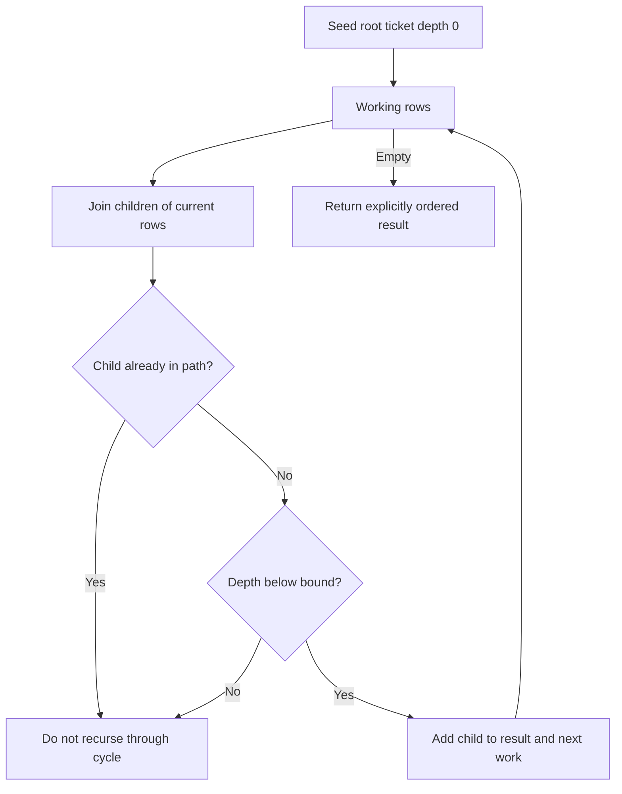

### Plain-English deep-dive 3 - Recursion needs a fire exit

Following "reports to" links is easy until A reports to B, B to C, and C incorrectly reports to A. A naive recursive query revisits the same people forever. A graph can also be enormous even without cycles.

Every recursive query needs a seed, allowed edge direction/types, cycle strategy, depth or scope bound, time rule, and deterministic output. A `LIMIT` in an outer query is not a production safety plan because sorting or joins may demand all recursive rows first.

## Set operations

Set operations combine query outputs vertically. Inputs must have the same number of columns with compatible corresponding types. Column names generally come from the first query's output. They compare whole rows.

| Operation | Default duplicate behavior | Meaning | NMH use |
|---|---|---|---|
| `UNION` | Remove duplicates | Rows in either input | Unified distinct source keys |
| `UNION ALL` | Keep duplicates | Append both inputs | Preserve source observations/provenance |
| `INTERSECT` | Remove duplicates | Rows in both | Keys observed by two sources |
| `INTERSECT ALL` | Preserve min duplicate multiplicity | Bag intersection | Specialized reconciliation |
| `EXCEPT` | Remove duplicates | Left rows absent from right | Expected keys missing in source |
| `EXCEPT ALL` | Subtract duplicate multiplicities | Bag difference | Diagnose duplicate-count differences |

### UNION ALL with provenance

```sql
SELECT
    'endpoint_source'::text AS source_name,
    source_asset_id
FROM nmh_stage.endpoint_asset

UNION ALL

SELECT
    'scanner_source'::text AS source_name,
    source_asset_id
FROM nmh_stage.scanner_asset;
```

Keeping provenance prevents identical IDs from different scopes from being silently treated as one. `UNION` would remove only rows identical across both selected columns.

### EXCEPT for reconciliation

```sql
SELECT source_asset_id
FROM nmh_stage.expected_asset

EXCEPT

SELECT source_asset_id
FROM nmh_stage.scanner_asset;
```

This returns distinct expected IDs absent from scanner IDs under exact equality. It does not establish why: scope, scan failure, stale expected list, aliases, or matching defects remain hypotheses.

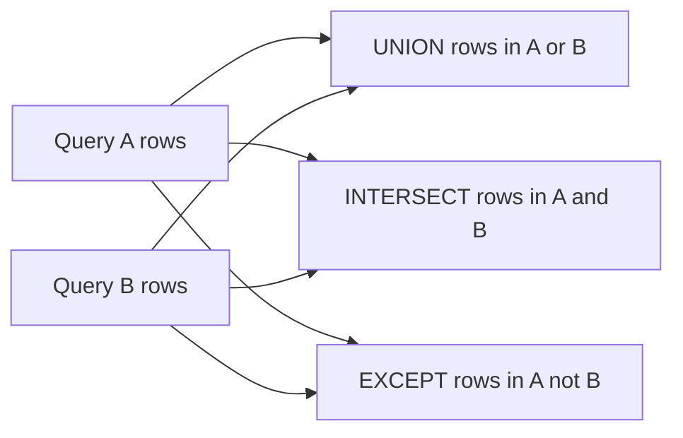

`INTERSECT` binds more tightly than `UNION`/`EXCEPT`; use parentheses for clarity. `ORDER BY` after a set operation applies to the combined result unless an input is parenthesized appropriately. `UNION ALL` often avoids duplicate-elimination work and preserves evidence, but choose it for semantics, not speed alone.

## Window functions: preserve rows while comparing them

An ordinary aggregate collapses a group to one row. A window function computes across related rows while each input row remains present. Every call has `OVER(...)`.

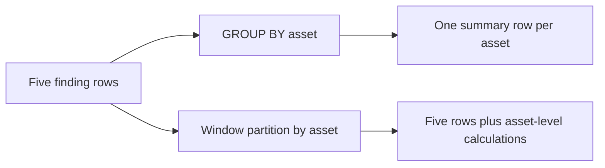

| Window component | Question | Example |
|---|---|---|
| `PARTITION BY` | Where does calculation restart? | Per asset or source |
| Window `ORDER BY` | What sequence/peer groups apply? | Observation time plus ID |
| Frame | Which rows around current row contribute? | All prior rows through current |
| Function | What calculation occurs? | `row_number`, `lag`, `sum` |
| Final `ORDER BY` | How are output rows displayed? | Source, time, ID |

The window order is not the final output-order guarantee. Add a top-level `ORDER BY`.

## Partition, order, peers, and frame

Partition divides rows into independent groups. Window order defines sequence and peer groups. Peers have equal window `ORDER BY` values. A frame is the subset of a partition visible to frame-sensitive functions and window aggregates.

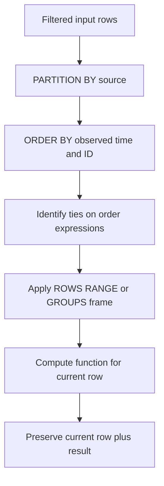

| Specification | Meaning | Risk |
|---|---|---|
| No partition | One partition for all input rows | Mixes unrelated populations |
| No window order | Order-sensitive result unavailable/unspecified | `lag`/rank intent unclear |
| `ROWS` frame | Physical ordered rows | Ties need unique ordering |
| `RANGE` frame | Value/peer-oriented range | Default peer inclusion surprises |
| `GROUPS` frame | Peer groups | Less familiar and version-specific |
| Default with order | Start through current row's last peer in PostgreSQL | Running aggregate jumps at ties |
| Whole partition | Unbounded preceding to unbounded following | Needed for some `last_value`/partition totals |

### Plain-English deep-dive 4 - Partition, order, and frame are different

In a race, partition is the race category, such as each age group. Order is finish time. Peers are tied finishers. Frame is the portion of finishers considered for a calculation around one runner.

`PARTITION BY source_system ORDER BY observed_at` does not mean "all source rows" for every function. A running sum with the default ordered frame considers rows from the start through current peers. `last_value` under that frame often returns a current-peer value, not the final row of the partition. State the frame when it matters.

## ROW_NUMBER, RANK, and DENSE_RANK

| Function | Tie behavior | Sequence example | Use |
|---|---|---|---|
| `row_number` | Every row unique position; tie order needs extra key | 1,2,3,4 | Latest/dedup selection |
| `rank` | Peers share rank; gaps follow | 1,2,2,4 | Competition-style priority rank |
| `dense_rank` | Peers share rank; no gaps | 1,2,2,3 | Distinct score bands |

```sql
SELECT
    f.source_system,
    f.finding_id,
    f.first_observed_at,
    ROW_NUMBER() OVER (
        PARTITION BY f.source_system
        ORDER BY f.first_observed_at, f.finding_id
    ) AS source_age_row_number,
    RANK() OVER (
        PARTITION BY f.source_system
        ORDER BY f.first_observed_at
    ) AS source_age_rank
FROM nmh_rel.finding AS f
WHERE f.status = 'open'
ORDER BY f.source_system, source_age_row_number;
```

`row_number` uses finding ID to break time ties deterministically. `rank` intentionally treats equal times as peers by omitting the ID from its window order.

## LAG and LEAD

`lag(value)` gets a previous ordered row's value; `lead(value)` gets a following row's value. Default offset is one and out-of-range result is null unless a compatible default is supplied.

```sql
SELECT
    d.source_system,
    d.snapshot_date,
    d.open_finding_count,
    LAG(d.open_finding_count) OVER (
        PARTITION BY d.source_system
        ORDER BY d.snapshot_date
    ) AS prior_open_finding_count,
    d.open_finding_count
      - LAG(d.open_finding_count) OVER (
            PARTITION BY d.source_system
            ORDER BY d.snapshot_date
        ) AS change_from_prior_snapshot
FROM nmh_lab.daily_source_summary AS d
ORDER BY d.source_system, d.snapshot_date;
```

The first row per source has no prior row, so change is null. If dates are missing, `lag` compares the prior available row, not necessarily prior calendar day. Join to a date spine or label the metric accordingly.

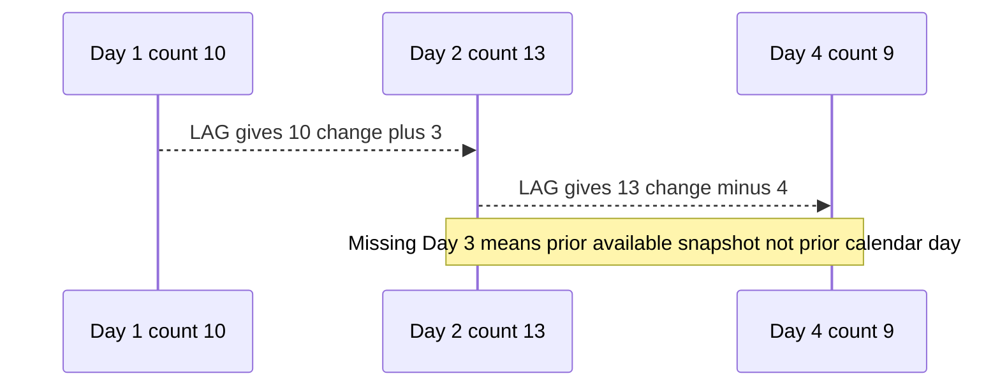

## Window frames and running metrics

Use an explicit `ROWS` frame for a row-by-row running total with deterministic order:

```sql
SELECT
    d.source_system,
    d.snapshot_date,
    d.new_finding_count,
    SUM(d.new_finding_count) OVER (
        PARTITION BY d.source_system
        ORDER BY d.snapshot_date
        ROWS BETWEEN UNBOUNDED PRECEDING AND CURRENT ROW
    ) AS cumulative_new_findings
FROM nmh_lab.daily_source_summary AS d
ORDER BY d.source_system, d.snapshot_date;
```

A seven-row rolling average is not necessarily seven calendar days if dates are missing. A time-based `RANGE` frame or calendar spine may fit, subject to exact PostgreSQL syntax/type and business definition.

| Need | Frame concept | Caution |
|---|---|---|
| Cumulative events | Start to current row | Duplicate order keys need tie rule |
| Last 7 available snapshots | Six preceding rows plus current | Missing dates change elapsed time |
| Last 7 calendar days | Time-value range | Time zone and sparse data |
| Whole-partition total on every row | Unbounded both directions or no order | Avoid accidental running total |
| True last value in partition | Whole-partition frame | Default ordered frame is not enough |

## Deterministic latest-record and deduplication pattern

"Latest" needs entity key, authoritative time, correction/sequence logic, and tie-breaker. `MAX(time)` alone finds a time, not the complete chosen row.

```sql
WITH ranked_observations AS (
    SELECT
        o.*,
        ROW_NUMBER() OVER (
            PARTITION BY o.asset_id, o.control_id, o.source_system
            ORDER BY o.observed_at DESC, o.reported_state, o.asset_id
        ) AS row_position
    FROM nmh_rel.asset_control_observation AS o
)
SELECT
    asset_id,
    control_id,
    source_system,
    observed_at,
    reported_state
FROM ranked_observations
WHERE row_position = 1;
```

The example lacks a unique observation ID in the Part 44 schema, so its tie-breaker may still be insufficient when otherwise identical-key/time rows differ. That is a model warning, not something SQL should hide. Add a source event/sequence or stable ingestion key under contract.

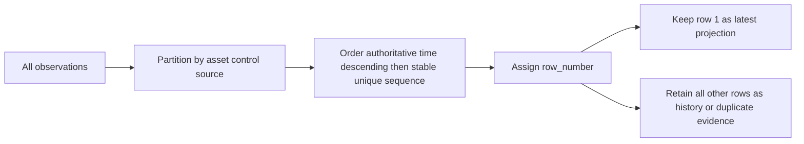

### Deduplication rules

| Duplicate type | Correct response |
|---|---|
| Exact delivery retry with stable event ID | Idempotently retain one logical event and audit retry |
| Same natural key, different payload | Investigate version/correction/conflict |
| Same entity from different sources | Resolve aliases; do not discard source records |
| Same timestamp with no sequence | Preserve ambiguity or add contract key |
| Join-created duplicate | Fix grain/cardinality, not source data |

## Cohort analysis

A cohort is a population sharing an entry condition/time, such as assets first onboarded in a month or findings opened in a week. Cohort analysis compares outcomes at equal age since entry rather than calendar time alone.

| Cohort element | NMH example | Required definition |
|---|---|---|
| Member | Finding business key | Stable across snapshots |
| Entry event | First observed | Source/merged identity policy |
| Cohort period | UTC calendar month | Time zone and boundaries |
| Age index | Days/weeks since entry | Calendar versus elapsed periods |
| Outcome | Verified closed by age 30 | Verification source and eligibility |
| Denominator | Eligible cohort members | Exclusions and late data |

```sql
WITH finding_cohort AS (
    SELECT
        f.finding_id,
        date_trunc('month', f.first_observed_at, 'UTC') AS cohort_month,
        f.first_observed_at,
        f.closed_at
    FROM nmh_rel.finding AS f
),
cohort_summary AS (
    SELECT
        cohort_month,
        COUNT(*) AS cohort_findings,
        COUNT(*) FILTER (
            WHERE closed_at IS NOT NULL
              AND closed_at <= first_observed_at + INTERVAL '30 days'
        ) AS closed_within_30_days
    FROM finding_cohort
    GROUP BY cohort_month
)
SELECT
    cohort_month,
    cohort_findings,
    closed_within_30_days,
    closed_within_30_days::numeric / NULLIF(cohort_findings, 0) AS close_within_30_day_rate
FROM cohort_summary
ORDER BY cohort_month;
```

This measures source finding closure, not verified remediation, unless `closed_at` is governed as verification. Late-arriving findings can restate cohorts. Compare mature cohorts at equal observation windows.

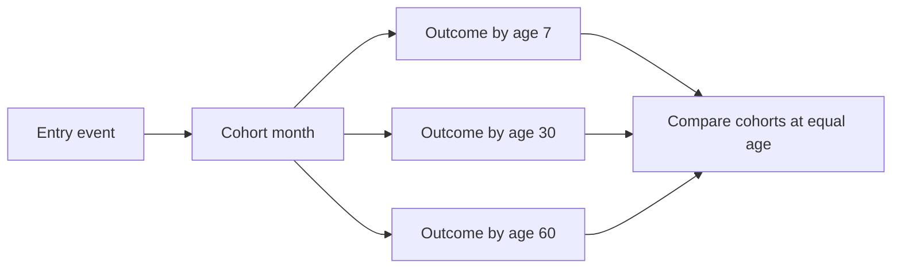

## Aging patterns

Age needs an as-of instant, start clock, stop/pause rules, and current-state definition.

```sql
SELECT
    f.finding_id,
    f.first_observed_at,
    TIMESTAMPTZ '2026-08-25 00:00:00+00' - f.first_observed_at AS open_age,
    NTILE(4) OVER (
        ORDER BY f.first_observed_at, f.finding_id
    ) AS age_quartile_by_row_count
FROM nmh_rel.finding AS f
WHERE f.status = 'open'
ORDER BY f.first_observed_at, f.finding_id;
```

`NTILE(4)` creates approximately equal row-count buckets, not fixed age thresholds. It changes when the population changes and should not be labeled severity or SLA band.

## Trend and security patterns

| Pattern | Construct | Grain/caveat |
|---|---|---|
| Latest source status | `row_number` in entity/source partition | Needs authoritative order/tie key |
| Change from prior snapshot | `lag` | Prior available versus prior calendar period |
| Running new findings | Windowed `sum` with explicit frame | Events, not backlog snapshots |
| Top owners per unit | `rank` or `row_number` | Ties and denominator |
| Assets missing evidence | `NOT EXISTS` | Absence versus failed collection |
| Source overlap | `INTERSECT` | Identity normalization and scope |
| Source-only keys | `EXCEPT` | Does not establish which side is wrong |
| Expected coverage grid | Cross join then anti join | Applicability and scale |
| Hierarchical ticket scope | Recursive CTE | Cycle/depth/time controls |
| Cohort closure | CTE plus conditional aggregate | Equal maturity and verified outcome |

### Top two assets per business unit by open finding rows

```sql
WITH asset_counts AS (
    SELECT
        a.asset_id,
        a.criticality,
        COUNT(*) AS open_finding_count
    FROM nmh_rel.asset AS a
    JOIN nmh_rel.finding AS f
      ON f.asset_id = a.asset_id
    WHERE f.status = 'open'
    GROUP BY a.asset_id, a.criticality
),
ranked AS (
    SELECT
        asset_counts.*,
        ROW_NUMBER() OVER (
            PARTITION BY criticality
            ORDER BY open_finding_count DESC, asset_id
        ) AS position_in_criticality
    FROM asset_counts
)
SELECT *
FROM ranked
WHERE position_in_criticality <= 2
ORDER BY criticality, position_in_criticality;
```

The example partitions by criticality because the simple NMH asset table shown earlier does not include business unit. Do not relabel it business-unit ranking. Open source finding count is not contextual risk.

## Power BI bridge

Advanced SQL can prepare clean tables for Power BI, but responsibilities should be intentional. Warehouse SQL is a good place for conformed grains, SCD lookup, complex deduplication, and reusable cohorts. Power BI measures handle interactive filter context. Avoid embedding conflicting logic in both.

| SQL output | Power BI use | Check |
|---|---|---|
| One row per asset summary | Dimension/aggregate table | No hidden many-to-many fanout |
| Latest control projection | Current-state report | Retain history separately and freshness visible |
| Daily source summary | Trend fact | Complete date spine and snapshot semantics |
| Cohort-age fact | Cohort matrix | Equal maturity and late-data restatement |
| Source overlap set | Data-quality review | Identity/scope caveats visible |
| Ranked exception list | Operational table | Rank uses stable tie-break and current filters |

```mermaid
flowchart LR
    CORE[Normalized/event warehouse] --> SQL[Versioned SQL transformation]
    SQL --> GRAIN[Stable fact or summary grain]
    GRAIN --> MODEL[Power BI star relationships]
    MODEL --> DAX[Explicit interactive measures]
    DAX --> VISUAL[Visual totals and drill]
    VISUAL --> RECON[Reconcile fixed filters to SQL]
    RECON --> TEST[Fanout null date cohort and RLS tests]
```

Power BI relationship filters behave like modeled propagation, not arbitrary SQL joins. Many-to-many/bidirectional relationships can reproduce fanout/ambiguity. Reconcile a fixed snapshot with SQL counts at each dimension filter.

## Performance and EXPLAIN overview

Correctness comes first. Optimization begins with an important bounded query, representative data, latency/resource objective, and plan evidence. PostgreSQL may use sequential/index/bitmap scans, nested-loop/hash/merge joins, sorts, aggregates, materialization, and window nodes.

| Plan concept | Meaning | Diagnostic value |
|---|---|---|
| Cost | Planner estimate in arbitrary units | Compare candidate nodes/plans, not milliseconds |
| Rows estimate | Rows emitted by node if completed | Large actual mismatch signals statistics/correlation/model issue |
| Width | Estimated average output bytes | Wide rows affect memory/I/O |
| Sequential scan | Reads table broadly | Often correct for large fraction/small table |
| Index scan | Uses ordered lookup path | Good for selective access; random fetch cost |
| Nested loop | Runs inner path per outer rows | Great for small/selective outer; loops matter |
| Hash join | Builds hash and probes equality matches | Memory/batches and estimates matter |
| Merge join | Consumes sorted join keys | Sort/index and duplicate rescans matter |
| Sort | Orders rows | Memory/disk spill and key width |
| WindowAgg | Computes window functions | Requires ordered data and may sort |
| Materialize | Stores intermediate rows for reuse | Can save repeat work or consume resources |

```sql
EXPLAIN
SELECT
    a.asset_id,
    COUNT(*) AS open_finding_count
FROM nmh_rel.asset AS a
JOIN nmh_rel.finding AS f ON f.asset_id = a.asset_id
WHERE f.status = 'open'
GROUP BY a.asset_id;
```

Plain `EXPLAIN` does not execute the query but still requires care with functions and permissions. `EXPLAIN (ANALYZE, BUFFERS)` actually executes and can be expensive; on data-modifying statements, side effects occur unless an authorized transaction is rolled back. This guide uses read-only queries only.

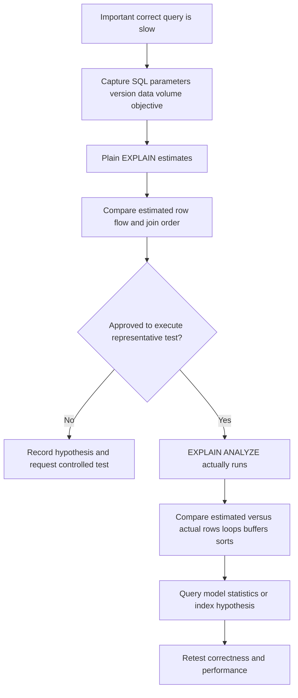

### Performance decision order

1. Confirm semantic correctness and result grain.
2. Reduce unnecessary columns and rows with valid selective predicates.
3. Remove accidental cross joins/fanout/repeated correlated work.
4. Pre-aggregate at the needed grain when child detail is not required.
5. Inspect estimates, actual row flow, loops, filters, sorts, spills, and buffers under policy.
6. Check statistics, data skew/correlation, types/casts, and parameter values.
7. Evaluate indexes against predicates, joins, ordering, write cost, and lifecycle.
8. Consider materialized summaries/partitioning/architecture only with measured need.
9. Retest representative concurrency and data size.
10. Monitor plan drift and operational impact.

## Incorrect-query diagnostics

| Symptom | Likely defect | First discriminating check |
|---|---|---|
| Counts multiply after join | One-to-many/many-to-many fanout | Count rows and distinct grain key before/after |
| Left join loses unmatched rows | Right predicate in `WHERE` | Move eligibility predicate to `ON` and compare |
| Anti query returns zero unexpectedly | Null in `NOT IN` subquery | Check subquery nulls; rewrite `NOT EXISTS` |
| Latest row changes between runs | Incomplete window order | Add authoritative unique tie-breaker |
| Running sum jumps at ties | Default RANGE peer frame | Use explicit deterministic `ROWS` frame if intended |
| `last_value` returns current value | Default frame ends at current peer | Use whole-partition frame if desired |
| `lag` skips a calendar day | Missing date rows | Join calendar spine or relabel prior available |
| Cohort newest month looks worse | Immature observation window | Compare equal age/mature cohorts |
| Recursive result explodes | Cycle/high-degree/unbounded edge | Add path/cycle/depth/type/time controls |
| UNION drops expected repeats | Duplicate elimination | Use `UNION ALL` when multiplicity/provenance matters |
| EXCEPT misses scope mismatch | Keys normalized/scoped differently | Include source/tenant/scope columns |
| CTE query slower after rewrite | Materialization/folding/row flow changed | Compare plans on current version |
| Window filter syntax fails | Window not available in `WHERE` | Wrap query in CTE/subquery then filter |
| Plan estimate far from actual | Stale stats/skew/correlation/expression | Inspect node estimates, stats, data distribution |
| Query fast in lab, slow in prod | Scale/cache/concurrency/parameter difference | Test representative environment safely |

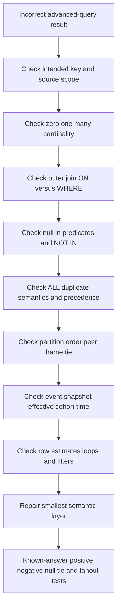

### Advanced SQL troubleshooting runbook

1. State the question, authoritative population, snapshot, and expected known result.
2. Write one-row grain for every base table, subquery, CTE, and final output.
3. List join keys with scope, type, nullability, uniqueness, and effective-time rules.
4. Predict zero/one/many matches and minimum/maximum rows for a tiny fixture.
5. Count rows and distinct intended keys before/after each join.
6. Remove `DISTINCT`; locate where multiplication starts.
7. For outer joins, separate match eligibility in `ON` from final output filters in `WHERE`.
8. For semi/anti logic, test zero, one, many, and null right rows.
9. For subqueries, prove zero/one/many-row contract and correlation.
10. For CTEs, run each step and record grain, counts, key uniqueness, and current plan behavior.
11. For recursion, validate seed, edge direction/type, time, depth, cycles, and output order.
12. For set operations, verify column compatibility, duplicate semantics, precedence, and provenance.
13. For windows, write partition, order, peers, frame, tie-breaker, and final order explicitly.
14. Test first/last partition row, ties, nulls, missing dates, duplicate times, and empty partitions.
15. For cohorts, test entry definition, late data, maturity, denominator, and verified outcome.
16. Use plain `EXPLAIN` first; run `EXPLAIN ANALYZE` only under approved resource/safety controls.
17. Compare estimated/actual rows, loops, filter removals, sort/hash memory, buffers, and plan nodes.
18. Repair the query/model/source, then reconcile to source totals and Power BI fixed filters.
19. Record SQL, parameters, version, plan, result counts, assumptions, and customer-safe conclusion.

## Security and privacy boundaries

| Risk | Advanced SQL exposure | Control |
|---|---|---|
| Overcollection | Joins combine identities, assets, findings, incidents | Select minimized governed columns |
| Reidentification | Several pseudonymous tables combine into person context | Purpose-specific access/views |
| Cross-tenant leak | Join omits tenant/scope key | Include scope in keys, constraints, tests, RLS where approved |
| Denial of service | Cross join/recursive/window/sort consumes resources | Estimate, bound, timeout, replica, workload controls |
| Sensitive export | Wide result downloaded locally | Aggregate/mask, approved storage, access logging |
| Inference error | Missing edge treated as control gap | Quality/scope/source caveat and review |
| Side effect | `EXPLAIN ANALYZE` executes modifying statement | Read-only role/query; approved transaction controls |
| Query disclosure | SQL/plan reveals schema/security design | Share through approved channels |

Use parameters for values, least-privileged read-only roles, approved views, schema qualification, bounded time/populations, secure result handling, and a fixed as-of time. Never paste customer data or plans into unapproved tools.

## Arti's Microsoft-to-advanced-SQL bridge

| Demonstrated strength | Advanced SQL application | Boundary |
|---|---|---|
| Cross-layer troubleshooting | Correlated evidence, missing handoffs, first fanout point | SQL association is not causality |
| SQL/PostgreSQL | Joins, subqueries, CTEs, windows, plans, reconciliation | Product schema/interface must be verified |
| Power BI | Grain, relationships, cohort/trend measures | DAX/SQL filter contexts differ |
| Case analytics | Latest status, aging, owner backlog, cohort closure | Support case metrics are not security risk |
| RCA | Diagnose semantic/query/model defects | Root cause needs system evidence |
| Customer escalation | Explain discrepancy, impact, uncertainty, repair, validation | Avoid unsupported Zscaler claims |

### 30-second interview bridge

"For advanced SQL, I start with row grain and relationship cardinality. I use inner/outer joins when I need right-side columns, `EXISTS` or `NOT EXISTS` for presence/gaps, set operations for compatible row sets, CTEs for named stages or bounded recursion, and windows for rank/change/latest logic without collapsing rows. I test fanout, nulls, ties, frames, time, and denominators before interpreting a result. My SQL, PostgreSQL, Power BI, and Microsoft troubleshooting experience transfers; NMH is synthetic, and I would validate actual Zscaler/customer interfaces and semantics before production use."

## Exercises with answers

Use only authorized synthetic data. Predict output grain and row counts before execution.

### Exercise 1 - Many-to-one enrichment

**Task:** Return each open finding with its asset name while preserving finding grain.

**Answer:**

```sql
SELECT f.finding_id, a.canonical_name
FROM nmh_rel.finding AS f
JOIN nmh_rel.asset AS a ON a.asset_id = f.asset_id
WHERE f.status = 'open';
```

Validate output rows equal distinct finding IDs.

### Exercise 2 - Preserve assets with zero findings

**Task:** Return one row per asset and open finding count.

**Answer:** Pre-aggregate open findings by asset, left join the one-row-per-asset result, and `COALESCE` missing count to zero as shown earlier. Joining raw findings would produce one row per asset-finding pair.

### Exercise 3 - Find assets with open findings

**Task:** Return assets once if at least one open finding exists.

**Answer:**

```sql
SELECT a.asset_id
FROM nmh_rel.asset AS a
WHERE EXISTS (
    SELECT 1
    FROM nmh_rel.finding AS f
    WHERE f.asset_id = a.asset_id
      AND f.status = 'open'
);
```

### Exercise 4 - Find assets without fresh evidence

**Task:** Return active assets with no control observation since a fixed instant.

**Answer:** Use correlated `NOT EXISTS` with the freshness predicate inside the subquery. Do not use `NOT IN` unless non-null is guaranteed. Label output "no qualifying observation in queried data," not "uncontrolled assets."

### Exercise 5 - Source overlap

**Task:** Return distinct source asset IDs appearing in both endpoint and scanner staging tables.

**Answer:**

```sql
SELECT source_asset_id FROM nmh_stage.endpoint_asset
INTERSECT
SELECT source_asset_id FROM nmh_stage.scanner_asset;
```

Validate source scope and identity normalization first.

### Exercise 6 - Latest observation

**Task:** Return one deterministic latest control observation per asset/control/source.

**Answer:** Rank rows with `ROW_NUMBER` partitioned by asset/control/source, ordered by authoritative observation time descending and a stable unique source sequence descending, then filter row number one in an outer query. If no unique tie-breaker exists, preserve ambiguity and repair the data contract.

### Exercise 7 - Rank with ties

**Task:** Give equal finding counts the same rank with gaps.

**Answer:** Aggregate at the ranking entity grain, then use `RANK() OVER (ORDER BY finding_count DESC)`. Use `DENSE_RANK` for no gaps or `ROW_NUMBER` for exactly N rows with a deterministic tie-breaker.

### Exercise 8 - Prior available snapshot

**Task:** Calculate change from the previous stored snapshot per source.

**Answer:** Use `LAG(count) OVER (PARTITION BY source ORDER BY snapshot_date)`. Label it prior available snapshot. For prior calendar day, first join a complete calendar/source spine.

### Exercise 9 - Running total

**Task:** Calculate cumulative new finding events by source.

**Answer:** Use `SUM(new_count) OVER (PARTITION BY source ORDER BY date ROWS BETWEEN UNBOUNDED PRECEDING AND CURRENT ROW)`. Do not cumulatively sum backlog snapshots.

### Exercise 10 - Recursive hierarchy

**Task:** Traverse child tickets from one root.

**Answer:** Use a recursive CTE with a seed root, child step, visited-ID path, maximum depth, and explicit final order. Verify authorization and do not assume a parent hierarchy is acyclic.

### Exercise 11 - Diagnose a zero-row anti query

**Task:** `WHERE asset_id NOT IN (SELECT asset_id FROM observations)` returns no rows unexpectedly.

**Answer:** Check for null in the subquery. One null can make nonmatching comparisons unknown. Rewrite with correlated `NOT EXISTS` and confirm key types/scope.

### Exercise 12 - Plan safety

**Task:** Compare estimated and actual rows.

**Answer:** Run plain `EXPLAIN` first. Use `EXPLAIN (ANALYZE, BUFFERS)` only in an approved safe environment because it executes the query and consumes resources. Compare node estimates/actuals and multiply per-loop averages by loops where relevant. Do not treat cost units as milliseconds.

## Labs and rehearsal

### Lab 1 - Join truth table

Build three-row left/right fixtures with one match, one unmatched per side, and one duplicate key. Predict inner, left, right, full, and cross results.

### Lab 2 - Fanout clinic

Create one asset, three findings, two owners, and two tickets. Measure row multiplication after each join and repair with pre-aggregation, semi joins, or separate measures.

### Lab 3 - Outer join predicate

Move a right-table status predicate between `ON` and `WHERE`. Explain exactly which null-extended rows survive.

### Lab 4 - Semi/anti/null

Test `EXISTS`, `NOT EXISTS`, `IN`, and `NOT IN` with empty, one, many, duplicate, and null subquery rows.

### Lab 5 - CTE pipeline

Build source scope, open finding, asset summary, and final enrichment CTEs. Record grain, count, distinct keys, and quality at every stage.

### Lab 6 - Recursive cycle

Create a ticket hierarchy with a three-node cycle and a deep branch. Apply path-based cycle prevention and depth bounds; compare breadth/depth presentation ordering.

### Lab 7 - Set reconciliation

Use `UNION ALL`, `UNION`, `INTERSECT`, `EXCEPT`, and their `ALL` variants on duplicate source keys. Explain multiplicity and provenance.

### Lab 8 - Window ranking

Create tied times/counts. Compare `row_number`, `rank`, and `dense_rank`; add deterministic tie-breakers where uniqueness is intended.

### Lab 9 - Frame behavior

Compare default ordered frame, explicit running `ROWS`, seven-row rolling, and whole-partition frames. Test peers and `last_value`.

### Lab 10 - Latest and dedup

Create late arrival, correction, retry, and equal-time conflict. Select latest only when source sequence supports it; preserve conflicting evidence otherwise.

### Lab 11 - Cohort and trend

Build monthly cohorts and age-7/30 outcomes, then add late records and immature cohorts. Explain restatement and denominator changes.

### Lab 12 - EXPLAIN review

On an approved synthetic PostgreSQL lab, compare plans for join, correlated subquery, pre-aggregation, and window patterns at small and representative synthetic volumes. Never extrapolate toy results directly.

### Lab 13 - Power BI reconciliation

Publish one-row-per-asset, daily trend, and cohort-age outputs. Validate relationship cardinality, totals, blanks, dates, RLS, and fixed SQL comparison.

### Lab 14 - TSM discrepancy briefing

Explain a doubled dashboard count: impact, grain defect, fanout evidence, immediate decision limitation, correction, backfill, Power BI refresh, and prevention.

| Lab evidence | Completion standard |
|---|---|
| Safety | Authorized, synthetic, read-only, bounded, minimized |
| Grain | Every input, intermediate, and output row meaning stated |
| Cardinality | Zero/one/many prediction and measured counts |
| Null | Semi/anti/outer/window null cases tested |
| Time | Event, effective, snapshot, cohort, and order clocks explicit |
| Determinism | Unique tie-breakers and final output order |
| Plan | Estimates/actuals/loops/resources interpreted cautiously |
| BI | SQL result reconciled to model filters and measures |
| Honesty | No unsupported product schema or security outcome claim |

## Common misconceptions to correct

| Misconception | Correct model |
|---|---|
| A join simply adds columns | It pairs rows and can multiply or remove them |
| Matching column names are enough | Keys need scope, type, time, and semantics |
| Many-to-one is obvious from data | Enforce/test uniqueness and contract |
| LEFT JOIN always preserves left rows | A right predicate in WHERE can remove null-extended rows |
| DISTINCT fixes join duplicates | It can hide fanout and destroy legitimate detail |
| COUNT(*) after join counts the original entity | It counts output rows at joined grain |
| EXISTS returns right columns | It tests whether any row exists |
| NOT IN is the same as NOT EXISTS | Null can make NOT IN unknown |
| CTEs are always materialized | PostgreSQL can fold/materialize based on version/query/options |
| CTEs are always faster | They primarily structure semantics; inspect plans |
| Recursive means depth-first execution | Presentation order requires computed sort/order |
| LIMIT makes recursion safe | Parent operations may demand full result; use cycle/depth rules |
| UNION ALL and UNION are interchangeable | One preserves duplicates; one removes them |
| Set operations compare one key automatically | They compare entire compatible output rows |
| Window functions collapse groups | They preserve row identity |
| PARTITION BY sorts output | Window partition/order and final output order differ |
| ROW_NUMBER handles ties fairly | It assigns unique sequence; order must be complete |
| RANK returns exactly N rows for rank <= N | Ties can return more than N rows |
| Default frame means whole partition | With order it usually ends at current peer |
| LAG means prior calendar day | It means prior ordered row |
| Latest timestamp uniquely selects latest row | Ties/corrections need source sequence and policy |
| EXPLAIN ANALYZE is just a plan preview | It executes and can cause side effects/resource load |
| Index use proves a good plan | Sequential/hash/merge choices may be correct for distribution |
| Missing relationship proves a control gap | It may be missing/stale/failed evidence |
| These are Zscaler production patterns | They are vendor-neutral synthetic PostgreSQL examples |

## Official Source Anchors

Sources in this section were reviewed on **2026-08-24**.

PostgreSQL documentation establishes implementation behavior for the current documentation version. ANSI/ISO SQL concepts provide the baseline for joins, subqueries, CTEs, set operations, and windows, but implementations differ. `EXPLAIN` is not an SQL-standard statement. NIST/DAMA provide context only. Zscaler public material does not establish a customer-accessible SQL schema or the internal models used by Data Fabric.

| Source | URL | Used for | Boundary |
|---|---|---|---|
| PostgreSQL Join Tutorial | https://www.postgresql.org/docs/current/tutorial-join.html | Inner, left, self joins and alias basics | Introductory, not full performance guidance |
| PostgreSQL Table Expressions | https://www.postgresql.org/docs/current/queries-table-expressions.html | Cross/outer joins, ON versus WHERE, aliases, grouping/window stage | Version-specific details |
| PostgreSQL Subquery Expressions | https://www.postgresql.org/docs/current/functions-subquery.html | EXISTS, IN, NOT IN, ANY/ALL, null behavior | Planner may transform/evaluate differently |
| PostgreSQL WITH Queries | https://www.postgresql.org/docs/current/queries-with.html | CTEs, recursion, search/cycle, materialization/folding | PostgreSQL options/version behavior differ |
| PostgreSQL Combining Queries | https://www.postgresql.org/docs/current/queries-union.html | UNION, INTERSECT, EXCEPT, ALL, compatibility, precedence | Entire-row and type semantics apply |
| PostgreSQL Window Tutorial | https://www.postgresql.org/docs/current/tutorial-window.html | Partition, order, frame, row preservation, filtering via subquery | Introductory; exact frames in reference docs |
| PostgreSQL Window Functions | https://www.postgresql.org/docs/current/functions-window.html | Ranking, lag/lead, peers, frame caveats, null-option gaps | PostgreSQL lacks some standard null options |
| PostgreSQL SELECT | https://www.postgresql.org/docs/current/sql-select.html | Full clause semantics, set precedence, windows, compatibility | Several PostgreSQL extensions |
| PostgreSQL EXPLAIN | https://www.postgresql.org/docs/current/sql-explain.html | Estimated/actual plans, options, execution warning | EXPLAIN not in SQL standard |
| PostgreSQL Using EXPLAIN | https://www.postgresql.org/docs/current/using-explain.html | Plan nodes, row estimates, loops, joins, limits, caveats | Representative data/version required |
| Microsoft Power BI star guidance | https://learn.microsoft.com/en-us/power-bi/guidance/star-schema | Fact/dimension grain and relationship context | Not advanced PostgreSQL guidance |
| NIST Privacy Framework | https://www.nist.gov/privacy-framework | Purpose/minimization/privacy-risk context | Not query or legal guidance |
| Zscaler Data Fabric | https://www.zscaler.com/products-and-solutions/data-fabric | Public high-level data/context/workflow positioning | No SQL, model, algorithm, limit, or performance claim |

## Likely Interview Questions

### Q1. How do you choose a join type and prevent fanout?

**Model answer:** I write left, right, and desired output grain; validate join-key scope, type, time, and uniqueness; then predict zero/one/many matches. Inner keeps matching pairs, left preserves every left row, full preserves both sides, and cross creates every pair. If I need presence only, I use `EXISTS`. For many sides I pre-aggregate, use a governed bridge, or calculate separate measures. I count rows and distinct grain keys before/after every join.

### Q2. Why can a LEFT JOIN behave like an INNER JOIN?

**Model answer:** A left join creates null-extended right columns for unmatched left rows. If a `WHERE` predicate later requires a right value such as `right.status = 'open'`, that predicate is unknown for null-extended rows and removes them. Put right-side match eligibility in the `ON` clause when every left row must survive; reserve `WHERE` for final-output population rules.

### Q3. What is the difference between EXISTS, IN, NOT EXISTS, and NOT IN?

**Model answer:** `EXISTS` tests whether a correlated or uncorrelated subquery returns any row and returns each outer row at most once. `NOT EXISTS` tests absence and is my usual anti-join pattern. `IN` tests equality membership but can return unknown with nulls. `NOT IN` can also return unknown if any unmatched right value is null, unexpectedly removing rows. I prove nullability or prefer `NOT EXISTS`.

### Q4. When do you use a CTE, and what should you know about recursion?

**Model answer:** I use a CTE to name a relational stage, expose grain, reuse a result within a statement, filter a window result, or recurse. A recursive CTE needs a seed, recursive step, allowed direction/type, termination, cycle detection, depth/scope/time bound, and explicit final order. CTEs are not automatically faster or always materialized; PostgreSQL version/reference count/options and the plan determine behavior.

### Q5. Explain UNION, INTERSECT, and EXCEPT.

**Model answer:** They combine union-compatible query outputs by whole rows. `UNION` returns rows in either input, `INTERSECT` rows in both, and `EXCEPT` left rows absent from right. Default behavior removes duplicates; `ALL` preserves or applies duplicate multiplicities. I use parentheses because `INTERSECT` binds more tightly, preserve provenance when scopes differ, and never assume a set difference explains which source is wrong.

### Q6. What are partition, order, peers, and frame in a window function?

**Model answer:** Partition defines independent groups. Window order defines sequence and peers; peers tie on all window-order expressions. Frame defines which partition rows contribute to frame-sensitive functions for the current row. An ordered default frame often runs from partition start through current peers, so I state an explicit `ROWS`/`RANGE`/`GROUPS` frame when running, rolling, or whole-partition behavior matters, plus a final output `ORDER BY`.

### Q7. How do you select the latest row and analyze change safely?

**Model answer:** I partition by the entity/source grain, order by the authoritative event/update time descending plus stable unique sequence, assign `row_number`, and filter row one in an outer query. If no tie-breaker exists, I preserve ambiguity. For change I use `lag` over a deterministic order and label prior available versus prior calendar period. I do not use arrival time or `MAX(time)` alone without the source contract.

### Q8. How do you troubleshoot a slow or incorrect advanced query?

**Model answer:** Correctness first: restate grain, keys, cardinality, nulls, time, set duplicate rules, window partition/order/frame, and known-answer rows. Locate fanout with row/distinct counts and inspect outer-filter/anti-null traps. Then use plain `EXPLAIN`; under approved controls use `EXPLAIN ANALYZE`, which executes. I compare estimates to actual rows, loops, filters, scans, joins, sorts, buffers, and test a small query/model/index repair on representative data.

## 30-Second Memory Hooks

| Concept | Memory hook |
|---|---|
| Join | Pair rows, then recount grain |
| Cardinality | Zero, one, or many matches |
| Fanout | One becomes many |
| Inner | Matching pairs only |
| Left | Left survives unless WHERE removes it |
| Full | Reconcile both unmatched sides |
| Cross | N times M |
| Self | Same table, different roles |
| Semi | Does a match exist? |
| Anti | No qualifying match exists |
| EXISTS | Presence without right fanout |
| NOT IN | One null can poison certainty |
| Subquery | Value, set, or table inside query |
| CTE | Name the relational stage |
| Recursive | Seed, step, stop, cycle, bound |
| UNION ALL | Append and preserve duplicates |
| INTERSECT | In both sets |
| EXCEPT | Left but not right |
| Window | Compare without collapsing rows |
| Partition | Restart room |
| Order | Sequence and peers |
| Frame | Rows in reach |
| Row number | Deterministic position needs unique order |
| Rank | Ties share place |
| Lag/lead | Prior/next ordered row |
| Latest | Time plus stable sequence |
| Cohort | Entered together, compare at equal age |
| EXPLAIN | Estimated map |
| EXPLAIN ANALYZE | Executes the trip |
| Arti bridge | Advanced SQL transfers; product internals do not |

## Completion Checklist

- [ ] I state left, right, and output grain before every join.
- [ ] I validate key scope, type, nullability, uniqueness, time, and semantics.
- [ ] I predict zero/one/many matches and row-count bounds.
- [ ] I can explain inner, left, right, full, cross, and self joins.
- [ ] I use explicit columns and qualified aliases in joined queries.
- [ ] I know right-side WHERE filters can remove left-join null rows.
- [ ] I estimate cross-join N times M and validate applicability.
- [ ] I detect fanout by comparing rows and distinct grain keys at every stage.
- [ ] I avoid using DISTINCT as a fanout repair.
- [ ] I pre-aggregate many sides when the requested output is parent grain.
- [ ] I use EXISTS for semi joins and NOT EXISTS for anti joins.
- [ ] I distinguish missing evidence from evidence of absence.
- [ ] I can explain IN/NOT IN null behavior and avoid the anti-join trap.
- [ ] I know scalar subqueries require at most one row/one column.
- [ ] I understand correlated versus uncorrelated subqueries and inspect plans.
- [ ] I use CTEs to name and test stages with explicit grain.
- [ ] I do not assume a CTE is materialized or faster.
- [ ] I design recursion with seed, direction/type, stop, cycle, depth, time, and order.
- [ ] I use UNION, INTERSECT, EXCEPT, and ALL with correct duplicate semantics.
- [ ] I verify set column count/types, provenance, precedence, and whole-row comparison.
- [ ] I understand window functions preserve rows.
- [ ] I define partition, window order, peers, frame, function, and final order.
- [ ] I use row_number, rank, and dense_rank according to tie requirements.
- [ ] I use lag/lead and label prior/next available versus calendar period.
- [ ] I write explicit frames for cumulative, rolling, and whole-partition calculations.
- [ ] I know default peer frames can surprise running sums and last_value.
- [ ] I select latest rows with authoritative time and a stable unique tie-breaker.
- [ ] I preserve ambiguity when the source cannot order tied records.
- [ ] I distinguish delivery retries, corrections, source aliases, and join duplicates.
- [ ] I define cohort member, entry, age, outcome, denominator, maturity, and late-data policy.
- [ ] I do not cumulatively sum backlog snapshots as new events.
- [ ] I use fixed as-of times and half-open periods for reproducibility.
- [ ] I can prepare SQL outputs for Power BI without ambiguous many-to-many totals.
- [ ] I reconcile fixed Power BI filters/measures to SQL row sets.
- [ ] I interpret estimated cost/rows/width as planner estimates, not actual milliseconds.
- [ ] I recognize sequential/index/bitmap scans and nested-loop/hash/merge joins at overview level.
- [ ] I compare actual/estimated rows, loops, filter removals, sorts, hashes, and buffers.
- [ ] I know EXPLAIN ANALYZE executes and use it only under approved controls.
- [ ] I optimize only after semantic correctness and representative evidence.
- [ ] I can run the full incorrect-query troubleshooting method.
- [ ] I can execute and explain every synthetic exercise and lab.
- [ ] I protect customer data through read-only roles, minimization, scope keys, and secure outputs.
- [ ] I separate ANSI concepts, PostgreSQL behavior, synthetic NMH evidence, and Zscaler public context.
- [ ] I can answer the eight interview prompts with mechanics, tradeoffs, failure modes, and honest boundaries.

[Part 48 - Security Analytics Query Patterns](Part-48-security-analytics-query-patterns.md)