# Part 48 - Security Analytics Query Patterns

> **Audience:** Arti Thakur, preparing for a Zscaler Security Operations Technical Success Manager role after Microsoft enterprise Support Escalation Engineering.
>
> **Purpose:** Turn SQL mechanics into defensible security-analysis patterns for asset coverage, source reconciliation, freshness, missing controls, vulnerability aging, service-level breaches, risk trends, owner backlogs, duplicate entities, latest records, incident timelines, cohorts, recurrence, and dashboard extracts.
>
> **Scope and honesty:** Northstar Meridian Holdings, abbreviated NMH, is fictional. Every table, row, identifier, query, test, threshold, SLA, trend, incident, control, vulnerability, dashboard, and outcome in this Part is synthetic. SQL targets PostgreSQL and general relational concepts; it is not a Zscaler schema, product query, internal Data Fabric model, or production recommendation. Official Zscaler material is used only for bounded public context about bringing security data and business context together. Arti's SQL, PostgreSQL, Power BI, statistics, Microsoft support analytics, and troubleshooting experience transfer; direct production Zscaler Data Fabric operation remains a learning boundary.
>
> **Currency caveat:** PostgreSQL behavior, customer schemas, source contracts, risk definitions, service-level rules, product capabilities, and public documentation change. Sources in this Part were reviewed on **2026-08-24**. Current deployed-version documentation, approved read-only practices, customer data contracts, privacy controls, tenant evidence, and product specialists govern production.

## Section goal

A security query is not trustworthy merely because it runs. It must answer a bounded question about a named population at a fixed time, preserve the intended row grain, use a justified denominator, expose unknowns, and survive known-answer tests. The SQL is the final expression of that analytical contract, not the beginning of it.

Think of an airport departure board. A count of "delayed flights" is meaningful only when the airport, airline scope, date, current snapshot, cancellation policy, and total eligible flights are known. A missing flight could mean cancellation, a stale feed, a code-share match failure, or a real absence. Security analytics has the same problem: an asset absent from scanner data is not automatically unscanned, a closed ticket is not automatically remediated, and a falling backlog is not automatically reduced risk.

By the end, Arti should be able to:

| Outcome | Demonstrated capability | Evidence artifact |
|---|---|---|
| Contract the question | State population, grain, clocks, filters, numerator, denominator, and unknowns | Query contract |
| Measure coverage | Compare eligible assets with qualifying observations without mistaking missing data for failed control | Coverage query and exception list |
| Reconcile sources | Classify matched, left-only, right-only, duplicate, and ambiguous records | Reconciliation matrix |
| Detect staleness | Separate stale assets, stale evidence, and unhealthy connectors | Freshness dashboard |
| Analyze controls | Generate applicable asset-control expectations and find missing current evidence | Control-gap review |
| Measure aging and SLA | Use fixed as-of time, governed start/stop rules, and eligible denominators | Aging and breach extract |
| Explain trends | Compare like-for-like snapshots and expose additions, removals, and restatements | Risk trend fact |
| Manage workload | Produce owner backlogs without fanout or unassigned-row loss | Owner action queue |
| Diagnose identity | Detect duplicate candidates while preserving provenance and uncertainty | Duplicate review queue |
| Select current state | Choose latest rows with authoritative time and deterministic sequence | Current projection |
| Correlate incidents | Build ordered timelines and bounded temporal associations without claiming causality | Incident evidence timeline |
| Analyze cohorts and recurrence | Compare equal-age populations and define repeat events explicitly | Cohort and recurrence report |
| Feed dashboards safely | Publish stable grains, metric metadata, and quality flags | Dashboard extract contract |
| Troubleshoot wrong SQL | Isolate grain, denominator, time, null, fanout, quality, and plan defects | Query diagnosis runbook |

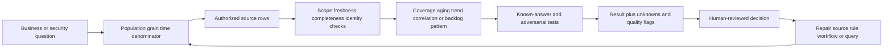

## JD Mapping

| Role expectation | Part 48 capability | TSM artifact | Arti bridge and boundary |
|---|---|---|---|
| Analyze complex technical environments | Convert multi-source asset, finding, control, and incident data into bounded evidence | Security query workbook | SQL and escalation analytics transfer |
| Identify security risks | Surface aging, coverage gaps, recurrence, and SLA exceptions with caveats | Prioritized review list | Query output is evidence, not final risk |
| Develop Data Fabric expertise | Reason about contextual multi-source analysis without asserting an internal schema | Conceptual source-to-decision map | Product interfaces remain unclaimed |
| Recommend mitigations | Connect exceptions to owners, deadlines, dependencies, and validation | Owner backlog extract | Customer policy determines action |
| Resolve customer issues | Diagnose source mismatch, stale data, duplicate entities, and wrong dashboards | Reconciliation runbook | Fault-isolation strength transfers |
| Explain outcomes | Build stable dashboard extracts and denominator-aware narratives | Operator and executive views | Power BI skill transfers |
| Protect customer operations | Use least privilege, bounded scans, fixed parameters, and safe plan review | Query safety checklist | Production controls require approval |
| Maintain analytical honesty | Distinguish observation, inference, decision, and product fact | Evidence legend | No unsupported security outcome claim |

## Candidate honesty note

| Evidence class | Safe statement | Boundary |
|---|---|---|
| Production transfer | "I have used SQL, PostgreSQL, Power BI, and operational evidence to investigate support quality and customer issues." | Not proof of production security-platform administration |
| Synthetic lab | "I built and tested NMH coverage, aging, correlation, and dashboard queries on fictional records." | Not a customer deployment or measured reduction |
| General principle | "Coverage needs an eligible denominator and qualifying evidence definition." | Customer policy decides exact eligibility |
| Analytical inference | "The queried data shows no current observation for these applicable pairs." | Does not prove a control is absent or ineffective |
| Public product context | "Zscaler publicly describes Data Fabric as unifying security data and business context for outcomes." | No claim about internal tables, SQL access, algorithms, connectors, or limits |
| Experience boundary | "I would validate the current tenant interfaces, field semantics, data contract, and approved query path." | Never invent product behavior |

An interview answer should move through five layers: define the question, state the grain, show the query pattern, name failure modes, and describe validation. A long SQL listing without those layers is weaker than a short, auditable query.

## Beginner vocabulary and memory hooks

| Term | Plain meaning | Why it matters | Memory hook |
|---|---|---|---|
| Analytical contract | Written definition of what a metric means | Prevents silent interpretation drift | Define before calculate |
| Population | All entities eligible for the question | Becomes the denominator universe | Who could count? |
| Grain | Meaning of one row | Controls joins, counts, and dashboards | One row means what? |
| Numerator | Qualifying subset being counted | Must come from the denominator population | The part |
| Denominator | Eligible total against which part is compared | Changes the meaning of every rate | The whole |
| Snapshot | State captured as of a specific time | Allows reproducible comparison | Freeze the board |
| Event | Something that happened at a time | Supports flows and timelines | A change happened |
| Observation | What a source reported | May be late, incomplete, or wrong | Evidence, not reality |
| Coverage | Eligible entities with qualifying evidence divided by eligible entities | Requires applicability and freshness | Seen out of expected |
| Reconciliation | Compare sources and explain differences | Finds scope, timing, and identity defects | Match both ledgers |
| Freshness | How recently expected evidence arrived | Stale data can mislead current-state analysis | How old is the feed? |
| Watermark | Progress marker through source changes | Separates processed from not-yet-processed data | Processing bookmark |
| SLA | Agreed service-level commitment or objective | Needs governed clock and exclusions | Promise plus clock |
| Aging | Elapsed time under a defined clock | Supports prioritization and workflow review | How long in state? |
| Backlog | Eligible unresolved work at a snapshot | Snapshot balance, not work arrival | Work waiting now |
| Cohort | Population sharing an entry period or condition | Enables equal-age comparison | Started together |
| Recurrence | A new qualifying episode after a prior resolved episode | Requires episode and reset rules | Came back after done |
| Correlation | Variables or events vary together or are associated | Does not establish cause | Together is not because |
| Fanout | A join multiplies one entity into several rows | Inflates totals and rates | One becomes many |
| Null | Unknown or absent value | Is not zero, false, or empty text | Unknown has a type |
| Provenance | Where a value came from and how it changed | Enables trust and correction | Evidence passport |
| Quality flag | Explicit warning about result fitness | Keeps dashboards honest | Show the caution light |
| Known-answer test | Tiny fixture with manually predicted output | Detects semantic query errors | Calculate by hand first |

## NMH analytical model and clocks

The examples use synthetic schemas. They intentionally resemble ordinary relational security data, not any vendor's production model.

| Synthetic table | One row means | Important keys and clocks | Main hazard |
|---|---|---|---|
| `nmh_rel.asset` | One resolved NMH asset | `asset_id`, lifecycle/effective fields | Resolved record may hide source disagreement |
| `nmh_stage.source_asset` | One source asset observation/version | source, tenant, source ID, observed/ingested time | Duplicate delivery and aliases |
| `nmh_rel.connector_run` | One connector execution attempt | connector, scheduled/run/end times, status | A successful run may deliver zero unexpectedly |
| `nmh_rel.control_applicability` | One asset-type/control effective rule | asset type, control, valid interval | Applicability changes over time |
| `nmh_rel.asset_control_observation` | One source control observation | asset, control, source, observed/ingested time | Missing observation is ambiguous |
| `nmh_rel.finding` | One source finding instance | finding, asset, vulnerability, first/last/closed/verified times | Status is not necessarily remediation proof |
| `nmh_rel.sla_policy` | One effective SLA rule | policy/tier, valid interval, target duration | Wrong effective version |
| `nmh_rel.ticket` | One remediation/work ticket | ticket, owner, opened/due/closed times | Ticket closure can differ from finding closure |
| `nmh_models.asset_risk_daily` | One asset per complete daily snapshot | asset, snapshot date, score/version | Score/model/population drift |
| `nmh_rel.incident_event` | One normalized incident event | incident, event ID, event/observed/ingested times | Clock skew and duplicate events |
| `nmh_models.finding_episode` | One governed open-to-resolved episode | logical finding, episode number | Episode construction can manufacture recurrence |

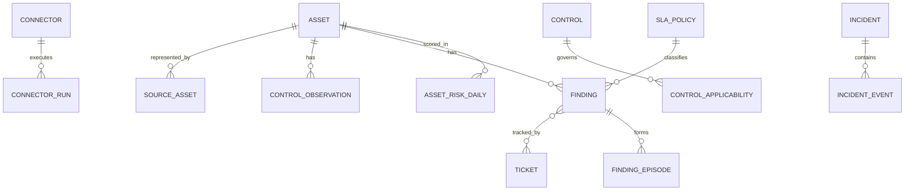

### Time dictionary

| Clock | Plain meaning | Suitable question | Unsuitable substitution |
|---|---|---|---|
| `event_at` | When activity allegedly happened | Incident ordering | Connector freshness |
| `observed_at` | When source observed state | Evidence freshness | Pipeline processing delay alone |
| `source_updated_at` | When source says record changed | Incremental extraction | Guaranteed event occurrence |
| `ingested_at` | When NMH received record | Ingestion latency | Actual security-state time |
| `processed_at` | When transformation completed | Pipeline delay | Source observation time |
| `snapshot_date` | Logical state date | Backlog/risk comparison | Event counts |
| `first_observed_at` | First governed sighting | Finding age | Vulnerability publication date |
| `due_at` | Computed deadline under policy | SLA breach | Proof of remediation priority |
| `closed_at` | Workflow closure time | Ticket/finding workflow | Verified effective remediation |
| `verified_at` | Validation time | Confirmed outcome | Original closure clock |

Use a fixed synthetic evaluation instant throughout examples:

```sql
TIMESTAMPTZ '2026-08-24 00:00:00+00'
```

Using `CURRENT_TIMESTAMP` is convenient for operations but makes teaching results change. Production jobs can use a run parameter captured once and recorded with output.

## The query contract

Before writing SQL, complete this contract.

| Contract field | Example for NMH asset coverage | Wrong shortcut |
|---|---|---|
| Decision | Investigate endpoint-control collection gaps | "Show coverage" |
| Population | Active managed Windows laptops effective at snapshot | All asset rows ever seen |
| Grain | One eligible asset | One source observation |
| Qualifying evidence | Latest healthy endpoint observation within 24 hours | Any historical row |
| Numerator | Eligible assets with qualifying evidence | Count of evidence rows |
| Denominator | Eligible assets, including unknown evidence state | Assets found by the same source |
| As-of | 2026-08-24 00:00 UTC | Runtime now on every subquery |
| Exclusions | Approved lab devices and retired assets | Silent filters |
| Unknown handling | Keep and label unresolved identity/source state | Convert null to false |
| Quality gate | Connector run complete and expected scope loaded | Ignore pipeline status |
| Output | Coverage rate plus exception rows and flags | Percentage alone |

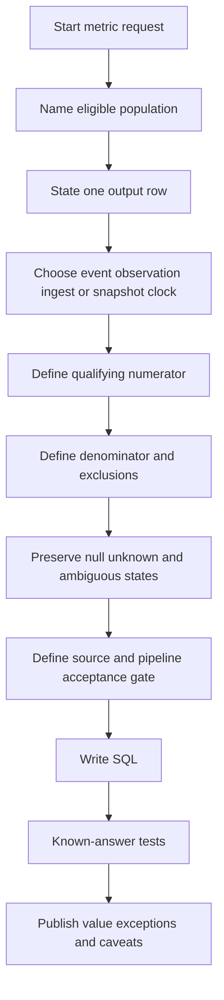

### Plain-English deep-dive 1 - The denominator is the product decision

Imagine asking what percentage of students passed an exam. Dividing passes by students who submitted answers excludes absent students. Dividing by enrolled students includes them. Neither denominator is universally correct; each answers a different question.

For security coverage, dividing assets with endpoint evidence by assets reported by the endpoint source can approach 100 percent even when the source misses half the enterprise. The source cannot reveal what it cannot see. A defensible denominator comes from a separately governed eligible population, with source scope and identity quality visible. Publish the numerator, denominator, exclusions, unknown count, and as-of time beside the rate.

## Pattern 1 - Asset coverage

Asset coverage asks: among assets expected to have a type of evidence, how many have qualifying current evidence? It does not ask merely how many records exist.

```sql
WITH parameters AS (
    SELECT TIMESTAMPTZ '2026-08-24 00:00:00+00' AS as_of
),
eligible_assets AS (
    SELECT
        a.asset_id,
        a.canonical_name,
        a.business_unit
    FROM nmh_rel.asset AS a
    CROSS JOIN parameters AS p
    WHERE a.asset_type = 'windows_laptop'
      AND a.management_scope = 'managed'
      AND a.lifecycle_status = 'active'
      AND a.valid_from <= p.as_of
      AND (a.valid_to IS NULL OR a.valid_to > p.as_of)
),
latest_endpoint_evidence AS (
    SELECT
        o.asset_id,
        o.observed_at,
        o.collection_state,
        ROW_NUMBER() OVER (
            PARTITION BY o.asset_id
            ORDER BY o.observed_at DESC, o.source_sequence DESC
        ) AS row_position
    FROM nmh_rel.asset_control_observation AS o
    WHERE o.control_id = 'endpoint_telemetry'
      AND o.source_system = 'nmh_endpoint_lab'
)
SELECT
    e.business_unit,
    COUNT(*) AS eligible_assets,
    COUNT(*) FILTER (
        WHERE l.row_position = 1
          AND l.collection_state = 'healthy'
          AND l.observed_at >= p.as_of - INTERVAL '24 hours'
    ) AS covered_assets,
    COUNT(*) FILTER (
        WHERE l.asset_id IS NULL
           OR l.observed_at < p.as_of - INTERVAL '24 hours'
           OR l.collection_state IS DISTINCT FROM 'healthy'
    ) AS not_qualifying_assets,
    COUNT(*) FILTER (
        WHERE l.row_position = 1
          AND l.collection_state IS NULL
    ) AS unknown_state_assets,
    COUNT(*) FILTER (
        WHERE l.row_position = 1
          AND l.collection_state = 'healthy'
          AND l.observed_at >= p.as_of - INTERVAL '24 hours'
    )::numeric / NULLIF(COUNT(*), 0) AS coverage_rate
FROM eligible_assets AS e
CROSS JOIN parameters AS p
LEFT JOIN latest_endpoint_evidence AS l
  ON l.asset_id = e.asset_id
 AND l.row_position = 1
GROUP BY e.business_unit
ORDER BY e.business_unit;
```

The numerator is a subset of the eligible asset rows. Latest evidence is reduced to one row per asset before the join, preventing multiple observations from inflating coverage. `IS DISTINCT FROM` treats null as meaningfully different from healthy for the exception bucket, while the separate unknown count keeps interpretation visible.

| Coverage check | Test | Expected property |
|---|---|---|
| Denominator conservation | Sum covered, stale/unhealthy/missing categories under mutually exclusive classification | Equals eligible assets |
| Evidence uniqueness | Count latest rows and distinct asset IDs | Equal |
| Empty population | Test a business unit with no eligible assets | Rate is null, not invented zero/100% |
| Duplicate delivery | Add two older evidence rows | Coverage unchanged |
| Time boundary | Evidence exactly at `as_of - 24 hours` | Included because predicate is `>=` |
| Unknown | Latest state null | Not covered and explicitly counted unknown |

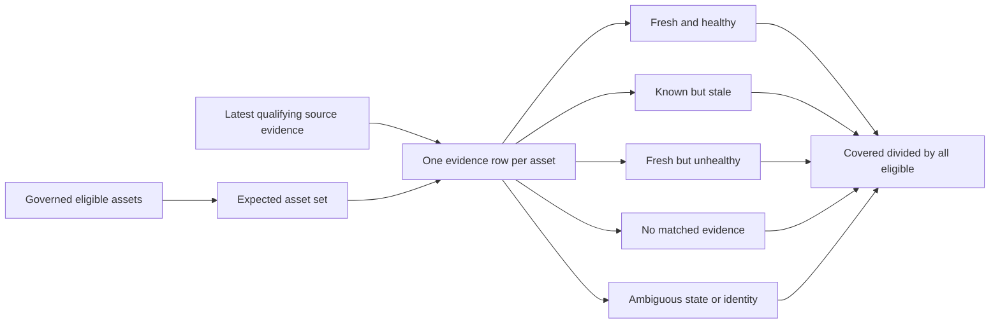

## Pattern 2 - Source reconciliation

Reconciliation compares two governed source sets. A full outer join is useful after each side is normalized to one row per comparison key. The output should classify differences, not declare which source is correct.

```sql
WITH cmdb_scope AS (
    SELECT
        tenant_id,
        normalized_source_asset_id AS comparison_key,
        MAX(source_updated_at) AS latest_source_update,
        COUNT(*) AS source_rows
    FROM nmh_stage.source_asset
    WHERE source_system = 'nmh_cmdb_lab'
      AND extraction_id = 'cmdb-2026-08-24-0001'
    GROUP BY tenant_id, normalized_source_asset_id
),
scanner_scope AS (
    SELECT
        tenant_id,
        normalized_source_asset_id AS comparison_key,
        MAX(source_updated_at) AS latest_source_update,
        COUNT(*) AS source_rows
    FROM nmh_stage.source_asset
    WHERE source_system = 'nmh_scanner_lab'
      AND extraction_id = 'scanner-2026-08-24-0001'
    GROUP BY tenant_id, normalized_source_asset_id
)
SELECT
    COALESCE(c.tenant_id, s.tenant_id) AS tenant_id,
    COALESCE(c.comparison_key, s.comparison_key) AS comparison_key,
    c.source_rows AS cmdb_rows,
    s.source_rows AS scanner_rows,
    CASE
        WHEN c.comparison_key IS NULL THEN 'scanner_only'
        WHEN s.comparison_key IS NULL THEN 'cmdb_only'
        WHEN c.source_rows > 1 OR s.source_rows > 1 THEN 'matched_with_source_duplicates'
        ELSE 'matched_one_to_one'
    END AS reconciliation_state
FROM cmdb_scope AS c
FULL OUTER JOIN scanner_scope AS s
  ON s.tenant_id = c.tenant_id
 AND s.comparison_key = c.comparison_key
ORDER BY tenant_id, comparison_key;
```

The exact normalized key is a governed mapping, not ad hoc lowercasing. Hostnames can be reused; cloud instance IDs can be recycled across accounts; IP addresses change. Tenant, account, domain, time, and source semantics may belong in the identity key.

| Difference | Plausible explanations | Discriminating evidence |
|---|---|---|
| CMDB only | Scanner scope gap, recent retirement mismatch, alias defect, failed load | Scanner job scope/status, lifecycle effective time, raw IDs |
| Scanner only | Shadow asset, CMDB onboarding delay, ephemeral workload, bad match | Cloud/account provenance, first seen, CMDB workflow |
| Duplicate on one side | Retries, version rows, true duplicate source objects | Stable event/version ID, payload comparison |
| Attribute mismatch | Timing, source authority, transformation defect | Effective timestamps, field-level provenance |
| Count mismatch but key match | One-to-many source versions collapsed | Raw row counts and extraction contract |

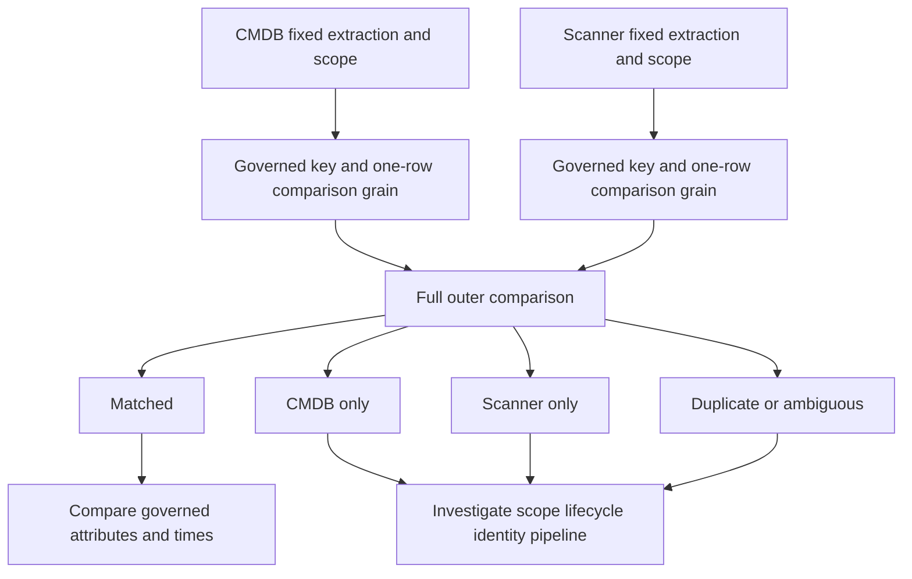

## Pattern 3 - Stale assets and stale connectors

Stale asset evidence and stale connector operation are different layers. An asset might be stale because it is offline while the connector is healthy. A connector might be stale even though old asset rows remain in the warehouse. Analyze both.

```sql
WITH parameters AS (
    SELECT TIMESTAMPTZ '2026-08-24 00:00:00+00' AS as_of
),
latest_run AS (
    SELECT
        r.*,
        ROW_NUMBER() OVER (
            PARTITION BY r.connector_id
            ORDER BY r.scheduled_for DESC, r.run_id DESC
        ) AS row_position
    FROM nmh_rel.connector_run AS r
    CROSS JOIN parameters AS p
    WHERE r.scheduled_for <= p.as_of
)
SELECT
    c.connector_id,
    c.expected_interval_minutes,
    r.scheduled_for,
    r.ended_at,
    r.run_status,
    r.rows_received,
    CASE
        WHEN r.connector_id IS NULL THEN 'never_observed'
        WHEN r.run_status <> 'succeeded' THEN 'latest_run_failed'
        WHEN r.ended_at IS NULL THEN 'latest_run_incomplete'
        WHEN r.ended_at < p.as_of
             - make_interval(mins => c.expected_interval_minutes + c.allowed_lag_minutes)
          THEN 'late_beyond_contract'
        WHEN r.rows_received = 0 AND c.zero_rows_expected = false
          THEN 'unexpected_zero_rows'
        ELSE 'current_by_contract'
    END AS freshness_state
FROM nmh_rel.connector AS c
CROSS JOIN parameters AS p
LEFT JOIN latest_run AS r
  ON r.connector_id = c.connector_id
 AND r.row_position = 1
WHERE c.lifecycle_status = 'active'
ORDER BY c.connector_id;
```

The threshold is connector-specific. A daily source is not stale after ten minutes; a five-minute source might be. Scheduled time, completion time, source observation watermark, and processed watermark answer different questions.

```sql
SELECT
    a.asset_id,
    a.canonical_name,
    MAX(o.observed_at) AS latest_asset_observation,
    TIMESTAMPTZ '2026-08-24 00:00:00+00' - MAX(o.observed_at) AS observation_age
FROM nmh_rel.asset AS a
LEFT JOIN nmh_rel.asset_control_observation AS o
  ON o.asset_id = a.asset_id
 AND o.source_system = 'nmh_endpoint_lab'
WHERE a.lifecycle_status = 'active'
GROUP BY a.asset_id, a.canonical_name
HAVING MAX(o.observed_at) IS NULL
    OR MAX(o.observed_at) < TIMESTAMPTZ '2026-08-24 00:00:00+00' - INTERVAL '24 hours'
ORDER BY latest_asset_observation NULLS FIRST, a.asset_id;
```

| Freshness layer | Metric | Failure interpretation |
|---|---|---|
| Schedule | Time since expected run | Orchestrator did not start on time |
| Execution | Latest run result/duration | Connector failed, hung, or slowed |
| Delivery | Rows/bytes/checksum received | Empty, partial, or duplicate transfer |
| Source watermark | Maximum source update represented | Extraction may lag source |
| Observation | Maximum observed time in records | Assets/evidence may be old |
| Processing | Time to accepted modeled output | Transform/quality stage may lag |
| Dashboard | Published refresh completion | Users may see older state than model |

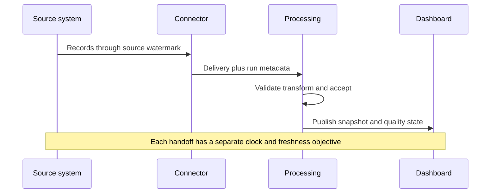

### Plain-English deep-dive 2 - Old data can look healthy

A wall clock can keep displaying a perfectly formatted time after its battery dies. The value looks valid but no longer advances. A dashboard can similarly show plausible counts from yesterday after a connector fails.

Freshness is therefore part of every current-state metric. Show the source watermark, latest successful complete run, processing acceptance time, and dashboard refresh time. Do not use the newest row alone if a partial load could contain one recent record while omitting most of the population. Volume and completeness gates must accompany time.

## Pattern 4 - Missing controls

A missing-control query starts with applicability. Generating every asset-control pair would mark irrelevant controls as gaps. The expected set comes from effective policy, asset type, business scope, exceptions, and snapshot.

```sql
WITH parameters AS (
    SELECT TIMESTAMPTZ '2026-08-24 00:00:00+00' AS as_of
),
expected_pairs AS (
    SELECT
        a.asset_id,
        r.control_id,
        r.freshness_interval,
        r.rule_id
    FROM nmh_rel.asset AS a
    JOIN nmh_rel.control_applicability AS r
      ON r.asset_type = a.asset_type
    CROSS JOIN parameters AS p
    WHERE a.lifecycle_status = 'active'
      AND r.valid_from <= p.as_of
      AND (r.valid_to IS NULL OR r.valid_to > p.as_of)
      AND NOT EXISTS (
          SELECT 1
          FROM nmh_rel.control_exception AS x
          WHERE x.asset_id = a.asset_id
            AND x.control_id = r.control_id
            AND x.approved_at IS NOT NULL
            AND x.valid_from <= p.as_of
            AND x.valid_to > p.as_of
      )
),
latest_observation AS (
    SELECT
        o.*,
        ROW_NUMBER() OVER (
            PARTITION BY o.asset_id, o.control_id
            ORDER BY o.observed_at DESC, o.source_sequence DESC
        ) AS row_position
    FROM nmh_rel.asset_control_observation AS o
)
SELECT
    e.asset_id,
    e.control_id,
    e.rule_id,
    o.observed_at,
    o.reported_state,
    CASE
        WHEN o.asset_id IS NULL THEN 'no_observation'
        WHEN o.observed_at < p.as_of - e.freshness_interval THEN 'stale_observation'
        WHEN o.reported_state IS NULL THEN 'unknown_state'
        WHEN o.reported_state <> 'effective' THEN 'observed_not_effective'
        ELSE 'qualifying'
    END AS control_evidence_state
FROM expected_pairs AS e
CROSS JOIN parameters AS p
LEFT JOIN latest_observation AS o
  ON o.asset_id = e.asset_id
 AND o.control_id = e.control_id
 AND o.row_position = 1
WHERE o.asset_id IS NULL
   OR o.observed_at < p.as_of - e.freshness_interval
   OR o.reported_state IS DISTINCT FROM 'effective'
ORDER BY control_evidence_state, e.control_id, e.asset_id;
```

This returns exceptions in queried evidence. A human or governed workflow still distinguishes collection failure, identity mismatch, approved exception, inapplicability, stale evidence, misconfiguration, and actual absent/ineffective control.

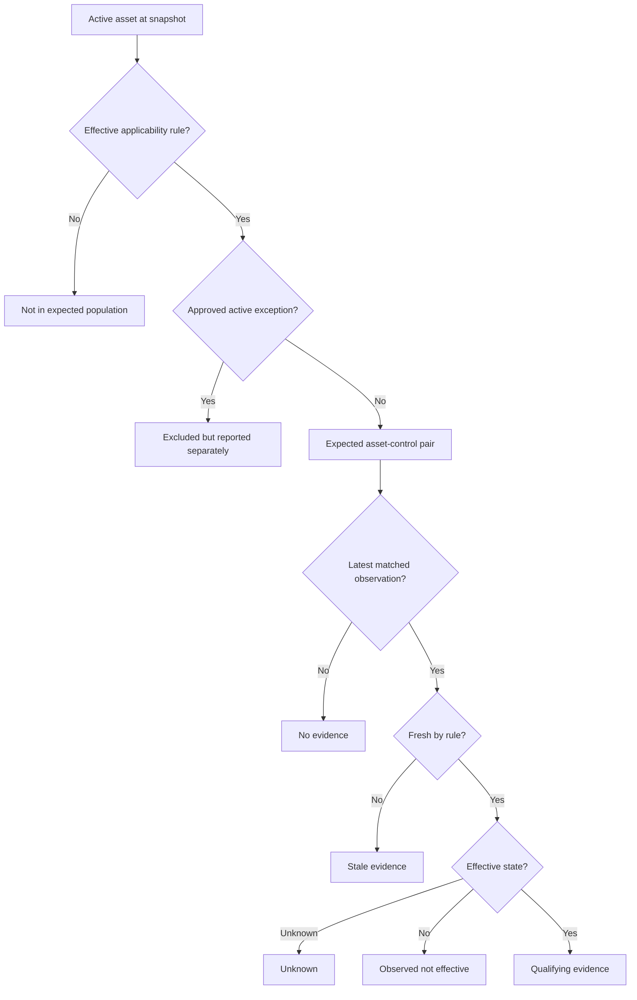

## Pattern 5 - Vulnerability aging

Vulnerability aging needs the unit being aged. A CVE publication age, scanner finding age, asset exposure episode age, ticket age, and verified-remediation time are different. NMH ages source finding instances from governed first observation to a fixed as-of or verified closure.

```sql
WITH parameters AS (
    SELECT TIMESTAMPTZ '2026-08-24 00:00:00+00' AS as_of
),
aged AS (
    SELECT
        f.finding_id,
        f.asset_id,
        f.owner_id,
        f.first_observed_at,
        f.verified_at,
        LEAST(COALESCE(f.verified_at, p.as_of), p.as_of)
            - f.first_observed_at AS elapsed_age,
        CASE
            WHEN f.first_observed_at > p.as_of THEN 'future_time_error'
            WHEN f.verified_at IS NOT NULL
             AND f.verified_at < f.first_observed_at THEN 'negative_duration_error'
            WHEN f.verified_at IS NOT NULL THEN 'verified_closed'
            ELSE 'open_at_snapshot'
        END AS lifecycle_state
    FROM nmh_rel.finding AS f
    CROSS JOIN parameters AS p
    WHERE f.first_observed_at < p.as_of
)
SELECT
    lifecycle_state,
    COUNT(*) AS finding_instances,
    COUNT(DISTINCT asset_id) AS affected_assets,
    PERCENTILE_CONT(0.5) WITHIN GROUP (
        ORDER BY EXTRACT(EPOCH FROM elapsed_age) / 86400.0
    ) AS median_elapsed_days,
    PERCENTILE_CONT(0.9) WITHIN GROUP (
        ORDER BY EXTRACT(EPOCH FROM elapsed_age) / 86400.0
    ) AS p90_elapsed_days,
    COUNT(*) FILTER (WHERE elapsed_age >= INTERVAL '30 days') AS age_30_plus
FROM aged
GROUP BY lifecycle_state
ORDER BY lifecycle_state;
```

`PERCENTILE_CONT` is PostgreSQL ordered-set aggregate behavior. The median is less sensitive to a few extreme old rows than the mean but can hide a severe tail; publish bands and high percentiles too. If still-open findings are excluded from closure-duration summaries, survivorship bias makes results look better.

| Aging decision | Required rule | Common distortion |
|---|---|---|
| Start | First governed observation of what identity? | Late onboarding makes old vulnerability appear new |
| Stop | Verified effective remediation or snapshot? | Ticket closure used as proof |
| Pause | Approved exception/maintenance waiting? | Silent clock pauses game SLA |
| Reopen | Same episode or new episode? | Resetting age on status toggle |
| Duplicate | Source instance versus logical vulnerability-asset pair | Double counting multi-source findings |
| Right censoring | Open at end of observation | Dropping open rows from duration analysis |
| Time zone | UTC instant and calendar definition | Day-boundary disagreement |

## Pattern 6 - SLA breaches

An SLA query must choose the policy effective when the clock starts, calculate a due time, account for approved pauses exactly as policy allows, and classify not-due, breached-open, met, breached-closed, and unknown-policy states.

```sql
WITH parameters AS (
    SELECT TIMESTAMPTZ '2026-08-24 00:00:00+00' AS as_of
),
classified AS (
    SELECT
        f.finding_id,
        f.owner_id,
        f.first_observed_at,
        f.verified_at,
        p.target_interval,
        f.first_observed_at + p.target_interval AS due_at,
        x.approved_pause_interval,
        f.first_observed_at + p.target_interval
            + COALESCE(x.approved_pause_interval, INTERVAL '0') AS adjusted_due_at
    FROM nmh_rel.finding AS f
    LEFT JOIN nmh_rel.sla_policy AS p
      ON p.policy_tier = f.policy_tier
     AND p.valid_from <= f.first_observed_at
     AND (p.valid_to IS NULL OR p.valid_to > f.first_observed_at)
    LEFT JOIN nmh_models.finding_approved_pause AS x
      ON x.finding_id = f.finding_id
)
SELECT
    finding_id,
    owner_id,
    adjusted_due_at,
    CASE
        WHEN target_interval IS NULL THEN 'unknown_policy'
        WHEN verified_at IS NOT NULL AND verified_at <= adjusted_due_at THEN 'met_verified'
        WHEN verified_at IS NOT NULL AND verified_at > adjusted_due_at THEN 'breached_before_verified'
        WHEN adjusted_due_at < p.as_of THEN 'breached_open'
        ELSE 'open_not_due'
    END AS sla_state
FROM classified
CROSS JOIN parameters AS p
ORDER BY adjusted_due_at NULLS FIRST, finding_id;
```

If multiple policy versions match, this query fans out. A no-overlap constraint or known-answer uniqueness check is mandatory. Business calendars, pause intervals, severity changes, risk acceptance, and clock-reset rules require a governed policy function; simple interval addition is only a synthetic teaching model.

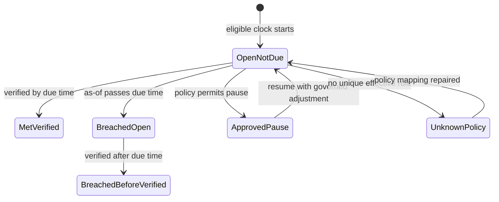

### Plain-English deep-dive 3 - An SLA percentage can improve while customers get worse outcomes

Suppose a team closes easy low-risk items rapidly but leaves difficult critical items open. Overall compliance can rise because the denominator is dominated by easy work. The old critical tail may remain or worsen.

Publish SLA results by governed tier and age, show open breached counts, newly due volume, verified closures, exceptions, unassigned work, and denominator changes. Never call ticket closure risk reduction unless validation supports it. A TSM should ask what decisions the metric encourages and whether teams can improve the number without improving security.

## Pattern 7 - Risk trends

Trend analysis compares like with like. A score can change because underlying exposure changed, the asset population changed, source completeness changed, or the scoring model changed. Preserve these components.

```sql
WITH daily AS (
    SELECT
        snapshot_date,
        score_model_version,
        COUNT(*) AS scored_assets,
        COUNT(*) FILTER (WHERE quality_state = 'accepted') AS accepted_assets,
        AVG(risk_score) FILTER (WHERE quality_state = 'accepted') AS mean_asset_score,
        PERCENTILE_CONT(0.5) WITHIN GROUP (
            ORDER BY risk_score
        ) FILTER (WHERE quality_state = 'accepted') AS median_asset_score,
        SUM(risk_score) FILTER (WHERE quality_state = 'accepted') AS score_sum
    FROM nmh_models.asset_risk_daily
    WHERE snapshot_date >= DATE '2026-07-01'
      AND snapshot_date < DATE '2026-08-26'
    GROUP BY snapshot_date, score_model_version
)
SELECT
    daily.*,
    mean_asset_score - LAG(mean_asset_score) OVER (
        PARTITION BY score_model_version
        ORDER BY snapshot_date
    ) AS change_from_prior_available_snapshot,
    accepted_assets - LAG(accepted_assets) OVER (
        PARTITION BY score_model_version
        ORDER BY snapshot_date
    ) AS population_change
FROM daily
ORDER BY snapshot_date, score_model_version;
```

Do not bridge a model-version change with an ordinary line and imply continuity. Either recompute history under the new version where governed, show parallel series, or mark a break. Mean scores can move when low-risk assets are newly onboarded even if no existing asset improves.

| Trend component | Question | Required display |
|---|---|---|
| Same-asset change | Did comparable assets improve? | Stable cohort and attrition count |
| Population change | Were assets added or removed? | Added/removed counts and profiles |
| Data quality | Did accepted completeness change? | Quality state and source freshness |
| Model change | Did formula/weights/version change? | Version and series break |
| Exposure change | Did findings/controls actually change? | Driver decomposition |
| Aggregation | Mean, median, tail, weighted measure? | Definition and distribution |

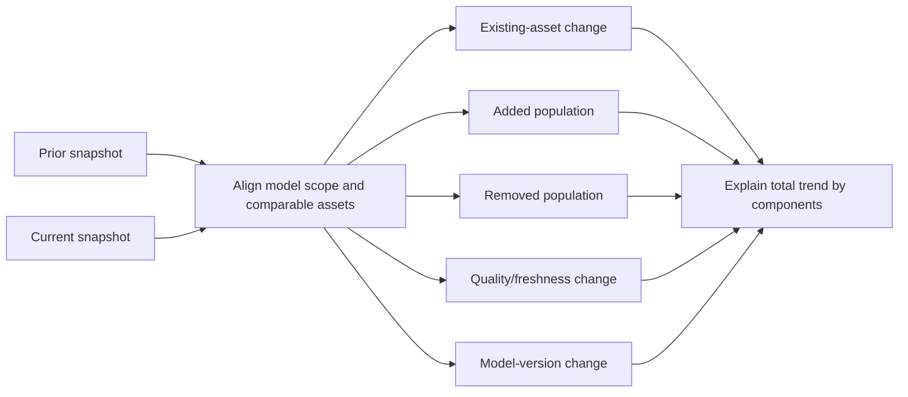

## Pattern 8 - Owner backlogs

An owner backlog is a current snapshot of eligible unresolved work grouped by a governed ownership rule. It should retain unassigned items and avoid multiplying findings by multiple owners or tickets.

```sql
WITH parameters AS (
    SELECT TIMESTAMPTZ '2026-08-24 00:00:00+00' AS as_of
),
current_owner AS (
    SELECT
        h.asset_id,
        h.owner_id,
        ROW_NUMBER() OVER (
            PARTITION BY h.asset_id, h.ownership_type
            ORDER BY h.valid_from DESC, h.owner_history_id DESC
        ) AS row_position
    FROM nmh_rel.asset_owner_history AS h
    CROSS JOIN parameters AS p
    WHERE h.ownership_type = 'remediation'
      AND h.valid_from <= p.as_of
      AND (h.valid_to IS NULL OR h.valid_to > p.as_of)
),
backlog AS (
    SELECT
        f.finding_id,
        f.asset_id,
        COALESCE(o.owner_id, 'UNASSIGNED') AS backlog_owner,
        f.first_observed_at,
        f.due_at
    FROM nmh_rel.finding AS f
    CROSS JOIN parameters AS p
    LEFT JOIN current_owner AS o
      ON o.asset_id = f.asset_id
     AND o.row_position = 1
    WHERE f.first_observed_at <= p.as_of
      AND (f.verified_at IS NULL OR f.verified_at > p.as_of)
)
SELECT
    backlog_owner,
    COUNT(*) AS open_finding_instances,
    COUNT(DISTINCT asset_id) AS affected_assets,
    COUNT(*) FILTER (
        WHERE due_at < TIMESTAMPTZ '2026-08-24 00:00:00+00'
    ) AS overdue_findings,
    MIN(first_observed_at) AS oldest_first_observed_at
FROM backlog
GROUP BY backlog_owner
ORDER BY overdue_findings DESC, open_finding_instances DESC, backlog_owner;
```

If overlapping current ownership intervals exist, `ROW_NUMBER` hides a governance defect. A separate quality test should fail the extract or route ambiguous ownership to review rather than arbitrarily selecting one.

| Backlog field | Meaning | Misuse warning |
|---|---|---|
| Open finding instances | Source-grain unresolved observations | Not unique vulnerabilities |
| Affected assets | Distinct assets represented | Does not show business impact |
| Overdue | Due time passed under valid policy | Not automatically highest risk |
| Oldest | Earliest first observation | One extreme row can dominate story |
| Unassigned | No unique current governed owner | Do not drop null owner in grouping |
| Owner | Responsible workflow entity at snapshot | Not necessarily asset business owner |

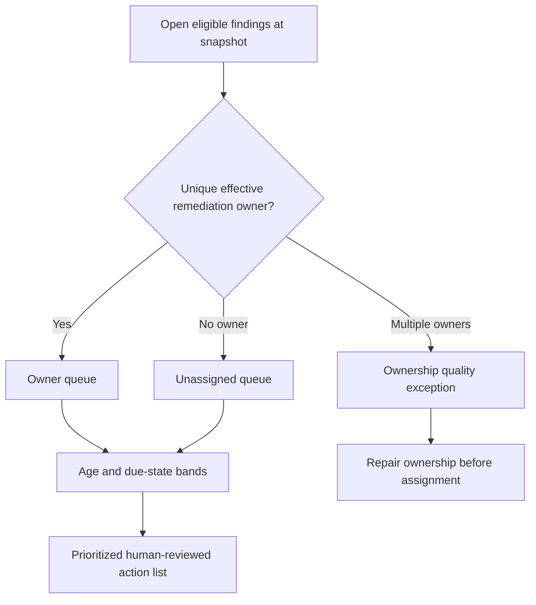

## Pattern 9 - Duplicate entities

Duplicate detection produces candidates, not automatic merges. Start with high-confidence deterministic evidence and preserve each source record.

```sql
WITH candidate_keys AS (
    SELECT
        tenant_id,
        governed_hardware_key,
        COUNT(DISTINCT asset_id) AS resolved_assets,
        ARRAY_AGG(DISTINCT asset_id ORDER BY asset_id) AS asset_ids,
        ARRAY_AGG(DISTINCT source_system ORDER BY source_system) AS source_systems
    FROM nmh_models.asset_identity_evidence
    WHERE governed_hardware_key IS NOT NULL
    GROUP BY tenant_id, governed_hardware_key
)
SELECT
    tenant_id,
    governed_hardware_key,
    resolved_assets,
    asset_ids,
    source_systems,
    'shared_strong_key_candidate' AS review_reason
FROM candidate_keys
WHERE resolved_assets > 1
ORDER BY resolved_assets DESC, tenant_id, governed_hardware_key;
```

The hardware key is synthetic and governed. Even a strong key can be cloned, reused after device replacement, malformed, or scoped incorrectly. Human review and source provenance remain necessary. Fuzzy names/IP addresses should generate lower-confidence candidates, not silent merges.

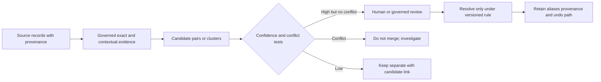

## Pattern 10 - Latest records

The latest-record pattern needs an entity partition, authoritative ordering clock, source sequence, and stable unique final tie-breaker. Arrival time alone can choose a late old event as current.

```sql
WITH ranked AS (
    SELECT
        o.observation_id,
        o.asset_id,
        o.control_id,
        o.source_system,
        o.observed_at,
        o.source_sequence,
        o.reported_state,
        ROW_NUMBER() OVER (
            PARTITION BY o.asset_id, o.control_id, o.source_system
            ORDER BY
                o.observed_at DESC,
                o.source_sequence DESC,
                o.observation_id DESC
        ) AS row_position,
        COUNT(*) OVER (
            PARTITION BY o.asset_id, o.control_id, o.source_system, o.observed_at, o.source_sequence
        ) AS ordering_tie_count
    FROM nmh_rel.asset_control_observation AS o
    WHERE o.observed_at <= TIMESTAMPTZ '2026-08-24 00:00:00+00'
)
SELECT
    observation_id,
    asset_id,
    control_id,
    source_system,
    observed_at,
    reported_state,
    ordering_tie_count
FROM ranked
WHERE row_position = 1
ORDER BY asset_id, control_id, source_system;
```

`observation_id` makes the query deterministic but does not resolve contradictory payloads that share the authoritative time/sequence. `ordering_tie_count` exposes ambiguity. A product-quality rule could quarantine conflicting ties instead of selecting one.

| Latest-row question | Required answer |
|---|---|
| Latest per what? | Exact entity/source/control partition |
| Latest by which clock? | Contracted source event/update time |
| Are late arrivals allowed? | Watermark and restatement policy |
| Can timestamps tie? | Stable source sequence/version |
| Can sequence tie with conflict? | Quarantine or conflict policy |
| Is deletion a record? | Tombstone handling |
| Is current state reproducible? | Fixed as-of and retained history |

## Pattern 11 - Incident timelines and bounded correlation

An incident timeline orders normalized evidence while preserving original clocks and provenance. Temporal correlation finds events near an anchor; it does not prove they share a cause.

```sql
WITH anchor AS (
    SELECT
        incident_id,
        MIN(event_at) FILTER (WHERE event_type = 'account_compromise_confirmed') AS anchor_at
    FROM nmh_rel.incident_event
    WHERE incident_id = 'NMH-INC-LAB-0042'
    GROUP BY incident_id
),
timeline AS (
    SELECT
        e.incident_id,
        e.event_id,
        e.event_type,
        e.entity_id,
        e.event_at,
        e.observed_at,
        e.ingested_at,
        e.source_system,
        a.anchor_at,
        e.event_at - a.anchor_at AS offset_from_anchor,
        ROW_NUMBER() OVER (
            ORDER BY e.event_at, e.source_priority, e.event_id
        ) AS timeline_position
    FROM nmh_rel.incident_event AS e
    JOIN anchor AS a ON a.incident_id = e.incident_id
    WHERE e.event_at >= a.anchor_at - INTERVAL '2 hours'
      AND e.event_at <  a.anchor_at + INTERVAL '4 hours'
)
SELECT *
FROM timeline
ORDER BY timeline_position;
```

Correlating all events in a broad window creates coincidence. Add entity, session, device, network, identity, or causal-path evidence according to the investigation. Record clock quality and do not overwrite source event time with ingest time.

```mermaid
sequenceDiagram
    participant I as Identity source
    participant E as Endpoint source
    participant N as Network source
    participant C as Case record
    I->>C: Event time T1, observed O1, ingested G1
    E->>C: Event time T2, observed O2, ingested G2
    N->>C: Event time T3, observed O3, ingested G3
    Note over I,C: Normalize clocks but retain originals and uncertainty
    C->>C: Order by governed event time plus deterministic tie-breaker
    C->>C: Test shared entities and bounded window
    Note over C: Association supports a hypothesis; it does not prove causation
```

| Timeline failure | Symptom | Check |
|---|---|---|
| Clock skew | Impossible event order | Source clock offset/quality metadata |
| Duplicate delivery | Repeated identical event | Stable event ID and payload hash |
| Late arrival | Old event appears after incident close | Event versus ingest time |
| Time-zone parse | Events shifted by hours | Original offset and parser contract |
| Overbroad correlation | Huge unrelated event set | Entity/path constraints and null model |
| Missing source | False clean interval | Connector health and expected coverage |
| Tie instability | Timeline order changes | Source priority and stable event ID |

## Pattern 12 - Cohorts

A cohort compares populations that entered under the same rule and have had equal time to produce an outcome. Here, findings first observed in the same UTC week are evaluated for verified closure within 30 elapsed days.

```sql
WITH parameters AS (
    SELECT TIMESTAMPTZ '2026-08-24 00:00:00+00' AS as_of
),
cohort_members AS (
    SELECT
        f.finding_id,
        date_trunc('week', f.first_observed_at, 'UTC') AS cohort_week,
        f.first_observed_at,
        f.verified_at
    FROM nmh_rel.finding AS f
),
mature AS (
    SELECT c.*
    FROM cohort_members AS c
    CROSS JOIN parameters AS p
    WHERE c.first_observed_at + INTERVAL '30 days' <= p.as_of
)
SELECT
    cohort_week,
    COUNT(*) AS eligible_mature_findings,
    COUNT(*) FILTER (
        WHERE verified_at IS NOT NULL
          AND verified_at <= first_observed_at + INTERVAL '30 days'
    ) AS verified_within_30_days,
    COUNT(*) FILTER (
        WHERE verified_at IS NOT NULL
          AND verified_at <= first_observed_at + INTERVAL '30 days'
    )::numeric / NULLIF(COUNT(*), 0) AS verified_30_day_rate
FROM mature
GROUP BY cohort_week
ORDER BY cohort_week;
```

Late findings can restate historical cohorts. Store extraction/version metadata and label whether a report uses first-known or restated truth. Comparing an immature recent cohort with a mature older cohort is invalid.

## Pattern 13 - Recurrence

Recurrence means a new qualifying episode after a prior episode reached a governed resolved state and remained clear long enough to count as reset. Repeated observations during one open episode are not recurrence.

```sql
WITH episodes AS (
    SELECT
        logical_finding_key,
        asset_id,
        episode_number,
        opened_at,
        verified_resolved_at,
        LAG(verified_resolved_at) OVER (
            PARTITION BY logical_finding_key, asset_id
            ORDER BY opened_at, episode_number
        ) AS prior_verified_resolved_at
    FROM nmh_models.finding_episode
)
SELECT
    logical_finding_key,
    asset_id,
    episode_number,
    opened_at,
    prior_verified_resolved_at,
    opened_at - prior_verified_resolved_at AS clear_interval,
    CASE
        WHEN prior_verified_resolved_at IS NULL THEN 'first_episode'
        WHEN opened_at >= prior_verified_resolved_at + INTERVAL '7 days'
          THEN 'recurrence_after_clear_period'
        ELSE 'possible_reopen_or_episode_split'
    END AS recurrence_state
FROM episodes
ORDER BY logical_finding_key, asset_id, opened_at, episode_number;
```

The seven-day rule is synthetic, not a security standard. Different finding types need different reset rules. A recurrence rate denominator might be resolved episodes eligible for follow-up, not all findings or all assets.

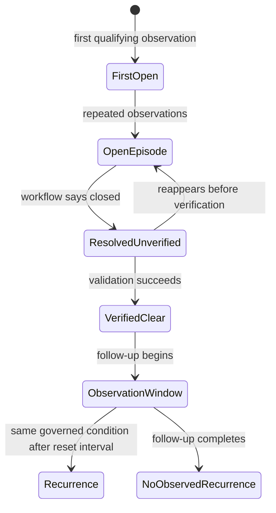

### Plain-English deep-dive 4 - Reappearance is not automatically recurrence

If a dripping pipe is reported every day until repaired, ten reports describe one unresolved episode. If it is repaired, verified dry, and leaks again next month, that is a recurrence. Counting every report as recurrence punishes better monitoring and inflates failure.

Security data often contains repeated scanner observations. Build episodes from a stable logical key, state transitions, verification evidence, and a reset interval. Keep the raw observations. Publish follow-up eligibility and censoring, because recently resolved episodes have had less opportunity to recur.

## Pattern 14 - Dashboard extracts

A dashboard extract should have a documented stable grain and carry metric context. Do not make every visual rediscover identity, time, quality, or SLA rules.

```sql
CREATE VIEW nmh_publish.owner_backlog_daily_lab AS
SELECT
    snapshot_date,
    backlog_owner_id,
    policy_tier,
    age_band,
    sla_state,
    source_quality_state,
    COUNT(*) AS finding_instances,
    COUNT(DISTINCT asset_id) AS affected_assets,
    MIN(first_observed_at) AS oldest_first_observed_at,
    MAX(pipeline_accepted_at) AS pipeline_accepted_at
FROM nmh_models.finding_backlog_snapshot_lab
GROUP BY
    snapshot_date,
    backlog_owner_id,
    policy_tier,
    age_band,
    sla_state,
    source_quality_state;
```

This synthetic DDL is illustrative. In an authorized lab, use an approved schema and privileges. In production, versioning, row-level access, masking, refresh semantics, materialization, lineage, and deployment review are required.

| Extract contract field | Example |
|---|---|
| Grain | One snapshot-owner-tier-age-band-SLA-quality row |
| Measures | Finding instances and distinct affected assets |
| Additivity | Counts additive across owner/tier if categories are exclusive; not across snapshots |
| Snapshot | UTC logical day with accepted pipeline run |
| Unknowns | `UNASSIGNED`, `unknown_policy`, and quality states retained |
| Drill key | Separate authorized detail table; no sensitive IDs in executive view |
| Refresh | Publish only after acceptance gate |
| Restatement | Historical snapshot version and reason recorded |
| Security | Least privilege, masking, tenant filter, export policy |

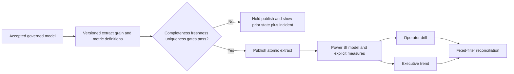

## Universal grain, denominator, time, null, and fanout checks

Every query pattern gets the same review card.

| Dimension | Question | Cheap check | Failure signal |
|---|---|---|---|
| Grain | What does one row mean at every stage? | Count rows and distinct intended key | Rows exceed keys unexpectedly |
| Population | Who is eligible? | Materialize/count eligibility CTE | Numerator includes noneligible rows |
| Denominator | Does every numerator row belong to denominator? | Anti join numerator to denominator | Orphan numerator rows |
| Time | Which clock/as-of/window? | Boundary rows before/at/after cutoff | Nonreproducible or shifted result |
| Null | What does missing value mean? | Null truth-table fixture | Unknown silently becomes false/zero |
| Fanout | Can joins multiply entities? | Counts before/after each join | Sudden multiplication |
| Uniqueness | Are supposedly one-row relationships unique? | Group key `HAVING COUNT(*) > 1` | Duplicate current policy/owner |
| Source scope | Same tenant/account/extraction? | Include scope columns in reconciliation | Cross-scope matches |
| Quality | Was the input accepted? | Connector/pipeline gate | Plausible result from partial load |
| Units | Counts, days, scores, percentages compatible? | Unit metadata and range checks | Mixed scales/time units |

```sql
-- Generic fanout checkpoint for an intermediate result.
WITH candidate AS (
    SELECT
        f.finding_id,
        f.asset_id,
        t.ticket_id
    FROM nmh_rel.finding AS f
    LEFT JOIN nmh_rel.ticket_finding AS tf
      ON tf.finding_id = f.finding_id
    LEFT JOIN nmh_rel.ticket AS t
      ON t.ticket_id = tf.ticket_id
)
SELECT
    COUNT(*) AS output_rows,
    COUNT(DISTINCT finding_id) AS distinct_findings,
    COUNT(DISTINCT asset_id) AS distinct_assets,
    COUNT(*)::numeric / NULLIF(COUNT(DISTINCT finding_id), 0) AS rows_per_finding
FROM candidate;
```

The ratio identifies average fanout, not its distribution. Also group by finding and inspect maximum/p95 child count. Do not repair a ticket-finding many-to-many relationship with `DISTINCT` if ticket detail matters.

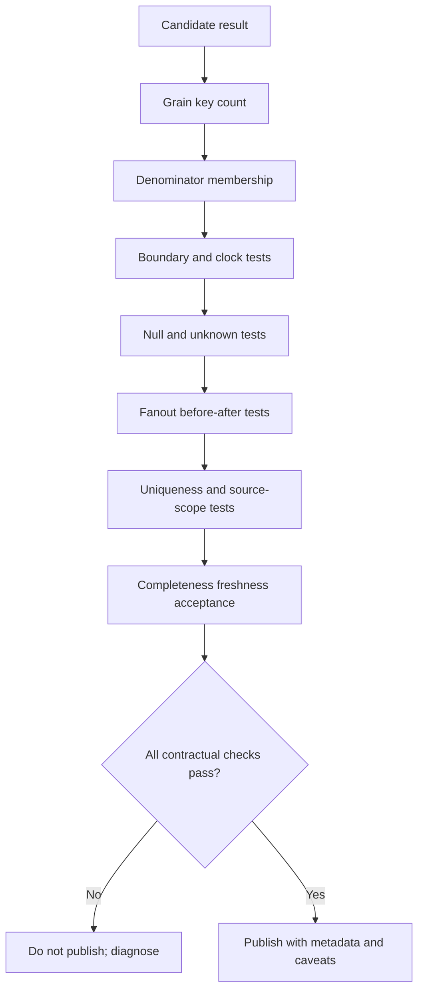

## Performance and safety

Security datasets can be large and sensitive. Correctness, authorization, minimization, and bounded resource use come before speed.

| Practice | Why | Caution |
|---|---|---|
| Read-only least-privileged role | Limits modification and exposure | Read queries can still overload systems |
| Approved views | Centralize scope/masking rules | Verify version and lineage |
| Fixed bounded windows | Reduces scan and makes results reproducible | Do not truncate the denominator silently |
| Explicit columns | Minimizes sensitive/wide data | Schema changes still need contract tests |
| Pre-aggregate many sides | Controls row volume/fanout | Preserve needed detail separately |
| Partition-friendly predicates | Supports pruning where designed | Function/cast can prevent efficient access |
| Representative plans | Exposes estimates, loops, sorts, spills | Toy data misleads |
| Statement/workload limits | Protects shared systems | A timeout is not optimization |
| Parameterized values | Avoids injection and improves governance | Parameter-sensitive plans still need testing |
| Secure result handling | Prevents leakage after query | Exports/caches are copies of customer data |

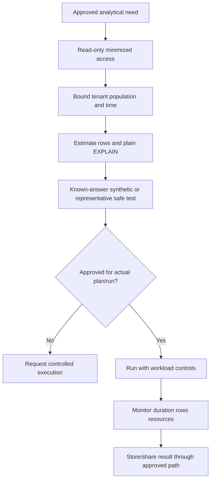

Use plain `EXPLAIN` first. `EXPLAIN ANALYZE` executes the statement and may consume significant resources; use it only under approved conditions. Index recommendations require measured predicates, selectivity, write cost, maintenance, storage, and actual plans. No universal "index every join key" rule is safe.

## Test cases and known-answer fixtures

Create a tiny synthetic fixture before trusting a complex query.

| Fixture case | Rows to include | Expected lesson |
|---|---|---|
| Empty population | No eligible assets | Rate null; no divide-by-zero |
| Covered asset | One eligible plus one fresh healthy observation | Numerator and denominator both one |
| Missing asset evidence | One eligible with no observation | Denominator one, covered zero, exception one |
| Stale evidence | Exactly before freshness boundary | Classified stale |
| Boundary evidence | Exactly at threshold | Included/excluded according to documented operator |
| Duplicate observation | Same event delivered twice | Idempotent/latest logic does not double coverage |
| Conflicting tie | Same time/sequence, different state | Quarantine/flag rather than silent confidence |
| Null state | Latest state null | Explicit unknown, not healthy/unhealthy certainty |
| Overlapping policy | Two effective SLA rows | Uniqueness gate fails |
| Multiple tickets | One finding linked to two tickets | Finding count remains one in backlog measure |
| Unassigned owner | Null/no current owner | Retained in `UNASSIGNED` bucket |
| Late arrival | Old event ingested after snapshot | Event/restatement policy determines inclusion |
| Immature cohort | Entry less than outcome window ago | Excluded or labeled immature |
| Reopen within reset | New observation shortly after closure | Same/possible split, not automatic recurrence |
| Cross-tenant same key | Same source ID in two tenants | Never matched without tenant scope |

### Property-style invariants

1. Covered assets are a subset of eligible assets.
2. Coverage rate is between zero and one when denominator is positive.
3. Mutually exclusive coverage states sum to eligible assets.
4. Adding an older duplicate observation cannot change latest state.
5. Adding a nonmatching source row cannot change matched counts on the other key.
6. Backlog findings plus verified-by-snapshot findings equal eligible findings under a complete partition.
7. Breached-open rows must have a due time earlier than the fixed as-of.
8. A recurrence episode must have a prior verified resolution under the chosen definition.
9. A dashboard snapshot must not publish when its acceptance gate fails.
10. A result cannot contain a tenant not authorized by the query scope.

## Wrong-query diagnosis

| Symptom | Likely cause | First discriminating check | Repair direction |
|---|---|---|---|
| Coverage over 100% | Numerator counts observations, denominator counts assets | Compare distinct asset keys | Reduce evidence to asset grain |
| Coverage near 100% despite known blind spots | Denominator came from covered source | Inspect eligibility lineage | Use independent governed population |
| Counts double after ticket join | Finding-to-ticket fanout | Count rows/distinct findings per stage | Aggregate tickets or separate measure |
| Missing-control count spikes overnight | Connector/pipeline stale or applicability change | Run health and rule-version diff | Hold publish; repair source/rule |
| No rows from anti query | `NOT IN` subquery contains null | Count right-key nulls | Use correlated `NOT EXISTS` |
| SLA compliance improves while overdue grows | Denominator/population mix changed | Decompose due/new/closed/open by tier | Publish flow and stock metrics |
| Trend drops on onboarding day | Added low-score assets dilute mean | Same-asset cohort comparison | Decompose population effect |
| Latest state changes between runs | Incomplete tie ordering | Find duplicate order keys | Add source sequence/conflict policy |
| Incident sequence impossible | Ingest time used or clock skew | Compare all clock columns | Preserve/normalize event time |
| Recurrence extremely high | Repeated observations counted as episodes | Inspect episode construction | Define verified reset and clear period |
| Dashboard differs from SQL | Filter/date/RLS/relationship context | Fixed-slice reconciliation | Align grain, relationships, measures |
| Query slow after correct result | Bad estimates/fanout/sort/window | Plain plan and row flow | Reduce rows, fix stats/model/index as measured |

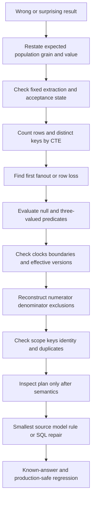

### Wrong-query clinic 1 - Inflated coverage

Wrong query:

```sql
SELECT
    COUNT(o.observation_id)::numeric / COUNT(a.asset_id) AS coverage
FROM nmh_rel.asset AS a
JOIN nmh_rel.asset_control_observation AS o
  ON o.asset_id = a.asset_id
WHERE a.lifecycle_status = 'active';
```

Both counts operate after the join, so assets repeat once per observation. It also uses no applicability, source, state, freshness, or fixed time. The denominator excludes assets with no observation due to the inner join. Repair by building eligible assets independently, selecting one qualifying current evidence state per asset, left joining, and using eligible asset rows as denominator.

### Wrong-query clinic 2 - False missing set

Wrong query:

```sql
SELECT asset_id
FROM nmh_rel.asset
WHERE asset_id NOT IN (
    SELECT asset_id
    FROM nmh_rel.asset_control_observation
);
```

If the subquery contains null, `NOT IN` can become unknown for nonmatching values. It also lacks source, control, time, applicability, and lifecycle scope. Use a correlated `NOT EXISTS` against a bounded qualifying-evidence subquery.

### Wrong-query clinic 3 - Misleading trend

Wrong query:

```sql
SELECT snapshot_date, AVG(risk_score)
FROM nmh_models.asset_risk_daily
GROUP BY snapshot_date
ORDER BY snapshot_date;
```

This mixes model versions, quality states, populations, and possibly duplicate asset snapshots. It hides the denominator. Add uniqueness and acceptance gates, group/version the model, publish counts/distributions, and decompose same-asset versus population effects. Even then, a score trend is an indicator whose semantics depend on the governed model.

## Full analytical troubleshooting runbook

1. Capture the customer's decision, expected value, discrepancy, impact, and urgency.
2. Freeze the query text, parameters, role, schema/search path, version, and execution time.
3. Record the logical as-of separately from runtime.
4. Name the authoritative population and one-row grain for every source and intermediate CTE.
5. Write numerator, denominator, exclusions, unknowns, and quality acceptance rules.
6. Identify event, observation, source-update, ingestion, processing, snapshot, due, close, and verify clocks.
7. Confirm tenant/account/business scope is present in keys and predicates.
8. Confirm source extractions are complete, fresh, and comparable; do not debug SQL on partial data first.
9. Count source rows, distinct business keys, null keys, duplicate keys, and min/max clocks.
10. Run each CTE independently on the same fixed snapshot and record grain/counts.
11. Compare row and distinct-key counts before and after each join to find fanout or row loss.
12. Validate one-to-one/effective policy/owner relationships with duplicate-key queries.
13. Review outer-join predicates in `ON` versus `WHERE`.
14. Review `NOT IN`, ordinary null comparisons, `COALESCE`, and unknown classification.
15. Check half-open boundaries, time zones, daylight rules, future times, and negative durations.
16. Check latest-row partition, authoritative clock, source sequence, tie conflict, deletion, and late arrival.
17. Reconstruct the denominator from raw eligibility and prove numerator is a subset.
18. Decompose trend into existing, added, removed, quality, and model-version components.
19. Run known-answer fixtures for zero, one, many, null, duplicate, stale, boundary, and conflict cases.
20. Reconcile a fixed sample manually to source records and expected result.
21. Only after correctness, inspect `EXPLAIN`; use actual execution analysis only under approved controls.
22. Check estimates, actual rows, loops, filters, join algorithms, sorts, spills, buffers, and wide columns.
23. Apply the smallest repair at the correct layer: source, contract, identity, model, policy, SQL, or dashboard.
24. Regression-test neighboring metrics and historical restatement.
25. Communicate impact, affected periods, uncertainty, workaround, correction, validation, and prevention.

## Exercises with answers

Use only synthetic authorized data. State grain and expected rows before writing SQL.

### Exercise 1 - Coverage denominator

**Task:** Explain why endpoint-reported assets are a weak denominator for endpoint coverage.

**Answer:** The source population contains only assets the endpoint source can see, so unseen eligible assets disappear from both numerator and denominator. Use a separately governed eligible inventory, left join latest qualifying evidence, retain missing/unknown states, and publish numerator, denominator, exclusions, and freshness.

### Exercise 2 - Reconciliation

**Task:** Compare a fixed CMDB extraction with a fixed scanner extraction.

**Answer:** Normalize each to one row per governed tenant-scoped key, retain raw counts/provenance, full outer join, and classify matched/left-only/right-only/duplicate. Differences trigger hypotheses; they do not identify the correct source automatically.

### Exercise 3 - Connector freshness

**Task:** A latest connector run succeeded but delivered zero rows. Is it healthy?

**Answer:** Not necessarily. Compare zero-row expectations, source watermark, extraction scope, control totals, prior volume bands, checksums, processing acceptance, and downstream freshness. Successful transport does not prove complete content.

### Exercise 4 - Missing controls

**Task:** Find assets without current encryption evidence.

**Answer:** Build active assets for which encryption applies at the as-of, remove only approved effective exceptions, select latest encryption observation per asset using deterministic order, left join, then classify missing, stale, unknown, ineffective, and qualifying evidence. Do not label all exceptions "unencrypted" without validation.

### Exercise 5 - Aging

**Task:** Calculate open age without changing tomorrow.

**Answer:** Subtract first governed observation from a fixed typed as-of instant for rows open at that snapshot. Define identity, clock, pause/reopen rules, and time zone. Keep open rows in duration analysis or label censoring.

### Exercise 6 - SLA

**Task:** Determine breached findings.

**Answer:** Select the unique policy effective at clock start, compute governed due time and approved pauses, then compare verified time/as-of. Classify unknown policy separately and test overlapping policy versions. Report tiers and open breached counts, not percentage alone.

### Exercise 7 - Trend

**Task:** Mean risk score fell ten points after onboarding many assets.

**Answer:** Decompose same-asset score change, additions, removals, quality, and model version. The mean can fall because low-score assets entered. Do not infer reduced exposure until driver evidence supports it.

### Exercise 8 - Backlog

**Task:** Preserve unassigned findings in an owner report.

**Answer:** Left join a uniqueness-tested effective owner projection and classify no owner as `UNASSIGNED`. Route multiple current owners to a quality exception. Aggregate findings before joining one-to-many tickets.

### Exercise 9 - Latest row

**Task:** Two source rows share event time but conflict.

**Answer:** Use source sequence/version if the contract establishes order. A synthetic ID can make output deterministic but not truthful. Flag/quarantine unresolved ties and preserve both payloads with provenance.

### Exercise 10 - Incident correlation

**Task:** Events occurred within five minutes of an anchor. Are they causal?

**Answer:** No. Time proximity supports an association hypothesis. Add shared entity/session/path evidence, source coverage, clock quality, alternate explanations, and investigation validation before causal language.

### Exercise 11 - Cohort maturity

**Task:** Why exclude recent cohorts from 30-day closure comparison?

**Answer:** They have not had 30 days to produce the outcome. Compare only mature cohorts or use age-indexed survival-style methods, and disclose late-arrival/restatement policy.

### Exercise 12 - Dashboard disagreement

**Task:** Power BI total differs from the SQL extract.

**Answer:** Freeze one snapshot and filter slice; compare extract rows, model relationship cardinality/direction, date table, null/unknown members, RLS, DAX measure denominator, refresh version, and aggregation behavior. Repair the first layer where counts diverge.

## Labs and rehearsal

### Lab 1 - Query contract workbook

Write decision, population, grain, clocks, numerator, denominator, exclusions, unknowns, quality gate, and output for all fourteen patterns.

### Lab 2 - Coverage truth table

Create covered, stale, unhealthy, missing, null, duplicate, and boundary assets. Prove category conservation and rate bounds.

### Lab 3 - Reconciliation matrix

Create matched, CMDB-only, scanner-only, duplicated, cross-tenant, and conflicting records. Explain each without assigning blame.

### Lab 4 - Freshness chain

Model schedule, connector, delivery, source watermark, processing, and dashboard clocks. Fail one layer at a time and predict visible symptoms.

### Lab 5 - Applicability and control gaps

Build effective rules and exceptions. Test irrelevant controls, expired exceptions, stale evidence, unknown state, and overlapping applicability.

### Lab 6 - Aging and censoring

Compare open age, verified duration, ticket duration, and CVE publication age. Show why each answers a different question.

### Lab 7 - SLA policy versions

Create policy boundary, pause, tier change, overlapping version, unknown policy, met, open breach, and late verification cases.

### Lab 8 - Trend decomposition

Create two snapshots with existing-asset changes, additions, removals, quality loss, and model change. Reconcile total movement to components.

### Lab 9 - Owner backlog fanout

Add multiple tickets and overlapping owners. Detect multiplication and quality defects before producing the queue.

### Lab 10 - Duplicate and latest records

Test exact retry, correction, alias, cloned identifier, late arrival, tombstone, and contradictory tie. Preserve provenance and uncertainty.

### Lab 11 - Incident timeline

Combine identity, endpoint, and network events with event/observed/ingested clocks. Inject skew and late arrival; produce a caveated timeline.

### Lab 12 - Cohort and recurrence

Build mature/immature cohorts and repeated observations/verified episodes. Test late restatement and follow-up censoring.

### Lab 13 - Dashboard extract

Publish one stable synthetic daily extract into Power BI. Reconcile fixed SQL totals, relationships, filters, RLS, unknown members, and refresh metadata.

### Lab 14 - Wrong-query review

Seed denominator leakage, null anti-join, fanout, mixed model versions, unstable latest order, and partial load. Diagnose without looking at the seeded answer.

### Lab 15 - TSM briefing

Present a misleading 98% coverage metric: customer impact, evidence, denominator flaw, corrected result, immediate action, data repair, validation, and prevention.

| Lab evidence | Completion standard |
|---|---|
| Safety | Synthetic, authorized, read-only, bounded, minimized |
| Contract | Population, grain, clocks, numerator/denominator documented |
| Quality | Freshness, completeness, uniqueness, and scope gates |
| SQL | Deterministic, null-aware, fanout-controlled, readable |
| Tests | Empty, boundary, null, duplicate, conflict, late, partial cases |
| Dashboard | Fixed-slice SQL-to-BI reconciliation |
| Interpretation | Observation separated from inference and decision |
| Honesty | No invented Zscaler interface or production outcome |

## Common misconceptions to correct

| Misconception | Correct model |
|---|---|
| If the query runs, the metric is valid | Execution proves syntax/runtime, not semantics |
| Coverage is observed divided by source rows | Denominator must be independently eligible |
| Missing observation proves missing control | Collection, scope, identity, and freshness can fail |
| Successful connector means fresh complete data | Transport success needs volume/watermark/acceptance checks |
| A full outer join identifies the source of truth | It classifies differences; authority needs governance |
| Latest ingest is latest state | Late arrival can carry an older event |
| MAX timestamp returns the latest row | It returns a value; ties and payload selection remain |
| Null means no | Null means unknown/absent under a defined field contract |
| COALESCE makes data complete | It replaces representation and can hide unknowns |
| SLA breach equals highest risk | SLA and contextual risk are different dimensions |
| Closed ticket equals remediated vulnerability | Verification evidence is separate |
| Average age explains backlog | Distribution, open tail, and censoring matter |
| Falling mean risk proves reduced risk | Population, quality, and model changes can move it |
| Owner nulls can be dropped | Unassigned work is operationally important |
| DISTINCT repairs duplicates | It may conceal fanout or conflicting records |
| Events close in time are causal | Temporal proximity supports a hypothesis only |
| Every repeated finding is recurrence | Repeated observations may be one open episode |
| New cohorts can be compared immediately | Equal outcome windows are required |
| Dashboard totals are simply SQL totals | Model relationships, filters, RLS, refresh, and measures intervene |
| EXPLAIN ANALYZE is harmless | It executes and consumes resources |
| These queries describe Zscaler internals | They are synthetic PostgreSQL teaching patterns |

## Official Source Anchors

Sources in this section were reviewed on **2026-08-24**.

PostgreSQL documentation establishes behavior for the referenced current version, while implementation and plans remain version/data dependent. NIST and CISA sources establish security measurement, continuous monitoring, incident, and vulnerability-management context; they do not prescribe these SQL schemas. Zscaler public material supplies bounded product context only and does not document a customer SQL schema or the internal implementation of Data Fabric.

| Source | URL | Used for | Boundary |
|---|---|---|---|
| PostgreSQL SELECT | https://www.postgresql.org/docs/current/sql-select.html | Query clauses, grouping, windows, ordering | PostgreSQL current-version behavior |
| PostgreSQL Aggregate Functions | https://www.postgresql.org/docs/current/functions-aggregate.html | Counts, filters, ordered-set percentiles | Null/order/performance semantics require care |
| PostgreSQL Window Functions | https://www.postgresql.org/docs/current/functions-window.html | Latest rows, lag, ranking, partitions | Deterministic order remains analyst responsibility |
| PostgreSQL Date/Time Functions | https://www.postgresql.org/docs/current/functions-datetime.html | Intervals, extraction, truncation, clocks | Time zone and business-calendar policy are external |
| PostgreSQL Conditional Expressions | https://www.postgresql.org/docs/current/functions-conditional.html | CASE, COALESCE, NULLIF | Replacement values are semantic decisions |
| PostgreSQL Subquery Expressions | https://www.postgresql.org/docs/current/functions-subquery.html | EXISTS/NOT EXISTS and NOT IN null behavior | Planner evaluation may differ |
| PostgreSQL EXPLAIN | https://www.postgresql.org/docs/current/sql-explain.html | Plan review and ANALYZE execution warning | Actual use requires operational approval |
| NIST Cybersecurity Framework 2.0 | https://www.nist.gov/cyberframework | Govern/identify/protect/detect/respond/recover outcome context | Not a SQL or product specification |
| NIST SP 800-137 | https://csrc.nist.gov/pubs/sp/800/137/final | Information-security continuous monitoring concepts | Program guidance, not metric formulas |
| NIST SP 800-61 Rev. 2 | https://csrc.nist.gov/pubs/sp/800/61/r2/final | Incident evidence, analysis, handling context | Supersession/current guidance should be checked |
| NISTIR 8286A Rev. 1 | https://csrc.nist.gov/pubs/ir/8286/a/r1/final | Risk identification and risk-register context | Does not validate a risk score algorithm |
| CISA Known Exploited Vulnerabilities Catalog | https://www.cisa.gov/known-exploited-vulnerabilities-catalog | Authoritative catalog context for known exploitation | Inclusion is prioritization input, not complete risk |
| CISA Cybersecurity Performance Goals | https://www.cisa.gov/cybersecurity-performance-goals | Outcome-oriented baseline/control context | Voluntary guidance; applicability varies |
| Zscaler Data Fabric for Security | https://www.zscaler.com/products-and-solutions/data-fabric | Public high-level unified data, context, and workflow positioning | No SQL endpoint, schema, algorithm, connector, limit, or performance claim |

## Likely Interview Questions

### Q1. How do you design a trustworthy asset-coverage query?

**Model answer:** I define an independently governed eligible asset population at a fixed as-of, then define qualifying evidence by source, control, state, and freshness. I reduce evidence to one deterministic current row per asset, left join it to eligibility, retain missing/stale/unhealthy/unknown categories, and calculate covered assets over all eligible assets. I publish numerator, denominator, exclusions, quality state, and exceptions, then test empty, boundary, duplicate, null, and partial-load cases.

### Q2. How do you reconcile two security data sources without declaring one wrong?

**Model answer:** I freeze comparable extractions and scopes, normalize each side to one row per governed tenant-scoped key while retaining provenance and duplicate counts, then use a full outer comparison to classify matched, left-only, right-only, duplicate, and attribute-mismatch states. I investigate lifecycle, timing, scope, identity, and pipeline evidence. Reconciliation shows disagreement; source authority comes from governance and field-level contracts.

### Q3. How do you query stale assets and stale connectors?

**Model answer:** I separate layers. Connector health uses expected schedule, run status, completion, rows/control totals, source watermark, and processing acceptance. Asset freshness uses latest governed observation per eligible asset and a source-specific threshold. A healthy connector can carry stale asset state, and old asset rows can remain after connector failure. Current dashboards expose both freshness and completeness.

### Q4. How do you calculate vulnerability age and SLA breach honestly?

**Model answer:** I name the unit, fixed as-of, start, stop, pause, reopen, verification, policy-effective-time, and business-calendar rules. Open items are right-censored and remain visible. I select one unique effective SLA policy, calculate due time, classify met/open breach/late verified/not due/unknown, and report distributions plus tiered denominators. Ticket closure is not remediation unless verified evidence establishes it.

### Q5. How do you prevent a risk trend from misleading stakeholders?

**Model answer:** I keep snapshot grain unique and accepted, publish population and distribution, and separate same-asset change from additions, removals, source-quality changes, and model-version changes. I do not connect incompatible model versions as one continuous series. Then I explain drivers and uncertainty; a falling mean score alone does not prove exposure reduction.

### Q6. How do you create an owner backlog without fanout or lost work?

**Model answer:** I define unresolved eligibility at a snapshot, project one uniqueness-tested effective remediation owner per asset/finding, left join so unassigned work remains, and route overlapping owners to quality review. I aggregate one-to-many tickets separately, publish findings and affected assets distinctly, and show overdue, age, tier, exceptions, and unknowns. The queue supports action but does not replace contextual prioritization.

### Q7. How do you build incident timelines, cohorts, and recurrence queries?

**Model answer:** For timelines I retain event, observed, and ingest clocks; order by governed event time plus a stable tie-breaker; and correlate only within bounded entity/path/time evidence, never equating proximity with causality. Cohorts share an entry rule and are compared at equal maturity. Recurrence requires a prior verified resolution and governed reset interval; repeated observations in one open episode are not recurrence.

### Q8. How do you diagnose a wrong or slow security query?

**Model answer:** I freeze query, parameters, as-of, sources, and expected result. I verify accepted inputs, write every stage's grain, count rows/distinct keys/nulls, locate first fanout or loss, test outer predicates, anti-join nulls, effective times, latest ties, and numerator/denominator membership. I run known-answer fixtures. Only after correctness do I inspect plans and, under approval, actual rows, loops, sorts, buffers, statistics, and candidate query/model/index changes.

## 30-Second Memory Hooks

| Concept | Memory hook |
|---|---|
| Query contract | Define before calculate |
| Grain | One row means what? |
| Population | Who could count? |
| Denominator | The whole determines the story |
| Coverage | Qualifying evidence over independent eligibility |
| Reconciliation | Difference first, blame never |
| Freshness | Clock plus completeness |
| Missing control | Missing evidence is a hypothesis |
| Aging | Start, stop, pause, as-of |
| SLA | Promise, policy version, clock |
| Trend | Existing plus added minus removed plus model/quality |
| Backlog | Snapshot stock, not incoming flow |
| Unassigned | Keep the null work visible |
| Duplicate | Candidate, provenance, review |
| Latest | Event time plus sequence plus conflict rule |
| Timeline | Preserve clocks; proximity is not cause |
| Cohort | Started together, compare at equal age |
| Recurrence | Resolved, clear, then returned |
| Dashboard extract | Stable grain plus metadata and gate |
| Fanout | Count before and after every join |
| Safety | Read-only can still be expensive and sensitive |
| Arti bridge | SQL and troubleshooting transfer; product internals do not |

## Completion Checklist

- [ ] I write a decision-oriented analytical contract before SQL.
- [ ] I name population and grain for every base, CTE, and output.
- [ ] I publish numerator, denominator, exclusions, unknowns, and as-of.
- [ ] I use a fixed typed timestamp and half-open windows.
- [ ] I distinguish event, observation, source update, ingest, process, snapshot, due, close, and verify clocks.
- [ ] I build asset coverage from an independent eligible denominator.
- [ ] I select one qualifying current evidence row before the coverage join.
- [ ] I keep missing, stale, unhealthy, ambiguous, and unknown states visible.
- [ ] I reconcile fixed comparable source extractions at a governed scoped key.
- [ ] I use full outer results as difference classifications, not automatic truth judgments.
- [ ] I test source duplicates and retain provenance.
- [ ] I separate connector, delivery, watermark, processing, asset, and dashboard freshness.
- [ ] I do not call a successful zero-row run complete without contract checks.
- [ ] I generate missing-control expectations from effective applicability rules.
- [ ] I apply only approved effective exceptions and report them separately.
- [ ] I call missing rows missing evidence until validated.
- [ ] I define finding/vulnerability/episode/ticket age precisely.
- [ ] I retain open right-censored work in aging analysis.
- [ ] I select a unique SLA policy effective at the governed start.
- [ ] I classify met, not due, open breach, late verified, and unknown policy.
- [ ] I do not equate ticket closure with verified remediation.
- [ ] I decompose risk trend into comparable entities, population, quality, and model version.
- [ ] I publish trend denominator and distribution, not only an average.
- [ ] I retain unassigned backlog and detect overlapping owners.
- [ ] I prevent owner/ticket joins from multiplying finding measures.
- [ ] I treat duplicate results as candidates and preserve source evidence.
- [ ] I choose latest records with partition, authoritative clock, sequence, tie-breaker, and conflict rule.
- [ ] I retain tombstone and late-arrival semantics.
- [ ] I build incident timelines with original clocks, provenance, and deterministic order.
- [ ] I describe temporal correlation as association, not causality.
- [ ] I compare cohorts only at equal maturity and disclose restatement.
- [ ] I define recurrence through episodes, verified resolution, reset, and follow-up.
- [ ] I publish dashboard extracts at a stable documented grain.
- [ ] I apply freshness/completeness/uniqueness acceptance gates before dashboard refresh.
- [ ] I carry quality flags and metric metadata into reporting.
- [ ] I test empty, one, many, null, duplicate, boundary, conflict, late, and partial cases.
- [ ] I prove numerator rows belong to denominator and categories conserve totals.
- [ ] I count rows and distinct intended keys before and after every join.
- [ ] I never use DISTINCT as unexplained fanout repair.
- [ ] I use `NOT EXISTS` for null-safe anti logic unless stronger proof applies.
- [ ] I separate correctness debugging from performance tuning.
- [ ] I use plain EXPLAIN first and actual execution analysis only under approval.
- [ ] I query with least privilege, bounded scope, minimization, and secure result handling.
- [ ] I can run the full wrong-query troubleshooting method.
- [ ] I can complete every synthetic lab and explain the expected result first.
- [ ] I separate PostgreSQL behavior, general practice, synthetic NMH evidence, and public Zscaler context.
- [ ] I can answer Q1 through Q8 with mechanics, examples, failures, tests, and honest boundaries.

[Part 49 - Statistics, Baselines, Outliers, Trends, and Analytical Honesty](Part-49-statistics-baselines-outliers.md)