# Part 49 - Statistics, Baselines, Outliers, Trends, and Analytical Honesty

> **Audience:** Candidates preparing for a Zscaler Security Operations Technical Success Manager role after enterprise Support Escalation Engineering.
>
> **Purpose:** Build statistical judgment for security and customer analytics: populations and samples, distributions, center and spread, percentiles, rates and denominators, uncertainty, correlation and causation, regression, seasonality, control-chart concepts, anomalies, missing/censored data, bias, Simpson's paradox, dashboards, risk-score uncertainty, and experiments.
>
> **Scope and honesty:** Northstar Meridian Holdings, abbreviated NMH, is fictional. Every population, sample, score, observation, chart, threshold, experiment, incident, trend, finding, result, and SQL example is synthetic. This Part teaches general statistics and PostgreSQL-oriented analysis; it does not document Zscaler algorithms, Risk360 scoring, product baselines, anomaly models, dashboards, or production results. Official Zscaler Data Fabric material is used only for bounded public context about unified data and business context. Your statistics, a postgraduate business-analytics qualification, SQL, PostgreSQL, Power BI, support analytics, and evidence-based troubleshooting transfer; direct production Zscaler security analytics remains a learning boundary.
>
> **Currency caveat:** Statistical methods, product implementations, customer populations, risk models, controls, regulations, and public documentation change. Sources in this Part were reviewed on **2026-08-24**. Current method documentation, customer data contracts, approved analytical plans, privacy controls, product evidence, and qualified statistical/security review govern production.

## Section goal

Statistics turns observations into disciplined statements about a population, pattern, or uncertainty. It cannot rescue a biased population, an undefined denominator, a broken data pipeline, or a causal story unsupported by design. In security operations, the most valuable statistical skill is often knowing what a number does not establish.

Think of a physician reading a temperature. One high reading may be measurement error, normal variation, or illness. The physician asks how the instrument works, what the patient's baseline is, what other symptoms exist, and whether the change persists. A security analyst should treat a risk-score spike, connector-volume drop, or remediation improvement with the same care.

By the end, you should be able to:

| Outcome | Demonstrated capability | Evidence artifact |
|---|---|---|
| Define inference scope | Distinguish population, census, sample, sampling frame, unit, and selection process | Population card |
| Describe data | Explain shape, center, spread, tails, percentiles, and robust summaries | Distribution profile |
| Calculate rates honestly | Publish numerator, denominator, exclusions, unknowns, and uncertainty | Metric dictionary |
| Build baselines | Choose stable reference populations/windows and account for seasonality | Baseline specification |
| Express uncertainty | Distinguish sampling, measurement, model, and operational uncertainty | Uncertainty register |
| Avoid causal overreach | Separate association, prediction, mechanism, intervention, and causal evidence | Claim ladder |
| Understand regression | Interpret a simple model, residuals, assumptions, and limitations | Model review card |
| Monitor processes | Use control-chart concepts without confusing limits and targets | Process-monitoring note |
| Investigate anomalies | Detect unusual values, then validate quality, context, and impact | Anomaly triage queue |
| Handle missingness | Analyze missing, censored, truncated, and late data explicitly | Missingness report |
| Diagnose bias | Identify survivorship, selection, measurement, and confounding risks | Bias checklist |
| Explain Simpson's paradox | Show how aggregation can reverse subgroup patterns | Segmentation analysis |
| Protect dashboard integrity | Keep definitions, population, uncertainty, quality, and revisions visible | Dashboard acceptance gate |
| Discuss risk-score uncertainty | Treat scores as model outputs with version, inputs, confidence, and decision limits | Score evidence sheet |
| Evaluate changes | Design experiments or cautious before/after comparisons | Evaluation plan |

```mermaid
flowchart LR
    QUESTION[Decision and claim] --> POP[Population unit and selection]
    POP --> DATA[Measurement clocks quality missingness]
    DATA --> DESCRIBE[Distribution center spread rates]
    DESCRIBE --> BASE[Baseline seasonality comparison]
    BASE --> UNCERT[Sampling measurement model uncertainty]
    UNCERT --> ALTERNATE[Bias confounding alternative explanations]
    ALTERNATE --> CLAIM[Bounded descriptive predictive or causal claim]
    CLAIM --> ACTION[Human-reviewed action]
    ACTION --> LEARN[Monitor outcome and revise]
```

## JD Mapping

| Role expectation | Part 49 capability | TSM artifact | experience bridge and boundary |
|---|---|---|---|
| Analyze complex environments | Profile distributions, trends, baselines, anomalies, and uncertainty | Analytical assessment | Statistics/BI skills transfer |
| Identify security risk | Interpret indicators without treating score or outlier as ground truth | Risk evidence note | Risk decision needs context |
| Recommend mitigation | Compare options and expected outcomes with uncertainty | Evaluation plan | Customer controls govern action |
| Explain metrics simply | Translate rates, percentiles, variability, and caveats | Executive metric card | MBA communication transfers |
| Drive customer trust | Expose denominator changes, missing data, and revisions | Dashboard integrity checklist | Transparency over false precision |
| Troubleshoot product/data issues | Distinguish real process shift from pipeline or measurement defect | Anomaly runbook | Escalation method transfers |
| Partner cross-functionally | Align security, data, product, and executive interpretations | Decision record | Specialists validate methods |
| Develop Data Fabric knowledge | Understand why harmonized context and quality matter for analysis | Conceptual data-to-decision map | No product algorithm claim |

## Candidate honesty note

| Evidence class | Safe statement | Boundary |
|---|---|---|
| Production transfer | "I have used statistics, Power BI, SQL, and case-quality analysis to understand operational patterns." | Not production security-risk modeling |
| Synthetic practice | "I profiled NMH distributions, simulated baselines, and tested misleading trends on fictional data." | Not a customer result |
| Descriptive claim | "Among accepted NMH lab records at this snapshot, the median age was X." | Limited to defined records/population |
| Predictive claim | "A validated model estimates an outcome under stated assumptions." | Prediction is not causal proof |
| Causal claim | "A randomized or otherwise credible design supports an effect estimate." | Requires design, assumptions, and review |
| Product context | "Public Zscaler material describes unifying data with business context." | No assertion about scoring/anomaly internals |
| Experience boundary | "I would validate the current product metric definition, model version, source quality, and specialist guidance." | Never invent confidence or algorithms |

## Beginner vocabulary and memory hooks

| Term | Plain meaning | Why it matters | Memory hook |
|---|---|---|---|
| Population | Complete set the question is about | Defines inference boundary | Everyone of interest |
| Unit of analysis | One thing being measured | Prevents mixed grains | One row means what? |
| Census | Observation attempt for every population unit | Still can have error/nonresponse | All is not perfect |
| Sample | Subset used to learn about population | Selection affects generalization | Some speak for all |
| Sampling frame | Operational list from which sample is drawn | Missing groups create coverage bias | The invitation list |
| Parameter | True population quantity, usually unknown | Target of estimation | Population truth |
| Statistic | Quantity calculated from observed sample/data | Estimate or description | Data's number |
| Distribution | How values are arranged across possibilities | Shape matters beyond average | The full landscape |
| Mean | Sum divided by count | Sensitive to extremes | Balance point |
| Median | Middle ordered value | Robust to extreme tails | Middle seat |
| Mode | Most common value/category | Useful for discrete patterns | Most frequent |
| Range | Maximum minus minimum | Simple but extreme-sensitive | End-to-end width |
| Variance | Average squared distance from mean | Foundation for spread/modeling | Squared wobble |
| Standard deviation | Square root of variance | Spread in original units | Typical mean-distance scale |
| IQR | 75th percentile minus 25th | Robust middle-half spread | Middle 50 percent width |
| Percentile | Value at/below which a proportion lies | Describes rank in distribution | Cut point, not percent |
| Rate | Events or qualifying units per eligible exposure/population | Needs denominator and time | Part over opportunity |
| Ratio | One quantity divided by another | Numerator need not be subset | Compare quantities |
| Baseline | Reference behavior/population for comparison | Determines what is unusual | Normal for this context |
| Confidence interval | Procedure-produced range reflecting sampling uncertainty | Not probability the fixed parameter is inside after calculation | Repeated-method coverage |
| Standard error | Estimated sampling variability of a statistic | Different from data spread | Uncertainty of estimate |
| Correlation | Degree variables move together | Does not establish cause | Together, not because |
| Confounder | Common cause of exposure and outcome | Can create/distort association | Hidden common driver |
| Regression | Model relating outcome to predictors | Supports description/prediction and sometimes causal designs | Structured relationship |
| Residual | Observed outcome minus model prediction | Reveals unexplained pattern | What model missed |
| Seasonality | Repeating pattern tied to calendar/cycle | Can trigger false anomalies | Pattern returns on schedule |
| Control limit | Expected process-variation boundary under a model | Not a target or security threshold | Voice of process |
| Anomaly | Observation unusual under a reference model | Unusual is not malicious | Worth investigation |
| Outlier | Observation far from most values by a rule | May be error or important truth | Distant point |
| Censoring | Outcome time only partly known | Common for still-open work | We know at least this long |
| Selection bias | Included units differ systematically | Distorts estimates/generalization | The door chose the crowd |
| Survivorship bias | Only survivors/successes remain visible | Hides failures and long-open work | Missing wreckage |
| Simpson's paradox | Aggregated association reverses within groups | Mix changes can mislead | Totals can flip the story |
| Effect size | Magnitude of difference/relationship | Statistical detectability is not importance | How much, not just whether |

## Populations, samples, and the data-generating process

The data-generating process is how real-world states become recorded rows: scope rules, sensors, users, connectors, matching, transformations, exclusions, and timing. Statistical validity begins there.

| Element | NMH synthetic example | Failure mode |
|---|---|---|
| Target population | All active managed production servers | Development servers mixed in |
| Sampling frame | Accepted CMDB server inventory at snapshot | Unknown servers absent |
| Unit | One resolved server | Scanner finding rows mistaken for servers |
| Observation | Latest endpoint heartbeat | Duplicate/retry rows |
| Sample | 200 servers manually verified | Convenience sample from one team |
| Outcome | Control effective under test protocol | "Record present" substituted |
| Selection | Stratified by business criticality | Volunteers only |
| Inference | Estimate verification rate for framed population | Claim for all enterprise assets |

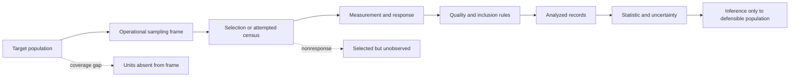

A census of a flawed frame is not a census of the target population. Querying every scanner record does not observe assets outside scanner scope. Huge row count reduces random sampling error but not systematic bias.

### Plain-English deep-dive 1 - More data does not fix the wrong data

Suppose a restaurant asks only customers who finished dessert whether portions were satisfying. Ten thousand answers can be precise about dessert finishers while excluding people who left early because portions were poor. More responses make the biased estimate more confidently wrong.

Security telemetry behaves similarly. Millions of events from healthy agents do not tell us about assets with no agent or broken ingestion. Publish frame coverage, nonresponse/missingness, source health, and the population to which conclusions apply.

## Distributions: see the whole shape

A distribution shows how often values or categories occur. Before calculating a single summary, inspect counts, range, histogram/quantiles, nulls, tails, and groups.

| Distribution shape | Description | Security example | Summary caution |
|---|---|---|---|
| Symmetric | Similar tails around center | Stable processing latency | Mean/median may be similar |
| Right-skewed | Many small values, few very large | Finding age or incident duration | Mean pulled upward |
| Left-skewed | Long lower tail | High compliance bounded near 100% | Ceiling effects |
| Bimodal | Two peaks | Office and remote latency populations | One average describes neither |
| Heavy-tailed | Extremes more common than simple normal expectation | Event volume per asset | Standard-deviation rules fragile |
| Zero-inflated | Unusually many zeros | Daily incidents per unit | Separate occurrence and magnitude |
| Truncated | Values outside range cannot appear | Dashboard caps age at 365 | Tail hidden |
| Categorical | Counts by class | Connector state | Numeric average meaningless |

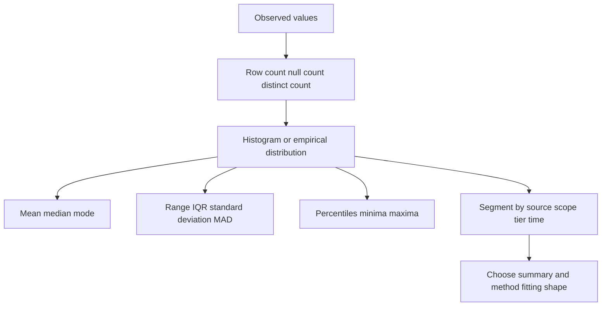

PostgreSQL profile example on synthetic accepted daily connector latency:

```sql
SELECT
    connector_type,
    COUNT(*) AS accepted_runs,
    COUNT(duration_seconds) AS nonnull_durations,
    AVG(duration_seconds) AS mean_seconds,
    PERCENTILE_CONT(0.5) WITHIN GROUP (ORDER BY duration_seconds) AS median_seconds,
    PERCENTILE_CONT(0.9) WITHIN GROUP (ORDER BY duration_seconds) AS p90_seconds,
    PERCENTILE_CONT(0.99) WITHIN GROUP (ORDER BY duration_seconds) AS p99_seconds,
    STDDEV_SAMP(duration_seconds) AS sample_standard_deviation_seconds,
    MIN(duration_seconds) AS minimum_seconds,
    MAX(duration_seconds) AS maximum_seconds
FROM nmh_models.connector_run_accepted_lab
WHERE scheduled_for >= TIMESTAMPTZ '2026-07-01 00:00:00+00'
  AND scheduled_for <  TIMESTAMPTZ '2026-08-01 00:00:00+00'
GROUP BY connector_type
ORDER BY connector_type;
```

The query describes accepted runs, not failed/missing runs. A latency profile that excludes timeouts can look excellent while reliability degrades. Include failure probability and censored durations separately.

## Central tendency and dispersion

Center answers "where is typical?" Spread answers "how variable?" They must be paired.

| Measure | Mechanics | Strength | Failure/caution |
|---|---|---|---|
| Arithmetic mean | $\bar{x}=\frac{1}{n}\sum x_i$ | Uses all values; additive modeling | Tail-sensitive |
| Weighted mean | $\frac{\sum w_i x_i}{\sum w_i}$ | Reflects justified exposure/importance | Weights can encode hidden policy |
| Median | Middle ordered value | Robust to extremes | Ignores magnitude beyond rank |
| Mode | Most frequent value | Categories/discrete values | Multiple/no unique modes |
| Range | $max-min$ | Simple full span | Driven by two observations |
| Variance | Average squared deviation | Mathematical/model foundation | Squared units, tail-sensitive |
| Standard deviation | Square root of variance | Original units | Not "most values" without shape assumptions |
| IQR | $Q_3-Q_1$ | Robust middle spread | Hides tails |
| MAD | Median absolute deviation from median | Robust anomaly scale | Calibration depends on assumptions |

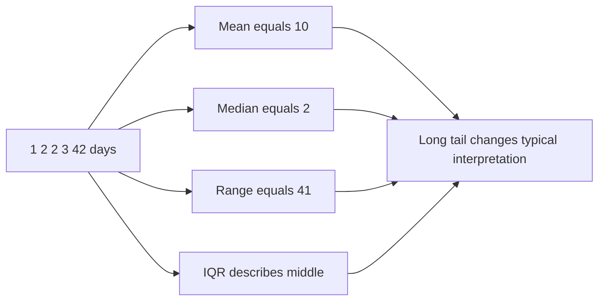

For a backlog, publish median and p90/p95 age plus oldest and age bands. The median prevents a few extreme rows from dominating, while tail summaries prevent the median from hiding neglected work.

## Percentiles and quantiles

The 90th percentile is a value such that about 90 percent of observations are at or below it under a stated calculation method. It is not "90 percent good," not a probability for one observation, and not necessarily an observed value.

| Question | Useful percentile view | Caveat |
|---|---|---|
| Typical latency | p50 | Can hide tail experience |
| Slow-user experience | p90/p95/p99 | Needs enough observations and stable scope |
| Old backlog tail | p90 age plus max/bands | Excluding open/censored rows biases |
| Risk-score distribution | p25/p50/p75/p95 | Score is model output, not probability unless calibrated |
| Connector volume anomaly | Historical quantile by weekday | Regime shifts and small samples |

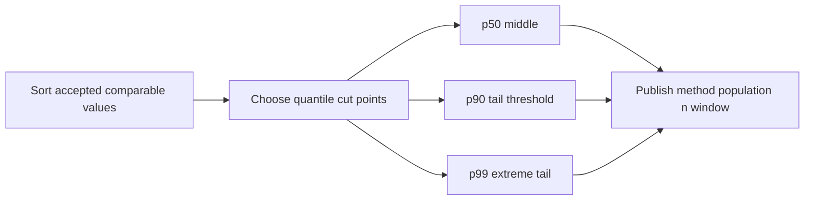

Quantile implementations use different interpolation conventions. For operational comparisons, freeze the method/version. High percentiles from tiny samples are unstable: with ten observations, p99 is largely an interpolation near the maximum, not a richly measured tail.

## Rates, ratios, proportions, and denominators

| Metric type | Structure | NMH example | Main trap |
|---|---|---|---|
| Count | Number of units/events | 40 breached findings | Population size absent |
| Proportion | Subset / eligible set | Covered assets / eligible assets | Subset must belong to denominator |
| Rate | Events / exposure or time | Incidents per 1,000 asset-days | Exposure measurement |
| Ratio | Quantity A / quantity B | Analysts per connector | Numerator not necessarily subset |
| Percentage-point change | New proportion minus old | 82% to 87% = +5 points | Called "5 percent" ambiguously |
| Relative change | $(new-old)/old$ | 82% to 87% about +6.1% relative | Unstable when old near zero |

```sql
SELECT
    snapshot_date,
    eligible_assets,
    covered_assets,
    covered_assets::numeric / NULLIF(eligible_assets, 0) AS coverage_proportion,
    unknown_assets,
    excluded_assets
FROM nmh_models.coverage_daily_lab
ORDER BY snapshot_date;
```

The result is incomplete unless eligibility and qualification definitions, source acceptance, and snapshot are visible.

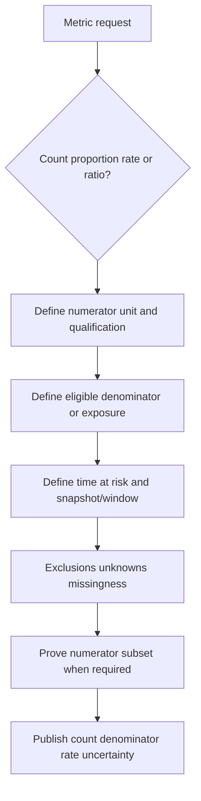

### Plain-English deep-dive 2 - A percentage is a sentence with missing nouns

"Ninety percent" sounds precise but says nothing without nouns: ninety percent of which assets, qualified by what evidence, during which time, after which exclusions? A percentage is a compressed sentence. Expand it before trusting it.

When an executive asks whether coverage improved, say: "Among 8,420 active in-scope managed endpoints in the accepted August 25 snapshot, 7,663 had fresh healthy evidence under the 24-hour rule: 91.0%; 112 remained unknown because identity review was pending." This is more useful than a floating 91% tile.

## Sampling uncertainty and confidence intervals

If data is a probability sample from a population, repeated samples vary. A confidence interval is produced by a method designed to cover the fixed population parameter at a stated long-run rate under assumptions.

For a simple proportion under ideal independent random sampling, an approximate standard error is:

$$
SE(\hat{p}) = \sqrt{\frac{\hat{p}(1-\hat{p})}{n}}
$$

An approximate interval may be written as estimate plus/minus a multiplier times standard error, but Wilson, exact, bootstrap, clustered, stratified, finite-population, and model-based approaches can be more appropriate. Do not mechanically use a normal interval for tiny counts, extreme proportions, dependent observations, or nonprobability samples.

| Uncertainty source | Example | Confidence interval covers it? |
|---|---|---|
| Random sampling | Verify 200 randomly selected assets | Potentially, under design/model |
| Measurement error | Agent reports wrong state | Not automatically |
| Frame undercoverage | Unknown assets absent from CMDB | No |
| Identity error | Two records merged | No |
| Missing-not-at-random | Failed agents less likely observed | No |
| Model uncertainty | Risk-score formula/weights | Not from simple sampling CI |
| Future change | Tomorrow's threat landscape | No |

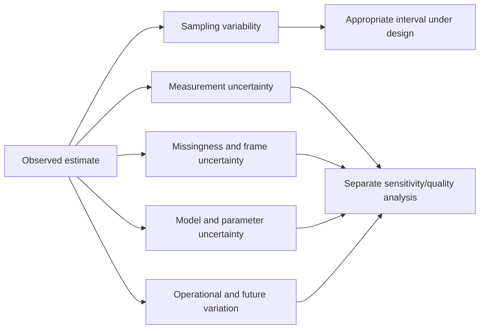

For a complete operational snapshot, sampling uncertainty may be irrelevant, but measurement and coverage uncertainty remain. Adding a narrow confidence interval to biased telemetry creates false sophistication.

## Baselines

A baseline is a reference distribution or process state. "Normal" is contextual: connector type, weekday, time of day, business cycle, geography, asset class, and product change can matter.

| Baseline choice | Suitable use | Tradeoff/failure |
|---|---|---|
| Previous period | Stable adjacent comparison | Seasonality/calendar mix |
| Same weekday/hour history | Repeating operations | Holidays/regime changes |
| Rolling window | Adapts gradually | Contamination by current anomaly |
| Fixed known-stable period | Auditable pre-change reference | Becomes stale |
| Peer group | Compare similar entities | Poor peer definition |
| Expected contract | Schedule/volume/SLO | Contract may not reflect distribution |
| Model-based | Controls multiple predictors | Assumptions/complexity/drift |

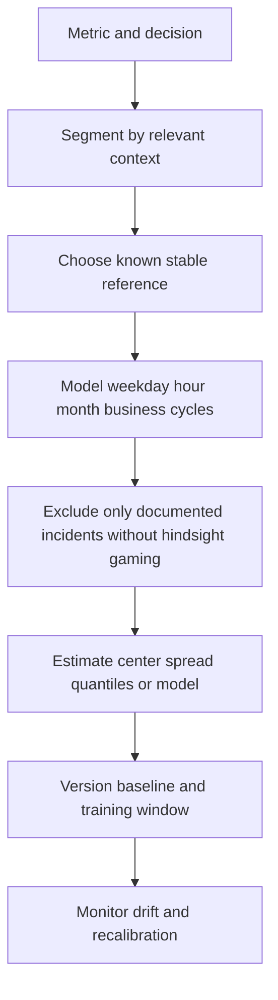

Baseline contamination occurs when attack/incident periods are treated as normal. Over-cleaning also creates an unrealistically quiet baseline. Predefine exclusion rules and maintain labels rather than deleting inconvenient points.

## Correlation versus causation

Correlation describes association. Causation asks what would happen to an outcome under an intervention compared with a credible counterfactual.

| Evidence level | Safe claim | Example |
|---|---|---|
| Description | Values co-occurred in observed data | Latency and failure tickets rose together |
| Temporal sequence | Exposure preceded outcome | Connector slowdown preceded stale dashboard |
| Prediction | Predictor improves held-out forecasts | Run metadata predicts late completion |
| Mechanistic evidence | Plausible pathway observed | Retry queue saturation delays processing |
| Quasi-experiment | Design supports conditional causal estimate | Phased rollout with credible parallel trends |
| Randomized experiment | Random assignment supports causal inference | Eligible units randomly assigned message |

Common explanations for correlation include direct cause, reverse cause, common cause, selection, measurement artifact, seasonality, and chance.

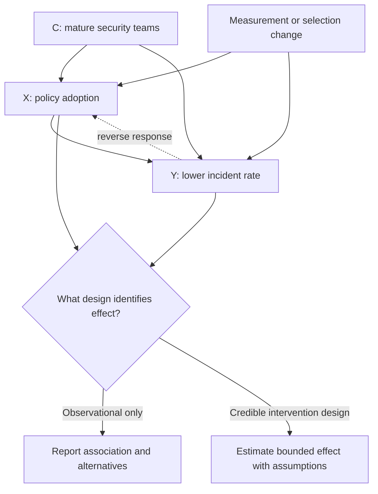

If teams with stronger operations adopt a control earlier and also have fewer incidents, the control-outcome association may partly reflect team maturity. Regression adjustment helps only for measured, correctly modeled confounders; it does not create randomization.

## Regression overview

Regression represents an outcome as a function of predictors plus unexplained variation. Linear regression models a numeric outcome as:

$$
y_i = \beta_0 + \beta_1 x_{i1} + \cdots + \beta_k x_{ik} + \epsilon_i
$$

For binary outcomes, logistic regression models log-odds; count, duration, hierarchical, survival, and time-series outcomes need methods fitting their structure.

| Component | Plain meaning | Review question |
|---|---|---|
| Outcome | Value being explained/predicted | Is it measured consistently? |
| Predictor | Input associated with outcome | Available before prediction? |
| Coefficient | Model-scale relationship holding modeled predictors constant | Units and functional form? |
| Intercept | Expected model value at predictor zeros | Are zeros meaningful? |
| Residual | Observed minus predicted | Pattern, variance, dependence? |
| Fit | How model matches training data | Does validation generalize? |
| Interaction | Effect of one predictor varies with another | Pre-specified and interpretable? |

```mermaid
flowchart LR
    QUESTION[Description prediction or causal estimate] --> DATA[Outcome predictors units timing]
    DATA --> SPLIT[Training validation and temporal design]
    SPLIT --> FORM[Choose model and transformations]
    FORM --> FIT[Estimate coefficients]
    FIT --> RESID[Inspect residuals assumptions influence]
    RESID --> VALID[Validate calibration discrimination error stability]
    VALID --> USE[Bounded use with version and monitoring]
```

Key risks include nonlinearity, correlated observations, omitted variables, multicollinearity, overfitting, leakage, class imbalance, extrapolation, influential points, heteroskedasticity, and drift. A high $R^2$ does not establish causation or operational value. A statistically detectable coefficient can have negligible effect size.

## Seasonality and trends

A trend is longer-term movement; seasonality repeats on a known cycle; noise is residual variation; events/interventions create shocks or level changes. They can overlap.

| Component | NMH example | Diagnostic |
|---|---|---|
| Trend | Gradual decline in open high-tier backlog | Longer horizon and stable definition |
| Weekly seasonality | Fewer connector updates on weekends | Same weekday comparison |
| Monthly seasonality | Patch-cycle finding surge | Month/patch phase |
| Holiday effect | Reduced staffing/asset activity | Calendar indicator |
| Intervention | New assignment workflow | Predefined rollout time |
| Incident shock | Connector outage | Incident label and source health |
| Drift | Asset mix changes over quarter | Population decomposition |

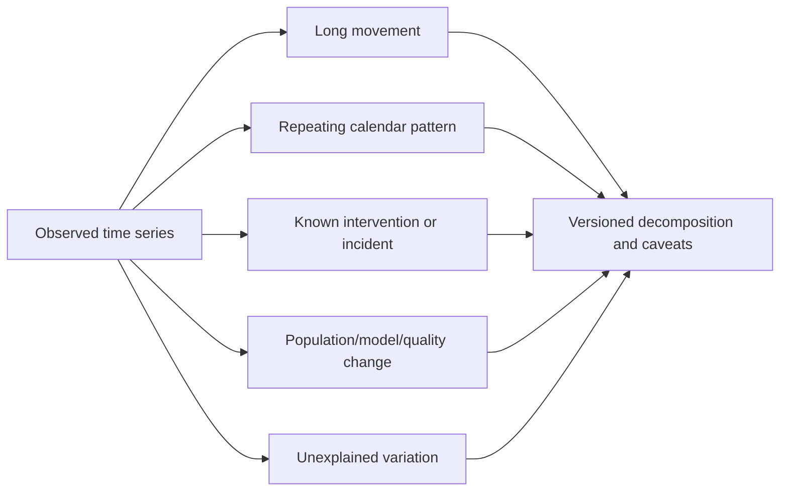

A seven-day moving average smooths weekday variation but creates lag and correlated points. It is a display transformation, not evidence of a causal trend. Show raw data or make smoothing explicit.

## Control charts overview

Statistical process control distinguishes common-cause variation in a stable process from signals suggesting special causes. A center line and statistically estimated control limits describe expected process behavior under assumptions. Specification/SLA limits describe requirements; they are not control limits.

| Concept | Meaning | Security-operations caution |
|---|---|---|
| Center line | Process center estimate | Needs stable reference period |
| UCL/LCL | Upper/lower control limits | Not confidence intervals or targets |
| Common cause | Variation inherent in current process | Requires process redesign for broad change |
| Special cause | Signal inconsistent with baseline rules | Investigate; not automatically attack |
| Rational subgroup | Observations grouped to expose meaningful variation | Poor grouping hides/shows false signals |
| Phase | Stable period under one process | Product/source changes need new phase |

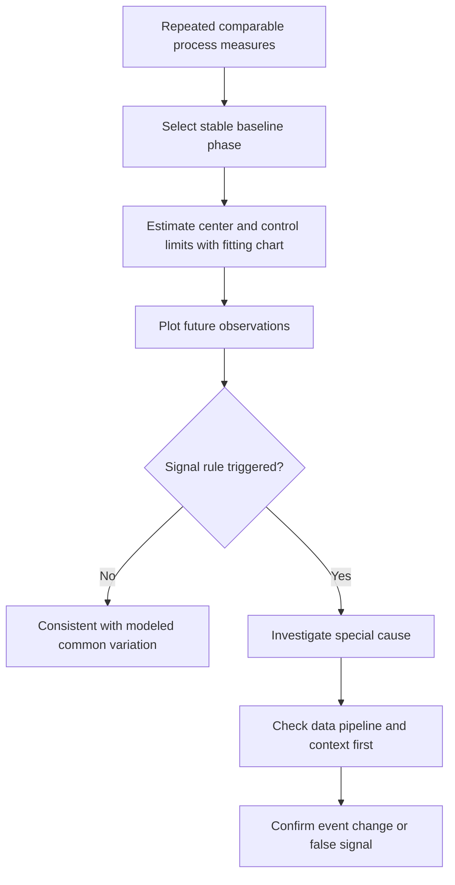

Chart type depends on data: continuous individual measurements, subgroup means/ranges, proportions with varying denominators, counts with exposure, and rare events differ. Security data often violates independence/stability assumptions, so involve statistical expertise before operational automation.

### Plain-English deep-dive 3 - Control limits are not acceptable limits

A delivery kitchen might consistently take 50 to 70 minutes while the customer promise is 30 minutes. Its process is statistically stable but consistently unacceptable. Control limits describe what the current process tends to do; specifications describe what stakeholders require.

Conversely, a process can meet an SLA while showing a statistically unusual shift that warns of emerging trouble. Show both, label them clearly, and never treat a point within control limits as automatically safe.

## Anomalies and outliers

An anomaly is unusual relative to a baseline/model. An outlier is distant by a rule. Neither word means malicious, erroneous, or high risk.

| Detection method | Idea | Strength | Failure mode |
|---|---|---|---|
| Fixed threshold | Exceeds known contract | Simple/actionable | Ignores normal context |
| Z-score | Distance from mean in standard deviations | Familiar under suitable shape | Fragile with skew/heavy tails |
| IQR rule | Outside quartile fences | Robust/simple | Weak for multimodal/contextual data |
| MAD score | Median-based distance | Robust to extremes | Needs calibration/sample size |
| Percentile | Above historical p99 | Distribution-free description | Always flags expected tail share |
| Seasonal residual | Difference from expected cycle | Handles calendar context | Model drift/poor seasonality |
| Peer comparison | Unusual versus similar entities | Contextual | Bad peer groups create noise |
| Multivariate model | Unusual feature combination | Finds contextual anomalies | Explainability/drift/scale |

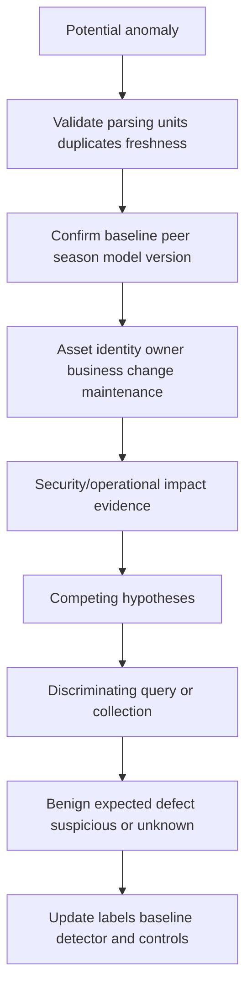

Do not delete outliers merely to make charts attractive. Correct verified errors, quarantine invalid rows, and retain audit evidence. Genuine extremes may be the highest-value incidents.

## Missing, censored, truncated, and late data

| Condition | Meaning | Example | Analytical consequence |
|---|---|---|---|
| Missing completely at random | Missing unrelated to observed/unobserved values | Rare idealized packet loss | Complete-case may remain unbiased but less precise |
| Missing at random | Missing depends on observed variables | One connector type fails more | Model using observed drivers may help |
| Missing not at random | Missing depends on missing value/state | Compromised agents stop reporting | Naive analysis biased |
| Right censoring | Event not completed by observation end | Open finding age | Duration at least current age |
| Left censoring | Event began before observation starts | Existing exposure at onboarding | True start unknown |
| Truncation | Certain observations never enter data | Only incidents above severity stored | Distribution fundamentally selected |
| Late arrival | Record arrives after event/snapshot | Delayed source export | Historical restatement |

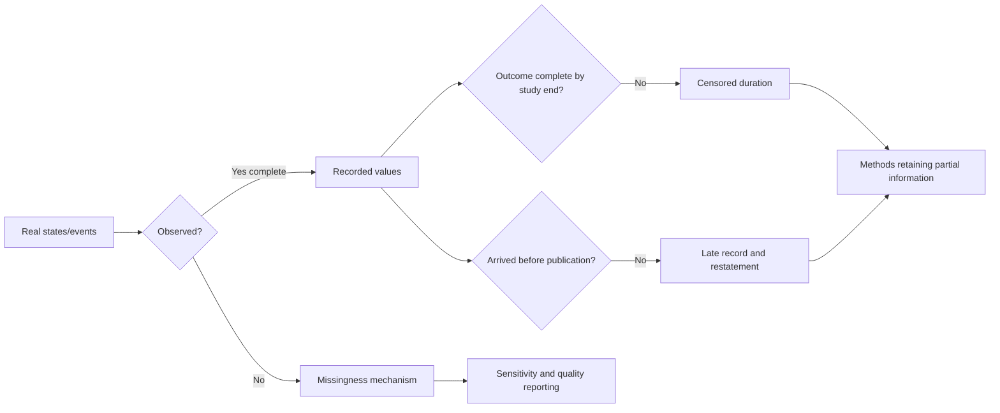

Replacing missing values with zero asserts knowledge. Mean imputation narrows spread and distorts relationships. Complete-case analysis changes the population. Advanced imputation requires assumptions and uncertainty propagation; for operational dashboards, explicit unknown categories and sensitivity bounds are often clearer.

## Survivorship, selection, measurement, and other bias

| Bias | Security example | Mitigation/check |
|---|---|---|
| Survivorship | Analyze only closed incidents/findings | Keep open/censored cases |
| Selection | Pilot includes enthusiastic mature teams | Random/stratified selection or bounded claim |
| Frame coverage | CMDB misses ephemeral cloud assets | Multi-source coverage analysis |
| Measurement | One scanner underdetects a class | Validation sample/source comparison |
| Misclassification | Ticket close labeled remediation | Verify outcome definition |
| Recall/reporting | Manual incident fields filled after crisis | Timestamped source evidence |
| Confounding | Mature teams both adopt control and perform better | Design/measure confounders |
| Collider | Condition on escalation caused by severity and customer tier | Draw causal structure; avoid conditioning |
| Look-ahead | Use future closure state in current prediction | Temporal feature cutoff |
| Publication | Show only successful pilots | Predefined outcome/report all results |

The NMH baseline includes assets with accepted telemetry. If failed agents disappear, the analyzed population is selected toward health. That can simultaneously raise reported coverage and lower observed incidents, creating a persuasive but false success story.

## Simpson's paradox

Simpson's paradox occurs when aggregated comparison points one direction but properly relevant subgroup comparisons point the opposite direction, often because group mix differs.

Synthetic example:

| Team | Before verified within SLA | After verified within SLA | Within-team change |
|---|---:|---:|---:|
| Critical-systems team | 80/100 = 80% | 45/50 = 90% | Improved |
| Standard-systems team | 18/20 = 90% | 76/80 = 95% | Improved |
| Total | 98/120 = 81.7% | 121/130 = 93.1% | Improved here too |

To illustrate reversal, change the period mix:

| Team | Period A | Period B | Within-team result |
|---|---:|---:|---|
| Hard critical queue | 90/100 = 90% | 19/20 = 95% | B better |
| Easy standard queue | 19/20 = 95% | 99/100 = 99% | B better |
| Total | 109/120 = 90.8% | 118/120 = 98.3% | Still B better |

A true reversal requires carefully chosen unequal mixtures; the lesson is not to hunt numerical tricks but to inspect stratification. For example, two tools can each improve within high- and low-complexity cases while the overall rate falls because the later period contains far more high-complexity work.

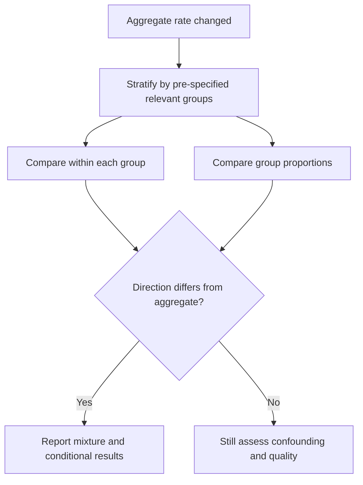

Do not segment until a desired story appears. Use domain-grounded pre-specified strata such as policy tier, asset type, source, business unit, and maturity, and control multiple-comparison risk.

## Dashboard integrity

A trustworthy dashboard is a measurement product with versioned definitions, lineage, quality state, and decision limits.

| Integrity component | Required display/control | Failure prevented |
|---|---|---|
| Metric definition | Numerator, denominator, unit, eligibility | Definition drift |
| Snapshot/window | As-of, zone, complete periods | Time ambiguity |
| Population | Count and scope | Mix-driven illusion |
| Distribution | Median/tail/bands where relevant | Average hides tail |
| Unknowns | Null/missing/unmatched counts | False certainty |
| Quality | Freshness/completeness/acceptance | Stale plausible tiles |
| Version | Query/model/baseline version | Incompatible trend |
| Uncertainty | Interval/sensitivity where defensible | False precision |
| Revision | Restatement flag/reason | Silent history change |
| Action | Owner/decision/drill path | Decorative metrics |

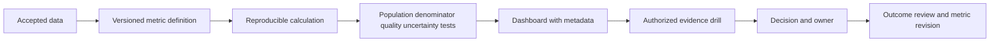

Red/green coloring without uncertainty or context encourages binary interpretation. Use accessible labels, direct values, comparison periods, and caveats. Avoid dual axes that manufacture visual correlation, truncated axes that exaggerate movement, and cumulative charts that can only rise when viewers expect current backlog.

## Risk-score uncertainty

A risk score is a model output combining inputs under rules/weights. Unless explicitly designed and calibrated as a probability, a score of 80 does not mean an 80% chance of breach or $80 of loss.

| Uncertainty layer | Example | Required evidence |
|---|---|---|
| Input | Asset criticality missing | Completeness and source provenance |
| Identity | Findings linked to wrong asset | Match confidence/conflict |
| Measurement | Control state stale | Freshness/validation |
| Model | Weights and transformations | Version and rationale |
| Calibration | Score bands do not match observed outcomes | Validation/calibration report |
| Context | Business process changed | Effective context date |
| Threat | Exploitation conditions evolve | Intelligence timestamp |
| Decision | Threshold/response has cost | Utility and review policy |

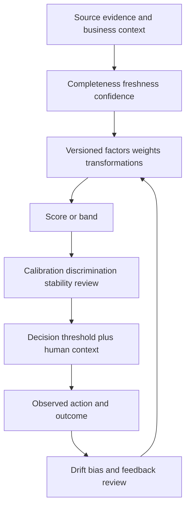

Use sensitivity analysis: how does priority change if a missing criticality becomes high, a control observation is stale, or one factor weight varies within an approved range? Stable rankings deserve more confidence than rankings that flip under plausible inputs.

## Experiments and before/after caveats

An experiment compares outcomes under assigned interventions. Randomization balances measured and unmeasured factors in expectation, but execution, interference, noncompliance, attrition, and measurement can still fail.

| Design element | Question | Security/customer example |
|---|---|---|
| Unit | What is assigned? | Team, asset, user, connector |
| Intervention | Exactly what changes? | Reminder cadence or workflow UI |
| Control | What comparison receives? | Current process |
| Randomization | How assigned? | Stratified by tier/business unit |
| Outcome | Predefined measurement | Verified within SLA, not clicks alone |
| Window | Follow-up length | Equal mature period |
| Power | Can meaningful effect be detected? | Based on baseline/event rate |
| Guardrail | What harm must not increase? | Incidents, outages, analyst burden |
| Analysis | Intent-to-treat/per-protocol? | Preserve assignment to avoid selection |

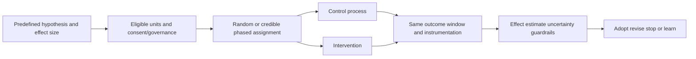

Security controls may be unsafe or unethical to withhold. Use simulations, staged rollouts, stepped-wedge designs, matched controls, interrupted time series, regression discontinuity, or difference-in-differences only when assumptions are credible and reviewed.

### Before/after comparison

A simple before/after difference can reflect intervention, secular trend, seasonality, regression to the mean, population mix, source change, co-interventions, or chance.

| Threat | Example | Better check |
|---|---|---|
| Regression to mean | Change introduced after worst month | Longer pre-period and comparison group |
| Seasonality | After period excludes patch week | Same cycle or modeled seasonality |
| Population change | New low-risk assets onboarded | Stable cohort decomposition |
| Instrumentation | New connector increases detection | Separate measurement from outcome |
| Co-intervention | Staffing increased simultaneously | Design/record concurrent changes |
| Maturation | Teams learn naturally | Control group/trend |
| History | External threat campaign ends | External/context series |

### Plain-English deep-dive 4 - "After" is not the same as "because of"

If umbrellas appear and streets become wet, umbrellas did not cause the rain. Both follow weather. Likewise, a security metric may improve after a rollout because the threat campaign ended, staffing changed, easy work was selected, or telemetry stopped arriving.

Before/after is descriptive unless design supports a counterfactual. State the observed change, alternative explanations, comparison evidence, and confidence. This honesty strengthens recommendations because stakeholders know what is measured and what remains uncertain.

## Analytical-honesty claim ladder

| Level | Example language | Evidence needed |
|---|---|---|
| Observation | "Accepted records show 40 open breaches." | Reproducible definition/query/quality |
| Description | "Median age rose from 12 to 16 days." | Comparable populations/periods |
| Association | "Stale connectors were associated with lower coverage." | Segmentation/model plus caveats |
| Prediction | "Model estimates elevated failure probability." | Held-out temporal validation/calibration |
| Mechanism hypothesis | "Queue saturation may delay processing." | Path evidence and discriminating test |
| Causal estimate | "Assignment to workflow reduced verified delay by X." | Credible design and assumptions |
| Decision | "We recommend staged rollout with guardrails." | Evidence plus costs, risk, feasibility |

Use verbs carefully: observed, estimated, associated, predicted, may indicate, supports, caused, prevented. "Proves" is rarely appropriate.

## Statistical troubleshooting runbook

1. Restate the exact decision and proposed claim.
2. Name target population, sampling frame, unit, eligibility, and selection process.
3. Freeze source extractions, query/model version, as-of, and time window.
4. Verify grain, identity, scope, freshness, completeness, duplicates, units, and clocks.
5. Count total, non-null, distinct, excluded, unknown, censored, and late records.
6. Visualize/profile the full distribution and relevant strata before summarizing.
7. Pair center with spread/tails; avoid one-number descriptions.
8. Publish numerator and denominator and prove subset/exposure logic.
9. Identify whether uncertainty is sampling, measurement, missingness, model, or future variation.
10. Use confidence intervals only when design/assumptions support them.
11. Check baseline stability, seasonality, holidays, product changes, and contamination.
12. Decompose trends by same units, additions, removals, data quality, and model version.
13. For anomalies, validate pipeline/parsing/unit/duplicate defects before security interpretation.
14. Examine missingness mechanism; retain censored/open records.
15. List plausible confounders, reverse causation, selection, and measurement artifacts.
16. Stratify by pre-specified relevant groups and inspect mixture changes/Simpson reversals.
17. For regression, inspect temporal ordering, leakage, functional form, residuals, dependence, influence, fit, validation, and drift.
18. Separate statistical signal, practical effect size, operational importance, and risk.
19. For before/after, examine regression to mean, seasonality, history, mix, instrumentation, and co-interventions.
20. Reproduce on a known-answer synthetic fixture and a fixed accepted sample.
21. Review with data/security/domain owners before automation.
22. Publish bounded language, uncertainty, alternatives, and action/validation plan.

## Exercises with answers

### Exercise 1 - Population versus frame

**Task:** NMH analyzes every scanner row. Can it generalize to all assets?

**Answer:** Only if scanner scope fully represents the target population and measurement/identity are valid, which must be demonstrated. It is a census of scanner records, not necessarily enterprise assets. Report frame coverage and missing populations.

### Exercise 2 - Mean versus median

**Task:** Ages are 1, 2, 2, 3, and 42 days.

**Answer:** Mean is 10 and median is 2; range is 41. The mean exposes tail influence, median describes a typical rank, and neither alone is enough. Publish tail bands/max and investigate the 42-day row.

### Exercise 3 - Percentile

**Task:** Explain p95 connector latency.

**Answer:** Under the named method/population/window, about 95% of accepted comparable runs are at or below the p95 value. It excludes failed/missing runs unless included explicitly and is unstable for small samples.

### Exercise 4 - Confidence

**Task:** Add a 95% confidence interval to a full dashboard census.

**Answer:** First ask what randomness it represents. A simple sampling interval may be irrelevant for a full frame and does not capture coverage, measurement, identity, missingness, or model uncertainty. Report those directly or use a justified model/design.

### Exercise 5 - Correlation

**Task:** Control adoption correlates with fewer incidents.

**Answer:** Report association. Test timing, team maturity, asset mix, monitoring intensity, reverse response, and selection. A credible randomized/quasi-experimental design is needed for a causal estimate.

### Exercise 6 - Seasonality

**Task:** Weekend connector volume is lower than Friday.

**Answer:** Compare with prior same weekdays/holiday/business cycles and expected schedules. A Friday-to-Saturday drop may be normal seasonality, not anomaly.

### Exercise 7 - Control limits

**Task:** A metric is inside control limits but violates SLA.

**Answer:** The process may be stable but incapable of meeting requirement. Control limits describe process variation; SLA/specification is a target. Improve/redesign the process.

### Exercise 8 - Outlier

**Task:** Remove a 20x incident duration before reporting.

**Answer:** Validate it. Correct/quarantine only verified data errors; otherwise retain and explain it. Genuine extreme incidents may be most important. Use robust summaries without deleting truth.

### Exercise 9 - Censoring

**Task:** Average remediation duration uses closed findings only.

**Answer:** It has survivorship bias because long-open findings are excluded. Include open findings as right-censored with appropriate methods or separately report age and closure distribution.

### Exercise 10 - Simpson's paradox

**Task:** Overall SLA worsens while every tier improves.

**Answer:** Inspect tier mix. More work may have shifted into a hard tier with lower absolute compliance. Report conditional tier results and population weights, then choose policy-relevant standardization.

### Exercise 11 - Risk score

**Task:** Does score 80 mean 80% breach probability?

**Answer:** Not unless official model documentation and validation establish calibrated probability semantics. Treat it as a versioned score/rank with input quality and sensitivity; use factors and context for decisions.

### Exercise 12 - Before/after

**Task:** Backlog fell after training.

**Answer:** Describe the change, then check incoming work, easy-case selection, staffing, seasonality, telemetry, closure verification, population mix, and comparison group. Do not attribute causally without a credible design.

## Labs and rehearsal

### Lab 1 - Population card

Define target, frame, unit, inclusion, selection, nonresponse, measurement, and inference for five NMH metrics.

### Lab 2 - Distribution clinic

Create symmetric, skewed, bimodal, heavy-tail, zero-inflated, and truncated synthetic data. Compare mean, median, standard deviation, IQR, and tails.

### Lab 3 - Percentile stability

Estimate p50/p90/p99 at sample sizes 10, 100, and 10,000 under a fixed synthetic distribution. Explain method and instability.

### Lab 4 - Denominator challenge

Construct four valid-looking rates from the same numerator with different denominators. Name the decision each answers.

### Lab 5 - Uncertainty register

For a manual asset verification sample, separate random sampling, frame, measurement, identity, missingness, and future uncertainty.

### Lab 6 - Baseline contamination

Train a rolling baseline including an outage, then compare with a versioned stable reference. Show anomaly suppression and recovery.

### Lab 7 - Correlation causal map

Draw adoption, team maturity, monitoring intensity, incident detection, and outcomes. Identify confounders, mediators, and colliders.

### Lab 8 - Regression review

Fit a simple synthetic latency model, inspect residual patterns, leakage, nonlinearity, outliers, temporal validation, and subgroup error.

### Lab 9 - Seasonality

Create hourly/weekly cycles plus one incident. Compare naive threshold, same-hour baseline, and residual alerting.

### Lab 10 - Control chart concepts

Use a stable synthetic process, a mean shift, a variance increase, and an SLA outside the stable range. Label limits versus specification.

### Lab 11 - Anomaly triage

Seed unit conversion, duplicate delivery, connector outage, maintenance, legitimate business surge, and suspicious event. Diagnose in order.

### Lab 12 - Missingness and censoring

Compare complete-case closure duration with open-aware reporting. Simulate failed agents missing more often when unhealthy.

### Lab 13 - Simpson reversal

Construct two tiers where within-tier results improve but aggregate worsens due to mix. Present without manipulating groups post hoc.

### Lab 14 - Dashboard integrity

Build Power BI cards showing count, denominator, distribution, quality, version, revisions, and uncertainty; test truncated-axis and dual-axis traps.

### Lab 15 - Experiment plan

Design a safe workflow-reminder trial with unit, randomization, outcome, guardrails, follow-up, power assumptions, and analysis.

### Lab 16 - TSM executive briefing

Explain why a falling risk score is encouraging but not yet proof of risk reduction. Present drivers, quality, uncertainty, alternatives, decisions, and validation.

| Lab evidence | Completion standard |
|---|---|
| Population | Target/frame/unit/selection explicit |
| Description | Shape, center, spread, tails, nulls |
| Metrics | Numerator/denominator/exposure/time |
| Baseline | Context, seasonality, version, contamination |
| Uncertainty | Sources separated, not cosmetic interval |
| Bias | Selection/survivorship/confounding checked |
| Model | Validation, assumptions, drift, subgroup error |
| Claim | Observation/association/prediction/causation labeled |
| Honesty | Synthetic NMH and no Zscaler internals claim |

## Common misconceptions to correct

| Misconception | Correct model |
|---|---|
| Big data eliminates uncertainty | It can reduce sampling noise while preserving bias |
| All rows means the population | It may only mean all rows in an incomplete frame |
| Average means typical | Shape and tails determine interpretation |
| Median makes tails irrelevant | Robust center still needs tail reporting |
| Standard deviation always contains 68% near mean | That rule depends on normal-like assumptions |
| p95 means 95% probability for one event | It is a distribution cut point |
| A rate is self-explanatory | Denominator, exposure, time, exclusions are essential |
| 80% to 90% is a 10% increase | It is +10 percentage points and +12.5% relative |
| Narrow confidence interval means accurate | Bias/measurement error can remain large |
| No statistical significance means no effect | Study may be underpowered; effect/uncertainty matter |
| Statistical significance means important | Tiny effects can be detectable with large n |
| Correlation proves causation | Confounding, selection, reverse cause, chance remain |
| Regression controls all bias | Only measured/correctly modeled factors, under assumptions |
| High R-squared means causal/useful model | Fit is not causality or external validity |
| Baseline means universal normal | It is contextual and versioned |
| Inside control limits means acceptable | Limits describe process; specifications set requirements |
| Anomaly means attack | It means unusual under a reference |
| Outliers should be removed | Validate; extremes may be real and valuable |
| Null can be replaced with zero | That asserts a value and changes distribution |
| Closed-only duration is fine | It excludes long-open censored work |
| Aggregate totals settle disagreement | Mix can create Simpson's paradox |
| Risk score is automatically probability | Only documented calibrated models support that |
| Before/after proves improvement caused by rollout | Counterfactual and alternative explanations are missing |
| A dashboard should show one clean number | Trust needs definition, denominator, quality, and uncertainty |
| This describes Zscaler scoring/anomaly methods | It is general synthetic statistical training |

## Official Source Anchors

Sources in this section were reviewed on **2026-08-24**.

NIST sources provide measurement, statistical, risk, and cybersecurity guidance; exact methods must fit the question and design. PostgreSQL documentation establishes aggregate implementation behavior for the current version. CISA sources provide security-outcome and vulnerability context, not statistical algorithms. Zscaler public material provides bounded Data Fabric context only.

| Source | URL | Used for | Boundary |
|---|---|---|---|
| NIST/SEMATECH e-Handbook of Statistical Methods | https://www.itl.nist.gov/div898/handbook/ | Distributions, exploratory analysis, process monitoring, regression, experiments | Method choice/assumptions require expertise |
| NIST SP 800-55 Vol. 1 | https://csrc.nist.gov/pubs/sp/800/55/v1/final | Information-security measurement program concepts | Not a product metric catalog |
| NIST SP 800-55 Vol. 2 | https://csrc.nist.gov/pubs/sp/800/55/v2/final | Developing information-security measures | Current applicability should be checked |
| NIST SP 800-137 | https://csrc.nist.gov/pubs/sp/800/137/final | Continuous monitoring strategy and assessment context | Not anomaly-algorithm specification |
| NIST Cybersecurity Framework 2.0 | https://www.nist.gov/cyberframework | Outcome/governance context | Not statistical method guidance |
| NISTIR 8286A Rev. 1 | https://csrc.nist.gov/pubs/ir/8286/a/r1/final | Risk identification and register context | Does not establish score calibration |
| NIST AI Risk Management Framework | https://www.nist.gov/itl/ai-risk-management-framework | Model validity, reliability, transparency, monitoring context | General voluntary framework |
| PostgreSQL Aggregate Functions | https://www.postgresql.org/docs/current/functions-aggregate.html | Mean, standard deviation, ordered-set percentiles, FILTER | Version and null/order behavior apply |
| PostgreSQL Statistical Aggregate Functions | https://www.postgresql.org/docs/current/functions-aggregate.html | Regression/correlation aggregate definitions | Descriptive calculations do not imply causality |
| CISA Cybersecurity Performance Goals | https://www.cisa.gov/cybersecurity-performance-goals | Outcome-oriented cybersecurity context | Voluntary and not metric formulas |
| CISA Known Exploited Vulnerabilities Catalog | https://www.cisa.gov/known-exploited-vulnerabilities-catalog | Known-exploitation prioritization context | Catalog inclusion is one risk input |
| Zscaler Data Fabric for Security | https://www.zscaler.com/products-and-solutions/data-fabric | Public high-level unified data/business-context positioning | No score, baseline, anomaly, confidence, or algorithm claim |

## Likely Interview Questions

### Q1. How do population, sample, and sampling frame differ in security analytics?

**Model answer:** The target population is everyone the decision concerns; the frame is the operational list from which observation/selection occurs; a sample is the analyzed subset. Querying every scanner record is a census of that frame, not necessarily all enterprise assets. I state unit, eligibility, frame coverage, selection/nonresponse, and inference boundary before calculating uncertainty or generalizing.

### Q2. How do you choose mean, median, percentiles, and spread?

**Model answer:** I inspect the distribution first. Mean uses magnitudes and supports additive reasoning but is tail-sensitive; median is robust and rank-based; percentiles describe tail cut points; standard deviation fits some stable distributions but IQR/MAD are more robust. I pair center with spread, sample size, nulls, bands, and relevant groups. For backlog I usually show median, p90, oldest, and age bands.

### Q3. What makes a rate or confidence interval honest?

**Model answer:** A rate names numerator, eligible denominator/exposure, unit, window, exclusions, unknowns, and quality. I prove numerator membership. A confidence interval needs a sampling/model design and captures only specified variability; it does not automatically cover frame, measurement, identity, missingness, or model error. For full telemetry snapshots, those other uncertainties may dominate.

### Q4. How do correlation and causation differ, and where does regression fit?

**Model answer:** Correlation is observed association. Causation compares outcomes under an intervention with a credible counterfactual. Regression can describe or predict and can support causal analysis only inside a valid design with measured confounding and assumptions. I check timing, common causes, reverse causation, selection, measurement, leakage, residuals, validation, effect size, and alternatives before choosing claim language.

### Q5. How do you build and use a baseline for anomaly detection?

**Model answer:** I define the metric, peer/context, stable reference period, weekday/hour/business seasonality, exclusions, sample size, and model version. I protect against incident contamination and monitor drift. An anomaly is unusual under that baseline, not automatically malicious. Triage validates data quality, baseline fit, business context, impact, competing hypotheses, and feedback labels.

### Q6. What are control-chart limits, and how do missing/censored data affect analysis?

**Model answer:** Control limits estimate expected variation for a stable process using a fitting chart; they are not SLA/specification limits or confidence intervals. Missingness can be related to failure, and open findings are right-censored rather than completed. I retain unknown/open records, assess missingness mechanisms, use appropriate duration methods or transparent stratification, and avoid closed-only survivorship bias.

### Q7. Explain Simpson's paradox and risk-score uncertainty.

**Model answer:** Simpson's paradox is when aggregate association differs or reverses within relevant groups because group mixes differ. I inspect pre-specified strata and weights. A risk score is a versioned model output with input, identity, measurement, model, calibration, threat, and decision uncertainty; it is not a breach probability unless officially designed and validated as one. I show factors, quality, sensitivity, and decision limits.

### Q8. How would you evaluate whether a security workflow change improved outcomes?

**Model answer:** I predefine unit, eligibility, intervention, comparator, meaningful effect, outcome, follow-up, guardrails, and analysis. Randomize when safe; otherwise use a credible phased/quasi-experimental design with explicit assumptions. A simple before/after result can reflect regression to mean, seasonality, mix, instrumentation, history, or co-interventions. I report effect size, uncertainty, alternatives, and verified outcomes rather than activity alone.

## 30-Second Memory Hooks

| Concept | Memory hook |
|---|---|
| Population | Everyone the claim is about |
| Frame | Who could enter the data |
| Sample | Some observed units |
| Big data | Precise bias is still bias |
| Distribution | Shape before summary |
| Mean | Balance point, tail-sensitive |
| Median | Middle rank, robust center |
| Spread | Center without variability is incomplete |
| Percentile | Cut point, not probability |
| Rate | Numerator over opportunity |
| Confidence | Sampling method coverage, not all uncertainty |
| Baseline | Normal for this context and version |
| Correlation | Together is not because |
| Confounder | Common driver of both |
| Regression | Model relationship; design determines claim |
| Seasonality | Pattern returns on schedule |
| Control limits | Voice of process, not customer promise |
| Anomaly | Unusual means investigate |
| Outlier | Validate before remove |
| Censoring | At least this long |
| Survivorship | Keep the open failures visible |
| Simpson | Group mix can flip totals |
| Risk score | Model output, not automatic probability |
| Experiment | Intervention plus credible counterfactual |
| Before/after | After does not mean because |
| Experience bridge | Statistics transfers; Zscaler algorithms do not |

## Completion Checklist

- [ ] I define target population, frame, unit, eligibility, and selection.
- [ ] I distinguish a census of records from coverage of the target population.
- [ ] I describe the data-generating process from reality to accepted rows.
- [ ] I inspect count, nulls, range, shape, tails, and groups before summary.
- [ ] I can explain symmetric, skewed, bimodal, heavy-tail, zero-inflated, and truncated data.
- [ ] I pair center with spread and tails.
- [ ] I know mean, weighted mean, median, mode, range, variance, standard deviation, IQR, and MAD tradeoffs.
- [ ] I explain percentiles as method/population/window cut points.
- [ ] I avoid high-percentile certainty from tiny samples.
- [ ] I distinguish count, proportion, rate, ratio, percentage points, and relative change.
- [ ] I publish numerator, denominator/exposure, time, exclusions, unknowns, and quality.
- [ ] I prove numerator is a denominator subset when defining a proportion.
- [ ] I distinguish sampling variability from measurement, frame, missingness, model, and future uncertainty.
- [ ] I use confidence intervals only under a justified design/model.
- [ ] I do not add cosmetic intervals to biased telemetry.
- [ ] I choose baselines by context, stable period, seasonality, peer group, and decision.
- [ ] I version baselines and monitor contamination/drift.
- [ ] I separate trend, seasonality, incident/intervention, mix, model, and noise.
- [ ] I describe moving averages as smoothing, not causal evidence.
- [ ] I distinguish correlation, prediction, mechanism, and causation.
- [ ] I list common cause, reverse cause, selection, measurement, seasonality, and chance alternatives.
- [ ] I understand regression outcome, predictors, coefficients, residuals, interactions, and validation.
- [ ] I check nonlinearity, dependence, leakage, overfit, imbalance, extrapolation, influence, and drift.
- [ ] I pair statistical detectability with practical effect size.
- [ ] I distinguish control limits from SLA/specification limits and confidence intervals.
- [ ] I choose process charts only with suitable data/assumptions and expert review.
- [ ] I treat anomaly as unusual under a baseline, not malicious by definition.
- [ ] I validate parsing, units, duplicates, freshness, context, and impact before escalating an outlier.
- [ ] I retain genuine extreme observations.
- [ ] I distinguish missingness, censoring, truncation, and late arrival.
- [ ] I keep open/right-censored work visible and avoid closed-only survivorship bias.
- [ ] I never replace missing with zero without semantic justification.
- [ ] I assess selection, frame, measurement, misclassification, confounding, collider, look-ahead, and publication bias.
- [ ] I test pre-specified relevant groups for mixture and Simpson's paradox.
- [ ] I do not segment post hoc solely to obtain a desired narrative.
- [ ] I require dashboard definition, snapshot, population, distribution, unknowns, quality, version, uncertainty, revision, and action.
- [ ] I avoid truncated-axis, dual-axis, cumulative-stock, and color-only dashboard traps.
- [ ] I treat risk scores as versioned model outputs with input and calibration uncertainty.
- [ ] I use sensitivity analysis when plausible inputs/weights can change priority.
- [ ] I define experiment unit, intervention, control, assignment, outcome, window, power, guardrails, and analysis.
- [ ] I know when withholding a security control is unsafe or unethical.
- [ ] I qualify before/after results for regression to mean, seasonality, mix, instrumentation, history, and co-interventions.
- [ ] I use observation, association, prediction, mechanism, causation, and decision language precisely.
- [ ] I can run the full statistical troubleshooting method.
- [ ] I can complete every synthetic NMH lab and explain its assumptions.
- [ ] I separate general statistics, PostgreSQL behavior, synthetic results, and public Zscaler context.
- [ ] I can answer Q1 through Q8 with definitions, mechanics, examples, failures, and honest boundaries.

[Part 50 - ETL, ELT, Pipelines, Batch, Streaming, and Change Data](Part-50-etl-elt-security-pipelines.md)