# Part 50 - ETL, ELT, Pipelines, Batch, Streaming, and Change Data

> **Audience:** Candidates preparing for a Zscaler Security Operations Technical Success Manager role after enterprise Support Escalation Engineering.
>
> **Purpose:** Explain how security data moves reliably from source to decision through ETL/ELT, orchestration, schedules, full and incremental loads, change data capture, watermarks, idempotency, deduplication, retries, dead-letter handling, replay, backfill, late data, schema evolution, lineage, contracts, observability, recovery, security, and privacy.
>
> **Scope and honesty:** Northstar Meridian Holdings, abbreviated NMH, is fictional. Every source, record, event, connector, pipeline, service objective, failure, table, schedule, code/SQL example, threshold, architecture, and result in this Part is synthetic. Examples use general data-engineering patterns and PostgreSQL-oriented lab concepts; they are not Zscaler Data Fabric internals, connector behavior, schemas, limits, guarantees, or production recommendations. Official Zscaler material is used only for bounded public context about unifying security data and business context. Your prior support, sync, networking, SQL, analytics, incident, RCA, and customer-communication skills transfer; direct production Zscaler Data Fabric operation remains a learning boundary.
>
> **Currency caveat:** Data platforms, orchestration engines, CDC methods, cloud services, schemas, security controls, product capabilities, and public documentation change. Sources in this Part were reviewed on **2026-08-24**. Current source contracts, deployed-version documentation, approved architecture, tenant evidence, privacy/security review, recovery tests, and product specialists govern production.

## Section goal

A data pipeline is a controlled process that moves and changes data while preserving enough meaning and evidence to recover, explain, and trust the result. Reliability is not "the job turned green." It means the right data, for the right scope and period, reached the right state once logically, with known latency, quality, lineage, and security.

Think of registered mail moving through sorting centers. The envelope has an identity, sender, recipient, timestamps, custody history, retry process, exception queue, and delivery confirmation. If a truck retries a route, the recipient should not receive five independent legal notices. If a sorting rule changes, old mail may need reprocessing. A security pipeline needs the same discipline.

By the end, you should be able to:

| Outcome | Demonstrated capability | Evidence artifact |
|---|---|---|
| Explain ETL/ELT | Choose transformation placement from trust, scale, latency, governance, and recovery needs | Architecture decision |
| Model a pipeline | Draw stages, state, boundaries, checkpoints, owners, and failure domains | Pipeline map |
| Orchestrate work | Define DAG dependencies, schedules, windows, concurrency, and rerun behavior | DAG specification |
| Select load mode | Compare full, snapshot, incremental, append, upsert, and CDC | Ingestion decision matrix |
| Track progress | Use source positions and watermarks without skipping late changes | Checkpoint contract |
| Make retries safe | Define idempotency keys, deterministic transformations, dedup, and side-effect controls | Retry proof |
| Handle failure | Apply bounded retry/backoff, quarantine/dead-letter, alerting, and human ownership | Failure policy |
| Replay and backfill | Reproduce historical output by version and scope without corrupting current state | Backfill plan |
| Process disorder | Handle late, duplicated, and out-of-order data under event-time rules | Lateness policy |
| Evolve schemas | Detect drift, classify compatibility, version contracts, and migrate consumers | Schema plan |
| Preserve lineage | Trace source fields, transformations, versions, and outputs | Lineage record |
| Define reliability | Publish SLIs, SLOs, SLAs, freshness, completeness, and correctness gates | Observability dashboard |
| Compare batch/stream | Choose by decision latency and complexity, not fashion | Mode decision |
| Recover safely | Restore checkpoints, replay deterministically, reconcile, and communicate | Recovery runbook |
| Protect data | Apply minimization, secrets, access, encryption, retention, tenant isolation, and audit | Security review |

```mermaid
flowchart LR
    SOURCE[Authorized source state/events] --> EXTRACT[Extract with position and contract]
    EXTRACT --> LAND[Immutable raw landing plus provenance]
    LAND --> VALIDATE[Schema scope quality malware/privacy checks]
    VALIDATE --> TRANSFORM[Normalize map deduplicate enrich]
    TRANSFORM --> SERVE[Curated model or event stream]
    SERVE --> OPERATE[Dashboard workflow investigation]
    OPERATE --> FEEDBACK[Corrections labels and contract changes]
    FEEDBACK --> PLAN[Versioned replay or next run]
    PLAN --> EXTRACT
```

## JD Mapping

| Role expectation | Part 50 capability | TSM artifact | experience bridge and boundary |
|---|---|---|---|
| Analyze customer environments | Map source-to-outcome dependencies and failure domains | Data-flow assessment | Sync/troubleshooting transfer |
| Develop Data Fabric expertise | Explain vendor-neutral ingestion and pipeline concepts without inventing internals | Conceptual architecture | Product implementation unclaimed |
| Resolve technical escalations | Isolate source, transport, orchestration, transform, quality, and publish failures | Pipeline runbook | Incident/RCA strength transfers |
| Recommend best practices | Specify idempotency, replay, schema, contracts, observability, and recovery | Reliability checklist | Architecture must be validated |
| Identify security risk | Detect stale/partial/duplicated data and unsafe access/retention | Risk register | Pipeline defect can distort decisions |
| Partner with Product/Support | Provide run IDs, positions, schema versions, evidence, impact, and reproduction | Escalation package | Cross-functional skill transfers |
| Explain business impact | Translate data latency/quality into delayed decisions and workflow risk | Executive update | No unsupported outcome claims |
| Drive adoption | Define ownership, service objectives, readiness gates, and training | Operating model | Customer-specific governance required |

## Candidate honesty note

| Evidence class | Safe statement | Boundary |
|---|---|---|
| Production transfer | "I troubleshoot synchronized systems, APIs, dependencies, retries, logs, and customer-impacting incidents." | Not production security-data pipeline ownership |
| Synthetic practice | "I designed and tested an NMH pipeline with checkpoints, idempotency, replay, late data, and quality gates." | Not a customer result |
| General principle | "At-least-once delivery needs idempotent processing or deduplication for logical once effects." | Exact guarantees depend on complete system |
| Product context | "Zscaler publicly positions Data Fabric around bringing data/context together for security outcomes." | No internal pipeline/connector/latency claim |
| Reliability claim | "The synthetic lab passed defined failure/replay tests." | Does not establish production reliability |
| Experience boundary | "I would validate current interfaces, delivery semantics, schemas, limits, and recovery procedures." | Never infer undocumented behavior |

## Beginner vocabulary and memory hooks

| Term | Plain meaning | Why it matters | Memory hook |
|---|---|---|---|
| Pipeline | Ordered/connected stages moving data | Creates dependencies and failure states | Data assembly line |
| Extract | Read data from source | Must preserve position/scope | Take from source |
| Load | Write data into destination | Needs atomicity/idempotency | Put into target |
| Transform | Change structure/value/meaning | Can introduce defects | Shape with rules |
| ETL | Extract, transform, then load curated result | Earlier control, more movement/compute choices | Shape before destination |
| ELT | Extract, load raw, transform in destination | Retains raw and uses target compute | Land then shape |
| Orchestration | Coordinate jobs/dependencies/state | Prevents blind scheduling | Conduct the pipeline |
| DAG | Directed acyclic graph of tasks | Expresses dependency without cycles | Arrows, no loop |
| Batch | Process bounded collection periodically | Simpler deterministic windows | Box of records |
| Stream | Continuously process unbounded events | Lower latency, harder time/state | Flow of events |
| Full load | Read complete source scope | Simple but expensive/disruptive | Bring everything |
| Incremental load | Read only changes since progress point | Efficient but can miss changes | Bring what changed |
| CDC | Capture inserts, updates, deletes | Preserves row-level changes/order metadata | Database change feed |
| Snapshot | State as of a time | Supports reconciliation/history | Photograph of state |
| Checkpoint | Durable processing position/state | Enables restart | Saved progress |
| Watermark | Event-time progress boundary | Controls lateness/finality | How far time is complete |
| Idempotent | Repeating operation has same logical effect | Makes retry safe | Do twice, same result |
| Deduplication | Identify repeated deliveries of same logical record | Prevents double effects | One event, many envelopes |
| Backoff | Wait progressively before retry | Avoids overload | Retry more slowly |
| Dead-letter queue | Isolated failed items for review/replay | Prevents poison record blocking | Exception mailbox |
| Replay | Process retained input again | Recovery/correction | Re-run the tape |
| Backfill | Populate/recompute historical range | Repairs gaps or new logic | Fill history |
| Late data | Event arrives after expected processing window | Can restate results | Truth arrived late |
| Out-of-order | Events arrive in different sequence than event time | Current state can regress | Delivery order differs |
| Schema drift | Source shape changes unexpectedly | Breaks parser/meaning | Contract moved |
| Schema evolution | Governed compatible/incompatible change over time | Enables safe change | Version the language |
| Lineage | Trace data origins and transformations | Enables trust and correction | Data family tree |
| Data contract | Producer-consumer agreement for meaning/shape/service | Makes dependencies explicit | Promise at boundary |
| SLI | Measured reliability indicator | Evidence about service | What we measure |
| SLO | Target for an SLI | Internal/reliability objective | What we aim for |
| SLA | Formal service commitment and consequences | Customer/legal boundary | What we promise |

## ETL and ELT from first principles

ETL and ELT describe ordering, not quality. Both can be secure, reliable, or broken.

| Dimension | ETL | ELT | Decision question |
|---|---|---|---|
| Order | Extract, transform, load curated output | Extract, load raw, transform in target | Where should transformation run? |
| Raw retention | Optional/separate landing | Often central to approach | Is replay/audit required? |
| Target compute | Less transformation there | Heavy use of target compute | Capacity/cost/isolation? |
| Sensitive fields | Can minimize before target | Raw target receives sensitive fields | Is raw landing authorized? |
| Schema change | Transform may break before curated load | Raw can land then mapping adapts | What is acceptance behavior? |
| Recovery | Re-extract or retain intermediate | Replay retained raw | Source history/retention? |
| Latency | Depends on stages | Depends on target/load/transform | Decision requirement? |
| Governance | Distributed or centralized | Often centralized in platform | Ownership/access/lineage? |

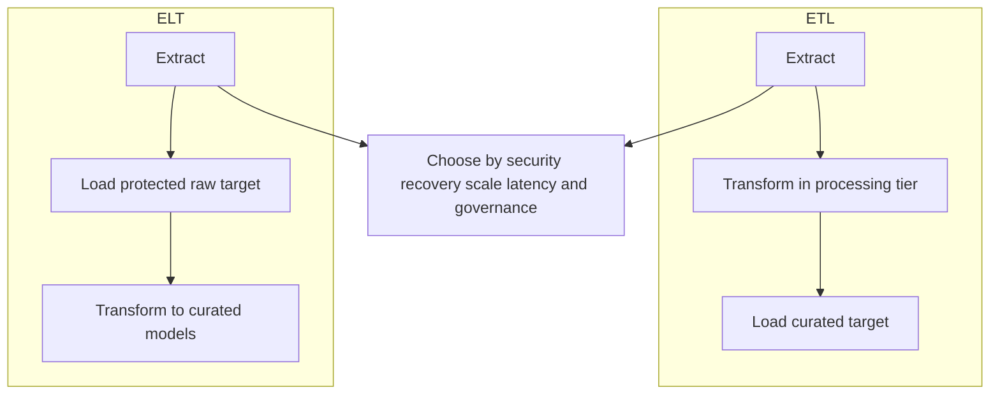

Hybrid designs are normal: redact prohibited fields before landing, retain authorized raw records immutably, then transform in a warehouse. Avoid dogma. The deciding unit is the control boundary and recovery requirement.

### Plain-English deep-dive 1 - ETL versus ELT is about where trust changes

Imagine receiving sealed packages. You can inspect and repack them in a secure mailroom before placing them in the warehouse (ETL), or store them in a restricted raw vault and unpack them inside controlled warehouse rooms (ELT). Neither is inherently safer; authorization, isolation, audit, retention, and recovery determine safety.

For security data, ask whether secrets or personal data are allowed in raw storage, who can access it, whether source history can be re-read, and how corrections are reproduced. "ELT is modern" is not an architecture argument.

## Pipeline stages and state

| Stage | Input/output contract | Durable state | Typical failure |
|---|---|---|---|
| Discover/configure | Source owner/scope/auth/schema | Versioned connector config | Wrong scope/permission |
| Extract | Source position to delivery | Cursor/token/LSN/run ID | Timeout, skipped page |
| Transfer | Payload and metadata | Object/message ID/checksum | Partial/corrupt/duplicate |
| Land | Immutable raw partition | Manifest and receipt | Wrong path/tenant |
| Validate | Accepted/quarantined rows | Quality results/reasons | Schema/type/count defect |
| Transform | Raw to canonical/model | Code/config/model version | Mapping/fanout/time defect |
| Publish | Accepted snapshot/table/topic | Publication version | Partial visible output |
| Consume | Dashboard/workflow/API | Consumer checkpoint | Stale cache/action duplicate |
| Reconcile | Source/control totals | Audit report | Silent loss/addition |

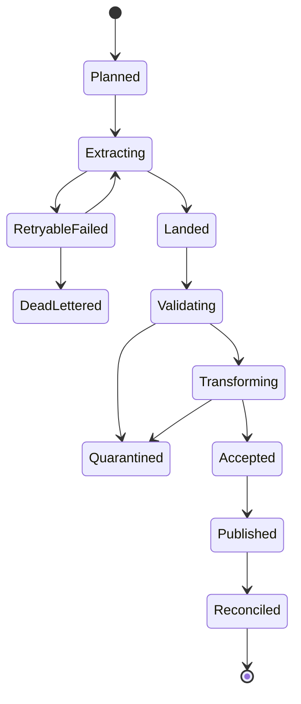

The run state and each record's disposition are separate. A run can complete with quarantined records under policy, but its published quality must expose that fact.

## Orchestration and DAGs

A Directed Acyclic Graph (DAG) expresses tasks and dependencies. "Acyclic" means dependencies cannot loop back. Feedback occurs across separate runs/versions, not as an impossible dependency cycle.

| DAG concern | Mechanic | Failure if ignored |
|---|---|---|
| Dependency | Run downstream only after required accepted upstream | Partial results |
| Idempotent task | Same run inputs/config produce same logical output | Rerun duplicates/corruption |
| Parameterization | Scope/window/run ID/version passed explicitly | Runtime drift |
| Concurrency | Limit overlapping runs/tasks | Source/target overload, races |
| Catch-up | Decide whether missed intervals run later | Backlog storm or data gap |
| Timeout | Bound hung tasks | Indefinite stale pipeline |
| Retry | Classify retryable and cap attempts | Retry storm |
| Trigger rule | Define all/any/skipped branch behavior | Incorrect downstream launch |
| State store | Persist task/run status/checkpoints | Cannot resume/audit |
| Ownership | On-call and escalation per failure domain | Unowned red job |

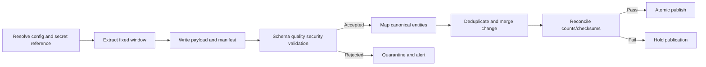

Do not use task success as data success. Validation and reconciliation are explicit graph nodes, and publication should be atomic or version-switched so consumers never see half a run.

## Schedules, windows, and boundaries

| Concept | Meaning | Example |
|---|---|---|
| Schedule time | When orchestration intends to start | 01:00 UTC daily |
| Data interval | Logical source period processed | `[2026-08-24, 2026-08-24)` |
| Runtime | Actual wall-clock execution | 01:07-01:19 UTC |
| Lookback | Re-read earlier changes to catch late updates | Prior 2 hours |
| Grace period | Wait for expected lateness before finalizing | 15 minutes |
| Deadline | Latest acceptable completion | 02:00 UTC |
| Catch-up | Run missed historical intervals | Enabled with throttling |

Use half-open intervals: start inclusive, end exclusive. Adjacent windows then meet without overlap/gap. If a lookback intentionally overlaps, deduplication/idempotency must absorb repeats.

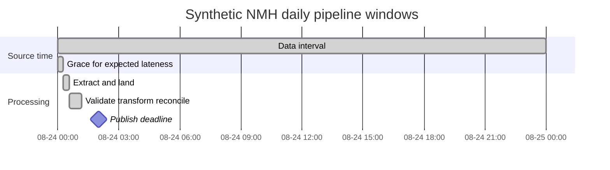

Daylight-saving transitions complicate local calendar schedules. Keep instants in UTC and model business-calendar meaning explicitly.

## Full, snapshot, and incremental loads

| Mode | Mechanics | Strength | Failure/tradeoff |
|---|---|---|---|
| Full replace | Read all scope; atomically replace target version | Simple reconciliation | Cost, source load, long window |
| Full merge | Read all; upsert target | Retains target but needs deletion rule | Ghost rows |
| Snapshot history | Store full state per snapshot | Audit/easy compare | Storage and semi-additivity |
| Append events | Add immutable events | Preserves history | Duplicate/order/current projection |
| High-water incremental | Read rows after max change key | Efficient | Equal key/late update/skips |
| Overlap incremental | Re-read lookback | Catches some late changes | Requires idempotency |
| CDC | Consume source change log | Inserts/updates/deletes/order metadata | Log retention, schema, snapshot handoff |
| Periodic reconciliation | Compare full/control totals | Detects incremental drift | Additional cost |

Full loads are not automatically correct: source can change during extraction, pagination can be inconsistent, and target replacement can expose partial state. Use source snapshot semantics or manifest consistency where available.

## Change Data Capture

Change Data Capture (CDC) reads a source's change stream/log or emits change events so consumers can reconstruct state. Common approaches include log-based capture, triggers, update timestamps, version columns, and periodic diffing. They have different guarantees and source impact.

| CDC field | Purpose |
|---|---|
| Source position | Ordered resume point such as log sequence/offset |
| Operation | Insert, update, delete, snapshot/read |
| Primary/business key | Identify affected record |
| Before/after | Explain change where available/allowed |
| Source transaction | Group/order related changes |
| Commit time | Source commit ordering context |
| Schema version | Decode payload correctly |
| Capture/ingest time | Measure lag, not event truth |

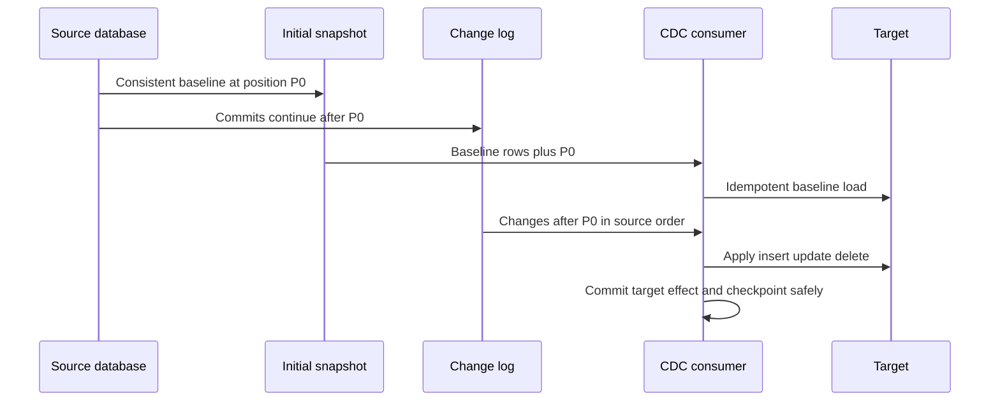

The snapshot-to-stream handoff is critical. Starting log capture too late loses changes; applying changes before baseline without ordering can regress state. Source log retention must exceed maximum outage/recovery lag or a new snapshot is required.

## Checkpoints and watermarks

A checkpoint is durable processing progress. A watermark is often a statement about event-time completeness, such as "events with event time before T are expected complete except allowed lateness." They are not interchangeable.

| Marker | Answers | Unsafe assumption |
|---|---|---|
| API page token | Where to request next page | Token survives forever |
| Incremental cursor | Which source updates were read | Timestamp is unique/monotonic |
| Log offset/LSN | Which ordered change consumed | Effect committed atomically with offset |
| Consumer offset | Which message position acknowledged | Downstream side effect succeeded |
| Event-time watermark | How far event time is considered complete | No data arrives later |
| Publish version | Which accepted model consumers see | All dependencies match version |

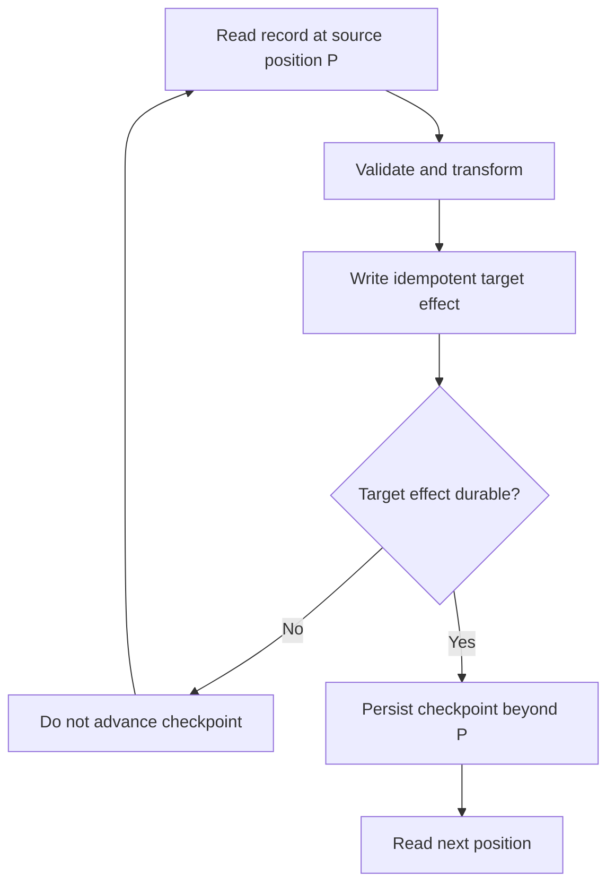

If a checkpoint advances before output is durable, data is lost after crash. If output commits before checkpoint and crash occurs, record repeats; idempotency/dedup handles that safer at-least-once pattern.

### Plain-English deep-dive 2 - A watermark is a promise about lateness

At a train station, "all trains scheduled before 10:00 have arrived" is stronger than "we have processed tickets through number 500." One is event-time completeness; the other is processing progress.

If NMH closes a daily dashboard at midnight but a source routinely arrives 30 minutes late, a midnight watermark creates restatements or loss. Set lateness/grace from measured contracts, keep late records, and define whether windows update, quarantine, or publish corrections.

## Idempotency and logical once effects

An operation is idempotent when repeating it with the same logical input leaves the same logical result. Delivery systems commonly provide at-most-once, at-least-once, or bounded exactly-once guarantees within specific boundaries. End-to-end "exactly once" is difficult because databases, messages, files, APIs, and external actions have separate transactions.

| Delivery/effect | Meaning | Risk |
|---|---|---|
| At-most-once | No retries or duplicates, but loss possible | Missing data |
| At-least-once | Retry until acknowledged; duplicates possible | Double effects |
| Exactly-once within boundary | One effect under defined transactional mechanism | Boundary misunderstood |
| Effectively-once | At-least-once plus idempotency/dedup | Key/retention/correction design |

Synthetic PostgreSQL upsert pattern:

```sql
INSERT INTO nmh_stage.connector_event_lab (
    source_system,
    source_event_id,
    event_at,
    payload_hash,
    raw_payload,
    first_ingested_at,
    last_ingested_at
)
VALUES (
    :source_system,
    :source_event_id,
    :event_at,
    :payload_hash,
    :raw_payload,
    :ingested_at,
    :ingested_at
)
ON CONFLICT (source_system, source_event_id)
DO UPDATE SET
    last_ingested_at = EXCLUDED.last_ingested_at
WHERE nmh_stage.connector_event_lab.payload_hash = EXCLUDED.payload_hash;
```

The placeholder syntax depends on the client and is illustrative. A same event ID with different payload should not silently overwrite; route conflict to review. PostgreSQL `ON CONFLICT` behavior depends on unique indexes/constraints and privileges.

Idempotency keys need source/tenant scope and lifecycle. Hash-only dedup can merge legitimate identical events. Time-window dedup can miss delayed duplicates or collapse repeated legitimate activity.

## Deduplication patterns

| Duplicate type | Evidence | Correct handling |
|---|---|---|
| Transport retry | Same immutable source event ID and payload | One logical event, record deliveries |
| Source correction | Same ID/version increases, payload changes | Apply version/order and preserve history |
| Snapshot repeat | Same entity state in adjacent snapshots | Keep snapshots if snapshot grain matters |
| Semantic duplicate | Different IDs represent same real event/entity | Governed resolution, confidence, review |
| Join duplicate | Multiplication created by query | Repair grain/join, not source |
| Hash collision | Same hash, different content | Strong hash plus compare/contract; do not assume impossible |

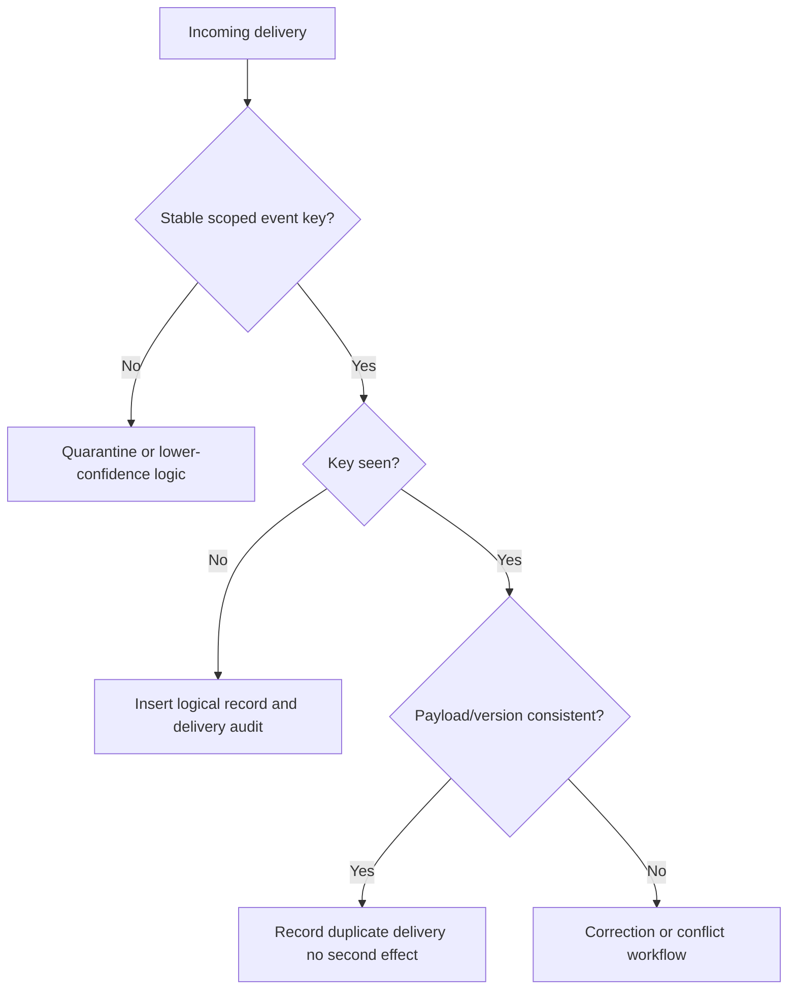

## Retries, backoff, and dead-letter handling

Retry only transient failures. Invalid schema, revoked authorization, wrong tenant, and poison records need different action.

| Failure class | Example | Policy |
|---|---|---|
| Transient network | Timeout/connection reset | Bounded exponential backoff plus jitter |
| Throttle | HTTP 429 with retry guidance | Honor server timing; reduce concurrency |
| Temporary service | 503 | Bounded retry and circuit/open state |
| Authentication | Expired/revoked credential | Refresh if designed; alert, do not hammer |
| Authorization | 403/scope denied | Stop and remediate permission |
| Validation | Malformed/type/contract violation | Quarantine/dead-letter with reason |
| Conflict | Same key different immutable payload | Hold and investigate |
| Resource | Disk/memory/warehouse limit | Protect service; scale/tune under review |

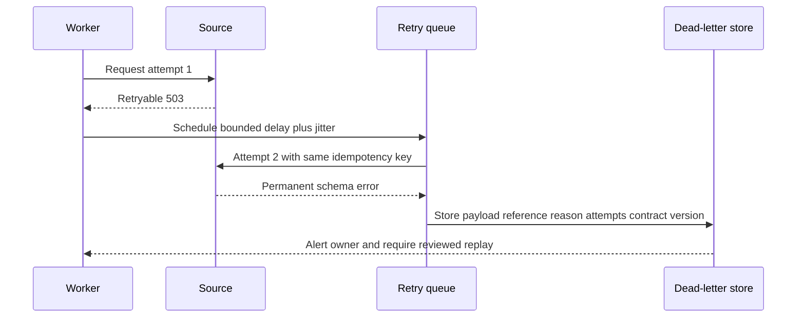

Jitter prevents synchronized workers from retrying together. Cap attempts and total elapsed time. A dead-letter store is not a trash bin: minimize sensitive payloads, restrict access, retain reason/provenance, monitor age/volume, and define remediation/replay/expiry owners.

## Replay and backfill

Replay reprocesses retained inputs. Backfill fills/recomputes historical scope. Both can alter dashboards and workflows, so they need a change plan.

| Backfill contract | Question |
|---|---|
| Reason | Gap repair, bug fix, new field/model, source restatement? |
| Input | Immutable raw version or re-extracted mutable source? |
| Scope | Tenant/entity/partition/time interval? |
| Code/config | Original version or corrected version? |
| Output | Replace partition, versioned side-by-side, merge? |
| Side effects | Suppress tickets/notifications/actions? |
| Capacity | Throttle against live workload? |
| Validation | Counts/checksums/sample/invariants? |
| Communication | Which metrics/history restate? |
| Rollback | Restore prior publish pointer/version? |

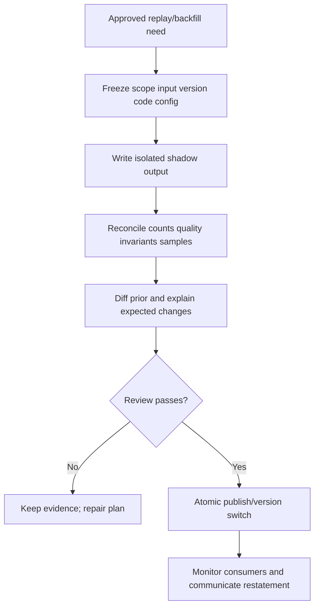

Never replay operational actions blindly. Recomputing a finding table may be safe; recreating tickets, emails, isolation actions, or webhook calls can cause harm. Separate data reconstruction from side-effect emission, and maintain action idempotency/approval.

## Late and out-of-order data

| Policy | Mechanics | Tradeoff |
|---|---|---|
| Drop late | Ignore after cutoff | Stable output but loses truth |
| Quarantine late | Hold for review | Operational burden |
| Update window | Restate historical result | Correcter history, changing dashboards |
| Compensating event | Emit correction | Consumers must support corrections |
| Extend grace | Wait longer before finality | Higher latency |
| Hybrid | Update within horizon; quarantine older | Complex but bounded |

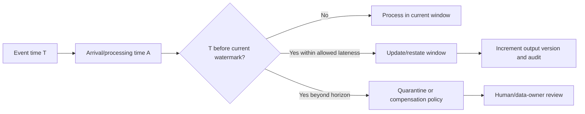

Current-state updates need ordering rules. If a status "closed" at T2 arrives before "open" at T1, arrival-order upsert regresses the state when T1 arrives. Compare source event version/time plus deterministic sequence; retain both records and conflict state.

## Schema drift and evolution

Schema includes more than columns: types, nullability, enums, units, key semantics, nesting, meaning, and timing.

| Change | Compatibility tendency | Required response |
|---|---|---|
| Add optional field | Often backward-compatible | Consumers tolerate/contract version |
| Add required field | Breaking for old producers | Version/default/migration |
| Rename/remove field | Breaking | Dual-write/deprecation/mapping |
| Widen numeric type | Sometimes compatible | Validate consumers/precision |
| String to number | Breaking/parse risk | New field/version and quarantine |
| Enum new value | Breaks closed mappings | Unknown handling and rollout |
| Unit change | Semantically breaking | New field/unit metadata/backfill |
| Key meaning change | Severely breaking | New key/version/entity migration |
| Timestamp semantics change | Severely breaking | New field/clock contract |

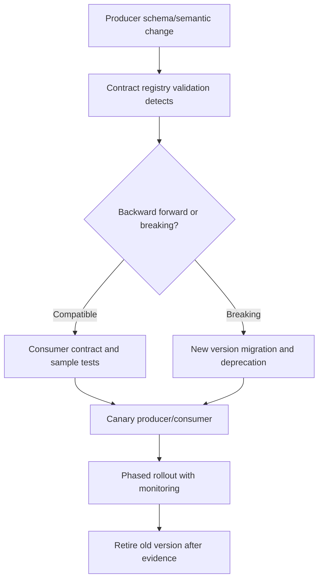

Permissive parsers that ignore unknown fields help compatible additions but can conceal misspellings or unexpected drift. Strict raw acceptance can cause outages. Use layered policy: preserve raw, validate contract, quarantine/flag deviations, and keep curated output stable.

### Plain-English deep-dive 3 - Schema compatibility is not semantic compatibility

If a field named `latency` remains numeric but changes from milliseconds to seconds, every parser succeeds while dashboards become wrong by a factor of one thousand. The shape is compatible; the meaning is not.

Data contracts must include units, clocks, enum definitions, identity scope, null meaning, update/delete behavior, and examples. Schema registry alone cannot guarantee semantics.

## Data contracts

| Contract area | Minimum content |
|---|---|
| Ownership | Producer, consumer, on-call, approver |
| Scope | Tenant/account/objects/filters |
| Grain/key | One record meaning and unique/idempotency key |
| Schema | Fields, types, required/null, nesting, enums |
| Semantics | Definitions, units, time zones, clocks |
| Change | Versioning, compatibility, notice, deprecation |
| Delivery | Batch/stream, schedule, ordering, duplication |
| Quality | Completeness, validity, uniqueness, checksums |
| Reliability | Freshness/availability objectives and exclusions |
| Security | Classification, access, encryption, secret handling |
| Privacy | Purpose, minimization, retention, deletion, residency |
| Recovery | Retention, replay, backfill, incident contacts |

Consumer-driven tests verify assumptions before change reaches production. Contracts need governance; a YAML file nobody owns is documentation, not a control.

## Lineage

Lineage answers where output came from, which versions transformed it, and which consumers depend on it.

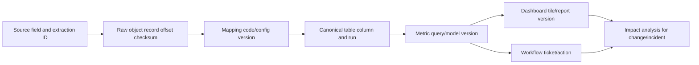

| Lineage level | Use | Limitation |
|---|---|---|
| System | Source to platform to BI | Too coarse for field defect |
| Dataset/table | Dataset dependencies | Does not explain column calculation |
| Column | Field transformations | Dynamic code may be hard |
| Record/event | Exact provenance | Storage/privacy/scale cost |
| Run/version | Which execution/code/config | Requires immutable metadata |
| Decision/action | Metric to workflow outcome | Sensitive and cross-system |

Lineage enables blast-radius analysis: if a source enum mapping was wrong from August 1-5, identify affected models, dashboards, tickets, and decisions before correction.

## Pipeline observability, SLIs, SLOs, and SLAs

Observability should answer whether the pipeline is running, delivering complete/valid data, meeting latency, and producing correct/reconciled outputs.

| SLI family | Example measurement | Failure hidden by job success |
|---|---|---|
| Availability | Scheduled runs accepted / eligible runs | Partial accepted as success |
| Freshness | As-of minus latest complete source watermark | One recent row masks stale population |
| Latency | Publish time minus source/event availability | Tail and failures excluded |
| Completeness | Received eligible records/control total | Unknown source denominator |
| Validity | Contract-valid rows / received rows | Dropped invalid rows |
| Uniqueness | Logical keys with one valid current record | Dedup hides conflicts |
| Reconciliation | Source control totals versus accepted output | Transform loss/addition |
| Correctness | Known-answer/invariant/sample validation | Green task with wrong mapping |
| Quarantine | Rejected count/age by reason | Exceptions accumulating |
| Replayability | Recovery tests completed within objective | Untested backup illusion |

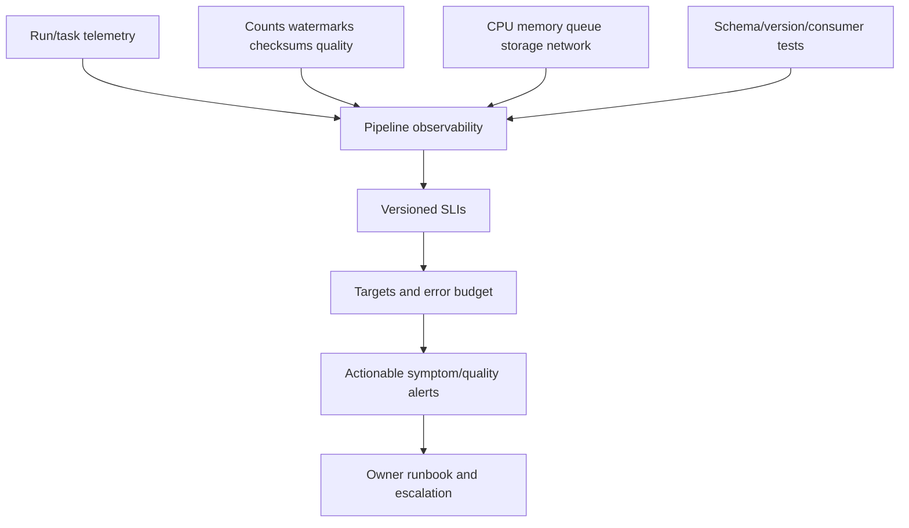

An SLI is measured evidence; an SLO is a target; an SLA is a formal commitment and may have consequences. Do not call every internal threshold an SLA. Define eligible periods, planned maintenance, late data, partial success, and calculation windows.

Alert on customer/data symptoms when possible: "accepted source watermark is 75 minutes behind and dashboard publication is held," not only "worker CPU high." High CPU may be healthy utilization; stale output is the impact.

## Batch versus streaming

| Dimension | Batch | Streaming |
|---|---|---|
| Data bound | Finite interval/input | Conceptually unbounded |
| Latency | Minutes/hours/days | Seconds/minutes where designed |
| State | Per-run/partition | Continuous keyed/window state |
| Time | Schedule/data interval | Event time, processing time, watermark |
| Recovery | Rerun partition | Replay offsets/state/checkpoints |
| Reconciliation | Full interval totals | Window/periodic batch reconciliation |
| Complexity | Often lower | Higher ordering/state/operations |
| Cost | Periodic compute | Always-on plus state/retention |
| Use | Inventory snapshots, daily posture | Near-real-time events/response candidates |

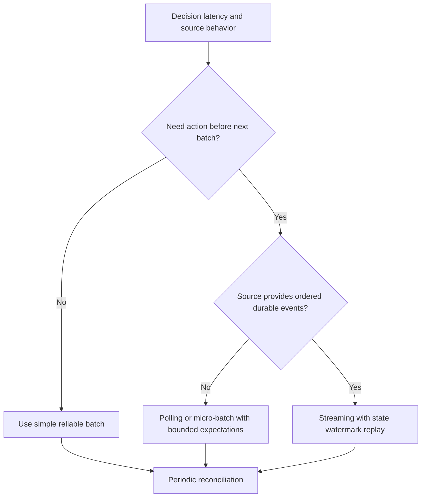

Micro-batching blurs the line. Streaming is not automatically real-time end to end; upstream polling, windows, validation, and human approval add latency. Choose the simplest mode meeting the decision need and recovery/security constraints.

## Failure recovery

| Failure | Immediate containment | Recovery | Validation |
|---|---|---|---|
| Source outage | Stop aggressive retries; communicate | Resume from safe position/new snapshot | Gap/control totals |
| Credential failure | Disable attempts/protect secret | Rotate/re-authorize | Least privilege and test |
| Partial file/page | Quarantine run; do not publish | Re-fetch exact extraction | Manifest/count/checksum |
| Bad schema | Hold affected version | Map/version/backfill | Contract/consumer tests |
| Transform bug | Stop publish/actions | Correct code; shadow replay | Diff and invariants |
| Duplicate effects | Stop side-effect consumer | Idempotency repair/reconcile | Unique action audit |
| Lost checkpoint | Freeze; identify last durable effect | Replay overlap safely | Counts/keys/positions |
| Corrupt target | Switch to last known version | Restore and replay | End-to-end reconciliation |
| Region/platform outage | Invoke continuity plan | Failover/restore per architecture | RPO/RTO test evidence |

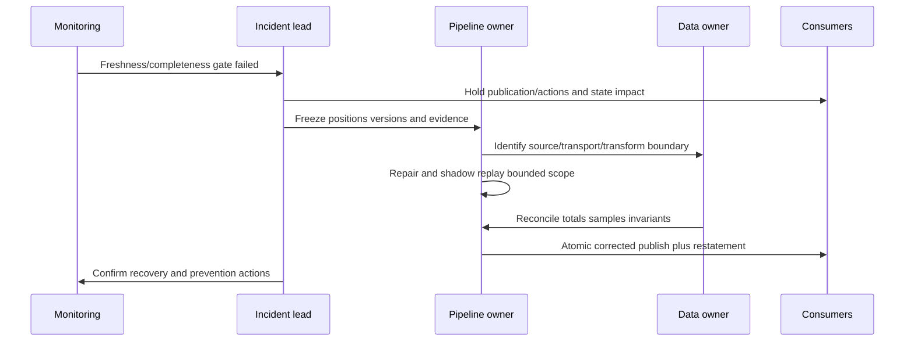

Recovery Point Objective (RPO) is tolerable data-loss point; Recovery Time Objective (RTO) is target restoration time. They are design targets, not evidence until tested. A backup that cannot be restored within the objective is not a recovery capability.

### Plain-English deep-dive 4 - Recovery is a product feature, not an emergency improvisation

Fire drills work because exits, roles, alarms, and assembly points exist before a fire. Pipeline recovery likewise needs retained inputs, checkpoint semantics, versioned code/config, isolated replay, validation, atomic publication, rollback, and communication before failure.

If the first replay occurs during a customer incident, hidden side effects and missing lineage appear at the worst time. Schedule recovery exercises and record actual RPO/RTO, not optimistic diagrams.

## Security and privacy

| Risk | Pipeline exposure | Control |
|---|---|---|
| Secret theft | API keys/tokens in configs/logs | Secret manager, short-lived credentials, rotation, redaction |
| Excess privilege | Connector reads/writes broad scope | Least privilege, separate identities, review |
| Cross-tenant leak | Missing tenant key/path/filter | Strong isolation, scoped keys, tests, RLS where applicable |
| Raw sensitive data | Payload contains identities/content | Minimize/tokenize/encrypt/restrict/retain briefly |
| Injection | Untrusted fields become SQL/path/command | Parameterization and structured APIs |
| Malicious files | Archive bomb/path traversal/malware | Size/depth/path/type scan and sandbox policy |
| Tampering | Payload/config/code modified | TLS, signatures/checksums, access/audit, immutable versions |
| Leakage in errors | Dead-letter/log stores raw payload | Redact/reference, restricted quarantine |
| Unauthorized replay | Historical data/actions re-emitted | Approval, scoped service identity, side-effect suppression |
| Over-retention | Raw/failed data kept forever | Purpose-based lifecycle/deletion holds |
| Residency violation | Data moves region unexpectedly | Region contract/routing/inventory |
| Supply chain | Connector/dependency compromised | Signed artifacts, provenance, patching, SBOM/review |

Privacy principles include purpose limitation, minimization, access limitation, retention/deletion, transparency, and risk assessment. Hashing direct identifiers may still leave personal data if linkage/reidentification is possible. Legal/privacy teams determine obligations.

## Pipeline troubleshooting runbook

1. Record customer impact, expected dataset/snapshot, last known good, and urgency.
2. Freeze run IDs, source extraction IDs, offsets/tokens/LSNs, manifests, code/config/schema versions, and publish version.
3. Map source, auth, network, API/file, landing, validation, transform, target, and consumer ownership.
4. Check source availability, scope, permissions, quotas, and change retention.
5. Check DNS/TCP/TLS/proxy/API response evidence without exposing secrets.
6. Reconcile scheduled intervals with actual runs, overlap, catch-up, concurrency, and time zones.
7. Compare extracted pages/files/messages with manifests, counts, bytes, checksums, and control totals.
8. Verify checkpoint only advances after durable idempotent target effect.
9. Inspect retry classes, attempt counts, backoff/jitter, throttle guidance, and retry storm.
10. Review quarantine/dead-letter reason, age, ownership, payload minimization, and replay readiness.
11. Validate schema and semantics: types, nulls, enums, units, keys, clocks, deletes, and version.
12. Count raw, valid, rejected, deduplicated, transformed, and published records by scope/window.
13. Test idempotency with duplicate delivery and conflicting same-key payload.
14. Test ordering with late older event after newer event and deletion/tombstone cases.
15. Review transformation grain, joins, mappings, identity, fanout, and deterministic code/config.
16. Compare source-to-target control totals/checksums and known-answer records.
17. Check SLI definitions for freshness, completeness, validity, uniqueness, reconciliation, and correctness.
18. Hold publication/actions when acceptance gates fail; do not paint partial data green.
19. For repair, write a bounded shadow replay/backfill plan with side effects disabled.
20. Validate shadow output, diff prior, review expected changes, and switch atomically.
21. Monitor consumers, dashboards, tickets, and actions after recovery.
22. Communicate affected scope/period, uncertainty, correction/restatement, validation, and prevention.

## Exercises with answers

### Exercise 1 - ETL or ELT

**Task:** Sensitive raw payload cannot be stored in the warehouse.

**Answer:** Apply authorized minimization/redaction/tokenization before landing it there, then use ETL or a hybrid. Document which fields are prohibited, recovery implications, and secure intermediate handling. Ordering labels do not replace controls.

### Exercise 2 - DAG success

**Task:** Every task is green, but source count is half expected.

**Answer:** Task execution succeeded; data acceptance should fail completeness/reconciliation. Hold publication, inspect source scope/pages/manifests/control totals, and correct the contract or extraction.

### Exercise 3 - Incremental cursor

**Task:** Query uses `updated_at > last_max_updated_at`.

**Answer:** Equal timestamps and late corrections can be skipped. Use a composite monotonic cursor where supported or overlap lookback plus idempotency, retain a tie key, and periodically reconcile/full refresh.

### Exercise 4 - CDC handoff

**Task:** Changes occur during initial snapshot.

**Answer:** Establish a source-consistent snapshot position P0 and consume log changes after P0 under documented ordering. Validate retention and no gap/overlap that changes state incorrectly.

### Exercise 5 - Retry

**Task:** API returns 403 repeatedly.

**Answer:** Treat as authorization/permanent until proven otherwise, stop hammering, verify identity/scope/policy and credential rotation. Exponential retry is not a permission repair.

### Exercise 6 - Idempotency

**Task:** Worker commits target then crashes before checkpoint.

**Answer:** Record will replay. A scoped stable key and idempotent upsert/dedup makes the second delivery no additional logical effect. Record delivery attempts and flag same-key conflicting payload.

### Exercise 7 - Dead letter

**Task:** One malformed record blocks partition.

**Answer:** Under contract, isolate it with reason/provenance and minimal protected payload reference, continue only if acceptance permits, alert owner, repair mapping/source, and replay after review. Report incomplete scope.

### Exercise 8 - Late event

**Task:** An old "open" event arrives after a newer "closed" event.

**Answer:** Do not overwrite by arrival order. Apply source event version/time/sequence rules, retain both, and quarantine if ordering is ambiguous. Restate affected window only under policy.

### Exercise 9 - Schema drift

**Task:** `duration_ms` remains numeric but now contains seconds.

**Answer:** This is semantic breaking change despite shape compatibility. Hold/quarantine, version the field/contract, coordinate producer/consumer migration, correct/backfill affected data, and reconcile dashboards.

### Exercise 10 - Backfill

**Task:** Recompute six months after mapping fix.

**Answer:** Freeze scope/input/code/config, write shadow version, disable operational side effects, throttle live impact, validate counts/invariants/samples/diff, approve, atomically publish, retain rollback, and communicate historical restatement.

### Exercise 11 - Batch versus stream

**Task:** Executive posture report is daily and source is daily file.

**Answer:** Reliable batch likely fits. Streaming cannot create fresher source truth and adds state/operations. Choose by decision latency and source capability.

### Exercise 12 - Recovery claim

**Task:** Team says RTO is one hour because architecture supports backup.

**Answer:** Treat as objective until tested. Run restore/replay/reconciliation exercise, record actual recovery and gaps, then update design/objective/evidence.

## Labs and rehearsal

### Lab 1 - ETL/ELT decision

Compare three NMH sources for raw sensitivity, replay, compute, source retention, latency, and governance; select architecture with tradeoffs.

### Lab 2 - DAG failure matrix

Build extract, manifest, validate, map, dedup, reconcile, publish tasks. Fail each node and predict downstream state.

### Lab 3 - Schedule windows

Test half-open daily intervals, overlap lookback, missed run catch-up, daylight transition, concurrency, and deadline.

### Lab 4 - Full versus incremental

Measure full snapshot, timestamp cursor, composite cursor, and overlap strategies under equal timestamps, late changes, and deletes.

### Lab 5 - CDC handoff

Simulate snapshot position P0, concurrent inserts/updates/deletes, log retention expiration, and restart.

### Lab 6 - Idempotency

Inject duplicate delivery, crash before/after target commit, correction, hash conflict, and repeated side-effect request.

### Lab 7 - Retry/dead letter

Classify timeout, 429, 503, 401, 403, invalid schema, and poison record. Verify bounded attempts, jitter, ownership, and replay.

### Lab 8 - Replay/backfill

Replay one partition into shadow output with action suppression, diff, approval, atomic switch, and rollback.

### Lab 9 - Late/out-of-order

Create event/arrival permutations around watermarks. Apply update, correction, quarantine, and finality policies.

### Lab 10 - Schema evolution

Test optional field, required field, enum extension, type change, unit change, key change, and dual-version consumer rollout.

### Lab 11 - Lineage impact

Trace one source field through raw/map/model/metric/dashboard/ticket; identify blast radius for a mapping defect.

### Lab 12 - Observability

Build SLIs for run availability, watermark freshness, latency, completeness, validity, uniqueness, reconciliation, quarantine, and replay test.

### Lab 13 - Batch/stream decision

Evaluate inventory, vulnerability findings, incident events, and workflow actions by latency, ordering, source, recovery, and cost.

### Lab 14 - Recovery game day

Lose a checkpoint and corrupt one partition. Freeze, restore, replay overlap, reconcile, republish, and measure actual RPO/RTO.

### Lab 15 - Security/privacy review

Threat-model secrets, raw data, tenant isolation, dead letters, replay, retention, residency, and supply-chain dependencies.

### Lab 16 - TSM escalation

Present a stale/partial dashboard incident with scope, run evidence, containment, repair, restatement, validation, and prevention.

| Lab evidence | Completion standard |
|---|---|
| Architecture | ETL/ELT decision tied to controls/recovery |
| State | Runs, records, checkpoints, versions explicit |
| Delivery | Full/incremental/CDC semantics tested |
| Reliability | Idempotency, retries, replay, recovery proven |
| Disorder | Duplicate/late/out-of-order/delete cases |
| Contract | Schema plus semantics/service/security/privacy |
| Quality | Counts/checksums/invariants/gates |
| Honesty | Synthetic NMH and no product-internal claim |

## Common misconceptions to correct

| Misconception | Correct model |
|---|---|
| ETL is old and ELT is modern | Placement depends on trust, scale, recovery, and governance |
| A green job means correct data | Execution and data acceptance are separate |
| DAG tasks can form feedback loops | A DAG is acyclic; feedback occurs across runs |
| Cron time is the data window | Schedule, interval, runtime, and deadline differ |
| Full load is always correct | Consistency, deletion, source change, partial publish still matter |
| Incremental always saves cost safely | Cursors can skip equal/late/deleted changes |
| `updated_at` alone is a perfect watermark | It may tie, change, regress, or omit deletes |
| CDC removes need for snapshots | Initial/recovery snapshots and reconciliation remain |
| Checkpoint and event watermark are identical | Processing position differs from event-time completeness |
| Exactly once is an end-to-end default | Guarantees have boundaries; side effects span systems |
| Dedup by payload hash is always safe | Legitimate identical events and collisions/scoping exist |
| Retrying every error increases reliability | Permanent errors and overload worsen |
| Dead-letter queue means problem solved | It requires secure ownership, remediation, replay, expiry |
| Replay is simply rerunning the job | Versions, scope, side effects, capacity, validation matter |
| Late events should be dropped | Policy balances truth, latency, and restatement |
| Arrival order is event order | Network/pipeline disorder is normal |
| Schema validation catches meaning changes | Units/keys/clocks can change without shape change |
| Lineage is only documentation | It powers impact, correction, audit, and trust |
| SLI, SLO, and SLA are synonyms | Measurement, target, and formal commitment differ |
| Streaming is always fresher/better | Source/decision need and complexity determine value |
| Backup proves recovery | Restore/replay/reconcile tests prove capability |
| Encryption solves privacy | Purpose, minimization, access, retention, deletion still apply |
| Hashing means anonymous | Linkage/reidentification may remain |
| These are Zscaler pipeline guarantees | They are synthetic vendor-neutral concepts |

## Official Source Anchors

Sources in this section were reviewed on **2026-08-24**.

The data-engineering sources below document their own technologies and patterns, not Zscaler internals. PostgreSQL behavior is version-specific. NIST/CISA provide security/privacy/resilience context. Zscaler public material is used only for high-level Data Fabric positioning.

| Source | URL | Used for | Boundary |
|---|---|---|---|
| PostgreSQL INSERT / ON CONFLICT | https://www.postgresql.org/docs/current/sql-insert.html | Synthetic idempotent upsert mechanics | Unique constraints/privileges/concurrency apply |
| PostgreSQL Transactions | https://www.postgresql.org/docs/current/tutorial-transactions.html | Atomicity and commit concepts | Cross-system transactions not solved |
| PostgreSQL Logical Decoding Concepts | https://www.postgresql.org/docs/current/logicaldecoding-explanation.html | WAL/logical change-stream concepts | PostgreSQL-specific, not universal CDC |
| Apache Airflow Core Concepts - DAGs | https://airflow.apache.org/docs/apache-airflow/stable/core-concepts/dags.html | DAG, task, scheduling/orchestration concepts | Airflow-specific behavior/version |
| Apache Airflow Data Interval | https://airflow.apache.org/docs/apache-airflow/stable/core-concepts/dag-run.html | Logical dates/data intervals/catch-up concepts | Product-specific scheduling semantics |
| Apache Kafka Design | https://kafka.apache.org/documentation/#design | Logs, offsets, delivery, replication concepts | Kafka guarantees require exact configuration/boundary |
| Apache Kafka Exactly Once Semantics | https://kafka.apache.org/documentation/#semantics | Delivery/transaction boundary concepts | Not universal end-to-end guarantee |
| Debezium Documentation | https://debezium.io/documentation/ | CDC, snapshots, offsets, schema-change concepts | Connector/source-specific implementation |
| Google SRE Workbook - Implementing SLOs | https://sre.google/workbook/implementing-slos/ | SLI/SLO selection and reliability operations | Not a security-pipeline standard |
| NIST SP 800-53 Rev. 5 | https://csrc.nist.gov/pubs/sp/800/53/r5/upd1/final | Access, audit, integrity, contingency, privacy control context | Control selection/tailoring required |
| NIST Privacy Framework | https://www.nist.gov/privacy-framework | Privacy risk, data processing, governance context | Not legal advice |
| NIST Cybersecurity Framework 2.0 | https://www.nist.gov/cyberframework | Govern/protect/detect/respond/recover context | Not pipeline implementation guidance |
| CISA Secure by Design | https://www.cisa.gov/securebydesign | Secure defaults/ownership context | General guidance |
| Zscaler Data Fabric for Security | https://www.zscaler.com/products-and-solutions/data-fabric | Public high-level unified data/context positioning | No internal ETL, CDC, connector, SLO, or guarantee claim |

## Likely Interview Questions

### Q1. What is the difference between ETL and ELT, and how do you choose?

**Model answer:** ETL transforms before curated destination load; ELT lands protected raw data then transforms in the target. I choose based on sensitive-field authorization, source/raw retention, replay/audit need, compute/cost, latency, schema change, isolation, lineage, and recovery. Hybrid is common: minimize prohibited fields before landing and transform authorized raw data later. Neither ordering is inherently modern, secure, or correct.

### Q2. How do orchestration, schedules, and data windows work together?

**Model answer:** A DAG declares acyclic task dependencies and state. Schedule time says when a run should start; data interval says what logical period it processes; runtime is actual execution; grace/deadline/catch-up/concurrency govern operations. I use half-open windows, explicit parameters/run IDs, idempotent tasks, acceptance nodes, and atomic publication. Green tasks do not replace completeness/reconciliation.

### Q3. Compare full, incremental, and CDC loads.

**Model answer:** Full loads read complete scope and simplify reconciliation but cost more and still need consistency/deletion/atomic publish. Incremental loads use cursors/lookbacks and are efficient but can miss equal timestamps, late changes, and deletes. CDC consumes row changes with source position/operation/order metadata and needs a correct initial-snapshot handoff, retention, schema handling, idempotent target application, and periodic reconciliation.

### Q4. What are checkpoints and watermarks, and how do you prevent data loss?

**Model answer:** A checkpoint is durable processing position; an event-time watermark is a completeness boundary under allowed lateness. I write the idempotent target effect durably before advancing checkpoint. A crash may then repeat a record rather than lose it. Stable scoped keys/dedup absorb retries, and late-data policy decides restatement, compensation, or quarantine.

### Q5. How do idempotency, deduplication, retry, and dead-letter handling interact?

**Model answer:** At-least-once delivery uses bounded retry for transient failures with backoff/jitter. Idempotency/dedup ensures repeat delivery has one logical effect using a scoped stable key and conflict rule. Permanent validation/auth/schema problems stop or enter protected quarantine/dead letter with reason, provenance, owner, and reviewed replay. Same key/different payload is not silently discarded.

### Q6. How do you replay/backfill and handle schema evolution safely?

**Model answer:** I freeze approved scope, immutable input, code/config/schema versions, suppress operational side effects, write shadow output, reconcile counts/invariants/samples/diff, approve, atomically switch, monitor, and retain rollback/restatement evidence. Schema contracts cover type plus units, keys, clocks, nulls, enums, deletes, compatibility, notice, migration, and consumer tests.

### Q7. How do you choose batch versus streaming and measure pipeline reliability?

**Model answer:** I start with decision latency and source capability. Batch is simpler for snapshots/daily decisions; streaming fits durable event sources and decisions that need lower latency but adds state, ordering, watermarks, replay, and always-on operations. I measure availability, watermark freshness, latency, completeness, validity, uniqueness, reconciliation, correctness, quarantine, and replayability. SLI is evidence, SLO a target, SLA a formal commitment.

### Q8. How do you troubleshoot and recover a security-data pipeline failure?

**Model answer:** I freeze run/extraction/offset/schema/code/publish versions and impact, then isolate source/auth/network/transport/landing/validation/transform/target/consumer boundaries. I reconcile counts, manifests, checksums, checkpoints, retries, dead letters, schema, order, and quality. I hold bad publication/actions, repair and shadow-replay bounded scope, validate, switch atomically, monitor consumers, and communicate restatement/prevention. Recovery and RPO/RTO claims require tested evidence.

## 30-Second Memory Hooks

| Concept | Memory hook |
|---|---|
| Pipeline | Data plus state plus ownership |
| ETL | Shape before curated load |
| ELT | Land protected raw, shape later |
| DAG | Dependencies with no cycle |
| Schedule | When run starts |
| Window | Which data run owns |
| Full | Everything in scope |
| Incremental | Changes after safe progress |
| CDC | Read the change log |
| Checkpoint | Durable processing bookmark |
| Watermark | Event-time completeness promise |
| At-least-once | Duplicates possible |
| Idempotent | Retry, same logical effect |
| Dedup | One event, many deliveries |
| Backoff | Retry slower with jitter |
| Dead letter | Owned exception, not trash |
| Replay | Re-run retained truth |
| Backfill | Rebuild bounded history |
| Late data | Truth after expected window |
| Out of order | Arrival is not event order |
| Schema | Shape plus meaning |
| Contract | Producer-consumer promise |
| Lineage | Source-to-decision family tree |
| SLI/SLO/SLA | Measure, target, promise |
| Batch | Bounded box |
| Stream | Unbounded flow with state |
| Recovery | Designed and tested before incident |
| Experience bridge | Sync/RCA skills transfer; product internals do not |

## Completion Checklist

- [ ] I explain pipeline stages, state, owners, and failure domains.
- [ ] I choose ETL, ELT, or hybrid from trust, security, recovery, scale, cost, latency, and governance.
- [ ] I do not call either ETL or ELT inherently better.
- [ ] I distinguish run success, record disposition, data acceptance, and publication.
- [ ] I model tasks as an acyclic dependency graph with explicit triggers.
- [ ] I parameterize scope, interval, run ID, schema, code, and config versions.
- [ ] I define concurrency, timeout, retry, catch-up, and ownership.
- [ ] I distinguish schedule time, data interval, runtime, grace, lookback, and deadline.
- [ ] I use half-open windows and account for time zones/daylight rules.
- [ ] I compare full replace/merge, snapshots, append, incrementals, and CDC.
- [ ] I know full extraction can still be inconsistent/partial.
- [ ] I protect incrementals from equal timestamps, late updates, and deletes.
- [ ] I understand CDC operation, source position, transaction, snapshot handoff, and retention.
- [ ] I distinguish checkpoints, source cursors, consumer offsets, event-time watermarks, and publish versions.
- [ ] I persist checkpoint only after durable target effect.
- [ ] I design at-least-once processing for idempotent/effectively-once outcomes.
- [ ] I scope idempotency keys by source/tenant and define key lifecycle.
- [ ] I distinguish delivery retry, correction, snapshot repeat, semantic duplicate, and join duplicate.
- [ ] I flag same-key conflicting payload instead of silently overwriting.
- [ ] I retry only transient failures with bounded backoff and jitter.
- [ ] I stop/remediate auth, authorization, schema, and poison errors appropriately.
- [ ] I secure and operate dead-letter/quarantine stores with owner, age, replay, and expiry.
- [ ] I plan replay/backfill by reason, input, scope, version, side effects, capacity, validation, communication, and rollback.
- [ ] I isolate shadow output and switch atomically after review.
- [ ] I suppress/guard external side effects during replay.
- [ ] I define late-data horizon, restatement, compensation, quarantine, and finality.
- [ ] I apply event/source version ordering instead of arrival order.
- [ ] I handle tombstones/deletes and ambiguous ordering.
- [ ] I classify schema changes by shape and semantic compatibility.
- [ ] I contract types, nulls, enums, units, keys, clocks, deletes, and examples.
- [ ] I use versioning, consumer tests, canary, migration, and deprecation.
- [ ] I preserve system/table/column/record/run/decision lineage as appropriate.
- [ ] I use lineage for impact, replay, correction, and communication.
- [ ] I measure availability, freshness, latency, completeness, validity, uniqueness, reconciliation, correctness, quarantine, and replayability.
- [ ] I distinguish SLI, SLO, SLA, error budget, and acceptance gate.
- [ ] I alert on data/customer symptoms with actionable owner/runbook.
- [ ] I choose batch/streaming by source and decision latency, not fashion.
- [ ] I understand streaming state, windows, ordering, checkpoint, and replay complexity.
- [ ] I retain periodic reconciliation for incremental/streaming paths.
- [ ] I define RPO/RTO and prove them through restore/replay tests.
- [ ] I can execute the failure-recovery sequence and communicate restatement.
- [ ] I apply least privilege, secret management, encryption, tenant isolation, integrity, and audit.
- [ ] I apply purpose, minimization, retention/deletion, residency, and privacy review.
- [ ] I protect archives/files/dead letters/replays from malicious or sensitive content.
- [ ] I can run the complete pipeline troubleshooting method.
- [ ] I can complete every synthetic NMH lab and retain evidence.
- [ ] I separate general patterns, specific source/platform behavior, synthetic evidence, and public Zscaler context.
- [ ] I can answer Q1 through Q8 with mechanics, tradeoffs, failures, recovery, and honest boundaries.

[Part 51 - Security Data Ingestion: APIs, Connectors, Files, and Formats](Part-51-security-data-ingestion-connectors-formats.md)