# Part 51 - Security Data Ingestion: APIs, Connectors, Files, and Formats

> **Audience:** Arti Thakur, preparing for a Zscaler Security Operations Technical Success Manager role after Microsoft enterprise Support Escalation Engineering.
>
> **Purpose:** Explain how security data enters and leaves a data platform through APIs, webhooks, agents, syslog, connectors, and files; how JSON, JSONL, CSV, XML, ZIP, ZST, and ZSTD differ; and how authentication, pagination, throttling, validation, quarantine, provenance, large files, partial loads, security, and troubleshooting fit together.
>
> **Scope and honesty:** Northstar Meridian Holdings, abbreviated NMH, is fictional. Every endpoint, credential, source, connector, payload, file, event, limit, schedule, response, checksum, count, error, configuration, lab result, and code example in this Part is synthetic. Official Zscaler public material is quoted only at its documented level: the Data Fabric page reviewed on 2026-08-24 names JSON, JSONL, CSV, ZIP, XML, ZST, and ZSTD and states support for 150 pre-built inbound and outbound integrations. This Part does not infer per-connector authentication, API paths, schedules, limits, schemas, delivery guarantees, availability, or production behavior. Arti's API, JSON, networking, TLS, proxy, sync, log, and escalation experience transfers; direct production Zscaler Data Fabric administration remains a learning boundary.
>
> **Currency caveat:** Product pages, integration catalogs, APIs, formats, libraries, security guidance, connector behavior, and standards evolve. Sources in this Part were reviewed on **2026-08-24**. Current official product/help documentation, tenant-visible configuration, source-vendor contracts, approved security/privacy architecture, observed responses, and Zscaler/source specialists govern production.

## Section goal

Ingestion is the controlled crossing of a trust boundary. Bytes arrive from a source, but the platform needs to know who sent them, what scope they represent, how they are encoded/compressed, where one record ends, what each field means, whether the transfer is complete, and whether it is safe to accept.

Think of receiving cargo at a port. A sealed container is not trusted merely because it arrived. The port checks sender authority, manifest, seal, weight, hazardous contents, destination, and count; damaged or unexplained cargo goes to inspection rather than the production floor. APIs, files, webhooks, and agents are different transport modes for the same custody problem.

By the end, Arti should be able to:

| Outcome | Demonstrated capability | Evidence artifact |
|---|---|---|
| Classify formats | Distinguish serialization, framing, archive, and compression | Format decision table |
| Parse text safely | Handle UTF-8, BOM, delimiters, quoting, escaping, line endings, and schema | Parsing contract |
| Explain JSON/JSONL | Choose document versus record-per-line and validate structure/types | Sample contract |
| Explain CSV/XML | Handle quoting/namespaces/schema and ambiguity | Validation plan |
| Explain ZIP/Zstandard | Separate archive from compression and defend extraction | File safety checklist |
| Integrate APIs | Design auth, pagination, rate-limit, retry, cursor, and error handling | API connector plan |
| Receive webhooks | Verify authenticity, replay, idempotency, ordering, and acknowledgment | Webhook sequence |
| Understand agents/syslog | Place push collectors and syslog in architecture with limitations | Transport map |
| Operate connectors | Manage lifecycle, config, secret, permission, scope, schedule, monitoring, and retirement | Connector runbook |
| Separate direction | Distinguish inbound collection from outbound action/export | Direction matrix |
| Validate transfers | Use manifests, counts, bytes, hashes, schema, quarantine, and reconciliation | Acceptance report |
| Preserve provenance | Trace source, extraction, object, position, transformation, and receipt | Custody record |
| Handle large files | Stream/chunk, bound resources, resume safely, and avoid partial publish | Large-file plan |
| Diagnose failures | Isolate source, auth, DNS/TCP/TLS/proxy, API, file, parser, mapping, and target | Troubleshooting tree |
| Bound Zscaler claims | State documented formats/integration direction and verify everything else | Product-fact card |

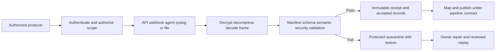

## JD Mapping

| Role expectation | Part 51 capability | TSM artifact | Arti bridge and boundary |
|---|---|---|---|
| Analyze technical environments | Inventory sources, directions, auth, formats, schedules, scopes, and owners | Connector inventory | M365/API troubleshooting transfers |
| Develop Data Fabric expertise | Use official format/integration statements without inventing connector internals | Product-fact matrix | Tenant behavior must be verified |
| Resolve escalations | Isolate network, TLS, auth, pagination, throttling, file, parser, and mapping failures | Evidence package | Wireshark/HAR/Fiddler skills transfer |
| Recommend secure setup | Apply least privilege, secret rotation, validation, quarantine, and provenance | Security checklist | Current product/source controls govern |
| Identify data risk | Detect partial, stale, duplicate, malformed, cross-scope, and unsafe inputs | Acceptance gate | Missing data can distort risk |
| Coordinate cross-functionally | Clarify source owner, network, identity, platform, security, and consumer boundaries | RACI/runbook | Escalation leadership transfers |
| Communicate impact | Translate ingestion defect into affected periods/entities/decisions | Customer update | Do not claim unverified product fault |
| Drive adoption | Plan connector onboarding, testing, monitoring, change, and retirement | Lifecycle plan | Customer access/licensing varies |

## Candidate honesty note

| Evidence class | Safe statement | Boundary |
|---|---|---|
| Production transfer | "I troubleshoot APIs, JSON, HTTP/TLS/proxies, sync clients, logs, credentials, and service dependencies." | Not production Data Fabric connector operation |
| Synthetic practice | "I tested NMH API/file/webhook ingestion, validation, quarantine, and reconciliation." | Not a customer deployment |
| Official public fact | "The Data Fabric page reviewed August 25, 2026 names seven formats and 150 pre-built inbound/outbound integrations." | Page wording/count can change; verify current catalog |
| General pattern | "Cursor pagination and rate-limit handling are common API connector concerns." | Does not state a specific connector uses them |
| Security claim | "The design includes least privilege, signature checks, and archive limits." | Effectiveness requires implementation/test evidence |
| Experience boundary | "I would inspect current connector-specific docs, tenant UI, responses, and source contract." | Never infer auth/schedule/guarantees |

## Beginner vocabulary and memory hooks

| Term | Plain meaning | Why it matters | Memory hook |
|---|---|---|---|
| Ingestion | Bringing data into a controlled system | Crosses trust/meaning boundary | Receive and verify |
| Egress/outbound | Sending data/actions out | Can leak data or duplicate actions | Leaving the platform |
| Connector | Managed integration between systems | Bundles config/auth/schedule/mapping/state | Bridge with ownership |
| Serialization | Represent structured data as bytes/text | Producer/consumer must agree | Structure on the wire |
| Framing | Know where one record/message ends | Essential for streams/JSONL/syslog | Record boundaries |
| Encoding | Map characters to bytes | Wrong encoding corrupts text | Characters to bytes |
| UTF-8 | Common Unicode byte encoding | Interoperability standard | Text byte language |
| BOM | Optional byte-order marker prefix | Can confuse parsers/headers | Hidden first bytes |
| Delimiter | Character separating fields/records | Can appear inside quoted data | Separator with rules |
| Schema | Expected fields/types/structure/meaning | Enables validation and evolution | Data grammar |
| JSON | Structured values/objects/arrays in text | Common API/document format | One structured document |
| JSONL | One JSON value per line by convention | Streamable record framing | One JSON record each line |
| CSV | Delimited tabular text with quoting rules | Simple but type/schema ambiguous | Rows and separators |
| XML | Tagged hierarchical text with namespaces | Rich validation but parser risk | Tagged document tree |
| ZIP | Archive container, often compressing many entries | Paths/counts/ratios create risk | Folder in one package |
| Zstandard | Compression algorithm/frame format | Compresses bytes efficiently | Squeeze one stream |
| ZST/ZSTD | Common filename extensions for Zstandard data | Extension is not proof of content | Name suggests codec |
| API | Programmatic request/response interface | Contracted access to data/actions | Software service counter |
| Pagination | Split large result into pages | Must retrieve all exactly once logically | Turn every page |
| Rate limit | Server limits request volume | Protects service and shapes schedules | Respect the queue |
| Webhook | Producer calls consumer when event occurs | Push lowers polling but needs verification | Source rings your doorbell |
| Agent | Installed software collects/sends local evidence | Adds endpoint lifecycle/privilege | Local courier |
| Syslog | Standardized event-message transport family | Common logging integration, limited delivery variants | Network log postcard |
| Manifest | Metadata listing expected files/counts/hashes | Detects partial/corrupt delivery | Shipment list |
| Checksum/hash | Digest used to detect byte changes | Integrity, not source identity alone | Byte fingerprint |
| Provenance | Source/custody history | Enables trust and correction | Data passport |
| Quarantine | Isolated rejected/suspicious input | Prevents bad data entering accepted models | Inspection area |
| Partial load | Only part of intended transfer accepted | Plausible but incomplete output | Half the shipment |

## The ingestion contract

| Contract area | Questions |
|---|---|
| Business purpose | Which decision/workflow needs the data? |
| Direction | Inbound, outbound, or bidirectional? |
| Owner | Producer, connector, platform, consumer, security, privacy contacts? |
| Scope | Tenant/account/site/types/filters/exclusions? |
| Auth | Identity, grant, token/cert lifetime, rotation, revocation? |
| Transport | HTTPS/API, webhook, file/object, agent, syslog? |
| Format | Serialization/archive/compression/encoding/framing? |
| Grain/key | One record and stable event/entity/idempotency key? |
| Time | Event/update/ingest clocks, time zone, schedule/window? |
| Delivery | Full/incremental, pagination, order, duplicate/delete semantics? |
| Limits | Requests, rows, bytes, file size, concurrency, retention? |
| Quality | Manifest, counts, hash, schema, required fields, acceptance? |
| Security/privacy | Classification, minimization, encryption, residence, retention? |
| Recovery | Retry, resume, replay, backfill, quarantine, escalation? |

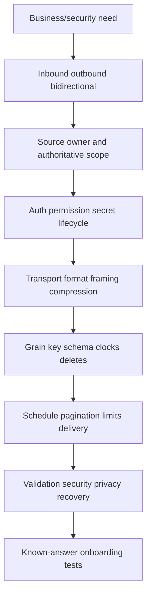

### Plain-English deep-dive 1 - A file extension is a label, not evidence

A box labeled "glass" can contain books. Likewise, `.json`, `.zip`, or `.zst` does not prove the bytes match that format, are complete, or are safe. Attackers and accidental producers can mislabel content; proxies can return an HTML error page saved under a JSON filename.

Validate magic/signature where applicable, content type as supporting metadata, actual parser behavior, declared encoding/compression, size, schema, and manifest. Never choose a decompressor or trust policy solely from the filename.

## Format layers: serialization, archive, and compression

| Layer | Examples | What it solves | What it does not solve |
|---|---|---|---|
| Transport | HTTPS, object transfer, syslog | Moves bytes/messages | Record meaning |
| Archive/container | ZIP | Packages entries/metadata | Trusted content or schema |
| Compression | Zstandard, DEFLATE | Reduces bytes | Encryption/integrity/authenticity |
| Serialization | JSON, CSV, XML | Represents values/records | Delivery completeness |
| Encoding | UTF-8 | Represents characters as bytes | Schema/semantics |
| Framing | Newline, length, message boundary | Separates records | Field validity |

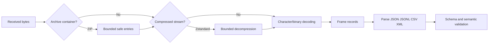

Compression is not encryption. A checksum detects accidental or malicious byte change only when the expected digest comes through a trusted channel; an attacker who changes both file and unauthenticated checksum defeats it.

## Encoding, delimiters, and text hygiene

UTF-8 is widely used and required by JSON exchanged across open systems under RFC 8259. Validate byte sequences; do not silently replace invalid bytes if evidence fidelity matters.

| Issue | Symptom | Control |
|---|---|---|
| Wrong encoding | Garbled names or parse failure | Contract UTF-8; strict decode/quarantine |
| UTF-8 BOM | First header becomes hidden-prefixed name | Detect/allow or reject by contract |
| CRLF versus LF | Extra carriage return or split defect | Universal newline handling under format |
| Delimiter collision | Column shift | Correct quoting/escaping parser |
| Embedded newline | Record split | Parser handles quoted/multiline values |
| Null byte/control char | Truncation/parser errors | Reject/escape by contract |
| Unicode normalization | Visually same identifiers differ | Governed identity normalization, preserve raw |
| Locale numbers | `1,25` versus `1.25` | Explicit machine format/locale |
| Time zone | Naive timestamp ambiguity | Offset/zone contract and UTC normalization |

Do not split CSV with a string `split(',')`; quoted commas/newlines/quotes require a CSV parser. Do not parse XML with regex. Use maintained structured parsers and configure safety limits.

## JSON

JSON supports object, array, string, number, boolean, and null values. JSON object member ordering is not semantic. Duplicate member names are not interoperably safe: implementations may keep first, last, all, or reject. Require unique names.

Synthetic NMH record:

```json
{
  "schema_version": "1.0",
  "tenant_id": "nmh-lab",
  "source_event_id": "evt-000042",
  "event_at": "2026-08-24T23:58:11Z",
  "asset": {
    "source_asset_id": "asset-lab-17",
    "type": "server"
  },
  "control_state": null,
  "tags": ["synthetic", "training"]
}
```

| JSON concern | Rule |
|---|---|
| Number | Avoid assuming arbitrary precision; IDs should often be strings |
| Null | Distinguish explicit null from absent member |
| Timestamp | Use contracted RFC 3339-style representation/offset semantics |
| Unknown fields | Preserve raw; decide compatible ignore versus strict curated validation |
| Required fields | Enforce schema/semantic checks |
| Nesting/depth | Bound to prevent resource exhaustion |
| Size | Limit document/string/array/member counts |
| Duplicate names | Reject or define strict parser behavior |

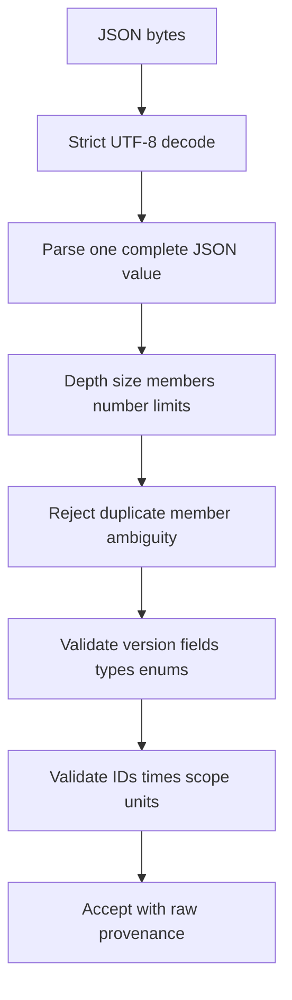

## JSON Lines / JSONL

JSONL commonly stores one independent JSON value per line, usually one object. It supports streaming and record-level quarantine because the parser need not hold one giant array.

```jsonl
{"source_event_id":"evt-1","event_at":"2026-08-24T23:00:00Z","state":"open"}
{"source_event_id":"evt-2","event_at":"2026-08-24T23:01:00Z","state":"closed"}
```

| JSON versus JSONL | JSON document | JSONL stream/file |
|---|---|---|
| Top-level | One value, often array/object | One JSON value per line |
| Streaming | Large array can require incremental parser | Natural line framing |
| Multiline pretty print | Valid | Breaks one-record-per-line convention |
| Partial recovery | Whole document may fail | Good lines can be isolated under policy |
| Metadata | Can wrap data and manifest | Usually sidecar/header contract |
| Empty lines | JSON whitespace may be fine | Convention should define/usually reject/skip explicitly |

Newline framing works only if each record is compact on one physical line; JSON string newlines are escaped, not literal unescaped line breaks. A truncated final line must not be silently accepted as a complete file.

## CSV

CSV is tabular text but has no universal type system or built-in schema. RFC 4180 documents a common format: records on lines, comma fields, optional header, double quotes around fields containing commas/quotes/line breaks, and doubled quotes inside quoted fields.

```csv
source_event_id,event_at,asset_name,state
evt-1,2026-08-24T23:00:00Z,server-17,open
evt-2,2026-08-24T23:01:00Z,"server, finance",closed
evt-3,2026-08-24T23:02:00Z,"server ""quoted""",unknown
```

| CSV contract | Example decision |
|---|---|
| Encoding/BOM | UTF-8, no BOM or explicitly allowed |
| Delimiter | Comma; reject tab/semicolon unless configured |
| Header | Required exact names/version |
| Record ending | CRLF/LF accepted by parser |
| Quote/escape | Double quote with doubled embedded quote |
| Null | Empty is not automatically null; use governed token/field rule |
| Types | Parse after lexical validation using schema |
| Formula injection | Escape/control spreadsheet exports; never execute cells |
| Column count | Exact expected or versioned optional columns |
| Duplicate header | Reject ambiguity |

```mermaid
flowchart LR
    CSVBYTES[CSV bytes] --> DEC[Decode contracted encoding]
    DEC --> PARSER[Standards-aware CSV parser]
    PARSER --> HEADER[Validate unique header/version]
    HEADER --> ROWS[Validate field count quoting record boundaries]
    ROWS --> TYPES[Parse types null enum timestamp]
    TYPES --> SAFE[Neutralize spreadsheet formula risk on export]
    SAFE --> ACCEPT[Accept or quarantine by row/file policy]
```

### Plain-English deep-dive 2 - CSV looks simple because complexity is hidden

A spreadsheet displays neat cells after making assumptions about delimiters, dates, leading zeros, formulas, and locale. Those assumptions can change evidence: asset ID `00123` becomes `123`, a timestamp changes time zone, or text beginning `=` becomes a formula.

Treat CSV as a wire format, not a spreadsheet. Parse with an explicit schema, preserve raw text, type fields deliberately, and protect human exports from formula injection.

## XML

XML represents a hierarchical document with elements, attributes, text, namespaces, declarations, and optional schema validation. Namespace URI plus local name identifies namespaced elements; prefixes are aliases and can change.

```xml
<?xml version="1.0" encoding="UTF-8"?>
<events xmlns="urn:nmh:security:lab:v1">
  <event id="evt-1">
    <eventAt>2026-08-24T23:00:00Z</eventAt>
    <state>open</state>
  </event>
</events>
```

| XML concern | Control |
|---|---|
| Namespace | Match namespace URI/local name, not prefix text |
| Schema | Validate XSD/version where contract requires |
| External entities | Disable DTD/external entity resolution unless explicitly safe/needed |
| Entity expansion | Bound/disable to prevent resource exhaustion |
| Depth/size | Set parser limits and stream large documents |
| Canonicalization | Needed for some signatures; use standards/library |
| Mixed content | Do not assume element text is simple scalar |
| Encoding | Respect declaration only within secure parser policy |

Use a hardened maintained XML parser. XML External Entity (XXE) and entity-expansion risks arise from unsafe parser features. Do not log entire sensitive documents on parse failure.

## ZIP, ZST, and ZSTD

ZIP is an archive format that can contain multiple entries, directories, names, metadata, and compressed bytes. Zstandard is a compression format/algorithm commonly represented by `.zst` or `.zstd`; it usually compresses one byte stream and does not by itself provide a multi-file directory archive.

| Property | ZIP | Zstandard/ZST/ZSTD |
|---|---|---|
| Primary role | Archive/container, often compression | Compression stream/frame |
| Multiple named entries | Yes | Not by itself |
| Paths/filenames | Yes | No archive paths by itself |
| Random entry access | Often supported via directory | Stream/frame dependent |
| Main safety issue | Traversal, entry count, expansion ratio, nested archives | Expansion/memory/frame/truncation limits |
| Integrity | Format checksums are not authenticated identity | Frame checksum optional/context-specific, not authentication |

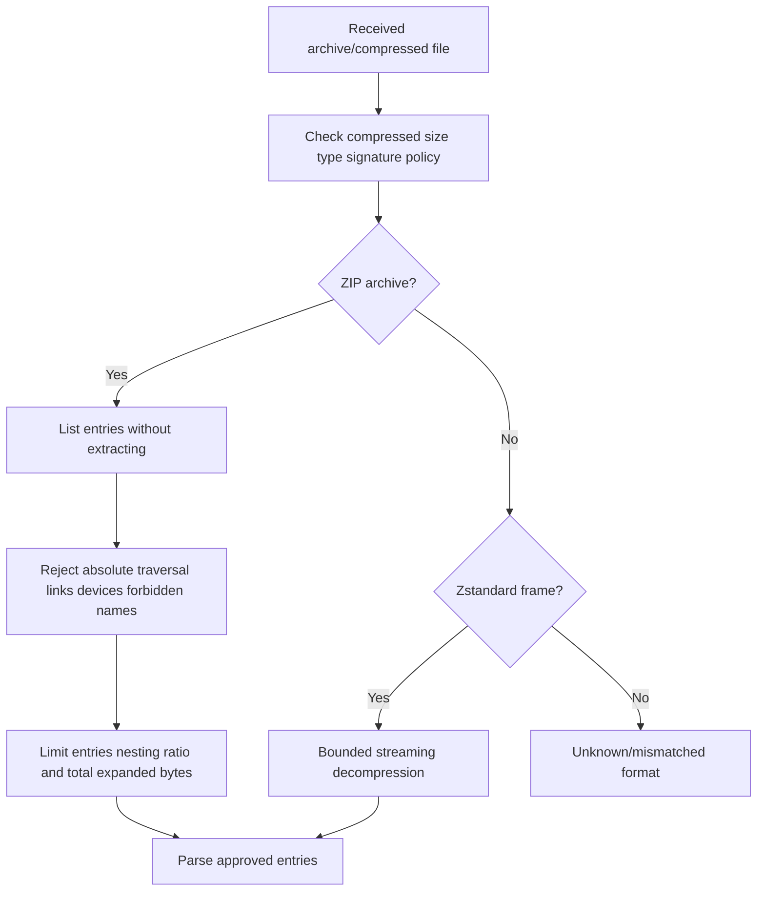

Safe ZIP extraction canonicalizes output paths beneath an isolated destination, rejects `../` traversal and dangerous links/device entries, limits nested archives and total expanded bytes, and avoids trusting declared sizes alone. This counters "zip slip" and decompression bombs.

## API ingestion architecture

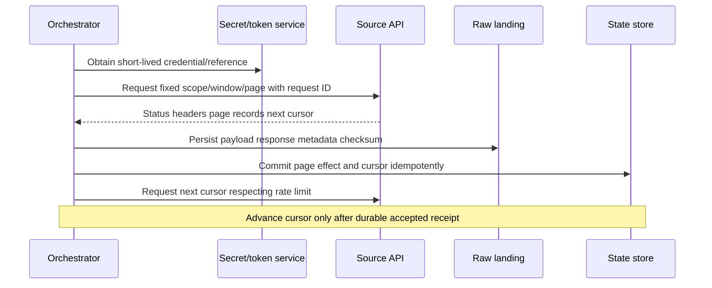

## API authentication and authorization

| Method | Concept | Main controls |
|---|---|---|
| API key | Static secret identifies client/project | Vault, scope, rotation, no URL/log exposure |
| OAuth 2.0 client credentials | Client obtains scoped access token | Short lifetime, audience/scope, secret/private-key protection |
| JWT assertion | Signed assertion used in auth flow | Issuer/audience/time/key validation |
| Mutual TLS | Client and server certificates authenticate channel peers | Certificate lifecycle, trust, revocation, identity mapping |
| HMAC request signing | Shared secret signs selected request components | Canonicalization, nonce/time, replay window |
| Basic authentication | User/password-style header | TLS mandatory; generally avoid where stronger method available |

Authentication proves an identity according to a protocol; authorization decides allowed resources/actions. Test least privilege with positive and negative cases. Never place secrets/tokens in query strings, screenshots, HAR files, error logs, code, or tickets. Redact `Authorization`, cookies, client secrets, signed URLs, and sensitive payloads.

Token refresh must be concurrency-safe: ten workers should not stampede the token endpoint. A 401 may mean expiration, wrong audience, invalid signature, or clock skew; a 403 usually indicates authenticated identity lacks authorization, though exact API semantics govern.

## Pagination

| Pagination style | Mechanics | Risk |
|---|---|---|
| Offset/limit | Request positions 0, N, 2N | Inserts/deletes shift pages; deep offsets costly |
| Page number | Request page 1, 2, 3 | Same mutation/consistency risks |
| Cursor/token | Server returns opaque continuation | Token expiry/scope binding/retry state |
| Keyset | `key > last_key` with stable order | Ties/composite key/deletes/updates |
| Link-based | Follow response next link | Validate allowed origin and preserve auth safely |
| Time window | Query bounded update interval | Equal timestamps/late updates/boundaries |

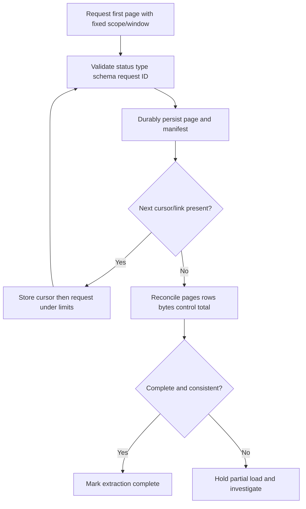

Never construct a guessed next URL when the API returns an opaque cursor/link. Validate that continuation targets an approved host/scheme to avoid credential leakage. Persist each page before advancing. Detect repeated cursors, empty pages with next token, missing final page, and duplicate records across pages.

## Rate limits and retries

Rate limits may be global, tenant, endpoint, credential, or time-window specific. Discover them from current docs and observed response headers; do not infer a universal rate.

| Response/symptom | Interpretation candidate | Action |
|---|---|---|
| 429 | Too many requests | Honor `Retry-After` if valid; backoff/jitter; reduce concurrency |
| 503 | Temporary unavailability/overload | Bounded retry and circuit protection |
| Timeout | Unknown whether server processed | Retry with idempotency/safe request semantics |
| 400/422 | Invalid request/content | Fix; do not blind retry |
| 401 | Authentication failed/expired | Refresh/repair once under contract; protect secret |
| 403 | Not authorized/policy denied | Stop and correct scope/permission |
| 404 | Wrong resource or lifecycle | Validate path/version/object |
| 409 | Conflict/current-state mismatch | Reconcile state; do not overwrite blindly |

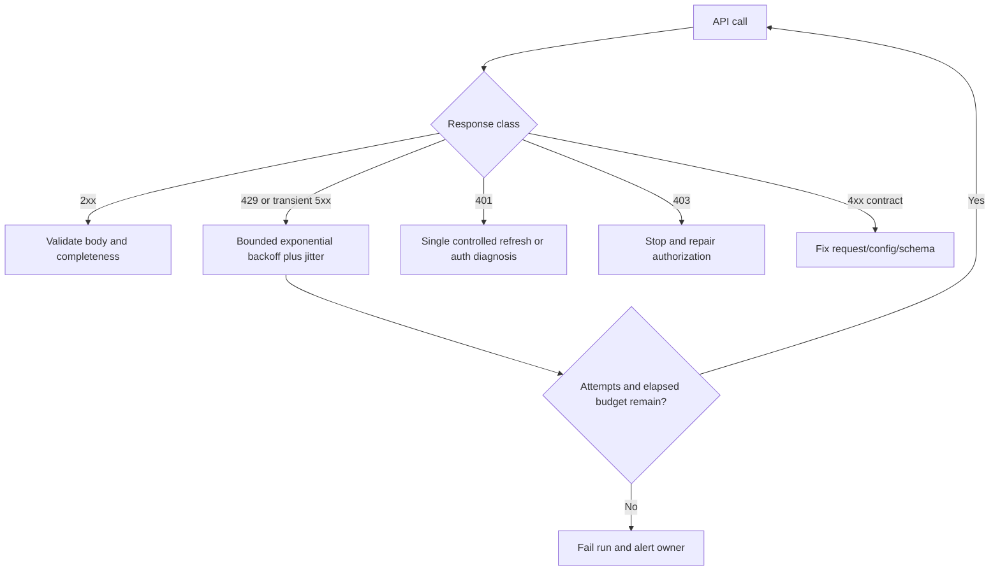

Retries increase load and can worsen an outage. Use a client-wide limiter, concurrency caps, jitter, timeout budgets, and retry only operations safe to repeat. For outbound writes/actions, use the API's documented idempotency mechanism if available and reconcile ambiguous timeouts.

## Webhooks

A webhook is an HTTP callback from producer to consumer. Fast acknowledgment reduces producer retry but must not acknowledge before durable receipt if loss matters.

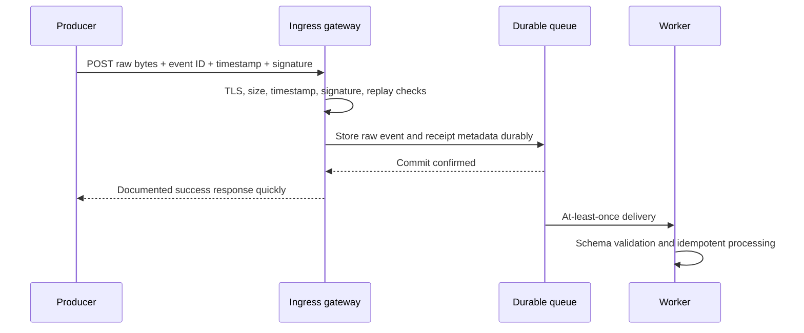

| Webhook control | Purpose |
|---|---|
| TLS/server auth | Protect channel/server identity |
| Signature/MAC | Verify producer authenticity/integrity under scheme |
| Raw-byte verification | Avoid reserialization changing signed content |
| Timestamp/nonce | Bound replay window |
| Event ID | Deduplicate retries |
| Body size/type limit | Prevent resource abuse |
| Durable queue before success | Avoid acknowledged loss |
| Fast response | Prevent sender timeout/retry storm |
| Secret rotation | Support overlapping keys/versions safely |
| IP allowlist | Defense-in-depth only; proxies/cloud ranges change |

Do not invent signature canonicalization. Follow producer documentation exactly and use constant-time comparison/library support. Webhooks can arrive duplicated, delayed, or out of order. Fetch-after-notify can retrieve authoritative current state when event payload is only a notification.

## Agents and syslog overview

An agent runs near/on a source to collect, buffer, transform minimally, and send data. It creates a software/privilege/update/health lifecycle. Agentless API collection avoids installed software but depends on API visibility and quotas.

| Agent concern | Question |
|---|---|
| Privilege | What can it read/change, and is least privilege possible? |
| Resource | CPU, memory, disk spool, network impact? |
| Buffer | What happens offline; size/encryption/drop policy? |
| Update | Signed packages, rollout, rollback, end-of-life? |
| Identity | Device certificate/token provisioning and rotation? |
| Tamper | Integrity/self-protection and audit? |
| Health | Heartbeat versus data freshness/completeness? |
| Uninstall | Credential/config/data cleanup? |

Syslog (RFC 5424) defines a message format with priority, version, timestamp, hostname, app name, process ID, message ID, structured data, and message. Transport can vary; traditional UDP may lose/reorder and provides no delivery acknowledgment, while TCP/TLS-based approaches have different properties.

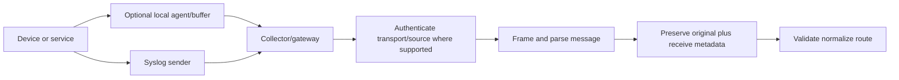

Syslog timestamp/source identity may be incomplete or spoofable depending on transport/configuration. Preserve receive time and network context, detect loss where sequence/count evidence exists, and do not call UDP delivery complete.

## Connector lifecycle

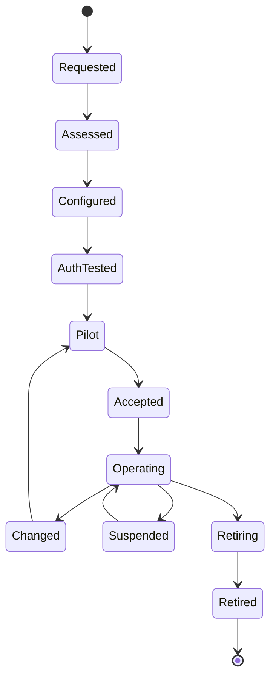

| Lifecycle phase | Required activity | Exit evidence |
|---|---|---|
| Request/discovery | Purpose, source, direction, owner, data class, value | Approved use case |
| Assess | Docs, auth, scope, format, volume, limits, risks | Design/RAID |
| Configure | Secret reference, permissions, filters, schedule, mapping | Versioned config |
| Test auth | Positive/negative/expiry/rotation | Least-privilege evidence |
| Pilot | Bounded representative scope | Known-answer results |
| Accept | Counts, schema, quality, freshness, security | Acceptance sign-off |
| Operate | Monitor, rotate, reconcile, support | Health/SLO evidence |
| Change | Contract/version/canary/backfill | Approved migration |
| Suspend | Stop safely without losing state | Impact/position record |
| Retire | Revoke secret, stop schedules, retention/deletion, dependency check | Retirement proof |

Configuration should be versioned and reviewed, with environment/tenant separation. Store references to secrets, not secret values. Rotation should overlap safely where protocol permits and prove old credential revocation.

## Connector permissions, scope, and scheduling

| Area | Discovery questions |
|---|---|
| Identity | Dedicated service principal/account? Human dependency? |
| Read scope | Which tenants/accounts/projects/objects/fields? |
| Write scope | Which outbound actions/resources? Approval? |
| Roles | Minimum documented permissions? Custom role? |
| Network | Egress IP, proxy, DNS, TLS trust, firewall, private path? |
| Schedule | Frequency, timezone, data interval, maintenance, catch-up? |
| Volume | Normal/max records/bytes and growth? |
| Limits | Requests, concurrency, pages, export jobs, files? |
| State | Cursor/token/checkpoint retention and reset? |
| Ownership | Who approves, monitors, rotates, and escalates? |

Separate read ingestion from outbound write/action credentials. A connector that reads vulnerability data does not automatically need ticket creation or control-change rights.

## Inbound and outbound integrations

| Direction | Example general pattern | Primary risks |
|---|---|---|
| Inbound | Pull source API/file into platform | Overcollection, missed pages, stale data |
| Inbound push | Webhook/syslog/agent sends events | Spoof/replay/loss/order |
| Outbound export | Send curated data to warehouse/SIEM | Leakage, scope, duplicate delivery |
| Outbound workflow | Create/update ticket/notification | Duplicate or wrong action |
| Outbound control action | Change policy/isolate entity | High-impact authorization/approval |
| Bidirectional | Read state, write action, reconcile response | Feedback loops/conflicts |

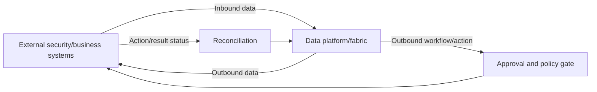

The official Zscaler page uses inbound and outbound integration language. It does not, on that page, define each integration's direction, permissions, schedule, or action semantics; verify the current integration catalog and connector-specific documentation.

## Validation and quarantine

Validation is layered. A syntactically valid payload can still be semantically wrong or incomplete.

| Validation layer | Example check | Disposition |
|---|---|---|
| Transfer | HTTP status, complete object, length, checksum | Reject/retry whole transfer |
| Container | Entry paths/count/expanded bytes | Reject unsafe archive |
| Decode | Compression/UTF-8/framing | Reject/quarantine file/record |
| Syntax | JSON/XML/CSV parse | Record/file quarantine by contract |
| Schema | Required fields/types/enums/version | Quarantine with reason |
| Semantic | Timestamp range, tenant, unit, key | Quarantine/quality flag |
| Referential | Asset/source key known | Hold unmatched, do not discard |
| Completeness | Manifest/control total/pages/windows | Hold publication |
| Security | Malware/content/policy/data classification | Isolate/escalate |
| Duplicate/conflict | Event key/payload/version | Dedup or conflict review |

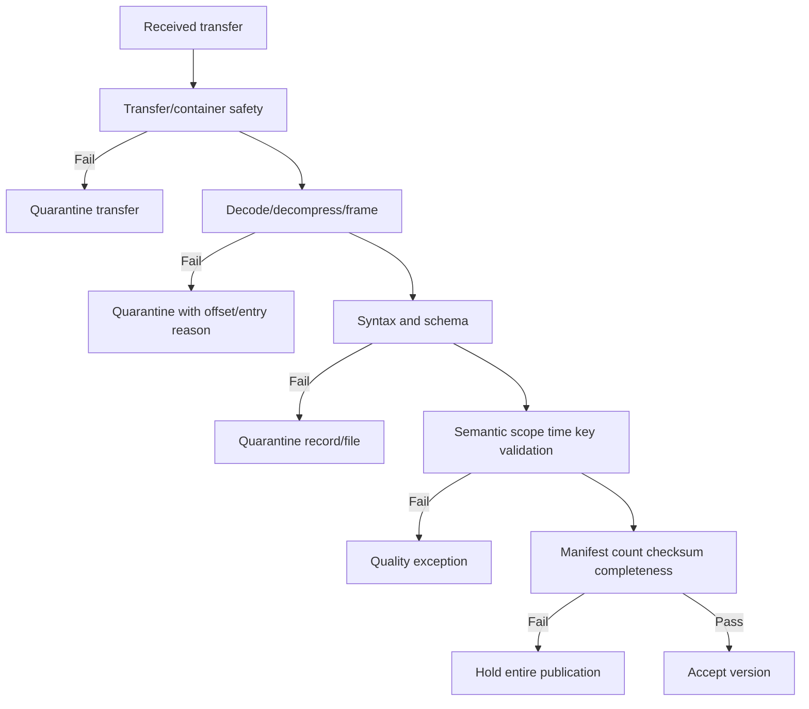

Quarantine stores are sensitive. Prefer a protected reference to raw payload rather than copying it into alert text. Record reason code, parser/contract version, run/extraction/file/entry/line/offset, first/last seen, owner, and replay status.

## Counts, checksums, and manifests

| Control | Detects | Does not prove |
|---|---|---|
| Content length | Transfer byte mismatch | Correct content/records |
| Cryptographic hash | Byte change versus trusted expected hash | Source authenticity by itself |
| File count | Missing/extra files | Correct file contents |
| Record count | Lost/extra parsed records | Correct identities/values |
| Distinct key count | Duplicate key incidence | Semantic uniqueness correctness |
| Control total | Sum/count supplied by source | Trusted source or mapping correctness |
| Min/max timestamp | Window bounds anomaly | Completeness inside range |
| Manifest signature | Authenticity/integrity under key trust | Semantic correctness |

Synthetic manifest:

```json
{
  "manifest_version": "1.0",
  "extraction_id": "nmh-lab-20260825-001",
  "scope": "nmh-lab",
  "files": [
    {
      "name": "events-0001.jsonl.zst",
      "compressed_bytes": 1048576,
      "uncompressed_bytes": 7340032,
      "record_count": 25000,
      "sha256": "synthetic-not-a-real-digest"
    }
  ]
}
```

The digest is intentionally not valid. In real systems, define whether hash covers compressed or uncompressed bytes and transmit expected values through a trusted authenticated channel.

## Provenance and custody

| Provenance field | Purpose |
|---|---|
| Source system/tenant | Scope and authority |
| Connector/config version | Reproduce collection behavior |
| Credential identity reference | Audit who accessed, not secret value |
| Request/export job ID | Correlate source evidence |
| URL/path/object name | Locate transfer under access control |
| Page cursor/offset | Identify exact position |
| File/entry/line/byte offset | Locate rejected record |
| Source event/version | Order/deduplicate |
| Event/source update time | Business chronology |
| Received/processed time | Latency and custody |
| Hash/count/manifest | Integrity/completeness evidence |
| Schema/parser/mapping version | Reproduce interpretation |

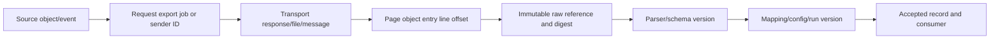

Provenance can itself be sensitive. Apply least privilege and retention, and avoid storing tokens, signed URLs, or unnecessary payload copies.

## Large files and partial loads

Large files require streaming/bounded processing. Loading the entire decompressed object into memory can crash workers and enable decompression attacks.

| Technique | Benefit | Caution |
|---|---|---|
| Streaming download | Bounded memory | Need retry/resume/integrity plan |
| Chunked/multipart transfer | Parallel/resumable | Assemble/order/checksum correctly |
| Range request | Resume bytes where supported | Object version must remain unchanged |
| Streaming decompression | Bounded memory | Limit output and handle truncation |
| JSONL/CSV row streaming | Record-level processing | Multiline CSV parser state |
| XML pull parser | Bounded hierarchy processing | Security/depth and element lifecycle |
| Staging partition | Isolate incomplete run | Atomic publish after acceptance |
| Manifest/control totals | Detect missing chunks/files | Trusted/consistent source required |

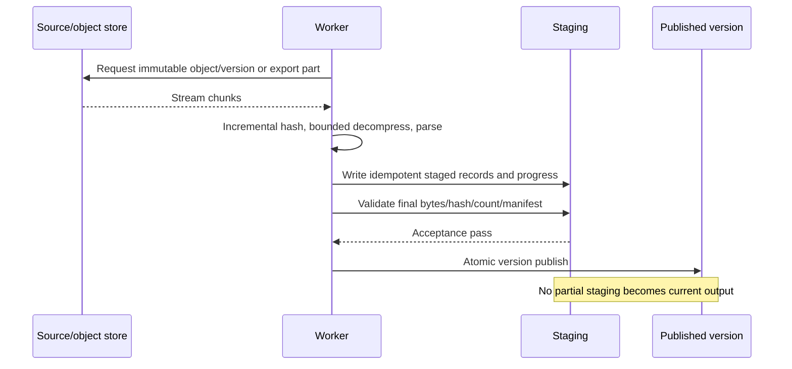

On resume, verify object identity/version/ETag semantics according to current service docs. A range resumed against a changed object can splice two versions. A network EOF without expected final length/hash/record termination is failure, not success.

### Plain-English deep-dive 3 - A partial load is dangerous because it can look normal

If the first 70 of 100 files contain common assets, dashboards can show believable counts and recent timestamps. Nothing visibly crashes. Decisions are made on missing 30%.

Publication therefore requires completeness evidence: final page/token, export-job completion, expected file list, bytes, hashes, record/control totals, source watermark, and accepted quality. "Some data arrived" is not a success state.

## Error taxonomy

| Layer | Error examples | Key evidence |
|---|---|---|
| Configuration | Wrong endpoint/tenant/filter/schedule | Versioned config and expected scope |
| DNS/network | Name failure, timeout, reset, route/proxy | Timestamped DNS/TCP traces/logs |
| TLS | Trust, hostname, protocol, mTLS certificate | Chain/SNI/time/client cert evidence |
| Auth | 401, token audience/expiry/signature | Redacted claims/response/request ID |
| Authorization | 403, missing scope/role | Identity/role/resource policy |
| API contract | 400/404/409/422/version | Request metadata and problem response |
| Throttle/service | 429/5xx/timeout | Headers, attempt/backoff/concurrency |
| Pagination | Loop/skip/duplicate/missing end | Cursor/page/row audit |
| File transfer | Truncated/changed/missing object | Version, bytes, checksum, manifest |
| Decode/decompress | Invalid UTF-8/frame/archive bomb | Offset/entry/library/limits |
| Parse/schema | Syntax/type/required/enum | Quarantine reason/sample/version |
| Semantic/mapping | Unit/time/key/scope defect | Contract/lineage/known record |
| Target/publish | Duplicate/write/partial visibility | Transaction/run/publish version |

## Troubleshooting decision tree

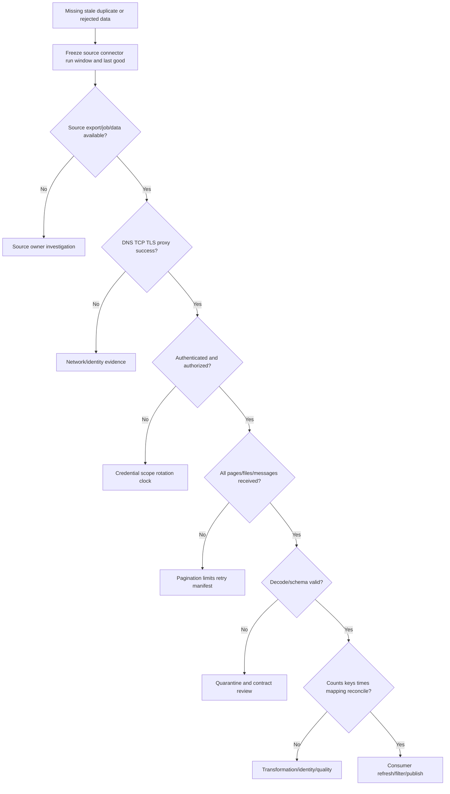

## Full ingestion troubleshooting runbook

1. Capture symptom, decision impact, affected entities/period, last known good, and urgency.
2. Freeze source, tenant, connector/config/schema/parser/mapping versions, run/extraction IDs, schedule/window, and publish version.
3. Confirm documented purpose, direction, scope, owner, auth, transport, format, and quality contract.
4. Verify source data/export job exists and is complete before blaming transport.
5. Test DNS, TCP, TLS, SNI/certificate time/trust, proxy, firewall, and route with customer-safe evidence.
6. Inspect HTTP method/path/version/status, redacted request/response IDs, headers, content type, and problem details.
7. Validate credential expiry, audience, issuer, scope, role, tenant, secret/certificate rotation, and clock skew without exposing secrets.
8. Inspect rate limit response, `Retry-After`, client concurrency, attempt count, backoff/jitter, and retry budget.
9. Audit every page/cursor/link: request, response count, durable receipt, next token, loop, duplicate, final condition.
10. Audit webhook signature raw bytes, timestamp/replay window, event ID, acknowledgment-after-durable-receipt, and sender retries.
11. For agents/syslog, check health versus data freshness, buffer/drop, sequence, transport, time, update, and identity.
12. Validate actual file signature/format rather than extension/content type alone.
13. Compare compressed and expanded sizes against limits; inspect safe archive entries before extraction.
14. Decode strict encoding/BOM/line ending; parse with maintained structured parser and resource limits.
15. Validate header/schema version, types, nulls, enums, units, times, tenant scope, and stable keys.
16. Record quarantine reasons by file/entry/line/offset without leaking payload.
17. Reconcile expected/actual files, bytes, hashes, rows, distinct keys, min/max times, control totals, and source watermark.
18. Detect truncation, missing final line/page/file, changed object during resume, and partial staging.
19. Trace known records through provenance, parser, mapping, dedup, and published output.
20. Hold publication/outbound actions if completeness or security gates fail.
21. Repair the correct owner layer; replay bounded data idempotently with side effects controlled.
22. Validate corrected output, monitor, rotate/revoke temporary access, and communicate restatement/prevention.

### Plain-English deep-dive 4 - Troubleshoot the boundary, not the brand

When data is missing, "the connector is broken" is too broad. The failure can be source export, permission, DNS, TLS, proxy, API page loop, throttle, truncated archive, parser, schema, mapping, identity, target write, or dashboard refresh.

Arti's escalation advantage is boundary isolation: identify the last confirmed good artifact and first bad/missing artifact, with timestamps and ownership. This produces a useful Zscaler/source/customer escalation without pretending to know undocumented internals.

## Security and privacy boundaries

| Risk | Ingestion example | Control |
|---|---|---|
| Secret exposure | Token in HAR/log/URL/config | Vault/reference, redaction, short lifetime, rotation |
| Excess permission | Connector reads all tenants | Dedicated least-privilege role and negative tests |
| Cross-tenant mixing | Scope key omitted | Isolation, scoped keys/paths, tests |
| Server-side request forgery | Follow untrusted pagination/webhook URL | Allowlisted origins/schemes, safe client |
| Injection | Fields become SQL/commands/paths/formulas | Parameterized/structured handling and output escaping |
| XML entity attack | External entity resolution | Hardened parser, DTD/entity disabled |
| Archive traversal/bomb | Malicious ZIP entries/ratio | Safe extraction and limits |
| Webhook spoof/replay | Forged/repeated callback | Signature, timestamp/nonce, event ID, TLS |
| Sensitive quarantine | Raw payload copied to alert | Restricted reference, minimization, retention |
| Data exfiltration | Outbound connector overbroad | Approval, field/scope allowlist, audit |
| Supply chain | Vulnerable parser/agent/library | Supported versions, provenance, patching, SBOM review |
| Retention/privacy | Raw identities retained indefinitely | Purpose/minimization/deletion/residency policy |

## Official Zscaler Data Fabric boundary

The public Data Fabric page reviewed on 2026-08-24 states that ingestion supports `JSON`, `JSONL`, `CSV`, `ZIP`, `XML`, `ZST`, and `ZSTD`. It also states 150 pre-built inbound and outbound integrations and links an integrations catalog. These are public product statements and may change.

| Publicly supported statement on reviewed page | Safe interpretation | Not established by that statement |
|---|---|---|
| Takes data from any source | Broad positioning/intent | Every source works without connector/design |
| Lists JSON/JSONL/CSV/ZIP/XML/ZST/ZSTD | Named accepted format categories | Exact schema, size, nesting, encoding, compression settings |
| 150 pre-built inbound/outbound integrations | Current catalog-scale/direction statement | Every tenant/license, connector behavior, guarantee |
| New connectors can be developed on request | Public delivery positioning | Commitment for a specific customer without engagement |
| Harmonize/deduplicate/correlate/enrich | Public capability categories | Algorithms, rules, accuracy, internal model |

Before a customer plan, check current official integration entry/help documentation for exact direction, prerequisites, permissions, fields, frequency, limits, ownership, support, and lifecycle. Where documentation is unavailable, label the item an open discovery question.

## Exercises with answers

### Exercise 1 - Format layers

**Task:** `events.jsonl.zst` arrives.

**Answer:** Treat the extension as a hint. Validate Zstandard bytes, boundedly decompress, strict-decode the contracted encoding, frame each physical line, parse each line as one JSON value, validate schema/semantics, and reconcile manifest/hash/count. Compression is not encryption/authentication.

### Exercise 2 - CSV delimiter

**Task:** Asset name contains comma and newline.

**Answer:** Use a real CSV parser honoring quoted fields and embedded record characters; do not split strings. Validate exact header, column count, encoding, null/type rules, and preserve raw evidence.

### Exercise 3 - XML safety

**Task:** XML parser attempts to read a local file referenced in input.

**Answer:** Stop/quarantine. Use a hardened parser with DTD/external entities disabled unless explicitly required and safely configured, plus entity/depth/size limits. Review for XXE exposure.

### Exercise 4 - API auth

**Task:** API moves from 401 to 403 after token refresh.

**Answer:** Authentication likely succeeded but authorization/resource policy may not. Verify audience, scopes/roles, tenant/resource, grant, and source policy; do not repeatedly refresh or broaden permissions blindly.

### Exercise 5 - Pagination

**Task:** Cursor repeats itself.

**Answer:** Detect loop, stop boundedly, preserve request/response/cursor IDs, avoid duplicate effects via page/event keys, and escalate source/contract evidence. Do not mark extraction complete.

### Exercise 6 - 429

**Task:** Workers receive rate-limit responses.

**Answer:** Honor documented/valid `Retry-After`, reduce shared concurrency/request rate, use bounded backoff plus jitter, monitor quota scope, and reschedule. More parallel retries worsen throttling.

### Exercise 7 - Webhook timeout

**Task:** Producer retries an event three times.

**Answer:** Verify signature on raw bytes, store once logically by scoped event ID/payload, audit deliveries, acknowledge after durable receipt, and process idempotently. Same ID/different payload is conflict.

### Exercise 8 - Syslog loss

**Task:** UDP syslog volume falls.

**Answer:** It may be real activity decline or sender/network/collector loss. Check source counters, transport drops, collector buffers, timestamps, network path, configuration, and compare a reliable control total. UDP has no delivery acknowledgment.

### Exercise 9 - Partial ZIP

**Task:** 7 of 10 expected entries parse successfully.

**Answer:** Hold publication unless a documented partial policy permits otherwise. Reconcile manifest, transfer integrity, entry safety, quarantine reasons, scope impact, and re-fetch/replay. Do not publish a plausible 70% as complete.

### Exercise 10 - Large-file resume

**Task:** Resume at byte offset after disconnect.

**Answer:** Confirm the source supports range/resume and object version is unchanged. Continue incremental hash/length, validate final digest/manifest, and keep staging isolated until complete. Otherwise restart immutable transfer.

### Exercise 11 - Outbound action

**Task:** Ticket-create call times out.

**Answer:** Outcome is ambiguous. Use documented idempotency key/search/reconciliation before retry; do not create a duplicate blindly. Separate read and write credentials/approval.

### Exercise 12 - Zscaler claim

**Task:** Interviewer asks how a particular Data Fabric connector paginates.

**Answer:** State that the public page confirms named formats and inbound/outbound integrations, but pagination is connector-specific and not established there. Explain the discovery/tests you would use and avoid invention.

## Labs and rehearsal

### Lab 1 - Format identification

Create correctly/misnamed JSON, JSONL, CSV, XML, ZIP, and Zstandard inputs. Detect by actual parser/signature under policy.

### Lab 2 - Encoding clinic

Test UTF-8, BOM, invalid bytes, CRLF/LF, Unicode lookalikes, leading zeros, locale decimals, and offset timestamps.

### Lab 3 - JSON/JSONL validation

Test absent versus null, duplicate keys, huge depth/array, wrong types, unknown fields, truncated document, and final JSONL line.

### Lab 4 - CSV parser

Test quoted comma/newline/quote, duplicate/missing header, column drift, null token, formula text, and spreadsheet round trip.

### Lab 5 - XML parser

Test namespaces, XSD versions, external entity attempt, entity expansion, depth, mixed content, and large streaming parse.

### Lab 6 - Archive/compression safety

Test traversal, absolute path, link entry, nested archive, high expansion, wrong extension, truncated Zstandard frame, and bounded extraction.

### Lab 7 - API authentication

Use synthetic mock responses for expiry, audience, scope, 401, 403, rotation overlap, mTLS expiration, and redaction review.

### Lab 8 - Pagination

Simulate offset mutation, cursor expiry, repeated token, empty page with next, duplicate page, omitted final page, and control total.

### Lab 9 - Rate limiting

Simulate 429/503/timeouts with client-wide limiter, `Retry-After`, jitter, attempt/elapsed budget, and circuit behavior.

### Lab 10 - Webhook receiver

Test valid/invalid signature, raw-byte mutation, replay timestamp, duplicate event, conflicting payload, delayed/out-of-order event, and queue durability.

### Lab 11 - Agent/syslog

Model endpoint offline buffer, overflow/drop, certificate rotation, agent update rollback, UDP loss, TCP disconnect, and clock skew.

### Lab 12 - Connector lifecycle

Build request-to-retirement checklist with RACI, least privilege, known-answer pilot, SLOs, change, secret revocation, and retention closure.

### Lab 13 - Manifest and partial load

Reconcile ten files, compressed/uncompressed bytes, SHA-256 values, rows, distinct keys, timestamps, and one corrupted/missing part.

### Lab 14 - Provenance trace

Trace one synthetic event from request/page/file/line through parser/mapping/run to dashboard and quarantine correction.

### Lab 15 - Large-file handling

Stream a large synthetic JSONL Zstandard file with bounded memory, interruption, immutable resume/restart, and atomic publication.

### Lab 16 - TSM escalation

Present a connector incident using last-good/first-bad boundary, redacted evidence, impact, owner, workaround, repair, validation, and prevention.

| Lab evidence | Completion standard |
|---|---|
| Contract | Direction/scope/auth/transport/format/grain/time explicit |
| Parsing | Maintained parser, encoding/framing/resource limits |
| Delivery | Pagination/rate/retry/webhook/agent semantics tested |
| Completeness | Manifest/count/hash/final-page acceptance |
| Security | Secrets, XXE, archives, SSRF, injection, tenant isolation |
| Recovery | Partial/resume/replay/idempotency proven |
| Provenance | Source-to-output/quarantine trace |
| Honesty | Official Zscaler facts bounded to public page |

## Common misconceptions to correct

| Misconception | Correct model |
|---|---|
| File extension proves format | Validate actual bytes/parser/signature |
| Compression encrypts data | Compression reduces size; encryption protects confidentiality |
| Checksum authenticates sender | Only with trusted expected value/channel/signature context |
| JSON keys are safely duplicated | Duplicate names are interoperability ambiguity |
| JSON numbers preserve every large ID | Use strings/contract for identifiers and precision |
| JSONL is a JSON array | It is conventionally one JSON value per line |
| CSV is just split on commas | Quoting, embedded delimiters/newlines/quotes require parser |
| Empty CSV field always means null | Null/empty semantics need contract |
| Opening CSV in spreadsheet is neutral | Types/formulas/leading zeros can change or execute |
| XML is unsafe by definition | Unsafe parser features/config create risks; use hardened parsing |
| ZIP and ZST are the same | ZIP archives entries; Zstandard compresses a stream |
| Declared uncompressed size is trustworthy | Bound actual expansion and entry behavior |
| Authentication grants all access | Authorization and scope are separate |
| 401 and 403 are identical | Usually auth versus authorization, exact API governs |
| Guessing next page is fine | Follow documented opaque continuation and validate origin |
| Retry every non-2xx | Permanent errors need repair; retries can amplify outage |
| Webhook success can precede durable receipt | Acknowledgment can cause loss if process crashes |
| IP allowlist proves webhook identity | Use documented cryptographic verification; IP is defense-in-depth |
| Agent heartbeat proves complete data | Health and data freshness/completeness differ |
| Syslog always delivers reliably | Transport/config determine loss/order/security properties |
| Connector configuration is one-time | Lifecycle includes rotation, change, monitoring, retirement |
| Inbound and outbound use same privilege | Separate identities/scopes, especially actions |
| Valid schema means correct data | Semantic/scope/time/completeness checks remain |
| Quarantine is harmless storage | It contains sensitive/problematic data and needs ownership |
| Some recent rows prove complete load | Partial data can look plausible |
| Public format support defines exact limits | Connector/help docs and tenant evidence are required |
| 150 integrations means every source/tenant works | Catalog, license, prerequisites, direction, and config vary |

## Official Source Anchors

Sources in this section were reviewed on **2026-08-24**.

IETF/W3C/format sources define their respective standards, not a complete connector implementation. OWASP/NIST/CISA provide security guidance. The Zscaler page is the authority only for its public Data Fabric statements; connector-specific behavior requires current official documentation and tenant evidence.

| Source | URL | Used for | Boundary |
|---|---|---|---|
| RFC 8259 - JSON | https://www.rfc-editor.org/rfc/rfc8259 | JSON grammar, interoperability, UTF-8, duplicate-name cautions | Schema/streaming are separate |
| JSON Lines | https://jsonlines.org/ | Common JSONL one-value-per-line convention | Community specification, not IETF standard |
| RFC 4180 - CSV | https://www.rfc-editor.org/rfc/rfc4180 | Common CSV records/header/quoting/MIME | Real producers vary; contract required |
| W3C XML 1.0 | https://www.w3.org/TR/xml/ | XML document/encoding/structure baseline | Parser security/config separate |
| W3C XML Schema | https://www.w3.org/XML/Schema | XML schema validation concepts | Semantic validation remains |
| PKWARE ZIP APPNOTE | https://pkware.cachefly.net/webdocs/casestudies/APPNOTE.TXT | ZIP format reference | Safe extraction policy is implementation responsibility |
| RFC 8878 - Zstandard | https://www.rfc-editor.org/rfc/rfc8878 | Zstandard compressed data format | Does not define archive semantics/authentication |
| RFC 9110 - HTTP Semantics | https://www.rfc-editor.org/rfc/rfc9110 | HTTP methods/status/headers/semantics | API-specific contract governs |
| RFC 6749 - OAuth 2.0 | https://www.rfc-editor.org/rfc/rfc6749 | OAuth authorization framework baseline | Use current security BCP/profile |
| RFC 9700 - OAuth 2.0 Security BCP | https://www.rfc-editor.org/rfc/rfc9700 | Current OAuth security best practices | Deployment/profile-specific |
| RFC 6750 - Bearer Tokens | https://www.rfc-editor.org/rfc/rfc6750 | Bearer token usage/threat context | Avoid disclosure; current BCP applies |
| RFC 6585 - Additional HTTP Status Codes | https://www.rfc-editor.org/rfc/rfc6585 | 429 and Retry-After context | Exact API rate policy varies |
| RFC 8288 - Web Linking | https://www.rfc-editor.org/rfc/rfc8288 | Link relation concepts relevant to pagination | API-specific relation/URL trust required |
| RFC 9457 - Problem Details for HTTP APIs | https://www.rfc-editor.org/rfc/rfc9457 | Structured API error details | API adoption varies |
| RFC 5424 - Syslog Protocol | https://www.rfc-editor.org/rfc/rfc5424 | Syslog message format concepts | Transport/reliability depends on deployment |
| OWASP API Security Top 10 | https://owasp.org/API-Security/ | API authorization, resource, consumption, SSRF risk context | Risk list, not connector contract |
| NIST SP 800-53 Rev. 5 | https://csrc.nist.gov/pubs/sp/800/53/r5/upd1/final | Access, identification, audit, integrity, system/communications controls | Tailoring/implementation required |
| CISA Secure by Design | https://www.cisa.gov/securebydesign | Secure defaults and ownership context | General guidance |
| Zscaler Data Fabric for Security | https://www.zscaler.com/products-and-solutions/data-fabric | Named formats; current public inbound/outbound integration statement; high-level ingest/harmonize context | No per-connector auth, schedule, schema, limit, guarantee, or internal architecture claim |
| Zscaler Data Fabric Integrations | https://www.zscaler.com/products-and-solutions/data-fabric/integrations | Current public integration catalog entry point | Verify each connector's current official details |

## Likely Interview Questions

### Q1. How do JSON, JSONL, CSV, XML, ZIP, ZST, and ZSTD differ?

**Model answer:** JSON/XML serialize hierarchical structures; CSV serializes rows/fields with weak built-in typing; JSONL conventionally frames one JSON value per line. ZIP is an archive/container with entries and often compression. Zstandard is a compression format commonly named `.zst`/`.zstd`, not a multi-file archive itself. Encoding, framing, schema, compression, archive, transport, integrity, and encryption are separate layers. I validate bytes/content rather than extensions.

### Q2. What parsing and file-safety checks do you require?

**Model answer:** I contract UTF-8/BOM/line endings/delimiters/quotes/nulls/schema/units/times, use maintained JSON/CSV/XML parsers, reject JSON duplicate-name ambiguity, disable unsafe XML external entities, and bound depth/size/count. For ZIP/Zstandard I validate signatures, safe paths, entries, nesting, expanded bytes/ratio, frames, final length/hash, and isolate staging. I preserve raw provenance and quarantine safely.

### Q3. How do you build a reliable API pull connector?

**Model answer:** I define purpose/scope/grain/time/full-or-incremental behavior; use dedicated least-privilege auth and secret rotation; persist response/page before advancing cursor; follow documented pagination; reconcile final pages/counts; respect rate limits with bounded backoff/jitter; classify 4xx/5xx; validate content/schema; and record request/export IDs, positions, hashes, and accepted output. I test duplicates, mutation, cursor expiry, timeout, and partial extraction.

### Q4. How do you secure and operate webhooks?

**Model answer:** Terminate TLS, limit method/type/body, verify documented signature on raw bytes, validate timestamp/nonce/replay window, deduplicate scoped event IDs, and durably queue before success response. Process at least once idempotently and handle duplicates, delay, and disorder. Rotate webhook secrets safely, minimize logs, monitor queue/failed verification, and fetch authoritative state when notification-only semantics apply.

### Q5. What should a TSM know about agents and syslog?

**Model answer:** Agents add privileges, resource use, local buffering, identity/certificate, signed update, health, rollback, tamper, and uninstall responsibilities; heartbeat is not data completeness. Syslog provides a standard message format, but transport determines delivery/security. UDP can lose/reorder without acknowledgment; preserve receive/source clocks and use counters/collector/network evidence before interpreting volume drops.

### Q6. How do you manage a connector lifecycle and inbound/outbound permissions?

**Model answer:** I move through discovery, risk/contract assessment, versioned config, least-privilege auth tests, bounded pilot, data/security acceptance, monitored operation, controlled change, suspension, and retirement with credential revocation/retention closure. I separate inbound read identities from outbound write/action privileges, add approval/idempotency/reconciliation for actions, and define RACI, schedule, limits, health, rotation, and support.

### Q7. How do you detect a partial or corrupted large-file load?

**Model answer:** I stream into isolated staging with bounded memory/decompression, lock to an immutable object version for resume, compute bytes/hash, validate archive entries/frames/parser termination, and reconcile manifest files, counts, distinct keys, timestamps, and control totals. Publication remains atomic and blocked until completeness/security gates pass. A recent row or successful parser is not completeness evidence.

### Q8. What can you state about Zscaler Data Fabric formats and connectors?

**Model answer:** The official page reviewed August 25, 2026 explicitly lists JSON, JSONL, CSV, ZIP, XML, ZST, and ZSTD and states 150 pre-built inbound and outbound integrations. I would verify the current page/catalog and connector-specific docs for tenant/licensing, direction, prerequisites, permissions, fields, auth, schedules, limits, and guarantees. I do not infer those details from the high-level statement.

## 30-Second Memory Hooks

| Concept | Memory hook |
|---|---|
| Ingestion | Receive, verify, preserve custody |
| Direction | Inbound data; outbound data/action |
| Format layers | Transport, archive, compression, serialization, encoding, framing |
| Extension | Label, not evidence |
| UTF-8 | Contract and decode strictly |
| JSON | One structured value |
| JSONL | One JSON value per line |
| CSV | Parser, not split |
| XML | Namespaces plus hardened parser |
| ZIP | Archive paths and expansion |
| Zstandard | Compression stream, not archive |
| Auth | Who are you? |
| Authorization | What may you access? |
| Pagination | Persist, then turn every page |
| Rate limit | Respect server and shared budget |
| Webhook | Verify, queue, acknowledge, dedup |
| Agent | Local courier with lifecycle |
| Syslog | Format plus transport properties |
| Connector | Config, secret, state, owner, lifecycle |
| Manifest | Shipment list |
| Checksum | Byte integrity with trusted expectation |
| Provenance | Source-to-output passport |
| Quarantine | Protected inspection area |
| Partial load | Plausible is not complete |
| Large file | Stream, bound, verify, atomically publish |
| Zscaler boundary | Public formats/catalog; connector details must be verified |
| Arti bridge | API/network evidence transfers; production product use does not |

## Completion Checklist

- [ ] I define purpose, direction, owner, scope, auth, transport, format, grain, time, delivery, limits, quality, security, privacy, and recovery.
- [ ] I distinguish transport, archive, compression, serialization, encoding, and framing.
- [ ] I never trust an extension/content type without validating actual input.
- [ ] I know compression is not encryption or authenticated identity.
- [ ] I contract UTF-8, BOM, line endings, delimiter, quoting, null, locale, and time zone.
- [ ] I preserve raw bytes/text where authorized for provenance.
- [ ] I can explain JSON values, absent versus null, number precision, duplicate names, and limits.
- [ ] I can explain JSONL one-value-per-line framing and truncated-final-line behavior.
- [ ] I use a standards-aware CSV parser and exact header/schema rules.
- [ ] I handle CSV embedded comma/newline/quote, leading zero, locale, and formula-export risk.
- [ ] I use hardened XML parsing with namespace/schema/depth/size and entity controls.
- [ ] I distinguish ZIP archive/container from Zstandard compression.
- [ ] I safely inspect/extract archives with path, entry, nesting, ratio, and expanded-byte controls.
- [ ] I boundedly stream/decompress and verify complete frames/files.
- [ ] I use dedicated least-privilege connector identity and protected secret references.
- [ ] I distinguish API key, OAuth client credentials, mTLS, and request signing concepts.
- [ ] I validate token audience/scope/lifetime and support secure rotation/revocation.
- [ ] I redact credentials/tokens/cookies/signed URLs from logs, HARs, tickets, and screenshots.
- [ ] I understand offset/page/cursor/keyset/link/time pagination tradeoffs.
- [ ] I persist a page before advancing cursor and detect loop/duplicate/missing end.
- [ ] I reconcile page/file/row totals and source control totals.
- [ ] I handle 429/5xx with bounded backoff/jitter and respect documented timing.
- [ ] I stop/fix permanent auth/authorization/request/schema errors rather than blind retry.
- [ ] I verify webhook signatures on raw bytes using documented scheme.
- [ ] I protect webhooks against replay, duplication, disorder, oversized bodies, and premature acknowledgment.
- [ ] I understand agent privilege, resource, buffer, identity, update, health, tamper, and uninstall lifecycle.
- [ ] I understand RFC 5424 syslog fields and transport-dependent reliability/security.
- [ ] I do not infer complete data from agent heartbeat or UDP syslog receipt.
- [ ] I operate connector request, assess, configure, test, pilot, accept, run, change, suspend, and retire phases.
- [ ] I version configuration and separate environments/tenants.
- [ ] I separate inbound read from outbound export/action credentials and approvals.
- [ ] I apply transfer, container, decode, syntax, schema, semantic, referential, completeness, security, and duplicate validation.
- [ ] I quarantine securely with reason, location, version, owner, age, and replay state.
- [ ] I know what bytes, hashes, file/record/distinct counts, control totals, and manifests can/cannot prove.
- [ ] I transmit expected digests through trusted authenticated channels.
- [ ] I preserve source, request/job, page/object/entry/line/offset, clocks, hash, and version provenance.
- [ ] I stream/chunk large files with immutable-version resume and bounded resources.
- [ ] I never publish partial staging before final acceptance.
- [ ] I can isolate configuration, source, DNS/network, TLS, auth, API, transfer, decode, parse, mapping, target, and consumer failures.
- [ ] I hold publication/outbound actions when completeness/security gates fail.
- [ ] I can run the complete ingestion troubleshooting method and produce redacted evidence.
- [ ] I can complete every synthetic NMH lab and explain expected failure behavior.
- [ ] I state only the official Data Fabric format/integration facts supported by the reviewed page.
- [ ] I verify connector-specific auth, schedule, limits, schemas, direction, and guarantees from current sources.
- [ ] I can answer Q1 through Q8 with mechanics, safety, failures, troubleshooting, and honest boundaries.

[Part 52 - Data Quality, Profiling, Completeness, Freshness, and Reconciliation](Part-52-data-quality-profiling-reconciliation.md)