# Part 52 - Data Quality, Profiling, Completeness, Freshness, and Reconciliation

> **Audience:** Candidates preparing for a Zscaler Security Operations Technical Success Manager role after enterprise Support Escalation Engineering.
>
> **Purpose:** Build an operational data-quality method for security data: accuracy, completeness, consistency, timeliness, validity, uniqueness, integrity, profiling, reconciliation, freshness, latency, duplicate/missing/stale records, thresholds, exceptions, observability, root cause, ownership, acceptance gates, and trust reporting.
>
> **Scope and honesty:** Northstar Meridian Holdings, abbreviated NMH, is fictional. Every source, field, record, rule, threshold, SLA, SLO, dashboard, query, finding, defect, incident, owner, sample, checksum, control total, and outcome in this Part is synthetic. General data-quality and PostgreSQL patterns are not Zscaler Data Fabric schemas, algorithms, connector behavior, quality scores, guarantees, or production recommendations. Official Zscaler material is used only for bounded public context: the reviewed page publicly describes harmonizing, deduplicating, correlating, enriching, and building accurate/contextualized/complete views. Your SQL, Power BI, statistics, support quality, incident, RCA, and customer communication transfer; direct production Zscaler Data Fabric quality operation remains a learning boundary.
>
> **Currency caveat:** Data contracts, source behavior, product interfaces, quality tools, standards, thresholds, and public documentation change. Sources in this Part were reviewed on **2026-08-24**. Current contracts, approved controls, tenant evidence, customer risk tolerance, privacy/security requirements, observed baselines, and product/source specialists govern production.

## Section goal

Data quality means fitness for a declared use, not abstract perfection. The same dataset may be adequate for a weekly directional report but unsafe for an automated containment action. Quality must therefore connect a decision to dimensions, rules, evidence, thresholds, ownership, and acceptance behavior.

Think of ingredients entering a restaurant. Freshness, quantity, identity, temperature, contamination, and supplier records are checked differently. A slightly bruised tomato may be fine for sauce but not a display salad; an unknown allergen label blocks service entirely. Security data also needs use-specific gates rather than one vague "quality score."

By the end, you should be able to:

| Outcome | Demonstrated capability | Evidence artifact |
|---|---|---|
| Define fitness | Tie decision/use case to population, grain, dimensions, and risk | Quality contract |
| Explain dimensions | Distinguish accuracy, completeness, consistency, timeliness, validity, uniqueness, integrity | Dimension map |
| Profile data | Measure nulls, distinctness, ranges, patterns, distributions, and drift | Profile report |
| Validate relationships | Test keys, references, effective dates, and cardinality | Integrity report |
| Reconcile flows | Compare source/target counts, control totals, checksums, and known records | Reconciliation statement |
| Measure freshness | Separate source observation, delivery, processing, and publication latency | Freshness chain |
| Diagnose bad records | Classify duplicate, missing, stale, invalid, conflicting, and orphan data | Exception taxonomy |
| Govern rules | Define rule owner, scope, threshold, severity, version, and response | Rule catalog |
| Operate exceptions | Quarantine safely, approve exceptions, age debt, and replay corrections | Exception register |
| Observe quality | Publish quality SLIs/SLOs/SLAs, alerts, and acceptance state | Quality dashboard |
| Find root cause | Trace symptom through source, contract, ingestion, mapping, identity, model, and consumer | RCA tree |
| Assign ownership | Separate data producer, platform, steward, consumer, security, and decision owner | RACI |
| Gate publication | Pass, warn, quarantine, hold, or fail based on decision risk | Acceptance policy |
| Report trust | Show evidence, unknowns, limitations, restatements, and next actions | Trust report |
| Bound product statements | Use public Data Fabric claims only as capability context | Product-fact card |

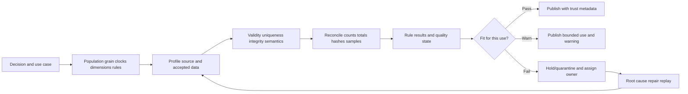

## JD Mapping

| Role expectation | Part 52 capability | TSM artifact | experience bridge and boundary |
|---|---|---|---|
| Analyze complex environments | Evaluate multi-source quality and fitness by use | Quality assessment | SQL/statistics transfer |
| Identify security risks | Detect blind spots, stale evidence, invalid mappings, and misleading metrics | Data-risk register | Defect is risk evidence, not attack proof |
| Develop Data Fabric expertise | Explain public harmonization/dedup/context goals with quality controls | Conceptual framework | Internal implementation unclaimed |
| Resolve escalations | Isolate first bad stage and quantify blast radius | RCA/evidence pack | Support escalation transfers |
| Recommend mitigations | Define gates, thresholds, owners, correction, replay, and prevention | Remediation plan | Customer policy determines threshold |
| Explain metrics | Communicate denominator, quality state, unknowns, and trust | Executive quality card | Power BI communication transfers |
| Drive adoption | Establish stewardship, operating cadence, and acceptance criteria | Governance plan | Organizational roles vary |
| Maintain customer trust | Report failures/restatements transparently | Incident/trust update | No false precision/product claims |

## Candidate honesty note

| Evidence class | Safe statement | Boundary |
|---|---|---|
| Production transfer | "I have used case-quality analysis, SQL, Power BI, RCA, and evidence validation to improve support operations." | Not production security data stewardship |
| Synthetic practice | "I implemented NMH profiling, reconciliation, quality gates, quarantine, and trust reporting." | Not customer production evidence |
| Quality observation | "Five percent of accepted rows lack owner IDs under this rule." | Does not identify real-world cause by itself |
| Accuracy claim | "A validated sample matched the authoritative reference under the protocol." | Limited to sampled fields/population/time |
| Product context | "Zscaler publicly describes harmonization, deduplication, correlation, enrichment, and accurate/contextualized/complete views." | No internal quality score/rule/algorithm claim |
| Experience boundary | "I would validate connector-specific semantics, tenant evidence, quality controls, and owner decisions." | Never invent product behavior |

## Beginner vocabulary and memory hooks

| Term | Plain meaning | Why it matters | Memory hook |
|---|---|---|---|
| Fitness for use | Data is good enough for a named decision | Quality depends on consequence | Good for what? |
| Accuracy | Value agrees with trusted reality/reference | Wrong values misdirect action | Is it true enough? |
| Completeness | Required units/fields/events are present | Missing data creates blind spots | Is expected data here? |
| Consistency | Same fact/rule agrees across places/time | Conflict erodes trust | Do stories agree? |
| Timeliness | Data arrives in time for decision | Correct late data may be useless | Ready when needed? |
| Freshness | Age of newest complete relevant data | Stale state looks current | How old is truth? |
| Validity | Value conforms to syntax/domain/business rule | Invalid values break meaning | Does it fit the rules? |
| Uniqueness | One logical thing appears once at declared grain | Duplicates inflate counts/actions | One thing, one key |
| Integrity | Relationships/state obey constraints | Orphans/impossible state damage models | Connections hold |
| Profiling | Summarize data shape and patterns | Finds surprises before assumptions | Take data's vital signs |
| Null rate | Missing values divided by eligible rows | Field completeness evidence | How often unknown? |
| Distinct count | Number of different non-null values | Detects keys/categories/drift | How many unique labels? |
| Pattern | Structural form such as ID regex | Supports validity, not truth | Looks like expected shape |
| Distribution | Frequency/spread of values | Detects skew, drift, outliers | Full shape |
| Referential integrity | Reference points to existing parent | Prevents orphan relationships | Every child finds parent |
| Reconciliation | Explain source-to-target differences | Detects loss/addition/change | Balance the ledgers |
| Control total | Independent count/sum/hash supplied/calculated | Verifies transfer at aggregate level | Shipment total |
| Checksum | Digest used to detect byte/value changes | Integrity evidence under trusted comparison | Data fingerprint |
| Sampling | Inspect subset under a design | Useful when full truth check costly | Check some deliberately |
| Threshold | Boundary triggering state/action | Encodes tolerance and risk | When does response change? |
| Quarantine | Isolate unacceptable records/transfers | Protects accepted data | Inspection area |
| Exception | Approved temporary deviation or observed failure item | Needs owner/expiry | Known rule break |
| Acceptance gate | Decision to publish/use/hold data | Converts quality evidence to control | Gate before trust |
| Data steward | Accountable person for definition/quality coordination | Prevents ownerless rules | Keeper of meaning |
| Trust report | Quality evidence and limitations for consumers | Supports responsible use | Why believe this? |

## Fitness for use and criticality tiers

| Use case | Quality tolerance example | Gate posture |
|---|---|---|
| Exploratory lab | Some nulls/late rows acceptable if labeled | Warn and continue |
| Weekly directional trend | Stable population/definition and complete periods | Hold incomplete period |
| Owner backlog | Unique entity/owner and current state required | Quarantine ambiguous ownership |
| Executive risk report | Reconciled denominators, version, quality visible | Hold material defects |
| Ticket creation | Stable idempotency/owner/action fields | Fail affected actions |
| Automated containment | Strong identity, current evidence, authorization, human policy | Strict fail-safe gate |
| Audit/regulatory evidence | Controlled lineage, retention, integrity, approvals | Formal evidence controls |

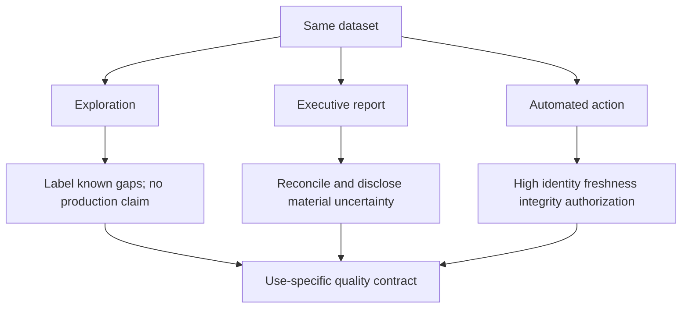

### Plain-English deep-dive 1 - Data quality is not one score

A car can have excellent paint and failed brakes. Averaging paint, brakes, tires, and radio into "92% quality" can hide the safety-critical failure. Security data behaves the same: a dataset can be 99.9% complete but map one critical identity to the wrong asset.

Keep dimension/rule results visible and apply critical gates by use. A composite score may summarize, but it must never allow strong low-risk dimensions to cancel a failed safety-critical rule.

## Data quality dimensions

| Dimension | Operational definition | Example metric | Common confusion |
|---|---|---|---|
| Accuracy | Agreement with authoritative/validated reference | Verified matches / sampled eligible values | Valid format assumed true |
| Completeness | Presence of expected units/fields/events | Received eligible assets / expected assets | Same source defines denominator |
| Consistency | Agreement across sources/rules/time | Nonconflicting matched keys / compared keys | One source automatically right |
| Timeliness | Available before decision deadline | Accepted runs by deadline / scheduled runs | Fresh row masks partial load |
| Validity | Conformance to schema/domain/business rules | Valid rows / received rows | Valid but wrong value |
| Uniqueness | No duplicate logical keys at grain | Keys with one row / keys | `DISTINCT` hiding conflict |
| Integrity | Constraints/relationships/state hold | Findings with valid asset reference / findings | Orphan dropped from report |

Dimensions overlap. A stale value can be accurate for its observation time but unfit as current state. A syntactically valid asset ID can refer to the wrong tenant. State definitions and clocks explicitly.

## Accuracy

Accuracy needs a reference/protocol. There is rarely a magical source of truth for every field.

| Reference approach | Example | Limitation |
|---|---|---|
| Authoritative system by field | HR for employment status | Delayed updates/incorrect source data |
| Physical/technical verification | Agent state checked on endpoint | Cost, timing, observer error |
| Multi-source adjudication | CMDB/cloud/endpoint review | Majority can share same error |
| Controlled test record | Known synthetic canary | Tests pipeline, not all production values |
| Expert review | Analyst validates finding evidence | Subjectivity/inter-rater variation |
| Downstream outcome | Ticket owner confirms asset | Selection and feedback delay |

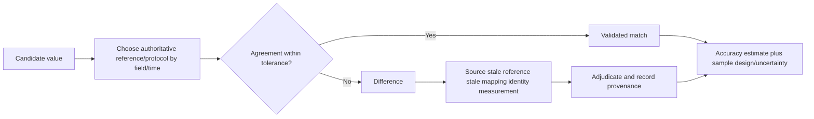

Do not call a field accurate because it matches a regex. That is validity. For sampled accuracy, report sampling frame, selection, n, reference procedure, reviewer agreement, unknowns, and uncertainty.

## Completeness

Completeness has several grains.

| Completeness type | Numerator | Denominator |
|---|---|---|
| Population | Expected entities observed | Independently eligible entities |
| Field | Eligible rows with non-null meaningful value | Rows where field required |
| Event | Events received | Independent source control total |
| Time | Expected intervals present | Scheduled intervals |
| Relationship | Expected links present | Applicable relationship population |
| Source | Onboarded/accepted sources | Approved required source inventory |

Synthetic field-completeness SQL:

```sql
SELECT
    source_system,
    COUNT(*) AS eligible_rows,
    COUNT(*) FILTER (
        WHERE owner_id IS NOT NULL
          AND btrim(owner_id) <> ''
    ) AS populated_owner_rows,
    COUNT(*) FILTER (WHERE owner_id IS NULL) AS null_owner_rows,
    COUNT(*) FILTER (WHERE owner_id = '') AS empty_owner_rows,
    COUNT(*) FILTER (
        WHERE owner_id IS NOT NULL
          AND btrim(owner_id) <> ''
    )::numeric / NULLIF(COUNT(*), 0) AS owner_field_completeness
FROM nmh_models.asset_snapshot_lab
WHERE snapshot_date = DATE '2026-08-24'
  AND owner_required = true
GROUP BY source_system
ORDER BY source_system;
```

Blank, placeholder (`UNKNOWN`, `N/A`, `0000`), invalid, and semantically unusable values may be present but not complete. Define meaningful population and rules.

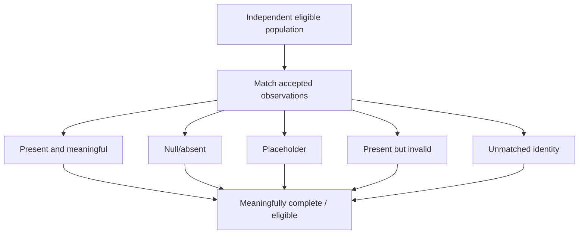

## Consistency

Consistency asks whether representations agree under a defined authority/time rule.

| Consistency type | Example | Required policy |
|---|---|---|
| Cross-source | Asset owner differs in CMDB and endpoint | Field authority/effective time |
| Cross-table | Ticket references finding status inconsistent with fact | Update/derivation contract |
| Temporal | Asset retirement followed by active observation | Reopen/reuse/late-event policy |
| Unit | Seconds mixed with milliseconds | Unit metadata/conversion |
| Format | Country names versus codes | Canonical mapping |
| Rule | Executive metric and operator metric use different denominator | Versioned metric definition |

Consistency is not forced sameness. Sources may validly observe different times or concepts. Preserve provenance and compare semantically equivalent values at aligned effective times.

## Timeliness, freshness, and latency

| Measure | Formula concept | Question |
|---|---|---|
| Source staleness | As-of minus source observation/update watermark | How old is source truth represented? |
| Ingestion latency | Received time minus source available/update time | How long to enter platform? |
| Processing latency | Accepted time minus received time | How long to validate/transform? |
| Publication latency | Published time minus accepted time | How long to reach consumer? |
| End-to-end latency | Published time minus event/source availability | How late is decision data? |
| Deadline timeliness | Accepted/published by required time | Was it ready when needed? |

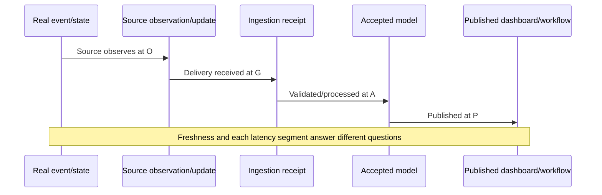

Use the latest complete watermark, not `MAX(event_at)` alone. One future-dated or recent record can mask an otherwise stale/partial source. Track minimum expected coverage, row/control totals, and watermark distribution.

## Validity

| Validity layer | NMH example | Why insufficient alone |
|---|---|---|
| Syntax | UUID parses | May identify wrong object |
| Type | Score is numeric | Scale/unit may be wrong |
| Domain | State in allowed enum | Enum mapping may be stale |
| Range | Score between 0 and 100 | Not proof score is calibrated |
| Pattern | Hostname matches pattern | Could be fabricated/duplicate |
| Cross-field | Closed time requires closed status | Workflow could still be wrong |
| Temporal | Verified time not before first observed | Clocks/source semantics may differ |
| Business | Critical asset requires owner | Owner value may be placeholder |

Synthetic validity profile:

```sql
SELECT
    COUNT(*) AS rows_received,
    COUNT(*) FILTER (WHERE asset_id IS NULL) AS missing_asset_id,
    COUNT(*) FILTER (
        WHERE event_at > TIMESTAMPTZ '2026-08-24 00:00:00+00' + INTERVAL '5 minutes'
    ) AS future_event_time,
    COUNT(*) FILTER (
        WHERE state NOT IN ('open', 'closed', 'suppressed') OR state IS NULL
    ) AS invalid_state,
    COUNT(*) FILTER (
        WHERE closed_at IS NOT NULL AND closed_at < first_observed_at
    ) AS negative_lifecycle,
    COUNT(*) FILTER (
        WHERE risk_score < 0 OR risk_score > 100
    ) AS out_of_range_score
FROM nmh_stage.finding_batch_lab
WHERE extraction_id = 'nmh-lab-20260825-001';
```

The 0-100 range and five-minute tolerance are synthetic contract choices. Never infer a Zscaler score scale or clock tolerance.

## Uniqueness and duplicate data

Uniqueness is measured at declared grain and scope. Source event, entity, observation, snapshot, and relationship grains differ.

| Duplicate class | Example | Response |
|---|---|---|
| Exact delivery retry | Same scoped event ID/payload | Idempotently collapse logical effect; audit delivery |
| Conflicting duplicate | Same key, different payload | Quarantine/adjudicate/version |
| Entity alias | Different source IDs, same asset | Entity-resolution process |
| Legitimate repetition | Same login action twice | Keep both distinct events |
| Snapshot repetition | Same asset on two dates | Both valid at snapshot grain |
| Join fanout | One finding joined to many tickets | Fix query/model |

```sql
SELECT
    tenant_id,
    source_system,
    source_event_id,
    COUNT(*) AS delivery_rows,
    COUNT(DISTINCT payload_hash) AS distinct_payloads,
    MIN(ingested_at) AS first_delivery,
    MAX(ingested_at) AS last_delivery
FROM nmh_stage.source_event_lab
GROUP BY tenant_id, source_system, source_event_id
HAVING COUNT(*) > 1
ORDER BY distinct_payloads DESC, delivery_rows DESC;
```

If `distinct_payloads = 1`, retry is plausible; if greater than one, correction/conflict is plausible. Hash behavior and source contract still need validation.

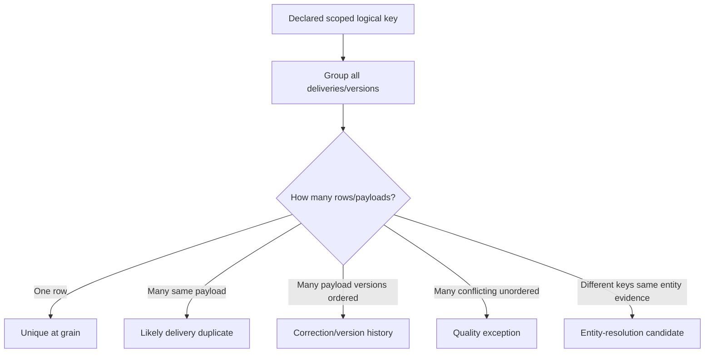

### Plain-English deep-dive 2 - DISTINCT can make a quality defect invisible

If two employee records share an ID but disagree on department, selecting `DISTINCT employee_id` returns one clean-looking ID. The contradiction disappears from the result, not from reality.

Quality profiling keeps duplicate count, payload variants, source, time, and provenance. Resolve under a governed rule; do not use `DISTINCT` as a cleanup reflex.

## Integrity and referential checks

| Integrity rule | Example | Failure meaning candidates |
|---|---|---|
| Primary uniqueness | One asset row per `asset_id` | Duplicate merge/load defect |
| Foreign reference | Finding asset exists | Late parent, wrong key, missing asset |
| Cardinality | One current remediation owner | Overlapping effective intervals |
| Temporal integrity | `valid_to > valid_from` | Source/mapping/time defect |
| State transition | Verified closure follows open | Late order or invalid workflow |
| Scope integrity | Parent/child same tenant | Cross-tenant defect |
| Aggregate conservation | Categories sum to eligible total | Overlap/gap in classification |

Synthetic orphan check:

```sql
SELECT
    f.tenant_id,
    f.finding_id,
    f.asset_id
FROM nmh_rel.finding_lab AS f
LEFT JOIN nmh_rel.asset_lab AS a
  ON a.tenant_id = f.tenant_id
 AND a.asset_id = f.asset_id
WHERE a.asset_id IS NULL
ORDER BY f.tenant_id, f.finding_id;
```

Do not silently inner-join orphans away. Preserve them in quality reporting; late-arriving dimensions may be accepted temporarily under a time-bound rule.

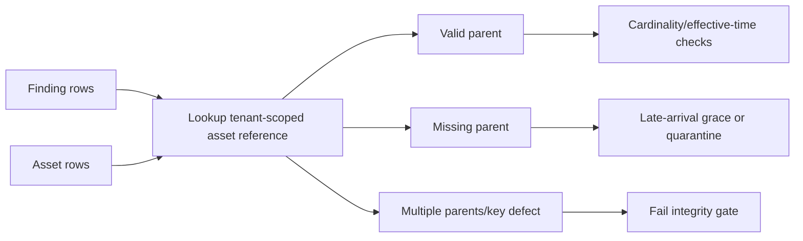

## Profiling

Profiling describes observed data without assuming it is correct. Profile by source, tenant, extraction, date, entity type, and schema version so aggregate results do not hide localized defects.

| Profile statistic | What it reveals | Caution |
|---|---|---|
| Row count | Volume | Not completeness without expectation |
| Non-null/null/blank | Field presence | Placeholder may look populated |
| Distinct/approx distinct | Cardinality | Approximation error; null handling |
| Duplicate key count | Uniqueness | Key definition/scope required |
| Min/max | Range/time coverage | One bad extreme can mislead |
| Quantiles/distribution | Shape/tails | Sample/population and censoring |
| Pattern frequencies | Format categories | Pattern-valid can be inaccurate |
| Enum frequencies | New/rare labels | Rare may be legitimate |
| Length distribution | Truncation/oversized text | Encoding/characters versus bytes |
| Cross-field rules | Semantic coherence | Rule version/effective time |

Synthetic PostgreSQL profile:

```sql
SELECT
    source_system,
    COUNT(*) AS row_count,
    COUNT(asset_id) AS nonnull_asset_id,
    COUNT(DISTINCT asset_id) AS distinct_asset_id,
    COUNT(*) - COUNT(asset_id) AS null_asset_id,
    COUNT(*) FILTER (WHERE btrim(asset_name) = '') AS blank_asset_name,
    MIN(observed_at) AS minimum_observed_at,
    MAX(observed_at) AS maximum_observed_at,
    PERCENTILE_CONT(0.5) WITHIN GROUP (
        ORDER BY EXTRACT(EPOCH FROM (
            TIMESTAMPTZ '2026-08-24 00:00:00+00' - observed_at
        )) / 3600.0
    ) AS median_observation_age_hours
FROM nmh_stage.asset_observation_lab
WHERE extraction_id = 'nmh-lab-20260825-001'
GROUP BY source_system
ORDER BY source_system;
```

Profiling queries themselves need null/time/grain/fanout safety. Approximate distinct methods can be useful at scale but should be labeled and calibrated against exact checks where decisions require.

## Distribution and drift profiling

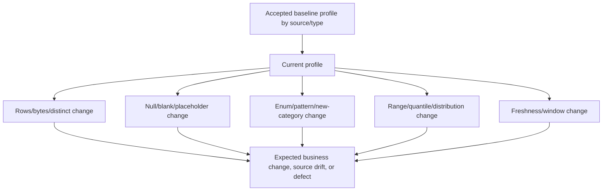

A distribution shift is an observation, not automatically a defect. New acquisitions, patch cycles, cloud scaling, and threat campaigns can change data legitimately. Compare with change calendars, source contracts, schema versions, and business context.

## Source-to-target reconciliation

Reconciliation proves conservation under defined transformations. If the target intentionally filters invalid/duplicate/out-of-scope rows, the equation should explain every disposition.

$$
received = accepted + quarantined + rejected + duplicate\ deliveries + other\ governed\ dispositions
$$

Do not double-count overlapping categories. Define mutually exclusive dispositions or reconcile through a record-level audit ledger.

| Reconciliation layer | Source evidence | Target evidence | Difference explanation |
|---|---|---|---|
| Transfer | Export files/pages/bytes | Received objects/bytes | Missing/corrupt/retry |
| Parse | Raw record count | Parsed + parse-rejected | Framing/syntax |
| Validate | Parsed rows | Valid + invalid | Rule reasons |
| Dedup | Valid deliveries | Logical accepted + duplicates/conflicts | Key/version policy |
| Transform | Accepted raw | Curated + mapping exceptions | Filter/map/join |
| Publish | Curated version | Published version | Gate/version switch |
| Consumer | Published rows | Dashboard/workflow rows | Refresh/filter/RLS/action |

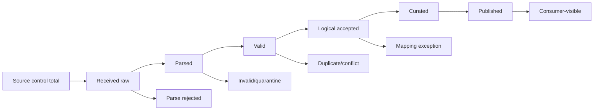

## Counts, control totals, and checksums

| Control | Strength | Blind spot |
|---|---|---|
| Row count | Detects net volume mismatch | One missing plus one duplicate cancels |
| Distinct key count | Detects key duplication/loss | Values can be wrong |
| Sum amount/score | Detects some changes | Offsetting changes/collisions |
| Group counts | Localizes by source/date/type | Wrong within groups possible |
| Min/max time | Detects window boundary issues | Interior gaps |
| Ordered digest | Sensitive to order/value | Order canonicalization required |
| Unordered/partition hash | Scalable comparison | Design/collision/normalization complexity |
| File SHA-256 | Byte-level object integrity | Parsed semantic equality not guaranteed |
| Signed manifest | Authenticated expected objects/totals | Source correctness not guaranteed |

Canonical record hashing requires deterministic field order, encoding, null representation, number/time normalization, and included-field/version policy. Do not invent an ad hoc concatenated string that can collide ambiguously (`ab|c` versus `a|bc`) or change by locale. Use structured canonical serialization and approved cryptographic library where record digests are needed.

## Sampling and manual verification

Full accuracy verification can be expensive. Sampling can estimate or discover defects if selection is designed.

| Sampling method | Use | Risk |
|---|---|---|
| Simple random | Broad estimate under frame | Rare critical strata missed |
| Stratified | Ensure source/tier/type representation | Need weights for population estimate |
| Systematic | Operational convenience across ordered list | Periodicity bias |
| Risk-based | Inspect highest-impact records | Cannot estimate overall unbiased rate alone |
| Exception-focused | Diagnose rule failures | Not representative |
| Known-good canaries | Pipeline regression | Limited production coverage |
| Dual review | Measure reviewer agreement | Cost/training/adjudication |

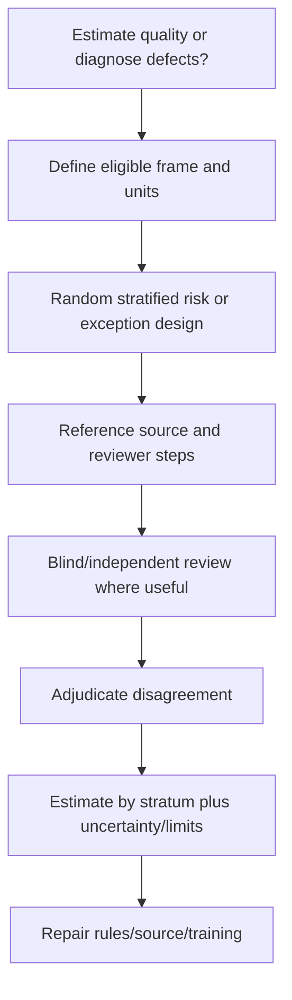

Risk-based samples are excellent for preventing high-impact mistakes but cannot alone claim a population accuracy percentage. Combine representative and targeted validation for different goals.

## Freshness and latency quality rules

| Rule | Synthetic threshold | Response |
|---|---:|---|
| Scheduled run accepted by deadline | 60 minutes | Alert/hold time-sensitive publish |
| Complete source watermark lag | 90 minutes | Warn/hold by use criticality |
| p95 ingestion latency | 20 minutes | Investigate tail/source groups |
| No-data interval | 2 expected periods | Distinguish valid zero from failure |
| Clock future skew | 5 minutes | Quarantine/clock review |
| Late-arrival share | 2% within 24 hours | Restatement/contract review |

All numbers are NMH lab choices, not recommendations. Derive thresholds from decision deadlines, source schedules, observed variation, risk, and contractual obligations.

## Quality rule catalog

| Rule field | Example |
|---|---|
| Rule ID/name | `ASSET-OWNER-COMPLETE-001` |
| Purpose | Owner backlog assignment |
| Dimension | Completeness |
| Population/grain | Active managed assets, one per snapshot |
| Expression | Meaningful current owner present |
| Threshold | 99% warn; critical assets 100% fail |
| Severity | Material for outbound assignment |
| Effective version | v3 from 2026-08-01 |
| Owner/steward | Asset data steward |
| Response | Hold affected outbound action; create exception queue |
| Evidence | Counts, keys, source, run, sample |
| Expiry/review | Quarterly or contract change |

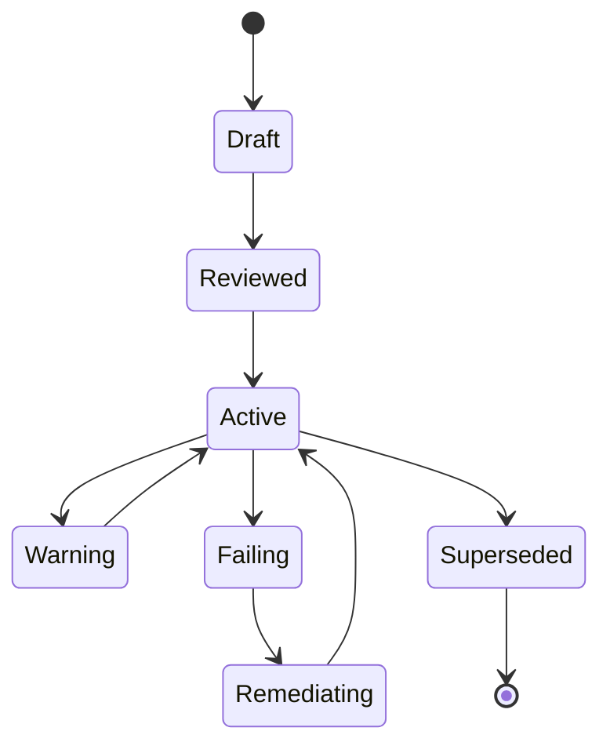

Rules are versioned products. A threshold change can alter trend without data change; show rule version and avoid connecting incompatible quality series silently.

### Plain-English deep-dive 3 - Thresholds are decisions, not laws of nature

A 95% completeness threshold may sound objective, but it reflects cost and risk. Five missing lunch-menu descriptions may be tolerable; five missing owners for critical payment servers may not be.

Set thresholds by use, tier, consequence, source capability, and remediation path. Document who approved them, what happens at warning/failure, and when they are reviewed. Never copy a generic percentage into production because it looks professional.

## Quality SLIs, SLOs, and SLAs

| Term | Data-quality example | Governance |
|---|---|---|
| SLI | Percentage of scheduled accepted snapshots published within 60 minutes | Measured definition |
| SLO | Target at least 99% over rolling 30 days | Internal reliability objective |
| SLA | Contracted commitment with defined exclusions/consequences | Formal agreement |
| Acceptance threshold | One run must have all critical source files | Per-run gate |
| Error budget | Allowed miss proportion under SLO | Guides reliability/change tradeoff |

Do not average away critical failures. A monthly SLO can be met while today's critical snapshot is unusable. Operational gates and longer-window objectives coexist.

## Exceptions and quarantine

| Exception type | Example | Handling |
|---|---|---|
| Data exception | Record fails owner rule | Quarantine/route to steward |
| Source exception | Approved maintenance causes delay | Time-bound planned state |
| Business exception | Asset legitimately has no person owner | Approved alternative owner/category |
| Technical waiver | Parser temporarily accepts deprecated enum | Expiry/migration plan |
| Risk acceptance | Consumer proceeds with known gap | Decision owner, scope, expiry, residual risk |
| False-positive rule | Rule not applicable to subtype | Fix applicability, not endless suppression |

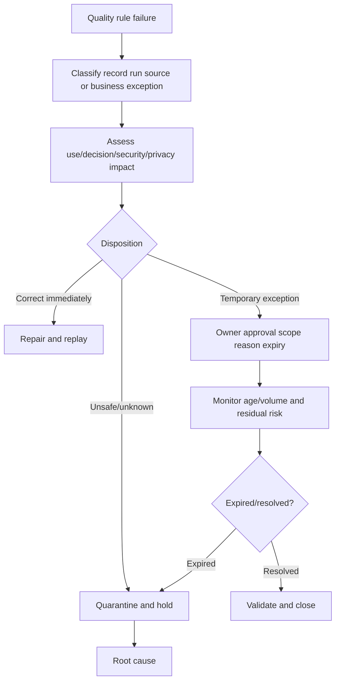

Never modify raw evidence to make a rule pass. Correct at the authoritative source or apply a documented, versioned transformation while preserving raw/provenance.

## Quality observability

| Dashboard layer | Metrics |
|---|---|
| Source health | Expected/received runs/files/pages, watermark, auth status |
| Volume | Rows/bytes/distinct keys by source/window |
| Profile | Null/blank/pattern/enum/range/distribution |
| Integrity | Duplicates, conflicts, orphans, cardinality, transitions |
| Reconciliation | Source-to-raw-to-curated-to-published dispositions |
| Exceptions | Count/rate/age/reason/owner/expiry |
| Rules | Pass/warn/fail by version and criticality |
| Consumers | Published version, refresh, blocked/limited uses |
| Reliability | Quality SLO attainment/error budget/incidents |

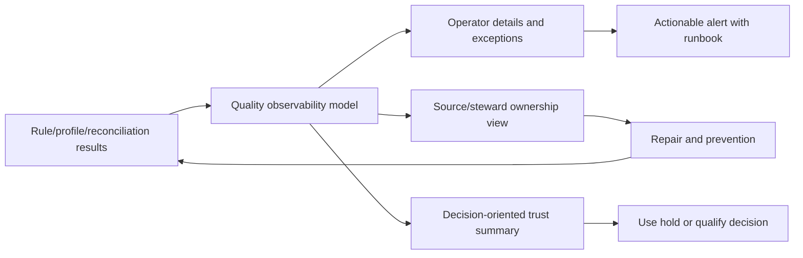

Alert on symptoms with action: "critical asset population completeness fell to 92%, source watermark is stale, report held, owner X" rather than "quality score red."

## Root-cause analysis

Quality symptoms can originate upstream or downstream.

| Symptom | Candidate causes | Discriminating check |
|---|---|---|
| Null spike | Source stopped field, parser rename, mapping bug, scope mix | Raw payload and schema/config version |
| Duplicate spike | Retry storm, cursor reset, source duplicate, join fanout | Delivery IDs/payloads/stage counts |
| Orphan spike | Parent late, wrong tenant/key, filter, deletion | Parent source/run/effective time |
| Stale dashboard | Source delay, connector, transform, publish, BI refresh | Watermark at every handoff |
| Count mismatch | Partial page/file, filter, quarantine, dedup, late data | Disposition ledger |
| Distribution shift | Real business change, unit/enum/schema change | Change calendar and raw values |
| Accuracy complaint | Wrong authority, stale reference, identity merge, source defect | Field-level provenance/adjudication |
| Score trend break | Rule/model/source/population version change | Version/decomposition |

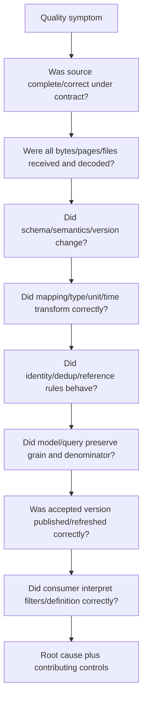

Root cause is not "bad data" or "human error." Name the failed mechanism and control: for example, "source added enum `retired_pending`; closed mapping defaulted unknown values to active because consumer contract tests lacked unknown-enum case."

## Ownership and operating model

| Role | Accountability |
|---|---|
| Data producer/source owner | Source semantics, availability, change notice, correction |
| Connector/integration owner | Auth, scope, extraction, delivery, state, monitoring |
| Platform/data engineering | Landing, transformation, lineage, reliability, recovery |
| Data steward | Definitions, authority, rules, exceptions, quality roadmap |
| Security/domain owner | Risk meaning, applicability, control/finding interpretation |
| Consumer/report owner | Metric/use definition, acceptance need, user communication |
| Decision owner | Accept/hold/act under uncertainty |
| Privacy/security governance | Access, purpose, retention, risk/control review |

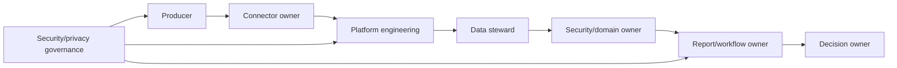

Use a RACI for each quality rule and incident. "Data team owns quality" is too broad; producers own source semantics, consumers own fitness requirements, and decision owners own risk acceptance.

## Acceptance gates

| Gate state | Meaning | Allowed behavior |
|---|---|---|
| Pass | All critical rules and accepted warning policy met | Publish/use normally with metadata |
| Pass with warning | Noncritical bounded defect, approved use | Publish only named uses with warning |
| Partial quarantine | Bad records isolated; remaining completeness still acceptable | Publish if contract explicitly permits |
| Hold | Material completeness/freshness/integrity uncertain | Keep prior accepted version; notify |
| Fail | Security/privacy/critical identity/action risk | Block publish/action and incident response |

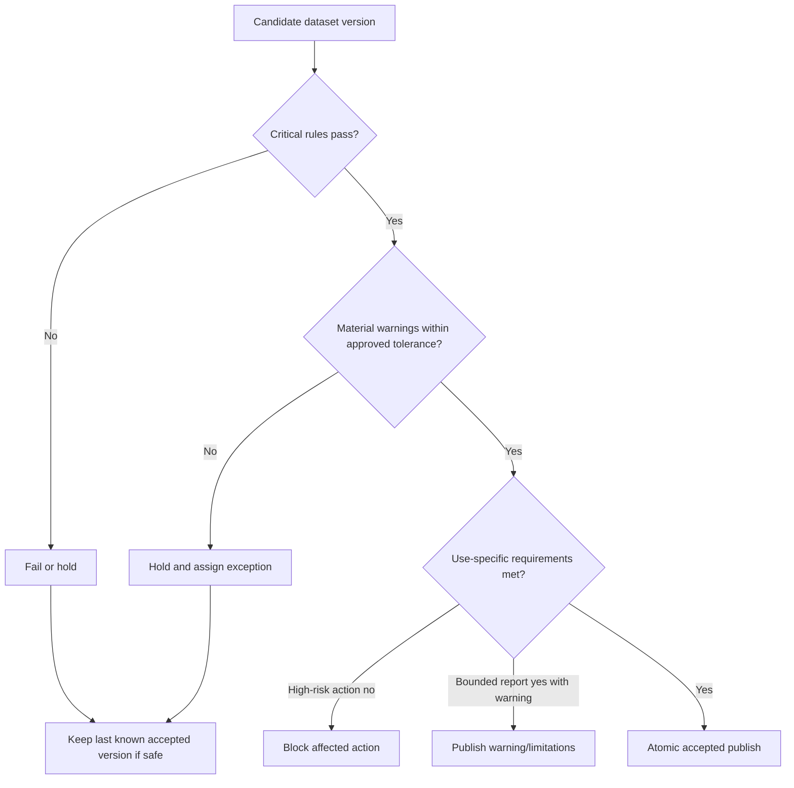

Fail-open versus fail-closed is use-specific. Continuing a low-risk exploratory report with warning differs from executing a high-impact control action on uncertain identity. Document behavior before incidents.

### Plain-English deep-dive 4 - Keeping the old dashboard can also mislead

Holding a bad new snapshot and showing yesterday's accepted view may be safer than publishing partial data, but only if users see that it is stale. An unlabeled old dashboard looks current.

When a gate fails, display the last accepted as-of, failed-current status, affected sources/uses, owner, and next update. Trust comes from visible limitations, not a permanently green screen.

## Trust reporting

| Trust-report field | Example content |
|---|---|
| Dataset/use | NMH lab executive exposure trend |
| Accepted version/as-of | `2026-08-24-v3`, 00:00 UTC |
| Population/grain | Active managed assets, one row per asset snapshot |
| Source coverage | Required 5, accepted 4, one held |
| Freshness | Complete watermark by source |
| Completeness | Entity/field/relationship rates with counts |
| Validity/integrity | Critical rule results, duplicates/orphans |
| Reconciliation | Received-to-published disposition totals |
| Exceptions | Count, severity, owner, age, expiry |
| Unknowns | Unmatched identity/owner/invalid rows |
| Version/change | Schema/mapping/rule/model changes |
| Restatement | Affected historical periods/reason |
| Fitness statement | Allowed and blocked decisions |
| Next action | Owner, due time, validation plan |

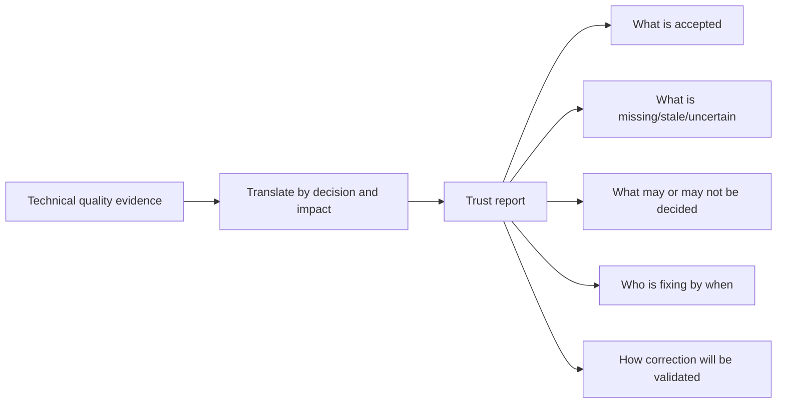

Avoid a standalone green/yellow/red score. Include counts and definitions so a customer can challenge and reproduce the conclusion.

## Data-quality troubleshooting runbook

1. Capture the decision/use, symptom, expected result, impact, affected period/entities, and last known good version.
2. Freeze source/extraction/run/publish/schema/parser/mapping/rule/model/query versions and as-of.
3. State target population, independent denominator, grain, clocks, and source authority by field.
4. Confirm input acceptance: expected files/pages/runs, bytes, hashes, control totals, and complete watermark.
5. Profile rows, non-null/null/blank/placeholders, distinct keys, duplicates, ranges, patterns, enums, and distributions by source/scope/version.
6. Compare raw versus parsed versus valid versus deduplicated versus curated versus published counts.
7. Require mutually exclusive disposition reasons and reconcile conservation equations.
8. Test key uniqueness, tenant scope, foreign references, cardinality, effective intervals, and state transitions.
9. Separate validity from accuracy; choose an authoritative reference/verification protocol.
10. For sampled accuracy, review frame, selection, strata, reviewer process, unknowns, and uncertainty.
11. Trace freshness and latency through source observation, receive, accept, publish, and consumer refresh.
12. Check one recent record is not masking incomplete/stale distribution.
13. For duplicates, distinguish retry, correction, alias, legitimate repetition, and join fanout.
14. For missing data, distinguish absent source truth, source scope, failed collection, quarantine, mapping, identity, late arrival, and consumer filter.
15. For distribution drift, check business/change calendar, unit/enum/schema/source/population changes.
16. Validate rule scope, expression, threshold, severity, owner, version, effective date, and response.
17. Check exception approval, scope, age, expiry, residual risk, and whether it hides systemic debt.
18. Determine pass/warn/hold/fail by the named use; block high-risk actions when identity/integrity is uncertain.
19. Locate first bad stage using provenance and lineage; identify failed mechanism/control and contributing factors.
20. Repair source/contract/ingestion/mapping/identity/model/consumer at the owning layer.
21. Replay/backfill into isolated version, reconcile, sample/known-answer test, approve, and atomically publish.
22. Communicate trust state, blocked/allowed decisions, restatement, owner, ETA discipline, validation, and prevention.

## Exercises with answers

### Exercise 1 - Fitness for use

**Task:** Dataset is 97% complete. Is it acceptable?

**Answer:** Not enough information. Identify missing units/fields, use, criticality, denominator, source/identity quality, concentration, threshold, and consequence. Three percent missing critical identities can block automated action while being acceptable for exploration with warning.

### Exercise 2 - Accuracy versus validity

**Task:** Owner ID matches expected pattern.

**Answer:** It is pattern-valid, not proven accurate. Compare to authoritative effective owner or verification protocol with provenance/time.

### Exercise 3 - Completeness denominator

**Task:** Scanner reports 100% of scanner-known assets.

**Answer:** Circular denominator. Compare qualifying scanner evidence to an independent eligible asset population and expose unmatched/unknown identities.

### Exercise 4 - Freshness

**Task:** `MAX(event_at)` is current, so feed is fresh.

**Answer:** One row can be current in a partial load or future-dated. Use latest complete source watermark, expected intervals/files/pages, volume/control totals, and observation-age distribution.

### Exercise 5 - Duplicate

**Task:** Same event ID appears three times.

**Answer:** Group by source/tenant key, compare payload hash/version/times. Same payload suggests retries; ordered changes suggest corrections; conflicts require quarantine/adjudication. Audit deliveries and one logical effect.

### Exercise 6 - Orphans

**Task:** Findings have no matching asset.

**Answer:** Keep/report them; test parent lateness, tenant/key mapping, source scope, deletion, and entity-resolution defects. Apply time-bound late-parent policy or quarantine. Do not inner-join them away.

### Exercise 7 - Reconciliation

**Task:** Source and target both contain 10,000 rows.

**Answer:** Equal row count is insufficient: one missing and one duplicate can cancel. Compare scoped distinct keys, group counts, times, control totals, record digests/samples, and disposition ledger.

### Exercise 8 - Sampling

**Task:** Review highest-risk 100 records and claim 98% accuracy.

**Answer:** The targeted sample estimates quality only for that selected group, not the full population. Use representative/stratified probability design for population estimate and keep risk-based review as a separate prevention control.

### Exercise 9 - Threshold

**Task:** Copy a 99% threshold from another customer.

**Answer:** Do not. Derive from NMH use, tier, consequence, source capability, baseline, remediation path, and approved risk tolerance. Version and review it.

### Exercise 10 - Quality SLO

**Task:** Monthly SLO passes but today's critical feed is incomplete.

**Answer:** The run-level critical acceptance gate still holds today's publication/action. SLO aggregates reliability over time; it does not waive current critical failure.

### Exercise 11 - Root cause

**Task:** Null owner rate spikes after release.

**Answer:** Compare raw/source, schema version, renamed fields, mapping/config, population mix, and rule version. Locate first stage where values disappear; identify failed change/contract test, repair/backfill, and add regression prevention.

### Exercise 12 - Trust report

**Task:** Dashboard shows yesterday after current load failed.

**Answer:** Keep last accepted version only with visible stale/failure state, accepted as-of, affected source/use, owner, next update, and blocked decisions. An unlabeled old view is misleading.

## Labs and rehearsal

### Lab 1 - Fitness matrix

Define quality gates for exploration, weekly trend, executive reporting, ticket creation, and high-impact control action.

### Lab 2 - Dimension clinic

Create one record that is valid but inaccurate, accurate but stale, complete but inconsistent, unique but orphaned, and current but partial.

### Lab 3 - Profiling pack

Build null/blank/placeholder, distinct/duplicate, min/max/quantile, pattern/enum, length, cross-field, and distribution profiles by source/version.

### Lab 4 - Completeness

Compare circular source denominator with independent asset population; include unmatched, invalid, and unknown categories.

### Lab 5 - Freshness chain

Inject source delay, transfer delay, processing backlog, publication failure, and BI refresh lag. Identify each with clocks/watermarks.

### Lab 6 - Duplicate taxonomy

Create retry, correction, conflicting duplicate, entity alias, legitimate repeat, snapshot repetition, and join fanout.

### Lab 7 - Integrity

Test primary duplicates, tenant-crossing references, orphans, overlapping owners, invalid intervals, and impossible state transitions.

### Lab 8 - Reconciliation ledger

Balance source to received, parsed, valid, duplicate/conflict, quarantined, mapped, curated, published, and consumer-visible rows.

### Lab 9 - Control totals/checksums

Demonstrate equal counts with offsetting loss/duplicate, file hash mismatch, canonical-record hash requirements, and signed manifest context.

### Lab 10 - Sampling

Compare random, stratified, risk-based, and exception-focused reviews; report what each can infer.

### Lab 11 - Rule catalog

Write ten rules with scope, dimension, expression, threshold, severity, owner, version, response, evidence, and review date.

### Lab 12 - Exceptions/quarantine

Age exceptions by reason/owner/expiry, expire one waiver, repair records, replay, validate, and close without changing raw evidence.

### Lab 13 - Quality observability

Build operator, steward, and executive Power BI views with counts, denominators, source health, rule versions, and blocked uses.

### Lab 14 - Root-cause game

Seed null spike, duplicate spike, orphan spike, stale source, unit change, and dashboard filter defect. Find first bad stage.

### Lab 15 - Acceptance gate

Test pass, warning, partial quarantine, hold, and fail behavior for low- and high-risk uses; verify last-good labeling.

### Lab 16 - TSM trust briefing

Explain a data-quality incident: impact, accepted/failed versions, evidence, allowed/blocked decisions, repair, restatement, validation, and prevention.

| Lab evidence | Completion standard |
|---|---|
| Use | Decision/grain/population/risk explicit |
| Dimensions | Accuracy/completeness/consistency/timeliness/validity/uniqueness/integrity |
| Profiling | Null/distinct/range/pattern/distribution by scope |
| Reconciliation | Conservation and every disposition explained |
| Freshness | Complete watermark and latency chain |
| Governance | Rule/threshold/owner/version/exception |
| Gate | Pass/warn/hold/fail behavior proven |
| Trust | Limitations and blocked uses visible |
| Honesty | Synthetic NMH and bounded product context |

## Common misconceptions to correct

| Misconception | Correct model |
|---|---|
| Data quality means perfection | It means fitness for a named use with evidence |
| One quality score is enough | Critical dimensions/rules cannot be averaged away |
| Valid means accurate | Conformance is not truth |
| Complete fields mean complete population | Field and population completeness differ |
| Source itself can define coverage denominator | Blind spots disappear in circular denominator |
| Null is the only missing value | Blank/placeholders/invalid/unmatched may be unusable |
| Consistent sources are accurate | They can share the same error |
| Latest row proves freshness | Complete watermark/coverage and latency chain matter |
| Fresh means accurate | A current wrong value remains wrong |
| Range check validates risk score | It only checks range, not model/calibration |
| DISTINCT fixes duplicate quality | It can hide conflicts and fanout |
| Same ID always means duplicate | Scope/version/entity/event grain matter |
| Orphans can be dropped | They are quality evidence and may affect risk |
| Profiling proves cause | It reveals patterns requiring investigation |
| Equal row counts reconcile data | Loss and duplication can cancel |
| Checksum proves semantic correctness | It proves compared representation integrity under assumptions |
| Hashing concatenated fields is trivial | Canonicalization, delimiters, types, nulls, versions matter |
| Risk-based sample estimates overall accuracy | It describes a selected high-risk subset |
| Thresholds are universal best practices | They encode use-specific risk/tolerance |
| SLO pass means current data is usable | Per-run critical gate can still fail |
| Quarantine solves the source defect | It contains impact; owner/root cause/replay remain |
| Exceptions can remain indefinitely | They need scope, owner, expiry, residual risk |
| Root cause is bad data | Name failed mechanism/control and prevention |
| Data engineering owns all quality | Producers, stewards, domains, consumers, decisions share roles |
| Keeping last-good dashboard is always safe | It must be visibly stale and decision-limited |
| Public Data Fabric wording proves internal quality algorithms | It provides capability context only |

## Official Source Anchors

Sources in this section were reviewed on **2026-08-24**.

NIST sources frame measurement, controls, risk, and monitoring. PostgreSQL documentation establishes database constraint/statistical behavior for its current version. Data-quality tools document their own test approaches. Zscaler public material supports only the high-level Data Fabric capability statements cited here.

| Source | URL | Used for | Boundary |
|---|---|---|---|
| NIST SP 800-55 Vol. 1 | https://csrc.nist.gov/pubs/sp/800/55/v1/final | Information-security measurement program concepts | Not a data-quality rule catalog |
| NIST SP 800-55 Vol. 2 | https://csrc.nist.gov/pubs/sp/800/55/v2/final | Developing measures, data collection/analysis/reporting context | Current applicability should be checked |
| NIST SP 800-137 | https://csrc.nist.gov/pubs/sp/800/137/final | Continuous monitoring strategy/context | Not pipeline-quality implementation |
| NIST SP 800-53 Rev. 5 | https://csrc.nist.gov/pubs/sp/800/53/r5/upd1/final | Data/system integrity, audit, access, contingency, privacy control context | Controls require tailoring/implementation |
| NIST Cybersecurity Framework 2.0 | https://www.nist.gov/cyberframework | Govern/identify/protect/detect/respond/recover context | Not metric formulas |
| NISTIR 8286A Rev. 1 | https://csrc.nist.gov/pubs/ir/8286/a/r1/final | Risk identification/register context | Does not define data-quality thresholds |
| PostgreSQL Constraints | https://www.postgresql.org/docs/current/ddl-constraints.html | CHECK, not-null, unique, primary/foreign key concepts | Database constraints do not prove real-world accuracy |
| PostgreSQL Aggregate Functions | https://www.postgresql.org/docs/current/functions-aggregate.html | Count, distinct-related aggregation, percentiles, statistics | Version/null/order semantics apply |
| PostgreSQL Statistics Collector | https://www.postgresql.org/docs/current/monitoring-stats.html | Database observability/statistics context | Not business data-quality validation |
| Great Expectations Documentation | https://docs.greatexpectations.io/ | Expectation/validation/checkpoint/data-doc concepts | Tool-specific; tests require governed rules |
| dbt Data Tests | https://docs.getdbt.com/docs/build/data-tests | Reusable SQL assertions for models/sources | Tool-specific and not accuracy proof |
| dbt Source Freshness | https://docs.getdbt.com/docs/build/sources#source-data-freshness | Source freshness configuration concepts | Tool-specific; complete watermark still needs contract |
| Google Cloud Data Quality Overview | https://cloud.google.com/dataplex/docs/auto-data-quality-overview | Rule-based quality scan/reporting concepts | Service-specific implementation |
| CISA Cybersecurity Performance Goals | https://www.cisa.gov/cybersecurity-performance-goals | Outcome/control context | Voluntary guidance, not data thresholds |
| Zscaler Data Fabric for Security | https://www.zscaler.com/products-and-solutions/data-fabric | Public harmonize/deduplicate/correlate/enrich and accurate/contextualized/complete-view positioning | No internal rules, scoring, accuracy, thresholds, or guarantees claim |

## Likely Interview Questions

### Q1. What does data quality mean, and what are its main dimensions?

**Model answer:** Data quality is fitness for a named use, population, grain, and decision risk. I evaluate accuracy against a reference, completeness against independent eligibility, consistency across equivalent facts/times, timeliness/freshness against decision deadlines, validity against schema/domain/business rules, uniqueness at declared key/grain, and integrity across relationships/state. I do not average away a failed critical dimension.

### Q2. How do you profile security data?

**Model answer:** I freeze source/scope/extraction/schema versions, then profile rows/bytes, null/blank/placeholders, distinct keys, duplicates/conflicts, min/max, quantiles/distributions, patterns/enums, lengths, timestamps, and cross-field rules by source/tenant/type/time. I compare accepted baselines and changes, preserve raw/provenance, and treat shifts as investigation signals rather than automatic defects.

### Q3. How do you measure completeness, freshness, and accuracy without misleading people?

**Model answer:** Completeness uses an independent eligible denominator and distinguishes population, field, event, relationship, interval, and source coverage. Freshness uses the latest complete watermark plus source-to-receive-to-accept-to-publish latency, not one max timestamp. Accuracy requires authoritative reference/verification, effective time, sample design/reviewer protocol, unknowns, and uncertainty; validity alone is not accuracy.

### Q4. How do you detect duplicates and integrity defects?

**Model answer:** I declare tenant-scoped grain/key, group deliveries, compare payloads/versions/times, and distinguish retries, corrections, conflicts, aliases, legitimate repeats, snapshots, and join fanout. For integrity I test primary uniqueness, foreign references, cardinality, temporal intervals, state transitions, scope, and category conservation. I retain orphans/conflicts in quality reporting instead of hiding them with inner joins or DISTINCT.

### Q5. How do you reconcile source and target data?

**Model answer:** I freeze comparable versions/windows and reconcile each stage: expected transfer, received, parsed, valid, duplicate/conflict, quarantined/rejected, mapped, curated, published, and consumer-visible. Every row gets one governed disposition so conservation balances. I combine file/record/distinct/group counts, times, control totals, hashes, known records, and representative sampling because equal total counts alone can hide offsetting loss and duplication.

### Q6. How do quality rules, thresholds, SLOs, exceptions, and gates work together?

**Model answer:** A versioned rule has purpose, dimension, population/grain, expression, threshold, severity, owner, effective date, response, and evidence. Thresholds come from use/consequence and source capability, not generic percentages. SLIs measure and SLOs target longer-window reliability; per-run acceptance gates pass, warn, quarantine, hold, or fail current data. Exceptions need approval, scope, reason, expiry, residual risk, monitoring, and closure proof.

### Q7. How do you perform RCA and report trust during a data-quality incident?

**Model answer:** I freeze versions and trace the first bad stage across source, transfer, parse, schema, mapping, identity, model/query, publish, and consumer. I quantify affected periods/entities/decisions and identify the failed mechanism/control, not "bad data." I hold unsafe uses, show last accepted state as stale, repair/replay into an isolated version, reconcile/validate, then report accepted evidence, gaps, blocked/allowed decisions, owner, restatement, and prevention.

### Q8. How does your background transfer, and what can you claim about Zscaler Data Fabric quality?

**Model answer:** My SQL, Power BI, statistics, case-quality analysis, critical-incident RCA, and customer communication transfer directly to profiling, reconciliation, gates, and trust reporting. I practiced these on synthetic NMH data. Public Zscaler material describes harmonizing, deduplicating, correlating, enriching, and accurate/contextualized/complete views, but I do not claim internal rules, algorithms, thresholds, schemas, or production results; I would validate current tenant/docs and specialists.

## 30-Second Memory Hooks

| Concept | Memory hook |
|---|---|
| Quality | Fit for which use? |
| Accuracy | True against what reference? |
| Completeness | Present out of independently expected |
| Consistency | Equivalent stories agree |
| Timeliness | Ready by decision time |
| Freshness | Age of complete truth |
| Validity | Fits schema/domain/rule |
| Uniqueness | One logical key at grain |
| Integrity | Relationships and states hold |
| Profile | Data vital signs |
| Null rate | Unknown over eligible rows |
| Distribution | Shape and drift |
| Orphan | Child without valid parent |
| Reconciliation | Every row gets a disposition |
| Count | Necessary, not sufficient |
| Checksum | Representation integrity, not truth |
| Sample | Design determines inference |
| Threshold | Risk decision, not natural law |
| SLI/SLO/SLA | Measure, target, promise |
| Exception | Scoped, owned, expiring deviation |
| Quarantine | Protect accepted data, then repair |
| Gate | Pass, warn, hold, fail by use |
| RCA | First bad stage and failed control |
| Trust report | Evidence, limitations, allowed decisions |
| Last good | Label it stale |
| Experience bridge | Quality/RCA skills transfer; product internals do not |

## Completion Checklist

- [ ] I define data quality as fitness for a named use.
- [ ] I state population, grain, clocks, decision, consequence, and tolerance.
- [ ] I avoid relying on one composite quality score.
- [ ] I can distinguish accuracy, completeness, consistency, timeliness, validity, uniqueness, and integrity.
- [ ] I know a value can be valid but inaccurate, accurate but stale, or complete but inconsistent.
- [ ] I choose an authoritative reference/protocol by field and effective time.
- [ ] I report accuracy sample frame, selection, reviewer protocol, unknowns, and uncertainty.
- [ ] I distinguish population, field, event, time, relationship, and source completeness.
- [ ] I use an independent eligible denominator for coverage.
- [ ] I treat blank/placeholders/invalid/unmatched values separately from meaningful completeness.
- [ ] I align cross-source consistency by semantics, scope, authority, and time.
- [ ] I distinguish source staleness, ingestion, processing, publication, and end-to-end latency.
- [ ] I use latest complete watermark plus completeness, not one max timestamp.
- [ ] I test syntax, type, domain, range, pattern, cross-field, temporal, and business validity.
- [ ] I do not infer real-world truth from format/range checks.
- [ ] I declare tenant-scoped grain/key before uniqueness checks.
- [ ] I distinguish retry, correction, conflict, alias, legitimate repeat, snapshot, and fanout.
- [ ] I never use DISTINCT to hide an unexplained duplicate defect.
- [ ] I test primary uniqueness, foreign references, cardinality, effective intervals, state transitions, and scope integrity.
- [ ] I retain/report orphans and apply explicit late-parent policy.
- [ ] I profile rows, nulls, blanks, placeholders, distincts, duplicates, ranges, patterns, enums, lengths, distributions, and times.
- [ ] I segment profiles by source, tenant, type, extraction, schema version, and period.
- [ ] I interpret distribution drift with business/change context.
- [ ] I reconcile source, received, parsed, valid, duplicate/conflict, quarantine, mapped, curated, published, and consumer rows.
- [ ] I use mutually exclusive dispositions and conservation checks.
- [ ] I combine row/distinct/group counts, times, control totals, hashes, known records, and sampling.
- [ ] I know equal counts can hide offsetting loss and duplication.
- [ ] I canonicalize record digests with structured versioned rules rather than ambiguous string concatenation.
- [ ] I understand file hashes prove representation comparison, not semantic correctness.
- [ ] I choose random, stratified, risk-based, exception, canary, or dual review according to purpose.
- [ ] I do not generalize a targeted high-risk sample to the full population.
- [ ] I define rule ID, purpose, dimension, scope, expression, threshold, severity, owner, version, response, evidence, and review.
- [ ] I derive thresholds from use/consequence/capability/baseline/tolerance, not generic values.
- [ ] I distinguish per-run acceptance gates from longer-window quality SLOs and formal SLAs.
- [ ] I never let monthly SLO success waive a current critical failure.
- [ ] I operate exceptions with approval, scope, reason, expiry, residual risk, monitoring, and closure proof.
- [ ] I protect quarantine data and preserve raw evidence/provenance.
- [ ] I alert with affected use, evidence, owner, and runbook, not only color/score.
- [ ] I trace quality defects through source, ingestion, contract, mapping, identity, model, publish, and consumer.
- [ ] I name failed mechanism/control and contributing factors in RCA.
- [ ] I assign producer, connector, platform, steward, domain, consumer, decision, and governance roles.
- [ ] I use pass, warning, partial quarantine, hold, and fail states by use criticality.
- [ ] I predefine fail-open/fail-closed behavior for reports and actions.
- [ ] I label last accepted data with its as-of and failed-current state.
- [ ] I produce trust reports with population, version, coverage, freshness, dimensions, reconciliation, exceptions, unknowns, changes, fitness, and action.
- [ ] I can run the full data-quality troubleshooting method.
- [ ] I can complete every synthetic NMH lab and explain its acceptance behavior.
- [ ] I separate general data-quality principles, tool behavior, synthetic evidence, and public Zscaler context.
- [ ] I make no unsupported Zscaler quality algorithm, threshold, guarantee, or production claim.
- [ ] I can answer Q1 through Q8 with mechanics, evidence, failures, ownership, and honest boundaries.

[Part 53 - Entity Resolution, Deduplication, Identity Matching, and Golden Records](Part-53-entity-resolution-golden-records.md)