# Part 53 - Entity Resolution, Deduplication, Identity Matching, and Golden Records

> **Audience:** Arti Thakur, preparing for a Zscaler Security Operations Technical Success Manager role after Microsoft enterprise Support Escalation Engineering.
>
> **Purpose:** Build a rigorous, beginner-first method for deciding when records refer to the same real-world entity, generating candidate pairs, comparing identifiers and aliases, scoring evidence, selecting thresholds, controlling false merges and false splits, constructing golden records, preserving confidence and provenance, handling temporal identity, supporting merge/unmerge, and routing uncertain cases to human review.
>
> **Scope and honesty:** Northstar Meridian Holdings, abbreviated NMH, is fictional. Every person, asset, source, identifier, record, match rule, score, threshold, review, metric, incident, query result, and outcome in this Part is synthetic. General entity-resolution and PostgreSQL examples are not Zscaler Data Fabric schemas, algorithms, thresholds, model features, matching behavior, guarantees, or production recommendations. Official Zscaler material is used only for bounded public context: Zscaler publicly describes Data Fabric as harmonizing, deduplicating, correlating, and enriching security data. Arti's SQL, data-quality, incident, RCA, Microsoft support, and customer communication skills transfer; direct production operation of Zscaler Data Fabric entity resolution remains a learning boundary.
>
> **Currency caveat:** Identity sources, matching methods, privacy requirements, product interfaces, database behavior, and public documentation change. The controlled research/source date for this Part is exactly **2026-08-24**. Current approved contracts, tenant evidence, legal/privacy advice, customer risk tolerance, observed populations, and product/source specialists govern production.

## Section goal

Entity resolution asks a deceptively simple question: do two or more records describe the same real-world thing? A record is one source's statement; an entity is the person, device, application, account, organization, or other thing those statements may describe. Confusing the two can duplicate risk, hide exposure, assign work to the wrong owner, or join an attacker event to an innocent user.

Think of a coat-check desk. Several tickets, names, and descriptions may point to one coat, but similar black coats can belong to different people. The clerk must use strong identifiers, supporting clues, time, and an exception process. A neat-looking label is not enough. Entity resolution is that disciplined decision at data scale.

By the end, Arti should be able to:

| Outcome | Demonstrated capability | Evidence artifact |
|---|---|---|
| Separate entity and record | Explain why source rows are observations, not automatically unique things | Entity contract |
| Define identity scope | State entity type, tenant, population, time, grain, and decision consequence | Resolution charter |
| Prepare identifiers | Normalize keys and aliases without erasing meaningful differences | Normalization specification |
| Generate candidates | Use blocking to avoid all-pairs comparison while measuring missed matches | Candidate report |
| Compare evidence | Select exact, fuzzy, phonetic, numeric, temporal, and relationship features | Feature catalog |
| Score pairs | Combine evidence with interpretable deterministic or probabilistic logic | Match scorecard |
| Set actions | Calibrate merge, review, and reject thresholds against labeled outcomes | Threshold policy |
| Control errors | Distinguish and quantify false merges and false splits by impact | Error matrix |
| Form clusters | Turn pair decisions into entity groups without unsafe transitive merging | Cluster audit |
| Build golden records | Apply field-level survivorship and source precedence | Golden record view |
| Preserve evidence | Retain values, confidence, lineage, reason codes, and rule versions | Provenance ledger |
| Model time | Handle rename, reassignment, reuse, retirement, and late evidence | Temporal identity timeline |
| Reverse mistakes | Merge and unmerge through reversible, audited operations | Merge event log |
| Use human review | Present bounded evidence and record reviewer decisions | Review queue |
| Measure quality | Evaluate pair, entity, business, review, and drift metrics | Resolution dashboard |
| Protect privacy | Minimize attributes and secure sensitive linkage data | Privacy and access review |
| Troubleshoot safely | Find the first faulty stage and contain affected decisions | Resolution runbook |
| Bridge experience | Translate support correlation and RCA into honest TSM language | Interview narrative |

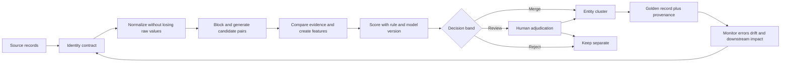

## JD Mapping

| Role expectation | Part 53 capability | TSM artifact | Arti bridge and boundary |
|---|---|---|---|
| Analyze complex customer data | Reconcile conflicting multi-source identities | Entity-resolution assessment | Cross-log correlation transfers; product internals unclaimed |
| Identify security risk | Expose duplicate, fragmented, or wrongly merged assets and users | Identity-risk register | RCA discipline transfers |
| Develop Data Fabric expertise | Explain public deduplication context using general mechanics | Conceptual resolution map | No claim about Zscaler rules or models |
| Resolve escalations | Trace a false merge/split to source, normalization, blocking, score, or cluster | Evidence pack | Support escalation method transfers |
| Recommend mitigation | Propose threshold, rule, review, rollback, and governance changes | Remediation plan | Customer risk owner approves production behavior |
| Communicate confidence | Separate observed facts, inferred links, confidence, and unknowns | Trust statement | Executive communication transfers |
| Drive adoption | Define stewardship, review queues, quality metrics, and feedback loops | Operating model | Organization-specific roles must be validated |
| Protect customers | Treat linkage as sensitive processing and preserve redress/unmerge | Privacy/control checklist | Legal conclusions remain outside candidate claim |

## Candidate honesty note

| Evidence class | Safe interview statement | Boundary to state |
|---|---|---|
| Production transfer | "I correlated users, devices, requests, logs, and time windows during Microsoft support escalations." | Not the same as operating a production master-data platform |
| Synthetic practice | "I designed and tested deterministic, fuzzy, review, golden-record, and unmerge flows for fictional NMH data." | Lab evidence, not customer results |
| General knowledge | "Entity resolution uses identifiers, candidate generation, comparison, decisions, clustering, and survivorship." | Implementations differ by population and risk |
| Database example | "PostgreSQL offers documented trigram and fuzzy string functions that can support experiments." | Functions do not create a production matching policy |
| NIST context | "NIST SP 800-63A defines identity resolution for distinguishing a unique individual in a served population." | Human identity proofing is narrower than general security entity resolution |
| Product context | "Zscaler publicly positions Data Fabric around harmonizing, deduplicating, correlating, and enriching data." | No internal schema, score, threshold, or algorithm claim |
| Uncertainty | "This pair is a candidate at score 0.81 under rule version 7." | A score is not proof of sameness |
| Production next step | "I would validate current documentation, tenant evidence, labeled samples, privacy controls, and product specialists." | Never invent behavior to sound experienced |

## Beginner vocabulary and memory hooks

| Term | Plain meaning | Why it matters | Memory hook |
|---|---|---|---|
| Entity | A real-world thing of interest | Decisions should apply to the thing, not a source row | The person, not the form |
| Record | One stored observation or assertion | Several records may represent one entity | One witness statement |
| Entity resolution | Decide which records refer to the same entity | Creates a unified but uncertain identity view | Which rows are one thing? |
| Deduplication | Detect and handle repeated representations | Prevents double counting and duplicate action | Remove repeated tickets carefully |
| Identity matching | Compare records using identity evidence | Turns attributes into a match decision | Compare the clues |
| Identifier | Value intended to distinguish an entity in a scope | Strong scoped IDs reduce ambiguity | Luggage tag in one airport |
| Natural key | Meaningful source/business identifier | Can change, collide, or be reused | Useful label, not eternal truth |
| Surrogate key | System-generated meaningless ID | Stabilizes internal references | Warehouse shelf number |
| Composite key | Multiple fields used together | Combined context may be unique | Street plus city plus country |
| Alias | Alternate identifier or name for one entity | Sources often use different labels | Nickname list |
| Normalization | Standardize representation for comparison | Reduces superficial differences | Fold maps before comparing routes |
| Deterministic match | Explicit rule produces a decision | Explainable and precise when keys are strong | Same passport plus scope |
| Probabilistic match | Evidence estimates likelihood/odds of sameness | Handles uncertainty and conflicting clues | Weighted detective case |
| Fuzzy match | Compare approximate rather than exact values | Catches spelling and formatting variation | Close spelling, not equal text |
| Blocking | Restrict records considered as candidate pairs | Makes matching tractable | Search one filing cabinet first |
| Candidate pair | Two records worth comparing | Candidate does not mean match | Suspect for examination |
| Feature | Measured comparison signal | Makes scoring reproducible | One clue on the scorecard |
| Threshold | Score boundary for an action | Encodes risk and workload tradeoff | Gate between lanes |
| False merge | Different entities incorrectly combined | Can misattribute risk or access | Two people share one file |
| False split | Same entity incorrectly kept separate | Hides total exposure and duplicates work | One person has two files |
| Cluster | Group of records believed to represent one entity | Pair decisions must become coherent groups | Folder of related statements |
| Golden record | Curated entity view assembled from sources | Gives consumers a usable best-known view | Index card with cited facts |
| Survivorship | Rule deciding which value appears in golden view | Conflicts require field-level authority | Which witness supplies this fact? |
| Provenance | Origin and processing history of a value/decision | Enables trust, audit, and correction | Receipt for every fact |
| Confidence | Bounded strength of evidence under a method | Communicates uncertainty | How strong is this case? |
| Temporal identity | Identity and identifiers change over time | Reuse and reassignment can break joins | Same badge number, different year |
| Unmerge | Reverse a prior merge and repair dependencies | Matching errors must be correctable | Unstaple the files safely |
| Human review | Trained person adjudicates uncertain cases | High-impact ambiguity should not be hidden | Expert at the exception desk |

## Entity versus record

An entity is not a row. NMH may receive an endpoint row from mobile-device management, a scanner row, a cloud instance row, and a configuration-management row. Four rows could describe one laptop, four separate assets, or a changing asset across time. The answer depends on entity type, identifiers, scope, and effective time.

| Question | Record-level answer | Entity-level answer |
|---|---|---|
| What is counted? | Rows received | Distinct real-world things under a resolution policy |
| What is the key? | Source record ID | Governed entity ID plus source aliases |
| What is true? | What one source asserted | Best-known claims with provenance and conflict |
| What changes? | New row/update | Entity state, relationship, or identity history |
| What is deleted? | Source row may disappear | Entity may persist, retire, split, or lose evidence |
| What is confidence? | Usually source delivery confidence | Confidence in links and selected attributes |
| What is a duplicate? | Repeated row/payload | Multiple representations of one logical entity |

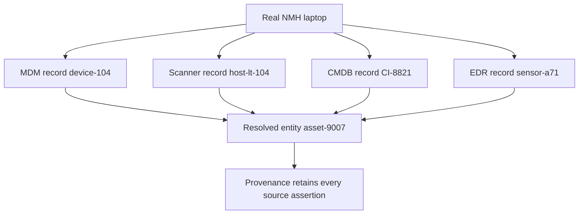

Before resolving, write an entity contract.

| Contract field | NMH synthetic example | Failure if omitted |
|---|---|---|
| Entity type | Managed endpoint | Server, account, and endpoint semantics mix |
| Tenant/scope | NMH production tenant | Same identifier across tenants collides |
| Population | In-scope corporate endpoints | Personal and lab devices merge into inventory |
| Grain | One physical endpoint over a lifecycle | Reimages become new assets unintentionally |
| Time model | Effective-time intervals | Reassigned serial/hostname joins old owner |
| Decision use | Risk backlog, not automatic isolation | Weak identity triggers unsafe action |
| Error preference | False merge cost exceeds false split cost | Threshold optimizes wrong consequence |
| Authoritative evidence | Serial plus manufacturer under policy | Friendly name treated as durable identity |
| Review path | Asset steward within two business days | Ambiguity accumulates invisibly |
| Reversal requirement | Every merge event reversible | Correction requires destructive rebuild |

### Plain-English deep-dive 1 - Identity is scoped, not universal

An identifier is like seat 12A. It identifies one seat only when the flight is known. `12A` alone is not globally unique. A hostname, employee number, email address, IP address, cloud resource name, or serial number also needs scope and time.

The statement "these IDs are equal" is incomplete. Ask: equal within which tenant, source namespace, entity type, issuing authority, and validity interval? An IP address can move between devices. An email alias can move after an employee leaves. A cloud resource name can be recreated. Resolution needs a scoped assertion, not a string superstition.

## Identity scope, keys, identifiers, and aliases

Strong matching begins by classifying identity evidence rather than placing every field into one similarity formula.

| Evidence type | Example | Typical strength | Important caveat |
|---|---|---|---|
| Issuer-scoped immutable ID | Cloud provider resource ID | High within documented scope | Resource recreation/version behavior matters |
| Source primary key | EDR agent ID | High for source record | Reinstall may generate new ID |
| Hardware identifier | Serial plus manufacturer | Often high | Duplicates, blanks, virtualization, replacement |
| Directory object ID | Tenant-scoped user object ID | High in tenant | Guest/member and deletion/recreation semantics |
| Government/regulated identifier | Used only where authorized | Potentially strong for people | Highly sensitive and context-limited |
| Network locator | IP/MAC | Supporting | Dynamic assignment, NAT, spoofing, reuse |
| Human-readable name | Hostname/display name | Supporting | Common, mutable, misspelled |
| Email/UPN | User principal or alias | Medium in scope | Rename, forwarding, recycling, case rules |
| Relationship evidence | Same managed device and owner | Supporting | Relationship can be stale or circular |
| Temporal overlap | Observed at compatible times | Supporting/contradicting | Clock and interval quality matter |
| Negative evidence | Different immutable IDs | Strong conflict | Confirm IDs and scopes are reliable |

Use a durable internal entity identifier that carries no business meaning. Keep every source identifier as an alias with namespace and validity.

| Alias field | Purpose |
|---|---|
| `entity_id` | Stable internal surrogate key |
| `entity_type` | Prevent cross-type collisions |
| `tenant_id` | Enforce tenant boundary |
| `source_system` | Identify issuer/namespace |
| `identifier_type` | State semantics such as serial or object ID |
| `identifier_value_raw` | Preserve received evidence |
| `identifier_value_normalized` | Support governed comparison |
| `valid_from` / `valid_to` | Model assignment interval |
| `confidence` | Bound strength of alias linkage |
| `provenance_id` | Point to source/run/rule evidence |
| `status` | Active, disputed, retired, superseded |

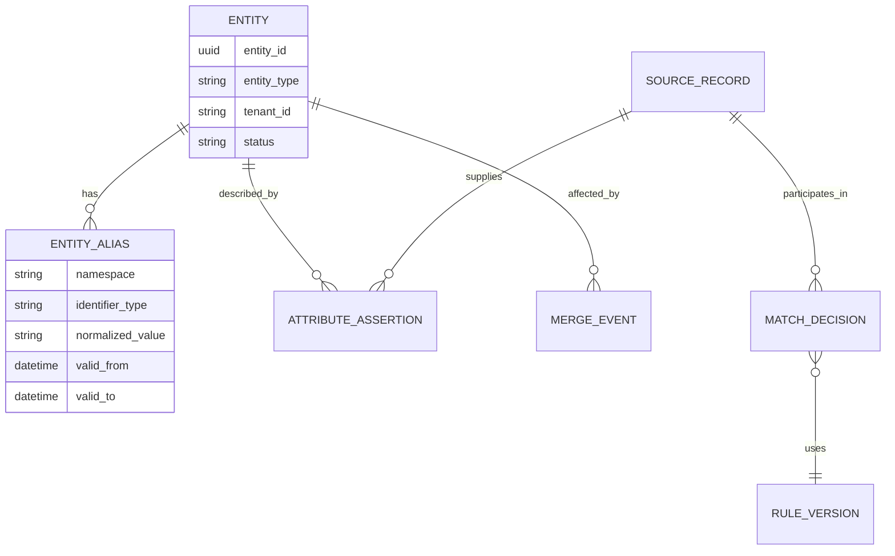

## Normalization without identity destruction

Normalization makes comparable representations alike. It must be field-specific, versioned, reversible, and tested. Store raw and normalized values. Never apply one global cleanup function to every identifier.

| Field | Possible governed normalization | Danger |
|---|---|---|
| Email domain | Lowercase domain under email rules | Local-part case/identity semantics vary |
| Hostname | Trim, case-fold, separate domain | Removing domain causes collisions |
| Phone | Parse to country-aware format | Missing country creates false equality |
| Person name | Unicode-aware case/spacing/punctuation policy | Cultural names and transliteration lose meaning |
| Serial number | Trim known presentation separators | Leading zeros may be meaningful |
| MAC address | Parse hexadecimal and standardize delimiters | Randomization and reuse remain |
| IP address | Parse canonical address type | Never make it a durable device identity alone |
| Cloud resource ID | Provider-documented canonicalization | Lowercasing case-sensitive segments may corrupt ID |
| Date/time | Parse with zone and source clock | Date-only and instant are not equivalent |
| Empty value | Map known sentinels to explicit missing category | `0` or `UNKNOWN` may have domain meaning |

Normalization pipeline:

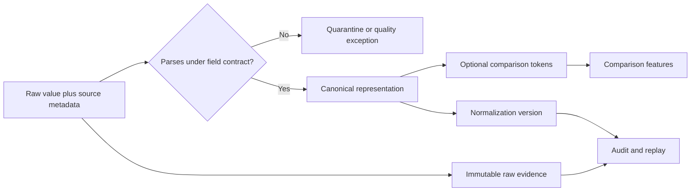

Synthetic example:

| Raw value | Naive result | Governed result | Reason |
|---|---|---|---|
| `HOST-17.NMH.EXAMPLE` | `host17nmhexample` | host=`host-17`, domain=`nmh.example` | Preserve semantic components |
| `001-ABC` | `1abc` | `001ABC` only if issuer confirms separators cosmetic | Leading zeros retained |
| `10.1.4.8` | device key | parsed locator assertion | IP is not stable identity |
| `A. Thakur` | `athakur` exact identity | name tokens with uncertainty | Name is supporting evidence |
| `unknown` | literal identifier | explicit missing sentinel under source rule | Placeholder is not an identity |

## Deterministic matching

Deterministic matching uses explicit conditions. It is appropriate when reliable, scoped identifiers or well-understood combinations exist. A deterministic rule is not automatically correct; bad keys produce confidently wrong merges.

| Rule ID | Synthetic rule | Action | Guardrails |
|---|---|---|---|
| D1 | Same tenant + cloud provider + immutable resource ID | Auto-match | Validate type and non-reuse semantics |
| D2 | Same tenant + directory object ID | Auto-match user records | Exclude deleted/recreated ambiguity |
| D3 | Same manufacturer + validated serial | Match endpoint candidates | Review known duplicate/virtual serials |
| D4 | Same source event ID + payload hash | Delivery duplicate | Do not confuse event duplicate with entity duplicate |
| D5 | Same normalized hostname + active overlap | Candidate only | Hostnames are mutable/reusable |
| D6 | Same email alias + compatible effective interval | Candidate/review | Alias transfer and shared mailboxes |
| D7 | Strong ID conflict | Reject match | Confirm both IDs are trustworthy and same scope |

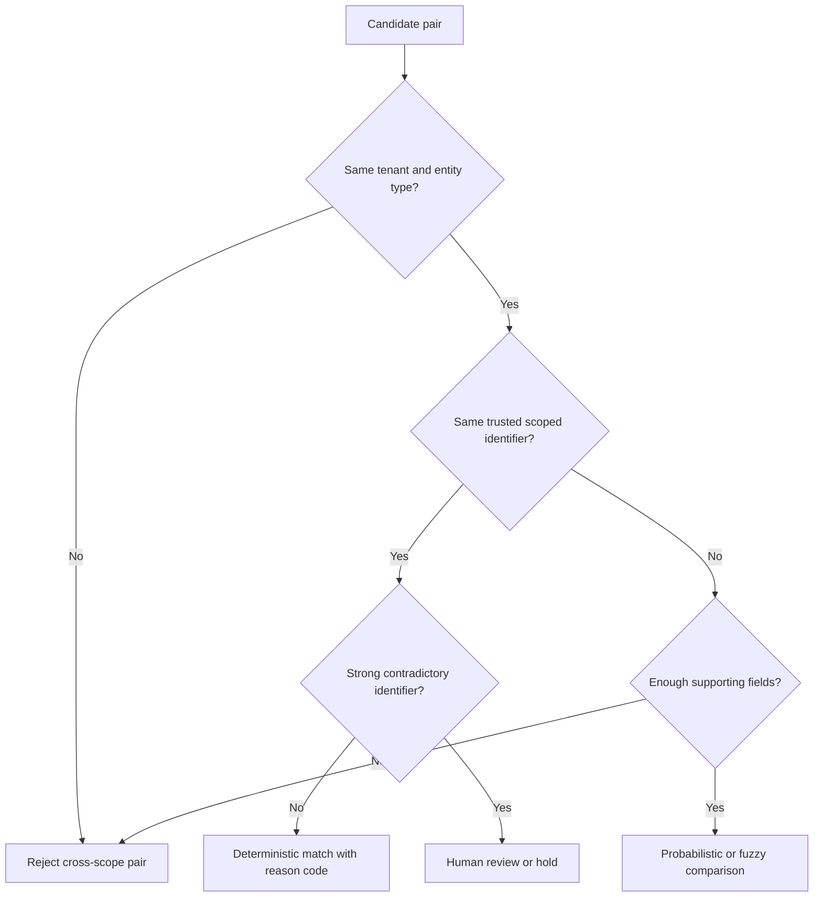

Rule order matters. Put scope checks and impossible conflicts before positive rules. Version rules and record all fired conditions, not merely the final result.

## Probabilistic matching

Probabilistic matching treats comparison evidence as uncertain. One classic concept compares how likely an agreement is among true matches with how likely it is among nonmatches. Rare agreement can carry more evidence than common agreement. Two records sharing a rare employee number are more informative than two records sharing `Windows` as an operating system.

Let a comparison feature be $j$. A conceptual evidence weight is:

$$
w_j = \log\left(\frac{P(\text{feature } j \mid \text{match})}{P(\text{feature } j \mid \text{nonmatch})}\right)
$$

This is a teaching formula, not a Zscaler formula. Probabilities must come from representative labeled data or defensible estimation, with dependence and drift considered.

| Evidence | Match interpretation | Nonmatch interpretation | Caution |
|---|---|---|---|
| Exact rare serial | Strong support | Rare coincidental agreement | Placeholder/duplicate serials |
| Similar full name | Moderate support | Common names agree often | Language and population bias |
| Same current IP | Weak support | Shared/NAT/dynamic addresses common | Time window essential |
| Conflicting immutable IDs | Strong contradiction | Expected for different entities | Source defects can fake conflict |
| Same owner and hostname | Supporting | Naming templates may repeat | Circular enrichment risk |
| Compatible active times | Supporting | Many entities coexist | Not sufficient alone |
| Impossible overlapping assignment | Contradiction | Same token assigned to two devices | Clock/data defects possible |

### Plain-English deep-dive 2 - A score is a decision aid, not probability by decoration

A recipe can total 81 points, but writing `0.81` does not make it an 81 percent probability. A weighted rule score, classifier output, similarity value, and calibrated probability are different objects.

Calibration asks whether cases assigned 0.8 actually match about 80 percent of the time in the relevant population. Ranking asks only whether higher scores tend to be better candidates. Production communication must name which one is being used. Say "score 0.81 under model v7" unless calibration evidence supports a probability claim.

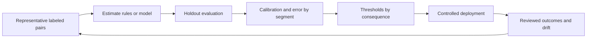

## Fuzzy matching mechanics

Fuzzy matching measures approximate similarity. It is useful for candidate evidence, not as a universal merge button.

| Method | Plain meaning | Useful for | Failure mode |
|---|---|---|---|
| Edit distance | Count insertions, deletions, substitutions | Typographical differences | Length and language sensitivity |
| Normalized edit similarity | Scale distance by length | Comparing strings of different lengths | Short strings become unstable |
| Trigram similarity | Compare overlapping three-character groups | Names, hostnames, descriptions | Shared fragments can overmatch |
| Token similarity | Compare sets/order of words | Reordered organization names | Loses meaningful order/context |
| Phonetic encoding | Compare approximate pronunciation codes | Name variants in supported languages | Bias and poor multilingual coverage |
| Prefix/suffix rule | Compare selected string portions | Structured generated names | Collision-prone |
| Numeric tolerance | Compare values within range | Coordinates/version/timestamps where valid | Near does not mean same |
| Date tolerance | Allow bounded time difference | Clock skew or delayed updates | Can bridge unrelated events |

PostgreSQL documents `levenshtein` in `fuzzystrmatch` and trigram similarity in `pg_trgm`. Those functions expose mechanics, not business truth.

```sql
CREATE EXTENSION IF NOT EXISTS pg_trgm;
CREATE EXTENSION IF NOT EXISTS fuzzystrmatch;

SELECT
    left_record_id,
    right_record_id,
    similarity(left_hostname, right_hostname) AS hostname_trigram_similarity,
    levenshtein(left_display_name, right_display_name) AS name_edit_distance
FROM nmh_lab.candidate_pairs
WHERE tenant_id = 'NMH-SYNTHETIC'
ORDER BY hostname_trigram_similarity DESC, name_edit_distance ASC;
```

Do not copy PostgreSQL's configurable/default similarity thresholds into an entity policy. Validate thresholds with NMH-like synthetic labels for practice and representative authorized labels in production.

## Blocking and candidate-pair generation

Comparing every pair has quadratic growth. With $n$ records, the unordered all-pairs count is:

$$
\frac{n(n-1)}{2}
$$

At one million records this is roughly 500 billion pairs. Blocking creates smaller neighborhoods likely to contain matches. It improves cost, but a true pair excluded from every block can never be recovered by later scoring.

| Blocking method | Example | Benefit | Recall risk |
|---|---|---|---|
| Exact key block | Same tenant and serial prefix | Fast and precise | Typo/missing key excludes match |
| Phonetic block | Same supported phonetic code | Finds spelling variants | Language bias/collisions |
| Token block | Shared rare hostname/name token | Flexible | Common tokens create huge blocks |
| Temporal block | Observations within plausible interval | Avoids impossible eras | Late data may be excluded |
| Geographic/network block | Same governed region/site | Reduces search | Mobile/cloud entities move |
| Locality-sensitive method | Approximate similarity neighborhood | Scales high-dimensional features | Approximation can miss neighbors |
| Multi-pass blocking | Union of several block rules | Recovers different match patterns | More pairs/cost/duplicates |
| Sorted neighborhood | Compare nearby sorted records | Handles small variations | Sort key choice controls misses |

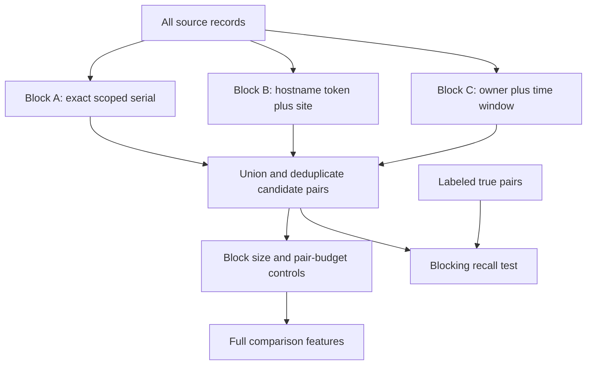

Blocking metrics must include true-match recall, candidate reduction ratio, block-size distribution, pairs per record, compute time, and segment gaps. A 99.99 percent reduction sounds impressive but is harmful if it removes a material share of true pairs.

Synthetic candidate SQL:

```sql
WITH serial_candidates AS (
    SELECT a.record_id AS left_id, b.record_id AS right_id, 'serial' AS block_rule
    FROM nmh_lab.asset_records a
    JOIN nmh_lab.asset_records b
      ON a.tenant_id = b.tenant_id
     AND a.entity_type = b.entity_type
     AND a.serial_normalized = b.serial_normalized
     AND a.record_id < b.record_id
    WHERE a.serial_normalized IS NOT NULL
), hostname_site_candidates AS (
    SELECT a.record_id AS left_id, b.record_id AS right_id, 'hostname_site' AS block_rule
    FROM nmh_lab.asset_records a
    JOIN nmh_lab.asset_records b
      ON a.tenant_id = b.tenant_id
     AND a.site_id = b.site_id
     AND left(a.hostname_normalized, 6) = left(b.hostname_normalized, 6)
     AND a.record_id < b.record_id
)
SELECT left_id, right_id, array_agg(DISTINCT block_rule ORDER BY block_rule) AS block_rules
FROM (
    SELECT * FROM serial_candidates
    UNION ALL
    SELECT * FROM hostname_site_candidates
) candidates
GROUP BY left_id, right_id;
```

The query is instructional. Real scale needs index, distribution, skew, privacy, and workload design.

## Comparison features and negative evidence

A feature is a repeatable measurement of one clue. Feature definitions need name, input fields, normalization version, missing behavior, output range, rationale, owner, and monitoring.

| Feature | Example output | Missing behavior | Interpretation |
|---|---|---|---|
| Scoped ID exact | true/false/unknown | Unknown, not false | Strong positive when reliable |
| Serial exact | true/false/unknown | Unknown | Positive with issuer quality |
| Hostname trigram | 0 to 1 | Unknown | Approximate textual support |
| Owner exact | true/false/unknown | Unknown | Context support, possibly stale |
| Active interval overlap | seconds/boolean | Unknown | Temporal compatibility |
| Source pair | categorical | Always present | Reliability differs by source combination |
| Location distance | numeric | Unknown | Context only for mobile assets |
| Strong-ID conflict | true/false/unknown | Unknown | Potential hard veto |
| Placeholder flag | true/false | False only after validation | Prevents fake agreement |
| Relationship consistency | score | Unknown | Guard against circular inference |

Missing must not silently become disagreement. Two null serials do not agree. Two placeholder serials such as `UNKNOWN` certainly do not identify one entity.

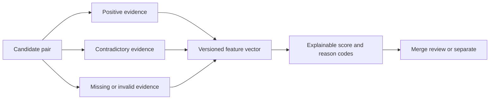

## Scoring, thresholds, and decision bands

Do not force one threshold to handle every consequence. Use at least three bands: auto-match, manual review, and nonmatch. High-impact use cases may prohibit auto-match entirely.

| Band | Synthetic condition | Action | Required evidence |
|---|---|---|---|
| Auto-match | Score at/above 0.93 and no veto | Link under reversible rule | Calibrated validation and audit |
| Review | 0.70 to below 0.93 or rule conflict | Human queue | Evidence card and service target |
| Nonmatch | Below 0.70 or verified veto | Keep separate | Reason and future reconsideration policy |
| Hold | Data defect or source incident | No identity change | Quality owner and repair plan |

These numbers are synthetic, not recommended. Threshold selection should minimize expected harm under capacity constraints:

$$
\text{Expected harm}(t)=C_{FM} \times FM(t)+C_{FS} \times FS(t)+C_R \times R(t)
$$

Here $C_{FM}$ is false-merge cost, $C_{FS}$ false-split cost, $C_R$ review cost, and the corresponding functions count outcomes at threshold $t$. Costs need business-owner input; they are not objective constants.

| Use | False merge consequence | False split consequence | Likely posture |
|---|---|---|---|
| Directional inventory estimate | Moderate count distortion | Moderate count distortion | Balanced, disclosed |
| Vulnerability backlog | Wrong owner/criticality aggregation | Fragmented exposure | Conservative merge plus review |
| User investigation | Innocent user's events attributed | Threat story fragmented | Very conservative, evidence visible |
| Automated isolation | Wrong endpoint disrupted | Malicious endpoint not grouped | Strong identity and independent authorization |
| Audit evidence | Incorrect subject association | Incomplete evidence chain | Formal review and provenance |

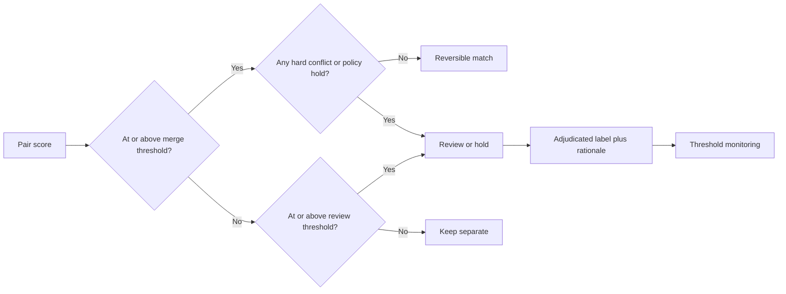

### Plain-English deep-dive 3 - False merge versus false split is a safety decision

Imagine hospital files. Combining two patients can place one person's allergy on another file: a false merge. Keeping one patient in two files can hide history: a false split. Both are bad, but their consequences differ by workflow.

Security data has the same asymmetry. A false merge can attach an executive's identity to another person's malicious activity or isolate the wrong asset. A false split can scatter one attack path across records. The threshold should follow the action's harm, not a generic desire for the highest accuracy number.

## Pair decisions, clustering, and transitive risk

Resolution often starts with record pairs but consumers need entity clusters. Pairwise links are not automatically transitive. If A resembles B and B resembles C, A may still conflict with C.

| Clustering approach | Plain meaning | Strength | Risk |
|---|---|---|---|
| Connected components | Any link path forms one cluster | Simple | One weak bridge causes giant false merge |
| Star around canonical | Records link to a trusted center | Controlled | Center may be missing or wrong |
| Complete-link constraint | Every member must be compatible | Conservative | Fragments noisy true entities |
| Correlation clustering | Optimize positive/negative pair evidence | Flexible | Complexity and explainability |
| Rule-based incremental | Add record if cluster invariants hold | Operationally clear | Order dependence unless designed |
| Human-curated cluster | Steward approves membership | Strong for high impact | Cost and consistency burden |

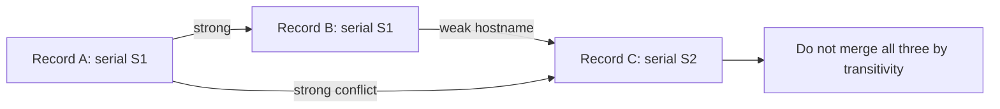

Cluster invariants can require one active immutable identifier per namespace, no impossible simultaneous assignments, tenant/type consistency, and no unresolved veto. Evaluate the whole cluster after each proposed link.

## False merges and false splits

| Error | Symptom | Likely cause | Immediate containment | Durable correction |
|---|---|---|---|---|
| False merge | Conflicting serials in one current asset | Weak transitive bridge | Freeze dependent action | Unmerge and strengthen invariant |
| False merge | Two active employees share entity | Recycled email alias | Hold user risk attribution | Temporal alias policy |
| False merge | Giant cluster forms suddenly | Common placeholder/block key | Roll back resolution version | Exclude sentinel and cap blocks |
| False split | Same device has separate backlogs | Reinstall changed agent ID | Link through validated hardware history | Lifecycle alias rule |
| False split | Renamed user has two identities | Alias history missing | Combine only after review | Effective-dated alias ingestion |
| False split | Cloud asset duplicated | Source IDs transformed differently | Repair canonical parsing | Versioned source mapping test |
| Either | Errors concentrated in one region/name group | Normalization/model bias | Suspend affected segment | Representative labels and redesign |

Detection signals include contradictory golden attributes, abnormal cluster sizes, repeated reviewer reversals, alias collisions, downstream owner disputes, same entity selected twice in a sample, or one source record moving repeatedly between entities.

## Golden records and survivorship

A golden record is a curated view of the best-known entity attributes. It should not erase source disagreement. Each displayed value needs provenance, effective time, rule, confidence, and alternatives where material.

| Attribute | Synthetic survivorship policy | Why field-specific |
|---|---|---|
| Employee status | Current HR assertion, if authorized and fresh | HR owns employment lifecycle |
| Display name | Directory preferred name with history | User-facing value differs from legal identity |
| Asset serial | Validated manufacturer/MDM assertion | Hardware identity evidence |
| Asset owner | CMDB owner if current; otherwise directory assignment with warning | Operational accountability may differ |
| Criticality | Business-service owner-approved classification | Not inferred from source popularity |
| IP address | Latest non-overlapping observation with time | Locator changes frequently |
| Operating system | Fresh endpoint telemetry, retain conflicts | Technical observation changes |
| First seen | Minimum trustworthy event time | Late data can revise history |
| Last seen | Maximum complete accepted observation | Partial ingestion can mislead |

Survivorship strategies:

| Strategy | Meaning | Good use | Failure |
|---|---|---|---|
| Source precedence | Preferred source wins | Stable field authority | Preferred source stale/wrong |
| Most recent | Latest effective assertion wins | Rapidly changing state | Arrival time confused with effective time |
| Most frequent | Majority value wins | Repeated independent observations | Sources copy same bad origin |
| Highest confidence | Best evidence score wins | Mixed validation strength | Scores incomparable across versions |
| Most complete | Richer value wins | Descriptive records | Completeness is not correctness |
| Steward-approved | Human decision wins for interval | High-impact conflicts | Decision ages without review |
| Composite | Field-specific combination | Complex domains | Hard to explain without reason codes |

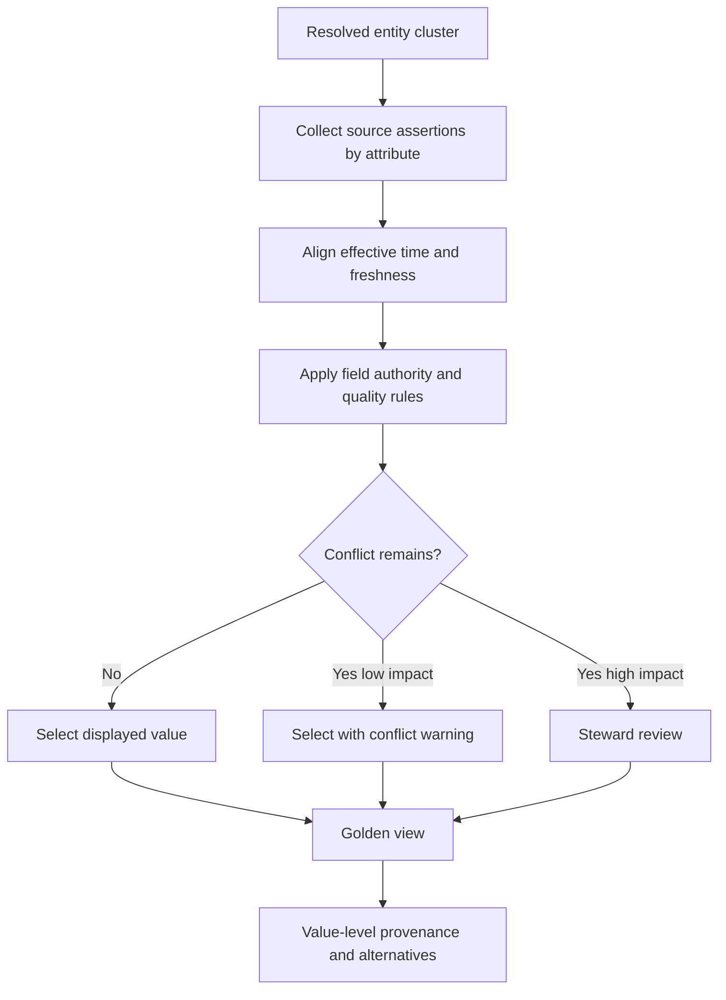

### Plain-English deep-dive 4 - Golden does not mean perfectly true

A news editor may create one front-page summary from several reporters. The summary is useful, but it remains a selected view based on editorial rules and available evidence. A correction must trace back to each report.

Likewise, a golden record is not a magical source of truth. It is the best-known, governed projection at a time. Preserve dissenting source values and explain why one value won. Calling it "golden" must increase accountability, not hide uncertainty.

## Confidence and provenance

Separate at least four confidence concepts.

| Confidence type | Question | Example |
|---|---|---|
| Source confidence | How reliable is this source/field under current conditions? | MDM serial validated, connector fresh |
| Pair confidence | How strong is evidence that two records match? | Pair score and decision reason |
| Cluster confidence | Is the entire group coherent? | Minimum edge/invariant result |
| Attribute confidence | Why is this golden value preferred? | HR status, fresh and authoritative |

Provenance should answer who supplied what, when it was observed, when received, how transformed, which resolution and survivorship versions acted, who reviewed it, and what changed later.

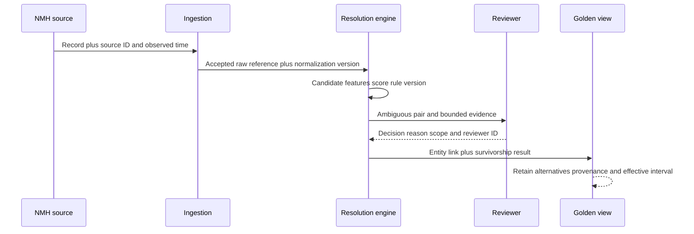

| Provenance element | Minimum content |
|---|---|
| Source | Tenant, system, object, record ID |
| Time | Observed, effective, received, processed |
| Raw evidence | Immutable reference/hash under retention policy |
| Transformation | Parser and normalization versions |
| Candidate | Blocking rules that emitted pair |
| Comparison | Feature names, values, missing flags |
| Decision | Score type, thresholds, vetoes, action |
| Cluster | Prior/new entity membership |
| Survivorship | Attribute rule and selected assertion |
| Review | Reviewer role, decision, rationale, time |
| Change | Merge/unmerge/replay event and affected outputs |

## Temporal identity and identifier reuse

Identity changes through time. Use effective time, not only processing time.

| Temporal event | Example | Required handling |
|---|---|---|
| Rename | User changes surname/display name | Add alias interval; do not create new person automatically |
| Reassignment | Laptop issued to new employee | Change ownership relationship, not hardware identity |
| Reimage/reinstall | New endpoint agent ID | Add lifecycle alias if hardware evidence supports |
| Resource recreation | Same cloud name, new provider ID | Usually new entity or lifecycle under explicit rule |
| Identifier recycle | Email/employee number reused | Close old interval before new assignment |
| Retirement | Asset decommissioned | Preserve history and stop current matching |
| Late event | Old observation arrives today | Place at effective time; avoid reopening current state blindly |
| Source correction | Identifier fixed retroactively | Version history and replay affected interval |

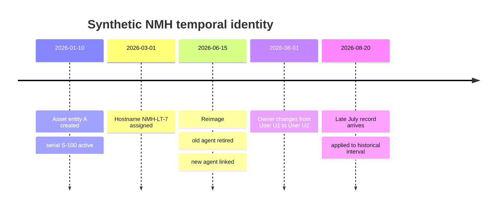

A bitemporal design may track valid time, when the fact applies in the modeled world, and system time, when the system knew/recorded it. This supports questions such as "What was believed on August 10?" and "What is now believed about August 10?"

## Merge, unmerge, and reversible operations

Never implement merge as destructive row deletion. Represent it as a versioned decision with redirects/aliases and repairable dependencies.

| Merge event field | Purpose |
|---|---|
| `merge_event_id` | Unique audit handle |
| `rule_version` | Reproduce decision logic |
| `source_entity_ids` | Entities/records combined |
| `target_entity_id` | Resulting canonical entity |
| `effective_time` | When identity relation applies |
| `decision_type` | Automatic, human, imported |
| `evidence_reference` | Features and source assertions |
| `actor` | Service/reviewer/approver |
| `reason_code` | Explain action |
| `downstream_version` | Identify materialized outputs |
| `reversal_event_id` | Link correction |

```mermaid
sequenceDiagram
    participant D as Detector or steward
    participant R as Resolution service
    participant L as Merge ledger
    participant C as Consumers
    D->>R: Report suspected false merge
    R->>R: Freeze high-risk dependent actions
    R->>L: Read original evidence and versions
    R->>L: Append unmerge event; never erase history
    R->>R: Rebuild clusters and golden attributes
    R->>C: Publish corrected version and affected scope
    C-->>R: Reconcile tickets dashboards and actions
```

Unmerge impact can propagate to risk scores, findings, tickets, relationships, dashboards, and audit extracts. Plan a dependency inventory, isolated recomputation, reconciliation, approval, publication, and consumer notification.

## Human review and adjudication

Review is a controlled decision process, not an inbox for every uncertainty.

| Review-card element | Reviewer question |
|---|---|
| Entity type/scope | Are these comparable things in the same tenant? |
| Raw and normalized values | Did normalization distort evidence? |
| Positive features | What supports a match? |
| Contradictions | What argues against it? |
| Time line | Could reuse/reassignment explain values? |
| Source quality/freshness | Are assertions current and trustworthy? |
| Existing cluster | Would this link violate invariants? |
| Downstream consequence | What happens if reviewer is wrong? |
| Recommended action | Merge, separate, defer, request evidence |
| Reason code | Can another reviewer understand decision? |

Reviewer controls include role-based access, minimization, masking, dual review for sensitive/high-impact cases, conflict-of-interest handling, training, blind quality samples, disagreement measurement, service targets, escalation, and redress. Do not show protected attributes merely because they might improve matching.

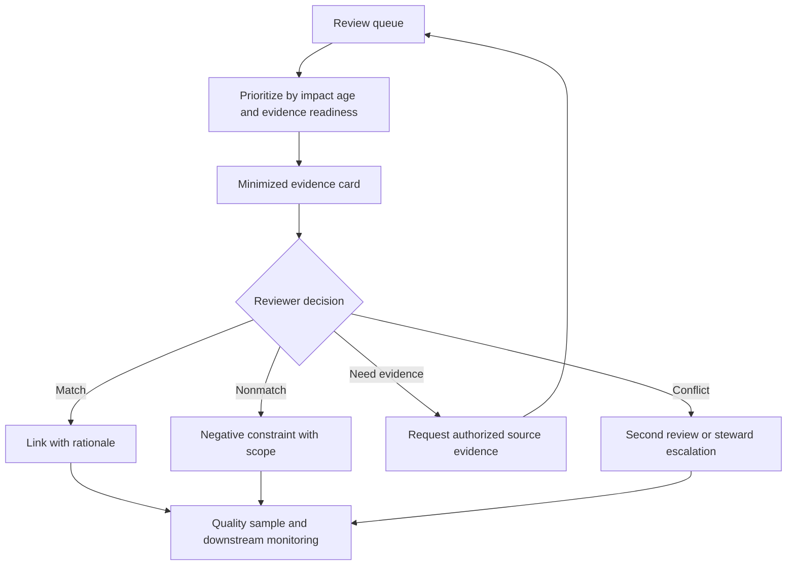

## Metrics and evaluation

Start with labeled truth whose creation process is documented. Labels can be wrong, biased, stale, or unrepresentative, so report label source and uncertainty.

| Metric | Meaning | Why it can mislead |
|---|---|---|
| Pair precision | Correct predicted matches / predicted matches | Dominated by easy pairs/label gaps |
| Pair recall | Correct predicted matches / true matches | True-match population often unknown |
| False merge rate | Wrong merged pairs/entities / relevant denominator | Pair and entity denominators differ |
| False split rate | Missed links/entities / relevant denominator | Fragment size matters |
| F1 score | Harmonic summary of precision and recall | Treats error costs symmetrically |
| Blocking recall | True pairs emitted as candidates / true pairs | Depends on representative labels |
| Reduction ratio | Fraction of all pairs avoided | High reduction may hide missed matches |
| Cluster purity | Records in cluster belonging to dominant true entity | Rewards fragmented tiny clusters |
| Entity completeness | True entity records captured together | Requires entity-level truth |
| Review yield | Reviewed cases changing/confirming action | Queue selection bias |
| Review agreement | Reviewer consistency | Agreement can share bias |
| Unmerge rate | Merges later reversed | Delayed discovery understates current defects |
| Downstream dispute rate | Owner/user complaints per decision | Only visible harms counted |
| Time to resolution | Age from ambiguity to decision | Speed can reduce quality |

Confusion matrix for pair decisions:

| | True same entity | True different entities |
|---|---|---|
| Predicted match | True match | False merge pair |
| Predicted nonmatch | False split pair | True nonmatch |

Evaluate by source pair, entity type, geography/language where lawful, identifier availability, lifecycle state, cluster size, and decision use. Monitor drift in feature missingness, score distribution, block size, review reasons, and source quality.

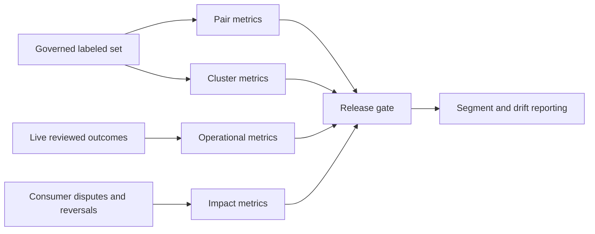

## Privacy, fairness, and security

Linkage can create a more sensitive dataset than any source alone. Combining identity, behavior, location, vulnerability, and employment context can increase surveillance, reidentification, discrimination, and breach harm.

| Principle/control | Entity-resolution application |
|---|---|
| Purpose limitation | Match only for documented authorized security use |
| Data minimization | Use the least attributes needed for acceptable assurance |
| Proportionality | Stronger collection requires stronger demonstrated need |
| Separation | Keep raw sensitive identity evidence away from broad analytics |
| Least privilege | Restrict match evidence, review, merge, and export separately |
| Pseudonymization | Use scoped internal IDs where direct identity is unnecessary |
| Encryption | Protect records, indexes, queues, backups, and transfers |
| Retention | Expire raw linkage evidence and stale aliases by governed schedule |
| Audit | Record reads, rule changes, merges, reviews, exports, and unmerges |
| Fairness testing | Measure error/coverage across relevant populations where lawful |
| Redress | Provide correction path for harmful identity errors |
| Third-party control | Contract purpose, access, retention, deletion, and incident duties |

NIST SP 800-63A is useful human-identity context: it distinguishes resolution, validation, and verification; emphasizes minimum necessary attributes, privacy risk, authoritative/credible sources, exception handling, and manual review in consequential one-to-many biometric cases. It does not define NMH asset deduplication or Zscaler behavior.

### Plain-English deep-dive 5 - Joining data creates new privacy risk

A bus timetable and an employee directory may each be ordinary. Linking badge swipes, route history, device telemetry, and directory data can reveal a person's movements. The privacy impact comes from the combination, not only each column.

Entity resolution is precisely a linking capability. Treat link tables, candidate pairs, negative constraints, and reviewer evidence as sensitive. Hashing direct identifiers is not automatic anonymization because stable hashes still enable linkage and can be guessed for small domains.

## Complete synthetic NMH matching exercise

NMH receives six endpoint records. The task is to propose entity groups, not to assert real truth.

| Record | Source | Scoped strong ID | Serial | Hostname | Owner | Observed interval |
|---|---|---|---|---|---|---|
| R1 | MDM | MDM-77 | SN-0017 | nmh-lt-017 | U-100 | Aug 1-24 |
| R2 | EDR | AGENT-A | SN-0017 | NMH-LT-017 | U-100 | Aug 3-24 |
| R3 | Scanner | none | unknown | nmh-lt-017.nmh.example | U-100 | Aug 20-24 |
| R4 | CMDB | CI-900 | SN-0017 | nmh-lt-017 | U-205 | Jan 1-Jul 31 |
| R5 | EDR | AGENT-B | SN-0099 | nmh-lt-017 | U-205 | Aug 22-24 |
| R6 | MDM | MDM-88 | SN-0099 | nmh-lt-099 | U-205 | Aug 1-24 |

Step 1: contract. Entity type is physical managed endpoint. Tenant is NMH. Serial is strong only after validation. Hostname and owner are supporting and time-bound. False merge is costly because the result may affect remediation ownership. No automatic containment uses this lab view.

Step 2: normalization. `NMH-LT-017` and the host component of `nmh-lt-017.nmh.example` are comparable. `unknown` becomes a missing sentinel, not a serial.

Step 3: candidates. Serial blocking emits R1-R2-R4 and R5-R6. Hostname blocking emits R1-R2-R3-R4-R5 combinations. Multi-pass union retains rule reasons.

Step 4: evidence. R1 and R2 share validated serial, compatible current time, hostname, and owner: strong match. R3 has no strong ID but compatible current hostname/owner and close time: review or lower-confidence link. R4 shares serial but ends July 31 and owner differs; it may be historical evidence for the same hardware before reassignment. R5 shares hostname with R1 but conflicts on serial and overlaps in time: do not merge on hostname. R5 and R6 share serial/owner/current time but hostname differs: likely match pending source semantics.

Step 5: proposed clusters.

| Proposed entity | Records | Confidence statement | Open issue |
|---|---|---|---|
| E-A | R1, R2, R4 | Strong serial evidence; R4 historical owner interval | Confirm no serial duplication |
| E-A candidate | R3 | Supporting current evidence only | Review before high-impact use |
| E-B | R5, R6 | Strong serial/owner evidence | Explain hostname discrepancy |

Step 6: golden values. E-A serial derives from validated MDM/EDR/CMDB assertions. Current owner is U-100 based on current interval, while U-205 remains historical. Hostname is current but conflict-aware. Every selected value points to source assertions.

Step 7: safety. R5 is not pulled into E-A through shared hostname. The serial conflict and overlapping interval are veto evidence. If later evidence proves hostname reuse or stale scan data, provenance explains the discrepancy.

## Synthetic matching exercises with answers

### Exercise 1 - Entity or record

An API retry sends the identical vulnerability event twice. Is this entity resolution?

**Answer:** First it is delivery/event deduplication at the event grain. It may affect entity-level analytics, but do not call repeated events duplicate assets. Declare the grain.

### Exercise 2 - Scoped identifier

Two tenants both contain user ID `1042`. Should they match?

**Answer:** No. The issuer and tenant are part of the identifier scope. Cross-tenant matching is rejected unless a separately authorized cross-tenant identity policy and evidence exist.

### Exercise 3 - Placeholder agreement

Two device records have serial `UNKNOWN`. Does exact agreement support a match?

**Answer:** No. Normalize governed sentinel values to missing/invalid. Placeholder equality is not identity evidence and can create giant clusters.

### Exercise 4 - Fuzzy name

`Arti Thakur` and `Aarti Thakur` have high trigram similarity. Auto-merge?

**Answer:** Not from name similarity alone. Use population, authorized identifiers, source, time, and contradictory evidence. Route consequential ambiguity to review.

### Exercise 5 - Blocking miss

A true pair has different first letters after transliteration and never enters the same block. Can a better scorer recover it?

**Answer:** No. Scoring sees only emitted candidates. Add representative multi-pass blocking and measure blocking recall by relevant segment.

### Exercise 6 - Threshold

A model score is 0.94 and the merge threshold is 0.93, but immutable IDs conflict. What happens?

**Answer:** Apply the governed veto or review/hold rule. A numeric threshold must not override a validated hard conflict.

### Exercise 7 - Transitivity

A-B and B-C exceed pair threshold, while A-C has strong conflict. Merge all three?

**Answer:** No. Evaluate cluster invariants and negative evidence. Connected-component clustering would create an unsafe bridge.

### Exercise 8 - Golden record

Three copied systems agree on owner U1; authoritative HR says current owner U2. Does majority win?

**Answer:** Not automatically. Source independence and field authority matter. Apply effective-time/source policy, preserve all assertions, and investigate freshness.

### Exercise 9 - Temporal reuse

An email alias belonged to U1 through July and U2 from August. An old June event arrives in August. Which user?

**Answer:** Resolve by event effective time and alias validity, not arrival time. Associate the June event with U1 if evidence and policy support it.

### Exercise 10 - Unmerge

A false merge influenced 40 tickets. Is changing the current entity row enough?

**Answer:** No. Append an unmerge event, rebuild affected versions, reconcile dependent tickets/metrics/actions, communicate scope, and retain audit history.

### Exercise 11 - Metric

Pair precision improved while giant false clusters appeared. Is the release better?

**Answer:** Not necessarily. Pair metrics can hide cluster harm. Add cluster purity/invariants, size distribution, reversals, and business-impact measures.

### Exercise 12 - Privacy

Would adding precise home address improve person matching?

**Answer:** Possibly, but usefulness does not establish authorization or proportionality. Conduct privacy/legal review, minimize attributes, consider less intrusive evidence, control access, and define retention/redress.

## Troubleshooting decision tree

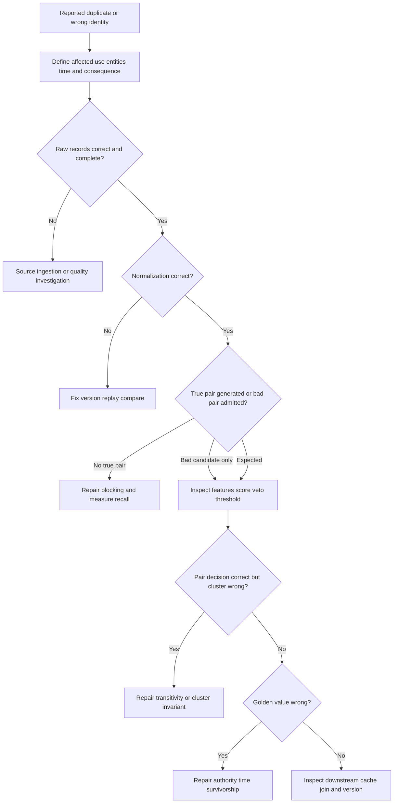

## Entity-resolution troubleshooting runbook

1. State the symptom precisely: false merge, false split, wrong golden value, stale alias, duplicate action, missing correlation, or display-only issue.
2. Freeze high-impact automated actions that depend on disputed identity; do not destroy evidence.
3. Record tenant, entity type, entity IDs, source record IDs, relevant times, consumer/version, and first observed impact.
4. Confirm whether the complaint concerns record deduplication, entity matching, event correlation, relationship mapping, or survivorship.
5. Retrieve authorized raw evidence and source contracts. Verify source record completeness and current connector health.
6. Reproduce raw-to-normalized values under the exact parser and normalization versions. Look for sentinels, truncation, scope loss, case/unit changes, and parsing errors.
7. Identify every block rule that emitted or failed to emit the pair. Check block size, caps, skew, and candidate deduplication.
8. Recompute features with missing flags. Confirm no null/placeholder agreement and no circular use of downstream golden values.
9. Inspect model/rule version, score type, threshold band, vetoes, and reason codes. Do not reinterpret a ranking score as probability.
10. Inspect cluster formation. Test every strong identifier, scope, effective interval, and negative constraint across all members.
11. Inspect golden survivorship separately. A correct cluster can still display a wrong field because authority or time logic failed.
12. Quantify blast radius: entities, records, periods, findings, risks, tickets, owners, reports, exports, and automated actions.
13. Compare with a previous accepted version and representative labeled/reviewed cases. Segment the defect by source, entity type, and population.
14. Choose containment: hold new merges, lower/raise action privileges, route a segment to review, preserve last accepted view with stale warning, or disable a faulty rule.
15. Implement a reversible fix in an isolated version. Re-run candidate, score, cluster, survivorship, and downstream reconciliation.
16. Validate false merge/split metrics, cluster invariants, blocking recall, review workload, privacy controls, and business acceptance.
17. Publish with version, affected scope, corrections, known limitations, owner, and consumer instructions. Reconcile or reopen downstream work.
18. Add prevention: contract test, sentinel test, temporal-reuse case, cluster invariant, canary labels, drift alert, reviewer guidance, or change approval.

| Evidence pack item | Why it matters |
|---|---|
| Symptom and consequence | Prioritizes safety |
| Raw/normalized pairs | Finds representation defect |
| Block reasons | Proves candidate path |
| Feature vector | Makes evidence inspectable |
| Score/threshold/veto version | Reproduces action |
| Cluster before/after | Reveals transitive impact |
| Golden provenance | Separates match from survivorship |
| Downstream dependency list | Drives correction scope |
| Labeled/review examples | Tests proposed fix |
| Privacy/access log | Confirms authorized handling |

## Labs and rehearsal

### Lab 1 - Entity contract

Define NMH endpoint, user, cloud resource, and application entities. For each, state scope, lifecycle, strong/supporting identifiers, false-merge/split consequences, consumer, review, and unmerge requirement.

### Lab 2 - Identifier inventory

Build an identifier table with issuer, namespace, uniqueness, stability, reuse, sensitivity, missingness, quality, and effective-time behavior. Mark assumptions for validation.

### Lab 3 - Normalization tests

Create 100 synthetic raw values including case, spacing, Unicode transliteration placeholders, leading zeros, malformed dates, and compound hostnames. Preserve raw values and expected canonical outputs.

### Lab 4 - Deterministic rules

Write ordered positive, negative, and hold rules. Test cross-tenant collisions, placeholder equality, conflicting strong IDs, and missing values.

### Lab 5 - Fuzzy functions

Use PostgreSQL `pg_trgm` and `fuzzystrmatch` on synthetic names/hostnames. Compare edit and trigram behavior by string length and explain why no function threshold is automatically a merge threshold.

### Lab 6 - Blocking

Implement three blocking passes, union candidate pairs, cap pathological blocks, and calculate reduction ratio plus blocking recall against known synthetic pairs.

### Lab 7 - Feature catalog

Define at least ten features with data type, source, normalization, missing behavior, direction, rationale, privacy class, owner, and drift check.

### Lab 8 - Threshold clinic

Create labeled scores and calculate decisions across several merge/review thresholds. Assign synthetic error costs for reporting versus automated action and explain different policies.

### Lab 9 - Cluster bridge

Construct A-B-C examples where one weak link creates a conflict. Compare connected components with cluster invariants and document rejected links.

### Lab 10 - Golden record

Resolve field-level conflicts for owner, criticality, OS, serial, hostname, first seen, and last seen. Show selected value, alternatives, effective time, source, confidence, and rule.

### Lab 11 - Temporal identity

Model rename, reimage, reassignment, retirement, identifier reuse, and late events using valid/system times. Answer current and historical identity questions.

### Lab 12 - Merge/unmerge

Append synthetic merge events, then reverse one. Enumerate and reconcile affected aliases, relationships, findings, tickets, risk scores, and dashboard versions.

### Lab 13 - Review queue

Design a minimized evidence card, reason codes, reviewer role, escalation, dual-review trigger, service target, quality sample, and redress process.

### Lab 14 - Metrics

Calculate pair precision/recall, blocking recall, false merge/split rates, cluster measures, review agreement, and reversal rate. Segment results and state label limitations.

### Lab 15 - Privacy threat model

Map data subjects, attributes, linkage outputs, users, purposes, threats, harms, controls, retention, third parties, and correction paths. Remove an unnecessary field.

### Lab 16 - TSM escalation briefing

Present one false-merge incident in five minutes: customer impact, evidence, first bad stage, immediate safety action, affected scope, correction, validation, prevention, owner, and honest Zscaler boundary.

| Lab evidence | Completion standard |
|---|---|
| Contract | Entity/scope/time/use/error cost explicit |
| Data | Synthetic and privacy-safe |
| Candidate process | Blocking recall and reduction visible |
| Decision | Features, score type, thresholds, vetoes visible |
| Clustering | Whole-cluster invariants tested |
| Golden view | Field-level provenance and conflict visible |
| Temporal | Reuse/reassignment/late data handled |
| Reversal | Downstream repair rehearsed |
| Metrics | Pair, cluster, operational, and impact levels |
| Honesty | No product-internal or production claim |

## Common misconceptions to correct

| Misconception | Correct model |
|---|---|
| A row is an entity | A row is a source assertion about a possible entity |
| Exact text means same entity | Scope, semantics, time, and source quality still matter |
| Different text means different entity | Aliases, formatting, rename, and error can differ |
| One universal identifier exists | Identifiers are issuer-, scope-, and time-bound |
| Natural keys never change | Names, emails, hostnames, and many IDs change/recycle |
| Normalization is harmless cleanup | It can erase meaningful distinctions and needs versioning |
| Null equals null | Missing evidence is unknown, not identity agreement |
| Fuzzy similarity proves a match | It is one comparison signal |
| Score 0.8 means 80 percent probability | Only if defined and calibrated as such |
| PostgreSQL default threshold is a match policy | It is a function/operator setting, not business validation |
| All-pairs is the only accurate method | Blocking can scale matching but must be recall-tested |
| Blocking only affects performance | It sets the ceiling on match recall |
| Higher match rate is better | It may indicate false merging |
| Pair decisions can always be transitively closed | Weak bridges can create false clusters |
| Deduplication means deleting rows | Preserve source evidence and represent reversible links |
| Golden record is absolute truth | It is a governed best-known projection with provenance |
| Most recent means most accurate | Arrival time, effective time, and authority differ |
| Majority sources prove truth | Copied or correlated sources can share one defect |
| Confidence belongs only to entity | Source, pair, cluster, and attribute confidence differ |
| Identifier reuse is rare enough to ignore | Reuse/recreation can create severe temporal errors |
| Unmerge is an edge case | Reversibility is a core control |
| Human review removes error | Reviewers need training, evidence, consistency checks, and privacy controls |
| Overall precision proves fairness | Segment coverage and error differences may be hidden |
| Hashing identifiers anonymizes them | Stable/guessable hashes can remain linkable personal data |
| More identity fields always improve security | Extra linkage can violate minimization and increase harm |
| NIST identity proofing defines all entity resolution | Its natural-person proofing scope is specific |
| Public Data Fabric wording exposes Zscaler algorithms | It supports only high-level capability context |

## Official Source Anchors

Research/source date: **2026-08-24**.

The sources below establish bounded concepts. NIST guidance is used for identity, privacy, security, evidence, manual review, and measurement context. PostgreSQL documentation establishes only documented database functions and constraints. W3C PROV-O supports provenance vocabulary. Zscaler's public page supports only the high-level Data Fabric positioning stated here.

| Source | URL | Used for | Boundary |
|---|---|---|---|
| NIST SP 800-63A-4 | https://pages.nist.gov/800-63-4/sp800-63a.html | Natural-person identity resolution, evidence, validation, verification, privacy, exception/manual review | Not general asset matching or product behavior |
| NIST Privacy Framework 1.0 | https://www.nist.gov/privacy-framework | Privacy risk, governance, processing, communication | Voluntary framework; legal duties vary |
| NISTIR 8062 | https://csrc.nist.gov/pubs/ir/8062/final | Predictability, manageability, disassociability, privacy engineering | Not an entity-resolution algorithm |
| NIST SP 800-53 Rev. 5 | https://csrc.nist.gov/pubs/sp/800/53/r5/upd1/final | Access, audit, integrity, minimization, retention/control context | Controls require tailoring |
| NIST SP 800-55 Vol. 1 | https://csrc.nist.gov/pubs/sp/800/55/v1/final | Measurement program concepts | Not matching metrics/thresholds |
| NIST AI RMF 1.0 | https://www.nist.gov/itl/ai-risk-management-framework | Govern, map, measure, manage for model-assisted matching | Voluntary; no model claimed here |
| PostgreSQL `pg_trgm` | https://www.postgresql.org/docs/17/pgtrgm.html | Trigram similarity, thresholds, GiST/GIN index support | Similarity is not identity proof |
| PostgreSQL `fuzzystrmatch` | https://www.postgresql.org/docs/17/fuzzystrmatch.html | Levenshtein and phonetic functions/limitations | Language and input limitations apply |
| PostgreSQL constraints | https://www.postgresql.org/docs/17/ddl-constraints.html | Unique, primary, foreign key concepts | Database uniqueness is not real-world identity |
| W3C PROV-O | https://www.w3.org/TR/prov-o/ | Entity/activity/agent provenance representation | Vocabulary, not matching policy |
| W3C Data on the Web Best Practices | https://www.w3.org/TR/dwbp/ | Metadata, provenance, versioning, data-quality context | Web-data guidance requires adaptation |
| ISO/IEC 11179 overview | https://www.iso.org/standard/78914.html | Metadata registry and data-element semantics context | Standard text/access and applicability vary |
| Zscaler Data Fabric for Security | https://www.zscaler.com/products-and-solutions/data-fabric | Public harmonization, deduplication, correlation, enrichment positioning | No internal schema, algorithm, threshold, score, or guarantee claim |

## Likely Interview Questions

### Q1. What is the difference between an entity and a record?

**Model answer:** An entity is the real-world person, asset, account, application, or other thing; a record is one source's time-bound assertion about it. Several records can represent one entity, and one reused identifier can represent different entities across scope or time. I declare entity type, tenant, population, grain, lifecycle, and use before matching.

### Q2. How do deterministic, probabilistic, and fuzzy matching differ?

**Model answer:** Deterministic matching applies explicit rules, such as equal trusted tenant-scoped IDs. Probabilistic matching combines how informative agreements and disagreements are in a population. Fuzzy matching measures approximate values such as edit or trigram similarity and usually supplies features. None is inherently safe: I validate source quality, missing behavior, negative evidence, calibration, thresholds, and decision consequences.

### Q3. Why is blocking important, and how do you validate it?

**Model answer:** All-pairs comparison grows as $n(n-1)/2$, so blocking emits plausible candidate neighborhoods. It improves scale but creates a recall ceiling because an excluded true pair cannot be recovered by scoring. I use multiple governed passes, deduplicate pair reasons, cap skewed blocks, and measure blocking recall, reduction ratio, block-size distribution, pair volume, cost, and segment gaps against representative labels.

### Q4. How do you choose match and review thresholds?

**Model answer:** I first identify whether the score is a rule score, rank, classifier output, or calibrated probability. Then I evaluate labeled precision/recall and false merge/split harm by use, source, entity type, and population. I establish merge, review, nonmatch, and hold bands with vetoes, review capacity, privacy constraints, rollback, and acceptance owners. Synthetic numbers or database defaults never become production policy without validation.

### Q5. What are false merges and false splits, and which is worse?

**Model answer:** A false merge combines different entities and can misattribute risk, ownership, or automated action. A false split leaves one entity fragmented and can hide total exposure or duplicate work. Neither is universally worse; consequence depends on the workflow. For user investigations or isolation I would generally be conservative about merges, require strong evidence, and preserve human review and reversal.

### Q6. What makes a trustworthy golden record?

**Model answer:** It is a best-known governed view, not absolute truth. I apply field-specific authority, quality, freshness, and effective-time survivorship; retain every source assertion and conflict; attach attribute confidence and provenance; version rules; and expose limitations. Matching and survivorship are separate: a correct cluster can still select a wrong displayed value.

### Q7. How do you troubleshoot and reverse a bad identity decision?

**Model answer:** I contain high-risk consumers, freeze versions, and trace raw source, normalization, blocking, features, score, veto, threshold, cluster formation, survivorship, and downstream caches. I quantify affected entities, periods, tickets, scores, and actions. I append an audited merge/unmerge event, rebuild in isolation, reconcile dependencies, validate pair/cluster/business metrics, publish a corrected version, and add a preventive test or control.

### Q8. How does your background transfer, and what can you claim about Zscaler Data Fabric?

**Model answer:** Microsoft escalation work taught me to correlate imperfect identity, device, request, log, and time evidence; test hypotheses; preserve evidence; isolate the first bad stage; and communicate uncertainty. I practiced formal matching, golden records, and unmerge on synthetic NMH data. Zscaler publicly describes Data Fabric harmonization, deduplication, correlation, and enrichment, but I do not claim internal algorithms, schemas, thresholds, or outcomes. I would validate current tenant evidence, documentation, privacy controls, and specialists.

## 30-Second Memory Hooks

| Concept | Memory hook |
|---|---|
| Entity | The thing, not the row |
| Record | One source's witness statement |
| Scope | Seat 12A needs a flight |
| Identifier | Issuer plus namespace plus time |
| Alias | Another valid label with history |
| Normalization | Compare consistently, preserve raw |
| Deterministic | Explicit rule, still validate keys |
| Probabilistic | Weigh evidence, do not decorate scores |
| Fuzzy | Similar text is a clue |
| Blocking | Search neighborhood and recall ceiling |
| Candidate | Worth comparing, not already matched |
| Negative evidence | Contradictions matter |
| Threshold | Business harm encoded as action boundary |
| False merge | Two things, one file |
| False split | One thing, two files |
| Cluster | Test the whole group |
| Golden record | Best-known cited summary |
| Survivorship | Field-by-field authority |
| Provenance | Receipt for every value and link |
| Temporal identity | Same label can mean another thing later |
| Unmerge | Append correction and repair consumers |
| Review | Minimized evidence, trained judgment |
| Privacy | Linking creates new sensitivity |
| Arti bridge | Correlation and RCA transfer; internals do not |

## Completion Checklist

- [ ] I can explain entity versus record with a beginner analogy.
- [ ] I declare entity type, tenant, population, grain, lifecycle, time, use, and error consequences.
- [ ] I distinguish source record IDs, natural keys, surrogate keys, composite keys, and aliases.
- [ ] I include issuer/namespace/scope and validity interval in identifier meaning.
- [ ] I preserve raw values and version field-specific normalization.
- [ ] I never treat nulls or placeholders as matching identifiers.
- [ ] I can explain deterministic rules and their failure modes.
- [ ] I can explain probabilistic evidence without claiming an undocumented probability.
- [ ] I can use edit, trigram, token, phonetic, numeric, and temporal similarity appropriately.
- [ ] I know PostgreSQL functions demonstrate mechanics, not production identity policy.
- [ ] I can calculate why all-pairs comparison becomes expensive.
- [ ] I use multi-pass blocking and measure its recall ceiling.
- [ ] I define features with source, normalization, missing behavior, range, rationale, and owner.
- [ ] I preserve positive, contradictory, missing, and invalid evidence separately.
- [ ] I distinguish score, rank, classifier output, and calibrated probability.
- [ ] I define merge, review, nonmatch, and hold bands with veto rules.
- [ ] I choose thresholds based on false merge/split harm and review capacity.
- [ ] I do not use one threshold for reporting and high-impact automated action without justification.
- [ ] I understand pair precision, recall, and their denominator limitations.
- [ ] I test cluster coherence rather than blindly applying transitivity.
- [ ] I monitor giant clusters, weak bridges, alias collisions, and repeated reversals.
- [ ] I distinguish record deduplication from entity resolution.
- [ ] I construct a golden record with field-level survivorship.
- [ ] I preserve alternatives, conflicts, confidence, and provenance.
- [ ] I distinguish source, pair, cluster, and attribute confidence.
- [ ] I track observed, effective, received, and processed times.
- [ ] I handle rename, reimage, reassignment, recreation, reuse, retirement, and late events.
- [ ] I implement merge as a reversible event rather than destructive deletion.
- [ ] I can scope and reconcile downstream impact after unmerge.
- [ ] I design a minimized, role-controlled human-review card and reason codes.
- [ ] I measure reviewer agreement, queue age, yield, and decision quality.
- [ ] I evaluate pair, blocking, cluster, operational, and business-impact metrics.
- [ ] I segment errors and drift where authorized and relevant.
- [ ] I document label provenance, representativeness, and uncertainty.
- [ ] I apply purpose limitation, minimization, least privilege, encryption, audit, retention, and redress.
- [ ] I know stable hashing does not automatically anonymize identifiers.
- [ ] I can complete the NMH synthetic matching exercise and defend every link/nonlink.
- [ ] I can run the troubleshooting decision tree from symptom to first bad stage.
- [ ] I can produce an evidence pack with versions, features, decisions, clusters, and provenance.
- [ ] I separate general methods, PostgreSQL behavior, NIST human-identity context, synthetic evidence, and Zscaler public context.
- [ ] I make no unsupported Zscaler Data Fabric schema, algorithm, threshold, model, or outcome claim.
- [ ] I can answer Q1 through Q8 with mechanics, examples, tradeoffs, failures, troubleshooting, and honest boundaries.

[Part 54 - Taxonomy, Ontology, Canonical Schemas, and Data Mapping](Part-54-taxonomy-ontology-canonical-schema.md)