# Part 54 - Taxonomy, Ontology, Canonical Schemas, and Data Mapping

> **Audience:** Candidates preparing for a Zscaler Security Operations Technical Success Manager role after enterprise Support Escalation Engineering.
>
> **Purpose:** Build a beginner-first method for defining shared security meaning through controlled vocabularies, taxonomies, ontologies, entity-attribute-relationship models, canonical schemas, source-to-target mappings, code lists, transformations, validation, version evolution, governance, and safe extensibility while detecting false equivalence.
>
> **Scope and honesty:** Northstar Meridian Holdings, abbreviated NMH, is fictional. Every source, schema, field, code list, mapping, rule, transformation, validation result, incident, query, owner, and outcome in this Part is synthetic. General W3C, JSON Schema, ISO metadata, NIST, and PostgreSQL concepts are not Zscaler Data Fabric schemas, mappings, ontologies, validation rules, interfaces, or guarantees. Official Zscaler material is used only for bounded public context: Zscaler publicly describes a customizable data model and capabilities to ingest, harmonize/map, deduplicate, correlate, and enrich data. Your prior support, SQL, Power BI, data-quality, evidence, and RCA skills transfer; direct production Zscaler Data Fabric mapping operation remains a learning boundary.
>
> **Currency caveat:** Standards, code lists, schemas, APIs, product interfaces, security controls, and business definitions change. The controlled research/source date for this Part is exactly **2026-08-24**. Current approved contracts, tenant evidence, legal/privacy requirements, source owners, semantic stewards, and product specialists govern production.

## Section goal

Data can share a column name and still mean different things. One source may call an internet-facing workload `external`; another may use `external` for third-party ownership. Copying both into one canonical `external` flag creates tidy but false agreement. This Part teaches how to preserve source meaning, define shared concepts, transform explicitly, validate results, and govern change.

Think of international shipping. A box label needs a common language for country, weight, dimensions, contents, destination, and handling. Mapping `10` without saying pounds or kilograms can damage the shipment. A canonical security model is the shared shipping declaration; mappings are the documented conversions, not guesses.

By the end, you should be able to:

| Outcome | Demonstrated capability | Evidence artifact |
|---|---|---|
| Separate concept layers | Distinguish vocabulary, taxonomy, ontology, schema, and mapping | Semantic layer map |
| Define terms | Give each concept identity, definition, scope, examples, exclusions, and owner | Business glossary |
| Model domains | Represent entities, attributes, relationships, events, and constraints | Conceptual model |
| Design canonical shape | Create source-neutral contracts for shared uses | Canonical schema |
| Preserve source meaning | Store raw values, source semantics, and unmapped states | Mapping lineage |
| Transform safely | Convert types, units, enums, and time with explicit rules | Transformation specification |
| Handle missing meaning | Distinguish null, unknown, not applicable, withheld, and invalid | Missingness policy |
| Govern code lists | Version values, definitions, aliases, deprecation, and hierarchy | Code-list registry |
| Validate layers | Test syntax, structure, semantics, relationships, and business fitness | Validation suite |
| Evolve compatibly | Classify additive, breaking, semantic, and operational changes | Migration plan |
| Support extension | Add tenant/domain fields without collisions or silent consumer failure | Extension contract |
| Prevent false equivalence | Require evidence before declaring concepts equal | Crosswalk review |
| Protect security meaning | Model assets, identities, findings, controls, events, and exposure precisely | Security fact sheet |
| Troubleshoot mappings | Trace first bad stage from source contract to consumer | Mapping runbook |
| Bridge background | Translate support taxonomy and telemetry skills honestly | Interview narrative |

```mermaid
flowchart LR
    SRC[Source data plus source semantics] --> TERM[Glossary and controlled vocabulary]
    TERM --> MODEL[Entity attribute relationship model]
    MODEL --> CAN[Versioned canonical schema]
    SRC --> MAP[Source-to-canonical mapping rules]
    CAN --> MAP
    MAP --> TRANS[Type unit enum time transformations]
    TRANS --> VAL[Structural semantic relationship validation]
    VAL --> PUB[Canonical records plus lineage and quality]
    PUB --> USE[Security analysis workflow reporting]
    USE --> FEED[Feedback change requests and defects]
    FEED --> GOV[Semantic governance]
    GOV --> TERM
```

## JD Mapping

| Role expectation | Part 54 capability | TSM artifact | experience bridge and boundary |
|---|---|---|---|
| Analyze complex data environments | Compare source semantics and canonical meaning | Semantic inventory | Microsoft telemetry/contract analysis transfers |
| Develop Data Fabric expertise | Explain harmonization/map concepts from public context | Conceptual mapping architecture | Internal Zscaler model unclaimed |
| Identify risks and gaps | Find false equivalence, invalid transformations, and unmapped states | Mapping-risk register | Data-quality/RCA discipline transfers |
| Resolve escalations | Locate source, mapping, schema, code-list, or consumer defect | Evidence pack | Support fault isolation transfers |
| Recommend mitigations | Propose versioning, validation, governance, replay, and migration | Remediation roadmap | Production decision needs owners/specialists |
| Communicate with stakeholders | Translate technical fields into shared business/security definitions | Glossary and decision brief | Cross-functional communication transfers |
| Drive adoption | Establish stewardship, change review, and consumer contracts | Semantic operating model | Organization roles vary |
| Maintain trust | State unknowns, provenance, transformations, and product boundaries | Trust statement | No invented schema/feature detail |

## Candidate honesty note

| Evidence class | Safe interview statement | Boundary |
|---|---|---|
| Production transfer | "I translated enterprise support symptoms, telemetry fields, error codes, and customer language into shared technical definitions." | Not production Zscaler schema governance |
| Synthetic practice | "I built NMH glossary, canonical schema, mapping, code-list, validation, and migration exercises." | Fictional lab evidence |
| General method | "I separate vocabulary, taxonomy, ontology, schema, and mapping because each solves a different problem." | Tools and formalisms vary |
| Standards context | "W3C and JSON Schema specifications provide formal data/validation concepts." | A standard does not supply NMH business meaning |
| PostgreSQL context | "PostgreSQL types, constraints, JSON/JSONB, and domains can implement parts of a contract." | Storage validity does not prove semantic truth |
| Product context | "Zscaler publicly describes a customizable data model and harmonize/map capabilities." | No internal field, mapping, or validator claim |
| Finding | "Source value `external` is not mapped because the source definition is ambiguous." | Do not silently infer equivalence |
| Next step | "I would validate current tenant schema, source contracts, stewards, and product documentation." | Candidate does not invent missing facts |

## Beginner vocabulary and memory hooks

| Term | Plain meaning | Why it matters | Memory hook |
|---|---|---|---|
| Term | Word or label used in a domain | Labels need definitions | Name on a drawer |
| Concept | Shared idea represented by terms | Several labels can express one idea | Meaning behind the label |
| Controlled vocabulary | Approved terms and definitions | Reduces uncontrolled synonyms | Approved menu |
| Code list | Allowed machine-readable values | Enables stable exchange | Dropdown with governed meaning |
| Taxonomy | Hierarchical classification | Supports grouping and navigation | Library shelves |
| Ontology | Explicit concepts, relationships, and constraints/axioms | Supports richer shared reasoning | City map plus traffic rules |
| Schema | Structural contract for data | Tells systems expected shape and types | Form template |
| Canonical schema | Shared source-neutral representation | Reduces pairwise integrations | Universal adapter |
| Data model | Organized representation of entities, attributes, relationships, events | Connects meaning to structure | Blueprint |
| Entity | Thing represented | Anchor for facts | Noun |
| Attribute | Property of an entity/event | Describes state or observation | Adjective/detail |
| Relationship | Typed connection between entities | Supplies context | Verb/link |
| Cardinality | Allowed relationship count | Prevents impossible structures | How many links? |
| Mapping | Rule connecting source to target meaning | Makes transformation explicit | Translation dictionary |
| Transformation | Operation changing representation/value | Needed for type/unit/time alignment | Conversion step |
| Semantic | About meaning | Same shape can mean different things | What does it mean? |
| Syntactic | About form/structure | Valid form is not valid meaning | Does it fit the form? |
| Enum | Fixed set of named values | Controls domain values | Approved status list |
| Unit | Measurement scale such as seconds or bytes | Numbers without units mislead | Label on measuring cup |
| Namespace | Scope that distinguishes names | Avoids collisions | Area code for identifiers |
| Null | No value in a representation | Several reasons may be hidden | Empty box, reason unknown |
| Unknown | Value exists but is not known | Different from absent/not applicable | Fact not learned yet |
| Not applicable | Concept does not apply | Must not be counted as missing defect | Wrong question for this item |
| Provenance | Origin and transformation history | Enables audit and correction | Receipt trail |
| Compatibility | Whether producer/consumer versions work together | Controls safe evolution | Old plug with new socket |
| Deprecation | Supported but discouraged pending removal | Gives migration time | Exit sign before closure |
| Extension | Governed addition outside core model | Supports local needs safely | Approved extra room |
| False equivalence | Different meanings mapped as the same | Creates confident wrong analysis | Two labels look alike, contents differ |

## Vocabulary, taxonomy, ontology, schema, and mapping

These terms overlap but are not interchangeable.

| Layer | Primary question | Example | Does not guarantee |
|---|---|---|---|
| Glossary | What does this term mean here? | "Exposure" definition | Machine validation |
| Controlled vocabulary | Which labels/codes are approved? | `critical`, `high`, `medium`, `low` | Hierarchy or inference |
| Taxonomy | How are categories arranged? | Asset > endpoint > laptop | Record structure |
| Ontology | What concepts/relations/rules exist? | User owns account; asset supports service | Data completeness/truth |
| Conceptual model | Which domain things and relationships matter? | Asset, finding, owner, control | Physical storage |
| Logical schema | What fields/types/constraints represent the model? | `asset_id`, `asset_type` | Source mapping correctness |
| Physical schema | How is it stored/indexed? | PostgreSQL tables/JSONB | Business semantics |
| Mapping | How does source meaning become target meaning? | `sev=4` to canonical `critical` | Target definition correctness |

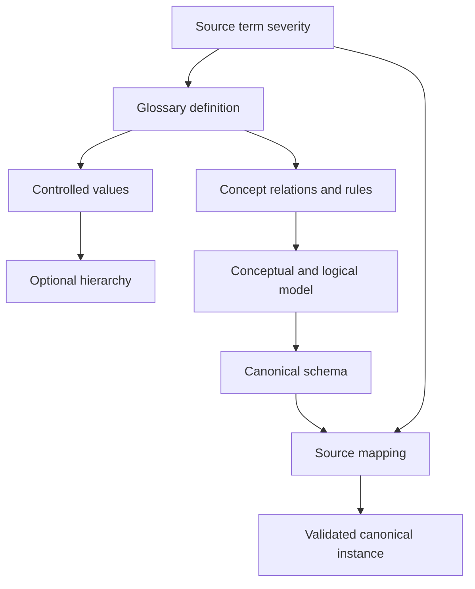

### Plain-English deep-dive 1 - A taxonomy is not an ontology

A grocery aisle taxonomy puts apples under fruit and fruit under food. It answers "where does this category belong?" An ontology can also say that an apple is produced by a plant, has a harvest date, may contain an allergen coating, and is sold by a supplier. It models typed relationships and richer rules.

Use the least formal structure that solves the need. A simple code list may be better than an elaborate ontology for four stable severity values. Complexity without a question, owner, tooling, and consumer creates semantic debt.

## Terms, concepts, labels, and synonyms

A concept should have a stable identifier independent of its preferred human label. Labels can change or have translations; identity and meaning should remain controlled.

| Concept metadata | Synthetic example |
|---|---|
| Concept ID | `nmh:InternetExposure` |
| Preferred label | Internet exposure |
| Definition | Reachability from an approved external observation point under named method |
| Scope | NMH production assets |
| Included | Directly reachable service after validation |
| Excluded | Merely having a public DNS name |
| Synonyms | External exposure, public reachability (qualified) |
| Broader concept | Exposure |
| Related concept | Internet-facing asset |
| Source/authority | NMH exposure governance board |
| Owner/steward | Exposure data steward |
| Version/effective date | v3, effective 2026-08-01 |
| Sensitivity | Internal security |
| Status | Approved |

Do not let synonyms silently become exact synonyms. `Host`, `endpoint`, `device`, `asset`, `resource`, and `configuration item` can overlap without being equal.

| Relationship between terms | Meaning | Mapping posture |
|---|---|---|
| Exact match | Same concept in defined scope | Reuse with evidence |
| Close match | Large overlap but material difference | Preserve distinction/caveat |
| Broader than | Source covers more cases | Map to parent or retain subtype |
| Narrower than | Source covers subset | Preserve subtype |
| Related | Associated but not equivalent | Relationship, not replacement |
| Unknown | Evidence insufficient | Leave unmapped and review |

## Controlled vocabularies and code lists

Code lists are contracts. Each code needs stable identity, definition, lifecycle, and mapping behavior.

| Code-list field | Purpose |
|---|---|
| List ID and version | Unambiguous contract |
| Code | Stable machine value |
| Preferred label | Human display |
| Definition | Meaning and scope |
| Parent code | Optional hierarchy |
| Status | Draft, active, deprecated, retired |
| Effective interval | Time-aware interpretation |
| Replacement code | Migration path |
| Source/authority | Ownership evidence |
| Allowed transitions | Workflow integrity |
| Security classification | Access/export handling |
| Unknown policy | Prevent guessed defaults |

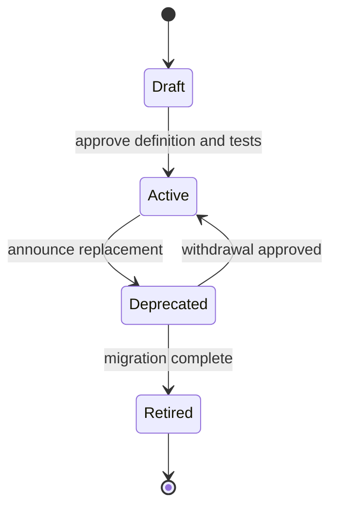

Enum ordering is also semantic. A database enum may have an internal declared order, while a risk scale may need an explicit rank. Store/display code and rank separately when order can change.

| Severity code | Label | Rank | Definition summary | Unknown handling |
|---|---|---:|---|---|
| `critical` | Critical | 4 | Highest governed urgency band | Not a default |
| `high` | High | 3 | High urgency band | Not a default |
| `medium` | Medium | 2 | Moderate urgency band | Not a default |
| `low` | Low | 1 | Lower urgency band | Not a default |
| `unknown` | Unknown | null | Source cannot establish band | Report separately |

## Entity-attribute-relationship model

Model nouns, properties, connections, and observations explicitly.

| Modeling element | Security example | Key question |
|---|---|---|
| Entity type | Asset, user, application, business service | What thing has identity/lifecycle? |
| Attribute | Asset criticality | Is it inherent, asserted, derived, or time-bound? |
| Relationship | User owns asset | What type, direction, validity, provenance? |
| Event | Authentication observed | What occurred, when, actor, target, source? |
| Finding | Vulnerability found on asset | Is it event, state, assertion, or issue? |
| Classification | Asset type | Which controlled vocabulary/version? |
| Constraint | Finding references one resolved asset | What cardinality/exception is valid? |

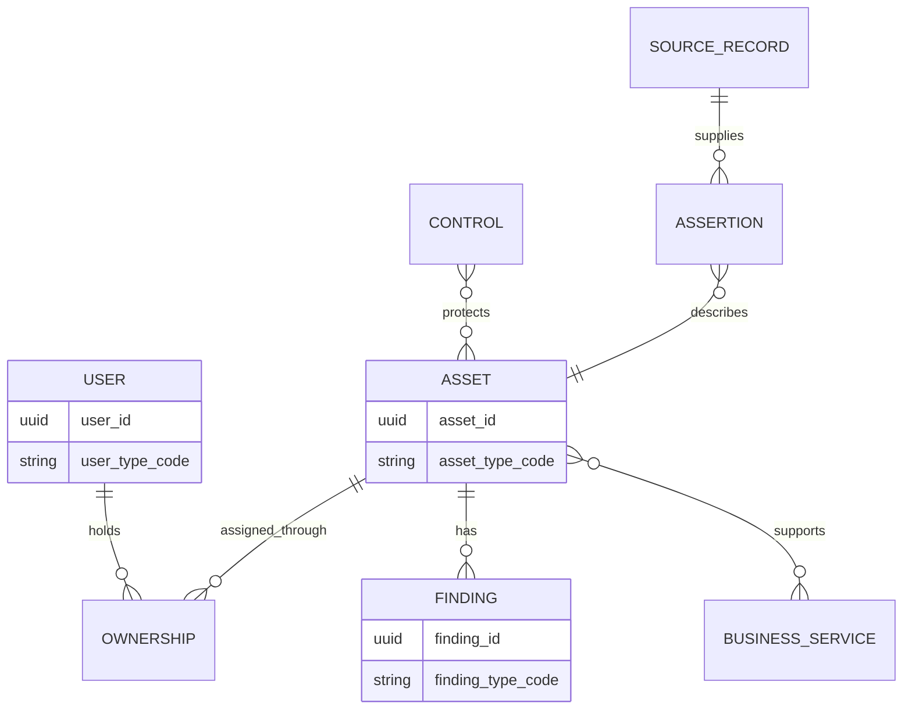

Relationship properties matter. `owns` needs effective dates, role, confidence, source, and status. Without them a past owner can look current.

## Canonical models and schemas

A canonical model defines shared concepts; a canonical schema expresses them in a data contract. It should be source-neutral but use-case-driven. It is not a dumping ground for every source column.

| Canonical design principle | Practical implication |
|---|---|
| Stable concept identity | IDs survive label changes |
| Explicit scope | Tenant/entity/type/time included |
| Source neutrality | No vendor-specific field names in core without reason |
| Loss awareness | Raw/source-specific values retained outside core |
| Typed values | Numbers, timestamps, booleans, codes not ambiguous strings |
| Unit declaration | Measurement unit travels with value/contract |
| Provenance | Every canonical fact traces to source/rule |
| Missingness semantics | Unknown/not applicable/withheld distinguishable |
| Extensibility | Namespaced additions governed |
| Versioning | Producers/consumers know contract version |
| Security/privacy | Classification and access follow fields/relationships |

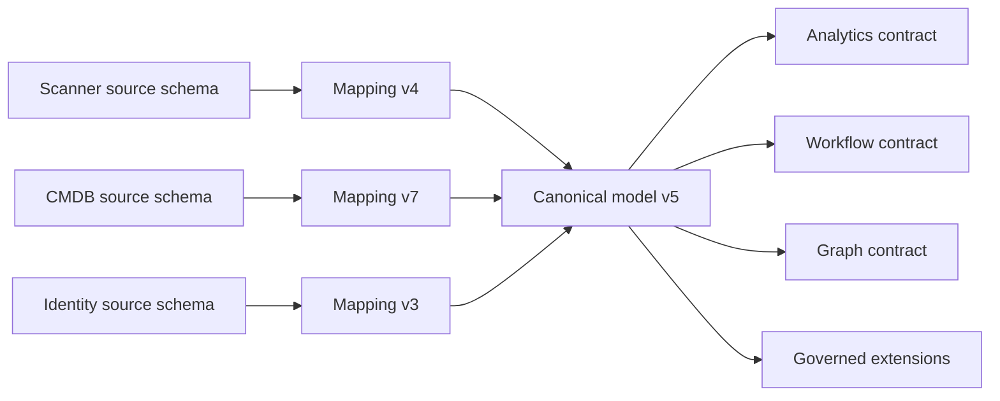

### Plain-English deep-dive 2 - Canonical does not mean one physical table

A city's official street map is a shared reference, but people may consume it as paper, a phone app, a route API, or a navigation graph. One conceptual street does not require one file format.

A canonical model can have relational, JSON, event, and graph projections. What must remain aligned is concept identity and semantics. Forcing every workload into one giant table often creates null-heavy, slow, ambiguous data. Shared meaning matters more than one storage shape.

## Canonical security schema example

Synthetic canonical asset contract:

| Field | Type | Required | Meaning | Provenance/constraint |
|---|---|---|---|---|
| `schema_version` | string | yes | Canonical contract version | Approved version pattern |
| `tenant_id` | string | yes | Customer/security boundary | Never inferred from payload alias |
| `asset_id` | UUID | yes | Resolved internal entity ID | Resolution provenance |
| `asset_type_code` | code | yes | Governed type | Code-list version |
| `display_name` | string | no | Current preferred label | Assertion reference |
| `criticality_code` | code | no | Approved business criticality | Owner/effective time |
| `lifecycle_status_code` | code | yes | Current lifecycle state | Allowed transition rule |
| `first_seen_at` | instant | no | Earliest trusted observation | Clock/source policy |
| `last_seen_at` | instant | no | Latest complete accepted observation | Freshness/provenance |
| `identifiers` | array | yes | Scoped aliases | Namespace and interval |
| `relationships` | array/reference | no | Typed contextual links | Cardinality/time/provenance |
| `extensions` | object | no | Namespaced governed additions | Extension registry |
| `quality` | object | yes | Mapping/validation/confidence state | Rule results |

An illustrative JSON Schema fragment follows. It demonstrates a public standard's mechanics, not a production contract.

```json
{
  "$schema": "https://json-schema.org/draft/2020-12/schema",
  "$id": "https://nmh.example/schemas/lab/canonical-asset-v1.json",
  "type": "object",
  "required": ["schema_version", "tenant_id", "asset_id", "asset_type_code", "lifecycle_status_code", "quality"],
  "properties": {
    "schema_version": {"const": "1.0.0"},
    "tenant_id": {"type": "string", "minLength": 1},
    "asset_id": {"type": "string", "format": "uuid"},
    "asset_type_code": {"enum": ["endpoint", "server", "cloud_resource", "network_device", "unknown"]},
    "lifecycle_status_code": {"enum": ["active", "inactive", "retired", "unknown"]},
    "extensions": {"type": "object"},
    "quality": {
      "type": "object",
      "required": ["mapping_status"],
      "properties": {
        "mapping_status": {"enum": ["mapped", "partially_mapped", "quarantined"]}
      }
    }
  },
  "unevaluatedProperties": false
}
```

JSON Schema separates assertions, annotations, and applicators. `format` behavior depends on vocabulary/implementation configuration; therefore test the actual validator and perform application/domain validation where required.

## Source-to-target mapping specification

A mapping row should be executable enough to test and readable enough to govern.

| Mapping field | Example |
|---|---|
| Mapping ID/version | `MAP-ASSET-017/v4` |
| Source contract/version | `scanner_asset/2026-08` |
| Source path | `$.host.os.family` |
| Source definition | Scanner-reported OS family at observation time |
| Target path | `asset.observed_os_family_code` |
| Target definition/version | Canonical observed OS family v2 |
| Condition | Source entity type in endpoint/server |
| Transformation | Trim, case map via code list OSF-v3 |
| Missing policy | Absent -> unknown reason `not_reported` |
| Invalid policy | Quarantine value; retain raw |
| Default | None |
| Loss/caveat | Source subfamily retained in extension |
| Provenance | Source record/path and rule ID |
| Tests | Valid, unknown, new enum, conflict, replay |
| Owner/approver | Endpoint steward/data governance |

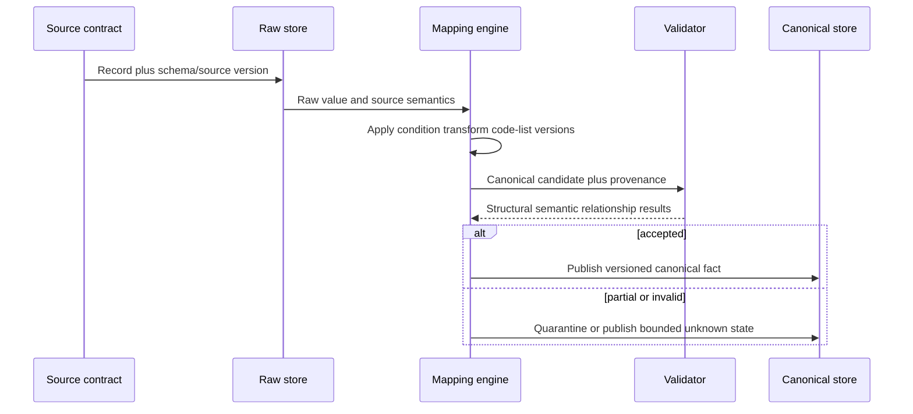

## Mapping cardinality and patterns

| Pattern | Meaning | Example | Risk |
|---|---|---|---|
| One-to-one | One source field maps to one target | source ID to alias value | Semantic mismatch hidden |
| Many-to-one | Several source fields combine | first/last name to display label | Information loss/order/culture |
| One-to-many | One value produces multiple targets | timestamp to instant and date bucket | Derived values drift |
| Lookup | Source code maps through table | `4` to `critical` | Code list/version mismatch |
| Conditional | Context selects mapping | type-specific status | Missing condition branch |
| Aggregate | Multiple records create summary | event count | Grain/window/denominator |
| Split | Compound source decomposed | FQDN to host/domain | Parser assumptions |
| Relationship | IDs become typed edge | owner ID to ownership relation | Identity/cardinality/time |
| Pass-through extension | Preserve source-specific field | namespaced scanner plugin ID | Consumer overdependence |

Do not bury business decisions in opaque code. Mapping logic is governed metadata and should be reviewable, testable, versioned, and linked to deployments.

## Type transformations

| Source | Target | Required checks | Failure example |
|---|---|---|---|
| String `"42"` | Integer 42 | Whole value, range, sign, locale | `42ms` silently truncated |
| Float | Exact decimal | Precision/rounding policy | Risk amount changes |
| String | Boolean | Enumerated accepted spellings | `unknown` becomes false |
| Epoch number | Timestamp | Unit and origin | Seconds treated as milliseconds |
| Text | UUID | Syntax and issuer/scope | Valid UUID refers to wrong namespace |
| JSON number | Database numeric | Range/precision compatibility | Parser overflow/rounding |
| Array | Set/relationship rows | Order/duplicates/cardinality | Duplicate roles disappear |
| Free text | Enum | Exact governed lookup | Unrecognized value forced to nearest code |

PostgreSQL's `json` and `jsonb` both validate JSON syntax, but have different representation behavior. `json` preserves input text details and duplicate keys, while `jsonb` decomposes values, does not preserve whitespace/key order, and keeps only the last duplicate object key. Choose intentionally and reject duplicate-key ambiguity at ingestion where relevant.

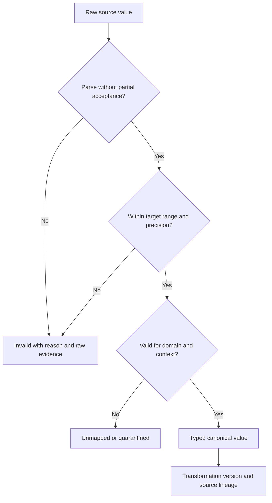

## Unit transformations

A numeric value without a unit and measurement semantics is incomplete.

| Dimension | Source example | Canonical example | Required policy |
|---|---|---|---|
| Duration | 2500 milliseconds | 2.5 seconds | Exact unit metadata and precision |
| Storage | 10 GB | 10,000,000,000 bytes or declared convention | Decimal versus binary definition |
| Percentage | 85 | 0.85 ratio | Scale and range |
| Temperature | Celsius | Canonical Celsius | Formula and rounding |
| Currency | USD amount | Amount plus ISO currency code | Exchange rate/time if converting |
| Risk score | 85/100 | Preserve source scale plus normalized view | Model/version, not a physical unit |
| Network rate | Mbps | bits/second | Bits versus bytes and interval |

Conversion formula needs source unit, target unit, scale/offset, rounding, precision, overflow, missing behavior, and version. Preserve original value/unit for audit.

### Plain-English deep-dive 3 - Numbers do not carry meaning by themselves

The number `60` could mean seconds, minutes, percent, dollars, a severity score, or a count. Even `GB` can use decimal or binary conventions. A database numeric type proves only that the value is numeric.

In security, `risk_score=85` is especially dangerous without model, range, direction, and timestamp. It may not be comparable across products or versions. Preserve the source score and its semantics; create a normalized value only with a governed, explainable crosswalk.

## Enum and code-list transformations

| Source code | Source definition | Canonical target | Decision |
|---|---|---|---|
| `4` | Scanner v8 critical severity | `critical` | Exact under mapping version |
| `3` | Scanner v8 high severity | `high` | Exact under mapping version |
| `urgent` | Ticket priority requiring immediate workflow | none | Do not map to vulnerability severity |
| `external` | Third-party-owned device | `ownership_type=third_party` | Not internet exposure |
| `public` | Public IP observed | candidate context only | Does not prove reachable exposure |
| New `5` | Undefined in received contract | `unknown/unmapped` | Alert and steward review |

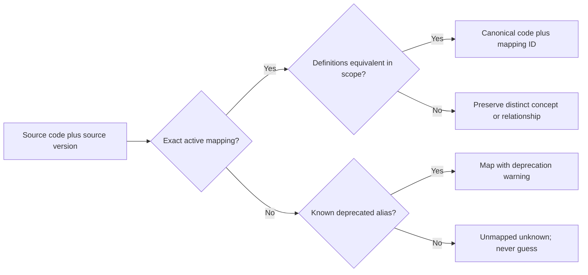

## Time transformations

| Time concept | Meaning | Common error |
|---|---|---|
| Event time | When activity occurred | Replaced by ingestion time |
| Observation time | When source observed state | Assumed equal to state change |
| Source update time | When source changed record | Local clock/zone omitted |
| Received time | When pipeline received data | Used as event time |
| Processed time | When transformation completed | Latency hidden |
| Effective time | When assertion is valid in domain | Late correction mishandled |
| System time | When platform knew/stored assertion | Audit history lost |
| Window | Start/end inclusion semantics | Boundary double count |

Normalize instants to a defined representation while retaining source offset/precision where needed. A date-only value is not midnight UTC. A local timestamp without zone is ambiguous. Daylight-saving transitions can make local times repeat or not exist.

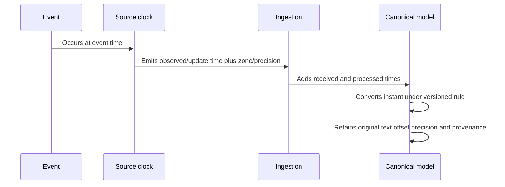

## Unknown, null, absent, and not applicable

Do not use one null to mean everything.

| State | Plain meaning | Example | Analytics behavior |
|---|---|---|---|
| Present known | Value supplied and accepted | owner U-17 | Use with provenance |
| Absent | Field not present in payload | no owner key | Source-contract dependent |
| Explicit null | Source sent null | `"owner": null` | Preserve source assertion/reason if known |
| Unknown | Applicable but not known | owner not determined | Separate bucket |
| Not applicable | Concept does not apply | user owner for shared service account policy | Exclude from completeness denominator where defined |
| Withheld | Known but intentionally not shared | privacy restriction | Protect reason/access |
| Invalid | Value supplied but fails rule | impossible timestamp | Quarantine/quality count |
| Unmapped | Valid source value has no canonical mapping | new source enum | Steward action; never default |
| Conflicting | Multiple valid assertions disagree | two owners same interval | Preserve/review |

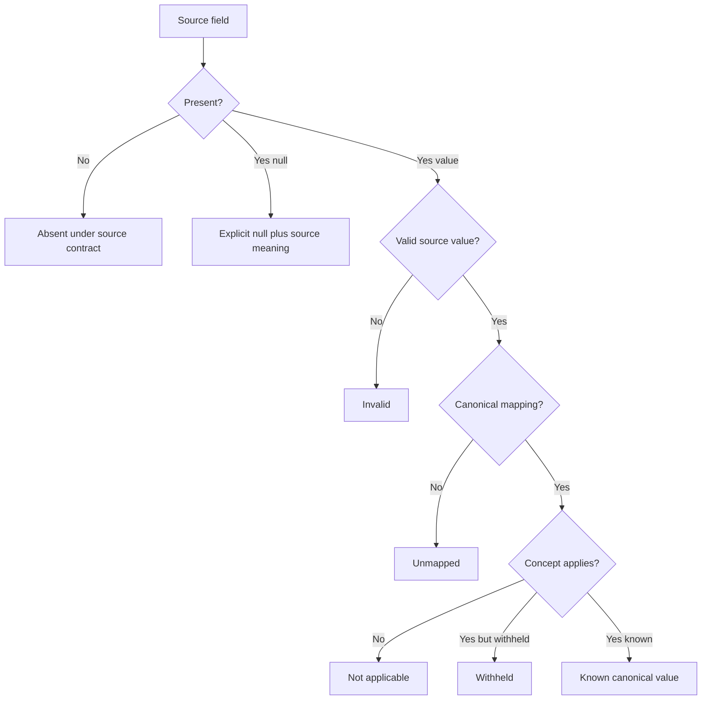

## Taxonomy design

Taxonomy parent-child links should state the relation. "Is a subtype of" differs from "is part of" and "is managed by."

| Taxonomy rule | Good practice | Failure prevented |
|---|---|---|
| Single classification purpose | State whether taxonomy is type, ownership, location, or risk | Mixed hierarchies |
| Stable concept IDs | Labels can change | Broken references |
| Defined parent relation | `laptop` is-a `endpoint` | Part-of confused with subtype |
| Multiple inheritance policy | Permit/prohibit with reason | Ambiguous rollups |
| Mutually exclusive policy | State where required | Double count |
| Unknown/other policy | Distinguish unknown from valid other | Hidden mapping debt |
| Version/effective dates | Time-aware interpretation | Historical restatement |
| Examples/exclusions | Clarify edge cases | Reviewer inconsistency |

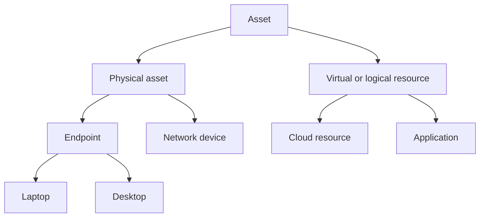

This synthetic hierarchy is one view, not a universal taxonomy. For example, an application may be modeled as an entity separate from an asset in another domain.

## Ontology concepts and formal semantics

An ontology can define classes, properties, relationships, and formal statements. W3C Resource Description Framework (RDF) represents statements as subject-predicate-object triples. Web Ontology Language (OWL) adds richer ontology constructs. Shapes Constraint Language (SHACL) can validate RDF graphs against shapes. These standards have different semantics and assumptions; using one name does not make two concepts equivalent.

| Formal concept | Beginner meaning | Security example | Caution |
|---|---|---|---|
| IRI | Global identifier for a resource/concept | `https://nmh.example/concept/Asset` | Identifier is not proof of existence |
| Triple | Subject-predicate-object statement | asset A supports service S | Statement needs provenance/time |
| Class | Group/type of things | Asset | Membership may be asserted/inferred |
| Property | Typed relationship/attribute | supports | Domain/range semantics matter |
| Subclass | Every member is also member of parent | Laptop subclass of endpoint | Do not use for part-of |
| Equivalent class | Same members under formal semantics | Rarely safe across source vocabularies | Strong claim |
| Shape | Expected graph pattern/constraint | Asset must have tenant ID | Validation differs from inference |
| Open-world view | Missing statement is not automatically false | Unknown owner not no owner | Analytics often assumes closed data |

### Plain-English deep-dive 4 - Open world versus closed world

If a restaurant menu does not list peanuts in a dish, a closed-world system might conclude "no peanuts." An open-world system concludes only "the menu does not say." For allergy safety, missing evidence must not become a negative fact.

Knowledge representations often tolerate incomplete information, while validation schemas commonly check a bounded document. State which assumption applies. In security, absence of a control record does not necessarily prove the control is absent; it may prove coverage or ingestion is incomplete.

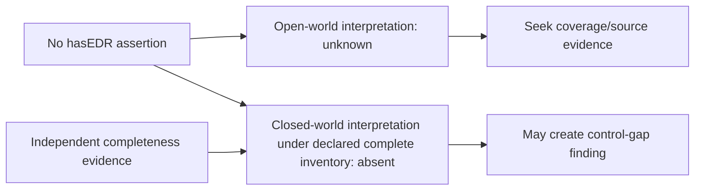

## Validation layers

Validation should answer different questions separately.

| Layer | Question | Example | Cannot prove |
|---|---|---|---|
| Transport | Was payload received intact/authenticated? | Hash/signature/TLS context | Semantic correctness |
| Parse | Is representation parseable? | Valid JSON | Required fields |
| Structural | Does it fit schema/type/cardinality? | UUID string, required tenant | Real UUID belongs to tenant |
| Domain | Is value in allowed code/range? | Valid asset type code | Source mapping correctness |
| Cross-field | Do fields agree? | retired implies retirement time | Real-world truth |
| Referential | Do referenced entities exist/fit? | owner ID resolves to user | Relationship is current |
| Temporal | Are intervals/order valid? | end after start, no overlap | Clocks accurate |
| Semantic mapping | Does source concept equal target concept? | source severity definition aligned | Source observation accurate |
| Business/use | Is record fit for decision? | owner current enough for ticket | Universal fitness |

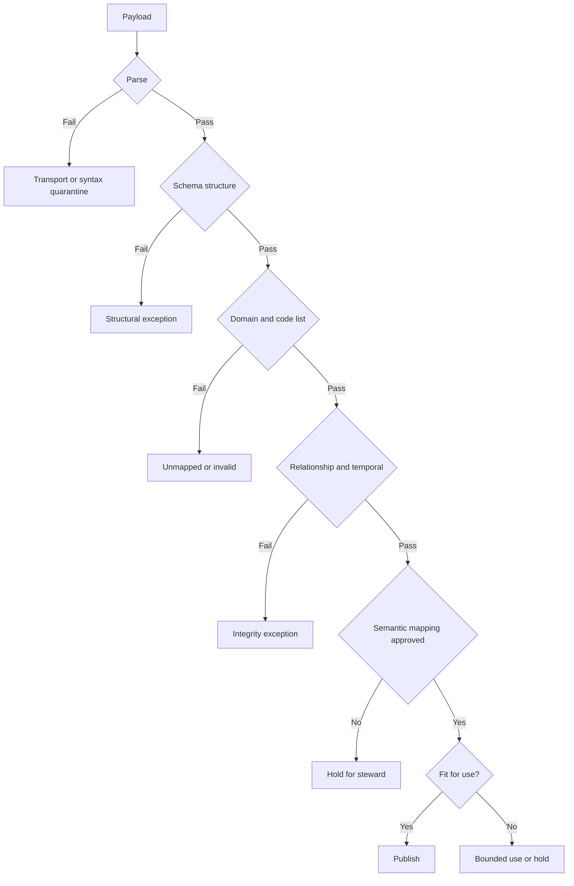

Validation output should include instance location, rule/schema location, error code/message, source/mapping/schema versions, observed value under safe handling, severity, disposition, and owner. JSON Schema defines output concepts, but application errors should also be useful and secure.

## PostgreSQL implementation patterns

PostgreSQL can implement canonical structures through tables, native types, domains, constraints, reference tables, and JSONB. Choose based on change rate, integrity, querying, and portability.

| Mechanism | Good for | Tradeoff |
|---|---|---|
| Native column type | Stable typed fields | Migration for structural change |
| CHECK constraint | Row-local rule | Cannot express every cross-row truth safely |
| Foreign key code table | Governed changing code list | Join and lifecycle management |
| PostgreSQL enum | Small stable database-local set | Evolution/portability/ordering constraints |
| Domain | Reusable scalar constraints | Domain change affects dependents |
| Composite type | Reusable row shape | Schema evolution coupling |
| JSONB extension object | Sparse governed extensions | Weaker default structure unless validated |
| Range type | Effective-time interval | Boundary semantics require care |

```sql
CREATE TABLE nmh_lab.asset_type_code (
    code text PRIMARY KEY,
    preferred_label text NOT NULL,
    definition text NOT NULL,
    status text NOT NULL CHECK (status IN ('draft', 'active', 'deprecated', 'retired')),
    valid_from date NOT NULL,
    valid_to date,
    CHECK (valid_to IS NULL OR valid_to >= valid_from)
);

CREATE TABLE nmh_lab.canonical_asset (
    tenant_id text NOT NULL,
    asset_id uuid NOT NULL,
    schema_version text NOT NULL,
    asset_type_code text NOT NULL REFERENCES nmh_lab.asset_type_code(code),
    source_extensions jsonb NOT NULL DEFAULT '{}'::jsonb,
    valid_from timestamptz NOT NULL,
    valid_to timestamptz,
    PRIMARY KEY (tenant_id, asset_id, valid_from),
    CHECK (jsonb_typeof(source_extensions) = 'object'),
    CHECK (valid_to IS NULL OR valid_to > valid_from)
);
```

The SQL is synthetic. Database constraints protect representation/integrity under assumptions; they do not prove source semantics, identity, or authorization.

## Schema and semantic version evolution

Version the source contract, mapping, canonical schema, code lists, validation rules, and consumer model independently but link them in lineage.

| Change | Example | Compatibility question | Typical response |
|---|---|---|---|
| Add optional field | `exposure_method_code` | Do strict consumers reject extras? | Contract test/staged rollout |
| Add required field | `tenant_id` required | Old producers cannot supply | New major version/backfill |
| Widen type | integer to decimal | Can consumers represent precision? | Dual-read test |
| Narrow type | string to enum | Existing values may fail | Profile/map/quarantine |
| Rename field | `host` to `asset_name` | Consumers break | Alias/deprecation/migration |
| Change definition | `active` semantics change | Shape same, meaning breaks | Treat as semantic breaking change |
| Split concept | `external` to ownership/exposure | Old field ambiguous | Preserve legacy, remap with evidence |
| Merge codes | two severities into one | Historical detail lost | Versioned mapping/retain source |
| Change unit | ms to seconds | Values look plausible but wrong | New field/version, explicit unit |
| Change time zone | local to UTC instant | Historical interpretation changes | Preserve original and migrate |

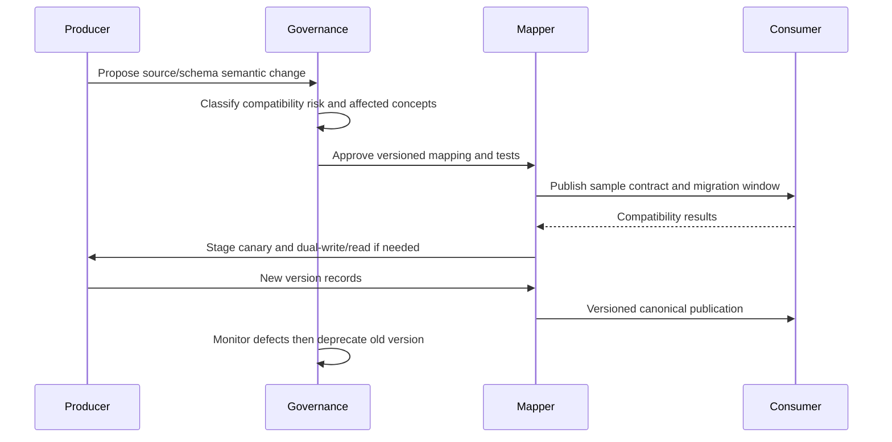

Semantic version labels such as major/minor/patch can help, but compatibility is behavioral. An optional field can still break a consumer that rejects unknown properties. A label change can break a report. A definition change with identical structure can be the most dangerous change.

## Mapping evolution and replay

| Versioned artifact | Why retain it |
|---|---|
| Raw source record | Reprocess without inventing source history |
| Source schema/version | Interpret original fields correctly |
| Mapping rule/version | Reproduce past canonical output |
| Code-list version | Interpret old codes |
| Canonical schema/version | Validate historical result |
| Validator/runtime version | Explain behavior differences |
| Publication/run ID | Locate consumer-visible version |
| Change approval | Audit intent and risk decision |

Replay should not overwrite history invisibly. Produce a new canonical version, reconcile row/value/relationship differences, validate consumers, approve restatement, and communicate changed decisions.

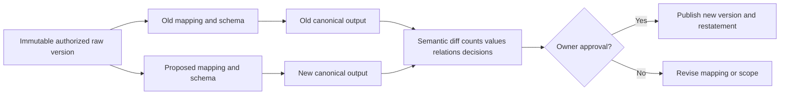

## Extensibility without semantic sprawl

Core models should remain focused while extensions support legitimate local data.

| Extension control | Requirement |
|---|---|
| Namespace | Unique owner/domain prefix |
| Purpose | Named use and consumer |
| Definition | Meaning, scope, examples, exclusions |
| Type/unit/code list | Explicit and versioned |
| Classification | Security/privacy label |
| Owner | Steward and technical maintainer |
| Collision check | No duplicate core/local concept |
| Promotion rule | Criteria to move common extension into core |
| Deprecation | Replacement and migration timeline |
| Validator behavior | Unknown extension handling defined |
| Export policy | Prevent accidental broad disclosure |

### Plain-English deep-dive 5 - Extensible does not mean anything goes

An office can allow teams to add labeled storage cabinets. If anyone can place unlabeled boxes anywhere, the office is flexible but unusable. Namespaces, owners, definitions, and lifecycle rules are the cabinet labels and floor plan.

Rejecting every unknown field blocks innovation; accepting every field silently creates ambiguity and attack surface. A good extension contract allows additions while making unsupported semantics visible and controlled.

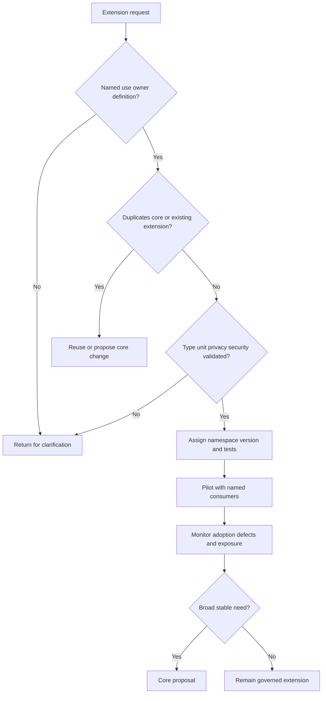

## False equivalence

False equivalence occurs when a mapping declares two concepts equal because their labels or values look similar.

| Source concept A | Source concept B | Why not automatically equal |
|---|---|---|
| Vulnerability severity | Business priority | Technical seriousness versus action order |
| Public IP | Internet reachable | Address assignment versus validated path |
| Device | Asset | One domain's endpoint versus broader valuable resource |
| Owner | User | Accountability role versus person identity |
| Disabled | Inactive | Control state versus lifecycle state |
| Closed finding | Remediated exposure | Workflow state versus validated risk removal |
| No alert | No malicious activity | Missing detection is not negative truth |
| Compliance pass | Secure | Control evidence scope versus total risk |
| Ticket SLA | Security SLO | Contract/workflow promise versus reliability objective |
| Risk score 85 | Risk score 85 | Different models/scales/times can differ |

False-equivalence review checklist:

1. Compare formal definitions, not labels.
2. Compare entity/event grain and population.
3. Compare scope, tenant, issuing authority, and intended use.
4. Compare time meaning, effective interval, and freshness.
5. Compare units, scale, direction, and precision.
6. Compare code-list values and version.
7. Identify inclusions, exclusions, and edge cases.
8. Test counterexamples where values agree but meanings differ.
9. Classify exact, close, broader, narrower, related, or unknown.
10. Preserve source term/provenance and document information loss.

## Security-specific examples

| Source statement | Canonical representation | Guardrail |
|---|---|---|
| Scanner reports CVE on host key | Finding assertion linked to resolved asset | Do not merge finding with vulnerability definition |
| Directory user is group member | Effective-dated membership relationship | Group membership is not current access proof alone |
| EDR sensor missing | Coverage observation/unknown state | Source completeness before control-gap claim |
| CMDB says tier 0 | Business criticality assertion | Owner/version/provenance required |
| Public DNS name exists | DNS relationship/observation | Not automatically internet exposure |
| Firewall says allowed | Policy assertion | Does not prove end-to-end reachability |
| Ticket closed | Workflow state event | Validate remediation separately |
| MFA enabled | Configuration/control assertion | Effectiveness and bypass paths separate |
| Threat intel labels IP malicious | Time-bound indicator assertion | Shared/reassigned IP and confidence |
| User authenticates | Authentication event | Does not prove benign user intent |

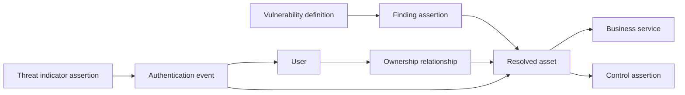

The model keeps definitions, observations, entities, relationships, controls, and workflows distinct so later correlation can be honest.

## Governance operating model

| Role | Decision/accountability |
|---|---|
| Domain owner | Approves business/security meaning and use |
| Data steward | Maintains glossary, code lists, quality, and issue resolution |
| Source owner | Defines source fields and change notice |
| Data architect | Designs canonical model and compatibility |
| Mapping engineer | Implements/version-tests transformations |
| Security/privacy | Reviews classification, purpose, access, and risk |
| Consumer owner | Tests fitness and migration |
| Change authority | Approves breaking/semantic changes |
| TSM | Coordinates customer context, evidence, risk, owners, and communication |

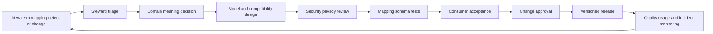

Minimum change record: request, reason, affected terms/fields, definitions before/after, source/mapping/schema/code-list versions, compatibility analysis, security/privacy impact, sample data, test results, migration/backfill, rollback, owners, approval, effective date, and communication.

## Mapping troubleshooting decision tree

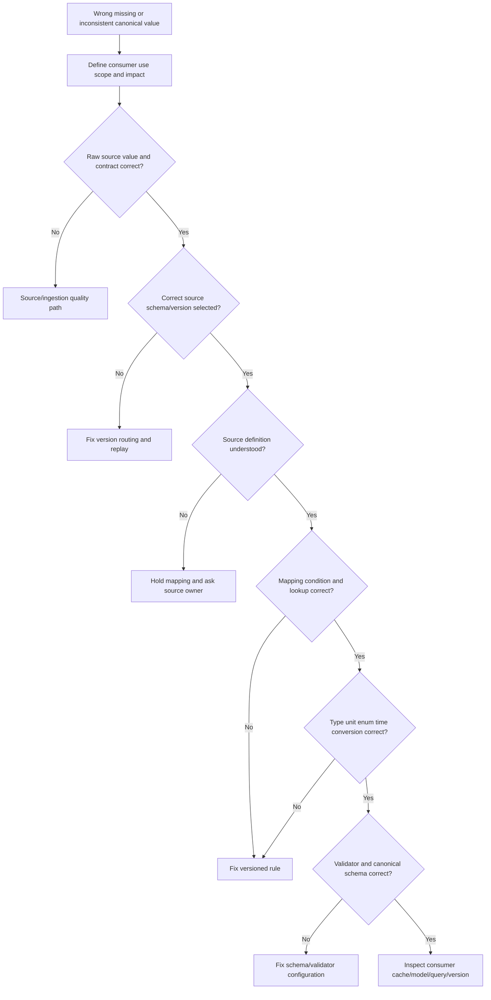

## Mapping troubleshooting runbook

1. State the symptom: parse failure, missing field, wrong type/unit/code/time, relationship defect, unexpected null, validation failure, false equivalence, or consumer mismatch.
2. Identify tenant, source, source version, mapping version, canonical schema/code-list versions, run/publication, consumer, and time range.
3. Bound consequence: reporting only, ticket routing, risk scoring, investigation, control evaluation, or automation.
4. Preserve authorized raw evidence and provenance. Do not repair by overwriting raw values.
5. Compare the exact source definition and sample with the received value. Check source change notice and connector completeness.
6. Confirm parser and source schema selection. Look for duplicate JSON keys, encoding, truncation, case, array/object, numeric precision, and timezone defects.
7. Evaluate mapping preconditions. Confirm entity type, source variant, tenant, and branch coverage.
8. Reproduce type, unit, enum, and time transformations step by step with versions and intermediate values.
9. Inspect unknown/null/absent/not-applicable/withheld/invalid/unmapped handling. Ensure no default hid a defect.
10. Compare source and canonical definitions using inclusions, exclusions, grain, scope, time, scale, and counterexamples.
11. Run structural, domain, cross-field, referential, temporal, semantic, and use-fitness validators separately.
12. Inspect code-list status/effective dates and schema dialect/runtime configuration. Confirm `format`/custom-keyword behavior if relevant.
13. Check extensions/namespaces and whether strict consumers rejected an additive field.
14. Quantify blast radius by records, entities, values, relationships, periods, reports, scores, tickets, and actions.
15. Contain unsafe uses: quarantine affected records, expose unmapped state, pin accepted version, suspend dependent action, or show bounded stale data.
16. Implement correction as a new mapping/schema/code-list version. Add counterexample and regression tests.
17. Replay into isolation, compare old/new canonical results, and reconcile counts, values, relationships, quality states, and decisions.
18. Obtain domain, consumer, security/privacy, and change approval appropriate to impact.
19. Publish versioned correction/restatement with impact, known limitations, migration action, and owner.
20. Prevent recurrence with contract monitoring, unknown-code alert, semantic review, compatibility test, lineage dashboard, or source-change agreement.

| Evidence item | Diagnostic value |
|---|---|
| Raw payload/path | What source actually sent |
| Source contract/definition | What value meant |
| Mapping rule/version | How meaning was translated |
| Code-list versions | How codes were interpreted |
| Intermediate conversions | Where value changed |
| Canonical schema/dialect | What structure was expected |
| Validation output | Exact failed layer/location |
| Provenance record | Traceability and affected run |
| Consumer contract/version | Whether display/query changed meaning |
| Semantic diff | Scope of restatement |

## Synthetic exercises with answers

### Exercise 1 - Layer selection

NMH needs four allowed severity labels. Does it require an ontology?

**Answer:** Usually a governed code list with definitions, rank, version, and unknown policy is sufficient. Add hierarchy/ontology only for real relationship or reasoning needs.

### Exercise 2 - Same label

Two sources use `external`; one means third-party ownership and one means internet reachability. Map both to one flag?

**Answer:** No. These are different concepts. Map to ownership and exposure constructs separately and preserve source definitions.

### Exercise 3 - Type validity

String `"85"` parses as an integer. Is it a valid risk score?

**Answer:** Only syntactically typed. Domain validation still needs scale, range, model/version, direction, effective time, and source authority.

### Exercise 4 - Unknown code

A source adds severity `5` without notice. Map it to critical?

**Answer:** No. Preserve raw value, mark unmapped, alert the steward/source owner, and add a versioned mapping only after semantics are known.

### Exercise 5 - Null

An asset's owner field is missing. Does that mean unowned?

**Answer:** Not without a complete authoritative contract. It may be absent, unknown, withheld, inapplicable, invalid, or a pipeline defect. Preserve reason/state.

### Exercise 6 - Time

Source sends `2026-08-24 01:30` without zone. Convert to UTC?

**Answer:** Not safely without source timezone/offset policy and daylight-saving context. Quarantine or treat as local-time assertion with uncertainty; never guess.

### Exercise 7 - Schema success

A JSON document passes JSON Schema. Is the mapped asset true?

**Answer:** No. Structural validation proves asserted constraints only. Identity, source accuracy, semantic mapping, relationships, and fitness need separate evidence.

### Exercise 8 - Optional field

Adding an optional field is always backward compatible. True?

**Answer:** No. Strict consumers may reject unknown properties; semantics, size, privacy, code generation, or UI can change. Run consumer contract tests.

### Exercise 9 - JSONB

Can JSONB safely retain duplicate object keys for audit?

**Answer:** PostgreSQL documents that JSONB keeps only the last duplicate key and does not preserve input formatting/order. Preserve raw bytes/text separately and reject duplicate-key ambiguity when needed.

### Exercise 10 - Taxonomy link

Is `engine` a subtype of `car`?

**Answer:** No, it is part of a car. Label the relationship; confusing part-of and is-a creates invalid inheritance and rollups.

### Exercise 11 - Open world

No control assertion exists. Can a report label the asset uncontrolled?

**Answer:** Only under a declared complete, closed-world control inventory. Otherwise the honest state is unknown/coverage gap.

### Exercise 12 - Zscaler claim

Can public "customizable data model" wording establish an internal canonical field or mapping rule?

**Answer:** No. It supports high-level capability context only. Validate current product documentation, tenant evidence, and specialists for implementation detail.

## Labs and rehearsal

### Lab 1 - Glossary clinic

Define asset, device, endpoint, exposure, vulnerability, finding, control, owner, criticality, and risk with IDs, scope, examples, exclusions, owner, and version.

### Lab 2 - Synonym crosswalk

Classify 30 source terms as exact, close, broader, narrower, related, or unknown. Include counterexamples for every proposed exact match.

### Lab 3 - Taxonomy

Build one asset-type hierarchy and label every parent relation. Test mutual exclusivity, multiple inheritance, unknown, other, and historical version behavior.

### Lab 4 - Ontology sketch

Represent asset, user, service, finding, control, and source assertion as concepts/relationships. Add provenance and time rather than overclaiming direct truth.

### Lab 5 - Canonical contract

Design a canonical asset schema with typed core fields, code-list references, identifiers, relationships, quality, provenance, extensions, and version.

### Lab 6 - Mapping specification

Map two synthetic sources field by field. Record definitions, transformations, missing/invalid behavior, information loss, tests, and owners.

### Lab 7 - Type/unit transformations

Test booleans, integers, exact decimals, timestamps, bytes, durations, percentages, and risk-score scales. Reject partial parses and overflow.

### Lab 8 - Enum/code-list evolution

Add, deprecate, split, and merge codes. Show historical interpretation, replacement, consumer migration, and unknown-new-value behavior.

### Lab 9 - Missingness

Create cases for absent, null, unknown, not applicable, withheld, invalid, unmapped, and conflicting. Build correct completeness denominators.

### Lab 10 - JSON Schema validation

Validate synthetic instances for types, required properties, enums, `oneOf`, extensions, and unknown properties. Document dialect/runtime and `format` behavior.

### Lab 11 - PostgreSQL implementation

Implement code tables, foreign keys, CHECK constraints, effective intervals, and JSONB extensions. Prove what each constraint cannot validate.

### Lab 12 - Semantic version migration

Change `external` into separate ownership and exposure concepts. Dual-run old/new mappings and create a semantic diff/restatement plan.

### Lab 13 - False-equivalence review

Review ten security pairs such as public IP/internet reachable and closed/remediated. Require definitions, scope, grain, time, and counterexamples.

### Lab 14 - Extension governance

Propose a namespaced local field, perform collision/privacy/security checks, add validators, pilot consumers, and define promotion/deprecation.

### Lab 15 - Mapping incident

Inject a milliseconds/seconds error and a new enum. Trace the first bad stage, contain reports/actions, replay a new version, and reconcile impact.

### Lab 16 - TSM semantic briefing

Explain a customer-visible mapping defect in five minutes: source meaning, incorrect canonical interpretation, impact, evidence, containment, corrected version, validation, and prevention.

| Lab evidence | Completion standard |
|---|---|
| Meaning | Definitions, scope, examples, exclusions |
| Model | Entity/attribute/relationship/event distinctions |
| Mapping | Source and target semantics both explicit |
| Transform | Type/unit/enum/time rules reproducible |
| Missingness | Unknown states not collapsed |
| Validation | Structural/semantic/use layers separate |
| Evolution | Versions, compatibility, migration, rollback |
| Governance | Owner, approval, lineage, monitoring |
| Security | Purpose/access/privacy considered |
| Honesty | Product internals and lab claims bounded |

## Common misconceptions to correct

| Misconception | Correct model |
|---|---|
| Vocabulary, taxonomy, ontology, and schema are synonyms | They manage terms, hierarchy, semantics/relations, and structure differently |
| An ontology is always better | Use complexity only for a real need |
| Same label means same concept | Compare definitions, scope, grain, time, units, and use |
| Different label means different concept | Synonyms may exist under governed crosswalk |
| Taxonomy parent always means subtype | It may mean part-of or another relationship |
| Schema defines business truth | It asserts structure/constraints, not source truth |
| Canonical model means one giant table | Shared semantics can have multiple projections |
| Canonical means every source field | Core should be use-driven; preserve source-specific extensions |
| Mapping is column renaming | It translates meaning, type, unit, code, time, and relationships |
| Valid JSON is valid data | Parsing is only one validation layer |
| JSON Schema `format` always validates fully | Vocabulary/implementation behavior must be known/tested |
| PostgreSQL JSON and JSONB preserve the same details | JSONB decomposes and drops duplicate keys except last |
| A numeric column includes a unit | Units/scale/model need metadata |
| Risk scores from different tools are comparable | Models, scales, populations, and time differ |
| Unknown should default to low/false | That hides risk and mapping debt |
| Null means unknown | Null may encode several states unless modeled |
| Absent assertion means false | Only under declared closed-world completeness |
| Enum values never change | Additions, deprecation, splits, merges, and meaning changes occur |
| Optional additions never break consumers | Strict readers and semantics can break |
| Semantic version label proves compatibility | Test actual producer/consumer behavior |
| Additive schema change is never a privacy change | New field/relationship can expose sensitive context |
| Flexible extensions need no governance | Namespaces, definitions, security, lifecycle, and tests remain essential |
| More mappings increase completeness | Guessed equivalence increases wrong certainty |
| Dropping unmapped records is clean | It hides coverage/mapping defects |
| Source precedence solves semantics | Preferred source can be stale or answer another question |
| Standards provide organization-specific meaning | Standards provide frameworks/vocabularies; owners define local concepts |
| Public Data Fabric context exposes internal canonical schema | It does not |

## Official Source Anchors

Research/source date: **2026-08-24**.

W3C recommendations support RDF, OWL, SHACL, SKOS, and provenance concepts; JSON Schema documents support structural/schema vocabulary concepts and also identify interoperability/security caveats. ISO metadata standards provide registry context. PostgreSQL documents database behavior. NIST provides governance/security/privacy context. Zscaler supports only the bounded public capability statements used here.

| Source | URL | Used for | Boundary |
|---|---|---|---|
| W3C RDF 1.1 Concepts | https://www.w3.org/TR/rdf11-concepts/ | RDF resources, IRIs, literals, triples, graphs | Not NMH ontology or mapping |
| W3C OWL 2 Overview | https://www.w3.org/TR/owl2-overview/ | Ontology/class/property formalism context | OWL complexity not always required |
| W3C SHACL | https://www.w3.org/TR/shacl/ | RDF graph validation/shapes | Validation does not prove truth |
| W3C SKOS Reference | https://www.w3.org/TR/skos-reference/ | Concepts, labels, broader/narrower, mapping relations | Concept schemes require governance |
| W3C PROV-O | https://www.w3.org/TR/prov-o/ | Provenance entities, activities, agents | Vocabulary, not complete lineage system |
| JSON Schema 2020-12 Core | https://json-schema.org/draft/2020-12/json-schema-core | Schema resources, vocabularies, identifiers, applicators, output/security | Published as Internet-Draft; implementation behavior matters |
| JSON Schema 2020-12 Validation | https://json-schema.org/draft/2020-12/json-schema-validation | Types, enum, required, constraints, format behavior | Structural validation not domain truth |
| RFC 8259 JSON | https://www.rfc-editor.org/rfc/rfc8259 | JSON data interchange syntax/semantics | Does not define business schema |
| ISO/IEC 11179-1 | https://www.iso.org/standard/78914.html | Metadata registry framework context | Full standard/access/applicability vary |
| PostgreSQL 17 Data Types | https://www.postgresql.org/docs/17/datatype.html | Native type behavior | Version-specific implementation |
| PostgreSQL 17 JSON Types | https://www.postgresql.org/docs/17/datatype-json.html | JSON/JSONB representation and indexing tradeoffs | JSON validity is not semantic validity |
| PostgreSQL 17 CREATE TYPE | https://www.postgresql.org/docs/17/sql-createtype.html | Composite/enum/range/user types | Database-local implementation choices |
| NIST SP 800-53 Rev. 5 | https://csrc.nist.gov/pubs/sp/800/53/r5/upd1/final | Access, integrity, audit, configuration, PII processing controls | Requires tailoring |
| NIST Privacy Framework | https://www.nist.gov/privacy-framework | Privacy risk governance | Voluntary; not legal advice |
| NIST Cybersecurity Framework 2.0 | https://www.nist.gov/cyberframework | Govern/identify/protect/detect/respond/recover context | Not a canonical schema |
| Zscaler Data Fabric for Security | https://www.zscaler.com/products-and-solutions/data-fabric | Public customizable model, ingest, harmonize/map, deduplicate, correlate, enrich | No internal field, ontology, mapping, rule, or guarantee claim |

## Likely Interview Questions

### Q1. How do vocabulary, taxonomy, ontology, schema, and mapping differ?

**Model answer:** A controlled vocabulary defines approved terms/codes; a taxonomy arranges categories, usually hierarchically; an ontology defines concepts, relationships, and potentially formal rules; a schema defines data structure/types/constraints; and a mapping translates source semantics into target semantics. I select only the needed formality and link every layer through stable concept IDs, versions, owners, and provenance.

### Q2. What is a canonical data model, and what are its tradeoffs?

**Model answer:** It is a shared source-neutral representation used by multiple producers/consumers, reducing pairwise mappings and aligning meaning. It should be use-driven, typed, versioned, provenance-aware, explicit about scope/time/missingness, and extensible. Tradeoffs are governance cost, lowest-common-denominator risk, migration coupling, and potential loss. I preserve raw/source-specific facts and allow governed projections/extensions rather than force one giant table.

### Q3. How do you create a source-to-canonical mapping?

**Model answer:** I document source path, definition/version, target concept/path/version, conditions, type/unit/enum/time transformations, missing/invalid/default policy, information loss, provenance, tests, owner, and approval. I classify semantic relation using definitions and counterexamples, never label similarity. Unknown values remain unmapped until an owner confirms meaning.

### Q4. How do you handle null, unknown, not applicable, withheld, invalid, and unmapped values?

**Model answer:** I model them as distinct states because they imply different quality, privacy, denominator, and action behavior. I preserve source representation and reason, avoid defaults such as unknown-to-low, and report unmapped/invalid values as controlled exceptions. Completeness uses applicability-aware denominators.

### Q5. How do you validate canonical data?

**Model answer:** I separate transport/integrity, parsing, structural schema, domain/code, cross-field, referential, temporal, semantic mapping, and fitness-for-use checks. Passing JSON Schema or a database constraint proves only declared structural rules. I retain validation location, rule/schema/runtime versions, provenance, disposition, owner, and safe error details.

### Q6. How do you evolve schemas and mappings safely?

**Model answer:** I inventory producers/consumers, classify structural and semantic compatibility, version source/schema/mapping/code lists independently, create samples and contract tests, stage dual-write/read or canaries, retain raw/replay capability, compare old/new semantic outputs, obtain owners' approval, publish migration/deprecation, monitor, and keep rollback. Definition or unit changes are breaking even if shape is unchanged.

### Q7. What is false equivalence, and how do you prevent it in security data?

**Model answer:** False equivalence maps different concepts as equal, such as public IP to internet reachable or ticket closed to exposure remediated. I compare definitions, grain, population, scope, authority, time, units, scale, inclusions/exclusions, and counterexamples; classify exact/close/broader/narrower/related/unknown; preserve provenance and loss; and require semantic steward review.

### Q8. How does your background transfer, and what can you claim about Zscaler Data Fabric?

**Model answer:** enterprise escalation work required translating customer language, product terms, telemetry fields, IDs, states, and error codes into a shared problem model, then testing where meaning changed across boundaries. SQL, Power BI, data quality, RCA, and stakeholder communication support schema/mapping work. Zscaler publicly describes a customizable model and harmonize/map capabilities, but I do not claim internal schemas or rules; I would validate current tenant evidence, docs, and specialists.

## 30-Second Memory Hooks

| Concept | Memory hook |
|---|---|
| Vocabulary | Approved menu of words |
| Taxonomy | Library shelves |
| Ontology | Map plus relationship rules |
| Schema | Form and type contract |
| Mapping | Translation with evidence |
| Concept ID | Meaning survives label change |
| Canonical | Shared adapter, not universal truth |
| Entity | Noun |
| Attribute | Property |
| Relationship | Typed verb with time |
| Code list | Values need definitions and lifecycle |
| Type | Form, not meaning |
| Unit | Label every number |
| Enum map | New code means review, not guess |
| Time | Event, observed, received, effective differ |
| Null | Empty representation, not one reason |
| Unknown | Applicable but not known |
| Not applicable | Wrong question for this item |
| Validation | Layered questions, layered evidence |
| Open world | Not stated is not false |
| Versioning | Shape and meaning both change |
| Extension | Namespaced extra room |
| False equivalence | Similar label, different contents |
| Provenance | Source-to-target receipt |
| Experience bridge | Translation and RCA transfer; internals do not |

## Completion Checklist

- [ ] I distinguish terms, concepts, labels, synonyms, and stable concept IDs.
- [ ] I distinguish controlled vocabulary, code list, taxonomy, ontology, schema, and mapping.
- [ ] I use the least formal semantic structure that solves a real need.
- [ ] I define scope, examples, exclusions, owner, status, and version for important concepts.
- [ ] I classify crosswalks as exact, close, broader, narrower, related, or unknown.
- [ ] I never infer exact equivalence from a matching label.
- [ ] I distinguish is-a, part-of, owns, supports, protects, and observes relationships.
- [ ] I model relationship direction, cardinality, time, confidence, and provenance.
- [ ] I distinguish conceptual, logical, physical, and canonical models.
- [ ] I know a canonical model can have relational, JSON, event, and graph projections.
- [ ] I keep canonical core source-neutral and use-case-driven.
- [ ] I preserve raw/source-specific values and explicit information loss.
- [ ] I define source path/meaning/version and target path/meaning/version for every mapping.
- [ ] I version mapping conditions, transformations, defaults, missing behavior, and tests.
- [ ] I distinguish one-to-one, many-to-one, one-to-many, lookup, conditional, aggregate, split, relationship, and extension mappings.
- [ ] I reject partial parses, overflow, precision loss, and ambiguous boolean conversions.
- [ ] I label measurement units, scale, offset, rounding, and precision.
- [ ] I preserve source risk score model/range/direction/time before normalization.
- [ ] I treat new enum values as unmapped until semantics are approved.
- [ ] I distinguish event, observation, update, received, processed, effective, and system time.
- [ ] I do not invent timezone or convert date-only values to an arbitrary instant.
- [ ] I distinguish absent, explicit null, unknown, not applicable, withheld, invalid, unmapped, and conflicting.
- [ ] I build applicability-aware completeness denominators.
- [ ] I understand open-world and closed-world assumptions.
- [ ] I do not infer control absence from missing data without completeness evidence.
- [ ] I separate parse, structural, domain, cross-field, referential, temporal, semantic, and use-fitness validation.
- [ ] I know schema/database validity does not prove source accuracy or domain truth.
- [ ] I identify JSON Schema dialect/runtime and test `format`/extension behavior.
- [ ] I understand PostgreSQL JSON versus JSONB duplicate-key/representation behavior.
- [ ] I choose native types, code tables, constraints, domains, composites, ranges, and JSONB intentionally.
- [ ] I version source contracts, mappings, canonical schemas, code lists, validators, and consumer models.
- [ ] I classify optional/additive changes using real consumer behavior, not assumption.
- [ ] I treat definition, unit, scale, and time changes as potentially breaking.
- [ ] I can stage canary, dual-write/read, semantic diff, replay, restatement, and rollback.
- [ ] I govern extensions with namespace, purpose, definition, type/unit, classification, owner, tests, and lifecycle.
- [ ] I detect false equivalence in common security terms and states.
- [ ] I retain provenance from raw source through mapping and publication.
- [ ] I can run the mapping troubleshooting decision tree and produce an evidence pack.
- [ ] I can complete all synthetic NMH labs and explain every tradeoff.
- [ ] I apply purpose limitation, access, classification, audit, and safe error handling to semantic metadata.
- [ ] I separate standards behavior, PostgreSQL implementation, synthetic evidence, and Zscaler public context.
- [ ] I make no unsupported Zscaler Data Fabric field, schema, ontology, mapping, validator, or outcome claim.
- [ ] I can answer Q1 through Q8 with mechanics, examples, tradeoffs, failures, troubleshooting, and honest boundaries.

[Part 55 - Correlation, Enrichment, Security Graphs, and Business Context](Part-55-correlation-enrichment-security-graphs.md)