# Part 55 - Correlation, Enrichment, Security Graphs, and Business Context

> **Audience:** Candidates preparing for a Zscaler Security Operations Technical Success Manager role after enterprise Support Escalation Engineering.
>
> **Purpose:** Build a beginner-first method for connecting security records by time, entity, relationship, and behavior; distinguishing joins, event correlation, and graph traversal; modeling nodes, edges, properties, and paths; enriching technical findings with asset, owner, user, service, exposure, control, and threat context; preserving confidence and provenance; reasoning about attack/exposure paths without claiming causation; and using correlated context responsibly for risk decisions.
>
> **Scope and honesty:** Northstar Meridian Holdings, abbreviated NMH, is fictional. Every user, asset, event, finding, node, edge, path, correlation rule, time window, score, threshold, incident, query result, enrichment, and outcome in this Part is synthetic. General graph, correlation, W3C, NIST, and PostgreSQL concepts are not Zscaler Data Fabric schemas, graph structures, algorithms, risk models, thresholds, query languages, or guarantees. Official Zscaler material is used only for bounded public context: Zscaler publicly describes Data Fabric correlation/enrichment and UVM context spanning identity, assets, user behavior, mitigating controls, business processes, organizational hierarchy, and more. Your prior support correlation, timeline, SQL, incident, RCA, and communication skills transfer; direct production operation of Zscaler Data Fabric correlation remains a learning boundary.
>
> **Currency caveat:** Threat intelligence, business context, topology, identities, controls, standards, products, and source quality change. The controlled research/source date for this Part is exactly **2026-08-24**. Current approved contracts, tenant evidence, incident procedures, threat intelligence terms, customer risk appetite, legal/privacy controls, and product/source specialists govern production.

## Section goal

Correlation connects facts that may belong in one analytical story. Enrichment adds useful context to those facts. A graph represents things and their typed relationships so analysts can explore paths. These capabilities can reveal high-value patterns, but they can also create persuasive fiction when identity, time, direction, provenance, or freshness is wrong.

Think of investigating a delayed flight. A ticket record, aircraft maintenance entry, weather alert, crew assignment, and airport closure can be connected by flight number and time. A route map shows dependencies. Yet events occurring together do not prove which one caused the delay. Security correlation needs the same discipline: connect evidence, state uncertainty, test alternatives, and separate association from cause.

By the end, you should be able to:

| Outcome | Demonstrated capability | Evidence artifact |
|---|---|---|
| Define correlation | Explain time, entity, relationship, sequence, and behavior correlation | Correlation catalog |
| Choose method | Distinguish join, event correlation, and graph traversal | Method decision card |
| Model graph | Define node, edge, property, direction, type, and path | Graph contract |
| Align time | Build bounded windows with event-time, late-data, and clock policy | Temporal specification |
| Correlate entities | Use resolved identities and relationship intervals | Entity evidence card |
| Correlate behavior | Compare sequence/frequency/baseline without causal overclaim | Behavior hypothesis |
| Enrich safely | Add business/technical context with authority, freshness, confidence | Enrichment ledger |
| Build paths | Identify possible exposure/attack routes and choke points | Path report |
| Query graphs | Explain neighborhood, traversal, reachability, shortest path, cycle, centrality concepts | Query notebook |
| Preserve trust | Attach provenance/confidence to nodes, edges, paths, and derived results | Trust metadata |
| Handle stale context | Detect expired ownership, service, topology, control, and threat assertions | Freshness dashboard |
| Use risk responsibly | Separate technical severity, context, evidence, uncertainty, and decision | Risk rationale |
| Troubleshoot | Locate failures in source, identity, time, relation, enrichment, query, or consumer | Correlation runbook |
| Bridge experience | Translate timeline and dependency troubleshooting into TSM language | Interview narrative |

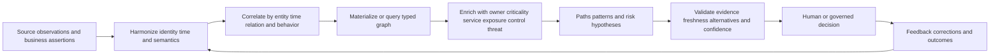

## JD Mapping

| Role expectation | Part 55 capability | TSM artifact | experience bridge and boundary |
|---|---|---|---|
| Analyze complex environments | Connect cross-domain entities, events, relationships, and time | Correlation map | Microsoft multi-layer fault correlation transfers |
| Identify security risks | Find context-rich exposures and possible paths | Risk evidence brief | Observation supports hypothesis, not proof |
| Develop Data Fabric expertise | Explain public correlate/enrich positioning | Conceptual data/graph view | Internal graph/model unclaimed |
| Resolve escalations | Trace bad result to identity, time, edge, enrichment, or query | Evidence pack | Timeline/RCA discipline transfers |
| Recommend mitigations | Identify path choke points, owners, controls, and validation | Mitigation options | Customer risk/control owner decides |
| Communicate to executives | Translate graph details into business service and decision impact | Executive story | Confidence/unknowns visible |
| Drive adoption | Define context owners, freshness, review, and query governance | Operating model | Roles and integrations vary |
| Protect customer trust | Prevent stale, overconnected, privacy-invasive, or causal claims | Trust checklist | No unsupported product outcome claim |

## Candidate honesty note

| Evidence class | Safe interview statement | Boundary |
|---|---|---|
| Production transfer | "I correlated identity, endpoint, network, service, request, log, and timeline evidence in enterprise escalations." | Not operating a production Zscaler security graph |
| Synthetic practice | "I modeled and queried NMH event/entity/relationship graphs and tested stale context and false paths." | Fictional lab evidence |
| General method | "I choose joins, event windows, or graph traversal according to the question." | Implementation/platform differs |
| Query example | "PostgreSQL recursive CTEs can demonstrate path traversal and cycle detection." | Not a claim about a dedicated graph engine or Zscaler |
| Product context | "Zscaler publicly describes correlation/enrichment and contextual UVM data." | No internal node, edge, algorithm, or score claim |
| Finding | "This validated path shows a potential route under stated assumptions." | Does not prove exploitation or causation |
| Confidence | "The path confidence is bounded by its weakest material assertion and freshness." | Numeric confidence needs defined method |
| Production next step | "I would validate current tenant data, source semantics, product docs, and specialists." | Never fill missing evidence with product assumptions |

## Beginner vocabulary and memory hooks

| Term | Plain meaning | Why it matters | Memory hook |
|---|---|---|---|
| Correlation | Connecting observations using defined evidence | Builds a larger analytical story | Put related clues together |
| Event correlation | Relate occurrences by time/entity/pattern | Finds sequences and clusters | Scenes in one timeline |
| Entity correlation | Link observations to resolved things | Avoids fragmented or mixed identities | Which actor/object? |
| Temporal correlation | Relate observations within time rules | Security events are time-dependent | Clocks and windows |
| Behavioral correlation | Relate activity by sequence/frequency/baseline | Detects patterns beyond single events | What pattern changed? |
| Join | Combine rows when keys/conditions match | Direct structured combination | Match spreadsheet columns |
| Enrichment | Add context from another source | Turns technical facts into actionable information | Add labels to the map |
| Graph | Nodes connected by typed edges | Natural representation for relationships/paths | Dots and lines with meaning |
| Node | A represented entity/event/concept | Path endpoint/intermediate object | Dot |
| Edge | Typed directed relationship | Defines how nodes connect | Labeled arrow |
| Property | Attribute on node/edge | Adds state, time, provenance | Note attached to dot/arrow |
| Path | Sequence of connected edges/nodes | Represents reachability or dependency | Route through the map |
| Hop | One edge traversal | Measures path length | One step |
| Neighborhood | Nodes within bounded hops | Supports local context | Nearby streets |
| Traversal | Follow edges under rules | Finds connected context | Walk the route |
| Reachability | Whether a valid path exists | Supports exposure analysis | Can I get there? |
| Cycle | Path returns to a visited node | Can cause loops and model insight | Round trip |
| Directed edge | Relationship has a direction | `user owns asset` differs from reverse | Arrow matters |
| Temporal window | Bounded interval for considering events related | Controls coincidence and late data | How close in time? |
| Attack path | Hypothesized route an attacker could use | Focuses validation and choke points | Possible route, not proof |
| Exposure path | Route connecting entry/opportunity to impact target | Adds reachability and business context | Open route to something valuable |
| Choke point | Node/edge/control whose change disrupts many paths | Can prioritize mitigation | Bridge on many routes |
| Provenance | Origin and transformations of assertion | Enables audit/correction | Receipt for each clue |
| Confidence | Defined strength of supporting evidence | Prevents binary certainty | How strong is the link? |
| Stale context | Previously valid information now too old | Old owner/control/topology can mislead | Expired map |
| Correlation, not causation | Association does not prove one event caused another | Prevents false RCA | Together does not mean because |

## Correlation foundations

Correlation starts with a question, not a pile of logs.

| Correlation question | Required anchor | Example output |
|---|---|---|
| Which events concern this user? | Resolved user ID and interval | User activity timeline |
| Which findings affect this service? | Asset-service relationships | Service exposure list |
| Which controls cover these assets? | Effective control assertions | Coverage matrix |
| Did suspicious login precede privileged action? | Event time, identity, action semantics | Sequence candidate |
| Which assets share an owner and vulnerability? | Entity IDs, owner edges, finding taxonomy | Remediation group |
| Is a critical database reachable through allowed relationships? | Typed/directed/time-valid edges | Potential exposure path |
| Which context changed the risk decision? | Versioned enrichment and decision rule | Explainability diff |

A correlation contract states use, population, grain, anchor entities, eligible event/edge types, time clocks/windows, direction, sequence, confidence, exclusions, maximum depth, freshness, privacy, output, owner, and response.

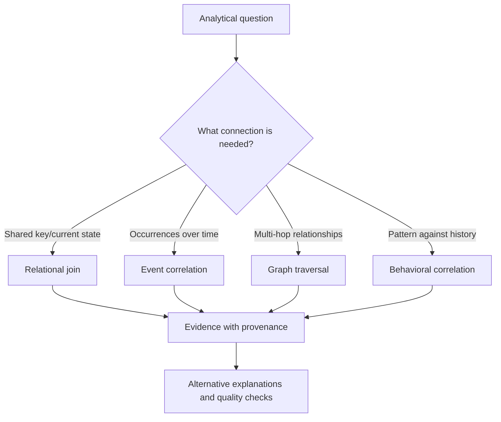

## Correlation types

| Type | Connects | Typical rule | Main failure |
|---|---|---|---|
| Exact entity | Same resolved entity | `asset_id` equal | False entity merge/split |
| Identifier | Shared scoped alias | Same tenant + directory object ID | Reuse/scope omission |
| Temporal | Events in bounded interval | B occurs within 15 minutes after A | Clock skew/coincidence |
| Sequence | Ordered event types | login -> privilege -> download | Missing event breaks chain |
| Spatial/network | Location/address/path context | Same device/IP/site during interval | NAT/mobile/reassignment |
| Relationship | Typed edge connects entities | user owns asset at event time | Stale/incorrect edge |
| Behavioral | Similar/deviating pattern | volume exceeds baseline | Seasonality/population drift |
| Content | Shared indicator/artifact | Same hash/domain/message ID | Common artifact overgroups |
| Rule/composite | Multiple features | entity + time + action + destination | Hidden assumptions |
| Probabilistic | Weighted uncertain evidence | score above review threshold | Miscalibration/explainability |

No single correlation type is universally strongest. An exact event ID can identify a retry duplicate. It does not prove that two different events have one cause.

## Joins versus event correlation versus graph traversal

| Method | Best question | Input shape | Strength | Weakness |
|---|---|---|---|---|
| Relational join | Which rows share a key/condition? | Tables/relations | Precise, familiar, set-oriented | Multi-hop paths become verbose/fanout-prone |
| Event correlation | Which occurrences form a temporal pattern? | Ordered/streamed events | Windows, sequences, state | Late/out-of-order events and threshold sensitivity |
| Graph traversal | Which typed routes connect entities? | Nodes/edges/properties | Variable-depth relationships/path explanation | Path explosion, stale edges, query complexity |
| Behavioral analysis | How does activity compare with history/peers? | Time series/features | Detects subtle pattern change | Baseline drift and false positives |

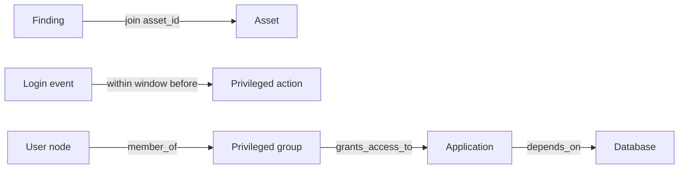

Use methods together carefully. A join may enrich an event with resolved entity ID; event correlation may create a sequence assertion; a graph may connect that assertion to business service and controls. Preserve the derivation at each stage.

### Plain-English deep-dive 1 - A join is not automatically a correlation truth

Joining two spreadsheets on `hostname` is like stapling forms because both say "Alex." It may be correct, but shared text alone does not prove identity. A many-to-many join can multiply rows and make one event appear many times.

Always declare key scope and cardinality, test unmatched and multiplied rows, and use resolved identity where needed. A SQL query can execute perfectly while the analytical conclusion is wrong.

## Temporal correlation

Time correlation needs clocks, order, boundaries, lateness, and semantics.

| Time field | Meaning | Use/caveat |
|---|---|---|
| Event time | When event reportedly occurred | Preferred for sequence; source clock quality matters |
| Observation time | When source saw state/activity | May lag real occurrence |
| Ingestion time | When platform received record | Useful for operations, not cause sequence |
| Processing time | When rule evaluated | Can differ after replay |
| Effective time | When relationship/context applies | Owner/control/topology interval |
| Publication time | When result became visible | Consumer latency |
| Watermark | Declared completeness boundary | Controls late-event finality |

Window choices:

| Window | Definition | Example | Risk |
|---|---|---|---|
| Fixed/tumbling | Non-overlapping equal buckets | 5-minute bins | Boundary splits related events |
| Sliding | Window moves with event/query time | Prior 15 minutes | Repeated matches/cost |
| Session | Activity grouped by inactivity gap | User session | Gap threshold arbitrary |
| Sequence | Ordered steps within total/step limits | login then export | Missing/reordered steps |
| Effective overlap | Context interval overlaps event | owner at action time | Open/closed boundary error |

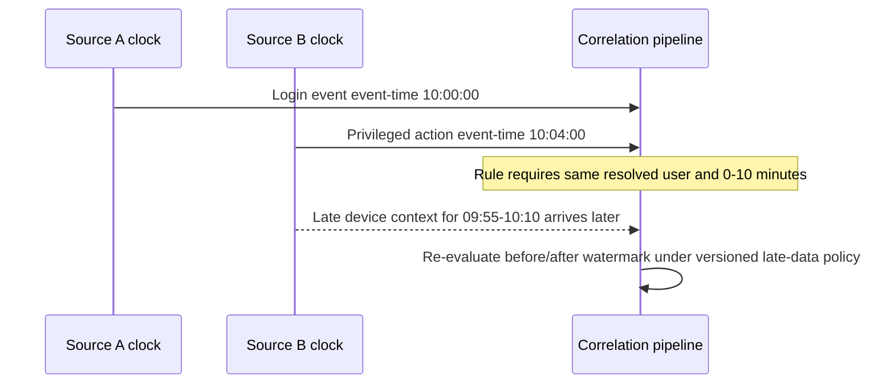

Define intervals explicitly. Half-open `[start, end)` avoids counting one boundary instant in two adjacent windows. Document whether `B` must occur after `A`, whether simultaneous times qualify, and how uncertainty is represented.

Synthetic SQL:

```sql
SELECT
    login.event_id AS login_event_id,
    action.event_id AS action_event_id,
    action.event_time - login.event_time AS elapsed
FROM nmh_lab.events login
JOIN nmh_lab.events action
  ON action.tenant_id = login.tenant_id
 AND action.resolved_user_id = login.resolved_user_id
 AND action.event_type = 'privileged_action'
 AND action.event_time >= login.event_time
 AND action.event_time < login.event_time + INTERVAL '10 minutes'
WHERE login.event_type = 'suspicious_login';
```

This finds candidates, not proven attack sequences. Deduplicate overlapping matches, check time quality, event semantics, account sharing, automation, maintenance, and source completeness.

## Entity correlation

Entity correlation attaches observations to a resolved person, account, device, asset, workload, application, or service.

| Anchor | Good evidence | Common trap |
|---|---|---|
| User | Tenant-scoped directory object/account history | Display name/email reuse |
| Device | Validated hardware/source identifiers with lifecycle | Dynamic IP/hostname alone |
| Cloud resource | Provider ID/account/region and lifecycle | Name recreation |
| Application | Governed app/service identity | URL/domain shared across apps |
| Business service | Approved dependency/ownership model | Naming convention inference |
| Vulnerability | CVE/definition version or source finding identity | Finding and vulnerability conflated |
| Threat indicator | Indicator type/value/time/source | Shared infrastructure/expiration ignored |

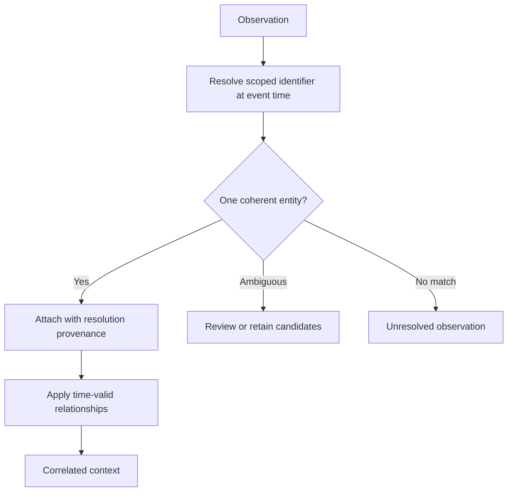

Do not discard unresolved observations. Report them as correlation coverage gaps; an unmapped event may be the most important one.

## Behavioral correlation

Behavioral correlation examines patterns such as frequency, sequence, peer comparison, novelty, velocity, or deviation from baseline.

| Behavior feature | Example | Necessary context |
|---|---|---|
| Frequency | 50 failed logins in 5 minutes | Account type, normal automation, source coverage |
| Velocity | Impossible location change | VPN/proxy/mobile routing, clock accuracy |
| Novelty | First use of admin tool | Role change, deployment, lookback completeness |
| Volume | Download exceeds baseline | Job duties, data type, seasonality |
| Sequence | Login, token change, export | Shared identity and complete ordered events |
| Peer deviation | Asset differs from service cohort | Valid peer grouping |
| Persistence | Repeated finding after remediation | Scanner schedule, asset identity, closure semantics |

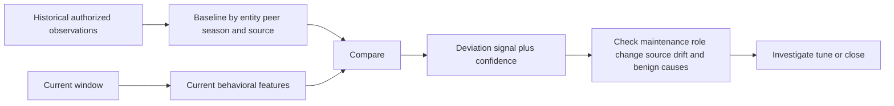

Behavioral correlation is especially sensitive to privacy, fairness, purpose, and population changes. A deviation is a signal, not a judgment about a person.

## Graph foundations

A graph represents nodes and edges. A property graph commonly stores properties on both. RDF expresses triples and can represent additional metadata using defined patterns. The chosen model and query language matter; concepts should not be mixed casually.

| Element | Synthetic security example | Required metadata |
|---|---|---|
| Node | asset A-17 | Type, tenant, identity provenance, lifecycle |
| Directed edge | user U-5 `owns` asset A-17 | Direction, type, effective interval |
| Edge property | confidence 0.9 | Method/version, source, observed time |
| Node property | criticality `high` | Authority, effective time, provenance |
| Event node | login E-91 | Actor, target, event time, source |
| Concept node | CVE definition | Authority/version |
| Path | internet -> app -> workload -> database | Every edge valid under query policy |

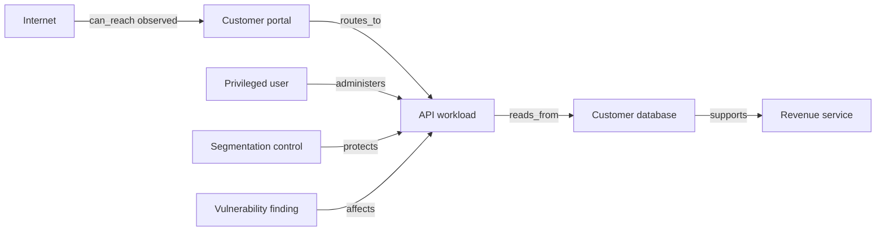

The diagram is a synthetic possibility model. `can_reach` should state who tested from where, protocol/port, time, method, result, confidence, and expiration. A line without semantics is decoration.

### Plain-English deep-dive 2 - Edges are claims, not wires

On a subway map, a printed line claims that stations are connected for travel. During maintenance, the line may be closed. Security graph edges are similar: `can_access`, `owns`, `depends_on`, and `protected_by` are assertions from sources and rules, not eternal physical facts.

Every material edge needs type, direction, scope, effective time, source, confidence, and status. Otherwise an expired owner or theoretical firewall rule can create a convincing but false path.

## Node design

| Node design decision | Question | Failure if ignored |
|---|---|---|
| Identity | What makes this one node? | Duplicates/false merges |
| Type | Asset, user, account, service, event, finding? | Invalid traversals |
| Tenant | Which security boundary? | Cross-customer leakage |
| Lifecycle | Created, active, retired, superseded? | Dead nodes appear current |
| Version | Is concept/entity versioned? | Historical queries shift |
| Sensitivity | What data does node reveal? | Overbroad graph access |
| Provenance | Which records support it? | No correction/audit |
| Confidence | Is node identity asserted/resolved? | False certainty |

Avoid creating a node for every value. `criticality=high` may be a property/assertion; business service should be a node if it has identity, attributes, and relationships.

## Edge design

| Edge type | Direction | Temporal? | Evidence example | Caveat |
|---|---|---|---|---|
| `owns` | owner -> asset | yes | CMDB owner assignment | Accountability versus use |
| `uses` | user -> application | yes/event-derived | Authenticated access | Observation does not imply entitlement |
| `member_of` | identity -> group | yes | Directory membership | Nested/effective/privileged semantics |
| `grants_access_to` | role/group -> resource | yes | Policy configuration | Conditions may limit access |
| `depends_on` | service -> component | yes | Approved architecture/observed traffic | Dependency type/criticality |
| `can_reach` | source -> target | yes | Validated network test/path evidence | Theoretical versus observed |
| `protects` | control -> asset/path | yes | Coverage/config/effectiveness evidence | Installed is not effective |
| `affects` | finding -> asset | yes | Scanner assertion | Finding may be stale/false |
| `indicates` | indicator -> event/entity | yes | Threat intel match | Shared infrastructure/expiration |

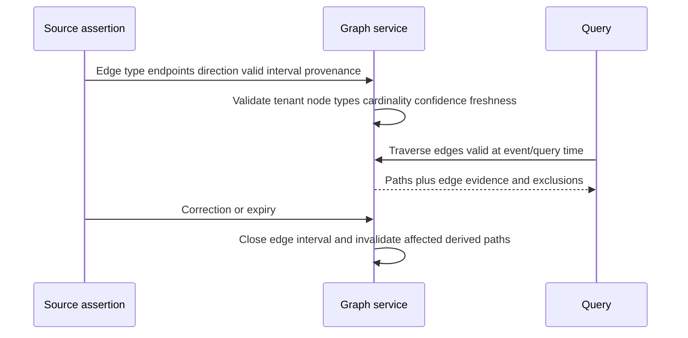

## Properties, assertions, and derived facts

| Fact class | Example | Storage/reasoning posture |
|---|---|---|
| Direct source assertion | CMDB says owner U-5 | Preserve source/effective time |
| Resolved assertion | Scanner host maps to asset A-17 | Link resolution rule/confidence |
| Derived property | Asset critical because supports service S | Preserve derivation/version |
| Correlated event | Login and export sequence | Store rule/window/evidence |
| Inferred edge | User can reach DB through role/app path | Mark inferred/path-specific |
| Human judgment | Analyst confirms relationship | Reviewer/rationale/expiry |
| Negative assertion | Test found port not reachable | Scope/time/method; not universal absence |

Never overwrite direct assertions with derived values. Consumers must be able to tell observed, asserted, inferred, and adjudicated facts apart.

## Business and security enrichment

Enrichment adds context to an anchor fact. Each enrichment needs purpose, key/relationship, authority, effective time, freshness rule, confidence, classification, and fallback.

| Enrichment | Question answered | Authority example | Stale-context harm |
|---|---|---|---|
| Asset criticality | How important is this asset? | Service/business owner | Old tier exaggerates/understates risk |
| Owner | Who is accountable? | CMDB/domain owner | Ticket sent to departed/wrong team |
| User context | What role/account type? | Directory/identity governance | Role change missed |
| Business service | What outcome depends on it? | Service catalog owner | Wrong impact story |
| Exposure | Is there validated reachability? | Current test/path source | Closed route shown open |
| Control coverage | Which safeguards apply/effectively work? | Control system/validation | Installed control assumed effective |
| Threat context | Is exploitation/activity current and relevant? | Governed intelligence source | Expired indicator inflates risk |
| Data sensitivity | What information is processed? | Data owner/classification | Wrong impact/handling |
| Environment | Production, test, development? | Cloud/CMDB owner | Test issue escalated as production |
| Exception | Is risk accepted/temporarily mitigated? | Risk owner/governance | Expired exception suppresses action |

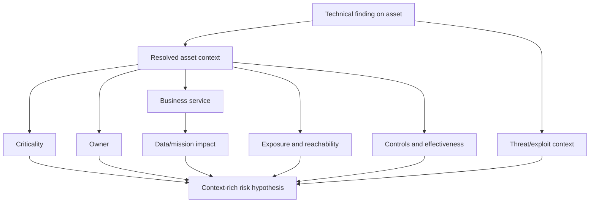

### Plain-English deep-dive 3 - Enrichment can make data worse

Adding an old phonebook entry to a current emergency call does not improve the call; it sends responders to the wrong person. More columns are not automatically more context.

An enrichment should be rejected, marked stale, or down-weighted when its identity link, authority, effective time, or freshness is inadequate. Publish context quality next to risk, not behind it.

## Confidence and provenance propagation

Path confidence is not necessarily the average of edge confidence. One critical unsupported edge can invalidate the route.

| Confidence object | What it describes | Example rule |
|---|---|---|
| Node identity confidence | Records represent this node | Entity-resolution result |
| Edge confidence | Relationship is valid under scope/time | Source/validation evidence |
| Property confidence | Enriched value is preferred | Authority/freshness/conflict |
| Correlation confidence | Events belong to one pattern | Entity/time/sequence features |
| Path confidence | Route is plausible end-to-end | Weakest material edge plus model |
| Decision confidence | Evidence supports selected action | Policy/risk owner judgment |

Possible educational aggregations include minimum edge confidence, product of independent probabilities, weighted score, or rule bands. None should be called probability unless assumptions and calibration support it. Correlated evidence must not be multiplied as if independent.

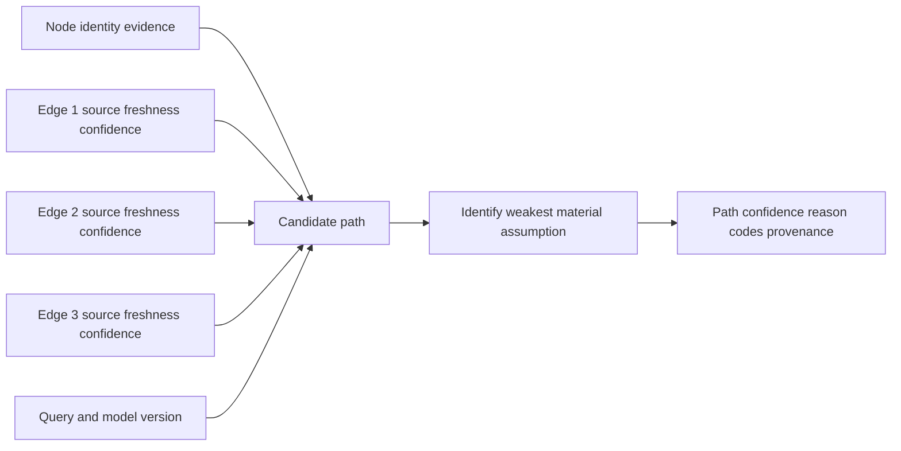

Minimum provenance for a path includes each node/edge ID and type, source assertions, identity-resolution version, mapping/schema version, effective interval, freshness state, confidence method, query/rule version, exclusions, run/publication, and reviewer/decision.

## Attack paths and exposure paths

An attack path is a hypothesized sequence of conditions/actions an attacker could use. An exposure path connects an entry/opportunity through relationships toward an impact target. Terms vary; define them locally.

| Path component | Example question | Evidence needed |
|---|---|---|
| Entry/exposure | Can an external actor reach a service? | Current validated reachability |
| Weakness | Is exploitable vulnerability/misconfiguration present? | Finding quality, version, threat context |
| Identity/privilege | Can compromised identity gain rights? | Membership, policy, conditions, time |
| Movement | Can source interact with next target? | Direction/protocol/control evidence |
| Target | What asset/service/data is reached? | Resolved identity and relationships |
| Impact | What business consequence could follow? | Business owner/service/data context |
| Mitigation | Which control interrupts route? | Coverage and effectiveness, not presence only |

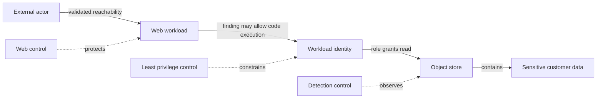

The path does not prove compromise. Validate exploitability, preconditions, route, effective permissions, control behavior, data classification, and safe testing authorization. Use path language such as observed, configured, inferred, possible, validated, blocked, or unknown.

## Choke points and mitigation reasoning

| Mitigation target | Potential benefit | Tradeoff/validation |
|---|---|---|
| Remove exposed service | Eliminates entry edge | Business availability/alternate path |
| Patch vulnerable workload | Removes weakness condition | Deployment risk/validation/reappearance |
| Reduce role privilege | Breaks access edge | Operational dependency |
| Segment route | Blocks movement | Actual path/policy enforcement |
| Strengthen identity | Reduces compromise likelihood | Enrollment/recovery/usability |
| Protect sensitive data | Reduces impact | Classification/encryption/key/access |
| Add detection | Improves visibility/response | Does not remove path |
| Retire stale asset | Removes obsolete surface | Confirm identity/dependencies |

A graph can reveal a node/edge appearing on many paths, but high path count does not automatically equal best mitigation. Paths may be duplicates, theoretical, stale, or low consequence. Combine validation, feasibility, blast radius, resilience, owner, and residual risk.

## Graph query concepts

| Query concept | Plain question | Security example |
|---|---|---|
| Node lookup | What is this thing? | Asset by resolved ID |
| Neighbor query | What is directly connected? | Controls protecting asset |
| Bounded traversal | What is within N hops? | Services within three dependencies |
| Typed path | Which allowed edge sequence connects? | User -> role -> app -> data |
| Reachability | Does any valid path exist? | Internet to critical workload |
| Shortest path | Fewest/lowest-cost route | Minimum-hop exposure route |
| All simple paths | Which non-repeating routes exist? | Alternate access paths |
| Cycle detection | Does dependency loop? | Circular service ownership/dependency |
| Common neighbor | What context is shared? | Assets sharing owner/control |
| Degree | How many direct edges? | Highly connected identity |
| Centrality | Which nodes are structurally influential? | Candidate choke point |
| Community | Which nodes cluster densely? | Investigation grouping hypothesis |

### Plain-English deep-dive 4 - Shortest path is not easiest attack path

The route with the fewest streets may cross a locked gate, while a longer route is open. Graph shortest path optimizes the weight you define: hop count, cost, time, or another metric. It does not understand attacker feasibility automatically.

Define allowed edge types/directions, effective time, preconditions, control state, maximum depth, and edge costs. Label the result "shortest under this model," not "the attacker's route."

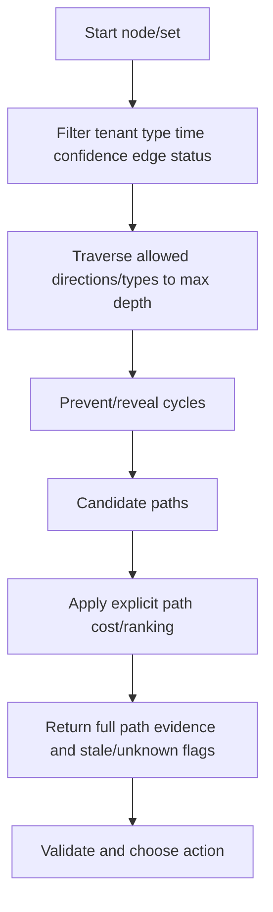

## Relational graph traversal with PostgreSQL

Graph data can be represented with node/edge tables. PostgreSQL recursive common table expressions (CTEs) can demonstrate traversal. PostgreSQL documents recursive evaluation, search ordering, and cycle detection; implementation/scale must be tested.

```sql
WITH RECURSIVE reachable AS (
    SELECT
        e.from_node_id,
        e.to_node_id,
        e.edge_type,
        1 AS depth,
        ARRAY[e.from_node_id, e.to_node_id] AS path
    FROM nmh_lab.graph_edges e
    WHERE e.tenant_id = 'NMH-SYNTHETIC'
      AND e.from_node_id = 'internet'
      AND e.valid_from <= TIMESTAMPTZ '2026-08-24 12:00:00+00'
      AND (e.valid_to IS NULL OR e.valid_to > TIMESTAMPTZ '2026-08-24 12:00:00+00')
      AND e.edge_status = 'validated'

    UNION ALL

    SELECT
        r.from_node_id,
        e.to_node_id,
        e.edge_type,
        r.depth + 1,
        r.path || e.to_node_id
    FROM reachable r
    JOIN nmh_lab.graph_edges e
      ON e.from_node_id = r.to_node_id
    WHERE r.depth < 5
      AND e.tenant_id = 'NMH-SYNTHETIC'
      AND e.edge_status = 'validated'
      AND NOT e.to_node_id = ANY(r.path)
)
SELECT *
FROM reachable
ORDER BY depth, path;
```

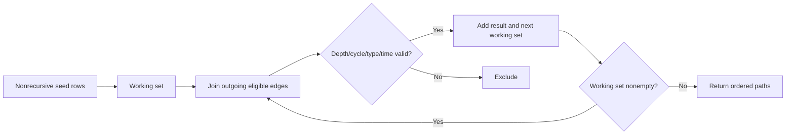

Production safeguards: tenant predicate, node/edge type allowlist, effective-time filter, depth/path count/time/resource limits, cycle handling, result pagination, query authorization, sensitive-property masking, deterministic ordering, explain plan, representative scale testing, and cancellation.

## Event correlation state and late data

Streaming correlation may hold state until a window closes. Late events create tradeoffs between speed and completeness.

| Policy | Benefit | Risk |
|---|---|---|
| Emit immediately | Fast signal | Partial/false sequence |
| Wait for watermark | More complete | Delayed detection |
| Emit provisional then revise | Speed plus correction | Consumers must handle retractions |
| Ignore very late events | Bounded cost | Historical truth incomplete |
| Replay/backfill | Correct history | Duplicate alerts/actions if not idempotent |

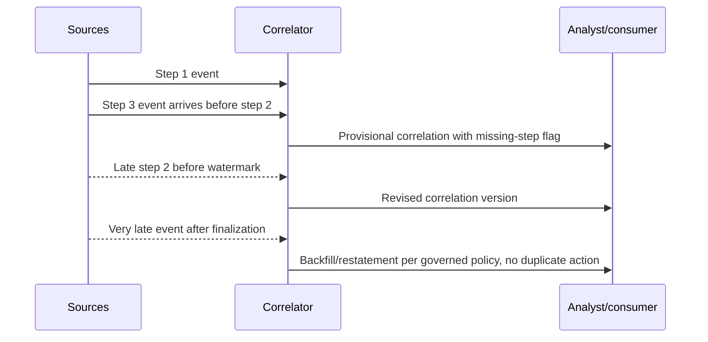

Derived correlations need stable IDs and versions so updates/retractions reconcile rather than create duplicate incidents or tickets.

## Correlation versus causation

Correlation supports hypotheses. Causation requires a defensible mechanism, temporal direction, alternative explanation analysis, and often controlled or quasi-experimental evidence unavailable in incident data.

| Observation | Tempting claim | Honest interpretation |
|---|---|---|
| Login precedes outage | Login caused outage | Sequence candidate; inspect actor/action/mechanism |
| Patch and recovery coincide | Patch fixed issue | Consistent with hypothesis; compare other changes/evidence |
| Control absent and incident occurs | Absence caused incident | Possible contributing condition, not proven cause |
| High-risk assets have more findings | Risk score causes findings | Common inputs/visibility may explain association |
| Two tools alert same IP | One attacker caused both | Shared infrastructure/NAT/time/intel can confound |

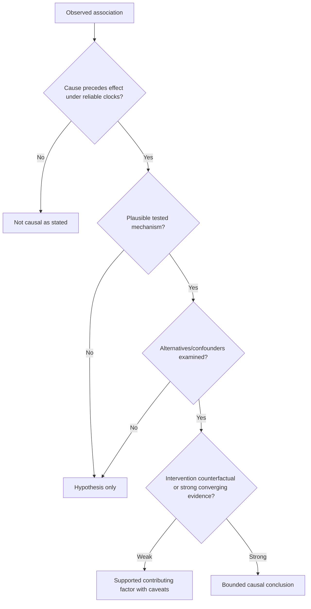

### Plain-English deep-dive 5 - A timeline is necessary but not sufficient for RCA

Lightning occurs before many power failures, but a photo of lightning before an outage does not prove that strike hit the line. Investigators need electrical evidence, fault location, competing causes, and mechanism.

In support and security work, "after" is not "because of." Use timelines to constrain hypotheses, then seek discriminating evidence. Your escalation background is a strength here: preserve hypotheses and do not promote coincidence into root cause.

## Stale context and temporal joins

Context must be selected as of the event/decision time, not merely the latest row today.

| Stale context | False conclusion | Corrective control |
|---|---|---|
| Old asset owner | Wrong remediation assignment | Effective-dated ownership |
| Retired service criticality | Inflated current impact | Lifecycle/effective interval |
| Expired threat indicator | Benign shared IP treated malicious | Validity/confidence decay |
| Installed but disabled control | Risk incorrectly reduced | Effectiveness observation |
| Old internet exposure test | Closed route shown open | Retest/expiry |
| Changed group membership | User appears privileged at wrong time | Membership history |
| Stale dependency map | False attack path | Architecture/observed relationship freshness |
| Old exception | Finding suppressed indefinitely | Expiry and renewal owner |

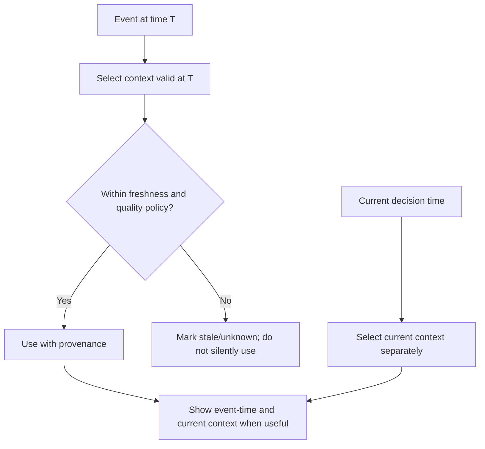

Freshness is field/edge/use-specific. Ownership may tolerate one-day delay for a weekly report but not for immediate containment. Threat intelligence may decay differently by indicator type/source.

## Risk use and contextual prioritization

Context should change a decision through an explicit rationale, not simply make a dashboard look rich.

| Risk input | Example evidence | Caution |
|---|---|---|
| Weakness/severity | Vulnerability definition/finding | Severity is not organization-specific risk |
| Exploit/threat context | Current known exploitation/intelligence | Source/confidence/expiry |
| Reachability/exposure | Validated directed path | Theoretical config versus observed route |
| Asset/service criticality | Owner-approved business context | Stale/subjective classification |
| Identity/privilege | Effective access relationships | Conditional access/shared accounts |
| Data/mission impact | Governed classification/dependency | Overbroad inheritance |
| Mitigating controls | Validated coverage/effectiveness | Presence is not performance |
| Ownership/actionability | Current accountable team | Does not change inherent technical risk |
| Confidence/quality | Identity/path/context evidence | Unknowns must not become low risk |

Risk output should state use, version, observation time, evidence, contributing factors, mitigating controls, uncertainty, blocked assumptions, owner, action, validation, and residual risk. Public Zscaler UVM material supports contextual factors in general, not any formula used in this Part.

## Complete synthetic NMH correlation exercise

NMH observes the following synthetic facts:

| ID | Time/effective interval | Assertion | Source quality |
|---|---|---|---|
| O1 | 09:58 | External reachability to web workload W1 on approved test path | Validated, fresh |
| O2 | 10:01 | Suspicious login for user U1 | Identity source, medium confidence |
| O3 | 10:04 | U1 role R1 used against W1 | Audit source, high confidence |
| O4 | Current | Finding F1 affects W1 | Scanner, fresh; exploitability unvalidated |
| O5 | Current | W1 workload identity can read store D1 | Policy model, conditional |
| O6 | Current | D1 contains customer data | Data catalog, owner-approved |
| O7 | Until yesterday | U1 owns W1 | CMDB edge expired |
| O8 | Current | Team T2 owns W1 | CMDB edge current |
| O9 | Current | Control C1 configured before W1 | Config source; effectiveness unknown |
| O10 | Current | Threat indicator overlaps login IP | Intelligence source, low confidence/shared hosting |

Step 1: entity/time. Resolve U1 and W1 under current identity rules. Use O2/O3 event times, O7/O8 effective intervals, and current context separately. Do not assign current remediation to U1 because O7 is expired.

Step 2: event correlation. O2 precedes O3 by three minutes for the same resolved user, satisfying a synthetic candidate rule. It is not proof of malicious action; check maintenance, role, authentication details, and source completeness.

Step 3: exposure/path. O1 supports an external-to-W1 reachability edge. O4 is a finding, but exploitability/preconditions are unknown. O5 is configured conditional access, not observed data access. O6 supports potential impact if path conditions hold.

Step 4: control. O9 proves configuration evidence only. It cannot reduce path confidence until control applicability and effectiveness are validated.

Step 5: threat. O10 is weak supporting context because the IP is shared. It must not convert the candidate sequence into confirmed compromise.

Step 6: output.

| Output element | Honest statement |
|---|---|
| Correlation | O2/O3 form a same-user ordered candidate within three minutes |
| Exposure | External reachability to W1 was validated at 09:58 under named test |
| Path | External -> W1 -> conditional identity -> D1 is possible if F1 and policy preconditions validate |
| Impact | D1 is cataloged as containing customer data |
| Control | C1 is configured; effectiveness unknown |
| Threat | IP overlap is low-confidence context, not attribution |
| Owner | Current accountable team is T2 |
| Decision | Investigate safely, validate finding/path/control, avoid automatic containment on current evidence |

## Synthetic exercises with answers

### Exercise 1 - Method choice

Find all findings and current owners for assets. Join, event correlation, or graph?

**Answer:** A relational join on resolved entity IDs and effective-dated ownership may be simplest. A graph helps if ownership is multi-hop/variable-depth. Choose the least complex correct method.

### Exercise 2 - Time window

An action occurred 11 minutes after a login; rule window is 10 minutes. Extend the window until it matches?

**Answer:** No. Threshold tuning needs labeled evidence and consequence analysis, not case chasing. Investigate separately and evaluate alternate windows on representative data.

### Exercise 3 - Late event

Step 2 arrives after a sequence was finalized. Ignore it?

**Answer:** Follow governed late-data policy: revise/version, backfill, or record excluded lateness. Reconcile alerts/tickets idempotently and disclose historical restatement.

### Exercise 4 - Join fanout

One event joins three owner rows. Which owner receives the ticket?

**Answer:** First fix effective-time/cardinality. Do not use arbitrary DISTINCT. Preserve conflict, hold assignment, and resolve current accountable owner.

### Exercise 5 - Graph direction

If a control protects an asset, can traversal reverse that edge to claim the asset protects the control?

**Answer:** No. Direction and inverse semantics must be explicit. Query only allowed directions/types.

### Exercise 6 - Shortest path

The two-hop path includes a blocked edge; the four-hop path is validated. Which is actionable?

**Answer:** The shortest valid path under the model, likely the four-hop path. Hop count alone does not mean feasibility.

### Exercise 7 - Stale threat context

An IP was malicious last year but is now shared cloud infrastructure. Keep high risk?

**Answer:** Apply source/indicator validity, reassignment, confidence, and current corroboration. Expired context should be stale/unknown, not silently active.

### Exercise 8 - Control presence

EDR agent installed: can risk be reduced?

**Answer:** Installation is one assertion. Validate active health, policy, coverage, freshness, detection/prevention capability, and relevance to the path.

### Exercise 9 - Causation

An outage follows a policy change by one minute. Is the change root cause?

**Answer:** It is a strong temporal hypothesis, not yet cause. Test mechanism, scope, rollback/known-good comparison, telemetry, and alternative concurrent changes.

### Exercise 10 - Confidence

Three 0.9-confidence edges form a path. Is path confidence 0.9?

**Answer:** Not automatically. Define the confidence model and dependencies. One confidence may be incomparable or evidence may be correlated.

### Exercise 11 - Privacy

Can home location enrich impossible-travel analysis?

**Answer:** Technical utility is not authorization. Conduct purpose/legal/privacy review, minimize data, consider less intrusive work-location or network context, restrict access, and retain only as governed.

### Exercise 12 - Zscaler scope

Can public UVM wording reveal the exact internal graph path algorithm?

**Answer:** No. It supports only public context categories/capabilities. Validate current product documentation, tenant evidence, and specialists.

## Correlation and graph troubleshooting decision tree

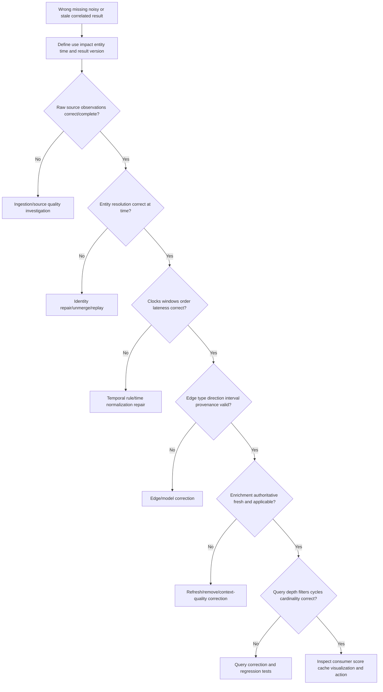

## Correlation troubleshooting runbook

1. Define symptom: missing event link, false sequence, duplicate correlation, wrong entity, impossible path, stale owner, inflated risk, slow query, or unexplained decision.
2. Identify tenant, entity/event IDs, graph/query/rule/publication versions, event/effective times, consumer, and first observed impact.
3. Bound use and consequence: investigation, prioritization, ticketing, reporting, policy recommendation, or automated action.
4. Preserve raw authorized observations, relation assertions, provenance, and prior accepted output. Freeze unsafe dependent actions.
5. Verify source completeness, ingestion health, schemas, source semantics, event IDs, duplicates, and watermarks.
6. Reproduce entity resolution at event time. Check alias reuse, false merge/split, tenant/type scope, and unresolved observations.
7. Compare event, observed, received, processed, effective, and publication times. Validate zones, precision, skew, order, boundaries, and lateness.
8. Recompute join cardinality and unmatched/fanout rows. Never hide defects with arbitrary DISTINCT.
9. Inspect correlation rule: eligible event types, sequence, window, exclusions, grouping, suppression, provisional/final behavior, and version.
10. Inspect graph nodes/edges: type, direction, endpoint, tenant, interval, confidence, source, status, freshness, and negative constraints.
11. Re-run traversal with explicit start/end, edge allowlist, direction, as-of time, depth, cycle, result cap, and deterministic ordering.
12. Inspect enrichment identity, authority, validity, freshness, conflict, classification, and fallback. Compare event-time versus current context.
13. Trace confidence and provenance through every derived fact/path. Identify weakest material assumption and duplicated/correlated evidence.
14. Inspect causation wording and alternate explanations. Downgrade conclusion to hypothesis when mechanism/evidence is incomplete.
15. Quantify blast radius: events, entities, paths, findings, owners, scores, tickets, reports, and actions.
16. Implement a versioned correction in isolation. Replay with stable correlation IDs and idempotent downstream reconciliation.
17. Validate known positives/negatives, temporal boundaries, stale contexts, graph cycles, path explosion, privacy/access, query cost, and consumer acceptance.
18. Publish correction/restatement with evidence, affected scope, changed decisions, limitations, owner, and prevention.
19. Add prevention: entity regression, time-boundary case, edge contract, freshness SLO, path invariant, query budget, causal-language review, or source change agreement.

| Evidence pack item | Why it matters |
|---|---|
| Raw observations/assertions | Establish source facts |
| Entity resolution evidence | Proves anchor identity |
| Clock/window/watermark | Reproduces temporal selection |
| Join cardinality | Reveals fanout/loss |
| Edge/node contract | Reproduces path semantics |
| Enrichment freshness/authority | Validates business context |
| Query/rule/version | Reproduces derivation |
| Path with every edge | Exposes weak assumptions |
| Confidence method | Prevents fake probability |
| Consumer/action lineage | Scopes correction |

## Labs and rehearsal

### Lab 1 - Correlation catalog

Define ten NMH correlation questions with anchor, entity/event types, time window, output, owner, consequence, quality, privacy, and false-positive/negative costs.

### Lab 2 - Join versus graph

Solve current owner lookup with a join and service-dependency reachability with recursive traversal. Explain why each method fits.

### Lab 3 - Temporal boundaries

Test `[start,end)`, simultaneous events, 10-minute boundary, clock skew, timezone, watermark, and late arrival. Document expected decisions.

### Lab 4 - Entity correlation

Inject email reuse, dynamic IP, hostname collision, agent reinstall, and unresolved events. Prove identity evidence and coverage gaps.

### Lab 5 - Behavioral pattern

Build frequency, novelty, sequence, and peer-deviation signals on synthetic data. Add maintenance/role/source-drift alternatives.

### Lab 6 - Graph contract

Define node/edge types, allowed endpoints/directions, properties, intervals, confidence, provenance, cardinality, and sensitivity.

### Lab 7 - Edge quality

Create observed, configured, inferred, reviewed, expired, disputed, and blocked edges. Ensure traversal policies distinguish them.

### Lab 8 - Enrichment ledger

Add criticality, owner, user, service, exposure, control, threat, and data context with authority, freshness, fallback, classification, and confidence.

### Lab 9 - Exposure path

Build three paths from external node to a critical service. Validate each precondition, control, identity, and stale edge; identify choke points.

### Lab 10 - Recursive CTE

Query bounded paths in PostgreSQL with tenant, edge-type, time, depth, and cycle controls. Compare path counts and query plans as graph grows.

### Lab 11 - Confidence

Compare minimum, product, and weighted path confidence on dependent evidence. Explain why none is automatically a calibrated probability.

### Lab 12 - Stale context

Expire owner, group membership, exposure, control, threat, exception, and service edges. Show event-time and current-time outcomes.

### Lab 13 - Causation clinic

For five correlated timelines, state hypothesis, mechanism, alternatives, discriminating check, evidence, and bounded conclusion.

### Lab 14 - Risk rationale

Turn one technical finding into a context-rich priority, showing which factors raise/lower risk and which remain unknown.

### Lab 15 - Correlation incident

Inject a false entity merge and stale ownership edge that misroutes tickets. Contain, unmerge, replay, reconcile, and prevent recurrence.

### Lab 16 - TSM briefing

Explain a potential exposure path to technical and executive audiences without saying it was exploited. Include impact, confidence, unknowns, validation, owner, action, and product boundary.

| Lab evidence | Completion standard |
|---|---|
| Question | Named use and consequence |
| Identity | Resolved/scoped/time-valid |
| Time | Clocks/windows/lateness explicit |
| Graph | Typed directed effective edges |
| Context | Authority/freshness/confidence visible |
| Path | Every step and precondition inspectable |
| Query | Depth/cycle/tenant/resource controls |
| Causation | Hypothesis separated from cause |
| Decision | Risk rationale and owner explicit |
| Honesty | Synthetic and public product scope clear |

## Common misconceptions to correct

| Misconception | Correct model |
|---|---|
| Correlation means two records share text | Correlation uses governed identity/time/semantic evidence |
| A join proves entities are the same | Join keys/cardinality can be wrong |
| DISTINCT fixes correlation duplicates | It can hide fanout and conflict |
| Larger time windows are more complete | They also increase coincidence/noise |
| Ingestion time is event time | They answer different questions |
| Events arriving together occurred together | Buffering/batching can align arrival |
| Same IP means same actor/device | NAT, VPN, shared hosting, DHCP, reuse exist |
| Behavioral deviation means malicious | It is a hypothesis requiring context |
| A graph is just a visualization | It is a typed relationship model/query surface |
| Every attribute should be a node | Model identity/lifecycle/relationships intentionally |
| Edges are timeless facts | They are sourced, scoped, effective assertions |
| Graph traversal can ignore direction | Relationship semantics depend on direction |
| Connected means reachable | Allowed edge types, conditions, controls, time matter |
| Shortest path is easiest attack route | It is shortest only under defined weights/model |
| Any path proves an attack | It indicates a possible route under assumptions |
| More paths always mean more risk | Duplicates, stale/theoretical edges, impact differ |
| High centrality means best mitigation | Feasibility, consequence, and validation matter |
| Enrichment always improves quality | Stale/wrong context can worsen decisions |
| Latest context describes historical event | Use as-of effective context |
| Installed control means effective mitigation | Health, policy, relevance, enforcement need evidence |
| Threat indicator match proves attribution | Indicators can be shared, stale, or low confidence |
| Average edge confidence gives path probability | Confidence types/dependencies may be incomparable |
| Three independent-looking sources are independent | They may copy one origin |
| Sequence proves cause | Temporal order is necessary, not sufficient |
| Rollback recovery alone proves root cause | Concurrent changes/conditions may confound |
| Recursive query naturally terminates | Depth/cycle/resource controls are required |
| Public Zscaler context reveals internal graph mechanics | It supports only bounded capability statements |

## Official Source Anchors

Research/source date: **2026-08-24**.

W3C sources support graph/query/provenance concepts. PostgreSQL documentation supports recursive/query/time mechanics. NIST sources support cybersecurity risk, continuous monitoring, controls, and incident-response context. Zscaler pages support only the public Data Fabric, Asset Exposure Management, and UVM statements cited here.

| Source | URL | Used for | Boundary |
|---|---|---|---|
| W3C RDF 1.1 Concepts | https://www.w3.org/TR/rdf11-concepts/ | RDF graph/triple/resource concepts | Not a product graph schema |
| W3C SPARQL 1.1 Query | https://www.w3.org/TR/sparql11-query/ | Graph pattern and property-path query concepts | Not a Zscaler query language |
| W3C PROV-O | https://www.w3.org/TR/prov-o/ | Entity/activity/agent provenance concepts | Requires implementation/governance |
| PostgreSQL 17 WITH Queries | https://www.postgresql.org/docs/17/queries-with.html | Recursive CTE, search order, cycle detection | Relational demonstration, version-specific |
| PostgreSQL 17 Date/Time Functions | https://www.postgresql.org/docs/17/functions-datetime.html | Time arithmetic, bins, zones, overlap behavior | Source clock semantics still required |
| PostgreSQL 17 Window Functions | https://www.postgresql.org/docs/17/functions-window.html | Sequence/ranking/window mechanics | SQL windows are not event-correlation truth |
| NIST Cybersecurity Framework 2.0 | https://www.nist.gov/cyberframework | Cybersecurity risk outcomes/context | Not graph or risk formula |
| NIST SP 800-137 | https://csrc.nist.gov/pubs/sp/800/137/final | Continuous monitoring visibility for assets/threats/vulnerabilities/controls | Federal guidance; not correlation implementation |
| NIST SP 800-61 Rev. 3 | https://csrc.nist.gov/pubs/sp/800/61/r3/final | Current incident-response recommendations and CSF integration | Not an event-correlation algorithm |
| NIST SP 800-53 Rev. 5 | https://csrc.nist.gov/pubs/sp/800/53/r5/upd1/final | Access, audit, monitoring, integrity, privacy/control context | Requires tailoring |
| Zscaler Data Fabric for Security | https://www.zscaler.com/products-and-solutions/data-fabric | Public harmonize/deduplicate/correlate/enrich and customizable-model context | No internal graph, algorithm, schema, score, threshold claim |
| Zscaler Asset Exposure Management | https://www.zscaler.com/products-and-solutions/caasm | Public asset resolution, correlation, relationships, golden-record context | No internal implementation/metric guarantee inferred |
| Zscaler Unified Vulnerability Management | https://www.zscaler.com/products-and-solutions/vulnerability-management | Public correlated context spanning identity/assets/behavior/controls/business context | No formula, data model, path algorithm, or customer outcome claim |

## Likely Interview Questions

### Q1. What is correlation, and what types matter in security data?

**Model answer:** Correlation connects observations under a defined analytical contract. I use entity correlation to anchor resolved users/assets, temporal/sequence correlation for ordered windows, relationship correlation for context, content correlation for shared artifacts, and behavioral correlation for frequency/novelty/deviation. I preserve source semantics, identity, clocks, provenance, confidence, alternatives, and false-positive/negative consequences.

### Q2. When would you use a join, event correlation, or graph traversal?

**Model answer:** A join is best for known keys and bounded cardinality, such as finding-to-current-owner. Event correlation handles ordered/time-window patterns and late data. Graph traversal handles variable-depth typed relationships such as identity-to-role-to-app-to-data. I may combine them, but preserve derivation and use the least complex method that answers the question correctly.

### Q3. What makes a trustworthy security graph?

**Model answer:** Stable scoped node identity; typed directed edges; endpoint/cardinality rules; tenant boundary; effective time; source/provenance; observed/configured/inferred status; confidence/freshness; negative/conflicting assertions; security classification; and versioned query rules. A graph line is a claim, not an eternal wire.

### Q4. How do temporal windows and late events affect correlation?

**Model answer:** I distinguish event, observation, ingestion, processing, effective, and publication time; define ordered half-open windows and clock-skew policy; use watermarks for completeness; and choose provisional/revision/backfill behavior. Correlations have stable IDs/versions so replays retract or revise downstream results idempotently rather than duplicate actions.

### Q5. How do you enrich a vulnerability or finding responsibly?

**Model answer:** I resolve the asset, then add authorized current criticality, owner, service/data impact, exposure/reachability, identity/privilege, mitigating-control effectiveness, threat context, and exception status. Each enrichment carries authority, effective time, freshness, confidence, provenance, conflicts, and fallback. Unknown/stale context stays visible and never defaults to low risk.

### Q6. How do you reason about attack or exposure paths?

**Model answer:** I define start/target, allowed typed/directed/time-valid edges, preconditions, controls, maximum depth, and path cost. I return every node/edge with evidence and weakest assumptions, then validate reachability, exploitability, privilege, control effectiveness, and impact. A path is possible/validated/blocked under a model; it is not proof of exploitation or the attacker's actual route.

### Q7. How do you avoid confusing correlation with causation?

**Model answer:** I use correlation to form hypotheses, then require reliable temporal direction, a plausible mechanism, alternative/confounder analysis, discriminating evidence, and where possible intervention or converging independent evidence. I use bounded wording such as associated, consistent with, contributing factor, or root cause only at the evidence level justified.

### Q8. How does your background transfer, and what can you claim about Zscaler?

**Model answer:** enterprise escalation work trained me to correlate identities, devices, networks, services, requests, logs, changes, and timestamps; build dependency maps; test competing hypotheses; and communicate uncertainty. I practiced graph and context methods on synthetic NMH data. Zscaler publicly describes Data Fabric correlation/enrichment and UVM context categories, but I do not claim internal graphs, algorithms, schemas, scores, or thresholds; I would validate current tenant evidence, docs, and specialists.

## 30-Second Memory Hooks

| Concept | Memory hook |
|---|---|
| Correlation | Connect clues under a contract |
| Join | Match rows; check cardinality |
| Event correlation | Ordered scenes in a window |
| Entity correlation | Which actor or object? |
| Behavioral | Pattern changed, investigate why |
| Graph | Typed dots and arrows |
| Node | Thing with identity |
| Edge | Time-bound relationship claim |
| Direction | Arrow meaning matters |
| Path | Route under assumptions |
| Reachability | Can a valid route exist? |
| Shortest | Shortest under chosen weight |
| Cycle | Track visited nodes |
| Enrichment | Add context only if trustworthy |
| Criticality | Business owner-approved importance |
| Control | Presence is not effectiveness |
| Threat context | Source, confidence, expiry |
| Confidence | Weak assumptions remain visible |
| Provenance | Receipt for every clue and path |
| Stale context | Expired map misroutes decisions |
| Causation | Together/after is not because |
| Choke point | Bridge across many validated routes |
| Risk use | Evidence plus context plus uncertainty |
| Experience bridge | Timeline/dependency RCA transfers; internals do not |

## Completion Checklist

- [ ] I define correlation through a named question, population, grain, evidence, and consequence.
- [ ] I distinguish entity, temporal, sequence, relationship, content, and behavioral correlation.
- [ ] I choose joins, event correlation, graph traversal, and behavioral methods intentionally.
- [ ] I test join keys, scope, cardinality, unmatched rows, and fanout.
- [ ] I never use arbitrary DISTINCT to hide correlation defects.
- [ ] I distinguish event, observation, ingestion, processing, effective, publication time, and watermark.
- [ ] I define window type, boundary, order, skew, lateness, provisional/final behavior, and replay.
- [ ] I use resolved tenant-scoped identity at the relevant time.
- [ ] I retain unresolved observations as coverage evidence.
- [ ] I treat behavioral deviations as hypotheses, not character judgments.
- [ ] I define graph nodes by identity, type, tenant, lifecycle, provenance, and sensitivity.
- [ ] I define edges by type, direction, endpoints, interval, source, confidence, status, and freshness.
- [ ] I distinguish observed, configured, derived, inferred, human-reviewed, and negative assertions.
- [ ] I know a graph edge is a claim rather than an eternal wire.
- [ ] I model path start/target, allowed edges/directions, time, depth, cycles, preconditions, and cost.
- [ ] I know connected does not automatically mean reachable.
- [ ] I know shortest path is only shortest under a chosen model/weight.
- [ ] I do not claim a possible path proves compromise or actual attacker behavior.
- [ ] I enrich with criticality, owner, user, service, exposure, control, threat, data, environment, and exception context responsibly.
- [ ] I attach authority, effective time, freshness, confidence, provenance, conflict, and fallback to enrichments.
- [ ] I do not use latest context for a historical event without an explicit current comparison.
- [ ] I distinguish installed/configured control from validated effectiveness.
- [ ] I treat threat intelligence as time/source/confidence-bound evidence.
- [ ] I distinguish node, edge, property, correlation, path, and decision confidence.
- [ ] I do not turn arbitrary scores into probabilities.
- [ ] I retain every material source/rule/query/version in path provenance.
- [ ] I can explain neighbor, bounded traversal, reachability, path, cycle, degree, centrality, and community concepts.
- [ ] I use tenant, type, time, depth, cycle, resource, authorization, and masking controls for graph queries.
- [ ] I understand PostgreSQL recursive CTE evaluation and cycle/path safeguards.
- [ ] I use stable/versioned correlation IDs for late updates/replay and idempotent consumers.
- [ ] I distinguish association, temporal sequence, contributing condition, and bounded causation.
- [ ] I test mechanism, alternatives, confounders, and discriminating evidence before RCA claims.
- [ ] I detect stale ownership, service, threat, control, topology, exception, and identity context.
- [ ] I show unknown or stale context instead of silently reducing risk.
- [ ] I use contextual risk to explain decisions, not create opaque certainty.
- [ ] I identify validated choke points while considering feasibility and residual risk.
- [ ] I can complete the NMH correlation exercise and defend every statement.
- [ ] I can run the troubleshooting tree from raw source through consumer/action.
- [ ] I can quantify blast radius and replay/reconcile corrected correlations.
- [ ] I apply purpose limitation, minimization, access, classification, audit, and retention to graph/context data.
- [ ] I separate W3C/PostgreSQL/NIST concepts, synthetic evidence, and Zscaler public context.
- [ ] I make no unsupported Zscaler graph, schema, algorithm, path, factor weight, score, threshold, or outcome claim.
- [ ] I can answer Q1 through Q8 with mechanics, examples, tradeoffs, failures, troubleshooting, and honest boundaries.

[Part 56 - Data Governance, Privacy, Security, RBAC, and Retention](Part-56-data-governance-privacy-rbac-retention.md)