# Part 56 - Data Governance, Privacy, Security, RBAC, and Retention

> **Audience:** Candidates preparing for a Zscaler Security Operations Technical Success Manager role after enterprise Support Escalation Engineering.
>
> **Purpose:** Build a beginner-first operating model for owning, cataloging, classifying, securing, minimizing, authorizing, retaining, archiving, deleting, auditing, sharing, and responding to incidents involving security data. It covers stewardship, lineage, lawful/authorized purpose, role- and attribute-based access control, least privilege, separation of duties, encryption, key/secrets management, masking, tokenization, pseudonymization, residency, legal hold, third parties, data-subject requests, sensitive logs, breaches, and governance evidence.
>
> **Scope and honesty:** Northstar Meridian Holdings, abbreviated NMH, is fictional. Every policy, dataset, owner, role, attribute, permission, classification, retention period, legal hold, request, incident, audit, vendor, region, contract, and outcome in this Part is synthetic. This is technical/governance education, not legal advice. NIST, GDPR, ISO, and other sources have specific scopes; applicability must be determined by qualified legal, privacy, security, records, and compliance professionals. General controls are not Zscaler Data Fabric schemas, tenant settings, processing terms, residency options, roles, retention behavior, deletion behavior, or guarantees. Public Zscaler pages are used only for bounded Data Fabric and published privacy context. Your enterprise support, evidence minimization, incident handling, access, customer trust, and cross-functional communication transfer; direct production governance of Zscaler Data Fabric remains a learning boundary.
>
> **Currency caveat:** Laws, contracts, standards, product capabilities, service locations, subprocessors, control catalogs, and organizational policies change. The controlled research/source date for this Part is exactly **2026-08-24**. Current executed agreements, approved policies, tenant documentation/evidence, records schedules, legal/privacy advice, customer requirements, and product/security specialists govern production.

## Section goal

Data governance is the system of decisions, accountability, policies, controls, evidence, and improvement used to make data trustworthy and appropriately handled. Security data is unusually sensitive: logs can reveal identity, behavior, location, vulnerabilities, network structure, credentials, secrets, investigations, and control gaps. The same telemetry that defends an organization can harm people or enable attackers if used, retained, shared, or exposed incorrectly.

Think of a hospital records department. It needs to know what each record is, who owns meaning, who may see or change it, why it is used, how long it stays, when a legal hold overrides deletion, how copies are found, and how unauthorized disclosure is handled. A locked filing cabinet alone is not governance. Neither is encryption alone.

By the end, you should be able to:

| Outcome | Demonstrated capability | Evidence artifact |
|---|---|---|
| Establish accountability | Distinguish owner, steward, custodian, controller/processor context, and user | RACI/decision-rights map |
| Inventory data | Catalog datasets, fields, flows, copies, consumers, and lineage | Data inventory |
| Classify risk | Apply business, security, privacy, and regulatory labels | Classification register |
| Govern purpose | Document authorized purpose, lawful basis where applicable, and incompatible use review | Processing/use record |
| Minimize data | Reduce fields, precision, population, frequency, sharing, and retention | Minimization decision |
| Control access | Design RBAC/ABAC, least privilege, separation, reviews, and emergency access | Access matrix |
| Protect data | Use encryption, key/secret lifecycle, masking, tokenization, pseudonymization | Protection design |
| Govern lifecycle | Retain, archive, hold, delete, sanitize, and verify across copies | Retention schedule |
| Address geography | Distinguish residency, processing/access, transfers, backup, and jurisdiction | Data-location map |
| Audit use | Log/administer access, changes, exports, policy, and deletion | Audit evidence plan |
| Handle sensitive logs | Secure collection, search, support, export, and disclosure | Log-handling standard |
| Manage third parties | Assess contracts, access, subprocessors, incidents, return/deletion | Vendor data plan |
| Support rights requests | Coordinate intake, identity, search, exemptions, response, and evidence | DSAR workflow overview |
| Respond to incidents | Contain, assess, notify/escalate, recover, preserve, and improve | Breach/incident runbook |
| Operate governance | Run councils, stewardship, exceptions, metrics, and change review | Operating model |
| Bound product claims | Separate public privacy/Data Fabric context from tenant behavior | Product-fact card |

```mermaid
flowchart LR
    DISC[Discover data and flows] --> OWN[Assign purpose owner steward custodian]
    OWN --> CLASS[Classify sensitivity obligations and risk]
    CLASS --> MIN[Minimize collection use sharing and retention]
    MIN --> ACCESS[Authorize least-privilege access]
    ACCESS --> PROTECT[Encrypt mask tokenize log and monitor]
    PROTECT --> LIFE[Retain archive hold delete sanitize]
    LIFE --> ASSURE[Assess audit incident test and report]
    ASSURE --> CHANGE[Correct gaps and govern change]
    CHANGE --> DISC
```

## JD Mapping

| Role expectation | Part 56 capability | TSM artifact | experience bridge and boundary |
|---|---|---|---|
| Analyze enterprise environments | Map data ownership, flows, copies, access, retention, and dependencies | Governance assessment | enterprise data/evidence handling transfers |
| Identify security risks | Find overcollection, excessive access, weak keys, stale data, and vendor gaps | Data-risk register | Observation requires owner/legal validation |
| Develop Data Fabric expertise | Apply governance questions to public Data Fabric context | Governance discovery checklist | Tenant/product specifics unclaimed |
| Resolve escalations | Collect minimum evidence and protect sensitive logs | Secure evidence plan | Support escalation experience transfers |
| Recommend mitigation | Propose control, ownership, deletion, access, and monitoring options | Remediation roadmap | Legal/policy owners decide obligations |
| Manage strategic customers | Coordinate security, privacy, legal, records, IT, SOC, and executives | Decision/RACI map | TSM coordinates, not legal counsel |
| Communicate trust | Explain facts, boundaries, impact, and corrective action | Trust update | No unverified compliance claim |
| Drive adoption | Establish governance cadence, metrics, access review, and exceptions | Operating model | Customer maturity varies |

## Candidate honesty note

| Evidence class | Safe interview statement | Boundary |
|---|---|---|
| Production transfer | "I handled enterprise support evidence with access, minimization, redaction, secure transfer, and incident sensitivity." | Not a privacy officer or legal counsel |
| Synthetic practice | "I designed NMH catalog, classification, access, retention, DSAR, vendor, and breach exercises." | Fictional evidence, not audit certification |
| Framework knowledge | "NIST provides risk/control guidance; legal obligations require applicability analysis." | Framework mapping is not automatic compliance |
| GDPR overview | "Access and other rights can apply under GDPR subject to conditions and limitations." | No jurisdiction-specific legal advice |
| Product context | "Zscaler publicly describes Data Fabric and publishes privacy/security information." | Customer-data terms/settings need current contracts/docs |
| Control observation | "The access review found 12 dormant grants under the synthetic policy." | Does not prove legal noncompliance |
| Compliance language | "This control supports the stated requirement." | Avoid "compliant" without authorized assessment |
| Production next step | "I would involve legal/privacy/security/records owners and validate tenant evidence." | Never invent obligations or product guarantees |

## Beginner vocabulary and memory hooks

| Term | Plain meaning | Why it matters | Memory hook |
|---|---|---|---|
| Data governance | Decision/accountability system for data | Keeps handling trustworthy and controlled | Rules, owners, evidence |
| Data owner | Accountable business/domain decision maker | Approves purpose, access, quality, retention | Accountable for why |
| Data steward | Maintains definitions, quality, classification, issues | Keeps meaning/operation healthy | Keeper of meaning |
| Custodian | Operates technical storage/protection | Implements controls | Keeper of systems |
| Data user | Authorized consumer | Must follow purpose/control | Uses under rules |
| Catalog | Searchable inventory/metadata | You cannot govern unknown data | Library catalog |
| Lineage | Where data came from and went | Finds copies and impact | Route history |
| Classification | Label indicating sensitivity/handling | Drives proportionate controls | Handling label |
| Personal data/PII | Information linked/linkable to a person under applicable definition | Creates privacy risk/obligations | About or linkable to a person |
| Data minimization | Process only what is necessary/proportionate | Reduces harm and attack surface | Carry less baggage |
| Purpose limitation | Use data for declared compatible/authorized purposes | Prevents silent reuse | Ticket says destination |
| Lawful basis | Applicable legal ground for processing in a legal regime | Processing needs more than technical capability | Legal reason, jurisdiction-specific |
| Authorization | Decision permitting an operation | Authentication alone does not grant access | May you do it? |
| RBAC | Role-based access control | Permissions follow job roles | Job badge |
| ABAC | Attribute-based access control | Policy evaluates subject/object/action/environment attributes | Rule at the door |
| Least privilege | Minimum access necessary for task/time | Limits misuse/blast radius | Smallest useful key |
| Separation of duties | Split incompatible powers | Reduces fraud/error | Two people for high-risk action |
| Encryption | Transform data using cryptography/key | Protects confidentiality/integrity in defined contexts | Locked box |
| Key management | Govern cryptographic keys through lifecycle | Encryption fails if keys are mishandled | Manage the lock's key |
| Secret | Credential/token/password/private material | Grants capability and needs vaulting/rotation | Master key material |
| Masking | Hide/replace displayed sensitive portions | Reduces unnecessary exposure | Cover the label |
| Tokenization | Replace value with token, mapping held separately | Limits direct value exposure | Claim check ticket |
| Pseudonymization | Replace identifiers while retaining controlled linkability | Reduces direct identification, not all privacy risk | Code name with a lookup |
| Anonymization | Data no longer reasonably linked under applicable standard | Hard and context-dependent | No practical return path |
| Retention | How long data is kept | Balances purpose, law, evidence, cost, risk | Keep-until rule |
| Legal hold | Suspension of normal disposal for relevant information | Preserves required evidence | Freeze disposal |
| Sanitization | Make target data access infeasible for expected effort | Storage/media disposal control | Make recovery impractical |
| Residency | Geographic storage/location requirement | One part of location/transfer governance | Where stored? |
| DSAR | Data subject access request (common shorthand) | Coordinates certain individual rights workflows | Person asks about their data |
| Breach | Legal/policy term often involving compromised personal data | May trigger assessment/notification | Not every incident, jurisdiction-specific |

## Governance principles

| Principle | Operational question | Evidence |
|---|---|---|
| Accountability | Who decides and answers for this data/use? | Named owner and decision log |
| Transparency | Can stakeholders understand collection/use/sharing? | Notice, catalog, processing record |
| Purpose specification | Why is processing needed? | Approved use case |
| Minimization | What can be removed/reduced? | Field/precision/retention decision |
| Quality | Is data fit and correctable? | Rules, steward, issue workflow |
| Security | Are confidentiality/integrity/availability protected? | Control design/test |
| Privacy risk | Could processing create problems for people? | Privacy risk assessment |
| Lifecycle | How is data created, changed, held, deleted? | Schedule and lineage |
| Auditability | Can actions/decisions be reconstructed? | Tamper-aware audit evidence |
| Rights/redress | Can errors/requests be handled? | Request/correction process |
| Third-party accountability | Do obligations follow data? | Contract/assessment/monitoring |

Governance is risk-based. A public product brochure and an authentication log should not have identical controls. But risk-based does not mean informal; assumptions, owner decisions, exceptions, and evidence must be explicit.

### Plain-English deep-dive 1 - Security and privacy overlap but are not identical

A diary can be locked so no unauthorized person reads it: that is a security control. If the authorized owner uses it to make an unfair decision for an unrelated purpose, the lock worked but a privacy problem may remain.

Security protects confidentiality, integrity, availability, and related objectives. Privacy considers risks to individuals arising from data processing, including authorized processing. Programs should collaborate without assuming strong encryption makes every use appropriate.

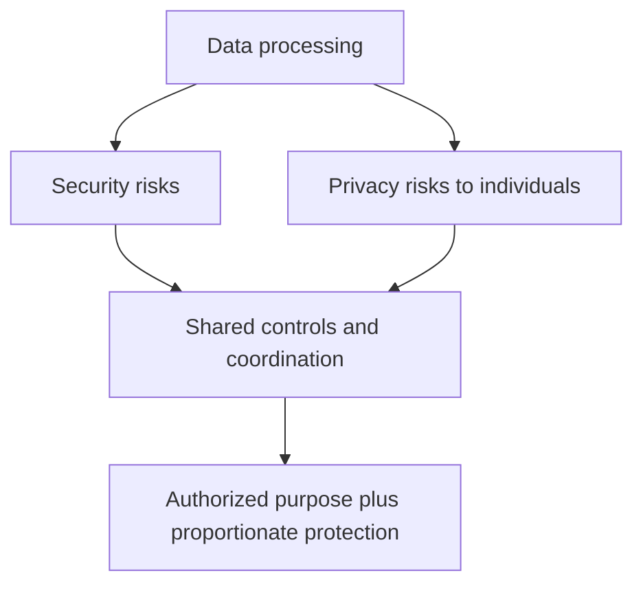

## Ownership, stewardship, custody, and decision rights

| Role | Accountable/responsible for | Must not be assumed |
|---|---|---|
| Executive sponsor | Program priority/resources/risk escalation | Daily field definition |
| Data owner | Purpose, access, classification, use, quality expectation, retention input | Technical administration |
| Data steward | Definitions, metadata, quality, issues, mappings, lifecycle coordination | Final legal basis |
| System/custodian owner | Storage, backup, access enforcement, operations | Business purpose |
| Security | Threat/control assessment, monitoring, incident response | Sole privacy decision |
| Privacy/legal | Applicability, privacy/legal advice, rights/notice/transfer review | System configuration details |
| Records management | Schedules, holds, disposition evidence | Security risk acceptance |
| Consumer owner | Fitness, access population, deletion/export behavior | Source authority |
| TSM | Coordinate discovery, evidence, owners, risks, outcomes | Replace customer decision makers |

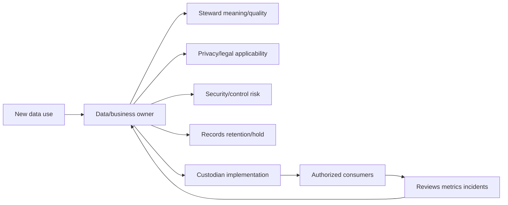

Decision rights should cover approve new source/use, classify, grant privileged access, change retention, export/share, accept exception, place/release hold, respond to rights request, notify incident, and decommission/delete.

## Data catalog and inventory

A catalog entry should describe both content and processing.

| Catalog field | Security-data example |
|---|---|
| Dataset/data product ID | `nmh-security-auth-events` |
| Description/purpose | Detect/investigate authorized account activity |
| Owner/steward/custodian | Identity security / named roles |
| Source/producer | Identity provider logs |
| Subjects/entities | Employees, contractors, service accounts, devices |
| Fields/definitions | User ID, IP, device, action, result, event time |
| Classification | Restricted security + personal data |
| Jurisdictions/locations | Approved inventory, not assumed |
| Lawful/authorized purpose | Approved processing record/reference |
| Consumers/shares | SOC, identity, approved support/export paths |
| Lineage/copies | Raw, curated, graph, dashboard, backup, ticket |
| Access policy | RBAC/ABAC policy ID |
| Retention/hold | Schedule + hold status |
| Quality/freshness | Coverage, watermark, limitations |
| Third parties | Processor/subprocessor/transfer contract references |
| Deletion/sanitization | Workflow and verification evidence |
| Incident/DSAR search | System contact and searchable identifiers |

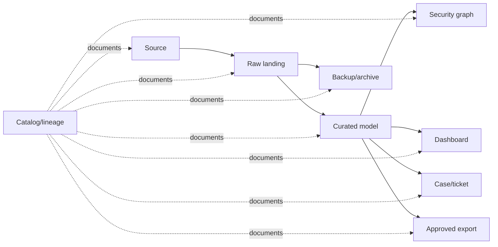

Unknown copies are governance debt. Discovery should include logs, caches, extracts, notebooks, email/attachments, support cases, endpoint downloads, snapshots, backups, test environments, and third-party systems.

## Lineage and provenance

| Lineage level | Question |
|---|---|
| System lineage | Which systems move/store data? |
| Dataset lineage | Which dataset derives from which? |
| Field lineage | Which source fields/rules created this value? |
| Identity lineage | Which records were resolved into entity? |
| Decision lineage | Which data/rules drove score/action? |
| Access lineage | Who accessed/exported/changed data? |
| Lifecycle lineage | Which copies are retained/held/deleted? |

Lineage supports impact analysis, correction, DSAR search, legal hold, incident scope, deletion verification, and consumer trust. It must itself be protected because a detailed data map can help an attacker.

## Data classification

Use organization-approved labels. The following is synthetic, not a universal standard.

| Class | Synthetic examples | Baseline handling idea |
|---|---|---|
| Public | Published product material | Integrity/availability controls |
| Internal | General operating procedures | Workforce access; controlled sharing |
| Confidential | Customer architecture, contracts | Need-to-know, encrypted, approved transfer |
| Restricted | Credentials, sensitive logs, vulnerability details, personal data | Strong access, monitoring, minimization, strict export |

Classification dimensions can coexist:

| Dimension | Example label | Why separate |
|---|---|---|
| Confidentiality | Restricted | Unauthorized disclosure impact |
| Integrity | High | Wrong data could trigger containment |
| Availability | Moderate | Outage affects investigation |
| Privacy | Personal/sensitive category under applicable policy | Risks to individuals |
| Security sensitivity | Vulnerability/credential/network topology | Exploitation value |
| Regulatory/contract | Customer/regime-specific | Handling/transfer obligations vary |
| Records | Seven-year category/hold-eligible (synthetic) | Disposition rule |

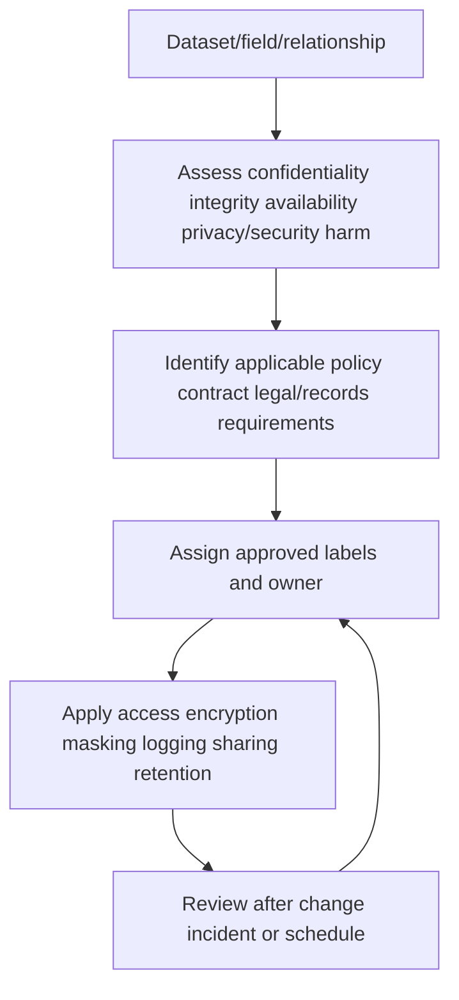

Classification inheritance requires care. A dashboard aggregated from restricted logs may be less identifying, equally sensitive, or more sensitive because it reveals control gaps. Test reidentification and business/security harm; do not mechanically select the highest or lowest source label without policy.

## Security logs are sensitive data

| Log content | Defensive value | Potential harm |
|---|---|---|
| User/account IDs | Attribution/investigation | Surveillance, identity exposure |
| IP/device/location | Scope/path analysis | Movement/behavior inference |
| URLs/query strings | Threat and policy analysis | Sensitive browsing/content leakage |
| Headers/tokens | Protocol diagnosis | Credential/session compromise |
| Process/command lines | Malware/RCA evidence | Secrets, filenames, personal content |
| Email/file metadata | Investigation/correlation | Relationship/content inference |
| Vulnerability/config | Prioritization | Attack blueprint |
| Admin actions | Accountability | Insider targeting/privileged detail |
| Error dumps | Debugging | Memory secrets/PII/source code |

Never request "all logs" by reflex. Define hypothesis, minimum fields/time/population, secure collection, redaction, transfer, access, analysis location, retention, return/deletion, and escalation. Preserve evidence integrity without maximizing data.

### Plain-English deep-dive 2 - Diagnostic data can be more sensitive than business data

A support trace may capture the envelope and the letter. URLs can contain identifiers; headers can contain tokens; memory dumps can contain secrets; command lines can include passwords; packet captures can reveal content.

The safest trace is not the biggest trace. Collect the smallest discriminating evidence, inspect/redact using approved processes, and use secure channels. You can credibly connect this to enterprise escalation work.

## Purpose limitation and authorized/lawful use

Technical access does not establish permission to use data for any purpose.

| Use-record field | Question |
|---|---|
| Purpose | What specific outcome requires processing? |
| Population/scope | Which people/entities/time/regions? |
| Data elements | Which fields and precision are necessary? |
| Action | Collect, store, correlate, infer, share, export, decide? |
| Authority/authorization | Which policy/contract/approval permits it? |
| Legal basis/applicability | What qualified legal analysis applies? |
| Compatibility | Is new use consistent with collection/notice/expectation? |
| Consequence | What decisions affect people/systems? |
| Controls | Access, minimization, retention, review, redress |
| Owner/review | Who approved and when reassessed? |

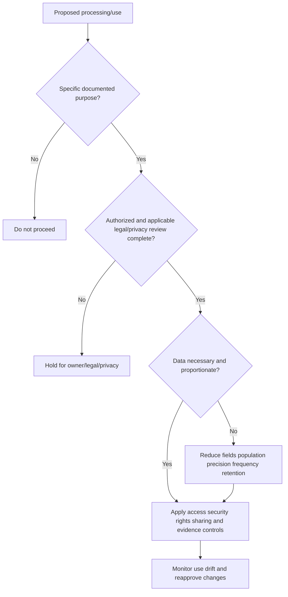

Lawful basis is jurisdiction-specific. GDPR lists bases such as consent, contract necessity, legal obligation, vital interests, public task, and legitimate interests under conditions. Do not choose one from a checklist without qualified analysis. Consent is not a universal fallback and must meet applicable requirements.

## Data minimization

Minimize across multiple dimensions.

| Dimension | Full option | Minimized option |
|---|---|---|
| Fields | Full URL/query/header | Domain/category/status where sufficient |
| Identity | Direct employee email | Scoped pseudonymous user ID |
| Precision | Exact location/time | Region/hour bucket if sufficient |
| Population | All users | Affected tenant/group under hypothesis |
| Time range | Months of logs | Narrow incident window plus buffer |
| Frequency | Every event indefinitely | Necessary sampling/aggregation |
| Sharing | Raw export | Aggregated/redacted view |
| Retention | Default forever | Purpose/obligation-based period |
| Environment | Production copy in test | Synthetic/deidentified test data |
| Access duration | Permanent role | Just-in-time, expiring grant |

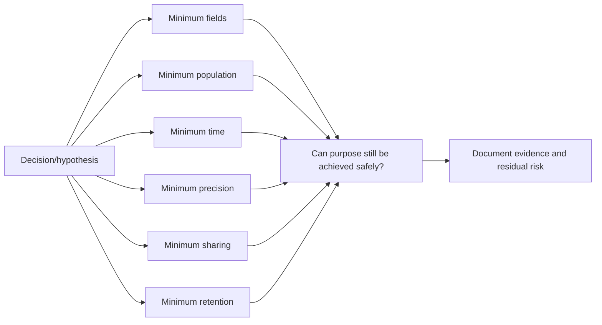

Minimization is not deleting evidence needed for incident response, legal hold, safety, or contractual duties. It is a documented balance under owners and applicable requirements.

## RBAC, ABAC, and access-control building blocks

NIST describes role-based access control (RBAC) as assigning privileges to roles and users to roles. NIST SP 800-162 describes attribute-based access control (ABAC) as evaluating attributes of subject, object, operation, and environment against policy.

| Model | Decision input | Strength | Failure mode |
|---|---|---|---|
| Discretionary/list | Named subject/object list | Direct/simple small cases | Per-user sprawl |
| RBAC | Job/function role | Scalable/admin-friendly | Role explosion/overbroad roles |
| ABAC | Subject/object/action/environment attributes | Contextual/fine-grained | Complex policies/bad attributes |
| Relationship-based | Relationship to resource | Natural for tenant/ownership | Stale/false relationship |
| Policy combination | Roles plus attributes/relationships | Practical flexibility | Hard-to-explain precedence |

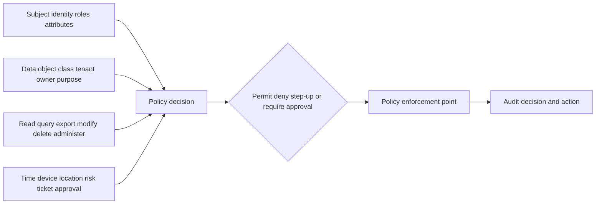

## Least privilege and separation of duties

| Control | Example | Why it matters |
|---|---|---|
| Role scope | Analyst reads one tenant's curated events | Limits tenant/data blast radius |
| Action scope | View versus export versus delete | Read need does not imply extraction/admin |
| Field/row scope | Mask tokens; tenant filter | Protects sensitive portions |
| Time scope | Just-in-time 2-hour access | Removes standing privilege |
| Purpose/ticket scope | Access tied to approved case | Supports accountable use |
| Approval | Export requires owner approval | Controls exfiltration path |
| Separation | Requester cannot approve own privileged grant | Reduces abuse/error |
| Dual control | Key recovery/deletion requires two roles | Protects irreversible action |
| Break-glass | Emergency account with monitoring/review | Resilience without silent bypass |
| Recertification | Periodic manager/owner review | Removes stale access |

### Plain-English deep-dive 3 - Read access is not one permission

Library membership may let someone read a book inside the library, not remove every book, photocopy the archive, edit catalog entries, or burn records. Data platforms need the same separation.

Differentiate discover metadata, view masked data, view raw data, query, join, export, share, administer policy, manage connectors, manage keys, alter retention, place hold, delete, and view audit logs. An "analyst" role with all permissions is not least privilege.

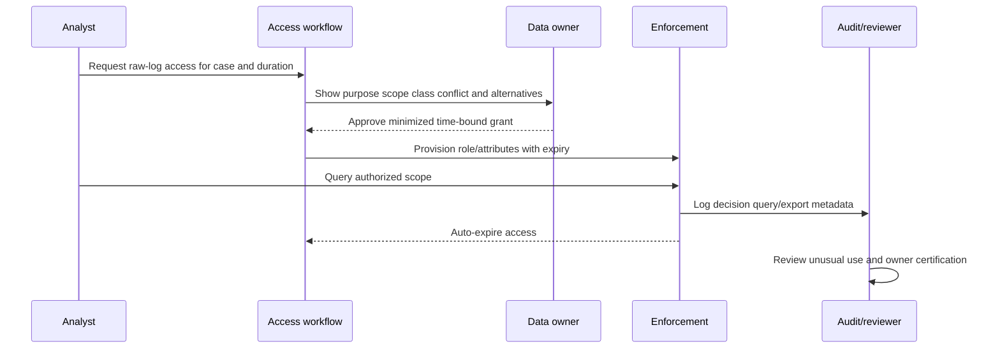

## Access lifecycle and reviews

| Stage | Required control/evidence |
|---|---|
| Request | Identity, role, purpose, data, actions, duration, ticket |
| Approval | Correct owner, separation, conflicts, least-privilege alternative |
| Provision | Automated scoped grant, expiry, MFA/device/session conditions |
| Use | Enforcement, masking, rate/export controls, audit |
| Monitor | Anomaly, dormant grants, privilege changes, bulk access |
| Review | Owner/manager attestation with evidence, not rubber stamp |
| Revoke | Role change, termination, expiry, incident, purpose completion |
| Verify | Test denial and remove tokens/caches/derived access |

Access review metrics should include grants by class, dormant/expired access, orphan accounts, role conflicts, unreviewed exceptions, time to revoke, break-glass use, denied attempts, and export volume. Counts alone do not prove appropriate access.

## Encryption, keys, and secrets

| Layer | Example protection | Important limitation |
|---|---|---|
| In transit | Authenticated protected channel/TLS | Endpoints can still misuse data |
| At rest | Storage/database encryption | Authorized query sees plaintext |
| Field/application | Encrypt selected sensitive fields | Query/key/rotation complexity |
| Backup | Encrypted backup with controlled keys | Restore path/key availability |
| Export | Encrypted approved package/channel | Recipient/endpoints govern after receipt |
| In use | Isolation/memory controls where applicable | Technology/availability limits |

Key lifecycle:

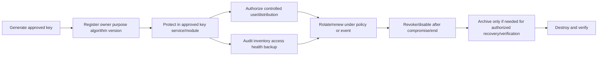

| Key/secret control | Failure prevented |
|---|---|
| Separate data and key access | One compromise exposes both |
| Central inventory/owner | Forgotten keys block rotation/deletion |
| Approved algorithms/modules | Weak/custom cryptography |
| Rotation/versioning | Long-lived compromise/blast radius |
| Revocation/compromise plan | Continued use of exposed material |
| Backup/recovery testing | Encrypted data becomes unavailable |
| No secrets in code/logs/tickets | Accidental disclosure |
| Short-lived credentials | Standing access |
| Workload identity | Shared human/service passwords |
| Audit/admin separation | Undetected key misuse |

Encryption is not anonymization, retention, authorization, or purpose limitation. Destroying a key may support cryptographic erase only when architecture, copies, algorithms, key isolation, backup, and verification satisfy the approved sanitization policy.

## Masking, tokenization, pseudonymization, and anonymization

| Technique | Mechanic | Reversible/linkable? | Good use | Caveat |
|---|---|---|---|---|
| Redaction | Remove content | Usually no in released copy | Support evidence/export | Original/copies remain |
| Static masking | Replace in nonproduction copy | Policy-dependent | Test/training | Consistency/reidentification |
| Dynamic masking | Hide at query/display time | Raw remains accessible to engine | Role-based views | Bypass/export/query leakage |
| Tokenization | Replace with token; mapping separate | Yes with token vault/mapping | Limit direct identifiers | Token/linkage still sensitive |
| Pseudonymization | Replace identifiers but permit controlled linkage | Usually yes | Analytics with reduced direct identity | Still personal data in many contexts |
| Generalization | Reduce precision/category | Sometimes reidentifiable | Aggregate reports | Utility loss/linkage attack |
| Aggregation | Summarize groups | Depends on group/query | Executive metrics | Small cells/differencing |
| Anonymization | Meet applicable standard for no reasonable reidentification | Intended no | Public/research use | Difficult, contextual, not a label |

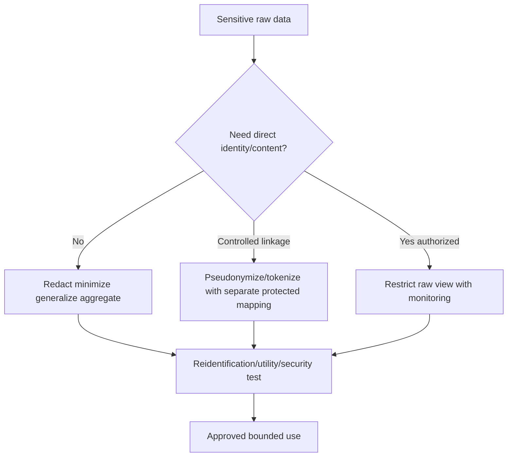

Hashing a low-entropy identifier is not robust anonymization. Attackers can guess values and compare hashes; stable hashes enable cross-dataset linkage. Use purpose-designed tokenization/pseudonymization with keys/salts/access and threat modeling where appropriate.

## Retention, archive, deletion, and sanitization

A retention schedule states what, why, trigger, duration, disposition, holds, copies, owner, authority, and proof.

| Lifecycle concept | Meaning | Example risk |
|---|---|---|
| Active retention | Data readily used for current purpose | Excessive access |
| Archive | Preserved with reduced access for defined need | Forgotten copies |
| Backup | Recovery copy for resilience | Deletion/hold complexity |
| Snapshot/cache | Point-in-time/performance copy | Outside inventory |
| Deletion | Logical removal from application | Recoverable media/backups remain |
| Sanitization | Render target data access infeasible for effort | Wrong method/media |
| Legal hold | Suspend disposal for relevant scope | Over/under-preservation |
| Disposition | Approved final action at schedule end | Unverified/manual failure |

```mermaid
stateDiagram-v2
    [*] --> Collected
    Collected --> Active: accepted purpose
    Active --> Archived: operational need ends; retention remains
    Active --> Held: legal/investigation hold
    Archived --> Held: hold issued
    Held --> Active: hold released and active need remains
    Held --> Archived: hold released and schedule remains
    Active --> Eligible: retention trigger plus period complete
    Archived --> Eligible: retention complete
    Eligible --> Deleted: logical disposition
    Deleted --> Sanitized: media/copy sanitization as required
    Sanitized --> Verified: evidence accepted
    Verified --> [*]
```

| Schedule field | Synthetic NMH example |
|---|---|
| Record category | Authentication security events |
| Purpose | Detection, investigation, authorized assurance |
| Trigger | Event date or case closure depending copy |
| Active period | Synthetic 90 days (not recommendation) |
| Archive period | Synthetic 275 additional days |
| Hold behavior | Suspend deletion for identified subjects/time/systems |
| Copies | Raw, curated, case extract, backup, export |
| Disposition | Delete/logical expiry plus approved media handling |
| Verification | Job evidence, exceptions, sample restore/nonaccess test |
| Owner/authority | Security owner + records/legal approval |

Do not copy these periods. Requirements differ by purpose, law, contract, incident readiness, sector, and risk.

### Plain-English deep-dive 4 - Delete is a workflow, not a button

Deleting a photo from a phone may leave cloud sync, trash, backup, shared album, message attachment, thumbnail cache, and another person's copy. Enterprise security data behaves similarly.

A deletion request must traverse lineage: raw, curated, indexes, graphs, dashboards, cases, exports, caches, snapshots, backups, and vendors. Some copies may expire on a documented backup cycle rather than immediate record deletion; legal hold may suspend disposal. State what happened accurately and retain appropriate disposition evidence without recreating deleted content.

## Legal holds

| Hold step | Control |
|---|---|
| Issue | Authorized legal/records instruction with scope |
| Identify | Custodians, subjects, systems, fields, dates, copies |
| Preserve | Suspend affected disposition without overbroad access |
| Notify | Relevant custodians/operators with acknowledgement |
| Monitor | New sources, transfers, job failures, scope changes |
| Collect | Defensible authorized process and chain/evidence |
| Release | Authorized release only |
| Resume | Recalculate schedule/disposition under policy |
| Audit | Hold ID, decisions, actions, exceptions |

Security teams should not independently interpret legal scope. They implement holds with legal/records direction and protect preserved data.

## Residency, localization, transfers, and jurisdiction

| Concept | Question |
|---|---|
| Storage residency | Where are primary data bytes stored? |
| Backup/DR location | Where are replicas, backups, recovery copies? |
| Processing location | Where do compute/support operations process data? |
| Remote access location | From where can personnel/vendors access data? |
| Transfer | Does data cross defined borders/entities and under what mechanism? |
| Controller/processor roles | Who determines purpose/means and who processes for whom under applicable law? |
| Subprocessor | Which downstream party processes data? |
| Jurisdiction | Which laws/courts/government-access rules may apply? |
| Metadata/telemetry | Do operational logs leave the intended region? |
| Support evidence | Where are cases, traces, and exports stored? |

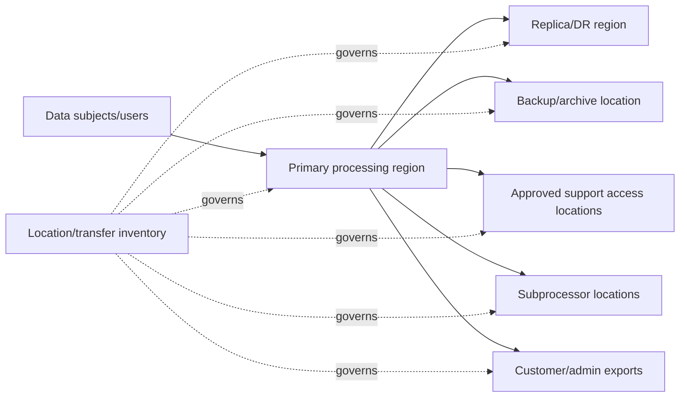

"Data stays in region" is incomplete unless scope includes content type, service/component, metadata, backups, support, subprocessors, incident handling, key location, exports, and exceptions. Validate current contracts and architecture; do not infer Data Fabric residency from a general privacy page.

## Audit and accountability

| Audited action | Important fields |
|---|---|
| Authentication/session | Subject, method, time, outcome, session/device context |
| Authorization decision | Policy/version, subject/object/action/environment, result |
| Data query/view | Dataset/class/scope/time/purpose/ticket; privacy-aware detail |
| Export/share | Recipient, fields, population, approval, channel, expiry |
| Admin/config | Before/after, actor, approval, target, version |
| Access grant/revoke | Role/attributes, owner, duration, reason |
| Classification/retention | Old/new label/schedule, authority |
| Hold/delete/sanitize | Scope, job, exceptions, verification, approver |
| Key/secret operation | Key ID (not secret), operation, actor/service, result |
| DSAR/incident | Case ID, steps, decisions, disclosure controls |

Audit logs themselves are sensitive and can be attacked. Protect integrity, time synchronization, access, separation, retention, availability, export, and monitoring. Avoid logging secrets or unnecessary personal content. Test that privileged administrators cannot silently erase their own trail under the control design.

## Third-party and subprocessor governance

| Lifecycle | Governance questions |
|---|---|
| Due diligence | Security/privacy/financial/service/data-location capability? |
| Contract | Purpose, instructions, confidentiality, controls, audit evidence, incident notice? |
| Data mapping | Fields, subjects, regions, transfers, subprocessors, copies? |
| Access | Identities, roles, support access, MFA, JIT, logging? |
| Operations | Quality, availability, changes, vulnerabilities, attestations? |
| Incident | Contact, evidence, cooperation, notification, containment? |
| Rights/holds | Search, correct, export, restrict, preserve, delete support? |
| Exit | Return/export, deletion/sanitization, key revocation, evidence? |

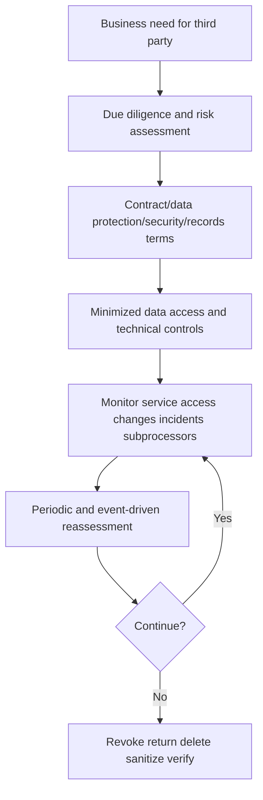

An assurance report or certification is evidence with scope and date, not proof that every customer configuration/use is safe. Review shared responsibility and exceptions.

## DSAR and individual-rights overview

DSAR commonly means data subject access request, but rights and deadlines vary by jurisdiction, role, identity, exemptions, and request. GDPR includes rights concerning access, rectification, erasure, restriction, portability, objection, and other protections under conditions. Qualified privacy/legal teams determine applicability and response.

```mermaid
sequenceDiagram
    participant R as Requester
    participant I as Privacy intake
    participant L as Legal/privacy
    participant S as System owners/vendors
    participant Q as Quality/security review
    R->>I: Submit rights request
    I->>I: Authenticate requester proportionately; log scope/deadline
    I->>L: Determine jurisdiction role rights limits holds
    L->>S: Issue approved search/action instructions
    S-->>Q: Minimized results/action evidence
    Q->>Q: Verify identity scope third-party data exemptions security
    Q-->>I: Approved response package/status
    I-->>R: Secure response or reasoned outcome
    I->>I: Retain request evidence under schedule
```

| DSAR challenge | Control |
|---|---|
| Identity fraud | Proportionate requester verification; do not overcollect |
| Identity matching | Search aliases/IDs/time with resolution confidence |
| Hidden copies | Catalog/lineage/vendor workflows |
| Other people's data | Review/redaction/legal decision |
| Security-sensitive content | Prevent disclosure that creates risk under applicable rules |
| Legal hold/obligation | Coordinate exceptions/restrictions |
| Derived/inferred data | Identify policy/obligation and explainability needs |
| Deadline/case tracking | Central intake, owners, status, escalation |
| Deletion propagation | Versioned jobs, backup/vendor handling, verification |
| Response transfer | Secure authenticated delivery |

A TSM should route and coordinate according to company process, not independently promise deletion, scope, deadline, or legal outcome.

## Incident and breach response

An information-security incident, privacy incident, and legally defined personal-data breach can overlap but are not automatically identical. Use current incident/privacy plans and qualified assessment.

| Question | Evidence |
|---|---|
| What happened? | Timeline, source, affected systems/data/actions |
| Was confidentiality, integrity, or availability affected? | Access/change/loss evidence |
| Whose/which data? | Catalog, classification, subjects, jurisdictions |
| How much and how sensitive? | Fields, population, precision, linkability |
| Was data protected? | Encryption/key status, masking, tokenization |
| Who accessed/received it? | Identity, audit, export, third-party evidence |
| Is exposure ongoing? | Sessions, tokens, links, vendor access, copies |
| What obligations apply? | Legal/privacy/contract/insurance/regulator decision |
| What harms/risks may follow? | Security/privacy/business assessment |
| What notifications/actions? | Authorized decision and communication plan |

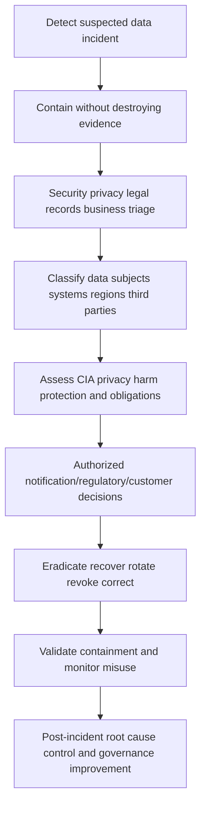

Do not delay internal escalation while debating whether an event meets a legal definition. Report facts through the designated channel, preserve privilege/confidentiality instructions, minimize broad sharing, and avoid speculative notification language.

## Governance exceptions

| Exception field | Requirement |
|---|---|
| Control/policy | Exact requirement deviated from |
| Scope | Dataset, system, users, regions, actions |
| Reason | Why requirement cannot currently be met |
| Risk | Security/privacy/legal/business impact |
| Compensating controls | What reduces risk and how validated |
| Owner/approver | Correct authority and separation |
| Start/expiry | Time-bounded, not indefinite |
| Monitoring | Indicators and review cadence |
| Remediation | Plan, milestones, dependencies |
| Closure | Evidence control met or data/use ended |

Exception counts should not become a target that encourages hiding. Track age, criticality, repeated renewals, coverage, overdue remediation, and incidents related to exceptions.

## Governance operating model

| Forum/cadence | Purpose | Inputs | Outputs |
|---|---|---|---|
| Steward working group | Definitions, quality, catalog, issues | Defects, change requests | Approved metadata/actions |
| Access review | Validate grants and conflicts | Role/use/audit data | Revoke/adjust/attest |
| Privacy/security review | Assess new/high-risk processing | Use case, data flow, threat/privacy risk | Conditions/approval/hold |
| Records review | Schedules, holds, disposition | Inventory, laws/contracts, holds | Approved lifecycle actions |
| Data governance council | Cross-domain decisions/priorities | Risks, metrics, escalations | Policy/funding/ownership |
| Incident forum | Coordinate event response | Evidence, classification, obligations | Containment/decision/comms |
| Vendor review | Third-party assurance/change | Contract, controls, incidents, subprocessors | Remediation/accept/exit |

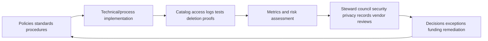

Governance metrics:

| Area | Useful measure | Caveat |
|---|---|---|
| Ownership | Critical datasets with active owner/steward | Named owner may be inactive |
| Inventory | Discovered stores mapped/cataloged | Unknown stores evade denominator |
| Classification | Fields/datasets reviewed by due date | Labels may be wrong |
| Access | Dormant/excess/expired grants removed | High removal count may show prior weakness |
| Minimization | Fields/copies/retention reduced with fitness maintained | Do not reward harmful deletion |
| Retention | Eligible objects disposed; exceptions/holds explained | Backup behavior matters |
| DSAR | Timeliness/quality/security under applicable process | Requests vary in complexity |
| Vendors | High-risk findings/remediation/overdue reviews | Questionnaire completion not control proof |
| Incidents | Detection/containment/recurrence and notification process | Low count may mean weak detection |
| Audit | Critical actions covered, reviewed, tamper-tested | Logging volume is not accountability |

## Complete synthetic NMH governance exercise

NMH proposes to combine authentication logs, endpoint telemetry, vulnerability findings, HR department, business criticality, and ticket data for exposure prioritization.

| Governance question | Synthetic decision |
|---|---|
| Purpose | Prioritize owned, exposed, business-critical assets for remediation |
| Owner/stewards | Security risk owner; identity/asset/business stewards |
| Personal/security data | User IDs, IP/device, behavior, vulnerabilities, topology |
| Minimization | Use scoped user ID and department; exclude home address/full URL/token |
| Access | Analysts view curated/partially masked; raw access JIT by case |
| Separation | Mapping engineer cannot approve own privileged access/retention change |
| Encryption/keys | Approved transport/storage, centralized key ownership/rotation |
| Retention | Synthetic schedule by raw/curated/case/export; legal review required |
| Residency | Inventory primary/DR/backup/support/vendor/export locations |
| Audit | Query/export/admin/access/deletion/key actions logged |
| Third parties | Contracted purpose/access/incident/deletion/subprocessor terms |
| Rights | Privacy intake searches scoped identifiers across lineage where applicable |
| Incident | Joint security/privacy/legal/records response with classification |
| Product boundary | Validate actual Data Fabric tenant/contracts/docs; no assumptions |

The result is not "approved forever." Any new automated employment action, location enrichment, expanded sharing, new region/vendor, longer retention, or model inference triggers review.

## Synthetic exercises with answers

### Exercise 1 - Ownership

The platform team stores data, so is it the data owner?

**Answer:** Usually it is custodian/system owner, while a business/domain owner is accountable for purpose/access/retention decisions. Document local decision rights.

### Exercise 2 - Minimization

An analyst wants full URLs for a domain-level coverage report. What do you do?

**Answer:** Test whether domain/category/status is sufficient. Collect full URL only under approved need, scope, access, redaction, and retention; URLs can contain sensitive data.

### Exercise 3 - RBAC

Does assigning every SOC employee the `SecurityAnalyst` role establish least privilege?

**Answer:** No. Define actions/data/tenant/raw/export/admin separation, use subroles/attributes/JIT, review conflicts and actual use, and expire stale grants.

### Exercise 4 - ABAC

A policy trusts `department=Security`. Is that enough?

**Answer:** No. Validate attribute authority/freshness, object class/tenant, operation, purpose/ticket, device/session risk, policy combination, denial behavior, and audit.

### Exercise 5 - Encryption

All storage is encrypted. Can every analyst access raw logs?

**Answer:** No. Encryption at rest does not replace authorization, minimization, masking, monitoring, or purpose controls.

### Exercise 6 - Hashing

Hashed employee emails are anonymous. True?

**Answer:** Not automatically. Emails can be guessed and stable hashes linked. Treat them as sensitive/pseudonymous unless a qualified assessment establishes otherwise.

### Exercise 7 - Retention

Storage is cheap; retain logs forever for future analytics?

**Answer:** Cost is only one factor. Purpose, privacy/security harm, legal/contract/records needs, incident value, access, rights, and deletion feasibility require a governed schedule.

### Exercise 8 - Legal hold

A deletion request arrives for data under hold. Delete immediately?

**Answer:** Route to privacy/legal/records. Applicable obligations, rights, holds, and response language require authorized determination; preserve only approved scope and communicate lawfully.

### Exercise 9 - Residency

Primary database is in Germany. Does all data remain in Germany?

**Answer:** Not established. Check replicas, backups, telemetry, support access, subprocessors, keys, exports, disaster recovery, and transfer mechanisms.

### Exercise 10 - Audit

Should audit logs include every raw query result?

**Answer:** Usually log sufficient metadata for accountability without duplicating sensitive content. Balance evidence, minimization, access, integrity, and incident needs.

### Exercise 11 - DSAR

A customer asks the TSM to promise deletion by tomorrow. What should the TSM say?

**Answer:** Acknowledge and route through the authorized privacy/customer process, gather only needed identifiers/context securely, and avoid promising scope/deadline/outcome before applicability and systems are assessed.

### Exercise 12 - Zscaler scope

Can Zscaler's website privacy policy establish customer Data Fabric retention and residency?

**Answer:** No. The page itself distinguishes website/business processing from customer-behalf processing. Validate executed agreements, privacy overview, service documentation, tenant settings/evidence, and specialists.

## Governance troubleshooting decision tree

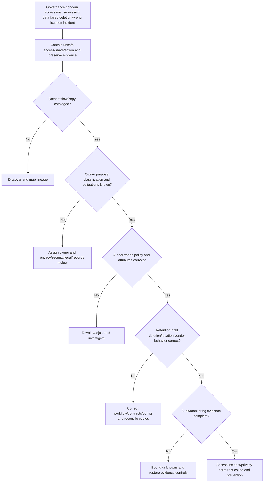

## Governance troubleshooting runbook

1. State the concern factually: unauthorized access/export, overcollection, stale privilege, wrong classification, retention failure, deletion gap, residency uncertainty, vendor issue, rights request, or suspected incident.
2. Use designated security/privacy/legal/records channels. Preserve privilege/confidentiality instructions and avoid broad speculation.
3. Contain unsafe access, sharing, automated action, token/session, connector, or export without destroying evidence.
4. Identify dataset/field/relationship, tenant, systems, copies, subjects/entities, time, purpose, owner, class, jurisdiction indicators, and affected consumer.
5. Retrieve catalog/lineage, processing/use record, access policy, retention schedule, hold state, contracts, third-party inventory, and relevant versions.
6. Validate source and copy inventory, including raw, curated, graph, dashboard, case, export, cache, snapshot, backup, support, test, and vendor stores.
7. Reconstruct authentication, authorization decision, access/query/export/admin action, approval, and revocation using protected audit evidence.
8. Check RBAC roles, ABAC attributes/authority/freshness, tenant/object/action/environment, policy combination, JIT expiry, and separation conflicts.
9. Check minimization and purpose: fields, population, precision, frequency, joins/inferences, sharing, and use drift.
10. Check classification and protection: encryption context, key/secret state, masking/tokenization, endpoint/export controls, and audit integrity.
11. Check lifecycle: trigger, period, archive, holds, deletion/sanitization method, job failures, backup/vendor behavior, and verification evidence.
12. Check locations/transfers: primary, replica, DR, backup, metadata, support, subprocessor, export, key, and access locations.
13. Determine whether event is security incident, privacy incident, contractual event, or potentially defined breach through authorized assessment.
14. Quantify impact without unnecessary exposure: records/subjects/systems/fields/actions/recipients/regions/time and protections.
15. Coordinate required notifications, rights handling, holds, vendor actions, regulator/customer decisions, and communications through authorized owners.
16. Correct access/config/data flow, rotate/revoke credentials/keys as appropriate, remove unauthorized copies, restore controls, and monitor misuse.
17. Validate closure through denial/access test, inventory reconciliation, deletion/sanitization evidence, vendor confirmation, and consumer review.
18. Identify root mechanism/control failure, contributing governance conditions, and prevention: owner, contract, policy, automation, review, alert, training, test, or metric.

| Evidence pack item | Why it matters |
|---|---|
| Catalog/lineage | Identifies data/copies/owners |
| Purpose/processing record | Tests authorized use |
| Classification | Drives harm/control analysis |
| Access policy/decision logs | Reconstructs authorization |
| Identity/attribute history | Validates subject and policy input |
| Query/export/admin audit | Scopes actions |
| Retention/hold/deletion evidence | Explains lifecycle behavior |
| Location/vendor map | Scopes transfers/third parties |
| Key/secret evidence | Determines protection/compromise |
| Incident/rights case record | Preserves decisions and communications |

## Labs and rehearsal

### Lab 1 - Governance inventory

Catalog synthetic authentication, endpoint, vulnerability, asset, ticket, HR, and business-service data including purpose, owners, fields, classes, consumers, copies, locations, vendors, access, retention, and deletion.

### Lab 2 - RACI and decisions

Assign owner, steward, custodian, security, privacy/legal, records, consumer, approver, and TSM coordination for ten decisions.

### Lab 3 - Classification clinic

Classify raw logs, aggregated dashboard, vulnerability export, token, packet capture, memory dump, executive report, and synthetic training set. Explain inheritance exceptions.

### Lab 4 - Minimization

Reduce a full troubleshooting bundle by field, time, population, precision, sharing, and retention while preserving one discriminating test.

### Lab 5 - RBAC design

Create metadata viewer, masked analyst, raw investigator, exporter, connector admin, policy admin, key admin, retention admin, auditor, and break-glass roles.

### Lab 6 - ABAC policy

Add tenant, classification, purpose/ticket, device, session risk, time, region, action, and JIT attributes. Test missing/stale/conflicting attributes and deny behavior.

### Lab 7 - Separation of duties

Model request/approve/provision/audit, score-author/publisher, key-admin/data-admin, hold issuer/releaser, and deletion requester/approver conflicts.

### Lab 8 - Encryption/key lifecycle

Map data/key access, generate/store/use/rotate/revoke/recover/destroy events, compromise scenario, backup restore, and audit evidence.

### Lab 9 - Deidentification techniques

Compare redaction, masking, tokenization, pseudonymization, generalization, aggregation, and anonymization claims under a threat model.

### Lab 10 - Retention schedule

Create synthetic schedules for raw logs, curated events, incidents, dashboards, exports, backups, and audit logs with triggers, holds, and proof.

### Lab 11 - Legal hold

Issue, scope, propagate, monitor, modify, release, and resume disposition across source, lake, case, export, backup, and vendor copies.

### Lab 12 - Location/transfer map

Map primary, replica, backup, support, subprocessor, keys, metadata, DR, and export paths. Identify claims that need contract/product validation.

### Lab 13 - DSAR tabletop

Practice intake, identity, applicability routing, alias search, third-party data review, hold/exception, secure response, deletion propagation, and evidence.

### Lab 14 - Vendor exit

Revoke access, export needed data, delete/sanitize copies, handle backups, remove secrets/integrations, obtain evidence, and update inventory.

### Lab 15 - Data incident

Simulate an excessive export of sensitive security logs. Contain, scope, classify, coordinate assessment, rotate/revoke, notify as authorized, and prevent recurrence.

### Lab 16 - TSM governance briefing

Explain a customer governance concern without legal conclusions: facts, affected data/use, current controls, unknowns, owners, containment, evidence request, decision path, and next update.

| Lab evidence | Completion standard |
|---|---|
| Inventory | Systems, fields, copies, flows, vendors, locations |
| Accountability | Decision rights/RACI explicit |
| Purpose | Authorized use and review evidence |
| Minimization | Necessity/proportionality demonstrated |
| Access | RBAC/ABAC/JIT/separation and tests |
| Protection | Encryption/keys/secrets/masking/audit |
| Lifecycle | Retention/hold/delete/sanitize/verify |
| Rights/incident | Routed to authorized process |
| Third party | Contract/access/exit evidence |
| Honesty | No legal or product behavior invention |

## Common misconceptions to correct

| Misconception | Correct model |
|---|---|
| Governance is paperwork | It is decision rights, controls, evidence, and improvement |
| IT owns all data because it stores it | Custody differs from business/domain accountability |
| Security and privacy are identical | They overlap; authorized processing can still create privacy risk |
| Encrypted means privacy-safe | Purpose, access, minimization, rights, retention still matter |
| Authenticated means authorized | Identity proof is not permission |
| RBAC automatically gives least privilege | Roles can be overbroad/stale |
| ABAC is always more secure | Bad/complex/stale attributes create failures |
| One analyst permission is enough | View/query/export/admin/delete need separation |
| Break-glass can bypass audit | Emergency access needs stronger monitoring/review |
| Read-only access cannot harm | Search/linkage/export can expose sensitive data |
| Logs are harmless operational data | They can contain identity, behavior, secrets, vulnerabilities, content |
| Collect everything for future security | Purpose/minimization/retention/risk govern collection |
| Consent solves every processing question | Legal basis and consent validity are jurisdiction/use-specific |
| Pseudonymized means anonymous | Controlled linkability and reidentification risk remain |
| Hashing identifiers anonymizes them | Guessing and linkage may remain |
| Masking deletes data | Raw data remains and bypasses may exist |
| Delete button removes every copy | Lineage, caches, backups, exports, vendors matter |
| Legal hold means preserve everything | Scope should follow authorized instruction |
| Encryption key deletion always sanitizes data | Architecture/method/copies/verification must support it |
| Residency equals all processing stays there | Access, backups, metadata, vendors, transfers differ |
| Certification proves our configuration is safe | Scope/date/shared responsibility matter |
| Low incident count proves strong governance | Detection/reporting may be weak |
| Audit logging every value is best | Logs can duplicate sensitive data |
| DSAR always means delete everything immediately | Rights, identity, applicability, limitations, holds require authorized handling |
| Every incident is legally a breach | Definitions/obligations require qualified assessment |
| TSM should give legal conclusions | TSM coordinates facts and authorized specialists |
| Website privacy policy defines customer service behavior | Customer processing is governed by relevant agreements/docs |
| Public Data Fabric wording proves retention/residency/RBAC | It does not |

## Official Source Anchors

Research/source date: **2026-08-24**.

NIST sources provide voluntary/federal-context risk, security, privacy, access, key, sanitization, and supply-chain guidance. GDPR is cited only for a high-level overview of concepts and rights; qualified counsel determines applicability. ISO and CSA sources provide governance/security context. Zscaler public pages support only the published statements and boundaries identified here.

| Source | URL | Used for | Boundary |
|---|---|---|---|
| NIST Privacy Framework | https://www.nist.gov/privacy-framework | Enterprise privacy risk management | Voluntary; not legal compliance determination |
| NIST SP 800-53 Rev. 5 | https://csrc.nist.gov/pubs/sp/800/53/r5/upd1/final | Security/privacy control families, access, audit, PII, incident, integrity | Requires tailoring; check current release |
| NIST SP 800-122 | https://csrc.nist.gov/pubs/sp/800/122/final | PII confidentiality protection context | Federal/older publication; definitions evolve |
| NIST SP 800-162 | https://csrc.nist.gov/pubs/sp/800/162/upd2/final | ABAC definition and considerations | Federal guidance; implementation-specific |
| NIST RBAC Project | https://csrc.nist.gov/projects/role-based-access-control | RBAC roles/privileges background | Archived project; current standards/docs govern |
| NIST SP 800-207 | https://csrc.nist.gov/pubs/sp/800/207/final | Resource-focused, policy-based zero trust context | Not a complete data-governance standard |
| NIST SP 800-57 Part 1 Rev. 5 | https://csrc.nist.gov/pubs/sp/800/57/pt1/r5/final | Cryptographic key-management lifecycle/guidance | Algorithm/module/applicability expertise required |
| NIST SP 800-88 Rev. 2 | https://csrc.nist.gov/pubs/sp/800/88/r2/final | Current media sanitization guidance | Media/architecture-specific; not simple row deletion |
| NIST SP 800-161 Rev. 1 Update 1 | https://csrc.nist.gov/pubs/sp/800/161/r1/upd1/final | Current supply-chain/third-party risk context | Requires organizational tailoring |
| NIST SP 800-61 Rev. 3 | https://csrc.nist.gov/pubs/sp/800/61/r3/final | Current incident-response recommendations | Legal breach assessment is separate |
| GDPR official text | https://eur-lex.europa.eu/eli/reg/2016/679/oj | Principles, legal bases, rights, security/breach/transfer context | EU law; applicability/interpretation requires counsel |
| ISO/IEC 27001 overview | https://www.iso.org/standard/27001 | Information-security management-system context | Full standard/certification scope separate |
| ISO/IEC 27701 overview | https://www.iso.org/standard/85819.html | Privacy-information management context | Full standard/applicability separate |
| Zscaler Data Fabric for Security | https://www.zscaler.com/products-and-solutions/data-fabric | Public flexible/extensible, unify/harmonize/deduplicate/correlate/enrich context | No tenant RBAC, retention, deletion, residency, or control claim |
| Zscaler Privacy Policy | https://www.zscaler.com/privacy-compliance/company-privacy-policy | Published website/business processing, rights, retention, transfer/security statements | Page states customer-behalf processing is governed by customer agreements |
| Zscaler Privacy Overview | https://www.zscaler.com/privacy-compliance/overview | Public privacy/compliance resource context | Validate current product/service and executed terms |

## Likely Interview Questions

### Q1. What is data governance, and who owns it?

**Model answer:** Data governance is the operating system of decision rights, accountability, definitions, controls, evidence, and improvement across the data lifecycle. Business/domain owners approve purpose, access, classification, and risk decisions; stewards maintain meaning/quality; custodians implement systems; security, privacy/legal, records, vendors, and consumers contribute. A TSM coordinates evidence and owners but does not replace them.

### Q2. How do minimization and purpose limitation apply to security data?

**Model answer:** I document the decision/hypothesis, authorized purpose, population, fields, precision, frequency, joins/inferences, sharing, retention, and consequence. I reduce each dimension while preserving fitness, use synthetic or aggregate data where possible, and re-review new uses. Security value does not make all collection lawful or proportionate; legal/privacy owners determine applicability.

### Q3. How do RBAC, ABAC, least privilege, and separation of duties work together?

**Model answer:** RBAC assigns permissions through job roles; ABAC evaluates subject, object, action, and environment attributes. I combine them where useful, validate attribute authority/freshness, separate discover/view/raw/query/export/admin/key/retention/delete/audit actions, use tenant/field/JIT scope, prevent self-approval and incompatible roles, monitor use, recertify, and test revocation/denial.

### Q4. What does encryption solve, and what does it not solve?

**Model answer:** Encryption can protect confidentiality and sometimes integrity in transit, at rest, in backups, fields, or exports under a defined threat model. It depends on approved algorithms/modules and key generation, storage, access separation, rotation, recovery, revocation, compromise response, destruction, and audit. It does not establish purpose, authorization, minimization, anonymization, retention, or correct endpoint use.

### Q5. How do you design retention and deletion for a security data platform?

**Model answer:** I inventory categories/copies; assign purpose, owner, trigger, active/archive period, applicable authority, hold behavior, disposition method, backup/vendor handling, and proof. Deletion traverses raw, curated, indexes, graph, reports, cases, caches, snapshots, backups, exports, and vendors. Legal/records owners direct holds; security validates access and sanitization; exceptions and job failures stay visible.

### Q6. How do residency and third-party governance differ from simple storage location?

**Model answer:** I map primary, replica, DR, backup, metadata, processing, remote support, subprocessor, key, export, and incident locations plus transfer mechanisms and jurisdiction. For third parties I cover due diligence, purpose/instructions, access, controls, audit evidence, incidents, subprocessors, rights/holds, return/deletion, and exit. A region label or certification alone is incomplete.

### Q7. How would you handle a DSAR or suspected data breach as a TSM?

**Model answer:** I promptly route through authorized privacy/security/legal/records/customer processes, protect the request/evidence, gather minimum identifiers and facts securely, map relevant systems/copies/vendors, and maintain status. I do not promise legal applicability, deadline, deletion, notification, or outcome. For an incident I contain unsafe access without destroying evidence and support authorized scope, risk, communication, recovery, and prevention.

### Q8. How does your background transfer, and what can you claim about Zscaler?

**Model answer:** Enterprise support trained me to request minimum discriminating evidence, handle sensitive logs securely, control access/share, redact tokens/PII, preserve timelines, coordinate incidents, and communicate trust boundaries. I practiced governance workflows on synthetic NMH data. Zscaler publicly describes Data Fabric and publishes privacy resources, but I do not infer tenant RBAC, retention, deletion, residency, or legal terms; I would validate current agreements, tenant evidence, docs, and specialists.

## 30-Second Memory Hooks

| Concept | Memory hook |
|---|---|
| Governance | Decisions, owners, controls, evidence |
| Owner | Accountable for why/use |
| Steward | Keeper of meaning/quality |
| Custodian | Keeper of systems |
| Catalog | Find what exists |
| Lineage | Follow every copy |
| Classification | Handling label based on harm/obligation |
| Privacy | Authorized processing can still affect people |
| Purpose | Ticket to one destination |
| Minimization | Carry less data baggage |
| Authentication | Who are you? |
| Authorization | May you do this? |
| RBAC | Job badge |
| ABAC | Policy evaluates context attributes |
| Least privilege | Smallest useful key |
| Separation | No self-approved high-risk action |
| Encryption | Locked data, governed keys |
| Secrets | Vault, short life, rotate, never log |
| Masking | Hide view; raw remains |
| Tokenization | Claim check with protected mapping |
| Pseudonymization | Code name, still linkable |
| Retention | Purpose/obligation-based keep-until |
| Hold | Freeze approved disposal scope |
| Deletion | Workflow across lineage |
| Residency | Storage is one location question |
| Audit | Who did what under which policy |
| DSAR | Route rights request through authorized process |
| Breach | Legal/policy assessment, not casual label |
| Experience bridge | Evidence care and trust transfer; legal/product claims do not |

## Completion Checklist

- [ ] I define data governance as decision rights, accountability, controls, evidence, and improvement.
- [ ] I distinguish data owner, steward, custodian, user, security, privacy/legal, records, and consumer roles.
- [ ] I identify who approves source/use, access, classification, retention, hold, export, exception, and deletion.
- [ ] I catalog dataset purpose, fields, subjects/entities, owners, class, consumers, copies, locations, vendors, access, retention, and deletion.
- [ ] I protect the catalog/lineage because it is sensitive.
- [ ] I distinguish system, dataset, field, identity, decision, access, and lifecycle lineage.
- [ ] I classify confidentiality, integrity, availability, privacy, security, contract/regulatory, and records needs.
- [ ] I review classification of derived/aggregated data rather than assuming inheritance.
- [ ] I treat security logs, traces, dumps, packets, URLs, headers, tokens, and commands as potentially sensitive.
- [ ] I collect the minimum discriminating evidence for a hypothesis.
- [ ] I document purpose, population, fields, actions, authority, applicability review, consequence, controls, and owner.
- [ ] I know technical capability or access does not establish authorized/lawful use.
- [ ] I avoid selecting a legal basis without qualified analysis.
- [ ] I minimize fields, identity, precision, population, time, frequency, sharing, retention, environment, and access duration.
- [ ] I distinguish authentication from authorization.
- [ ] I explain RBAC roles/privileges and ABAC subject/object/action/environment attributes.
- [ ] I validate attribute source, scope, freshness, conflicts, and missing behavior.
- [ ] I separate metadata discovery, masked view, raw view, query, join, export, admin, key, retention, hold, delete, and audit actions.
- [ ] I use tenant/row/field/action/time/purpose controls and JIT access where appropriate.
- [ ] I enforce separation of duties and monitor break-glass access.
- [ ] I run evidence-based access reviews and verify revocation.
- [ ] I distinguish in-transit, at-rest, field, backup, export, and in-use protection.
- [ ] I govern key generation, ownership, storage, access, rotation, revocation, recovery, compromise, destruction, and audit.
- [ ] I keep secrets out of code, logs, tickets, and unapproved exports.
- [ ] I distinguish redaction, static/dynamic masking, tokenization, pseudonymization, generalization, aggregation, and anonymization.
- [ ] I know hashing low-entropy identifiers does not automatically anonymize them.
- [ ] I create retention schedules with category, purpose, trigger, duration, copies, holds, disposition, owner, and evidence.
- [ ] I distinguish active retention, archive, backup, deletion, sanitization, hold, and disposition.
- [ ] I trace deletion across raw, curated, graph, index, report, case, cache, snapshot, backup, export, and vendor copies.
- [ ] I do not promise immediate deletion when holds/obligations/applicability need review.
- [ ] I use current NIST SP 800-88 Rev. 2 context for media sanitization.
- [ ] I distinguish primary storage, replica, backup, DR, processing, remote access, subprocessor, key, export, transfer, and jurisdiction.
- [ ] I do not infer all-data residency from a primary region label.
- [ ] I audit authentication, authorization, query, export, admin, grant, classification, retention, hold, deletion, and key actions proportionately.
- [ ] I protect audit integrity, access, time, availability, retention, and sensitive content.
- [ ] I govern third parties from due diligence through contract, monitoring, incident, rights/holds, and exit.
- [ ] I treat certifications/reports as scoped evidence, not universal proof.
- [ ] I route DSARs through authorized intake, identity, applicability, search, review, action, response, and evidence processes.
- [ ] I do not independently promise DSAR scope, deadline, deletion, or outcome.
- [ ] I distinguish security incident, privacy incident, contractual event, and legally defined breach.
- [ ] I contain suspected incidents promptly while preserving evidence and authorized communications.
- [ ] I operate governance forums, exceptions, metrics, and change review without metric gaming.
- [ ] I can complete the NMH governance exercise and all labs.
- [ ] I can run the governance troubleshooting tree and evidence pack.
- [ ] I separate technical advice, legal applicability, framework context, synthetic evidence, and product facts.
- [ ] I make no unsupported Zscaler Data Fabric RBAC, retention, deletion, encryption, residency, privacy, compliance, or tenant behavior claim.
- [ ] I can answer Q1 through Q8 with mechanics, examples, tradeoffs, failures, troubleshooting, and honest boundaries.

[Part 57 - Dashboards, KPIs, SLAs, Power BI, Excel, and Executive Data Stories](Part-57-dashboards-kpis-power-bi-excel.md)