# Part 57 - Dashboards, KPIs, SLAs, Power BI, Excel, and Executive Data Stories

> **Audience:** Candidates preparing for a Zscaler Security Operations Technical Success Manager role after enterprise Support Escalation Engineering.
>
> **Purpose:** Build a beginner-first method for turning goals and questions into governed metrics, dimensions, grain, targets, baselines, filters, trends, aging, cohorts, accessible visuals, Power BI semantic models and DAX measures, Excel PivotTables/lookups/charts, reliable refresh and row-level security, dashboard quality assurance, and concise executive stories ending in a clear decision or action.
>
> **Scope and honesty:** Northstar Meridian Holdings, abbreviated NMH, is fictional. Every metric, KPI, KRI, SLI, SLO, SLA, target, baseline, dashboard, semantic model, DAX formula, workbook, result, breach, executive statement, decision, and outcome in this Part is synthetic. General NIST measurement, Microsoft Power BI/Excel, and accessibility guidance is not a Zscaler Data Fabric schema, metric formula, dashboard configuration, SLA, threshold, result, or guarantee. Official Zscaler material is used only for bounded public context: Zscaler publicly describes dynamic dashboards/reporting and UVM insights into risk posture, KPIs, SLAs, and other metrics. Your Power BI, Excel, SQL, statistics, support quality, incident, and executive communication skills transfer; direct production use of Zscaler reporting remains a learning boundary.
>
> **Currency caveat:** Product interfaces, licensing, DAX behavior, Excel functions, accessibility guidance, source data, definitions, targets, and business priorities change. The controlled research/source date for this Part is exactly **2026-08-24**. Current approved metric contracts, tenant evidence, source/semantic-model versions, customer risk appetite, executed SLAs, accessibility requirements, and product/data owners govern production.

## Section goal

A dashboard is a decision interface, not a collage of charts. It should help a named audience answer important questions, understand data trust and context, and decide what to do. A number can be mathematically correct yet misleading because its denominator, population, grain, time window, target, quality, or filter is wrong.

Think of a car dashboard. Speed, fuel, warning lights, and navigation are selected because they support driving decisions. Showing every engine sensor would distract the driver; hiding a failed brake warning would be dangerous. Security dashboards need the same discipline: the right measures, visible context, clear exceptions, and an action path.

By the end, you should be able to:

| Outcome | Demonstrated capability | Evidence artifact |
|---|---|---|
| Start with decisions | Translate goals into questions, actions, and audiences | Decision map |
| Define measures | Specify population, numerator, denominator, grain, clocks, filters, and quality | Metric contract |
| Distinguish terms | Explain metric, KPI, KRI, SLI, SLO, SLA, target, baseline | Measurement glossary |
| Balance signals | Combine leading/lagging, outcome/process, quantity/quality measures | Metric tree |
| Analyze time | Build trends, aging, cohorts, and comparable periods | Analytical view |
| Select visuals | Match comparison, trend, distribution, relationship, composition, and detail questions | Visual plan |
| Design interaction | Use filters, drill-down, drill-through, tooltips, and detail responsibly | Interaction map |
| Build semantic model | Apply fact/dimension grain, relationships, measures, and date roles | Model diagram |
| Explain DAX | Distinguish measures/calculated columns and filter/row context | DAX notebook |
| Use Excel | Create clean tables, PivotTables, exact lookups, charts, and reconciliations | Workbook |
| Govern refresh | Distinguish source/model/cache/visual currency and failures | Freshness card |
| Apply RLS | Explain row-level security scope, identity mapping, testing, and limitations | Security test matrix |
| Tell executive story | Lead with outcome, evidence, meaning, options, and decision ask | Executive brief |
| Assure quality | Validate data, formulas, visuals, security, accessibility, performance, and decisions | QA pack |
| Bound product claims | Use only verified public reporting context | Product-fact card |


## JD Mapping

| Role expectation | Part 57 capability | TSM artifact | experience bridge and boundary |
|---|---|---|---|
| Analyze strategic customer data | Build governed security/customer metrics | Metric dictionary | Power BI/SQL/statistics transfer |
| Identify and communicate risks | Show exposure, ownership, aging, quality, and trend honestly | Risk dashboard | Data does not replace risk owner |
| Develop Data Fabric expertise | Explain public dynamic reporting context | Conceptual reporting map | Internal schemas/formulas unclaimed |
| Lead technical reviews | Drill from executive summary to evidence | Review pack | Support case reviews transfer |
| Recommend mitigations | Tie trends/segments to options and decision ask | Action brief | Customer approves priorities |
| Demonstrate value | Measure adoption, workflow health, risk reduction, trust | Value scorecard | Attribution bounded |
| Resolve escalations | Troubleshoot metric/model/refresh/RLS/visual defects | Evidence pack | Microsoft BI/support skills transfer |
| Influence executives | Tell concise outcome-first story with uncertainty | Executive narrative | Avoid vanity/causal overclaim |

## Candidate honesty note

| Evidence class | Safe interview statement | Boundary |
|---|---|---|
| Production transfer | "I used SQL, Excel, Power BI, case-quality metrics, and executive updates in enterprise support operations." | Do not inflate scope/results |
| Synthetic practice | "I built NMH security metric contracts, model, DAX, PivotTables, dashboard QA, and executive brief." | Fictional lab evidence |
| Microsoft feature | "Power BI measures evaluate under context; RLS filters rows for specified roles." | Validate current product/license/configuration |
| Metric finding | "SLA compliance is 82% for the eligible closed cohort under definition v3." | State denominator, period, exclusions, quality |
| Product context | "Zscaler publicly describes dynamic dashboards and context-rich KPI/SLA insights." | No internal field/formula/guarantee claim |
| Outcome claim | "The backlog fell after the intervention and is consistent with improvement." | Correlation does not prove sole causation |
| Executive recommendation | "Given evidence and uncertainty, approve owner cleanup and a 30-day validation." | Decision remains with customer owner |
| Production next step | "I would validate current tenant data, docs, model, RLS, and owners." | Never invent metric availability |

## Beginner vocabulary and memory hooks

| Term | Plain meaning | Why it matters | Memory hook |
|---|---|---|---|
| Goal | Desired outcome | Measures should serve it | Destination |
| Question | What decision maker needs answered | Controls analysis/design | Dashboard job |
| Metric | Quantified measure under definition | Raw number needs context | Ruler with instructions |
| Measure | Calculation producing value | Implements metric | Formula |
| Dimension | Attribute used to filter/group | Explains where/for whom | Slice label |
| Grain | What one fact row represents | Prevents double counting | One row equals what? |
| KPI | Key performance indicator | Tracks performance toward objective | Are we achieving? |
| KRI | Key risk indicator | Signals changing risk exposure | Is danger changing? |
| SLI | Service level indicator | Actual measured service behavior | What happened? |
| SLO | Service level objective | Target for an SLI | What we aim for |
| SLA | Service level agreement | Formal commitment and consequences/terms | What was promised |
| Target | Desired value/date | Enables gap/action | Where to reach |
| Baseline | Comparison reference | Shows change from starting/normal | Starting line |
| Leading indicator | Earlier signal linked to future outcome | Supports proactive action | Wind before storm |
| Lagging indicator | Outcome observed after activity | Confirms result | Rain gauge after storm |
| Numerator | Count/value on top of ratio | Defines successes/issues | Part |
| Denominator | Eligible population on bottom | Defines opportunity/risk | Whole |
| Rate | Numerator divided by denominator | Normalizes size | Part over whole |
| Trend | Change over ordered time | Direction/momentum | Movie, not photo |
| Aging | Time item remains in state | Reveals stale backlog | How old? |
| Cohort | Group sharing start/trait | Enables fair comparison | Same starting class |
| Filter | Limits data context | Changes every metric view | Lens |
| Drill-down | Move within hierarchy to detail | Explains aggregate | Zoom into levels |
| Drill-through | Navigate to another detail page/context | Supports investigation | Open case file |
| Semantic model | Governed tables, relationships, measures, metadata | Shared meaning/calculation layer | Common reporting brain |
| DAX | Data Analysis Expressions | Power BI/Power Pivot calculation language | Context-aware formulas |
| PivotTable | Excel summary tool | Rapid grouping/aggregation | Drag-and-summarize |
| RLS | Row-level security | Restricts rows returned to users | Per-user row gate |
| Decision ask | Explicit approval/action needed | Converts insight to outcome | What do you need from me? |

## Goals, audiences, questions, and decisions

Start with the decision chain.

| Audience | Goal | Question | Decision/action |
|---|---|---|---|
| CISO | Reduce material exposure | Are critical exposure paths falling? | Fund/redirect remediation |
| VM leader | Improve remediation | Which owner/cohort drives overdue risk? | Launch campaign/escalation |
| SOC manager | Improve response | Where does investigation aging accumulate? | Change staffing/runbook |
| IT owner | Close control gaps | Which assets lack validated controls? | Deploy/fix control |
| TSM | Improve adoption/value | Are data/workflows trusted and used? | Success-plan intervention |
| Data steward | Improve trust | Which source/mapping causes metric gaps? | Repair pipeline/definition |
| Executive sponsor | Resolve dependency | What decision blocks outcome? | Approve owner/budget/risk treatment |

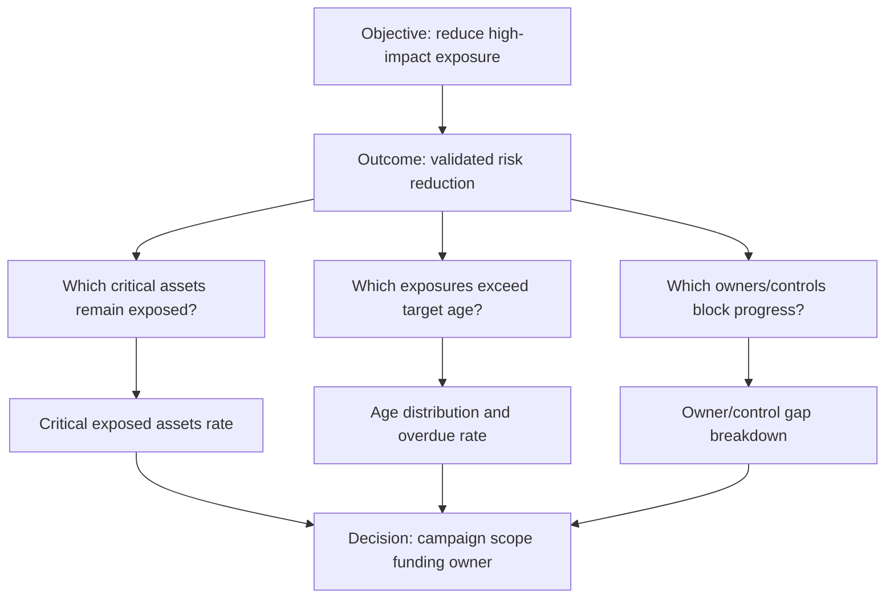

Avoid starting with "we have data for 40 fields." Data availability is a constraint, not the purpose. If no action changes with the metric, ask whether it is informational, diagnostic, or vanity.

## Metric contract

| Contract element | Synthetic example |
|---|---|
| Metric ID/name | `KPI-EXPOSURE-SLA-01` / eligible exposure SLA compliance |
| Purpose/question | Are eligible exposure items remediated within approved tier target? |
| Owner/steward | VM program owner / metric steward |
| Population | NMH production exposures accepted under definition v3 |
| Grain | One resolved exposure instance per asset/vulnerability/effective interval |
| Numerator | Eligible closed items completed by due timestamp |
| Denominator | Eligible closed items due in measurement cohort |
| Exclusions | Approved false positive; test assets; active hold under policy |
| Time fields | accepted, due, validated closed; UTC instants |
| Formula | numerator / denominator; blank when denominator zero |
| Dimensions | owner, service, criticality, source, cohort month |
| Target/baseline | Synthetic 90%; prior accepted quarter 78% |
| Quality | Identity, completeness, freshness, ticket reconciliation gates |
| Version | v3 effective 2026-08-01 |
| Interpretation | Process compliance, not proof of risk eliminated |
| Drill/action | Overdue owned items and exception review |

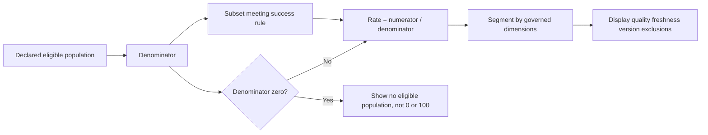

### Plain-English deep-dive 1 - The denominator is the hidden argument

Suppose Team A closes 80 findings and Team B closes 40. Team A looks better until you learn Team A had 1,000 eligible findings while Team B had 45. Counts answer volume; rates answer performance relative to opportunity. Neither alone tells the full story.

Denominators can be manipulated by excluding hard cases, losing source coverage, closing/reopening items, or using current population for historical periods. Always show the numerator, denominator, eligibility, exclusions, and quality.

## Metric, KPI, KRI, SLI, SLO, and SLA

| Term | Core question | Example | Owner/authority |
|---|---|---|---|
| Metric | What quantity are we measuring? | Open critical exposure count | Metric owner |
| KPI | Are we achieving a key objective? | Eligible remediation SLA compliance | Program owner |
| KRI | Is risk exposure increasing/changing? | Critical internet-exposed assets with weak controls | Risk owner |
| SLI | What service level occurred? | Percent connector runs accepted by freshness deadline | Service/data owner |
| SLO | What service level do we target? | 99% accepted by deadline over 30 days (synthetic) | Service owner |
| SLA | What formal service commitment applies? | Executed agreement's uptime/response terms | Contract/service owners |

An SLO can be internal; an SLA is an agreement with exact scope, calculation, exclusions, service windows, remedies, and authorities. Do not call a self-selected dashboard threshold an SLA.

| Common confusion | Correction |
|---|---|
| KPI equals target | KPI is indicator; target is desired value |
| KRI equals incident count | It can be leading exposure/control condition |
| SLO equals SLA | Objective differs from formal agreement |
| SLA compliance proves security | It proves defined process/service performance only |
| One metric can be KPI and KRI universally | Classification depends on objective/use |

## Metric trees and balanced measures

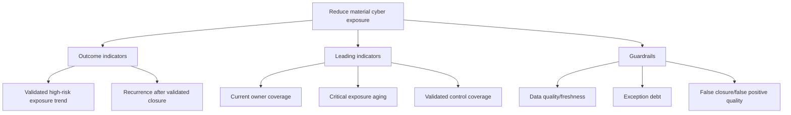

| Balance dimension | Metric pair | Why both |
|---|---|---|
| Outcome/process | Risk reduction + remediation throughput | Activity may not create outcome |
| Speed/quality | Time to close + recurrence/validation failure | Fast false closure is harmful |
| Quantity/coverage | Findings closed + eligible assets covered | Volume hides blind spots |
| Current/trend | Current backlog + change over comparable time | Snapshot hides momentum |
| Average/tail | Median age + 95th percentile/max buckets | Average hides old tail |
| Performance/risk | SLA compliance + critical overdue exposure | Good average can hide material risk |
| Automation/control | Automated actions + failed/reversed actions | More automation can increase harm |

## Leading and lagging indicators

| Indicator | Type | Mechanism hypothesis | Limitation |
|---|---|---|---|
| Owner coverage | Leading | More assigned work can be actioned | Assignment quality may be poor |
| Connector freshness | Leading/guardrail | Current data improves prioritization | Fresh can be wrong/incomplete |
| Critical backlog age | Leading risk/process | Older items increase exposure opportunity | Not all items equally exploitable |
| Control validation rate | Leading | Effective controls reduce path feasibility | Test coverage/method varies |
| Validated risk reduction | Lagging outcome | Confirms exposure decreased under method | Attribution to one program uncertain |
| Incidents from known exposures | Lagging | Shows realized harm | Rare/under-detected/noisy |
| Recurrence rate | Lagging quality | Tests durable remediation | Identity/closure definition matters |

Leading indicators require a plausible, tested link to outcomes. Otherwise they become activity metrics. Lagging indicators validate results but arrive too late for proactive steering. Use both.

## Targets, baselines, thresholds, and benchmarks

| Reference | Meaning | Example | Trap |
|---|---|---|---|
| Baseline | Accepted starting/normal reference | Prior quarter rate under v3 | Definition/source changed |
| Target | Desired value by time | 90% by quarter end (synthetic) | Arbitrary stretch goal |
| Threshold | Boundary changing state/action | Escalate if overdue critical > 20 | Alert noise/gaming |
| Tolerance | Acceptable deviation/range | +/-2 points under quality rule | Hides material segment |
| Benchmark | External/internal comparison | Peer/team historical distribution | Population not comparable |
| Forecast | Expected future value under model | Backlog at current closure/intake | Assumptions/drift |

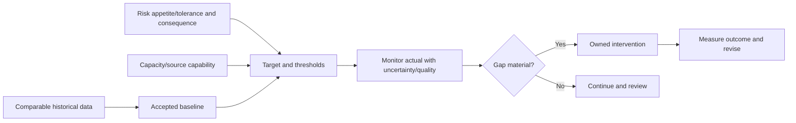

Never use a target to alter eligibility after the fact. Freeze metric versions or restate transparently. Compare periods only when source coverage, population, definition, and completeness are compatible.

## Grain, dimensions, measures, and additive behavior

| Concept | Security example | Failure |
|---|---|---|
| Fact grain | One exposure snapshot per day | Summing snapshots overcounts current backlog |
| Transaction fact | One ticket state transition | Counting transitions as tickets |
| Accumulating snapshot | One case with milestone timestamps | Partial milestones/null semantics |
| Periodic snapshot | One asset/control state per day | Trend requires consistent daily population |
| Dimension | Owner, service, asset, date, source | Duplicate dimension keys multiply facts |
| Additive measure | Number of new findings | Add across dimensions/time if grain fits |
| Semi-additive measure | End-of-day backlog | Add across owners, not time |
| Non-additive measure | Percentage/median | Recompute from base facts |

### Plain-English deep-dive 2 - Percentages must be recomputed, not averaged blindly

Team A closes 1 of 1 item (100%); Team B closes 50 of 100 (50%). The simple average of team percentages is 75%, but combined performance is 51 of 101, about 50.5%. The teams have different denominators.

Store/compute numerator and denominator at appropriate grain. Recalculate ratios in filter context. Weighted averaging may be correct only when weights and definitions match.

## Denominators and rates

| Metric | Numerator | Denominator | Common distortion |
|---|---|---|---|
| Asset coverage | Eligible assets with validated control | Independently eligible assets | Observed-only denominator hides unknowns |
| SLA compliance | Eligible items completed by due time | Eligible completed/due cohort under contract | Open not-yet-due items mixed |
| False-positive rate | Validated false positives | Reviewed eligible detections/findings | Only disputed cases reviewed |
| Adoption rate | Active qualified users/workflows | Eligible target population | Login counted as value |
| Freshness compliance | Complete accepted runs by deadline | Scheduled required runs | Failed runs omitted |
| Owner coverage | Current owned eligible items | All eligible items | `unknown` excluded |

Zero denominators should display not applicable/no eligible population, not a fabricated 0% or 100%. Show rate with counts and quality.

## Time series and trends

| Trend decision | Options | Guardrail |
|---|---|---|
| Time grain | Hour/day/week/month | Match operational cadence and sample size |
| Time field | Created/observed/accepted/closed/snapshot | Label date role explicitly |
| Completeness | Complete periods only/provisional marker | Latest partial period can look improved |
| Comparison | Prior period/year/target/baseline | Align duration/seasonality/population |
| Smoothing | Rolling average/median | Also show raw or explain lag |
| Change | Absolute/percent/percentage points | Distinguish units |
| Restatement | Recompute history/version line | Preserve/communicate definition change |

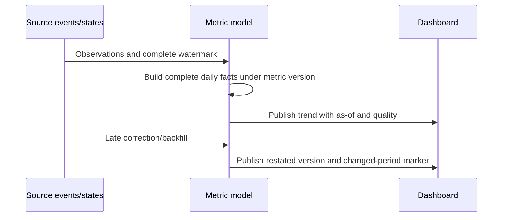

Avoid dual-axis charts unless scale and interpretation are exceptionally clear. Two lines moving together are not proof one caused the other.

## Aging and backlog analysis

Aging asks how long an item has remained in a state, usually as of a defined time.

$$
\text{Age} = \text{as-of time} - \text{age start time}
$$

| Choice | Example | Why explicit |
|---|---|---|
| Start | Accepted/assigned/first observed | Different accountability clocks |
| Stop | Validated closure, not ticket close | Workflow may not equal remediation |
| Pause | Approved wait/vendor dependency | SLA terms/policy vary |
| Reopen | Resume old age or new interval | Gaming/recurrence implications |
| As-of | Complete watermark | Current clock can exceed data freshness |
| Buckets | 0-7, 8-30, 31-90, 91+ (synthetic) | Boundaries drive story |

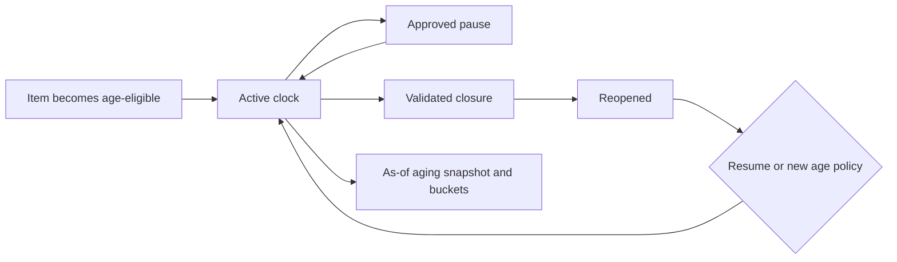

Show distribution/buckets, median, upper percentiles, oldest material items, intake versus closure, and owner/service/criticality segmentation. Average age alone can improve when very old items are closed even as many new items enter.

## Cohorts

A cohort groups items by shared starting period or trait and follows their outcomes consistently.

| Cohort | Question | Example |
|---|---|---|
| Acceptance-month cohort | How quickly does each intake group resolve? | Percent closed by day 30 |
| Rollout cohort | Did onboarding wave improve adoption? | Workflow use after 4 weeks |
| Asset criticality cohort | Are high-criticality assets treated faster? | Median validated closure time |
| Owner cohort | Which team needs enablement? | Age and recurrence by owner |
| Source cohort | Does one connector produce poor outcomes? | Mapping/false-positive trend |

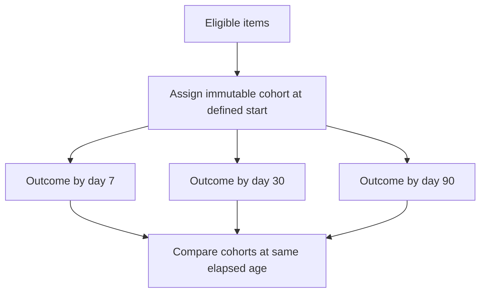

Cohorts reduce the bias of comparing a mature backlog with newly arrived work. Handle censoring/open items and changing eligibility transparently.

## Visual selection

| Question | Recommended visual | Avoid/misuse |
|---|---|---|
| Compare categories | Sorted horizontal bar | 3-D columns, unsorted clutter |
| Trend over time | Line with complete-period markers | Categorical line with irregular intervals |
| Current value versus target | Bullet/bar with target reference or concise card plus context | Decorative gauge without scale/history |
| Distribution | Histogram/box plot/dot plot | Average-only card |
| Composition | Stacked/100% stacked bar for few categories | Many-slice pie/doughnut |
| Relationship | Scatter with uncertainty/context | Claiming causation |
| Aging | Ordered buckets + percentile/detail table | One average |
| Flow/stages | Funnel only if true ordered population | Unrelated counts shaped as funnel |
| Geography | Map only when location matters and encoding is clear | Map for nongeographic comparisons |
| Detail/action | Table/matrix with conditional indicators | Tiny unreadable labels |
| Hierarchy | Drillable bar/tree cautiously | Treemap for precise comparison |

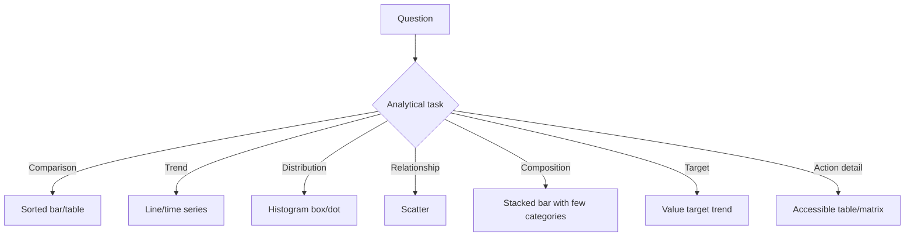

The best visual is often a table for precise action. Design for scanning: meaningful titles, units, direct labels, stable axes, consistent ordering, visible as-of/quality, and no decorative 3-D perspective.

### Plain-English deep-dive 3 - A dashboard should say what changed and why it matters

"Critical backlog: 412" makes the reader do all reasoning. Is 412 high? Compared with what? Is the period complete? Are these 412 assets, findings, or tickets? Which owner can act?

A stronger view says: "Validated critical exposures fell from 510 to 412 (-19%) since the accepted baseline, but 61 items over 90 days remain concentrated in two business services. Source coverage is 96%; approve a 30-day owner campaign." The metric is now a decision story, with caveats.

## Filters, slicers, drill-down, drill-through, and tooltips

| Interaction | Use | Guardrail |
|---|---|---|
| Page/report filter | Set audience/scope | Show active filters clearly |
| Slicer | User selects dimension/time | Consistent position/default; accessible label |
| Cross-filter/highlight | Explore visual relationships | Explain interactions; avoid surprise |
| Drill-down | Move hierarchy levels | Preserve denominator/context |
| Drill-up | Return aggregate | Clear state/navigation |
| Drill-through | Open focused detail page | Carry intended filters only |
| Tooltip | Supplemental context | Do not hide essential/accessibility-critical info |
| Bookmark | Curated view/navigation | Test filter/security persistence |
| Reset | Return known default | Visible control and deterministic state |

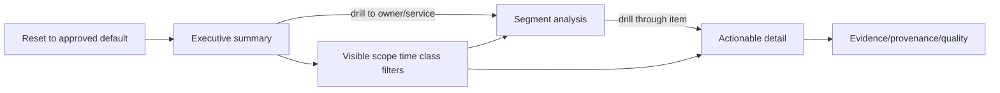

Filters can create misleading totals. Use filter-aware titles/subtitles, show selection summary, preserve numerator/denominator scope, and test no-selection, multi-selection, hidden/synced slicers, bookmarks, and exported state.

## Color and accessibility

| Principle | Practice |
|---|---|
| Do not use color alone | Add labels, icons, marker shapes, patterns, position |
| Contrast | Test text/background and meaningful graphical objects under applicable standard |
| Color vision | Avoid confusing pairs; simulate common deficiencies |
| Semantic consistency | Same color means same concept across pages |
| Restraint | Neutral default; reserve alert color for action-worthy state |
| Alt text | Describe visual purpose/insight; use dynamic text when appropriate |
| Keyboard/tab order | Match logical reading order; remove decoration |
| Screen reader | Meaningful titles, labels, accessible data table |
| Tooltips | Supplemental only, not required information |
| Motion | Avoid autoplay/flashing; provide control/transcript |

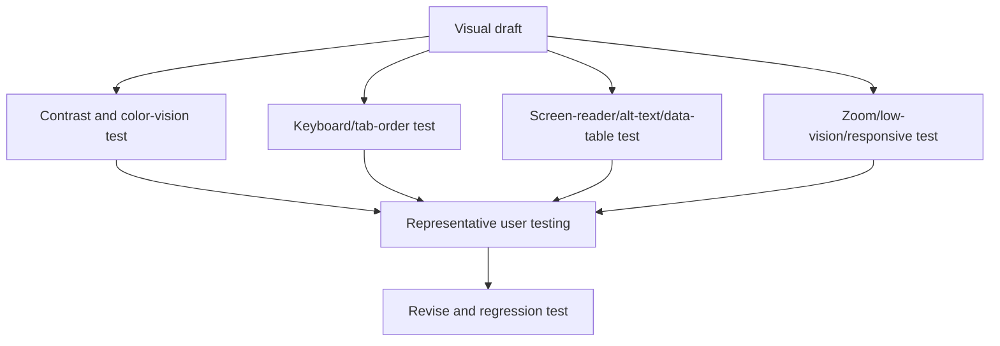

Microsoft documents Power BI keyboard navigation, screen-reader compatibility, high-contrast support, alt text, tab order, markers, accessible Show Data, and accessibility checklist responsibilities. WCAG 2.2 is the authoritative W3C accessibility recommendation; organization requirements may set specific conformance.

## Power BI semantic model

Microsoft recommends star-schema principles for performant/usable semantic models: dimensions filter/group, facts summarize, and fact grain remains consistent.

| Model object | NMH synthetic example | Design check |
|---|---|---|
| Fact table | `FactExposureSnapshot` | One row per exposure/day |
| Dimension | `DimAsset`, `DimOwner`, `DimService`, `DimDate` | Unique key on one side |
| Measure | `Open Critical Exposures` | Recomputed in filter context |
| Relationship | Asset 1:* exposure fact | Correct cardinality/direction |
| Date role | Snapshot, accepted, due, closed | Explicit role-playing design |
| Bridge | Asset-service many-to-many mapping | Avoid ambiguous direct many-to-many |
| Slowly changing dimension | Owner/service history | Historical facts join correct version |
| Security mapping | User-to-owner/tenant scope | RLS path tested |

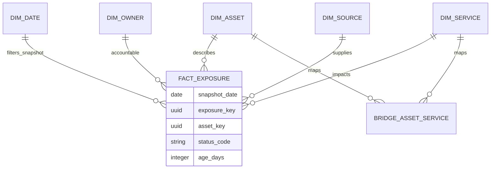

Relationships propagate filters but do not enforce source data integrity. Test unique dimension keys, orphan facts, blank unknown members, many-to-many behavior, bi-directional ambiguity, active/inactive relationships, and date/time key types.

## DAX overview

DAX (Data Analysis Expressions) is a formula language used by Power BI and Power Pivot. Measures evaluate dynamically under query/filter context; calculated columns compute row values and are stored/recalculated with model processing.

| DAX object/concept | Meaning | Use/caution |
|---|---|---|
| Measure | Scalar calculated at query time under context | Preferred for dynamic metrics |
| Calculated column | Per-row stored result | Model size/refresh; row context |
| Calculated table | Formula-defined model table | Refresh/model complexity |
| Row context | Current row | Calculated columns/iterators |
| Filter context | Allowed values from filters/relationships/formula | Drives measure result |
| `CALCULATE` | Evaluates expression in modified filter context | Powerful; context must be understood |
| Iterator (`SUMX`) | Evaluates expression over table rows | Performance/row semantics |
| Blank | DAX missing-value behavior | Do not casually convert to zero |
| Explicit measure | Named governed calculation | Controls aggregation/format/definition |

Synthetic DAX:

```dax
Eligible Closed Items =
CALCULATE (
    DISTINCTCOUNT ( FactExposure[ExposureInstanceKey] ),
    FactExposure[IsEligible] = TRUE (),
    FactExposure[StatusCode] = "validated_closed"
)

Closed Within Target =
CALCULATE (
    [Eligible Closed Items],
    FactExposure[ValidatedClosedAt] <= FactExposure[DueAt]
)

SLA Compliance Rate =
DIVIDE ( [Closed Within Target], [Eligible Closed Items] )
```

This is educational, synthetic DAX. The eligibility model and row logic must be validated; column-to-column filters may require a different expression/model depending on context and current DAX rules.

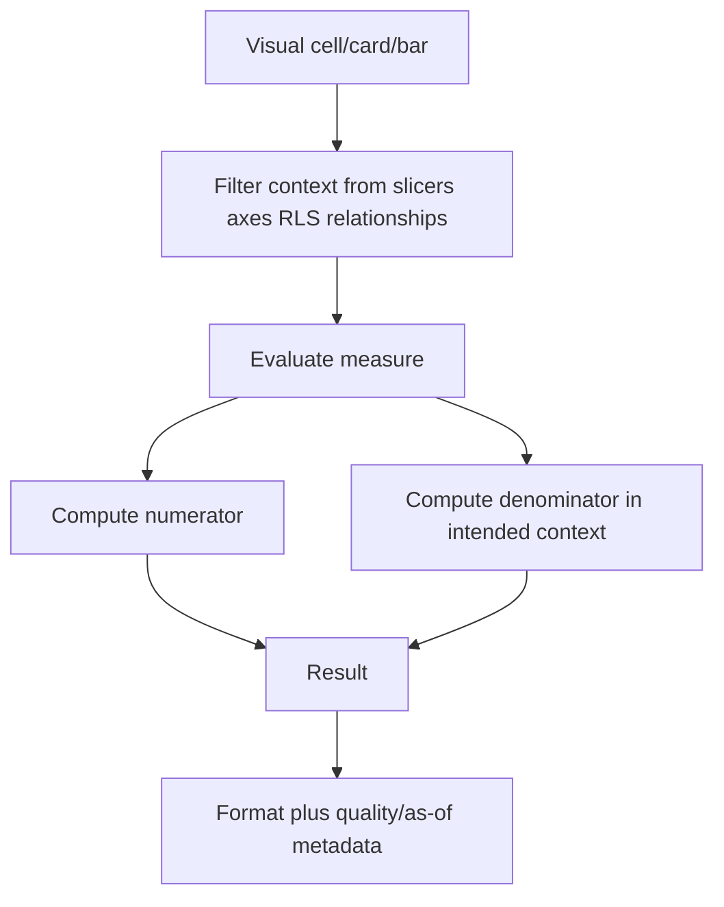

### Plain-English deep-dive 4 - DAX measure results change because context changes

A grocery bill total changes when you filter to fruit, one store, or one week. The total formula can remain `SUM`, but the allowed rows change. DAX measures behave similarly: slicers, visual axes, relationships, RLS, and formula filters create context.

When a total looks wrong, inspect filter context and relationships before changing arithmetic. A measure that is correct in one visual can be misleading in another if denominator filters are removed or inherited unexpectedly.

## DAX measure patterns and safeguards

| Need | Pattern concept | Safeguard |
|---|---|---|
| Count entities | `DISTINCTCOUNT` stable entity key | Grain/identity version |
| Ratio | `DIVIDE(numerator, denominator)` | Zero denominator and aligned filters |
| Target gap | Actual minus target | Units/percentage points |
| Prior period | Date table/time intelligence | Complete comparable periods |
| Rolling window | Date filter over measure | Window length and partial period |
| Age bucket | Source/model classification | Stable boundaries/as-of |
| Percent of total | Modify selected filter context | State which filters retained |
| SLA | Eligible population and due/close instants | Contract/exclusions/pause/reopen |
| RLS-aware measure | Normal measure under security filters | Test roles and workspace permissions |

QA measures by constructing tiny hand-calculated datasets that include zero denominator, nulls, duplicates, orphans, boundary timestamps, reopened items, excluded cases, multiple owners, incomplete periods, and RLS users.

## Excel tables, PivotTables, lookups, and charts

Excel is effective for rapid analysis, reconciliation, review, and portable evidence when governed carefully.

| Excel tool | Good use | Common failure |
|---|---|---|
| Excel Table | Structured expanding source with headers/types | Mixed rows, merged headers, hidden totals |
| Power Query | Repeatable import/shape/merge | Unreviewed type/step/source changes |
| PivotTable | Group/summarize/filter/drill | Stale refresh/wrong aggregation |
| Slicer/timeline | Interactive filter | Hidden/synced state confusion |
| XLOOKUP | Exact key lookup/return | Duplicate keys, approximate mode, no-match defaults |
| INDEX/MATCH | Flexible lookup compatibility | Range misalignment/approximate defaults |
| SUMIFS/COUNTIFS | Conditional aggregation | Criteria/grain/denominator mismatch |
| PivotChart/chart | Quick trend/comparison | Source range/stale pivot/visual clutter |
| Data validation | Control manual input | Does not validate imported truth |
| Conditional formatting | Highlight exceptions | Color-only/overloaded rules |

Microsoft documents that PivotTables work best with clean columnar data, one header row, and refresh after source changes. Value fields can default to SUM or COUNT depending on interpreted type; verify aggregation.

Synthetic exact lookup:

```excel
=XLOOKUP([@OwnerID], Owners[OwnerID], Owners[OwnerName], "UNMAPPED", 0)
```

XLOOKUP defaults to exact match, but duplicate lookup keys still return the first match. Enforce/test uniqueness and count unmapped keys. Binary search modes require correctly sorted lookup arrays; otherwise Microsoft documents invalid results can occur.

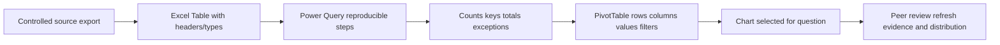

## Power BI versus Excel

| Need | Power BI strength | Excel strength |
|---|---|---|
| Governed shared semantic model | Strong | Can connect/use Data Model but workbook copies vary |
| Interactive dashboard distribution | Strong | Useful local/team workbook |
| Ad hoc cell-level exploration | Less cell-centric | Strong |
| Repeatable measures/context | DAX semantic model | Pivot/Data Model/formulas |
| Manual what-if | Parameters possible | Flexible cells/scenarios |
| Large modeled data | Designed for semantic models | Limits/performance depend on mode |
| Audit/version control | Needs workspace/deployment governance | Workbook version/copy risk |
| Executive presentation | Interactive/report export | Compact analysis/deck support |
| Reconciliation | Possible | Excellent transparent checks |

Use Excel as a controlled analytical/reconciliation tool, not an ungoverned shadow source. Record source/version, query/formulas, refresh time, owner, classification, and distribution.

## Refresh, freshness, and dashboard currency

Power BI refresh depends on storage mode. Import models are point-in-time copies requiring data refresh; DirectQuery queries sources on interaction but still has caches, visual refresh, source latency, and quality considerations. Refresh success does not prove complete/correct source data.

| Currency layer | Question |
|---|---|
| Source observation | How current/complete is source truth? |
| Pipeline acceptance | Did complete data pass ingestion/quality? |
| Semantic model data | When did model successfully load accepted data? |
| Calculated column/table | Were stored calculations recalculated? |
| Query cache/tile | Is cached result current after model refresh? |
| Report visual/browser | Did open visual re-query latest model? |
| User filter state | Is reader viewing intended period/scope? |

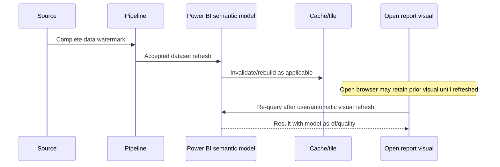

| Refresh failure | Symptom | Check |
|---|---|---|
| Source unavailable | Refresh failed | Endpoint/network/service health |
| Credentials expired | Authentication error | Owner/gateway credentials/secrets |
| Gateway issue | On-prem source unreachable | Cluster/definition/mapping/version |
| Schema drift | Missing/renamed field | Source contract/model/deploy |
| Type conversion | Refresh warning/failure/blanks | Source profile/Power Query step |
| Capacity/resource | Timeout/memory/queue | Model size/schedule/incremental plan |
| Partial upstream load | Refresh succeeds with incomplete facts | Watermark/reconciliation gate |
| Cache/visual stale | User sees old values | Refresh type/browser/tile/cache |
| RLS mapping stale | Empty/wrong rows | Identity mapping/model refresh/test |

Show last complete source watermark, model refresh, quality state, and metric version in the report. Do not show only "last refreshed now" if source data is days old.

## Power BI row-level security overview

RLS filters rows returned for users in roles. It does not secure columns; object-level security or different models/views may be needed. Workspace permissions and sharing architecture matter.

| RLS component | Question/test |
|---|---|
| Role definition | Which DAX predicate defines allowed rows? |
| Role membership | Which users/groups are assigned? |
| Identity function | What does `USERPRINCIPALNAME()` return here? |
| Mapping table | Does signed-in identity map uniquely/currently? |
| Relationship path | Does security filter propagate as intended? |
| Multiple roles | Are permissions additive, broadening access? |
| Workspace role | Does RLS apply to this user type/permission? |
| External/embedded | Is actual identity/effective identity tested? |
| Export/Analyze | Does downstream access preserve intended scope? |
| Negative tests | Can unauthorized user see any row/aggregate? |

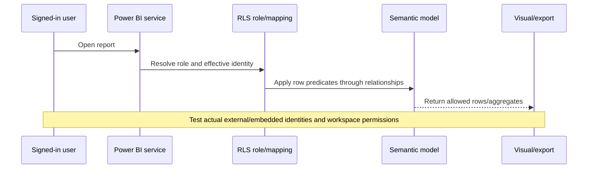

Test as role is useful but has documented limitations. Validate actual intended user paths, especially external, DirectQuery SSO, and embedded scenarios. RLS roles can be additive, and RLS applies differently by workspace role; check current Microsoft documentation.

## Dashboard page architecture

| Page | Audience/job | Suggested content |
|---|---|---|
| Executive outcome | Sponsor decision | 3-5 KPIs/KRIs, trend, material exceptions, ask |
| Risk/coverage | Security leader | Exposure/criticality/control/quality segments |
| Operations | Program owner | Intake, throughput, aging, SLA, owner backlog |
| Data trust | Steward/TSM | Coverage, freshness, mappings, identity, exceptions |
| Detail/action | Practitioner | Owned items, rationale, due, status, next action |
| Definitions | All | Metric contract, version, as-of, limitations |

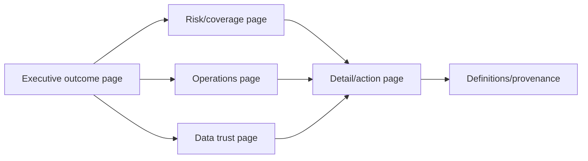

Avoid stuffing every page. Keep the first page quiet and decision-oriented; use drill paths for technical depth.

## Executive narrative

Use a five-part structure.

| Step | Executive question | Example |
|---|---|---|
| Outcome | What changed? | Validated critical exposure fell 19% |
| Meaning | Why does it matter? | Concentration remains in revenue services |
| Evidence/trust | Why believe it? | 96% coverage, complete through date, metric v3 |
| Options/tradeoff | What can we do? | Owner campaign vs control deployment |
| Decision ask | What is needed now? | Approve 30-day campaign and two accountable owners |


Example concise narrative:

> Under metric definition v3, validated critical exposures decreased from 510 to 412 since the accepted baseline, while source coverage remained 96%. However, 61 exposures older than 90 days are concentrated in the Revenue Portal and Partner Exchange, and 24 have no current remediation owner. I recommend a 30-day owner-validation campaign followed by control-path review. Today we need the CIO sponsor to assign the two service owners and approve the campaign; we will report validated closure, recurrence, and coverage at the next review.

This does not claim the program solely caused the reduction. It gives definition, counts, quality, concentration, recommendation, ask, owner, and follow-up.

## Decision asks and action tracking

| Ask element | Requirement |
|---|---|
| Decision | Approve/choose/assign/accept/decline exactly what? |
| Owner | Who has authority? |
| Deadline | By when? |
| Evidence | Which metrics/findings support it? |
| Options | Alternatives and tradeoffs |
| Cost/dependency | People, budget, change, risk |
| Success | What measurable outcome follows? |
| Follow-up | Review date and escalation |

A dashboard without action can still be a monitoring product, but executive review should distinguish observe, investigate, decide, and execute states.

## Dashboard QA framework

| QA layer | Test |
|---|---|
| Source | Counts, controls, complete watermark, known records |
| Transformation | Types, mappings, duplicates, nulls, time, units |
| Model | Grain, unique dimensions, orphans, relationships, date roles |
| Measures | Hand calculations, contexts, totals, zero denominator, boundaries |
| Visuals | Correct field/aggregation/axis/sort/title/unit/filter |
| Interaction | Slicers, bookmarks, drill, reset, export, no-selection |
| Refresh | Source-to-model-to-cache-to-visual freshness and failures |
| Security | RLS/permissions/export actual user positive/negative tests |
| Accessibility | Keyboard, screen reader, alt text, contrast, color, data table |
| Performance | Query/visual/model/refresh under representative load |
| Narrative | Claims supported; caveats/ask/owner/date visible |
| Change | Regression, version, release, rollback, communication |

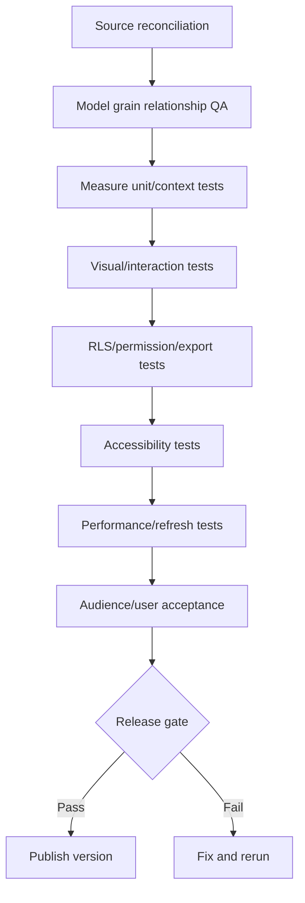

## Metric unit-test cases

| Test case | Expected behavior |
|---|---|
| Empty eligible population | Blank/not applicable with denominator 0 |
| One success/one eligible | 100% |
| One failure/one eligible | 0% |
| Duplicate source row | One logical item under grain/dedup policy |
| Unknown owner | Included in denominator and unknown segment if eligible |
| Due exactly at closure | Inclusion per explicit boundary |
| Reopened item | Policy-driven age/SLA behavior |
| Excluded test asset | Excluded with reason/count |
| Partial current period | Mark provisional or omit from comparable trend |
| Orphan fact | Quality exception, not silently dropped |
| RLS user no mapping | Deny/no data and alert/test, never broad fallback |
| Multiple role membership | Expected additive/intersection behavior documented/tested |

## Anti-patterns

| Anti-pattern | Why harmful | Better approach |
|---|---|---|
| Vanity metric | Looks impressive, no decision | Tie to goal/action |
| Metric without denominator | Hides population | Show counts/rate/eligibility |
| Average of percentages | Wrong weighting | Recompute from numerators/denominators |
| Red/green only | Inaccessible and binary | Labels/icons/markers/context |
| Gauge wall | Consumes space, hides trend | Compact value-target-trend |
| 3-D chart | Distorts comparison | 2-D aligned axes |
| Many pie slices | Hard comparison | Sorted bar |
| Dual axes | Implies relationship/manipulates scale | Separate/small multiples/normalized view |
| Truncated axis | Exaggerates change | Honest scale/clear annotation |
| Partial period as final | Fake improvement/decline | Provisional marker/comparable periods |
| Hidden filters | Readers see different truths | Visible active-filter summary/reset |
| Distinct to fix duplicates | Masks model defect | Repair grain/key/fanout |
| Snapshot summed over time | Overcounts state | End-of-period/semi-additive measure |
| Closed equals remediated | Workflow state misread | Validated closure metric |
| Latest refresh equals fresh source | Pipeline lag hidden | Source watermark + model refresh |
| RLS only tested as author | Misses real identity/permissions | Actual user positive/negative tests |
| Executive page with raw tables | Buries decision | Outcome/meaning/ask first |
| Correlation framed as cause | Overclaim | Bounded language/alternatives |

## Dashboard troubleshooting decision tree

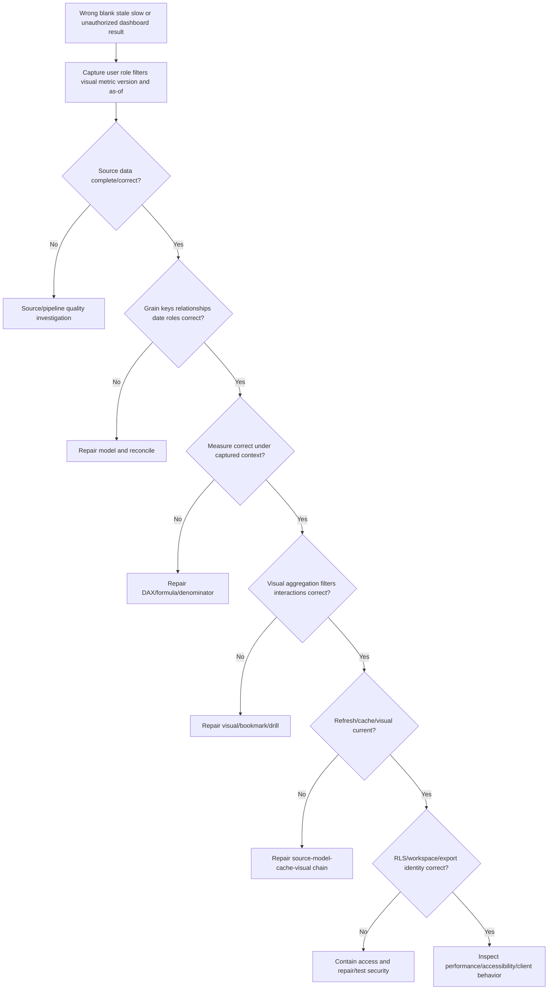

## Dashboard troubleshooting runbook

1. Capture exact symptom and screenshot/export safely: wrong number, blank, stale, slow, inaccessible, missing drill, unauthorized data, or executive claim dispute.
2. Record user/effective identity, workspace role, RLS roles, report/page/visual, filters/slicers/bookmark, drill state, time, model/report versions, browser/client, and expected value.
3. Contain suspected unauthorized disclosure immediately through designated security/privacy process; preserve evidence and avoid broader access during testing.
4. Restate metric contract: population, grain, numerator, denominator, exclusions, clocks, formula, dimensions, target, quality, version, and expected action.
5. Reconcile source counts/control totals/watermarks and known records. Check partial loads, duplicates, missing source/period, and late corrections.
6. Reproduce transformation/types/mappings/timezones/nulls/identity and accepted-quality state.
7. Validate model grain, unique dimension keys, orphan facts, bridge cardinality, active/inactive relationships, cross-filter direction, date roles, slowly changing dimensions, and blank members.
8. Evaluate DAX/Excel formula on a tiny hand-calculated dataset. Inspect row/filter/query context, numerator/denominator filters, blank/zero, and total behavior.
9. Inspect visual field, aggregation, axis, sort, display units, conditional rules, title, filter pane, cross-interactions, tooltip, bookmark, drill, and reset state.
10. Trace currency: source observation/watermark, pipeline accepted time, semantic-model refresh, warnings, query cache/tile, open visual/browser, and user's selected period.
11. Test RLS with intended actual identities, roles, multiple memberships, external/embedded/SSO path, workspace permissions, Build/Analyze/export, and negative cases.
12. Test accessibility: keyboard, tab order, screen reader/alt text, Show Data, contrast, color-independent meaning, zoom, labels, tooltips, and responsive view.
13. Measure performance by visual/query/model/source/gateway/capacity. Reduce unnecessary visuals/columns, optimize model/measure/source, and retest security.
14. Quantify blast radius: reports, visuals, users, exports, decisions, periods, tickets, and executive communications.
15. Correct in a versioned development/test path. Re-run source/model/measure/visual/security/accessibility/performance regression.
16. Reconcile old/new results and document restatement, changed decisions, limitations, owner, rollback, and communication.
17. Publish after owner/UAT approval. Monitor refresh, usage, quality, access, errors, and action outcomes.
18. Add prevention: contract test, denominator assertion, visual checklist, RLS negative test, accessibility gate, refresh monitor, source agreement, or metric governance review.

| Evidence pack item | Why it matters |
|---|---|
| Metric contract/version | Defines expected truth |
| User/role/filter state | Reproduces context/security |
| Source reconciliation | Establishes input |
| Model diagram/cardinality | Exposes filter/grain defect |
| DAX/formula + hand calculation | Verifies measure |
| Visual configuration | Finds aggregation/filter/sort issue |
| Refresh history/watermark | Establishes currency |
| RLS/permission tests | Establishes allowed scope |
| Accessibility/performance results | Validates usability |
| Old/new decision diff | Scopes correction |

## Complete synthetic NMH dashboard exercise

NMH wants an executive exposure review.

| Design step | Synthetic decision |
|---|---|
| Goal | Reduce validated material exposure without false closure |
| Audience | CISO, CIO, VM leader, service owners |
| Questions | Trend, critical aging, owner/control concentration, data trust, decision needed |
| Grain | One resolved exposure instance with daily snapshots and lifecycle facts |
| KPIs | Validated closure rate, SLA compliance, owner coverage |
| KRIs | Critical exposed assets, 90+ day critical tail, weak-control paths |
| Guardrails | Coverage, freshness, false-closure recurrence, exception debt |
| Baseline | Prior accepted quarter under same definition |
| Pages | Executive, risk, operations, data trust, action detail |
| Security | Tenant/owner RLS; executive aggregate path; actual-user tests |
| Accessibility | Labels/markers/alt text/tab order/contrast/Show Data |
| Ask | Assign two service owners and approve 30-day campaign |

Synthetic result: critical exposures fell from 510 to 412, 61 are older than 90 days, 24 lack current owners, source coverage is 96%, and one connector is two days stale. The executive page should not celebrate a 19% reduction without the stale connector/owner gap. The decision ask addresses the concentrated tail and data trust.

## Synthetic exercises with answers

### Exercise 1 - KPI or KRI

Is critical internet-exposed asset count a KPI or KRI?

**Answer:** Usually a KRI when used to signal risk exposure; it could support a KPI under a specific reduction objective. Classification depends on purpose, not the field name.

### Exercise 2 - SLO or SLA

The team wants 99% connector freshness. Is that an SLA?

**Answer:** It is an SLO unless it is part of a formal agreement with defined scope/terms. Label it accurately.

### Exercise 3 - Denominator

No items were due this month and no breaches occurred. Is compliance 100%?

**Answer:** No eligible denominator means not applicable/blank with numerator and denominator shown, not fabricated success.

### Exercise 4 - Percentages

Can you average owner SLA percentages for the enterprise?

**Answer:** Not unless weighting/definitions justify it. Prefer sum of aligned numerators divided by sum of aligned denominators.

### Exercise 5 - Trend

Current week is 20% lower but only three days complete. Improvement?

**Answer:** Mark provisional and compare same elapsed window or wait for complete watermark. Do not present as final.

### Exercise 6 - Aging

Average age fell while 90+ day items rose. Contradiction?

**Answer:** No. New intake can lower average while old tail grows. Show distribution, buckets, percentiles, and oldest material items.

### Exercise 7 - Visual

Which visual for overdue backlog by 25 owners with long names?

**Answer:** Sorted horizontal bar, perhaps top contributors plus accessible detail table. Avoid pie slices.

### Exercise 8 - DAX

The same measure changes after a slicer selection. Bug?

**Answer:** Usually expected because filter context changed. Verify intended filter/relationship and denominator scope.

### Exercise 9 - Excel lookup

XLOOKUP returns one owner although duplicate owner IDs exist. Safe?

**Answer:** No. XLOOKUP returns the first match; validate key uniqueness and expose duplicates before lookup.

### Exercise 10 - Refresh

Power BI refresh succeeded. Is the dashboard current?

**Answer:** Not established. Verify complete source watermark, upstream pipeline, model refresh, warnings, cache/tile/visual refresh, and selected period.

### Exercise 11 - RLS

Test as role works. Is external-user security proven?

**Answer:** No. Microsoft documents identity/testing limitations; test actual intended external/embedded/SSO users and workspace permissions with negative cases.

### Exercise 12 - Executive story

What should the last line of the presentation say?

**Answer:** A specific decision ask with authority, deadline, evidence, tradeoff, success measure, and follow-up, not "questions?"

## Labs and rehearsal

### Lab 1 - Decision map

For CISO, CIO, VM lead, SOC lead, service owner, data steward, and TSM, define goal, question, decision, cadence, and evidence.

### Lab 2 - Metric contracts

Write contracts for critical exposure, owner coverage, control coverage, freshness, SLA compliance, aging, recurrence, adoption, exception debt, and risk reduction.

### Lab 3 - Metric tree

Build outcome, leading, lagging, process, quality, and guardrail branches. Remove three vanity measures.

### Lab 4 - Denominator clinic

Test independent eligibility, zero population, exclusions, incomplete sources, duplicate entities, cohorts, reopened items, and segment rollups.

### Lab 5 - Trend and cohorts

Create complete-period trend, rolling view, acceptance cohorts, late restatement, and definition-version marker.

### Lab 6 - Aging

Define start/stop/pause/reopen/as-of; calculate buckets, median, 95th percentile, oldest items, and owner/service concentration.

### Lab 7 - Visual selection

Match 20 questions to bars, lines, distributions, scatter, tables, and composition views; reject decorative/ambiguous choices.

### Lab 8 - Accessibility

Test contrast, color-independent status, markers, alt text, keyboard/tab order, screen reader, Show Data, tooltips, zoom, and title clarity.

### Lab 9 - Power BI model

Build synthetic fact/dimension/date/bridge tables; validate grain, unique keys, orphans, cardinality, filter direction, and historical owner.

### Lab 10 - DAX measures

Create counts, rates, target gaps, prior periods, rolling trends, aging, percent-of-total, and SLA measures with unit-test fixtures.

### Lab 11 - Excel PivotTable

Create clean Table/Power Query/PivotTable with counts and rates, refresh evidence, slicers, exact aggregation, and reconciliation.

### Lab 12 - Excel lookups/charts

Use exact XLOOKUP with uniqueness/no-match checks; build bar/line/histogram/scatter charts and explain chart choice.

### Lab 13 - Refresh failure

Inject stale source watermark, expired credential, schema change, type error, cache staleness, and partial load. Identify first bad stage.

### Lab 14 - RLS

Build dynamic synthetic user-owner mapping; test allowed/denied users, multiple roles, stale mapping, workspace roles, export, and actual guest path.

### Lab 15 - Dashboard QA

Run source, transformation, model, measure, visual, interaction, refresh, security, accessibility, performance, narrative, and regression gates.

### Lab 16 - Executive review

Deliver a five-minute outcome/meaning/evidence/options/decision ask story, then drill to technical evidence without changing the metric definition.

| Lab evidence | Completion standard |
|---|---|
| Decision | Audience/question/action explicit |
| Contract | Grain/population/formula/quality/version complete |
| Model | Star schema/relationships/date roles validated |
| Calculation | Hand-tested DAX/Excel contexts |
| Visual | Question-fit and accessible |
| Currency | Source/model/cache/visual as-of visible |
| Security | Actual-user positive/negative RLS tests |
| Narrative | Outcome, uncertainty, options, ask |
| QA | Release evidence and rollback |
| Honesty | Synthetic/product boundaries explicit |

## Common misconceptions to correct

| Misconception | Correct model |
|---|---|
| Dashboard is a collection of charts | It is a decision interface |
| More metrics mean more insight | Select metrics tied to goals/questions/actions |
| KPI means any important number | It tracks key performance toward objective |
| KRI is just incident count | It can be leading risk exposure/condition |
| SLO and SLA are interchangeable | Objective differs from formal agreement |
| Target defines performance | Definition/data/denominator still govern |
| Baseline is whatever prior value exists | It must be comparable/accepted |
| Counts are enough | Rates/population and counts answer different questions |
| Percentage has obvious denominator | Always define/show it |
| Average of rates is enterprise rate | Recompute using aligned base counts |
| Zero denominator means 100% | It means no eligible population/not applicable |
| Current backlog can be summed across days | Snapshot backlog is semi-additive |
| Average age describes backlog | Distribution/tail/percentiles matter |
| Latest partial period shows improvement | Mark provisional/compare like-for-like |
| Two trends moving together prove cause | Correlation requires causal evidence |
| Red/green status is accessible | Add text/icon/marker/contrast |
| Pie chart is best for composition | Sorted/stacked bars often compare better |
| 3-D makes charts executive-friendly | It distorts and distracts |
| Drill fixes unclear summary | Summary must still answer its question |
| Hidden filters are harmless | They can change conclusions invisibly |
| Power BI relationships enforce data integrity | They propagate filters; source/model integrity needs tests |
| Bi-directional is always easier | It can create ambiguity/performance/security issues |
| DAX measure is a cell formula | It evaluates over model/filter context |
| Calculated columns and measures are interchangeable | Storage/timing/context differ |
| PivotTable always sums numbers correctly | Type may cause COUNT; verify settings |
| XLOOKUP guarantees unique key | It returns first match; uniqueness is separate |
| Successful model refresh proves fresh truth | Source completeness/cache/visual state differ |
| RLS secures columns and all workspace users | It filters rows and has permission/model scope |
| Test as role proves every identity path | Actual external/embedded/SSO tests may be required |
| Executive story ends with charts | It ends with a decision ask and follow-up |
| Public Zscaler metric wording gives formulas/SLAs | It does not |

## Official Source Anchors

Research/source date: **2026-08-24**.

NIST sources support information-security measure selection and program development. Microsoft documentation supports Power BI/Excel behavior and feature limitations. W3C supports accessibility criteria. Zscaler public pages support only the high-level dynamic reporting/KPI/SLA context stated here.

| Source | URL | Used for | Boundary |
|---|---|---|---|
| NIST SP 800-55 Vol. 1 | https://csrc.nist.gov/pubs/sp/800/55/v1/final | Identifying/selecting/prioritizing/evaluating information-security measures | Not NMH formulas/targets |
| NIST SP 800-55 Vol. 2 | https://csrc.nist.gov/pubs/sp/800/55/v2/final | Developing/implementing a measurement program | Not dashboard implementation |
| NIST Cybersecurity Framework 2.0 | https://www.nist.gov/cyberframework | Cybersecurity risk outcome context | Not metric formulas |
| Microsoft Power BI Star Schema Guidance | https://learn.microsoft.com/en-us/power-bi/guidance/star-schema | Fact/dimension/grain/semantic-model guidance | Modeling choices require context |
| Microsoft Power BI Relationships | https://learn.microsoft.com/en-us/power-bi/transform-model/desktop-relationships-understand | Cardinality, filter propagation, integrity/ambiguity behavior | Current version/storage mode matters |
| Microsoft DAX Overview | https://learn.microsoft.com/en-us/dax/dax-overview | Measures, calculated columns/tables, row/filter/query context | Introductory/current product docs govern |
| Microsoft Power BI Data Refresh | https://learn.microsoft.com/en-us/power-bi/connect-data/refresh-data | Storage modes, refresh layers/dependencies/history/troubleshooting | Capacity/license/service behavior changes |
| Microsoft Power BI RLS | https://learn.microsoft.com/en-us/fabric/security/service-admin-row-level-security | Row filters, roles, testing, workspace/identity limitations | Not column security or universal access control |
| Microsoft Power BI Accessibility | https://learn.microsoft.com/en-us/power-bi/create-reports/desktop-accessibility-creating-reports | Keyboard, screen reader, alt text, tab order, contrast, markers, checklist | Authors must configure/test |
| Microsoft Excel PivotTables | https://support.microsoft.com/en-us/office/create-a-pivottable-to-analyze-worksheet-data-a9a84538-bfe9-40a9-a8e9-f99134456576 | Clean source, PivotTable build/aggregation/refresh concepts | Platform/version differences apply |
| Microsoft Excel XLOOKUP | https://support.microsoft.com/en-us/office/xlookup-function-b7fd680e-6d10-43e6-84f9-88eae8bf5929 | Exact/approximate/search behavior | Key uniqueness/semantic correctness separate |
| Microsoft Office Chart Types | https://support.microsoft.com/en-us/office/available-chart-types-in-office-a6187218-807e-4103-9e0a-27cdb19afb90 | Documented chart purposes/limitations | Visual choice still depends on question |
| W3C WCAG 2.2 | https://www.w3.org/TR/WCAG22/ | Accessibility success criteria | Conformance/legal applicability determined separately |
| Zscaler Data Fabric for Security | https://www.zscaler.com/products-and-solutions/data-fabric | Public dynamic dashboards/reports using fabric elements/factors/measurements | No schema, formula, metric, RLS, refresh, or SLA claim |
| Zscaler Unified Vulnerability Management | https://www.zscaler.com/products-and-solutions/vulnerability-management | Public risk posture/KPI/SLA/metric/context-rich reporting language | No exact KPI/SLA definition, result, formula, or guarantee inferred |

## Likely Interview Questions

### Q1. How do you design a useful security dashboard?

**Model answer:** I start with audience, goal, questions, decisions, cadence, and consequences. I create metric contracts with population, grain, numerator, denominator, exclusions, clocks, dimensions, targets, quality, version, and action. Then I build a tested semantic model and measures, choose accessible question-fit visuals, expose filters/as-of/trust, provide drill to evidence/action, and end executive views with an owner/date decision ask.

### Q2. How do KPI, KRI, SLI, SLO, and SLA differ?

**Model answer:** A KPI tracks key performance toward an objective; a KRI signals changing risk; an SLI is actual service behavior; an SLO is the target for that behavior; and an SLA is a formal agreement with scope, terms, exclusions, and consequences. A metric can support different roles by use, but I never label an internal target an SLA without the agreement.

### Q3. How do you prevent misleading percentages and trends?

**Model answer:** I define/show numerator, independent eligible denominator, grain, exclusions, zero-denominator behavior, population, time role, complete watermark, source coverage, and metric version. I recompute ratios from base counts, avoid averaging rates blindly, compare complete like-for-like periods/cohorts, mark partial/restated periods, show counts with rates, and segment tails/unknowns.

### Q4. How do you choose visuals and make dashboards accessible?

**Model answer:** I match question to visual: sorted bars for categories, lines for time, histogram/box/dot for distributions, scatter for relationships, stacked bars for limited composition, and tables for action. I avoid 3-D, clutter, hidden filters, and color-only meaning. I test contrast, color vision, labels/markers, alt text, tab order, keyboard, screen reader, Show Data, zoom, tooltips, and representative users.

### Q5. Explain a Power BI semantic model and DAX measures.

**Model answer:** A semantic model provides governed fact/dimension tables, grain, relationships, date roles, metadata, security, and explicit measures. Relationships propagate filters but do not enforce source integrity. DAX measures calculate at query time under filter/query context; calculated columns compute/store per-row values at processing. I test contexts, totals, blanks, zero denominators, boundaries, relationships, and tiny hand-calculated cases.

### Q6. How do you use Excel responsibly for security reporting?

**Model answer:** I use controlled Tables/Power Query, unique headers/types, reconciliations, PivotTables with verified SUM/COUNT/value settings and refresh, exact XLOOKUP with uniqueness/no-match checks, and question-fit accessible charts. I record source/version/as-of/formulas/owner/classification, protect/distribute appropriately, and avoid treating copied workbooks as an authoritative uncontrolled source.

### Q7. How do refresh and RLS affect dashboard trust?

**Model answer:** I separate source watermark, pipeline acceptance, model refresh, calculated-object processing, cache/tile, visual/browser refresh, and filter state. For RLS I validate roles, DAX predicates, identity mappings, relationship paths, multiple roles, workspace permissions, external/embedded/SSO paths, export/Analyze, and actual-user positive/negative tests. Refresh success and Test as role alone are not sufficient.

### Q8. How does your background transfer, and what can you claim about Zscaler reporting?

**Model answer:** My Power BI, Excel, SQL, statistics, support quality, incident metrics, and executive updates transfer directly to metric contracts, model QA, troubleshooting, and decision stories. I practiced this end to end with synthetic NMH data. Zscaler publicly describes dynamic Data Fabric reporting and UVM KPI/SLA insights, but I do not claim exact tenant fields, formulas, thresholds, RLS, refresh, or SLAs; I would validate current docs, tenant evidence, and owners.

## 30-Second Memory Hooks

| Concept | Memory hook |
|---|---|
| Dashboard | Decision interface |
| Goal | Destination |
| Question | Dashboard's job |
| Metric contract | Ruler plus instructions |
| Grain | One row equals what? |
| Dimension | Slice label |
| KPI | Are we achieving? |
| KRI | Is danger changing? |
| SLI/SLO/SLA | Actual, target, promise |
| Leading | Wind before storm |
| Lagging | Rain gauge after storm |
| Denominator | Hidden argument/eligible whole |
| Zero denominator | No population, not perfect score |
| Trend | Complete comparable movie |
| Aging | Distribution and old tail |
| Cohort | Compare same starting class |
| Visual | Match chart to question |
| Accessibility | Color never carries meaning alone |
| Semantic model | Shared reporting brain |
| DAX measure | Context-aware calculation |
| Filter context | Allowed rows change answer |
| PivotTable | Drag, summarize, verify, refresh |
| XLOOKUP | Exact by default, uniqueness separate |
| Refresh | Source-to-model-to-visual currency |
| RLS | Row gate, test real identities |
| Executive story | Outcome, meaning, evidence, options, ask |
| QA | Source through decision regression |
| Experience bridge | BI and executive trust transfer; product internals do not |

## Completion Checklist

- [ ] I start with audience, goal, questions, decisions, cadence, and consequences.
- [ ] I remove or label metrics that do not inform an action or monitoring purpose.
- [ ] I define metric population, grain, numerator, denominator, exclusions, clocks, dimensions, target, quality, owner, and version.
- [ ] I distinguish metric, measure, dimension, grain, KPI, KRI, SLI, SLO, SLA, target, baseline, threshold, and benchmark.
- [ ] I never call an internal objective an SLA without a formal agreement.
- [ ] I combine outcome/process, speed/quality, count/coverage, snapshot/trend, average/tail, and performance/risk measures.
- [ ] I state the mechanism hypothesis for leading indicators.
- [ ] I use lagging indicators to validate outcomes without waiting to act on all risks.
- [ ] I derive targets/thresholds from risk, baseline, capacity, and owner decisions rather than decoration.
- [ ] I preserve metric definitions and restate changes transparently.
- [ ] I know fact grain and additive/semi-additive/non-additive behavior.
- [ ] I do not sum backlog snapshots across time.
- [ ] I recompute percentages from aligned numerator/denominator rather than average rates blindly.
- [ ] I show numerator, denominator, eligibility, exclusions, unknowns, and quality with rates.
- [ ] I treat zero denominator as no eligible population/not applicable.
- [ ] I choose explicit time role, grain, complete watermark, comparison, smoothing, and restatement behavior.
- [ ] I distinguish absolute change, percent change, and percentage-point change.
- [ ] I define aging start, stop, pause, reopen, as-of, and bucket boundaries.
- [ ] I show aging distribution, percentiles, tail, oldest material items, and segments.
- [ ] I use cohorts to compare items at the same elapsed age/start condition.
- [ ] I match bars, lines, distributions, scatter, composition, target, and tables to questions.
- [ ] I avoid 3-D distortion, excessive pie slices, gauge walls, dual-axis implication, and clutter.
- [ ] I make filters visible and test slicers, bookmarks, interactions, drill, reset, and exports.
- [ ] I ensure drill paths preserve metric context and provide actionable evidence.
- [ ] I do not use color alone and I test contrast/color-vision/labels/markers.
- [ ] I add/test alt text, titles, tab order, keyboard, screen reader, Show Data, zoom, and tooltips.
- [ ] I design Power BI semantic models with clear fact/dimension roles and consistent grain.
- [ ] I test unique dimension keys, orphan facts, cardinality, filter direction, active/inactive relationships, date roles, and bridges.
- [ ] I know Power BI relationships propagate filters but do not enforce source data integrity.
- [ ] I distinguish DAX measures, calculated columns, calculated tables, row context, and filter/query context.
- [ ] I unit-test DAX with hand-calculated boundary/blank/duplicate/orphan/RLS cases.
- [ ] I use explicit measures to govern aggregation/format/meaning.
- [ ] I use clean Excel Tables/Power Query and verify PivotTable source, aggregation, refresh, filters, and types.
- [ ] I use exact XLOOKUP deliberately and test duplicate/no-match/sorted-mode behavior.
- [ ] I govern workbook source/version/as-of/formulas/owner/classification/distribution.
- [ ] I distinguish Power BI storage modes and refresh types at a conceptual level.
- [ ] I show source watermark, accepted quality, model refresh, and metric version rather than one timestamp.
- [ ] I troubleshoot source, credentials, gateway, schema, type, capacity, partial load, cache, and visual freshness.
- [ ] I define/test Power BI RLS roles, predicates, identity mapping, relationships, multiple roles, workspace permissions, external/embedded/SSO, and exports.
- [ ] I know RLS filters rows, is not column security, and Test as role has limitations.
- [ ] I use actual-user positive and negative security tests for intended access paths.
- [ ] I structure executive narrative as outcome, meaning, evidence/trust, options/tradeoff, and decision ask.
- [ ] I include decision owner, deadline, success measure, and follow-up.
- [ ] I avoid claiming one intervention caused an outcome without causal evidence.
- [ ] I run source, transformation, model, measure, visual, interaction, refresh, security, accessibility, performance, narrative, and change QA.
- [ ] I can run the dashboard troubleshooting tree and evidence pack.
- [ ] I can complete the full NMH dashboard exercise and all labs.
- [ ] I separate NIST/Microsoft feature guidance, synthetic evidence, and Zscaler public context.
- [ ] I make no unsupported Zscaler Data Fabric/UVM field, metric, formula, target, SLA, RLS, refresh, dashboard, or outcome claim.
- [ ] I can answer Q1 through Q8 with mechanics, examples, tradeoffs, failures, troubleshooting, and honest boundaries.

[Part 58 - Data Fabric for Security Architecture and Value Proposition](Part-58-data-fabric-architecture-value.md)