# Part 58 - Data Fabric for Security Architecture and Value Proposition

> **Audience:** Candidates preparing for a Zscaler Security Operations Technical Success Manager role after enterprise Support Escalation Engineering.
>
> **Purpose:** Explain why enterprise security risk is also a data problem; how a flexible and extensible security data fabric can ingest, harmonize and map, deduplicate, correlate, enrich, and operationalize information; how unified security truth supports analytical and operational uses; and how business logic, workflows, reports, feedback loops, Asset Exposure Management, Unified Vulnerability Management, and Continuous Threat Exposure Management fit together.
>
> **Scope and honesty:** Northstar Meridian Holdings, abbreviated NMH, is fictional. Every source, entity, record, connector, mapping, workflow, report, metric, decision, incident, timeline, result, and outcome in this Part is synthetic. Zscaler claims are limited to the official public pages listed in Official Source Anchors. General data-fabric architecture and the NMH examples explain concepts; they do not describe undocumented Zscaler schemas, storage, algorithms, connectors, limits, service levels, control planes, deployment topology, or guarantees. Your SQL, Power BI, statistics, data-quality, Microsoft 365 troubleshooting, escalation, and customer communication experience transfers, while direct production administration of Zscaler Data Fabric for Security remains a learning boundary.
>
> **Currency caveat:** Product pages, integration catalogs, terminology, licensing, application relationships, connector availability, and public claims change. The controlled research/source date for this Part is exactly **2026-08-24**. Current official documentation, licensed tenant behavior, approved customer architecture, source contracts, security and privacy review, observed evidence, and Zscaler and source-system specialists govern production.

## Section goal

Security teams do not lack data. They often lack connected, current, interpretable, and actionable data. An endpoint tool can know that an agent is absent. A vulnerability scanner can know that software is vulnerable. An identity system can know that a user has privileged membership. A cloud inventory can know that a workload is public. A configuration management database can know that a service supports payroll. A ticketing system can know that remediation is delayed. Each statement is useful, but the risk decision becomes stronger only when the organization can determine which statements refer to the same entities, what the statements mean, how trustworthy and current they are, and what action should follow.

Think of a city emergency coordination center. Police, fire, hospitals, utilities, transport, weather, and building authorities each maintain a specialized view. A dispatcher cannot solve a citywide emergency by piling their reports onto one desk. The reports need shared addresses, clocks, incident identifiers, confidence, ownership, and operating procedures. The coordination center does not replace the specialist agencies. It connects their evidence so people can see the situation and act together. A security data fabric plays that conceptual coordination role for security and business information.

By the end, you should be able to:

| Outcome | Demonstrated capability | Evidence artifact |
|---|---|---|
| Frame the problem | Explain why siloed tools create incomplete risk views | Risk-as-data problem statement |
| Bound product facts | Separate official Zscaler statements from general patterns and inference | Claim ledger |
| Draw the architecture | Map sources through ingest, harmonize, resolution, context, and action | Layered architecture diagram |
| Explain each stage | Describe input, work, output, control, and failure at every stage | Stage contract matrix |
| Define unified truth | Treat truth as governed, time-bound, and provenance-aware | Trust contract |
| Explain flexibility | Show how new sources, fields, logic, and uses can be added under governance | Extensibility decision record |
| Join analysis and action | Distinguish analytical questions from operational workflows | Workload map |
| Apply business context | Connect owners, criticality, controls, hierarchy, and processes | Context model |
| Explain feedback | Show how outcomes and corrections improve future decisions | Feedback-loop design |
| Relate products | Place Data Fabric, AEM, UVM, and CTEM without collapsing them | Product relationship map |
| Serve personas | Translate architecture into analyst, owner, executive, and TSM outcomes | Persona-value matrix |
| Compare categories | Contrast fabric, SIEM, lake, warehouse, and CMDB at overview level | Comparison table |
| Troubleshoot | Isolate source, ingest, meaning, identity, context, logic, workflow, and report defects | Fault tree and evidence pack |
| Practice honestly | Complete a synthetic NMH source-to-outcome exercise | Lab portfolio |

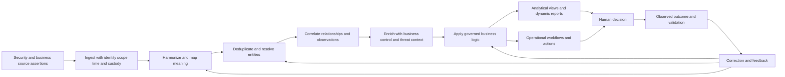

## JD Mapping

| Role expectation | Part 58 capability | TSM artifact | experience bridge and boundary |
|---|---|---|---|
| Develop deep Data Fabric expertise | Explain the public architecture and value chain | Source-bounded whiteboard | Product internals remain unclaimed |
| Analyze complex environments | Connect security and business source views | Enterprise data-context map | Microsoft troubleshooting and analytics transfer |
| Identify security risks | Expose missing, stale, duplicate, conflicting, and isolated evidence | Data-risk register | Data issue is not automatically a product defect |
| Recommend mitigations | Translate context into prioritized, owned, validated action | Decision brief | Customer risk owner approves treatment |
| Lead strategic engagements | Align use cases, personas, sources, outcomes, and roadmap | Discovery and value plan | Licensed scope must be verified |
| Resolve escalations | Isolate the first faulty stage and blast radius | Evidence package | RCA method transfers directly |
| Communicate with executives | Explain value, uncertainty, trust, and decision asks | Executive narrative | Avoid unsupported causal claims |
| Partner with Product and Support | Provide reproducible evidence and bounded requests | Escalation packet | No invented implementation detail |
| Drive adoption | Measure trusted use and workflow outcomes, not connector count alone | Adoption scorecard | Activity is not value |
| Build CTEM outcomes | Explain how connected context can support iterative exposure work | CTEM data foundation map | CTEM remains a program, not one database |

## Candidate honesty note

| Evidence class | Safe interview statement | Boundary to state |
|---|---|---|
| Production transfer | "I used SQL, Power BI, service telemetry, case evidence, and cross-system correlation in enterprise support operations." | This is not production Zscaler Data Fabric administration |
| Synthetic practice | "I designed an NMH source-to-context-to-workflow model and tested failure cases." | Fictional lab, not a customer result |
| Official public fact | "Zscaler publicly describes a flexible and extensible Data Fabric that aggregates and unifies security-tool and business-system data." | Public positioning does not reveal internal topology |
| Official process wording | "The public page names ingest, harmonize and map, deduplicate, correlate and enrich, business logic, workflows, and dynamic reporting." | Do not infer exact order, components, schemas, or guarantees beyond the page |
| Product relationship | "The reviewed page says Data Fabric powers AEM and UVM today and supports feedback loops across deployed Zscaler solutions." | Future-product language and packaging can change |
| General architecture | "A fabric should retain provenance, quality, version, and time through its transformations." | Good-practice recommendation, not a documented Zscaler field list |
| Customer conclusion | "The available evidence supports this prioritized review population." | Unified data does not remove uncertainty or risk-owner authority |
| Outcome claim | "After the change, the accepted metric improved under the same definition." | Sequence or correlation alone does not prove sole causation |

## Beginner vocabulary and memory hooks

| Term | Plain meaning | Why it matters | Memory hook |
|---|---|---|---|
| Data fabric | Connected capabilities that integrate and operationalize distributed data | Creates reusable context across use cases | Coordination network |
| Security data fabric | A data fabric focused on security and risk information | Links specialist security views with business context | Security coordination center |
| Source | System or file that provides assertions | Every fact begins with an owner and scope | Witness system |
| Source assertion | What one source states at a time | It may be incomplete, stale, or conflicting | One witness statement |
| Silo | Data isolated by tool, team, format, or meaning | Blocks holistic analysis and coordinated action | Locked filing room |
| Ingest | Bring data across a controlled boundary | Establishes custody, completeness, and state | Receive the shipment |
| Harmonize | Make representations consistent enough to compare | Aligns types, units, codes, and clocks | Tune instruments |
| Map | Translate a source field or concept to a target concept | Preserves meaning across systems | Translation guide |
| Deduplicate | Detect repeated representations | Prevents double counting and duplicate work | Remove repeated tickets carefully |
| Entity resolution | Decide which records describe the same real thing | Builds unified users, assets, apps, and findings | Which forms describe one object? |
| Correlate | Connect observations using defensible keys, relationships, and time | Reveals related evidence | Assemble the case file |
| Enrich | Add relevant context from another source | Makes a technical fact decision-ready | Add address, owner, and purpose |
| Canonical model | Shared source-neutral representation | Reduces pairwise translation and aligns meaning | Common form |
| Custom model | Governed extension for organization-specific concepts | Supports unique business structures and uses | Extra labeled drawers |
| Business logic | Rules expressing organizational policy or calculation | Converts context into groups, scores, or triggers | Decision recipe |
| Workflow | Owned sequence of tasks and state changes | Moves insight toward action | Routed work order |
| Dynamic report | View recomputed from selected data and context | Supports current role-specific questions | Live briefing board |
| Analytical workload | Reads and aggregates data to understand patterns | Supports questions, trends, and decisions | Investigation room |
| Operational workload | Changes or coordinates business state | Creates tickets, assignments, notifications, or updates | Dispatch room |
| Provenance | Origin and processing history | Enables trust, correction, and audit | Fact receipt |
| Lineage | Path through processing stages | Finds where meaning or quality changed | Data route map |
| Freshness | How current accepted data is for its use | Stale truth can mislead | Age of the report |
| Completeness | How much of the expected population is represented | Missing scope distorts risk | Pages present in the file |
| Confidence | Bounded strength of evidence under a method | Keeps uncertainty visible | Strength of the case |
| Unified security truth | Governed connected view with provenance and caveats | Gives teams a common evidence base | Shared case board, not an oracle |
| Feedback loop | Outcome or correction changes future data or decisions | Supports continuous improvement | Learn and update |
| AEM | Asset Exposure Management | Uses connected asset context to improve inventory and gap work | Know assets and gaps |
| CAASM | Cyber Asset Attack Surface Management | Category focused on unified cyber-asset visibility and management | Asset truth from many tools |
| UVM | Unified Vulnerability Management | Uses context to prioritize and operate vulnerability work | Fix the right exposures first |
| CTEM | Continuous Threat Exposure Management | Iterative program for scoping, discovery, prioritization, validation, and mobilization | Continuous exposure improvement loop |
| SIEM | Security Information and Event Management | Primarily collects and analyzes event and log data for detection and response | Security event control room |
| Data lake | Storage approach for large raw or varied data | Preserves data for many processing paths | Reservoir |
| Data warehouse | Curated analytical data system | Optimizes governed reporting and analysis | Organized reporting library |
| CMDB | Configuration Management Database | Tracks configuration items and service relationships under governance | IT configuration registry |

## Claim ledger: documented, general, and inferred

A credible TSM should label claim strength. Product pages are authoritative for what they publicly say, but they are not implementation manuals. General engineering sources can support design principles, but they cannot prove a vendor uses a particular component. A synthetic lab can show your reasoning, but it cannot prove product behavior or customer value.

| Claim | Classification | Support | Safe use | Forbidden leap |
|---|---|---|---|---|
| Security leaders face siloed tool data in different formats and teams | Documented Zscaler problem framing | Data Fabric public page | Explain product value proposition | Claim every customer has identical tool counts or failures |
| Data Fabric aggregates and unifies data across security tools and business systems | Documented Zscaler positioning | Data Fabric public page | Draw high-level source-to-fabric picture | Invent storage engine or network topology |
| Fabric is flexible, extensible, and has a customizable data model | Documented Zscaler positioning | Data Fabric public page | Discuss adaptable sources and uses | Invent exact customization interface |
| Public stages include ingest, harmonize/map, deduplicate, correlate/enrich | Documented Zscaler wording | Data Fabric public page | Use as the conceptual value chain | Assert an undocumented strict physical pipeline |
| Business logic can support custom scoring, workflows, and grouping | Documented Zscaler wording | Data Fabric public page | Explain organizational adaptation | Claim exact expression language or execution guarantees |
| Dynamic dashboards can combine fabric data, factors, and measurements | Documented Zscaler wording | Data Fabric public page | Explain reporting value | Invent fields, refresh, RLS, or formulas |
| A data fabric supports analytical and operational workloads | Documented FAQ definition | Data Fabric public page | Distinguish analysis and action | Claim every use is real-time or transactional |
| AEM and UVM are powered by Data Fabric | Documented current relationship | Data Fabric, AEM, and UVM pages | Place products in portfolio map | Claim all Zscaler products share identical data |
| AEM describes multi-source resolution and golden asset records | Documented AEM positioning | AEM public page | Explain asset use case | Claim undocumented matching rules or completeness |
| UVM describes correlated context and flexible remediation workflows | Documented UVM positioning | UVM public page | Explain vulnerability use case | Treat published outcome figures as universal guarantees |
| CTEM can use a common contextualized data set | Documented Zscaler CTEM positioning | CTEM public page | Explain data foundation for program cycle | Equate CTEM with one product or dashboard |
| Provenance should survive every transformation | General architecture recommendation | W3C provenance and data-engineering practice | Design NMH controls | Say Zscaler exposes a particular provenance schema |
| NMH reduces duplicate tickets after better resolution | Synthetic inference | Lab scenario only | Demonstrate measurement method | Present as Zscaler customer outcome |

### Plain-English deep-dive 1 - A product page is a map legend, not a building blueprint

A public page can legitimately say that a platform ingests, harmonizes, deduplicates, correlates, enriches, automates, and reports. Those words tell us the promised capability categories. They do not tell us whether the implementation uses queues, tables, graphs, object storage, streams, microservices, or a particular matching library. They do not reveal tenant isolation boundaries, retry timers, backup design, indexes, schemas, APIs, or operational limits.

The distinction is like reading that a hospital has emergency, imaging, laboratory, pharmacy, and surgical capabilities. The brochure helps a patient understand services, but it does not provide the electrical diagram, medication database schema, staffing schedule, or clinical protocol. A TSM should use the public map to frame value, then use current authenticated documentation, tenant evidence, controlled tests, and specialists for implementation decisions.

## Why security risk becomes a data problem

Risk is not contained in one field. A vulnerability identifier can describe a software weakness, but priority changes with the affected asset, reachable path, exploit activity, business service, data sensitivity, identity privilege, compensating controls, owner, maintenance window, and remediation state. If these facts remain isolated, analysts spend time finding and reconciling context manually. Worse, they may make a confident decision from an incomplete slice.

| Siloed question | Source that may know part of it | Missing context | Decision risk |
|---|---|---|---|
| Is this asset real and active? | EDR, scanner, cloud, CMDB, network | Lifecycle and cross-source identity | Work on stale or duplicate asset |
| Who owns it? | CMDB, directory, cloud tags, HR/business service | Effective time and authority | Ticket goes to wrong person |
| Is it exposed? | Scanner, EASM, cloud/network tools | Route, policy, application role | Severity mistaken for reachability |
| Is a control present? | EDR, MDM, IAM, backup, policy systems | Coverage and health, not installation alone | False sense of mitigation |
| Is exploitation likely? | Threat intelligence, exploit sources | Population, time, evidence quality | Static score treated as certainty |
| Is the business impact high? | Service catalog, data inventory, business owner | Dependency and criticality definition | Technical severity drives wrong order |
| Has remediation succeeded? | Ticketing, scanner, deployment tools | Validation and recurrence | Closed ticket treated as fixed exposure |
| What should happen next? | Policy, workflow, risk register | Authority, exception, dependency, safety | Automation causes duplicate or harmful action |

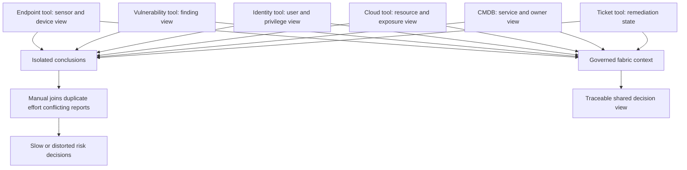

Calling risk a data problem does not mean all risk is solved by better data. Security strategy, architecture, control design, budget, threat behavior, human judgment, and risk acceptance remain essential. The phrase means that many security decisions are constrained by fragmented evidence and inconsistent context. Improving that evidence can improve prioritization and coordination, but cannot guarantee prevention or eliminate uncertainty.

## Source silos: technical, semantic, organizational, and temporal

Silos are more than separate databases. They appear when teams use different identifiers, definitions, clocks, scopes, access rules, and workflows. Two exports in one lake remain semantically siloed if one field means "host observed" and another means "managed endpoint." Two records remain operationally siloed if no owner can act on the combined finding.

| Silo type | Example | Symptom | Fabric responsibility | Remaining owner responsibility |
|---|---|---|---|---|
| Physical | Data held in separate tools | Manual export and join | Connect authorized inputs | Approve access and source operation |
| Format | JSON, CSV, XML, API objects differ | Parser and type conflict | Decode and validate | Source contract and version notice |
| Identifier | Hostname, agent ID, cloud ID differ | Duplicate asset counts | Resolve with scoped evidence | Define identity and error tolerance |
| Semantic | "Critical" means different things | False comparison | Map definitions and preserve source | Semantic steward approves equivalence |
| Temporal | Snapshots and events use different clocks | Wrong sequence or stale join | Normalize and retain time roles | Source owner explains clock semantics |
| Organizational | Teams own disconnected views | Competing numbers | Create shared governed view | Leaders agree authority and process |
| Permission | Useful context is restricted | Missing or overexposed fields | Enforce purpose and least privilege | Data owner and privacy authority decide |
| Workflow | Insight cannot reach action owner | Dashboard grows, backlog does not move | Route controlled action | Business owner accepts and completes work |

## Flexible and extensible does not mean uncontrolled

The reviewed Zscaler page describes the fabric as flexible and extensible, with a customizable data model, the ability to add data sources, build workflows, apply business logic, and create reports. Flexibility means the architecture can adapt to new evidence and use cases. Extensibility means it can add governed concepts or integrations without redesigning every existing path. Neither term means every source, field, rule, or automation should be accepted.

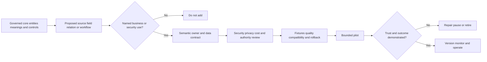

| Extension question | Why it matters | Evidence before approval |
|---|---|---|
| Which decision improves? | Prevents data collection without purpose | Use-case and decision statement |
| Which entity or relationship changes? | Avoids an incoherent model | Semantic definition and examples |
| Is the source authoritative for this field? | Prevents accidental precedence | Authority matrix |
| What sensitive data is introduced? | Linking can create new privacy impact | Classification and purpose review |
| What volume and cadence arrive? | Shapes operational cost and freshness | Measured profile and forecast |
| Which consumers can break? | Additions can change meaning or performance | Dependency inventory and contract tests |
| How is it removed or rolled back? | Prevents permanent experimental debt | Version, migration, and rollback plan |
| How is value measured? | Separates adoption from connection count | Baseline, target, guardrail, review date |

### Plain-English deep-dive 2 - Flexibility needs a spine

A tent is flexible because fabric stretches around a stable frame. Remove the frame and it becomes a pile of cloth. A data fabric also needs a spine: identity scope, canonical concepts, versioning, access control, provenance, quality rules, ownership, and change management. Custom fields and workflows attach to that spine.

Without the spine, every team can add a new meaning for asset, critical, owner, or remediated. The platform may technically hold more data while organizational truth becomes weaker. The correct question is not "Can we add this?" It is "Can we add it with a named purpose, definition, authority, lifecycle, test, and safe consumer behavior?"

## Conceptual architecture layers

The following model is a general explanatory architecture, not a claim about Zscaler's internal implementation. It separates responsibilities so an analyst can reason about evidence and failures.

| Layer | Main question | Typical inputs | Controlled output | Key failure |
|---|---|---|---|---|
| Source and contract | What is asserted, by whom, for what scope? | API, file, webhook, tool data | Versioned source agreement | Undefined population |
| Ingestion | Did authorized data arrive completely and securely? | Bytes, pages, objects, events | Accepted immutable receipt | Partial or unauthorized load |
| Harmonization and mapping | What does each value mean in shared terms? | Parsed source records | Typed canonical assertions | False equivalence |
| Entity resolution | Which records describe one entity? | Identifiers, aliases, time | Entity links and candidates | False merge or split |
| Correlation and enrichment | What relationships and context are relevant? | Entities, findings, controls, business data | Contextual graph/view | Stale or circular context |
| Logic and policy | How does the organization classify or prioritize? | Context plus governed rules | Group, score, state, trigger | Opaque or wrong rule |
| Analytical serving | What can users understand and compare? | Governed measures and entities | Reports, trends, drill views | Misleading denominator |
| Operational serving | What work should be initiated or updated? | Trigger and action contract | Ticket, notification, update | Duplicate or unauthorized action |
| Feedback and governance | What did we learn and what must change? | Outcomes, overrides, defects | Corrected rules, data, and controls | Silent drift |

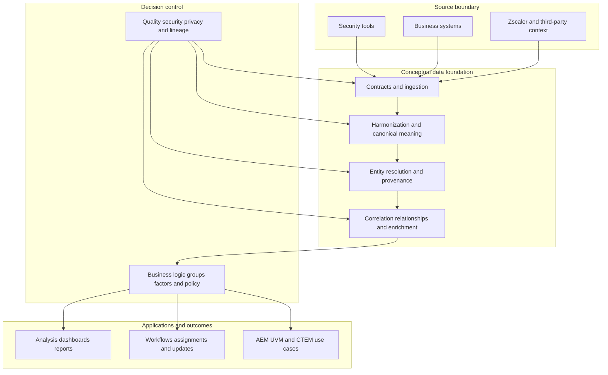

## Stage 1: ingest with custody and scope

Ingest means taking data in. At a minimum, the receiving process needs source identity, authorization, scope, extraction time, object or page identity, format, and completeness evidence. A successful request or file transfer does not prove the intended population is complete. The source may return only one page, omit disabled objects, filter to one account, or produce an earlier snapshot.

| Ingest concern | Architecture question | Evidence | Failure response |
|---|---|---|---|
| Authentication | Which machine identity called which source? | Token/certificate metadata, audit event | Stop and rotate/re-authorize |
| Authorization | Which tenant, account, object types, and actions are allowed? | Scope/role grant and negative test | Correct least-privilege grant |
| Completeness | Were all expected pages/files/windows received? | Manifest, page chain, source count | Hold publication and reconcile |
| Integrity | Did bytes change or truncate? | Size, hash, parser end, transport result | Quarantine and reacquire |
| Time | What period and extraction instant are represented? | Watermark and source clock | Mark provisional/stale or backfill |
| Provenance | Can each accepted record be traced? | Source, job, page/object, offset | Reject untraceable publication |
| Security | Are secrets and sensitive payloads protected? | Secret reference, TLS evidence, access log | Contain exposure and follow incident process |

In Part 59 and Part 60, connector planning and reliability receive deeper treatment. Here the architectural point is that downstream "truth" is bounded by the accepted source scope. A perfect mapping cannot recover records never collected.

## Stage 2: harmonize and map meaning

Harmonization makes values comparable: timestamps use declared time semantics, severities retain their source scale, identifiers carry issuer and namespace, booleans do not collapse unknown into false, and units are explicit. Mapping links a source concept to a target concept. It is not merely renaming columns.

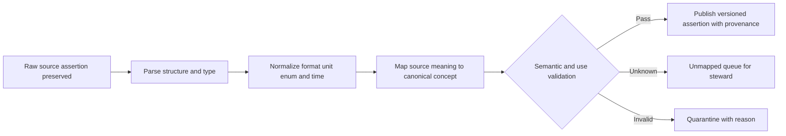

| Source value | Unsafe shortcut | Governed treatment | Why |
|---|---|---|---|
| Severity `5` | Map to "critical" | Preserve scale/version and approved crosswalk | Numeric scales differ |
| `closed` ticket | Set exposure remediated | Map ticket state separately; require validation | Workflow state is not security state |
| Missing EDR field | Set control absent | Represent unknown and evaluate source coverage | Missing data is not negative proof |
| Date `08/09/26` | Parse by locale guess | Contract format and reject ambiguity | Day/month order differs |
| IP address | Treat as asset ID | Preserve as time-bound locator | Addresses are reused and shared |
| Owner display name | Join directly to person | Resolve scoped directory identifier | Names collide and change |

## Stage 3: deduplicate and resolve entities

Deduplication removes or links repeated representations; entity resolution decides which source records refer to the same user, asset, application, finding, or other governed entity. The fabric value depends on not double-counting one laptop from five tools, but a false merge can be worse than a duplicate because it can assign one person's risk or action to another.

| Resolution element | Purpose | Control |
|---|---|---|
| Entity contract | Defines type, scope, lifecycle, and use | Owner approval |
| Identifier registry | Records issuer, namespace, quality, and reuse | Raw and normalized values |
| Candidate generation | Limits pairs worth comparing | Recall measurement |
| Match rules/features | Express supporting and contradictory evidence | Versioned tests |
| Decision bands | Merge, review, reject, or hold | Consequence-based thresholds |
| Cluster checks | Prevent weak transitive bridges | Coherence and giant-cluster alerts |
| Survivorship | Chooses displayed attribute values | Field-level authority and time |
| Unmerge | Reverses errors and repairs consumers | Audited event and impact reconciliation |

Part 62 applies these mechanics specifically to the Data Fabric value story. Part 53 supplies the general entity-resolution foundation. The correct interview claim is that Zscaler publicly describes deduplication and AEM describes multi-source entity deduplication and golden records; exact product rules are not public facts in this guide.

## Stage 4: correlate related evidence

Correlation links facts that are relevant to the same question. It can connect a finding to a resolved asset, that asset to an application, the application to a business service, the service to an owner, and the owner to a remediation workflow. Correlation is not causation. Two events close in time may be associated but not causally related.

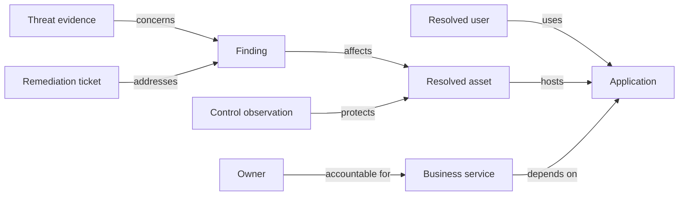

The arrows need definitions, direction, effective time, confidence, and provenance. "Protects" can mean installed, configured, healthy, in policy, or validated effective. "Owns" can mean technical operator, budget owner, data owner, or risk acceptor. A line on a graph is useful only when its meaning is governed.

## Stage 5: enrich with decision context

Enrichment adds evidence that changes interpretation or action. For a vulnerability, useful context might include business criticality, internet exposure, privileged identity relationships, sensitive data, threat activity, compensating controls, owner, maintenance window, and exception state. More context is not automatically better. It should be relevant, current, authorized, and understood.

| Enrichment | Decision it may improve | Freshness/quality question | Risk if wrong |
|---|---|---|---|
| Business criticality | Escalation and sequencing | Who approved tier and when? | Low-value item displaces critical work |
| Owner | Assignment | Is owner effective for this asset/time? | Wrong person receives sensitive ticket |
| Internet exposure | Reachability priority | Is exposure observed, inferred, or intended? | False urgency or missed path |
| Identity privilege | Blast-radius reasoning | Is privilege current and scoped? | Innocent user mischaracterized |
| Control health | Mitigating-control reasoning | Installed, active, configured, tested? | Weak control lowers risk incorrectly |
| Threat intelligence | Exploitation relevance | Source, confidence, expiry, population? | Stale intelligence drives backlog churn |
| Business process | Impact narrative | Which service actually depends on asset? | Technical relation becomes false business impact |
| Exception | Workflow treatment | Approved by whom, until when, for what scope? | Permanent bypass hidden as governance |

### Plain-English deep-dive 3 - Unified truth is a shared evidence board, not an oracle

"Single source of truth" is useful shorthand, but it can be misunderstood as one infallible value replacing every source. A better mental model is a shared evidence board. The board can show that Source A observed an asset yesterday, Source B reports another owner, the CMDB statement is 90 days old, and the resolution policy links both records with medium confidence. It can display a preferred owner while preserving the disagreement.

Truth therefore has layers: raw assertion, accepted receipt, normalized value, entity link, selected golden value, derived classification, and human decision. Each layer needs provenance and time. A unified view earns trust when users can inspect these layers and correct them. Hiding conflicts behind a clean row produces visual consistency, not trustworthy truth.

## Stage 6: operationalize through logic, reports, and workflows

Operationalization turns governed context into something people or systems can use. It may create a group, calculate a factor, populate a report, notify an owner, open or update a ticket, or request approval. The reviewed Zscaler page publicly mentions custom scoring, grouping rules, automated workflows, dynamic reports, and feedback loops. It does not justify inventing exact expressions, triggers, fields, timing, or delivery guarantees.

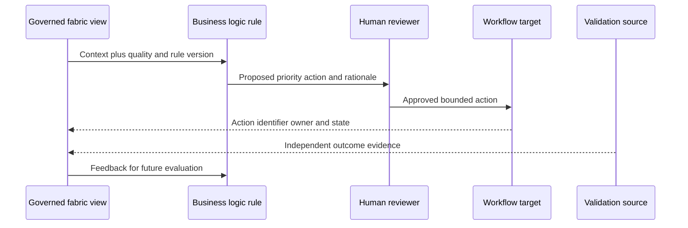

| Operational object | Required contract | Guardrail |
|---|---|---|
| Group | Membership rule, scope, effective time | Explain inclusion/exclusion |
| Score/factor | Definition, inputs, missing behavior, version | No fake precision or hidden defaults |
| Report | Audience, question, denominator, freshness | Show quality and caveats |
| Trigger | Condition, debounce, idempotency key | Avoid repeated action |
| Ticket | Target project/type, owner, fields, reconciliation | Do not equate ticket close with remediation |
| Notification | Recipient, purpose, sensitivity, rate | Prevent spam and disclosure |
| CMDB update | Field authority, approval, conflict policy | Do not overwrite stronger source silently |
| Containment action | Explicit authority, safety, approval, rollback | High-impact action requires stronger evidence |

## Analytical and operational workloads

The public Data Fabric FAQ defines a data fabric as supporting analytical and operational workloads. An analytical workload asks questions across data. An operational workload changes or coordinates state. The same context can support both, but their safety and engineering needs differ.

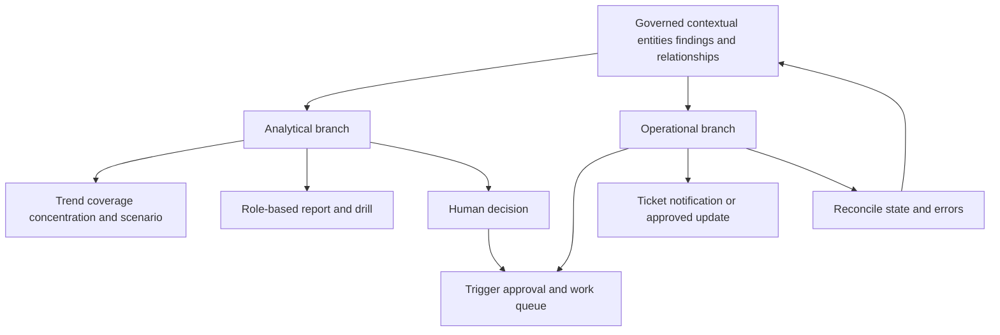

| Dimension | Analytical workload | Operational workload |
|---|---|---|
| Primary purpose | Understand, compare, explain, forecast | Initiate, route, update, or verify work |
| Typical unit | Aggregate, cohort, entity view | Action, task, state transition |
| Latency need | Use-case dependent | Often bounded by workflow consequence |
| Error consequence | Misleading conclusion | Duplicate, missed, or harmful action |
| Repeat behavior | Query can be rerun | Side effect needs idempotency |
| Access | Read and drill | Write/action authority |
| Testing | Reconciliation and metric fixtures | Negative, retry, duplicate, rollback, authorization |
| Evidence | Query/version/as-of/quality | Trigger, approval, target response, reconciliation |

An executive dashboard that identifies high-risk assets is analytical. Creating tickets for their owners is operational. Updating the CMDB from resolved golden context is operational. A report can recommend action without executing it. Keep these boundaries explicit so a useful analysis does not silently become an unauthorized control.

## Business logic and organization-specific meaning

Generic severity does not know NMH's services, maintenance windows, ownership, regulatory commitments, accepted exceptions, or control strategy. Business logic can express organization-specific decisions. The logic should be transparent enough to explain why an entity entered a group or why a workflow was proposed.

| Logic category | Synthetic NMH example | Required evidence | Tradeoff |
|---|---|---|---|
| Grouping | Production assets supporting payroll | Service relationships plus environment | Wrong relation changes population |
| Factor | Internet exposure flag | Current route/exposure evidence | Binary value may hide uncertainty |
| Weighting | Higher attention to crown-jewel service | Approved risk method | Weight can encode politics or stale priorities |
| Threshold | Human review above synthetic score band | Calibrated cases and capacity | Threshold creates cliff effects |
| Exception | Defer during approved safety freeze | Authority, scope, expiry, compensating control | Exceptions can become permanent |
| Assignment | Route to effective technical owner | Time-bound owner relationship | Org changes create misrouting |
| Escalation | Notify risk owner after overdue period | Clock, SLA/policy, pause rules | Alert fatigue |
| Validation | Close only after independent observation | Scanner/control/ticket reconciliation | Delayed evidence can slow closure |

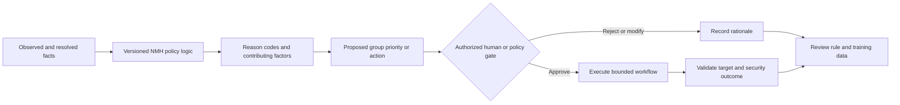

## Dynamic reports and decision interfaces

A dynamic report allows users to view selected combinations of fabric elements, factors, and measurements according to the public page. The value is not merely that a chart refreshes. The report can use the same governed entities and definitions while giving an executive, analyst, asset owner, and data steward different views.

| Persona view | Question | Useful context | Action path |
|---|---|---|---|
| CISO | Where is material exposure concentrated? | Service, criticality, path, control, trend, quality | Fund or direct mitigation |
| VM leader | Which exposure cohorts are overdue and why? | Owner, age, exploit evidence, controls, dependency | Launch campaign or adjust process |
| Asset owner | What exactly do I own and what evidence supports the task? | Asset identity, finding, source, rationale, due date | Remediate or dispute with evidence |
| SOC analyst | Which active observations relate to exposed critical assets? | Timeline, identity, behavior, controls | Investigate and contain under authority |
| Data steward | Which source or mapping reduces trust? | Completeness, freshness, conflicts, unmapped values | Repair contract or mapping |
| TSM | Where do adoption, data quality, and customer outcomes stall? | Health, use, workflow completion, executive goal | Coordinate success-plan intervention |

A report should show freshness, population, quality, definition version, and uncertainty. If a connector is stale, a trend may look improved because the denominator shrank. If entity resolution changes, historical counts may restate. Dynamic does not mean self-validating.

## Feedback loops: products, data, decisions, and outcomes

The public page says Data Fabric powers feedback loops between products and deployed Zscaler solutions, creating richer exposure insights and automated risk reduction. Use that as a high-level relationship claim. A general feedback model is: observe, contextualize, decide, act, validate, and improve. The feedback may correct a source, enrich an entity, update a rule, reconcile a ticket, or change a future priority.

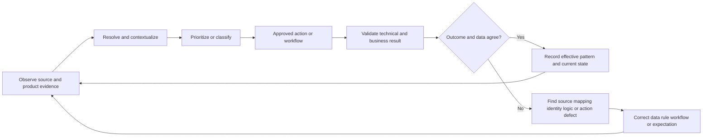

| Feedback signal | Possible lesson | Unsafe conclusion | Controlled response |
|---|---|---|---|
| Owner rejects ticket | Identity or ownership may be wrong | Owner is uncooperative | Inspect provenance and effective ownership |
| Finding reappears | Fix may be incomplete or identity changed | Tool is defective | Compare evidence, asset, version, and time |
| Score changes after source onboarding | New context changed model input | Risk truly changed at that instant | Separate observed risk from model/data change |
| Control reports healthy | Mitigation evidence improved | Exploit is impossible | Validate coverage, configuration, and effectiveness |
| Workflow repeatedly retries | Target or idempotency problem | More retries will solve it | Pause, reconcile target, repair contract |
| Human overrides priority | Model may miss business context | Override is ground truth | Capture reason and review representative patterns |
| Asset splits after correction | Prior merge was wrong | Historical counts should silently change | Version, restate, and reconcile downstream work |

### Plain-English deep-dive 4 - Feedback is not the same as self-correction

A thermostat measures temperature and turns heating on or off, but it can still be wrong if the sensor is beside an open window or the set point is inappropriate. A security feedback loop also needs trustworthy measurements, bounded authority, and review. A closed ticket is feedback about workflow state; it is not automatically evidence that the exposure disappeared. A lowered score is feedback about a calculation; it is not automatically proof that enterprise risk fell.

Good feedback loops use independent outcome evidence where possible. They record who or what changed state, why, under which version, and what validation occurred. They also have brakes: approvals, rate limits, pause switches, exception queues, rollback, and incident procedures.

## Relationship to AEM, UVM, and CTEM

Data Fabric is the shared data and operationalization foundation in Zscaler's public story. Asset Exposure Management is an application/use case centered on unified asset visibility, multi-source resolution, golden records, coverage gaps, CMDB health, and asset workflows. Unified Vulnerability Management is centered on contextual risk prioritization, factors and mitigating controls, reporting, and remediation workflows. CTEM is a broader iterative exposure-management program described through scoping, discovery, prioritization, validation, and mobilization. The fabric can support these activities by providing shared contextual evidence.

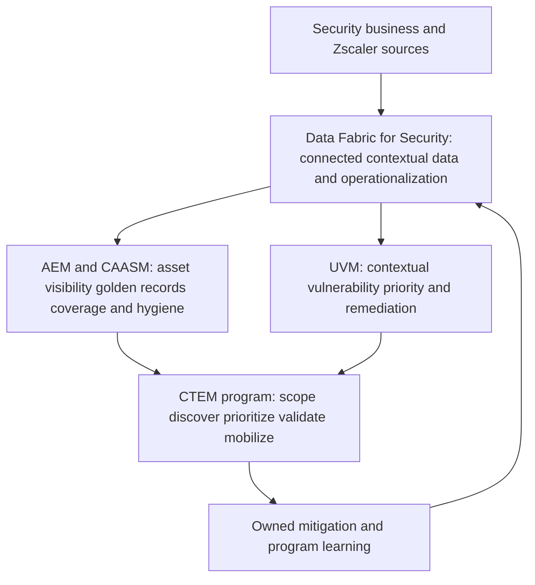

| Concept | Center of gravity | Uses shared context for | It is not |
|---|---|---|---|
| Data Fabric | Integrate, harmonize, resolve, enrich, operationalize | Reusable truth, logic, reports, workflows | Automatically every source's authority |
| AEM/CAASM | Assets and coverage | Inventory, golden records, missing controls, CMDB hygiene | A guarantee of complete discovery |
| UVM | Vulnerabilities and security gaps | Contextual prioritization, reports, remediation | Necessarily the scanner or patch tool |
| CTEM | Continuous exposure program | Scope, discovery, priority, validation, mobilization | One product, score, or annual scan |

Do not say Data Fabric "is CTEM." Do not say AEM and UVM are just dashboards. Do not say a golden record is infallible. Do not claim the fabric replaces all tools. The public pages instead describe a foundation that connects data and supports applications and program outcomes.

## Personas and outcomes

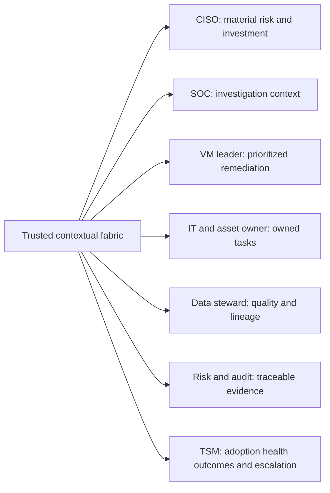

| Persona | Pain without connected context | Desired outcome | Evidence of value | Guardrail |
|---|---|---|---|---|
| CISO | Conflicting metrics and uncertain coverage | Decision-ready exposure narrative | Stable definitions, quality, trend, action | No false precision |
| Security analyst | Manual pivots across tools | Faster scoped investigation | Time to trusted context, rework rate | Accuracy before speed |
| VM leader | Huge severity backlog | Risk-based owned queue | Critical cohort aging and validation | Do not hide low-confidence items |
| Asset manager | Duplicate/incomplete inventory | High-fidelity governed asset view | Reconciled source coverage and disputes | Preserve source authority |
| Control owner | Unknown deployment gaps | Verified control coverage | In-scope denominator and health evidence | Installed is not effective |
| Application owner | Tickets lack rationale | Clear evidence and remediation path | Acceptance, completion, dispute quality | Minimize sensitive data |
| Data steward | Silent schema and quality drift | Traceable mappings and exceptions | Error age, mapping coverage, lineage | No guessed defaults |
| Risk/audit | Cannot reconstruct a decision | Versioned evidence and approvals | Reproducible decision package | Retention and access policy |
| TSM | Technical activity detached from outcomes | Adoption-to-value success plan | Trusted use, workflow completion, risk decision | Connector count is not value |

## Overview comparison: fabric, SIEM, lake, warehouse, and CMDB

This is an overview only; Part 67 provides the dedicated comparison. Real products overlap, and architecture choices vary. Categories describe centers of gravity, not rigid boxes.

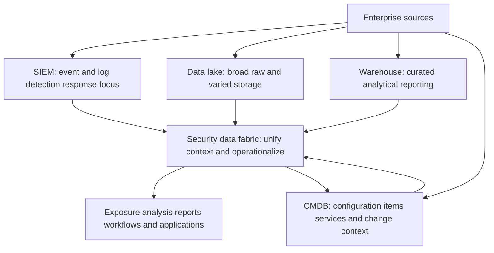

| Category | Primary center | Typical strength | Common limitation relative to fabric story | Complementary role |
|---|---|---|---|---|
| Security data fabric | Cross-source security/business context plus operationalization | Reusable entities, relationships, logic, and workflows | Requires governance and source quality | Connects other systems for use cases |
| SIEM | Security events/logs, detection, investigation, response | Time-oriented telemetry and detection operations | Event focus may not provide complete governed entity/business context | Valuable event source and action destination |
| Data lake | Economical storage of large varied raw data | Retention and flexible processing | Storage alone does not harmonize meaning or create workflows | Raw/history source or analytical substrate |
| Data warehouse | Curated structured analytics | Stable reporting, dimensional measures, performance | Often optimized for analysis rather than operational security workflows | Governed metrics and reporting source/consumer |
| CMDB | Configuration items, service relationships, change governance | IT operational ownership and service context | Can be incomplete/stale and not security-event centered | Business/owner source and update target |

The Data Fabric public FAQ specifically distinguishes it from SIEM by saying SIEM focuses on event-related log data and can be a useful source for a fabric, while the fabric unifies broader security data. The lake, warehouse, and CMDB comparison is general architectural reasoning, not an official Zscaler replacement statement.

## Value chain and measurable outcomes

Value is not the number of connected sources. A connector can be configured but stale, mis-scoped, unused, or semantically wrong. Measure the chain from trusted coverage to decision and outcome.

| Value layer | Example measure | What it proves | What it does not prove |
|---|---|---|---|
| Connection | In-scope sources authenticated | Technical setup exists | Complete/current data |
| Acceptance | Expected windows accepted with quality | Pipeline reliability | Correct semantics |
| Harmonization | Required fields valid/mapped | Shared representation coverage | Source accuracy |
| Resolution | Reviewed precision/recall and dispute rate | Identity quality under method | Universal identity truth |
| Context | Owner/service/control coverage and freshness | Decision context availability | Context correctness without validation |
| Use | Active users/reports/workflows by persona | Adoption activity | Risk reduction |
| Decision | Time to accepted priority/owner/action | Coordination improvement | Correct final outcome |
| Workflow | Completion, reconciliation, exception age | Operational execution | Effective remediation |
| Outcome | Independently validated exposure/control change | Observed result under definition | Sole causation by fabric |
| Trust | Dispute, correction, lineage access, satisfaction | User confidence and redress | Absence of hidden errors |

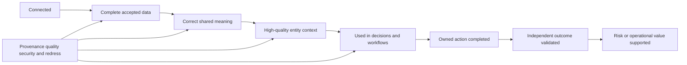

## Architecture tradeoffs

| Choice | Benefit | Cost/risk | Decision question |
|---|---|---|---|
| Broad source coverage | More possible context | Cost, privacy, noise, dependencies | Which decision needs each source? |
| Fast freshness | Earlier action | More API load, cost, instability | What consequence requires this latency? |
| Rich canonical core | Shared semantics | Governance and coupling | Which concepts are truly reusable? |
| Flexible extensions | Faster unique use cases | Fragmentation and semantic debt | Is there a named owner and lifecycle? |
| Aggressive matching | Fewer duplicates | More false merges | Which error causes greater harm? |
| Conservative matching | Fewer false merges | More fragmented views | Can review capacity absorb ambiguity? |
| Automated workflows | Faster consistent action | Duplicate or harmful side effects | Is evidence and authority strong enough? |
| Human approval | Safety and judgment | Delay and review workload | Which actions need approval by consequence? |
| Historical restatement | Corrected analysis | Trend comparability changes | Will versions and reports show restatement? |
| One preferred value | Simple consumption | Conflict becomes hidden | Can users inspect alternatives/provenance? |

## Failure modes and blast radius

A data fabric can amplify both good and bad information. Reusable context means one defective mapping or entity rule can affect several applications, reports, and workflows. That makes versioning, lineage, canaries, and rollback central architecture concerns.

| Failure | Local symptom | Potential blast radius | Immediate containment |
|---|---|---|---|
| Source scope narrows | Counts fall unexpectedly | Reports, scores, workflows undercount | Mark data incomplete; hold dependent action |
| Credential expires | Freshness alarm | Stale context across uses | Restore securely; identify stale period |
| Schema drifts | Parse/mapping rejects or silent nulls | Missing factors and owner fields | Quarantine new version; compare contract |
| Enum mapped wrongly | Severity/owner/group shifts | Priority and report distortion | Freeze mapping; replay corrected version |
| False entity merge | Conflicting attributes or wrong tickets | Misattribution across products | Stop high-impact actions; unmerge and reconcile |
| False entity split | Duplicate assets/findings | Inflated backlog and repeated tickets | Link under reviewed rule; reconcile actions |
| Stale enrichment | Old owner/control/criticality | Wrong routing or risk reasoning | Show age; refresh or remove from decision |
| Logic version defect | Sudden score/group change | Broad reprioritization | Roll back or disable rule; diff versions |
| Workflow not idempotent | Duplicate target records | Operational overload and customer distrust | Pause; reconcile keys and target state |
| Dashboard denominator changes | Apparent improvement | Executive decision error | Correct definition; restate transparently |
| Feedback poisoning | Wrong override treated as truth | Future decisions drift | Quarantine feedback; review provenance |
| Access misconfiguration | Unauthorized context visible | Privacy/security incident | Revoke, contain, audit, notify per plan |

## Troubleshooting architecture

Troubleshooting should find the first stage where expected evidence diverges from observed evidence. Starting at the dashboard encourages guesses. Start with the exact entity, metric, time, source population, and decision consequence, then trace backward through lineage.

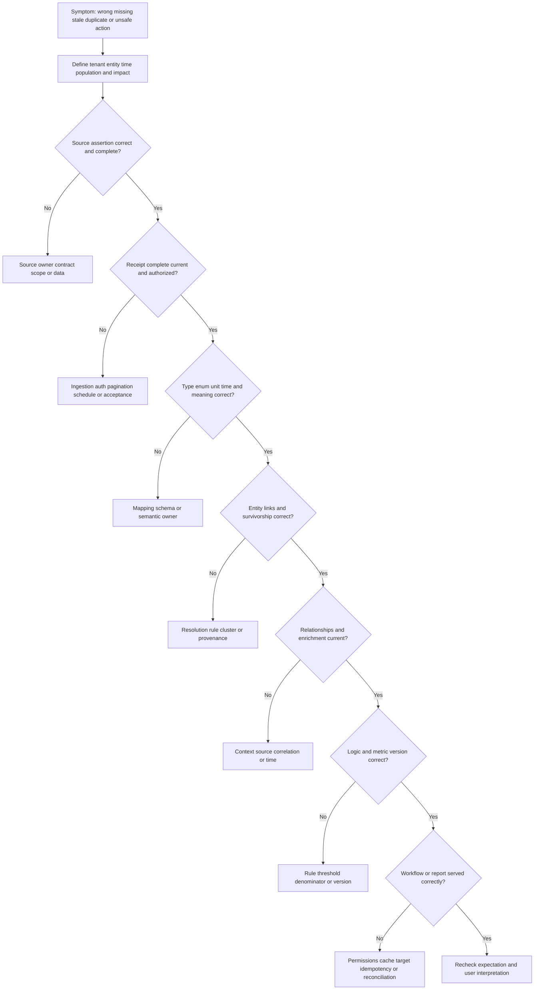

| Evidence packet field | Example | Why it matters |
|---|---|---|
| Symptom and expected result | Asset appears twice; expected one entity | Makes defect falsifiable |
| Scope | NMH tenant, asset class, 24-hour interval | Prevents unrelated expansion |
| Business impact | Two tickets sent to separate owners | Establishes severity |
| Raw source references | Source record IDs and source timestamps | Preserves original assertions |
| Ingest evidence | Job, page/file, watermark, counts, acceptance | Proves custody/completeness |
| Mapping evidence | Schema and mapping version, source/target values | Locates semantic transformation |
| Entity evidence | Candidate features, rule, decision, cluster version | Explains merge/split |
| Context evidence | Relationship, owner, control, effective time | Tests enrichment |
| Logic/report evidence | Rule/metric version, inputs, reason codes | Reproduces output |
| Workflow evidence | Idempotency key, target response, state | Reconciles side effect |
| Blast radius | Entities, periods, reports, actions affected | Guides containment and correction |
| Recovery proof | Replay, comparison, owner validation, monitor | Establishes safe restoration |

## Complete synthetic NMH architecture exercise

NMH wants to reduce critical exposure affecting its payroll service. It has an endpoint platform, vulnerability scanner, cloud inventory, directory, CMDB, ticketing system, and threat source. The exercise does not assert any production connector or Zscaler schema.

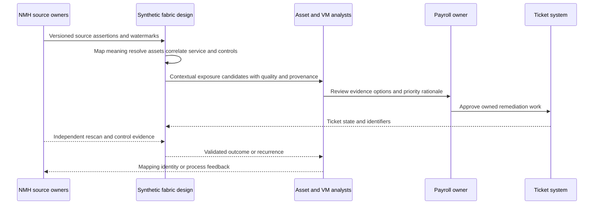

| Exercise step | Synthetic decision | Evidence | Caveat |
|---|---|---|---|
| Define outcome | Reduce validated payroll exposure | Baseline and accepted metric contract | Not "connect all tools" |
| Inventory sources | Seven named systems and owners | Source catalog | Availability/auth not assumed |
| Accept scope | Production assets and current users | Source population controls | Lab scope only |
| Harmonize | Preserve source severity; map environment and time | Mapping fixtures | No invented Zscaler fields |
| Resolve | Conservative asset links with review band | Labeled synthetic pairs | Scores are educational |
| Correlate | Asset hosts payroll app; owner effective now | Relationship provenance | Association is not causation |
| Enrich | Threat evidence and control health | Timestamp/confidence | Stale context shown as unknown |
| Apply logic | Propose review for high-impact exposed items | Transparent reason codes | Human approves priority |
| Report | Show count, denominator, freshness, owner, age | Metric contract | Dynamic does not mean accurate by itself |
| Workflow | Create one idempotent ticket per accepted exposure | Synthetic action key | Ticket close is not remediation |
| Validate | Independent rescan and control check | Before/after entity evidence | Causal attribution bounded |
| Feedback | Correct owner and one false split | Audited change/replay | Historical restatement disclosed |

The initial synthetic result finds 120 scanner records, resolves them to 93 assets, identifies 14 payroll-related exposures, and routes 9 after quality and ownership review. These numbers are invented to teach the chain. The value statement is not "the fabric found 14 risks." It is: "Under the synthetic source contracts and resolution policy, the exercise converted fragmented records into a reviewable payroll exposure population with provenance, assigned work, and independent closure validation."

## Synthetic exercises with answers

### Exercise 1 - Data problem or control problem

Three tools disagree on whether an endpoint is protected. Is this only a data problem?

**Answer:** No. It is first an evidence and semantic problem: determine whether the records refer to the same endpoint, what "protected" means in each source, and when each observation was effective. The result may reveal a real control problem, a stale source, a scope mismatch, or both. Better data helps isolate the control state but does not install or validate the control.

### Exercise 2 - Unified truth

Should the fabric overwrite all source owners with the CMDB owner?

**Answer:** Not automatically. Define which owner role is needed, the CMDB's authority and freshness, effective time, conflict behavior, and correction process. A golden view may prefer a value while retaining alternatives and provenance. An operational update needs separate authority and reconciliation.

### Exercise 3 - Flexible model

A team requests a custom field because it may be useful someday. Add it?

**Answer:** Require a named use, definition, owner, classification, source authority, type, lifecycle, tests, consumers, and retirement plan. Flexibility supports valid needs; it does not remove governance or cost.

### Exercise 4 - Analytical versus operational

A report lists assets missing EDR. Is that an operational workload?

**Answer:** The report itself is analytical. Automatically opening tickets, assigning owners, updating a CMDB, or changing policy is operational. The transition requires authority, idempotency, safety, and reconciliation controls.

### Exercise 5 - Correlation

A privileged user logged in shortly before a finding appeared. Did the user cause it?

**Answer:** Temporal association alone does not prove causation. Verify entity identity, clocks, event semantics, mechanism, alternative explanations, and direct evidence. Label the relationship as observed sequence until stronger evidence supports a causal statement.

### Exercise 6 - Feedback loop

A ticket closes and the score drops. Is remediation validated?

**Answer:** Not necessarily. The ticket proves workflow state, and the score proves a calculation changed. Seek independent evidence that the exposure or control condition changed on the same resolved entity, then check recurrence.

### Exercise 7 - AEM and UVM

Does AEM replace UVM?

**Answer:** The public positioning gives them different centers: AEM focuses on unified asset visibility, golden records, coverage gaps, and hygiene; UVM focuses on contextual vulnerability priority and remediation. Shared Data Fabric context can connect their use cases. Exact entitlements and workflows require current validation.

### Exercise 8 - CTEM

Is connecting all sources a completed CTEM program?

**Answer:** No. Connected context can support scoping and discovery, but CTEM is iterative work across scoping, discovery, prioritization, validation, and mobilization. It also requires owners, treatment, testing, governance, and measured improvement.

### Exercise 9 - SIEM comparison

Should a customer remove its SIEM after adopting a data fabric?

**Answer:** No conclusion follows from the category comparison. Zscaler's FAQ describes SIEM as focused on event-related log data and as a potentially useful fabric source. Evaluate actual use cases, contracts, detection operations, data flows, cost, retention, and integration architecture before any platform decision.

### Exercise 10 - Value

The customer connected 25 sources. Has value been realized?

**Answer:** Connection is an activity milestone. Validate accepted completeness, mapping, resolution, trusted use, action, outcome, and user confidence. A smaller reliable source set supporting one material decision can create more value than many stale unused connections.

### Exercise 11 - Public claim

Can you say the Zscaler fabric uses a graph database because the product correlates relationships?

**Answer:** No. Correlation and relationships do not prove a storage technology. You can explain a conceptual graph and say exact internals are not established by the public pages.

### Exercise 12 - Executive narrative

How should you explain a drop in critical exposure after a connector was added?

**Answer:** Separate data/model change from observed environment change. State the connector, population, rule/version, quality, restatement, before/after basis, and independent outcome evidence. Do not attribute the entire drop to risk reduction merely because the metric changed.

## Labs and rehearsal

### Lab 1 - Claim ledger

Extract every Data Fabric, AEM, UVM, and CTEM statement used in a five-minute whiteboard. Label each documented product claim, general pattern, synthetic evidence, or inference. Add the evidence URL, date, exact boundary, and forbidden leap.

### Lab 2 - Silo map

For synthetic NMH, inventory eight sources. For each, identify entity types, authority, grain, identifiers, clocks, update pattern, sensitive fields, owner, and likely conflict. Explain how each silo can distort one payroll risk decision.

### Lab 3 - Layered architecture

Draw source, ingestion, harmonization, resolution, correlation/enrichment, logic, analytical, operational, and feedback layers. Give one input, output, control, metric, and failure for each. Mark the diagram conceptual rather than product internal.

### Lab 4 - Trust contract

Define what NMH means by unified security truth. Include raw assertions, preferred values, conflicts, provenance, freshness, confidence, versions, corrections, access, retention, and consumer responsibilities.

### Lab 5 - Flexibility review

Assess three proposed custom fields, one source, one relationship, one factor, and one workflow. Approve, reject, or defer each using purpose, semantic ownership, privacy, quality, cost, compatibility, and rollback evidence.

### Lab 6 - Analytical use case

Design an exposure dashboard for a VM leader. Define audience, decisions, entity grain, population, quality gates, measures, dimensions, time, drill path, unknown handling, and decision ask. Show what the report cannot prove.

### Lab 7 - Operational use case

Design a ticket workflow for missing endpoint control. Specify trigger, identity confidence, owner, approval, idempotency key, target fields, retries, duplicate reconciliation, close validation, pause, rollback, and audit.

### Lab 8 - Feedback design

Create feedback for rejected ownership, false merge, stale control evidence, reopened finding, and failed ticket action. Decide which signal changes data, mapping, identity, logic, workflow, training, or nothing until reviewed.

### Lab 9 - Product relationship teach-back

Explain Data Fabric, AEM, UVM, and CTEM in 30 seconds, two minutes, and five minutes. In every version state what is documented, what is conceptual, and what requires current tenant verification.

### Lab 10 - Category comparison

Place a SIEM, data lake, warehouse, CMDB, and fabric in one NMH architecture. Give each a center of gravity, source/consumer relationship, ownership boundary, and non-goal. Do not recommend replacement based on labels.

### Lab 11 - Failure injection

Inject a missing page, enum drift, false asset merge, stale owner, changed score rule, duplicate ticket, and stale dashboard cache. Trace the first bad stage, affected outputs, containment, correction, replay, and customer communication.

### Lab 12 - Executive value review

Present the NMH payroll scenario as outcome, evidence, trust, meaning, options, tradeoff, and decision ask. Include activity, adoption, decision, workflow, and validated-outcome metrics. Remove any unsupported causal or production product claim.

| Lab evidence | Completion standard |
|---|---|
| Claims | Every product statement source-bounded |
| Architecture | Every stage has input, output, owner, control, failure |
| Semantics | Terms, scope, grain, time, and unknowns explicit |
| Trust | Provenance, quality, confidence, version, redress visible |
| Analysis | Audience, question, denominator, freshness, action clear |
| Operations | Authority, idempotency, reconciliation, validation defined |
| Feedback | Outcome signal cannot silently retrain or rewrite truth |
| Troubleshooting | First bad stage and blast radius reproducible |
| Value | Outcome chain goes beyond connector activity |
| Honesty | NMH and product implementation boundaries explicit |

## Common misconceptions to correct

| Misconception | Correct model |
|---|---|
| Security teams need more data | They often need connected, governed, current, actionable context |
| Risk is only a data problem | Data quality constrains decisions; controls, people, threats, and governance still matter |
| A fabric replaces every tool | Specialist tools can remain sources, consumers, and action targets |
| A fabric is one giant database | It is a capability architecture; internal implementation is not inferred |
| Copying data removes silos | Meaning, identity, time, ownership, and workflow silos can remain |
| Unified truth is infallible | It is a governed best-known view with conflicts and provenance |
| Source of truth means overwrite every source | Authority is field-, purpose-, scope-, and time-specific |
| Flexible means schema-free | Extensibility needs definitions, ownership, controls, versions, and tests |
| More context is always better | Context must be relevant, current, lawful, secure, and understood |
| Harmonization is formatting | It also translates meaning, units, codes, time, and missingness |
| Deduplication means deleting rows | Preserve assertions and create reversible entity links |
| Correlation proves causation | It establishes association until mechanism and evidence support more |
| Enrichment is harmless | It can be stale, sensitive, biased, or circular |
| Business logic is objective truth | It expresses governed organizational choices and assumptions |
| A score is risk itself | It is a model output under inputs, rules, and time |
| Dynamic report means current truth | Source, pipeline, model, cache, and definition currency differ |
| Dashboard use is operationalization | Analysis becomes operational when it initiates or changes work/state |
| Automation always saves time | Bad automation can create duplicate or harmful work faster |
| Ticket closed means exposure fixed | Independent technical validation is required |
| Feedback loops always improve models | Bad feedback can reinforce errors without review and provenance |
| AEM is just asset discovery | Public positioning includes resolution, golden records, gaps, CMDB, and workflows |
| UVM is just CVSS sorting | Public positioning emphasizes contextual factors, controls, reports, and workflows |
| CTEM is a product | It is an iterative exposure-management program; products can support it |
| SIEM and fabric are interchangeable | Their centers differ; the SIEM can be a fabric source/complement |
| Data lake equals data fabric | Storage alone does not guarantee harmonization or operationalization |
| CMDB equals golden asset truth | CMDB is one governed source/target and can contain stale or incomplete records |
| Connector count proves value | Value requires accepted data, trusted context, use, action, and outcome |
| Published product outcomes are guarantees | Vendor figures need attribution and do not guarantee NMH results |
| Public workflow wording reveals exact implementation | It does not establish triggers, fields, timing, or guarantees |
| Your Power BI experience equals Data Fabric operation | It transfers to modeling and trust, but direct product experience remains separate |

## Official Source Anchors

Research/source date: **2026-08-24**.

Zscaler pages establish current public product positioning. General sources establish risk, control, measurement, provenance, and data-practice concepts. None reveals undocumented Zscaler implementation details. Vendor pages and integration catalogs are mutable; verify them again for production or interview specifics.

| Source | URL | Used for | Boundary |
|---|---|---|---|
| Zscaler Data Fabric for Security | https://www.zscaler.com/products-and-solutions/data-fabric | Risk-as-data framing; aggregate/unify; flexible/extensible model; ingest, harmonize/map, deduplicate, correlate/enrich; logic, workflows, reports; analytical/operational FAQ; feedback loops; AEM/UVM relationship | No internal schema, topology, algorithm, SLA, or guarantee |
| Zscaler Data Fabric Integrations | https://www.zscaler.com/products-and-solutions/data-fabric/integrations | Public 150+ pre-built connector/catalog and AnySource/AnyTarget positioning | Catalog and each integration can change; no per-connector behavior inferred |
| Zscaler Asset Exposure Management | https://www.zscaler.com/products-and-solutions/caasm | CAASM/AEM, multi-source entity deduplication, golden records, coverage gaps, CMDB health, relationships, workflows | No matching rules, completeness, schema, or universal outcome claim |
| Zscaler Unified Vulnerability Management | https://www.zscaler.com/products-and-solutions/vulnerability-management | Data Fabric relationship, correlated context, factors/controls, dynamic reports, remediation workflows | No formula, field, score calibration, SLA, or customer guarantee inferred |
| Zscaler Continuous Threat Exposure Management | https://www.zscaler.com/products-and-solutions/ctem | Scoping, discovery, prioritization, validation, mobilization and shared contextual data foundation | Vendor positioning for broader program; not one product implementation |
| NIST Cybersecurity Framework 2.0 | https://www.nist.gov/cyberframework | Govern, Identify, Protect, Detect, Respond, Recover risk-outcome context | Not a data-fabric architecture or product standard |
| NIST SP 800-53 Rev. 5, Release 5.2.0 context | https://csrc.nist.gov/pubs/sp/800/53/r5/upd1/final | Access, audit, configuration, integrity, incident, privacy, assessment control families | Controls require selection, tailoring, implementation, and assessment |
| NIST SP 800-55 Vol. 1 | https://csrc.nist.gov/pubs/sp/800/55/v1/final | Selecting and evaluating information-security measures | Not NMH metrics or Zscaler reporting behavior |
| NIST SP 800-55 Vol. 2 | https://csrc.nist.gov/pubs/sp/800/55/v2/final | Developing an information-security measurement program | Not an implementation guarantee |
| W3C PROV-O | https://www.w3.org/TR/prov-o/ | Entity, activity, agent provenance vocabulary | Vocabulary, not a complete lineage platform or Zscaler schema |
| W3C Data on the Web Best Practices | https://www.w3.org/TR/dwbp/ | Metadata, provenance, versioning, quality context | Requires adaptation to private security data |
| NIST Privacy Framework | https://www.nist.gov/privacy-framework | Privacy-risk governance and processing context | Voluntary framework; not legal advice |

## Likely Interview Questions

### Q1. Why does Zscaler describe security risk as a data problem?

**Model answer:** Security and business tools each hold a partial view: assets, findings, identities, controls, ownership, services, threats, and workflow state. Different formats, identifiers, definitions, clocks, and teams make a holistic risk decision difficult. A data fabric can connect and govern those assertions so analysts see resolved entities, context, provenance, and action paths. Better data does not eliminate threats or replace controls; it improves the evidence used to prioritize and coordinate risk treatment.

### Q2. Explain the Data Fabric value chain from source to outcome.

**Model answer:** I start with source contracts and controlled ingestion, then harmonize formats and meanings, resolve duplicate representations into governed entities, correlate relationships, enrich with relevant business/control/threat context, apply transparent business logic, and serve analytical reports or operational workflows. Every stage retains scope, time, quality, version, and provenance. Actions are authorized and reconciled, outcomes are independently validated, and corrections feed back into data, mappings, resolution, logic, and process.

### Q3. What does unified security truth mean, and what are its limitations?

**Model answer:** It is a shared, governed, connected evidence view, not an infallible oracle. It can present preferred values and resolved entities while preserving raw source assertions, conflicts, freshness, confidence, lineage, and rule versions. Its quality is bounded by source scope, mapping semantics, identity decisions, context currency, and governance. Users need a correction and unmerge path, and risk owners still make treatment decisions.

### Q4. How do analytical and operational workloads differ in a data fabric?

**Model answer:** Analytical workloads read, aggregate, compare, and explain data through queries, trends, reports, and drill-down. Operational workloads initiate or change state through tickets, notifications, assignments, or approved updates. Operational paths need stronger authorization, idempotency, retry, reconciliation, rollback, and safety controls because an error creates side effects. A dashboard can inform a decision without itself executing one.

### Q5. How do business logic, workflows, dynamic reports, and feedback loops create value?

**Model answer:** Business logic adapts shared context to an organization's groups, factors, priorities, exceptions, and ownership. Dynamic reports give each persona a current decision view with definitions and quality. Workflows route approved action and reconcile target state. Feedback compares actions with independent outcomes and captures disputes or corrections. The loop creates value only when rules are versioned, explainable, secure, monitored, and reversible; a changed score or closed ticket alone is not proof of reduced risk.

### Q6. How do Data Fabric, AEM, UVM, and CTEM relate?

**Model answer:** In Zscaler's public positioning, Data Fabric is the shared contextual foundation. AEM/CAASM focuses on asset visibility, multi-source resolution, golden records, coverage gaps, CMDB health, and asset workflows. UVM uses aggregated, correlated context for vulnerability prioritization, reporting, and remediation workflows. CTEM is the broader iterative program of scoping, discovery, prioritization, validation, and mobilization. Shared data can support the cycle, but the concepts are not interchangeable.

### Q7. How is a security data fabric different from a SIEM, data lake, warehouse, or CMDB?

**Model answer:** Their centers of gravity differ. A SIEM focuses on security event/log analysis and response and can be a fabric source. A lake stores broad raw or varied data. A warehouse curates data for governed analytics. A CMDB governs configuration items and service relationships. A security data fabric emphasizes cross-source security/business harmonization, entities, context, reusable logic, analysis, and operationalization. Real architectures overlap, so I assess use cases and contracts rather than propose replacement from labels.

### Q8. How does your background transfer, and what can you truthfully claim?

**Model answer:** My prior escalation work required cross-system evidence correlation, identity and time alignment, fault isolation, RCA, customer communication, and safe resolution. SQL, Power BI, statistics, and analytics help with models, quality, measures, and decision stories. I practiced the fabric value chain with synthetic NMH data. I can explain Zscaler's documented public positioning, but I do not claim production Data Fabric administration, internal schemas, algorithms, connector behavior, limits, or outcomes. I would validate current docs, tenant evidence, contracts, and specialists.

## 30-Second Memory Hooks

| Concept | Memory hook |
|---|---|
| Risk as data problem | Partial views create partial decisions |
| Source | One time-bound witness |
| Silo | Separate place, meaning, clock, owner, or workflow |
| Fabric | Coordination network, not one magic database |
| Ingest | Receive with custody and completeness |
| Harmonize | Make representation comparable |
| Map | Translate meaning, not labels alone |
| Deduplicate | Link repeats without deleting evidence |
| Resolve | Which records describe one thing? |
| Correlate | Connect relevant evidence, not automatic cause |
| Enrich | Add context that changes a decision |
| Unified truth | Shared evidence board, not oracle |
| Flexible | Adapt around a governed spine |
| Analytical | Understand and decide |
| Operational | Route or change state |
| Business logic | Versioned organizational decision recipe |
| Workflow | Authorized, idempotent, reconciled action |
| Dynamic report | Live decision view with visible trust |
| Feedback | Validate, correct, and learn |
| AEM | Know assets and coverage gaps |
| UVM | Prioritize and operate vulnerability work |
| CTEM | Scope, discover, prioritize, validate, mobilize, repeat |
| SIEM | Event and log control room, useful fabric source |
| Lake | Reservoir, not shared meaning by itself |
| Warehouse | Curated analytical library |
| CMDB | Configuration registry and context source/target |
| Value | Trusted context to action to validated outcome |
| Experience bridge | Correlation, analytics, RCA, and trust transfer; product internals do not |

## Completion Checklist

- [ ] I can explain why security risk is also a data problem without claiming data solves every risk.
- [ ] I can identify physical, format, identifier, semantic, temporal, organizational, permission, and workflow silos.
- [ ] I explain a fabric as connected integration and operationalization capabilities, not one magic database.
- [ ] I can state the public Zscaler Data Fabric value proposition using source-bounded language.
- [ ] I distinguish documented product claims, general engineering patterns, synthetic evidence, and inference.
- [ ] I do not infer internal topology, storage, schema, algorithm, latency, SLA, or guarantee from public capability words.
- [ ] I can draw sources through ingest, harmonize/map, deduplicate/resolve, correlate/enrich, logic, reports/workflows, and feedback.
- [ ] I define input, output, control, owner, metric, and failure for every conceptual layer.
- [ ] I know ingestion establishes authorized custody, scope, time, integrity, completeness, and provenance.
- [ ] I know missing source records cannot be recovered by perfect downstream mapping.
- [ ] I explain harmonization as type, unit, enum, clock, and representation alignment.
- [ ] I explain mapping as semantic translation with version and steward approval.
- [ ] I preserve source scales and unknown states rather than invent equivalence or defaults.
- [ ] I explain deduplication and entity resolution with false merge/split consequences.
- [ ] I preserve raw assertions and make merges reversible.
- [ ] I explain correlation as defensible association and do not call it causation without evidence.
- [ ] I define relationships with direction, type, scope, effective time, confidence, and provenance.
- [ ] I enrich only with relevant, current, authorized, and understood context.
- [ ] I distinguish installed control, healthy control, configured control, and validated effective control.
- [ ] I explain unified security truth as a shared evidence board with conflicts and provenance.
- [ ] I know a preferred golden value is purpose-, authority-, scope-, and time-dependent.
- [ ] I can explain flexibility and extensibility without removing governance.
- [ ] I require use, owner, semantics, security/privacy, quality, compatibility, cost, and rollback for extensions.
- [ ] I distinguish analytical reads from operational side effects.
- [ ] I require authorization, idempotency, retries, reconciliation, audit, pause, and rollback for workflows.
- [ ] I treat business logic and scores as versioned choices under assumptions, not objective truth.
- [ ] I show factor inputs, missing behavior, reason codes, and rule version.
- [ ] I build reports around audience, question, denominator, freshness, quality, and action.
- [ ] I do not treat dynamic reporting as proof of current or correct data.
- [ ] I design feedback loops around independent outcome evidence and controlled correction.
- [ ] I do not equate ticket closure or score reduction with validated risk reduction.
- [ ] I can explain the documented feedback-loop value without inventing exact mechanics.
- [ ] I place Data Fabric as foundation, AEM around assets, UVM around vulnerability priority, and CTEM as an iterative program.
- [ ] I do not collapse Data Fabric, AEM, UVM, and CTEM into one concept.
- [ ] I can map CISO, analyst, VM, asset, owner, steward, risk, and TSM personas to outcomes and guardrails.
- [ ] I compare fabric, SIEM, lake, warehouse, and CMDB by center of gravity and complementarity.
- [ ] I do not recommend replacing a system based only on category labels.
- [ ] I measure connection, acceptance, meaning, resolution, context, use, decision, workflow, outcome, and trust separately.
- [ ] I know connector count and user activity do not by themselves prove value.
- [ ] I state causal and outcome claims conservatively with accepted definitions and evidence.
- [ ] I can describe breadth/freshness, core/extension, matching, automation, and restatement tradeoffs.
- [ ] I recognize that shared context can amplify one defect across products and workflows.
- [ ] I use versions, lineage, canaries, blast-radius analysis, replay, and rollback as architecture controls.
- [ ] I troubleshoot from exact symptom and scope to the first faulty source, ingest, map, entity, context, logic, or serving stage.
- [ ] I can build a redacted evidence packet that reproduces a wrong report or action.
- [ ] I can complete the NMH payroll architecture exercise and label all numbers synthetic.
- [ ] I can complete all twelve labs and explain their tradeoffs and failure controls.
- [ ] I use the controlled research/source date exactly as 2026-08-24.
- [ ] I make no unsupported production, customer, Data Fabric, AEM, UVM, or CTEM claim.
- [ ] I can answer Q1 through Q8 with definitions, analogy, architecture, mechanics, examples, tradeoffs, failures, troubleshooting, NMH practice, and an honest experience bridge.

[Part 59 - Data Fabric Source Discovery and Connector Planning](Part-59-data-fabric-source-connector-planning.md)