# Part 59 - Data Fabric Source Discovery and Connector Planning

> **Audience:** Candidates preparing for a Zscaler Security Operations Technical Success Manager role after enterprise Support Escalation Engineering.
>
> **Purpose:** Build a business-use-case-first method for discovering security and business sources; inventorying tools, owners, authority, entities, fields, and relationships; selecting inbound and outbound integration paths; planning API, file, or webhook options; governing authentication, permissions, and secrets; estimating volume, frequency, history, latency, dependencies, risk, and cost; writing data contracts; assessing readiness; sequencing onboarding; defining acceptance; and assigning RACI ownership.
>
> **Scope and honesty:** Northstar Meridian Holdings, abbreviated NMH, is fictional. Every organization, source, owner, endpoint, connector, credential, permission, file, webhook, entity, field, relationship, volume, schedule, cost, risk, test, result, and outcome in this Part is synthetic. The official Zscaler pages reviewed for this Part publicly describe 150+ pre-built connectors, inbound and outbound integrations, listed formats, AnySource and AnyTarget concepts, and Data Fabric relationships. They do not establish that every catalog entry supports every direction, method, field, authentication scheme, schedule, tenant, license, limit, or use case. General connector-planning practices and NMH examples are not undocumented Zscaler behavior. Your Microsoft 365 discovery, API, JSON, networking, identity, escalation, SQL, analytics, and stakeholder skills transfer; direct production Zscaler Data Fabric connector administration remains a learning boundary.
>
> **Currency caveat:** Connector catalogs, names, categories, directions, APIs, scopes, schemas, limits, licensing, source products, and support policies change. The controlled research/source date for this Part is exactly **2026-08-24**. Current official product and connector-specific documentation, licensed tenant UI, source-vendor contracts, observed API responses, approved customer architecture, security/privacy review, and Zscaler and source specialists govern production.

## Section goal

A connector is useful only when it carries the right data for an agreed decision and when both sides can operate it safely. Starting with "Which connectors are available?" encourages teams to connect familiar tools and discover purpose later. Start instead with a business or security use case: a decision, population, actor, action, and measurable outcome. Then identify the minimum authoritative data needed to support it.

Think of planning a bridge between two towns. The catalog may show many bridge designs, but engineers first ask who needs to cross, what they carry, how often, in which direction, under what weather, with what safety rules, and who maintains each side. A technically available bridge can still be wrong for the traffic. Connector planning follows the same sequence.

By the end, you should be able to:

| Outcome | Demonstrated capability | Evidence artifact |
|---|---|---|
| Start with value | Define decision, user, action, population, and outcome before source | Use-case charter |
| Discover sources | Inventory security, IT, cloud, identity, business, and workflow tools | Source landscape |
| Establish authority | Identify owner, steward, authority, scope, and conflict rules | Authority matrix |
| Define data | Document entities, fields, relationships, grain, keys, clocks, and quality | Data requirements model |
| Plan direction | Separate inbound evidence from outbound action and bidirectional reconciliation | Direction map |
| Select a method | Compare pre-built, API, file, webhook, and custom paths | Integration decision record |
| Bound the catalog | Explain the public 150+ connector concept with a currency caveat | Product-fact card |
| Secure access | Plan identity, permissions, secrets, rotation, revocation, and evidence | Access design |
| Size the flow | Estimate volume, frequency, history, latency, retention, and growth | Capacity worksheet |
| Map dependencies | Identify source, identity, network, API, platform, target, and governance prerequisites | Dependency register |
| Contract behavior | Write delivery, schema, quality, error, security, and change expectations | Data contract |
| Assess readiness | Gate purpose, people, technology, data, security, operations, and value | Readiness scorecard |
| Sequence onboarding | Prioritize dependencies, value, risk, learning, and reversibility | Wave plan |
| Accept responsibly | Define functional, data, security, reliability, workflow, and business acceptance | Acceptance pack |
| Assign ownership | Build RACI for request through retirement | Operating RACI |
| Manage risk and cost | Make direct, indirect, change, and failure costs visible | Risk-cost register |
| Troubleshoot planning | Detect missing prerequisites before configuration | Planning fault tree |
| Practice honestly | Produce a complete synthetic NMH connector plan | Interview portfolio |

```mermaid
flowchart LR
    PAIN[Business or security pain] --> DEC[Named decision and action]
    DEC --> POP[In-scope population and outcome]
    POP --> DATA[Minimum data and quality needed]
    DATA --> SRC[Candidate authoritative sources]
    SRC --> PATH[Inbound outbound and integration method]
    PATH --> READY[Security dependency and readiness gates]
    READY --> PILOT[Small reversible onboarding wave]
    PILOT --> ACCEPT[Technical data workflow and value acceptance]
    ACCEPT --> OPERATE[Owned operation and review]
    OPERATE --> LEARN[Measure outcome and revise plan]
    LEARN --> DEC
```

## JD Mapping

| Role expectation | Part 59 capability | TSM artifact | experience bridge and boundary |
|---|---|---|---|
| Develop Data Fabric expertise | Explain connector discovery and planning without invented internals | Connector plan | Tenant-specific setup remains unclaimed |
| Analyze complex environments | Map tools, data, owners, dependencies, and trust | Source landscape | Microsoft environment discovery transfers |
| Identify security risk | Find blind spots, excess access, stale sources, and workflow hazards | Integration risk register | Planned risk is not observed product defect |
| Recommend mitigation | Sequence secure, testable onboarding and controls | Wave roadmap | Customer and product owners approve |
| Lead strategic engagements | Align stakeholders on use case, value, cost, and acceptance | Discovery workshop pack | Scope follows customer goals and license |
| Resolve escalations | Identify missing ownership, permission, contract, or prerequisite early | Readiness evidence | Support triage discipline transfers |
| Partner cross-functionally | Coordinate security, IAM, network, data, tool, procurement, and risk owners | RACI and dependency register | TSM coordinates but does not own every source |
| Communicate value | Connect source onboarding to decisions and outcomes | Value hypothesis | Connector count is not business value |
| Build trust | State public connector claims and currency limits precisely | Claim ledger | No per-connector assumption from catalog name |

## Candidate honesty note

| Evidence class | Safe interview statement | Boundary to state |
|---|---|---|
| Production transfer | "I discovered Microsoft 365 environments, dependencies, identities, permissions, network paths, APIs, and owners during escalations." | Not production Zscaler Data Fabric connector setup |
| Synthetic practice | "I built an NMH use-case charter, source authority matrix, data contract, RACI, wave plan, and acceptance pack." | Fictional planning evidence |
| Official public fact | "The reviewed Zscaler pages state 150+ pre-built connectors and inbound/outbound integration support." | The count and catalog are time-sensitive |
| Catalog observation | "The public catalog spans security, cloud, identity, ITSM, storage, and other categories." | A listing does not prove direction, fields, license, or readiness |
| General method | "I compare APIs, files, and webhooks against contract, security, latency, and recovery needs." | Does not state that a specific Zscaler connector uses one method |
| Readiness conclusion | "NMH source A is ready for a bounded synthetic pilot under these assumptions." | Not a production customer approval |
| Cost statement | "This option has lower estimated implementation cost but higher operational dependence." | Estimates need owner and procurement validation |
| Production next step | "I would verify current connector-specific docs, tenant UI, source responses, scopes, limits, and specialists." | Never fill gaps with plausible details |

## Beginner vocabulary and memory hooks

| Term | Plain meaning | Why it matters | Memory hook |
|---|---|---|---|
| Use case | Specific user, problem, decision, and outcome | Keeps integration tied to value | Job before tool |
| Source system | System providing data assertions | Defines scope, owner, and authority | Witness system |
| Target system | System receiving data or action | Creates side effects and reconciliation needs | Destination desk |
| Connector | Managed integration between systems | Bundles configuration, identity, state, and transfer | Operated bridge |
| Integration | Working relationship and data flow between systems | Includes more than transport | Bridge plus rules and owners |
| Pre-built connector | Vendor-provided integration starting point | Can reduce custom work | Prefabricated bridge, still inspect |
| Custom connector | Integration developed for a specific need | Covers unsupported/custom sources | Bespoke bridge |
| AnySource | Public Zscaler catalog concept for bringing other/custom data in | Signals extensibility | Custom inbound door |
| AnyTarget | Public Zscaler catalog concept for automation/outbound use | Signals extensibility | Custom outbound door |
| Inbound | Data enters the fabric | Supplies evidence and context | Into the hub |
| Outbound | Data or action leaves the fabric | Can disclose or change external state | Out to a target |
| Bidirectional | Related inbound and outbound flows | Requires separate authority and reconciliation | Two lanes, two controls |
| API | Programmatic request/response interface | Common controlled extraction/action path | Software service counter |
| File transfer | Exchange through files or object storage | Useful for batch/history but needs manifests | Scheduled shipment |
| Webhook | Source calls a receiver when an event occurs | Lower polling delay but needs verification | Doorbell message |
| Owner | Person accountable for a system or outcome | Approves scope and decisions | Accountable name |
| Steward | Person maintaining data meaning and quality | Resolves semantic issues | Data custodian |
| Authority | Right and reliability to assert a fact for a purpose | Resolves conflicts | Who can certify this field? |
| Entity | Real-world thing such as user, asset, app, or finding | Organizes data requirements | Noun being described |
| Attribute/field | Property of an entity or record | Carries decision evidence | One labeled fact |
| Relationship | Typed connection between entities | Adds business and security context | Governed verb |
| Grain | What one record represents | Prevents duplicate or mixed meaning | One row equals what? |
| Data contract | Agreed behavior for data delivery and meaning | Makes expectations testable | Written crossing rules |
| Scope | Included tenant, account, population, and fields | Prevents overcollection and blind spots | Fence around the plan |
| Permission | Allowed action on a resource | Implements least privilege | Which doors may open? |
| Secret | Sensitive credential material | Must be protected and rotated | Bridge key |
| Volume | Records or bytes over time | Shapes cost and limits | Traffic quantity |
| Frequency | How often transfer runs or events arrive | Shapes freshness and load | Departure schedule |
| History/backfill | Older data loaded for baseline or recovery | Supports trend and completeness | Earlier shipments |
| Latency | Delay from source event/change to accepted use | Determines decision currency | Travel time |
| Dependency | Prerequisite service, approval, or component | Can block or break the integration | What the bridge rests on |
| Readiness | Evidence that prerequisites and owners are in place | Prevents premature setup | Ready-to-build gate |
| Onboarding wave | Group of sources introduced together or sequentially | Controls learning and blast radius | Construction phase |
| Acceptance criteria | Tests that must pass before operation | Defines done objectively | Opening inspection |
| RACI | Responsible, Accountable, Consulted, Informed | Clarifies ownership | Who does, owns, advises, knows |
| Total cost of ownership | Full lifecycle cost, not purchase alone | Makes sustainable choices | Build plus operate plus change |

## Product fact and currency ledger

The official Data Fabric page reviewed for this guide says the product can take data from any source, names JSON, JSONL, CSV, ZIP, XML, ZST, and ZSTD, and links to 150 pre-built inbound and outbound integrations. The current public integration page says 150+ pre-built connectors cover common security tools and cloud platforms and names AnySource for custom applications, flat files, and more. These are useful current public facts, not a permanent numeric promise or a substitute for connector-specific documentation.

| Public observation | Safe planning use | Required caveat | Unsupported inference |
|---|---|---|---|
| 150+ pre-built connectors/integrations | Start catalog fit assessment | Count and entries can change | Every connector is licensed and ready |
| Inbound and outbound integration support | Plan both evidence and action paths | Direction is connector-specific | Every catalog item is bidirectional |
| Listed formats | Ask whether a source can meet supported input requirements | Per-path format behavior must be verified | Every connector accepts every format |
| AnySource catalog concept | Discuss custom/other inbound data possibility | Current requirements and support need verification | Arbitrary data works without modeling |
| AnyTarget catalog concept | Discuss custom outbound automation possibility | Current target behavior and controls need verification | Any action is supported or safe |
| Catalog categories | Accelerate discovery of source domains | Labels and integrations evolve | Category equals complete capability |
| New connector public development statement | Raise a current product request conversation | Timing and eligibility must be confirmed | Guaranteed delivery in one or two weeks |

### Plain-English deep-dive 1 - A connector catalog is a parts catalog, not an installed system

A car-parts catalog may list a brake assembly for a model. That does not prove the part is in stock, included in a service plan, compatible with a modified vehicle, installed correctly, or safe without inspection. A connector catalog works the same way. A listing is a discovery signal.

For each planned integration, verify current name, direction, source product/version, tenant and region, licensing, prerequisites, authentication, permissions, objects, fields, filters, historical behavior, pagination, limits, schedules, delete semantics, error visibility, security, and support boundary. Record the evidence date. Never turn "150+" into "all tools" or a connector name into an operational guarantee.

## Start with the business use case

A useful use-case charter names the person making a decision, the population, current pain, desired action, outcome, evidence, and guardrails. "Connect the vulnerability scanner" is an implementation activity. "Reduce time spent triaging critical payroll exposures while preserving false-merge and data-quality safeguards" is a value-oriented use case.

| Charter field | Synthetic NMH example | Weak version |
|---|---|---|
| Sponsor | CISO and infrastructure VP | Security team |
| Primary user | VM lead and payroll service owner | Everyone |
| Problem | Scanner severity lacks owner, service, control, and asset identity context | Too many alerts |
| Decision | Which payroll exposures receive remediation first? | Show a dashboard |
| Population | Active production payroll assets in NMH accounts | All assets |
| Action | Assign reviewed work with evidence and validate closure | Send tickets |
| Outcome | Reduce accepted critical-exposure aging and analyst rework | Improve security |
| Baseline | Synthetic median triage 3 days; 18% ownership dispute | No baseline |
| Guardrails | No automated containment; owner quality above threshold; no sensitive HR fields | Be accurate |
| Review date | 30-day pilot and 90-day value review | Later |

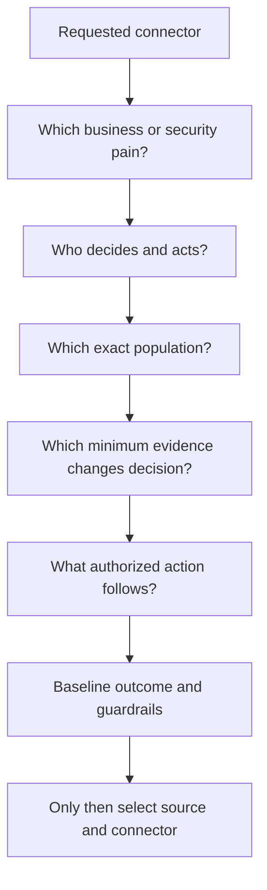

Use cases should be small enough to test. "Unified security" is too broad for first acceptance. A bounded first use might be active production server inventory and endpoint-control coverage for one business service. After evidence and operating ownership are stable, expand.

## Discovery workshop and question sequence

Discovery should involve business, security, data, tool, identity, network, privacy, procurement, and workflow owners as needed. One person rarely knows source semantics, credentials, contractual rights, technical dependencies, and business decisions.

| Discovery area | Questions | Output |
|---|---|---|
| Outcome | What decision/action changes? What is baseline? | Use-case charter |
| Population | Which tenant, accounts, regions, entity types, environments? | Scope statement |
| Sources | Which systems observe or govern needed facts? | Source landscape |
| Authority | Which source can assert which field for this use/time? | Authority matrix |
| Data | Which entities, grain, keys, fields, relationships, clocks? | Requirements model |
| Direction | Which facts come in; which actions go out? | Flow map |
| Access | Which identity, scope, approval, secret lifecycle? | Access plan |
| Service | What volume, rate, history, frequency, latency, limits? | Capacity profile |
| Dependencies | Which network, API, storage, people, licenses, changes? | Dependency register |
| Controls | Which privacy, security, retention, audit, residency rules? | Control checklist |
| Operations | Who monitors, responds, changes, and retires? | Runbook/RACI |
| Acceptance | What technical, data, workflow, and value tests pass? | Acceptance plan |

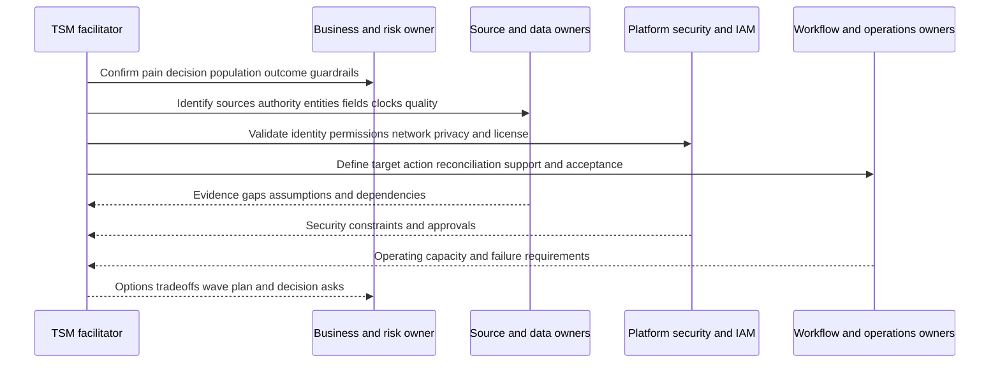

## Source and tool inventory

Inventory both candidate sources and current manual substitutes. A spreadsheet assembled by an analyst may be operationally important even if it is not an authoritative system. Identify upstream systems too: a CMDB owner field may originate in HR or service management and be copied through several steps.

| Inventory field | Purpose | Example question |
|---|---|---|
| System and product | Identifies integration boundary | Which exact service and version? |
| Business owner | Owns outcome and funding | Who accepts business impact? |
| Technical owner | Operates source | Who can diagnose API behavior? |
| Data steward | Owns definitions/quality | Who explains `status`? |
| Tenant/account/region | Defines scope | Which subscriptions are included? |
| Entity types | Shows what source describes | Users, assets, apps, findings, tickets? |
| Authority by field | Resolves conflicts | Is it authoritative for owner or only observed? |
| Grain/key/time | Enables modeling | One row/event equals what and when? |
| Interface options | Identifies extraction/action paths | API, webhook, file, export, object store? |
| Access model | Shapes identity and approvals | Service principal, role, certificate? |
| Volume/history | Shapes plan and cost | Records/day, object size, years? |
| Change process | Protects contract | How are schema/API changes announced? |
| Current consumer | Reveals dependency | Which reports/workflows already rely on it? |
| Support boundary | Sets escalation route | Customer, vendor, partner, internal team? |
| Lifecycle | Prevents stale integration | Pilot, production, replacement, retirement? |

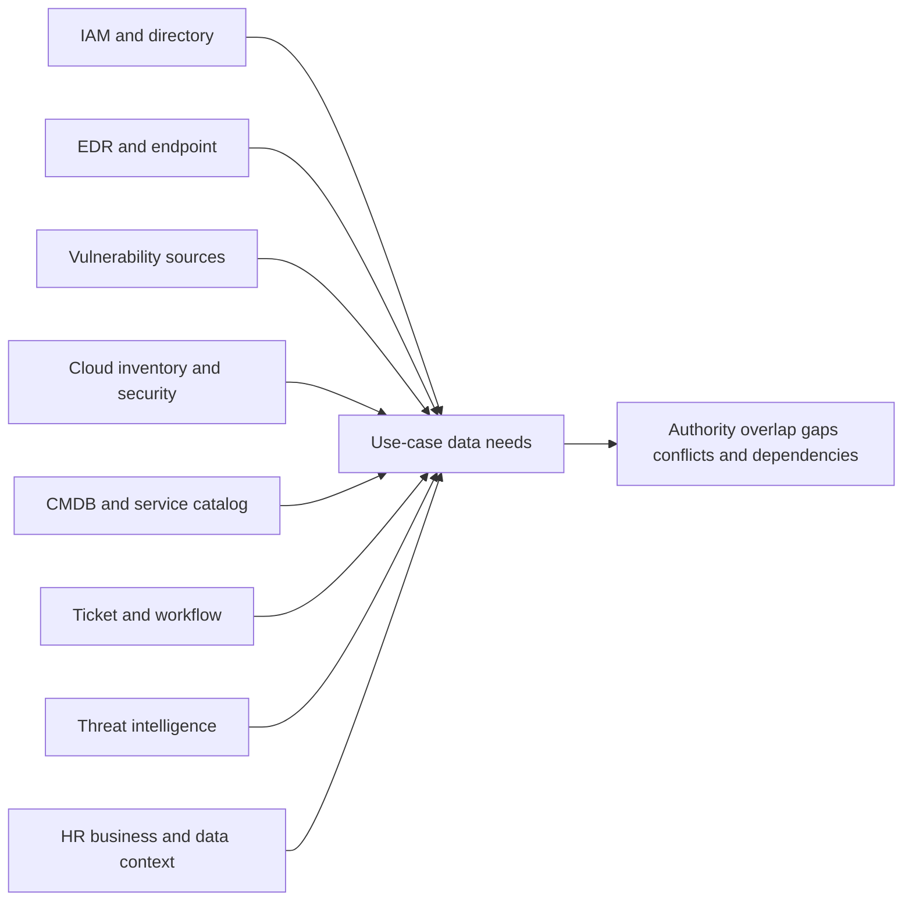

Do not ask only which products exist. Ask which accounts are deployed, what populations are excluded, whether the source is healthy, how long history exists, what contractual rights allow extraction, and whether the customer can create a least-privilege machine identity.

## Owners, authority, and conflict policy

Ownership has several meanings. A source business owner can fund and accept risk. A technical owner operates the tool. A data owner authorizes use. A steward defines fields and quality. A risk owner accepts residual risk. A workflow owner manages target operations. Record all relevant roles.

| Fact needed | Candidate sources | Authority question | Synthetic NMH policy |
|---|---|---|---|
| Employment status | Directory, HR | Which source governs employment and effective time? | HR authoritative; directory is access observation |
| Device management | MDM, EDR, CMDB | Managed by which control and at what time? | MDM authority for enrollment; EDR for sensor state |
| Asset owner | CMDB, cloud tags, directory | Technical, service, or financial owner? | Service owner from approved catalog; cloud tag is candidate |
| Vulnerability state | Scanner, ticket | Observed finding versus workflow status? | Scanner validates technical state; ticket tracks work |
| Internet exposure | EASM, cloud/network | Observed, configured, or inferred? | Keep evidence types separate |
| Business criticality | CMDB, business catalog | Who approves tier and effective period? | Business service owner plus governance approval |
| Control effectiveness | EDR/MDM/control tests | Installed, healthy, configured, or tested? | Separate fields; test evidence strongest for effectiveness |
| Remediation acceptance | Ticket, scanner, risk register | Completion, technical closure, or risk acceptance? | Preserve three separate states |

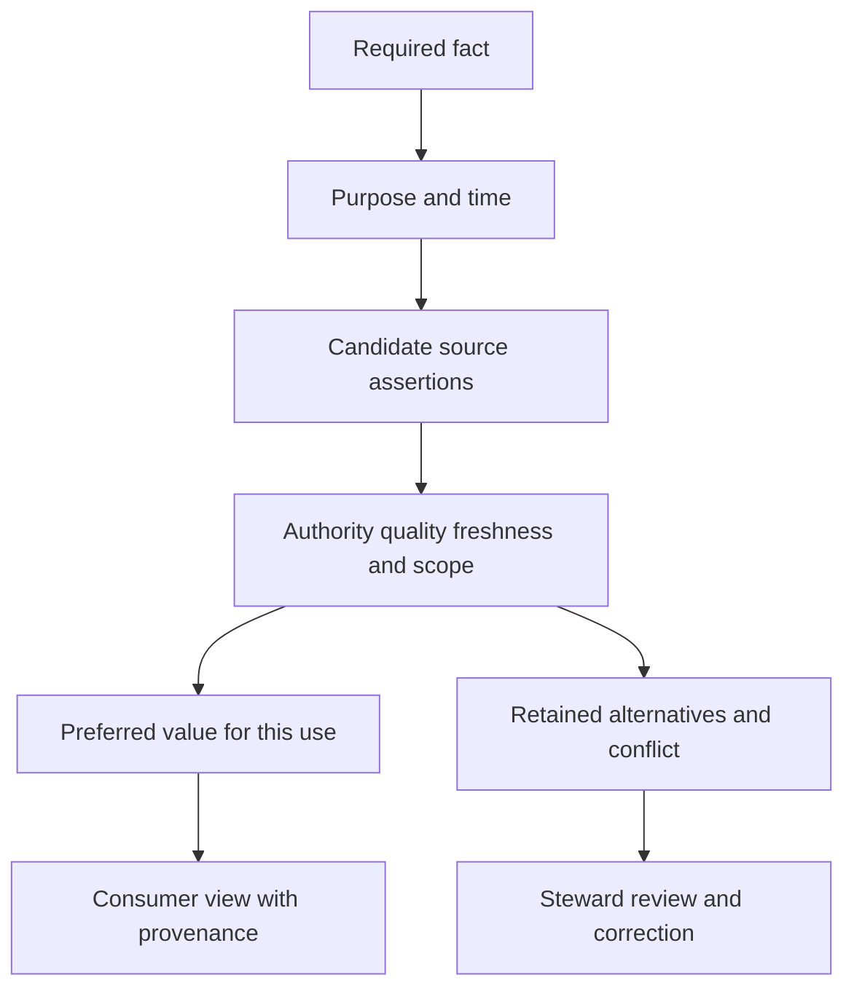

Authority is not global. HR may be authoritative for employment status but not current privileged access. The scanner may be authoritative for its observation but not whether a ticket was completed. The CMDB may be preferred for service ownership but not real-time endpoint health. Write field-level, purpose-specific, time-aware rules.

### Plain-English deep-dive 2 - Source of record and source of truth are questions, not labels

A passport office can certify a passport number, while an airline certifies whether a passenger checked in. Calling one system "the source of truth" for the whole traveler would be meaningless. Each authority covers a particular fact, purpose, scope, and time.

During connector discovery, replace "Which system is authoritative?" with "Which system is authorized and reliable to assert this exact field for this use and effective period?" Also decide how conflicts are displayed, who corrects them, and whether downstream actions pause. This prevents a convenient but stale system from silently overwriting stronger evidence.

## Entities, fields, relationships, and grain

The use case determines the minimum model. For payroll exposure, NMH may need assets, applications, business services, findings, vulnerabilities, controls, owners, tickets, and source assertions. Each entity needs grain, scoped identifiers, lifecycle, and required attributes. Relationships need type, direction, cardinality, time, and provenance.

| Entity | Grain | Candidate identifier evidence | Required fields for use | Key relationship |
|---|---|---|---|---|
| Asset | One governed asset lifecycle | Cloud ID, agent ID, serial/manufacturer | Type, environment, status, last observed | hosts application |
| Application | One deployed logical app/service component | App registry ID | Name, environment, owner | supports business service |
| Business service | One approved service definition | Catalog service ID | Tier, owner, criticality version | depends on application |
| Finding | One source finding occurrence on target | Source finding ID plus scope | Status, severity, observed times | affects asset |
| Vulnerability | One weakness definition/version | CVE or source definition ID | Identifier, description, source | described by finding |
| Control observation | One control assertion for entity/time | Source observation ID | Control type, state, health, time | protects asset |
| Person/owner | One directory/HR identity lifecycle | Tenant object ID, employee ID | Status, role, organization | accountable for service |
| Ticket | One target workflow item | Project plus ticket key | State, assignee, dates, result | addresses finding |

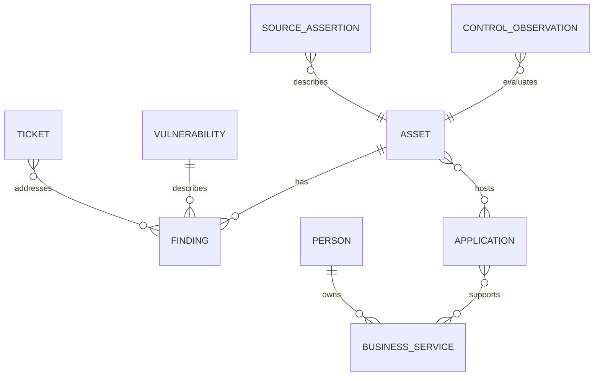

Avoid collecting a field because it exists. For every field ask which decision it changes, whether it is sensitive, whether a less granular form suffices, and how missing/stale values behave. Minimize at extraction where practical; do not ingest sensitive free text merely because an API returns it.

## Inbound, outbound, and bidirectional paths

Inbound and outbound are separate trust boundaries. An inbound connector may only read data. An outbound workflow may create or update records and therefore needs write authority, idempotency, approval, and reconciliation. A product listed in a catalog may have multiple integrations with different directions and object types.

| Flow | Example | Permission posture | Main failure | Required reconciliation |
|---|---|---|---|---|
| Inbound read | Retrieve asset inventory | Read only for approved scope | Missing/duplicate/stale data | Counts, watermarks, deletes |
| Inbound push | Receive signed event/webhook | Verify sender and replay | Forged/duplicate/out-of-order event | Event IDs and source state |
| Outbound create | Open remediation ticket | Create only in target project/type | Duplicate or wrong ticket | Idempotency key and target search |
| Outbound update | Update ticket or CMDB field | Narrow field/resource update | Overwrite stronger data | Read-before/write or version conflict |
| Outbound notification | Send approved message | Approved destination/channel | Data disclosure or alert flood | Delivery and suppression state |
| Bidirectional | Read ticket state after creating ticket | Separate read and write identities if needed | Feedback loop confusion | Map target ID to source action |

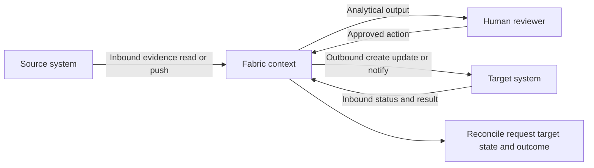

If the same credential can read broad source data and write high-impact actions, consider separation of duties and blast radius. Exact support depends on product and source capabilities, but the planning requirement remains: document every permission by direction and object.

## Integration method selection: pre-built, API, file, and webhook

Choose from verified options. A pre-built connector may reduce implementation work and receive vendor maintenance, but it still requires source configuration, permissions, mapping, health monitoring, and change ownership. A custom API path offers control but creates lifecycle responsibility. Files can simplify batch history but add manifest and transfer controls. Webhooks can reduce delay but require a public or brokered receiver, signature/replay controls, and recovery for missed events.

| Option | Strong fit | Benefits | Tradeoffs and risks | Discovery evidence |
|---|---|---|---|---|
| Verified pre-built connector | Supported source/use aligns | Faster starting point, maintained integration | License, scope, fields, direction, behavior vary | Current connector-specific docs and tenant UI |
| Custom API pull | Source API offers required data/query | Controlled cadence, pagination, filters | Auth, rate limits, changes, state, maintenance | API contract, test responses, quotas |
| Custom API push/action | Target API supports bounded actions | Direct operationalization | Side effects, idempotency, authorization | Sandbox, action contract, rollback |
| File/object batch | Large history or scheduled export | Simple decoupling, replayable object | Delay, partial files, schema drift, storage custody | Sample files, manifest, transfer design |
| Webhook/event push | Timely source events available | Lower polling and event latency | Replay, loss, disorder, receiver availability | Signing docs, retry policy, event IDs |
| Manual controlled import | Small pilot or rare source | Fast learning, human review | Not scalable; handling and repeatability risk | Approved procedure and acceptance limits |

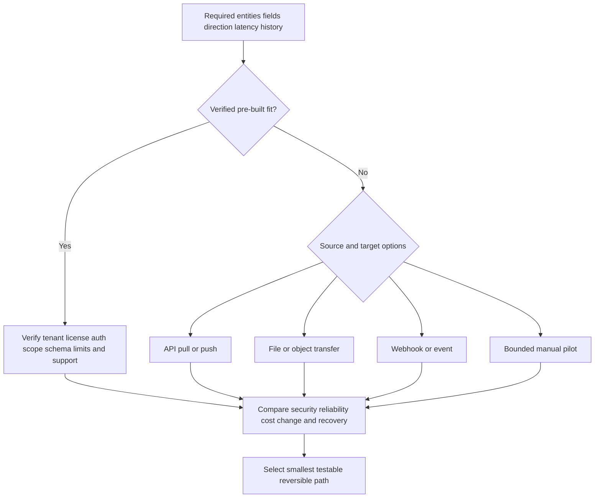

Method choice may be hybrid. A source can use a file for two years of history, then API increments. A webhook can signal that data changed while an API retrieves canonical records. Do not invent this behavior for a connector; use it as a general design option when supported by current contracts.

## Authentication, permissions, and secrets

Authentication proves the integration identity; authorization limits what it can read or do. Prefer dedicated nonhuman identities, least privilege, scoped resources, approved credential storage, short or managed lifetimes where supported, rotation, revocation, audit, and ownership. Exact options depend on both systems.

| Access item | Planning question | Acceptance evidence | Failure risk |
|---|---|---|---|
| Identity | Dedicated machine/service identity or shared human? | Named owner and inventory record | Employee departure breaks flow |
| Authentication | OAuth client, API key, certificate, signed request, other? | Current documented method and test | Weak/unsupported mechanism |
| Permission | Exact read/write objects, fields, tenants, actions? | Positive and negative access tests | Excess privilege or missing data |
| Consent/approval | Who authorizes source and target access? | Recorded approval and scope | Unauthorized processing |
| Secret storage | Where is material protected? | Secret reference, no plaintext | Credential disclosure |
| Rotation | Can old/new overlap? Who rotates? | Runbook and rehearsal | Outage during change |
| Revocation | How is access stopped quickly? | Tested disable/revoke path | Continued access after retirement |
| Audit | Which calls/actions are logged? | Source/target audit sample | Cannot reconstruct activity |
| Environment | Separate dev/test/prod identities? | Isolation evidence | Test writes affect production |

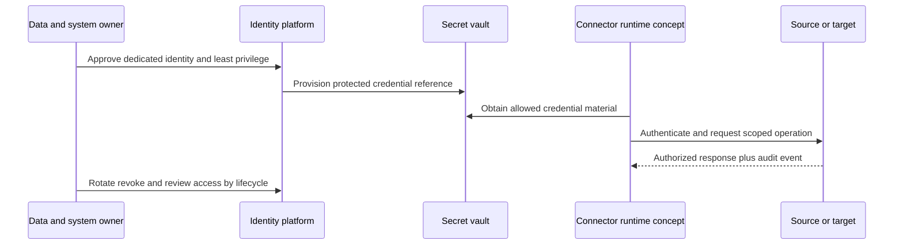

Never put tokens, cookies, private keys, signed URLs, or full authorization headers into screenshots, tickets, chat, code, or lab documentation. Redact evidence while preserving nonsecret metadata such as timestamp, credential identifier, scope name, response class, and correlation ID.

### Plain-English deep-dive 3 - Read and write are different risk decisions

Giving a courier permission to inspect a warehouse manifest is different from giving the courier permission to change the inventory system. Inbound read access can still expose sensitive data, but outbound write access can also change business state. "The integration needs access" is not a sufficient permission statement.

List each operation: read assets in accounts A and B, read selected fields, create tickets in project X, update only integration-owned fields, and read resulting ticket state. Test that allowed operations succeed and forbidden tenants, fields, projects, and actions fail. Separate identities or approval gates when consequence warrants it.

## Volume, frequency, history, and latency

Planning needs measured or bounded estimates. Record count alone is insufficient: payload size, page size, attachment/file compression, cardinality, update churn, delete volume, and target action rates matter. Distinguish source event time, source availability time, extraction time, receipt time, acceptance time, publication time, and consumer time.

| Dimension | Question | Synthetic NMH estimate | Validation method |
|---|---|---|---|
| Current population | How many in-scope entities/records? | 85,000 assets | Source count by account |
| Daily change | Inserts, updates, deletes? | 6% asset updates/day | Seven-day profile |
| Finding volume | Open and daily changes? | 1.2 million open, 40,000 changes/day | API/file sample and totals |
| Payload size | Average/p95/max bytes? | 2 KB average record | Measured samples |
| Frequency | Poll/export/event cadence? | Hourly asset increments | Use-case latency decision |
| History | Initial period and legal retention? | 13 months for trend, synthetic | Owner/privacy approval |
| Backfill | How loaded without overwhelming source? | Monthly bounded windows | Rate/capacity test |
| Required latency | How old may accepted data be? | 4 hours for owner context | Decision consequence |
| Source limits | Requests, pages, rows, concurrency? | Unknown until docs/test | Current API contract |
| Growth | Expected asset/source expansion? | 20% annual scenario | Capacity sensitivity |

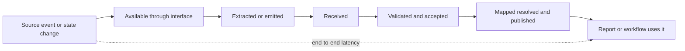

If the use case needs a daily executive posture trend, five-minute polling may add cost without value. If an approved operational workflow must react within an hour, a daily file may be too slow. Latency is a business and risk requirement, not a prestige target.

## Historical loads, baselines, and deletions

History supports trend, baseline, lifecycle, and replay, but historical data can be expensive, sensitive, or semantically incompatible with current schemas. Determine whether the source can reproduce old state, only current snapshots, or immutable events. Decide how deletions, tombstones, disabled entities, and source retention behave.

| Historical concern | Planning question | Risk if ignored | Control |
|---|---|---|---|
| Availability | How far back does source retain? | False expectation of baseline | Confirm with source owner/test |
| Semantics | Did fields/definitions change? | Invalid longitudinal trend | Version-aware mapping |
| Identity | Were IDs reused/recreated? | Old and new entities merge | Effective-time identity rules |
| Deletion | Is absence a delete, filter, or failed extract? | Active asset removed incorrectly | Explicit delete/tombstone contract |
| Privacy | Is old personal/security data necessary? | Excess processing and exposure | Purpose and retention approval |
| Load impact | Can source and receiver handle backfill? | Production degradation | Bounded windows and rate plan |
| Restatement | Will corrected history change reports? | Trust loss from silent change | Version and restatement notice |

## Dependency mapping

Connector availability depends on more than two applications. Identity providers issue tokens. DNS, routing, proxies, TLS trust, firewalls, and service endpoints carry traffic. APIs and export jobs depend on source health. Storage paths depend on access policy and retention. Procurement and legal terms may govern data rights. Human owners approve and operate the path.

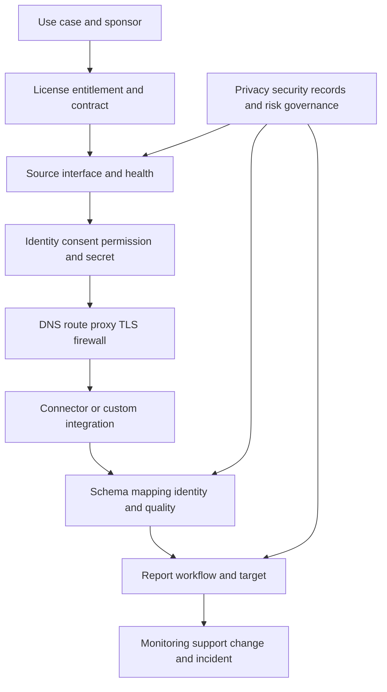

| Dependency | Owner | Readiness evidence | Fallback/response |
|---|---|---|---|
| License/entitlement | Procurement/product owner | Contract and tenant feature visibility | Re-scope or procure |
| Source API/export | Source owner | Enabled interface and sample | Alternative supported export |
| Identity/consent | IAM/data owner | Approved principal/scopes | Approval escalation, no shared user |
| Network path | Network/security | DNS/TCP/TLS/proxy test | Approved path correction |
| Secret service | Security/platform | Vault integration and rotation | Controlled manual rotation only if approved |
| Schema contract | Data steward | Samples, definitions, version | Hold mapping until clarified |
| Target project/API | Workflow owner | Sandbox and permission tests | Manual reviewed pilot |
| Monitoring/on-call | Operations | Alerts, dashboard, runbook, rota | Do not promote to production |
| Privacy/retention | Privacy/records | Approved purpose and schedule | Minimize, mask, or exclude fields |
| Vendor support | Product owner/TSM | Current support path and evidence needs | Document escalation route |

Dependencies should form a graph, not a checklist hidden in meeting notes. Mark critical path, owner, due date, evidence, and status. One missing approver can block a technically complete design.

## Data contract

A data contract is a testable agreement between producer, integration, platform, and consumers. It describes meaning and operating behavior. It may not be a legal contract, but it should align with legal, security, privacy, and commercial obligations.

| Contract area | Required content | Example test |
|---|---|---|
| Purpose/scope | Use case, tenant, accounts, populations, exclusions | Out-of-scope account absent |
| Direction/interface | Inbound/outbound, API/file/webhook, version | Expected endpoint/path used |
| Identity/access | Principal, permissions, consent, secret lifecycle | Forbidden operation denied |
| Entity/grain/key | One record/event, identifiers, uniqueness | Duplicate key fixture handled |
| Fields/semantics | Definition, type, unit, enum, null, sensitivity | Unknown enum quarantined |
| Relationships | Type, direction, cardinality, effective time | Orphan/invalid relation rejected |
| Time | Event/update/extract clocks, timezone, windows | Offset and boundary fixtures pass |
| Delivery | Full/incremental, order, pages, deletes, retries | Missing page prevents acceptance |
| Service | Frequency, latency, limits, maintenance | Freshness alert fires |
| Quality | Completeness, validity, uniqueness, reconciliation | Source count within accepted tolerance |
| Security/privacy | Encryption, minimization, access, retention, residency | Sensitive field access denied |
| Errors/recovery | Reject/quarantine, replay, backfill, escalation | Corrected batch replayed once |
| Change | Notice, versions, compatibility, testing, rollback | New field/version contract test |
| Ownership | RACI, support, review, retirement | Contact and escalation drill |

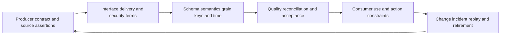

### Plain-English deep-dive 4 - A schema is not the whole contract

A shipping form can define boxes for item number, weight, and destination. It does not say how often trucks arrive, whether a missing truck is retried, who may open a container, whether an empty weight is valid, how returns work, or who pays when the route changes. A JSON schema or table definition is similarly incomplete.

Connector plans need structural schema plus semantic definitions, scope, identity, delivery, completeness, clocks, deletes, security, recovery, change, and ownership. A payload can validate perfectly while containing the wrong tenant, stale snapshot, duplicate pages, misunderstood severity, or unauthorized personal data.

## Readiness assessment

Readiness should be evidence-based, not a meeting vote. A source can be technically accessible but not semantically ready. A workflow can be functionally possible but operationally unsupported. Use red, amber, green only with criteria and blockers.

| Readiness domain | Green evidence | Amber example | Red example |
|---|---|---|---|
| Use case/value | Sponsor, decision, baseline, action, metric agreed | Metric owner pending | No decision or owner |
| Source | In-scope interface enabled and healthy | History uncertain | Source replacement underway |
| Authority/semantics | Field owners and definitions approved | Two owner sources unresolved | Key state undefined |
| Identity/access | Dedicated least-privilege identity approved | Consent scheduled | Shared admin credential proposed |
| Security/privacy | Classification, minimization, retention approved | DPIA/review in progress | Prohibited data scope |
| Network | Supported path tested | Proxy exception pending | No approved connectivity |
| Capacity | Profile, limits, backfill plan tested | Growth estimate weak | Source cannot support load |
| Mapping/quality | Representative fixtures and thresholds approved | Unknown enum backlog | No stable identifier |
| Operations | Monitoring, on-call, runbook, change process ready | After-hours owner pending | Nobody operates connector |
| Target workflow | Sandbox, idempotency, authority, reconciliation ready | Manual approval only | Uncontrolled write action |
| Commercial/support | Entitlement and escalation route verified | Quote/change pending | Capability not licensed/supported |

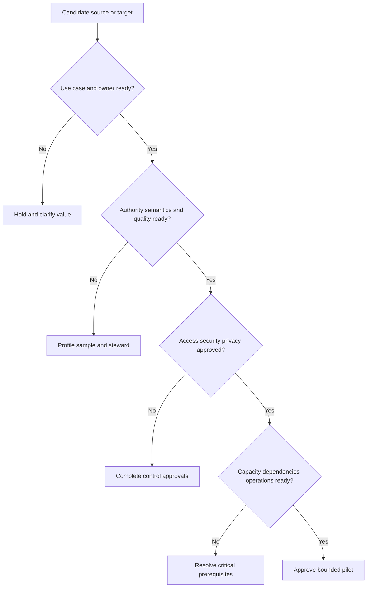

Do not average readiness scores into a false green. One red safety or authority gate can block promotion even when nine domains are green. Track evidence, owner, due date, and decision authority for each gate.

## Onboarding order and wave planning

Sequence sources to create learning and value while controlling risk. Start with a bounded use case, stable sources, clear owners, strong identifiers, and read-only flows. Add enrichment after the core entity population is trustworthy. Add outbound actions only after identity, mapping, ownership, and human review prove reliable.

| Sequencing factor | Earlier when | Later when |
|---|---|---|
| Use-case value | Directly supports first decision | Nice-to-have context |
| Dependency | Foundational identity/entity source | Depends on unresolved model |
| Authority | Clear field authority | Conflicting/undefined semantics |
| Data quality | Stable keys and samples | High unknown/duplicate rate |
| Security | Least privilege and review complete | Sensitive scope unresolved |
| Technical readiness | Supported interface and tested path | API/export unavailable |
| Reversibility | Read-only and easy to remove | High-impact write action |
| Learning | Tests important assumption cheaply | Large irreversible commitment |
| Cost | Bounded pilot cost | Large custom build before value proof |

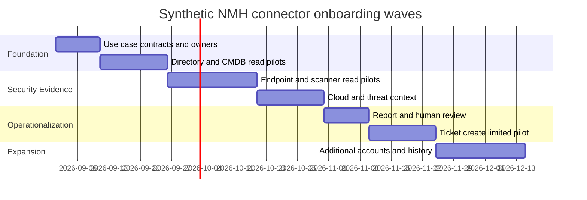

Wave 0 is planning and test fixtures. Wave 1 establishes core identities and ownership. Wave 2 adds findings and context. Wave 3 proves analytics and human decisions. Wave 4 introduces bounded outbound action. Actual dates, products, and ordering are synthetic; production sequencing follows verified dependencies.

## Acceptance criteria

Acceptance is multidimensional. A connector that authenticates is not accepted if it retrieves the wrong population. A perfectly reconciled read path does not prove a write workflow is safe. Define evidence and sign-off for each layer.

| Acceptance domain | Example criterion | Evidence | Sign-off |
|---|---|---|---|
| Functional | Approved objects/fields retrieved | Positive test | Technical owner |
| Negative access | Out-of-scope tenant/action denied | Negative test | Security/IAM |
| Completeness | Counts/windows/pages reconcile | Acceptance report | Source/data owner |
| Semantics | Required fields map under approved definitions | Known-answer fixtures | Data steward |
| Identity | Match/duplicate error within accepted lab threshold | Labeled sample | Entity owner |
| Freshness | Accepted watermark meets use-case target | Monitoring history | Service owner |
| Reliability | Retry/replay/partial failure tests pass | Failure-injection report | Operations |
| Security/privacy | Secrets, minimization, access, audit, retention validated | Control evidence | Security/privacy |
| Workflow | Idempotency, approval, target reconciliation, rollback pass | Sandbox test | Workflow owner |
| Performance/cost | Bounded load and cost fit approved envelope | Profile and estimate | Platform/procurement |
| Support | Alerts, runbook, ownership, escalation tested | Game day | Operations/TSM |
| Business value | Decision and action improve against baseline without guardrail breach | Pilot review | Sponsor/risk owner |

```mermaid
flowchart LR
    CONFIG[Configuration complete] --> TECH[Functional and negative tests]
    TECH --> DATA[Completeness semantics identity quality]
    DATA --> REL[Reliability freshness recovery]
    REL --> SEC[Security privacy audit retention]
    SEC --> FLOW[Workflow idempotency and reconciliation]
    FLOW --> VALUE[User decision and value pilot]
    VALUE --> SIGN[Named acceptance and operating handoff]
```

Acceptance thresholds must reflect use and consequence. A report-only pilot can tolerate a visible review queue that an automated containment workflow cannot. Never reuse a synthetic threshold as production policy.

## RACI and operating ownership

RACI means Responsible does the work, Accountable owns the result and approves, Consulted provides two-way input, and Informed receives status. Ideally one accountable role exists per decision. RACI does not replace a runbook or staffing.

| Activity | TSM | Business/risk owner | Source owner | IAM/security | Data steward | Platform/connector ops | Workflow owner |
|---|---|---|---|---|---|---|---|
| Define use case | R | A | C | C | C | C | C |
| Approve source purpose/scope | C | A | R | C | C | I | I |
| Define fields/authority | C | C | R | C | A | C | C |
| Approve identity/permissions | I | C | C | A/R | I | C | C |
| Configure/test integration | C | I | C | C | C | A/R | C |
| Accept data quality | C | C | R | I | A | R | I |
| Approve outbound action | C | A | I | C | C | C | R |
| Monitor/respond | C | I | C | C | C | A/R | R |
| Approve schema/change | C | I | R | C | A | R | C |
| Review value | R | A | C | I | C | C | C |
| Suspend/retire | C | A | R | R | C | R | R |

The table is a synthetic starting point. Actual accountability depends on NMH governance and Zscaler/customer responsibilities. A TSM facilitates, tracks, communicates, and escalates; the TSM should not silently become the source administrator, privacy authority, or customer risk acceptor.

## Risk and cost planning

Connector cost includes implementation, licensing, source API consumption, egress/storage, identity/security work, mapping, testing, monitoring, incident response, support, change, and retirement. Opportunity cost includes analyst time and delayed value. Failure cost includes wrong decisions, disclosure, duplicated workflows, and trust loss.

| Cost/risk category | Example | Estimation evidence | Mitigation |
|---|---|---|---|
| License | Connector/product/source API entitlement | Current contract/quote | Verify before design commitment |
| Build | Custom integration and mapping effort | Work breakdown and specialists | Prefer verified fit and bounded pilot |
| Run | Requests, compute, storage, egress, support | Measured profile and rates | Right-size cadence/history |
| Change | API/schema/source upgrade maintenance | Change history and roadmap | Contract tests and version ownership |
| Security | Secret, access, audit, incident controls | Security review | Dedicated identity and automation |
| Privacy | Assessment, minimization, requests, retention | Data inventory and policy | Exclude unnecessary fields |
| Quality | Steward review and remediation | Profiling and exception forecast | Improve source/contract first |
| Workflow | Target licenses, queue, duplicate cleanup | Pilot action rate | Approval/idempotency/reconciliation |
| Dependency | Identity/network/vendor outage | Dependency SLO/history | Runbook, freshness, fallback |
| Lock-in | Proprietary fields/workflows | Exit and portability review | Preserve raw contracts and mappings |
| Failure impact | Wrong owner/score/action | Scenario analysis | Canary, pause, rollback, human gate |
| Retirement | Revoke, delete, archive, consumer migration | Lifecycle plan | Fund exit from start |

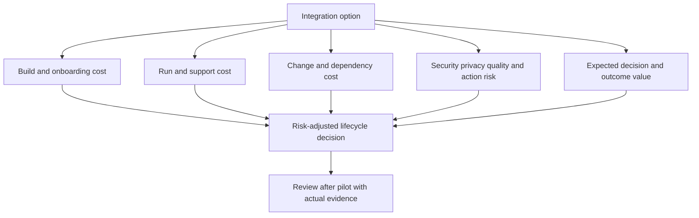

Do not claim return on investment before measuring. Write a value hypothesis with assumptions, baseline, target, costs, guardrails, and review date. Report observed improvement and uncertainty separately from attributed savings.

## Planning failure modes

| Planning failure | Why it happens | Downstream symptom | Prevention |
|---|---|---|---|
| Connector-first design | Catalog drives scope | Data arrives without user/action | Use-case charter gate |
| Tool inventory only | Accounts/populations omitted | Partial coverage surprises | Tenant/account/scope inventory |
| One global authority | Convenience | Wrong fields overwrite evidence | Field/purpose/time authority matrix |
| Field hoarding | "May need later" | Cost, privacy, semantic noise | Minimum necessary field justification |
| Direction ambiguity | "Integrated" sounds complete | Read exists but action assumed | Per-object inbound/outbound map |
| Catalog overclaim | Listing treated as guarantee | License/auth/schema blocker late | Connector-specific verification |
| Shared human credential | Fast setup | Rotation, audit, departure failure | Dedicated managed identity |
| No negative access test | Success-only testing | Excess privilege hidden | Forbidden scope/action tests |
| Average-volume estimate | Peaks/history ignored | Throttling and long backfill | p95/max and backfill profile |
| Latency not tied to use | "Real time" aspiration | Cost or stale decisions | Decision-consequence target |
| Hidden dependencies | Focus on application pair | DNS/proxy/IAM/approval blocks | Dependency graph and owners |
| Schema-only contract | Structure mistaken for behavior | Complete valid but wrong data | Full semantic/operational contract |
| Readiness averaging | Red gate hidden by green total | Unsafe pilot | Mandatory blockers |
| Big-bang onboarding | Desire for fast coverage | Hard attribution and blast radius | Waves and canaries |
| Technical-only acceptance | Authentication equals done | Wrong data or unsafe actions | Layered acceptance and value sign-off |
| RACI without staffing | Roles named but unavailable | Alerts and changes age | Capacity/on-call evidence |
| Cost excludes change | Build estimate only | Unsustainable maintenance | Lifecycle TCO |

## Connector-planning troubleshooting tree

The planning fault tree asks why onboarding cannot proceed or why the design cannot be accepted. It stops configuration work when a fundamental use, authority, security, or operating gap exists.

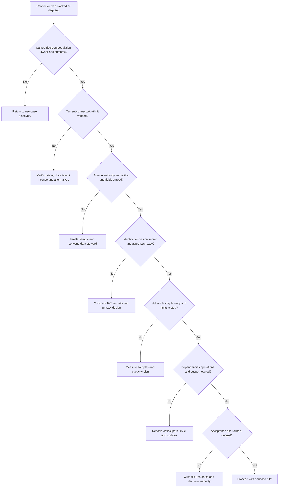

| Evidence for escalation | Contents | Sensitive handling |
|---|---|---|
| Use-case summary | Decision, population, action, outcome, blocker | Avoid unnecessary business secrets |
| Product evidence | Current URL/doc/version/tenant screenshot | Redact tenant and identifiers |
| Source evidence | Product/version/account/interface/sample metadata | Minimize payload content |
| Access matrix | Identity type, scopes, approval, negative test | Never include secret material |
| Capacity profile | Counts, bytes, cadence, history, limits | Aggregate where possible |
| Contract gap | Exact undefined field/behavior | Use sanitized fixture |
| Dependency chain | Owner, status, due date, impact | Restrict internal architecture |
| Options | Verified alternatives and tradeoffs | Mark assumptions |
| Decision ask | Named authority and deadline | Record approval |

## Complete synthetic NMH source and connector plan

NMH's first use case is to prioritize and route validated payroll-service exposures. The minimum initial sources are directory identity, CMDB/service catalog, endpoint inventory/control state, vulnerability findings, and ticket workflow. Cloud inventory and threat context are later enrichment waves. All names, counts, dates, and decisions are fictional.

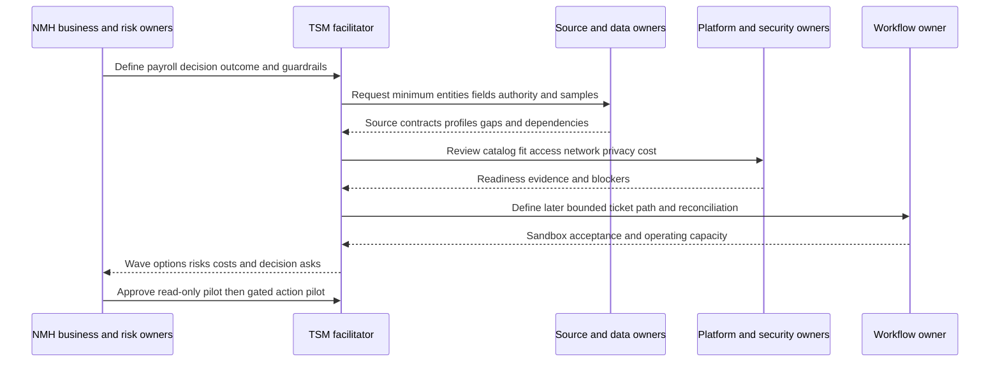

| NMH source | Use | Direction/method assumption | Authority | Initial wave | Acceptance emphasis |
|---|---|---|---|---|---|
| Directory | Active person IDs and org context | Inbound verified option required | Identity status in tenant | 1 | Scope and effective status |
| CMDB/service catalog | Service, owner, criticality | Inbound verified option required | Approved service relationships | 1 | Freshness/conflict rate |
| Endpoint platform | Asset and control observations | Inbound verified option required | Sensor/enrollment observation | 2 | Asset scope and health semantics |
| Vulnerability source | Findings and source severity | Inbound verified option required | Source finding observation | 2 | Count, keys, times, deletes |
| Cloud inventory | Cloud IDs and exposure context | Inbound verified option required | Cloud resource state | 3 | Account coverage and lifecycle |
| Threat source | Exploit/threat context | Inbound verified option required | Its published observation | 3 | Confidence and expiry |
| Ticket system | Create/read remediation work | Outbound then inbound status | Workflow state only | 4 | Idempotency and reconciliation |

The synthetic wave-1 exit criteria are: approved purpose, five named owners, dedicated identities, read-only scopes, current product fit verified, samples profiled, entity and field definitions approved, 95% of in-scope records reconciled under an invented lab threshold, unknowns visible, and no unresolved critical security/privacy gate. The 95% is not a production recommendation. NMH owners would set real thresholds from risk and observed quality.

The plan deliberately postpones ticket creation. Reports and human review first expose wrong owners, false entity links, and missing context without writing external state. After quality and operating capacity meet agreed criteria, a small action pilot uses one target project, one ticket type, explicit approvals, idempotency keys, and independent closure validation.

## Synthetic exercises with answers

### Exercise 1 - Use case first

A customer asks to connect every security tool. What is the first response?

**Answer:** Ask which decisions, actions, populations, and outcomes need improvement. Inventory all tools, but prioritize the minimum sources for a bounded use case. Connecting everything without purpose increases cost, access, semantic conflict, and operating burden.

### Exercise 2 - 150+ connectors

Can you promise that a customer's product is supported because the page says 150+?

**Answer:** No. Verify the current catalog entry and connector-specific documentation, source version, tenant, license, direction, objects, fields, authentication, limits, and support. The count is a time-sensitive portfolio statement.

### Exercise 3 - Authority

CMDB and cloud tags disagree on owner. Which wins?

**Answer:** Define the owner role and use, then compare approved authority, freshness, scope, and effective time. Preserve conflict and provenance. A steward may choose a preferred source for that field while retaining the other assertion.

### Exercise 4 - Minimum data

The source API returns employee home address but the use case needs department. Ingest both?

**Answer:** No by default. Apply purpose limitation and minimization. Request only fields necessary for the approved decision, subject to source interface capability and privacy review.

### Exercise 5 - Direction

A connector can read tickets. Can it create them?

**Answer:** Not inferred. Read and write are separate capabilities and permission decisions. Verify current documentation and tenant behavior, then design outbound authority and reconciliation separately.

### Exercise 6 - Method

Is a webhook always better than hourly API polling?

**Answer:** No. Compare source support, required latency, event completeness, signature/replay behavior, receiver availability, API recovery, cost, and operations. Webhook plus API reconciliation may be appropriate only if both contracts support it.

### Exercise 7 - Volume

Average daily volume fits the quota. Is capacity proven?

**Answer:** No. Test peaks, page/record size, history/backfill, update churn, retries, concurrency, other consumers, and growth. Validate current source limits and the end-to-end acceptance rate.

### Exercise 8 - Readiness

Nine readiness domains are green and privacy is red. Proceed?

**Answer:** No. Mandatory control gates are not averaged. Resolve or formally re-scope the prohibited data before a pilot.

### Exercise 9 - Onboarding order

Should NMH configure outbound ticket creation before asset identity is reliable?

**Answer:** No. Prove read-only source scope, semantics, entity resolution, ownership, and human review first. Action automation magnifies false links and wrong owners.

### Exercise 10 - Acceptance

Authentication succeeds and records appear. Is the connector accepted?

**Answer:** Not yet. Validate negative access, completeness, semantics, identity, freshness, reliability, recovery, security/privacy, workflow behavior, cost, support, and business use.

### Exercise 11 - RACI

Can the TSM be accountable for customer data authority?

**Answer:** The TSM can facilitate and track, but customer data owners and risk authorities should own their definitions, access, and acceptance. Actual responsibilities must be agreed; the TSM should not silently assume customer governance authority.

### Exercise 12 - Value

The pilot reduced analyst preparation time. Can you claim risk reduction?

**Answer:** You can report the observed process improvement under a defined baseline. Risk reduction requires evidence that exposure or controls changed, plus cautious attribution. Keep efficiency, decision quality, and security outcome metrics separate.

## Labs and rehearsal

### Lab 1 - Use-case charter

Write sponsor, user, problem, decision, population, action, outcome, baseline, guardrails, assumptions, and review date for three NMH use cases. Reject one vague use case and explain why.

### Lab 2 - Source landscape

Inventory ten fictional sources with owners, tenant/account, entities, authority, interface, volume, history, sensitivity, support, and lifecycle. Include one manual spreadsheet and trace its upstream origin.

### Lab 3 - Authority workshop

For owner, status, criticality, control health, exposure, vulnerability state, and remediation state, compare source claims and write purpose/time-specific precedence and conflict policies.

### Lab 4 - Data requirements model

Define entities, grain, identifiers, required/optional fields, relationships, clocks, unknown states, and minimum-sensitive-data decisions. Draw an ER diagram and three counterexamples.

### Lab 5 - Catalog verification card

For five public catalog entries, record page/date/category only, then list every connector-specific fact still requiring verification. Practice refusing unsupported direction or authentication assumptions.

### Lab 6 - Method decision

Compare verified pre-built, API, file, webhook, and manual pilot paths for one synthetic source. Score use fit, security, reliability, latency, history, recovery, change, cost, and ownership. State uncertainty.

### Lab 7 - Access design

Create a dedicated identity and permission matrix with positive and negative tests, secret storage, rotation overlap, revocation, audit, environment isolation, and incident response. Include no real secrets.

### Lab 8 - Capacity worksheet

Estimate current counts, daily change, bytes, peaks, cadence, history, backfill windows, required latency, limits, retries, growth, storage, and API cost. Run low/base/high scenarios.

### Lab 9 - Dependency graph

Map licensing, source, identity, network, TLS/proxy, secret, mapping, target, monitoring, privacy, procurement, and support dependencies. Mark critical path and owner evidence.

### Lab 10 - Data contract

Write a complete contract including purpose, direction, access, grain, schema, semantics, time, delivery, limits, quality, security, errors, recovery, change, ownership, and retirement. Add known-answer and failure fixtures.

### Lab 11 - Readiness and waves

Score the NMH sources by mandatory gates. Build Wave 0 through Wave 4 using value, dependency, authority, quality, security, reversibility, learning, and cost. Explain why action comes after read-only trust.

### Lab 12 - Acceptance and RACI

Create a sign-off matrix for functional, negative access, data, entity, freshness, reliability, security, workflow, cost, support, and value acceptance. Assign one accountable role per decision and test escalation availability.

### Lab 13 - Risk and cost review

Build a three-year synthetic total-cost and risk register. Include build, run, change, incident, privacy, quality, lock-in, and retirement. Do not invent vendor prices; use labeled assumptions and ranges.

### Lab 14 - Discovery role-play

Run a 45-minute customer workshop. You facilitate, asks evidence-based questions, summarizes assumptions, identifies blockers, and ends with named decisions, owners, dates, and a bounded next step.

### Lab 15 - Planning escalation

Simulate a catalog listing whose tenant capability or source scope does not match expectations. Produce a redacted package with public evidence, current tenant observation, source version, use case, impact, tests, alternatives, and decision ask without declaring a product defect prematurely.

| Lab evidence | Completion standard |
|---|---|
| Use case | Decision/action/population/outcome before connector |
| Inventory | Systems, accounts, owners, authority, interfaces, lifecycle complete |
| Data | Entity/grain/field/relationship/time definitions testable |
| Product | 150+ and catalog statements have explicit currency caveat |
| Direction | Inbound and outbound operations separately authorized |
| Access | Least privilege, secret lifecycle, negative tests documented |
| Scale | Volume, peaks, history, latency, limits, growth evidenced |
| Contract | Semantics, delivery, quality, recovery, change, ownership covered |
| Readiness | Mandatory blockers cannot be averaged away |
| Wave | Small, dependency-aware, reversible, value-linked |
| Acceptance | Technical through business sign-off defined |
| Honesty | No connector-specific behavior or customer result invented |

## Common misconceptions to correct

| Misconception | Correct model |
|---|---|
| Start with the connector catalog | Start with decision, action, population, and outcome |
| More connectors mean more value | Trusted use and validated outcomes create value |
| 150+ means every tool | It is a time-sensitive public portfolio statement |
| Catalog listing proves availability | Verify license, tenant, source version, prerequisites, and support |
| Connector name proves direction | Inbound and outbound capabilities must be checked per integration |
| Inbound/outbound means every connector is bidirectional | Direction and object behavior vary |
| AnySource means no modeling work | Custom data still needs contract, semantics, quality, and governance |
| AnyTarget means any action is safe | Outbound actions need support, authority, controls, and reconciliation |
| Source owner is one person | Business, technical, data, steward, risk, and workflow roles differ |
| One source is authoritative for everything | Authority is field-, purpose-, scope-, and time-specific |
| Source of truth should erase conflicts | Preserve assertions, preferred value, conflict, and provenance |
| Every returned field should be ingested | Collect minimum necessary data for approved use |
| A field name defines meaning | Definitions, grain, units, enums, time, and source version matter |
| API is always more modern than files | Fit depends on history, latency, reliability, cost, and support |
| Webhook guarantees delivery | Retry, replay, loss, disorder, and reconciliation must be understood |
| Pre-built means zero implementation | Source config, access, mapping, tests, and operations remain |
| Shared admin credential is fastest | It creates excessive privilege, weak audit, and lifecycle risk |
| Authentication success proves correct scope | Authorization and negative tests are separate |
| Average volume proves capacity | Peaks, payload, history, retries, quotas, and growth matter |
| Lower latency is always better | Latency should match decision consequence and cost |
| Historical load is only more rows | Semantics, privacy, ID reuse, deletes, and source load differ |
| A two-system diagram contains all dependencies | IAM, network, license, storage, governance, support, and people matter |
| JSON Schema is a complete data contract | Delivery, semantics, quality, security, recovery, and change are also needed |
| Readiness can be averaged | One critical red gate can block a pilot |
| Big-bang onboarding is faster | It increases ambiguity and blast radius |
| Configure means complete | Acceptance spans access, data, reliability, workflow, support, and value |
| RACI means the work is staffed | Availability, skills, on-call, and runbooks need evidence |
| Build cost is total cost | Run, change, incident, privacy, quality, and retirement count |
| TSM owns all customer integration work | TSM coordinates; customer and product owners retain authority |
| Your API experience proves Zscaler setup experience | Transferable method is strong; direct product operation remains unclaimed |

## Official Source Anchors

Research/source date: **2026-08-24**.

Zscaler sources support only the public connector, format, extensibility, and product-relationship statements. General standards support API, identity, security, privacy, and provenance concepts. Current connector-specific documentation and observed tenant/source evidence are required for production decisions.

| Source | URL | Used for | Boundary |
|---|---|---|---|
| Zscaler Data Fabric for Security | https://www.zscaler.com/products-and-solutions/data-fabric | 150 pre-built inbound/outbound integration wording; formats; extensible/customizable source and workflow context | Count and wording change; no per-connector auth, direction, schema, limit, or guarantee |
| Zscaler Data Fabric Integrations | https://www.zscaler.com/products-and-solutions/data-fabric/integrations | Public 150+ pre-built connector catalog; broad categories; AnySource and AnyTarget concepts | Listing is discovery evidence, not tenant compatibility or capability proof |
| Zscaler Asset Exposure Management | https://www.zscaler.com/products-and-solutions/caasm | Public 150+ Data Fabric connector and asset-source context | No source completeness, matching, or workflow guarantee |
| Zscaler Unified Vulnerability Management | https://www.zscaler.com/products-and-solutions/vulnerability-management | Public 150+ data-source/connectors and contextual integration positioning | No exact source contract or score behavior inferred |
| RFC 9110 HTTP Semantics | https://www.rfc-editor.org/rfc/rfc9110 | HTTP method, status, representation, intermediary, and retry semantic context | API contract and product behavior remain specific |
| RFC 6585 Additional HTTP Status Codes | https://www.rfc-editor.org/rfc/rfc6585 | 429 Too Many Requests and Retry-After context | Does not define a source's quota or client strategy fully |
| RFC 6749 OAuth 2.0 | https://www.rfc-editor.org/rfc/rfc6749 | Authorization framework and client credential concepts | Current security best practices and source profiles also govern |
| NIST SP 800-53 Rev. 5 | https://csrc.nist.gov/pubs/sp/800/53/r5/upd1/final | Access, audit, configuration, identification, integrity, incident, privacy control context | Controls require tailoring and assessment |
| NIST Privacy Framework | https://www.nist.gov/privacy-framework | Purpose, processing, governance, and privacy-risk context | Voluntary framework; not legal advice |
| W3C PROV-O | https://www.w3.org/TR/prov-o/ | Provenance entities, activities, and agents | Vocabulary, not a connector implementation |
| JSON Schema 2020-12 Core | https://json-schema.org/draft/2020-12/json-schema-core | Schema vocabulary/version context | Structural validation is not a full data contract |
| JSON Schema 2020-12 Validation | https://json-schema.org/draft/2020-12/json-schema-validation | Type, enum, required, and assertion concepts | Does not prove semantic truth or delivery completeness |

## Likely Interview Questions

### Q1. How do you start Data Fabric source discovery?

**Model answer:** I start with a named business/security pain, decision maker, in-scope population, action, outcome, baseline, and guardrails. Then I identify the minimum entities, fields, relationships, quality, and freshness needed. Only after that do I inventory candidate sources and connector paths. This prevents connector count from becoming the goal and gives technical and business acceptance a clear purpose.

### Q2. How do you use Zscaler's 150+ connector statement responsibly?

**Model answer:** I state it as a public claim reviewed on 2026-08-24 and treat the current catalog as a discovery accelerator. For each integration I verify connector-specific documentation, source product/version, direction, objects, fields, tenant/license, prerequisites, authentication, permissions, limits, schedules, history, deletion, errors, and support. I never infer that every catalog entry is bidirectional or immediately available.

### Q3. What belongs in a source inventory and authority matrix?

**Model answer:** I capture system, owner roles, tenant/account/region, entities, grain, identifiers, fields, relationships, clocks, authority by field and purpose, interfaces, access, volumes, history, change process, consumers, support, and lifecycle. Authority is not global: I state which source can assert a fact for a use, scope, and effective time, preserve conflicts, and name a steward.

### Q4. How do inbound and outbound connector planning differ?

**Model answer:** Inbound paths bring evidence and require source scope, completeness, freshness, and read security. Outbound paths create side effects and additionally require narrow write authority, approvals, idempotency, retries, target-state reconciliation, rollback, and audit. A bidirectional use is two controlled flows, not one vague permission. I prove read-only trust before adding high-impact action.

### Q5. How do you choose between a pre-built connector, API, file, and webhook?

**Model answer:** I compare verified functional fit, direction, data/history, latency, security, permissions, reliability, recovery, source limits, change ownership, support, cost, and operational capacity. Pre-built can reduce custom work but still needs configuration and testing. APIs offer control, files fit batch/history, and webhooks fit timely events but need authenticity/replay/recovery. I choose the smallest reversible path that proves the use case.

### Q6. What are the key readiness and acceptance gates?

**Model answer:** Readiness covers use value, source health, authority/semantics, identity/access, security/privacy, network, capacity, mapping/quality, operations, target workflow, commercial entitlement, and support. Acceptance then proves positive and negative function, completeness, semantics, identity quality, freshness, reliability/recovery, controls, workflow idempotency/reconciliation, cost, support, and pilot value. A critical red gate cannot be averaged away.

### Q7. How do you sequence sources and control cost/risk?

**Model answer:** I prioritize sources with direct use-case value, foundational identity/context, clear authority, stable quality, approved access, readiness, and reversibility. I begin with bounded read-only pilots, add enrichment, prove human-reviewed decisions, then introduce narrow outbound actions. I estimate lifecycle cost across license, build, run, change, security, privacy, quality, failure, support, and retirement and revisit estimates with pilot evidence.

### Q8. How does your background transfer, and what remains a learning boundary?

**Model answer:** enterprise escalation engineering taught me environment discovery, identity/permission analysis, API and network troubleshooting, source/owner coordination, evidence collection, impact framing, and acceptance testing. SQL and analytics support profiling and contracts. I built a synthetic NMH connector plan, but I do not claim production Zscaler connector administration or undocumented behavior. I would verify current docs, tenant evidence, source responses, approvals, and specialists.

## 30-Second Memory Hooks

| Concept | Memory hook |
|---|---|
| Use case | Job before tool |
| Connector | Operated bridge, not a checkbox |
| Catalog | Parts list, not installed system |
| 150+ | Current public breadth, verify every fit |
| Source | Witness with scope and owner |
| Authority | Which fact, purpose, scope, and time? |
| Entity | Noun with grain and lifecycle |
| Field | Collect only if it changes an approved decision |
| Relationship | Typed, directed, timed, sourced verb |
| Inbound | Evidence into the hub |
| Outbound | Side effect out of the hub |
| Bidirectional | Two lanes and two controls |
| Pre-built | Faster start, still inspect and operate |
| API | Contracted request/response path |
| File | Manifested batch shipment |
| Webhook | Verified doorbell plus recovery |
| Authentication | Who is the integration? |
| Authorization | Exactly what may it do? |
| Secret | Protect, rotate, revoke, never paste |
| Volume | Traffic quantity and peaks |
| History | Old data has old semantics and identities |
| Latency | Match delay to decision consequence |
| Dependency | What the bridge rests on |
| Data contract | Structure plus meaning plus operation |
| Readiness | Mandatory gates before pilot |
| Wave | Small, useful, reversible learning step |
| Acceptance | Auth success is only the first check |
| RACI | Does, owns, advises, knows |
| Cost | Build, run, change, fail, retire |
| Experience bridge | Discovery and evidence transfer; product setup does not |

## Completion Checklist

- [ ] I begin with a business/security pain, decision, population, action, outcome, baseline, and guardrails.
- [ ] I do not use connector count as the primary success measure.
- [ ] I can facilitate a discovery workshop across business, source, data, security, identity, network, workflow, and operations owners.
- [ ] I inventory systems, accounts, regions, owners, entities, authority, interfaces, access, volume, history, consumers, support, and lifecycle.
- [ ] I include manual spreadsheets and upstream origins where they influence decisions.
- [ ] I distinguish business owner, technical owner, data owner, steward, risk owner, and workflow owner.
- [ ] I define authority by field, purpose, scope, and effective time rather than globally.
- [ ] I retain conflicting assertions and provenance instead of silently overwriting them.
- [ ] I define entity grain, lifecycle, scoped identifiers, attributes, relationships, and clocks.
- [ ] I collect the minimum fields necessary for the approved use.
- [ ] I distinguish inbound read, inbound push, outbound create, outbound update, notification, and bidirectional status.
- [ ] I treat read and write as separate permission and acceptance decisions.
- [ ] I never infer connector direction from a catalog name.
- [ ] I can state the public 150+ pre-built connector/integration concept with an exact currency caveat.
- [ ] I know the catalog and connector count can change after 2026-08-24.
- [ ] I verify current connector-specific docs, source version, tenant, license, direction, fields, auth, limits, schedule, history, errors, and support.
- [ ] I do not infer that every connector supports every format or direction.
- [ ] I can explain AnySource and AnyTarget only at their public catalog concept level.
- [ ] I compare verified pre-built, API, file, webhook, and manual pilot options by use and lifecycle.
- [ ] I know a pre-built connector still needs configuration, access, mapping, testing, monitoring, change, and retirement.
- [ ] I use dedicated nonhuman identities where supported and approved.
- [ ] I define exact permissions, consent, secret storage, rotation, revocation, audit, and environment isolation.
- [ ] I run positive and negative access tests.
- [ ] I never place credentials, tokens, cookies, private keys, or signed URLs in evidence artifacts.
- [ ] I estimate record and byte volume, churn, peak, payload, frequency, history, backfill, latency, limits, retries, and growth.
- [ ] I distinguish event, availability, extract, receive, accept, publish, and consume times.
- [ ] I tie latency targets to decision consequence instead of demanding real time by default.
- [ ] I handle historical semantic change, ID reuse, deletion, privacy, source load, and restatement.
- [ ] I map license, source, IAM, network, TLS/proxy, secret, schema, target, operations, governance, and support dependencies.
- [ ] I name owner, evidence, due date, and fallback for every critical dependency.
- [ ] I write a full data contract, not only a structural schema.
- [ ] My contract covers purpose, scope, direction, identity, grain, fields, semantics, time, delivery, service, quality, controls, recovery, change, ownership, and retirement.
- [ ] I include known-answer, boundary, negative, duplicate, missing-page, schema-change, and recovery fixtures.
- [ ] I assess use, source, semantics, access, controls, network, capacity, quality, operations, workflow, commercial, and support readiness.
- [ ] I do not average away a critical red readiness gate.
- [ ] I sequence sources by value, dependency, authority, quality, security, readiness, reversibility, learning, and cost.
- [ ] I begin with bounded read-only paths before high-impact outbound action.
- [ ] I define functional, negative access, data, identity, freshness, reliability, security, workflow, performance, support, and value acceptance.
- [ ] I assign named sign-off authority for every acceptance domain.
- [ ] I adapt acceptance thresholds to action consequence and never reuse synthetic numbers as production policy.
- [ ] I can construct and explain a RACI with one accountable role per decision where practical.
- [ ] I know RACI does not prove staffing, skill, on-call availability, or runbook quality.
- [ ] I keep the TSM in facilitation/coordination boundaries rather than customer risk or data authority.
- [ ] I estimate licensing, build, run, change, security, privacy, quality, workflow, dependency, lock-in, failure, and retirement costs.
- [ ] I label every cost and value estimate with assumptions and validation owner.
- [ ] I separate process efficiency, decision quality, and security outcome claims.
- [ ] I can run the planning troubleshooting tree and stop premature configuration.
- [ ] I can create a redacted escalation package without exposing secrets or unsupported defect claims.
- [ ] I can complete the synthetic NMH plan and explain why action onboarding follows data trust.
- [ ] I can complete all fifteen labs and defend every tradeoff.
- [ ] I use the controlled research/source date exactly as 2026-08-24.
- [ ] I make no unsupported connector, source, target, license, schedule, field, limit, production, or outcome claim.
- [ ] I can answer Q1 through Q8 with definitions, analogies, planning mechanics, examples, tradeoffs, failures, troubleshooting, NMH practice, and an honest experience bridge.

[Part 60 - Data Fabric Ingestion, Authentication, Scheduling, and Reliability](Part-60-data-fabric-ingestion-reliability.md)