# Part 60 - Data Fabric Ingestion, Authentication, Scheduling, and Reliability

> **Audience:** Arti Thakur, preparing for a Zscaler Security Operations Technical Success Manager role after Microsoft enterprise Support Escalation Engineering.
>
> **Purpose:** Explain a connector's lifecycle from request through retirement; full and incremental ingestion; watermarks and checkpoints; schedules and extraction windows; API pagination and limits; credentials, tokens, certificates, rotation, and revocation; timeouts, retries, exponential backoff, and jitter; idempotency and duplicate control; partial loads, quarantine, and dead-letter handling; late data, backfill, and replay; observability, freshness, and service-level objectives; security controls; and incident containment and recovery.
>
> **Scope and honesty:** Northstar Meridian Holdings, abbreviated NMH, is fictional. Every connector, source, endpoint, credential, token, certificate, schedule, quota, page, watermark, checkpoint, timeout, retry, record, queue, threshold, service-level objective, incident, recovery target, result, and outcome in this Part is synthetic. Zscaler's official public pages support only the bounded statements in Official Source Anchors, including high-level ingestion, listed formats, and connector breadth. They do not document the internal scheduling, checkpoint, retry, queue, storage, topology, service-level, recovery, or secret-management mechanics described here. Those mechanics are general data-engineering and API-reliability patterns for learning and planning, not claims about Zscaler Data Fabric. Arti's API, HTTP, TLS, identity, networking, sync, log analysis, escalation, RCA, and analytics experience transfers; direct production operation of Zscaler Data Fabric ingestion remains a learning boundary.
>
> **Currency caveat:** APIs, authentication profiles, certificates, cryptographic guidance, quotas, connector behavior, schemas, libraries, service limits, support processes, and product capabilities change. The controlled research/source date for this Part is exactly **2026-08-24**. Current official connector-specific and source documentation, licensed tenant behavior, observed responses, approved security architecture, executed agreements, measured workload, tested runbooks, and Zscaler and source specialists govern production.

## Section goal

Reliable ingestion is not "call an API and insert rows." It is the controlled movement of a defined source population into an accepted state without silently losing, duplicating, corrupting, mis-scoping, or exposing data. Reliability includes knowing what should have arrived, what actually arrived, where progress stopped, which errors are safe to retry, and how to recover without publishing half a truth.

Think of an international cargo route. A shipment needs an authorized sender, manifest, sealed containers, departure window, route, customs inspection, delivery receipt, damaged-goods area, and a way to resume after disruption. Repeatedly sending the same container can create duplicate inventory; advancing the manifest before unloading can lose goods. Ingestion reliability applies the same custody and progress discipline to data.

By the end, Arti should be able to:

| Outcome | Demonstrated capability | Evidence artifact |
|---|---|---|
| Govern lifecycle | Move connector through request, pilot, operate, change, suspend, and retire | Lifecycle runbook |
| Select load mode | Distinguish full snapshot, incremental change, event, and hybrid patterns | Load strategy record |
| Track progress | Explain watermarks, cursors, checkpoints, overlap, and atomic commit | State contract |
| Schedule safely | Define cadence, windows, time zones, overlap, concurrency, and dependencies | Schedule plan |
| Consume APIs | Handle pagination, quotas, status, and documented limits | API retrieval design |
| Protect identity | Govern credentials, tokens, certificates, rotation, revocation, and audit | Secret lifecycle plan |
| Bound failure | Set connection, read, request, job, and queue timeouts | Timeout budget |
| Retry correctly | Classify errors and use bounded backoff and jitter | Retry policy |
| Prevent duplicate effects | Use stable identities, idempotency, staging, and reconciliation | Duplicate-control design |
| Handle bad subsets | Distinguish reject, quarantine, dead-letter, skip, and fail-batch choices | Error disposition matrix |
| Correct history | Plan late data, backfill, replay, restatement, and downstream repair | Recovery plan |
| Observe health | Instrument runs, pages, records, lag, errors, state, and quality | Connector dashboard |
| Define freshness | Create use-case SLI/SLO and breach response without inventing SLA | Freshness contract |
| Secure the path | Apply least privilege, encryption, minimization, logging, retention, and separation | Security review |
| Lead incidents | Contain side effects, preserve evidence, recover, validate, and communicate | Incident package |
| Practice honestly | Build and fault-inject a synthetic NMH ingestion service | Lab portfolio |

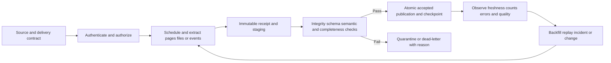

## JD Mapping

| Role expectation | Part 60 capability | TSM artifact | Arti bridge and boundary |
|---|---|---|---|
| Develop Data Fabric expertise | Explain reliable ingestion at conceptual and operational levels | Connector runbook | Exact product internals unclaimed |
| Analyze complex environments | Trace source, auth, network, API, state, validation, and consumer dependencies | Reliability map | M365 and networking troubleshooting transfer |
| Identify security risk | Detect stale, partial, duplicate, overprivileged, or exposed flows | Ingestion risk register | No unsupported product defect claim |
| Recommend mitigation | Propose bounded retries, rotation, quarantine, replay, and recovery | Control plan | Current source/product behavior governs |
| Resolve escalations | Find first failed stage and quantify affected periods/entities/actions | Incident evidence pack | RCA and critical-incident skills transfer |
| Lead strategic engagement | Set SLOs, ownership, test cadence, and lifecycle roadmap | Operating model | Customer approves targets and capacity |
| Partner cross-functionally | Coordinate source, IAM, network, security, data, platform, and target owners | RACI/runbook | TSM is coordinator, not every operator |
| Communicate outcomes | Explain freshness and completeness impact in business terms | Customer update | Green job status is not trusted data proof |

## Candidate honesty note

| Evidence class | Safe interview statement | Boundary to state |
|---|---|---|
| Production transfer | "I investigated HTTP, API, TLS, proxy, credential, sync, throttling, and service-dependency failures in Microsoft support." | Not production Zscaler ingestion operation |
| Synthetic practice | "I designed and fault-injected NMH full/incremental loads, checkpoints, retries, quarantine, replay, and freshness monitoring." | Lab evidence only |
| Official public fact | "Zscaler publicly describes ingestion from any source, listed file formats, and 150+ integrations." | No per-connector reliability mechanics inferred |
| General pattern | "Persist accepted pages before advancing a cursor and use idempotent processing." | Recommended architecture, not documented Zscaler implementation |
| SLO statement | "NMH's synthetic objective is 99% accepted by four hours." | Not a Zscaler SLA, guarantee, or recommendation |
| Incident conclusion | "The evidence localizes the first divergence to token renewal after 02:00 UTC." | Needs direct logs and clock validation |
| Recovery claim | "Counts, watermarks, duplicates, and downstream outputs reconciled after replay." | Does not prove unrelated data correctness |
| Production next step | "I would validate current docs, responses, tenant evidence, contracts, and specialists." | Never invent hidden behavior |

## Beginner vocabulary and memory hooks

| Term | Plain meaning | Why it matters | Memory hook |
|---|---|---|---|
| Connector lifecycle | Stages from request to retirement | Reliability begins before first run and ends after revocation | Birth to retirement |
| Full load | Retrieve the complete declared population | Establishes baseline or replacement snapshot | Whole warehouse inventory |
| Incremental load | Retrieve changes after known progress | Reduces work and latency | Only new/changed boxes |
| Snapshot | State of a population at a point/as-of time | Supports reconciliation but may not show change sequence | Photograph |
| Change data | Inserts, updates, and deletes since a point | Preserves evolution | Change log |
| Watermark | Boundary up to which data is believed processed | Prevents gaps and supports freshness | Water-level marker |
| High watermark | Greatest accepted source position/time | Defines committed progress | Last safely unloaded container |
| Checkpoint | Persisted processing state used to resume | Makes interruption recoverable | Saved game with evidence |
| Cursor | Opaque source token for next page/window | Follows source pagination state | Next-page claim ticket |
| Extraction window | Start/end boundaries queried | Controls incremental coverage | Time slice |
| Overlap window | Re-read a small prior interval | Captures late updates at duplicate cost | Recheck the last shelf |
| Schedule | Planned run cadence and timing | Balances freshness, limits, and dependencies | Departure timetable |
| Pagination | Retrieve a large result in pages | Missing one page silently loses data | Turn every page |
| Quota/rate limit | Source cap on requests or work | Protects service and shapes capacity | Road speed/traffic limit |
| Credential | Proof used to authenticate | Compromise or expiry can stop/expose flow | Integration key |
| Access token | Time-bounded authorization artifact | Carries scopes/audience and expires | Temporary entry pass |
| Certificate | Signed binding of public key and identity/context | Can support TLS or client authentication | Cryptographic badge |
| Rotation | Replace a credential before/at expiry | Limits exposure and prevents outage | Change keys safely |
| Timeout | Bound on waiting for an operation | Prevents resources hanging forever | Stop waiting after evidence-based limit |
| Retry | Reattempt an operation after failure | Helps transient failures but can amplify load/duplicates | Try again carefully |
| Backoff | Increase delay between retries | Gives failing dependency room to recover | Step farther back each time |
| Jitter | Random variation in retry delay | Prevents many clients retrying together | Stagger the crowd |
| Idempotency | Repeating a request yields one logical effect | Enables safe retry | Same work order, one result |
| Deduplication | Detect repeated records/messages | Controls repeated delivery | One shipment counted once |
| Partial load | Only part of intended unit arrived/accepted | Plausible output may be incomplete | Half a manifest |
| Quarantine | Protected holding area for rejected data | Prevents bad records from trusted publication | Inspection bay |
| Dead-letter | Durable record/message that could not be processed | Preserves failure for owned repair | Undeliverable mail desk |
| Late data | Valid data arriving after expected time | Can change history and metrics | Delayed shipment |
| Backfill | Load older missing data | Repairs history or initializes baseline | Fill the missing shelves |
| Replay | Process retained input again under controlled state | Recovers after logic or downstream failure | Re-run the recorded shipment |
| Observability | Evidence to understand internal state from outputs/signals | Enables diagnosis and SLO management | Windows and gauges |
| SLI | Measured service behavior | Provides numerator/denominator | What happened |
| SLO | Target for an SLI | Guides operation and error budget | What we aim for |
| SLA | Formal service agreement | Has contractual scope and terms | What was promised |
| Freshness | Age of accepted usable data relative to source | Governs decision currency | How old is trusted truth? |
| Error budget | Allowed SLO misses in a period | Balances reliability and change | Reliability spending limit |
| RPO | Recovery Point Objective | Maximum targeted data-loss interval under recovery design | How much history may be lost? |
| RTO | Recovery Time Objective | Target time to restore a service/process | How soon must it return? |

## Product claims versus general mechanics

| Statement | Classification | Safe use | Boundary |
|---|---|---|---|
| Data Fabric can ingest from any source and names supported formats | Public Zscaler positioning | Explain broad ingestion value | Verify actual source/path support |
| 150+ pre-built inbound/outbound integrations | Public Zscaler positioning | Discuss ecosystem breadth | Count/catalog and behavior change |
| A connector should checkpoint only accepted progress | General reliability recommendation | Design NMH lab and discovery questions | Not a disclosed Zscaler mechanism |
| Cursor pagination may be opaque | General API pattern | Explain correct source-token handling | Specific API docs govern |
| Exponential backoff with jitter can reduce retry synchronization | General distributed-systems pattern | Recommend bounded strategy where appropriate | Exact source guidance overrides |
| Quarantine/dead-letter handling isolates failed records | General data-engineering pattern | Design controlled error disposition | Product terminology/availability unknown |
| NMH achieves four-hour freshness | Synthetic objective | Practice SLI/SLO calculation | Not vendor/customer result |
| Zscaler guarantees exactly-once ingestion | Unsupported | Do not say | No reviewed source supports it |

### Plain-English deep-dive 1 - Reliability is knowing the boundary of truth

Suppose a job says "success" after retrieving 99 of 100 pages. The records it loaded can look correct, dashboards can refresh, and workflows can run. Yet the accepted population is incomplete. Reliability is not merely process uptime; it is the ability to state the exact boundary up to which data is complete, validated, and safe for a use.

That boundary may be a source cursor, update timestamp plus tie-breaker, file manifest, event sequence, or snapshot version. It must advance only after durable acceptance. If the boundary moves first and the process crashes second, records can be lost. If it never moves, records can be replayed, so idempotency and deduplication are also required.

## Connector lifecycle

A connector is an operated product dependency, not a one-time configuration. Lifecycle gates prevent abandoned credentials, stale mappings, and unsupported integrations.

| Lifecycle phase | Main work | Exit evidence | Failure if skipped |
|---|---|---|---|
| Request | Use case, owner, scope, outcome | Approved charter | Data without purpose |
| Assess | Product fit, source contract, security, capacity | Decision record | Late blocker |
| Design | Auth, load, state, schedule, quality, recovery | Reviewed design | Ambiguous behavior |
| Configure | Identities, paths, mappings, monitoring | Versioned config | Snowflake setup |
| Test | Fixtures, negatives, load, failure, recovery | Test report | Happy-path fragility |
| Pilot | Bounded source/population, read-only where possible | Pilot review | Large blast radius |
| Accept | Technical, data, security, operations, value | Named sign-off | Auth success called done |
| Operate | Monitor, incident, review, support | SLO/quality evidence | Silent staleness |
| Change | Source/API/schema/secret/schedule/version | Change record and rollback | Uncontrolled drift |
| Suspend | Stop safely while preserving state/evidence | Reason, state, consumer notice | Hidden incomplete data |
| Retire | Disable, revoke, archive/delete, migrate consumers | Retirement certificate | Orphan access/data |

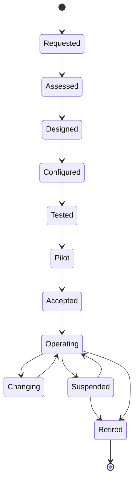

Every state needs an owner, configuration/version identifier, credential status, source scope, last accepted watermark, consumer impact, and next action. Retirement should revoke both source and target credentials and resolve retained data under policy.

## Full, incremental, event, and hybrid loads

A full load reads the complete declared population. It can establish a baseline, verify reconciliation, or replace a snapshot, but it consumes more resources. Incremental loading reads changes since accepted progress. It is efficient but depends on source change semantics and state correctness. Event ingestion receives individual changes, often with low delay, but can face duplicates, disorder, and loss. Hybrid designs combine patterns.

| Strategy | Best fit | Advantages | Risks | Required control |
|---|---|---|---|---|
| Full snapshot | Moderate population, baseline, periodic truth | Simple reconciliation and delete detection | Cost, duration, changing snapshot | Consistent snapshot/version and atomic swap |
| Time incremental | Reliable update timestamp and tie-breaker | Simple bounded windows | Clock precision, late update, same timestamp | Overlap, composite boundary, dedup |
| Cursor incremental | Source issues durable continuation/change token | Source-defined progress | Expiry/invalid cursor, opaque meaning | Persist token with accepted batch |
| ID/key incremental | Monotonic immutable key | Efficient append-only data | Updates/deletes missed | Use only under proven source semantics |
| Event/webhook | Timely events with IDs | Low polling delay | Duplicates, order, missed events | Durable receipt, dedup, reconciliation |
| File batch | Scheduled complete or delta export | Replayable immutable object | Partial upload, manifest, delay | Finalization marker/hash/count |
| Hybrid | History full plus ongoing delta/event | Balances baseline and freshness | Boundary overlap and complexity | Explicit handoff/reconciliation |

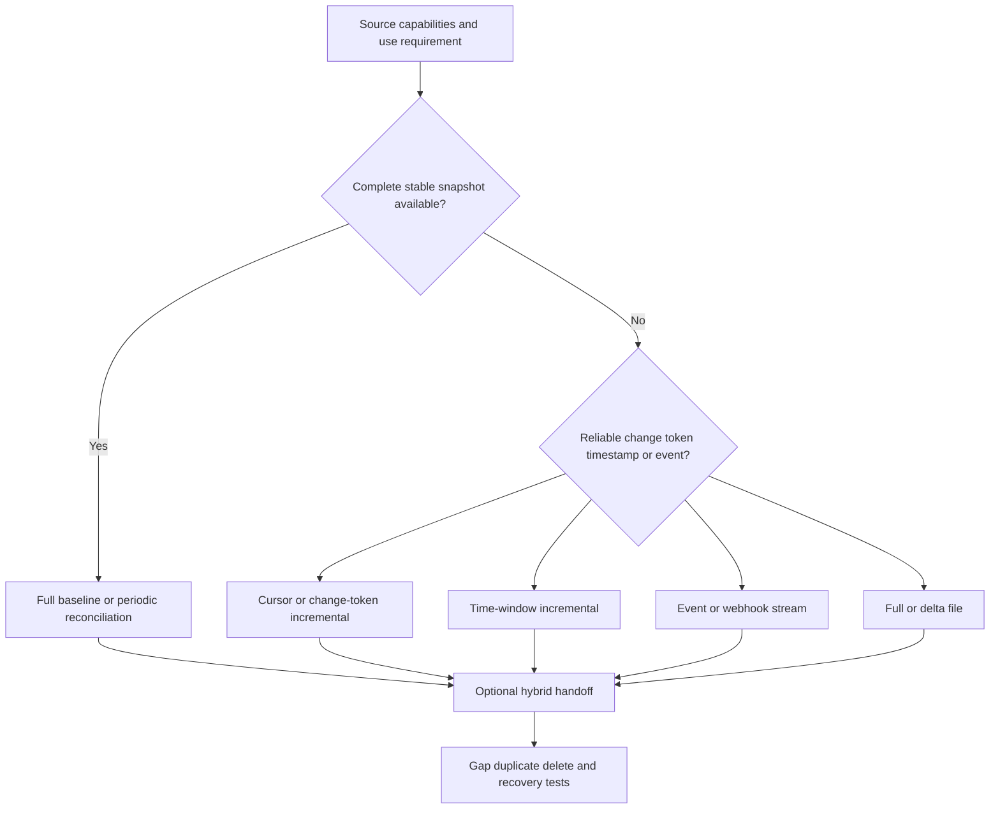

A "full" endpoint can still be paginated or eventually changing during retrieval. Ask whether it represents a consistent snapshot, whether records can change between pages, and how deletes are represented. A current-state API without tombstones cannot automatically produce historical delete events.

## Watermarks, checkpoints, and progress state

A watermark is a logical data boundary; a checkpoint is persisted execution state. They may contain a source cursor, window start/end, last timestamp and ID, file version, page token, schema version, and batch identifier. State should be scoped by source, tenant/account, object type, and connector configuration version.

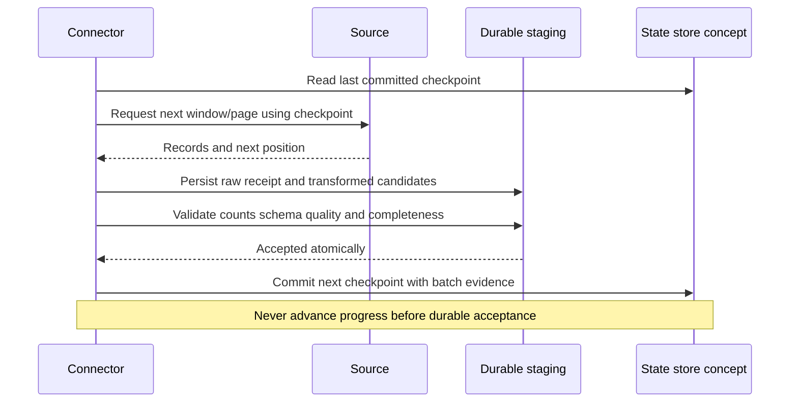

| State field | Purpose | Corruption risk | Control |
|---|---|---|---|
| Source/tenant/object | Prevents cross-scope reuse | Data from wrong account | Composite state key |
| Last accepted position | Resume boundary | Gap or repeated work | Atomic commit with batch |
| Window start/end | Reconstruct query coverage | Overlap/gap ambiguity | Half-open interval convention |
| Cursor/change token | Source continuation | Expiry or wrong dataset | Treat opaque; bind to scope/version |
| Tie-breaker | Orders equal timestamps | Missing same-time records | Stable composite ordering |
| Batch ID/hash | Links state to receipt | Cannot prove which data advanced state | Immutable batch ledger |
| Schema/mapping version | Reproduces processing | Replay changes meaning silently | Version every state transition |
| Status/reason | Shows committed, failed, held | Ambiguous recovery | Explicit state machine |

Half-open windows such as $[start, end)$ avoid double-including exact boundaries, but source timestamp precision and late updates still matter. An overlap window intentionally rereads recent time and depends on stable record identity or content version to deduplicate.

### Plain-English deep-dive 2 - Checkpoint after unloading, not after arrival

Imagine a ship arrives and the harbor office immediately marks its entire manifest delivered. A power failure then stops unloading halfway. When service resumes, the manifest says the cargo is already complete, so the remaining containers are skipped. That is data loss by premature checkpoint.

The safe order is receive, persist, validate, publish atomically, and only then commit progress. A crash before progress commit can cause replay, which is manageable with idempotency. A progress commit before durable acceptance can create a gap that is much harder to detect and repair.

## Scheduling, windows, and concurrency

Schedules should reflect decision freshness, source availability, quotas, business maintenance, downstream capacity, time zones, and backfill. Avoid synchronized top-of-hour storms when many connectors call the same source or shared gateway.

| Schedule concern | Question | Control |
|---|---|---|
| Cadence | How often must accepted data update for the use? | Business-approved freshness target |
| Time zone | Which zone defines daily/window boundaries? | UTC instants plus source/business zone metadata |
| Daylight saving | Can local time repeat or skip? | Avoid naive local checkpoints |
| Source maintenance | When are exports/APIs stable? | Blackout/defer windows and notices |
| Upstream completion | Must another job finish first? | Dependency watermark, not clock guess |
| Concurrency | Can runs overlap per source/scope? | Lease/lock or explicit partitioning |
| Jitter | Do many jobs start simultaneously? | Spread start times within approved window |
| Backfill | How does historical work coexist with current runs? | Separate capacity budget and priority |
| Long run | What if duration exceeds cadence? | Skip/queue/coalesce policy, never blind overlap |
| Calendar | Weekends/holidays/fiscal periods relevant? | Explicit schedule and catch-up behavior |

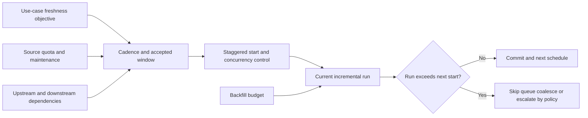

Schedule status should distinguish not due, running, completed/accepted, completed with quarantined records, failed before acceptance, freshness breached, suspended, and backfill in progress. A scheduler saying "completed" may only mean the process exited.

## API pagination and completeness

Pagination divides results into pages. Common patterns include page number/offset, cursor/token, continuation link, keyset, and time windows. The source contract determines correct behavior. Persist each received page or batch before advancing state, detect loops, and reconcile counts where available.

| Pagination pattern | Strength | Failure mode | Reliability control |
|---|---|---|---|
| Page number/offset | Simple | Inserts/deletes shift later pages | Snapshot consistency or dedup/reconciliation |
| Cursor/token | Source controls continuation | Expiry, reuse, wrong scope | Persist opaque token with batch/scope |
| Continuation link | Server supplies next request | Link loss or unsafe host use | Validate destination per contract; persist link |
| Keyset | Stable ordered key after last item | Updates below key or nonunique order | Immutable/ordered composite key |
| Time window | Natural incremental range | Clock precision, late data, ties | Overlap and tie-breaker |
| File manifest | Enumerated objects | Missing object/final marker | Manifest count/hash/finalization |

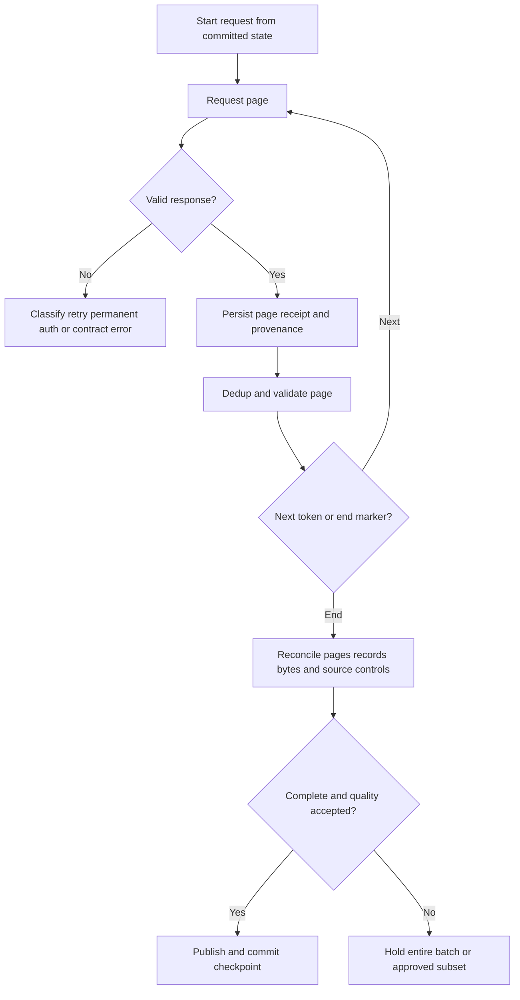

Never assume a short page is the end unless the API contract says so. A repeated token can create an infinite loop. A success response can contain an application error or partial result. Record status, headers, body schema, page identity, request correlation, and safe metadata without logging credentials or unnecessary sensitive payloads.

## API limits and cooperative consumption

Limits can apply per identity, tenant, endpoint, resource, time window, concurrent request, result size, or cost unit. Other customer applications may share the budget. Read current source documentation and observed response headers; do not hard-code a remembered quota.

| Limit concern | Symptom | Response |
|---|---|---|
| Request rate | 429 or documented throttle signal | Respect Retry-After/source guidance; backoff with jitter |
| Concurrency | Intermittent rejects/latency | Reduce workers; coordinate shared budget |
| Page size | Truncated/rejected request | Use documented maximum and measured optimum |
| Query cost | Expensive filters time out | Partition query and request efficient supported filters |
| Daily quota | Late-day failures | Budget current runs, backfill, retries, other consumers |
| Payload/response size | Connection/read failure | Smaller pages/windows; stream within limits |
| Export job quota | Job queue or reject | Schedule and poll under contract |
| Retention limit | Older window empty | Confirm history and backfill source |

Rate-limit responses are not permission to retry forever. Bound attempts and elapsed time, expose freshness risk, and escalate when the use-case objective cannot be met under approved limits.

## Credentials, tokens, certificates, and rotation

Use a dedicated identity and least privilege. Secret material should live in an approved secret-management service and be referenced, not copied into configuration or logs. Record credential owner, purpose, scope, environment, issuer, creation, expiry, rotation, revocation, and dependencies.

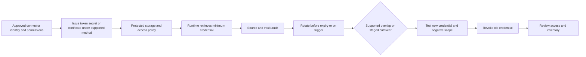

| Credential concern | Good planning evidence | Failure mode |
|---|---|---|
| Ownership | Named service and human accountable owner | Nobody receives expiry notice |
| Scope | Resource/actions and negative tests | Overprivileged extraction/action |
| Audience/issuer | Expected token service/resource | Token sent to wrong service |
| Lifetime | Documented expiry/renewal behavior | Mid-run expiry |
| Storage | Vault reference and restricted runtime access | Plaintext leakage |
| Rotation | Tested cutover, overlap if supported, rollback | Outage or dual valid credentials forever |
| Certificate chain | Current trust, name/use, private-key custody | TLS/client-auth failure |
| Revocation | Fast disable path and incident owner | Compromised access continues |
| Logging | Metadata only, secret redaction | Tokens/cookies in support evidence |
| Environment | Distinct nonproduction/production identity | Test reads/writes production |

Certificate renewal also requires trust-chain and endpoint validation. Replacing a certificate file without updating the runtime or source registration may fail. Token failures should distinguish authentication, authorization, consent, audience, scope, expiry, clock, and source-service issues.

## Timeouts and cancellation

Timeouts bound waiting and resource use. One universal timeout is weak because DNS, connection, TLS, request, read, total page, entire job, queue age, and workflow action have different expectations. A timeout does not prove the remote side did nothing; an outbound request may complete after the client stops waiting.

| Timeout layer | What it bounds | Too short | Too long |
|---|---|---|---|
| DNS/connect | Establish path | False transient failures | Slow failover/resource hold |
| TLS/auth | Secure/authenticate | Fails under expected delay | Hangs on dependency |
| Request/header | Initial service response | Cancels legitimate work | Blocks workers |
| Read/idle | Progress between bytes/messages | Breaks slow large pages | Stalled stream persists |
| Page/operation | One logical retrieval/action | Retries expensive work | Delays freshness/error detection |
| Job | Entire window/batch | Partial work never finishes | Overlaps next schedule |
| Queue age | Time waiting before processing | Drops manageable bursts | Data becomes too stale |
| Human approval | Workflow decision | Bypasses governance if rushed | Work blocks indefinitely |

For outbound actions, use idempotency/reconciliation before retrying after an ambiguous timeout. The target may have created the ticket even though the client did not receive the response.

## Retry classification, exponential backoff, and jitter

Retry only when the operation and failure class make retry safe and potentially useful. Permanent authentication/authorization, invalid request, unsupported schema, and semantic errors usually need correction, not repeated load. Transient network, service availability, throttling, or lock conditions may be retryable under documented guidance.

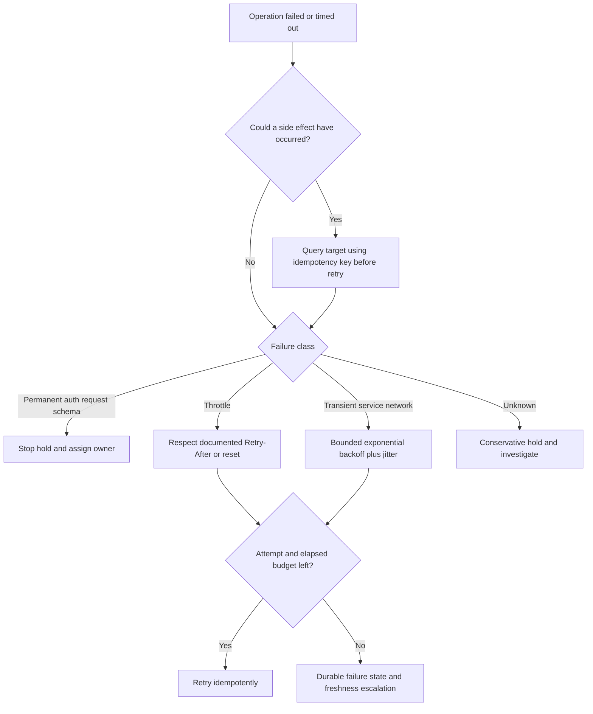

A common conceptual delay is:

$$
d_n = \min(d_{max}, d_0 \times 2^n) + J_n
$$

where $d_0$ is a base delay, $n$ is the attempt number, $d_{max}$ is a cap, and $J_n$ is bounded random jitter. This is an illustration, not a production value or Zscaler behavior. Source documentation, server-provided timing, total freshness budget, and shared-client coordination govern actual policy.

| Retry control | Purpose | Metric |
|---|---|---|
| Attempt cap | Prevent infinite loops | Attempts exhausted |
| Elapsed-time cap | Protect freshness/job window | Retry elapsed time |
| Backoff cap | Bound delay | Delay distribution |
| Jitter | Avoid synchronized retry storm | Retry concurrency |
| Circuit breaker/pause | Stop hammering unhealthy dependency | Open duration/requests suppressed |
| Retry budget | Limit retries relative to normal work | Retry-to-successful-request ratio |
| Error classification | Separate repair from retry | Permanent/transient/unknown counts |
| Owner escalation | Ensure failed work is acted upon | Unowned failure age |

### Plain-English deep-dive 3 - Retrying can be the outage

When a service slows, thousands of clients may all retry immediately. The extra work prevents recovery, so clients retry again. This is like everyone in a stalled queue leaving and rejoining the front at once. Backoff and jitter spread demand, but they do not create source capacity.

Reliability means protecting the dependency and the customer's freshness objective. Stop after a bounded budget, mark data stale or incomplete, preserve state, and communicate impact. For side-effecting requests, first determine whether the action already occurred; otherwise a timeout can turn into duplicate tickets or updates.

## Idempotency and duplicate control

At-least-once delivery is common because a process can crash after a source or target completed work but before local acknowledgment. Idempotency converts repeated delivery into one logical effect. Deduplication detects repeated records; they are related but not identical concepts.

| Layer | Stable identity option | Duplicate cause | Control |
|---|---|---|---|
| Raw receipt | Source object/version or event ID | Source resend/client retry | Immutable receipt key |
| Page | Request window/token plus page ID/hash | Retry after timeout | Page ledger |
| Record | Source tenant/type/record ID/version | Overlap and pagination shift | Upsert/version rule |
| Event | Source event ID | At-least-once push | Event dedup window/ledger |
| Entity assertion | Source record plus effective interval | Reprocessing | Deterministic assertion ID |
| Outbound ticket | Use-case/entity/finding/action version | Ambiguous timeout/retry | Idempotency key and target reconciliation |
| Notification | Event/action/recipient/version | Worker retry | Send ledger and suppression |
| Checkpoint | Source/scope/config/batch | Concurrent run | Compare-and-set/lease concept |

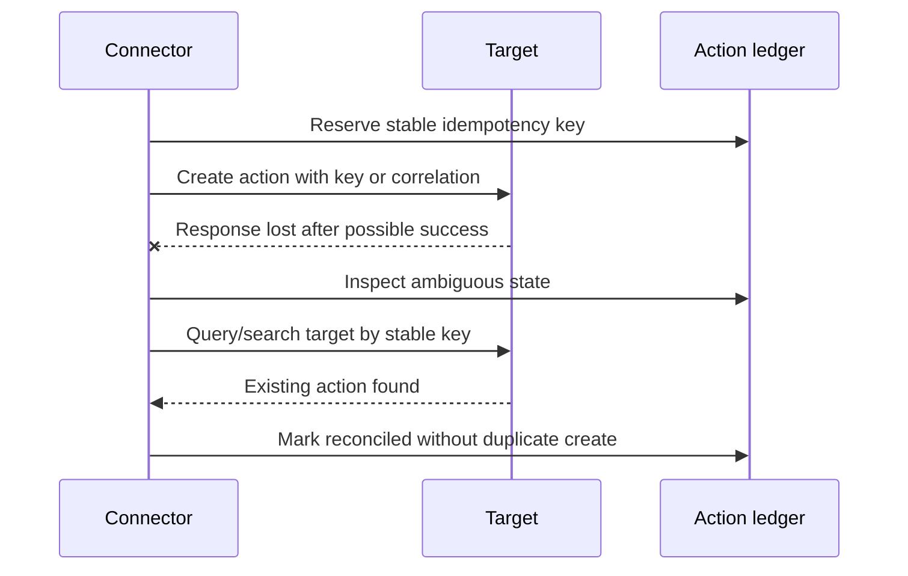

Exactly-once is often a system-level outcome built from durable state, idempotency, and reconciliation, not a transport magic property. Do not claim exactly-once unless the end-to-end contract and tests establish what "once" means.

## Partial loads, atomic publication, and disposition

A partial load can occur when only some pages arrive, a file truncates, some records fail validation, or a target accepts only part of a batch. Decide the atomic unit: entire snapshot, extraction window, page, file, record group, or individual record. The unit depends on consumer safety.

| Disposition | Use when | Benefit | Risk/control |
|---|---|---|---|
| Fail entire batch | Completeness is essential and subset misleads | Strong consistent boundary | Larger delay; preserve/retry safely |
| Accept valid subset with warning | Use tolerates bounded record rejects | Continued partial utility | Explicit coverage/quality and action hold |
| Quarantine records | Invalid/suspicious records need repair | Isolates bad data | Protect access, reason, owner, age, replay |
| Dead-letter message/page | Processing repeatedly fails | Durable operational queue | Not a graveyard; monitor and resolve |
| Skip by approved rule | Known irrelevant/unsupported input | Avoids noise | Version rule and report counts |
| Manual review | Ambiguity has material consequence | Human judgment | Capacity, consistency, privacy, SLA |

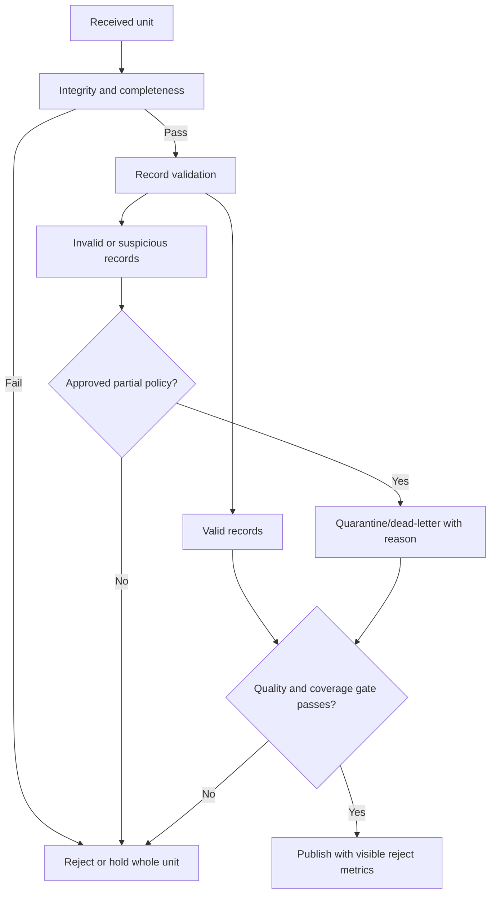

Never publish a full-snapshot replacement by clearing the old accepted view before the new snapshot passes. Build in staging, validate, then atomically switch or version the accepted dataset. Exact implementation varies, but the consistency principle is general.

## Quarantine and dead-letter operations

Quarantine protects data that is malformed, semantically invalid, suspicious, or unauthorized. A dead-letter queue or store holds units that cannot complete processing after policy. Both need ownership, security, retention, reason taxonomy, replay state, and age monitoring.

| Metadata | Why it matters |
|---|---|
| Source/scope/object and receipt | Reconstruct origin |
| Batch/page/record identifier | Isolate unit |
| Failure stage and reason code | Route correct owner |
| Sanitized error detail | Diagnose without leaking secrets |
| Schema/mapping/code version | Reproduce behavior |
| Attempt history | Prevent blind retry loop |
| Classification/access | Protect sensitive failed payload |
| First/last failure time and age | Manage backlog/SLO |
| Owner/status/disposition | Ensure accountability |
| Replay batch and outcome | Prove correction exactly once logically |

Quarantined content can be more sensitive than accepted data because parsing/minimization may not have occurred. Restrict it, encrypt it, avoid broad dashboard exposure, and delete under approved retention. Do not put raw secret-bearing errors into a general ticket.

## Late data, overlap, backfill, and replay

Late data is valid source data received after its expected window. Causes include delayed source publication, outages, clock differences, offline agents, and backfill. Decide whether historical analytical views restate, whether operational actions fire for old events, and how consumers see corrections.

| Operation | Trigger | Main risk | Controls |
|---|---|---|---|
| Overlap reread | Routine late updates | Duplicate processing | Stable IDs/version and bounded overlap |
| Targeted backfill | Known missing interval/entities | Source load and historical side effects | Separate job, scope, rate, action suppression |
| Full backfill | Initial baseline or broad loss | Quota/cost/privacy/schema history | Windows, capacity, version-aware mapping |
| Replay raw data | Parser/mapping/logic fix | Different result under new version | Preserve old/new versions and semantic diff |
| Rebuild derived view | Entity/rule correction | Trend/report restatement | Version and consumer notice |
| Reconcile outbound | Ambiguous/failed actions | Duplicate target state | Query by idempotency key and approved repair |

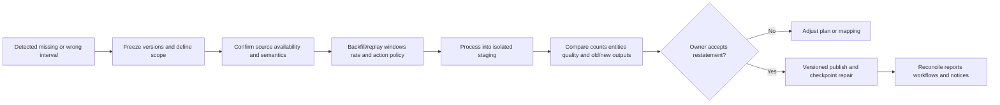

Do not let a historical replay automatically send years of notifications or tickets. Separate analytical restatement from operational trigger policy. Document event time versus processing time so users understand why a metric changed today for an event from last month.

## Observability model

Observability should let an operator answer: Is the connector scheduled? Can it authenticate? Which source scope and version is active? What is the last accepted source watermark? How much data moved? Where are errors accumulating? Are quality and freshness within objectives? Which consumers and actions are affected?

| Signal category | Example measures | Diagnostic value |
|---|---|---|
| Lifecycle/config | State, config version, scope, owner | Detect wrong/suspended setup |
| Schedule | Due/start/end/duration/overlap/skips | Detect missed or long runs |
| Authentication | Token renewals, expiry, auth failures | Isolate identity lifecycle |
| Requests | Count, status class, latency, timeout | Source/network/API behavior |
| Limits | 429, Retry-After, quota remaining if documented | Capacity/throttle impact |
| Pagination | Pages, repeated tokens, page size, end marker | Completeness |
| Records/bytes | Received, accepted, rejected, duplicate, deleted | Volume and quality drift |
| State | Current/previous checkpoint, commit time | Resume/progress correctness |
| Queue | Depth, age, retry/dead-letter/quarantine | Backpressure and ownership |
| Freshness | Source watermark age, acceptance lag | Decision currency |
| Quality | Required fields, validity, uniqueness, reconciliation | Trust boundary |
| Downstream | Publish/action success and reconciliation | Consumer/side-effect health |

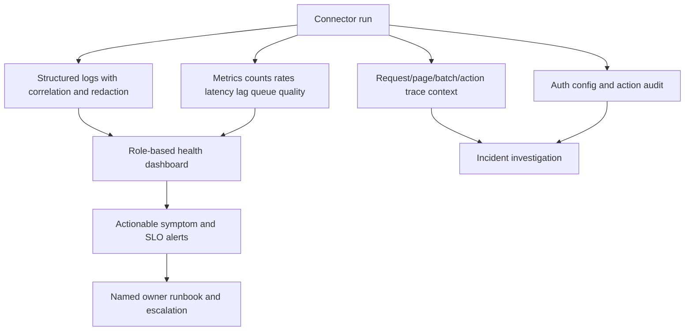

Avoid high-cardinality sensitive labels such as raw user IDs, URLs, tokens, or unbounded error messages in metrics. Use secure drill paths and sampled/redacted evidence. A green health badge should be decomposable into source, run, acceptance, freshness, quality, and downstream state.

### Plain-English deep-dive 4 - Last run time is not data freshness

A courier can visit a warehouse today and bring a manifest printed last week. The delivery happened recently, but the information is stale. Connector "last run succeeded at 10:00" similarly does not prove source data is current.

Track at least source/event watermark, extraction/receipt time, acceptance/publication time, and consumer refresh time. Freshness for a decision is usually based on the source watermark relative to now or the expected source publication boundary, not merely the job end time. Also show completeness and quality: fresh partial data is still unsafe for some uses.

## Freshness SLI, SLO, and error budget

Define an SLI with population, eligible intervals, clocks, numerator, denominator, exclusions, and quality gate. An SLO is an internal target; an SLA is a formal agreement. Do not label a dashboard threshold as an SLA.

A synthetic NMH freshness SLI could be:

$$
\text{Freshness compliance} = \frac{\text{eligible hourly intervals accepted within 4 hours}}{\text{eligible hourly intervals due}}
$$

If 720 intervals are due in a 30-day month and 713 pass, compliance is $713/720 = 99.03\%$. The four-hour target and numbers are invented. Zero eligible intervals should be reported as not applicable, not 100 percent.

| SLO contract item | Synthetic example | Caveat |
|---|---|---|
| Service/use | Payroll exposure owner context | Not every connector/use |
| Population | Scheduled eligible hourly intervals | Exclusions explicitly governed |
| Success | Complete quality-accepted watermark within 4 hours | Job success alone insufficient |
| Window | Rolling 30 days | Calendar and maintenance rules defined |
| Target | 99% | Synthetic, owner-approved in lab |
| Measurement source | Accepted batch ledger and source watermark | Monitor itself must be reliable |
| Error budget | 1% eligible intervals | Not permission for hidden data loss |
| Breach action | Warn consumers, hold automation, incident review | Consequence-based |

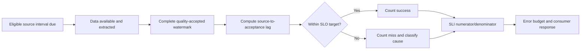

Monitor percentiles and worst cases, not only average lag. Segment by source/account/object where authorized. An aggregate SLO can hide one permanently stale business unit.

## Security architecture for ingestion

Security protects source, transit, runtime, state, staging, quarantine, logs, backups, and outputs. Apply defense in depth and data minimization.

| Control area | Planning control | Verification |
|---|---|---|
| Identity | Dedicated least-privilege nonhuman identity | Positive/negative access tests |
| Secrets | Approved vault, no plaintext/logging | Secret scan and access audit |
| Transport | Current supported TLS and certificate validation | Controlled handshake/path evidence |
| Network | Approved egress/ingress, DNS/proxy/firewall scope | Path and deny tests |
| Source scope | Tenant/account/object/field minimization | Reconciliation and forbidden-scope test |
| Runtime | Hardened, patched, restricted execution context | Configuration/vulnerability evidence |
| State | Encrypt and integrity-protect checkpoints/config | Restore and tamper controls |
| Staging/quarantine | Restricted access, encryption, retention | Access and deletion tests |
| Logs | Redaction, controlled access, retention | Representative failure review |
| Supply chain | Approved libraries/images, integrity, updates | Inventory and verification |
| Actions | Separate write authority, approval, idempotency | Sandbox and negative tests |
| Audit | Config/auth/replay/action/override events | Reconstruct test incident |

Security controls can affect reliability: certificate inspection, proxy authentication, egress restrictions, token policies, key rotation, or secret-vault outages can block ingestion. Troubleshoot with ownership rather than bypassing controls. A temporary exception needs explicit risk approval, scope, expiry, monitoring, and removal.

## Incident detection, containment, and recovery

An ingestion incident can be availability, integrity, confidentiality, or operational safety related. Start with impact: which source populations, accepted windows, reports, scores, and outbound actions are affected? Preserve state and evidence before broad replay or configuration changes.

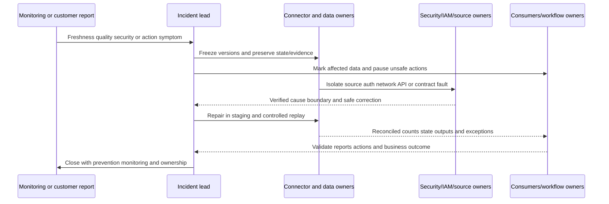

| Incident phase | Ingestion-specific actions | Customer communication |
|---|---|---|
| Detect | Confirm symptom, clocks, source scope, quality, action impact | What is observed and when |
| Triage | Classify availability/integrity/confidentiality/side effect | Affected use/population, uncertainty |
| Contain | Pause connector/action, mark stale/incomplete, revoke credential if needed | Safety step and user guidance |
| Preserve | Snapshot config/state/logs/audit/batches with redaction | Evidence retained under policy |
| Diagnose | Trace first divergence from source through checkpoint/consumer | Facts, hypotheses, next checks |
| Repair | Correct access/config/code/mapping/state under change control | Planned fix and risks |
| Recover | Backfill/replay, atomic publish, checkpoint repair | Recovery progress and caveats |
| Reconcile | Counts, duplicates, quarantine, reports, actions, history | What changed/restated |
| Validate | Source owner, consumer, negative, and SLO checks | Evidence of restored service |
| Learn | Root cause, contributing controls, tests, runbook, ownership | Preventive actions and dates |

RPO and RTO are planning objectives, not promises. State what data can be re-extracted, what raw receipts are retained, what downstream actions are reversible, and how recovery has been tested. A source with only seven days of history constrains recoverability differently from immutable retained files.

## Troubleshooting decision tree

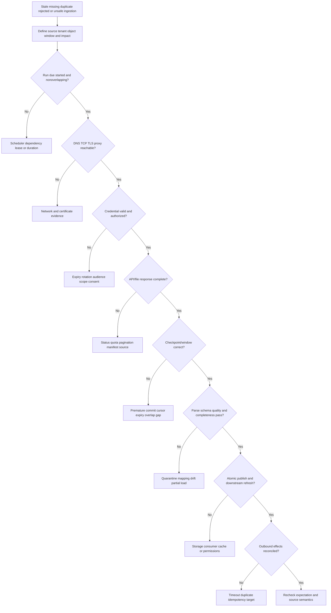

| Evidence packet | Fields |
|---|---|
| Scope/impact | Source, tenant/account, object, interval, consumers, actions |
| Timeline | Source watermark, due/start/end, failures, changes, detection |
| Configuration | Sanitized version, schedule, load strategy, scope |
| Identity | Credential ID/type, issuer, expiry, scope, rotation events; no secret |
| Network | DNS/TCP/TLS/proxy endpoint and timestamp evidence |
| API/file | Method/path class, status, headers, page/file IDs, manifest, limits |
| State | Previous/current checkpoint, batch IDs, commit sequence |
| Counts | Requests/pages/files/received/accepted/rejected/duplicate/delete |
| Errors | Classified reason, attempt history, quarantine/dead-letter age |
| Downstream | Publish version, report refresh, action IDs, reconciliation |
| Recovery | Change, replay scope, old/new diff, owner validation, monitoring |

## Complete synthetic NMH ingestion exercise

NMH ingests a synthetic endpoint inventory and vulnerability source for payroll exposure analysis. The endpoint source offers a current full snapshot and update timestamp; the finding source offers a cursor. These are fictional contracts, not vendor behavior.

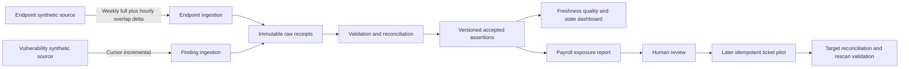

| Design item | Synthetic NMH choice | Reason | Test |
|---|---|---|---|
| Endpoint baseline | Weekly versioned full snapshot | Detect deletes/drift | Count and stable snapshot fixture |
| Endpoint delta | Hourly $[start-2h, end)$ overlap | Capture late updates | Duplicate and tie fixture |
| Finding progress | Opaque cursor committed after batch acceptance | Respect source-defined state | Crash before/after commit |
| Schedule | Staggered 15 minutes apart | Avoid shared start spike | Concurrency timeline |
| Token | Dedicated client, vault, staged rotation | Least privilege/lifecycle | New/old/revoked negative tests |
| Retry | Synthetic bounded policy respecting server timing | Handle transient failure | 429, 503, 401, timeout fixtures |
| Partial load | Hold full snapshot; quarantine bounded delta records | Preserve snapshot consistency | Missing page and invalid record |
| Freshness SLO | 99% eligible intervals accepted within four hours | Lab objective | Hand-calculated 30-day set |
| Backfill | Separate low-priority windows, no ticket actions | Protect current runs | Rate and action-suppression test |
| Recovery | Stage, semantic diff, atomic publish, reconcile | Avoid partial correction | Known missing interval |

Fault 1: the endpoint token expires after the source administrator rotates it without the agreed overlap. Authentication failures begin at 02:00 UTC. Monitoring detects no accepted watermark by the warning threshold, marks owner context stale, and pauses outbound ticket creation. The team verifies source health, token issuer/audience/scope, vault version, and audit. It installs the approved new credential, tests positive and negative scope, revokes the old identity, and backfills only the missing interval.

Fault 2: the finding cursor page is persisted, but a synthetic crash occurs before checkpoint commit. The page is replayed. Stable source record/version keys make publication idempotent, and page/record duplicate metrics rise as expected without duplicating logical findings. This is preferable to advancing the cursor before persistence and losing the page.

Fault 3: a full snapshot omits one expected page. The job process exits normally, but manifest/page reconciliation fails. The accepted prior snapshot remains active, freshness becomes stale, and reports show the issue. No clear-and-reload occurs. After retrieval succeeds, a new version is atomically published.

## Synthetic exercises with answers

### Exercise 1 - Full versus incremental

When is an incremental load unsafe?

**Answer:** When the source lacks reliable change semantics, stable identity, update/delete representation, consistent time/cursor behavior, or recoverable state. Use a full snapshot or hybrid reconciliation if supported, and document gaps rather than invent completeness.

### Exercise 2 - Checkpoint order

Should a connector save the next cursor immediately after receiving a page?

**Answer:** Not as committed progress. Persist and validate the page or batch, publish according to the atomic unit, then commit the cursor with evidence. A crash before commit causes manageable replay; premature commit can cause loss.

### Exercise 3 - Pagination

A page contains fewer records than the requested size. Is it the last page?

**Answer:** Only if the source contract says so. Follow the documented next token/link/end marker and reconcile. Short pages can occur for other reasons.

### Exercise 4 - Rotation

The old credential still works after rotation. Is rotation complete?

**Answer:** No. Verify the new credential and required scope, update runtime, revoke old material, test forbidden scope, confirm audit, and close the inventory/change record. Supported overlap should be temporary.

### Exercise 5 - Retry

Should a 401 be retried with exponential backoff?

**Answer:** Repeating the same invalid credential is unlikely to help. Inspect token expiry, audience, scope, consent, clock, and source response; renew or correct under the documented flow. Bound any transient token acquisition retry separately.

### Exercise 6 - Timeout

An outbound ticket request times out. Send it again?

**Answer:** First assume the target may have completed it. Query/reconcile using the stable idempotency key or correlation supported by the target. Retry only under the action contract to avoid duplicates.

### Exercise 7 - Partial load

Can valid records be accepted when 2% fail schema validation?

**Answer:** It depends on the declared atomic unit, use consequence, threshold, and approved policy. For a full replacement, hold the snapshot. For a tolerant analytical delta, quarantine may be allowed with visible coverage and action suppression. Synthetic percentages are not production defaults.

### Exercise 8 - Dead-letter

Is moving a message to dead-letter resolution?

**Answer:** No. It preserves failed work. Assign owner, reason, age target, security, repair, replay, and closure evidence. Monitor it as operational debt.

### Exercise 9 - Backfill

Why suppress outbound actions during historical backfill?

**Answer:** Reprocessing old events can create stale notifications or duplicate tickets. Separate analytical restatement from operational trigger policy and reconcile any intended actions explicitly.

### Exercise 10 - Freshness

The last job finished five minutes ago. Is data fresh?

**Answer:** Not established. Check source/event watermark, expected publication, complete accepted boundary, quality, publication, and consumer refresh. The job may have processed old or partial data.

### Exercise 11 - SLO versus SLA

NMH sets a four-hour freshness target. Is it an SLA?

**Answer:** It is an SLO unless an executed agreement defines it as an SLA with scope, calculation, exclusions, and terms. Label it accurately.

### Exercise 12 - Product claim

Can Arti say Zscaler uses dead-letter queues internally?

**Answer:** No. She can explain dead-letter handling as a general design pattern and ask how the current product exposes failed records. The reviewed public page does not establish internal queue mechanics.

## Labs and rehearsal

### Lab 1 - Lifecycle runbook

Define request, assess, design, configure, test, pilot, accept, operate, change, suspend, and retire gates. Include owner, evidence, state, credential, checkpoint, consumer impact, and rollback at each stage.

### Lab 2 - Load strategy

Given five fictional source contracts, choose full, time incremental, cursor, event, file, or hybrid. Defend delete handling, snapshot consistency, history, limits, and recovery.

### Lab 3 - Checkpoint crash matrix

Inject crashes before receipt, after receipt, after validation, after publication, and after checkpoint commit. Predict gap/replay behavior and prove state transitions.

### Lab 4 - Schedule design

Build current-run and backfill schedules across time zones, maintenance, quotas, concurrency, jitter, long runs, and dependencies. Define skip/queue/coalesce/escalate behavior.

### Lab 5 - Pagination harness

Test empty, short, repeated-token, missing-page, changed-during-scan, expired-cursor, duplicate-record, and no-end-marker cases with synthetic responses.

### Lab 6 - Quota and retry game day

Inject 429, Retry-After, 500, 503, DNS, TCP, TLS, timeout, 400, 401, 403, and schema errors. Classify retryability, backoff, owner, state, and freshness impact.

### Lab 7 - Credential rotation

Practice issue, secure store, positive/negative scope, runtime cutover, overlap, revoke, rollback, audit, and incident rotation using fake credentials only.

### Lab 8 - Timeout budget

Allocate DNS/connect, TLS/auth, request, read, page, job, queue, and approval timeouts within a freshness objective. Explain ambiguous side effects and cancellation behavior.

### Lab 9 - Idempotency

Create stable identities for receipt, page, record, event, assertion, ticket, and notification. Test repeated delivery and lost responses without duplicate logical effects.

### Lab 10 - Partial/quarantine policy

Define atomic units and dispositions for truncated file, missing page, invalid enum, oversized record, suspicious payload, one bad tenant, and target partial success. Include security and ownership.

### Lab 11 - Backfill and replay

Repair a three-day gap under frozen versions, then replay under a corrected mapping. Compare counts, semantic outputs, historical reports, actions, and checkpoint state.

### Lab 12 - Observability dashboard

Build lifecycle, schedule, auth, request, pagination, record, checkpoint, queue, freshness, quality, and downstream panels. Add privacy/cardinality controls and runbook links.

### Lab 13 - Freshness SLO

Write SLI population, numerator, denominator, exclusions, clocks, quality gate, target, window, error budget, and breach actions. Hand-calculate boundaries and zero population.

### Lab 14 - Security review

Threat-model source identity, transit, runtime, state, staging, quarantine, logs, backups, supply chain, and outbound actions. Test control interactions without bypassing them.

### Lab 15 - Incident simulation

Run the NMH expired-token, missing-page, and replay scenarios. Produce timeline, impact, containment, evidence, correction, recovery, reconciliation, validation, communication, and prevention.

| Lab evidence | Completion standard |
|---|---|
| Lifecycle | Every state and transition owned and reversible where required |
| Load | Full/incremental/event semantics and deletes proven |
| State | Progress commits after acceptance and survives crash |
| Schedule | Freshness, quota, dependency, concurrency, backfill balanced |
| API | Pagination and limit edge cases tested |
| Identity | Least privilege and complete secret lifecycle evidenced |
| Retry | Permanent/transient/ambiguous errors separated |
| Idempotency | Repeat delivery causes one logical effect |
| Partial | Atomic unit and visible disposition approved |
| Recovery | Backfill/replay restatement and actions controlled |
| Observability | First failed stage and affected boundary visible |
| Honesty | General mechanics never presented as Zscaler internals |

## Common misconceptions to correct

| Misconception | Correct model |
|---|---|
| Ingestion is just data transfer | It establishes scope, custody, completeness, meaning, and progress |
| Connector configured means operational | Lifecycle testing, acceptance, monitoring, change, and retirement remain |
| Full load is always complete | Snapshot consistency, pagination, filters, and deletes must be proven |
| Incremental is always more reliable | It depends on correct state, identity, change, and delete semantics |
| Timestamp alone is a safe watermark | Precision, ties, late data, clocks, and updates can create gaps |
| Cursor should be interpreted | Treat opaque source tokens according to contract |
| Checkpoint after response is safe | Commit only after durable accepted processing |
| Overlap prevents all gaps | It helps late data but needs stable identity and bounded history |
| Schedule success means fresh data | Source watermark, completeness, quality, publish, and consumer time differ |
| Local midnight is a simple boundary | Time zones and daylight saving can repeat or skip time |
| Concurrent runs make ingestion faster | They can duplicate state and exhaust source quotas |
| A short page means end | Follow documented continuation/end semantics |
| HTTP 200 proves complete data | Body, pages, manifest, schema, and source controls still matter |
| Rate limit is only a connector problem | Budgets may be shared across customer applications |
| Retry every failure | Permanent and semantic failures require repair |
| Immediate retry is fastest recovery | It can create a retry storm and prolong outage |
| Backoff values are universal | Source guidance, SLO, workload, and measurement govern |
| Timeout means target did nothing | Side effect may have completed; reconcile before retry |
| Exactly-once is a simple delivery setting | End-to-end logical once often requires idempotency and reconciliation |
| Deduplication and idempotency are identical | One detects repeats; the other makes repeats safe |
| A token is safe because it expires | Scope, storage, audit, rotation, and revocation still matter |
| Rotation ends when new secret is created | Runtime cutover, tests, old revocation, and inventory closure remain |
| Certificate expiry is the only certificate risk | Trust, name/use, key custody, revocation, and chain matter |
| Accept valid rows no matter what | Atomic unit and decision consequence govern partial policy |
| Dead-letter means handled | It is owned unresolved work |
| Quarantine can be widely visible | Failed raw data may be especially sensitive |
| Backfill should trigger normal actions | Historical processing needs explicit action policy |
| Replay under new code is invisible | It can restate history and requires version/diff/notice |
| Last run time is freshness | Source-to-accepted watermark lag is the useful boundary |
| Average lag is enough | Tail and segment breaches can be hidden |
| SLO and SLA are synonyms | Objective differs from formal agreement |
| Green connector health proves correct decisions | Semantics, entity resolution, context, and consumers also matter |
| Public ingestion wording reveals queues/checkpoints | It does not |

## Official Source Anchors

Research/source date: **2026-08-24**.

Zscaler sources support bounded public ingestion and integration statements only. IETF, NIST, OpenTelemetry, W3C, and OWASP sources support general protocol, control, telemetry, provenance, and API-security concepts. Current source and connector contracts override generic examples.

| Source | URL | Used for | Boundary |
|---|---|---|---|
| Zscaler Data Fabric for Security | https://www.zscaler.com/products-and-solutions/data-fabric | High-level ingest stage, listed formats, 150 pre-built inbound/outbound integrations | No schedule, checkpoint, retry, queue, secret, SLO, or recovery implementation claim |
| Zscaler Data Fabric Integrations | https://www.zscaler.com/products-and-solutions/data-fabric/integrations | Current public connector catalog breadth and extensibility concepts | Per-connector behavior and availability require verification |
| RFC 9110 HTTP Semantics | https://www.rfc-editor.org/rfc/rfc9110 | HTTP methods, status, connection, representation, retry semantic context | Specific APIs define contracts and idempotency support |
| RFC 6585 Additional HTTP Status Codes | https://www.rfc-editor.org/rfc/rfc6585 | 429 Too Many Requests and Retry-After context | No universal quota or retry values |
| RFC 9457 Problem Details for HTTP APIs | https://www.rfc-editor.org/rfc/rfc9457 | Structured API problem detail context | APIs may use other error formats |
| RFC 6749 OAuth 2.0 | https://www.rfc-editor.org/rfc/rfc6749 | OAuth roles, grants, access token concepts | Current security BCP and source profile also govern |
| RFC 8705 OAuth Mutual TLS | https://www.rfc-editor.org/rfc/rfc8705 | Mutual-TLS client authentication and certificate-bound token context | Only where source supports the profile |
| NIST SP 800-57 Part 1 Rev. 5 | https://csrc.nist.gov/pubs/sp/800/57/pt1/r5/final | General cryptographic key-management lifecycle | Not a connector-specific rotation procedure |
| NIST SP 800-53 Rev. 5 | https://csrc.nist.gov/pubs/sp/800/53/r5/upd1/final | Access, audit, configuration, incident, integrity, contingency, identification controls | Requires tailoring and assessment |
| OpenTelemetry Metrics | https://opentelemetry.io/docs/concepts/signals/metrics/ | Metric instruments, aggregation, attributes, and cardinality context | Not a required connector telemetry implementation |
| OpenTelemetry Traces | https://opentelemetry.io/docs/concepts/signals/traces/ | Trace/span context for request lifecycle reasoning | Implementation and sensitive data controls vary |
| W3C PROV-O | https://www.w3.org/TR/prov-o/ | Provenance entity/activity/agent concepts | Not Zscaler lineage schema |
| OWASP API Security Top 10 2023 | https://owasp.org/API-Security/editions/2023/en/0x11-t10/ | API authorization, authentication, resource consumption, inventory, unsafe consumption risk context | Risk list, not complete architecture or product assessment |

## Likely Interview Questions

### Q1. Describe a reliable connector lifecycle.

**Model answer:** I use request, assess, design, configure, test, pilot, accept, operate, change, suspend, and retire stages. Each stage has an owner, source scope, identity, configuration version, checkpoint state, quality/security evidence, consumer impact, and exit gate. I test failure and recovery before acceptance, monitor freshness and completeness in operation, change under version/rollback control, and revoke access and resolve retained data at retirement.

### Q2. How do full and incremental loads differ?

**Model answer:** A full load retrieves the declared population and helps establish or reconcile a snapshot, but it costs more and still needs snapshot/page/delete semantics. Incremental loads use a cursor, timestamp plus tie-breaker, key, event, or delta file to retrieve changes efficiently, but depend on reliable source change and delete behavior. Hybrid designs can combine baseline and delta. I choose from verified contracts and test gaps, duplicates, late data, and recovery.

### Q3. What are watermarks and checkpoints, and when should progress advance?

**Model answer:** A watermark is the logical boundary of accepted source data; a checkpoint is durable execution state used to resume. It can include source/scope, window, cursor, tie-breaker, batch, and versions. I receive and persist data, validate and publish the declared atomic unit, then commit progress with batch evidence. Crashing before commit may replay safely; advancing before acceptance can lose data.

### Q4. How do you handle pagination, limits, timeouts, and retries?

**Model answer:** I follow the current API's documented page/token/end behavior, persist before advancing, detect repeated tokens, and reconcile counts. I profile shared quotas and respect documented Retry-After. Timeouts are layered and consequence-based. I classify permanent, transient, throttle, and ambiguous side-effect failures; retry idempotently with bounded attempts, elapsed time, backoff, and jitter; reconcile side effects first; and escalate freshness when the budget is exhausted.

### Q5. How do you secure and rotate connector credentials?

**Model answer:** I use a dedicated least-privilege identity, exact scopes and negative tests, an approved vault, short/managed lifetime where supported, metadata-only logs, audit, environment separation, and a named owner. Rotation stages new material, tests it, updates runtime, revokes old material, verifies forbidden scope, and records rollback/closure. I never expose tokens, private keys, cookies, or signed URLs in evidence.

### Q6. How do idempotency, quarantine, and dead-letter handling improve reliability?

**Model answer:** Idempotency makes repeated processing create one logical effect using stable receipt, record, event, or action identities and target reconciliation. Quarantine isolates invalid or suspicious data from trusted publication. Dead-letter storage preserves repeatedly unprocessable work. Both need protected payloads, reason/version/attempt metadata, owners, age targets, repair, controlled replay, and closure; moving data there is not resolution.

### Q7. How do you define freshness and recover from an incident?

**Model answer:** I define an SLI using eligible source intervals, complete quality-accepted watermark, source-to-acceptance lag, denominator, exclusions, and version. An SLO is an internal target, not automatically an SLA. During incident I scope affected data/actions, freeze versions, mark stale/incomplete data, pause unsafe workflows, preserve evidence, isolate the first failed stage, repair in staging, backfill/replay, atomically publish, reconcile reports/actions, validate with owners, and add prevention.

### Q8. How does your experience transfer, and what can you claim about Zscaler?

**Model answer:** Microsoft escalation work gave me practical depth in API/HTTP/TLS/proxy/identity/sync failures, throttling, evidence correlation, critical communication, RCA, and fix validation. I practiced ingestion state, retries, quarantine, freshness, and recovery in synthetic NMH labs. Zscaler publicly documents high-level ingestion and connector breadth, but I do not claim its internal schedules, checkpoints, queues, retry logic, secret system, SLOs, or recovery architecture. I would validate current connector docs, tenant behavior, and specialists.

## 30-Second Memory Hooks

| Concept | Memory hook |
|---|---|
| Ingestion | Controlled custody, not copy |
| Lifecycle | Request to revoke and retire |
| Full | Whole declared snapshot, still reconcile |
| Incremental | Changes after safely committed progress |
| Watermark | Boundary of accepted truth |
| Checkpoint | Saved progress plus evidence |
| Commit order | Persist, validate, publish, then advance |
| Overlap | Re-read recent time, dedup deliberately |
| Schedule | Freshness balanced with source capacity |
| Pagination | Persist, turn every page, prove the end |
| Limits | Shared budget, current contract |
| Credential | Dedicated, least privilege, vaulted |
| Rotation | Stage, test, cut over, revoke, verify |
| Timeout | Bound each wait; side effect may still occur |
| Retry | Classify first, then bounded backoff and jitter |
| Idempotency | Repeat delivery, one logical effect |
| Partial | Plausible subset may be unsafe truth |
| Quarantine | Protected inspection bay |
| Dead-letter | Owned unresolved work, not trash |
| Late data | Old event can change today's history |
| Backfill | Fill a known historical gap under budget |
| Replay | Reprocess with versions and semantic diff |
| Observability | State, volume, errors, lag, quality, impact |
| Freshness | Source watermark to accepted use |
| SLI/SLO/SLA | Actual, target, formal promise |
| Incident | Scope, contain, preserve, repair, replay, reconcile |
| Arti bridge | API and incident depth transfer; internals do not |

## Completion Checklist

- [ ] I can explain ingestion as controlled source-to-accepted custody and progress.
- [ ] I manage request, assess, design, configure, test, pilot, accept, operate, change, suspend, and retire phases.
- [ ] Every lifecycle state has owner, scope, config, credential, checkpoint, consumer impact, and evidence.
- [ ] I distinguish full snapshot, time/cursor/key incremental, event, file, and hybrid strategies.
- [ ] I verify snapshot consistency, pagination, update, delete, and history semantics.
- [ ] I do not assume a full endpoint is complete or consistent without contract and reconciliation.
- [ ] I define watermark versus checkpoint and scope state by source/tenant/object/config version.
- [ ] I commit progress only after durable receipt, validation, and accepted publication.
- [ ] I design replay-safe behavior for crashes before progress commit.
- [ ] I use explicit half-open windows, precision, tie-breaker, overlap, and late-data rules where appropriate.
- [ ] I tie schedule cadence to use-case freshness and source capacity.
- [ ] I handle time zones, daylight saving, maintenance, upstream completion, concurrency, long runs, and backfill.
- [ ] I distinguish scheduler completion from complete accepted data.
- [ ] I follow documented pagination tokens/links/end markers and never infer end from a short page.
- [ ] I persist page/batch receipt before advancing source state.
- [ ] I detect repeated cursors, loops, missing pages, shifted offsets, and source changes during retrieval.
- [ ] I reconcile requests, pages/files, records, bytes, deletes, and source control totals where available.
- [ ] I profile per-identity/tenant/endpoint/concurrency/daily quotas and shared consumers.
- [ ] I respect current documented throttling and Retry-After behavior.
- [ ] I do not retry forever when freshness cannot be met.
- [ ] I use dedicated least-privilege identities and exact positive/negative tests.
- [ ] I protect credentials in approved secret storage and redact all secret material from evidence.
- [ ] I distinguish token issuer, audience, scope, consent, lifetime, renewal, clock, and revocation failures.
- [ ] I plan certificate trust, use, private-key custody, expiry, rotation, and revocation.
- [ ] I complete rotation with runtime cutover, tests, old revocation, audit, and inventory closure.
- [ ] I define separate DNS/connect, TLS/auth, request, read, page, job, queue, and approval timeout budgets.
- [ ] I know a timeout does not prove a side effect failed.
- [ ] I reconcile ambiguous target state before retrying an outbound action.
- [ ] I classify permanent, transient, throttled, and unknown failures before retry.
- [ ] I use bounded attempts, elapsed time, backoff, jitter, circuit/pause, and escalation where appropriate.
- [ ] I follow source-specific guidance rather than universal retry numbers.
- [ ] I define stable identities for raw receipt, page, record, event, assertion, action, and checkpoint.
- [ ] I distinguish duplicate detection from idempotent logical effect.
- [ ] I make no end-to-end exactly-once claim without a defined contract and tests.
- [ ] I define the atomic acceptance unit for snapshot, window, file, page, group, or record.
- [ ] I hold unsafe partial snapshots and keep the prior accepted version active.
- [ ] I expose accepted subset coverage and suppress unsafe action when partial policy permits.
- [ ] I protect quarantine/dead-letter data with reason, version, owner, age, attempts, retention, and replay state.
- [ ] I treat dead-letter as unresolved operational work.
- [ ] I handle late data, overlap, targeted/full backfill, replay, rebuild, and outbound reconciliation separately.
- [ ] I suppress or explicitly govern historical operational actions.
- [ ] I version and disclose historical restatements.
- [ ] I observe lifecycle, schedule, auth, requests, limits, pagination, records, state, queues, freshness, quality, and downstream effects.
- [ ] I control sensitive/high-cardinality telemetry and provide secure drill evidence.
- [ ] I distinguish source watermark, extract, receipt, acceptance, publication, and consumer freshness.
- [ ] I define SLI population, numerator, denominator, clocks, exclusions, quality gate, window, and version.
- [ ] I distinguish SLO from formal SLA and never present a synthetic target as vendor commitment.
- [ ] I monitor tail and segment freshness, not only average.
- [ ] I secure source, transit, runtime, state, staging, quarantine, logs, backups, supply chain, and actions.
- [ ] I do not bypass controls to fix reliability without approved risk process.
- [ ] I scope ingestion incidents by source populations, intervals, consumers, reports, and actions.
- [ ] I contain, preserve, diagnose, repair, recover, reconcile, validate, communicate, and learn.
- [ ] I state RPO/RTO as tested objectives, not unsupported guarantees.
- [ ] I can run the troubleshooting tree from scheduler through downstream action.
- [ ] I can produce a redacted evidence packet with no secrets or unnecessary sensitive data.
- [ ] I can complete the NMH ingestion exercise and all fifteen labs.
- [ ] I label checkpoints, retries, queues, SLOs, and recovery as general patterns rather than Zscaler internals.
- [ ] I use the controlled research/source date exactly as 2026-08-24.
- [ ] I make no unsupported production, per-connector, reliability, security, service-level, or outcome claim.
- [ ] I can answer Q1 through Q8 with definitions, analogies, mechanics, tradeoffs, failures, troubleshooting, labs, NMH examples, and an honest Arti bridge.

[Part 61 - Data Fabric Harmonization, Mapping, and Custom Data Models](Part-61-data-fabric-harmonization-mapping.md)