# Part 61 - Data Fabric Harmonization, Mapping, and Custom Data Models

> **Audience:** Arti Thakur, preparing for a Zscaler Security Operations Technical Success Manager role after Microsoft enterprise Support Escalation Engineering.
>
> **Purpose:** Build a rigorous method for profiling source data; defining canonical entities, attributes, and relationships; normalizing types, units, enumerations, and time; writing mapping rules, lookups, defaults, and unknown-state behavior; extending a model with governed custom fields and entities; representing organizational hierarchy; validating and handling errors; detecting schema drift; versioning contracts and semantics; building test fixtures; preserving lineage and provenance; assigning semantic ownership; and deploying, changing, troubleshooting, and rolling back mappings safely.
>
> **Scope and honesty:** Northstar Meridian Holdings, abbreviated NMH, is fictional. Every source, schema, profile, entity, attribute, relationship, field, type, unit, enum, time, lookup, default, hierarchy, validation rule, mapping, version, fixture, result, deployment, incident, and outcome in this Part is synthetic. Zscaler's official public Data Fabric page supports high-level statements about a customizable data model and harmonize/map capabilities. It does not disclose internal canonical schemas, fields, data types, mapping languages, validators, extension mechanisms, hierarchy models, deployment pipelines, or rollback behavior. General semantic, schema, data-quality, and database patterns in this Part are educational and must not be represented as Zscaler implementation details. Arti's SQL, PostgreSQL, Power BI, statistics, data-quality, Microsoft 365 troubleshooting, RCA, and stakeholder translation skills transfer; direct production operation of Zscaler Data Fabric mappings remains a learning boundary.
>
> **Currency caveat:** Source schemas, APIs, code lists, standards, product interfaces, organizational structures, security requirements, and business definitions change. The controlled research/source date for this Part is exactly **2026-08-24**. Current official product and source documentation, approved semantic contracts, tenant evidence, source-owner and steward decisions, legal/privacy requirements, representative data, controlled tests, and Zscaler and source specialists govern production.

## Section goal

Harmonization is the work of making source assertions comparable without pretending that different meanings are equal. Mapping translates a source concept into a shared target concept under explicit conditions. A custom model extends shared meaning for a valid organization-specific use. The goal is not to make every row look uniform; it is to make every transformation explainable, testable, reversible, and honest about information loss and uncertainty.

Think of an international emergency team. One country reports temperature in Celsius, another in Fahrenheit. One uses "red" for the highest warning, another uses level 5. One timestamp is local without a zone, another is UTC. Translation requires more than changing column names. The team needs definitions, units, code lists, clocks, context, and a translator accountable for ambiguity. Security-data harmonization is that disciplined translation.

By the end, Arti should be able to:

| Outcome | Demonstrated capability | Evidence artifact |
|---|---|---|
| Profile source reality | Measure structure, values, nulls, uniqueness, distributions, and drift | Profiling report |
| Define canonical meaning | Model source-neutral entities, attributes, relationships, grain, and time | Canonical model card |
| Normalize safely | Convert types, units, enums, and time with explicit precision/loss | Transformation specification |
| Write mappings | Define conditions, lookups, defaults, unknowns, provenance, and tests | Mapping catalog |
| Control missingness | Distinguish absent, null, unknown, not applicable, withheld, invalid, and unmapped | State policy |
| Extend deliberately | Add custom fields/entities/relationships under namespace and lifecycle governance | Extension proposal |
| Model organization | Represent legal, reporting, cost, geography, and service hierarchies without false trees | Hierarchy design |
| Validate in layers | Separate parse, structural, domain, semantic, relationship, temporal, and use checks | Validation matrix |
| Handle errors | Route reject, quarantine, warning, default, and steward review appropriately | Error disposition plan |
| Manage drift | Detect shape and meaning changes, then classify compatibility | Drift register |
| Version semantics | Version source, schema, mapping, lookup, model, and consumer behavior | Version ledger |
| Test mappings | Build known-answer, boundary, negative, drift, and regression fixtures | Fixture suite |
| Preserve trust | Trace every canonical value and relation to source and transformation | Lineage view |
| Assign ownership | Clarify source, semantic, model, security, and consumer authority | Semantic RACI |
| Deploy safely | Stage, compare, approve, canary, monitor, and roll back changes | Release pack |
| Troubleshoot | Isolate source, parser, type, lookup, mapping, hierarchy, version, or consumer defect | Mapping evidence pack |
| Practice honestly | Build a synthetic NMH model and migration | Lab portfolio |

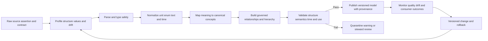

## JD Mapping

| Role expectation | Part 61 capability | TSM artifact | Arti bridge and boundary |
|---|---|---|---|
| Develop Data Fabric expertise | Explain harmonize/map and custom-model value without invented internals | Semantic whiteboard | Exact product model remains unclaimed |
| Analyze complex environments | Compare source definitions, grain, types, time, and relationships | Source-to-target map | SQL and M365 telemetry translation transfer |
| Identify security risk | Detect false equivalence, defaulting, stale hierarchy, and schema drift | Semantic risk register | Mapping defect requires evidence |
| Recommend mitigation | Propose steward rules, fixtures, versioning, canary, and rollback | Change plan | Customer owners approve semantics |
| Resolve escalations | Trace wrong output to first semantic transformation | Evidence package | RCA and timeline skills transfer |
| Lead strategic engagement | Align business, security, data, and product stakeholders on meaning | Model workshop | TSM facilitates, not sole semantic authority |
| Communicate simply | Explain complex mapping with analogies and counterexamples | Executive/technical narrative | Avoid jargon without definition |
| Drive adoption | Make model trust, extensions, and errors visible to users | Adoption/quality scorecard | More mapped fields is not necessarily value |

## Candidate honesty note

| Evidence class | Safe interview statement | Boundary to state |
|---|---|---|
| Production transfer | "I used SQL, PostgreSQL, Power BI, statistics, telemetry fields, IDs, states, and cross-system evidence in Microsoft support and analytics." | Not production Zscaler mapping administration |
| Synthetic practice | "I profiled NMH sources, designed canonical entities, wrote mappings and fixtures, and rehearsed migration/rollback." | Fictional evidence only |
| Official public fact | "Zscaler publicly describes a customizable data model and harmonize/map capability." | No internal field, type, UI, language, or deployment claim |
| General pattern | "I preserve raw values and version type/unit/enum/time transformations." | Recommended method, not product implementation |
| Mapping conclusion | "Source status X maps to canonical state Y only under rule v4 and condition C." | Does not prove source truth |
| Unknown handling | "The value is unmapped and held for steward review." | Honest uncertainty, not data loss |
| Deployment claim | "The synthetic canary produced no unexpected semantic diff in approved fixtures." | Not a production customer result |
| Production next step | "I would validate current docs, tenant evidence, samples, owners, and specialists." | Never invent product mappings |

## Beginner vocabulary and memory hooks

| Term | Plain meaning | Why it matters | Memory hook |
|---|---|---|---|
| Source schema | Source's fields, structure, types, and constraints | Defines what is delivered, not necessarily meaning | Incoming form |
| Profile | Measured summary of actual data | Reveals reality beyond documentation | Inspect the shipments |
| Canonical model | Shared source-neutral representation | Aligns multiple sources and consumers | Common form |
| Entity | Real-world thing such as asset, user, app, or finding | Provides modeled noun and lifecycle | Noun |
| Attribute | Property of an entity or assertion | Carries a typed fact | Adjective/property |
| Relationship | Typed, directed connection between entities | Adds context and dependencies | Governed verb |
| Grain | What one record/assertion represents | Prevents mixed meaning and double counts | One row equals what? |
| Harmonization | Make representations consistently interpretable | Enables comparison while retaining distinctions | Tune instruments |
| Mapping | Translate source concept to target concept | Connects source meaning to shared meaning | Translation rule |
| Canonicalization | Represent equivalent forms in a chosen standard form | Helps compare and process | One agreed spelling/shape |
| Data type | Kind of value, such as integer, text, boolean, date | Controls valid operations and precision | Shape of the field |
| Unit | Measurement standard such as seconds or bytes | Numbers without units are ambiguous | Label the ruler |
| Scale | Range or multiplier used by a measure | Prevents false comparison | Size markings |
| Enum/code list | Allowed named values | Encodes states/categories with definitions | Approved menu |
| Lookup | Versioned table translating codes or references | Makes mapping explicit and maintainable | Translation dictionary |
| Default | Value substituted under a declared condition | Can hide missingness and bias decisions | Automatic fill, use sparingly |
| Null | Database/format representation of no value | Does not explain why value is absent | Empty box, unknown reason |
| Unknown | Applicable fact is not known | Must remain visible | We do not know |
| Not applicable | Question does not apply | Should not be counted as missing | Wrong question |
| Withheld | Value exists but cannot be shared | Indicates policy, not absence | Kept behind the desk |
| Invalid | Value violates declared rule | Needs correction or quarantine | Bad form entry |
| Unmapped | Source value has no approved target meaning | Requires steward decision | No dictionary entry |
| Custom field | Organization-specific attribute added to a model | Supports local decisions | Extra labeled box |
| Custom entity | Organization-specific modeled thing | Supports concepts absent from core | New kind of noun |
| Namespace | Scope that keeps names unique | Prevents collisions among extensions | Family name for labels |
| Hierarchy | Parent/child arrangement under a declared relation | Supports rollup and ownership | Organization tree, sometimes forest |
| Taxonomy | Organized category structure | Standardizes classification | Library shelves |
| Ontology | Concepts and typed relationships/rules | Makes semantics more expressive | Map plus relationship rules |
| Validation | Check against declared requirements | Detects defects before use | Inspection gates |
| Schema drift | Source structure changes | Can break or silently alter mapping | Form changed |
| Semantic drift | Meaning changes without or with shape change | More dangerous than obvious parse failure | Same label, new meaning |
| Compatibility | Whether producers/consumers still work and mean the same thing | Guides deployment | Can old and new cooperate? |
| Fixture | Small known input with expected output | Makes mapping testable | Answer-key example |
| Lineage | Transformation path from source to output | Locates defects and affected consumers | Route map |
| Provenance | Origin and processing evidence | Supports trust and correction | Receipt for the fact |
| Semantic owner/steward | Person accountable for definition and mapping decisions | Resolves ambiguity | Owner of meaning |
| Rollback | Restore prior approved behavior/version | Limits change harm | Return to last known map |

## Product claim boundary

| Claim | Classification | Safe use | Forbidden leap |
|---|---|---|---|
| Data Fabric harmonizes and maps data | Documented Zscaler positioning | Explain the public capability stage | Invent exact transformations or order |
| Data Fabric has a customizable data model | Documented Zscaler positioning | Discuss organization-specific adaptation | Invent UI, schema, language, or limits |
| Fabric can add data sources/factors and support workflows/reports | Documented public context | Relate model extensibility to outcomes | Claim arbitrary fields work automatically |
| Canonical entities should retain source provenance | General architecture recommendation | Design NMH trust controls | Say Zscaler exposes a PROV-O graph |
| Unknown should not default to low risk | General semantic safety recommendation | Prevent misleading NMH logic | Claim product default behavior |
| NMH supports a custom business-service entity | Synthetic design | Demonstrate extension governance | Claim it is a Zscaler entity type |

### Plain-English deep-dive 1 - Same shape does not mean same meaning

Two thermometers can both output the number `32`. If one uses Celsius and the other Fahrenheit, the values describe very different conditions. Security fields behave the same way. Two tools can both expose `severity = 5`, `status = closed`, or `owner = Alex`, yet use different scales, lifecycle states, and identity scopes.

Structural compatibility asks whether the value fits the field. Semantic compatibility asks whether it means the same thing for the intended decision. Mapping must establish both. A successful integer cast or matching label is not evidence of semantic equivalence.

## Source profiling before mapping

Documentation states intended behavior; profiling measures observed data. Use both. Profile representative time periods, accounts, entity types, normal and failure cases, and source versions. Preserve privacy and avoid copying sensitive values into reports; use approved samples, hashes, aggregates, and controlled drill paths.

| Profile dimension | Questions | Example metric | Mapping implication |
|---|---|---|---|
| Record grain | What does one row/object/event represent? | Duplicate source key by period | Target grain and keys |
| Field presence | Which fields appear by version/type? | Presence rate | Required/optional/conditional rule |
| Null/missing | Absent, null, blank, placeholder? | Rate by reason/source | Missing-state model |
| Type | Actual strings/numbers/objects? | Parse success and type variants | Safe type transformation |
| Range | Min/max/percentiles/outliers? | Negative duration count | Domain validation |
| Cardinality | Distinct values and growth? | Unique owner codes | Lookup/hierarchy design |
| Pattern/format | IDs, dates, names, codes | Regex/sample categories | Normalization and reject rules |
| Uniqueness | Stable key unique in scope/time? | Duplicate ID rate | Entity/mapping identity |
| Distribution | Common/rare values by segment | Status frequency | Fixture coverage and drift baseline |
| Relationship | Referenced entities exist? | Orphan relationship rate | Referential policy |
| Time | Event/update/receipt order and zones | Late/naive timestamp rate | Temporal mapping |
| Drift | New/removed/type/meaning changes? | Daily schema/code diff | Version and alert policy |

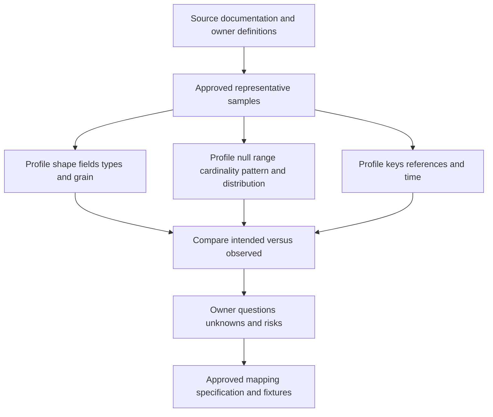

Profiling is not permission to infer definitions from frequency. If 99 percent of values are `1`, that does not tell whether `1` means enabled, healthy, high, or default. Ask the source owner and consult current documentation.

## Canonical entities, attributes, relationships, and assertions

A canonical model should be driven by reusable decisions, not by unioning every source field. Separate an entity from source assertions about it. An asset entity can have many time-bound source records, control observations, findings, and relationships. A canonical value should retain origin and uncertainty.

| Model element | Definition | Synthetic NMH example | Required metadata |
|---|---|---|---|
| Entity type | Governed class of real-world thing | `Asset` | Definition, scope, lifecycle, owner, version |
| Entity instance | One governed thing | `asset-9007` | Surrogate ID, type, state, provenance |
| Attribute definition | Typed property concept | `environment` | Meaning, type, code list, applicability |
| Attribute assertion | Source's value for entity/time | `production` from CMDB | Source, effective/observed time, confidence |
| Relationship type | Governed directed verb | `supports` | Domain/range, direction, cardinality, time |
| Relationship assertion | Source's claimed edge | app supports payroll | Source, effective interval, confidence |
| Event | Occurrence at a time | finding observed | Event grain, event/receipt time |
| Finding | Assessed condition on target | weak configuration | Target, source, lifecycle, evidence |
| Extension | Namespaced custom concept | `nmh:business_service_tier` | Purpose, owner, classification, lifecycle |

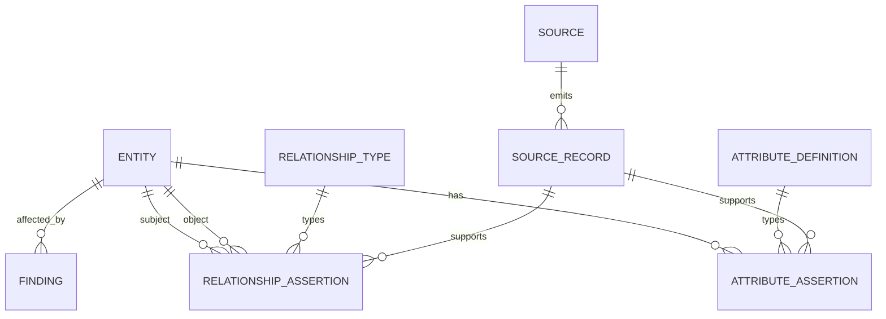

| Canonical design question | Good answer characteristic | Warning sign |
|---|---|---|
| What is the entity? | Clear real-world concept and lifecycle | "Whatever the source row is" |
| What is the grain? | One sentence and counterexamples | Mixed snapshot/event/entity rows |
| Which identifiers apply? | Issuer, scope, time, quality | Bare hostname or email |
| What is an attribute versus event? | State versus occurrence separated | Latest event overwrites all history |
| What is a relationship? | Typed direction and time | Generic `related_to` everywhere |
| What belongs in core? | Reusable, stable, governed concept | Every source-specific field |
| What belongs in extension? | Named local use with owner | Unnamespaced custom clutter |
| How are conflicts shown? | Assertions plus preferred projection | Silent overwrite |

## Type normalization

Type conversion should reject ambiguity and preserve original values. Never silently coerce failed strings to zero, unknown to false, or large identifiers to floating-point numbers. Define overflow, precision, rounding, locale, encoding, and null behavior.

| Source representation | Target type | Safe questions | Failure example |
|---|---|---|---|
| String `"00123"` | Identifier text, not integer by default | Are leading zeros meaningful? | `00123` becomes `123` |
| String `"true"` | Boolean | Exact accepted tokens/case/locale? | `unknown` becomes false |
| Number `1.7` | Decimal | Precision, scale, rounding? | Binary float changes money/score |
| Number beyond 64-bit | Decimal/text/big integer | Range and consumer support? | Overflow/wrap |
| Empty string | Missing-state representation | Blank, unknown, or valid empty? | Collapsed with absent |
| Array | Repeated relation/value | Ordering, duplicates, empty meaning? | Joined into ambiguous CSV text |
| Object | Structured type/extension | Schema/version and sensitive subfields? | Flattened key collisions |
| Timestamp text | Instant/local/date | Offset, precision, leap/invalid behavior? | Local time treated as UTC |

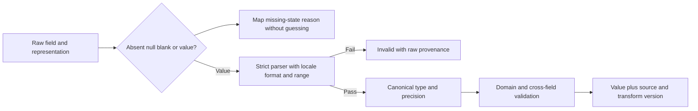

Database types constrain representation but do not prove business truth. An integer in range can still use the wrong unit or definition. Keep type validation separate from semantic validation.

## Unit, scale, and quantitative normalization

Every quantity needs concept, unit, scale, direction, precision, and time. Converting units can be exact or approximate. Record source and target units and transformation formula.

| Quantity | Source examples | Canonical decision | Pitfall |
|---|---|---|---|
| Duration | milliseconds, seconds, ISO duration | Store explicit unit or normalized duration | Treat `60` as seconds without contract |
| Bytes | bytes, KB, KiB, MB | Declare decimal/binary multiplier | 1000 versus 1024 confusion |
| Percentage | 0-1, 0-100, basis points | Preserve scale metadata | `0.8` becomes 0.8% instead of 80% |
| Risk score | 0-10, 0-100, labels | Preserve source model; map only under approved method | False comparability |
| Temperature | C/F where relevant to device context | Formula and precision | Unit omitted |
| Currency | Amount and currency code | Keep currency; conversion needs rate/time/source | Sum mixed currencies |
| Version | Semantic version/string | Treat as structured identifier if needed | Numeric sort of `1.10` and `1.9` |

For a linear unit conversion:

$$
y = a x + b
$$

record $a$, $b$, source/target units, precision, rounding, valid range, and mapping version. For example, Celsius to Fahrenheit uses $a=9/5$ and $b=32$, but security score conversions are usually not legitimate linear unit conversions because they represent different models and populations.

### Plain-English deep-dive 2 - Scores are recipes, not temperatures

Thirty degrees Celsius and 86 degrees Fahrenheit describe the same physical temperature under a known formula. A severity score of 8 from Tool A and 80 from Tool B do not necessarily describe the same risk under a simple multiplier. The tools may use different inputs, weights, populations, clocks, and meanings.

Preserve the source score, model/version, range, direction, observation time, and context. Create a cross-source classification only when owners define and validate a defensible method. Otherwise show values side by side rather than manufacturing a universal number.

## Enumeration and code-list mapping

An enumeration maps approved values to defined concepts. New values should become unmapped exceptions, not silently default to "other" or "low." Lookups need effective dates, source/version scope, owner, and test cases.

| Source code | Source definition | Canonical target | Relation | Disposition |
|---|---|---|---|---|
| `P1` | Source-documented urgent queue | `workflow_priority_urgent` | Exact under source v3 | Map |
| `5` | Source severity highest under model X | `source_severity_highest` | Exact source preservation | Map, do not call enterprise risk |
| `closed` | Ticket workflow closed | `ticket_state_closed` | Exact workflow state | Never map to remediated |
| `inactive` | Agent not recently reporting | Unknown until definition/time | Ambiguous | Steward review |
| `N/A` | Could mean not applicable or missing | No target until reason known | Unknown | Reject/hold |
| New `P0` | Not in approved lookup | `unmapped` | No approved relation | Quarantine/warn by policy |

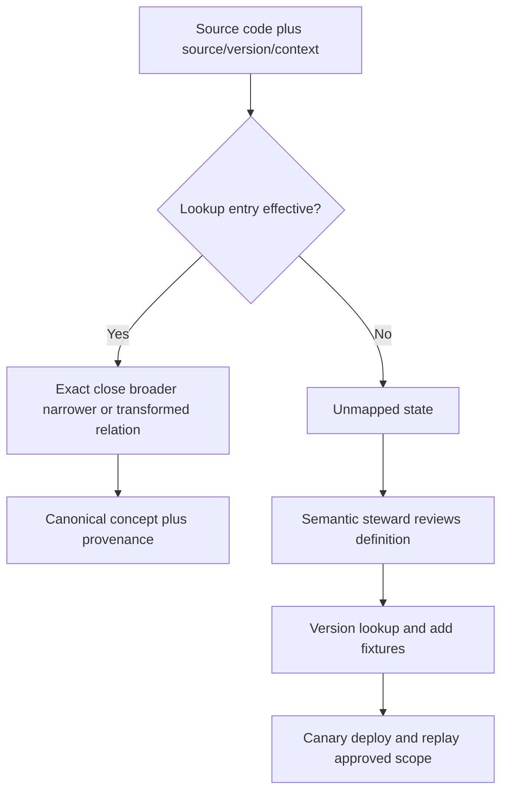

Use stable concept identifiers independent of display labels. Renaming "Critical" to "Urgent" should not accidentally create a new concept if meaning is unchanged; changing inclusion criteria should create a semantic version/change even if the label stays the same.

## Mapping rules, lookups, defaults, and unknowns

A mapping specification should be detailed enough for an independent person to reproduce the result and challenge false equivalence.

| Mapping field | Required content |
|---|---|
| Mapping ID/version | Stable identifier and change history |
| Source | System, object, path, schema/API version, definition |
| Target | Canonical concept/path/model version, definition |
| Condition | Source type, tenant, record subtype, effective period |
| Transformation | Parse, normalize, lookup, calculation, relationship logic |
| Missing behavior | Absent/null/blank/unknown/not-applicable/withheld |
| Invalid behavior | Reject, quarantine, warn, preserve raw, owner |
| Default | Exact condition, rationale, risk, owner, expiry |
| Information loss | Values/precision/context not retained |
| Provenance | Raw reference, transform activity/version, time |
| Tests | Known, boundary, negative, unknown, drift, rollback |
| Consumer impact | Reports, rules, workflows, models using output |
| Approval | Source owner, semantic steward, security/privacy as needed |

Defaults are dangerous when they convert uncertainty into a decision. An absent criticality should not become low. A missing control observation should not become control absent or healthy without a completeness model. Safe defaults often concern presentation or technical behavior, not substantive risk facts, and still require documentation.

| State | Meaning | Analytical behavior | Operational behavior |
|---|---|---|---|
| Absent | Field not provided/present | Count separately | Hold if required |
| Explicit null | Source provided null | Preserve source state/reason if known | Follow required-field policy |
| Unknown | Applicable but not known | Keep in denominator as unknown where appropriate | Review/limited action |
| Not applicable | Concept does not apply | Exclude from applicable denominator | No action for that rule |
| Withheld | Exists but unavailable by policy | Show restricted/withheld state | Route to authorized process |
| Invalid | Violates syntax/domain/cross-field rule | Reject from trusted measure | Quarantine/repair |
| Unmapped | New/undefined source value | Surface mapping debt | No guessed action |
| Conflicting | Sources assert incompatible values | Show conflict and provenance | Steward/human decision |

## Time normalization and temporal semantics

Time is not one field. Distinguish event time, observation time, source update time, effective-from/to, extraction, receipt, processing, and system/version time. An instant includes an offset or is explicitly UTC; a local date/time needs a named zone and ambiguity policy; a date-only value should remain a date unless an owner defines an instant.

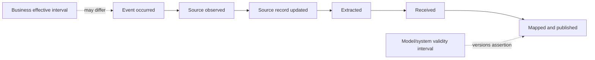

| Time issue | Unsafe behavior | Controlled treatment |
|---|---|---|
| No offset/zone | Assume UTC | Preserve local/unknown; resolve contract |
| DST repeated time | Choose first silently | Use offset/zone and ambiguity rule |
| Date only | Set midnight UTC | Retain date grain |
| Unix timestamp | Guess seconds/milliseconds | Contract magnitude/unit and range |
| Precision mismatch | Truncate silently | Record target precision and tie-breaker |
| Future time | Accept blindly | Validate clock/skew/domain |
| Effective versus observed | Use latest received as truth | Model both intervals |
| Late record | Rewrite history invisibly | Version/restatement policy |
| Open-ended interval | Use arbitrary far-future date without convention | Explicit unbounded representation |

For time-varying owners and relationships, retain effective intervals. Joining a finding from January to the current owner in August can misassign historical accountability. Consumers should choose current-state or as-of semantics deliberately.

## Custom fields, entities, and relationships

Custom models support organization-specific business context, but extensions can fragment semantics and increase privacy, cost, and upgrade risk. Use a namespace, stable ID, definition, purpose, owner, type/unit/code list, applicability, classification, retention, source authority, quality, relationships, consumers, tests, and deprecation plan.

| Extension proposal field | Synthetic NMH example |
|---|---|
| Namespace/name | `nmh:business_service_tier` |
| Concept | Approved operational criticality tier for a business service |
| Purpose | Prioritization and executive segmentation |
| Entity/applicability | Business service; production and shared services |
| Type/code list | Enum `tier_1` to `tier_4`, `unknown`, not free text |
| Authority | Enterprise service governance register |
| Effective time | Versioned effective interval |
| Classification | Internal business context |
| Missing behavior | Unknown, not `tier_4` |
| Consumers | Exposure report, reviewed prioritization factor |
| Tests | Every code, unknown, invalid, history, conflict, rollback |
| Owner/lifecycle | Service governance steward; annual review/deprecation |

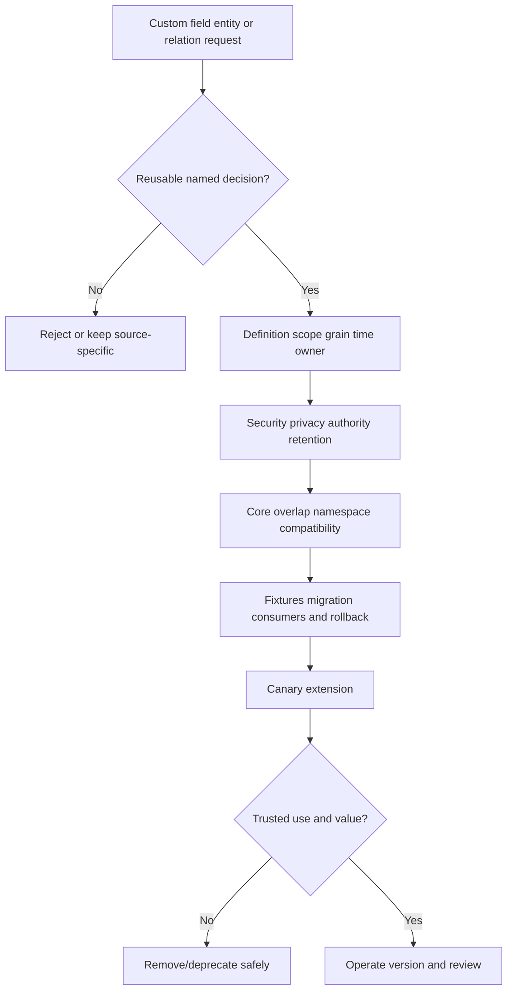

Keep source-specific fields when their meaning is useful but not canonical. Do not force every value into a shared core. A namespaced extension can preserve useful detail while preventing false universal meaning.

## Organizational hierarchy and multi-parent reality

Organizations rarely have one stable tree. Legal entity, management reporting, cost center, geography, business service, risk ownership, and technical support can form different hierarchies. Mergers and reorganizations change them over time. An employee or asset can belong to several relevant structures.

| Hierarchy | Parent relation | Use | Caveat |
|---|---|---|---|
| Legal entity | legally part of | Regulatory/contract scope | Not reporting line |
| Management | reports through | Accountability/escalation | Matrix reporting/moves |
| Cost center | charged to | Budget analysis | Shared services |
| Geography | located/operates in | Regional operations/residency context | Remote/global resources |
| Business service | depends on/supports | Impact and service ownership | Graph, not simple tree |
| Technical support | operated by | Ticket routing | Outsourced/shared teams |
| Risk ownership | risk accepted by | Governance | May differ from technical owner |

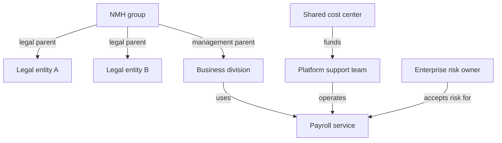

Model relation type, direction, effective dates, source, confidence, and path rules. A rollup across a hierarchy needs a declared hierarchy version and as-of date. Avoid recursive cycles where a tree is required; where reality is a graph, do not force it into one parent and lose meaning.

### Plain-English deep-dive 3 - The org chart is not the organization

An org chart shows one reporting view. It does not show which legal entity signs a contract, which cost center funds a service, which platform team operates it, which executive accepts risk, or which region's rules apply. Treating the org chart as universal ownership sends tickets and reports to the wrong people.

Use separate named relationships and effective periods. A person may report to one manager, support a service owned elsewhere, and hold a temporary incident role. The model should answer the specific ownership question instead of returning one generic `owner` field.

## Validation layers and error handling

Validation asks different questions in order. Passing one layer does not prove the next.

| Layer | Question | Example failure | Typical disposition |
|---|---|---|---|
| Transport/integrity | Did complete authorized bytes arrive? | Truncated file/hash mismatch | Reject unit |
| Parse | Is syntax valid for declared format? | Invalid JSON/XML/CSV quoting | Quarantine/reject |
| Structural schema | Required paths/types/shapes present? | Array where object expected | Quarantine/version review |
| Domain | Value in allowed range/code/pattern? | Unknown enum/negative bytes | Unmapped/quarantine |
| Cross-field | Do fields agree? | Closed before opened | Quarantine/warn |
| Referential | Do referenced entities/keys exist? | Unknown service ID | Hold/orphan policy |
| Temporal | Intervals/order/clocks valid? | Effective end before start | Quarantine |
| Semantic mapping | Does target preserve intended meaning? | Ticket closed -> remediated | Stop mapping and correct |
| Fitness for use | Is quality sufficient for this decision/action? | Owner confidence too low for automation | Analysis-only/review |
| Security/privacy | Is processing authorized/minimized? | Prohibited personal field | Reject/contain/incident |

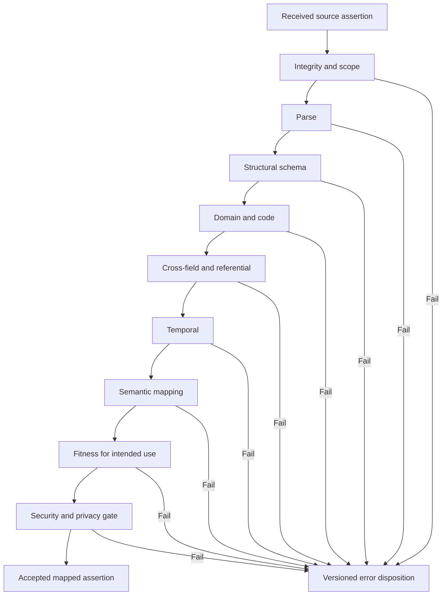

Warnings must not become ignored noise. Define severity, action, owner, age target, use restriction, and closure. Error messages should include safe source path, rule/version, expected/observed category, and correlation ID while excluding secrets and unnecessary sensitive values.

## Schema drift and semantic drift

Schema drift includes added/removed/renamed fields, changed types, nesting, cardinality, requiredness, formats, or relationships. Semantic drift includes changed definitions, units, code meanings, population, grain, time behavior, or authority. Semantic drift can occur with identical JSON shape and is often harder to detect.

| Drift | Example | Compatibility question | Detection |
|---|---|---|---|
| Add optional field | `region` appears | Do strict consumers reject unknowns? | Schema diff/contract test |
| Remove field | `owner_id` absent | Is field required for action? | Presence alert |
| Type change | Integer to string | Can parser handle all valid values? | Type profile |
| Cardinality change | One owner to array | Does target model support many? | Shape/cardinality diff |
| Enum addition | New `deferred` state | Is mapping approved? | Code-list diff |
| Unit change | Seconds to milliseconds | Does label/metadata change too? | Distribution and contract diff |
| Definition change | "active" threshold from 7 to 30 days | Are trends restated/versioned? | Owner notice and distribution shift |
| Grain change | One row per asset to asset-interface | Do counts/keys change? | Uniqueness/cardinality tests |
| Authority change | HR replaces directory for status | What effective date and migration? | Governance/change record |

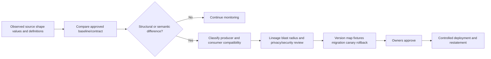

Do not automatically accept every additive field. It can increase payload size, reveal sensitive data, trigger strict consumer failure, or change object semantics. Do not automatically reject every additive field either; classify actual producer and consumer behavior.

## Versioning strategy

Version source contract, parser, source schema, mapping, lookup/code list, canonical model, entity-resolution inputs, validation rules, report/metric, and workflow independently. A single "v2" label hides which behavior changed.

| Versioned object | Why separate | Example impact |
|---|---|---|
| Source API/export | Producer contract changed | New field/type or endpoint |
| Parser | Representation handling changed | Duplicate-key/encoding behavior |
| Source schema | Structural validation changed | Record acceptance changes |
| Mapping | Source-to-target logic changed | Canonical values restate |
| Lookup/code list | Enum meaning changed | Group membership changes |
| Canonical model | Entity/attribute/relation definition changed | Consumer migration |
| Validation | Quality rule changed | Quarantine volume changes |
| Hierarchy | Parent relations/effective dates changed | Rollups/owners change |
| Consumer metric | Denominator/calculation changed | Trend comparability |
| Workflow | Trigger/action mapping changed | Side effects change |

Semantic versioning labels can communicate intent, but do not prove compatibility. A supposedly minor optional field can break a strict consumer; an unchanged schema with redefined `active` can be a major semantic break. Test real contracts and fixtures.

## Test fixtures and mapping QA

Fixtures are small, controlled examples with known expected outputs and dispositions. They should include representative and adversarial boundaries, not only happy paths. Use synthetic or approved minimized data.

| Fixture class | Example | Expected assertion |
|---|---|---|
| Known valid | Approved asset record | Exact canonical attributes/provenance |
| Missing | Absent optional/required field | Correct missing state/disposition |
| Null/blank | Each representation | No collapse without rule |
| Type boundary | Max integer/decimal precision | No overflow/rounding surprise |
| Unit | Seconds and milliseconds | Correct formula and metadata |
| Enum | Every known plus unknown new value | Mapped or unmapped as approved |
| Time | Offset, DST, date-only, late record | Correct temporal representation |
| Relationship | Valid, orphan, many-parent, cycle | Correct edge/disposition |
| Security | Prohibited field/tenant | Reject/contain with safe error |
| Drift | Added/removed/type/meaning version | Compatibility action |
| Regression | Prior defect sample | Defect cannot recur |
| Rollback | New then old version | Prior outputs restored/reconciled |

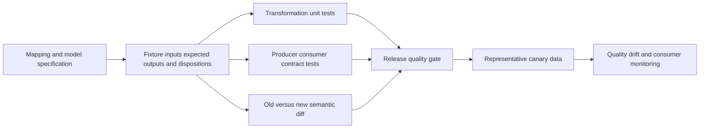

Compare old and new outputs at field, entity, relationship, aggregate, report, and workflow levels. A zero parse-error release can still create large semantic changes. Define expected differences and investigate unexpected ones.

## Lineage and provenance

For every important canonical value or relationship, users should be able to determine source assertion, record/object/page, received time, source/effective time, mapping/lookup/model versions, transformation, quality result, and preferred-value decision. This enables trust and impact analysis.

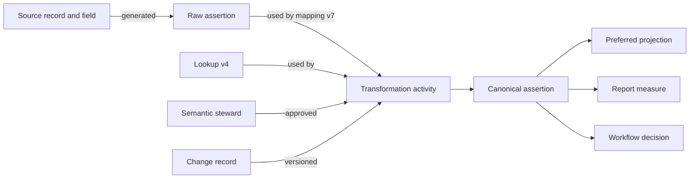

| Lineage question | Evidence |
|---|---|
| Where did this value come from? | Source, object, field, record ID, times |
| What changed it? | Transformation/mapping/lookup/validator versions |
| Why is it preferred? | Authority, quality, effective time, survivorship reason |
| Which consumers use it? | Reports, rules, workflows, exports |
| What breaks if corrected? | Entity/period/action blast radius |
| Who approved meaning? | Steward/owner and decision record |
| Can it be replayed? | Raw receipt retention and compatible versions |
| Is access appropriate? | Classification, purpose, role, audit |

Lineage itself can expose sensitive architecture and identifiers. Apply access control, minimization, and retention. "Traceable" does not mean visible to everyone.

## Semantic ownership and RACI

| Decision/activity | Source owner | Semantic steward | Data/platform engineer | Security/privacy | Consumer owner | TSM |
|---|---|---|---|---|---|---|
| Define source field | A/R | C | I | C | C | I |
| Profile source | C | A | R | C | C | C |
| Define canonical concept | C | A/R | C | C | C | C |
| Approve enum/lookup | C | A/R | R | C | C | C |
| Approve extension | C | A | R | C | C | C |
| Implement mapping | C | A | R | C | C | I |
| Accept validation policy | C | A | R | C | C | C |
| Approve privacy/access | I | C | C | A/R | C | I |
| Approve consumer behavior | I | C | C | C | A/R | C |
| Deploy/rollback | I | A | R | C | C | I |
| Communicate impact | C | A | R | C | C | R |

This is a synthetic starting point. Actual roles vary. The TSM should facilitate definitions, surface conflicts, coordinate evidence, and communicate impact, but should not unilaterally define customer business semantics or approve sensitive processing.

## Deployment, change, and rollback

Mapping changes can alter counts, risk factors, owners, reports, and workflows without changing raw data. Treat them as production behavior changes. Separate development/test/production, use versioned artifacts, peer/steward review, representative fixtures, semantic diff, canary, monitoring, and rollback.

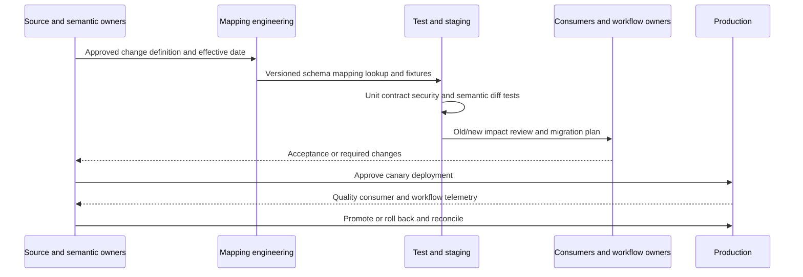

| Release artifact | Required content |
|---|---|
| Change request | Problem, evidence, scope, owner, urgency |
| Semantic decision | Old/new definitions, examples, counterexamples |
| Version set | Source/schema/parser/map/lookup/model/validator/consumer |
| Test report | Fixture coverage, old/new diff, security, performance |
| Impact | Entities, periods, reports, scores, workflows, privacy |
| Migration | Dual-read/write, backfill, restatement, consumer update |
| Canary | Population, duration, success/abort criteria |
| Rollback | Prior artifacts/state, compatibility, data/action reconciliation |
| Communication | Users, dates, visible metric/definition changes |
| Post-change | Monitoring, review, defects, closure |

Rollback is not merely redeploying old code. New canonical records may have been published, caches refreshed, reports exported, tickets created, or downstream state changed. Plan data and operational reconciliation.

### Plain-English deep-dive 4 - A mapping change is a policy change in disguise

If `unknown` begins mapping to `low`, a risk report can improve without any control changing. If a new owner precedence rule takes effect, thousands of tickets can move. If ticket `closed` begins mapping to exposure `remediated`, backlog can disappear on paper.

Mapping code may look technical, but it encodes meaning and therefore affects policy and decisions. Semantic owners and consumers must review it. Deploy with the same care as a rule or workflow change: examples, impact, canary, rollback, and transparent restatement.

## Mapping troubleshooting decision tree

Start with one exact source record, expected target value, actual target value, effective time, and versions. Then trace the first divergence.

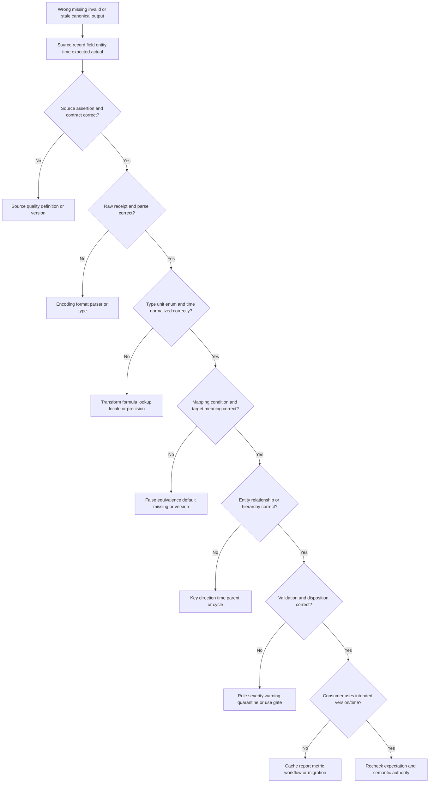

| Evidence packet | Contents |
|---|---|
| Symptom | Expected/actual value or relation and user impact |
| Scope | Source, tenant, entity type, IDs, interval, consumers |
| Raw evidence | Authorized source record/path/value and source definition |
| Profile | Presence/type/range/code/distribution around defect |
| Version set | Source, parser, schema, map, lookup, model, validator, consumer |
| Mapping trace | Conditions, transformations, defaults, reason codes |
| Temporal trace | Event/effective/source/receipt/process times |
| Lineage | Raw-to-canonical-to-report/workflow path |
| Blast radius | Affected records/entities/periods/metrics/actions |
| Recovery | Corrected fixture, replay/diff, rollback, reconciliation, owners |

## Complete synthetic NMH harmonization exercise

NMH combines fictional CMDB, cloud, endpoint, scanner, directory, and ticket data for payroll exposure analysis. The exercise preserves every source score/state and creates only a small canonical core.

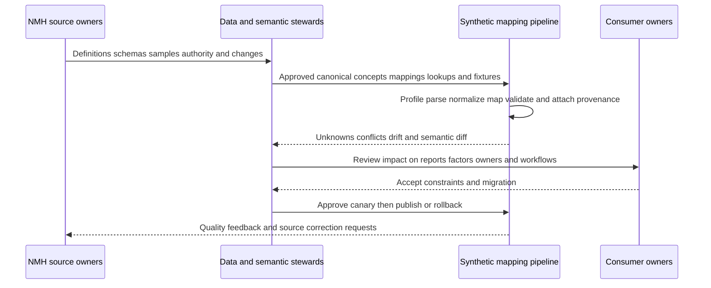

| Source fact | Canonical treatment | Deliberate non-treatment |
|---|---|---|
| Scanner severity `5` under model X | Preserve `source_severity=5`, model/range/time | Do not call it enterprise risk 50 |
| Ticket state `closed` | Map to `ticket_state_closed` | Do not set exposure remediated |
| CMDB owner missing | `owner_state=unknown` | Do not use generic help desk default |
| Cloud `prod` tag | Candidate environment assertion | Do not override governed service environment automatically |
| Endpoint last seen naive local time | Hold until zone contract or preserve local unknown | Do not assume UTC |
| Directory disabled | Identity access-state assertion at time | Do not infer employment termination |
| Service tier custom code | Map through versioned NMH code list | Do not make it universal core |
| Asset supports payroll | Time-bound sourced relationship | Do not infer causal incident impact |

Synthetic change: the CMDB source changes `criticality` from integer `1-4` to strings `tier_1-tier_4` and introduces `tier_0`. The schema shape and code list change. NMH profiles the new version, obtains definitions, discovers that `tier_0` means safety-critical and is not simply above the previous tier 1, adds a distinct concept and fixtures, versions the mapping and report legend, performs an old/new semantic diff, canaries one service, and then migrates. It does not guess by numeric order.

Synthetic defect: a developer defaults unmapped owner department to `IT`. The executive report shifts apparent IT exposure upward and ticket routing changes. Lineage identifies mapping v12 as the first divergence. NMH pauses affected workflows, rolls back to v11, republishes unknown department, reconciles tickets, adds an unmapped fixture, and requires steward approval for future defaults.

## Synthetic exercises with answers

### Exercise 1 - Profiling

The source documentation says `owner_id` is required, but 12% of records lack it. Which is correct?

**Answer:** Both are evidence: documentation states intent, profiling shows observed behavior. Do not invent owners. Quantify segments/time, confirm scope and extraction, ask the source owner, set an explicit missing-state and acceptance policy, and track the contract defect.

### Exercise 2 - Canonical model

Should every source field become a canonical attribute?

**Answer:** No. The core should contain reusable, defined concepts needed by approved uses. Preserve source-specific assertions and add governed namespaced extensions when justified. A union of all fields creates unstable, ambiguous semantics.

### Exercise 3 - Type conversion

Can asset ID `00123` be converted to integer 123?

**Answer:** Only if the source owner proves leading zeros are insignificant and consumers accept the change. Identifiers are usually text with issuer/scope; numeric appearance does not make them quantities.

### Exercise 4 - Scores

Can scores 8/10 and 80/100 be treated as equal?

**Answer:** Not from arithmetic alone. Compare model, inputs, population, direction, calibration, and time. Preserve source scores. Map only under an owner-approved validated method.

### Exercise 5 - Unknown enum

A new source status `deferred` appears. Map it to `open`?

**Answer:** Not until its definition and lifecycle semantics are approved. Mark unmapped, preserve raw/provenance, assess impact, version the lookup, add fixtures, and replay affected scope after approval.

### Exercise 6 - Defaults

Can missing business criticality default to low?

**Answer:** No by default. That converts missing evidence into a risk-lowering fact. Preserve unknown, expose quality, and require review or conservative use behavior under approved policy.

### Exercise 7 - Time

Can a date-only certificate field be converted to midnight UTC?

**Answer:** Not without a contract defining that instant. Keep date grain or obtain source semantics. An arbitrary time can change expiry logic across zones.

### Exercise 8 - Hierarchy

Which owner should a generic `owner` field hold?

**Answer:** Replace the generic question with typed relationships: service owner, technical operator, data owner, risk owner, financial owner, and effective time. One field cannot safely represent all roles.

### Exercise 9 - Drift

An optional field is added. Is the change automatically backward compatible?

**Answer:** No. Strict consumers may reject unknown fields, payload cost/privacy can change, and meaning can shift. Test actual producer/consumer behavior and classify security/semantic impact.

### Exercise 10 - Validation

Valid JSON passes the schema. Is the record trustworthy?

**Answer:** Only syntax and declared structural constraints passed. Domain, cross-field, referential, temporal, semantic, fitness, source accuracy, and security/privacy checks remain.

### Exercise 11 - Rollback

Mapping v5 created tickets before rollback. Is redeploying v4 enough?

**Answer:** No. Reconcile published data, caches, reports, tickets, notifications, checkpoints, and historical restatements. Rollback needs operational repair, not only code replacement.

### Exercise 12 - Product claim

Can Arti describe a specific Zscaler custom entity schema?

**Answer:** Not from the reviewed public pages. She can explain general extension design and say Zscaler publicly describes a customizable model, then verify current tenant documentation and specialists.

## Labs and rehearsal

### Lab 1 - Source profile

Profile synthetic structure, field presence, null states, type, range, cardinality, uniqueness, patterns, relationships, time, and drift across three source versions. Protect sensitive samples.

### Lab 2 - Canonical model

Define asset, person, application, service, finding, vulnerability, control observation, ticket, and assertion entities. State grain, lifecycle, attributes, relationships, identifiers, and counterexamples.

### Lab 3 - Type clinic

Test leading-zero IDs, booleans, big integers, decimals, arrays, nested objects, empty strings, invalid UTF-8, and ambiguous timestamps. Preserve raw values and expected dispositions.

### Lab 4 - Unit and score clinic

Convert valid duration/byte/percentage units with precision metadata. Refuse an invalid cross-tool risk-score conversion and explain why.

### Lab 5 - Enum lookup

Build a versioned lookup with exact, close, broader, narrower, transformed, unknown, and deprecated relations. Inject a new code and run steward workflow.

### Lab 6 - Missing states

Create fixtures for absent, null, blank, unknown, not applicable, withheld, invalid, unmapped, and conflicting. Define analytical denominators and operational behavior.

### Lab 7 - Time model

Model event, observed, updated, effective, received, processed, and system time. Test offsets, DST, date-only, precision ties, late data, open intervals, and as-of joins.

### Lab 8 - Custom extension

Propose one custom field, entity, and relationship. Complete purpose, namespace, definition, type, authority, classification, lifecycle, consumers, compatibility, tests, and deprecation. Reject one unnecessary proposal.

### Lab 9 - Organization graph

Model legal, reporting, cost, geography, business service, support, and risk ownership as separate effective relationships. Test multi-parent, cycle, reorganization, and historical rollup.

### Lab 10 - Validation matrix

Write transport, parse, structural, domain, cross-field, referential, temporal, semantic, use, and security validations with severity, disposition, owner, age, and safe message.

### Lab 11 - Drift simulation

Inject field addition/removal, type/cardinality change, enum addition, unit change, definition change, grain change, and authority change. Classify compatibility and impact.

### Lab 12 - Fixture suite

Build known, missing, null, boundary, unit, enum, time, relationship, security, drift, regression, and rollback fixtures. Require expected values, reasons, provenance, and consumer diff.

### Lab 13 - Lineage drill

Trace a report value and ticket field to source record, field, times, schema, map, lookup, model, validation, and preferred-value decision. Reverse the trace for blast radius.

### Lab 14 - Release rehearsal

Create change request, semantic decision, version set, tests, diff, impact, migration, canary, rollback, communication, and post-change review. Simulate failed canary.

### Lab 15 - Mapping incident

Run the NMH owner-default defect. Pause actions, preserve versions, find first divergence, roll back, replay, reconcile tickets/reports, notify users, and add prevention.

| Lab evidence | Completion standard |
|---|---|
| Profile | Intended and observed source reality compared |
| Model | Entities, attributes, relationships, grain, time, and ownership clear |
| Normalize | Types, units, enums, and time explicit and loss-aware |
| Missing | Unknown states remain distinct and visible |
| Extension | Namespace, purpose, authority, controls, lifecycle complete |
| Hierarchy | Typed multi-parent effective relationships supported |
| Validation | Layers and dispositions are testable |
| Drift | Structural and semantic change both controlled |
| Tests | Known, negative, boundary, drift, regression, rollback covered |
| Lineage | Source-to-consumer and reverse blast radius reproducible |
| Release | Canary, monitoring, rollback, and reconciliation ready |
| Honesty | No internal Zscaler model or behavior invented |

## Common misconceptions to correct

| Misconception | Correct model |
|---|---|
| Harmonization is column renaming | It aligns representation and meaning under explicit rules |
| Mapping makes source data true | It translates an assertion; source accuracy remains |
| Same field name means same concept | Definitions, grain, scope, time, units, and population matter |
| Same type means compatible | Structural type does not prove semantic equivalence |
| Different labels mean different concepts | Synonyms can map under approved definitions |
| Canonical means one giant table | Shared concepts can have relational, event, document, and graph projections |
| Canonical means every source field | Core is reusable/use-driven; extensions preserve local detail |
| One record equals one entity | Records are source assertions and can duplicate or change |
| Database constraint proves truth | It proves only declared representation/integrity rules |
| Numeric-looking ID is a number | Identifiers often require text, issuer, scope, and leading zeros |
| Boolean unknown can be false | Unknown and false are different evidence states |
| Unit conversion and score conversion are the same | Scores may be different models, not physical measures |
| Scale 0-10 maps to 0-100 by multiplication | Only if semantics/calibration are truly equivalent |
| Enum labels are self-explanatory | Code lists need definitions, source version, and lifecycle |
| New enum can map to other | Unknown mapping debt must remain visible |
| Default improves completeness | It can convert uncertainty into false fact |
| Null means unknown | It may mean absent, not applicable, withheld, invalid, or other state |
| Missing control data means no control | Source coverage and completeness must be known |
| Latest received value is current truth | Effective time, source authority, and late data matter |
| Date-only value can use arbitrary midnight | Keep its grain unless source defines an instant |
| One owner field is enough | Technical, service, data, risk, financial, and reporting roles differ |
| Organization is one tree | Legal, reporting, cost, service, and risk structures differ |
| Valid JSON is valid business data | Semantic and use validation remain |
| Warnings can be ignored | They need owner, severity, age, use restriction, and closure |
| Schema drift is only breaking shape | Meaning can drift while shape remains unchanged |
| Optional additions are always safe | Strict consumers, cost, privacy, and semantics can break |
| Semantic version number proves compatibility | Test real producer/consumer behavior |
| Mapping tests need only happy paths | Unknown, boundary, drift, regression, and rollback matter |
| Lineage is only for auditors | It enables troubleshooting, trust, replay, and blast radius |
| Rollback means redeploy old code | Data, reports, caches, actions, and history need reconciliation |
| Customizable means ungoverned | Extensions need namespace, owner, controls, tests, and lifecycle |
| Public customizable-model wording reveals Zscaler schema | It does not |

## Official Source Anchors

Research/source date: **2026-08-24**.

Zscaler sources support only high-level harmonize/map and customizable-model positioning. W3C, JSON Schema, RFC, ISO, PostgreSQL, and NIST sources support general semantic, schema, provenance, type, and control concepts. None establishes an internal Zscaler schema or mapping implementation.

| Source | URL | Used for | Boundary |
|---|---|---|---|
| Zscaler Data Fabric for Security | https://www.zscaler.com/products-and-solutions/data-fabric | Public customizable data model; ingest; harmonize and map; deduplicate; correlate and enrich | No internal entity, field, type, mapping language, validator, version, or deployment claim |
| Zscaler Data Fabric Integrations | https://www.zscaler.com/products-and-solutions/data-fabric/integrations | Public source breadth and custom-source context | Catalog does not define common schema |
| W3C RDF 1.1 Concepts | https://www.w3.org/TR/rdf11-concepts/ | Resource, IRI, literal, triple, and graph concepts | Not required product representation |
| W3C OWL 2 Overview | https://www.w3.org/TR/owl2-overview/ | Ontology class/property formalism context | Formal ontology may be unnecessary |
| W3C SKOS Reference | https://www.w3.org/TR/skos-reference/ | Concepts, labels, broader/narrower, mapping relations | Concept schemes need organization governance |
| W3C SHACL | https://www.w3.org/TR/shacl/ | Graph shape and validation concepts | Passing shapes does not prove truth |
| W3C PROV-O | https://www.w3.org/TR/prov-o/ | Entity/activity/agent provenance concepts | Vocabulary, not Zscaler lineage schema |
| JSON Schema 2020-12 Core | https://json-schema.org/draft/2020-12/json-schema-core | Schema resources, vocabularies, identifiers, applicators | Published specification/implementation behavior must be known |
| JSON Schema 2020-12 Validation | https://json-schema.org/draft/2020-12/json-schema-validation | Type, enum, required, range, pattern, format context | Structural validation not semantic truth |
| RFC 8259 JSON | https://www.rfc-editor.org/rfc/rfc8259 | JSON syntax, values, interoperability considerations | Does not define business schema |
| RFC 3339 Date and Time | https://www.rfc-editor.org/rfc/rfc3339 | Internet timestamp profile and offsets | Date-only/local business-time semantics remain separate |
| ISO/IEC 11179-1 | https://www.iso.org/standard/78914.html | Metadata registry framework context | Full standard/access/applicability varies |
| PostgreSQL 17 Data Types | https://www.postgresql.org/docs/17/datatype.html | Database type behavior context | Version-specific; database type is not business meaning |
| PostgreSQL 17 JSON Types | https://www.postgresql.org/docs/17/datatype-json.html | JSON/JSONB representation tradeoffs | Not a product storage claim |
| NIST SP 800-53 Rev. 5 | https://csrc.nist.gov/pubs/sp/800/53/r5/upd1/final | Access, integrity, audit, configuration, privacy control context | Requires tailoring and assessment |
| NIST Privacy Framework | https://www.nist.gov/privacy-framework | Privacy-risk governance for fields and relationships | Voluntary; not legal advice |

## Likely Interview Questions

### Q1. What is the difference between harmonization and mapping?

**Model answer:** Harmonization makes representations consistently interpretable, such as types, units, code formats, clocks, and missing states. Mapping connects a source concept to a canonical target concept under conditions and a semantic relation. Both preserve raw values, source/version/time, information loss, and provenance. Neither makes an inaccurate source true, and matching labels or types do not prove equivalent meaning.

### Q2. How do you design a canonical security data model?

**Model answer:** I start with reusable decisions and define source-neutral entities, grain, lifecycle, scoped identifiers, attributes, events, and typed directional time-bound relationships. I separate entities from source assertions and retain conflicts/provenance. The core stays small and stable; source-specific details remain as assertions or governed namespaced extensions. Every concept has a definition, owner, applicability, time, version, and counterexamples.

### Q3. How do you normalize types, units, enums, and time safely?

**Model answer:** I use strict parsing with range, precision, locale, encoding, and missing-state rules; preserve raw values; label units/scale/formulas; preserve source scores/models rather than force arithmetic equivalence; version code-list lookups and hold unknown values; and distinguish event, observed, updated, effective, received, and processed time. Ambiguous local/date-only values remain ambiguous until the source contract resolves them.

### Q4. How do you handle defaults, unknowns, and custom fields?

**Model answer:** I separate absent, null, blank, unknown, not applicable, withheld, invalid, unmapped, and conflicting. Defaults require an exact condition, owner, rationale, risk, expiry, provenance, and tests; I never default missing risk context to low or false. A custom field/entity needs namespace, use, definition, type/unit/code list, source authority, classification, lifecycle, consumers, compatibility, fixtures, and deprecation.

### Q5. How do you represent organizational hierarchy?

**Model answer:** I avoid one generic owner/tree. I model legal, reporting, cost, geography, service, technical support, data, and risk ownership as separate typed directional relationships with effective intervals, source, and confidence. I support multi-parent graph reality, define rollup path and hierarchy version, test cycles, and distinguish current from historical ownership.

### Q6. How do you detect and manage schema or semantic drift?

**Model answer:** I compare observed shape, types, fields, cardinality, codes, distributions, definitions, units, grain, time, and authority against approved baselines. I classify actual producer/consumer compatibility and security/privacy impact, trace lineage blast radius, version source/schema/map/lookup/model/validator independently, add fixtures and migration, run semantic diff/canary, communicate restatement, monitor, and retain rollback.

### Q7. How do you troubleshoot and roll back a bad mapping?

**Model answer:** I scope one exact source record, expected/actual target, time, and version set, then trace raw receipt, parse, type/unit/enum/time normalization, mapping condition/default, relationship/hierarchy, validation, and consumer. I pause unsafe workflows, quantify entities/periods/reports/actions, fix and test in staging, compare old/new, deploy or roll back, replay affected scope, reconcile downstream state, communicate restatement, and add a regression fixture.

### Q8. How does your background transfer, and what can you claim about Zscaler?

**Model answer:** SQL, PostgreSQL, Power BI, statistics, and Microsoft escalation work taught me to inspect fields, IDs, states, clocks, distributions, quality, and cross-system meaning, then test hypotheses and communicate evidence. I built synthetic NMH mappings and migration labs. Zscaler publicly describes harmonize/map and a customizable model, but I do not claim internal schemas, types, mapping rules, UI, validators, or deployment mechanics. I would validate current tenant documentation, data, owners, and specialists.

## 30-Second Memory Hooks

| Concept | Memory hook |
|---|---|
| Profile | Measure source reality before translating |
| Harmonize | Tune representations |
| Map | Translate meaning with conditions |
| Canonical | Shared form, not universal truth |
| Entity | Noun with lifecycle |
| Attribute | Typed time-bound property assertion |
| Relationship | Directed governed verb |
| Grain | One row/assertion equals what? |
| Type | Shape is not meaning |
| Identifier | Text plus issuer, scope, and time |
| Unit | Label the ruler |
| Score | Recipe, not temperature |
| Enum | Versioned menu with definitions |
| Lookup | Translation dictionary with effective date |
| Default | Filling uncertainty can create false fact |
| Unknown | Visible evidence state |
| Unmapped | No approved dictionary entry |
| Time | Event, effective, received, processed differ |
| Custom | Namespaced need with owner and lifecycle |
| Hierarchy | Several typed structures, not one org chart |
| Validation | Syntax through semantic and use gates |
| Drift | Shape or meaning changed |
| Version | Source, schema, map, lookup, model separately |
| Fixture | Small example with an answer key |
| Lineage | Source-to-decision route and reverse blast radius |
| Rollback | Restore behavior and reconcile consequences |
| Arti bridge | Data translation and RCA transfer; product internals do not |

## Completion Checklist

- [ ] I can distinguish source schema, observed profile, canonical model, harmonization, mapping, and extension.
- [ ] I profile grain, presence, nulls, types, range, cardinality, patterns, uniqueness, distribution, relationships, time, and drift.
- [ ] I compare documentation with observed data without inferring meaning from frequency.
- [ ] I protect representative samples and avoid leaking sensitive values in profiles.
- [ ] I define canonical entities, attributes, relationships, assertions, events, findings, and extensions.
- [ ] I state entity grain, lifecycle, identifiers, scope, time, owner, version, examples, and counterexamples.
- [ ] I separate entities from source records and retain source assertions/conflicts.
- [ ] I keep the canonical core reusable and use-driven rather than unioning every field.
- [ ] I preserve source-specific data when exact canonical equivalence is not justified.
- [ ] I perform strict type parsing with locale, range, precision, rounding, overflow, encoding, and missing behavior.
- [ ] I do not convert numeric-looking identifiers without proving identifier semantics.
- [ ] I never collapse failed parses to zero, unknown to false, or blank to absent silently.
- [ ] I record source and target units, scale, formula, precision, rounding, and version.
- [ ] I preserve source risk/severity scores, model, range, direction, population, context, and time.
- [ ] I do not linearly convert different scoring models without validated equivalence.
- [ ] I use versioned code lists/lookups with source/version/effective scope and semantic relation.
- [ ] I treat new enum values as unmapped until steward approval.
- [ ] I distinguish display-label changes from definition changes.
- [ ] I write mapping ID, source, target, condition, transformation, missing/invalid/default behavior, loss, provenance, tests, consumers, and approvals.
- [ ] I distinguish absent, null, blank, unknown, not applicable, withheld, invalid, unmapped, and conflicting.
- [ ] I never default missing criticality/control/owner/risk context to a favorable fact without approved evidence.
- [ ] I define analytical denominator and operational behavior for every missing state.
- [ ] I distinguish event, observed, source-updated, effective, extracted, received, processed, and system time.
- [ ] I preserve offset/zone and do not assume UTC for naive local timestamps.
- [ ] I keep date-only values at date grain unless an owner defines an instant.
- [ ] I model effective intervals for owners, hierarchy, and relationships.
- [ ] I govern custom fields/entities/relationships with namespace, purpose, definition, type, authority, classification, lifecycle, consumers, tests, and deprecation.
- [ ] I reject or retain source-specific extensions that do not belong in shared core.
- [ ] I model legal, reporting, cost, geography, service, support, data, and risk hierarchies separately.
- [ ] I support multi-parent reality and test cycles, rollups, versions, and historical as-of behavior.
- [ ] I separate transport, parse, structural, domain, cross-field, referential, temporal, semantic, use, and security validation.
- [ ] I know passing JSON/schema/database validation does not prove semantic truth.
- [ ] I define error severity, disposition, owner, age, use restriction, safe message, and closure.
- [ ] I detect field, type, cardinality, enum, unit, definition, grain, time, and authority drift.
- [ ] I classify real producer/consumer compatibility instead of trusting additive/minor labels.
- [ ] I version source API, parser, source schema, mapping, lookup, model, validation, hierarchy, metric, and workflow independently.
- [ ] I build known, missing, null, boundary, unit, enum, time, relationship, security, drift, regression, and rollback fixtures.
- [ ] I compare old/new output at field, entity, relationship, aggregate, report, and workflow levels.
- [ ] I preserve provenance from source field through transformation to canonical assertion and consumer.
- [ ] I can reverse lineage to quantify affected entities, periods, reports, scores, and actions.
- [ ] I apply access, minimization, and retention to lineage itself.
- [ ] I assign semantic ownership and do not let the TSM unilaterally define customer meaning.
- [ ] I deploy changes through review, versioned artifacts, tests, semantic diff, canary, monitoring, and rollback.
- [ ] I plan data, cache, report, workflow, and historical reconciliation during rollback.
- [ ] I communicate definition/version/restatement changes transparently.
- [ ] I can run the mapping troubleshooting tree from source through consumer.
- [ ] I can produce a redacted evidence packet with exact version and temporal trace.
- [ ] I can complete the NMH mapping/change incidents and all fifteen labs.
- [ ] I use the controlled research/source date exactly as 2026-08-24.
- [ ] I make no unsupported Zscaler entity, field, type, mapping, hierarchy, validator, deployment, rollback, production, or outcome claim.
- [ ] I can answer Q1 through Q8 with definitions, analogies, mechanics, examples, tradeoffs, failures, troubleshooting, NMH labs, and an honest Arti bridge.

[Part 62 - Data Fabric Deduplication, Entity Resolution, and Golden Context](Part-62-data-fabric-dedup-entity-resolution.md)