# Part 62 - Data Fabric Deduplication, Entity Resolution, and Golden Context

> **Audience:** Candidates preparing for a Zscaler Security Operations Technical Success Manager role after enterprise Support Escalation Engineering.
>
> **Purpose:** Apply entity-resolution mechanics to multi-source users, assets, applications, and findings; govern identifiers and aliases; compare deterministic and fuzzy evidence; define source precedence and field-level survivorship; preserve confidence and provenance; support reversible merge, split, and unmerge; model temporal records and relationship context; control false-merge and false-split risk; route ambiguity to human review; measure quality; troubleshoot defects; and protect customer trust in golden context.
>
> **Scope and honesty:** Northstar Meridian Holdings, abbreviated NMH, is fictional. Every user, asset, application, finding, source, identifier, alias, rule, feature, score, threshold, confidence, merge, split, golden record, relationship, review, metric, incident, result, and outcome in this Part is synthetic. Zscaler's official public pages support bounded high-level claims that Data Fabric deduplicates data and that Asset Exposure Management uses multi-source entity deduplication, asset resolution, relationships, and golden records. They do not disclose internal matching algorithms, schemas, identifiers, rules, features, thresholds, confidence calculations, survivorship policies, review queues, cluster logic, or guarantees. General entity-resolution methods and NMH examples are educational, not Zscaler implementation claims. Your cross-log correlation, SQL, statistics, data-quality, enterprise escalation, RCA, and customer communication skills transfer; direct production operation of Zscaler Data Fabric entity resolution remains a learning boundary.
>
> **Currency caveat:** Identity sources, asset lifecycles, cloud resources, application catalogs, findings, matching methods, privacy requirements, product interfaces, and public claims change. The controlled research/source date for this Part is exactly **2026-08-24**. Current official documentation, licensed tenant behavior, approved entity contracts, representative labeled samples, privacy/security review, customer risk tolerance, source and semantic owners, direct evidence, and Zscaler and source specialists govern production.

## Section goal

Deduplication asks whether records repeat the same logical assertion. Entity resolution asks whether different records describe the same real-world thing. Golden context presents a useful best-known view of that thing and its relationships while retaining uncertainty and evidence. A clean-looking record is not the objective; a trustworthy, reversible, explainable decision is.

Think of a hospital patient registry. "A. Singh," "Anita Singh," and a patient number might identify one person, but two people can share a name and birth date. Joining the wrong records can disclose information or drive harmful treatment; failing to join the same person can hide medical history. The registry needs scoped identifiers, supporting and contradictory evidence, confidence, human review, and correction. Security entity resolution has the same trust problem for users, assets, applications, and findings.

By the end, you should be able to:

| Outcome | Demonstrated capability | Evidence artifact |
|---|---|---|
| Define entity contracts | State type, population, scope, grain, lifecycle, time, use, and error consequence | Resolution charter |
| Separate dedup and resolution | Distinguish repeated assertions from same real-world entity | Decision taxonomy |
| Classify identity evidence | Govern identifiers, aliases, namespaces, reuse, and negative evidence | Identifier registry |
| Prepare candidates | Normalize carefully and generate plausible pairs without hiding recall loss | Candidate plan |
| Match deterministically | Write exact/composite rules with vetoes and missing behavior | Rule catalog |
| Use fuzzy evidence safely | Compare approximate names/attributes without treating similarity as identity | Feature catalog |
| Decide under uncertainty | Define merge, review, separate, and hold outcomes | Decision policy |
| Build coherent clusters | Prevent weak transitive links and giant clusters | Cluster audit |
| Select golden values | Apply field-specific authority, freshness, and survivorship | Golden-context contract |
| Preserve trust | Retain source assertions, conflicts, confidence, reason, and provenance | Evidence ledger |
| Correct mistakes | Merge, split, unmerge, replay, and repair consumers reversibly | Correction runbook |
| Model time | Handle rename, reimage, reassignment, recreation, reuse, and late evidence | Temporal identity model |
| Use relationships | Add contextual evidence without circular self-proof | Relationship policy |
| Control harm | Analyze false-merge versus false-split consequences by workflow | Risk matrix |
| Review ambiguity | Create minimized, role-controlled human adjudication | Review queue design |
| Measure quality | Track pair, cluster, attribute, review, operational, and business metrics | Quality dashboard |
| Troubleshoot | Find the first faulty normalization, candidate, rule, cluster, or survivorship stage | Evidence pack |
| Protect customer trust | Explain corrections, blast radius, and limitations honestly | Customer communication plan |

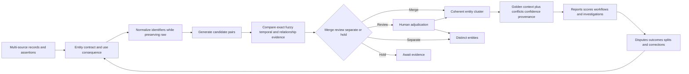

## JD Mapping

| Role expectation | Part 62 capability | TSM artifact | experience bridge and boundary |
|---|---|---|---|
| Develop Data Fabric expertise | Explain documented dedup/golden-record value with general mechanics | Source-bounded whiteboard | Internal algorithms remain unclaimed |
| Analyze complex environments | Reconcile users, assets, apps, findings, and relationships | Entity assessment | Cross-log/device/user correlation transfers |
| Identify security risk | Detect duplicates, fragmentation, false joins, and stale identity | Identity-risk register | Match score is not proof |
| Recommend mitigation | Propose rule, review, threshold, reversal, and governance controls | Resolution plan | Customer owner accepts policy |
| Resolve escalations | Trace false merge/split and downstream impact | Evidence package | RCA and customer communication transfer |
| Lead strategic engagement | Align identity definitions and error tradeoffs to outcomes | Resolution workshop | TSM facilitates stakeholder decision |
| Communicate uncertainty | Separate assertion, preferred value, confidence, and unknown | Trust statement | Avoid false certainty |
| Drive adoption | Make disputes, corrections, and quality visible | Trust/quality scorecard | High match rate is not sufficient value |

## Candidate honesty note

| Evidence class | Safe interview statement | Boundary to state |
|---|---|---|
| Production transfer | "I correlated users, devices, requests, URLs, object IDs, logs, and timestamps during enterprise escalations." | Not production master-data/entity-resolution operation |
| Synthetic practice | "I built and tested NMH deterministic, fuzzy, review, golden-context, and unmerge flows." | Fictional lab evidence |
| Official public fact | "Zscaler publicly describes Data Fabric deduplication and AEM multi-source entity deduplication, asset resolution, relationships, and golden records." | No exact rules, scores, or completeness inferred |
| General method | "I use scoped identifiers, candidate generation, contradictory evidence, consequence-based decisions, and provenance." | Not a disclosed product implementation |
| Match statement | "These records are linked under rule v8 with reason codes and medium confidence." | A method result, not metaphysical proof |
| Golden statement | "This is the preferred owner for this use and effective period, with conflicts visible." | Not one universal source of truth |
| Correction claim | "The affected entities and actions reconciled after synthetic unmerge." | Lab result only |
| Production next step | "I would validate current docs, tenant evidence, labels, privacy, and specialists." | Never invent product behavior |

## Beginner vocabulary and memory hooks

| Term | Plain meaning | Why it matters | Memory hook |
|---|---|---|---|
| Entity | Real-world thing of interest | Security decisions should apply to the thing, not a row | The person, not the form |
| Record | One stored source observation/assertion | Several records can describe one entity | One witness statement |
| Duplicate record | Repeated representation of one logical record/assertion | Can double count and repeat work | Copy of the same form |
| Deduplication | Detect and handle repeated representations | Controls repeated records/messages | Remove copies carefully |
| Entity resolution | Decide which records refer to the same entity | Creates unified identity/context | Which forms describe one thing? |
| Golden context | Preferred entity view plus relationships, conflicts, confidence, and provenance | Supports decisions without hiding uncertainty | Best-known cited case file |
| Golden record | Curated preferred view of one entity | Gives consumers usable identity facts | Index card with receipts |
| Entity contract | Definition of type, scope, grain, lifecycle, time, use, and errors | Matching cannot be correct without defining the thing | Rules for what counts as one |
| Identifier | Value intended to distinguish an entity in a scope | Strong evidence when issuer/time are known | Luggage tag in one airport |
| Namespace | Issuer/scope that gives an identifier meaning | Prevents cross-tenant/type collisions | Which registry issued it? |
| Alias | Alternate identifier or name linked to an entity | Sources and lifecycles use different labels | Nickname/history list |
| Natural key | Meaningful source/business key | Can change, collide, or be reused | Useful label, not eternal truth |
| Surrogate key | System-generated internal identifier | Stabilizes references after resolution | Shelf number |
| Composite key | Several values used together | Adds scope and discrimination | Flight plus seat, not seat alone |
| Normalization | Standardize representation for comparison | Removes superficial differences | Fold maps before comparing |
| Candidate pair | Two records selected for comparison | Candidate is not a match | Worth investigating |
| Blocking | Restrict candidate search to plausible neighborhoods | Makes comparison scalable but can miss true pairs | Search one filing cabinet |
| Deterministic rule | Explicit condition produces a decision | Explainable when identifiers are trustworthy | Same issued ID plus scope |
| Fuzzy match | Approximate comparison of text or values | Handles spelling/format variation | Similar clue, not proof |
| Feature | Measured evidence used in a match decision | Makes logic reproducible | One clue on scorecard |
| Negative evidence | Contradiction against sameness | Prevents attractive false joins | Different passport is a red flag |
| Veto | Rule preventing merge despite other similarity | Protects high-consequence contradictions | Stop sign |
| Score | Combined signal under a method | Supports ranking/decision but needs interpretation | Evidence index, not truth percent |
| Threshold | Boundary mapping evidence to action | Encodes risk and capacity tradeoff | Gate between lanes |
| False merge | Different entities incorrectly combined | Can misattribute risk, ownership, or action | Two people in one file |
| False split | Same entity incorrectly separated | Hides total exposure and duplicates work | One person in two files |
| Cluster | Group of records linked to one entity | Pair decisions must form a coherent whole | Folder of witness statements |
| Transitive link | A linked to B and B to C implies A to C | Can create unsafe weak-bridge clusters | Friend-of-a-friend trap |
| Survivorship | Rule selecting preferred value from assertions | Conflicts require field-level choice | Which witness supplies this fact? |
| Precedence | Ordered preference among sources/rules | Simplifies choice but must be purpose/time specific | Who speaks first for this field? |
| Confidence | Strength of evidence under a declared method | Keeps uncertainty visible | How strong is this case? |
| Provenance | Origin and processing history | Enables inspection and correction | Receipt for each fact/link |
| Merge | Link records into one entity cluster | Changes downstream identity | Staple files with audit |
| Split | Divide a cluster into separate entities | Corrects over-combination | Separate mixed files |
| Unmerge | Reverse a prior merge and repair dependencies | Makes errors correctable | Unstaple and refile |
| Temporal identity | Entity and identifiers change across time | Prevents reuse/reassignment errors | Same badge number, different year |
| Human review | Trained person adjudicates uncertain evidence | Handles high-impact ambiguity | Expert exception desk |
| Precision | Correct predicted matches divided by predicted matches | Measures false-merge control | How often merges are right |
| Recall | Found true matches divided by all true matches | Measures false-split control | How many same entities were found |
| Cluster coherence | Whether all records in a cluster belong together | Pair quality alone can hide weak bridges | Does the whole folder make sense? |

## Product claim boundary

| Claim | Classification | Safe use | Unsupported leap |
|---|---|---|---|
| Data Fabric deduplicates data | Documented Zscaler positioning | Explain the public stage/value | Invent record keys or algorithm |
| AEM uses multi-source entity deduplication | Documented AEM positioning | Explain unified asset inventory use | Claim exact source weighting |
| AEM describes asset resolution and golden-record creation | Documented AEM positioning | Relate resolution to coverage and context | Claim guaranteed completeness/accuracy |
| AEM identifies asset relationships | Documented AEM positioning | Explain relationship context | Invent graph schema or inference rules |
| Deterministic/fuzzy matching, blocking, thresholds, unmerge | General entity-resolution methods | Teach safe design and questions | Present as Zscaler internals |
| NMH match precision is 98% | Synthetic lab metric if labeled | Practice calculation | Present as vendor/customer result |

### Plain-English deep-dive 1 - A golden record is a court file, not a verdict from nowhere

A court file contains witness statements, documents, dates, disputes, rulings, and reasons. The summary may identify the preferred interpretation, but readers can inspect the supporting evidence and correct an error through a process. A trustworthy golden record works similarly.

It should not erase source records or conflicts. It should show which assertions support the chosen name, owner, status, criticality, or relationship; when they were effective; which rule selected them; and how strong the link is. "Golden" means governed and useful, not flawless or permanent.

## Entity contracts by type

Resolution policy differs for users, assets, applications, and findings. A user can change names and email addresses. A laptop can be reimaged while remaining the same physical asset, or a cloud resource name can be recreated as a new entity. An application can have logical and deployed instances. A finding can recur after closure. Define one entity before matching it.

| Contract item | User | Asset | Application | Finding |
|---|---|---|---|---|
| Entity concept | One person/account lifecycle under scope | Physical/logical resource lifecycle | Logical service or deployed instance | One assessed condition occurrence |
| Population | Workforce/guests/service identities as defined | Managed/cloud/network/other in-scope assets | Registered/deployed applications | Source findings in approved scope |
| Strong IDs | Tenant object/HR ID under issuer/time | Cloud resource/agent/serial under scope | App registry/deployment ID | Source finding ID plus target/scope |
| Mutable aliases | Name, UPN, email | Hostname, IP, tag | Display name, URL, repo | Title, plugin label, ticket key |
| Lifecycle hazard | Guest/member, deletion/recreation, email reuse | Reimage, replacement, ephemeral recreation | Rename, clone, environment | Reopen, rescan, instance/change |
| False-merge harm | Wrong person risk/access attribution | Wrong owner/control/action | Wrong service impact | One issue hides another occurrence |
| False-split harm | Fragmented activity/privilege | Duplicate inventory/tickets | Incomplete dependency/exposure | Inflated backlog/repeated work |
| Typical use | Context/report/investigation | Inventory/control/vulnerability | Service impact and ownership | Prioritization/remediation |

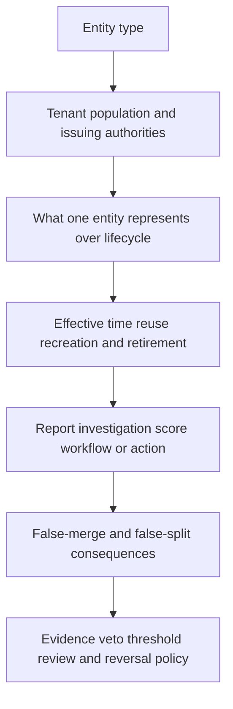

One global threshold across entity types and uses is rarely defensible. A low-confidence link might be acceptable as an analyst search suggestion, but not for automatic user containment or CMDB overwrite.

## Deduplication versus entity resolution

| Question | Deduplication | Entity resolution |
|---|---|---|
| Main purpose | Detect repeated logical records/messages | Link different records representing one entity |
| Example | Same webhook event delivered twice | EDR, MDM, and CMDB records describe one laptop |
| Identity | Event/record ID, payload hash, source version | Multiple scoped identifiers and evidence |
| Time | Usually same logical event/version | Lifecycle and effective time central |
| Output | One accepted assertion plus duplicate evidence | Entity cluster and source aliases |
| Error | Double count or lost legitimate repeat | False merge or false split |
| Reversal | Restore suppressed legitimate record | Split/unmerge and repair consumers |

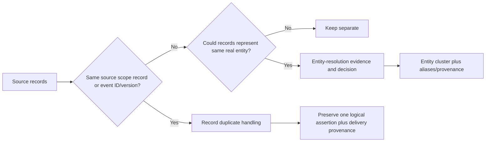

Do not delete source rows simply because they are linked. Preserve source assertions for audit, confidence, temporal history, and unmerge. Physical compaction/retention is a separate governed storage concern.

## Identifiers, namespaces, aliases, and reuse

An identifier is meaningful only with issuer, namespace, entity type, scope, and time. A hostname, email, IP, serial, URL, or name is not universal identity. Record identifier quality and lifecycle.

| Identifier/evidence | Entity | Typical strength | Important caveat |
|---|---|---|---|
| Tenant directory object ID | User/account | High within tenant lifecycle | Delete/recreate and guest/member semantics |
| HR employee ID | Person | High under HR authority | Contractors, reuse, privacy, multiple employments |
| Email/UPN | User/account alias | Medium | Rename, aliases, recycling, case/domain rules |
| Cloud resource ID | Cloud asset | High under provider/account | Deletion/recreation and subresource grain |
| EDR/MDM agent ID | Managed asset record | High within source installation | Reinstall/re-enrollment changes ID |
| Serial + manufacturer | Physical asset | Often strong | Blank, duplicated, VM/template, replacement |
| MAC address | Interface/device evidence | Supporting | Randomization, multiple NICs, reuse/spoofing |
| IP address | Network locator | Weak/supporting | DHCP, NAT, load balancer, shared/reused |
| Hostname | Asset alias | Supporting | Rename, collision, domain, image clone |
| App registration ID | Application identity | High in tenant/type | Multi-tenant/service principal distinctions |
| URL/domain | App endpoint alias | Supporting | Shared hosting, redirects, environment |
| Source finding ID | Finding | High in source/scope | Reopen/recreate/plugin behavior |
| CVE alone | Vulnerability definition | Not finding identity | One CVE affects many assets/instances |

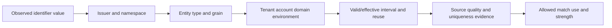

Aliases should have type, source, validity interval, normalization version, and confidence. Retired aliases can remain useful for historical search but should not automatically merge a newly reassigned identity.

### Plain-English deep-dive 2 - An IP address is an apartment number, not a person

Apartment 4B identifies a location within one building at a time. Tenants move, several people share it, and another building also has 4B. An IP address is similar: it can be assigned dynamically, shared through NAT, used by a load balancer, or reassigned later.

Use IP as time-bound network evidence, not a durable universal asset key. Combine it with scope, observation time, cloud/account/interface data, and stronger identifiers. The same principle applies to email addresses, hostnames, URLs, and display names.

## Normalization for comparison

Normalization can improve comparison but can also erase distinctions. Preserve raw values and version field-specific transformations. Do not use one generic lowercase-and-strip function for every identifier.

| Field | Possible normalization | Risk |
|---|---|---|
| Email/UPN | Trim; source-defined case/domain handling | Provider/local-part semantics and aliases vary |
| Hostname | Trim trailing dot/case under DNS context; preserve domain | Short-name collisions |
| Serial | Trim documented separators/case if manufacturer rules support | Leading zeros or meaningful punctuation lost |
| Person name | Unicode/case/spacing/token forms for candidate comparison | Cultural order/diacritics and collisions |
| Phone | Country-aware E.164 where lawful/available | Missing country, reused number, privacy |
| MAC | Parse canonical hex and interface scope | Randomized address still not device identity |
| Cloud ID | Provider-documented canonical form | Case/path/resource-version semantics |
| URL | Standards-aware parse and controlled normalization | Path/query/default-port meaning can change |

Normalization output should include validity status and reason. Placeholder values such as `unknown`, `n/a`, `000000`, or shared defaults must never become identifiers that join large populations.

## Candidate generation and blocking

Comparing every pair grows approximately as:

$$
\frac{n(n-1)}{2}
$$

For one million records, that is roughly 500 billion pairs. Blocking creates candidate neighborhoods using one or more rules, such as same tenant and agent ID, same manufacturer plus serial prefix, or same normalized name plus organization. Blocking improves scale but can exclude true matches before scoring, creating a recall ceiling.

| Blocking pass | Synthetic example | Benefit | Miss risk/control |
|---|---|---|---|
| Exact strong ID | Same tenant + object ID | High precision and small blocks | ID recreation; time veto |
| Composite asset | Manufacturer + normalized serial | Links sources | Bad/default serial; quality filter |
| Alias | Same tenant + normalized UPN/email | Links renamed source records | Reuse; validity interval |
| Name/org | Name tokens + department/country | Finds typo candidates | Common names; review only |
| Network/time | IP/subnet + overlapping observation | Adds candidates for devices | NAT/DHCP; supporting only |
| Relationship | Same managed device/app/owner | Finds contextual candidates | Circular evidence; independent source check |

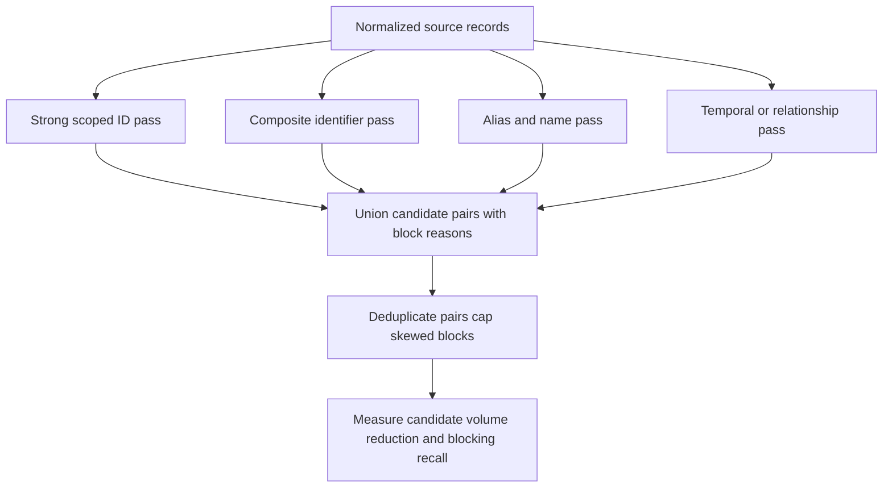

Measure block-size distribution, giant/default-value blocks, candidate pairs, reduction ratio, true-match recall on labels, segment gaps, and cost. A fast blocker that misses cloud assets is not successful.

## Deterministic matching rules

Deterministic rules are explicit. They work well when identifiers are trustworthy and semantics are clear. Each rule needs entity type, source scope, conditions, required evidence, missing behavior, vetoes, decision, reason code, version, and tests.

| Rule | Synthetic condition | Decision | Veto/failure |
|---|---|---|---|
| User exact | Same tenant + immutable directory object ID + compatible lifecycle | Merge | Deletion/recreation interval conflict |
| Asset composite | Same manufacturer + valid unique serial + compatible type/time | Merge/review by quality | Placeholder/duplicate serial |
| Cloud exact | Same provider + account + full resource ID + compatible lifecycle | Merge | Recreated resource generation conflict |
| App exact | Same tenant + app registration ID + entity subtype | Merge | Application vs service-principal grain mismatch |
| Finding exact | Same source + tenant + finding ID + target scope | Same source finding | Source reuse/version conflict |
| Alias | Old/new UPN linked by authoritative identity history | Merge | Alias reassigned to another person |
| Contradiction | Strong IDs disagree under same issuer/time | Keep separate/hold | Do not let fuzzy name override |

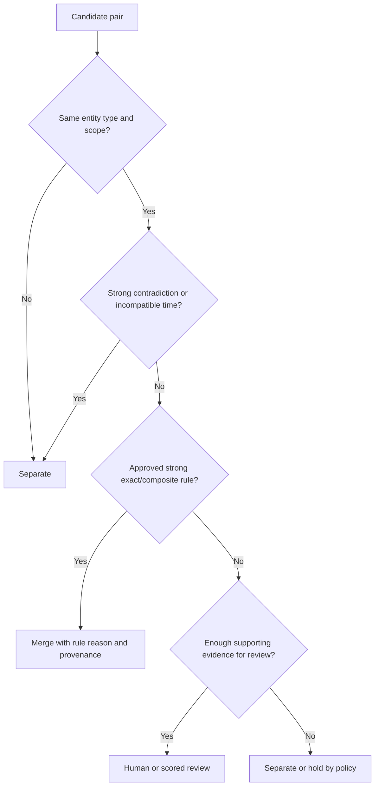

Exact equality is not automatically deterministic truth. If a source populates every missing serial with `0`, an exact serial match is disastrous. Profile identifier uniqueness, missingness, placeholder use, and reuse before promoting a rule.

## Fuzzy and probabilistic evidence

Fuzzy comparison measures approximate similarity. Examples include edit distance, trigram similarity, token overlap, phonetic encoding, numeric distance, and date/time proximity. These methods generate features; they do not prove identity. Probabilistic methods combine how informative agreements and disagreements are in a population. A score may be a weighted index, classifier output, rank, or calibrated probability; label it accurately.

| Feature | Useful for | Limitation | Safe role |
|---|---|---|---|
| Edit distance | Typos in short text | Scale/length/language sensitivity | Candidate/review signal |
| Trigram similarity | Approximate names/hostnames | Common strings can collide | Candidate/review signal |
| Token similarity | Word reordering/multi-part names | Stop words and cultural names | Supporting evidence |
| Phonetic code | Sound-alike names | Language/culture limitations | Candidate only |
| Numeric/date distance | Close serial/date/time values | Near values may be different entities | Supporting/contradicting |
| Geographic/organization | Same contextual segment | Stale/biased context | Supporting only |
| Relationship overlap | Same owner/app/device | Circular/correlated sources | Explain independence |
| Negative feature | Strong issuer ID differs | Critical contradiction | Veto or large negative weight |

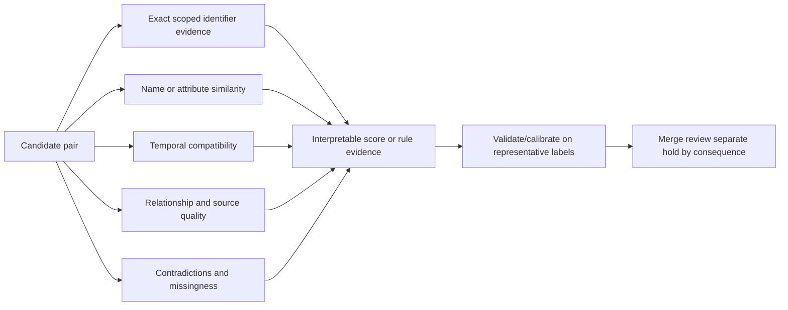

Do not say score 0.8 means an 80% probability unless the model is calibrated and defined that way. Evaluate by entity type, source pair, geography/language where lawful and relevant, time period, and intended workflow. Model-assisted matching also needs drift, privacy, explainability, and human-oversight controls.

### Plain-English deep-dive 3 - Similarity is not identity

Two keys can look almost identical and still open different doors. Two names can be spelled differently and still identify one person. Similarity and identity answer different questions.

Fuzzy matching says "these values resemble each other under this function." Entity resolution asks "given issuer, scope, time, source quality, contradictions, relationships, and use consequence, should these records be treated as one entity?" Similarity can invite investigation; it should not erase stronger contradictory evidence.

## Decision bands, thresholds, and consequences

Use multiple outcomes rather than force every pair into match/nonmatch. A common conceptual policy has auto-merge, human review, separate/nonmatch, and hold/insufficient evidence. Thresholds should reflect false-merge and false-split cost, review capacity, entity type, action, and legal/privacy constraints.

| Decision | Meaning | Allowed use | Control |
|---|---|---|---|
| Auto-merge | Evidence exceeds approved standard and no veto | Golden context under scoped uses | Audited reason, reversible, monitored |
| Review | Ambiguous but material candidate | No high-impact action before decision | Minimized review card and SLA/SLO |
| Keep separate | Evidence supports distinct entities or too weak | Separate records/entities | May still retain candidate relation |
| Hold | Missing/invalid/contradictory evidence prevents decision | Restricted analysis only | Owner and evidence request |
| Suggested link | Low-consequence analyst navigation | Search aid, not identity fact | Clearly labeled and excluded from automation |

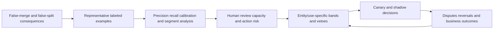

A reporting use may accept lower confidence with visible caveats. An automated containment, access, or owner update requires much stronger identity evidence and authority. One score threshold should not silently control every use.

## Cluster formation and weak bridges

Pair decisions must form entity clusters. If A matches B and B matches C, blindly merging all can link A and C through a weak bridge even when they strongly contradict. Test cluster-level coherence, strongest identifiers, temporal compatibility, entity type, size, and source diversity.

| Cluster risk | Symptom | Control |
|---|---|---|
| Weak bridge | One low-quality record connects two strong groups | Require cluster-level evidence/veto |
| Giant cluster | Thousands share placeholder identifier | Block placeholder and size alerts |
| Mixed entity type | User/account/service identity combined | Type constraints |
| Time collision | Same exclusive ID assigned concurrently | Interval contradiction |
| Source dominance | One bad source links everything | Source-quality limits and independence |
| Circular context | Relationship derived from current cluster proves itself | Track feature lineage and avoid self-proof |
| Chain drift | Repeated small similarities span unlike endpoints | Diameter/coherence checks |

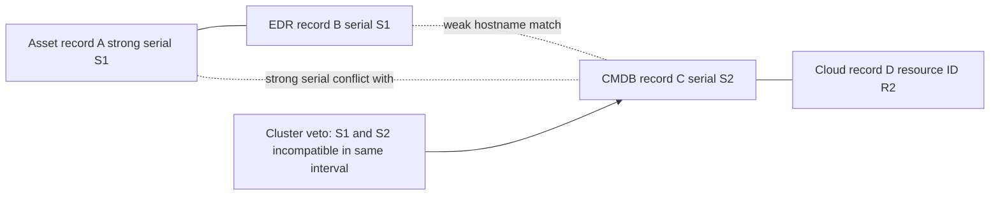

Cluster identifiers should be stable internal surrogates with merge/split history, not a selected source identifier that can change. Preserve alias links and cluster version so consumers can reproduce prior reports.

## Precedence and field-level survivorship

Resolution answers which records belong together. Survivorship answers which value appears in the preferred view. Keep them separate. One source can be preferred for serial number, another for current sensor health, another for service ownership, and another for employment status.

| Field | Synthetic precedence factors | Why not one global source? |
|---|---|---|
| Person employment status | HR authority, effective time | Directory describes access state |
| User sign-in state | Directory/identity source, observation time | HR does not report technical sign-in |
| Asset serial | Hardware/MDM source quality and validation | CMDB can contain manual errors |
| Endpoint control health | Control source current status | CMDB inventory is not health evidence |
| Cloud resource state | Provider account/resource observation | Endpoint tool may not cover it |
| Service owner | Approved service catalog and effective date | Cloud tag may be candidate only |
| Business criticality | Governance-approved service tier | Scanner severity is different concept |
| Finding technical state | Scanner/rescan under source semantics | Ticket state tracks work, not exposure |
| Ticket state | Ticketing system | Scanner cannot assert workflow state |

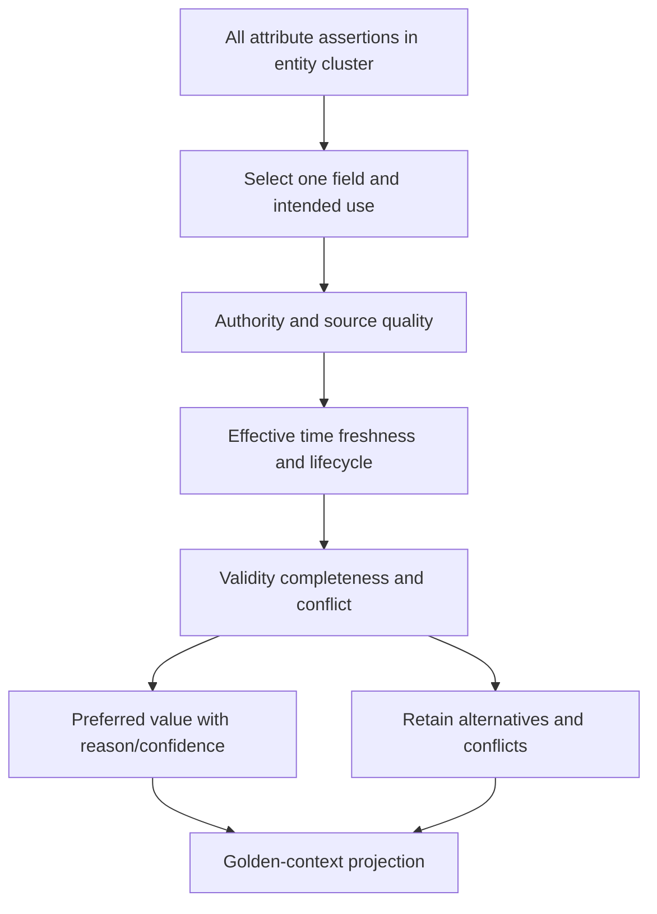

"Most recent" is not universally correct. A later copied CMDB value can be less authoritative than an earlier HR effective record. "Majority vote" can count several systems that copied the same bad source. Track source dependence where practical.

## Confidence and provenance

Confidence can apply to source assertion, pair link, cluster, attribute, relationship, and derived result. Do not collapse them into one universal percentage. Prefer reason codes and evidence alongside a bounded level or calibrated measure.

| Confidence object | Question | Evidence |
|---|---|---|
| Source assertion | How reliable/current is this source fact? | Source quality, validation, observation time |
| Pair link | How strong is sameness evidence for two records? | Features, contradictions, rule/model version |
| Cluster | Does the entire group coherently represent one entity? | Pair graph, strong IDs, time, vetoes |
| Attribute | How strong is preferred field value? | Authority, freshness, conflict, provenance |
| Relationship | How strong is typed edge? | Source, mechanism, time, independent evidence |
| Derived score/report | How trustworthy is downstream result? | All inputs, coverage, versions, quality |

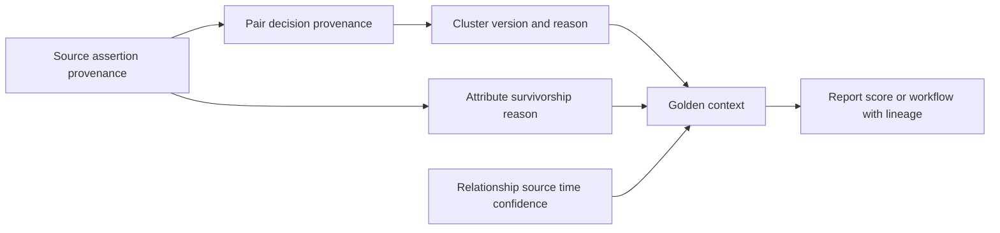

For each link, retain candidate/block reasons, normalized/raw values under access control, comparison features, contradictions, decision, reviewer if any, rule/model/version, timestamp, and correction history. This supports customer explanation and unmerge.

## Merge, split, and unmerge

Merge should be an append-only audited identity event, not destructive deletion. A split separates records or subclusters. Unmerge reverses a specific prior link or cluster event and rebuilds affected golden context and downstream outputs. Stable alias history helps maintain references.

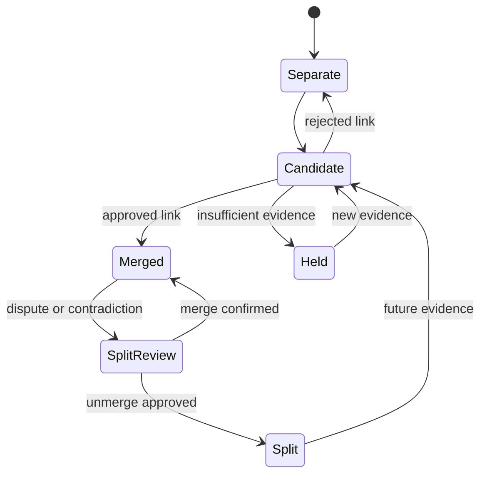

| Correction step | Action | Evidence |
|---|---|---|
| Contain | Pause high-impact consumers/actions | Affected use list |
| Freeze | Record cluster/rule/model/source versions | Reproducible snapshot |
| Confirm | Validate contradiction with source owners | Raw/source evidence |
| Scope | Find entities, periods, reports, scores, tickets, exports | Reverse lineage |
| Decide | Named authority approves split/unmerge | Decision record |
| Apply | Append correction event; rebuild cluster | New cluster version |
| Recompute | Re-run survivorship, relationships, derived results | Old/new diff |
| Reconcile | Repair tickets, CMDB, reports, notifications, caches | Target confirmations |
| Communicate | Explain impact, correction, caveats, prevention | Customer update |
| Prevent | Add veto, fixture, monitor, source correction | Regression evidence |

### Plain-English deep-dive 4 - Unmerge is not deleting a row

If two customer accounts were accidentally combined, separating them requires more than changing one database record. Reports may have aggregated their activity, tickets may have gone to the wrong owner, risk scores may have used mixed attributes, and exports may have propagated the error.

Unmerge is a controlled incident and data repair. Preserve the prior decision, append the correction, rebuild both entities, identify downstream effects, reconcile actions, and tell affected users what changed. Reversibility is a design requirement, not an optional cleanup feature.

## Temporal identity

Identity changes over time. A device is reimaged; a cloud resource is deleted and recreated with the same name; an email alias is reassigned; a contractor becomes an employee; an application is cloned to production; a finding closes and later recurs. Model effective intervals and lifecycle events.

| Temporal event | Same entity may remain | New entity may be required | Evidence question |
|---|---|---|---|
| User rename | Person/account object stable | New account object created | Which issuer ID and lifecycle? |
| Email reassignment | Old person retains historical alias only | New person owns alias later | Validity intervals overlap? |
| Device reimage | Physical asset may remain | Managed endpoint/software instance changes | Entity grain defined how? |
| Hardware replacement | Service role/name may remain | Physical asset changes | Serial/resource identity? |
| Cloud recreation | Display name remains | Resource generation/ID changes | Provider lifecycle semantics? |
| App environment clone | Logical app family may relate | Deployment instance differs | App versus deployment grain? |
| Finding reopen | Same occurrence may continue | New occurrence may be created | Source lifecycle/ID rules? |
| Late source record | Corrects past state | Does not change current entity necessarily | Effective versus receipt time? |

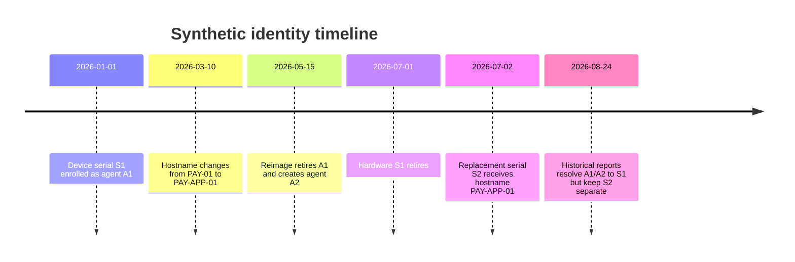

Current-state matching can corrupt history if aliases are reused. Use as-of joins and effective relationships. A late record may require historical restatement without merging today's different entity.

## Relationship context as evidence

Relationships can support resolution: a user is assigned the same managed device, an app belongs to the same cloud account, or a finding points to the same resolved asset. But relationships can be stale, derived from the very match being evaluated, or copied across sources. Avoid circular reasoning.

| Relationship signal | Supporting value | Risk/control |
|---|---|---|
| User assigned device | Links identity and endpoint context | Shared/kiosk/reassignment; effective interval |
| Asset hosts app | Aligns inventory and service context | Dynamic hosting and discovery errors |
| App supports service | Adds ownership/criticality | Stewarded relationship, not identity proof alone |
| Finding affects asset | Binds issue to target | Source target identifier quality |
| Asset in cloud account | Narrows scope | Resource moved/recreated |
| Same owner | Weak support | Common/shared/stale owner |
| Same IP/time | Weak temporal support | NAT/DHCP/load balancer |
| Relationship derived from cluster | Circular | Exclude or mark dependent evidence |

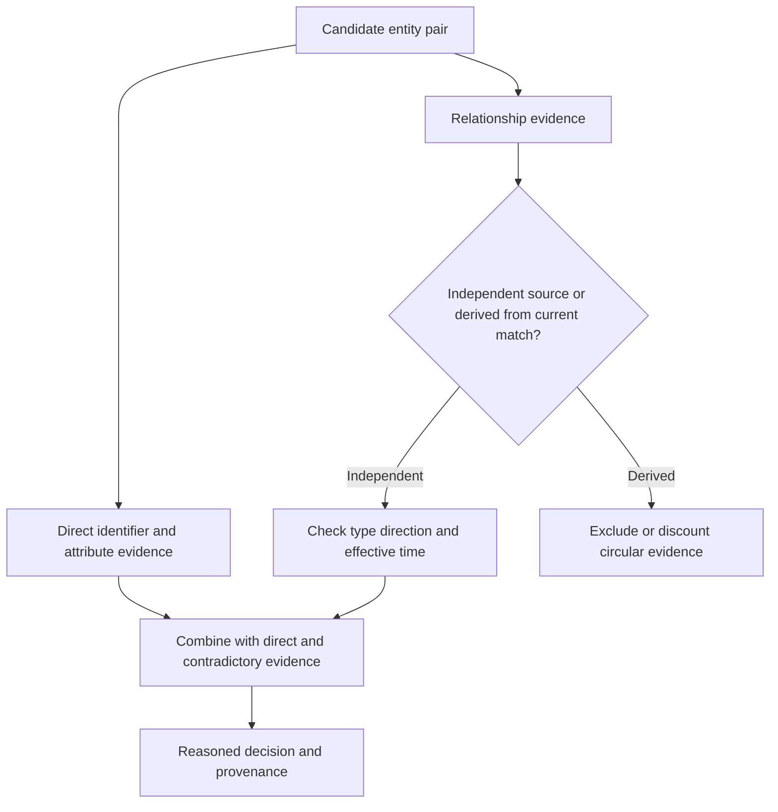

Relationship context can improve candidate ranking and review, but a common owner or subnet should not override conflicting strong identifiers. In high-impact workflows, require direct strong evidence or human approval.

## False merge and false split risk

| Workflow | False-merge harm | False-split harm | Likely policy tendency |
|---|---|---|---|
| Executive asset count | Under-count and mixed attributes | Over-count | Balance with visible confidence |
| Control coverage | One protected record masks unprotected asset | Same asset counted twice | Conservative merge, source assertions visible |
| Vulnerability priority | Findings/controls assigned to wrong asset | Exposure fragmented and underestimated | Strong identity plus review |
| Ticket routing | Wrong owner receives task/data | Duplicate tickets and effort | Conservative merge and idempotency |
| User investigation | Innocent user's events combined | Attacker activity fragmented | Very conservative, human review |
| Automated containment | Wrong asset/user disrupted | Threat may evade containment | Highest evidence/authority/rollback |
| CMDB update | Wrong configuration item overwritten | Duplicate CIs remain | Human approval and field authority |
| Analytics/search suggestion | Misleading association | Missed search result | Lower-risk suggested-link label |

Precision and recall for labeled pair decisions are:

$$
\text{Precision} = \frac{TP}{TP+FP}, \qquad
\text{Recall} = \frac{TP}{TP+FN}
$$

where $TP$ is true matches correctly linked, $FP$ is false merges at pair level, and $FN$ is true matches left split. Pair metrics do not fully describe cluster errors or business harm. One false bridge can corrupt a large cluster.

## Human review and redress

Human review is a controlled decision process, not a dumping ground for uncertain pairs. The review card should minimize sensitive data while showing entity type/scope, raw and normalized values as authorized, source/time, strong evidence, contradictions, relationships, candidate reason, rule/model version, downstream consequence, and decision options.

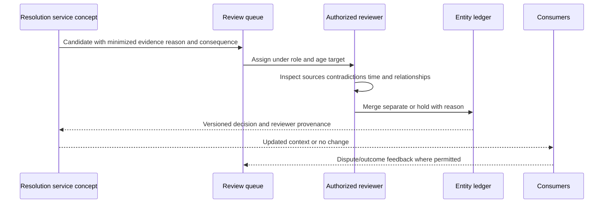

| Review control | Purpose |
|---|---|
| Role-based access | Protect identity/security data |
| Purpose statement | Prevent unrelated browsing |
| Evidence minimization | Show enough, not everything |
| Conflict and veto display | Prevent similarity bias |
| Reason codes and notes | Make decisions reproducible |
| Dual review for high impact | Reduce single-reviewer error |
| Reviewer training/calibration | Improve consistent interpretation |
| Queue age/capacity | Prevent unresolved ambiguity |
| Appeal/dispute path | Support customer correction and redress |
| Audit and retention | Reconstruct decisions under policy |

Measure reviewer agreement, overturn rate, queue age, decision yield, segment consistency, and downstream disputes. Review labels can still be wrong or unrepresentative; do not automatically treat every human decision as ground truth for future models.

## Quality metrics

| Metric layer | Example | What it reveals | Limitation |
|---|---|---|---|
| Input | Identifier presence/validity/uniqueness | Source match readiness | Strong ID can still be reused |
| Blocking | Candidate recall and reduction ratio | Search coverage/cost | Labels may be incomplete |
| Pair | Precision, recall, false merge/split rate | Pair decision quality | Cluster harm hidden |
| Cluster | Size, coherence, weak bridges, mixed IDs | Whole-entity quality | Requires defined checks |
| Attribute | Preferred-value conflict and correction rate | Survivorship trust | Authority can change |
| Temporal | Overlap/reuse/recreation errors | Lifecycle handling | Historical labels difficult |
| Review | Queue age, agreement, overturn, yield | Human process quality | Speed can trade off quality |
| Operational | Duplicate tickets, misroutes, reversals | Workflow impact | Other causes exist |
| Business | Analyst rework, trusted coverage, dispute resolution | Customer value/trust | Attribution uncertain |
| Drift | Feature/score/match/source changes | Population/model stability | Change may be legitimate |

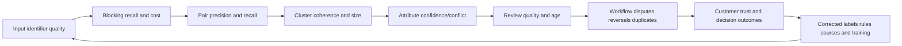

Segment metrics by entity type, source pair, lifecycle state, and relevant population dimensions where lawful and appropriate. An overall 99% precision can hide severe error for guest users or ephemeral cloud assets. Always state sample, label provenance, confidence interval where used, and business consequence.

## Customer trust and communication

Entity resolution affects how customers perceive every report and action. One visible false merge can undermine confidence beyond its numeric rate, especially if it exposes one user's data to another owner or creates a harmful action. Trust requires inspectability, correction, timely communication, and honest boundaries.

| Trust practice | Customer-facing behavior |
|---|---|
| Explain | Show why records linked or remained separate |
| Bound | State entity type, scope, time, confidence, and use |
| Preserve | Keep source assertions/conflicts/provenance |
| Correct | Offer dispute, split/unmerge, and response path |
| Contain | Pause unsafe workflows during identity uncertainty |
| Notify | Explain affected entities/periods/actions and remediation |
| Restate | Mark reports and metrics changed by correction |
| Prevent | Share control/test/monitoring improvement without blame |
| Measure | Track disputes, resolution time, reversals, and recurrence |

Avoid saying "the algorithm was 99% accurate" as a complete response. Explain the affected workflow, error type, actual evidence, containment, correction, remaining uncertainty, and prevention. Customers care about whether their data and actions are trustworthy, not only model averages.

## Troubleshooting decision tree

Start with one wrong link or missing link, expected entity behavior, source records, time, and downstream impact. Freeze versions before changing rules.

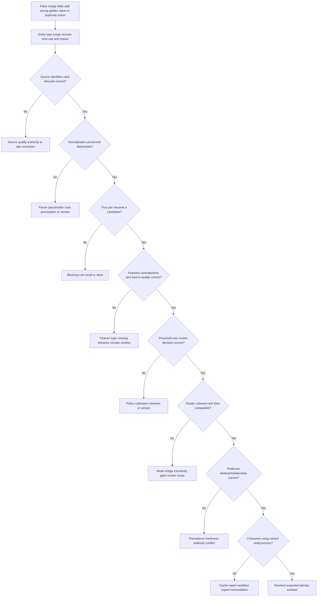

| Evidence packet | Contents |
|---|---|
| Symptom/impact | Wrong/missing link, report, score, ticket, disclosure, action |
| Entity contract | Type, scope, grain, lifecycle, use, error preference |
| Source records | IDs, aliases, raw/normalized values, source/time/quality |
| Candidate trace | Blocking passes, block reasons, excluded pair evidence |
| Feature trace | Exact/fuzzy/temporal/relationship signals and contradictions |
| Decision trace | Rule/model/threshold/veto/reviewer/version/reason |
| Cluster trace | Members, edges, weak bridge, strong-ID/time coherence |
| Survivorship | Preferred/alternative values, authority, freshness, confidence |
| Lineage | Affected reports, scores, workflows, exports, tickets |
| Correction | Split/unmerge/relink, replay, diff, reconciliation, validation |

## Complete synthetic NMH golden-context exercise

NMH combines fictional directory, HR, EDR, MDM, CMDB, cloud, scanner, application catalog, and ticket records. The exercise resolves users, assets, applications, and findings for payroll exposure analysis.

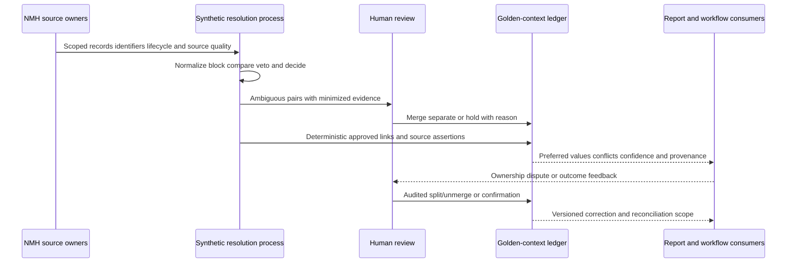

| Entity case | Synthetic evidence | Decision | Reason |
|---|---|---|---|
| User U1 records | Same tenant object ID; HR ID compatible; renamed UPN | Merge | Strong scoped IDs and history |
| User U2 collision | Same display name; different tenant object/HR IDs | Separate | Strong contradiction overrides name |
| Physical asset A1 | Same manufacturer/serial; EDR agent changed after reimage | One physical asset, two agent lifecycles | Entity grain and compatible time |
| Replacement A2 | Same hostname after A1 retirement; different serial | Separate asset with alias reuse | Hostname is time-bound alias |
| Cloud resource C1 | Same display name; different provider resource IDs after deletion | Separate generations | Provider lifecycle identity |
| Application P1 | Same app family, separate dev/prod deployments | Related but separate deployment entities | Grain/environment |
| Finding F1 | Same source finding ID/asset; reopened | Same occurrence under fictional source rule | Source lifecycle contract |
| Finding F2 | Same CVE on different assets | Separate findings | CVE is definition, not occurrence identity |

Synthetic false merge incident: A weak hostname rule merges retired physical asset A1 and replacement A2 because both used `PAY-APP-01`. The golden record selects A2's owner and A1's historical control evidence, making the replacement appear protected. A ticket is routed incorrectly. NMH pauses control-coverage automation, freezes rule/cluster versions, confirms serial/time contradiction, unmerges the assets, recomputes control coverage and findings, reassigns the ticket, restates the report, and adds a temporal hostname-reuse veto and regression fixture.

Synthetic false split incident: EDR agent A1 and A2 remain separate after a reimage although the physical serial is the same and lifecycles do not overlap. The report counts two assets and creates duplicate remediation tasks. NMH reviews manufacturer/serial quality, reimage evidence, source intervals, and entity grain; links both agent records to one physical asset while preserving separate software-agent entities; reconciles duplicate tickets; and adds a lifecycle fixture.

## Synthetic exercises with answers

### Exercise 1 - Record versus entity

Four source rows have the same hostname. How many assets exist?

**Answer:** Unknown until entity type, scope, identifiers, lifecycle, and time are evaluated. They could be one asset observed by four tools, several assets sharing/reusing a hostname, or one physical asset with multiple software instances.

### Exercise 2 - Dedup versus resolution

The same webhook event arrives twice. Is that entity resolution?

**Answer:** It is primarily record/event deduplication using source scope, event ID/version, and receipt provenance. Entity resolution links different records to a real entity.

### Exercise 3 - Deterministic rule

Two assets have serial `000000`. Merge?

**Answer:** No. Profile shows a placeholder/default, so exact equality is invalid identity evidence. Mark the identifier invalid/missing and use other evidence or review.

### Exercise 4 - Fuzzy match

Names are 95% similar. Are the users the same?

**Answer:** Not established. Similarity is one feature. Check tenant, issuer IDs, lifecycle, aliases, organization, time, contradictions, privacy, and use consequence. Strong differing identity IDs can veto the link.

### Exercise 5 - Score

A match score is 0.87. Does that mean 87% probability?

**Answer:** Only if the score is explicitly calibrated and validated as a probability for that population. Otherwise call it a score/rank under a method and show features, reason, version, and decision band.

### Exercise 6 - Transitivity

A matches B and B matches C. Merge all?

**Answer:** Not automatically. Test A-C contradictions, strong IDs, time, entity type, source dependence, weak bridges, and cluster coherence. Pair links do not justify blind transitive closure.

### Exercise 7 - Survivorship

Should the newest owner value win?

**Answer:** Not universally. Compare owner role, source authority, effective time, quality, and conflict. Most recent receipt can be a stale copied assertion. Preserve alternatives and reason.

### Exercise 8 - Temporal identity

An email address belongs to employee A in January and employee B in August. Merge their histories?

**Answer:** No. The email is an alias with separate validity intervals. Resolve people using stronger identities and keep historical alias ownership time-bound.

### Exercise 9 - Relationship evidence

Two records have the same owner and subnet. Is that enough to merge assets?

**Answer:** Usually not. Shared owners and subnets are weak contextual signals. Check independent direct identifiers, source quality, time, NAT/shared infrastructure, and contradictions.

### Exercise 10 - False merge versus split

Which is worse?

**Answer:** It depends on workflow. False merge can misattribute or harm another entity; false split can hide total exposure and duplicate action. Define consequence by entity/use and choose thresholds, review, and automation accordingly.

### Exercise 11 - Unmerge

After splitting a bad cluster, is the issue closed?

**Answer:** Only after rebuilding preferred values/relationships, identifying and reconciling reports, scores, tickets, exports, caches, and actions, communicating restatement, and adding prevention/monitoring.

### Exercise 12 - Product claim

Can you state Zscaler's asset match threshold?

**Answer:** No. The public pages support deduplication, resolution, relationships, and golden-record positioning, not internal algorithms or thresholds. You should explain general methods and verify current authenticated documentation and specialists.

## Labs and rehearsal

### Lab 1 - Entity contracts

Define user, account, physical asset, managed endpoint, cloud resource, logical application, deployed application, finding, and vulnerability. State scope, grain, lifecycle, time, use, false-merge/split harm, and reversal.

### Lab 2 - Identifier registry

Catalog tenant object IDs, HR IDs, emails, agent IDs, serials, MACs, IPs, hostnames, cloud IDs, app IDs, finding IDs, and CVEs with issuer, namespace, type, time, uniqueness, reuse, sensitivity, and allowed use.

### Lab 3 - Normalization clinic

Test names, emails, hostnames, serials, MACs, cloud IDs, and URLs. Preserve raw values and identify transformations that create false collisions.

### Lab 4 - Blocking design

Create five passes, deduplicate pair reasons, cap giant blocks, and calculate all-pairs count, reduction ratio, blocking recall, segment recall, and cost on synthetic labels.

### Lab 5 - Deterministic rules

Write exact/composite rules for each entity type with conditions, missing behavior, vetoes, lifecycle, decision, reason, version, and fixtures. Break each rule with a counterexample.

### Lab 6 - Fuzzy feature lab

Compare edit, trigram, token, phonetic, numeric, temporal, and relationship features. Demonstrate where high similarity is a false match and low similarity is a true alias.

### Lab 7 - Decision calibration

Using synthetic labels, calculate precision, recall, false merge/split counts, review volume, and workflow-weighted harm for multiple bands. Do not reuse thresholds as production recommendations.

### Lab 8 - Cluster audit

Inject weak bridges, placeholder giant clusters, mixed entity types, time collisions, source dominance, and chain drift. Design cluster coherence and veto checks.

### Lab 9 - Golden context

Select preferred values for identity, owner, criticality, control health, service, and finding state using field-specific authority/time. Preserve conflicts, confidence, and provenance.

### Lab 10 - Temporal identity

Model rename, email reassignment, reimage, hardware replacement, cloud recreation, app clone, finding reopen, and late source correction with effective intervals and as-of queries.

### Lab 11 - Relationship evidence

Classify direct versus relationship features, independent versus circular sources, and strong versus weak evidence. Test stale ownership and IP/NAT cases.

### Lab 12 - Human review

Build a minimized review card, role controls, reason codes, dual-review trigger, queue target, appeal, audit, and reviewer-calibration sample.

### Lab 13 - Quality dashboard

Create input, blocking, pair, cluster, attribute, temporal, review, operational, business, and drift metrics. Segment by entity/source/lifecycle and state label limitations.

### Lab 14 - False-merge incident

Run the NMH hostname-reuse case. Contain actions, freeze versions, unmerge, rebuild, reconcile tickets/reports, notify users, and add veto/fixture/monitoring.

### Lab 15 - False-split incident

Run the NMH reimage case. Prove physical-asset versus agent grain, merge correct records, preserve software identities, reconcile duplicates, and communicate count restatement.

### Lab 16 - Interview whiteboard

Explain documented Zscaler dedup/golden-record value, then clearly label blocking, fuzzy methods, thresholds, cluster checks, and unmerge as general methods. End with customer trust and your experience boundary.

| Lab evidence | Completion standard |
|---|---|
| Contract | Entity type, scope, grain, lifecycle, use, error harm explicit |
| Identifiers | Issuer, namespace, time, reuse, quality, sensitivity governed |
| Candidates | Blocking recall and skew measured |
| Rules/features | Supporting, contradictory, missing, and circular evidence separated |
| Decisions | Entity/use-specific bands, vetoes, review, reversal defined |
| Clusters | Weak bridges, giant clusters, coherence, time tested |
| Golden context | Field-level survivorship, conflicts, confidence, provenance visible |
| Correction | Merge/split/unmerge plus downstream reconciliation proven |
| Temporal | Rename/reuse/recreation/history handled |
| Review | Minimized, controlled, explainable, appealable |
| Metrics | Pair through business trust measured with limitations |
| Honesty | No internal Zscaler algorithm, threshold, schema, or guarantee claimed |

## Common misconceptions to correct

| Misconception | Correct model |
|---|---|
| A source row is an entity | It is a source assertion about a possible entity |
| Deduplication and entity resolution are the same | One handles repeated records; the other links real-world identity |
| Golden record is absolute truth | It is a governed best-known projection with evidence |
| Golden means conflicts disappear | Conflicts and alternatives remain inspectable |
| Exact text means same entity | Issuer, scope, time, quality, and lifecycle matter |
| Different text means different entity | Aliases, formatting, rename, and errors exist |
| One global identifier exists | Identifiers are entity-, issuer-, namespace-, and time-bound |
| IP address identifies a device | It is a time-bound locator often shared/reused |
| Hostname is durable identity | It can collide, change, clone, and be reused |
| Email permanently identifies a person | It can rename, alias, and be reassigned |
| Serial always identifies hardware | Placeholders, duplicates, VMs, and replacement exist |
| Normalization is harmless | It can erase distinctions and create collisions |
| Nulls match nulls | Missing evidence is not identity agreement |
| Blocking only improves performance | It sets the ceiling on match recall |
| Fuzzy similarity proves identity | It is one feature |
| Score 0.8 means 80% probability | Only if explicitly calibrated/defined |
| Higher match rate is always better | It can signal false merging |
| Exact deterministic rule is always safe | Bad/default/reused IDs break it |
| Pair matches can be transitively closed | Weak bridges can corrupt clusters |
| Cluster size is only a scale issue | Giant clusters often signal identity defects |
| Majority source wins truth | Sources can copy the same error |
| Most recent value is most accurate | Authority and effective time differ from receipt time |
| One source precedence list fits every field | Survivorship is field-, use-, scope-, and time-specific |
| One confidence score describes everything | Source, link, cluster, attribute, relation, and result differ |
| Merge means delete duplicate rows | Preserve assertions and append reversible links |
| Unmerge is a database edit | It requires downstream data/action reconciliation |
| Current aliases can join all history | Reuse and effective intervals matter |
| Relationship context is independent | It may be stale, copied, or circular |
| False split is harmless | It hides exposure and duplicates work |
| False merge is only a counting issue | It can misattribute data and cause harmful action |
| Human review creates ground truth | Reviewers can err and need controls/calibration |
| Overall precision proves every segment | Entity/source/lifecycle gaps may be hidden |
| High metrics automatically preserve customer trust | Inspectability, correction, communication, and redress matter |
| AEM golden-record wording proves complete inventory | It is product positioning, not a universal guarantee |
| Public deduplication wording exposes Zscaler algorithms | It does not |

## Official Source Anchors

Research/source date: **2026-08-24**.

Zscaler sources support bounded public deduplication, entity-resolution, relationship, and golden-record positioning. NIST, W3C, PostgreSQL, and privacy sources support general identity, provenance, matching, measurement, and control concepts. None establishes Zscaler's internal algorithm, thresholds, or schema.

| Source | URL | Used for | Boundary |
|---|---|---|---|
| Zscaler Data Fabric for Security | https://www.zscaler.com/products-and-solutions/data-fabric | Public deduplicate, correlate, enrich, unified data context, golden asset use-case positioning | No algorithm, identifier, feature, score, threshold, schema, or guarantee |
| Zscaler Asset Exposure Management | https://www.zscaler.com/products-and-solutions/caasm | Public asset resolution, multi-source entity deduplication, relationships, golden records, unified asset inventory | No exact match/survivorship/review mechanics or completeness guarantee |
| Zscaler Unified Vulnerability Management | https://www.zscaler.com/products-and-solutions/vulnerability-management | Public correlated context across identity, assets, controls, business processes, hierarchy | No entity algorithm or scoring detail inferred |
| NIST SP 800-63A-4 | https://pages.nist.gov/800-63-4/sp800-63a.html | Natural-person identity resolution, evidence, validation, privacy, exception/manual review context | Human identity proofing is narrower than general asset/app/finding resolution |
| NIST Privacy Framework | https://www.nist.gov/privacy-framework | Privacy-risk governance, processing, communication | Voluntary framework; not legal advice |
| NISTIR 8062 | https://csrc.nist.gov/pubs/ir/8062/final | Predictability, manageability, disassociability privacy-engineering context | Not an entity-resolution algorithm |
| NIST AI RMF 1.0 | https://www.nist.gov/itl/ai-risk-management-framework | Govern, map, measure, manage context for model-assisted matching | Voluntary; no model claimed here |
| NIST SP 800-55 Vol. 1 | https://csrc.nist.gov/pubs/sp/800/55/v1/final | Information-security measurement context | Not match thresholds or metrics |
| W3C PROV-O | https://www.w3.org/TR/prov-o/ | Entity/activity/agent provenance vocabulary | Not a resolution ledger implementation |
| W3C Data on the Web Best Practices | https://www.w3.org/TR/dwbp/ | Metadata, provenance, versioning, data-quality context | Requires adaptation for private security data |
| PostgreSQL `pg_trgm` | https://www.postgresql.org/docs/17/pgtrgm.html | Trigram similarity and index support for educational examples | Similarity is not identity proof |
| PostgreSQL `fuzzystrmatch` | https://www.postgresql.org/docs/17/fuzzystrmatch.html | Edit/phonetic function context and limitations | Language/input limitations; not production match policy |
| PostgreSQL Constraints | https://www.postgresql.org/docs/17/ddl-constraints.html | Unique/primary/foreign key concepts | Database uniqueness is not real-world identity |

## Likely Interview Questions

### Q1. How do deduplication, entity resolution, and golden context differ?

**Model answer:** Deduplication identifies repeated logical records or messages. Entity resolution decides whether different records represent the same real-world user, asset, application, or finding under a type/scope/lifecycle contract. Golden context is the preferred entity view plus relationships, conflicts, confidence, and provenance. I preserve every source assertion and make merge decisions reversible rather than deleting evidence.

### Q2. How do you choose and govern identifiers?

**Model answer:** I classify each identifier by entity type, issuer, namespace, tenant/account/environment, validity interval, uniqueness, reuse, source quality, sensitivity, and allowed match use. Directory/cloud/source IDs can be strong within their lifecycle; emails, hostnames, IPs, names, and URLs are mutable supporting evidence. I preserve raw values, version normalization, reject placeholders, and apply strong temporal contradictions as vetoes.

### Q3. How do deterministic and fuzzy matching differ?

**Model answer:** Deterministic matching uses explicit rules such as equal trusted tenant-scoped IDs with compatible lifecycles. Fuzzy methods measure approximate similarity and supply candidate or review features. Both require source quality, missing behavior, negative evidence, time, entity type, and tests. Similarity is not identity, and a score is not a probability unless calibrated and defined as one.

### Q4. How do you set thresholds and prevent bad clusters?

**Model answer:** I use entity- and workflow-specific merge, review, separate, hold, and suggested-link bands based on labeled precision/recall, false-merge/split harm, review capacity, privacy, and action consequence. I add strong-ID/time vetoes, measure blocking recall, and audit cluster coherence, weak bridges, giant/default clusters, mixed types, source dependence, and chain drift. I do not blindly transitively close pair matches.

### Q5. What makes golden context trustworthy?

**Model answer:** Field-level survivorship uses purpose-specific authority, source quality, effective time, freshness, validity, and conflict. The view retains alternatives, raw/source provenance, link/cluster/attribute/relationship confidence, rule/model versions, and reason codes. Users can inspect, dispute, and correct it. "Most recent" or majority vote is not automatically trustworthy, and a clean projection is not absolute truth.

### Q6. How do you handle temporal identity, merge, split, and unmerge?

**Model answer:** I model identifier and relationship validity intervals and entity lifecycles for rename, reassignment, reimage, replacement, cloud recreation, app deployment, and finding recurrence. Merges are audited append-only decisions. For a bad link I contain high-impact consumers, freeze versions, confirm evidence, scope lineage, append split/unmerge, rebuild context, recompute outputs, reconcile tickets/reports/exports/actions, communicate restatement, and add a veto or fixture.

### Q7. How do you measure and communicate entity-resolution quality?

**Model answer:** I measure input identifier quality, blocking recall/cost, pair precision/recall, false merge/split, cluster coherence/size, attribute conflicts/corrections, temporal errors, review agreement/age/overturn, duplicate or misrouted actions, disputes, recurrence, and business rework. I segment by entity/source/lifecycle where appropriate and state label/sample limitations. Customer trust also requires explanation, redress, timely correction, and honest impact communication.

### Q8. How does your background transfer, and what can you claim about Zscaler?

**Model answer:** enterprise escalation work required correlating imperfect users, devices, IDs, requests, logs, permissions, and time, testing contradictions, preserving evidence, and communicating uncertainty. SQL/statistics/data-quality skills support profiling and metrics. I practiced matching, golden context, and unmerge with synthetic NMH data. Zscaler publicly describes deduplication and AEM resolution/golden records, but I do not claim internal algorithms, identifiers, thresholds, confidence, schemas, or outcomes. I would validate current docs, tenant evidence, labels, privacy, and specialists.

## 30-Second Memory Hooks

| Concept | Memory hook |
|---|---|
| Entity | The thing, not the row |
| Record | One source witness statement |
| Dedup | Same logical delivery/record repeated |
| Resolution | Which records describe one thing? |
| Golden context | Best-known cited case file |
| Contract | Define one before matching it |
| Identifier | Issuer, namespace, scope, time |
| Alias | Alternate label with validity history |
| IP/hostname/email | Locator or alias, not universal identity |
| Normalize | Compare consistently, preserve distinctions |
| Blocking | Search neighborhood and recall ceiling |
| Deterministic | Explicit rule, still validate IDs |
| Fuzzy | Similarity is a clue |
| Negative evidence | Contradictions matter |
| Score | Evidence index, not automatic probability |
| Threshold | Consequence encoded as action boundary |
| False merge | Two things in one file |
| False split | One thing in two files |
| Cluster | Test the entire folder |
| Weak bridge | Friend-of-a-friend trap |
| Survivorship | Field-by-field authority and time |
| Confidence | Source, link, cluster, field, relation differ |
| Provenance | Receipt for every fact and link |
| Merge | Append auditable link |
| Unmerge | Rebuild and reconcile consequences |
| Temporal identity | Same alias can mean another entity later |
| Relationship | Supporting context, avoid circular proof |
| Review | Minimized evidence and trained judgment |
| Trust | Explain, correct, restate, prevent |
| Experience bridge | Correlation and RCA transfer; algorithms do not |

## Completion Checklist

- [ ] I can distinguish source record, duplicate record, entity, deduplication, entity resolution, golden record, and golden context.
- [ ] I define entity type, population, tenant/scope, grain, lifecycle, time, use, and error consequence before matching.
- [ ] I use different contracts for users/accounts, physical/managed/cloud assets, logical/deployed applications, findings, and vulnerabilities.
- [ ] I do not use one match policy or threshold for every entity and workflow.
- [ ] I classify identifiers by issuer, namespace, entity type, scope, validity, uniqueness, reuse, quality, sensitivity, and allowed use.
- [ ] I distinguish natural, surrogate, composite keys and aliases.
- [ ] I treat IP, hostname, email, URL, name, and owner as mutable/supporting evidence unless stronger context exists.
- [ ] I handle deletion/recreation, reassignment, reimage, replacement, and ephemeral resources.
- [ ] I preserve raw identifier values and version field-specific normalization.
- [ ] I detect placeholder/default identifiers and never merge them by equality.
- [ ] I distinguish record/event deduplication from cross-source entity resolution.
- [ ] I retain source assertions and delivery provenance instead of destructively deleting duplicates.
- [ ] I can calculate why all-pairs comparison becomes impractical.
- [ ] I use multiple blocking passes and preserve block reasons.
- [ ] I measure blocking recall, candidate reduction, pair volume, skew, giant blocks, segments, and cost.
- [ ] I know blocking creates a recall ceiling.
- [ ] I write deterministic rules with scope, conditions, evidence, missing behavior, vetoes, decision, reason, version, and tests.
- [ ] I validate identifier uniqueness, placeholders, reuse, and source quality before exact-match promotion.
- [ ] I distinguish edit, trigram, token, phonetic, numeric, temporal, and relationship features.
- [ ] I do not treat fuzzy similarity as identity proof.
- [ ] I preserve supporting, contradictory, missing, invalid, and dependent evidence separately.
- [ ] I distinguish weighted score, classifier output, rank, and calibrated probability.
- [ ] I never say 0.8 means 80% probability without calibration and definition.
- [ ] I evaluate model/rule quality on representative labels and relevant segments.
- [ ] I define auto-merge, review, separate, hold, and suggested-link outcomes.
- [ ] I set entity/use-specific thresholds from false-merge/split harm, review capacity, privacy, and action consequence.
- [ ] I require stronger identity evidence and authority for high-impact automated action.
- [ ] I test cluster coherence and do not blindly apply transitive closure.
- [ ] I monitor weak bridges, giant clusters, mixed types, time collisions, source dominance, circular evidence, and chain drift.
- [ ] I use stable internal entity IDs and preserve cluster/alias version history.
- [ ] I separate resolution from field-level survivorship.
- [ ] I choose preferred values by field, purpose, authority, quality, effective time, freshness, validity, and conflict.
- [ ] I know most recent and majority vote are not universal truth rules.
- [ ] I preserve alternative values, conflicts, reasons, and provenance.
- [ ] I distinguish source, pair-link, cluster, attribute, relationship, and derived-result confidence.
- [ ] I store reason codes, features, contradictions, rule/model version, reviewer, time, and correction history for links.
- [ ] I implement merge as audited append-only identity events rather than destructive deletion.
- [ ] I design split/unmerge before production use.
- [ ] I contain high-impact consumers, freeze versions, scope lineage, rebuild context, and reconcile downstream effects after unmerge.
- [ ] I communicate affected entities, periods, reports, scores, tickets, exports, actions, and remaining uncertainty.
- [ ] I model effective intervals for aliases, identifiers, owners, relationships, and source assertions.
- [ ] I use as-of semantics to prevent current aliases from corrupting history.
- [ ] I distinguish physical asset from software agent, logical app from deployment, and vulnerability definition from finding occurrence.
- [ ] I treat relationships as typed, directed, time-bound, sourced evidence.
- [ ] I detect stale, weak, copied, and circular relationship evidence.
- [ ] I analyze false-merge and false-split harm separately by workflow.
- [ ] I know pair precision/recall do not fully describe cluster/business harm.
- [ ] I build human review with purpose, least privilege, minimized evidence, veto display, reason codes, calibration, age, appeal, and audit.
- [ ] I do not automatically treat human labels as perfect ground truth.
- [ ] I measure input, blocking, pair, cluster, attribute, temporal, review, operational, business, and drift quality.
- [ ] I segment metrics and state label/sample/confidence limitations.
- [ ] I treat customer trust, inspectability, correction, redress, and communication as core quality outcomes.
- [ ] I can run the troubleshooting tree from source identity through consumer version.
- [ ] I can produce a redacted evidence packet for a false merge or false split.
- [ ] I can complete the NMH golden-context incidents and all sixteen labs.
- [ ] I label deterministic/fuzzy algorithms, thresholds, cluster checks, and unmerge mechanics as general patterns, not Zscaler internals.
- [ ] I use the controlled research/source date exactly as 2026-08-24.
- [ ] I make no unsupported Zscaler schema, identifier, rule, feature, score, threshold, confidence, matching, survivorship, review, completeness, production, or outcome claim.
- [ ] I can answer Q1 through Q8 with definitions, analogies, mechanics, examples, tradeoffs, failures, troubleshooting, NMH labs, customer trust, and an honest experience bridge.

[Part 63 - Data Fabric Correlation, Enrichment, Relationships, and Security Graph](Part-63-data-fabric-correlation-enrichment.md)