# Part 63 - Data Fabric Correlation, Enrichment, Relationships, and Security Graph

> **Audience:** Candidates preparing for a Zscaler Security Operations Technical Success Manager role after enterprise Support Escalation Engineering.
>
> **Purpose:** Explain how resolved entities become useful security context through correlation, enrichment, typed relationships, temporal validity, provenance, and graph/path reasoning; connect business, identity, asset, application, vulnerability, control, behavior, and organizational context; show how context can raise, lower, or leave risk unchanged; distinguish possible exposure paths from observed attacks; troubleshoot stale, wrong, missing, duplicated, or circular context; and turn evidence into cautious customer action.
>
> **Scope and honesty:** Northstar Meridian Holdings, abbreviated NMH, is fictional. Every entity, edge, property, graph, path, rule, confidence value, source record, finding, control, event, workflow, metric, incident, result, and outcome in this Part is synthetic. Zscaler public pages support bounded statements that Data Fabric aggregates and unifies security and business data, harmonizes, deduplicates, correlates, and enriches it; that Asset Exposure Management performs cross-source correlation and identifies asset relationships; and that Unified Vulnerability Management correlates findings with identity, asset, behavior, mitigating-control, business-process, and organizational-hierarchy context. Those pages do not disclose an internal graph schema, storage engine, query language, edge-resolution rule, path algorithm, confidence formula, risk formula, or customer-specific outcome. Graph and correlation mechanics below are general educational patterns, not undocumented Zscaler implementation claims. Your prior correlation, dependency mapping, timeline, SQL, RCA, and customer communication experience transfers; direct production operation of Zscaler Data Fabric remains a learning boundary.
>
> **Currency caveat:** Product interfaces, terminology, source coverage, relationships, risk models, and public claims change. The controlled research/source date for this Part is exactly **2026-08-24**. Current official documentation, licensed tenant behavior, approved data contracts, customer policy, privacy/security review, source owners, product specialists, and direct evidence govern production.

## Section goal

Correlation answers, "Which governed observations belong together for this question?" Enrichment answers, "What additional context helps interpret them?" A security graph answers, "How are the relevant things related, under which evidence and time?" The objective is not to draw an impressive network of lines. It is to produce an inspectable, time-valid explanation that helps a person make a safer decision.

Think of an airport disruption desk. A flight, aircraft, crew, passenger, gate, maintenance record, weather event, and connecting flight are separate things. Relationships explain why one delayed aircraft affects some passengers but not every traveler in the airport. A stale gate assignment or wrong aircraft identity can create a confident but false answer. Security correlation has the same mechanics: identify each thing, use typed and time-valid relationships, preserve the source of every claim, and state uncertainty.

By the end, you should be able to:

| Outcome | Demonstrated capability | Evidence artifact |
|---|---|---|
| Define the question | State decision, population, time, consequence, and acceptable error | Correlation charter |
| Model entities | Distinguish users, identities, assets, apps, vulnerabilities, findings, controls, events, and organizations | Entity catalog |
| Model relationships | Define typed, directed, scoped, time-valid edges | Relationship contract |
| Govern properties | Separate source assertions, preferred values, and derived attributes | Property dictionary |
| Resolve relationships | Link endpoints only after identity, scope, time, and cardinality checks | Edge-resolution policy |
| Enrich responsibly | Add business, identity, asset, app, vulnerability, control, behavior, and hierarchy context | Enrichment ledger |
| Reason over time | Use effective intervals and as-of views | Temporal test pack |
| Traverse safely | Bound direction, type, depth, cycles, tenant, cost, and result size | Path query contract |
| Explain evidence | Carry source, method, version, freshness, confidence, and conflicts | Provenance view |
| Analyze exposure | Describe possible paths and preconditions without claiming exploitation | Exposure-path brief |
| Adjust risk carefully | Show which context raises, lowers, or does not resolve risk | Factor rationale |
| Find context defects | Isolate source, identity, mapping, edge, time, traversal, and consumer faults | Troubleshooting evidence pack |
| Protect trust | Contain wrong actions, repair context, reconcile outputs, and communicate restatement | Correction runbook |
| Bridge experience honestly | Translate enterprise escalation methods without claiming product internals | Interview narrative |

```mermaid
flowchart LR
    QUESTION[Decision question and consequence] --> ENTITIES[Resolved entities]
    ENTITIES --> ASSERT[Source assertions]
    ASSERT --> REL[Typed time-valid relationships]
    REL --> ENRICH[Authorized enrichment]
    ENRICH --> GRAPH[Context graph or joined view]
    GRAPH --> PATH[Bounded path and pattern analysis]
    PATH --> RISK[Risk rationale with unknowns]
    RISK --> ACTION[Human decision or governed action]
    ACTION --> FEEDBACK[Outcome dispute and correction evidence]
    FEEDBACK --> QUESTION
```

## JD Mapping

| Role expectation | Part 63 capability | TSM artifact | experience bridge and boundary |
|---|---|---|---|
| Develop Data Fabric expertise | Explain documented correlation/enrichment value and general mechanics | Source-bounded architecture whiteboard | No internal graph claim |
| Analyze complex environments | Connect identity, endpoint, application, vulnerability, control, and business evidence | Context map | Cross-service dependency mapping transfers |
| Identify security risk | Find exposure paths, control gaps, ownership, and impact | Risk rationale | A possible path is not an observed attack |
| Recommend mitigation | Identify choke points, owners, compensating controls, and validation | Mitigation options | Customer owner approves treatment |
| Resolve escalations | Trace stale or wrong context to its first faulty stage | Evidence package | Timeline and RCA discipline transfers |
| Lead strategic engagements | Align relationship meaning and data authority across teams | Context workshop | TSM facilitates; owners define semantics |
| Communicate with executives | Turn graph complexity into impact, confidence, and decision | One-page exposure brief | Avoid technical certainty theater |
| Drive adoption | Make context quality and decision value measurable | Quality/adoption scorecard | More edges alone are not value |

## Candidate honesty note

| Evidence class | Safe interview statement | Boundary to state |
|---|---|---|
| Production transfer | "I correlated users, devices, requests, URLs, permissions, services, changes, logs, and timestamps during enterprise escalations." | Not production security-graph administration |
| Synthetic practice | "I built and troubleshot an NMH temporal security graph and exposure-path case." | Fictional evidence only |
| Official public fact | "Zscaler publicly describes Data Fabric correlation/enrichment, AEM asset relationships, and UVM context categories." | No undocumented graph internals |
| General method | "I use typed edges, effective time, provenance, confidence, and bounded traversal." | General architecture practice |
| Path statement | "This is a possible exposure path under stated assumptions." | Not proof of compromise or attacker route |
| Risk statement | "The context raises priority because business impact and reachability are evidenced; control effectiveness is unknown." | Not a proprietary score reconstruction |
| Troubleshooting statement | "The synthetic defect began at stale ownership-edge resolution and propagated to ticket routing." | Lab result, not customer outcome |
| Production next step | "I would validate current documentation, tenant evidence, source authority, and specialists." | Never invent tenant behavior |

## Beginner vocabulary and memory hooks

| Term | Plain meaning | Why it matters | Analogy and memory hook |
|---|---|---|---|
| Correlation | Connect observations that are relevant to one question | Turns isolated records into a defensible pattern | Put related case notes in one folder |
| Enrichment | Add useful context from another governed source | Explains ownership, impact, exposure, or protection | Add a verified label to a parcel |
| Entity | A real-world thing such as a user, device, app, or vulnerability | Decisions concern things, not rows | The traveler, not one booking line |
| Node | Graph representation of an entity or justified concept | Gives relationships an endpoint | A dot with an identity card |
| Edge | Typed relationship claim between two nodes | Carries meaning, direction, time, and evidence | An arrow with a signed receipt |
| Property | Named value about a node or edge | Stores descriptive or operational context | A field on the identity card |
| Assertion | A source's claim, preserved even when disputed | Prevents preferred values from erasing evidence | One witness statement |
| Relationship resolution | Decide which resolved endpoints a source relationship connects | Wrong endpoints create wrong paths | Address both ends before delivering a letter |
| Security graph | Governed model of security entities and relationships | Supports variable-depth context and path questions | A transit map with rules and timestamps |
| Traversal | Follow allowed edges through a graph | Finds dependencies and possible routes | Travel along permitted lines |
| Path | Ordered sequence of nodes and edges | Explains a route under assumptions | An itinerary, not proof of travel |
| Exposure path | Possible route by which weakness and access could lead to impact | Helps prioritize validation and choke points | Unlocked doors on a possible route |
| Attack path | Often used for a modeled adversary route; wording must state whether modeled or observed | Prevents possibility from being presented as incident fact | A route on a map versus footprints |
| Temporal validity | Time during which a fact or relationship is effective | Stops current context from rewriting history | Lease dates on an apartment |
| Event time | When the source says an event occurred | Orders activity | Time printed on a receipt |
| Ingestion time | When the platform received data | Reveals delay and batching | Time mail reached the office |
| Provenance | Origin and processing history of data | Enables audit, correction, and trust | Chain of receipts |
| Confidence | Strength of evidence under a named method | Keeps uncertainty visible | How sturdy is this bridge? |
| Cardinality | Allowed number of relationships between endpoint types | Exposes impossible fanout | One employee can own many devices; one record is not every device |
| Centrality | Graph measure of structural importance under a definition | Can suggest influential nodes but not business truth | Busy station, not automatically vital service |
| Cycle | Path that returns to a visited node | Can create infinite or duplicated traversal | Train looping around the same line |
| Choke point | Node, edge, or control whose improvement blocks many relevant routes | Focuses mitigation | One guarded bridge across a river |
| Mitigating control | Safeguard that can reduce likelihood or impact if effective and relevant | Prevents presence from being confused with protection | Fire door that must close and be inspected |
| Organizational context | Department, hierarchy, geography, owner, or business structure | Routes accountability and explains impact | Company directory around the technical map |
| Behavioral context | Pattern of activity over time | Adds novelty, frequency, and sequence clues | Routine changed; ask why |
| Fanout | One join or edge produces many matches | Can inflate counts and duplicate decisions | One invitation copied to a whole building |
| Circular evidence | A result is used to prove the input that created it | Produces false confidence | A rumor citing itself |

## Product claim boundary

| Publicly supported statement | Safe interpretation | General method used here | Unsupported leap to avoid |
|---|---|---|---|
| Data Fabric aggregates and unifies security and business data | It provides a data foundation for exposure applications | Layered source-to-context architecture | Claim exact storage or graph engine |
| Data Fabric harmonizes, deduplicates, correlates, and enriches | These are documented capability categories | Contracts, edges, time, provenance, tests | Claim a specific internal algorithm |
| Data Fabric has a customizable data model | Customer context can inform supported use cases | Extension governance patterns | Claim arbitrary schema behavior in every tenant |
| AEM performs cross-source correlation/resolution | Asset details can be combined across systems | Endpoint and edge-resolution examples | Claim exact relationship rules |
| AEM identifies asset relationships visually | Relationships are a documented product concept | Typed graph explanation | Claim every relationship type or query |
| UVM correlates identity, assets, behavior, controls, business processes, and hierarchy | Context informs prioritization | Context-domain framework | Reconstruct a proprietary risk formula |
| UVM uses risk factors and mitigating controls | Context can affect prioritization | Raise/lower/unknown rationale | Claim control presence always lowers score |
| Zscaler pages use complete/accurate wording | Product positioning expresses intended value | Quality validation and caveats | Promise universal completeness or accuracy |

### Plain-English deep-dive 1 - A graph edge is a claim, not a wire

A diagram often makes a relationship look permanent. A line from `User-17` to `Laptop-44` can appear as undeniable ownership. In reality, one source may have reported an assignment, another may disagree, and the assignment may have ended last month. The edge therefore needs a type, direction, source, effective interval, observation time, confidence, and status.

Imagine a library card catalog. A card saying "borrowed by you" is useful only with the exact book copy, checkout date, due date, and library branch. Reusing that card forever would assign every later reader's behavior to you. A graph relationship has the same requirement. Treat the line as a time-bound assertion with receipts, not as a physical cable.

## Correlation contract before correlation logic

Correlation is not "join everything that looks similar." Begin with a contract. The contract defines why records should be connected and what harm follows from a wrong connection. The same data can support a broad analyst search but be unsafe for an automated containment action.

| Contract question | Example NMH answer | Failure if omitted |
|---|---|---|
| Decision | Prioritize payroll-server exposure | Graph becomes an aimless inventory |
| Population | Production payroll service and supporting identities/assets | Test/dev entities leak into result |
| Grain | One vulnerability finding occurrence on one resolved asset | Definitions, findings, and tickets blur |
| Entity scope | NMH tenant and production cloud accounts | Cross-tenant collisions |
| Time | As of 2026-08-24 12:00 UTC | Current ownership rewrites history |
| Allowed relationship types | Hosts, depends_on, member_of, can_access, protected_by | Irrelevant paths create noise |
| Maximum traversal | Six edges with cycle prevention | Runaway query and path explosion |
| Evidence minimum | Resolved endpoints plus source and validity | Anonymous lines appear authoritative |
| Output | Ranked validation queue with reasons and unknowns | Score lacks action |
| Error consequence | False positive wastes review; false negative misses payroll risk | No threshold or review rationale |
| Human gate | Required before access change or containment | Analytical hint becomes harmful action |

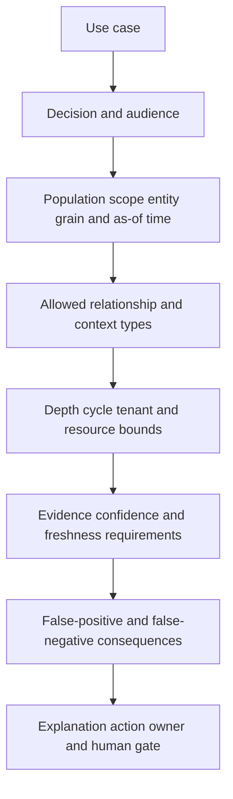

The contract also prevents graph enthusiasm from replacing simpler methods. If the question is "which current owner is listed for these twenty assets," a governed join may be clearer. If the question is "which identities can reach a sensitive service through several groups, roles, applications, and network relationships," graph traversal is a natural fit.

## Layered correlation and enrichment architecture

The architecture should preserve boundaries between what a source observed, what identity resolution linked, what enrichment added, what a query derived, and what a consumer decided. Collapsing these layers makes defects hard to locate.

| Layer | Responsibility | Example | Required evidence |
|---|---|---|---|
| Source | Emit records and source relationships | Directory membership, scanner finding | Source ID, time, version |
| Ingestion | Receive and checkpoint data | API page retrieved | Run ID, cursor, counts |
| Harmonization | Map fields and semantics | `deviceId` to scoped asset identifier | Mapping version |
| Entity resolution | Link records to stable entities | EDR and CMDB record to Asset-44 | Match reason and confidence |
| Relationship resolution | Link relationship endpoints | User-17 assigned_to Asset-44 | Endpoint evidence and interval |
| Enrichment | Attach authorized context | Asset-44 supports Payroll | Authority, freshness, provenance |
| Graph projection | Present selected nodes/edges | Identity-to-payroll subgraph | Projection/query version |
| Analysis | Derive patterns or paths | Possible exposed-admin-to-payroll route | Rules, bounds, assumptions |
| Decision | Prioritize, investigate, or recommend | Validate control on Asset-44 | Rationale, owner, approval |
| Feedback | Record result, dispute, and correction | Ownership edge was stale | Outcome and correction lineage |

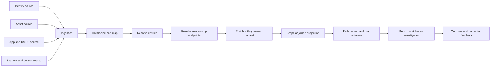

This is a conceptual architecture. It is not a statement about Zscaler's internal services or databases. In a real engagement, the TSM asks which capabilities and evidence are visible in the current licensed product and documents observed behavior.

## Entities, edges, properties, and assertions

An entity should have a stable identity contract. A property describes an entity or relationship. An assertion records what a source said. An edge represents a governed relationship between resolved endpoints. Keeping these concepts separate prevents a mutable label from becoming identity and prevents a preferred value from erasing disagreement.

| Concept | NMH example | Correct treatment | Common mistake |
|---|---|---|---|
| Entity | `Asset-44` physical server lifecycle | Stable scoped ID | Use hostname as eternal identity |
| Node type | Asset | Constrained type contract | Mix user and device records |
| Property assertion | CMDB says owner is AppOps | Preserve source and effective time | Overwrite with newest value |
| Preferred property | Owner selected as PayrollOps for current use | Store selection reason | Present as undisputed truth |
| Edge assertion | Directory says User-17 member_of Group-9 | Preserve source interval | Assume membership forever |
| Resolved edge | User-17 member_of Group-9 under rule v3 | Link stable endpoints with reason | Link raw strings directly |
| Derived edge | User-17 can_access App-3 through Group-9/Role-2 | Mark inferred and retain path | Store as direct observed fact |
| Event | Successful sign-in at a time | Model occurrence with actor/target | Treat repeated events as permanent edges |
| Vulnerability | CVE definition | Shared weakness concept | Confuse with occurrence |
| Finding | Scanner observed CVE on Asset-44 | Time-bound source assertion | Assume still present after remediation |

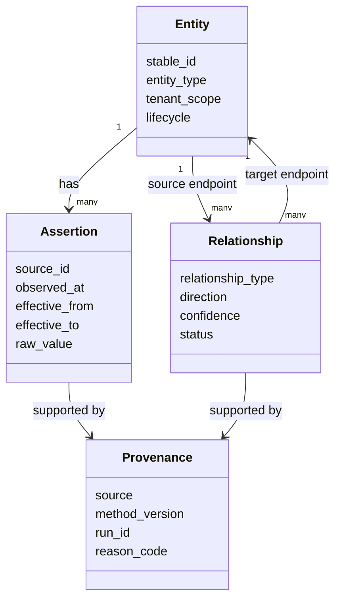

### Plain-English deep-dive 2 - Properties and relationships answer different questions

Suppose `Payroll` appears in an asset record. Is it the asset's name, owning department, hosted application, business service, data classification, or free-text tag? Storing every concept as a property is easy, but it hides identity, lifecycle, ownership, and traversal semantics.

A property is like "blue" on a car record. A relationship is like "owned by Company A" or "parked at Site B." Ownership and location refer to other governed things and can change over time. Modeling them as relationships allows endpoint identity, direction, validity, and evidence. Not every value deserves a node; use a node when the concept has its own identity/lifecycle or participates in meaningful relationships.

## Relationship contracts and edge types

An edge type is a mini-contract. It defines valid endpoint types, direction, inverse meaning, cardinality, time semantics, source authority, confidence, and whether it is observed, configured, asserted, or inferred.

| Edge type | From -> to | Plain meaning | Time/cardinality questions | Security use |
|---|---|---|---|---|
| assigned_to | User -> Asset | User is assigned this asset | Can assets be shared? When did assignment end? | Ownership and investigation |
| member_of | Identity -> Group | Identity has group membership | Direct or nested? Effective dates? | Privilege path |
| grants | Role -> Permission | Role grants an action | Version/environment? | Access analysis |
| can_access | Identity -> Application | Access is possible under modeled policy | Direct or derived? Conditional? | Exposure validation |
| hosts | Asset -> ApplicationInstance | Asset runs an instance | Physical, VM, container, or logical? | Blast radius |
| depends_on | Application -> Application | Service needs another service | Runtime or design dependency? | Impact propagation |
| connects_to | Asset/App -> Asset/App | Communication relationship | Observed, allowed, or historical? | Reachability hypothesis |
| contains | CloudAccount -> Resource | Resource belongs to account | Recreated identifiers? | Scope and owner |
| affected_by | Finding -> Vulnerability | Finding concerns weakness definition | Finding occurrence/version? | Vulnerability context |
| located_on | Finding -> Asset | Finding occurs on asset | Which instance and time? | Remediation target |
| protected_by | Asset/App -> Control | Control is relevant to target | Installed, configured, healthy, enforced? | Mitigation evidence |
| supports | Asset/App -> BusinessService | Technical thing supports service | Owner-approved and current? | Impact context |
| owned_by | Entity -> OrgUnit/User | Accountable owner | Technical vs business owner? | Assignment |
| handles | Application -> DataClass | App processes classified data | Purpose, environment, expiry? | Impact and privacy |

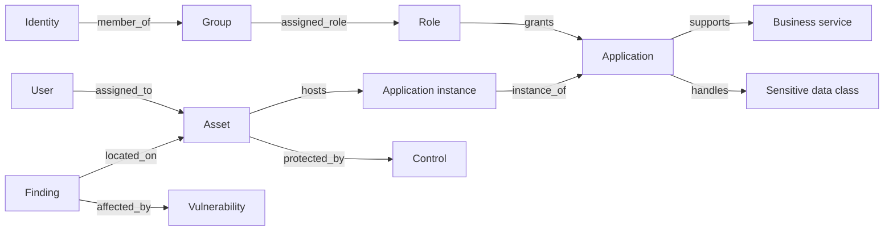

Direction matters. `Role grants Permission` is not interchangeable with `Permission grants Role`. Some systems expose inverse edges for convenience, but the contract should define which assertion is authoritative and how the inverse is derived.

## Relationship resolution mechanics

Source relationships often arrive with raw endpoint identifiers such as email, hostname, cloud resource ID, group ID, application name, or CMDB key. Relationship resolution maps each endpoint to stable entities before creating a governed edge.

| Step | Question | Evidence retained | Failure signature |
|---|---|---|---|
| 1. Parse | Is the source relationship structurally valid? | Raw payload and schema version | Missing endpoint/type |
| 2. Scope | Which tenant, account, environment, and entity type? | Namespace and scope | Cross-tenant edge |
| 3. Resolve source | Which stable source entity matches? | Match reason/version | Orphan source endpoint |
| 4. Resolve target | Which stable target entity matches? | Match reason/version | Ambiguous target endpoint |
| 5. Validate type | Is this endpoint pair allowed? | Type-rule result | User hosts vulnerability |
| 6. Validate time | Do endpoint lifecycles overlap edge validity? | Effective intervals | Edge before entity existed |
| 7. Validate cardinality | Is multiplicity plausible? | Count/constraint result | One asset owned by 400 departments |
| 8. Classify evidence | Observed, configured, asserted, or inferred? | Evidence class | Derived edge shown as observed |
| 9. Set status | Active, expired, disputed, pending, retracted? | State and reason | Deleted edge silently vanishes |
| 10. Publish | Which consumers and versions receive it? | Edge ID/version/run | Stale cache persists |

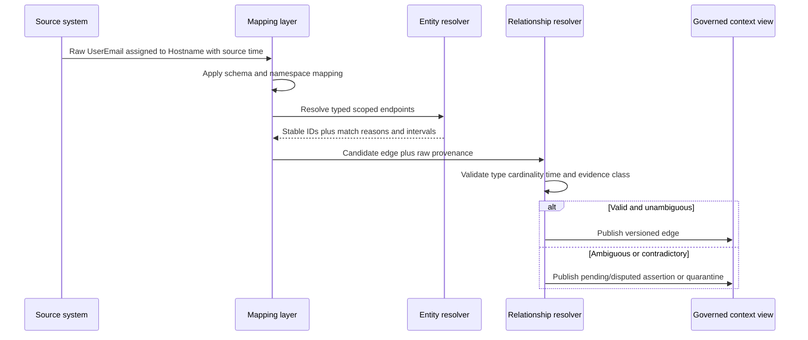

A missing endpoint should not be coerced to the nearest text match merely to improve coverage. Keep an orphan-edge queue with source, raw key, first/last seen, reason, age, impact, and owner. Resolution coverage is useful only alongside false-link risk.

## Context domains: business, identity, asset, application, vulnerability, control, behavior, and organization

Context is useful when it changes interpretation or action and is trustworthy for the relevant time. More fields do not automatically create better decisions.

| Context domain | Example properties/relationships | Decision value | Typical defect |
|---|---|---|---|
| Business | Revenue service, process, criticality, data class, recovery objective | Explains consequence | Self-declared criticality never reviewed |
| Identity | Person/account, privilege, group, role, service identity, MFA posture | Explains access and blast radius | Deleted/recreated account linked by email |
| Asset | Type, lifecycle, owner, environment, internet exposure, location | Identifies target and scope | Hostname reuse or duplicate asset |
| Application | Logical service, instance, dependency, owner, environment | Connects technology to service | App name treated as stable ID |
| Vulnerability | Definition, exploitability evidence, affected versions | Describes weakness | Definition confused with finding occurrence |
| Finding | Source occurrence, status, evidence, first/last seen | Shows observed condition | Closed source finding remains active |
| Control | Relevance, deployment, health, configuration, enforcement, test result | Can reduce likelihood/impact | Installed agent assumed effective |
| Behavior | Frequency, sequence, novelty, peer baseline, time | Supports investigation | Normal business change labeled malicious |
| Organization | Department, hierarchy, geography, cost center, owner | Routes accountability and aggregation | Reorg history ignored |
| Threat | Indicator, campaign, exploitation evidence, source confidence, expiry | Changes urgency | Stale indicator treated as current proof |

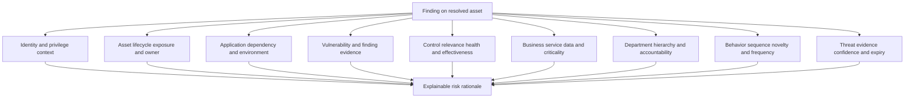

### Plain-English deep-dive 3 - Enrichment can make an answer worse

Adding a department, owner, control, or criticality label feels helpful. But a stale owner can route a sensitive ticket to the wrong team. A false asset merge can attach one server's healthy endpoint control to another unprotected server. A current department can incorrectly reinterpret a historical event before a reorganization.

Enrichment is like adding ingredients to soup. A verified ingredient can improve it; a mislabeled or spoiled ingredient contaminates the whole pot. Every enrichment needs source authority, field meaning, scope, effective time, freshness, confidence, conflict handling, and an unknown state. Never convert missing context to "not critical," "not exposed," or "protected."

## Business and organizational context

Business context translates technical exposure into consequence. It should come from accountable owners and governed sources, not from a security analyst guessing revenue importance from an application name.

| Context item | Definition before use | Authority question | Safe use |
|---|---|---|---|
| Business service | Customer or internal capability delivered by people/process/technology | Who owns service definition? | Impact grouping |
| Business process | Ordered activity producing a business result | Which process owner validates it? | Dependency and consequence |
| Criticality | Approved importance under stated criteria | Which scale, date, and approver? | Prioritization factor |
| Recovery objective | Target for restoring service/data | Is it current and tested? | Availability impact |
| Data classification | Sensitivity category under policy | Which data owner and policy version? | Confidentiality/privacy impact |
| Environment | Production, test, development, or other governed stage | How is it derived and overridden? | Scope and action safety |
| Organizational unit | Department/team hierarchy node | How are reorganizations represented? | Ownership and reporting |
| Technical owner | Team operating technology | Is it support or accountability? | Work assignment |
| Business owner | Person accountable for business outcome/risk | Is delegation current? | Risk decision |
| Exception | Approved temporary deviation with conditions and expiry | Who approved and what compensates? | Avoid duplicate or unauthorized action |

Business criticality should not erase technical uncertainty. A critical application with an unvalidated path deserves faster validation, not a false statement that exploitation is certain. Conversely, a noncritical label should not suppress a route to privileged identities or regulated data.

## Identity, privilege, and application relationships

Identity context includes human identities, service identities, accounts, groups, roles, permissions, sessions, and authentication controls. These are distinct entities and relationships. A person may own several accounts; an account may be a service principal rather than a person; a group may grant a role; a role may grant conditional access to an application.

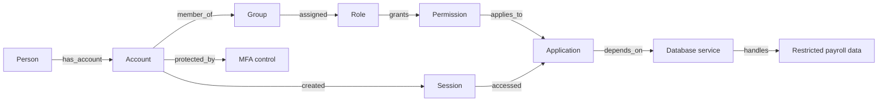

| Distinction | Why it matters | Example failure |
|---|---|---|
| Person vs account | One person can have many accounts; one service account may have no person | All service activity attributed to employee |
| Direct vs nested membership | Effective privilege may traverse groups | Hidden access path omitted |
| Assigned vs activated role | Just-in-time privilege differs from standing access | Temporary eligibility shown as active |
| Permission vs observed use | Ability is not evidence of use | Possible access reported as breach |
| Application vs instance | Logical service differs from deployment | Test instance risk assigned to production |
| Policy allows vs network reachable | Authorization and connectivity are separate preconditions | Path inferred from only one plane |
| MFA registered vs enforced | Enrollment does not prove challenge applied | Control overstated |
| Account disabled vs token invalidated | Sessions may persist under platform rules | Immediate protection assumed |

## Asset, vulnerability, finding, and control relationships

The graph should distinguish a vulnerability definition from a finding occurrence and distinguish a control's presence from its effective mitigation of that finding.

| Entity/relationship | Meaning | Evidence needed | Dangerous shortcut |
|---|---|---|---|
| Vulnerability | General weakness definition | Identifier and authoritative metadata | Treat severity as customer risk |
| Finding | Source observed weakness on target | Source finding ID, target, time, evidence | Deduplicate unlike occurrences blindly |
| located_on | Finding occurs on resolved asset/app instance | Endpoint resolution and lifecycle overlap | Join by hostname only |
| affected_by | Finding maps to vulnerability definition | Source mapping/version | Assume every product version affected |
| exposed_to | Target has relevant reachable exposure | Network/policy evidence and time | Internet tag alone proves exploitability |
| protected_by | Relevant control applies to target | Deployment/config/health/enforcement evidence | Agent presence equals mitigation |
| exception_for | Approved exception covers finding/scope/time | Approval, owner, conditions, expiry | Open-ended suppression |
| remediated_by | Change intended to correct condition | Change evidence and validation | Ticket closure equals fix |
| validated_by | Test confirms current state | Method, time, result, scope | Old validation applied forever |

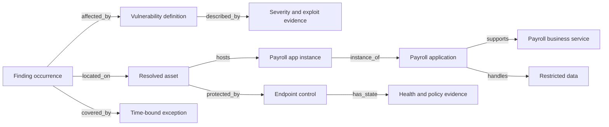

A mitigating control can lower concern only when it is relevant to the scenario, deployed on the correct entity, configured for the required behavior, healthy during the relevant interval, enforcing rather than merely monitoring where necessary, and supported by current evidence. If any element is unknown, report unknown control effectiveness.

## Behavior context without causation theater

Behavioral context summarizes activity patterns. A baseline is a reference pattern, not a moral judgment. Novel or rare activity is a clue. It can be caused by a role change, incident response, migration, travel, automation, broken telemetry, or malicious action.

| Behavior signal | Useful question | Benign alternative | Discriminating evidence |
|---|---|---|---|
| New country | Is location inconsistent with session history? | Travel or VPN egress | Device/session/token/path evidence |
| New application | Is access unusual for peer and role? | New project assignment | Change ticket and manager confirmation |
| Privilege use | Was sensitive permission exercised? | Approved maintenance | Activation/approval and command evidence |
| Burst of failures | Is this attack or configuration problem? | Expired secret | Source IP, account spread, deployment change |
| Large download | Is volume unusual and sensitive? | Authorized migration | Data class, destination, ticket, user intent |
| New process/network flow | Is it expected for software version? | Update or monitoring agent | Binary provenance and rollout record |
| After-hours action | Does time differ from role norm? | On-call work | Schedule and incident bridge |
| Peer deviation | Is peer group meaningful? | Misclassified team/role | Organizational and job-function validation |

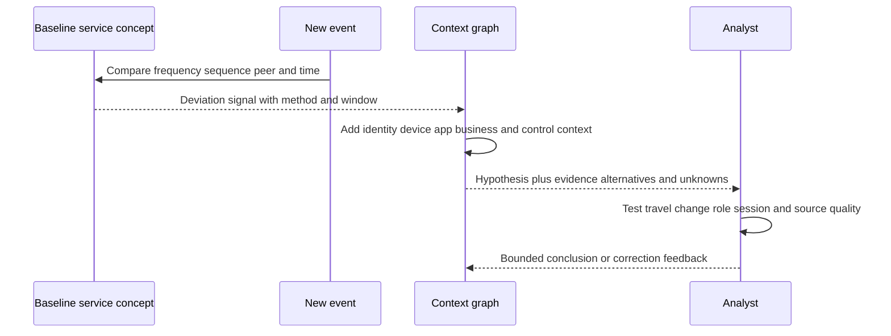

Do not say "the graph proved malicious behavior" unless direct incident evidence supports that claim. Say "the pattern is unusual under baseline v4 and warrants validation because the privileged account, sensitive app, and new device coincide; approved travel and maintenance remain alternatives."

## Temporal validity and as-of context

Security context changes. Users move teams. Assets are reimaged or replaced. Cloud resource names are reused. Applications move environments. Controls become unhealthy. Exceptions expire. Graph analysis must answer "when?"

| Time concept | Plain meaning | Example | Failure when confused |
|---|---|---|---|
| Event time | Source occurrence time | Sign-in at 10:03 | Wrong sequence |
| Observation time | When source observed state | Scanner saw port at 10:10 | State treated as continuous |
| Ingestion time | When data arrived | Batch arrived 11:00 | Delay mistaken for event order |
| Processing time | When logic ran | Graph updated 11:05 | Recompute hidden |
| Effective from/to | When assertion is considered valid | Owner from July 1 to Aug 20 | Current owner applied historically |
| Publication time | When consumer could see result | Dashboard at 11:10 | SLA measured from wrong clock |
| Valid-time view | What was believed effective at a target time | Owner as of Aug 10 | Historical incident misrouted |
| System-time view | What system stored/changed over time | Correction entered Aug 24 | Audit history lost |

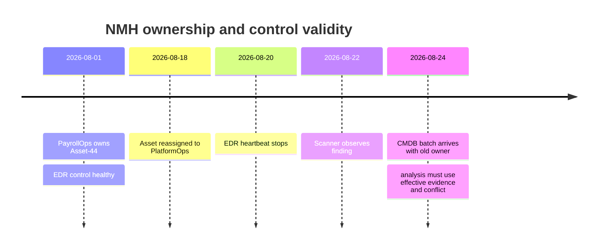

### Plain-English deep-dive 4 - Current truth is not historical truth

Imagine checking a building directory today to decide who occupied an office during an incident last month. The current tenant may be correct now and still be wrong for the investigation. Effective time describes when a fact applies. System time describes when the platform learned or changed it. Both matter.

An as-of graph should select edges and properties whose effective intervals overlap the target time, while preserving what was known at decision time. This lets a team answer two distinct questions: "What actually appears to have been true then, after later corrections?" and "What evidence did the analyst have when the decision was made?" Without both, audits and RCA become unreliable.

## Graph and path concepts from zero

A graph is a set of nodes and edges. Traversal follows allowed edges. A path is an ordered sequence. Degree counts directly connected edges. Centrality is a family of measures for structural importance. A connected component is a set of nodes connected under chosen rules. None of these mathematical properties automatically equals security risk.

| Concept | Plain meaning | Security use | Limitation |
|---|---|---|---|
| Neighbor | One edge away | Direct owner/control/dependency | Edge may be stale or weak |
| Degree | Number of direct edges | Find unusually connected account | Service accounts may be legitimately broad |
| Path length | Number or cost of steps | Compare modeled routes | Fewer steps does not mean easier exploit |
| Weighted path | Route cost uses edge weights | Prefer stronger/reachable evidence | Weights encode assumptions |
| Directed path | Follow arrow semantics | Role grants access to app | Reverse traversal may be invalid |
| Connected component | Nodes connected under a relation set | Scope clusters or blast radius | Loose edge can join unrelated regions |
| Centrality | Structural importance measure | Identify potential choke points | Not business criticality or causality |
| Cycle | Route returns to visited node | Detect nested groups/dependencies | Must prevent infinite traversal |
| K-shortest paths | Several low-cost routes | Avoid relying on one route | Can explode and duplicate near-identical paths |
| Motif/pattern | Repeated small relationship shape | Detect risky combinations | Pattern match is a hypothesis |

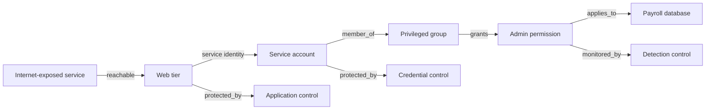

The diagram alone does not prove the route works. The web weakness may not enable code execution. The service identity credential may not be accessible. Group membership may be eligible but inactive. The permission may be conditional. The controls may block the route. Path analysis must expose these preconditions.

## Safe traversal contracts

Graph queries can return plausible nonsense or consume excessive resources unless bounded. A traversal contract makes the result reproducible and reviewable.

| Guardrail | Example | Why it matters |
|---|---|---|
| Start set | Internet-facing production applications | Avoid entire-graph scan |
| Target set | Restricted payroll data or privileged identity | Define meaningful outcome |
| Allowed node types | Asset, app instance, identity, group, role, data | Exclude irrelevant concepts |
| Allowed edge types | reachable, hosts, uses_identity, member_of, grants, handles | Preserve semantics |
| Direction | Follow grants from role to permission | Avoid inverse mistakes |
| Effective time | 2026-08-24 12:00 UTC | Remove expired relationships |
| Evidence class | Observed/configured edges; inferred marked separately | Keep facts and inference distinct |
| Minimum confidence | Use per-edge policy, not averaged certainty | Exclude unsupported links carefully |
| Maximum depth | Six edges | Limit path explosion |
| Cycle policy | No repeated stable node in one path | Guarantee termination |
| Tenant boundary | NMH production tenant only | Prevent data leakage/collision |
| Result limit | Top 100 paths plus truncation notice | Keep review usable |
| Cost function | Evidence weakness + control/precondition cost | Make "shortest" meaningful |
| Explainability | Return every edge, source, time, reason, unknown | Enable validation |

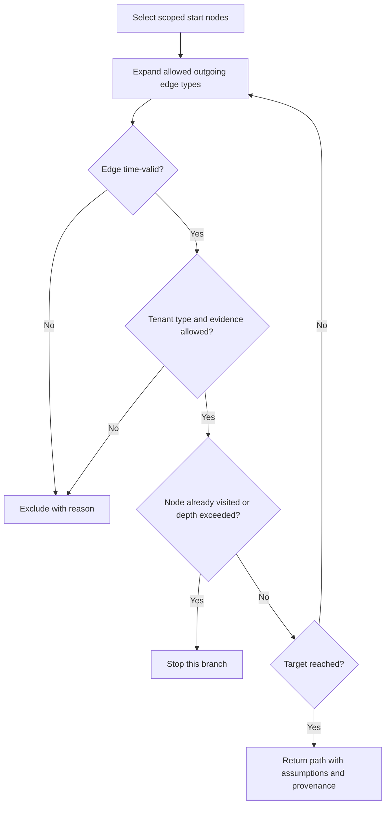

If a query returns no path, that does not prove safety. Data may be missing, stale, incorrectly resolved, outside source coverage, or excluded by the contract. Report both the result and coverage/quality caveats.

## Attack path versus exposure path

Security language should distinguish modeled possibility from observed activity. "Attack path" is common industry language, but audiences may hear it as proof that an attack occurred. Use explicit qualifiers.

| Statement | Evidence level | Safe wording | Unsafe wording |
|---|---|---|---|
| Model connects weakness to sensitive target | Possible route | "Possible exposure path under these assumptions" | "Attack reached payroll" |
| Preconditions partly validated | Plausible route | "Plausible path; identity access remains untested" | "Exploitable path confirmed" |
| Authorized test validates route safely | Validated exposure path | "Authorized validation confirmed these steps at this time" | "Attackers use this route" |
| Telemetry shows ordered malicious activity | Observed attack sequence | "Evidence supports observed activity across these entities" | "Graph proves attribution" |
| Control blocks a tested step | Blocked path under test | "This tested route was blocked by control X" | "No attack path exists" |
| Data missing | Unknown | "No supported path found; coverage gaps remain" | "Environment is secure" |

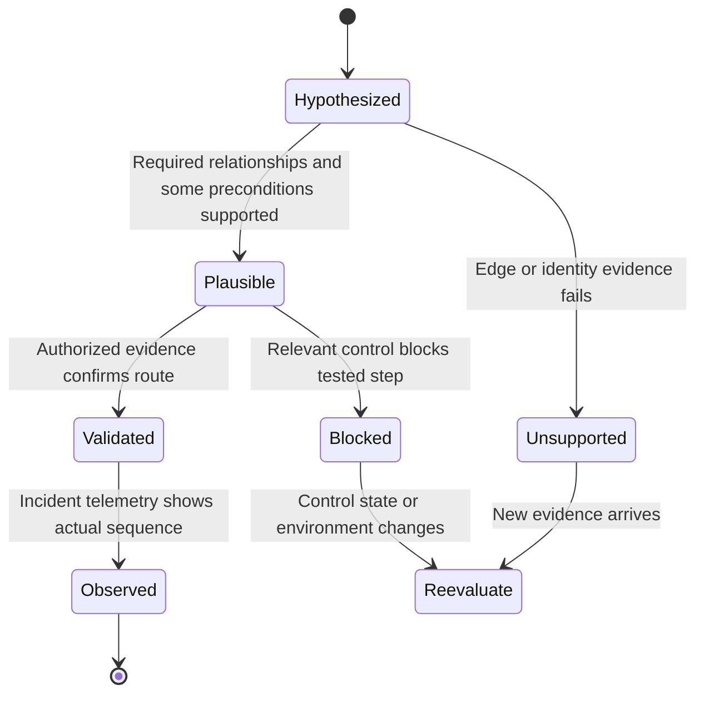

An exposure path is useful even when no incident occurred. It can reveal a choke point such as excessive group membership, an internet-facing vulnerable service, or missing control coverage. The action is to validate and reduce exposure, not to overstate breach evidence.

## Confidence, provenance, and evidence independence

Confidence is not one universal number. Source confidence, identity-link confidence, relationship confidence, attribute confidence, path support, behavior-model confidence, and risk-decision confidence answer different questions.

| Confidence object | Question | Evidence example | Do not infer |
|---|---|---|---|
| Source | Is source reliable for this field/time? | Directory authoritative for group membership | Source is correct for asset owner |
| Entity link | Do records represent same entity? | Scoped immutable IDs and lifecycle overlap | Every property is accurate |
| Edge | Does this relationship connect these endpoints now? | Direct API assertion with interval | Downstream path is exploitable |
| Property | Is this value preferred for purpose/time? | Owner approved by service registry | No conflicting assertion exists |
| Control | Is mitigation relevant and effective? | Healthy enforced policy plus test | All attack methods blocked |
| Behavior | Is deviation meaningful under model? | Stable peer baseline and complete telemetry | Activity is malicious |
| Path | Are steps supported under assumptions? | Per-edge evidence and validated preconditions | Path probability from average confidence |
| Decision | Is recommendation justified? | Impact, evidence, alternatives, owner | Proprietary risk score |

```mermaid
flowchart LR
    RAW[Raw source assertion] --> MAP[Mapping provenance]
    MAP --> ENTITY[Entity-link reason and version]
    ENTITY --> EDGE[Edge rule source interval and status]
    EDGE --> QUERY[Traversal contract and version]
    QUERY --> PATH[Returned path with weakest assumptions]
    PATH --> DECISION[Human rationale approval and time]
    DECISION --> OUTCOME[Validation remediation dispute or correction]
    OUTCOME --> LEDGER[Append-only evidence lineage]
```

Three sources do not equal three independent confirmations if they copied one CMDB field. Record upstream origin and derivation. Confidence aggregation should account for dependence and contradictions; a simple average can conceal one decisive weak edge.

### Plain-English deep-dive 5 - Path confidence is not multiplying pretty percentages

Suppose five edges show 0.9 confidence. Multiplying them assumes the numbers mean probabilities, are calibrated, describe the same outcome, and are independent. Those assumptions are usually unjustified. One value may express entity-match strength; another may express source freshness; another may be a qualitative mapping converted to a number.

Think of a legal case with five exhibits. You cannot multiply a fingerprint quality score, witness credibility rating, document freshness, camera uptime, and map accuracy to obtain "probability of guilt." Instead, expose each evidence type, contradictions, dependencies, and the weakest decision-critical assumptions. Use numbers only under a documented, validated interpretation.

## How context changes risk

Risk is a decision concept involving likelihood and impact under uncertainty. Context can raise concern, lower it, change ownership, or remain inconclusive. This Part does not reconstruct Zscaler's proprietary calculations.

| Context | Possible effect | Required validation | Honest rationale |
|---|---|---|---|
| Internet reachability | Raises likelihood concern | Current route/policy/service evidence | "Reachability is supported as of time T" |
| Privileged identity relationship | Raises blast-radius concern | Effective access and conditions | "Role could reach target if activated" |
| Restricted data | Raises impact | Data owner/classification/current app mapping | "App handles restricted payroll data" |
| Critical business service | Raises consequence | Owner-approved service mapping | "Outage or compromise affects payroll" |
| Active exploitation evidence | Raises urgency | Source, scope, confidence, expiry | "Authoritative evidence indicates exploitation in the wild" |
| Healthy relevant prevention | May lower likelihood | Deployment, configuration, enforcement, test | "Control blocks this tested technique" |
| Detection only | May lower detection delay, not prevention likelihood | Coverage and response process | "Monitoring improves visibility; it does not prevent" |
| Approved exception | Changes governance/action | Scope, conditions, approver, expiry | "Exception applies until date; residual risk remains" |
| Missing owner | Raises operational risk | Confirm absence, not mapping defect | "No accountable owner is evidenced" |
| Stale context | Increases uncertainty | Freshness and source health | "Priority cannot be safely reduced" |
| Behavior anomaly | Raises investigation priority | Baseline quality and alternatives | "Deviation warrants validation" |

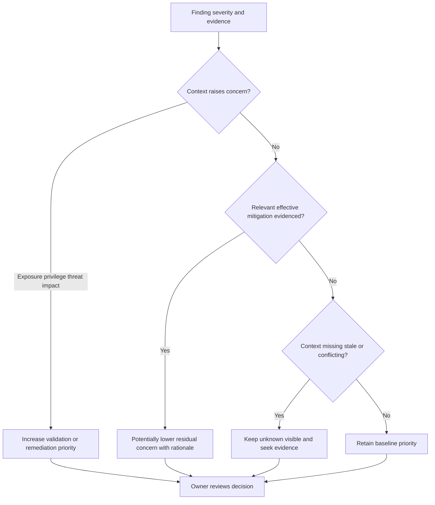

Avoid double counting. Business criticality may be represented through service tier and data classification that derive from the same policy. Identity privilege may be represented by both group and role edges that describe one access grant. Factor lineage helps identify dependence.

## Stale, wrong, missing, duplicated, and circular context

Context defects propagate. A wrong entity link creates wrong edges; wrong edges create false paths; false paths affect risk, reports, and workflows. Troubleshooting begins at the earliest stage capable of producing the symptom.

| Defect | Example | Downstream symptom | Detection/control |
|---|---|---|---|
| Missing context | No business-service mapping | Impact unknown | Coverage metric and owner queue |
| Stale context | Former owner remains active | Ticket misrouted | Effective interval and freshness SLO |
| Wrong mapping | `prod` interpreted as department | Wrong grouping | Semantic contract tests |
| False entity merge | Replacement server linked to retired server | Healthy control copied to exposed asset | Entity coherence and lifecycle checks |
| False split | Same cloud resource represented twice | Duplicate paths/tickets | Resolution quality and reconciliation |
| Orphan edge | Group ID cannot resolve | Access path incomplete | Orphan-edge queue |
| Cardinality fanout | App name joins every environment | Inflated path count | Expected/actual cardinality test |
| Direction error | Permission shown granting role | Impossible traversal | Edge-type validation |
| Time error | Current owner applied to past finding | Historical report changes incorrectly | As-of regression test |
| Circular enrichment | Risk label used to derive criticality used in same risk | Artificial confidence | Lineage cycle detection |
| Dependent sources | Three tools copy CMDB owner | False corroboration | Upstream-origin metadata |
| Stale consumer | Correct edge published but report cache old | UI disagrees with evidence API | Version/freshness comparison |
| Path explosion | Broad relationship and no depth bound | Slow/noisy dashboard | Traversal limits and monitoring |

### Plain-English deep-dive 6 - A wrong relationship is a routing defect, not just a bad line

If an ownership edge is stale, the damage is not limited to a graph picture. It can assign a remediation ticket to the wrong team, expose sensitive finding detail to an unauthorized person, age the real owner's backlog invisibly, and make an executive dashboard blame the wrong department.

Treat relationship quality like address quality in a delivery company. One wrong address changes custody, timing, privacy, and service metrics. Contain downstream actions first, then correct the source or resolution rule, rebuild affected context, reconcile every consumer, notify impacted stakeholders, and prevent recurrence with tests and monitoring.

## Troubleshooting correlation and graph results

Start with one concrete wrong or missing result and trace backward. Do not tune graph logic before proving entity, mapping, time, and source health.

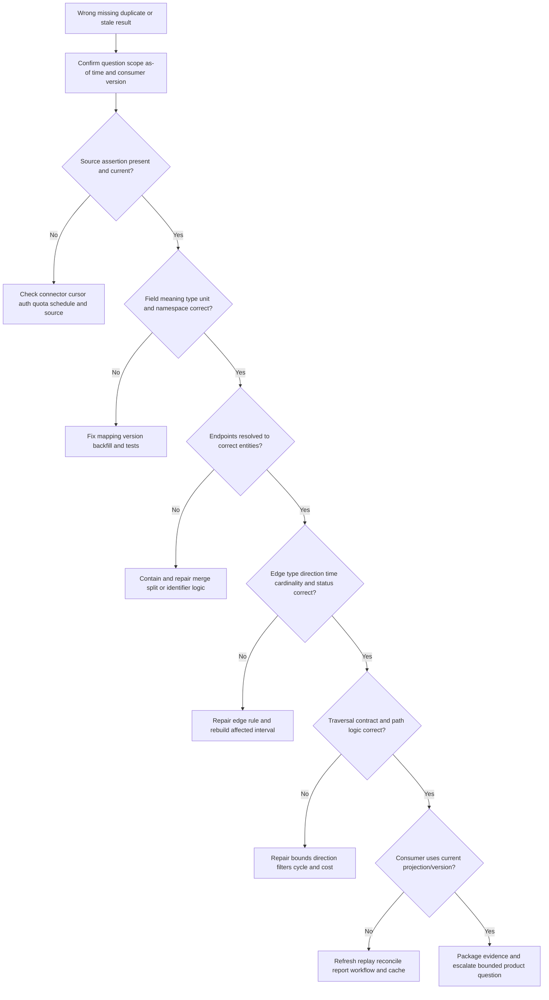

| Evidence item | Why collect it | Redaction/safety note |
|---|---|---|
| Reproducible entity/path IDs | Anchors exact symptom | Use synthetic or approved identifiers |
| Expected vs actual result | Defines defect | Avoid unsupported expectation |
| Source raw record and source timestamp | Proves source assertion | Minimize personal/sensitive data |
| Connector run, cursor, counts, errors | Tests ingestion | Never expose secrets/tokens |
| Mapping and schema version | Tests semantic transformation | Include field-level reason |
| Entity resolution reason/version | Tests endpoints | Preserve contradictions |
| Edge ID/type/direction/status/interval | Tests relationship | Include source and derivation |
| Query/projection version and bounds | Reproduces traversal | Include truncation/time zone |
| Consumer version/cache time | Finds stale presentation | Capture safely |
| Downstream tickets/reports/actions | Scopes impact | Restrict access and redact |
| First bad/last good time | Narrows change window | State clock source |
| Recent source/mapping/rule changes | Tests regression hypothesis | Correlation is not causation |

Troubleshooting questions by symptom:

| Symptom | First discriminating check | Likely branches |
|---|---|---|
| Missing path | Are required endpoint entities and direct edges present as of target time? | Source gap, orphan edge, filter, direction, time |
| Extra path | Which first edge should not be present? | False merge, broad join, expired edge, inferred-as-observed |
| Duplicate paths | Are stable entities/edges duplicated or are equivalent routes emitted? | False split, replay, query dedup semantics |
| Wrong owner | What source and effective interval support `owned_by`? | Stale source, precedence, time, entity mismatch |
| Control lowers risk unexpectedly | Is control relevant, healthy, enforced, and linked to correct target/time? | Presence-only logic, false merge, stale heartbeat |
| Historical report changes | Did as-of selection or correction policy change? | Current snapshot misuse, late data, restatement |
| Query slow | Which start set/edge type causes expansion? | High-degree node, missing bound, cycle, broad type |
| UI and export differ | Do they use same projection/query/time/version? | Cache, schedule, timezone, filters |
| Ticket misrouted | Which ownership edge/version was consumed? | Stale context, workflow snapshot, reconciliation gap |

## Correlation correction and customer communication

A correction is incomplete until downstream decisions are reconciled. Use an auditable sequence.

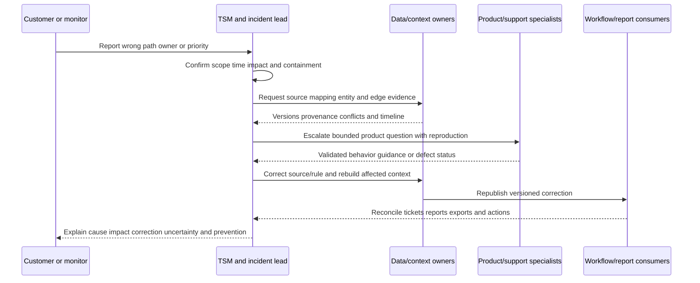

| Communication element | Example wording |
|---|---|
| What happened | "A stale ownership relationship remained effective after reassignment." |
| What did not happen | "This evidence does not indicate compromise or data access." |
| Impact | "Seven findings and three tickets were routed to the former team." |
| Containment | "Automated assignment for the affected service was paused." |
| Cause level | "The first supported defect is effective-date handling in the synthetic relationship rule." |
| Correction | "We expired the edge, rebuilt the interval, and reconciled tickets/reports." |
| Remaining uncertainty | "Historical ownership before August 1 still requires source-owner confirmation." |
| Prevention | "Regression fixtures, stale-edge monitoring, and owner-review controls were added." |
| Product boundary | "Production behavior would be validated with current Zscaler documentation and specialists." |

## Complete synthetic NMH source-to-risk scenario

NMH wants to prioritize a vulnerability finding affecting its fictional payroll service. Sources include a directory, privileged-access system, endpoint tool, scanner, cloud inventory, CMDB, application registry, control-health feed, data catalog, and ticketing system. All names, records, times, scores, and outcomes are invented for study.

### Scenario data contract

| Item | Synthetic value | Evidence/caveat |
|---|---|---|
| Finding | `F-900` on `Asset-44`, first seen 2026-08-22 | Scanner assertion, not independent validation |
| Vulnerability | `V-Example` with high technical severity | Fictional; severity is not risk |
| Asset | `Asset-44`, production web tier | Resolved from scanner/cloud/EDR records |
| Application | `Payroll-Web-Prod` hosted on Asset-44 | App registry plus owner confirmation |
| Business service | Payroll, criticality tier 1 | Approved by service owner on 2026-08-01 |
| Data | Restricted payroll data handled downstream | Data catalog assertion effective 2026-07-01 |
| Exposure | Public listener reaches web tier | Current cloud/network configuration evidence |
| Identity | Service account `Svc-Pay-Web` | Scoped directory identity |
| Privilege | Nested group can reach database role | Configured relationship; activation condition unknown |
| Control | Endpoint control last healthy 2026-08-20 | Finding observed 2026-08-22; current effectiveness unknown |
| Owner conflict | CMDB says AppOps; app registry says PayrollOps | CMDB relationship stale after reassignment |
| Behavior | New outbound connection after deployment | Could be expected telemetry exporter |

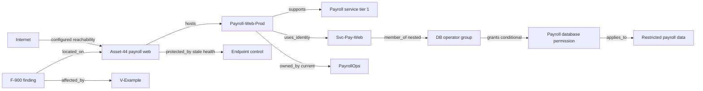

### Step-by-step analysis

1. **Define the question.** NMH asks which finding deserves immediate authorized validation, not whether a breach occurred.
2. **Verify identity.** Scanner, cloud, and endpoint records resolve to `Asset-44`; hostname alone is not used. The physical/cloud lifecycle overlaps the finding time.
3. **Validate source assertions.** The scanner finding exists. Public reachability is configured. App ownership and tier are current. Endpoint health is stale.
4. **Resolve relationships.** The asset hosts a payroll instance; the app supports payroll and uses a service identity. Nested group and role edges are configured, but effective activation remains unknown.
5. **Apply time.** The finding occurs after the last control heartbeat. The old AppOps ownership edge ended on August 18 even though a late CMDB batch repeats it.
6. **Traverse under contract.** The path uses allowed edge types, maximum depth six, NMH production scope, no cycles, and as-of time August 24.
7. **State path status.** The internet-to-web step is supported; weakness exploitability in NMH and access to service credentials are unvalidated; database role activation is conditional; control effectiveness is unknown.
8. **Explain risk effect.** Production payroll criticality, restricted data, current reachability, and privilege relationships raise validation priority. Stale control health cannot lower risk. The behavior signal is not treated as causation.
9. **Recommend action.** PayrollOps validates affected software/configuration and reachability, identity team validates role activation and credential protection, endpoint team validates control health, and change owners remediate or apply approved temporary protection.
10. **Require human gates.** No account disablement, network block, or production change occurs from graph output alone.
11. **Reconcile ownership.** Expire the stale AppOps edge, publish current PayrollOps ownership, and correct affected tickets.
12. **Measure outcome.** Confirm finding status, path preconditions, control health, ticket ownership, and risk rationale after change.

### Synthetic incident variation

A false entity merge links retired `Asset-43` to replacement `Asset-44` because both used hostname `PAY-WEB-01`. `Asset-43` had a healthy endpoint control and AppOps owner; `Asset-44` is owned by PayrollOps and its control heartbeat is missing. The merged graph incorrectly lowers priority and routes a ticket to AppOps.

NMH pauses automated routing and any control-based downgrade for the affected cluster. The team preserves source records, versions, and consumer snapshots; identifies the hostname-only merge; separates lifecycle-distinct assets; rebuilds ownership/control edges; recomputes the exposure path and rationale; reassigns/reopens tickets; restates reports; notifies teams; and adds serial/cloud-ID/lifecycle vetoes plus a replacement-host regression fixture. This incident demonstrates why entity quality comes before relationship and path quality.

| Scenario conclusion | Honest wording |
|---|---|
| Finding exists | "Scanner source reports F-900 on resolved Asset-44." |
| Exposure | "Current configuration supports public reachability to the web tier." |
| Path | "A possible exposure path connects the web tier to restricted payroll data under listed identity assumptions." |
| Unknown | "Credential access, role activation, and local exploitability are not yet validated." |
| Control | "Endpoint-control effectiveness after August 20 is unknown." |
| Priority | "Impact and reachability justify urgent validation; this is a synthetic rationale, not a Zscaler score." |
| Incident status | "No evidence here proves compromise or data access." |
| Ownership | "PayrollOps is the current approved technical owner; the late CMDB assertion is stale." |

## Synthetic exercises with answers

### Exercise 1 - Entity or property

Should `Payroll` be a text property or entity?

**Answer:** If it is only a display category with no identity or relationships, a controlled property may suffice. If Payroll has an owner, criticality, applications, data, dependencies, lifecycle, and decisions, model it as a governed business-service entity. The contract, not graph fashion, decides.

### Exercise 2 - Relationship direction

Does `member_of(User, Group)` mean the group is a member of the user?

**Answer:** No. Direction carries semantics. An inverse can be derived as `has_member(Group, User)`, but its provenance should point to the same source assertion rather than pretending it was separately observed.

### Exercise 3 - Time

A user left Finance on August 10. An event occurred August 5. Which department applies?

**Answer:** Use the department edge effective on August 5 for historical event context. Also retain when the platform learned of the change so the analyst's decision-time evidence can be audited.

### Exercise 4 - Control

An agent is installed. Can risk be lowered?

**Answer:** Not from installation alone. Validate relevance, target, policy, health, mode, enforcement, effective interval, and ideally test evidence. Unknown effectiveness remains unknown.

### Exercise 5 - Path

A graph returns a path from an exposed app to a database. Was the database attacked?

**Answer:** No. A path is a modeled route. Validate weakness exploitability, reachability, credentials, authorization, controls, and activity telemetry. Use possible, plausible, validated, blocked, or observed labels.

### Exercise 6 - Confidence

Can five 0.9 edge scores be multiplied for path probability?

**Answer:** Only if each is a calibrated probability for compatible events and dependence is modeled, which is not established here. Preserve per-edge evidence and weakest assumptions instead.

### Exercise 7 - Missing path

Does no returned path prove no exposure?

**Answer:** No. Check source coverage, freshness, entity resolution, orphan edges, time filters, edge types, direction, depth, truncation, and control assumptions.

### Exercise 8 - Fanout

One application name joins 400 instances and creates thousands of paths. What first?

**Answer:** Stop using display name as identity. Check environment, tenant, deployment IDs, cardinality, and app-versus-instance grain. Do not hide the problem with `DISTINCT`.

### Exercise 9 - Behavior

An administrator accesses payroll at midnight. Is it malicious?

**Answer:** It is a hypothesis signal. Check on-call schedule, approved change, device/session, role activation, commands, data access, source quality, and peer baseline.

### Exercise 10 - Circular evidence

Criticality is derived from risk score, while risk score uses criticality. Why dangerous?

**Answer:** The result reinforces itself. Lineage should detect the cycle. Use an independently governed criticality source or remove the circular factor.

### Exercise 11 - Stale owner

What is the first corrective priority after tickets go to a former team?

**Answer:** Contain further routing and privacy exposure, identify the consumed edge/version, correct effective ownership at source or resolution, rebuild, reconcile all tickets/reports/actions, communicate impact, and add tests/monitoring.

### Exercise 12 - Product claim

Can you say Zscaler uses a particular graph database and path algorithm?

**Answer:** No. Public pages support correlation, enrichment, relationships, and contextual categories, not undocumented storage, schema, query, algorithm, or formula details.

## Labs and rehearsal

### Lab 1 - Correlation charter

Write decision, audience, population, entity grain, as-of time, allowed relationships, error consequences, output, owner, and human gate for the NMH payroll case.

### Lab 2 - Entity catalog

Define user/person/account, asset, application/application instance, vulnerability/finding, control, business service, organizational unit, data class, and event. Include lifecycle and stable identifiers.

### Lab 3 - Edge contracts

Create contracts for `member_of`, `hosts`, `depends_on`, `protected_by`, `supports`, `owned_by`, and `handles`. Specify endpoint types, direction, inverse, time, cardinality, source authority, evidence class, and status.

### Lab 4 - Relationship-resolution queue

Build synthetic raw edges with missing, ambiguous, cross-tenant, expired, and wrong-type endpoints. Produce linked, pending, disputed, quarantined, and retracted outcomes with reasons.

### Lab 5 - Context matrix

For one finding, collect business, identity, asset, app, vulnerability, finding, control, behavior, threat, and organization context. Mark authority, effective time, freshness, confidence, conflict, and missing behavior.

### Lab 6 - Temporal graph

Model employee transfer, asset replacement, group removal, control outage, and exception expiry. Query current and historical as-of views and explain decision-time versus corrected-history views.

### Lab 7 - Cardinality and fanout

Inject an application-name join across dev/test/prod. Measure fanout, identify the first invalid edge, fix identity/scope, and verify path counts without using blanket deduplication.

### Lab 8 - Traversal guardrails

Write a six-edge exposure query contract with start/target sets, allowed types/directions, time, tenant, evidence class, depth, cycle, cost, result limit, and explanation fields.

### Lab 9 - Exposure-path validation

Classify NMH paths as hypothesized, plausible, validated, blocked, unsupported, or observed. For each, list missing preconditions and authorized discriminating tests.

### Lab 10 - Control-effectiveness review

Compare installed, configured, healthy, enforcing, monitored, and tested states. Show why each control can or cannot change residual concern.

### Lab 11 - Confidence/provenance ledger

Trace one path from raw records through mapping, entity links, edges, query, rationale, decision, and outcome. Identify dependent sources and the weakest assumption.

### Lab 12 - Stale-edge incident

Use the NMH ownership defect. Pause routing, capture versions, expire the edge, rebuild context, reconcile tickets/reports, communicate impact, and add a freshness SLO and fixture.

### Lab 13 - False-merge incident

Run the replacement-host scenario. Separate entities, restore correct control/owner edges, recompute paths, restate priority, and verify every downstream consumer.

### Lab 14 - Correlation troubleshooting

For missing, extra, duplicate, stale, and slow path symptoms, identify one falsifiable hypothesis and cheapest discriminating check at each architecture layer.

### Lab 15 - Executive narrative

Explain the payroll scenario in two minutes: business impact, possible path, evidence, uncertainty, decision, owner, next validation, and what is not claimed.

### Lab 16 - Interview whiteboard

Draw source -> harmonize -> entity resolution -> relationship resolution -> enrichment -> graph -> path -> rationale -> human action -> feedback. Mark official Zscaler statements versus general methods and synthetic NMH evidence.

| Lab evidence | Completion standard |
|---|---|
| Contract | Decision, scope, time, consequence, and gate explicit |
| Entities | Type, grain, lifecycle, and identifiers defined |
| Relationships | Direction, endpoint, time, cardinality, and evidence governed |
| Context | All required domains include authority and unknown behavior |
| Graph | Traversal bounded by type, direction, depth, cycles, and tenant |
| Paths | Possible/plausible/validated/blocked/observed labels used correctly |
| Confidence | Per-object evidence and dependence visible |
| Troubleshooting | First faulty stage and downstream blast radius demonstrated |
| Correction | Rebuild and consumer reconciliation completed |
| Honesty | Product facts, general methods, and synthetic results separated |

## Common misconceptions to correct

| Misconception | Correct model |
|---|---|
| Correlation means matching text | Correlation uses governed identity, semantics, time, and evidence |
| Enrichment always improves accuracy | Wrong or stale context can worsen decisions |
| A graph edge is a permanent fact | It is a typed, sourced, time-bound assertion |
| Every value should be a node | Use nodes for identity/lifecycle/relationship needs |
| Every relationship should be a property | Relationships need endpoint identity, direction, time, and provenance |
| A join proves identity | Entity resolution must precede relationship resolution |
| Same IP means same asset/user | NAT, DHCP, VPN, sharing, and reuse break it |
| Current owner is historical owner | Use effective intervals and as-of views |
| More edges mean more value | Quality and decision utility matter |
| Connected means reachable | Edge types, direction, policy, time, and controls matter |
| Shortest path is most exploitable | It is shortest only under a chosen cost model |
| A path proves an attack | It shows a route under assumptions |
| No path proves safety | Coverage and query limitations remain |
| Installed control lowers risk | Relevance, health, enforcement, and evidence are required |
| Behavior anomaly is malicious | It is a hypothesis with benign alternatives |
| Multiple tools mean independent evidence | Tools may copy one upstream source |
| Confidence scores can always be multiplied | Meaning, calibration, and dependence must be proven |
| DISTINCT fixes duplicate paths | It may conceal false splits or fanout |
| Average confidence explains a path | Decision-critical weak edges must remain visible |
| Graph centrality equals business criticality | Structural and business importance differ |
| Current correction should erase history | Preserve system-time and valid-time lineage |
| A stale owner is only a reporting issue | It affects privacy, accountability, SLAs, and action |
| Public Zscaler wording reveals internals | It supports bounded capabilities, not schema/algorithm claims |

## Official Source Anchors

Research/source date: **2026-08-24**.

Zscaler sources support bounded public Data Fabric, AEM, and UVM positioning. W3C sources support graph, query, and provenance concepts. NIST sources support zero trust, controls, continuous monitoring, incident response, measurement, and cybersecurity-risk governance. MITRE ATT&CK supports a knowledge base of adversary tactics and techniques, not proof that a path or event occurred. None of these sources establishes an undocumented Zscaler graph schema, relationship-resolution algorithm, query language, path model, confidence calculation, or risk formula.

| Source | URL | Used for | Boundary |
|---|---|---|---|
| Zscaler Data Fabric for Security | https://www.zscaler.com/products-and-solutions/data-fabric | Public aggregate/unify, harmonize, deduplicate, correlate, enrich, customizable model, workflows/reporting positioning | No internal graph, schema, query, algorithm, confidence, or formula |
| Zscaler Asset Exposure Management | https://www.zscaler.com/products-and-solutions/caasm | Public cross-source correlation/resolution, asset relationships, golden records, coverage gaps | No exact edge types, resolution rules, completeness guarantee, or path method |
| Zscaler Unified Vulnerability Management | https://www.zscaler.com/products-and-solutions/vulnerability-management | Public context spanning identity, assets, behavior, mitigating controls, business processes, hierarchy | No scoring formula, factor dependence, graph model, or customer result inferred |
| W3C RDF 1.1 Concepts | https://www.w3.org/TR/rdf11-concepts/ | General graph, resource, and triple concepts | Not a product storage/schema claim |
| W3C SPARQL 1.1 Query | https://www.w3.org/TR/sparql11-query/ | General graph-pattern and property-path concepts | Not a Zscaler query language |
| W3C PROV-O | https://www.w3.org/TR/prov-o/ | Entity, activity, agent, and provenance vocabulary | Not a specific lineage implementation |
| W3C Time Ontology | https://www.w3.org/TR/owl-time/ | General temporal instants/intervals vocabulary | Not product temporal mechanics |
| NIST SP 800-207 | https://csrc.nist.gov/pubs/sp/800/207/final | Zero trust resource/access/context principles | Not graph/path implementation |
| NIST Cybersecurity Framework 2.0 | https://www.nist.gov/cyberframework | Govern/identify/protect/detect/respond/recover risk outcomes | Voluntary framework; requires tailoring |
| NIST SP 800-137 | https://csrc.nist.gov/pubs/sp/800/137/final | Continuous monitoring context across assets, threats, vulnerabilities, and controls | Federal guidance; not correlation algorithm |
| NIST SP 800-53 Rev. 5 | https://csrc.nist.gov/pubs/sp/800/53/r5/upd1/final | Access, audit, monitoring, integrity, and privacy control context | Control presence is not effectiveness proof |
| NIST SP 800-61 Rev. 3 | https://csrc.nist.gov/pubs/sp/800/61/r3/final | Incident response and CSF integration | Not evidence that a modeled path was used |
| NIST SP 800-55 Vol. 1 | https://csrc.nist.gov/pubs/sp/800/55/v1/final | Information-security measurement guidance | Not proprietary metrics or thresholds |
| MITRE ATT&CK Enterprise | https://attack.mitre.org/ | Adversary tactics/techniques knowledge and defensive discussion | Mapping is not attribution or occurrence proof |
| PostgreSQL recursive queries | https://www.postgresql.org/docs/17/queries-with.html | Educational recursive traversal, search, and cycle concepts | Relational example; not Zscaler implementation |

## Likely Interview Questions

### Q1. What are correlation, enrichment, and a security graph?

**Model answer:** Correlation connects governed observations relevant to a defined question. Enrichment adds authorized context such as ownership, criticality, identity, exposure, controls, behavior, or hierarchy. A security graph represents stable entities as nodes and typed, directed, time-valid, sourced relationships as edges. The graph is useful when variable-depth relationships matter, but every line remains a claim with provenance and uncertainty.

### Q2. How do you model entities, properties, and relationships safely?

**Model answer:** I define entity type, scope, grain, lifecycle, and stable identifiers first. I preserve source property assertions separately from preferred values. Each relationship contract defines endpoint types, direction, inverse, cardinality, effective time, authority, evidence class, confidence, status, and privacy. I create edges only after both endpoints resolve correctly; display names, hostnames, emails, and IPs are not universal identity.

### Q3. What context matters for security-risk analysis?

**Model answer:** I consider business service and data impact; identity, privilege, and sessions; asset lifecycle and exposure; application instances and dependencies; vulnerability and finding evidence; relevant mitigating-control health/effectiveness; behavior patterns; threat evidence; and organizational ownership/hierarchy. Every enrichment carries authority, effective time, freshness, provenance, conflicts, and unknown behavior. Missing context never defaults to low risk.

### Q4. How do you handle temporal relationships and stale context?

**Model answer:** I distinguish event, observation, ingestion, processing, effective, and publication time. Properties and edges have effective intervals and system-time history, enabling both corrected as-of views and decision-time audits. For stale context I contain harmful consumers, find the source/rule/version, expire or retract the edge, rebuild the affected interval, reconcile reports/tickets/actions, communicate restatement, and add freshness monitoring and regression tests.

### Q5. How do you analyze an attack or exposure path without overstating it?

**Model answer:** I define start/target sets, allowed typed/directed edges, as-of time, evidence classes, tenant boundary, depth, cycle policy, cost, result limits, and required explanation. I return every step, precondition, control, source, and unknown. I label routes hypothesized, plausible, validated, blocked, unsupported, or observed. A modeled path is not proof of exploitation, compromise, attribution, or the attacker's actual route.

### Q6. How can context raise or lower risk?

**Model answer:** Current reachability, privileged access, sensitive data, critical services, and credible exploitation evidence can raise priority. A relevant, correctly linked, healthy, configured, enforcing, and tested control may lower residual concern for the covered scenario. Stale, conflicting, dependent, or missing context increases uncertainty and should not lower risk. I expose factor lineage and avoid double counting; I do not claim Zscaler's proprietary formula.

### Q7. How do you troubleshoot a wrong graph or correlation result?

**Model answer:** I start with one reproducible wrong/missing result, expected result, scope, as-of time, and consumer version. I trace source assertion and connector health, mapping semantics, entity endpoints, edge type/direction/cardinality/time/status, traversal filters/depth/cycles, and consumer cache/version. I locate the first faulty stage, contain downstream actions, repair/replay, reconcile every consumer, and package redacted evidence for bounded escalation.

### Q8. How does your background transfer, and what can you claim about Zscaler?

**Model answer:** enterprise escalation work trained me to correlate identities, devices, URLs, requests, permissions, services, changes, and timelines; map dependencies; test alternative hypotheses; preserve evidence; and communicate uncertainty. I practiced typed temporal graph and correction methods in synthetic NMH labs. Zscaler publicly describes Data Fabric correlation/enrichment, AEM relationships, and UVM context categories, but I do not claim internal schemas, graph technology, algorithms, path logic, scores, or thresholds. I would validate current tenant behavior with official documentation and specialists.

## 30-Second Memory Hooks

| Concept | Memory hook |
|---|---|
| Correlation | Connect clues under a question contract |
| Enrichment | Add context with a receipt and expiry |
| Entity | The thing, not the row |
| Node | Identity card on the map |
| Edge | Typed arrow with time and evidence |
| Property | Description, not automatically identity |
| Assertion | One source witness statement |
| Relationship resolution | Address both ends before drawing the line |
| Security graph | Transit map with governed routes |
| Direction | Arrow meaning matters |
| Cardinality | Count relationships before trusting joins |
| Temporal validity | Ask what was true when |
| As-of view | Historical directory, not today's label |
| Provenance | Receipt chain from source to decision |
| Confidence | Strength under a named method |
| Path | Itinerary, not proof of travel |
| Exposure path | Possible unlocked route under assumptions |
| Attack evidence | Footprints, not just a map |
| Control | Installed is not effective |
| Behavior | Unusual means investigate, not guilty |
| Missing context | Unknown is not low |
| Stale edge | Wrong address can misroute action |
| Troubleshooting | Source -> map -> entity -> edge -> query -> consumer |
| Experience bridge | Dependency correlation and RCA transfer; internals do not |

## Completion Checklist

- [ ] I can define correlation, enrichment, entity, node, edge, property, assertion, graph, traversal, and path before using them.
- [ ] I begin with a decision, population, grain, scope, time, allowed relationships, error consequence, output, owner, and human gate.
- [ ] I choose joins, event correlation, or graph traversal based on question shape rather than novelty.
- [ ] I preserve source assertions separately from preferred properties and derived results.
- [ ] I define user/person/account, asset, app/app instance, vulnerability/finding, control, event, organization, service, and data entities distinctly.
- [ ] I never use hostname, email, IP, display name, or application name as universal identity.
- [ ] I define edge endpoint types, direction, inverse, cardinality, effective interval, authority, evidence class, confidence, status, and privacy.
- [ ] I resolve both endpoints before publishing a relationship.
- [ ] I quarantine orphan, ambiguous, cross-tenant, wrong-type, and contradictory relationships with reasons.
- [ ] I distinguish observed, configured, asserted, and inferred edges.
- [ ] I include business, identity, asset, application, vulnerability, finding, control, behavior, threat, and organizational context where relevant.
- [ ] I require authority, effective time, freshness, provenance, conflicts, and unknown behavior for enrichment.
- [ ] I never default missing context to not critical, not exposed, or protected.
- [ ] I distinguish technical owner, business owner, service, process, criticality, environment, data class, and exception.
- [ ] I distinguish person from account, direct from nested membership, assigned from activated role, permission from observed use, and application from instance.
- [ ] I distinguish vulnerability definition from finding occurrence.
- [ ] I link controls only to correct targets/scenarios/time and verify relevance, configuration, health, enforcement, and evidence.
- [ ] I treat behavior deviation as a hypothesis with benign alternatives.
- [ ] I distinguish event, observation, ingestion, processing, effective, and publication time.
- [ ] I support valid-time as-of views and system-time decision audits.
- [ ] I expire or retract owner, membership, control, exposure, exception, and lifecycle edges correctly.
- [ ] I understand neighbor, degree, path length, weighted path, component, centrality, cycle, and graph pattern limitations.
- [ ] I define start/target sets, allowed node/edge types, direction, as-of time, evidence class, depth, cycles, tenant, cost, result limit, and explanation.
- [ ] I never infer safety from no returned path without checking coverage and query limitations.
- [ ] I classify paths as hypothesized, plausible, validated, blocked, unsupported, or observed.
- [ ] I do not present a possible exposure path as compromise, attribution, or actual attacker route.
- [ ] I expose every path precondition, control, source, contradiction, and unknown.
- [ ] I distinguish source, entity-link, edge, property, control, behavior, path, and decision confidence.
- [ ] I do not multiply or average confidence values without compatible calibrated meaning and dependence analysis.
- [ ] I track upstream origin so copied sources do not appear independent.
- [ ] I show how reachability, privilege, sensitive data, criticality, threat evidence, controls, exceptions, missing ownership, and stale context affect rationale.
- [ ] I avoid double counting derived or dependent context.
- [ ] I can identify missing, stale, wrong, duplicated, orphaned, fanout, direction, time, circular, dependent-source, stale-consumer, and path-explosion defects.
- [ ] I troubleshoot source -> ingestion -> mapping -> entity -> relationship -> query -> consumer in order.
- [ ] I collect a redacted evidence package with IDs, versions, times, provenance, expected/actual results, first bad/last good, and impact.
- [ ] I contain harmful actions before repairing context.
- [ ] I rebuild affected intervals and reconcile reports, tickets, exports, scores, caches, and actions after correction.
- [ ] I communicate what happened, what did not, impact, containment, cause level, correction, uncertainty, and prevention.
- [ ] I can complete the NMH payroll scenario, stale-owner incident, false-merge incident, and all sixteen labs.
- [ ] I label every NMH entity, path, rule, metric, incident, and outcome synthetic.
- [ ] I use the controlled research/source date exactly as 2026-08-24.
- [ ] I make no unsupported Zscaler graph engine, schema, edge type, relationship rule, query language, path algorithm, confidence, risk formula, threshold, guarantee, production, or customer-outcome claim.
- [ ] I can answer Q1 through Q8 with definitions, analogies, architecture, mechanics, examples, tradeoffs, failures, troubleshooting, labs, NMH evidence, official-source boundaries, and an honest experience bridge.

[Part 64 - Data Fabric Business Logic, Grouping, Scoring, and Customization](Part-64-data-fabric-business-logic-scoring.md)