# Part 64 - Data Fabric Business Logic, Grouping, Scoring, and Customization

> **Audience:** Arti Thakur, preparing for a Zscaler Security Operations Technical Success Manager role after Microsoft enterprise Support Escalation Engineering.
>
> **Purpose:** Build a beginner-to-practical model of security business logic: rules, conditions, operators, groups, derived fields, factors, weights, normalization, thresholds, mitigating controls, custom risk and business logic, explainability, governance, versioning, testing, simulation, conflict/order handling, calibration, sensitivity analysis, rollback, audit, and troubleshooting. The goal is to translate customer policy into reproducible decisions without turning a configurable score into unexplained truth.
>
> **Scope and honesty:** Northstar Meridian Holdings, abbreviated NMH, is fictional. Every rule, condition, field, factor, weight, formula, score, band, threshold, group, policy, control, test, simulation, approval, metric, incident, result, and outcome in this Part is synthetic. Zscaler public pages support bounded statements that Data Fabric can apply customer business logic through custom scoring, automated workflows, and grouping rules; that its customizable data model can add data used by applications; and that Unified Vulnerability Management provides out-of-the-box multifactor scoring and supports adjustments to factors, weights, and mitigating controls. Public pages do not disclose proprietary formulas, default values, normalization methods, evaluation order, thresholds, conflict resolution, storage, interfaces, or guarantees. All detailed mechanics and NMH examples below are general educational patterns, not undocumented Zscaler implementation claims. Arti's policy troubleshooting, conditional logic, analytics, change control, RCA, and customer communication skills transfer; direct production administration of Zscaler scoring remains a learning boundary.
>
> **Currency caveat:** Product capabilities, interfaces, factors, terminology, defaults, and documentation change. The controlled research/source date for this Part is exactly **2026-08-24**. Current official documentation, licensed tenant behavior, source and semantic owners, risk governance, representative data, customer appetite/tolerance, product specialists, security/privacy review, and approved change controls govern production.

## Section goal

Business logic turns data into a classification, group, priority, recommendation, or action input. A score is one possible output of that logic. It is not reality in numeric form. Trust comes from clear definitions, governed inputs, transparent calculations, representative testing, stable versions, human accountability, and the ability to explain and reverse a change.

Think of an airline upgrade policy. Conditions may consider ticket class, loyalty status, connection risk, seat availability, and accessibility needs. Rules need clear operators and precedence. A points total can rank passengers, but it must not hide hard eligibility constraints or human exceptions. Security logic works similarly: separate mandatory gates from weighted preferences, preserve reasons, test edge cases, and make the final decision accountable.

By the end, Arti should be able to:

| Outcome | Demonstrated capability | Evidence artifact |
|---|---|---|
| Define logic purpose | State decision, population, time, owner, consequence, and non-goals | Logic charter |
| Express rules | Build typed conditions with explicit missing/error behavior | Rule catalog |
| Use operators safely | Handle equality, sets, ranges, patterns, time, existence, and relationships | Operator test matrix |
| Build groups | Create explainable dynamic cohorts without hidden overlap | Group contract |
| Derive fields | Compute reusable attributes with lineage and version | Derived-field dictionary |
| Design factors | Separate evidence, direction, scale, dependence, and rationale | Factor catalog |
| Normalize | Convert unlike factor scales without claiming universal meaning | Normalization spec |
| Weight carefully | Encode relative influence under governance | Weight register |
| Set thresholds | Map calculated values to decisions based on consequences | Band policy |
| Treat controls honestly | Reduce concern only for relevant, effective, current mitigation | Control-factor contract |
| Explain results | Show inputs, transforms, contributions, rules, overrides, and unknowns | Reason record |
| Resolve conflicts | Define rule order, exclusivity, aggregation, and veto behavior | Decision table |
| Test and simulate | Use fixtures, properties, history, shadow mode, and canaries | Validation report |
| Calibrate and analyze | Compare outcomes, errors, segments, and sensitivity | Calibration workbook |
| Govern change | Approve, version, deploy, monitor, rollback, and audit | Change record/runbook |
| Troubleshoot | Find first wrong input, mapping, rule, factor, order, threshold, or consumer | Evidence package |
| Bridge honestly | Connect Arti's experience without claiming proprietary internals | Interview narrative |

```mermaid
flowchart LR
    PURPOSE[Decision purpose and consequence] --> INPUT[Governed typed inputs]
    INPUT --> DERIVE[Derived fields and context]
    DERIVE --> RULES[Rules groups and hard gates]
    RULES --> FACTORS[Factor transforms and normalization]
    FACTORS --> COMBINE[Weights aggregation and controls]
    COMBINE --> BANDS[Thresholds bands and reason codes]
    BANDS --> HUMAN[Human or governed downstream decision]
    HUMAN --> OUTCOME[Outcome error and appeal evidence]
    OUTCOME --> CAL[Calibration and change governance]
    CAL --> PURPOSE
```

## JD Mapping

| Role expectation | Part 64 capability | TSM artifact | Arti bridge and boundary |
|---|---|---|---|
| Develop Data Fabric expertise | Explain documented customization value and safe general mechanics | Source-bounded logic whiteboard | No proprietary formula claim |
| Analyze complex environments | Translate organization, controls, assets, identities, and business policy into governed factors | Logic workshop | Cross-service policy reasoning transfers |
| Identify risk | Explain why context changes priority | Reason record | Score is not ground truth |
| Recommend mitigation | Tune logic, controls, thresholds, and ownership safely | Change proposal | Risk owner approves policy |
| Resolve escalations | Trace unexpected score/group to first faulty stage | Evidence package | RCA and change isolation transfer |
| Lead strategic engagements | Facilitate factor definitions and tradeoffs across stakeholders | Governance charter | TSM does not unilaterally set appetite |
| Communicate with executives | Explain outcomes, uncertainty, and sensitivity without formula theater | Decision narrative | Avoid false precision |
| Drive adoption | Make logic useful, stable, explainable, and measurable | Trust/adoption scorecard | More customization can increase risk |

## Candidate honesty note

| Evidence class | Safe interview statement | Boundary to state |
|---|---|---|
| Production transfer | "I troubleshot policy conditions, precedence, exceptions, data dependencies, and customer impact in Microsoft support." | Not production UVM scoring ownership |
| Synthetic practice | "I designed, tested, simulated, calibrated, and rolled back NMH risk logic." | Fictional lab evidence |
| Official public fact | "Zscaler publicly describes custom scoring, factors, weights, mitigating controls, workflows, and grouping rules." | No undisclosed values or formulas |
| General method | "I separate hard gates from weighted factors and preserve reason-level lineage." | General design practice |
| Score statement | "The synthetic score under policy v7 is 72, placing the item in review band B for stated reasons." | Not probability or objective truth |
| Calibration statement | "Historical labeled outcomes suggest this threshold tradeoff in the NMH sample." | Sample limits and drift remain |
| Change statement | "Shadow comparison showed limited segment impact before canary deployment." | Lab result only |
| Production next step | "I would verify current tenant documentation, configuration, governance, and specialists." | Never infer product internals |

## Beginner vocabulary and memory hooks

| Term | Plain meaning | Why it matters | Analogy and memory hook |
|---|---|---|---|
| Business logic | Rules translating data and policy into an output | Makes customer decisions reproducible | Written rules at a service desk |
| Rule | Named if/then decision statement | Provides explicit behavior | If ticket is expired, do not board |
| Condition | Boolean test inside a rule | Determines whether rule matches | One checkpoint question |
| Operator | Comparison such as equals, greater than, in set, or exists | Defines exact test semantics | The verb in the question |
| Operand | Value supplied to an operator | Type and unit must match | What the verb acts on |
| AND | Every condition must be true | Narrows matches | All locks must open |
| OR | At least one condition must be true | Broadens matches | Any valid entrance works |
| NOT | Negates a condition | Useful but easy to misread with nulls | Reverse the sign carefully |
| Group | Named cohort of records/entities matching criteria | Supports reporting, ownership, and policy | A governed queue |
| Derived field | Value calculated from other data | Reuses consistent logic | Prepared ingredient |
| Factor | Input feature intended to influence a score or decision | Connects evidence to outcome | One dial on a control panel |
| Weight | Relative influence assigned to a factor | Encodes policy preference | Volume setting for one dial |
| Normalization | Convert values to a comparable scale | Prevents units from dominating | Convert currencies before adding |
| Aggregation | Combine factor values | Produces composite result | Add sections of a scorecard |
| Threshold | Boundary mapping result to a band/action | Encodes tradeoffs and consequences | Gate between lanes |
| Band | Named score interval or decision class | Makes action policy readable | Green, review, urgent lanes |
| Mitigating control | Relevant safeguard that may reduce likelihood/impact | Prevents severity-only priority | Working fire door |
| Veto | Condition that blocks an outcome despite score | Protects non-negotiable constraints | Red stop sign |
| Override | Authorized departure from default result | Handles governed exceptions | Supervisor decision with receipt |
| Precedence | Order deciding which rule wins | Prevents contradictory output | Which instruction speaks first? |
| Conflict | Multiple applicable rules produce incompatible outcomes | Requires explicit resolution | Two signs point opposite ways |
| Calibration | Align output interpretation with observed outcomes/decisions | Reduces misleading confidence | Set a thermometer against standards |
| Sensitivity analysis | Change assumptions and measure output movement | Reveals fragile decisions | Wiggle each dial |
| Simulation | Evaluate proposed logic without committing production actions | Predicts impact safely | Dress rehearsal |
| Shadow mode | Run new logic beside current logic without controlling decisions | Enables comparison | Silent second referee |
| Canary | Apply change to small representative scope first | Limits blast radius | Test one checkout lane |
| Rollback | Restore a known prior version | Recovers from harmful change | Return to last safe map |
| Audit trail | Record who changed what, why, when, and with what result | Supports accountability | Signed change ledger |
| Explainability | Ability to show why output occurred | Builds trust and supports correction | Show the marked scorecard |
| Missing value | Unknown/unavailable input, not zero or false | Prevents false reassurance | Blank answer is not "no" |

## Product claim boundary

| Publicly supported statement | Safe use | General mechanics in this Part | Unsupported leap to avoid |
|---|---|---|---|
| Data Fabric can apply business logic | Explain customer-specific policy value | Logic charter and rule engine concepts | Claim internal execution architecture |
| Data Fabric describes custom scoring | Discuss configurable prioritization | Factor/weight/threshold examples | State undocumented formula/defaults |
| Data Fabric describes grouping rules | Explain cohorts aligned to processes/structure | Group contracts and overlap tests | Claim exact operators or interfaces |
| UVM describes out-of-the-box multifactor scoring | Explain documented product positioning | General composite-score concepts | Reconstruct prebuilt calculation |
| UVM supports adjusting factors and weights | Discuss governed customization | Sensitivity and version controls | Claim allowed ranges or behavior |
| UVM describes mitigating controls | Explain context can affect priority | Control effectiveness contract | Assume control presence causes downgrade |
| Additional data can become a factor | Explain extensible context | Derived-field/factor governance | Assume arbitrary fields are immediately valid |
| Product pages describe risk prioritization | Explain intended outcome | Calibration and decision policy | Promise universal accuracy/outcome |

### Plain-English deep-dive 1 - A score is a policy lens, not a fact of nature

An asset can have a mass of 12 kilograms because mass is measured under a defined physical system. A security score of 72 is different. It summarizes selected evidence, transformations, weights, controls, missing-value behavior, and thresholds chosen for a purpose. Change the purpose or assumptions and the score can change without the underlying asset changing.

Think of a university admission rubric. Test score, grades, portfolio, experience, and prerequisites may contribute differently. A composite helps organize review, but it is not the applicant. The rubric needs definitions, fairness checks, exceptions, and human accountability. Likewise, a security score should retain inputs and reasons and should not be described as "72 percent likely to be breached" unless a validated probabilistic interpretation explicitly supports that statement.

## Start with a business-logic charter

Customization should begin with the decision and harm, not with available fields. A charter prevents teams from creating logic merely because the interface allows it.

| Charter item | NMH synthetic example | Failure if omitted |
|---|---|---|
| Decision | Prioritize vulnerability findings for owner review | Score exists without use |
| Population | Open findings on in-scope production assets | Closed/test findings contaminate ranking |
| Unit of analysis | One finding occurrence on one resolved asset | Vulnerability definition and occurrence blur |
| Decision time | Daily as-of 06:00 UTC | Late data and changing outputs surprise users |
| Audience | VM operators, asset owners, risk governance | One view serves conflicting needs |
| Inputs | Severity, exposure, exploit evidence, business impact, control effectiveness | Opportunistic factors enter silently |
| Hard constraints | Cross-tenant data forbidden; unknown identity cannot auto-act | Weighted score overrides safety |
| Output | Urgent, accelerated, standard, review, hold | Number lacks action semantics |
| False-positive harm | Teams chase low-value work | Adoption and trust fall |
| False-negative harm | Important exposure is delayed | Risk remains untreated |
| Owner | VM risk owner with data/control owners | TSM becomes accidental policy owner |
| Review cadence | Monthly plus incident-triggered | Logic drifts indefinitely |
| Non-goal | Predict breach probability | False precision avoided |

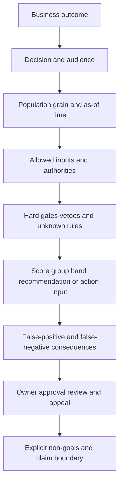

The risk owner defines policy; source owners define meaning and quality; control owners validate mitigation; application/asset owners validate business context; data/security governance validates privacy; the TSM facilitates architecture, evidence, testing, adoption, and escalation.

## Rule anatomy: conditions, operators, groups, and outcomes

A rule should be a versioned object with a name, purpose, scope, effective interval, conditions, outcome, missing/error behavior, priority, reason code, owner, tests, and approval.

| Rule field | Example | Why needed |
|---|---|---|
| Rule ID/version | `NMH-RISK-017/v4` | Stable audit and rollback |
| Purpose | Escalate internet-reachable tier-1 findings | Prevent reuse outside intent |
| Scope | Production tenant, open findings | Avoid accidental broad matches |
| Effective interval | Starts 2026-08-24 06:00 UTC | Reproduce historical decisions |
| Conditions | `environment=prod AND exposed=true AND criticality=1` | Explicit match logic |
| Missing behavior | Hold if exposure unknown | Unknown is not false |
| Outcome | Add `urgent-review` group and reason `R17` | Action and explanation |
| Priority | 200 | Resolve order intentionally |
| Stop/continue | Continue to additive control rules | Define composition |
| Owner/approver | VM owner/Risk council | Accountability |
| Test suite | Positive, negative, null, boundary, conflict | Prevent regressions |
| Change rationale | New external-payroll scope | Explain why version changed |

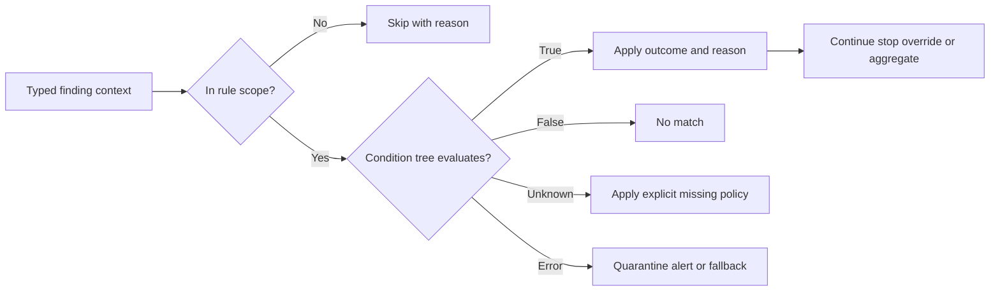

## Operators and three-valued logic

Many systems treat conditions as true or false, but real data has unknown, missing, invalid, stale, or error states. A robust design distinguishes them. The exact operator set available in any product must be verified in current documentation and tenant behavior.

| Operator category | Example | Type/semantic question | Common failure |
|---|---|---|---|
| Equality | `environment = "prod"` | Case and controlled vocabulary? | `Production` fails to match |
| Inequality | `status != "closed"` | Does missing count as not closed? | Nulls enter open queue |
| Numeric comparison | `age_days > 30` | Unit, precision, timezone? | Hours treated as days |
| Range | `score between 60 and 79` | Inclusive/exclusive boundaries? | 60 belongs to two bands |
| Set membership | `owner_team in approved_set` | Version and case? | Stale set |
| String pattern | hostname matches pattern | Regex/glob semantics and escaping? | Overbroad match |
| Existence | control evidence exists | Present vs valid/current? | Empty object counts |
| Time comparison | exception expiry < now | Clock/timezone and as-of? | Early/late expiry |
| Relationship | asset supports tier-1 service | Direct or transitive, as-of time? | Stale graph edge |
| Collection | any finding has condition | Any/all/count semantics? | Fanout duplicates |
| Boolean | exposed is true | Unknown distinct from false? | Missing becomes safe |
| Version | app version affected by range | Semantic-version rules? | Lexical comparison |

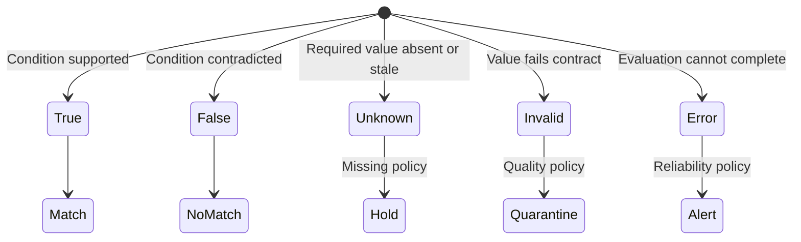

### Plain-English deep-dive 2 - Missing is not false and zero is not unknown

If a medical form asks "temperature" and the box is blank, the patient's temperature is not zero. If a security source has no internet-exposure value, the asset is not proven internal. Treating unknown as false systematically lowers concern for the least observable assets.

Use explicit states. `false` means evidence supports absence under a defined test. `unknown` means no adequate answer. `invalid` means data violates its contract. `stale` means it may once have been valid but is too old for the decision. `error` means evaluation failed. Each state needs a deliberate action such as hold, review, quarantine, fallback, or alert.

## Boolean grouping and precedence

Parentheses matter. `A AND (B OR C)` differs from `(A AND B) OR C`. Natural-language policy often hides this ambiguity.

| Expression | Plain meaning | NMH example |
|---|---|---|
| `A AND B` | Both required | Production and internet reachable |
| `A OR B` | Either sufficient | Known exploitation or validated exposure path |
| `NOT A` | A must be false under explicit null semantics | Not covered by approved exception |
| `A AND (B OR C)` | A plus at least one of B/C | Tier-1 plus external exposure or privileged path |
| `(A AND B) OR C` | A+B together, or C alone | Prod+external, or crown-jewel designation |
| `ANY(collection, condition)` | At least one member matches | Any active finding past SLA |
| `ALL(collection, condition)` | Every member matches, define empty behavior | All control tests healthy |
| `COUNT(...) >= n` | Number of matches reaches boundary | At least two independent source confirmations |

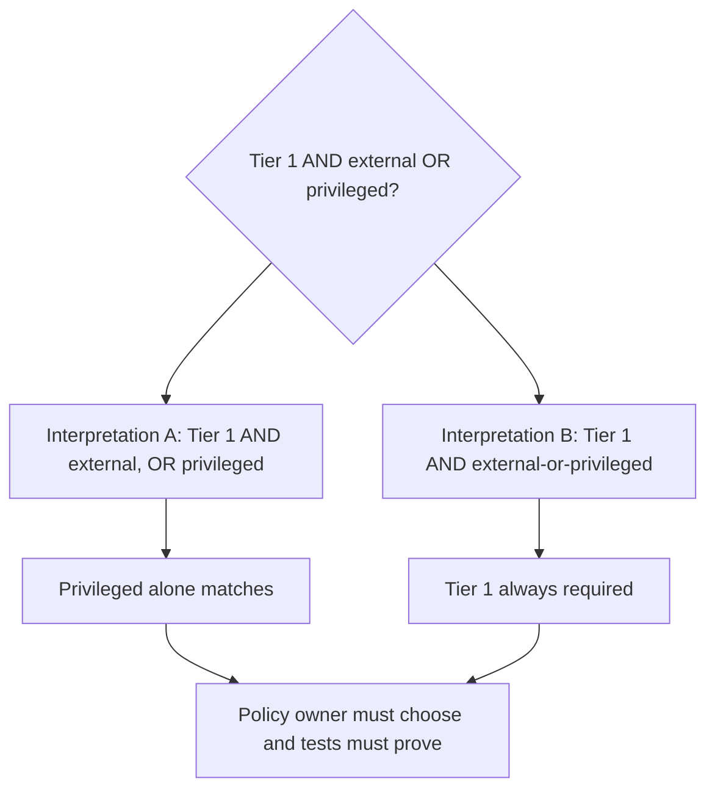

Decision tables are often clearer than nested conditions. List representative combinations and expected outcomes, including nulls and contradictions. Have the policy owner approve the table rather than only a visual expression.

## Grouping rules and dynamic cohorts

A group is a named set selected by logic. Groups can organize ownership, campaigns, dashboards, workflows, exceptions, or score policies. They require definitions as strict as factors.

| Group contract item | Question | Example |
|---|---|---|
| Purpose | Why does cohort exist? | Payroll remediation campaign |
| Entity grain | What can be a member? | Finding occurrence |
| Membership criteria | Which conditions apply? | Open, production, payroll, owner confirmed |
| Time | Snapshot or dynamic as-of? | Daily dynamic membership |
| Inclusion/exclusion | Are exceptions excluded? | Active approved exception excluded from auto-ticket, not report |
| Overlap | Can item be in several groups? | Yes, payroll and internet-exposed |
| Exclusivity | Which groups are mutually exclusive? | Urgent/accelerated/standard bands |
| Precedence | Which policy applies when overlaps conflict? | Specific payroll policy before global |
| Owner | Who approves membership meaning? | VM program owner |
| Explanation | Why is this member included? | Reasons and source lineage |
| Exit behavior | What happens when criteria stop matching? | Close/update campaign membership, not delete history |

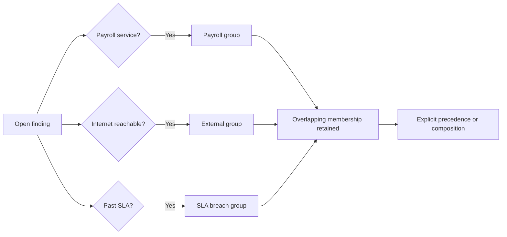

Do not use groups as undocumented labels. A team should be able to inspect membership criteria, version, as-of time, and reason. Historical reporting may need membership snapshots even if operational groups are dynamic.

## Derived fields and lineage

A derived field is computed from source or other derived values. Examples include `finding_age_days`, `is_external_and_prod`, `control_evidence_age_hours`, or `owner_queue`. Derived fields reduce duplicated logic but can hide complexity if lineage is weak.

| Derived field | Inputs | Definition questions | Failure risk |
|---|---|---|---|
| `finding_age_days` | First-seen time, as-of time | Calendar or elapsed days? timezone? | SLA boundary error |
| `asset_criticality` | Service mappings and approved tiers | Highest, primary, or owner-selected? | Fanout inflates criticality |
| `effective_exposure` | Network, policy, app listener, time | Configured or observed? | Theoretical route presented as validated |
| `control_effectiveness` | Relevant control state/test | Scale and unknown behavior? | Presence becomes protection |
| `exploit_context` | Exploit/KEV/threat sources | Source confidence and expiry? | Stale threat raises score forever |
| `owner_queue` | Ownership relationships and routing policy | Technical vs business owner? | Sensitive ticket misrouted |
| `days_to_sla` | Tier, due date, exception | Pauses and extensions? | Incorrect breach |
| `risk_band` | Score, hard gates, thresholds | Version and inclusivity? | Overlap/gap at boundaries |

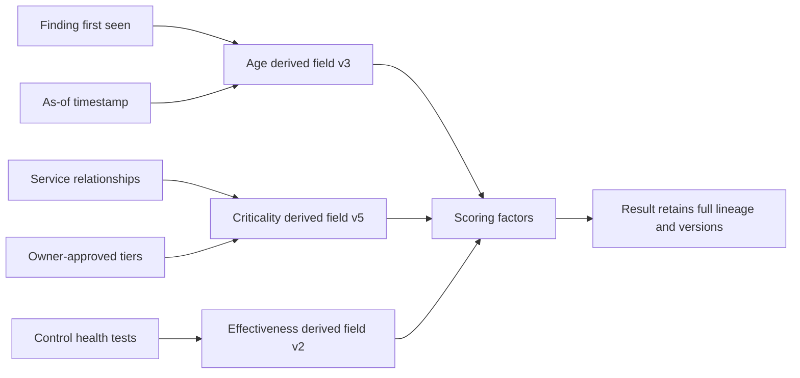

Derived-on-derived chains should be shallow, acyclic, and inspectable. Detect circular dependencies before deployment. A change to one reusable field can affect many groups, scores, dashboards, and workflows; impact analysis must enumerate consumers.

## Factors and factor contracts

A factor is a governed input intended to influence a result. A factor contract explains evidence, direction, scale, missing behavior, dependence, stability, and why it belongs.

| Factor contract field | Example | Governance question |
|---|---|---|
| Name/version | `external_reachability/v3` | Stable and auditable? |
| Purpose | Raise review priority for supported external paths | Connected to decision? |
| Grain | Finding occurrence on asset | Same as scoring unit? |
| Input authority | Network/cloud policy evidence | Who owns meaning/quality? |
| Effective time/freshness | Current within 6 hours | What happens when stale? |
| Raw domain | true/false/unknown plus evidence class | Is unknown preserved? |
| Transform | true -> 1, false -> 0, unknown -> hold | Is transform defensible? |
| Direction | Higher means more concern | Monotonic expectation? |
| Weight | Synthetic 20 of 100 | Why this relative influence? |
| Dependence | Correlated with internet-facing tag | Double-count control? |
| Explanation | "Current policy supports external reachability" | Human-readable reason? |
| Test/monitor | Boundary, source drift, outcome segment | Detect breakage? |

Potential factors should pass four gates: relevant to decision, defined consistently, evidenced with adequate quality/time, and governable without unfair or unsafe proxy effects.

## Normalization: putting factors on comparable scales

Factors may be binary, categorical, ordinal, counts, times, percentages, probabilities, or scores. Adding raw values is meaningless when units differ. Normalization maps each factor to a defined contribution scale.

| Method | Plain meaning | Good use | Risk/caveat |
|---|---|---|---|
| Binary mapping | false/true to 0/1 | Verified yes/no evidence | Unknown must remain separate |
| Category lookup | Each controlled category maps to value | Approved criticality tiers | Ordering may be policy, not fact |
| Min-max | Map bounded range to 0-1 | Stable meaningful bounds | Outliers and changing range distort |
| Clipping/capping | Limit extreme contribution | Heavy-tailed counts | Hides real extremes if unexplained |
| Piecewise bands | Different ranges receive values | Age/SLA policy | Discontinuity near boundary |
| Log transform | Compress large numeric range | Counts spanning orders of magnitude | Harder to explain |
| Percentile/rank | Relative position in current population | Workload prioritization | Score changes when population changes |
| Standard score | Distance from mean in standard deviations | Stable distribution analysis | Non-normal/drifting data and negative values |
| Calibrated probability | Map model output to observed frequency | Validated predictive model | Requires labels, stability, and governance |
| Monotonic curve | Smooth increasing/decreasing function | Age or exposure strength | Shape encodes assumptions |

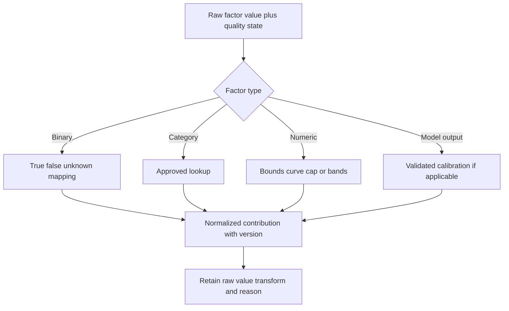

### Plain-English deep-dive 3 - Normalization changes meaning, not just format

Converting kilograms to pounds preserves the physical quantity. Mapping "finding age" to a 0-100 risk contribution does not. The curve says how much age should matter for this decision. A step from day 29 to day 30 may add ten points because policy defines an SLA boundary, not because the underlying security state suddenly changed by ten natural units.

Document the mapping and its purpose. Show raw value beside normalized contribution. Test boundaries and segments. If a percentile is used, explain that an unchanged item can move because the comparison population changed. Never call a normalized score a probability unless it was built and validated as one.

## Weights, aggregation, and interaction

Weights express relative influence after normalization. They do not prove causal importance. Aggregation defines how contributions combine.

| Design choice | Example | Tradeoff |
|---|---|---|
| Weighted sum | Sum weight times normalized factor | Simple/explainable; compensatory |
| Maximum | Highest critical factor dominates | Highlights worst condition; ignores breadth |
| Multiplicative | Factors amplify each other | Captures interaction; fragile with zero/missing |
| Rule plus score | Hard gates first, score remaining items | Separates safety constraints from ranking |
| Interaction term | External AND privileged adds contribution | Models combined condition; double-count risk |
| Cap/floor | Control cannot reduce below review floor | Limits over-mitigation |
| Hierarchical | Domain subscores then composite | Organizes complexity; hides nested weights |
| Rank aggregation | Combine several ordered lists | Avoid scale issue; loses magnitude |

For an educational weighted sum:

`synthetic_score = sum(weight_i * normalized_factor_i)`

This expression is deliberately generic. It is not a Zscaler formula. Define whether weights sum to one or 100, whether contributions can be negative, how missing factors behave, whether controls are separate, and whether hard gates override the score.

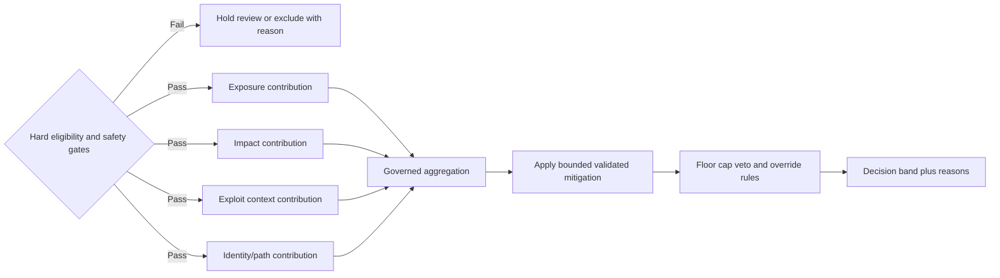

## Mitigating controls and negative contributions

A control should not reduce priority merely because a product record exists. Use a control contract.

| Control question | Required evidence | If unknown |
|---|---|---|
| Relevant? | Control addresses the technique/path/impact in question | Do not credit |
| Correct target? | Linked to exact resolved entity and environment | Do not credit |
| Deployed? | Current installation/coverage evidence | Unknown coverage |
| Configured? | Policy supports required behavior | Unknown configuration |
| Healthy? | Heartbeat/status within freshness SLO | Stale, no credit or hold |
| Enforcing? | Prevent/block mode where needed | Monitoring is not prevention |
| Effective? | Test, outcome, or validated evidence | State limitation |
| Complete? | Coverage across path and variants | Do not generalize |
| Time-valid? | Effective during finding/path interval | No historical credit |
| Independent? | Not derived from same risk result | Avoid circular logic |

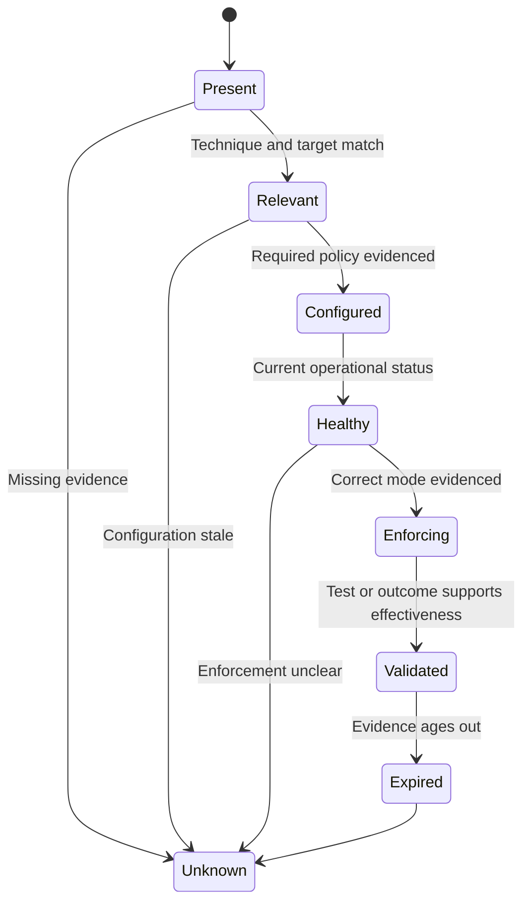

Use floors and caps when appropriate. A strong control may reduce one route but should not erase critical business impact or other unmitigated paths. Detection controls may reduce expected detection/response time without preventing exploitation. An exception is governance context, not a technical mitigation by itself.

## Thresholds, bands, and decision consequences

Thresholds map a value to a class or action. Set them from decision consequences, capacity, appetite, and evidence, not from aesthetically round numbers.

| Band | Synthetic range | Intended action | Human/control requirement |
|---|---|---|---|
| Urgent validation | 80-100 or hard escalation rule | Validate immediately and assign owner | Human review before disruptive action |
| Accelerated | 60-79 | Prioritize within short SLA | Owner confirms context |
| Standard | 30-59 | Normal remediation queue | Monitor aging/context |
| Low evidence | 0-29 with adequate inputs | Lower queue position, not ignore | Reassess on new evidence |
| Hold/unknown | Required input missing/invalid/stale | Repair data or review | No automatic downgrade |
| Exception | Approved scope/time/conditions | Track residual risk and expiry | Named approver and audit |

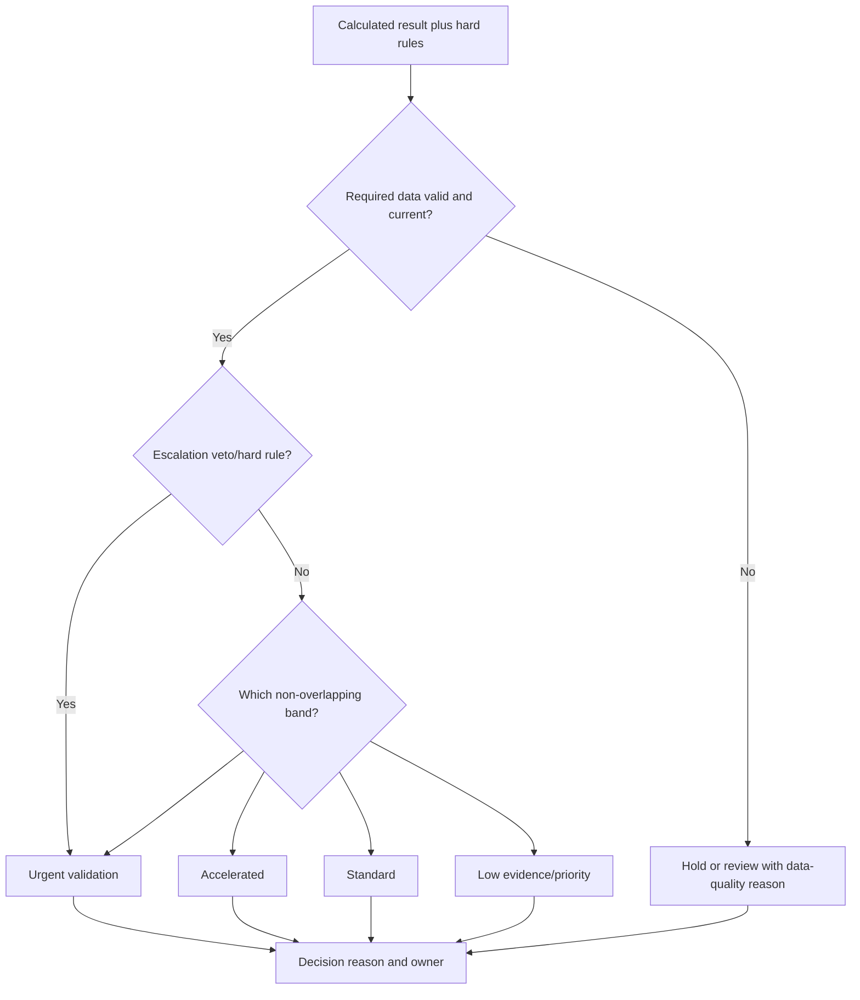

Band intervals must cover intended values without overlap or gaps. State inclusive/exclusive boundaries. Test exact values just below, at, and above every threshold. Separate ranking from service-level agreement when needed; a due date may also depend on policy tier, exception, discovery time, and owner capacity.

## Conflict, order, precedence, vetoes, and overrides

Rules can be additive, exclusive, overriding, or stopping. If order is implicit, small edits create surprising results.

| Conflict strategy | Meaning | Suitable use | Risk |
|---|---|---|---|
| First match wins | Highest-priority matching rule decides | Mutually exclusive routing | Hidden broad rule masks specific rule |
| Last match wins | Later rule overwrites | Layered defaults if explicit | Order sensitivity |
| Most specific wins | Narrow scope outranks broad | Organizational policy hierarchy | Specificity metric ambiguous |
| Highest severity wins | Most urgent outcome dominates | Safety escalation | Can ignore mitigation/quality |
| Additive | All matching contributions combine | Independent factors/tags | Double counting |
| Veto | Hard condition blocks outcome | Privacy, tenant, missing identity, minimum review | Overused veto freezes process |
| Explicit priority | Numeric/order metadata | Large rule catalog | Priority collisions |
| Decision table | Combination maps to one outcome | Finite policy space | Table grows rapidly |
| Human adjudication | Conflict routed to authorized review | High-consequence ambiguity | Capacity and consistency needed |

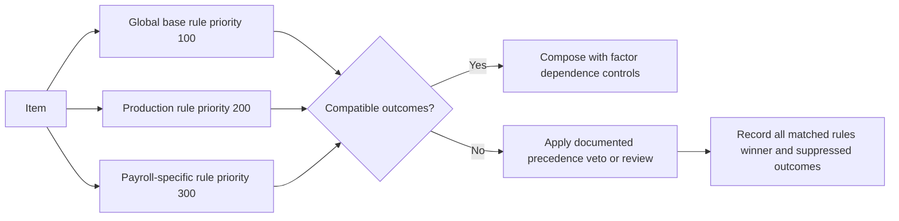

An override requires scope, rationale, approver, effective interval, conditions, residual risk, and expiry behavior. Never silently edit a calculated result. Preserve base result, override result, and reason separately.

### Plain-English deep-dive 4 - Rule order is part of the policy

Consider two airport instructions: "All international passengers use desk A" and "Passengers needing accessibility support use desk B." Which wins for an international passenger needing support? The answer cannot be guessed from the two sentences. Policy must define specificity, priority, combination, or human handling.

Security rules have the same issue. A global severity policy, a production-environment policy, a payroll-specific policy, and an approved exception may all match. Record every match, the conflict strategy, the selected outcome, suppressed outcomes, and reason. Reordering rules is a policy change and must be tested and audited like changing a threshold.

## Explainability and reason records

An explanation should help an owner understand and challenge the result. It should be stable enough for audit and simple enough for action.

| Explanation layer | Content | Example |
|---|---|---|
| Decision summary | Band/group/recommendation and as-of time | Accelerated review under policy v7 |
| Hard rules | Gates, vetoes, overrides | Production payroll rule matched |
| Input facts | Raw/source values and quality | External reachability true, source age 2h |
| Derived fields | Calculation and lineage | Finding age 34 days from first seen |
| Factor transforms | Raw to normalized value | Age 34 -> 0.6 under curve v2 |
| Contributions | Weight and signed contribution | Exposure contributes 18 points |
| Control credit | Relevance/effectiveness evidence and cap | No credit; health stale |
| Threshold | Boundary and inclusivity | 60-79 accelerated |
| Conflicts | Other rules and resolution | Global standard suppressed by payroll-specific rule |
| Unknowns | Missing/stale/contradictory inputs | Role activation unknown |
| Provenance | Sources, mapping/entity/logic versions | Run and rule IDs |
| Next action | Owner, due date, validation | PayrollOps validates package and reachability |

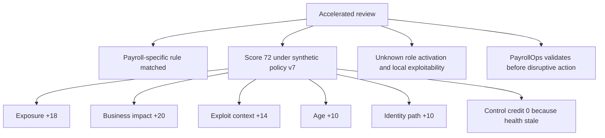

Avoid explanations that merely restate the output: "High because score is high." Also avoid exposing sensitive details beyond role-based need. Explainability must respect privacy, security classification, and least privilege.

## Testing strategy

Testing should cover logic syntax, semantics, data quality, interactions, historical impact, operations, and user comprehension.

| Test type | Purpose | Example |
|---|---|---|
| Syntax/schema | Rule is structurally valid | Required fields/types present |
| Unit fixture | One rule/transform behaves as expected | Exposure true contributes expected synthetic value |
| Positive | Known matching case matches | Prod payroll external finding |
| Negative | Similar nonmatching case does not match | Dev payroll finding excluded |
| Null/missing | Unknown behavior is explicit | No control health -> hold/no credit |
| Invalid | Bad units/enums handled safely | Criticality `banana` quarantined |
| Boundary | Threshold edges correct | 59, 60, 79, 80 |
| Property/invariant | General property always holds | Higher verified exposure never lowers base priority |
| Conflict/order | Multiple rules resolve deterministically | Payroll vs global vs exception |
| Metamorphic | Controlled input change causes expected relation | Removing mitigation cannot reduce concern |
| Historical replay | Compare on representative past data | Delta by team/environment/type |
| Shadow | New logic runs without controlling action | Current vs candidate reason records |
| Performance | Scale/latency/resource behavior | Large group and relationship query |
| Security/RBAC | Only authorized users can edit/view | Separation of duties |
| Explainability | Owner understands and can challenge | Reason completeness review |
| Rollback | Prior version restores deterministically | Reprocess affected interval |

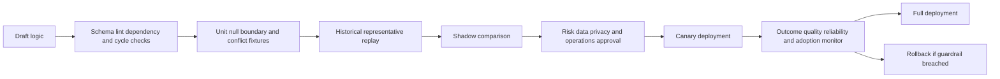

Tests need expected reasons, not only expected scores. A score can remain unchanged while the wrong factors cancel each other. Reason-level regression detects such defects.

## Simulation, shadow mode, and impact analysis

Simulation asks, "What would candidate policy have done?" It should never silently create tickets or change production decisions.

| Simulation output | Why it matters |
|---|---|
| Population size and coverage | Confirms intended scope |
| Score/band/group migration matrix | Shows who moves where |
| Top increases/decreases | Reveals surprising impact |
| Segment distribution | Detects team/environment/source concentration |
| Missing/invalid/hold rate | Finds data-quality dependence |
| Rule match/conflict counts | Finds broad or dead rules |
| Threshold crossing count | Predicts operational load |
| Owner workload change | Checks capacity and fairness |
| Control-credit change | Detects over/under mitigation |
| Explanation deltas | Shows why decisions change |
| Historical outcome metrics | Provides bounded evidence if labels are trustworthy |
| Runtime/resource metrics | Protects service health |

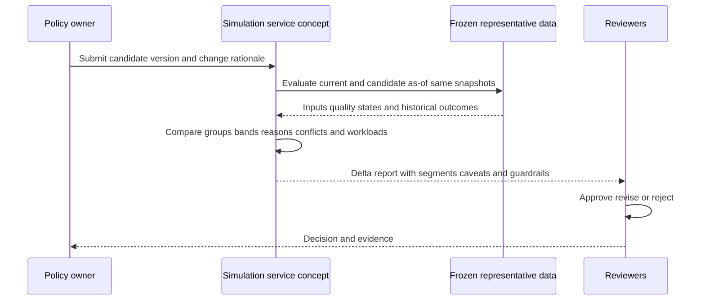

Freeze or version the input snapshot for fair comparison. Otherwise data changes can be mistaken for policy effects. A shadow result should be clearly labeled and prevented from reaching action connectors.

## Calibration and validation

Calibration can mean several things. For a probabilistic model, it compares predicted probabilities with observed frequencies. For a policy score, it may mean aligning bands with risk-owner judgments, outcomes, or workload constraints. Do not use probability language for a policy index.

| Validation view | Question | Caveat |
|---|---|---|
| Agreement with expert review | Do bands align with governed judgments? | Experts can be inconsistent/biased |
| Outcome concentration | Are confirmed harmful outcomes more common in higher bands? | Labels incomplete; correlation not causation |
| Precision at review capacity | How many top items are actionable? | Definition of actionable matters |
| Recall of critical cases | Were known high-consequence cases surfaced? | Unknown missed cases remain |
| False escalation | How often urgent items were unsupported? | Validation quality matters |
| Segment behavior | Does logic behave differently by source/team/type? | May reflect real differences or data bias |
| Stability | Do small input changes cause large jumps? | Some policy thresholds intentionally jump |
| Workload | Can owners act within SLA? | Capacity should not hide risk |
| Risk reduction | Did completed work reduce evidenced exposure? | Attribution and time lag difficult |
| Appeal/override | How often and why are decisions challenged? | Low appeals may mean low trust/access |

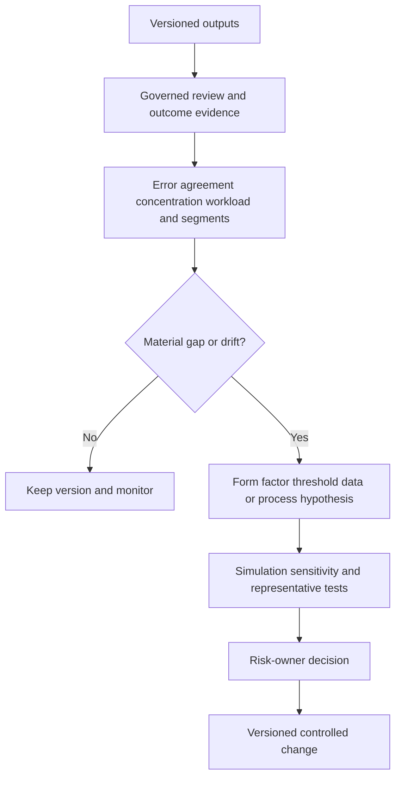

### Plain-English deep-dive 5 - Calibration cannot rescue a bad definition

If "critical outcome" means something different to each reviewer, adjusting thresholds against those labels creates sophisticated inconsistency. It is like calibrating a scale using reference weights whose masses are unknown.

First govern the target, review process, sampling, and disagreement handling. Then measure. State selection bias, missing outcomes, delayed outcomes, and segments. Calibration helps align interpretation; it does not turn an arbitrary score into objective truth or prove causality.

## Sensitivity, robustness, and dependency analysis

Sensitivity analysis changes one assumption at a time and measures output. Robustness asks whether reasonable changes preserve important decisions. Dependency analysis checks factors that repeat the same underlying evidence.

| Analysis | Method | Warning sign |
|---|---|---|
| One-factor sensitivity | Vary each factor across valid range | One low-quality factor controls most outcomes |
| Weight sensitivity | Change weight +/- defined amount | Tiny change causes mass band migration |
| Threshold sensitivity | Move boundary and inspect crossings | Large pileup just below/above threshold |
| Missingness stress | Remove/stale sources | Scores fall instead of hold/uncertainty |
| Correlation/dependence | Compare factors/upstream lineage | Duplicate context counted several times |
| Segment stress | Evaluate source/entity/team/environment cohorts | One segment systematically misranked |
| Time stress | Replay seasonality/reorg/source changes | Logic unstable across ordinary operations |
| Adversarial/gaming | Ask how users could manipulate inputs | Labels or closure states game priority |
| Control stress | Expire health or change mode | Mitigation remains credited incorrectly |
| Monotonicity | Increase concerning evidence | Result unexpectedly decreases |

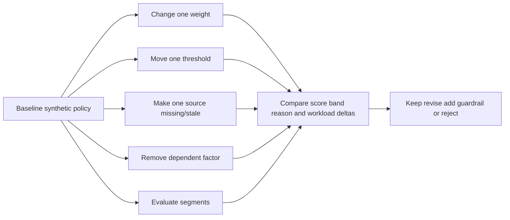

Sensitivity does not mean every score must be stable. A hard safety rule should intentionally create a decisive change. The requirement is that the discontinuity be documented and tested.

## Governance, versioning, approval, and separation of duties

Customization is production logic. Treat it like code and policy even if configured through a user interface.

| Governance role | Responsibility | Must not silently do |
|---|---|---|
| Risk owner | Approves purpose, factors, thresholds, treatment | Delegate accountability to tool |
| Data owner | Defines source field authority/quality | Approve risk policy alone |
| Control owner | Validates mitigation relevance/effectiveness | Self-credit without evidence |
| VM/SecOps owner | Owns operational process and capacity | Hide risk to meet workload |
| Application/asset owner | Validates business context and action feasibility | Rewrite enterprise policy |
| Privacy/security governance | Reviews sensitive data, access, retention | Assume explainability permits oversharing |
| TSM | Facilitates design, testing, adoption, evidence, escalation | Claim sole risk ownership |
| Product/support specialist | Validates documented product behavior | Define customer appetite |
| Auditor/reviewer | Inspects change/evidence independently | Edit without trace |

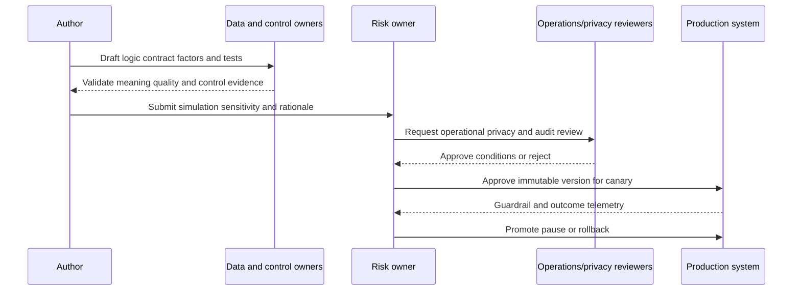

Version the full dependency bundle: source contracts, mappings, derived fields, groups, factor transforms, weights, rules, control logic, thresholds, overrides, and consumer behavior. A rule version without its factor/mapping versions cannot reproduce a result.

## Deployment, rollback, and audit

A rollback must restore behavior and reconcile downstream consequences. Simply selecting an older rule version may leave tickets, assignments, reports, exports, or caches created by the candidate policy.

| Deployment stage | Entry evidence | Guardrail | Exit/rollback trigger |
|---|---|---|---|
| Draft | Charter and owner | No production output | Incomplete contract |
| Static validation | Dependency/cycle/type checks | No unresolved errors | Invalid dependency |
| Test | Fixtures and expected reasons | Required suite passes | Regression |
| Simulation | Frozen representative snapshot | Delta limits | Unexpected migration |
| Shadow | Live inputs, no actions | Shadow isolation | Reliability or privacy issue |
| Canary | Small representative scope | Workload/error guardrails | Harmful outcome or SLO breach |
| Full | Approval and runbook | Monitoring and appeal | Guardrail breach |
| Rollback | Known prior bundle | Reconciliation plan | Confirm prior state restored |

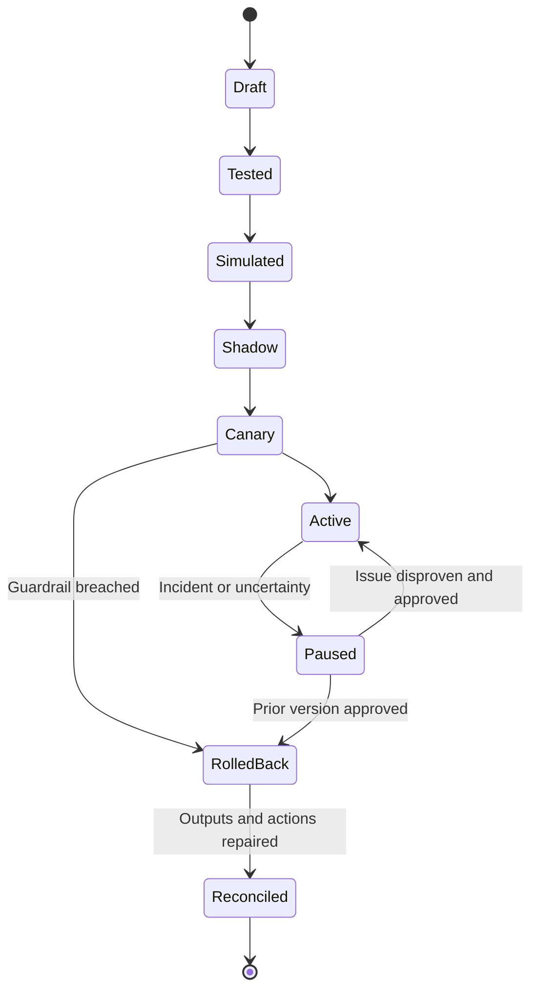

Audit records should include author, reviewer, approver, rationale, ticket/change ID, before/after definitions, dependency versions, test/simulation evidence, deployment times, scope, guardrails, actual impact, overrides, rollback, and communication.

## Troubleshooting unexpected scores, groups, and decisions

Start with one item, expected result, actual result, as-of time, and complete version bundle. Recompute contribution by contribution.

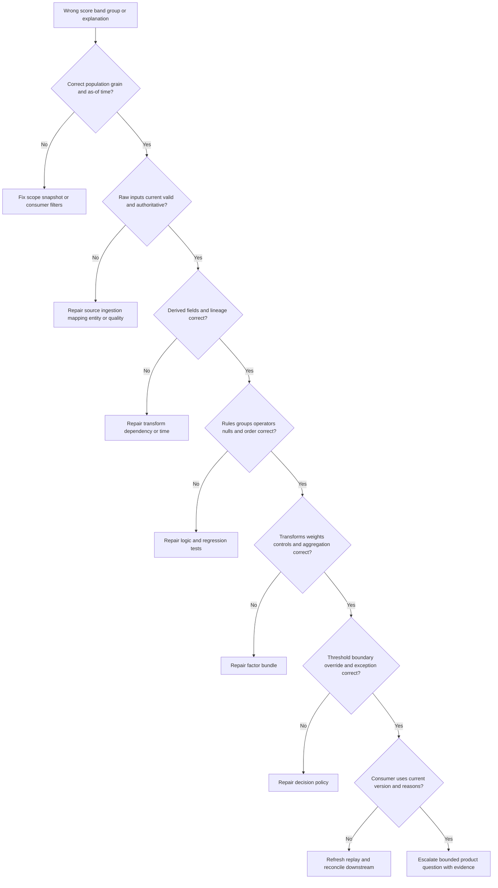

| Evidence item | Why needed | Safety note |
|---|---|---|
| Stable item/entity/finding ID | Reproduce exact case | Use approved identifiers |
| Expected vs actual output | Defines discrepancy | Tie expectation to approved policy |
| As-of/processing/publication times | Reproduce temporal state | State timezone |
| Raw inputs and quality states | Detect source defect | Minimize sensitive fields |
| Source/mapping/entity versions | Trace upstream changes | Preserve provenance |
| Derived-field values/versions | Recompute logic | Include raw-to-derived mapping |
| Matched/unmatched rules | Inspect conditions/order | Include unknown/error outcomes |
| Factor raw/normalized/weight/contribution | Rebuild score | No proprietary inference |
| Control evidence | Verify mitigation credit | Show relevance/time |
| Threshold/band definition | Check boundaries | Inclusive/exclusive explicit |
| Override/exception | Check authority and expiry | Restrict sensitive rationale |
| Consumer version/cache | Find presentation mismatch | Compare export/API/UI carefully |
| First bad/last good and changes | Narrow regression | Correlation is not causation |

Common symptoms and checks:

| Symptom | Cheapest discriminating check | Likely causes |
|---|---|---|
| Score suddenly drops | Compare reason/contribution delta and control freshness | New control credit, missing factor, version change |
| Item missing from group | Evaluate membership conditions including nulls | Scope, mapping, time, operator case |
| Item in conflicting groups | Inspect exclusivity/precedence | Overlap not governed |
| Boundary item wrong | Test exact inclusive/exclusive threshold | Off-by-one/precision |
| Two screens disagree | Compare as-of time, filters, version, cache | Stale consumer or different grain |
| Historical scores changed | Check replay/restatement and version | Current context applied historically |
| Too many urgent items | Inspect broad rule and distribution | Precedence, normalization, source drift |
| Control credit persists | Check health/effective interval | Stale derived field/cache |
| Explanation missing | Verify reason capture and RBAC | Evaluation or presentation defect |
| Candidate differs everywhere | Confirm frozen input snapshot | Data delta mistaken for logic delta |

## Complete synthetic NMH scoring scenario

NMH wants a policy to prioritize open vulnerability findings on production assets. The purpose is owner review and remediation sequencing, not breach prediction. This synthetic design uses illustrative points solely to teach mechanics.

### Synthetic policy contract

| Component | Synthetic definition | Caveat |
|---|---|---|
| Unit | One open finding occurrence on one resolved production asset | Entity quality prerequisite |
| Technical severity | Normalized source severity, max 20 | Severity is not risk |
| Exploit context | Current authoritative exploit evidence, max 20 | Source confidence/expiry required |
| Reachability | Supported current exposure/path evidence, max 20 | Possible path is not exploit proof |
| Business impact | Owner-approved service/data criticality, max 20 | Avoid double counting |
| Identity/blast radius | Valid privileged/dependency relationships, max 10 | Conditions/unknowns visible |
| Age/SLA | Governed time transform, max 10 | Do not reward stale data |
| Mitigating control | Bounded reduction up to 20 | Relevance, health, enforcement, validation required |
| Hard escalation | Validated active exploitation on tier-1 service -> urgent review | Human validation required |
| Hard hold | Required entity/tenant identity invalid | No automated routing |
| Bands | 80 urgent, 60 accelerated, 30 standard, below 30 low evidence | Purely synthetic |

```mermaid
flowchart LR
    F[Finding F-900] --> SEV[Severity 16]
    F --> EXP[Exploit context 14]
    F --> REACH[Reachability 18]
    F --> IMPACT[Business impact 20]
    F --> ID[Identity path 6]
    F --> AGE[Age 8]
    SEV --> SUM[Base synthetic 82]
    EXP --> SUM
    REACH --> SUM
    IMPACT --> SUM
    ID --> SUM
    AGE --> SUM
    CTRL[Control evidence stale] --> CREDIT[Mitigation credit 0]
    SUM --> FINAL[Final synthetic 82]
    CREDIT --> FINAL
    FINAL --> BAND[Urgent validation band]
    BAND --> HUMAN[PayrollOps and VM human review]
```

### Walkthrough

1. The finding resolves to the correct production payroll asset and passes tenant/entity gates.
2. Each source value is evaluated as of the same time. Missing values remain unknown.
3. Derived reachability uses current approved relationships and records that exploitability is not proven.
4. Business impact uses owner-approved payroll criticality and restricted-data relationship. The design checks that these are not duplicates of one policy label.
5. Identity contribution reflects a possible privileged path with unknown activation, so it is bounded.
6. Endpoint-control presence is not credited because health is stale after the finding time.
7. The synthetic contributions total 82. The item enters urgent validation under the synthetic threshold.
8. The reason record shows every raw value, transform, contribution, source, time, rule, unknown, and policy version.
9. A human confirms context before any disruptive change.
10. Outcome evidence returns to calibration without claiming that the score caused remediation success.

### Synthetic change and rollback incident

NMH proposes increasing control credit from 20 to 40. A simulation shows 31 percent of externally reachable findings move below accelerated review, especially where control status comes from a heartbeat that does not prove policy enforcement. Review rejects the change. Later, a narrower candidate credits up to 15 only when relevance, current health, enforcing mode, and a recent test are evidenced. Shadow mode shows a 4 percent migration and complete reasons. A canary begins.

During canary, a mapping defect converts `monitor` mode to `enforce`, incorrectly lowering twelve findings. A guardrail detects unexpected control-credit growth. NMH pauses the candidate, rolls back the full dependency bundle, restores prior decisions, reopens/reprioritizes affected tickets, corrects mapping, adds enum and metamorphic tests, reruns simulation, and communicates impact. This is a mapping defect revealed by scoring, not proof the formula itself was wrong.

| Scenario output | Honest wording |
|---|---|
| Score | "82 under synthetic NMH policy v7" |
| Meaning | "Policy index placing item in urgent validation" |
| Not meaning | "Not 82 percent breach probability" |
| Main drivers | "Current reachability, payroll impact, exploit context, and severity" |
| Mitigation | "No control credit because effectiveness is not current" |
| Unknowns | "Local exploitability and role activation require validation" |
| Product boundary | "No Zscaler formula, threshold, or default is claimed" |
| Decision | "Human owner validates and selects treatment" |

## Synthetic exercises with answers

### Exercise 1 - AND/OR

Rewrite `tier1 AND exposed OR privileged` unambiguously.

**Answer:** Ask the owner whether the intent is `(tier1 AND exposed) OR privileged` or `tier1 AND (exposed OR privileged)`. Write parentheses, decision-table cases, and tests. Do not guess from operator precedence.

### Exercise 2 - Missing value

Exposure is absent. Should it contribute zero?

**Answer:** Not automatically. Absence may mean unknown, not internal. Apply the contract: hold, route for data repair, use a bounded fallback, or calculate with an uncertainty flag. Never silently lower concern.

### Exercise 3 - Normalization

Can raw CVSS, asset count, age days, and dollars be added?

**Answer:** No. They have different units and meanings. Each needs a purpose-specific transform, bounds, direction, missing behavior, version, and explanation before aggregation.

### Exercise 4 - Weight

Does weight 30 prove a factor causes 30 percent of risk?

**Answer:** No. It encodes relative influence under a policy/model. Causal or probabilistic meaning requires separate evidence and validation.

### Exercise 5 - Control

An EDR record exists but last heartbeat is old. Credit mitigation?

**Answer:** No current credit unless policy explicitly and defensibly handles stale evidence. Preserve presence, mark effectiveness unknown/stale, and seek validation.

### Exercise 6 - Threshold

Which band contains exactly 60?

**Answer:** The contract must say. A safe definition might use `[60,80)` for accelerated. Test 59.999, 60, 79.999, and 80 with numeric precision defined.

### Exercise 7 - Conflict

Global rule says standard; payroll-specific rule says urgent. What happens?

**Answer:** Apply documented precedence, such as specific policy priority, and retain both matches plus selected/suppressed outcomes. If no strategy exists, route to review rather than arbitrary order.

### Exercise 8 - Calibration

High-band findings are often closed as false positives. What next?

**Answer:** Validate closure labels and process, segment by source/entity/rule, inspect input quality and reason contributions, form a hypothesis, simulate a change, and use governance. Do not simply lower thresholds globally.

### Exercise 9 - Sensitivity

Removing one low-quality factor changes half the bands. Interpretation?

**Answer:** The policy is fragile or that factor dominates. Inspect weight, normalization, dependence, distribution, missing behavior, and whether the factor is truly decision-relevant.

### Exercise 10 - Derived field

Criticality is derived from the same score that consumes criticality. What is wrong?

**Answer:** Circular dependency. Reject deployment, break the cycle with an independently governed source, and add dependency-graph validation.

### Exercise 11 - Rollback

Is selecting policy v6 enough after v7 created tickets?

**Answer:** No. Restore the compatible dependency bundle, recompute affected items, reconcile tickets/assignments/reports/exports/caches, communicate restatement, and verify guardrails.

### Exercise 12 - Product claim

Can Arti state Zscaler's exact UVM weights or formula?

**Answer:** No. Public pages describe multifactor scoring and configurable factors/weights/controls, not undisclosed calculations or defaults. Verify current official documentation and tenant behavior.

## Labs and rehearsal

### Lab 1 - Logic charter

Define decision, population, unit, time, audience, inputs, hard constraints, outputs, harms, owner, cadence, and non-goals for NMH prioritization.

### Lab 2 - Operator matrix

Create equality, range, set, time, existence, relationship, any/all/count, and version conditions. Test true, false, missing, invalid, stale, and error states.

### Lab 3 - Boolean decision table

Translate five natural-language policies into parenthesized expressions and truth tables. Resolve ambiguity with the policy owner.

### Lab 4 - Group catalog

Build payroll, internet-exposed, SLA-breach, ownerless, exception, and data-quality-hold groups. Define overlap, exclusivity, precedence, history, and exit behavior.

### Lab 5 - Derived-field lineage

Create age, criticality, exposure, control effectiveness, and owner queue fields. Draw dependencies and detect a deliberate cycle.

### Lab 6 - Factor contracts

For six factors, document authority, grain, time, raw domain, transform, direction, weight, dependence, explanation, tests, and monitor.

### Lab 7 - Normalization clinic

Compare binary, category lookup, piecewise, capped, percentile, and monotonic transforms. Explain how each changes meaning and reacts to outliers/drift.

### Lab 8 - Control-credit lab

Evaluate control records in present, relevant, configured, healthy, enforcing, validated, stale, and unknown states. Apply cap/floor policy.

### Lab 9 - Threshold lab

Define nonoverlapping bands and test just below/at/above every boundary, including precision and unknown states.

### Lab 10 - Conflict/order lab

Combine global, production, payroll, exception, and veto rules. Compare first-match, specific-wins, additive, and human-review outcomes.

### Lab 11 - Explanation review

Generate a reason record from source assertions to final action. Ask an asset owner to challenge every contribution and unknown.

### Lab 12 - Historical simulation

Compare current and candidate bundles on a frozen synthetic snapshot. Produce migration, segment, workload, conflict, missingness, and explanation-delta reports.

### Lab 13 - Sensitivity lab

Vary weights, thresholds, missingness, source freshness, factor dependence, and control caps. Identify fragile or gaming-prone behavior.

### Lab 14 - Shadow/canary lab

Define isolation, scope, guardrails, approvals, monitoring, and promotion/rollback criteria. Prove shadow output cannot trigger actions.

### Lab 15 - Scoring incident

Run the `monitor` to `enforce` mapping defect. Pause, rollback, reconcile, communicate, fix, retest, and prevent recurrence.

### Lab 16 - Interview whiteboard

Explain official Zscaler customization claims, then label the NMH factor, formula, points, thresholds, tests, and results as synthetic. End with risk ownership and Arti's experience boundary.

| Lab evidence | Completion standard |
|---|---|
| Charter | Purpose, harm, owner, time, and non-goal explicit |
| Rules | Typed conditions and null/error behavior tested |
| Groups | Membership, overlap, precedence, and history governed |
| Factors | Meaning, authority, transform, weight, and dependence documented |
| Controls | Relevance and effectiveness required for credit |
| Explainability | Raw-to-result lineage and unknowns visible |
| Testing | Boundary, conflict, replay, shadow, and rollback covered |
| Calibration | Labels, segments, caveats, and outcomes stated |
| Governance | Approval, version, audit, monitoring, and appeal implemented |
| Honesty | Product fact, general method, and synthetic result separated |

## Common misconceptions to correct

| Misconception | Correct model |
|---|---|
| Business logic is just a formula | It includes scope, rules, groups, gates, controls, decisions, and governance |
| A score is objective truth | It is a versioned policy/model output |
| 72 means 72 percent breach probability | Only a validated probabilistic model could support that meaning |
| Missing equals false | Unknown, invalid, stale, and error need explicit behavior |
| Zero means unknown | Zero can be an observed value; unknown is distinct |
| AND/OR order is obvious | Parentheses and decision tables are required |
| A group is only a display filter | It can drive policy/workflow and needs governance |
| Derived fields are harmless convenience | They create shared dependencies and blast radius |
| Raw values can be added | Units/scales require meaningful transforms |
| Normalization only changes format | It encodes policy assumptions |
| Weight proves causal importance | It expresses relative influence under a design |
| More factors improve risk | Noise, dependence, bias, and missingness can worsen it |
| Installed control reduces risk | Relevance, configuration, health, enforcement, and validation matter |
| Detection equals prevention | It changes visibility/response, not necessarily likelihood |
| Exception eliminates risk | It governs acceptance/treatment; residual risk remains |
| Round thresholds are reasonable by default | Consequences, data, capacity, and appetite should inform them |
| Rule order is implementation detail | It is policy behavior |
| First match is always safe | Broad rules can mask specific ones |
| Overrides should replace the score | Preserve base result, override, rationale, authority, and expiry |
| Same score means same reasoning | Contributions can cancel; test reasons |
| Simulation predicts future perfectly | It estimates impact under chosen data/assumptions |
| Calibration makes labels true | Bad definitions and biased labels remain bad |
| Small average delta means safe | Important segments or edge cases can be harmed |
| Rollback only switches a version | Downstream outputs/actions require reconciliation |
| Public Zscaler pages disclose formula details | They support bounded capability claims only |

## Official Source Anchors

Research/source date: **2026-08-24**.

Zscaler sources support bounded public customization and prioritization statements. NIST sources support risk assessment, measurement, controls, continuous monitoring, AI/model risk governance, and secure development/change concepts. FIRST supports the meaning and limits of CVSS severity scoring. OWASP supports testing and secure design references. None establishes Zscaler's undocumented formula, default factors, weights, normalization, thresholds, operator set, evaluation order, or customer outcome.

| Source | URL | Used for | Boundary |
|---|---|---|---|
| Zscaler Data Fabric for Security | https://www.zscaler.com/products-and-solutions/data-fabric | Public custom scoring, automated workflows, grouping rules, customizable model, business logic | No internal formula, operators, order, defaults, or thresholds |
| Zscaler Unified Vulnerability Management | https://www.zscaler.com/products-and-solutions/vulnerability-management | Public multifactor scoring, configurable factors/weights, mitigating controls, contextual prioritization | No exact calculation, default values, or guarantees |
| Zscaler Asset Exposure Management | https://www.zscaler.com/products-and-solutions/caasm | Public context-rich asset inventory, coverage gaps, workflows | No scoring mechanics inferred |
| NIST SP 800-30 Rev. 1 | https://csrc.nist.gov/pubs/sp/800/30/r1/final | General risk assessment concepts and uncertainty | Federal guidance; not product score formula |
| NIST SP 800-55 Vol. 1 | https://csrc.nist.gov/pubs/sp/800/55/v1/final | Information-security measurement program context | Not specific metrics/thresholds |
| NIST Cybersecurity Framework 2.0 | https://www.nist.gov/cyberframework | Governed cybersecurity outcomes and risk communication | Voluntary and requires tailoring |
| NIST SP 800-53 Rev. 5 | https://csrc.nist.gov/pubs/sp/800/53/r5/upd1/final | Control assessment, monitoring, access, audit context | Control catalog does not prove effectiveness |
| NIST SP 800-137 | https://csrc.nist.gov/pubs/sp/800/137/final | Continuous monitoring and risk visibility | Not scoring algorithm |
| NIST AI RMF 1.0 | https://www.nist.gov/itl/ai-risk-management-framework | Govern/map/measure/manage for model-assisted logic | Voluntary; no AI implementation claimed here |
| NIST SP 800-218 SSDF | https://csrc.nist.gov/pubs/sp/800/218/final | Secure development, change, and vulnerability practices | Requires adaptation to configured logic |
| FIRST CVSS v4.0 Specification | https://www.first.org/cvss/v4.0/specification-document | Severity-vector/score concepts and environmental context | CVSS is not enterprise risk or Zscaler formula |
| FIRST EPSS | https://www.first.org/epss/ | Public exploit-prediction model context and probability meaning | Model scope, version, and calibration apply; not breach probability |
| OWASP ASVS | https://owasp.org/www-project-application-security-verification-standard/ | General verification/control requirements | Not business-logic scoring guidance or product claim |
| W3C PROV-O | https://www.w3.org/TR/prov-o/ | Provenance concepts for inputs/derivations | Not a particular audit implementation |

## Likely Interview Questions

### Q1. How do you translate customer business policy into reliable logic?

**Model answer:** I begin with a charter: decision, population, grain, as-of time, audience, inputs, hard constraints, false-positive/negative harm, output, owner, and non-goals. I convert natural language to typed rules and decision tables with explicit null/error behavior, precedence, reasons, tests, and approval. I separate risk ownership from platform administration and preserve versions and audit evidence.

### Q2. What are rules, groups, and derived fields, and how can they fail?

**Model answer:** Rules are named if/then statements; groups are governed cohorts; derived fields are reusable calculations from source context. They fail through ambiguous AND/OR logic, wrong types/units, null handling, stale time, broad membership, overlap, order conflicts, fanout, circular dependencies, and hidden downstream reuse. I document contracts, lineage, effective time, tests, and consumers.

### Q3. How do factors, normalization, weights, and thresholds work?

**Model answer:** A factor is decision-relevant evidence with authority, scale, direction, freshness, and missing behavior. Normalization maps unlike values to a defined contribution scale; weights express relative influence under the policy; aggregation combines contributions; thresholds map results to action bands. Each step encodes assumptions. A score is not probability or truth unless explicitly defined and validated that way.

### Q4. How should mitigating controls affect priority?

**Model answer:** I grant bounded credit only when a control is relevant to the scenario, linked to the correct entity and time, deployed, configured, healthy, enforcing the needed behavior, and supported by current validation. Monitoring is not prevention, presence is not effectiveness, and an exception is not a technical control. Missing or stale evidence never silently lowers concern.

### Q5. How do you make scoring explainable and resolve rule conflicts?

**Model answer:** The reason record includes scope/time, matched rules, raw inputs, quality states, derived lineage, normalized values, weights/contributions, control credit, thresholds, conflicts, overrides, unknowns, versions, and next action. Conflict policy may use explicit priority, specificity, veto, additive composition, decision tables, or human review. Order is policy and is tested/audited.

### Q6. How do you test, simulate, calibrate, and tune logic?

**Model answer:** I use syntax/type checks; positive, negative, null, invalid, boundary, invariant, conflict, and reason fixtures; historical replay on frozen snapshots; segment analysis; shadow mode; canaries; security/performance tests; and rollback drills. Calibration compares outputs with governed reviews/outcomes under stated label limits. Sensitivity varies weights, thresholds, missingness, dependencies, segments, and controls to expose fragility.

### Q7. How do you troubleshoot an unexpected score or group?

**Model answer:** I anchor one item with expected/actual output, as-of time, and version bundle. I verify population/grain, raw inputs and source quality, mapping/entity context, derived fields, rule/operator/null/order behavior, factor transforms/weights/control credit, thresholds/overrides, and consumer version/cache. I locate the first faulty stage, contain actions, repair/recompute, reconcile downstream outputs, and add regression evidence.

### Q8. What can you honestly claim about Zscaler and your experience?

**Model answer:** Zscaler publicly describes Data Fabric business logic through custom scoring, workflows, grouping rules, and UVM support for multifactor scoring, configurable factors/weights, and mitigating controls. I do not claim proprietary formulas, defaults, operators, order, or thresholds. My Microsoft experience with conditional policies, precedence, exceptions, data dependencies, RCA, change control, and customer communication transfers, and I practiced the detailed mechanics only in synthetic NMH labs.

## 30-Second Memory Hooks

| Concept | Memory hook |
|---|---|
| Business logic | Written policy translated into reproducible behavior |
| Rule | If/then with scope, time, owner, and reason |
| Condition | One typed checkpoint question |
| Operator | The comparison verb |
| AND/OR | Parentheses are policy |
| Missing | Blank is not no |
| Group | Governed dynamic queue |
| Derived field | Reusable prepared ingredient with lineage |
| Factor | One evidence dial |
| Normalization | Comparable scale, changed meaning |
| Weight | Relative volume, not causal truth |
| Aggregation | How dials combine |
| Threshold | Consequence encoded as boundary |
| Band | Action lane, not reality class |
| Control | Credit only proven relevance/effectiveness |
| Veto | Non-negotiable stop sign |
| Precedence | Which rule speaks first? |
| Explainability | Show the marked scorecard |
| Simulation | Dress rehearsal on frozen evidence |
| Shadow | Silent second referee |
| Canary | Small representative first scope |
| Calibration | Align interpretation, not manufacture truth |
| Sensitivity | Wiggle each assumption |
| Rollback | Restore bundle and reconcile consequences |
| Audit | Who changed what, why, when, and outcome |
| Arti bridge | Policy/RCA discipline transfers; formula knowledge does not |

## Completion Checklist

- [ ] I define business logic, rule, condition, operator, group, derived field, factor, weight, normalization, threshold, band, veto, override, calibration, simulation, rollback, and audit before using them.
- [ ] I begin with decision, population, grain, as-of time, audience, inputs, hard constraints, harms, output, owner, cadence, and non-goals.
- [ ] I distinguish ranking, classification, grouping, recommendation, and action.
- [ ] I write every rule with ID/version, scope, effective interval, conditions, missing/error behavior, outcome, priority, reason, owner, tests, and rationale.
- [ ] I verify operator types, units, case, sets, ranges, timezones, collection semantics, and version comparisons.
- [ ] I distinguish true, false, unknown, invalid, stale, and error.
- [ ] I never treat missing as false or zero without an explicit defensible contract.
- [ ] I parenthesize AND/OR/NOT logic and validate it with decision tables.
- [ ] I test ANY, ALL, COUNT, and empty-collection behavior.
- [ ] I define group purpose, grain, criteria, time, overlap, exclusivity, precedence, owner, explanation, and exit/history behavior.
- [ ] I preserve all overlapping memberships unless policy intentionally makes groups exclusive.
- [ ] I document derived-field inputs, formula, time, version, owner, consumers, and cycle/dependency checks.
- [ ] I perform impact analysis before changing reusable fields.
- [ ] I define factor authority, grain, time, raw domain, transform, direction, weight, dependence, explanation, tests, and monitor.
- [ ] I reject factors that are irrelevant, weakly defined, low quality, ungovernable, unsafe, or unfair proxies.
- [ ] I choose normalization based on meaning and preserve raw values beside normalized contributions.
- [ ] I explain percentile/rank instability and never call normalization probability.
- [ ] I distinguish weighted sum, maximum, multiplicative, rule-plus-score, interaction, cap/floor, hierarchical, and rank aggregation.
- [ ] I do not claim a weight proves causal importance.
- [ ] I identify and control dependent/double-counted factors.
- [ ] I separate hard gates/vetoes from compensatory weighted logic.
- [ ] I require control relevance, target, deployment, configuration, health, enforcement, validation, completeness, time, and independence before credit.
- [ ] I distinguish preventive, detective, corrective, and compensating effects.
- [ ] I know an exception governs treatment but does not erase residual risk.
- [ ] I define nonoverlapping threshold intervals and exact boundary inclusivity/precision.
- [ ] I set thresholds from consequence, appetite, capacity, evidence, and governance rather than round numbers alone.
- [ ] I distinguish first/last match, specificity, urgency, additive, veto, priority, decision-table, and human-review conflict strategies.
- [ ] I treat rule order as versioned policy behavior.
- [ ] I preserve base result, override, authority, reason, scope, effective time, and expiry.
- [ ] I produce explanations with facts, transforms, contributions, rules, controls, thresholds, conflicts, unknowns, versions, and action.
- [ ] I apply least privilege and privacy to explanations.
- [ ] I test syntax, unit, positive, negative, null, invalid, boundary, invariant, metamorphic, conflict, replay, shadow, performance, security, explanation, and rollback behavior.
- [ ] I compare expected reasons, not only expected total scores.
- [ ] I freeze/version input snapshots for fair simulation.
- [ ] I analyze migration, segments, missingness, conflicts, workload, control credit, reasons, labels, and runtime.
- [ ] I isolate shadow output from all production actions.
- [ ] I use representative canaries and explicit guardrails.
- [ ] I distinguish probabilistic calibration from policy-index validation.
- [ ] I govern labels, sampling, disagreement, bias, delay, and segment limitations.
- [ ] I conduct weight, threshold, missingness, dependence, segment, time, gaming, control, and monotonicity sensitivity tests.
- [ ] I assign risk, data, control, operations, privacy, TSM, product, and audit responsibilities explicitly.
- [ ] I version the complete source/mapping/derived/group/factor/rule/control/threshold/consumer dependency bundle.
- [ ] I require documented author, reviewer, approver, rationale, tests, simulation, deployment, monitoring, and appeal.
- [ ] I deploy through draft, static validation, test, simulation, shadow, canary, and controlled promotion.
- [ ] I rollback the compatible bundle and reconcile tickets, assignments, reports, exports, scores, caches, and actions.
- [ ] I troubleshoot scope -> inputs -> derived fields -> rules/groups -> factors/controls -> thresholds/overrides -> consumer.
- [ ] I collect redacted reproducible evidence with as-of time and all versions.
- [ ] I can complete the NMH policy, mapping-defect incident, and all sixteen labs.
- [ ] I label all NMH formulas, factors, weights, points, thresholds, metrics, incidents, and outcomes synthetic.
- [ ] I use the controlled research/source date exactly as 2026-08-24.
- [ ] I make no unsupported Zscaler formula, default, factor, weight, transform, normalization, threshold, operator, ordering, storage, interface, guarantee, production, or customer-outcome claim.
- [ ] I can answer Q1 through Q8 with definitions, analogies, architecture, mechanics, examples, tradeoffs, failures, troubleshooting, labs, NMH evidence, official-source caveats, and an honest Arti bridge.

[Part 65 - Data Fabric Automated Workflows and Outbound Actions](Part-65-data-fabric-automated-workflows.md)