# Part 65 - Data Fabric Automated Workflows and Outbound Actions

> **Audience:** Candidates preparing for a Zscaler Security Operations Technical Success Manager role after enterprise Support Escalation Engineering.
>
> **Purpose:** Explain how security context becomes controlled operational work through trigger-condition-action workflows, assignment, tickets, notifications, CMDB updates, approvals, human gates, retries, idempotency, reconciliation, state machines, exceptions, escalation, security, role-based access control, secrets, audit, failure handling, metrics, design reviews, troubleshooting, and adoption. The objective is reliable and accountable outcomes, not maximum automation.
>
> **Scope and honesty:** Northstar Meridian Holdings, abbreviated NMH, is fictional. Every workflow, event, trigger, condition, action, connector, ticket, CMDB record, notification, assignment, state, retry, key, approval, exception, metric, incident, result, and outcome in this Part is synthetic. Zscaler public pages support bounded statements that Data Fabric can create advanced automated workflows and supports inbound/outbound integrations; that Asset Exposure Management can activate risk-mitigation policies, assign/track workflows, auto-update a CMDB, and use automated workflows for coverage gaps; and that Unified Vulnerability Management provides custom remediation workflows and can automatically reconcile tickets. Public pages do not disclose an internal workflow engine, state model, queue, retry policy, idempotency design, connector implementation, security architecture, schema, API contract, or guarantee. Detailed mechanics below are general distributed-systems and security-operations patterns, not undocumented Zscaler implementation claims. Your prior escalation orchestration, support ownership, change control, evidence, retry/recovery thinking, and customer communication transfer; direct production operation of Zscaler Data Fabric workflows remains a learning boundary.
>
> **Currency caveat:** Product interfaces, available connectors/actions, permissions, target APIs, rate limits, schemas, and public claims change. The controlled research/source date for this Part is exactly **2026-08-24**. Current official documentation, licensed tenant behavior, target-system contracts, customer approvals, security/privacy review, source and process owners, product specialists, and direct evidence govern production.

## Section goal

An automated workflow observes a qualifying change, evaluates policy, creates or updates work, waits for people or systems, handles failures, and reconciles the real outcome. A successful HTTP response is not the same as a successful business process. Trust requires state, identity, retries, idempotency, approvals, evidence, and repair.

Think of a hospital referral. A diagnosis can trigger a referral, but the process must confirm patient identity, select the correct specialist, obtain authorization, schedule, handle duplicate requests, track acceptance, escalate delays, and reconcile completion. Sending an email is not treatment. Similarly, creating a security ticket is not remediation. The workflow must preserve context, responsibility, state, validation, and exception handling from trigger to outcome.

By the end, you should be able to:

| Outcome | Demonstrated capability | Evidence artifact |
|---|---|---|
| Define outcome | State business result, scope, owner, consequence, and non-goals | Workflow charter |
| Model T-C-A | Separate trigger, conditions, actions, and postconditions | Workflow specification |
| Manage state | Represent durable lifecycle and legal transitions | State diagram |
| Assign responsibly | Resolve owner, fallback, acknowledgement, and reassignment | Routing policy |
| Integrate tickets | Create/update/comment/close/reopen without duplication | Ticket contract |
| Govern notifications | Match channel, audience, sensitivity, and fatigue controls | Notification matrix |
| Protect CMDB | Apply authoritative, approved, reversible updates | CMDB action policy |
| Insert human gates | Require approvals for consequential or ambiguous actions | Approval matrix |
| Survive failure | Use timeouts, retries, backoff, queues, circuit breakers, and dead letters | Reliability plan |
| Prevent duplicates | Apply idempotency and stable business keys | Idempotency register |
| Reconcile outcomes | Compare desired, requested, target, and observed state | Reconciliation report |
| Handle exceptions | Model risk acceptance, pause, expiry, escalation, and re-entry | Exception runbook |
| Secure automation | Use least privilege, RBAC, secrets, signing, isolation, and audit | Threat/control review |
| Measure health/value | Track reliability, correctness, timeliness, workload, and outcomes | Workflow scorecard |
| Troubleshoot | Find first failure from event through target and feedback | Evidence package |
| Protect trust | Contain harmful actions and communicate correction honestly | Incident narrative |
| Bridge experience | Translate support orchestration without overstating product depth | Interview narrative |

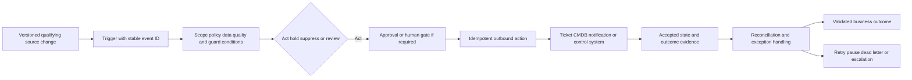

## JD Mapping

| Role expectation | Part 65 capability | TSM artifact | experience bridge and boundary |
|---|---|---|---|
| Develop Data Fabric expertise | Explain documented workflow/outbound value and general reliability controls | Source-bounded workflow whiteboard | No internal engine claim |
| Analyze customer operations | Map people, systems, approvals, ownership, and failure boundaries | Swimlane/process map | Escalation orchestration transfers |
| Recommend mitigation | Design controlled tickets, assignments, and follow-up | Workflow proposal | Customer process owner approves |
| Resolve technical issues | Trace event, rule, queue, connector, target, and feedback | Evidence package | Request/log/timeline RCA transfers |
| Lead strategic engagement | Align security, ITSM, CMDB, app, privacy, and risk stakeholders | Governance workshop | TSM facilitates decisions |
| Communicate risk | Explain automation impact, unknowns, and containment | Incident/update brief | Avoid claiming a ticket equals remediation |
| Drive adoption | Reduce toil while preserving human control and trust | Adoption scorecard | Volume alone is not success |
| Partner cross-functionally | Coordinate customer owners, Support, Product, and target vendors | RACI/escalation map | Ownership boundaries explicit |

## Candidate honesty note

| Evidence class | Safe interview statement | Boundary to state |
|---|---|---|
| Production transfer | "I coordinated enterprise escalations, ownership, evidence, retries, change gates, and stakeholder updates across systems and teams." | Not production Data Fabric workflow administration |
| Synthetic practice | "I designed and troubleshot NMH ticket, CMDB, notification, approval, idempotency, and reconciliation flows." | Fictional lab evidence |
| Official public fact | "Zscaler publicly describes advanced workflows, outbound integrations, CMDB updates, assignments, and ticket reconciliation." | No undocumented engine mechanics |
| General method | "I model durable state, stable keys, retries, reconciliation, least privilege, and human gates." | Distributed-systems pattern |
| Success statement | "The target accepted request X, and later reconciliation validated outcome Y." | Acceptance is not completion |
| Failure statement | "The synthetic ticket duplication came from an unstable business key plus timeout/retry ambiguity." | Lab result only |
| Security statement | "The action identity has only required target permissions, with secrets isolated and audited." | Verify actual tenant controls |
| Production next step | "I would validate current docs, tenant configuration, target API, approvals, and specialists." | Never invent connector behavior |

## Beginner vocabulary and memory hooks

| Term | Plain meaning | Why it matters | Analogy and memory hook |
|---|---|---|---|
| Workflow | Governed sequence moving work toward an outcome | Connects detection to accountable action | A tracked relay race |
| Trigger | Event or schedule that starts evaluation | Defines when work begins | Doorbell, not the whole visit |
| Condition | Test deciding whether/how to proceed | Prevents indiscriminate action | Check the address before delivery |
| Action | Requested change in another system or human process | Produces operational effect | Send the parcel |
| Postcondition | State expected after action | Defines success beyond request | Confirm recipient received it |
| Event | Immutable observation that something happened | Supports replay and audit | Dated receipt |
| Command | Request that something should happen | Can succeed, fail, or duplicate | Delivery instruction |
| State | Durable workflow position and context | Survives restarts and waiting | Case folder status |
| State machine | Legal states and transitions | Prevents impossible lifecycle | Railway signal map |
| Assignment | Route responsibility to person/team/queue | Makes work accountable | Named baton holder |
| Acknowledgement | Owner confirms receipt | Distinguishes sent from accepted | Signature at handoff |
| Approval | Authorized decision allowing a consequential step | Keeps humans accountable | Signed permit |
| Human gate | Pause for qualified review/decision | Protects ambiguous/high-impact actions | Guard at restricted door |
| Retry | Repeat failed/uncertain operation | Handles transient failure | Redial after busy signal |
| Backoff | Increase wait between retries | Avoids overload | Knock less often |
| Jitter | Randomize retry timing | Prevents synchronized bursts | Stagger arrival times |
| Timeout | Stop waiting after defined duration | Bounds uncertainty | Callback deadline |
| Idempotency | Repeating same logical request has one intended effect | Prevents duplicate tickets/changes | One reservation despite two clicks |
| Idempotency key | Stable identifier for one logical action | Lets target/dedup store recognize repeats | Reservation confirmation number |
| Reconciliation | Compare expected and actual states and repair differences | Finds silent/ambiguous failure | Balance the ledger |
| Dead-letter queue | Quarantine work that cannot progress automatically | Preserves evidence for repair | Undeliverable mail desk |
| Circuit breaker | Pause calls when dependency repeatedly fails | Protects both systems | Close road after repeated crashes |
| Compensating action | Explicit action addressing effects of prior step | Helps recovery when rollback is impossible | Issue refund, not erase history |
| Exception | Governed departure from normal policy | Handles valid special cases | Time-limited permit |
| Escalation | Route unresolved/high-impact work to higher authority | Prevents indefinite stall | Call supervisor with evidence |
| Webhook | HTTP notification from one system to another | Supports event-driven flows | Digital doorbell |
| Polling | Periodically ask for changes/state | Works when push is unavailable | Check mailbox on schedule |
| Secret | Credential material used by automation | Compromise can enable actions/data access | Master key |
| RBAC | Role-based access control | Limits who can design, approve, run, or view | Job-based key ring |
| Audit trail | Immutable-enough record of decision/action history | Enables accountability and RCA | Signed case diary |
| SLA | Service-level agreement/objective for response or completion | Sets expectation and escalation | Promised delivery window |

## Product claim boundary

| Publicly supported statement | Safe use | General mechanics in this Part | Unsupported leap to avoid |
|---|---|---|---|
| Data Fabric supports advanced automated workflows | Explain operationalization value | Trigger-condition-action/state patterns | Claim internal engine architecture |
| Data Fabric supports inbound/outbound integrations | Explain ecosystem flows | API/webhook/file/queue contracts | Claim every action or connector behavior |
| Data Fabric applies business logic | Explain governed qualification/routing | Rules and human gates | Infer exact operators/evaluation order |
| AEM can assign and track workflows | Explain ownership/remediation process | Assignment/ack/escalation design | Claim exact states or SLAs |
| AEM can auto-update a CMDB | Explain documented use case | Authority, idempotency, reconciliation controls | Promise arbitrary writes or source-of-truth behavior |
| AEM uses workflows to close coverage gaps | Explain mitigation operationalization | Ticket/control-gap examples | Claim autonomous closure/effectiveness |
| UVM offers custom workflows with remediation rationale | Explain context-rich ticketing | Payload/reason contract | Claim exact templates/fields |
| UVM can automatically reconcile tickets | Explain documented lifecycle value | General bidirectional reconciliation | Claim undocumented close/reopen logic |

### Plain-English deep-dive 1 - Automation is a custody chain

When a security finding becomes a ticket, responsibility passes from data logic to a connector, target platform, queue, team, individual, change process, validator, and risk owner. Every handoff can lose context, duplicate work, expose sensitive data, or create delay.

Think of evidence transferred between investigators. A label saying "sent" is insufficient. The chain records what moved, who authorized it, who received it, when, in what condition, and what happened next. Workflow state and audit provide the same custody chain for operational decisions. Automation should make custody clearer, not merely faster.

## Workflow charter before building automation

Begin with the outcome and authority. "Create a ticket" is an action, not the business outcome.

| Charter item | NMH synthetic example | Failure if omitted |
|---|---|---|
| Business outcome | Validate and remediate missing endpoint-control coverage | Tickets become vanity output |
| Trigger population | In-scope production assets with current missing-control evidence | Test/stale assets enter flow |
| Unit of work | One asset-control-gap campaign item | Duplicate finding/ticket grain |
| Owner | Endpoint Security accountable; ITSM queue operational | No durable responsibility |
| Source authority | Resolved asset and current control-health evidence | Wrong asset/action |
| Decision time | Daily as-of 06:00 UTC plus qualifying changes | Unbounded churn |
| Actions | Assign, create/update ticket, notify, validate, close | Lifecycle incomplete |
| Human gates | CMDB owner approval for ownership overwrite; human approval for control change | Automation exceeds authority |
| Success | Control coverage validated or approved exception recorded | Ticket closure mistaken for outcome |
| False-positive harm | Wasted work/sensitive data exposure | Trust loss |
| False-negative harm | Unprotected asset remains invisible | Residual exposure |
| Failure tolerance | No lost work; duplicates below defined guardrail; bounded delay | Reliability undefined |
| Non-goal | Autonomous endpoint deployment/containment | Unsafe scope expansion |

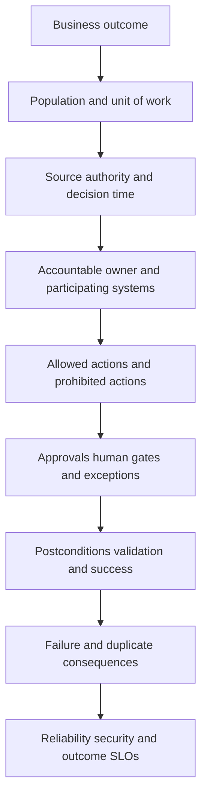

## Trigger-condition-action mechanics

Trigger-condition-action, abbreviated T-C-A, is the basic grammar. The trigger starts evaluation; conditions determine eligibility; actions request effects. Postconditions and reconciliation determine whether the intended result occurred.

| Component | Questions | NMH example |
|---|---|---|
| Trigger | Event, schedule, change, manual request, or reconciliation discovery? | Control state changes healthy -> missing |
| Trigger identity | Is event ID stable and unique in source scope? | `control-state/asset-44/v18` |
| Conditions | Scope, freshness, confidence, owner, exception, suppression? | Prod, current evidence, no active exception |
| Decision | Act, hold, suppress, merge, review, or escalate? | Create/update remediation item |
| Action | Which target operation and payload? | Upsert ITSM ticket with reason |
| Postcondition | What target/business state proves progress? | Ticket acknowledged by correct queue |
| Outcome validation | What proves risk treatment? | Control healthy and independently validated |
| Feedback | Which target/source changes return? | Ticket status, assignment, resolution code |
| Re-entry | What new evidence reopens/recalculates? | Control becomes missing after closure |

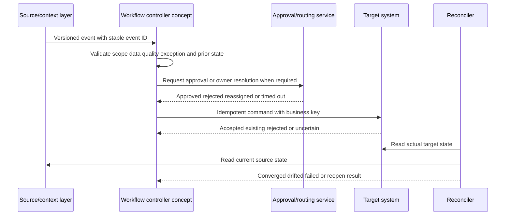

Triggers can be duplicated, delayed, reordered, or delivered after state changes. Treat events as observations, not guaranteed commands. Re-read authoritative current state before consequential action when necessary.

## Trigger sources and delivery tradeoffs

| Trigger style | Strength | Limitation | Reliability control |
|---|---|---|---|
| Change event/webhook | Low latency | Duplicate/lost/unsigned/out-of-order risk | Signature, event ID, replay, checkpoint |
| Scheduled query | Simple and controllable | Delay and repeated scans | Watermark, deterministic snapshot |
| Polling API | Works without webhook | Rate limits and race windows | Cursor, overlap, backoff, reconciliation |
| File arrival | Good for batch | Partial files/naming/late delivery | Manifest, checksum, atomic readiness |
| Manual trigger | Human context | Inconsistent and abuse risk | RBAC, reason, approval, audit |
| Reconciliation trigger | Repairs drift | Reactive and potentially expensive | Scope, cadence, diff limits |
| Timer/deadline | Drives SLA/escalation | Clock/timezone/state races | Durable timer and transition guard |

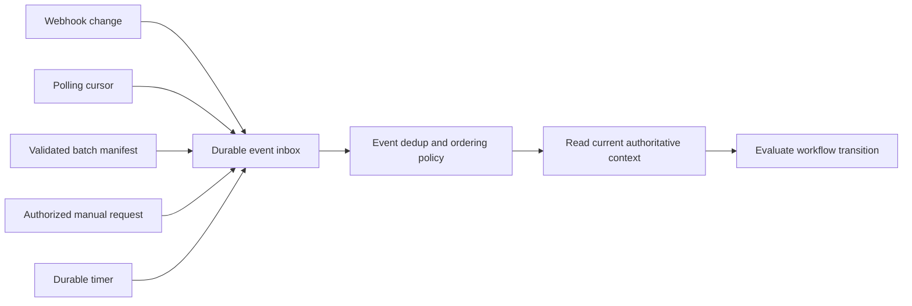

There is rarely "exactly once" end-to-end delivery across independent systems. Build effectively-once business effects with at-least-once delivery, stable keys, idempotent target operations, state checks, and reconciliation.

## Durable workflow state machine

A workflow that waits for approvals, target systems, or remediation needs durable state. Legal transitions prevent impossible combinations such as closing before validation.

| State | Meaning | Allowed next states | Evidence required |
|---|---|---|---|
| Detected | Qualifying source observation exists | Evaluating, Suppressed | Source/event evidence |
| Evaluating | Conditions and context being checked | PendingApproval, Ready, Hold, Suppressed, Failed | Logic/version/reasons |
| PendingApproval | Authorized decision required | Ready, Rejected, Expired, Escalated | Request/approver/deadline |
| Ready | Action authorized and queued | Dispatching, Cancelled | Stable action/business key |
| Dispatching | Request in progress/uncertain | Accepted, RetryWait, Failed, Reconcile | Attempt evidence |
| Accepted | Target acknowledges request | Assigned, InProgress, Reconcile | Target ID/version |
| Assigned | Responsible owner acknowledged | InProgress, Escalated, Reassigned | Owner/time |
| InProgress | Work underway | PendingValidation, Exception, Escalated | Status evidence |
| PendingValidation | Claimed completion awaiting proof | Resolved, Reopened, Exception | Validation evidence |
| Resolved | Business postcondition validated | Reopened, Closed | Outcome proof |
| Closed | Finalized under policy | Reopened | Closure reason/audit |
| Hold | Data/identity/authority insufficient | Evaluating, Cancelled, Escalated | Hold reason/owner |
| Exception | Approved alternate treatment | Resolved, Expired, Reopened | Scope/approver/expiry |
| RetryWait | Transient failure/backoff | Dispatching, DeadLetter | Attempt/deadline |
| DeadLetter | Automatic progression stopped | ManualRepair, Cancelled | Error history |
| Failed | Terminal technical/business failure | ManualRepair, Cancelled | Cause and impact |

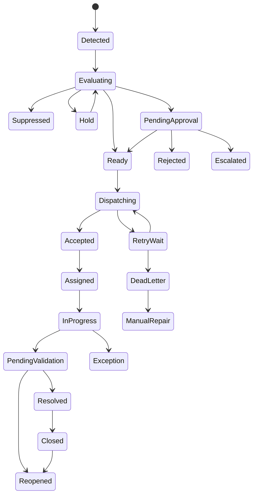

### Plain-English deep-dive 2 - HTTP 200 is not workflow success

An API can return success because it accepted a request, while the target later rejects processing. A timeout can occur after the target created the ticket, so retrying may create a duplicate. A ticket can close even though the asset remains unprotected. Each is a different layer of success.

Think of ordering a replacement part. The website accepting payment, warehouse reserving stock, courier collecting it, recipient signing, technician installing it, and machine passing a test are separate states. Define technical acceptance, process progress, and validated business outcome separately. Reconciliation connects them.

## Assignment, ownership, acknowledgement, and fallback

Assignment is security logic. Wrong routing can expose sensitive details and delay remediation.

| Routing input | Question | Safe handling |
|---|---|---|
| Resolved asset/application | Is the target identity correct? | Hold on ambiguity for sensitive action |
| Technical owner | Who operates the system now? | Time-valid authoritative relationship |
| Business owner | Who accepts risk/impact? | Separate from technical queue |
| Queue mapping | Which target group ID, not display name? | Versioned mapping with validation |
| Geography/timezone | Does support model require regional routing? | Policy-controlled, avoid sensitive inference |
| Service criticality | Does it change acknowledgement/escalation? | Owner-approved tier |
| Data sensitivity | Who may view ticket content? | Minimize payload and restrict queue |
| Availability/on-call | Is owner reachable? | Current schedule, fallback chain |
| Acknowledgement | Has team accepted custody? | Durable state and timer |
| Reassignment | Who may move custody and why? | Reason, authorization, audit |
| Orphan behavior | No owner or mapping | Safe triage queue plus owner-remediation task |

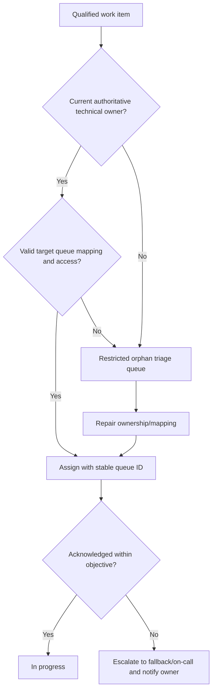

Avoid routing by free-text names. Team renames, reorganizations, and duplicate display names are common. Preserve the owner evidence used at assignment time so historical accountability does not change when current ownership changes.

## Ticket create, update, close, reopen, and reconcile

A ticket integration needs a contract for both identity and lifecycle.

| Contract item | Example | Failure if absent |
|---|---|---|
| Business key | `tenant + workflow_type + asset_id + control_id + active_episode` | Duplicate tickets |
| Target ID | ITSM incident/task ID returned by target | Cannot update/reconcile |
| Payload schema | Summary, rationale, evidence link, owner, severity, due date | Missing context |
| Sensitive-data policy | Minimal fields; restricted evidence stays linked | Privacy leak |
| Create semantics | Upsert/find-or-create under business key | Retry duplication |
| Update semantics | Patch only owned fields; preserve human notes | Automation overwrites users |
| Comment semantics | Append significant reason/state changes | Noise/fatigue |
| Close semantics | Require validated source postcondition | Ticket closure hides exposure |
| Reopen semantics | New qualifying episode or regression | Recurrence invisible |
| Conflict policy | Human edit vs automation vs other integration | Edit war |
| Reconciliation | Compare target/source/workflow state | Silent drift persists |
| Retention/audit | Keep linkage and decision history | No RCA |

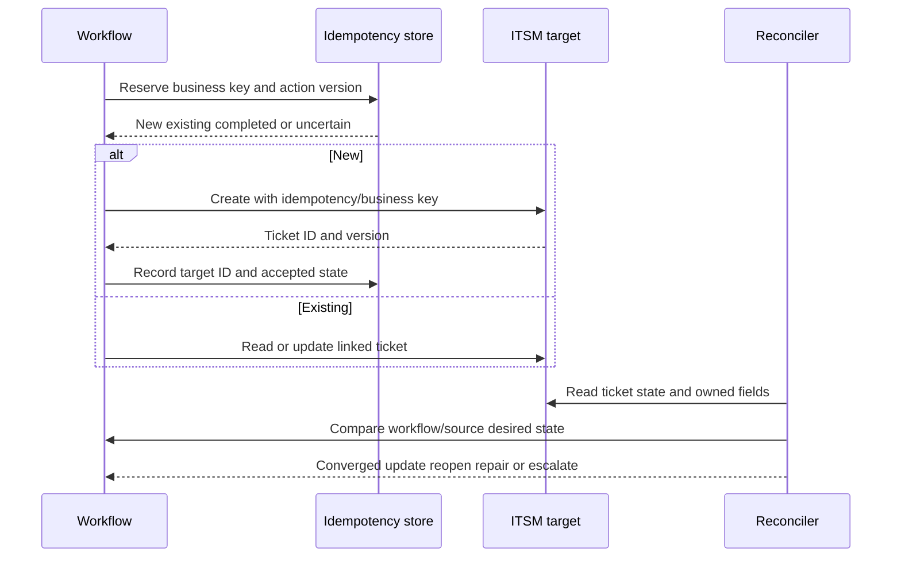

Do not let the connector overwrite fields owned by human responders or another authoritative integration. Use field ownership and optimistic concurrency/version checks where target APIs support them. On conflict, reread and apply policy rather than blind overwrite.

## Notifications without fatigue or leakage

Notifications are human-facing actions. More messages can reduce response by training recipients to ignore them.

| Design item | Decision | Failure mode |
|---|---|---|
| Purpose | Inform, request approval, warn deadline, report resolution | Generic noise |
| Audience | Current owner, approver, on-call, executive | Oversharing |
| Channel | ITSM, email, chat, pager, dashboard | Wrong urgency/channel |
| Content | Outcome, reason, evidence link, action, deadline, owner | Raw sensitive payload |
| Deduplication | One message per meaningful transition/window | Storm during retries |
| Aggregation | Digest low urgency; immediate high consequence | Delay critical item or spam minor items |
| Quiet hours | Respect unless escalation policy overrides | Burnout |
| Acknowledgement | Track action requests, not every informational note | False response assumption |
| Escalation | Defined timer and fallback | Endless repeated alerts |
| Accessibility | Clear subject, plain text, readable structure | Excludes recipients |
| Unsubscribe/scope | Govern optional informational subscriptions | Required alerts accidentally disabled |

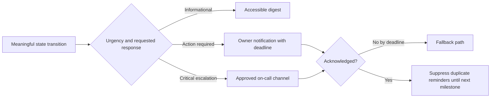

## CMDB updates: authority, field ownership, and reversibility

A configuration management database, abbreviated CMDB, stores configuration items and relationships for operational management. It is not automatically the authority for every field, and Data Fabric should not be assumed to replace or own it.

| CMDB update question | Example policy | Why it matters |
|---|---|---|
| Which CI/entity? | Exact resolved asset with stable CMDB sys ID | Prevent wrong-record update |
| Which field? | Endpoint-control coverage status | Limit action scope |
| Who owns field? | Security coverage integration owns derived status; CMDB team owns lifecycle status | Prevent overwrite conflict |
| Source authority | Current endpoint/control evidence | Make claim defensible |
| Write type | Patch/upsert, never blind full replace | Preserve unrelated data |
| Preconditions | CI version and identity still match | Avoid stale write |
| Approval | Owner approval for ownership/lifecycle change | Protect critical semantics |
| Provenance | Source/run/workflow/reason/time | Audit and correction |
| Expiry | Derived status must age out if evidence stale | Prevent permanent false protection |
| Reconciliation | Read back and compare | Detect rejection/conflict |
| Reversal | Restore prior value or append correction under owner policy | Recover safely |

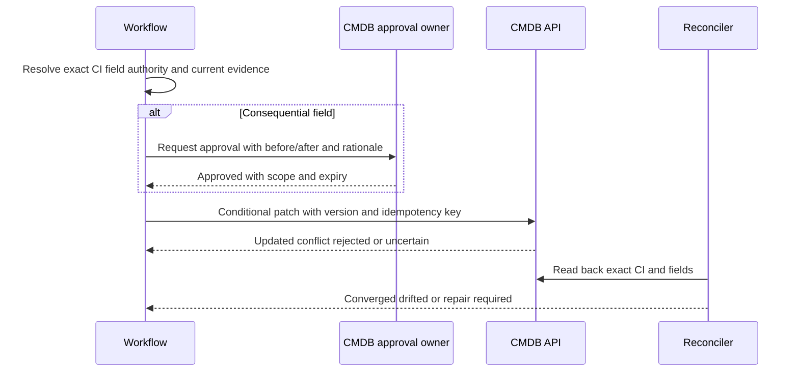

### Plain-English deep-dive 3 - A CMDB update is not ordinary data enrichment

Reading a CMDB owner field for context and writing a new owner into the CMDB are different risk levels. The write changes an operational source that other systems may trust for incidents, changes, compliance, billing, and access.

Think of reading an address book versus changing the official postal address. The latter needs identity verification, authority, before/after evidence, conflict checks, and a correction path. Use least-privilege field ownership, conditional updates, approvals for consequential fields, and read-back reconciliation. Do not turn a correlation hypothesis into an authoritative CMDB fact automatically.

## Human gates and approval design

Human approval is not a ceremonial click. The approver needs authority, sufficient evidence, alternatives, consequences, and time.

| Action class | Default gate | Required evidence | Example |
|---|---|---|---|
| Create low-impact remediation task | Policy-approved automation | Stable identity, current finding, owner | Coverage-gap ticket |
| Update ticket status/comment | Automated within field ownership | Linked ticket/version/state | Add validation evidence |
| Change CMDB derived coverage field | Conditional automation or owner approval | Source authority, before/after, expiry | EDR coverage status |
| Change CMDB owner/lifecycle | Human approval | Conflicting sources, accountable owner | Reassign CI owner |
| Disable account/isolate asset | Human gate except separately governed emergency policy | Incident evidence, impact, rollback, approver | Containment |
| Accept risk/exception | Authorized risk owner | Scope, residual risk, conditions, expiry | Temporary patch deferral |
| Notify executives/regulators | Incident/legal/comms approval | Validated facts and obligations | Material incident update |
| Bulk action | Two-person or enhanced approval | Population preview and blast radius | Close/reassign 5,000 tickets |

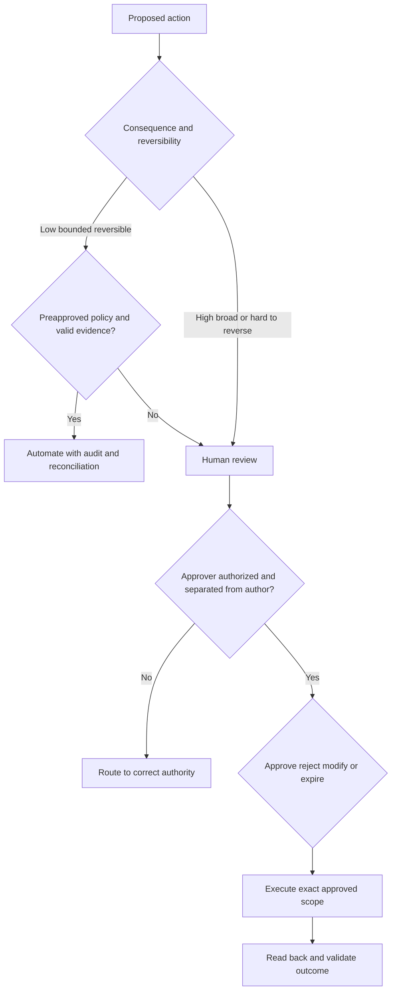

Approvals expire. If source state changes while waiting, reevaluate before execution. Approval for one exact asset/action/version must not authorize a broader changed payload.

## Retries, timeouts, backoff, jitter, and circuit breakers

Failures are transient, permanent, ambiguous, policy-related, or security-related. Retry only when safe.

| Failure class | Example | Retry? | Handling |
|---|---|---|---|
| Transient network | Connection reset before response | Usually, with idempotency | Backoff+jitter, bounded attempts |
| Rate limit | HTTP 429 with retry hint | Yes, honor target guidance | Shared rate budget |
| Server transient | HTTP 503 | Bounded | Circuit breaker and monitor |
| Client/schema | HTTP 400 invalid field | No blind retry | Dead letter and repair |
| Authentication | Expired token/401 | Refresh once under policy | Alert if persists; never log secret |
| Authorization | 403 insufficient permission | No retry storm | Fix least-privilege grant/contract |
| Conflict | Version mismatch/409 | Reread and resolve | Conditional retry |
| Timeout after send | Target may have acted | Do not assume failure | Query by idempotency/business key |
| Policy rejection | Approval denied | No | Record terminal/review state |
| Security anomaly | Signature invalid or unexpected destination | No | Quarantine and incident review |

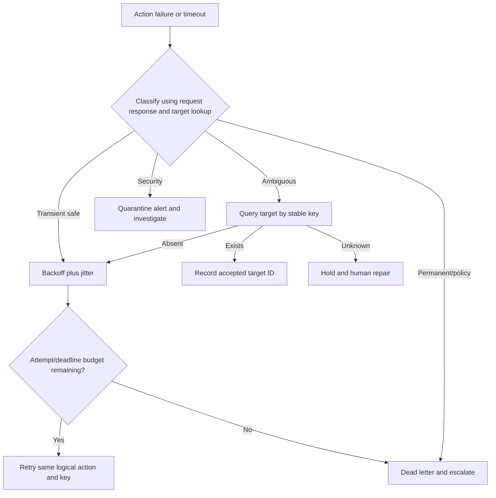

Retry budgets should include maximum attempts, maximum elapsed time, per-dependency rate, and workflow deadline. A circuit breaker pauses new calls after repeated dependency failure, allows recovery checks, and prevents retry storms.

## Idempotency from first principles

Idempotency means repeating one logical operation produces the intended single business effect. It requires a stable key and target behavior, not just deduplicating events in memory.

| Layer | Stable identity | Idempotent behavior |
|---|---|---|
| Source event | Source + event ID/version | Duplicate delivery evaluates once per version |
| Workflow instance | Workflow type + entity + episode | One durable lifecycle |
| Action | Workflow instance + action type + action version | Same command recognized on retry |
| Ticket | Business key + active episode | Upsert/find existing ticket |
| Notification | Transition + audience + window | One meaningful message |
| CMDB patch | CI + field set + desired version | Conditional same desired state |
| Approval | Action digest + scope + version | Approval cannot be replayed for changed action |
| Reconciliation repair | Drift record + desired state version | Repair is repeatable |

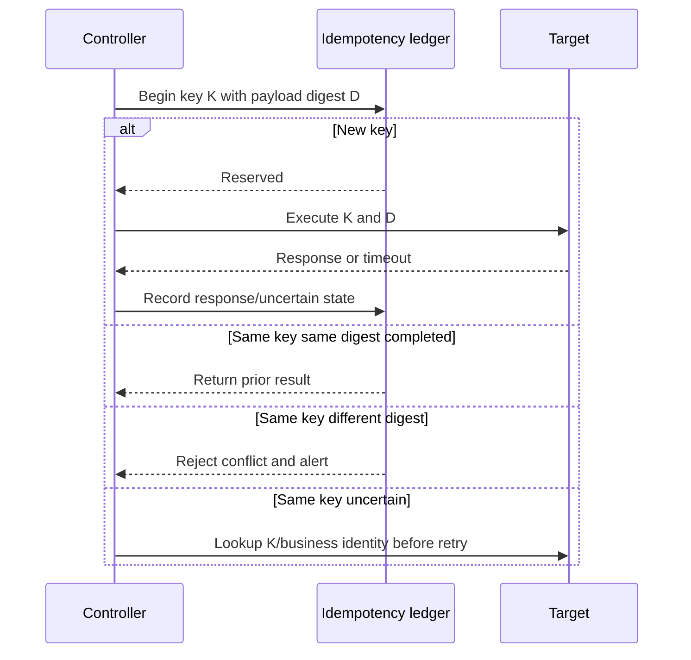

### Plain-English deep-dive 4 - A retry is a new attempt, not a new intention

If a person double-clicks "buy," the system should understand one purchase intention with two attempts. If the second request uses a new identity, the target may create two orders. The same happens when a workflow generates a random key on every retry.

Keep the logical action ID stable across attempts. Bind it to a payload digest so the same key cannot authorize different content. Store target IDs and uncertain states durably. When a timeout occurs, query the target before sending again. Idempotency is end-to-end business identity plus reconciliation, not merely suppressing duplicate messages for a few minutes.

## Reconciliation and convergence

Reconciliation periodically compares four views: source truth/context, workflow desired state, target system state, and observed business outcome.

| Comparison | Example drift | Repair question |
|---|---|---|
| Source vs workflow | Finding no longer qualifies but workflow active | Cancel, validate, or close? |
| Workflow vs target | Workflow says accepted; ticket missing | Recreate or investigate deletion? |
| Target vs workflow | Ticket reassigned/closed manually | Respect, reopen, or escalate conflict? |
| Source vs target | Asset owner changed; ticket old owner | Update assignment under policy? |
| Desired CMDB vs actual | Patch rejected/overwritten | Which system owns field? |
| Target closure vs outcome | Ticket closed; control still missing | Reopen pending validation |
| Exception vs current time | Exception expired; item suppressed | Re-enter evaluation |
| Duplicate target objects | Two tickets for one episode | Select survivor and reconcile history |

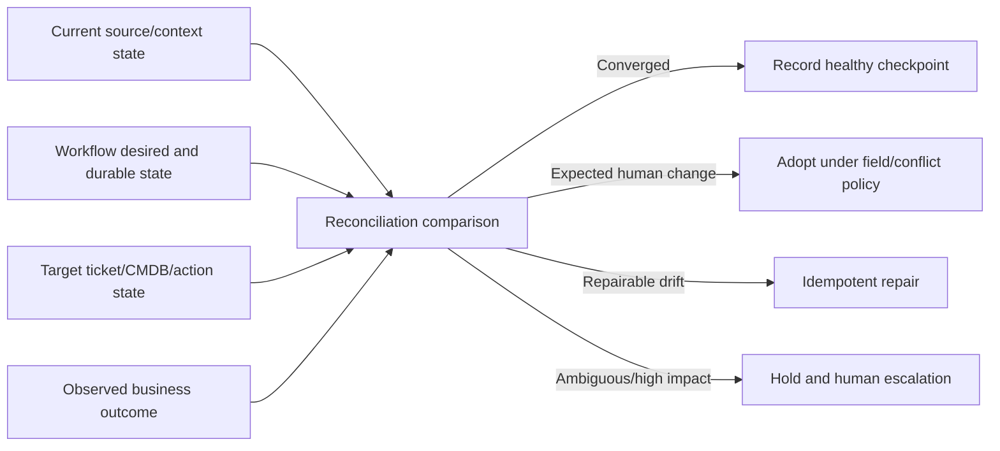

Reconciliation needs a cadence, scope, rate controls, ownership, and repair limits. Large drift should trigger pause/review rather than mass updates.

## Exceptions, risk acceptance, expiry, and re-entry

Exceptions are stateful governance objects, not comments or permanent suppression.

| Exception field | Purpose |
|---|---|
| Scope | Exact entities/findings/controls/actions covered |
| Rationale | Why normal treatment cannot occur |
| Risk statement | What residual exposure remains |
| Compensating controls | Evidence and effectiveness limits |
| Owner/approver | Accountable authorized decision maker |
| Start/expiry | Time-bound validity |
| Conditions | Requirements while exception active |
| Review cadence | Reassess assumptions/evidence |
| Workflow effect | Suppress action, change SLA, route review, never erase |
| Re-entry | What occurs on expiry, violation, or changed scope |
| Audit | Decision, evidence, changes, notifications |

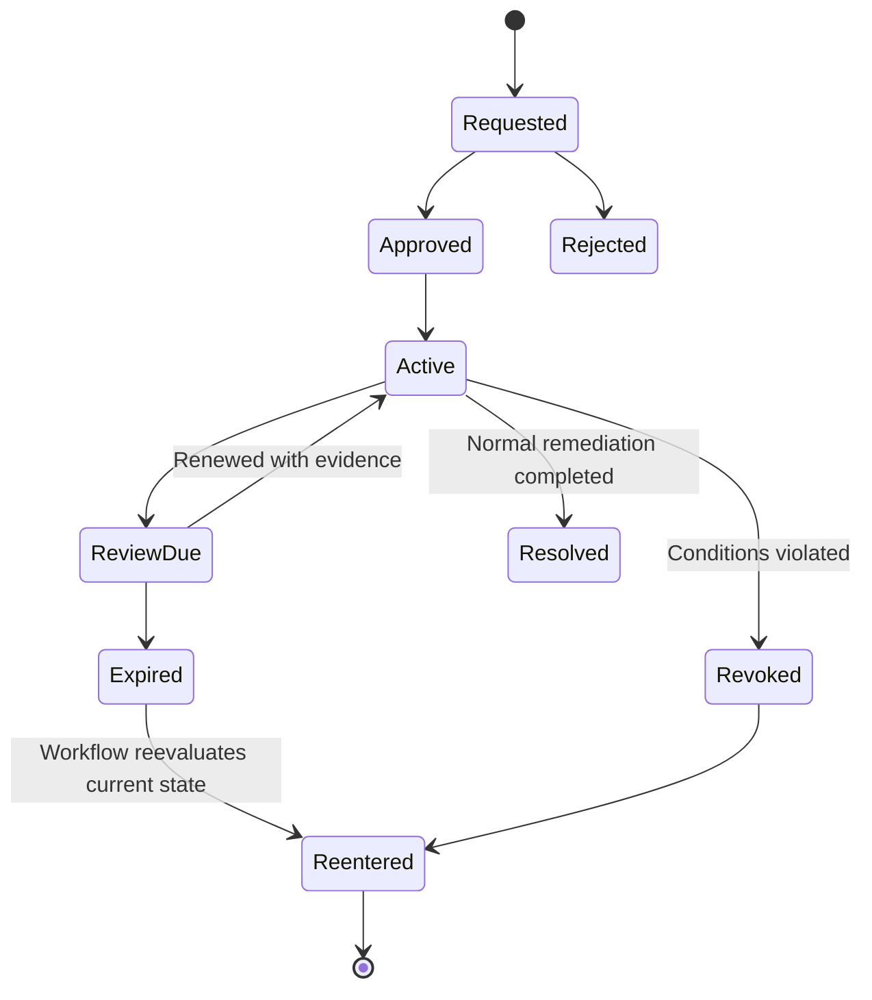

Do not close the underlying finding merely because an exception is approved. Keep technical state, workflow treatment, and risk decision separate.

## Escalation design

Escalation should carry context, not simply increase message volume.

| Escalation trigger | Destination | Evidence package |
|---|---|---|
| No acknowledgement | Fallback/on-call manager | Item, owner mapping, attempts, deadline |
| SLA at risk/breached | Operational/risk owner | Age, impact, blockers, requested decision |
| Repeated target failure | Integration/support owner | Requests, responses, times, IDs, retry state |
| Dead-letter growth | Platform/operations | Error classes, scope, oldest age, consumer impact |
| Wrong sensitive routing | Security/privacy incident lead | Exposure, recipients, containment, audit |
| Bulk drift | Process/data owners | Before/after sample, count, source/version changes |
| Product-behavior question | Zscaler Support/Product via approved path | Reproduction, docs, tenant details, redacted evidence |
| Risk exception dispute | Authorized risk governance | Evidence, options, residual risk, owner statements |

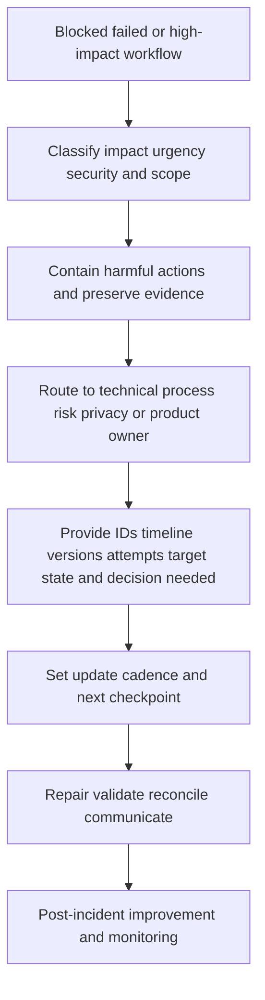

## Security architecture: RBAC, secrets, trust, and audit

Workflow automation has write authority and often handles sensitive security context. Treat it as a privileged integration.

| Threat/control area | Risk | Control pattern |
|---|---|---|
| Authentication | Stolen credential impersonates workflow | Workload identity, short-lived tokens, strong target auth |
| Authorization | Connector can change too much | Least-privilege scopes and field/action restrictions |
| RBAC | One person authors/approves/runs sensitive flow | Separation of duties and approval roles |
| Secrets | Key leaked in logs/config/tickets | Vault, rotation, no plaintext/logging, access audit |
| Webhook authenticity | Forged trigger creates actions | TLS, signature, timestamp, replay protection |
| Payload integrity | Action content tampered | Signed/hashed digest where applicable, TLS, audit |
| Tenant isolation | Cross-customer data/action | Scoped identity, namespace checks, isolation tests |
| SSRF/destination | User-controlled URL redirects connector | Allowlisted destinations and egress controls |
| Injection | Source text manipulates target/query/template | Structured APIs, escaping, validation |
| Sensitive data | Ticket/notification leaks security/PII | Minimize, classify, redact, restricted links |
| Supply chain | Connector/library compromised | Vendor review, updates, integrity, monitoring |
| Audit tampering | Actor erases action history | Restricted append-only/centralized logs and retention |
| Availability | Retry storm overloads target | Rate limits, circuit breaker, queues, backpressure |
| Manual abuse | Privileged user triggers bulk action | Step-up auth, preview, dual approval, scope limits |

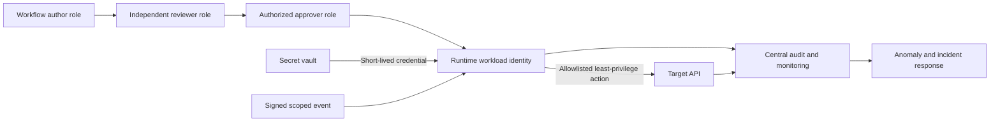

Secrets never belong in study artifacts, screenshots, tickets, error messages, or support bundles. Redact authorization headers, tokens, session identifiers, personal data, and sensitive finding details before escalation.

### Plain-English deep-dive 5 - Least privilege includes business scope

An API token may have permission to update tickets, but the workflow should still be restricted to specific projects, fields, entities, and transitions. Technical permission alone does not grant business authority.

Imagine a building key that opens the records room. It does not authorize the holder to rewrite every file. Combine target API permissions with workflow scope, field ownership, policy gates, and monitoring. Separate author, approver, and runtime identities for high-impact actions.

## Failure taxonomy and handling

| Failure domain | Example | Detection | Recovery |
|---|---|---|---|
| Source/data | Stale owner or false entity merge | Quality/freshness/conflict monitor | Hold, repair source/entity, replay |
| Trigger | Duplicate/missing/out-of-order event | Sequence/reconciliation | Dedup, reread state, backfill |
| Logic | Wrong condition/order | Reason regression/simulation | Version rollback and recompute |
| State | Illegal transition or lost checkpoint | State invariant monitor | Repair from event/audit ledger |
| Approval | Wrong/expired approver | RBAC/deadline/audit | Revoke, reevaluate, escalate |
| Queue | Backlog or poison message | Depth/age/error metrics | Scale, isolate, dead letter |
| Connector | Auth, schema, rate, timeout | Attempt/response metrics | Refresh/fix/backoff/lookup |
| Target | Outage, conflict, manual edit | Health/read-back | Circuit break/reconcile |
| Notification | Wrong audience/storm | Delivery/complaint/dedup metrics | Suppress, correct, privacy response |
| CMDB action | Wrong CI/field overwrite | Conditional conflict/reconciliation | Pause, restore/correct, audit |
| Outcome | Ticket closes without remediation | Source validation | Reopen and improve postcondition |
| Security | Forged event or credential leak | Signature/anomaly/audit | Quarantine, rotate, incident response |

Failure handling order: protect people/systems, stop further harm, preserve evidence, establish scope, choose repair/retry/reconcile, validate business outcome, communicate, and prevent recurrence.

## Workflow metrics and SLOs

Measure reliability and correctness separately from volume and outcomes.

| Metric | Definition | Interpretation warning |
|---|---|---|
| Trigger-to-evaluation latency | Time from eligible source event to decision | Source/event clocks may differ |
| Evaluation success rate | Valid evaluations / attempted | Excluding bad data can hide quality |
| Action acceptance rate | Target accepted requests / attempts | Acceptance is not outcome |
| Business success rate | Validated outcomes / eligible workflow items | Define outcome and observation window |
| Duplicate business-effect rate | Duplicate tickets/changes / logical actions | Requires stable business identity |
| Reconciliation drift rate | Mismatches / compared objects | Scope and cadence matter |
| Retry rate | Retried attempts / actions | High can indicate dependency stress |
| Dead-letter count/age | Quarantined items and oldest age | Count alone hides impact |
| Acknowledgement time | Assignment to owner acceptance | Auto-ack can game metric |
| Resolution time | Detection to validated outcome | Exceptions/pauses need transparent rules |
| Reopen/recurrence rate | Reopened episodes / resolved | Can reveal weak validation |
| Wrong-assignment rate | Corrected routes / assignments | Low reports may mean low feedback access |
| Approval time/rejection | Gate responsiveness and policy mismatch | Fast approval is not quality |
| Notification action rate | Actioned requests / actionable notifications | Privacy and fatigue matter |
| Automation override rate | Human changes to automation result | Investigate reasons, not punish users |
| Harmful-action incidents | Wrong write/routing/data exposure | Severity more important than average |
| Remediation validation | Items with independent proof | Ticket closure is insufficient |

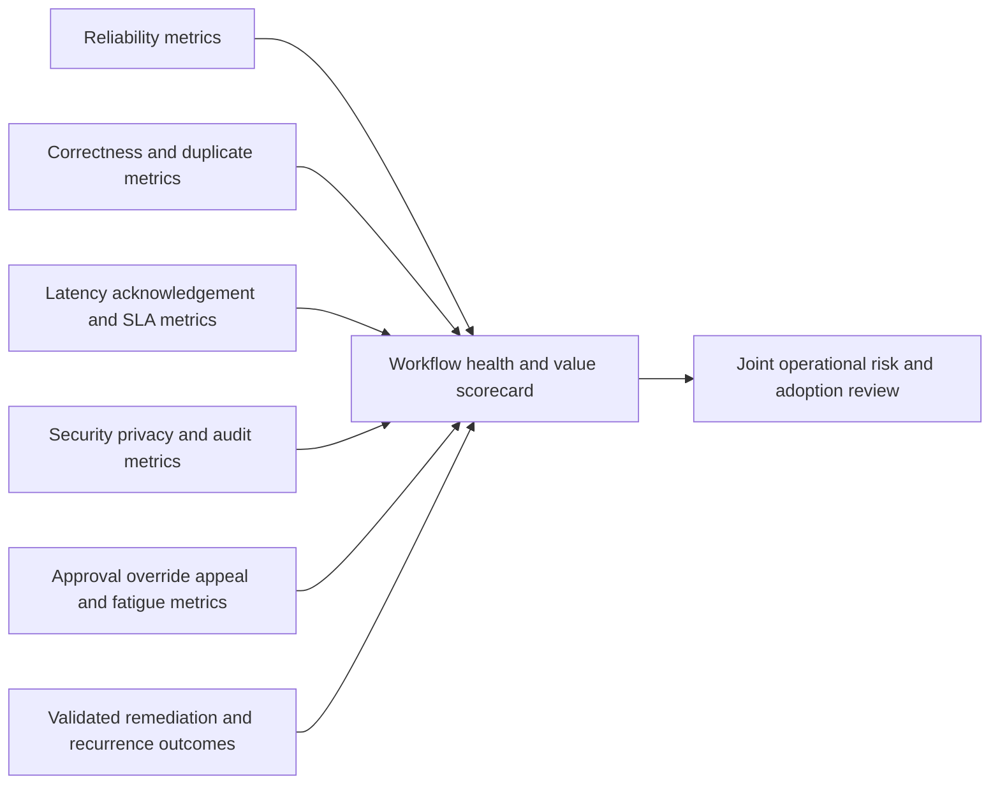

Avoid boasting that thousands of tickets were created. High volume can mean duplicate work or poor prioritization. The useful story is that qualified work reached the right owner, was acknowledged, remediated or governed, validated, reconciled, and measured with less toil and no hidden harm.

## Workflow design review checklist

| Review area | Questions |
|---|---|
| Outcome | What changes in the real world, and how is it validated? |
| Scope | Which entities/tenants/times are allowed and prohibited? |
| Data | Are identity, freshness, authority, confidence, and unknowns adequate? |
| Logic | Are conditions, order, exceptions, and versions explainable? |
| State | Are legal transitions, timers, cancellation, and re-entry defined? |
| Ownership | Who accepts custody, risk, and technical operation? |
| Actions | Which target operations/fields are allowed and reversible? |
| Human control | Which steps require approval, and what evidence is shown? |
| Reliability | What are retry, timeout, backoff, idempotency, circuit, and dead-letter policies? |
| Reconciliation | How are desired, target, source, and outcome states compared? |
| Security | How are identity, RBAC, secrets, signing, isolation, data, and audit protected? |
| Failure | How are partial/ambiguous/bulk/security failures contained and repaired? |
| Metrics | Which SLOs, correctness, human, and outcome measures matter? |
| Deployment | How do simulation, shadow, canary, pause, rollback, and communication work? |
| Product boundary | Which behavior is documented, observed, assumed, or unknown? |

## Troubleshooting workflow and outbound actions

Start with one logical workflow instance and its stable IDs. Build a timeline across source, controller, approval, queue, connector, target, feedback, and reconciliation.

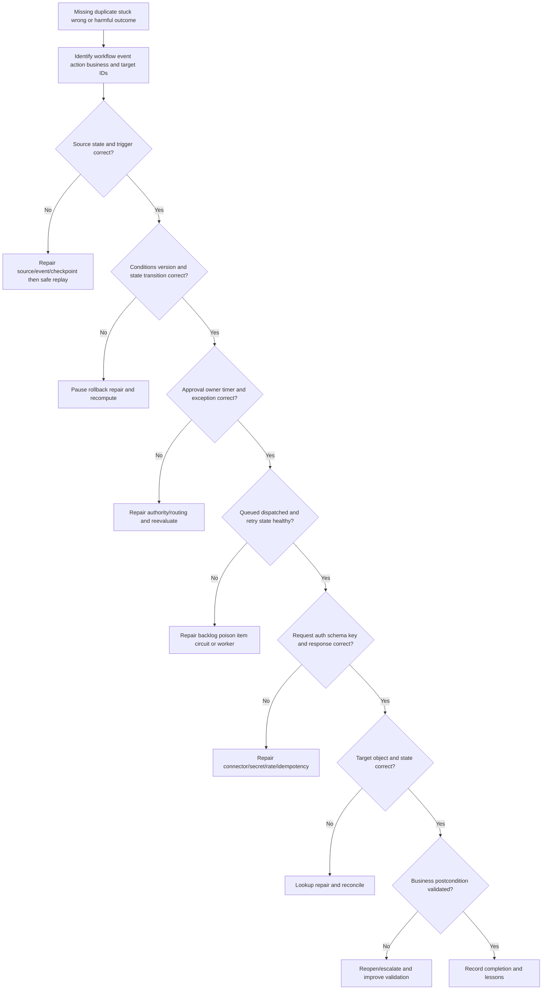

| Evidence item | Purpose | Safety boundary |
|---|---|---|
| Workflow instance/business key | Anchor one logical process | Use approved IDs |
| Source event ID/version/time | Prove trigger | Minimize payload |
| Current source/context snapshot | Check eligibility | Preserve as-of time |
| Logic and workflow version | Reproduce decision/state | Include reason codes |
| State transition history | Find stuck/illegal transition | Protect sensitive comments |
| Approval ID/digest/scope | Validate authority | Restrict approval details |
| Queue message/attempt metadata | Find backlog/retry | No secrets |
| Request method/destination/headers names/body digest | Reproduce connector call | Redact auth and sensitive body |
| Response status/request/correlation ID | Target evidence | Do not assume meaning from code alone |
| Idempotency key/payload digest | Detect duplicate/conflict | Treat keys as operationally sensitive |
| Target object ID/version/history | Compare actual state | Follow target access policy |
| Reconciliation runs/diffs | Find drift | Limit bulk exports |
| First bad/last good/change timeline | Narrow cause | Distinguish correlation from causation |
| Downstream impact | Scope tickets, CMDB, messages, actions | Privacy and customer communication |

Symptom guide:

| Symptom | Cheapest discriminating check | Common causes |
|---|---|---|
| No ticket | Does workflow instance exist and reach Ready/Dispatching? | Trigger, condition, hold, queue, auth, target rejection |
| Duplicate tickets | Do duplicates share business intent but different keys? | Unstable key, timeout retry, race, target not idempotent |
| Stuck pending approval | Is approver mapping valid and request digest current? | Reorg, expired request, notification failure |
| Wrong owner | Which time-valid owner/queue mapping was consumed? | Stale context, display-name mapping, cache |
| Ticket closed but gap remains | Was source postcondition validated? | Closure-only success definition |
| Retry storm | Which error is retryable and is breaker open? | 400/403 retried, no jitter, shared outage |
| CMDB field reverts | Who owns field and which version overwrote it? | Competing integration/manual update |
| Missing notification | Was transition meaningful and audience authorized? | Suppression, channel failure, RBAC |
| Too many notifications | Are retries/updates generating new message keys? | Wrong dedup window/state model |
| UI says success, target absent | Is success acceptance or reconciliation? | Async rejection, stale cache, deleted object |
| Reopened repeatedly | Is recurrence one episode or new episode? | Weak validation, unstable control, wrong business key |
| Bulk unexpected action | Which policy/version/population changed? | Broad scope, mapping drift, approval mismatch |

## Complete synthetic NMH source-to-outcome scenario

NMH wants to close endpoint-control coverage gaps on production assets. The workflow consumes a resolved asset, current control evidence, ownership, business criticality, exception status, and source provenance. It creates or updates an ITSM task, assigns the correct team, requests approval for consequential CMDB changes, and closes only after control health is validated.

### Scenario contract

| Item | Synthetic value | Boundary |
|---|---|---|
| Source condition | Asset-44 is production and control heartbeat missing for 36 hours | Synthetic threshold/evidence |
| Entity | Stable Asset-44 with current lifecycle | False merge/split checks required |
| Owner | Endpoint Security; PayrollOps informed | Time-valid relationships |
| Exception | None active | Expired exceptions re-enter |
| Workflow key | `NMH:coverage:Asset-44:EDR:episode-20260824` | Synthetic stable key |
| Ticket action | Upsert remediation task | Does not prove remediation |
| Notification | Owner action request; payroll informational notice | Minimized details |
| CMDB action | Update derived `edr_coverage_status` after approval/read-back | Does not alter owner/lifecycle |
| Success | Fresh healthy enforcing evidence plus validation | Ticket closure alone insufficient |
| Escalation | No acknowledgement in 4 hours -> on-call/fallback | Synthetic objective |
| Reopen | Coverage becomes missing after validated closure | New episode policy defined |

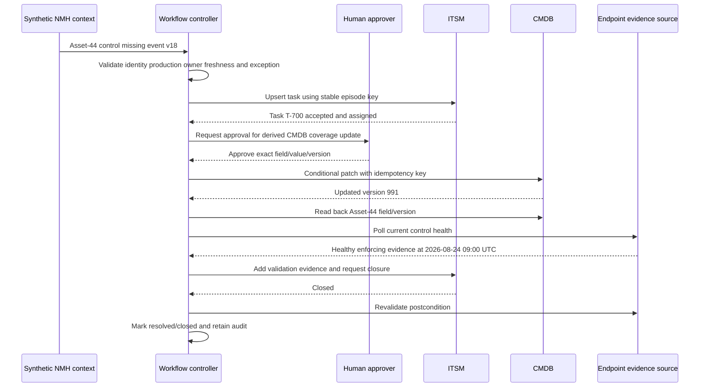

### Normal path

1. A change event enters a durable inbox with stable source/event identity.
2. The controller rereads current context to avoid acting on an outdated event.
3. Asset identity, environment, control freshness, owner, and exception conditions pass.
4. The stable episode key finds no existing active task, so one task is created.
5. The target returns an ID; the workflow records it before further transitions.
6. Endpoint Security acknowledges custody. PayrollOps receives a minimal informational notice because the asset supports payroll.
7. A human approves an exact CMDB derived-status patch. The workflow checks CI/version and reads the field back.
8. The team restores control health. Fresh evidence shows correct target, policy, health, and enforcing mode.
9. The workflow updates the ticket with evidence. Closure is accepted, then source postcondition is rechecked.
10. Reconciliation confirms source, workflow, ticket, CMDB, and outcome converge.

### Timeout and duplicate-ticket incident

The ITSM target creates task `T-701` but the response times out. A defective retry generates a new random idempotency key and creates `T-702`. Both route to Endpoint Security. Two engineers begin duplicate work, and both tasks feed an executive count.

NMH pauses new creates for the affected workflow while allowing safe reads/reconciliation. The team identifies the same workflow episode and payload but different action keys. It selects `T-701` as survivor under policy, links/cancels `T-702` with an audit reason, corrects dashboard counts, preserves human comments, informs owners, and changes the controller to reuse a stable action key and query by business key after timeout. It adds concurrency, timeout-after-create, and duplicate-reconciliation fixtures plus a duplicate-effect SLO.

### Wrong CMDB update incident

A stale entity merge links replacement `Asset-44` with retired `Asset-43`. The workflow prepares a patch for the wrong CI. A conditional version/identity check rejects the request before change. The item moves to Hold and raises an entity-resolution escalation. This is a successful safety control: action acceptance falls, but harmful update is prevented. Metrics and communication must reflect that nuance.

| Scenario statement | Honest wording |
|---|---|
| Trigger | "Current synthetic evidence qualifies Asset-44 for evaluation." |
| Ticket | "ITSM accepted task T-700 under stable episode key." |
| Ownership | "Endpoint Security acknowledged custody; PayrollOps remains service stakeholder." |
| CMDB | "Approved derived field was conditionally updated and read back." |
| Remediation | "Fresh evidence validated healthy enforcing control on Asset-44." |
| Completion | "Source, workflow, target, CMDB, and postcondition reconciled." |
| Duplicate incident | "Ambiguous timeout plus unstable retry key caused one extra ticket." |
| Product boundary | "All state, keys, timers, fields, and outcomes are synthetic general patterns." |

## Synthetic exercises with answers

### Exercise 1 - Trigger versus action

A finding changes to high priority. Is that an instruction to isolate an asset?

**Answer:** No. It is a trigger observation. Conditions, current state, authority, action policy, evidence, and human gate determine whether any action is allowed.

### Exercise 2 - Event versus command

What is the difference?

**Answer:** An event records something observed; a command requests a change. Replaying an event may be safe with deduplication; replaying a non-idempotent command can duplicate effects.

### Exercise 3 - State

Can a workflow move from Accepted directly to Closed?

**Answer:** Only if the approved state contract permits it and business postconditions are validated. For remediation, acceptance normally precedes assignment/work/validation; skipping evidence is unsafe.

### Exercise 4 - Timeout

Ticket create times out. Retry immediately?

**Answer:** Treat outcome as ambiguous. Query the target using stable idempotency/business key. Retry the same logical action/key only if absence or target idempotency is established.

### Exercise 5 - Idempotency

Can event deduplication alone prevent duplicate tickets?

**Answer:** No. Races, retries, replays, and ambiguous responses can still duplicate actions. Use stable workflow/action/business keys, target upsert/idempotency where available, durable state, and reconciliation.

### Exercise 6 - CMDB

Can correlated ownership automatically overwrite CMDB owner?

**Answer:** Not by default. Validate exact CI, source authority, conflicts, field ownership, approval, preconditions, provenance, read-back, and reversal. A correlation is not automatically authoritative.

### Exercise 7 - Ticket closure

Ticket is closed. Is risk remediated?

**Answer:** Not necessarily. Validate the source/business postcondition, such as current healthy enforcing control or absence of the finding. Reopen or escalate if outcome is not supported.

### Exercise 8 - Retry policy

Should HTTP 400 and 403 be retried with exponential backoff?

**Answer:** Usually not blindly. A 400 indicates request/schema issue and 403 authorization/policy issue. Dead-letter or repair/escalate; retries create noise and load.

### Exercise 9 - Approval

Approval was granted, but payload changed before execution. Still valid?

**Answer:** No. Bind approval to action scope, version, and payload digest. Reevaluate current state and obtain new approval for material change.

### Exercise 10 - Exception

Does approved risk acceptance close the technical finding?

**Answer:** No. Keep technical state and risk treatment separate. Track scope, residual risk, conditions, owner, expiry, review, and re-entry.

### Exercise 11 - Metrics

Is 10,000 tickets created a success metric?

**Answer:** Not alone. Measure correct qualification, assignment, duplicates, acknowledgement, validated outcomes, recurrence, drift, security incidents, toil, and customer value.

### Exercise 12 - Product claim

Can you state Zscaler's exact retries or workflow states?

**Answer:** No. Public pages support workflows, integrations, CMDB updates, assignment, and reconciliation positioning, not undocumented engine mechanics. Verify current product evidence.

## Labs and rehearsal

### Lab 1 - Workflow charter

Define outcome, population, unit, authority, owners, actions, prohibited actions, gates, success, harms, SLOs, and non-goals for NMH coverage remediation.

### Lab 2 - T-C-A specification

Write event, scheduled, manual, and reconciliation triggers; conditions; actions; postconditions; feedback; and re-entry rules.

### Lab 3 - State machine

Implement the state table on paper. Test rejection, timeout, retry, hold, exception, dead letter, validation failure, closure, and reopen transitions.

### Lab 4 - Assignment lab

Route current owner, missing owner, renamed team, cross-region, sensitive asset, no acknowledgement, and reassignment cases with audit.

### Lab 5 - Ticket contract

Define business/target identity, schema, sensitive-data minimization, field ownership, create/update/comment/close/reopen, concurrency, and reconciliation.

### Lab 6 - Notification lab

Design informational, action, approval, deadline, and critical notices. Add dedup, digest, quiet-hour, accessibility, and escalation controls.

### Lab 7 - CMDB safe-write lab

Compare derived coverage, owner, lifecycle, and relationship fields. Define authority, approvals, conditional patch, read-back, expiry, conflict, and reversal.

### Lab 8 - Approval matrix

Classify low, medium, high, bulk, irreversible, privacy-sensitive, containment, exception, and executive communication actions.

### Lab 9 - Failure/retry lab

Handle reset, 429, 503, 400, 401, 403, 409, timeout-after-create, invalid signature, and target outage. State retry/lookup/dead-letter/security behavior.

### Lab 10 - Idempotency race lab

Simulate duplicate events, concurrent workers, timeout after success, controller restart, target response loss, and same key/different payload conflict.

### Lab 11 - Reconciliation lab

Compare source, workflow, ticket, CMDB, and outcome states. Repair missing, duplicate, stale, manually changed, closed-without-remediation, and expired-exception cases.

### Lab 12 - Security threat model

Threat-model forged webhook, token leakage, overprivileged connector, SSRF, injection, cross-tenant action, bulk abuse, and audit tampering.

### Lab 13 - Workflow scorecard

Calculate reliability, correctness, latency, duplicates, drift, acknowledgement, validation, recurrence, security, fatigue, and adoption measures with denominators.

### Lab 14 - Duplicate-ticket incident

Run timeout plus unstable-key failure. Contain, identify survivor, reconcile, correct metrics, communicate, fix key/lookup behavior, and add tests.

### Lab 15 - Wrong-CMDB prevention

Use false entity merge and verify identity/version precondition blocks the write. Demonstrate Hold, escalation, entity repair, reevaluation, and safe completion.

### Lab 16 - Interview whiteboard

Draw trigger -> condition -> state -> approval -> idempotent action -> target -> feedback -> reconciliation -> validated outcome. Mark official claims, general patterns, and synthetic NMH evidence.

| Lab evidence | Completion standard |
|---|---|
| Outcome | Real-world postcondition, not ticket creation, defined |
| State | Legal transitions and durable IDs documented |
| Assignment | Authority, fallback, acknowledgement, and privacy governed |
| Reliability | Retry, timeout, idempotency, circuit, dead letter tested |
| Reconciliation | Source/workflow/target/outcome converge |
| Human control | Approval scope/digest/expiry and separation defined |
| Security | RBAC, secrets, signing, isolation, minimization, audit covered |
| Failure | Containment, repair, replay, and communication demonstrated |
| Metrics | Reliability, correctness, human, and outcome measures separated |
| Honesty | Product positioning and synthetic mechanics separated |

## Common misconceptions to correct

| Misconception | Correct model |
|---|---|
| Workflow equals a script | It is durable state, authority, actions, feedback, and repair |
| Trigger is a command | It begins evaluation; current state and policy decide |
| API success means remediation | Acceptance, processing, and validated outcome differ |
| Ticket created means work assigned | Acknowledgement and custody matter |
| Ticket closed means risk removed | Validate source/business postcondition |
| Notifications are harmless | They can leak data and create fatigue |
| More automation is always better | Consequence, ambiguity, reversibility, and trust decide |
| Human approval makes any action safe | Approver authority/evidence/scope/expiry matter |
| Retry every error | Permanent/security/policy errors require repair or quarantine |
| Timeout means target did nothing | Target may have acted before response loss |
| Exponential backoff solves duplicates | Stable identity and reconciliation are also required |
| Event dedup gives exactly once | End-to-end business effects need idempotency and reconciliation |
| Random key per attempt is safe | It creates new intentions and duplicates |
| Same key can carry changed payload | Bind key to digest; reject conflict |
| CMDB is authority for every field | Authority is field- and process-specific |
| Correlated context can freely update CMDB | Writes need exact identity, authority, approval, and read-back |
| Automation should overwrite manual edits | Define field ownership/conflict policy |
| Exception deletes finding | It changes treatment; technical state remains |
| Dead letters can wait indefinitely | Age, impact, owner, and escalation are required |
| High acceptance rate proves value | Correctness and validated outcomes matter |
| Low retry rate proves health | Lost triggers may reduce retries artificially |
| Rollback erases external effects | Compensate/reconcile target objects and messages |
| Logs may include tokens for support | Secrets and sensitive payloads must be redacted |
| Public Zscaler workflow claims reveal engine design | They support bounded outcomes, not internals |

## Official Source Anchors

Research/source date: **2026-08-24**.

Zscaler sources support bounded workflow, outbound integration, assignment, CMDB-update, remediation, and ticket-reconciliation positioning. IETF sources support HTTP semantics, OAuth, and webhook/security-related protocol context. CNCF CloudEvents supports a general event-envelope specification. NIST and OWASP sources support access control, audit, incident response, secure development, API security, secrets, and change governance. None establishes Zscaler's internal state machine, delivery guarantee, retry/backoff policy, idempotency key, queue, connector security architecture, API schema, or exact actions.

| Source | URL | Used for | Boundary |
|---|---|---|---|
| Zscaler Data Fabric for Security | https://www.zscaler.com/products-and-solutions/data-fabric | Public advanced workflows, business logic, inbound/outbound integrations | No internal engine, state, delivery, retry, or API detail |
| Zscaler Asset Exposure Management | https://www.zscaler.com/products-and-solutions/caasm | Public assignment/tracking, risk-mitigation policies, automated coverage-gap workflows, CMDB updates | No exact field, approval, lifecycle, or guarantee |
| Zscaler Unified Vulnerability Management | https://www.zscaler.com/products-and-solutions/vulnerability-management | Public custom remediation workflows, rationale, automatic ticket reconciliation | No exact ticket schema/state/reopen logic |
| RFC 9110 HTTP Semantics | https://www.rfc-editor.org/rfc/rfc9110 | HTTP methods, status semantics, idempotent method context | Application business effect still requires contract |
| RFC 6585 | https://www.rfc-editor.org/rfc/rfc6585 | HTTP 429 and additional status-code context | Target-specific retry guidance applies |
| RFC 6749 OAuth 2.0 | https://www.rfc-editor.org/rfc/rfc6749 | Authorization framework concepts | Use current secure profiles/provider guidance |
| CloudEvents Specification | https://cloudevents.io/ | General event metadata/interoperability concepts | Not a claim that Zscaler uses CloudEvents |
| NIST SP 800-53 Rev. 5 | https://csrc.nist.gov/pubs/sp/800/53/r5/upd1/final | Access, audit, system integrity, contingency, identification controls | Requires tailoring; not workflow implementation |
| NIST SP 800-61 Rev. 3 | https://csrc.nist.gov/pubs/sp/800/61/r3/final | Incident response and improvement context | Not automation authority by itself |
| NIST SP 800-63B-4 | https://pages.nist.gov/800-63-4/sp800-63b.html | Authentication/authenticator assurance context | Human/workload implementation differs |
| NIST SP 800-57 Part 1 Rev. 5 | https://csrc.nist.gov/pubs/sp/800/57/pt1/r5/final | Key-management principles | Not secrets-vault product guidance |
| NIST SP 800-218 SSDF | https://csrc.nist.gov/pubs/sp/800/218/final | Secure development/change practices | Requires adaptation to configured workflows |
| OWASP API Security Top 10 | https://owasp.org/API-Security/ | API authorization, resource, consumption, SSRF, inventory risks | Awareness list; not complete architecture |
| OWASP Secrets Management Cheat Sheet | https://cheatsheetseries.owasp.org/cheatsheets/Secrets_Management_Cheat_Sheet.html | General secrets lifecycle/practice | Community guidance; tailor to environment |
| W3C PROV-O | https://www.w3.org/TR/prov-o/ | Provenance concepts for actions/derivations | Not a specific audit ledger implementation |

## Likely Interview Questions

### Q1. How do you design a reliable trigger-condition-action workflow?

**Model answer:** I start with the business outcome, unit, source authority, owners, actions, prohibited actions, human gates, success postconditions, error harm, and SLOs. A versioned event triggers reevaluation of current state; typed conditions choose act/hold/suppress/review; durable state records transitions; idempotent actions carry stable keys; target feedback and reconciliation validate convergence. Ticket creation is not the outcome.

### Q2. Why are state machines important for security automation?

**Model answer:** Workflows wait across systems and people, survive restarts, and face duplicates, delays, conflicts, rejection, and recurrence. A state machine defines legal transitions, evidence, ownership, timers, cancellation, exception, dead-letter, validation, closure, and reopen behavior. It prevents impossible states and makes troubleshooting/audit reproducible.

### Q3. How do you prevent duplicate tickets and actions?

**Model answer:** I define stable identities for source event, workflow instance, active episode, action, and target object; bind action keys to payload digests; reserve/store keys durably; use target idempotency or upsert where supported; keep the same key across retries; query after ambiguous timeout; handle concurrency; and reconcile target/source states. Event dedup alone is insufficient.

### Q4. How do retries and reconciliation differ?

**Model answer:** A retry repeats a safe attempt after a classified transient failure using bounded backoff and jitter. Reconciliation compares desired workflow state, target state, source state, and business outcome to find drift or ambiguous completion. Permanent, authorization, schema, and security failures should not be blindly retried. Reconciliation is how silent or timeout-related uncertainty is repaired.

### Q5. How do you automate ticketing and CMDB updates safely?

**Model answer:** For tickets I govern business/target keys, minimal schema, field ownership, create/update/comment/close/reopen semantics, concurrency, and source-postcondition validation. For CMDB writes I require exact resolved CI, field-specific authority, least-privilege patch, current preconditions/version, approval for consequential fields, provenance, read-back, expiry, conflict policy, and reversal. Correlation is not automatically authoritative.

### Q6. Where should human approvals and exceptions appear?

**Model answer:** Consequential, broad, ambiguous, privacy-sensitive, hard-to-reverse, risk-acceptance, containment, and bulk actions require authorized gates unless separately governed emergency policy exists. Approval binds to exact scope/version/digest and expires if context changes. Exceptions retain technical state and record rationale, residual risk, controls, owner, conditions, expiry, review, and re-entry.

### Q7. How do you troubleshoot a missing, duplicate, stuck, or wrong workflow outcome?

**Model answer:** I anchor workflow/event/action/business/target IDs and timeline. I verify source state/trigger, logic/version, durable transition, approval/owner, queue/retry, connector auth/schema/key/response, target object/history, reconciliation, and business postcondition. I contain harmful actions, preserve evidence, repair at the first faulty stage, replay safely, reconcile all external effects, communicate impact, and add tests/monitoring.

### Q8. What can you honestly claim about Zscaler and your background?

**Model answer:** Zscaler publicly describes advanced Data Fabric workflows/outbound integrations, AEM assignment/CMDB automation, and UVM custom workflows/ticket reconciliation. I do not claim internal states, queues, retries, keys, schemas, or guarantees. My prior escalation experience transfers in orchestration, ownership, evidence, change gates, retries, recovery, and stakeholder communication; detailed workflow mechanics here were practiced in synthetic NMH labs.

## 30-Second Memory Hooks

| Concept | Memory hook |
|---|---|
| Workflow | Tracked relay from evidence to outcome |
| Trigger | Doorbell, not command |
| Condition | Check scope before action |
| Action | Requested effect, not guaranteed outcome |
| Postcondition | Prove the real result |
| Event | Something happened |
| Command | Please make something happen |
| State machine | Legal railway map |
| Assignment | Named baton holder |
| Acknowledgement | Custody accepted |
| Human gate | Guard at high-impact door |
| Retry | New attempt, same intention |
| Backoff/jitter | Wait longer and stagger |
| Timeout | Ambiguous, not failed |
| Idempotency key | One reservation number |
| Reconciliation | Balance desired and actual ledgers |
| Dead letter | Undeliverable work with owner |
| Circuit breaker | Stop hammering a failed dependency |
| Ticket | Work record, not remediation proof |
| CMDB write | Official-record change, not enrichment |
| Exception | Time-limited treatment, risk remains |
| Secret | Never in logs/tickets/screenshots |
| RBAC | Separate author, approver, runtime |
| Success | Source, workflow, target, and outcome converge |
| Experience bridge | Escalation orchestration transfers; engine internals do not |

## Completion Checklist

- [ ] I define workflow, trigger, condition, action, postcondition, event, command, state, state machine, assignment, acknowledgement, approval, retry, idempotency, reconciliation, exception, escalation, secret, RBAC, and audit before using them.
- [ ] I begin with business outcome, population, unit, authority, owner, actions, prohibited actions, gates, success, harms, SLOs, and non-goals.
- [ ] I distinguish event observation from command intention.
- [ ] I reread current authoritative state before consequential action when events may be stale/out of order.
- [ ] I compare webhook, schedule, polling, file, manual, reconciliation, and timer triggers.
- [ ] I use durable event IDs, cursors/watermarks, manifests/checksums, signatures, and replay protection where relevant.
- [ ] I do not claim exactly-once end-to-end delivery across independent systems.
- [ ] I define durable states, legal transitions, evidence, timers, cancellation, hold, rejection, retry, dead letter, validation, resolution, closure, and reopen.
- [ ] I distinguish request accepted, target processed, owner acknowledged, work completed, and business outcome validated.
- [ ] I route using stable current owner/queue identities and preserve assignment-time evidence.
- [ ] I define fallback, acknowledgement, reassignment, orphan triage, escalation, and privacy.
- [ ] I define ticket business key, target ID, schema, data minimization, create/update/comment/close/reopen, field ownership, concurrency, reconciliation, and retention.
- [ ] I never treat ticket creation or closure alone as remediation proof.
- [ ] I govern notification purpose, audience, channel, content, dedup, digest, quiet hours, acknowledgement, escalation, accessibility, and sensitivity.
- [ ] I prevent retry/state transitions from creating notification storms.
- [ ] I distinguish CMDB read/enrichment from authoritative write.
- [ ] I require exact CI, field authority, source evidence, least-privilege patch, preconditions, approval, provenance, expiry, read-back, conflict, and reversal for CMDB changes.
- [ ] I never infer CMDB source-of-truth behavior from product marketing alone.
- [ ] I place human gates according to consequence, ambiguity, reversibility, scope, privacy, containment, exception, and communication risk.
- [ ] I bind approval to exact scope, action version, payload digest, approver authority, and expiry.
- [ ] I reevaluate changed context before executing an old approval.
- [ ] I classify transient, rate, server, schema, authentication, authorization, conflict, ambiguous, policy, and security failures.
- [ ] I use bounded retry attempts/time, backoff, jitter, rate budgets, circuit breakers, and dead letters.
- [ ] I do not blindly retry 400, 403, policy rejection, or security anomalies.
- [ ] I query target state after timeout before retrying a possibly completed action.
- [ ] I define stable identities for event, workflow instance, episode, action, ticket, notification, CMDB patch, approval, and repair.
- [ ] I keep logical action key stable across retries and bind it to payload digest.
- [ ] I handle same-key/different-payload conflict explicitly.
- [ ] I use durable idempotency state and target upsert/idempotency where supported.
- [ ] I reconcile source, desired workflow, target, and observed outcome states.
- [ ] I define reconciliation cadence, scope, limits, ownership, repair, and bulk-drift safety.
- [ ] I model exception scope, rationale, residual risk, controls, owner, approval, start/expiry, conditions, review, workflow effect, re-entry, and audit.
- [ ] I keep technical finding state separate from exception/risk treatment.
- [ ] I escalate with impact, IDs, timeline, attempts, state, evidence, owner, decision needed, and cadence.
- [ ] I protect workload authentication, least privilege, separation of duties, secrets, webhook authenticity, payload integrity, tenant isolation, destinations, injection, sensitive data, supply chain, audit, availability, and bulk abuse.
- [ ] I never include secrets/tokens or unnecessary sensitive data in logs, tickets, screenshots, or support bundles.
- [ ] I distinguish technical permissions from business authority.
- [ ] I classify source, trigger, logic, state, approval, queue, connector, target, notification, CMDB, outcome, and security failures.
- [ ] I measure reliability, correctness, duplicates, drift, latency, acknowledgement, resolution, recurrence, routing, approval, fatigue, override, harmful action, and validated outcome.
- [ ] I never use action/ticket volume alone as value.
- [ ] I review outcome, scope, data, logic, state, ownership, actions, human control, reliability, reconciliation, security, failure, metrics, deployment, and product boundary.
- [ ] I troubleshoot using stable IDs across source -> logic/state -> approval -> queue -> connector -> target -> reconciliation -> outcome.
- [ ] I contain harmful actions before retry/replay/repair.
- [ ] I preserve human-owned fields and audit while reconciling duplicates or rollback.
- [ ] I can complete the NMH normal flow, duplicate-ticket incident, wrong-CMDB prevention, and all sixteen labs.
- [ ] I label every NMH key, field, timer, state, payload, metric, incident, and outcome synthetic.
- [ ] I use the controlled research/source date exactly as 2026-08-24.
- [ ] I make no unsupported Zscaler engine, queue, state, trigger, retry, backoff, idempotency, connector, API, schema, field, approval, reconciliation, guarantee, production, or customer-outcome claim.
- [ ] I can answer Q1 through Q8 with definitions, analogies, architecture, mechanics, examples, tradeoffs, failures, troubleshooting, labs, NMH evidence, official-source caveats, and an honest experience bridge.

[Part 66 - Data Fabric Dynamic Reporting and Dashboards](Part-66-data-fabric-reporting-dashboards.md)