# Part 66 - Data Fabric Dynamic Reporting and Dashboards

> **Audience:** Arti Thakur, preparing for a Zscaler Security Operations Technical Success Manager role after Microsoft enterprise Support Escalation Engineering.
>
> **Purpose:** Explain how governed Data Fabric entities, relationships, business logic, and workflow state become dynamic reports and dashboards. Cover fabric-wide dimensions and measures; metric grain, denominators, and time; role-based technical, operational, risk, and executive views; filters, groups, drill paths, and cross-filter behavior; risk, exposure, data-health, and workflow metrics; freshness and provenance; exports and schedules; accessibility; performance; validation; misleading metrics; narrative; action; troubleshooting; and customer trust.
>
> **Scope and honesty:** Northstar Meridian Holdings, abbreviated NMH, is fictional. Every dashboard, visual, data model, entity, dimension, measure, formula, target, threshold, filter, group, drill path, export, schedule, metric, incident, result, and outcome in this Part is synthetic. Zscaler public pages support bounded statements that Data Fabric can create dynamic dashboards using combinations of fabric data, factors, and measurements; that Unified Vulnerability Management provides dynamic reports and dashboards for risk posture, key performance indicators, service-level agreements, and other metrics in a correlated context-rich dataset; and that Asset Exposure Management includes reporting and context-rich asset/coverage views. Public pages do not disclose exact semantic models, formulas, visuals, refresh architecture, query behavior, export controls, schedules, limits, dashboard templates, or guarantees. Detailed mechanics below are general analytics and reporting patterns, not undocumented Zscaler implementation claims. Arti's Microsoft support analytics, telemetry interpretation, Excel/Power BI thinking, customer communication, and evidence validation transfer; direct production administration of Zscaler Data Fabric reporting remains a learning boundary.
>
> **Currency caveat:** Product interfaces, report capabilities, source coverage, metrics, refresh behavior, permissions, and public claims change. The controlled research/source date for this Part is exactly **2026-08-24**. Current official documentation, licensed tenant behavior, metric/data owners, privacy/security review, accessibility requirements, representative source evidence, customer governance, product specialists, and direct validation govern production.

## Section goal

A dashboard is a decision interface over a governed semantic model. It should help an audience see current state, understand change, investigate causes, identify uncertainty, and take a named next action. It should not decorate weak data or compress uncertainty into a confident color.

Think of an aircraft cockpit. A fuel gauge has a defined unit, sensor, refresh behavior, warning threshold, and failure state. The pilot needs current readings, trends, exceptions, and drillable evidence, not every raw sensor value on one screen. Executives, program owners, engineers, and analysts similarly need different views of the same governed facts without changing metric meaning.

By the end, Arti should be able to:

| Outcome | Demonstrated capability | Evidence artifact |
|---|---|---|
| Define report purpose | State audience, decision, grain, time, scope, action, and non-goals | Reporting charter |
| Model dimensions | Use consistent entity/context attributes for slicing | Dimension dictionary |
| Define measures | Specify formulas, denominators, filters, time, owner, and limits | Metric catalog |
| Separate views | Tailor executive, risk-owner, operator, and engineer interfaces | Role-view matrix |
| Filter safely | Make scope, defaults, nulls, groups, and cross-filters explicit | Filter contract |
| Drill responsibly | Move summary -> segment -> entity -> evidence without changing meaning | Drill map |
| Show risk/exposure | Present priority, impact, paths, controls, aging, and uncertainty | Exposure dashboard |
| Show data health | Make coverage, freshness, validity, duplication, and reconciliation visible | Trust panel |
| Show workflow health | Track assignment, acknowledgement, progress, validation, drift, and outcomes | Workflow panel |
| Preserve freshness | Display source/as-of/refresh times, delays, and incomplete data | Freshness statement |
| Preserve provenance | Link metrics to definition, sources, transformations, and versions | Metric lineage card |
| Export safely | Govern format, scope, schedule, recipients, retention, and version | Export policy |
| Design accessibly | Use text, contrast, keyboard, labels, order, and non-color cues | Accessibility checklist |
| Engineer performance | Bound data, query, visual, cache, and concurrency cost | Performance budget |
| Validate | Reconcile source-to-visual values and interaction behavior | Validation pack |
| Detect deception | Find denominator, aggregation, scale, filter, time, and survivorship traps | Misleading-metric review |
| Tell an action story | Connect observation, why, impact, decision, owner, and follow-up | Review narrative |
| Troubleshoot | Isolate source, semantic, query, permission, cache, export, or visual defects | Evidence package |

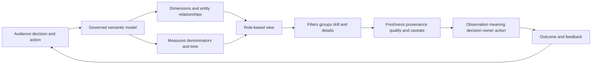

## JD Mapping

| Role expectation | Part 66 capability | TSM artifact | Arti bridge and boundary |
|---|---|---|---|
| Develop Data Fabric expertise | Explain documented dynamic-reporting value and general semantic mechanics | Source-bounded report whiteboard | No exact product formula/template claim |
| Analyze customer risk | Build coherent risk, exposure, quality, and workflow views | Metric tree/dashboard | Analytics and telemetry correlation transfer |
| Recommend mitigation | Turn exceptions and trends into owner/action decisions | Action register | Metric does not choose treatment alone |
| Resolve escalations | Reconcile source-to-dashboard discrepancies | Evidence package | Data/log/timeline RCA transfers |
| Lead strategic reviews | Tailor technical and executive narratives from same definitions | QBR/technical review pack | Preserve caveats across audiences |
| Communicate clearly | Explain denominators, uncertainty, freshness, and causal limits | Metric card/story | Avoid false precision |
| Drive adoption | Make dashboards useful, trusted, accessible, and actionable | Usage/trust scorecard | Views alone are not outcomes |
| Partner cross-functionally | Align security, VM, IT, data, app, risk, privacy, and executive owners | Metric governance workshop | TSM facilitates ownership |

## Candidate honesty note

| Evidence class | Safe interview statement | Boundary to state |
|---|---|---|
| Production transfer | "I used service telemetry, reports, Excel/Power BI-style analysis, and customer evidence to isolate issues and explain outcomes." | Not production Zscaler dashboard ownership |
| Synthetic practice | "I designed and validated NMH executive, operator, data-health, and workflow dashboards." | Fictional lab evidence |
| Official public fact | "Zscaler publicly describes dynamic dashboards across fabric data and UVM risk/KPI/SLA reporting." | No exact report model/formula |
| General method | "I define metric grain, denominator, time, filters, provenance, freshness, and action." | General analytics practice |
| Metric statement | "On the current synthetic scope, 18 of 120 eligible assets lack validated coverage." | Scope/time/eligibility required |
| Trend statement | "The rate fell from 20% to 15%; source coverage remained stable." | Does not prove causation |
| Value statement | "The dashboard supported a decision and tracked validated remediation." | View usage alone is not value |
| Production next step | "I would verify current docs, tenant report behavior, sources, definitions, and specialists." | Never invent capabilities |

## Beginner vocabulary and memory hooks

| Term | Plain meaning | Why it matters | Analogy and memory hook |
|---|---|---|---|
| Report | Structured presentation of data for a purpose | Communicates state/analysis | A prepared briefing |
| Dashboard | Interactive set of related views for monitoring/decision | Supports scan, filter, drill, action | Instrument panel |
| Semantic model | Governed definitions connecting business meaning to data | Keeps metrics consistent | Shared dictionary plus map |
| Entity | Real-world thing such as asset, user, app, finding, control, ticket | Defines analysis subjects | The passenger, not a booking row |
| Grain | What one row/value represents | Prevents double counting | One bead on the abacus |
| Dimension | Attribute used to group/filter, such as owner or environment | Answers by whom/what/where | Filing label |
| Measure | Calculated numeric result such as count/rate/age | Quantifies state/change | Reading on a gauge |
| Denominator | Eligible population under a rate | Gives percentage meaning | Whole pie |
| Numerator | Members meeting counted condition | Gives affected portion | Slices of interest |
| Metric | Defined measure used to monitor/decide | Needs owner and interpretation | Gauge with instructions |
| KPI | Key performance indicator tied to an objective | Focuses management attention | Vital sign tied to goal |
| SLA | Agreed service commitment; an SLO is an internal objective | Drives timing/accountability | Promised delivery time |
| Filter | Restriction selecting visible scope | Can change every value | Lens over the scene |
| Slicer | Visible interactive filter control | Lets user select scope | Dashboard dial |
| Group | Governed cohort of entities/records | Enables consistent segmentation | Named queue |
| Drill-down | Move from aggregate to detailed levels | Helps explain summary | Zoom from country to street |
| Drill-through | Navigate to a dedicated detail page with context | Preserves investigation path | Open the case file |
| Cross-filter | Selection in one visual filters another | Powerful but can confuse scope | One dial moves several gauges |
| Snapshot | Values fixed at a defined time | Supports reproducibility | Photograph |
| Live/current view | Latest available state under refresh behavior | Supports operations | Window view with delay |
| Freshness | Age of data relative to decision need | Prevents stale action | Date on milk carton |
| Latency | Delay from source event to visible metric | Distinguishes current from available | Delivery time |
| Provenance | Source and transformation history | Enables trust/correction | Receipt chain |
| Lineage | Dependency path from sources to metric/visual | Shows blast radius | Plumbing diagram |
| Aggregation | Combine values by sum/count/average/etc. | Can hide distribution | Fold many receipts into total |
| Weighted average | Average where members contribute differently | Needed for unequal denominators | Class grade weighted by credits |
| Percentile | Value below which a percentage of observations fall | Describes distribution | Position in a queue |
| Cohort | Population sharing criteria/time | Enables fair comparison | Same starting class |
| Export | Copy of report data outside interactive system | Creates governance/refresh risk | Printed map that stops updating |
| Accessibility | Usability by people with varied abilities/technologies | Makes decision interface inclusive | Ramps plus clear signs |
| Alt text | Text alternative describing meaningful visual content | Supports screen readers | Spoken caption |

## Product claim boundary

| Publicly supported statement | Safe use | General mechanics in this Part | Unsupported leap to avoid |
|---|---|---|---|
| Data Fabric can build dynamic reports on elements | Explain flexible reporting value | Semantic model/report contracts | Claim arbitrary unrestricted behavior |
| Data Fabric describes dashboards using combinations of data, factors, measurements | Explain cross-domain views | Dimensions/measures/filter examples | Claim exact factor/measure catalog |
| UVM describes always-up-to-date reports/dashboards | Explain intended currency/value | Freshness/latency caveats | Promise real-time or zero delay |
| UVM describes risk posture, KPI, SLA, and other metrics | Explain reported categories | General metric dictionary | Claim formulas/default targets |
| UVM uses correlated context-rich data | Explain drill from priority to context | General lineage/drill patterns | Claim exact semantic schema |
| AEM includes reporting | Explain asset/coverage operational visibility | General coverage metrics | Claim exact visuals/templates |
| Public pages use complete/accurate wording | Present intended value | Validation/data-health controls | Promise universal accuracy/completeness |

### Plain-English deep-dive 1 - A dashboard is a contract, not a poster

A chart may look polished while hiding basic questions: What exactly is counted? Which entities are eligible? Which time is used? Are duplicates resolved? What filters are active? How stale is the data? Who owns the metric? What action follows?

Think of a medicine label. Colorful packaging is secondary to ingredient, dose, timing, warnings, expiry, and responsible use. A dashboard needs the same contract around every important metric. Visual design helps comprehension, but definitions and evidence make the view safe.

## Reporting charter: audience, decision, and action

One dashboard should not serve every audience by shrinking or enlarging the same charts. Begin with the decision.

| Charter item | NMH synthetic example | Failure if omitted |
|---|---|---|
| Audience | CISO, VM owner, asset owner, data operator | Mixed detail and authority |
| Decision | Allocate remediation, repair data, or escalate workflow | Passive monitoring |
| Scope | Production assets and open findings in NMH tenant | Test/cross-tenant contamination |
| Grain | Asset, finding occurrence, workflow episode, or day | Double counting |
| As-of/window | Current as-of 06:00 UTC; 90-day trend | Incomparable values |
| Metric set | Exposure, coverage, aging, workflow, data health | Vanity sprawl |
| Filters | Owner, service, environment, source, severity, time | Hidden scope |
| Drill endpoint | Entity reason/evidence page | Summary cannot be challenged |
| Action | Named owner and decision per exception | Insight does not mobilize |
| Freshness | Per-source and overall status | Stale view appears current |
| Privacy/RBAC | Executive aggregate; restricted item details | Oversharing |
| Non-goal | Predict breach or prove causality | False certainty |

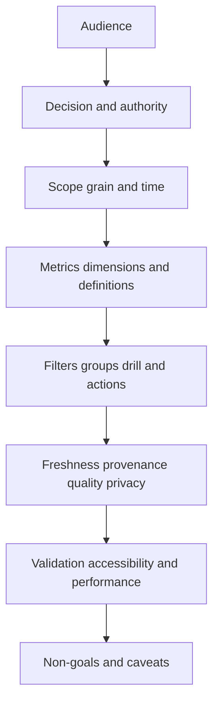

## Semantic model across the fabric

The semantic model gives consistent meaning to entities, dimensions, measures, and relationships. A visual should not reinvent joins or business rules locally.

| Semantic object | Example | Contract requirement |
|---|---|---|
| Entity | Asset | Stable ID, type, lifecycle, tenant |
| Event/fact | Finding observation | Grain and event/effective time |
| Dimension | Environment | Controlled values and unknown handling |
| Relationship | Asset supports business service | Direction, validity, provenance |
| Measure | Open finding count | Formula, distinct key, filters, time |
| Derived field | Effective control coverage | Lineage/version/freshness |
| Group | Internet-exposed tier-1 assets | Membership/version/as-of behavior |
| Hierarchy | Company -> division -> team | Effective time and rollup rules |
| Metric | Coverage gap rate | Numerator, denominator, owner, target |
| Detail record | Finding reason card | RBAC and source evidence |

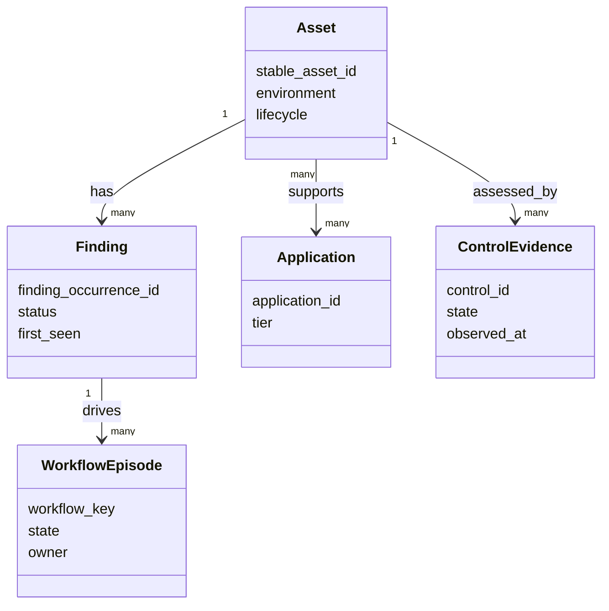

The diagram is a general semantic model, not a Zscaler schema. In production, use supported fields and report behavior visible in the licensed tenant.

## Grain: the first defense against double counting

Grain states what one record represents before aggregation. A vulnerability definition, finding occurrence, asset, and ticket are different grains.

| Grain | Example key | Valid measure | Common error |
|---|---|---|---|
| Vulnerability definition | CVE ID/version | Number of unique definitions | Called finding count |
| Finding occurrence | Source finding + asset + occurrence | Open findings | Dedup/recurrence ignored |
| Resolved asset | Stable asset ID | Assets with gaps | Source records counted as assets |
| Application instance | App + environment/deployment | Affected production instances | Logical app mixed with instance |
| Identity/account | Stable scoped account | Privileged accounts affected | Persons/accounts mixed |
| Workflow episode | Workflow/business episode key | Active remediation episodes | Retry attempts counted as work |
| Ticket | Target system + ticket ID | Open tickets | Tickets used as remediation success |
| Snapshot day | Entity + metric date | Daily trend point | Events summed across snapshots |

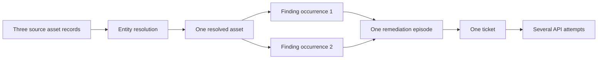

Counting the last diagram at different stages yields 3 source records, 1 asset, 2 findings, 1 episode, 1 ticket, and several attempts. Each can be valid only when labeled with its grain.

### Plain-English deep-dive 2 - DISTINCT can hide a broken model

If an asset joins to three owners and four controls, a naive join can create twelve rows. Applying `DISTINCT asset_id` may restore the asset count but still misstate owner, control coverage, and downstream rates. The duplication is a relationship/cardinality problem, not cosmetic noise.

Imagine photocopying a patient chart twelve times and then counting unique patient names. The patient total looks correct, but medication and responsibility may be wrong. Validate grain and relationship cardinality before aggregation. Use explicit bridge logic, as-of selection, and reasoned distinct keys.

## Dimensions: how users slice the truth

A dimension is a governed attribute for grouping/filtering. Fabric-wide dimensions should have consistent meaning across measures.

| Dimension | Definition questions | Failure pattern |
|---|---|---|
| Time | Event, snapshot, due, resolution, or publication date? | Trend shifts by date choice |
| Owner | Technical, business, current, or as-of owner? | Wrong team blamed |
| Organization | Which hierarchy/version? | Reorg rewrites history |
| Business service | Logical service or instance? | Impact fanout |
| Environment | Production/test/dev values and unknowns? | Test included as prod |
| Asset type | Canonical type taxonomy? | Source labels incomparable |
| Exposure | Configured, observed, validated, or unknown? | Theoretical treated as proven |
| Control state | Installed, healthy, enforcing, tested? | Coverage overstated |
| Risk band | Which policy/version? | Historical bands change |
| Severity | Source/CVSS/vendor category? | Severity confused with risk |
| Workflow state | Durable business state or target status? | Ticket state substitutes outcome |
| Data source | Origin vs copied upstream source? | Dependence hidden |
| Geography | Asset, user, business, data, or support location? | Privacy/meaning errors |

Slowly changing dimensions preserve history when attributes such as owner, department, criticality, or service membership change. "Current owner" supports current routing; "owner as of finding date" supports historical accountability. Label both.

## Measures and metric contracts

A measure performs a calculation. A metric contract tells people how to interpret and act on it.

| Contract field | Example: validated coverage-gap rate |
|---|---|
| Name/version | `validated_control_gap_rate/v3` |
| Purpose | Monitor in-scope assets lacking validated relevant control |
| Grain | Resolved asset as of daily snapshot |
| Numerator | Eligible assets with missing/invalid/stale control evidence |
| Denominator | All eligible in-scope production assets with resolvable identity |
| Exclusions | Retired assets; documented separately, not silently removed |
| Unknown behavior | Shown as separate unknown rate and included in trust panel |
| Time | Daily as-of 06:00 UTC; source watermark stated |
| Dimensions | Owner, service, environment, asset type, source |
| Unit/format | Percent plus numerator/denominator |
| Target | Owner-approved synthetic threshold, not universal benchmark |
| Owner | Endpoint Security and Asset Data owners |
| Provenance | Source, mapping, entity, control logic, metric versions |
| Action | Repair control or data, assign owner, validate outcome |
| Limit | Does not prove exploitable risk or control effectiveness beyond evidence |

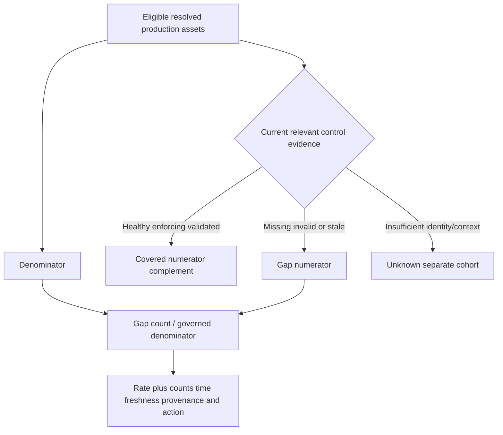

### Plain-English deep-dive 3 - A percentage without its denominator is a rumor

"Coverage improved to 95 percent" sounds strong. Did the organization protect more assets, or did 500 unknown assets disappear from the denominator? Were retired assets excluded? Did source ingestion fail? Did the entity model merge records? A rate needs numerator and denominator counts, eligibility, exclusions, time, and quality.

Think of "nine out of ten dentists" without knowing how dentists were selected. The percentage is easy to repeat and hard to trust. Show counts beside rates and allow users to inspect the denominator.

## Fabric-wide metric tree

Metrics should connect data foundation to operational activity and risk outcome without claiming simple causation.

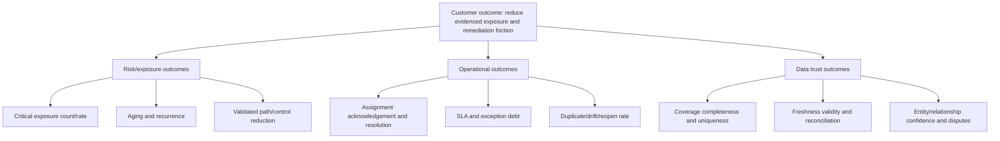

| Metric family | Example | Leading/lagging | Decision |
|---|---|---|---|
| Source health | Connector freshness/completeness | Leading | Repair ingestion |
| Entity quality | Duplicate/merge dispute rate | Leading | Tune resolution/review |
| Context coverage | Assets with owner/service/control evidence | Leading | Fill context gaps |
| Exposure state | Internet-reachable high-impact findings | Current/leading | Validate/remediate |
| Workflow health | Assignment/ack/dead-letter/drift | Leading | Repair operations |
| Remediation | Validated closure and aging | Lagging/current | Adjust program |
| Recurrence | Reopened/repeated condition rate | Lagging | Fix root cause |
| Risk treatment | Open exceptions/residual risk/expiry | Current | Risk-owner decision |
| Adoption | Active users, drill/actions, owner response | Leading | Training/design |
| Value | Eased toil plus validated risk reduction | Lagging | Investment/roadmap |

Do not reduce all categories into one opaque health score unless every component, weight, missing behavior, and decision is governed and visible.

## Role-based views

The semantic definitions stay consistent while detail, cadence, and action differ by role.

| Audience | Questions | View emphasis | Avoid |
|---|---|---|---|
| Executive/CISO | What changed, why it matters, decision needed, trend, confidence? | Outcomes, top risks, movement, ownership, decisions | Raw table wall |
| Risk/program owner | Which policies/segments are off target? | Bands, exceptions, aging, capacity, quality | Unsupported causal claims |
| VM/SecOps operator | What should I work next and why? | Prioritized queue, reasons, SLA, owner, status | Decorative KPIs without action |
| Asset/app owner | Which items belong to me and what evidence/action? | Owned scope, context, remediation, due date | Cross-team sensitive detail |
| Data/integration operator | Is the foundation trustworthy? | Connector, mapping, entities, freshness, errors, reconciliation | Risk score without lineage |
| Workflow operator | Are actions flowing correctly? | State, retries, dead letters, duplicates, drift | Ticket volume as success |
| Auditor/compliance | What policy, evidence, approval, and history? | Definitions, lineage, exceptions, changes | Mutable current-only view |
| TSM/customer lead | Are outcomes, health, adoption, and blockers moving? | Balanced technical/business story | Acting as data/risk owner |

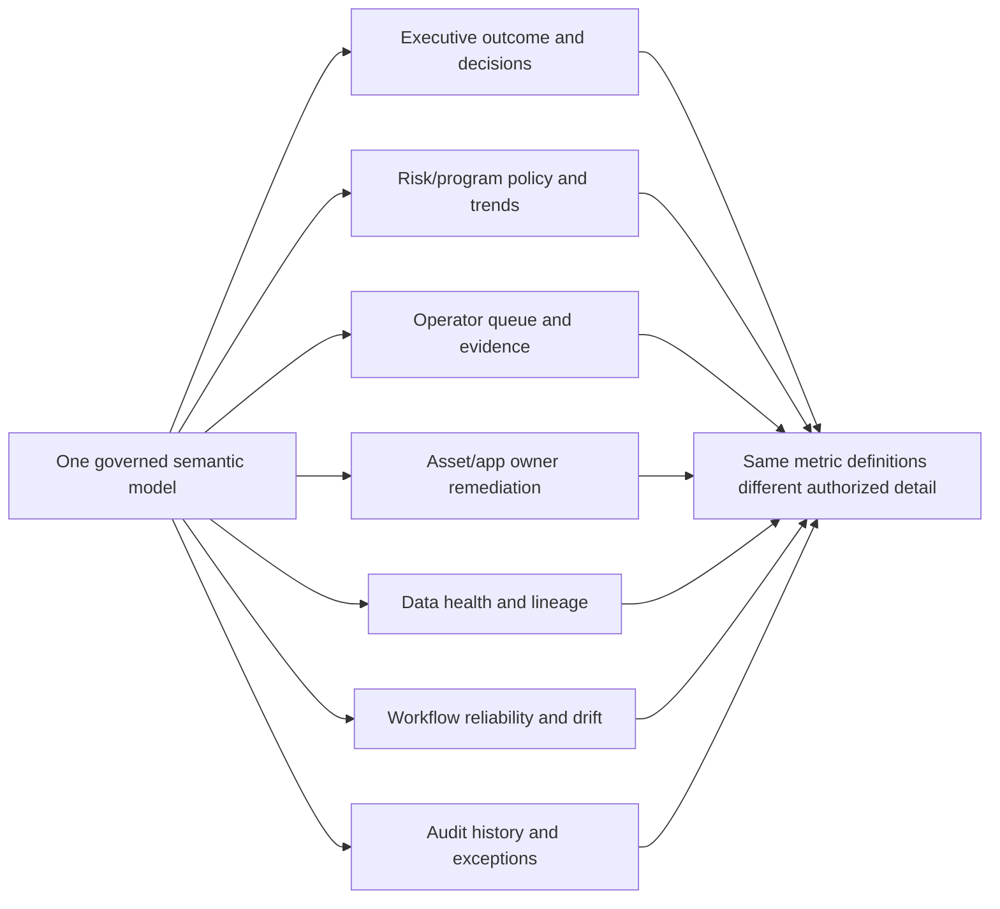

Role-based access control must apply at the data/semantic layer, not just hide a button. Test direct URLs, exports, drill-through, cached results, subscriptions, and cross-filter leakage.

## Filters, groups, and selection context

Filters can silently change meaning. Every dashboard should display active scope and provide an understandable reset.

| Filter behavior | Contract question | Example risk |
|---|---|---|
| Page/report default | Which scope loads initially? | Executive sees one division only |
| Relative date | Based on which clock/timezone? | 30 days differs by locale |
| Multi-select | OR within dimension, AND across dimensions? | User expects different logic |
| Null/unknown | Included, excluded, or separate? | Unknown assets disappear |
| Hierarchy | Parent includes descendants as-of which version? | Reorg count shifts |
| Group | Dynamic or snapshot membership? | Historical trend rewrites |
| Cross-filter | Which visuals react to selection? | Denominator changes invisibly |
| Search | Exact, contains, case, identifier? | Wrong entity selected |
| Reset | Restores which approved baseline? | Users cannot reproduce |
| Bookmark/share | Does it encode sensitive filters and version? | Link leaks scope |
| Export | Does it honor all filters and security? | Overbroad data copy |

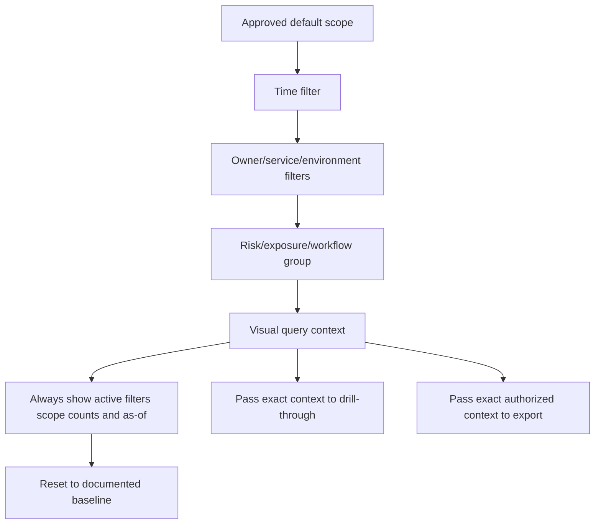

## Drill-down, drill-through, and evidence

Drill should preserve metric meaning while adding detail.

| Level | Example | User question | Required context |
|---|---|---|---|
| 1. Outcome | Critical exposure rate trend | Is posture changing? | Counts, target, freshness |
| 2. Segment | By service/owner/environment | Where is change concentrated? | Denominator per segment |
| 3. Cohort | Payroll internet-exposed findings | Which population drives it? | Membership/version |
| 4. Entity | Asset-44 | What is the target/context? | Identity, owner, lifecycle |
| 5. Finding/path | F-900 and exposure rationale | Why prioritized? | Factors, controls, unknowns |
| 6. Workflow | Episode and ticket | Who is acting and status? | State, SLA, exceptions |
| 7. Evidence | Source assertions/lineage | Can I validate/correct it? | RBAC, provenance, timestamps |

Drill is not merely zoom. It should answer "why" and "what next." Preserve the original as-of time and policy version unless the user explicitly switches to current context.

## Risk and exposure metrics

| Metric | Numerator/denominator or unit | Required caveat/action |
|---|---|---|
| Open prioritized findings | Distinct finding occurrences | Policy/version and source coverage |
| Critical exposure rate | Qualifying critical exposures / eligible assets/findings | Define critical and eligibility |
| Internet-reachable high-impact assets | Distinct resolved assets | Reachability evidence and time |
| Validated exposure paths | Count by path contract/status | Path is not observed attack |
| Unvalidated path backlog | Paths awaiting precondition checks | Prioritize validation |
| Control-adjusted priority | Policy output distribution | Formula/version/unknowns; not truth |
| Exposure aging | Age distribution/percentiles | First-seen semantics and reopened cases |
| Exception debt | Active/expired exceptions and residual risk | Approval, scope, expiry |
| Recurrence | Reopened/repeated condition rate | Episode definition |
| Choke-point coverage | Important path steps with validated controls | Graph/model limits |
| Business-service impact | Affected services by approved tier | Avoid fanout/double count |

Use distributions and percentiles for age rather than only average. A falling average can occur because old items were reclassified or removed from scope rather than remediated.

## Data-health and trust metrics

| Metric | Definition | Failure it reveals |
|---|---|---|
| Connector freshness | Time since latest complete successful source watermark | Stale source |
| Ingestion completeness | Received expected records/pages/files | Missing data |
| Schema validity | Valid records / received | Source drift |
| Mapping success | Mapped required fields / eligible records | Semantic defect |
| Entity resolution coverage | Records linked to stable entities | Fragmented context |
| Duplicate/false-merge indicators | Suspect clusters/disputes | Identity risk |
| Relationship resolution | Valid linked edges / source edges | Orphan context |
| Required context coverage | Entities with owner/service/control/etc. | Decision uncertainty |
| Reconciliation variance | Source vs fabric counts by governed scope | Silent loss/duplication |
| Quality hold rate | Items withheld due to invalid/unknown data | Safe degradation/load |
| Provenance completeness | Metrics/records with required lineage | Audit gap |
| Restatement count/impact | Corrected reports and affected decisions | Trust/change quality |

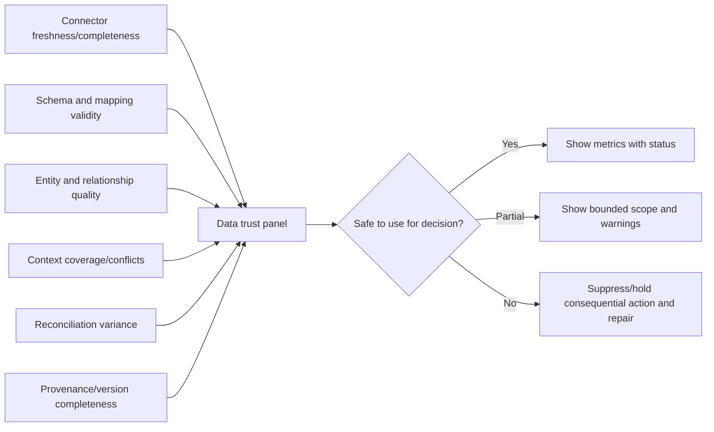

### Plain-English deep-dive 4 - Data health belongs beside risk, not in a hidden admin page

If a critical source stopped updating, the risk chart may improve because new findings disappeared. Without a freshness panel, leaders may celebrate a pipeline failure.

Think of a weather dashboard whose rain sensor is unplugged. "Zero rain" is not trustworthy unless sensor health is visible. Place freshness, coverage, quality, and last-complete times near the decision, especially when degraded data could make risk look lower.

## Workflow and operational metrics

| Metric | Definition | Interpretation warning |
|---|---|---|
| Eligible-to-created | Workflow items created / eligible items | Suppression/hold must be visible |
| Correct assignment | Validated correct routes / assignments | Feedback may be incomplete |
| Acknowledgement time | Assignment to owner acceptance | Auto-ack can game |
| Work-in-progress age | Time in durable active states | Pauses/exceptions need rules |
| SLA compliance | Validated completion within policy / eligible episodes | Denominator/exclusions crucial |
| Retry rate | Retried attempts / actions | Not outcome measure |
| Dead-letter age/count | Quarantined workflow items | Impact segmentation needed |
| Duplicate-effect rate | Duplicate target objects / logical actions | Stable identity prerequisite |
| Reconciliation drift | Mismatched objects / compared | Cadence and scope matter |
| Reopen rate | Reopened episodes / resolved | Can show weak validation |
| Validated closure | Outcomes with source proof / closures | Stronger than ticket closure |
| Human override/appeal | Changed automation decisions / reviewed | Investigate reasons, do not punish |
| Notification burden | Actionable and total messages per owner | Fatigue and privacy |

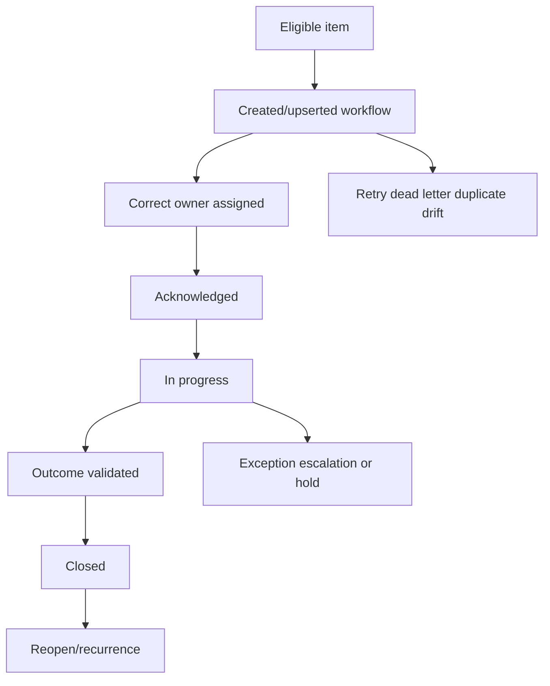

Funnel metrics should show attrition reasons. If 1,000 eligible items become 600 workflows, users need counts for suppression, active exception, data-quality hold, deduplication, policy exclusion, and failure.

## Time, trends, cohorts, and snapshots

| Time design | Use | Pitfall |
|---|---|---|
| Event-time trend | Activity occurrence | Late events restate history |
| Snapshot trend | State at regular as-of points | Summing snapshots double counts |
| Cohort trend | Follow items entering in same period | Cohort definition drift |
| Rolling window | Smooth recent period | Overlapping observations and delayed signal |
| Calendar period | Monthly/quarterly governance | Different lengths and partial current period |
| Fiscal period | Business reporting | Must map dates explicitly |
| Time-to-event | Detection to acknowledgement/remediation | Censor unresolved items correctly |
| Before/after | Compare change periods | Confounding/seasonality and source changes |

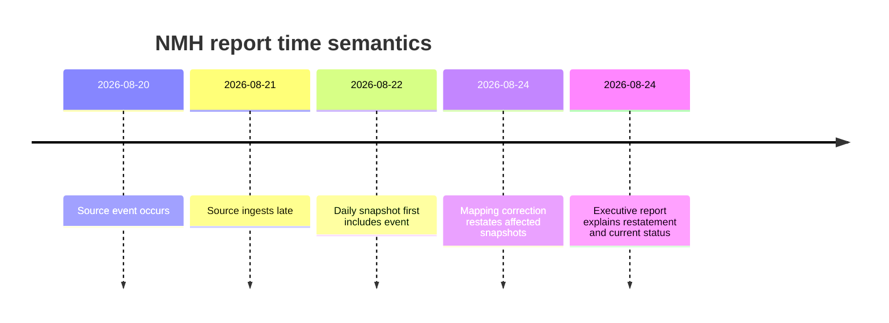

Show partial-period indicators. A current month with five days of data should not be visually compared as if complete against prior full months. When restating historical values, preserve old/new versions and communicate impact.

## Freshness, latency, completeness, and provenance

"Updated today" is too vague. Report multiple clocks.

| Clock/status | Meaning | Display example |
|---|---|---|
| Source as-of | Latest source effective time included | Source A complete through 05:45 UTC |
| Ingestion complete | Latest run/page/file checkpoint | Run 882 complete at 06:10 |
| Semantic refresh | Model/query cache updated | Model v12 refreshed 06:20 |
| Report generated | Visual/export query time | Generated 06:25 |
| Publication/delivery | User received scheduled copy | Delivered 06:30 |
| Data-quality status | Complete/degraded/partial/failed | Identity source degraded |
| Restatement version | Historical result revision | Metric v4 restated Aug 20-22 |

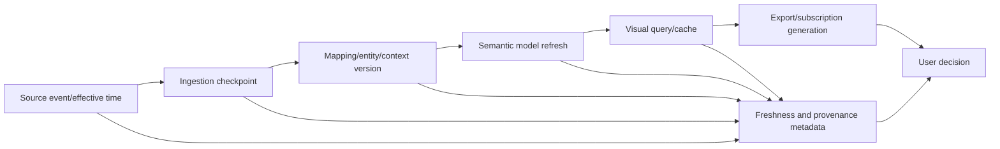

### Plain-English deep-dive 5 - "Live" is a chain of delays

A source can update immediately while a connector polls hourly, the semantic model refreshes every two hours, and an emailed PDF is generated daily. Calling the PDF "live" hides the slowest link.

Think of a televised event with camera, production, broadcast, streaming buffer, and viewer device delays. State the latest complete source watermark, model refresh, report generation, and delivery time. The freshest visual cannot be newer than its stalest required source.

## Exports, schedules, subscriptions, and sharing

An export becomes a separate data copy that can outlive permissions, freshness, and corrections.

| Control | Question | Risk |
|---|---|---|
| Authorization | Can user export this detail and scope? | Data leakage |
| Row/column security | Does export preserve semantic security? | Hidden fields exposed |
| Active filters | Are they embedded in file metadata/header? | Recipient misreads scope |
| As-of/version | Is generation time and metric version included? | Stale copy treated current |
| Format | CSV/XLSX/PDF/image/API and limitations? | Types/precision/interaction lost |
| Schedule | Frequency, timezone, partial-period behavior? | Duplicate or misleading delivery |
| Recipients | Named groups, external sharing, changes? | Former users retain access |
| Encryption | In transit/at rest and protected attachment/link? | Sensitive exposure |
| Retention | Where stored and when deleted? | Uncontrolled copies |
| Revocation | Can future access be stopped? | Persistent links/files |
| Correction | How are restatements communicated? | Wrong decisions persist |
| Audit | Who exported what, when, and why? | No accountability |

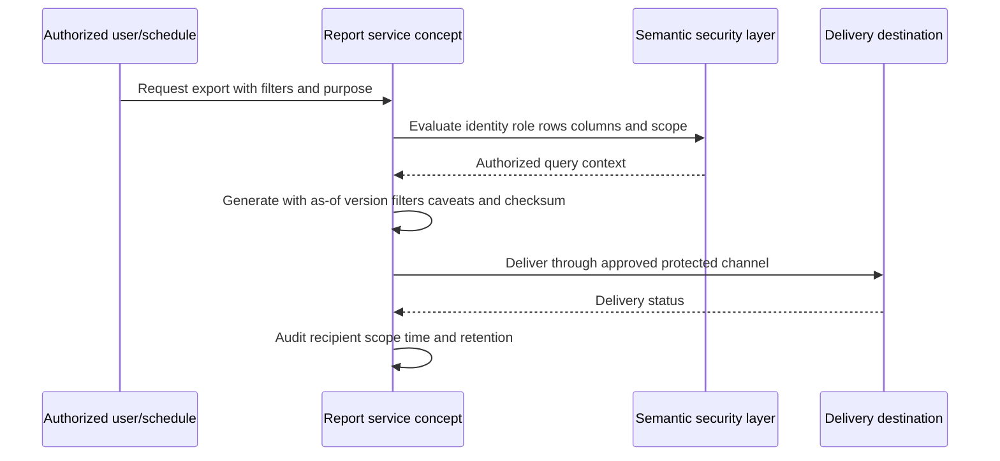

CSV exports lose visual context, units, hierarchy, and sometimes type precision. Include a data dictionary or metadata sheet when appropriate. Avoid formulas or content that could trigger spreadsheet injection; treat untrusted leading characters safely under the chosen export system.

## Accessibility and inclusive design

Accessible reporting benefits everyone, including keyboard users, screen-reader users, users with low vision or color-vision differences, and people reviewing under pressure.

| Design area | Practice | Failure to avoid |
|---|---|---|
| Color | Use sufficient contrast and non-color cues | Red/green only |
| Labels | Direct labels, units, clear titles | Legend hunting |
| Alt text/summary | Describe purpose, trend, exceptions, action | "Chart image" |
| Keyboard | Logical focus order and operable controls | Mouse-only filters |
| Screen reader | Meaningful names, table headers, reading order | Visual order differs from DOM/semantic order |
| Zoom/reflow | Content remains readable at zoom/small viewport | Clipped labels |
| Motion | Avoid unnecessary animation; allow pause | Distracting/triggering motion |
| Shapes/icons | Pair with text | Icon-only status |
| Numbers | Use separators, units, precision, language | Ambiguous abbreviations |
| Tables | Headers, captions, manageable size | Giant inaccessible grid |
| Focus/selection | Visible state and filter announcement | Hidden interaction context |
| Language | Plain definitions and jargon expansion | Acronym wall |

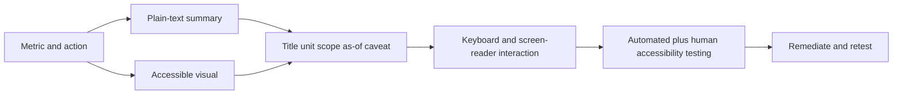

Accessibility is not satisfied by adding alt text at the end. It affects chart choice, interaction, document structure, tables, colors, labels, export format, and testing from the start.

## Visual selection and truthful encoding

| Question | Suitable starting visual | Avoid |
|---|---|---|
| Trend over time | Line chart with complete/partial markers | Smoothed curve implying precision |
| Compare categories | Ordered bar chart | 3D bars/pies |
| Part-to-whole | Bar/stacked bar with counts and denominator | Many-slice pie |
| Distribution | Histogram/box/percentiles | Average alone |
| Relationship | Scatter with context and limits | Correlation-as-causation |
| Workflow funnel | Stage counts plus attrition reasons | Funnel area that distorts magnitude |
| Status summary | Text/KPI plus trend and target | Giant number without context |
| Geographic pattern | Map only when geography is meaningful | Decorative map/area distortion |
| Detailed exceptions | Accessible table with priority/action | Dense chart hiding identifiers |
| Exposure path | Bounded graph/path detail | Hairball network diagram |

Use zero baselines for bars unless a clearly justified exception is labeled. Lines can use focused scales, but disclose ranges and avoid visual exaggeration. Do not use area/volume to encode one-dimensional values accidentally.

## Performance and scalability

Slow dashboards reduce adoption and can cause users to export stale local copies. Performance is part of correctness when timeouts or partial queries change what users see.

| Layer | Performance control | Tradeoff |
|---|---|---|
| Source | Incremental processing and partitions | Complexity/backfill |
| Semantic model | Correct grain, star-like aggregates, governed relationships | Detail vs speed |
| Measures | Reusable optimized calculations | Hidden complexity if undocumented |
| Pre-aggregation | Snapshot/summary tables | Freshness and drill consistency |
| Query | Select needed columns/rows, bounded time | Flexibility |
| Filters | Restrict high-cardinality defaults | User discoverability |
| Visuals | Limit count and high-cardinality points | Less simultaneous context |
| Cache | Cache by identity/filter/version | Staleness/security-key complexity |
| Concurrency | Workload limits and scheduling | Queueing |
| Exports | Async jobs, size limits, pagination | Delay/partial files |
| Graph drill | Depth/result bounds | May omit routes; disclose truncation |
| Monitoring | Query latency, failures, resource, cache hit, timeout | Operational overhead |

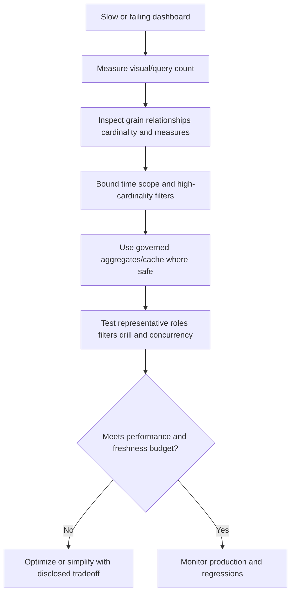

Never fix performance by silently excluding unknowns, old items, or difficult segments. Any scope reduction must be visible in the metric contract.

## Validation: source to visual

Validation must test values, definitions, interactions, security, accessibility, performance, and exports.

| Validation type | Test | Evidence |
|---|---|---|
| Source reconciliation | Expected source records/counts/checkpoints | Run manifests and variance |
| Mapping/entity | Field semantics and distinct entities | Mapping/version/entity samples |
| Measure unit | Known fixture yields expected numerator/denominator | Calculation trace |
| Boundary | Threshold/date inclusivity | Just-below/at/above cases |
| Filter | Each filter and null behavior | Expected/actual context |
| Cross-filter | Selection affects intended visuals only | Interaction matrix |
| Drill | Summary count ties to detail | Stable scope/as-of/version |
| Trend | Snapshots/events/cohorts calculated correctly | Historical fixture |
| Security | Roles, direct links, export, subscription | Access test results |
| Freshness | Delayed/failed sources display degradation | Failure injection |
| Accessibility | Keyboard, screen reader, contrast, zoom | Automated/manual results |
| Performance | Representative data/users/filters/exports | Latency/error/resource report |
| Export | Values/types/filters/security/metadata preserved | File reconciliation |
| Restatement | Corrected versions communicate/reproduce | Before/after evidence |

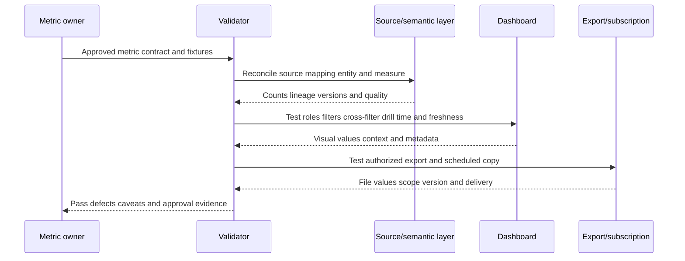

### Plain-English deep-dive 6 - Validation includes interactions, not just totals

A dashboard can show the correct default total but become wrong after a user clicks a bar. One visual may filter the numerator while the denominator remains global, or a drill page may switch from historical to current owner.

Think of testing a calculator only before pressing any operation keys. The starting display can be correct while the tool is broken. Validate filters, cross-highlighting, bookmarks, drill, reset, exports, and role changes using expected fixtures.

## Misleading metrics and visual traps

| Trap | Example | Correction |
|---|---|---|
| Missing denominator | "95% covered" | Show eligible count, gap count, unknowns, exclusions |
| Denominator drift | Rate improves because unknown assets removed | Trend numerator/denominator and eligibility |
| Double counting | Asset-source records counted as assets | Resolve entity grain |
| Average hides tail | Mean age 20 days with 200-day items | Show percentiles/distribution/max |
| Survivorship bias | Only resolved tickets analyzed | Include unresolved/censored cohort |
| Simpson's paradox | Overall improves while key segment worsens | Segment and standardize comparisons |
| Selection bias | Only instrumented assets measured | Show coverage gap |
| Stale data | Source outage appears as fewer findings | Data-health panel |
| Snapshot summation | Daily open counts summed as new findings | Distinguish stock vs flow |
| Cumulative chart | Always rises and looks like progress | Show rate/status/outcome |
| Dual axes | Visual association exaggerated | Separate/standardize and explain |
| Truncated bars | Small difference looks huge | Zero baseline or explicit justified scale |
| Red/green only | Meaning inaccessible | Text/shape/contrast cues |
| Correlation -> cause | Dashboard follows policy change | State alternatives and validation |
| Target gaming | Tickets auto-closed to meet SLA | Validate business outcome |
| Ranking without uncertainty | Small score difference presented decisive | Show bands/reasons/sensitivity |
| Hidden filters | One region selected | Persistent active-scope label |
| Partial period | Five-day month compared to full month | Mark incomplete or normalize |
| Restatement hidden | Historical values silently change | Version and correction notice |
| Ticket volume as value | More automated tasks called success | Measure validated remediation/toil |

## From dashboard to narrative and action

A useful review answers: What happened? Compared with what? Why might it have changed? How trustworthy is the evidence? Why does it matter? What decision is needed? Who owns it? When will outcome be validated?

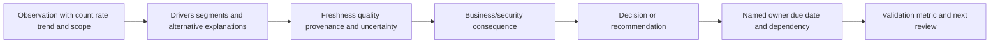

| Narrative element | NMH example |
|---|---|
| Observation | Validated endpoint-control gap rate fell from 20% to 15%, 24/120 to 18/120 |
| Scope/time | Production assets, daily snapshots, Aug 1-24, same eligibility definition |
| Concentration | Twelve of eighteen remaining gaps support Payroll/Finance services |
| Trust | All required sources current except one cloud account delayed six hours |
| Why | Six assets restored control; no denominator removal; two records corrected |
| Caveat | Delay may add assets; trend does not prove workflow caused change |
| Impact | Remaining gaps affect tier-1 service and need owner validation |
| Decision | Approve focused remediation window and data-source repair |
| Owner | Endpoint Security and Cloud Platform, due Aug 27 |
| Validation | Fresh enforcing evidence and reconciled workflow closure |

Avoid narrating every chart. Lead with material change and decision. Put definitions, segment detail, and technical evidence in drill/appendix views.

## Troubleshooting dashboard discrepancies

Start with one visual, one data point, one audience/role, active filters, as-of time, and expected calculation.

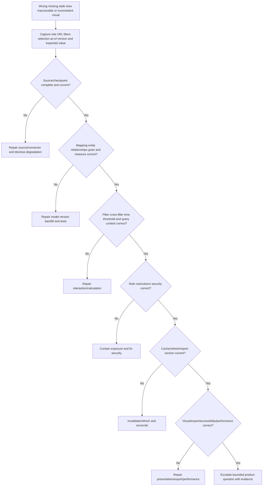

| Evidence item | Why collect | Safety note |
|---|---|---|
| Report/page/visual ID | Anchor symptom | Approved tenant details only |
| User role and access path | Reproduce security/context | No credentials/tokens |
| Active filters/selections/bookmark | Reproduce query context | Check sensitive values |
| As-of/refresh/generated times | Identify staleness | State timezone |
| Metric definition/version | Establish expected behavior | Include numerator/denominator |
| Source/checkpoint/counts | Test data arrival | Minimize raw sensitive data |
| Mapping/entity/relationship versions | Test semantics/cardinality | Preserve lineage |
| Query/measure trace where supported | Recompute value | Use supported diagnostics |
| Cache/model/report version | Find stale layer | Avoid unsupported internals |
| Expected vs actual fixture | Define discrepancy | Owner-approved expectation |
| Export file metadata | Compare copy | Handle securely |
| Screenshot plus accessible text | Capture rendering/context | Redact sensitive content |
| First bad/last good and changes | Narrow cause | Avoid causal overclaim |

Symptom guide:

| Symptom | Cheapest discriminating check | Likely causes |
|---|---|---|
| Count too high | Compare grain and relationship fanout before DISTINCT | Duplicate entities, many-to-many join |
| Rate improves unexpectedly | Compare numerator, denominator, unknowns, source health | Denominator drift, outage, exclusion |
| Trend differs from current table | Compare snapshot/event time and restatement version | Stock vs flow, current vs historical |
| Drill total differs | Confirm passed filters/as-of/distinct key | Context loss, current dimension |
| Two roles differ | Is difference expected row/column security? | RBAC or filter default |
| UI vs export differs | Compare filters, generation time, precision, row limits | Export scope/version/format |
| Data looks stale | Trace slowest required source -> model -> cache | Delayed connector/refresh |
| Dashboard slow | Identify high-cost visual/filter/measure/query | Cardinality, graph depth, concurrency |
| Color/status inaccessible | Test contrast/non-color labels/keyboard/screen reader | Design defect |
| Scheduled report wrong recipients | Inspect subscription identity/group at send time | Stale distribution/RBAC |

## Complete synthetic NMH dashboard scenario

NMH creates a four-view reporting set for its endpoint-control coverage program: executive outcome, operator remediation, data health, and workflow health. All definitions and values are synthetic.

### Shared semantic contract

| Item | Synthetic definition | Caveat |
|---|---|---|
| Eligible asset | Resolved active production asset as of 06:00 UTC | Identity/lifecycle quality required |
| Gap | Relevant endpoint control missing, invalid, or stale beyond governed window | Presence not effectiveness |
| Unknown | Identity/context insufficient for coverage decision | Never excluded silently |
| Validated remediation | Fresh healthy enforcing evidence after workflow action | Does not prove all threats blocked |
| Workflow episode | One asset-control gap episode | Attempts/tickets not episodes |
| SLA | Synthetic owner-approved timing by service tier | Not a Zscaler default |
| Trend | Daily snapshots, not summed events | Restatements versioned |
| Owner | Time-valid technical owner; business owner separate | Reorg history preserved |

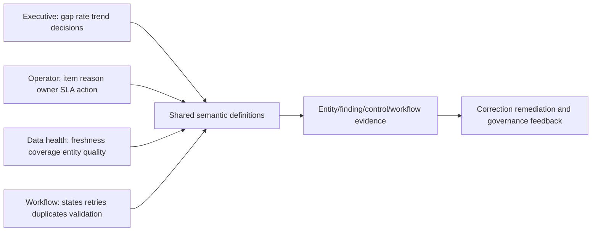

### Synthetic values

| Metric | Aug 1 | Aug 24 | Interpretation |
|---|---:|---:|---|
| Eligible production assets | 120 | 120 | Denominator stable |
| Validated coverage gaps | 24 | 18 | Rate 20% -> 15% |
| Unknown coverage | 8 | 3 | Data trust improved |
| Tier-1 gaps | 10 | 7 | Still concentrated |
| Active workflow episodes | 22 | 16 | Some remediated, two exceptions |
| Validated remediations | 0 period start | 6 cumulative in window | Source proof present |
| Duplicate tickets | 0 | 2 incident, reconciled | Reported separately |
| Dead letters | 0 | 1 | Mapping error awaiting repair |
| Correct owner rate | 95% | 98% | Sample/feedback caveat |
| Required source freshness | Green | One cloud source amber | Six-hour delay disclosed |

### Executive view

The executive page leads with 18/120 (15%) validated gaps, trend, seven tier-1 gaps, three unknowns, source-health status, and two decisions: approve a focused remediation window and prioritize the delayed cloud connector repair. It does not display raw vulnerability details or claim that the workflow caused the improvement.

### Operator view

The operator page lists one row per workflow episode with asset, service, current technical owner, gap reason, evidence age, business impact, workflow state, SLA, exception, ticket ID, next action, and reason drill. Default sorting uses governed priority and age. Active filters are persistent and unknown-owner items enter restricted triage.

### Data-health view

The data page shows connector watermark, expected/received counts, schema/mapping failures, entity-resolution coverage, orphan relationships, owner/context coverage, reconciliation variance, restatements, and affected metrics. A cloud-source delay turns related metrics amber and prevents false green risk interpretation.

### Workflow view

The workflow page shows eligible -> created -> assigned -> acknowledged -> validated -> closed funnel, plus hold/suppression reasons, retries, dead letters, duplicate effects, reconciliation drift, reopen, and owner workload. Ticket volume is contextual, not value.

### Synthetic reporting incident

On August 24 the executive rate falls from 15% to 9%. No remediation occurred. The data-health panel shows the endpoint source is stale, but an incorrect measure excludes assets with missing control records from the denominator. Troubleshooting finds denominator logic v5 changed `eligible assets` to `assets with a control record`. NMH marks the dashboard degraded, pauses scheduled executive delivery, restores metric v4, recomputes current/history, confirms 18/120, sends a correction with scope/impact, and adds missing-source, denominator-invariant, source-outage, cross-filter, export, and restatement tests.

| Incident statement | Honest wording |
|---|---|
| What happened | "Metric v5 excluded assets lacking control records from eligibility." |
| Impact | "Displayed gap rate was 9% instead of validated 15% for one report cycle." |
| What did not happen | "No evidence shows risk or asset coverage improved during that interval." |
| Containment | "Scheduled delivery paused and dashboard marked degraded." |
| Correction | "Metric v4 restored; current/history and exports reconciled." |
| Prevention | "Denominator invariants and source-outage/restatement tests added." |
| Product boundary | "All formulas, versions, values, and incidents are synthetic." |

## Synthetic exercises with answers

### Exercise 1 - Grain

Three tools report one laptop. How many assets?

**Answer:** One resolved asset if entity evidence supports it; three source records. Label each grain. Do not count records as assets.

### Exercise 2 - Rate

There are 18 gaps. Is that 15 percent?

**Answer:** Only if the governed eligible denominator is 120 under the same scope/time and unknown/exclusion rules. Show 18/120.

### Exercise 3 - Average

Average finding age falls. Did remediation improve?

**Answer:** Not necessarily. Old items may leave scope, new items may flood in, or data may reset. Inspect percentiles, cohort aging, closures, recurrence, denominator, and source changes.

### Exercise 4 - Filter

A user selects Payroll and the global denominator remains all assets. Is the rate valid?

**Answer:** Only if the metric intentionally uses a global denominator and labels it. Usually numerator and eligible denominator should share filter context. Test cross-filter behavior explicitly.

### Exercise 5 - Trend

Can daily open snapshots be summed to count findings?

**Answer:** No. Snapshots are stock at each time; summing counts the same open item repeatedly. Use event/episode grain for flows.

### Exercise 6 - Freshness

Report generated at 10:00. Is data current to 10:00?

**Answer:** Not necessarily. Show latest complete source watermark, ingestion/model refresh, query, and generation times. Currency is limited by the slowest required source.

### Exercise 7 - Export

Why can CSV differ from dashboard?

**Answer:** Filters, security, generation time, row limits, rounding, type conversion, hidden calculations, and interaction context may differ. Include metadata and reconcile.

### Exercise 8 - Accessibility

Can red/green status dots alone communicate health?

**Answer:** No. Add text labels, shapes/icons with text, sufficient contrast, accessible names, and keyboard/screen-reader support.

### Exercise 9 - Causation

Gap rate fell after workflow launch. Did workflow cause it?

**Answer:** It may have contributed, but check denominator/source changes, other programs, timing, validated remediations, and alternative explanations. Use bounded language.

### Exercise 10 - Ticket metric

More tickets created means more value?

**Answer:** No. It may mean duplication or noise. Measure correct qualification/assignment, acknowledgement, validated outcome, recurrence, toil, and harmful effects.

### Exercise 11 - No-data

Should a source outage display zero findings?

**Answer:** No. Show degraded/unknown state, last complete data, affected metrics, and repair status. Zero is an observed value; no data is not zero.

### Exercise 12 - Product claim

Can Arti claim exact built-in Zscaler dashboard formulas?

**Answer:** No. Public pages support dynamic reporting categories, not undocumented formulas/templates/refresh behavior. Validate current tenant documentation/evidence.

## Labs and rehearsal

### Lab 1 - Reporting charter

Define audience, decision, scope, grain, time, metrics, filters, drill, action, freshness, privacy, and non-goals for NMH.

### Lab 2 - Semantic model

Model assets, findings, applications, controls, workflows, tickets, services, owners, time, and source-health objects. State relationships/cardinality.

### Lab 3 - Grain clinic

For twelve metrics, identify source record, entity, finding, episode, ticket, attempt, event, or snapshot grain. Find deliberate fanout.

### Lab 4 - Dimension dictionary

Define time, owner, organization, service, environment, asset type, exposure, control, risk band, severity, state, source, and geography.

### Lab 5 - Metric catalog

Write name/version, purpose, numerator, denominator, exclusions, unknowns, time, dimensions, target, owner, provenance, action, and limitations for ten metrics.

### Lab 6 - Role-view design

Create executive, risk, operator, owner, data, workflow, auditor, and TSM views from shared definitions and least-privilege details.

### Lab 7 - Filter/interaction matrix

Test default, multi-select, null, hierarchy, group, cross-filter, reset, bookmark, drill, and export behavior.

### Lab 8 - Risk/exposure dashboard

Build synthetic priority, reachability, path, impact, control, age, exception, recurrence, and choke-point metrics with caveats.

### Lab 9 - Data-health dashboard

Build freshness, completeness, validity, mapping, entity, relationship, context, reconciliation, provenance, and restatement measures.

### Lab 10 - Workflow dashboard

Build funnel, assignment, acknowledgement, WIP age, SLA, retries, dead letters, duplicates, drift, reopen, validation, and fatigue metrics.

### Lab 11 - Accessibility review

Test keyboard, screen reader, contrast, non-color cues, labels, zoom/reflow, focus, alt summaries, tables, and exports.

### Lab 12 - Performance review

Set budgets, identify high-cardinality visuals/measures, test filters/drill/concurrency/export, optimize without hidden scope changes.

### Lab 13 - Source-to-visual validation

Reconcile fixtures through source, mapping, entity, semantic measure, filters, visual, drill, security, freshness, and export.

### Lab 14 - Misleading-metric clinic

Detect denominator drift, double count, averages, survivorship, Simpson's paradox, stale source, snapshot summation, hidden filters, and partial periods.

### Lab 15 - Reporting incident

Run metric-v5 denominator defect. Degrade/pause, restore, recompute, reconcile exports, communicate correction, and add tests.

### Lab 16 - Interview briefing

Deliver a two-minute executive story and five-minute technical drill. Separate official Zscaler claims, general methods, synthetic metrics, uncertainty, and decision.

| Lab evidence | Completion standard |
|---|---|
| Purpose | Audience, decision, action, and non-goal clear |
| Semantics | Grain, dimensions, measures, relationships governed |
| Metrics | Counts, denominators, time, unknowns, owner, limits visible |
| Views | Role needs and least privilege respected |
| Interaction | Filters/drill/export preserve context |
| Trust | Freshness, quality, provenance, and restatement visible |
| Accessibility | Non-color, keyboard, screen reader, contrast tested |
| Performance | Budgets met without silent scope change |
| Validation | Source-to-visual and interaction evidence retained |
| Honesty | Product fact, general method, and synthetic result separated |

## Common misconceptions to correct

| Misconception | Correct model |
|---|---|
| Dashboard is a collection of charts | It is a decision interface over governed semantics |
| One dashboard fits every role | Definitions can be shared; detail/action differ |
| Dimension is just a column | It needs controlled meaning, time, hierarchy, unknown behavior |
| Measure and metric are interchangeable | Metric includes purpose, owner, interpretation, action, limits |
| Count is obvious | Grain/distinct key/time/filter define it |
| DISTINCT fixes duplicates | It can hide fanout and semantic defects |
| Percentage speaks for itself | Numerator/denominator/eligibility/time are required |
| Unknown assets should be excluded | Show unknowns and trust impact explicitly |
| Average describes backlog | Distribution/percentiles/cohorts reveal tails |
| Current owner explains historical work | Use as-of ownership |
| Current view can create history | Store/recompute governed snapshots/events with versions |
| Daily snapshots can be summed | Stock is not flow |
| Live means no delay | Source-to-user chain has latency |
| Report generation time equals data time | Show each watermark/refresh clock |
| Green risk metric means data healthy | Display data health beside risk |
| Filters only improve exploration | They can alter denominators and hide scope |
| Drill automatically explains | It must preserve context and reach evidence/action |
| More tickets means more remediation | Validate real outcomes |
| Correlation proves dashboard change cause | Test alternatives/confounders |
| Executive view should hide uncertainty | Compress detail, not caveats |
| Export is same as dashboard | It loses interaction/freshness and creates a governed copy |
| Hidden button secures data | Enforce semantic/row/column/export security |
| Red/green is accessible | Add text, contrast, shape, keyboard, screen-reader support |
| Performance can be fixed by dropping data | Scope changes must be explicit/governed |
| Public Zscaler reporting claims reveal formulas | They support bounded capabilities only |

## Official Source Anchors

Research/source date: **2026-08-24**.

Zscaler sources support bounded dynamic-reporting, dashboard, KPI, SLA, risk-posture, and AEM reporting statements. NIST sources support measurement, cybersecurity governance, continuous monitoring, controls, privacy, and accessible risk communication. W3C sources support accessibility, provenance, and web-data practices. PostgreSQL documentation supports general aggregate/window/query concepts for educational validation. None establishes Zscaler's exact semantic model, metric formula, visual, refresh behavior, export, schedule, limit, or dashboard guarantee.

| Source | URL | Used for | Boundary |
|---|---|---|---|
| Zscaler Data Fabric for Security | https://www.zscaler.com/products-and-solutions/data-fabric | Public dynamic reports/dashboards using fabric data, factors, measurements | No exact model, formula, visual, refresh, or limits |
| Zscaler Unified Vulnerability Management | https://www.zscaler.com/products-and-solutions/vulnerability-management | Public dynamic risk-posture, KPI, SLA, context-rich reporting | No default metrics/targets/templates guaranteed |
| Zscaler Asset Exposure Management | https://www.zscaler.com/products-and-solutions/caasm | Public reporting, asset visibility, coverage-gap context | No exact dashboard/report implementation |
| NIST SP 800-55 Vol. 1 | https://csrc.nist.gov/pubs/sp/800/55/v1/final | Information-security measurement program concepts | Not product metrics/formulas |
| NIST Cybersecurity Framework 2.0 | https://www.nist.gov/cyberframework | Governed cybersecurity outcomes and communication | Voluntary; requires tailoring |
| NIST SP 800-137 | https://csrc.nist.gov/pubs/sp/800/137/final | Continuous monitoring strategy and visibility | Not dashboard architecture |
| NIST SP 800-53 Rev. 5 | https://csrc.nist.gov/pubs/sp/800/53/r5/upd1/final | Audit, access, monitoring, privacy, integrity controls | Requires tailoring |
| NIST Privacy Framework | https://www.nist.gov/privacy-framework | Privacy-risk governance for data use/sharing | Voluntary; not legal advice |
| W3C WCAG 2.2 | https://www.w3.org/TR/WCAG22/ | Web accessibility principles/success criteria | Conformance requires complete evaluation |
| W3C WAI ARIA APG | https://www.w3.org/WAI/ARIA/apg/ | Accessible widget patterns and keyboard interaction context | Native semantics preferred where available |
| W3C PROV-O | https://www.w3.org/TR/prov-o/ | Provenance concepts | Not a product lineage implementation |
| W3C Data on the Web Best Practices | https://www.w3.org/TR/dwbp/ | Metadata, provenance, quality, versioning context | Adapt to private security data |
| PostgreSQL Aggregate Functions | https://www.postgresql.org/docs/17/functions-aggregate.html | General aggregate behavior for educational checks | Not Zscaler query implementation |
| PostgreSQL Window Functions | https://www.postgresql.org/docs/17/functions-window.html | General ranking/trend/rolling calculations | Frame/order semantics require care |
| RFC 4180 CSV | https://www.rfc-editor.org/rfc/rfc4180 | Common CSV format context | CSV implementations and security controls vary |

## Likely Interview Questions

### Q1. How do you design a trustworthy Data Fabric dashboard?

**Model answer:** I begin with audience, decision, authority, scope, grain, as-of/window, metric contracts, filters, drill endpoint, action, freshness, privacy, and non-goals. I build on a governed semantic model, show numerators/denominators and unknowns, preserve lineage/versions, place data health beside risk, test interactions/security/accessibility/performance, and connect every material insight to an owner and validation step.

### Q2. What are dimensions, measures, grain, and metric contracts?

**Model answer:** Grain defines what one record/value represents. Dimensions are governed attributes used to slice, such as owner, service, environment, or time. Measures calculate numeric results. A metric contract adds purpose, numerator, denominator, exclusions, unknown behavior, time, dimensions, units, target, owner, provenance, action, and limitations. This prevents polished but incomparable numbers.

### Q3. How do role-based executive and technical views differ?

**Model answer:** They share semantic definitions but differ in detail, cadence, authority, and action. Executives need material trend, impact, confidence, decisions, owners, and caveats. Operators need entity-level reasons, evidence, SLA, workflow state, and next steps. Data teams need connector/mapping/entity health. RBAC applies at semantic/detail/export layers, not merely by hiding visuals.

### Q4. How do filters, groups, and drill paths create risk?

**Model answer:** Defaults, null exclusion, hierarchy version, dynamic groups, cross-filter behavior, and passed drill context can silently alter numerators, denominators, history, or permissions. I display active scope, define filter algebra, preserve as-of/policy version, test interaction matrices, and ensure drill reaches authorized evidence/action without changing metric meaning.

### Q5. Which metric families belong together?

**Model answer:** I balance risk/exposure state and aging with data health, entity/context quality, workflow reliability, assignment/acknowledgement, validated remediation, recurrence, exceptions, adoption, and value. Risk metrics without source health can improve during outages; workflow volume without validated outcomes can reward noise. A metric tree connects leading foundation/process measures to lagging outcomes with causal caveats.

### Q6. How do you handle freshness, exports, accessibility, and performance?

**Model answer:** I show source watermark, ingestion completion, model refresh, query/generation, delivery, quality status, and restatement version. Exports preserve authorization, filters, as-of/version, metadata, secure delivery, retention, correction, and audit. Accessibility uses text/non-color cues, contrast, keyboard/screen-reader semantics, zoom, labels, and testing. Performance uses correct grain, bounded queries, aggregates/cache with disclosed freshness, budgets, and representative tests without hidden scope reduction.

### Q7. How do you validate and troubleshoot a wrong dashboard value?

**Model answer:** I anchor report/visual, user role, filters/selections, as-of/refresh/version, expected metric, and fixture. I reconcile source checkpoints, mapping/entity/cardinality/grain, measure and denominator, filter/cross-filter/time, semantic security, cache/refresh, visual/export/accessibility/performance. I correct the earliest faulty layer, recompute/restatement, reconcile exports, communicate impact, and add regression tests.

### Q8. What can you honestly claim about Zscaler and your background?

**Model answer:** Zscaler publicly describes Data Fabric dynamic dashboards using fabric data/factors/measurements, UVM risk/KPI/SLA reporting, and AEM reporting. I do not claim exact formulas, templates, refresh architecture, visuals, exports, or limits. My Microsoft support analytics, telemetry correlation, Excel/Power BI-style reasoning, RCA, and customer communication transfer; detailed dashboard design and incidents here are synthetic NMH practice.

## 30-Second Memory Hooks

| Concept | Memory hook |
|---|---|
| Dashboard | Decision cockpit, not poster |
| Semantic model | Shared dictionary plus map |
| Grain | What one bead represents |
| Dimension | Governed slicing label |
| Measure | Calculation |
| Metric | Measure plus purpose/owner/action/limits |
| Numerator | Affected slices |
| Denominator | Whole eligible pie |
| Percentage | Counts, eligibility, time, or rumor |
| DISTINCT | Can hide broken cardinality |
| Filter | Lens that changes every gauge |
| Group | Versioned cohort |
| Drill | Summary -> reason -> evidence -> action |
| Snapshot | Photograph of state |
| Trend | Define event, snapshot, or cohort |
| Freshness | Date on evidence |
| Latency | Slowest link limits currency |
| Provenance | Receipt chain |
| Data health | Sensor health beside reading |
| Executive view | Change, impact, decision, owner, caveat |
| Operator view | Which item, why, who, when, what next |
| Export | Printed map that stops updating |
| Accessibility | Text, contrast, keyboard, semantics |
| Performance | Fast without silent scope loss |
| Validation | Test values and interactions |
| Arti bridge | Analytics/RCA transfer; product formulas do not |

## Completion Checklist

- [ ] I define report, dashboard, semantic model, entity, grain, dimension, measure, denominator, numerator, metric, KPI, SLA/SLO, filter, group, drill, snapshot, freshness, latency, provenance, export, and accessibility before using them.
- [ ] I begin with audience, decision, scope, grain, time, metrics, filters, drill, action, freshness, privacy, and non-goals.
- [ ] I treat a dashboard as a decision interface over governed semantics.
- [ ] I distinguish source record, resolved entity, vulnerability, finding occurrence, workflow episode, ticket, attempt, event, and snapshot grain.
- [ ] I never use DISTINCT as a substitute for relationship/cardinality repair.
- [ ] I define dimensions by meaning, type, controlled values, hierarchy, effective time, authority, and unknown behavior.
- [ ] I distinguish current owner/organization/context from as-of history.
- [ ] I define every metric with name/version, purpose, grain, numerator, denominator, exclusions, unknowns, time, dimensions, unit, target, owner, provenance, action, and limits.
- [ ] I show numerator and denominator counts beside important rates.
- [ ] I never silently remove unknown, stale, invalid, or unresolved entities from eligibility.
- [ ] I build metric trees connecting source/entity/context health, workflow operations, exposure state, remediation, recurrence, adoption, and outcome.
- [ ] I distinguish leading, current, and lagging indicators.
- [ ] I avoid opaque composite health scores unless every component/weight/missing behavior is governed.
- [ ] I use shared semantic definitions across executive, risk, operator, owner, data, workflow, audit, and TSM views.
- [ ] I tailor detail, cadence, authority, and action by role without hiding uncertainty.
- [ ] I enforce RBAC at semantic, row, column, detail, URL, export, cache, and subscription layers.
- [ ] I define filter defaults, algebra, timezones, nulls, hierarchies, groups, cross-filter, reset, bookmarks, and exports.
- [ ] I always display active scope, selections, as-of time, and reset behavior.
- [ ] I preserve filter/as-of/policy context through drill and export.
- [ ] I design drill from outcome -> segment -> cohort -> entity -> reason -> workflow -> evidence -> action.
- [ ] I distinguish possible/validated exposure paths from observed attacks.
- [ ] I use distributions, percentiles, cohorts, recurrence, and aging rather than averages alone.
- [ ] I display connector freshness, completeness, schema/mapping, entity/relationship, context coverage, reconciliation, provenance, and restatement metrics beside risk.
- [ ] I never allow source outage/no data to appear as zero risk/findings.
- [ ] I distinguish workflow eligible, created, assigned, acknowledged, in progress, validated, closed, exception, hold, retry, dead letter, duplicate, drift, and reopen.
- [ ] I never treat ticket/action volume alone as value.
- [ ] I distinguish event-time, snapshot, cohort, rolling, calendar, fiscal, time-to-event, and before/after trends.
- [ ] I never sum stock snapshots as flow.
- [ ] I mark partial periods and version/restatement changes.
- [ ] I display source watermark, ingestion completion, model refresh, query/generation, delivery, quality, and restatement status.
- [ ] I do not use "live" or "real-time" without measured end-to-end latency evidence.
- [ ] I govern export authorization, row/column security, filters, version, format, schedule, recipients, encryption, retention, revocation, correction, and audit.
- [ ] I include metadata/data dictionary and guard spreadsheet output where appropriate.
- [ ] I design for contrast, non-color cues, text summaries, keyboard, screen reader, zoom/reflow, labels, tables, focus, and plain language.
- [ ] I choose visuals based on trend, category, part-to-whole, distribution, relationship, funnel, status, geography, detail, or path questions.
- [ ] I avoid 3D distortion, unjustified truncated bars, dual-axis confusion, smoothing, and graph hairballs.
- [ ] I define performance/freshness budgets and test model, measure, filter, visual, cache, concurrency, export, and graph bounds.
- [ ] I never improve speed by silently excluding difficult data.
- [ ] I validate source, mapping/entity, measure, boundaries, filters, cross-filter, drill, trend, security, freshness, accessibility, performance, export, and restatement.
- [ ] I test reason/interaction behavior, not only default totals.
- [ ] I can identify denominator drift, double count, averages, survivorship, Simpson's paradox, selection bias, stale data, snapshot errors, cumulative vanity, dual axes, causal overclaim, gaming, hidden filters, partial periods, and hidden restatements.
- [ ] I narrate observation, comparison, drivers, trust, impact, decision, owner, due date, and validation.
- [ ] I separate correlation from causation and state alternatives/confounders.
- [ ] I troubleshoot role/filter/time/version -> source -> semantic grain/measure -> query/interaction -> security -> cache/refresh -> visual/export/performance.
- [ ] I correct/restatement all affected dashboards, exports, subscriptions, decisions, and communications after a metric defect.
- [ ] I can complete the NMH four-view design, denominator incident, and all sixteen labs.
- [ ] I label every NMH metric, formula, target, threshold, visual, incident, result, and outcome synthetic.
- [ ] I use the controlled research/source date exactly as 2026-08-24.
- [ ] I make no unsupported Zscaler semantic model, formula, metric, target, template, visual, refresh, query, filter, export, schedule, limit, guarantee, production, or customer-outcome claim.
- [ ] I can answer Q1 through Q8 with definitions, analogies, architecture, mechanics, examples, tradeoffs, failures, troubleshooting, labs, NMH evidence, official-source caveats, and an honest Arti bridge.

[Part 67 - Data Fabric versus SIEM, Data Lake, Warehouse, CMDB, and iPaaS](Part-67-data-fabric-comparisons.md)