# Part 67 - Data Fabric versus SIEM, Data Lake, Warehouse, CMDB, and iPaaS

> **Audience:** Arti Thakur, preparing for a Zscaler Security Operations Technical Success Manager role after Microsoft enterprise Support Escalation Engineering.
>
> **Purpose:** Compare a security Data Fabric with security information and event management (SIEM), data lake, data warehouse, lakehouse, configuration management database (CMDB), integration platform as a service (iPaaS), security orchestration, automation, and response (SOAR), and security graph. Evaluate purpose, data, grain, workload, schema, latency, retention, analytics, operationalization, source-of-truth boundaries, strengths, limits, cost, ownership, and reference architectures. Equip Arti to position technologies as complementary capabilities chosen for outcomes rather than make unsupported replacement claims.
>
> **Scope and honesty:** Northstar Meridian Holdings, abbreviated NMH, is fictional. Every architecture, source, flow, latency, retention period, volume, cost, ownership model, metric, implementation detail, incident, result, and outcome in this Part is synthetic. Product categories overlap and vendor implementations vary. Zscaler's public Data Fabric page supports bounded statements about unifying security and business data, harmonization, deduplication, correlation, enrichment, customizable business logic, automated workflows, dynamic reports, integrations, and a documented distinction from SIEM. It does not prove that every deployment replaces, stores, queries, retains, or operates like any particular SIEM, lake, warehouse, lakehouse, CMDB, iPaaS, SOAR, or graph product. General category comparisons and NMH reference architectures are educational, not Zscaler implementation claims. Arti's Microsoft cloud/support, logging, networking, data, integration, and escalation skills transfer; direct production architecture of Zscaler Data Fabric remains a learning boundary.
>
> **Currency caveat:** Product categories, architectures, licensing, interfaces, connectors, storage, performance, and public claims change. The controlled research/source date for this Part is exactly **2026-08-24**. Current official documentation, licensed tenant behavior, workload measurements, regulatory obligations, data/process owners, enterprise architecture, security/privacy review, vendor specialists, and total-cost analysis govern production.

## Section goal

Technology categories answer different primary questions. A SIEM asks what security-relevant events are occurring and how analysts should detect/investigate them. A data lake asks how diverse raw data can be retained and processed. A warehouse asks how curated structured data can support consistent analytics. A CMDB asks which managed configuration items and relationships support IT operations. A workflow platform asks how systems and people exchange work. A Data Fabric focuses on connecting distributed data and context so applications and operations can use it. These capabilities can overlap, but overlap is not identity.

Think of a city. The land registry, transport control room, archive, statistics office, utility integration network, emergency dispatch center, and relationship map all use data about the same city. None automatically makes the others unnecessary. The best architecture defines each system's purpose, authority, interfaces, and lifecycle, then avoids copying every responsibility into one platform.

By the end, Arti should be able to:

| Outcome | Demonstrated capability | Evidence artifact |
|---|---|---|
| Define categories | Explain each term before comparing it | Category glossary |
| Compare purpose | State primary question and workload | Purpose matrix |
| Compare data/grain | Distinguish events, entities, records, facts, CIs, relationships, and actions | Grain map |
| Compare architecture | Explain schema, latency, retention, analytics, and operationalization | Architecture scorecard |
| Govern authority | Assign source-of-record, system-of-record, and derived-context boundaries | Authority matrix |
| Analyze strengths/limits | Match capability to workload without absolutes | Fit/gap assessment |
| Model cost | Separate ingestion, storage, compute, egress, connector, operations, and people | TCO worksheet |
| Assign ownership | Map security, data, ITSM, integration, platform, risk, and app owners | RACI |
| Build complementary patterns | Draw SOC, exposure, analytics, CMDB, and workflow reference architectures | Reference diagrams |
| Position responsibly | Use additive language and verify current product evidence | Positioning narrative |
| Avoid duplication | Identify redundant ingestion, retention, transforms, workflows, and authority | Rationalization plan |
| Troubleshoot boundaries | Locate failures across source, movement, semantic, detection, action, and target layers | Evidence package |
| Bridge honestly | Translate Arti's experience without claiming category replacement or internals | Interview narrative |

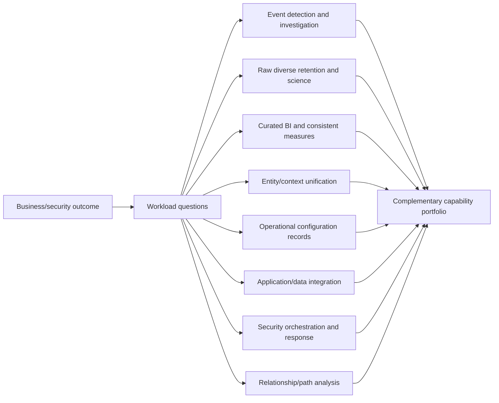

## JD Mapping

| Role expectation | Part 67 capability | TSM artifact | Arti bridge and boundary |
|---|---|---|---|
| Develop platform expertise | Explain documented Data Fabric positioning and category boundaries | Source-bounded architecture map | No replacement or internal-storage claim |
| Analyze complex environments | Inventory SIEM, lake, warehouse, CMDB, integration, SOAR, and graph roles | Current-state capability map | Microsoft ecosystem/dependency mapping transfers |
| Recommend mitigation | Select complementary patterns and remove unsafe duplication | Target-state roadmap | Enterprise/customer owners decide |
| Resolve escalations | Trace failures across category boundaries | Cross-system timeline/evidence package | End-to-end RCA transfers |
| Lead strategic engagement | Facilitate security/data/ITSM/integration ownership | Architecture workshop | TSM does not own all platforms |
| Communicate with executives | Explain value, limits, cost, risk, and decisions without tool warfare | Decision brief | Avoid category absolutes |
| Drive adoption | Place each workflow in the system best suited to own it | Operating model | More tools/connectors do not equal value |
| Partner cross-functionally | Align SOC, data, IT, app, cloud, privacy, risk, vendor teams | RACI and interface contracts | Boundaries explicit |

## Candidate honesty note

| Evidence class | Safe interview statement | Boundary to state |
|---|---|---|
| Production transfer | "I worked across Microsoft service telemetry, APIs, identity, data, operational records, automation, and support ownership boundaries." | Not production ownership of every compared category |
| Synthetic practice | "I designed NMH complementary Data Fabric, SIEM, lakehouse, CMDB, iPaaS, SOAR, and graph patterns." | Fictional architecture evidence |
| Official public fact | "Zscaler describes Data Fabric as unifying any type of security data and distinguishes SIEM's event-log focus." | Marketing positioning is not universal category law |
| General method | "I choose by outcome, workload, authority, latency, retention, cost, and operating model." | General architecture practice |
| Replacement statement | "I would assess which duplicate capabilities can be rationalized after validation." | Never promise replacement before evidence |
| Source-truth statement | "Authority is entity/field/process-specific, not one universal database." | Derived context is not automatically authoritative |
| Cost statement | "TCO includes people and duplicate pipelines, not only licenses." | Use measured customer costs |
| Production next step | "I would verify current docs, tenant features, existing contracts, obligations, and specialists." | Never invent integration behavior |

## Beginner vocabulary and memory hooks

| Term | Plain meaning | Why it matters | Analogy and memory hook |
|---|---|---|---|
| Data Fabric | Integrated capabilities connecting distributed data through ingestion, semantics, context, governance, and operational use | Enables data products/apps without forcing every source into one meaningless copy | Road network plus traffic rules |
| Security Data Fabric | Data Fabric specialized for security entities, findings, controls, business context, and workflows | Addresses fragmented security/risk data | Security context connective tissue |
| SIEM | Security Information and Event Management: collect/search/correlate security events and support detection/investigation | Core SOC telemetry and alert use cases | Security control room |
| Data lake | Scalable repository for raw/native structured, semistructured, and unstructured data | Supports large retention, exploration, processing, ML | Reservoir of raw water |
| Data warehouse | Curated structured analytical store optimized for consistent reporting/BI | Supports governed measures and repeatable queries | Organized supermarket shelves |
| Lakehouse | Architecture combining lake-style storage with warehouse-like management/query features | Tries to serve raw and curated analytics on shared foundations | Reservoir with treatment and labeled distribution |
| CMDB | Configuration Management Database: governed records of configuration items and relationships for IT service management | Supports incidents, changes, assets, services, and ownership | Operations equipment registry |
| CI | Configuration item managed to deliver/support services | Defines CMDB operational grain | One managed component card |
| iPaaS | Integration Platform as a Service: cloud-managed connectors, transformations, routing, orchestration, and APIs | Connects applications/data flows | Managed switchboard and conveyor |
| SOAR | Security Orchestration, Automation, and Response: security playbooks coordinating tools, cases, and response | Accelerates repeatable SOC response with controls | Emergency dispatch playbook |
| Security graph | Model/query capability representing security entities and typed relationships | Supports paths, dependencies, blast radius, and context | Security transit map |
| System of record | System accountable for authoritative records/process under a defined scope | Prevents write conflicts | Official registry for one purpose |
| Source of truth | Trusted source for a specific fact/use/time; often informal wording | Must be scoped, not universal | Which office certifies this field? |
| Source system | System that emits a record | May not be authoritative for every field | Witness, not always judge |
| Operational workload | Work that changes state or runs a process | Needs reliability, transactions, approvals | Dispatch and update work |
| Analytical workload | Work that aggregates/explores data for insight | Needs scan/query/semantic performance | Statistics office |
| Event grain | One occurrence at a time | Natural for logs/telemetry | One camera frame/receipt |
| Entity grain | One real-world user, asset, app, or other thing | Natural for inventory/context | One person/object case file |
| Fact grain | One measured business/security occurrence at defined detail | Natural for warehouse analytics | One sale/finding snapshot row |
| Schema-on-write | Structure/validate before or during load | Consistency, less raw flexibility | Sort mail before shelving |
| Schema-on-read | Apply interpretation when data is read | Flexibility, governance burden later | Store boxes, label when opened |
| Retention | How long data remains accessible under policy | Affects investigations, regulation, and cost | Archive schedule |
| Operationalization | Turn data/insight into governed action | Closes decision-to-outcome loop | Dispatch crew from report |
| Orchestration | Coordinate ordered steps across systems/people | Manages dependencies/state | Conductor coordinating sections |
| TCO | Total cost of ownership | Includes license, storage, compute, people, operations, egress, risk | Full bill, not sticker price |
| Reference architecture | Reusable conceptual pattern tailored to context | Helps reason without claiming one product design | Building blueprint, not final permit |

## Product claim boundary

| Publicly supported statement | Safe interpretation | General comparison use | Unsupported leap to avoid |
|---|---|---|---|
| Zscaler Data Fabric aggregates/unifies security tools and business systems | It is positioned as a security risk data foundation | Compare entity/context use cases | Claim universal enterprise data replacement |
| Data Fabric harmonizes, deduplicates, correlates, enriches | It provides documented semantic/context functions | Contrast raw-log/storage-only roles | Claim exact implementation or all data types |
| Data Fabric supports analytical and operational workloads | It is positioned beyond passive storage/BI | Discuss reports and workflows | Claim transaction guarantees or latency |
| Data Fabric has custom logic, workflows, reports | It supports documented operationalization categories | Compare iPaaS/SOAR/BI overlap | Claim equivalent breadth/depth to every specialist tool |
| Data Fabric supports inbound/outbound integrations | It connects with other systems | Use complementary architectures | Claim every connector/action or no iPaaS need |
| Zscaler FAQ distinguishes Data Fabric from SIEM | SIEM is described as event-log focused and useful as a Data Fabric source | Explain primary-purpose distinction | Say SIEM is obsolete or always replaced |
| Data Fabric powers AEM/UVM | It underpins documented exposure applications | Explain application layer | Claim it replaces SOC/ITSM/data platforms |

### Plain-English deep-dive 1 - Categories overlap because products are portfolios

A modern SIEM may include data-lake storage, dashboards, automation, entity analytics, and graph-like investigation. A lakehouse may support streaming, BI, machine learning, and workflows. An iPaaS may store state and transform data. A security Data Fabric may include connectors, models, reports, and actions. Category labels describe primary purpose and architecture tendencies, not sealed boxes.

Think of a smartphone that includes camera, map, wallet, and messaging. It overlaps specialist cameras and navigation devices but does not make every specialist tool unnecessary for every workload. Compare the actual licensed product, scale, controls, integration, and operating model. Never make a purchase or replacement decision from category names alone.

## Comparison method: outcome before product

Use the same dimensions for every platform. Separate mandatory requirements from preferences.

| Dimension | Key question | Evidence to collect |
|---|---|---|
| Purpose | What primary outcome/question must the platform serve? | Use cases and decision owners |
| Data | Which formats/domains/sensitivity/volumes? | Source inventory and classification |
| Grain | Event, entity, fact, CI, relationship, case, or action? | Entity/fact contracts |
| Workload | Ingest, search, detect, BI, science, transaction, workflow, path? | Query/action profiles |
| Schema | Read/write/semantic model and evolution? | Sample schemas and change history |
| Latency | Source-to-query/action requirement? | Measured percentiles/SLO |
| Retention | Hot/searchable/archive/legal periods? | Policy and investigation need |
| Analytics | Search, rules, SQL, ML, BI, graph, detection? | User stories and skills |
| Operationalization | How do insights become work/change? | Workflow/action contracts |
| Authority | Which entity/field/process is authoritative where? | Ownership matrix |
| Strength | What workload is naturally optimized? | Benchmarks/operational evidence |
| Limit | What requires another system/process? | Gap/risk register |
| Cost | License, ingest, storage, compute, egress, people, duplicate work? | TCO model |
| Ownership | Which team operates and governs it? | RACI/on-call model |
| Security/governance | Access, privacy, lineage, audit, residency, deletion? | Control assessment |
| Exit/portability | How are data, logic, and workflows exported/migrated? | Contract and architecture review |

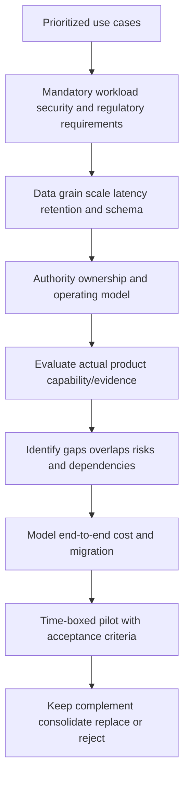

## Master comparison matrix

The table describes typical primary tendencies, not universal vendor behavior.

| Category | Primary purpose | Typical data/grain | Workload/schema | Latency/retention tendency | Analytics/operationalization | Authority/owner |
|---|---|---|---|---|---|---|
| Security Data Fabric | Unify security/business context for applications, risk insight, logic, reporting, workflows | Entities, findings, controls, relationships, source assertions, business context | Analytical plus operational; harmonized/extensible semantics | Use-case dependent; retention must be verified | Correlation, enrichment, scoring, graph/context, reports, workflows | Security/risk/data partnership; source authority remains scoped |
| SIEM | Collect/search/correlate security events; detection, investigation, alerting | Events/logs/alerts, often enriched entities | Streaming/index/search/rules; vendor schema/normalization | Low-latency SOC; hot/cold retention priced/policy-driven | Detection, hunting, timeline, incident integration, sometimes automation | SOC/security operations; sources remain authoritative for business facts |
| Data lake | Retain diverse raw/native data and support large processing/science | Files/objects/events/raw records | Schema-on-read, distributed batch/stream processing | High-volume/long-term possible; query latency varies | Exploration, ML, ETL/ELT, archive; action needs integrations | Data platform/data owners |
| Data warehouse | Curated consistent analytics/BI | Structured facts/dimensions/aggregates | Schema-on-write/curated SQL/OLAP | Batch/near-real-time options; curated retention | BI, SQL, standardized KPIs; action usually external | Data/BI/analytics owners |
| Lakehouse | Lake storage with warehouse-like tables/governance/query | Raw through curated structured/semi-structured data | Schema-on-read and governed table/schema-on-write patterns | Batch/stream; long-term; engine-dependent | Data engineering, SQL, BI, ML; workflow external/adjacent | Data platform/engineering/analytics |
| CMDB | Govern CIs/relationships for IT service management | Current/historical managed CI records and service relations | Operational structured model with lifecycle/process rules | Operational currency; retention per ITSM/audit | Impact/change/incident/service context; governed writes | ITSM/configuration/service owners |
| iPaaS | Connect apps/data through managed integration/orchestration | Messages, API payloads, files, process state | Mapping/routing/connector schemas | Low-latency and batch; not primary analytical archive | Movement, transformation, API/process orchestration | Enterprise integration/platform team |
| SOAR | Orchestrate security cases, tools, approvals, and response | Alerts, incidents, artifacts, cases, actions | Playbook/case schemas and connector contracts | Low-latency response; case/audit retention | Triage/enrichment/containment/ticketing with gates | SOC/incident response/automation team |
| Security graph | Represent/query security entities and relationships | Nodes, typed edges, properties, paths | Graph schema/query; often a capability inside products | Current/historical validity varies | Traversal, attack/exposure paths, blast radius, relationship context | Security analytics/platform/data-model owners |

| Category | Natural strength | Natural limit/risk | Major cost drivers |
|---|---|---|---|
| Security Data Fabric | Cross-domain semantic context and exposure operationalization | Governance complexity; source quality; overlap with specialist platforms | Connectors, data volume, customization, operations, adoption |
| SIEM | Time-oriented event search/detection/investigation | High event cost/noise; weak business/entity context unless enriched | Ingest volume, hot retention, queries, detections, analyst operations |
| Data lake | Economical diverse raw retention and flexible processing | Swamp/discoverability/quality/security/performance complexity | Storage, compute, engineering, catalog/governance, egress |
| Data warehouse | Consistent performant BI and curated measures | Less raw flexibility; modeling/refresh lag | Compute, storage, ETL/ELT, BI, modeling, administration |
| Lakehouse | Shared raw-to-curated platform for engineering/BI/ML | Operational complexity; performance/governance tuning | Storage, compute engines, engineering, catalog, jobs |
| CMDB | IT service/configuration authority and lifecycle workflows | Manual/stale records; not event lake or broad analytics engine | Process discipline, integrations, licensing, data stewardship |
| iPaaS | Broad connector/API/process integration | Logic sprawl; not security analytics or long-term analytical store | Connector/runs/messages, environments, developers, operations |
| SOAR | Security response playbooks/case automation | Fragile playbooks and harmful action risk; depends on alert/context quality | Connectors, playbook engineering, analyst governance, case volume |
| Security graph | Variable-depth relationships/path analysis | Bad identity/edges cause false paths; query explosion | Graph build/storage/query, modeling, data quality, specialist skills |

## Data Fabric versus SIEM

SIEM stands for Security Information and Event Management. Its core strength is ingesting security-relevant event/log data, searching it, applying detection/correlation logic, generating alerts, and supporting investigation/monitoring. Modern SIEM products vary widely and may include user/entity behavior analytics, automation, case management, data tiers, and graph experiences.

| Dimension | Security Data Fabric tendency | SIEM tendency | Complementary design |
|---|---|---|---|
| Primary question | What unified context supports exposure/risk applications and action? | What security events indicate suspicious activity and how do we investigate? | SIEM supplies detections/events; fabric adds governed entity/business/control context |
| Dominant grain | Entity, finding, control, relationship, business process | Event/log/alert/session/time series | Link alerts/events to resolved entities and exposure context |
| Time orientation | Current/as-of context plus workflows | High-volume event timeline and detection windows | Preserve event time in SIEM and effective context in fabric |
| Schema | Harmonized/extensible semantic models | Normalized event taxonomies/index schemas plus raw | Map only needed fields with provenance |
| Latency | Use-case dependent | Often low-latency detection/search requirement | Define source-to-detection and source-to-context separately |
| Retention | Verify product/use obligations | Hot/search/archive tiers often central | Keep detailed logs where investigation/compliance needs them |
| Analytics | Entity correlation, risk, context, reports, graph | Search, detections, hunting, event correlation | Pass enriched context and outcomes both directions |
| Action | Exposure workflows/tickets/reports | Incident/case/response integrations, possibly SOAR | Assign clear playbook/workflow owner |
| Cost | Context connectors/models/operations | Event ingestion, indexing, retention, query, analysts | Avoid duplicate full-fidelity ingestion without purpose |
| Authority | Derived context; sources field-specific | Event evidence/detection system, not universal asset/business truth | Keep source and derivation boundaries |

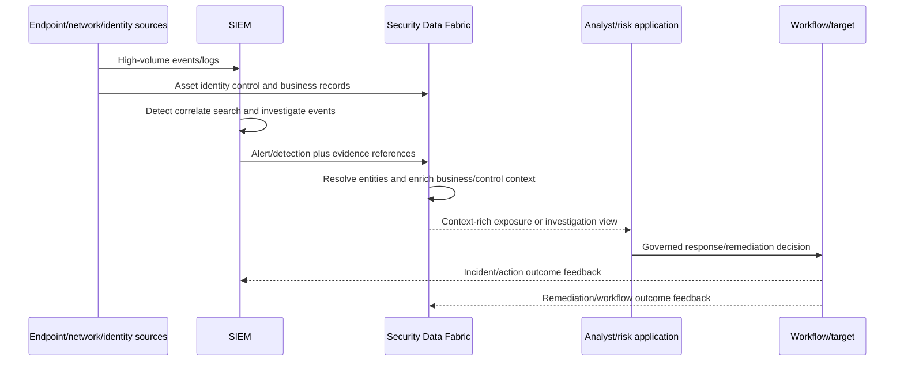

Do not say "Data Fabric replaces SIEM." Ask whether the customer needs real-time event detection, hunting, raw-log search, compliance retention, and established SOC workflows. Zscaler explicitly describes a SIEM as a useful Data Fabric source. Rationalization may be possible for duplicated reporting, context, pipelines, or workflows only after an evidence-based assessment.

### Plain-English deep-dive 2 - Events and entities are different camera angles

An event says an account signed in from a device at a time. An entity view says which person/account/device/application exists, who owns it, what it supports, which controls apply, and how facts change over time. Investigation usually needs both.

Think of a stadium. Camera footage records actions moment by moment; the roster and seating plan identify people, roles, and locations. Footage without context is hard to interpret, while a roster without events cannot show what happened. A SIEM and a security Data Fabric may exchange both directions instead of competing for one master copy.

## Data Fabric versus data lake

A data lake is scalable storage for diverse data in native/raw formats, commonly using object storage and separate processing engines. It often supports long retention, exploration, machine learning, and raw replay.

| Dimension | Security Data Fabric tendency | Data lake tendency | Complementary design |
|---|---|---|---|
| Purpose | Usable unified security context and applications | Durable diverse raw storage/processing | Lake retains raw history; fabric consumes curated inputs/returns context |
| Data | Security/business entities, findings, controls, relationships | Structured, semistructured, unstructured, files/events/media | Store source evidence at appropriate fidelity |
| Grain | Governed entity/finding/relationship | Source-native files/records/events | Preserve raw grain and map curated contracts |
| Schema | Harmonized/custom semantic model | Schema-on-read with curated zones | Version mappings and publish trusted datasets |
| Workload | Correlation, risk, workflows, reporting | Distributed ETL/ELT, science, ML, archive | Use lake compute for large historical processing |
| Latency | Product/use-case dependent | Batch/stream possible; query depends on layout/engine | Define latency per data product |
| Retention | Verify product/policy | Often long and cost-oriented | Do not duplicate full raw retention without need |
| Governance | Security-specific context/governance | Catalog, zones, quality, access, lifecycle required | Align classification, lineage, deletion |
| Operationalization | Built-in/adjacent security workflows | Usually external apps/orchestration | Fabric may consume model outputs and trigger governed work |
| Cost | Connector/context/application operations | Storage+compute+engineering+catalog | Compare full pipeline, egress, duplicate copies |

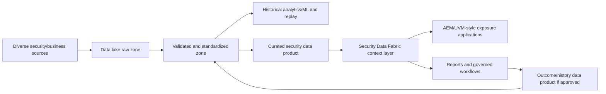

The lake is not automatically a source of truth. Raw records preserve source statements; authority still belongs to defined source/process owners. Without metadata, quality, access, and discoverability, a lake can become a data swamp.

## Data Fabric versus data warehouse

A data warehouse is a curated analytical environment optimized for structured queries, consistent measures, and business intelligence. Dimensional facts and dimensions are common but not universal.

| Dimension | Security Data Fabric tendency | Data warehouse tendency | Complementary design |
|---|---|---|---|
| Purpose | Security context plus operational applications | Consistent enterprise analytics/BI | Publish governed security measures to enterprise BI |
| Grain | Entities/findings/relationships/workflow state | Facts/dimensions/snapshots/aggregates | Define export fact grain/version |
| Schema | Extensible security ontology/canonical model | Curated schema-on-write/semantic model | Map without flattening provenance/unknowns |
| Query | Context, graph, reports, operational lookup | SQL/OLAP, cross-domain historical trends | Warehouse handles broad financial/business joins |
| Latency | Current/near-current use dependent | Batch/near-real-time depending architecture | Match review cadence and freshness |
| Retention | Product/policy specific | Historical curated retention | Warehouse can preserve metric snapshots/restatements |
| Workflows | Security-specific actions | Usually insight passed to other systems | Link dashboard decisions to workflow system |
| Authority | Derived security context | Curated analytical authority for defined metrics | Neither overwrites operational source without contract |
| Strength | Security entity/context/action | Stable BI, historical comparison, enterprise semantic measures | Share definitions and lineage |
| Limit | Not necessarily enterprise BI platform | Not source-native raw archive or response engine | Use each at natural workload |

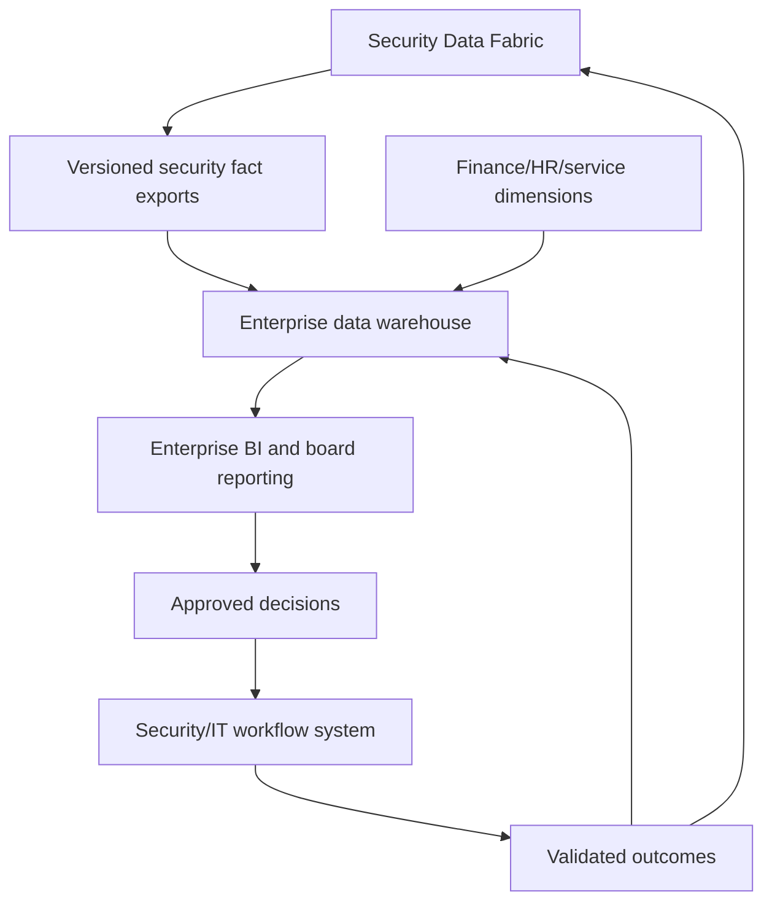

Warehouse metrics must retain Data Fabric policy/model version, as-of time, entity IDs, and restatement behavior. Flattening one current risk score into history can make prior reports irreproducible.

## Data Fabric versus lakehouse

Lakehouse is an architectural term for combining low-cost/flexible lake storage with table management, governance, transactions, and query performance associated with warehouses. Implementations vary.

| Dimension | Security Data Fabric tendency | Lakehouse tendency | Complementary design |
|---|---|---|---|
| Purpose | Security-specific unification and operationalization | Unified engineering, SQL, BI, ML over lake foundations | Lakehouse produces/consumes governed security data products |
| Storage | Product implementation undisclosed here | Object/lake storage plus managed table formats/engines | Do not infer Data Fabric storage technology |
| Data zones | Capability stages such as ingest/harmonize/dedup/correlate | Raw/cleansed/curated zones often used | Align quality checkpoints, not terminology only |
| Schema | Security canonical/custom entities | Raw schema-on-read plus governed tables | Contract at exchange boundary |
| Compute | Product-managed capability | Separate/scalable batch/stream/SQL/ML engines | Use lakehouse for bespoke large-scale analysis |
| Analytics | Security risk/context/apps | Broad enterprise data science/BI | Exchange features, labels, outcomes with governance |
| Action | Documented workflows | Usually external integration/orchestration | Keep action authority outside notebooks/jobs |
| Owner | Security/risk/data partnership | Data engineering/platform/analytics | Joint data-product stewardship |
| Cost | Product/connectors/apps/operations | Storage, compute, jobs, catalogs, skills | Compare total duplicated transformations |
| Limit | Not claimed as general-purpose data science platform | Does not provide security semantics/apps automatically | Complement by specialization |

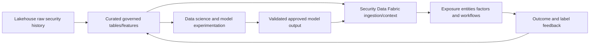

Do not call a Data Fabric a lakehouse or vice versa merely because both ingest, transform, and serve data. Ask about storage access, open formats, SQL/notebook/ML workloads, transaction behavior, governance, operational apps, and ownership.

### Plain-English deep-dive 3 - Architecture names do not prove storage internals

"Fabric," "lakehouse," and "platform" are broad terms used differently by vendors and architects. A product page describing harmonization and analytics does not reveal whether the product uses object storage, relational databases, graph databases, search indexes, or several systems.

Think of a restaurant menu. "Kitchen" tells you food is prepared; it does not reveal the brand of oven or exact station layout. Discuss documented capabilities and observed behavior. Ask specialists when implementation details matter for performance, security, compliance, or integration.

## Data Fabric versus CMDB

A CMDB manages configuration items and relationships used by IT service management processes such as incident, change, problem, asset/configuration, and service-impact management. Its value depends heavily on governance, reconciliation, ownership, and lifecycle discipline.

| Dimension | Security Data Fabric tendency | CMDB tendency | Complementary design |
|---|---|---|---|
| Purpose | Security/exposure context across sources | Operational configuration/service records | Fabric identifies gaps/context; CMDB governs approved CI fields/processes |
| Grain | Asset/user/app/finding/control/relationship | Configuration item and service relationship | Map stable entity to exact CI; grains may differ |
| Data | Multi-source observed/derived security context | Governed operational attributes/status/relationships | Preserve source assertions and authority |
| Freshness | Connector/source dependent | Process/integration dependent | Reconcile both directions under field ownership |
| Schema | Extensible security model | CI classes/attributes/relationship model | Map semantics; do not force equivalence |
| Analytics | Coverage, exposure, risk, context | ITSM impact, service/config reporting | Combine for prioritization and hygiene |
| Operationalization | Security workflows and documented CMDB updates | Incident/change/config lifecycle workflows | CMDB remains authority for approved fields/processes |
| Source truth | Derived golden context may be best-known | System of record for specific governed CI fields | Field-level authority matrix |
| Strength | Find unknown assets/control gaps across tools | Manage approved operational configuration/service process | Feedback loop |
| Limit | Correlation can be wrong; not automatically ITSM authority | Can be stale/incomplete; not raw telemetry/detection platform | Cross-validation and stewardship |

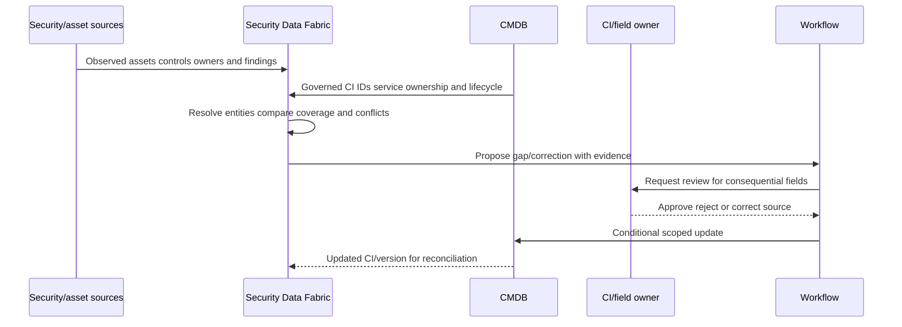

Avoid "single source of truth" without scope. A CMDB may be authoritative for approved service ownership and lifecycle; an endpoint tool for current agent heartbeat; a cloud control plane for resource existence; a Data Fabric for derived cross-source context. Authority is field, entity, purpose, and time specific.

## Data Fabric versus iPaaS

iPaaS means Integration Platform as a Service. It commonly provides managed connectors, API integration, mapping, routing, event/process orchestration, monitoring, and lifecycle tools. Exact capabilities vary.

| Dimension | Security Data Fabric tendency | iPaaS tendency | Complementary design |
|---|---|---|---|
| Purpose | Security data semantics/context/apps | General application/data integration | iPaaS handles enterprise integration paths; fabric handles security meaning |
| Data | Security entities/findings/controls/context | Messages/files/API payloads across domains | Exchange governed contracts |
| Grain | Persistent entities and derived relationships | Message/request/process instance | Preserve event/action identity |
| Schema | Canonical/custom security model | Mapping between endpoint schemas | Avoid duplicated transforms in both layers |
| Storage | Product-managed context | Usually transient/state/monitoring rather than analytical archive | Keep retention owner explicit |
| Analytics | Risk/context/reports | Flow monitoring/basic transform analytics | Send telemetry to appropriate analytics platform |
| Orchestration | Security workflows | General integration/process orchestration | Assign one owner per process step/state |
| Connectors | Documented security ecosystem integrations | Broad enterprise/SaaS/API connectors | Use iPaaS when unsupported enterprise endpoints/standards needed |
| Security | Security-specific data governance | Enterprise integration identity/secrets/network controls | End-to-end least privilege and audit |
| Cost | Security connectors/apps | Runs/messages/connectors/environments/developers | Avoid connector and transformation duplication |

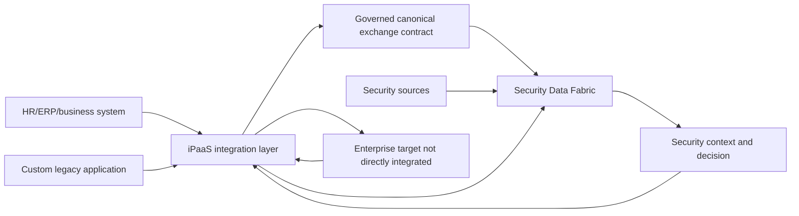

Do not route an action through both platforms without clear state/ownership. Decide where transformation, retry, idempotency, approval, monitoring, and reconciliation live. Duplicated orchestration creates loops and opaque failures.

## Data Fabric versus SOAR

SOAR means Security Orchestration, Automation, and Response. It focuses on security cases/playbooks that enrich alerts, coordinate analysts/tools, request approvals, and execute response actions.

| Dimension | Security Data Fabric tendency | SOAR tendency | Complementary design |
|---|---|---|---|
| Primary use | Exposure/risk data context, scoring, workflows, reports | SOC incident/alert triage and response playbooks | Fabric enriches case; SOAR coordinates response |
| Trigger | Findings, context changes, schedules, policy | Alerts/incidents/analyst actions | Define which system creates canonical case/work item |
| Grain | Entity/finding/exposure/workflow episode | Alert/incident/case/artifact/action | Map stable IDs and avoid duplicate cases |
| Context | Multi-source business/control/exposure context | Case-specific enrichment/artifacts | Share evidence links and snapshots |
| Time pressure | Program/operational cadence varies | Often low-latency incident response | Keep response path fast and resilient |
| Actions | Ticket/CMDB/remediation workflows | Containment, enrichment, collection, notification, ticketing | Human gates and field/action ownership |
| State | Product workflow state | Playbook/case state | One owner per lifecycle or explicit federation |
| Analytics | Risk prioritization/reporting | Case/response metrics and enrichment | Outcomes feed both systems |
| Strength | Broad exposure context and prevention prioritization | Repeatable incident response coordination | Feedback loop between exposure and incidents |
| Limit | Not automatically full SOC case/response replacement | Depends on alert/context quality; playbook fragility | Joint governance/testing |

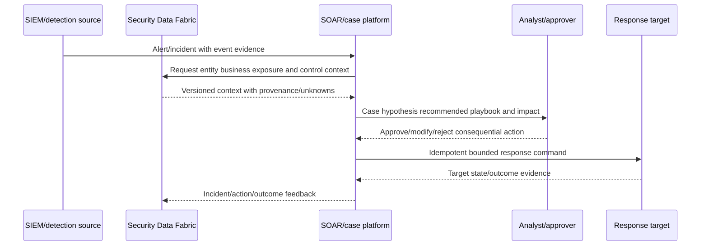

Avoid two systems independently isolating an endpoint or opening separate tickets for the same condition. Define canonical case, workflow episode, action authority, stable keys, and reconciliation.

## Data Fabric versus security graph

A security graph is often a data model and query capability rather than a complete platform category. It represents entities as nodes and typed relationships as edges, enabling traversals, paths, dependencies, and blast-radius analysis. A Data Fabric may power or consume a graph; public wording does not establish internal graph technology.

| Dimension | Security Data Fabric tendency | Security graph tendency | Complementary relationship |
|---|---|---|---|
| Purpose | End-to-end security data connection/context/apps | Relationship/path representation and query | Graph is one analytical/context capability in broader fabric |
| Data | Source records, canonical entities, findings, controls, workflows | Nodes, typed/directed/time-valid edges, properties | Fabric prepares identities/provenance for graph projection |
| Grain | Multiple entity/fact/action grains | Node/edge/path | Preserve endpoint and edge contracts |
| Schema | Canonical/custom model | Graph ontology/schema | Align types without claiming storage |
| Query | Reports, scoring, groups, workflows, context | Traversal, pattern, neighborhood, path | Use bounded graph query for relationship questions |
| Operationalization | Documented business logic/actions | Usually result consumed by apps/workflows | Fabric/workflow validates and acts |
| Strength | Lifecycle from ingestion to outcome | Variable-depth connected reasoning | Combined exposure-path use case |
| Limit | Graph not guaranteed for every use | Identity/edge errors/path explosion/causal overclaim | Quality, time, provenance, bounds |
| Ownership | Security/data/risk platform | Graph model/security analytics owner | Joint ontology and query governance |

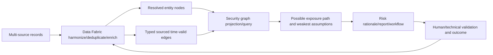

### Plain-English deep-dive 4 - A graph is a lens, not automatically a platform

An organization chart is a graph: people and reporting lines. It can be stored in a relational database, graph database, directory, or drawing. "Graph" describes relationships and query behavior, not necessarily the complete ingestion, governance, workflow, reporting, or storage platform.

Likewise, a security graph can be embedded inside SIEM, exposure, identity, cloud, or Data Fabric products. Ask what nodes/edges mean, how identity/time/provenance work, which queries/actions are supported, and who owns quality. Never infer a graph database or algorithm merely from a relationship visualization.

## Schema and semantic tradeoffs

| Approach | Strength | Risk | Governance response |
|---|---|---|---|
| Raw/schema-on-read | Preserve fidelity/flexibility | Meaning deferred; inconsistent queries | Catalog, contracts, quality zones |
| Canonical security model | Cross-source interoperability/context | Lowest-common-denominator or false equivalence | Extensible types and source assertions |
| Warehouse schema-on-write | Consistent measures/performance | Change lead time; raw detail loss | Versioned facts/dimensions and lineage |
| CMDB class model | Operational CI/process discipline | Stale/manual/custom class complexity | Reconciliation and field owners |
| Event normalization | Detection/search across sources | Vendor/source nuance loss | Raw preservation and mapping provenance |
| Graph ontology | Relationship traversal | Edge ambiguity and path explosion | Typed/directed/time-valid contracts |
| Integration mapping | Endpoint compatibility | Transform duplication/sprawl | Reusable contracts and ownership |
| Playbook/case schema | Repeatable response | Vendor/state coupling | Versioning, tests, portable evidence |

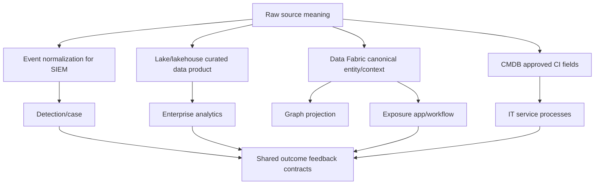

One universal schema is rarely practical. Use explicit exchange contracts and preserve raw/source-specific evidence. Canonicalization should remove accidental differences without erasing material semantics.

## Latency and retention architecture

Latency is a chain; retention is a policy/cost decision. A platform optimized for seconds of detection may price/store data differently from a lake optimized for years of raw history.

| Need | Likely natural capability | Questions |
|---|---|---|
| Seconds-to-minutes detection | SIEM/stream analytics | End-to-end percentile, buffering, source delay |
| Minutes-to-hours context update | Data Fabric/entity pipeline | Connector cadence, recomputation, freshness |
| Near-real-time response | SOAR/workflow/iPaaS | Approval, idempotency, target latency |
| Daily program reporting | Data Fabric/warehouse/BI | Complete watermark, snapshot, restatement |
| Long raw-log retention | Lake/SIEM archive tiers | Searchability, legal hold, retrieval time/cost |
| Historical curated trends | Warehouse/lakehouse | Metric version and slowly changing dimensions |
| Current operational CI state | CMDB | Reconciliation, process latency, stewardship |
| Path analysis | Graph projection | Edge freshness, query depth, recompute |

```mermaid
timeline
    title One event across complementary systems
    00:00 : Source event occurs
    00:01 : SIEM ingests and detects
    00:03 : SOAR case requests context
    00:05 : Data Fabric context reflects source cadence
    00:10 : Approved response target updates
    01:00 : Reconciliation validates state
    06:00 : Warehouse/lakehouse daily curated snapshot completes
    09:00 : Executive dashboard publishes complete period
```

This timeline is synthetic. Actual requirements and measurements may be seconds, minutes, hours, or days. Never use "real-time" without defining measured source-to-user/action latency and failure behavior.

## Source-of-truth and write-authority boundaries

No single platform is automatically authoritative for every security and business fact.

| Data/process | Typical authority candidate | Other platform role | Key control |
|---|---|---|---|
| Employee identity/status | HR/directory under scoped contract | Fabric/SIEM/SOAR consume context | Issuer, lifecycle, privacy |
| Account/group/role | Identity provider/directory | Graph/fabric model relationships | Effective time and nested access |
| Cloud resource existence/config | Cloud control plane | Lake/SIEM/fabric analyze | Account/region/resource lifecycle |
| Endpoint heartbeat | Endpoint platform | Fabric derives coverage; CMDB consumes approved status | Freshness and exact asset identity |
| Vulnerability finding | Scanner/source under finding contract | Fabric dedups/enriches; warehouse trends | Occurrence/status/provenance |
| Business service/criticality | Service/business owner registry/CMDB as governed | Fabric enriches risk | Approval and history |
| Ticket/case state | ITSM/SOAR target | Fabric reconciles/report | Stable key and field ownership |
| Detection event | SIEM/source | Fabric receives alert/context | Raw evidence and rule version |
| Risk score/band | Named policy engine/version | Warehouse reports; workflow consumes | Explanation and governance |
| Exposure path | Graph/query result under contract | Workflow validates/action | Assumptions, time, provenance |

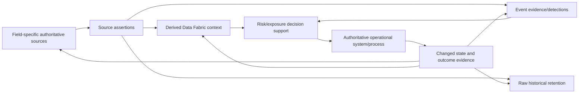

### Plain-English deep-dive 5 - "Single source of truth" should be a scoped sentence

Saying "the Data Fabric is the single source of truth" can conceal conflicts. It may offer the best unified view for exposure analysis while the directory remains authoritative for group membership, CMDB for an approved service owner, scanner for a finding assertion, and ITSM for ticket state.

Think of a passport, tax record, medical chart, and employer directory. Each can be authoritative for different facts. A useful golden context cites them and resolves conflicts for a purpose; it does not become the legal issuer of every fact. State: "System X is authoritative for field Y, entity scope Z, effective time T, and process P."

## Cost and total-cost-of-ownership model

Sticker price comparisons are incomplete. Include duplicated ingestion and operational complexity.

| Cost category | Questions | Hidden multiplier |
|---|---|---|
| License/subscription | Per user, asset, connector, event, data volume, action, compute? | Growth and minimum commitments |
| Ingestion | How many platforms ingest same full-fidelity stream? | Duplicate copies/parsing |
| Storage/retention | Hot, warm, archive, replicas, backups? | Compliance/legal hold |
| Compute/query | Scheduled jobs, ad hoc search, ML, graph, dashboards? | Inefficient models and concurrency |
| Egress/network | Cross-cloud/region/vendor transfer? | Repeated exports/backfills |
| Connector/integration | Prebuilt vs custom build/maintenance? | API/schema/auth drift |
| Data engineering | Mapping, quality, entity resolution, lineage? | Source churn |
| Detection/content | Rules, tuning, threat content? | False positives and maintenance |
| Workflow/playbook | Design, tests, approvals, target changes? | Harmful automation risk |
| Platform operations | Monitoring, on-call, upgrades, incidents? | Multiple teams/handoffs |
| Governance/security | RBAC, privacy, residency, retention, audit? | Evidence and review burden |
| User adoption | Training, support, documentation, change? | Shelfware and shadow exports |
| Migration/exit | Backfill, dual run, validation, logic portability? | Long overlap period |
| Risk cost | Outage, wrong action, missing detection, bad data? | Customer/business impact |

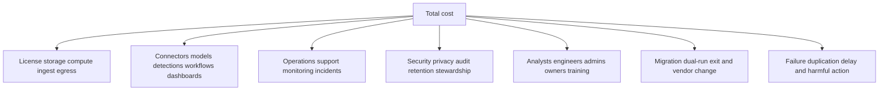

Cost optimization should protect required detection, evidence, retention, and action. Sending less data to SIEM may reduce cost but create investigation blind spots; retaining everything everywhere creates cost and governance risk. Classify use cases and data fidelity by destination.

## Ownership and operating model

| Capability | Accountable owner candidate | Key partners | Operational duty |
|---|---|---|---|
| Data Fabric security model/apps | Security/risk platform owner | Data, app, VM, SOC, privacy | Connectors, context, quality, adoption |
| SIEM | SOC/security engineering | Sources, IR, threat detection | Ingest, detections, search, on-call |
| Data lake/lakehouse | Data platform owner | Security data engineers, governance | Storage, jobs, catalog, cost, access |
| Data warehouse/BI | Analytics/BI owner | Metric owners, finance/risk | Semantic models, refresh, reporting |
| CMDB | Configuration/service management owner | Asset/app/cloud/service teams | CI lifecycle, field authority, reconciliation |
| iPaaS | Enterprise integration owner | App teams, security, network | Connectors, APIs, runtimes, monitoring |
| SOAR | SOC automation/IR owner | Analysts, target owners, risk/privacy | Playbooks, cases, actions, gates |
| Security graph | Security analytics/model owner | Identity, cloud, app, data owners | Ontology, edge quality, query governance |
| Cross-platform architecture | Enterprise architecture/accountable program sponsor | All above and procurement | Boundaries, standards, roadmap, TCO |

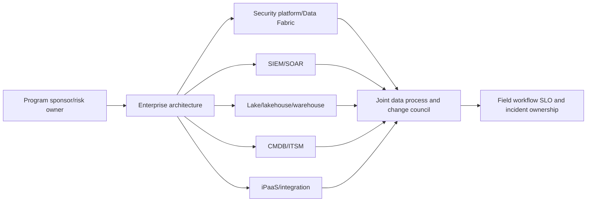

Every interface needs producer, consumer, schema owner, SLO, security owner, cost owner, incident owner, and change process. A RACI cannot replace accountable operational runbooks.

## Complementary reference architecture 1 - Exposure management plus SOC

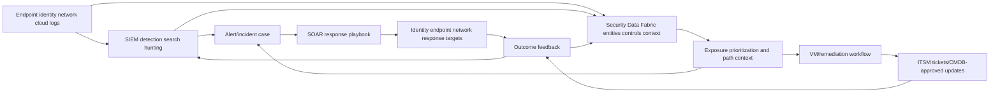

| Boundary | Owner | Contract |
|---|---|---|
| Source -> SIEM | SOC/data source | Event schema, time, loss, retention |
| Source -> Fabric | Security/data owner | Entity/context schema, freshness, authority |
| SIEM -> Fabric | Detection owner | Alert ID, evidence, rule version, entity references |
| Fabric -> SOAR/case | Exposure/SOC owner | Context snapshot, provenance, unknowns |
| SOAR -> target | IR/target owner | Approval, action key, least privilege, rollback |
| Fabric -> ITSM | VM/process owner | Workflow/ticket key, rationale, SLA, reconciliation |
| Outcomes -> platforms | Joint | Stable IDs, state, validation, privacy |

This pattern preserves event detection in SIEM, exposure context in Data Fabric, response playbooks in SOAR, and remediation/configuration processes in ITSM/CMDB. Products may combine some boxes; responsibilities still need contracts.

## Complementary reference architecture 2 - Raw lakehouse and enterprise reporting

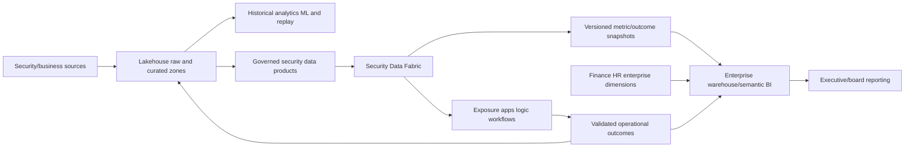

| Design decision | Reason |
|---|---|
| Raw history remains governed in lakehouse | Supports replay/science/retention without claiming Fabric raw archive |
| Fabric receives contracted data products | Avoids direct dependence on unstable raw zones |
| Fabric publishes versioned snapshots | Preserves metric definitions/as-of/restatements |
| Warehouse joins enterprise dimensions | Supports consistent cross-business reporting |
| Operational action remains workflow-owned | BI does not silently mutate systems |
| Outcomes feed raw/curated history | Enables validation and improvement |

## Complementary reference architecture 3 - CMDB health feedback loop

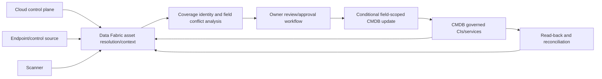

The Data Fabric does not become automatic authority for every CI field. It can identify mismatches and propose/update documented fields under approval and reconciliation. CMDB remains authoritative for fields/processes assigned to it.

## Complementary reference architecture 4 - iPaaS bridge for unsupported systems

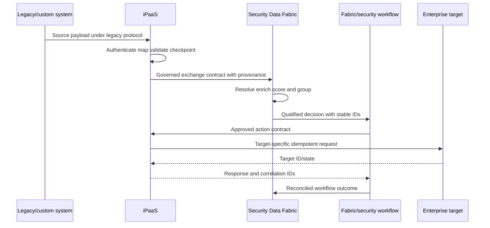

The integration owner handles legacy protocol/connector reliability; the security owner handles security semantics and decision; the target owner controls write authority. Avoid duplicating retries/state in iPaaS and workflow without one canonical owner.

## Positioning language: useful and unsafe

| Unsafe absolute | Better bounded wording |
|---|---|
| "Data Fabric replaces your SIEM" | "It addresses broader entity/context and exposure use cases; SIEM remains a potential event/detection source. We would assess overlap and required SOC capabilities." |
| "The lake is obsolete" | "The lake may remain valuable for raw retention, replay, data science, and bespoke analytics." |
| "Data Fabric is your new warehouse" | "It can provide security reporting; enterprise BI/history requirements may still favor a warehouse/lakehouse." |
| "CMDB is the wrong source" | "Authority should be defined by field/process; cross-source evidence can identify and govern corrections." |
| "No iPaaS is needed" | "Prebuilt integrations may reduce custom work; unsupported enterprise protocols/processes may still use iPaaS." |
| "SOAR becomes redundant" | "Exposure workflows and incident-response playbooks may complement each other; map canonical cases/actions." |
| "The security graph proves the attack path" | "The graph models a possible path under stated data and assumptions; validation/telemetry determine status." |
| "One source of truth" | "A unified best-known context with field-specific authoritative sources, provenance, and conflict handling." |
| "All data should be centralized" | "Move, virtualize, reference, or summarize data according to purpose, latency, sovereignty, cost, and control." |
| "Lower license count guarantees savings" | "Assess end-to-end TCO, migration, dual run, operations, skills, risk, and outcome." |

### Plain-English deep-dive 6 - Replacement is a migration hypothesis, not a slogan

Replacing a platform means reproducing or intentionally retiring every required use case, data contract, integration, control, retention obligation, operational runbook, skill, audit trail, and recovery capability. A demo of one overlapping feature is not a replacement plan.

Think of replacing a hospital. A new building may have better rooms, but the migration must cover patients, labs, pharmacy, records, emergency operations, staff, regulations, and continuity. Use a capability inventory, gap analysis, pilot, dual-run reconciliation, cutover criteria, rollback, and decommission evidence. Sometimes the right result is complement, not replace.

## Discovery questions for architecture positioning

| Area | Questions |
|---|---|
| Outcomes | Which security/business decisions are currently slow, wrong, manual, or impossible? |
| SIEM/SOC | Which log sources, detections, hunts, retention, cases, and response workflows are mandatory? |
| Data platform | Which raw history, BI, ML, SQL/notebook, replay, and enterprise joins are used? |
| CMDB/ITSM | Which CI classes/fields/processes are authoritative and where is quality weak? |
| Integration | Which connectors/protocols/API gateways/iPaaS flows and custom transforms exist? |
| SOAR | Which playbooks, actions, approvals, cases, and response SLOs are critical? |
| Graph | Which relationship/path questions matter and how are edges validated? |
| Data | Volume, velocity, format, sensitivity, residency, source authority, quality, growth? |
| Latency | Which use cases require seconds, minutes, hours, or daily completeness? |
| Retention | Which data needs hot search, archive, legal hold, deletion, replay? |
| Cost | Current spend by ingest/storage/compute/egress/connectors/people/operations? |
| Operations | Who owns on-call, changes, incidents, schema drift, and data correction? |
| Adoption | Who uses each system, for which actions, with what trust and skills? |
| Exit | Which data/logic/playbooks/reports must remain portable? |

## Capability rationalization method

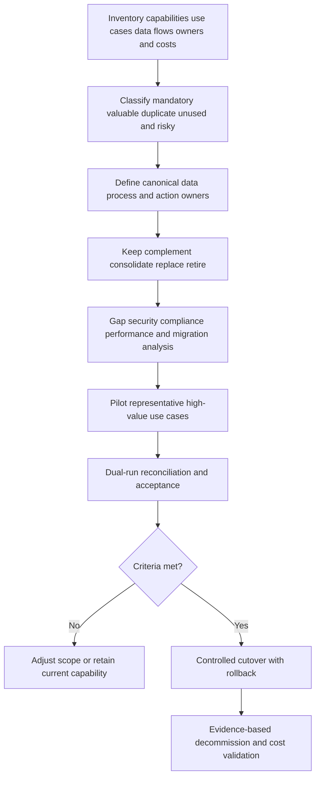

| Option | When suitable | Required proof |
|---|---|---|
| Keep | Capability unique/mandatory/healthy | Value, owner, cost, controls |
| Complement | Different primary workloads exchange value | Interface, authority, SLO, security |
| Consolidate | Duplicate capability can share one owner/platform | Feature parity not enough; operational fit |
| Replace | New platform meets all required outcomes/controls | Pilot, dual run, migration, rollback |
| Retire | Use case no longer needed or harmful | Consumer confirmation, retention/archive, audit |
| Defer | Evidence or readiness insufficient | Decision owner, risk, next evidence/date |

Avoid "rip and replace" as the default. Migration can temporarily increase cost and risk because both systems run while data, logic, and users move.

## Troubleshooting cross-platform boundaries

A symptom often appears in the final dashboard or workflow even though the first failure occurred in a source, SIEM parser, lake job, iPaaS map, entity link, CMDB identity, SOAR action, or graph edge.

```mermaid
flowchart TD
    SYM[Missing wrong stale duplicate delayed or unauthorized outcome] --> FLOW[Map exact end-to-end data/action flow and stable IDs]
    FLOW --> SRC{Source record/event correct?}
    SRC -->|No| FIXSRC[Repair source owner/process]
    SRC -->|Yes| MOVE{Connector iPaaS SIEM/lake movement complete?}
    MOVE -->|No| FIXMOVE[Repair auth cursor schema rate checkpoint]
    MOVE -->|Yes| SEM{Mapping entity fact CI and edge semantics correct?}
    SEM -->|No| FIXSEM[Repair contract/model and replay]
    SEM -->|Yes| ANA{Detection query score graph or report correct?}
    ANA -->|No| FIXANA[Repair logic/version/tests]
    ANA -->|Yes| ACT{Canonical workflow/action owner correct?}
    ACT -->|No| FIXACT[Stop duplicates define state authority]
    ACT -->|Yes| TGT{Target accepted and outcome reconciled?}
    TGT -->|No| RECON[Repair target/idempotency/reconciliation]
    TGT -->|Yes| CLOSE[Validate communicate and prevent recurrence]
```

| Evidence item | Why collect | Boundary |
|---|---|---|
| Use case/expected outcome | Prevent category argument from replacing problem | Owner-approved expectation |
| Source ID/event/entity/time | Trace across systems | Minimize sensitive data |
| Correlation IDs/checkpoints | Locate movement loss/duplication | No secrets/tokens |
| Schema/mapping versions | Detect semantic drift | Include producer/consumer owner |
| SIEM rule/parser/query version | Reproduce detection/search | Preserve raw event reference |
| Lake/lakehouse job/table snapshot | Reproduce history/curation | Govern data access |
| Fabric entity/rule/workflow version | Reproduce context/action | Do not infer internals |
| CMDB CI/field/version | Check exact authority/write | Restrict operational details |
| iPaaS flow/run/attempt | Check transformation/retry | Redact payload/credentials |
| SOAR case/playbook/action key | Check response state | Protect incident details |
| Graph node/edge/path contract | Check identity/time/provenance | Path is not attack proof |
| Target object/outcome | Validate business result | Follow target policy |
| First bad/last good/change timeline | Narrow cause | Correlation not causation |
| Consumer/impact scope | Plan containment/reconciliation | Privacy and communication |

Common boundary failures:

| Symptom | Cheapest discriminating check | Possible boundary issue |
|---|---|---|
| SIEM alert lacks business context | Can alert entity ID resolve in Fabric as of event time? | Identifier/tenant/time contract |
| Fabric finding missing raw evidence | Is source retained in SIEM/lake and reference stable? | Retention/export/ID mapping |
| Warehouse KPI differs | Compare metric/grain/as-of/policy versions | Snapshot/flattening/restatement |
| CMDB update hits wrong CI | Compare stable entity-to-CI mapping/precondition | False merge or field authority |
| Duplicate tickets | Which platform owns canonical workflow/action key? | Fabric/SOAR/iPaaS overlap |
| SOAR acts on stale context | Compare context snapshot/freshness and reevaluation | Latency/approval timing |
| Graph path missing | Are endpoints/edges available and valid in projection time? | Source/entity/edge/filter gap |
| Lake cost spikes | Which duplicate feeds/jobs/queries changed? | Unbounded retention/compute/egress |
| SIEM cost rises after integration | Was full-fidelity data duplicated unnecessarily? | Routing/fidelity decision |
| Unauthorized export/action | Which platform enforced role/scope at boundary? | RBAC/identity propagation |

## Complete synthetic NMH portfolio scenario

NMH has a SIEM, object-storage lakehouse, enterprise warehouse/BI, CMDB/ITSM, iPaaS, SOAR, and a proposed security Data Fabric. The objective is to reduce endpoint-control gaps and prioritize payroll exposure while preserving SOC detection, historical analytics, operational authority, and response.

### Current-state problems

| Problem | Current evidence | Root issue hypothesis |
|---|---|---|
| SIEM event costs rising | Same high-volume logs retained in multiple hot tiers | Duplicate full-fidelity ingestion |
| Asset counts disagree | SIEM, CMDB, scanner, EDR count source records differently | Grain/entity resolution gap |
| Payroll criticality absent in alerts | Business-service data only in CMDB/warehouse | Context interface missing |
| CMDB EDR status stale | Manual updates, no field authority/reconciliation | Process/integration gap |
| SOAR creates duplicate ITSM tickets | Exposure workflow also creates tickets | Canonical workflow key/owner absent |
| Historical board metric changes | Warehouse stores current risk band only | Version/as-of/restatement gap |
| Lake data difficult to use | Raw sources lack catalog/contracts | Data-product governance gap |
| Graph path untrusted | Hostname edges and current owner applied historically | Identity/time/provenance gap |

### Target-state architecture

```mermaid
flowchart LR
    SRC[Endpoint identity cloud scanner business sources] --> SIEM[SIEM: event detection/hunting]
    SRC --> LH[Lakehouse: raw history/replay/science]
    SRC --> FAB[Data Fabric: entities context exposure]
    CMDB[CMDB: approved CI/service fields] --> FAB
    WH[Warehouse: enterprise metrics/history] --> FAB
    SIEM --> SOAR[SOAR: incident case/response]
    SIEM --> FAB
    LH --> FAB
    FAB --> GRAPH[Governed security graph/path view]
    FAB --> VM[Exposure/remediation workflow]
    GRAPH --> VM
    SOAR --> IPAAS[iPaaS/target integration where needed]
    VM --> IPAAS
    IPAAS --> ITSM[ITSM tickets/CMDB scoped writes]
    ITSM --> CMDB
    SOAR --> TARGET[Identity/endpoint/network targets]
    VM --> OUT[Validated remediation outcomes]
    TARGET --> OUT
    OUT --> SIEM
    OUT --> LH
    OUT --> FAB
    OUT --> WH
```

### Workload placement

| Workload | Primary owner/platform | Complement |
|---|---|---|
| Raw endpoint/network event retention/search | SIEM hot tier plus governed lakehouse history by use | Fabric receives entity/context summaries and alert references |
| Detection/hunting | SIEM/SOC | Fabric supplies asset/business/control context |
| Cross-source asset/entity resolution | Data Fabric security data owner | CMDB/cloud/EDR provide scoped assertions |
| Payroll service criticality | CMDB/service registry/business owner | Fabric enriches exposure; warehouse reports history |
| Exposure path | Fabric/graph capability under query contract | SIEM validates observed activity; owners validate preconditions |
| Incident response | SOAR/IR | Fabric context; SIEM evidence; target owners |
| Coverage remediation | Fabric/VM workflow + ITSM | iPaaS handles legacy target; CMDB update approved |
| Raw/history/ML | Lakehouse/data team | Fabric outcome labels published under contract |
| Board metrics | Warehouse/BI metric owner | Fabric publishes versioned snapshots/provenance |
| Enterprise integration | iPaaS/integration team | Fabric/SOAR own security decision/state |

### Rationalization decisions

1. NMH does not replace the SIEM because required event detection, hunting, and searchable telemetry remain validated use cases.
2. NMH routes only decision-relevant context/alerts to the Data Fabric and reviews duplicate full-fidelity streams for cost without deleting required evidence.
3. The lakehouse remains the raw historical/replay/data-science platform and publishes governed security data products.
4. The warehouse remains the enterprise board-reporting layer and receives versioned snapshots, not mutable current scores.
5. The CMDB remains authoritative for approved CI/service fields. Fabric proposes scoped corrections with approval/read-back.
6. iPaaS bridges a legacy target, while Fabric/SOAR retain canonical security workflow/case state.
7. SOAR owns incident-response actions; Fabric workflow owns exposure remediation. Shared stable keys prevent duplicate tickets/actions.
8. The security graph is governed as a capability using resolved nodes, typed time-valid edges, provenance, and bounded paths.

### Synthetic boundary incident

A SIEM alert for `PAY-WEB-01` enters SOAR. SOAR requests Data Fabric context, but a stale hostname mapping resolves the retired server. SOAR and the exposure workflow each create a ticket with different keys. The warehouse later counts both as remediation episodes.

NMH pauses consequential actions for the entity cluster and disables one duplicate ticket-create path. The team traces source hostname, entity version, context snapshot, SOAR case, workflow episode, iPaaS run, ITSM tickets, and warehouse fact rows. It separates retired/replacement assets, recomputes context, links the SIEM event to the correct as-of entity, designates the SOAR incident as canonical case and Fabric item as linked remediation episode, selects one ITSM survivor, reconciles warehouse facts, and communicates the restatement. Contracts add stable entity IDs, canonical case/workflow keys, as-of context, field ownership, and cross-platform duplicate tests.

| Scenario statement | Honest wording |
|---|---|
| Portfolio | "Each platform retains a primary governed workload and exchanges contracted context/outcomes." |
| SIEM | "Required event detection/hunting remains; no replacement claim." |
| Data Fabric | "Provides synthetic unified exposure context and remediation orchestration." |
| Lakehouse/warehouse | "Retain raw/science and curated enterprise-history roles." |
| CMDB | "Remains authoritative for approved CI/service fields." |
| SOAR/iPaaS | "SOAR owns incident case/actions; iPaaS bridges target integration." |
| Graph | "Models possible paths; does not prove attack." |
| Incident | "Identity and workflow-key boundary defects caused miscontext and duplication." |
| Product boundary | "Architecture, states, costs, and outcomes are synthetic." |

## Synthetic exercises with answers

### Exercise 1 - SIEM

Does entity enrichment mean SIEM is no longer needed?

**Answer:** No. Validate event ingestion, detection, hunting, investigation, retention, cases, and response requirements. Data Fabric can complement SIEM with cross-domain context; overlap may be rationalized only after evidence.

### Exercise 2 - Lake

Is a data lake automatically a source of truth?

**Answer:** No. It stores source records, often raw. Authority remains with governed source/process owners; lake catalogs, quality, contracts, and curated products make data usable.

### Exercise 3 - Warehouse

Why export versioned snapshots instead of only current risk score?

**Answer:** Historical reports need reproducible as-of policy/context. Current-only values rewrite history and hide restatements.

### Exercise 4 - Lakehouse

Does the word Fabric prove lakehouse architecture?

**Answer:** No. Category names do not disclose storage/query internals. Verify official architecture and supported behavior when it matters.

### Exercise 5 - CMDB

Which system owns endpoint-control health?

**Answer:** The endpoint platform may be authoritative for heartbeat; Fabric may derive coverage; CMDB may store an approved operational field. Define field/use/time authority and reconciliation.

### Exercise 6 - iPaaS

Where should retries live if Fabric workflow calls iPaaS which calls ITSM?

**Answer:** Define one canonical action/state owner and coordinated retry/idempotency contract. Avoid independent retries that duplicate effects. iPaaS can own transport attempts; workflow owns business action identity/reconciliation.

### Exercise 7 - SOAR

How do exposure workflow and SOAR avoid duplicate response?

**Answer:** Separate incident-response case from exposure-remediation episode, define action authority, share stable IDs/keys, map states, and reconcile target objects/outcomes.

### Exercise 8 - Graph

Does a security graph path prove compromise?

**Answer:** No. It represents a possible route under node/edge/time/query assumptions. Validate exploitability, reachability, identity conditions, controls, and event evidence.

### Exercise 9 - Source truth

Can one platform be the source of truth for everything?

**Answer:** Usually not defensibly. Define authority per entity/field/process/scope/time and preserve provenance/conflicts in unified context.

### Exercise 10 - Cost

Which platform is cheapest?

**Answer:** Category labels cannot answer. Measure license, ingest, storage, compute, egress, connectors, people, operations, governance, migration, and risk for the actual workload.

### Exercise 11 - Replacement

What evidence supports replacing a platform?

**Answer:** Complete capability/control inventory, gap analysis, representative pilot, scale/performance/security tests, migration/retention plan, dual-run reconciliation, acceptance, rollback, operating model, and decommission evidence.

### Exercise 12 - Product claim

Can Arti say Zscaler Data Fabric stores raw logs like a lake?

**Answer:** Not from public positioning used here. Discuss documented ingestion/context capabilities and verify current official product architecture, retention, and supported workloads.

## Labs and rehearsal

### Lab 1 - Category glossary

Explain Data Fabric, SIEM, lake, warehouse, lakehouse, CMDB, iPaaS, SOAR, and security graph in one minute each with analogy, primary purpose, strength, and limit.

### Lab 2 - Master comparison

Score a fictional workload across purpose, data, grain, workload, schema, latency, retention, analytics, action, authority, strength, limit, cost, ownership, security, and portability.

### Lab 3 - Event/entity mapping

Trace one sign-in event from source/SIEM to resolved user/device/app context, graph relationships, case, response, and warehouse metric.

### Lab 4 - Raw-to-curated architecture

Design lakehouse raw/cleansed/curated data products feeding Fabric and warehouse while preserving provenance, deletion, security, and backfill.

### Lab 5 - CMDB authority workshop

Assign authority for CI identity, lifecycle, owner, service, environment, endpoint heartbeat, control coverage, finding status, and risk band.

### Lab 6 - Integration boundary

Define iPaaS versus Fabric workflow responsibility for mapping, auth, retry, idempotency, approval, target call, monitoring, and reconciliation.

### Lab 7 - SOAR coexistence

Map alert, incident case, exposure item, remediation episode, ticket, and response action. Define canonical keys and action authority.

### Lab 8 - Graph capability

Define nodes/edges/time/provenance/query bounds and identify where graph result enters reporting/workflow without implying graph database internals.

### Lab 9 - Latency/retention lab

Set measured requirements for detection, context, response, reconciliation, daily report, raw history, curated history, and recovery.

### Lab 10 - TCO lab

Build a synthetic five-year model including dual ingestion, hot/cold storage, compute, egress, connectors, engineering, SOC, governance, migration, and risk.

### Lab 11 - Ownership RACI

Assign accountable/operational roles for every platform and interface, including on-call, schema change, security, cost, data correction, and incident.

### Lab 12 - Rationalization workshop

Classify twenty capabilities keep/complement/consolidate/replace/retire/defer. Require evidence and rollback for each.

### Lab 13 - Positioning rehearsal

Rewrite ten replacement absolutes into bounded, outcome-led language. State what must be verified.

### Lab 14 - Cross-platform troubleshooting

Run missing alert context, KPI mismatch, wrong CI, duplicate ticket, stale SOAR context, missing graph path, and cost spike scenarios.

### Lab 15 - Boundary incident

Run the NMH hostname/case/ticket/warehouse incident. Contain, trace stable IDs/versions, repair identity, designate canonical state, reconcile, and prevent recurrence.

### Lab 16 - Interview whiteboard

Draw the complete complementary architecture and explain why each platform remains, where overlap exists, how cost is controlled, and which statements are official versus synthetic.

| Lab evidence | Completion standard |
|---|---|
| Definitions | Every acronym/category explained before comparison |
| Comparison | All required architectural dimensions assessed |
| Authority | Field/process/system boundaries explicit |
| Architecture | Complementary flows and feedback loops drawn |
| Reliability | IDs, SLOs, retries, reconciliation, ownership defined |
| Security | RBAC, privacy, retention, audit, residency covered |
| Cost | Full TCO and duplication included |
| Migration | Pilot, dual run, acceptance, rollback, decommission planned |
| Positioning | No unsupported replacement absolute |
| Honesty | Product fact, category tendency, and synthetic evidence separated |

## Common misconceptions to correct

| Misconception | Correct model |
|---|---|
| Categories are mutually exclusive | Modern products overlap; compare actual workload/evidence |
| Overlap proves redundancy | Depth, scale, controls, ownership, and use differ |
| Data Fabric always replaces SIEM | SIEM event detection/search may remain essential and is a documented source |
| SIEM stores only logs | Modern SIEM capabilities vary; event focus is a tendency |
| Data lake is cheap and simple | Storage may be cheap; engineering/governance/compute are not free |
| Data lake is source of truth | It stores assertions; authority is scoped elsewhere |
| Warehouse can store any raw data naturally | It favors curated structured analytics |
| Lakehouse solves governance automatically | Catalog, quality, security, cost, and ownership still require work |
| Fabric implies lakehouse storage | Names do not disclose implementation |
| CMDB should contain every observed fact | It governs selected CIs/fields/processes |
| CMDB is always wrong | Quality varies; field-specific authority/process can be valuable |
| Golden context should overwrite CMDB | Use proposed scoped corrections with approval/reconciliation |
| iPaaS is only a connector list | It can manage APIs, maps, routes, process state, and operations |
| Two retry layers improve reliability | They can multiply duplicates without canonical action identity |
| SOAR and exposure workflow are identical | Incident response and exposure remediation have different grains/cadence |
| More automation means better response | Context, authority, gates, idempotency, outcomes matter |
| Security graph is a complete platform | It may be one model/query capability inside a platform |
| Graph line proves reachability | Type, direction, time, preconditions, controls, evidence matter |
| One source of truth can own every field | Authority is entity/field/process/scope/time specific |
| Real-time is a product adjective | It is a measured end-to-end latency distribution |
| Long retention belongs everywhere | Retain according to use, regulation, cost, search/recovery needs |
| License consolidation guarantees savings | Include migration, dual run, people, operations, risk, egress |
| Replacement can be decided from demo parity | Prove requirements, scale, controls, migration, runbooks, rollback |
| Centralizing all data is always best | Sovereignty, latency, cost, security, and purpose may favor distributed patterns |
| Public Zscaler positioning reveals internals | It supports bounded capabilities and category contrast only |

## Official Source Anchors

Research/source date: **2026-08-24**.

Zscaler sources support bounded Data Fabric and SIEM-positioning statements. Microsoft architecture sources support general data-lake, warehouse, lakehouse, integration, and workload-choice concepts but describe Microsoft/Azure implementations and must not be generalized into universal vendor facts. NIST/CISA sources support log management, cloud, configuration management, incident response, and event-logging context. W3C supports graph/provenance concepts. ITIL/CMDB terminology varies by implementation; NIST configuration-management guidance supplies broader authoritative principles rather than a product CMDB schema. None establishes undocumented Zscaler storage, query, latency, retention, transaction, graph, workflow, replacement, or cost behavior.

| Source | URL | Used for | Boundary |
|---|---|---|---|
| Zscaler Data Fabric for Security | https://www.zscaler.com/products-and-solutions/data-fabric | Public unification, harmonization, dedup, correlation, enrichment, logic, workflows, reports, integrations, SIEM distinction | No internal architecture, performance, retention, or replacement guarantee |
| Zscaler Asset Exposure Management | https://www.zscaler.com/products-and-solutions/caasm | Public asset context, relationships, CMDB updates/workflows | No CMDB authority/schema or universal replacement claim |
| Zscaler Unified Vulnerability Management | https://www.zscaler.com/products-and-solutions/vulnerability-management | Public contextual risk, workflows, reports | No SIEM/SOAR/data-platform equivalence |
| Microsoft Azure Architecture Center - Data Lake | https://learn.microsoft.com/en-us/azure/architecture/data-guide/scenarios/data-lake | Raw/native diverse data, schema-on-read, zones, benefits/challenges, lake/warehouse comparison | Azure-oriented guidance; products vary |
| Microsoft Azure Architecture Center - Data Warehousing and Analytics | https://learn.microsoft.com/en-us/azure/architecture/example-scenario/data/data-warehouse | General curated warehouse/analytics architecture context | Azure-specific example, not universal design |
| Microsoft Fabric Lakehouse overview | https://learn.microsoft.com/en-us/fabric/data-engineering/lakehouse-overview | Lakehouse combination of lake/warehouse capabilities in Microsoft Fabric | Vendor implementation; not Zscaler architecture |
| Microsoft Azure Architecture Center - Integration styles | https://learn.microsoft.com/en-us/azure/architecture/guide/architecture-styles/ | General architecture/workload selection context | Azure patterns; not iPaaS category guarantee |
| Microsoft Azure Logic Apps overview | https://learn.microsoft.com/en-us/azure/logic-apps/logic-apps-overview | Managed integration/workflow example | One vendor service; iPaaS products vary |
| NIST SP 800-92 | https://csrc.nist.gov/pubs/sp/800/92/final | Log-management planning/process context | Published 2006; technology-specific details age |
| CISA Best Practices for Event Logging and Threat Detection | https://www.cisa.gov/resources-tools/resources/best-practices-event-logging-and-threat-detection | Current event-logging/threat-detection guidance context | Not SIEM product architecture |
| NIST SP 800-128 | https://csrc.nist.gov/pubs/sp/800/128/upd1/final | Security-focused configuration-management principles | Not CMDB implementation/schema |
| NIST SP 800-61 Rev. 3 | https://csrc.nist.gov/pubs/sp/800/61/r3/final | Incident response and CSF integration | Not SOAR/playbook implementation |
| NIST SP 800-145 | https://csrc.nist.gov/pubs/sp/800/145/final | Cloud computing definition/service models | Broad cloud definition; not iPaaS specification |
| W3C RDF 1.1 Concepts | https://www.w3.org/TR/rdf11-concepts/ | General graph/resource/triple concepts | Not a security graph product/storage claim |
| W3C SPARQL 1.1 Query | https://www.w3.org/TR/sparql11-query/ | Graph pattern/property-path concepts | Not Zscaler query language |
| W3C PROV-O | https://www.w3.org/TR/prov-o/ | Provenance concepts across systems | Not a specific lineage implementation |

## Likely Interview Questions

### Q1. How is a security Data Fabric different from a SIEM?

**Model answer:** A SIEM's primary center is security event/log ingestion, search, detection, correlation, alerting, and investigation. A security Data Fabric's center is unifying/harmonizing cross-domain entities, findings, controls, business context, logic, reports, and workflows for risk applications. Modern products overlap. Zscaler explicitly calls SIEM a useful source, so I assess complementary event and context workflows rather than claim automatic replacement.

### Q2. How do lake, warehouse, and lakehouse roles differ from Data Fabric?

**Model answer:** A lake emphasizes scalable native/raw diverse retention and flexible processing; a warehouse emphasizes curated structured analytics and consistent BI; a lakehouse combines lake foundations with warehouse-like table/query/governance capabilities. A security Data Fabric specializes in security semantics, entity resolution, context, risk applications, and operationalization. They can exchange governed data products, snapshots, models, and outcomes.

### Q3. How should Data Fabric coexist with a CMDB?

**Model answer:** I define exact entity/CI mappings and field-specific authority. Cloud/endpoint/scanner sources provide observations; Data Fabric resolves and identifies gaps/conflicts; CMDB remains authoritative for approved CI/service fields/processes. Corrections use evidence, owner approval where consequential, conditional field-scoped updates, provenance, read-back, and reconciliation. Unified context does not grant universal write authority.

### Q4. How do iPaaS and SOAR differ from Data Fabric workflows?

**Model answer:** iPaaS centers on general application/data integration, connectors, mapping, routing, and process orchestration. SOAR centers on security alert/incident cases and response playbooks. Data Fabric workflows center on context-rich exposure/risk operations. I assign canonical state/action ownership, stable keys, approvals, retries, and reconciliation so overlapping platforms complement instead of duplicating tickets or actions.

### Q5. Is a security graph a separate platform or part of Data Fabric?

**Model answer:** It can be either a standalone capability or embedded in SIEM, identity, cloud, exposure, or Data Fabric products. A graph represents nodes and typed, directed, time-valid, sourced edges for traversal/path analysis. The category name does not prove a graph database or algorithm. I govern identities, edge semantics, provenance, query bounds, and path validation.

### Q6. How do you decide system-of-record boundaries and control cost?

**Model answer:** I assign authority per entity, field, process, scope, and effective time; derived context preserves source assertions and conflicts. TCO includes licensing, duplicate ingestion, storage tiers, compute, egress, connectors, engineering, detections, workflows, operations, governance, users, migration, and failure risk. I route data at the fidelity needed for each workload instead of storing everything everywhere.

### Q7. How would you evaluate consolidation or replacement?

**Model answer:** I inventory capabilities, consumers, data, controls, SLOs, retention, integrations, ownership, skills, and costs; classify keep/complement/consolidate/replace/retire/defer; define gaps and migration risk; pilot representative workloads; dual-run and reconcile; require security/performance/operational acceptance; preserve rollback; then decommission with evidence. Feature-demo overlap is insufficient.

### Q8. What can you honestly claim about Zscaler and your background?

**Model answer:** Zscaler publicly positions Data Fabric as unifying security/business data with harmonization, correlation, context, logic, workflows, reports, integrations, and a broader focus than SIEM event logs. I do not claim undocumented storage, latency, retention, graph, transaction, replacement, or cost behavior. My Microsoft experience across telemetry, cloud services, APIs, data, identity, and escalation boundaries transfers; detailed portfolio architecture here is synthetic NMH practice.

## 30-Second Memory Hooks

| Concept | Memory hook |
|---|---|
| Data Fabric | Security context connective tissue |
| SIEM | Event control room |
| Data lake | Raw reservoir |
| Warehouse | Curated analytical shelves |
| Lakehouse | Reservoir plus managed tables/query |
| CMDB | Operational CI registry |
| iPaaS | Managed integration switchboard |
| SOAR | Security emergency dispatch playbook |
| Security graph | Typed transit map |
| Event vs entity | Footage versus roster |
| Schema-on-read | Label when opened |
| Schema-on-write | Sort before shelving |
| System of record | Official registry for scoped fact/process |
| Source of truth | Finish the sentence with field/scope/time |
| Operationalization | Insight becomes governed work |
| Overlap | Not automatic redundancy |
| Complement | Each platform owns natural workload |
| Replacement | Migration hypothesis requiring proof |
| Retention | Purpose, law, search, recovery, cost |
| Latency | Measure source-to-decision percentile |
| TCO | Full bill, not sticker |
| Authority | Field/process specific |
| Graph path | Possible route, not footprints |
| Architecture name | Does not reveal storage internals |
| Arti bridge | Cross-system RCA transfers; category absolutes do not |

## Completion Checklist

- [ ] I define Data Fabric, SIEM, data lake, warehouse, lakehouse, CMDB, CI, iPaaS, SOAR, security graph, system of record, source of truth, event/entity/fact grain, schema-on-read/write, retention, operationalization, orchestration, TCO, and reference architecture before using them.
- [ ] I explain category overlap and avoid treating product portfolios as sealed boxes.
- [ ] I compare actual licensed products and measured workloads, not names alone.
- [ ] I begin architecture decisions with outcomes and mandatory requirements.
- [ ] I assess purpose, data, grain, workload, schema, latency, retention, analytics, operationalization, authority, strength, limits, cost, ownership, security, and portability.
- [ ] I distinguish mandatory requirements from preferences.
- [ ] I use a representative pilot and evidence rather than category assumptions.
- [ ] I explain SIEM event/log detection/search/investigation as a primary tendency, not a universal limit.
- [ ] I explain Data Fabric entity/context/risk/application/workflow focus using bounded official claims.
- [ ] I never say Data Fabric automatically replaces SIEM.
- [ ] I identify event/context feedback contracts between SIEM and Fabric.
- [ ] I explain raw/native diverse data, schema-on-read, processing, ML, retention, governance, and swamp risk for lakes.
- [ ] I do not call a lake a source of truth without scoped authority.
- [ ] I explain curated facts/dimensions, consistent BI, schema-on-write, history, and performance for warehouses.
- [ ] I publish versioned/as-of/restatable security facts to warehouses.
- [ ] I explain lakehouse as lake foundations plus warehouse-like table/query/governance capabilities with vendor variation.
- [ ] I never infer Zscaler storage/query architecture from the word Fabric.
- [ ] I distinguish Data Fabric security specialization from general lakehouse data engineering/BI/ML.
- [ ] I define CMDB purpose, CI grain, field authority, lifecycle, ITSM processes, reconciliation, and data-quality risk.
- [ ] I never let correlated context overwrite consequential CMDB fields without exact identity, authority, approval, conditional update, read-back, and reconciliation.
- [ ] I define iPaaS connector, mapping, routing, API, orchestration, state, monitoring, and general integration purpose.
- [ ] I assign canonical retries, idempotency, state, and reconciliation when iPaaS and Fabric workflows coexist.
- [ ] I define SOAR alert/incident/case/playbook/response focus.
- [ ] I separate incident case/action authority from exposure remediation episodes.
- [ ] I prevent duplicate tickets/actions through shared IDs and canonical owners.
- [ ] I define security graph nodes, typed/directed/time-valid edges, properties, paths, provenance, and query bounds.
- [ ] I do not infer graph database, schema, algorithm, or attack proof from a visualization.
- [ ] I compare raw, canonical, warehouse, CMDB, event, graph, integration, and playbook schemas.
- [ ] I preserve source-specific evidence and avoid false canonical equivalence.
- [ ] I measure separate detection, context, response, reconciliation, report, raw-history, curated-history, and path latency/retention needs.
- [ ] I do not use "real-time" without measured end-to-end behavior.
- [ ] I assign authority per identity, account, resource, heartbeat, finding, service, ticket, detection, score, and path.
- [ ] I scope source-of-truth statements by field, entity, purpose, and time.
- [ ] I model license, ingestion, storage, compute, egress, connectors, engineering, detection, workflow, operations, governance, people, migration, and risk cost.
- [ ] I avoid optimizing cost by deleting required detection/evidence/retention.
- [ ] I assign accountable owners for every platform and interface.
- [ ] I define producer, consumer, schema, SLO, security, cost, incident, and change owners.
- [ ] I can draw complementary SOC/exposure, lakehouse/warehouse, CMDB, and iPaaS reference architectures.
- [ ] I use bounded positioning language instead of obsolete/replaces/no-longer-needed absolutes.
- [ ] I treat replacement as a capability/control/migration hypothesis requiring proof.
- [ ] I inventory outcomes, SIEM, data, CMDB, integration, SOAR, graph, latency, retention, cost, operations, adoption, and exit requirements.
- [ ] I classify keep, complement, consolidate, replace, retire, and defer with evidence.
- [ ] I plan pilot, dual run, reconciliation, cutover, rollback, and evidence-based decommission.
- [ ] I troubleshoot source -> movement -> semantics -> analytics -> canonical workflow/action -> target/outcome across stable IDs and versions.
- [ ] I contain duplicate/harmful cross-platform actions before replaying.
- [ ] I can complete the NMH target architecture, boundary incident, and all sixteen labs.
- [ ] I label every NMH architecture, latency, retention, cost, metric, incident, result, and outcome synthetic.
- [ ] I use the controlled research/source date exactly as 2026-08-24.
- [ ] I make no unsupported Zscaler storage, database, query, graph, transaction, latency, retention, connector, replacement, cost, guarantee, production, or customer-outcome claim.
- [ ] I can answer Q1 through Q8 with definitions, analogies, architecture, mechanics, examples, tradeoffs, failures, troubleshooting, labs, NMH evidence, official-source caveats, and an honest Arti bridge.

[Part 68 - Data Fabric Implementation, Health, Troubleshooting, and Customer Adoption](Part-68-data-fabric-implementation-troubleshooting.md)