# Part 68 - Data Fabric Implementation, Health, Troubleshooting, and Customer Adoption

> **Audience:** Arti Thakur, preparing for a Zscaler Security Operations Technical Success Manager role after Microsoft enterprise Support Escalation Engineering.
>
> **Purpose:** Turn Parts 58-67 into an end-to-end customer operating model. Cover discovery, use-case selection, prerequisites, source planning, design, pilot, acceptance, rollout, source/connector/mapping/entity/correlation/scoring/workflow/report layers, health objectives and monitoring, runbooks, data incidents, change and rollback, support escalation evidence, adoption, training, governance, value, a 30/60/90 roadmap, and a complete source-to-outcome scenario. The goal is a trustworthy capability customers operate and improve, not a connector project that stops at data arrival.
>
> **Scope and honesty:** Northstar Meridian Holdings, abbreviated NMH, is fictional. Every customer, source, connector, credential, schema, field, entity, relationship, score, workflow, report, threshold, service-level objective, metric, incident, change, result, timeline, and outcome in this Part is synthetic. Zscaler public pages support bounded statements that Data Fabric connects security and business data, harmonizes, deduplicates, correlates, enriches, applies business logic, supports workflows/reports/integrations, and powers documented Asset Exposure Management and Unified Vulnerability Management use cases. Public pages do not disclose an internal implementation topology, onboarding sequence, health API, SLO, runbook, support diagnostic, acceptance threshold, default role, exact connector behavior, data model, scoring formula, or guaranteed outcome. Detailed implementation and operations mechanics below are general educational patterns, not undocumented Zscaler implementation claims. Arti's Microsoft enterprise escalation, networking, identity, telemetry, SQL/data quality, stakeholder leadership, RCA, mentoring, and customer communication skills transfer; direct production ownership of Zscaler Data Fabric remains a learning boundary.
>
> **Currency caveat:** Product capabilities, interfaces, connectors, permissions, quotas, schemas, documentation, and support processes change. The controlled research/source date for this Part is exactly **2026-08-24**. Current official documentation, licensed tenant behavior, approved solution design, source/target contracts, customer security/privacy/legal requirements, owners, product specialists, Support guidance, direct tests, and measured evidence govern production.

## Section goal

A successful Data Fabric implementation creates a reliable chain from source evidence to a validated customer outcome. Technical health and adoption are inseparable. A perfect connector that feeds an unused dashboard creates little value; an enthusiastic workflow built on stale or wrongly correlated data creates harm.

Think of opening a new hospital service. Connecting electricity and installing equipment are prerequisites, not success. The service also needs patient scope, clinical process, trained staff, handoffs, safety checks, monitoring, incident response, governance, and outcome measures. Data Fabric implementation similarly joins technology, policy, people, and evidence from discovery through continuous improvement.

By the end, Arti should be able to:

| Outcome | Demonstrated capability | Evidence artifact |
|---|---|---|
| Discover | Convert customer goals/pain into bounded use cases and hypotheses | Discovery brief |
| Assess readiness | Validate sponsorship, owners, sources, security, process, skills, and dependencies | Prerequisite checklist |
| Plan sources | Inventory authority, grain, volume, cadence, credentials, quality, and sequence | Source plan |
| Design | Define entities, mappings, relationships, logic, workflows, reports, governance, and architecture boundaries | Solution design |
| Pilot | Prove representative end-to-end value with reversibility and controls | Pilot plan |
| Accept | Use measurable functional, quality, security, operational, adoption, and value criteria | Acceptance report |
| Roll out | Expand by rings/use cases with monitoring and rollback | Rollout plan |
| Operate health | Monitor source through outcome using SLOs and error budgets | Health scorecard |
| Run incidents | Detect, contain, diagnose, repair, reconcile, communicate, and learn | Data incident runbook |
| Manage change | Version, simulate, approve, deploy, validate, and rollback dependencies | Change record |
| Escalate effectively | Supply reproducible, redacted, bounded evidence to the right owner | Support package |
| Drive adoption | Train role-based workflows, coach champions, and remove friction | Enablement plan |
| Govern | Establish decisions, roles, cadence, exceptions, quality, privacy, and audit | Governance charter |
| Prove value | Connect leading health/adoption signals to validated risk/operational outcomes | Value scorecard |
| Plan 30/60/90 | Sequence learn, prove, scale, and institutionalize | Roadmap |
| Tell complete story | Trace one NMH source-to-outcome case with defect and recovery | Interview capstone |
| Bridge honestly | Connect Arti's transferable skills without inventing production experience | Candidate narrative |

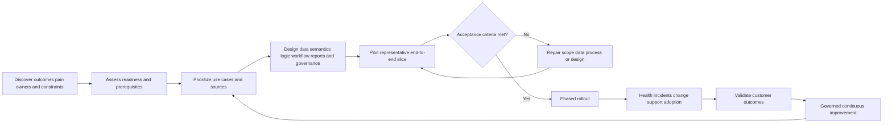

## JD Mapping

| Role expectation | Part 68 capability | TSM artifact | Arti bridge and boundary |
|---|---|---|---|
| Become Data Fabric expert | Explain bounded product value and operate the full lifecycle | Architecture/health whiteboard | Verify current product behavior |
| Analyze complex environments | Discover sources, owners, dependencies, risks, and process | Current-state assessment | Microsoft escalation discovery transfers |
| Identify security risk | Connect data defects and exposure context to business outcome | Risk/use-case register | Data quality is security quality |
| Recommend mitigation | Build phased plan with controls, owners, acceptance, rollback | Success plan | Customer risk owner decides treatment |
| Resolve complex issues | Troubleshoot layer by layer and lead data incidents | Evidence pack/PIR | RCA/timeline/hypothesis skills transfer |
| Lead strategic engagements | Facilitate governance, milestones, value, and executive reviews | Steering pack | TSM orchestrates, not sole owner |
| Communicate proactively | State health, impact, uncertainty, decisions, and next checkpoint | Status narrative | Avoid ETA/causal invention |
| Drive adoption/value | Train roles, observe workflow use, track validated outcomes | Adoption/value plan | Login count is not value |
| Partner with Support/Product/Sales | Route bounded evidence and customer feedback | Escalation/product feedback package | Commercial/product boundaries explicit |
| Mentor and scale quality | Create runbooks, teach-back, review rubrics, and reusable patterns | Enablement library | No unsupported product claims |

## Candidate honesty note

| Evidence class | Safe interview statement | Boundary to state |
|---|---|---|
| Production transfer | "I led Microsoft enterprise escalations from discovery through evidence, cross-team diagnosis, recovery, RCA, and customer communication." | Not production Zscaler Data Fabric administration |
| Data transfer | "I used logs, SQL/analytics, identities, devices, network evidence, and quality checks to correlate complex service issues." | Not proprietary Data Fabric algorithms |
| Synthetic practice | "I built a complete NMH onboarding, health, incident, change, adoption, and value plan." | Fictional lab evidence |
| Official public fact | "Zscaler publicly describes Data Fabric capabilities and AEM/UVM use cases." | No internal implementation/SLO claim |
| Health statement | "Layer X is degraded under the customer-approved synthetic SLO because evidence Y is stale." | SLO is customer design, not vendor default |
| Outcome statement | "Validated control coverage improved in the synthetic cohort while source eligibility remained stable." | Do not claim causation beyond evidence |
| Escalation statement | "I would provide timestamps, IDs, versions, reproduction, expected/actual, impact, and redacted artifacts." | Use official Support guidance |
| Production next step | "I would verify current docs, tenant evidence, security requirements, and Zscaler/source specialists." | Never bluff product access |

## Beginner vocabulary and memory hooks

| Term | Plain meaning | Why it matters | Analogy and memory hook |
|---|---|---|---|
| Implementation | Controlled work to make a capability usable in its environment | Includes people/process/technology | Open the service, not install equipment |
| Discovery | Structured learning about goals, current state, pain, constraints, and owners | Prevents solution-first mistakes | Medical history before treatment |
| Use case | Specific actor, problem, flow, and outcome | Gives scope and value target | One patient journey |
| Prerequisite | Condition required before a stage can succeed | Exposes blocked dependencies | Foundation before walls |
| Dependency | External component/person/decision needed | Can determine critical path | Connecting train |
| Assumption | Belief not yet verified | Must be tested | Pencil note, not fact |
| Constraint | Limitation that shapes design | Prevents unrealistic plans | Bridge height limit |
| Pilot | Limited representative deployment to test value/risk | Learns before broad rollout | Test one clinic wing |
| Acceptance criterion | Measurable condition required to proceed | Converts opinion to decision | Graduation requirement |
| Rollout ring | Controlled expansion cohort | Limits blast radius | Open one floor at a time |
| Go-live | Point a capability becomes operational for approved scope | Starts responsibility, not ends work | Opening day |
| SLI | Service-level indicator: measured health signal | Shows actual behavior | Thermometer reading |
| SLO | Service-level objective: target for an SLI | Defines expected reliability | Temperature range target |
| SLA | Formal service commitment between parties | May include consequences/terms | Contractual delivery promise |
| Error budget | Allowed unreliability under an SLO over a period | Balances change and stability | Permitted delay allowance |
| Health | Ability to provide intended function safely and currently | More than component uptime | Patient vital signs plus function |
| Observability | Ability to infer internal state from evidence such as metrics/logs/traces | Speeds diagnosis | Instrumented engine |
| Runbook | Step-by-step operational procedure | Makes response repeatable | Emergency checklist |
| Playbook | Broader scenario guidance with decisions/branches | Coordinates people/process | Emergency response plan |
| Data incident | Event where data quality, availability, security, lineage, or logic harms decisions/processes | Treats data defects operationally | Wrong lab result incident |
| Blast radius | Scope of affected entities, users, decisions, and time | Guides containment/communication | How far smoke spread |
| Reconciliation | Compare expected and actual states and repair drift | Closes silent gaps | Balance ledger |
| Backfill | Reprocess historical/missing data | Repairs completeness but can alter outputs | Re-deliver missing mail |
| Replay | Re-run events/records through logic | Restores state but risks duplicates | Replay a recording into system |
| Rollback | Restore a known prior compatible version | Recovers from harmful change | Return to last safe blueprint |
| Restatement | Publish corrected historical/current results | Preserves trust after data/logic correction | Corrected financial statement |
| Adoption | Intended users reliably use the capability in real work | Required for value | Staff use the new service |
| Champion | Trusted user who learns, advocates, and feeds back | Scales change | Local coach |
| Governance | Decision rights, rules, ownership, cadence, and evidence | Prevents drift/conflict | Rules of the road |
| Value realization | Evidence that capability contributes to desired outcomes | Connects activity to purpose | Treatment improved patient outcome |
| RAID log | Risks, assumptions, issues, and dependencies register | Makes uncertainty actionable | Project control ledger |
| RACI | Responsible, Accountable, Consulted, Informed role map | Clarifies involvement | Who does/owns/advises/hears |

## Product claim boundary

| Publicly supported statement | Safe implementation use | General method in this Part | Unsupported leap to avoid |
|---|---|---|---|
| Data Fabric connects any source and has prebuilt integrations | Plan/inventory sources and verify licensed/current support | Source wave and connector contract | Promise every source/action or timeline |
| Data Fabric supports ingest/harmonize/map/dedup/correlate/enrich | Define layered acceptance and health | Layered quality/SLO model | Claim internal services/algorithms |
| Data Fabric has customizable models/business logic | Plan governed semantics/rules | Schema, scoring, version/change practices | Claim exact UI/operators/formulas |
| Data Fabric supports workflows/reports | Plan end-to-end outcome/adoption | State, reconciliation, dashboard validation | Claim exact states/templates/SLOs |
| Data Fabric powers AEM/UVM | Anchor representative exposure use cases | Asset coverage and vulnerability prioritization scenario | Claim licensed feature availability/outcome |
| AEM describes asset resolution/relationships/golden records/workflows/CMDB/reporting | Define target use-case categories | General entity/workflow/report controls | Claim exact configuration/metrics |
| UVM describes context/factors/controls/workflows/reports | Define prioritization and remediation categories | General scoring/calibration/adoption controls | Claim formula/default weights |

### Plain-English deep-dive 1 - Go-live is the start of evidence, not the finish line

Projects often treat go-live as success because connectors are green and a dashboard opens. Real questions begin then: Are counts correct? Are owners using the workflow? Are exceptions valid? Are actions reconciled? Does source drift trigger alerts? Can a wrong merge be reversed? Has the customer reduced validated exposure or only created more tickets?

Think of opening a bridge. Construction completion matters, but operations must monitor traffic, inspect structure, handle incidents, maintain it, and prove it serves travelers safely. Define go-live as transfer to an operating model with owners, SLOs, runbooks, governance, adoption, and value reviews.

## Implementation principles

| Principle | Meaning | Anti-pattern prevented |
|---|---|---|
| Outcome first | Start with decision/action/value, not connectors | Data collection without use |
| Thin end-to-end slice | Prove source-to-outcome before adding breadth | Hundreds of sources, no trusted result |
| Authority explicit | Define field/process owners | Source-of-truth conflict |
| Identity before context | Resolve entities before relationships/scoring/actions | Wrong risk/action target |
| Unknown visible | Missing/stale/invalid never silently safe | False reassurance |
| Reversible change | Version, pilot, rollback, reconcile | Irrecoverable logic/action harm |
| Human gates by consequence | Approval matches impact/ambiguity | Unsafe automation |
| Health beside value | Show data/workflow health with outcome | Pipeline outage looks like improvement |
| Evidence over status color | Preserve IDs, versions, times, counts, reasons | Green without proof |
| Adoption in design | Observe real user workflow and friction | Shelfware |
| Shared governance | Security, data, IT, risk, app, privacy owners decide | TSM becomes accidental owner |
| Honest claims | Separate documented, observed, assumed, synthetic | Trust loss |

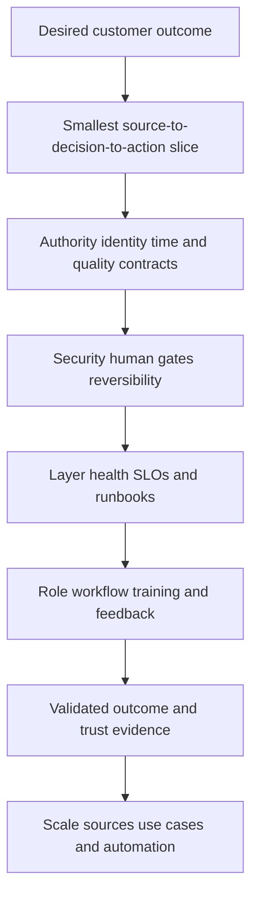

## Phase 1 - Discovery and current-state assessment

Discovery converts broad goals into testable problem statements. It is not a connector interrogation alone.

| Discovery domain | Questions | Artifact |
|---|---|---|
| Business outcome | What risk, cost, delay, uncertainty, or compliance problem matters? | Outcome hypothesis |
| Current process | How is work done today, by whom, with what handoffs? | Process map |
| Pain/evidence | Which examples/counts/times show the problem? | Baseline evidence |
| Decisions | Which decision should become faster/better? | Decision inventory |
| Users | Who investigates, remediates, approves, reports, governs? | Persona map |
| Sources | Which systems observe identity/assets/apps/findings/controls/business/work? | Source inventory |
| Authority | Who owns each field/process and conflict? | Authority matrix |
| Data quality | Completeness, freshness, duplicates, validity, history, IDs? | Profile report |
| Architecture | SIEM/lake/warehouse/CMDB/iPaaS/SOAR/graph roles? | Current-state diagram |
| Security/privacy | Classification, least privilege, residency, retention, deletion, audit? | Control requirements |
| Operations | On-call, changes, incidents, support, SLOs? | Operating model |
| Constraints | Timeline, access, budget, procurement, change freezes, skills? | RAID log |
| Success | What evidence permits pilot/rollout/value decisions? | Acceptance framework |

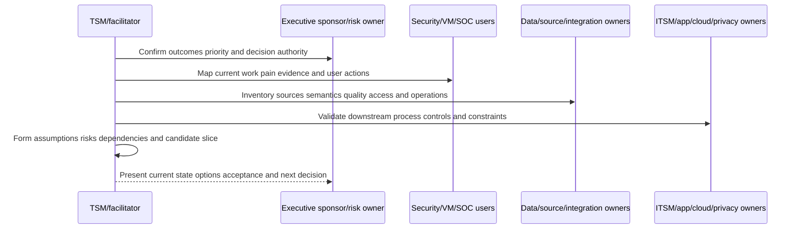

### Discovery questions by stakeholder

| Stakeholder | Highest-value questions |
|---|---|
| CISO/risk sponsor | Which outcome/decision matters this quarter? What uncertainty is unacceptable? |
| VM leader | Which backlog/prioritization/ownership/SLA problems consume effort? |
| SOC/IR | Which events/incidents should feed exposure context and vice versa? |
| Asset/CMDB owner | Which CI fields are authoritative, disputed, stale, or writable? |
| Identity owner | Which IDs/lifecycles/groups/roles are authoritative and sensitive? |
| Cloud/app owner | Which resources/services/dependencies/owners/environments matter? |
| Data platform | Which lake/warehouse contracts, history, lineage, and BI standards apply? |
| Integration team | Which APIs, connectors, iPaaS flows, quotas, networks, secrets, on-call? |
| Privacy/legal | Which purpose, minimization, residency, retention, access, deletion obligations? |
| Operators/users | What do you do before/after the tool? Which clicks/exports/workarounds hurt? |
| Support/Product | Which current documentation, known constraints, diagnostics, escalation routes? |

## Use-case selection and prioritization

A good first use case is valuable, feasible, representative, measurable, safe, and small enough to learn.

| Criterion | Question | Scoring caveat |
|---|---|---|
| Outcome value | Would success materially reduce risk/toil/delay? | Sponsor-approved |
| Decision clarity | Is actor/action defined? | Avoid dashboard-only goal |
| Data readiness | Are minimum authoritative sources accessible/current? | Unknowns remain visible |
| Identity feasibility | Can entities be resolved safely? | False merge harm |
| Process readiness | Is owner/workflow/approval available? | No orphan outputs |
| Measurability | Is baseline/denominator/outcome observable? | Causation limits |
| Safety | Can action be non-disruptive/reversible/human-gated? | Pilot blast radius |
| Representativeness | Does slice exercise key layers? | Avoid toy demo |
| Time to value | Can it prove learning within agreed window? | Never invent connector ETA |
| Reusability | Do data/contracts enable later use cases? | Avoid overengineering |

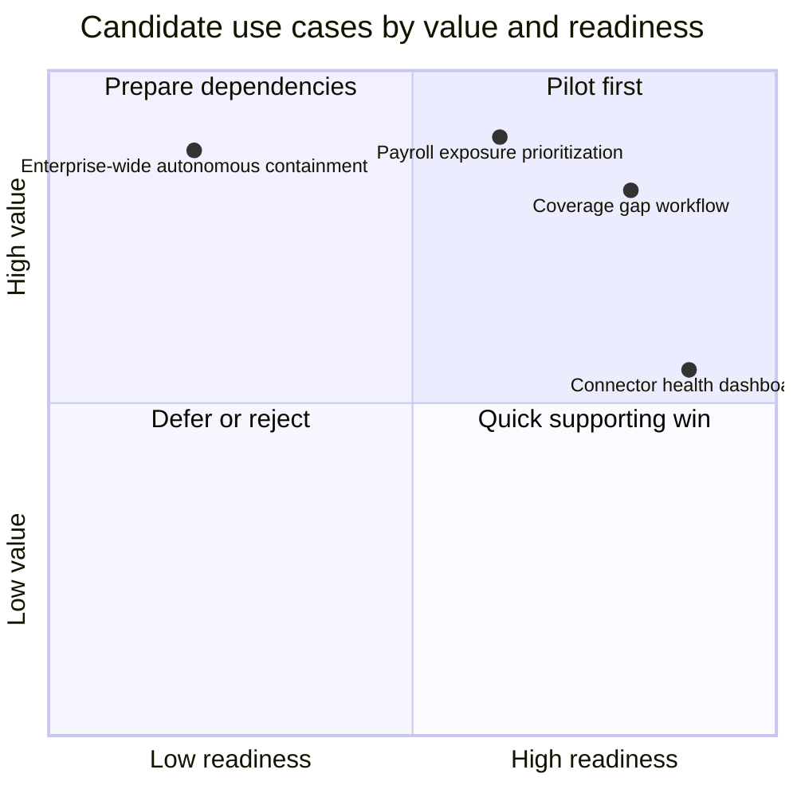

The values are synthetic facilitation aids, not objective formulas. Use qualitative discussion and evidence. Avoid first pilots that require every source, autonomous high-impact action, or undefined enterprise truth.

## Prerequisite and readiness assessment

| Area | Ready evidence | Not-ready signal | Treatment |
|---|---|---|---|
| Sponsorship | Named outcome owner and decision cadence | No accountable sponsor | Secure sponsor or defer |
| Use case | Actor/problem/action/baseline defined | "Connect everything" | Narrow scope |
| Source owner | Named technical/semantic owner | Unknown API/data meaning | Assign owner |
| Access | Approved least-privilege credentials/network | Shared admin credential | Redesign access |
| IDs/grain | Stable scoped identity and entity contract | Hostname/IP-only identity | Add sources/review |
| Quality | Representative profile and known gaps | No counts/freshness/history | Profile first |
| Security/privacy | Classification/purpose/access/retention approved | Sensitive data copied casually | Complete review |
| Workflow | Process owner/queue/approval/postcondition | No one accepts work | Design process |
| Reporting | Metric owner/denominator/time defined | Vanity KPI | Define contract |
| Operations | Monitor/runbook/on-call/support path | Project team disappears at go-live | Create operating model |
| Change | Version/test/pilot/rollback window | Direct production edits | Establish controls |
| Adoption | Role champions/training/time allocated | Users hear at launch | Co-design/enable |

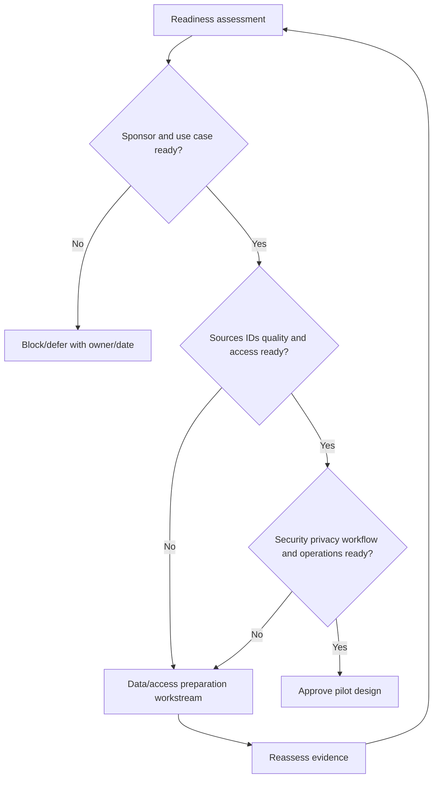

### Plain-English deep-dive 2 - A red prerequisite is a planning result, not a failure

Finding that stable asset identity is missing before automating CMDB updates is valuable. It prevents a wrong change. Teams sometimes hide readiness gaps to protect a date, converting a project risk into a customer incident.

Think of a preflight checklist. A failed engine check delays departure but protects passengers. Record blocked criteria, impact, owner, corrective action, decision date, and workaround. Sponsors can accept a bounded pilot with a human review step, reduce scope, or defer; they should not discover the gap after broad rollout.

## Source and connector plan

Sources should be sequenced by the use-case minimum, authority, identity value, and operational readiness.

| Source-plan field | Why needed |
|---|---|
| Source/use | Which fields/relationships/events support which decision? |
| Owner/support | Technical, semantic, security, on-call contacts |
| Entity/grain | User/account, asset record, app, finding, event, control, ticket |
| Authority | Which fields/process/time are authoritative? |
| Method | API, file, webhook, existing integration, product-supported connector |
| Auth/network | Identity, permissions, secret lifecycle, allowlists/proxy/TLS |
| Scope | Tenant/accounts/regions/environments/population/exclusions |
| Volume/velocity | Current/peak/growth/record size/history |
| Cadence/latency | Full/incremental/event, expected watermark |
| Schema | Version, required/optional fields, enums, units, timestamps |
| Quality | Baseline counts, nulls, duplicates, validity, freshness, history |
| Limits | Pagination, quotas, rate, retention, deletion, API constraints |
| Recovery | Cursor/checkpoint, retry, replay, backfill, reconciliation |
| Security/privacy | Classification, minimization, residency, retention, audit |
| Acceptance | Counts, freshness, mapping, identity, security, performance |

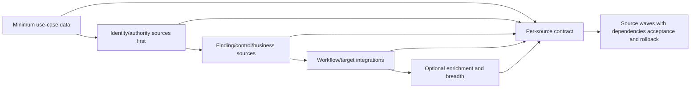

Do not invent connector development or onboarding timelines from public statements. Validate current supported connectors, source versions, authentication, permissions, data scope, and specialist guidance.

## Solution design across all layers

| Layer | Design decisions | Required owner |
|---|---|---|
| Source | Scope, authority, extraction impact, source IDs/time | Source owner |
| Connector/ingestion | Auth, schedule, cursor, retries, quotas, backfill | Integration/platform owner |
| Raw/provenance | Preserve source assertion, run, schema, times | Data/security owner |
| Mapping/harmonization | Canonical types/units/enums/custom fields | Semantic owner |
| Entity resolution | Type/scope/lifecycle/rules/confidence/review/unmerge | Entity/data owner |
| Correlation/graph | Typed edges, effective time, provenance, path bounds | Security analytics owner |
| Business logic/scoring | Factors, weights, controls, thresholds, tests | Risk owner |
| Grouping | Membership, overlap, history, policy | Program owner |
| Workflow/action | State, owner, approval, idempotency, reconciliation | Process/action owner |
| Reporting | Grain, metrics, roles, freshness, drill, accessibility | Metric/report owner |
| Security/privacy | RBAC, secrets, tenant, classification, retention, audit | Security/privacy owner |
| Operations | SLOs, monitoring, runbooks, support, change | Service owner |
| Adoption/value | Personas, training, champions, outcomes, cadence | TSM/customer sponsor |

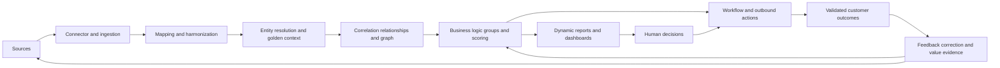

The design should label each statement as documented product capability, observed tenant behavior, customer requirement, general pattern, assumption, or open question.

## Pilot design

A pilot tests the entire chain with representative complexity and controlled impact.

| Pilot element | NMH synthetic choice | Why |
|---|---|---|
| Use case | Endpoint-control gap for payroll production assets | Valuable, bounded, measurable |
| Population | 120 assets across physical/cloud and two owners | Tests diversity without enterprise blast radius |
| Sources | CMDB, EDR, cloud inventory, app registry, directory, ITSM | Minimum identity/context/workflow set |
| History | 30 days plus current snapshot | Tests time and recurrence |
| Workflow | Ticket upsert with human gate for CMDB write | Low disruption/reversible |
| Reports | Operator, data health, executive summary | Tests role views/adoption |
| Security | Least privilege, masked lab data, approved production metadata | Protects data |
| Duration | Defined by acceptance evidence, not arbitrary success promise | Allows source cycles/incidents |
| Exit | Expand, repair/retest, narrow, or stop | Avoid forced rollout |

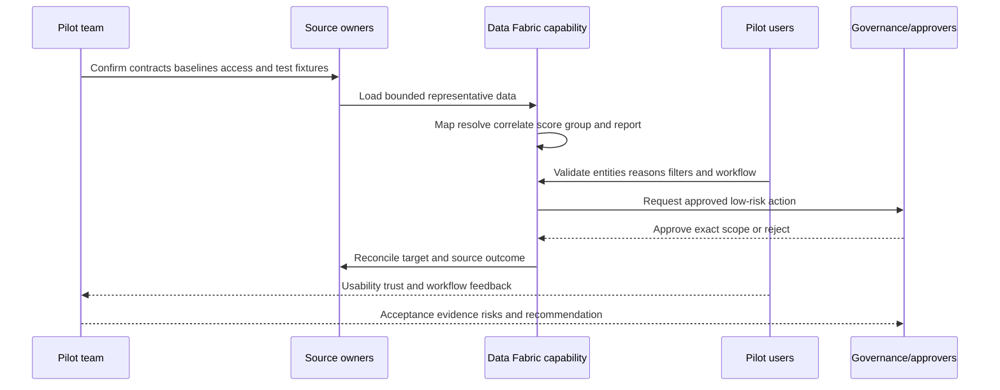

Run negative cases deliberately: stale source, schema drift, false merge, missing owner, score boundary, target timeout, duplicate event, expired exception, unauthorized user, and report denominator defect.

## Acceptance criteria

Acceptance must be defined before the pilot and cannot be only "dashboard looks right."

| Category | Example acceptance question | Evidence |
|---|---|---|
| Functional | Does scoped data flow and use case work end to end? | Test cases and target outcomes |
| Source | Are expected scope/count/history/watermarks reconciled? | Source manifests/counts |
| Mapping | Are required fields/types/units/enums valid? | Mapping fixtures/error report |
| Entity | Are labeled representative matches/splits acceptable for consequence? | Review sample and cluster audit |
| Context | Are owner/service/control relationships current and sourced? | Edge/profile report |
| Logic | Do rules/factors/controls/thresholds produce expected reasons? | Replay/sensitivity results |
| Workflow | Are state, assignment, approval, idempotency, reconciliation correct? | Failure/duplicate tests |
| Reporting | Do metrics/filters/drill/freshness/provenance reconcile? | Source-to-visual pack |
| Security/privacy | Do least privilege, secrets, isolation, retention, audit, export controls pass? | Control test |
| Reliability | Do agreed SLIs meet pilot objectives under failure tests? | Health report |
| Performance | Does representative volume/concurrency meet budget? | Load/query report |
| Operability | Can service owners detect/diagnose/recover with runbooks? | Game day evidence |
| Adoption | Can each persona complete critical tasks/teach back? | Observation and assessment |
| Value | Is baseline movement supported with stable denominator/caveats? | Value hypothesis report |
| Honesty | Are assumptions/limitations/product boundaries explicit? | Decision record |

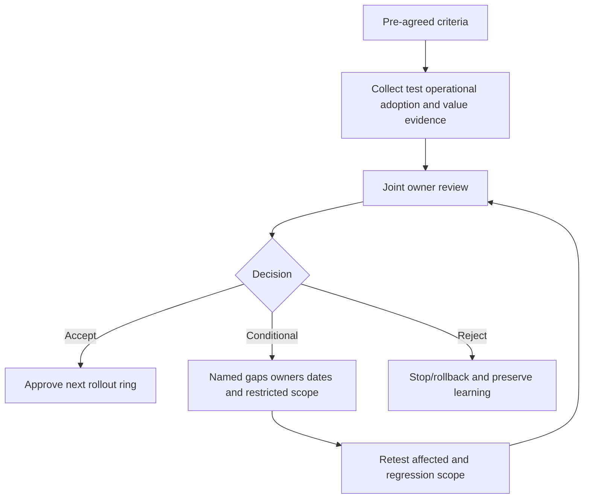

Thresholds should be risk-based and customer-approved. This guide deliberately does not invent vendor acceptance percentages or SLO defaults.

## Rollout strategy

| Ring | Scope | Entry evidence | Exit/rollback trigger |
|---|---|---|---|
| 0. Synthetic/test | Fake/approved test data and targets | Design/security review | Contract defect |
| 1. Shadow | Real bounded inputs, no operational writes | Source/mapping/entity tests | Data/security defect |
| 2. Pilot | Representative users and human-gated actions | Acceptance plan/runbooks | Harm, drift, low trust |
| 3. Limited production | Selected services/owners/sources | Pilot accepted | SLO/quality/adoption guardrail |
| 4. Expanded production | Additional waves/use cases | Stable health/value/governance | Capacity/quality regression |
| 5. Institutionalized | Standard operating model | Ownership/training/audit embedded | Strategic review/change |

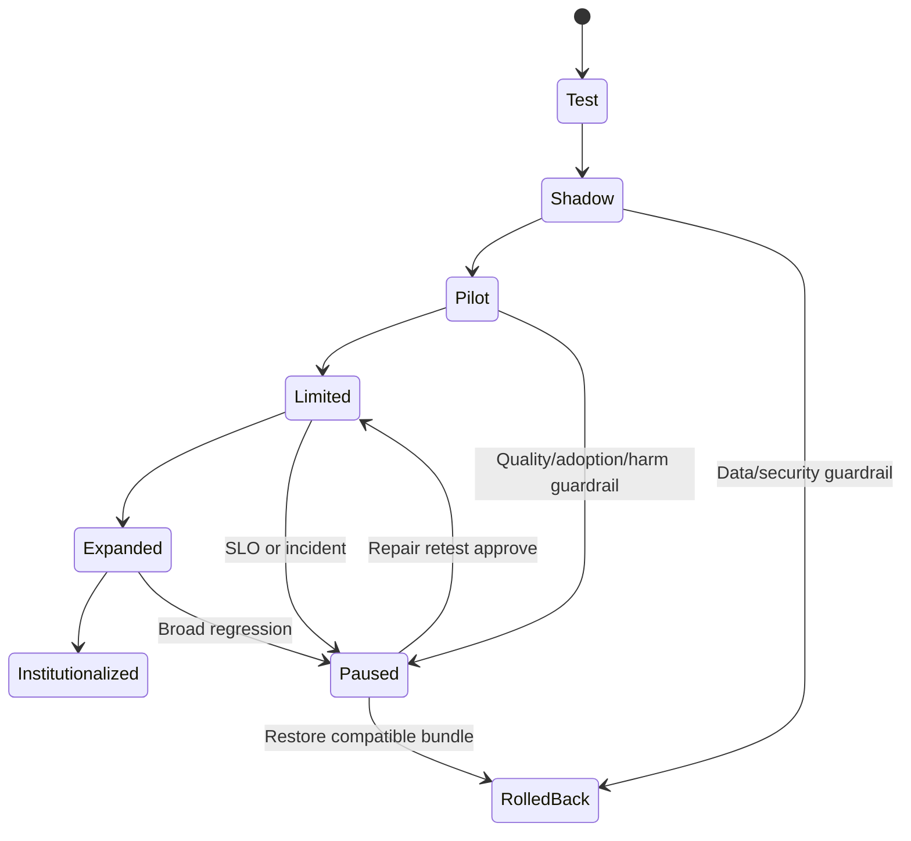

Use both source waves and user/use-case rings. Adding ten sources at once obscures which source caused drift. Expanding users before role training creates mistrust and workarounds.

## Health model: source to outcome

Component uptime is insufficient. Health asks whether the intended outcome can be produced safely and currently.

| Layer | Healthy means | Example SLIs | Common false green |
|---|---|---|---|
| Source | Source available, scoped, semantically stable | Source availability, watermark, expected counts | API up but export empty |
| Connector | Authenticated, progressing, complete, within quotas | Success, cursor age, page/file completeness, retries | Last run success but no new data |
| Mapping | Required records map validly under current schema | Validity, unmapped fields/enums, type errors | Bad records silently dropped |
| Entity | Correct stable entities with bounded ambiguity | Resolution coverage, duplicates, disputes, cluster anomalies | High merge rate from false joins |
| Relationship/context | Current typed sourced edges and attributes | Orphan/stale/conflict/context coverage | Old owner shown confidently |
| Correlation/graph | Expected patterns/paths with bounded queries | Rule matches, path coverage, query errors/truncation | No paths because edges missing |
| Logic/scoring | Reproducible explainable outputs under approved version | Eval success, holds, band shifts, reason completeness | Scores fall when source missing |
| Workflow | Correct state/action/owner with convergence | Latency, duplicates, dead letters, drift, validation | Ticket accepted but outcome absent |
| Reporting | Correct current accessible role views | Refresh, reconcile, query latency, export security | Risk improves during outage |
| Security/privacy | Least privilege, secrets, isolation, retention, audit effective | Auth failures, privilege changes, access anomalies | No alert because logging failed |
| Adoption | Users complete intended tasks and trust evidence | Task success, active cohorts, overrides, feedback | Logins without workflow use |
| Outcome | Validated risk/process movement under stable scope | Coverage/remediation/recurrence/toil | Ticket count called value |

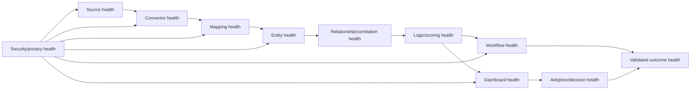

### Plain-English deep-dive 3 - Green components can produce a red outcome

Every connector can report success while one mapping drops a new enum, entity logic merges two assets, a workflow routes to a former owner, and an executive rate improves because the denominator shrank. Local green status does not guarantee end-to-end correctness.

Think of an assembly line where every machine is powered on but parts are installed backward. End-to-end synthetic tests, reconciled counts, quality invariants, reason checks, and validated outcomes complement component telemetry. Health must cover the chain and the customer's decision.

## SLI, SLO, SLA, and error-budget design

An SLI measures; an SLO targets; an SLA formalizes commitment. Do not label internal objectives as vendor commitments.

| Health objective | Example SLI | Synthetic objective pattern | Guardrail |
|---|---|---|---|
| Source freshness | Age of latest complete source watermark | Agreed percentile/window by source criticality | Degrade dependent outputs when breached |
| Ingestion completeness | Received/expected pages/files/records | Reconciled per run/wave | No silent drop |
| Mapping validity | Valid required records / eligible records | Segment by source/schema | Invalid goes to visible error/hold |
| Entity quality | Labeled precision/recall/dispute/cluster indicators | Consequence-specific | High match rate alone insufficient |
| Context coverage | Eligible entities with current owner/service/control | Show unknown separately | No default low risk |
| Evaluation reliability | Successful reproducible evaluations / attempted | Include error/hold rate | No score on invalid inputs |
| Workflow correctness | One intended effect per logical action | Duplicate/drift/harm guardrail | Pause on broad anomaly |
| Workflow timeliness | Trigger to acknowledgement/outcome | Separate stages/percentiles | Target/source delays visible |
| Report trust | Reconciled metrics with current required sources | Show degraded/partial status | Pause scheduled misleading report |
| Recovery | Time to contain/restore/reconcile | Severity/layer dependent | Communication checkpoints |
| Adoption | Critical task completion/teach-back | Persona/cohort based | Logins not sufficient |
| Value | Validated outcome with stable denominator | Baseline and caveats | Do not claim simple causation |

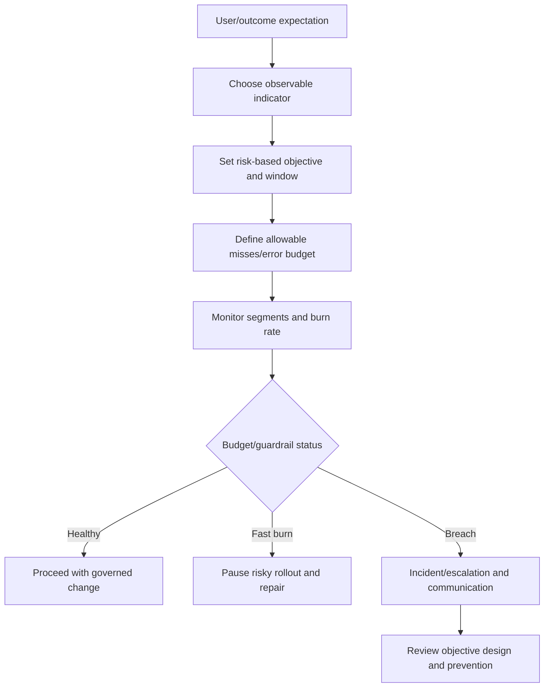

Use percentiles and windows where averages hide spikes. Segment critical sources/use cases. An error budget is not permission to lose or expose data; security, privacy, and harmful-action events can be zero-tolerance guardrails.

## Monitoring and alert design

| Monitor | Signal | Alert condition concept | First owner |
|---|---|---|---|
| Source watermark | Latest complete effective time | Age exceeds source/use SLO | Source/connector owner |
| Volume/count | Expected vs received/reconciled | Material unexplained deviation | Source/data owner |
| Schema | New/missing/type/enum fields | Required contract violation | Mapping owner |
| Auth/quota | 401/403/429/token expiry/rate use | Sustained or impending exhaustion | Integration/security owner |
| Cursor/checkpoint | Progress and repetition | Stuck, regressed, reset unexpectedly | Connector owner |
| Entity | Cluster size, merge/split, ambiguity, disputes | Segment anomaly/guardrail | Entity owner |
| Relationship | Orphan/stale/fanout/conflict | Coverage or cardinality breach | Context owner |
| Score/group | Distribution, hold, reason, migration | Unapproved shift or missing reason | Risk owner |
| Workflow | State age, retry, dead letter, duplicate, drift | SLO/guardrail breach | Workflow owner |
| Report | Refresh/query/reconcile/filter/export | Stale/wrong/security/accessibility failure | Report owner |
| Security | Privilege/secret/audit/export anomalies | Policy breach | Security/privacy owner |
| Adoption | Task failures, overrides, abandoned steps | Friction/trust threshold | TSM/process owner |
| Outcome | Remediation/recurrence/toil/coverage | Trend with stable scope/caveats | Program/risk owner |

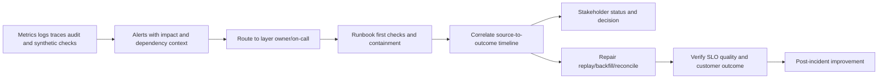

Alert on actionable symptoms and burn rates, not every transient retry. Include affected use cases, dependent metrics/workflows, last good watermark, IDs, runbook, owner, and severity.

## Health dashboard design

| Panel | Must show | Action |
|---|---|---|
| Executive service health | Outcome availability, degraded use cases, material incidents, decisions | Prioritize risk/resources |
| Source/connector | Watermark, completeness, errors, retry/quota, owners | Repair source/connector |
| Semantic quality | Mapping validity, required fields, schema drift | Update contract/backfill |
| Entity/context | Resolution, duplicates, orphan/stale edges, conflicts | Review/correct identity/context |
| Logic | Eval success, holds, reason completeness, distribution shifts | Pause/tune/approve |
| Workflow | State funnel, age, duplicates, dead letters, drift, validation | Repair/reassign/escalate |
| Reporting | Refresh, reconciliation, role access, query/export | Correct/restatement |
| Security/privacy | Auth, privilege, secrets, exports, audit, retention | Contain/investigate |
| Adoption | Persona usage, task completion, training, feedback | Coach/redesign |
| Value | Baseline vs validated outcomes and caveats | Continue/adjust investment |

Display dependency impact. If identity source is stale, show which entities, scores, workflows, and reports are degraded. Avoid averaging one red critical source into a green composite.

## Runbook framework

A runbook should be executable by the designated operator under pressure.

| Runbook section | Content |
|---|---|
| Purpose/scope | Symptom/layer/use cases covered |
| Preconditions/access | Required role/tools, safe environment |
| Safety | Do-not-do, privacy, secrets, change/approval constraints |
| Trigger/severity | Alert/user report and impact classification |
| First checks | Cheap discriminating evidence |
| IDs/times | Source/run/entity/rule/workflow/report IDs and timezone |
| Decision tree | Falsifiable branches and expected evidence |
| Containment | Pause source/action/report/rollout without destroying evidence |
| Recovery | Retry, replay, backfill, rebuild, rollback, reconcile |
| Validation | Source-to-outcome checks and SLO recovery |
| Communication | Audience, cadence, facts, uncertainty, decision |
| Escalation | Owner/support package and thresholds |
| Closure | Impact, corrections, restatements, approvals |
| Prevention | Tests, monitors, design/process/training changes |
| Audit | Operator/actions/times/versions/artifacts |

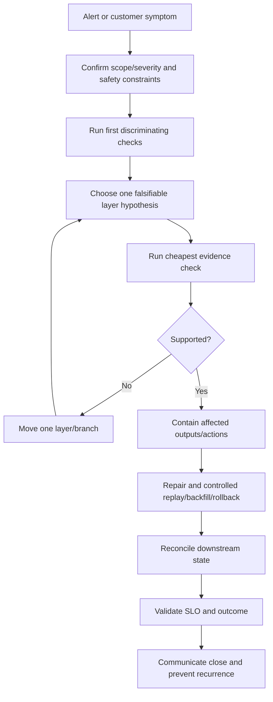

### Runbook catalog

| Runbook | First anchor | Typical containment |
|---|---|---|
| Source stale/missing | Last complete source watermark/run | Mark dependent outputs degraded; pause consequential actions |
| Authentication/authorization | First 401/403 and credential version | Stop retry storm; protect/rotate credential if indicated |
| Rate limit/quota | 429/rate headers/cursor lag | Backoff, reduce concurrency, prioritize critical scope |
| Schema drift | First invalid field/enum/schema version | Quarantine invalid records; preserve valid scope if safe |
| Count mismatch | Same-scope source vs fabric manifest | Pause claims; isolate missing/duplicate stage |
| Mapping defect | Raw vs canonical fixture/version | Rollback mapping; quarantine/reprocess affected data |
| False merge/split | Entity/cluster/link reason/version | Pause high-impact consumers; unmerge/split/rebuild |
| Stale/wrong relationship | Edge source/effective interval | Pause routing/scoring credit; expire/correct edge |
| Score/group shift | Contribution/reason/version delta | Freeze version; shadow prior/candidate |
| Workflow stuck/duplicate | Workflow/action/business/target IDs | Pause creates/actions; reconcile target state |
| Report discrepancy | Visual/role/filter/as-of/metric version | Mark degraded; pause scheduled distribution |
| Security/privacy | Actor/action/export/secret evidence | Contain access/action; invoke incident process |
| Performance | Slow query/source/ring/use case | Bound scope safely; protect SLO; no silent exclusions |

## Layer-by-layer troubleshooting

Start at the symptom but test the earliest upstream layer capable of causing it. Do not tune scoring when the source is stale or entity identity is wrong.

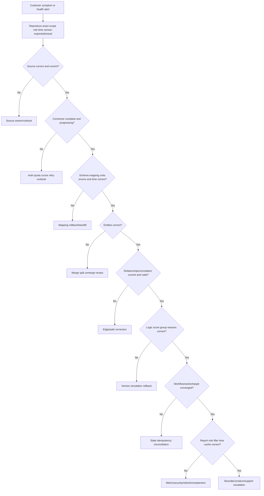

| Layer | Cheap check | Evidence | Repair risk |
|---|---|---|---|
| Source | Compare source UI/API sample and watermark | Source ID/time/count | Source load/permissions |
| Connector | Inspect run/cursor/pages/errors | Run/correlation IDs | Duplicate replay |
| Mapping | Trace one raw-to-canonical record | Schema/mapping version | Broad reprocessing |
| Entity | Inspect one cluster/link/contradiction | Entity/rule/review history | Downstream identity change |
| Relationship | Inspect edge endpoints/type/time/source | Edge/version/provenance | Routing/path changes |
| Logic | Recompute one reason/contribution | Rule/factor/threshold bundle | Population migration |
| Workflow | Trace one instance/action/target | State/attempt/key/target ID | Duplicate/harmful action |
| Report | Recompute one metric/filter | Definition/query/as-of/role | Restatement/security |
| Outcome | Revalidate source/business postcondition | Current evidence | False closure |

### Plain-English deep-dive 4 - The first wrong layer owns the root defect, not every symptom

A stale source can cause a missing relationship, lower score, closed workflow, and improved dashboard. Those downstream systems may behave exactly as designed on bad input. Calling each a separate root cause fragments the repair.

Think of contaminated water entering a building. Several taps produce bad water, but replacing every faucet misses the source. Identify the earliest supported defect, then still inspect downstream safeguards: did they detect staleness, hold action, and display degradation? Root cause and control failures can both matter.

## Data incident lifecycle

A data incident is a material failure of availability, quality, integrity, confidentiality, lineage, logic, or action that affects decisions or operations.

| Severity factor | Questions |
|---|---|
| Customer impact | Which decisions/actions/users/services are affected? |
| Security/privacy | Was data exposed, altered, crossed scope, or used for harmful action? |
| Breadth | How many entities/sources/tenants/reports/workflows? |
| Duration | First bad, last good, continuing? |
| Reversibility | Can outputs/actions be safely corrected? |
| Detectability | Is impact known or uncertain due to missing lineage? |
| Criticality | Which business services/risk processes? |
| Regulatory/contractual | Are notification/retention obligations triggered? Ask authorized teams. |

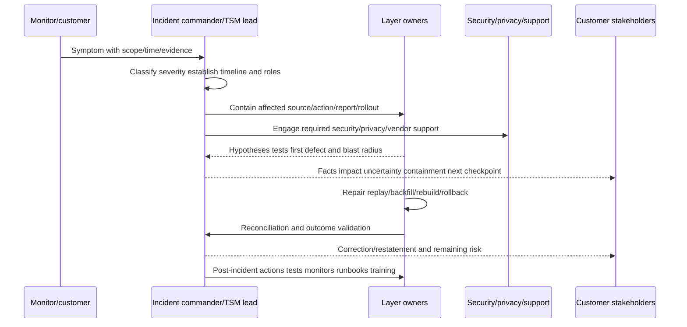

### Incident roles

| Role | Responsibility |
|---|---|
| Incident commander | Coordinates priorities, decisions, cadence, scope |
| Technical lead | Owns hypotheses/evidence/repair across layers |
| Scribe/timeline | Records facts, actions, decisions, timestamps |
| Customer/process owner | States business impact and accepts process decisions |
| Source/data owner | Validates source semantics/quality/correction |
| Security/privacy/legal/comms | Handles applicable security/privacy/notification decisions |
| Workflow/target owner | Contains/reconciles operational actions |
| Support/Product liaison | Submits bounded evidence and tracks vendor response |
| Executive liaison | Communicates material impact/decisions without speculation |

### Incident communication template

| Element | Example wording |
|---|---|
| Status | "Investigating a data-quality incident affecting payroll coverage reports and assignment workflows." |
| Impact | "Eighteen items may show wrong owner; new automated assignments are paused." |
| Evidence | "The first supported discrepancy begins after mapping version v12 at 06:10 UTC." |
| What not known | "We have not yet confirmed whether any CMDB write used the wrong entity." |
| Containment | "Scheduled report delivery and affected outbound actions are paused; source ingestion remains read-only." |
| Workstreams | "Mapping rollback, entity impact analysis, ticket/CMDB reconciliation, privacy review." |
| Next checkpoint | "Next evidence update at 14:00 UTC, earlier for material change." |
| ETA | "No recovery ETA until replay volume and target reconciliation are measured." |

Avoid invented ETAs. Give next evidence checkpoint, dependencies, and criteria for safe restoration.

## Repair, replay, backfill, rebuild, and reconciliation

| Operation | Meaning | Main risk | Control |
|---|---|---|---|
| Retry | Repeat a failed attempt | Duplicate if outcome ambiguous | Stable key/lookup/bounded retry |
| Replay | Reprocess events/records | Duplicate actions/state | Shadow/no-action mode, idempotency |
| Backfill | Load missing historical range | Volume, out-of-order, restatement | Bounded interval/checkpoint/monitor |
| Rebuild mapping | Recompute canonical records | Broad semantic change | Versioned fixture/impact analysis |
| Re-resolve entities | Recompute links/clusters | IDs/ownership/actions change | Freeze consumers, unmerge plan |
| Recompute logic | Re-evaluate score/groups | Queue/workload migration | Simulation and reason diff |
| Reconcile workflows | Compare source/workflow/target/outcome | Human edits/duplicate target | Field ownership and survivor policy |
| Restate reports | Correct metrics/history | Stakeholder trust/decision impact | Version, notice, affected decisions |

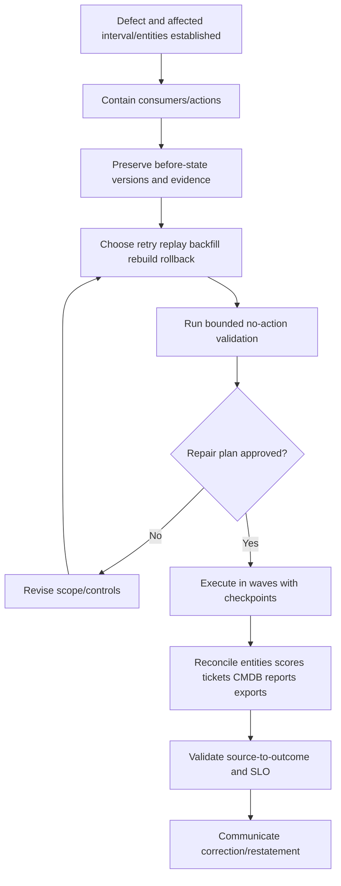

Never replay into live outbound actions unless action idempotency, current-state checks, approval, and reconciliation are proven for that scope.

## Change management and rollback

Every source schema, connector, mapping, entity rule, relationship rule, factor, threshold, workflow, report, permission, and retention change can affect outcomes.

| Change record field | Purpose |
|---|---|
| Change ID/owner | Accountability |
| Purpose/hypothesis | Why change is needed |
| Scope/dependencies | Sources/entities/use cases/consumers affected |
| Before/after versions | Reproduce and rollback |
| Risk/privacy/security | Consequence assessment |
| Test evidence | Fixtures, replay, sensitivity, performance, access |
| Simulation/shadow delta | Population/reason/workload impact |
| Approvals | Data, risk, process, security, customer authority |
| Deployment rings/window | Control blast radius |
| Observability/guardrails | Detect harm quickly |
| Rollback trigger/steps | Restore compatible bundle |
| Reconciliation | Correct outputs/actions after rollback |
| Communication | Users/stakeholders/support |
| Outcome review | Did hypothesis hold? |

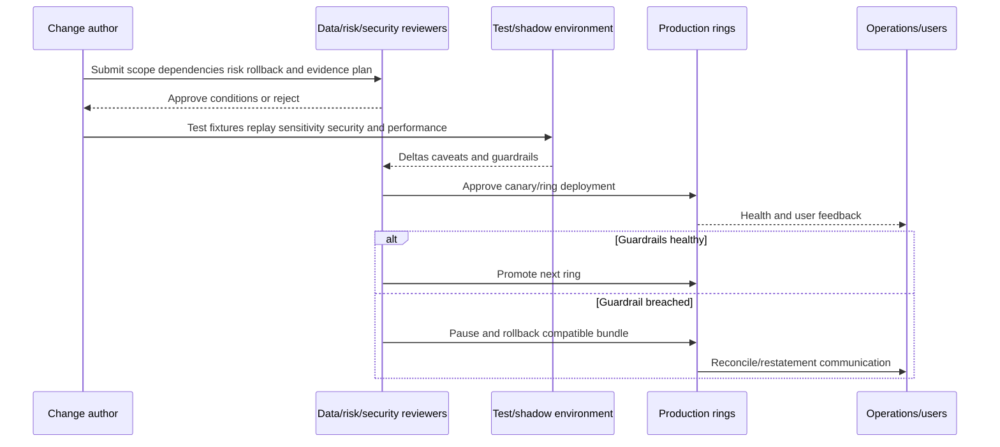

Rollback the dependency bundle, not one isolated rule. A mapping rollback may require entity/context rebuild, score recompute, ticket reconciliation, and report restatement.

## Support and escalation evidence

Escalate only after bounding what is known, but do not delay urgent security/privacy containment. Use official support paths and current documentation.

| Evidence | Why it matters | Safety |
|---|---|---|
| Business/customer impact | Sets severity and priority | Factual, no speculation |
| Tenant/environment/product/licensing context | Reproduces supported behavior | Share through approved channel |
| Exact symptom | One concise expected vs actual case | Avoid broad "not working" |
| Reproduction steps | Enables verification | Use safe/non-destructive steps |
| Entity/source/workflow/report IDs | Anchors data path | Minimize customer identifiers |
| UTC timestamps/timezone | Correlates logs/runs | Include clock source |
| First bad/last good | Narrows change window | Evidence-based |
| Source/connector run/correlation IDs | Finds ingestion path | No tokens/secrets |
| Schema/mapping/rule/version bundle | Finds semantic/logic change | Include customer-config ownership |
| Counts/freshness/quality | Quantifies scope | Same grain/scope |
| Request/response status and correlation | Finds API/target behavior | Redact headers/payload |
| Screenshots/exports/logs | Visual evidence | Redact sensitive data |
| Changes/experiments | Shows what was tried/result | Avoid repeated unsafe changes |
| Current containment | Prevents duplicate/harmful action | State operational impact |
| Specific question/decision | Routes to right specialist | Ask bounded question |

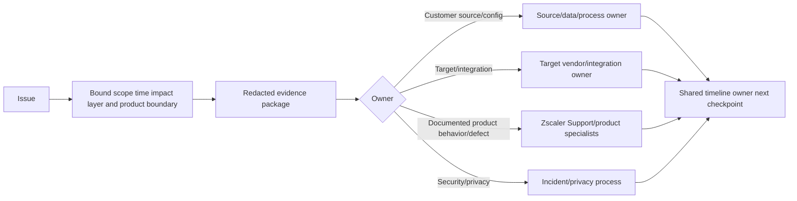

### Escalation quality rubric

| Weak | Strong |
|---|---|
| "Data is wrong" | "Asset-44 owner differs after mapping v12; raw source and v11 agree; affected interval/consumers listed" |
| Local time without zone | UTC timestamp plus source clock |
| Screenshot only | IDs, underlying values, filters, version, expected calculation |
| Huge unredacted log dump | Minimal relevant redacted artifacts and correlation IDs |
| Many changes at once | One hypothesis/test/result per step |
| Demand root cause immediately | Ask for documented behavior/diagnostic interpretation while evidence develops |
| Unsupported severity | Quantified business/security impact |
| Invented ETA | Dependency, next checkpoint, safe restoration criteria |

### Plain-English deep-dive 5 - A good escalation is a compressed experiment

Support engineers need enough information to distinguish hypotheses without rediscovering the environment. An evidence package should say what should happen, what happened, when, where, under which versions, how to reproduce, what changed, which test separates likely causes, and what impact exists.

Think of sending a laboratory sample with labels, collection time, method, expected range, and symptoms rather than an unlabeled bucket. More data is not always better. Relevance, provenance, chronology, and redaction make evidence useful.

## Adoption design by persona

Adoption means the intended workflow becomes normal, trusted, and effective. Training is role-specific and task-based.

| Persona | Critical task | Training method | Adoption evidence |
|---|---|---|---|
| Executive sponsor | Interpret outcome/health and make decisions | 30-minute scenario review | Timely decisions and follow-through |
| Risk/VM leader | Govern policy, exceptions, priorities, metrics | Workshop with decision cases | Policy reviews and resolved disputes |
| VM/SecOps operator | Validate reason, assign, update, escalate | Hands-on queue exercises | Correct task completion/time |
| Asset/app owner | Review owned context and remediate | Role-filtered walk-through | Acknowledgement/validated closure |
| Data/source owner | Monitor source/schema/quality and repair | Runbook/game day | SLO recovery and fewer repeats |
| Workflow/ITSM owner | Reconcile tickets/actions/exceptions | Failure simulation | Low drift/duplicates and fast repair |
| Auditor/compliance | Retrieve policy/evidence/history | Evidence trace exercise | Independent trace success |
| Champion | Coach peers and collect feedback | Train-the-trainer/office hours | Peer enablement and issue quality |
| TSM/account team | Connect health/adoption/value and escalation | Review cadence/template | Proactive risk/action plans |

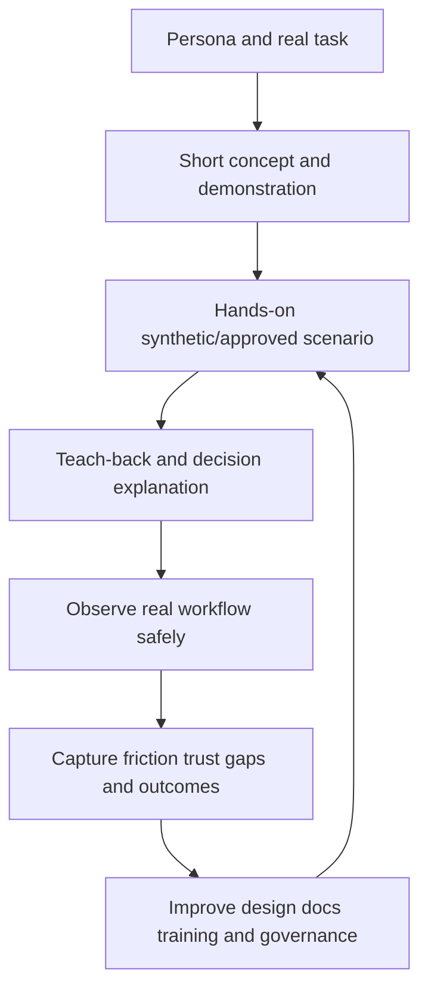

Avoid feature tours. Teach "when the owner is wrong, inspect provenance, hold assignment, correct/escalate, and verify reconciliation." Include failure and exception paths, not only happy clicks.

## Adoption metrics and anti-gaming

| Metric | Useful interpretation | Gaming/misread risk |
|---|---|---|
| Enabled users | Access readiness | Not usage/value |
| Active intended-role users | Reach of workflow | Login can be passive |
| Critical task completion | Users finish correct workflow | Easy tasks may dominate |
| Time to first value | First validated use-case outcome | Define outcome carefully |
| Acknowledgement/action time | Process responsiveness | Auto-ack can game |
| Teach-back success | User can explain reason/limits/action | Assessment quality |
| Override/appeal | Trust/logic feedback | Low may mean no voice |
| Export/offline workaround | Friction or unmet reporting need | Some exports legitimate |
| Support question quality | Users supply IDs/versions/evidence | Could suppress reporting if punitive |
| Champion coverage | Local support capacity | Title without activity |
| Training-to-task transfer | Trained users perform correctly | Attendance alone insufficient |
| Adoption by segment | Uneven teams/regions/personas | Privacy/fairness in monitoring |

Adoption telemetry should be minimized, transparent, authorized, and used for improvement rather than surveillance or punishment.

## Governance operating model

| Forum/cadence | Participants | Decisions/evidence |
|---|---|---|
| Weekly implementation | TSM, technical leads, source/workflow owners | Milestones, blockers, quality, changes |
| Weekly operations | Service owner, on-call, data/workflow/report owners | SLO, incidents, backlog, runbooks |
| Biweekly use-case | VM/SecOps/app owners/champions | Workflow friction, policy tuning, outcomes |
| Monthly data governance | Data/entity/semantic/privacy owners | Authority, schema, quality, access, retention |
| Monthly risk governance | Risk owner, VM, control/business owners | Factors, thresholds, exceptions, residual risk |
| Monthly value review | Sponsor, TSM, program/finance as needed | Baseline, outcomes, adoption, decisions |
| Quarterly strategic review | Executives, architecture, account/product partners | Roadmap, investment, risk, expansion/rationalization |
| Incident/PIR as needed | Incident roles and owners | Cause, control failures, corrections, prevention |

```mermaid
flowchart LR
    OPS[Operational health/incidents] --> GOV[Governance decision system]
    DATA[Data/entity/semantic quality] --> GOV
    RISK[Scoring/exceptions/residual risk] --> GOV
    USERS[Adoption/feedback/friction] --> GOV
    VALUE[Validated outcomes/TCO] --> GOV
    GOV --> CHG[Approved changes and priorities]
    GOV --> OWN[Owners dates and risk acceptance]
    GOV --> ROAD[Roadmap expansion or rationalization]
    CHG --> OPS
```

### RACI for implementation and operations

| Activity | Accountable | Responsible | Consulted | Informed |
|---|---|---|---|---|
| Outcome/use-case | Customer sponsor/risk owner | Program owner/TSM facilitates | Users/data/app owners | Account team |
| Source contract | Source/semantic owner | Integration/data engineer | Security/privacy/Fabric specialist | Program |
| Entity model | Data/security entity owner | Data/model team | Source/app/identity owners | Consumers |
| Risk logic | Risk/VM owner | Security analytics/admin | Control/business/data owners | Operators |
| Workflow action | Process/target owner | Workflow/integration team | Risk/security/privacy | Users |
| Metric/report | Metric owner | Analytics/report team | Data/process/accessibility owners | Audience |
| Service health | Data Fabric service owner | Operations/on-call | Source/target/vendor support | Stakeholders |
| Incident | Customer incident authority | Incident commander/technical teams | Security/privacy/vendor | Impacted users/executives |
| Adoption | Customer process owner | TSM/champions/enablement | Managers/product | Sponsor |
| Value | Sponsor | Program owner/TSM analysis | Metric/data/risk owners | Stakeholders |

RACI clarifies roles but does not replace named people, on-call rotations, decision deadlines, or escalation paths.

## Value realization and analytical honesty

Value connects implementation outputs to customer outcomes through explicit hypotheses and evidence.

| Level | Example measure | What it can support |
|---|---|---|
| Activity | Sources connected, users trained | Work completed, not value |
| Health | Freshness, quality, workflow reliability | Capability can be trusted |
| Adoption | Critical tasks completed by intended roles | Capability is used |
| Process | Less manual reconciliation, faster acknowledgement | Operational improvement |
| Security outcome | Validated gaps remediated, exposure age/recurrence reduced | Risk-reduction evidence |
| Business outcome | Reduced outage/risk handling effort, better audit readiness | Broader value with assumptions |
| Financial | Avoided tools/integration effort or modeled loss | Requires rigorous baseline/attribution |

```mermaid
flowchart LR
    INVEST[People product sources change] --> CAP[Healthy trusted capability]
    CAP --> USE[Intended user adoption]
    USE --> PROC[Better decisions and process]
    PROC --> SEC[Validated security outcome]
    SEC --> BUS[Business/financial contribution]
    EXT[Other programs changes seasonality] --> PROC
    EXT --> SEC
    EXT --> BUS
    BUS --> CAVEAT[State contribution uncertainty and alternatives]
```

| Value hypothesis | Baseline | Leading evidence | Outcome evidence | Caveat |
|---|---|---|---|---|
| Reduce asset reconciliation effort | Hours/month and dispute rate | Entity/context quality | Measured time/rework reduction | Process changes also contribute |
| Improve control coverage | Gap/unknown rate | Source health, owner/workflow adoption | Fresh validated coverage on stable denominator | New assets change scope |
| Improve vulnerability prioritization | Backlog/aging/owner distribution | Context coverage/reason trust | High-impact exposure validation/remediation | No breach prediction claim |
| Improve ticket hygiene | Duplicates/misroutes/drift | Stable keys/reconciliation | Lower duplicate/wrong assignment and rework | Volume changes |
| Improve executive confidence | Restatements/disputes/decision delay | Freshness/provenance visibility | Faster supported decisions | Survey bias |

### Plain-English deep-dive 6 - Contribution is often more honest than attribution

If coverage improves after Data Fabric rollout, the platform may have helped identify gaps and route work. Endpoint engineers, policy changes, budgets, another tool, or seasonal device retirement may also contribute. Claiming the platform caused the full change can be analytically weak.

Think of a successful recovery supported by diagnosis, medicine, nursing, rest, and patient behavior. State the mechanism and evidence: "The workflow identified six previously unowned gaps, routed them, and fresh control evidence later validated remediation; other program changes were not isolated." This is persuasive because it is inspectable.

## Customer health model

| Dimension | Healthy evidence | Risk signal | Action |
|---|---|---|---|
| Outcome alignment | Sponsor priorities/use cases current | Dashboard work disconnected from strategy | Reconfirm success plan |
| Technical foundation | Required sources/quality/SLO stable | Repeated degraded data | Stabilize before expansion |
| Workflow adoption | Owners act and validate outcomes | Exports/manual workarounds | Observe/redesign/train |
| Governance | Decisions/owners/cadence functioning | Exceptions/rules drift | Reestablish forum/authority |
| Stakeholder strength | Sponsor/champions/users engaged | Single-threaded champion | Broaden relationships |
| Support health | Incidents resolved with evidence/PIR | Repeat tickets/poor handoffs | Runbook/quality improvement |
| Product fit | Required licensed capabilities validated | Assumption/roadmap dependency | Clarify gap/alternative |
| Value evidence | Baseline and outcomes reviewed | Activity-only story | Improve measurement |
| Change readiness | Safe pipeline/rollback/training | Direct edits/change fatigue | Stage and communicate |
| Trust | Definitions/provenance/corrections accepted | Metric/entity disputes | Transparency and repair |

Do not collapse these into one unexplainable health color. If a composite is used, preserve component status, evidence, owner, and action.

## 30/60/90-day customer implementation and adoption roadmap

The roadmap is a template, not a guaranteed product deployment timeline. Adjust to source access, security review, customer capacity, connector support, and risk.

### Days 0-30 - Learn, align, and prove readiness

| Workstream | Actions | Exit evidence |
|---|---|---|
| Outcome | Confirm sponsor, pain, baseline, use-case hypothesis | Approved outcome charter |
| Stakeholders | Map risk, VM, SOC, data, identity, app, CMDB, privacy, integration, users | Named RACI/cadence |
| Architecture | Inventory SIEM/lake/warehouse/CMDB/iPaaS/SOAR/source flows | Current-state diagram |
| Sources | Profile minimum sources, IDs, scope, quality, access, quotas | Source contracts/readiness |
| Security | Complete purpose, classification, RBAC, secret, retention review | Approved controls/open risks |
| Process | Map current assignment/remediation/report flow | Process baseline |
| Design | Draft entity/context/logic/workflow/report contracts | Reviewable solution design |
| Operations | Draft health SLIs, runbooks, support path | Operating-model draft |
| Adoption | Select champions and critical tasks | Enablement plan |

### Days 31-60 - Build and validate a thin slice

| Workstream | Actions | Exit evidence |
|---|---|---|
| Ingestion | Configure approved bounded source scope and checkpoints | Reconciled source runs |
| Semantics | Map fields and profile errors | Mapping fixtures/quality report |
| Entities/context | Resolve representative entities/relationships | Labeled review/edge audit |
| Logic | Configure/test synthetic/customer-approved groups/scoring | Replay/reason/sensitivity evidence |
| Workflow | Shadow then human-gated pilot | State/idempotency/failure tests |
| Reporting | Build role/data-health/workflow views | Source-to-visual validation |
| Operations | Monitor, alert, run game days | Runbook/game-day evidence |
| Adoption | Hands-on persona training and teach-back | Task completion/feedback |
| Governance | Review pilot criteria, incidents, assumptions | Decision log |

### Days 61-90 - Accept, scale carefully, and institutionalize

| Workstream | Actions | Exit evidence |
|---|---|---|
| Acceptance | Jointly review functional/quality/security/ops/adoption/value | Accept/conditional/reject decision |
| Rollout | Expand one source/use-case/user ring at a time | Guardrails healthy |
| Change | Establish production version/approval/rollback pipeline | Auditable change process |
| Support | Finalize escalation package templates/on-call contacts | Tested support path |
| Adoption | Office hours, champions, job aids, manager reinforcement | Sustained task use |
| Governance | Operational/data/risk/value/strategic cadences | Recurring forums with decisions |
| Value | Compare baseline to validated outcomes with caveats | Value review |
| Roadmap | Prioritize next use cases/sources and rationalization | Approved next-quarter plan |
| Handover | Confirm service owner, documentation, access, runbooks | Operational acceptance |

```mermaid
gantt
    title Synthetic 30/60/90 roadmap (adjust to evidence, not a promise)
    dateFormat  YYYY-MM-DD
    section 0-30 Align
    Discovery and outcome charter       :a1, 2026-08-24, 10d
    Source/security readiness           :a2, after a1, 20d
    Design and operating model          :a3, after a1, 20d
    section 31-60 Prove
    Bounded ingestion and semantics     :b1, after a2, 15d
    Entity logic reports workflow pilot :b2, after b1, 15d
    Training and game days              :b3, after b1, 15d
    section 61-90 Scale
    Acceptance and limited rollout      :c1, after b2, 12d
    Governance and handover             :c2, after b3, 18d
    Value review and next roadmap       :c3, after c1, 18d
```

## Complete synthetic NMH source-to-outcome scenario

NMH wants to reduce missing endpoint-control coverage on payroll production assets and use that context to improve vulnerability prioritization. The scenario exercises every layer and includes an incident/recovery.

### Outcome and baseline

| Item | Synthetic definition/value | Boundary |
|---|---|---|
| Business outcome | Reduce validated endpoint-control gaps on payroll production assets | Does not prove every threat blocked |
| Baseline population | 120 resolved active production assets | Stable eligibility contract |
| Baseline gaps | 24 validated missing/stale control, 8 unknown | 20% gap plus unknowns shown |
| Process baseline | Manual weekly spreadsheet; 10% wrong assignment; 5-day median acknowledgement | Synthetic measurement |
| Pilot goal | Trustworthy daily context and human-gated remediation workflow | Not autonomous control deployment |
| Sources | Cloud inventory, EDR, CMDB, app registry, directory, scanner, ITSM | Synthetic records |
| Owners | Endpoint Security, PayrollOps, Cloud Platform, VM, CMDB, Data Governance | Named fictional teams |
| Value hypothesis | Better identity/context and routing contributes to faster validated coverage repair | Causal caveat |

### Architecture and contracts

```mermaid
flowchart LR
    CLOUD[Cloud resource inventory] --> ING[Ingestion/checkpoints]
    EDR[Endpoint control evidence] --> ING
    CMDB[CI service owner records] --> ING
    APP[Application/service registry] --> ING
    ID[Directory/organization] --> ING
    SCAN[Vulnerability findings] --> ING
    ING --> MAP[Canonical mapping and provenance]
    MAP --> ENT[Asset/user/app entity resolution]
    ENT --> REL[Owner service control finding relationships]
    REL --> LOGIC[Gap/risk logic and groups]
    LOGIC --> DASH[Operator health executive dashboards]
    LOGIC --> WF[Human-gated remediation workflow]
    WF --> ITSM[Ticket target and scoped CMDB update]
    ITSM --> RECON[Reconciliation]
    EDR --> RECON
    RECON --> OUT[Validated coverage outcome]
    OUT --> DASH
```

| Layer | Key contract | Acceptance evidence |
|---|---|---|
| Cloud source | Production accounts/resources, stable resource IDs, 2-hour cadence | Scope/count/watermark reconciliation |
| EDR source | Agent/device ID, health, mode, policy, observed time | Current evidence and stale behavior |
| CMDB | Exact CI ID, owner/service fields, field authority | Read-only initially; approved patch fields |
| App registry | App instance -> payroll service relationship | Owner-approved effective mapping |
| Directory | Person/account/team IDs and lifecycle | No email-only identity |
| Scanner | Finding occurrence on scoped asset | Source status/time/provenance |
| Mapping | Types/enums/timezones/units/custom fields | Fixtures including unknown/invalid |
| Entity | Physical/cloud asset lifecycle and aliases | Labeled merge/split review/unmerge |
| Relationships | Owned_by/supports/protected_by/located_on with time | Orphan/stale/conflict controls |
| Logic | Gap state and bounded risk context | Reasons, unknowns, simulation |
| Workflow | One episode/ticket, owner, approval, postcondition | Timeout/duplicate/reconcile tests |
| Reporting | 18/120-style counts, health/freshness, drill | Source-to-visual/access tests |

### Implementation sequence

1. **Discovery:** Sponsor defines control coverage and prioritization outcome; operators demonstrate spreadsheet reconciliation and wrong routing.
2. **Readiness:** Source owners approve minimum scope; identity contracts reject hostname/IP as sole keys; privacy review minimizes user fields.
3. **Source wave 1:** Cloud, EDR, and CMDB ingest in shadow mode. Counts, watermark, pagination, schema, and auth are reconciled.
4. **Mapping:** Raw values remain preserved. `monitor`, `enforce`, `unknown`, and stale states map distinctly.
5. **Entity resolution:** Cloud resource ID, agent ID, CMDB CI, lifecycle, and supporting attributes build stable assets with review/unmerge.
6. **Context:** App registry connects assets to payroll; current owners and EDR control evidence use effective time/provenance.
7. **Source wave 2:** Scanner findings and directory/organization context join after the asset foundation passes acceptance.
8. **Logic:** Gap is missing/invalid/stale relevant control; unknown remains a separate hold. Risk context uses reachability, service impact, finding evidence, and control state without claiming a proprietary formula.
9. **Dashboard:** Operators see item/reason/owner/action; data owners see source/entity health; executives see rate/count/trend/decisions with freshness.
10. **Workflow:** One stable episode key upserts a human-reviewed ITSM task. CMDB derived coverage writes require approval and read-back.
11. **Validation:** Closure requires fresh healthy enforcing EDR evidence on the exact asset and source/workflow/target reconciliation.
12. **Adoption:** Operators and owners complete hands-on cases, failure drills, and teach-back; champions host office hours.
13. **Governance:** Weekly operational, monthly data/risk/value, and quarterly strategic reviews own changes and next waves.

### Normal outcome evidence

After the synthetic pilot window, six of 24 validated gaps have fresh healthy enforcing control evidence; eligible assets remain 120; unknowns fall from eight to three after identity/source repair; wrong assignment in the reviewed pilot sample falls; two exceptions remain documented with expiry. The report says gap rate moved from 24/120 (20%) to 18/120 (15%). It does not claim the platform caused every change or that all risk fell by 25 percent.

| Evidence | Interpretation |
|---|---|
| Stable denominator 120 | Improvement is not from removing eligible assets |
| Six source-validated controls | Supports coverage remediation for six assets |
| Ticket/workflow history | Shows routing and process contribution |
| Engineer/change evidence | Confirms human remediation work |
| Three remaining unknowns | Keeps uncertainty visible |
| Two active exceptions | Residual risk/governance visible |
| Source health current | Outcome is not caused by outage |
| No incident evidence | Coverage scenario does not imply compromise |

### Synthetic data incident

On a Tuesday, EDR adds enum `observe_only`. Mapping version v12 treats any nonempty mode as `enforcing`. Twelve assets receive false mitigation credit; three vulnerability items move below accelerated review; two workflows close; executive coverage appears 90 percent. Connector runs remain green.

```mermaid
sequenceDiagram
    participant E as EDR source
    participant M as Mapping v12
    participant L as Logic/report/workflow
    participant IC as Incident team
    participant T as ITSM/CMDB targets
    E->>M: New observe_only enum
    M->>L: Incorrect enforcing value
    L->>T: Two closure/update requests
    L-->>IC: Distribution invariant alert and user discrepancy
    IC->>L: Pause control credit workflows and scheduled report
    IC->>M: Compare raw enum v11/v12 fixture
    M-->>IC: Mapping defect confirmed
    IC->>M: Roll back mapping bundle and quarantine enum
    M->>L: Rebuild affected interval in no-action mode
    L->>T: Reopen/reconcile affected tickets and correct CMDB field
    L-->>IC: Restore 18/120 and publish restatement
```

### Incident response

1. **Detect:** A control-mode distribution invariant and operator report conflict with the executive dashboard.
2. **Classify:** Data integrity/decision/workflow incident affecting twelve assets, three priorities, two workflow closures, one report cycle, and two CMDB derived fields; no evidence of unauthorized access.
3. **Contain:** Pause control-based mitigation credit, affected workflow closure/CMDB writes, and scheduled executive report; keep read-only source ingestion for evidence.
4. **Preserve:** Capture raw source payload samples, run IDs, mapping v11/v12, entity IDs, logic/reason versions, workflow/action/target IDs, report version, first bad/last good.
5. **Diagnose:** Connector completeness is healthy. Raw enum is new. Mapping default converts it incorrectly. Entity/context are correct.
6. **Scope:** Trace lineage from mapping v12 to twelve assets and every score/group/workflow/report/target consumer.
7. **Repair:** Roll back the compatible mapping/derived-field bundle; map `observe_only` to a distinct non-enforcing state after owner approval; quarantine unknown future enums.
8. **Rebuild:** Reprocess the affected interval in no-action mode and compare reasons/results with v11 plus approved v13.
9. **Reconcile:** Restore priorities; reopen two tickets; correct two CMDB derived fields conditionally; restore dashboard 18/120; identify/export recipients.
10. **Communicate:** Explain impact, what did not occur, correction, remaining uncertainty, and next checkpoint; issue report restatement.
11. **Prevent:** Add schema enum contract, fail-closed mapping, distribution/monotonicity tests, source-change notification, canary, and runbook updates.
12. **Validate:** Confirm source, mapping, entity, context, logic, workflow, CMDB, report, and outcome convergence before resuming.

| Incident claim | Honest wording |
|---|---|
| Root defect | "Mapping v12 classified new `observe_only` enum as enforcing." |
| Control failure | "Unknown-enum and distribution guardrails did not block publication soon enough." |
| Impact | "Twelve assets, three priorities, two closures, two derived CMDB fields, and one executive report cycle were affected." |
| What did not happen | "No evidence indicates control enforcement changed at endpoints or that compromise occurred." |
| Recovery | "Compatible bundle restored; affected interval rebuilt; targets/reports reconciled." |
| Value/trust | "Correction and prevention evidence are included in the next governance review." |
| Product boundary | "All enums, versions, counts, SLOs, and outcomes are synthetic." |

### Adoption and value follow-through

Operators learn to inspect control mode/provenance rather than trust a green badge. Data owners add schema-change ownership. Executives receive a corrected report with the data-health panel. The TSM frames the incident as a trust test: automation was paused, lineage bounded impact, and every downstream effect was reconciled. The roadmap delays the next source wave until two healthy review cycles and the new enum guardrails pass.

## Synthetic exercises with answers

### Exercise 1 - Discovery

The customer asks to "connect all tools." What do you ask first?

**Answer:** Which decision/outcome is failing, who acts, current process/pain/evidence, minimum sources, authority, security, success, and consequence. Connecting everything is not a use case.

### Exercise 2 - Readiness

The source API works, but no semantic owner can explain fields. Ready?

**Answer:** No for consequential use. Assign an owner and contract meaning, grain, time, nulls, enums, authority, and quality. A technically accessible unknown schema is not decision-ready.

### Exercise 3 - Pilot

Why include failures in pilot testing?

**Answer:** Production will have stale sources, schema drift, false links, timeouts, and wrong permissions. A pilot should prove containment, runbooks, rollback, reconciliation, and communication, not just happy-path function.

### Exercise 4 - Acceptance

Dashboard opens and values look plausible. Accept?

**Answer:** Not yet. Reconcile source counts, mapping/entity/context, logic reasons, workflow state/actions, metric denominators/filters, security, reliability, performance, operability, user tasks, and outcome evidence.

### Exercise 5 - Health

All connectors are green. Is service healthy?

**Answer:** Not necessarily. Check semantic validity, identity/context, logic, workflow convergence, report trust, security, adoption, and validated outcomes. Component success can hide end-to-end failure.

### Exercise 6 - SLO

Can Arti claim a 99.9 percent Zscaler connector SLO from this guide?

**Answer:** No. SLO examples must be customer-approved and measured; official vendor commitments come only from current contracts/documentation. This guide supplies design patterns, not defaults.

### Exercise 7 - Incident

Score dropped after a source change. Tune weights first?

**Answer:** No. Verify source health/schema, mapping, entity/context, then logic. Freeze consequential changes and inspect reason/version deltas. Fix the earliest wrong layer.

### Exercise 8 - Replay

Can corrected history be replayed into live workflows?

**Answer:** Only after bounded no-action validation and proof of current-state checks, stable keys, idempotency, approvals, and reconciliation. Otherwise replay may duplicate or undo valid work.

### Exercise 9 - Support

What makes an escalation actionable?

**Answer:** Impact, exact expected/actual, safe reproduction, UTC times, IDs/correlation, first bad/last good, versions, source/count/quality evidence, changes/tests, containment, redacted artifacts, and one bounded question.

### Exercise 10 - Adoption

Are 100 logins evidence of value?

**Answer:** They show access/interest at most. Measure critical task completion, correctness, acknowledgement, validated outcomes, workarounds, trust, overrides, training transfer, and segment adoption.

### Exercise 11 - Value

Coverage improved after rollout. Can all improvement be attributed to Data Fabric?

**Answer:** Usually not. Show mechanism and contribution: identified/routed items, owner actions, fresh source validation, stable denominator, alternatives, and uncertainty.

### Exercise 12 - Product claim

Can Arti claim exact Zscaler health endpoints, runbooks, onboarding time, or support diagnostics?

**Answer:** No. Verify current official documentation, tenant behavior, contracts, and specialists. Keep detailed NMH operations explicitly synthetic/general.

## Labs and rehearsal

### Lab 1 - Discovery workshop

Facilitate a 60-minute NMH session covering outcome, current process, pain evidence, users, sources, authority, architecture, security, operations, constraints, and success.

### Lab 2 - Use-case prioritization

Rank six candidate use cases by value, decision clarity, readiness, identity, process, measurability, safety, representativeness, time to value, and reuse.

### Lab 3 - Readiness gate

Evaluate sponsor, source owner, access, identity, quality, privacy, workflow, metric, operations, change, and adoption. Create blocking actions/owners/dates.

### Lab 4 - Source plan

Build contracts for cloud, EDR, CMDB, app registry, directory, scanner, and ITSM including volume, cadence, auth, schema, quality, recovery, and acceptance.

### Lab 5 - Layered design review

Review source, connector, mapping, entity, correlation, scoring, workflow, report, security, operations, adoption, and value. Label documented/observed/assumed/synthetic.

### Lab 6 - Pilot and acceptance

Define population, negative cases, criteria, evidence, exit decisions, and rollback. Reject vanity acceptance.

### Lab 7 - Rollout rings

Plan test, shadow, pilot, limited, expanded, and institutionalized stages with entry/exit/guardrail/communication.

### Lab 8 - Health SLOs

Define customer-approved SLIs/objectives for freshness, completeness, mapping, entities, context, evaluation, workflow, reporting, recovery, adoption, and value.

### Lab 9 - Monitoring/alert lab

Write actionable alerts with signal, impact, dependency, owner, runbook, severity, and burn-rate logic. Eliminate noisy nonactionable alerts.

### Lab 10 - Runbook game day

Simulate stale source, 403, 429, schema drift, count mismatch, false merge, stale owner, score shift, duplicate ticket, and report discrepancy.

### Lab 11 - Data incident bridge

Run the `observe_only` incident with roles, timeline, containment, hypotheses, evidence, cadence, repair, reconciliation, and PIR.

### Lab 12 - Change/rollback drill

Deploy a mapping/logic bundle through test/shadow/canary; trigger guardrail; rollback; rebuild/reconcile; communicate.

### Lab 13 - Support package

Create a minimal redacted escalation with expected/actual, reproduction, UTC time, IDs, versions, impact, changes, artifacts, and bounded question.

### Lab 14 - Persona adoption

Design and deliver role-specific hands-on training, teach-back, office hours, job aids, and feedback for eight personas.

### Lab 15 - Value review

Present activity, health, adoption, process, security, business, and financial evidence with baseline, denominator, mechanism, alternatives, and caveats.

### Lab 16 - Interview capstone

In 15 minutes, whiteboard discovery -> design -> pilot -> SLOs -> incident -> adoption -> value for NMH. State official product facts, synthetic evidence, Arti bridge, and learning boundary.

| Lab evidence | Completion standard |
|---|---|
| Discovery | Outcome/current-state/pain/owners/constraints evidenced |
| Readiness | Blocking prerequisites and decisions explicit |
| Design | Every data/action/report/owner boundary governed |
| Pilot | Representative end-to-end and negative cases tested |
| Acceptance | Functional, quality, security, ops, adoption, value covered |
| Health | Layer SLIs/SLOs, dependencies, runbooks, alerts working |
| Incident/change | Containment, rollback, replay, reconciliation, communication demonstrated |
| Adoption | Personas complete/teach critical tasks |
| Value | Stable baseline/denominator and causal caveats used |
| Honesty | Product fact, observed evidence, assumption, and synthetic result separated |

## Common misconceptions to correct

| Misconception | Correct model |
|---|---|
| Implementation starts with connector setup | It starts with outcome, decision, owner, and readiness |
| Connecting all sources first is efficient | Prove a thin end-to-end slice, then scale |
| API access means data readiness | Meaning, authority, identity, quality, security matter |
| Pilot should test only happy path | Failure/recovery/adoption are core acceptance |
| Go-live equals success | It begins operational evidence and ownership |
| Green connector means healthy service | End-to-end semantics/actions/outcomes may be red |
| Uptime is enough | Freshness, completeness, correctness, safety, adoption, outcome matter |
| SLO is the same as SLA | Objective and formal commitment differ |
| Error budget permits security harm | Security/privacy/harmful actions may be zero-tolerance |
| Average latency proves experience | Use stage percentiles and critical segments |
| High match rate proves entity quality | False merges and consequence matter |
| No paths means no exposure | Coverage/query gaps remain |
| Lower scores mean lower risk | Missing/stale context may cause false improvement |
| Ticket closure proves remediation | Validate source/business postcondition |
| Dashboard usage proves adoption | Observe correct critical task completion |
| Training is a feature tour | It is task/failure/decision practice and teach-back |
| Champion title guarantees change | Champions need time, skill, trust, and feedback loops |
| More alerts improve monitoring | Actionable dependency-aware alerts improve response |
| Retry fixes all failures | Permanent/ambiguous/security defects need other handling |
| Replay is safe after a fix | Validate no-action, idempotency, current state, approvals, reconciliation |
| Rollback changes one setting | Restore compatible bundle and downstream state |
| Root cause is where symptom appeared | Find earliest supported wrong layer plus failed safeguards |
| Large log bundle improves escalation | Minimal relevant chronology/provenance/redaction is stronger |
| ETA must always be given | Give evidence checkpoint and recovery criteria when ETA unknown |
| Value equals activities completed | Connect health/adoption/process to validated outcomes |
| Post-rollout improvement proves causation | State mechanism, alternatives, and contribution |
| One health color is enough | Preserve component evidence, owner, and action |
| Public product pages provide implementation defaults | They provide bounded positioning; verify current details |

## Official Source Anchors

Research/source date: **2026-08-24**.

Zscaler sources support bounded Data Fabric, AEM, and UVM capability/use-case positioning. NIST sources support governance, continuous monitoring, measurement, controls, incident response, risk assessment, privacy, and secure development/change principles. W3C supports provenance and accessibility. Cloud/security architecture sources provide general reliability and operational guidance but do not define Zscaler internals. None establishes Zscaler's exact onboarding sequence, SLO, health API, runbook, support diagnostic, role, connector behavior, acceptance threshold, timeline, formula, or customer outcome.

| Source | URL | Used for | Boundary |
|---|---|---|---|
| Zscaler Data Fabric for Security | https://www.zscaler.com/products-and-solutions/data-fabric | Public sources/integrations, harmonize/dedup/correlate/enrich, logic, workflows, reports, AEM/UVM foundation | No internal topology, health, SLO, onboarding, or guarantee |
| Zscaler Asset Exposure Management | https://www.zscaler.com/products-and-solutions/caasm | Public asset resolution, relationships, golden records, coverage gaps, workflows, CMDB, reporting | No exact implementation/acceptance/runbook |
| Zscaler Unified Vulnerability Management | https://www.zscaler.com/products-and-solutions/vulnerability-management | Public contextual risk factors/controls, workflows, ticket reconciliation, reports | No exact scoring/default/workflow/health mechanics |
| NIST Cybersecurity Framework 2.0 | https://www.nist.gov/cyberframework | Govern/identify/protect/detect/respond/recover outcomes and profiles | Voluntary framework; requires tailoring |
| NIST SP 800-137 | https://csrc.nist.gov/pubs/sp/800/137/final | Continuous-monitoring strategy, asset/threat/vulnerability/control visibility | Published 2011, federal guidance; not product SLOs |
| NIST SP 800-55 Vol. 1 | https://csrc.nist.gov/pubs/sp/800/55/v1/final | Information-security measurement program principles | Not default metrics/targets |
| NIST SP 800-61 Rev. 3 | https://csrc.nist.gov/pubs/sp/800/61/r3/final | Incident-response integration with CSF 2.0/risk management | Not a data-incident product runbook |
| NIST SP 800-53 Rev. 5 | https://csrc.nist.gov/pubs/sp/800/53/r5/upd1/final | Access, audit, configuration, contingency, integrity, privacy controls | Requires tailoring and assessment |
| NIST SP 800-30 Rev. 1 | https://csrc.nist.gov/pubs/sp/800/30/r1/final | Risk-assessment concepts, likelihood/impact/uncertainty | Federal guidance; not scoring formula |
| NIST Privacy Framework | https://www.nist.gov/privacy-framework | Privacy-risk governance and communication | Voluntary; not legal advice |
| NIST SP 800-218 SSDF | https://csrc.nist.gov/pubs/sp/800/218/final | Secure development/change practices | Adapt to configured data/logic/workflow changes |
| NIST SP 800-128 | https://csrc.nist.gov/pubs/sp/800/128/upd1/final | Security-focused configuration management | Not product deployment procedure |
| W3C PROV-O | https://www.w3.org/TR/prov-o/ | Provenance concepts | Not a Zscaler lineage implementation |
| W3C WCAG 2.2 | https://www.w3.org/TR/WCAG22/ | Accessibility requirements/principles for report experiences | Conformance requires full evaluation |
| Google SRE Workbook - Implementing SLOs | https://sre.google/workbook/implementing-slos/ | General SLI/SLO/error-budget practice | Practitioner guidance; not vendor SLA/default |
| Microsoft Azure Well-Architected Reliability | https://learn.microsoft.com/en-us/azure/well-architected/reliability/ | General reliability, monitoring, recovery, change considerations | Azure-oriented; not Zscaler architecture |

## Likely Interview Questions

### Q1. How would you lead a Data Fabric implementation from discovery to value?

**Model answer:** I begin with sponsor outcome, decision, current process/pain baseline, users, sources, authority, security, constraints, and measurable success. I assess readiness, choose a valuable safe thin slice, contract minimum sources and semantics, design every layer and owner, pilot representative happy/failure paths, accept against functional/quality/security/operability/adoption/value evidence, expand by rings, and operate SLOs, incidents, change, governance, training, and outcome reviews.

### Q2. How do you choose sources and sequence onboarding?

**Model answer:** I start from the use-case minimum: authoritative identity and scope sources first, then findings/controls/business context, then workflow targets, then optional enrichment. Each contract defines owner, grain, authority, auth/network, scope, volume, cadence, schema, time, quality, quotas, recovery, privacy, and acceptance. I do not promise connector support or timelines without current official validation.

### Q3. What makes a pilot and acceptance plan credible?

**Model answer:** The pilot is bounded but representative, includes mixed entities/sources/users, uses reversible human-gated actions, and deliberately tests stale data, schema drift, false links, missing owner, boundary logic, timeout/duplicates, permissions, and report errors. Acceptance covers end-to-end function, counts/quality, entity/context, logic reasons, workflows/reconciliation, reporting, security/privacy, reliability/performance, runbook game day, persona task/teach-back, and bounded value evidence.

### Q4. How do you define and monitor Data Fabric health?

**Model answer:** I monitor source, connector, mapping, entity, relationship/correlation, scoring/grouping, workflow, reporting, security/privacy, adoption, and outcome layers. SLIs measure freshness, completeness, validity, identity/context quality, evaluation reasons, workflow correctness/timeliness, report reconciliation, recovery, user tasks, and outcomes. Customer-approved SLOs, burn rates, dependency impact, synthetic checks, and runbooks prevent green components from hiding red decisions.

### Q5. How do you troubleshoot and run a data incident?

**Model answer:** I reproduce exact scope/role/time/version and test source -> connector -> mapping -> entity -> relationship -> logic -> workflow -> report -> outcome, choosing the earliest plausible layer and a cheap discriminating check. For material incidents I establish roles/timeline, contain actions/reports, preserve evidence, scope lineage/blast radius, repair with versioned rollback/rebuild, reconcile every target/consumer, validate SLO/outcome, communicate facts/uncertainty/checkpoints, and add tests/monitors/runbook/process improvements.

### Q6. What belongs in a strong Support escalation?

**Model answer:** Quantified impact, exact expected versus actual, safe reproduction, tenant/environment/licensing context, UTC times, first bad/last good, source/run/entity/workflow/report/correlation IDs, source/count/freshness, schema/mapping/rule versions, request/response evidence, changes/tests/results, containment, minimal redacted artifacts, and one bounded question. I never include secrets, invent root cause, or promise an ETA without evidence.

### Q7. How do you drive adoption and prove value honestly?

**Model answer:** I co-design around persona tasks; deliver hands-on scenarios, failure paths, teach-back, champions, office hours, job aids, and manager/governance reinforcement; observe critical task success, friction, overrides, workarounds, and outcome validation. Value follows activity -> healthy capability -> adoption -> process -> security -> business contribution, with stable baselines/denominators and alternative explanations. Login/ticket counts are not value.

### Q8. How does your background transfer, and what can you claim about Zscaler?

**Model answer:** Microsoft escalation work trained me in discovery, networking/identity/service dependencies, evidence collection, SQL/data quality, hypothesis testing, cross-team incident leadership, RCA, change, mentoring, and executive/customer communication. I practiced the complete Data Fabric lifecycle in synthetic NMH cases. Zscaler publicly describes the capability/use-case categories, but I do not claim internal architecture, onboarding time, SLOs, health endpoints, diagnostics, formulas, roles, or outcomes; I would validate current documentation, tenant evidence, and specialists.

## 30-Second Memory Hooks

| Concept | Memory hook |
|---|---|
| Implementation | Open and operate the service, not install equipment |
| Discovery | Outcome before connector |
| Use case | Actor + problem + decision + action + outcome |
| Prerequisite | Preflight check protects customer |
| Thin slice | Source to validated outcome first |
| Pilot | Representative safe learning |
| Acceptance | Evidence-based graduation |
| Rollout ring | One controlled floor at a time |
| Go-live | Start of operating evidence |
| Health | Source-to-outcome, not uptime alone |
| SLI | Measured thermometer |
| SLO | Target range |
| SLA | Formal promise |
| Error budget | Reliability allowance, never harm permission |
| Monitor | Actionable signal plus owner/runbook |
| Runbook | Emergency checklist |
| Data incident | Wrong data can be operational harm |
| Root defect | Earliest supported wrong layer |
| Blast radius | Entities, decisions, actions, users, time |
| Replay | Reprocess carefully, action risk |
| Rollback | Compatible bundle plus reconciliation |
| Restatement | Correct history visibly |
| Escalation | Compressed experiment with redaction |
| Adoption | Correct task becomes normal work |
| Governance | Decision rights plus cadence/evidence |
| Value | Healthy + used + validated outcome |
| Contribution | Stronger than invented attribution |
| 30/60/90 | Align, prove, scale |
| Arti bridge | Escalation/analytics/customer leadership transfer; internals do not |

## Completion Checklist

- [ ] I define implementation, discovery, use case, prerequisite, dependency, assumption, constraint, pilot, acceptance, rollout ring, go-live, SLI, SLO, SLA, error budget, health, observability, runbook, data incident, blast radius, reconciliation, backfill, replay, rollback, restatement, adoption, champion, governance, value realization, RAID, and RACI before using them.
- [ ] I start with customer outcome, decision, current process/pain, evidence, owner, and consequence before sources/connectors.
- [ ] I use thin end-to-end slices and do not connect everything first.
- [ ] I define authority by field/entity/process/scope/time.
- [ ] I resolve identity before trusting context, scoring, workflow, or reports.
- [ ] I keep unknown, stale, invalid, conflict, and error states visible.
- [ ] I design reversible versioned change and consequence-based human gates.
- [ ] I place health/adoption beside value and preserve evidence over status colors.
- [ ] I separate documented facts, observed tenant behavior, customer requirements, general methods, assumptions, and synthetic examples.
- [ ] I discover business outcome, current process, pain, decisions, users, sources, authority, quality, architecture, security, operations, constraints, and success.
- [ ] I ask role-specific questions of sponsor, VM, SOC, CMDB, identity, cloud/app, data, integration, privacy, users, and Support/Product.
- [ ] I prioritize use cases by value, decision clarity, data/identity/process readiness, measurability, safety, representativeness, time to value, and reuse.
- [ ] I avoid first pilots requiring every source or autonomous high-impact action.
- [ ] I gate sponsorship, use case, source owner, access, identity, quality, security/privacy, workflow, reporting, operations, change, and adoption readiness.
- [ ] I treat a blocked prerequisite as an explicit planning/decision result.
- [ ] I document source use, owner, grain, authority, method, auth/network, scope, volume, cadence, schema, quality, limits, recovery, privacy, and acceptance.
- [ ] I never promise connector support or onboarding timeline without current validation.
- [ ] I design source, connector, provenance, mapping, entity, correlation, logic, grouping, workflow, reporting, security, operations, adoption, and value layers with owners.
- [ ] I label architecture claims by evidence class.
- [ ] I build pilots that are bounded, representative, reversible, human-gated, monitored, and measurable.
- [ ] I deliberately test stale source, schema drift, false merge, missing owner, score boundary, timeout, duplicate, expired exception, unauthorized access, and denominator defects.
- [ ] I define acceptance before pilot across function, source, mapping, entity, context, logic, workflow, report, security/privacy, reliability, performance, operability, adoption, value, and honesty.
- [ ] I use customer/risk-approved acceptance thresholds and do not invent vendor defaults.
- [ ] I deploy through test, shadow, pilot, limited, expanded, and institutionalized rings.
- [ ] I expand one source/use-case/user wave at a time with guardrails and rollback.
- [ ] I define health from source through connector, mapping, entity, relationship, correlation, logic, workflow, report, security, adoption, and outcome.
- [ ] I identify false-green conditions at every layer.
- [ ] I distinguish SLI, SLO, SLA, and error budget accurately.
- [ ] I use percentiles/windows/segments/burn rates where averages hide harm.
- [ ] I never treat error budget as permission for security/privacy/data-loss/harm incidents.
- [ ] I monitor source watermark/count/schema/auth/quota/cursor/entity/relationship/score/workflow/report/security/adoption/outcome with owners/runbooks.
- [ ] I alert on actionable dependency-aware conditions and suppress noise responsibly.
- [ ] I show affected downstream use cases/metrics/workflows when an upstream layer degrades.
- [ ] I maintain health panels for executive, connector, semantic, entity, logic, workflow, reporting, security, adoption, and value views.
- [ ] I do not average a critical red source into a green opaque score.
- [ ] I write executable runbooks with scope, access, safety, trigger, first checks, IDs/times, decision tree, containment, recovery, validation, communication, escalation, closure, prevention, and audit.
- [ ] I maintain runbooks for stale source, auth, quota, schema, counts, mapping, entity, relationship, score, workflow, report, security, and performance issues.
- [ ] I troubleshoot exact scope/role/time/version and test source -> connector -> mapping -> entity -> relationship -> logic -> workflow -> report -> outcome.
- [ ] I identify the earliest supported root defect and separately assess failed downstream safeguards.
- [ ] I classify data incidents by customer impact, security/privacy, breadth, duration, reversibility, detectability, criticality, and obligations.
- [ ] I assign incident commander, technical lead, scribe, customer, source, security/privacy, target, Support/Product, and executive roles as needed.
- [ ] I contain harmful actions/reports/rollout while preserving evidence.
- [ ] I communicate facts, quantified impact, unknowns, containment, workstreams, and next evidence checkpoint.
- [ ] I do not invent root cause or recovery ETA.
- [ ] I distinguish retry, replay, backfill, rebuild, re-resolution, recompute, reconciliation, and restatement.
- [ ] I validate repairs in bounded no-action mode before live replay.
- [ ] I reconcile entities, scores, groups, tickets, CMDB, reports, exports, caches, and actions after correction.
- [ ] I change-manage source schemas, connectors, mappings, entity/relationship rules, factors/thresholds, workflows, reports, permissions, and retention.
- [ ] I record purpose, scope, versions, risk, tests, deltas, approvals, rings, guardrails, rollback, reconciliation, communication, and outcome.
- [ ] I rollback compatible dependency bundles, not one isolated setting.
- [ ] I produce Support evidence with impact, environment, exact symptom, reproduction, IDs, UTC times, first bad/last good, versions, counts, requests, artifacts, changes, containment, and bounded question.
- [ ] I redact secrets, tokens, unnecessary personal/security data, and use approved channels.
- [ ] I train executives, risk/VM, operators, owners, data, workflow, audit, champions, and account roles around real tasks/failures.
- [ ] I use demonstration, hands-on practice, teach-back, observation, feedback, and iteration.
- [ ] I measure enabled/active users, critical tasks, time to value, acknowledgement, teach-back, overrides, workarounds, support quality, champion coverage, and transfer with anti-gaming caveats.
- [ ] I use adoption telemetry ethically, minimally, transparently, and for improvement.
- [ ] I establish implementation, operations, use-case, data, risk, value, strategic, and incident governance cadences.
- [ ] I assign RACI plus named people/on-call/deadlines/escalations.
- [ ] I distinguish activity, health, adoption, process, security, business, and financial evidence.
- [ ] I use stable baselines/denominators, mechanisms, outcome validation, alternatives, and contribution language.
- [ ] I do not call login, connector, report, or ticket counts value.
- [ ] I assess outcome alignment, foundation, workflow adoption, governance, stakeholders, support, product fit, value, change, and trust separately.
- [ ] I can adapt the 30/60/90 roadmap to evidence rather than promise fixed timelines.
- [ ] I can complete the NMH source-to-outcome implementation, enum incident, adoption/value follow-through, and all sixteen labs.
- [ ] I label every NMH source, schema, SLO, threshold, metric, timeline, incident, result, and outcome synthetic.
- [ ] I use the controlled research/source date exactly as 2026-08-24.
- [ ] I make no unsupported Zscaler topology, connector, onboarding time, SLO, health endpoint, runbook, role, diagnostic, acceptance threshold, formula, guarantee, production, or customer-outcome claim.
- [ ] I can answer Q1 through Q8 with definitions, analogies, architecture, mechanics, examples, tradeoffs, failures, troubleshooting, labs, NMH evidence, official-source caveats, and an honest Arti bridge.

[Part 69 - Cyber Assets, Inventory, CAASM, and Asset Exposure Fundamentals](Part-69-cyber-assets-caasm-fundamentals.md)