# Part 69 - Cyber Assets, Inventory, CAASM, and Asset Exposure Fundamentals

> **Audience:** Candidates preparing for a Zscaler Security Operations Technical Success Manager role after enterprise Support Escalation Engineering.
>
> **Purpose:** Build asset exposure knowledge from zero. Define cyber assets across endpoints, servers, networks, cloud, SaaS, identities, data, operational technology, and ephemeral resources; distinguish known, unknown, unmanaged, and rogue assets; separate discovery, inventory, configuration management databases, attack surfaces, and exposure; explain ownership, lifecycle, and criticality; position the CAASM category and Zscaler Asset Exposure Management (AEM) carefully; and turn visibility, control, risk, and compliance gaps into defensible use cases and metrics.
>
> **Scope and honesty:** Northstar Meridian Holdings, abbreviated NMH, is fictional. Every NMH asset, source, count, identifier, relationship, owner, score, threshold, control, gap, incident, metric, timeline, and outcome in this Part is synthetic. Zscaler public pages support bounded statements about Asset Exposure Management, CAASM, the Data Fabric for Security, multi-source resolution, deduplication, relationships, golden records, coverage gaps, workflows, CMDB updates, and reporting. Public pages do not disclose proprietary matching algorithms, internal topology, default policies, tenant schemas, exact connector behavior, guaranteed completeness, implementation times, or customer outcomes. Detailed mechanics below are general educational patterns, not undocumented Zscaler implementation claims. Your prior support, networking, identity, endpoint, SaaS, telemetry, SQL, data-quality, escalation, and customer-leadership skills transfer; direct production operation of Zscaler AEM remains a learning boundary.
>
> **Currency caveat:** Product capabilities, packaging, interfaces, connectors, terminology, documentation, and licensing change. The controlled research/source date for this Part is exactly **2026-08-24**. Current official documentation, licensed tenant behavior, approved design, source contracts, customer policy, security/privacy/legal requirements, product specialists, Support guidance, and measured evidence govern production.

## Section goal

A cyber asset is any digital or digitally connected resource that matters to an organization and can affect confidentiality, integrity, availability, safety, privacy, operations, or business value. Think of a large hospital campus. The hospital cannot protect only the beds listed in a purchasing spreadsheet. It must understand buildings, people, medicines, diagnostic machines, temporary equipment, vendors, doors, records, and the dependencies that keep care running. A modern enterprise has the same visibility problem across physical, virtual, cloud, SaaS, identity, data, and operational technology.

Asset exposure management begins with a deceptively simple question: **What exists now, why does it matter, who is responsible, how is it connected, and what protection should apply?** A list of names does not answer that question. Useful asset knowledge combines identity, type, lifecycle, ownership, business context, relationships, exposure, controls, provenance, and time.

By the end, you should be able to:

| Outcome | Demonstrated capability | Evidence artifact |
|---|---|---|
| Define assets | Explain technical, human, logical, data, cloud, SaaS, OT, and ephemeral assets | Asset taxonomy |
| Bound scope | State which environments, entities, times, and purposes an inventory covers | Scope statement |
| Separate concepts | Distinguish discovery, inventory, CMDB, attack surface, exposure, and CAASM | Comparison whiteboard |
| Classify visibility | Explain known, unknown, unmanaged, unauthorized, and rogue without collapsing them | State decision table |
| Model context | Add owner, custodian, user, lifecycle, criticality, location, service, and relationships | Context model |
| Explain CAASM | Describe the category as multi-source asset visibility and action, with limitations | Category narrative |
| Position AEM | Use only official public claims and state what must be verified | Product boundary sheet |
| Analyze gaps | Identify visibility, control, hygiene, risk, and compliance gaps | Gap register |
| Prioritize | Combine consequence, exposure, control, confidence, and uncertainty responsibly | Triage rubric |
| Measure | Define counts, coverage, freshness, ownership, unknown, action, and outcome metrics | Metric dictionary |
| Troubleshoot | Isolate scope, source, identity, context, policy, workflow, and reporting defects | Evidence-led runbook |
| Practice | Complete a synthetic NMH asset-exposure assessment | Lab portfolio |
| Bridge honestly | Connect enterprise support evidence to AEM work without inventing experience | Interview answer |

```mermaid
flowchart LR
    SCOPE[Scope business purpose and time] --> DISC[Discover observations from many sources]
    DISC --> RESOLVE[Resolve observations into asset identities]
    RESOLVE --> CONTEXT[Add owner lifecycle criticality and relationships]
    CONTEXT --> EXPECT[Define expected controls and policies]
    EXPECT --> GAP[Find visibility control hygiene and compliance gaps]
    GAP --> PRIOR[Prioritize with consequence exposure and confidence]
    PRIOR --> ACT[Investigate remediate accept or monitor]
    ACT --> VALID[Validate source and business postconditions]
    VALID --> IMPROVE[Improve sources rules ownership and controls]
    IMPROVE --> SCOPE
```

## JD Mapping

| Role expectation | Part 69 capability | TSM artifact | experience bridge and boundary |
|---|---|---|---|
| Become a Data Fabric and exposure expert | Explain how multi-source asset context supports exposure decisions | Asset architecture whiteboard | Verify current AEM behavior and licensing |
| Analyze complex technical environments | Inventory asset classes, boundaries, dependencies, owners, and unknowns | Current-state asset map | Microsoft service dependency mapping transfers |
| Identify security risks | Distinguish visibility, exposure, control, hygiene, and compliance conditions | Evidence-based gap register | Do not call every gap an incident |
| Recommend mitigations | Propose proportionate discovery, ownership, control, and lifecycle actions | Prioritized action plan | Customer risk owner approves treatment |
| Resolve complex issues | Trace scope through source, identity, context, policy, workflow, and report | Troubleshooting package | Evidence discipline transfers; product internals do not |
| Lead strategic engagements | Align Security, IT, cloud, IAM, data, OT, risk, and application owners | Governance charter | TSM coordinates rather than owns every asset |
| Communicate to executives | Explain inventory confidence, material gaps, decisions, and trends | Executive asset-health narrative | Avoid a false single-number certainty claim |
| Drive adoption and value | Tie asset views to real investigation and remediation tasks | Use-case and enablement plan | Dashboard views alone are not adoption |
| Partner cross-functionally | Define source, field, control, ticket, and product ownership | RACI and escalation path | Respect Support/Product/commercial boundaries |
| Explore AI responsibly | Use assistance for grouping or summaries with provenance and review | Human-reviewed analysis | No autonomous consequential action from uncertain identity |

## Candidate honesty note

| Evidence class | Safe interview statement | Boundary to state |
|---|---|---|
| Production transfer | "I diagnosed Microsoft 365 incidents across users, devices, identities, permissions, clients, networks, and cloud services." | Not production CAASM administration |
| Data transfer | "I reconciled telemetry, timestamps, identifiers, and customer context to isolate scope and ownership." | Not a claim about proprietary AEM matching |
| Customer transfer | "I led high-impact escalations, maintained evidence, coordinated owners, and validated recovery." | Not ownership of a formal enterprise exposure program |
| Analytics transfer | "I can define denominators, profile missing and stale data, compare cohorts, and explain uncertainty." | Metrics still need customer-approved semantics |
| Synthetic practice | "I built and tested an NMH asset taxonomy, gap analysis, metric set, and troubleshooting flow." | Fictional lab, not customer production |
| Official product fact | "Zscaler publicly positions AEM as a Data-Fabric-powered CAASM capability." | Verify current packaging, tenant behavior, and documentation |
| General method | "I would resolve multi-source observations, preserve provenance, and investigate conflicts before action." | General architecture, not disclosed Zscaler internals |
| Unknown | "I have not operated AEM directly; I would validate current documentation and measured tenant evidence." | Honest gap plus concrete ramp plan |

## Beginner vocabulary and memory hooks

| Term | Plain meaning | Why it matters | Analogy and memory hook |
|---|---|---|---|
| Asset | Something valuable or operationally relevant that can be affected through digital systems | Defines what needs context and protection | An item on the campus map |
| Cyber asset | Digital or digitally connected resource that handles data or affects operations | Broader than a laptop list | Anything with a digital doorway |
| Endpoint | User-facing computing device such as a laptop, desktop, or mobile device | Common identity, data, and control boundary | A worker's desk |
| Server | System that supplies a service or resource to other systems | Often supports many users and dependencies | A shared kitchen |
| Network device | Router, switch, firewall, access point, load balancer, or similar component | Moves or controls connectivity | Road, junction, or gate |
| Cloud resource | Provider-hosted compute, storage, database, network, identity, or managed service object | Dynamic and API-driven | Rented, programmable building space |
| SaaS | Software as a Service consumed as a provider-operated application | Data, identity, configuration, and vendor dependencies matter | Rented office with shared facilities |
| Identity | Human, service, workload, device, or machine principal used to authenticate or authorize | Can be an asset and a path to other assets | A badge and the holder it represents |
| Data asset | Information set, database, file collection, model, secret, or record store with value | Consequence may center on data rather than hardware | The contents of a vault |
| OT | Operational Technology that monitors or controls physical processes | Failure can affect safety and production | Digital controls for a factory line |
| IoT | Internet of Things device with sensing, computing, or communication | Often numerous and differently managed | Connected instrument |
| Ephemeral asset | Resource intentionally created for a short period | Can disappear before periodic inventory notices it | A temporary event badge |
| Workload | Application or processing unit running on compute resources | More stable business identity than some hosts | The job, not merely the desk |
| Observation | One source's statement about a possible asset at a time | Is evidence, not automatically a unique asset | One witness report |
| Record | Stored representation of an asset or observation | May be stale, duplicate, or partial | A card in a catalog |
| Identifier | Value used to distinguish or match an entity, such as serial, cloud ID, or directory object ID | Weak identifiers cause false merges or splits | Passport number versus nickname |
| Inventory | Governed view of in-scope assets and useful attributes | Supports decisions beyond detection | Maintained roster |
| Discovery | Process of finding evidence that assets exist | Feeds inventory but has blind spots | Walking rooms to see what is present |
| CMDB | Configuration Management Database holding configuration items and relationships for service management | Supports incident, change, problem, and service impact work | Service blueprint library |
| CI | Configuration Item managed in a CMDB | CMDB unit can differ from a security asset | One blueprint object |
| Attack surface | Set of reachable or usable opportunities through which an adversary could interact with assets | Focuses defensive scope | All doors, windows, and exposed services |
| Exposure | Condition that makes harm more plausible, such as reachability, weakness, privilege, or missing control | More specific than existence | An unlocked reachable window |
| Vulnerability | Weakness that may be exploited or triggered | One exposure input, not total risk | Defective lock |
| Control | Safeguard intended to prevent, detect, respond to, or recover from harm | Expected coverage must be validated | Lock, alarm, guard, or recovery plan |
| Coverage | Eligible population for which a control or source is present and effective under criteria | Needs an explicit denominator | Protected rooms divided by rooms requiring protection |
| Known asset | Asset represented in an approved, relevant inventory under current criteria | Enables governance but can still be risky | Person on the official roster |
| Unknown asset | Asset observed outside the approved inventory or not yet resolved | Requires investigation; not automatically malicious | Person seen but not identified |
| Unmanaged asset | Asset lacking an expected management relationship or control | May be authorized but weakly governed | Contractor without facility management enrollment |
| Unauthorized asset | Asset not approved for the environment or use | Policy status, not merely missing data | Badge not approved for this building |
| Rogue asset | Deliberately or materially unauthorized asset, often evading governance | Strong label requires evidence | Intruder, not merely an unregistered visitor |
| Ownership | Accountable business or technical responsibility for decisions about an asset | Enables remediation and risk acceptance | Named person responsible for the room |
| Custodian | Team operating or maintaining an asset for an owner | Does daily care without necessarily owning business risk | Facilities team |
| Lifecycle | States from request and creation through operation, change, retirement, and deletion | Prevents stale and orphan records | Joiner, mover, leaver for technology |
| Criticality | Importance based on business impact and security objectives | Helps prioritize but can be subjective | Intensive-care equipment versus waiting-room display |
| Provenance | Where a value came from and how it changed | Makes conflict and trust explainable | Label showing who reported it and when |
| Confidence | Bounded estimate of evidence strength | Prevents guesses from appearing certain | How much to trust a witness report |
| CAASM | Cyber Asset Attack Surface Management, a category for aggregating asset evidence, resolving identity/context, finding gaps, and enabling action | Addresses fragmented asset views | City census plus inspection coordinator |
| AEM | Asset Exposure Management, Zscaler's public product name for its CAASM offering | Product-specific positioning | Zscaler's named asset exposure capability |
| Data Fabric | Integrated data capabilities that connect, harmonize, deduplicate, correlate, enrich, and operationalize data | Publicly described foundation for AEM | Sorting and linking room behind the catalog |
| Golden record | Consolidated context-rich representation assembled from source evidence | Useful view, not infallible truth | Best current case file with cited witnesses |
| Reconciliation | Compare expected and actual populations or states and explain differences | Detects silent gaps | Balance the asset ledger |
| Compliance | Meeting applicable internal or external requirements with evidence | Inventory supports but does not itself prove compliance | Showing required inspections, not just owning a checklist |

## Product claim boundary

Zscaler's public AEM page describes a high-fidelity asset inventory, multi-source entity deduplication, relationships, golden records, coverage gaps, workflows, CMDB updates, reporting, and Data Fabric connectors. Those statements establish product positioning. They do not let an interviewer infer exact algorithms, defaults, licensed features, supported sources in a particular tenant, or guaranteed results.

| Publicly supported statement | Safe educational interpretation | Production verification needed | Unsupported leap to avoid |
|---|---|---|---|
| AEM is positioned as CAASM powered by Data Fabric for Security | Explain AEM within a multi-source asset workflow | Current packaging and tenant entitlement | "Every Zscaler customer has every AEM feature" |
| AEM provides asset resolution across source systems | Discuss source observations becoming consolidated asset views | Exact matching behavior, fields, overrides, and review | "The algorithm never merges unrelated assets" |
| Public details name endpoints, cloud resources, network devices, and more | Use a broad asset taxonomy | Exact supported entity types and connector scope | "Every OT, data, SaaS, and identity object is automatically inventoried" |
| AEM describes deduplication, relationships, and golden records | Teach identity, context, provenance, and relationship concepts | Current UI, schema, confidence, and correction mechanics | "Golden means perfect or legally authoritative" |
| AEM describes coverage gaps and missing controls | Teach applicability-aware coverage analysis | Exact policies, evidence, health semantics, and defaults | "Installed software proves healthy enforcement" |
| AEM describes workflows and CMDB updates | Teach controlled operationalization | Available targets, permissions, approvals, idempotency, and reconciliation | "CMDB writes are automatically safe" |
| Data Fabric describes many integrations and flexible ingestion | Explain broad source planning | Current integration catalog, quotas, auth, and delivery behavior | Promise any connector or timeline |
| AEM use cases include asset context for UVM, risk, and CTEM | Explain asset data as an input to broader programs | Licensed integration and measured decision quality | Claim automatic risk reduction or compliance |

### Plain-English deep-dive 1 - An asset is a decision boundary, not merely a device

A laptop is easy to picture, so beginners often define assets as physical machines. That model fails quickly. A privileged service account can open many systems without being a device. A public storage bucket can expose data without acting like a server. A SaaS tenant can hold sensitive records while the provider owns the hardware. A short-lived container can process payments and disappear in minutes. A production recipe database can matter more than the virtual machine currently hosting it.

Treat an asset as a **decision boundary**: something for which the organization may need to decide ownership, allowed use, protection, monitoring, change, incident scope, retention, recovery, or retirement. Different processes choose different grains. Finance may track a purchased laptop. Endpoint security may track one operating-system installation. Cloud security may track a virtual-machine instance. Service management may track a business application. Identity governance may track a service principal. None is universally the one true grain.

The analogy is a transportation company. It tracks vehicles for maintenance, routes for service delivery, drivers for authorization, depots for operations, fuel cards for fraud control, passenger data for privacy, and contracts for supplier risk. Calling only vehicles "assets" would make the company blind. The practical rule is: define the entity, purpose, scope, grain, authority, and time before counting.

## Cyber asset universe

An enterprise asset universe is a set of asset classes plus the rules that say what is in scope. The same object may appear in several classes. A network appliance is hardware, a managed operating system, a configuration item, an identity-bearing device, and a dependency of a business service. Taxonomy helps navigation; it should not erase overlap.

| Asset class | Examples | Stable identity candidates | Fast-changing context | Typical owners and sources | Common blind spot |
|---|---|---|---|---|---|
| Endpoints | Laptop, desktop, mobile, VDI session | Serial, hardware UUID, MDM ID, directory device ID | IP, user, posture, location, agent heartbeat | End-user computing; EDR, MDM, IAM | Reimaging creates apparent duplicates |
| Servers | Physical host, VM, database server | Serial, VM ID, cloud instance ID | IP, hostname, software, environment | Infrastructure/cloud; EDR, scanner, CMDB | Clones share weak identifiers |
| Network | Router, switch, firewall, AP, load balancer | Device serial, management ID | Interfaces, IPs, firmware, routes | Network team; controller, scanner, CMDB | Unmanaged branch or lab gear |
| Cloud compute | VM, function, container task, cluster node | Provider resource ARN/URI/ID plus account | Region, tags, image, state, public access | Cloud platform; provider APIs, CSPM | Short-lived jobs vanish between polls |
| Cloud data | Object store, database, queue, secret store | Provider resource ID | Classification, policy, encryption, exposure | Cloud/data teams; cloud APIs, DSPM | Data importance absent from infrastructure record |
| SaaS | Tenant, application instance, workspace, integration | Vendor tenant/app/object ID | Admins, sharing, settings, active use | App owner; CASB, SSO, vendor API, procurement | Unsanctioned or free-tier use |
| Application | Business app, API, service, microservice | Service catalog ID, deployment ID | Version, endpoint, dependency, owner | App/DevOps; catalog, CI/CD, tracing, CMDB | Code repository not linked to runtime |
| Identity | Employee, contractor, admin, service account, workload principal | Directory immutable ID, provider principal ID | Role, privilege, status, credential age | IAM/HR/app owner; directory, PAM, HR | Dormant service identities lack owner |
| Data | Dataset, database, file share, model, secret | Catalog ID, resource ID, logical name under scope | Classification, residency, lineage, retention | Data owner/custodian; catalog, DSPM, app | Copies proliferate beyond catalog |
| OT and IoT | PLC, HMI, sensor, camera, medical device | Vendor serial, controller ID, MAC with caveats | Firmware, process role, network zone | Plant/biomedical/facilities; passive discovery | Active scanning may be unsafe |
| Software | Installed package, image, library, firmware | Package identifier plus version/platform | Patch state, support status, configuration | Platform/app owner; EDR, scanner, SBOM | Embedded dependency invisible at runtime |
| Certificate and key | TLS certificate, API key, signing key | Thumbprint/key ID under authority | Expiry, binding, rotation, privilege | PKI/app/security; certificate manager, vault | Unknown owner causes expiry outage |
| Business service | Payroll, order processing, clinical scheduling | Service catalog ID | SLA, customers, dependencies, tier | Business/service owner; catalog, CMDB | Technical assets lack service mapping |

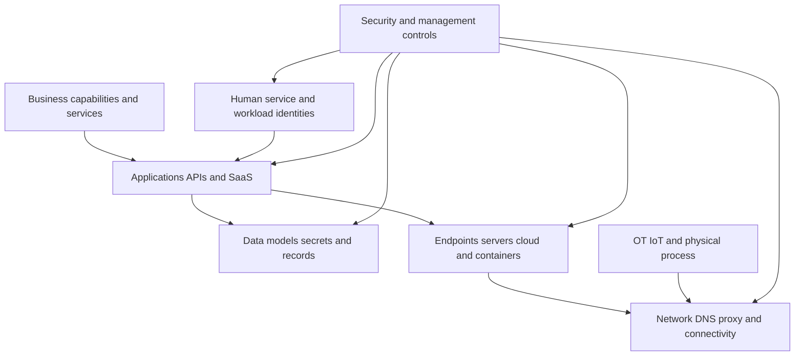

### Scope dimensions

"How many assets do we have?" has no defensible answer until scope is explicit. A count can include active records, historical records, observations, consolidated assets, software instances, identities, or only corporate-managed devices. Each may be useful, but they are different measures.

| Dimension | Questions to answer | Example bounded statement | Failure if omitted |
|---|---|---|---|
| Organizational | Which companies, subsidiaries, acquisitions, suppliers, and labs? | NMH parent plus two subsidiaries, excluding divested tenant | Hidden population or double counting |
| Technical | Which asset classes and environments? | Corporate endpoints, servers, cloud resources, SaaS tenants, identities, and OT gateways | Device-only tunnel vision |
| Network | Which address spaces, domains, cloud accounts, regions, and external surfaces? | Approved CIDRs, domains, subscriptions, and account list | Discovery scans wrong or incomplete range |
| Lifecycle | Active, pending, quarantined, retired, deleted, historical? | Active and quarantine states as of cutoff | Retired records inflate denominator |
| Temporal | Event time, observation time, current as-of time, and retention window? | Observed within asset-specific freshness window at 00:00 UTC | Old evidence appears current |
| Purpose | Security control, financial asset, service management, privacy, or risk? | Endpoint protection eligibility, not procurement valuation | One inventory misused for another purpose |
| Grain | One device, installation, workload, account, service, or observation? | One resolved endpoint record per managed OS instance | Counts cannot reconcile |
| Authority | Which source or owner decides each field and state? | HR owns worker status; MDM owns enrollment; EDR owns heartbeat | Conflict resolved by convenience |
| Exclusion | What is intentionally excluded and why? | Disposable build jobs excluded from endpoint-agent control but covered by image/runtime controls | Exclusion mistaken for visibility gap |

## Asset types in depth

### Endpoints and servers

Endpoints usually sit near a human identity; servers usually provide shared services. The distinction is operational, not absolute. A developer workstation may host shared build services, while a virtual desktop server may present user sessions. Relevant fields include hardware and installation identity, operating system, management enrollment, EDR presence and health, disk encryption, patch state, user, owner, network observations, last seen, lifecycle, and supported status.

Do not use hostname or IP address as a universal key. Hostnames can be reused after retirement, changed during migration, duplicated by poor imaging, or represented differently by suffix and case. IP addresses are leased, translated, shared, and reassigned. Strong resolution uses source-native immutable IDs where available, composite evidence, temporal non-overlap, and review for consequential ambiguity.

### Network devices

Network assets include equipment and logical constructs that move, name, balance, segment, inspect, or control traffic. A firewall has interfaces, rules, firmware, management identity, and dependencies. A domain-name record or load-balancer virtual service may be a logical asset because its incorrect change can break or expose a service. Passive telemetry sees communicating devices but may miss silent equipment. Active discovery sees responsive targets but can be blocked or inappropriate for sensitive OT networks. Controller APIs may be authoritative for managed devices but blind to unmanaged ones.

### Cloud and ephemeral resources

Cloud resources are created and changed through provider APIs, infrastructure-as-code pipelines, autoscaling, serverless platforms, and managed services. An instance can live for three minutes while handling a real customer transaction. A daily scanner can honestly report zero observations because the resource existed between scans. The solution is not to force every ephemeral object into a traditional long-lived endpoint model. Combine control-plane creation/deletion events, cloud inventory APIs, image and pipeline controls, runtime signals, account/region scope, workload identity, and logical service ownership.

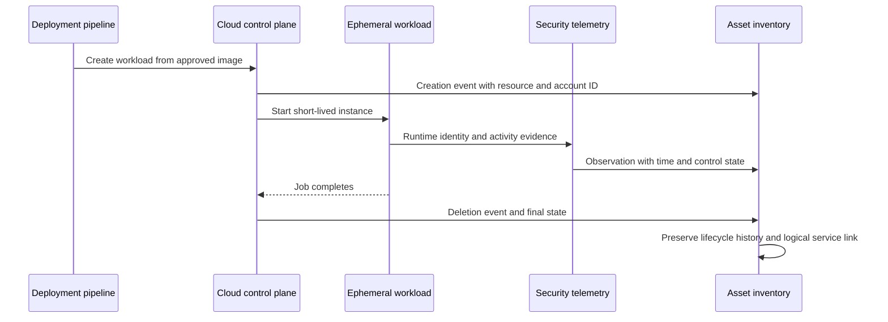

An ephemeral resource needs a temporal record, not a false permanent-active record. Useful questions are whether its image was approved, its workload identity was least privileged, runtime controls were applicable and effective, its data path was expected, and its creation belonged to an owned service.

### SaaS, identities, and data

A SaaS asset can be a tenant, application instance, integration, workspace, repository, or externally shared resource. Sources include procurement, single sign-on, cloud access security, vendor APIs, finance, browser telemetry under policy, and owner attestations. Each source sees a different population. SSO shows federated sign-ins but may miss local accounts. Procurement shows purchased applications but not free tools. A vendor API shows tenant objects but only within granted scope.

Identities deserve asset treatment because compromise or misconfiguration can expose many resources. Human identities have employment lifecycle; service identities have technical purpose, credential rotation, privilege, and owner lifecycle. A disabled account may remain in historical inventory while no longer eligible for an active-access denominator. A dormant identity is not necessarily unauthorized; it needs an approved inactivity definition and owner review.

Data assets express the consequence of many exposures. A storage bucket's risk cannot be understood from public access alone if no one knows whether it contains public brochures or regulated customer records. Classification, owner, lineage, residency, retention, access, backup, and business process are important context. Data discovery can be probabilistic, sensitive, and incomplete, so labels need provenance and confidence.

### OT and IoT

OT can influence physical processes, safety, quality, and uptime. IoT spans sensors, cameras, building systems, printers, and specialized devices. Security teams must work with operations and safety owners. Aggressive active scans can disrupt fragile devices or violate operational rules; passive network evidence, controller inventories, vendor records, maintenance systems, and approved narrow tests may be safer. A missing endpoint agent can be a true gap on a laptop but an inapplicable control on a programmable logic controller. Applicability comes before coverage.

| Asset class | Primary consequence questions | Discovery caution | Alternative control pattern |
|---|---|---|---|
| Corporate laptop | User/data access, theft, malware, credential exposure | Off-network or sleeping device | MDM, EDR, encryption, identity and access policy |
| Production server | Service outage, privilege, data compromise | Scanner credentials and maintenance windows | EDR, authenticated scanning, segmentation, backup |
| Container job | Image provenance, secrets, workload privilege, data path | Lifetime shorter than polling cadence | Pipeline/image admission plus runtime telemetry |
| SaaS tenant | Admin roles, sharing, data, local accounts, integrations | API scopes and provider boundaries | SSO, CASB, vendor controls, owner review |
| Service principal | Excess privilege, credential age, ownership | No human login signal | IAM graph, PAM/vault, workload logs, rotation |
| Data store | Sensitivity, exposure, backup, residency, lineage | Classification may inspect sensitive content | DSPM/catalog, encryption, access review, recovery tests |
| OT controller | Safety, production integrity, availability | Active probing may be unsafe | Passive discovery, segmentation, allowlists, vendor process |

### Plain-English deep-dive 2 - Ephemeral does not mean unimportant

Imagine a temporary cashier hired for a three-hour event. The cashier exists briefly but can still accept payments, access stock, and make mistakes. A security program would not say, "Temporary workers do not count because they leave before the monthly roster review." It would control how they are hired, what badge they receive, which register they use, and how access ends.

Ephemeral cloud resources work similarly. Counting every short-lived container as a permanent server creates noise. Ignoring them creates a blind spot. Use the right level of identity: logical workload or service for durable ownership; image and pipeline for preventive control; each runtime instance for time-bounded evidence; and cloud account, region, network, data, and workload principal for context. Coverage becomes a question such as, "What percentage of eligible production workload launches used approved signed images and passed admission policy during the measurement window?" That is more meaningful than "How many containers do we have right now?"

## Discovery, inventory, CMDB, and source of truth

These concepts cooperate but are not synonyms.

| Concept | Core question | Typical content | Strength | Limitation |
|---|---|---|---|---|
| Discovery | What evidence of existence can this method find? | Addresses, devices, resources, software, identities, events | Finds change and surprises | Bound by method, scope, credentials, and timing |
| Inventory | What in-scope assets and attributes should decision makers use now? | Resolved assets, state, owner, context, controls | Governed operational view | Depends on discovery, identity, and stewardship |
| CMDB | Which configuration items and relationships support service management? | CIs, attributes, services, dependencies, change/incident links | Service and change context | May not contain every security observation or ephemeral object |
| ITAM | What assets are procured, licensed, financed, assigned, and retired? | Purchase, contract, warranty, cost, custody | Financial/lifecycle governance | May not show live technical state |
| Security tool inventory | Which assets does one tool observe or protect? | Agents, findings, events, posture | Deep domain evidence | Siloed scope and duplicates |
| Asset graph/view | How are observations, assets, users, apps, controls, and services related? | Nodes, edges, provenance, time | Cross-domain context | Relationship does not prove causality or authority |

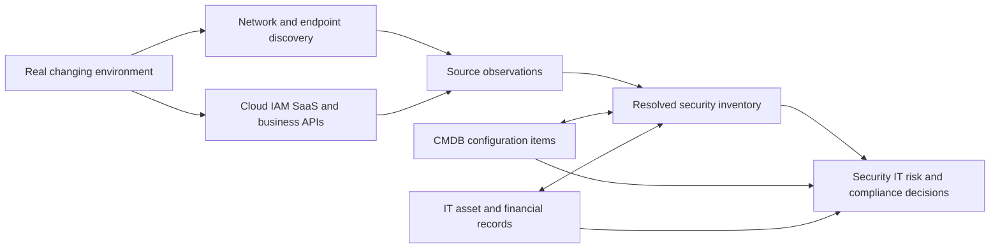

A **source of truth** statement must be scoped. Human Resources may be authoritative for employment status. The directory may be authoritative for the active account object. MDM may be authoritative for enrollment. EDR may be authoritative for its latest sensor heartbeat. The cloud control plane may be authoritative for current resource state in one account. The service owner may be authoritative for business criticality after attestation. No source needs to win every field.

### Inventory record design

| Field group | Example fields | Quality question | Consequence of error |
|---|---|---|---|
| Identity | Canonical ID, source IDs, serial, cloud ID, aliases | Is this one real entity under the chosen grain? | Wrong merge or duplicate action |
| Classification | Asset class, subtype, platform, environment | Are meanings consistent and current? | Wrong control applicability |
| Temporal | First seen, last seen, valid from/to, lifecycle state | Which time does each value describe? | Stale asset appears active |
| Ownership | Business owner, technical custodian, assigned user | Who can decide, operate, and respond? | Tickets bounce or risk stays unowned |
| Business | Service, department, geography, criticality, data class | Is context approved and traceable? | Priority is distorted |
| Network/exposure | Addresses, domains, internet reachability, zones | Was reachability measured for the right time/path? | False exposure conclusion |
| Controls | Eligible controls, installed, healthy, enforcing, recent, exception | Does evidence show effectiveness, not presence alone? | False green coverage |
| Relationships | Runs on, owned by, authenticates to, stores, depends on | Is edge typed, directed, sourced, and time-valid? | Incorrect blast radius |
| Provenance | Source, record ID, observed time, ingest time, rule version | Can each consequential value be explained? | Conflict cannot be investigated |
| Confidence | Match/context confidence and review state | Is uncertainty visible and actionable? | Guess becomes fact |

## Known, unknown, unmanaged, unauthorized, and rogue

These labels answer different questions. Treat them as dimensions rather than a single ladder.

| State | Approved existence? | Seen by relevant source? | Expected management/control? | Evidence-based interpretation | First action |
|---|---:|---:|---:|---|---|
| Known and managed | Yes | Yes | Present and healthy under policy | Normal state, still assess exposure | Monitor and validate |
| Known but unmanaged | Yes | Yes | Missing or unhealthy | Authorized asset with management gap | Confirm applicability and remediate/except |
| Unknown observation | Not yet matched | Yes | Unknown | Needs identity and ownership investigation | Preserve evidence and resolve |
| Authorized but missing from inventory | Yes by owner evidence | Yes elsewhere | May be present | Inventory integration or timing gap | Add/reconcile with provenance |
| Unauthorized | No under current policy | Yes | Usually absent or irrelevant | Policy violation supported by evidence | Contain according to authority and safety |
| Rogue | Materially unauthorized or evasive | Yes | Outside governance | Stronger security concern; label only after validation | Follow incident/asset response process |
| Stale record | Historically yes | No recent evidence | Unknown | May be retired, offline, blind, or source failure | Test source and lifecycle before deletion |
| Shadow SaaS | No approved procurement/use record | Seen in use | Enterprise controls uncertain | Unsanctioned service, not automatically malicious | Identify owner/data/use and assess |

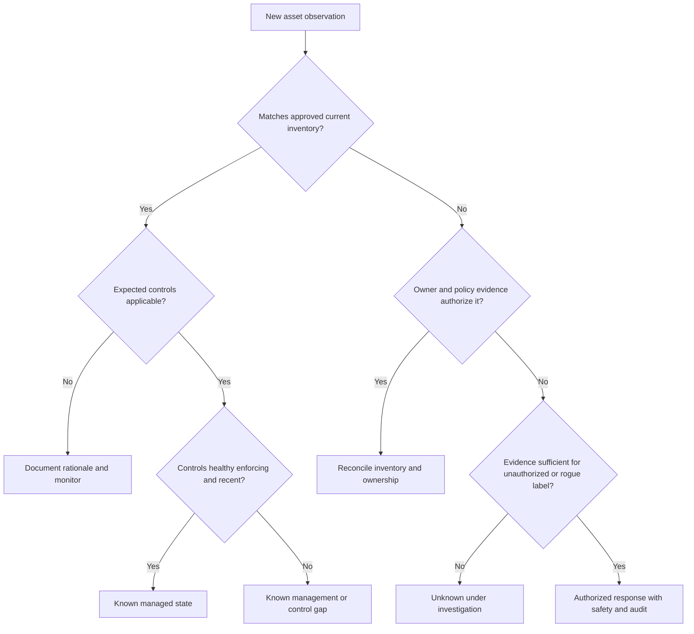

### Plain-English deep-dive 3 - Unknown is a question, not a verdict

Suppose a security camera sees someone carrying a delivery box. The person is not on the employee roster. That makes the person unknown to that roster, not automatically an intruder. They may be an approved courier, a contractor recorded elsewhere, a visitor whose badge feed is delayed, or a real unauthorized person. A good guard preserves the observation, checks time and location, asks the sponsoring owner, and follows policy.

The same discipline applies to asset visibility. A network sensor may see a MAC address absent from CMDB. Possible explanations include a new approved device, an ephemeral cloud interface, a network-address translation artifact, a stale CMDB, a source-scope difference, a duplicate identity, a personal device allowed on a guest network, or an unauthorized system. Prematurely calling it rogue creates distrust and can trigger harmful isolation. Leaving it unexplained also creates risk. Use a temporary state such as `unknown_under_review`, define an owner and SLA, collect discriminating evidence, then resolve the classification with an auditable reason.

## Attack surface and asset exposure

An asset inventory answers what the organization currently believes exists. An attack surface describes interaction opportunities. Exposure describes conditions that could enable harm. Risk connects a threat scenario, likelihood or plausibility, consequence, controls, and uncertainty. The terms overlap but should not be collapsed.

| Term | Minimum elements | Example | What it does not prove |
|---|---|---|---|
| Asset | Identified resource under scope | Public web server instance | That it is reachable or vulnerable |
| Attack surface | Potential interaction point or path | Internet-facing HTTPS endpoint | That a weakness exists |
| Vulnerability | Weakness in design, implementation, configuration, or process | Applicable vulnerable library | That exploitation is reachable or likely |
| Exposure | Reachable/usable condition increasing potential harm | Public admin interface with weak authentication | That exploitation occurred |
| Threat | Actor/event/circumstance that could cause harm | Credential-stealing attacker | That this asset is targeted now |
| Control | Safeguard intended to change likelihood or impact | MFA, segmentation, EDR, backup | That it is effective without evidence |
| Risk | Scenario-based combination of consequence and uncertainty about occurrence | Payment outage/data compromise scenario | A universal precise number |

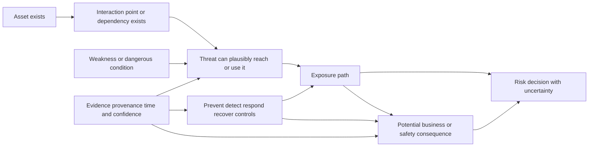

### Internal, external, identity, data, and third-party surfaces

| Surface | Examples | Useful asset context | Typical blind spot |
|---|---|---|---|
| External | Domains, IPs, certificates, public cloud services, supplier portals | Owner, service, DNS/certificate, internet path, technology | Forgotten acquisition domain |
| Internal | Servers, shares, management interfaces, east-west paths | Zone, identity, reachability, control, service dependency | Flat legacy segment |
| Identity | Human/service principals, roles, trusts, tokens, federation | Privilege, owner, lifecycle, authentication, reachable resources | Orphaned workload identity |
| Cloud control plane | Accounts, subscriptions, APIs, roles, policies | Organization hierarchy, tags, audit, owner, region | Unmonitored sandbox account |
| SaaS | Tenants, local admins, sharing links, integrations | Business owner, data, SSO, configuration, vendor | Locally created admin bypassing SSO |
| Data | Stores, copies, APIs, models, secrets, backups | Classification, lineage, access, retention, recovery | Sensitive export on unmanaged location |
| OT/IoT | Remote access, controllers, vendor paths, sensors | Process/safety role, zone, protocol, maintenance owner | Vendor modem or unmanaged gateway |
| Third party | Supplier identities, services, integrations, managed devices | Contract, sponsor, data flow, trust, expiry | Access persists after engagement |

Asset exposure management should help answer which assets compose these surfaces, but presence in an inventory does not automatically validate reachability or exploitability. Some conclusions require network-path testing, cloud policy analysis, identity graph evidence, vulnerability validation, owner confirmation, or safe authorized exercises.

## Ownership, lifecycle, and criticality fundamentals

### Ownership roles

One `owner` field often hides different responsibilities. A business owner decides purpose and accepts business risk. A technical owner or custodian operates the system. An assigned user uses a device. A data owner decides classification and acceptable use. A service owner understands customer impact. A security control owner operates the safeguard. These roles can be held by one person or several teams.

| Role | Core decision | Example | Failure when confused |
|---|---|---|---|
| Business owner | Why asset/service exists and what risk is acceptable | VP of Payroll | Help desk receives risk-acceptance request |
| Service owner | Service level, dependencies, customer impact, roadmap | Payroll service manager | Server owner cannot explain business outage |
| Technical owner | Technical design and change accountability | Application engineering lead | Operations changes without design authority |
| Custodian/operator | Daily administration and maintenance | Cloud operations team | Operator is treated as business risk owner |
| Assigned user | Intended individual user | Employee with laptop | User departure does not trigger reassignment |
| Data owner | Classification, access purpose, retention | HR data executive | Infrastructure team decides legal data use |
| Control owner | Policy and operation of safeguard | Endpoint security team | Missing agent ticket goes to application owner without deployment path |
| Record steward | Quality and governance of inventory data | CMDB data steward | No one resolves duplicate/stale fields |
| Risk owner | Accountable for treating/accepting scenario | Business executive under policy | TSM or analyst accidentally accepts risk |

### Lifecycle

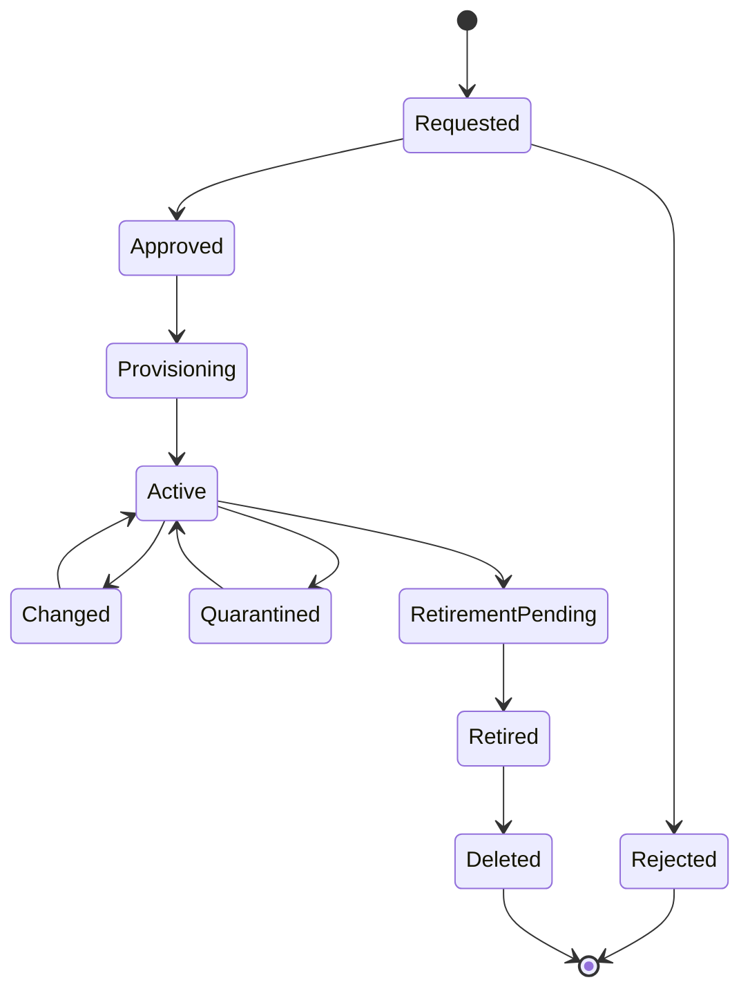

Lifecycle states need entry and exit criteria. `Last seen more than 30 days ago` is evidence, not automatically a retirement criterion. A seasonal server may be intentionally offline. A laptop may be on leave. A cloud resource may have been deleted correctly. A connector may be failing. Retirement should combine source authority, business/process evidence, dependency checks, retention policy, and approval proportionate to consequence.

| Lifecycle state | Minimum evidence | Expected controls | Common defect |
|---|---|---|---|
| Requested | Sponsor, purpose, class, intended owner | Approval and design controls | Shadow creation outside request |
| Approved | Decision, conditions, funding, owner | Standard build/policy assignment | Approval not linked to deployed identity |
| Provisioning | Stable request/deployment correlation | Image, configuration, identity, logging | Asset active before controls complete |
| Active | Current authoritative/observed evidence | Applicable controls healthy and monitored | Record current but control stale |
| Changed | Approved change and new state | Re-evaluation of policy/context | Owner or criticality silently lost |
| Quarantined | Reason, authority, time, restrictions | Containment and investigation controls | Quarantine becomes permanent limbo |
| Retirement pending | Owner approval and dependency validation | Access reduction, data disposition, evidence preservation | Service dependency overlooked |
| Retired | No active production use under criteria | Credentials revoked, controls removed safely | Record remains in active denominator |
| Deleted | Retention/deletion criteria satisfied | Audit record retained as required | Premature deletion hides history |

### Criticality

Criticality estimates how important an asset or service is to mission, operations, people, data, safety, legal obligations, revenue, and recovery. Confidentiality, integrity, and availability, abbreviated CIA, are useful dimensions, but a defensible method also asks about scope and duration of impact, substitutability, dependency concentration, recovery objectives, safety, privacy, contractual duties, and owner approval.

| Dimension | Beginner question | Example evidence | Caution |
|---|---|---|---|
| Confidentiality | What happens if unauthorized people see the data? | Classification and privacy assessment | Classification may be stale |
| Integrity | What happens if data or commands are changed incorrectly? | Process-control and financial impact | Integrity can dominate without sensitive data |
| Availability | What happens if the asset/service is unavailable, and for how long? | Business impact analysis, RTO/RPO | One server may have redundancy |
| Safety | Could people, environment, or physical process be harmed? | Safety analysis and OT process owner | Security team should not decide alone |
| Legal/compliance | Which obligations depend on this asset/data? | Applicability register and counsel input | Inventory does not itself prove compliance |
| Financial | What direct/indirect loss could occur? | Finance-approved scenario ranges | Avoid false precision |
| Dependency | How many critical services rely on it? | Current relationship map and failover test | Observed relationship may be incomplete |
| Recoverability | Can function and data be restored within need? | Tested recovery evidence | Backup configured is not restore proven |
| Substitutability | Is there a safe alternative process or system? | Runbook and exercise | Paper workaround may not scale |

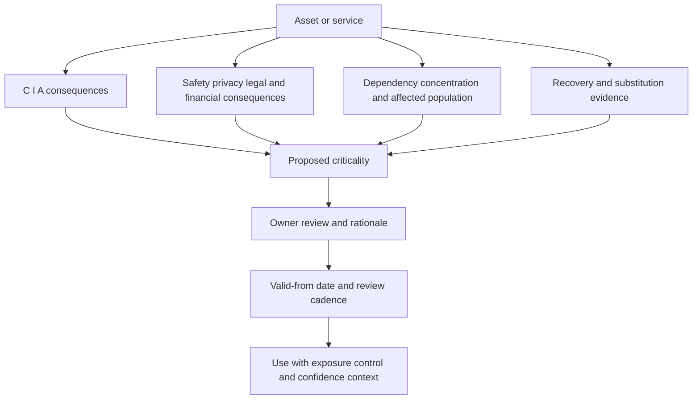

Criticality is not vulnerability severity. A critical payroll service can be well protected. A low-tier test host can still provide a path to production. Criticality changes consequence; exposure and controls change plausibility. Preserve each factor rather than hiding all reasoning in one score.

### Plain-English deep-dive 4 - A golden record is a case file, not divine truth

A detective may combine a passport, utility bill, camera image, and witness statement into one case file. The file is more useful than any single clue, but it can still contain conflict. A nickname can refer to two people. A timestamp can be wrong. A witness can be stale. A merge can join unrelated identities.

An asset golden record should similarly preserve source record IDs, observed times, field origins, match reasons, confidence, conflicts, and review history. A consolidated display is valuable because analysts no longer manually open seven tools for basic context. It becomes dangerous if the display erases disagreement and presents a guessed owner or merged identity as unquestionable fact. The phrase "single source of truth" should mean a governed consumption view for a defined purpose, not deletion of source evidence or universal authority.

## CAASM category fundamentals

CAASM stands for Cyber Asset Attack Surface Management. Category definitions vary by analyst, vendor, and time. At a practical level, CAASM addresses the problem that security and business tools each observe incomplete, differently identified slices of assets. It aggregates observations, resolves identities, enriches context, exposes gaps, supports queries/reporting, and helps operationalize investigation and remediation.

| CAASM capability area | Problem addressed | General mechanic | Important limitation |
|---|---|---|---|
| Source aggregation | Evidence is siloed across tools | Connect APIs/files/events and preserve source context | Connector does not guarantee complete source scope |
| Normalization | Fields and terms differ | Map to common meanings while retaining native evidence | False equivalence can erase semantics |
| Entity resolution | Same asset appears under different IDs | Deterministic/probabilistic matching and review | False merge and false split remain possible |
| Context enrichment | Security record lacks owner/service/criticality | Join IAM, business, cloud, CMDB, and control data | Stale enrichment can distort decisions |
| Relationship mapping | Asset dependencies are hidden | Create typed, directed, time-valid links | Correlation does not prove causality |
| Gap analysis | Expected source/control absent | Compare eligible population against evidence and policy | Missing data can look like missing control |
| Query/reporting | Manual spreadsheets cannot scale | Filter, group, trend, and drill into evidence | Dashboard is not remediation |
| Workflow/action | Findings lack owner and follow-through | Assign, ticket, notify, update, and reconcile | Consequential automation needs authority and safety |
| Governance | Conflicts and exceptions recur | Define owners, rules, reviews, audit, and metrics | Technology cannot decide business ownership alone |

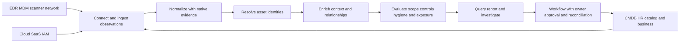

### What CAASM is not

| Misclassification | Better distinction |
|---|---|
| "CAASM is another vulnerability scanner" | It can consume scanner data and add asset context; discovery/validation depth still comes from relevant sources |
| "CAASM replaces CMDB" | It can improve security asset context and support CMDB hygiene; CMDB remains a service-management capability with its own model/authority |
| "CAASM is an EDR" | It may identify EDR coverage gaps; it does not become the endpoint prevention/detection agent |
| "CAASM is external attack surface management only" | External surface is one concern; CAASM commonly spans internal, cloud, identity, control, and business sources |
| "CAASM proves every asset is secure" | It improves visibility and decision context; control effectiveness and residual risk still require validation |
| "CAASM is automatically a compliance certificate" | It can produce evidence and find gaps; obligation applicability, assessment, and legal conclusions remain separate |

## Zscaler AEM official positioning

The official Zscaler page is titled around Asset Exposure Management and CAASM. It says AEM is powered by the Data Fabric for Security and describes a complete, accurate, context-rich inventory as the goal. It publicly lists asset data collection through Data Fabric connectors, multi-source entity deduplication, relationship identification, golden-record creation, coverage gaps, CMDB health/updates, automated actions, and reporting. It also names use cases that support vulnerability prioritization, risk quantification, and CTEM.

Use this architecture as a **general explanatory model**, not an assertion of internal Zscaler topology:

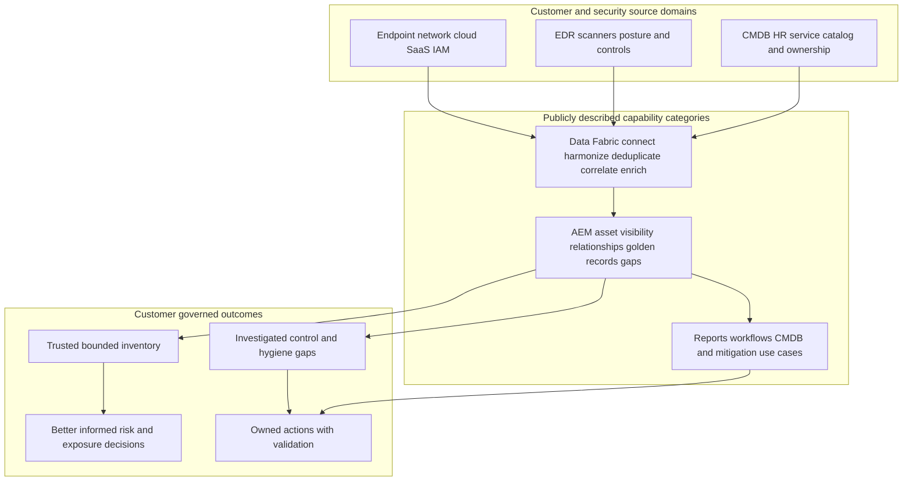

### Product facts, observations, and assumptions

| Evidence label | Example | Interview language |
|---|---|---|
| Official public fact | Public AEM page lists multi-source deduplication and golden-record creation | "Zscaler publicly describes..." |
| Current tenant observation | Authorized test shows a field, report, workflow, or connector behavior | "In the tested tenant/version/scope, we observed..." |
| Customer configuration | NMH policy says eligible corporate laptops require EDR | "The customer-approved policy defines..." |
| General architecture method | Preserve source IDs and temporal provenance during resolution | "A safe implementation pattern is..." |
| Hypothesis | Count drop may result from source scope or identity change | "One hypothesis to test is..." |
| Synthetic lab result | NMH sample found 37 unresolved observations | "In my fictional lab..." |
| Unsupported claim | AEM always finds 100 percent of assets | Do not say it |

The official page includes marketing statistics attributed to third parties and an average missing-asset statement. Treat such figures as page claims with attribution and context, not as a forecast for a specific customer. Never build a business case by promising that NMH will reproduce an average without a validated baseline, comparable scope, and measured result.

## Visibility, control, risk, and compliance gaps

### Gap taxonomy

| Gap type | Plain meaning | Example | Cheap discriminating check | Likely owner |
|---|---|---|---|---|
| Scope gap | Environment was never included | New cloud subscription absent | Compare organization/account registry to connector scope | Cloud governance |
| Source gap | Relevant source missing or disconnected | MDM tenant not integrated | Check source inventory, auth, last success, counts | Source/connector owner |
| Freshness gap | Evidence too old for decision | EDR heartbeat 45 days old | Compare source event time and ingestion watermark | Endpoint/security ops |
| Identity gap | Observations not correctly resolved | One laptop appears as three assets | Inspect IDs, times, match reason, reimage history | Data/asset steward |
| Context gap | Owner/service/criticality absent or stale | Production database has no owner | Trace field authority and attestation | Business/service owner |
| Control gap | Applicable safeguard absent/unhealthy/not enforcing | Eligible server lacks current EDR evidence | Verify policy eligibility and control console state | Control owner |
| Hygiene gap | Configuration or maintenance state is weak | Unsupported OS or encryption disabled | Validate technical state and approved exception | Platform owner |
| Exposure gap | Reachability/privilege/path condition is dangerous | Public admin port with weak auth | Test authorized path and effective access | Network/app/IAM owner |
| Lifecycle gap | State and real existence diverge | Retired CMDB CI still active in cloud | Check authoritative create/delete and dependency evidence | Asset/CMDB owner |
| Workflow gap | Finding has no effective follow-through | Ticket created without correct assignee | Read target state and owner acknowledgement | Workflow/process owner |
| Compliance evidence gap | Required evidence missing or not scoped | Encryption report omits subsidiary | Map obligation, population, test, exception, date | Compliance/control owner |

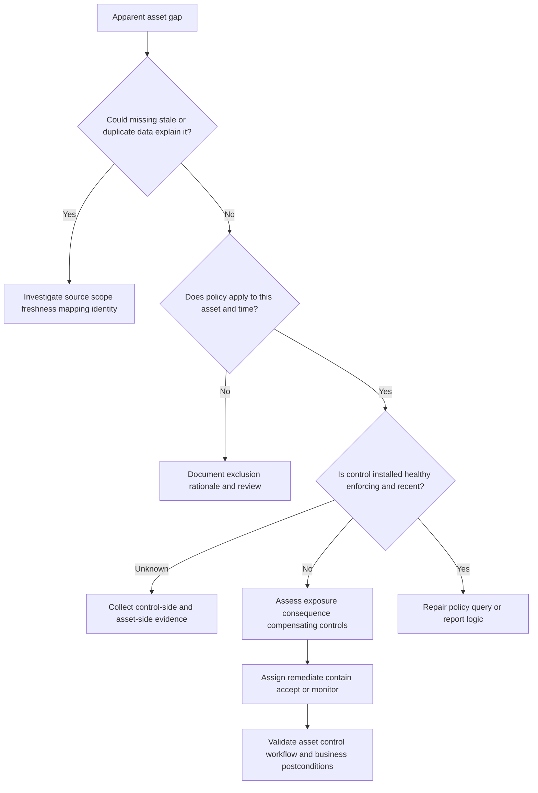

### Control presence is not control effectiveness

An agent can be installed but disabled. A scanner can list a server but lack credentials. Encryption can be configured but not cover all volumes. A backup job can succeed while restore fails. A firewall rule can exist but be shadowed or bypassed. An identity may require MFA for interactive login but exempt a legacy protocol. Coverage criteria should therefore separate:

1. **Eligible:** policy says the control should apply.
2. **Observed:** relevant source currently sees the asset.
3. **Installed/configured:** component or setting exists.
4. **Healthy:** component reports normal operation under defined freshness.
5. **Enforcing:** control is actually applied to relevant behavior.
6. **Effective:** authorized assessment shows the intended risk change.
7. **Excepted:** approved, time-bounded exception and compensating control exist.

| Evidence level | Endpoint example | Backup example | False-green risk |
|---|---|---|---|
| Eligible | Corporate Windows laptop | Tier 1 database | Denominator missing unmanaged assets |
| Observed | MDM and EDR see device | Backup catalog lists database | Source scope incomplete |
| Installed/configured | Sensor package installed | Backup policy assigned | Service disabled or target excluded |
| Healthy | Recent heartbeat, supported version | Recent job completed without error | Health signal does not test outcome |
| Enforcing | Prevention policy active | Required data included and immutable as designed | Policy bypass or hidden data |
| Effective | Authorized test/evidence demonstrates response | Restore test meets RTO/RPO and integrity need | Test not representative |
| Excepted | Approved temporary exception with expiry | Approved alternative recovery arrangement | Exception never expires or lacks owner |

### Plain-English deep-dive 5 - Coverage is a fraction with a policy contract

Saying "EDR coverage is 96 percent" sounds precise, but the number is meaningless without the numerator and denominator. Is the denominator all discovered devices, approved corporate endpoints, active Windows/macOS endpoints, or only devices already known to EDR? If the denominator comes from EDR, missing EDR assets cannot appear, producing a perfect but circular result.

Think of school attendance. Counting present students divided by students who entered the classroom ignores enrolled students who never arrived. A reliable denominator comes from an independent or reconciled roster, applies lifecycle and exclusion rules, and reports unknown eligibility separately. A good statement is: "Of 10,240 active corporate Windows and macOS endpoint golden records eligible under policy at the 2026-08-24 cutoff, 9,830 had a healthy, enforcing EDR sensor observed within the approved freshness window; 210 had approved unexpired exceptions; 120 lacked current evidence; and 80 had unresolved identity or eligibility, so confirmed healthy coverage is 96.0 percent and decision completeness is 99.2 percent." All numbers here are illustrative, not Zscaler defaults.

## Use cases from asset truth to action

| Use case | User and decision | Required evidence | Action | Success evidence | Main caveat |
|---|---|---|---|---|---|
| Golden inventory | Asset/Security teams ask what exists | Multi-source identity, lifecycle, provenance | Resolve records and review conflicts | Lower unresolved duplicates with stable scope | Golden is not perfect |
| Unknown asset triage | SOC/IT asks what an unrecognized observation is | Network/cloud/MDM/owner/time evidence | Classify, enroll, isolate, except, or retire | Resolution within SLA and low recurrence | Unknown is not automatically rogue |
| EDR coverage | Endpoint security asks which eligible assets lack protection | Independent denominator, EDR health, exceptions | Deploy/repair/except/retire | Validated healthy coverage and aging | Installed is not effective |
| Scanner coverage | VM team asks which eligible assets lack recent assessment | Inventory, scanner scope/auth/results | Fix scope/credentials or approve method | Authenticated recent assessment coverage | Some assets need alternate assessment |
| Unsupported OS | Platform owner asks where support risk exists | OS/version/support lifecycle, owner, service | Upgrade, isolate, retire, or accept | Reduced unexcepted unsupported population | Version detection can be wrong |
| Ownership | Remediation manager asks who should act | User, custodian, service, department, owner confidence | Assign review or steward workflow | Fewer unowned/bounced actions | Last logged-in user is not owner |
| CMDB health | ITSM asks where CIs differ from current evidence | Golden identity, CMDB IDs, lifecycle, authority | Controlled create/update/merge/retire | Reconciled changes and fewer stale/orphan CIs | Security source should not overwrite every field |
| Cloud governance | Cloud team asks which accounts/resources escape guardrails | Organization registry, APIs, tags, policy results | Enroll account, fix policy, owner workflow | Complete account scope and policy adherence | Ephemeral resources need event/runtime evidence |
| SaaS governance | App/IAM asks which services/users are unsanctioned | Procurement, SSO, CASB, vendor API, owner | Assess, sanction, migrate, restrict, or retire | Reduced unowned/high-risk use | Visibility depends on lawful approved telemetry |
| OT visibility | Plant/security asks which connected devices lack known role | Passive telemetry, controller/vendor/maintenance records | Identify, segment, monitor, or plan replacement | Higher known/owned coverage without disruption | Safety and availability govern testing |
| Audit evidence | Compliance asks whether required populations have controls | Requirement mapping, scope, control evidence, exceptions | Remediate or document evidence gap | Reproducible evidence and resolved exceptions | Tool report alone does not certify compliance |
| Exposure prioritization | Risk/VM asks which findings matter most | Asset identity, criticality, exposure, controls, confidence | Investigate and prioritize treatment | Faster closure of validated material exposure | Asset context is one input, not full risk proof |

## Architecture mechanics: from observations to decisions

The following is a safe general reference model. It explains what a trustworthy asset-exposure capability must accomplish without claiming how Zscaler implements it internally.

```mermaid
flowchart LR
    REG[Scope registries organizations accounts domains ranges]
    SRC[Security IT cloud identity SaaS and business sources]
    OBS[Immutable source observations and watermarks]
    MAP[Mapped classes fields units and states]
    ENT[Resolved assets with aliases and confidence]
    REL[Typed time-valid relationships]
    CTX[Owner service lifecycle criticality data and geo]
    POL[Eligibility controls exceptions and exposure rules]
    CASE[Investigations tickets updates and decisions]
    VAL[Read-back reconciliation and outcome validation]
    REG --> SRC --> OBS --> MAP --> ENT --> REL --> CTX --> POL --> CASE --> VAL
    VAL --> REG
```

### Step-by-step mechanics

| Step | Core question | Minimum evidence | Failure mode | Control |
|---|---|---|---|---|
| 1. Scope | Which universes should be represented? | Accounts, domains, CIDRs, tenants, orgs, classes, exclusions | Connector healthy for only half the company | Independent scope registry and owner sign-off |
| 2. Collect | What did each source report and when? | Source record ID, event/observed/ingest time, run, scope | Snapshot silently partial | Counts, watermarks, pagination, errors, provenance |
| 3. Map | What does each field mean? | Source schema, canonical mapping, version, rejects | `active` meanings conflated | Mapping tests and explicit unknowns |
| 4. Resolve | Which observations represent one asset? | Strong IDs, composites, temporal logic, match reason | False merge/split | Confidence, conflict queue, reversible decisions |
| 5. Relate | How do assets/users/services/data connect? | Typed edge, direction, source, valid time | Old user linked to reassigned laptop | Temporal edge and authoritative source |
| 6. Contextualize | Who owns it and why does it matter? | Owner, service, lifecycle, criticality, provenance | Guessed owner drives wrong ticket | Field authority and attestation |
| 7. Evaluate | Which expectations apply? | Policy version, eligibility, exclusions, control evidence | OT device flagged for laptop agent | Applicability before coverage |
| 8. Prioritize | Which gap needs attention first? | Consequence, exposure, control, confidence, age | Score hides uncertainty | Explain factors and preserve unknowns |
| 9. Act | Who is authorized to do what? | Owner, target, approval, idempotency key, audit | Duplicate or harmful action | Human gate and least privilege |
| 10. Validate | Did source and business state improve? | Read-back, independent evidence, stable denominator | Ticket closes but gap persists | Reconciliation and reopen rules |

### Tradeoffs

| Decision | Option A | Option B | Balanced approach |
|---|---|---|---|
| Breadth versus depth | Connect many sources quickly | Deeply validate few sources | Thin end-to-end use case, then expand |
| Deterministic versus probabilistic matching | High precision, more splits | More recall, more false-merge risk | Strong IDs first; bounded fuzzy review for low consequence |
| Current view versus history | Simple current inventory | Full temporal lineage | Current operational record plus retained governed provenance/history |
| Automation versus review | Faster actions | Safer handling of ambiguity | Gate by identity confidence and consequence |
| One universal owner versus role model | Easy reporting | Accurate accountability | Separate business, service, technical, user, steward, risk roles |
| One metric versus scorecard | Executive simplicity | Diagnostic detail | Small headline set with drill-down and health caveats |
| Polling versus events | Simpler connector | Better ephemeral/change visibility | Use both where source supports, then reconcile |
| CMDB write-back versus advisory | Faster hygiene | Lower corruption risk | Field authority, preview, approval, conditional update, read-back |

## Metrics that do not lie by accident

Every metric needs name, purpose, population, numerator, denominator, time, exclusions, source, owner, target, uncertainty, drill-down, and anti-gaming note.

| Metric | Illustrative definition | Why useful | Misuse warning |
|---|---|---|---|
| Resolved active assets | Distinct active golden records under approved scope at cutoff | Bounded current population | Not comparable if scope/grain changes |
| Source coverage | In-scope source domains connected and healthy / required source domains | Reveals collection foundation | Equal source weights may be inappropriate |
| Inventory reconciliation rate | Source observations explained as matched, excluded, retired, or under review / eligible observations | Shows accounting completeness | High rate can hide wrong merges |
| Unknown observation rate | Unresolved observations / eligible distinct observations | Tracks investigation load | Denominator and dedup rules matter |
| Identity conflict rate | Records with material unresolved identity conflict / active records | Reveals decision uncertainty | Low rate may reflect hidden conflict suppression |
| Ownership completeness | Active eligible records with approved current owner / active eligible records | Enables action | Placeholder group is not real ownership |
| Criticality completeness | In-scope service-linked assets with current attested criticality / eligible assets | Supports prioritization | Completeness does not prove accurate rating |
| Freshness compliance | Records with required source evidence inside class-specific window / eligible records | Tests current usability | One global window is misleading |
| Confirmed control coverage | Eligible assets with healthy enforcing recent evidence / eligible assets | Measures control state | Keep unresolved eligibility separate |
| Exception debt | Expired, ownerless, or inadequately supported exceptions | Finds governance risk | Count alone ignores consequence |
| Mean/median time to classify | Time from first unknown observation to validated state | Measures investigation flow | Median can hide severe tail; show percentiles |
| Action validation rate | Completed actions with source/business postcondition confirmed / completed actions due for validation | Prevents ticket-only success | Validation must be independent enough |
| Stale/orphan rate | Active inventory records lacking expected evidence/owner beyond rules | Supports lifecycle cleanup | May indicate source outage, not real orphan |
| Recurrence rate | Closed gap patterns that reappear in same asset/cohort/window | Tests durability | Identity changes can fake recurrence |
| Material gap aging | Age distribution for validated high-consequence gaps | Supports risk decisions | Age begins after valid detection, not arbitrary ingest |

Illustrative formulas use customer-approved definitions:

$$
\text{Confirmed Healthy Coverage} = \frac{\text{Eligible assets with recent healthy enforcing evidence}}{\text{Eligible active assets}}
$$

$$
\text{Decision Completeness} = 1 - \frac{\text{Assets with unresolved eligibility or identity}}{\text{In-scope active candidate assets}}
$$

Do not combine these into one opaque number. A high confirmed coverage percentage with low decision completeness can be falsely reassuring.

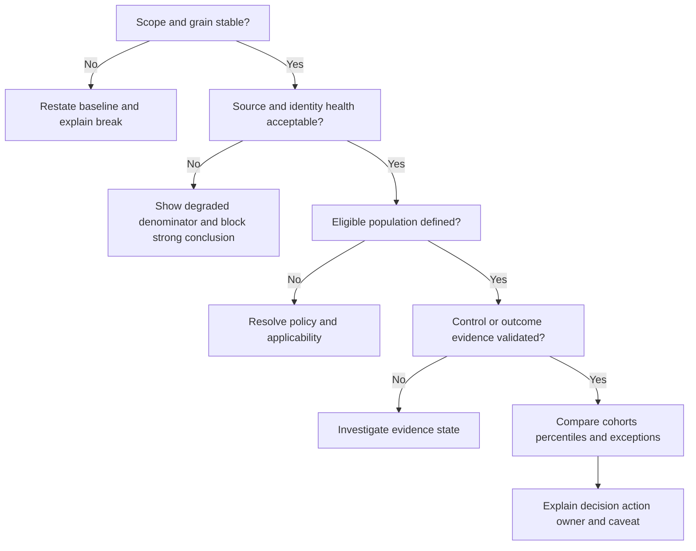

### Executive, operator, and audit views

| Audience | Needs | Good view | Avoid |
|---|---|---|---|
| Executive | Material scope, confidence, exposure, trend, decisions | Stable headline metrics plus caveat and owner | Thousands of raw unknowns without meaning |
| Security operator | Asset-level evidence, source IDs, control state, reason | Searchable detail and investigation queue | Score with no factor/provenance |
| IT owner | Actionable devices/services, assignment, due date | Owned cohort with remediation guidance | Security jargon and no validation criterion |
| Cloud/App owner | Account/service context and policy mismatch | Resource, deployment, owner, code/pipeline link | Host-only view of ephemeral workload |
| Risk/compliance | Requirement population, evidence, exception, audit | Reproducible scoped report and history | Claim of compliance from tool presence |
| Data/CMDB steward | Conflicts, duplicates, field authority, proposed changes | Data-quality and reconciliation workbench | Blind overwrite |

## Failure modes and troubleshooting

### Failure patterns

| Symptom | Plausible causes | Harm | First check |
|---|---|---|---|
| Asset count suddenly drops | Source auth/scope/pagination failure, mapping reject, lifecycle rule change, real retirement | False improvement and missing gaps | Source counts, watermarks, errors, rule versions |
| Asset count suddenly rises | Duplicate ingestion, reimage split, source scope expansion, cloud burst, key change | Inflated denominator and duplicate actions | Distinct source IDs, creation events, match reasons |
| Same laptop appears three times | Weak hostname/MAC matching, changed IDs, temporal logic missing | Repeated tickets and wrong metrics | Serial/device IDs, reimage timeline, source records |
| Two servers become one | Reused hostname/IP/image UUID, overbroad fuzzy rule | Context/control attached to wrong system | Native immutable IDs and overlapping observation times |
| Many assets lack owner | Authority source missing, join key wrong, departed users, service map stale | Unroutable remediation | Owner source scope/freshness and join cardinality |
| EDR coverage falls after source outage | Missing evidence treated as absent control | False risk spike | Distinguish source-health unknown from confirmed missing |
| Coverage shows 100 percent | Circular denominator from control tool, exclusions too broad | False assurance | Independent/reconciled eligible population |
| Unknown queue never declines | No owner/SLA/evidence path, recurring source defect | Persistent blind spot | Queue states, aging, reason categories, closure evidence |
| Retired assets remain active | Missing deletion events, wrong lifecycle precedence, CMDB authority conflict | Stale exposure and wasted action | Authoritative state and last-good/deletion timeline |
| Ephemeral assets never appear | Poll interval exceeds lifetime, account omitted | Cloud blind spot | Cloud audit create/delete events and account registry |
| Report and detail disagree | Filter/time-zone/snapshot/grain/version differences | Trust loss | Exact query, cutoff, denominator, version, row sample |
| CMDB update corrupts owner | Wrong field authority or identity match | Operational harm | Audit log, preimage, match, conditional update, rollback |

### Layered troubleshooting method

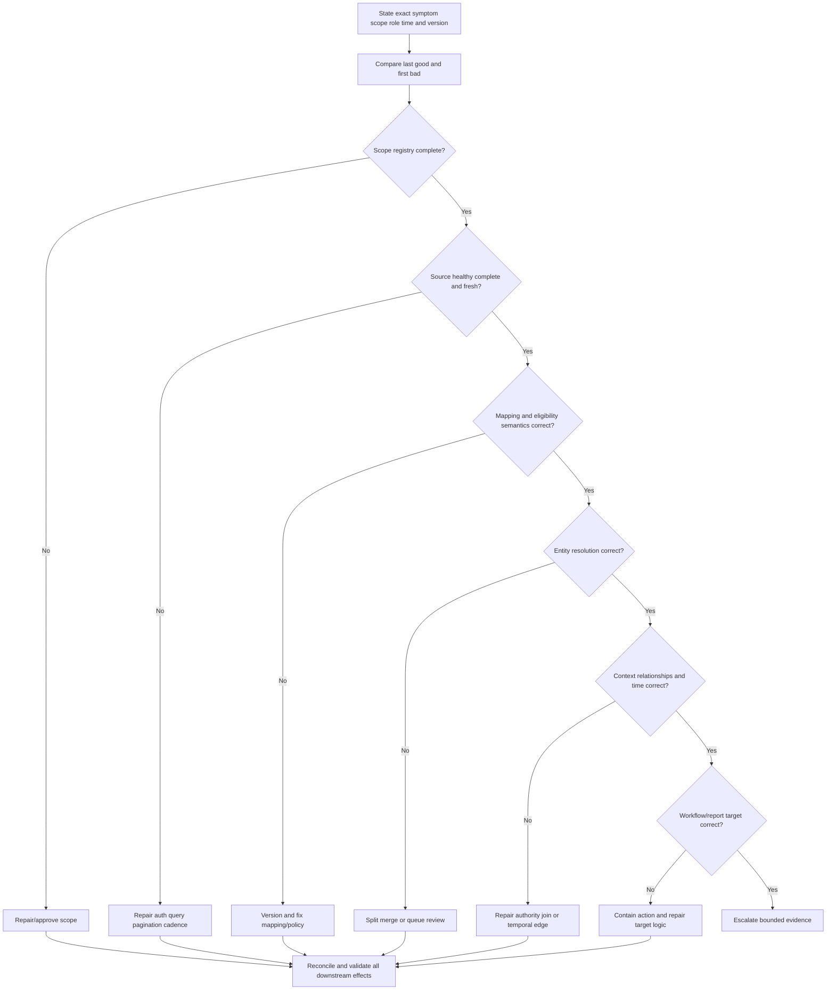

1. State exact expected versus actual behavior, asset class, population, role, view, tenant/environment, time window, cutoff, and version.
2. Protect against harm. Pause high-consequence tickets, CMDB writes, isolation, or executive reports if identity or denominator is unreliable.
3. Establish last known good and first bad using UTC event, observation, ingestion, processing, and display times.
4. Verify independent scope registries before trusting connector health.
5. Reconcile source control totals, pages, errors, deletions, and watermarks.
6. Inspect mapping rejects, enum/default changes, lifecycle criteria, and policy applicability.
7. Trace one false positive, one false negative, and one normal record through source IDs, match reasons, and provenance.
8. Test owner, service, criticality, exposure, and relationship joins with valid-time logic.
9. Compare report query/filter/snapshot/grain with asset detail.
10. Repair in a bounded no-action cohort; then reconcile identities, metrics, tickets, CMDB records, and downstream exports.
11. Communicate facts, quantified impact, unknowns, containment, tests, owners, and next evidence checkpoint. Do not invent cause or ETA.

### Troubleshooting evidence package

| Evidence | Example content | Why it matters | Redaction/safety |
|---|---|---|---|
| Impact | 412 active endpoint records potentially misclassified; automation paused | Sets severity and scope | Avoid unnecessary personal data |
| Expected/actual | One record per managed OS installation; three shown | Makes defect testable | Use synthetic/reduced sample when possible |
| Time | Last good, first bad, UTC event/ingest/view times | Correlates change and pipeline | State time semantics |
| IDs | Tenant, source, run, record, asset, rule, report, workflow IDs | Enables tracing | Never include secrets/tokens |
| Source evidence | Counts, query scope, pages, watermarks, sample records | Distinguishes source from downstream | Approved secure channel |
| Versions/changes | Connector, schema, mapping, match, policy, report versions | Identifies change boundary | Do not assume correlation is cause |
| Tests | Hypothesis, discriminating test, result | Compresses investigation | Keep repeatable and non-destructive |
| Containment | Writes paused; reports caveated; data preserved | Limits harm | Record authority and approval |
| Bounded ask | Confirm whether behavior matches documented identity semantics | Routes escalation | Do not demand unsupported internal detail |

## Complete synthetic NMH asset-exposure scenario

### Business context and scope

NMH is a fictional global logistics and manufacturing organization. It runs corporate offices, warehouses, cloud-hosted customer applications, SaaS collaboration, and operational technology at plants. Leadership asks, "Which active assets support order fulfillment, which are unknown or unowned, and which eligible assets lack current endpoint protection?" The assessment date is synthetic **2026-08-24**.

The team deliberately avoids a universal asset count. It defines four populations:

| Population | Grain | Scope | Active criterion | Primary purpose |
|---|---|---|---|---|
| Corporate endpoint | Managed OS installation | Parent and two subsidiaries | MDM/HR/device lifecycle plus recent relevant observation | EDR/encryption coverage |
| Server/workload | Long-lived server or logical ephemeral workload | Data centers and approved cloud accounts | Platform authority and deployment state | Scanner/EDR/cloud-control analysis |
| SaaS application | Tenant/application instance | Purchased, federated, or observed under approved policy | Active contract/use/owner criteria | Ownership and identity governance |
| OT/IoT device | Physical/logical device under plant scope | Three pilot plants | Controller/maintenance/passive evidence | Known role and segmentation analysis |

All scope, counts, thresholds, and results below are synthetic teaching data.

### Source plan

| Source | What it observes | Field authority in scenario | Freshness design | Blind spot |
|---|---|---|---|---|
| HR | Workers, departments, managers, status | Employment status and department | Daily synthetic feed | Service accounts and contractors outside HR process |
| IAM | Users, groups, devices, service principals | Directory object and access context | Event plus periodic inventory | Local SaaS identities |
| MDM | Enrolled endpoints and compliance state | Enrollment and device management state | Hourly | Unenrolled and unsupported devices |
| EDR | Sensors, heartbeat, policy state | EDR presence/health evidence | Near-current synthetic snapshots | Assets without sensor |
| Scanner | Network/server observations and findings | Scan evidence under configured scope | Weekly plus targeted | Uncredentialed/blocked/short-lived assets |
| Cloud | Accounts, resources, tags, lifecycle events | Provider resource existence/state | API plus audit events | Unregistered accounts |
| Network | Communicating addresses/MACs/device fingerprints | Network observation only | Daily/passive | Silent/off-network assets and NAT ambiguity |
| CMDB | CIs, services, technical owners, relationships | Approved service-management fields | Daily exchange | Stale or incomplete technical reality |
| Procurement | Purchased hardware/SaaS and contracts | Purchase/contract evidence | Daily | Free/shadow services and technical state |
| Plant maintenance | OT serial, role, location, maintenance owner | Plant equipment identity/role | Weekly approved feed | Unrecorded connected devices |

### Synthetic initial observations

The raw source rows cannot be added as unique assets because the same laptop appears in MDM, EDR, IAM, procurement, network, and CMDB. After scoped collection, mapping, and preliminary resolution, NMH records these controlled totals:

| Measure | Synthetic count | Interpretation | Caveat |
|---|---:|---|---|
| Raw source observations | 94,620 | Rows/objects across all sources | Not an asset count |
| Candidate identity clusters | 19,480 | Proposed groups before review | Matching can be wrong |
| Active golden records | 18,930 | Bounded records under four population definitions | As-of snapshot and rules |
| Historical/retired records | 2,840 | Retained outside active denominator | Retention is policy-designed |
| Unresolved observations | 286 | Need identity, scope, or authorization review | Not all rogue |
| Material identity conflicts | 74 | Consequential merge/split ambiguity | Automation blocked for affected records |
| Active records missing approved owner | 612 | Owner completeness gap | Some classes use service/plant owner rather than person |
| Eligible endpoint records | 10,240 | Approved denominator for EDR policy | Excludes OT and incompatible classes by policy |
| Confirmed healthy EDR | 9,630 | Current healthy/enforcing evidence | Synthetic health definition |
| Approved unexpired EDR exceptions | 240 | Time-bounded alternative treatment | Must be reviewed separately |
| Confirmed missing/unhealthy EDR | 290 | Validated gap | Priority depends on context |
| Unresolved EDR eligibility/identity | 80 | Cannot safely classify yet | Report separately, never force green/red |

Confirmed healthy coverage is $9,630 / 10,240 = 94.04\%$ under the synthetic definition. If approved exceptions are shown, they remain a separate category; adding them to "protected" without evaluating compensating controls would hide risk. Decision completeness for EDR classification is $(10,240 - 80) / 10,240 = 99.22\%$.

### Asset state and criticality examples

| Synthetic asset | Evidence | Context | Apparent gap | Defensible next action |
|---|---|---|---|---|
| NMH-LT-04421 | MDM, IAM, recent EDR, serial match | Assigned corporate laptop, active user | None | Monitor |
| NMH-LT-07110 | MDM and procurement; EDR stale 18 days | Finance user, travel status unknown | Possible unhealthy EDR | Verify device/user status and EDR console before ticket |
| NMH-SRV-0098 | Cloud, scanner, EDR, CMDB | Production order API, high availability impact | Unsupported OS in 48 days | Plan upgrade with service owner and rollback |
| NMH-CLOUD-JOB-RET | Cloud events/runtime, no endpoint agent | Ephemeral returns-processing job | Naive EDR rule says missing | Correct applicability; validate image/runtime controls |
| NMH-OT-PLC-17 | Passive network and maintenance record | Controls packaging line; safety/availability concern | No EDR | EDR inapplicable; validate segmentation/vendor controls |
| NMH-SAAS-043 | SSO observations, no procurement record | Marketing owner under review; unknown data class | Shadow SaaS | Investigate owner, data, terms, local admins, and policy |
| NMH-SP-0021 | IAM service principal, app logs | Order service deployment identity | Owner departed; credential old | Assign service owner, rotate credential, review privilege |
| Unknown-192.0.2.44 | Network observation only | Guest VLAN; printer-like fingerprint | Unknown | Check DHCP/NAC/site inventory; do not call rogue yet |

### Architecture and decision flow

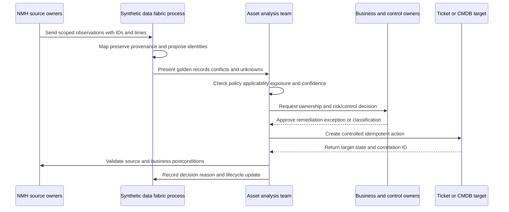

### Synthetic incident: false control-gap spike

At 09:10 UTC, the dashboard reports that healthy EDR coverage fell from 94.0 percent to 72.3 percent. There is no matching endpoint incident surge. The team treats the dashboard as a symptom.

1. **Contain:** Pause bulk EDR deployment tickets and caveat the executive view.
2. **Scope:** The apparent decline affects one subsidiary and records refreshed after 08:45 UTC.
3. **Last good/first bad:** Source event times remain current, but one ingestion run reports fewer pages.
4. **Hypotheses:** Real agent outage; EDR API scope changed; pagination stopped; mapping rejected new status; identity resolution split records.
5. **Cheap check:** Compare control-side source count and page tokens with prior run. The source console count is stable, while the ingested count stops at one page.
6. **Finding:** In the synthetic scenario, an expired API permission causes incomplete pagination. Missing source evidence was incorrectly rendered as `control_absent` rather than `evidence_unknown`.
7. **Failed safeguard:** The connector count alert fired late, and the report did not display source-health status beside coverage.
8. **Repair:** Restore approved least-privileged access, rerun bounded ingestion in no-action mode, reconcile counts, and correct tri-state handling.
9. **Validation:** Source controls, ingested observations, resolved assets, eligibility states, report totals, and queued actions reconcile. Coverage returns to the expected synthetic band; no duplicate tickets were created.
10. **Prevention:** Add pagination completeness, source-health gating, unknown-state rendering, dependency-aware report banner, and runbook test.

The root defect is incomplete source ingestion. The reporting logic's conversion of unknown evidence to missing control is a separate safeguard failure. Naming both improves the system more than blaming the dashboard alone.

### Synthetic prioritized action plan

| Priority | Cohort | Why now | Action | Owner | Validation |
|---:|---|---|---|---|---|
| 1 | 11 internet-reachable production servers with confirmed unhealthy EDR | High service consequence, exposure, and confirmed control gap | Contain as appropriate, repair sensor, validate policy and path | Server/control owners | Current control evidence plus authorized effectiveness check |
| 2 | 3 ownerless privileged service principals | Broad identity reach and no accountable owner | Restrict/rotate as approved, assign service owner, review privilege | IAM/app owners | Owner attestation, credential rotation, effective privilege |
| 3 | 74 identity conflicts | Wrong merge/split could corrupt actions and metrics | Block automation, review strong IDs/time, split/merge with audit | Data steward/source owners | Reconciliation across all source observations |
| 4 | 279 standard endpoints with confirmed EDR gaps | Material population with established deployment path | Repair/deploy by controlled waves | Endpoint/control owners | Healthy enforcing recent evidence |
| 5 | 612 missing owner fields | Slows remediation, mixed consequence | Resolve by service/department cohorts | Service/record stewards | Approved owner and low ticket-bounce trend |
| 6 | 286 unresolved observations | May include approved new, guest, duplicate, or unauthorized assets | Classify with SLA and reason codes | Site/cloud/SaaS owners | Validated final state or governed ongoing investigation |

### Governance cadence

| Cadence | Participants | Decision/evidence | Output |
|---|---|---|---|
| Daily operations | Asset analysts, source/control owners | Source health, unknown queue, material control gaps | Assigned investigations and containment |
| Weekly data quality | Data/CMDB stewards, source owners | Counts, freshness, conflicts, duplicates, owner gaps | Rule/source fixes and review decisions |
| Monthly risk/control | Security, IT, app, cloud, IAM, OT, risk | Exposure cohorts, exceptions, aging, validation | Prioritized remediation and accepted residual risk |
| Quarterly executive | CISO/CIO/business leaders | Stable scope, confidence, material trend, decisions and value | Funding, policy, ownership, roadmap decisions |
| Event-driven incident | Incident roles and affected owners | Material false action/report or exposure | Containment, recovery, reconciliation, PIR |

## Experience bridge: enterprise support to asset exposure

Your strongest bridge is not "I already ran CAASM." It is the investigation method you used in enterprise support. OneDrive and SharePoint cases required distinguishing user, device, sync client, browser, identity, tenant, permissions, proxy, DNS, network, service, and content scope. You compared timestamps and identifiers, separated client from service behavior, worked across owners, communicated uncertainty, escalated with evidence, and validated fixes. Asset exposure work applies the same discipline to a larger governed inventory.

| Existing strength | AEM/CAASM transfer | Practice gap | Honest interview sentence |
|---|---|---|---|
| Scope isolation | Define asset class, population, time, and affected cohort | Enterprise asset taxonomy | "I start by defining the population and grain before trusting counts." |
| Multi-layer troubleshooting | Trace source to identity/context/policy/workflow/report | AEM-specific telemetry and UI | "I would use the same evidence-led layer isolation while learning current product diagnostics." |
| Identity and permissions | Understand users, devices, service identities, ownership | Security identity graph/exposure | "Identity is both context and an attack path; I preserve authority and time." |
| Networking tools | Validate address, name, path, proxy, and endpoint evidence | CAASM source/graph use | "IP is an observation, not a permanent asset key." |
| SQL/analytics | Reconcile counts, missing/stale data, cohorts, trends | Product query/report specifics | "I define denominator, freshness, exclusions, and uncertainty before presenting coverage." |
| Critical-situation leadership | Contain harm, coordinate owners, communicate checkpoints | Security/exposure incident process | "I pause unsafe automation and separate root defect from safeguard failure." |
| Customer communication | Translate technical evidence into impact and decisions | CISO/risk language | "I present material gaps, confidence, ownership, and next decision without false precision." |
| Mentoring and training | Teach workflows and quality standards | AEM role-based enablement | "I use task practice, failure cases, and teach-back, not feature tours alone." |

## Labs and rehearsal

All labs use synthetic data and general tooling. They do not require or imply access to Zscaler AEM.

### Lab 1 - Build an asset taxonomy

Create a table covering endpoint, server, network, cloud compute/data, SaaS, application, human/service identity, data, OT/IoT, software, certificate/key, and business service. For each, define grain, stable IDs, lifecycle, owners, discovery sources, controls, and blind spots. **Pass:** another person can classify ten examples without guessing hidden semantics.

### Lab 2 - Write four scope statements

Write separate scope statements for endpoint EDR, cloud workload, SaaS ownership, and OT visibility. Include organization, class, accounts/ranges/tenants, active criteria, time, purpose, grain, authority, and exclusions. **Pass:** each count can be reproduced and reconciled.

### Lab 3 - Observation versus asset

Create six source rows for one reimaged laptop and four rows for two servers with a reused IP. Propose clusters using serial, source-native IDs, time, hostname, MAC, and user. Explain which identifiers are strong or weak. **Pass:** no merge depends only on IP or hostname.

### Lab 4 - Unknown-state triage

Generate 20 synthetic unknown observations: new approved devices, guest devices, NAT artifacts, short-lived cloud interfaces, stale CMDB, duplicate identifiers, shadow SaaS, and unauthorized lab hardware. Build temporary states, evidence questions, owners, SLAs, and final reason codes. **Pass:** unknown is never automatically labeled malicious.

### Lab 5 - Ephemeral workload model

Model a five-minute container job with creation/deletion events, image, pipeline, workload principal, runtime control, service owner, data path, and policy. Compare instance count with launch-compliance coverage. **Pass:** the model preserves evidence without keeping deleted instances active.

### Lab 6 - Ownership model

For a payroll service, assign business owner, service owner, technical owner, custodian, data owner, control owner, record steward, and risk owner. Explain one decision each role can make. **Pass:** the assigned user or TSM is not accidentally made risk owner.

### Lab 7 - Criticality workshop

Rate five synthetic services using CIA, safety, privacy/legal, financial, dependency, recoverability, and substitutability. Require owner rationale and review date. **Pass:** no rating is derived only from vulnerability severity.

### Lab 8 - Coverage metric

Create eligible, healthy, exception, confirmed-gap, and unresolved states for 1,000 synthetic assets. Calculate confirmed coverage and decision completeness separately. Change scope and demonstrate why the baseline must be restated. **Pass:** denominator, time, exclusions, and health criteria are explicit.

### Lab 9 - Source-health false green/red

Simulate an EDR API delivering half its normal pages. Compare three report behaviors: treat missing as healthy, treat missing as absent, and render unknown with source-health banner. **Pass:** the third approach blocks an unsupported conclusion and triggers an owned investigation.

### Lab 10 - CAASM category whiteboard

In five minutes, draw sources, observations, normalization, entity resolution, context/relationships, policy/gaps, query/report, action, and validation. Explain CAASM versus scanner, EDR, CMDB, ITAM, and external attack-surface tools. **Pass:** no "replaces everything" claim.

### Lab 11 - AEM source-bound answer

Use the official Zscaler AEM and Data Fabric pages to create a two-column sheet: public claim and required production verification. Rehearse a 90-second answer. **Pass:** every product statement is bounded by source and date.

### Lab 12 - NMH incident game day

Run the synthetic pagination incident. Assign incident commander, technical lead, scribe, source owner, report owner, workflow owner, and customer communicator. Produce timeline, hypotheses, tests, containment, repair, reconciliation, and prevention. **Pass:** no actions fire from uncertain data.

### Lab 13 - Executive narrative

Present five slides: scope/confidence, asset universe, material gaps, action/validation, and decisions needed. Keep detailed source/conflict evidence in appendix notes. **Pass:** an executive can state the risk decision without mistaking the report for proof of compliance.

### Lab 14 - Interview teach-back

Answer Q1-Q8 aloud without notes, then draw the asset lifecycle and troubleshooting path. Mark each claim production transfer, synthetic lab, official public fact, general method, or unknown. **Pass:** no unsupported Zscaler or customer outcome claim.

## Common misconceptions to correct

| Misconception | Correction |
|---|---|
| Every asset is a physical device | Assets also include cloud, SaaS, identities, data, applications, logical services, and short-lived resources |
| One organization has one correct asset count | Counts depend on scope, purpose, grain, lifecycle, and time |
| Every source record is one unique asset | Sources produce observations that require identity resolution |
| IP address uniquely identifies an asset | IPs are reassigned, shared, translated, and time-dependent |
| Hostname is a permanent key | Hostnames can change, repeat, or be reused |
| Discovery equals inventory | Discovery finds evidence; inventory governs resolved in-scope records |
| Inventory equals CMDB | CMDB focuses on configuration items and service-management relationships |
| Known means secure | A known asset may be exposed, misconfigured, or uncontrolled |
| Unknown means rogue | Unknown requires investigation; rogue requires stronger evidence |
| Unmanaged always means unauthorized | An approved asset can have a management gap |
| Ephemeral resources do not count | Use event, workload, pipeline, image, and runtime evidence appropriate to their lifetime |
| Golden record means perfect truth | It is a consolidated, governed view with provenance and possible conflict |
| More sources automatically improve accuracy | Poor mappings and identity rules can multiply error |
| Agent installed means protected | Health, enforcement, freshness, applicability, and effectiveness matter |
| Missing control evidence proves missing control | Source or identity health may be unknown |
| High coverage proves low risk | Exposure, consequence, effectiveness, exceptions, and blind spots remain |
| Inventory proves compliance | It supports scoped evidence; formal applicability and assessment remain necessary |
| Critical asset means vulnerable asset | Criticality expresses consequence, not weakness |
| CAASM replaces EDR, scanners, SIEM, or CMDB | It consumes and contextualizes evidence; each capability retains distinct jobs |
| Product marketing average predicts my result | Customer scope, baseline, sources, definitions, and implementation differ |
| A dashboard is remediation | Action needs owner, authority, workflow, validation, and recurrence control |
| Ticket closure proves gap closure | Validate the source and business postcondition |
| TSM owns customer risk | The TSM advises and coordinates; accountable customer owners decide |

## Official Source Anchors

Research/source date: **2026-08-24**.

Zscaler sources support bounded AEM/CAASM and Data Fabric positioning. NIST sources support risk management, asset visibility, continuous monitoring, control, inventory, and configuration-management principles. CIS provides a widely used industry control describing active inventory and control of enterprise assets. ServiceNow provides a vendor-specific explanation of CMDB concepts, CIs, relationships, discovery, automation, and ITSM use. These sources do not establish a particular customer's scope, Zscaler internal implementation, exact matching logic, default metric, control effectiveness, compliance status, or guaranteed outcome.

| Source | URL | Used for | Boundary |
|---|---|---|---|
| Zscaler Asset Exposure Management (CAASM) | https://www.zscaler.com/products-and-solutions/caasm | Official public AEM positioning, asset resolution, deduplication, relationships, golden records, coverage gaps, workflows, CMDB, reporting, and use cases | Marketing/product page; verify current license, tenant behavior, fields, integrations, and docs |
| Zscaler Data Fabric for Security | https://www.zscaler.com/products-and-solutions/data-fabric | Public connect, harmonize, deduplicate, correlate, enrich, logic, workflow/report, and AEM foundation statements | No internal topology, algorithm, default, or guarantee |
| Zscaler AEM Solution Brief | https://www.zscaler.com/resources/solution-briefs/cyber-asset-management-risk-compliance-caasm.pdf | Additional official product overview | Point-in-time public material; verify currency and details |
| NIST Cybersecurity Framework 2.0 | https://www.nist.gov/cyberframework | Govern, Identify, Protect, Detect, Respond, Recover risk outcomes and profiles | Voluntary framework requiring tailoring |
| NIST SP 800-137 | https://csrc.nist.gov/pubs/sp/800/137/final | Continuous monitoring visibility into assets, threats, vulnerabilities, and control effectiveness | 2011 federal guidance; not product architecture/default cadence |
| NIST SP 800-53 Rev. 5 | https://csrc.nist.gov/pubs/sp/800/53/r5/upd1/final | Control families including configuration management, inventory, access, audit, risk, integrity, and monitoring | Catalog requires selection, tailoring, implementation, and assessment |
| NIST SP 800-30 Rev. 1 | https://csrc.nist.gov/pubs/sp/800/30/r1/final | Threat, vulnerability, likelihood, impact, uncertainty, and risk-assessment concepts | Federal guidance; not a product score formula |
| NIST SP 800-128 | https://csrc.nist.gov/pubs/sp/800/128/upd1/final | Security-focused configuration management and change principles | Not a Zscaler or CMDB procedure |
| CIS Critical Security Control 1 | https://www.cisecurity.org/controls/inventory-and-control-of-enterprise-assets | Active inventory/control of devices across physical, virtual, remote, cloud, IoT, unauthorized/unmanaged assets | Industry guidance; implementation and applicability vary |
| ServiceNow: What is CMDB? | https://www.servicenow.com/products/it-operations-management/what-is-cmdb.html | Vendor explanation of CIs, relationships, discovery, reconciliation, automation, ownership, and ITSM context | ServiceNow-specific source; no dependency or endorsement implied |

## Likely Interview Questions

### Q1. What is a cyber asset, and why is a laptop-only definition inadequate?

**Model answer:** A cyber asset is any digital or digitally connected resource that matters to confidentiality, integrity, availability, safety, privacy, operations, or business value. It includes endpoints and servers, but also network and cloud resources, SaaS tenants, applications, human/service/workload identities, data, software, certificates, OT/IoT, and business services. The right grain depends on the decision. I define scope, purpose, grain, lifecycle, authority, and time before counting.

### Q2. How do discovery, inventory, ITAM, and CMDB differ?

**Model answer:** Discovery finds evidence that assets exist, subject to method and scope. Inventory is a governed current view of in-scope assets and useful context. ITAM emphasizes procurement, financial, contractual, assignment, and lifecycle concerns. A CMDB models configuration items and relationships to support service-management processes such as incident and change. They exchange evidence, but none is universally authoritative for every field or purpose.

### Q3. How do you distinguish known, unknown, unmanaged, unauthorized, and rogue assets?

**Model answer:** Known means represented in an approved current inventory; unmanaged means an expected management/control relationship is absent or unhealthy; unauthorized means current policy does not approve the asset/use; rogue is a stronger evidence-based unauthorized/evasive classification; unknown means an observation is not yet resolved. I treat unknown as an investigation state, preserve evidence, assign an owner/SLA, and avoid automatic isolation until authority and safety justify it.

### Q4. What is CAASM, and what is it not?

**Model answer:** CAASM is a category that combines multi-source cyber asset observations, normalizes and resolves identities, enriches context and relationships, identifies visibility/control/hygiene gaps, supports queries/reporting, and helps operationalize action. It is not automatically an EDR, vulnerability scanner, SIEM, CMDB replacement, external-only attack-surface tool, or compliance certificate. Its conclusions remain bounded by source scope, data quality, identity, policy, time, and validation.

### Q5. How would you position Zscaler Asset Exposure Management without overclaiming?

**Model answer:** As of the controlled 2026-08-24 source review, Zscaler publicly positions AEM as a Data-Fabric-powered CAASM offering. The public page describes multi-source asset collection/resolution, deduplication, relationships, golden records, coverage gaps, workflows, CMDB updates, reporting, and exposure-program use cases. I would verify current packaging, connectors, schemas, matching/correction behavior, roles, workflows, and licensed tenant evidence; I would not claim proprietary algorithms, defaults, completeness, timeline, or guaranteed risk reduction.

### Q6. How do you measure control coverage responsibly?

**Model answer:** I define an independently grounded active eligible population, then separate observed, installed/configured, healthy, enforcing, effective, excepted, confirmed gap, and unresolved states. The metric states numerator, denominator, time, freshness, exclusions, sources, policy version, owner, and uncertainty. I report confirmed coverage and decision completeness separately so a source outage or unresolved identity cannot create a false green or false red.

### Q7. How would you troubleshoot a sudden asset or coverage-count change?

**Model answer:** I state exact scope, view, grain, cutoff, expected/actual, and last good/first bad; contain consequential automation; then test scope registry, source auth/query/pagination/watermarks/counts, mappings/lifecycle/applicability, entity resolution, temporal context/relationships, and report/workflow filters in order. I trace normal, false-positive, and false-negative samples through IDs and provenance, repair in no-action mode, and reconcile assets, metrics, tickets, CMDB, and reports before resuming.

### Q8. How does your prior support background transfer to AEM/CAASM work?

**Model answer:** My prior escalation work required precise population scoping, identity/device/service/network correlation, timestamps and identifiers, cross-team ownership, hypothesis testing, customer communication, RCA, and fix validation. My analytics background supports denominators, freshness, missing/duplicate data, and trends. I practiced asset-exposure methods in the synthetic NMH labs, but I do not claim production Zscaler AEM operation; I would ramp through official documentation, a licensed lab, shadowing, and evidence-reviewed use cases.

## 30-Second Memory Hooks

| Concept | Memory hook |
|---|---|
| Cyber asset | Anything with a digital doorway or consequence |
| Scope | Count only after purpose, grain, state, and time |
| Observation | One witness report, not one guaranteed asset |
| Discovery | Walk the rooms |
| Inventory | Maintain the roster |
| CMDB | Map service blueprints and relationships |
| ITAM | Follow purchase, value, custody, and retirement |
| Known | On the governed roster |
| Unknown | A question, not a verdict |
| Unmanaged | Expected management is missing or unhealthy |
| Rogue | Strong label needs strong evidence |
| Ephemeral | Temporary cashier still needs controls |
| IP address | Location clue, not permanent identity |
| Golden record | Best current case file with cited evidence |
| Provenance | Who said what, when, and under which rule |
| Attack surface | Doors, windows, paths, and dependencies |
| Exposure | Reachable dangerous condition |
| Criticality | Consequence, not vulnerability |
| CAASM | Census plus context, gaps, and action coordination |
| AEM | Publicly Data-Fabric-powered CAASM; verify current details |
| Coverage | Fraction plus policy contract |
| Control | Applicable, present, healthy, enforcing, effective |
| Compliance | Evidence for obligations, not a dashboard certificate |
| Troubleshooting | Scope to source to identity to context to policy to action |
| Experience bridge | Enterprise evidence and escalation method transfers; product operation does not |

## Completion Checklist

- [ ] I define cyber asset before using it and include endpoint, server, network, cloud, SaaS, identity, data, OT/IoT, software, certificate, application, and business-service examples.
- [ ] I explain why one object may have several useful grains and why no universal asset count exists.
- [ ] I state organization, technology, network, lifecycle, temporal, purpose, grain, authority, and exclusion scope before counting.
- [ ] I distinguish observation, source record, resolved asset, configuration item, software instance, workload, and business service.
- [ ] I never use IP address, hostname, MAC address, or last user as a universal identity or ownership key.
- [ ] I model ephemeral resources with control-plane events, logical workload/service, pipeline/image, runtime, and deletion evidence.
- [ ] I explain SaaS visibility limitations across procurement, SSO, CASB, vendor APIs, local accounts, and approved telemetry.
- [ ] I treat identities and data as assets with lifecycle, ownership, privilege/classification, relationships, and consequence.
- [ ] I account for OT/IoT safety, availability, vendor, and passive-discovery constraints.
- [ ] I distinguish discovery, inventory, ITAM, CMDB, security tool inventory, and asset graph.
- [ ] I scope source-of-truth statements by field, entity, purpose, time, and authority.
- [ ] I preserve source-native evidence, IDs, event/observation/ingestion times, and rule versions.
- [ ] I distinguish known, unknown, unmanaged, unauthorized, rogue, stale, and shadow states.
- [ ] I treat unknown as an owned temporary investigation state, not automatic maliciousness.
- [ ] I define attack surface, vulnerability, exposure, threat, control, and risk separately.
- [ ] I do not infer reachability, exploitability, or compromise merely because an asset exists.
- [ ] I cover external, internal, identity, cloud, SaaS, data, OT, and third-party surfaces.
- [ ] I separate business owner, service owner, technical owner, custodian, user, data owner, control owner, steward, and risk owner.
- [ ] I define requested, approved, provisioning, active, changed, quarantined, retirement-pending, retired, and deleted lifecycle criteria.
- [ ] I do not retire an asset based only on a stale timestamp without checking source and owner evidence.
- [ ] I assess criticality through CIA, safety, privacy/legal, financial, dependency, recoverability, and substitutability with owner rationale.
- [ ] I do not treat criticality as vulnerability severity or hide all factors in one score.
- [ ] I define CAASM as a category whose boundaries vary and explain its practical multi-source purpose.
- [ ] I explain that CAASM does not automatically replace EDR, scanner, SIEM, CMDB, ITAM, or exposure-validation capabilities.
- [ ] I state Zscaler AEM positioning only from current official public evidence and controlled tenant observations.
- [ ] I never claim proprietary algorithms, defaults, internal topology, universal completeness, implementation time, or guaranteed outcome.
- [ ] I identify scope, source, freshness, identity, context, control, hygiene, exposure, lifecycle, workflow, and compliance-evidence gaps.
- [ ] I test data health and policy applicability before calling missing evidence a missing control.
- [ ] I distinguish eligible, observed, installed, healthy, enforcing, effective, excepted, gap, and unresolved states.
- [ ] I define every metric with purpose, population, numerator, denominator, time, exclusions, source, owner, uncertainty, and anti-gaming note.
- [ ] I report confirmed coverage and decision completeness separately.
- [ ] I restate or clearly annotate trends when scope, grain, rule, or source changes.
- [ ] I use percentiles and aging distributions where averages hide long-tail risk.
- [ ] I connect each use case to a user, decision, required evidence, action, validation, and caveat.
- [ ] I pause consequential automation when identity, denominator, or source health is unreliable.
- [ ] I troubleshoot scope registry, source, mapping, identity, context/relationships, policy, workflow/report, and target in order.
- [ ] I compare last good and first bad across UTC event, observation, ingestion, processing, and display times.
- [ ] I trace at least one normal, false-positive, and false-negative record through IDs and provenance.
- [ ] I repair in bounded no-action mode and reconcile records, metrics, tickets, CMDB updates, reports, and exports.
- [ ] I communicate facts, quantified impact, uncertainty, containment, tests, owners, and next evidence checkpoint without invented ETA/cause.
- [ ] I can explain the complete synthetic NMH scope, source plan, counts, EDR metric, prioritization, and pagination incident.
- [ ] I label every NMH count, source behavior, threshold, control, incident, timeline, and outcome synthetic.
- [ ] I can complete all fourteen labs and retain artifacts as lab evidence, not production claims.
- [ ] I connect your prior troubleshooting, analytics, escalation, customer, and mentoring evidence while stating the AEM experience gap.
- [ ] I use official Zscaler AEM/Data Fabric, NIST, CIS, and CMDB sources with their stated boundaries.
- [ ] I use the controlled research/source date exactly as 2026-08-24.
- [ ] I can answer Q1 through Q8 with definitions, analogies, architecture, mechanics, examples, tradeoffs, failures, troubleshooting, labs, NMH evidence, official-source caveats, and an honest experience bridge.

[Part 70 - Multi-Source Asset Discovery and Inventory Reconciliation](Part-70-asset-discovery-reconciliation.md)