# Part 70 - Multi-Source Asset Discovery and Inventory Reconciliation

> **Audience:** Candidates preparing for a Zscaler Security Operations Technical Success Manager role after enterprise Support Escalation Engineering.
>
> **Purpose:** Explain how to discover and reconcile cyber assets from EDR, vulnerability scanners, CMDB, IAM, cloud, network, MDM, SaaS, Zscaler, and business sources. Build a defensible model for source scope, authority, freshness, counts, identifiers, deduplication context, blind spots, ephemeral assets, unresolved conflicts, control totals, data quality, troubleshooting, and validation.
>
> **Scope and honesty:** Northstar Meridian Holdings, abbreviated NMH, is fictional. Every NMH source, connector, record, scope, identifier, count, match, threshold, conflict, control total, incident, timeline, metric, and outcome in this Part is synthetic. Zscaler public pages support bounded statements about Data Fabric integrations and about AEM multi-source asset resolution, deduplication, relationships, golden records, coverage gaps, workflows, CMDB, and reporting. They do not disclose proprietary matching algorithms, internal topology, connector field coverage, default confidence thresholds, exact freshness behavior, guaranteed completeness, implementation times, or customer outcomes. All detailed reconciliation mechanics below are general educational patterns, not undocumented Zscaler implementation claims. Your prior endpoint, identity, SaaS, networking, telemetry, SQL, data-quality, escalation, and customer skills transfer; direct production AEM operation remains a learning boundary.
>
> **Currency caveat:** Integrations, APIs, permissions, schemas, quotas, source products, packaging, and tenant behavior change. The controlled research/source date for this Part is exactly **2026-08-24**. Current official documentation, the current integration catalog, licensed tenant behavior, approved source contracts, source-owner evidence, customer policy, product specialists, Support guidance, and measured tests govern production.

## Section goal

No source sees the whole enterprise. Endpoint Detection and Response (EDR) sees devices with working sensors. A scanner sees targets it can reach under its credentials and schedule. A Configuration Management Database (CMDB) sees governed configuration items. Identity and Access Management (IAM) sees principals and registered devices. Cloud providers see resources in queried accounts and regions. Network telemetry sees communication. Mobile Device Management (MDM) sees enrolled devices. SaaS systems see their own tenants and objects. Business systems explain owners, departments, costs, contracts, and services. Zscaler sources may contribute relevant first-party telemetry or context where documented, licensed, integrated, and in scope.

Think of counting people in a city. Tax records, school rosters, transit cards, hospital visits, voter lists, and apartment leases each see different populations at different times. Adding all rows double-counts people; trusting only one list misses others. Reconciliation does not force every list to agree. It explains why they differ, resolves identities where evidence supports it, preserves conflicts, and creates a bounded view for a specific decision.

By the end, you should be able to:

| Outcome | Demonstrated capability | Evidence artifact |
|---|---|---|
| Inventory sources | Describe each source's population, grain, authority, cadence, and blind spots | Source catalog |
| Bound scope | Compare organizational and technical universes before counts | Scope matrix |
| Profile counts | Reconcile extracted, accepted, rejected, matched, created, updated, retired, and unresolved totals | Control-total ledger |
| Understand identifiers | Rank immutable, composite, weak, recycled, and temporal identifiers | Identifier matrix |
| Resolve records | Apply deterministic candidates, bounded fuzzy review, and context rules | Match decision log |
| Preserve uncertainty | Keep conflicts and missing values explicit | Conflict queue |
| Handle ephemerality | Combine cloud events, inventory, pipeline, and runtime evidence | Temporal workload model |
| Measure quality | Define completeness, freshness, validity, uniqueness, consistency, referential integrity, and reconciliation | Quality scorecard |
| Troubleshoot | Isolate scope, source, transport, mapping, identity, context, policy, and report faults | Runbook |
| Validate safely | Reconcile downstream records, metrics, tickets, and decisions | Acceptance report |
| Practice | Complete an NMH multi-source reconciliation with a synthetic incident | Lab portfolio |
| Bridge honestly | Relate enterprise support evidence without claiming AEM internals | Candidate narrative |

```mermaid
flowchart LR
    REG[Independent scope registries] --> SRC[EDR scanner CMDB IAM cloud network MDM SaaS Zscaler business]
    SRC --> OBS[Time-stamped source observations]
    OBS --> PROF[Profile counts schemas quality and blind spots]
    PROF --> MAP[Map meanings without erasing source detail]
    MAP --> CAND[Generate identity candidates]
    CAND --> DEC[Match split create retire or review]
    DEC --> CTX[Add ownership service lifecycle and control context]
    CTX --> RECON[Reconcile control totals and conflicts]
    RECON --> USE[Bounded inventory decision]
    USE --> FEED[Correct sources rules ownership and process]
    FEED --> REG
```

## JD Mapping

| Role expectation | Part 70 capability | TSM artifact | experience bridge and boundary |
|---|---|---|---|
| Become Data Fabric expert | Explain multi-source planning and reconciliation using public capability boundaries | Source-to-asset whiteboard | Verify current connector behavior |
| Analyze complex environments | Map source populations, owners, dependencies, conflicts, and blind spots | Source authority matrix | Microsoft service/source mapping transfers |
| Identify risks | Detect assets or controls hidden by source disagreement | Reconciled gap register | Data defect is not automatically a security incident |
| Recommend mitigation | Improve source scope, identity, stewardship, and control evidence | Phased correction plan | Customer owners decide changes |
| Resolve complex issues | Trace count and record differences through the full path | Evidence package | RCA/hypothesis discipline transfers |
| Lead engagements | Align Security, IT, IAM, cloud, network, data, and business owners | Reconciliation workshop | TSM orchestrates, not universal data owner |
| Communicate proactively | Explain what agrees, differs, remains unknown, and why | Count bridge and confidence narrative | Avoid false one-number certainty |
| Drive adoption | Make unresolved conflict and control-total reviews part of operations | Runbook and cadence | A connected source is not an adopted workflow |
| Partner cross-functionally | Define source, field, schema, process, and target authority | RACI | Respect vendor/source ownership boundaries |
| Use AI responsibly | Assist clustering or summaries under evidence and review | Candidate suggestion queue | No consequential auto-merge from opaque output |

## Candidate honesty note

| Evidence class | Safe interview statement | Boundary to state |
|---|---|---|
| Production transfer | "I correlated Microsoft user, device, identity, network, client, and service evidence across enterprise incidents." | Not production AEM source administration |
| Data transfer | "I use timestamps, identifiers, counts, missing values, and control totals to test hypotheses." | Not proprietary product logic |
| SQL/analytics transfer | "I can profile uniqueness, nulls, duplicates, freshness, joins, cohorts, and denominator changes." | Queries need approved source semantics |
| Customer transfer | "I align owners, document uncertainty, escalate bounded evidence, and validate recovery." | Customer source owners retain authority |
| Synthetic practice | "I completed an NMH ten-source reconciliation and count-drop incident." | Fictional lab only |
| Official fact | "Zscaler publicly lists broad Data Fabric integrations and AEM multi-source resolution capabilities." | Catalog presence is not tenant readiness or complete field coverage |
| General method | "I preserve source observations and use reversible, reviewable match decisions." | General architecture, not Zscaler internals |
| Unknown | "I would verify current integration docs, permissions, tenant behavior, and source control totals." | Never infer from a logo alone |

## Beginner vocabulary and memory hooks

| Term | Plain meaning | Why it matters | Analogy and memory hook |
|---|---|---|---|
| Source | System or dataset that reports observations | Every source has a bounded view | One witness |
| Source record | One native object/row from a source | Must retain its ID and semantics | Witness statement card |
| Observation | Claim that an entity/state existed at a time | Evidence can be partial or stale | "I saw this at 10:00" |
| Source scope | Population a configured query can possibly return | A healthy query can still cover only one subsidiary | Witness's field of view |
| Authority | Right or reliability to decide a field/state for a purpose | Conflict resolution should not be arbitrary | Who is allowed to update the official roster |
| Freshness | How current evidence is relative to its use | Old true data can be unsafe now | Age of the witness report |
| Cadence | Planned frequency of collection | Determines expected latency and gaps | Bus schedule |
| Watermark | Marker of collection progress, such as last event time/token | Detects missed or repeated ranges | Bookmark in a ledger |
| Snapshot | State of a source at one point | Does not show every intermediate change | Photograph |
| Event | Record of a change/action at a time | Helps capture ephemeral lifecycle | Door-entry log |
| Full load | Re-read a complete scoped population | Good baseline but costly | Recount every shelf |
| Incremental load | Read changes since a checkpoint | Efficient but checkpoint-sensitive | Process new receipts only |
| Control total | Independent count/sum used to prove processing completeness | Exposes silent loss/duplication | Boxes shipped versus received |
| Grain | What one row represents | Counts cannot reconcile across different grains | Person versus household |
| Identifier | Value used to distinguish or link entities | Drives match precision | Passport number |
| Immutable ID | ID intended not to change during entity life within authority | Stronger match evidence | Issuing-system record number |
| Natural key | Meaningful field(s) expected to identify an entity | May change or be reused | Name plus birth date |
| Surrogate key | System-created internal ID | Stable inside one model, not cross-source proof | Library card number |
| Composite key | Combination of fields used together | Can disambiguate weak single fields | Name plus address plus date |
| Alias | Alternate name/ID for one resolved entity | Preserves source searchability | Nickname |
| Collision | One identifier incorrectly shared by different entities | Causes false merge | Two people with same name |
| Reuse | Identifier assigned to a later different entity | Requires temporal logic | Recycled phone number |
| Candidate pair | Two records considered possible matches | Enables explainable review | Two files put side by side |
| Deterministic match | Match based on explicit exact rule | Usually explainable and precise | Same verified passport |
| Probabilistic match | Match based on weighted similarity/likelihood | Useful under ambiguity but needs governance | Similar name/address clues |
| Deduplication | Reduce duplicate representations under a defined identity | Prevents overcount and duplicate actions | Combine duplicate customer cards |
| False merge | Different assets incorrectly combined | Can transfer controls/owner/risk to wrong target | Join two people's files |
| False split | Same asset incorrectly kept as several assets | Inflates counts and repeats work | One person gets three files |
| Survivorship | Rule selecting the displayed value from competing sources | Must be field/purpose/time specific | Which address appears on summary |
| Provenance | Source, time, rule, and transformation behind a value | Makes decisions auditable | Footnote to the witness |
| Conflict | Incompatible evidence not safely resolvable automatically | Must stay visible | Witnesses disagree |
| Reconciliation | Explain input/output differences and close or govern exceptions | Proves accounting completeness | Balance a bank statement |
| Blind spot | Population/state a method cannot see | Prevents overconfidence | Area outside camera view |
| Ephemeral asset | Short-lived resource | Polling may miss it | Temporary visitor |
| Tombstone | Durable marker that an entity was deleted/retired | Prevents deleted record reappearing incorrectly | Forwarding note after move |
| Orphan | Record without expected parent/owner/relationship | May be real gap or data defect | Parcel without recipient |
| Quarantine queue | Records blocked from normal processing pending review | Contains ambiguity safely | Inspection lane |
| Completeness | Required values/population are present | Missingness must be scoped | All required form boxes filled |
| Validity | Values conform to rules/domain | Syntax can be valid but wrong | Correctly formatted date |
| Uniqueness | No unintended duplicates under grain | Tests key assumptions | One roster entry per person |
| Consistency | Compatible facts across records/sources/rules | Differences need explanation | Same unit and status meanings |
| Referential integrity | Relationships point to valid entities | Prevents dangling context | Address points to real building |

## Product claim boundary

The official Zscaler integration catalog publicly lists many named integrations and categories, including examples across cloud, EDR, IAM, asset discovery, vulnerability, IT service management, business applications, and Zscaler. The public Data Fabric page describes prebuilt integrations and flexible ingestion; the AEM page describes multi-source asset resolution and deduplication. These are useful planning anchors, not proof that a specific tenant, license, connector version, source edition, field, direction, frequency, volume, historical depth, or write action is available.

| Publicly supported statement | Safe use | Verification required | Unsupported leap |
|---|---|---|---|
| Data Fabric has a public integration catalog | Build a candidate source plan | Current catalog, entitlement, source edition, docs | "Every listed logo is installed and ready" |
| Catalog spans many source categories | Explain broad ecosystem positioning | Exact connector object/field/direction coverage | "All asset types and fields are covered" |
| AEM describes asset collection through Data Fabric connectors | Explain multi-source foundation | Tenant source setup, scope, runs, errors, acceptance | "Connected means complete" |
| AEM describes deduplication and golden records | Teach identity reconciliation | Match rules, confidence, review, correction, provenance | "Golden records cannot be wrong" |
| Data Fabric describes custom/AnySource-style ingestion | Discuss a path for nonstandard data | Current product behavior, format, limits, support | Promise any source or delivery time |
| Public pages describe workflows/CMDB | Include target reconciliation in design | Permissions, approvals, field authority, read-back | Assume safe bidirectional sync |

### Plain-English deep-dive 1 - A connector is a pipe with a window, not the source itself

Connecting to a warehouse database does not prove every warehouse, table, row, and field is included. The connection may use a service account limited to one region. The query may filter active records. Pagination may stop early. An API may omit deleted objects. A license may expose only selected fields. A successful HTTP response means the pipe worked for that request, not that the city census is complete.

For every connector, distinguish the **source universe**, the **authorized API universe**, the **configured query universe**, the **records returned**, the **records accepted**, and the **records represented in final assets**. Put control totals at each boundary. This turns "the connector is green" into a testable statement such as, "The cloud organization registry lists 42 accounts; 42 are configured; 41 returned successful current inventory; one is access-denied; 1,204,331 source objects were enumerated; 1,204,290 were accepted; 41 were quarantined for schema errors; and downstream identity reconciliation accounts for every accepted observation."

## Source universe and source contracts

### Source contract template

| Contract element | Question | Evidence | Failure prevented |
|---|---|---|---|
| Purpose | Which decision/use case needs this source? | Use-case statement | Collect everything without value |
| Owner | Who owns source access, semantics, quality, and escalation? | Named RACI/on-call | No one resolves defects |
| Universe | Which organizations, tenants, accounts, classes, states exist? | Independent registry | Hidden subsidiary/account |
| Grain | What does one object mean? | Data dictionary/sample | Device mixed with software row |
| Authority | Which fields/states may this source decide? | Field matrix | Newest value wins incorrectly |
| Access | Which API/file/event path and identity is used? | Approved design | Excess privilege or incomplete scope |
| Filters | Which query, state, dates, and exclusions apply? | Versioned configuration | Silent population omission |
| Time | Event, observation, source update, extraction, ingestion times? | Timestamp semantics | Freshness measured from wrong clock |
| Cadence | Full/incremental/event schedule and latency? | Run plan/SLO | Ephemeral asset missed |
| Volume | Expected rows, pages, rate, size, seasonality? | Baseline/control chart | Truncation goes unnoticed |
| Schema | Fields, types, enums, nulls, IDs, deletion semantics? | Versioned contract | Mapping drift |
| Quality | Completeness, uniqueness, validity, freshness expectations? | Acceptance tests | Garbage accepted as normal |
| Recovery | Retry, checkpoint, replay, backfill, reconciliation? | Runbook | Duplicate/lost records |
| Security | Secrets, least privilege, encryption, logging, retention? | Security review | Credential/data leakage |
| Privacy | Personal/sensitive fields, minimization, purpose, residency? | Privacy/legal approval | Excess collection |
| Change | Who announces and tests schema/API/scope change? | Change process | Surprise outage |

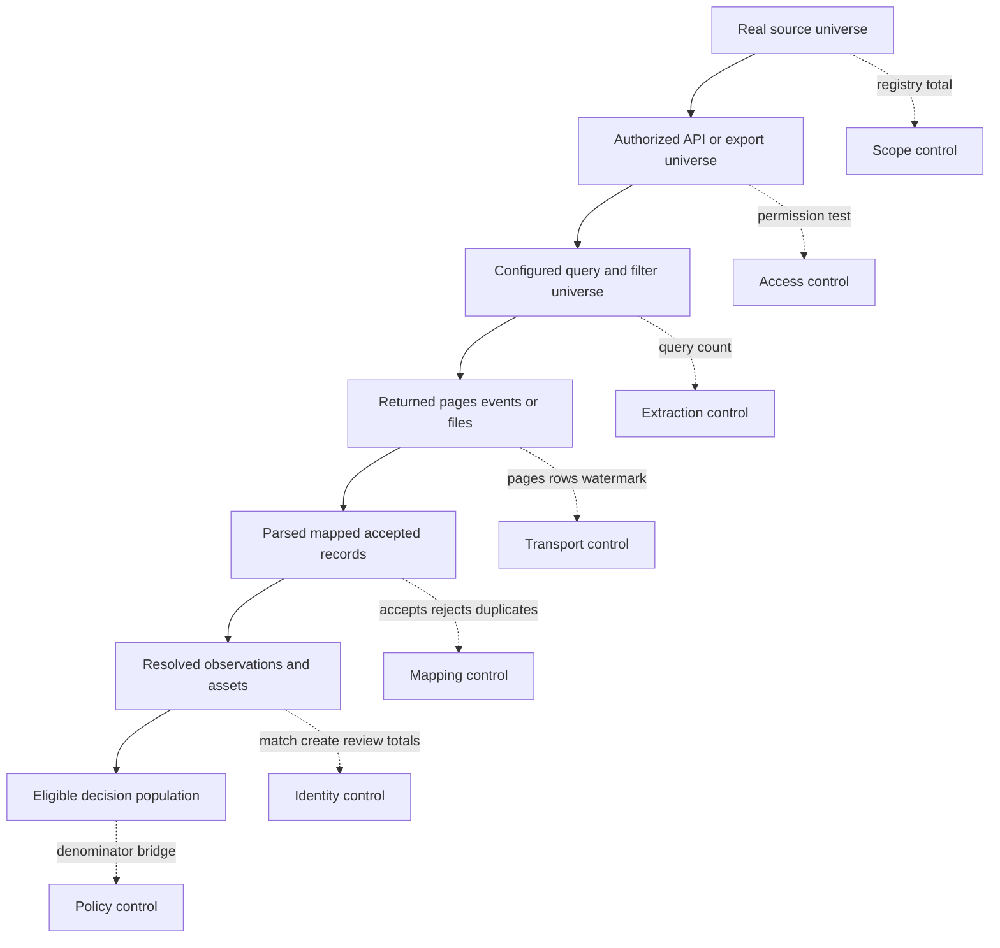

## Source-by-source discovery model

No source is inherently "best." Its strength depends on the field, purpose, scope, and time.

| Source | Typical asset evidence | Potential authority | Natural blind spot | Freshness trap | Reconciliation partner |
|---|---|---|---|---|---|
| EDR | Sensor ID, device, OS, user, heartbeat, policy | Its sensor state and telemetry | Devices without working sensor | Latest ingest mistaken for latest heartbeat | MDM, IAM, CMDB, network |
| Vulnerability scanner | Hosts, IPs, DNS, OS/software guesses, findings, credentials | Scan observation/finding under scope | Offline, blocked, unscanned, ephemeral targets | Last scan may predate change | Cloud, EDR, CMDB, network |
| CMDB | CIs, services, owners, lifecycle, relationships | Approved service-management fields | Ungoverned/new/ephemeral assets, stale CIs | Update time may reflect unrelated edit | Discovery, cloud, business catalog |
| IAM/directory | Users, groups, devices, service principals, roles | Directory object/status/access context | Local identities and non-integrated systems | Sign-in freshness differs from object freshness | HR, MDM, SaaS, cloud |
| Cloud control plane | Accounts, resources, tags, configuration, lifecycle events | Provider resource identity/state in queried scope | Unregistered accounts, regions/services without permission | Snapshot misses short-lived resources | Org registry, pipeline, runtime, CMDB |
| Network/NAC/DNS/DHCP | Communicating addresses, MACs, names, leases, ports | Time-bounded network observation | Silent/off-network assets; NAT/shared address | Lease/event time confused with current ownership | MDM, EDR, scanner, site inventory |
| MDM/UEM | Enrolled devices, user, platform, compliance, config | Enrollment and management posture | Unenrolled/incompatible systems | Check-in age ignored | EDR, IAM, procurement |
| SaaS/CASB/vendor API | Tenants, users, admins, objects, activity/settings | Native SaaS object/state under API scope | Local accounts, unintegrated/free tools, API limits | Activity window not same as tenant existence | SSO, procurement, finance, owner attestations |
| Zscaler | Relevant first-party traffic/device/app/context evidence where documented | Exact observed Zscaler field under licensed scope | Traffic not traversing/observed, identity/config limits | Log event time versus delivery time | IAM, endpoint, network, app inventory |
| HR | Worker, status, manager, department, location | Employment/organization fields | Service accounts, devices, external identities | Effective-dated changes handled poorly | IAM, MDM, ownership |
| Procurement/ITAM | Purchase, serial, contract, assignment, warranty | Financial/contract/custody evidence | Cloud/free/shadow/technical state | Purchased does not mean active | MDM, CMDB, finance |
| Service/business catalog | Services, owners, tiers, capabilities, dependencies | Approved business context | Technical reality changes faster | Annual attestation looks current | CMDB, apps, cloud, finance |
| Ticketing/change | Incidents, requests, changes, remediation state | Workflow decision/status | Assets never ticketed | Closed ticket mistaken for fixed state | Control source and asset inventory |

### EDR and MDM

EDR is strong evidence that a sensor reports from a device and that a particular policy/health state is observed. It is a poor independent denominator for EDR coverage because devices without EDR are absent by definition. MDM sees enrolled endpoint management state and may provide device IDs, serials, users, compliance, and platform data. It can still miss unmanaged or unsupported devices. Reconcile EDR and MDM with IAM device registrations, procurement, network observations, and lifecycle systems.

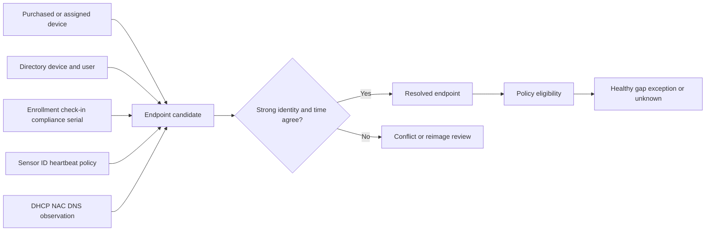

Key conflict examples include a reimaged laptop receiving a new MDM and EDR identity, a motherboard replacement changing hardware IDs, a shared VDI host presenting many user sessions, a device name reused after retirement, and a laptop assigned to one worker but recently used by another. Preserve hardware, installation, management, sensor, and user grains rather than forcing them into one field.

### Vulnerability scanners

Scanner presence says the scanner observed a target under configured method, credentials, network reachability, and time. An unauthenticated network scan may infer OS/software differently from an authenticated agent. IP-based findings need temporal identity. One cluster may represent a load balancer, one host may have many interfaces, and cloud instances may be recreated behind an address. Reconcile scanner asset IDs and findings with cloud resource IDs, EDR/MDM IDs, CMDB CIs, DNS/DHCP history, and scan metadata.

| Scanner field | Question before matching | Common error | Safer use |
|---|---|---|---|
| IP address | At what time, interface, tenant, and network? | Reassigned address merges hosts | Time-bounded alias/context |
| Hostname/FQDN | Source, normalization, reuse, DNS validity? | Clone or stale DNS collision | Supporting evidence, not universal key |
| MAC | Local observation, virtualization, randomization, reuse? | Shared/changed MAC treated immutable | Network-segment evidence |
| Scanner asset ID | Stable across scans/rebuilds and one source instance? | Cross-tenant ID collision | Namespace with source/tenant |
| OS fingerprint | Authenticated or inferred, confidence, time? | Wrong class/applicability | Attribute with provenance/confidence |
| Finding | Asset identity and observation window? | Vulnerability moved to wrong rebuilt host | Keep finding-to-observation link |
| Credentialed status | Did authentication succeed for this run? | Shallow scan counted complete | Separate coverage and depth |

### CMDB and business systems

A CMDB can contribute CI IDs, class, lifecycle, owner, service, environment, and relationships. Business and service catalogs can explain criticality and accountable owners. Procurement/ITAM can provide purchase, serial, contract, and custody. These sources often change through approvals rather than direct observation. Their authority may be high for business process fields while their technical state is stale.

Never overwrite a consequential CMDB field merely because a security source has a newer timestamp. A recent network observation cannot decide the business owner. A cloud tag may contain an owner email but be ungoverned. Use field-level authority, exact identity, conditional updates, approval where needed, preimage/audit, read-back, and reconciliation.

### IAM and SaaS

IAM can connect human identities, devices, service principals, applications, roles, and sign-ins. HR may decide worker status; IAM decides directory object status; a SaaS system decides its native local account state. An email address is useful but mutable and sometimes reused. Prefer immutable directory or provider IDs, namespace them by tenant, and maintain valid-time links from people to accounts.

SaaS discovery requires several lenses. Procurement sees paid contracts. SSO sees federated access. CASB or approved traffic evidence may see usage. Vendor APIs see native tenant objects within granted scope. Finance sees spending. Owner attestations explain purpose and data. A service can be sanctioned but locally administered; unsanctioned but low-risk; or purchased but unused. Reconciliation should classify rather than equate "not in SSO" with "rogue."

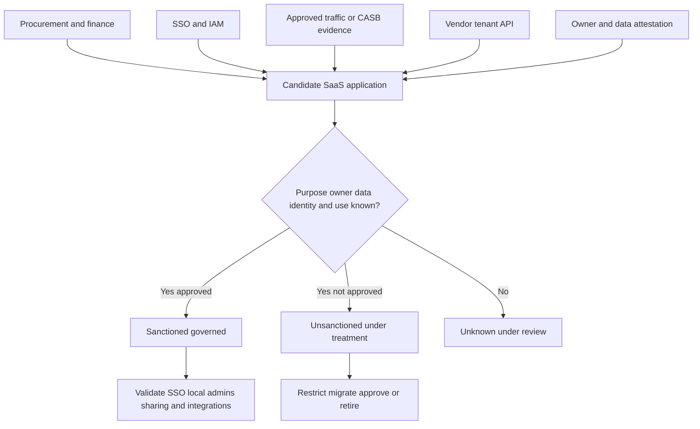

### Cloud sources and ephemeral assets

Cloud reconciliation begins with an organization/account/subscription/project registry independent from the resource connector. If 40 accounts exist and only 35 are queried, a green connector can be 100 percent healthy for 87.5 percent of intended scope. Within accounts, provider resource IDs are strong identifiers, but deletion and recreation produce new entities even if name/IP remains. Tags are context, not always authority.

Combine periodic inventory with control-plane events for create/change/delete, pipeline/deployment metadata for intended service/image/owner, runtime security evidence for actual execution, and identity/network logs for use. Use tombstones and valid-time records so a deleted resource does not remain active and a later resource with the same name is not merged.

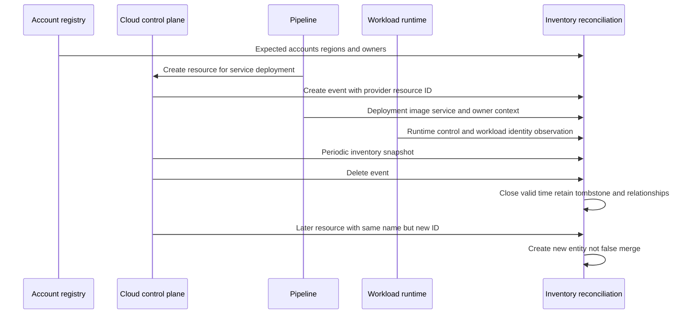

### Network discovery

Network sources reveal communication that management systems may miss. DHCP maps addresses to leases; DNS maps names under time and caching; NAC observes connection/authentication; flow/log sources show communicating endpoints; controllers know managed network equipment. Their strength is time-bounded observation, not permanent identity.

Network blind spots include sleeping devices, isolated networks, encrypted/translated traffic, remote systems, incomplete sensor placement, IPv6 gaps, unmanaged DNS, shared NAT, randomized MACs, and OT safety restrictions. Reconcile with site/address registries, MDM/EDR, cloud, scanner, identity, and physical/maintenance records.

### Zscaler sources

The official integration catalog includes Zscaler entries and broad source/target categories. In a customer design, relevant Zscaler-produced observations may help associate users, devices, applications, traffic, or security context where the exact product, feed, field, retention, identity, and scope are documented and licensed. Do not assume that all traffic traverses one enforcement path, that a log record proves ownership, or that a catalog entry guarantees a particular AEM field. Treat Zscaler data like any other source: contract purpose, scope, grain, authority, times, quality, privacy, and blind spots.

## Scope, authority, freshness, and count disagreements

### Source authority is field-specific

| Field/state | Candidate authority | Supporting source | Conflict rule | Never do |
|---|---|---|---|---|
| Worker employment status | HR | IAM/sign-in | Effective-dated HR status, investigate latency | Let recent sign-in overrule termination |
| Directory account active | IAM | HR | IAM for technical state; HR for employment meaning | Collapse person and account |
| Device enrollment | MDM | IAM | MDM native state within tenant/scope | Infer enrollment from directory registration |
| EDR heartbeat/policy | EDR | Endpoint logs | EDR source event time | Infer health from installed package alone |
| Cloud resource existence | Provider API/events | Scanner/CMDB | Provider ID and lifecycle in registered account | Let stale CMDB keep deleted resource active |
| Business service owner | Approved service catalog/attestation | CMDB/tag | Governed owner process | Use last logged-in user |
| Purchase/custody | ITAM/procurement | MDM/CMDB | Financial/custody process | Treat purchase as active operation |
| Network address at time | DHCP/NAC/cloud interface | Scanner/DNS | Time-bounded lease/interface evidence | Treat IP as permanent ID |
| SaaS native admin | SaaS API | SSO/IAM | Native tenant state within API scope | Assume SSO list includes local admins |
| CI lifecycle | CMDB process plus technical evidence | Cloud/EDR/scanner | Approved reconciliation rule | Auto-retire from one stale signal |

### Freshness is purpose-specific

One global "last updated" timestamp is misleading. A source row may be ingested now but describe a scan from last month. Store at least event/effective time, source observation/update time, extraction time, ingestion time, processing time, and as-of/report time where available.

| Time | Meaning | Example defect if confused |
|---|---|---|
| Event/effective time | When state/change applied in real/source domain | Future HR transfer applied too early |
| Observation time | When source observed asset/control | Old scan appears current because file arrived today |
| Source update time | When native record changed | Unchanged valid record incorrectly called stale |
| Extraction time | When connector read source | Measures connector activity, not evidence age |
| Ingestion time | When data arrived downstream | Queue delay hidden |
| Processing time | When mapping/resolution completed | Report lag hidden |
| As-of time | Cutoff for a coherent view | Tables compared at different moments |

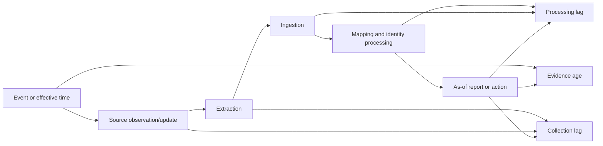

### Why counts disagree

Count disagreement is expected until the counting contracts align.

| Difference driver | Source A example | Source B example | Reconciliation treatment |
|---|---|---|---|
| Grain | EDR one sensor/installation | ITAM one physical device | Model installation-on-device relationship |
| Scope | MDM parent tenant | IAM parent plus subsidiaries | Bridge by organization/tenant |
| Lifecycle | CMDB active/pending/retired | Scanner observed in last 90 days | Define active and show state bridge |
| Time | Cloud snapshot at 00:00 | Runtime events all day | Choose as-of/window and temporal facts |
| Class | EDR endpoints/servers | Cloud includes buckets/functions/databases | Compare only shared classes |
| Access | Scanner cannot reach restricted segment | CMDB includes it | Track scan eligibility and access gap |
| Identity | Hostname-based scanner rows | Immutable cloud resource IDs | Resolve using stronger IDs/time |
| Deletion | API sends tombstone | File omits deleted rows | Design deletion detection explicitly |
| Duplicates | Multiple interfaces/agents | One CI | Profile and resolve with grain |
| Filters | Only enabled directory devices | All registered devices | Document query and state filters |
| Quality | Missing serials | Duplicate serial due bad imaging | Quarantine/conflict review |

### Plain-English deep-dive 2 - Disagreement is often a measurement problem before a security problem

A library reports 50,000 books; finance reports 47,500 purchases; shelf scanners report 44,000 barcodes. None must be lying. Finance may exclude donations, the scanner may miss checked-out books, and the catalog may count digital titles or withdrawn records. Before alleging theft, define what each count represents and bridge the differences.

For assets, build a **count bridge** rather than demanding equality:

1. Start with source control total.
2. Subtract intentional exclusions and invalid/rejected records with reasons.
3. Add or subtract known grain transformations, such as interfaces into devices.
4. Explain duplicate observations merged into existing assets.
5. Explain new assets created.
6. Explain state transitions and deletions/tombstones.
7. Leave unresolved conflicts explicitly open.
8. Reconcile the final eligible decision population.

The goal is not always zero difference between EDR and CMDB. The goal is that every material difference has an owned, evidence-based reason.

## Identifier strategy and entity resolution

### Identifier hierarchy

| Identifier | Strength | Scope/namespace | Change/reuse risk | Safe treatment |
|---|---|---|---|---|
| Cloud provider resource ID | High within provider/account/service | Provider + org/account/region/service | New ID on recreation; service-specific semantics | Primary evidence with lifecycle |
| Directory object ID | High within tenant | Provider + tenant | New object after recreation; tenant collision | Namespace and valid-time link |
| MDM device ID | High for enrollment record | MDM tenant | Re-enrollment creates new ID | Model enrollment, link to device |
| EDR sensor/agent ID | High for sensor installation | EDR tenant | Reinstall/reimage changes | Model sensor installation |
| Hardware serial | Medium/high for physical device | Manufacturer plus normalization | Missing, bad firmware, duplicates, motherboard change | Combine with manufacturer/model and conflict checks |
| Hardware UUID | Medium/high | Platform/provider | Bad cloning or hardware replacement | Validate collision and time |
| Certificate thumbprint | High for certificate object | Algorithm/value | Rotation creates new certificate | Link certificate to endpoint/service |
| Service catalog ID | High for governed logical service | Catalog instance | Process misuse | Authority for service entity only |
| FQDN/hostname | Medium/low | DNS domain/tenant/time | Mutable, reused, aliases, clones | Supporting time-bounded alias |
| MAC address | Medium/low | Network/interface/time | Randomized, spoofed, virtualized, reused | Interface observation, not universal device ID |
| IP address | Low for permanent identity | Address space/time | Dynamic, NAT, shared, recycled | Time-bounded locator |
| Email/UPN | Medium for lookup | Tenant/domain/time | Rename, alias, reuse | Alias linked to immutable person/account IDs |
| Display name | Low | Organization/time | Nonunique and mutable | Search/context only |

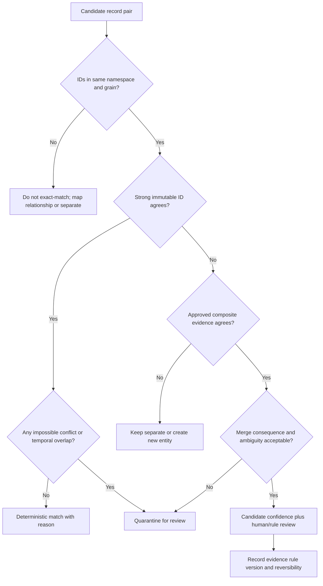

### Match decisions

| Decision | Meaning | Required evidence | Downstream treatment |
|---|---|---|---|
| Exact match | Same entity under strong scoped identity | Namespaced ID and no impossible conflict | Link observation to existing entity |
| Composite match | Same entity supported by multiple fields/time | Approved rule and collision tests | Link with explainable reason/confidence |
| Relationship, not match | Different entities are connected | Grain distinction, such as sensor on device | Create typed edge |
| New entity | Evidence represents separate asset | Unique source identity and scope | Create canonical ID |
| False split repair | Existing duplicates are one entity | Strong review evidence | Merge reversibly; reconcile downstream |
| False merge repair | One entity contains different assets | Contradictory IDs/time/state | Split; reassign observations and actions |
| Retire/close | Entity no longer active under criteria | Authority, deletion/lifecycle evidence | Close validity; retain governed history |
| Unresolved | Evidence insufficient or conflicting | Document conflict/review owner/SLA | Block consequence-sensitive automation |

### Context helps, but must not become circular

User, department, location, owner, IP, hostname, and software can support matching. They should not be copied from a guessed match and then used to prove the same match. For example, matching two records because both show `alice@example` and then declaring the user context high-confidence because the records matched is circular. Preserve independent source evidence and calculate identity confidence separately from context completeness.

### Plain-English deep-dive 3 - False merge and false split have different costs

If a hospital combines two patients' records, one person may receive the other's medicine. That is a false merge and can be immediately dangerous. If one patient has two separate files, clinicians may miss history and repeat tests. That is a false split and is also harmful, but differently.

Asset reconciliation must choose thresholds based on consequence. An ambiguous merge used only for an analyst search suggestion may be tolerable if clearly labeled. The same merge must not drive automatic isolation, CMDB overwrite, or risk acceptance. A false split can inflate counts and duplicate tickets; a false merge can attach a vulnerability, owner, control, or remediation action to the wrong production asset. Track both precision and recall, sample normal and edge cases, provide reversible decisions, and gate actions by confidence.

## Reconciliation control totals

### Run-level accounting equation

For a bounded run, design an accounting identity such as:

$$
\text{Returned} = \text{Accepted} + \text{Rejected} + \text{Quarantined as unreadable}
$$

$$
\text{Accepted} = \text{Matched observations} + \text{New-entity observations} + \text{Unresolved observations} + \text{Intentional non-asset observations}
$$

These categories must be mutually exclusive under the contract. If one observation can produce several entities or relationships, use separate bridge tables rather than forcing the equation.

| Boundary | Control total | Dimensions | Alarm examples |
|---|---|---|---|
| Scope | Expected orgs/tenants/accounts/ranges/classes | Owner, environment, region | Account missing or unexpected added |
| Request | API calls/pages/files/events requested | Source, endpoint, time | Cursor loop or page gap |
| Return | Rows/objects/events and source-side total | Class, state, tenant | Sudden drop/spike/truncation |
| Parse | Parsed versus unreadable | Schema/version/file | Encoding or malformed payload |
| Map | Accepted, rejected, defaulted, unknown enum | Field/class/version | New enum mapped to null |
| Identity | Exact, composite, new, relationship, unresolved | Rule/confidence/class | Merge-rate spike |
| Lifecycle | Created, updated, unchanged, retired, resurrected | State/source | Mass retirement after source outage |
| Context | Owner/service/criticality joins and conflicts | Authority/source | Ownership completeness drop |
| Policy | Eligible, excluded, gap, exception, unknown | Policy version | Unknown forced into compliant |
| Workflow | Created, updated, suppressed, failed, reconciled actions | Target/owner | Duplicate ticket burst |

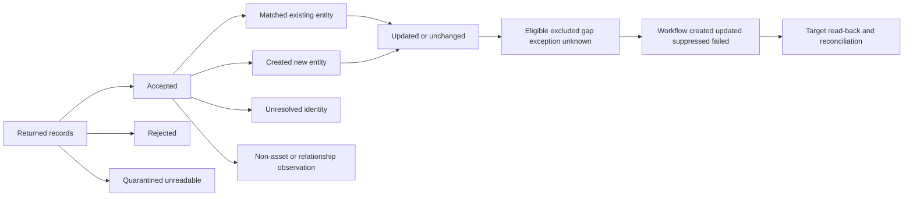

### Cross-source Venn thinking without misleading Venn counts

For two sources, calculate A-only, B-only, and matched overlap after aligning scope, class, grain, lifecycle, and time. For many sources, Venn diagrams become unreadable; use a source-presence pattern or matrix.

| Presence pattern | Example interpretation | Investigation |
|---|---|---|
| EDR + MDM + IAM + CMDB | Managed corporate endpoint with broad context | Validate freshness/control, not merely presence |
| MDM + IAM, no EDR | Possible confirmed control gap or EDR data issue | Check eligibility and EDR source health |
| EDR only | Server/non-MDM class, orphan sensor, or scope mismatch | Resolve class, owner, source tenant |
| Network only | Guest/IoT/new/unmanaged/NAT artifact | Check DHCP/NAC/site/cloud evidence |
| Cloud only | New/ephemeral resource or other source lag | Check events, pipeline, policy applicability |
| CMDB only | Offline/retired/silent asset or stale CI | Verify lifecycle and expected observability |
| SaaS traffic only | Unsanctioned use or missing SSO/procurement link | Identify tenant, owner, data, local accounts |

## Unresolved conflicts and stewardship

An honest inventory has unresolved states. Hiding them improves a dashboard color while degrading decision quality.

| Conflict type | Example | Consequence | Review evidence | Temporary guardrail |
|---|---|---|---|---|
| Strong-ID conflict | Same serial on two concurrently observed devices | False merge | Manufacturer/model, hardware UUID, source raw records | Block merge/action |
| Temporal reuse | Hostname/IP belongs to new device after retirement | Old findings attached to new asset | Lease, cloud IDs, lifecycle dates | Close old alias validity |
| Grain conflict | EDR sensor treated as physical device | Count/control distortion | Source model, installation relationship | Map relationship |
| Lifecycle conflict | CMDB active, cloud deleted | Stale risk and tickets | Provider event, CMDB change/owner evidence | Mark conflict, no auto-retire until rule/approval |
| Owner conflict | Tag, CMDB, HR manager disagree | Wrong assignment/risk owner | Field authority and attestation | Route to steward |
| Class conflict | Scanner says server; MDM says endpoint | Wrong policy applicability | Platform/source confidence and owner | Unknown class for policy |
| Scope conflict | Resource in unknown cloud account | Potential governance gap | Org registry, billing, sponsor | Quarantine account scope |
| Source-health conflict | EDR absent during connector outage | False control gap | Source status and native console | Render evidence unknown |

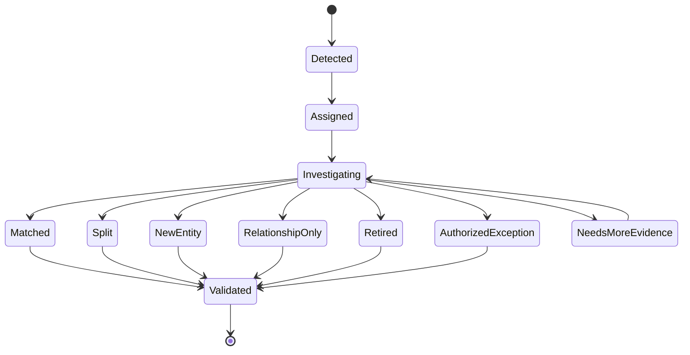

Every unresolved item needs reason, severity/consequence, evidence links, owner, due date/SLA, current guardrail, next test, and escalation path. Track aging by reason and consequence. Closing as "duplicate" requires the surviving entity and match evidence; closing as "retired" requires lifecycle authority; closing as "false positive" requires a precise definition.

## Data-quality program

### Quality dimensions

| Dimension | Asset example | Test | Caveat |
|---|---|---|---|
| Completeness | Active assets have required owner | Non-null/approved owner over eligible population | Placeholder is not meaningful completeness |
| Freshness | EDR heartbeat within class-specific window | As-of minus source observation time | Offline approved states need separate logic |
| Validity | Cloud ID conforms to provider/service format | Domain/schema rule | Valid syntax can still identify wrong entity |
| Uniqueness | One canonical active device under identity grain | Duplicate key/candidate analysis | Shared/reused source identifiers require time |
| Consistency | Lifecycle/owner fields do not contradict authority rules | Cross-source rule and conflict rate | Legitimate perspectives may differ |
| Accuracy | Displayed field represents real state | Sample against authoritative evidence/owner | Hard to prove globally; use sampling |
| Referential integrity | Asset-service links point to active services | Orphan edge query | Retired historical links may remain valid in history |
| Timeliness | Data arrives before decision deadline | End-to-end percentile latency | Average hides tail |
| Reconciliation | Every material record/count difference explained | Control-total bridge | Bad categories can still balance |
| Provenance | Consequential fields trace to source/time/rule | Lineage audit | Presence alone does not mean understandable |

### Quality metrics

| Metric | Illustrative definition | Segment | Anti-gaming rule |
|---|---|---|---|
| Scope completeness | Healthy configured source domains / approved required domains | Source class/org | Independent registry, not connector list |
| Freshness compliance | Eligible observations inside source/class window / eligible observations | Source/class/criticality | Use observation time, not ingest time |
| Mapping reject rate | Rejected records / returned records | Source/schema version | Show absolute count and reason |
| Unknown-enum rate | Records using unmapped/defaulted values / accepted records | Field/version | Never silently coerce to safe value |
| Exact-match rate | Exact matched observations / accepted match-eligible observations | Class/source pair | High rate can hide overbroad key |
| Review rate | Unresolved candidate observations / match-eligible observations | Consequence/class | Low is not good if conflicts suppressed |
| False-merge rate | Validated false merges / reviewed or sampled merges | Rule/class | Include representative sampling |
| False-split rate | Validated false splits / reviewed or sampled entities | Rule/class | Define denominator and discovery method |
| Ownership completeness | Assets with current approved owner / eligible assets | Service/class/org | Generic queue is not owner |
| Reconciliation closure | Material exceptions resolved with evidence / due exceptions | Reason/consequence | Closure requires validated state |
| Time to resolve | Detection to validated conflict disposition | Percentiles/reason | Pause clocks only by governed policy |
| Control-total variance | Actual minus expected normalized by baseline | Source/run/class | Scope changes annotated, not hidden |

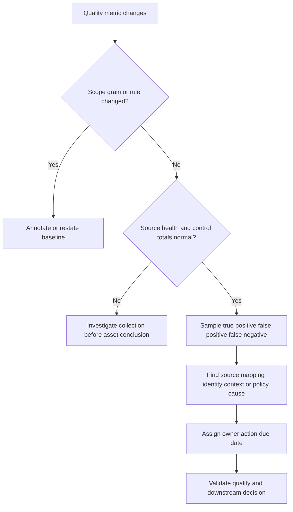

### Plain-English deep-dive 4 - A balanced ledger can still be wrong

An accountant can force a ledger to balance by putting unexplained money into "miscellaneous." The arithmetic passes, but the business remains blind. Asset pipelines can do the same by labeling every rejected record "duplicate," defaulting unknown lifecycle to active, or mapping an unfamiliar control status to healthy.

Reconciliation needs both **arithmetic integrity** and **semantic integrity**. Arithmetic integrity proves inputs equal outputs plus explicit exceptions. Semantic integrity proves categories mean what stakeholders think, using source samples, rule tests, authority, and negative cases. Review the largest and most consequential categories; sample normal records; deliberately search for false negatives; and ensure unknown/default states remain visible.

## Troubleshooting methodology

### Symptom-to-layer matrix

| Symptom | Likely layers | Cheap discriminating test | Containment |
|---|---|---|---|
| Source count zero | Auth, endpoint, query, source outage | Native source count and request response | Mark source unknown; pause dependent action |
| Partial count | Pagination, quota, filter, timeout, region/account | Page/token/control-total bridge | Prevent mass retirement/gap tickets |
| Duplicate spike | Replay, checkpoint, key/match rule, source duplicate | Run IDs, source IDs, idempotency, match-version delta | Pause downstream creates |
| Asset drop | Scope, deletes, mapping rejects, overmerge, lifecycle | Last-good/first-bad count bridge | Block executive trend/retirement |
| Owner null spike | Business source, join, effective dates, schema | Source owner count and join-cardinality sample | Route to steward; avoid wrong tickets |
| EDR gap spike | EDR health, source lag, identity, policy denominator | Native EDR count plus source watermark | Render unknown and pause bulk action |
| Cloud assets missing | Account registry, permission, region/service, polling | Expected-versus-configured account matrix | Escalate governance gap |
| Ephemeral blind spot | Polling only, missing events/runtime | Compare audit create/delete events to snapshots | Use event/pipeline cohort |
| False merge | Identifier collision, namespace/time ignored | Raw strong IDs and overlap timeline | Split/hold affected actions |
| Report/detail mismatch | Snapshot, filter, timezone, grain, cache/version | Export exact query and sample IDs | Caveat report |

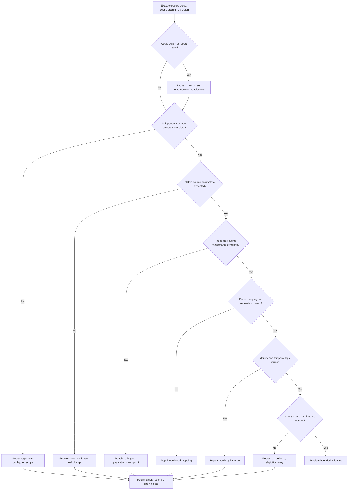

### Investigation sequence

1. Record expected versus actual, tenant/environment, source, asset class, grain, organization, role, time window, cutoff, and versions.
2. Quantify affected records, decisions, reports, workflows, and customer impact. Preserve uncertainty.
3. Pause high-consequence automation if identity or source completeness is suspect.
4. Compare approved source universe to configured/authenticated query scope.
5. Compare native source control totals with extracted pages/files/events and watermarks.
6. Verify event/observation time separately from extraction/ingestion/processing time.
7. Account for accepted, rejected, quarantined, duplicate, replayed, and deletion records.
8. Inspect schema, enum, null/default, class, and lifecycle mapping versions.
9. Trace one normal, one missing, one duplicate, one false merge, and one false split candidate through source IDs and match reasons.
10. Check field authority, temporal joins, owner/service context, eligibility, and exceptions.
11. Reproduce report query, filters, timezone, snapshot, grain, and denominator.
12. Repair with version control in a bounded no-action cohort. Reconcile every downstream asset, metric, ticket, CMDB change, and report before resume.

### Hypothesis table

| Hypothesis | Prediction | Test | Result interpretation |
|---|---|---|---|
| Source truly lost assets | Native current count drops in same cohort | Query source directly with approved scope | Source/domain change or source incident |
| Connector missed pages | Native count stable; downstream stops at token/page | Compare request logs, page counts, cursor | Collection defect |
| Mapping rejects new enum | Returned count stable; rejected/unknown enum rises | Inspect schema/mapping version and reject sample | Semantic defect |
| Overmerge reduced count | Observation count stable; merge rate/clusters increase | Compare match-rule version and strong-ID conflicts | Identity defect |
| Lifecycle retired records | Delete/retire transitions rise with authority evidence | Inspect events and state rule | Real or rule-driven state change |
| Report filter changed | Underlying asset rows stable; view cohort differs | Reproduce exact filter/query/version | Presentation/logic defect |

### Evidence package

| Evidence | Content | Why | Safety |
|---|---|---|---|
| Impact | Affected classes/orgs/counts/decisions and uncertainty | Severity and containment | Minimize personal/security data |
| Timeline | UTC last good, first bad, events, runs, changes | Correlation | State clock semantics |
| Scope | Expected/configured/authorized source universe | Detect hidden omission | Do not expose secrets |
| Control totals | Native, returned, accepted, rejected, identity, lifecycle, policy | Locate loss/gain | Keep query definitions |
| IDs | Source/tenant/run/page/record/asset/rule/report/workflow | End-to-end trace | Redact credentials/tokens |
| Samples | Normal, missing, duplicate, merge, split, conflict | Discriminate hypotheses | Use approved secure channel |
| Versions | API, connector, schema, mapping, match, policy, report | Change boundary | Correlation is not cause |
| Tests | Hypothesis, prediction, method, result | Reproducible investigation | Non-destructive first |
| Ask | One bounded product/source question | Efficient escalation | Avoid requesting proprietary detail without need |

## Complete synthetic NMH reconciliation scenario

### Objective and source scope

NMH wants an endpoint denominator for EDR and encryption coverage across the parent company and two subsidiaries, while separately understanding server, cloud, SaaS, and OT observations. The controlled synthetic as-of time is 2026-08-24 00:00 UTC. The team defines an endpoint as one active managed operating-system installation on corporate-assigned portable or desktop hardware. VDI sessions, servers, OT, guest/BYOD, and retired hardware use separate grains or populations.

| Source | Synthetic configured scope | Grain | Expected source-side total | Authority in exercise |
|---|---|---|---:|---|
| HR | Active/leave workers in three companies | Person | 11,402 | Employment/department/manager |
| IAM | Three directory tenants | Account/device/service principal | 26,811 | Directory object and status |
| MDM | Three UEM tenants | Enrollment/device | 10,518 | Enrollment/check-in/compliance |
| EDR | Endpoint and server groups in three tenants | Sensor installation | 13,944 | Sensor heartbeat/policy |
| Scanner | Corporate/server ranges and cloud targets | Scanner asset/observation | 17,220 | Scan observation/finding |
| CMDB | Active/pending/retired endpoint/server CIs | CI | 16,780 | Approved CI/service fields |
| Cloud | 42 approved accounts/subscriptions | Resource/event | 31,204 current resources | Provider resource state |
| Network | Corporate DHCP/NAC/DNS observations | Interface/lease/event | 14,107 recent patterns | Time-bounded network observation |
| SaaS | SSO/procurement/vendor pilot feeds | App/tenant/account | 1,320 application/account objects | Native/provider/contract fields by type |
| Zscaler | Synthetic relevant documented traffic/device context feed | Observation | 12,640 recent observations | Exact observed field/time only |

All counts and behavior are fictional. They are designed to teach reconciliation, not represent Zscaler performance or a real enterprise.

### Count bridge for MDM endpoint observations

| Stage | Synthetic count | Arithmetic/explanation |
|---|---:|---|
| Native source control total | 10,518 | Three configured MDM tenants at cutoff |
| Returned | 10,518 | All pages accounted for |
| Parse unreadable | 0 | Schema readable |
| Accepted | 10,501 | 17 records quarantined for impossible duplicated immutable ID |
| In-scope endpoint grain | 10,376 | 125 records are non-endpoint enrollment objects |
| Matched existing endpoint | 9,984 | Strong/composite evidence |
| New endpoint candidate | 296 | Not present in prior inventory |
| Unresolved identity | 96 | Conflicting serial/reimage evidence |
| Total accounted | 10,376 | 9,984 + 296 + 96 |

### Cross-source endpoint presence

| Pattern | Synthetic assets | Interpretation | Action |
|---|---:|---|---|
| MDM + EDR + IAM + CMDB | 9,110 | Broadly represented | Validate current policy/owner, monitor |
| MDM + IAM + CMDB, no EDR | 310 | Possible EDR gap | Check EDR source health/eligibility and device state |
| MDM + EDR + IAM, no CMDB | 402 | CMDB coverage/onboarding gap | Validate lifecycle/CI policy before create |
| EDR + IAM + CMDB, no MDM | 198 | Could be servers/misclassified/MDM gap | Resolve class and management policy |
| Network + IAM only | 87 | New, guest, stale, or unmanaged | Site/DHCP/device investigation |
| CMDB only | 263 | Offline/retired/stale or blind source | Owner/lifecycle verification |
| EDR only | 61 | Orphan sensor, server, tenant/scope issue | Source tenant and identity review |
| Material unresolved conflict | 96 | Automation blocked | Steward review with SLA |

The pattern rows are not a partition of every enterprise asset; they are selected endpoint investigation cohorts. The report states this caveat explicitly.

### Identifier examples

| Candidate | Evidence | Decision | Reason |
|---|---|---|---|
| MDM-447 and EDR-A91 | Same normalized manufacturer/serial, consistent hardware UUID, non-overlapping installation transition | Match device; relate separate enrollment/sensor | Strong composite and reimage timeline |
| Scanner-881 and Cloud-i-123 | Same time-bounded private IP but different cloud resource IDs overlap | Do not match | IP collision/NAT; strong IDs conflict |
| CMDB-CI-77 and Cloud-i-900 | CMDB cloud ID equals provider resource ID; owner/service consistent | Match | Namespaced strong ID |
| EDR-X1 and EDR-X2 | Same hostname, different serials, simultaneous heartbeats in two domains | Separate | Hostname reused/not unique |
| IAM-device-4 and MDM-88 | Same directory device ID and serial; current tenant consistent | Match device relationship | Strong IDs agree |
| Net-MAC-1 and MDM-90 | MAC agrees but is randomized and changes next day | Candidate only | Weak temporal interface evidence |

### Synthetic incident: mass asset retirement

At 08:20 UTC, 2,940 endpoint records transition to retired and EDR coverage appears to improve because the denominator shrinks. No business change explains the retirement.

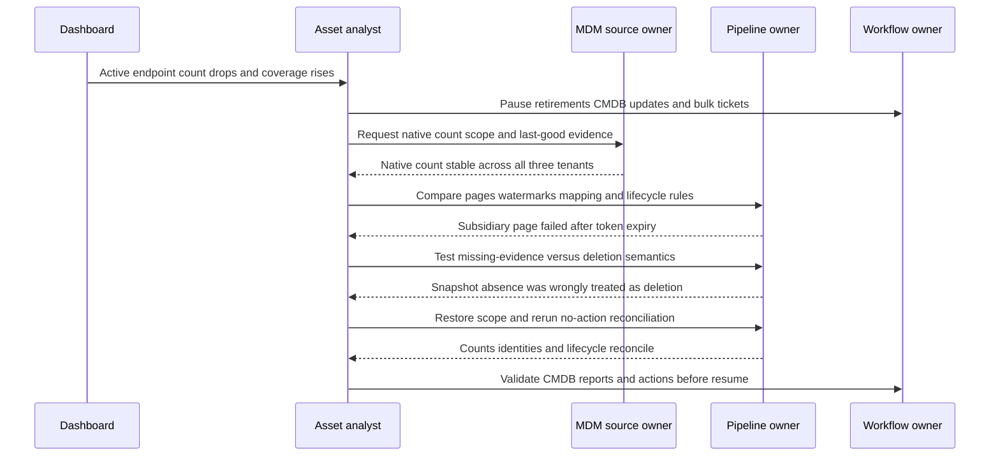

The synthetic root defect is incomplete snapshot pagination after an access-token problem. The lifecycle rule incorrectly interprets absence from one incomplete snapshot as authoritative deletion. Safeguards also failed because no scope-completeness gate blocked retirement and the dashboard did not show source health beside the denominator.

The team repairs least-privileged access, reprocesses the complete snapshot in shadow mode, reverses erroneous lifecycle proposals, and reconciles asset validity, EDR denominator, CMDB proposed updates, tickets, reports, and exports. Prevention includes account/tenant control totals, complete-run marker, two-signal or authoritative deletion rules, source-health gating, mass-change threshold, approval, and a game-day test.

### NMH unresolved conflict queue

| Reason | Count | Guardrail | Owner | Synthetic SLA/next test |
|---|---:|---|---|---|
| Duplicate serial concurrent devices | 17 | No auto-merge/action | Endpoint/ITAM steward | 2 business days; hardware/tenant evidence |
| Reimage transition unclear | 49 | Keep installation records separate | Endpoint steward | 3 days; timeline and enrollment/sensor IDs |
| Cloud account not in registry | 8 | Quarantine resources from normal policy | Cloud governance | Same day; billing/org/sponsor evidence |
| CMDB/cloud lifecycle conflict | 12 | Block retirement/write-back | CMDB/cloud owners | 2 days; provider event and change record |
| Owner authority conflict | 10 | Route tickets to stewardship queue | Service catalog owner | 5 days; owner attestation |

### NMH acceptance criteria

| Area | Synthetic acceptance evidence | Failure gate |
|---|---|---|
| Scope | 100 percent approved tenants/accounts represented or explicit approved exception | Unknown scope cannot be called complete |
| Counts | Every run balances native/returned/accepted/rejected/identity/lifecycle totals | Unexplained material variance blocks action |
| Freshness | Source/class evidence within approved windows; degraded source visible | Ingest time cannot substitute observation time |
| Identity | Consequential exact/composite rules tested; conflicts queued | No opaque auto-merge for high-impact action |
| Ephemeral | Cloud create/delete cohort reconciles to snapshot/pipeline/runtime | Poll-only completeness claim rejected |
| Context | Owner/service joins trace to authority and effective date | Guessed owner cannot route high-impact ticket |
| Workflow | Idempotent actions, approval, target read-back, retry/reconciliation | Ticket creation alone not success |
| Reporting | Scope/grain/as-of/rule/source health visible and totals reproduce | Dashboard/detail disagreement blocks acceptance |
| Operations | Runbook, RACI, alerts, incident drill, rollback/rebuild tested | No owner or recovery evidence blocks go-live |

## Experience bridge: evidence correlation at enterprise scale

Your prior background maps naturally to source reconciliation. Sync and SharePoint issues rarely had one perfect source. A user report, client log, Windows event, identity state, permissions, network trace, browser HAR, and service telemetry each represented a bounded observation. You had to align tenant, user, device, file, timestamp, request ID, and network path; compare normal and failing cases; recognize collection gaps; and escalate with a reproducible evidence package.

| Existing strength | Reconciliation transfer | Gap to build | Honest answer |
|---|---|---|---|
| Correlation IDs/timestamps | Preserve record/run/entity IDs and clock semantics | Asset-specific source schemas | "I build a common timeline before joining evidence." |
| Device/user/service scoping | Define grain, tenant, class, and population | Enterprise asset universe | "I never add source counts until scopes align." |
| Network troubleshooting | Treat IP/DNS as time-bounded observations | Asset entity resolution governance | "An IP helps correlate; it is not permanent identity." |
| SQL/Power BI | Profile counts, nulls, duplicates, joins, trends | Product report/query specifics | "I show denominator and source health beside conclusions." |
| Escalation engineering | Hypothesis, discriminating test, bounded escalation | Connector-specific diagnostics | "I trace the first wrong boundary and preserve uncertainty." |
| Customer leadership | Align source and process owners | Security asset governance | "I make disagreements owned and auditable, not hidden." |

## Labs and rehearsal

All exercises use synthetic data and general tools. They do not imply a licensed Zscaler environment.

### Lab 1 - Ten-source catalog

Build contracts for EDR, scanner, CMDB, IAM, cloud, network, MDM, SaaS, Zscaler-context, and HR/business sources. Include purpose, owner, universe, grain, authority, access, filters, time, cadence, volume, schema, quality, recovery, security, privacy, and change. **Pass:** a reviewer can identify what each source cannot see.

### Lab 2 - Scope matrix

List expected organizations, tenants, accounts, regions, network ranges, asset classes, and lifecycle states. Compare expected versus configured versus authenticated versus successful. **Pass:** a green connector cannot hide a missing subsidiary.

### Lab 3 - Time semantics

Create event, observation, source update, extraction, ingestion, processing, and as-of timestamps for 20 records. Calculate evidence age and pipeline lag separately. **Pass:** a newly ingested old scan is classified stale.

### Lab 4 - Count ledger

For a 10,000-row synthetic feed, account for returned, unreadable, rejected, accepted, excluded, matched, new, unresolved, relationship-only, created, updated, unchanged, retired, and workflow totals. **Pass:** arithmetic balances and categories have semantic tests.

### Lab 5 - Identifier collision

Create records with reused hostname, dynamic IP, randomized MAC, duplicate serial, new EDR sensor after reimage, and namespaced cloud IDs. Propose match, relationship, split, or review. **Pass:** no weak single field drives a consequential merge.

### Lab 6 - False merge/split test set

Build labeled positive/negative pairs and edge cases. Measure precision/recall for two simple rules, then explain action consequences. **Pass:** threshold choice depends on use case and review path.

### Lab 7 - EDR denominator

Reconcile MDM, IAM, ITAM, CMDB, network, and EDR into eligible, healthy, gap, exception, and unresolved states. **Pass:** EDR is not its own denominator.

### Lab 8 - Scanner coverage

Separate assets targeted, reached, authenticated, deeply assessed, and fresh. Reconcile with server/cloud inventory. **Pass:** scanner presence is not authenticated assessment coverage.

### Lab 9 - SaaS discovery

Combine procurement, SSO, traffic, vendor API, finance, and owner evidence. Classify sanctioned, unsanctioned, unknown, local-admin, and unused states. **Pass:** absence from SSO is not automatically rogue.

### Lab 10 - Ephemeral cloud cohort

Reconcile create/delete events, snapshot, pipeline, image, workload identity, and runtime observations over one day. **Pass:** every launch is accounted without leaving deleted instances active.

### Lab 11 - Conflict queue

Design reason codes, severity, owner, SLA, evidence, guardrail, decision, and validation fields. **Pass:** no generic "other" bucket exceeds an approved small threshold without review.

### Lab 12 - Source outage game day

Simulate one tenant returning zero pages. Demonstrate source-health unknown, mass-retirement prevention, report caveat, repair, replay, and reconciliation. **Pass:** no false improvement reaches executives.

### Lab 13 - NMH capstone

Recreate the NMH source matrix, count bridge, source-presence patterns, identifier decisions, retirement incident, conflict queue, and acceptance gates. **Pass:** all numbers are synthetic, bounded, and reproducible.

### Lab 14 - Interview whiteboard

Draw source universe through decision and explain count differences, identifiers, ephemeral handling, quality, and troubleshooting in eight minutes. **Pass:** include product caveat and experience bridge without unsupported experience.

## Common misconceptions to correct

| Misconception | Correction |
|---|---|
| A successful connector sees the whole source | It sees the authorized configured query scope and can still be partial |
| Catalog logo means every field/use case is supported | Verify connector docs, direction, object, version, entitlement, and tenant behavior |
| More sources guarantee accuracy | More observations can amplify mapping and identity defects |
| One source is truth for the entire asset | Authority is field, entity, purpose, scope, and time specific |
| Latest ingest timestamp means fresh evidence | Observation/event time may be old |
| EDR provides an EDR coverage denominator | It omits devices without EDR; use independent/reconciled eligibility |
| Scanner record equals a host | Grain may be target, interface, agent, or observation |
| IP or hostname is a stable asset key | Both are mutable, reusable, shared, and temporal |
| Exact string equality always means same entity | Namespace, grain, collision, and time still matter |
| Fuzzy match is inherently intelligent | It trades false splits for false merges and needs testing/review |
| Deduplication means delete source duplicates | Preserve observations/provenance and consolidate representation |
| Equal counts prove equality | Two populations can have equal counts but different members |
| Unequal counts prove a security gap | Scope, grain, lifecycle, time, and filters may explain difference |
| Balanced control totals prove semantic correctness | Bad categories/defaults can balance; sample meanings too |
| Missing from snapshot means deleted | Snapshot may be incomplete; require complete-run and deletion semantics |
| Polling is enough for ephemeral resources | Use events, pipeline, runtime, and logical workload evidence |
| Unknown conflict should be forced to a value | Preserve unresolved state and gate consequences |
| Closed ticket proves reconciliation | Validate target, source, asset, metric, and business state |
| Zscaler evidence is automatically asset authority | Contract exact documented field, scope, time, and purpose like any source |
| TSM should choose customer source authority alone | Facilitate; customer business/technical owners approve authority |

## Official Source Anchors

Research/source date: **2026-08-24**.

Zscaler sources support bounded integration, Data Fabric, and AEM positioning. NIST sources support asset management, continuous monitoring, inventory/control, and risk principles. CIS supports active inventory/control of enterprise assets. ServiceNow provides vendor-specific CMDB concepts. None discloses Zscaler proprietary matching, defines a customer's authority matrix, proves source completeness, sets universal freshness or quality thresholds, or guarantees outcomes.

| Source | URL | Used for | Boundary |
|---|---|---|---|
| Zscaler Data Fabric Integrations | https://www.zscaler.com/products-and-solutions/data-fabric/integrations | Current public integration catalog and broad source/target categories | Catalog is dynamic; verify entitlement, docs, field/direction/version/tenant support |
| Zscaler Data Fabric for Security | https://www.zscaler.com/products-and-solutions/data-fabric | Public ingestion, integration, harmonization, deduplication, correlation, enrichment, and operationalization positioning | No internal topology, match logic, defaults, or guarantee |
| Zscaler Asset Exposure Management | https://www.zscaler.com/products-and-solutions/caasm | Public multi-source asset resolution, deduplication, relationships, golden records, gaps, workflows, CMDB, reporting | Verify licensed/current behavior and exact implementation |
| NIST SP 1800-5, IT Asset Management | https://csrc.nist.gov/pubs/sp/1800/5/final | Practice-guide perspective connecting physical, technical, vulnerability, and operational asset facts | 2018 example architecture; not product requirement or universal design |
| NIST SP 800-137 | https://csrc.nist.gov/pubs/sp/800/137/final | Continuous visibility into assets, vulnerabilities, threats, and control effectiveness | 2011 federal guidance; tailor cadence/metrics |
| NIST SP 800-53 Rev. 5 | https://csrc.nist.gov/pubs/sp/800/53/r5/upd1/final | Configuration management, inventory, monitoring, access, audit, risk controls | Control catalog requires tailoring and assessment |
| NIST CSF 2.0 | https://www.nist.gov/cyberframework | Govern/Identify and broader risk outcomes | Voluntary framework; no connector design |
| CIS Control 1 | https://www.cisecurity.org/controls/inventory-and-control-of-enterprise-assets | Active inventory/control across physical, virtual, remote, cloud, IoT, unauthorized/unmanaged | Industry guidance; scope/implementation vary |
| ServiceNow: What is CMDB? | https://www.servicenow.com/products/it-operations-management/what-is-cmdb.html | CIs, relationships, discovery, reconciliation, automation, ownership, ITSM context | Vendor-specific concept source; ServiceNow dependency not required |

## Likely Interview Questions

### Q1. Why is multi-source asset discovery necessary?

**Model answer:** Each source has a different population, grain, authority, cadence, and blind spot. EDR sees working sensors; scanners see reachable/scanned targets; CMDB sees governed CIs; IAM sees principals/devices; cloud sees queried accounts/resources; network sees communication; MDM sees enrollments; SaaS/business systems add native and ownership context. I combine observations, preserve provenance, align scope/time/grain, resolve identity carefully, and keep unresolved differences visible.

### Q2. What belongs in a source contract?

**Model answer:** Purpose, owner, source universe, grain, field/state authority, access identity and permissions, configured filters, time semantics, full/incremental/event cadence, volume/pages/rates, schema/IDs/deletion behavior, quality acceptance, recovery/checkpoint/replay, security/privacy/retention, change ownership, control totals, and downstream use. Catalog presence is only the start.

### Q3. How do you explain conflicting asset counts?

**Model answer:** I first align organization, class, grain, lifecycle, time, access, and filters. Then I build a count bridge from native control total through returned, parsed, accepted/rejected, in-scope, matched/new/unresolved, lifecycle, policy, and workflow states. I do not demand raw EDR and CMDB equality; I require every material difference to have an owned, evidence-based reason.

### Q4. Which identifiers are safe for asset matching?

**Model answer:** No field is universally safe. Namespaced source-native immutable IDs are strongest within their authority. Hardware serial/UUID can help but have collision/replacement defects. Hostname, MAC, IP, email, and user are mutable/time-bound supporting evidence. I distinguish device, installation, enrollment, sensor, account, interface, and workload grains; test impossible conflicts; record match reason/confidence/version; and make merges reversible.

### Q5. How do you handle ephemeral cloud assets?

**Model answer:** I begin with an independent account/region registry, then combine control-plane create/change/delete events, periodic resource inventory, pipeline/image/service metadata, workload identity, and runtime evidence. Provider resource IDs and valid-time/tombstone logic prevent name/IP reuse from merging different resources. I measure launch/control cohorts, not only a current-host count.

### Q6. What is a good reconciliation and data-quality control set?

**Model answer:** Scope/account controls; page/file/event/watermark totals; parse and mapping accept/reject/unknown-enum totals; exact/composite/new/review identity decisions; lifecycle creates/updates/retires; context/owner conflicts; policy eligible/gap/exception/unknown; workflow create/update/fail; and target read-back. Metrics cover completeness, freshness, validity, uniqueness, consistency, accuracy sampling, referential integrity, timeliness, provenance, and exception aging.

### Q7. How would you troubleshoot a sudden asset-count drop?

**Model answer:** I define exact scope/grain/as-of/version and contain mass retirements or downstream actions. I compare expected versus configured source universes, native source count, pages/tokens/watermarks, parse/map rejects, identity merge rates, lifecycle/deletion rules, context/policy, and report filters. I trace representative missing/normal records, repair in no-action mode, then reconcile assets, metrics, CMDB, tickets, reports, and exports.

### Q8. How does your background transfer, and what remains a learning gap?

**Model answer:** enterprise escalation work trained me to correlate user/device/identity/client/network/service evidence with timestamps and IDs, identify collection gaps, test hypotheses, coordinate source owners, and validate recovery. SQL/analytics supports count bridges and quality tests. I practiced the full method in synthetic NMH data. I have not operated Zscaler AEM in production, so I would validate current integration docs, tenant behavior, and product-specialist guidance.

## 30-Second Memory Hooks

| Concept | Memory hook |
|---|---|
| Source | One witness, bounded view |
| Connector | Pipe plus configured window |
| Universe | Real, authorized, queried, returned, accepted, represented |
| Scope | Green can cover only one subsidiary |
| Authority | Field plus purpose plus time, not universal winner |
| Freshness | Ask when observed, not when loaded |
| Grain | Person, household, visit are different counts |
| Control total | Boxes shipped versus received |
| Identifier | Namespace and lifetime before equality |
| IP | Address at a time, not permanent identity |
| Match | Evidence plus reason plus reversibility |
| False merge | Two patients, one file |
| False split | One patient, several files |
| Dedup | Consolidate view; retain witnesses |
| Conflict | Visible owned uncertainty |
| Reconciliation | Explain every material difference |
| Ephemeral | Events plus workload, pipeline, runtime, tombstone |
| Quality | Arithmetic and semantic integrity |
| Troubleshoot | Universe to source to movement to meaning to identity to use |
| Product claim | Catalog candidate, not tenant promise |
| Experience bridge | Correlation and escalation transfer; AEM operation does not |

## Completion Checklist

- [ ] I explain why EDR, scanner, CMDB, IAM, cloud, network, MDM, SaaS, Zscaler, and business sources see different populations.
- [ ] I define source, source record, observation, scope, authority, freshness, cadence, watermark, snapshot, event, full load, incremental load, control total, grain, and identifier.
- [ ] I distinguish source universe, authorized API universe, configured query universe, returned records, accepted records, resolved assets, and eligible decision population.
- [ ] I create a source contract covering purpose, owner, universe, grain, authority, access, filters, time, cadence, volume, schema, quality, recovery, security, privacy, and change.
- [ ] I verify connector catalog, entitlement, source edition, direction, object/field coverage, version, and tenant behavior before promising support.
- [ ] I do not treat a successful connection or HTTP response as completeness.
- [ ] I use independent registries for organizations, tenants, accounts, regions, ranges, and expected classes.
- [ ] I explain EDR as sensor-state evidence but not its own coverage denominator.
- [ ] I distinguish scanner target, observation, authentication depth, finding, and underlying asset.
- [ ] I use CMDB/business systems for approved fields while checking technical freshness.
- [ ] I distinguish HR person, IAM account/device/principal, MDM enrollment, EDR sensor, and physical/logical asset grains.
- [ ] I combine procurement, SSO, approved traffic/CASB, vendor API, finance, and owner evidence for SaaS.
- [ ] I treat Zscaler evidence like any source with exact product/feed/field/scope/time/authority validation.
- [ ] I combine cloud account registries, provider APIs/events, pipeline, image, workload identity, and runtime evidence.
- [ ] I retain deletion tombstones and valid-time identity so recreated names/IPs do not false-merge.
- [ ] I treat network IP, DNS, DHCP, MAC, NAC, and flows as time-bounded evidence with known blind spots.
- [ ] I scope authority per field, entity, purpose, organization, and time.
- [ ] I preserve event/effective, observation, source-update, extraction, ingestion, processing, and as-of times where relevant.
- [ ] I never use ingestion time alone as evidence freshness.
- [ ] I align organization, class, grain, lifecycle, time, access, and filters before comparing counts.
- [ ] I explain unequal counts with a bridge instead of demanding raw equality.
- [ ] I namespace all source IDs by vendor/source/tenant/account/service as needed.
- [ ] I rank immutable provider IDs above hostname/IP while still testing collisions, recreation, and time.
- [ ] I distinguish deterministic, composite, probabilistic, relationship-only, new, retire, and unresolved decisions.
- [ ] I record candidate evidence, rule version, confidence, conflicts, review, and reversibility.
- [ ] I avoid circular context that both causes and proves a match.
- [ ] I measure/test false merges and false splits according to consequence.
- [ ] I gate high-impact automation on identity confidence, source health, authority, and approval.
- [ ] I balance returned to accepted/rejected/quarantined and accepted to matched/new/unresolved/non-asset categories.
- [ ] I maintain scope, request, return, parse, mapping, identity, lifecycle, context, policy, and workflow control totals.
- [ ] I test arithmetic integrity and semantic integrity; a balanced miscellaneous bucket is not enough.
- [ ] I retain unresolved conflicts with reason, consequence, evidence, owner, SLA, guardrail, and next test.
- [ ] I never force missing/conflicting evidence into a healthy or compliant state.
- [ ] I measure completeness, freshness, validity, uniqueness, consistency, accuracy, referential integrity, timeliness, reconciliation, and provenance.
- [ ] I segment metrics by source, organization, class, criticality, rule, and reason where useful.
- [ ] I annotate/restates baselines when scope, grain, source, or rule changes.
- [ ] I troubleshoot exact expected/actual, scope/grain/time/version, then universe, native source, movement, mapping, identity, context/policy, and report/workflow.
- [ ] I compare last good and first bad with source and pipeline changes but do not confuse correlation with cause.
- [ ] I trace normal, missing, duplicate, false-merge, false-split, and conflict samples through stable IDs.
- [ ] I pause retirements, CMDB writes, tickets, or executive conclusions when data is unsafe.
- [ ] I repair in bounded no-action mode and reconcile all downstream records, metrics, actions, CMDB, and reports.
- [ ] I can explain the complete NMH source matrix, MDM count bridge, source-presence patterns, identifier decisions, retirement incident, conflict queue, and acceptance criteria.
- [ ] I label every NMH source, count, ID, rule, threshold, incident, timeline, and result synthetic.
- [ ] I can complete all fourteen labs and retain reproducible artifacts.
- [ ] I use official Zscaler AEM/Data Fabric/integration, NIST, CIS, and CMDB sources with caveats.
- [ ] I use the controlled research/source date exactly as 2026-08-24.
- [ ] I make no unsupported connector, field, direction, schema, match algorithm, default threshold, completeness, timeline, production, or customer-outcome claim.
- [ ] I can answer Q1 through Q8 with definitions, analogies, architecture, mechanics, examples, tradeoffs, failures, troubleshooting, labs, NMH evidence, official-source caveats, and an honest experience bridge.

[Part 71 - Asset Golden Records, Relationships, Ownership, and Criticality](Part-71-asset-golden-records-relationships.md)