# Part 71 - Asset Golden Records, Relationships, Ownership, and Criticality

> **Audience:** Arti Thakur, preparing for a Zscaler Security Operations Technical Success Manager role after Microsoft enterprise Support Escalation Engineering.
>
> **Purpose:** Turn reconciled multi-source observations into useful, explainable asset knowledge. Cover golden records, field-level survivorship, provenance, source/pair/cluster/attribute confidence, typed and time-valid relationships, owner/custodian/user/department/geography/business-service/lifecycle context, Confidentiality-Integrity-Availability (CIA) and business criticality, crown jewels, internet exposure, false merges, false splits, governance, reviews, metrics, troubleshooting, labs, and honest interview positioning.
>
> **Scope and honesty:** Northstar Meridian Holdings, abbreviated NMH, is fictional. Every NMH asset, source, attribute, relationship, confidence value, criticality tier, crown-jewel designation, internet-exposure state, threshold, review, incident, metric, timeline, and outcome in this Part is synthetic. Zscaler public pages support bounded statements that Asset Exposure Management (AEM) provides multi-source entity deduplication, relationship identification, asset golden records, coverage-gap use cases, workflows, CMDB capabilities, and reporting, powered by the Data Fabric for Security. Public pages do not disclose proprietary resolution, survivorship, confidence, graph, criticality, exposure, default, governance, or review mechanics. Detailed methods below are general educational patterns, not undocumented Zscaler implementation claims. Arti's Microsoft identity, device, permissions, service-dependency, telemetry, analytics, escalation, and customer skills transfer; direct production AEM ownership remains a learning boundary.
>
> **Currency caveat:** Products, packaging, interfaces, integrations, fields, models, terminology, and documentation change. The controlled research/source date for this Part is exactly **2026-08-24**. Current official documentation, licensed tenant evidence, customer-approved source/field authority, business impact analysis, security/privacy/legal requirements, product specialists, Support guidance, direct tests, and accountable owner decisions govern production.

## Section goal

A golden record is a governed best-known view of an asset assembled from source evidence. It is useful because an analyst should not need to open ten tools just to learn that a cloud server belongs to Order Fulfillment, runs in production, is operated by Platform Engineering, is internet reachable, and processes customer addresses. It is dangerous when the consolidated view hides disagreement and converts a guess into "truth."

Think of a medical chart. The chart summarizes a patient, but each consequential fact still needs a source, date, author, and context. The current medication list may come from a clinician; contact information from the patient; allergy history from several records; and a diagnostic conclusion from a reviewed activity. Two patients must never be merged merely because they share a name. An old address should not override a current verified address. Asset records require the same care.

By the end, Arti should be able to:

| Outcome | Demonstrated capability | Evidence artifact |
|---|---|---|
| Define golden records | Explain consolidated views without claiming absolute truth | Golden-record schema |
| Apply survivorship | Select displayed values by field, authority, time, scope, and purpose | Survivorship matrix |
| Preserve provenance | Trace every consequential value and decision to source/activity/reviewer | Provenance ledger |
| Explain confidence | Separate source, pair, cluster, attribute, relationship, and decision confidence | Confidence statement |
| Model relationships | Use typed, directed, time-valid edges with evidence | Relationship dictionary |
| Assign responsibility | Separate owner, service owner, technical owner, custodian, user, steward, control owner, and risk owner | RACI/context map |
| Add organization context | Model department, geography, legal entity, cost center, service, and lifecycle | Context hierarchy |
| Assess criticality | Combine CIA, safety, privacy/legal, business, dependency, recovery, and substitution evidence | Criticality rubric |
| Identify crown jewels | Work from mission/business consequences and dependencies, not prestige labels | Crown-jewel register |
| Bound exposure | Distinguish observed public attributes, effective reachability, and validated paths | Exposure evidence table |
| Govern errors | Detect, contain, repair, and reconcile false merges/splits and stale context | Review runbook |
| Practice | Complete an NMH golden-record and dependency incident scenario | Lab portfolio |
| Bridge honestly | Apply Microsoft investigation skills while naming the product gap | Candidate narrative |

```mermaid
flowchart LR
    OBS[Reconciled source observations] --> ENTITY[Asset identity and aliases]
    ENTITY --> SURV[Field-level survivorship]
    SURV --> GOLD[Golden record with alternatives]
    GOLD --> REL[Typed time-valid relationships]
    REL --> ORG[Owner department geo service lifecycle]
    ORG --> CRIT[CIA business criticality and crown-jewel context]
    CRIT --> EXP[Internet exposure controls and uncertainty]
    EXP --> DEC[Prioritized governed decision]
    DEC --> REVIEW[Attestation correction and validation]
    REVIEW --> SURV
```

## JD Mapping

| Role expectation | Part 71 capability | TSM artifact | Arti bridge and boundary |
|---|---|---|---|
| Become AEM/Data Fabric expert | Explain public golden-record and relationship positioning with caveats | Architecture whiteboard | Verify tenant fields and behavior |
| Analyze complex environments | Map assets, people, services, locations, data, controls, and dependencies | Context/relationship model | Microsoft dependency analysis transfers |
| Identify security risk | Combine criticality, exposure, controls, and confidence without overclaiming | Evidence-based risk narrative | Criticality alone is not risk |
| Recommend mitigation | Route action to accountable owner with impact/dependency context | Prioritized ownership plan | Customer risk owner decides treatment |
| Resolve complex issues | Diagnose wrong value, false edge, false merge/split, or stale context | Provenance evidence pack | RCA method transfers; internals do not |
| Lead strategic engagement | Facilitate business-impact and crown-jewel workshops | Attested register and review cadence | TSM facilitates rather than self-declares crown jewels |
| Communicate proactively | State fact, inference, confidence, unknown, impact, and decision | Technical/executive narrative | Avoid a single opaque score |
| Drive adoption/value | Make owner and relationship context useful in real workflows | Persona task plan | More populated fields are not automatically value |
| Partner cross-functionally | Align app, infrastructure, IAM, cloud, data, OT, risk, and CMDB roles | Governance charter | Field authority remains distributed |
| Use AI responsibly | Suggest links/summaries under provenance and human review | Candidate queue | Never let opaque output accept risk or merge critical assets |

## Candidate honesty note

| Evidence class | Safe interview statement | Boundary to state |
|---|---|---|
| Production transfer | "I correlated Microsoft users, devices, permissions, network paths, services, and customer impact during escalations." | Not production AEM administration |
| Ownership transfer | "I identified the team that could decide and act, rather than equating the reporter with the owner." | Not formal customer risk ownership |
| Data transfer | "I preserve IDs, timestamps, source meaning, conflicts, and evidence when joining records." | Not proprietary matching/survivorship logic |
| Analytics transfer | "I can profile missing/stale ownership, relationships, confidence cohorts, and metric denominators." | Customer-approved semantics still required |
| Synthetic practice | "I built an NMH golden-record, relationship, criticality, and false-merge scenario." | Fictional lab only |
| Official fact | "Zscaler publicly describes AEM golden records and asset relationship identification." | Verify current tenant schema/UI and licensed behavior |
| General method | "I use field-level authority, temporal provenance, and reviewable confidence." | General design, not Zscaler internal architecture |
| Unknown | "I have not configured AEM directly; I would validate official docs, tenant evidence, and product specialists." | Honest gap plus test plan |

## Beginner vocabulary and memory hooks

| Term | Plain meaning | Why it matters | Analogy and memory hook |
|---|---|---|---|
| Golden record | Best-known consolidated view for a defined entity and purpose | Makes context usable while retaining evidence | Medical chart, not divine truth |
| Source assertion | One source's claim about a field/state at a time | Competing claims must remain traceable | One witness statement |
| Survivorship | Rule choosing which assertion appears in summary | One rule cannot safely govern every field | Which witness supplies this fact? |
| Precedence | Ordered preference among sources/rules | Useful only when scoped by field/time/purpose | Tie-break order |
| Provenance | Origin and processing/review history | Supports explanation, correction, and audit | Receipt for every fact |
| Lineage | Path from source through transformations to use | Locates affected downstream decisions | Route on the receipt |
| Confidence | Bounded statement about evidence strength under a method | Keeps inference separate from fact | Strength of the case |
| Source confidence | Reliability of a source/field under current conditions | A healthy authoritative source deserves different treatment | Trustworthiness of witness for this topic |
| Pair confidence | Strength that two records represent the same entity | Drives link/review decisions | Are these two files one patient? |
| Cluster confidence | Coherence of all records in one resolved entity | One weak bridge can poison a cluster | Does the whole folder belong together? |
| Attribute confidence | Strength behind one selected field value | Identity can be correct while owner is wrong | Confidence in one chart entry |
| Relationship confidence | Strength behind an edge between entities | Paths depend on edge quality | Confidence that one road actually connects |
| Fact | Directly supported bounded assertion | Strongest communication unit | "Source reported X at time Y" |
| Inference | Conclusion derived from facts/rules | Must expose assumptions and method | Detective conclusion |
| Unknown | Information not established sufficiently | Prevents false certainty | Blank box, not zero |
| Relationship | Typed connection between entities | Explains ownership, dependency, access, and impact | Labeled road |
| Direction | From/to meaning of a relationship | `depends on` differs from `supports` | One-way arrow label |
| Cardinality | How many entities can participate | Finds impossible duplicates and modeling defects | One-to-one or many-to-many |
| Valid time | Period when a fact/relationship was true in business reality | Prevents old user/owner/path from looking current | Dates on an assignment |
| Transaction time | Period when the system recorded/knew the fact | Supports restatement and audit | When the filing cabinet changed |
| Temporal context | Meaning tied to a time window | Assets and relationships change | Map for a particular day |
| Owner | Accountable party for purpose/value or defined decisions | Enables prioritization and risk treatment | Person responsible for the property |
| Custodian | Team operating/maintaining an asset | Often does work but may not accept business risk | Building caretaker |
| User | Person/account currently using an asset | Context, not automatically owner | Room occupant |
| Department | Organizational unit associated under a rule/time | Supports grouping and assignment | Wing of the company |
| Geography | Country/region/site or jurisdiction context | Affects operations, privacy, residency, and support | Where the room is located |
| Business service | Capability delivered to customers/users through dependencies | Connects technical asset to consequence | Train service, not one carriage |
| Lifecycle | Requested-to-deleted state progression | Determines active scope and expected controls | Technology joiner-mover-leaver |
| Criticality | Importance based on consequence if confidentiality, integrity, availability, safety, or mission fails | Supports proportionate priority | ICU equipment versus lobby display |
| CIA | Confidentiality, Integrity, Availability | Three core security consequence dimensions | Secret, correct, ready |
| Confidentiality | Protection from unauthorized disclosure | Data exposure consequence | Keep secret |
| Integrity | Protection from unauthorized/improper change or destruction | Incorrect commands/data can be catastrophic | Keep correct |
| Availability | Timely reliable access/use | Outage can halt business | Keep ready |
| Crown jewel | Asset, data, process, or capability whose compromise materially harms mission/business | Focuses protection and recovery | What the organization cannot afford to lose/control |
| Mission thread | End-to-end activities/dependencies delivering a critical outcome | Reveals supporting assets beyond obvious system | Route from promise to delivery |
| Single point of failure | Dependency whose failure can stop a service without adequate alternative | Raises availability consequence | One bridge into town |
| Internet exposure | Evidence that an asset/service may be reachable or discoverable from external networks under conditions | Changes plausible attack paths | Door facing public street |
| Reachability | Whether a path can actually connect under effective controls at a time | More specific than public IP | Can someone reach the door? |
| Crown-jewel adjacency | Relationship/path near a highly critical capability | Helps prioritize choke points | Hallway leading to the vault |
| Attestation | Named owner confirms/rejects context under evidence/date | Adds accountability; still needs testing | Sign the inventory sheet |
| False merge | Different entities incorrectly combined | Can transfer risk/action/context to wrong asset | Two patients, one chart |
| False split | Same entity represented separately | Fragments context and duplicates action | One patient, two charts |
| Review cadence | Planned frequency/event trigger for revalidation | Context decays | Scheduled chart review |

## Product claim boundary

| Publicly supported statement | Safe interpretation | Production verification | Unsupported leap |
|---|---|---|---|
| AEM describes asset golden-record creation | Explain consolidated context as a product use-case category | Current schema, UI, lineage, correction, field behavior | "Golden records are always correct" |
| AEM describes multi-source entity deduplication | Explain records may be synthesized across tools | Exact match/confidence/merge/split mechanics | Claim proprietary algorithm or threshold |
| AEM describes asset relationship identification/visual display | Explain relationship context and graph-like views | Current relationship types, sources, time, query behavior | Infer graph database or validated attack path |
| AEM describes user, geo, department and asset details as questions/context | Teach organizational enrichment | Exact source/field/authority and freshness | Claim every field auto-populates accurately |
| AEM describes context-rich inventory for risk programs | Show criticality/ownership as decision inputs | Current integrations and customer configuration | Claim automatic risk quantification accuracy |
| Data Fabric describes correlation and enrichment | Explain context assembly | Exact models/logic, tenant behavior | Claim internal topology or formulas |
| AEM describes workflows/CMDB/reporting | Include review and operationalization concepts | Available actions, permissions, audit, reconciliation | Assume safe automatic overwrite |

### Plain-English deep-dive 1 - Golden means useful and governed, not flawless

A newsroom publishes a current story by combining reporter notes, public records, interviews, photographs, and editor review. The finished story is easier to consume than the raw materials, but a responsible newsroom retains notes, corrections, dates, and source distinctions. "Published" does not mean future evidence cannot change the story.

An asset golden record works the same way. It should answer common questions quickly while preserving source assertions, alternatives, valid times, processing rules, reviewer decisions, and confidence. If three sources disagree about an owner, the summary may select the service-catalog owner under an approved rule and still show the two alternatives. If identity is uncertain, the record should not pretend otherwise. Golden is a quality aspiration and consumption pattern, not a magical authority word.

## Golden-record architecture

### Separate observations, identity, summary, and decisions

| Layer | Contains | Changes when | Why separate |
|---|---|---|---|
| Source observation | Native record/value/source ID/time | Source reports new state | Preserve evidence and source semantics |
| Canonical assertion | Mapped field/value with source provenance | Mapping transforms source | Compare common concepts without deleting native data |
| Entity identity | Canonical asset ID, aliases, member observations | Match/split/merge/lifecycle decision | Identity is not the same as attribute selection |
| Golden summary | Selected attributes and alternatives | Survivorship/context changes | Fast consumption with explanation |
| Relationship graph | Typed directed time-valid edges | New evidence or relationship review | Dependencies evolve separately |
| Policy/evaluation | Eligibility, control state, exposure, criticality use | Policy/context/time changes | Decision can be recomputed/versioned |
| Workflow/action | Ticket, approval, update, exception, validation | Operational process changes | Consequences require audit/reconciliation |

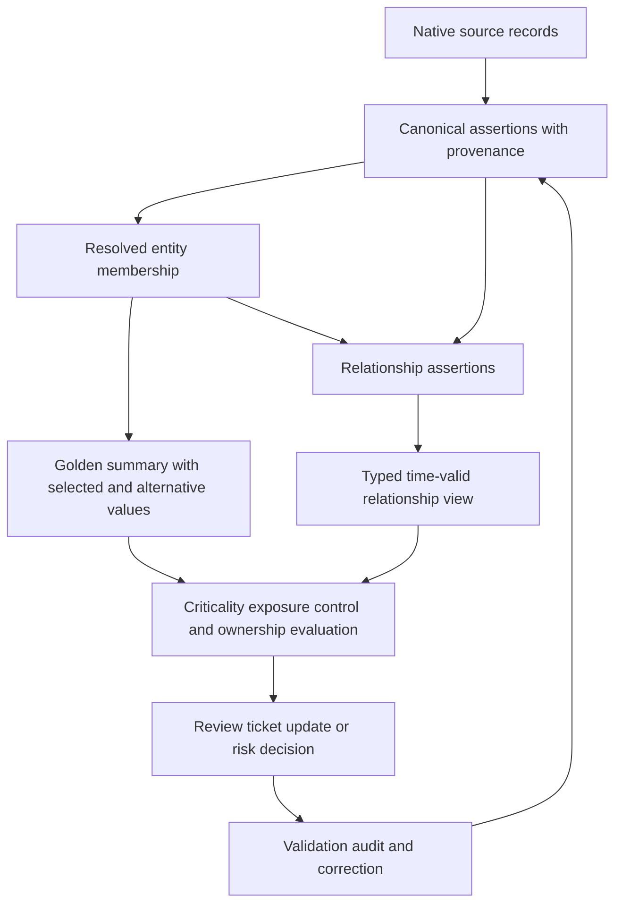

### Golden-record minimum schema

| Group | Fields | Required explanation | Common defect |
|---|---|---|---|
| Identity | Canonical ID, class/grain, source aliases, merge/split history | Why these observations are one entity | Hostname/IP treated immutable |
| Lifecycle | First/last seen, active state, valid interval, retirement reason | Which authority and rule decided state | Missing source interpreted deleted |
| Technical | Platform, OS, model, cloud account, interfaces, software | Source/time/conflict for each selected field | Newest value wins across meanings |
| Organization | Legal entity, department, cost center, geography | Effective date and hierarchy source | User's department used as asset owner |
| Responsibility | Business/service/technical/data/control owners, custodian, user, steward | Role definitions and attestation | One ambiguous `owner` field |
| Business | Service, process, environment, tier, data classification | Owner-approved purpose/context | Tags treated authoritative |
| Exposure/control | Internet/reachability evidence, applicable controls, exceptions | Observation, method, policy, confidence | Public IP equals exploitable |
| Relationships | Parent, runs-on, depends-on, stores, authenticates-to, owned-by | Type, direction, validity, source | Undirected timeless links |
| Criticality | CIA/business/safety/privacy/recovery values and rationale | Method, owner, date, confidence | Score copied without reason |
| Provenance | Source record, observed/effective/ingested times, mapping/resolution/survivorship versions | Full trace and review history | Summary erases alternatives |
| Quality | Missing/conflicting/stale flags and confidence | What remains unknown | Null silently defaulted low risk |

## Survivorship mechanics

Survivorship is the rule selecting a displayed field value after identity is resolved. A correct entity can still show a wrong owner because survivorship is separate from matching. Rules must be field-specific, purpose-specific, time-aware, explainable, versioned, testable, and reversible.

### Common survivorship strategies

| Strategy | Good use | Failure mode | Guardrail |
|---|---|---|---|
| Authoritative source | HR employment, provider resource state, approved service owner | Authority may be out of scope/unhealthy | Scope/health/effective-date gate |
| Most recent valid observation | Current sensor heartbeat or cloud config | Ingest time confused with observation; noisy source wins | Use correct clock and validity |
| Highest assessed confidence | Competing classification evidence | Scores incomparable across models/versions | Calibrated versioned confidence and alternatives |
| Non-null precedence | Fill optional descriptive context | Stale value persists forever | Freshness/expiry and source validity |
| Majority agreement | Low-consequence normalized attribute | Correlated sources are not independent | Do not use votes for accountable ownership |
| Owner attestation | Business service, criticality, purpose | Attestation can become stale or self-serving | Evidence, review trigger, expiry, second line where needed |
| Derived value | Environment from governed account hierarchy | Rule can be wrong after reorganization | Version, reason, source dependencies |
| Manual steward override | Resolve exceptional conflict | Permanent override masks later truth | Scope, rationale, expiry, re-evaluation |
| Preserve all/no winner | High ambiguity or multi-valued truth | Consumers may demand one value | Explicit conflict state and decision guardrail |

### Field-level policy example

| Field | Synthetic preferred source/rule | Fallback | Conflict behavior | Review trigger |
|---|---|---|---|---|
| Cloud existence | Provider ID/state in registered account | None for current state | Unknown if source unhealthy | Source outage or deletion/recreation |
| Physical serial | MDM/ITAM validated manufacturer+serial | EDR hardware evidence | Hold on concurrent collision | Duplicate active serial |
| OS version | Recent authenticated endpoint/platform evidence | Scanner with confidence | Show conflict if incompatible current values | Major-version contradiction |
| Assigned user | MDM assignment under HR-active account | Approved ITAM custody | Do not use last login as owner | User departure/reassignment |
| Business service | Approved service catalog relationship | Owner attestation | Unmapped if no approved relation | App/deployment change |
| Business owner | Service catalog/attested accountable role | Steward queue | Never infer from activity | Owner leaves or review expires |
| Department | HR department of defined role at effective date | Governed org directory | Preserve historical assignment | Reorganization |
| Geography | Site/provider region depending field meaning | Network observation for current location | Keep physical/legal/cloud regions separate | Mobility/region move |
| Criticality | Approved business-impact method and service owner | Provisional analyst assessment labeled | Unknown/provisional, never silent low | Service/impact/dependency change |
| Internet exposure | Current external-path evidence under defined method | Public configuration candidate | Distinguish configured/observed/reachable/validated | DNS/firewall/load balancer change |

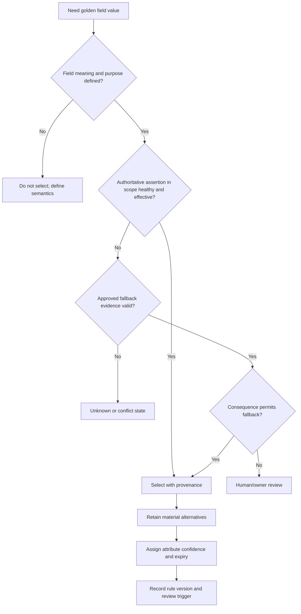

### Survivorship tradeoffs

| Tradeoff | Aggressive choice | Conservative choice | Balanced posture |
|---|---|---|---|
| Completeness versus certainty | Fill every field from any source | Leave many unknown | Fill low-consequence context with labels; require authority for consequence |
| Recency versus authority | Newest source always wins | Authoritative source always wins even stale | Gate authority by health/effective time; expose conflict |
| Automation versus review | Auto-select/merge at scale | Manual review everything | Consequence/confidence bands with representative sampling |
| One value versus alternatives | Simple dashboard | Complex but transparent | Summary plus visible alternatives/conflict for material fields |
| Override persistence | Avoid repeated decisions | Hide later source correction | Scoped override with rationale, expiry, and re-evaluation |
| Standardization versus local meaning | One enterprise field | Every team defines its own | Canonical definition plus governed extensions |

### Plain-English deep-dive 2 - Correct identity does not guarantee correct context

A parcel can be delivered to the correct house but addressed to a former resident. Entity resolution answered "Which house?" correctly. Survivorship answered "Who belongs here now?" incorrectly. Fixing the address matching would not fix the stale resident record.

Asset systems have the same two independent failure planes. Source records may correctly belong to one laptop, while the golden record displays the wrong assigned user because the rule preferred last login over MDM assignment. Or two servers may be correctly separate while a stale service relationship makes both appear to support Payments. Troubleshoot identity membership, attribute selection, and relationships separately. Each has its own evidence, confidence, versions, errors, and downstream reconciliation.

## Provenance and confidence

### Provenance ledger

W3C PROV-O provides general vocabulary around entities, activities, and agents. Adapted to asset context, an assertion is an entity; ingestion/mapping/resolution/survivorship/review are activities; and a source system, service identity, analyst, or owner can be an agent. This does not prescribe AEM internals or customer policy.

| Provenance element | Minimum content | Example question answered |
|---|---|---|
| Source agent | System/tenant/account or named reviewer | Who asserted this? |
| Source entity | Native record/field/value and source ID | What exactly was asserted? |
| Event/effective time | When claim became true in source/business | When did owner assignment apply? |
| Observation/source-update time | When source observed/changed it | How old is technical evidence? |
| Extraction/ingestion time | When downstream received it | Was delivery delayed? |
| Mapping activity | Schema/mapping version and transformation | Did `prod` become `production`? |
| Identity activity | Match/cluster rule, evidence, version, reviewer | Why is this record in this asset? |
| Survivorship activity | Field rule/version, selected/alternatives | Why does summary show this owner? |
| Relationship activity | Edge source/rule/version/validity | Why do we believe server supports service? |
| Review activity | Reviewer/owner, decision, evidence, reason, time | Who approved criticality? |
| Downstream use | Policy/report/workflow/version | Which decisions are affected by correction? |

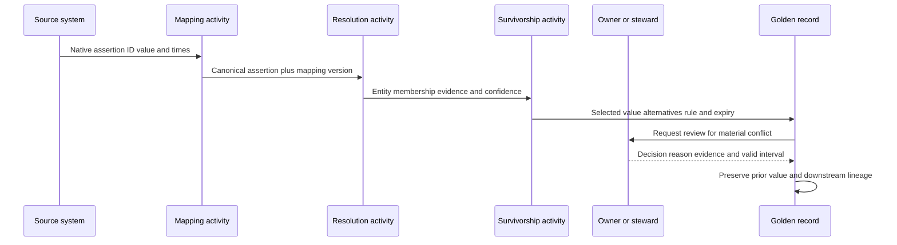

### Confidence is plural

| Confidence type | Question | Example statement | Do not confuse with |
|---|---|---|---|
| Source confidence | Is this source/field reliable now under scope? | Provider API current and complete for account | Truth of every field |
| Pair confidence | Do two records represent same entity? | Exact namespaced cloud ID, no conflict | Attribute accuracy |
| Cluster confidence | Is entire group coherent? | All members satisfy serial/time invariants | Average pair score |
| Attribute confidence | Is selected owner/OS/criticality well supported? | Owner attested from catalog on date | Entity match confidence |
| Relationship confidence | Does typed edge exist under validity window? | Deployment manifest and runtime confirm runs-on | Causality or exploitability |
| Policy-result confidence | Does context support classification/action? | Eligible and EDR gap confirmed, owner current | Universal risk probability |
| Decision confidence | Is evidence enough for this consequence? | Enough for analyst review, not auto-isolation | Model score alone |

Confidence may be qualitative (`high/medium/low/unknown`) or numeric, but numeric values require definition, calibration, validation population, version, and interpretation. A `0.92` similarity is not automatically a 92 percent probability of identity. Do not average unrelated confidence types into one badge.

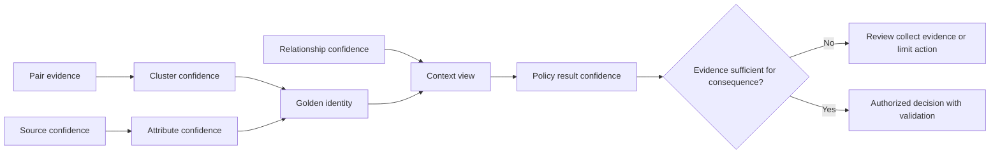

## Relationship and dependency modeling

A relationship is not merely two nodes connected by a line. It needs type, direction, source, validity, confidence, and semantics.

### Relationship dictionary

| Relationship | From -> to | Meaning | Typical source | Caution |
|---|---|---|---|---|
| assigned-to | Device -> person/account | Intended assignment during interval | MDM/ITAM | Last login is different |
| used-by | Device/app -> person/account | Observed use during interval | IAM/EDR/app | Use does not imply ownership |
| owned-by | Asset/service/data -> accountable owner | Responsibility under governance | Catalog/attestation | Define owner role |
| operated-by | Asset/service -> custodian team | Daily operation/maintenance | CMDB/catalog | Custodian may not accept risk |
| member-of | Asset/account -> department/legal entity | Organizational grouping | HR/catalog | Effective dates/reorg matter |
| located-at | Physical asset -> site | Physical location | ITAM/MDM/site | Mobile current location differs |
| hosted-in | Resource -> cloud account/region | Provider placement | Cloud API | Region is not user geography |
| runs-on | Workload/app -> compute/platform | Deployment execution dependency | Orchestrator/CMDB | Temporal and many-to-many |
| depends-on | Service/app -> service/component | Upstream needed for function | Service map/tracing/owner | Dependency strength/failover matter |
| supports | Component -> service | Component contributes to service | Inverse/derived mapping | Do not infer sole dependency |
| connects-to | Entity -> entity | Observed communication | Flow/proxy/app logs | Communication is not business dependency |
| authenticates-to | Principal/app -> identity/service | Authentication relationship | IAM/app logs | One login does not prove persistent path |
| stores | Data store -> data class/dataset | Storage relationship | Data catalog/DSPM/app | Classification may be probabilistic |
| protected-by | Asset -> control | Applicable/effective control relationship | Control source/policy | Presence is not effectiveness |
| exposed-through | Service -> endpoint/load balancer/domain | External interaction path | Cloud/DNS/network | Configuration is not validated reachability |
| backed-up-by | Asset/data -> backup system/policy | Recovery dependency | Backup catalog | Assignment is not restore proof |

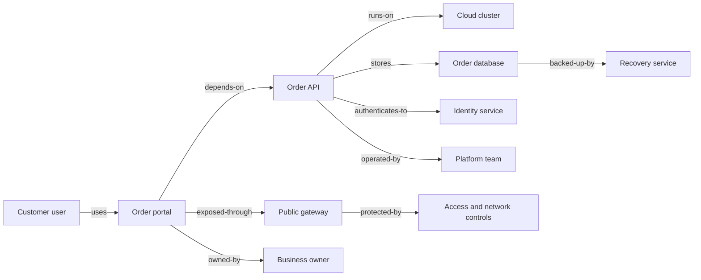

### Direction, cardinality, and semantics

`A depends on B` is not equivalent to `B depends on A`. The inverse may be `B supports A`, but even that needs semantics. Many applications can run on a cluster; one application can run on many clusters. One device can have one current assigned user under policy but many observed users over time. A business service can depend on multiple technical services with different critical paths and fallback.

| Modeling question | Example answer | Defect prevented |
|---|---|---|
| What are endpoint entity types? | Application -> technical service | Asset-to-asset ambiguity |
| Is direction explicit? | App depends-on database | Reversed blast radius |
| What is cardinality? | Many apps to many clusters | Duplicate edge treated impossible |
| What is validity? | Deployment active 2026-06-01 through 2026-08-20 | Retired path appears current |
| What evidence creates edge? | Deployment manifest plus runtime observation | Guessed dependency |
| What removes/expires edge? | Deployment deletion plus observation grace | Forever-growing graph |
| Is edge observed or asserted? | Runtime connects-to versus owner-declared depends-on | Activity confused with requirement |
| What is confidence? | High when config and runtime agree | One weak log treated fact |
| What consequence uses edge? | Incident blast radius, not auto-isolation | Edge overused beyond validation |

### Temporal context

Bi-temporal thinking separates valid time (when reality says a fact was true) from transaction time (when the record system knew/stored it). Suppose Alice stopped owning an application on July 1, but the catalog was corrected on August 10. A current corrected view should show the new owner after July 1. An audit of what a July 20 workflow knew should show that it still routed to Alice. Both histories matter.

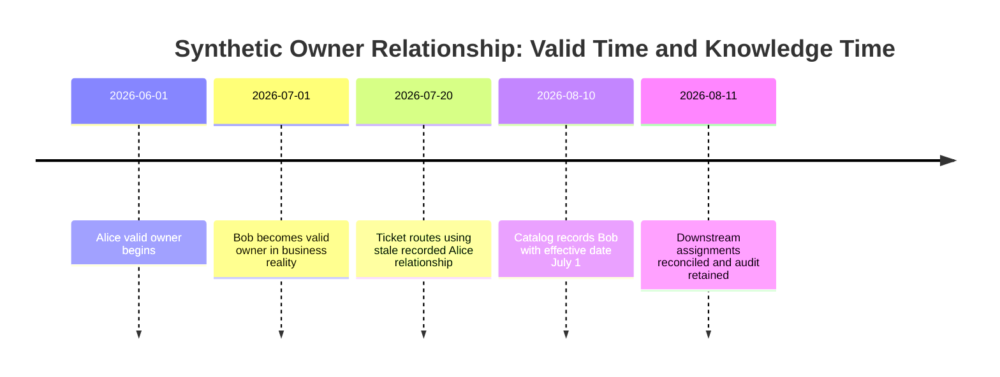

Mermaid timeline is illustrative only. In production, use explicit valid-from/valid-to and recorded-from/recorded-to fields, time zones, effective-date rules, and correction history.

### Plain-English deep-dive 3 - A graph is a claim set, not a photograph

A subway map simplifies a city. It shows useful stations and connections, not every street, elevation, closure, or passenger. If a line is closed today, an old printed map can mislead. If two stations share a name, a careless merge can create an impossible route.

An asset relationship graph similarly contains assertions built from source/configuration/runtime/owner evidence. A path from public endpoint to database may indicate a dependency or communication chain; it does not automatically prove an attacker can exploit every hop. Ask which edge types are observed versus declared, their direction, validity, confidence, controls, identities, and query cutoff. Use the graph to generate and prioritize hypotheses, then validate consequential reachability or attack-path claims with authorized methods.

## Ownership and organizational context

### Role model

| Role | Core accountability | Evidence/source | Typical action | Misassignment risk |
|---|---|---|---|---|
| Business owner | Purpose, value, business impact, risk decisions under policy | Service catalog/attestation | Prioritize/accept/fund treatment | Technical team accepts business risk |
| Service owner | End-to-end service outcomes, dependencies, service level | Service catalog | Coordinate service change/incident | One server admin sees only component |
| Technical owner | Architecture and technical change | App/platform catalog | Approve design/remediation | Assigned user receives design decision |
| Custodian/operator | Daily administration and maintenance | CMDB/team roster | Patch/configure/restart/monitor | Operator mistaken for risk owner |
| Assigned user | Intended device/account user | MDM/ITAM/IAM | Return/enroll/report device | User held accountable for platform control |
| Data owner | Classification, access purpose, retention | Data catalog/attestation | Approve data access/treatment | Infrastructure owner decides privacy purpose |
| Control owner | Policy/design/operation of safeguard | Control catalog | Repair/tune/assess control | Asset owner cannot fix central agent policy |
| Record steward | Data quality and conflict process | Governance assignment | Resolve owner/identity/context defect | No one fixes bad metadata |
| Risk owner | Accountable for scenario treatment/acceptance | Risk governance | Accept/mitigate/transfer/avoid | TSM accidentally owns customer risk |
| Executive sponsor | Funding and cross-org priority | Governance charter | Resolve systemic blockers | Sponsor used for every routine ticket |

### Owner resolution hierarchy

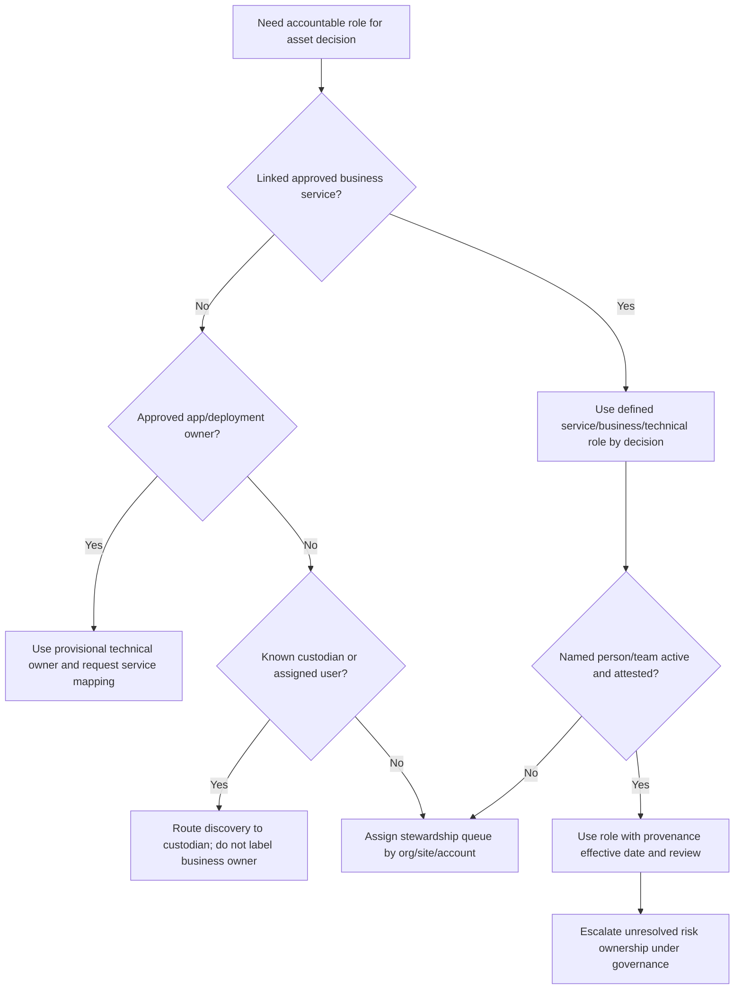

Owner assignment should use a governed fallback and escalation path, not a generic placeholder that creates false completeness. A queue may be a temporary custodian for discovery, but `security-team@example` is not necessarily the business owner of every unknown asset.

### Department, geography, and hierarchy

| Context | Possible meanings | Authority question | Temporal issue |
|---|---|---|---|
| Department | User's HR department, cost center, asset budget, service organization | Which role is being grouped? | Reorganization/effective dates |
| Geography | Physical location, user location, legal jurisdiction, cloud region, support region | Which geography matters to decision? | Mobile devices/replication/migration |
| Legal entity | Employer, asset owner, contract party, data controller | Which legal relationship? | Acquisition/divestiture |
| Cost center | Funding/allocation responsibility | Finance-approved mapping? | Annual budget changes |
| Environment | Production/test/development/sandbox | Provider hierarchy/deployment authority? | Resource promoted/recreated |
| Business unit | Product/market organization | Governed hierarchy version? | Matrix organizations |
| Service tier | Business criticality/service-level class | Owner-approved criteria? | Tier should change after impact review |

Avoid copying the assigned user's department to a shared server. Avoid using cloud region as data residency proof without data-flow evidence. Avoid calling headquarters the location of every remote laptop. Context fields need exact definitions.

## Criticality methods

Criticality asks, "How bad would loss of confidentiality, integrity, availability, safety, privacy, or mission capability be for this asset/service in its real context?" It is not a vulnerability score and not a count of controls.

### CIA and business dimensions

| Dimension | Questions | Evidence | Example high consequence | Caveat |
|---|---|---|---|---|
| Confidentiality | Which data/secrets are exposed and to whom? | Data classification, access, privacy assessment | Customer identity/financial disclosure | Classification can be wrong/stale |
| Integrity | What if commands/data/software are altered? | Process design, signing, reconciliations | Payment instructions changed | Integrity often exceeds confidentiality |
| Availability | What function stops, population, duration, tolerance? | BIA, service SLO, RTO/RPO, exercises | Orders cannot be processed | Component redundancy may reduce consequence |
| Safety | Could physical harm/environmental damage occur? | Safety/process owner analysis | OT command affects machinery | Security team must partner with safety owners |
| Privacy/legal | Which obligations and people are affected? | Counsel/privacy/compliance assessment | Regulated personal-data misuse | Not legal advice; applicability varies |
| Financial | Direct/indirect loss ranges and mechanisms? | Finance-approved scenario | Revenue interruption/penalties | Avoid false precision and double counting |
| Reputation/customer | Trust/service commitments affected? | Customer contracts, history, surveys | Public service compromise | Hard to quantify; state uncertainty |
| Dependency concentration | How many critical services rely on it? | Validated relationship map | Shared identity/DNS service | Relationship completeness matters |
| Recoverability | Can capability/data be restored within need? | Tested backups/failover/RTO/RPO | No tested recovery path | Configured backup is not restore evidence |
| Substitutability | Is a safe scalable alternative available? | Runbook/exercise/capacity | No alternate fulfillment process | Manual fallback may not scale |

### Criticality rubric example

| Tier | General synthetic meaning | Required rationale | Review/guardrail |
|---|---|---|---|
| Tier 0 - Crown-jewel capability | Loss/compromise threatens mission, safety, systemic obligations, or enterprise survival under scenario | Mission thread, consequences, dependencies, owner/executive approval | Frequent event-triggered review and tested controls/recovery |
| Tier 1 - Critical | Severe material impact beyond local team, tight recovery/strong data/integrity need | BIA/service owner evidence | At least periodic attestation and dependency test |
| Tier 2 - Important | Significant but bounded impact with alternatives/recovery | Documented affected process/population | Regular review |
| Tier 3 - Standard | Manageable local impact under defined duration | Standard criteria and owner | Sampled/risk-based review |
| Provisional | Analyst/source suggests tier pending owner validation | Evidence and due date | Cannot silently become permanent |
| Unknown | Insufficient/conflicting evidence | Owner/steward and next test | Never default to low |

The labels and cadence above are synthetic examples, not Zscaler or NIST defaults. Organizations should define their own scales, scenario language, decision rights, and validation.

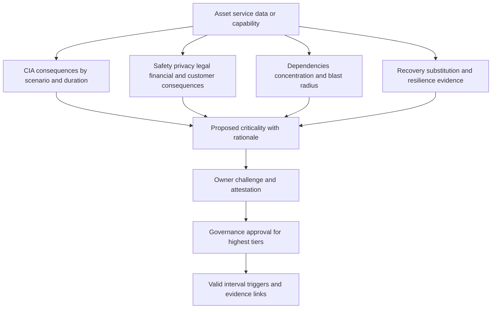

### Scoring versus classification

A weighted score can support consistency but must not hide veto conditions or uncertainty. For example, safety consequence may require Tier 0 review regardless of an average. Missing dependency data should not reduce a score. Consider presenting dimensions plus rationale rather than only a number.

| Method | Strength | Weakness | Appropriate use |
|---|---|---|---|
| Simple owner tier | Easy to understand | Subjective/inconsistent | Initial inventory with review |
| CIA high/medium/low | Familiar dimensions | Misses safety/dependency/recovery | Baseline security consequence |
| Business impact analysis | Process/duration/recovery grounded | Resource-intensive and periodic | Critical services/capabilities |
| Weighted score | Repeatable comparisons | False precision/compensation | Prioritization aid with factor display |
| Scenario-based narrative | Mechanism and impact visible | Harder to aggregate | Material risk decisions |
| Dependency centrality | Finds shared components | Bad graph produces bad priority | Hypothesis for resilience review |
| Hybrid | Dimensions, scenario, owner, score, exceptions | Governance complexity | Mature programs with transparent rules |

### Criticality propagation

Do not automatically label every dependency of a Tier 0 service as Tier 0. A redundant web node may support a crown-jewel service but have low individual availability consequence. A shared identity system or signing key may deserve high criticality because compromise affects many services. Propagate **context**, then assess contribution, redundancy, privilege, substitutability, and recovery.

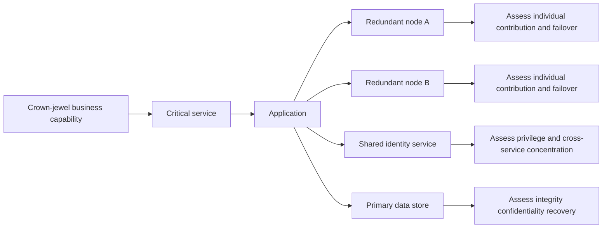

## Crown-jewel analysis

A crown jewel is not simply the executive's favorite server or the most expensive appliance. It may be a business process, data set, cryptographic key, identity capability, algorithm, operational recipe, or service whose compromise causes unacceptable mission harm. Start from critical outcomes and work backward through mission threads and dependencies.

### Crown-jewel workshop sequence

1. Define organization mission and essential customer/business outcomes.
2. Define failure/compromise scenarios, populations, durations, and unacceptable consequences.
3. Identify the business processes, information, decisions, and capabilities required.
4. Map applications, identities, data, infrastructure, suppliers, facilities, OT, and people supporting those capabilities.
5. Identify concentration, privilege, trust anchors, single points of failure, and recovery dependencies.
6. Validate the map with business, service, technical, security, data, safety, continuity, and risk owners.
7. Select a small governed crown-jewel set with rationale, confidence, and review triggers.
8. Validate controls, segmentation, monitoring, incident response, backup/recovery, and dependency resilience.
9. Use the designation for investment and scenarios, not a permanent prestige badge.

| Candidate | Why it might be crown jewel | Evidence needed | Common mistake |
|---|---|---|---|
| Payment signing key | Enables trusted financial instructions | Key use, privilege, alternatives, consequences | Inventory certificate only, not key/process |
| Customer identity service | Controls access across products | Dependency breadth, failover, compromise scenario | Count connections without validating need |
| Manufacturing recipe | Integrity/safety/quality consequence | Process owner, access, backups, recovery | Focus only on server availability |
| Order database | Revenue/data/integrity/availability | Data class, mission thread, recovery test | Mark every replica equally critical |
| Source-code/signing pipeline | Supply-chain integrity | Deployment authority, controls, scope | Treat repository popularity as criticality |
| Public DNS/domain control | Availability/redirection across services | Domain inventory, registrar access, recovery | Ignore third-party/identity dependencies |
| Executive laptop | Sensitive access/data | Actual privilege/data/control scenario | Crown jewel solely because user is senior |

### Plain-English deep-dive 4 - Crown jewels begin with consequences, not servers

If a museum asks which items are crown jewels, it does not begin by ranking display cases by purchase price. It begins with irreplaceable works, cultural mission, theft/damage consequences, and what enables their protection: keys, alarms, climate systems, records, transport process, and trained people. Some supporting systems are critical because they protect many works; others are redundant and replaceable.

Likewise, start with what the business cannot tolerate losing, corrupting, exposing, or stopping. Then trace the people, identities, data, software, infrastructure, suppliers, and recovery capabilities that deliver it. A crown-jewel analysis is a governed hypothesis that should be challenged and exercised. Calling thousands of assets crown jewels destroys focus; calling only one database a crown jewel misses the identity, key, DNS, pipeline, and recovery paths that determine real resilience.

## Internet exposure and temporal context

Internet exposure is not a binary property that one source can always decide. Distinguish configuration, discoverability, observed service, effective reachability, authentication/authorization, vulnerability applicability, control effectiveness, and validated path.

| Exposure state | Meaning | Evidence | What it does not prove |
|---|---|---|---|
| Public configuration candidate | Public IP/DNS/listener/security rule suggests exposure | Cloud/network/DNS config | Path is reachable end to end |
| Externally discoverable | External observation sees address/domain/service | Authorized external discovery | Ownership or exploitability |
| Reachable | Authorized test establishes connection under conditions | Path test, time, source vantage | Authentication bypass or weakness |
| Service responsive | Protocol/application responds | Request/response evidence | Vulnerability applicability |
| Authenticated/authorized | Access succeeds for defined identity | Identity/app evidence | Excess privilege or exploitability |
| Vulnerability applicable | Weakness maps to asset/software/config | Scanner/validation evidence | Reachable exploitation |
| Control effective | Control demonstrably blocks/detects/limits scenario | Authorized assessment | All paths/scenarios covered |
| Validated exposure path | Authorized evidence links conditions into plausible path | Multi-layer validation | Actual compromise unless incident evidence |

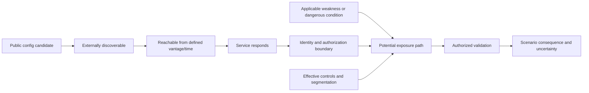

Exposure changes over time. A temporary maintenance rule can make an admin interface public for twenty minutes. A DNS record can remain after the service is removed. A cloud load balancer can rotate addresses. A WAF or access broker can change effective behavior without changing the asset's public DNS. Store observed/configured/valid intervals and source vantage. Do not let today's state rewrite the history needed for an incident.

### Exposure and criticality interaction

| Criticality | Exposure | Control/confidence | Priority interpretation |
|---|---|---|---|
| High | Validated public path | Control weak/unknown, evidence strong | Urgent scenario/containment review |
| High | Not externally reachable | Privileged internal identity path exists | Still material; assess internal/lateral path |
| High | Exposure unknown | Source coverage degraded | Restore visibility; do not assume safe |
| Low | Public service intended | Strong current controls | Monitor; not automatically urgent |
| Low | Unexpected admin interface | Weak authentication | Can be high priority due to path/pivot despite low business tier |
| Unknown | Public candidate | Identity/control uncertain | Investigate quickly; unknown criticality is not low |

## Governance and review

### Decision rights

| Decision | Accountable role | Responsible contributors | Required evidence |
|---|---|---|---|
| Entity merge/split rule | Asset data governance owner | Data steward, source owners, security | Labeled tests, consequence, rollback, metrics |
| Field authority/survivorship | Business/data governance owner by domain | Source owner, steward, consumer | Semantics, scope, freshness, conflict tests |
| Relationship type/creation | Service/architecture data owner | App/platform/telemetry owners | Direction, validity, source, use case |
| Business/service owner | Business governance | Service/catalog steward | Named role, effective date, attestation |
| Criticality tier | Business/service/risk owner under policy | BIA, security, continuity, data/safety | Scenario, impact, dependency, recovery |
| Crown-jewel designation | Executive/risk governance | Business, service, security, continuity | Mission thread, consequence, controls, review |
| Internet-exposure classification | Network/cloud/app/security owners | External/internal evidence teams | Config/path/vantage/time/control evidence |
| Risk treatment | Customer risk owner | Security, service, technical, legal as needed | Scenario, options, residual risk, approval |

### Review triggers and cadence

| Trigger | What to revalidate | Why |
|---|---|---|
| Scheduled attestation | Owner, service, criticality, crown-jewel rationale | Context decays even without alerts |
| Owner/user departure | Ownership and access relationships | Prevent orphaned assets/identities |
| Reorganization/M&A/divestiture | Legal entity, department, owner, scope, data | Hierarchies and authority change |
| New deployment/architecture | Runs-on/depends-on/exposed-through relationships | Paths and criticality contribution change |
| Cloud/account migration | Identity, lifecycle, region, service, exposure | IDs and context can split/recreate |
| Material incident | Relationships, exposure, controls, crown-jewel scope | Real evidence tests assumptions |
| Restore/failover exercise | Recovery, dependency, substitutability | Documentation may be optimistic |
| Source/schema/rule change | Survivorship/confidence/quality | Summary can shift without asset change |
| False merge/split report | Identity cluster and downstream actions | Prevent repeated misattribution |
| Policy/regulatory change | Classification, data, geography, retention | Applicability changes |

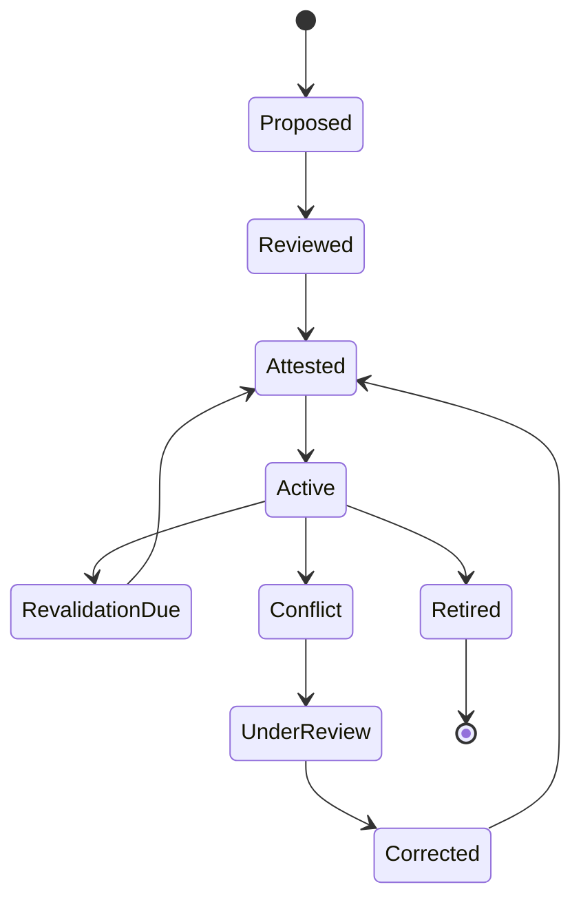

### Metrics

| Metric | Illustrative definition | Decision value | Anti-gaming caveat |
|---|---|---|---|
| Golden-field provenance | Consequential selected fields with complete source/time/rule trace / eligible fields | Explainability | A provenance ID that cannot be opened is not useful |
| Material conflict rate | Active records with unresolved consequential field conflict / eligible records | Review workload/uncertainty | Do not suppress conflicts to improve rate |
| Owner completeness | Eligible assets with current accountable role / eligible assets | Routing/governance | Generic queue is not business ownership |
| Owner attestation currency | Owner links within approved review window / owner links requiring review | Decay visibility | Recent auto-copy is not attestation |
| Relationship freshness | Material edges within evidence/review window / eligible edges | Path reliability | Cadence differs by edge type |
| Orphan rate | Assets missing required service/owner/parent relation / eligible assets | Governance gap | Some classes legitimately lack one relation |
| Criticality completeness | In-scope services/assets with approved or explicit provisional/unknown state / eligible population | Decision completeness | Default low is not complete |
| Crown-jewel review currency | Crown-jewel entries with current mission/dependency/control/recovery review / entries | Strategic focus | Review checkbox without evidence is weak |
| False-merge/split rate | Validated errors / relevant reviewed or sampled population | Resolution safety | Label discovery bias must be stated |
| Relationship correction rate | Corrected edges / reviewed edges by reason | Model improvement | High rate may reflect better detection |
| Action misroute rate | Actions routed to wrong owner due to context defect / actions reviewed | Business harm | Capture bounced/quiet failures, not only complaints |

## Failure modes and troubleshooting

### Failure patterns

| Symptom | Likely cause | Consequence | First check |
|---|---|---|---|
| Correct asset, wrong owner | Survivorship authority/effective date/join defect | Misrouted ticket/risk decision | Selected assertion, alternatives, rule/version/time |
| Two assets share one criticality | False merge or overbroad service propagation | Wrong priority | Entity members and relationship path |
| One service appears twice | False split or renamed catalog ID | Fragmented impact | Stable service IDs and alias history |
| Huge dependency blast radius | Common shared node/placeholder or unbounded transitive edge | Alert overload | Edge types, direction, validity, cluster invariant |
| Former user shown current | Valid-time not closed or last login used | Privacy/access/assignment error | Assignment authority and effective interval |
| Everything becomes critical | Naive propagation from critical service | Priority collapse | Contribution, redundancy, substitution rule |
| Crown-jewel count grows endlessly | No exit/review criteria or prestige incentive | Focus lost | Rationale, owner, expiry, mission thread |
| Public IP labeled exploited | Exposure states collapsed | Unsupported incident/risk claim | Config/discovery/reachability/weakness evidence |
| Internet exposure disappears | Source outage or current-only overwrite | False assurance/history loss | Source health and temporal history |
| Confidence high but wrong | Uncalibrated score or confidence types combined | Unsafe action | Model meaning, validation, source/attribute conflict |
| Manual override never changes | No expiry/re-evaluation | Stale golden field | Override scope/reason/expiration |
| Relationship graph differs from owner map | Runtime communication and declared dependency have different meaning | Trust dispute | Edge semantics and purpose |

### Layered troubleshooting

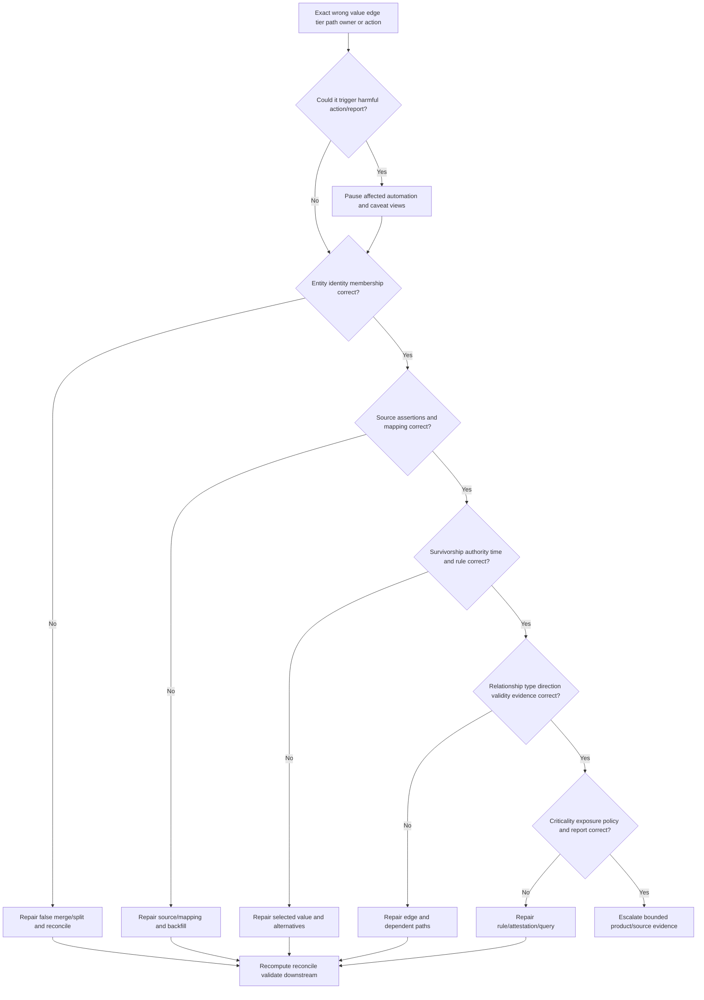

1. State the symptom as wrong entity, attribute, relationship, criticality, exposure state, owner, report, or action.
2. Capture exact canonical/source IDs, tenant, asset class, role/view, as-of time, policy/rule/report versions, and expected versus actual.
3. Quantify impacted assets, services, owners, tickets, CMDB records, scores, reports, and decisions.
4. Pause consequential automation where identity/context is uncertain; preserve source and audit evidence.
5. Check entity membership and match/cluster evidence first. A false merge contaminates every later field.
6. If identity is correct, inspect native assertions, mappings, values, and event/effective/observation times.
7. Inspect field-specific survivorship, source health/authority, alternatives, override, expiry, and review.
8. Inspect relationship type, direction, cardinality, source, valid time, confidence, and removal logic.
9. Inspect criticality/crown-jewel/exposure policy versions, factor evidence, owner attestation, and report cutoff.
10. Compare one normal, one affected, one false-positive, and one false-negative case.
11. Repair in a bounded version/no-action mode; split/merge/correct values/edges as needed.
12. Recompute and reconcile downstream risk, groups, tickets, CMDB updates, dashboards, exports, and historical restatements.
13. Validate with source, owner, technical path, and business postconditions; communicate fact, inference, uncertainty, and prevention.

### Evidence package

| Evidence | Minimum content | Why | Safety |
|---|---|---|---|
| Impact | Wrong entities/fields/paths/actions and business consequence | Prioritizes containment | Minimize personal/sensitive context |
| IDs/times | Source/entity/edge/rule/report/action IDs; UTC valid/recorded times | End-to-end trace | Redact secrets/tokens |
| Membership | Source records, candidate evidence, match/cluster versions | Tests false merge/split | Approved secure channel |
| Assertions | Selected and alternative values with provenance | Tests survivorship | Avoid unnecessary PII |
| Relationships | Edge type/direction/source/validity/confidence | Tests dependency/exposure | Bound sensitive topology disclosure |
| Criticality | Dimensions, scenario, rationale, owner/review | Tests priority | Restricted need-to-know for crown jewels |
| Changes | Last good/first bad and source/model/policy changes | Identifies boundary | Do not call correlation root cause |
| Tests | Hypothesis, prediction, method, result | Reproducibility | Non-destructive first |
| Reconciliation | All downstream records/actions and correction status | Prevents lingering harm | Audit access controls |

## Complete synthetic NMH golden-record scenario

### Business objective

NMH wants trustworthy context for its fictional Global Order Fulfillment capability. The customer asks which assets support it, who owns decisions, which components are critical, and whether any internet-exposed path depends on an unowned or weakly controlled asset. The controlled as-of time is 2026-08-24 00:00 UTC. All data, design, thresholds, and results are synthetic.

### Source assertions for one server

| Source | Native assertion | Observed/effective time | Strength/authority | Conflict |
|---|---|---|---|---|
| Cloud provider | Resource `i-order-api-17`, account `prod-orders`, running, region East | Current at cutoff | Strong for resource existence/placement | None |
| Deployment pipeline | Deployment `orders-api-v442`, service `Order API`, image digest, team `Platform Orders` | 2026-08-23 22:00 | Strong for deployment/service context | None |
| EDR | Sensor `edr-901`, OS current, healthy policy, hostname `ORD-API-17` | 2026-08-23 23:52 | Strong for sensor/OS state | Owner field says former team |
| Scanner | Asset `scan-811`, IP and hostname, high finding | 2026-08-23 20:00 | Strong for scan evidence; weak owner | IP shared in older record |
| CMDB | CI `ci-778`, production, owner `Legacy Web`, service `Order API` | Last reviewed 2026-03-01 | Authority for approved CI fields but stale owner | Owner conflict |
| Service catalog | `Order API`, business owner Mira, technical owner Platform Orders, Tier 1 | Attested 2026-07-15 | Strong for service/roles/criticality | None |
| External observation | `api.nmh.example` resolves to gateway, HTTPS responds | 2026-08-23 23:40 | Evidence for public gateway service | Does not prove direct server reachability |

### Synthetic golden record

| Golden field | Selected value | Rule/rationale | Alternatives/unknowns | Attribute confidence |
|---|---|---|---|---|
| Canonical asset | `asset-server-1709` | Provider resource ID exact match plus coherent EDR/pipeline evidence | Scanner old IP alias time-bounded | High |
| Class/grain | Cloud VM instance | Provider class; separate from sensor/deployment | None | High |
| Lifecycle | Active | Current provider running state; source healthy | None | High |
| Hostname | `ORD-API-17` | Recent EDR plus cloud guest metadata agree | Scanner same current value | High |
| Service | Order API | Approved deployment and catalog relationship | None | High |
| Technical owner | Platform Orders | Service catalog and deployment agree | CMDB/EDR former Legacy Web values visible | High, with stale-source conflict |
| Custodian | Cloud Operations | Current operations roster relationship | Platform team retains design ownership | Medium/high |
| Business owner | Mira Patel, VP Fulfillment | Current service-catalog attestation | None | High under synthetic policy |
| Department | Digital Commerce | Business-owner/service hierarchy effective date | Do not copy last user | High |
| Geography | Cloud region East; legal processing region separately recorded | Provider region, data assessment | User geography not applicable | High for hosting, separate legal confidence |
| Criticality | Tier 1 via Order API contribution | Service BIA plus dependency/recovery evidence | Individual VM availability reduced by redundancy | Medium/high |
| Internet exposure | Not directly public; supports API behind public gateway | Gateway/config/runtime/path evidence | Direct reachability not observed | Medium/high |
| Control | EDR healthy current; scanner finding current | Native control sources | Effectiveness requires separate tests | High for presence/health, not universal effectiveness |

### NMH relationship graph

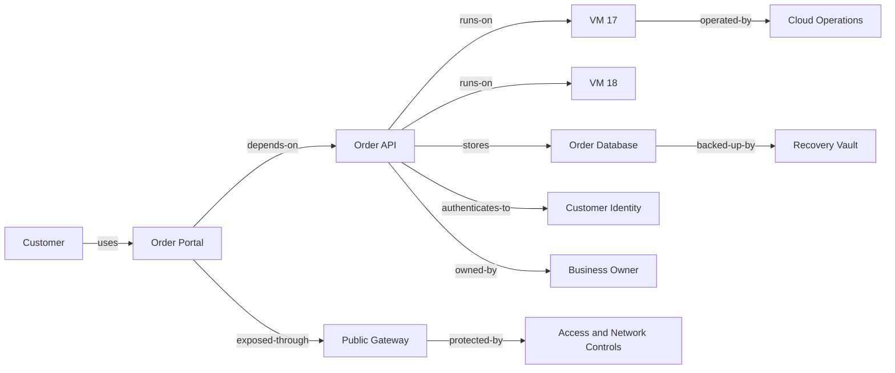

The graph states typed synthetic dependencies. It does not prove an attack path. VM 17 and VM 18 are redundant for availability, so each is not automatically Tier 0. The customer identity service has cross-service concentration and receives a separate criticality assessment. The database's integrity and recovery matter differently from gateway availability.

### Criticality and crown-jewel assessment

| Entity/capability | C | I | A | Dependency/recovery | Synthetic conclusion |
|---|---|---|---|---|---|
| Global Order Fulfillment capability | High customer/order data | Very high order correctness | Very high business operation | Complex global process; limited manual scale | Crown-jewel capability under synthetic governance |
| Order API service | High | Very high | High | Redundant compute; depends on DB/IDP | Tier 1 supporting service |
| Individual VM 17 | Medium | High | Medium due redundancy | Replaceable from image | Tier 2 individual component with Tier 1 context |
| Order Database | High | Very high | Very high | Replicas plus tested recovery required | Tier 1; crown-jewel-adjacent data component |
| Signing/deployment key | High | Very high | High | Broad software trust; rotation/recovery critical | Crown-jewel trust asset candidate |
| Public gateway | Low data storage | High routing/policy integrity | High | Redundant, but external choke point | Tier 1 service component |
| Recovery vault | High | Very high | High during recovery | Separation/restore evidence essential | Tier 1 recovery dependency |

### Synthetic incident: false merge creates a false public path

At 10:05 UTC, a report claims the Order Database is directly internet exposed and assigns an emergency ticket to the former Legacy Web team. The team pauses automatic isolation and ticket fan-out.

1. **Symptom:** Database golden record shows public IP and owner Legacy Web.
2. **Membership check:** A scanner record for a retired test server and the current database share hostname `ORD-DB-01` at different times. A new match-rule version ignored valid intervals and merged them.
3. **Source evidence:** Current cloud database has private provider ID and no public interface. Retired test server had the public IP before deletion.
4. **Survivorship failure:** The merged cluster selected the scanner's public IP as most recent ingested, despite old observation time. It selected CMDB's stale owner because owner authority was not gated by review age.
5. **Relationship failure:** `exposed-through` edge from retired test server transferred into the database cluster.
6. **Containment:** Pause exposure automation for affected rule version, block CMDB writes, label report degraded, preserve actions.
7. **Repair:** Roll back rule version; split entities; close hostname alias validity; restore selected owner; remove invalid edge; recompute exposure/criticality views in no-action mode.
8. **Reconciliation:** Review 148 clusters touched by the rule, 31 tickets, six CMDB proposals, three executive metrics, two exports, and historical report periods. Cancel/correct with audit rather than silently delete.
9. **Validation:** Provider configuration, authorized path test, external observation, DNS, relationship graph, owner attestation, source counts, and downstream target read-back agree. No direct database internet path is supported.
10. **Prevention:** Add temporal vetoes, source observation-time precedence, stale-owner expiry, giant/context-transfer tests, action confidence gates, canary cohorts, and rule-change review.

```mermaid
sequenceDiagram
    participant R as Exposure report
    participant A as Asset analyst
    participant D as Data steward
    participant C as Cloud/network owners
    participant W as Workflow/CMDB owners
    R->>A: Database shown public and wrong owner
    A->>W: Pause isolation tickets and CMDB writes
    A->>D: Trace entity members survivorship and edges
    D-->>A: Retired test server false-merged by temporal rule defect
    A->>C: Validate current provider config DNS and path
    C-->>A: Database private; no supported direct public path
    D->>D: Roll back split close alias and recompute
    D->>W: Reconcile tickets updates reports and exports
    W-->>A: Target states read back and corrected
    A->>R: Publish corrected result caveat and prevention
```

### NMH governance actions

| Action | Owner | Due/trigger | Validation |
|---|---|---|---|
| Review all clusters changed by match rule | Asset data steward | Before automation resumes | Representative positives/negatives and control totals |
| Reattest stale Tier 0/Tier 1 owners | Service/risk governance | Synthetic 30-day campaign | Named active roles and evidence |
| Validate mission thread and recovery | Fulfillment/continuity owners | Quarterly/event trigger | Exercise and dependency correction |
| Separate hosting, user, legal, and data geography | Data governance | Schema change | Definitions and sample tests |
| Validate public exposure states | Cloud/network/app security | Continuous plus material change | Config, external observation, reachability, controls |
| Add correction notices to executive reports | Reporting owner | Incident closure | Restated metrics and audit trail |

## Arti bridge: from service dependency to asset context

Microsoft escalation work trained Arti to distinguish the reporter from the affected user, the device from the sync-client installation, a tenant from a site, identity from permission, and a network observation from a service defect. She traced dependencies among browser/client, DNS, TCP/TLS/proxy, authentication, permissions, content, and cloud service; coordinated teams with different ownership; and communicated what evidence did and did not prove.

| Existing strength | Golden-record transfer | Learning boundary | Honest interview sentence |
|---|---|---|---|
| User/device/tenant scoping | Separate grains and valid-time identities | AEM schema/configuration | "I define entity and time before joining records." |
| Correlation IDs and timelines | Provenance and lineage | Product-specific lineage UI | "Every consequential field needs source, time, and rule." |
| Permissions/identity | User versus owner versus service identity | Enterprise IAM/exposure graph | "Observed user is context, not automatic owner." |
| Service troubleshooting | Typed dependencies and blast-radius hypotheses | Formal service mapping | "A relationship generates a test; it does not prove causality." |
| SQL/analytics | Conflict, completeness, aging, error-rate metrics | Product query specifics | "I show unknown/conflict rather than defaulting low." |
| CRITSIT/RCA | Contain false actions, repair, reconcile, prevent | Security exposure operations | "I separate identity, survivorship, relationship, and policy defects." |
| Customer communication | Fact/inference/uncertainty/decision narratives | CISO crown-jewel workshop | "I facilitate accountable owner decisions with evidence." |

## Labs and rehearsal

All labs use synthetic data and general tooling. They do not require or imply access to Zscaler AEM.

### Lab 1 - Golden-record schema

Design identity, lifecycle, technical, organization, responsibility, business, exposure/control, relationship, criticality, provenance, and quality fields. Define grain and purpose. **Pass:** every consequential field can show source, time, rule, alternatives, and unknown.

### Lab 2 - Survivorship matrix

Create field-specific rules for resource state, serial, OS, user, owner, service, department, geography, criticality, and internet exposure. Add fallback, conflict, expiry, and review trigger. **Pass:** no universal newest-source rule.

### Lab 3 - Provenance ledger

Trace five source assertions through mapping, entity resolution, survivorship, owner review, report, and ticket. **Pass:** a correction query identifies every affected downstream use.

### Lab 4 - Confidence language

Write source, pair, cluster, attribute, relationship, policy, and decision confidence statements for one asset. Explain why a numeric similarity is not a probability without calibration. **Pass:** confidence type and consequence are explicit.

### Lab 5 - Relationship dictionary

Define assigned-to, used-by, owned-by, operated-by, member-of, located-at, hosted-in, runs-on, depends-on, stores, authenticates-to, protected-by, exposed-through, and backed-up-by. **Pass:** each has entity types, direction, cardinality, source, validity, expiry, and use.

### Lab 6 - Temporal owner history

Model a July 1 owner change recorded August 10. Query current valid owner, what the system knew July 20, and which tickets require reconciliation. **Pass:** valid and transaction time are not collapsed.

### Lab 7 - Ownership workshop

Assign business, service, technical, data, control, record, risk, custodian, user, and sponsor roles for Order Fulfillment. **Pass:** TSM/user/operator does not accidentally accept business risk.

### Lab 8 - CIA/business criticality

Assess five services across CIA, safety, privacy/legal, financial/customer, dependency, recovery, and substitutability. Include scenario/duration and owner rationale. **Pass:** missing data becomes unknown/provisional, not low.

### Lab 9 - Crown-jewel mission thread

Start with one unacceptable business consequence and map process, data, identities, apps, infrastructure, supplier, and recovery dependencies. Challenge redundancy and alternatives. **Pass:** crown-jewel set remains focused and evidence-based.

### Lab 10 - Internet-exposure ladder

For ten synthetic assets, distinguish public configuration, discoverability, reachability, service response, auth, weakness, controls, and validated path. **Pass:** public IP never automatically means exploitable/compromised.

### Lab 11 - False merge/split game day

Reproduce the NMH hostname temporal false merge. Contain actions, split records, restore fields/edges, recompute, and reconcile tickets/CMDB/reports. **Pass:** correction is auditable and no downstream residue remains.

### Lab 12 - Dependency path review

Compare declared CMDB dependencies, deployment configuration, and runtime communication. Classify agreement, conflict, and unknown. **Pass:** communication is not automatically business dependency.

### Lab 13 - Governance design

Build decision rights, scheduled/event reviews, owner escalation, override expiry, crown-jewel access, metrics, and quality acceptance. **Pass:** every high-consequence designation has accountable approval.

### Lab 14 - NMH capstone

Present the source assertions, golden record, relationship graph, criticality/crown-jewel analysis, exposure ladder, incident, and governance actions. **Pass:** all claims are synthetic or source-bounded.

### Lab 15 - Interview rehearsal

Answer Q1-Q8 and draw identity -> survivorship -> relationships -> criticality/exposure -> decision -> review. **Pass:** Arti states transferable experience and direct-product gap precisely.

## Common misconceptions to correct

| Misconception | Correction |
|---|---|
| Golden record is absolute truth | It is a governed best-known view with provenance, alternatives, and corrections |
| Correct entity means every field is correct | Identity, survivorship, relationships, and policy are independent failure planes |
| Newest value always wins | Authority, meaning, effective time, health, and purpose govern selection |
| One source owns the whole asset | Authority is field/entity/purpose/scope/time specific |
| Majority agreement proves truth | Sources may be correlated or copy the same defect |
| More complete is always better | Filling unknowns with guesses reduces decision quality |
| Confidence is one score | Source, pair, cluster, attribute, relationship, policy, and decision confidence differ |
| A 0.9 similarity means 90 percent probability | Only calibrated/validated probability supports that interpretation |
| Graph edge proves causality or attack path | It is a typed assertion requiring semantics, time, and validation |
| Communication means dependency | Runtime contact may be incidental, failed, malicious, or optional |
| Last logged-in user is owner | User, custodian, technical owner, business owner, and risk owner differ |
| User department is asset department | Shared/service assets need role-specific organizational context |
| Cloud region proves legal/data residency | Data flows, replication, processing, and legal roles require evidence |
| Criticality equals vulnerability severity | Criticality expresses consequence; vulnerability describes weakness |
| Critical service makes every component critical | Assess contribution, redundancy, privilege, substitution, and recovery |
| Crown jewel means most expensive server | Begin with mission/business consequences and trace dependencies |
| Everything important should be crown jewel | Overclassification destroys focus and governance capacity |
| Public IP means internet exploitable | Separate configuration, discovery, reachability, auth, weakness, controls, validation |
| No external path means no risk | Internal, identity, supplier, and data paths remain |
| Attestation proves permanent accuracy | It is dated accountable evidence that needs event/periodic review |
| Correcting current row fixes a false merge | Reconcile every downstream relationship, score, ticket, CMDB, report, and history |
| AEM public relationship claim reveals internal graph mechanics | It supports capability positioning only; verify actual documented behavior |

## Official Source Anchors

Research/source date: **2026-08-24**.

Zscaler sources support bounded AEM golden-record, relationship, multi-source, workflow, CMDB, reporting, and Data Fabric positioning. NIST sources support risk, CIA/control, continuous monitoring, configuration, and governance concepts. CISA crown-jewel material provides a mission/business-focused analytical concept; availability of a page in this session does not alter its official-source boundary. W3C PROV-O provides provenance vocabulary. ServiceNow provides vendor-specific CMDB relationship context. None establishes Zscaler proprietary mechanics, customer criticality, validated reachability, compliance, or guaranteed outcomes.

| Source | URL | Used for | Boundary |
|---|---|---|---|
| Zscaler Asset Exposure Management | https://www.zscaler.com/products-and-solutions/caasm | Public asset deduplication, relationships, golden records, coverage gaps, workflows, CMDB, reporting | Verify current licensed tenant behavior; no internal algorithms/defaults |
| Zscaler Data Fabric for Security | https://www.zscaler.com/products-and-solutions/data-fabric | Public harmonization, deduplication, correlation, enrichment, business logic, workflow/report foundation | No internal topology/schema/formula guarantee |
| NIST SP 800-30 Rev. 1 | https://csrc.nist.gov/pubs/sp/800/30/r1/final | Threat, vulnerability, impact, likelihood/uncertainty, risk-assessment framing | Federal guidance; not a criticality or product score formula |
| NIST SP 800-53 Rev. 5 | https://csrc.nist.gov/pubs/sp/800/53/r5/upd1/final | CIA-oriented control catalog, configuration, inventory, access, audit, continuity, risk | Requires selection, tailoring, implementation, assessment |
| NIST SP 800-137 | https://csrc.nist.gov/pubs/sp/800/137/final | Continuous visibility into assets, threats, vulnerabilities, and controls | 2011 federal guidance; not product cadence/model |
| NIST CSF 2.0 | https://www.nist.gov/cyberframework | Govern/Identify and organizational risk outcomes | Voluntary framework requiring tailoring |
| CISA Crown Jewels Analysis | https://www.cisa.gov/resources-tools/resources/crown-jewels-analysis | Mission/business consequence and dependency-oriented crown-jewel concept | Tailor to organization; not a product feature/default designation |
| W3C PROV-O | https://www.w3.org/TR/prov-o/ | Entity/activity/agent provenance vocabulary | Vocabulary, not matching/survivorship policy |
| ServiceNow: What is CMDB? | https://www.servicenow.com/products/it-operations-management/what-is-cmdb.html | CIs, relationships, service-management and ownership context | Vendor-specific concepts; no ServiceNow dependency implied |

## Likely Interview Questions

### Q1. What is an asset golden record, and why is the word golden risky?

**Model answer:** It is a governed best-known consolidated asset view assembled from source assertions for a defined entity/purpose. It improves usability, but it is not absolute truth. I preserve native records, selected and alternative values, valid/recorded times, mapping/resolution/survivorship versions, confidence, conflicts, reviews, and correction history. Golden means useful, explainable, and governed.

### Q2. How do you design survivorship rules?

**Model answer:** Per field, I define exact meaning/purpose, authoritative source and scope, source-health/freshness/effective-time gates, approved fallbacks, conflict behavior, consequence, confidence, alternatives, manual override/expiry, review triggers, tests, versioning, and rollback. Newest or majority may help low-consequence fields but cannot safely decide owner, criticality, or exposure universally.

### Q3. What provenance and confidence should a golden record preserve?

**Model answer:** Provenance includes native source/record/value, source and effective/observation/ingest times, mappings, identity evidence/rule, survivorship selection/alternatives, relationship source/validity, reviewer/decision, and downstream use. I separate source, pair, cluster, attribute, relationship, policy-result, and decision confidence; numeric similarity is not probability without calibration.

### Q4. What makes an asset relationship trustworthy?

**Model answer:** Exact endpoint entity types, relationship type, direction, cardinality, source/evidence, valid and recorded time, creation/removal logic, confidence, and approved uses. I distinguish declared dependency, runtime communication, identity access, ownership, hosting, and exposure. A graph path is a hypothesis/context source, not automatic causality, reachability, exploitability, or compromise.

### Q5. How do you model ownership?

**Model answer:** I separate business owner, service owner, technical owner, custodian/operator, assigned user, data owner, control owner, record steward, risk owner, and sponsor. Each field has authority, effective interval, attestation, fallback, and escalation. Last login or a cloud tag may be useful evidence but cannot silently become accountable business ownership.

### Q6. How do you determine criticality and crown jewels?

**Model answer:** I assess scenario-based confidentiality, integrity, availability, safety, privacy/legal, financial/customer, dependency concentration, recovery, and substitutability evidence with accountable owner review. Crown-jewel analysis starts from unacceptable mission/business consequences and traces process, data, identity, apps, infrastructure, suppliers, and recovery. Supporting assets inherit context, not automatic top-tier labels.

### Q7. How do you combine internet exposure and criticality responsibly?

**Model answer:** I distinguish public configuration candidate, external discoverability, effective reachability, service response, authentication/authorization, applicable weakness, control effectiveness, and validated path, all time/vantage-bound. Then I combine consequence, exposure, controls, confidence, and unknowns. Public IP is not exploitability; unknown exposure on a critical asset is not safe.

### Q8. How would you troubleshoot a wrong owner, criticality, or exposure path?

**Model answer:** I contain harmful actions, then test entity membership, native assertions/mapping, field survivorship/authority/time, relationship type/direction/validity, and criticality/exposure policy/report in that order. I compare normal/affected/false-positive/false-negative examples, repair in no-action mode, and reconcile every score, group, ticket, CMDB update, dashboard, export, and historical correction. My Microsoft RCA skills transfer; AEM internals remain a learning boundary.

## 30-Second Memory Hooks

| Concept | Memory hook |
|---|---|
| Golden record | Medical chart with receipts, not divine truth |
| Source assertion | One witness at one time |
| Survivorship | Which witness supplies this field? |
| Identity versus context | Correct house can show former resident |
| Provenance | Who said what, when, through which rule? |
| Confidence | Type the confidence before scoring it |
| Pair/cluster | Two files versus whole folder coherence |
| Relationship | Typed directed dated road |
| Graph | Claim set, not photograph or exploit proof |
| Valid time | When reality says true |
| Transaction time | When system knew it |
| Owner | Decision role, not latest user |
| Custodian | Operates; may not own risk |
| Department | Define whose organizational relationship |
| Geography | Physical, user, cloud, legal, data are different |
| CIA | Secret, correct, ready |
| Criticality | Consequence, not weakness |
| Crown jewel | Begin with unacceptable mission harm |
| Propagation | Inherit context, assess contribution |
| Internet exposure | Config -> discoverable -> reachable -> validated |
| Unknown | Never silently low or safe |
| False merge | Two patients, one chart |
| False split | One patient, two charts |
| Correction | Reconcile every downstream echo |
| Arti bridge | Dependency/RCA evidence transfers; AEM operation does not |

## Completion Checklist

- [ ] I define golden record as a governed best-known view, not absolute truth.
- [ ] I separate native observations, canonical assertions, entity identity, golden summary, relationships, policy evaluation, and workflow actions.
- [ ] I include identity, lifecycle, technical, organizational, responsibility, business, exposure/control, relationship, criticality, provenance, and quality groups.
- [ ] I preserve selected values, alternatives, conflicts, valid time, recorded time, source, rule version, confidence, and review.
- [ ] I design survivorship per field, purpose, scope, authority, time, consequence, and fallback.
- [ ] I never let newest ingest time or majority vote universally decide owner, criticality, or exposure.
- [ ] I gate authoritative sources by scope, health, effective time, and semantics.
- [ ] I make manual overrides scoped, reasoned, auditable, expiring, and re-evaluated.
- [ ] I troubleshoot entity membership separately from survivorship and relationships.
- [ ] I retain provenance for source, mapping, identity, survivorship, relationship, review, and downstream use.
- [ ] I separate event/effective, observation, extraction/ingestion, processing, valid, and transaction times.
- [ ] I separate source, pair, cluster, attribute, relationship, policy-result, and decision confidence.
- [ ] I do not call a similarity score a calibrated probability without validation.
- [ ] I define relationship entity types, name, direction, cardinality, source, validity, confidence, expiry, and approved use.
- [ ] I distinguish assigned-to, used-by, owned-by, operated-by, runs-on, depends-on, stores, authenticates-to, protected-by, exposed-through, and backed-up-by.
- [ ] I distinguish declared dependency from observed communication and validated causal need.
- [ ] I treat graph paths as hypotheses/context unless reachability/exploitability is separately validated.
- [ ] I model valid time and transaction/knowledge time for owner, user, service, lifecycle, and exposure changes.
- [ ] I separate business owner, service owner, technical owner, custodian, user, data owner, control owner, steward, risk owner, and sponsor.
- [ ] I do not infer business owner from last login, reporter, cloud tag, or generic queue.
- [ ] I define department, legal entity, cost center, business unit, environment, service tier, and different geographies precisely.
- [ ] I assess confidentiality, integrity, availability, safety, privacy/legal, financial/customer, dependency, recovery, and substitutability.
- [ ] I state scenarios, affected population, duration, mechanism, evidence, owner, and uncertainty for criticality.
- [ ] I never default unknown criticality to low.
- [ ] I use scores only with factors visible and vetoes/unknowns preserved.
- [ ] I do not automatically propagate a service's top tier to every redundant component.
- [ ] I start crown-jewel analysis from unacceptable mission/business consequences and map full mission threads.
- [ ] I include process, data, identities, apps, infrastructure, suppliers, people, facilities/OT, controls, and recovery dependencies.
- [ ] I keep crown-jewel designation focused, approved, dated, evidence-linked, and reviewable.
- [ ] I distinguish public configuration, external discovery, reachability, service response, authentication, weakness, control effectiveness, validated path, and compromise.
- [ ] I store exposure evidence with source vantage, method, time, validity, and confidence.
- [ ] I do not interpret public IP as exploitable or no observed path as no risk.
- [ ] I define governance decision rights for merge/split, field authority, relationships, owners, criticality, crown jewels, exposure, and risk treatment.
- [ ] I establish scheduled and event-driven review for ownership, architecture, M&A, incidents, recovery exercises, source/rule changes, and policy change.
- [ ] I measure provenance, conflicts, owner completeness/currency, relationship freshness, orphans, criticality completeness, crown-jewel review, error, correction, and misrouting with caveats.
- [ ] I pause harmful automation when entity/context/exposure evidence is unreliable.
- [ ] I troubleshoot exact wrong entity/field/edge/tier/path/action, then membership -> assertions/mapping -> survivorship -> relationships -> policy/report.
- [ ] I compare normal, affected, false-positive, and false-negative cases.
- [ ] I repair with versioning/no-action mode and reconcile scores, groups, tickets, CMDB, dashboards, exports, and history.
- [ ] I can explain the complete NMH source assertions, golden record, relationship graph, criticality/crown-jewel assessment, and false-merge incident.
- [ ] I label every NMH field, relationship, confidence, tier, threshold, incident, metric, and result synthetic.
- [ ] I can complete all fifteen labs and retain artifacts as lab evidence.
- [ ] I connect Arti's Microsoft identity, dependency, timeline, analytics, escalation, and communication skills without claiming production AEM work.
- [ ] I use official Zscaler, NIST, CISA, W3C, and CMDB sources with explicit boundaries.
- [ ] I use the controlled research/source date exactly as 2026-08-24.
- [ ] I make no unsupported Zscaler match, graph, survivorship, confidence, criticality, exposure, default, production, or outcome claim.
- [ ] I can answer Q1 through Q8 with definitions, analogies, architecture, mechanics, examples, tradeoffs, failures, troubleshooting, labs, NMH evidence, official-source caveats, and an honest Arti bridge.

[Part 72 - Control-Coverage Gaps, Hygiene, and Misconfiguration Analysis](Part-72-asset-control-coverage-gaps.md)