# Part 72 - Control-Coverage Gaps, Hygiene, and Misconfiguration Analysis

> **Audience:** Arti Thakur, preparing for a Zscaler Security Operations Technical Success Manager role after Microsoft enterprise Support Escalation Engineering.
>
> **Purpose:** Build a rigorous asset-centered method for finding and closing control gaps. Cover EDR, vulnerability scanning, patching, encryption, backup/recovery, ownership, unsupported operating systems, security agents, firewalls/network controls, and identity controls; distinguish installed, configured, healthy, enforcing, recent, effective, excepted, missing, and unknown; define policy applicability and exceptions; separate real gaps from missing, stale, or duplicate data; prioritize by context; investigate, remediate, validate, measure, troubleshoot, and communicate honestly.
>
> **Scope and honesty:** Northstar Meridian Holdings, abbreviated NMH, is fictional. Every NMH policy, asset, control, source, status, threshold, exception, finding, count, score, ticket, timeline, incident, metric, and outcome in this Part is synthetic. Zscaler public pages support bounded statements that Asset Exposure Management (AEM) correlates organizational asset details to identify misconfigurations and missing controls, supports coverage-gap use cases and workflows, and is powered by the Data Fabric for Security. Public pages do not disclose proprietary control policies, health semantics, evidence windows, prioritization formulas, defaults, remediation logic, exact connectors, implementation times, or outcomes. Detailed mechanics below are general educational patterns, not undocumented Zscaler implementation claims. Arti's Microsoft support, identity, endpoint, networking, telemetry, SQL/data-quality, escalation, validation, and customer skills transfer; direct production AEM operation remains a learning boundary.
>
> **Currency caveat:** Products, controls, operating-system support dates, threat conditions, policies, integrations, APIs, schemas, and evidence semantics change. The controlled research/source date for this Part is exactly **2026-08-24**. Current official documentation, licensed tenant evidence, vendor support records, customer-approved policy and exception registers, control-owner evidence, security/privacy/legal requirements, product specialists, Support guidance, authorized tests, and measured postconditions govern production.

## Section goal

A control is a safeguard intended to prevent, detect, respond to, or recover from harmful conditions. A coverage gap exists when an applicable control does not meet its required state for an eligible asset. That sentence has three separate decisions: **Does the policy apply? What evidence proves the control state? What state is required?** Skipping any one creates false gaps or false assurance.

Think of fire safety in a hotel. A smoke detector can be purchased, mounted, powered, connected to the alarm panel, recently self-tested, actively monitored, and proven in an authorized drill. Those are different evidence levels. A detector sitting in a box is "present" in inventory but does not protect a room. A detector installed in a kitchen may be the wrong control type. A room under renovation may have an approved temporary exception with a fire watch. A disconnected alarm-data feed must not convert every detector to missing or every detector to healthy.

By the end, Arti should be able to:

| Outcome | Demonstrated capability | Evidence artifact |
|---|---|---|
| Define control coverage | Establish eligible denominator, required state, evidence, time, and exceptions | Coverage contract |
| Distinguish states | Separate observed, installed, configured, healthy, enforcing, recent, effective, excepted, gap, and unknown | State model |
| Analyze major controls | Explain endpoint, scanner, patch, encryption, recovery, owner, support, firewall, and identity evidence | Control matrix |
| Apply policy | Model class, platform, environment, criticality, lifecycle, geography, and alternative controls | Applicability rules |
| Govern exceptions | Require owner, reason, compensating controls, approval, expiry, and validation | Exception register |
| Protect data quality | Separate source outage, stale/duplicate identity, and mapping defects from real gaps | Quality gate |
| Prioritize risk | Combine consequence, exposure, threat, control depth, age, feasibility, and confidence | Triage rationale |
| Investigate | Trace one apparent gap through asset, policy, source, state, exception, and workflow | Investigation case |
| Remediate | Choose deploy, repair, configure, patch, upgrade, isolate, retire, except, or correct data | Action plan |
| Validate | Prove source, control, policy, workflow, and business postconditions | Validation record |
| Measure | Report coverage, decision completeness, aging, exception debt, recurrence, and outcomes | Metric dictionary |
| Troubleshoot | Isolate count spikes, false greens/reds, duplicate tickets, and stale closure | Runbook |
| Practice | Complete a synthetic NMH multi-control campaign and incident | Lab portfolio |
| Bridge honestly | Apply Microsoft evidence/validation skills without inventing AEM experience | Candidate narrative |

```mermaid
flowchart LR
    ASSET[Trusted scoped asset population] --> APPL[Evaluate control applicability]
    APPL --> EVID[Collect current control-side and asset-side evidence]
    EVID --> STATE[Classify configured healthy enforcing effective exception gap unknown]
    STATE --> QUAL[Gate on identity source freshness and data quality]
    QUAL --> PRIOR[Prioritize consequence exposure age confidence and feasibility]
    PRIOR --> INVEST[Investigate and confirm root condition]
    INVEST --> ACT[Remediate compensate accept retire or correct data]
    ACT --> VALID[Validate source control policy workflow and business postconditions]
    VALID --> LEARN[Measure recurrence tune policy sources and process]
    LEARN --> APPL
```

## JD Mapping

| Role expectation | Part 72 capability | TSM artifact | Arti bridge and boundary |
|---|---|---|---|
| Become AEM/Data Fabric expert | Explain official coverage-gap positioning with exact claim boundaries | Control-coverage architecture | Verify current AEM behavior/licensing |
| Analyze complex environments | Map controls, policies, assets, evidence, exceptions, and owners | Current-state coverage matrix | Microsoft device/identity/network analysis transfers |
| Identify security risks | Separate confirmed gaps from stale/missing/duplicate evidence | Evidence-based gap register | Gap is not automatically incident/exploitation |
| Recommend mitigation | Propose proportionate control repair, alternative, isolation, upgrade, or retirement | Prioritized treatment plan | Customer owner approves treatment |
| Resolve complex issues | Trace false red/green and workflow defects layer by layer | Troubleshooting evidence pack | RCA/hypothesis skills transfer |
| Lead strategic engagements | Align control, platform, app, risk, compliance, and business owners | Coverage workshop/governance | TSM does not define policy alone |
| Communicate proactively | Present confirmed, excepted, unresolved, and unknown states separately | Executive/operator narrative | Avoid single opaque coverage score |
| Drive adoption and value | Embed investigation, remediation, validation, and recurrence review | Operating playbook | Ticket volume is not risk reduction |
| Partner cross-functionally | Define policy, control, source, action, exception, and risk ownership | RACI | Respect role and approval boundaries |
| Explore AI responsibly | Use assistance for grouping/summaries with evidence and human review | Candidate action queue | No autonomous exception or high-impact containment |

## Candidate honesty note

| Evidence class | Safe interview statement | Boundary to state |
|---|---|---|
| Production transfer | "I validated Microsoft identity, permission, endpoint, client, service, and network conditions during high-impact cases." | Not production AEM administration |
| Control reasoning transfer | "I distinguish configuration from effective behavior and validate the postcondition." | Not ownership of customer security controls |
| Data transfer | "I test source freshness, duplicates, scope, timestamps, and denominator integrity before concluding a gap." | Not proprietary product logic |
| Customer transfer | "I coordinate responsible owners, communicate uncertainty, and validate recovery before closure." | Customer risk owner approves acceptance |
| Synthetic practice | "I built an NMH multi-control coverage campaign and false-gap incident." | Fictional lab only |
| Official fact | "Zscaler publicly positions AEM for identifying misconfigurations and missing controls." | Verify exact current tenant fields/workflows |
| General method | "I classify applicability and evidence state before prioritizing remediation." | General architecture, not Zscaler internals |
| Unknown | "I have not configured AEM directly; I would validate current docs, tenant evidence, and specialists." | Honest gap with concrete method |

## Beginner vocabulary and memory hooks

| Term | Plain meaning | Why it matters | Analogy and memory hook |
|---|---|---|---|
| Control | Safeguard intended to prevent, detect, respond to, or recover | Presence and effectiveness differ | Lock, alarm, guard, recovery plan |
| Control objective | Outcome the control should achieve | Keeps tool from becoming the goal | "Detect harmful endpoint behavior" |
| Control owner | Accountable party for control policy/design/operation | Routes repair and evidence | Fire-safety manager |
| Asset owner | Party accountable for asset/service purpose and risk decisions | May need to schedule/approve remediation | Hotel manager |
| Eligibility | Whether an asset belongs in the denominator | Bad denominator creates bad coverage | Rooms requiring smoke detectors |
| Applicability | Whether a specific control is appropriate/required | OT, SaaS, container, and laptop differ | Right safety equipment for room type |
| Policy | Approved rule describing scope, requirement, exceptions, and authority | Converts opinion to governed expectation | Building code plus company rules |
| Baseline | Approved minimum configuration/state | Enables drift detection | Standard room setup |
| Observed | Source reports the asset/control | Does not prove correct state | Inspector saw a detector |
| Installed | Component/package exists | Can be disabled, broken, or wrong version | Detector mounted |
| Configured | Settings/policy assigned | Assignment may not apply effectively | Alarm wired on plan |
| Healthy | Component reports normal operation under criteria | Health needs source, time, and version | Detector self-test passes |
| Enforcing | Control actively affects relevant behavior | Configured may be audit-only/bypassed | Door actually locks |
| Recent | Evidence is within an approved window | Old green is not current green | Inspection not expired |
| Effective | Authorized evidence shows intended outcome under representative scenario | Stronger than health/presence | Fire drill proves alarm works |
| Coverage | Eligible population meeting defined control state | Requires numerator/denominator/time | Protected rooms / required rooms |
| Gap | Applicable requirement not met with sufficient evidence | Needs confirmation and owner | Required detector missing/broken |
| Unknown | Evidence cannot support pass or fail | Source/data defects must remain visible | Inspector could not enter room |
| Not applicable | Policy explicitly does not require this control for this asset/use | Prevents wrong remediation | Sprinkler rule for different area |
| Exception | Approved time-bounded deviation under authority | Needs risk, compensating controls, expiry | Temporary fire watch |
| Compensating control | Alternative safeguard reducing similar risk | Must be relevant and validated | Guard patrol while alarm is repaired |
| Waiver | Approved relief from a requirement under defined governance | Terminology varies; still needs evidence | Formal permission document |
| False positive | Reported gap that is not a real applicable deficiency | Wastes effort/trust | Alarm says detector missing but room excluded |
| False negative | Real gap not reported | Creates false assurance | Broken detector shown healthy |
| Hygiene | Routine maintenance/configuration quality | Small drift can create broad weakness | Clean, maintained safety equipment |
| Misconfiguration | Setting/state differs from secure intended design | Can expose assets even without software flaw | Door propped open |
| Drift | Current state moves away from approved baseline | Detects change/decay | Lock setting altered over time |
| Unsupported OS | Operating system no longer supported under relevant vendor/customer policy | Patches/support may be unavailable | Elevator model no longer serviced |
| EDR | Endpoint Detection and Response | Endpoint prevention/detection/investigation control | Alarm and incident camera on device |
| Scanner | Tool/method assessing systems for weaknesses | Coverage and credential depth matter | Building inspector |
| Patch | Vendor/customer update fixing or improving software/firmware | Installation must be verified | Replace defective lock component |
| Encryption | Cryptographic protection for data at rest/in transit/use as applicable | Key, scope, algorithm, enforcement matter | Locked coded safe |
| Backup | Protected copy used for recovery | Job success is not restore proof | Spare records stored safely |
| Restore test | Exercise proving data/service can be recovered | Tests real recovery objective | Rebuild room from backup supplies |
| Firewall/network control | Rule/policy controlling communication | Rule existence may be shadowed or bypassed | Security gate |
| Identity control | Account, authentication, authorization, privilege, lifecycle safeguard | Effective path may bypass policy | Badge and access desk |
| Security agent | Software component enforcing/reporting a security function | Installed agent can be unhealthy | On-site guard device |
| Source health | Whether control evidence source is complete/current | Broken feed can mimic mass gap | Inspector's radio is down |
| Decision completeness | Share of population that can be confidently classified | Complements coverage percentage | Rooms actually inspected |
| Exception debt | Expired, weak, ownerless, or accumulating exceptions | Reveals hidden risk/governance burden | Temporary waivers never closed |
| Validation | Prove remediation achieved intended current state | Ticket closure alone is insufficient | Reinspect after repair |

## Product claim boundary

| Publicly supported statement | Safe interpretation | Production verification | Unsupported leap |
|---|---|---|---|
| AEM describes correlating asset details to pinpoint misconfigurations and missing controls | Teach cross-source gap analysis as product positioning | Exact fields, supported controls, rule configuration, evidence semantics | "AEM proves every control is effective" |
| AEM describes coverage and hygiene visibility | Explain control-state scorecards/use cases | Current dashboards, definitions, scopes, tenant behavior | Claim default thresholds or universal coverage |
| AEM describes workflows to close gaps | Teach governed assignment/action/validation | Actual actions, targets, approvals, retries, read-back | Assume automatic remediation is enabled/safe |
| AEM describes golden records | Use reconciled asset denominator/context | Exact identity quality and correction mechanics | Treat displayed asset list as perfect denominator |
| Data Fabric describes correlation/enrichment/business logic | Explain policy/context joining | Current model/rule capabilities and permissions | Claim internal formulas or topology |
| AEM supports broader risk/compliance outcomes | Show control evidence as an input | Obligation applicability and formal assessment | Claim a dashboard certifies compliance/risk reduction |

### Plain-English deep-dive 1 - Presence is the bottom rung, not the finish line

A hotel may own 1,000 smoke detectors. That procurement fact says nothing about whether every eligible room has one, each is correctly installed, powered, connected, recently tested, monitored, and effective under a drill. Security tools often stop at a similarly weak field: `agent_installed = true`.

Build an evidence ladder. First define eligibility. Then ask whether the control is observed, installed, configured, healthy, enforcing, recent, and effective. Record approved exceptions separately. A device can pass installation and fail health; pass health and run in audit-only mode; enforce but report stale evidence; or meet technical state while the source feed is incomplete. The required rung depends on the decision. A deployment progress report may use installed. A risk statement usually needs healthy/enforcing/recent and sometimes an effectiveness test.

## Control-coverage contract

Coverage is not a property of a product logo. It is a measurement contract.

| Contract element | Question | Example synthetic answer | Failure prevented |
|---|---|---|---|
| Objective | What outcome should the control achieve? | Detect/respond to endpoint threats | Tool presence mistaken for outcome |
| Control | Which specific component/policy/version? | Approved EDR sensor and prevention policy | Any agent counted equivalent |
| Asset universe | Which orgs, classes, environments, lifecycles? | Active corporate Windows/macOS endpoints | Servers/OT mixed incorrectly |
| Eligibility | Which assets require it and why? | Managed supported endpoints excluding approved kiosk class | Circular denominator |
| Required state | Installed/healthy/enforcing/effective? | Healthy + prevention enforcing + recent | Installed-only false green |
| Evidence | Which source fields/tests prove state? | Native heartbeat/policy plus endpoint sample | Inferred status from package list |
| Freshness | How old can evidence be by class/state? | Customer-approved class-specific window | One stale green persists |
| Exceptions | Which approvals, controls, expiry, owner? | Named risk owner and validated segmentation | Permanent hidden waiver |
| Unknown handling | What happens when source/identity is uncertain? | Separate unknown; block conclusion/action | Missing feed becomes gap or pass |
| Owner | Who owns policy, control, asset action, risk? | Endpoint security, EUC, business risk owner | Ticket bounces |
| Validation | What proves closure/effectiveness? | Current native state and representative authorized test | Ticket closure counted as fix |
| Metric | Numerator, denominator, date, exclusions, caveats? | Confirmed healthy enforcing / eligible active | Misleading percent |

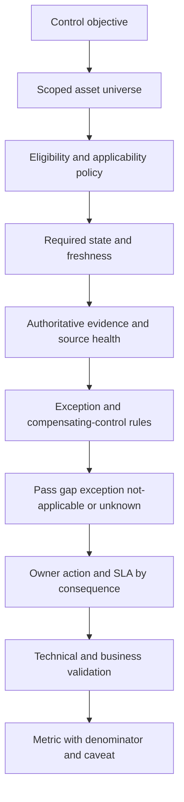

## Control state machine

One control can move through several states. Avoid forcing every record into a boolean.

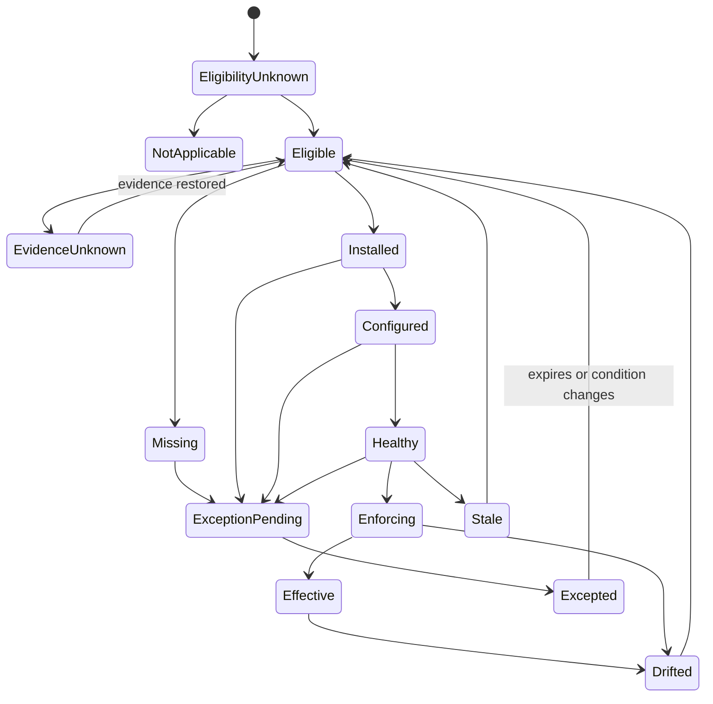

### State semantics

| State | Minimum evidence | Example | Do not infer |
|---|---|---|---|
| Not applicable | Approved policy excludes class/use/time | PLC cannot run endpoint agent; alternate controls apply | No security requirement exists |
| Eligibility unknown | Asset class/lifecycle/policy context unresolved | Reimaged device conflict | Pass or gap |
| Evidence unknown | Eligible but control/source state not reliable | EDR connector outage | Control absent or present |
| Missing | Eligible and sufficient evidence confirms no required control | Native control source plus independent asset evidence | Exploitation or compromise |
| Installed | Required component exists | Agent package/service present | Healthy/enforcing |
| Configured | Required policy/settings assigned | Prevention profile assigned | Effective application |
| Healthy | Component operating under criteria | Recent heartbeat, supported agent, no error | Prevention mode/effectiveness |
| Enforcing | Required mode actively controls behavior | Prevention enabled, no approved bypass | All scenarios blocked |
| Effective | Authorized assessment supports objective | Representative test/restore/path control succeeds | Permanent effectiveness |
| Excepted | Approved deviation with risk/compensation/expiry | Legacy system segmented with enhanced monitoring | Equivalent protection automatically |
| Stale | Last evidence exceeds approved window | No heartbeat for 20 days | Missing control without checking asset/source |
| Drifted | State moved from baseline | Firewall rule changed, agent audit-only | Malicious change automatically |

### State precedence

If source health is degraded, `evidence_unknown` should usually take precedence over a mass `missing` classification. If identity is unresolved, do not transfer control state between candidate assets. If an exception is expired, the asset returns to normal eligibility evaluation rather than remaining excepted. If control evidence is healthy but the policy is not enforcing, do not label effective.

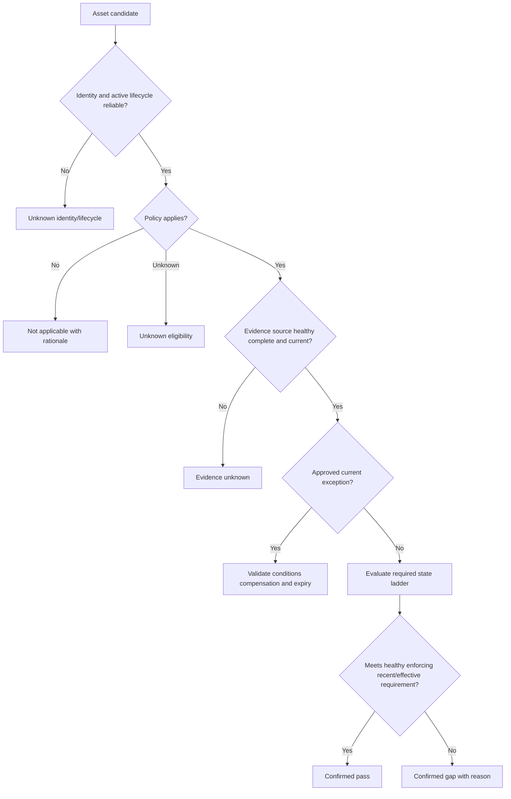

## Applicability and policy design

Applicability comes before coverage. An endpoint agent may apply to corporate laptops but not to a managed SaaS tenant or a fragile OT controller. Encryption may apply differently to endpoint disks, databases, object storage, backups, and network transport. A scanner may use authenticated assessment for servers, image scanning for containers, and configuration APIs for managed cloud services.

### Policy dimensions

| Dimension | Example distinctions | Why it matters |
|---|---|---|
| Asset class | Laptop, server, network appliance, container, SaaS, database, OT | Different controls/technical capability |
| Platform/version | Windows, macOS, Linux, mobile, appliance firmware | Agent/support/configuration differs |
| Environment | Production, development, lab, sandbox | Consequence and standard may differ |
| Ownership | Corporate, contractor, personal/BYOD, supplier-managed | Authority and control boundary differ |
| Lifecycle | Provisioning, active, quarantine, retired | Required controls change by state |
| Criticality | Crown-jewel/Tier 1/standard | Validation depth/SLA can differ |
| Exposure | Internet reachable, internal, isolated, privileged path | Priority and compensating controls differ |
| Data | Public, internal, confidential, regulated | Encryption/access/recovery needs differ |
| Geography/legal | Country, region, legal entity, contract | Requirements and operational constraints vary |
| Connectivity | Always-on, intermittent, isolated, offline | Freshness and deployment method differ |
| Technical feasibility | Supported agent/API/scan method | May require alternate safeguard |
| Business process | Service window, safety, uptime, change freeze | Remediation timing and approval differ |

### Policy rule anatomy

| Element | Example | Governance need |
|---|---|---|
| Rule ID/version | `EDR-CORP-ENDPOINT-v7` | Audit and restatement |
| Objective | Prevent/detect/respond to endpoint threats | Outcome clarity |
| Inclusion | Active corporate Windows/macOS endpoint | Denominator definition |
| Exclusion | Approved nonpersistent training pool under alternate control | Explicit rationale |
| Required state | Supported sensor, healthy, prevention mode, current heartbeat | Testable evidence |
| Evidence source | Native EDR tenant plus endpoint inventory | Authority/source health |
| Freshness | Class-specific customer-approved window | Time-bounded decision |
| Exception process | Owner, risk approval, compensation, expiry | Avoid silent bypass |
| Priority | Contextual risk/SLA rules | Proportionate action |
| Validation | Native state plus sampled effectiveness | Closure criteria |
| Change owner | Endpoint security governance | Controlled evolution |

### Plain-English deep-dive 2 - A denominator is a policy decision, not a query accident

Suppose a school reports vaccination coverage as vaccinated students divided by students in the vaccination database. Students with no record disappear, so the percentage looks excellent. The correct denominator begins with the independently governed enrolled-student population, applies documented eligibility, and treats unresolved records separately.

Control coverage is identical. Do not calculate EDR coverage from the EDR console alone. Start with reconciled active assets, apply policy by class/platform/lifecycle/ownership, then join EDR evidence. Publish confirmed pass, approved exception, confirmed gap, not applicable, and unresolved/unknown. If the source is down, coverage should not suddenly improve or collapse without a data-health caveat.

## Control-by-control mechanics

### EDR and security agents

| Evidence rung | Example field/test | Failure mode | Validation |
|---|---|---|---|
| Eligible | Active supported endpoint under policy | Asset missing from denominator | Reconciled inventory/policy reason |
| Observed | Sensor ID linked to correct installation | Orphan/duplicate sensor | Native ID and endpoint identity/time |
| Installed | Agent package/service present | Service stopped or corrupt | Endpoint/native control evidence |
| Configured | Correct tenant/group/policy assigned | Wrong group/audit-only profile | Effective policy read-back |
| Healthy | Recent heartbeat, supported version, no critical error | Stale green or degraded component | Native health and local sample |
| Enforcing | Prevention/tamper/response modes active as required | Bypass/exclusion or audit-only | Policy/result evidence |
| Effective | Authorized representative test/assessment | Health without detection/action | Controlled test and response validation |
| Exception | Approved technical/business deviation | Expired/ownerless compensation | Exception plus alternate-control validation |

Agent duplication can create false coverage: an old sensor record remains healthy-looking while a reimaged endpoint has a new unhealthy sensor. Conversely, one device can legitimately have separate sensor installation history. Match at the correct grain and close valid intervals.

### Vulnerability scanning and assessment coverage

Scanner coverage is not `asset appears in scanner`. Useful levels include expected scope, targeted, reached, authenticated, sufficiently assessed, completed without material error, fresh, and reconciled to findings.

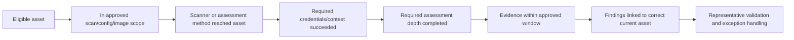

| Asset type | Suitable evidence examples | Common blind spot | Alternative/companion method |
|---|---|---|---|
| Endpoint/server | Authenticated agent/network scan | Offline, blocked, credential failure | EDR/software inventory/config API |
| Container image | Registry/image scan | Runtime drift/new packages | Admission/runtime/container security |
| Ephemeral workload | Image/pipeline/event/runtime assessment | Lifetime shorter than polling | Launch cohort and runtime evidence |
| Cloud managed service | Provider/configuration API | No host access | CSPM/provider-native assessment |
| SaaS | Vendor/API configuration assessment | Provider internals | SaaS security/contract/attestation |
| OT/IoT | Passive/vendor-approved assessment | Active scan can disrupt | Passive inventory, vendor process, segmentation |

### Patching and unsupported operating systems

NIST SP 800-40 Rev. 4 describes enterprise patch management as identifying, prioritizing, acquiring, installing, and verifying patches/updates/upgrades. Verification is essential. A deployment tool saying `sent` or even `installed` does not prove every asset is at the intended secure state without reboot, dependency, rollback, and functional evidence.

| Patch stage | Question | Evidence | Failure |
|---|---|---|---|
| Inventory | Which product/version/firmware exists? | Authenticated inventory/SBOM/vendor ID | Wrong product identity |
| Applicability | Does update apply to this version/config? | Vendor advisory and platform evidence | Install irrelevant/harmful update |
| Prioritization | Which assets/scenarios need fastest action? | Exploitation, exposure, criticality, controls | Severity-only queue |
| Acquisition | Is package authentic/approved? | Trusted vendor/signature/hash/process | Supply-chain risk |
| Test | Does update work in representative ring? | Functional/security/rollback tests | Production outage |
| Deploy | Was update delivered/installed? | Deployment records and endpoint state | Partial rollout |
| Reboot/activation | Is update active? | Version/runtime/reboot evidence | Installed but inactive |
| Verify | Is intended fixed state present and service healthy? | Independent current version/test | Ticket closure false green |
| Monitor | Did failures/rollback/recurrence occur? | Health and vulnerability rescans | Silent regression |

Unsupported OS analysis requires exact product, edition, version/build, vendor, support channel/contract, end date, extended support, component dependencies, and customer policy. Never infer support from a generic major version. Verify current vendor lifecycle sources. Treatment may be upgrade, migrate, replace, isolate, virtual patch/other compensation, restrict access, retire, or accepted residual risk under governance.

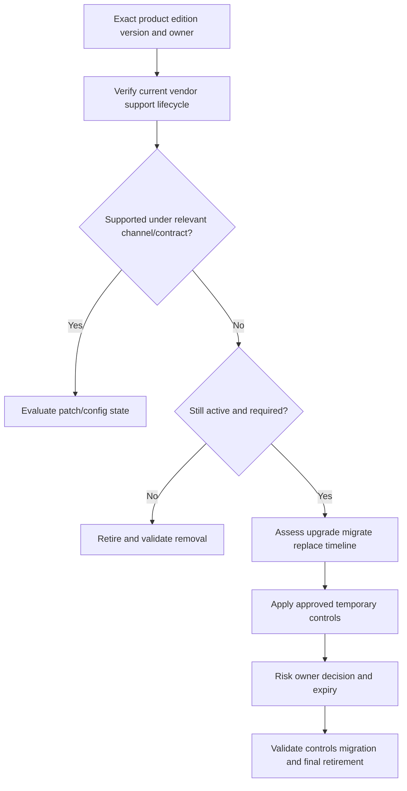

### Encryption

Encryption coverage depends on the data state and boundary. `Encryption enabled` can mean endpoint full-disk encryption, database storage encryption, object-storage server-side encryption, backup encryption, application-field encryption, TLS in transit, or key-management controls. These do not substitute automatically.

| Dimension | Questions | Evidence | False green |
|---|---|---|---|
| Data/state | At rest, in transit, backup, application field, memory? | Data-flow/classification model | Disk encryption claimed for network transit |
| Scope | Which disks/volumes/objects/replicas/backups? | Control inventory and sample | Boot disk encrypted, data disk not |
| Algorithm/mode | Approved and configured as required? | Current policy/config | Any encryption counted acceptable |
| Key ownership | Who controls keys and access? | KMS/HSM/IAM evidence | Provider encryption but excessive key access |
| Key lifecycle | Generation, rotation, revocation, recovery, destruction? | Audit/policy/test | Encryption with unrecoverable/never-rotated keys |
| Enforcement | Can users/workloads bypass or write unencrypted? | Policy/denial and sample | Default enabled but exceptions allow plaintext |
| Health/recent | Current key/policy/control evidence? | Native state and logs | Old configuration snapshot |
| Effectiveness | Authorized test shows protected data/boundary | Inspection/attempt/recovery | Configuration only |

### Backup and recovery

A backup job marked successful proves that a process completed under its own definition. Recovery coverage needs eligible data/assets, required Recovery Point Objective (RPO), Recovery Time Objective (RTO), copy scope, isolation/immutability as required, integrity, access controls, retention, and tested restore to a trusted state.

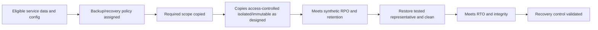

| Evidence state | Meaning | Failure example | Validation |
|---|---|---|---|
| Registered | Asset/data known to backup catalog | New database missing | Inventory reconciliation |
| Policy assigned | Backup policy should apply | Wrong tier/retention | Read effective policy |
| Job success | Scheduled operation reports success | Excluded table/volume | Compare intended and copied scope |
| Copy protected | Access/isolation/immutability meets design | Same credentials can delete originals/copies | Access and authorized resilience test |
| Fresh | Recovery point inside approved objective | Last good backup too old | Timestamp/RPO evaluation |
| Restorable | Restore operation completes | Corrupt/incompatible copy | Representative restore |
| Recoverable | Service/data trusted, complete, functional in required time | Restore starts but app fails | End-to-end recovery exercise |

### Ownership as a control

Ownership is not software, but missing accountable ownership weakens every remediation. Coverage should distinguish named active business/service/technical/control/risk roles, current attestation, fallback steward, and unresolved state. A generic group can be a routing queue but not necessarily accountable owner.

| Ownership condition | Classification | Action |
|---|---|---|
| Named active role, current attestation | Confirmed | Use role appropriate to decision |
| Team exists, individual departed | Stale/partial | Resolve successor and access/assignment |
| Last user only | Context, not owner | Query service/asset governance |
| Cloud tag only | Candidate owner | Validate against governed owner source |
| Generic security queue | Temporary steward | Investigate; do not mark owner complete |
| Conflicting owners | Unknown/conflict | Block high-impact auto-routing |
| No owner or steward | Confirmed governance gap | Escalate by account/site/org hierarchy |

### Firewall and network controls

A firewall/security-group/network-policy rule can be configured but ineffective because of precedence, shadowing, alternate paths, wrong attachment, stale object groups, broad identities, routing, IPv6, direct internet interface, or bypass. Evaluate intended policy, effective policy, actual attachment, path, logs/telemetry, change history, and authorized validation.

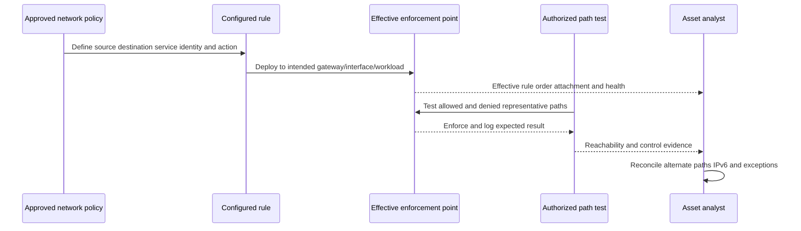

| Network evidence | Question | Gap example |
|---|---|---|
| Intended policy | What flows should be allowed/denied and why? | No documented requirement |
| Configured rule | Does syntax/object match intent? | `any` source due temporary change |
| Attachment | Is policy bound to actual interface/workload? | Security group exists but unattached |
| Effective order | Is rule shadowed/overridden? | Broad allow precedes deny |
| Path | Are there alternate routes, direct interfaces, IPv6? | Inspection bypass |
| Identity | Are users/workloads/groups resolved correctly? | Stale privileged group |
| Health | Is enforcement component operating/current? | Gateway degraded |
| Validation | Do representative allow/deny tests behave? | Config says deny, path connects |

### Identity controls

Identity coverage spans account inventory/lifecycle, authentication, multifactor authentication (MFA), authorization, least privilege, privileged access, service accounts/workload identities, credentials/secrets, conditional access, session/token controls, access review, and logging. A user may have MFA for interactive web login but a legacy protocol, app password, service credential, recovery method, token, or local account can create another path.

| Identity control | Eligible population | Required evidence | Common blind spot |
|---|---|---|---|
| Account lifecycle | Human/service/workload accounts | Authoritative status, owner, creation/disable/removal | Local/shadow accounts |
| MFA | Defined users/admins/apps/transactions | Effective policy and authentication-path result | Exempt/bypass/legacy path |
| Least privilege | Roles/permissions/entitlements | Approved need, effective access, review | Nested groups/inherited cloud roles |
| Privileged access | Admin accounts/sessions | PAM/JIT/MFA/logging as required | Standing emergency/local admin |
| Service account | Nonhuman identities | Owner, purpose, scope, credential lifecycle | Departed owner/embedded secret |
| Conditional access | User/device/risk/location/app context | Effective evaluated policy | Report-only mode/exclusions |
| Access review | High-risk entitlements | Reviewer, evidence, decision, removal validation | Rubber-stamp/expired review |
| Logging | Authentication/authorization events | Coverage, retention, time, integrity | Apps not sending logs |

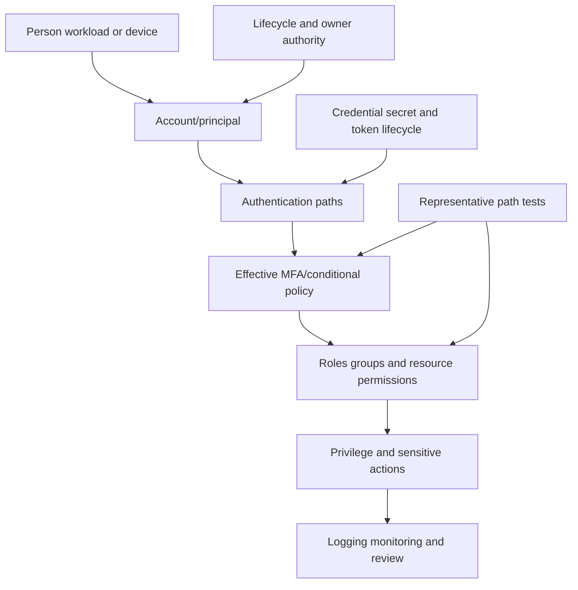

### Plain-English deep-dive 3 - A policy can exist, apply, and still not enforce

A company may have a rule that visitors must show badges. The rule is documented. A badge system is installed. The lobby reader is healthy. But a side door is propped open, so the outcome is not enforced for every relevant path. Reporting "badge control present" misses the real condition.

Security policies similarly pass through layers: intended requirement, assigned configuration, evaluated/effective policy, enforcement point, actual paths, and representative outcomes. An MFA policy can be report-only, exclude a group, omit a local account, or be bypassed by a different protocol. A firewall rule can be unattached or shadowed. An EDR policy can be assigned but tamper protection disabled. Coverage analysis must state which rung is measured.

## Exceptions and compensating controls

An exception is a governed deviation, not a comment field that turns red to green. Terminology (`exception`, `waiver`, `risk acceptance`) varies by organization; define it. The accountable risk owner must understand residual risk, and the exception should be narrow, time-bound, evidenced, and reviewed.

### Exception record

| Field | Required content | Failure prevented |
|---|---|---|
| Exception ID/version | Stable auditable identity | Duplicate/hidden approvals |
| Requirement | Exact policy/control/version deviated | Vague waiver |
| Scope | Assets, services, identities, environment, time | One approval applied broadly |
| Reason/root constraint | Technical/business rationale | Convenience disguised as necessity |
| Risk scenario | Threat, exposure, consequence, uncertainty | Approval without understanding |
| Compensating controls | Specific safeguards and evidence | "Segmentation" with no validation |
| Owner | Asset/service/control/risk owners | No accountability |
| Approver | Authorized decision maker | Self-approval |
| Start/expiry | Effective interval and maximum duration | Permanent temporary exception |
| Review triggers | Threat, exposure, owner, architecture, incident, control change | Exception stays valid after conditions change |
| Remediation plan | Milestones, dependencies, target closure | Waiver replaces work |
| Validation | Test compensating controls and final closure | Checkbox-only exception |
| Audit/history | Changes, renewals, evidence, outcome | Silent extension |

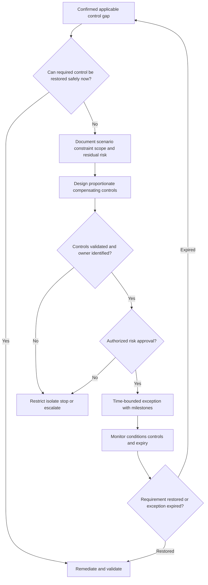

### Exception failure modes

| Failure | Example | Detection | Treatment |
|---|---|---|---|
| Expired exception still suppresses gap | Date comparison bug | Expired-active count | Reopen gap and review impact |
| Scope too broad | One server waiver applies to subnet | Asset-level sample | Narrow scope and re-evaluate |
| Owner departed | Approval has no active accountable owner | HR/owner reconciliation | Reassign/reapprove or expire |
| Compensation not effective | Segmentation rule not attached | Path/effective-policy test | Contain and redesign |
| Repeated renewal | Legacy blocker never funded | Renewal count/age | Escalate debt and roadmap decision |
| Threat/exposure changed | Asset becomes internet reachable | Event trigger | Immediate re-evaluation |
| Exception counted as compliant | Dashboard merges pass and excepted | Metric semantics review | Report categories separately |
| Duplicate exceptions | Several systems approve same asset differently | ID/scope reconciliation | Canonical decision and audit links |

## Missing, stale, and duplicate data

Before treating an apparent condition as a security-control gap, test whether evidence quality is sufficient.

| Data defect | Looks like | Root examples | Guardrail |
|---|---|---|---|
| Missing asset source | High apparent coverage | Unmanaged assets absent denominator | Independent/reconciled inventory |
| Missing control feed | Mass control gaps | Auth/pagination/source outage | Source-health unknown precedence |
| Stale asset | Persistent gap on retired device | Lifecycle feed delayed | Active-state validation |
| Stale control state | Old healthy appears current | Observation time ignored | Freshness by class/control |
| Duplicate asset | Duplicate gaps/tickets | False split/reimage | Entity reconciliation and idempotency |
| False merge | Wrong control attached to asset | Shared hostname/IP/serial collision | Strong IDs/temporal veto/review |
| Mapping defect | Status `degraded` becomes healthy | Unknown enum/default | Reject/unknown, never safe default |
| Grain mismatch | Agent count compared to physical devices | Installation/device confused | Explicit relationship/grain |
| Exception join defect | Wrong asset suppressed | Broad key/old alias | Exact scoped identity and validity |
| Clock/time-zone defect | Evidence falsely stale/fresh | Event vs ingest/local time | UTC semantics and source clocks |

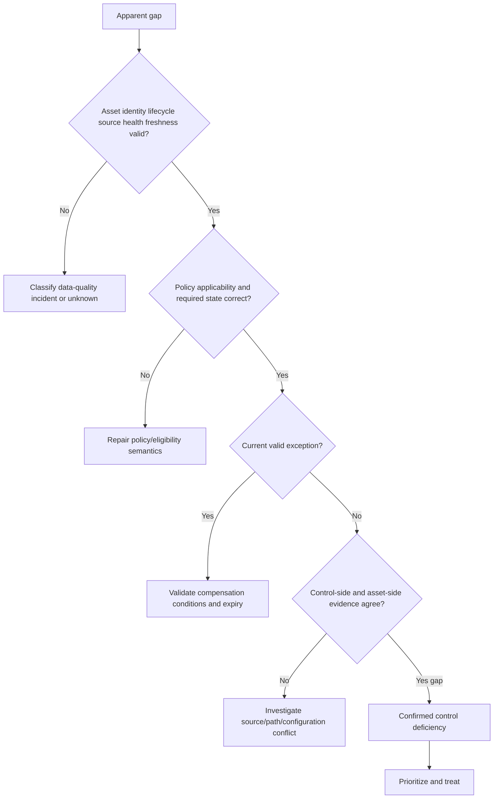

### Plain-English deep-dive 4 - Unknown is a safety state, not a reporting inconvenience

If an inspector cannot enter 100 hotel rooms because the key system is down, the report should not say 100 detectors are missing. It also should not say all 100 are healthy based on last month's inspection. The state is unknown, with a reason, owner, urgency, and recovery plan.

Security reporting often dislikes unknown because it complicates percentages. But forcing unknown into pass creates false assurance; forcing it into fail causes wasted action and destroys trust. Report confirmed pass, exception, confirmed gap, not applicable, and unknown separately. Include source health and decision completeness beside coverage. Prioritize restoring evidence when the unknown population is critical or exposed.

## Risk prioritization

Control gap priority is not simply "missing EDR first." Combine the scenario, asset consequence, exposure/reachability, threat activity, control objective/depth, alternate controls, gap age, population, exploitability where relevant, ownership, remediation feasibility, dependency concentration, and evidence confidence.

### Priority factors

| Factor | Question | Raises priority when | Caveat |
|---|---|---|---|
| Criticality/consequence | What harm could occur? | Safety, systemic integrity, major data/service impact | Criticality may be stale |
| Exposure/reachability | Who/what can reach the asset? | Public/privileged/lateral path supported | Config alone is not validated path |
| Threat/exploitation | Is relevant activity/known exploitation present? | Current credible threat applies | Do not invent targeting |
| Control objective | What protection is lost? | Prevention/detection/recovery all weak | Controls overlap imperfectly |
| Control depth | Missing versus degraded versus stale? | Confirmed absent/ineffective | Source outage can mimic absent |
| Alternate controls | Are effective compensating controls present? | None/weak/unvalidated | Presence is not effectiveness |
| Gap age | How long has validated gap existed? | Long exposure or SLA breach | Start after valid detection |
| Dependency/privilege | How broadly can failure propagate? | Shared identity/key/choke point | Graph confidence matters |
| Population | One asset or systemic cohort? | Broad common cause | Do not hide one severe asset in count |
| Feasibility/safety | Can action safely reduce risk now? | Quick safe containment exists | Easy does not always mean highest risk |
| Confidence | How strong is identity/policy/control evidence? | Strong confirmed evidence | Low confidence can prioritize investigation |

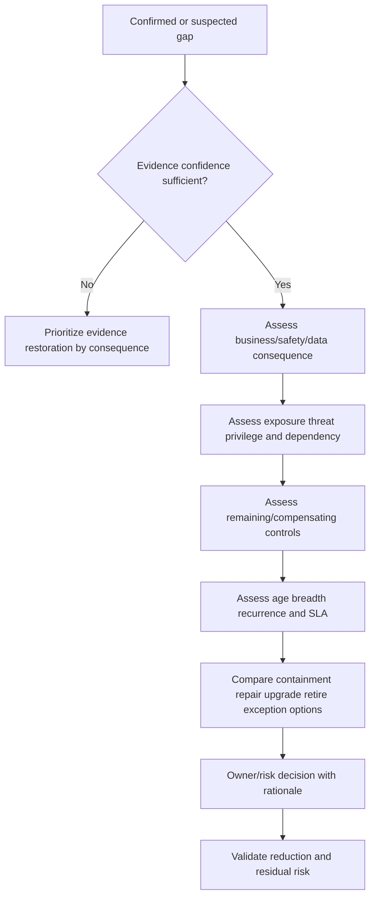

### Priority statement template

> Asset/cohort **[identity and scope]** has a confirmed **[control requirement/state]** gap under policy **[version]**, observed from **[sources/times]**. It supports **[service/data/criticality]** and is **[exposure/reachability/privilege]**. Existing controls **[state/evidence]** reduce but do not remove scenario **[mechanism/consequence]**. Evidence confidence is **[level/reason]**. Recommend **[action]** by **[owner/time]**, with **[safety/dependency]**, validation **[postconditions]**, and residual-risk decision by **[authorized owner]**.

This is more defensible than "Risk score 97; install agent immediately."

## Investigation, remediation, and validation

### Investigation workflow

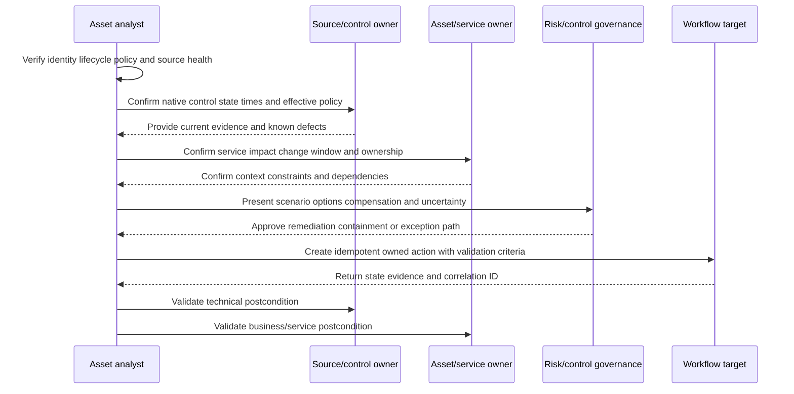

### Treatment options

| Option | When appropriate | Main risk | Validation |
|---|---|---|---|
| Deploy | Required control genuinely absent and supported | Compatibility/outage | Installed -> healthy -> enforcing evidence |
| Repair | Component unhealthy/degraded | Recurrence/root cause missed | Stable health and root cause prevention |
| Reconfigure | Wrong policy/mode/attachment | Broader unintended impact | Effective policy plus representative test |
| Patch/update | Applicable update reduces weakness | Functional regression/reboot | Version/fix and service health/rescan |
| Upgrade/migrate | Unsupported platform/control incompatibility | Project dependency/downtime | New platform control/function/data state |
| Isolate/restrict | Immediate exposure reduction | Business interruption/bypass | Effective path and service impact |
| Add compensation | Required control temporarily unavailable | False equivalence | Scenario-specific effectiveness and expiry |
| Retire/delete | Asset no longer required | Hidden dependency/data loss | No active use/access/path; records retained as required |
| Correct data | Apparent gap is identity/source/policy defect | Real gap accidentally dismissed | Native asset/control/policy reconciliation |
| Exception/accept | Residual risk approved under authority | Permanent debt | Approval, controls, expiry, monitoring |
| Monitor | No immediate action justified under evidence | Drift/threat change | Trigger conditions and review cadence |

### Validation layers

| Layer | Postcondition | Evidence |
|---|---|---|
| Asset | Correct active identity/lifecycle/owner | Golden record plus source reconciliation |
| Policy | Correct applicability/version/required state | Rule reason and evaluation trace |
| Control | Required current effective state | Native read-back, endpoint/path/restore evidence |
| Exception | Scope/approval/compensation/expiry valid if used | Exception record and control tests |
| Workflow | Ticket/action target reconciled and idempotent | Target read-back/correlation/history |
| Security | Exposure/scenario reduced as intended | Authorized representative assessment |
| Business | Service/data/safety outcome acceptable | Owner/user/service validation |
| Reporting | Metrics/cohorts/history correctly updated | Query/control totals/restatement |
| Recurrence | Root cause/guardrail prevents reappearance | Monitoring over defined period |

```mermaid
flowchart LR
    CLOSE[Proposed closure] --> ASSET[Correct asset and owner?]
    ASSET --> POLICY[Correct applicability and policy version?]
    POLICY --> CONTROL[Healthy enforcing recent/effective control?]
    CONTROL --> WORK[Ticket/action reconciled?]
    WORK --> SEC[Scenario/exposure reduced?]
    SEC --> BIZ[Service/data/safety postcondition met?]
    BIZ --> REPORT[Metrics and history correct?]
    REPORT --> REC[Recurrence monitor and prevention?]
    REC --> DONE[Validated closure]
```

### Plain-English deep-dive 5 - Closing a ticket is a workflow event, not proof of protection

A repair request can be marked complete because a technician visited the room. That does not prove the detector is powered, connected, tested, and monitored. The workflow state and the real-world state are related but distinct.

For security gaps, require target read-back plus control-side and asset/business evidence. If a patch ticket closes, verify the intended version is active and the service is healthy. If an EDR deployment closes, verify the correct sensor is healthy and enforcing. If a firewall ticket closes, test the effective path and alternate routes. If a backup task closes, restore representative data/service. Reopen automatically or manually when postconditions fail.

## Metrics and dashboards

### Core metrics

| Metric | Illustrative definition | Why useful | Anti-gaming caveat |
|---|---|---|---|
| Eligible population | Active assets meeting policy inclusion | Denominator foundation | Independent/reconciled source required |
| Confirmed coverage | Eligible assets meeting required healthy/enforcing/recent state / eligible assets | Technical control state | Keep exceptions/unknown separate |
| Decision completeness | Eligible assets classified pass/gap/exception / eligible assets | Visibility into uncertainty | Not quality of classification alone |
| Confirmed gap rate | Eligible assets with validated deficiency / eligible assets | Backlog magnitude | Source outage must not inflate |
| Unknown rate | Eligible/candidate assets unresolved due identity/source/policy / population | Evidence debt | Do not force unknown to improve metric |
| Exception rate | Current approved exceptions / eligible assets | Governance posture | Exception is not compliance/pass |
| Exception debt | Expired, ownerless, weakly compensated, repeatedly renewed exceptions | Hidden residual risk | Define severity/denominator |
| Healthy-to-effective validation | Controls with representative effectiveness evidence / controls requiring it | Depth of assurance | Sampling design matters |
| Gap aging | Detection-to-confirmed closure percentiles | Timeliness | Clock starts after valid classification |
| SLA attainment | Validated closures within approved risk tier target / due gaps | Process outcome | Paused clock governance |
| Validation failure | Closed actions failing postcondition / validated actions | Ticket quality | Encourages honest reopens, not punishment |
| Recurrence | Same gap/root cause reappears in asset/cohort/window | Durability | Identity changes can fake recurrence |
| Ownerless gap rate | Confirmed gaps without accountable action owner / gaps | Mobilization health | Generic queue not owner |
| Source-health availability | Time critical evidence sources meet completeness/freshness criteria | Explains unknown/metric trust | Uptime alone misses partial data |
| Risk-weighted reduction | Validated material gaps reduced under stable factors | Outcome contribution | Do not invent causation/score precision |

$$
\text{Confirmed Coverage} = \frac{\text{Eligible assets meeting required current control state}}{\text{Eligible active assets}}
$$

$$
\text{Decision Completeness} = \frac{\text{Confirmed pass + confirmed gap + current approved exception}}{\text{Eligible active assets}}
$$

Not applicable assets are excluded from the eligible denominator but reported in scope bridges. Unknown assets remain in the denominator where eligibility is established; unresolved eligibility is reported separately with a candidate population bridge. Exact organization policy decides details.

### Dashboard views

| Audience | Show | Required caveat | Avoid |
|---|---|---|---|
| Executive | Material coverage/gaps/unknowns/exceptions, trend, decisions | Scope/source health/definition changes | One blended green score |
| Control owner | Asset cohorts by state/reason/version/source | Eligibility and duplicates | Raw totals with no denominator |
| Asset/service owner | Owned actions, impact, due date, guidance, validation | Control owner dependencies | Security-only jargon |
| Risk/compliance | Requirement, evidence, exception, residual risk, audit | Assessment/applicability boundaries | "Tool says compliant" |
| Data steward | Identity/source/mapping/owner conflicts | Downstream impact | Treat all as control-owner work |
| TSM/account team | Adoption, health, blocked decisions, outcomes, escalations | Product/customer ownership boundaries | Promise outcome/timeline |

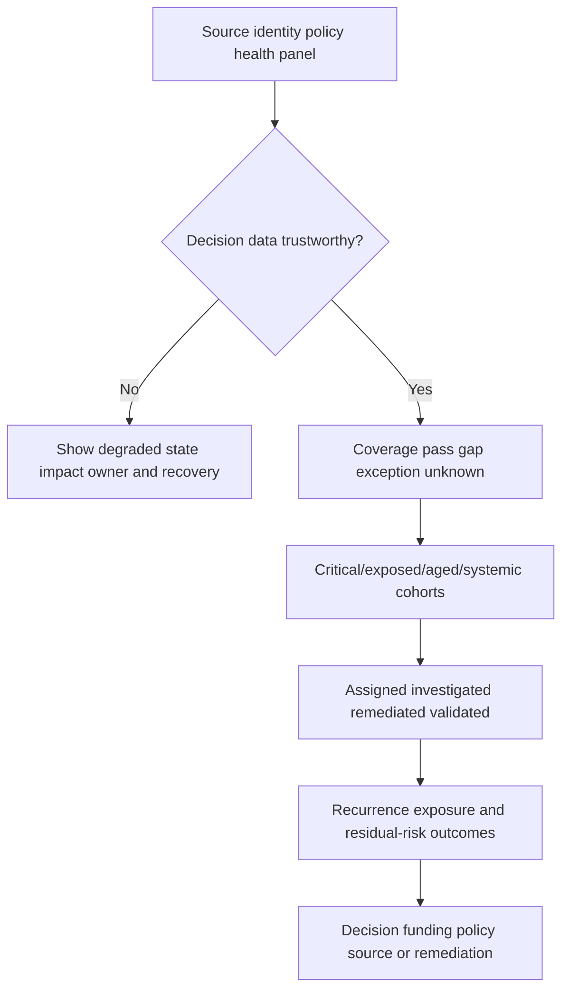

## Troubleshooting

### Failure patterns

| Symptom | Likely causes | Cheap check | Containment |
|---|---|---|---|
| Coverage suddenly drops | Control source outage, pagination, mapping enum, real policy/state change | Native count/source health/last-good run | Render unknown; pause bulk tickets |
| Coverage suddenly rises | Denominator shrank, exclusions expanded, source stale, gaps forced unknown/pass | Scope bridge and active/eligible counts | Caveat executive trend |
| Duplicate tickets | Asset false split, replay, missing idempotency, stale open ticket link | Canonical asset/rule ID and target query | Pause creates, reconcile |
| Gap closed then reopens | Agent drift, patch rollback, exception expiry, identity change | Source timeline and root reason | Validate recurrence, not suppress |
| All OT devices fail EDR | Wrong applicability | Asset class/policy reason | Stop deployment tickets |
| Backup coverage green but restore fails | Job success used as effectiveness | Restore test and scope | Escalate recovery risk |
| Encryption green but data exposed | Wrong data state/scope/key/path | Data-flow and key/effective policy | Contain exposure |
| MFA green but legacy path bypasses | Assignment not effective across paths | Representative auth path test | Restrict bypass as approved |
| Firewall compliant but port reachable | Rule shadowed/unattached/alternate path | Effective policy/path test | Contain path/change |
| Unsupported count spikes | Vendor lifecycle data/version mapping changed | Exact product/version/lifecycle source | Hold automated retirement |
| Exception count never falls | Renewals, ownerless records, no roadmap | Aging/renewal/owner report | Governance escalation |
| Report/detail mismatch | Snapshot/filter/timezone/grain/version/cache | Reproduce query/control totals | Label report degraded |

### Layered runbook

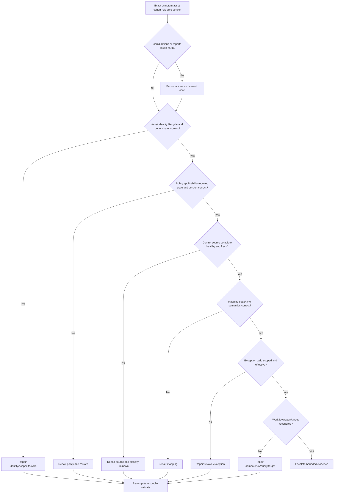

### Troubleshooting questions

1. What exactly is expected versus actual, for which asset class, organization, policy, control, view, role, and as-of time?
2. Is the denominator stable and independently reconciled? Did lifecycle/scope/exclusion change?
3. Is asset identity correct at device/installation/workload/account grain?
4. Does policy apply, and what required state is being measured?
5. Is the native control source healthy, complete, correctly scoped, and current?
6. Are observation/effective times being confused with ingestion time?
7. Did schema/status enum/mapping/default change? Are unknown states forced pass/fail?
8. Is the control truly installed, configured, healthy, enforcing, recent, and effective?
9. Is an exception exact, current, approved, compensated, and still valid under current exposure/threat?
10. Does workflow use stable asset+policy+episode idempotency? Did it read target state before creating?
11. Does the dashboard use the same snapshot, filter, grain, policy version, and denominator as detail?
12. After repair, are source, control, asset, policy, exception, ticket, report, and business postconditions reconciled?

## Complete synthetic NMH control-coverage scenario

### Objective and policy set

NMH begins a fictional 2026-08-24 control-hygiene campaign for Global Order Fulfillment and corporate endpoints. It defines separate policies rather than one universal "secure" field.

| Synthetic policy | Eligible population | Required state | Primary evidence | Validation depth |
|---|---|---|---|---|
| EDR endpoint | Active corporate supported Windows/macOS endpoints | Supported healthy sensor, prevention enforcing, current | EDR + reconciled endpoint inventory | Native state plus sampled authorized test |
| Server assessment | Active production servers | Current authenticated assessment or approved alternative | Scanner/cloud/platform | Credential/depth evidence plus sample |
| Patch | Supported production OS/app assets | Approved update level by risk tier | Patch/platform/scanner | Version active + service health/rescan |
| Disk encryption | Corporate portable endpoints | Full required volume encryption, key escrow/recovery, current | MDM/encryption/key source | Native/local sample and recovery process |
| Recovery | Tier 0/1 services/data | Policy, protected fresh copies, restore within approved objectives | Backup catalog/restore exercises | End-to-end restore/service validation |
| Ownership | Active production assets/services | Current named accountable and technical roles | Catalog/attestation | Owner acknowledgement and routing test |
| Supported OS | Active OS-based assets | Supported lifecycle or approved exception | Vendor lifecycle + inventory | Exact version/build/channel review |
| Network | Internet-relevant services | Approved effective allow/deny policy, no unintended path | Cloud/firewall/path evidence | Representative allowed/denied tests |
| Identity | Privileged human/service identities | Owner, least privilege, approved MFA/credential controls, current review | IAM/PAM/HR/app | Effective access/authentication-path test |

Every rule, evidence window, and criterion is synthetic and customer-designed; none is a Zscaler default.

### Initial synthetic counts

| Control population | Eligible | Confirmed pass | Current exception | Confirmed gap | Unknown | Not applicable outside denominator |
|---|---:|---:|---:|---:|---:|---:|
| Endpoint EDR | 10,240 | 9,630 | 240 | 290 | 80 | 1,380 |
| Server assessment | 3,120 | 2,610 | 130 | 250 | 130 | 740 |
| Endpoint encryption | 8,940 | 8,410 | 110 | 280 | 140 | 2,680 |
| Supported OS | 13,880 | 13,120 | 210 | 430 | 120 | 0 |
| Tier 0/1 recovery | 184 services | 142 | 12 | 18 | 12 | 0 |
| Production ownership | 4,220 | 3,760 | 0 | 330 | 130 | 0 |
| Privileged identity | 1,160 | 1,008 | 42 | 71 | 39 | 0 |

For EDR, confirmed coverage is $9,630 / 10,240 = 94.04\%$. Decision completeness is $(9,630 + 240 + 290) / 10,240 = 99.22\%$. Exceptions remain separate from pass. The 80 unknown are visible and prioritized by criticality/exposure.

### Example gap decisions

| Synthetic asset/cohort | Evidence | Classification | Priority logic | Treatment/validation |
|---|---|---|---|---|
| 11 public production servers with unhealthy EDR | Source healthy, correct IDs, prevention disabled | Confirmed gap | Critical service + exposure + weak alternate detection | Repair policy, validate enforcement/path/service |
| 54 finance laptops stale EDR | MDM current, EDR no heartbeat, travel/leave mixed | Unknown then segmented | Sensitive users; evidence uncertain | Contact/reconcile device state; repair only confirmed active |
| 17 OT controllers no EDR | Class/policy says EDR inapplicable | Not applicable | Safety/availability; alternate control required | Validate segmentation/passive monitoring/vendor process |
| 6 unsupported order servers | Exact vendor lifecycle verified | Confirmed gap with 2 exceptions | Critical service; upgrade dependency | Isolate/monitor, phased upgrade, final version/service validation |
| 3 backup-green databases fail restore | Job success but test corrupt | Confirmed effectiveness gap | Crown-jewel data integrity/recovery | Contain risk, repair copies/process, repeat clean restore |
| 29 encrypted laptops lack key escrow | Disk reports encrypted; recovery key missing | Confirmed recovery/hygiene gap | Device loss/recovery risk | Escrow/recovery validation without destructive action |
| 4 privileged service principals ownerless | IAM current, owner departed | Confirmed identity/ownership gap | Broad privilege and no accountability | Restrict as approved, assign owner, rotate, validate access |
| 180 scanner records duplicated after reimage | False splits confirmed | Data-quality defect | Would create duplicate tickets | Merge/relate installations, reconcile findings/tickets |

### Synthetic incident: a source outage creates 2,700 false EDR gaps

At 08:35 UTC, the AEM-style synthetic dashboard shows EDR confirmed coverage falling from 94 percent to 68 percent. Bulk remediation automation proposes 2,700 tickets.

```mermaid
sequenceDiagram
    participant D as Coverage dashboard
    participant A as Asset analyst
    participant E as EDR source owner
    participant W as Workflow owner
    participant O as Endpoint/service owners
    D->>A: Coverage drop and proposed gap cohort
    A->>W: Pause ticket creation and downstream CMDB flags
    A->>E: Compare native count heartbeat and connector runs
    E-->>A: Native sensor count stable; API pagination incomplete
    A->>A: Reclassify affected records evidence unknown
    A->>O: Communicate impact uncertainty and next checkpoint
    E->>A: Restore permission and complete no-action reload
    A->>A: Reconcile assets states exceptions and denominator
    A->>W: Read targets and suppress duplicate proposals
    A->>D: Restore trusted metric with incident caveat
```

The root defect is incomplete EDR ingestion after a permission/pagination failure. A policy-evaluation defect converted absent observations into `control_missing` instead of `evidence_unknown`. A workflow safeguard also failed by not checking source health and mass-change threshold before proposing tickets.

Containment pauses ticket/CMDB actions and adds a source-health banner. The repair restores least-privileged access, completes pages, reprocesses in no-action mode, and changes state precedence. Reconciliation accounts for every affected asset, proposed ticket, existing ticket, exception, report, export, and metric interval. Prevention adds native control totals, complete-run markers, tri-state semantics, dependency-aware metric gating, canary actions, and a runbook game day.

### Prioritized NMH campaign

| Wave | Cohort | Owner(s) | Action | Validation | Synthetic success condition |
|---:|---|---|---|---|---|
| 0 | Unknown/source/identity defects | Data/source/control owners | Restore evidence and resolve identity | Counts/state/control totals | Decisions trustworthy before mass action |
| 1 | Critical exposed confirmed gaps | Service/control/risk owners | Contain and repair | Effective control/path/service | No unowned validated material gap |
| 2 | Recovery and privileged identity failures | Continuity/IAM/service owners | Restore/test/restrict/rotate | Recovery/auth/access postconditions | Representative tests pass |
| 3 | Unsupported platforms | Platform/app/business owners | Upgrade/migrate/isolate/except | Version/control/service state | Unexcepted active exposure reduced |
| 4 | Broad standard endpoint gaps | EUC/endpoint owners | Ringed deploy/repair | Healthy/enforcing/current | Stable coverage and low recurrence |
| 5 | Ownership/hygiene debt | Catalog/stewards/service owners | Attest/assign/clean | Routing and field evidence | Lower bounce/orphan rate |

### NMH governance

| Cadence | Participants | Evidence/decision | Output |
|---|---|---|---|
| Daily operations | Analysts, source/control/workflow owners | Source health, critical gaps, unknowns, failures | Assigned investigation/containment |
| Weekly remediation | Platform/app/IAM/network/backup owners | Aging, blockers, validation, recurrence | Wave plan and escalations |
| Monthly exception/risk | Risk, business, security, compliance | Exceptions, compensation, residual risk, expiry | Approve/reject/close/escalate |
| Monthly data quality | Data/asset/source stewards | Denominator, duplicates, mappings, source SLOs | Corrective changes |
| Quarterly executive | CISO/CIO/business | Stable trends, material gaps, debt, outcomes, decisions | Funding/policy/roadmap |
| Event-driven incident | Incident roles | False action/report or material control failure | Containment, recovery, reconciliation, PIR |

## Arti bridge: configuration, evidence, and validation

Microsoft escalation work frequently required distinguishing "setting exists" from "setting effectively applies." A permission could be configured but inherited differently; a sync client installed but unhealthy; a certificate present but untrusted/expired; a proxy configured but bypassed; a policy assigned but not applied to the user/device; a service fix deployed but not validated for the customer path. Arti collected evidence, tested hypotheses, coordinated owners, and validated end-to-end recovery.

| Existing strength | Control-coverage transfer | Learning boundary | Honest interview sentence |
|---|---|---|---|
| Identity/permission troubleshooting | Effective policy and alternate paths | Formal IAM program/AEM fields | "I validate effective access, not assignment alone." |
| Client/service diagnostics | Installed versus healthy/current | EDR/control-product specifics | "A package is the first rung, not control proof." |
| Networking/proxy evidence | Effective path/firewall validation | Enterprise network-control ownership | "Configured deny must be tested on the effective path." |
| SQL/Power BI | Denominators, state cohorts, aging, source health | Product report/query specifics | "I show exceptions and unknowns separately." |
| CRITSIT/RCA | False-red/green containment and layered diagnosis | Security control incident processes | "I pause unsafe automation and find the first wrong layer." |
| Fix validation | Technical and customer postconditions | Authorized security-effectiveness testing | "Ticket closure is not my validation endpoint." |
| Customer leadership | Owner alignment, risk communication, next checkpoints | Customer risk acceptance authority | "I advise; accountable customer owners decide residual risk." |

## Labs and rehearsal

All labs use synthetic data and general tooling. They do not require or imply access to Zscaler AEM.

### Lab 1 - Coverage contract

Write objective, control/version, universe, eligibility, required state, evidence, freshness, exceptions, unknown handling, owners, validation, and metric for EDR. **Pass:** another analyst reproduces the denominator and state.

### Lab 2 - State ladder

Create 30 synthetic records across not applicable, eligibility unknown, evidence unknown, missing, installed, configured, healthy, enforcing, effective, excepted, stale, and drifted. **Pass:** no forced boolean.

### Lab 3 - Applicability matrix

Map endpoint, server, container, cloud managed service, SaaS, network appliance, OT, and data store to suitable EDR/scanner/patch/encryption/backup/firewall/identity controls. **Pass:** alternate control and rationale visible.

### Lab 4 - EDR denominator

Use inventory, MDM, IAM, EDR, lifecycle, and exceptions to calculate confirmed coverage and decision completeness. Simulate source outage. **Pass:** outage becomes unknown, not mass gap/pass.

### Lab 5 - Scanner depth

Classify targeted, reached, authenticated, assessed, fresh, and findings-linked states for 500 synthetic servers. **Pass:** scanner presence does not equal authenticated coverage.

### Lab 6 - Patch workflow

Model identify, prioritize, acquire, test, deploy, activate/reboot, verify, and monitor for a fictional update. Add ring/rollback. **Pass:** deployment status is not final validation.

### Lab 7 - Unsupported OS

Build exact product/edition/build/vendor/support-channel records and verify against a synthetic lifecycle table. Create upgrade, isolate, retire, and exception cohorts. **Pass:** no generic major-version assumption.

### Lab 8 - Encryption scope

Map endpoint volumes, database/storage, backup, network transit, keys, and data classes. Create a false green where only boot volume is encrypted. **Pass:** state and boundary explicit.

### Lab 9 - Recovery effectiveness

Create a successful backup job whose restore fails integrity or RTO. Design remediation and retest. **Pass:** recovery coverage requires trusted usable service/data.

### Lab 10 - Firewall path

Compare intended, configured, attached, effective rule order, IPv4/IPv6/alternate paths, logs, and authorized tests. **Pass:** no configuration-only conclusion.

### Lab 11 - Identity path

Model interactive, legacy, service, local, recovery, and token paths under MFA/conditional access. **Pass:** every eligible path has effective control evidence or explicit exception.

### Lab 12 - Exception governance

Build ten records with scope, scenario, owner, approver, compensation, evidence, expiry, milestones, and triggers. Include expired/ownerless/broad failures. **Pass:** exceptions never merge into pass.

### Lab 13 - Prioritization exercise

Rank 20 gaps using consequence, exposure, threat, control depth, alternatives, age, dependency, breadth, feasibility, and confidence. Write narrative rationale. **Pass:** score alone never decides.

### Lab 14 - Source outage game day

Run the NMH false EDR-gap incident: contain, test source/identity/policy, repair, reprocess, reconcile, communicate, prevent. **Pass:** zero duplicate/harmful actions.

### Lab 15 - Validation drill

For EDR, patch, encryption, backup, firewall, and IAM actions, define asset, policy, control, workflow, security, business, reporting, and recurrence postconditions. **Pass:** ticket state alone closes none.

### Lab 16 - Interview capstone

Present the NMH policy/counts, six example decisions, incident, campaign, metrics, source caveats, and Arti bridge. **Pass:** every threshold/result is synthetic and product claim bounded.

## Common misconceptions to correct

| Misconception | Correction |
|---|---|
| Installed means protected | Installed, configured, healthy, enforcing, recent, and effective differ |
| Healthy means effective | Health is component evidence; representative outcome still may need validation |
| Coverage comes from the control console | Start with independent/reconciled eligible asset population |
| Missing control record proves missing control | Source/identity/mapping health may be unknown |
| Source outage means every asset fails | Render evidence unknown and contain dependent actions |
| Unknown should be counted as failure to be conservative | Show separately; prioritize evidence by consequence |
| Exception means compliant/pass | It is an approved deviation with residual risk and expiry |
| Compensating control automatically equals required control | Validate it against the relevant scenario |
| One policy applies to every asset | Class, platform, lifecycle, ownership, criticality, exposure, and feasibility matter |
| No EDR on OT always means gap | Determine applicability and safer alternate controls |
| Scanner sees asset, so it is covered | Targeting, reachability, credentials, depth, freshness, and identity matter |
| Patch deployed means fixed | Verify active version, intended fix, service health, and recurrence |
| Unsupported is obvious from OS name | Verify exact product/edition/build/channel/current vendor lifecycle |
| Encryption enabled means all data protected | Scope, state, algorithm, keys, enforcement, and recovery matter |
| Backup success means recoverable | Test representative trusted restoration within objectives |
| Firewall rule exists, so path is blocked | Attachment, order, objects, alternate paths, and effective test matter |
| MFA assigned means every path uses MFA | Exclusions, legacy/local/service/token/recovery paths may differ |
| Generic queue is a real owner | It may be temporary stewardship, not accountability |
| Higher gap count always means worse posture | Scope/visibility can improve; use stable definitions and context |
| Lower count always means risk reduction | Denominator/source/exclusion changes can create false improvement |
| Ticket closure proves remediation | Validate technical, security, workflow, and business postconditions |
| AEM public gap positioning defines customer policy/defaults | It supports use-case positioning only; customers verify and configure |

## Official Source Anchors

Research/source date: **2026-08-24**.

Zscaler sources support bounded AEM/Data Fabric coverage-gap and workflow positioning. NIST sources support control catalogs, continuous monitoring/effectiveness, risk, configuration, and patch-management lifecycle. CIS provides industry control overviews for inventory, secure configuration, account management, vulnerability management, data recovery, and related safeguards. None defines Zscaler proprietary status logic, customer eligibility, universal freshness/SLAs, current vendor support for a specific asset, compliance, or guaranteed risk reduction.

| Source | URL | Used for | Boundary |
|---|---|---|---|
| Zscaler Asset Exposure Management | https://www.zscaler.com/products-and-solutions/caasm | Public positioning for visibility, coverage/hygiene, misconfigurations, missing controls, workflows, CMDB, reporting | Verify current licensed tenant details; no default policy/health guarantee |
| Zscaler Data Fabric for Security | https://www.zscaler.com/products-and-solutions/data-fabric | Public correlation, enrichment, business logic, workflow/report foundation | No internal topology/formula/status semantics |
| NIST SP 800-40 Rev. 4 | https://csrc.nist.gov/pubs/sp/800/40/r4/final | Enterprise patch management identifying, prioritizing, acquiring, installing, verifying patches/updates/upgrades | Planning guidance; not a customer patch SLA/tool procedure |
| NIST SP 800-53 Rev. 5 | https://csrc.nist.gov/pubs/sp/800/53/r5/upd1/final | Security/privacy control catalog across configuration, access, identity, contingency, integrity, monitoring | Requires selection, tailoring, implementation, assessment |
| NIST SP 800-137 | https://csrc.nist.gov/pubs/sp/800/137/final | Continuous visibility into assets, vulnerabilities, threats, and control effectiveness | 2011 federal guidance; not product cadence/default |
| NIST SP 800-30 Rev. 1 | https://csrc.nist.gov/pubs/sp/800/30/r1/final | Risk scenario, threat, vulnerability, impact, likelihood/uncertainty concepts | Not a prioritization formula |
| CIS Control 1 | https://www.cisecurity.org/controls/inventory-and-control-of-enterprise-assets | Active inventory/control foundation | Industry guidance; scope varies |
| CIS Control 4 | https://www.cisecurity.org/controls/secure-configuration-of-enterprise-assets-and-software | Secure configuration of enterprise assets/software | Overview; implementation must be tailored |
| CIS Control 5 | https://www.cisecurity.org/controls/account-management | Account authorization and management | Overview; does not define customer IAM architecture |
| CIS Control 7 | https://www.cisecurity.org/controls/continuous-vulnerability-management | Continuous vulnerability assessment/tracking/remediation concept | Overview; not scanner coverage default |
| CIS Control 11 | https://www.cisecurity.org/controls/data-recovery | Recovery practices to restore in-scope assets to trusted state | Overview; customer RPO/RTO and tests vary |

## Likely Interview Questions

### Q1. How do you define control coverage correctly?

**Model answer:** I define objective, specific control/version, independently reconciled asset universe, policy eligibility/applicability, required state, authoritative evidence, freshness, exception/compensation, unknown handling, owners, validation, and metric. I report confirmed pass, current exception, confirmed gap, not applicable, and unknown separately; coverage percentage without denominator and source health is not trustworthy.

### Q2. What is the difference among installed, healthy, enforcing, recent, and effective?

**Model answer:** Installed means component exists; configured means policy/settings are assigned; healthy means component reports normal operation under criteria; enforcing means it actively affects the relevant behavior; recent means evidence is inside an approved window; effective means authorized representative evidence supports the intended control outcome. Each rung can fail independently.

### Q3. How do you avoid false coverage gaps?

**Model answer:** Validate asset identity/lifecycle and denominator, policy applicability, source scope/health/completeness, event-versus-ingest freshness, mapping/status semantics, control-side plus asset-side evidence, and exception identity/validity before confirming a gap. Source outages become evidence unknown, and duplicate/false-merged assets are repaired before action.

### Q4. How do you handle exceptions and compensating controls?

**Model answer:** Tie the exception to exact policy/version/assets/time; document constraint, scenario, residual risk, owners/approver, specific compensating controls and tests, start/expiry, review triggers, remediation milestones, and validation. I report exceptions separately from pass, re-evaluate on exposure/threat/owner/architecture change, and reopen on expiry or failed compensation.

### Q5. How do EDR, scanner, patch, encryption, and backup coverage differ?

**Model answer:** EDR needs correct sensor identity, health, policy, enforcement, freshness, and sometimes tests. Scanner coverage needs scope, reach, credentials, depth, freshness, and finding identity. Patching requires applicability through verified active installation and service health. Encryption needs data state/scope, keys, enforcement, and recovery. Backup needs complete protected copies plus representative trusted restore within objectives.

### Q6. How do you prioritize control gaps?

**Model answer:** I combine confirmed evidence confidence, business/safety/data consequence, exposure/reachability, threat/exploitation context, privilege/dependency concentration, control objective/depth, remaining/compensating controls, age/recurrence/breadth, and safe remediation feasibility. I explain factors and uncertainty rather than rely on an opaque score; low-confidence critical unknowns may prioritize investigation.

### Q7. What proves remediation is complete?

**Model answer:** Correct asset/lifecycle/owner; correct policy evaluation; required control state read from native and representative evidence; valid exception if any; idempotent target reconciliation; security scenario reduced; service/data/safety postcondition met; metrics/history updated; and recurrence guardrail monitored. A closed ticket is only a workflow event.

### Q8. How does your Microsoft background transfer, and what is the boundary?

**Model answer:** I have production experience distinguishing configured from effective identity, permission, client, network, and service behavior; collecting timestamps/IDs; finding source defects; coordinating owners; and validating end-to-end fixes. SQL/analytics supports denominator and state-quality checks. I practiced the AEM-style method in synthetic NMH labs, but I do not claim production Zscaler AEM operation or proprietary product knowledge.

## 30-Second Memory Hooks

| Concept | Memory hook |
|---|---|
| Control | Prevent, detect, respond, recover |
| Eligibility | Which rooms require the detector? |
| Applicability | Right safeguard for the room type |
| Installed | Mounted, not proven |
| Configured | Assigned, not necessarily applied |
| Healthy | Self-test passes |
| Enforcing | Door actually locks |
| Recent | Green evidence expires |
| Effective | Representative drill succeeds |
| Coverage | Numerator + denominator + policy + time |
| Unknown | Inspector could not enter; neither pass nor fail |
| Exception | Narrow, owned, compensated, expiring deviation |
| Compensation | Test the scenario, not the label |
| EDR | Sensor identity, policy, health, enforcement |
| Scanner | Targeted, reached, authenticated, deep, fresh |
| Patch | Identify, prioritize, acquire, install, verify |
| Unsupported OS | Exact product/build/channel/current lifecycle |
| Encryption | State, scope, key, enforcement, recovery |
| Backup | Successful job is not trusted recovery |
| Firewall | Intent, config, attachment, order, path, test |
| Identity | Every authentication and authorization path |
| Priority | Consequence + exposure + controls + confidence |
| Validation | Ticket is evidence, not the outcome |
| Troubleshoot | Asset -> policy -> source -> state -> exception -> workflow |
| Arti bridge | Effective-behavior validation transfers; AEM operation does not |

## Completion Checklist

- [ ] I define control, objective, owner, eligibility, applicability, policy, baseline, coverage, gap, unknown, exception, compensation, hygiene, misconfiguration, drift, and validation.
- [ ] I separate observed, installed, configured, healthy, enforcing, recent, effective, excepted, stale, drifted, missing, unknown, and not applicable.
- [ ] I define each coverage metric with asset universe, eligibility, required state, evidence, time, exceptions, unknowns, owner, and validation.
- [ ] I never use the control console as the only denominator for its own coverage.
- [ ] I reconcile active asset identity/lifecycle before evaluating controls.
- [ ] I apply class, platform, environment, ownership, lifecycle, criticality, exposure, data, geography, connectivity, feasibility, and process context.
- [ ] I explain policy rule ID/version, objective, inclusion/exclusion, state, evidence, freshness, exception, priority, validation, and owner.
- [ ] I never infer a gap or pass from missing source data.
- [ ] I give source-health/identity unknown precedence over mass missing classifications.
- [ ] I report pass, exception, gap, not applicable, and unknown separately.
- [ ] I explain EDR sensor identity, package, configuration, health, enforcement, freshness, effectiveness, exclusions, and exception.
- [ ] I account for reimage/duplicate/orphan agent records and correct grain.
- [ ] I explain scanner targeted, reached, authenticated, depth-complete, fresh, and correctly linked states.
- [ ] I use image/pipeline/runtime/provider methods for assets unsuitable for traditional scanning.
- [ ] I explain patch identification, applicability, prioritization, trusted acquisition, test, deploy, activation/reboot, verification, and monitoring.
- [ ] I verify exact product/edition/build/support channel and current vendor lifecycle before labeling unsupported.
- [ ] I design upgrade, migrate, replace, isolate, compensate, retire, or accept options with validation.
- [ ] I distinguish encryption at rest/in transit/backup/field, scope, algorithm, key ownership/lifecycle, enforcement, freshness, and effectiveness.
- [ ] I distinguish backup registration, policy, job, copy protection, freshness, restore, and end-to-end recovery.
- [ ] I require representative restore to trusted usable state within customer objectives where applicable.
- [ ] I treat ownership as role-specific control context and do not count generic queue/last user as accountable owner.
- [ ] I evaluate firewall/network intent, configured rule, attachment, precedence, objects, paths, identity, health, and representative tests.
- [ ] I evaluate identity account lifecycle, MFA paths, conditional/effective policy, authorization, privilege, service identities, credentials, review, and logging.
- [ ] I do not infer every authentication path is controlled from one policy assignment.
- [ ] I create exact exception identity, requirement, scope, reason, scenario, compensation, owners, approval, expiry, triggers, milestones, validation, and audit.
- [ ] I report exceptions as residual-risk decisions, not compliant/pass states.
- [ ] I detect expired, broad, ownerless, unvalidated, repeatedly renewed, duplicate, and changed-condition exceptions.
- [ ] I validate compensating controls against the relevant scenario.
- [ ] I distinguish missing, stale, duplicate, false-merged, mapping, grain, exception-join, and clock defects from real gaps.
- [ ] I prioritize consequence, exposure, threat, control objective/depth, alternatives, age, dependency, breadth, feasibility, and confidence.
- [ ] I use low confidence to prioritize evidence where consequence is high, not to silently lower risk.
- [ ] I write factor-based priority narratives instead of relying only on a score.
- [ ] I select deploy, repair, reconfigure, patch, upgrade, isolate, compensate, retire, correct data, except, or monitor proportionately.
- [ ] I define safety, dependencies, rollback, owner, due date, and postconditions before action.
- [ ] I validate asset, policy, control, exception, workflow, security, business, reporting, and recurrence layers.
- [ ] I reopen or reconcile actions when postconditions fail.
- [ ] I measure confirmed coverage, decision completeness, gaps, unknowns, exceptions/debt, aging, SLA, validation failure, recurrence, ownership, and source health.
- [ ] I annotate/restates trends after scope, policy, source, identity, or definition changes.
- [ ] I never equate more tickets/logins/dashboard views with risk reduction.
- [ ] I troubleshoot exact scope/role/time/version, then asset -> policy -> source -> mapping/state -> exception -> workflow/report.
- [ ] I pause harmful automation and caveat views during source/identity/policy uncertainty.
- [ ] I compare native source totals, event/observation times, last good/first bad, and representative records.
- [ ] I repair in no-action mode and reconcile assets, states, exceptions, tickets, CMDB updates, reports, exports, and history.
- [ ] I can explain NMH policies, counts, example decisions, EDR source incident, campaign waves, and governance.
- [ ] I label every NMH rule, count, threshold, state, exception, incident, timeline, and result synthetic.
- [ ] I can complete all sixteen labs and retain reproducible evidence.
- [ ] I connect Arti's Microsoft effective-policy, troubleshooting, analytics, escalation, and validation skills without claiming production AEM.
- [ ] I use official Zscaler, NIST, and CIS sources with explicit caveats.
- [ ] I use the controlled research/source date exactly as 2026-08-24.
- [ ] I make no unsupported Zscaler control, policy, evidence, default, health, prioritization, workflow, production, compliance, or outcome claim.
- [ ] I can answer Q1 through Q8 with definitions, analogies, architecture, mechanics, examples, tradeoffs, failures, troubleshooting, labs, NMH evidence, official-source caveats, and an honest Arti bridge.

[Part 73 - CMDB Health, Automated Updates, and Asset Lifecycle Workflows](Part-73-cmdb-health-asset-lifecycle.md)