# Part 73 - CMDB Health, Automated Updates, and Asset Lifecycle Workflows

> **Audience:** Arti Thakur, preparing for a Zscaler Security Operations Technical Success Manager role after Microsoft enterprise Support Escalation Engineering.
>
> **Purpose:** Explain Configuration Management Database (CMDB) health and asset lifecycle automation from first principles. Cover discovery/source reconciliation, configuration items, source and field authority, identifiers, ownership, relationships, create/update/merge/retire/delete operations, lifecycle states, automated workflows, approvals, audit, idempotency, read-back reconciliation, false update/merge protection, orphan/stale records, tickets, service-level expectations, data quality, metrics, troubleshooting, and a ServiceNow concept without creating a ServiceNow dependency.
>
> **Scope and honesty:** Northstar Meridian Holdings, abbreviated NMH, is fictional. Every NMH CMDB, configuration item, class, identifier, source, authority rule, workflow, approval, ticket, SLA/SLO, threshold, state, field, relationship, count, incident, timeline, metric, and outcome in this Part is synthetic. Zscaler public pages support bounded statements that Asset Exposure Management (AEM) supports CMDB health, automated CMDB updates, workflows, asset golden records, relationships, and reporting, powered by the Data Fabric for Security. Public pages do not disclose proprietary CMDB schemas, identification/reconciliation rules, field mappings, default workflow logic, approval models, service levels, supported write operations, exact connectors, or outcomes. Detailed mechanics below are general educational patterns, not undocumented Zscaler implementation claims. ServiceNow is discussed as a familiar CMDB/ITSM example based on public concepts; the architecture is vendor-neutral and does not require ServiceNow. Arti's Microsoft support, service dependency, change, identity, telemetry, data-quality, escalation, ticket, RCA, and validation skills transfer; direct production AEM/CMDB integration ownership remains a learning boundary.
>
> **Currency caveat:** Products, CMDB platforms, APIs, connectors, fields, class models, source systems, organizational ownership, and support processes change. The controlled research/source date for this Part is exactly **2026-08-24**. Current official documentation, licensed tenant behavior, approved CMDB/data model, source and field contracts, change/security/privacy/legal requirements, product/CMDB specialists, Support guidance, target-system tests, and measured read-back evidence govern production.

## Section goal

A CMDB is a governed repository of **configuration items**, abbreviated CIs, and their relationships. A CI is a component that an organization chooses to manage because its state or relationships matter to delivering and supporting a service. The CMDB is not necessarily a complete warehouse of every security observation, purchase record, log, software file, or ephemeral event.

Think of a railway operations map. It tracks stations, lines, signals, power systems, control centers, and relationships needed to operate train services. The finance inventory separately tracks purchase and depreciation; maintenance systems hold detailed work orders; sensors report current conditions. Automatically changing the operations map because one sensor saw a temporary object would be dangerous. A trustworthy update verifies identity, authority, current state, dependencies, approval, and the result after writing.

By the end, Arti should be able to:

| Outcome | Demonstrated capability | Evidence artifact |
|---|---|---|
| Define CMDB | Distinguish CIs/relationships from ITAM, security inventory, discovery, and golden asset views | Concept comparison |
| Scope CIs | Choose useful CI classes/grain based on service decisions | CI model |
| Establish authority | Assign source/field/process ownership and conflict behavior | Authority matrix |
| Resolve identity | Use exact namespaced IDs, aliases, valid time, and review | Identification contract |
| Manage lifecycle | Define request/create/update/merge/quarantine/retire/delete criteria | State machine |
| Automate safely | Use preview, approval, conditional/idempotent writes, audit, read-back, reconciliation | Workflow design |
| Protect ownership | Separate business/service/technical/custodian/steward/risk roles | RACI |
| Prevent corruption | Detect false creates, updates, merges, retirements, deletes, and relationships | Safety controls |
| Operate tickets | Create/update/hold/close/reopen with stable episodes and validation | Ticket contract |
| Measure health | Assess completeness, correctness, compliance, freshness, uniqueness, relationships, stewardship, and use | Scorecard |
| Troubleshoot | Isolate source, identity, authority, workflow, API, target, and report defects | Runbook |
| Practice | Complete a synthetic NMH CMDB lifecycle and false-update incident | Lab portfolio |
| Bridge honestly | Connect Microsoft change/escalation experience without claiming production AEM/CMDB integration | Interview narrative |

```mermaid
flowchart LR
    USE[Service and risk use cases] --> MODEL[CI classes grain relationships and required fields]
    MODEL --> SRC[Discovery security cloud ITAM IAM and business sources]
    SRC --> ID[Identify and reconcile exact CIs]
    ID --> AUTH[Apply field/process authority and lifecycle rules]
    AUTH --> DIFF[Propose create update merge retire or delete]
    DIFF --> GATE[Validate safety approval change and blast radius]
    GATE --> WRITE[Conditional idempotent target operation]
    WRITE --> READ[Read back actual target state]
    READ --> RECON[Reconcile source desired target and business state]
    RECON --> HEALTH[Measure health incidents and outcomes]
    HEALTH --> USE
```

## JD Mapping

| Role expectation | Part 73 capability | TSM artifact | Arti bridge and boundary |
|---|---|---|---|
| Become AEM/Data Fabric expert | Explain official CMDB health/update positioning with caveats | Source-to-CMDB whiteboard | Verify current product/connector behavior |
| Analyze complex environments | Map CI classes, sources, authority, relationships, owners, and lifecycle | Current-state CMDB assessment | Microsoft service dependency mapping transfers |
| Identify security risk | Detect stale/orphan/false/ownerless CIs and unsafe updates | Data-risk register | CMDB defect is not automatically compromise |
| Recommend mitigation | Design safe create/update/merge/retire/delete and stewardship controls | Improvement roadmap | CMDB/customer owners approve |
| Resolve complex issues | Trace wrong CI/field/ticket through IDs, versions, and audit | Evidence package | RCA/hypothesis skills transfer |
| Lead strategic engagement | Align Security, ITSM, ITAM, cloud, app, data, and business owners | Governance workshop | TSM facilitates rather than owns CMDB |
| Communicate proactively | Explain health, impact, uncertainty, containment, and next checkpoint | Status/health narrative | Avoid claiming one score proves health |
| Drive adoption/value | Tie CMDB quality to incident/change/remediation tasks and validation | Use-case scorecard | More CI rows are not value |
| Partner cross-functionally | Define source/field/action/risk decision rights | RACI and escalation map | Respect platform and process ownership |
| Use AI responsibly | Suggest matches/summaries under evidence/review | Candidate change queue | No opaque auto-merge/delete or risk acceptance |

## Candidate honesty note

| Evidence class | Safe interview statement | Boundary to state |
|---|---|---|
| Production transfer | "I used Microsoft service, identity, device, client, network, and tenant evidence to isolate ownership and impact." | Not production AEM/CMDB integration administration |
| Change transfer | "I validate expected/actual state, dependencies, rollback, and customer postconditions before closure." | Not customer change authority |
| Data transfer | "I use stable IDs, timestamps, versions, control totals, and reconciliation to prevent false updates." | Not proprietary matching logic |
| Workflow transfer | "I coordinated tickets, Engineering escalations, owners, evidence, and next checkpoints." | Not a claim about specific ITSM automation |
| Synthetic practice | "I built an NMH vendor-neutral CMDB lifecycle and false-update game day." | Fictional lab only |
| Official fact | "Zscaler publicly describes CMDB health and automated CMDB updates as AEM capabilities." | Verify exact current features, fields, connector, license |
| ServiceNow concept | "ServiceNow publicly describes CIs, relationships, data acquisition, automation, and CMDB data health." | Conceptual example; no dependency or production experience claim |
| Unknown | "I would validate current target docs, tenant behavior, field authority, and product/CMDB specialists." | Never infer safe write semantics |

## Beginner vocabulary and memory hooks

| Term | Plain meaning | Why it matters | Analogy and memory hook |
|---|---|---|---|
| CMDB | Configuration Management Database containing selected CIs and relationships for service/configuration management | Supports impact, incident, change, problem, and risk decisions | Railway operations map |
| CI | Configuration Item managed because its state/relationships matter to a service | Unit of CMDB governance | Station, signal, line, or control center |
| CI class | Type with defined fields/relationships, such as server, app, service | Controls grain and rules | Map symbol category |
| CI grain | What one CI represents | Wrong grain causes duplicates/relationships errors | One station versus one platform |
| Asset | Valuable/operational resource | Broader than CIs | Everything owned/used by railway |
| ITAM | IT Asset Management for financial, contractual, custody, and lifecycle concerns | Complements CMDB | Purchase/depreciation ledger |
| Discovery | Process finding evidence that things exist/configure/connect | Feeds CMDB but has blind spots | Survey train network |
| Golden asset record | Consolidated security/asset view from many sources | May enrich/propose CMDB changes | Best current field report |
| Source authority | Right/reliability to decide a field/state for purpose/time | Prevents newest-source overwrite | Who owns that map label? |
| Field authority | Authority scoped to one attribute | One source rarely owns all fields | Signals team owns signal state |
| Process authority | Workflow/owner decides lifecycle or approval | Technical evidence may not decide retirement | Who can close the station? |
| Identifier | Value distinguishing/linking CI | Wrong identity corrupts records | Station code |
| Namespaced ID | Identifier combined with source/tenant/class scope | Prevents collisions | Railway + region + station code |
| Correlation ID | ID connecting one workflow attempt/ticket/change | Enables tracing | Work-order tracking number |
| Business key | Stable identity for one logical operation/episode | Prevents duplicate effects | One maintenance request number |
| Version/ETag | Target record revision marker | Enables conditional update/conflict detection | Map edition number |
| Optimistic concurrency | Update only if target version remains expected | Prevents overwriting another change | Edit current edition or stop |
| Idempotency | Repeating one logical request has one intended effect | Retries should not duplicate CIs/tickets | One booking despite repeated click |
| Upsert | Update existing or insert when none exists under exact key | Convenient but dangerous with weak identity | Find station or add it |
| Create | Add a new CI | Must prove it does not already exist | Put a new station on map |
| Update | Change approved fields on existing CI | Must protect human/other-source fields | Correct station status |
| Merge | Consolidate duplicate CIs under reviewed identity | Can misjoin different assets | Combine duplicate map entries |
| Split/unmerge | Separate a wrongly merged CI | Required correction path | Untangle two stations sharing a name |
| Retire | Mark CI no longer active for service use while retaining history | Different from delete | Close station, keep records |
| Delete | Remove record under retention/authority rules | High consequence and often unnecessary | Destroy map history |
| Tombstone | Durable marker for deleted/retired source entity | Prevents accidental resurrection | Note that station closed |
| Orphan CI | CI lacking required owner/parent/service/source relationship | May be stale or governance gap | Station with no line/operator |
| Stale CI | Record/evidence older than defined need | Can mislead incident/change work | Old map edition |
| Duplicate CI | Multiple records represent same CI | Fragments history and causes duplicate action | Station listed twice |
| False merge | Different CIs combined | Transfers owners/incidents/relationships incorrectly | Two stations made one |
| False split | Same CI represented more than once | Fragmented impact and tickets | One station appears twice |
| Reconciliation | Compare desired/source/workflow/target states and explain/repair drift | Finds silent/ambiguous failures | Balance map with field survey |
| Conditional update | Write only when identity/version/preconditions hold | Stops stale overwrite | Change only if edition unchanged |
| Read-back | Retrieve target after write | Accepted request may not equal persisted result | Reopen map and verify ink |
| Approval | Authorized human/process decision before consequence | Technical permission is not business authority | Sign-off before station closure |
| Audit trail | Who/what/when/before/after/why/result history | Enables investigation and accountability | Change log for map |
| Rollback | Restore prior compatible state | Contains harmful change | Return to prior map edition |
| Restatement | Publish corrected historical/current results | Preserves trust | Issue corrected timetable |
| Ticket | Work record assigning investigation/remediation | Not the underlying outcome | Maintenance work order |
| SLA | Formal service commitment | Terms/targets vary | Contracted response promise |
| SLO | Internal/agreed objective for measured service behavior | Helps operate workflow | Target repair time |
| Data quality | Fitness of data for a decision | Includes completeness, correctness, freshness, etc. | Is the map usable? |
| Completeness | Required CIs/fields/relationships are present | Missing data hides impact | All required stations shown |
| Correctness | Values represent approved reality | Wrong owner/state causes harm | Station label accurate |
| Compliance | Data meets defined mandatory rules | Not legal compliance automatically | Map follows drafting standard |
| Freshness | Evidence/current state within approved window | Old true data can mislead | Map not expired |
| Uniqueness | One intended CI per identity/grain | Prevents duplicates | One listing per station |
| Referential integrity | Relationships point to valid CIs | Prevents dangling maps | Line connects real stations |
| Steward | Person/team governing data quality/conflicts | Owns the map's upkeep | Map librarian |

## Product claim boundary

| Publicly supported statement | Safe interpretation | Production verification | Unsupported leap |
|---|---|---|---|
| AEM page describes CMDB Health | Explain comparing asset context with CMDB quality as use-case positioning | Exact health fields, metrics, workflow, tenant behavior | "AEM certifies the CMDB accurate" |
| AEM describes auto-update CMDB | Teach controlled proposed/approved update patterns | Current connectors, target operations, permissions, semantics | Promise arbitrary safe writes |
| AEM describes golden records/relationships | Explain evidence that may inform CI/relationship changes | Exact match/relationship and field provenance | Treat all golden fields as CMDB authority |
| Data Fabric describes outbound integrations/workflows | Discuss automation/reconciliation categories | Current target support, direction, retries, limits | Claim undocumented engine behavior |
| Public integration catalog includes ServiceNow | Use it as current candidate integration evidence | Exact connector objects/actions/license/docs | Assume installed/configured or dependency |
| ServiceNow pages describe CMDB data acquisition, relationships, lifecycles, automation, trusted data | Use as an industry platform example | Current ServiceNow implementation/configuration | Present vendor claims as universal guarantees |

### Plain-English deep-dive 1 - A CMDB is a decision map, not a dumping ground

A railway map does not include every bolt, passenger, camera frame, purchase invoice, and radio message. It includes selected items and relationships needed to operate services safely. Detailed systems remain authoritative for their domains and contribute context when needed.

Trying to copy every security field and event into a CMDB creates cost, stale data, unclear ownership, and schema overload. Begin with use cases: change impact, incident routing, service mapping, ownership, lifecycle, or risk context. For each, define CI grain, required attributes/relationships, authoritative sources, freshness, consumers, and maintenance process. Federate or link detail that belongs elsewhere. The CMDB can be a trusted operational view without becoming the sole physical storage location for all facts.

## CMDB, ITAM, asset inventory, and service catalog

| Capability | Primary purpose | Typical records | Authority strengths | Limitation |
|---|---|---|---|---|
| CMDB | Manage configuration items/relationships supporting services | Apps, services, servers, cloud CIs, networks, dependencies | Approved CI/service/process fields | Not every security observation or financial asset |
| ITAM | Financial/contractual/custody lifecycle | Purchases, contracts, warranty, licenses, assignment | Cost, contract, custody | Technical/service state may lag |
| Security asset view/CAASM | Multi-source asset identity/context/gaps | Golden assets, controls, exposures, sources | Cross-security visibility | Must not overwrite CMDB authority blindly |
| Discovery platform | Observe technical existence/configuration/relationships | Hosts, interfaces, software, resources, connections | Current observed technical evidence | Method/scope/credentials/time blind spots |
| Cloud control plane | Native cloud resources/config/lifecycle | Provider IDs, state, tags, policies | Existence/state in queried account | Business purpose/owner may be weak |
| IAM/HR | People/accounts/devices/org lifecycle | Worker, account, role, manager, status | Identity/employment fields | Not service/asset technical authority |
| Service catalog | Approved business/technical services and owners | Services, tiers, roles, offerings | Business purpose/ownership | Component mapping may be incomplete |
| Ticket/change system | Operational decisions/work history | Incidents, requests, changes, problems | Workflow state/approval | Closed ticket does not prove technical result |

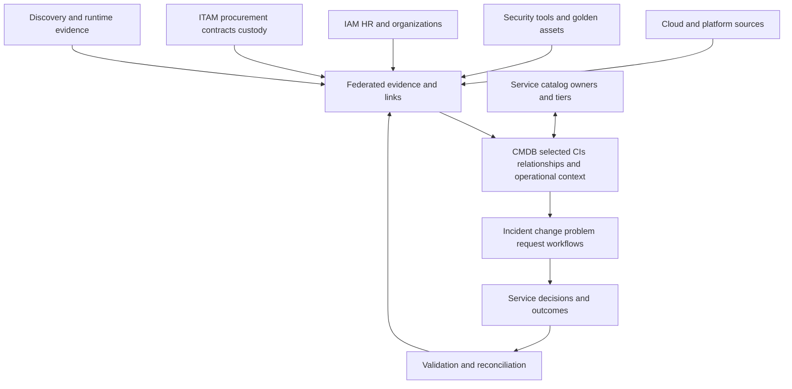

## CI model and grain

### Choose CIs from use cases

| Use case | Useful CI classes | Minimum relationships | Over-modeling risk |
|---|---|---|---|
| Incident impact | Business/technical service, app, component, location | depends-on, runs-on, supports | Every log/event becomes CI |
| Change impact | Changed CI, dependent service/components | depends-on, hosted-in, connected-to under semantics | Unvalidated graph creates false blast radius |
| Security remediation | Asset/CI, control/finding, owner/service | owned-by, protected-by, supports | Every finding copied as permanent CI |
| Cloud lifecycle | Account, service/resource/workload logical CI | hosted-in, runs-on, owned-by | Every five-second instance retained active |
| Ownership | Service/app/asset and accountable roles | owned-by, operated-by | Last user treated owner |
| Compliance evidence | In-scope CIs/control relationships | subject-to, protected-by | Tool report treated compliance proof |
| Financial planning | Service/application and cost links | funded-by/allocated-to as defined | CMDB duplicates full finance ledger |

### Grain rules

| Domain | Candidate grains | Decision question | Common mistake |
|---|---|---|---|
| Physical endpoint | Hardware device, OS installation, MDM enrollment, EDR sensor | Which object receives change/control? | All collapsed into one ID |
| Server | Hardware, VM, OS, database instance, application service | Which lifecycle/owner/dependency? | Hostname as permanent key |
| Cloud | Account, subscription, resource, logical workload, ephemeral instance | Which level matters to service/change? | Every runtime object as long-lived CI |
| Container | Cluster, namespace, service, deployment, pod, image | Durable logical service versus ephemeral execution | Pod count floods CMDB |
| SaaS | Vendor, tenant, application instance, integration | What can customer manage/own? | Provider infrastructure modeled without evidence |
| Network | Device, interface, virtual service, rule/policy | Which component affects connectivity? | IP address becomes CI identity |
| Identity | Person, account, service principal, role | Which object is configuration-managed? | Person/account merged |
| Data | Data product, database, dataset, store | Which data/service relationship matters? | Every file becomes CI |

### CI minimum contract

| Contract item | Example | Why |
|---|---|---|
| Class/grain | Cloud VM instance | Defines identity and fields |
| Purpose/use cases | Change impact and owner routing | Prevents data dumping |
| Stable identifiers | Provider + account + resource ID | Prevents duplicates/wrong writes |
| Required fields | Lifecycle, service, technical owner, environment | Supports use case |
| Relationships | runs-on/supports/hosted-in | Enables impact analysis |
| Source/field authority | Provider state; service catalog owner | Resolves conflict |
| Freshness | Class/field-specific evidence windows | Detects stale records |
| Lifecycle | Create/change/quarantine/retire/delete rules | Prevents active ghosts |
| Security/privacy | Classification/access/retention/audit | Protects sensitive topology/ownership |
| Steward/owner | CI class and field stewards | Resolves defects |
| Quality/acceptance | Required metrics and samples | Tests fitness |

## Source and field authority

A newer observation is not automatically authorized to overwrite a CMDB field. Authority can be technical, business, process, or derived.

| Field/process | Candidate authority | Supporting evidence | Conflict action | Unsafe shortcut |
|---|---|---|---|---|
| Cloud resource existence/state | Provider API/events in registered account | Scanner/runtime | Hold if source unhealthy | CMDB timestamp wins forever |
| Device serial | Validated ITAM/MDM/hardware evidence | EDR | Review collision | Hostname/IP overwrite |
| CI lifecycle | Approved lifecycle process plus technical deletion evidence | Cloud/EDR/discovery/owner | Propose/approve transition | One missing snapshot auto-retires |
| Business service | Approved service catalog | Deployment/app owner | Steward review | Infer from network traffic only |
| Business owner | Service governance/attestation | HR/CMDB | Human approval | Last user or cloud tag |
| Technical owner | App/platform ownership catalog | Deployment repo/team | Review effective date | Source popularity vote |
| Environment | Governed account/deployment hierarchy | Tags | Rule + conflict flag | Free-text tag alone |
| IP/hostname | Provider/DHCP/DNS/endpoint evidence under time | Scanner/network | Time-valid alias | Permanent identifier |
| Security coverage | Native control source plus policy | Asset-side evidence | Derived field with expiry | Security integration owns lifecycle |
| Service tier/criticality | Business impact/risk governance | Service owner | Approval and review | Vulnerability severity decides tier |
| Relationship | Approved config/deployment/service mapping/runtime by edge type | Multiple sources | Store source/type/time/confidence | Any communication becomes dependency |

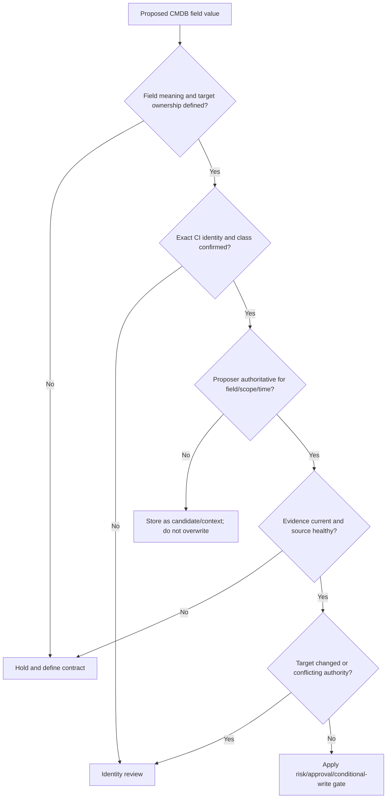

### Authority tiers for automation

| Tier | Example | Automation posture | Validation |
|---|---|---|---|
| Direct authoritative technical | Provider resource state/ID in complete account | Conditional update may be automated | Read-back plus source reconciliation |
| Governed derived | EDR coverage status computed under versioned policy | Automated to dedicated derived field with expiry | Rule trace and control read-back |
| Candidate context | Cloud owner tag or last user | Suggest/review, not authoritative overwrite | Owner/steward approval |
| Consequential business | Business owner, service tier, retirement | Human/process approval | Attestation/change record and read-back |
| Destructive | Merge, delete, mass retire | Strong approval, simulation, limits, rollback/restatement | Full downstream reconciliation |

### Plain-English deep-dive 2 - Reading context and writing authority are different risk levels

Reading an address from a directory helps deliver a package. Changing the official postal address can redirect every future package, bill, and legal notice. The write carries much more consequence than the read.

A security platform can safely consume a CMDB owner for context under access controls, yet it should not automatically replace that owner because a cloud tag contains another email. A golden asset record can propose a missing lifecycle correction, but the CMDB process may require owner/dependency review. Writes need exact CI identity, field ownership, before/after values, target version, approval proportional to consequence, audit, read-back, and correction. Technical API permission is not business authority.

## Identifier and reconciliation contract

### Identity hierarchy

| Identifier | Use | Risk | Control |
|---|---|---|---|
| CMDB internal CI ID | Address exact target record after mapping | Wrong mapping persists | Store immutable cross-reference and verify class |
| Provider resource ID | Strong cloud identity in namespace | Recreation/new ID; account collision | Namespace + lifecycle/tombstone |
| Device serial/UUID | Physical identity evidence | Duplicate/bad firmware/hardware replacement | Composite validation and conflict queue |
| Source native ID | Trace source record | Source tenant collision/rekey | Namespace and alias history |
| Service catalog ID | Logical service identity | Manual duplicates/renames | Governance and alias/version history |
| Hostname/FQDN | Human lookup/alias | Mutable/reused/cloned | Valid-time alias only |
| IP/MAC | Network/interface observation | Dynamic/NAT/randomized/reused | Time-bounded relationship, not primary key |
| Name | Display/search | Nonunique/changeable | Never destructive match key |

### Identification outcomes

| Outcome | Meaning | Write behavior |
|---|---|---|
| Exact existing CI | Strong namespaced ID and class agree | Consider field update under authority |
| Candidate existing CI | Composite evidence, ambiguity remains | Human/steward review; no destructive action |
| New CI | No existing exact/candidate under approved class/grain | Create after required-field/source checks |
| Relationship-only | Source entity differs from CI grain but connects | Add typed relationship if authorized |
| Duplicate CIs | Several CIs represent same entity | Merge proposal with survivor and downstream plan |
| False merge | One CI contains different entities | Split/unmerge and reconcile every dependent record |
| Historical/recreated | Name/alias reused after prior retirement | New CI with temporal alias/tombstone link |
| Unresolved | Evidence insufficient/conflicting | Quarantine; assign owner/SLA |

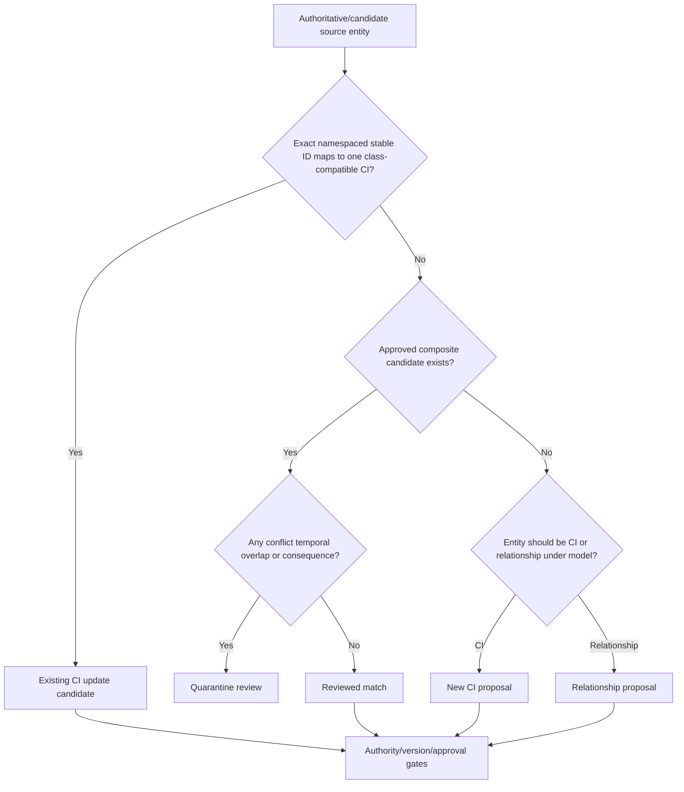

## Asset and CI lifecycle

Lifecycle must describe business/process reality and technical evidence. A missing observation is not automatically a retirement; a retired CI is not necessarily eligible for immediate deletion.

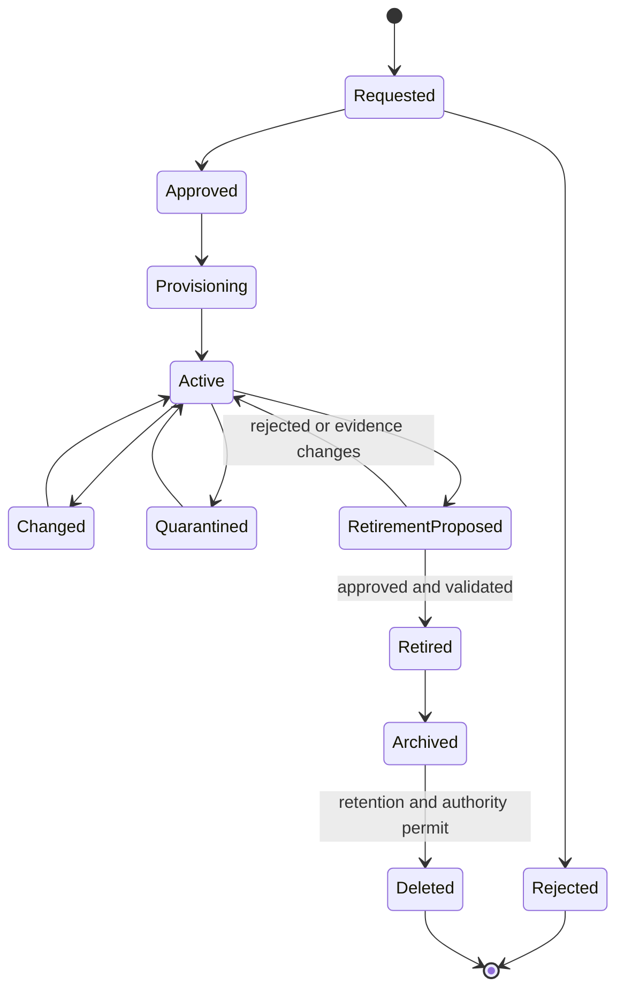

### Lifecycle criteria

| State | Entry evidence | Expected controls | Exit evidence | Common failure |
|---|---|---|---|---|
| Requested | Sponsor/purpose/class/owner/request ID | Approval/security/design | Approved or rejected decision | Shadow asset bypasses request |
| Approved | Authority/conditions/funding | Standard build/change policy | Provision begins | Approval not linked to actual CI |
| Provisioning | Deployment/purchase process with stable ID | Image/config/identity/logging | Technical/business acceptance | CI created with placeholder owner forever |
| Active | Current authoritative existence/use | Monitoring, controls, ownership, relationships | Change/quarantine/retire trigger | Stale record remains active |
| Changed | Approved detected/configured change | Impact/security validation | New baseline accepted | Field updates bypass change process |
| Quarantined | Incident/quality/safety reason and authority | Restricted use and investigation | Restore/retire decision | Permanent limbo |
| Retirement proposed | Technical absence/deletion/owner decision candidate | Dependency/data/access review | Approve/reject | One source outage triggers mass retire |
| Retired | No active service use; approvals/postconditions | Access revoked, data disposition, history retained | Archive/restore under rules | Active relationship remains |
| Archived | Retained for legal/audit/history | Restricted access/retention | Delete when authorized | Archive counted active |
| Deleted | Retention/authority allow irreversible removal | Audit/tombstone as required | None | History/incident evidence destroyed |

### Create workflow

Create only when the CI class/grain is in scope, a strong source proves existence, required identity/owner/service fields meet rules, no candidate duplicate exists, and the operation is allowed.

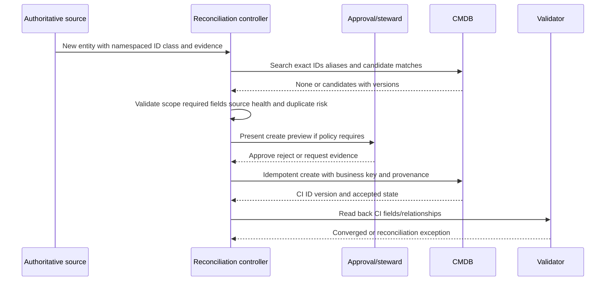

### Update workflow

Update only fields owned by the integration/source under a target version and preconditions. Preserve human notes and unrelated fields. Use patch semantics rather than replacing entire records when appropriate.

| Update control | Example | Failure prevented |
|---|---|---|
| Exact target | CMDB CI ID + class + external strong ID | Wrong-record write |
| Owned field allowlist | Derived `edr_status`, not owner/lifecycle | Authority creep |
| Before value/version | ETag/version 991 and current value | Lost concurrent update |
| Desired value/version | Policy result + source/provenance version | Ambiguous request |
| Preconditions | Source healthy, identity high confidence, no conflict | Bad data propagated |
| Approval | Required for owner/tier/lifecycle/relationship | Unauthorized consequence |
| Idempotency key | CI + fields + desired-state version | Duplicate/repeated effects |
| Audit | Actor, reason, before/after, source/rule, request/result | Untraceable change |
| Read-back | Retrieve persisted value/version | Accepted but not applied |
| Reconciliation | Compare source/desired/actual/business | Later overwrite/drift |

### Merge and split workflow

Merge is more than deleting a duplicate row. Incidents, changes, problems, requests, owners, relationships, history, contracts, security findings, tickets, dashboards, and external mappings may point to both CIs.

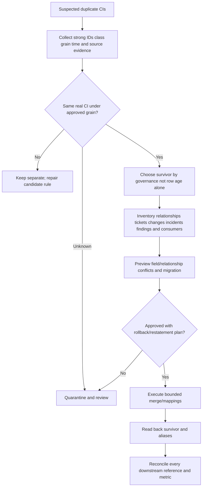

| Merge concern | Question | Safe behavior |
|---|---|---|
| Survivor | Which CI identity/history/process should remain? | Governed rule plus owner/steward approval |
| Attributes | Which values conflict? | Field-level authority, alternatives, history |
| Relationships | Which are duplicate, conflicting, stale? | Typed/time-valid review |
| Work records | Incidents/changes/problems/tickets on each? | Preserve/redirect references and audit |
| External mappings | Which source/golden IDs point to each CI? | Update mapping atomically/with reconciliation |
| Access/security | Does merge broaden visibility/permissions? | Access/privacy review |
| Rollback | Can merge be reversed accurately? | Snapshot/mapping/history and tested unmerge |
| Reporting | Which counts/trends need restatement? | Correction notice and stable definitions |

A false merge requires a split/unmerge process. Freeze consequential automation, identify which assertions/relationships/work records belong to each entity, create/restore distinct CIs, redirect references, correct fields/history, restate metrics, and validate consumers. Never just edit the display name.

### Retire and delete workflow

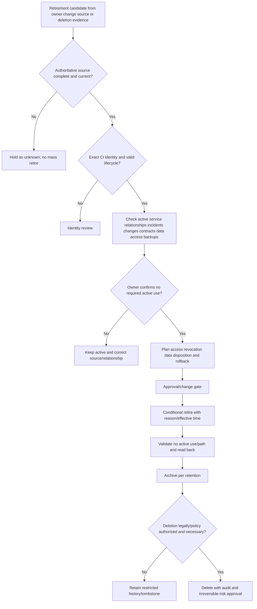

Delete should be rarer than retire. Historical configuration can support incident investigations, audit, change analysis, and trend restatement. Privacy, legal, contractual, security, and retention requirements can also require deletion/minimization. The authorized governance process decides; this chapter is not legal advice.

### Plain-English deep-dive 3 - Absence is not deletion

Imagine one train station disappears from today's drone survey because clouds blocked the camera. Automatically removing it from the railway map would be absurd. The absence describes the observation, not the station's lifecycle.

Snapshot-based integrations have the same risk. A source can omit records due to permission, pagination, region, filter, quota, outage, timing, or schema failure. Require a complete-run marker, source/account control totals, explicit deletion/tombstone semantics where available, identity certainty, grace or multi-signal logic appropriate to the class, dependency checks, and owner/process approval for consequential retirement. When a source is unhealthy, state becomes unknown rather than retired.

## Automated workflow architecture

### End-to-end state

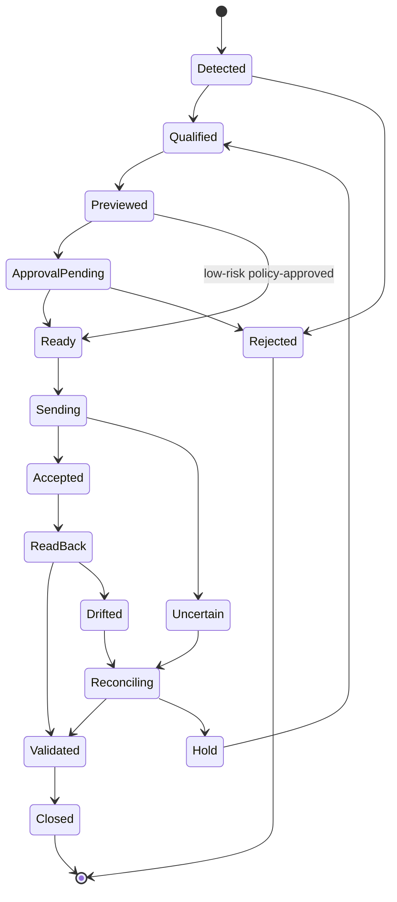

### Trigger-condition-action-postcondition

| Layer | Questions | Example |
|---|---|---|
| Trigger | Source event, schedule, manual request, reconciliation? | Provider deletion event plus complete snapshot |
| Qualification | Identity, scope, source health, policy, conflict? | Exact provider/CI mapping and no active conflict |
| Condition | Field authority, current target, lifecycle, exception? | Derived security field differs and is integration-owned |
| Decision | Create/update/merge/retire/delete/hold/notify? | Propose owner-reviewed retirement |
| Approval | Which role and evidence based on consequence? | Service owner + CMDB steward |
| Action | Exact conditional/idempotent operation? | Patch lifecycle with expected version |
| Technical result | Accepted/rejected/timeout/conflict? | API accepted request |
| Read-back | What did target persist? | CI retired, new version, relationships unchanged |
| Postcondition | Did source/target/business state converge? | No active service use/access and reports corrected |
| Reconciliation | What if drift/uncertainty remains? | Hold/retry/reread/manual repair |

```mermaid
flowchart LR
    T[Trigger] --> Q[Qualify identity scope source health]
    Q --> C[Conditions authority policy target state]
    C --> D[Decision and consequence tier]
    D --> A[Approval or policy gate]
    A --> X[Conditional idempotent action]
    X --> R[Read back target state]
    R --> P[Validate technical and business postconditions]
    P --> REC[Reconcile drift exceptions and retries]
    REC --> AUD[Audit metrics and learning]
```

### Approval tiers

| Change | Example | Suggested general gate | Why |
|---|---|---|---|
| Low-impact dedicated derived field | Current control-health state with expiry | Policy-approved conditional automation | Integration owns exact field; reversible |
| Add source alias/relationship | Exact strong ID and approved type | Automated or steward review by confidence/consequence | Can affect matching/impact |
| Create standard CI | Authoritative source, complete required fields, no candidate | Controlled automation with sampling | Volume requires scale; duplicates possible |
| Change owner/service/tier | Business context | Human owner/steward approval | Consequential authority |
| Retire CI | Confirmed no active use/dependencies | Owner/change approval | Can break incident/change visibility |
| Merge CIs | Duplicate consolidation | Steward + relevant owner; preview/reversal | Broad downstream effects |
| Delete CI | Retention-authorized removal | Strong governance/legal/privacy/CMDB approval | Irreversible/history loss |
| Mass update | Rule/source change affecting many CIs | Change board/risk gate, canary, diff limits | Large blast radius |

## Tickets, SLAs, and operational workflow

### Ticket episode identity

A CMDB health issue can recur. Define one logical episode using stable CI, rule/field, problem type, and policy version, with open/closed/reopened state. Retries must reuse the action/business key.

| Ticket field | Content | Purpose |
|---|---|---|
| Episode key | CI + issue type/field + rule/policy version | Prevent duplicate tickets |
| CI/source IDs | Exact CMDB and external identities | Target correct record |
| Expected/actual | Field/state/relationship difference | Reproducible work |
| Provenance | Source/time/run/rule/version | Explain evidence |
| Impact | Services/incidents/changes/security workflows affected | Prioritize |
| Owner/queue | Steward, source, CMDB, service, workflow owner | Route correct work |
| SLA/SLO clock | Start/pause/stop and tier | Fair measurable operation |
| Action | Investigate/correct/approve/merge/retire | Clear next step |
| Validation | Read-back and business postconditions | Prevent ticket-only closure |
| Related records | Change/incident/problem/duplicate ticket | Preserve context |

### Service-level design

An SLA is a formal commitment; an SLO is an objective. Organizations define them. Do not invent Zscaler or CMDB target times. Segment by consequence and task type: critical wrong owner causing security misrouting may need rapid containment, while low-impact optional-field completeness can use a backlog cadence.

| Work type | Start event | Pause allowed | Stop event | Misuse risk |
|---|---|---|---|---|
| Source outage | Trusted detection of degraded source | Approved external dependency | Completeness/freshness restored and reconciled | Stop at API recovery before backfill |
| Identity conflict | Conflict enters owned queue | Waiting for explicitly requested owner evidence under policy | Validated match/split/new disposition | Close as duplicate without survivor |
| Wrong consequential field | Confirmed wrong value affects decisions | Controlled change window if risk accepted | Target/source/downstream corrected | Ticket updated but CMDB still wrong |
| Orphan CI | Required relation/owner absent | Owner discovery under governed conditions | Approved owner/relation or retirement | Generic queue counted complete |
| Stale CI | Freshness rule exceeded | Approved offline/seasonal status | Current evidence or lifecycle disposition | Auto-retire to meet SLA |
| Merge | Duplicate validated | Change/owner review | Merge and downstream reconciliation complete | Count drops but references break |

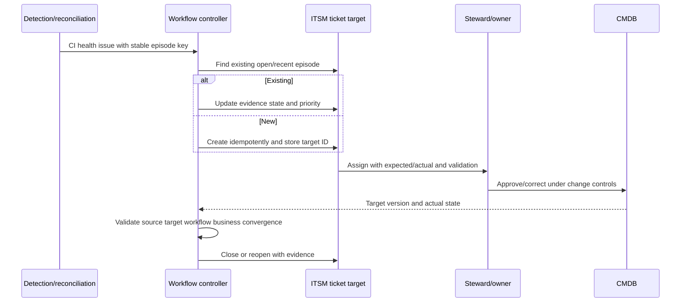

### Ticket failure modes

| Symptom | Cause | Control |
|---|---|---|
| Duplicate tickets | Random retry key, race, false-split CI | Stable episode/action key, target search, reconciliation |
| Wrong assignee | Stale/guessed owner | Role-specific authority and fallback steward |
| Premature closure | API/ticket success treated postcondition | CMDB read-back and business validation |
| Endless reopen | Source flaps or root defect unresolved | Hysteresis where appropriate, root-cause problem record |
| Lost human notes | Full record replacement | Field allowlist/patch semantics |
| SLA gaming | Auto-retire/delete to clear queue | Independent lifecycle validation and audit |
| Stale ticket | CI merged/retired, link not reconciled | Lifecycle/merge event reconciliation |
| Wrong severity | Optional field treated critical or service impact missing | Consequence and use-case classification |

## Audit, security, and privacy

CMDB data can expose sensitive architecture, ownership, locations, software, weaknesses, relationships, and crown-jewel context. Automation credentials can alter operational systems. Apply least privilege, separation of duties, secure secrets, access control, encryption, logging, retention/minimization, and change governance.

### Audit event

| Audit element | Example | Why |
|---|---|---|
| Logical action ID | Stable create/update/merge/retire operation | Correlate retries |
| Actor | Service identity and approving human/process | Accountability |
| Source evidence | Source IDs/run/times/schema/rule | Reproduce decision |
| Target | CMDB instance, CI ID/class/version | Bound operation |
| Before/after | Exact owned fields/relationships | Detect unintended change |
| Authority | Field/process policy and approval | Prove permission/decision right |
| Request/result | Redacted request, status, target ID/version | Troubleshoot API |
| Read-back | Persisted target state/time | Validate application |
| Reconciliation | Desired/actual/business comparison | Close ambiguity |
| Rollback/correction | Previous state and correction links | Recover/audit |

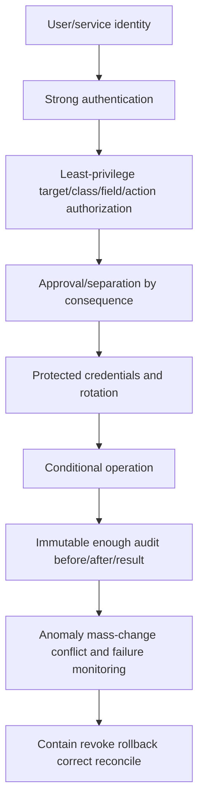

### Security threats

| Threat | Example | Mitigation |
|---|---|---|
| Credential theft | Token can update lifecycle/owner | Least privilege, vault, rotation, monitoring, rapid revoke |
| Forged/replayed trigger | Fake deletion event retires CIs | Authentication/signature/time/replay protection, source reread |
| Injection/unsafe fields | Source text alters target/query | Structured APIs, validation, encoding, allowlists |
| Excess scope | Integration writes all classes/fields | Dedicated role and field/action allowlist |
| Insider misuse | Manual merge hides asset | Approval/audit/anomaly review/separation |
| Data leakage | Export reveals crown-jewel graph | Need-to-know access, minimization, secure channels |
| Supply-chain compromise | Connector/library changes operations | Vendor/dependency review, integrity, update/testing |
| Destructive automation | Rule mass deletes records | Disable delete by default, diff limits, approval, backup/restatement |

### Plain-English deep-dive 4 - API permission is not decision authority

A building master key allows a technician to open every room. It does not authorize the technician to evict residents, change ownership records, or demolish walls. Capability and authority are different.

Likewise, a CMDB API token may technically edit owner, lifecycle, relationships, and classes. The workflow should be constrained to the smallest target classes, records, fields, transitions, and rates needed. Consequential fields require governed evidence and approval. Record both service identity and human/process decision. A successful API call proves technical acceptance, not business authorization or correct outcome.

## CMDB health dimensions and metrics

CMDB health is fitness for defined use cases, not row count or one color.

### Health dimensions

| Dimension | Question | Example test | Failure consequence |
|---|---|---|---|
| Scope completeness | Are required CI classes/populations represented? | Approved service/account registry vs CIs | Missing impact/assets |
| Required-field completeness | Are mandatory useful fields populated? | Non-null and meaningful values | Tickets cannot route |
| Correctness/accuracy | Do values represent approved current reality? | Authoritative sample/owner attestation | Wrong decisions |
| Compliance to model | Do CIs satisfy class/field/relationship rules? | Schema/business rule checks | Inconsistent records |
| Freshness | Are fields/evidence current for use? | Source observation age by class/field | Stale owner/lifecycle |
| Uniqueness | Is one intended CI represented once? | Duplicate candidate and sample analysis | Fragmented history/actions |
| Referential integrity | Do relationships point to valid CIs? | Orphan/dangling edge queries | Broken impact map |
| Relationship quality | Are required edges typed/current/correct? | Service map comparison and owner review | Wrong blast radius |
| Ownership/stewardship | Are accountable roles current and active? | Attestation/HR/team reconciliation | Unowned defects |
| Reconciliation | Do source/desired/target/business states agree? | Scheduled/event diff ledger | Silent drift |
| Auditability | Can values/changes be explained? | Source/rule/before/after trace | Investigation failure |
| Usefulness/adoption | Do processes use data correctly? | Incident/change task success | Perfect unused CMDB |

### Metrics

| Metric | Illustrative definition | Why useful | Anti-gaming caveat |
|---|---|---|---|
| In-scope CI coverage | Required active CIs represented / approved required population | Scope health | Independent registry and grain needed |
| Required-field completeness | Eligible CIs with meaningful required fields / eligible CIs | Operational readiness | Placeholder not complete |
| Freshness compliance | Fields/CIs inside class/field window / eligible | Currency | Use observation/effective time |
| Duplicate candidate rate | CIs in material duplicate candidates / eligible CIs | Identity debt | Detection rule changes affect trend |
| Validated false-merge/split rate | Confirmed errors / reviewed/sampled population | Resolution safety | Label/sample bias stated |
| Orphan rate | CIs missing required owner/service/parent/source relation / eligible | Stewardship/dependency gap | Applicability by class |
| Stale-active rate | Active CIs beyond evidence/lifecycle threshold / active CIs | Ghost records | Source outage/offline status separated |
| Relationship completeness | Required validated relationship patterns present / eligible CIs/services | Impact quality | More edges not automatically better |
| Relationship correctness | Sampled/reviewed edges supported by evidence / reviewed edges | Trust | Sampling method matters |
| Reconciliation drift | Source/desired/target mismatches / compared CIs/fields | Automation health | Segment expected manual differences |
| Write rejection/conflict | Conditional writes rejected/conflicted / attempts | Safety/coordination | Higher rate can mean safeguards working |
| Read-back validation | Writes with target state confirmed / accepted writes | Technical reliability | Read-back still may not prove business outcome |
| Time to resolve defect | Detection to validated correction percentiles | Operations | Define pause/start/stop honestly |
| Ticket duplicate/misroute | Duplicate or wrong-owner episodes / reviewed tickets | Workflow quality | Capture silent bounce |
| Lifecycle accuracy | Sampled active/retired states supported / reviewed CIs | Service map reliability | Sample all important classes |
| Change/incident usefulness | Tasks where CMDB context was accurate/useful under rubric | Value | User survey alone can be biased |

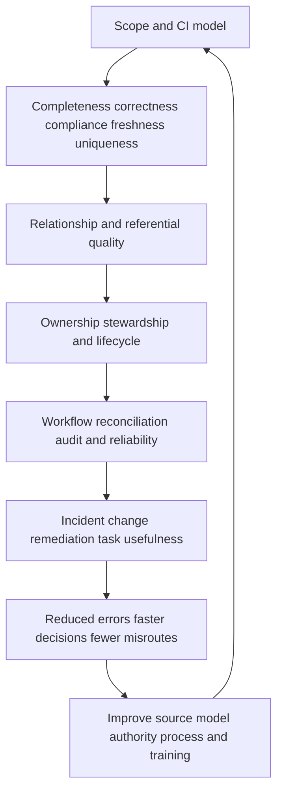

### Health score caution

A composite score can summarize, but never average a critical red condition into green. Show dimensions, affected use cases, source health, confidence, denominator, thresholds, and actions. A 95 percent completeness score can hide the missing owner on the one crown-jewel service. Use vetoes or critical cohorts where consequence requires.

## Orphan, stale, and duplicate management

### Orphan taxonomy

| Orphan type | Example | Possible explanation | Treatment |
|---|---|---|---|
| No owner | Production CI lacks accountable role | Catalog gap/owner departure | Steward/owner escalation, not guessed owner |
| No service | Server not linked to service | Shared infrastructure/lab/stale/discovery gap | Classify purpose or retire |
| No parent/account | Cloud resource lacks account hierarchy | Mapping/source defect | Repair relationship/source |
| Dangling relationship | Edge target deleted/missing | Incorrect delete/order | Restore/redirect/expire edge |
| No current source evidence | CI exists only in CMDB | Offline/seasonal/retired/source blind spot | Investigate lifecycle/source health |
| No external mapping | CI cannot link to golden/source entity | Identifier drift | Reconcile identity |
| No ticket owner | Health defect remains in generic queue | Workflow/ownership design gap | Escalate via steward hierarchy |

### Stale handling

Staleness is class/field/use specific. A business-service owner may require periodic attestation; cloud resource state may require near-current API evidence; a physical serial rarely changes; an IP address changes frequently. Never apply one stale threshold to every field.

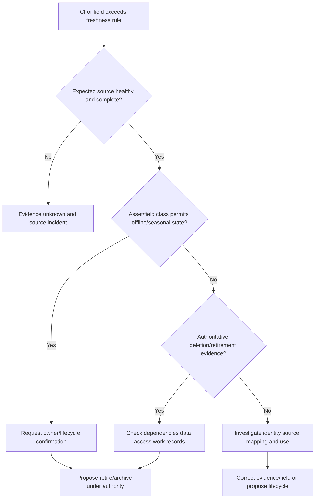

## Troubleshooting

### Failure patterns

| Symptom | Plausible causes | First check | Containment |
|---|---|---|---|
| Duplicate CIs spike | Unstable key, source ID transform, retry, false split | Create business key/source IDs/rule version | Pause creates |
| CI count drops | Mass merge/retire/delete, source scope, report filter | Audit and lifecycle control totals | Block destructive actions/report |
| Owner field reverts | Competing integration/manual edit/authority conflict | Audit actor/version/source | Pause field writer |
| Wrong CI updated | Stale external mapping/false merge/class collision | Exact IDs/class/before-after | Revoke/pause writes and restore |
| Update rejected | Version conflict/validation/access | Target response and current version | Reread; do not blind retry |
| Timeout after write | Target may have acted | Query by idempotency/business key | No new random-key retry |
| Mass retirement | Incomplete snapshot interpreted deletion | Source totals/complete-run/tombstones | Pause retirement and classify unknown |
| Retired CI still used | Hidden dependency/owner error | Incidents/changes/runtime/service evidence | Restore active/contain impact |
| Deleted record reappears | Missing tombstone or source replay | Source lifecycle and mapping | Hold resurrection |
| Orphan count rises | Relationship/owner source outage, schema change | Source health/join rejects | Render degraded, no blind owner assignment |
| Tickets duplicate | False split, retry key, race, target search failure | Episode/action IDs | Pause creates/reconcile |
| Ticket closes, CI wrong | Workflow success confused outcome | CMDB read-back/postconditions | Reopen and repair |
| Dashboard/detail mismatch | Snapshot/filter/grain/cache/version | Exact query/control totals | Caveat view |

### Layered troubleshooting runbook

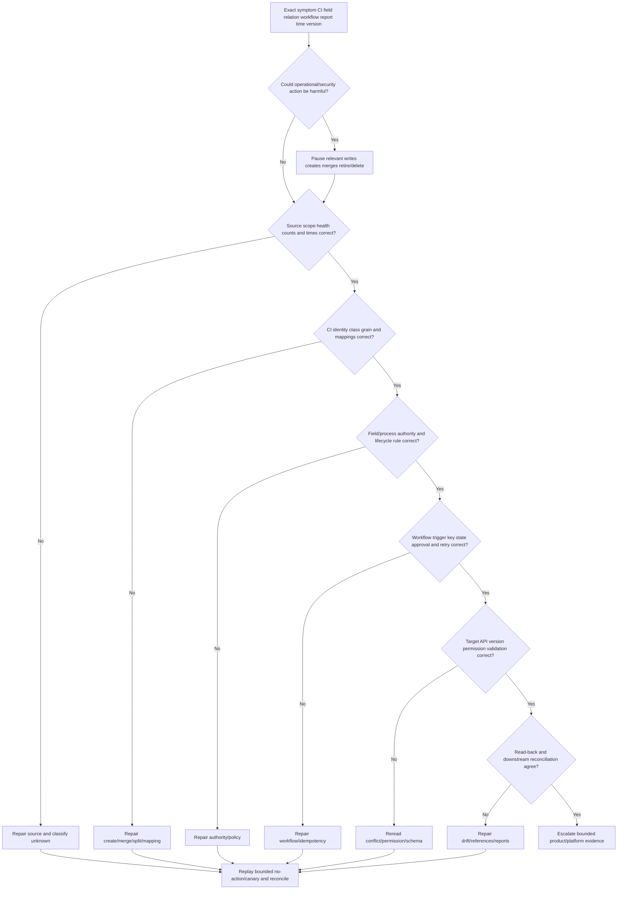

### Investigation sequence

1. State exact expected/actual CI, field, relationship, lifecycle, ticket, or report behavior.
2. Capture CMDB instance, CI ID/class/version, source IDs, workflow/action/approval/ticket IDs, UTC times, and affected use cases.
3. Quantify blast radius: CIs, services, incidents, changes, owners, tickets, security findings, reports, exports, and actions.
4. Pause the narrowest relevant writes; preserve safe reads and audit/reconciliation evidence.
5. Verify independent source scope, native counts, complete-run markers, deletion semantics, and last good/first bad.
6. Verify exact identity mapping, namespaces, class/grain, aliases, valid intervals, false merge/split evidence.
7. Verify field/process authority, current source health/freshness, lifecycle criteria, and approval.
8. Trace workflow trigger, qualification, business/idempotency key, state, retries, timeout, dead-letter/hold, and rate limits.
9. Inspect target API response, validation error, version conflict, permissions, before/after, and audit actor.
10. Read target state directly; compare desired, requested, accepted, persisted, and business outcomes.
11. Repair in shadow/canary mode, then reconcile all downstream references and historical metrics.
12. Communicate facts, impact, uncertainty, containment, owners, decisions, and next evidence checkpoint without invented ETA/root cause.

### Evidence package

| Evidence | Content | Why | Safety |
|---|---|---|---|
| Impact | Affected CIs/services/workflows/decisions/counts | Severity/containment | Restrict sensitive topology |
| Timeline | UTC last good/first bad/runs/requests/changes | Correlation | State clock semantics |
| IDs | Source/entity/CMDB CI/version/action/ticket/change/report | End-to-end trace | Redact tokens/secrets |
| Source | Scope, counts, pages, deletion/tombstone, samples | Distinguish source defect | Secure channel/minimization |
| Identity | Strong IDs, aliases, class/grain, match/merge evidence | Wrong-target diagnosis | Protect personal data |
| Authority | Field/process rules and approvals | Explain allowed change | Limit privileged details |
| Target audit | Actor, before/after, response, read-back | Prove actual state | Tamper-resistant access |
| Downstream | Relationships/incidents/changes/tickets/reports | Reconciliation scope | Need-to-know |
| Tests | Hypothesis, prediction, method, result | Reproducibility | Non-destructive first |

## Complete synthetic NMH CMDB scenario

### Objectives and model

NMH wants to improve a fictional CMDB used for incident/change routing and security remediation. It chooses a focused model rather than copying every asset field. The controlled synthetic as-of time is 2026-08-24 00:00 UTC.

| CI class | Grain | Key use | Strong identity | Required relationships |
|---|---|---|---|---|
| Business service | One customer/business capability | Impact/governance | Service catalog ID | owned-by, supported-by |
| Technical service | One managed technical capability | Incident/change | Technical catalog ID | supports, depends-on |
| Application | One deployable/logical app | Ownership/change | App catalog/deployment ID | depends-on, runs-on |
| Cloud VM | One provider resource lifecycle | Technical/security action | Provider+account+resource ID | hosted-in, runs/supports |
| Database | One managed database instance/service | Data/availability impact | Provider/database ID | stores/supports/backed-up-by |
| Endpoint | One managed OS installation | Support/security remediation | Device+installation identity | assigned-to, owned/operated-by |
| Network service | One managed gateway/load-balancer/virtual endpoint | Connectivity/exposure | Controller/provider ID | exposes/supports/protected-by |

### Source and authority matrix

| Source | Synthetic authority | Candidate context only | Write boundary |
|---|---|---|---|
| Cloud provider | Resource ID/existence/state/account/region | Owner tags | May update dedicated technical fields under complete source |
| Service catalog | Service/app IDs, business/service owners, tier | Component runtime | Consequential fields need catalog governance |
| Deployment system | App deployment/version/team/run relationship | Business owner | Update deployment-derived fields/edges |
| EDR | Sensor health/policy observation | CI owner/lifecycle | Dedicated derived control-status field only |
| Scanner | Scan/finding evidence | OS/hostname confidence-dependent | No direct owner/lifecycle overwrite |
| IAM/HR | Account/worker/department status | Technical service ownership | Role relationships under defined rule |
| ITAM | Purchase/custody/warranty/serial | Technical active state | Custody/financial fields by contract |
| CMDB owner process | CI lifecycle/approved relationships/manual context | Native technical observation | Final authority for governed process fields |

### Synthetic baseline

| Health measure | Synthetic count/rate | Finding | Caveat |
|---|---:|---|---|
| Active in-scope CIs | 18,420 | Bounded seven-class population | Not all enterprise assets |
| Required-field complete | 91.8 percent | Owner/service gaps concentrated in cloud CIs | Placeholder excluded |
| Freshness compliant | 89.4 percent | One discovery domain lagging | Class/field windows differ |
| Duplicate candidates | 426 | 98 high-confidence, 328 review | Candidate is not confirmed duplicate |
| Orphan CIs | 731 | Missing owner/service/parent/source patterns | Applicability by class |
| Stale active CIs | 904 | Some seasonal/offline/source-degraded | Not auto-retired |
| Relationship completeness | 84.7 percent | Application-to-service gap | Definition/rules synthetic |
| Reconciliation drift | 312 field/record differences | Owner/lifecycle/control fields mixed | Expected manual differences separated |
| Open health tickets | 248 | 17 duplicate/misrouted suspected | Ticket count not quality |

### Safe automated EDR-derived update

NMH permits one low-impact integration-owned field: `derived_edr_coverage_state`, with source time, policy version, expiry, and provenance. It cannot change CMDB owner, lifecycle, tier, class, or service.

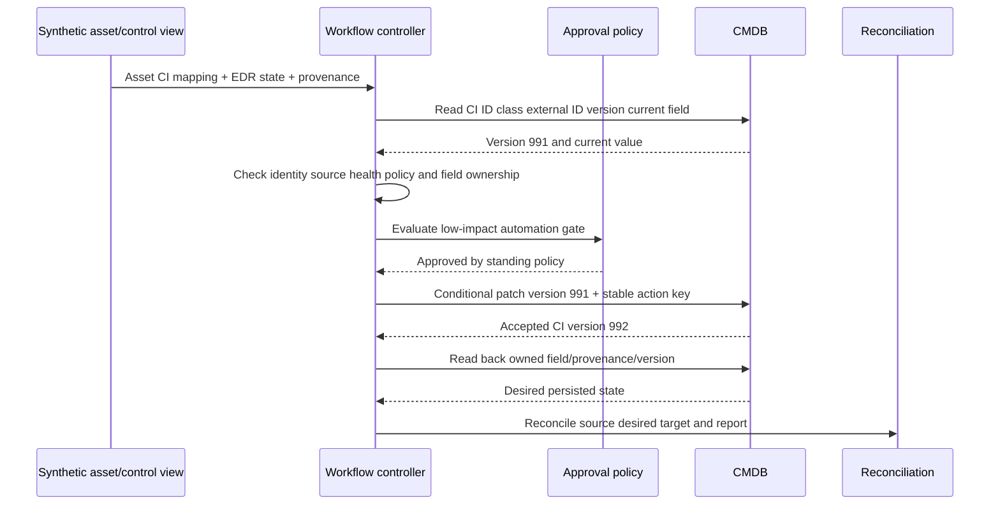

### Synthetic incident: wrong CI update is rejected, then a later bug bypasses the gate

Two cloud resources reused hostname `ORD-API-17` at different times. The correct identity uses provider resource ID. A stale mapping links the new golden asset to the retired CMDB CI.

**First attempt, safeguard works:** The workflow reads the target and finds the external provider ID does not match. It rejects the patch and opens an identity-conflict ticket. No CMDB harm occurs. A lower automation-success rate is good here because the control prevented a false update.

**Later regression, safeguard fails:** A workflow release checks only hostname and skips external-ID precondition for one retry branch. It writes `edr_missing` to the retired CI, creates a remediation ticket for its former owner, and changes a dashboard count. The live CI remains falsely healthy in CMDB.

1. **Contain:** Disable the affected write action/version; preserve read/reconciliation; pause dependent ticket creates.
2. **Scope:** Query audit/action version, hostname, mapping, CI IDs, and all writes through the faulty branch. Fifty-three updates, 21 tickets, and four reports are candidates.
3. **Root defect:** Retry branch omitted strong external-ID/class/version preconditions.
4. **Contributing defect:** Stale mapping survived retirement and hostname alias lacked valid-to time.
5. **Safeguard failure:** Test suite covered normal path but not timeout/retry with recreated hostname.
6. **Repair:** Restore strong-ID/class/version invariant in shared write function; close alias validity; correct mapping; reverse fields only where before/after/audit proves safe.
7. **Reconciliation:** Correct 53 target fields/mappings, link/cancel 21 false tickets without losing comments, restate four reports, validate live/retired CI states, and review external consumers.
8. **Validation:** Cloud IDs/state, golden mapping, CMDB fields/versions, owner/service links, tickets, metrics, and business routing converge.
9. **Prevention:** Invariant tests for every branch, canary writes, mass-anomaly monitor, mapping expiry on retirement, action policy centralized, and game day.

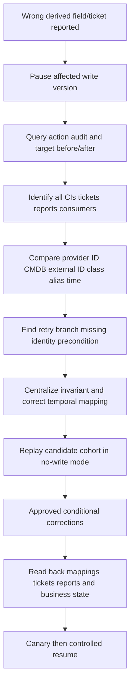

### Lifecycle cleanup campaign

| Cohort | Synthetic records | Action | Approval | Validation |
|---|---:|---|---|---|
| Exact cloud-deleted, no dependencies, owner confirmed | 120 | Retire | Standing + sampled steward | Provider tombstone, no active relations/work, read-back |
| Stale but seasonal/offline | 85 | Keep active with status/review date | Owner | Expected observability and service need |
| CMDB-only unknown | 402 | Investigate source/owner | Steward hierarchy | Current evidence or approved disposition |
| High-confidence duplicates | 98 candidates | Merge in small waves | Steward + affected owners | References/mappings/metrics reconcile |
| Ownerless active production | 143 | Assign accountable/technical roles | Service governance | Attestation and ticket route test |
| Archived past retention with deletion requirement | 37 | Delete/minimize per governance | Legal/privacy/CMDB authority | Audit/tombstone/consumer validation as required |

### NMH data-health roadmap

| Phase | Focus | Exit evidence | Avoid |
|---|---|---|---|
| 1. Stabilize | Source health, identity, audit, pause unsafe writes | Control totals and exact mappings trusted | Mass cleanup on bad data |
| 2. Define | CI model, authority, lifecycle, owners, quality | Approved contracts and tests | Copy every field |
| 3. Prove | One low-impact derived field and one class create | Conditional/read-back/reconciliation passes | Automate merge/delete first |
| 4. Clean | Orphan/stale/duplicate cohorts with review | Corrected references and metrics | Close tickets without postcondition |
| 5. Expand | More classes/relations by use-case value | Canary acceptance and runbooks | Big-bang rollout |
| 6. Institutionalize | Reviews, SLOs, training, incident/change integration | Stable usefulness and recurrence reduction | Treat CMDB as one-time project |

## ServiceNow concept without dependency

ServiceNow publicly describes CMDB concepts including CIs, relationships, data acquisition, external integrations, visualization/reporting, lifecycle, automation, trusted data, and CMDB data health. It is a useful interview example because many enterprises use ServiceNow. The safe architecture remains portable.

| Vendor-neutral concept | ServiceNow-style conceptual reference | Portable implementation requirement |
|---|---|---|
| CI | Configuration item record/class | Explicit class/grain/identity regardless of product |
| Relationship/service map | CI dependencies/business context | Typed/directed/time-valid evidence |
| Data acquisition/connectors | External/discovery data population | Source contract, control totals, security |
| Identification/reconciliation | Avoid duplicates and govern source values | Strong IDs, authority, conflict/review |
| CMDB health | Completeness/correctness/compliance/freshness-style concerns | Use-case metrics and sampling |
| Workflow/change | Requests, incidents, changes, tasks | Stable state, approval, idempotency, validation |
| Access/audit | Roles/history | Least privilege and full before/after trace |

Do not say AEM requires ServiceNow. Do not claim a ServiceNow connector supports a particular object, direction, or action without current official documentation and licensed tenant testing. The same safety design applies to another CMDB/ITSM platform, a custom repository, or a federated service-management architecture.

## Arti bridge: support operations to configuration trust

Microsoft escalation work relies on correct configuration context. A wrong tenant, user, device, client version, network path, service dependency, or ownership assumption sends investigation in the wrong direction. Arti used stable IDs and timestamps, compared expected/actual, coordinated changes, escalated defects with evidence, validated fixes, and communicated customer impact.

| Existing strength | CMDB transfer | Learning boundary | Honest interview sentence |
|---|---|---|---|
| Scope and identity | Exact CI/source mapping | CMDB class/identifier rules | "I verify target identity before any correction." |
| Dependency troubleshooting | CI/service relationships and impact | Formal service mapping tools | "A relationship must be typed, current, and evidenced." |
| Change/fix validation | Conditional change, rollback, postconditions | Customer CMDB change authority | "Accepted write is not validated outcome." |
| Engineering escalation | IDs, timeline, expected/actual, minimal evidence | Product-specific diagnostics | "I provide a compressed reproducible experiment." |
| SQL/analytics | Data-quality, duplicates, aging, reconciliation metrics | Target query/report specifics | "I measure fitness by use case, not row count." |
| CRITSIT/RCA | Contain wrong actions, repair, reconcile, prevent | CMDB incident operations | "I preserve audit and correct every downstream echo." |
| Customer leadership | Owners, governance, status, adoption | Formal configuration-management program | "I facilitate; accountable customer owners decide." |

## Labs and rehearsal

All labs use synthetic data and general tooling. They do not require Zscaler AEM or ServiceNow and do not imply production experience.

### Lab 1 - CMDB use-case charter

Define incident impact, change impact, security remediation, and ownership use cases. State consumers, decisions, CIs/fields/relationships, freshness, quality, and value. **Pass:** no "store everything" objective.

### Lab 2 - CI class/grain model

Define service, application, cloud VM, database, endpoint, and network-service classes. Specify strong IDs, required fields, relations, lifecycle, source/field authority, steward, and retention. **Pass:** runtime pod/sensor/interface grains are not accidentally merged.

### Lab 3 - Authority matrix

Map cloud existence, serial, lifecycle, owner, service, environment, security coverage, criticality, and relationships to authorities/fallbacks/conflicts. **Pass:** newest timestamp cannot overwrite all fields.

### Lab 4 - Identifier collision

Create hostname/IP reuse, duplicate serial, provider ID recreation, source-tenant collision, and renamed service cases. Decide match/new/relationship/review. **Pass:** no destructive action uses weak identifier alone.

### Lab 5 - Create workflow

Simulate authoritative new cloud CI, target search, candidate review, required fields, idempotent create, read-back, and reconciliation. Add a timeout-after-create. **Pass:** one CI exists after retry.

### Lab 6 - Conditional update

Update only a dedicated derived control field with expected CI/version and source provenance. Simulate concurrent human edit. **Pass:** conflict causes reread/review, not overwrite.

### Lab 7 - Merge/unmerge

Create duplicate CIs with incidents, changes, tickets, relationships, and external mappings. Plan survivor, conflict resolution, approval, merge, read-back, reference reconciliation, and reversal. **Pass:** no history/consumer is orphaned.

### Lab 8 - Retirement

Compare provider deletion, incomplete snapshot, seasonal offline CI, owner request, and unknown source. Apply dependency/data/access/work checks. **Pass:** absence alone never retires.

### Lab 9 - Delete governance

Build retention/privacy/legal/audit scenarios for archived CIs. Decide retain/restrict/minimize/delete with authority. **Pass:** deletion is not used merely to improve health score.

### Lab 10 - Ticket episode

Create stable CI+issue+policy episode keys; handle update, timeout, duplicate, close, validation failure, reopen, merge, and retirement. **Pass:** target state and comments/history remain intact.

### Lab 11 - CMDB health scorecard

Calculate scope, required fields, correctness sample, compliance, freshness, duplicates, orphans, relationships, reconciliation, write validation, ticket quality, and usefulness. **Pass:** dimensions and critical cohorts remain visible.

### Lab 12 - Wrong-update game day

Run the NMH retry-branch identity-gate incident. Pause writes, scope audit, correct mapping/fields/tickets/reports, validate, and canary resume. **Pass:** all downstream references converge.

### Lab 13 - Source outage game day

Simulate an incomplete cloud snapshot proposing 3,000 retirements. Use complete-run markers/control totals/unknown state and block writes. **Pass:** no mass retirement.

### Lab 14 - ServiceNow-neutral whiteboard

Explain CIs, relationships, sources, identification/reconciliation, lifecycle, workflow, health, and ITSM using ServiceNow as one conceptual example, then redraw vendor-neutral. **Pass:** no dependency or unsupported connector claim.

### Lab 15 - Governance workshop

Assign CI class steward, source owner, field owner, service owner, workflow owner, CMDB platform owner, security/privacy, change approver, risk owner, and TSM roles. **Pass:** technical permission and decision authority are separate.

### Lab 16 - Interview capstone

Present NMH model, baseline, safe derived update, wrong-update incident, cleanup campaign, roadmap, metrics, product/source boundaries, and Arti bridge. **Pass:** every number/behavior is synthetic.

## Common misconceptions to correct

| Misconception | Correction |
|---|---|
| CMDB should store every enterprise data point | Store/federate focused data needed for service/configuration decisions |
| Every asset must be a CI | CI selection/grain follows management use cases |
| CMDB replaces ITAM/security/cloud/IAM sources | These capabilities retain distinct authority and can federate |
| Single source of truth means one physical database owns all fields | Authority is field/process/purpose/time specific |
| Newest source value should win | Source authority, semantics, health, effective time, and conflict matter |
| Golden asset record can safely overwrite CMDB | It can provide evidence/proposals; target authority/gates still apply |
| API token permission equals authorization | Technical capability is not business/process decision right |
| Upsert solves identification | Weak keys turn upsert into wrong update/create |
| Hostname/IP identifies a CI permanently | Both are mutable/reused/time-bound |
| Successful API response means update completed | Read back target and validate business postcondition |
| Retry with a new key is harmless | It can duplicate CIs/tickets/changes |
| Merge means delete one duplicate row | Reconcile fields, relationships, history, work records, mappings, reports, consumers |
| Correcting a false merge means renaming the CI | Split assertions/references and validate every downstream use |
| Missing snapshot record means retired | Source may be incomplete; require deletion/lifecycle evidence |
| Retired means delete now | Retain/archive history under policy; delete only with authority/need |
| Old last-seen automatically means stale CI should retire | Check class, source health, offline/seasonal status, owner, dependencies |
| Generic queue counts as owner | It may be temporary stewardship, not accountability |
| More relationships always improve CMDB | Incorrect/stale edges worsen impact analysis |
| One health score proves CMDB quality | Show dimensions, use cases, critical cohorts, source health, confidence |
| Lower CI count proves cleanup value | False merges/deletes can make count look better |
| Closed data-quality ticket proves correction | Validate target/source/consumer/business state |
| ServiceNow is required for AEM CMDB value | It is one public integration/platform example; architecture can be vendor-neutral |
| Public AEM page defines exact CMDB write semantics | It supports positioning only; verify current docs/tenant behavior |

## Official Source Anchors

Research/source date: **2026-08-24**.

Zscaler sources support bounded AEM/Data Fabric CMDB health, automated update, workflow, integration, golden-record, relationship, and reporting positioning. NIST sources support security-focused configuration management and IT asset-management concepts. ServiceNow and Atlassian pages provide industry/vendor explanations of CIs, relationships, discovery/data acquisition, federation, automation, data health, lifecycle, audit, and ITSM uses. Vendor pages are not independent standards or guarantees. None establishes Zscaler proprietary mappings/workflows, a customer's CI model/authority, universal metrics/SLAs, compliance, or outcomes.

| Source | URL | Used for | Boundary |
|---|---|---|---|
| Zscaler Asset Exposure Management | https://www.zscaler.com/products-and-solutions/caasm | Public CMDB health, auto-update, workflows, golden records, relationships, reporting positioning | Verify current licensed tenant/connectors/actions; no exact semantics/defaults |
| Zscaler Data Fabric for Security | https://www.zscaler.com/products-and-solutions/data-fabric | Public integration, correlation/enrichment, business logic, workflows/reports | No internal topology/workflow guarantee |
| Zscaler Data Fabric Integrations | https://www.zscaler.com/products-and-solutions/data-fabric/integrations | Public current catalog candidate sources/targets, including ServiceNow listing | Catalog is dynamic; verify exact connector object/direction/action/version |
| NIST SP 800-128 | https://csrc.nist.gov/pubs/sp/800/128/upd1/final | Security-focused configuration management, monitoring, control, governance concepts | Federal guidance; not CMDB platform procedure |
| NIST SP 1800-5 | https://csrc.nist.gov/pubs/sp/1800/5/final | IT asset-management practice-guide perspective connecting asset facts | 2018 example architecture; not universal design |
| NIST SP 800-53 Rev. 5 | https://csrc.nist.gov/pubs/sp/800/53/r5/upd1/final | Configuration management, inventory, access, audit, change, monitoring controls | Requires selection, tailoring, implementation, assessment |
| ServiceNow: What is CMDB? | https://www.servicenow.com/products/it-operations-management/what-is-cmdb.html | Public concepts for CIs, relationships, scanning/data population, federation, automation, ownership, ITSM | Vendor-specific explanation, no ServiceNow dependency |
| ServiceNow CMDB | https://www.servicenow.com/products/servicenow-platform/configuration-management-database.html | Public product positioning around systems, lifecycles, automation, data acquisition, trusted data, reporting | Marketing/product page; verify actual licensed/configured behavior |
| Atlassian: What is a CMDB? | https://www.atlassian.com/itsm/it-asset-management/cmdb | Industry/vendor explanation of CIs, relationships, ITAM distinction, federation, health, ITSM value/challenges | Vendor content; not a standard or guarantee |

## Likely Interview Questions

### Q1. What is a CMDB, and how does it differ from ITAM and CAASM?

**Model answer:** A CMDB stores selected configuration items and relationships needed to manage/deliver services and support incident/change/problem processes. ITAM emphasizes financial, contractual, custody, and lifecycle facts. CAASM/AEM combines multi-source security/asset observations to resolve context/gaps. They can exchange or federate data, but authority remains field/process/purpose/time specific; not every asset or observation must be a CI.

### Q2. How do you decide which CIs and fields to manage?

**Model answer:** Start with service decisions/use cases, then define CI classes/grain, stable IDs, required fields/relationships, source/field/process authority, freshness, lifecycle, security/privacy/retention, stewards, consumers, and quality acceptance. I keep detailed evidence in its natural system where appropriate and link/federate it rather than turn the CMDB into a dumping ground.

### Q3. How would you automate CMDB creation and updates safely?

**Model answer:** Verify source scope/health, exact namespaced identity/class/grain, candidate duplicates, field authority, target current version, owned field allowlist, lifecycle/preconditions, and approval by consequence. Preview/diff, use stable business/idempotency keys and conditional patches, capture before/after/audit, read back persisted state, then reconcile source, desired, target, tickets/reports, and business postconditions.

### Q4. What are safe create, merge, retire, and delete criteria?

**Model answer:** Create from authoritative evidence with required fields and no duplicate candidate. Merge only after same-entity proof, survivor/conflict/downstream/reference/rollback planning and approval. Retire after complete current source plus exact identity, no required active use/dependencies, owner/change approval, access/data postconditions. Delete only when retention/privacy/legal/CMDB authority permits and history/consumers are handled; absence alone never deletes/retires.

### Q5. How do tickets and SLAs fit CMDB health?

**Model answer:** Use one stable CI+issue+policy episode, exact expected/actual/provenance/impact, role-appropriate owner, and explicit start/pause/stop criteria. Create/update/reopen idempotently and reconcile after CI merge/retirement. SLAs are formal commitments and SLOs objectives defined by the organization; closure requires target read-back and source/business validation, not just ticket status.

### Q6. Which metrics show CMDB health?

**Model answer:** By use case and class: scope and required-field completeness, correctness samples, model compliance, freshness, uniqueness/false merge-split, orphan/stale-active rates, relationship completeness/correctness, ownership currency, reconciliation drift, write conflict/rejection, read-back validation, time to validated correction, ticket duplicate/misroute, lifecycle accuracy, auditability, and process usefulness. I do not hide a critical red cohort in one average score.

### Q7. How would you troubleshoot a wrong automated CMDB update?

**Model answer:** Pause the affected writes, capture IDs/versions/audit/before-after, scope downstream impact, then test source scope/health/counts, CI identity/class/grain/mapping, field/process authority/lifecycle, workflow trigger/key/state/retry/approval, target API/version/permission, read-back, and downstream reconciliation. Repair in shadow/canary mode, correct every reference/ticket/report, validate, then controlled resume.

### Q8. How do you discuss ServiceNow and your experience honestly?

**Model answer:** ServiceNow is a familiar CMDB/ITSM example whose public pages describe CIs, relationships, data acquisition, automation, lifecycle, health, and workflows. The safety design is vendor-neutral, and AEM does not inherently require ServiceNow. My production strength is Microsoft escalation, configuration/dependency evidence, tickets, change/RCA, analytics, and validation. I practiced this CMDB workflow synthetically, not as production AEM/ServiceNow administration.

## 30-Second Memory Hooks

| Concept | Memory hook |
|---|---|
| CMDB | Railway operations map |
| CI | Component worth managing for service delivery |
| ITAM | Purchase, contract, custody, disposal ledger |
| CAASM/AEM | Multi-source asset/security context and gaps |
| CI scope | Begin with decisions, not data dumping |
| Grain | Station, platform, train are different objects |
| Authority | Field/process/purpose/time, not newest wins |
| Read versus write | Context lookup versus official address change |
| Identity | Namespace + class + lifetime before update |
| Create | Prove new, required, owned, nonduplicate |
| Update | Owned fields + expected version |
| Merge | Migrate every downstream reference |
| Split | Undo every false-merge echo |
| Retire | Close active use; preserve history |
| Delete | Rare, authorized, retention-aware |
| Absence | Not deletion |
| Idempotency | One logical change despite retries |
| Conditional write | Stop if target edition changed |
| Read-back | Accepted is not persisted |
| Reconciliation | Source + desired + target + business converge |
| Ticket | Work order, not outcome |
| SLA/SLO | Formal promise versus objective |
| Health | Fitness by use case, not row count |
| ServiceNow | One example, no dependency |
| Arti bridge | Configuration/RCA/validation transfers; product admin does not |

## Completion Checklist

- [ ] I define CMDB, CI, CI class/grain, ITAM, discovery, golden asset record, authority, identifier, idempotency, reconciliation, lifecycle, ticket, SLA/SLO, and data quality.
- [ ] I distinguish CMDB, ITAM, security asset/CAASM, discovery, cloud, IAM/HR, service catalog, and ticket/change strengths.
- [ ] I begin CI modeling with incident/change/security/ownership use cases and decisions.
- [ ] I do not store every event/field merely because it exists.
- [ ] I define class/grain, purpose, strong IDs, fields, relationships, authority, freshness, lifecycle, security/privacy, steward, and acceptance.
- [ ] I separate device, OS installation, enrollment, sensor, interface, app, service, workload, and ephemeral instance grains.
- [ ] I scope source and authority by field, process, purpose, organization, and time.
- [ ] I do not let newest observation overwrite owner, tier, lifecycle, or service without authority.
- [ ] I treat cloud/owner tags and last user as candidate context unless governed otherwise.
- [ ] I use dedicated integration-owned derived fields with provenance/expiry where appropriate.
- [ ] I apply stronger approval to business, lifecycle, merge, delete, and mass changes.
- [ ] I namespace external IDs and verify target CI ID/class/external ID before writes.
- [ ] I treat hostname, IP, MAC, and name as temporal/weak identifiers, not destructive keys.
- [ ] I distinguish exact existing, candidate, new, relationship-only, duplicate, false merge, historical/recreated, and unresolved outcomes.
- [ ] I quarantine unresolved identity and block consequence-sensitive writes.
- [ ] I define requested, approved, provisioning, active, changed, quarantined, retirement-proposed, retired, archived, and deleted criteria.
- [ ] I never convert incomplete-source absence directly to retirement/deletion.
- [ ] I require complete-run/source totals/deletion semantics/identity/dependency/owner evidence for lifecycle changes.
- [ ] I prefer retire/archive/history to delete unless authorized requirements justify deletion.
- [ ] I create only when class/grain is in scope, source is authoritative/current, required fields exist, and no duplicate candidate remains.
- [ ] I update only exact owned fields under before/current/desired versions and preconditions.
- [ ] I preserve human notes and unrelated fields with patch/allowlist semantics.
- [ ] I use stable business/idempotency keys and query target after timeout before retry.
- [ ] I merge only after identity proof, survivor choice, conflict resolution, downstream inventory, preview, approval, and reversal plan.
- [ ] I reconcile incidents, changes, problems, tickets, relationships, mappings, security findings, reports, and consumers after merge/split.
- [ ] I preserve an auditable false-merge correction/restatement rather than silently editing a row.
- [ ] I use trigger, qualification, condition, decision, approval, action, read-back, postcondition, and reconciliation workflow stages.
- [ ] I distinguish detected, qualified, previewed, approval, sending, accepted, uncertain, read-back, validated, drifted, reconciling, hold, and closed.
- [ ] I set approval by consequence and make mass/destructive actions heavily gated.
- [ ] I define ticket episode key, CI/source IDs, expected/actual, provenance, impact, owner, clock, action, validation, and related records.
- [ ] I distinguish SLA from SLO and do not invent Zscaler/customer targets.
- [ ] I define honest clock start/pause/stop using validated correction, not API/ticket acceptance.
- [ ] I detect duplicate, wrong-assignee, premature-close, endless-reopen, lost-note, SLA-gaming, stale-ticket, and severity defects.
- [ ] I apply least privilege, separation, secret protection, access control, encryption, audit, retention, and anomaly monitoring.
- [ ] I record logical action, actor, source, target, before/after, authority, request/result, read-back, reconciliation, and correction.
- [ ] I remember API capability is not business decision authority.
- [ ] I measure scope, fields, correctness, compliance, freshness, uniqueness, referential/relationship quality, ownership, reconciliation, audit, and usefulness.
- [ ] I segment metrics by CI class, use case, criticality, source, owner, and reason.
- [ ] I do not average a critical wrong/missing CI into a green composite score.
- [ ] I classify owner/service/parent/source/mapping/ticket orphans separately.
- [ ] I define freshness per class/field/use case and account for offline/seasonal assets/source health.
- [ ] I troubleshoot exact symptom, contain writes, then source -> identity -> authority/lifecycle -> workflow -> target -> read-back/reconciliation.
- [ ] I capture source/entity/CI/version/action/ticket/change/report IDs and UTC times.
- [ ] I compare last good/first bad, control totals, complete-run markers, audit, and representative records.
- [ ] I repair in shadow/canary mode and reconcile all downstream references and historical metrics.
- [ ] I can explain NMH CI model, authority matrix, baseline, safe derived update, wrong-update incident, cleanup cohorts, and roadmap.
- [ ] I label every NMH field, rule, count, threshold, SLA/SLO, workflow, incident, timeline, and outcome synthetic.
- [ ] I explain ServiceNow as one conceptual/platform example without dependency or unsupported connector claim.
- [ ] I can complete all sixteen labs and retain reproducible evidence.
- [ ] I connect Arti's Microsoft scope, dependency, change, ticket, escalation, analytics, RCA, and validation strengths honestly.
- [ ] I use official Zscaler/NIST and industry CMDB sources with explicit boundaries.
- [ ] I use the controlled research/source date exactly as 2026-08-24.
- [ ] I make no unsupported Zscaler/ServiceNow connector, schema, workflow, field, write, default, SLA, production, compliance, or outcome claim.
- [ ] I can answer Q1 through Q8 with definitions, analogies, architecture, mechanics, examples, tradeoffs, failures, troubleshooting, labs, NMH evidence, official-source caveats, and an honest Arti bridge.

[Part 74 - Asset Risk, Attack Surface, and Vulnerability-Prioritization Context](Part-74-asset-risk-vulnerability-context.md)