# Part 74 - Asset Risk, Attack Surface, and Vulnerability-Prioritization Context

> **Audience:** Candidates preparing for a Zscaler Security Operations Technical Success Manager role after enterprise Support Escalation Engineering.
>
> **Purpose:** Explain how trustworthy asset context changes exposure, vulnerability-prioritization, and enterprise-risk decisions. Cover asset visibility and identity, business criticality, accountable ownership, lifecycle, business services, internet exposure, effective reachability, identities and privileges, vulnerabilities, exploit and threat evidence, mitigating controls and gaps, data sensitivity, dependencies, blast radius, context confidence and freshness, attack paths, explainable prioritization, remediation choices, troubleshooting, and customer communication.
>
> **Scope and honesty:** Northstar Meridian Holdings, abbreviated NMH, is fictional. Every NMH asset, identity, service, vulnerability, exploit observation, threat signal, control, data class, relationship, path, owner, lifecycle state, threshold, score, queue, ticket, timeline, metric, decision, and outcome in this Part is synthetic. Zscaler public pages support bounded statements that Asset Exposure Management (AEM), described in Cyber Asset Attack Surface Management (CAASM) terms, creates multi-source asset visibility, deduplicated records, relationships, control-gap context, and workflows; that Data Fabric for Security supports integration, correlation, enrichment, business logic, and reporting; and that Zscaler Unified Vulnerability Management (UVM) is positioned around contextual prioritization. Public pages do not disclose proprietary schemas, match logic, reachability algorithms, risk formulas, exploit feeds, default weights, attack-path logic, service levels, remediation outcomes, or customer configurations. The mechanics below are general educational patterns, not undocumented Zscaler implementation claims. Your production experience in enterprise support, identity, permissions, service dependencies, networking, telemetry, analytics, escalation, RCA, and validation transfers. Direct production AEM, CAASM, UVM, or enterprise vulnerability-program ownership remains a learning boundary.
>
> **Currency caveat:** Products, integrations, vulnerability records, exploit intelligence, threat activity, asset state, identity privilege, routes, controls, business services, and organizational priorities change. The controlled research/source date for this Part is exactly **2026-08-24**. Current official documentation, licensed tenant behavior, customer-approved asset and risk definitions, authoritative source evidence, current CISA/NIST/FIRST/MITRE records, control-owner validation, authorized testing, and measured postconditions govern production.

## Section goal

A vulnerability is a weakness, but a vulnerability identifier and severity do not by themselves describe the risk to one enterprise. Risk changes when the affected asset is real, correctly identified, active, reachable in an attacker-relevant way, connected to a valuable service, operated by a privileged identity, missing important controls, handling sensitive data, or positioned where compromise could spread. Risk also changes when those statements are uncertain or stale.

Think of a hospital safety program. A defective lock on an unused storage cabinet is not equivalent to the same defect on a pharmacy door. The defect matters, but so do the room's purpose, the medicines inside, who can reach the corridor, which badges open the door, whether cameras and guards work, which wards depend on the pharmacy, and whether the inventory map is current. Asset context turns a generic defect into a defensible decision.

By the end, you should be able to:

| Outcome | Demonstrated capability | Evidence artifact |
|---|---|---|
| Establish visibility | Define the eligible asset universe, observation scope, blind spots, and unknowns | Visibility contract |
| Resolve identity | Join source records without false merge or false split | Asset evidence packet |
| Add business context | Map owner, lifecycle, criticality, service, environment, and purpose | Context matrix |
| Analyze exposure | Separate public listing, listener, route, policy, authentication, and effective reachability | Reachability proof |
| Analyze identity | Map human, workload, service, administrative, and delegated privilege | Privilege-path view |
| Separate security terms | Distinguish vulnerability, exploit, exploitation, threat, exposure, control, and risk | Terminology comparison |
| Assess controls | Evaluate applicability, health, enforcement, alternatives, exceptions, and gaps | Control-depth assessment |
| Protect data | Add sensitivity, volume, residency, access, and recovery context | Data-impact profile |
| Trace dependencies | Model typed, directed, current relationships and possible blast radius | Dependency graph |
| Govern uncertainty | Record provenance, confidence, freshness, conflicts, and unknown states | Evidence-quality ledger |
| Build attack paths | Form hypotheses from prerequisite edges and validate effective paths | Path case file |
| Prioritize explainably | Produce factor-level rationale, uncertainty, treatment, owner, and validation | Decision record |
| Connect enterprise risk | Aggregate scenarios without hiding critical cohorts or double counting | Risk narrative |
| Troubleshoot | Isolate data, identity, context, path, control, scoring, workflow, and report defects | Runbook |
| Practice honestly | Complete synthetic NMH cases and state the production boundary | Lab portfolio |

```mermaid
flowchart LR
    SCOPE[Define asset universe and use case] --> OBS[Collect source observations]
    OBS --> ID[Resolve asset and identity records]
    ID --> BIZ[Add owner lifecycle service and criticality]
    BIZ --> EXP[Validate exposure and effective reachability]
    EXP --> SEC[Join vulnerability exploit threat and control evidence]
    SEC --> IMP[Add data dependency and blast-radius context]
    IMP --> QUAL[Grade provenance confidence freshness and conflict]
    QUAL --> PATH[Validate plausible attack paths]
    PATH --> DECIDE[Explain priority treatment owner and due logic]
    DECIDE --> VERIFY[Validate remediation and residual risk]
    VERIFY --> LEARN[Measure drift recurrence and decision quality]
    LEARN --> SCOPE
```

## JD Mapping

| Role expectation | Part 74 capability | TSM artifact | experience bridge and boundary |
|---|---|---|---|
| Become AEM/Data Fabric expert | Explain official asset-context positioning with precise caveats | Context architecture whiteboard | Verify actual fields and capabilities |
| Analyze complex environments | Reconcile assets, identities, services, paths, controls, and evidence quality | Current-state risk map | Microsoft cross-layer troubleshooting transfers |
| Identify security risks | Convert generic weaknesses into customer-specific scenarios | Prioritized exposure register | Finding is not proof of compromise |
| Recommend mitigation | Choose patch, configuration, access, isolation, compensation, retirement, or evidence work | Treatment plan | Customer risk owner decides acceptance |
| Resolve complex issues | Trace false priority and path results through every context layer | Reproducible evidence package | Hypothesis/RCA method transfers |
| Lead strategic engagement | Align vulnerability, identity, network, cloud, app, data, and business owners | Risk workshop | TSM facilitates decision quality |
| Communicate proactively | Explain facts, assumptions, uncertainty, impact, action, and next checkpoint | Operator and executive narrative | No false precision |
| Drive adoption and value | Tie context to faster, safer, validated decisions | Outcome scorecard | Dashboard use is not risk reduction |
| Partner cross-functionally | Define source, control, service, action, and risk decision rights | RACI and action register | Respect ownership boundaries |
| Explore AI responsibly | Use assistance for grouping and summaries with citations/review | Analyst candidate queue | No opaque autonomous risk acceptance |

## Candidate honesty note

| Evidence class | Safe interview statement | Boundary to state |
|---|---|---|
| Production transfer | "I correlated identity, permission, endpoint, service, browser, and network evidence in enterprise escalations." | Not production AEM/UVM administration |
| Risk reasoning transfer | "I separate technical symptom, business impact, evidence confidence, workaround, and validated outcome." | Not formal customer risk ownership |
| Analytics transfer | "I define populations, joins, timestamps, denominators, and quality checks before trusting a priority view." | Not proprietary Zscaler scoring logic |
| Customer transfer | "I coordinate owners and provide decision-ready evidence without inventing certainty." | Customer accountable owner approves treatment |
| Synthetic practice | "I built and defended NMH asset-context decisions and attack-path cases." | Fictional exercise only |
| Official fact | "Zscaler publicly positions AEM around unified asset context and UVM around contextual prioritization." | Verify current license, tenant, data, and behavior |
| General method | "I would validate identity, exposure, privilege, controls, impact, and evidence quality." | General architecture, not product internals |
| Unknown | "I have not operated the product directly; I would use current docs, tenant evidence, Support, and Product specialists." | Do not imply experience |

## Beginner vocabulary and memory hooks

| Term | Plain meaning | Why it matters | Analogy and memory hook |
|---|---|---|---|
| Cyber asset | Something digital or connected that has value or supports activity | Defines what can be protected, affected, or abused | A room, vehicle, badge, or service in a hospital |
| Observation | One source's claim about an entity at a time | It is evidence, not automatically truth | One camera view |
| Golden record | Resolved view combining attributed source evidence | Supports coherent decisions while preserving provenance | Patient chart compiled from specialists |
| Asset identity | Rules/evidence establishing which records describe the same asset | Wrong identity transfers risk and action | Confirm the exact patient before treatment |
| False merge | Different assets combined as one | Mixes owners, controls, findings, and paths | Two patients share one chart |
| False split | One asset represented several times | Fragments risk and duplicates action | One patient has several charts |
| Visibility | Ability to observe an intended population with known scope and quality | Missing assets create hidden risk | Lit rooms on a floor plan |
| Unknown asset | Evidence suggests an asset exists but governance/context is unresolved | May expose unmanaged or merely unclassified resources | Unlabeled room on the plan |
| Criticality | Importance based on approved business/service impact criteria | Changes consequence and recovery priority | Emergency room versus supply closet |
| Business service | Customer or organizational capability delivered through people, process, technology, and data | Connects assets to outcomes | Emergency care service |
| Owner | Accountable party for a defined decision or outcome | Routes treatment and acceptance | Department head responsible for the room |
| Custodian/operator | Party performing daily administration | May differ from accountable owner | Facilities technician |
| Lifecycle | Approved state from request through active use and retirement | Retired/test assets should not be treated like active production | Room under construction, open, or closed |
| Exposure | Condition that enables possible interaction or harm | Wider than a vulnerability | Public door, weak trust, or shared credential |
| Attack surface | Set of points, conditions, identities, and relationships an adversary might use | Defines opportunities, not confirmed paths | Doors, windows, badges, suppliers |
| Reachability | Whether a source can effectively communicate with a target under actual routes and controls | A listener alone does not prove a usable path | Hallways and locked doors between visitor and room |
| Internet-facing | Reachable or presented through an internet-accessible path under defined evidence | Often raises attacker access opportunity | Door opening to a public street |
| Identity | Representation of a person, workload, device, service, or account | Access decisions depend on it | Badge identity |
| Privilege | Authorized capability to read, change, administer, impersonate, or delegate | High privilege can magnify consequence | Master key |
| Entitlement | A granted permission, role, or group membership | May create a path even when unused | Badge permission for pharmacy |
| Effective permission | Permission after all assignments, inheritance, conditions, and denies are evaluated | Configured role can differ from actual access | Which doors the badge really opens |
| Vulnerability | Weakness that could be exploited or triggered | One risk input | Defective lock mechanism |
| CVE | Common Vulnerabilities and Exposures identifier for a publicly disclosed vulnerability record | Supports shared reference, not enterprise risk by itself | Manufacturer defect bulletin number |
| CWE | Common Weakness Enumeration category describing weakness types | Helps understand root classes | Type of lock-design mistake |
| CVSS | Common Vulnerability Scoring System for describing technical severity characteristics | Useful common language with scope/limitations | Standard defect-severity label |
| EPSS | Exploit Prediction Scoring System estimating probability of exploitation activity in a defined future window | Adds probabilistic exploit context, not certainty | Forecast that thieves may target this lock type |
| KEV | CISA Known Exploited Vulnerabilities Catalog | Signals evidence of exploitation and remediation priority under its scope | Police list of locks used in real break-ins |
| Exploit | Code, technique, or method that takes advantage of a weakness | Availability/maturity changes plausibility | Tool that opens the defective lock |
| Exploitation | Actual use of a weakness | Stronger than exploit availability | Evidence a thief used the tool |
| Threat | Circumstance or actor capable of causing harm | Connects capability, intent, opportunity, and target | Thief and campaign behavior |
| Threat intelligence | Evidence and analysis about threats, techniques, infrastructure, targeting, or activity | Can change urgency if relevant/current | Security bulletin about local thefts |
| Control | Safeguard intended to prevent, detect, respond, or recover | Can reduce likelihood or impact | Guard, camera, lock, and recovery plan |
| Mitigating control | Control that reduces the relevant scenario | Presence is not proof of effectiveness | Working guard at the affected door |
| Control gap | Applicable safeguard does not meet required state | Raises residual exposure | Camera required but offline |
| Compensating control | Alternative safeguard addressing similar risk | Can support temporary treatment if validated | Guard patrol while camera is repaired |
| Data sensitivity | Harm potential and handling need associated with data | Changes confidentiality, integrity, availability impact | Medication and patient records |
| Dependency | Typed relationship in which one entity relies on another under defined conditions | Enables impact and path analysis | Ward depends on pharmacy |
| Blast radius | Potential scope of harm if a scenario succeeds | Distinguishes isolated from concentration risk | How many wards depend on one pharmacy |
| Attack path | Hypothesized connected sequence of preconditions and actions toward an objective | Helps identify choke points | Route from street through doors to medicine store |
| Choke point | Shared control or dependency through which many paths pass | One improvement can reduce many paths | Central badge checkpoint |
| Risk | Effect of uncertainty on objectives, often analyzed through scenarios, likelihood, and impact | Enterprise decision concept, not just score | Chance and consequence of interrupted care |
| Residual risk | Risk remaining after controls/treatment | No control creates absolute safety | Remaining risk after guard and camera |
| Confidence | Degree of support for a claim under stated evidence and method | Prevents weak data from looking certain | How sure the map is correct |
| Freshness | Whether evidence is current enough for its decision | Old truth can become wrong | Last inspection date |
| Provenance | Source, method, time, transformation, and version behind a fact | Makes decisions explainable and repairable | Which inspector wrote each chart entry |
| Explainability | Ability to show factors, evidence, rules, uncertainty, and decision | Enables review and correction | Show why one room is repaired first |

## Product claim boundary

| Publicly supported statement | Safe interpretation | Production verification | Unsupported leap |
|---|---|---|---|
| AEM describes unified, deduplicated asset records from multiple sources | Explain golden asset context and identity use cases | Exact source support, fields, identity/provenance behavior | "Every asset is discovered perfectly" |
| AEM describes relationships, ownership, controls, and risk/compliance context | Teach context-rich analysis | Exact relationships, semantics, freshness, dashboard behavior | Claim undocumented graph or formula |
| AEM describes finding unknown assets, misconfigurations, and missing controls | Explain gap candidates and investigation | Customer scope, definitions, evidence quality, current feature | Treat every displayed gap as confirmed risk |
| AEM describes CMDB health and workflows | Discuss operationalization as bounded positioning | Exact actions, approvals, target behavior, license | Promise automatic safe remediation |
| Data Fabric describes integrations, correlation, enrichment, business logic, workflows, and reporting | Explain general context pipeline | Current connectors, schemas, limits, direction, tenant evidence | Infer internal architecture/defaults |
| UVM describes contextual vulnerability prioritization | Explain why asset/business/control/threat context matters | Current UVM documentation, tenant factors, source coverage | Claim a proprietary score or guaranteed outcome |
| Risk360 pages discuss attack stages and enterprise-risk views | Use as adjacent public positioning only | Current product docs and deployed Zscaler data | Substitute it for customer risk governance |

### Plain-English deep-dive 1 - Severity is a defect label, not the customer decision

Two identical lock defects can require different actions. One protects an abandoned shed behind two fences. The other protects a pharmacy beside a public entrance. The defect's technical characteristics may be identical, yet exposure, value, controls, and consequence differ. A standardized technical score helps communicate characteristics consistently; it does not know the customer's asset identity, service tier, current route, privileged accounts, controls, sensitive data, or dependencies.

The opposite mistake is also dangerous: adding context does not make the underlying technical evidence irrelevant. A low-severity weakness on a high-value service is not automatically critical, and a severe issue on a test asset is not automatically safe. Build a scenario. Show what must be true, what evidence supports each statement, what controls interrupt it, what harm could follow, and what uncertainty remains. Then decide the next action: remediate now, investigate urgently, compensate, schedule, accept under authority, or close as not applicable/false.

## Context architecture: from observations to decisions

Asset context is not one enrichment column. It is a set of linked claims with different owners, clocks, and confidence. The architecture should preserve source facts, resolved entities, derived relationships, policy evaluations, and decisions separately enough to explain and correct them.

| Layer | Primary question | Typical evidence | Failure if collapsed |
|---|---|---|---|
| Scope | Which organization, account, network, service, and lifecycle population is intended? | Registries, contracts, account lists, approved policy | Missing population looks clean |
| Observation | What did each source report, how, and when? | Native IDs, raw state, collection metadata | Source claim becomes unquestioned truth |
| Identity | Which observations concern the same entity? | Stable IDs, namespace, lifecycle, aliases, confidence | False merge/split |
| Business context | Why does the asset exist and who decides? | Service catalog, owner attestation, environment, tier | Technical queue lacks consequence/owner |
| Exposure | Who can interact through which effective path? | DNS, listeners, routes, policies, identity, tests | Public record equals reachability |
| Security condition | What weakness, threat, privilege, or control state exists? | Scanner, configuration, IAM, threat/control tools | Severity equals risk |
| Impact | What data, service, safety, financial, legal, and dependent effects are plausible? | Data catalog, service map, BIA, owner evidence | Row count equals blast radius |
| Quality | How current, complete, consistent, and supported are claims? | Provenance, source health, conflict, validation | Unknown displayed as fact |
| Decision | What treatment, owner, due logic, exception, and validation apply? | Policy, risk authority, change/workflow | Opaque score drives action |
| Outcome | Did the scenario and residual risk change? | Read-back, path/control tests, service result | Ticket closure becomes success |

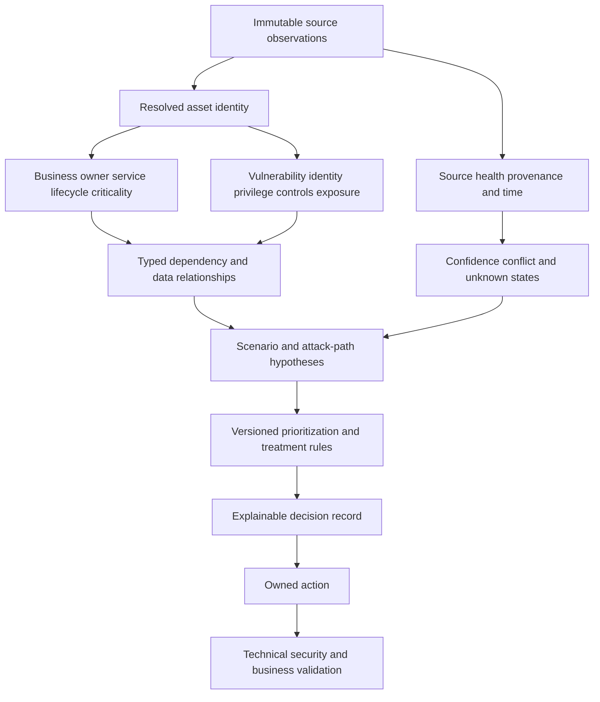

### Context claim contract

Every consequential claim should answer more than "what is the value?"

| Field | Example | Why it matters |
|---|---|---|
| Subject | Namespaced asset or identity ID | Prevents wrong-entity transfer |
| Predicate | `supports_service`, `internet_reachable`, `effective_admin` | Defines meaning |
| Object/value | Service SVC-17, true, identity ID | Captures assertion |
| Source | Cloud API, IAM, service catalog, scan | Establishes origin |
| Method | Direct observation, owner attestation, derived rule, authorized test | Separates evidence strength |
| Observed/effective time | 2026-08-24 00:00 UTC and valid interval | Prevents timeless claims |
| Scope | Tenant/account/region/network/policy version | Prevents namespace leakage |
| Confidence/status | Confirmed, supported, candidate, conflicted, unknown | Controls decision use |
| Rule/version | Reachability rule 3.2 | Reproduces derived result |
| Owner/steward | Network Security | Routes review/correction |
| Expiry/review | Re-evaluate after route or policy change | Manages drift |

## Asset visibility and identity

Visibility starts with an intended population, not the rows returned by one tool. A scanner sees only what it targets and reaches. An endpoint agent sees enrolled endpoints. A cloud connector sees permitted accounts, regions, and object types. IAM sees identities, not every workload. The CMDB contains governed configuration items, which may omit ephemeral or unmanaged assets. Reconcile independent source coverage before interpreting missing records.

### Visibility states

| State | Meaning | Example | Decision posture |
|---|---|---|---|
| Known managed | Identity, owner/lifecycle, and required controls are resolved | Active production VM | Apply policy and normal prioritization |
| Known unmanaged | Asset identity is strong but required management/control is absent | Acquired server without EDR | Confirm owner and contain/remediate |
| Unknown/unresolved | Evidence indicates an entity but ownership/purpose/identity is incomplete | Public hostname maps to ambiguous account | Urgent investigation if consequence plausible |
| Rogue | Asset is confirmed unauthorized under approved policy | Unapproved public service | Contain under authority and preserve evidence |
| Expected exception | Approved bounded deviation with owner, compensation, and expiry | Isolated lab appliance | Monitor conditions and expiry |
| Stale candidate | Asset may be retired or source may be old | No recent endpoint observation | Validate source/lifecycle before downgrading |
| Duplicate candidate | Several records may represent one asset | Hostname and cloud record differ | Review; do not merge by convenience |
| Out of scope | Correctly excluded by explicit policy | Supplier-owned service outside contract | Record boundary; do not imply no risk/dependency |

### Identity resolution mechanics

1. Preserve each source observation and native identifier in its namespace.
2. Normalize formats without erasing the original value or source time.
3. Seek strong identifiers appropriate to the asset grain, such as provider resource ID in account scope, device identity, or application catalog ID.
4. Use weak attributes such as hostname, IP address, display name, last user, or tag only as supporting and time-valid evidence.
5. Check class, lifecycle overlap, account/tenant, environment, and contradictory evidence.
6. Produce exact, candidate, separate, or unresolved outcomes rather than forcing every record into a match.
7. Record why the match occurred, rule/version, evidence, confidence, and review history.
8. Test downstream findings, controls, owners, relationships, tickets, and reports before merge or split.

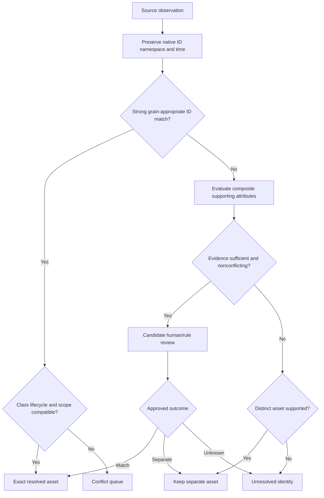

### Identity failure consequences

| Defect | Priority distortion | Operational harm | Detection clue |
|---|---|---|---|
| False merge | Criticality, owner, vulnerability, and controls from two assets combine | Wrong patch/isolation/ticket target | Impossible simultaneous IDs or lifecycle overlap |
| False split | One asset appears as several lower-context records | Duplicate work and missed combined path | Shared strong ID or synchronized lifecycle |
| Reused hostname | Old risk transfers to replacement | Retired owner receives ticket | Nonoverlapping provider IDs and alias validity |
| Dynamic IP identity | Findings move among devices | Wrong remediation/evidence | Lease/NAT time mismatch |
| Workload/image merge | Image weakness treated as every running instance or vice versa | Wrong denominator/remediation | Grain mismatch |
| Person/account merge | Human and service identity privileges combine | Inflated or hidden privilege path | Different identity types/providers |
| Source-tenant collision | Same native ID across tenants merges | Cross-customer data/action risk | Missing namespace |

### Plain-English deep-dive 2 - The highest-priority task can be identity validation

Suppose a public endpoint appears to run vulnerable software and support a payment service, but its cloud resource ID conflicts with the CMDB record. Automatically lowering priority because confidence is low is unsafe; automatically patching or isolating it is also unsafe. Low confidence changes the next action, not necessarily the urgency.

When potential consequence is high, prioritize evidence acquisition: confirm the public service, resource ID, account, owner, business service, software instance, route, and control state. The decision can be "urgent identity and reachability validation within the incident-like coordination path" rather than "patch now." This protects the customer from both a missed exposure and a wrong-target action.

## Criticality, owner, lifecycle, and business service

Criticality should be defined by approved business-impact criteria rather than inherited from a scanner severity or guessed from an asset name. Different organizations use different tiers. The important qualities are clear meaning, accountable approval, evidence, review cadence, and separation of dimensions that matter.

| Context | Questions | Useful evidence | Common failure |
|---|---|---|---|
| Business service | Which customer/organizational outcome does the asset support? | Service catalog, architecture, owner | Last network flow becomes service relation |
| Environment | Production, disaster recovery, development, test, lab, or unknown? | Account/deployment governance | Name prefix used as authority |
| Criticality | What happens if confidentiality, integrity, or availability fails? | Business impact analysis, service tier | One unlabeled score |
| Business owner | Who is accountable for purpose, priority, and risk decision? | Service governance | Last logged-in user |
| Technical owner | Who designs/maintains the technology? | Team catalog, deployment records | Generic queue treated accountable |
| Control owner | Who operates the relevant safeguard? | Security operating model | Asset owner blamed for source outage |
| Risk owner | Who can accept residual risk under policy? | Governance/delegation | TSM or analyst accepts risk |
| Lifecycle | Is the asset requested, active, quarantined, retiring, retired, or unknown? | Authoritative platform/process plus owner | No scan means retired |
| Business calendar | Is there peak, freeze, safety, or regulatory timing? | Change calendar, business owner | Urgency ignores safe implementation |
| Recovery role | Is it primary, failover, backup, or recovery control? | Continuity architecture/tests | Standby asset treated unimportant |

### Criticality dimensions

| Dimension | Example question | Why separate it |
|---|---|---|
| Confidentiality | Could disclosure harm people, customers, operations, contracts, or law? | Different controls/treatments from outage |
| Integrity | Could unauthorized change corrupt decisions, transactions, safety, or trust? | Low-data-volume systems can be crucial |
| Availability | Could disruption stop important service and for how long? | Requires dependency/recovery context |
| Safety | Could cyber failure contribute to physical harm? | Consequence and change method differ |
| Financial | Could the scenario cause material direct/indirect loss? | Estimates require assumptions, not certainty |
| Legal/regulatory | Which obligations might apply after formal analysis? | Asset label does not certify compliance |
| Reputation/trust | Could customers/partners lose confidence? | Needs scenario and stakeholder evidence |
| Recovery concentration | Is this asset a backup, identity, management, or restore choke point? | Support systems can be crown-jewel dependencies |

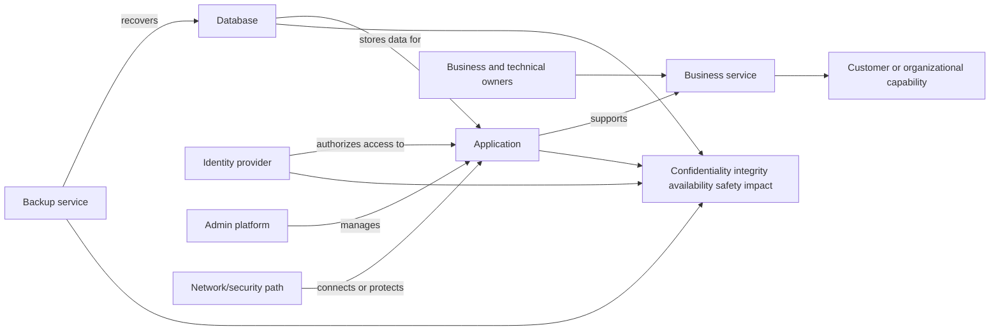

Criticality can raise priority when a plausible scenario threatens a consequential service. It can also change the treatment. A highly available clinical or manufacturing system may require tested compensation and a controlled maintenance window instead of immediate unplanned reboot. Urgency and recklessness are not synonyms.

## Internet exposure and effective reachability

Internet exposure is not a single Boolean field. DNS resolution, public addressing, routing, load balancing, listeners, firewalls, reverse proxies, identity gates, application behavior, alternate ports, IPv4/IPv6, regional paths, and time all matter. A defensible claim states source, destination class, protocol/port/application, path, identity state, observation time, and evidence method.

### Reachability evidence ladder

| Level | Evidence | What it supports | What it does not prove |
|---|---|---|---|
| 1. Named | Public DNS or certificate reference | Discoverability clue | Current listener or route |
| 2. Addressed | Public IP/front door mapping | Potential public path | Service is listening |
| 3. Listening | Authorized scan/telemetry shows service | Network/application endpoint present | Every source can reach it |
| 4. Routed | Route/NAT/load-balancer path exists | Traffic can be forwarded | Policy permits source |
| 5. Policy-allowed | Effective rules allow defined source/path | Network gate permits | Authentication succeeds |
| 6. Application-reachable | Authorized request reaches application behavior | End-to-end path for test condition | Privileged function or exploitability |
| 7. Authenticated/authorized | Defined identity can perform operation | Effective access path | Vulnerability exploitable or impact realized |
| 8. Exploit prerequisite met | Required version/config/state/path exists | Scenario plausibility increases | Successful exploitation in production |
| 9. Validated exploit in authorized test | Controlled evidence under approval | Strong scenario evidence | Universal success or future persistence |

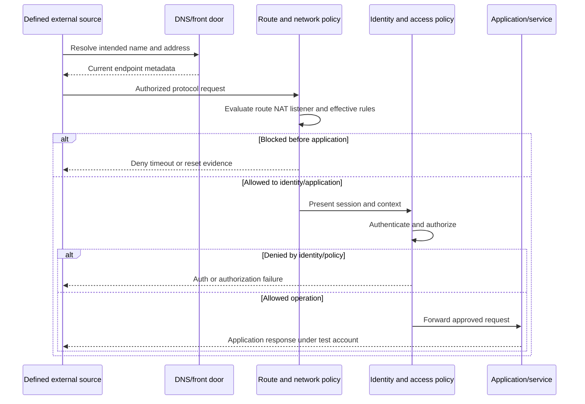

### Reachability tradeoffs and failures

| Situation | Risk interpretation | Validation need |
|---|---|---|
| Public IP, no listener | Reduced current path evidence, but drift/listener changes remain possible | External plus control-plane checks over time |
| Listener behind authentication | Exposure exists; exploit may be pre-auth or post-auth | Vulnerability prerequisites and effective auth paths |
| Internal-only service | Not internet-facing, but phishing, VPN, workload, vendor, or compromised-device paths may exist | Internal source classes and trust paths |
| Reverse proxy/WAF | Potential mitigating layer, not proof all paths or payloads are covered | Origin exposure, policy, bypass, supported protocol, test |
| IPv4 blocked, IPv6 open | Effective external path remains | Dual-stack inventory and tests |
| DNS removed, IP reachable | Discoverability changes, reachability may remain | Address/listener/path evidence |
| ZPA-style private access | Can reduce public inbound exposure and broad network access in intended design | Alternate paths, app segmentation, identity, connectors, policy |
| Cloud security group denied | One gate blocks one modeled path | Other interfaces, gateways, identities, control drift |

## Identities, entitlements, and privilege

Assets are often reached and administered through identities. Analyze human users, administrators, service accounts, workload identities, API keys, application registrations, devices, groups, roles, delegated access, federation, and emergency accounts. Separate nominal assignment from effective privilege and recent use.

| Identity context | Key question | Evidence | Priority effect |
|---|---|---|---|
| Human user | Which person and employment state? | HR/IAM authority | Orphaned active account raises concern |
| Admin account | Which systems/actions can it control? | Effective roles and target policy | Broad privilege expands consequence |
| Service account | Which workloads, secrets, and dependencies use it? | Vault, app config, logs | Rotation/remediation may affect service |
| Workload identity | Which cloud/API resources can it assume/access? | Provider IAM and trust policy | Enables machine-to-machine path |
| Group/role | What permissions are inherited or nested? | Effective entitlement graph | Hidden transitive privilege |
| Federated identity | Which external issuer/tenant can assert access? | Federation/trust config | Supplier/partner path |
| Device identity | Is access conditioned on managed/posture state? | Device registration/policy | Compromised/unmanaged device path differs |
| Credential | Where stored, how scoped, rotated, and used? | Vault/config/audit | Exposed reusable secret increases plausibility |
| Emergency account | How protected, monitored, and reviewed? | Governance/test evidence | Necessary recovery path and concentration risk |
| Dormant privilege | Granted but not recently used | IAM/activity evidence | Still exploitable; inactivity is not revocation |

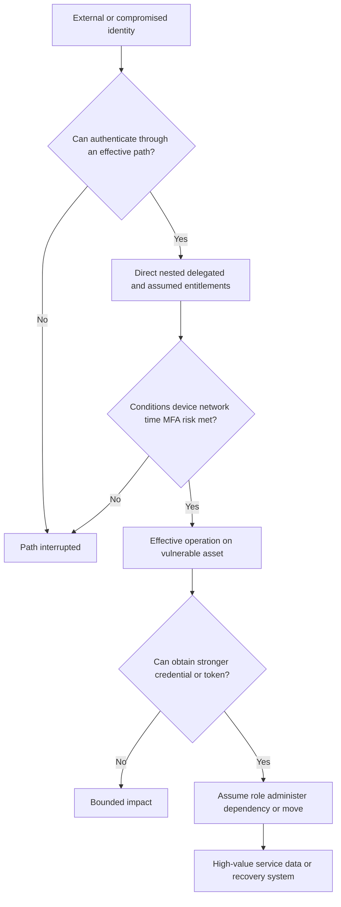

Privilege affects both likelihood and impact. A local weakness on an administrator workstation can expose management sessions. A vulnerable low-tier application with a workload identity allowed to read secrets may become a route to a high-tier service. Conversely, strict app-specific access, short-lived credentials, least privilege, strong authentication, monitored administrative workstations, and segmentation can interrupt prerequisites. Validate effectiveness; do not count a policy label as a control outcome.

## Vulnerability, exploit, and threat context

These concepts answer different questions and should remain separate.

| Concept | Question answered | Example | Caveat |
|---|---|---|---|
| Vulnerability record | What weakness is described? | CVE record and affected product range | Asset may not run affected configuration |
| Technical severity | How severe are technical characteristics under the scoring model? | CVSS vector/base value | Not customer-specific risk |
| Asset finding | Does a tool report this weakness on this asset? | Scanner plugin result | Can be stale, duplicate, false, unauthenticated |
| Applicability | Is exact product/version/config/component affected? | Feature enabled and vulnerable library loaded | Banner/version alone may mislead |
| Exploit availability | Is a technique/code publicly or privately available? | Research proof of concept | Availability does not prove reliability |
| Exploitability | Are prerequisites likely met in this environment? | Reachable pre-auth vulnerable endpoint | Requires path/config/mitigation evidence |
| Known exploitation | Is there credible evidence of exploitation in the wild? | CISA KEV inclusion | Does not prove this customer is compromised |
| Predictive probability | What probability does a model estimate under its definition/window? | EPSS | Model, date, population, and calibration matter |
| Threat relevance | Are actors/campaigns targeting this technology, sector, or path? | Current intelligence report | Relevance and confidence require analysis |
| Compromise evidence | Is there customer evidence of malicious activity? | Validated endpoint/network/identity indicators | Exposure management must hand off to IR |

### Applicability sequence

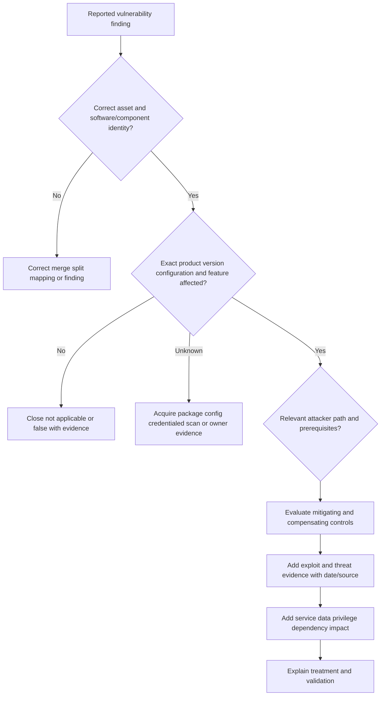

### Threat-intelligence handling

| Check | Why | Unsafe shortcut |
|---|---|---|
| Source and publication/update time | Threat conditions change rapidly | Old article labeled current campaign |
| Definition and scope | KEV, exploit availability, and prediction are different | Combine into one exploited flag |
| Vulnerability/version match | Similar product names can misjoin | Keyword join |
| Target relevance | Sector, geography, technology, behavior, and access differ | Global activity equals customer targeting |
| Confidence and corroboration | Intelligence can be uncertain or deceptive | Treat every feed as ground truth |
| Customer telemetry | Distinguishes exposure from potential incident | No alerts means no compromise |
| Actionability | Intelligence should change validation, containment, or remediation | Decorative threat label |
| Expiry/review | Relevance and indicators decay | Permanent urgency without reassessment |

### Plain-English deep-dive 3 - Exploit evidence changes urgency, not truth about compromise

If police report that a tool is being used to defeat a lock model, a hospital should reassess affected doors quickly. That does not prove a thief entered this hospital. It also does not prove every door with the same brand has the affected lock configuration.

Known exploitation, exploit code, predictive scores, and campaign reports can raise urgency. First validate the asset and vulnerability applicability. Then determine reachability and prerequisites, controls, service/data impact, and customer telemetry. If telemetry suggests actual exploitation, follow the incident-response process: preserve evidence, contain proportionately, scope activity, eradicate, recover, and learn. Do not leave a possible active compromise in a routine patch queue.

## Mitigating controls, gaps, and residual exposure

Controls should map to a scenario prerequisite. A generic list of installed products is not mitigation evidence. Ask whether the control applies to the exact asset, path, protocol, identity, action, and time; whether it is healthy and enforcing; whether bypass paths exist; and whether effectiveness was validated safely.

| Control family | Scenario interruption | Evidence ladder | Failure mode |
|---|---|---|---|
| Patch/version change | Removes or changes vulnerable condition | Installed package, active version, applicability rescan/test | Installed but not activated/rebooted |
| Network segmentation | Blocks source-to-target route | Intended rule, attachment/order, effective path test | Alternate interface/path open |
| Private app access | Removes broad public/routed access in intended design | External negative test, app-specific policy, alternate-path review | Origin or legacy path exposed |
| Authentication/MFA | Raises identity proof needed | Effective policy and representative flow | Legacy/noninteractive bypass |
| Least privilege | Limits operations after access | Effective permissions and denied tests | Nested role/delegation overlooked |
| EDR/prevention | Detects/blocks relevant behavior | Healthy sensor, current policy, telemetry, authorized validation | Agent present but unhealthy/excluded |
| WAF/IPS | Detects/blocks supported traffic pattern | Correct path/mode/signature/policy and safe test | Encrypted/bypassed/unsupported traffic |
| Application configuration | Disables affected feature or unsafe behavior | Config authority and runtime verification | Drift or alternate instance |
| Credential rotation | Invalidates exposed reusable secret | Rotation, dependent update, old-secret negative test | Old credential remains valid |
| Backup/recovery | Reduces availability/integrity consequence | Protected copies and representative restore | Job success without usable restore |
| Monitoring | Improves detection/response | Required telemetry, coverage, alert logic, response test | Logs missing or alert unactioned |
| Exception/compensation | Temporarily governs residual scenario | Scope, owner, reason, controls, approval, expiry | Permanent unvalidated waiver |

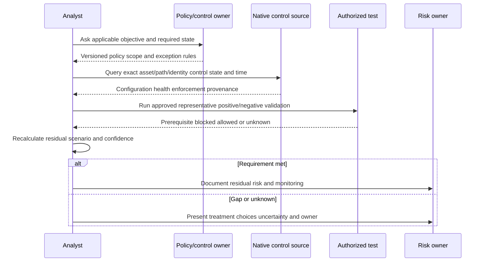

### Control depth and gaps

| State | Meaning | Priority treatment |
|---|---|---|
| Not applicable | Governed policy excludes control for this asset/scenario | Preserve evidence and review on change |
| Present | Component/record exists | Weak mitigation evidence only |
| Configured | Intended policy assigned | Verify application/effective behavior |
| Healthy | Control reports current normal operation | Verify enforcement/path applicability |
| Enforcing | Control actively affects modeled behavior | Test representative prerequisite where authorized |
| Effective | Evidence supports intended scenario interruption | Account for limits and residual paths |
| Excepted | Approved bounded deviation with compensation/expiry | Track residual risk and expiry |
| Gap | Applicable requirement not met | Remediate/compensate/isolate under owner |
| Unknown | Evidence cannot classify | Fix evidence urgently according to consequence |

## Data sensitivity and impact context

Data context should describe what the asset stores, processes, transmits, administers, indexes, backs up, or can access. Labels require governance. A web server may not store sensitive data but may hold a token that can query a sensitive system. A backup controller may concentrate availability and integrity risk. A search index may replicate content and permissions.

| Data factor | Question | Priority relevance | Caveat |
|---|---|---|---|
| Classification | What approved sensitivity category applies? | Disclosure/integrity treatment | Missing label is unknown, not public |
| Data role | Store, process, transmit, index, administer, or back up? | Changes path and treatment | Asset can expose data indirectly |
| Volume/concentration | How much and how many subjects/services? | Potential scale of impact | Record count alone is not harm |
| Access scope | Which identities/workloads can read/change/export? | Links privilege to data | Nominal role may differ effectively |
| Encryption | Where and how protected; who controls keys? | May reduce some scenarios | Encryption does not fix authorized misuse |
| Residency | Which locations/jurisdictions and obligations may apply? | Routes governance/legal review | Not legal conclusion |
| Integrity need | Could tampering corrupt transactions/decisions/safety? | Elevates change-control concerns | Confidentiality label may miss it |
| Availability need | Recovery time/data objectives and dependencies? | Shapes patch/change/compensation | Objective needs tested capability |
| Retention | How long should data/evidence remain? | Limits exposure and guides response | Policy/legal review required |
| Recovery | Are protected, isolated, tested copies available? | Reduces some impact | Restore proof is scenario-specific |

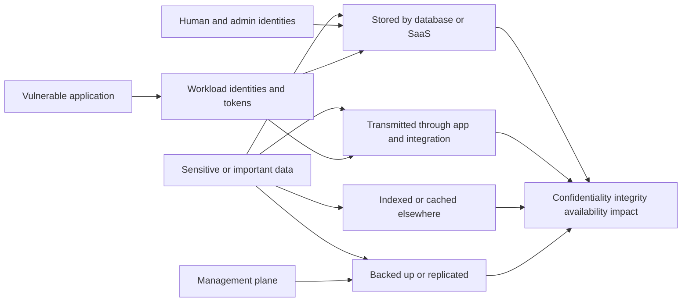

## Dependencies, concentration, and blast radius

A relationship graph supports risk only when edges have defined semantics. Communication does not always mean dependency. Shared DNS traffic does not mean compromise can move. A management relationship differs from data flow. Store direction, type, scope, time, source, confidence, and conditions.

| Relationship | Meaning | Potential risk use | Validation |
|---|---|---|---|
| `supports` | Component contributes to a service | Availability/impact | Architecture and owner evidence |
| `depends_on` | Source requires target under defined operation | Cascading failure | Failure/test and service map |
| `administers` | Identity/tool can manage target | Privilege path | Effective permission and audit |
| `authenticates_via` | Service relies on identity provider | Choke point/availability | Current config and login path |
| `stores_data_for` | Store holds service data | Confidentiality/integrity impact | Data catalog/config/query evidence |
| `connects_to` | Network/application communication observed | Candidate path only | Direction, protocol, authorization, purpose |
| `runs_on` | Workload executes on host/platform | Vulnerability inheritance/impact | Deployment/runtime evidence |
| `built_from` | Runtime artifact derives from image/package | Remediation scope | Build/provenance evidence |
| `protected_by` | Control applies to asset/path | Mitigation | Native state and effective test |
| `recovers` | Backup/service restores target | Resilience concentration | Representative restore |
| `federates_with` | Identity trust crosses domain/organization | Third-party identity path | Trust policy and conditions |
| `exposes` | Front door publishes service | External path | Listener/route/policy/test |

### Blast-radius reasoning

Blast radius is a scenario estimate, not the count of all graph neighbors. Determine the compromised capability, allowed actions, trust boundaries, credentials, reachable dependents, common services, data, recovery systems, detection/containment time, and business consequences. Distinguish direct, conditional, and speculative effects.

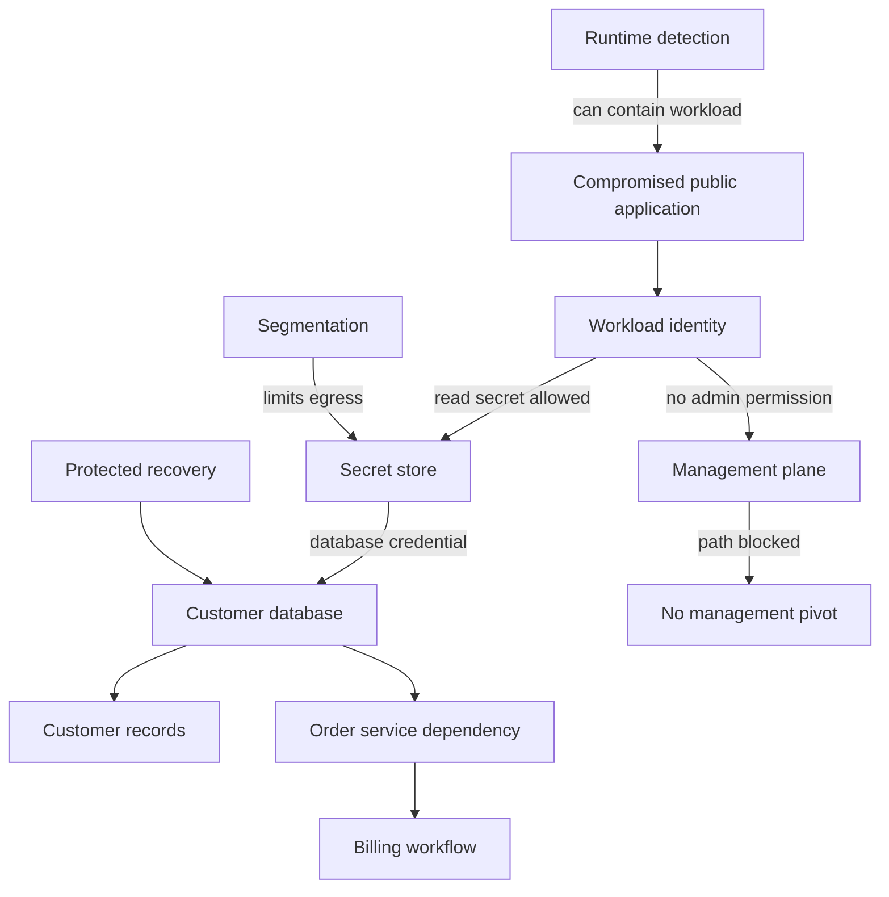

### Plain-English deep-dive 4 - A graph edge is a sentence, not a decorative line

On a hospital map, a line could mean "shares a hallway," "depends on electrical power," "stores medicine for," or "is administered by." Those relationships predict very different consequences. Drawing every observed connection as an attack path creates dramatic but unreliable pictures.

Treat each edge as a claim with a verb, direction, conditions, source, time, and confidence. For an attack path, every step needs a capability and prerequisite: reach service, exploit weakness, obtain identity, exercise permission, cross control, and affect target. If one edge is unvalidated, label the path candidate or unknown. That uncertainty can drive a test; it should not silently become a confirmed path.

## Context confidence, freshness, conflict, and uncertainty

Confidence is not a magical percentage. Define evidence classes and permitted decision uses. Freshness is field/use specific: public reachability can change in minutes, identity roles in hours, owner attestation over a longer governed interval, and hardware serial rarely. Source health and collection time differ from event/effective time.

| Quality dimension | Question | Example failure | Control |
|---|---|---|---|
| Scope completeness | Did all intended accounts/networks/classes participate? | One cloud account permission removed | Registry reconciliation/control totals |
| Source health | Did collection finish without hidden errors? | First page only after pagination defect | Complete-run marker and native counts |
| Identity confidence | Is the exact asset/person/workload resolved? | Hostname reused | Strong IDs and temporal aliases |
| Field authority | Is source allowed to decide this attribute? | Scanner overwrites owner | Field-level authority |
| Freshness | Is evidence current enough for decision? | Old firewall rule snapshot | Field-specific window and event time |
| Consistency | Do authoritative/supporting sources agree? | Cloud says deleted, runtime says active | Conflict state and review |
| Relationship confidence | Is edge semantic and current? | Any network flow becomes dependency | Typed rule and validation |
| Vulnerability confidence | Is exact component/config affected? | Version banner false positive | Credentialed/native/component evidence |
| Control confidence | Is safeguard effective on path? | Agent installed but excluded | Native state plus representative test |
| Threat confidence | Is intelligence credible/relevant/current? | Old campaign report | Source/date/corroboration/relevance |
| Impact confidence | Are service/data/dependency claims approved? | Asset name implies payments | Owner/catalog/BIA validation |
| Decision reproducibility | Can another analyst reproduce rationale? | Opaque priority score | Factor evidence and rule version |

### Evidence-state model

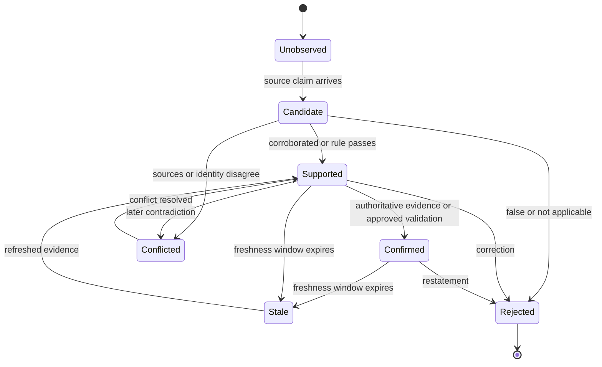

### Decision use by evidence state

| State | Safe use | Unsafe use |
|---|---|---|
| Confirmed | Consequential action under authority and change controls | Assume permanent truth |
| Supported | Prioritize and plan; validate before high-impact action | Present as certain |
| Candidate | Investigation queue and hypothesis | Patch/isolate/delete automatically |
| Conflicted | Contain risky automation and resolve discrepancy | Pick preferred source silently |
| Stale | Historical context with visible age | Current risk claim |
| Unknown | Drive evidence acquisition proportional to consequence | Convert to pass or low priority |
| Rejected/corrected | Preserve audit and prevent recurrence | Delete history silently |

## Attack-path construction and validation

An attack path is a scenario model. Start with an actor/source capability and objective, then identify required conditions. Avoid shortest-path algorithms that ignore direction, permission, protocol, lifecycle, control, time, or exploit prerequisites.

### Path-building contract

| Element | Required statement | Example |
|---|---|---|
| Source | Who/what begins with which capability? | Unauthenticated internet client |
| Objective | What harmful outcome is analyzed? | Read restricted customer records |
| Entry edge | How does source reach first target? | HTTPS through public front door |
| Vulnerability step | Which exact affected condition and prerequisite? | Pre-auth request reaches enabled component |
| Resulting capability | What does successful step grant? | Code execution as app workload identity |
| Identity edge | Which effective entitlement can be exercised? | Workload identity reads one secret path |
| Control edge | Which safeguard blocks, detects, or limits step? | Egress rule blocks vault; EDR contains behavior |
| Dependency/data edge | How does capability affect service/data? | Database credential permits bounded read |
| Evidence quality | Source, time, confidence, conflict | Authorized path test plus current IAM policy |
| Validation | Positive/negative safe tests and postconditions | Patched version and path no longer viable |

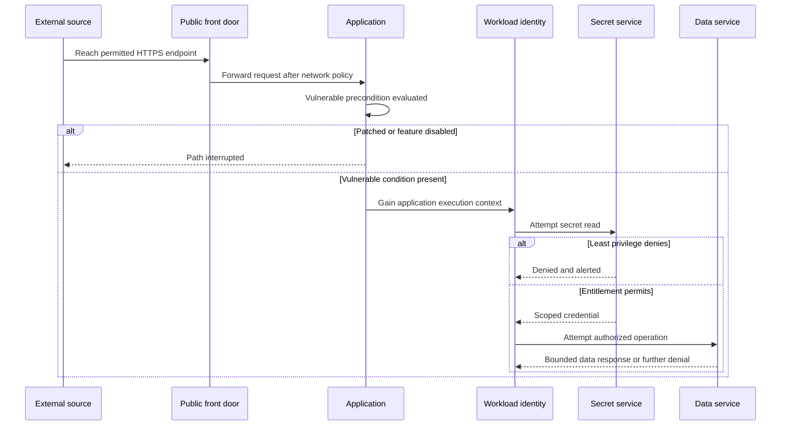

### Choke-point analysis

| Choke point | Paths reduced | Possible treatment | Tradeoff |
|---|---|---|---|
| Remove public listener | External entry paths | Private access or restricted source | User/integration redesign |
| Patch shared image | Many runtime instances | Rebuild/redeploy immutable artifact | Rollout compatibility |
| Restrict workload identity | Secret/data pivots | Least-privilege role | Application dependency discovery |
| Rotate/re-scope secret | Existing credential paths | Short-lived scoped identity | Service interruption risk |
| Segment management plane | Administrative pivots | Dedicated path and policy | Operational complexity |
| Harden identity provider | Multiple auth-dependent services | MFA, conditional access, admin separation | Recovery/emergency design |
| Protect backup control plane | Ransomware/recovery paths | Separate identity/network/immutability | Operational process change |
| Improve detection/response | Limits dwell/blast radius | Coverage and tested playbooks | Does not remove initial weakness |

## Explainable prioritization mechanics

Prioritization ranks decisions under constraints. It is not a claim that one number measures objective truth. Use a versioned factor model, but preserve factor details and critical gates. Do not let missing context default to zero or allow a high average to hide a mandatory condition such as known exploitation on a public critical service.

### Factor groups

| Factor group | Questions | Typical evidence | Direction, not formula |
|---|---|---|---|
| Asset certainty | Is the asset/finding identity correct and active? | Stable IDs, lifecycle, source health | Low certainty may prioritize validation |
| Technical condition | Is exact component/config affected and what could exploit achieve? | Vendor/advisory/scan/runtime | More capable/reliable impact can raise urgency |
| Exposure/reachability | Which source classes can reach prerequisites? | Path/policy/test | Effective attacker access can raise urgency |
| Exploit/threat | Exploited, predicted, available, targeted, or merely theoretical? | CISA/FIRST/vendor/MITRE/current intel | Credible relevant activity can raise urgency |
| Identity/privilege | What context and entitlements result or are exposed? | IAM/effective permissions | Broad privilege can expand path/impact |
| Controls | Which prerequisite is prevented/detected/recovered, and how well? | Native state/tests/exceptions | Effective controls reduce relevant residual scenario |
| Business impact | Which service/data/safety/recovery outcomes are plausible? | Catalog/BIA/data/dependency evidence | Greater plausible consequence raises priority |
| Breadth/concentration | How many instances/services share the condition or choke point? | Image/dependency graph | Concentration can increase systemic urgency |
| Age/temporal | How long exposed, when active, upcoming changes or exploit shifts? | First/last seen, calendar | Age informs debt; new active threat may dominate |
| Feasibility/safety | Can treatment be applied safely now; alternatives/rollback? | Owner/change/test | Changes treatment sequence, not underlying risk |
| Confidence | How supported/current are claims? | Provenance/conflict/freshness | Controls decision and evidence action |

### A qualitative decision matrix

| Scenario | Context | Decision | Why |
|---|---|---|---|
| Public, exploitable, known-exploited, critical service, weak controls | Strong current evidence | Emergency remediation/containment and compromise review | Many prerequisites and high consequence align |
| Internal, high severity, strong segmentation, no effective identity path | Validated controls | Scheduled patch plus drift monitoring | Residual path constrained; patch still needed |
| Unknown public asset with possible critical-service relation | Conflicted identity | Urgent identity/reachability investigation; block unsafe automation | High potential consequence with wrong-target risk |
| Test asset, no sensitive data/dependency, public listener | Confirmed low business tier | Remove unnecessary exposure and patch by policy | Low tier does not justify avoidable surface |
| Low-severity issue on identity/backup choke point | Exact applicability and high concentration | Elevated owner review/remediation | Consequence and path concentration matter |
| Severe finding on retired/deleted resource | Strong lifecycle/tombstone | Correct stale finding/report; verify no residual endpoint | Avoid false work while validating closure |
| Known exploit signal but healthy mitigating control | Current effectiveness evidence | Accelerated patch with monitoring; do not claim zero risk | Control reduces scenario, not vulnerability existence |
| High score based on stale owner/reachability | Context expired | Revalidate before consequence; caveat dashboard | Score is not fresher than inputs |

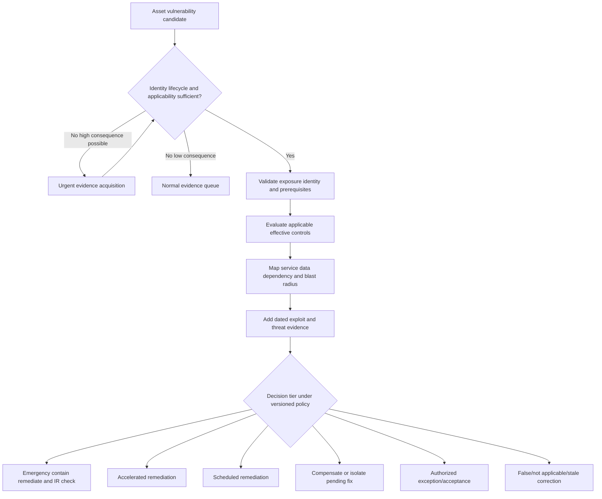

### Decision record

| Field | Required content |
|---|---|
| Decision ID/version | Stable identifier and policy/model version |
| Subject | Exact asset/finding/identity/service IDs and grain |
| Scenario | Source, entry, prerequisites, resulting capability, objective |
| Evidence | Source/time/method/value/confidence/conflicts for each factor |
| Controls | Applicable state, effectiveness, exceptions, residual paths |
| Impact | Service/data/dependency/blast-radius rationale |
| Priority | Tier/rank and factor-level explanation, not only score |
| Treatment | Patch/configure/restrict/isolate/compensate/retire/investigate/accept |
| Owner/authority | Technical owner, business/risk decision owner, collaborators |
| Timing | Due logic, change/safety constraints, next checkpoint |
| Validation | Technical, path, control, service, data, and reporting postconditions |
| Residual risk | What remains, assumptions, monitoring, expiry/review |

### Plain-English deep-dive 5 - Explainability is an operational control

Explainability is not merely a presentation preference. If a priority changes, operators need to know whether the cause was a new exploit signal, newly public route, service-tier correction, control recovery, source outage, or scoring-rule release. Each cause suggests a different action. A single number hides that distinction.

A good decision record lets another analyst reproduce the result, lets an owner challenge a wrong relationship, lets Support isolate a product/data defect, and lets leadership understand uncertainty. It also prevents score gaming: teams cannot quietly remove hard assets from the denominator or mark a ticket closed without showing the remaining path and postcondition.

## From asset decisions to enterprise risk

Enterprise risk is not the sum of vulnerability scores. Aggregate scenarios carefully. Group common causes, shared services, identities, images, controls, data, and dependencies. Avoid counting the same underlying exposure once per duplicate finding or downstream asset. Preserve severe cohorts and concentration risk rather than averaging them away.

| Aggregation concern | Example | Safe approach |
|---|---|---|
| Duplicate findings | Three scanners report same asset/vulnerability | Resolve one occurrence with source evidence |
| Shared image | One vulnerable image runs 400 instances | Track systemic condition and affected runtime scope |
| Common identity | One workload role connects many apps | Model identity choke point and effective scopes |
| Shared control | One WAF protects many services | Report control concentration and bypass risk |
| Shared service | Identity provider outage affects many apps | Model dependency scenario once with impacted services |
| Cascading dependencies | Database supports orders and billing | Avoid counting same loss repeatedly without scenario boundaries |
| Correlated threat | One campaign targets several weaknesses in chain | Analyze combined path, not independent probabilities blindly |
| Uncertainty | Thirty percent of public cohort lacks owner | Show unknown exposure separately |
| Time | Assets/routes appear and disappear | Use observation/effective windows and restate trend changes |
| Financial estimate | Loss range depends on assumptions | Show model, range, exclusions, owner, sensitivity; no guarantee |

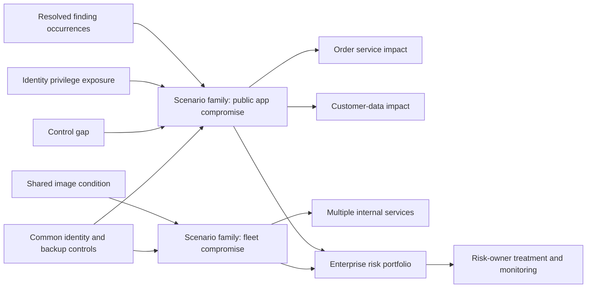

An executive narrative should state: the business objective at risk; the scenario; affected critical cohort; evidence and uncertainty; control strengths/gaps; trend under a stable metric contract; treatment choices and owners; decisions needed; and validation. Avoid promising that fixing a count reduces financial risk by an exact amount unless an approved model and evidence support that statement.

## Worked synthetic prioritization examples

All examples below are fictional NMH exercises. They teach reasoning, not Zscaler product output.

### Example 1 - Same vulnerability, different context

| Factor | NMH-PAY-WEB-01 | NMH-LAB-WEB-22 |
|---|---|---|
| Identity/lifecycle | Exact provider ID; active production | Exact provider ID; active isolated lab |
| Finding | Same synthetic web-component vulnerability; applicability confirmed | Same synthetic vulnerability; applicability confirmed |
| Reachability | Authorized test confirms public pre-auth route | Private lab subnet; internet and corporate user routes denied |
| Threat | Synthetic current exploitation report relevant to component | Same general report |
| Service | Payment authorization service | Training exercise service |
| Data | Token-mediated access to customer transaction data | Synthetic test data only |
| Identity | Workload role can read one payment database credential | No cloud role or reusable production secret |
| Controls | WAF route exists but test shows affected request class not covered | Segmentation effective; EDR healthy |
| Dependencies | Orders and billing depend on service | No production dependencies |
| Decision | Emergency containment, patch, credential review, telemetry/IR check | Scheduled patch; maintain isolation and monitor drift |

The technical weakness is the same. The decision differs because reachability, privilege, data, service, controls, and dependencies differ. The lab asset still needs remediation according to policy; low business criticality does not excuse unnecessary exposure or hygiene debt.

### Example 2 - Lower severity, higher concentration

A synthetic medium-severity configuration weakness affects NMH's backup administration portal. It requires authenticated access, but 14 broad infrastructure administrators have effective access, one emergency account has a long-lived credential, and the portal administers recovery for 38 critical services. It is private, protected by MFA for ordinary users, and monitored. The emergency-account path is exempt from one condition by design.

| Question | Evidence | Interpretation |
|---|---|---|
| Is it applicable? | Exact version/config confirmed | Real condition |
| Can an outsider reach it directly? | External negative test; private route only | Public likelihood reduced |
| Can a compromised admin reach it? | Effective admin access confirmed | Credible post-compromise path |
| What can success affect? | Recovery configurations across 38 critical services | High concentration/blast radius |
| Which controls help? | MFA, admin network, monitoring | Reduce routes; emergency path remains |
| What is next? | Restrict/rotate emergency path, patch under controlled change, test recovery | Elevated priority despite medium severity |

### Example 3 - Unknown asset and unsafe automation

An external source reports `claims-api.example.invalid` with a severe synthetic finding. DNS points to an address registered in an NMH range, but cloud and CMDB records disagree. One record says retired development; another says production claims processing. The right decision is not to assign zero because context is missing and not to isolate an arbitrary VM.

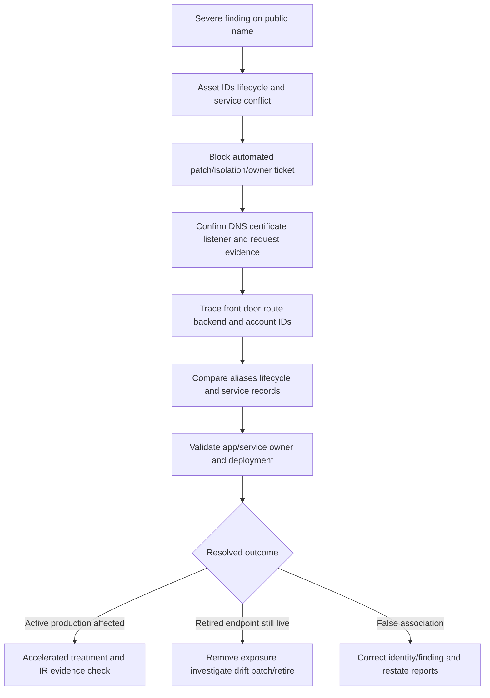

### Example 4 - Control changes the residual scenario

NMH has a confirmed vulnerable internal admin service. The vulnerability requires a request from an authenticated account. Effective access is limited to a dedicated admin group using managed workstations, phishing-resistant authentication, an admin-only private path, and monitored sessions. An authorized negative test confirms ordinary users and unmanaged devices cannot reach it. These controls reduce the immediate residual scenario, but do not erase the vulnerability. NMH schedules a tested patch in the earliest safe window, watches for control drift and exploitation evidence, and preserves an emergency containment option.

### Example 5 - Stale context creates a false low

A public application appears low priority because its service link says "development" and its owner is inactive. Investigation finds the service-catalog link is 14 months old, the cloud account is now production, and customer data access was added six weeks ago. The priority engine behaved according to stale context, but the decision was wrong. The fix includes the application treatment, service/owner correction, freshness controls, and review of every decision using the stale context.

## Complete synthetic NMH case study

### NMH context charter

NMH defines one synthetic exercise scope: internet-accessible and privileged-path assets supporting five services. The as-of time is 2026-08-24 00:00 UTC. All thresholds and tiers are invented for training.

| Context domain | Synthetic contract |
|---|---|
| Asset universe | Registered cloud accounts, external endpoints, active CMDB services, EDR devices, IAM identities, and vulnerability targets in five services |
| Identity | Provider/account/resource ID for cloud; catalog ID for apps/services; source namespace always retained |
| Active lifecycle | Provider existence plus approved service lifecycle; source outage becomes unknown |
| Internet reachable | Current public endpoint plus authorized end-to-end request under defined source/protocol |
| Critical service | Service owner-approved tier based on impact exercise |
| Privilege | Effective direct/nested/delegated roles under current policy |
| Vulnerability | Exact synthetic component/config applicability with source time |
| Threat | Dated synthetic exploit/targeting evidence with confidence |
| Controls | Applicable native state plus representative validation where safe |
| Data | Approved synthetic data class and access relationship |
| Dependency | Typed/directed/current edge with source and confidence |
| Decision | Factor narrative, action, owner, authority, due logic, validation, residual risk |

### Baseline data-health and risk cohorts

| Measure | Synthetic result | Meaning | Caveat |
|---|---:|---|---|
| Candidate asset observations | 24,880 | Raw multi-source rows | Not asset count |
| Resolved active assets | 8,420 | Golden active population in scope | Identity rules synthetic |
| Unresolved candidate assets | 126 | Need identity/purpose review | Not all rogue |
| Confirmed internet-reachable assets | 214 | Under defined test contract | Point-in-time evidence |
| Reachability unknown | 31 | Source/path evidence incomplete | Must not enter denied cohort |
| Critical-service assets | 612 | Approved five-service graph | Relationship confidence varies |
| Vulnerability occurrences | 3,840 | Deduplicated asset-vulnerability pairs | Synthetic findings |
| Confirmed applicable | 2,630 | Exact enough for decision | Different evidence strengths |
| Known-exploit synthetic cohort | 74 | Training feed join | Not real KEV claims |
| Critical-context urgent cohort | 19 | Policy gates align | Requires analyst/owner review |
| High-consequence unknowns | 11 | Missing/conflicted identity/path/control evidence | Urgent investigation, not scored low |
| Validated path families | 7 | Scenario groups, not every graph path | Authorized evidence only |

### Three asset decisions

| Factor | PAY-WEB-01 | HR-FILE-07 | BAK-CTRL-02 |
|---|---|---|---|
| Service | Payment authorization, critical | HR document collaboration, important | Recovery control plane, critical concentration |
| Lifecycle | Active production, exact | Active production, exact | Active production, exact |
| Exposure | Public pre-auth HTTPS | Private app-specific user access | Private admin-only access |
| Vulnerability | Synthetic critical RCE, confirmed | Synthetic high file-parser issue, confirmed | Synthetic medium authz weakness, confirmed |
| Threat | Synthetic known exploitation relevant | Exploit available, no relevant campaign evidence | No public exploit evidence |
| Identity | Workload role reads scoped DB credential | User context; no admin role | Admin/emergency identity can alter recovery jobs |
| Controls | WAF ineffective for request class; EDR healthy | Content scanning and EDR effective; file feature can be disabled | MFA/admin path strong; emergency-account gap |
| Data | Transaction/customer subset | Restricted employee documents | Backup metadata and recovery authority |
| Dependencies | Orders and billing | HR workflows | 38 critical services rely on recovery |
| Confidence | High except exploit-success unknown | High | High privilege; dependency sample confirmed |
| Treatment | Contain path, patch, rotate/review secret, IR telemetry check | Disable affected feature, accelerated patch, monitor | Restrict emergency account, patch in controlled window, recovery test |
| Validation | Version/path/secret/telemetry/service | Feature/version/control/user workflow | Effective roles/version/recovery workflow |

### PAY-WEB-01 attack-path record

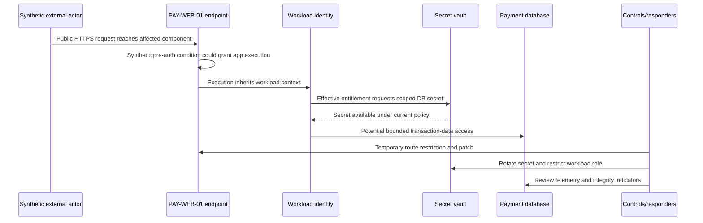

The exercise does not assert exploitation occurred. Because the scenario includes synthetic known-exploitation evidence, a confirmed public prerequisite, critical service, weak WAF coverage for that request, and a credential path, NMH performs an incident-response telemetry check alongside exposure remediation. No telemetry finding alone proves absence; the investigation scope and retention determine assurance.

### Context defect incident

At 09:00 UTC in the synthetic exercise, the urgent cohort falls from 19 to 7. No remediation wave completed. The dashboard looks positive. An analyst checks factor-change reasons and finds 12 assets changed from public to internal because the external-path source completed only its first page after a connector pagination regression.

1. **Detect:** Unexplained priority drop conflicts with stable asset/finding/remediation counts.
2. **Contain:** Mark reachability-dependent priorities degraded; stop automated downgrades and SLA changes.
3. **Scope:** Compare source-native totals, page tokens, last complete run, affected accounts, decisions, tickets, reports, and exports.
4. **Hypothesis:** Incomplete collection converted absent public-path rows to `false` instead of `unknown`.
5. **Test:** Replay the prior complete dataset and current raw pages in no-action mode; all 12 assets regain public evidence.
6. **Root defect:** Missing page continuation plus unsafe closed-world default.
7. **Repair:** Require complete-run marker/control totals; map incomplete absence to unknown; add pagination invariant and synthetic multi-page test.
8. **Reconcile:** Recompute affected decisions, restore due logic without duplicate tickets, restate dashboard trend, notify owners, and inspect external exports.
9. **Validate:** Full source counts, representative endpoint tests, factor reasons, action register, and dashboard/detail/control totals agree.
10. **Prevent:** Monitor page/count deltas, source completeness, priority migration reasons, and unexplained cohort drops.

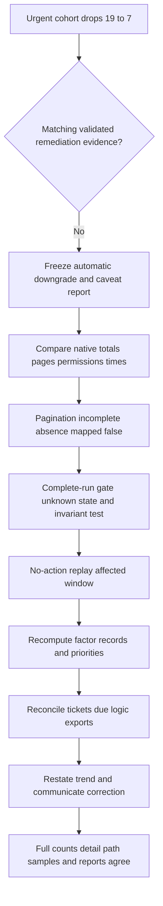

### NMH governance and decision rights

| Decision | Accountable role | Responsible contributors | TSM role |
|---|---|---|---|
| Asset identity rule | Asset data steward | Source/platform owners | Facilitate evidence and defects |
| Service/criticality | Business service owner/risk governance | App/architecture/data owners | Make missing context visible |
| Reachability truth | Network/app security owner | Cloud, app, authorized test teams | Coordinate proof and caveats |
| Vulnerability applicability | Vulnerability program owner | App/vendor/scanner teams | Drive evidence package |
| Control effectiveness | Control owner | Asset owner/test/operations | Ask scenario-specific validation |
| Priority policy | Vulnerability/risk governance | Business, threat, control, data owners | Explain factors and adoption |
| Treatment/change | Asset/service owner under change authority | Security/engineering/operations | Coordinate and track evidence |
| Risk acceptance | Authorized customer risk owner | Legal/compliance/security/business | Never accept on customer's behalf |
| Product defect escalation | Zscaler Support/Product under process | Customer and TSM evidence providers | Build bounded reproducible case |

### NMH outcome measures

| Measure | Definition | Value signal | Guardrail |
|---|---|---|---|
| Context decision completeness | Decisions with required resolved factor states / eligible decisions | Fewer blind queues | Unknown never counted pass |
| High-consequence unknown aging | Time from detection to resolved evidence disposition | Faster safe decisions | Do not force false values |
| Priority precision sample | Reviewed urgent decisions judged correctly reasoned / reviewed urgent decisions | Trust and focus | Sample design disclosed |
| Priority recall sample | Confirmed urgent scenarios surfaced / reviewed confirmed urgent scenarios | Miss detection | Requires independent review set |
| Wrong-target action rate | Actions linked to incorrect asset/owner / reviewed actions | Safety | Include near misses |
| Time to validated treatment | Detection to technical/security/business postconditions | Outcome speed | Define pauses and cohorts |
| Path closure validation | Treated paths with prerequisite no longer viable / treated paths tested | Real scenario reduction | Authorized tests only |
| Recurrence | Reopened same condition/path under stable identity | Durability | Identity changes reconciled |
| Source degradation exposure | Decision-hours affected by unhealthy context source | Data reliability | Not hidden by availability average |
| Decision challenge/correction | Reviewed owner challenges and corrected context/rules | Learning | Higher initially may show healthy review |

## Troubleshooting wrong priorities and attack paths

### Symptom-to-layer map

| Symptom | Plausible causes | First discriminating check | Containment |
|---|---|---|---|
| Priority spikes overnight | Source duplication, policy release, threat join, scope expansion | Factor-change distribution and versions | Pause bulk actions |
| Priority collapses | Source outage, missing join, false lifecycle, control false green | Completeness and missing-to-false transitions | Freeze downgrades |
| Wrong owner tickets | Stale service relation, false merge, role confusion | Exact asset/service/owner provenance | Hold assignment automation |
| Internet asset shown internal | IPv6/alternate front door, incomplete page, stale test | Native endpoints and authorized dual-stack path | Caveat view and validate |
| Internal asset shown public | Shared IP/NAT/CDN mismatch, old DNS, false merge | Backend/resource identity and time | Block isolation until exact target |
| Exploited flag wrong | CVE join/version mismatch, stale feed, definition collapse | Source record/date/CVE and factor semantics | Correct label and recompute |
| Control lowers risk incorrectly | Presence treated effectiveness, exception join, stale health | Native control state/path test | Disable mitigation factor |
| Attack paths explode | Every flow becomes edge, direction ignored, cycle, no prerequisites | Edge types/rules and one sample path | Mark paths candidate |
| Blast radius too high | Transitive traversal without semantics/conditions | Edge-by-edge capability proof | Suppress unsupported aggregation |
| Score/detail disagree | Cache/snapshot/filter/model version | Same IDs/as-of/version/query | Show degraded status |
| Patch closes ticket, path remains | Alternate instance/path/credential, activation missing | Postcondition path test | Reopen and contain |
| Low-confidence asset auto-isolated | Confidence not action-gated | Decision/audit/model rule | Stop automation, restore safely |

### Layered runbook

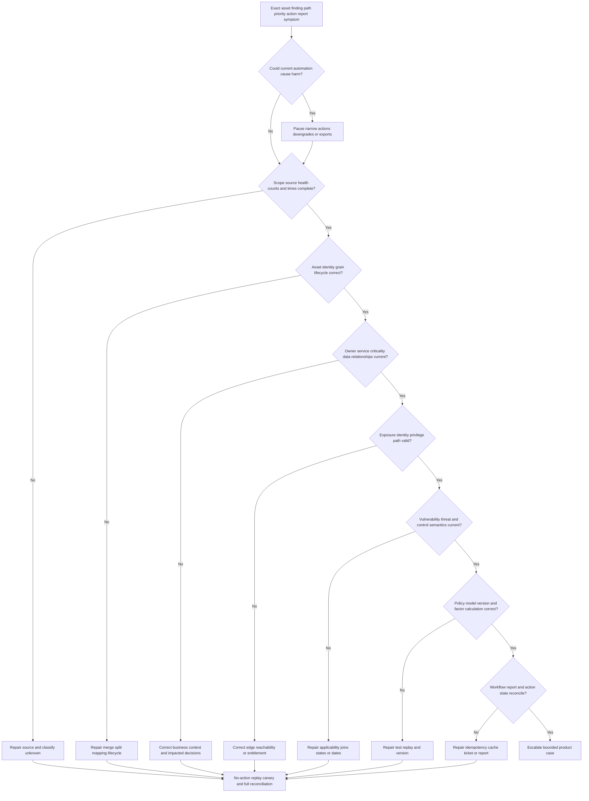

### Evidence package for Support or Product escalation

| Evidence | Include | Exclude/protect |
|---|---|---|
| Problem statement | Exact expected/actual and business consequence | Speculative root cause as fact |
| Scope | Tenant/region/source/asset/finding cohorts and unaffected comparison | Unnecessary customer-wide data |
| Timeline | UTC last good, first bad, collection, model, workflow, action | Ambiguous local times |
| Identifiers | Redacted tenant, source, asset, finding, rule/model, workflow, report IDs | Tokens, secrets, personal data |
| Input facts | Minimal source records, provenance, times, confidence, conflicts | Unsupported screenshots alone |
| Transform evidence | Mapping/match/reachability/factor rule versions and intermediate states | Proprietary data not required |
| Reproduction | Small safe synthetic or redacted case and prediction | Production exploit attempt |
| Results | Raw/detail/aggregate differences and control totals | Conclusions without values |
| Changes | Connector, schema, policy, model, permission, route, product releases | Coincidence labeled cause |
| Containment | Actions paused/caveated and customer impact | Invented ETA |

### Troubleshooting principles

Start with one exact subject and one falsifiable hypothesis. For example: "The priority dropped because the reachability source was incomplete and missing rows were converted to false." The discriminating check is the source complete-run/page count plus the intermediate reachability state. If complete and false with a negative authorized test, reject the hypothesis. If incomplete and missing-to-false, repair that layer before debating weights.

Preserve before/after inputs and model versions. Recompute in no-action mode. Compare expected factor states, not only final rank. Validate representative records and aggregate control totals. Reconcile downstream tickets, SLAs, dashboards, exports, exceptions, and historical trends. Communicate what is known, unknown, contained, owned, and next; do not invent root cause or time to resolution.

## Treatment, remediation, and validation

| Treatment | When appropriate | Key tradeoff | Validation |
|---|---|---|---|
| Patch/upgrade | Supported fix addresses applicable condition | Compatibility/downtime | Active version and rescan/path test |
| Configuration change | Disable feature or secure setting interrupts prerequisite | Functionality/drift | Runtime config and negative/positive behavior |
| Remove exposure | Public/broad path unnecessary | User/integration access redesign | External/internal route and alternate paths |
| Restrict identity | Privilege enables pivot | Application dependency | Effective denied/allowed tests and audit |
| Segment/isolate | Immediate path reduction needed | Availability/operations | Required service works; prohibited path fails |
| WAF/IPS rule | Interim supported traffic control | Bypass/protocol/false positives | Exact route/mode/request tests |
| Rotate credential | Secret may be exposed or overbroad | Dependency outage | New works, old fails, consumers updated |
| Compensate/monitor | Fix delayed under approved risk process | Residual risk remains | Scenario-specific control and expiry |
| Retire/remove asset | No legitimate use or unsupported risk | Dependency/data retention | No active path/use; lifecycle/read-back |
| Correct data | Finding/context false or stale | Must preserve audit/restatement | Native truth, recomputation, downstream correction |
| Risk acceptance | Treatment deferred/declined by authorized owner | Explicit residual risk | Scope, assumptions, expiry, monitoring, triggers |

```mermaid
flowchart LR
    BEFORE[Baseline asset path control service and data state] --> CHANGE[Authorized treatment]
    CHANGE --> TECH[Verify exact version config identity and lifecycle]
    TECH --> PATH[Retest required and prohibited reachability]
    PATH --> CTRL[Verify control health enforcement and telemetry]
    CTRL --> IMP[Validate service data safety and recovery postconditions]
    IMP --> DATA[Reconcile findings assets tickets reports and trends]
    DATA --> RESID[Document remaining paths assumptions risk owner and review]
    RESID --> MON[Monitor drift recurrence and threat changes]
```

Validation should prove the intended scenario changed without unacceptable side effects. A scan clean result can be useful, but also verify active runtime version, configuration, all relevant instances, path prerequisites, effective identity, controls, telemetry, service function, data integrity, recovery as applicable, and report reconciliation. If treatment cannot occur immediately, validate compensating controls and expiry triggers just as rigorously.

## Labs and rehearsal

All labs use synthetic data and general tools. They do not require a Zscaler tenant and do not imply production AEM, UVM, CAASM, or vulnerability-management experience.

### Lab 1 - Context glossary teach-back

Define asset, observation, identity, visibility, exposure, reachability, vulnerability, exploit, exploitation, threat, control, risk, dependency, blast radius, confidence, and freshness. Give the hospital analogy. **Pass:** no definition uses severity as a synonym for risk.

### Lab 2 - Asset-universe contract

Create approved cloud accounts, endpoint/device population, service catalog, IAM tenants, external domains, scanner scopes, and lifecycle states. Reconcile source control totals. **Pass:** source rows are not called the enterprise denominator.

### Lab 3 - Identity collision

Model hostname reuse, dynamic IP, source-tenant collision, image/runtime confusion, and person/service-account confusion. Produce exact, separate, candidate, and unknown results. **Pass:** no weak identifier triggers a merge or action.

### Lab 4 - Criticality and ownership workshop

For six synthetic services, define confidentiality, integrity, availability, safety, recovery, business owner, technical owner, control owner, and risk owner. **Pass:** criticality is approved business context, not scanner severity.

### Lab 5 - Reachability ladder

Use synthetic DNS, public IP, listener, route, firewall, identity, and application responses. Classify each evidence level. **Pass:** public DNS alone is not called exploitable.

### Lab 6 - Identity privilege graph

Map a human administrator, nested group, workload role, delegated supplier, emergency account, and data permission. Evaluate effective access and conditions. **Pass:** assigned and effective privilege remain separate.

### Lab 7 - Vulnerability applicability

Compare banner, package, loaded component, feature state, vendor range, credentialed scan, and runtime evidence. **Pass:** every close/not-applicable decision retains evidence and version.

### Lab 8 - Threat-context comparison

Create synthetic KEV-like known exploitation, EPSS-like prediction, public proof-of-concept, vendor advisory, campaign report, and customer telemetry. **Pass:** none is mislabeled as proof of customer compromise.

### Lab 9 - Control effectiveness

Evaluate WAF, segmentation, MFA, EDR, feature disablement, secret rotation, and backup against one attack path. **Pass:** each mitigation maps to a prerequisite and includes limits.

### Lab 10 - Data/dependency map

Build store/process/transmit/index/backup and supports/depends/administers/authenticates relationships. **Pass:** every edge has verb, direction, source, time, and confidence.

### Lab 11 - Attack-path case

Build the PAY-WEB-01 path with entry, exploit prerequisite, capability, workload identity, secret, database, controls, and objective. **Pass:** candidate edges are visible and safe tests are authorized.

### Lab 12 - Explainable priority record

Compare PAY-WEB-01, HR-FILE-07, and BAK-CTRL-02. Produce factor evidence, treatment, owner, due logic, postconditions, and residual risk. **Pass:** another analyst can reproduce the decision without final-score access.

### Lab 13 - Source-outage game day

Run the pagination incident. Detect the unexplained drop, freeze downgrades, repair missing-to-unknown behavior, replay, reconcile, and restate. **Pass:** no incomplete source creates a false low.

### Lab 14 - False-merge game day

Combine a retired development endpoint with an active production resource. Trace wrong vulnerability, owner, control, path, ticket, and report effects; split and reconcile all echoes. **Pass:** display-name edit is insufficient.

### Lab 15 - Treatment validation

Patch one service, restrict a workload role, rotate a secret, and remove a public route. Verify technical, path, control, service, data, report, and recurrence postconditions. **Pass:** ticket closure is not the success criterion.

### Lab 16 - Executive briefing

Present one scenario in five minutes: objective, current exposure, evidence/uncertainty, control strengths/gaps, affected service/data, decision, owner, timeline logic, and validation. **Pass:** no proprietary formula, guaranteed outcome, or unexplained score.

### Lab 17 - Support escalation packet

Create a minimal redacted case where an incomplete reachability source lowers priority. Include IDs, UTC timeline, versions, source counts/pages, one reproduction, expected/actual intermediate states, impact, containment, and question. **Pass:** no secrets or speculative cause stated as fact.

### Lab 18 - your interview rehearsal

Answer Q1 through Q8 aloud, then describe one enterprise escalation pattern that transfers and one product-experience boundary. **Pass:** production, lab, learned architecture, and unknowns are clearly separated.

## Experience bridge: from enterprise escalation to asset-context decisions

You already work with context that changes technical decisions. A SharePoint or OneDrive symptom can depend on the exact tenant, user identity, license, permission inheritance, device/client build, proxy/TLS path, network, data scope, service health, recent change, and business impact. A generic error code does not identify root cause or priority. That is directly analogous to why a CVE does not identify enterprise risk.

| Existing strength | Asset-risk transfer | Learning boundary | Honest interview sentence |
|---|---|---|---|
| Tenant/user/device scoping | Exact asset/identity namespace and grain | AEM entity model | "I prevent cross-scope identity assumptions." |
| Permission troubleshooting | Effective entitlement and privilege paths | Customer IAM graph tooling | "Assigned permission is not always effective access." |
| Network tracing | DNS/TCP/TLS/proxy/path evidence | Product reachability implementation | "I validate each path prerequisite." |
| Service-impact triage | Criticality, users, dependency, timing | Formal enterprise BIA | "I separate technical condition from business consequence." |
| Logs/HAR/Fiddler/Procmon | Provenance, timestamps, observed behavior | AEM/UVM diagnostics | "I preserve raw evidence and intermediate states." |
| SQL/Power BI/statistics | Joins, denominators, aging, cohorts, outliers | Proprietary score design | "I test metric contracts before trusting trends." |
| Critical situation/RCA | Containment, timeline, hypotheses, blast radius, recurrence | Security incident authority | "I coordinate evidence without claiming compromise." |
| Engineering escalation | Minimal reproduction and expected/actual | Zscaler Support/Product process details | "I escalate bounded product questions with IDs and versions." |
| Customer communication | Facts, impact, unknowns, owner, next checkpoint | CISO risk-acceptance authority | "I enable the decision; the customer owner accepts risk." |

An interview-ready bridge is: "In enterprise escalations, the same error could have very different priority and resolution depending on identity, permissions, business impact, affected population, network path, and evidence quality. For exposure management, I apply that discipline to assets and vulnerabilities: verify identity and lifecycle, validate effective reachability and privilege, add service/data/dependency context, test controls, show confidence, and define a safe treatment with measurable postconditions. I have practiced that method with synthetic NMH cases; I would validate Zscaler-specific behavior in current documentation and the licensed tenant."

## Common misconceptions to correct

| Misconception | Correction |
|---|---|
| CVSS is enterprise risk | CVSS describes technical severity characteristics under its specification; customer risk needs context |
| Highest severity always goes first | Exposure, exploitation, impact, controls, feasibility, and uncertainty change decisions |
| Low severity means low risk | Privilege, concentration, integrity, or recovery role can elevate a scenario |
| Public DNS proves internet exploitability | Validate address, listener, route, policy, app, auth, and prerequisites |
| Internal means safe | Compromised users/devices, workloads, vendors, and trust paths can reach internal assets |
| Authentication eliminates vulnerability risk | Weakness may be pre-auth, credentials may be obtained, or authorized identity may be abused |
| Installed control equals mitigation | Verify applicability, health, enforcement, freshness, path coverage, and effectiveness |
| WAF or EDR makes patching unnecessary | Controls have limits; patch removes the underlying condition when feasible |
| Known exploitation proves customer compromise | It raises urgency; customer compromise needs customer evidence and IR analysis |
| No alert proves no exploitation | Coverage, retention, detection logic, evasion, and investigation scope matter |
| EPSS predicts one customer's exact outcome | It is a model with defined population/window and does not include full customer context |
| KEV and EPSS are interchangeable | Known exploitation catalog and predictive probability answer different questions |
| Critical asset makes every finding critical | Build an applicable plausible scenario; context does not erase technical reasoning |
| Test assets do not matter | They can be exposed, trusted, connected, or sources of reusable credentials |
| Retired in CMDB means gone | Verify authoritative lifecycle and residual endpoints/routes/credentials |
| Missing context should score zero | Unknown must remain visible and may require urgent evidence work |
| Low confidence always lowers priority | High-consequence uncertainty can elevate investigation urgency |
| More graph edges improve risk insight | Untyped/stale edges create false paths and blast radius |
| Shortest graph path is the attack path | Capabilities, direction, prerequisites, controls, and time govern plausibility |
| One score is explainability | Show factor evidence, rules, uncertainty, decision, and postconditions |
| Closed ticket means risk reduced | Validate the technical condition, path, control, service, data, and residual risk |
| Sum of vulnerability scores is enterprise risk | Resolve duplicates and model scenarios, concentration, correlation, and uncertainty |
| AEM/UVM public pages reveal proprietary logic | They support positioning; current docs/tenant/specialists govern specifics |

## Official Source Anchors

Research/source date: **2026-08-24**.

Zscaler sources support bounded product-positioning statements about AEM/CAASM multi-source asset visibility, golden records, relationships, context, control gaps, workflows, Data Fabric integration/correlation/business logic/reporting, and UVM contextual prioritization. They do not establish a customer's truth, proprietary internals, universal formulas, or guaranteed outcomes. NIST provides risk, vulnerability, control, zero trust, and asset-management guidance. FIRST maintains CVSS and EPSS specifications/resources. CISA maintains the KEV catalog and related guidance. MITRE maintains CVE and CWE program resources and ATT&CK knowledge-base material. Each source has scope, version, date, and interpretation limits.

| Source | URL | Used for | Boundary |
|---|---|---|---|
| Zscaler Asset Exposure Management | https://www.zscaler.com/products-and-solutions/caasm | Public AEM/CAASM asset visibility, context, gap, CMDB, workflow positioning | Verify exact current feature, connector, field, license, tenant behavior |
| Zscaler Data Fabric for Security | https://www.zscaler.com/products-and-solutions/data-fabric | Public integration, correlation, enrichment, business logic, workflow/reporting positioning | No internal architecture, formula, or outcome guarantee |
| Zscaler Data Fabric integrations | https://www.zscaler.com/products-and-solutions/data-fabric/integrations | Public dynamic integration-catalog context | Verify exact connector direction, object, version, permission, availability |
| Zscaler Unified Vulnerability Management | https://www.zscaler.com/products-and-solutions/vulnerability-management | Public contextual vulnerability-prioritization positioning | No proprietary weighting/default or customer result claim |
| Zscaler Risk360 | https://www.zscaler.com/products-and-solutions/risk360 | Adjacent public enterprise-risk and attack-stage positioning | Not a substitute for customer risk governance; verify current product details |
| NIST Cybersecurity Framework 2.0 | https://www.nist.gov/cyberframework | Govern, Identify, Protect, Detect, Respond, Recover outcome framework | Voluntary framework; profiles/implementation are organization-specific |
| NIST SP 800-30 Rev. 1 | https://csrc.nist.gov/pubs/sp/800/30/r1/final | Risk-assessment concepts: threats, vulnerabilities, likelihood, impact, uncertainty | 2012 federal guidance; tailor and use current organization policy |
| NIST SP 800-53 Rev. 5 | https://csrc.nist.gov/pubs/sp/800/53/r5/upd1/final | Control families and assessment/governance context | Controls require selection, tailoring, implementation, assessment |
| NIST SP 800-207 | https://csrc.nist.gov/pubs/sp/800/207/final | Resource-focused zero trust, dynamic policy, identity/device/context concepts | Architecture guidance, not a Zscaler feature specification |
| NIST SP 1800-5 | https://csrc.nist.gov/pubs/sp/1800/5/final | IT asset-management practice context | Example architecture; not universal asset model |
| FIRST CVSS | https://www.first.org/cvss/ | Current official CVSS specifications and resources | Technical severity system; version/vector/supplemental context matter |
| FIRST EPSS | https://www.first.org/epss/ | Official exploit-prediction model resources | Probabilistic model, not certainty or complete enterprise risk |
| CISA KEV Catalog | https://www.cisa.gov/known-exploited-vulnerabilities-catalog | Authoritative catalog of vulnerabilities known to be exploited under CISA criteria | Inclusion is not proof a customer is compromised; follow current guidance |
| MITRE CVE | https://www.cve.org/ | Vulnerability identifier/program context | Record scope/status/details change; identifier is not risk score |
| MITRE CWE | https://cwe.mitre.org/ | Weakness taxonomy/root-class context | Category is not proof of one product instance's exploitability |
| MITRE ATT&CK | https://attack.mitre.org/ | Adversary tactic/technique knowledge-base context | Behavior vocabulary, not proof behavior occurred in a customer |

## Likely Interview Questions

### Q1. Why is vulnerability severity not the same as enterprise risk?

**Model answer:** Severity describes technical characteristics under a scoring specification. Enterprise risk requires a customer scenario: exact active asset and applicability, attacker-relevant reachability, exploit/threat evidence, identities and effective privilege, mitigating controls and gaps, service/data importance, dependencies/blast radius, evidence confidence, and feasible treatment. I preserve the severity evidence but explain why context changes the action.

### Q2. How do you validate an asset before using it in prioritization?

**Model answer:** I define the intended population, preserve source-native IDs and times, resolve identity with grain-appropriate namespaced strong IDs, test class/lifecycle/scope conflicts, treat hostname/IP/name as time-bounded supporting evidence, and produce exact, candidate, separate, or unknown states. I also check source completeness and downstream findings, controls, owners, paths, and tickets before a merge, split, or action.

### Q3. What does internet reachable mean in a defensible risk decision?

**Model answer:** I state source class, target, protocol/application, path, identity condition, time, and method. Evidence progresses from DNS/address to listener, route, effective network policy, application response, authentication/authorization, and exploit prerequisite. I check IPv4/IPv6, proxies/load balancers, origins, alternate paths, and authorized positive/negative tests. Public DNS alone is not exploitability.

### Q4. How do identity and privilege change asset risk?

**Model answer:** I map human, admin, service, workload, device, delegated, and emergency identities; calculate effective direct/nested/inherited/assumed permissions and conditions; and ask what capability a compromise would inherit or obtain. A low-tier app can become a high-risk pivot if its workload role reads secrets or administers a critical service. Least privilege, strong authentication, app-specific access, admin separation, and short-lived credentials can interrupt paths if effectiveness is validated.

### Q5. How do exploit intelligence and controls affect priority?

**Model answer:** I separate vulnerability applicability, exploit availability, prediction such as EPSS, known exploitation such as CISA KEV, threat relevance, and customer compromise evidence. Credible current exploitation can increase urgency but does not prove customer compromise. Controls reduce only the prerequisites they effectively cover; I verify applicability, health, enforcement, bypasses, authorized tests, exceptions, and residual paths. I still plan removal of the underlying weakness where feasible.

### Q6. How do you build and validate an attack path?

**Model answer:** I define the source capability and objective, then require typed, directed, current edges for reachability, exact vulnerability prerequisites, resulting capability, identity entitlement, controls, dependencies, and data/service impact. Every edge carries source, time, confidence, and conditions. I label unproven edges candidate, use safe authorized positive/negative tests, find choke points, and validate after treatment that the prerequisite is no longer viable without breaking required service.

### Q7. How would you troubleshoot a wrong priority or sudden dashboard change?

**Model answer:** I contain harmful actions, capture one exact asset/finding/path plus UTC times and versions, and inspect factor-change reasons. Then I test source scope/health, identity/lifecycle, business context, reachability/privilege, vulnerability/threat/control semantics, model/rule version, and workflow/report reconciliation. I replay in no-action mode, correct and restate all downstream decisions/tickets/reports, validate control totals and samples, and escalate a minimal evidence package if the defect is product-side.

### Q8. How does your background transfer, and how do you discuss your experience honestly?

**Model answer:** enterprise escalation taught me that the same error changes meaning with exact tenant/user/device identity, permissions, network path, service dependency, customer impact, source quality, and recent changes. I use IDs, timestamps, traces, hypotheses, analytics, owner coordination, and postcondition validation. I have practiced asset-context and attack-path reasoning in synthetic NMH labs; I do not claim production AEM/UVM operation and would validate product specifics in current official documentation and the licensed tenant.

## 30-Second Memory Hooks

| Concept | Memory hook |
|---|---|
| Severity | Defect label, not customer decision |
| Asset identity | Confirm the patient before treatment |
| Visibility | Define the floor plan before counting lit rooms |
| Unknown | Evidence work, not zero risk |
| Criticality | Emergency room versus storage closet |
| Owner | Accountable decision role, not last user |
| Lifecycle | Active, retiring, retired, and unknown differ |
| Exposure | Opportunity or condition for interaction |
| Reachability | Name -> listener -> route -> policy -> app -> identity |
| Identity | Badge for person, device, or workload |
| Privilege | Which doors and actions really work |
| CVE | Shared vulnerability record identifier |
| CVSS | Technical characteristics under a versioned method |
| EPSS | Probability model, not prophecy |
| KEV | Known exploitation signal, not customer compromise proof |
| Control | Map it to a path prerequisite |
| Data | Store, process, transmit, index, administer, back up |
| Dependency | Typed directed sentence |
| Blast radius | Scenario-reachable harm, not all neighbors |
| Confidence | How well the claim is supported |
| Freshness | Old truth can become wrong |
| Attack path | Capability plus prerequisite at every step |
| Choke point | One control interrupts many paths |
| Explainability | Evidence, factors, rule, uncertainty, action |
| Validation | Close the path, not only the ticket |
| Experience bridge | Error code needs context; CVE does too |

## Completion Checklist

- [ ] I define asset, observation, golden record, identity, visibility, exposure, attack surface, reachability, vulnerability, exploit, exploitation, threat, control, risk, dependency, blast radius, confidence, freshness, and provenance.
- [ ] I explain each term in plain English and can use the hospital analogy.
- [ ] I define the intended asset universe independently of one source.
- [ ] I reconcile account, network, service, IAM, endpoint, cloud, scanner, CMDB, and external-source coverage.
- [ ] I keep source observations separate from resolved assets and derived decisions.
- [ ] I preserve native IDs, namespaces, original values, event/observation times, and source health.
- [ ] I use grain-appropriate stable IDs and temporal supporting attributes.
- [ ] I never merge assets on hostname, IP, display name, tag, or last user alone.
- [ ] I detect false merge, false split, identity reuse, tenant collision, and grain mismatch.
- [ ] I produce exact, candidate, separate, and unknown identity outcomes.
- [ ] I treat high-consequence low-confidence cases as urgent evidence work, not automatic low priority.
- [ ] I map business service, environment, lifecycle, criticality dimensions, and role-specific ownership.
- [ ] I separate business, technical, control, data, and risk owners.
- [ ] I do not let a scanner or analyst invent customer criticality.
- [ ] I distinguish confidentiality, integrity, availability, safety, financial, legal, trust, and recovery concentration.
- [ ] I explain why criticality can change treatment method as well as urgency.
- [ ] I define internet reachability with source, target, protocol/application, path, identity, time, and method.
- [ ] I distinguish DNS, address, listener, route, policy, application, authorization, and exploit prerequisites.
- [ ] I test IPv4/IPv6, alternate interfaces, front doors, origins, proxies, and legacy paths as applicable.
- [ ] I never equate internal with safe or public DNS with exploitable.
- [ ] I map human, admin, service, workload, device, federated, emergency, and credential identities.
- [ ] I evaluate direct, nested, inherited, delegated, assumed, conditional, and effective permissions.
- [ ] I distinguish a vulnerability record, severity, finding, applicability, exploit availability, exploitation, prediction, threat relevance, and compromise evidence.
- [ ] I verify exact product/version/component/configuration/feature applicability.
- [ ] I use current official CVE/vendor/CVSS/EPSS/KEV sources under their definitions and dates.
- [ ] I never use KEV, EPSS, exploit code, or threat reporting as proof of customer compromise.
- [ ] I hand possible compromise evidence to the incident-response process with preservation and containment.
- [ ] I map each mitigating control to a specific scenario prerequisite.
- [ ] I distinguish present, configured, healthy, enforcing, effective, excepted, gap, unknown, and not applicable.
- [ ] I validate WAF, segmentation, private access, MFA, least privilege, EDR, configuration, credentials, backup, and monitoring under their limits.
- [ ] I do not claim controls erase a vulnerability or residual risk.
- [ ] I classify data by approved labels and map store, process, transmit, index, administer, and backup roles.
- [ ] I consider volume, effective access, encryption/key control, residency, integrity, availability, retention, and recovery.
- [ ] I represent dependencies with typed, directed, scoped, time-valid, sourced, confidence-bearing edges.
- [ ] I do not turn every observed communication into a dependency or attack path.
- [ ] I estimate blast radius from capabilities and conditions, not all graph neighbors.
- [ ] I identify management, identity, shared-image, data, and recovery concentration.
- [ ] I define source health, scope completeness, authority, freshness, consistency, and decision reproducibility.
- [ ] I keep confirmed, supported, candidate, conflicted, stale, unknown, and rejected states visible.
- [ ] I never convert missing context to false, pass, or zero by default.
- [ ] I build attack paths from a source capability to an objective with validated prerequisites.
- [ ] I label candidate edges and use only authorized safe tests.
- [ ] I identify choke points and treatment tradeoffs.
- [ ] I use factor groups for asset certainty, technical condition, exposure, threat, privilege, controls, impact, breadth, time, feasibility, and confidence.
- [ ] I preserve mandatory gates and critical cohorts instead of averaging them away.
- [ ] I record decision ID/version, subject, scenario, evidence, controls, impact, priority, treatment, owner, timing, validation, and residual risk.
- [ ] I aggregate enterprise scenarios without duplicate findings, assets, dependencies, or losses.
- [ ] I state financial or enterprise-risk estimates as model-dependent ranges with assumptions when used.
- [ ] I can explain all five worked examples without presenting them as product output.
- [ ] I can defend NMH PAY-WEB-01, HR-FILE-07, and BAK-CTRL-02 decisions.
- [ ] I can reproduce the NMH reachability pagination incident and its missing-to-unknown repair.
- [ ] I troubleshoot source -> identity/lifecycle -> business context -> path/privilege -> vulnerability/threat/control -> model -> workflow/report.
- [ ] I pause unsafe automation and prevent downgrades when context sources are degraded.
- [ ] I replay changes in no-action mode and reconcile tickets, SLAs, reports, exports, exceptions, and history.
- [ ] I create a minimal Support/Product evidence package with facts, IDs, versions, timestamps, and one question.
- [ ] I select patch, configure, remove exposure, restrict identity, isolate, compensate, retire, correct data, or accept under authority.
- [ ] I validate technical, path, control, service, data, reporting, residual-risk, and recurrence postconditions.
- [ ] I can complete all eighteen labs and retain reproducible synthetic evidence.
- [ ] I connect your prior identity, permission, networking, service-impact, analytics, escalation, and RCA skills honestly.
- [ ] I distinguish production transfer, synthetic lab practice, learned architecture, official fact, and unknown product behavior.
- [ ] I use official Zscaler, NIST, FIRST, CISA, and MITRE sources with explicit boundaries.
- [ ] I use the controlled research/source date exactly as 2026-08-24.
- [ ] I make no unsupported Zscaler schema, connector, formula, factor, weight, path, default, SLA, compliance, production, or outcome claim.
- [ ] I can answer Q1 through Q8 with definitions, analogies, mechanics, examples, tradeoffs, failures, troubleshooting, labs, NMH evidence, official-source caveats, and an honest experience bridge.

[Part 75 - Asset Exposure Dashboards, Reports, and Customer Reviews](Part-75-asset-exposure-reporting.md)