# Part 75 - Asset Exposure Dashboards, Reports, and Customer Reviews

> **Audience:** Arti Thakur, preparing for a Zscaler Security Operations Technical Success Manager role after Microsoft enterprise Support Escalation Engineering.
>
> **Purpose:** Teach asset-exposure measurement and customer-review practice from first principles. Cover inventory coverage and confidence, unknown assets, source coverage, duplicate and ownership quality, lifecycle, control gaps, critical and internet-reachable cohorts, trends, aging, service-level measurement, remediation and validation, data health, technical and executive views, metric contracts and denominators, drill-down, narrative, action registers, review agendas, decisions, follow-up, troubleshooting, labs, and value evidence.
>
> **Scope and honesty:** Northstar Meridian Holdings, abbreviated NMH, is fictional. Every NMH asset, source, owner, service, lifecycle state, control, dashboard, metric, threshold, denominator, filter, trend, SLA/SLO, target, ticket, action, review, timeline, incident, decision, and outcome in this Part is synthetic. Zscaler public pages support bounded statements that Asset Exposure Management (AEM), described in Cyber Asset Attack Surface Management (CAASM) terms, provides unified asset context, reports/dashboards, coverage-gap and CMDB-health use cases, and workflows; and that Data Fabric for Security supports integration, correlation, business logic, workflows, and dynamic reporting. Public pages do not disclose proprietary dashboard schemas, default KPIs, formulas, thresholds, denominators, query semantics, freshness windows, review cadences, service levels, connector behavior, or guaranteed outcomes. Detailed designs below are general educational patterns, not undocumented Zscaler implementation claims. Arti's Microsoft customer reporting, incident communication, backlog analysis, Power BI, Excel, SQL, statistics, service reviews, escalation, and validation skills transfer. Direct production AEM dashboard ownership remains a learning boundary.
>
> **Currency caveat:** Products, connectors, sources, asset populations, policies, organizations, dashboards, metrics, definitions, obligations, and support processes change. The controlled research/source date for this Part is exactly **2026-08-24**. Current official documentation, licensed tenant behavior, approved customer metric dictionary, authoritative source evidence, service-management contracts, security/privacy/legal requirements, product specialists, Support guidance, and validated drill-down results govern production.

## Section goal

A dashboard is a decision interface, not a wall of numbers. It should help a defined audience notice a condition, understand its scope and confidence, decide what to do, assign ownership, and verify the result. A report preserves and communicates evidence for a defined period or purpose. A customer review is the operating conversation that turns those views into decisions and follow-through.

Think of an airport operations board. "97 percent on time" is meaningless until one knows which flights count, what "on time" means, when the data was captured, which cancellations were excluded, whether feeds are healthy, and which delayed flights need action. Executives need the service impact and decisions. Dispatchers need the exact flights, causes, owners, and next steps. Both views must reconcile to the same governed facts.

By the end, Arti should be able to:

| Outcome | Demonstrated capability | Evidence artifact |
|---|---|---|
| Define measurement | Specify decision, population, numerator, denominator, states, time, exclusions, and owner | Metric contract |
| Report inventory | Show resolved, managed, unmanaged, unknown, duplicate, stale, and excluded populations | Inventory scorecard |
| Assess source coverage | Measure registered/in-scope/authorized/successful/complete/fresh source states | Source-health view |
| Govern confidence | Expose provenance, freshness, conflicts, and unknowns | Confidence panel |
| Analyze ownership | Separate accountable, technical, control, steward, and risk roles | Ownership review |
| Track lifecycle | Compare active, inactive, retirement-proposed, retired, and uncertain states | Lifecycle dashboard |
| Report controls | Show applicable, effective, excepted, gap, unknown, and not-applicable cohorts | Coverage-gap view |
| Focus exposure | Segment critical, internet-reachable, privileged, sensitive-data, and concentration cohorts | Risk-context view |
| Measure flow | Track age, intake, validation, remediation, reopen, recurrence, backlog, and service levels | Flow report |
| Design views | Create technical and executive views from one semantic contract | Role-based dashboard |
| Enable drill-down | Trace headline to exact records, source evidence, rules, tickets, and validation | Investigation path |
| Tell the story | Explain what changed, why, impact, uncertainty, action, and decisions needed | Review narrative |
| Run reviews | Prepare agenda, pre-read, action register, decision log, and follow-up | Customer-review pack |
| Troubleshoot | Reconcile dashboard, detail, source, ticket, export, and historical trends | Reporting runbook |
| Practice honestly | Deliver a synthetic NMH exposure review and caveat product boundaries | Lab portfolio |

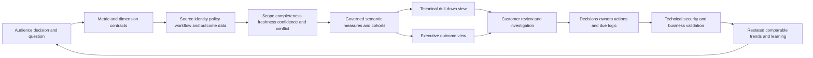

## JD Mapping

| Role expectation | Part 75 capability | TSM artifact | Arti bridge and boundary |
|---|---|---|---|
| Become AEM/Data Fabric expert | Explain public reporting positioning with claim boundaries | AEM reporting whiteboard | Verify current licensed fields/views |
| Analyze complex environments | Reconcile inventory, source, owner, control, lifecycle, and workflow metrics | Exposure scorecard | Power BI/SQL analysis transfers |
| Identify risks | Surface critical, public, unknown, unmanaged, and control-gap cohorts | Prioritized cohort review | Metric is decision aid, not risk proof |
| Recommend mitigation | Turn drill-down evidence into owned actions and validation | Action register | Customer owners approve |
| Resolve complex issues | Diagnose count/trend/dashboard/detail mismatches | Evidence package | Microsoft escalation method transfers |
| Lead strategic engagement | Run technical and executive reviews with decision records | Review pack and minutes | TSM facilitates governance |
| Communicate proactively | Explain change, cause, impact, uncertainty, and next checkpoint | Narrative template | No unexplained green/red score |
| Drive adoption/value | Connect use to validated remediation and durable process improvement | Value scorecard | Logins and ticket volume are not value |
| Partner cross-functionally | Align source, metric, asset, control, action, and risk owners | RACI | Preserve decision authority |
| Explore AI responsibly | Draft summaries/actions from cited facts under review | Review assistant pattern | No invented causes or autonomous acceptance |

## Candidate honesty note

| Evidence class | Safe interview statement | Boundary to state |
|---|---|---|
| Production transfer | "I used customer-impact, backlog, case-quality, telemetry, and trend evidence in Microsoft support operations." | Not production AEM reporting |
| Analytics transfer | "I define measures, denominators, time grains, filters, and reconciliation before presenting a trend." | Not proprietary product semantics |
| Review transfer | "I communicate facts, uncertainty, ownership, decisions, and next checkpoints during escalations and service discussions." | Not customer risk authority |
| Quality transfer | "I test source freshness, duplicate rows, joins, control totals, and dashboard/detail agreement." | Not undocumented connector behavior |
| Synthetic practice | "I built and delivered an NMH asset-exposure review with action tracking." | Fictional lab only |
| Official fact | "Zscaler publicly positions AEM and Data Fabric for reporting and context-rich workflows." | Verify exact current capability/license |
| General design | "A reliable dashboard begins with a decision and metric contract." | General method, not product claim |
| Unknown | "I would validate current docs, tenant data, metric definitions, and product specialists." | Never infer defaults |

## Beginner vocabulary and memory hooks

| Term | Plain meaning | Why it matters | Analogy and memory hook |
|---|---|---|---|
| Dashboard | Interactive decision view summarizing current or trended measures | Helps notice, compare, filter, and act | Airport operations board |
| Report | Fixed or parameterized presentation for a period/purpose | Supports review, evidence, and distribution | Daily flight report |
| KPI | Key Performance Indicator tied to an important objective | Should guide a decision, not decorate | On-time departure rate |
| Metric | Defined quantitative measure | Requires exact contract | Count of delayed flights |
| Dimension | Attribute used to group/filter a measure | Reveals where problems concentrate | Airline, airport, route, cause |
| Population/universe | Full eligible set under stated scope | Foundation for denominator | All scheduled eligible flights |
| Numerator | Count/value meeting the measured condition | Top of a rate | Flights on time |
| Denominator | Eligible population against which numerator is compared | Changes interpretation dramatically | Eligible scheduled flights |
| Grain | What one row represents | Prevents double counting | One flight leg, not one passenger |
| Snapshot | State captured at one as-of time | Useful for inventory; can miss movement | Photo of departure board |
| Event | Occurrence with time and identity | Supports flow/history | Flight departed |
| Cohort | Group sharing defined characteristics | Enables fair comparison | International evening flights |
| Coverage | Share of an eligible population observed or meeting a state | Requires independent scope | Tracked flights / scheduled flights |
| Confidence | Degree evidence supports a metric/record | Prevents uncertain data from looking exact | Reliability of radar feed |
| Freshness | Whether data is recent enough for the decision | Old dashboard can mislead | Board last refreshed yesterday |
| Unknown | Evidence cannot support pass/fail/classification | Must remain visible | Flight status unavailable |
| Source coverage | Extent intended sources/scopes are connected, authorized, complete, and fresh | Missing source can create false improvement | All radar stations reporting |
| Data health | Fitness of data for its use: scope, completeness, correctness, freshness, uniqueness, consistency, lineage | Determines trust | Is the board accurate and current? |
| Duplicate | More than one record represents one intended entity/episode | Inflates counts and work | Same flight listed twice |
| False merge | Different entities combined | Hides separate ownership/risk | Two flights shown as one |
| Ownership coverage | Eligible records with valid accountable role under contract | Enables action | Every delayed flight has dispatcher |
| Lifecycle | Approved state from request to active and retired | Keeps inactive/unknown assets distinct | Scheduled, active, landed, canceled |
| Control gap | Applicable safeguard does not meet required state | Drives remediation | Required inspection missing |
| Internet-reachable | Effective public path under a defined evidence contract | Important exposure cohort | Gate reachable from public terminal |
| Critical asset | Asset linked to approved high-impact service/context | Focuses consequence | Air traffic control system |
| Aging | Time since a defined clock start while item remains in state | Shows delay/debt | Minutes since scheduled departure |
| SLA | Formal service commitment with defined clock/terms | Must follow actual agreement | Contracted turnaround |
| SLO | Internal/agreed service objective | Operational target, not automatically contract | Team delay target |
| Backlog | Open work under defined state | Needs age, quality, and inflow/outflow context | Flights waiting for a gate |
| Throughput | Items completed per period under a completion definition | Shows flow | Flights departed per hour |
| Reopen | Item returns to active work after closure | Reveals failed validation/recurrence | Flight returns to gate |
| Recurrence | Same condition/path reappears after validated treatment | Measures durability | Repeated delay from same cause |
| Drill-down | Move from summary to supporting detail and evidence | Makes metric actionable/explainable | Click airport to exact flights |
| Control total | Independent count/sum used to reconcile stages/views | Detects missing/duplicate data | Scheduled flight manifest total |
| Semantic layer | Governed definitions connecting raw data to measures | Keeps views consistent | Shared operations dictionary |
| Filter context | Active selections affecting a view | Hidden filters change meaning | Only one terminal selected |
| Baseline | Reference period/state for comparison | Gives trend meaning | Normal delay rate |
| Target | Approved desired level and date | Directs improvement | On-time objective |
| Threshold | Rule triggering attention/color/action | Needs evidence and owner | Alert after 15 minutes |
| Trend | Measure over comparable periods | Shows direction/variation | Delay rate by week |
| Restatement | Corrected historical result after data/definition defect | Preserves honest comparisons | Reissue corrected flight report |
| Action register | Governed list of action, owner, due logic, state, evidence, blockers, validation | Converts review to execution | Dispatch action board |
| Decision log | Record of choices, rationale, authority, assumptions, and review | Preserves accountability | Why flights were rerouted |
| Pre-read | Material distributed before review | Enables decision-focused meeting | Briefing before operations call |
| Narrative | Concise explanation of what changed, why, impact, uncertainty, action, and ask | Prevents metric dumping | Operations controller summary |
| Leading indicator | Measure expected to precede an outcome | Helps early intervention | Maintenance completion |
| Lagging indicator | Measure of realized result | Confirms outcome after time | Actual disruptions |

## Product claim boundary

| Publicly supported statement | Safe interpretation | Production verification | Unsupported leap |
|---|---|---|---|
| AEM describes reports/dashboards and asset context | Teach role-based exposure reporting patterns | Exact current dashboards, fields, filters, exports, refresh | Promise a specific built-in KPI |
| AEM describes unknown assets and coverage/control gaps | Explain candidate cohorts and investigations | Definitions, source scope, evidence states, workflow | Treat displayed rows as confirmed truth |
| AEM describes golden records and relationships | Use resolved assets and context as reporting foundation | Identity quality, provenance, relationship semantics | Assume denominator is complete |
| AEM describes CMDB health and workflows | Connect reporting to governed actions | Exact connectors/actions/approval/read-back | Claim automatic closed-loop success |
| Data Fabric describes dynamic reporting and business logic | Explain governed metrics across integrated data | Current model/query/report capability and limits | Infer proprietary semantic layer |
| Data Fabric describes inbound/outbound integrations | Teach source and action coverage views | Connector direction, object, version, scope, permissions | Assume every integration supports every flow |
| Public pages discuss risk/compliance outcomes | Show decision-support potential | Customer risk/obligation analysis and validation | Claim dashboard certifies compliance or risk reduction |

### Plain-English deep-dive 1 - A percentage without a denominator is a rumor

Suppose an airport says "98 percent tracked." Is the denominator all flights scheduled by the airport, only flights from airlines connected to the feed, only flights that departed, or only records already present in the dashboard? If the dashboard uses its own observed rows as the denominator, an entire missing airline can disappear without lowering coverage.

Asset exposure reporting has the same trap. "EDR coverage is 98 percent" requires an independently governed eligible asset population, applicability rules, one asset grain, current control evidence, unknown handling, approved exceptions, as-of time, and source-health status. A metric contract turns a persuasive number into a reproducible statement.

## Dashboard architecture and measurement flow

A reliable reporting architecture separates raw evidence, resolved entities, semantic definitions, presentation, and action. This allows one source defect or definition change to be isolated without silently rewriting history.

| Layer | Responsibility | Example | Control |
|---|---|---|---|
| Source | Native observations and metadata | Cloud assets, EDR state, IAM roles | Scope/permission/count/freshness checks |
| Ingestion | Acquire and checkpoint data | Full/incremental runs | Retries, complete-run marker, quotas |
| Identity | Resolve asset/source records | Golden asset ID | Match evidence and conflict state |
| Context | Add owner, service, lifecycle, controls, exposure | Typed claims | Provenance and freshness |
| Semantic | Define metrics, dimensions, cohorts, clocks | `eligible_active_asset` | Versioned metric dictionary/tests |
| Presentation | Display technical/executive views | Tiles, trends, tables | Visible filters/as-of/quality |
| Workflow | Create/update owned actions | Ticket/action register | Idempotency and reconciliation |
| Validation | Confirm treatment/outcome | Path closed, control effective | Native read-back and postconditions |
| Governance | Approve definitions/targets/changes/access | Metric council/review | Decision log and restatement |

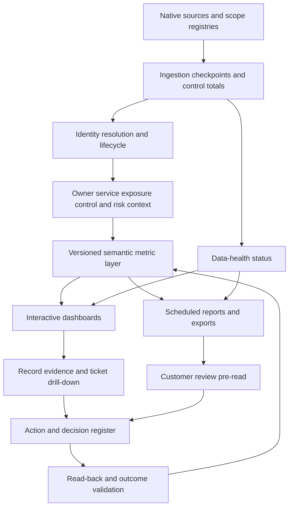

### Report state contract

Every view should expose the as-of time, refresh status, active filter scope, semantic version, data-health caveats, and drill-down. A screenshot without these details is weak evidence because the user cannot reproduce the result.

| Display element | Purpose | Example |
|---|---|---|
| As-of/refresh time | Shows currency and latency | Data complete through controlled UTC cutoff |
| Population/scope | States organizations/accounts/classes included | Five services, active assets only |
| Filter chips | Makes selected context visible | Production, North America, critical |
| Metric definition link | Opens numerator/denominator/states | Coverage contract v3 |
| Source-health banner | Warns degraded/unknown inputs | Cloud source incomplete |
| Confidence/unknown | Prevents false certainty | 31 reachability unknown |
| Comparison period | Defines trend basis | Same seven-day grain and scope |
| Drill-down | Exposes exact records/evidence | Asset ID, source, time, rule, ticket |
| Owner/action | Enables execution | Queue, accountable role, next checkpoint |
| Export metadata | Preserves scope/version/time | Report ID and semantic version |

## Metric contracts and denominator discipline

Start with the decision. "Do we need to assign ownership to active production assets?" is clearer than "show owner coverage." The decision determines population, field, authority, valid state, freshness, and action.

### Metric contract template

| Contract field | Required content | Example |
|---|---|---|
| Name/ID/version | Stable measure identity and revision | `owner_coverage.v3` |
| Decision/question | What choice does it support? | Which active production assets need ownership action? |
| Grain | Unit counted once | Resolved active asset |
| Population | Inclusion scope | In-scope active production assets |
| Exclusions | Explicit governed omissions | Approved supplier-owned out-of-scope assets |
| Numerator | Condition counted | Valid accountable business owner current |
| Denominator | Eligible population | All in-scope active production assets |
| States | Pass, gap, unknown, not applicable, exception | Unknown kept separate |
| Dimensions | Allowed groups | Service, owner org, class, environment, source |
| Time | Event/observation/as-of/window/time zone | Daily UTC snapshot |
| Source/authority | Inputs and field owner | Service catalog plus owner attestation |
| Freshness | Current enough definition | Owner review inside approved interval |
| Quality gates | Conditions allowing publication/action | Source complete; identity conflicts visible |
| Threshold/target | Approved trigger and intended level | Customer-defined, not vendor default |
| Owner | Metric steward and action owner | Asset governance and service owner |
| Drill-down | Record/evidence path | Asset, source, owner, attestation, ticket |
| Validation | How result/action is proven | Attested owner and routing test |
| Change/restatement | How definitions/history are governed | Version note and backfill policy |

### Core arithmetic

A basic coverage rate can be written as:

$$
\text{Coverage rate} = \frac{\text{eligible assets meeting the required state}}{\text{all eligible assets}} \times 100
$$

Decision completeness should be shown separately:

$$
\text{Decision completeness} = \frac{\text{eligible assets classified pass, gap, exception, or not applicable}}{\text{all eligible assets}} \times 100
$$

Unknown assets remain in the denominator where they are eligible, but they do not become passes or confirmed gaps. The exact state model and treatment depend on the customer policy.

### Denominator traps

| Trap | Misleading result | Correction |
|---|---|---|
| Tool self-denominator | EDR reports 100 percent of agents as covered while unagented assets vanish | Independent active-asset universe |
| Mixed grain | Device, OS, agent, and interface rows counted together | One defined asset/control grain |
| Duplicate assets | Coverage numerator/denominator inflated unpredictably | Resolved identity plus duplicate confidence |
| Lifecycle leakage | Retired assets remain eligible or active assets excluded | Authoritative lifecycle and unknown state |
| Applicability ignored | SaaS or appliance marked missing endpoint agent | Policy eligibility by class/platform |
| Unknown treated false/pass | Source outage creates spike/drop | Separate unknown and source status |
| Exceptions counted pass | Residual risk hidden | Report exception separately |
| Hidden scope change | New accounts lower rate without note | Stable cohort or annotated scope bridge |
| Survivor bias | Only remediated tickets included | All eligible episodes/intake cohorts |
| Closure denominator | Closed tickets / closed tickets = 100 percent | Intake/open/eligible episodes |
| Record count as asset count | Multi-source rows inflate inventory | Golden asset grain and source rows separately |

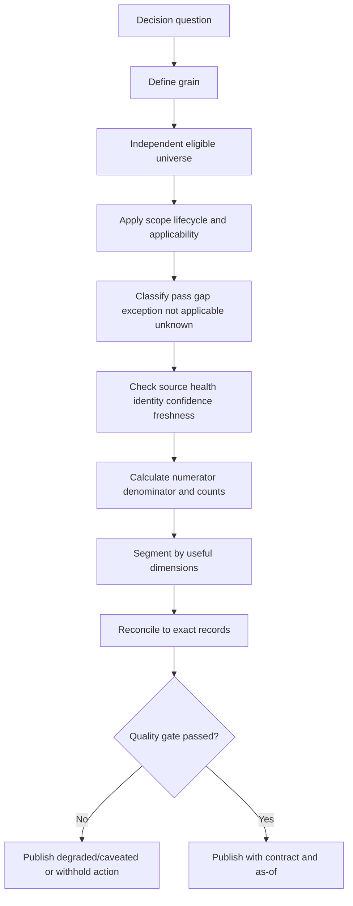

## Inventory coverage and confidence

Inventory reporting should answer both "what do we know?" and "how do we know the population is complete enough?" It should not claim absolute completeness unless the organization has a defensible external universe and evidence.

| Metric | Illustrative definition | Why useful | Caveat |
|---|---|---|---|
| Registry coverage | Registered accounts/domains/networks represented / approved registry population | Detects missing organizational scope | Registry can itself be incomplete |
| Resolved-identity rate | Observations linked to one supported asset / eligible observations | Shows correlation quality | High rate can hide false merges |
| Decision-ready assets | Active assets with required identity/lifecycle/owner/source confidence / active in-scope assets | Measures usability | Required context use-case specific |
| Unknown asset count/rate | Unresolved or ungoverned candidate assets / eligible asset candidates | Shows investigation need | Unknown is not automatically rogue |
| Unmanaged asset rate | Confirmed active assets missing required management state / eligible active assets | Finds governance/control gaps | Applicability required |
| Duplicate candidate rate | Assets/observations in material duplicate candidates / eligible population | Identity debt | Candidate is not confirmed duplicate |
| False-merge/split sample rate | Confirmed identity defects / reviewed sample | Tests resolution quality | Sampling method and labels matter |
| Fresh asset evidence | Assets inside class/source freshness contract / eligible assets | Currency | Different classes need different windows |
| Provenance completeness | Required fields with source/time/rule metadata / eligible required fields | Explainability | Metadata presence not correctness |
| Inventory confidence distribution | Assets by confirmed/supported/candidate/conflicted/unknown | Avoids one opaque confidence average | State criteria must be published |

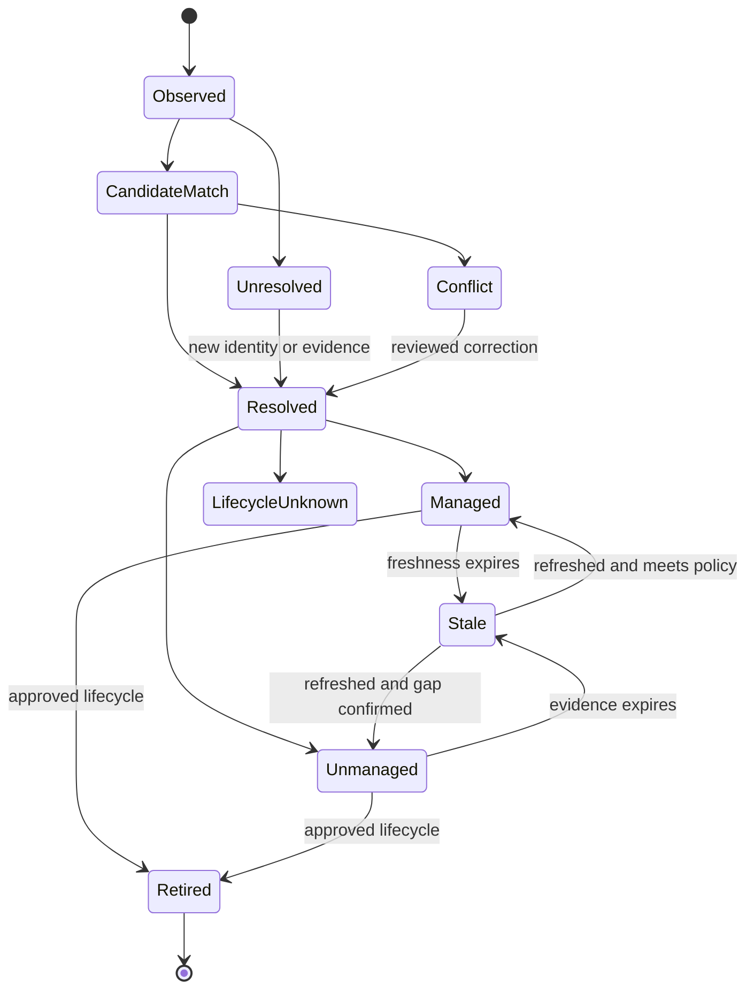

### Plain-English deep-dive 2 - Unknown is a first-class dashboard state

An airport whose radar feed fails should not label every flight "landed" or "missing." It should show "status unknown" and raise a feed incident. Otherwise the board can become greener precisely when visibility is worse.

Asset dashboards need the same discipline. If a cloud connector loses permission, an endpoint source is late, or identity resolution conflicts, preserve unknown. Show affected populations and decisions. Block unsafe automatic downgrades or closures. Prioritize source restoration and evidence acquisition according to possible consequence. Unknown is not failure by definition, but hiding it is a reporting failure.

## Source coverage and data health

"Connector enabled" is the first step, not source coverage. Measure the intended source inventory and every stage needed for usable data.

### Source-state ladder

| State | Question | Evidence | Failure if skipped |
|---|---|---|---|
| Discovered | Do we know the source/owner/use? | Source inventory | Shadow data sources omitted |
| In scope | Is it required for a defined use case? | Approved source plan | Optional and mandatory mixed |
| Connected | Is connector/path configured? | Integration record | Configuration assumed working |
| Authenticated | Can identity authenticate currently? | Auth result/expiry | Stale credentials hidden |
| Authorized | Can it access required objects/fields/scopes? | Permission tests | Partial view appears complete |
| Scheduled/triggered | Does acquisition run as intended? | Scheduler/event evidence | Dormant connector shown healthy |
| Successful | Did run finish technically? | Run status | Partial success overlooked |
| Complete | Did all pages/accounts/regions/time windows arrive? | Control totals/checkpoints | Missing rows become false improvement |
| Parsed/mapped | Did schema and mappings preserve meaning? | Reject counts/type tests | Silent null/defaults |
| Correlated | Did records resolve to correct entities? | Match/conflict metrics | Data present but unusable |
| Fresh | Is observation current enough? | Source/event/as-of times | Old data shown current |
| Fit for use | Do quality and semantics support decision? | Acceptance tests/samples | Green pipeline, bad dashboard |

| Data-health dimension | Example measure | Drill-down | Owner |
|---|---|---|---|
| Scope completeness | Required accounts received / registered accounts | Missing account list | Source/business owner |
| Run reliability | Complete runs / scheduled runs | Run log/retry/error | Integration owner |
| Freshness | Records/fields inside window / eligible | Source/field age | Source/data steward |
| Mapping completeness | Required mapped values / eligible | Reject/null samples | Mapping owner |
| Identity resolution | Exact/supported/conflicted/unknown states | Match evidence | Asset data steward |
| Uniqueness | Duplicate candidates/confirmed defects | Candidate pairs | Asset data steward |
| Consistency | Authoritative conflicts / compared claims | Conflicting fields | Field owners |
| Lineage | Values with source/time/rule/version | Missing provenance | Data platform owner |
| Reconciliation | Source-to-semantic-to-view control totals | Stage diff | Reporting owner |
| Actionability | Records with valid owner/action path | Unroutable list | Governance owner |

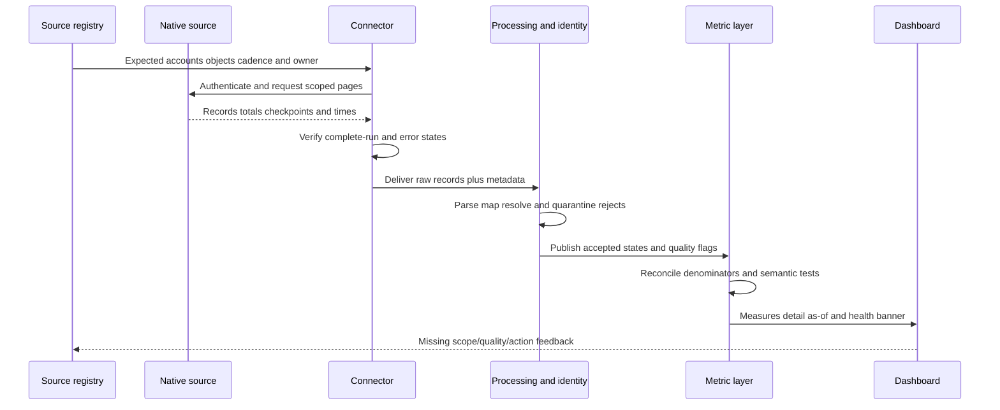

### Data-health dashboard design

Show source health next to business metrics, not on a hidden admin page. An executive tile can state "inventory trend unavailable for two cloud accounts" while technical drill-down shows connector, permission, last complete run, affected measures, owner, and restoration action. Never let source failure present as successful risk reduction.

## Unknown assets and investigation reporting

Unknown means the evidence cannot yet establish identity, owner, purpose, lifecycle, authorization, or management state. Classify the missing question so action goes to the right owner.

| Unknown type | Example | First action | Escalation condition |
|---|---|---|---|
| Identity unknown | Public IP maps to conflicting resources | Resolve provider/account/backend/time | High consequence or active exposure |
| Owner unknown | Active production resource lacks accountable role | Service/account hierarchy and steward | Critical/public/privileged or aging |
| Purpose unknown | Device communicates but service relation absent | Technical owner and activity review | Sensitive/privileged behavior |
| Lifecycle unknown | Absent from source after incomplete run | Restore source and verify native state | Proposed destructive action |
| Authorization unknown | Asset exists outside approved catalog | Validate request/change/exception | Confirmed unauthorized or harmful path |
| Management unknown | Asset-control join missing | Verify asset and native control source | Critical/public with control uncertainty |
| Source unknown | Observation lacks lineage | Quarantine from consequential use | Cross-tenant/privacy/action risk |
| Relationship unknown | Critical-service link is candidate | Architecture/owner validation | Priority/blast-radius decision depends on it |

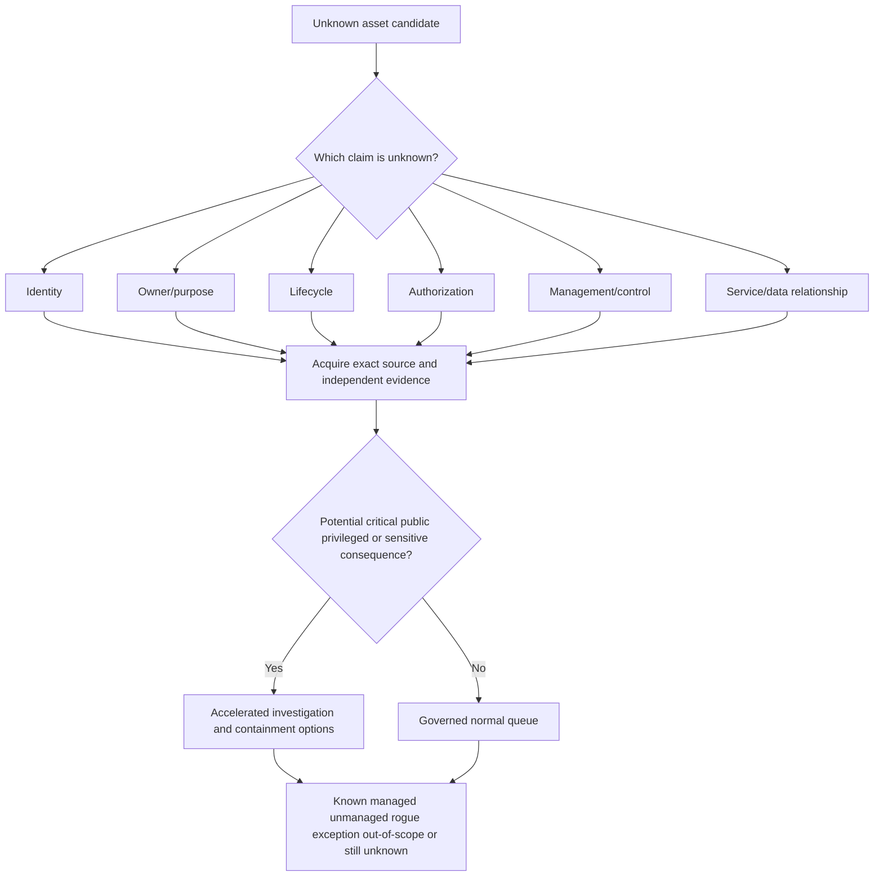

Unknown-asset reporting should include intake source, first/last observed, identity candidates, exposure, behavior, possible owner/service, controls, confidence, investigation age, action owner, and next evidence checkpoint. Avoid declaring an asset rogue until authorization policy and evidence confirm it.

## Duplicates, ownership, and lifecycle views

### Duplicate quality

| Measure | Definition | Risk | Guardrail |
|---|---|---|---|
| Duplicate candidate count | Candidate pairs/groups under current rule | Review workload | Not called confirmed duplicates |
| High-confidence candidate age | Time unresolved above evidence threshold | Persistent identity debt | Threshold/version visible |
| Confirmed duplicate rate | Confirmed duplicate assets / reviewed candidates | Rule precision clue | Reviewed denominator only |
| False-merge sample rate | Confirmed merged-different assets / reviewed merged sample | Wrong action/context risk | Independent representative sample |
| False-split sample rate | Confirmed same asset represented separately / reviewed sample | Fragmented work/risk | Stable IDs and lifecycle checks |
| Merge reversal count | Approved unmerges per period | Correction/quality signal | Higher count can reflect healthy detection |
| Downstream reconciliation completeness | Corrected tickets/findings/reports/relationships / impacted items | Ensures repair | Must inventory all consumers |

### Ownership coverage

| Role | Meaning | Validity test | Dashboard mistake |
|---|---|---|---|
| Business owner | Accountable for business purpose/priority | Active role and approved service responsibility | Last user treated owner |
| Technical owner | Maintains technical component | Current team/queue with accepted scope | Generic group without responsibility |
| Control owner | Operates safeguard | Defined control scope and escalation | Asset owner blamed for control feed |
| Data owner | Governs data use/handling | Approved data domain role | Database admin assumed data owner |
| Steward | Resolves data-quality definitions/conflicts | Assigned class/field governance | Steward treated risk owner |
| Risk owner | Authorized residual-risk decision | Delegation/policy evidence | Analyst/TSM accepts risk |
| Action owner | Responsible for exact remediation task | Accepted assignment and due logic | Ticket queue equals accountability |

### Lifecycle reporting

| Lifecycle cohort | Reporting question | Common defect | Action |
|---|---|---|---|
| Requested/provisioning | Are required owner/service/controls ready before use? | Asset appears after exposure | Shift-left readiness |
| Active | Is current use, context, and control state valid? | Stale owner or duplicate identity | Normal governance/remediation |
| Quarantined | Why, under whose authority, and what exit criteria? | Permanent limbo | Review restore/retire decision |
| Retirement proposed | Is source complete and no dependency/use remains? | Absence treated deletion | Owner/dependency validation |
| Retired | Are endpoints, identities, licenses, data, and relations closed? | Public listener/credential survives | Residual-path cleanup |
| Archived | Is history retained/restricted appropriately? | Counted active | Correct filters/retention |
| Unknown | Is source/lifecycle evidence insufficient? | Auto-retired to improve metrics | Source/owner investigation |

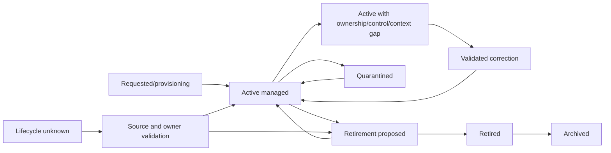

### Plain-English deep-dive 3 - Lower asset count can be bad news

An airport board showing fewer delayed flights could mean operations improved. It could also mean one airline feed failed, duplicate flights were incorrectly merged, or delayed flights were reclassified as canceled. Direction alone is not meaning.

When inventory, unknown, duplicate, gap, or urgent counts move, show a change bridge: new discovery, retirement, identity merge/split, scope change, policy change, source degradation/restoration, remediation, validation, and correction. A credible review explains movement, not just color.

## Control-gap, critical, and internet-exposure views

Control coverage must begin with policy applicability and a trustworthy asset denominator. Report state counts and rates together so a small denominator cannot create a dramatic percentage without context.

| View | Essential measures | Required dimensions | Drill-down |
|---|---|---|---|
| EDR coverage | Eligible, effective, gap, exception, unknown, not applicable | Service, criticality, OS, owner, environment | Sensor identity, policy, health, time, ticket |
| Vulnerability assessment | Targeted, reached, authenticated, fresh, unknown | Asset class, scanner, network, owner | Last scan, credential depth, reject reason |
| Encryption | Eligible, enforcing, key/recovery validated, unknown | Device/data class, owner, platform | Native state, key scope, policy |
| Backup/recovery | Protected, recent, isolated, restore-tested, gap, unknown | Service tier, data class, owner | Job/copy/restore evidence |
| Identity controls | Active accounts, MFA/effective policy, privilege review, gaps | Identity type, privilege, app, owner | Effective policy/role/last review |
| Ownership | Valid business/technical owner and action route | Service, class, environment | Source, attestation, expiration |
| Unsupported technology | Exact product/build beyond approved support | Service, exposure, owner | Vendor lifecycle evidence and plan |
| Internet exposure | Confirmed, candidate, unknown, unnecessary, exception | Service, criticality, path, owner | DNS/listener/route/policy/test |

### Critical and public cohort matrix

| Cohort | Question | Example action |
|---|---|---|
| Critical + public + confirmed control gap | Which plausible scenarios need immediate treatment? | Accelerated containment/remediation |
| Critical + public + unknown control state | Which evidence must be acquired urgently? | Restore source and validate path/control |
| Critical + private + privileged path | Which admin/workload routes create concentration? | Restrict entitlement and patch |
| Noncritical + public + no purpose | Why is exposure necessary? | Owner validation and remove/retire |
| Critical + retired + public residue | Did lifecycle workflow leave endpoints/credentials? | Contain residual path and investigate |
| Sensitive-data + ownerless | Who can authorize treatment and data handling? | Steward/risk escalation |
| Shared identity/control choke point | How many services depend on one weakness/control? | Systemic treatment and resilience test |
| Exception nearing expiry | Are assumptions and compensation still valid? | Reassess, remediate, or reauthorize |

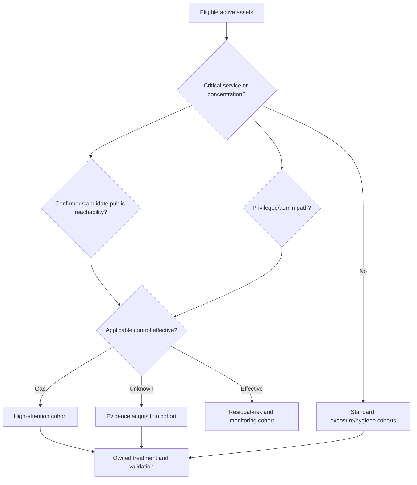

## Trends, aging, service levels, and flow

Trends require comparable definitions and cohorts. If scope or definitions change, annotate the series, provide a bridge, or restate history under governance. Never join snapshots by display name when stable IDs and lifecycle events are available.

### Trend components

| Component | Question | Example |
|---|---|---|
| Time grain | Daily, weekly, monthly, rolling window? | Weekly UTC snapshot |
| As-of logic | Event time, observation time, processing time? | Latest accepted evidence at cutoff |
| Population | Current assets or fixed cohort? | Both current-state and intake cohort views |
| Definition version | Did metric contract change? | Coverage v2 to v3 annotation |
| Scope change | Were accounts/services/classes added? | Acquisition account added |
| Data-quality state | Were sources complete each period? | Two degraded days shaded |
| Change bridge | Why did value move? | Discovery, retirements, fixes, unknowns |
| Seasonality | Are periodic changes expected? | Device refresh cycle |
| Distribution | What lies behind average? | Median and 90th percentile age |
| Target/forecast | Is it approved and assumption-based? | Capacity plan with range |

### Aging clocks

| Work item | Start | Pause | Stop | Anti-gaming rule |
|---|---|---|---|---|
| Unknown asset | Trusted first detection into owned queue | Only approved external wait with visibility | Resolved disposition validated | Do not recreate item to reset age |
| Ownership gap | Confirmed eligible owner gap | Formal dependency under policy | Valid owner attested and route tested | Generic queue not closure |
| Control gap | Confirmed applicable deficient state | Approved exception process if contract says | Native/effective postcondition validated | Ticket closed is not stop |
| Vulnerability treatment | Confirmed applicable episode under policy | Customer-defined legitimate states | Fix/compensation and residual path validated | Rescan must cover exact asset |
| Source incident | Trusted detection of incomplete/unfresh data | Approved external dependency | Backfill/reconciliation complete | API recovery alone not stop |
| Duplicate review | Candidate enters governed queue | Evidence request under contract | Merge/separate/unknown disposition and reconciliation | Rule change cannot erase age silently |
| Exception | Approval effective date or underlying-gap start per policy | Usually no pause; terms vary | Remediated or reauthorized under authority | Renewal preserves total age history |

An SLA is a formal commitment defined by the actual agreement. An SLO is an objective. Do not invent either for Zscaler or a customer. Report clock rules, priority/eligibility, business hours/time zone, pause reasons, target, breaches, and validation. A high breach rate may reveal capacity, ownership, unsafe target design, or poor data rather than individual failure.

### Flow metrics

| Measure | Definition | Interpretation | Caveat |
|---|---|---|---|
| Intake | New validated episodes in period | Demand | Discovery/scope changes affect it |
| Throughput | Episodes reaching validated completion | Delivery | Easy closures can inflate |
| Net backlog change | Ending minus starting backlog | Inventory movement | Needs intake/completion bridge |
| Work in progress | Active episodes currently being worked | Capacity/focus | Status hygiene required |
| Age distribution | Percentiles/buckets of active age | Delay/debt | Average hides long tail |
| Time to acknowledge | Detection to accepted ownership | Routing speed | Acceptance not remediation |
| Time to validate | Detection to proven postcondition | End-to-end outcome | Cohort and pause rules needed |
| Reopen rate | Reopened validated episodes / closed episodes | Closure quality | Distinguish recurrence/new condition |
| Recurrence rate | Same condition/path after validation / eligible treated episodes | Durability | Stable identity/rule required |
| SLA/SLO attainment | Eligible episodes meeting clock / eligible episodes | Service performance | Contract exactness required |
| Blocked time | Time by dependency reason | Enables escalation | Do not hide it as pause automatically |

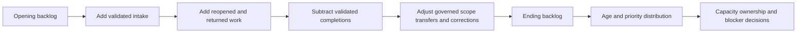

### Plain-English deep-dive 4 - A closed ticket is a workflow event, not a security outcome

An airport maintenance ticket can be closed because a technician entered a note. That does not prove the runway light works. The light must be inspected or tested, the board updated, and dependent operations verified.

Exposure remediation needs similar postconditions. For a public asset, prove the route or vulnerable prerequisite changed. For an EDR gap, verify the correct sensor identity, health, policy, enforcement, and current telemetry. For ownership, verify the accountable role and routing. Reconcile the asset, finding, exception, ticket, dashboard, and historical trend. Report workflow completion and validated outcome separately.

## Remediation, validation, and action registers

### Remediation state model

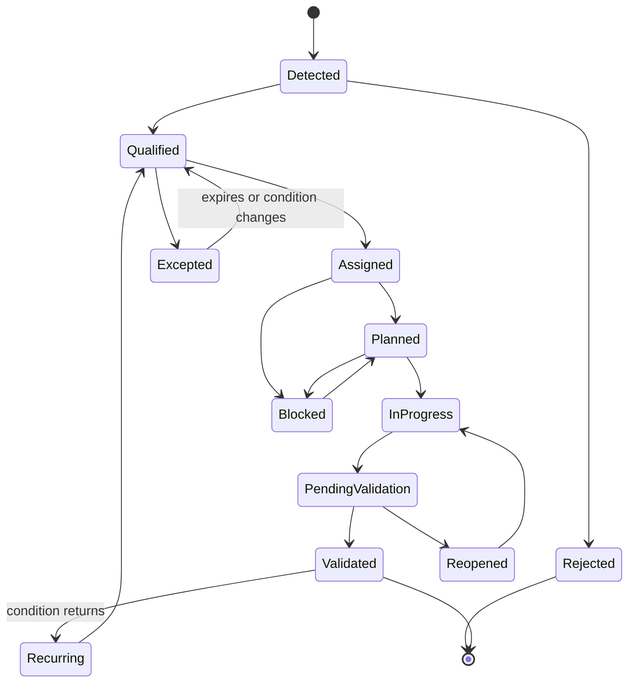

### Action-register contract

| Field | Content | Why |
|---|---|---|
| Action ID | Stable logical episode/action identifier | Prevents duplicates and supports trace |
| Problem statement | Exact gap/exposure/context and evidence | Makes work reproducible |
| Assets/services | Stable IDs and affected scope | Controls target/blast radius |
| Priority rationale | Factors and uncertainty | Explains timing |
| Accountable owner | Person/role authorized for result | Accountability |
| Responsible team | Team executing task | Delivery |
| Decision/approver | Required risk/change authority | Governance |
| Treatment | Exact remediation/compensation/evidence work | Clear expected change |
| Due logic | SLA/SLO/commitment/sequence/change window | Honest clock |
| Status | Governed state and last update | Operational view |
| Blocker | Dependency, owner, maintenance, vendor, evidence | Enables escalation |
| Next checkpoint | Date/event and expected evidence | Prevents vague follow-up |
| Validation | Technical/security/business/reporting postconditions | Defines done |
| Residual risk | Remaining paths/assumptions/expiry | Avoids false closure |
| Links | Ticket/change/exception/evidence/decision | Auditability |

### Review-to-action flow

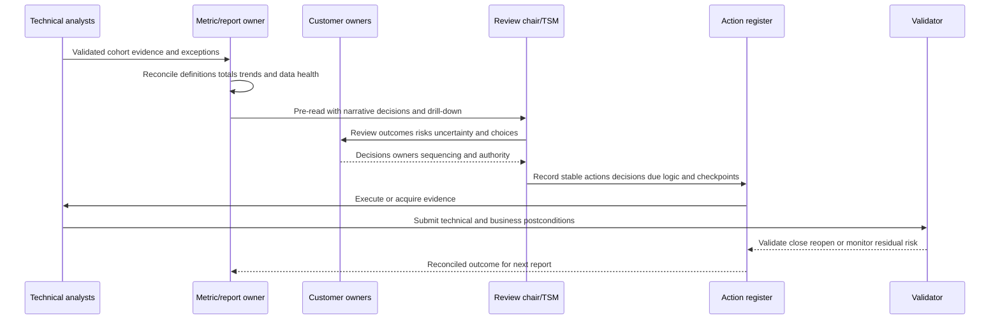

Action registers should not become another stale spreadsheet. Reconcile them with source assets, findings, tickets, exceptions, changes, and validation evidence. Keep one logical action despite retries or meeting recaps. Preserve decision history, comments, and corrections.

## Technical and executive dashboard views

Both views should derive from the same semantic definitions. They differ in decision level, density, and detail, not truth.

### Technical operator view

| Section | Question | Content |
|---|---|---|
| Health banner | Can I trust this view now? | Sources, freshness, rejects, conflicts, as-of, model version |
| Scope | What population/filter is active? | Org, account, service, environment, class, lifecycle |
| Inventory states | Which assets are managed, unmanaged, unknown, duplicate, stale? | Counts/rates/trends and exact lists |
| Exposure cohorts | Which are public, privileged, critical, sensitive, or concentrated? | Intersections and confidence |
| Control gaps | Which applicable controls are gap/unknown/excepted? | Policy/evidence/owner |
| Work flow | What is new, aging, blocked, due, breached, reopened? | Episode-level queue |
| Drill-down | Why is this record here? | IDs, sources, rules, times, relationships, tickets |
| Action | What should happen next? | Treatment, owner, due logic, validation |

### Executive view

| Section | Executive question | Content | Avoid |
|---|---|---|---|
| Objective | Which business outcome is being protected? | Service/resilience/data/risk objective | Product feature list |
| Current position | What is the material exposure picture? | Critical cohorts and confidence | All raw findings |
| Movement | What changed and why? | Stable trends and change bridge | Unexplained percent |
| Risk/control | Which scenario, control strengths/gaps, residual uncertainty? | Plain-language narrative | Unsupported certainty |
| Execution | Are accountable actions progressing? | Aging, blockers, validated outcomes | Ticket count as value |
| Decisions | What needs leadership choice/support? | Priorities, resources, accepted tradeoffs | Technical minutiae |
| Outlook | What next, by whom, with what validation? | Roadmap/checkpoints | Invented guarantee/ETA |

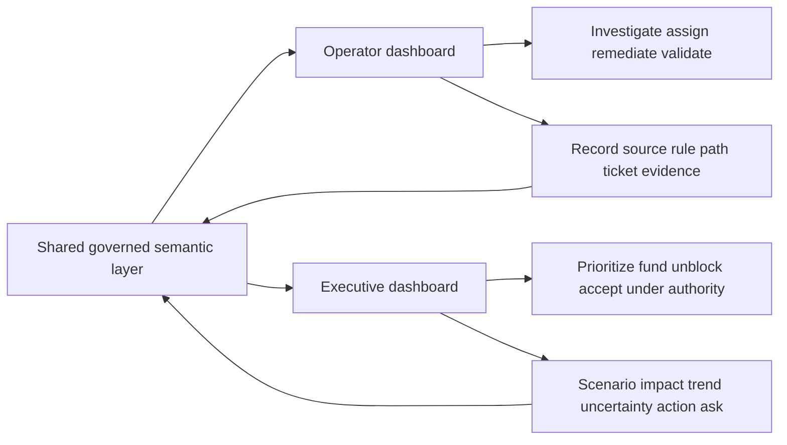

### Visual and interaction principles

| Principle | Good practice | Failure |
|---|---|---|
| Information hierarchy | Put data health, critical decisions, and actions first | Twenty equal tiles |
| Stable layout | Consistent units, positions, and colors | Dynamic rearrangement hides change |
| Color with text | Label state and do not rely on red/green alone | Accessibility and ambiguity |
| Counts plus rates | Show both numerator and denominator | Tiny cohort looks dramatic |
| Distribution | Show age buckets/percentiles, not average only | Long tail hidden |
| Context intersections | Critical AND public AND gap | Separate totals require mental join |
| Visible unknowns | Dedicated state and banner | Unknown folded into pass/fail |
| Drill path | Summary -> cohort -> asset -> evidence -> action | Dead-end KPI |
| Annotation | Scope/definition/source changes on trend | False causal story |
| Export integrity | Include filters/as-of/version/quality | Detached screenshot |

## Drill-down and explainability

A useful drill-down is a chain of reconciliation. The headline total should equal its cohort rows under the same scope and time. Each asset row should show why it qualifies. Each action should point to evidence and validation.

### Drill-down levels

| Level | Example question | Required content |
|---|---|---|
| Portfolio | How many critical public assets have confirmed control gaps? | Count/rate/denominator/trend/health |
| Cohort | Which services/owners/classes drive the count? | Dimensions and contribution |
| Asset | Why is this asset in the cohort? | Stable ID, lifecycle, criticality, exposure, control |
| Claim | Which evidence supports each attribute? | Source, time, method, confidence, rule |
| Path/finding | What scenario or policy requirement applies? | Prerequisites, controls, uncertainty |
| Workflow | What action/ticket/exception/change exists? | State, owner, due logic, blockers |
| Validation | What proves completion/residual risk? | Native read-back and postconditions |

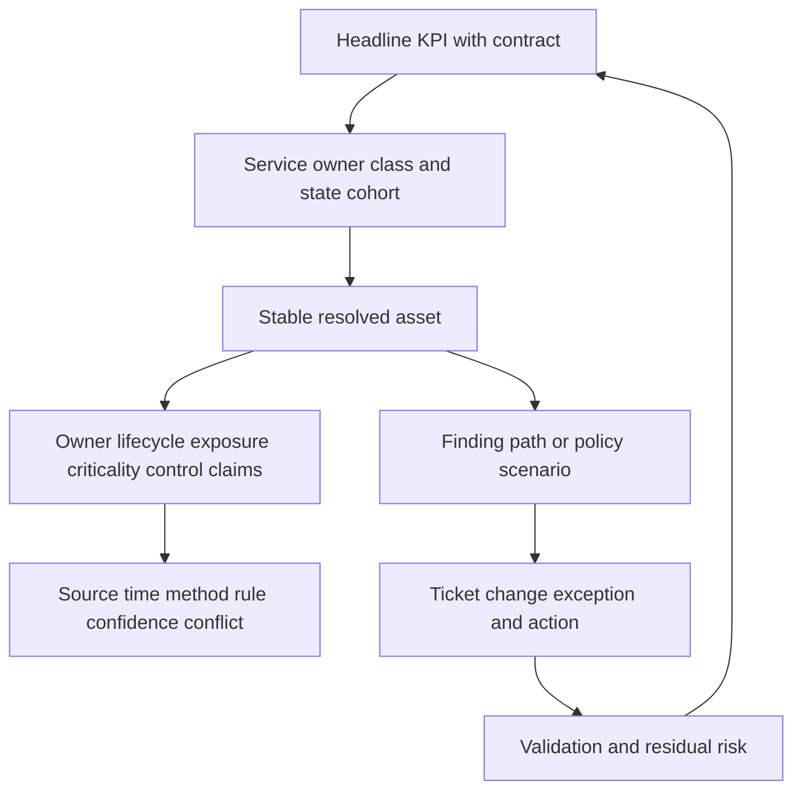

### Reconciliation tests

| Test | Expected result | Defect found |
|---|---|---|
| Summary-to-cohort sum | Child states equal parent under same filters | Hidden state/filter/double count |
| Cohort-to-asset uniqueness | Each asset counted once per metric grain | Duplicate joins |
| Asset-to-source trace | Required attributes have current provenance | Unsupported context |
| Source-to-native total | Acquired scope matches independent count | Missing pages/accounts |
| Ticket-to-asset link | One logical episode maps correctly | Duplicate/wrong target |
| Closure-to-validation | Closed workflow has postcondition | Premature closure |
| Export-to-view | Same filters/as-of/version produce same result | Cache/snapshot/export defect |
| Trend-to-definition | Periods use comparable semantic version or annotation | False trend |

## Narrative design

A metric narrative should be concise but complete. Use a repeatable pattern:

1. **Headline:** What materially changed under which scope and period?
2. **Cause/evidence:** Which validated factors explain movement?
3. **Business/security meaning:** Which services, data, paths, or controls are affected?
4. **Confidence/caveat:** What is unknown, degraded, estimated, or definition-dependent?
5. **Action/outcome:** What was completed and validated; what remains?
6. **Decision/ask:** Which owner, resource, risk, or sequencing choice is needed?
7. **Next checkpoint:** When or after what evidence will status update?

### Narrative examples

| Weak statement | Better statement |
|---|---|
| "Risk is down 30 percent." | "The confirmed critical-public-control-gap cohort fell from 20 to 14 under the same five-service scope after six routes were removed and independently retested. Two additional records remain unknown because one cloud account source is degraded; no financial-risk reduction is claimed." |
| "Coverage is 98 percent." | "Of 8,100 eligible active endpoint assets, 7,938 had current healthy enforcing EDR evidence, 92 were confirmed gaps, 41 had approved exceptions, and 29 were unknown at the UTC cutoff. The rate excludes not-applicable appliances under policy v4." |
| "The team closed 500 tickets." | "The team validated 412 unique control-gap episodes; 51 tickets were duplicates, 22 closures failed postcondition and reopened, and 15 remain under validation. Median age improved, while the oldest critical cohort still requires owner action." |
| "Unknown assets increased." | "Unknown candidates rose by 36: 28 came from newly connected acquisition accounts, five from identity conflicts, and three from a source-lineage defect. None is yet labeled rogue; seven public candidates are in accelerated validation." |
| "All sources are green." | "All scheduled connectors completed, but one source delivered 18 percent fewer native records than its registered population. Inventory and owner metrics remain caveated pending permission and pagination checks." |

### Plain-English deep-dive 5 - An executive dashboard is not a simplified technical dashboard

An airline executive does not need every engine sensor. They need to know whether safe, reliable operations are improving, which routes or systems create material concentration, what is blocking action, and which decision requires leadership. Removing detail alone does not create that view.

Build the executive story from business objectives and scenario cohorts. Keep technical drill-down available for credibility. Show confidence and data health. Translate "1,200 findings" into "three shared public services and one identity choke point drive most urgent exposure," if evidence supports it. Do not translate into guaranteed loss avoidance or compliance unless an approved method and authority support that claim.

## Customer review operating model

A review is useful when participants can make or prepare decisions. Separate working sessions for data/source defects, technical remediation reviews, and executive outcome reviews when necessary, while maintaining one linked action and decision record.

### Cadence model

| Cadence | Audience | Purpose | Typical output |
|---|---|---|---|
| Daily/operational | Analysts, source/control owners | Source health, urgent unknowns, blockers, new critical exposure | Incident/action updates |
| Weekly/tactical | Security, IT, app/cloud owners, TSM | Aging cohorts, remediation, exceptions, data quality | Action register and escalations |
| Monthly/service | Program owners, customer success/TSM, platform teams | Adoption, coverage, trend, process health, roadmap | Service review and plan |
| Quarterly/strategic | Executives, risk/business owners, account team | Material scenarios, outcomes, decisions, investment, roadmap | Executive decision log |
| Event-driven | Appropriate incident/change stakeholders | Source outage, mass context shift, active threat, unsafe automation | Containment and recovery plan |

Cadence is customer-specific. High-consequence events should not wait for a quarterly review. Routine operational detail should not consume executive time unless it changes a decision.

### Pre-review preparation

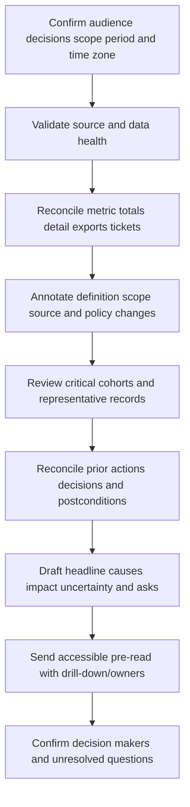

### Customer-review agenda

| Agenda item | Decision question | Time discipline | Output |
|---|---|---|---|
| 1. Objectives/scope | What outcomes and populations are in this review? | Brief | Confirm scope |
| 2. Data health | Can we trust current/trend views? | Exception-focused | Caveats and source actions |
| 3. Prior commitments | What validated, slipped, reopened, or remains blocked? | Action-focused | Updated register |
| 4. Exposure posture | Which critical/public/unknown/control-gap cohorts changed and why? | Decision-focused | Priority alignment |
| 5. Deep dives | Which one or two scenarios need joint reasoning? | Bounded | Technical decisions |
| 6. Adoption/process | Are owners using the workflow and validating outcomes? | Evidence-based | Enablement/process actions |
| 7. Decisions/risks | What requires owner acceptance, resources, sequencing, or escalation? | Explicit | Decision log |
| 8. Roadmap | What is next by outcome and dependency? | Realistic | Updated plan |
| 9. Recap | Who owns what, due logic, validation, checkpoint? | Mandatory | Read-back agreement |

### Meeting roles

| Role | Responsibility |
|---|---|
| Chair/TSM | Frame objectives, manage time, surface decisions, summarize evidence and boundaries |
| Metric/report owner | Defend definitions, data health, reconciliation, and drill-down |
| Asset/source steward | Resolve scope, identity, provenance, and quality defects |
| Security/control owner | Explain policy, control state, exceptions, and validation |
| Technical/app/cloud owner | Assess treatment feasibility, dependencies, and implementation |
| Business/risk owner | Decide priority, tradeoffs, and residual-risk acceptance under authority |
| Scribe/action owner | Capture decisions, actions, owners, due logic, evidence, and checkpoints |
| Support/Product partner | Address bounded product defects/capability questions through process |

### Review sequence

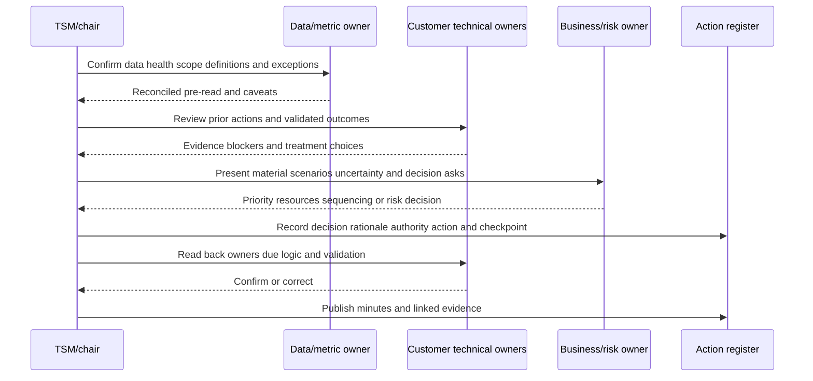

### Follow-up contract

| Follow-up item | Required content | Timing principle |
|---|---|---|
| Minutes | Scope, facts, caveats, decisions, dissent, actions | Prompt while context is fresh |
| Action updates | Stable ID, owner, state, blocker, evidence, next checkpoint | According to consequence/cadence |
| Decision record | Authority, rationale, assumptions, expiry/review | At decision time |
| Data defect | Impacted metrics/actions, containment, owner, correction/restatement | Event-driven |
| Validation result | Technical/security/business/reporting postconditions | Before closure claim |
| Escalation | Expected/actual, IDs, times, versions, impact, reproduction | When bounded evidence supports |
| Pre-read update | Latest comparable metrics and prior-action status | Before next review |

## Complete synthetic NMH dashboard and review

All numbers, targets, dates, and outcomes in this section are synthetic. The dashboard cutoff is 2026-08-24 00:00 UTC.

### NMH metric contract summary

| Metric | Grain/population | State logic | Owner |
|---|---|---|---|
| Active inventory | One resolved asset in five registered services with active lifecycle | Active, unknown lifecycle separate | Asset governance |
| Inventory decision readiness | Active assets with required identity, owner, service, lifecycle, source confidence | Ready/gap/unknown | Asset governance |
| Internet reachability | Active assets with public path under test contract | Confirmed/candidate/denied/unknown | Network security |
| EDR effective coverage | Eligible endpoint/server assets under policy v4 | Effective/gap/exception/unknown/NA | Endpoint security |
| Ownership coverage | Active assets requiring accountable business owner | Valid/gap/unknown/NA | Service governance |
| Validated remediation | Unique episodes with all postconditions | Validated/reopened/pending | Exposure program |
| Aging | Detection-to-current/validated under episode clock | Buckets and percentiles | Exposure program |

### NMH current scorecard

| Measure | Current | Prior comparable | Change explanation | Confidence/caveat |
|---|---:|---:|---|---|
| Active resolved assets | 8,420 | 8,315 | 142 discovered, 37 retired under validated lifecycle | High under five-service scope |
| Decision-ready inventory | 7,944 / 8,420 (94.3%) | 93.1% | Owner and lifecycle campaign | One acquisition account under review |
| Unknown candidates | 126 | 91 | 28 acquisition discoveries, five conflicts, two new sources, net dispositions | Candidate, not rogue |
| Duplicate candidates | 184 groups | 211 | 39 resolved, 12 new | Rule v6; not confirmed duplicates |
| Valid business owner | 7,801 / 8,420 (92.6%) | 90.8% | Service attestation | 114 stale attestations separate |
| Confirmed internet-reachable | 214 | 221 | Nine routes removed, two new validated | 31 reachability unknown |
| Critical + public | 28 | 30 | Three paths removed, one new service endpoint | High confidence |
| Critical + public + control gap | 14 | 20 | Six validated closures | One source caveat affects two unknowns |
| EDR effective coverage | 7,938 / 8,100 (98.0%) | 97.2% | Sensor repair and retirement cleanup | 29 unknown, 41 exceptions shown separately |
| Validated actions | 412 | 365 | Patch/control campaign | 22 reopened after failed postcondition |
| Oldest critical open age | 43 days | 39 days | Owner/change dependency | Worsened despite throughput |

The row deliberately shows counts and rates, causes, and caveats. It does not claim enterprise risk fell by a percentage.

### NMH source-health panel

| Source | Intended scope | Last complete state | Quality condition | Affected decisions | Action |
|---|---|---|---|---|---|
| Cloud-A | 12 accounts | Complete/current | Counts reconcile | Inventory/exposure | Monitor |
| Cloud-B | 8 accounts | Degraded | One acquisition account permission incomplete | Unknown/owner/service | Restore permission; caveat |
| EDR | Eligible endpoints/servers | Complete/current | 17 orphan sensors quarantined | EDR coverage | Identity review |
| Scanner | 7 network zones | Complete/current | One zone unauthenticated depth | Vulnerability confidence | Credential repair |
| CMDB/service catalog | Five services | Current | 114 owner attestations stale | Ownership/criticality | Owner campaign |
| External exposure | Registered domains/addresses | Complete after correction | Pagination incident restated | Internet reachability | Monitor invariant |
| IAM | Workforce/admin/workload scope | Complete/current | Two nested-role conflicts | Privilege cohorts | IAM review |

### NMH inventory/exposure bridge

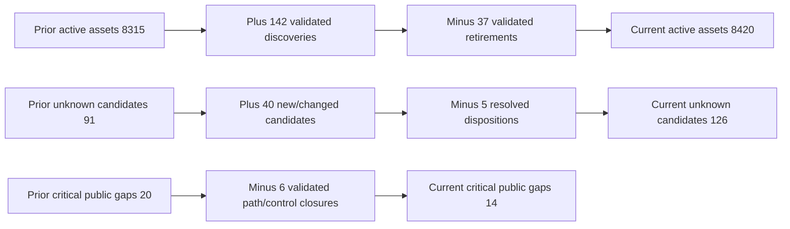

### NMH review narrative

**Headline:** Under the same five-service scope, the confirmed critical-public-control-gap cohort decreased from 20 to 14 because six public paths or applicable control gaps were remediated and independently validated. The oldest remaining critical action aged from 39 to 43 days, so throughput improved but the long tail worsened.

**Inventory and data quality:** Active resolved assets rose by 105 net due to validated discoveries and retirements. Unknown candidates rose by 35, mostly from newly included acquisition accounts. They are not labeled rogue. One acquisition account has incomplete cloud permissions; affected owner/service measures are caveated and cannot drive automatic closure or downgrade.

**Controls and action:** EDR effective coverage reached a synthetic 98.0 percent under policy v4, with 92 confirmed gaps, 41 approved exceptions, and 29 unknowns shown separately. Twenty-two remediation episodes reopened because native/path postconditions failed, which lowered apparent closure performance but improved decision honesty.

**Decision asks:** NMH needs the service owner to approve a maintenance sequence for the 43-day critical dependency, the cloud owner to restore acquisition-account permissions, and risk governance to decide whether three expiring exceptions receive bounded renewal or accelerated remediation. No financial-risk reduction or compliance certification is claimed.

### NMH review action register

| ID | Action | Owner | Due logic | Status/blocker | Validation | Next checkpoint |
|---|---|---|---|---|---|---|
| NMH-A74 | Patch and restrict oldest critical admin service | Infrastructure app owner | Existing critical SLO; maintenance sequence required | Blocked on failover test | Version, admin path, service, failover | After test evidence |
| NMH-A75 | Restore Cloud-B acquisition account scope | Cloud platform owner | Data incident priority | In progress; permission approval | Native counts, complete run, backfill, dashboard restatement | Next operational review |
| NMH-A76 | Resolve seven public unknown candidates | Asset steward + network security | Accelerated evidence cohort | Three owners confirmed | Identity, authorization, route, controls | Twice-weekly |
| NMH-A77 | Review three expiring control exceptions | Risk owner + control owner | Before expiry | Decision required | Compensation effectiveness or remediation | Executive decision meeting |
| NMH-A78 | Fix 17 orphan EDR sensor mappings | Endpoint/source owners | Standard data-quality SLO | In progress | Asset/sensor identity and coverage recompute | Weekly tactical review |
| NMH-A79 | Investigate 22 reopened actions | Exposure program owner | Severity-based | Root causes grouped | Postcondition and recurrence controls | Next service review |

### Synthetic report defect: duplicate join inflates progress

After an action-register release, the dashboard reports 487 validated actions instead of 412. The detail export has 487 rows. A control-total query shows 412 distinct episode IDs. One episode can have multiple validation-evidence rows, and the report joined evidence before aggregating without preserving episode grain.

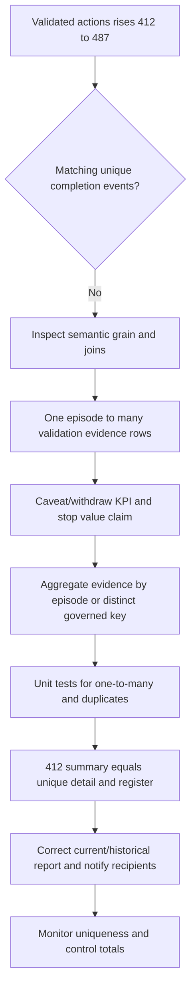

The root cause is metric grain, not "bad visualization." The team preserves the 487 evidence rows for drill-down but counts 412 unique validated episodes. It reviews any executive material or adoption claim that used the inflated number, issues a correction, and adds one-to-many join tests.

### NMH review close

At meeting end, the chair reads back each decision, action owner, due logic, blocker, validation, and checkpoint. Minutes link the metric dictionary, data-health panel, dashboard snapshot ID, action register, and decision log. The next review begins with these commitments, not a fresh slide deck detached from history.

## Troubleshooting dashboards and reports

### Symptom map

| Symptom | Plausible causes | First check | Containment |
|---|---|---|---|
| Summary and detail differ | Filter, grain, cache, snapshot, state omission | Same as-of/version/filter and control totals | Caveat/withdraw metric |
| Count suddenly drops | Source outage, scope/filter/lifecycle change, false merge | Source completeness and change bridge | Freeze automatic positive claims |
| Count suddenly rises | Duplicate join, new source/scope, false split, policy change | Distinct keys and factor dimensions | Pause bulk actions |
| Rate improves while gaps rise | Denominator grew differently or exceptions/unknown moved | Numerator/denominator state bridge | Explain both counts/rates |
| Trend breaks | Definition version, backfill, late data, time zone | Semantic version and cutoff | Annotate/restatement |
| Export differs from UI | Async snapshot, hidden filter, row limit, permissions | Export metadata and query | Avoid detached evidence |
| Owner view empty | Join/authority/freshness/filter defect | Owner provenance and eligible population | Route to steward |
| SLA looks excellent | Clock resets, easy cohort, pause abuse, closure-only population | Episode IDs and start/stop/pause audit | Suspend claim |
| Tickets closed, backlog remains | Duplicate episodes, failed validation, target mismatch | Stable episode links and postconditions | Reconcile/reopen |
| Dashboard slow | High-cardinality joins, unbounded graph, inefficient query | Query plan/cardinality/filter | Use bounded aggregates while preserving drill-down |
| User sees different totals | RBAC scope, row-level security, time zone/filter | Effective access/filter context | Explain authorized scope |
| Historical value changes silently | Late data or semantic rebuild without version/restatement | Snapshot/version audit | Publish correction |

### Layered runbook

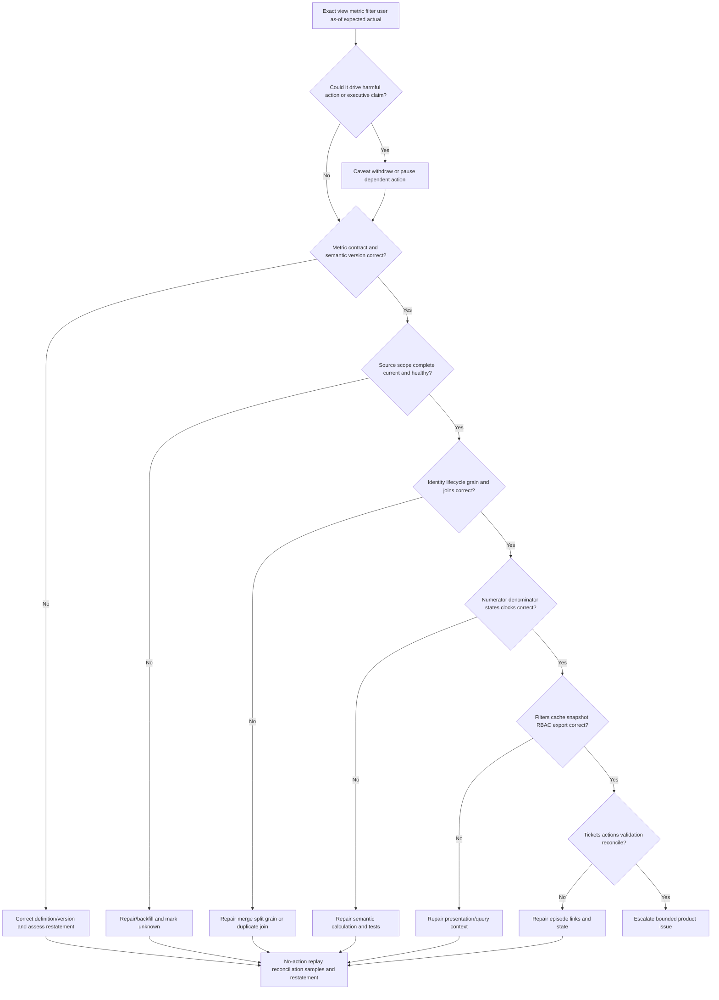

### Investigation checklist

1. Capture dashboard/report ID, user/role, URL or parameters, visible filters, as-of/refresh, time zone, semantic/version, export ID, and screenshot where permitted.
2. State the exact metric contract: decision, grain, population, numerator, denominator, states, time, exclusions, quality gates, and owner.
3. Compare summary, dimensions, detail, unique keys, and independent control totals under identical context.
4. Check source registry, authorization, run completeness, pages, rejects, timestamps, mapping, and freshness.
5. Check asset identity, lifecycle, duplicate join, relationship, owner, policy applicability, and unknown handling.
6. Trace calculation stages and state transitions; inspect missing-to-false, null defaults, many-to-many joins, and clock resets.
7. Check presentation filters, row-level access, cache, snapshot, export limits, rounding, and time zone.
8. Reconcile ticket/action/exception/change/validation states by stable episode ID.
9. Reproduce with the smallest safe record set and a known prediction.
10. Correct in no-action/shadow mode, run regression/control-total tests, and assess every downstream consumer.
11. Restate current/history and communicate the correction if prior decisions or claims were affected.
12. Monitor recurrence and add an invariant near the failed layer.

### Support/Product evidence package

| Evidence | Content | Boundary |
|---|---|---|
| Expected/actual | Exact measure/detail behavior under contract | No guessed product internals |
| Scope | Tenant/role/view/filter/source/cohort and unaffected comparison | Minimize customer data |
| Timeline | UTC last good/first bad/refresh/run/export/change | State clock semantics |
| IDs/versions | View, report, source run, asset, rule, semantic, workflow | Redact secrets/tokens |
| Control totals | Native, ingested, accepted, resolved, semantic, displayed | Use same grain/context |
| Samples | Minimal redacted records showing defect | Secure approved channel |
| Reproduction | Safe steps and predicted intermediate/result | No destructive production tests |
| Impact | Actions, decisions, recipients, history affected | Separate known from possible |
| Containment | Caveat/withdrawal/action pause | No invented ETA |

## Governance, security, privacy, and accessibility

Dashboards may reveal sensitive infrastructure, public exposure, weaknesses, ownership, identities, data classes, suppliers, and business-critical dependencies. Apply least privilege, role-based and row-level access where appropriate, secure exports, audit, retention/minimization, and separation between viewing and consequential actions.

| Concern | Risk | Control |
|---|---|---|
| Overbroad access | Users see crown-jewel maps or personal data | Need-to-know RBAC and periodic review |
| Export leakage | CSV/PDF/screenshot leaves governed system | Watermark/metadata, secure channel, expiry, minimization |
| Action privilege | Dashboard user can isolate/delete/accept risk | Separate roles, approvals, reauthentication, audit |
| Metric manipulation | Scope/threshold changed to look green | Versioned contracts and change approval |
| Personal data | Owner/user details overexposed | Minimize/pseudonymize and enforce purpose |
| Sensitive topology | Paths aid attackers | Restrict drill-down and monitoring |
| Accessibility | Color-only or tiny dense view excludes users | Labels, contrast, keyboard/screen-reader support, alternate table |
| AI summary leakage | Sensitive context sent to unapproved service | Approved architecture, minimization, review, logging |
| Prompt/instruction injection | Source text manipulates summary assistant | Treat source text as data, delimit, allowlist actions, human review |

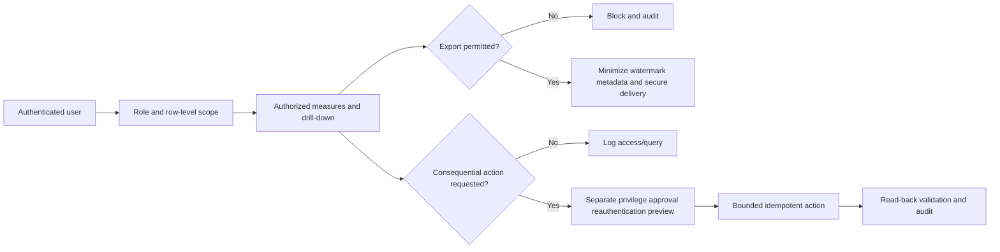

## Value and adoption measurement

Adoption is not logins alone. Measure whether defined users can interpret data, investigate, assign, remediate, validate, and improve decisions. Pair leading process indicators with lagging outcomes and guardrails.

| Category | Measure | Value hypothesis | Guardrail |
|---|---|---|---|
| Data readiness | Decision completeness and source health | Better visibility enables safer decisions | Cannot hide unknowns |
| Workflow adoption | Eligible cohorts entering governed action process | Reduced manual handoff | Ticket creation alone not value |
| Investigation | Time to resolve high-consequence unknown | Faster certainty | No forced classification |
| Ownership | Time to accepted accountable owner | Faster routing | Generic queue not owner |
| Remediation | Time to validated treatment | Exposure reduced sooner | Preserve safety/change needs |
| Quality | Wrong-target, duplicate, reopen, recurrence rates | Safer durable operations | Reporting improves as defects surface |
| Decision | Actions/decisions with complete rationale and validation | Better governance | Do not equate documentation volume |
| Outcome | Validated path/control-gap closures in priority cohorts | Scenario prerequisites reduced | No unsupported loss claim |
| Enablement | Users pass scenario-based tasks | Capability building | Attendance alone insufficient |
| Customer health | Agreed outcomes, blockers, ownership, support issues, roadmap | Sustainable adoption | Renewal prediction needs approved model |

Avoid claiming causal risk reduction from a dashboard rollout alone. Stronger evidence uses a chain: improved source/identity quality -> more decision-ready assets -> more accurate priority cohorts -> faster correct ownership -> validated treatments -> fewer reopened/recurring paths, while accounting for scope and threat changes.

## Labs and rehearsal

All labs use synthetic data and general tools. They do not require Zscaler AEM and do not imply production product experience.

### Lab 1 - Metric-contract workshop

Define inventory readiness, unknown assets, owner coverage, EDR coverage, internet reachability, critical-public gaps, validated remediation, and aging. **Pass:** each has decision, grain, numerator, denominator, states, time, owner, quality gate, and drill-down.

### Lab 2 - Denominator challenge

Create tool-only, independent-registry, mixed-grain, lifecycle-leaking, applicability-free, and unknown-hidden denominators. Show how rates change. **Pass:** explain why the most flattering number can be least trustworthy.

### Lab 3 - Source-coverage ladder

Score five synthetic sources from discovered through fit-for-use. Simulate authentication success with incomplete object permissions. **Pass:** connected is not called complete.

### Lab 4 - Inventory-confidence dashboard

Build resolved, managed, unmanaged, unknown, duplicate, conflict, stale, retired, and out-of-scope cohorts. **Pass:** states reconcile to governed population without overlap unless explicitly designed.

### Lab 5 - Unknown-asset queue

Classify identity, owner, purpose, lifecycle, authorization, management, source, and relationship unknowns. **Pass:** none is automatically labeled rogue or low risk.

### Lab 6 - Duplicate-quality review

Create candidate, confirmed, false-merge, false-split, and unmerge cases. Reconcile findings, owners, relationships, tickets, and reports. **Pass:** lower asset count is not used as success by itself.

### Lab 7 - Ownership dashboard

Separate business, technical, control, data, steward, risk, and action roles. Add inactive identities and generic queues. **Pass:** accountable coverage excludes placeholders.

### Lab 8 - Lifecycle view

Model active, quarantined, retirement-proposed, retired, archived, and unknown states. Simulate incomplete source absence. **Pass:** no auto-retirement improves the score.

### Lab 9 - Control-gap dashboard

Build EDR, scan, encryption, backup, identity, and ownership state views with applicability, effective, exception, gap, unknown, and NA. **Pass:** each rate uses independent eligible denominator.

### Lab 10 - Critical/public matrix

Intersect criticality, internet reachability, privilege, sensitive data, control state, exception, and confidence. **Pass:** show exact cohort and action, not an opaque risk color.

### Lab 11 - Trend bridge

Explain movement from discovery, retirement, scope, policy, source health, identity correction, remediation, validation, and restatement. **Pass:** every material shift has an evidenced category.

### Lab 12 - Aging and SLA

Define start/pause/stop, business calendar, priority, breach, reopen, and validation for four episode types. **Pass:** recreation and premature ticket closure cannot reset performance.

### Lab 13 - Technical dashboard prototype

Create health banner, visible filters, inventory/exposure/control/work panels, drill-down, and action path. **Pass:** every tile reaches source evidence and governed action.

### Lab 14 - Executive dashboard prototype

Create objective, material cohort, movement, scenario/control narrative, execution, decisions, and outlook. **Pass:** no raw-finding dump or unsupported financial/compliance claim.

### Lab 15 - Duplicate-join incident

Reproduce 412 episodes becoming 487 rows after a one-to-many validation join. Correct semantic grain, test, reconcile, and restate. **Pass:** detail evidence remains while KPI counts unique episodes.

### Lab 16 - Source-outage incident

Remove one source permission and observe false improvement when missing becomes pass. Implement complete-run and unknown gates. **Pass:** dashboard displays degraded state and stops automatic positive claims.

### Lab 17 - Customer review rehearsal

Prepare pre-read, deliver the NMH narrative, drill into one cohort, capture decisions, read back actions, and publish follow-up. **Pass:** meeting ends with owners, due logic, validation, and checkpoints.

### Lab 18 - Product escalation packet

Build a redacted summary/detail mismatch case with IDs, UTC times, versions, control totals, reproduction, impact, and containment. **Pass:** one bounded question and no unsupported root cause.

### Lab 19 - Accessibility/security review

Test color independence, labels, keyboard/table alternative, role access, export minimization, and action separation. **Pass:** accessibility and least privilege are acceptance criteria.

### Lab 20 - Arti interview teach-back

Answer Q1 through Q8 aloud and connect one Microsoft reporting/RCA example to this method. **Pass:** explicitly distinguish production transfer, synthetic practice, learned product positioning, and unknown behavior.

## Arti bridge: support analytics to exposure reviews

Arti's Microsoft work already requires careful metric and review behavior. Case volume without severity or age is weak. Closure without customer validation is weak. A service-health graph without scope and timestamps can mislead. Power BI and SQL require grain, joins, filters, measures, and source reconciliation. High-impact escalations require concise status, owners, blockers, decisions, and next checkpoints.

| Existing strength | Exposure-reporting transfer | Learning boundary | Honest interview sentence |
|---|---|---|---|
| Case/backlog analysis | Intake, throughput, aging, reopen, long tail | Vulnerability-program metric specifics | "I separate flow, age, quality, and outcome." |
| CSAT/case quality | Balanced value and quality measures | Security-outcome causality | "A positive activity metric is not proof of risk reduction." |
| Power BI/Excel/SQL | Metric contracts, joins, cohorts, drill-down | AEM reporting implementation | "I reconcile grain and denominator before presenting." |
| Service incidents | Data-health banners and event-driven reviews | Product health telemetry | "A missing feed becomes unknown, not green." |
| CRITSIT communication | Headline, impact, uncertainty, owner, next step | CISO risk authority | "I keep decisions explicit and avoid invented certainty." |
| Engineering escalation | Summary/detail/source evidence package | Zscaler internal diagnostics | "I reduce disagreement to one reproducible record and rule." |
| Technical Advisor work | Reviews, stakeholder alignment, action follow-up | Formal TSM account cadence | "I turn evidence into owned follow-through." |
| Training/mentoring | Role-based dashboard literacy and labs | Customer enablement plans | "I teach decisions, not button tours." |

An interview-ready bridge is: "I have used analytics and customer-impact reporting to manage support quality, backlog, escalations, and service communication. My rule is that a metric must be reproducible and actionable: define the population and clock, expose data health, reconcile detail, explain movement, assign ownership, and validate the outcome. I applied that discipline in a synthetic AEM-style customer review. I would verify the actual Zscaler dashboard fields and workflows in current documentation and the customer's licensed tenant."

## Common misconceptions to correct

| Misconception | Correction |
|---|---|
| More dashboard tiles mean better visibility | Start from audience decisions and reduce noise |
| Asset count equals coverage | Coverage needs independent intended population and scope |
| Connector green means data complete | Check authorization, objects, pages, mapping, correlation, freshness, fitness |
| Unknown means missing control | Unknown means evidence cannot decide; investigate the missing claim |
| Unknown means low risk | Potential consequence can make evidence work urgent |
| Unknown asset means rogue asset | Authorization must be validated |
| Duplicate candidates are confirmed duplicates | Candidate and reviewed outcomes differ |
| Lower asset count proves cleanup | Source loss or false merge can lower count |
| Owner field populated means owned | Validate role type, active identity, authority, and acceptance |
| Generic queue is accountable owner | It may be a temporary routing/steward queue |
| Retired CMDB state means no exposure | Validate endpoints, identities, data, controls, and dependencies |
| Control installed means covered | Applicability, health, enforcement, freshness, effectiveness matter |
| Exception equals pass | Report residual-risk decision separately |
| Percentage is self-explanatory | Show numerator, denominator, states, scope, and time |
| Average age describes backlog | Show distribution, priority cohorts, and oldest items |
| Closed ticket means remediated | Validate technical/security/business/reporting postconditions |
| High throughput proves value | Duplicates/easy closures/failed validation can inflate it |
| SLA starts and stops naturally | Contract defines eligible events, clock, pause, and validation |
| Trend line proves improvement | Scope, definition, source health, and cohort must be comparable |
| Executive view is technical view with fewer rows | Start from business objective, scenario, decision, and outcome |
| Red/green color is enough | Add labels, definitions, confidence, and accessibility |
| Drill-down is optional | It is the explainability and correction path |
| A customer review is a slide presentation | It is a decision and accountability mechanism |
| Meeting minutes are the action register | Actions need stable IDs, owners, evidence, and reconciliation |
| Logins prove adoption | Measure task capability and validated workflow outcomes |
| Dashboard deployment proves risk reduction | Establish an evidence chain and state limits |
| Public AEM pages define exact KPIs | Verify current product/tenant definitions and behavior |

## Official Source Anchors

Research/source date: **2026-08-24**.

Zscaler pages support bounded AEM/Data Fabric positioning for unified asset context, dashboards/reports, source integration, business logic, workflows, unknown/control-gap/CMDB-health use cases, and contextual security outcomes. They do not define this chapter's synthetic metrics, targets, review cadence, workflow, or outcomes. NIST sources support measurement programs, information-security measures, enterprise-risk integration, CSF outcomes, controls, and asset management. CISA resources support asset visibility and known-exploitation prioritization concepts within their stated scopes. Organization-specific policy and current licensed behavior remain authoritative.

| Source | URL | Used for | Boundary |
|---|---|---|---|
| Zscaler Asset Exposure Management | https://www.zscaler.com/products-and-solutions/caasm | Public asset context, dashboard/report, gap, CMDB, workflow positioning | Verify exact current view/field/filter/export/license behavior |
| Zscaler Data Fabric for Security | https://www.zscaler.com/products-and-solutions/data-fabric | Public integration, business logic, workflow, dynamic-reporting positioning | No proprietary semantic model/default KPI guarantee |
| Zscaler Data Fabric integrations | https://www.zscaler.com/products-and-solutions/data-fabric/integrations | Dynamic public integration-catalog context | Verify connector scope/direction/object/version/permission |
| Zscaler Unified Vulnerability Management | https://www.zscaler.com/products-and-solutions/vulnerability-management | Adjacent contextual-prioritization/reporting positioning | No claim about exact AEM dashboard or proprietary formula |
| NIST Cybersecurity Framework 2.0 | https://www.nist.gov/cyberframework | Govern/Identify/Protect/Detect/Respond/Recover outcomes and profiles | Voluntary framework; customer profile/targets are specific |
| NIST SP 800-55 Vol. 1 | https://csrc.nist.gov/pubs/sp/800/55/v1/final | Information-security measurement program concepts | Tailor measures; does not define AEM KPIs |
| NIST SP 800-55 Vol. 2 | https://csrc.nist.gov/pubs/sp/800/55/v2/final | Development of information-security measures | Measure selection and implementation are contextual |
| NISTIR 8286 series | https://csrc.nist.gov/projects/cybersecurity-risk-management/enterprise-risk-management | Cybersecurity and enterprise-risk integration resources | Use current publication/version; not vendor dashboard design |
| NIST SP 800-53 Rev. 5 | https://csrc.nist.gov/pubs/sp/800/53/r5/upd1/final | Asset inventory, continuous monitoring, assessment, audit, access, reporting control context | Requires selection, tailoring, implementation, assessment |
| NIST SP 1800-5 | https://csrc.nist.gov/pubs/sp/1800/5/final | IT asset-management practice context | Example architecture, not universal denominator |
| CISA Known Exploited Vulnerabilities Catalog | https://www.cisa.gov/known-exploited-vulnerabilities-catalog | Current known-exploitation prioritization input | Inclusion is not customer compromise or complete risk metric |
| CISA Cybersecurity Performance Goals | https://www.cisa.gov/cybersecurity-performance-goals-cpgs | Outcome-oriented security-practice context | Voluntary baseline; applicability and measurement vary |

## Likely Interview Questions

### Q1. What makes an asset-exposure dashboard trustworthy?

**Model answer:** It starts with an audience decision and a versioned metric contract: grain, independent population, numerator, denominator, states including unknown/exception/NA, scope, time, source/authority, freshness, quality gates, owner, drill-down, and validation. The view exposes filters, as-of time, source health, confidence, and semantic version, and reconciles summary to exact source evidence and actions.

### Q2. How would you measure inventory coverage and unknown assets?

**Model answer:** I reconcile registered accounts/domains/networks/services and independent asset sources to a resolved active population. I report known managed, known unmanaged, unknown by missing claim, duplicate/conflict, stale, retired, and out-of-scope states. Unknowns retain source, age, possible consequence, owner, and next evidence step; they are not automatically rogue, failed, passed, or low risk.

### Q3. How do you report source coverage and data health?

**Model answer:** I measure discovered, in-scope, connected, authenticated, authorized, scheduled, successful, complete, parsed/mapped, correlated, fresh, and fit-for-use stages. I use native control totals, page/checkpoint evidence, reject/conflict counts, field freshness, and source-to-dashboard reconciliation. A connector can be technically green while permissions or pages are incomplete, so affected metrics receive a visible degraded/unknown state.

### Q4. What belongs in technical versus executive views?

**Model answer:** Both use one semantic contract. Operators need source health, filters, exact inventory/exposure/control/work queues, provenance, rules, tickets, and next actions. Executives need the business objective, material scenarios/cohorts, comparable movement and cause, control strengths/gaps, uncertainty, validated outcomes, blockers, decisions, and roadmap. The executive view is decision-centered, not merely less detailed.

### Q5. How do you track aging, SLAs, and remediation honestly?

**Model answer:** I define one logical episode and exact start, pause, stop, priority, calendar, and validation conditions under the actual customer SLA or SLO. I show intake, throughput, backlog bridge, work in progress, age distribution, blocked time, attainment, reopen, and recurrence. Ticket closure is separate from validated completion, and an item cannot be recreated or reclassified to reset age.

### Q6. How would you run a customer asset-exposure review?

**Model answer:** Beforehand I confirm audience/decisions/scope, validate data health and metric reconciliation, annotate changes, sample critical cohorts, reconcile prior actions, and send a pre-read. In the meeting I cover objectives, caveats, prior commitments, material exposure movement, bounded deep dives, adoption/process, decisions, and roadmap. I read back stable actions, owners, due logic, validation, and checkpoints, then publish linked minutes and follow-up.

### Q7. How do you troubleshoot a dashboard that suddenly improves?

**Model answer:** I first ask whether validated remediation explains the movement and pause dependent claims/actions if not. I capture view/filter/as-of/version, restate the metric contract, and reconcile summary, detail, unique keys, and native control totals. Then I test source completeness, identity/lifecycle/grain, joins, numerator/denominator/state/clock logic, filters/cache/RBAC/export, and ticket/validation states. I correct in no-action mode and restate affected reports.

### Q8. How does your background transfer, and what is the honest boundary?

**Model answer:** My Microsoft support work included backlog and case-quality analytics, Power BI/Excel/SQL, service-impact communication, high-severity reviews, engineering escalation, ownership, and validation. Those skills transfer to metric contracts, cohort analysis, drill-down, narrative, and action follow-through. I built a synthetic NMH exposure-review lab; I do not claim production AEM reporting and would validate actual dashboards and semantics in current official documentation and the licensed tenant.

## 30-Second Memory Hooks

| Concept | Memory hook |
|---|---|
| Dashboard | Decision interface, not number wall |
| Report | Evidence for a period and purpose |
| Metric contract | Decision + grain + population + clock + owner |
| Denominator | Who had a chance to qualify? |
| Coverage | Independent eligible universe |
| Unknown | Radar unavailable, not landed |
| Source coverage | Connected is only one rung |
| Data health | Can this view support this decision now? |
| Grain | One flight leg, not passenger rows |
| Duplicate join | Evidence rows must not multiply episodes |
| Owner | Role-specific, active, accepted accountability |
| Lifecycle | Active, retiring, retired, unknown differ |
| Control gap | Applicable requirement plus current evidence |
| Critical/public | Intersections drive action |
| Trend | Comparable scope, definition, time, and health |
| Change bridge | Discovery + retirement + correction + remediation |
| Aging | One episode, honest clock |
| SLA/SLO | Contracted promise versus objective |
| Throughput | Validated completions, not status flips |
| Drill-down | KPI -> cohort -> asset -> evidence -> action |
| Narrative | Change, cause, impact, caveat, action, ask |
| Executive view | Objective, scenario, decision, outcome |
| Action register | Stable owner, due logic, proof, checkpoint |
| Customer review | Decisions and follow-through, not slide recital |
| Validation | Working runway light, not closed ticket |
| Arti bridge | Support analytics rigor transfers; AEM admin does not |

## Completion Checklist

- [ ] I define dashboard, report, KPI, metric, dimension, population, numerator, denominator, grain, snapshot, event, cohort, coverage, confidence, freshness, unknown, source coverage, and data health.
- [ ] I explain every core term with the airport analogy.
- [ ] I start each dashboard with audience, decision, and question.
- [ ] I create a versioned metric contract before designing a visual.
- [ ] I specify grain, population, exclusions, numerator, denominator, states, dimensions, time, authority, freshness, quality, owner, drill-down, and validation.
- [ ] I use an independent governed universe rather than one tool's observed rows.
- [ ] I prevent mixed-grain, duplicate, lifecycle, applicability, exception, unknown, scope, and survivor denominator traps.
- [ ] I show counts and rates together.
- [ ] I report pass, gap, exception, not applicable, and unknown separately.
- [ ] I keep raw source observations, resolved assets, semantic measures, views, workflows, and validation distinct.
- [ ] I expose as-of/refresh, filters, scope, semantic version, data-health caveats, and drill-down.
- [ ] I measure registry coverage, identity resolution, decision readiness, unknown/unmanaged assets, duplicate quality, freshness, provenance, and confidence states.
- [ ] I do not claim absolute completeness without a defensible intended population.
- [ ] I classify unknown identity, owner, purpose, lifecycle, authorization, management, source, and relationship separately.
- [ ] I never equate unknown with rogue, gap, pass, or low priority.
- [ ] I accelerate evidence work when unknowns may be critical, public, privileged, or sensitive.
- [ ] I measure source discovered, in-scope, connected, authenticated, authorized, scheduled, successful, complete, mapped, correlated, fresh, and fit-for-use states.
- [ ] I use native control totals, complete-run markers, page/checkpoint evidence, rejects, and reconciliation.
- [ ] I display source/data health beside affected business metrics.
- [ ] I block automatic positive claims or closures during degraded source states.
- [ ] I distinguish duplicate candidates, confirmed duplicates, false merges, false splits, and reversals.
- [ ] I test identity quality with representative samples and disclosed labeling methods.
- [ ] I reconcile every downstream finding, owner, relationship, ticket, report, and history after identity correction.
- [ ] I separate business, technical, control, data, steward, risk, and action owners.
- [ ] I exclude inactive identities, placeholders, and generic queues from accountable-owner coverage unless policy says otherwise.
- [ ] I report requested/provisioning, active, quarantined, retirement-proposed, retired, archived, and unknown lifecycle states.
- [ ] I validate residual endpoints, identities, data, and dependencies after retirement.
- [ ] I define control coverage by eligibility, applicability, evidence state, freshness, exception, and validation.
- [ ] I report critical, public, privileged, sensitive-data, recovery, and concentration intersections.
- [ ] I preserve candidate/unknown exposure states rather than forcing Boolean values.
- [ ] I define trends with time grain, as-of logic, population, version, scope, health, change bridge, distribution, and target.
- [ ] I annotate or restate trends after definition, scope, source, policy, or identity changes.
- [ ] I show discovery, retirement, correction, source, policy, and remediation reasons for movement.
- [ ] I define one logical episode for aging and prevent clock resets through recreation.
- [ ] I use actual customer SLA terms and never invent Zscaler service levels.
- [ ] I distinguish SLA from SLO and show clock, calendar, pause, stop, breach, and validation.
- [ ] I report intake, throughput, net backlog, work in progress, age distribution, blocked time, reopen, recurrence, and attainment.
- [ ] I never treat closed ticket or high throughput as validated exposure reduction.
- [ ] I maintain a stable action register with problem, IDs, priority, owners, decision, treatment, due logic, state, blocker, checkpoint, validation, residual risk, and links.
- [ ] I reconcile actions with assets, findings, tickets, exceptions, changes, and postconditions.
- [ ] I create technical views for data health, exact cohorts, evidence, workflow, and action.
- [ ] I create executive views for objective, material exposure, movement, controls, execution, decisions, and outlook.
- [ ] I derive both views from the same governed semantic definitions.
- [ ] I use labels with color, visible filters, stable layout, counts/rates, distributions, intersections, and accessible alternatives.
- [ ] I build drill-down from portfolio to cohort to asset to claim/provenance to scenario to workflow to validation.
- [ ] I reconcile summary/detail, unique grain, native source, ticket links, validation, exports, and trend versions.
- [ ] I write narratives with headline, cause, business/security meaning, caveat, action/outcome, decision ask, and checkpoint.
- [ ] I do not claim exact financial-risk reduction, compliance, causality, or guaranteed outcome without approved evidence/method.
- [ ] I choose operational, tactical, service, strategic, and event-driven cadences by decision need.
- [ ] I prepare reviews by validating health, totals, trends, samples, prior actions, narratives, and decision makers.
- [ ] I use the nine-item review agenda and preserve time for explicit decisions/read-back.
- [ ] I capture authority, rationale, assumptions, dissent, actions, due logic, validation, and next checkpoints.
- [ ] I publish linked minutes and begin the next review from prior commitments.
- [ ] I can explain every NMH scorecard number as synthetic and show its contract/caveat.
- [ ] I can deliver the NMH review narrative without calling unknowns rogue or claiming risk reduction.
- [ ] I can reproduce and fix the 412-to-487 duplicate-join defect.
- [ ] I troubleshoot contract -> source -> identity/lifecycle/grain -> calculation/clock -> presentation/RBAC/export -> workflow/validation.
- [ ] I capture view, user/role, filters, as-of, time zone, versions, control totals, and representative records.
- [ ] I correct in no-action mode, assess downstream consumers, and restate affected history.
- [ ] I create a bounded Support/Product packet with one reproducible expected/actual question.
- [ ] I apply least privilege, export security, audit, minimization, action separation, accessibility, and responsible AI controls.
- [ ] I measure adoption through task capability and validated workflow outcomes, not login or ticket volume alone.
- [ ] I can complete all twenty labs and retain reproducible synthetic artifacts.
- [ ] I connect Arti's backlog, quality, Power BI, SQL, service communication, escalation, review, and training strengths honestly.
- [ ] I distinguish production transfer, synthetic practice, public product positioning, and unknown product behavior.
- [ ] I use official Zscaler, NIST, and CISA sources with explicit boundaries.
- [ ] I use the controlled research/source date exactly as 2026-08-24.
- [ ] I make no unsupported Zscaler dashboard, KPI, formula, denominator, threshold, connector, workflow, SLA, compliance, production, or outcome claim.
- [ ] I can answer Q1 through Q8 with definitions, analogies, mechanics, examples, tradeoffs, failures, troubleshooting, labs, NMH evidence, official-source caveats, and an honest Arti bridge.

[Part 76 - Asset Exposure Implementation, Troubleshooting, and Adoption Scenarios](Part-76-asset-exposure-implementation-scenarios.md)