# Part 76 - Asset Exposure Implementation, Troubleshooting, and Adoption Scenarios

> **Audience:** Arti Thakur, preparing for a Zscaler Security Operations Technical Success Manager role after Microsoft enterprise Support Escalation Engineering.
>
> **Purpose:** Provide an end-to-end, vendor-careful implementation and adoption playbook for Asset Exposure Management (AEM). Cover discovery and use-case selection, source planning, connectors and data acceptance, golden-record validation, relationships, criticality and coverage rules, Configuration Management Database (CMDB) and workflow integration, rollout and change control, false merge/split, stale or missing sources, ownership disputes, gap triage, troubleshooting, training, governance, product health, value evidence, Support/Product escalation, a 30/60/90 plan, and multiple worked synthetic customer scenarios.
>
> **Scope and honesty:** Northstar Meridian Holdings, abbreviated NMH, is fictional. Every NMH organization, source, connector, account, asset, identity, owner, service, relationship, rule, confidence threshold, field, control, metric, workflow, CMDB record, ticket, SLA/SLO, timeline, incident, target, decision, and outcome in this Part is synthetic. Zscaler public pages support bounded statements that AEM, described in Cyber Asset Attack Surface Management (CAASM) terms, unifies and deduplicates asset data, adds relationships and context, identifies coverage and CMDB-health gaps, supports workflows/reporting, and is powered by Data Fabric for Security; Data Fabric public pages support integration, correlation/enrichment, business logic, workflows, and reporting positioning. Public pages do not disclose proprietary source schemas, connector internals, matching algorithms, default confidence/criticality/coverage rules, workflow semantics, service levels, implementation timelines, escalation procedures, support commitments, or guaranteed outcomes. Detailed mechanics below are general educational patterns, not undocumented Zscaler implementation claims. Arti's Microsoft escalation, service-delivery, identity, networking, data-quality, Power BI/SQL, customer communication, training, RCA, and Engineering collaboration experience transfers. Direct production AEM implementation or administration remains a learning boundary.
>
> **Currency caveat:** Products, packaging, connectors, APIs, source schemas, rate limits, fields, user interfaces, documentation, support processes, customer systems, and threat conditions change. The controlled research/source date for this Part is exactly **2026-08-24**. Current official documentation, licensed tenant behavior, approved architecture and contracts, customer security/privacy/legal/change requirements, source and target owners, product specialists, Zscaler Support guidance, authorized tests, and measured production evidence govern implementation.

## Section goal

An AEM implementation is not "connect tools and wait for a perfect inventory." It is a governed change program that turns several incomplete source claims into decision-ready asset context and then into safe, validated action. Success requires explicit use cases, trusted populations, source contracts, identity-quality evidence, clear ownership, conservative automation, operational runbooks, trained users, and proof that important decisions improve.

Think of building a metropolitan transit control center. Each rail, bus, road, and maintenance system has a different map, identifier, clock, owner, and blind spot. Combining the feeds can improve coordination, but only after deciding which operational questions matter, validating routes and vehicle identities, defining authoritative fields, handling feed outages, training dispatchers, and testing actions. A colorful combined map is not success if it routes responders to the wrong vehicle.

By the end, Arti should be able to:

| Outcome | Demonstrated capability | Evidence artifact |
|---|---|---|
| Discover needs | Turn stakeholder problems into bounded use cases and acceptance criteria | Discovery charter |
| Plan sources | Inventory source purpose, scope, owner, authority, access, cadence, and risks | Source plan |
| Accept connectors | Test authentication, authorization, completeness, mapping, freshness, resilience, and security | Acceptance pack |
| Validate identity | Measure and review exact matches, candidates, false merges/splits, and unknowns | Golden-record validation report |
| Validate context | Test relationships, ownership, lifecycle, criticality, exposure, and coverage rules | Rule test catalog |
| Integrate safely | Design CMDB and ticket/workflow flows with authority, idempotency, approval, read-back, and reconciliation | Integration contract |
| Roll out | Move from shadow to pilot, canary, waves, and steady state with exit gates | Rollout plan |
| Troubleshoot | Isolate source, connector, mapping, identity, context, rule, workflow, report, and product failures | Layered runbook |
| Resolve disputes | Use evidence and decision rights for ownership, scope, identity, and criticality disagreements | Decision log |
| Triage gaps | Separate confirmed exposure/control gaps from data-quality and applicability defects | Gap queue |
| Enable users | Train role-based tasks, evidence interpretation, action, and escalation | Enablement plan |
| Govern operations | Define roles, changes, quality, exceptions, security, and review cadence | Governance model |
| Prove health/value | Measure data, system, workflow, adoption, decision, and outcome evidence | Scorecard |
| Escalate well | Build minimal reproducible Support/Product cases and maintain customer communication | Escalation packet |
| Lead 30/60/90 | Sequence foundations, proof, scale, and adoption realistically | Roadmap |
| Practice honestly | Work multiple synthetic NMH implementation incidents | Scenario portfolio |

```mermaid
flowchart LR
    DISC[Discover stakeholders problems and decisions] --> USE[Prioritize bounded use cases]
    USE --> PLAN[Plan sources owners contracts and security]
    PLAN --> CONN[Configure connectors in nonproduction/shadow mode]
    CONN --> ACCEPT[Accept scope completeness mapping freshness resilience]
    ACCEPT --> GOLD[Validate golden records and provenance]
    GOLD --> RULES[Validate relationships criticality coverage and metrics]
    RULES --> FLOW[Design governed CMDB and remediation workflows]
    FLOW --> PILOT[Pilot canary and wave rollout]
    PILOT --> ADOPT[Train govern review and improve]
    ADOPT --> VALUE[Validate operational and security outcomes]
    VALUE --> DISC
```

## JD Mapping

| Role expectation | Part 76 capability | TSM artifact | Arti bridge and boundary |
|---|---|---|---|
| Become AEM/Data Fabric expert | Explain public architecture/value while validating current behavior | Implementation whiteboard | Product specifics require current evidence |
| Analyze complex environments | Inventory sources, identities, owners, services, controls, and integrations | Discovery/source plan | Microsoft tenant/service mapping transfers |
| Identify security risks | Distinguish real gaps from source/match/rule defects | Triage register | Exposure is not proof of compromise |
| Recommend mitigation | Sequence data, control, workflow, and process treatments | Prioritized roadmap | Customer owners approve changes |
| Resolve complex issues | Trace failures layer by layer and reproduce minimally | Runbook/evidence pack | Escalation/RCA skills transfer |
| Lead strategic engagement | Align Security, IT, cloud, IAM, CMDB, app, business, and account teams | Governance/review model | TSM facilitates decision rights |
| Communicate proactively | Maintain facts, impact, uncertainty, containment, owner, checkpoint | Status cadence | No invented ETA/root cause |
| Drive adoption/value | Train tasks and measure validated decisions/outcomes | Adoption/value scorecard | Usage count alone is not value |
| Partner with Support/Product | Escalate bounded product issues and close feedback loop | Product case packet | Follow current support process |
| Explore AI responsibly | Assist mapping, summaries, and candidate triage under evidence/review | Guardrailed use case | No opaque autonomous merge or risk acceptance |

## Candidate honesty note

| Evidence class | Safe interview statement | Boundary to state |
|---|---|---|
| Production transfer | "I led complex Microsoft support investigations across identity, client, network, service, and customer layers." | Not production AEM implementation |
| Delivery transfer | "I align stakeholders, define evidence, track owners, communicate risk, and validate outcomes." | Not customer change/risk authority |
| Data transfer | "I test scope, stable IDs, joins, duplicates, freshness, control totals, and report reconciliation." | Not proprietary Data Fabric logic |
| Escalation transfer | "I create minimal reproducible cases with IDs, timestamps, versions, expected/actual, and impact." | Not Zscaler-internal support procedure knowledge |
| Enablement transfer | "I have trained and mentored users on technical methods and quality." | Not an AEM certification claim |
| Synthetic practice | "I designed and rehearsed an NMH AEM-style rollout and incidents." | Fictional lab only |
| Official fact | "Zscaler publicly positions AEM as powered by Data Fabric for unified asset context and workflows." | Verify current license/features/tenant |
| Unknown | "I would validate current docs, Support guidance, and observed behavior before promising implementation details." | No inferred defaults or timelines |

## Beginner vocabulary and memory hooks

| Term | Plain meaning | Why it matters | Analogy and memory hook |
|---|---|---|---|
| Implementation | Controlled work that makes a capability usable in an environment | Includes people/process/data, not installation only | Build and operate the transit control center |
| Discovery | Structured learning about goals, environment, stakeholders, evidence, constraints, and risks | Prevents solving the wrong problem | Survey routes and dispatch needs |
| Use case | Specific actor, decision, data, action, and outcome | Bounds value and acceptance | "Find buses missing inspection and route repair" |
| Requirement | Needed behavior or constraint | Supports design/testing | Control room must show route and owner |
| Acceptance criterion | Observable condition required to approve a deliverable | Makes "done" testable | Feed totals and IDs reconcile |
| Source | System supplying observations or authority | Every source has scope/blind spots | Rail operator's map |
| Source owner | Party accountable for source access/meaning/health | Needed for remediation | Operator maintaining the feed |
| Source contract | Purpose, scope, IDs, schema, time, quality, security, and change expectations | Prevents assumptions | Agreed map legend and schedule |
| Connector | Configured integration that exchanges data | Technical path, not automatic truth | Radio link to the control center |
| Authentication | Proving connector identity | First access gate | Dispatcher identifies itself |
| Authorization | Permission to required objects/actions | Partial permission can hide data | Which routes the dispatcher may see |
| Full load | Acquisition of intended complete population | Establishes baseline | Whole route map delivery |
| Incremental load | Acquisition of changes since checkpoint | Efficient but needs deletion/replay logic | Daily route changes |
| Checkpoint/cursor | Saved acquisition position | Prevents gaps/duplicates | Last processed dispatch message |
| Backfill | Load historical/missed data | Repairs gap or enables trend | Recover missed radio logs |
| Pagination | Splitting API results into pages | Missing continuation silently truncates data | Map delivered in numbered sheets |
| Rate limit | Source limit on request volume/time | Requires scheduling/backoff | Radio channel capacity |
| Schema | Structure and meaning of data fields | Changes can break mapping | Map symbols and columns |
| Mapping | Transforming source fields to common fields | Meaning can be lost or defaulted | Translate route legends |
| Data acceptance | Evidence that source data is fit for stated use | Green connector is insufficient | Verify every sheet and symbol |
| Golden record | Resolved asset view combining attributed source claims | Supports coherent context | Master vehicle record |
| Entity resolution | Deciding which records represent the same entity | False decisions cause wrong action | Match vehicle reports by VIN, not color |
| False merge | Different assets combined | Transfers findings/owners/actions incorrectly | Two buses treated as one |
| False split | One asset represented several times | Duplicates work and fragments context | One bus appears three times |
| Provenance | Source, method, time, and rule behind a value | Enables trust and correction | Which operator supplied each fact |
| Relationship | Typed, directed, time-bound connection between entities | Supports services and paths | Bus belongs to route; route serves station |
| Criticality rule | Governed logic assigning importance context | Influences priority and treatment | Emergency route has approved tier |
| Coverage rule | Logic deciding control eligibility and required evidence state | Defines gaps | Which vehicles require inspection |
| Shadow mode | Compute/display results without consequential actions | Safe validation | Simulate dispatch without moving vehicles |
| Pilot | Small representative first deployment | Tests value/risk | One depot first |
| Canary | Very small controlled live subset used to detect harm | Limits blast radius | One route before all routes |
| Rollout wave | Bounded group deployed after exit gates | Enables staged scale | Depot-by-depot expansion |
| Rollback | Restore prior compatible state | Contains harmful change | Return to prior schedule |
| Kill switch | Fast mechanism to stop risky action/flow | Needed for automation safety | Stop remote dispatch command |
| Idempotency | Repeating one logical request causes one intended effect | Retries should not duplicate tickets/CIs | One work order despite repeated radio message |
| Read-back | Query target after write | Accepted request may not equal result | Reopen dispatch system and verify |
| Reconciliation | Compare source, desired, target, workflow, and business states | Finds silent drift | Match control center and depot records |
| Gap triage | Classify and prioritize suspected deficiencies | Separates risk from data defects | Inspect reported missing vehicle check |
| Ownership dispute | Stakeholders disagree about accountable role or scope | Blocks action and distorts metrics | Two depots deny responsibility |
| Governance | Decision rights, policies, controls, review, and accountability | Keeps implementation trustworthy | Rules for the transit authority |
| Adoption | Users consistently perform intended tasks correctly | Usage without correct action is not adoption | Dispatchers use and trust the center |
| Product health | Evidence the deployed capability and integrations operate as intended | Distinguishes platform from data/process defects | Control center systems healthy |
| Value hypothesis | Testable claim linking capability to desired outcome | Prevents vague ROI stories | Better identity should reduce wrong dispatch |
| Support escalation | Request for vendor help under the supported process | Needs bounded reproducible evidence | Call equipment support with exact model/logs |
| Product feedback | Evidence-backed request about capability/usability/roadmap | Different from incident support | Request a safer map feature |
| Defect | Behavior differs from supported/documented/expected behavior | Requires reproduction and scope | Feed omits every second page |
| Feature request | Desired behavior not currently established as supported | Needs problem/value evidence | Add route-comparison view |
| Workaround | Temporary method reducing impact | Must include cost/risk/expiry | Manual depot reconciliation |

## Product claim boundary

| Publicly supported statement | Safe interpretation | Production verification | Unsupported leap |
|---|---|---|---|
| AEM is positioned for multi-source asset visibility and deduplicated golden records | Design source/identity validation program | Exact connectors, schemas, matching, confidence, fields | Promise complete/perfect inventory |
| AEM describes relationships, ownership, risk/compliance context | Teach contextual rule validation | Current relationship/field semantics and tenant behavior | Claim proprietary graph/criticality logic |
| AEM describes unknown assets, missing controls, misconfiguration, and coverage use cases | Design evidence-driven candidate triage | Exact policies, evidence states, product workflow | Treat every candidate as confirmed gap |
| AEM describes CMDB health/updates and workflows | Teach safe integration patterns | Current supported targets/actions/direction/license | Promise arbitrary automatic writes |
| Data Fabric describes inbound/outbound integrations | Build connector/source plan | Catalog/support changes; exact scope/permissions | Assume listed source supports every object |
| Data Fabric describes correlation, enrichment, business logic, workflows, and reports | Explain implementation layers | Actual model/rules/limits must be tested | Infer internal architecture/default algorithms |
| Vendor pages describe fast outcomes or broad visibility | Treat as positioning | Customer scope, dependencies, measured acceptance | Guarantee timeline, savings, compliance, or risk elimination |

### Plain-English deep-dive 1 - Implement a decision loop, not a data lake with a dashboard

A transit authority could ingest every GPS ping, maintenance record, ticket scan, and camera event without improving one decision. Data volume is not operational value. The program should begin with a bounded question such as: "Which active production assets supporting the payment service are missing effective endpoint protection, who owns them, and what proves remediation?"

That question determines the asset denominator, source set, identity grain, owner field, control policy, freshness, workflow, validation, and metric. Implement one complete loop from evidence to action before adding dozens of feeds. This reduces complexity, gives users something testable, and reveals where source or governance assumptions fail.

## Implementation principles and guardrails

| Principle | Practical behavior | Failure prevented |
|---|---|---|
| Outcome first | Select decisions and postconditions before connectors | Data collection without value |
| Bounded scope | Name organizations, accounts, classes, services, and lifecycle | Hidden denominator |
| Source humility | Treat every source as scoped evidence | Single-tool truth assumption |
| Identity before action | Validate exact asset/grain before ownership or remediation | Wrong-target action |
| Provenance by default | Retain source/time/rule for consequential fields | Unexplainable record |
| Unknown is valid | Preserve missing/conflicted states | False pass/gap/retirement |
| Shadow before write | Compare proposed outputs safely | Automation blast radius |
| Least privilege | Separate read, propose, approve, write, and risk authority | Credential/decision abuse |
| Idempotent/reconciling workflows | One effect, read-back, repair drift | Duplicate tickets/CMDB records |
| Progressive delivery | Pilot/canary/waves with gates and rollback | Big-bang failure |
| Operational readiness | Runbooks, ownership, monitoring, capacity, support path | Abandoned implementation |
| Evidence-based value | Link data quality to decisions and validated outcomes | Vanity metrics |

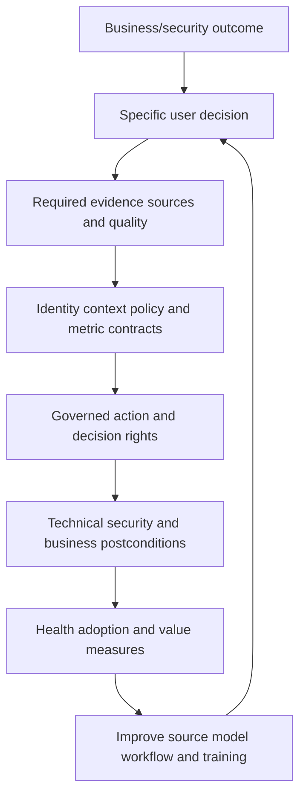

## Phase 1: discovery and use-case selection

Discovery should produce decisions and artifacts, not only meeting notes. Interview executive sponsors, security operations, vulnerability management, cloud/platform, endpoint, IAM, application/service owners, CMDB/ITSM, data/privacy, architecture, support, and the account team. Observe current work rather than relying only on stated process.

### Discovery question set

| Domain | Questions | Evidence artifact |
|---|---|---|
| Objectives | Which business/security outcomes matter and why now? | Outcome/problem statement |
| Decisions | Who makes which decision using what evidence? | Decision inventory |
| Current process | How is work detected, assigned, remediated, validated? | Current-state flow |
| Pain | Wrong targets, unknown assets, duplicates, stale CMDB, control gaps, reporting? | Pain/evidence register |
| Scope | Which organizations, accounts, networks, classes, services, regions, lifecycle? | Scope registry |
| Sources | What systems observe or authoritatively govern each field? | Source inventory |
| Identity | Which stable IDs, namespaces, aliases, recreations, and grains exist? | Identity map |
| Policies | Which criticality, coverage, exception, SLA/SLO, retention, and risk rules apply? | Policy catalog |
| Integrations | Which tickets, CMDB, notifications, reports, or actions are needed? | Target inventory |
| Security/privacy | What sensitive data, credentials, residency, access, and audit constraints? | Control requirements |
| Operations | Who monitors, supports, changes, trains, and escalates? | Operating model |
| Acceptance/value | What proves fit, adoption, and outcome? | Test/metric plan |

### Use-case charter

| Field | Example synthetic charter entry |
|---|---|
| User | Endpoint security analyst |
| Decision | Which active eligible server assets lack effective current EDR and who must act? |
| Population | Active production Windows/Linux servers in three registered cloud accounts and two data centers |
| Evidence | Independent asset universe, EDR native state, owner/service catalog, lifecycle |
| States | Effective, gap, exception, unknown, not applicable |
| Action | Create/update one governed remediation episode after analyst validation |
| Owner | Endpoint control owner plus technical asset owner |
| Postconditions | Correct sensor identity, current health/enforcement, asset/report/ticket reconciliation |
| Value hypothesis | Reduce time spent reconciling sources and wrong-owner routing while increasing validated coverage |
| Guardrails | No auto-isolation, no owner/lifecycle overwrite, source outage -> unknown |
| Acceptance | Representative precision, completeness, workflow idempotency, user task success |

### Use-case prioritization

| Factor | Favor earlier | Defer/reshape when |
|---|---|---|
| Business/security consequence | Material known problem and accountable sponsor | Vague "single pane" objective |
| Data readiness | Independent scope, stable IDs, accessible sources | No denominator/authority |
| Actionability | Clear owner and feasible treatment | No decision/action path |
| Validation | Observable technical/business postcondition | Success defined as dashboard live |
| Complexity | Bounded entities/rules/targets | Many ambiguous grains and custom writes |
| Safety | Read-only or low-impact proposal first | Destructive/high-consequence automation |
| Learning | Tests core identity/source assumptions | Cosmetic report with little learning |
| Reuse | Foundation supports later cases | Highly bespoke low-value integration |

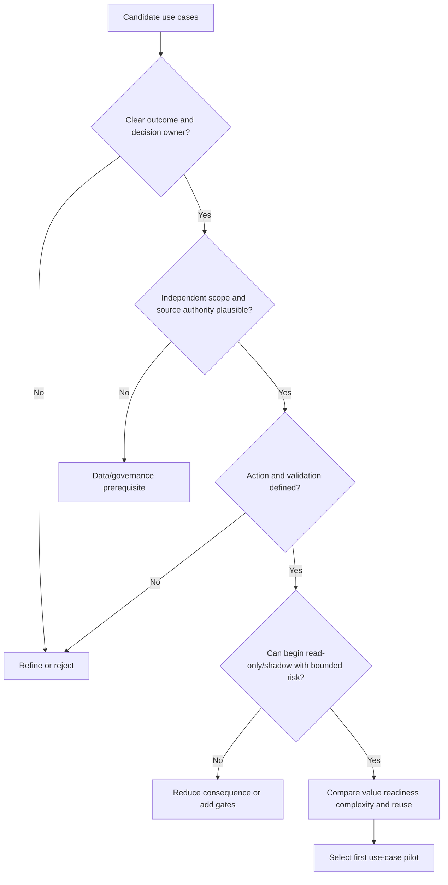

### Discovery anti-patterns

| Anti-pattern | Consequence | Correction |
|---|---|---|
| Start with every available connector | Complexity before value | Start with one complete decision loop |
| Promise one source of truth | Field/process authority ignored | Federated evidence and explicit authority |
| Copy existing spreadsheet as requirements | Existing defects preserved | Observe decisions and validate definitions |
| Ask only security team | Business/CMDB/app ownership missing | Cross-functional discovery |
| Define success as asset count | More duplicates can look successful | Quality/action/outcome acceptance |
| Ignore unavailable product access | Interview overclaim or blocked lab | Use synthetic design and state boundary |

## Phase 2: source strategy and plan

A source plan connects each use case to the minimum evidence needed. More sources can improve corroboration and context but also add duplicate identities, conflicting clocks, permissions, cost, and operational burden.

### Source-plan contract

| Field | Required detail | Example risk |
|---|---|---|
| Source/use case | Why source is needed and which decisions depend on it | Decorative ingestion |
| Business/source owner | Accountable contact and escalation | Orphaned connector |
| Platform/tenant/region | Exact namespace and endpoints | Cross-tenant collision |
| Objects/fields/grain | Required records and one-row meaning | Mixed asset/component grain |
| Stable IDs/aliases | Native identity and lifecycle behavior | Hostname/IP treated permanent |
| Field authority | Which fields source can decide, support, or not influence | Scanner overwrites owner |
| Scope registry | Accounts/subscriptions/domains/groups expected | Missing account hidden |
| Acquisition | API/file/event, full/incremental, cursor/deletion | Missed updates/deletes |
| Cadence/latency | Expected collection and business freshness | Unfair stale label |
| Volume/rate limits | Baseline, peak, pagination, quotas | Truncation/throttling |
| Authentication | Identity/token/certificate method and rotation | Credential outage |
| Authorization | Exact least-privilege objects/actions | Partial view |
| Schema/semantics | Types, units, enumerations, null/deletion meaning | Silent default |
| Quality/control totals | Native counts, checksums, rejects, completeness | Green partial run |
| Security/privacy | Sensitivity, minimization, residency, encryption, audit | Data leakage |
| Change/support | Version notification, test, owner, runbook | Surprise schema break |
| Acceptance/exit | Tests and approved result | Endless onboarding |

### Source-role matrix

| Context | Candidate authoritative source type | Supporting source types | Caution |
|---|---|---|---|
| Cloud resource existence | Cloud control plane in registered account | Scanner, runtime, CMDB | Permissions/regions and ephemeral lifecycle |
| Endpoint/device identity | MDM/device authority/validated hardware evidence | EDR, scanner, DHCP | Reimage/clones and sensor grain |
| Business service | Governed service/application catalog | Deployment/runtime | Traffic does not prove service dependency |
| Business owner | Service governance/attestation | HR, app team, tags | Last user/tag not authority |
| Technical owner | Team/deployment/service catalog | Cloud tags, CMDB | Effective dates/reorgs |
| Lifecycle | Native platform plus approved lifecycle process | CMDB, observations | Absence not retirement |
| Control health | Native control platform under policy | Asset-side evidence | Installed not effective |
| Vulnerability | Scanner/vendor/package/runtime evidence | Multiple scanners | Applicability/duplicates/freshness |
| Internet exposure | External observation plus route/control-plane/test | DNS, CMDB, scanner | Discovery not reachability |
| Identity privilege | IAM/provider effective policy | Activity/CMDB | Assignment not effective access |
| Criticality | Business impact/service governance | Data/dependency context | Scanner severity not criticality |

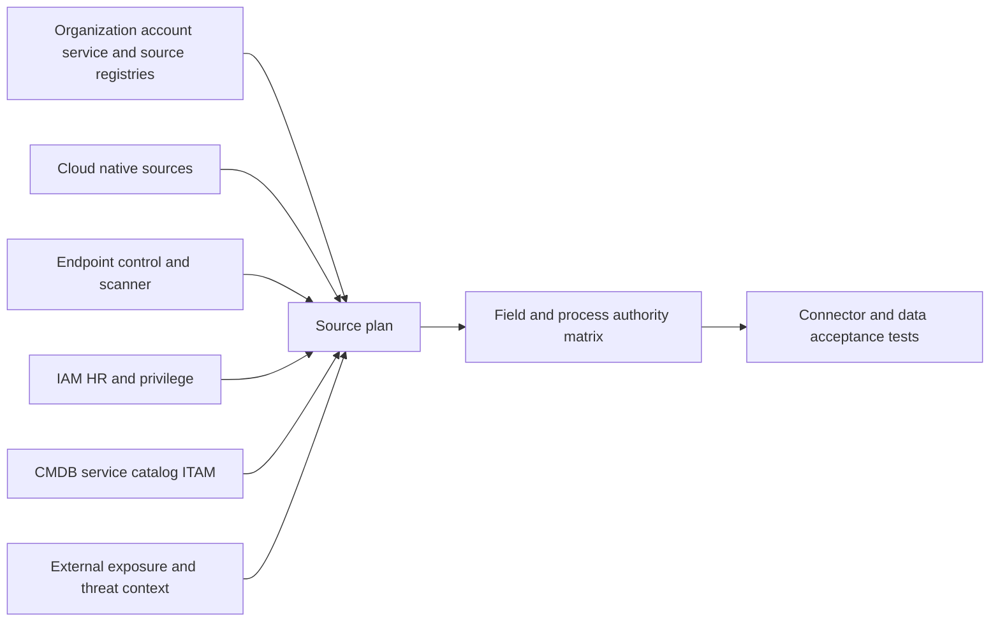

### Source sequencing

Start with sources that establish population and identity, then authoritative business and control context, then enrichment and action targets. For example, onboarding a vulnerability scanner before establishing active asset identity and lifecycle can create a large but poorly actionable finding queue. Sequence is use-case dependent, not universal.

## Phase 3: connector onboarding and data acceptance

Connector setup has two separate acceptance questions:

1. **Transport acceptance:** Can the integration authenticate, authorize, acquire, retry, and observe reliably and securely?
2. **Data acceptance:** Are the records complete, correctly parsed/mapped, current, identity-usable, and fit for the chosen decision?

### Connector lifecycle

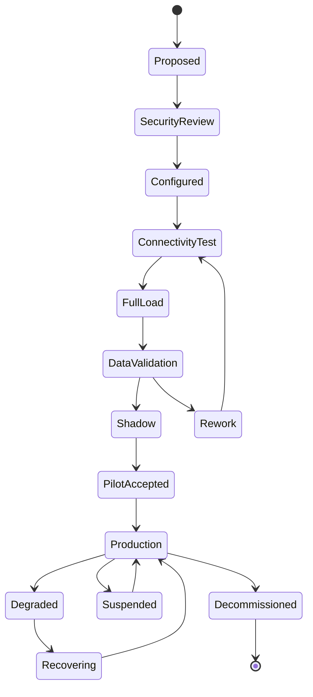

### Connector acceptance matrix

| Test domain | Test | Acceptance evidence | Failure response |
|---|---|---|---|
| Identity | Dedicated connector identity is expected tenant/source | Auth logs and namespaced ID | Stop; correct identity |
| Least privilege | Can read only required scopes/fields/actions | Positive and prohibited access tests | Reduce/fix permissions |
| Scope | All registered accounts/regions/groups represented | Registry-to-source reconciliation | Add/authorize or explicitly exclude |
| Full load | Every expected page/object arrives exactly enough | Native totals/checkpoints/sample IDs | Fix pagination/filter/limits |
| Incremental | Creates, updates, deletes, late events, replay work | Controlled change matrix | Fix cursor/tombstone/order logic |
| Schema | Types/enums/nulls/units/time preserve meaning | Mapping tests and rejects | Quarantine incompatible records |
| Volume | Normal/peak/backfill remain within quotas/capacity | Load test and rate telemetry | Schedule/throttle/coordinate |
| Retry | Transient failures use bounded backoff | Attempt history | Prevent storm |
| Timeout ambiguity | Query source/target before replay | Idempotent state evidence | No blind random-key retry |
| Freshness | Source/event/ingest/available latency fits use | Timestamp distribution | Adjust cadence or caveat use |
| Security | Secrets protected/rotated; transport/audit approved | Security review and logs | Block launch |
| Privacy | Only necessary fields retained/accessed | Data inventory and access tests | Minimize/restrict |
| Observability | Health, errors, rejects, counts, lag, version visible | Dashboard/alerts/runbook | Add before production |
| Recovery | Outage/backfill/reconciliation tested | Game-day evidence | Repair plan |
| Decommission | Credentials revoked and dependencies/history handled | Exit checklist | Do not orphan access/data |

### Full and incremental acceptance sequence

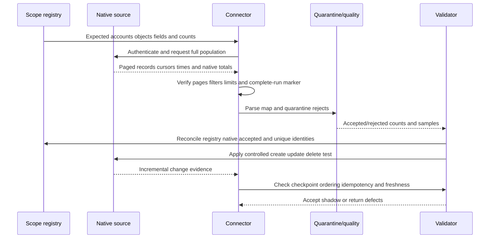

### Data acceptance ledger

| Stage | Control total | Quality state | Required drill-down |
|---|---:|---|---|
| Registered scope | Expected accounts/objects | Approved/incomplete | Missing scope owner |
| Native source | Source-reported records | Complete/partial/unknown | Native IDs and query |
| Acquired raw | Records/pages/events received | Complete/duplicate/gap | Run/page/checkpoint |
| Parsed | Valid records and rejects | Accepted/quarantined | Field/type/error |
| Mapped | Canonical fields populated | Complete/default/conflict | Source-to-target values |
| Resolved | Exact/candidate/separate/unknown assets | Confidence states | Match evidence |
| Contextualized | Owner/service/control/relationship claims | Current/stale/conflicted | Provenance |
| Semantic | Eligible states/metrics | Contract pass/fail | Rule/version |
| Actionable | Valid owner/workflow route | Ready/blocked | Action reason |

### Plain-English deep-dive 2 - A successful API call can still deliver an unusable source

A transit feed can authenticate successfully and return HTTP success while omitting half the routes because the connector lacks regional permission or ignores pagination. Transport succeeded; operational truth failed.

Always reconcile against an independent scope registry and source-native control totals. Test representative records, high-risk edge cases, deletions, late changes, and permissions. Show partial/incomplete as degraded or unknown. Connector uptime is not data completeness, and data completeness is not semantic correctness.

## Phase 4: golden-record validation

Golden-record validation asks whether source observations have been resolved into the correct asset entities and whether each field retains defensible provenance. Test both **precision** and **recall** concepts:

- Match precision asks: among records the logic merged, how many merges were correct under the labeled sample?
- Match recall asks: among source records known to represent the same asset in the labeled sample, how many were resolved together?

These measurements depend on sample design, labels, scope, and asset class. They are not universal product scores.

### Validation sample design

| Sample cohort | Why include | Example defect found |
|---|---|---|
| Random by asset class/source | Baseline quality | Common mapping error |
| High-consequence critical/public | Action safety | Wrong owner/path transfer |
| High-confidence merges | Detect overconfident false merge | Shared hostname |
| Near-threshold candidates | Test boundary behavior | Small rule change instability |
| Unresolved/unknown | Assess recall/source gaps | Missing strong ID |
| Recreated/reimaged assets | Test temporal identity | Old finding inherited |
| Dynamic IP/hostname | Test weak aliases | Cross-device merge |
| Images/containers/instances | Test grain | Image and runtime collapsed |
| Human/service/workload identities | Test type boundaries | Account/person merge |
| Recently merged/split | Validate correction stability | Downstream links not reconciled |

### Golden-record acceptance checks

| Check | Pass evidence | Failure treatment |
|---|---|---|
| Entity grain | One record represents approved asset type/lifecycle | Split model or relationship |
| Strong identity | Namespaced stable IDs agree | Candidate/unknown, no action |
| Temporal validity | Aliases and lifecycle do not overlap impossibly | Correct valid intervals |
| Source provenance | Consequential fields show source/time/method | Block use until traced |
| Field authority | Owner/lifecycle/criticality/control use approved sources | Re-map or candidate field |
| Conflict handling | Authoritative disagreements remain visible | Steward review |
| Merge explainability | Rule/version/evidence/reviewer reproduced | Reject opaque merge |
| Split/unmerge | Correction can restore distinct records/references | Build recovery before scale |
| Downstream integrity | Findings, controls, owners, tickets, CMDB, reports map correctly | Reconcile every consumer |
| Stability | Same unchanged inputs produce intended identity | Investigate nondeterminism |

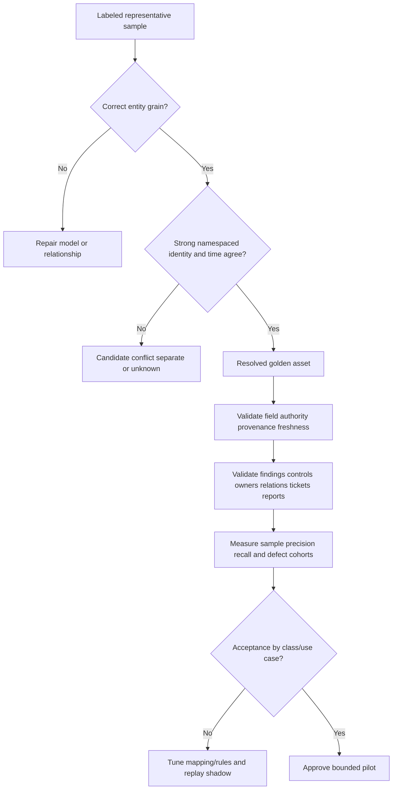

### False-merge response

1. Stop consequential automation for affected identity rule/cohort.
2. Preserve raw observations, golden history, rule/version, tickets, actions, and audit.
3. Identify every assertion, relationship, finding, control, owner, CMDB mapping, workflow, report, and export assigned to the merged entity.
4. Determine correct entities and valid time using strong source evidence.
5. Split/unmerge under approval; redirect each downstream item with before/after trace.
6. Restate impacted metrics and notify decision owners if prior action changed.
7. Add invariant/test and re-evaluate similar cohort before resume.

### False-split response

False splits can make one asset look like several assets with different partial controls and owners. Confirm same-entity identity, choose a governed survivor if merging, resolve field/relationship conflicts, preserve aliases/history, consolidate tickets without losing comments, and ensure the denominator/action register no longer duplicates work. A lower count is not proof the merge was correct.

## Phase 5: relationship, ownership, criticality, and coverage rules

Rules turn context into decisions, so govern them like code: requirements, owner, version, test cases, peer review, simulation, change record, rollout, monitoring, and rollback.

### Relationship rule contract

| Field | Required content | Example |
|---|---|---|
| Edge type/direction | `application supports service` | Prevents ambiguous line |
| Subject/object grain | Application ID -> service ID | Avoids instance/service confusion |
| Source/method | Service catalog + deployment | Establishes evidence |
| Conditions | Active environment and effective time | Excludes retired relation |
| Confidence/state | Confirmed/supported/candidate/conflicted | Controls path use |
| Freshness/expiry | Review after deployment/catalog change | Prevents stale blast radius |
| Authority/steward | Architecture/service governance | Resolves dispute |
| Negative tests | Traffic alone does not create `depends_on` | Prevents overconnection |
| Consumers | Criticality, path, owner, dashboard | Determines regression scope |

### Criticality rule contract

| Question | Safe design | Failure |
|---|---|---|
| What is critical? | Approved business-service impact dimensions and tiers | Asset name or scanner score |
| How inherited? | Explicit relationship types and bounded propagation | Every transitive neighbor becomes critical |
| Who approves? | Business/risk/service governance | Data engineer decides |
| What if missing? | Unknown with owner workflow | Default low |
| How current? | Effective dates and attestation/change triggers | Permanent stale tier |
| How tested? | Positive, negative, boundary, conflict, historical cases | One happy path |
| What does it affect? | Priority/report/action under documented policy | Hidden consequence |

### Coverage rule contract

| Element | Example | Validation |
|---|---|---|
| Control objective | Detect/prevent harmful endpoint behavior | Approved control policy |
| Eligible population | Active supported server OS in named environments | Independent asset universe |
| Exclusions/NA | Appliances where agent not supported | Class/platform proof |
| Required state | Correct sensor, assigned policy, healthy, enforcing, current | Native plus asset-side evidence |
| Exception | Scope, owner, compensation, approval, expiry | Register and effectiveness test |
| Unknown | Source/identity/policy evidence incomplete | Separate state and source action |
| Gap | Applicable required state not met | Confirmed evidence and owner |
| Postcondition | Effective state and report/ticket reconciliation | Read-back and representative test |

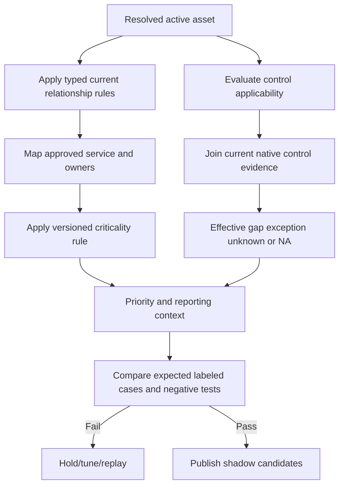

### Rule test catalog

| Test class | Example | Expected behavior |
|---|---|---|
| Positive | Active production app has approved service relation | Relationship/criticality applies |
| Negative | One network flow to service | No dependency without rule evidence |
| Boundary | Criticality attestation expires at cutoff | Unknown/review, not silent low |
| Conflict | Catalog owner differs from tag | Authoritative value plus visible conflict |
| Missing | Control source absent after failed run | Unknown, not gap/pass |
| Temporal | Hostname reused after retirement | New entity/valid alias interval |
| Scale | Rule change affects 40 percent of assets | Diff limit and approval |
| Regression | Prior false-merge case | Must remain separate |
| Security | Malicious text in tag/description | Treated as data, no instruction execution |
| Explainability | Analyst opens result | Source/rule/version/reason visible |

### Plain-English deep-dive 3 - Criticality must not spread like spilled paint

If a bus visits an emergency hospital once, the bus does not automatically become permanently "critical infrastructure," nor does every garage connected to it. Relationships have verbs and conditions. Criticality propagation needs explicit business semantics.

For example, a database that stores the only current patient schedule may inherit service importance under an approved direct relationship. A shared logging server may be important for detection but not have the same immediate availability tier. A developer laptop that connected to the database during troubleshooting should not inherit production criticality. Test propagation depth, relationship types, time, and owner approval.

## Phase 6: CMDB and workflow integration

Reading context and writing a target have different risk. Begin read-only or proposal-only. Add low-impact, integration-owned fields before owner, lifecycle, merge, retirement, or destructive operations. Current official product documentation and tenant capability determine what is actually supported.

### Integration contract

| Contract area | Required decision | Safety control |
|---|---|---|
| Purpose | Which use case needs which target action? | No generic sync |
| Direction | Read, propose, write, or bidirectional? | Explicit authority per direction |
| Object/grain | Exact target record/class/ticket type | Stable IDs and class check |
| Field ownership | Which fields can integration change? | Allowlist/patch semantics |
| Identity mapping | Source/golden/CMDB/ticket keys | Namespaces and temporal mapping |
| Trigger | Schedule, event, analyst, reconciliation | Deduplication and qualification |
| Preconditions | Source health, confidence, current target, policy | Fail closed/hold |
| Approval | Who authorizes by consequence? | Separation of duties |
| Idempotency | One logical action key | Target lookup after timeout |
| Concurrency | Expected version/ETag/current state | Conditional write |
| Result/read-back | Accepted vs persisted state | Query target and compare |
| Reconciliation | Source/desired/target/business convergence | Drift queue |
| Error/retry | Transient, permanent, ambiguous states | Bounded backoff/dead letter |
| Rollback/restatement | Restore data and reports | Before/after/audit |
| Security/privacy | Least privilege, secrets, access, retention | Security review/monitoring |

### Safe workflow sequence

```mermaid
sequenceDiagram
    participant A as AEM-style context
    participant W as Workflow controller
    participant H as Human/approval policy
    participant T as CMDB or ITSM target
    participant R as Reconciler
    A->>W: Qualified candidate with stable asset/episode ID
    W->>W: Check source health identity confidence policy and current state
    W->>T: Read exact target and version; search action key
    T-->>W: Current record/version or existing action
    W->>H: Preview expected/actual treatment and consequence
    H-->>W: Approve reject or request evidence
    W->>T: Conditional idempotent create/patch
    T-->>W: Accepted/rejected/timeout and target ID
    W->>T: Read back by stable target/action key
    T-->>W: Persisted state/version
    W->>R: Reconcile source desired target ticket and business postcondition
    R-->>W: Validated drifted uncertain or hold
```

### Workflow acceptance tests

| Test | Expected result |
|---|---|
| Duplicate trigger | One logical ticket/change/CI update |
| Concurrent human edit | Conditional conflict; reread and review |
| Timeout after target acted | Find existing action; no duplicate |
| Permanent validation error | Hold with exact error; no retry storm |
| Source degradation | No new consequential action; state unknown |
| False-merge correction | Tickets/CMDB links split/reconciled |
| Owner change | Open action routes under governed transition |
| Exception expiry | Requalify one episode, preserve history |
| Target outage | Queue safely, monitor age, recover/reconcile |
| Read-back mismatch | Do not close; repair drift |
| Permission reduction | Fail safely and alert without partial overwrite |
| Rollback | Prior compatible state restored and audited |

### CMDB field strategy

| Field type | Suggested general posture | Reason |
|---|---|---|
| CMDB internal ID/class | Read and verify; never invent | Exact target identity |
| Cloud/source stable ID | Add mapping under authority | Supports reconciliation |
| Dedicated derived control state | Bounded write with expiry/provenance may be suitable | Integration owns exact field |
| Candidate owner/tag | Suggest/review | Source may not own business field |
| Business owner/service/criticality | Human/governed process approval | Consequential context |
| Lifecycle | Proposal plus authoritative process | Absence/source defect risk |
| Merge/delete | Strong approval, simulation, reversal/restatement | Broad irreversible effects |

## Phase 7: rollout and production readiness

### Rollout stages

| Stage | Scope | Actions | Exit gate |
|---|---|---|---|
| Design | Synthetic/redacted cases | Define contracts, risks, tests, owners | Approved design/security/privacy |
| Connectivity | Nonproduction or isolated setup | Authenticate/read minimal source | Least privilege and logging pass |
| Data validation | Full/incremental source samples | Reconcile, map, quarantine, test identity | Acceptance thresholds met |
| Shadow | Representative production data, no writes | Compare expected candidates/metrics | Precision/recall/unknown/action readiness accepted |
| Pilot | One service/account/team | Human-reviewed actions | Task success, safety, support/runbook readiness |
| Canary writes | Very small low-impact action cohort | Conditional/idempotent writes | Read-back/reconciliation and no material harm |
| Wave rollout | Bounded services/sources/actions | Expand after gates | Per-wave quality/adoption/value gates |
| Steady state | Approved scope | Operate, monitor, review, improve | Ongoing SLO/governance |
| Expansion | New use case/source/target | Repeat discovery and acceptance | No assumption that prior acceptance transfers |

### Production-readiness checklist categories

| Category | Readiness evidence |
|---|---|
| Use case | Decision, owner, population, action, postconditions approved |
| Sources | Scope registry, acceptance, health, runbook, owners |
| Identity | Grain, rules, samples, false merge/split recovery |
| Context/rules | Authority, versions, tests, explanation, rollback |
| Integrations | Least privilege, idempotency, concurrency, read-back, reconciliation |
| Security/privacy | Threat model, secrets, access, audit, retention, incident path |
| Reliability | Quotas, retry, outage, backfill, monitoring, capacity |
| Change | Release plan, diff/canary/kill switch/rollback |
| Operations | RACI, support route, on-call/escalation, documentation |
| Users | Role training, task assessment, support materials |
| Metrics | Data/system/workflow/adoption/value contracts |
| Business | Sponsor, risk/change approvals, roadmap, review cadence |

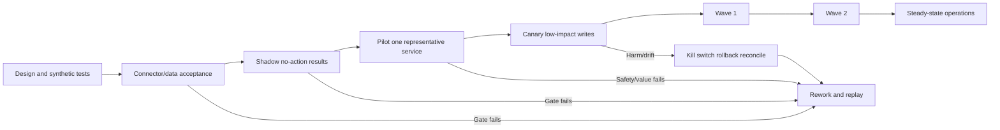

### Rollout gates

Do not define universal numeric thresholds in a study guide. The customer and product team approve thresholds based on use case, consequence, asset class, sample design, and current capability. Gates should cover source completeness, identity precision/recall evidence, critical false-merge rate, unknown handling, rule accuracy, workflow duplication/wrong-target rate, read-back validation, security controls, user task success, support readiness, and observed value hypothesis.

## Troubleshooting framework

When a symptom appears, avoid changing match weights, permissions, and reports simultaneously. State one falsifiable hypothesis and choose the cheapest discriminating check. Preserve evidence before replay or correction.

### Layer model

| Layer | Question | Typical evidence |
|---|---|---|
| 1. Scope/use case | Is expected population and decision unchanged? | Charter, registry, change log |
| 2. Source | Does native source contain complete current data? | Native query/count/permission |
| 3. Connector | Did auth, pages, cursor, retry, schedule, rate behavior succeed? | Run logs/checkpoints/errors |
| 4. Parse/map | Were fields/types/enums/times/deletes preserved? | Raw vs mapped samples/rejects |
| 5. Identity | Are asset grain, matches, merges/splits, lifecycle correct? | Strong IDs/rule versions |
| 6. Context | Are owner/service/criticality/relationship/control claims valid? | Provenance/authority/conflicts |
| 7. Rule/semantic | Did applicability, coverage, priority, metric calculate correctly? | Intermediate factor trace |
| 8. Workflow/target | Did trigger, idempotency, approval, API, read-back work? | Action/target audit |
| 9. Report/access | Do filters, cache, RBAC, snapshot, export agree? | View/query metadata |
| 10. Adoption/process | Did user interpret/act/validate correctly? | Task observation/action record |
| 11. Product | Does behavior differ from supported expectation after local layers pass? | Minimal reproduction |

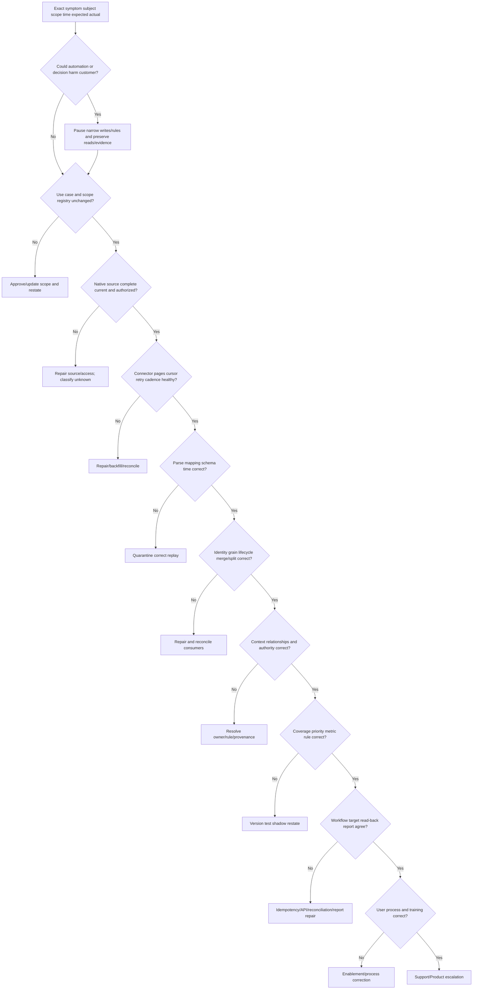

### Failure-mode table

| Symptom | Likely layers | Cheapest discriminating check | Immediate containment |
|---|---|---|---|
| Asset count drops | Scope/source/connector/identity | Registry/native/page totals and merge count | Block positive trend/retire actions |
| Asset count spikes | Pagination replay/duplicates/false split | Distinct native IDs and run cursor | Pause ticket creates |
| Owner becomes blank | Source permission/mapping/authority/expiry | Raw owner field and provenance | Preserve previous as stale/candidate; no guess |
| Wrong owner assigned | False merge/rule/role confusion | Asset ID plus owner source/role | Hold routing automation |
| Control gaps surge | Control source outage/policy change/identity | Source health and missing-to-unknown behavior | Block mass tickets |
| Gaps vanish | Incomplete source/exception/default/pass rule | Complete-run marker and state transitions | Freeze closures/downgrades |
| Relationships explode | Flow-derived rule/cycle/join | One sample edge rule and cardinality | Mark paths candidate |
| Critical assets multiply | Transitive propagation/rule release | Criticality reason/depth/version | Revert rule/shadow |
| Duplicate tickets | Retry key/false split/race | Episode/action key and target search | Pause creates/reconcile |
| CMDB wrong field | Authority/mapping/target version | Before/after/audit and field allowlist | Disable exact writer |
| Connector green but stale | Scheduler/event lag vs health definition | Source/event/available timestamps | Degraded banner |
| Report/detail mismatch | Grain/filter/cache/RBAC/version | Same filter/as-of distinct keys | Withdraw KPI |
| User bypasses workflow | Poor fit/training/ownership/latency | Observe task and interview user | Preserve alternate evidence; improve design |

### Investigation evidence package

| Evidence | Required content | Safety |
|---|---|---|
| Problem | One exact expected/actual behavior and consequence | No speculative cause as fact |
| Scope | Tenant, source, account, class, use case, affected/unaffected cohorts | Minimize data |
| Timeline | UTC last good, first bad, runs, changes, actions | Clarify event/ingest/display clocks |
| IDs/versions | Source run, asset/source IDs, rule/schema/model/workflow/report versions | Redact secrets |
| Counts | Registry/native/raw/parsed/resolved/semantic/target totals | Same grain/filter |
| Samples | Minimal before/after raw/mapped/resolved records | Secure channel |
| Hypothesis/test | Prediction, method, result | Non-destructive first |
| Changes | Permissions, schema, connector, rules, product, target | Correlation not automatically cause |
| Containment | What is paused/caveated and residual impact | No invented ETA |
| Reproduction | Small synthetic/redacted supported case | Avoid production exploit/destructive test |

### Plain-English deep-dive 4 - Troubleshooting begins by protecting decision quality

When a transit map suddenly loses 30 percent of buses, the first goal is not to make the chart look normal. It is to stop dispatchers from making unsafe routing decisions, preserve the feed and change evidence, and identify whether buses vanished, the feed failed, mapping changed, or filters shifted.

For AEM, contain the narrowest harmful automation or claim. Keep safe read-only evidence where possible. Mark affected states unknown/degraded. Then move one layer at a time from scope and native source through connector, mapping, identity, context, rules, workflow, and reporting. A disciplined path is faster than random tuning because each test can falsify a specific hypothesis.

## Gap triage and treatment

An apparent gap can be a real missing control, a misconfiguration, a policy-applicability error, stale evidence, source outage, identity defect, approved exception, or unsupported asset class. Triage before remediation.

### Triage sequence

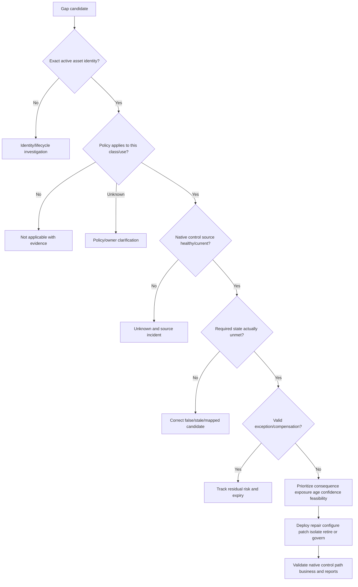

### Treatment catalog

| Root condition | Treatment | Validation |
|---|---|---|
| Connector/source gap | Restore permission/schedule/pages/backfill | Native-to-dashboard completeness |
| Mapping/schema defect | Correct transform/quarantine/replay | Field semantics and rejects |
| False merge/split | Split/merge with downstream reconciliation | Identity and every consumer |
| Ownership gap | Steward/owner attestation and routing | Accountable role plus ticket route |
| Criticality error | Governance decision/rule correction/restatement | Service impact and downstream priorities |
| Real control gap | Deploy/repair/configure/replace control | Native/effective state and scenario |
| Unnecessary exposure | Remove/restrict route/listener/identity | Positive required and negative prohibited tests |
| Unsupported asset | Upgrade/migrate/isolate/compensate/retire | Service/safety and residual risk |
| Exception debt | Remediate, narrow, validate, expire, or reauthorize | Compensation and risk-owner record |
| Workflow defect | Repair idempotency/authority/read-back | One action and converged states |

## Ownership disputes and decision rights

Ownership disputes are not solved by assigning the person who answers first. Clarify the role and decision: business accountability, technical operation, control operation, data stewardship, task responsibility, or residual-risk authority.

### Dispute-resolution protocol

1. State exact asset/service/action and the ownership role in dispute.
2. Show strong identity, lifecycle, service relationships, source authority, and effective dates.
3. Consult approved organizational/service/account/deployment governance.
4. Separate temporary routing from accountable ownership.
5. Assign a steward/escalation owner while unresolved; do not guess the final owner.
6. Use the customer's decision hierarchy for unresolved conflicts.
7. Record decision, rationale, authority, effective date, review trigger, and downstream updates.
8. Validate action routing and correct historical metrics/tickets if affected.

| Dispute | Evidence | Decision authority | Unsafe shortcut |
|---|---|---|---|
| Cloud tag versus service catalog | Resource/account/deployment/service records | Customer service governance | Newest tag wins |
| Shared platform component | Consumers, operating team, funding/service model | Platform/business governance | Assign largest consumer |
| Acquired asset | Acquisition scope, legal entity, account, transition plan | Integration/program leadership | Old inactive owner retained |
| Orphan workload | Deployment repo, runtime identity, account, cost, traffic | Cloud/app governance | Last user becomes owner |
| Control gap | Asset owner versus control owner responsibilities | Security operating model | Blame ticket assignee |
| Risk acceptance | Technical team versus business owner | Delegated risk authority | TSM accepts risk |

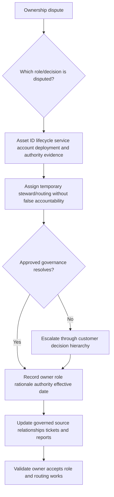

## Training and adoption

Training should be role-based and task-based. Analysts need to interpret evidence and unknowns. Source owners need health and reconciliation. Asset/service owners need action and validation. Executives need scenario, trend, uncertainty, and decision literacy. Administrators need configuration, security, monitoring, change, and escalation.

### Role curriculum

| Role | Must be able to do | Assessment |
|---|---|---|
| Analyst | Find asset, inspect provenance, distinguish gap/unknown/exception, create evidence-based action | Scenario task |
| Source owner | Diagnose auth/scope/page/freshness/reject issues and backfill safely | Source-outage game day |
| Asset/service owner | Confirm context, choose treatment, provide postconditions | Action workshop |
| Control owner | Explain applicability/effectiveness/exception and validate state | Coverage case |
| CMDB/ITSM owner | Trace idempotent proposal/write/read-back/reconciliation | Timeout/duplicate exercise |
| Data steward | Review merge/split/authority/relationship conflicts | Identity sample exercise |
| Administrator | Manage access, secrets, release, monitoring, rollback | Operational readiness test |
| Executive/risk owner | Interpret material cohorts, uncertainty, decisions, residual risk | Review simulation |
| TSM/account team | Facilitate outcomes, adoption, escalation, roadmap, product boundary | Customer-review rehearsal |

### Adoption ladder

| Level | Observable behavior | Evidence |
|---|---|---|
| Awareness | User understands purpose and terms | Teach-back |
| Access | Correct roles and environment available | Access test |
| Skill | User completes representative task | Practical assessment |
| Routine use | Workflow used consistently for eligible cases | Episode/process evidence |
| Quality | Correct decisions, low wrong-target/duplicate/reopen | Review samples/metrics |
| Integration | AEM context embedded in normal operating cadence | Action/review linkage |
| Optimization | Users identify rule/source/process improvements | Improvement backlog/outcomes |

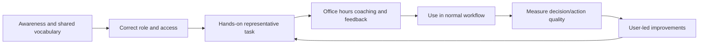

### Adoption barriers

| Barrier | Symptom | Treatment |
|---|---|---|
| Data distrust | Users keep private spreadsheets | Expose provenance/health; fix top defects |
| Workflow friction | Users copy IDs manually or bypass tickets | Observe task; simplify/integrate |
| Wrong ownership | Tickets bounce | Role governance and routing evidence |
| Alert overload | Everything labeled urgent | Bounded use cases and explainable priority |
| Product-access gap | Learners cannot practice | Synthetic labs, demos, supervised tenant practice when available |
| Change fatigue | New tool seen as extra work | Integrate with existing decisions and retire redundant steps |
| Fear of automation | Owners resist writes | Shadow/proposal/canary/read-back/kill switch |
| Executive disconnect | Reviews list technical counts | Tie to service scenarios, actions, blockers, validated outcomes |
| Training-only approach | Attendance high, task performance low | Scenario assessment/coaching |

## Governance and operating model

### Decision-rights matrix

| Decision | Accountable | Responsible/contributors | TSM posture |
|---|---|---|---|
| Use-case priority | Customer sponsor/program owner | Security/business/technical teams | Facilitate evidence and roadmap |
| Source onboarding/access | Source and security owners | Integration/admin/privacy | Coordinate; do not own credentials |
| Identity/match rules | Asset data governance | Source/domain stewards | Surface quality and product questions |
| Business owner/criticality | Service/risk governance | Business/app/data owners | Facilitate decisions |
| Control policy/exception | Control/risk owner | Asset/security/compliance teams | Clarify evidence; no acceptance |
| CMDB field/action | CMDB/process/change owner | Data/integration/security | Promote safe contract |
| Product configuration | Authorized customer admin | Product specialists/Support | Advise within supported scope |
| Product defect | Zscaler Support/Product process | Customer + TSM evidence | Build case and communicate |
| Go-live/rollback | Customer change/service owner | Implementation/operations | Provide readiness evidence |
| Residual risk | Authorized customer risk owner | Security/business/legal as needed | Never accept for customer |

### Governance cadence

| Forum | Purpose | Inputs | Outputs |
|---|---|---|---|
| Daily operations | Source incidents, unsafe automation, critical cases | Health/alerts/actions | Containment and owners |
| Weekly implementation | Risks, decisions, tests, dependencies, wave readiness | Plan/test/issue register | Updated work and gates |
| Weekly data/rule council | Identity, mapping, authority, rule defects | Samples/conflicts/diffs | Approved changes/restatements |
| Monthly service review | Health, adoption, outcomes, support cases, roadmap | Scorecard/actions | Priorities and improvement plan |
| Quarterly executive | Material scenarios, value, blockers, investment | Executive narrative | Decisions/sponsorship |
| Change advisory | Consequential releases/writes | Diff/test/rollback/security | Approval/rejection |
| Event-driven incident | Source/product/workflow harm | Evidence/impact/containment | Recovery and RCA |

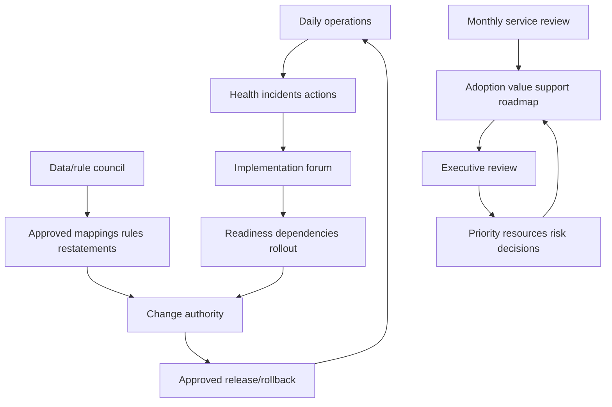

### Security and privacy guardrails

| Area | Guardrail |
|---|---|
| Connector identity | Dedicated least-privilege identities, strong auth, rotation, rapid revoke |
| Secrets | Approved vault, no logs/tickets/docs, access audit |
| Data minimization | Acquire/retain only fields needed for approved use cases |
| Tenant isolation | Namespace IDs and verify endpoints/tenant context |
| RBAC | Separate admin, analyst, viewer, approver, writer, risk roles |
| Exports | Restrict, watermark/metadata, secure channels, retention/expiry |
| Actions | Preview, approval, conditional/idempotent operation, rate/diff limits, kill switch |
| Audit | Actor, approval, source, before/after, request/result, read-back, correction |
| Privacy | Purpose, access, residency, retention, data-subject/legal review as applicable |
| AI | Approved model/path, minimization, citations, prompt-injection resistance, human review |
| Incident response | Detection, containment, credential revoke, evidence preservation, notification process |

## Health and value scorecard

Health should cover the entire decision loop. A healthy connector can feed bad identity; a healthy dashboard can feed a broken workflow; high adoption can scale a wrong rule.

### Health dimensions

| Dimension | Example measures | Question |
|---|---|---|
| Source | Scope completeness, run success/completeness, lag, rejects | Is required evidence arriving? |
| Identity | Resolution states, sample precision/recall, false merge/split, stability | Are assets correct? |
| Context | Owner/service/criticality/relationship freshness/conflicts | Is context trustworthy? |
| Rule | Test pass, unexpected diff, explainability, rollback readiness | Do policies classify correctly? |
| Workflow | Duplicate/wrong-target, conflict, timeout, read-back, drift | Do actions behave safely? |
| Product/system | Availability, latency, errors, access, version/config | Is capability operating? |
| Adoption | Access, skill, routine task completion, bypass, office-hour themes | Can users use it correctly? |
| Decision quality | Correct triage sample, unknown resolution, owner acceptance | Are decisions improving? |
| Outcome | Validated gap/path closures, time, reopen, recurrence | Are exposures durably treated? |
| Governance | Exceptions, changes, actions, reviews, audit completion | Is operation accountable? |

### Value chain


This chain is a hypothesis to test. External changes, scope expansion, threat shifts, and process changes can affect every measure. Do not claim AEM alone caused an outcome without a defensible evaluation design.

### Value and guardrail metrics

| Value hypothesis | Leading evidence | Outcome evidence | Guardrail |
|---|---|---|---|
| Reduce reconciliation effort | Decision-ready records and fewer manual joins | Analyst time/task completion sample | Accuracy not sacrificed |
| Reduce wrong routing | Valid ownership and task acceptance | Wrong-owner/bounce rate | Do not force placeholder owner |
| Improve control coverage | Confirmed eligible gaps/action throughput | Effective validated coverage | Unknown/exception separate |
| Improve remediation focus | Explainable critical/public cohorts | Time to validated treatment | Do not starve hygiene/systemic work |
| Improve CMDB health | Supported proposals and reconciliation | Correct sampled CIs/relationships | No unsafe overwrites |
| Improve review quality | Complete decisions/actions/checkpoints | Fewer stale/unclear commitments | Meeting volume not value |
| Improve durability | Postcondition and recurrence monitoring | Lower reopened/recurring scenario rate | Stable definitions/scope |

## Support and Product escalation

First determine the lane. A customer source permission problem, unsupported source object, product defect, documentation ambiguity, feature request, account/configuration question, and security incident require different ownership and urgency. Follow current official support processes and contractual channels.

### Escalation routing

| Situation | Primary lane | Evidence/next step |
|---|---|---|
| Source credential/permission expired | Customer source owner/integration operations | Native auth/permission result and restoration |
| Source API changed or unavailable | Source vendor/customer owner; possibly Zscaler Support for connector impact | Source advisory, requests, connector behavior |
| Documented supported connector behaves differently | Zscaler Support | Minimal reproduction, versions, logs, expected/actual |
| Capability unclear in public docs | Product specialist/Support/current docs | Exact use case and question |
| Desired unsupported behavior | Product feedback/account team process | Problem, users, value, frequency, workaround, risk |
| Wrong customer configuration | Customer admin/product specialist/Support as appropriate | Config diff and supported guidance |
| Potential security incident | Customer IR and vendor security/support channels as required | Preserve evidence; do not wait for normal review |
| Service availability issue | Current support/status process | Tenant/cloud/time/error/correlation IDs |

### Minimal reproducible escalation

| Field | Content |
|---|---|
| One-line problem | Exact expected versus actual behavior |
| Business/technical impact | Affected decisions/actions and severity without exaggeration |
| Environment | Tenant/cloud/region/source/target/version/config, redacted |
| Scope | Affected and unaffected accounts/classes/cohorts |
| Timeline | UTC last good, first bad, recurrence, relevant changes |
| IDs | Connector/run/asset/source/rule/workflow/report/case IDs |
| Reproduction | Small safe deterministic steps and prediction |
| Evidence | Logs, responses, counts, minimal records, screenshots with metadata |
| Local isolation | Layers already tested and results |
| Containment/workaround | Current state, risk, limitations, expiry |
| Ask | One bounded question or requested next diagnostic |

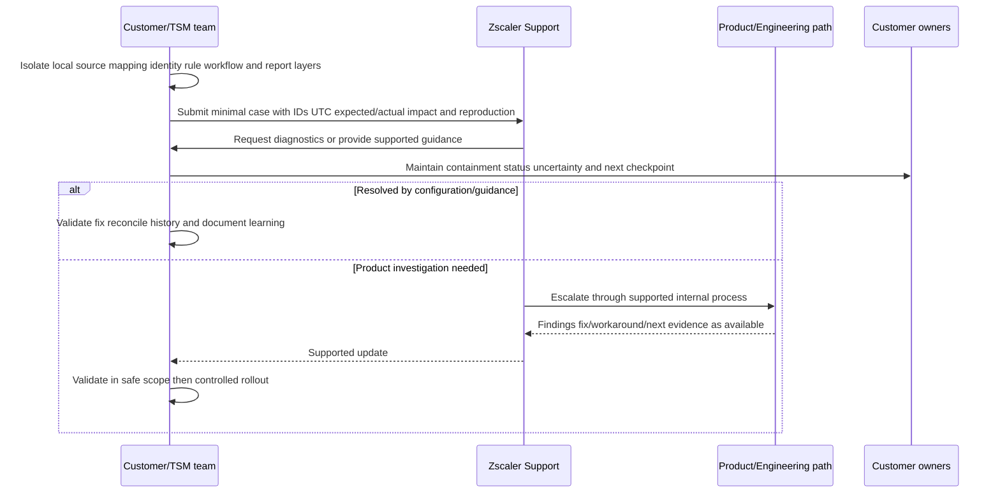

### Escalation communication

Do not promise an Engineering response or fix date without an authorized commitment. Distinguish facts, hypothesis, current impact, containment, owner, dependency, and next checkpoint. Keep the customer action register and vendor case linked but separate: a vendor case state is not the customer outcome.

### Product feedback packet

| Element | Example question |
|---|---|
| Problem | Which user decision is hard or unsafe today? |
| Users/frequency | Who encounters it and how often? |
| Current workflow | What steps/systems/workarounds exist? |
| Impact | Time, errors, risk, adoption, scale, with evidence |
| Desired outcome | What should become possible, not prescribed internals? |
| Constraints | Security, privacy, audit, performance, integration |
| Alternatives | Configuration/process/existing feature considered |
| Evidence | Cases, samples, task observation, metrics |
| Boundary | Feature request, not promised roadmap |

## 30/60/90 implementation and adoption plan

This plan is a reusable interview framework, not a promise of actual customer timing. Real sequencing depends on license, scope, access, procurement, source owners, data quality, security review, change windows, product capability, and customer readiness.

### First 30 days: understand, align, and baseline

| Workstream | Activities | Deliverables | Exit evidence |
|---|---|---|---|
| Relationships | Meet sponsor, SecOps, VM, cloud, endpoint, IAM, CMDB, app, data, support, account teams | Stakeholder/RACI map | Decision owners confirmed |
| Outcomes | Select one or two bounded use cases | Charters/value hypotheses | Population/action/postconditions defined |
| Environment | Inventory organizations, services, accounts, sources, targets, constraints | Current-state architecture | Scope registry approved |
| Sources | Document IDs, authority, access, cadence, volume, security | Source plan | Owners and gaps known |
| Baseline | Capture current counts, manual effort, wrong routing, age, data health | Baseline scorecard | Definitions reviewed |
| Risk | Threat model connector/data/action and identify high-consequence unknowns | Risk/decision log | Guardrails agreed |
| Enablement | Assess role skills/product access and schedule labs | Training plan | Learning path accepted |
| Support | Confirm current documentation/support/escalation channels | Support map | Case ownership understood |

### Days 31-60: connect, validate, and prove a pilot

| Workstream | Activities | Deliverables | Exit evidence |
|---|---|---|---|
| Connector | Configure minimal sources with least privilege | Connector configs/runbooks | Auth/scope/security pass |
| Data acceptance | Full/incremental, counts, mapping, freshness, resilience | Acceptance report | Complete enough for use case |
| Golden records | Sample across normal and edge cohorts | Identity-quality report | False merge/split risks bounded |
| Rules | Test ownership, relationships, criticality, coverage, metrics | Versioned test catalog | Positive/negative/boundary pass |
| Workflow | Run proposal/shadow, then low-impact pilot if approved | Integration contract | Idempotency/read-back/reconciliation pass |
| Users | Hands-on role tasks and office hours | Assessment results | Pilot users complete tasks |
| Review | Present pilot facts, caveats, actions, and decisions | Customer review pack | Sponsor chooses next wave |

### Days 61-90: operationalize, expand, and evidence value

| Workstream | Activities | Deliverables | Exit evidence |
|---|---|---|---|
| Rollout | Canary/waves for approved services/sources/actions | Wave plan and logs | Per-wave gates pass |
| Operations | Activate health dashboards, incident runbooks, on-call/escalation | Operating handbook | Game days completed |
| Governance | Launch data/rule/change/review cadence | Decision/change records | Owners attend and decide |
| Adoption | Coach teams, monitor bypass and task quality | Adoption scorecard | Routine correct use grows |
| Value | Compare baseline with task/action/outcome evidence | Value narrative | Claims bounded and reproducible |
| Roadmap | Prioritize next use cases, source gaps, automation, product feedback | Next-quarter plan | Dependencies/risks explicit |
| Handover | Confirm customer ownership and documentation | Acceptance/handover | No orphaned integration/process |

```mermaid
gantt
    title Synthetic 30 60 90 plan
    dateFormat  X
    axisFormat %s
    section First 30
    Stakeholders outcomes scope baseline      :a1, 0, 30
    Source security and support plan          :a2, 5, 25
    section Days 31 to 60
    Connector and data acceptance             :b1, 30, 20
    Golden record rule and workflow pilot     :b2, 38, 22
    Role training and pilot review            :b3, 45, 15
    section Days 61 to 90
    Canary waves and operations               :c1, 60, 25
    Governance adoption and value evidence    :c2, 62, 28
    Next roadmap and handover                 :c3, 80, 10
```

### 30/60/90 interview narrative

"In the first 30 days I would learn the customer's decisions, environment, source authority, constraints, and baseline, and select one bounded use case. By day 60 I would aim to have minimal sources accepted, golden records and rules tested, a proposal/shadow workflow, trained pilot users, and an evidence-based go/no-go decision. By day 90 I would aim to operationalize health and governance, expand through gated waves, measure task and validated outcome evidence, and agree the next roadmap. Those are directional phases, not guaranteed dates; I would adapt to access, data quality, security review, and customer change readiness."

## Complete synthetic NMH implementation

### NMH program context

NMH chooses two synthetic first use cases:

1. Identify active production server assets missing effective EDR and route one validated remediation episode.
2. Identify internet-reachable assets linked to two critical services with missing/unknown ownership or protection context.

The exercise scope and all results are synthetic as of 2026-08-24 00:00 UTC.

### NMH initial sources

| Source | Use | Authority/support role | Initial risk |
|---|---|---|---|
| Cloud-A/B | Resource IDs, accounts, state, network config | Technical existence in registered scope | One acquisition account permission |
| EDR | Sensor/policy/health observations | Control state under policy | Orphan sensor/device mappings |
| Scanner | Software/vulnerability evidence | Finding support | One zone unauthenticated |
| CMDB/service catalog | Services, governed owners, lifecycle candidates | Business/process fields | Stale attestations |
| IAM | Human/workload/effective role evidence | Identity/privilege in scope | Nested-role ambiguity |
| External exposure | Public endpoints and test evidence | Exposure observation | Pagination completeness |
| ITSM target | Remediation episodes | Workflow record | Duplicate retry risk |

### NMH acceptance baseline

| Measure | Synthetic baseline | Pilot gate interpretation |
|---|---:|---|
| Registered cloud accounts | 20 | All must have disposition |
| Accounts authorized for required objects | 19 | One degraded account blocks complete claim |
| Raw source observations | 24,880 | Not asset count |
| Resolved active assets | 8,420 | Five-service scope |
| Unknown identity candidates | 126 | Seven public candidates accelerated |
| Duplicate candidate groups | 184 | Candidate, not confirmed duplicates |
| Active eligible server assets | 8,100 | EDR denominator under synthetic policy |
| EDR effective | 7,938 | Gap/exception/unknown separate |
| EDR confirmed gaps | 92 | After applicability/source checks |
| EDR approved exceptions | 41 | Residual risk not pass |
| EDR unknown | 29 | Source/identity investigation |
| Confirmed internet-reachable | 214 | Defined authorized test contract |
| Critical-public-context gaps | 14 | Human-reviewed pilot cohort |

## NMH scenario 1: missing source permission creates false confidence

Cloud-B's newly acquired account authenticates but can list only a subset of resource types. The connector health appears successful. Assets from the missing object type do not enter the denominator, so EDR coverage appears higher.

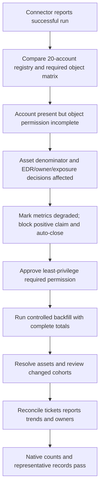

**Root cause:** authorization scope, not authentication. **Contributing control failure:** connector health checked run completion but not required object coverage. **Prevention:** source object/permission matrix, native control totals, complete-run acceptance, and affected-metric health propagation.

## NMH scenario 2: false merge sends remediation to the wrong owner

A retired development server and a new production server reuse hostname `NMH-API-17`. A rule version accidentally promotes hostname above provider resource ID for one source pair. The golden record combines the retired CMDB owner with the new EDR gap and public endpoint. A ticket goes to the former development team.

### Response

1. Pause ticket creation for the affected match rule/source pair.
2. Preserve source observations, provider IDs, lifecycle, rule version, golden record, ticket, and dashboard states.
3. Compare provider/account/resource IDs and nonoverlapping lifecycles; confirm two assets.
4. Split the record; assign public endpoint/EDR gap to active production asset and retain retired history.
5. Redirect/update the ticket without losing comments; correct owner/service/CMDB mappings.
6. Recompute affected priorities/reports and review all merges through the rule version.
7. Add regression for hostname reuse and enforce strong-ID invariant on every branch.

```mermaid
sequenceDiagram
    participant S as Source observations
    participant G as Golden-record logic
    participant W as Workflow
    participant T as ITSM
    participant V as Validator
    S->>G: Same hostname, different provider IDs/lifetimes
    G->>G: Faulty rule merges records
    G->>W: Public EDR gap with retired owner
    W->>T: Create wrong-owner episode
    V->>S: Compare strong IDs and time
    V->>G: Require split and freeze rule
    G->>W: Correct two assets and context
    W->>T: Reconcile owner/asset; preserve history
    V->>V: Review cohort, reports, CMDB and recurrence test
```

## NMH scenario 3: false split duplicates gaps and tickets

An EDR sensor rotates its native registration ID after reinstallation while the device identity remains stable. The new source record becomes a separate asset. The old record appears stale/gap; the new record appears healthy but ownerless. Two tickets open.

| Investigation | Evidence | Finding |
|---|---|---|
| Device identity | Stable device/hardware and MDM installation lineage | Same managed device lifecycle |
| Sensor identity | Old registration retired; new registration active | Sensor is related component, not asset identity |
| Time | No overlapping active sensor use beyond transition | Reinstallation event |
| Tickets | Same device/control-policy episode | Duplicate logical work |
| Correction | Merge asset context, retain sensor history as relationships | One asset and episode |
| Validation | EDR effective, owner retained, duplicate ticket reconciled | Correct postcondition |

Prevention includes explicit device-versus-sensor grain, sensor replacement relationship, stable episode key, and reinstallation test cases.

## NMH scenario 4: stale source creates a mass control-gap spike

The EDR connector last completes at midnight, then fails for eight hours. A coverage rule uses processing time rather than source observation time and maps missing control joins to `gap`. The dashboard creates 3,200 gaps and 3,200 candidate tickets.

```mermaid
flowchart TD
    SPIKE[EDR gaps spike by 3200] --> STOP[Kill switch before ticket commit]
    STOP --> HEALTH[Check source event and complete-run times]
    HEALTH --> STALE[Source stale/incomplete]
    STALE --> LOGIC[Missing join incorrectly maps to gap]
    LOGIC --> FIX[Source unhealthy -> unknown; field-specific freshness]
    FIX --> RESTORE[Restore connector and controlled backfill]
    RESTORE --> REPLAY[Shadow replay and reconcile 8100 eligible assets]
    REPLAY --> CLEAN[Discard candidate actions; preserve incident audit]
    CLEAN --> TEST[Outage and missing-state regression]
```

The incident demonstrates why unknown must be a first-class state, why source health must gate rules/actions, and why a dry-run action count/diff limit is essential.

## NMH scenario 5: criticality propagation overstates blast radius

A rule marks every asset connected within three relationship hops of the payment service as critical. Because common DNS and logging services connect widely, 61 percent of assets become critical. Priority queues lose meaning.

**Hypothesis:** untyped/transitive propagation is expanding criticality. **Check:** inspect reason paths for a representative newly critical laptop. It is connected through `sends_logs_to -> supports -> payment`, where no approved inheritance exists.

Treatment: revert to the prior rule, define approved relationship types/directions/depth, separate operational importance from business criticality, add negative/common-service tests, obtain service-governance approval, replay in shadow, and restate affected reports/actions.

## NMH scenario 6: CMDB timeout creates ambiguous duplicate updates

The workflow sends a low-impact derived control-state update. The target persists it but the response times out. The retry uses a new random request key, creating a duplicate audit/work item.

```mermaid
sequenceDiagram
    participant W as Workflow
    participant C as CMDB/ITSM target
    participant R as Reconciler
    W->>C: Conditional update with logical action A
    C->>C: Persist state and work item
    C--xW: Response timeout
    W->>R: Outcome uncertain
    R->>C: Query exact target and action key A
    C-->>R: State already persisted
    R-->>W: Mark succeeded; no replay
    W->>C: Read back version and postcondition
    C-->>W: Converged state
```

The correction centralizes stable action keys, treats timeout as uncertain rather than failed, queries before retry, and reconciles target state. Blind retry with a new key is prohibited.

## NMH scenario 7: ownership dispute blocks a critical action

A shared API gateway supports payment and claims services. The cloud platform team operates it; both business services consume it; the security team owns the WAF; no single application team accepts patch responsibility. The gap is 18 days old.

The TSM separates roles: platform technical owner, payment/claims service owners, WAF control owner, a named remediation action owner, and an authorized risk owner. Architecture evidence confirms the shared service. Customer governance assigns the platform owner accountability for gateway maintenance, with service owners approving windows and risk owner deciding residual risk. The action register records the dispute period rather than resetting age.

## NMH scenario 8: dashboard adoption stalls

Pilot analysts continue using a spreadsheet. Interviews show three causes: asset provenance is hidden, ticket creation requires six copied fields, and source outages make totals change without explanation. Calling this "resistance to change" would miss design defects.

| Cause | Treatment | Acceptance |
|---|---|---|
| Hidden provenance | Add source/time/rule drill-down and confidence state | Analyst explains why sample asset qualifies |
| Manual ticket copying | Prepopulate reviewed fields with stable episode key | One correct ticket, no duplicate, less task time |
| Unexplained source shifts | Health banner and change bridge; unknown gating | User identifies degraded source before acting |
| Training gap | Scenario lab and office hours | Users pass representative triage task |
| Process duplication | Retire redundant spreadsheet fields after governance approval | Normal workflow becomes system record |

Adoption is accepted only after task quality, not login count, improves.

## NMH scenario 9: suspected product defect and Support escalation

After local source, mapping, identity, rule, workflow, and access checks pass, one asset's relationship is visible in record detail but absent from a documented report filter under the same role/as-of context. A second asset works. The team creates a minimal redacted reproduction with tenant/cloud, report ID, asset/relationship IDs, role, UTC time, expected/actual, screenshots with metadata, query/control totals, current documentation reference, and no customer secrets.

The TSM tells the customer: facts, affected scope, current workaround, uncertainty, Support case ID, requested diagnostic, and next checkpoint. The TSM does not promise Product escalation or fix date. When supported guidance/fix arrives, the team validates in the smallest safe scope, reconciles reports/exports/actions, and documents the result.

## NMH scenario 10: successful staged rollout

NMH completes shadow validation for the EDR use case, pilots one service, and enables canary ticket creation for five human-reviewed gaps. All five use one stable episode, route to accepted owners, and validate control state after remediation. Two candidates remain unknown due to source conflict and correctly create no ticket. NMH expands to the second service only after source health, identity samples, rule tests, workflow read-back, runbook, and user assessment pass.

```mermaid
flowchart LR
    SHADOW[8100 eligible assets shadow] --> REVIEW[92 gaps 41 exceptions 29 unknown reviewed]
    REVIEW --> PILOT[One service pilot]
    PILOT --> CANARY[Five human-approved ticket creates]
    CANARY --> VALID[Five unique tickets and postconditions]
    VALID --> GATE{Source identity workflow training gates pass?}
    GATE -->|Yes| WAVE[Second service wave]
    GATE -->|No| HOLD[Hold repair and replay]
    WAVE --> OPS[Steady operations and value review]
```

### NMH executive outcome narrative

"NMH completed a bounded server-control pilot under two services. The program reconciled the independent asset population, preserved exceptions and unknowns, and validated five canary remediation episodes without duplicates or wrong-target writes. It also found source-permission, identity-grain, freshness-state, and ownership defects before broad automation. The evidence supports expanding one wave with the same gates. It does not prove complete enterprise visibility, compliance, financial savings, or risk elimination. The next decisions are acquisition-account access, the shared-gateway maintenance owner, and whether to broaden the EDR use case after another identity sample."

## Operational runbooks

### Source outage runbook

| Step | Action |
|---:|---|
| 1 | Detect via missed complete run, count/lag/permission anomaly, or user report |
| 2 | Identify affected source/scope/fields/use cases/metrics/actions |
| 3 | Mark data degraded/unknown and stop unsafe dependent writes/closures |
| 4 | Preserve last good, first bad, run IDs, errors, credentials/permission changes, counts |
| 5 | Test native source and connector layers separately |
| 6 | Restore access/service; rotate credentials if required under security process |
| 7 | Backfill from trusted checkpoint with rate/capacity controls |
| 8 | Reconcile raw, parsed, resolved, semantic, workflow, and report states |
| 9 | Restate trends/decisions and notify affected owners |
| 10 | Add prevention/monitoring and close after validated completeness |

### False merge/split runbook

| Step | Action |
|---:|---|
| 1 | Freeze affected matching rule and consequential automations |
| 2 | Capture source/golden IDs, rule/version, lifecycle, aliases, before/after, consumers |
| 3 | Establish correct grain/entities with strong time-valid evidence |
| 4 | Inventory fields, relationships, controls, findings, owners, CMDB, tickets, reports, exports |
| 5 | Approve split/merge/correction with rollback/restatement plan |
| 6 | Execute bounded correction and redirect each dependent item |
| 7 | Read back and reconcile every consumer/control total |
| 8 | Review similar cohort and historical decisions |
| 9 | Add invariant/regression and canary resume |
| 10 | Communicate correction and residual uncertainty |

### Workflow incident runbook

| Step | Action |
|---:|---|
| 1 | Stop exact action type if wrong-target, duplicate, or destructive risk exists |
| 2 | Preserve trigger, action/business key, approval, request/result, target audit, before/after |
| 3 | Query target after timeout/uncertainty; never blind-retry with new key |
| 4 | Validate asset identity, preconditions, authority, version/concurrency, permissions |
| 5 | Scope all actions through affected workflow/rule/version |
| 6 | Correct target safely, reconcile comments/history/references/reports |
| 7 | Replay in shadow/canary and validate business postconditions |
| 8 | Add tests, monitors, limits, and controlled resume |

## Labs and rehearsal

All labs use synthetic data and general tooling. They do not require a Zscaler tenant and do not imply production AEM implementation.

### Lab 1 - Discovery workshop

Interview synthetic sponsor, analyst, cloud, endpoint, IAM, CMDB, app, data, and risk roles. Produce outcome, decision, current-state, pain, scope, source, ownership, constraint, and acceptance artifacts. **Pass:** no "connect everything" objective.

### Lab 2 - Use-case charters

Write EDR coverage and critical-public-context charters with population, evidence, states, action, owner, postconditions, value hypothesis, and guardrails. **Pass:** dashboard launch is not the outcome.

### Lab 3 - Source plan

Complete the source contract for cloud, EDR, scanner, CMDB, IAM, external exposure, and ITSM. **Pass:** field authority and source owner are explicit.

### Lab 4 - Connector security review

Design dedicated identity, least privilege, secret rotation, audit, minimization, retention, outage, and revoke procedures. **Pass:** read and write permissions are separated.

### Lab 5 - Full-load acceptance

Simulate 20 registered accounts, one missing permission, paged APIs, rejects, and rate limits. **Pass:** technical success cannot pass completeness.

### Lab 6 - Incremental acceptance

Test create, update, delete/tombstone, late event, replay, cursor loss, timeout, and backfill. **Pass:** no gap, duplicate effect, or unsafe deletion.

### Lab 7 - Golden-record sample

Label random, critical, high-confidence, boundary, unresolved, recreated, dynamic-IP, and grain cohorts. **Pass:** report sample-dependent precision/recall evidence and defects honestly.

### Lab 8 - False merge game day

Run NMH hostname reuse. Freeze, split, redirect owner/finding/path/ticket/CMDB/report, restate, and add regression. **Pass:** every downstream echo reconciles.

### Lab 9 - False split game day

Run the EDR reinstallation case. Model device and sensor separately, consolidate the episode, preserve component history, and validate coverage. **Pass:** one device is not counted twice.

### Lab 10 - Relationship rules

Define supports, depends-on, administers, stores, protects, authenticates, and connects rules with direction/time/confidence. **Pass:** observed traffic alone creates no business dependency.

### Lab 11 - Criticality rules

Test approved direct inheritance, shared/common services, developer access, missing attestation, depth, cycles, and rule diff. **Pass:** criticality does not spread indiscriminately.

### Lab 12 - Coverage rules

Model eligible/effective/gap/exception/unknown/NA EDR states and source-health gating. **Pass:** outage creates unknown, not 3,200 tickets.

### Lab 13 - CMDB proposal workflow

Propose one dedicated derived field with exact mapping, authority, expected version, approval, idempotency, read-back, and reconciliation. **Pass:** owner/lifecycle fields remain protected.

### Lab 14 - Timeout workflow

Simulate target persisted plus lost response. Query by action key, avoid duplicate, and reconcile. **Pass:** one logical effect.

### Lab 15 - Rollout plan

Build design, data, shadow, pilot, canary, wave, steady-state stages with gates, kill switch, rollback, support, and training. **Pass:** every expansion has measurable exit evidence.

### Lab 16 - Ownership dispute

Resolve the shared gateway case by separating business, technical, control, action, steward, and risk roles. **Pass:** age remains honest and TSM does not accept risk.

### Lab 17 - Adoption observation

Watch a synthetic analyst perform a gap triage. Identify provenance, copy/paste, source-health, and training friction. **Pass:** redesign addresses task causes rather than blaming user.

### Lab 18 - Product-health scorecard

Define source, identity, context, rule, workflow, system, adoption, decision, outcome, and governance measures. **Pass:** all critical dimensions remain visible.

### Lab 19 - Support escalation

Create the relationship-filter case with expected/actual, environment, scope, UTC timeline, IDs, minimal reproduction, evidence, isolation, containment, and one ask. **Pass:** no secrets, speculation, or promised ETA.

### Lab 20 - Product feedback

Document a workflow pain with users, frequency, impact, desired outcome, constraints, alternatives, and evidence. **Pass:** state that it is feedback, not roadmap commitment.

### Lab 21 - 30/60/90 presentation

Present foundations, pilot proof, and operational scale with dependency caveats. **Pass:** phases are adaptive, not guaranteed delivery dates.

### Lab 22 - Executive review

Deliver the NMH outcome narrative, discuss defects found before scale, request three decisions, and state boundaries. **Pass:** no compliance, savings, completeness, or risk-elimination claim.

### Lab 23 - Incident communication

Write initial, update, recovery, and RCA messages for the stale EDR source. Include facts, impact, containment, unknowns, owner, next checkpoint, correction, and prevention. **Pass:** no invented root cause/ETA.

### Lab 24 - Arti interview capstone

Answer Q1 through Q8 aloud, whiteboard the complete implementation loop, and distinguish production transfer, synthetic practice, learned product positioning, and unknown product details. **Pass:** examples are honest and decision-focused.

## Arti bridge: escalation engineer to AEM implementation TSM

Implementation leadership combines technical depth, customer operating discipline, analytics, and communication. Arti's Microsoft experience offers strong transfer without pretending product administration experience.

| Existing strength | AEM implementation transfer | Learning boundary | Honest interview sentence |
|---|---|---|---|
| Microsoft 365 scope/identity | Tenant/account/source/asset namespace discipline | AEM schema/matching behavior | "I verify exact scope and identity before action." |
| Network troubleshooting | Connector reachability, TLS/proxy/DNS/path isolation | Zscaler connector diagnostics | "I separate transport from data acceptance." |
| HAR/Fiddler/Procmon/logs | Timestamped expected/actual evidence | Product-specific logs/tools | "I preserve minimal reproducible evidence." |
| CRITSIT/RCA | Containment, hypotheses, blast radius, status, prevention | Security incident authority | "I stop harmful decisions while isolating the layer." |
| Engineering collaboration | Support/Product escalation and fix validation | Internal Zscaler process | "I provide IDs, versions, reproduction, and one ask." |
| Backlog/case quality | Workflow aging, duplicates, reopen, outcome quality | Exposure-program SLAs | "I measure validated completion, not status closure." |
| SQL/Power BI/statistics | Control totals, identity samples, trends, value chain | Proprietary algorithms | "I state sample and denominator limits." |
| Technical Advisor/training | Discovery, enablement, role coaching, review | Licensed tenant instruction | "I teach representative decisions, not button tours." |
| Customer satisfaction | Trust, expectation, proactive communication | Renewal causality | "I connect evidence to customer outcomes cautiously." |
| AI enablement | Guardrailed summarization/triage possibilities | Approved AEM AI features | "I require source citation, human review, and no autonomous risk acceptance." |

An interview-ready story is: "I would approach AEM as a decision and adoption program. I would discover the customer's use cases and owners, map minimum sources and authority, accept connector data with scope and control totals, validate golden records and rules in shadow, pilot a low-consequence workflow with idempotency and read-back, train users on real tasks, and expand through gates. My Microsoft escalation background gives me strong evidence, RCA, stakeholder, analytics, and customer communication skills. I have rehearsed the AEM method through synthetic NMH cases, not operated it in production, so I would validate current Zscaler behavior and use Support/Product channels where needed."

## Common misconceptions to correct

| Misconception | Correction |
|---|---|
| Implementation means enable connectors | It includes decisions, data, identity, rules, action, people, operations, and validation |
| More sources always improve results | Each source adds context and complexity; use the minimum needed for a decision |
| One source of truth owns every field | Authority is field/process/purpose/time specific |
| Connector success means acceptance | Transport, completeness, semantics, identity, and fitness all matter |
| Authentication proves full access | Authorization can be partial by object/account/region |
| Full load proves increments work | Test creates, updates, deletes, late events, replay, and cursor loss |
| Green connector means fresh data | Compare source event, ingestion, and available times |
| Golden record is objective truth | It is a governed resolved view with evidence and uncertainty |
| High match rate proves identity quality | False merges can raise match rate; test precision and recall cohorts |
| Hostname/IP is a stable asset ID | Both are reusable and time-bound |
| Merge correction means rename | Split every field, edge, finding, ticket, CMDB mapping, and report effect |
| More relationships improve insight | Untyped/stale edges create false criticality and paths |
| Criticality can propagate through all connections | Use approved semantics, direction, depth, time, and ownership |
| Missing control join means gap | Source/identity/policy defects can make state unknown |
| API token can write, so workflow is authorized | Technical permission is not business decision authority |
| Successful write means success | Read back and validate source/target/business convergence |
| Retry with a new key is safe | It can duplicate tickets/records/actions |
| Big-bang rollout is faster | Shadow/pilot/canary gates catch expensive errors early |
| Rollback alone repairs harm | Reconcile downstream tickets, reports, decisions, and history |
| Ownership dispute can be solved with any assignee | Clarify role, evidence, governance, and acceptance |
| Training attendance equals adoption | Measure representative task skill and routine quality |
| Users who keep spreadsheets resist change | They may expose trust/workflow/design defects |
| Logins and tickets prove value | Link quality to correct decisions and validated outcomes |
| Every issue is a product defect | Isolate source, configuration, mapping, identity, rule, workflow, access, and process first |
| TSM should promise fix date | Communicate only authorized commitments and next checkpoints |
| Product feedback is a roadmap promise | It is evidence-backed input, not commitment |
| 30/60/90 is a guaranteed timeline | It is adaptive sequencing based on readiness/dependencies |
| Public AEM pages reveal implementation defaults | Current documentation, tenant tests, specialists, and Support govern specifics |

## Official Source Anchors

Research/source date: **2026-08-24**.

Zscaler sources support bounded positioning for AEM/CAASM multi-source visibility, deduplicated golden records, relationships, unknown assets, control/misconfiguration and CMDB-health use cases, workflows/reporting, and Data Fabric integrations/correlation/business logic. They do not define this chapter's synthetic architecture, acceptance gates, rules, metrics, support process, timelines, or results. NIST sources support cybersecurity governance, controls, configuration management, IT asset management, zero trust, incident handling, and enterprise-risk integration concepts. Vendor documentation and customer evidence must be checked for the actual implementation.

| Source | URL | Used for | Boundary |
|---|---|---|---|
| Zscaler Asset Exposure Management | https://www.zscaler.com/products-and-solutions/caasm | Public AEM/CAASM visibility, golden-record, relationship, gap, CMDB, workflow/report positioning | Verify exact connector, field, rule, action, license, UI, tenant behavior |
| Zscaler Data Fabric for Security | https://www.zscaler.com/products-and-solutions/data-fabric | Public integration, correlation/enrichment, business logic, workflow/report positioning | No proprietary architecture or default guarantee |
| Zscaler Data Fabric integrations | https://www.zscaler.com/products-and-solutions/data-fabric/integrations | Current public catalog context for candidate integrations | Catalog changes; verify object/direction/version/permission/support |
| Zscaler Unified Vulnerability Management | https://www.zscaler.com/products-and-solutions/vulnerability-management | Adjacent contextual-prioritization positioning | Does not establish AEM implementation internals |
| Zscaler Support portal | https://help.zscaler.com/submit-ticket | Public entry point for current support interaction | Entitlement/process/required evidence can change; follow current agreement |
| NIST Cybersecurity Framework 2.0 | https://www.nist.gov/cyberframework | Govern/Identify/Protect/Detect/Respond/Recover outcomes and profiles | Voluntary; organization-specific profile/implementation |
| NIST SP 800-53 Rev. 5 | https://csrc.nist.gov/pubs/sp/800/53/r5/upd1/final | Inventory, access, audit, configuration, change, monitoring, incident controls | Requires selection, tailoring, implementation, assessment |
| NIST SP 800-128 | https://csrc.nist.gov/pubs/sp/800/128/upd1/final | Security-focused configuration-management concepts | Federal guidance; not AEM procedure |
| NIST SP 1800-5 | https://csrc.nist.gov/pubs/sp/1800/5/final | IT asset-management practice-guide context | Example architecture; not universal source model |
| NIST SP 800-207 | https://csrc.nist.gov/pubs/sp/800/207/final | Resource/identity/context/policy zero trust concepts | Architecture guidance, not Zscaler product specification |
| NIST SP 800-61 Rev. 3 | https://csrc.nist.gov/pubs/sp/800/61/r3/final | Current incident-response recommendations and CSF alignment | Tailor to organization; not product support procedure |
| NISTIR 8286 series | https://csrc.nist.gov/projects/cybersecurity-risk-management/enterprise-risk-management | Cybersecurity and enterprise-risk integration resources | Use current publication/version and organization method |
| CISA Known Exploited Vulnerabilities Catalog | https://www.cisa.gov/known-exploited-vulnerabilities-catalog | Current known-exploitation prioritization input when relevant | Not proof of customer compromise or complete risk model |

## Likely Interview Questions

### Q1. How would you start an AEM implementation?

**Model answer:** I would begin with stakeholder discovery and one bounded decision loop, not every connector. I define user, outcome, independent population, evidence, states, action, owner, postconditions, value hypothesis, and guardrails. Then I build a source/authority plan, security requirements, acceptance tests, baseline, RACI, and support path. Product-specific promises wait for current documentation and tenant evidence.

### Q2. What proves a connector and its data are ready?

**Model answer:** Transport acceptance covers exact identity, least privilege, scope, full/incremental behavior, pagination, checkpoints, retries, quotas, security, observability, outage, and decommission. Data acceptance reconciles registry/native/raw/parsed/mapped/resolved counts, schema semantics, rejects, freshness, identity usefulness, and decision fitness. Authentication or a green run does not prove complete authorized data.

### Q3. How do you validate golden records and prevent false merges/splits?

**Model answer:** I define entity grain and strong namespaced IDs, preserve temporal aliases and provenance, sample random and high-consequence/boundary cohorts, and evaluate both overmerge and undermatch evidence. A false merge freezes affected automation, splits every field/edge/finding/owner/ticket/CMDB/report effect, restates decisions, and adds regression. A false split is consolidated only after same-entity proof and downstream reconciliation.

### Q4. How do you validate relationships, criticality, and coverage rules?

**Model answer:** I govern rules like code: explicit semantics/direction/grain/source/time/confidence/authority, version, positive/negative/boundary/conflict/missing/temporal/scale/security tests, shadow diff, approval, canary, monitoring, and rollback. Criticality never defaults from scanner severity or propagates through arbitrary connections. Coverage separates applicability, effective, gap, exception, unknown, and NA, and source degradation yields unknown.

### Q5. How would you integrate AEM context with CMDB or ITSM safely?

**Model answer:** Start read-only or proposal-only. Define direction, exact object/grain, field authority, stable mappings, trigger, source/identity preconditions, approval, expected target version, stable idempotency key, patch/allowlist, timeout-uncertain handling, read-back, reconciliation, rollback, security, and audit. Begin with a low-impact integration-owned field or human-reviewed ticket; do not overwrite owner/lifecycle or perform merge/delete without strong governance.

### Q6. How would you troubleshoot a mass gap spike or missing assets?

**Model answer:** I pause harmful writes/claims, preserve evidence, and test one hypothesis at a time through scope -> native source -> connector pages/cursor/auth -> mapping/schema/time -> identity/lifecycle -> context/authority -> rule/semantic -> workflow/read-back -> report/access -> user process. Missing source evidence becomes unknown, not pass/gap. I backfill/replay in shadow, reconcile every downstream item, restate reports, and add a prevention invariant.

### Q7. What does a credible 30/60/90 adoption plan look like?

**Model answer:** First 30: stakeholders, outcomes, bounded use cases, scope/source/authority/security baseline, RACI, training/support plans. Days 31-60: minimal connectors and data accepted, golden records/rules sampled, proposal/shadow workflow, trained pilot, evidence-based go/no-go. Days 61-90: canary/waves, operations/runbooks/governance, adoption/task-quality and value evidence, next roadmap and handover. These are adaptive phases, not guaranteed dates.

### Q8. How does your background transfer, and what is your boundary?

**Model answer:** Microsoft escalation gave me cross-layer identity/network/service troubleshooting, high-impact containment and communication, data-quality/analytics, Engineering escalation, customer ownership, training, RCA, and fix validation. Those map directly to source acceptance, identity/rule quality, operational rollout, and Support partnership. I designed and rehearsed synthetic NMH AEM scenarios; I do not claim production AEM administration and would verify actual capabilities in current official docs, tenant tests, and supported channels.

## 30-Second Memory Hooks

| Concept | Memory hook |
|---|---|
| Implementation | Decision loop, not connector count |
| Discovery | Who decides what, with which proof? |
| Use case | User + decision + evidence + action + outcome |
| Source plan | Purpose, scope, owner, authority, clock, quality, security |
| Connector | Radio link, not map truth |
| Acceptance | Transport works AND data fits decision |
| Full load | All sheets present |
| Incremental | Create, update, delete, late, replay, cursor |
| Golden record | Master record with provenance, not absolute truth |
| Identity | VIN before vehicle color |
| False merge | Two buses, one record, wrong dispatch |
| False split | One bus, many records, duplicate work |
| Relationship | Typed directed time-bound sentence |
| Criticality | Approved service impact, not spilled paint |
| Coverage | Eligibility + required state + current evidence |
| Unknown | Source cannot decide; keep visible |
| Shadow | Compute without consequence |
| Pilot | Representative small proof |
| Canary | Tiny live scope with kill switch |
| Workflow | Preconditions + approval + idempotency + read-back |
| Timeout | Uncertain; query before retry |
| Reconciliation | Source + desired + target + business converge |
| Troubleshoot | Scope -> source -> connector -> map -> identity -> rule -> flow |
| Ownership | Name the role before the person |
| Adoption | Correct routine task, not login |
| Value | Quality -> decision -> action -> validated outcome |
| Escalation | Expected/actual + IDs + UTC + reproduction + one ask |
| 30/60/90 | Understand, prove, operationalize |
| Arti bridge | Escalation discipline transfers; product admin does not |

## Completion Checklist

- [ ] I define implementation, discovery, use case, requirement, acceptance criterion, source, source owner, source contract, connector, authentication, authorization, full/incremental load, checkpoint, backfill, pagination, mapping, and data acceptance.
- [ ] I define golden record, entity resolution, false merge, false split, provenance, relationship, criticality rule, coverage rule, shadow, pilot, canary, rollout wave, rollback, kill switch, idempotency, read-back, reconciliation, adoption, product health, and escalation.
- [ ] I explain every major concept with the transit-control-center analogy.
- [ ] I implement a bounded decision loop rather than a data-volume objective.
- [ ] I identify stakeholder outcomes, decisions, current process, pain, scope, sources, identity, policies, integrations, constraints, operations, acceptance, and value.
- [ ] I create use-case charters with user, population, evidence, states, action, owner, postconditions, hypothesis, and guardrails.
- [ ] I prioritize use cases by consequence, readiness, actionability, validation, complexity, safety, learning, and reuse.
- [ ] I avoid starting with every connector or promising one physical source of truth.
- [ ] I create source contracts with purpose, owner, namespace, objects/grain, IDs, authority, scope, acquisition, cadence, volume, auth, schema, quality, security, change, and acceptance.
- [ ] I sequence population/identity and authoritative context before large finding/action queues where appropriate.
- [ ] I distinguish authentication success from complete authorization.
- [ ] I test full load, pages, filters, regions, control totals, and complete-run markers.
- [ ] I test incremental create, update, delete/tombstone, late event, replay, cursor loss, timeout, rate limit, and backfill.
- [ ] I quarantine schema/type/enum/time/null incompatibilities rather than default silently.
- [ ] I measure source/event/ingest/available times separately.
- [ ] I apply least privilege, secret protection/rotation, minimization, access, audit, retention, and decommission.
- [ ] I reconcile registered, native, raw, parsed, mapped, resolved, contextualized, semantic, and actionable stages.
- [ ] I distinguish transport acceptance from data fitness.
- [ ] I define entity grain and use strong namespaced time-valid identities.
- [ ] I sample random, critical, high-confidence, boundary, unresolved, recreated, dynamic, grain, identity-type, and corrected cohorts.
- [ ] I interpret precision/recall evidence only under its sample and labeling design.
- [ ] I do not treat high match rate as proof against false merges.
- [ ] I validate field authority, provenance, conflict, explanation, split recovery, downstream integrity, and stability.
- [ ] I freeze consequential automation before repairing false merge/split.
- [ ] I reconcile findings, controls, owners, relationships, CMDB, tickets, reports, exports, and history after identity correction.
- [ ] I define relationship verb, direction, grain, source, conditions, confidence, freshness, authority, negative tests, and consumers.
- [ ] I never convert traffic alone into business dependency or attack path.
- [ ] I define criticality through approved impact criteria, explicit propagation, authority, unknown behavior, tests, and consumers.
- [ ] I prevent criticality propagation through arbitrary transitive/common-service connections.
- [ ] I define control objective, eligible population, exclusions, required effective state, exception, unknown, gap, and postcondition.
- [ ] I map source degradation to unknown and block mass gap/pass actions.
- [ ] I govern rules with version, peer review, tests, simulation, diff, approval, canary, monitoring, rollback, and restatement.
- [ ] I distinguish read context, propose, approve, write, and risk authority.
- [ ] I define CMDB/ITSM purpose, direction, object/grain, field authority, mapping, trigger, preconditions, approval, key, concurrency, read-back, reconciliation, retry, rollback, and security.
- [ ] I use stable logical action keys and query target after timeout before retry.
- [ ] I protect human/authoritative owner, service, criticality, lifecycle, merge, and delete fields/actions.
- [ ] I begin with read-only, proposal, or low-impact integration-owned actions.
- [ ] I test duplicate triggers, concurrency, timeout-after-success, validation errors, source outage, identity correction, owner change, exception expiry, target outage, read-back mismatch, permission reduction, and rollback.
- [ ] I move through design, connectivity, data validation, shadow, pilot, canary, waves, steady state, and expansion gates.
- [ ] I define kill switch, rollback, diff/rate limits, per-wave acceptance, and support readiness.
- [ ] I do not invent universal acceptance thresholds; customer/product owners approve them by risk/use case.
- [ ] I troubleshoot one falsifiable hypothesis at a time.
- [ ] I contain harmful action/claims and preserve evidence before repair.
- [ ] I traverse scope/use case -> source -> connector -> parse/map -> identity -> context -> rule/semantic -> workflow/target -> report/access -> adoption/process -> product.
- [ ] I capture expected/actual, scope, UTC timeline, IDs/versions, control totals, samples, hypothesis/test, changes, containment, and reproduction.
- [ ] I replay/backfill in shadow and reconcile every downstream consumer.
- [ ] I classify gap candidates through asset identity, policy applicability, source health, state, exception, priority, treatment, and validation.
- [ ] I select data/source, identity, owner, criticality, control, exposure, technology, exception, or workflow treatment based on root condition.
- [ ] I resolve ownership disputes by naming exact role, evidence, authority, temporary stewardship, decision hierarchy, effective date, and downstream validation.
- [ ] I never assign risk acceptance to the TSM/analyst unless explicitly authorized by customer governance.
- [ ] I train analysts, source owners, asset/service owners, control owners, CMDB owners, stewards, admins, executives, and TSM/account teams by task.
- [ ] I assess teach-back, access, representative skill, routine use, quality, integration, and optimization.
- [ ] I treat spreadsheet bypass as possible evidence of data/workflow/trust defects.
- [ ] I establish operations, implementation, data/rule, service, executive, change, and incident governance cadences.
- [ ] I protect connector identities, exports, sensitive topology, personal data, actions, audit, and AI-assisted workflows.
- [ ] I measure source, identity, context, rule, workflow, system, adoption, decision, outcome, and governance health.
- [ ] I construct a value chain from data quality to decision-ready context to correct action to validated durable outcome.
- [ ] I do not claim causality, savings, compliance, completeness, or risk elimination without approved evidence/method.
- [ ] I route source, configuration, product defect, feature request, support, and security-incident issues correctly.
- [ ] I create minimal Support cases with one-line expected/actual, impact, environment, scope, UTC timeline, IDs, reproduction, evidence, isolation, containment, and one ask.
- [ ] I never promise a Product escalation/fix/ETA without authorized commitment.
- [ ] I document Product feedback as problem, users, frequency, workflow, impact, desired outcome, constraints, alternatives, evidence, and no roadmap promise.
- [ ] I can present the 30/60/90 plan as adaptive foundations, proof, and operational scale.
- [ ] I can explain all ten NMH scenarios and why each number, rule, timeline, and outcome is synthetic.
- [ ] I can execute source-outage, false merge/split, and workflow-incident runbooks.
- [ ] I can complete all twenty-four labs and retain reproducible synthetic artifacts.
- [ ] I connect Arti's Microsoft identity/network/service troubleshooting, CRITSIT, RCA, analytics, customer, training, and Engineering experience honestly.
- [ ] I distinguish production transfer, synthetic practice, learned public product positioning, and unknown implementation behavior.
- [ ] I use official Zscaler, NIST, and CISA sources with explicit boundaries.
- [ ] I use the controlled research/source date exactly as 2026-08-24.
- [ ] I make no unsupported Zscaler connector, schema, algorithm, default, rule, threshold, workflow, support commitment, timeline, compliance, production, or outcome claim.
- [ ] I can answer Q1 through Q8 with definitions, analogies, mechanics, examples, tradeoffs, failures, troubleshooting, labs, NMH evidence, official-source caveats, and an honest Arti bridge.

[Part 77 - Vulnerability Management Fundamentals and Program Lifecycle](Part-77-vulnerability-management-fundamentals.md)