# Part 77 - Vulnerability Management Fundamentals and Program Lifecycle

> **Audience:** Arti Thakur, preparing for a Zscaler Security Operations Technical Success Manager role after Microsoft enterprise Support Escalation Engineering.

> **Purpose:** Build vulnerability-management knowledge from zero and connect technical findings to a governed enterprise program. Cover scope, discovery, assessment, prioritization, treatment, remediation, validation, reporting, improvement, ownership, cadence, governance, evidence, safety, privacy, troubleshooting, maturity, customer artifacts, and practical decision logic.

> **Scope and honesty:** Northstar Meridian Holdings, abbreviated NMH, is an explicitly fictional and synthetic customer used only for learning. Every NMH organization, person, asset, finding, policy, date, metric, incident, decision, and result in this Part is invented. Arti's factual strengths are Microsoft 365, OneDrive, and SharePoint support; networking and trace analysis; SQL and Power BI; escalations; mentoring; and responsible AI exploration. Product-specific administration and production vulnerability-program ownership are learning boundaries. Product behavior, customer facts, and personal experience must never be inferred from this synthetic case.

> **Currency caveat:** Vulnerability records, threat evidence, products, scanner behavior, patches, cloud services, laws, standards, and customer conditions change. The controlled official-source snapshot and review date for this Part is exactly **2026-08-24**. Current vendor advisories, authoritative vulnerability records, customer policy, approved architecture, licensed product documentation, authorized testing, change controls, and measured postconditions govern real decisions.

> **Section goal:** Explain vulnerability management as a continuous, risk-informed operating program rather than a periodic scan or a list of severe defects. After this Part, Arti should be able to whiteboard the full lifecycle, define the evidence and decision owner at each stage, diagnose where a program is failing, and propose safe next steps without overstating product or production experience.

Vulnerability management, often shortened to **VM**, is the coordinated practice of finding weaknesses, deciding which ones matter, reducing the resulting exposure, proving the reduction, and improving the system that repeats those actions. A **vulnerability** is a weakness that could be used or triggered to cause harm. A **finding** is a source's observation that a particular weakness or unsafe condition may apply to a particular thing. A **program** is the combination of people, policy, technology, data, routines, decisions, and evidence that turns those observations into durable risk reduction.

Think of preventive maintenance across a hospital. An inspection may report a worn cable, an expired filter, or an unsupported controller. The inspection is useful, but it is not the maintenance program. The program must know which equipment is active, which clinical service depends on it, how failure could harm patients, who owns the equipment, whether a safe replacement exists, when work can happen, what temporary protection is acceptable, and how to verify that the hazard is gone. Vulnerability management applies the same discipline to software, firmware, cloud configurations, applications, identities, and supporting infrastructure.

```mermaid
flowchart LR
    GOV[Govern and define outcomes] --> SCOPE[Scope assets and services]
    SCOPE --> DISC[Discover observations]
    DISC --> ASSESS[Assess identity and applicability]
    ASSESS --> PRIOR[Prioritize scenarios]
    PRIOR --> TREAT[Choose treatment]
    TREAT --> EXEC[Remediate safely]
    EXEC --> VALID[Validate postconditions]
    VALID --> REPORT[Report decisions and outcomes]
    REPORT --> IMPROVE[Improve program and controls]
    IMPROVE --> GOV
```

| Lifecycle stage | Plain meaning | Main decision | Minimum trustworthy evidence | Failure if skipped |
|---|---|---|---|---|
| Govern | Set purpose, authority, policy, and risk boundaries | What outcomes and decision rights apply? | Charter, policies, owners, exceptions, obligations | Activity without accountability |
| Scope | Define what should be known and managed | What population and time window count? | Asset/service universe, exclusions, source coverage | False completeness and blind spots |
| Discover | Collect possible weaknesses and exposures | What was observed, where, when, and how? | Source-native finding, method, timestamp, evidence | No technical starting point |
| Assess | Confirm identity, applicability, and evidence quality | Is this finding relevant and sufficiently supported? | Exact asset/component/version/configuration and source health | False positives, false negatives, wrong owners |
| Prioritize | Compare credible risk scenarios and urgency | What should be investigated or treated first, and why? | Severity, threat, exposure, controls, impact, confidence | CVSS-only or politically driven queues |
| Treat | Select a response | Patch, configure, isolate, compensate, accept, transfer, or retire? | Options, owner, authority, safety, residual risk | Patch-only thinking |
| Remediate | Execute approved change | How is exposure reduced without unacceptable disruption? | Change plan, tests, rollback, implementation evidence | Outage or incomplete change |
| Validate | Prove the intended condition | Is the weakness/path/control problem actually resolved? | Native state, rescan, path/control/service postconditions | Closed ticket with open risk |
| Report | Make state, decisions, and uncertainty visible | What changed, why, what remains, and what is next? | Governed metrics, lineage, action register | Static theater or misleading green |
| Improve | Learn from defects and outcomes | Which process, source, control, or architecture should change? | Trends, recurrence, RCA, feedback, revised tests | Repeated backlog and repeated incidents |

## JD Mapping

The SecOps Technical Success Manager role requires technical depth, customer outcome ownership, cross-functional coordination, proactive communication, analytics, troubleshooting, adoption leadership, and the ability to connect exposure-management technology to a customer's operating model. Vulnerability-management fundamentals support all of those expectations.

| JD signal | VM capability developed here | Customer/TSM artifact | Honest boundary |
|---|---|---|---|
| Become a trusted technical advisor | Explain the lifecycle, choices, evidence, and tradeoffs | Lifecycle whiteboard and decision record | Advice remains subject to customer authority and current product facts |
| Drive measurable outcomes | Connect program activity to validated risk reduction | Outcome chain and scorecard | No guaranteed reduction or prevention claim |
| Build success plans | Sequence scope, sources, process, pilot, adoption, and maturity | Phased VM success plan | Timeline depends on customer readiness |
| Troubleshoot complex environments | Isolate source, identity, applicability, workflow, and validation defects | Layered runbook and escalation packet | No invented root cause or product behavior |
| Coordinate stakeholders | Define technical, service, risk, change, and executive roles | RACI and action register | TSM enables decisions; customer owners authorize them |
| Communicate proactively | State facts, impact, uncertainty, owner, action, and next checkpoint | Technical update and executive narrative | No unsupported ETA or assurance |
| Use data and analytics | Govern grain, denominators, aging, flow, and outcome measures | SQL/Power BI metric contract | Dashboard does not make source data true |
| Improve adoption | Turn insight into repeatable user routines | Role curriculum and adoption observation | Login count alone is not adoption |
| Partner with Support and Product | Create reproducible, bounded evidence | Minimal escalation package | Product roadmap and fix timing remain unclaimed |
| Explore AI responsibly | Assist classification, summaries, and candidate grouping with review | Guardrailed AI experiment | No autonomous risk acceptance, destructive action, or uncited conclusion |

## Candidate honesty note

Interview answers should distinguish transferable evidence, synthetic practice, learned concepts, official public facts, and unknown product behavior. Neutral wording avoids both understatement and accidental claims.

| Evidence class | Safe statement | Boundary to preserve |
|---|---|---|
| Factual production background | Arti handled complex Microsoft 365, OneDrive, and SharePoint support and escalations using logs, networking evidence, customer communication, analytics, and validation | This does not establish vulnerability-program ownership |
| Transferable method | The same discipline of exact identity, timestamps, traces, hypotheses, source quality, containment, RCA, and postconditions transfers to VM | Transfer does not prove familiarity with a specific customer's tools |
| Synthetic practice | The NMH lifecycle, artifacts, SQL examples, dashboards, and tabletop decisions are structured fictional exercises | Synthetic output is not a production result |
| Learned architecture | Arti can explain program stages, controls, decision logic, and common failures from current study and official sources | Knowledge is not administration experience |
| Official product fact | A bounded claim can be attributed to a reviewed official page and its snapshot date | Marketing language is not a universal implementation guarantee |
| Unknown | Exact tenant fields, workflows, entitlements, calculations, and support behavior require current verification | Unknowns should remain visible rather than guessed |

## Beginner vocabulary and memory hooks

Every term below answers three questions: what does it mean, why does it matter, and what analogy makes it memorable?

| Term | Plain meaning | Why it matters | Analogy / memory hook |
|---|---|---|---|
| Asset | Something the organization values or depends on, such as a device, application, account, service, or data store | Findings and business impact attach to assets | A hospital room, device, or record system |
| Weakness | A type of mistake or unsafe condition | It explains the root class that can create vulnerabilities | A design flaw in a lock |
| Vulnerability | A specific weakness in a product or environment that can cause harm under conditions | It is the technical issue VM evaluates | A particular door with the flawed lock installed |
| Exposure | A condition that gives an attacker or failure an opportunity to interact with a target | Exposure changes likelihood and treatment | The flawed door is reachable from a public corridor |
| Finding | A source observation that a condition may apply to one subject | It is evidence, not automatically truth | An inspector's note attached to one door |
| Detection | The logic or test that produces a finding | Its method defines blind spots and confidence | The inspector's test procedure |
| Applicability | Whether the exact vulnerable condition exists on the exact subject | Prevents irrelevant work | Confirming that this door uses the affected lock model |
| Severity | Technical seriousness under a defined method | Useful common language, but incomplete risk | How dangerous the lock flaw could be in general |
| Likelihood | Chance that the harmful scenario occurs | Helps compare urgency | Chance someone reaches and uses the door |
| Impact | Harm if the scenario succeeds | Connects technical work to business outcomes | Effect on surgery, safety, privacy, and operations |
| Risk | Uncertainty about harmful outcomes, informed by likelihood and impact | The program manages risk, not score alone | Combined chance and consequence of the door failure |
| Control | A safeguard that prevents, detects, responds to, or recovers from harm | Controls can interrupt specific prerequisites | Guard, badge reader, alarm, or backup route |
| Compensating control | Alternative safeguard used when the preferred fix is delayed or infeasible | Supports temporary risk reduction | Posting a guard until the lock is replaced |
| Remediation | Work that removes or reduces the relevant condition | Converts decisions into change | Replacing the lock or closing the corridor |
| Mitigation | Action that reduces likelihood or impact, possibly without removing the weakness | Important when patching is unsafe or unavailable | Adding a barrier around the flawed door |
| Exception | Approved, time-bounded deviation from policy with owner and rationale | Makes residual risk explicit | Authorized temporary use with review date |
| Risk acceptance | Authorized decision to retain residual risk | Prevents analysts from silently deciding for leaders | Service owner signs the temporary operating decision |
| SLA | Service-level agreement or policy target for response or resolution | Creates timing expectations, but can be gamed | Maintenance deadline under agreed rules |
| Aging | Time a finding or remediation episode has remained in a defined state | Reveals persistent risk and process blockage | Days since the work order became actionable |
| Backlog | Work not yet completed | Shows demand, but count alone can mislead | Maintenance jobs waiting in the queue |
| Validation | Evidence that the intended postcondition is true | Separates activity from outcome | Reinspect the replaced lock and test safe operation |
| Residual risk | Risk left after controls and treatment | No treatment makes all uncertainty disappear | Remaining possibility after the repair |
| Governance | Rules, authority, accountability, and oversight for decisions | Keeps tools and teams aligned | Hospital maintenance policy and decision board |
| Provenance | Where data came from and how it changed | Enables trust and troubleshooting | Chain of custody for the inspection record |
| Cadence | Repeat schedule for activities and decisions | Makes VM continuous and predictable | Daily rounds, weekly triage, monthly governance |
| Maturity | How reliably the program produces governed outcomes | Guides improvement without vanity labels | From ad hoc repairs to measured preventive maintenance |

### Plain-English deep-dive 1 - A scanner is a sensor, not the program

A vulnerability scanner is a tool that tests systems or interprets evidence to identify possible weaknesses. Calling the scanner "the vulnerability-management program" is like calling a thermometer the hospital. The thermometer provides a measurement; people still need the correct patient identity, context, diagnosis, treatment authority, safe procedure, follow-up, and learning process.

This distinction matters because buying or tuning a scanner can improve discovery while every downstream stage remains weak. A source can create excellent findings that nobody owns. Teams can close tickets without changing the vulnerable state. Critical assets can be absent from scope. Maintenance constraints can keep actions blocked. Exceptions can last forever. Reports can count findings but hide scanner outages. Program design therefore starts with the decision loop and desired outcome, then selects sources and tools that support it.

An effective TSM asks questions beyond "Did the scan run?" Which assets should have been covered? What was the source's vantage point? Was authentication successful? What exact evidence supports applicability? Which customer service is affected? Who can approve treatment? What control reduces the scenario today? What postcondition proves closure? What user routine and governance forum will keep the loop operating next month?

## Program charter, outcomes, and principles

A **charter** is a short agreement that defines why the program exists, who has authority, what is in scope, and how success will be judged. It prevents a tool implementation from quietly becoming the objective. The charter should connect security outcomes to reliable operations, privacy, safety, compliance, customer commitments, and business services without claiming that vulnerability management alone can guarantee any of them.

| Charter element | Question to answer | Good evidence | Weak substitute |
|---|---|---|---|
| Purpose | Which harmful scenarios or decision failures should improve? | Approved objective and current-state problem | "Use the new tool" |
| Scope | Which organizations, environments, assets, applications, and finding classes count? | Versioned population contract | One scanner's visible list |
| Outcomes | What validated change matters? | Reduced exposure/path, corrected control, current asset state | Ticket closure count alone |
| Authority | Who prioritizes, approves change, grants exceptions, and accepts residual risk? | Role-based decision matrix | Security analyst assumes all authority |
| Evidence | What proves findings, treatment, and outcomes? | Source, timestamp, method, postcondition | Screenshot without context |
| Cadence | When are operations and governance performed? | Daily/weekly/monthly/quarterly calendar | Annual scan exercise |
| Guardrails | What safety, privacy, legal, and availability constraints apply? | Approved rules of engagement and change policy | Implied permission |
| Measures | Which quality, flow, outcome, and adoption indicators are governed? | Metric dictionary with grain and denominator | One total-risk score |
| Improvement | How are defects, incidents, recurrence, and user feedback handled? | RCA and backlog with owners | Informal lessons that disappear |

Useful principles include: preserve source evidence; keep unknown states visible; separate vulnerability definitions from finding occurrences; prioritize scenarios rather than naked scores; assign accountable roles rather than mailboxes; use the least disruptive effective treatment; validate native state and the relevant exposure path; measure data health alongside risk; govern exceptions; automate only when preconditions and rollback are strong; and communicate uncertainty directly.

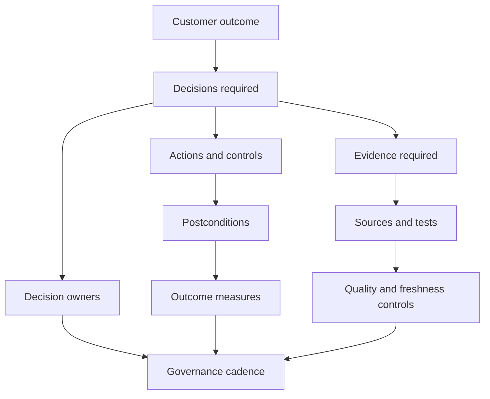

## Governance, roles, and decision rights

Governance is not a committee that merely reviews charts. It is the operating system for policy, authority, evidence, exceptions, conflict resolution, and improvement. Good governance keeps technical facts close to the people who understand them while reserving business-risk decisions for authorized customer roles.

| Role | Core responsibility | Typical decision | Evidence needed | Common failure |
|---|---|---|---|---|
| Executive sponsor | Align resources and risk appetite | Resolve cross-business priority conflicts | Material scenario, impact, options, blockers | Receives only technical counts |
| VM program owner | Operate lifecycle and policy | Set queues, cadence, escalation, measures | Coverage, flow, quality, outcome data | Becomes ticket chaser |
| Asset/service owner | Account for business service and treatment | Approve timing, service tradeoff, ownership | Service impact, dependencies, validation plan | Owner field is stale or generic |
| Security analyst | Assess evidence and scenario | Confirm applicability and recommendation | Finding, asset, exposure, threat, controls | Treats severity as final decision |
| Platform/endpoint/cloud/app team | Implement safe technical change | Select and execute remediation | Tested package/configuration, rollback | Receives context-free ticket |
| Change manager | Govern operational change | Approve emergency/standard/normal change path | Risk, test, window, rollback, communications | Process delay without risk escalation |
| Risk owner | Authorize residual-risk treatment | Accept or reject time-bounded exception | Scenario, controls, duration, review trigger | Analyst grants silent exception |
| SOC/incident response | Investigate possible exploitation | Contain and investigate compromise evidence | Telemetry, timeline, indicators, preservation | VM queue used as incident process |
| Data/source owner | Maintain trustworthy input | Restore scope, permissions, freshness, semantics | Connector/source health and reconciliation | Missing data becomes false closure |
| TSM | Enable architecture, adoption, troubleshooting, value, and vendor coordination | Recommend next evidence/action and align parties | Customer facts, current docs, product health, action register | Claims customer authority or product guarantees |

A **RACI** matrix records who is Responsible for doing work, Accountable for the result, Consulted for expertise, and Informed of status. Only one accountable role per bounded decision is usually clearer than shared ambiguity, although organizations may tailor their model.

| Activity | VM owner | Asset/service owner | Remediation team | Risk owner | SOC | TSM |
|---|---|---|---|---|---|---|
| Define scope | A/R | C | C | C | I | C |
| Assess finding | A/R | C | C | I | C | C |
| Choose technical treatment | C | A | R | C | C | C |
| Approve exception | C | C | I | A/R | I | I |
| Execute change | I | A | R | I | I | I |
| Validate exposure reduction | A/R | C | R | I | C | C |
| Investigate exploitation | I | C | C | I | A/R | I |
| Govern product adoption | A/R | C | C | I | C | C |

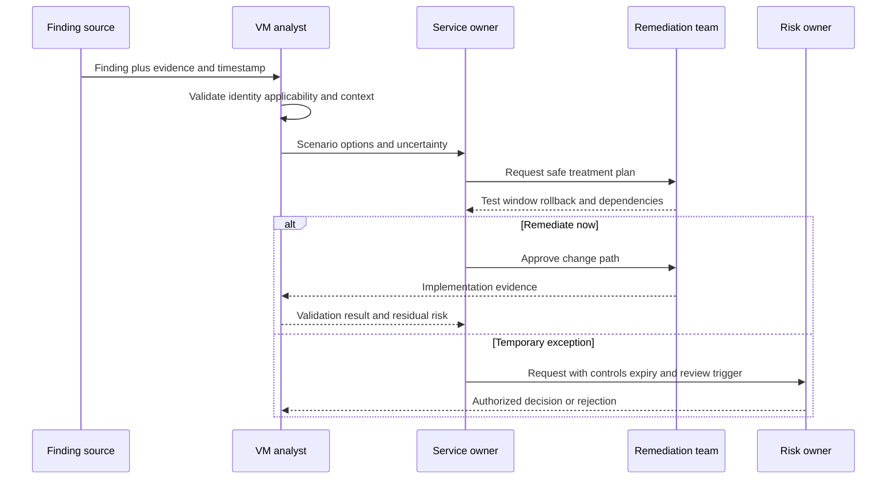

## Scope: define the managed universe before counting findings

Scope describes the population the program intends to manage. It includes organizational boundaries, environments, asset classes, application portfolios, cloud accounts, networks, identities, software components, suppliers, and time. A scan target list is one implementation input; it is not an independent proof of completeness.

The program needs an **asset-universe contract**: a versioned statement of expected populations and authoritative registries. For example, active cloud accounts may come from an organization registry, endpoints from enrollment and directory records, private network ranges from IP address management, and business applications from a service catalog. Each source has a purpose and blind spots. Reconciliation asks why expected assets are absent, why unexpected assets appear, and whether exclusions remain valid.

| Scope dimension | Examples | Evidence of intended population | Important question |
|---|---|---|---|
| Organization | Parent, region, acquisition, subsidiary | Legal/org registry and approved boundary | Are acquisitions and divestitures represented? |
| Environment | Production, test, development, recovery | Environment registry and account/subscription list | Are nonproduction assets able to reach production? |
| Asset class | Endpoint, server, appliance, network, IoT/OT, cloud resource | Independent class-specific registries | Which classes cannot tolerate active probing? |
| Application | Web, API, mobile, package, source repository | Application portfolio and pipeline inventory | Are APIs and third-party components covered? |
| Identity | Human, admin, service, workload, emergency | IAM directories and entitlement systems | Which identities influence exploit paths or ownership? |
| Network | Internal, external, IPv4, IPv6, branch, cloud | IPAM, DNS, cloud/network control planes | Are alternate paths and ephemeral ranges included? |
| Software | OS, firmware, libraries, containers, SaaS | Package/configuration/image/vendor inventories | Can exact versions and deployment instances be resolved? |
| Supplier | Managed service, appliance, hosted application | Supplier/service register and contract | Who provides advisories, fixes, and evidence? |
| Time | Current, historical, retired, transient | Lifecycle and observation-time rules | When does an asset enter or leave accountability? |

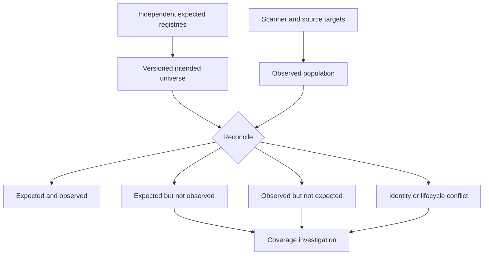

Coverage should be expressed as evidence states rather than one percentage. "Covered" might mean target registered, reachable from a scanner, authentication successful, expected checks completed, result fresh, and finding linked to the correct asset. If any of those semantics are hidden, the percentage can mislead.

### Plain-English deep-dive 2 - Missing evidence is not a clean bill of health

Suppose a hospital device disappears from a credentialed scan. One interpretation is that it was patched and has no findings. Other explanations include network segmentation, expired credentials, a scanner outage, a renamed asset, an unsupported operating system, or retirement. A missing row cannot choose among those possibilities.

Programs often make a dangerous database mistake: an absent join becomes zero. If a finding table no longer joins to an asset, a dashboard may show fewer vulnerabilities. The honest state is **unknown** until source health, scope, identity, and lifecycle are resolved. Unknown can require urgent evidence work, especially for critical or public systems. It should not automatically increase or decrease technical risk; it changes confidence and the next action.

Arti's Microsoft support experience transfers naturally here. A missing OneDrive event did not prove that sync succeeded; it could mean collection scope, client state, authentication, timing, or telemetry failed. The same evidence discipline prevents VM reports from celebrating silence.

## Discovery: collect observations from complementary sources

Discovery is the process of identifying possible weaknesses, misconfigurations, missing controls, unsupported components, and exposed services. No single method sees every layer. Network scanners observe what a vantage point can reach. Authenticated assessment can inspect local configuration and packages. Agents can report endpoint state. Application testing exercises code or running interfaces. Software composition analysis maps third-party components. Cloud-native services inspect control-plane configuration and workloads. External attack-surface methods observe public presence. Vendor advisories describe affected products. Manual review and penetration testing add contextual evidence.

| Finding family | What it observes | Example evidence | Common blind spot |
|---|---|---|---|
| Host/software vulnerability | Vulnerable OS, package, service, or firmware | Package/version/configuration and detection output | Version backports or failed authentication |
| Network exposure | Reachable listener, protocol, service, or unsafe option | Source/target/port/protocol/banner/handshake | Path-specific filtering and load balancers |
| Application weakness | Code or runtime behavior that violates security expectations | Request/response, code location, trace, proof | Authentication, business logic, coverage |
| Dependency weakness | Vulnerable third-party library or image component | Manifest, lockfile, SBOM, image layer | Component may not be deployed or reachable |
| Cloud misconfiguration | Unsafe cloud control-plane/resource configuration | Resource ID, policy/config snapshot | Multi-account permission gaps and runtime behavior |
| Identity exposure | Excessive privilege, weak credential, unsafe trust | Principal, entitlement, condition, path | Effective nested or temporary permissions |
| Missing control | Expected safeguard absent or ineffective | Policy applicability and current control state | "Installed" confused with effective |
| Unsupported technology | Product outside supported maintenance | Product/version/lifecycle advisory | Custom support or compensating architecture |
| External exposure | Publicly observable domain, address, service, certificate | Vantage point, DNS, route, response | Ownership and origin uncertainty |
| Manual assessment | Expert-validated weakness or path | Test plan, steps, evidence, limitations | Limited sample and point-in-time nature |

Each finding should preserve source-native identifiers, subject identity, observation time, ingestion time, detection method/version, raw evidence, affected component, current status, confidence, and provenance. Normalization can create common fields, but the original evidence must remain available. Otherwise a mapping mistake becomes impossible to diagnose.

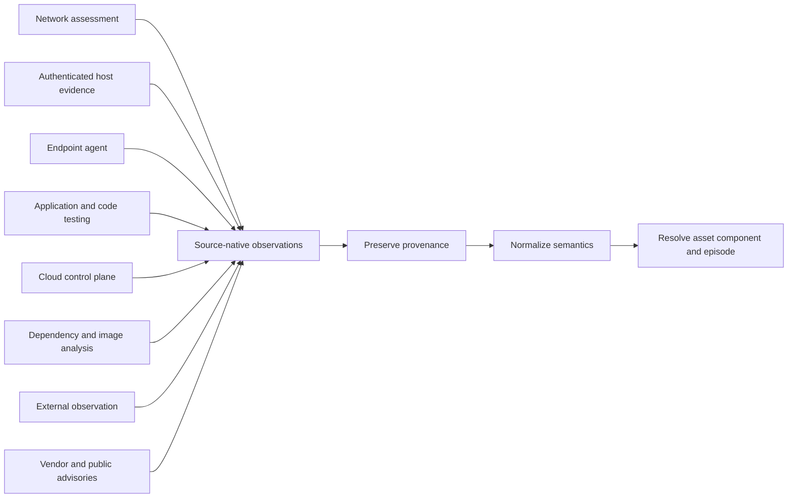

Discovery safety matters. Active scans can create load, trigger fragile services, fill logs, lock accounts, or violate supplier terms. Application testing can modify data. Credentialed checks require powerful secrets. Cloud API collection can expose inventory and configuration. Every method needs authorization, least privilege, approved scope and timing, rate/load limits, stop conditions, emergency contacts, privacy minimization, credential lifecycle, and incident handling.

## Assessment: turn observations into evidence-bearing findings

Assessment asks whether the source observation applies to the exact asset and component now. It separates a vulnerability definition, an observed finding occurrence, a remediation episode, and a ticket. One CVE can affect thousands of assets. One asset can have several components affected by the same CVE. Several sources can observe the same occurrence. One ticket can group many occurrences. Collapsing these grains creates duplicate work or false closure.

| Object | One record represents | Stable identity concept | State owner |
|---|---|---|---|
| Vulnerability definition | Shared description of one disclosed vulnerability | CVE or authoritative vendor identifier plus record state | CNA/vendor/program source |
| Weakness category | General root-cause class | CWE identifier/version where applicable | CWE program/source |
| Finding occurrence | One source observation on one subject/component | Source finding ID plus namespaced subject/component/time semantics | Finding source |
| Resolved exposure episode | Correlated condition on one resolved subject over time | Governed episode key and merge/split rules | VM program/data model |
| Remediation action | One approved technical or process action | Change/work item ID | Remediation/change system |
| Ticket | Workflow record coordinating work | ITSM/issue ID | Workflow system |
| Exception | Authorized temporary deviation | Exception ID/version | Risk/governance system |
| Validation | Test of one or more postconditions | Validation run/evidence ID | Validator/source owner |

An applicability review checks product, component, version, build, configuration, feature, platform, deployment, privilege, and path prerequisites. A version string alone can be insufficient because vendors backport fixes without changing apparent upstream versions, packages may be installed but unused, containers may be built but not deployed, or a vulnerable feature may be disabled. Conversely, a banner can hide an affected version.

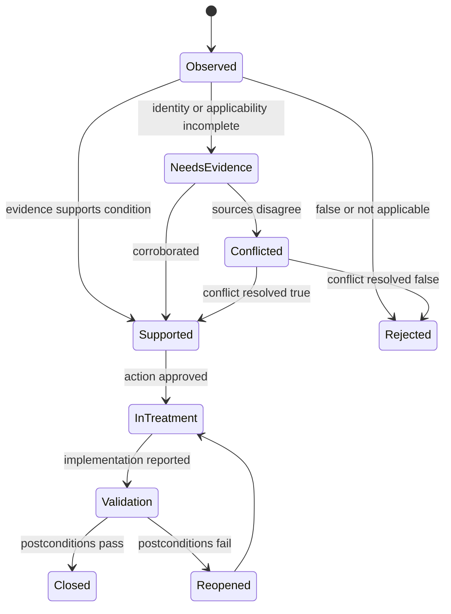

Evidence states should be explicit: confirmed, supported, candidate, conflicted, stale, unknown, rejected, or not applicable under defined criteria. They are not interchangeable with workflow states such as open or closed. A candidate finding can be urgent to investigate. A confirmed finding can be accepted temporarily by an authorized risk owner. A closed ticket can correspond to a reopened exposure.

## Prioritization: decide what needs attention first

Prioritization orders investigation and treatment under constrained time and capacity. It should not reduce the program to a single opaque number. Technical severity remains useful, but the decision also considers known or predicted exploitation, internet or internal reachability, required attacker access, active threat relevance, asset criticality, service and data impact, identity privilege, blast radius, control effectiveness, finding age, remediation availability, operational safety, evidence confidence, and regulatory or contractual duties.

| Factor group | Question | Evidence | Misuse to avoid |
|---|---|---|---|
| Technical condition | What can the vulnerability enable under defined prerequisites? | Advisory and versioned severity vector | Score equals customer risk |
| Applicability | Does the exact vulnerable condition exist here? | Package/configuration/runtime evidence | Match on product name alone |
| Exploit context | Is exploitation known, predicted, available, reliable, or relevant? | Current cited intelligence | Exploit code proves compromise |
| Reachability | Can an attacker with a defined starting point reach the prerequisite? | Typed path and authorized tests | Public DNS equals exploitable |
| Identity | What credentials or privilege are required or gained? | Effective entitlement and trust path | Ignore service/workload identities |
| Controls | Which prerequisite is interrupted, and is the control effective? | Applicability, health, enforcement, bypass test | Installed control erases vulnerability |
| Business impact | What service, safety, privacy, financial, legal, or recovery harm could follow? | Approved criticality and dependency context | Scanner invents criticality |
| Breadth | Is there concentration across images, shared services, identities, or suppliers? | Resolved occurrences and dependencies | Sum duplicate scores |
| Feasibility | Which treatment is available and safe, and how quickly? | Patch/config/workaround/change evidence | Easy fixes always outrank urgent hard fixes |
| Confidence | How reliable and fresh are the inputs? | Provenance, quality, timestamps, conflicts | Missing data means low risk |

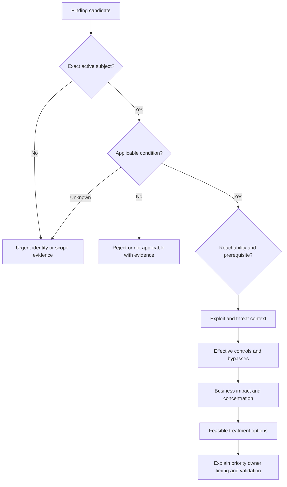

Part 78 explains CVE, CWE, CVSS, EPSS, KEV, exploits, and threat intelligence precisely. Part 80 examines why traditional prioritization fails. At this foundation stage, remember that a priority is a reasoned recommendation tied to an action and decision owner. It must remain explainable when inputs change.

### Plain-English deep-dive 3 - Priority is a decision, not a sorting trick

Imagine two electrical defects. The first is rated more severe in a laboratory but sits in an isolated training room behind a disconnected breaker. The second is moderately severe but affects the shared controller for operating theaters, is reachable through a vendor remote path, and lacks monitoring. Sorting only by laboratory severity chooses the wrong first conversation.

Context does not excuse technical weaknesses. It tells the organization which scenario deserves which action now. A high-severity issue with strong controls may still require planned removal of the underlying weakness. A medium-severity issue with active exploitation and critical impact may require emergency containment. A low-confidence public asset may require immediate identity and reachability validation rather than automatic patching or dismissal.

A good priority record explains the finding, exact subject, scenario, supporting and conflicting evidence, controls, likely impact, urgency, recommended treatment, accountable owner, due logic, validation, and residual uncertainty. If an analyst cannot explain why one item outranks another, the queue is not ready for customer trust.

## Treatment: choose among more than patches

**Treatment** is the authorized response to risk. **Remediation** often means removing or correcting the weakness, while **mitigation** reduces likelihood or impact. **Compensation** uses an alternative control. **Acceptance** retains residual risk under authority. **Avoidance** removes the activity or asset. **Transfer** allocates some financial or operational consequence through contracts or insurance but does not make the technical exposure disappear.

| Treatment | Example | Best fit | Tradeoff | Required validation |
|---|---|---|---|---|
| Patch/update | Install vendor-fixed version | Supported fix and safe change path | Regression, reboot, compatibility | Fixed component/build and service health |
| Configuration change | Disable feature, harden option, remove protocol | Vulnerability depends on configuration | Functional impact or drift | Effective configuration and negative test |
| Remove software/service | Uninstall component or stop listener | Component unnecessary | Hidden dependency | Absence plus dependency/service test |
| Reduce exposure | Restrict route, firewall, proxy, application access | Reachability is a prerequisite | Alternate paths or operational access | Positive/negative path tests |
| Reduce privilege | Remove entitlement, rotate secret, separate admin | Identity enables exploit/path impact | Workflow disruption | Effective permission and credential invalidation |
| Isolate | Quarantine asset or segment cohort | Urgent containment or legacy technology | Availability and support impact | Isolation plus required-service tests |
| Compensating control | WAF rule, virtual patch, monitoring, allowlist | Preferred fix delayed | Bypass, limited coverage, maintenance | Rule applicability, efficacy, bypass tests |
| Rebuild/redeploy | Replace image or instance from corrected source | Immutable/cloud/container operation | Persistence or state migration | New artifact and old instance retirement |
| Retire | Decommission asset/service | Unsupported or unnecessary technology | Migration and data-retention needs | No active path, data handled, inventory retired |
| Accept temporarily | Time-bounded approved residual risk | No immediate feasible option under appetite | Risk persists and may increase | Authority, controls, expiry, review triggers |
| Transfer | Supplier obligation or insurance | Contractual/financial allocation | Technical and reputational risk remains | Contract evidence and operational control |

Treatment selection considers urgency, exploit path, available fixes, service criticality, maintenance windows, safety, dependencies, rollback, regulatory requirements, staffing, supplier support, and residual risk. The fastest technical action is not always the safest customer action. Conversely, operational difficulty is not a reason to hide risk; it is a reason to escalate decisions and fund durable architecture.

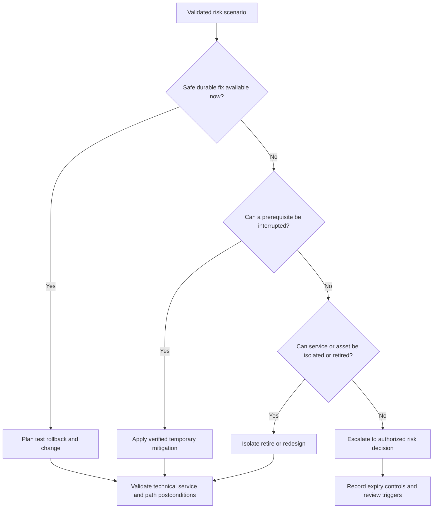

## Remediation planning and safe execution

A remediation plan translates treatment into executable change. It identifies exact assets and components, owner, dependency, package or configuration, prerequisites, test cohort, user impact, maintenance window, communication, backup, rollback, success criteria, monitoring, and evidence capture. It distinguishes mass deployment from exceptions and prevents a ticket description from becoming an unsafe instruction.

| Plan element | Question | Evidence/artifact | Failure prevented |
|---|---|---|---|
| Exact target | Which asset/component/instance is changing? | Stable namespaced IDs | Wrong-system change |
| Desired state | What exact postcondition is expected? | Fixed build/config/path definition | Ambiguous completion |
| Dependency | What relies on this component? | Service/dependency map | Hidden outage |
| Test | What representative positive, negative, and regression tests run? | Test plan and baseline | Fix breaks service or misses condition |
| Rollout | What lab, pilot, canary, and wave sequence applies? | Cohort and gate plan | Fleet-wide blast radius |
| Rollback | How is prior safe service restored? | Tested procedure and decision trigger | Irrecoverable failure |
| Communication | Who needs notice, status, and decision? | Contact/notification plan | Surprise and ownership gap |
| Security | How are packages, credentials, scripts, and evidence protected? | Signature/hash, vault, access policy | Supply-chain or secret exposure |
| Validation | Which native, scan, path, control, and service checks prove success? | Postcondition checklist | Ticket-only closure |
| Reconciliation | How are findings, tickets, exceptions, dashboards, and history aligned? | Stable mapping and control totals | Duplicate or stale workflow |

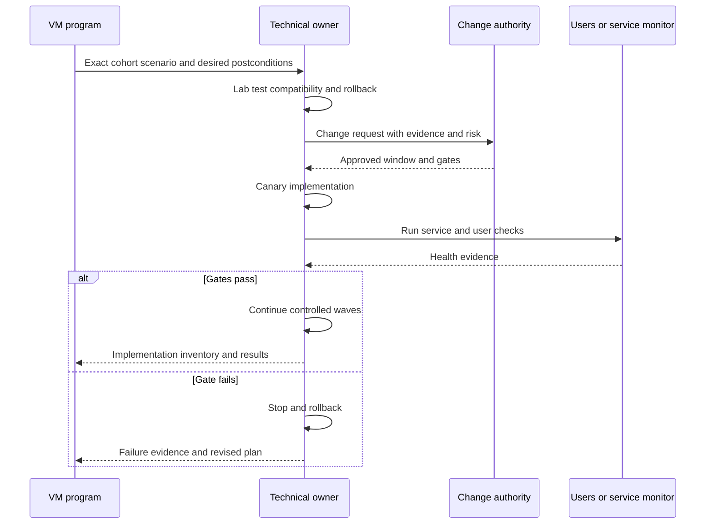

## Validation and closure

Validation proves that the intended condition changed. It should use independent evidence where practical and test more than the workflow record. A patch tool can report installation while the vulnerable process still runs an old library. A scanner can clear a finding because credentials failed. A firewall rule can exist but not cover IPv6. A closed ticket can contain the wrong asset. Validation therefore examines several postcondition layers.

| Validation layer | Question | Example evidence | Caveat |
|---|---|---|---|
| Identity | Was the intended asset/component changed? | Stable ID, serial/resource/package identity | Hostname or IP alone may be reused |
| Native state | Is fixed software/configuration active? | Package/build/config/runtime query | Installed does not always mean loaded |
| Source state | Does the detecting source now evaluate cleanly? | Successful authenticated rescan with evidence | One scanner has blind spots |
| Exposure path | Is the relevant route/listener/auth path interrupted? | Authorized positive and negative test | Test only proves scoped path/time |
| Control | Is mitigation applicable, healthy, enforcing, and resistant to known bypass? | Rule hit, health, simulation, exception review | Presence is not effectiveness |
| Service | Does required functionality still work? | Synthetic transaction, user acceptance, monitoring | Security success with outage is not acceptable |
| Data/report | Are findings, tickets, exceptions, dashboards, and exports reconciled? | Stable episode IDs and control totals | Reporting can lag or duplicate |
| Residual risk | What remains and who owns it? | Updated decision/exception record | Closure does not mean zero risk |
| Recurrence | Will images, pipelines, baselines, or procurement recreate the issue? | Golden image/build/policy correction | One-instance fix may recur |

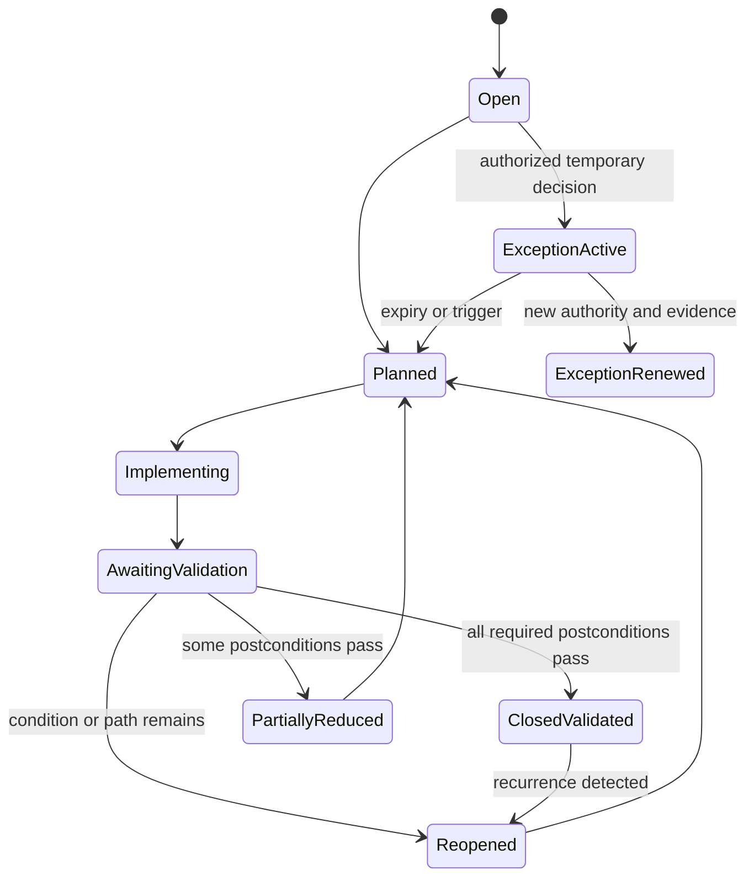

Closure criteria must be set before execution where possible. A ticket state is workflow evidence, not technical truth. If the validating source is unavailable, the state should be awaiting validation or unknown, not automatically closed. Emergency containment can be recorded as reduced exposure while durable remediation remains open.

### Plain-English deep-dive 4 - Close the condition, not the paperwork

Consider a leaking pipe. A work order can be closed because a plumber visited, because a part was installed, or because the floor is dry. Those are different claims. A durable outcome may also require confirming pressure, downstream equipment, mold risk, and why the same faulty part will not be installed tomorrow.

Vulnerability management needs the same precision. "Patch deployed" is an action. "Fixed package active on the exact asset, affected listener no longer exposes the vulnerable behavior, required service remains healthy, scanner authentication succeeded, finding episode reconciled, and base image corrected" is a validated outcome. Not every issue requires every check, but the program must choose checks that fit the scenario.

This is one of Arti's strongest transferable habits. In Microsoft escalations, a configuration change or service recovery was not enough until customer impact and the relevant postcondition were tested. That discipline maps directly to vulnerability closure without implying prior production VM ownership.

## Reporting: measure quality, flow, outcomes, and decisions

Reporting should help a person decide or act. A trustworthy metric defines its grain, population, formula, time, state, exclusions, data sources, owner, and drill-down. A total finding count without source health and asset coverage can improve because collection failed. A compliance percentage can improve because teams repeatedly reclassify due dates. A closure rate can rise while reopened findings and exceptions grow.

| Metric family | Useful question | Example measure | Guardrail |
|---|---|---|---|
| Scope/coverage | Are intended populations actually assessed? | Eligible active assets with fresh successful evidence | Show missing, failed, unsupported, and unknown separately |
| Data quality | Can decisions trust identity and semantics? | Conflict, duplicate-candidate, stale, reject, auth-success rates | Do not average away critical cohort defects |
| Demand | What credible work entered? | New validated exposure episodes by cohort | Separate source volume from unique episodes |
| Backlog | What work remains and why? | Open episodes by priority, owner, state, age | Count is not risk; show blockers and concentration |
| Flow | How efficiently does work move? | Lead time, wait time, throughput, reopen rate | Do not reward premature closure |
| SLA | Are governed timing commitments met? | Actionable episodes within due policy | Freeze clocks/rules; expose pauses and exceptions |
| Treatment | Which actions reduce exposure? | Patch/config/isolate/compensate/retire/accept mix | Treatment type is not outcome by itself |
| Validation | Did postconditions pass? | Validated closure and first-pass validation rate | Require source/service/path evidence as applicable |
| Recurrence | Are root causes being removed? | Recreated findings by image/package/control cause | Normalize for scope and detection changes |
| Risk/outcome | Which material scenarios or paths were reduced? | Validated high-consequence prerequisite removed | Avoid unsupported breach-prevention claims |
| Adoption | Are users performing the intended routine correctly? | Decision quality, assignment accuracy, workflow reconciliation | Login count is weak |
| Program health | Can the loop continue reliably? | Source health, owner coverage, exception debt, runbook readiness | Publish degradation next to risk metrics |

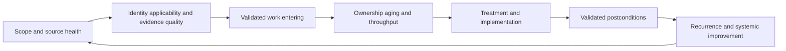

A dashboard should support drill-down from executive scenario to service, cohort, asset, exposure episode, source evidence, action, validation, and decision. Technical teams need exact records and failure reasons. Executives need material impact, movement and cause, control strengths and gaps, uncertainty, blocked decisions, resources, and next checkpoints. Both views must use one governed semantic contract.

## Cadence and operating rhythm

VM is continuous even when activities occur at different frequencies. Event-driven alerts may need immediate triage. Scanner and connector health may be reviewed daily. Owners may work queues continuously. Program triage may occur weekly. Executive risk and investment decisions may occur monthly or quarterly. Cadence should follow consequence, source latency, change capacity, and policy rather than arbitrary ceremony.

| Cadence | Typical focus | Participants | Output |
|---|---|---|---|
| Event-driven | Newly known exploitation, critical source failure, public exposure, possible compromise | VM, SOC, source owner, service owner | Containment/investigation decision and next checkpoint |
| Daily | Source/auth/freshness health, failed workflows, urgent queues | VM operations and data owners | Health incident and restored evidence plan |
| Twice weekly | High-priority ownership, blockers, exceptions nearing expiry | VM and remediation leads | Updated action register |
| Weekly | Cohort triage, backlog flow, validation failures, disputes | VM, service owners, change, risk | Decisions, escalations, resource shifts |
| Monthly | Program scorecard, trends, source coverage, systemic fixes, adoption | Program leaders, TSM, operations | Customer review and roadmap updates |
| Quarterly | Risk appetite, policy, architecture debt, investment, maturity | Executives, risk, security, technology | Approved strategy and funded improvements |
| After incident/change | RCA, recurrence controls, metric restatement | Affected owners and governance | Corrective actions and regression tests |

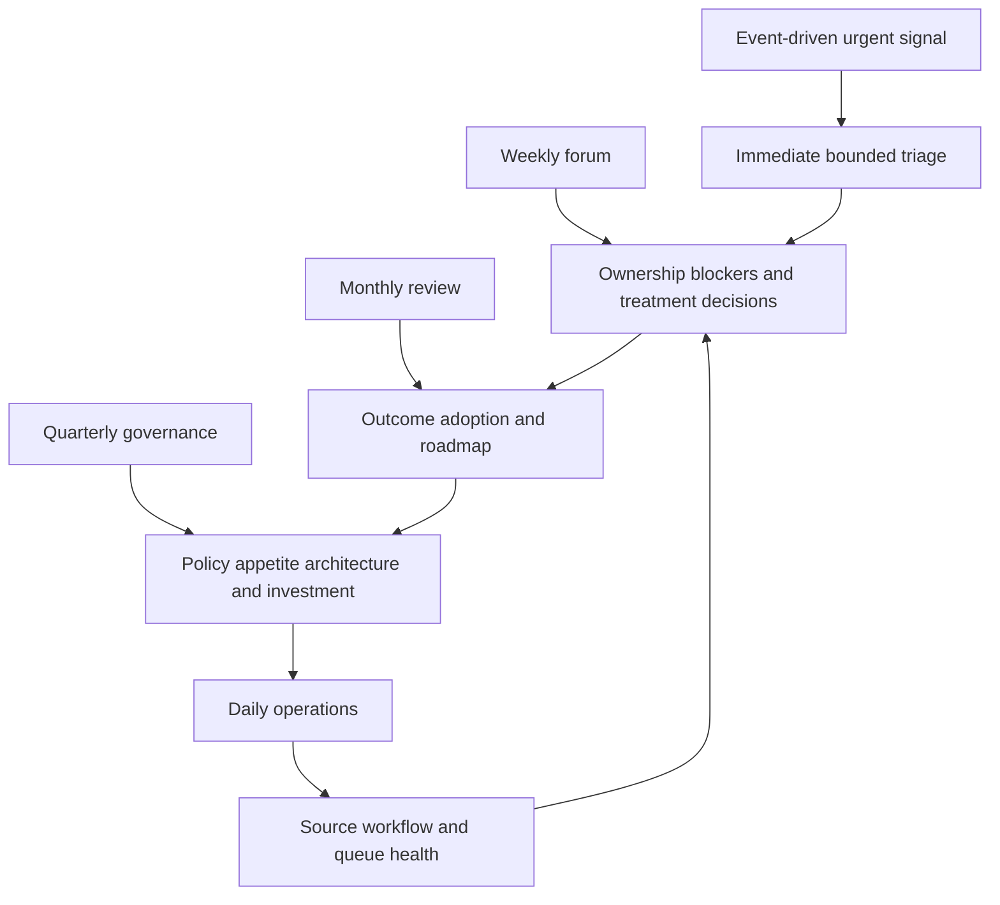

## Exceptions, SLAs, and residual-risk governance

An exception is not a hidden pause button. It should state the exact subject and condition, scenario, rationale, compensating controls, owner, approver, start, expiry, review triggers, remediation plan, validation, and residual risk. Renewals require current evidence and new authority; they should not inherit approval forever.

SLAs should start when work becomes actionable under a defined policy. The program must specify how identity conflicts, unavailable patches, maintenance freezes, supplier dependencies, active incidents, and exceptions affect clocks. Pausing a clock may be operationally legitimate, but hidden pauses create gaming. Report elapsed calendar time, actionable time, paused time/reason, policy version, and overdue status separately where useful.

| Anti-gaming control | Purpose | Example |
|---|---|---|
| Stable episode identity | Prevent close/reopen from resetting age | Same asset-component-condition remains one episode |
| Versioned priority and SLA | Preserve historical decision basis | Policy v5 with effective date stored |
| Explicit pause reasons | Make dependency delay visible | Vendor fix unavailable, owner and next review recorded |
| Exception expiry | Prevent permanent temporary state | Automatic review queue before expiry |
| Independent validation | Prevent self-certified completion | Rescan/native/path check by defined source |
| Reopen preservation | Expose failed remediation | Original age plus recurrence/reopen event retained |
| Denominator freeze for period | Prevent scope manipulation | Monthly cohort snapshot and restatement rules |
| Separation of duties | Keep risk authority distinct | Remediator cannot approve own high-risk exception |

## Security, privacy, safety, and ethics

VM data is sensitive. It can reveal unpatched systems, public services, identities, software versions, topology, credentials, business criticality, and control gaps. That is an attacker's map if mishandled. Collection and workflow therefore need classification, minimization, encryption, least privilege, tenant and customer segregation, retention, audit, export controls, secure deletion, and incident response.

| Risk | Example | Guardrail | Validation |
|---|---|---|---|
| Credential compromise | Scanner account or cloud secret stolen | Vault, least privilege, rotation, network restriction, no logs/screenshots | Access review and secret-use audit |
| Overbroad scan impact | Fragile medical system overloaded | Rules of engagement, safe templates, rate limits, windows, stop conditions | Pilot and monitoring |
| Privacy overcollection | User identity or file metadata copied unnecessarily | Purpose limitation, field minimization, masking, retention | Sample payload and access review |
| Cross-customer exposure | Data mixed across tenants or exports | Segregation, scoped authorization, secure transfer | Boundary and recipient verification |
| Remediation supply chain | Untrusted package or script deployed | Vendor source, signature/hash, controlled repository, approval | Integrity verification and provenance |
| Destructive validation | Exploit test changes production data | Non-destructive checks, lab reproduction, explicit authorization | Test plan and evidence review |
| Unsafe automation | Wrong asset isolated or ticket storm created | Identity/quality gates, shadow, canary, approval, kill switch | Negative tests and reconciliation |
| AI leakage/hallucination | Sensitive findings sent to an unapproved model or invented rationale accepted | Approved environment, minimization, citations, human review, no autonomous authority | Output sampling and audit |

Testing authorization must be written and specific. It defines systems, methods, time, rate, prohibited actions, data handling, emergency stop, and contacts. A public IP is not permission to test. A vendor demonstration is not permission to scan customer systems. Safe learning uses synthetic datasets, local labs, deliberately vulnerable applications in isolated environments, read-only analysis, and non-destructive simulations.

## Troubleshooting the lifecycle

Troubleshooting starts by protecting decision quality. If a source outage or identity defect may produce false closure, pause downstream automation and communicate affected scope. Preserve raw evidence and versions. Choose one representative record and trace it through each layer before changing many rules.

| Symptom | Plausible causes | Discriminating check | Safe immediate action |
|---|---|---|---|
| Findings suddenly drop | Source outage, auth failure, scope shrink, mapping reject, real remediation | Native source counts and last successful authenticated run | Mark affected metrics degraded; stop auto-closure |
| Findings suddenly spike | New scope, duplicate ingestion, signature update, wrong join, real disclosure | Control-total bridge by source/rule/cohort | Pause bulk tickets; sample exact episodes |
| Wrong owner | False asset merge, stale CMDB, hierarchy mapping, shared image | Provenance of identity and owner authority | Freeze affected assignment; route to steward |
| Repeated duplicates | Source IDs unstable, episode key weak, reopen creates new record | Compare source occurrence and episode mapping | Reconcile before new notifications |
| Clean rescan but issue persists | Auth failed, alternate path, runtime old, scan method changed | Credential success and native/path evidence | Reopen/unknown; do not close |
| SLA improves implausibly | Clock reset, exclusions, priority downgrade, mass exception | Episode history and policy-version bridge | Restate report and investigate governance |
| Critical item cannot be patched | Compatibility, supplier, safety, no fix, change freeze | Tested options and prerequisite map | Contain safely and escalate risk decision |
| Dashboard disagrees with tickets | Grain, latency, filter, status mapping, duplicate records | One ID across source, episode, ticket, report | Publish caveat; reconcile read-back |
| Scanner impacts service | Rate/concurrency, fragile protocol, unsafe plugin | Timeline and controlled reduced test | Stop per rules; restore service; incident/RCA |
| Exception never expires | Workflow failure, owner change, hidden renewal | Exception ledger and authority audit | Escalate review; preserve residual-risk state |

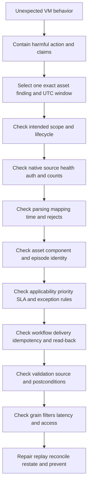

### Layered troubleshooting runbook

1. **State the symptom precisely.** Include expected and actual behavior, exact asset/finding/ticket IDs, UTC timestamps, first/last occurrence, scope, user impact, and current containment.
2. **Preserve evidence.** Save source-native records, scanner/plugin versions, authentication status, raw payloads under policy, mappings, model/policy versions, audit logs, and screenshots only when necessary and redacted.
3. **Check scope and lifecycle.** Confirm the asset should exist, is active, belongs to the expected environment, and is in the authorized collection population.
4. **Check the source.** Compare native counts, pages, permissions, credentials, rate limits, completed status, observation times, and known blind spots. A successful API response may still be incomplete.
5. **Check normalization.** Validate schema, types, enum mapping, timestamps, timezone, affected product/version semantics, rejects, defaults, and null handling.
6. **Check identity and grain.** Confirm asset, component, vulnerability, finding, episode, ticket, exception, and validation are not merged or split incorrectly.
7. **Check decision logic.** Recalculate applicability, context, priority, SLA, exception, and assignment with the exact versioned inputs. Missing evidence must not silently become false or zero.
8. **Check workflow.** Inspect trigger, preconditions, idempotency key, target response, timeout uncertainty, retries, read-back, duplicate suppression, approval, and reconciliation.
9. **Check validation and reporting.** Confirm native state, source success, path/control/service checks, dashboard grain, filters, freshness, access, and restatement.
10. **Repair safely.** Test in shadow, canary a small cohort, backfill or replay deterministically, reconcile every downstream artifact, communicate affected decisions, and add a regression or monitoring invariant.

## Program maturity and continuous improvement

Maturity describes reliable capability, not the number of tools. A program can own many scanners and remain ad hoc. Another can use a smaller toolset with clear scope, strong evidence, accountable decisions, safe treatment, validation, and learning. Maturity should be assessed per capability because organizations rarely move uniformly.

| Level | Behavior | Evidence | Next improvement |
|---|---|---|---|
| 1 - Reactive | Scans or incidents create manual urgent work | Spreadsheets, inconsistent ownership, little validation | Charter, scope, ownership, minimum workflow |
| 2 - Repeatable | Basic schedules, SLAs, and tickets exist | Recurring scans, queues, policies | Coverage/data-quality states and exception governance |
| 3 - Defined | Lifecycle, roles, semantics, and validation are standardized | RACI, metric dictionary, treatment/closure criteria | Contextual prioritization and cross-source correlation |
| 4 - Measured | Quality, flow, outcomes, adoption, and recurrence are measured | Reconciled scorecard and root-cause trends | Predictive/capacity experiments with guardrails |
| 5 - Adaptive | Architecture, controls, engineering, and policy improve from feedback | Prevention in images/pipelines/procurement and validated learning | Sustain simplicity, auditability, and changing threat fit |

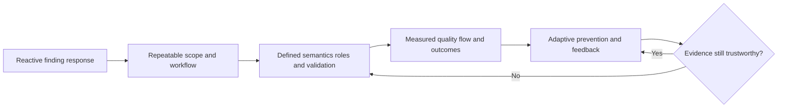

Continuous improvement asks why the weakness entered, why discovery or prioritization was slow, why remediation was difficult, why validation failed, and whether recurrence can be prevented. Systemic actions may update golden images, dependency policies, secure-development checks, procurement requirements, network architecture, identity design, configuration baselines, ownership records, source contracts, runbooks, training, or exception policy.

## Complete synthetic NMH lifecycle case

All details in this section are fictional and synthetic. NMH is a healthcare teaching scenario, not a real customer, and no result represents Zscaler or Arti production experience. The future dates below are explicitly fictional schedule dates and are not source-review dates.

### Synthetic context and charter

NMH operates hospitals, clinics, laboratories, remote-care services, and administrative functions. Its synthetic VM charter is: "Reduce credible cyber exposure affecting patient care, sensitive information, and essential operations by maintaining trustworthy scope, prioritizing evidence-backed scenarios, enabling safe treatment, validating outcomes, and improving recurring causes."

| Synthetic program element | NMH learning choice | Important caveat |
|---|---|---|
| Initial services | Patient portal, scheduling, identity, laboratory interface, endpoint fleet | Bounded pilot, not enterprise completeness |
| Finding families | Host, application, dependency, cloud, identity, missing-control | Sources remain complementary |
| Initial outcomes | Validate public critical exposures, establish owners, reconcile closure | No claim of breach prevention |
| Governance | Weekly operations, monthly program review, quarterly risk review | Fictional cadence |
| Safety | No intrusive production exploit tests; clinical-device scanning requires separate approval | Authorization remains mandatory |
| Evidence | Native source, exact identity, observation time, applicability, action, postcondition | Synthetic evidence design |

The fictional program begins on **2026-09-07 (synthetic future schedule date)** with scope discovery. The official-source review date for this chapter remains 2026-08-24.

### Synthetic baseline

| Measure | Synthetic baseline | Interpretation |
|---|---:|---|
| Expected active assets across pilot registries | 18,420 | Independent population, not scanner count |
| Fresh successfully assessed assets | 16,980 | Exact success semantics required |
| Expected but unassessed | 1,040 | Coverage investigation, not clean |
| Identity/lifecycle conflicts | 400 | Candidate evidence requiring resolution |
| Source-native findings | 96,800 | Raw observations, not unique risk |
| Correlated exposure episodes | 31,600 | Synthetic deduplicated program grain |
| Supported/confirmed episodes | 25,900 | Evidence criteria passed |
| Candidate/conflicted episodes | 5,700 | Investigation queue |
| Episodes with accountable owner | 22,400 | Ownership is a major gap |
| Active exceptions | 620 | Requires expiry/control review |
| Awaiting validation after implementation | 1,180 | Cannot be counted closed |

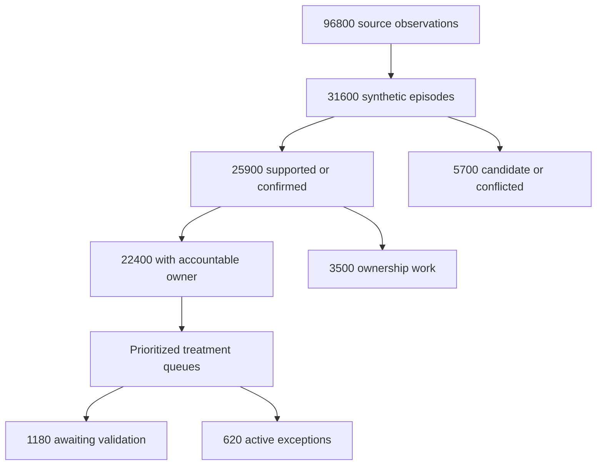

These numbers demonstrate grain and state; they are not customer results. A raw finding reduction from 96,800 to 31,600 does not mean risk fell. It means observations were correlated into synthetic episodes under defined rules. The program still needs to prove identity, applicability, context, action, and outcomes.

### Synthetic scenario A: public patient portal component

A network source reports a vulnerable web component on a public address. An authenticated host source reports a related package on `NMH-PAT-WEB-03`. The cloud inventory maps the address through a load balancer to two instances, while the CMDB lists only one. The public service is critical, but a web application firewall is present.

The analyst does not immediately declare two vulnerable production servers. First, the team resolves the load-balancer targets and instance identities, confirms the affected package and vulnerable feature, validates the WAF rule's relevance and bypass limits, checks current exploit evidence, and maps the service dependency. A tested fixed package exists. The service owner approves canary replacement of one instance, validates patient-login and appointment flows, then rotates the second instance. External and authenticated checks pass, WAF remains monitored, the CMDB is corrected, and the base image is updated to prevent recurrence.

| Decision field | Synthetic record |
|---|---|
| Scenario | Public unauthenticated path could reach affected component under stated prerequisites |
| Evidence | Public response, exact instance/package, vendor advisory, load-balancer mapping |
| Controls | WAF candidate mitigation; effectiveness and bypass scope tested |
| Impact | Patient access and sensitive information service |
| Treatment | Canary redeploy fixed image, then second instance; retain control during rollout |
| Validation | Native package/runtime, external negative test, authenticated source, service transactions, image check |
| Residual risk | Other paths and future image drift remain monitored |

### Synthetic scenario B: clinical device cannot be patched immediately

A vendor advisory affects a controller used by a laboratory device. The device team states that applying an unapproved update could invalidate support and disrupt testing. The correct response is not "ignore" and not "patch tonight." NMH confirms exact model/firmware and affected feature, obtains vendor guidance, maps network and identity paths, checks whether the vulnerable service is required, restricts access to an allowlisted management path, increases monitoring, rotates a shared credential, and opens a time-bounded exception approved by the risk owner. A vendor-tested upgrade and laboratory validation are scheduled.

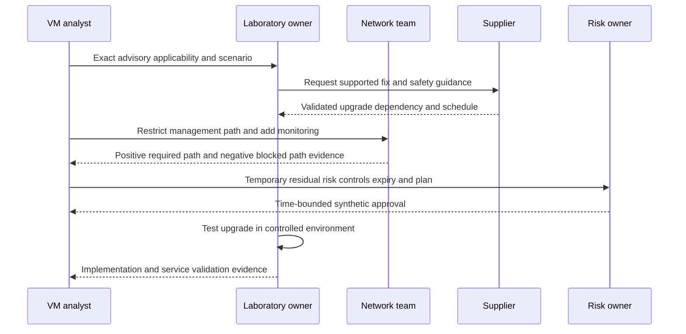

### Synthetic scenario C: falling dashboard caused by failed credentials

One Monday, open high-severity findings fall by 28 percent. No major deployment occurred. The VM operator checks source health before celebrating. Credential success on a server scanner fell from 97 percent to 41 percent after a service-account policy change. The data model interpreted absent findings as resolved.

NMH pauses automatic closures and SLA reporting for the affected cohort, marks dashboard measures degraded, restores least-privileged credentials through approved secret handling, reruns the smallest sample, then the full cohort, and replays findings without creating duplicate tickets. It restates the weekly report, preserves episode age, communicates affected decisions, and adds an invariant: a finding cannot auto-resolve when expected authenticated evidence is missing or the source is unhealthy.

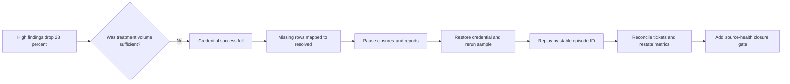

### Synthetic scenario D: SLA pressure creates premature closure

A remediation team closes findings when a patch job reports success. Validation later finds 14 percent of the sample still running the old library because services were not restarted. Rather than blaming the team, governance identifies a bad closure contract and an incentive problem. The policy changes from "deployment successful" to scenario-specific native/runtime and service postconditions. Tickets enter `awaiting validation`; original age remains visible; failures reopen without creating new episodes. The team also groups restart-dependent work with service owners and maintenance windows.

### Synthetic customer review narrative

The monthly review states: "Pilot scope increased because two previously absent cloud accounts were added. Open exposure episodes therefore rose; this is improved visibility, not demonstrated deterioration. Credential degradation invalidated one weekly downward trend, and the report has been restated. The patient-portal cohort completed validated image replacement and service testing. The laboratory controller remains under a time-bounded, approved synthetic exception with restricted management access and a supplier-tested upgrade dependency. Decisions requested this month are ownership for 3,500 episodes, funding for image-pipeline prevention, and approval of the next service cohort."

This narrative separates scope, data quality, activity, outcome, residual risk, and decisions. It does not claim the program eliminated risk or prevented an incident.

## Customer and TSM artifact kit

A TSM adds value by helping the customer make the lifecycle operational, measurable, explainable, and supportable. The TSM should not take over customer risk authority or invent product behavior. Useful artifacts make facts and decisions easier to reproduce.

| Artifact | Purpose | Minimum contents | TSM value |
|---|---|---|---|
| VM charter | Align purpose and authority | Outcomes, scope, roles, evidence, cadence, guardrails | Facilitate clarity and product-to-process fit |
| Scope register | Define managed universe | Population, source, owner, exclusions, freshness | Expose blind spots and onboarding dependencies |
| Source contract | Govern each input | Objects, IDs, scope, auth, cadence, schema, quality, security | Improve connector acceptance and troubleshooting |
| Finding/episode dictionary | Separate data grains and states | Definitions, keys, merge/split, lifecycle | Prevent duplicate work and false closure |
| Priority record | Explain urgency and action | Scenario, factors, evidence, controls, owner, due logic | Build stakeholder trust in recommendations |
| Treatment decision | Compare safe options | Fix, mitigate, accept, tradeoffs, authority | Connect technical and business decisions |
| Exception record | Govern residual risk | Scope, controls, owner, approval, expiry, triggers | Prevent permanent hidden acceptance |
| Validation plan | Define closure before change | Native/source/path/control/service/data postconditions | Shift focus from tickets to outcomes |
| Action register | Track commitments | Stable ID, owner, due logic, blocker, status, evidence, checkpoint | Keep reviews cumulative and accountable |
| Metric dictionary | Make dashboards reproducible | Grain, denominator, formula, source, time, exclusions, owner | Bridge SQL/Power BI rigor to SecOps |
| Health scorecard | Show program reliability | Coverage, auth, freshness, rejects, ownership, workflows | Prevent source failure from looking like improvement |
| Escalation packet | Enable Support/Product diagnosis | Expected/actual, reproduction, IDs, UTC, versions, evidence, one ask | Reduce time lost in cross-team handoffs |
| Adoption plan | Create correct user routines | Roles, tasks, training, observation, feedback, measures | Turn capability into sustained use |
| Executive review | Support decisions | Material scenarios, movement/cause, outcomes, uncertainty, blockers, asks | Translate technical work without false certainty |

## Safe labs and exercises

All exercises use synthetic data or an isolated, explicitly authorized lab. No production target, real credential, customer data, or unapproved exploit is required.

| Lab | Exercise | Deliverable | Pass condition |
|---|---|---|---|
| 1 | Teach back the full lifecycle using the hospital analogy | Five-minute whiteboard | Every stage has a decision, owner, evidence, and failure mode |
| 2 | Draft a VM charter | One-page charter | Outcome is not a tool or finding count |
| 3 | Build an asset-universe contract | Scope table and reconciliation states | Missing assets remain unknown, not clean |
| 4 | Model data grain | Vulnerability/finding/episode/ticket diagram | No CVE-to-ticket one-to-one assumption |
| 5 | Compare complementary discovery sources | Coverage matrix | Blind spots and safety constraints are explicit |
| 6 | Assess applicability | Five synthetic findings | Product/version/config/feature evidence recorded |
| 7 | Prioritize three scenarios | Explainable decision records | Severity is preserved but not used alone |
| 8 | Select treatment | Options matrix | Service, safety, controls, authority, residual risk included |
| 9 | Design a canary rollout | Change and rollback plan | Stop conditions and service tests are concrete |
| 10 | Write validation postconditions | Validation checklist | Ticket closure alone fails the lab |
| 11 | Diagnose a source outage | Timeline and layered runbook | Automation pauses and report is caveated/restated |
| 12 | Diagnose duplicate episodes | Identity/grain reconciliation | Stable IDs and downstream repair are included |
| 13 | Audit exceptions | Exception debt report | Expiry, approver, controls, and next action exist |
| 14 | Define metrics | Metric dictionary | Grain, denominator, source health, and drill-down exist |
| 15 | Build Power BI mock views | Technical and executive wireframes | Both reconcile to one semantic contract |
| 16 | Write SQL quality checks | Pseudocode/query design | Null, duplicate, freshness, and join-loss tests included |
| 17 | Run synthetic monthly review | Ten-minute presentation | Facts, uncertainty, decisions, and next checkpoints are clear |
| 18 | Build escalation packet | One bounded case | Reproduction, exact IDs, UTC, versions, redaction, one ask |
| 19 | AI guardrail tabletop | Allowed/prohibited use matrix | No sensitive leakage or autonomous authority |
| 20 | Interview rehearsal | Record answers to Q1-Q8 | Claims stay inside factual and synthetic boundaries |

## Arti bridge: factual strengths applied to VM

Arti's background offers strong adjacent evidence. Microsoft 365, OneDrive, and SharePoint support required exact tenant, user, device, file, library, permission, sync state, service state, and timeline reasoning. Network and trace work required DNS, TCP, TLS, proxy, endpoint, and service fault isolation. Escalations required severity assessment, containment, cross-team ownership, evidence packages, customer updates, RCA, and validation. SQL and Power BI required grain, joins, filters, measures, denominators, and data-quality checks. Mentoring required teaching complex ideas simply. Responsible AI work provides a basis for guarded assistance rather than autonomous security decisions.

| Factual strength | VM transfer | Example interview phrasing | Boundary |
|---|---|---|---|
| Microsoft 365 support | Resolve exact environment and applicability | "I start with exact subject, state, time, evidence, and scope before recommending action." | Not scanner administration |
| OneDrive/SharePoint permissions | Understand identity, ownership, and access paths | "Permissions and business context change the scenario just as they change a sync or access case." | Not production attack-path modeling |
| Networking/traces | Validate reachability and isolate layers | "I correlate DNS, TCP, TLS, proxy, endpoint, and service evidence rather than infer from one symptom." | Authorized VM tests still require customer rules |
| Escalations | Coordinate impact, containment, owners, evidence, and checkpoints | "I can run a disciplined cross-team decision loop under uncertainty." | Risk acceptance remains customer authority |
| SQL/Power BI | Govern metrics and troubleshoot data | "I define grain and denominator and reconcile source-to-report before trusting a trend." | Dashboard design does not prove product schema knowledge |
| Mentoring | Drive adoption and clear communication | "I teach the why, observe the task, and use feedback to improve runbooks." | Training content must match current product |
| AI exploration | Assist repetitive analysis safely | "AI can summarize cited evidence or suggest candidate groups under review." | No autonomous closure, priority, or acceptance |

## Common misconceptions to correct

| Misconception | Correction |
|---|---|
| Vulnerability management is scanning | Scanning is one discovery method inside a governed lifecycle |
| Every finding is a confirmed vulnerability | A finding is a source observation that needs identity, applicability, and evidence review |
| A CVE is a scan result | A CVE identifies a publicly disclosed vulnerability record; a finding links evidence to a subject |
| Highest CVSS always comes first | Severity is one input; exposure, exploitation, controls, impact, feasibility, and confidence affect action |
| No finding means no vulnerability | Missing scope, authentication, telemetry, or method coverage can create false negatives |
| Patching is the only treatment | Configuration, exposure reduction, privilege reduction, isolation, compensation, retirement, and governed acceptance also exist |
| A control deletes a vulnerability | A control may interrupt a prerequisite; the weakness and residual paths can remain |
| Closed ticket means fixed | Closure requires scenario-appropriate technical and service postconditions |
| Lower backlog proves lower risk | Scope loss, deduplication, exceptions, or premature closure can lower count |
| Every critical asset makes every low issue critical | Criticality affects scenario impact; applicability and plausible path still matter |
| Internal assets are safe | Internal reachability, identities, lateral paths, and compromised starting points matter |
| Unknown means low risk | Unknown means evidence cannot support the decision yet |
| SLA compliance proves good security | SLAs can be gamed and do not measure control effectiveness or outcome alone |
| Exceptions are failures | Governed, time-bounded exceptions can be legitimate; invisible or permanent ones are dangerous |
| Automation is always maturity | Unsafe automation scales identity, data, and decision defects |
| AI can decide risk objectively | Models inherit data and policy limits; authority, citations, review, and privacy controls remain essential |
| The TSM owns customer risk | The TSM enables outcomes and evidence; customer roles retain change and risk authority |

## Official Source Anchors

Research/source snapshot and review date: **2026-08-24**.

The sources below support general vulnerability-management, patch-management, security-testing, control, risk, and product-positioning concepts. They do not define NMH, guarantee outcomes, authorize testing, or establish any customer's licensed capabilities. Current versions, vendor advisories, customer policy, and supported product documentation govern production use.

| Source | URL | Used for | Boundary |
|---|---|---|---|
| NIST SP 800-40 Rev. 4 | https://csrc.nist.gov/pubs/sp/800/40/r4/final | Enterprise patch-management planning; identify, prioritize, acquire, install, and verify updates | Patch planning is part of VM, not the whole program |
| NIST SP 800-115 | https://csrc.nist.gov/pubs/sp/800/115/final | Planning and conducting technical security tests, analyzing findings, and developing mitigations | Published 2008; tailor methods and use current authorization |
| NIST SP 800-53 Rev. 5 | https://csrc.nist.gov/pubs/sp/800/53/r5/upd1/final | Risk Assessment, configuration, monitoring, integrity, access, audit, incident, and supply-chain controls | Control catalog requires selection, tailoring, implementation, and assessment |
| NIST Cybersecurity Framework 2.0 | https://www.nist.gov/cyberframework | Govern, Identify, Protect, Detect, Respond, and Recover outcome framing | Voluntary framework; profiles and implementations are organization-specific |
| NIST SP 800-30 Rev. 1 | https://csrc.nist.gov/pubs/sp/800/30/r1/final | Threat, vulnerability, likelihood, impact, uncertainty, and risk-assessment concepts | Tailor to current organizational risk method |
| FIRST CVSS | https://www.first.org/cvss/ | Versioned technical vulnerability-severity system; current official resources identify v4.0 | Severity is not complete customer risk |
| FIRST EPSS | https://www.first.org/epss/ | Daily probability estimate that a published CVE will be exploited in the wild in the next 30 days | Probability model, not certainty or customer compromise proof |
| CISA Known Exploited Vulnerabilities Catalog | https://www.cisa.gov/known-exploited-vulnerabilities-catalog | Current evidence-based known-exploitation prioritization input | Inclusion is not proof that NMH or any customer is compromised |
| CVE Program | https://www.cve.org/ | Identifying, defining, and cataloging publicly disclosed vulnerabilities | Identifier/record, not severity, exploitability, finding, or risk score |
| CWE | https://cwe.mitre.org/ | Community-developed software/hardware weakness taxonomy | Weakness class is not proof of one affected deployment |
| Zscaler Unified Vulnerability Management | https://www.zscaler.com/products-and-solutions/vulnerability-management | Public contextual risk-prioritization, workflow, and reporting positioning adjacent to this foundation | No internal formula, field, entitlement, tenant behavior, or result inferred |
| Zscaler Data Fabric for Security | https://www.zscaler.com/products-and-solutions/data-fabric | Public aggregation, harmonization, deduplication, correlation/enrichment, business logic, workflow, and reporting positioning | No proprietary architecture or source authority inferred |

## Likely Interview Questions

### Q1. What is vulnerability management, and how is it different from vulnerability scanning?

**Model answer:** Vulnerability management is a continuous governed program that defines scope, discovers observations, confirms identity and applicability, prioritizes customer risk scenarios, selects and executes treatment, validates postconditions, reports decisions and outcomes, and improves recurring causes. Scanning is one discovery method. A scanner can produce excellent evidence while ownership, prioritization, change safety, validation, metrics, or governance still fail. I start with the outcome and decision loop, then fit tools and sources to it.

### Q2. How would you design the full VM lifecycle for a new customer?

**Model answer:** I would define a charter, bounded services and asset universe, decision owners, risk and change authority, source contracts, evidence states, finding/episode grain, and safety/privacy rules. Then I would onboard complementary discovery in a small pilot, reconcile scope and identity, define applicability and contextual priority records, integrate proposal-only workflows, agree treatment and exception rules, set validation postconditions before closure, and publish quality/flow/outcome measures. Expansion would use shadow, canary, feedback, runbooks, governance, and measured readiness rather than connector count.

### Q3. What evidence turns a scanner observation into an actionable finding?

**Model answer:** I need the exact active asset and component, source-native finding ID and raw evidence, observation time, detection method/version, successful authentication or relevant vantage point, affected product/version/configuration/feature, authoritative advisory, source health, and known limitations. I preserve confirmed, supported, candidate, conflicted, stale, unknown, rejected, and not-applicable states. Action also needs a scenario, owner, treatment options, due logic, and validation; an observation alone is not automatically a patch instruction.

### Q4. How do you prioritize without relying only on severity?

**Model answer:** I preserve versioned technical severity, then evaluate exact applicability, known or predicted exploitation, attacker starting point and reachability, identities and effective privilege, mitigating-control applicability and effectiveness, service/data/safety impact, dependency concentration, age and obligations, feasible safe treatment, and evidence confidence. The output is an explainable recommendation tied to an owner, action, timing, and postcondition. Missing context becomes visible evidence work, not automatic low risk.

### Q5. What treatment options exist when a patch cannot be applied immediately?

**Model answer:** Depending on the scenario, options include disabling the vulnerable feature, restricting network or application reachability, reducing privilege, rotating credentials, isolating the asset, applying a verified virtual patch or other compensating control, rebuilding, retiring the service, transferring some contractual consequence, or obtaining time-bounded risk acceptance from the authorized owner. I map each control to a prerequisite, test required and blocked paths, record expiry and review triggers, preserve durable remediation, and never treat operational difficulty as silent acceptance.

### Q6. What proves that remediation is complete?

**Model answer:** Completion is scenario-specific. I confirm the intended asset/component, native fixed software or configuration, successful detecting-source evidence, relevant path/control postconditions, required service and user transactions, ticket/report/exception reconciliation, residual-risk ownership, and recurrence prevention such as a corrected base image. A deployment event or closed ticket is evidence of activity, not sufficient proof. If validation is unavailable, the state remains awaiting validation or unknown.

### Q7. How would you troubleshoot a sudden drop in open vulnerabilities?

**Model answer:** I would pause auto-closure and unsupported success claims, select one exact cohort and UTC window, and compare treatment volume with the change. Then I would trace intended scope, native source counts, authentication and completed runs, pagination and freshness, mapping/rejects/nulls, asset/component/episode identity, rule and policy versions, workflow read-back, validation, and dashboard filters. I would repair in shadow, replay by stable IDs, reconcile tickets and exceptions, restate affected reports, communicate decisions impacted, and add a source-health or count invariant.

### Q8. How does Arti's background transfer to VM while keeping the claim honest?

**Model answer:** Microsoft 365 escalation work provides strong adjacent evidence: exact tenant/user/device and permission reasoning, DNS/TCP/TLS/proxy and trace isolation, source and timestamp discipline, high-impact coordination, customer communication, RCA, and post-change validation. SQL and Power BI add grain, join, denominator, trend, and data-quality discipline; mentoring supports adoption; AI exploration supports guarded assistance. The NMH VM artifacts are synthetic practice, and product administration, customer risk authority, and production VM ownership remain boundaries to verify and develop.

## 30-Second Memory Hooks

| Concept | Memory hook |
|---|---|
| VM program | Hospital maintenance system, not one inspection tool |
| Scanner | Sensor, not decision owner |
| Scope | Define the census before counting conditions |
| Finding | Inspector's note, not automatic truth |
| Applicability | Confirm the exact lock model on the exact door |
| Severity | Technical danger label, not customer priority |
| Risk | Scenario plus likelihood, impact, and uncertainty |
| Priority | Explain the next action, owner, timing, and why |
| Control | Interrupt a specific prerequisite |
| Mitigation | Reduce the path even if weakness remains |
| Exception | Named owner, controls, expiry, and review trigger |
| Remediation | Change the condition, not only the ticket |
| Validation | Reinspect the native state, path, control, and service |
| Unknown | Evidence cannot decide yet; never silently zero |
| Coverage | Expected population plus successful fresh evidence |
| Provenance | Chain of custody for every claim |
| SLA | Governed timing rule, not a game score |
| Backlog | Work inventory, not a direct risk measure |
| Maturity | Reliable outcomes, not tool count |
| TSM | Connect capability, process, evidence, adoption, and value |
| Arti bridge | A Microsoft error code needs context; a vulnerability finding does too |

## Completion Checklist

- [ ] I define asset, weakness, vulnerability, exposure, finding, detection, applicability, severity, likelihood, impact, risk, control, mitigation, remediation, exception, SLA, aging, backlog, validation, residual risk, governance, provenance, cadence, and maturity from zero.
- [ ] I explain why a scanner is a sensor rather than the complete program.
- [ ] I can whiteboard govern -> scope -> discover -> assess -> prioritize -> treat -> remediate -> validate -> report -> improve.
- [ ] I assign a decision, owner, evidence, failure mode, and postcondition to every lifecycle stage.
- [ ] I draft a charter with purpose, scope, outcomes, authority, evidence, cadence, guardrails, measures, and improvement.
- [ ] I define the intended asset universe independently of one scanner or connector.
- [ ] I keep expected/observed, missing, extra, conflicted, stale, retired, and unknown populations visible.
- [ ] I understand complementary host, network, application, dependency, cloud, identity, control, external, vendor, and manual discovery methods.
- [ ] I preserve source-native IDs, raw evidence, method/version, observation time, ingestion time, identity, and provenance.
- [ ] I distinguish vulnerability definition, weakness category, finding occurrence, exposure episode, action, ticket, exception, and validation grain.
- [ ] I test exact product, component, version, build, configuration, feature, platform, deployment, privilege, and path applicability.
- [ ] I preserve confirmed, supported, candidate, conflicted, stale, unknown, rejected, and not-applicable evidence states.
- [ ] I distinguish evidence states from workflow states.
- [ ] I use technical severity with exploit, threat, reachability, identity, controls, impact, breadth, feasibility, and confidence.
- [ ] I produce an explainable priority recommendation rather than an unexplained score.
- [ ] I compare patch, configure, remove, reduce exposure, reduce privilege, isolate, compensate, rebuild, retire, accept, and transfer options.
- [ ] I keep risk acceptance with authorized customer roles.
- [ ] I plan exact targets, desired state, dependencies, tests, rollout, rollback, communication, security, validation, and reconciliation.
- [ ] I use lab, pilot, canary, waves, gates, stop conditions, and rollback where risk warrants them.
- [ ] I validate identity, native state, source state, path, control, service, data/report, residual risk, and recurrence as applicable.
- [ ] I never equate deployment success or ticket closure with validated risk reduction.
- [ ] I define metric grain, population, formula, time, state, exclusions, sources, owner, and drill-down.
- [ ] I report scope/coverage, quality, demand, backlog, flow, SLA, treatment, validation, recurrence, outcome, adoption, and program health.
- [ ] I show source degradation beside risk metrics and restate invalid reports.
- [ ] I design event-driven, daily, weekly, monthly, quarterly, and after-incident cadences by need.
- [ ] I govern exceptions with exact scope, scenario, rationale, controls, owner, approver, start, expiry, triggers, plan, validation, and residual risk.
- [ ] I preserve stable episode age, policy versions, explicit pause reasons, and reopen history to reduce SLA gaming.
- [ ] I protect vulnerability data, credentials, exports, packages, testing, automation, and AI use with security/privacy guardrails.
- [ ] I require written authorization for scanning and testing.
- [ ] I troubleshoot scope -> source -> mapping -> identity/grain -> decision rules -> workflow -> validation -> report.
- [ ] I contain harmful automation and claims before repairing a data or workflow defect.
- [ ] I can explain reactive, repeatable, defined, measured, and adaptive maturity without equating maturity to tool count.
- [ ] I use recurrence and RCA to improve images, pipelines, architecture, identity, controls, procurement, policy, runbooks, and training.
- [ ] I can teach all four synthetic NMH scenarios without presenting them as customer or product results.
- [ ] I can produce the charter, scope register, source contract, data dictionary, priority record, treatment record, exception, validation plan, action register, metric dictionary, scorecard, escalation packet, adoption plan, and executive review.
- [ ] I can complete all twenty safe labs using synthetic or explicitly authorized isolated evidence.
- [ ] I connect Microsoft 365/OneDrive/SharePoint support, networking/traces, SQL/Power BI, escalations, mentoring, and AI to VM accurately.
- [ ] I preserve the boundary between factual production background, transferable method, synthetic practice, learned architecture, official fact, and unknown behavior.
- [ ] I use official sources under their definitions and retain the source snapshot/review date exactly as 2026-08-24.
- [ ] I can answer Q1 through Q8 with definitions, analogies, mechanics, tradeoffs, safety, troubleshooting, artifacts, and honest boundaries.

[Part 78 - CVE, CWE, CVSS, EPSS, KEV, Exploits, and Threat Intelligence](Part-78-cve-cwe-cvss-epss-kev.md)