# Part 78 - CVE, CWE, CVSS, EPSS, KEV, Exploits, and Threat Intelligence

> **Audience:** Candidates preparing for a Zscaler Security Operations Technical Success Manager role after enterprise Support Escalation Engineering.

> **Purpose:** Explain the major vulnerability and exploitation signals from zero, make their boundaries precise, and show how to combine them without turning severity into risk or intelligence into proof. Cover CVE, CWE, CVSS v4.0, legacy-version awareness, EPSS, CISA KEV, exploit evidence, active exploitation, threat intelligence, source quality, temporal change, decision logic, troubleshooting, synthetic customer scenarios, artifacts, and safe exercises.

> **Scope and honesty:** Northstar Meridian Holdings, abbreviated NMH, is an explicitly fictional and synthetic customer. Every NMH asset, vulnerability occurrence, score, probability, date, threat report, control, decision, metric, and result is invented for learning. Your factual background includes Microsoft 365, OneDrive, and SharePoint support; networking and traces; SQL and Power BI; escalations; mentoring; and responsible AI exploration. Production Zscaler, UVM, Data Fabric, scanner, threat-intelligence, and vulnerability-program operation remain learning boundaries. Synthetic exercises must not be described as production accomplishments.

> **Currency caveat:** CVE and CWE records, CVSS specifications, EPSS models and daily scores, CISA KEV entries, vendor advisories, exploit evidence, and threat reports change. The controlled official-source snapshot and review date for this Part is exactly **2026-08-24**. Current official records, versions, timestamps, vendor guidance, customer evidence, and authorized incident-response processes govern real decisions.

> **Section goal:** Make you fluent in what each signal actually says, what it does not say, and which next question it should trigger. By the end, you should be able to correct severity-equals-risk reasoning, explain a CVSS v4.0 vector in plain English, interpret EPSS and KEV cautiously, evaluate exploit and threat evidence, and build an evidence-backed customer recommendation without implying compromise.

A vulnerability-management team may see several labels beside the same issue: a CVE identifier, a CWE category, a CVSS score and vector, an EPSS probability and percentile, a KEV flag, an exploit reference, and a threat-intelligence note. These are not competing answers to one question. They answer different questions.

Think of a vehicle safety case. The recall number identifies one known defect. The engineering category says the defect belongs to a broader class such as brake-line fatigue. A laboratory severity rating describes potential consequences and required conditions. A probability model estimates how often similar defects may cause a real event soon. A regulator's action list says this defect has already caused qualifying real-world events under its criteria. A repair video shows a technique, while police reports may indicate local misuse. None of those alone proves that one specific vehicle is affected, reachable, uncontrolled, attacked, or damaged.

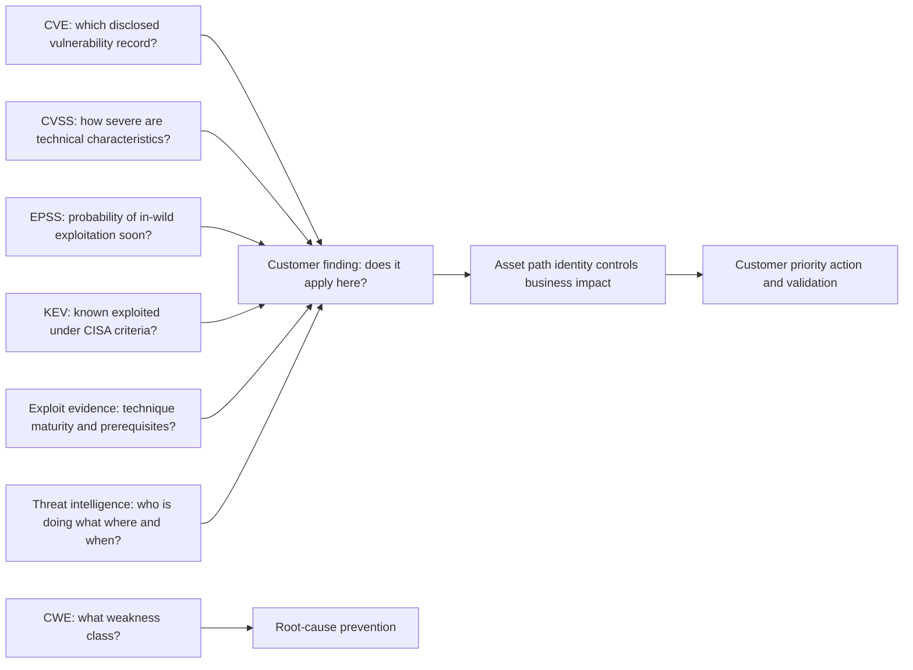

| Signal | Core question | Unit or output | Changes over time? | Does not prove |
|---|---|---|---|---|
| CVE | Which publicly disclosed vulnerability record are people discussing? | Identifier and record | Yes, record can be enriched, changed, rejected, or disputed | A customer asset is affected or compromised |
| CWE | What general software or hardware weakness class relates to the defect? | Taxonomy entry/category/view | Yes, taxonomy versions and mappings evolve | One deployed instance is vulnerable |
| CVSS | What are the principal technical characteristics and severity under a versioned specification? | Vector and 0-10 score | Vector can be updated; environmental use varies | Exploitation probability or business risk |
| EPSS | What is the model-estimated probability that a published CVE is exploited in the wild in the next 30 days? | Daily 0-1 probability and percentile | Yes, daily and model-dependent | Certainty, asset applicability, impact, or compromise |
| CISA KEV | Has CISA added the CVE to its catalog based on evidence of active exploitation and catalog criteria? | Catalog entry with dates/actions | Yes, entries and fields can change | This customer was attacked or breached |
| Exploit evidence | Is a method, proof, tool, or capability available and under what prerequisites? | Artifact/report with maturity and confidence | Yes, availability and reliability evolve | Active use or successful compromise |
| Threat intelligence | What adversary activity, targeting, infrastructure, behavior, or context is reported? | Sourced assessment with time/confidence | Constantly | Universal relevance or customer-specific truth |

## JD Mapping

Precise signal handling supports the SecOps TSM responsibilities of technical advising, risk communication, troubleshooting, data analysis, customer adoption, cross-team coordination, and evidence-based value realization.

| JD signal | Capability developed | Customer/TSM artifact | Honest boundary |
|---|---|---|---|
| Explain complex security concepts | Teach each signal with a distinct question and analogy | Signal comparison whiteboard | No claim of threat-research authorship |
| Drive risk-based outcomes | Combine technical and customer context into action | Explainable priority record | No proprietary UVM formula inferred |
| Analyze customer data | Preserve version, grain, timestamp, source, and confidence | Enrichment and lineage dictionary | No production UVM/data-fabric use claimed |
| Troubleshoot discrepancies | Diagnose conflicting records, vectors, probabilities, and mappings | Signal reconciliation runbook | Official sources and vendors remain authoritative |
| Communicate proactively | Distinguish fact, assessment, uncertainty, consequence, and next step | Customer advisory brief | No unsupported compromise statement |
| Coordinate SecOps stakeholders | Route vulnerability, incident, engineering, and risk decisions correctly | Evidence and decision matrix | TSM does not accept customer risk |
| Improve adoption | Teach analysts to use signals without score shortcuts | Analyst curriculum and review checklist | Training requires current customer policy |
| Partner with Support/Product | Provide exact IDs, vectors, source times, and examples | Minimal reproducible escalation | No fix or roadmap promise |
| Use AI responsibly | Summarize cited sources or suggest candidate mappings under review | Guardrailed enrichment experiment | No invented intelligence or autonomous priority |

## Candidate honesty note

The strongest interview position is accurate transfer, not inflated product experience. You can demonstrate rigorous source interpretation using the same habits applied to enterprise incidents and service telemetry.

| Evidence class | Neutral phrasing | Boundary |
|---|---|---|
| Factual background | You have correlated Microsoft service, identity, permission, client, network, and trace evidence during enterprise escalations | This does not establish threat-intelligence or VM operations ownership |
| Transferable discipline | Exact identifiers, timestamps, versions, hypotheses, source quality, confidence, and customer impact transfer directly | Transfer is not product administration |
| Synthetic practice | NMH signal matrices, SQL models, dashboards, and tabletop recommendations are fictional exercises | No customer or vendor result claim |
| Learned specification | You can explain official CVE/CWE/CVSS/EPSS/KEV definitions and limitations as reviewed | Recitation is not scoring-authority status |
| Official public claim | Statements are attributed to source, version, and snapshot date | Official wording does not establish tenant behavior |
| Unknown product behavior | Exact UVM fields, feeds, scoring calculations, update cadence, and entitlements require current verification | Unknown remains unknown |

## Beginner vocabulary and one-line memory hooks

| Term | Plain meaning | Why it matters | Analogy / hook |
|---|---|---|---|
| Identifier | A label used to refer to a record | Lets systems and people discuss the same item | Library call number |
| Taxonomy | Organized classification system | Groups related concepts for analysis and prevention | Medical classification handbook |
| Severity | Technical seriousness under stated conditions | Standardizes technical description | Laboratory hazard rating |
| Exploitability | How feasible it may be to use a weakness under prerequisites | Helps interpret attacker effort | Difficulty of using a faulty lock |
| Exploit | Code, commands, technique, or process that takes advantage of a weakness | Changes feasibility evidence | Instructions for opening the faulty lock |
| Proof of concept | Demonstration that a technique can work in a bounded setting | Shows possibility, not operational reliability | Prototype key made in a workshop |
| Weaponized exploit | Exploit adapted for reliable or operational use, often with delivery and payload | May increase attacker usability | Mass-produced lock-picking kit |
| Active exploitation | Credible evidence a vulnerability is being used against real targets | Strong urgency signal | Reports of the lock being abused now |
| Threat | Actor, event, or circumstance capable of causing harm | Connects capability and intent/opportunity | Burglar targeting a neighborhood |
| Threat intelligence | Analyzed information that supports security decisions | Adds who/what/where/when/how context | Verified local crime bulletin |
| Confidence | How strongly evidence supports an assessment | Prevents opinions from appearing certain | Confidence level on a forecast |
| Probability | Quantified chance under a model and horizon | Supports comparison but remains uncertain | Weather chance for the next 30 days |
| Percentile | Relative rank among a comparison population | Shows how a score compares with peers | Faster than 95 percent of runners |
| Prevalence | How common a condition or activity is | Common technologies can attract or amplify exposure | Number of cars using the affected part |
| Applicability | Whether the exact vulnerable condition exists on one subject | A public record does not create a customer finding | Does this car have that part and build? |
| Compromise | Unauthorized effect on confidentiality, integrity, availability, or control | Triggers incident-response evidence and action | Evidence the vehicle was actually tampered with |
| False certainty | More confidence than evidence supports | Causes harmful priorities and communications | Forecast reported as a guaranteed event |
| Temporal | Related to time | Signals, assets, controls, and threats change | A map with an "as of" timestamp |
| Provenance | Origin and transformation history of data | Enables trust and reconciliation | Chain of custody |
| Vector | Compact string encoding metric choices | Makes a score explainable and reproducible | Recipe behind the final dish |

### Plain-English deep-dive 1 - Seven labels answer seven different questions

The most common reasoning failure is to build a ladder that does not exist: CWE becomes CVE, CVE becomes CVSS, high CVSS becomes high EPSS, EPSS becomes KEV, KEV becomes exploit code, exploit code becomes customer attack, and attack becomes compromise. Each arrow can be false.

A CWE describes a weakness class, while a CVE identifies a specific publicly disclosed vulnerability record. A CVE may map to one or more CWEs, to a broad category, or to no precise root cause. CVSS describes technical characteristics; it does not predict exploitation. EPSS predicts a defined near-term population event for a CVE; it does not score consequence. KEV records known exploitation under CISA's criteria; it is not a complete list of everything exploited. An exploit artifact may be a fragile demonstration, a reliable tool, a detection simulation, or malicious code. Threat reporting may be global, sector-specific, old, duplicated, or wrong. Customer compromise requires customer evidence.

The right response is not to choose one "best" label. Preserve each signal under its own definition, source, version, and time. Then ask whether the exact customer asset is affected, reachable, valuable, controlled, and actionable. A TSM's value is often to restore these boundaries when dashboards or conversations collapse them.

## CVE: the shared vulnerability record identifier

**CVE** means **Common Vulnerabilities and Exposures**. The CVE Program's mission is to identify, define, and catalog publicly disclosed cybersecurity vulnerabilities. A CVE ID usually looks like `CVE-YYYY-NNNN...`: the literal prefix, a year component, and a variable-length sequence. The identifier points people toward one CVE Record; it is not itself a severity score, exploit prediction, scanner finding, patch, or proof of impact.

The program operates through **CVE Numbering Authorities**, abbreviated **CNAs**. A CNA is authorized within a scope to assign CVE IDs and publish records. Vendors, research organizations, coordination centers, and other program partners can be CNAs. A **Root** oversees one or more CNAs under program structure. Assignment and publication processes matter because records can begin reserved, later become public, be updated with affected-product or reference details, or be rejected when the record should no longer be used as a vulnerability entry.

| CVE concept | Plain meaning | Operational use | Limitation |
|---|---|---|---|
| CVE ID | Globally recognizable label for one record | Join advisories, scanners, patches, intelligence, and tickets | Identity only; details must be read |
| CVE Record | Structured information published for the ID | Understand description, affected products, references, provider data | Content can be incomplete or change |
| CNA | Authorized organization assigning/publishing within scope | Identify record authority and coordination path | CNA scope and vendor knowledge vary |
| Reserved | ID allocated but public record details not yet available | Track coordinated disclosure carefully | Reserved ID gives little decision evidence |
| Published | Record available to users | Begin source reconciliation and applicability analysis | Publication does not mean every affected version is known |
| Rejected | Record marked not to be used as a vulnerability entry, with reason | Stop treating it as an active CVE record while preserving history | Customer/source artifacts may lag |
| Reference | Link supplied in the record | Reach vendor advisory, research, patch, or context | Reference quality and currency vary |
| Affected data | Product/version/configuration assertions | Support applicability matching | Machine-readable ranges can be difficult or disputed |

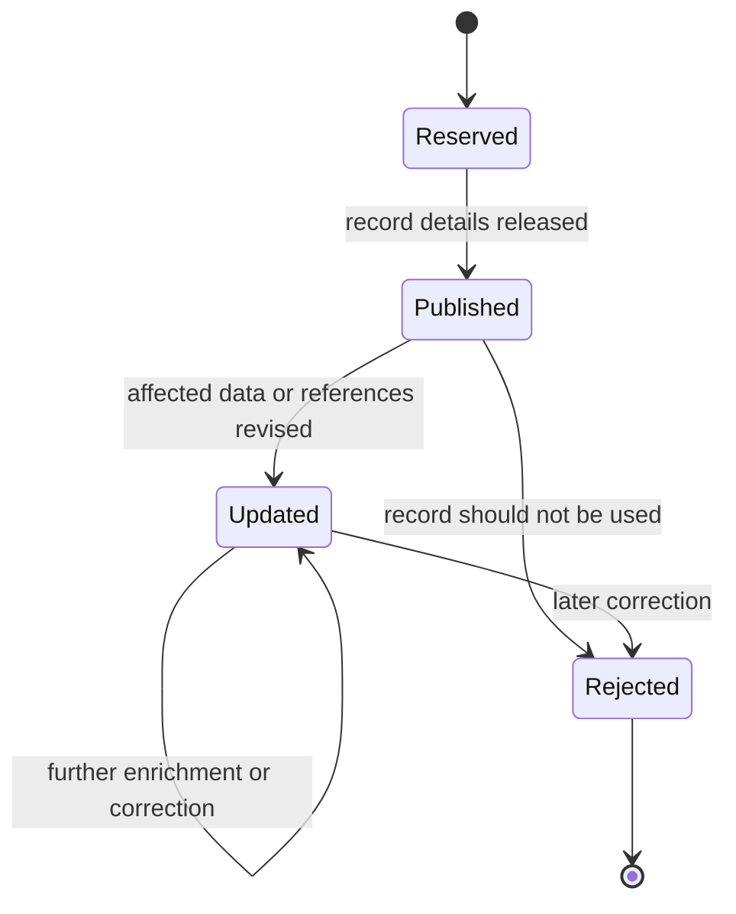

The diagram is a learning abstraction, not a complete reconstruction of CVE Program workflow. Current CNA rules and record lifecycle documentation govern exact states and transitions.

### CVE use and limitations

Two scanners can attach the same CVE to different evidence. A vendor may state that a patched package retains an older-looking version because a fix was backported. A cloud service may be provider-managed, leaving the customer no package to patch. A CVE can cover multiple products or configurations. A vendor advisory can refine affected ranges after publication. Some vulnerabilities have vendor-specific identifiers before or instead of a CVE. Some findings are misconfigurations or missing controls rather than CVEs.

| Question | Evidence to seek | Why CVE alone is insufficient |
|---|---|---|
| Is the customer asset affected? | Exact product, component, version/build, platform, configuration, feature | CVE describes a vulnerability, not inventory truth |
| Is the vulnerable code present? | Package, image, SBOM, runtime, file/build evidence | Product naming can be ambiguous |
| Is it reachable or triggerable? | Path, interface, privilege, user interaction, state | Affected code may not be exposed |
| Is a fix available? | Current vendor advisory and supported release | CVE record may not carry complete remediation detail |
| Was it exploited? | KEV/intelligence/customer telemetry under definitions | CVE publication does not imply exploitation |
| Was this customer compromised? | Incident evidence, timeline, telemetry, forensic analysis | Public record cannot answer customer-specific history |

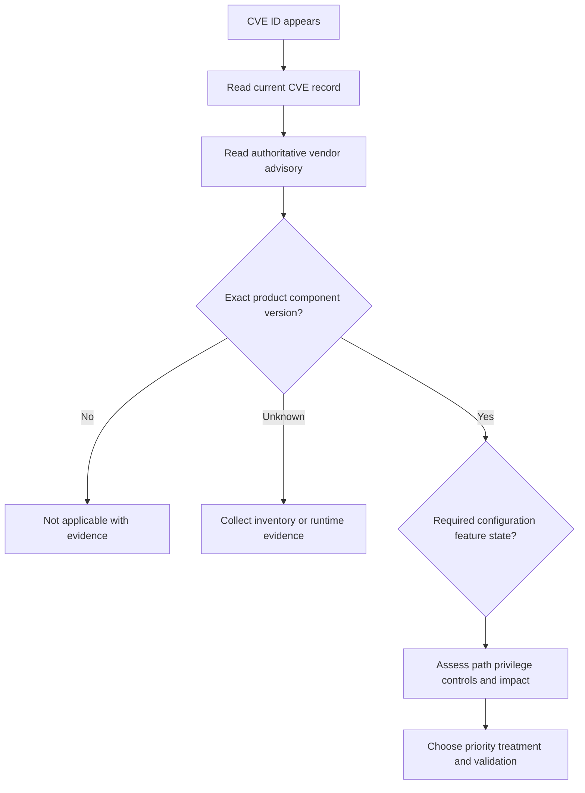

## CWE: the weakness taxonomy and prevention lens

**CWE** means **Common Weakness Enumeration**. MITRE describes it as a community-developed list of software and hardware weaknesses that can become vulnerabilities. A weakness is a recurring type of mistake, such as improper input validation, out-of-bounds access, authorization failure, or use of hard-coded credentials. CWE helps engineers discuss root causes, design secure-development checks, analyze trends, and prevent families of vulnerabilities.

CWE content includes different abstraction levels and organizational constructs. A broad **category** may group entries; a **class** describes an abstract weakness; a more specific **base** or **variant** adds detail; a **view** organizes entries for a particular perspective. Users should check the actual entry type and abstraction rather than treat every CWE ID as equivalent. A CVE-to-CWE mapping can be broad, disputed, or incomplete, especially when public information does not reveal root cause.

| CVE | CWE |
|---|---|
| Identifies one publicly disclosed vulnerability record | Classifies a general weakness type or grouping |
| Focuses coordination and shared reference | Focuses root-cause language, education, design, and prevention |
| Example shape: `CVE-2026-...` | Example shape: `CWE-...` |
| May affect particular products/versions | Can apply across many products and technologies |
| Does not necessarily reveal complete root cause | Does not prove a particular deployed vulnerability |
| Useful for advisory, finding, patch, and intelligence joins | Useful for secure coding, architecture, trend, and control mapping |

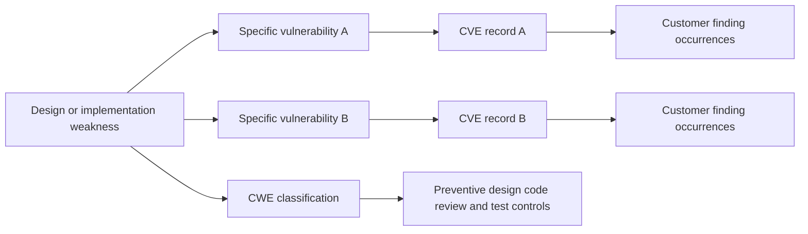

### CWE operational value and limitations

Grouping by CWE can reveal systemic engineering debt. If many application findings map credibly to an authorization weakness, the organization may improve design patterns, framework defaults, code review, tests, and training rather than repeatedly patch individual instances. However, counts can be biased by scanner coverage, mapping practices, broad fallback categories, duplicated CVEs, and product mix. "Top CWE" does not automatically mean highest customer risk or best investment.

| Use | Good practice | Failure mode |
|---|---|---|
| Root-cause trend | Use reviewed mappings and show unmapped/broad categories | Treat every source mapping as precise |
| Secure coding | Connect weakness to prevention and test patterns | Use CWE as a compliance label only |
| Architecture review | Identify design-level recurring conditions | Assume code-level category explains full system risk |
| Training | Teach concrete examples and countermeasures | Present taxonomy IDs without mechanics |
| Supplier quality | Discuss recurring weakness families with evidence | Rank suppliers by raw CWE count without scope |
| Executive reporting | Explain systemic prevention opportunity | Add all CWE counts as enterprise risk |

### Plain-English deep-dive 2 - CVE is the case; CWE is the pattern

In customer support, one incident has a case number. Several incidents may share a root pattern, such as expired credentials or proxy interference. The case number lets people coordinate one event. The pattern helps prevent recurrence. CVE and CWE play comparable roles: CVE points to the disclosed vulnerability case; CWE names the broader weakness pattern when a credible mapping exists.

Do not reverse the logic. Seeing `CWE-79` in a report does not prove that a customer application has a specific exploitable cross-site scripting vulnerability. Seeing a CVE mapped to a CWE does not prove that every occurrence has the same reachable path or impact. The mapping helps ask better engineering questions; the finding still requires exact evidence.

## CVSS: versioned technical severity and vector reasoning

**CVSS** means **Common Vulnerability Scoring System**. FIRST states that CVSS captures the principal characteristics of a vulnerability and produces a numerical score reflecting severity, with qualitative labels such as low, medium, high, and critical. At the controlled review date, FIRST identifies **CVSS v4.0** as the current version. Older data may use v3.1, v3.0, or v2; the version must always be preserved because vectors and score semantics differ.

CVSS v4.0 has four metric groups: **Base**, **Threat**, **Environmental**, and **Supplemental**. The Base group describes intrinsic technical characteristics under the specification. Threat adds the current exploit-maturity signal. Environmental tailors metrics to the consuming organization's environment, including modified characteristics and impact requirements. Supplemental metrics add useful context but do not modify the final CVSS score. A vector string records chosen values so another person can reproduce and review the assessment.

| Metric group | Plain purpose | Examples | Decision caution |
|---|---|---|---|
| Base | Intrinsic technical characteristics of the vulnerability | Attack Vector, Attack Complexity, Attack Requirements, Privileges Required, User Interaction, impacts | Not customer business risk or probability |
| Threat | Current exploit-maturity context | Exploit Maturity | Changes over time and depends on evidence |
| Environmental | Tailor technical impact/conditions to deployment | Modified metrics and confidentiality/integrity/availability requirements | Requires customer-specific evidence and versioning |
| Supplemental | Communicate additional characteristics | Safety, Automatable, Recovery, Value Density, Vulnerability Response Effort, Provider Urgency | Informative; does not change final score |

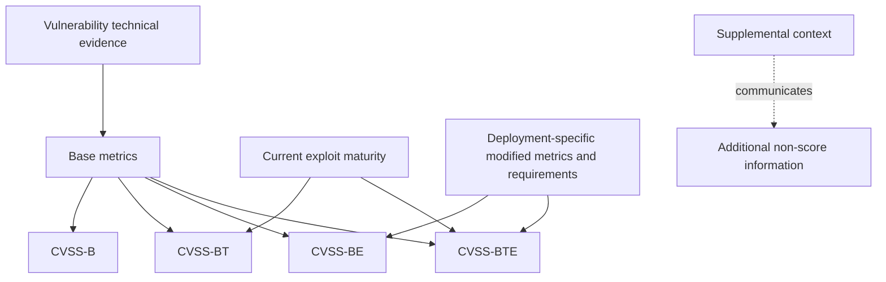

### CVSS v4.0 Base exploitability metrics

| Metric | Plain question | Typical values in plain language | Analogy |
|---|---|---|---|
| Attack Vector, AV | From where can the attack be attempted? | Network, adjacent, local, physical | How close must someone get? |
| Attack Complexity, AC | Which security-evasion complexity outside attacker control is required? | Low or high under specification definitions | Is the route straightforward or obstacle-dependent? |
| Attack Requirements, AT | Must particular deployment/execution conditions be present? | None or present | Must a special gate already be open? |
| Privileges Required, PR | What privileges must the attacker already possess? | None, low, high | Which badge is needed before starting? |
| User Interaction, UI | Must a user participate? | None, passive, active under v4 definitions | Must someone view or actively open/perform something? |

Attack Complexity and Attack Requirements must not be improvised from everyday language. CVSS v4.0 separates evasion complexity from prerequisite deployment/execution conditions more explicitly than prior versions. Scorers should use the current specification and examples.

### CVSS v4.0 impact metrics

CVSS v4.0 distinguishes impact to the **Vulnerable System** and impact to **Subsequent Systems**. Confidentiality, Integrity, and Availability are evaluated for each where applicable. This replaces the older v3.1 Scope concept with more direct impact expression.

| Metric family | Plain question | Examples of harm | Important boundary |
|---|---|---|---|
| VC - Vulnerable System Confidentiality | Can information in the vulnerable system be disclosed? | Read secrets or records | Technical system impact, not full business consequence |
| VI - Vulnerable System Integrity | Can data or operation in the vulnerable system be altered? | Change configuration or records | Requires specification-based level selection |
| VA - Vulnerable System Availability | Can the vulnerable system be disrupted? | Crash or resource exhaustion | Do not equate service criticality with metric without method |
| SC - Subsequent System Confidentiality | Can other systems' information be disclosed through the vulnerability? | Pivot to another service's data | Need defensible system boundary and effect |
| SI - Subsequent System Integrity | Can other systems be modified? | Issue commands or alter downstream state | Not every network neighbor is subsequent impact |
| SA - Subsequent System Availability | Can other systems be disrupted? | Affect dependent control or service | Business dependency still needs separate analysis |

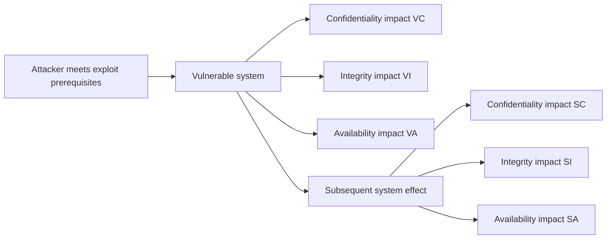

### CVSS score and qualitative ranges

CVSS scores use a 0.0 to 10.0 scale. The standard qualitative bands commonly map 0.0 to None, 0.1-3.9 to Low, 4.0-6.9 to Medium, 7.0-8.9 to High, and 9.0-10.0 to Critical. Always retain the version, score nomenclature, full vector, source, and timestamp. `9.8` without those details is not reproducible.

| Stored field | Why preserve it |
|---|---|
| Specification version | v4.0 and v3.1 values are not semantically interchangeable |
| Score nomenclature | Distinguishes Base, Base+Threat, Base+Environmental, or combined context |
| Numeric score | Supports coarse sorting under the specified vector |
| Qualitative label | Aids communication but loses detail |
| Full vector | Shows exactly which metric choices produced the score |
| Score provider | Vendor, CNA, NVD, customer, or other source may differ |
| Calculation time | Threat/environmental inputs can change |
| Rationale/evidence | Enables review of ambiguous metric choices |

### CVSS versions and conflicts

Do not convert a v3.1 score to v4.0 by changing the label. Re-score using v4.0 evidence and the official calculator/specification. Do not average two provider scores. Compare vectors and rationales metric by metric. Providers may have different information, boundaries, or update timing. A vendor's product knowledge can be important, while another enrichment source may add context. Record both with provenance until governance identifies the intended use.

| Conflict | Investigation | Correct response |
|---|---|---|
| v3.1 score differs from v4.0 | Compare version semantics and vectors | Keep both versioned; do not call one arithmetic replacement |
| Vendor and secondary source differ | Compare affected product, metric choices, publication times | Use governed source precedence and preserve rationale |
| Same score, different vectors | Compare exploitability and impact metrics | Treat vectors as materially different evidence |
| Score changed overnight | Check source update and Threat/Environmental inputs | Recompute affected decisions and explain movement |
| Environmental score is missing | Check whether customer context was actually assessed | Do not invent a customer-tailored score |
| Supplemental metric differs | Review its source/evidence | Remember it does not alter final CVSS score |

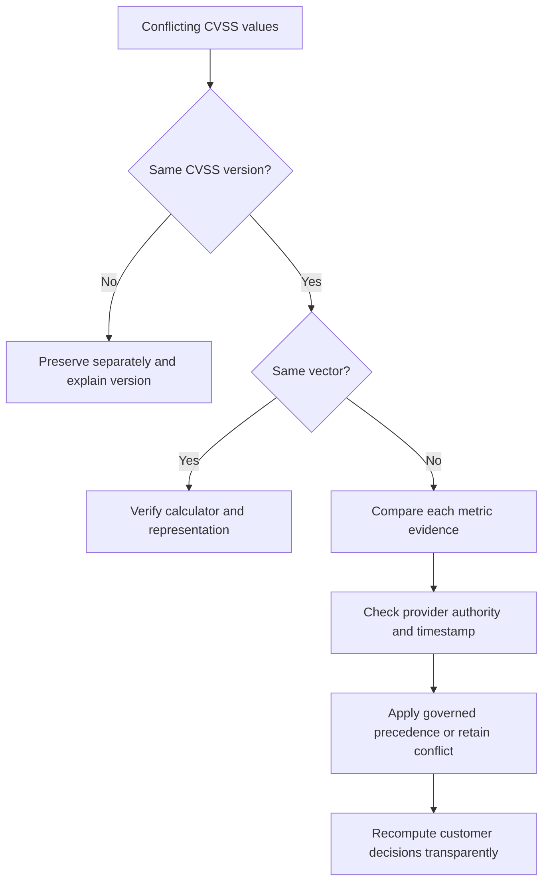

### Plain-English deep-dive 3 - CVSS is a technical recipe, not the customer's risk bill

The score is like a standardized nutrition label. It helps people compare technical characteristics under shared rules. It does not know whether the food belongs to a child with an allergy, whether it is in the cupboard, whether the package is sealed, whether a substitute exists, or whether anyone plans to eat it. Those deployment and business questions need additional evidence.

CVSS v4.0 Environmental metrics can tailor technical assessment to deployment conditions, but even a well-produced environmental score is not the entire enterprise-risk decision. It still does not automatically contain current asset identity, owner, attack path, all controls, maintenance feasibility, safety, legal obligations, concentration, incident evidence, or business appetite. Preserve CVSS as a strong technical signal; do not ask it to be something its specification does not claim.

## EPSS: a daily exploitation-probability model

**EPSS** means **Exploit Prediction Scoring System**. FIRST describes it as a data-driven machine-learning model that estimates the probability that a published CVE will be exploited in the wild in the next 30 days. It publishes a daily value from 0 to 1 and a percentile. A value such as `0.20` means the model estimates a 20 percent probability under its definition and current model/data, not a severity of 2 out of 10 and not a 20 percent chance that one customer will be breached.

The **percentile** is relative rank. A 95th percentile CVE scores above roughly 95 percent of CVEs in the comparison distribution. Percentile is not probability. A CVE can have a modest absolute probability and a high percentile if most CVEs have lower predicted exploitation likelihood.

| EPSS element | Meaning | Correct use | Misuse |
|---|---|---|---|
| Score | Estimated probability of in-wild exploitation in next 30 days | Compare near-term exploitation likelihood | Read as severity or customer breach probability |
| Percentile | Relative rank among scored CVEs | Identify high-ranked cohorts | Read as 95 percent probability |
| Daily publication | Model output can change each day | Store as-of date and trend | Keep one score forever |
| Model version | Feature/model design changes over time | Preserve version and evaluate calibration | Compare across versions without caveat |
| Population scope | Published CVEs under model coverage | Use with applicability and asset data | Apply directly to non-CVE findings |
| Empirical signals | Features derived from observed ecosystem data | Offset purely subjective judgments | Assume observations are complete or unbiased |

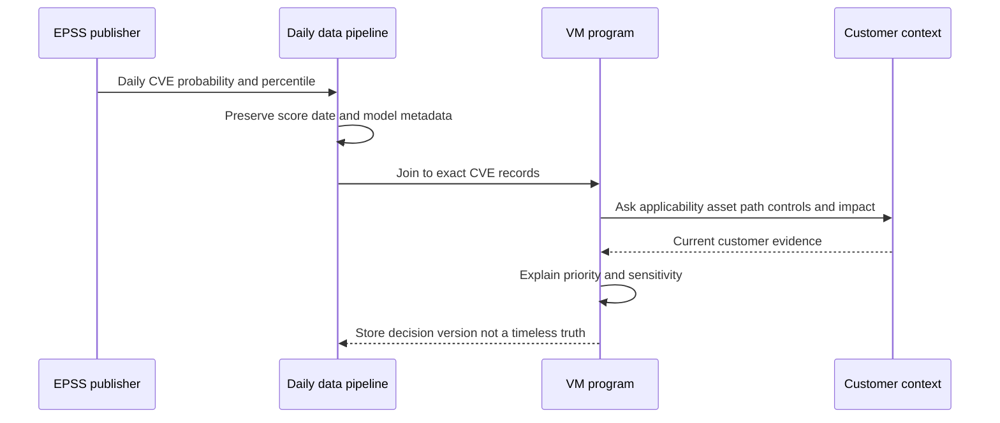

### EPSS limitations and decision use

Models learn from observable data. Exploitation can be underreported, unevenly observed, delayed, or biased toward popular products and detectable activity. A low score is not zero; a newly disclosed vulnerability may have limited evidence; targeted exploitation can matter greatly even if broad prevalence is low. A high score does not mean exploitation will succeed against an affected asset or that impact is high. Model changes can shift scores without any customer change.

Use EPSS as one signal in a portfolio decision. It can help identify CVEs with higher predicted near-term exploitation likelihood, compare cohorts, and test capacity thresholds. Combine it with KEV, exploit maturity, vendor advisories, customer exposure, business impact, controls, and remediation feasibility. Backtest thresholds against the organization's objectives and capacity, but avoid optimizing only for past observed exploitation.

| Decision situation | EPSS contribution | Other required evidence |
|---|---|---|
| Large applicable CVE backlog | Rank near-term exploitation likelihood | Severity, KEV, exposure, impact, controls, fix |
| New high-impact disclosure | Add current model signal when available | Vendor advisory, exact applicability, public path, exploit reports |
| Low EPSS on critical public service | Prevent panic but do not dismiss | Consequence, targeted threat, path, controls, uncertainty |
| High EPSS on isolated retired candidate | Increase evidence interest, not automatic emergency patch | Identity, lifecycle, reachability, owner |
| Threshold design | Estimate workload and capture under historical data | Capacity, false-negative tolerance, mandatory cohorts |
| Trend reporting | Explain changing exploit likelihood | Model version, date, population, no causality claim |

## CISA KEV: evidence of known exploitation, not customer compromise

**KEV** means **Known Exploited Vulnerabilities**. CISA maintains the KEV Catalog as an authoritative source of vulnerabilities that have been exploited in the wild under its criteria and urges organizations to use it as an input to prioritization. Catalog entries are tied to CVEs and include operational fields such as date added, required action, and a due date for organizations subject to the relevant directive. Binding Operational Directive 22-01 creates requirements for U.S. Federal Civilian Executive Branch agencies; other organizations should determine their own legal, regulatory, and policy obligations rather than assuming the same due date automatically applies.

| KEV fact | What it means | What it does not mean |
|---|---|---|
| CVE is listed | CISA concluded catalog criteria for known exploitation were met | Every exploited vulnerability is listed |
| Date added | When CISA added it to the catalog | First-ever exploitation date |
| Due date | Directive-driven remediation deadline for covered federal agencies | Universal customer SLA |
| Required action | CISA's catalog remediation direction | Complete vendor/customer implementation plan |
| Ransomware-use field when present | Catalog's stated association under its field semantics | Customer was targeted by ransomware |
| Catalog update | New official prioritization evidence | Automatic proof of applicability |

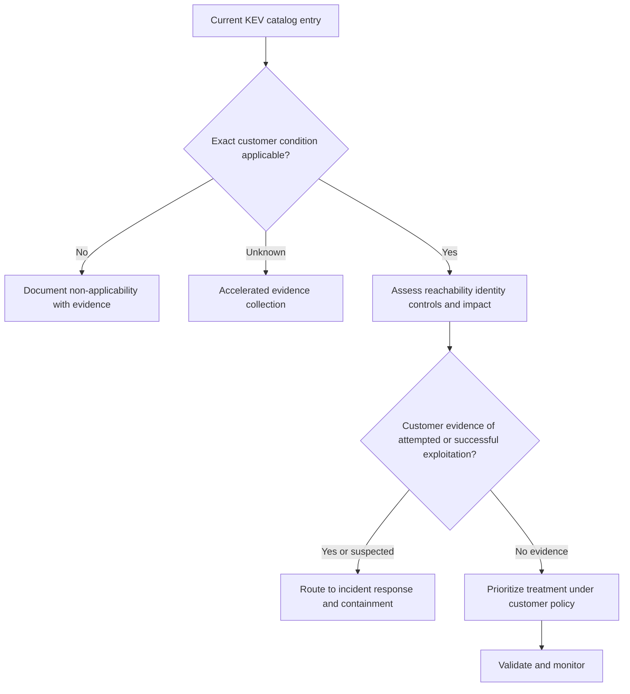

KEV should normally raise urgency for applicable findings because exploitation is not merely theoretical. It still cannot answer whether an asset is affected, which path exists, what controls work, or whether compromise occurred. Absence from KEV is also not proof of safety: catalog inclusion requires evidence and process, and exploitation can be unknown, newly emerging, targeted, or outside visibility.

### Plain-English deep-dive 4 - KEV is a smoke report, not proof your room burned

If a fire authority reports that a model of heater has caused real fires, owners should act faster. The report does not prove the heater in one room is the affected model, that it is plugged in, that the room caught fire, or that every dangerous heater model is already on the list.

That is the correct mental model for KEV. Confirm applicability quickly. Evaluate customer exposure and controls. Follow applicable obligations. If customer telemetry shows suspicious behavior, preserve evidence and involve incident response. Never tell a customer "KEV means you were compromised." Never tell them "not in KEV means safe." Both statements exceed the evidence.

## Exploit evidence: possibility, maturity, reliability, and use

An **exploit** is a method that takes advantage of a vulnerability to produce an unintended effect. Exploit evidence varies widely. A researcher may publish a crash-only proof of concept. A security product may implement a harmless detection check. A public repository may contain incomplete or malicious code. A penetration-testing framework module may automate prerequisites. A threat actor may use a private reliable exploit. A vendor may report exploitation without releasing technical details.

| Exploit evidence level | Plain description | Questions to ask | Decision boundary |
|---|---|---|---|
| Theoretical analysis | Reasoned path without working demonstration | Are assumptions and prerequisites valid? | Possibility, not executable proof |
| Crash/demo PoC | Bounded effect shown in lab | Exact versions, environment, reliability, side effects? | May not achieve meaningful capability |
| Functional PoC | Intended security effect demonstrated | Required access, configuration, user action? | Lab success may not generalize |
| Public module/tool | Repeatable implementation available | Authenticity, version support, defaults, payload, safety? | Availability does not prove use |
| Weaponized capability | Reliable delivery/exploitation/payload chain | Evidence source, target scope, evasion, operator skill? | Term needs evidence, not hype |
| Observed attempted exploitation | Telemetry indicates exploit attempt | Was it blocked, applicable, successful, duplicated? | Attempt is not compromise |
| Observed successful exploitation | Credible evidence exploit achieved effect | What access, persistence, scope, and timeline? | Requires incident response, not only VM |

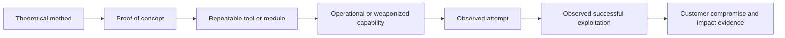

This is not a guaranteed maturity sequence. Private successful exploitation can occur without a public PoC. Public code can appear after incidents. A PoC can be mislabeled, unsafe, or fake. Operational decisions should record source, artifact hash/location under policy, publication time, affected versions, prerequisites, demonstrated outcome, reliability, authenticity, detection notes, and confidence.

Never execute untrusted exploit code on production or customer assets. Use isolated, authorized labs; inspect code; verify provenance and integrity; remove network access when practical; use snapshots; define stop conditions; avoid real data and credentials; and obtain written authorization for any testing. Often vendor detection guidance, non-destructive version/configuration checks, or controlled simulations provide enough evidence without exploitation.

## Threat intelligence: turn reports into decision-relevant assessments

Threat intelligence is analyzed information about threats that helps a decision. Raw indicators, headlines, and social posts are information inputs, not automatically intelligence. Useful intelligence states the question, source, collection time, assessment, confidence, relevance, limitations, and recommended action.

| Intelligence level | Audience/question | Example | VM use |
|---|---|---|---|
| Strategic | Leaders: what long-term threat changes matter? | Sector targeting and capability trend | Investment, architecture, risk appetite |
| Operational | Program/incident leaders: what campaign or actor behavior is occurring? | Campaign targets a technology used by customer | Accelerate scoped hunt and remediation |
| Tactical | Defenders: which techniques and procedures are used? | Exploit chain, privilege path, persistence behavior | Validate controls and detection coverage |
| Technical | Tools/analysts: which observable artifacts exist? | IP, domain, hash, user agent, rule | Time-bound detection/hunt, not identity proof |

Threat intelligence has a lifecycle: direction, collection, processing, analysis, dissemination, feedback. **Direction** defines the decision question. **Collection** obtains authorized data. **Processing** normalizes and de-duplicates it. **Analysis** evaluates meaning, alternatives, and confidence. **Dissemination** delivers the right detail to the right audience under handling rules. **Feedback** tests usefulness and updates requirements.

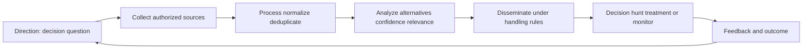

### Source evaluation

Assess source access, expertise, incentives, history, corroboration, proximity to evidence, timeliness, collection bias, and update/correction behavior. Separate source reliability from information credibility: a usually reliable source can relay uncertain information, and a new source can provide verifiable primary evidence. Avoid laundering repetition into corroboration; ten articles quoting one unnamed report are one origin, not ten independent confirmations.

| Quality dimension | Question | Good practice | Failure mode |
|---|---|---|---|
| Relevance | Does this answer the customer's decision question? | Map technology, sector, geography, path, and time | Global headline drives every queue |
| Timeliness | When was activity observed and reported? | Store event and publication times | Old campaign treated as current |
| Reliability | How dependable is the source for this claim type? | Track history and corrections | Brand reputation replaces evidence |
| Credibility | Is this specific claim supported? | Seek primary evidence and alternatives | Confidence copied without rationale |
| Independence | Are sources genuinely separate? | Trace citation lineage | Circular reporting appears corroborated |
| Completeness | What is absent or unobservable? | State collection gaps | Silence becomes no threat |
| Specificity | Are affected products, versions, actors, and behaviors clear? | Preserve exact qualifiers | Broad family name overapplied |
| Handling | Who may receive the information? | Follow TLP/customer/legal policy | Sensitive source exposed |
| Actionability | Which safe decision changes? | Name owner, action, expiry, validation | Intelligence stored but unused |

**TLP**, the Traffic Light Protocol maintained by FIRST, provides sharing markings. Current TLP definitions and the source's handling instruction govern dissemination. A handling label does not establish truth; it controls sharing. Customer contracts, privacy, legal constraints, and need-to-know still apply.

## Combining signals without double counting

Several signals can arise from overlapping evidence. KEV and EPSS may both reflect exploitation observations. An exploit-maturity metric in CVSS Threat and a separate exploit-availability factor may represent similar facts. Multiple intelligence providers may repeat the same campaign. Adding every signal as independent weight can exaggerate confidence and urgency.

Use a signal ledger with definitions, source, as-of time, grain, evidence lineage, overlap, and decision role. Some signals are gates, some modifiers, and some narrative evidence. For example, exact applicability can be a mandatory gate. KEV can define an accelerated cohort. EPSS can rank within cohorts. CVSS communicates technical characteristics. Customer exposure and impact determine scenario consequences. Compromise evidence routes work to incident response.

| Signal | Possible decision role | Dependency/overlap caution |
|---|---|---|
| CVE | Join key and vulnerability record | Not all findings have CVEs; record may change |
| CWE | Root-cause grouping | Mapping may be broad or derived from same advisory |
| CVSS Base | Technical severity baseline | Provider scores may repeat same vector |
| CVSS Threat | Exploit maturity within CVSS | May overlap exploit/KEV intelligence |
| EPSS | Near-term exploitation-probability ranking | Empirical features can overlap public exploit activity |
| KEV | Known-exploitation accelerated cohort | Do not count again as three independent threat factors |
| Exploit artifact | Prerequisite and maturity evidence | Public reference can feed EPSS/KEV/provider reports |
| Threat report | Targeting/relevance and behavior | Trace common primary source and date |
| Customer telemetry | Attempt/success evidence | Requires incident-quality validation and asset identity |

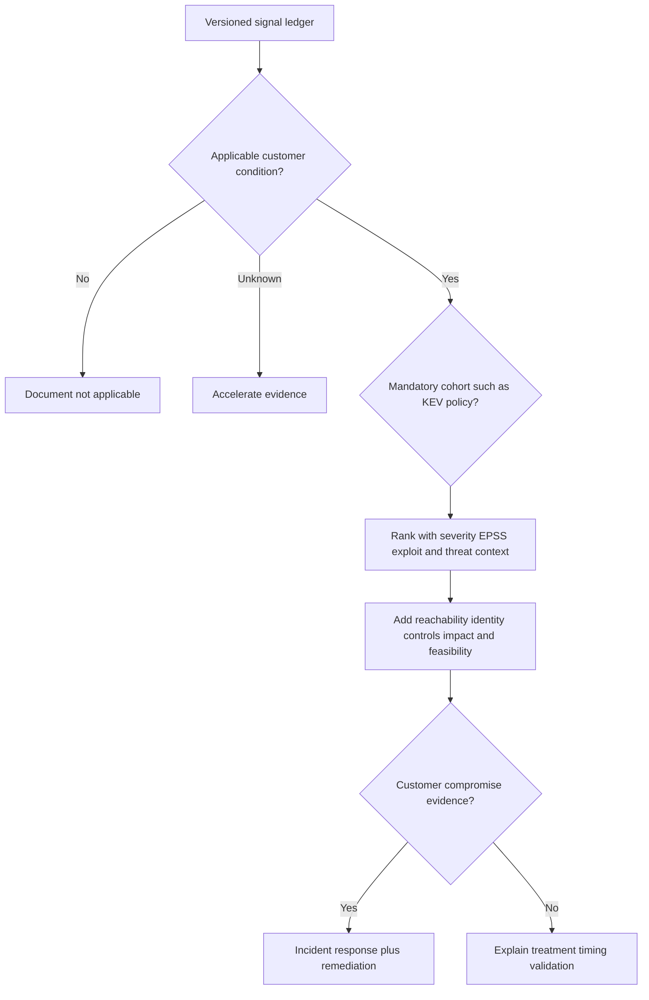

### Decision matrix

| Situation | Interpretation | First actions | Avoid |
|---|---|---|---|
| High CVSS, low EPSS, not KEV | Technically severe, lower predicted broad exploitation currently | Confirm applicability/exposure/impact; plan based on scenario | Dismiss because EPSS is low |
| Medium CVSS, high EPSS, KEV | Moderate technical severity with strong exploitation evidence | Accelerate applicability, containment, treatment, hunt as policy requires | Wait behind all critical scores |
| High EPSS, asset retired candidate | Exploitation likely in population, customer identity uncertain | Confirm lifecycle and paths urgently | Auto-patch or auto-close |
| Public PoC, no active exploitation evidence | Feasibility evidence increased | Validate authenticity/prerequisites, monitor, assess exposure | Claim campaign or compromise |
| KEV, strong effective isolation | Known exploitation but prerequisite may be interrupted | Verify isolation/bypasses and plan durable fix | Treat control presence as permanent removal |
| Threat report targets healthcare technology | Sector relevance increases attention | Map actual NMH technology, path, controls, telemetry | Assume every healthcare organization targeted |
| Customer exploit alert | Possible attempted or successful activity | Preserve evidence, contain, engage incident response | Leave only in VM ticket queue |
| Conflicting vendor/NVD vectors | Assessment sources differ | Compare vectors, versions, times, evidence | Average scores |

## Data architecture and temporal handling

Store vulnerability signals as time-aware observations, not one overwritten row. A CVE record version, vendor advisory, CVSS vector, EPSS daily score, KEV membership, exploit reference, threat report, and customer decision have different owners and clocks. Historical reporting needs the value known at the decision time as well as current corrected truth.

| Entity/observation | Recommended grain | Time fields | Key provenance |
|---|---|---|---|
| CVE record version | One CVE at one published revision | Published/updated/ingested | CNA/provider and record source |
| CWE mapping | One CVE-to-CWE assertion by source/version | Asserted/updated | Mapper and rationale |
| CVSS assessment | One provider/version/vector assessment | Calculated/published/ingested | Provider, spec, vector, rationale |
| EPSS score | One CVE per score date/model | Score date/ingested | FIRST/model metadata |
| KEV membership | One catalog state/event per CVE | Date added/due/retrieved | CISA catalog snapshot |
| Exploit assertion | One source claim about artifact/activity | Observed/published/retrieved | Origin, citation lineage, confidence |
| Threat assessment | One analytic judgment for question/scope | Event window/published/reviewed/expiry | Analyst/source/handling/confidence |
| Customer applicability | One finding/episode assessment | Observed/assessed/expires | Asset/component evidence and reviewer |
| Customer decision | One versioned decision | Effective/review/due | Authority, inputs, policy version |

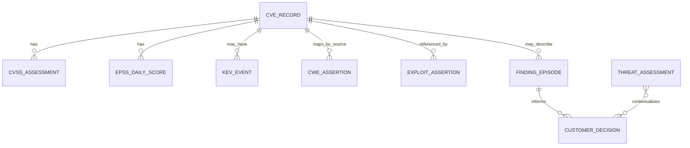

This conceptual model does not claim a Zscaler or UVM schema. It shows why one current `risk_score` column cannot preserve source disagreement, historical context, or reproducibility.

## Troubleshooting signal disagreements and stale intelligence

| Symptom | Likely causes | Discriminating check | Repair |
|---|---|---|---|
| CVE absent from one feed | Publication lag, rejected/reserved state, parser/filter, provider scope | Query official record and feed timestamps | Preserve source state; backfill after fix |
| CVE maps to wrong asset | Product-name match, CPE/range error, false merge, backport | Exact package/build/vendor advisory and asset provenance | Correct applicability and downstream episodes |
| CWE trend spikes | New mapping coverage, broad fallback category, duplicate CVEs | Mapping source/version and unmapped rate | Restate trend; review mappings |
| CVSS scores disagree | Version, vector, provider, environmental assumptions, stale record | Compare full vectors and calculation times | Keep versioned assessments; govern use |
| EPSS disappears | Non-CVE finding, data/API issue, date join, new record timing | Check official daily data and join grain | Unknown, not zero |
| EPSS jumps | Daily model evidence, model version, source update | Compare score history and model metadata | Explain as model movement; reassess queue |
| KEV flag missing | Catalog retrieval lag, CVE normalization, stale cache | Current CISA catalog by exact CVE | Correct pipeline and audit decisions |
| Exploit count inflated | Mirrors/forks/reposts/citation duplication | Trace artifact hashes and primary origin | Deduplicate assertions, not evidence detail |
| Threat report appears corroborated | Circular citations | Build citation graph | Reduce confidence and state one origin |
| Dashboard says exploited | Field label collapses PoC/KEV/attempt/success | Inspect source semantics and examples | Split evidence states and restate reports |
| Customer asks "Are we breached?" | Public exploitation conflated with local evidence | Review customer telemetry and incident criteria | Answer known/unknown; route to IR if warranted |

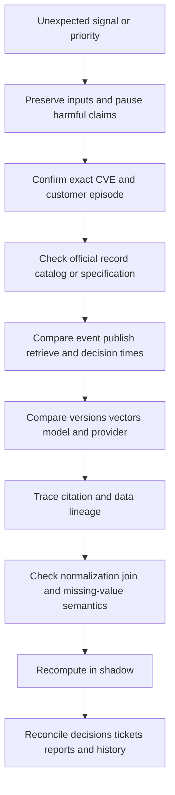

### Troubleshooting communication contract

State: the exact signal; source and URL; retrieved/as-of time; version/vector/model; expected and actual value; affected CVEs/assets/decisions; whether the issue changes applicability, urgency, or only display; current containment; one hypothesis at a time; owner; and next checkpoint. Do not say a source is wrong until the difference is understood. Do not promise a feed fix or vendor correction date without an authorized commitment.

## Complete synthetic NMH scenarios

All scenarios, data, reports, and future dates here are explicitly fictional and synthetic. The official-source review date remains 2026-08-24.

### Synthetic signal board

| Episode | CVSS evidence | EPSS evidence | KEV | Exploit/threat evidence | Customer context | Synthetic next action |
|---|---|---|---|---|---|---|
| PAT-WEB-11 | v4.0 High vector from vendor | High relative probability on synthetic as-of date | Listed | Public tool plus healthcare targeting report | Applicable public patient portal; WAF partial | Emergency canary fix, validate path and hunt |
| LAB-CTRL-04 | v3.1 Critical only; v4 not supplied | Low synthetic probability | Not listed | No public code found | Applicable isolated controller; high safety impact | Supplier plan, verify isolation, monitored exception |
| HR-APP-22 | v4.0 Medium | High synthetic probability | Listed | Attempts reported globally | Package present but vulnerable feature disabled | Validate configuration; retain accelerated monitoring |
| DEV-IMG-07 | v4.0 Critical | High synthetic probability | Not listed | Functional PoC | Image exists, not deployed; pipeline can promote | Block promotion, fix image, verify no runtime instances |
| VPN-OLD-03 | Conflicting v3.1 provider vectors | Medium synthetic probability | Listed | Actor report and local alert | Asset identity uncertain after migration | Incident triage plus urgent identity/path validation |

No actual score or probability is asserted. Labels are synthetic to practice reasoning.

### Scenario 1: medium severity outranks critical

PAT-WEB-11 has a medium-to-high technical condition under a reviewed vector, known exploitation evidence, a public path, an applicable component, a privileged backend identity, and partial control coverage. LAB-CTRL-04 has a critical older-version score but strong verified isolation and no currently supported exploit evidence; its safety consequence makes remediation method careful rather than unimportant. NMH accelerates PAT-WEB-11 containment and canary remediation while maintaining supplier-driven, time-bounded treatment for LAB-CTRL-04.

The lesson is not "medium always beats critical." It is that technical severity, exploitation evidence, path, controls, consequence, and safe treatment form different scenarios.

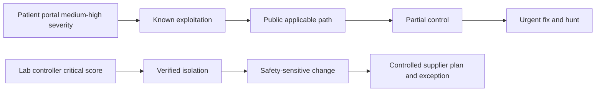

### Scenario 2: EPSS percentile misread

An analyst sees a synthetic EPSS percentile of 97 and writes "97 percent chance NMH will be attacked." The review corrects the statement: percentile is relative rank, while the separate EPSS score is the model's next-30-day in-wild exploitation probability for the CVE population event. Neither is NMH's breach probability. The dashboard is redesigned to show `EPSS probability`, `EPSS percentile`, `score date`, and a tooltip with the official definition. Customer applicability and local telemetry remain separate.

### Scenario 3: KEV triggers remediation and investigation, not a breach claim

VPN-OLD-03 appears in KEV and a local edge sensor shows malformed requests. The asset may have been retired during migration, but DNS still resolves and ownership records conflict. NMH preserves logs, engages incident response to assess attempts and outcomes, validates whether any listener and origin remain, resolves the asset identity, and follows the customer treatment policy. Public known exploitation raises urgency; the local malformed requests raise an incident question; neither alone proves successful compromise.

```mermaid
sequenceDiagram
    participant K as KEV feed
    participant V as VM analyst
    participant N as Network evidence
    participant I as Incident response
    participant O as Service owner
    K->>V: CVE added under known exploitation criteria
    N->>V: Malformed requests near candidate asset
    V->>I: Preserve evidence and assess attempt or success
    V->>O: Resolve lifecycle ownership and listener path
    O-->>V: Migration evidence remains conflicted
    I-->>V: Attempt observed; success not established
    V->>O: Contain path and complete applicability treatment
```

### Scenario 4: duplicate exploit references overstate maturity

Five feeds list exploit links. Investigation finds four mirrors of one proof-of-concept repository and one article that cites the same repository. The program records one primary artifact, four distribution references, its demonstrated result, prerequisites, hash, publication time, and confidence. It does not count five independent exploits or five confirmations.

### Scenario 5: CVSS provider conflict

A vendor publishes a CVSS v4.0 vector that rates Attack Requirements present. A secondary source publishes a different vector with Attack Requirements none. NMH does not average the scores. The analyst compares the scenario definitions, product configuration, vendor rationale, and publication times. The customer stores both assertions, selects the governed technical source for its use case, and records why. If customer configuration changes the condition, an environmental assessment is separately versioned.

### Synthetic review narrative

"This month, three applicable KEV episodes entered the accelerated cohort. One also had customer telemetry consistent with blocked attempts and was routed to incident response; successful exploitation has not been established. The EPSS model/date refresh changed rank for 14 episodes without any asset change, so the report separates signal movement from exposure movement. Two CVSS provider conflicts remain visible pending vector evidence. A duplicate-reference correction reduced apparent exploit-artifact count but did not reduce customer exposure. Decisions requested are the patient-portal emergency window, laboratory-controller exception renewal under current supplier evidence, and ownership of the migrated VPN record."

## Customer and TSM artifacts

| Artifact | Purpose | Minimum fields | TSM contribution |
|---|---|---|---|
| Signal glossary | Prevent semantic collapse | Definition, source, unit, time, limitations, owner | Facilitate shared language |
| CVE applicability record | Link public record to exact customer condition | CVE, asset/component, version/config, evidence, state | Ask discriminating questions |
| CVSS assessment record | Preserve reproducible technical severity | Version, nomenclature, vector, provider, time, rationale | Explain metrics without inventing score |
| EPSS observation table | Preserve daily model output | CVE, score, percentile, date, model metadata | Ensure temporal and probability semantics |
| KEV snapshot/event | Track known-exploitation cohort | CVE, date added, due/action fields, retrieved time | Separate policy obligation from universal SLA |
| Exploit assertion ledger | Evaluate artifact/activity claims | Origin, hash, maturity, prerequisites, result, confidence | Reduce duplicate hype and unsafe use |
| Threat assessment | Answer a customer decision | Question, sources, lineage, time, relevance, confidence, alternatives | Connect intelligence to action |
| Signal overlap matrix | Prevent double counting | Factors, shared evidence, dependency, treatment | Improve explainability |
| Customer advisory brief | Communicate urgency safely | Fact, applicability, threat, controls, action, uncertainty, checkpoint | Avoid breach implication |
| Discrepancy runbook | Reconcile source conflicts | Exact ID, versions, times, vectors, joins, governed precedence | Build Support/Product evidence |
| Dashboard metric contract | Display scores correctly | Grain, label, format, as-of date, tooltip, null behavior | Apply Power BI discipline |

## Safe labs and exercises

| Lab | Exercise | Deliverable | Pass condition |
|---|---|---|---|
| 1 | Explain all seven signals with the vehicle analogy | Five-minute teach-back | No signal is called customer risk or compromise |
| 2 | Inspect a current public CVE Record | Structured note | ID, state, CNA/provider, dates, affected data, references, caveats |
| 3 | Compare CVE and vendor advisory | Applicability checklist | Differences remain visible |
| 4 | Map synthetic CVEs to CWE | Mapping review | Broad/unknown mappings are not forced |
| 5 | Read a CVSS v4.0 vector using FIRST docs | Metric-by-metric explanation | No score invented or version mixed |
| 6 | Compare v3.1 and v4.0 | Difference table | AT and subsequent-system impacts explained |
| 7 | Reconcile two vectors | Conflict record | No averaging; rationale and source preserved |
| 8 | Interpret EPSS score and percentile | Analyst note | Probability, percentile, horizon, date, and limitations correct |
| 9 | Build EPSS history table | SQL/data model sketch | One row per CVE/date/model, not overwrite |
| 10 | Inspect KEV catalog fields | Snapshot dictionary | FCEB obligation boundary and no compromise claim |
| 11 | Classify exploit evidence | Maturity ledger | PoC, tool, attempt, success kept separate |
| 12 | Trace circular citations | Citation graph | Mirrors do not become corroboration |
| 13 | Write threat requirement | One decision question | Collection is driven by customer need |
| 14 | Score source quality qualitatively | Evidence matrix | Reliability and claim credibility separated |
| 15 | Build signal overlap map | Dependency table | KEV/EPSS/exploit overlap documented |
| 16 | Create synthetic NMH advisory | One-page brief | Fact, assessment, uncertainty, action, owner, checkpoint |
| 17 | Troubleshoot missing EPSS/KEV flags | Layered runbook | Missing becomes unknown, not zero |
| 18 | Design Power BI tooltip/labels | Wireframe | Probability and percentile cannot be confused |
| 19 | AI summarization guardrail | Prompt/review checklist | Cited, redacted, human-reviewed, no invented intel |
| 20 | Interview rehearsal | Recorded Q1-Q8 answers | Official definitions and experience boundaries remain precise |

## Experience bridge: source interpretation from enterprise support to SecOps

enterprise support already required separating similarly named but different signals. An HTTP status, sync error, service-health notice, network reset, client log event, and customer impact were not one fact. A broad service advisory did not prove one tenant's root cause. A trace could show an attempt without proving application success. A closed case did not prove a durable product fix. These distinctions map directly to CVE/CWE/CVSS/EPSS/KEV/exploit/intelligence reasoning.

| Factual strength | Signal-handling transfer | Example phrase | Boundary |
|---|---|---|---|
| M365/OneDrive/SharePoint diagnosis | Separate record, symptom, scope, applicability, and customer impact | "A public advisory is context; exact tenant evidence establishes relevance." | Not vulnerability-feed operations |
| Networking/traces | Distinguish reachability, attempt, response, and outcome | "A packet or request can show an attempt without proving compromise." | Incident conclusions require authorized evidence |
| Escalation evidence | Preserve IDs, UTC, versions, expected/actual, source, hypothesis | "I make source disagreement reproducible before escalating." | No vendor fix promise |
| SQL | Model one-to-many observations and time | "I would store EPSS daily and CVSS assessments versioned, not overwrite history." | Conceptual model, not UVM schema |
| Power BI | Label units, denominators, dates, and tooltips | "Probability and percentile must be visibly distinct." | No production UVM dashboard claim |
| Mentoring | Teach dense standards with analogies and examples | "I correct semantic shortcuts without blaming analysts." | Customer policy remains authoritative |
| AI | Summarize cited evidence under review | "AI can draft a source comparison, but a human validates claims and handling." | No autonomous intelligence or prioritization |

## Common misconceptions to correct

| Misconception | Correction |
|---|---|
| CVE is a severity score | CVE identifies a publicly disclosed vulnerability record |
| CVE proves an asset is vulnerable | Applicability requires exact customer evidence |
| Every finding needs a CVE | Misconfigurations, missing controls, and proprietary findings may not have one |
| CWE and CVE are interchangeable | CWE is a weakness taxonomy; CVE is a vulnerability record identifier |
| CWE mapping proves root cause | Mapping can be broad, incomplete, or source-dependent |
| CVSS is risk | CVSS communicates technical severity under a versioned method |
| A score without vector is enough | Version, nomenclature, vector, source, time, and rationale matter |
| CVSS v3.1 and v4.0 are directly interchangeable | They have different metrics and semantics; preserve version |
| Environmental CVSS contains all business risk | It tailors technical assessment but does not replace enterprise context |
| EPSS is another 0-10 severity score | It is a 0-1 probability estimate for next-30-day in-wild exploitation |
| EPSS percentile is probability | Percentile is relative rank |
| Low EPSS means safe | Probability is not zero and targeted/customer impact can still matter |
| KEV means the customer is compromised | It means known exploitation under CISA catalog criteria |
| Not in KEV means not exploited | Catalog absence is not proof of absence |
| KEV due dates apply universally | BOD 22-01 obligations target covered federal agencies; customer policy/law differs |
| Public PoC means active campaign | It demonstrates some feasibility under conditions, not observed use |
| Five exploit links mean five independent exploits | They may mirror one artifact or citation origin |
| Attempt means success | Attempt, blocked attempt, exploitation, persistence, and impact are distinct |
| Threat intelligence is a list of indicators | Intelligence is analyzed information answering a decision question |
| Repeated articles are corroboration | Trace citation lineage to independent primary evidence |
| AI summaries are intelligence | They require cited sources, handling controls, expert review, and uncertainty |

## Official Source Anchors

Research/source snapshot and review date: **2026-08-24**.

These sources support the definitions and bounded interpretations in this Part. Records, models, catalogs, specifications, and guidance evolve. The chapter does not reproduce proprietary scoring logic or claim customer compromise. Use official calculators and current records for real work.

| Source | URL | Used for | Boundary |
|---|---|---|---|
| CVE Program | https://www.cve.org/ | Mission to identify, define, and catalog publicly disclosed vulnerabilities; program resources and record lifecycle | CVE ID/record is not severity, finding, exploit probability, or customer risk |
| CVE Record User Guide | https://www.cve.org/CVERecord/UserGuide | Current record structure and user interpretation | Check current schema/version and provider data |
| CWE | https://cwe.mitre.org/ | Community-developed software/hardware weakness taxonomy and prevention context | Mapping does not prove customer applicability or precise root cause |
| FIRST CVSS | https://www.first.org/cvss/ | CVSS mission, current v4.0 resources, score/vector severity role | Technical severity, not probability or complete risk |
| CVSS v4.0 Specification | https://www.first.org/cvss/v4.0/specification-document | Official Base, Threat, Environmental, Supplemental metric definitions and scoring | Use official calculator; do not invent vectors or scores |
| CVSS v4.0 User Guide | https://www.first.org/cvss/v4.0/user-guide | Metric interpretation, nomenclature, vectors, guidance | Examples require evidence-based application |
| CVSS v4.0 Implementation Guide | https://www.first.org/cvss/v4.0/implementation-guide | Consumer guidance for tailoring assessments to deployment environments | Tailoring still does not equal full enterprise risk |
| FIRST EPSS | https://www.first.org/epss/ | Data-driven model estimating probability a published CVE is exploited in wild in next 30 days; daily score and percentile | Model estimate, not certainty, severity, asset applicability, or compromise |
| EPSS How It Works | https://www.first.org/epss/how-it-works.html | Methodology, features, calibration, known limitations | Model and data change; preserve date/version |
| EPSS Using EPSS | https://www.first.org/epss/using-epss.html | Threshold, combination, interpretation, and misuse guidance | Organization-specific capacity and policy still required |
| CISA KEV Catalog | https://www.cisa.gov/known-exploited-vulnerabilities-catalog | Current catalog of vulnerabilities known exploited under CISA criteria | Not complete exploitation universe or customer-compromise proof |
| CISA BOD 22-01 | https://www.cisa.gov/news-events/directives/bod-22-01-reducing-significant-risk-known-exploited-vulnerabilities | Binding remediation direction for Federal Civilian Executive Branch agencies | Not automatically every organization's legal SLA |
| FIRST Traffic Light Protocol | https://www.first.org/tlp/ | Current information-sharing markings | Handling marking does not establish claim truth |
| NIST SP 800-30 Rev. 1 | https://csrc.nist.gov/pubs/sp/800/30/r1/final | Threat, vulnerability, likelihood, impact, and uncertainty context | Risk method must be organization-specific |
| Zscaler Unified Vulnerability Management | https://www.zscaler.com/products-and-solutions/vulnerability-management | Public contextual-prioritization positioning | No UVM fields, formula, cadence, entitlement, or customer result inferred |

## Likely Interview Questions

### Q1. What is the difference between CVE and CWE?

**Model answer:** CVE identifies and catalogs one publicly disclosed vulnerability record so vendors, tools, and defenders can refer to the same case. CWE classifies recurring software or hardware weakness types, such as an authorization or memory-safety pattern, to support root-cause analysis and prevention. A CVE may map to one or more CWEs, broadly or uncertainly. Neither proves that one customer asset is affected; that requires exact product, component, version, configuration, runtime, and path evidence.

### Q2. What does CVSS v4.0 measure, and what are its limitations?

**Model answer:** CVSS v4.0 captures principal technical vulnerability characteristics in a reproducible vector and severity score. Base covers exploitability and vulnerable/subsequent-system impacts; Threat adds exploit maturity; Environmental tailors specified conditions and requirements; Supplemental communicates extra context without changing the score. I preserve version, nomenclature, vector, provider, time, and rationale. CVSS is not exploitation probability, customer applicability, compromise evidence, or complete enterprise risk.

### Q3. How do EPSS score and percentile differ?

**Model answer:** The EPSS score is a daily 0-to-1 model estimate that a published CVE will be exploited in the wild in the next 30 days. The percentile is its relative rank among scored CVEs. A 95th percentile does not mean 95 percent probability, and neither value is a customer's breach probability. I preserve the score date/model context and combine EPSS with applicability, KEV, exploit evidence, exposure, controls, impact, and treatment feasibility.

### Q4. What does CISA KEV tell you, and what does it not tell you?

**Model answer:** KEV tells me CISA added a CVE to its catalog based on evidence of active exploitation and its catalog criteria. That is strong urgency evidence for an applicable condition. It does not prove the customer is affected or compromised, and absence does not prove no exploitation. I confirm applicability, exposure, controls, and obligations; accelerate treatment; and route customer attack evidence to incident response. BOD 22-01 due dates bind covered federal agencies, not automatically every customer.

### Q5. How do you evaluate a public exploit or proof of concept?

**Model answer:** I verify origin, integrity, publication time, exact affected versions, prerequisites, demonstrated outcome, reliability, side effects, and whether references are independent or mirrors. I distinguish theoretical analysis, crash PoC, functional PoC, public tool, weaponized capability, attempted exploitation, and successful exploitation. I do not run untrusted code on production; authorized isolated labs, vendor guidance, non-destructive checks, and detection simulations are safer evidence paths.

### Q6. How do you use threat intelligence in vulnerability prioritization?

**Model answer:** I start with a decision question, then evaluate source reliability, claim credibility, independence, timeliness, specificity, relevance, handling, and collection gaps. I separate global activity from sector targeting and customer telemetry. Intelligence can accelerate applicability checks, treatment, control validation, or hunting, but I trace overlap with KEV, EPSS, and exploit sources to avoid double counting. The output states facts, assessment, confidence, alternatives, action, owner, and expiry.

### Q7. What do you do when CVSS or intelligence sources disagree?

**Model answer:** I preserve each assertion with source, version, vector/model, event and publication times, and rationale. For CVSS I compare the full vectors metric by metric and never average scores or convert versions by relabeling. For intelligence I trace citation lineage and distinguish independent corroboration from repetition. I apply governed source precedence only for a defined use, retain unresolved conflict, recompute decisions in shadow, reconcile downstream artifacts, and explain any restatement.

### Q8. How does your background support this work without overstating experience?

**Model answer:** enterprise escalation work required separating a service advisory, error code, network trace, permission state, client event, and customer impact rather than treating them as one fact. It also built rigor around exact IDs, UTC timestamps, versions, source quality, hypotheses, evidence packages, communication, and validation. SQL and Power BI support temporal models and honest labels; mentoring supports teach-back; AI can assist cited summaries under review. NMH work is synthetic, and production UVM, feed, and threat-intelligence operation remains a development boundary.

## 30-Second Memory Hooks

| Concept | Memory hook |
|---|---|
| CVE | Case number for a disclosed vulnerability |
| CVE Record | Read the case file, not only its label |
| CNA | Authorized issuer within a defined scope |
| CWE | Pattern behind many vulnerability cases |
| CVSS | Technical recipe and severity, not risk bill |
| CVSS vector | Show the ingredients behind the number |
| CVSS v4 Base | Intrinsic exploitability and system impacts |
| Threat metric | Current exploit maturity, time-sensitive |
| Environmental | Tailor specified technical context, not all business risk |
| Supplemental | Useful context that does not change the score |
| EPSS score | Next-30-day in-wild exploitation probability estimate |
| EPSS percentile | Relative rank, not probability |
| KEV | Known exploitation under CISA criteria |
| KEV absence | Not proof of no exploitation |
| PoC | Possibility under conditions, not a campaign |
| Weaponized | Operational usefulness needs evidence |
| Attempt | A knock on the door, not proof it opened |
| Compromise | Customer evidence of unauthorized effect |
| Threat intelligence | Analyzed information for a decision |
| Corroboration | Independent origins, not repeated headlines |
| Time | Every signal needs an as-of date |
| Overlap | Do not count one smoke report five times |
| Experience bridge | Advisory, trace, and impact are separate claims |

## Completion Checklist

- [ ] I explain identifier, taxonomy, severity, exploitability, exploit, PoC, weaponized exploit, active exploitation, threat, threat intelligence, confidence, probability, percentile, prevalence, applicability, compromise, temporal state, provenance, and vector.
- [ ] I can state the different question answered by CVE, CWE, CVSS, EPSS, KEV, exploit evidence, and threat intelligence.
- [ ] I never turn the signals into an unsupported ladder ending in customer compromise.
- [ ] I define CVE as a program/record identifier for publicly disclosed vulnerabilities, not a score or finding.
- [ ] I understand CNA, Root, reserved, published, updated, rejected, references, and affected data at a safe conceptual level.
- [ ] I confirm customer product, component, version/build, platform, configuration, feature, runtime, and path applicability.
- [ ] I define CWE as a community-developed software/hardware weakness taxonomy.
- [ ] I distinguish a vulnerability case from a weakness pattern.
- [ ] I treat CVE-to-CWE mappings as versioned source assertions, not guaranteed precise root cause.
- [ ] I can use CWE for secure-development prevention without turning raw counts into risk.
- [ ] I define CVSS as versioned technical severity and retain full vectors.
- [ ] I identify CVSS v4.0 Base, Threat, Environmental, and Supplemental metric groups.
- [ ] I explain AV, AC, AT, PR, UI and vulnerable/subsequent-system confidentiality, integrity, and availability impacts in plain English.
- [ ] I know Supplemental metrics do not change the final CVSS score.
- [ ] I preserve score nomenclature, version, numeric score, qualitative label, vector, provider, calculation time, and rationale.
- [ ] I do not average conflicting provider scores or relabel v3.1 as v4.0.
- [ ] I use the official current specification and calculator for real vectors and scores.
- [ ] I never describe CVSS as exploitation probability, applicability, compromise, or complete risk.
- [ ] I define EPSS as a daily model estimate for a published CVE's in-wild exploitation in the next 30 days.
- [ ] I distinguish EPSS probability from percentile and customer breach probability.
- [ ] I preserve EPSS date and model context and treat missing as unknown, not zero.
- [ ] I understand model bias, underobservation, new-disclosure, targeted-exploitation, and version-change limitations.
- [ ] I define KEV as CISA's known-exploited catalog under its criteria.
- [ ] I distinguish date added, due date, required action, and customer policy.
- [ ] I state that BOD 22-01 applies to covered Federal Civilian Executive Branch agencies, not automatically all customers.
- [ ] I never use KEV inclusion as proof of customer compromise or absence as proof of safety.
- [ ] I distinguish theoretical, crash PoC, functional PoC, public tool, weaponized capability, attempt, successful exploitation, and compromise.
- [ ] I trace exploit artifact origin, mirrors, hashes, prerequisites, demonstrated result, reliability, and time.
- [ ] I never run untrusted exploit code on production or without written authorization.
- [ ] I define strategic, operational, tactical, and technical intelligence by decision audience.
- [ ] I follow direction, collection, processing, analysis, dissemination, and feedback.
- [ ] I separate source reliability from information credibility and trace circular citations.
- [ ] I respect current TLP and customer handling requirements without treating a label as truth.
- [ ] I use a signal ledger to identify dependencies and prevent double counting.
- [ ] I use applicability as a gate, KEV/policy as a cohort, EPSS as a probability signal, CVSS as technical severity, and customer context for the final decision.
- [ ] I route customer exploitation evidence to incident response while continuing remediation.
- [ ] I store CVE versions, CVSS assessments, EPSS daily scores, KEV events, exploit assertions, threat assessments, applicability, and decisions at correct grains and times.
- [ ] I troubleshoot official source -> time/version -> lineage -> normalization/join -> customer decision -> downstream reconciliation.
- [ ] I can explain all five synthetic NMH scenarios without calling them customer outcomes.
- [ ] I can produce a signal glossary, applicability record, CVSS record, EPSS history, KEV snapshot, exploit ledger, threat assessment, overlap matrix, advisory, runbook, and metric contract.
- [ ] I can complete all twenty labs using official public data and isolated synthetic artifacts.
- [ ] I connect enterprise support evidence separation, traces, SQL, Power BI, escalations, mentoring, and AI to the role honestly.
- [ ] I retain the official-source snapshot/review date exactly as 2026-08-24 and label any later synthetic schedule explicitly.
- [ ] I can answer Q1 through Q8 with exact definitions, analogies, limitations, customer decision logic, and candidate boundaries.

[Part 79 - Vulnerability Discovery, Scanners, Coverage, Credentials, and False Results](Part-79-vulnerability-discovery-scanners.md)