# Part 79 - Vulnerability Discovery, Scanners, Coverage, Credentials, and False Results

> **Audience:** Arti Thakur, preparing for a Zscaler Security Operations Technical Success Manager role after Microsoft enterprise Support Escalation Engineering.

> **Purpose:** Explain vulnerability discovery and assessment from zero across network, authenticated, agent, agentless, application, dependency, container, cloud, infrastructure-as-code, external, passive, and manual methods. Cover vantage points, scope, frequency, credentials, evidence, applicability, false positives, false negatives, duplicates, validation, safety, privacy, troubleshooting, customer artifacts, and operating decisions.

> **Scope and honesty:** Northstar Meridian Holdings, abbreviated NMH, is an explicitly fictional and synthetic customer. Every NMH asset, network, credential, scan, application, finding, date, incident, metric, decision, and result in this Part is invented. Arti's factual background is Microsoft 365, OneDrive, and SharePoint support; networking and trace analysis; SQL and Power BI; escalations; mentoring; and responsible AI exploration. Production scanner, Zscaler, UVM, Data Fabric, cloud-security, application-security, and vulnerability-program administration remain learning boundaries. The synthetic case demonstrates reasoning and artifact design only.

> **Currency caveat:** Scanner plugins, cloud APIs, agents, credentials, product support, application frameworks, asset populations, standards, and testing techniques change. The controlled official-source snapshot and review date for this Part is exactly **2026-08-24**. Current product documentation, vendor advisories, approved rules of engagement, customer architecture, legal/privacy requirements, licensed capabilities, source evidence, and authorized tests govern production.

> **Section goal:** Enable Arti to design and troubleshoot a defensible discovery strategy in which complementary methods cover defined populations, authentication and evidence quality are measurable, false and duplicate results are handled honestly, and testing cannot silently harm production. She should be able to explain what each approach can see, what it cannot see, and what next check discriminates among plausible failures.

**Discovery** means finding assets, services, components, configurations, or possible weaknesses. **Assessment** means evaluating those observations against security checks. A **scanner** automates some assessments. **Coverage** means how well a defined intended population and check set received valid, fresh evidence. **Validation** means confirming that a finding or clean state is supported. These concepts overlap but are not identical.

Think of inspecting a large hospital. A person in the car park can see public doors and signs. A corridor inspector can test reachable rooms. A maintenance technician with keys can inspect wiring and equipment records. A sensor inside a device can report local state. A blueprint reviewer can identify design defects before construction. A supplier inventory can reveal defective components. No single inspector can truthfully say, "I saw everything." A defensible program combines views, reconciles disagreements, protects keys, and records where access failed.

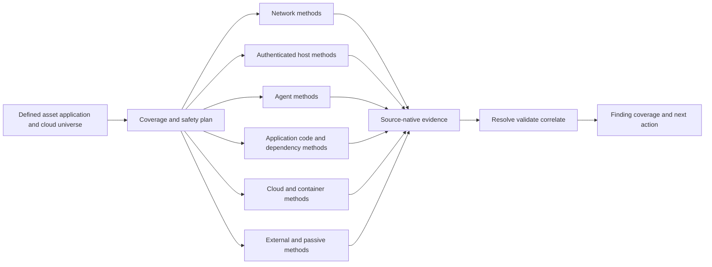

| Concept | Plain meaning | Key question | Common confusion |
|---|---|---|---|
| Asset discovery | Identify things that may exist | What is present or observable? | Inventory is complete because one source saw it |
| Service discovery | Identify reachable listeners/protocols/interfaces | What responds from this vantage point? | Reachable service equals vulnerable service |
| Vulnerability assessment | Test evidence against weakness conditions | Does a vulnerable condition likely apply? | Detection is proof without limitations |
| Inventory | Governed set of known entities and attributes | Which records represent real active assets? | Raw observations are unique assets |
| Coverage | Valid evidence over an intended population/check set/time | Which eligible things were successfully assessed? | Scheduled equals completed |
| Validation | Confirm positive or negative claim | What independent or native evidence supports it? | Rescan alone is always sufficient |
| Finding | Source observation tied to subject and check | What was observed, by whom, when, and how? | Finding equals unique risk episode |
| Clean result | Check did not detect condition under its method | What exactly was tested successfully? | No result equals safe |

## JD Mapping

| JD signal | Discovery capability developed | Customer/TSM artifact | Honest boundary |
|---|---|---|---|
| Deep technical expertise | Explain vantage, protocols, auth, evidence, and blind spots | Coverage architecture whiteboard | No production scanner operation claim |
| Customer success planning | Sequence safe sources and acceptance gates | Discovery rollout plan | Actual product support/entitlement must be verified |
| Troubleshoot complex environments | Isolate scope, path, auth, plugin, mapping, and identity faults | Layered scanner runbook | No invented root cause |
| Drive outcomes | Connect valid discovery to actionable findings and verified closure | Coverage-to-decision chain | Scan count is not outcome |
| Coordinate teams | Align network, endpoint, cloud, app, identity, risk, and change owners | RACI and rules of engagement | TSM does not authorize customer testing |
| Communicate proactively | State failed coverage and uncertainty alongside findings | Health/status brief | No false completeness assurance |
| Analyze data | Reconcile expected, attempted, successful, failed, and fresh cohorts | SQL/Power BI metric contract | Conceptual model is not a UVM schema |
| Improve adoption | Teach source-specific user routines and evidence review | Analyst/remediator curriculum | Login activity is not adoption |
| Support escalation | Provide exact target, scanner, check, time, path, auth, and evidence | Minimal reproducible case | No unsupported fix timing |
| Explore AI | Assist candidate duplicate grouping or evidence summaries under review | Guardrailed lab | No autonomous exploit testing or closure |

## Candidate honesty note

| Evidence class | Neutral statement | Boundary |
|---|---|---|
| Factual background | Arti has collected and interpreted Microsoft client, service, identity, permission, DNS, TCP, TLS, proxy, and trace evidence | This does not establish production vulnerability scanning |
| Transferable method | Scope, exact identity, vantage point, credential state, timestamps, hypotheses, and discriminating tests transfer directly | Tool-specific configuration remains to learn |
| Synthetic practice | NMH coverage plans, failure cases, and metrics are fictional exercises | No real customer result |
| Learned architecture | Arti can compare discovery approaches and safety controls from study and official guidance | Knowledge is not operator history |
| Public product fact | Only reviewed official claims are attributed as such | No undocumented feature or entitlement inferred |
| Unknown | Exact scanner plugin behavior, fields, APIs, limits, and tenant workflows require current documentation and tests | Unknown remains explicit |

## Beginner vocabulary and memory hooks

| Term | Plain meaning | Why it matters | Analogy / hook |
|---|---|---|---|
| Vantage point | Place or network position from which observation occurs | Visibility changes by source location | Which hospital entrance the inspector uses |
| Active discovery | Sends traffic or executes checks to obtain responses | Can reveal current services but can affect targets | Knock on doors |
| Passive discovery | Observes existing traffic/logs without initiating target probes | Lower direct impact but sees only activity that occurs | Watch corridor cameras |
| Authenticated scan | Uses approved credentials to inspect internal state | Usually improves package/configuration evidence | Technician enters with a key |
| Unauthenticated scan | Tests without logging into the target | Models an outsider or limited actor view | Visitor checks public doors |
| Agent | Software installed on or near a workload to collect local state | Persistent view, including remote/offline devices | Built-in equipment sensor |
| Agentless | Collects remotely through protocols or provider APIs | Avoids installed software but depends on reachability/API/credentials | Inspector uses remote records and keys |
| Plugin/check | Versioned detection logic for one condition | Defines evidence and false-result behavior | Inspection procedure card |
| Fingerprint | Observed traits used to infer product/version/service | Supports identification but can be ambiguous | Model inferred from label and shape |
| Credential | Secret or identity proof used to authenticate | Determines depth and creates security risk | Master key or staff badge |
| Privilege | Authorized actions available to an identity | Too little causes blind spots; too much increases blast radius | Which rooms the badge opens |
| Credentialed success | Proof that authentication and required checks worked | Separates a real clean result from failed access | Technician actually opened the panel |
| Scope | Explicit authorized population and methods | Prevents blind spots and unauthorized tests | List of rooms allowed for inspection |
| Frequency | How often assessment runs | Changes freshness and load | Daily rounds versus annual inspection |
| False positive | Finding reports a condition that is not actually present/applicable | Wastes effort and erodes trust | Alarm rings without a fire |
| False negative | Method misses a condition that is actually present | Creates false confidence | Smoke exists but alarm stays silent |
| Duplicate | Multiple records represent the same observation or exposure episode | Inflates backlog and creates repeated work | Same leak logged by three inspectors |
| Evidence | Observable information supporting a claim | Makes findings reviewable | Photo, meter reading, and timestamp |
| Rules of engagement | Approved boundaries and safety instructions for testing | Protects systems, people, and authorization | Inspection permit and stop rules |
| Rate limit | Bound on request volume or speed | Prevents overload and throttling | Limit inspectors entering at once |
| Ephemeral asset | Short-lived resource such as a container or temporary instance | Periodic scans may miss it | Pop-up clinic open for ten minutes |
| Attack surface | Set of reachable or interactable entry conditions | Guides external/internal discovery | All doors, windows, APIs, and trust paths |
| SBOM | Software Bill of Materials, a component inventory | Helps dependency applicability analysis | Ingredient list for software |
| SAST | Static Application Security Testing of code or build artifacts | Finds patterns before runtime | Review the blueprint |
| DAST | Dynamic Application Security Testing against a running application | Observes runtime behavior from an interface | Test the constructed building |
| SCA | Software Composition Analysis of third-party/open-source components | Maps dependencies to known issues and licenses | Check supplied parts against recalls |
| CSPM | Cloud Security Posture Management | Evaluates cloud configuration/control-plane risks | Review cloud-building rules and settings |

### Plain-English deep-dive 1 - Every scanner has eyes, a location, and a blind side

A scanner is not an all-seeing truth machine. Its observations depend on location, route, identity, privileges, timing, checks, target response, and interpretation. An external scanner may accurately show that a public listener is unreachable while an internal scanner reaches the same service. An unauthenticated check may infer a version from a banner; an authenticated check may read package state. An agent may know installed software while missing a load balancer that exposes it. A cloud API may know a security-group rule while not proving end-to-end application reachability.

This is why a source record needs a claim contract: "From vantage V, using method M and identity I, at time T, check version C observed evidence E about subject S, under limitations L." Without that sentence, a green or red icon is difficult to trust.

The immediate operational question is always, "What could this method have seen if everything worked, and what evidence proves that it did work?" That question catches failed credentials, blocked routes, unsupported systems, incomplete APIs, ephemeral workloads, and stale agents before silence becomes safety.

## Discovery architecture: complementary methods, not one winner

| Method | Primary vantage | Strength | Blind spot/tradeoff | Typical safety issue |
|---|---|---|---|---|
| External network scan | Internet/outside boundary | Public ports, protocols, banners, TLS, exposed services | Origins behind CDN/proxy, ownership, internal state | Provider terms, rate/load, IDS alerts |
| Internal network scan | Internal segment or scanner appliance | Reachable hosts/services and network checks | Segmentation, routing, dynamic assets, local package truth | Fragile services and network load |
| Authenticated host scan | Remote login/API into host | Installed packages, configuration, patch evidence | Credential/privilege failures, unsupported OS | High-value credentials and account lockout |
| Endpoint/server agent | On-host software | Persistent local inventory/config evidence | Agent coverage/health, overhead, tampering, image drift | Sensitive local data and update channel |
| Agentless management API | Cloud/virtualization/configuration API | Broad inventory/configuration without host software | Permission/scope/API lag, runtime detail | Overprivileged API identity |
| SAST | Source/build pipeline | Early code-pattern detection and code location | Runtime/config/business logic, noisy rules | Source-code sensitivity |
| DAST | Running web/API interface | Runtime behavior and exposed routes | Auth/crawl coverage, destructive payloads, code location | Data mutation and service impact |
| SCA/SBOM | Manifest/build/artifact/image | Third-party component identification | Installed is not executed/deployed/reachable | Proprietary dependency data |
| Container/image scan | Registry/image/runtime | Layer/package/base-image findings | Running drift, short-lived containers, app logic | Registry credentials and image contents |
| CSPM/cloud-native | Cloud control plane | Configuration, identity, resource relationships | Multi-cloud semantics, data-plane/runtime behavior | Broad cloud read permissions |
| IaC scan | Templates/policies before deployment | Preventive configuration checks | Runtime drift and external changes | Repository/secrets exposure |
| Passive network/log analysis | Existing traffic/events | Low active impact, observed behavior | Silent assets and encrypted/unsampled traffic | Payload/privacy retention |
| Manual review/pen test | Expert-selected scope | Business logic, chained conditions, validation | Point-in-time, sample, skill/cost | Intrusiveness and authorization |

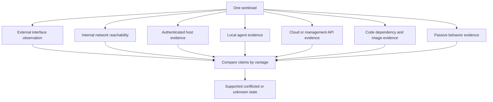

## Network discovery and scanning

Network methods send or observe traffic to discover addresses, hosts, ports, protocols, certificates, services, versions, and behaviors. Common conceptual stages are host discovery, port discovery, service identification, protocol negotiation, vulnerability checks, and evidence recording. Firewalls, proxies, load balancers, NAT, DNS, IPv6, segmentation, rate limits, and target defenses shape results.

| Network stage | Question | Evidence | Common error |
|---|---|---|---|
| Target resolution | Which names/addresses/ranges are in authorized scope? | Scope version, DNS/IPAM/cloud records | Scan stale IP or omit IPv6 |
| Reachability/host discovery | Does target respond to selected probes? | Probe type, response, path/time | No ping response means host absent |
| Port discovery | Which transport endpoints respond? | TCP/UDP behavior and timestamps | UDP silence interpreted as closed |
| Service fingerprint | Which protocol/product may be present? | Banner, handshake, response traits | Banner trusted as exact version |
| Vulnerability check | Does response match vulnerable condition? | Request/response and plugin logic | Version-only inference treated as confirmed |
| Authenticated enrichment | What local package/config state exists? | Login success and command/API result | Partial auth called full success |
| Validation | Does independent/native evidence agree? | Vendor/package/config/path checks | Repeat same weak check only |

An external scan answers, "What can this outside vantage observe?" An internal scan answers a different question from its segment. A scanner behind a proxy may see proxy behavior rather than origin behavior. A load balancer can distribute requests across patched and unpatched instances, creating intermittent evidence. Network Address Translation can cause one public address to represent many internal systems. DNS can point to a content-delivery network. Each finding must identify the observed endpoint and the inferred/confirmed underlying asset separately.

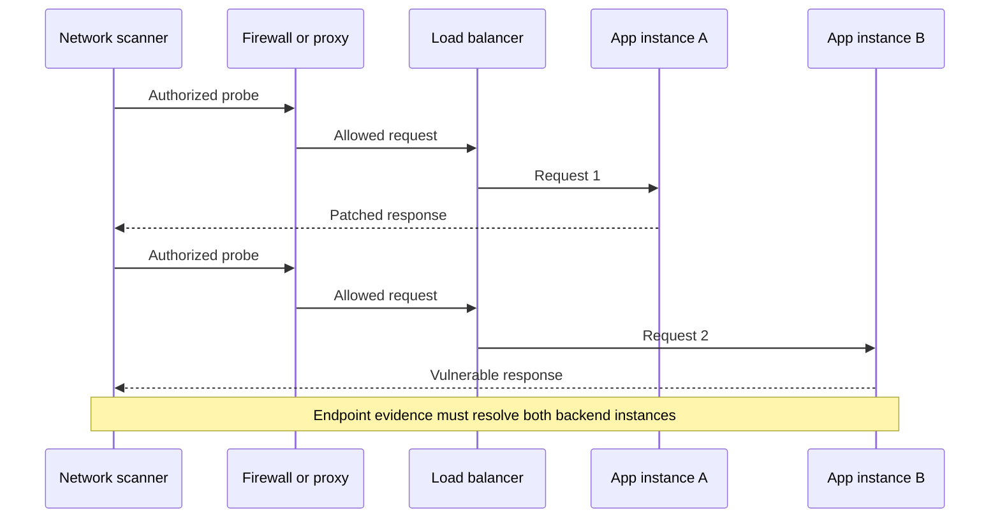

### Active versus passive discovery

Active methods can query otherwise quiet assets and control test inputs, but they can trigger load, alerts, or fragile behavior. Passive methods use existing flow, DNS, logs, packet metadata, endpoint events, or cloud audit trails. They reduce direct target interaction but cannot see an asset that produces no observed traffic, and encryption/sampling/retention can hide details.

| Dimension | Active | Passive |
|---|---|---|
| Initiates traffic | Yes | No target probe from the method |
| Quiet asset visibility | Potentially, if reachable | Usually poor until asset communicates |
| Current controlled test | Stronger | Limited to observed activity |
| Direct service impact | Possible | Lower direct impact |
| Privacy exposure | Probe/response data | Potentially broad user/traffic metadata |
| Main bias | Reachability and response behavior | Activity, sensor placement, sampling, retention |
| Best use | Authorized enumeration and specific checks | Complementary discovery, behavior, validation context |

## Authenticated versus unauthenticated assessment

An unauthenticated scan tests without logging into the target, approximating an outsider or limited actor for that path. It can identify exposed services and remotely observable weaknesses. An authenticated assessment uses an approved account, certificate, token, key, or API role to inspect internal package and configuration state.

Authenticated does not automatically mean complete. The identity may log in but lack registry, package, file, database, or configuration privileges. Commands can time out. Endpoint protection may block scripts. A jump host can alter the path. The scanner may support the operating system but not a custom appliance. Credential reuse across a large estate increases blast radius.

| Dimension | Unauthenticated | Authenticated |
|---|---|---|
| Perspective | External/limited user | Approved internal identity |
| Evidence | Network response, banner, protocol behavior | Package, build, registry, file, configuration, local API |
| Strength | Exposed attack surface and no-trust prerequisite | Deeper local applicability and patch state |
| Weakness | Version inference and hidden local state | Credential, privilege, support, and command coverage |
| Success proof | Target path/check completed | Login plus required privileged checks completed |
| Security concern | Scan traffic and target impact | High-value secret/identity compromise |
| Failure state | Unreachable/filtered/unknown | Auth failed/partial/unsupported/unknown |

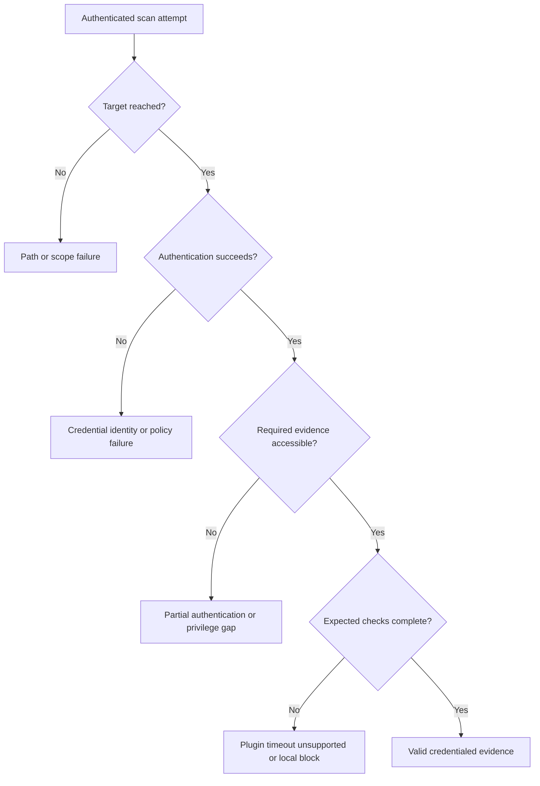

### Plain-English deep-dive 2 - Login success is not credentialed coverage

A technician can enter a hospital but still lack the key to the electrical cabinet. A scanner can authenticate to a host but fail to read package databases, security policy, registry paths, or running-process state. Calling that "credentialed scan succeeded" hides a material blind spot.

Measure at least: target attempted, network reached, authentication completed, privilege/elevation completed, required subsystem queries completed, checks executed, evidence fresh, and result linked to the correct asset. Publish failure reasons. A clean result is defensible only for checks that actually completed under a method able to observe the condition.

This maps closely to Arti's permission troubleshooting. A user could authenticate to Microsoft 365 but still lack SharePoint site, library, item, or sync permissions. "Login works" never proved end-to-end authorization. Scanner authentication needs the same layer-by-layer discipline.

## Credential architecture and lifecycle

Scanner credentials can read sensitive configuration across many systems. Treat them as privileged security infrastructure. Prefer dedicated non-human identities, least privilege for required checks, scoped target groups, secure vault storage, short-lived credentials where supported, controlled retrieval, network restrictions, rotation, monitoring, separation of duties, and emergency revocation. Avoid embedding secrets in scripts, tickets, screenshots, exports, or scanner logs.

| Lifecycle stage | Control | Evidence | Failure to avoid |
|---|---|---|---|
| Request | Document purpose, systems, exact permissions, owner, expiry | Approved access request | "Read-only" without permission analysis |
| Provision | Dedicated identity and scoped roles | Identity/role mapping | Shared personal/admin account |
| Store | Approved vault/encryption and restricted retrieval | Vault policy and access log | Plaintext config or spreadsheet |
| Use | Limit source networks, commands/APIs, time, and concurrency | Sign-in and command audit | Credential usable from anywhere |
| Monitor | Alert on unexpected target, time, privilege, or volume | IAM/SIEM rule and review | Abuse looks like normal scanning |
| Rotate | Test replacement and remove old secret | Rotation record and successful sample | Rotation causes silent coverage loss |
| Revoke | Rapid kill path for compromise/decommission | Tested revocation procedure | Orphaned credential remains valid |
| Review | Reconfirm owner, scope, privileges, necessity | Periodic access review | Privilege accumulates forever |

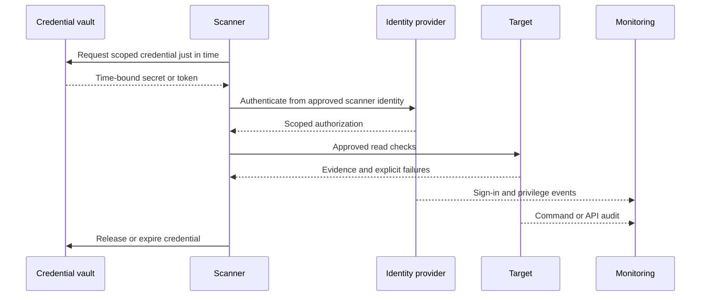

Credential troubleshooting should not weaken controls by granting broad administrator access as the default diagnostic. Use one representative target, compare expected permissions with access-denied evidence, test the smallest missing permission, and remove temporary elevation. Scanner vendors' current least-privilege documentation and customer security policy should govern exact roles.

## Agent-based assessment

An agent is software deployed on an endpoint, server, workload, or host to collect local data and send results. Agents can assess laptops away from the corporate network, observe installed packages and configuration, reduce central scan bursts, and report frequently. They can also become stale, disabled, incompatible, duplicated in images, or disconnected. An agent's presence is not the same as healthy, current, correctly scoped assessment.

| Agent dimension | Question | Evidence | Failure mode |
|---|---|---|---|
| Enrollment identity | Is this agent linked to the correct asset instance? | Stable device/cloud ID and enrollment event | Cloned image creates duplicate identity |
| Version/health | Is agent supported and functioning? | Version, heartbeat, self-health | Old heartbeat appears current |
| Policy | Which checks/configuration apply? | Policy ID/version and assignment | Wrong group excludes critical checks |
| Collection | Did required local queries complete? | Per-module result/failure | Agent online but module failed |
| Transmission | Did results reach service completely? | Sequence/checkpoint/ack | Proxy/TLS issue creates stale state |
| Tamper resistance | Can local user/malware disable or spoof it? | Protection state and alerts | Silence trusted after compromise |
| Resource impact | What CPU, memory, disk, network use occurs? | Pilot baseline and telemetry | Endpoint performance degradation |
| Decommission | Is stale agent/asset retired correctly? | Lifecycle reconciliation | Ghost assets and duplicate findings |

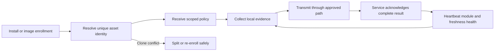

## Agentless and API-based assessment

Agentless methods collect through remote protocols, management planes, hypervisors, cloud APIs, snapshots, or orchestration services. They reduce endpoint software footprint and can cover resources that cannot host agents. They depend heavily on API permissions, account/subscription scope, pagination, rate limits, regional endpoints, resource-type support, and data freshness.

"Connected to cloud" is not a coverage claim. A role may enumerate virtual machines but not container registries, serverless functions, managed databases, or organization-level policies. One account may be missing from an organization. Deleted resources may linger in export data. Control-plane configuration does not prove data-plane reachability or runtime package state.

| Agentless layer | Acceptance question | Example defect |
|---|---|---|
| Organization scope | Are all intended accounts/subscriptions/projects registered? | Acquisition account absent |
| Authentication | Did token/certificate/role assumption succeed? | Expired secret or trust policy |
| Authorization | Can identity list every required object and property? | Resource visible, policy detail denied |
| Pagination | Were all pages/cursors completed exactly once? | First page only |
| Rate/quota | Were throttles retried without silent loss? | Partial inventory after 429 |
| Region/service | Are all intended regions and resource types supported? | Serverless or sovereign region absent |
| Temporal behavior | Are create/update/delete and late events handled? | Deleted asset remains active |
| Mapping | Are provider IDs and configuration semantics preserved? | Display-name collision |
| Runtime gap | Which host/app conditions cannot API data prove? | Package installed inside workload unknown |

## Application, API, dependency, and pipeline discovery

Applications need multiple views. SAST reviews source or compiled artifacts for code patterns. DAST interacts with a running application. **IAST**, Interactive Application Security Testing, observes an application during tests with instrumentation. SCA maps third-party dependencies. Secret scanning looks for credential material. IaC scanning checks deployment templates. API security testing discovers and exercises API definitions and runtime behavior. Manual review and penetration testing assess business logic and chains.

| Method | Sees well | Misses or complicates | Evidence grain |
|---|---|---|---|
| SAST | Code location, data flow, insecure API use | Runtime configuration, deployed version, business context | Repository/commit/file/rule/result |
| DAST | Runtime responses, exposed routes, auth/session behavior | Unreached paths, source location, hidden APIs | App instance/route/request/response/test |
| IAST | Runtime code path during tests | Only exercised paths, instrumentation compatibility | Build/runtime/test path |
| SCA | Declared/resolved libraries and known vulnerability mapping | Reachability, custom patches, undeclared/runtime components | Artifact/component/version/advisory |
| SBOM analysis | Component inventory and supplier relationships | Accuracy, freshness, deployment status | Product/build/component |
| Secret scan | Possible secrets in code/history/artifacts | Validity, scope, false patterns | Repository/commit/location/type |
| IaC scan | Misconfiguration before deployment | Runtime drift and manual changes | Template/resource/rule |
| API discovery/test | Undocumented/shadow endpoints and API behavior | Auth roles, coverage, destructive methods | API/version/operation/test identity |
| Manual business-logic test | Workflow abuse and chained conditions | Limited sample and repeatability | Scenario/steps/evidence |

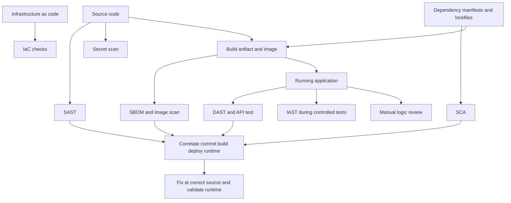

Application scanning needs authenticated crawl coverage, test users/roles, seed data, route/API inventory, state-reset procedures, excluded destructive actions, rate limits, test windows, and evidence redaction. A DAST scanner that reaches only the login page has not assessed the authenticated application. SAST rules can create false positives if sanitization or framework behavior is misunderstood. SCA can flag a component present but unreachable, or miss a vendored/renamed component. Correlation should preserve each source's claim rather than erase disagreement.

### Plain-English deep-dive 3 - Build, deploy, and run are different truths

A blueprint can contain a defect that never reaches construction. A warehouse can hold a recalled component that was never installed. A building can run with an old component even after the blueprint and warehouse are corrected. Software works the same way.

A source repository, dependency manifest, compiled artifact, container image, deployment record, and running process are different grains. Fixing code does not prove a new build. Building does not prove deployment. Deployment does not prove every old instance terminated. Runtime validation does not prove the pipeline cannot recreate the issue. A complete remediation chain links commit -> build -> artifact -> image -> deployment -> instance -> route and verifies the correct postconditions at each relevant point.

## Cloud, containers, Kubernetes, and ephemeral assets

Cloud resources are dynamic and API-driven. Containers and serverless instances may live for seconds or minutes. Periodic network scans can miss them entirely. Discovery therefore combines organization/account registries, cloud control-plane APIs, image/registry analysis, cluster/workload inventory, admission/pipeline controls, runtime telemetry, and external path evidence.

| Cloud/workload object | Discovery sources | Key identity | Blind spot |
|---|---|---|---|
| Cloud account/subscription/project | Organization registry and provider API | Provider + tenant/org + account ID | Unregistered acquisition/shadow account |
| Virtual machine | Provider API, agent, network, image | Provider resource ID + instance lifecycle | Reused IP/name and image/runtime drift |
| Container image | Registry, build pipeline, SBOM | Registry/digest | Tag mutable; image may not run |
| Running container | Cluster/runtime inventory | Cluster/namespace/workload/pod/container UID | Short lifetime and rescheduling |
| Kubernetes configuration | Cluster API, IaC, policy controller | Cluster and object UID | RBAC/API permission gaps |
| Serverless function | Provider API, package/dependency analysis | Function/version/alias ID | Runtime managed layer and rapid versions |
| Managed database | Provider API, network/config evidence | Provider resource ID | Provider-managed patch internals |
| Storage service | Provider API and data-security context | Account/bucket/object scope | Public policy versus effective access |
| SaaS application | SaaS API, identity, configuration, vendor evidence | Tenant/application stable ID | Customer cannot host-scan provider service |

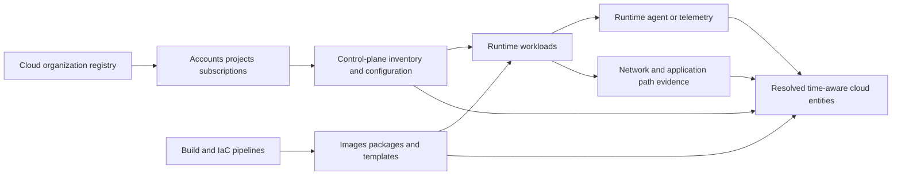

Ephemeral coverage may be measured through preventive control coverage and runtime observation rather than "scanned every instance." For example, assess every immutable image digest before promotion, enforce approved admission policy, monitor deployed digest inventory, and sample runtime controls. The measure must state its grain: image coverage is not container-instance coverage.

## Scope, coverage, and frequency engineering

The denominator for coverage comes from an independent intended population. Then define eligibility, method, expected checks, success state, freshness, and exclusions. One useful funnel is: registered -> eligible -> attempted -> reached -> authenticated where required -> checks completed -> evidence fresh -> resolved to asset -> decision-ready.

| Funnel state | Definition | Evidence | Must remain separate from |
|---|---|---|---|
| Registered | Expected population under scope contract | Account/range/asset/app registry | Scanner-discovered only |
| Eligible | Method supports and policy permits assessment | Support and rules-of-engagement mapping | Excluded/unsupported |
| Attempted | Scheduled job actually targeted subject | Run/target record | Merely configured target |
| Reached | Required path connected | Network/API response | Host alive by another method |
| Authenticated | Identity accepted | Auth event | Required privilege complete |
| Checks completed | Expected modules/checks succeeded | Per-check completion | Job "success" summary |
| Fresh | Evidence within governed age | Observation timestamp | Ingestion timestamp only |
| Resolved | Evidence linked to correct active entity | Strong ID and lifecycle | Hostname/IP guess |
| Decision-ready | Quality supports intended use | Acceptance rule result | Unknown/conflicted cohort |

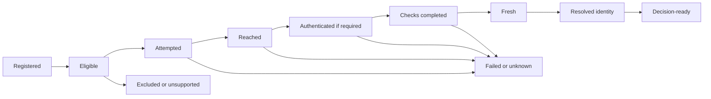

### Frequency and freshness

Frequency should reflect asset lifetime, exposure, change rate, threat urgency, method cost, and operational safety. A daily scan does not guarantee daily evidence if jobs fail. Continuous agent reporting can still be stale. A monthly full authenticated assessment may be paired with event-triggered checks after deployments and urgent advisories. Cloud inventory may need frequent API updates because resources are short-lived. Fragile OT/clinical devices may require lower-impact methods and vendor-approved windows.

| Trigger/cadence | Use | Tradeoff/control |
|---|---|---|
| On commit/pull request | SAST, SCA, secrets, IaC prevention | Fast feedback; tune developer noise |
| On build/image publish | Artifact/SBOM/image assessment | Block promotion under approved policy |
| On deployment | Verify deployed artifact/configuration | Link build to runtime identity |
| Event-driven advisory | Check exact affected population quickly | Avoid unsafe emergency broad scans |
| Continuous/passive | Observe new assets/behavior | Sampling and privacy limits |
| Daily/weekly network | Current service exposure by risk tier | Load and path coverage |
| Periodic authenticated | Deep host configuration/package state | Credential safety and maintenance windows |
| After remediation | Validate postconditions | Ensure source health and exact asset |
| After source/policy change | Baseline and regression | Expect metric discontinuity; communicate |

## Evidence quality and fingerprinting

A detection should explain why it fired. Strong evidence might include exact package manager output, file build/hash, registry/configuration value, vendor API field, authenticated command, protocol behavior, code path, dependency lockfile, image digest, or safely captured request/response. Weak evidence includes product-name resemblance, stale banner, generic port, unresolved DNS, or version inferred through an intermediary.

| Evidence strength | Example | Confidence use | Validation |
|---|---|---|---|
| Direct native | Package/build/config queried locally | Strong applicability evidence if source healthy | Vendor advisory and runtime relevance |
| Direct behavior | Controlled request produces defined vulnerable behavior | Strong for tested path/version | Safety, exact target, alternative explanation |
| Signed inventory | Provider/vendor-signed artifact or SBOM | Strong component identity | Deployment/runtime and freshness |
| Corroborated inference | Banner plus TLS/product behavior plus inventory | Supported, not absolute | Authenticated/native check |
| Single weak inference | Open port or generic header | Candidate | Additional fingerprinting |
| Missing/failed | Timeout, denied permission, stale agent | Unknown | Restore path/auth/source, do not mark clean |

Fingerprints can be intentionally hidden or altered. Backported patches can make version comparisons tricky. Middleboxes can respond on behalf of targets. A scan should preserve the raw observable and the inference separately: `observed header X`; `inferred product Y`; `mapped vulnerability Z`. That makes corrections possible.

## False positives, false negatives, and uncertainty

A false positive is a reported condition that is not present or applicable. A false negative is a missed condition that is present. **Precision** asks what proportion of reported positives are true under a review sample. **Recall** asks what proportion of actual positives the method finds, but actual positives are difficult to know without a reference set. Neither metric should be reported without sampling design, population, confidence, and detection version.

| Error source | False positive path | False negative path | Control |
|---|---|---|---|
| Product/version inference | Banner maps to affected version but backport fixed | Banner suppressed or spoofed | Native package/build and vendor advisory |
| Authentication | Partial evidence misread as vulnerable default | Failed login produces no local findings | Explicit auth/check completion states |
| Scope | Old retired IP scanned as active asset | New subnet/account omitted | Independent universe reconciliation |
| Timing | Finding remains after asset replaced | Short-lived vulnerable instance disappears before scan | Event/runtime data and lifecycle time |
| Load balancer | One backend response applied to all | Patched backend sampled, vulnerable backend missed | Resolve backend identities and repeated/targeted tests |
| SAST rule | Sanitized path flagged | Unsupported language/path not analyzed | Rule tuning plus positive/negative fixtures |
| SCA mapping | Package name/version matches wrong ecosystem | Vendored/renamed dependency missed | Lockfile/hash/SBOM and build inspection |
| Cloud permissions | Missing field defaulted to unsafe | Denied objects absent from results | Permission completeness and unknown state |
| Control behavior | WAF blocks test, scanner says not vulnerable | WAF hides underlying vulnerable origin | Distinguish vulnerability from effective path/control |
| Data pipeline | Duplicate join creates findings | Parse reject drops findings | Control totals, rejects, lineage, regression |

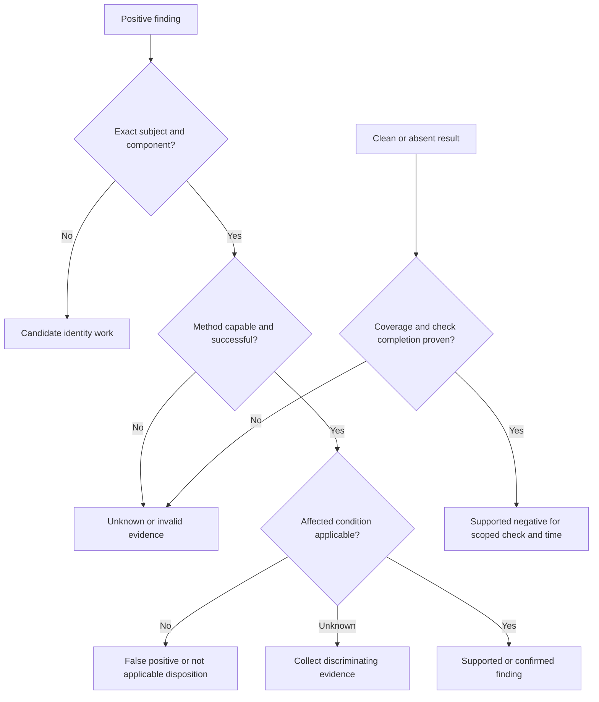

### Plain-English deep-dive 4 - A false positive is not the only bad result

Teams often focus on false positives because they create visible wasted tickets. False negatives are quieter and can be more dangerous. Unknowns are also important: the method did not obtain enough evidence to decide. A stale agent, failed credential, blocked path, unsupported plugin, or missing cloud account is not a false negative until a missed real condition is established, but it is a coverage failure that can create one.

Use three-valued or multi-state logic instead of forcing `vulnerable=true/false`. States such as supported positive, supported negative, candidate, conflicted, failed coverage, unsupported, stale, and not applicable preserve the real decision. Power BI and SQL should not coalesce null evidence to zero.

## Duplicates, correlation, and finding episodes

Multiple sources can report the same vulnerability on the same component. One source can emit a new ID each scan. A base image and every derived container can share one root cause but remain distinct running exposures. A load-balanced service can have one endpoint and several backend findings. Deduplication must define grain and preserve provenance; it must not erase source disagreement or distinct instances.

| Duplicate type | Example | Correct handling | Risk if wrong |
|---|---|---|---|
| Exact source replay | Same source event delivered twice | Idempotent ingest by source event ID | Double count/ticket |
| Recurring observation | Same condition observed in later scan | Update one episode observation history | Age resets every scan |
| Cross-source corroboration | Agent and authenticated scanner find same package/CVE | One episode with two assertions if identity/grain match | Duplicate remediation |
| Shared root cause | Many assets from one vulnerable image | Keep asset episodes; group campaign/root cause | Merge hides blast radius or per-instance state |
| Endpoint/backend | Public service and backend host findings | Relate endpoint path to exact backend episodes | Overmerge or miss one backend |
| False asset merge | Same hostname/IP across lifecycle | Keep separate temporal identities | Wrong owner and closure |
| False split | One cloud instance appears under name/IP/resource records | Resolve with strong namespaced ID | Inflated assets/findings |
| Similar CVEs | Related but distinct vulnerability records | Keep separate unless authoritative relationship says otherwise | Wrong patch/validation |

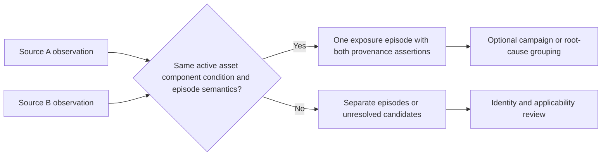

A stable episode generally preserves original detection age through repeated observations and reopen events. Closure requires postconditions, not disappearance from one feed. If a source changes its plugin identity, map the old and new observations only with evidence. Keep source-native records immutable enough to reproduce the decision.

## Validation strategies

Validation should be proportional to consequence and evidence quality. A low-impact version match might be validated through authenticated package state and vendor advisory. A public critical application issue may need application-owner review, code/runtime evidence, safe route tests, and control validation. Possible compromise belongs with incident response.

| Validation method | Best for | Limitation |
|---|---|---|
| Repeat same check | Transient error and reproducibility | Repeats same blind spot |
| Different vantage | Path-dependent reachability | Still may observe intermediary |
| Authenticated/native query | Package/configuration applicability | Credential and privilege dependencies |
| Vendor advisory/build mapping | Backports and affected versions | Vendor data can update or be incomplete |
| Code review | SAST/application logic | Requires expertise and exact deployed commit |
| Safe DAST/manual reproduction | Runtime behavior | Authorization, state, and service impact |
| Control simulation | Mitigation effectiveness | Scoped test does not prove all bypasses |
| Change and postcondition test | Remediation closure | Must link exact asset and old/new state |
| Independent source | Corroboration | Independence and semantic differences matter |
| Incident investigation | Attempt/success/impact | Separate process with evidence preservation |

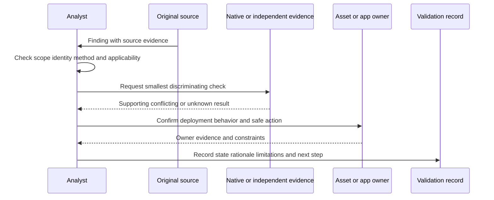

## Safety, privacy, and rules of engagement

A **Rules of Engagement**, or ROE, document is written authorization defining what testing may occur. It should identify sponsors, test team, target identifiers, included/excluded systems, methods, credentials, timing, source addresses, rate/concurrency, data handling, prohibited actions, stop conditions, emergency contacts, incident process, third-party permissions, and reporting.

| ROE element | Question | Example guardrail |
|---|---|---|
| Authority | Who can permit and stop the test? | Named customer sponsor and operations stop contact |
| Scope | Which exact assets/interfaces/accounts are included? | Stable IDs and ranges; explicit exclusions |
| Method | Which probes/checks/payloads are allowed? | Safe checks only for fragile cohort |
| Timing | When can testing occur? | Change window and blackout periods |
| Load | What rate/concurrency ceiling applies? | Start low; monitor; automatic stop threshold |
| Credentials | How are identities provisioned, stored, used, and revoked? | Vaulted dedicated least-privilege identity |
| Data | What may be collected, retained, exported, or redacted? | No patient data; minimal response capture |
| Destructive action | Which actions are prohibited? | No data deletion, persistence, denial of service |
| Stop conditions | Which health/alert/user signal pauses work? | Latency/error threshold or owner request |
| Incident handling | What if compromise or impact is suspected? | Preserve evidence and contact defined team |
| Third party | Are provider/vendor tests permitted? | Contract and provider policy checked |
| Cleanup | What accounts, files, agents, data, or settings must be removed? | Post-test inventory and revocation |

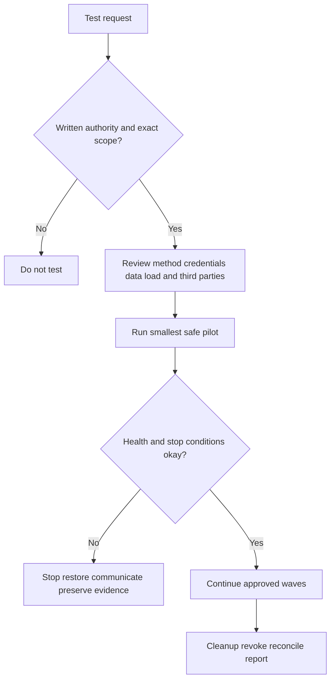

Clinical, OT, network, identity, and legacy systems deserve special caution. Even a standards-compliant request can trigger a defect. Coordinate with vendors and service owners, use non-intrusive methods where required, and never infer permission from technical reachability.

## Operational troubleshooting

| Symptom | Plausible causes | Cheap discriminating check | Safe action |
|---|---|---|---|
| Host absent | Wrong scope, DNS/IP reuse, firewall, host down, discovery probe blocked | Independent registry and targeted permitted connection | Mark unknown; verify identity/path |
| Auth failures spike | Rotation, lockout, policy/MFA, trust, clock, vault retrieval | One target sign-in/audit and secret version | Pause broad retries; protect account |
| Auth succeeds but findings vanish | Privilege/module failure, plugin change, package DB issue | Per-check completion and native query | Mark partial; no auto-closure |
| Scan takes much longer | Scope growth, latency, retries, throttling, hung plugin | Stage durations and target counts | Reduce/pause safely; isolate stage |
| Service impact | Rate/concurrency, fragile check, resource exhaustion | Timeline against probe/check and target telemetry | Stop under ROE; restore and incident/RCA |
| App scan covers login only | Auth/crawl/session/role/CSRF issue | Route inventory and authenticated test user replay | Fix test harness in nonproduction first |
| Cloud assets drop | Permission/account/region/pagination/rate issue | Provider-native counts and API denial logs | Caveat reports; stop false closure |
| Agent duplicates | Cloned ID, reimage, hostname reuse | Enrollment/device/cloud stable IDs and lifecycle | Freeze merge/actions; re-enroll/split |
| Findings duplicate | Replay, unstable source ID, grain mismatch | Compare source IDs and asset/component/CVE/time | Reconcile before ticketing |
| False positives rise | Plugin update, banner inference, mapping change | Before/after sample and native evidence | Tune/rollback under governance |
| False negatives suspected | Unsupported method, scope/auth gap, timing, control hides origin | Seeded safe test/reference set or independent source | Investigate coverage; do not claim clean |
| Rescan still open | Patch not active, wrong asset, alternate instance/path, stale cache | Native runtime and exact route/backend | Reopen plan; reconcile identity |

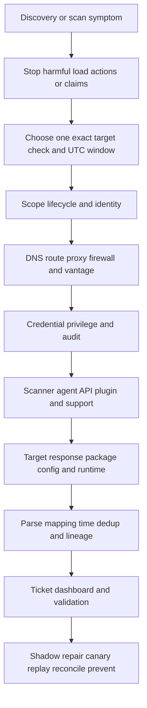

### Minimal escalation package

| Field | Content |
|---|---|
| Summary | One sentence expected versus actual behavior |
| Impact | Coverage, findings, actions, users/services affected |
| Exact IDs | Tenant/account if appropriate, scanner, job, target, asset, plugin/check, finding |
| Time | UTC first/last occurrence and successful baseline |
| Environment | Vantage, path, proxy/firewall, OS/app/cloud, versions |
| Credential state | Auth method, success/partial/failure, privilege evidence, no secret material |
| Reproduction | Smallest authorized steps and frequency |
| Evidence | Sanitized logs, request/response, native result, source health, screenshots if needed |
| Changes | Credential, policy, plugin, scope, network, target, upgrade changes |
| Tests | Hypotheses attempted and outcomes |
| Containment | Paused scan/automation/report caveat and customer status |
| Ask | One bounded diagnostic or clarification request |

## Complete synthetic NMH discovery program

Everything below is fictional and synthetic. Future schedule dates are labeled accordingly and do not change the official source-review date of 2026-08-24.

### Synthetic coverage objective

NMH chooses four initial services: patient portal, workforce endpoints, laboratory integration, and cloud analytics. The first synthetic discovery wave begins **2026-09-14 (fictional future schedule date)**. The goal is not "scan everything"; it is "establish decision-ready, safe, fresh vulnerability evidence for each defined population, with failed coverage visible."

| Population | Expected source/method mix | Key safety rule | Decision-ready definition |
|---|---|---|---|
| Public patient portal | External network, authenticated host, DAST, SCA, cloud API | Production DAST excludes destructive methods; canary test user | Exact backend/component, valid path/app evidence, current auth/source health |
| Workforce endpoints | Agent plus management inventory and periodic network sample | Resource pilot and privacy minimization | Healthy agent modules, stable device identity, fresh package/config evidence |
| Laboratory integration | Vendor-approved authenticated/passive checks and limited network probes | Separate ROE, low rate, immediate stop contact | Supported method, exact device/firmware, path/control evidence |
| Cloud analytics | Organization/account registry, cloud API, image/SBOM, runtime inventory | Least-privilege cross-account role and quota monitoring | Complete account/region/resource scope, digest/runtime relationship |

### Synthetic baseline funnel

| State | Count | Interpretation |
|---|---:|---|
| Registered eligible assets/workloads | 12,600 | Independent denominator |
| Attempted in current window | 12,410 | 190 scheduling/scope defects |
| Reached/API visible | 11,980 | Path/account gaps remain |
| Required authentication succeeded | 10,940 | Not every method requires auth; cohort-adjusted |
| Expected checks completed | 10,520 | Partial module failures visible |
| Fresh and resolved | 10,310 | Identity/freshness defects remain |
| Decision-ready | 9,880 | Candidate/conflicted evidence excluded from automation |

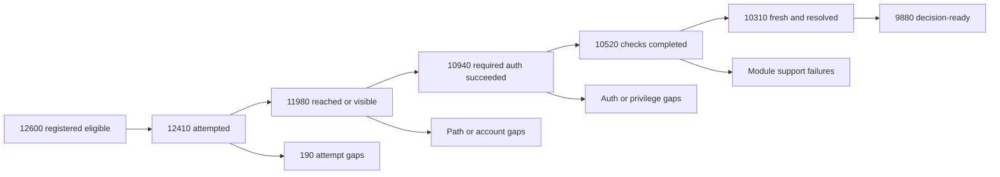

The counts are synthetic and cohort-adjusted; they are not a claim that all 12,600 require the same authentication. The funnel demonstrates why one coverage percentage hides failure layers.

### Scenario 1: credential rotation creates false improvement

NMH rotates a server-scan credential. Authentication summary remains green because login succeeds, but privilege elevation fails on 38 percent of Linux systems. Findings fall sharply. The operator compares per-subsystem completion rather than total job state, pauses auto-closure, fixes the least-privilege elevation rule on one sample, rotates no broader privilege than necessary, reruns the cohort, and replays results by stable episode ID. The report is restated; an invariant now blocks clean status when package queries fail.

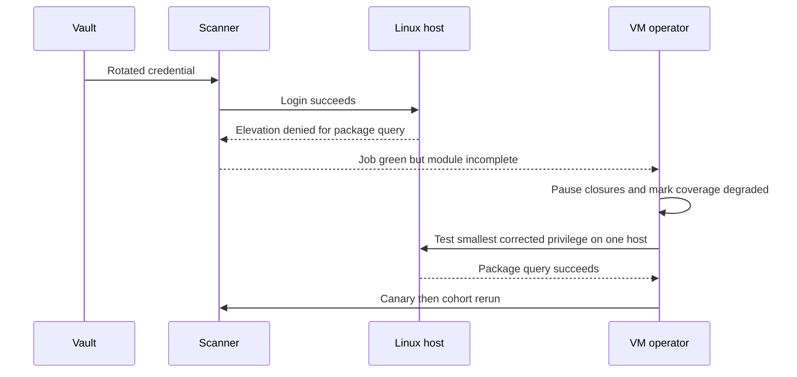

### Scenario 2: cloned agent identity merges two endpoints

A virtual desktop image accidentally includes an enrolled agent identity. Forty instances appear as one asset with rapidly changing IPs and packages. NMH freezes assignments and closures for that identity, separates each instance using virtualization resource IDs and enrollment events, re-enrolls agents through the corrected image process, reconstructs finding provenance, reconciles tickets and reports, and adds an image check preventing enrolled state from publication.

### Scenario 3: DAST reports login page coverage only

The patient portal DAST job says success and reports no high findings. Route telemetry shows it visited only six public routes; 143 authenticated routes and three user roles were not exercised because the test user's multifactor/session flow changed. NMH marks authenticated DAST coverage unknown, updates the test harness in staging, reviews route and API inventories, tests role boundaries with synthetic accounts, canaries a safe production run under ROE, and reports coverage by route/role rather than job status.

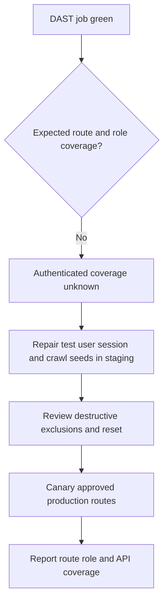

### Scenario 4: cloud pagination omits one account region

Cloud findings fall after a connector update. Native provider inventory remains stable. One API cursor is not followed after throttling, and one acquisition account lacks organization role trust. NMH marks cloud coverage degraded, disables false resolution, corrects retry/checkpoint behavior and access through approved channels, backfills the missing page/account, reconciles resource IDs and finding episodes, and adds account/region/native count acceptance checks.

### Scenario 5: WAF hides vulnerable origin behavior

An external scan cannot reproduce a web vulnerability because the WAF blocks the payload. An authenticated host source confirms the vulnerable component at the origin. NMH records two truths: underlying vulnerability supported; current tested public path mitigated for the tested request. The team validates WAF coverage and bypass limits, keeps durable component remediation open, tests alternate paths/origins under authorization, and avoids either "false positive" or "fully safe" as the conclusion.

### Scenario 6: safe stop prevents clinical impact

A vendor-approved low-rate probe against a laboratory integration produces latency above the ROE threshold. The scanner automatically stops, operations confirms recovery, evidence is preserved, and the event enters incident/change review. The team does not resume by simply lowering alert sensitivity. It works with the vendor and laboratory owner to select passive/configuration evidence and a nonproduction reproduction. Safety takes precedence over scan completeness.

### Synthetic customer review narrative

"Decision-ready pilot coverage is 9,880 of 12,600 eligible records under method-specific definitions, not a claim of complete security. Credential elevation failure invalidated one apparent finding reduction; closures were paused and the trend restated. DAST authenticated coverage is recovering after session-flow change and is reported by route/role. The cloud cohort is backfilling one account and cursor gap. The laboratory probe stopped correctly at its safety threshold, and alternate evidence is under vendor review. Decisions requested are approval of the cloud least-privilege role update, ownership of 190 unscheduled assets, and a staging test-user maintenance process."

## Customer and TSM artifact kit

| Artifact | Purpose | Minimum contents | TSM value |
|---|---|---|---|
| Discovery strategy | Match methods to populations/outcomes | Scope, methods, vantage, blind spots, safety, owners | Facilitate complementary architecture |
| Coverage contract | Define success honestly | Denominator, eligibility, stages, freshness, failures | Prevent misleading percentages |
| Vantage map | Show path-dependent visibility | Scanner/sensor positions, routes, proxies, segments | Accelerate fault isolation |
| Credential design | Protect and measure authenticated checks | Identity, roles, vault, use, monitoring, rotation, revoke | Coordinate security and operability |
| ROE | Authorize safe testing | Scope, methods, rate, timing, data, stop, contacts | Ensure implementation readiness |
| Source evidence contract | Make findings reviewable | IDs, time, method/check version, raw evidence, limitation | Improve trust and Support cases |
| App coverage plan | Govern route/role/code/build/runtime testing | Inventories, test identities, state/reset, exclusions | Connect AppSec tools to evidence |
| Cloud acceptance matrix | Validate account/API completeness | Accounts, regions, resources, permissions, pages, quotas | Expose connector gaps |
| False-result review | Learn precision/coverage defects | Sample, reference, cause, rule/version, disposition | Tune without hiding unknowns |
| Episode correlation rules | Prevent duplicate work | Grain, keys, time, provenance, merge/split, reversal | Preserve source disagreements |
| Validation plan | Choose independent postconditions | Native, source, path, control, service checks | Close condition rather than ticket |
| Health dashboard | Publish method reliability | Attempt/reach/auth/check/fresh/resolve states | Make source failure visible |
| Escalation packet | Reproduce product/source issue | Exact target/job/check/time/path/auth/evidence/ask | Improve Support/Product partnership |

## Safe labs and exercises

| Lab | Exercise | Deliverable | Pass condition |
|---|---|---|---|
| 1 | Teach the hospital-inspection analogy | Whiteboard | Every method has vantage, evidence, blind spot, safety |
| 2 | Build a method comparison | Coverage matrix | Agent, agentless, network, app, cloud all represented |
| 3 | Map external/internal vantage | Network diagram | Proxy/load balancer/origin and IPv6 included |
| 4 | Design authenticated success states | Funnel | Login and privilege/check completion separated |
| 5 | Draft least-privilege credential request | Access design | Purpose, role, vault, audit, rotation, revoke included |
| 6 | Create ROE | One-page synthetic permit | Scope, methods, load, data, stop, contacts explicit |
| 7 | Diagnose credential rotation | Timeline/runbook | No broad admin grant; closures pause |
| 8 | Diagnose agent clone | Identity repair plan | Downstream findings/tickets reconciled |
| 9 | Build SAST/SCA/build/runtime lineage | Graph | Commit through running instance linked |
| 10 | Design DAST authenticated coverage | Route-role matrix | Test accounts, state, exclusions, reset, evidence |
| 11 | Model cloud API acceptance | Account/region/resource matrix | Permission, pagination, quota, deletes tested |
| 12 | Design ephemeral coverage | Image/admission/runtime contract | Grain and prevention/runtime measures distinct |
| 13 | Review ten synthetic positives | Disposition ledger | Supported, candidate, FP, NA, conflict used correctly |
| 14 | Seed safe reference cases | Precision/recall exercise | Sampling limitations stated |
| 15 | Correlate cross-source duplicates | Episode model | Provenance retained; false merge/split reversible |
| 16 | Validate WAF mitigation | Path/control test plan | Underlying vulnerability remains separate |
| 17 | Investigate finding drop | Layered evidence packet | Scope/source/auth/check/pipeline all tested |
| 18 | Build Power BI coverage funnel | Wireframe | Failed and unknown states cannot disappear |
| 19 | AI duplicate-assist tabletop | Guardrail checklist | Suggestions reviewed; no autonomous merge/closure |
| 20 | Interview rehearsal | Q1-Q8 recording | Claims stay factual, synthetic, and source-bounded |

## Arti bridge: support diagnostics to discovery engineering

| Factual strength | Discovery transfer | Example phrasing | Boundary |
|---|---|---|---|
| OneDrive/SharePoint support | Exact tenant/user/device/site/item identity and permissions | "A successful sign-in never proved end-to-end access; scanner auth is equally layered." | Not production credentialed scanning |
| Networking/traces | Vantage, DNS, TCP, TLS, proxy, route, response analysis | "I ask what the observer could see from that path and time." | Testing still needs ROE |
| Escalations | Expected/actual, UTC, evidence, containment, owner, checkpoint | "I can build a minimal reproducible scanner case without inventing cause." | No fix ETA promise |
| SQL | Funnel counts, anti-joins, duplicates, temporal records, null semantics | "Missing evidence remains unknown rather than coalescing to zero." | Conceptual source model only |
| Power BI | Method-specific coverage and health dashboards | "A green tile must drill to failed authentication and freshness states." | No UVM UI claim |
| Mentoring | Teach methods and review analyst routines | "I use examples and pass criteria, then observe real task quality." | Current tool docs govern procedure |
| AI | Candidate grouping and cited summaries | "AI can suggest duplicate candidates; stable identity and human review decide." | No autonomous scanning or action |

## Common misconceptions to correct

| Misconception | Correction |
|---|---|
| One scanner sees everything | Every method has vantage, identity, timing, and check blind spots |
| Scan scheduled means scan completed | Attempt, reach, auth, checks, freshness, and identity must pass |
| Host did not answer ping, so it is absent | Discovery probes can be blocked while services remain reachable |
| Open port proves vulnerability | It proves a scoped response, not product/version/applicability by itself |
| Banner equals exact version | Banners can be stale, hidden, modified, or intermediary-generated |
| Authenticated login means deep coverage | Required privileges and subsystem checks must complete |
| More privilege always fixes scan quality | It raises blast radius; diagnose and grant the smallest required access |
| Agent installed means covered | Enrollment identity, health, policy, modules, transmission, and freshness matter |
| Agentless means credentialless | Remote protocols and APIs usually still require trusted identities/permissions |
| Cloud API inventory proves runtime state | Control-plane and runtime/data-plane evidence differ |
| SAST proves deployed vulnerability | Code, build, artifact, deployment, and runtime are distinct |
| SCA package presence proves exploitability | Deployment, reachability, configuration, and runtime use still matter |
| DAST job success means application coverage | Authenticated routes, roles, APIs, and state must be measured |
| No findings means clean | Failed scope/auth/method may create unknown or false negative |
| All source disagreements are false positives | Sources may observe different layers or times |
| Deduplication means delete extra source records | Preserve provenance and correlate under explicit grain |
| Rescan closure proves service safety | Validate native state, path/control, service, and recurrence as needed |
| Reachable target authorizes testing | Written customer and third-party authority is required |
| High scan speed is always better | Rate and method must protect target and network health |
| AI can tune scanners automatically | Security, evidence, human review, rollback, and authority remain mandatory |

## Official Source Anchors

Research/source snapshot and review date: **2026-08-24**.

The sources below support general testing, assessment, control, application-security, cloud, and vulnerability-management concepts. NIST SP 800-115 is older but remains useful planning context; current customer, vendor, cloud-provider, OWASP, and product guidance governs detailed techniques. No source authorizes testing a real system.

| Source | URL | Used for | Boundary |
|---|---|---|---|
| NIST SP 800-115 | https://csrc.nist.gov/pubs/sp/800/115/final | Planning/conducting technical security tests, analyzing findings, mitigation strategy; vulnerability scanning context | Published 2008; tailor to modern systems and current authorization |
| NIST SP 800-53 Rev. 5 | https://csrc.nist.gov/pubs/sp/800/53/r5/upd1/final | RA-5 vulnerability monitoring/scanning and broader access, audit, configuration, assessment, integrity controls | Catalog requires organization-specific selection and implementation |
| NIST SP 800-40 Rev. 4 | https://csrc.nist.gov/pubs/sp/800/40/r4/final | Patch-management identification, prioritization, acquisition, installation, and verification | Discovery is broader than patching |
| NIST Cybersecurity Framework 2.0 | https://www.nist.gov/cyberframework | Govern/Identify/Protect/Detect/Respond/Recover outcomes | Voluntary and profile-specific |
| OWASP Web Security Testing Guide | https://owasp.org/www-project-web-security-testing-guide/ | Web application testing categories and methodology | Requires current version, authorization, and application-specific safety |
| OWASP Application Security Verification Standard | https://owasp.org/www-project-application-security-verification-standard/ | Application-security verification requirements/context | Not a scanner completeness guarantee |
| OWASP Software Component Verification Standard | https://owasp.org/www-project-software-component-verification-standard/ | Software-component analysis and verification context | SBOM/SCA quality and deployment relevance still need validation |
| CISA Cloud Security Technical Reference Architecture | https://www.cisa.gov/resources-tools/resources/cloud-security-technical-reference-architecture | Cloud shared-responsibility and security architecture context | Not a scanner or provider-specific procedure |
| CVE Program | https://www.cve.org/ | Vulnerability-record identifiers used in findings | CVE is not proof of applicability |
| CWE | https://cwe.mitre.org/ | Weakness categories relevant to application/static analysis | Mapping may be broad or uncertain |
| FIRST CVSS | https://www.first.org/cvss/ | Technical severity context for scanner findings | Not coverage, exploit probability, or customer risk |
| Zscaler Unified Vulnerability Management | https://www.zscaler.com/products-and-solutions/vulnerability-management | Public positioning that UVM ingests vulnerability/exploitability and contextual third-party/Zscaler data | No claim that UVM performs every discovery method or replaces source tools |
| Zscaler Data Fabric integrations | https://www.zscaler.com/products-and-solutions/data-fabric/integrations | Public examples of varied vulnerability, cloud, application, asset, identity, and intelligence source categories | Catalog changes; verify exact connector, object, direction, permission, and entitlement |

## Likely Interview Questions

### Q1. Why does an enterprise need multiple vulnerability-discovery methods?

**Model answer:** Each method observes from a different vantage and evidence layer. External and internal network methods see reachable interfaces; authenticated checks see local packages/configuration; agents cover local and remote endpoints; cloud APIs see control-plane resources; SAST/SCA/IaC inspect predeployment code/components; DAST sees runtime interfaces; passive telemetry sees actual activity. I define the intended population, map complementary methods and blind spots, reconcile source claims, and keep unsupported or failed coverage visible.

### Q2. What is the difference between authenticated and unauthenticated scanning?

**Model answer:** Unauthenticated scanning tests what a nonlogged-in actor can observe from a defined path, which is useful for exposed attack surface. Authenticated scanning uses an approved identity to inspect deeper package and configuration state. Login success is not enough: reachability, authentication, elevation, required subsystem queries, check completion, freshness, and exact asset identity must all be measured. Credentials need dedicated least privilege, vaulting, restrictions, audit, rotation, and revocation.

### Q3. How would you measure scanner coverage honestly?

**Model answer:** I begin with an independent intended population and define eligibility by method. I report registered, eligible, attempted, reached, authenticated where required, checks completed, fresh, identity-resolved, and decision-ready states, with excluded, unsupported, failed, partial, stale, and unknown cohorts. The contract includes grain, check set, freshness, source health, and denominator. Scheduled jobs or missing findings never count as successful coverage by default.

### Q4. How do agent, agentless, network, application, and cloud methods compare?

**Model answer:** Agents provide persistent local state but require deployment, health, identity, policy, and update governance. Agentless remote/API methods avoid local software but depend on path, permissions, pagination, quotas, and supported objects. Network scanning sees path-specific services but often infers local state. Application methods split code, dependencies, build, runtime, APIs, and business logic. Cloud methods see control-plane context but need runtime and path complements. I choose by question and combine evidence rather than name one universal winner.

### Q5. How do you handle false positives, false negatives, and duplicates?

**Model answer:** I preserve the raw observation and test exact asset/component identity, method success, applicability, authoritative advisory, and independent/native evidence. Clean results require proven coverage; otherwise the state is unknown. I sample positives, negatives, boundaries, and high-consequence cohorts and track detection versions. For duplicates I define finding and episode grain, use stable source IDs and temporal asset identity, correlate cross-source assertions while preserving provenance, and make merge/split reversible. I never tune noise by hiding unresolved evidence.

### Q6. What makes vulnerability scanning safe?

**Model answer:** Written rules of engagement define authority, exact targets, methods, source addresses, timing, rate/concurrency, credentials, data handling, prohibited actions, stop conditions, emergency contacts, third-party permissions, incident response, and cleanup. I pilot the smallest representative scope, monitor service health, stop automatically on thresholds, and use vendor-approved or passive methods for fragile systems. Technical reachability is never permission, and untrusted exploit code never runs in production.

### Q7. How would you troubleshoot a sudden fall in findings?

**Model answer:** I pause auto-closure and success claims, then select one target/check and UTC window. I compare expected scope and lifecycle, DNS/routing/proxy/firewall and scanner vantage, authentication and privilege/module completion, scanner/agent/API/plugin health, target native state, parsing/mapping/time, identity/dedup, ticketing, and dashboard filters. I repair in shadow, canary, replay by stable IDs, reconcile downstream records, restate reports, and add a source-health or control-total invariant.

### Q8. How does Arti's experience transfer while staying honest?

**Model answer:** Microsoft support built exact identity and permission reasoning, and networking/traces built vantage, path, DNS, TCP, TLS, proxy, timestamp, and response analysis. Escalations add containment, minimal evidence packages, ownership, and communication. SQL and Power BI add funnels, anti-joins, temporal identity, null handling, and honest dashboards; mentoring and AI skills support adoption and reviewed assistance. The NMH designs are synthetic, and production scanner or UVM administration remains a learning boundary.

## 30-Second Memory Hooks

| Concept | Memory hook |
|---|---|
| Discovery | Find possible things and conditions |
| Scanner | One inspector with one location and method |
| Vantage | What can be seen from this doorway? |
| Active | Knock on doors under permission |
| Passive | Watch activity; silent rooms stay hidden |
| Unauthenticated | Visitor's external view |
| Authenticated | Technician with a scoped key |
| Auth success | Login plus privilege plus checks, not login alone |
| Agent | Built-in local sensor that also needs health checks |
| Agentless | Remote records/keys, still dependent on access |
| SAST | Review the blueprint |
| DAST | Test the running building |
| SCA/SBOM | Check ingredients and supplied parts |
| Cloud API | Control-plane truth, not complete runtime truth |
| Ephemeral | Assess image/policy/runtime because instance may vanish |
| Coverage | Registered -> attempted -> valid evidence |
| False positive | Alarm without condition |
| False negative | Condition without alarm |
| Unknown | Alarm system was not able to decide |
| Duplicate | One leak, several reports; keep provenance |
| Evidence | Observation first, inference second |
| Validation | Use the smallest independent discriminating check |
| ROE | Permit, boundaries, stop rules, and contacts |
| Arti bridge | Login never proved permission; scan green never proves coverage |

## Completion Checklist

- [ ] I distinguish discovery, assessment, inventory, coverage, validation, finding, and clean result.
- [ ] I define vantage point, active/passive, authenticated/unauthenticated, agent/agentless, plugin/check, fingerprint, credential, privilege, false positive/negative, duplicate, evidence, ROE, rate limit, ephemeral asset, attack surface, SBOM, SAST, DAST, SCA, and CSPM.
- [ ] I state what each method can observe, its blind spots, and its safety/privacy tradeoffs.
- [ ] I can compare external/internal network, authenticated host, agent, API, application, dependency, container, cloud, passive, and manual methods.
- [ ] I preserve source-native observation separately from product/version/vulnerability inference.
- [ ] I account for DNS, IPv4/IPv6, NAT, proxies, load balancers, segmentation, TCP/UDP behavior, and scanner vantage.
- [ ] I never infer host absence from blocked ping alone or vulnerability from an open port alone.
- [ ] I measure reach, login, privilege/elevation, subsystem queries, checks, freshness, and identity for authenticated coverage.
- [ ] I protect scanner identities through purpose, approval, dedicated account, least privilege, vault, restrictions, audit, rotation, revocation, and review.
- [ ] I do not solve every auth defect with broad administrator privilege.
- [ ] I validate agent enrollment identity, version/health, policy, modules, transmission, tamper resistance, impact, and decommission.
- [ ] I validate agentless organization scope, authorization, pagination, quota, region, resource support, deletes, mapping, and runtime gaps.
- [ ] I distinguish source, build, artifact, image, deployment, running instance, and exposed route.
- [ ] I design SAST, DAST, IAST, SCA, SBOM, secret, IaC, API, and manual evidence at correct grains.
- [ ] I measure DAST coverage by authenticated routes, APIs, roles, states, and safe tests rather than job success.
- [ ] I model cloud account, resource, image digest, workload UID, serverless version, managed service, and SaaS identities appropriately.
- [ ] I use image, admission, API, and runtime controls for ephemeral populations without confusing grains.
- [ ] I define coverage from an independent denominator through eligible, attempted, reached, authenticated, completed, fresh, resolved, and decision-ready states.
- [ ] I publish excluded, unsupported, failed, partial, stale, conflicted, and unknown cohorts.
- [ ] I select cadence based on lifetime, exposure, change, threat, cost, and safety, and I use event-triggered validation where useful.
- [ ] I grade evidence as direct native, direct behavior, signed inventory, corroborated inference, weak inference, or missing/failed.
- [ ] I understand precision/recall concepts and state sampling/reference limitations.
- [ ] I never convert missing/failed evidence to clean or zero.
- [ ] I handle exact replay, recurring observation, cross-source corroboration, shared root cause, endpoint/backend, false merge, false split, and related-CVE cases.
- [ ] I preserve source records and make episode merges/splits reversible.
- [ ] I validate using repeat, different vantage, native query, vendor mapping, code review, safe runtime test, control simulation, independent source, or incident process as appropriate.
- [ ] I create written ROE before testing, with authority, scope, method, timing, load, credentials, data, prohibited actions, stop, incidents, third parties, and cleanup.
- [ ] I prioritize availability and safety for clinical, OT, legacy, identity, and network systems.
- [ ] I troubleshoot scope -> path/vantage -> auth -> engine/plugin -> target -> pipeline/identity -> workflow/report.
- [ ] I stop harmful load, automation, or claims before broad changes.
- [ ] I can build a minimal escalation package without secrets or sensitive overcollection.
- [ ] I can explain all six synthetic NMH scenarios as fictional exercises only.
- [ ] I can produce the discovery strategy, coverage contract, vantage map, credential design, ROE, evidence contract, app plan, cloud matrix, false-result review, episode rules, validation plan, health dashboard, and escalation packet.
- [ ] I can complete all twenty labs using synthetic or explicitly authorized isolated systems.
- [ ] I connect Microsoft identity/permission support, networking/traces, SQL/Power BI, escalation, mentoring, and AI to discovery honestly.
- [ ] I retain the source snapshot/review date exactly as 2026-08-24 and label later fictional schedules clearly.
- [ ] I can answer Q1 through Q8 with definitions, architecture, mechanics, tradeoffs, operations, troubleshooting, safety, and boundaries.

[Part 80 - Why Traditional Vulnerability Prioritization Fails](Part-80-traditional-vm-prioritization-gaps.md)