# Part 80 - Why Traditional Vulnerability Prioritization Fails

> **Audience:** Arti Thakur, preparing for a Zscaler Security Operations Technical Success Manager role after Microsoft enterprise Support Escalation Engineering.

> **Purpose:** Explain why traditional vulnerability prioritization often creates enormous queues without reliable risk reduction. Cover CVSS-only sorting, source and team silos, missing asset/business/identity/path/control/threat context, data-quality and ownership defects, duplicates and grain errors, SLA gaming, exception debt, static reporting, alert fatigue, remediation friction, program anti-patterns, troubleshooting, redesign principles, synthetic customer scenarios, and TSM value.

> **Scope and honesty:** Northstar Meridian Holdings, abbreviated NMH, is an explicitly fictional and synthetic customer. Every NMH asset, finding, score, policy, queue, date, team, metric, incident, decision, and result is invented. Arti's factual experience is Microsoft 365, OneDrive, and SharePoint support; networking and traces; SQL and Power BI; enterprise escalations; mentoring; and responsible AI exploration. Production Zscaler, UVM, Data Fabric, Risk360, CAASM, CTEM, scanner, and vulnerability-program administration remain learning boundaries. Synthetic diagnosis is practice, not a customer result.

> **Currency caveat:** Vulnerability volumes, threat evidence, product capabilities, organizational structures, metrics, regulations, and remediation methods change. The controlled official-source snapshot and review date for this Part is exactly **2026-08-24**. Current standards, official records, customer policy, source evidence, licensed product documentation, authorized tests, governance decisions, and measured postconditions govern real use.

> **Section goal:** Enable Arti to diagnose prioritization failure as a connected people-process-data-technology system rather than blame analysts or buy another score. She should be able to explain why common queues fail, identify the controlling defect, propose a context-rich and evidence-governed operating model, and communicate improvement without inventing formulas or outcomes.

**Prioritization** means deciding which evidence, investigation, treatment, or validation deserves attention first and why. Traditional programs often approximate this decision by sorting every finding by a technical severity score and applying a fixed remediation deadline. That approach is simple and auditable, but simplicity becomes distortion when the queue omits applicability, exploitation, reachability, identity, controls, business impact, ownership, feasibility, confidence, and source health.

Think of a hospital receiving 100,000 maintenance alerts. If staff sort only by equipment manufacturer's hazard label, they may replace severe defects on disconnected training equipment while a moderately rated defect affects the shared medication system. If each inspection tool creates its own ticket, the same fault appears five times. If a closed ticket is rewarded but a verified repair is not, teams close and reopen work. If a monthly slide is already stale, leaders fund yesterday's queue. The problem is not laziness; it is a decision system designed around tool output instead of operational risk.

```mermaid
flowchart LR
    SRC[Many siloed sources] --> RAW[Large duplicate finding queues]
    RAW --> SCORE[Sort mainly by technical severity]
    SCORE --> TICK[Create context-poor tickets]
    TICK --> OWNER[Wrong or missing owners]
    OWNER --> SLA[Pressure to meet simple SLA]
    SLA --> GAME[Close defer downgrade or except]
    GAME --> STATIC[Static reports show activity]
    STATIC --> TRUST[Analyst and owner trust falls]
    TRUST --> BACKLOG[Backlog and alert fatigue grow]
    BACKLOG --> SCORE
```

| Failure family | Visible symptom | Hidden mechanism | Harm |
|---|---|---|---|
| CVSS-only priority | Critical queue dominates | Severity substituted for customer risk | Exploited/reachable medium issues wait |
| Tool silos | Several incompatible dashboards | Each source owns a partial vocabulary and asset view | Manual swivel-chair analysis |
| Team silos | Security throws tickets over wall | Context and authority split across groups | Delay, conflict, low adoption |
| Missing asset truth | Findings lack stable identity/lifecycle | Hostname/IP/source IDs conflict | Wrong owner, duplicate work, false closure |
| Missing business context | "Critical server" without service meaning | Scanner cannot know customer consequence | Resource allocation disconnected from outcomes |
| Missing path/control context | Every vulnerable package looks exposed | Reachability and effective safeguards unknown | Over- and under-prioritization |
| Data-quality failure | Dashboard improves during source outage | Missing evidence mapped to zero/resolved | False confidence |
| Ownership failure | Tickets bounce or age unassigned | Role and service accountability absent | No executable decision |
| SLA gaming | High compliance, recurring exposure | Metric rewards clock outcome over security postcondition | Paper success |
| Static reporting | Monthly PDF is stale immediately | Snapshot separated from live evidence/action | Decisions lag reality |
| Alert fatigue | Analysts ignore or bulk-close | Volume exceeds cognitive and change capacity | Material signal buried |
| Exception debt | Temporary risk becomes permanent | Expiry, controls, and authority weak | Residual risk accumulates invisibly |

## JD Mapping

| JD signal | Capability developed | Customer/TSM artifact | Honest boundary |
|---|---|---|---|
| Trusted technical advisor | Diagnose systemic prioritization defects without blaming teams | Failure-system whiteboard | Customer leaders retain policy/risk authority |
| Drive measurable outcomes | Replace activity metrics with evidence-to-postcondition chain | Outcome and guardrail scorecard | No guaranteed risk reduction |
| Develop platform expertise | Explain why unified contextual data/workflow matters before product specifics | Requirements map for Part 81 | No UVM internals or tenant behavior inferred |
| Troubleshoot complexity | Trace wrong priority through source, identity, context, policy, workflow, report | Layered runbook | No invented root cause |
| Build success plans | Sequence quality, ownership, prioritization, workflow, adoption | Phased redesign plan | Timeline depends on readiness |
| Coordinate stakeholders | Clarify security, service, remediation, change, risk, data, executive roles | Decision-rights matrix | TSM does not replace customer owner |
| Communicate proactively | Explain movement, cause, uncertainty, blocked decisions, next checkpoint | Review narrative | No unsupported breach or ETA claim |
| Use analytics | Govern grain, denominators, cohorts, clocks, flow, and outcomes | SQL/Power BI metric dictionary | Dashboard is only as trustworthy as source semantics |
| Improve adoption | Reduce noise and make work locally actionable | Role routine and task-quality observation | Login is not adoption |
| Explore AI | Assist summaries/grouping with citations and human authority | Guardrailed experiment | No opaque autonomous scoring or acceptance |

## Candidate honesty note

| Evidence class | Neutral statement | Boundary |
|---|---|---|
| Factual background | Arti has diagnosed cross-layer Microsoft incidents, correlated evidence, managed escalations, and communicated customer impact and next steps | This is not production VM-program ownership |
| Transferable systems thinking | Error code, tenant, user, permission, network, service, data, and business impact had to be connected | Transfer does not prove UVM administration |
| Synthetic practice | NMH anti-pattern diagnosis, queue redesign, SQL models, and dashboards are fictional | No customer outcome claim |
| Learned architecture | Arti can explain prioritization factors and governance from current study and official sources | No proprietary formula claimed |
| Official public product claim | Any Zscaler statement is source-bounded and dated | No UI field, default, entitlement, or result inferred |
| Unknown | Customer-specific weights, policies, maturity, and product behavior require discovery and testing | Unknown is not filled with assumption |

## Beginner vocabulary and memory hooks

| Term | Plain meaning | Why it matters | Analogy / hook |
|---|---|---|---|
| Queue | Ordered list of work | Determines who sees what next | Triage line |
| Backlog | Work not yet completed | Shows demand/capacity mismatch, not risk alone | Unfinished maintenance orders |
| Silo | Data or work isolated from related context | Forces manual reconciliation | Locked filing cabinet per department |
| Context | Facts that change interpretation or action | Turns a generic flaw into a customer scenario | Which patient, room, equipment, and controls? |
| Severity | Technical seriousness under a defined method | Important but incomplete | Manufacturer hazard label |
| Priority | Recommended order of attention/action | Must include customer scenario and owner | Which job should the hospital do first? |
| Criticality | Importance of an asset/service to approved outcomes | Helps estimate consequence | Operating theater versus training room |
| Reachability | Whether a defined actor can reach a prerequisite | Separates installed from exposed | Is there a usable corridor to the room? |
| Mitigating control | Safeguard interrupting a scenario prerequisite | Can reduce residual exposure if effective | Guard at the door |
| Data grain | What one row represents | Prevents CVE/finding/asset/ticket confusion | One patient, visit, test, or invoice |
| Deduplication | Resolve repeated representations under explicit rules | Reduces duplicate work without erasing evidence | Merge duplicate reports of one leak |
| Ownership | Accountable role for a decision or outcome | Makes action executable | Named maintenance department and approver |
| SLA | Governed timing target | Useful guardrail but can distort incentives | Deadline for response or repair |
| Goodhart's law | When a measure becomes a target, people optimize the measure, often weakening its meaning | Explains metric gaming without blaming people | Closing work orders to hit target |
| Exception debt | Accumulated temporary deviations and residual risk | Reveals deferred work and governance burden | Temporary barriers left forever |
| Static report | Fixed snapshot separated from live changes | Becomes stale and hard to drill | Printed ward status from last month |
| Alert fatigue | Reduced attention after too many low-value alerts | Hides important work and burns trust | Alarm that rings constantly |
| Explainability | Ability to show evidence, factors, rules, uncertainty, and decision | Enables review and correction | Show why one patient was triaged first |
| Validation | Proof the intended condition changed | Prevents paper closure | Reinspect the repair |
| Anti-pattern | Recurring approach that appears useful but produces predictable harm | Gives teams a shared correction language | Shortcut that repeatedly causes rework |
| Local optimization | One team improves its metric while overall outcome worsens | Reveals system conflicts | One ward clears its queue by sending work elsewhere |
| Feedback loop | Outcome information changes future data, rules, and actions | Supports continuous improvement | Repair results improve future triage |

### Plain-English deep-dive 1 - A bad queue can be perfectly sorted

A spreadsheet can be sorted correctly by CVSS and still be a poor priority system. Sorting is deterministic; the chosen field is the problem. The queue may contain false positives, duplicate observations, retired assets, unowned systems, unreachable components, strongly mitigated paths, missing KEV items, or business-critical medium-severity issues. Perfect execution of a weak decision model creates consistent wrongness.

The fix is not simply "add more scores." First define the decision. Is the queue for urgent investigation, patch deployment, control validation, owner assignment, exception review, or executive investment? Each queue needs different gates and context. An identity-conflicted public asset may belong at the top of an evidence queue even before technical risk is fully known. An applicable KEV item may enter an accelerated treatment cohort. A repeated vulnerable base image may create a root-cause campaign. One global list cannot serve every user.

Arti has seen the same pattern in support. Sorting cases by error code would ignore tenant scale, service impact, reproducibility, workaround, and time sensitivity. A severity label helped route work, but customer context determined the operating decision.

## CVSS-only queues and severity-equals-risk

CVSS is a technical severity system, not a complete customer-risk model. A Base score does not know whether the customer runs the product, whether the vulnerable feature is enabled, whether the asset is public, whether exploitation is active, whether a workload identity can reach sensitive data, whether controls interrupt the path, whether the service is critical, or whether a safe fix exists.

| CVSS-only assumption | Missing question | Possible wrong outcome |
|---|---|---|
| Critical always before medium | Is exploitation known or predicted? | Exploited medium waits |
| Same CVE means same priority | Are assets equally exposed/critical/controlled? | Training host and patient service treated alike |
| High score means patch now | Is patch applicable, supported, safe, and sufficient? | Outage or wrong treatment |
| Low score means defer | Can it enable credential theft, pivot, or concentrated impact? | Attack-path choke point ignored |
| Score is timeless | Did threat, configuration, or environment change? | Stale priority persists |
| Vendor score is customer risk | What customer environmental/business evidence applies? | False precision in executive reporting |
| Sum of scores measures risk | Are findings duplicated/correlated? Are impacts additive? | Huge meaningless enterprise number |

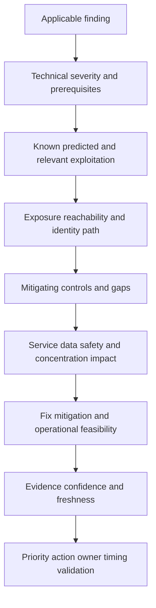

Adding contextual factors does not mean severity becomes optional or that a high-value asset makes every finding critical. Applicability and plausible prerequisites still matter. The design should prevent one low-quality field from overwhelming all others and should expose mandatory cohorts, uncertainty, and rationale.

## Queue volume, capacity, and the prioritization paradox

Organizations can discover far more findings than they can patch immediately. If every critical/high observation becomes a ticket, volume exceeds analyst and remediation capacity. Owners receive noisy, duplicated, context-poor work and learn that "urgent" rarely means urgent. Security then adds more reminders, dashboards, and escalations, increasing coordination cost without changing throughput.

| Demand/capacity question | Weak answer | Better evidence |
|---|---|---|
| How much work entered? | Raw finding count | Unique supported exposure episodes and root-cause groups |
| What can teams execute? | Number of assigned tickets | Capacity by platform/change type/window/dependency |
| What is urgent? | Critical/high label | Mandatory cohorts plus contextual scenarios |
| What blocks work? | "Owner delay" | Waiting state, dependency, decision authority, fix availability |
| What is a quick win? | Easiest tickets | High consequence reduced per unit effort under safeguards |
| What should be automated? | Everything repeated | Stable identity, high-quality preconditions, reversible low-risk actions |
| Is backlog improving? | Total count fell | Scope/quality-adjusted flow, validated outcomes, recurrence |

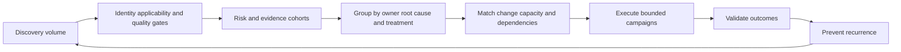

The purpose of prioritization is not to pretend all work fits. It is to make constrained choices explicit, protect mandatory/high-consequence cohorts, reduce low-value analysis, group work into executable campaigns, escalate structural capacity or architecture problems, and show residual risk honestly.

## Tool and data silos

A modern environment can have endpoint, network, cloud, application, dependency, identity, external-attack-surface, threat-intelligence, CMDB, ticketing, and control systems. Each source has different asset IDs, clocks, severity labels, status values, and ownership fields. Analysts manually copy context between consoles or spreadsheets. That work is slow and inconsistent, and the resulting snapshot becomes stale.

| Silo boundary | Semantic conflict | Consequence | Needed bridge |
|---|---|---|---|
| Network scanner vs endpoint | IP/hostname versus device ID | False merge/split and duplicate findings | Time-aware strong identity |
| Cloud vs CMDB | Provider resource versus configuration item | Missing owner/lifecycle or stale records | Field-level authority and reconciliation |
| SAST/SCA vs runtime | Repository/build versus deployed instance | Fix wrong branch or count undeployed code | Commit-build-artifact-deploy lineage |
| Threat feeds vs findings | CVE-level intelligence versus occurrence | KEV/EPSS applied to wrong/nonapplicable asset | Exact CVE and applicability joins |
| IAM vs asset | Principal/role versus workload/service | Privilege path absent from priority | Typed identity relationships |
| Control tool vs scanner | Installed agent/rule versus effective mitigation | Control assumed effective | Applicability, health, enforcement, bypass evidence |
| ITSM vs scanner | Ticket status versus technical state | Closed work with open finding | Stable episode and read-back validation |
| BI export vs live sources | Snapshot and transformed metrics | Stale/inconsistent executive view | Governed temporal model and lineage |

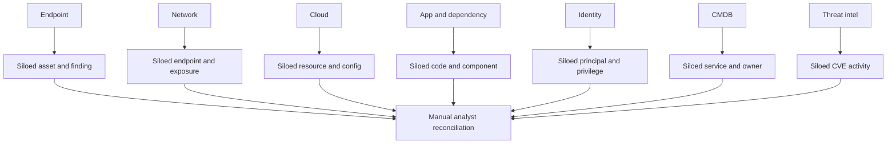

### Plain-English deep-dive 2 - More data can create less truth

Imagine five hospital systems each listing a device differently: serial number, room name, IP address, maintenance nickname, and billing code. Combining all rows without identity rules creates five devices; merging by room can combine two devices that occupied the room at different times. Adding sources increases evidence, but it also increases the work needed to define entities, time, authority, and conflict.

A "single pane of glass" is not valuable if it merely places inconsistent panes beside one another. Unified decision context requires harmonized semantics, source-native provenance, deduplication/entity resolution, typed relationships, quality states, temporal validity, and governed authority. Missing evidence must remain unknown. This directly prepares for Part 81's Data Fabric and UVM architecture, without assuming any undocumented internal implementation.

## Team, process, and incentive silos

Security may own discovery and policy; infrastructure owns patching; application teams own releases; cloud teams own resource configuration; identity teams own privilege; service owners own availability; risk owners approve exceptions; change teams govern windows; procurement manages suppliers. A context-poor ticket expects one assignee to solve a cross-team decision.

| Team perspective | Rational local goal | System conflict | Coordination requirement |
|---|---|---|---|
| Security | Reduce vulnerable backlog and meet policy | May create volume beyond change capacity | Contextual cohorts and decision escalation |
| Infrastructure | Maintain stable platforms | May defer risky patches | Test, rollback, service priority, compensating controls |
| Application | Deliver features safely | Security debt competes with roadmap | Product ownership and release integration |
| Cloud | Operate dynamic resources | Scanner identity/CMDB may lag | Native IDs and policy-as-code prevention |
| Identity | Protect privilege and secrets | Scanner/service accounts need access | Least-privilege design and audit |
| Change management | Reduce outage risk | Emergency process can slow urgent containment | Risk-tiered, preapproved safe patterns |
| Risk/compliance | Demonstrate governance | Can reward deadline evidence over outcomes | Validated postconditions and exception quality |
| Executive | Allocate resources to material risk | Technical counts lack consequence | Scenario, concentration, uncertainty, decisions |

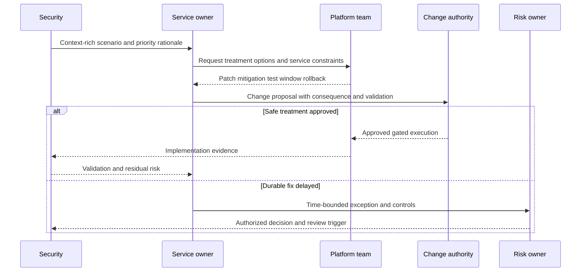

## Missing asset identity, lifecycle, and ownership

Priority cannot be operational if the program does not know which active asset is affected and who owns the decision. Hostnames and IP addresses are reused. Cloud resources are recreated. Container names repeat. Scanner records can outlive assets. CMDB ownership can be a shared mailbox or former employee. Last logged-on user is not the service owner.

| Missing context | Priority failure | Workflow failure | Repair |
|---|---|---|---|
| Stable asset identity | Same asset counted many times or different assets merged | Wrong ticket/closure | Namespaced strong IDs and temporal aliases |
| Lifecycle | Retired findings stay open; active replacements appear clean | Teams reject stale work | Active/retiring/retired/unknown governance |
| Environment | Test and production mixed | Wrong urgency/change path | Approved environment and service mapping |
| Technical owner | No team can implement | Ticket bounces | Role-based ownership resolution |
| Service owner | Business tradeoff unavailable | Patch/change conflict stalls | Service catalog and escalation path |
| Risk owner | Exceptions approved informally | Residual risk hidden | Explicit authority and expiry |
| Data owner | Source defects persist | Dashboard cannot be corrected | Source contract and quality accountability |

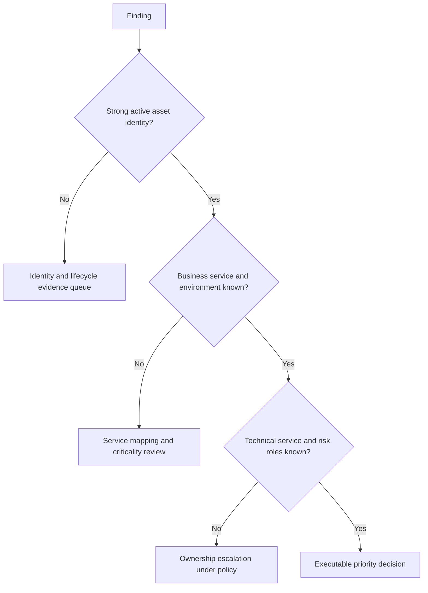

Ownership should describe roles before names. A platform team can implement, a service owner can approve availability tradeoffs, a security owner can validate the condition, and a risk owner can accept residual risk. One `owner` column cannot represent every authority.

## Missing business context and impact

Asset criticality is not a scanner severity. It reflects approved customer consequences: patient safety, confidentiality, integrity, availability, regulatory obligations, revenue, trust, recovery time, and dependency concentration. Environment and service role matter. A low-tier gateway with broad privileged connectivity can create more systemic consequence than a visibly critical but isolated application.

| Context dimension | Question | Evidence owner | Anti-pattern |
|---|---|---|---|
| Business service | Which customer capability depends on this asset? | Service owner/catalog | Infer from hostname |
| Criticality | What harm and recovery requirement are approved? | Business/risk owner | Mark every production asset critical |
| Data | What sensitive information is stored, processed, transmitted, indexed, or administered? | Data owner/privacy | "Contains PII" without scope/access |
| Safety | Can failure affect people or physical process? | Safety/clinical/OT owner | Use ordinary patch window blindly |
| Dependency | Which services rely on or administer this asset? | Architecture/service owner | Treat every network flow as dependency |
| Concentration | Does one image, identity, gateway, or supplier affect many services? | Architecture/program | Sum per-host scores only |
| Recovery | How difficult is restoration and what backup/control exists? | Operations/BCDR | Availability impact equals outage duration automatically |
| Obligation | Which contract/regulation/policy applies? | Legal/compliance/risk | Apply one universal deadline |

Business context can raise urgency, change treatment method, or change who must decide. It does not make an inapplicable finding real. Keep approved source, effective dates, confidence, and field authority.

## Missing reachability, identity, behavior, and control context

An installed vulnerable component is not automatically reachable. Conversely, "internal" is not safe if compromised endpoints, partner access, workload identities, or lateral paths can reach it. Identity can be both prerequisite and blast-radius multiplier. Controls matter only when they apply to the exact path and are healthy, enforcing, current, and resistant to relevant bypass.

| Context | Question | Strong evidence | Shortcut to reject |
|---|---|---|---|
| External exposure | Which interface is reachable from which source? | DNS/address/listener/route/policy/app test | Public DNS equals exploitable |
| Internal path | Which starting point can reach the service? | Segmentation and authorized positive/negative tests | Internal equals low risk |
| User interaction | Which action is required and how likely in workflow? | App/identity/process evidence | UI required means harmless |
| Privilege prerequisite | What access must attacker already have? | Effective permission graph | Account type label only |
| Privilege gained | Which identity/capability follows exploitation? | Workload/service role and secrets | Host impact only |
| Behavior | Is the asset actually serving, communicating, or being targeted? | Current telemetry under defined time | One event proves campaign |
| Preventive control | Which prerequisite is blocked? | Applicability, enforcement, bypass test | Agent installed means protected |
| Detective control | Would attempt/success be observed and acted on? | Coverage, rule, telemetry, response test | Logs exist means detection works |
| Recovery control | Can harm be contained/recovered? | Tested backups/runbook/objectives | Backup exists means low risk |

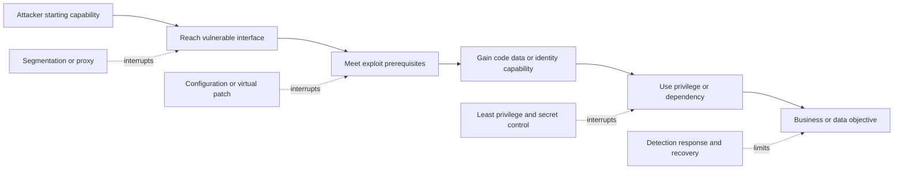

### Plain-English deep-dive 3 - A control lowers only the risk it actually controls

A guard at the front door does not protect an open loading dock. A WAF may block a tested public payload while the origin remains directly reachable. Endpoint protection may detect one exploit behavior but not remove the vulnerable package. MFA may protect human login but not a workload token. A backup may reduce availability consequence but not data disclosure.

Map each control to a specific scenario prerequisite. Confirm scope, configuration, health, enforcement, exceptions, alternate paths, and authorized tests. Record residual paths. A control can justify a different treatment sequence or temporary mitigation, but it should not silently delete the underlying finding.

## Data quality, provenance, and confidence failures

Risk context can be wrong, stale, missing, duplicated, or semantically incompatible. A confident score built on a false asset merge is worse than a visible unknown. Data quality must be a first-class input and dashboard, not an administrator-only page.

| Quality dimension | Question | Failure example | Safe decision behavior |
|---|---|---|---|
| Completeness | Are expected populations/fields present? | One cloud account absent | No automatic downgrade/closure |
| Freshness | Is evidence recent enough for use? | Agent last seen 45 days ago | Mark stale; reacquire evidence |
| Validity | Do values follow allowed semantics? | CVSS text parsed as number incorrectly | Reject/quarantine and repair |
| Accuracy | Does value represent reality? | Owner copied from last user | Validate authoritative source |
| Uniqueness | Are records distinct at intended grain? | Same episode from five sources | Correlate with provenance |
| Consistency | Do sources agree under definitions? | Active in scanner, retired in CMDB | Preserve conflict and resolve authority/time |
| Referential integrity | Do relationships point to valid entities? | Finding joins to deleted asset | Prevent orphan action |
| Provenance | Can source/transformation be traced? | Score overwritten without vector/source | Do not use for irreversible decision |
| Confidence | How strongly is claim supported? | Public reachability inferred from DNS only | Evidence queue/qualified language |

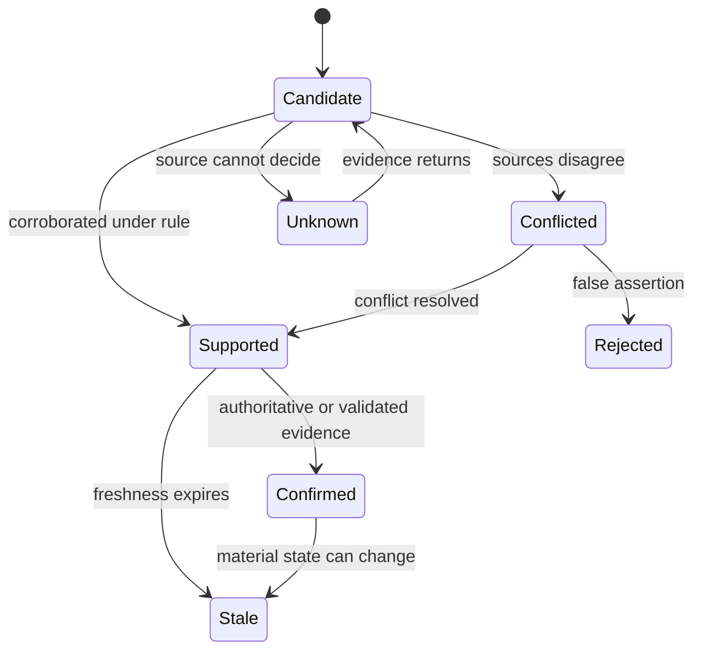

Do not simply lower priority when confidence is low. A high-consequence public candidate may need urgent evidence collection. Confidence changes which action is safe: investigate, hold automation, request owner validation, or use a conservative temporary control.

## Duplicates, data grain, and denominator distortion

A CVE, weakness, finding observation, asset occurrence, exposure episode, ticket, patch job, exception, and validation are different grains. Counting or joining them as one-to-one creates inflated backlog, duplicated tickets, and misleading closure.

| Grain error | Example | Metric distortion | Operational harm |
|---|---|---|---|
| CVE to asset many-to-many ignored | One CVE on 5,000 hosts | One issue or 5,000 risks with no context | Wrong campaign/effort view |
| Observations counted as episodes | Daily scan emits same finding | Backlog and new findings inflate | Repeated tickets |
| Ticket equals finding | One ticket groups 200 assets | Closing ticket closes all regardless of state | False remediation |
| Asset false merge | Shared hostname/IP | Findings/owners combine | Wrong isolation/patch |
| Asset false split | One cloud asset under several IDs | Duplicate backlog | Conflicting treatment |
| Source join multiplies rows | Two owners x three controls x four findings | Dashboard totals explode | False severity and progress |
| Scope changes ignored | New acquisition added | Backlog rise called deterioration | Leaders punish better visibility |
| Exceptions removed from denominator | Accepted items disappear | SLA/compliance improves | Residual risk hidden |

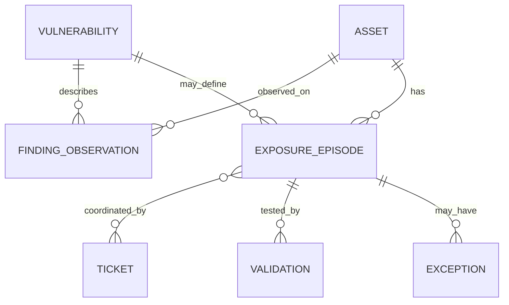

This is a conceptual model, not a product schema. Metric contracts must declare grain, unique key, population, filters, join cardinality, as-of time, and restatement behavior.

## SLA gaming and Goodhart's law

An SLA can protect attention by defining timing expectations. It becomes harmful when the measured target replaces the security objective. Teams respond rationally to incentives: reset finding age by closing/reopening, downgrade severity, move assets out of scope, pause clocks, create broad exceptions, close on deployment, or focus on easy items while hard structural risks remain.

| Gaming/metric failure | Why it occurs | Detection | Better design |
|---|---|---|---|
| Close/reopen resets age | SLA rewards current open age | Stable episode history | Preserve original and reopen age |
| Severity downgrade near deadline | Policy tied only to score | Priority/version change audit | Governed contextual rationale and approval |
| Scope exclusion | Coverage reduces compliance | Universe/denominator version diff | Independent scope governance |
| Exception as closure | Exception removes overdue item | Exception inventory/debt | Report residual risk, expiry, controls separately |
| Deployment equals remediation | Easy event available | Validation failure/reopen sample | Awaiting-validation state |
| Pause clock indefinitely | Dependency not visible | Paused-time/reason/owner report | Explicit pause, review, calendar age |
| Cherry-pick easy fixes | Throughput rewarded | Consequence/effort distribution | Balance flow with high-consequence outcomes |
| Bulk ticket closure | Workflow cleanup pressure | Source/native reconciliation | Read-back and technical postcondition |

```mermaid
flowchart LR
    OBJ[Objective: reduce credible exposure] --> MET[Metric: meet remediation SLA]
    MET --> TARGET[Metric becomes target]
    TARGET --> BEHAV[Teams optimize closure clock]
    BEHAV --> SIDE[Scope changes exceptions premature closure]
    SIDE --> GREEN[Dashboard improves]
    GREEN --> RISK[Residual exposure may persist]
    RISK --> REDESIGN[Add guardrails outcome and quality measures]
```

Use a balanced metric set: source/coverage quality, actionable ownership, aging states, waiting reasons, throughput, validation pass/reopen, exception debt, recurrence, control/path outcomes, and material scenario reduction. Metrics do not eliminate judgment; they make assumptions and side effects visible.

## Ownership failure and ticket anti-patterns

"Send it to the server team" fails when the asset is cloud-managed, application-owned, vendor-operated, or a shared service. A ticket that contains only CVE, score, hostname, and deadline makes the recipient rediscover applicability, service impact, path, fix, dependencies, and validation. Rejection is predictable.

| Ticket anti-pattern | Recipient experience | Better contract |
|---|---|---|
| Shared mailbox owner | Nobody is accountable | Role/team plus escalation and service owner |
| Last user as owner | Wrong person receives technical work | Field-level owner authority |
| One ticket per scanner row | Duplicate/noisy queue | Group by stable episode, treatment, owner, root cause |
| No remediation rationale | Recipient cannot assess urgency | Scenario, evidence, context, control, why-now |
| No fix/validation | Work ambiguous | Supported options, source links, postconditions |
| Auto-close from ticket state | Security truth follows workflow | Read back technical/source state |
| Retry after timeout | Duplicate ticket created | Idempotency key and target lookup |
| Bulk assignment | Team capacity ignored | Cohort/campaign planning and canary |

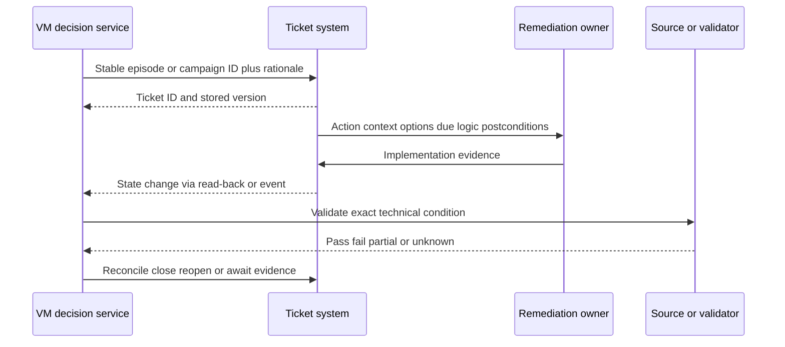

## Static reporting and dashboard theater

A static report is a fixed export or slide assembled at one time. It can support an audit record or executive narrative, but it fails as the only operational system. Threat, asset, control, and workflow state change after publication. Analysts cannot drill from aggregate to evidence. Different teams export at different times and debate numbers instead of decisions.

| Static-report failure | Example | Better capability | Guardrail |
|---|---|---|---|
| Staleness | Monthly PDF misses yesterday's KEV entry | Governed dynamic view with as-of time | Never promise zero latency |
| No drill-down | "1,200 critical" has no assets/owners | Scenario -> cohort -> episode -> source path | Role-based access/privacy |
| Snapshot mismatch | Executive and operator totals differ | Shared semantic contract | Versioned filters/denominators |
| Cause hidden | Backlog rises after new source | Trend bridge and source-health panel | Separate visibility from deterioration |
| Action detached | Slide has no owner or checkpoint | Linked action/decision register | Read-back and reconciliation |
| False precision | Risk score shown without factors/confidence | Explainable factor evidence | No proprietary formula invention |
| Manual refresh | Spreadsheet errors and copy lag | Controlled pipeline and quality tests | Human review still required |
| Export leakage | Vulnerability details emailed broadly | Least privilege, minimization, secure sharing | Retention and access audit |

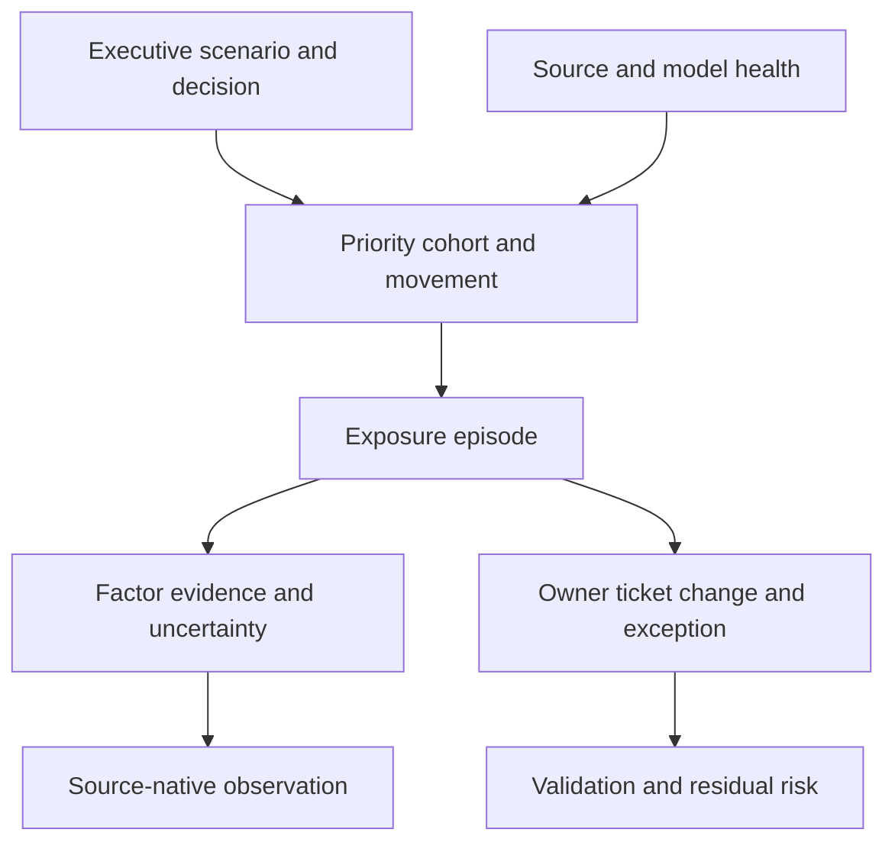

### Plain-English deep-dive 4 - A dashboard is a window, not the weather

A dashboard displays a model of selected data. It can be wrong because the source failed, the asset merged incorrectly, a field mapping changed, a filter excluded a cohort, a join multiplied rows, or the definition changed. A green trend is a hypothesis that needs a cause bridge.

Arti's Power BI experience is especially relevant. A measure requires a grain and denominator. Relationships can create double counting. Refresh success does not prove semantic completeness. Filters can change interpretation. A responsible TSM asks whether the view reconciles to source, actions, and postconditions and whether an operator can explain one representative record.

## Alert fatigue, trust, and adoption

Alert fatigue is a human-system response to high volume, low precision, repeated duplicates, poor actionability, and inconsistent urgency. It is not fixed by telling teams to care more. Reduce unnecessary demand, improve context, group work, tune safely, observe user workflows, and align the queue with executable decisions.

| Adoption barrier | User behavior | Root cause | Improvement |
|---|---|---|---|
| Everything urgent | Owners ignore labels | No differentiation or capacity fit | Mandatory/contextual cohorts and reason codes |
| Duplicate tickets | Bulk close/reject | Grain/entity/source replay defects | Stable episodes and grouping |
| Wrong owner | Ticket bouncing | Weak service/ownership data | Ownership resolution and escalation |
| Missing rationale | Rework in local tools | Context absent | Evidence-rich ticket and drill-down |
| Priority changes unexplained | Distrust score | Model/source changes hidden | Factor-change reasons and versioning |
| Tool separate from workflow | Copy/paste and stale state | Integration/reconciliation gap | Bidirectional governed workflow |
| Training is feature tour | Users do not know decision routine | Outcome/task not taught | Role-based scenarios and observation |
| Feedback disappears | Same defects recur | No product/process feedback loop | Triage, owner, response, release/review |

Adoption measures should include correct task completion, evidence usage, assignment accuracy, time in actionable versus waiting states, validation quality, exception decisions, and user confidence under sample. Login and dashboard views are weak without workflow outcomes.

## Program anti-pattern catalog

| Anti-pattern | Why it appears attractive | Failure mechanism | Replacement |
|---|---|---|---|
| Patch all criticals first | Simple policy | Severity omits context and capacity | Contextual cohorts plus mandatory gates |
| One universal risk score | Easy ranking | Hides uncertainty, policy, incomparable scenarios | Explainable factors, cohorts, reason codes |
| Connect every source first | Looks comprehensive | Quality/identity complexity overwhelms value | Bounded use case and source sequence |
| One source of truth for every field | Sounds clean | Authority differs by field/time/purpose | Federated authoritative assertions with provenance |
| Auto-ticket every finding | Demonstrates action | Noise, duplicates, wrong owners | Quality/priority/ownership gates and grouping |
| Close on deployment | Easy automation | Technical condition may persist | Await validation and reconcile |
| Treat missing as zero | Simplifies dashboards | Source outage looks like improvement | Unknown/degraded state |
| Hide false positives | Improves metrics | Tuning debt and false negatives grow | Reviewed disposition and regression tests |
| Permanent exception | Avoids repeated review | Residual risk invisible | Expiry, controls, authority, trigger, plan |
| Score tuning by executive preference | Produces desired chart | Governance becomes manipulation | Versioned policy and sensitivity review |
| Replace owners with AI | Reduces manual routing | Model errors gain authority | Candidate suggestion plus human/source validation |
| Measure logins as adoption | Easy telemetry | Does not show correct outcomes | Task-quality and workflow measures |
| Claim prevented breaches | Strong value story | Counterfactual unsupported | Validated exposure/control/path outcomes |
| Big-bang rollout | Creates visibility quickly | Bad data and workflow scale harm | Shadow, pilot, canary, waves, rollback |

## Target operating principles

The redesign does not require a specific product, but it creates requirements for Part 81's product architecture.

1. Start with a bounded customer decision and harmful scenario, not every source.
2. Define independent populations, entity grain, strong identity, lifecycle, provenance, and quality states.
3. Preserve vulnerability definitions, observations, episodes, tickets, exceptions, and validations separately.
4. Correlate technical severity with current exploitation, exposure, identities, controls, business context, feasibility, and confidence.
5. Use mandatory gates and cohorts where policy requires them; do not let weighted averages erase them.
6. Explain every priority through factors, evidence, version, uncertainty, action, owner, timing, and postconditions.
7. Group work by owner, service, root cause, image, treatment, or campaign while preserving per-asset outcomes.
8. Integrate workflows with idempotency, approvals, read-back, reconciliation, retries, audit, and rollback.
9. Report source/model health alongside risk and preserve trend restatements.
10. Measure validated outcomes, recurrence, exception debt, and adoption, not only tickets and SLA.

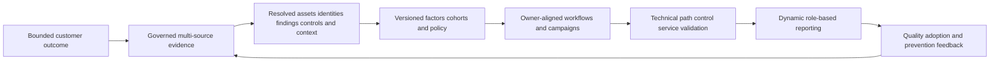

## Troubleshooting a wrong priority or misleading program

| Symptom | Likely controlling defect | First discriminating evidence | Immediate protection |
|---|---|---|---|
| Critical test host outranks exploited service | CVSS-only policy or missing context | Factor/change reason for both episodes | Manual cohort review |
| Priority changes with no customer change | Threat/model/source/version update | Input snapshots and version diff | Explain movement; hold irreversible action if uncertain |
| Same CVE has many conflicting priorities | Asset/path/control/business differences or identity defects | Compare exact episode factor evidence | Keep separate; investigate outliers |
| Backlog halves overnight | Source/auth/scope/dedup/filter/closure change | Source health and episode bridge | Stop success claim and auto-closure |
| SLA rises while reopen grows | Premature closure/gaming | Episode history and validation outcomes | Separate awaiting validation |
| Tickets bounce | Ownership/service mapping weak | Field provenance and owner roles | Route to ownership queue, not random team |
| Exceptions grow silently | Expiry/workflow/authority weak | Exception inventory by owner/age/control | Governance review and no hidden removal |
| Dashboard totals disagree | Grain/join/time/filter/denominator | One control total and representative ID | Publish caveat and reconcile |
| Analysts ignore high queue | Alert fatigue and low precision/actionability | Sample task observation and rejection reasons | Reduce unsafe notifications; triage cohort |
| Control lowers priority unexpectedly | Presence confused with effectiveness | Applicability/health/enforcement/bypass evidence | Restore unknown/high caution until validated |

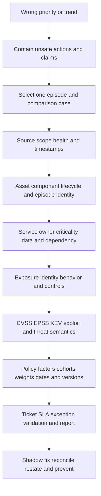

### Minimal evidence package

Record expected and actual ranking/metric; exact episode/asset/CVE/ticket IDs; UTC times; source health and observations; asset identity/lifecycle; every factor value, source, time, confidence, and reason; policy/model version; owner/service/control/path evidence; workflow history; dashboard filters; reproduction; affected decisions; containment; and one bounded ask. Redact sensitive vulnerability and identity data under customer rules.

## Complete synthetic NMH failure and redesign case

Everything in this section is fictional and synthetic. Future schedule dates are labeled as such. The official source-review date remains 2026-08-24.

### Synthetic traditional baseline

NMH's fictional initial program imports network, endpoint, cloud, and application findings into separate spreadsheets. Each source labels severity differently. Critical and high findings receive tickets with fixed deadlines. Ownership comes from hostname patterns and last user. Tickets close on deployment. A monthly PDF reports open counts and SLA compliance.

| Baseline observation | Synthetic value | Why it is not yet a conclusion |
|---|---:|---|
| Raw open findings | 142,000 | Includes repeated observations and cross-source duplicates |
| Critical/high rows | 38,400 | Technical labels, not validated customer scenarios |
| Tickets created monthly | 11,200 | Activity and burden, not outcome |
| SLA compliance | 92 percent | Clock/closure rules not validated |
| Reopen within 30 days | 21 percent | Suggests closure/postcondition issue |
| Findings with supported service owner | 54 percent | Ownership quality weak |
| Findings with current path/control evidence | 18 percent | Priority context sparse |
| Active exceptions | Unknown | Stored in team spreadsheets |
| Sources with visible health/freshness | 2 of 7 | Missing data can distort trends |

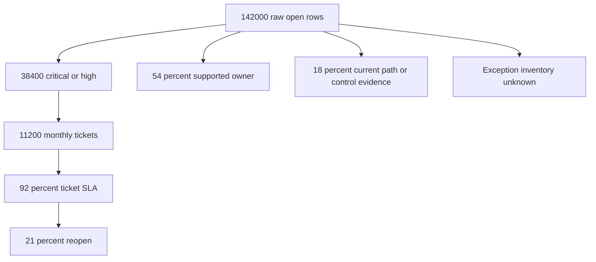

The apparent 92 percent success conflicts with reopen, ownership, context, and source-health evidence. NMH does not accuse teams of gaming; it investigates the system incentives and definitions.

### Scenario 1: CVSS-only inversion

A synthetic critical CVE on an isolated training server receives an emergency ticket. A medium-severity issue on the internet-facing patient portal appears lower, despite KEV inclusion, an applicable component, a privileged backend identity, and incomplete WAF coverage. The redesign establishes an accelerated known-exploitation cohort and contextual scenario record. The training server remains planned work; the portal receives urgent containment, hunt, canary remediation, and validation.

### Scenario 2: duplicate avalanche

Network, agent, and cloud sources each report the same package/CVE on 2,000 virtual machines. Daily observations create new row IDs. NMH has 18,000 tickets for what is actually 2,000 active exposure episodes sharing one image root cause. The program preserves all observations, resolves VM identity, maintains per-instance episodes, groups remediation by image and owner, updates the base image, redeploys waves, and validates old instances retired. Raw row reduction is not called risk reduction; validated runtime replacement is.

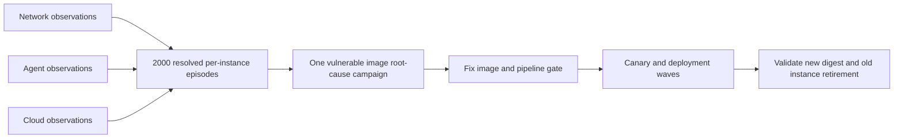

### Scenario 3: SLA gaming without malicious intent

Platform engineers are measured on ticket closure within 30 days. Scanner validation often runs after day 30, so engineers close on patch deployment and reopen failures later. The behavior is rational under the metric. NMH changes workflow states to `implemented-awaiting-validation`, preserves original episode age, measures validation lead time and first-pass success, and separates engineering implementation SLA from security postcondition. Reopen becomes learning evidence, not a personal failure.

### Scenario 4: missing source appears as improvement

One cloud account loses API permission. Findings drop 14 percent and the monthly PDF shows improvement. NMH adds source-health gates, account/region reconciliation, unknown states, and a trend bridge. The report is restated. No exposure closes when expected evidence is absent.

### Scenario 5: control checkbox hides alternate path

A WAF-present field lowers a portal finding. Testing shows the origin address is directly reachable from a partner network, bypassing the WAF. NMH changes control semantics from `present` to applicable/healthy/enforcing/effective/excepted/unknown, maps controls to paths, restricts origin access, and validates positive required and negative unauthorized routes. Durable patching continues.

### Scenario 6: ownership by last user

A shared clinical kiosk finding routes to a nurse who last signed in. The nurse rejects the ticket, and it bounces for weeks. NMH separates user association from technical owner, service owner, data owner, and risk owner; reconciles the kiosk to the clinical endpoint service; and updates routing. The person is not blamed for poor source semantics.

### Scenario 7: static report drives stale decision

An executive receives a PDF generated before a KEV update and after a partial scanner run. The program moves to a governed dynamic view with as-of time, source-health caveats, drill-down, and a signed meeting snapshot for audit. The meeting focuses on current material scenarios, blockers, decisions, and linked actions rather than arguing about exported totals.

### Synthetic 90-day redesign sequence

The dates below are explicitly fictional future schedule dates.

| Synthetic phase | Dates | Focus | Exit evidence |
|---|---|---|---|
| Understand | 2026-09-07 to 2026-09-25 | Outcomes, scope, sources, grains, ownership, metrics, anti-pattern baseline | Approved charter and defect register |
| Prove data | 2026-09-28 to 2026-10-23 | One service, identity/episode correlation, source health, context | Sample precision and reconciled counts |
| Prove decision | 2026-10-26 to 2026-11-13 | Contextual cohorts, reason codes, owner/action/validation | Human-reviewed priority and workflow pilot |
| Operationalize | 2026-11-16 to 2026-12-04 | Canary workflow, dashboards, governance, training, feedback | Reconciled outcomes and next-wave decision |

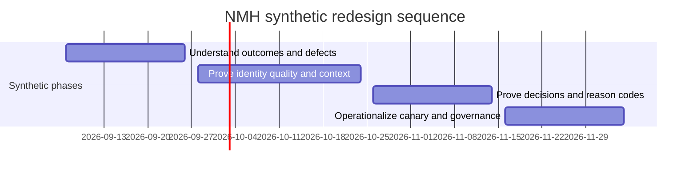

This is an adaptive learning sequence, not a delivery promise or product implementation claim.

### Synthetic review narrative

"The previous 92 percent SLA represented ticket closure, not validated exposure reduction. Twenty-one percent reopened within 30 days, and source-health gaps invalidate one apparent backlog decrease. Identity correlation reduced duplicate work but did not itself reduce risk. The patient-portal known-exploitation cohort is under urgent treatment; the training-server critical is planned under verified isolation. Ownership coverage and path/control evidence are improving through one-service pilots. Decisions requested are approval of stable episode aging, service-owner attestation for the next cohort, and migration from auto-close to awaiting-validation."

## Customer and TSM artifact kit

| Artifact | Purpose | Minimum contents | TSM value |
|---|---|---|---|
| Failure-system map | Show connected causes, not blame | Sources, context, queue, workflow, incentives, reports | Facilitate shared diagnosis |
| Anti-pattern inventory | Name recurring failure mechanisms | Pattern, evidence, impact, owner, replacement | Prioritize program debt |
| Decision charter | Define what priority means | User, population, factors, gates, action, owner, postcondition | Align technology to outcome |
| Grain/entity dictionary | Prevent duplicate/distorted data | Objects, keys, cardinality, time, provenance | Improve source integration and metrics |
| Context coverage matrix | Show missing business/path/control/identity evidence | Factor, source, authority, freshness, unknowns | Avoid false precision |
| Ownership model | Separate decision roles | Technical/service/data/risk/source owners and escalation | Make queues executable |
| Priority reason record | Explain why-now | Evidence, factors, policy, uncertainty, options | Build trust and reviewability |
| SLA/metric audit | Detect incentive distortion | Clock rules, pauses, episodes, exceptions, validation | Redesign balanced measures |
| Exception debt register | Make residual risk visible | Scope, owner, controls, expiry, triggers, plan | Enable governance decisions |
| Trend bridge | Explain movement | Start, new scope, new findings, closures, corrections, end | Separate visibility from outcome |
| Workflow contract | Govern ticket lifecycle | Stable ID, idempotency, owner, rationale, read-back, validation | Reduce duplicate/premature closure |
| Adoption observation | Understand user routine | Task, friction, rejection, workaround, feedback | Improve product/process fit |
| Executive narrative | Focus decisions | Material scenarios, movement/cause, uncertainty, blockers, asks | Translate without unsupported claims |

## Safe labs and exercises

| Lab | Exercise | Deliverable | Pass condition |
|---|---|---|---|
| 1 | Explain the perfectly sorted bad queue | Whiteboard | Severity and priority remain distinct |
| 2 | Compare two synthetic findings | Decision records | Medium can outrank critical for explicit reasons |
| 3 | Map tool silos | Source/semantic matrix | Identity, clocks, authority, and blind spots visible |
| 4 | Map team silos | RACI and handoff diagram | Every decision has one accountable role |
| 5 | Audit asset identity | False merge/split sample | Stable IDs and temporal lifecycle used |
| 6 | Build business-context contract | Service/impact table | Scanner does not invent criticality |
| 7 | Validate path and controls | Scenario prerequisite map | Presence and effectiveness separated |
| 8 | Create quality-state model | State diagram | Missing remains unknown |
| 9 | Model data grains | ER diagram | CVE, observation, episode, ticket, exception, validation distinct |
| 10 | Reconcile duplicate avalanche | Campaign plan | Per-instance outcomes preserved |
| 11 | Audit an SLA | Metric/incentive report | Gaming paths and guardrails identified |
| 12 | Audit exceptions | Debt register | Authority, expiry, controls, plan present |
| 13 | Diagnose a green dashboard | Trend bridge | Source/scope/definition changes tested |
| 14 | Rewrite a context-poor ticket | Workflow payload | Why-now, owner, action, postcondition included |
| 15 | Observe a user workflow | Friction log | Process/tool defect separated from user blame |
| 16 | Design dynamic drill-down | Power BI wireframe | Executive and operator views reconcile |
| 17 | Create SQL quality controls | Query/pseudocode set | Join multiplication, null-to-zero, age reset detected |
| 18 | Build a phased redesign | 90-day adaptive plan | Shadow/pilot/canary/gates used |
| 19 | AI scoring challenge | Governance review | Opaque/autonomous decisions rejected |
| 20 | Interview rehearsal | Q1-Q8 recording | Claims remain factual, synthetic, source-bounded |

## Arti bridge: escalation systems thinking to prioritization

| Factual strength | Prioritization transfer | Interview phrasing | Boundary |
|---|---|---|---|
| M365/OneDrive/SharePoint support | Error/advisory needed tenant, user, device, permission, service, and impact context | "A vulnerability score needs customer context just as an error code does." | Not production VM scoring |
| Networking/traces | Reachability, sequence, attempts, resets, proxy/service boundaries | "I validate the path and distinguish a request from a successful outcome." | Authorized tests required |
| Escalations | Severity, containment, ownership, evidence, next checkpoint | "I coordinate the decision system under uncertainty, not just the queue." | Customer risk authority remains separate |
| SQL | Grain, cardinality, anti-joins, temporal history, quality | "I can find duplicate joins and missing-to-zero failures before trusting metrics." | No UVM schema claim |
| Power BI | Denominators, trends, drill-down, source health | "A green dashboard needs a causal bridge and evidence path." | No production UVM dashboard claim |
| Mentoring | Correct anti-patterns without blame | "I teach the reason behind a workflow and observe task quality." | Current policy/tools govern details |
| AI | Assist grouping/summaries under citations and review | "AI can propose candidates, not own risk or opaque scoring." | No autonomous decision claim |

## Common misconceptions to correct

| Misconception | Correction |
|---|---|
| Traditional priority fails because analysts are careless | The system often withholds context, capacity, ownership, and useful incentives |
| Sorting by CVSS is risk-based | It is severity-based unless customer context is added |
| More risk factors always improve decisions | Poor, overlapping, or opaque factors can create false precision |
| One score can serve every queue | Investigation, treatment, ownership, exceptions, and investment need different decisions |
| More sources automatically create truth | They also create identity, semantic, time, and authority conflicts |
| One source of truth should own every field | Authority is field-, purpose-, and time-specific |
| Duplicate removal reduces risk | It reduces representation/work; technical outcomes still need treatment |
| Business criticality makes every finding critical | Applicability and scenario prerequisites still matter |
| Control installed means risk reduced | Effectiveness and path coverage must be validated |
| Internal means low risk | Compromised starting points and lateral/identity paths matter |
| High SLA compliance proves security | Clock gaming and premature closure can coexist with exposure |
| Exception means fixed | It is authorized residual risk with controls and expiry |
| Ticket owner is risk owner | Technical, service, data, and risk roles differ |
| Monthly PDF is enough for operations | It is stale and usually lacks evidence/action drill-down |
| Alert fatigue is a training problem | Volume, precision, context, workflow, and incentives drive it |
| Automation creates maturity | It scales both quality and defects |
| AI eliminates prioritization bias | It can inherit data/policy bias and hide rationale |
| A vendor product alone fixes program design | People, policy, sources, ownership, workflow, adoption, and governance remain essential |

## Official Source Anchors

Research/source snapshot and review date: **2026-08-24**.

Official sources support technical severity, exploitation, risk, governance, vulnerability/patch management, and bounded Zscaler problem/solution positioning. They do not prove NMH conditions, specify a universal prioritization formula, or guarantee outcomes.

| Source | URL | Used for | Boundary |
|---|---|---|---|
| FIRST CVSS | https://www.first.org/cvss/ | Technical severity role and current v4.0 resources | CVSS is not complete customer risk |
| FIRST EPSS | https://www.first.org/epss/ | Near-term in-wild exploitation probability signal | Not severity, certainty, applicability, or compromise |
| CISA KEV Catalog | https://www.cisa.gov/known-exploited-vulnerabilities-catalog | Known-exploitation prioritization input | Not proof a customer is compromised or complete exploitation list |
| CVE Program | https://www.cve.org/ | Vulnerability record identity | CVE is not a customer finding or priority |
| NIST SP 800-30 Rev. 1 | https://csrc.nist.gov/pubs/sp/800/30/r1/final | Threat, vulnerability, likelihood, impact, and uncertainty concepts | Tailor to organization risk method |
| NIST SP 800-40 Rev. 4 | https://csrc.nist.gov/pubs/sp/800/40/r4/final | Enterprise patch-management planning and verification | Patch management is one part of broader VM |
| NIST SP 800-53 Rev. 5 | https://csrc.nist.gov/pubs/sp/800/53/r5/upd1/final | Vulnerability monitoring, controls, configuration, assessment, audit, access, integrity | Requires selection, tailoring, implementation, assessment |
| NIST Cybersecurity Framework 2.0 | https://www.nist.gov/cyberframework | Governance and cybersecurity-risk outcome framework | Voluntary, organization-specific profiles |
| Zscaler Unified Vulnerability Management | https://www.zscaler.com/products-and-solutions/vulnerability-management | Public statement that siloed tools and CVSS-only context are insufficient; contextual scoring, workflows, reporting positioning | Marketing/problem framing is not universal customer fact; no internal formula/default/result |
| Zscaler Data Fabric for Security | https://www.zscaler.com/products-and-solutions/data-fabric | Public aggregation/unification, harmonization, deduplication, correlation/enrichment, business logic, workflow/report positioning | No proprietary architecture, schema, latency, or guarantee |
| Zscaler Data Fabric integrations | https://www.zscaler.com/products-and-solutions/data-fabric/integrations | Public breadth of source categories and current catalog examples | Verify exact connector, direction, object, permission, version, entitlement |

## Likely Interview Questions

### Q1. Why does traditional vulnerability prioritization fail?

**Model answer:** It often optimizes a technical-severity queue rather than a customer decision system. Siloed sources create duplicate and inconsistent findings; asset identity, lifecycle, owner, business service, reachability, identities, controls, threat activity, and fix feasibility are missing; ticket and SLA incentives reward closure over validation; static reports hide source health and cause. The result is noise, wrong work, alert fatigue, and paper compliance. I diagnose the controlling layer before proposing technology or process change.

### Q2. Why is a CVSS-only queue insufficient?

**Model answer:** CVSS communicates technical vulnerability characteristics under a versioned specification. It does not know whether the exact customer asset is affected, reachable, actively targeted, protected by effective controls, connected to privileged identities, important to a business service, safe to patch, or already under an exception. I preserve CVSS, then combine applicability, exploitation, path, controls, impact, feasibility, and confidence into an explainable action and owner. Context never makes technical evidence optional.

### Q3. How do silos distort vulnerability decisions?

**Model answer:** Each scanner, cloud, endpoint, application, identity, CMDB, intelligence, and ticket system uses different entities, IDs, clocks, states, and field authority. Manual joins create stale snapshots, false merges/splits, duplicate episodes, missing context, and conflicting owners. Team silos then separate discovery, change, service, risk, and validation authority. I use source contracts, time-aware identity, provenance, semantic mapping, conflict states, and role-based decision rights rather than declare one source universally true.

### Q4. How do you prevent SLA gaming?

**Model answer:** I keep a stable exposure episode and original age through repeat scans and reopen, version priority and policy, expose calendar/actionable/paused time and reasons, report exceptions separately with expiry, and use an awaiting-validation state after implementation. I balance timing with coverage quality, ownership, first-pass validation, reopen, recurrence, exception debt, and material outcome measures. The aim is to redesign incentives, not accuse teams who rationally respond to the current metric.

### Q5. What context should change priority?

**Model answer:** Exact asset/component/lifecycle and applicability come first. Then technical severity, known or predicted exploitation, external/internal reachability, user and workload identities, effective privilege, behavior, mitigating-control coverage, service/data/safety impact, dependency concentration, obligations, remediation options, and evidence confidence. Each factor needs source, time, semantics, and rationale. Missing high-consequence context can create an urgent evidence task rather than a low score.

### Q6. How would you redesign a noisy VM program?

**Model answer:** I start with one bounded decision and service, define population and data grains, reconcile sources and quality, establish technical/service/risk ownership, and create explainable mandatory/contextual cohorts. I group by owner/root cause/treatment, integrate proposal-only workflow with stable IDs and read-back, define validation before closure, publish source health and balanced metrics, observe users, and expand through shadow, pilot, canary, and waves. Products support the model; governance and adoption complete it.

### Q7. How would you troubleshoot a dashboard that suddenly improves?

**Model answer:** I stop automated closure and unsupported success claims, select one cohort and representative episode, and trace source scope/health/time, asset/component identity and lifecycle, business/owner context, path/identity/control evidence, CVSS/EPSS/KEV semantics, policy/model version, tickets/SLAs/exceptions/validation, and report grain/filter/refresh. I run the repair in shadow, reconcile every downstream artifact, restate history, communicate affected decisions, and add an invariant.

### Q8. How does Arti's background transfer while preserving the experience boundary?

**Model answer:** Microsoft escalations taught me that an error or advisory needs exact tenant, user, device, permission, network path, service state, customer impact, evidence quality, and ownership before action. Networking/traces support path reasoning; SQL and Power BI support grain, joins, temporal state, denominators, and honest trends; escalation and mentoring support cross-team adoption and communication; AI can assist reviewed grouping. NMH is synthetic, and production UVM/scoring/program ownership remains a learning boundary.

## 30-Second Memory Hooks

| Concept | Memory hook |
|---|---|
| Bad queue | Can be perfectly sorted by the wrong field |
| CVSS | Technical severity, not customer priority |
| Context | Patient, room, path, controls, and consequence |
| Silo | Locked cabinet with one piece of the story |
| More data | More evidence plus more identity/semantic work |
| Asset identity | Confirm the patient before treatment |
| Business criticality | Approved consequence, not scanner label |
| Reachability | A vulnerable room matters differently if no path exists |
| Control | Protects only the prerequisite it actually blocks |
| Unknown | Evidence task, never silent zero |
| Grain | CVE, observation, episode, ticket, exception are different rows |
| Dedup | Reduce duplicate representation, not risk by itself |
| Ownership | Technical, service, data, and risk roles differ |
| Goodhart | Target the metric and its meaning can decay |
| SLA | Timing guardrail, not security outcome |
| Exception debt | Temporary barriers left standing |
| Static report | Yesterday's weather printed on paper |
| Dashboard | Window into a model, not reality itself |
| Alert fatigue | System signal, not moral failure |
| Validation | Close the condition, not the clock |
| Adoption | Correct routine work, not logins |
| TSM | Connect evidence, process, people, product, and outcome |
| Arti bridge | Error code alone never set incident priority |

## Completion Checklist

- [ ] I define queue, backlog, silo, context, severity, priority, criticality, reachability, control, grain, deduplication, ownership, SLA, Goodhart's law, exception debt, static report, alert fatigue, explainability, validation, anti-pattern, local optimization, and feedback loop.
- [ ] I explain how a queue can be perfectly sorted and still wrong.
- [ ] I distinguish technical severity from customer priority and enterprise risk.
- [ ] I preserve CVSS while adding applicability, exploitation, path, identity, control, impact, feasibility, and confidence.
- [ ] I understand why one global list cannot serve evidence, remediation, ownership, exception, and investment decisions.
- [ ] I compare raw findings, supported episodes, campaigns/root causes, capacity, and validated outcomes.
- [ ] I do not pretend all discovered work fits available remediation capacity.
- [ ] I identify network/endpoint, cloud/CMDB, code/runtime, intelligence/finding, IAM/asset, control/scanner, ITSM/source, and BI/live-source silo boundaries.
- [ ] I harmonize semantics while preserving source-native provenance and conflicts.
- [ ] I understand why more sources can create less truth without identity, time, authority, and quality governance.
- [ ] I map security, infrastructure, application, cloud, identity, change, risk, and executive local goals and system conflicts.
- [ ] I resolve stable asset identity, lifecycle, environment, technical owner, service owner, risk owner, and data owner.
- [ ] I do not route technical work to last logged-on users or stale mailboxes.
- [ ] I source business service, criticality, data, safety, dependency, concentration, recovery, and obligation context from approved owners.
- [ ] I do not let criticality make an inapplicable finding real.
- [ ] I map external/internal path, user interaction, privilege prerequisites/gains, behavior, and preventive/detective/recovery controls.
- [ ] I validate control applicability, health, enforcement, exceptions, alternate paths, and bypasses.
- [ ] I keep completeness, freshness, validity, accuracy, uniqueness, consistency, referential integrity, provenance, and confidence visible.
- [ ] I never lower high-consequence uncertainty automatically; I choose a safe evidence action.
- [ ] I distinguish vulnerability, observation, asset, exposure episode, ticket, job, exception, and validation grains.
- [ ] I audit join cardinality, scope changes, denominator changes, and exception handling.
- [ ] I detect close/reopen resets, severity downgrades, scope exclusions, exception-as-closure, deployment-as-remediation, indefinite pauses, cherry-picking, and bulk closure.
- [ ] I use stable episodes, versioned policy, explicit pauses, separate exception debt, validation, and balanced metrics.
- [ ] I design tickets with stable IDs, rationale, owner, options, due logic, postconditions, idempotency, read-back, and reconciliation.
- [ ] I do not auto-close technical conditions from ticket status alone.
- [ ] I design dynamic reporting with as-of time, source health, drill-down, shared semantics, movement/cause, actions, access, and audit snapshots.
- [ ] I treat a green trend as a hypothesis requiring a causal bridge.
- [ ] I address alert fatigue through demand quality, context, grouping, workflow fit, capacity, and feedback rather than blame.
- [ ] I measure task quality, assignment, evidence use, waiting states, validation, exception decisions, and user confidence rather than logins alone.
- [ ] I can identify and replace every anti-pattern in the catalog.
- [ ] I can state the ten target operating principles without claiming a specific product implementation.
- [ ] I troubleshoot source -> identity -> business context -> path/identity/control -> threat semantics -> policy -> workflow/report.
- [ ] I contain unsafe actions and claims before broad repair.
- [ ] I can explain all seven synthetic NMH scenarios and the fictional 90-day sequence without presenting them as results or promises.
- [ ] I can create the failure map, anti-pattern inventory, decision charter, grain dictionary, context matrix, ownership model, priority record, metric audit, exception register, trend bridge, workflow contract, adoption log, and executive narrative.
- [ ] I can complete all twenty labs using synthetic evidence.
- [ ] I connect Microsoft support, traces, SQL/Power BI, escalation, mentoring, and AI to prioritization honestly.
- [ ] I retain the official-source snapshot/review date exactly as 2026-08-24 and label future synthetic dates explicitly.
- [ ] I make no unsupported UVM/Data Fabric field, formula, default, entitlement, tenant, or customer-outcome claim.
- [ ] I can answer Q1 through Q8 with system causes, evidence, redesign logic, safeguards, and experience boundaries.

[Part 81 - Zscaler Unified Vulnerability Management Architecture](Part-81-zscaler-uvm-architecture.md)