# Part 81 - Zscaler Unified Vulnerability Management Architecture

> **Audience:** Candidates preparing for a Zscaler Security Operations Technical Success Manager role after enterprise Support Escalation Engineering.

> **Purpose:** Explain Zscaler Unified Vulnerability Management, abbreviated UVM, as a source-bounded product architecture built on the public Data Fabric for Security story. Cover data sources, ingestion and source contracts, harmonization, deduplication, entity resolution, correlation, identity, assets, user behavior, mitigating controls, business processes, organizational hierarchy, contextual multifactor prioritization, workflows, ticket reconciliation, dashboards, KPIs, SLAs, product boundaries, implementation, health, troubleshooting, adoption, privacy, synthetic scenarios, and TSM value.

> **Scope and honesty:** Northstar Meridian Holdings, abbreviated NMH, is an explicitly fictional and synthetic customer. Every NMH source, connector, field, rule, score, weight, dashboard, ticket, date, incident, metric, decision, and result is invented for learning and is not a description of a Zscaler tenant. Your factual experience is Microsoft 365, OneDrive, and SharePoint support; networking and trace analysis; SQL and Power BI; escalations; mentoring; and responsible AI exploration. Production Zscaler, UVM, Data Fabric, Risk360, Asset Exposure Management, CAASM, and CTEM administration remain learning boundaries. The chapter makes no claim that a named source, field, workflow, integration direction, or capability is available under any specific entitlement.

> **Currency caveat:** Zscaler products, packaging, integrations, interfaces, fields, calculations, entitlements, tenant behavior, APIs, support processes, and public wording change. The controlled official-source snapshot and review date for this Part is exactly **2026-08-24**. Current official documentation, licensed-tenant evidence, connector-specific guidance, customer contracts, product specialists, Zscaler Support, customer security/privacy/change requirements, and measured postconditions govern production.

> **Section goal:** Give you a defensible UVM whiteboard and implementation conversation: what the official public pages say, how those claims connect to the Data Fabric foundations in Parts 58-68, which general mechanics make the architecture useful, which details remain unknown, and how a TSM helps a customer move from fragmented findings to explainable and validated remediation work.

Zscaler's public UVM page positions the product as a way to identify important security gaps through contextual risk information and flexible workflows. It says UVM is powered by Zscaler Data Fabric for Security, uses an aggregated and correlated data set, ingests traditional vulnerability and exploitability sources plus Zscaler and third-party data, and correlates findings with context spanning identity, assets, user behavior, mitigating controls, business processes, organizational hierarchy, and more. It also publicly describes out-of-the-box multifactor scoring, adjustable factors and weights, support for additional factors through new data sources, dynamic risk/KPI/SLA reporting, custom remediation workflows with details and rationale, and automatic ticket reconciliation.

Those are public positioning claims, not a published internal design. A useful study architecture can explain the data and decision responsibilities implied by the claims while marking exact schemas, algorithms, services, processing order, latency, fields, UI, defaults, limits, and entitlements as verification items.

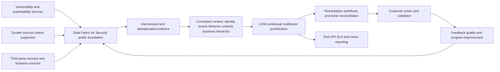

| Layer | Documented public positioning | General architecture responsibility | Must be verified |
|---|---|---|---|
| Sources/integrations | Vulnerability/exploitability, Zscaler, third-party data; public catalog states 150+ prebuilt connectors at review date | Define source purpose, scope, grain, authority, freshness, security | Exact connector, object, direction, version, permission, availability, entitlement |
| Data Fabric | Aggregates/unifies; ingest, harmonize/map, deduplicate, correlate/enrich; customizable model | Preserve provenance, quality, time, entity semantics, conflict | Internal topology, storage, algorithms, order, SLOs |
| Context | Identity, assets, user behavior, mitigating controls, business processes, organizational hierarchy, and more | Relate exact findings to current customer conditions | Exact entity/relationship/factor catalog and semantics |
| Prioritization | Out-of-the-box multifactor scoring; adjust factors/weights; add sources as factors | Govern gates, factors, overlap, sensitivity, explainability | Formula, defaults, ranges, normalization, calculation order |
| Workflow | Custom workflows with remediation details/rationale and automatic ticket reconciliation | Define owner, states, idempotency, approval, read-back, validation | Templates, fields, actions, retry/state behavior, targets |
| Reporting | Dynamic insights into risk posture, KPIs, SLAs, and other metrics | Govern grain, denominator, freshness, filters, drill-down | Exact metrics, formulas, visuals, refresh, RLS, exports |
| Outcomes | Public language focuses on more effective prioritization and remediation | Measure customer-specific validated outcomes and adoption | No universal savings, capacity, downgrade, prevention, or risk-reduction guarantee |

## JD Mapping

| JD signal | UVM capability developed here | Customer/TSM artifact | Honest boundary |
|---|---|---|---|
| Develop deep product expertise | Explain public UVM/Data Fabric relationship and verification boundaries | Source-bounded architecture whiteboard | No internal implementation claim |
| Become a trusted advisor | Connect product capability to customer VM lifecycle and decisions | Outcome and operating-model map | Customer risk/change authority remains separate |
| Drive adoption and value | Sequence sources, context, priority, workflow, reporting, training | Phased success plan and adoption scorecard | No guaranteed timeline/result |
| Troubleshoot complexity | Isolate source, mapping, entity, context, logic, workflow, report defects | Layered runbook and escalation packet | No invented root cause or product SLO |
| Use analytics | Define temporal grains, quality, factors, KPIs, SLAs, and drill-down | Metric dictionary and reconciliation tests | No undocumented schema or formula |
| Coordinate stakeholders | Align SecOps, VM, IT, app, cloud, IAM, CMDB, risk, change, executives | RACI and action register | TSM enables rather than accepts risk |
| Communicate proactively | Explain facts, movement/cause, uncertainty, owner, checkpoint | Technical and executive narratives | No unsupported ETA or assurance |
| Partner with Support/Product | Create minimal reproducible, redacted product evidence | Support/Product case packet | No roadmap/fix promise |
| Explore AI responsibly | Assist cited summaries, grouping candidates, and workflow drafts under review | Guardrailed use-case charter | No opaque autonomous priority, closure, or acceptance |

## Candidate honesty note

| Evidence class | Neutral phrasing | Boundary |
|---|---|---|
| Factual production background | Your prior support work involved complex identity, permission, endpoint, network, service, analytics, escalation, and customer-outcome evidence | This does not establish production UVM or Data Fabric administration |
| Transferable method | Source quality, exact IDs, UTC timelines, hypothesis testing, cross-team ownership, dashboards, RCA, and validation transfer to a TSM operating model | Tool-specific behavior remains to verify |
| Synthetic practice | NMH architecture, mappings, factors, workflows, dashboards, and cases are fictional structured exercises | No production tenant or result claim |
| Learned product knowledge | Public Zscaler UVM/Data Fabric claims can be explained with source/date/boundary | Public positioning is not licensed-tenant proof |
| General engineering pattern | Source contracts, idempotency, canary, read-back, reconciliation, quality states, and metric contracts are implementation principles | They are not statements about proprietary internals |
| Unknown | Fields, formulas, weights, defaults, connector behavior, limits, entitlements, and support procedures require current verification | Unknown stays visible |

## Beginner vocabulary and memory hooks

| Term | Plain meaning | Why it matters | Analogy / hook |
|---|---|---|---|
| UVM | Zscaler Unified Vulnerability Management | Publicly positioned to prioritize and operationalize vulnerability/security-gap work with context | Hospital command center for maintenance priority |
| Data Fabric | Integrated capabilities connecting and operationalizing distributed data | Public foundation for UVM and other exposure uses | Coordination network between specialist departments |
| Source | System or dataset providing observations/context | UVM quality cannot exceed its usable evidence | Specialist department report |
| Connector | Supported mechanism moving data between systems | Enables integration but has scope/permission/semantic limits | Secured courier route |
| Inbound | Data moves into a target capability | Supplies findings or context | Reports arriving at command center |
| Outbound | Data or actions move to another system | Operationalizes decisions | Work orders leaving command center |
| Harmonization | Map different source representations into shared meaning | Lets sources be compared | Translate departments into common language |
| Deduplication | Identify repeated representations at defined grain | Reduces duplicate work while preserving evidence | Recognize three reports of one equipment fault |
| Entity resolution | Decide which records refer to the same real-world thing | Correct priority depends on exact asset/person/app | Match patient aliases to one chart |
| Golden record | Resolved context view with provenance and conflicts | Supports decisions without pretending infallibility | Master chart with source annotations |
| Correlation | Relate evidence through identity, time, and semantics | Connects vulnerability to asset, person, path, control, service | Link test result to patient, room, and treatment |
| Enrichment | Add relevant facts that improve interpretation/action | Adds ownership, threat, impact, controls | Add allergies and medications to a chart |
| Context | Customer facts around a finding | Converts technical severity into decision evidence | Who, where, path, safeguards, consequence |
| Factor | Input considered in prioritization | Makes decision dimensions explicit | One triage criterion |
| Weight | Relative influence assigned to a factor under a method | Customization can align policy but needs governance | How strongly triage considers one criterion |
| Mitigating control | Safeguard reducing a specific scenario prerequisite | Can change residual exposure if effective | Guard blocking one corridor |
| Multifactor | Uses several dimensions rather than one score | Avoids CVSS-only prioritization | Triage uses symptoms, history, age, and risk |
| Workflow | Governed sequence of states, people, and actions | Turns insight into remediation | Work order from assignment through verification |
| Ticket reconciliation | Keep product and external work records aligned | Prevents duplicate, stale, or false closure | Match command-center and maintenance records |
| KPI | Key Performance Indicator | Tracks performance toward a defined objective | Instrument panel measure |
| SLA | Service-level target/agreement for timing or service | Supports governance but requires exact clock rules | Agreed maintenance deadline |
| Dynamic report | View that updates from governed data rather than one manual snapshot | Supports current decisions | Live operations board |
| Explainability | Evidence and rationale behind priority/action | Builds trust and enables correction | Why this case came first |
| Provenance | Source and transformation history | Supports audit/troubleshooting | Chain of custody |
| Feedback loop | Results improve data, policy, controls, and future actions | Makes program adaptive | Repair results update future triage |
| CTEM | Continuous Threat Exposure Management | Broader continuous program of scoping, discovery, prioritization, validation, mobilization | Recurring enterprise exposure-improvement cycle |

### Plain-English deep-dive 1 - UVM is the coordinator, not every specialist tool

The public architecture says UVM consumes aggregated, correlated vulnerability, exploitability, Zscaler, third-party, and business context through Data Fabric. That positioning does not mean UVM must be the scanner that discovered every vulnerability, the endpoint agent that collected every package, the CMDB that owns every lifecycle field, the ITSM platform that performs every change, the patch tool that deploys every fix, the SIEM that detects every attack, or the risk owner that accepts every exception.

Think of a hospital coordination center. It receives radiology, laboratory, pharmacy, identity, bed, and clinical-service evidence. It helps prioritize and route care, but it does not replace every specialist department. Its value depends on accurate patient matching, timely results, interpretable policies, accountable owners, safe workflows, and verified outcomes.

Product boundaries matter in discovery. Ask which source remains authoritative for which field and time; which actions UVM supports under the licensed environment; which system owns ticket/change state; which product validates remediation; and how exceptions, retries, and failures reconcile. A TSM should help make these boundaries explicit rather than promise universal replacement.

## Official public claim map

The table below translates reviewed page wording into safe conversation boundaries. It deliberately excludes public marketing outcome figures and customer quotations because they are not universal results.

| Public claim category | Reviewed official wording summarized | Safe architectural meaning | Unsafe inference |
|---|---|---|---|
| Product foundation | UVM is powered by Data Fabric for Security | Place Data Fabric below UVM in the public product story | Invent internal services/topology |
| Aggregated/correlated data | UVM taps an aggregated, correlated data set | Explain cross-source contextual decision value | Claim every source is complete or real-time |
| Source categories | Traditional vulnerability/exploitability, Zscaler, and third-party sources | Plan complementary findings and context | Claim every Zscaler/third-party source is included |
| Connector breadth | UVM/Data Fabric pages reference 150+ prebuilt connectors at review date | Discuss broad ecosystem potential | Promise one connector, direction, object, or entitlement |
| Context domains | Identity, assets, user behavior, mitigating controls, business processes, organizational hierarchy, and more | Use these as documented context categories | Claim exact fields, relationships, or graph model |
| Priority | Identify security gaps/vulnerabilities to fix first | Connect context to ranked work | Treat product output as unquestionable truth |
| Multifactor scoring | Out-of-the-box/prebuilt risk calculation accounts for factors and controls | Explain composite contextual prioritization | Reconstruct formula, normalization, or defaults |
| Customization | Adjust weighting; support additional factors/new sources | Discuss governed customer alignment | Claim arbitrary factor behavior or no constraints |
| Reporting | Dynamic risk-posture, KPI, SLA, and metric insights | Design role-based current decision views | Promise real-time, exact templates, formulas, or refresh |
| Workflow | Custom workflows provide remediation details/rationale and automatically reconcile tickets | Explain context-rich operationalization | Invent payload, states, target system, retry/reopen behavior |
| Data Fabric logic | Custom scoring, workflows, grouping rules, dynamic reports | Connect reusable data to decisions/actions | Claim exact language/operators/execution order |
| Feedback | Data Fabric and deployed Zscaler solutions have public feedback-loop positioning | Explain observe-contextualize-act-validate-improve concept | Claim an undocumented automatic policy change |

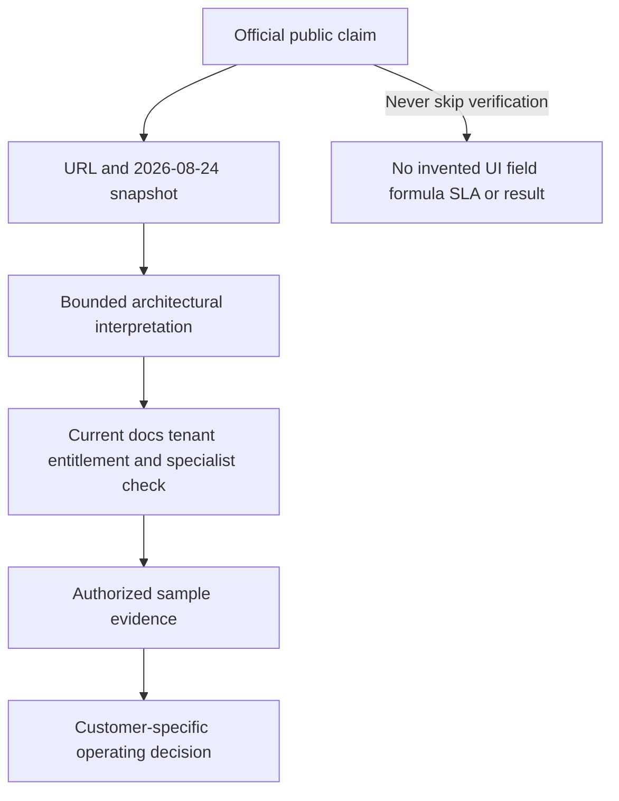

## Bridge from Data Fabric Parts 58-68

Parts 58-68 already established a vendor-careful sequence: security risk is a data problem; discover and contract sources; ingest reliably; harmonize/map; resolve duplicates and entities; correlate/enrich relationships; apply governed business logic/scoring/grouping; operationalize workflows; build dynamic reports; distinguish Data Fabric from SIEM/lake/warehouse/CMDB/iPaaS; and implement with health, troubleshooting, governance, and adoption.

UVM is an application of that foundation to vulnerability and security-gap decisions. It should inherit the same disciplines rather than restart at scoring.

| Data Fabric foundation | UVM application | Failure if skipped |
|---|---|---|
| Outcome/use-case charter | Which vulnerability decision and owner should improve? | Connector count becomes objective |
| Source contract | Findings, assets, identities, threat, controls, business, tickets | Incomplete/misunderstood inputs |
| Reliable ingestion | Fresh complete source observations with auth/pagination/retry | Source outage looks like risk improvement |
| Harmonization/mapping | Common meaning for severity, states, assets, owners, controls | False equivalence and broken filters |
| Entity resolution | Exact asset/person/app/finding/episode identity | Duplicate/wrong priority and tickets |
| Correlation/enrichment | Connect vulnerability to path, identity, controls, service, hierarchy | CVSS-only queue persists |
| Business logic | Customer factors, cohorts, groups, policies | Generic priority disconnected from organization |
| Workflow | Assignment, rationale, tickets, approvals, reconciliation | Insight remains a dashboard |
| Reporting | Risk, KPI, SLA, source/model health, drill-down | Static, misleading metrics |
| Implementation/health | Acceptance, rollout, observability, support, adoption | Scaled defects and low trust |

```mermaid
flowchart LR
    P58[Architecture and value] --> P59[Source planning]
    P59 --> P60[Ingestion reliability]
    P60 --> P61[Harmonize and map]
    P61 --> P62[Dedup and entity resolution]
    P62 --> P63[Correlate and enrich]
    P63 --> P64[Business logic and scoring]
    P64 --> P65[Workflows]
    P65 --> P66[Reporting]
    P66 --> P68[Implementation health adoption]
    P68 --> UVM[UVM vulnerability decision application]
```

The labels reference previous study content, not a claim that public UVM internally executes an exact linear pipeline.

## Source architecture and source contracts

UVM's public value begins with integrated data. A source contract states why a source is needed, what one record means, how it is identified, which fields it can authoritatively assert, how current and complete it is, and how it is protected. The public integrations catalog is discovery evidence, not an implementation contract.

| Source domain | Candidate contribution | Authority question | Quality/safety concern |
|---|---|---|---|
| Vulnerability scanners | Findings, evidence, check status, severity | Authoritative for which method/vantage? | Auth/scope/plugin false results |
| Endpoint/EDR | Device identity, software, control/behavior observations | Current host state or security control? | Agent health, privacy, tamper, stale data |
| Cloud/CNAPP/provider | Resources, config, findings, identities, relationships | Provider control-plane existence/config? | Account/region/permission/API gaps |
| AppSec/SAST/DAST/SCA | Code, dependency, runtime-app findings | Repository/build/runtime scope? | Commit-deploy lineage and duplicates |
| Asset/CMDB/AEM | Inventory, lifecycle, service, ownership, relationships | Which field/time is governed? | Staleness and false merge/split |
| IAM | Human/workload identity, group, role, entitlement | Effective privilege and time? | Sensitive access data, nested/temporary rights |
| Threat/exploitability | CVSS, EPSS, KEV, exploit/threat evidence | Official/provider semantics and as-of time? | Overlap, model limits, circular reporting |
| Zscaler data | Supported Zscaler observations and context | Which product/object under current docs? | Entitlement, field meaning, latency |
| Business systems | Process, hierarchy, criticality, owner, data class | Customer-approved authority? | Sensitive HR/business data and stale hierarchy |
| ITSM/workflow | Ticket, assignment, change, exception state | Workflow status versus technical truth? | Duplicate/timeout/premature closure |

| Source contract field | Question | Acceptance evidence |
|---|---|---|
| Purpose/use case | Which decision changes because of this data? | Approved outcome and factor/context mapping |
| Source owner | Who operates and corrects it? | Named role and escalation path |
| Objects/grain | What is one record? | Examples, schema, cardinality tests |
| Identity | Which strong namespaced IDs exist? | Stable IDs and lifecycle rules |
| Field authority | Which claims are primary/supporting/derived? | Field-level authority matrix |
| Scope | Which accounts, regions, ranges, apps, groups count? | Independent population reconciliation |
| Acquisition | Supported connector/API/file/action direction? | Current docs and controlled sample |
| Authentication | Which least-privilege identity and secret lifecycle? | Security approval and successful audit |
| Cadence/time | Observation, update, ingestion, completion semantics? | Freshness/latency test and timezone handling |
| Volume/limits | Full/incremental size, pagination, quota? | Load test and control totals |
| Schema/change | How are version/drift/deprecation handled? | Contract tests and change notice process |
| Quality | Completeness, validity, uniqueness, rejects, conflict? | Acceptance thresholds and exceptions |
| Security/privacy | Classification, minimization, access, retention, residency? | Approved data-handling design |
| Decommission | How are access/data/workflows retired? | Revocation, retention, reconciliation plan |

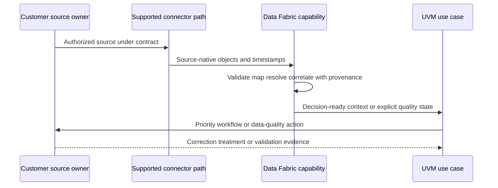

The sequence is a conceptual operating model. It does not describe undocumented Zscaler internal messaging or service order.

## Ingestion, harmonization, and data quality

The official Data Fabric page names ingest, harmonize and map, deduplicate, correlate and enrich. General implementation discipline requires preserving source-native records and timestamps, validating schemas, normalizing semantics, exposing rejects, and preventing missing evidence from becoming a pass.

| Layer | Example question | Failure mode | Safe invariant |
|---|---|---|---|
| Source scope | Did every intended account/target contribute? | Missing source lowers risk count | Degraded source blocks auto-downgrade/closure |
| Transport | Did auth, pages, retries, checkpoints complete? | First page or expired token | Reconcile native/received control totals |
| Parsing | Did records and types parse? | CVSS/date/ID malformed | Quarantine/reject visibly; no default zero |
| Mapping | Do source states mean the canonical state? | `fixed` means package available, not deployed | Versioned mapping with fixtures |
| Time | Which event/observation/ingestion time applies? | Late data rewrites current state | Preserve multiple clocks and as-of logic |
| Identity | Did record link to exact active entity? | Hostname/IP false merge | Candidate/conflict states and no unsafe action |
| Correlation | Do related records share correct grain/time? | CVE-level threat applied to wrong finding | Exact relationships and provenance |
| Derived logic | Which factor/rule version produced output? | Priority changes unexplained | Reproducible input and model snapshot |

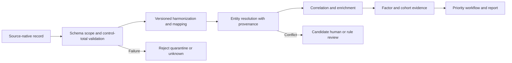

### Plain-English deep-dive 2 - Aggregated does not mean trustworthy by default

Pouring several maps into one folder does not create one accurate map. One source may be stale, one may use a building nickname, one may cover only one region, and one may label a proposed room as active. Aggregation increases available evidence; harmonization, identity, provenance, quality, and authority make it usable.

For UVM, a source outage is not only an integration problem. It can change factors, ranks, tickets, SLA cohorts, and executive reporting. A TSM should help define blast radius: which sources and objects failed; which UVM decisions could move; which automations should pause; which reports need caveats; how backfill/recompute/reconciliation will occur; and what customer communication is needed.

## Entity resolution and vulnerability data grain

UVM decisions require distinct identities for assets, people/workloads, applications, vulnerability definitions, source findings, exposure episodes, controls, business services, tickets, exceptions, and validations. Public product wording does not define these internal entities, so the model below is conceptual.

| Conceptual entity | One record represents | Candidate strong ID | Common mistake |
|---|---|---|---|
| Asset | One time-valid device/resource/workload/service instance | Namespaced device/cloud/resource/serial ID | Merge on hostname/IP/name |
| Identity | One person, account, service principal, workload, or role | Directory/provider principal ID | Person and account collapsed |
| Application/service | One governed capability/version | Portfolio/service ID | Infer from asset name |
| Vulnerability | One disclosed/vendor vulnerability definition | CVE/vendor ID plus record state | Treat as asset finding |
| Finding observation | One source assertion on one subject/check/time | Source finding/event ID | Count each scan as new risk |
| Exposure episode | Correlated applicable condition on one subject over time | Governed stable episode key | Reset age or overmerge components |
| Control assertion | One source claim about safeguard state | Source/control/subject/time | Presence equals effectiveness |
| Ticket/action | One workflow item or grouped campaign | Target system ID/idempotency key | Ticket state equals technical truth |
| Exception | One authorized residual-risk decision | Risk-system ID/version | Permanent hidden closure |
| Validation | One postcondition test/result | Validation ID/source/time | Repeat same weak source only |

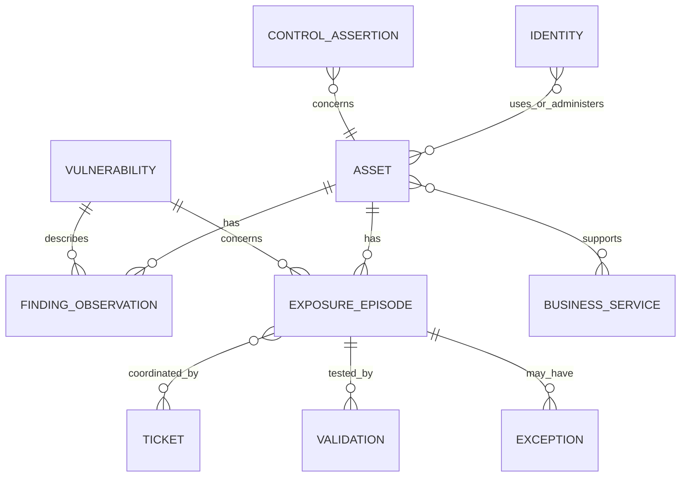

Entity resolution should produce exact, supported, candidate, conflicted, separate, or unknown outcomes. High-consequence ambiguity becomes evidence work; it should not be forced into a merge to make the dashboard tidy.

## Correlation and context domains

The public UVM page explicitly names identity, assets, user behavior, mitigating controls, business processes, and organizational hierarchy. A defensible architecture interprets these as categories of context with source, time, confidence, and decision relevance.

| Context domain | Plain meaning | Example decision question | Evidence caution |
|---|---|---|---|
| Vulnerability/finding | Technical condition and occurrence evidence | Is the condition applicable and severe? | CVE/score is not finding truth |
| Asset | Exact active resource, lifecycle, environment, exposure | Which instance is affected? | Golden record can be wrong/stale |
| Identity | Human/workload/service/admin relationships and privilege | What access is needed or gained? | Effective rights can be nested/temporary |
| User behavior | Observed activity relevant to context | Is asset/service actively used or behavior notable? | Behavior is not intent or compromise proof |
| Mitigating controls | Safeguards interrupting prerequisites | Which path is prevented/detected/recovered? | Presence is not effectiveness |
| Business process | Customer operation supported by the system | Which outcome could be affected? | Requires customer-approved semantics |
| Organizational hierarchy | Department/team/location/owner relationships | Who owns and how should work group? | HR/org data is sensitive and time-bound |
| Threat/exploitability | CVSS/EPSS/KEV/exploit/threat evidence | How urgent is exploitation context? | Avoid overlap/double counting |
| Application/data | App dependency and sensitive information | What service/data consequence follows? | Classification and paths need evidence |
| Workflow | Ticket, exception, change, validation state | Is action executable and complete? | Ticket closure is not security closure |

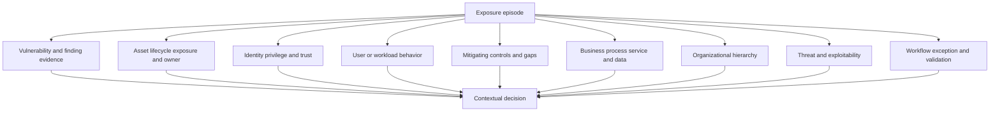

### Correlation contracts

| Relationship | Claim | Required qualifiers | Misuse |
|---|---|---|---|
| finding -> asset | Source observed condition on subject | Source, ID, component, observation time, confidence | Join by hostname only |
| asset -> service | Asset supports business process/service | Role, direction, validity, owner | Every network flow becomes dependency |
| identity -> asset | Principal uses/administers/runs on asset | Permission, condition, time, source | Last user becomes owner |
| control -> episode/path | Control interrupts a prerequisite | Applicability, health, enforcement, exception, test | Installed control lowers all risk |
| behavior -> entity | Activity observed for subject | Event type, time, sensor, confidence | Activity becomes malicious intent |
| threat -> vulnerability | Intelligence concerns CVE/condition | Source, time, scope, confidence, overlap | Report proves customer targeting |
| ticket -> episode | Workflow coordinates treatment | Stable mapping, version, state, read-back | Ticket closes episode automatically |

## Contextual multifactor prioritization

Zscaler publicly describes out-of-the-box multifactor scoring, customer-adjustable factors/weights, mitigating controls, and support for additional factors from new data sources. The official page does not publish the complete calculation. This Part therefore explains governance and architecture categories, not a product formula. Part 82 will go deeper into contextual scoring.

| Factor family | Customer question | Publicly grounded relationship | General governance need |
|---|---|---|---|
| Technical severity | What can the vulnerability enable? | UVM problem framing contrasts CVSS severity with risk | Version/vector/source preserved |
| Exploitability/threat | Is exploitation predicted, known, available, or relevant? | UVM references vulnerability and exploitability sources | Signal definitions/time/overlap controlled |
| Asset/exposure | Which asset and exposure condition apply? | Public context includes assets | Identity, lifecycle, reachability quality |
| Identity/behavior | Which user/workload privilege/activity changes scenario? | Public context names identity and user behavior | Privacy, semantics, effective rights |
| Mitigating controls | Which prerequisite is effectively interrupted? | Public positioning names mitigating controls | Applicability/effectiveness/bypass/unknown |
| Business process/hierarchy | Which service/team/consequence/owner applies? | Public context names business processes and org hierarchy | Customer authority and sensitivity |
| Workflow/time | Is work owned, excepted, overdue, validated? | Public workflow and KPI/SLA positioning | Prevent SLA gaming and ticket-as-truth |
| Custom factors | Which unique customer evidence should matter? | Public support for additional factors/new data sources | Quality, overlap, testing, approval, versioning |

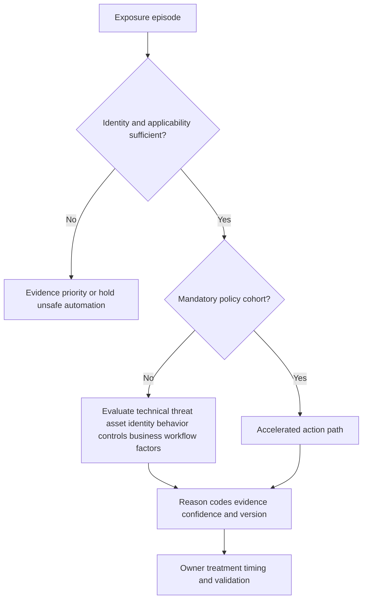

Do not average away hard gates. For example, an applicable KEV item under customer policy may require accelerated action even if one factor is low. A low-confidence critical public asset may require urgent validation instead of a numerical downgrade. Weight changes need sensitivity testing: which episodes cross thresholds, which teams receive work, which mandatory cohorts remain protected, and whether historical trends are restated.

### Plain-English deep-dive 3 - Multifactor does not mean mysterious

A medical triage decision can use age, symptoms, history, vital signs, and test results. That does not justify an unexplained number. The clinician must still explain which evidence mattered, what uncertainty remains, what action follows, and what would change the decision.

UVM's public multifactor positioning is valuable because vulnerability risk is contextual. Customer trust still requires explainability: factor name and meaning, source and as-of time, quality/confidence, rule/model version, overlap, mandatory gate, contribution/reason, recommended action, owner, and postcondition. A score should help organize evidence; it should not become an unchallengeable oracle.

## Mitigating-control reasoning

Controls can reduce exposure only for the paths and prerequisites they actually cover. A control assertion should distinguish expected, present, configured, healthy, enforcing, effective for the scenario, excepted, bypassed, stale, unknown, and not applicable.

| Control state | Meaning | Priority use | Unsafe interpretation |
|---|---|---|---|
| Expected | Policy says control should apply | Coverage requirement | Control exists |
| Present | Component/agent/rule observed | Candidate safeguard | Effective automatically |
| Configured | Relevant policy appears set | Stronger evidence | Enforcement guaranteed |
| Healthy | Control reports operational health | Supports current use | Covers exact path |
| Enforcing | Evidence shows policy active on path | Can affect scenario | No bypass/exception |
| Effective | Authorized test/evidence interrupts prerequisite | Can reduce residual exposure with caveat | Vulnerability removed |
| Excepted | Approved scope bypass exists | Residual path remains | Treat entire control as effective |
| Bypassed | Alternate route/technique works | Raise concern/action | One failure invalidates unrelated controls |
| Stale/unknown | Evidence cannot support current claim | No automatic reduction | Assume last state persists |
| Not applicable | Control does not address scenario | Exclude with rationale | Use to lower priority |

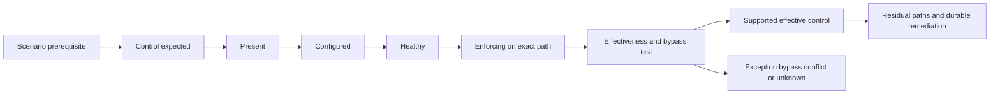

## Workflow architecture and ticket reconciliation

The UVM page publicly describes custom workflows that include remediation details and rationale and automatically reconcile tickets. Safe workflow architecture begins with a qualified decision, not every raw finding. It needs stable identity, ownership, idempotency, approvals, target read-back, validation, and audit. Exact product states and fields remain unknown until verified.

| Workflow element | General contract | Why it matters | Verification item |
|---|---|---|---|
| Trigger | Qualified episode/cohort change under policy | Prevents noise | Supported product trigger types |
| Preconditions | Identity, applicability, quality, owner, context thresholds | Prevents wrong action | Configurable checks/behavior |
| Grouping | Owner/service/root cause/treatment/campaign rules | Creates executable work | Supported grouping semantics |
| Rationale | Evidence, factors, why-now, options, limitations | Builds recipient trust | Available fields/templates |
| Stable key | Idempotency/mapping between episode and target item | Prevents duplicates | Product/connector key behavior |
| Approval | Human/risk/change gate where required | Protects consequential action | Supported approval integration |
| Delivery | Supported outbound integration | Creates/updates work | Exact target/action/direction/permissions |
| Read-back | Query or event confirms target state/version | Detects ambiguous timeout/conflict | Connector reconciliation behavior |
| Validation | Native/source/path/control/service postconditions | Separates action from outcome | How evidence returns/links |
| Reopen/exception | Govern recurrence and residual risk | Prevents false closure | Product state/rule support |
| Audit | Actor, time, input version, action, result | Reproducibility and governance | Retention/export/access behavior |

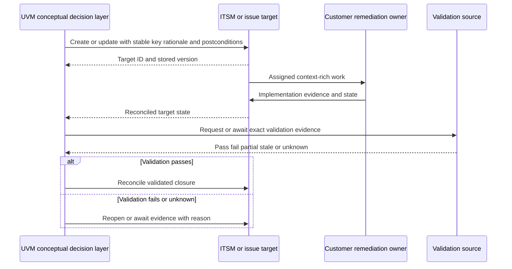

This is a recommended workflow contract, not a statement that UVM exposes these exact calls or states.

### Ticket failure handling

| Failure | Risk | Safe response |
|---|---|---|
| Create times out | Retry may duplicate | Query by stable key before retry |
| Target rejects field | Work silently absent | Quarantine, alert owner, preserve decision |
| Owner changes | Ticket routes stale | Reconcile governed owner and update with audit |
| Ticket closes early | Exposure remains | Validate and reopen/reconcile under policy |
| Source finding disappears | Could be outage | Check source health; no automatic closure |
| Group membership changes | Campaign totals drift | Version membership and reconcile additions/removals |
| Exception approved externally | UVM queue disagrees | Synchronize authority/effective/expiry state if supported |
| Connector disabled | Workflows diverge | Mark degraded, stop unsafe assumptions, backlog reconciliation |

## Dashboards, KPIs, SLAs, and reporting

The official page describes dynamic insights into risk posture, KPIs, SLAs, and other metrics in one correlated, context-rich data set. Treat "always up to date" as product positioning that must be qualified by source cadence, processing, connector health, and tenant evidence. A dynamic dashboard can still be wrong if the model or source is wrong.

| View | Audience | Questions | Guardrails |
|---|---|---|---|
| Analyst priority | VM/SecOps | Which episodes need evidence or treatment and why? | Factors, provenance, confidence, source health |
| Remediation owner | Platform/app/cloud teams | What exact work, rationale, dependencies, due logic, validation? | Owner-specific actionable grouping |
| Program operations | VM lead/TSM | Are sources, workflows, exceptions, adoption, and outcomes healthy? | Quality and latency beside risk |
| Risk/governance | Risk/service owners | Which residual scenarios, controls, exceptions, decisions? | Authority, expiry, uncertainty |
| Executive | Security/business leaders | What material risk moved, why, what was validated, what is blocked? | No raw score theater or guarantee |
| Support/technical health | Admin/support roles | Which connector/model/workflow/report layer failed? | Least privilege and sensitive-data controls |

| Metric family | Example contract question | Misleading shortcut |
|---|---|---|
| Source/coverage health | Which expected sources/objects are fresh and complete? | Risk fell because source failed |
| Context coverage | Which episodes have asset/owner/path/control/business evidence? | Score shown despite missing factors |
| Priority distribution | Which mandatory/contextual cohorts exist and why? | Count by score only |
| Backlog/aging | Which stable episodes remain in each state and wait reason? | Reset age on rescan/reopen |
| Workflow | Delivery, duplicate, reconcile, validation, reopen health? | Ticket-created count as success |
| SLA | Which clock, population, pauses, exceptions, policy version? | One compliance percent |
| Exceptions | Active/expiring/expired/control/owner/remediation debt? | Remove accepted risk from denominator |
| Outcomes | Which technical/path/control/service postconditions passed? | Claim prevented incidents |
| Adoption | Are users completing correct decisions/actions? | Login or dashboard view count |

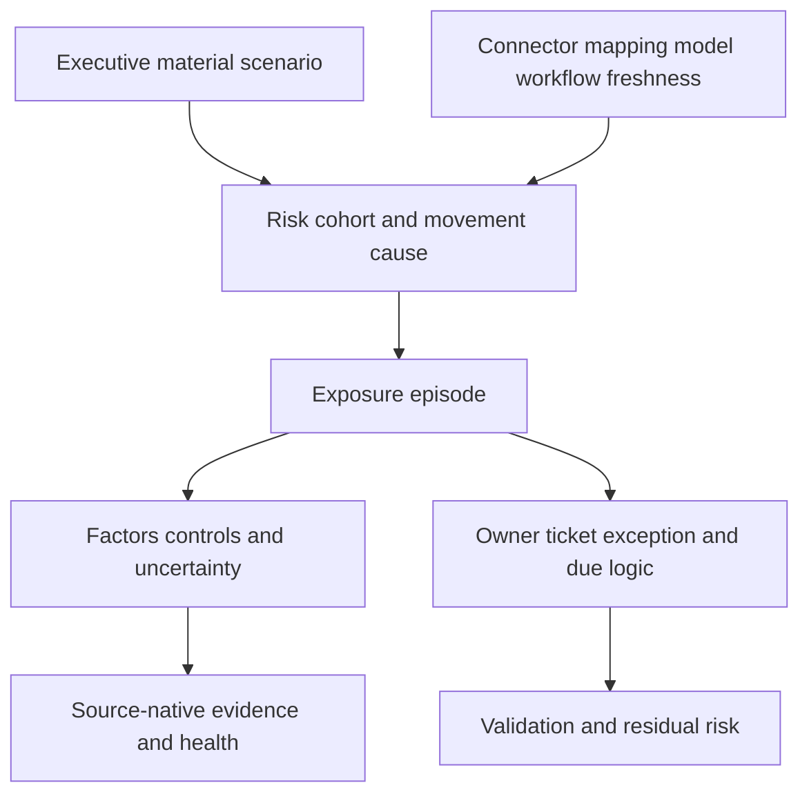

### Plain-English deep-dive 4 - Dynamic does not mean instantaneous or infallible

A live departure board still depends on airline feeds, clocks, identifiers, and status definitions. If one airline stops reporting, fewer delays may appear. If a flight number maps to the wrong aircraft, the board can be current and wrong.

UVM reporting should therefore show data as-of times and source/model health where relevant. The customer should know whether a metric is based on event time, observation time, ingestion time, calculation time, or ticket update time. When scope, mapping, identity, factors, or policy changes, trends may need a bridge or restatement. Product-specific refresh behavior must be measured in the licensed tenant rather than promised from marketing wording.

## Product boundaries and portfolio relationships

| Capability/category | Primary question | Relationship to UVM | Boundary to verify |
|---|---|---|---|
| Vulnerability scanner/AppSec/cloud source | What weakness was observed by this method? | Candidate finding source | UVM is not assumed to replace discovery engine |
| Patch/configuration tool | How is technical state changed at scale? | Remediation execution/evidence source or target | Exact integration/action support |
| ITSM/issue tracker | How is work assigned, approved, and audited? | Workflow target/source with reconciliation | System of record and supported states |
| CMDB/service catalog | Which governed items/services/owners exist? | Business/lifecycle context source | Field authority and update direction |
| IAM | Which identities and privileges exist? | Identity/context source | Sensitive fields and effective-right semantics |
| SIEM/SOC | What events/alerts/incidents occurred? | Behavior/threat/customer evidence source | UVM is not incident-response replacement |
| Data lake/warehouse/BI | How is broad history/analytics served? | Complementary source/sink/reporting | No assumption of storage/query equivalence |
| Data Fabric for Security | How are distributed security/business data integrated and operationalized? | Public foundational capability powering UVM | Internal architecture remains undisclosed here |
| Asset Exposure Management | Which assets/relationships/control gaps exist? | Adjacent Data Fabric-powered exposure application in public story | Product overlap/licensing/workflow specifics |
| UVM | Which vulnerability/security-gap work matters and how is it operationalized? | Contextual priority, workflow, reporting focus | Exact scope/capabilities verified |
| CTEM program | How does the organization continuously scope, discover, prioritize, validate, mobilize? | UVM can support prioritization/mobilization inputs in broader program | CTEM is not reduced to one product |
| Risk360 | How is broader enterprise cyber risk represented/reported under its product design? | Adjacent risk capability studied later | Do not equate score, factors, or product scope |

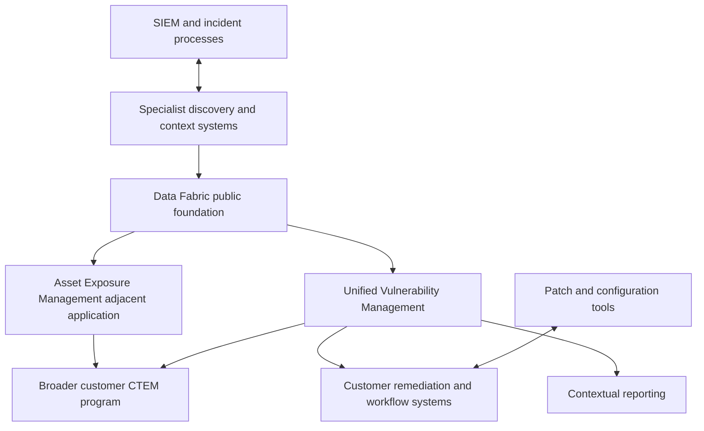

The arrows show conceptual relationships, not guaranteed packaged integrations.

## Implementation lifecycle and acceptance gates

A UVM implementation should begin with one bounded decision and service rather than every connector. The phases below apply the existing Data Fabric implementation discipline. Exact Zscaler onboarding steps must come from current official guidance and specialists.

| Phase | Main question | Customer/TSM artifact | Exit gate |
|---|---|---|---|
| 1. Discover | Which outcome, user, decision, pain, scope, and constraints? | Use-case charter and current-state map | Sponsor/owners agree on bounded objective |
| 2. Design | Which sources, entities, context, policy, workflows, metrics, security? | Architecture, source/authority/RACI plans | Contracts and privacy/change review approved |
| 3. Connect | Can minimum sources transport complete authorized data? | Connector acceptance ledger | Auth/scope/pagination/freshness/control totals pass |
| 4. Resolve | Are assets/findings/identities mapped and correlated correctly? | Golden-record/episode sample | False merge/split and semantic thresholds accepted |
| 5. Prioritize | Do factors/cohorts/reasons match customer policy and evidence? | Shadow decision comparison | Mandatory cohorts protected; owners trust reasons |
| 6. Workflow | Does low-risk proposal/canary action reconcile? | Workflow acceptance and rollback | Stable key, owner, read-back, no duplicate/false closure |
| 7. Report | Do operator/executive views reconcile and explain movement? | Metric dictionary and dashboard validation | Grain/denominator/source health/drill pass |
| 8. Adopt | Can each role complete routine tasks and recover failures? | Training, runbook, observation, support path | Correct task quality and ownership demonstrated |
| 9. Expand | Is next wave justified by quality, safety, value, and capacity? | Go/no-go and roadmap | Governance approves evidence-based wave |

```mermaid
flowchart LR
    DISC[Discover outcome] --> DESIGN[Design contracts and controls]
    DESIGN --> CONN[Connect minimum sources]
    CONN --> RES[Resolve entities and semantics]
    RES --> SHADOW[Shadow priorities and reasons]
    SHADOW --> PILOT[Human-reviewed workflow pilot]
    PILOT --> CANARY[Small live canary]
    CANARY --> ADOPT[Train observe and operate]
    ADOPT --> WAVE[Expand by evidence-based waves]
    WAVE --> REVIEW[Measure validate and improve]
```

### Implementation discovery questions

| Area | Questions |
|---|---|
| Outcome | Which harmful scenario or decision delay should improve? What is current baseline? |
| Users | Who triages, remediates, approves change, accepts risk, reviews value, operates sources? |
| Scope | Which business services, asset classes, environments, regions, finding types, and time? |
| Sources | Which vulnerability, exploitability, asset, identity, behavior, control, business, and workflow evidence exists? |
| Authority | Which source owns each field for which purpose/time? How are conflicts handled? |
| Entities | What are asset/finding/episode/identity/service/control/ticket grains and strong IDs? |
| Priority | Which mandatory cohorts, factors, controls, weights, reason codes, and unknown rules apply? |
| Workflow | Which action, owner, target, approval, SLA, exception, validation, reconciliation, rollback? |
| Reporting | Which decisions, metrics, drill-downs, freshness, access, exports, restatements? |
| Security | Which classifications, secrets, least privilege, retention, residency, audit, separation? |
| Adoption | Which task must each role perform correctly? What feedback/support path exists? |
| Success | Which quality, flow, validated outcome, and guardrail measures support the hypothesis? |

## Security, privacy, access, and governance

UVM context can reveal vulnerable assets, privileged identities, user behavior, controls, organizational hierarchy, business services, and remediation gaps. This is sensitive attack-surface and workforce data. The implementation should minimize data to the use case and govern access by role and purpose.

| Risk | Example | Guardrail | Validation |
|---|---|---|---|
| Overprivileged source identity | Connector can modify cloud/IAM when only read needed | Dedicated least privilege, vault, rotation, source restrictions | Permission review and audit sample |
| Sensitive identity/behavior exposure | Analysts see unnecessary HR/user activity | Purpose limitation, minimization, pseudonymization where appropriate, RBAC | Role test and field review |
| Vulnerability-data leakage | Export exposes unpatched critical systems | Classification, restricted export, encryption, recipient control | Access/export audit |
| Cross-tenant/customer mixing | Data/action crosses boundary | Tenant segregation and exact target identity | Boundary tests and audit |
| Unsafe automation | False merge isolates or tickets wrong asset | Quality gates, approval, shadow, canary, kill switch | Negative/boundary tests |
| Score manipulation | Weight changed to improve KPI | Separation, approval, version, sensitivity, audit | Before/after cohort diff |
| Exception abuse | Residual risk hidden | Authority, expiry, controls, review, separate reporting | Exception-debt review |
| AI leakage/hallucination | Sensitive context sent to unapproved model or invented rationale | Approved environment, redaction, citations, human review, no authority | Sample/audit and rollback |
| Excess retention | Old identities/findings remain broadly accessible | Purpose-based retention/deletion/legal hold | Deletion and downstream reconciliation test |

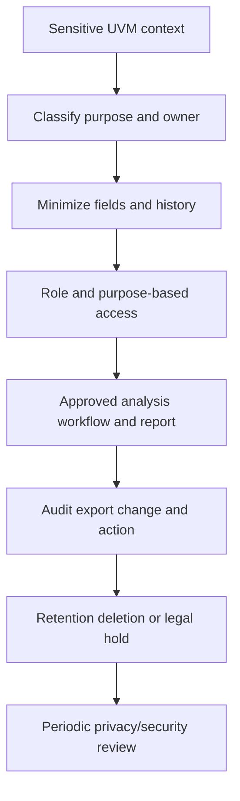

## Operational health and troubleshooting architecture

Troubleshooting begins by protecting decisions. If a source or mapping defect can lower scores or close tickets, pause affected automation, mark reporting degraded, preserve input/model versions, and communicate scope. Trace one exact episode end to end.

| Layer | Health questions | Failure examples | Evidence |
|---|---|---|---|
| Customer scope/source | Are intended systems and objects present and current? | Account omitted, scanner stopped | Independent counts and source status |
| Connector/transport | Did auth, pages, quotas, retries, checkpoints work? | Expired secret, partial page | Run/audit logs and control totals |
| Schema/mapping | Did fields/types/enums/time map correctly? | Severity/status/date drift | Raw vs mapped sample and rejects |
| Entity resolution | Is asset/finding/identity/episode correct? | False merge/split, stale lifecycle | Strong IDs, match evidence, history |
| Correlation/context | Are relationships current and meaningful? | Wrong owner, path, control, hierarchy | Edge provenance/time/confidence |
| Factors/policy | Are inputs, gates, weights, versions correct? | Priority shifts unexpectedly | Factor reasons and before/after snapshot |
| Workflow | Did trigger, delivery, read-back, reconciliation work? | Duplicate ticket, timeout ambiguity | Stable keys, target audit, retry log |
| Validation | Did technical/path/control/service checks pass? | Closed ticket, open condition | Native/source/postcondition evidence |
| Reporting/access | Do grain, filters, freshness, role access reconcile? | Totals differ or sensitive data exposed | Metric contract and access tests |
| Adoption/governance | Are users performing correct routines and resolving defects? | Offline spreadsheets, silent overrides | Observation, feedback, decision logs |

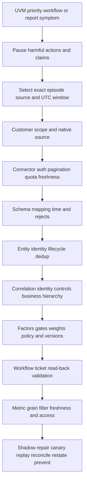

### Symptom-to-hypothesis table

| Symptom | Plausible hypotheses | Cheap discriminating check | Immediate protection |
|---|---|---|---|
| Risk counts drop | Source outage, scope loss, mapping reject, real remediation | Native source/control-total bridge | Block auto-closure and caveat report |
| One asset gets huge score/rank | False merge, criticality propagation, duplicate factors, real concentration | Entity/factor reason drill-down | Hold automatic action |
| KEV not reflected | Feed freshness, CVE normalization, applicability gate, policy | Exact CVE source timestamp and episode factors | Manual accelerated review |
| Control lowers priority incorrectly | Presence treated as effective, wrong path, stale state | Control assertion/provenance and bypass evidence | Restore unknown/no reduction |
| Wrong owner | CMDB/hierarchy mapping, false asset merge, stale org | Field-level authority and ID sample | Route to stewardship queue |
| Duplicate tickets | Unstable episode key, timeout retry, grouping change | Stable key and target search/audit | Pause create; reconcile |
| Closed ticket remains open | Validation failed, status mapping, wrong episode | Ticket mapping and native postcondition | Reopen/await validation |
| Dashboard differs by user | Role filter, as-of, cache, semantic filter | Same metric contract and controlled identities | Publish caveat; protect access |
| Priority changed after weight update | Intended sensitivity or model defect | Before/after cohort and mandatory-gate diff | Hold rollout/rollback if gate failed |
| Users export to spreadsheets | Missing workflow, trust, filter, ownership, performance | Observe one end-to-end task | Fix process/product fit, not blame |

### Support and Product escalation packet

| Field | Minimum evidence |
|---|---|
| Problem | One sentence expected versus actual |
| Impact | Affected decisions, episodes, users, workflows, reports; no inflated claim |
| Identifiers | Tenant/environment as permitted, source, connector, run, asset, finding, episode, policy, workflow, ticket, report IDs |
| Time | UTC first/last occurrence, successful baseline, source/model/update times |
| Versions | Source schema/API, connector/config, policy/model, target integration where available |
| Reproduction | Smallest authorized deterministic steps and frequency |
| Evidence | Redacted raw/mapped/factor/audit/target records and screenshots if needed |
| Changes | Source, permission, schema, rule, weight, workflow, target, entitlement, org changes |
| Tests | Hypotheses and exact outcomes; compare working/failing cohort |
| Containment | Automation paused, report caveat, manual route, customer status |
| Ask | One bounded diagnostic, documentation, defect, or capability question |

Do not promise an escalation path, defect determination, workaround safety, or fix date until confirmed through supported channels. Keep vendor-case status separate from the customer's validated outcome.

## Adoption and TSM value

UVM value requires trustworthy data and routine customer action. A TSM connects product knowledge, customer architecture, operating process, stakeholder decisions, adoption, support, and evidence of outcomes.

| TSM motion | Activity | Artifact | Value evidence |
|---|---|---|---|
| Discover | Clarify outcomes, users, pain, current tools/process, constraints | Use-case charter | Shared decision objective |
| Architect | Map sources, context, authority, security, workflows, reporting | Source-bounded architecture | Risks/dependencies explicit |
| Plan | Sequence minimum sources and gated waves | Success plan/RACI | Realistic owners and exit criteria |
| Validate | Challenge source/identity/context/factor/workflow evidence | Acceptance ledger | Decision quality and trust |
| Enable | Teach role-based routines and troubleshoot tasks | Curriculum/runbooks | Correct task completion |
| Operate | Review health, priority, workflow, exceptions, outcomes | Service/program review | Actions and decisions maintained |
| Escalate | Coordinate reproducible Support/Product evidence | Case packet and customer updates | Reduced ambiguity/duplicate effort |
| Improve | Capture feedback, recurrence, gaps, roadmap dependencies | Improvement backlog | Sustained program learning |
| Communicate | Translate technical evidence to executive decisions | Narrative and action register | Clear owner/blocker/checkpoint |

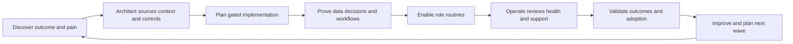

### Adoption ladder

| Stage | User behavior | Evidence | TSM focus |
|---|---|---|---|
| Aware | Understands purpose and boundaries | Teach-back | Correct concepts |
| Access ready | Correct roles/sources available | Access and data test | Remove prerequisites safely |
| Guided | Completes task with runbook | Observed scenario | Fix friction and semantics |
| Independent | Performs routine correctly | Sample task quality | Reinforce governance |
| Operational | Team uses workflow/reviews and handles failures | Reconciliation and incident drills | Sustain ownership/support |
| Outcome-driven | Uses evidence to improve controls/process | Validated outcomes and recurrence | Expand carefully |

Login count, dashboard views, connector count, or tickets created are activity measures. Stronger adoption evidence is whether users understand rationale, assign correctly, execute treatment, govern exceptions, validate closure, reconcile workflows, and use feedback.

## Complete synthetic NMH UVM architecture

Everything below is fictional and synthetic. No source, field, factor, workflow, dashboard, or behavior is claimed to exist in a Zscaler tenant. Future dates are explicitly labeled synthetic; the official source-review date remains 2026-08-24.

### Synthetic outcome and minimum architecture

NMH selects one pilot outcome: reduce time and rework required to identify, assign, and validate high-consequence patient-portal vulnerability episodes while keeping unknown data and change safety visible.

| Synthetic source role | Candidate data | Purpose | Boundary |
|---|---|---|---|
| Vulnerability source | Finding ID, CVE, component, check evidence/time | Technical occurrence | Synthetic contract, not named connector |
| Asset/cloud source | Resource ID, instance, network/interface, lifecycle | Exact active subject and exposure | Source authority must be tested |
| IAM source | Workload identity and effective role candidates | Privilege path | Sensitive; synthetic fields |
| Threat sources | CVSS/EPSS/KEV and cited exploit assertions | Urgency context | Official semantics/time preserved |
| Control sources | WAF, endpoint, segmentation assertions | Mitigation/path context | Presence not effectiveness |
| Service catalog | Patient portal, owner, criticality, dependencies | Business decision and routing | Customer-attested synthetic data |
| ITSM | Ticket/change/exception/validation workflow | Operationalization | No specific supported integration claimed |

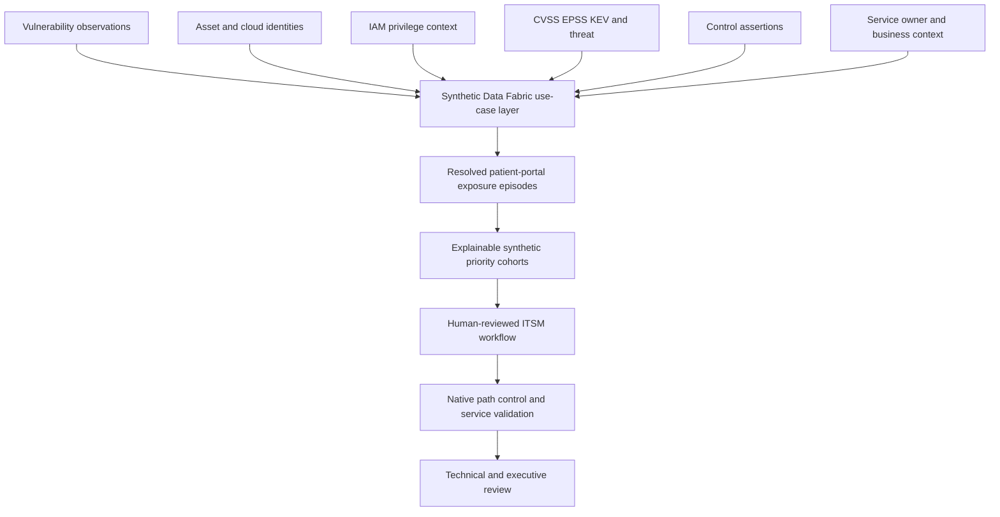

### Synthetic acceptance baseline

| Acceptance dimension | Synthetic result | Decision |
|---|---:|---|
| Registered patient-portal assets/backends | 48 | Independent expected population |
| Fresh source-visible assets | 46 | Two unknown; no clean assumption |
| Exact resolved asset identities | 44 | Two candidates held from automation |
| Supported vulnerability episodes | 286 | Correlated observations, not raw rows |
| Episodes with service/technical owners | 271 | Fifteen ownership tasks |
| Episodes with current control/path evidence | 198 | Context gap remains visible |
| Human-reviewed mandatory/high cohort | 32 | Synthetic policy result |
| Proposal-only tickets accepted | 10 of 10 | Does not prove production readiness |
| Validated remediation outcomes | 6 of 10 | Four still awaiting approved change/validation |

The counts illustrate acceptance states only and are not customer or product results.

### Scenario 1: source permission loss changes priority

The synthetic cloud source loses access to one account. Internet-exposure fields become absent. A weak mapping would interpret missing as not exposed and lower priorities. The designed invariant changes the affected factor to unknown, marks source health degraded, blocks automatic downgrade/closure, and creates a data-quality action. After permission restoration and backfill, UVM-like decisions are recomputed in shadow, tickets and reports reconcile, and affected history is restated.

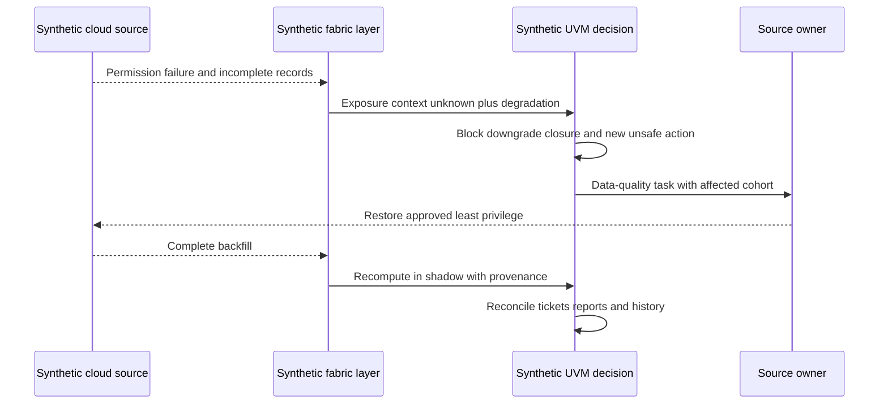

### Scenario 2: identity false merge raises the wrong asset

Two backend instances reused a hostname across a replacement event. A correlation rule merges old unpatched and new patched instances, inheriting patient-service criticality and a privileged identity onto one synthetic record. The apparent priority spikes. NMH freezes affected workflow, splits records by cloud resource ID and lifecycle, reassigns every finding/control/path/ticket assertion, recomputes in shadow, validates the active instance, and adds a temporal hostname regression test.

### Scenario 3: control presence causes false downgrade

A WAF-present assertion lowers a public episode. Path testing shows a partner route reaches the origin directly. NMH changes the synthetic control state to partial/bypassed for that scenario, restricts the origin route, validates required and blocked paths, keeps underlying component remediation open, and records residual risk. It does not call the WAF useless globally; the control's effectiveness is path-specific.

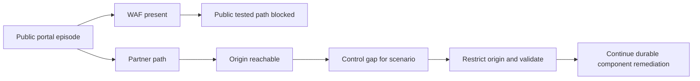

### Scenario 4: weight change crosses workflow threshold

NMH's fictional governance group proposes increasing business-criticality influence. Before change, analysts compare old/new cohorts, mandatory-policy protection, owner capacity, false merge sensitivity, and ticket volume. The change would move 140 episodes across a synthetic workflow threshold, including 17 with unknown asset identity. Governance rejects automatic deployment, fixes the identity gate, pilots one service, and versions the policy. No exact UVM weight or threshold is implied.

### Scenario 5: ticket timeout creates duplicate actions

An outbound request times out after the target created a ticket but before acknowledgment. A naive retry creates another. The synthetic workflow uses a stable episode/campaign key, queries target state after ambiguous timeout, stores the returned ticket ID, and reconciles duplicates before continuing. This is a general reliability pattern to verify against actual supported connector behavior.

### Scenario 6: dynamic dashboard appears to improve

Risk-posture tiles fall after a mapping deployment. The source count is unchanged, but 12 percent of episodes have null criticality due to a hierarchy-key type change. The report displays fewer high-priority episodes. NMH marks the model/report degraded, rolls back or repairs the mapping in shadow, tests null handling and control totals, recomputes, restates the trend, and adds a criticality-null invariant. A dynamic dashboard can be current and wrong.

### Scenario 7: successful bounded pilot

Ten human-reviewed proposal tickets map to stable synthetic episodes and accepted owners. Six complete safe treatment and pass native, source, public/partner path, and service checks. Four remain `implemented-awaiting-validation` or blocked by change dependency. NMH reports six validated outcomes, four open decisions, source/context coverage, and no claim of prevented incidents, universal risk reduction, or product efficiency. Expansion waits for the two unknown assets, hierarchy mapping regression, and runbook drill.

### Synthetic customer review narrative

"The pilot demonstrates a functioning decision loop for one service, not enterprise completeness. Forty-four of 48 expected backends have exact current identities; two are source-unknown and two remain identity candidates, so affected automation is blocked. Thirty-two episodes entered the human-reviewed mandatory/high cohort under synthetic policy. Ten proposal tickets reconciled to accepted owners; six have passed defined postconditions and four remain open. A hierarchy mapping defect invalidated one dashboard trend and has been restated. Decisions requested are source-access restoration ownership, approval of the next canary cohort, and whether to fund origin-path remediation."

## Customer and TSM artifact kit

| Artifact | Purpose | Minimum contents | TSM value |
|---|---|---|---|
| Public claim ledger | Keep product statements bounded | Claim, URL, snapshot, safe use, verification item | Prevent overpromising |
| Outcome/use-case charter | Define customer decision loop | User, population, evidence, action, owner, postcondition, guardrails | Align implementation to value |
| Source/connector plan | Sequence minimum data | Purpose, scope, object, direction, auth, quality, security | Expose dependencies and entitlement questions |
| Authority matrix | Govern field truth | Entity/field/source/purpose/time/precedence/conflict | Reduce false context |
| Entity/relationship dictionary | Define UVM conceptual grains | IDs, lifecycle, cardinality, provenance, confidence | Prevent duplicate/wrong priority |
| Factor governance record | Explain contextual logic | Definition, source, quality, overlap, weight/gate, version, tests | Build trust without formula claims |
| Workflow contract | Operationalize safely | Trigger, preconditions, grouping, rationale, stable key, approval, read-back, validation | Prevent ticket noise and false closure |
| Metric dictionary | Make dashboards reproducible | Grain, denominator, formula, time, filters, source health, owner | Apply SQL/Power BI rigor |
| Acceptance ledger | Prove each implementation layer | Expected/actual/evidence/owner/disposition | Support go/no-go decisions |
| Health scorecard | Monitor source-to-outcome chain | Source, map, identity, context, logic, workflow, report, adoption | Find controlling defect quickly |
| Action/decision register | Preserve commitments | ID, owner, due logic, blocker, evidence, decision, checkpoint | Make reviews cumulative |
| Support escalation packet | Reproduce bounded product issue | IDs, UTC, versions, data path, tests, containment, ask | Improve vendor coordination |
| Executive narrative | Translate evidence to decisions | Outcome, movement/cause, validated results, uncertainty, blockers, asks | Avoid score theater |

## Safe labs and exercises

All labs use synthetic data, public pages, or explicitly authorized nonproduction environments. They do not require a Zscaler tenant.

| Lab | Exercise | Deliverable | Pass condition |
|---|---|---|---|
| 1 | Teach UVM/Data Fabric architecture | Whiteboard | Documented claims and verification items labeled |
| 2 | Build a public claim ledger | Source table | No marketing result generalized |
| 3 | Map Parts 58-68 to UVM | Foundation matrix | Source through outcome chain complete |
| 4 | Draft one UVM use-case charter | One page | Decision/outcome, not connector count |
| 5 | Build source contracts | Three synthetic sources | Grain, authority, time, quality, security included |
| 6 | Test ingestion failures | Acceptance ledger | Missing maps to unknown/degraded |
| 7 | Design entity grains | ER model | Asset, identity, finding, episode, ticket distinct |
| 8 | Review false merge/split | Sample repair plan | Every downstream assertion reconciled |
| 9 | Build context-domain map | Episode evidence map | Identity/assets/behavior/controls/business/hierarchy present |
| 10 | Create factor ledger | Governance table | Source/time/overlap/confidence/version explicit |
| 11 | Run weight sensitivity | Before/after cohort diff | Mandatory gates and unknown identity protected |
| 12 | Validate mitigating control | Path/effectiveness plan | Presence and scenario effectiveness separated |
| 13 | Design ticket workflow | Sequence/state contract | Idempotency, read-back, validation, reopen included |
| 14 | Simulate timeout duplicate | Reconciliation runbook | Query-before-retry used |
| 15 | Build role dashboards | Power BI wireframes | Shared semantics and source health visible |
| 16 | Diagnose a false green trend | Layered incident report | Mapping/null/source hypotheses tested |
| 17 | Draft security/privacy review | Data-flow and controls | Minimization, access, retention, audit included |
| 18 | Create Support packet | One synthetic product symptom | Exact IDs/UTC/versions/one ask, redacted |
| 19 | Rehearse customer review | Ten-minute presentation | Facts, boundaries, decisions, checkpoints clear |
| 20 | AI assistant tabletop | Allowed/prohibited matrix | Citations/review; no autonomous priority/action |
| 21 | Interview rehearsal | Q1-Q8 recording | No production UVM/Data Fabric claim |

## Experience bridge: enterprise escalation and analytics to UVM TSM value

| Factual strength | UVM/TSM transfer | Example phrasing | Boundary |
|---|---|---|---|
| Microsoft 365 support | Multi-source tenant/user/device/app/service context | "I connect evidence to the exact customer entity and outcome before recommending action." | Not production UVM use |
| OneDrive/SharePoint | Identity, permissions, sync state, client/service dependencies | "Identity and control context change interpretation, just as permissions change a sync case." | Not production security-graph work |
| Networking/traces | DNS/TCP/TLS/proxy/path and timestamp isolation | "I can test whether the context defect is source, path, mapping, or service." | Product tests need current support guidance |
| Escalations | Severity, containment, cross-team ownership, updates, RCA, validation | "I keep facts, hypotheses, owners, and next checkpoints explicit." | Customer risk authority remains separate |
| SQL | Grains, keys, joins, windows, anti-joins, temporal history, quality | "I would reconcile source-to-episode-to-ticket counts before trusting a dashboard." | No proprietary schema claim |
| Power BI | Metric contracts, denominators, trends, drill-down, executive stories | "I distinguish data movement from risk movement and show source health." | No UVM report template claim |
| Mentoring | Teach dense systems and observe adoption | "I design role-based scenarios with pass criteria, not feature tours." | Current product docs govern procedures |
| AI exploration | Assist summaries and candidate grouping with safeguards | "AI can draft cited rationale; customer evidence and human authority decide." | No autonomous scoring or action |

## Common misconceptions to correct

| Misconception | Correction |
|---|---|
| UVM is just another scanner | Public positioning emphasizes aggregated/correlated contextual prioritization and workflow; source scanners remain relevant |
| Data Fabric means one physical database replacing everything | It is publicly positioned as integrated data capabilities; source authority and complementary systems remain |
| 150+ connectors means every source/action is available | Catalog count and entries change; exact connector direction/object/version/permission/entitlement must be verified |
| Aggregated data is automatically accurate | Mapping, identity, quality, authority, and time still govern trust |
| Golden record is infallible | It is a resolved view with provenance, confidence, conflicts, and possible false merges/splits |
| Correlation proves attack path or compromise | Relationships and behavior require semantics, time, confidence, and customer evidence |
| Multifactor score is enterprise risk | It supports contextual priority; full customer risk and authority remain broader |
| Public pages reveal UVM formula/defaults | They support factor/weight positioning, not proprietary calculations |
| More factors always improve priority | Overlap, missing data, poor quality, and opaque weighting can worsen decisions |
| Control presence should always lower risk | Effectiveness is scenario- and path-specific |
| Dynamic means real-time and correct | Source cadence, processing, health, mapping, and model quality still matter |
| Ticket reconciliation means ticket equals security truth | Technical validation and stable episode state remain necessary |
| Automated workflow should start from every finding | Quality, applicability, ownership, policy, and safety gates matter |
| UVM replaces ITSM, patching, SIEM, CMDB, and scanners | Primary purposes differ; verify supported complementary boundaries |
| UVM alone is CTEM | CTEM is a broader continuous program across scoping, discovery, prioritization, validation, mobilization |
| Product deployment creates value automatically | Adoption, governance, workflow, validation, and outcomes complete the chain |
| TSM owns customer risk decisions | TSM enables architecture, adoption, evidence, support, and communication; customer authorities decide |
| AI can remove human review | Sensitive context, evidence quality, explainability, authority, and rollback require governance |

## Official Source Anchors

Research/source snapshot and review date: **2026-08-24**.

Zscaler official public pages support the bounded UVM and Data Fabric claims stated in this Part. General source-contract, data-quality, identity, workflow, reporting, security, and implementation mechanics are study architecture patterns grounded in Parts 43-68 and broader standards; they are not representations of proprietary internals. Public marketing figures and customer quotations are intentionally not treated as NMH or universal outcomes.

| Source | URL | Used for | Boundary |
|---|---|---|---|
| Zscaler Unified Vulnerability Management | https://www.zscaler.com/products-and-solutions/vulnerability-management | UVM powered by Data Fabric; aggregated/correlated data; vulnerability/exploitability, Zscaler/third-party sources; identity/assets/user behavior/controls/business/hierarchy context; multifactor/custom factors/weights; workflows/ticket reconciliation; risk/KPI/SLA reporting | No internal topology, schema, field, formula, default, range, refresh, entitlement, tenant behavior, or universal result |
| Zscaler Data Fabric for Security | https://www.zscaler.com/products-and-solutions/data-fabric | Aggregate/unify; customizable model; ingest, harmonize/map, deduplicate, correlate/enrich; custom scoring/workflows/grouping; dynamic reports; AEM/UVM foundation and feedback-loop positioning | No proprietary storage, processing order, algorithms, connector behavior, latency, SLO, or guarantee |
| Zscaler Data Fabric integrations | https://www.zscaler.com/products-and-solutions/data-fabric/integrations | Public 150+ prebuilt connector and AnySource/AnyTarget positioning at review date; examples across vulnerability, cloud, app, IAM, asset, intelligence, ITSM categories | Catalog changes; listing is not proof of direction, object, version, permission, support, entitlement, or customer compatibility |
| Zscaler Asset Exposure Management | https://www.zscaler.com/products-and-solutions/caasm | Adjacent Data Fabric-powered public asset visibility/context/gap positioning | Do not infer UVM/AEM packaging, shared fields, workflows, or licensed behavior |
| Zscaler Continuous Threat Exposure Management | https://www.zscaler.com/products-and-solutions/ctem | Broader exposure-program positioning | CTEM is not reduced to UVM or one product |
| FIRST CVSS | https://www.first.org/cvss/ | Current versioned technical severity foundation | Severity is not complete customer risk |
| FIRST EPSS | https://www.first.org/epss/ | Next-30-day in-wild exploitation probability model | Not certainty, severity, applicability, or compromise |
| CISA KEV Catalog | https://www.cisa.gov/known-exploited-vulnerabilities-catalog | Known-exploitation prioritization input | Not proof of customer compromise or complete exploitation universe |
| CVE Program | https://www.cve.org/ | Public vulnerability record identity | CVE is not a finding occurrence or customer risk |
| NIST Cybersecurity Framework 2.0 | https://www.nist.gov/cyberframework | Govern/Identify/Protect/Detect/Respond/Recover outcome and governance context | Voluntary; customer profiles/implementation vary |
| NIST SP 800-53 Rev. 5 | https://csrc.nist.gov/pubs/sp/800/53/r5/upd1/final | Vulnerability, access, audit, configuration, assessment, integrity, incident, privacy control context | Requires selection, tailoring, implementation, assessment |
| NIST SP 800-40 Rev. 4 | https://csrc.nist.gov/pubs/sp/800/40/r4/final | Enterprise patch-management planning and verification | UVM does not eliminate customer patch/change operations |

## Likely Interview Questions

### Q1. What is Zscaler UVM, based on current official public material?

**Model answer:** Zscaler publicly positions Unified Vulnerability Management as a Data Fabric-powered capability that uses aggregated, correlated data to prioritize vulnerabilities and security gaps and operationalize remediation. The reviewed page names traditional vulnerability/exploitability, Zscaler, and third-party sources; context across identity, assets, user behavior, mitigating controls, business processes, and hierarchy; multifactor scoring with configurable factors/weights; dynamic risk/KPI/SLA reporting; and custom workflows with remediation rationale and ticket reconciliation. Exact tenant behavior and entitlements require verification.

### Q2. How does Data Fabric support UVM?

**Model answer:** The public Data Fabric story provides the foundation: aggregate/unify sources, ingest, harmonize/map, deduplicate, correlate/enrich, apply customer business logic, and support workflows and dynamic reporting. In UVM terms, that can connect vulnerability observations to exact assets, identities, behavior, controls, business context, owners, and workflow state. I would preserve source provenance, time, authority, quality, and conflicts. The public pages do not reveal internal topology, schema, algorithms, or processing order.

### Q3. What data would you plan for a UVM use case?

**Model answer:** I would start with one decision and minimum sources: vulnerability findings/evidence; asset identity, lifecycle, environment, and exposure; CVSS/EPSS/KEV and cited threat evidence; human/workload identity and effective privilege where relevant; control applicability/effectiveness; service, data, owner, process, and hierarchy context; and ticket/change/exception/validation state. Every source needs purpose, grain, IDs, authority, scope, auth, cadence, quality, security, and decommission contracts. Connector support and entitlements must be checked currently.

### Q4. How should contextual multifactor prioritization be governed?

**Model answer:** Applicability and strong identity are gates. Mandatory customer-policy cohorts must not be averaged away. Each factor needs a definition, source, as-of time, quality/confidence, overlap analysis, treatment of missing values, and reason code. Weight or rule changes require versioning, approval, positive/negative/boundary/conflict tests, sensitivity and capacity analysis, shadow comparison, canary, monitoring, rollback, and historical reporting policy. A score organizes evidence; it does not replace customer risk authority or explanation.

### Q5. How do mitigating controls affect UVM priority?

**Model answer:** A control should influence only a scenario prerequisite it demonstrably covers. I distinguish expected, present, configured, healthy, enforcing, effective, excepted, bypassed, stale, unknown, and not applicable. I verify exact asset/path/identity scope, policy health, alternate routes, authorized tests, and residual exposure. Control evidence may change sequence or support temporary mitigation, but it does not erase the underlying vulnerability or guarantee no compromise.

### Q6. What makes a UVM remediation workflow safe and useful?

**Model answer:** Start from a qualified episode or campaign with strong identity, applicability, quality, owner, policy, and rationale. Use a stable idempotency key, context-rich remediation details, supported target and least-privilege integration, approvals for consequential actions, query-before-retry after ambiguous timeout, read-back/reconciliation, explicit exceptions, and native/path/control/service validation before closure. Begin proposal-only, then shadow, human-reviewed pilot, canary, and waves. Exact UVM workflow fields/states require current verification.

### Q7. How would you troubleshoot a wrong UVM priority or dashboard drop?

**Model answer:** I would pause affected automation and success claims, choose one episode and UTC window, then trace customer scope/native source, connector auth/pages/quotas/freshness, schema/mapping/time/rejects, entity identity/lifecycle/dedup, correlation/context, factor/gate/weight/policy versions, workflow/ticket/validation, and report grain/filter/access. I would repair in shadow, canary, replay deterministically, reconcile tickets and reports, restate history, communicate affected decisions, and escalate a redacted minimal evidence package if product behavior remains suspect.

### Q8. How does your background translate to a UVM TSM role while staying within factual boundaries?

**Model answer:** enterprise escalation work provides adjacent strengths in exact tenant/user/device/app identity, permissions, network and trace isolation, service dependencies, source quality, customer impact, containment, cross-team coordination, RCA, and validation. SQL and Power BI support grains, joins, temporal models, quality checks, metrics, and narratives; mentoring supports adoption; AI can assist cited summaries under review. NMH is synthetic, while production UVM/Data Fabric administration, formulas, and tenant workflows remain learning and verification boundaries.

## 30-Second Memory Hooks

| Concept | Memory hook |
|---|---|
| UVM | Contextual vulnerability decision and workflow coordinator |
| Data Fabric | Coordination network for distributed security/business evidence |
| Source | Specialist report with scope and blind spots |
| Connector | Secured courier route, not truth guarantee |
| Harmonize | Translate into shared meaning |
| Deduplicate | One episode, many source assertions |
| Entity resolution | Match the right patient before triage |
| Golden record | Master chart with provenance, not infallible truth |
| Correlation | Link finding to asset, identity, control, service, and time |
| Enrichment | Add only decision-relevant context |
| Multifactor | Several governed dimensions, not CVSS alone |
| Weight | Policy influence that requires sensitivity and versioning |
| Control | Lowers only the prerequisite it effectively covers |
| Unknown | Blocks unsafe certainty and may create evidence priority |
| Workflow | Trigger, rationale, owner, action, read-back, validation |
| Ticket reconciliation | Keep work record and exposure state aligned |
| Dashboard | Live model whose sources and semantics need health checks |
| KPI/SLA | Defined grain, clock, denominator, and guardrails |
| Product boundary | Coordinator does not replace every specialist |
| Implementation | Outcome -> minimum data -> proof -> canary -> adoption |
| TSM | Product + customer architecture + process + evidence + trust |
| Experience bridge | Correlate prior evidence now; learn UVM specifics honestly |

## Completion Checklist

- [ ] I define UVM, Data Fabric, source, connector, inbound/outbound, harmonization, deduplication, entity resolution, golden record, correlation, enrichment, context, factor, weight, control, multifactor, workflow, reconciliation, KPI, SLA, dynamic report, explainability, provenance, feedback loop, and CTEM.
- [ ] I can state the documented public UVM/Data Fabric relationship and its source date.
- [ ] I distinguish documented public claims, general architecture patterns, synthetic NMH design, and unknown tenant behavior.
- [ ] I make no internal topology, storage, schema, algorithm, formula, default, field, UI, latency, entitlement, or outcome claim.
- [ ] I explain UVM as a contextual coordinator rather than every scanner, patch tool, CMDB, ITSM, SIEM, or risk authority.
- [ ] I can safely summarize the official source, context, multifactor, workflow, and reporting claims.
- [ ] I do not generalize public marketing figures or customer quotations.
- [ ] I map Parts 58-68's source planning, ingestion, mapping, entity resolution, correlation, logic, workflows, reporting, and implementation to UVM.
- [ ] I create source contracts with purpose, owner, objects/grain, identity, authority, scope, acquisition, auth, cadence, volume, schema, quality, security, and decommission.
- [ ] I treat the public integration catalog as discovery evidence, not compatibility or entitlement proof.
- [ ] I validate source scope, transport, parsing, mapping, time, identity, correlation, and derived logic.
- [ ] I prevent missing or degraded source data from causing automatic downgrade or closure.
- [ ] I distinguish asset, identity, app/service, vulnerability, observation, exposure episode, control assertion, ticket, exception, and validation grains.
- [ ] I use strong namespaced temporal IDs and preserve provenance and conflict.
- [ ] I map vulnerability, assets, identity, behavior, controls, business process, hierarchy, threat, app/data, and workflow context.
- [ ] I qualify relationships by source, direction, semantics, time, scope, confidence, and conditions.
- [ ] I never turn behavior/correlation into proof of intent, attack path, or compromise.
- [ ] I govern technical, exploitability, asset, identity, behavior, control, business, workflow, and custom factors.
- [ ] I protect applicability/identity gates and mandatory policy cohorts from weighted averaging.
- [ ] I version factor/rule/weight changes and run sensitivity, capacity, boundary, conflict, shadow, canary, rollback, and reporting tests.
- [ ] I require explainability with factor evidence, source/time, quality, version, reason, uncertainty, action, owner, and postcondition.
- [ ] I distinguish expected, present, configured, healthy, enforcing, effective, excepted, bypassed, stale, unknown, and not-applicable controls.
- [ ] I keep durable remediation and residual paths visible when controls mitigate.
- [ ] I design workflows with trigger, preconditions, grouping, rationale, stable key, approval, delivery, read-back, validation, exception/reopen, and audit.
- [ ] I use query-before-retry for ambiguous timeouts and reconcile duplicate/stale target items.
- [ ] I never equate ticket closure with technical validation.
- [ ] I design analyst, remediation, program, risk, executive, and support views from one governed semantic contract.
- [ ] I define source/context, priority, backlog/aging, workflow, SLA, exception, outcome, and adoption metrics with grain and denominator.
- [ ] I qualify dynamic/always-current positioning with measured source and processing freshness.
- [ ] I understand UVM relationships and boundaries with scanners, patch tools, ITSM, CMDB, IAM, SIEM, analytics platforms, Data Fabric, AEM, CTEM, and Risk360.
- [ ] I implement through discovery, design, connect, resolve, shadow-prioritize, workflow pilot, reporting, adoption, and evidence-based expansion.
- [ ] I begin with one bounded outcome and minimum source set rather than every connector.
- [ ] I protect sensitive vulnerability, identity, behavior, hierarchy, control, and business data through purpose, minimization, RBAC, encryption, retention, audit, and segregation.
- [ ] I govern AI use with approved environments, redaction, citations, human review, no autonomous authority, and audit.
- [ ] I troubleshoot scope/source -> connector -> mapping -> identity -> context -> factors -> workflow/validation -> reporting/adoption.
- [ ] I pause harmful actions and claims before repair, then use shadow, canary, deterministic replay, reconciliation, and restatement.
- [ ] I can build a redacted Support/Product packet with exact IDs, UTC, versions, evidence, containment, and one ask.
- [ ] I describe TSM value across discovery, architecture, planning, validation, enablement, operation, escalation, improvement, and communication.
- [ ] I measure adoption through correct tasks and outcomes rather than logins or connector count.
- [ ] I can explain all seven synthetic NMH scenarios without presenting fields, behavior, scores, or outcomes as product facts.
- [ ] I can create the claim ledger, use-case charter, source plan, authority matrix, entity dictionary, factor record, workflow contract, metric dictionary, acceptance ledger, health scorecard, action register, escalation packet, and executive narrative.
- [ ] I can complete all twenty-one labs without a production tenant or unsafe test.
- [ ] I connect Microsoft 365/OneDrive/SharePoint support, networking/traces, SQL/Power BI, escalations, mentoring, and AI to UVM TSM work honestly.
- [ ] I retain the official-source snapshot/review date exactly as 2026-08-24 and label later synthetic dates explicitly.
- [ ] I can answer Q1 through Q8 with official claims, architecture, mechanics, boundaries, implementation, troubleshooting, TSM value, and candidate honesty.

[Part 82 - Contextual Multifactor Risk Scoring in UVM](Part-82-uvm-contextual-risk-scoring.md)