# Part 82 - Contextual Multifactor Risk Scoring in UVM

> **Audience:** Arti Thakur, preparing for a Zscaler Security Operations Technical Success Manager role after Microsoft enterprise Support Escalation Engineering.

> **Purpose:** Explain contextual multifactor vulnerability-risk scoring from zero. Cover technical severity, exploitability, asset and business criticality, reachability, exposure, threat activity, human and workload identities, mitigating controls, custom factors and weights, calibration, explainability, uncertainty, governance, troubleshooting, customer decisions, and TSM value without inventing a Zscaler formula, field, interface, entitlement, or outcome.

> **Scope and honesty:** Northstar Meridian Holdings, abbreviated NMH, is an explicitly fictional and synthetic customer used only for study. Every NMH asset, identity, service, source, score, factor, weight, threshold, policy, date, workflow, result, and decision is invented. Arti's factual background is Microsoft 365, OneDrive, and SharePoint support; networking and trace analysis; SQL and Power BI; escalations; mentoring; and responsible AI exploration. Production Zscaler, Data Fabric, UVM, Risk360, CAASM, CTEM, and vulnerability-program operation remain learning boundaries.

> **Currency caveat:** Product wording, sources, scoring methods, defaults, fields, interfaces, connectors, entitlements, threat evidence, standards, and customer conditions change. The controlled official-source snapshot and review date for this Part is exactly **2026-08-24**. Current official documentation, licensed-tenant evidence, customer policy, product specialists, Zscaler Support, source-native evidence, authorized testing, and measured postconditions govern production decisions.

> **Section goal:** Build a defensible way to discuss UVM contextual multifactor scoring: what Zscaler publicly states, how multiple kinds of evidence can support priority, why no score should replace policy or judgment, how to tune and explain a model, how to detect misleading output, and how a TSM can help a customer create trusted decisions without claiming customer risk authority.

Zscaler's public UVM page states that UVM is powered by Data Fabric for Security and uses aggregated and correlated data. It publicly names context such as identity, assets, user behavior, mitigating controls, business processes, and organizational hierarchy. It also describes out-of-the-box multifactor scoring, adjustable factors and weights, and the ability to account for additional factors through new data sources. These are bounded product facts from the reviewed public page. The page does not publish a complete proprietary formula, normalization method, factor catalog, default threshold, calculation order, interface contract, or entitlement matrix.

This Part therefore separates three evidence classes. **Product fact** means a statement supported by an official public Zscaler source listed near the end. **General security practice** means a broadly useful design or governance pattern that is not presented as a description of proprietary internals. **Scenario assumption** means an explicitly fictional NMH choice used to practice reasoning. Keeping those classes separate is central to technical credibility.

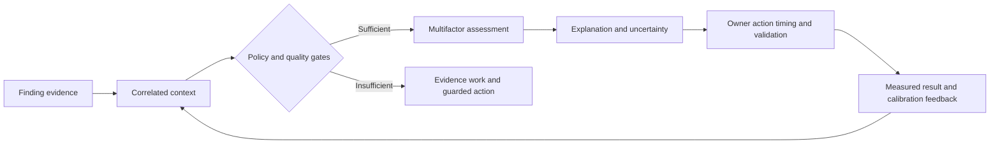

| Evidence class | Meaning in this Part | Example | Required wording discipline |
|---|---|---|---|
| Product fact | Supported by reviewed official public material | UVM publicly describes multifactor scoring and adjustable factors/weights | Cite source and review date; do not extend beyond wording |
| General security practice | Reusable engineering, risk, analytics, or governance method | Version changes and test boundary cases | Say it is a recommended pattern, not a UVM internal |
| Scenario assumption | Fictional design choice for NMH learning | A synthetic mandatory cohort or illustrative factor band | Label fictional/synthetic in the same context |
| Customer fact | Evidence established in an actual customer environment | Current source health or approved policy | Verify from authorized current evidence; none is claimed here |
| Unknown | Product or customer detail not established | Exact UVM formula or supported workflow threshold behavior | Preserve as a discovery item rather than guess |

## JD Mapping

| JD signal | Capability developed in this Part | Customer or TSM artifact | Honest boundary |
|---|---|---|---|
| Build deep product expertise | Explain reviewed UVM scoring claims and unknowns | Source-bounded scoring whiteboard | No proprietary algorithm claim |
| Become a trusted advisor | Translate risk inputs into understandable decisions | Factor dictionary and decision record | Customer retains risk authority |
| Drive adoption and value | Align score output with executable customer work | Calibration and adoption plan | No guaranteed result or timeline |
| Troubleshoot complex issues | Isolate source, identity, context, rule, and display defects | Wrong-priority runbook | No invented root cause |
| Use analytics | Define grain, distributions, cohorts, sensitivity, and drift | SQL/Power BI validation design | No undocumented product schema |
| Coordinate stakeholders | Align VM, SecOps, IT, IAM, service owners, risk, and audit | Scoring governance RACI | TSM facilitates rather than approves customer risk |
| Communicate proactively | Explain why-now, uncertainty, consequence, and checkpoint | Technical and executive narratives | No unsupported assurance or ETA |
| Partner with Support and Product | Package a minimal reproducible scoring symptom | Redacted escalation packet | No fix or roadmap promise |
| Apply AI responsibly | Draft cited summaries and test cases under review | Guardrailed assistance charter | No autonomous scoring or risk acceptance |

## Candidate honesty note

Interview language should remain neutral and evidence-classed. Transferable experience is valuable without being renamed as product experience.

| Evidence class | Neutral candidate phrasing | Boundary |
|---|---|---|
| Factual background | Microsoft support work required correlation of tenant, identity, permission, device, network, service, and customer-impact evidence | This is not production UVM administration |
| Networking strength | Trace work supports DNS, TCP, TLS, proxy, route, timing, and reachability reasoning | It does not prove operation of Zscaler exposure scoring |
| Analytics strength | SQL and Power BI knowledge supports joins, null handling, cohorts, distributions, trends, and explainable reporting | It does not establish access to a UVM schema |
| Escalation strength | Escalation practice supports containment, exact evidence, owners, checkpoints, RCA, and validation | It does not grant customer risk authority |
| Mentoring strength | Teach-back and structured explanation can support stakeholder adoption | It is not proof of a UVM rollout |
| AI interest | Reviewed AI assistance can support source summaries, reason-code drafts, and test generation | It must not invent evidence or make autonomous decisions |
| Synthetic practice | NMH scoring designs and exercises demonstrate structured learning | They are not production results |

## Beginner vocabulary and memory hooks

| Term | Plain meaning | Why it matters | Analogy or hook |
|---|---|---|---|
| Vulnerability | A weakness that may be exploited | It begins the technical question, not the full risk decision | A defective door lock |
| Finding | A source observation of a possible condition on a subject | It has evidence, scope, time, and possible error | An inspector's report |
| Exposure episode | The governed period during which a condition applies to an entity | It avoids treating every rescan as new work | One continuing repair case |
| Severity | Technical seriousness under a defined scoring system | It describes vulnerability characteristics | How damaging the lock defect can be |
| Exploitability | Evidence about whether and how exploitation may occur | It changes urgency and investigation needs | Availability and ease of burglary tools |
| Criticality | Importance of an asset or service to the organization | Similar defects can have different consequences | A supply-room door versus an emergency-room door |
| Reachability | Whether a path can reach the vulnerable component | A weakness without a feasible path may have lower immediate exposure | Can someone get to the door? |
| Exposure | The actual condition of being accessible to a relevant source or path | Internet-facing, partner, internal, and local paths differ | Which corridor opens onto the door? |
| Threat activity | Time-bounded evidence of adversary interest or behavior | It can raise urgency but does not prove compromise | Reports of burglaries using this lock |
| Identity context | Human or workload principals and effective privileges related to the scenario | Privilege can amplify impact or path feasibility | Who has the master key? |
| Mitigating control | A safeguard that interrupts a scenario prerequisite | Effective controls can change residual exposure | A guard covering one entrance |
| Factor | One defined input to a decision method | Makes context explicit and testable | One triage question |
| Weight | Relative influence assigned to a factor | Aligns emphasis but can distort output | Volume knob, not truth knob |
| Gate | A rule that must be satisfied before another action | Protects mandatory policy and data quality | Security checkpoint before boarding |
| Threshold | Boundary used to place records into a cohort or action | Small changes near it can alter workload | Cutoff for an urgent queue |
| Cohort | Group sharing a decision-relevant condition | Supports policy and operational work | Patients assigned to one triage lane |
| Calibration | Compare model output with reviewed evidence and outcomes, then tune responsibly | Builds usefulness and trust | Adjusting a thermometer against a reference |
| Sensitivity analysis | Measure how output changes when assumptions or inputs change | Reveals fragile weights and capacity shocks | Test each volume knob before a concert |
| Explainability | Ability to show evidence, rules, reasons, and limitations behind output | Enables trust, challenge, and repair | Receipt for the decision |
| Uncertainty | What is unknown, stale, conflicting, or model-dependent | Prevents false precision | Fog on part of the map |
| Confidence | Strength of support for a claim under a defined method | Separates strong evidence from guesses | How clearly the camera saw the door |
| Provenance | Where data came from and how it changed | Supports audit and troubleshooting | Chain of custody |
| Residual risk | Risk remaining after controls or treatment | No control makes every scenario disappear | Open routes after one entrance is guarded |
| Reason code | Controlled explanation for a priority or change | Supports grouping, audit, and communication | Label on the triage decision |
| Model version | Identified set of definitions, rules, factors, and weights | Makes decisions reproducible | Edition number on a procedure |

### Plain-English deep-dive 1 - A score is a map legend, not the territory

A vulnerability score can look objective because it is numerical. The number is still produced from definitions, evidence, assumptions, transformations, and policy choices. A map can use colors to show steep terrain, flood zones, or traffic, but the legend does not become the landscape. If the map joins the wrong road to a hospital, a precise route can still be wrong.

Contextual scoring is useful when it helps answer an operational question: what should receive attention first, why, by whom, under which timing, with what uncertainty, and what evidence proves improvement? It is dangerous when one number hides applicability, missing data, hard policy requirements, duplicated signals, or a path-specific control.

A TSM discussion should therefore move both directions. Start at a high-priority episode and drill down to the factor evidence, source, time, quality, rule version, and rationale. Start at a source or policy change and roll forward to affected episodes, owners, workflow volume, dashboards, and decisions. If either path is unavailable, trust and troubleshooting suffer.

## The decision unit: score the exposure episode, not an arbitrary row

Before factors are combined, the customer must define what is being assessed. A scanner row, CVE record, software package, asset, service, or ticket is not automatically the same thing. A useful conceptual grain is an exposure episode: a particular vulnerability or security condition affecting a particular entity under a validity period, supported by one or more observations.

| Candidate grain | What it represents | Common use | Scoring danger |
|---|---|---|---|
| CVE | Public vulnerability identity | Intelligence and technical reference | One CVE can affect many assets differently |
| Source observation | One tool's statement at one time | Provenance and diagnostics | Rescans can multiply one continuing condition |
| Asset | One resolved entity | Criticality and ownership | An asset can have many different conditions |
| Component instance | Software or service occurrence | Applicability and remediation | Identity may change across rebuilds |
| Exposure episode | Condition on entity over governed time | Priority, age, workflow, validation | Requires careful identity and lifecycle rules |
| Campaign | Governed group of episodes | Coordinated remediation | Group score can hide member differences |
| Ticket | Work-coordination record | Assignment and audit | Ticket state is not technical truth |

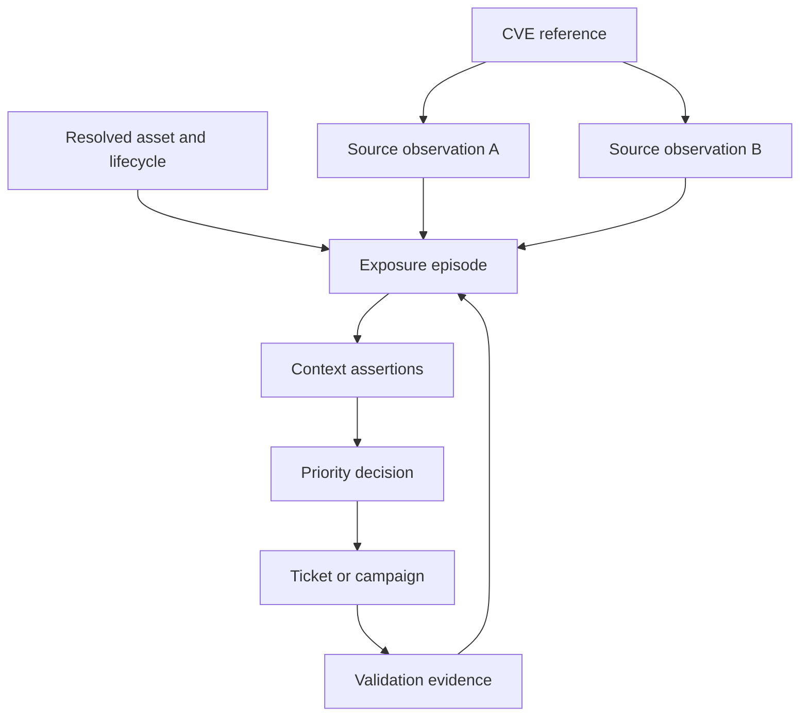

Stable episode identity preserves age when a source rescans, a ticket changes, or an asset IP changes. It also permits one episode to retain several source assertions without deleting disagreement. A rebuild may end one episode and begin another if the old entity truly retired. A hostname reuse must not silently transfer old vulnerability, privilege, or business context to the replacement.

## Architecture of a contextual scoring decision

The public UVM claim establishes multifactor and contextual positioning. The following layered architecture is a general practice model, not a statement of proprietary implementation.

| Layer | Core question | Required evidence | Failure if skipped |
|---|---|---|---|
| Scope and identity | What exact entity and condition are assessed? | Namespaced IDs, lifecycle, component, observation | Wrong subject receives context |
| Applicability | Does the condition actually apply? | Version, configuration, feature, reachability candidates | Severity attached to non-applicable record |
| Quality gate | Is evidence sufficiently current and trustworthy? | Freshness, completeness, conflicts, source health | Missing becomes safe or risky by accident |
| Policy gate | Does law, policy, KEV rule, or service class require action? | Versioned authority and scope | Weighted average hides mandatory work |
| Factor assessment | Which technical, threat, asset, identity, control, and business dimensions matter? | Defined source-bounded assertions | Context becomes undocumented opinion |
| Combination | How do rules or weights produce a cohort? | Versioned method and missing-value behavior | Number appears magical |
| Explanation | Why did this output occur and what is uncertain? | Contributions, reason codes, evidence links | Teams cannot trust or challenge it |
| Action | What treatment, owner, timing, and validation follow? | Decision rights and operational capacity | Score creates no reduction |
| Feedback | What did review and outcome teach? | Overrides, validation, recurrence, drift | Model never improves |

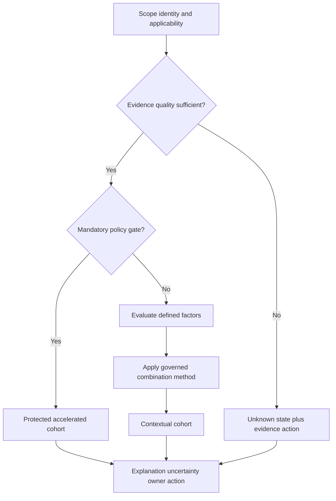

## Technical severity: important foundation, incomplete decision

Technical severity describes characteristics of a vulnerability under a named scoring specification and version. CVSS can represent exploit-related and impact-related characteristics, but it is not a customer's complete risk. Preserve the vector, version, source, publication time, and any environmental interpretation rather than retaining only a label.

| Severity question | Useful evidence | Why it matters | Boundary |
|---|---|---|---|
| Which specification? | CVSS version and vector | Versions are not interchangeable | Never compare unlabeled scores blindly |
| Whose assessment? | Vendor, CNA, NVD, source attribution | Providers may differ | Do not average disagreements automatically |
| What condition? | Product, version, feature, configuration | Establishes applicability | CVE presence alone may be insufficient |
| What impact? | Confidentiality, integrity, availability and scope concepts | Frames technical consequence | Business consequence still needs context |
| What prerequisites? | Privileges, interaction, complexity, requirements | Helps scenario reasoning | Not proof of reachable customer path |
| What changed? | Advisory revision and retrieval time | Severity records can evolve | Historical decisions need as-of evidence |

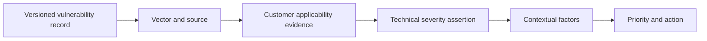

Severity should rarely be discarded. It should be placed in the correct role. A critical vulnerability on a retired, non-running image candidate may trigger evidence and pipeline cleanup rather than emergency production patching. A medium vulnerability with known exploitation, public reachability, effective privilege, and a critical service dependency may demand faster action. This is not a claim that medium always outranks critical; it is a demand to show the complete decision.

## Exploitability and exploitation evidence

Exploitability is not one field. EPSS, KEV, vendor statements, public proof-of-concept code, reliable exploit reports, observed attempts, and local incident evidence answer different questions. Their definitions, time horizons, quality, and overlap must remain visible.

| Signal | Question answered | Safe use | Unsafe use |
|---|---|---|---|
| EPSS | Model-estimated probability that a published CVE is exploited in the wild in the next 30 days | Compare near-term population-level exploitation likelihood with score date | Treat as customer breach probability or severity |
| CISA KEV | Has known exploitation met catalog criteria? | Strong evidence-based prioritization input | Claim customer compromise or completeness |
| Vendor advisory | What does the supplier say about affected versions, exploitation, and treatment? | Applicability and supported action evidence | Assume it covers every deployment detail |
| Public PoC | Is a technique described or demonstrated? | Assess maturity, prerequisites, reliability, and safe defensive implications | Run unapproved code or equate existence with local exploitability |
| Threat report | Is activity associated with actors, sectors, technologies, or techniques? | Add cited, time-bounded relevance | Convert broad targeting into proof |
| Local alert/log | Was related activity observed in customer telemetry? | Trigger incident triage and evidence preservation | Infer successful exploitation from one event |
| Confirmed incident | Did authorized investigation establish exploitation or impact? | Incident response and urgent treatment | Collapse incident and VM lifecycle into one score |

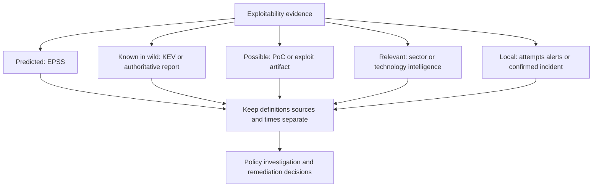

Double counting is a major scoring risk. KEV status, a threat-feed label derived from KEV, and a vendor record copied from the same catalog may look like three independent signals. They may be one underlying fact. A factor dictionary should record lineage and overlap. Correlated evidence can still be displayed, but influence should not be multiplied merely because the fact arrived through several connectors.

### Plain-English deep-dive 2 - Three witnesses may be one copied story

Imagine three newspapers reporting the same event. If all copied one press release, three headlines do not provide three independent confirmations. Security data often behaves the same way. A scanner plugin, threat feed, and dashboard may all inherit one upstream advisory.

Lineage matters as much as volume. Ask who originated the claim, what each source independently observed, which timestamp represents publication versus ingestion, and whether a later source adds customer-specific evidence. This protects scoring from false confidence and helps explain why two visible signals may contribute one governed reason.

## Asset and business criticality

Asset criticality describes how important an entity is under a governed customer method. Business criticality describes consequences to services, processes, patients, customers, revenue, safety, legal obligations, or strategic operations. Neither should be guessed from hostname, executive ownership, or last logged-in user.

| Criticality dimension | Example question | Potential source | Governance caution |
|---|---|---|---|
| Service role | Does the asset directly support an essential service? | Service catalog and owner attestation | Relationship must be current and directional |
| Availability consequence | What happens if service is unavailable? | BIA or continuity plan | Vulnerability treatment can also cause outage |
| Data consequence | What sensitive data can be reached or altered? | Data catalog and application owner | Minimize sensitive detail in broad views |
| Safety consequence | Could failure affect health or physical safety? | Safety and clinical governance | Security team should not make unilateral safety changes |
| Financial consequence | What material loss scenarios are plausible? | Finance-approved risk method | Avoid invented dollar precision |
| Regulatory/contractual | Which obligations apply? | Legal, privacy, compliance authority | Obligation is context, not automatic score formula |
| Dependency centrality | How many critical services depend on it? | Architecture and observed relationships | Network flow alone is not a service dependency |
| Recoverability | Can the service be restored or isolated safely? | DR plans and tested recovery evidence | Untested plans are not proven controls |
| Environment | Production, test, development, or retired? | Cloud/CMDB/platform evidence | Development can still contain secrets or paths |
| Ownership | Who can decide and execute treatment? | Governed ownership source | Ownership changes routing, not inherent impact |

Criticality needs validity dates and authority. A service can change owner, move environments, or retire. A shared platform can support several services with different consequences. A default criticality may be necessary for unclassified assets, but it must be labeled as default or unknown rather than asserted as customer truth.

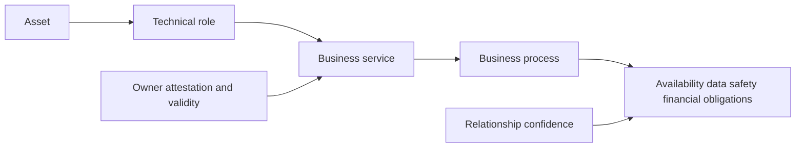

## Reachability and exposure

Reachability asks whether a relevant source can traverse a path to the vulnerable component under current conditions. Exposure describes the accessibility state, such as internet, partner, internal, local, identity-mediated, or management-plane access. A public IP, DNS record, open port, service listener, application route, and exploitable feature are related but not identical facts.

| Reachability layer | Evidence question | Example evidence | Frequent error |
|---|---|---|---|
| Name resolution | What does the relevant resolver return? | DNS query with vantage and time | Treat stale DNS as live service proof |
| Routing | Can packets reach the destination network? | Route and path observation | Assume route means application access |
| Transport | Does TCP, UDP, or other transport respond? | Handshake or approved probe | Treat open port as vulnerable feature |
| TLS/security gateway | What certificate, policy, proxy, or gateway mediates access? | Handshake, policy, logs | Assume a gateway covers every origin path |
| Application | Does the relevant route and feature respond? | Safe request and server evidence | Test only login page and infer full coverage |
| Identity | Which principal can authenticate and authorize? | Effective permission and policy | Equate group membership with effective access |
| Component | Does traffic reach the affected code path? | Configuration and authorized validation | Infer feature use from installed package |
| Alternate path | Can partner, management, IPv6, direct origin, or local path bypass control? | Architecture and authorized negative tests | Call one blocked path complete mitigation |

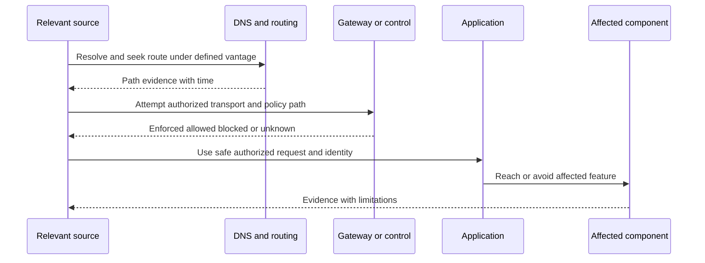

Arti's networking and trace background is directly useful here. DNS, TCP, TLS, proxy behavior, timestamps, retransmissions, resets, HTTP status, certificate names, and vantage points support disciplined path hypotheses. The honest boundary is that these skills transfer to reachability reasoning; they do not establish production operation of a Zscaler scoring feature.

## Identity, privilege, and behavior context

Identity context can include human users, service accounts, workload identities, devices, roles, groups, tokens, privileges, and relationships. The risk question is not merely "is an identity attached?" It is whether a specific principal can satisfy a scenario prerequisite, what effective privilege exists under current conditions, and what consequence that privilege can enable.

| Identity concept | Plain meaning | Scoring relevance | Guardrail |
|---|---|---|---|
| Human identity | Person represented in an identity system | User interaction, data access, ownership context | Minimize personal data and avoid intent inference |
| Workload identity | Non-human principal used by software | Machine-to-machine privilege and lateral paths | Secret presence is not proof of usable privilege |
| Effective privilege | Access actually granted after policies and conditions | Impact and path feasibility | Group membership alone may be incomplete |
| Privileged role | Elevated ability to administer or access sensitive functions | Amplifies consequence | Verify scope, activation, time, and controls |
| Dormant identity | Principal with little recent use | Could be unnecessary attack surface | Inactivity alone is not compromise |
| Behavior evidence | Observed activity tied to an entity | May alter urgency or trigger investigation | Behavior is not motive or confirmed attack |
| Ownership identity | Person/team accountable for action | Routes work | Do not make last user the technical owner |
| Break-glass identity | Emergency access principal | High consequence and special control | Avoid exposing sensitive details widely |

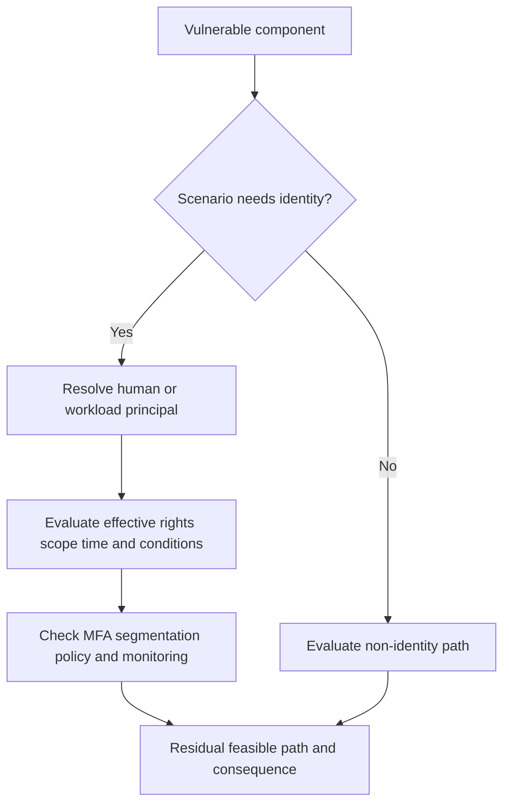

Privacy and security are inseparable from identity scoring. Use purpose limitation, data minimization, role-based access, segregation, encryption, retention, audit, and carefully scoped exports. A broad remediation team may need a reason such as "privileged workload relationship" without seeing a person's detailed behavior. Debug evidence should be redacted and shared through approved channels.

## Mitigating controls and residual exposure

A mitigating control reduces a scenario only when it is applicable, present, configured, healthy, enforcing, and effective for the relevant asset, identity, path, and time. The underlying vulnerability can remain even when a control changes immediate exposure. Durable remediation and residual paths must stay visible.

| Control evidence state | Meaning | Scoring treatment concept | Required next question |
|---|---|---|---|
| Expected | Policy says the control should apply | Coverage obligation, not mitigation proof | Is it present and correctly scoped? |
| Present | Component or rule is observed | Candidate safeguard | Is configuration current? |
| Configured | Relevant policy appears set | Stronger candidate evidence | Is it healthy and enforced? |
| Healthy | Telemetry reports operation | Supports current confidence | Does it cover this exact path? |
| Enforcing | Policy is applied on the tested route | Can reduce that route's feasibility | Are bypasses or exceptions present? |
| Effective | Authorized evidence shows prerequisite interruption | Supports bounded residual-risk reduction | What remains reachable? |
| Partial | Some relevant scope is covered | Mixed effect | Which members or paths remain open? |
| Excepted | Approved bypass exists | Excluded path remains | Who approved, until when, with what controls? |
| Bypassed | Alternate route or technique succeeds | Raise concern and repair control gap | Is the failure local or systemic? |
| Stale/unknown | Current effectiveness cannot be established | No automatic reduction | How quickly can evidence be restored? |
| Not applicable | Control does not address the scenario | Exclude from mitigation reasoning | Which control does address it? |

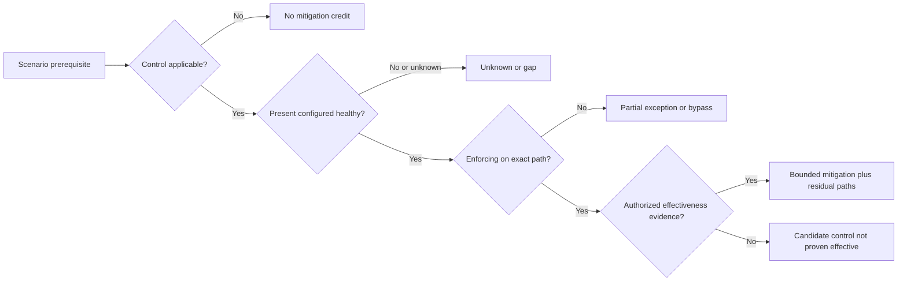

### Plain-English deep-dive 3 - A guard at one door does not protect every door

Suppose a building has a guard at the front entrance. That guard can reduce the chance of unauthorized entry through the front door. It says nothing about the loading dock, a connecting tunnel, an unlocked window, or an insider with a valid badge. Calling the building "guarded" is too broad for a specific risk decision.

Security controls need the same path specificity. A web application firewall may block one public request while a partner route reaches the origin. Multifactor authentication may protect interactive users while a workload credential follows another flow. Segmentation may block general endpoints while a management network remains reachable. Scoring should explain the exact prerequisite interrupted, evidence date, exceptions, bypass tests, and residual exposure.

## Threat activity and temporal context

Threat evidence ages differently. A vulnerability vector may change occasionally. EPSS is published daily. KEV membership is a current catalog fact with dates and required actions for its governed audience. Threat reports have publication and observation windows. Local alerts can be minute-specific. Asset exposure and identity state can change quickly. A score without as-of semantics can mix evidence that was never simultaneously true.

| Time field | Meaning | Why it matters | Common confusion |
|---|---|---|---|
| Event time | When activity occurred | Reconstructs sequence | Confused with ingestion time |
| Observation time | When a source measured state | Supports freshness | Treated as continuous truth |
| Publication time | When advisory or intelligence was issued | Establishes available knowledge | Confused with exploit start |
| Effective time | When policy, ownership, or control applies | Determines valid context | Lost during overwrite |
| Ingestion time | When platform received data | Diagnoses lag | Used as source event time |
| Calculation time | When priority was computed | Reproduces output | Does not prove source freshness |
| Decision time | When authority chose action | Supports audit | Confused with remediation completion |
| Validation time | When postcondition was tested | Supports closure | One pass may not prove durability |

Temporal joins should use validity intervals rather than only the latest row. If an asset became internet-facing after a score calculation, that factor should change under a new decision version. If an identity relationship ended before the exposure began, a latest-only join may falsely amplify risk. SQL window functions, effective-date joins, and event-time logic are natural bridges from Arti's analytics foundation.

## Combining factors: gates, rules, weights, and cohorts

There is no universally correct formula. A customer's method may use hard gates, policy rules, weighted factors, qualitative matrices, or combinations. Zscaler publicly describes multifactor scoring and adjustable factors/weights; exact UVM implementation details must be verified. The design below is conceptual.

| Mechanism | Best use | Strength | Failure mode |
|---|---|---|---|
| Data-quality gate | Prevent unsafe automation when identity or evidence is weak | Makes unknown visible | Can become permanent holding area without owner |
| Applicability gate | Avoid scoring non-applicable conditions as confirmed | Protects accuracy | Weak evidence can delay urgent validation |
| Mandatory policy gate | Protect KEV, critical service, legal, or customer policy cohort | Cannot be averaged away | Overbroad policy can overwhelm capacity |
| Deterministic rule | Route clear combinations | Easy to explain and test | Rule sprawl and conflicting precedence |
| Weighted model | Compare several continuous or categorical factors | Flexible ranking | False precision and hidden overlap |
| Qualitative matrix | Combine likelihood and impact bands | Understandable governance | Coarse bins and boundary effects |
| Human review | Resolve conflict, novelty, and consequential decisions | Uses contextual judgment | Inconsistency without rubric and audit |
| Override | Correct model output under approved reason | Captures edge cases | Can hide systematic model defect |

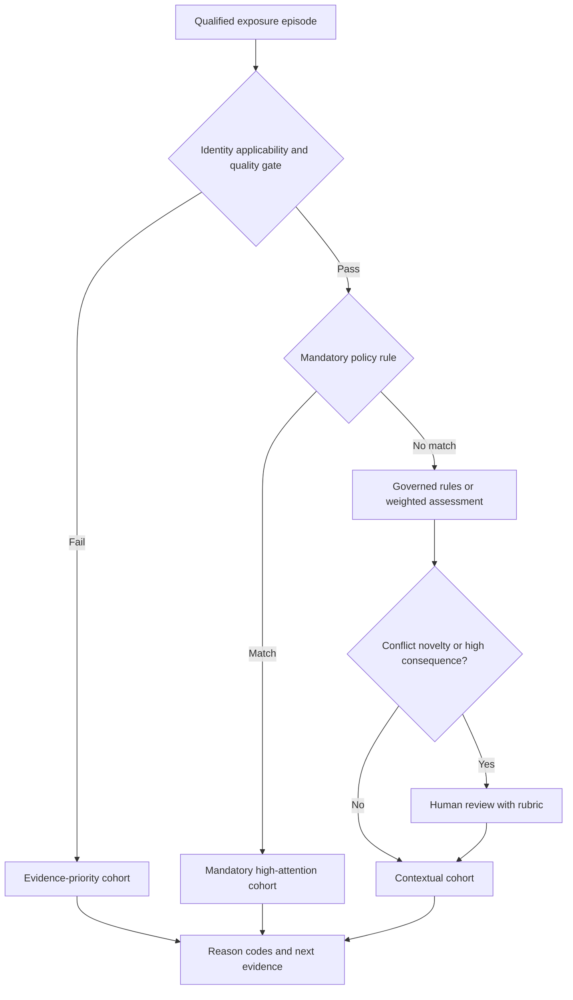

Weights should express relative policy influence, not scientific certainty. A factor may need normalization before weighting, but an arbitrary 0-to-100 transformation can create misleading precision. Missing values require explicit behavior: unknown, inapplicable, default, zero, excluded, imputed, or blocked. Those states are not interchangeable.

## Custom factors and factor contracts

The official public UVM page says customers can account for additional factors by adding new data sources. A useful factor contract makes each addition governable before it influences action.

| Contract field | Question | Example of safe content |
|---|---|---|
| Name and purpose | What decision should this factor improve? | Distinguish public patient-service exposure |
| Definition | What exactly does each value mean? | Customer-approved criticality bands |
| Grain | Asset, identity, service, episode, or relationship? | Service-to-asset validity assertion |
| Source and authority | Who originated it and who governs it? | Service catalog with owner attestation |
| Scope | Which populations are covered? | Production services in pilot business unit |
| Time semantics | Observation, effective, expiry, and freshness? | Validity interval plus last attestation |
| Quality | Completeness, validity, conflict, confidence? | Unknown when service mapping is missing |
| Security/privacy | Classification, access, retention, export limits? | Restricted identity relationship summary |
| Transformation | How are source values mapped? | Versioned categorical mapping |
| Missing behavior | What happens on null, stale, conflict, or not applicable? | Block downgrade when public exposure is unknown |
| Overlap | Which existing factors share evidence? | Avoid duplicate influence from copied KEV labels |
| Decision effect | Gate, reason, rank, cohort, or display only? | Human-review reason before automation |
| Owner and approval | Who can change or retire it? | Customer scoring council approval |
| Tests | Positive, negative, boundary, conflict, stale, and load cases? | Synthetic regression suite |
| Rollback | How is prior version restored and affected work reconciled? | Version pin plus replay plan |

Custom does not mean arbitrary. A factor such as "executive asset" may encode politics rather than business consequence. A factor such as "number of alerts" may reward noisy sensors. A factor based on last user can misroute shared devices. The factor should add decision information, not merely correlate with urgency in a small sample.

## Explainability and reason codes

An explanation should serve several audiences without exposing unnecessary data. The remediation owner needs concrete why-now and what-to-do information. The VM analyst needs factor evidence and conflicts. The risk owner needs residual scenario and authority. An executive needs material consequence, movement, uncertainty, decision, and checkpoint. Support needs technical reproduction evidence.

| Explanation element | Operator question | Executive translation |
|---|---|---|
| Episode identity | Which condition on which entity? | Which material service scenario? |
| Cohort and version | Which policy/model produced priority? | Under which approved decision method? |
| Leading reasons | Which factors or gates mattered most? | Why attention is needed now |
| Evidence source/time | What supports each reason? | How current and credible is the assessment? |
| Missing/conflicting evidence | What is uncertain? | What could change the conclusion? |
| Control/residual path | What is reduced and what remains? | Which safeguards help and where gaps remain |
| Recommended action | What treatment or validation is expected? | What decision or resource is required? |
| Ownership/timing | Who acts and by when under policy? | Accountability and next checkpoint |
| Postcondition | What proves success? | How improvement will be verified |

Reason codes should be controlled, composable, and human-readable. Examples in a conceptual model might mean "known exploitation policy," "public path supported," "critical service relationship," "privileged workload path," "control evidence unknown," or "identity conflict requires review." These are examples of general design, not claims about product labels.

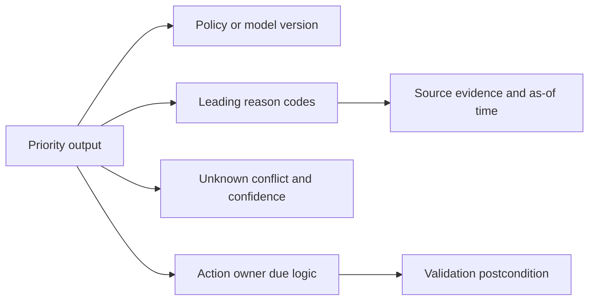

## Uncertainty, confidence, and missing evidence

Uncertainty is not a cosmetic confidence percentage. It can come from missing sources, stale data, conflicting identifiers, ambiguous applicability, model limitations, incomplete control tests, or unverified business relationships. Each type can imply a different next action.

| Uncertainty type | Example | Unsafe handling | Safer decision response |
|---|---|---|---|
| Missing | Public exposure source stopped reporting | Treat null as not exposed | Mark unknown, gate downgrade, restore evidence |
| Stale | Criticality attestation expired | Carry forward forever | Display stale state and request owner review |
| Conflicting | Two sources map hostname to different assets | Pick convenient source silently | Preserve conflict and resolve temporal identity |
| Ambiguous applicability | Package exists but affected feature may be disabled | Call confirmed or false positive immediately | Run safe configuration validation |
| Model uncertainty | EPSS is probabilistic and time-bounded | Read as certainty | Preserve definition, date, and limitations |
| Control uncertainty | WAF present but path not tested | Grant full mitigation | Use candidate/unknown control state |
| Relationship uncertainty | Network flow suggests service dependency | Assert business criticality | Seek owner/architecture confirmation |
| Novel scenario | No rubric covers a new technology | Force nearest category | Human review and controlled policy update |

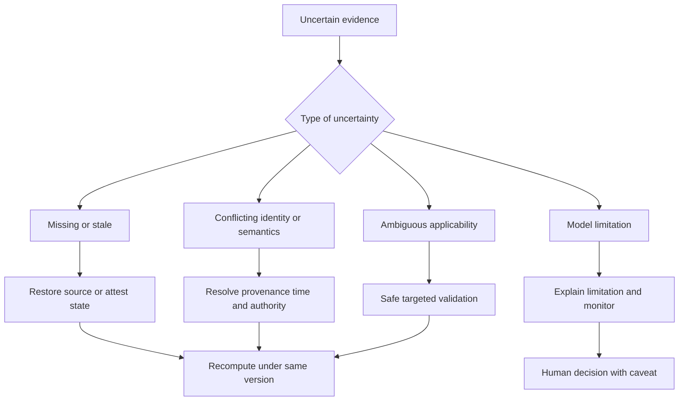

Unknown should not automatically mean high or low. The response depends on consequence and evidence urgency. Unknown public exposure on a critical applicable vulnerability may justify accelerated validation and temporary containment. Unknown ownership may create an operational priority because nobody can execute treatment. Unknown control evidence should block mitigation credit. A separate evidence-priority queue can keep these cases visible.

### Plain-English deep-dive 4 - Unknown is a state, not a secret zero

A weather station that stops transmitting does not report zero rainfall. It reports no measurement. Replacing missing with zero makes the dashboard look calmer precisely when the evidence is weaker.

Security scoring must resist the same mistake. A null public-exposure value can result from an isolated asset, a failed connector, a mapping defect, a retired record, or a field that never applied. Those meanings lead to different actions. Preserve the state, source health, last good value, confidence, and next evidence owner. A high-consequence unknown can be urgent without pretending the risk fact is known.

## Calibration from first principles

Calibration asks whether priority output corresponds usefully to reviewed customer scenarios and executable decisions. It is not simply making score distributions look attractive. Begin with a bounded use case, reviewed examples, policy obligations, operational capacity, and success criteria.

| Calibration stage | Activity | Evidence | Exit question |
|---|---|---|---|
| Define outcome | State the decision the model supports | Use-case charter | Is scoring needed for this decision? |
| Establish truth set | Human-review representative episodes | Rationale and evidence ledger | Is review consistent enough to compare? |
| Baseline | Run current method without changing work | Distribution and confusion analysis | Where does current logic fail? |
| Diagnose | Separate data, identity, factor, overlap, rule, and capacity defects | Root-cause classification | Is tuning the correct fix? |
| Propose | Change one controlled element | Versioned hypothesis | What should move and why? |
| Sensitivity | Test output and workload across plausible settings | Cohort transitions | Is result stable and executable? |
| Shadow | Compare old/new without action | Episode-level delta | Are unintended cases understood? |
| Canary | Apply to small authorized cohort | Workflow and outcome evidence | Can it operate safely? |
| Approve | Customer authority accepts change | Decision record | Are owner, rollback, and reporting defined? |
| Monitor | Track drift, overrides, outcomes, and trust | Calibration scorecard | Does performance remain acceptable? |

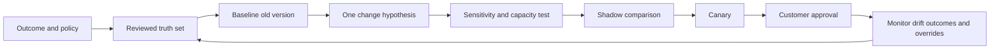

A truth set is not perfect truth. It is a reviewed sample with documented evidence and disagreement. Include positive, negative, boundary, conflicting, missing, stale, high-consequence, low-consequence, common, rare, and adversarial cases. Sample across sources, business units, owners, environments, and remediation types. Avoid selecting only easy examples that confirm the design.

## Calibration metrics without false certainty

| Metric or view | What it reveals | Limitation |
|---|---|---|
| Cohort distribution | Whether output concentrates or floods work | Desired shape depends on population and capacity |
| Transition matrix | Which episodes move between versions | Movement alone is not improvement |
| Reviewer agreement | Consistency of governed human assessment | Humans can share bias or weak evidence |
| Precision-like review | Fraction of sampled high cohort supported by rubric | Sample and rubric define result |
| Recall-like review | Fraction of reviewed must-act episodes captured | Complete must-act universe is rarely known |
| Override rate | Frequency and reasons for human correction | High or low rate can both be misleading |
| Evidence-unknown rate | Scope of missing/conflicting context | May rise when honesty improves |
| Owner acceptance | Whether routed work is understood and actionable | Acceptance is not validation or risk reduction |
| First-pass validation | Whether treatment achieves postcondition initially | Depends on treatment type and source cadence |
| Reopen/recurrence | Whether exposure returns or closure was weak | Requires stable episode semantics |
| Capacity ratio | Incoming actionable work versus completion capacity | Throughput does not measure materiality alone |
| Drift view | Changes in inputs, output, and outcomes over time | Correlation does not establish cause |

A rise in unknowns after a model change may be healthy if the old method silently treated null as safe. A lower ticket volume may be healthy if duplicates were removed, or harmful if a source failed. Calibration narratives need bridge analysis rather than one green arrow.

## Sensitivity, thresholds, and capacity

Sensitivity analysis changes one input, weight, threshold, or missing-value rule at a time and observes output. The purpose is to identify brittle decisions, hidden interactions, protected cohorts, and operational load.

| Test | Question | Required observation |
|---|---|---|
| One-factor sweep | How do cohorts change across plausible influence values? | Episode transitions and reason changes |
| Threshold boundary | What happens just below, at, and above cutoff? | Discontinuity and action difference |
| Missing-value test | Does null, stale, conflict, or not applicable behave correctly? | No accidental downgrade or inflation |
| Overlap removal | What changes when duplicate evidence influence is removed? | Double-counting exposure |
| Outlier test | Can extreme input dominate all others? | Caps, gates, or review need |
| Mandatory-cohort test | Does weighted logic ever suppress protected policy work? | Gate integrity |
| Capacity test | How many owners and tickets change? | Executable workload and queue shock |
| Adversarial test | Can easy-to-change metadata manipulate priority? | Gaming resistance |
| Historical replay | How would prior decisions differ? | Trend restatement and workflow reconciliation |
| Segment test | Does behavior differ by source, owner, environment, or service? | Bias and coverage variation |

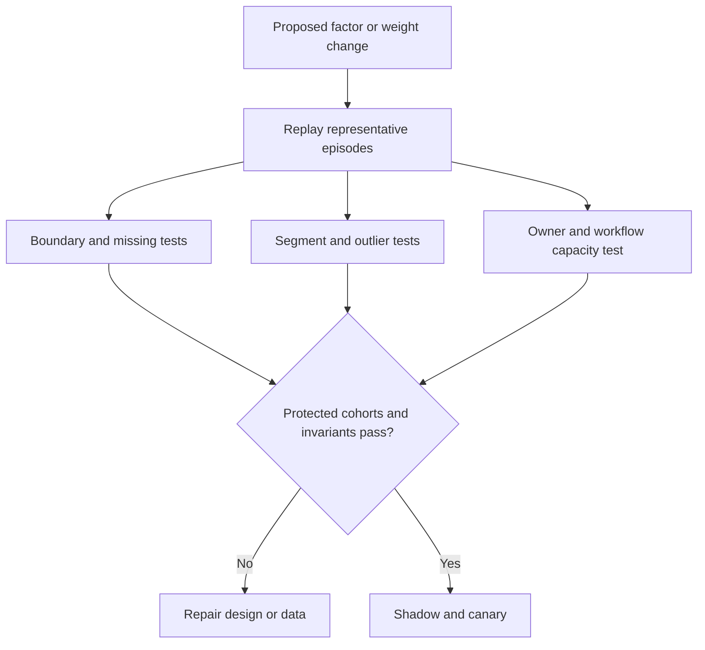

## Governance and decision rights

Scoring changes customer priorities and can move work, deadlines, and attention. Governance should identify who defines policy, who supplies data, who proposes configuration, who tests, who approves, who operates, who audits, and who accepts residual risk. A TSM can facilitate product and adoption discussions but should not silently assume customer authority.

| Role | Decision responsibility | Evidence responsibility | Boundary |
|---|---|---|---|
| VM program owner | Own scoring purpose and operating policy | Program charter and quality thresholds | Does not own every business consequence |
| Security engineering | Define technical factors and validation | Applicability, threat, control evidence | Does not accept business risk alone |
| Service owner | Attest criticality, dependencies, treatment feasibility | Service and change evidence | Cannot redefine enterprise policy unilaterally |
| IAM/network/control owner | Validate identity, path, and control states | Effective rights and control tests | Avoid broad claims beyond scope |
| Enterprise risk | Govern risk method and acceptance | Decision records and residual risk | Needs technical evidence |
| Privacy/legal/compliance | Govern sensitive data and obligations | Approved interpretation | Not a substitute for technical validation |
| Data/platform owner | Maintain source and semantic quality | Contracts, lineage, health, reconciliation | Cannot decide risk from pipeline health alone |
| Change authority | Approve production treatment under process | Change plan, rollback, service checks | Ticket approval is not vulnerability closure |
| TSM | Enable discovery, architecture, adoption, troubleshooting, and escalation | Source-bounded guidance and action register | No customer risk acceptance or unsupported product promise |
| Support/Product | Investigate product behavior through approved process | Minimal reproducible evidence | No assumed roadmap or fix date |

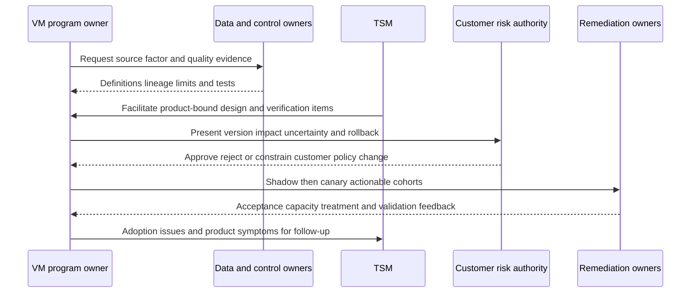

## Security, privacy, safety, and ethical design

Contextual scoring can centralize sensitive vulnerability, identity, behavior, asset, control, hierarchy, service, and exception information. The combined dataset can be more sensitive than any one source. Apply least privilege, purpose limitation, minimization, segregation of duties, encryption, retention/deletion, export controls, audit, tenant isolation, secret handling, and approved support-sharing procedures.

| Risk | Example | Control |
|---|---|---|
| Excess access | Remediation viewer sees detailed privileged-user behavior | Role-specific abstraction and row/object access |
| Sensitive export | Score explanation contains asset and identity details | Approved export, redaction, classification, expiry |
| Model manipulation | Team changes easy metadata to lower priority | Authority, provenance, audit, anomaly review |
| Biased context | Poorly covered business unit appears lower risk | Coverage metrics and unknown state beside score |
| Unsafe automation | High score triggers disruptive action | Human approval, change controls, canary, rollback |
| AI leakage | Evidence pasted into unapproved assistant | Approved environment, minimization, no secrets |
| AI hallucination | Generated rationale invents threat or control evidence | Retrieval, citation, deterministic fields, human review |
| Over-retention | Historical identity relationships persist indefinitely | Defined purpose and retention/deletion policy |
| False certainty | Score is shown without confidence or quality | Explanation, caveats, and evidence state |
| Unauthorized testing | Reachability is tested against production without permission | Written scope, safe method, stop conditions, contacts |

AI can assist with controlled tasks such as summarizing cited official advisories, drafting reason-code language from structured evidence, identifying missing fields, or proposing test cases. It must not fabricate applicability, infer malicious intent, expose customer data, approve a weight, accept risk, or close a vulnerability without authorized deterministic evidence and human control.

## Troubleshooting a wrong or surprising priority

Start by containing harmful consequences. Pause affected automatic actions, preserve current and prior model versions, record the symptom and UTC window, and choose one stable episode. Do not begin by changing a weight until the controlling layer is known.

| Layer | Diagnostic question | Discriminating check | Typical repair |
|---|---|---|---|
| Scope | Is the entity in intended population? | Compare source-native inventory and inclusion logic | Correct scope and replay |
| Observation | Does source support the finding? | Open native evidence with time/version | Refresh or correct finding state |
| Identity | Is this the correct active asset/component? | Compare strong IDs and lifecycle | Split/merge records and rebind assertions |
| Applicability | Does vulnerable condition apply? | Version/config/feature evidence | Correct applicability state |
| Enrichment | Are service, identity, path, and controls current? | Trace each assertion to source | Repair mapping or validity interval |
| Factor | Is value transformed as defined? | Recalculate one factor from raw evidence | Fix type/unit/category mapping |
| Missing behavior | Did null become zero or default? | Inject null/stale/conflict case | Restore explicit unknown behavior |
| Overlap | Are copied signals counted several times? | Trace upstream lineage | Consolidate influence and retain display |
| Rule/weight | Did correct version and precedence execute? | Compare versioned decision trace | Repair logic under change control |
| Display | Is UI/report using same grain and version? | Reconcile exported/detail records | Fix semantic layer/filter/cache |
| Workflow | Did score change create stale/duplicate work? | Reconcile stable keys and target state | Query, update, merge, or quarantine |
| Governance | Was change approved and communicated? | Inspect decision/audit record | Roll back or complete approval process |

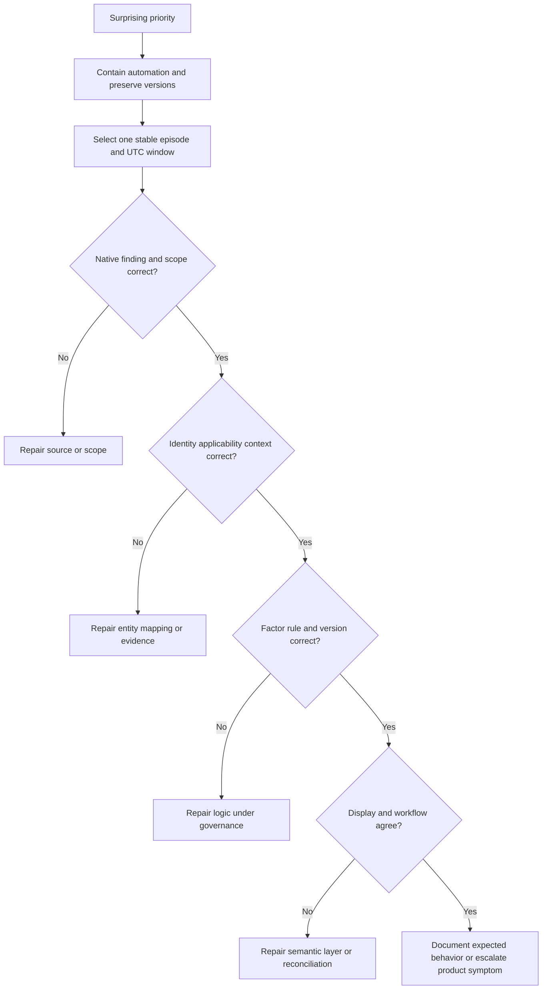

The escalation packet should include redacted tenant/context identifiers through approved channels, exact episode/source IDs, observed and expected result, UTC timestamps, product and connector versions where available, model/policy version, factor inputs and reason output, screenshots or exports with sensitive data removed, reproducibility, scope, business impact, containment, recent changes, and one precise ask. It should not include secrets or a demand for an unsupported ETA.

## Failure modes and misconceptions

| Claim or anti-pattern | Why it fails | Better reasoning |
|---|---|---|
| The highest number is always first | Data, policy, uncertainty, and capacity can change action | Use gates, cohorts, explanations, and review |
| CVSS equals customer risk | It is technical severity, not full context | Combine applicability, threat, path, impact, controls, and ownership |
| More factors always improve scoring | Noise, overlap, and missingness can worsen decisions | Add only decision-relevant governed factors |
| Missing means false | Source failure can look safe | Preserve unknown and source health |
| A control checkbox lowers risk | Presence does not prove effectiveness | Require path-specific evidence and residual analysis |
| KEV proves compromise | It supports known-exploitation priority | Investigate local evidence separately |
| EPSS is a breach probability | It has a defined population event and horizon | Preserve official definition and score date |
| Criticality never changes | Services, dependencies, and ownership evolve | Use authority and validity intervals |
| One formula works for every customer | Policy, architecture, data, capacity, and obligations differ | Calibrate within governed outcome |
| Overrides are model failure | Some edge cases require human judgment | Track reasons and repair systematic patterns |
| Low override rate proves quality | Users may ignore or distrust output | Pair with adoption, outcomes, and sampled review |
| Score reduction equals risk reduction | Input or mapping changes can lower scores | Require causal bridge and validated postconditions |
| Exact decimals imply accuracy | Precision can exceed evidence | Use understandable bands and uncertainty |
| TSM should choose the customer's weights | Customer authorities own policy | TSM enables evidence, product use, testing, and governance |

## Decision logic for a TSM conversation

| Customer question | First response | Follow-up evidence | TSM value |
|---|---|---|---|
| Why is this item high? | Identify cohort, version, leading reasons, and uncertainty | Drill to source/time and policy | Make explanation reproducible |
| Why did score change? | Separate source/context change from logic change | Before/after bridge | Prevent false success or alarm |
| Can a control lower it? | Ask which prerequisite and exact path it interrupts | Health, enforcement, bypass, test | Keep residual exposure visible |
| Can weights match our policy? | Confirm public customization positioning, then verify tenant specifics | Factor contract and sensitivity plan | Translate policy into governed test |
| Why are unknowns high? | Treat unknown as evidence state | Source health, identity, freshness | Route data-quality remediation |
| Can automation use the score? | Require quality, policy, ownership, approval, and rollback gates | Shadow/canary evidence | Protect customer operations |
| Is the model working? | Define outcome and reviewed truth set | Calibration and adoption metrics | Connect product use to decisions |
| What value can be reported? | Report validated movement and operational evidence | Denominators, trend bridge, caveats | Create credible technical/executive narrative |

## Complete synthetic NMH scoring case

Everything in this section is explicitly fictional and synthetic. It is not a description of a Zscaler tenant, product formula, customer deployment, or real result. No date later than the official review date is used. The source snapshot remains 2026-08-24.

### Synthetic NMH outcome and policy

NMH's fictional objective is to identify exposure episodes that need urgent evidence, containment, remediation, or governance attention for the patient-access service. The synthetic policy protects three mandatory cohorts: confirmed applicable KEV exposure on a supported reachable production path; a confirmed exposure tied to a safety-critical service under defined customer authority; and a local incident linkage that incident response has validated. These are NMH learning assumptions, not UVM defaults.

The remaining synthetic episodes use qualitative factor bands rather than a claimed proprietary formula. Each decision records technical severity, exploitability evidence, reachability, service consequence, identity privilege, control state, evidence quality, owner, and treatment feasibility. Missing public-path evidence cannot become "not exposed." An effective control can change a path reason but cannot close the underlying episode.

| Synthetic factor | Fictional NMH values | Synthetic decision purpose | Caveat |
|---|---|---|---|
| Applicability | supported, candidate, not supported, unknown | Gate confirmed scoring | Human-reviewed learning rule |
| Technical severity | lower, moderate, high, critical | Technical consequence context | Not a replacement for CVSS vector |
| Exploitation | no current evidence, predicted, PoC, known, local investigation | Urgency and incident question | Labels are invented for exercise |
| Reachability | public, partner, internal, local, blocked, unknown | Scenario path | Requires vantage and time |
| Service consequence | limited, important, essential, safety-sensitive | Business impact | Customer-attested fiction |
| Identity privilege | none required, standard, elevated, highly privileged, unknown | Path and consequence | No real identity data |
| Control state | effective bounded, partial, candidate, bypassed, unknown, not applicable | Residual path | No real Zscaler control claim |
| Evidence confidence | supported, mixed, weak, unknown | Automation and review gate | Not a universal confidence formula |

```mermaid
flowchart TD
    title NMH explicitly fictional synthetic scoring decision
    EP[Synthetic exposure episode] --> A{Applicability supported?}
    A -->|No| EV[Synthetic evidence or disposition work]
    A -->|Yes| M{Synthetic mandatory policy match?}
    M -->|Yes| FAST[Synthetic accelerated cohort]
    M -->|No| F[Synthetic qualitative factor assessment]
    F --> U{Material unknown or conflict?}
    U -->|Yes| HR[Synthetic human review and evidence action]
    U -->|No| PRI[Synthetic contextual cohort]
    FAST --> EX[Synthetic explanation owner and postcondition]
    HR --> EX
    PRI --> EX
    EV --> EX
```

### Synthetic scenario 1: moderate severity, urgent public path

A fictional patient-access API episode has moderate technical severity. Synthetic source evidence supports an applicable component, known exploitation, a public route, a workload identity with elevated backend permission, and only candidate control evidence because one direct origin path has not been tested. The episode enters NMH's synthetic accelerated cohort because its known-exploitation policy gate applies. The reason is not "moderate became critical." The reason is that a customer policy gate and contextual evidence require urgent action.

The fictional next steps are preserve relevant logs, confirm no local exploitation through authorized incident triage, restrict the direct origin path, canary a supported component update, validate the public and partner routes, validate service health, and retain the episode until postconditions pass. No prevented incident or product score is claimed.

### Synthetic scenario 2: critical severity, urgent evidence rather than emergency patch

A fictional critical vulnerability appears on `NMH-LAB-CONTROL-04`, a synthetic laboratory controller. The supplier has not confirmed applicability to the installed firmware feature, and an immediate unapproved update could disrupt a safety-sensitive service. Network evidence supports restricted segmentation, but the last control test is stale.

NMH does not silently downgrade the episode and does not order an unsafe patch. The synthetic decision creates urgent supplier/applicability evidence work, refreshes authorized segmentation tests, establishes temporary monitoring and access restrictions, obtains change and safety authority, and prepares a supported remediation path. Critical severity remains visible; uncertainty changes the next action, not the seriousness of the question.

### Synthetic scenario 3: copied threat signals inflate influence

Three fictional sources label a vulnerability as actively exploited. Lineage review shows all three copied CISA KEV status. A fourth source contains independent local gateway attempts, but investigation has not established successful exploitation. NMH changes the synthetic explanation from four independent threat reasons to one known-exploitation reason plus one local-investigation reason. The policy cohort remains urgent, while confidence and audit improve.

### Synthetic scenario 4: control presence causes a false downgrade

A synthetic WAF-present field reduces a patient portal episode. Trace and architecture review show a partner route can reach the origin without that WAF. NMH freezes affected automatic downgrades, marks control scope partial, restricts the partner route, tests both required and prohibited paths under authorization, and keeps durable component remediation open. The correction is path-specific; it does not declare the WAF ineffective everywhere.

### Synthetic scenario 5: identity false merge amplifies consequence

A retired virtual machine and its replacement share a hostname. A weak match transfers the old machine's highly privileged workload identity to the new asset while retaining the old vulnerable observation. Synthetic priority rises sharply. NMH splits the temporal entities using cloud resource IDs and lifecycle evidence, rebinds observations and identities, recomputes under the same model version, reconciles any created work, and adds a hostname-reuse regression test.

### Synthetic scenario 6: missing exposure becomes false improvement

A fictional cloud source loses permission to one account. Public-exposure values become null, and a weak transformation maps null to false. The high cohort falls. NMH marks scoring and reporting degraded, blocks automatic downgrade, restores least-privileged access through approved process, backfills data, recomputes deterministically, reconciles workflows, restates the trend, and documents decisions affected during the gap.

### Synthetic scenario 7: weight proposal overwhelms one owner

NMH's fictional scoring council proposes increasing the influence of essential-service criticality. A sensitivity replay shows that many episodes move into one platform team's urgent queue, including several with unresolved identity conflicts. The council does not approve the change merely because the policy intention sounds right. It fixes identity defects, separates mandatory from contextual work, reviews owner capacity and treatment dependencies, pilots one service, and records rollback criteria.

### Synthetic scenario 8: transparent low score still needs planned treatment

A synthetic internal training service has an applicable high-severity vulnerability, no current known-exploitation evidence, no privileged relationship, verified segmentation under a recent authorized test, low business consequence, and a supported maintenance window. It receives a planned cohort with a clear due rule and validation postconditions. "Planned" does not mean safe forever, accepted risk, or closed. Threat, path, service, and control changes can recompute priority.

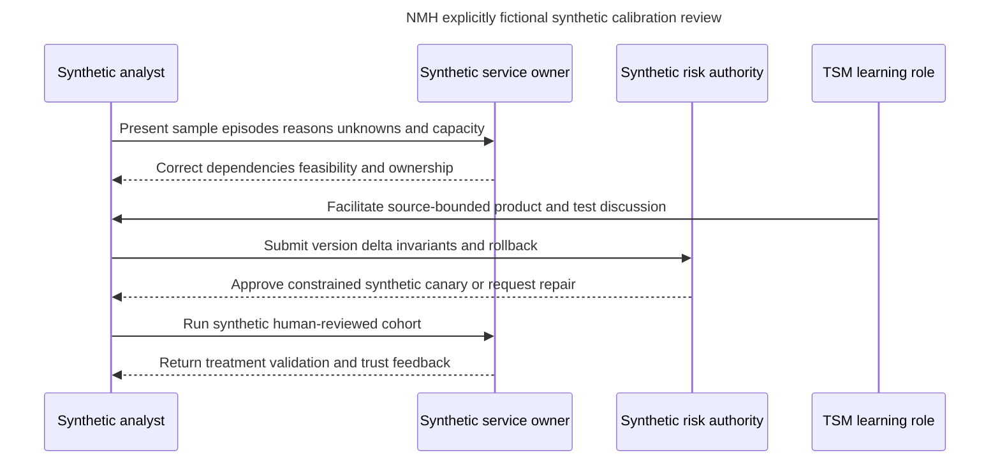

### Synthetic review narrative

"The fictional patient-access pilot currently has three separate findings. First, a known-exploitation policy cohort remains accelerated because applicability and a public path are supported; incident triage and canary remediation are in progress. Second, one controller episode remains critical but applicability and safety-approved treatment are unresolved, so urgent evidence and compensating-control work is explicit rather than hidden by a lower score. Third, the apparent cohort reduction was a source-permission defect, not risk reduction; automatic downgrade was blocked, data was backfilled, and the trend was restated. The customer decision requested in this synthetic exercise is approval to continue a one-service canary after identity conflicts and owner capacity checks pass. No product outcome, prevented incident, or production experience is claimed."

## Customer and TSM artifact kit

| Artifact | Minimum contents | Customer value | TSM use |
|---|---|---|---|
| Claim ledger | Claim, source, date, wording, boundary, verification owner | Prevents product overstatement | Keeps discussions current |
| Scoring use-case charter | Outcome, scope, decision, owners, constraints, success evidence | Aligns model to purpose | Frames discovery |
| Episode grain contract | Entity, condition, IDs, validity, observation relationships | Prevents duplicate or wrong-subject scores | Supports troubleshooting |
| Factor dictionary | Definition, source, grain, time, quality, missing behavior, overlap | Makes logic governable | Drives workshops |
| Authority matrix | Field/factor authority and conflict rule | Resolves source disputes | Clarifies integration design |
| Policy gate register | Rule, authority, scope, version, expiry, owner | Protects mandatory decisions | Separates policy from weight |
| Control-evidence record | Prerequisite, scope, state, test, exception, residual path | Prevents checkbox mitigation | Guides safe validation |
| Explanation template | Reasons, evidence, uncertainty, action, owner, postcondition | Builds remediation trust | Improves adoption |
| Calibration truth set | Representative episodes, reviewer rationale, disagreement | Supports controlled tuning | Enables teach-back |
| Sensitivity report | Old/new transitions, thresholds, segments, capacity, invariants | Exposes unintended effects | Supports governance |
| Change record | Hypothesis, version, tests, approval, canary, rollback | Reproducibility and audit | Coordinates parties |
| Health scorecard | Source, mapping, identity, factor, workflow, report health | Prevents false score confidence | Guides operating reviews |
| Wrong-priority packet | One episode, source trace, versions, expected/actual, containment | Faster diagnosis | Supports escalation |
| Executive narrative | Material scenario, movement cause, caveat, decision, checkpoint | Board-safe communication | Connects technical evidence to action |

## Practical TSM discussion guide

### Discovery questions

1. Which customer decision should contextual scoring improve?
2. What is the exact exposure-episode grain and lifecycle?
3. Which policies create mandatory cohorts that weights cannot suppress?
4. Which vulnerability, asset, identity, network, control, business, and threat sources are authoritative for which assertions?
5. How are null, stale, conflict, not applicable, and source-degraded states represented?
6. Which context is sensitive, and which roles need detail versus abstraction?
7. What does each factor add beyond existing factors, and where does lineage overlap?
8. Which outputs drive display, human review, ticketing, deadlines, or automatic action?
9. What owner capacity and remediation dependencies constrain thresholds?
10. Which native, path, control, and service postconditions prove improvement?
11. How will model versions, historical trends, and open workflows reconcile after change?
12. Which exact product details or entitlements require current verification?

### Customer-facing explanation pattern

Use a stable six-part explanation:

1. **Fact:** State the exposure episode, source evidence, and as-of time.
2. **Context:** State the applicable severity, exploitability, path, identity, service, and control evidence.
3. **Decision:** Name the policy gate or contextual cohort and version.
4. **Uncertainty:** State missing, stale, conflicting, or model-limited evidence.
5. **Action:** Name owner, treatment/evidence step, timing logic, and dependency.
6. **Proof:** Name validation postconditions and next checkpoint.

This pattern resembles strong Microsoft escalation communication: exact scope and evidence first, hypothesis or assessment second, customer impact and containment next, clear ownership and checkpoint last. The method transfers; the product-specific implementation remains to learn and verify.

## Safe labs and exercises

All exercises use synthetic records, public official pages, or an isolated explicitly authorized lab. No production tenant, customer data, real credential, unapproved scan, exploit execution, or disruptive action is required.

| Exercise | Task | Deliverable | Pass condition |
|---:|---|---|---|
| 1 | Classify ten statements | Product fact/general practice/scenario assumption ledger | No category leakage |
| 2 | Define episode grain | Entity and lifecycle contract | Rescans do not reset age |
| 3 | Compare CVSS and context | Two synthetic decision records | Severity remains visible but not sufficient |
| 4 | Separate exploit signals | EPSS/KEV/PoC/threat/local evidence matrix | Definitions and times stay separate |
| 5 | Trace lineage | Synthetic source dependency graph | Copied signals are identified |
| 6 | Build criticality map | Asset-service-process-impact table | Authority and validity are explicit |
| 7 | Whiteboard reachability | DNS-to-component path | Vantage, identity, controls, alternates included |
| 8 | Model identity context | Human/workload/effective-right assertions | Privacy and time qualifiers included |
| 9 | Evaluate controls | Ten control-state cards | Presence never equals effectiveness |
| 10 | Define missing behavior | Null/stale/conflict/not-applicable tests | No unsafe default |
| 11 | Draft factor contracts | Three custom-factor records | Grain, overlap, quality, owner, rollback included |
| 12 | Create policy gates | Synthetic mandatory-cohort register | Gates cannot be averaged away |
| 13 | Build reason codes | Explanation dictionary | Human-readable, composable, evidence-linked |
| 14 | Run threshold boundaries | Synthetic transition table | Just-below/at/above cases reviewed |
| 15 | Run sensitivity analysis | Old/new cohort and capacity report | Unintended owner load is visible |
| 16 | Create truth set | Twenty synthetic reviewed episodes | Positive, negative, boundary, conflict, unknown represented |
| 17 | Diagnose wrong priority | Layered runbook output | One discriminating check per layer |
| 18 | Draft Support packet | Redacted synthetic symptom | Exact IDs, UTC, versions, one ask, no secrets |
| 19 | Present customer review | Five-minute technical narrative | Fact, context, uncertainty, action, proof |
| 20 | Present executive review | Two-minute board-safe narrative | Materiality and caveat without score theater |
| 21 | Rehearse Q1-Q8 | Recorded answers | Neutral honesty and source boundaries remain clear |

## Arti bridge: factual strengths applied to scoring

| Factual strength | Scoring application | Interview bridge | Boundary |
|---|---|---|---|
| M365/OneDrive/SharePoint support | Resolve exact tenant, user, site, library, permission, version, sync, and service context | "Context changes the meaning of a symptom, just as it changes vulnerability priority." | No claim of UVM operation |
| Networking and traces | Test vantage, DNS, TCP, TLS, proxy, route, timing, and control-path hypotheses | "Reachability needs path evidence, not an internet-facing checkbox." | Authorized testing only |
| SQL | Build temporal joins, null checks, cohorts, lineage, deduplication, and sensitivity queries | "The model must preserve grain and unknowns before ranking." | No undocumented product query access |
| Power BI | Design distributions, drill-down, source health, trend bridges, and executive narratives | "A lower chart value needs movement-cause evidence." | Dashboard is not product-internal knowledge |
| Escalations | Contain impact, isolate layers, package evidence, align owners, and validate closure | "Pause harmful automation, select one episode, and test one hypothesis." | No unsupported root cause or ETA |
| Mentoring | Teach factor meanings, reason codes, and decision boundaries | "Adoption needs teach-back, not just training attendance." | No production adoption claim |
| AI exploration | Assist cited summaries, test cases, and missing-data checks with human review | "AI can support explanation but cannot invent or accept risk." | No autonomous scoring authority |

## TSM value across the scoring lifecycle

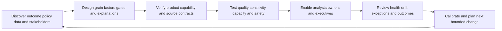

The TSM role can add value by asking precise discovery questions, mapping customer evidence to supported capability, identifying verification items, facilitating workshops, establishing acceptance criteria, teaching explanation patterns, monitoring health and adoption, coordinating support escalation, and connecting technical movement to customer outcomes. It should not choose customer risk appetite, promise an undocumented formula, certify a control, authorize production testing, or claim that a score proves prevented loss.

## Official Source Anchors

Research/source snapshot and review date: **2026-08-24**.

The first three sources support bounded public Zscaler product positioning. The remaining sources support general severity, exploitation, vulnerability-management, governance, and control concepts. None defines NMH, proves a customer condition, publishes a proprietary UVM formula, guarantees an outcome, or authorizes testing. Current official material and licensed-tenant evidence govern real use.

| Source | URL | Used for | Boundary |
|---|---|---|---|
| Zscaler Unified Vulnerability Management | https://www.zscaler.com/products-and-solutions/vulnerability-management | Data Fabric-powered UVM; aggregated/correlated data; context including identity/assets/behavior/controls/business/hierarchy; multifactor scoring; adjustable factors/weights; additional factors through sources | No formula, defaults, factor catalog, field, UI, threshold, order, entitlement, or result claim |
| Zscaler Data Fabric for Security | https://www.zscaler.com/products-and-solutions/data-fabric | Public ingest, harmonize/map, deduplicate, correlate/enrich, custom logic/scoring/workflow/reporting positioning | No proprietary internal architecture or algorithm claim |
| Zscaler Data Fabric integrations | https://www.zscaler.com/products-and-solutions/data-fabric/integrations | Public integration ecosystem discovery at review date | Listing is not proof of direction, object, permission, version, support, or entitlement |
| FIRST CVSS | https://www.first.org/cvss/ | Versioned technical severity characteristics and vectors | CVSS is not complete customer risk |
| FIRST EPSS | https://www.first.org/epss/ | Daily next-30-day in-wild exploitation probability estimate for published CVEs | Not certainty, severity, applicability, or customer breach probability |
| CISA Known Exploited Vulnerabilities Catalog | https://www.cisa.gov/known-exploited-vulnerabilities-catalog | Evidence-based known-exploitation prioritization input | Not proof of customer compromise or complete exploit universe |
| CVE Program | https://www.cve.org/ | Public vulnerability record identity | CVE is not a customer finding occurrence |
| NIST Cybersecurity Framework 2.0 | https://www.nist.gov/cyberframework | Govern, Identify, Protect, Detect, Respond, Recover outcome and governance context | Voluntary framework; profiles and implementations vary |
| NIST SP 800-40 Rev. 4 | https://csrc.nist.gov/pubs/sp/800/40/r4/final | Enterprise patch-management planning and verification | Does not define UVM scoring |
| NIST SP 800-53 Rev. 5 | https://csrc.nist.gov/pubs/sp/800/53/r5/upd1/final | Vulnerability, access, audit, assessment, configuration, integrity, incident, and privacy control context | Requires customer selection, tailoring, implementation, and assessment |

## Likely Interview Questions

### Q1. What is contextual multifactor risk scoring, and what does Zscaler publicly say about it?

**Model answer:** Contextual multifactor scoring combines several defined dimensions around an applicable exposure episode rather than sorting only by technical severity. Zscaler's reviewed public UVM page describes aggregated/correlated data, context including identity, assets, behavior, controls, business processes, and hierarchy, plus out-of-the-box multifactor scoring, adjustable factors and weights, and additional factors through new sources. The public page does not disclose a complete formula, defaults, thresholds, fields, or tenant behavior, so those remain current verification items.

### Q2. Which factors should matter in vulnerability priority?

**Model answer:** Start with exact identity and applicability, then preserve technical severity and exploitability evidence. Add asset lifecycle and business criticality, reachability and exposure, human/workload privilege, relevant threat activity, mitigating-control applicability and effectiveness, evidence quality, ownership, treatment feasibility, and customer policy. Each factor needs definition, source, grain, time, missing behavior, overlap, security, owner, tests, and explanation. A factor should improve a decision, not merely add data.

### Q3. How do you stop weights from hiding mandatory risk or uncertainty?

**Model answer:** Use gates before weighted logic. Identity/applicability and evidence-quality gates prevent unsupported certainty. Customer-authorized mandatory cohorts, such as defined known-exploitation or critical-service rules, cannot be averaged away. Missing, stale, conflicting, and not-applicable states stay distinct. Weight changes are versioned and tested through boundary, overlap, outlier, segment, capacity, shadow, canary, and rollback checks. Human review handles novel or high-consequence conflict.

### Q4. How should mitigating controls affect priority?

**Model answer:** Only for the exact scenario prerequisite they demonstrably interrupt. I would distinguish expected, present, configured, healthy, enforcing, effective, partial, excepted, bypassed, stale, unknown, and not applicable. Evidence needs asset, identity, path, policy, time, and authorized test scope. A control may alter sequence or residual exposure, but it does not remove the underlying vulnerability, cover alternate paths automatically, or prove absence of compromise.

### Q5. How would you calibrate a contextual scoring method?

**Model answer:** Define the customer decision and policy first, then create a representative human-reviewed truth set with positive, negative, boundary, conflict, missing, stale, and high-consequence cases. Baseline current output, classify defects by data versus logic, change one controlled element, test sensitivity and owner capacity, compare in shadow, canary a bounded cohort, obtain customer approval, monitor overrides and validated outcomes, and preserve rollback and reporting-restatement rules. Calibration is about useful decisions, not attractive score distributions.

### Q6. What makes a score explainable?

**Model answer:** The explanation identifies the exact episode, policy/model version, cohort, leading reasons, source and as-of time for each material assertion, quality/confidence, missing or conflicting evidence, control and residual paths, owner, timing logic, recommended action, and validation postcondition. Different audiences can receive different detail under least privilege, but all views derive from one governed decision record. A number without that receipt is difficult to trust or troubleshoot.

### Q7. How would you troubleshoot a surprising UVM priority?

**Model answer:** First pause affected automation and preserve versions. Select one stable episode and UTC window. Trace scope and native finding, entity identity and lifecycle, applicability, source health and mapping, service/identity/path/control assertions, missing-value behavior, factor transformations, lineage overlap, policy/rule/weight version and precedence, then display and workflow reconciliation. Repair in shadow, replay deterministically, reconcile open work and trends, communicate affected decisions, and escalate a redacted minimal case if product behavior remains unexplained.

### Q8. How does Arti's background support this work without overstating experience?

**Model answer:** Microsoft 365, OneDrive, and SharePoint escalation work provides adjacent discipline in exact tenant/user/site/device identity, permissions, service dependencies, evidence quality, customer impact, hypotheses, and validation. Networking traces support path and control reasoning. SQL and Power BI support grain, temporal joins, nulls, cohorts, sensitivity, and honest trends. Escalations, mentoring, and reviewed AI assistance support communication and adoption. NMH is synthetic, while production Zscaler/UVM scoring and vulnerability-program operation remain learning and verification boundaries.

## 30-Second Memory Hooks

| Concept | Memory hook |
|---|---|
| Score | Map legend, not territory |
| Episode | One continuing condition on one resolved entity |
| Severity | Technical seriousness, not customer risk total |
| Exploitability | Keep prediction, known exploitation, PoC, threat, and local evidence separate |
| Criticality | Customer-attested consequence with validity |
| Reachability | DNS to route to transport to identity to affected feature |
| Identity | Effective privilege, not just group membership |
| Control | Credit only the exact prerequisite proven interrupted |
| Factor | Defined decision input with source, time, quality, and owner |
| Weight | Policy influence, not a truth knob |
| Gate | Protect quality and mandatory cohorts before averaging |
| Unknown | Evidence state, never a secret zero |
| Overlap | Three copied stories are not three independent witnesses |
| Explainability | Receipt for priority and action |
| Calibration | Compare with reviewed cases and executable outcomes |
| Sensitivity | Move one assumption and watch decisions plus workload |
| Governance | Customer authorities approve policy and risk |
| TSM | Enable product use, evidence, adoption, and troubleshooting without assuming authority |
| Arti bridge | Correlate Microsoft evidence; learn product specifics honestly |

## Completion Checklist

- [ ] I can separate product fact, general security practice, scenario assumption, customer fact, and unknown.
- [ ] I can state the reviewed public UVM multifactor, context, customization, and Data Fabric claims without inventing internals.
- [ ] I define vulnerability, finding, exposure episode, severity, exploitability, criticality, reachability, exposure, threat activity, identity context, control, factor, weight, gate, threshold, cohort, calibration, sensitivity, explainability, uncertainty, confidence, provenance, residual risk, reason code, and model version.
- [ ] I score a governed exposure episode rather than a raw row, CVE, asset, or ticket.
- [ ] I preserve stable identity, lifecycle, validity, observation provenance, and age.
- [ ] I keep CVSS version, vector, source, and applicability visible.
- [ ] I distinguish EPSS, KEV, vendor advisory, PoC, threat report, local attempt, and confirmed incident evidence.
- [ ] I detect copied threat signals and prevent hidden double counting.
- [ ] I use customer-authorized business/service criticality with source, authority, and validity.
- [ ] I reason from vantage through DNS, route, transport, gateway, application, identity, and affected component.
- [ ] I test alternate public, partner, internal, management, IPv6, direct-origin, and local paths only under authorization.
- [ ] I distinguish human/workload identity, effective privilege, privileged role, behavior, and ownership.
- [ ] I protect identity and behavior data through purpose, minimization, access, retention, and audit.
- [ ] I distinguish expected, present, configured, healthy, enforcing, effective, partial, excepted, bypassed, stale, unknown, and not-applicable controls.
- [ ] I preserve residual paths and durable remediation when a control mitigates one prerequisite.
- [ ] I align event, observation, publication, effective, ingestion, calculation, decision, and validation times.
- [ ] I use data-quality, applicability, and mandatory policy gates before weighted logic.
- [ ] I keep null, stale, conflict, unknown, default, imputed, and not applicable semantically distinct.
- [ ] I build factor contracts with purpose, definition, grain, source, authority, scope, time, quality, security, transformation, missing behavior, overlap, decision effect, owner, tests, and rollback.
- [ ] I create explanations with episode, version, reasons, evidence, uncertainty, controls, action, owner, timing, and postcondition.
- [ ] I route uncertainty to the correct evidence action rather than automatically raising or lowering risk.
- [ ] I calibrate with a representative reviewed truth set and classify data defects separately from model defects.
- [ ] I run boundary, missing, overlap, outlier, mandatory, capacity, adversarial, replay, and segment tests.
- [ ] I use shadow and canary stages before consequential scale.
- [ ] I version changes, obtain customer approval, define rollback, reconcile work, and govern trend restatement.
- [ ] I separate VM, service, IAM/network/control, risk, privacy/legal, data, change, TSM, and Support/Product decision rights.
- [ ] I never present a score as proof of compromise, prevented loss, control effectiveness, or risk acceptance.
- [ ] I can troubleshoot scope, observation, identity, applicability, enrichment, factor, missingness, overlap, rule/version, display, workflow, and governance layers.
- [ ] I can build a redacted wrong-priority escalation packet with exact identifiers, UTC evidence, versions, containment, and one ask.
- [ ] I can explain all eight NMH scenarios as explicitly fictional and synthetic exercises.
- [ ] I can complete all twenty-one exercises without a production tenant or unsafe testing.
- [ ] I tie M365/OneDrive/SharePoint support, networking traces, SQL/Power BI, escalations, mentoring, and AI to scoring methods without claiming production UVM or vulnerability-program experience.
- [ ] I retain the official-source snapshot and review date exactly as 2026-08-24.
- [ ] I can answer Q1 through Q8 with source boundaries, mechanics, tradeoffs, uncertainty, governance, troubleshooting, and candidate honesty.

[Part 83 - UVM Prioritization, Grouping, and Remediation Backlogs](Part-83-uvm-prioritization-backlogs.md)