# Part 83 - UVM Prioritization, Grouping, and Remediation Backlogs

> **Audience:** Arti Thakur, preparing for a Zscaler Security Operations Technical Success Manager role after Microsoft enterprise Support Escalation Engineering.

> **Purpose:** Explain how contextual vulnerability decisions become trustworthy remediation backlogs. Cover risk-ranked work, protected policy cohorts, grouping, campaigns, quick wins, root-cause work, dependencies, ownership, due dates, bulk operations, reason codes, backlog quality, capacity, anti-patterns, practical customer decisions, troubleshooting, safe exercises, and TSM adoption value.

> **Scope and honesty:** Northstar Meridian Holdings, abbreviated NMH, is an explicitly fictional and synthetic customer used only for learning. Every NMH asset, service, finding, exposure episode, rank, cohort, group, campaign, owner, date, deadline, ticket, result, metric, and decision is invented. Arti's factual background is Microsoft 365, OneDrive, and SharePoint support; networking and trace analysis; SQL and Power BI; escalations; mentoring; and responsible AI exploration. Production Zscaler, Data Fabric, UVM, Risk360, CAASM, CTEM, and vulnerability-program operation remain learning boundaries.

> **Currency caveat:** Product wording, workflows, interfaces, objects, fields, ranking behavior, grouping behavior, integrations, entitlements, standards, threat evidence, and customer conditions change. The controlled official-source snapshot and review date for this Part is exactly **2026-08-24**. Current official documentation, licensed-tenant evidence, customer policy, product specialists, Zscaler Support, source-native evidence, approved change processes, and measured postconditions govern production.

> **Section goal:** Enable a clear TSM conversation about moving from contextual priority to executable remediation work: which items belong in which queue, why they are grouped, who owns them, what dependencies and due logic apply, which bulk actions are safe, how backlog quality is measured, and how to troubleshoot a queue that looks ordered but does not reduce exposure.

Zscaler's reviewed public UVM page positions the product around identifying security gaps to fix first, contextual multifactor scoring, flexible/custom remediation workflows with details and rationale, dynamic reporting, and automatic ticket reconciliation. The reviewed Data Fabric page also provides bounded public positioning around custom business logic, grouping, workflows, and dynamic reports. Those statements support a product conversation about prioritization and operationalization. They do not publish exact UVM queue objects, grouping operators, campaign fields, bulk-action behavior, due-date algorithms, workflow states, limits, or entitlements.

This Part uses three labels consistently. **Product fact** is a bounded statement from an official public source. **General security practice** is a recommended operating pattern rather than a claim about proprietary internals. **Scenario assumption** is an explicitly fictional NMH design. Exact tenant behavior always remains a verification item.

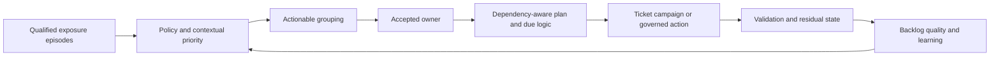

| Backlog question | Weak answer | Stronger answer |
|---|---|---|
| What is the work unit? | A scanner row | A stable exposure episode or governed group with member lineage |
| Why now? | The score is high | Policy gate, contextual reasons, uncertainty, age, and consequence |
| Who owns it? | Whoever last used the device | Accepted technical/service owner with routing provenance |
| What should happen? | Fix vulnerability | Treatment steps, dependencies, safety, and validation postconditions |
| When is it due? | Thirty days | Versioned policy clock with start, pause, exception, and timezone rules |
| What can be grouped? | Same CVE | Members sharing owner, treatment, dependency, scope, and validation method |
| Can it be bulk changed? | They look similar | Eligibility, invariant, preview, sample, approval, canary, audit, rollback |
| What proves progress? | Ticket closed | Native, source, path, control, and service postconditions as applicable |

## JD Mapping

| JD signal | Capability developed here | Customer or TSM artifact | Honest boundary |
|---|---|---|---|
| Develop product expertise | Explain public UVM priority/workflow positioning and verification questions | Source-bounded backlog whiteboard | No invented queue behavior |
| Trusted advisor | Align priority with customer policy, ownership, and safe treatment | Backlog operating contract | Customer retains risk and change authority |
| Drive adoption and value | Make work understandable and executable for remediation teams | Owner view and campaign playbook | No guaranteed reduction or acceptance |
| Troubleshoot complexity | Isolate ranking, grouping, routing, due, bulk, and display defects | Backlog troubleshooting runbook | No unsupported product root cause |
| Use analytics | Define grain, flow, aging, capacity, quality, recurrence, and denominators | SQL/Power BI metric design | No undocumented product schema |
| Coordinate stakeholders | Connect VM, SecOps, IT, app, cloud, IAM, risk, and change owners | RACI and dependency register | TSM does not assign customer authority |
| Communicate proactively | Explain rationale, blocked work, uncertainty, and next checkpoint | Technical and executive backlog narrative | No unsupported ETA |
| Partner with Support/Product | Package reproducible queue or grouping symptoms | Redacted escalation packet | No roadmap/fix promise |
| Explore AI responsibly | Suggest candidate groups and summaries under deterministic review | AI guardrail card | No autonomous priority, bulk action, or closure |

## Candidate honesty note

| Evidence class | Neutral phrasing | Boundary |
|---|---|---|
| Factual Microsoft support | Complex support cases required exact scope, ownership, impact, dependencies, action registers, updates, and validation | Not production UVM backlog ownership |
| M365/OneDrive/SharePoint context | Tenant, user, site, library, client, permissions, sync state, and service health changed action | Transferable context method, not vulnerability-program operation |
| Networking/traces | DNS, TCP, TLS, proxy, route, HTTP, and time evidence helped distinguish path failures | Useful for reachability and validation, not proof of UVM use |
| SQL/Power BI | Data skills support stable grains, grouping tests, anti-joins, aging, cohorts, and honest trends | No claim of UVM database access |
| Escalations | Severity, containment, owner, dependency, evidence package, checkpoint, and RCA methods transfer | No customer risk acceptance authority |
| Mentoring | Teach-back and reusable playbooks support adoption | No claim of a production UVM rollout |
| AI exploration | Reviewed assistance can draft candidate summaries or anomaly checks | No autonomous queue control |
| Synthetic NMH practice | Artifacts and scenarios show structured study | No customer or product result |

## Beginner vocabulary and memory hooks

| Term | Plain meaning | Why it matters | Analogy or hook |
|---|---|---|---|
| Priority | Decision about relative attention and timing | Directs scarce effort | Triage order |
| Rank | Ordered position under a method | Helps compare within a population | Number in a line |
| Cohort | Members sharing a decision-relevant rule | Protects policy categories | Triage lane |
| Queue | Ordered collection waiting for work | Shapes what an owner sees next | Work inbox |
| Backlog | All accepted or candidate work not yet validated complete | Shows demand, debt, and flow | Repair inventory |
| Work item | Unit assigned for action | Needs clear scope and postcondition | Work order |
| Exposure episode | Continuing condition on a resolved entity | Preserves age and evidence | One repair case over time |
| Group | Members intentionally presented or worked together | Reduces repetition | Bundle with a label |
| Campaign | Governed remediation effort across a defined population | Coordinates scale, waves, and dependencies | Recall program |
| Root cause | Underlying condition producing repeated exposure | Fix can address many members | Broken mold making defective parts |
| Quick win | Low-friction action with meaningful validated benefit | Builds momentum when not cherry-picked | Easy repair that closes a real leak |
| Dependency | Prerequisite before work can proceed safely | Explains blocked time and sequence | One repair waits for a spare part |
| Owner | Accountable team/person for a defined decision or action | Prevents bouncing work | Named work-order desk |
| Due date | Policy-derived target time | Supports planning and escalation | Agreed completion target |
| Reason code | Controlled explanation for priority, grouping, state, or exception | Builds trust and audit | Label saying why this lane |
| Bulk operation | One governed action applied to many eligible records | Saves effort but expands blast radius | Batch update on many work orders |
| Backlog quality | Degree to which work is valid, unique, current, owned, actionable, and measurable | A small bad queue still fails | Clean and usable inventory |
| Aging | Time an episode or workflow state has remained open | Exposes delay and debt | Time since repair need began |
| Throughput | Work completed per period under a defined grain | Shows flow capacity | Repairs finished per week |
| Work in progress | Active items not yet complete | Too much can slow everything | Too many open repair bays |
| Recurrence | Condition returns after closure or reappears from same cause | Reveals weak fixes | Leak returns after repainting |
| Reopen | Return to active state after failed/changed validation | Preserves truth | Reopen work order when test fails |
| Reconciliation | Compare systems and resolve state differences | Prevents stale or duplicate work | Match two maintenance ledgers |

### Plain-English deep-dive 1 - A sorted backlog can still be unusable

A warehouse can arrange every box by a perfect priority number and still fail to ship anything. Boxes may have no address, several labels for the same order, missing parts, unsafe handling instructions, or destinations that refuse delivery. Sorting does not create executability.

A vulnerability backlog needs more than rank. Each item must refer to the correct continuing exposure, explain why it matters, identify an accepted owner, contain a feasible treatment path, show dependencies and due logic, preserve exceptions and uncertainty, and define validation. Grouping must reduce work without hiding member differences. Backlog quality is therefore part of risk management, not administrative cleanup.

## From scoring output to remediation demand

Part 82 separated quality gates, mandatory policy cohorts, contextual assessment, uncertainty, and explanations. A remediation backlog consumes that decision output, but it should not copy every scored row directly into a ticket. Some records need evidence work, some need incident triage, some need containment, some need durable remediation, some need governance, and some can be closed only after supported disposition and validation.

| Decision class | Typical next work | Owner family | Closure evidence |
|---|---|---|---|
| Evidence priority | Resolve identity, applicability, exposure, control, or ownership | Data/source/VM/service owner | Evidence state supported or governed disposition |
| Incident question | Preserve telemetry and investigate possible exploitation | SOC/IR plus service owner | Incident process decision; vulnerability remains separately governed |
| Immediate containment | Interrupt credible path temporarily | Network/IAM/app/control owner | Path/control test plus residual exposure record |
| Durable remediation | Patch, upgrade, configure, replace, remove, or redesign | Platform/app/cloud/device owner | Native technical and service postconditions |
| Compensating control | Reduce prerequisite while durable fix is blocked | Control and risk owners | Effective scoped control and approved residual plan |
| Risk decision | Accept, transfer, avoid, or defer under authority | Customer risk/service authority | Approval, rationale, expiry, controls, review, remediation plan |
| Data correction | Repair source, mapping, identity, or policy defect | Data/platform owner | Reconciliation and deterministic replay |
| Prevention/root cause | Fix image, pipeline, standard, process, or architecture | Engineering/platform/governance owner | New-state validation plus recurrence monitoring |

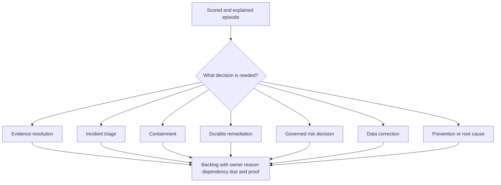

One episode can require more than one linked action. A known-exploited public vulnerability might require SOC investigation, network containment, component remediation, service validation, and a root-cause change to the deployment pipeline. Forcing all work into one generic "fix" item loses ownership and completion semantics. Creating five unrelated tickets loses the shared scenario. Use a parent decision/campaign relationship or other supported design verified in the customer environment.

## Priority is not one universal sorted list

A single global rank can compare unlike work poorly. Evidence repair, emergency containment, supplier-managed device updates, routine patching, and architecture redesign compete for different skills and decision authorities. Cohorts establish protected lanes; rank helps order within a meaningful lane.

| Cohort | Purpose | Typical ordering inputs | Guardrail |
|---|---|---|---|
| Mandatory accelerated | Customer policy requires urgent handling | Policy rule, applicability, exposure, incident evidence | Never averaged below routine work |
| Evidence urgent | Consequence is high but key evidence is unknown/conflicting | Potential impact, uncertainty type, evidence SLA | Do not call confirmed risk |
| Containment | Immediate path reduction is feasible | Credible path, control owner, reversibility | Temporary control does not erase durable fix |
| Planned remediation | Supported treatment can follow change cadence | Contextual priority, age, dependency, capacity | Preserve threat/context changes |
| Supplier/change constrained | Fix depends on vendor, safety, certification, or release | Consequence, controls, supplier milestone | Requires governance, not forgotten pause |
| Root-cause campaign | Shared image/library/configuration/process causes many episodes | Recurrence, member impact, common treatment | Validate every affected runtime/member |
| Hygiene/data quality | Ownership, identity, source, or mapping blocks decisions | Decision impact and breadth | Data work is not hidden as low security value |
| Exception review | Approved residual risk approaches expiry or control change | Expiry, consequence, control health | Acceptance is not permanent closure |

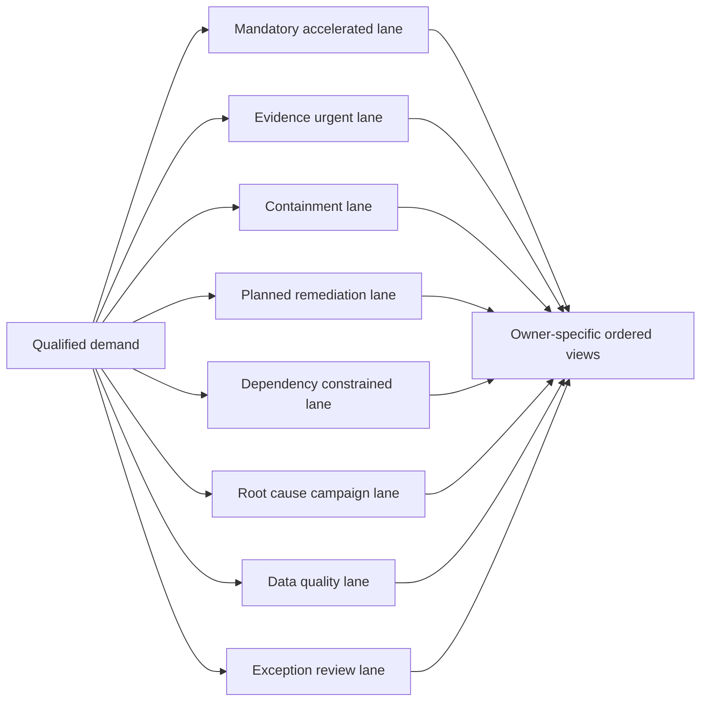

Rank needs a tie-break contract. Two episodes with similar contextual priority might be ordered by policy, active incident linkage, evidence urgency, age, service consequence, expiring exception, treatment window, or stable ID. The tie-break should be deterministic and explainable, not an invisible database order.

## Work-item and backlog grain

| Record | Grain | Must retain | Must not imply |
|---|---|---|---|
| Exposure episode | Condition on entity over validity period | Source observations, context, age, state | Ticket count |
| Decision record | Episode/cohort under policy version at time | Reasons, uncertainty, owner/action recommendation | Permanent truth after inputs change |
| Group | Membership under group-rule version | Member IDs, inclusion/exclusion reason | Members are identical |
| Campaign | Governed objective and population | Scope, waves, owners, dependencies, success criteria | One score fits every member |
| Work item | Assignable action | Scope, rationale, steps, due, dependency, proof | Technical closure from status alone |
| Exception | Time-bounded residual-risk decision | Authority, reason, controls, expiry, review | Vulnerability removal |
| Validation | Test of defined postcondition | Method, source, time, result, limitations | Universal absence of risk |
| Ticket link | Relationship to external work system | Stable key, target ID, state, version | Target system owns every security fact |

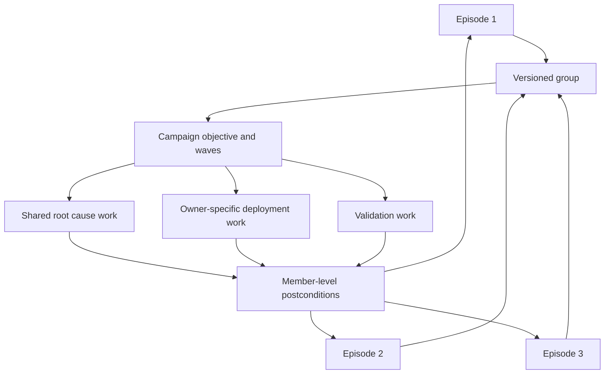

Grouping should be reversible. The system must retain which members were included, which were excluded, which evidence and rule version applied, and how changes are handled. A group should not overwrite episode-level severity, context, owner, age, control, or validation.

## Grouping dimensions and decision rules

Useful groups share enough operational characteristics to receive one coherent action. Same CVE is only one possible dimension.

| Grouping dimension | Useful when | Required qualifiers | Risk |
|---|---|---|---|
| Owner/team | One team can execute treatment | Accepted current owner | Wrong routing scales quickly |
| Business service | Change and validation follow service boundary | Service relationship and owner | Shared assets may support several services |
| Root cause | One image, library, template, or pipeline creates many episodes | Causal evidence | Correlation mistaken for cause |
| Treatment | Same supported patch/config/replacement applies | Version/platform/feature compatibility | Similar label hides different fix |
| Change window | Members can move in coordinated wave | Service and rollback constraints | Deadline may be delayed for convenience |
| Environment | Production/test/development handling differs | Lifecycle and exposure | Development still can contain sensitive paths |
| Platform/technology | Same engineering team and tooling | Exact platform/version | Heterogeneous subtypes hidden |
| Location/business unit | Local ownership or maintenance pattern | Current hierarchy and policy | Organizational grouping can obscure service impact |
| Control gap | Same missing/failed safeguard | Exact applicable control and scope | Presence/effectiveness ambiguity |
| Threat/policy cohort | Same mandatory response applies | Versioned rule and applicability | Broad labels can flood queues |
| Dependency | Same supplier/release/change prerequisite | Explicit dependency and milestone | "Blocked" becomes indefinite |
| Validation method | Same native/path/service tests apply | Member-level expected state | Group pass can hide failed members |

### Plain-English deep-dive 2 - Group by the repair, not only by the defect label

If one thousand cars receive the same recall code, they may still need different service centers, parts, appointment windows, and safety checks. The recall identity helps define scope, but it does not alone define executable work.

Vulnerability grouping follows the same logic. A CVE can affect Windows and Linux packages, appliances, containers, development images, and managed services. Owners, supported fixes, dependencies, outage risks, and validation differ. A strong group answers: can one accountable owner perform one coherent treatment across these members under compatible timing and proof? If not, split the group while preserving the common vulnerability or campaign relationship.

## Campaign design

A campaign is a governed effort to achieve a defined exposure outcome across a population. It is not merely a saved filter or a large ticket. Exact UVM support and object behavior require current verification.

| Campaign element | Required question | Example general practice |
|---|---|---|
| Objective | What measurable condition should change? | Replace vulnerable base image and retire old runtime instances |
| Scope | Which members and exclusions apply? | Production instances from defined image lineage |
| Entry criteria | Why does a member join? | Applicable episode plus root-cause relationship |
| Exit criteria | What proves member and campaign completion? | New image, instance replacement, source/path/service validation |
| Ownership | Who owns campaign, waves, members, and risk decisions? | Platform owner plus service owners |
| Waves | How is blast radius controlled? | Lab, canary, limited production, broader rollout |
| Dependencies | What must happen first? | Vendor release, test, change approval, capacity |
| Due logic | Which policy clock governs? | Member episode age preserved; campaign target separate |
| Communications | Who needs what detail and checkpoint? | Technical owners, service leads, risk, executives |
| Membership change | How do new, removed, or corrected members behave? | Versioned snapshot plus governed dynamic additions |
| Exception | How are blocked members governed? | Member-level approval and expiry, not campaign concealment |
| Reconciliation | How do tickets and episode state stay aligned? | Stable keys, read-back, duplicate checks |
| Closure | Who can declare objective complete? | Evidence-based customer authority |

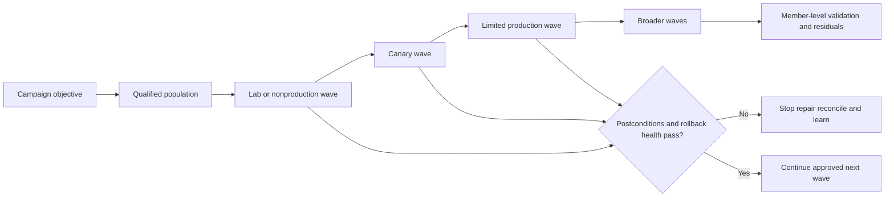

Campaign progress needs both numerator and denominator. If 800 of 1,000 members validate, state whether the original population was fixed, whether 100 new members joined, whether 50 retired legitimately, whether 30 are exceptions, whether source coverage changed, and whether the remaining 120 share a blocker. "80 percent complete" without population semantics is weak.

## Quick wins without cherry-picking

A quick win combines meaningful exposure benefit with relatively low effort, low operational risk, and clear validation. It is not merely the easiest ticket. A quick-win program can build trust, but selecting only easy low-impact items creates volume theater.

| Dimension | Strong quick-win candidate | Weak shortcut |
|---|---|---|
| Exposure value | Removes a credible path or recurring root cause | Closes many duplicate rows only |
| Effort | Supported treatment can be executed promptly | Work is easy because validation is skipped |
| Change safety | Low blast radius, canary and rollback available | Unreviewed bulk production change |
| Ownership | Accepted owner and window exist | Ticket routed to unconfirmed team |
| Evidence | Applicability and expected postcondition are clear | Based on score label alone |
| Durability | Prevents recurrence or fixes shared cause | Cosmetic state update |
| Learning | Tests workflow and adoption assumptions | Avoids representative hard cases |
| Measurement | Validated member and service outcomes | Ticket-created or ticket-closed count |

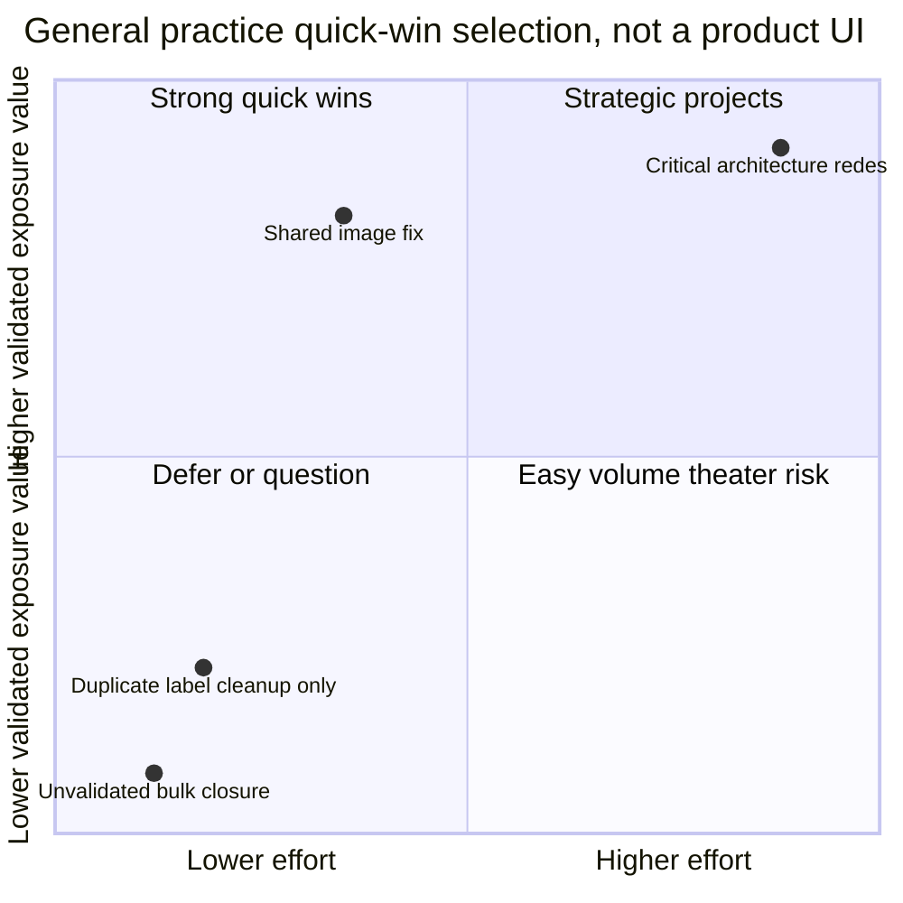

The quadrant is a general reasoning aid, not a representation of a UVM chart. Effort and value estimates should be evidence-backed ranges with owners, not fabricated precision.

## Dependencies and blocked work

Dependencies are first-class backlog data. A blocked item still represents exposure. Pausing its workflow clock may be allowed under customer policy, but the episode age and residual consequence should remain visible.

| Dependency type | Example | Owner | Backlog treatment |
|---|---|---|---|
| Vendor | Supported firmware or patch unavailable | Supplier manager/product owner | Milestone, escalation, controls, review date |
| Change | Maintenance approval/window required | Service/change owner | Planned wave, rollback, service test |
| Testing | Compatibility or safety validation incomplete | QA/safety/service owner | Evidence task with defined exit |
| Architecture | Component cannot be upgraded without redesign | Architecture/app owner | Program milestone and interim controls |
| Identity | Asset or owner unresolved | Data/CMDB/service owner | Evidence-priority action; no blind routing |
| Control | Compensating control not yet effective | Network/IAM/control owner | Keep residual path explicit |
| Procurement | Replacement or license needed | Business/procurement owner | Decision and lead-time evidence |
| Capacity | Owner cannot absorb proposed wave | Program/service leadership | Re-sequence based on consequence, not silence |
| Incident | Forensics or containment constrains change | IR plus service owner | Coordinate evidence preservation and treatment |
| Data source | Validation source is unhealthy | Source/platform owner | Block false closure and restore evidence |

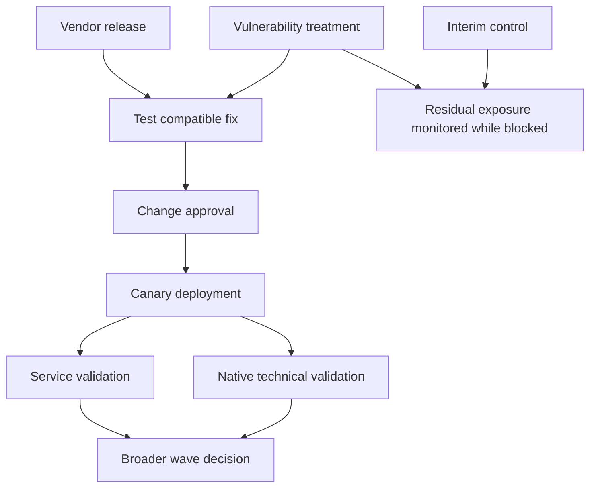

Blocked reason codes should be specific: waiting for vendor release, compatibility testing, change window, owner acceptance, source restoration, risk approval, or procurement. "On hold" hides the next action. Every dependency needs owner, evidence, next checkpoint, escalation path, and expiry or milestone.

## Ownership and routing

Vulnerability work can involve several owners. Technical owner performs the change. Service owner decides acceptable service impact. Risk owner accepts residual risk. Data owner fixes source quality. Control owner implements mitigation. Ticket assignee may coordinate but is not automatically any of those authorities.

| Ownership role | Accountable for | Evidence | Common routing error |
|---|---|---|---|
| Technical owner | Patch/config/replacement implementation | Platform or application ownership | Last logged-in user selected |
| Service owner | Business/service consequence and change acceptance | Service catalog attestation | CMDB support group assumed current |
| Risk owner | Residual-risk decision | Approved governance authority | Analyst accepts risk by closing ticket |
| Control owner | Mitigating safeguard | Policy and operational ownership | Security tool name treated as owner |
| Data owner | Source/mapping/identity correction | Source contract | Remediation team asked to fix data pipeline |
| Campaign owner | Objective, waves, coordination, status | Program charter | One assignee expected to execute every member |
| Validation owner | Postcondition evidence | Source/path/service test responsibility | Implementer self-certifies without required checks |
| Executive sponsor | Resource and conflict resolution | Governance charter | Used for routine ticket assignment |
| TSM | Product adoption, architecture, health, troubleshooting, escalation facilitation | Success plan and action register | Assumed customer work or risk owner |

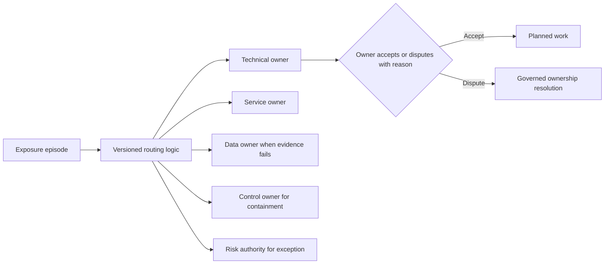

Owner confidence and provenance should be visible. A direct service-catalog mapping with current attestation is stronger than a hostname pattern. A disputed route should not bounce indefinitely among individuals. Send it to a governed resolution queue with a service/CMDB authority, retain episode age, and measure routing churn.

## Due dates, clocks, and escalation logic

A due date is the result of policy, not a property inherent in a CVE. Define which clock begins when, which timezone applies, whether calendar or business time is used, which pauses are allowed, what approval is required, how priority changes affect the date, and what happens after reopen.

| Clock element | Required definition | Failure if vague |
|---|---|---|
| Population | Which episodes receive this target? | Unlike work compared unfairly |
| Start event | First supported observation, applicability confirmation, policy match, or assignment? | Age reset or delayed silently |
| Time basis | UTC, customer timezone, calendar days, business hours? | Conflicting calculations |
| Priority change | Does a higher cohort shorten target from which point? | Teams surprised or urgency delayed |
| Pause reason | Which dependencies stop an operational clock? | Any item can be hidden as paused |
| Episode age | Does underlying exposure age continue? | Risk debt disappears during pause |
| Exception | Who approves target deviation and until when? | Deadline becomes optional |
| Reopen | Is original age retained? | Closure/reopen games the metric |
| Validation wait | Is implementation complete but proof pending? | Ticket closure substitutes for outcome |
| Breach action | What escalation or decision follows? | Red metric without owner or consequence |
| Policy version | Which rule produced the date? | Historical results not reproducible |

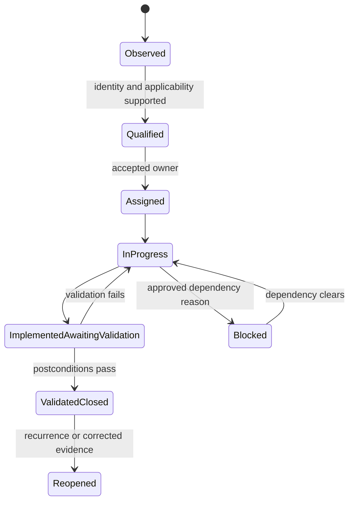

This state diagram is a general operating example, not a claim about exact UVM states. A customer may use different supported states. The semantic distinction between implementation and validation remains important.

## Bulk operations and blast-radius control

Bulk operations can assign, group, update due logic, add reason codes, request evidence, create work, apply dispositions, or change state depending on supported capability. Exact product actions require verification. The larger the action population, the stronger the evidence and approval controls should be.

| Bulk control | Question | Safe pattern |
|---|---|---|
| Eligibility | Do all selected members meet the same defined rule? | Deterministic query with version |
| Preview | Which exact records and fields will change? | Before/after member list and totals |
| Invariants | What must never happen? | Mandatory cohort cannot downgrade; age cannot reset |
| Sample | Does detailed review support the group? | Stratified positive/negative sample |
| Conflict | Are any members already owned, excepted, or in change? | Exclusion/review list |
| Approval | Who authorizes consequential action? | Customer role and recorded decision |
| Canary | Can a small subset test target behavior? | Limited wave with read-back |
| Idempotency | Can retry duplicate work? | Stable key and query-before-retry |
| Audit | Who changed what, why, when, under which version? | Immutable decision trail |
| Rollback | Can safe prior state be restored? | Tested reversal plus reconciliation |
| Validation | How are member postconditions checked? | Per-member evidence, not group assumption |
| Communication | Who is affected and what changed? | Owner notice and checkpoint |

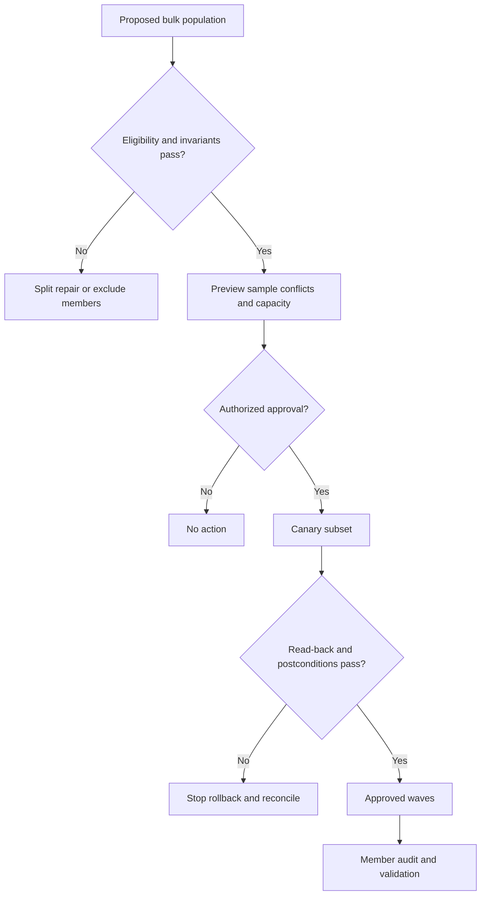

### Plain-English deep-dive 3 - Bulk action turns one mistake into many mistakes quickly

A spreadsheet fill operation is efficient because it repeats a rule. If the starting rule or selected range is wrong, efficiency expands the error. Vulnerability bulk operations behave the same way, but the consequences can include duplicate tickets, incorrect owners, false exceptions, premature closure, or disruptive changes.

The safe question is not merely "Can this be done in bulk?" It is "What evidence proves every member is eligible for the same action, which invariants protect exceptions, how will a small canary reveal target behavior, and how will retry, rollback, audit, and member-level validation work?" Bulk speed is valuable only after semantic uniformity is established.

## Reason codes and rationale

Reason codes explain why an item is prioritized, grouped, blocked, rerouted, excepted, reopened, or closed. They should be controlled enough for analytics and clear enough for people.

| Reason family | Example conceptual reason | Required companion evidence |
|---|---|---|
| Priority | Known-exploitation policy match | Source, date, applicability, policy version |
| Exposure | Public path supported | Vantage, path, observation time |
| Business | Essential service relationship | Authority and validity |
| Identity | Privileged workload path | Effective-right evidence with privacy controls |
| Control | Control effectiveness unknown | Expected scope, last evidence, owner |
| Grouping | Shared base-image root cause | Image lineage and member relationship |
| Ownership | Service-catalog technical owner | Source, attestation, validity |
| Blocked | Supplier-supported update unavailable | Supplier evidence and next milestone |
| Bulk exclusion | Member has active approved exception | Exception authority and expiry |
| Reopen | Source validation still supports condition | New evidence and preserved age |
| Closure | Defined technical and service postconditions passed | Method, source, time, limitations |
| Data quality | Identity conflict prevents safe assignment | Conflicting IDs and resolution owner |

Free text can add nuance but should not replace controlled reasons. Avoid blame labels such as "owner ignored risk." State observable workflow evidence: assignment unaccepted after defined interval, dependency missing, or validation overdue. This supports constructive TSM communication.

## Backlog quality dimensions

| Dimension | Healthy question | Example measure | Guardrail |
|---|---|---|---|
| Validity | Does each item represent a supported condition? | Sample-supported rate | Sample and method disclosed |
| Uniqueness | Are duplicate work items controlled? | Duplicate stable-key rate | Preserve source assertions |
| Identity | Is exact current entity known? | Strong-ID coverage/conflict rate | High percentage can hide wrong matches |
| Applicability | Is condition supported or explicitly uncertain? | Supported/unknown distribution | Unknown is not false |
| Freshness | Are evidence and context current enough? | Age by source/factor | Different sources have different SLOs |
| Ownership | Has accountable owner accepted work? | Accepted-owner coverage and churn | Assignment is not acceptance |
| Actionability | Are treatment, dependency, and proof clear? | Owner rejection reason distribution | Acceptance does not prove priority |
| Explainability | Can reasons drill to evidence/version? | Explanation completeness | Avoid sensitive overexposure |
| Due integrity | Are clocks reproducible? | Due-date reconciliation | One compliance percent is insufficient |
| Dependency quality | Is blocked work active and governed? | Block reason/owner/checkpoint coverage | Paused does not mean no exposure |
| Validation | Is closure evidence present? | Implemented-awaiting-validation and reopen rates | Source health must be visible |
| Reconciliation | Do external systems agree? | Missing/duplicate/stale link rate | Define authority per state |
| Coverage | Is expected population represented? | Source/context coverage | Falling population can fake improvement |
| Capacity | Can owners execute incoming demand? | Arrival/throughput/WIP by owner | Throughput is not risk value alone |
| Recurrence | Are systemic causes returning? | Recurrence by image/team/control | Requires stable identity and root-cause method |

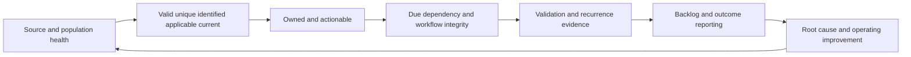

A backlog can shrink because risk was treated, duplicate observations were correlated, assets legitimately retired, scope changed, exceptions moved records, or a source failed. Every material movement needs a bridge. Backlog quality metrics should sit beside risk and throughput metrics.

## Flow, capacity, and queue health

| Metric | Definition question | Useful interpretation | Misuse |
|---|---|---|---|
| Arrival rate | New qualified episodes or work items per period? | Demand pressure | Count raw observations |
| Throughput | Validated completions at which grain? | Completion capacity | Ticket closures as outcomes |
| WIP | Which active states count? | Congestion and focus | Reward idle blocked work removal |
| Cycle time | From accepted assignment to validated completion? | Execution flow | Ignore long pre-assignment age |
| Lead time | From supported episode start to validated completion? | Customer exposure duration | Reset on rescan or group |
| Aging bands | Stable episode age by cohort? | Debt and urgency | Use ticket creation date only |
| Blocked age | Time in dependency state by reason? | Escalation and planning | Hide paused work entirely |
| Owner acceptance | Assigned items accepted/rejected under reason? | Routing quality | Treat acceptance as remediation |
| Reopen rate | Validated-closed items returning under defined window? | Closure/root-cause quality | Punish honest reopen behavior |
| Recurrence | New related episodes after root-cause treatment? | Prevention effectiveness | Assume same CVE means same cause |
| Capacity ratio | Arrival divided by validated throughput? | Sustainability signal | One ratio across unlike teams |
| Oldest material item | Highest-consequence old exposure with context | Focus attention | Use oldest low-value item as theater |

Little's Law can help reason about stable systems: average work in progress is approximately arrival rate times average time in system, or $L = \lambda W$. It is a diagnostic relationship, not a promise. Backlog populations are often not stable, arrival definitions change, and priority classes differ. Use it to ask whether WIP, arrivals, and cycle time are mutually plausible, then inspect real cohorts.

## Backlog anti-patterns

| Anti-pattern | Symptom | Root risk | Better response |
|---|---|---|---|
| CVSS-only global queue | Critical rows dominate without context | Misallocated effort | Protected cohorts plus contextual lanes |
| Ticket-per-observation | Daily scans create repeated work | Duplicate overload | Stable episode and idempotent relationship |
| Group by CVE only | Mixed owners/platforms/fixes in one item | Unexecutable campaign | Group by coherent treatment and proof |
| Owner by last user | Shared device routes to individual | Bounce and blame | Governed technical/service ownership |
| Reset age on rescan | Old exposure looks new | SLA gaming | Preserve episode start |
| Close on deployment | Validation failures reopen later | False completion | Awaiting-validation state |
| Hide blocked items | Paused queue looks healthy | Residual risk forgotten | Keep age, reason, owner, checkpoint visible |
| Bulk close missing findings | Source outage appears as success | False risk reduction | Source-health gates and reconciliation |
| Quick-win theater | Easy low-impact count reduction | Material risk unchanged | Value-effort-safety-durability criteria |
| Dynamic group drift | Membership changes without history | Irreproducible reports | Version snapshots and change ledger |
| Executive mega-ticket | One item covers many owners and treatments | No accountability | Campaign with linked owner work |
| No negative queue | Only actionable knowns are visible | Unknowns disappear | Evidence and data-quality lanes |
| AI auto-grouping | Similar text becomes same treatment | Semantic errors at scale | Candidate only, deterministic review |
| Backlog score sum | Scores added as if monetary quantities | Meaningless aggregate | Cohorts, exposure evidence, and validated movement |

## Troubleshooting a misleading backlog

Begin with the decision affected. Pause harmful bulk actions or automatic ticket creation, preserve rule/model/group versions, choose one episode and one group, and establish an exact UTC window. Compare the backlog view with source-native and target-system evidence.

| Symptom | Competing hypotheses | Cheap discriminating check |
|---|---|---|
| Queue suddenly shrinks | Remediation, scope change, source failure, filter, dedup change | Reconcile expected source population and movement bridge |
| One owner receives surge | Real exposure, routing change, hierarchy mapping, group expansion | Compare before/after owner provenance and member IDs |
| Same issue creates many tickets | Episode identity change, retry timeout, unstable key | Search target by stable episode/group key |
| Campaign says complete but members open | Aggregate state, dynamic membership, failed validation | Reconcile member exit postconditions |
| Old items look new | Rescan or regroup reset age | Compare original supported episode start |
| Blocked queue never moves | Missing dependency owner/checkpoint or broad pause | Sample reason records and next milestones |
| Bulk change skipped records | Eligibility conflict, permissions, pagination, target rejection | Compare preview IDs with audit/result IDs |
| Priority reasons disappear | Model version/display mismatch or mapping defect | Open one decision trace and semantic-layer query |
| Due dates differ across views | Timezone, policy version, pause, start event | Recalculate one item from event history |
| Closed items recur | Premature closure, failed root cause, asset replacement identity | Trace validation and lifecycle for one recurrence |

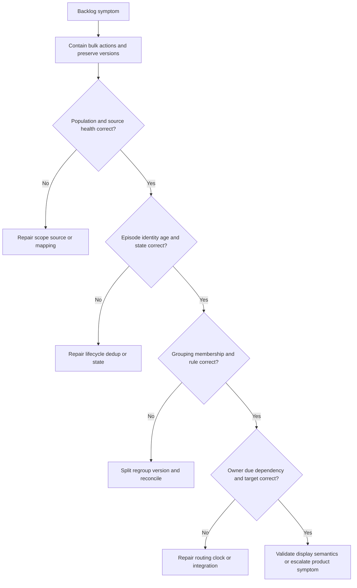

### Minimal escalation package

Include redacted environment identifiers through approved channels, exact episode/group/campaign/target IDs, expected and observed population, UTC timestamps, source and policy versions, grouping/routing/due rule version, before/after member lists, reason codes, audit result, target-system evidence, reproducibility, business impact, containment, recent changes, and one precise ask. Exclude secrets, unnecessary personal data, and unsupported root-cause claims.

### Plain-English deep-dive 4 - A disappearing backlog is an investigation, not a celebration

If a hospital waiting room becomes empty in five minutes, leaders should ask whether patients were treated, transferred, discharged correctly, removed from the system, or simply no longer registered. The count alone cannot distinguish success from broken intake.

A vulnerability backlog drop needs the same movement bridge. Separate validated remediation, supported non-applicability, legitimate retirement, deduplication, policy change, exception movement, source loss, mapping failure, and filter/display changes. Report the causal categories and affected uncertainty before calling the movement risk reduction.

## Security, privacy, safety, and AI guardrails

Backlogs combine technical weaknesses, asset details, business services, owner identities, exceptions, and sometimes threat or incident relationships. Restrict detail by purpose and role. A remediation owner may need exact work and rationale but not broad privileged-user behavior. Executives need material scenarios and decisions, not exploitable technical detail.

| Risk | Example | Guardrail |
|---|---|---|
| Sensitive concentration | Export contains vulnerabilities, paths, owners, and service criticality | Classification, least privilege, encryption, expiry |
| Misrouting | Work exposes details to wrong person/team | Accepted ownership and access-aware routing |
| Unsafe bulk change | Large population state changed incorrectly | Preview, approval, canary, audit, rollback |
| Premature disclosure | Incident-linked reason widely visible | Need-to-know abstraction and IR coordination |
| Manipulation | Team changes easy metadata to leave urgent cohort | Authority, provenance, anomaly review |
| AI leakage | Backlog pasted into unapproved model | Approved environment, minimization, no secrets |
| AI semantic error | Text similarity groups incompatible fixes | Candidate group only; deterministic eligibility review |
| Automation bias | Owner trusts rank without evidence | Drill-down, reason codes, training, challenge process |
| Availability harm | Patch wave disrupts essential service | Change approval, canary, rollback, service validation |
| Metric pressure | Teams close before validation | Separate implementation and validated outcomes |

AI can suggest candidate groups, summarize cited rationale, detect duplicate language, or flag missing owner/dependency fields. It should not decide customer priority, invent a root cause, apply bulk state changes, accept risk, or close work autonomously. Deterministic eligibility and human authority remain necessary.

## Complete synthetic NMH backlog case

Everything in this section is explicitly fictional and synthetic. It does not describe a Zscaler tenant, UVM fields, supported objects, exact product behavior, customer deployment, or real result. No date later than the official review date is used. The official source snapshot remains 2026-08-24.

### Synthetic NMH baseline

NMH's fictional patient-access pilot begins with 2,400 source observations that correlate into 920 synthetic exposure episodes. These numbers demonstrate grain only; they are not product or customer results. Human-reviewed policy and context place 22 episodes in a synthetic mandatory accelerated cohort, 48 in urgent evidence work, 310 in planned remediation, 190 in shared root-cause campaigns, 85 in dependency-constrained treatment, 40 in exception review, and the remainder in lower-priority monitored or disposition work. Cohorts can overlap only through explicitly linked actions; the episode has one governed current decision state.

| Synthetic baseline element | Fictional value | Interpretation | Caveat |
|---|---:|---|---|
| Source observations | 2,400 | Provenance rows | Not backlog size |
| Exposure episodes | 920 | Stable condition/entity grain | Synthetic correlation result |
| Mandatory accelerated | 22 | Protected fictional policy lane | Not a UVM default |
| Urgent evidence | 48 | High-consequence unknown/conflict | Not confirmed high risk |
| Planned remediation | 310 | Executable scheduled work | Synthetic policy output |
| Root-cause campaign members | 190 | Shared treatment candidates | Member validation still required |
| Dependency constrained | 85 | Exposure with explicit blockers | Not hidden or closed |
| Exception review | 40 | Approval/expiry/control review work | Acceptance not vulnerability removal |

```mermaid
flowchart TD
    title NMH explicitly fictional synthetic backlog flow
    OBS[2400 synthetic observations] --> EP[920 synthetic episodes]
    EP --> M[22 synthetic mandatory accelerated]
    EP --> E[48 synthetic urgent evidence]
    EP --> P[310 synthetic planned remediation]
    EP --> R[190 synthetic root-cause campaign members]
    EP --> D[85 synthetic dependency constrained]
    EP --> X[40 synthetic exception review]
    M --> OWN[Synthetic accepted owners and actions]
    E --> OWN
    P --> OWN
    R --> OWN
    D --> OWN
    X --> OWN
    OWN --> VAL[Synthetic member postconditions]
```

### Synthetic scenario 1: raw row avalanche becomes coherent work

Agent, network, and cloud sources repeatedly report one vulnerable package on fictional virtual machines created from the same base image. Daily observations had produced 6,000 spreadsheet lines and hundreds of duplicate tickets. NMH preserves observations, resolves active VM identities, creates one episode per active instance, links 190 members to a synthetic base-image root cause, and creates campaign work for image replacement plus service-owner waves. Old instances must retire and every active member must pass source and service validation. Row reduction is not reported as risk reduction.

### Synthetic scenario 2: same CVE requires three groups

One fictional CVE affects Windows servers, Linux containers, and a supplier-managed appliance. The treatment, owner, maintenance process, and validation method differ. NMH keeps a common vulnerability relationship but forms three actionable groups. The appliance group enters dependency-constrained governance with supplier evidence and interim controls. This prevents one giant ticket from hiding incompatible work.

### Synthetic scenario 3: quick win fixes a shared pipeline cause

A synthetic development pipeline keeps publishing an outdated library into short-lived services. Updating the dependency pin and adding a governed build check is low effort relative to repeatedly repairing instances, but only after compatibility tests and rollback are available. NMH treats it as a quick win because it removes a recurring cause with clear validation, not because it closes the most rows. Existing runtime members remain open until replaced and validated.

### Synthetic scenario 4: last-user routing harms a clinical team

Shared kiosks route findings to clinicians who last signed in. Tickets bounce and sensitive technical detail reaches the wrong audience. NMH freezes this routing rule, maps devices to the clinical-endpoint service and accepted technical team, removes unnecessary personal context, reconciles open work, preserves age, and adds owner-provenance monitoring. The clinicians are not blamed for a semantic defect.

### Synthetic scenario 5: campaign completion hides failed members

A fictional campaign reports 100 percent deployment after a package command runs. Source validation shows 12 percent of members still expose the old component because services did not restart, while three assets were replaced and two source records are stale. NMH changes the campaign view to separate implementation, native technical validation, service validation, legitimate retirement, and unknown source state. Completion waits for member-level exit criteria.

### Synthetic scenario 6: due date resets on regroup

An old episode moves from an application group to a platform campaign. A weak process uses campaign creation as the new clock start, making the work appear recent. NMH restores the original supported episode age, retains the campaign target as a separate planning date, recalculates policy status, restates SLA reporting, and adds a no-age-reset invariant.

### Synthetic scenario 7: ambiguous timeout creates duplicate bulk tickets

A bulk ticket request times out after the fictional target creates several items but before acknowledgement. A retry would duplicate them. NMH stops, queries the target using stable episode/group keys, records returned IDs, creates only missing work, reconciles duplicate candidates, and resumes in small waves. This is a general reliability pattern whose exact product support requires verification.

### Synthetic scenario 8: blocked supplier work becomes active governance

A synthetic laboratory appliance cannot receive an unsupported patch. Rather than remove it from the backlog, NMH records supplier dependency, safety/change authority, restricted management path, monitoring, owner, milestone, and exception review. Exposure age continues. The item appears in both technical owner and governance views under one episode, not as duplicate risk.

### Synthetic scenario 9: backlog drop is source failure

The fictional high-priority backlog falls after a cloud connector permission loss. NMH's source-health gate prevents missing observations from closing episodes. The report marks affected cohorts degraded, restores approved access, backfills pages, deterministically replays decisions, reconciles tickets, and restates movement. The customer narrative explicitly withdraws the apparent improvement.

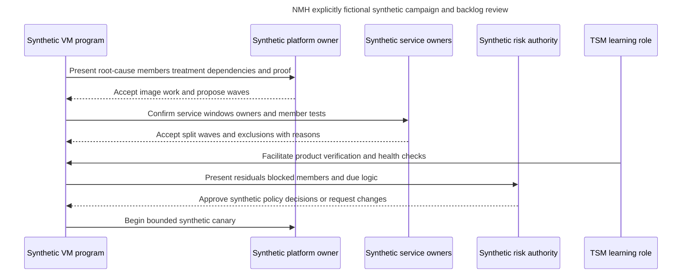

### Synthetic customer review narrative

"The fictional patient-access backlog contains 920 stable exposure episodes rather than 2,400 raw observations. Twenty-two are in the customer-defined mandatory lane, 48 require urgent evidence, and 190 share a base-image root-cause candidate. The image campaign is not called complete at deployment; each active runtime must pass technical and service checks. Eighty-five dependency-constrained episodes retain age, owner, control, milestone, and governance visibility. A recent apparent backlog drop was traced to source permission loss and has been restated. The decision requested in this synthetic exercise is approval for a limited image canary and the ownership-resolution policy. No production UVM result or prevented incident is claimed."

## Customer and TSM artifact kit

| Artifact | Minimum contents | Value |
|---|---|---|
| Backlog operating contract | Grain, states, cohorts, clocks, owners, proof, authority | Shared semantics |
| Priority-to-action map | Decision class, treatment, owner, timing, postcondition | Converts score into work |
| Cohort dictionary | Entry/exit rules, policy source, version, ordering | Protects lanes |
| Group rule record | Dimensions, eligibility, exclusions, version, membership | Reversible grouping |
| Campaign charter | Objective, population, waves, dependencies, owners, success | Coordinated scale |
| Root-cause ledger | Evidence, members, treatment, recurrence test | Prevents repetitive repair |
| Ownership matrix | Technical/service/risk/control/data/validation authorities | Stops ticket bounce |
| Due-clock dictionary | Start, timezone, pause, reopen, validation, version | Reproducible deadlines |
| Dependency register | Blocker, owner, milestone, interim controls, escalation | Active blocked work |
| Bulk-action checklist | Eligibility, preview, invariants, sample, approval, canary, rollback | Blast-radius control |
| Reason-code dictionary | Meaning, evidence, audience, lifecycle | Explainability and analytics |
| Backlog quality scorecard | Validity, uniqueness, identity, ownership, actionability, proof | Trust and improvement |
| Movement bridge | Opening, additions, validated exits, retirements, corrections, unknowns | Honest trend |
| Reconciliation report | Episode/group/target links and state differences | Prevents stale work |
| Escalation packet | Exact IDs, UTC, versions, expected/actual, containment, one ask | Efficient Support/Product engagement |

## Safe labs and exercises

All exercises use synthetic data, reviewed public pages, or isolated explicitly authorized systems. They require no production Zscaler tenant, customer information, real credential, exploit, or disruptive action.

| Exercise | Task | Deliverable | Pass condition |
|---:|---|---|---|
| 1 | Convert observations to episodes | Grain and lineage table | Rescans do not create work duplicates |
| 2 | Build decision classes | Priority-to-action map | Evidence, incident, containment, remediation separated |
| 3 | Define cohorts | Versioned cohort dictionary | Mandatory lane protected |
| 4 | Create tie-breaks | Ordered synthetic sample | Deterministic explanation |
| 5 | Group one CVE | Three actionable groups | Owner/treatment/proof compatibility shown |
| 6 | Group by root cause | Image campaign candidate | Causal evidence retained |
| 7 | Design campaign | Charter and wave plan | Member-level exit criteria |
| 8 | Select quick wins | Value-effort-safety matrix | No volume-only choice |
| 9 | Map dependencies | Directed dependency diagram | Owner and milestone for every blocker |
| 10 | Resolve ownership | Routing/attestation exercise | Last user never becomes owner by default |
| 11 | Define due clocks | Policy clock dictionary | Age, pauses, reopen, timezone explicit |
| 12 | Test bulk eligibility | Preview and exclusion list | Invariants and conflicts pass |
| 13 | Simulate timeout | Idempotent reconciliation plan | No duplicate target work |
| 14 | Create reason codes | Controlled dictionary | Evidence and audience linked |
| 15 | Measure quality | Backlog quality scorecard | Source health beside work metrics |
| 16 | Build flow metrics | Arrival/WIP/throughput/age report | Grains and denominators explicit |
| 17 | Investigate backlog drop | Movement bridge | Source failure separated from treatment |
| 18 | Diagnose owner surge | One-episode and group trace | Mapping versus real demand distinguished |
| 19 | Draft escalation packet | Redacted synthetic case | Exact IDs/UTC/versions/one ask |
| 20 | Deliver review | Technical plus executive narratives | Facts, caveats, decisions, checkpoints |
| 21 | Rehearse Q1-Q8 | Recorded answers | Neutral honesty and source boundaries |

## Arti bridge: factual strengths applied to backlog operations

| Factual strength | Backlog application | Interview bridge | Boundary |
|---|---|---|---|
| M365/OneDrive/SharePoint support | Separate tenant/user/site/device/service cases and exact owners | "A shared symptom can require different action groups by cause and ownership." | No production UVM claim |
| Networking/traces | Validate paths and distinguish control, origin, proxy, DNS, TCP/TLS, and service blockers | "Blocked work needs a precise dependency, not an on-hold label." | Authorized evidence only |
| SQL | Deduplicate, preserve episode age, build cohorts, anti-join missing work, and reconcile IDs | "Backlog quality starts with grain and stable keys." | No undocumented product schema |
| Power BI | Show owner views, aging, flow, movement bridges, and drill-down | "A falling count needs a causal bridge." | General analytics design |
| Escalations | Triage severity, containment, owners, actions, checkpoints, and validation | "Priority becomes useful when it creates executable, accountable work." | No customer risk authority |
| Mentoring | Teach reason codes, group criteria, and closure evidence | "Owner trust grows through teach-back and useful context." | No rollout claim |
| AI exploration | Suggest candidate groups and summarize cited rationale under review | "AI assists pattern discovery; deterministic rules and people authorize action." | No autonomous bulk operation |

## TSM adoption and value discussion

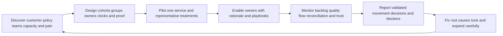

TSM value is not the number of tickets generated. It is the ability to help the customer connect supported product capability to a clear operating contract, make owner work useful, identify data or workflow defects, coordinate Support/Product evidence, build adoption through feedback and teach-back, and report defensible outcomes. Useful value hypotheses include fewer duplicate actions, higher accepted-owner coverage, shorter evidence-resolution time, clearer dependencies, more validated first-pass treatment, reduced recurrence, and more trustworthy executive decisions. Each requires a baseline, denominator, attribution caveat, and current evidence.

## Official Source Anchors

Research/source snapshot and review date: **2026-08-24**.

Official Zscaler sources support only the bounded product positioning stated here. General queue, campaign, dependency, ownership, bulk-operation, reconciliation, analytics, security, and governance patterns are study methods, not claims about proprietary internals. NMH is synthetic. Current official documentation and licensed-tenant evidence govern production.

| Source | URL | Used for | Boundary |
|---|---|---|---|
| Zscaler Unified Vulnerability Management | https://www.zscaler.com/products-and-solutions/vulnerability-management | Public fix-first/contextual prioritization, multifactor scoring, flexible/custom remediation workflow with details/rationale, dynamic reporting, ticket reconciliation positioning | No exact queue, group, campaign, field, state, due, bulk, limit, interface, entitlement, or outcome claim |
| Zscaler Data Fabric for Security | https://www.zscaler.com/products-and-solutions/data-fabric | Public custom business logic, grouping, scoring, workflows, and dynamic reporting positioning | No proprietary object model or execution semantics |
| Zscaler Data Fabric integrations | https://www.zscaler.com/products-and-solutions/data-fabric/integrations | Integration ecosystem discovery at review date | Listing does not prove target direction, action, permission, version, support, or entitlement |
| FIRST CVSS | https://www.first.org/cvss/ | Technical severity foundation | Severity is not complete customer priority |
| FIRST EPSS | https://www.first.org/epss/ | Next-30-day in-wild exploitation probability estimate | Not certainty or customer breach probability |
| CISA Known Exploited Vulnerabilities Catalog | https://www.cisa.gov/known-exploited-vulnerabilities-catalog | Known-exploitation prioritization input | Not proof of customer compromise |
| NIST Cybersecurity Framework 2.0 | https://www.nist.gov/cyberframework | Governance and outcome context | Voluntary; implementation varies |
| NIST SP 800-40 Rev. 4 | https://csrc.nist.gov/pubs/sp/800/40/r4/final | Enterprise patch-management planning and verification | Does not define UVM backlog behavior |
| NIST SP 800-53 Rev. 5 | https://csrc.nist.gov/pubs/sp/800/53/r5/upd1/final | Vulnerability, change, access, audit, assessment, incident, and privacy control context | Requires customer selection and tailoring |

## Likely Interview Questions

### Q1. How do you turn contextual scoring into a useful remediation backlog?

**Model answer:** Start with stable exposure episodes and separate decision classes: evidence, incident triage, containment, durable remediation, compensating control, risk decision, data correction, and root-cause prevention. Protect mandatory policy cohorts, rank within meaningful lanes, attach reason codes and uncertainty, route to accepted owners, define dependencies and due clocks, and specify validation. Do not create one ticket per raw observation or treat score order as executability.

### Q2. What makes a good vulnerability grouping?

**Model answer:** Members should share a coherent owner, supported treatment, platform/version conditions, change window, dependencies, and validation method. Same CVE can be useful scope context but is rarely sufficient. Keep member-level severity, age, context, exceptions, and proof. Version membership and retain inclusion/exclusion reasons so grouping is reversible and trends are reproducible.

### Q3. How would you design a remediation campaign?

**Model answer:** Define objective, population, entry and member-level exit criteria, campaign and member owners, waves, dependencies, due logic, communications, membership-change rules, exceptions, reconciliation, rollback, and closure authority. Use lab or nonproduction evidence where possible, then canary and controlled waves. Report both numerator and changing denominator. Deployment is not completion until technical and service postconditions pass.

### Q4. How do you identify quick wins without creating metric theater?

**Model answer:** A quick win should provide meaningful validated exposure benefit with relatively low effort and change risk, accepted ownership, clear evidence, durable effect, and useful learning. Fixing a shared image or pipeline cause can be stronger than closing many easy low-impact rows. I would disclose effort/value uncertainty and keep member validation. Ticket volume alone is not value.

### Q5. How should ownership, dependencies, and due dates work?

**Model answer:** Separate technical, service, risk, control, data, campaign, and validation ownership. Use governed source provenance and owner acceptance rather than last user. Every dependency gets a specific reason, owner, evidence, milestone, interim controls, and escalation. Due policy defines population, start event, timezone, time basis, pauses, priority changes, exception, reopen, validation wait, breach action, and version. Underlying episode age does not disappear while blocked.

### Q6. What controls make a bulk operation safe?

**Model answer:** Deterministic eligibility, exact preview, protected invariants, stratified sampling, conflict/exclusion review, authorized approval, small canary, stable idempotency key, target read-back, complete audit, tested rollback, owner communication, and member-level validation. After ambiguous timeout, query target state before retry. Similar-looking rows are not enough to justify a shared action.

### Q7. How would you troubleshoot a backlog that suddenly improves?

**Model answer:** Pause success claims and harmful bulk actions, preserve versions, and build a movement bridge. Reconcile expected source population and health, scope, episode identity/age/state, grouping membership, filters, routing, due logic, target links, and validation. Separate validated remediation, retirement, non-applicability, deduplication, policy change, exceptions, and source/mapping defects. Repair, replay deterministically, reconcile work, and restate reporting.

### Q8. How does Arti's background transfer while preserving the experience boundary?

**Model answer:** Microsoft 365, OneDrive, and SharePoint support built discipline around exact scope, identity, ownership, dependencies, customer impact, action plans, and validation. Networking traces support path and blocker evidence. SQL and Power BI support stable grain, deduplication, grouping tests, aging, flow, denominators, and movement bridges. Escalations and mentoring support adoption and coordination; AI can assist reviewed candidate grouping. NMH is synthetic, and production UVM backlog/program operation remains a learning boundary.

## 30-Second Memory Hooks

| Concept | Memory hook |
|---|---|
| Priority | Why now, not just a number |
| Cohort | Protected decision lane |
| Rank | Order within comparable work |
| Backlog | Demand inventory that must be executable |
| Episode | Preserve condition age across rescans and tickets |
| Group | Same coherent repair, owner, dependency, and proof |
| Campaign | Objective, population, waves, members, validation |
| Root cause | Fix the mold, then validate every part |
| Quick win | Meaningful validated value with low friction |
| Dependency | Specific blocker, owner, milestone, and residual exposure |
| Owner | Assignment is not acceptance; roles are distinct |
| Due date | Versioned policy clock, not CVE property |
| Bulk | One error can scale instantly |
| Reason code | Controlled why for people and analytics |
| Blocked | Active governance, never invisible work |
| Closure | Postcondition, not ticket status |
| Backlog drop | Build the movement bridge before celebrating |
| Quality | Valid, unique, current, owned, actionable, explainable, validated |
| TSM | Make product-supported work understandable, trusted, and measurable |
| Arti bridge | Exact Microsoft case ownership becomes disciplined remediation coordination |

## Completion Checklist

- [ ] I can separate product fact, general security practice, scenario assumption, customer fact, and unknown.
- [ ] I state public UVM priority/workflow/reporting/reconciliation claims without inventing queue objects or behavior.
- [ ] I define priority, rank, cohort, queue, backlog, work item, episode, group, campaign, root cause, quick win, dependency, owner, due date, reason code, bulk operation, quality, aging, throughput, WIP, recurrence, reopen, and reconciliation.
- [ ] I transform scored episodes into evidence, incident, containment, remediation, control, risk, data, and prevention work deliberately.
- [ ] I protect mandatory, urgent-evidence, containment, planned, constrained, campaign, data-quality, and exception-review lanes.
- [ ] I use deterministic tie-breaks within comparable cohorts.
- [ ] I preserve episode age, source assertions, identity, and lifecycle across rescans, regrouping, tickets, and reopen.
- [ ] I distinguish episode, decision, group, campaign, work item, exception, validation, and ticket-link grains.
- [ ] I group only when owner, treatment, dependency, timing, and validation are coherent.
- [ ] I version group rules and retain member inclusion/exclusion history.
- [ ] I design campaigns with objective, scope, entry/exit, owners, waves, dependencies, due logic, communications, membership change, exceptions, reconciliation, and closure authority.
- [ ] I report campaign numerator and changing denominator honestly.
- [ ] I select quick wins by meaningful validated benefit, effort, safety, durability, and learning rather than row count.
- [ ] I treat vendor, change, test, architecture, identity, control, procurement, capacity, incident, and source dependencies as first-class.
- [ ] I retain exposure age and active governance while work is blocked.
- [ ] I separate technical, service, risk, control, data, campaign, validation, sponsor, and TSM ownership.
- [ ] I use owner provenance, confidence, acceptance, and governed dispute resolution.
- [ ] I define due population, start, timezone, time basis, priority change, pause, age, exception, reopen, validation wait, breach action, and policy version.
- [ ] I never reset episode age because of rescan, regrouping, campaign, reassignment, or reopen.
- [ ] I require bulk eligibility, preview, invariants, sample, conflict review, approval, canary, idempotency, audit, rollback, validation, and communication.
- [ ] I query target state before retry after ambiguous timeout.
- [ ] I use controlled reason codes with evidence and non-blaming language.
- [ ] I measure validity, uniqueness, identity, applicability, freshness, ownership, actionability, explainability, due integrity, dependencies, validation, reconciliation, coverage, capacity, and recurrence.
- [ ] I define arrival, throughput, WIP, cycle time, lead time, age, blocked age, owner acceptance, reopen, recurrence, and capacity at explicit grains.
- [ ] I use Little's Law only as a qualified diagnostic relationship.
- [ ] I identify CVSS-only, ticket-per-observation, CVE-only grouping, last-user routing, age reset, close-on-deploy, hidden blocked work, bulk close, quick-win theater, dynamic-group drift, mega-ticket, and AI auto-grouping anti-patterns.
- [ ] I troubleshoot population/source, episode, grouping, routing, due, dependency, target, validation, and display layers.
- [ ] I build a movement bridge before calling a backlog decline risk reduction.
- [ ] I protect vulnerability, identity, owner, exception, business, and incident data through least privilege and minimization.
- [ ] I use AI only for reviewed candidate grouping, summaries, and anomaly checks, never autonomous actions or decisions.
- [ ] I can explain all nine NMH scenarios as fictional and synthetic only.
- [ ] I can build every artifact and complete all twenty-one safe exercises.
- [ ] I connect M365/OneDrive/SharePoint support, networking traces, SQL/Power BI, escalations, mentoring, and AI without claiming production Zscaler/UVM/vulnerability-program experience.
- [ ] I retain the official-source snapshot and review date exactly as 2026-08-24.
- [ ] I can answer Q1 through Q8 with mechanics, tradeoffs, failure modes, troubleshooting, TSM value, and honesty.

[Part 84 - UVM Workflows, Ticketing, SLAs, Exceptions, and Reconciliation](Part-84-uvm-workflows-ticketing-slas.md)