# Part 84 - UVM Workflows, Ticketing, SLAs, Exceptions, and Reconciliation

> **Audience:** Candidates preparing for a Zscaler Security Operations Technical Success Manager role after enterprise Support Escalation Engineering.

> **Purpose:** Explain vulnerability-remediation workflows from zero. Cover trigger-condition-action design, quality and policy gates, owner routing, remediation rationale, ticket lifecycle, state authority, SLA tiers and clocks, approvals, compensating controls, risk acceptance, exceptions, closure validation, reopen behavior, retries, idempotency, reconciliation, audit, security/privacy, integration troubleshooting, customer artifacts, and TSM service value.

> **Scope and honesty:** Northstar Meridian Holdings, abbreviated NMH, is an explicitly fictional and synthetic customer used only for study. Every NMH source, exposure, rule, trigger, condition, action, owner, ticket, SLA, exception, approval, date, state, metric, result, and decision is invented. Your factual background is Microsoft 365, OneDrive, and SharePoint support; networking and trace analysis; SQL and Power BI; escalations; mentoring; and responsible AI exploration. Production Zscaler, Data Fabric, UVM, Risk360, CAASM, CTEM, ITSM integration, and vulnerability-program operation remain learning boundaries.

> **Currency caveat:** Product wording, workflows, integrations, fields, states, APIs, retry behavior, reconciliation, entitlements, standards, threat evidence, and customer policies change. The controlled official-source snapshot and review date for this Part is exactly **2026-08-24**. Current official documentation, licensed-tenant evidence, target-system documentation, customer policy, product specialists, Zscaler Support, approved change/risk procedures, source-native evidence, and measured postconditions govern production.

> **Section goal:** Enable you to explain and troubleshoot an end-to-end UVM-style remediation workflow without inventing proprietary behavior: how a contextual decision becomes a safely routed action, how tickets and SLAs remain trustworthy, how exceptions preserve residual risk, how validation controls closure, how retries avoid duplicates, and how a TSM helps customer teams operate the loop.

The reviewed official UVM page publicly describes custom remediation workflows that can include remediation details and rationale, automatically reconcile tickets, and provide dynamic insights into risk posture, KPIs, SLAs, and other metrics. The reviewed Data Fabric page supports bounded public positioning around custom workflows and AnySource/AnyTarget integration concepts. These are product facts at the source snapshot. They do not publish exact UVM trigger types, condition operators, action catalogs, ticket fields, lifecycle states, bidirectional behavior, retry algorithms, supported ITSM objects, SLA formulas, exception objects, approval mechanisms, limits, or entitlements.

This Part labels **product fact**, **general security practice**, **scenario assumption**, and **unknown** separately. The workflow architecture below is a recommended study contract, not a representation of proprietary internals.

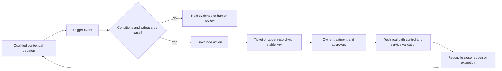

| Workflow outcome | What it means | What it must not mean automatically |
|---|---|---|
| Ticket created | Target accepted a work record | Owner accepted, remediation started, or risk fell |
| Ticket assigned | Assignee field contains a value | Correct technical/service owner accepted it |
| SLA active | Defined clock is running | Every episode has same deadline |
| Implemented | Owner reports treatment executed | Vulnerability absent or service healthy |
| Control applied | Safeguard is present/configured | Exact path is effectively interrupted |
| Exception approved | Authorized temporary residual-risk decision exists | Vulnerability removed or permanent acceptance |
| Ticket closed | Target workflow reached closed state | Exposure episode passed validation |
| Episode closed | Defined postconditions support closure | Future recurrence is impossible |

## JD Mapping

| JD signal | Capability developed here | Customer or TSM artifact | Honest boundary |
|---|---|---|---|
| Develop product expertise | Explain reviewed UVM workflow, reconciliation, and SLA positioning | Source-bounded workflow whiteboard | No invented feature/state/field |
| Trusted advisor | Align automation with customer authority and safe change | Workflow operating contract | Customer owns risk/change decisions |
| Drive adoption and value | Make tickets useful, reconciled, and validation-based | Owner playbook and health scorecard | No guaranteed SLA or risk result |
| Troubleshoot complexity | Isolate trigger, condition, routing, target, retry, sync, and report failures | Layered integration runbook | No unsupported product root cause |
| Use analytics | Define event grains, clocks, retries, discrepancies, and denominators | SQL/Power BI validation plan | No undocumented UVM schema |
| Coordinate stakeholders | Align VM, SecOps, ITSM, owners, risk, change, audit, Support/Product | RACI and escalation path | TSM does not approve customer exceptions |
| Communicate proactively | State impact, containment, owner, discrepancy, and checkpoint | Integration incident narrative | No unsupported ETA |
| Partner cross-functionally | Produce minimal reproducible workflow evidence | Redacted escalation packet | No roadmap/fix promise |
| Apply AI responsibly | Draft rationale and test cases from cited structured evidence | Guardrailed assistance charter | No autonomous action, closure, or risk acceptance |

## Candidate honesty note

| Evidence class | Neutral candidate phrasing | Boundary |
|---|---|---|
| Factual enterprise support | Escalation work required event timelines, exact IDs, permissions, service dependencies, owner coordination, updates, and closure evidence | Not production UVM workflow operation |
| M365/OneDrive/SharePoint | Cases crossed client, tenant, identity, permission, sync, network, and service layers | Transferable workflow diagnosis, not Zscaler configuration |
| Networking/traces | DNS/TCP/TLS/proxy/HTTP/time analysis supports integration-path diagnosis | Does not prove use of UVM connectors |
| SQL/Power BI | Skills support event history, state reconciliation, SLA calculations, retry analysis, and dashboards | No claim of product database access |
| Escalations | Containment, evidence packets, cross-team ownership, RCA, and checkpoints transfer | No authority to promise fixes or accept risk |
| Mentoring | Playbooks and teach-back support owner adoption | No production adoption claim |
| AI exploration | Reviewed assistance can draft rationale or edge-case tests | No autonomous workflow authority |
| Synthetic NMH | Scenarios and artifacts demonstrate learning | No real tenant or outcome |

## Beginner vocabulary and memory hooks

| Term | Plain meaning | Why it matters | Analogy or hook |
|---|---|---|---|
| Workflow | Governed sequence of states, decisions, people, and actions | Turns a priority into accountable work | Repair process |
| Trigger | Event that asks whether workflow should begin or change | Defines when logic evaluates | Doorbell |
| Condition | Test that must be true for an action path | Prevents unsafe action | Reception checklist |
| Action | Change, message, record, or request produced by workflow | Operational result | Dispatch work order |
| Precondition | Required evidence or authority before action | Protects quality and safety | Permit before construction |
| Rationale | Evidence-based explanation of why action is needed | Builds owner trust | Work-order diagnosis |
| Route | Rule choosing destination or owner | Sends work to accountable team | Mail sorting |
| Ticket | External or internal work-coordination record | Tracks assignment and activity | Repair docket |
| Stable key | Persistent identifier used to recognize same intended action | Prevents duplicate creation | Order number |
| Idempotency | Repeating a request has one intended effect | Makes retry safe | Press elevator button twice; one elevator call |
| Retry | Reattempt after failure or uncertainty | Recovers transient issues | Redial after dropped call |
| Backoff | Increasing wait between retries | Avoids overload | Pause longer after repeated busy signal |
| Reconciliation | Compare records and repair differences | Restores agreement after failures | Match two ledgers |
| Read-back | Query target to confirm stored state | Resolves ambiguous outcomes | Ask warehouse what order exists |
| SLA | Defined service-level commitment or target | Governs timing and escalation | Agreed repair clock |
| Clock | Rules for start, elapsed time, pause, and stop | Makes SLA reproducible | Stopwatch with written rules |
| Approval | Authorized decision before consequential action | Protects change/risk authority | Signed permit |
| Exception | Time-bounded approved deviation from policy | Makes residual risk explicit | Temporary permit with expiry |
| Compensating control | Alternative safeguard when primary treatment is blocked | Reduces a specific prerequisite | Temporary guard while lock is replaced |
| Risk acceptance | Authorized decision to retain stated residual risk for a period/scope | Prevents analyst from silently deciding | Executive signs bounded exception |
| Validation | Evidence that defined postcondition passed | Separates action from outcome | Inspect repair after work |
| Closure | Governed transition after required evidence | Ends active work honestly | Sign off only after inspection |
| Reopen | Return to active state after failed/new evidence | Preserves truth | Reopen failed repair order |
| Audit trail | Who/what/when/why record of decisions and actions | Supports accountability and diagnosis | Chain of custody |
| Dead-letter queue | Quarantined failed messages/actions needing review | Prevents silent loss | Undeliverable-mail tray |

### Plain-English deep-dive 1 - Automation is a decision conveyor belt

A conveyor belt saves effort when every package is correctly identified, permitted, labeled, and routed. If the barcode is wrong, automation moves the wrong package faster. If the destination is unavailable, repeated sending can create duplicates or overload. If nobody checks delivery, the warehouse may think work is complete when it is lost.

Security workflow design therefore begins before the action. Exact episode identity, applicability, evidence quality, policy, ownership, approval, target availability, and postconditions all matter. Automation should accelerate a trusted decision, not manufacture trust. High-consequence or uncertain cases need human review, proposal-only modes, and bounded canaries.

## Workflow architecture and systems of record

Several systems can hold related state. The vulnerability source may own observation truth. UVM may coordinate priority and workflow under supported behavior. ITSM may own assignment/change activity. A patch or configuration platform may own execution telemetry. Customer risk governance may own exceptions. No single status should overwrite all others.

| Domain state | Candidate authority | Required relationship | Dangerous shortcut |
|---|---|---|---|
| Finding observation | Native scanner/source | Source ID, time, evidence | Ticket closure deletes finding truth |
| Exposure episode | Governed vulnerability record | Stable entity/condition/lifecycle | New scan creates new age |
| Priority decision | Versioned policy/context method | Reasons, source times, model version | One score retained without explanation |
| Assignment/work | ITSM/issue system or supported workflow target | Stable link and state mapping | Assignee means accepted owner |
| Change execution | Change/patch/config platform | Change ID, target scope, result | Command success means remediation |
| Exception/risk | Customer risk authority/system | Approval, scope, expiry, controls | Analyst checkbox accepts risk |
| Validation | Native/path/control/service evidence sources | Method, time, limitations | Ticket status used as proof |
| Reporting | Governed semantic layer | All above with source health | Dashboard becomes source of truth |

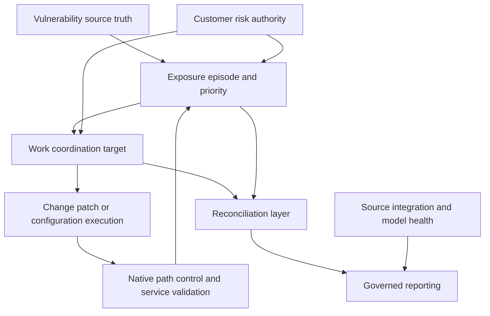

The arrows are conceptual. Exact supported integrations, directions, data objects, and authorities must be discovered and tested in the licensed environment.

## Trigger-condition-action design

A **trigger-condition-action** pattern expresses when workflow evaluates, what must be true, and what follows. A trigger should be specific enough to avoid constant noise but broad enough to catch material changes. Conditions protect quality, policy, authority, and safety. Actions should be idempotent, observable, auditable, and reversible where possible.

| Trigger category | Example general event | Required caution |
|---|---|---|
| Episode qualified | Identity and applicability become supported | Avoid creating from raw uncorrelated row |
| Priority/cohort change | Episode enters protected or owner-actionable cohort | Preserve old/new version and reason |
| Threat change | KEV/threat/local evidence changes urgency | Keep definitions and source times separate |
| Exposure/control change | Public path appears or control becomes unknown | Missing source must not masquerade as safe |
| Ownership change | Governed owner relationship changes | Reconcile accepted work and access |
| SLA event | Warning, breach, or validation delay occurs | Exact clock and pause rules needed |
| Exception event | Requested, approved, expiring, expired, revoked | Customer authority and residual risk visible |
| Ticket event | Created, updated, rejected, closed, reopened | Map target state semantically, not by name alone |
| Validation event | Postcondition passes, fails, partial, stale, unknown | Source health and scope included |
| Integration event | Delivery, auth, schema, quota, or timeout changes | Quarantine and reconcile rather than drop |

| Condition family | Question before action | Failure route |
|---|---|---|
| Identity | Is this the correct active episode/entity? | Evidence queue |
| Applicability | Does the condition apply? | Validation/disposition queue |
| Quality | Are required sources current and non-conflicting? | Data-quality action |
| Policy | Which approved rule/version applies? | Human/policy review |
| Ownership | Is a supported route and accepted owner available? | Ownership-resolution queue |
| Security | Does destination/user have least-privilege access? | Access correction, no sensitive delivery |
| Approval | Is customer authorization required and present? | Approval request/hold |
| Capacity | Can target safely receive this action volume? | Wave/rate-limit plan |
| Duplicate | Does stable key already exist at target? | Update/reconcile instead of create |
| Change safety | Are canary, rollback, and service protections ready? | Do not automate change |

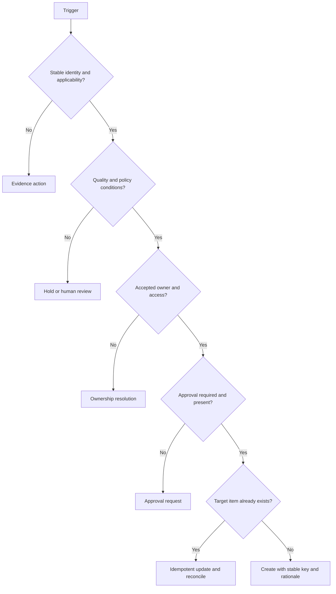

## Workflow decision record

Every consequential evaluation should be reproducible. The decision record need not expose proprietary internals, but it should retain enough customer evidence to explain action.

| Record element | Why needed | Example general content |
|---|---|---|
| Episode/group identity | Prevents wrong-subject action | Namespaced stable ID and lifecycle |
| Trigger event | Explains why logic ran | Cohort change with event time |
| Policy/model version | Reproduces conditions | Approved rule-set identifier |
| Inputs and as-of times | Shows evidence basis | Source assertion IDs and freshness |
| Condition outcomes | Explains pass/hold/fail | Quality pass, owner unresolved |
| Reason codes | Gives controlled rationale | Known exploitation; public path supported |
| Uncertainty | Avoids false certainty | Control effectiveness unknown |
| Intended action | States requested effect | Create/update owner work item |
| Stable key | Supports idempotency | Derived from episode/action/version contract |
| Approval | Shows customer authority | Approver role, decision, time, scope |
| Result/read-back | Shows actual target state | Target ID/version or quarantined failure |
| Validation plan | Defines closure proof | Source/native/service checks |
| Audit actor | Identifies human/service action | Approved identity under least privilege |

## Owner routing and remediation rationale

Routing should use a governed hierarchy rather than a convenient single field. Technical owner, service owner, control owner, risk owner, and validation owner are distinct. The target description should make the work executable without exposing unnecessary sensitive context.

| Routing evidence | Relative strength | Caveat |
|---|---|---|
| Current service catalog with owner attestation | Strong for service ownership | Attestation and relationship can expire |
| Platform/cloud resource ownership | Strong for technical action | Shared service may need service-owner coordination |
| Application repository/team mapping | Useful for code/library work | Repository may not own runtime deployment |
| CMDB support group | Useful when governed and current | Stale or broad groups create bounce |
| Image/pipeline lineage | Strong for root-cause campaigns | Member services still need change coordination |
| Organizational hierarchy | Useful escalation context | Manager is not automatically technical owner |
| Last logged-in user | Weak association | Never default technical ownership |
| Hostname pattern | Candidate only | Naming drift and reuse cause errors |

| Rationale section | Owner question answered | Example content style |
|---|---|---|
| What | Which condition and entity? | Exact episode/component with non-sensitive identifiers |
| Why now | Which policy/context changed? | Leading reason codes and evidence times |
| Consequence | What service/path could be affected? | Bounded scenario, no breach claim |
| Evidence | What supports applicability and priority? | Source links/provenance with quality |
| Requested treatment | What supported action is proposed? | Patch/config/replace/contain/evidence task |
| Dependencies | What must happen first? | Test, supplier, approval, maintenance window |
| Due logic | Which policy clock applies? | Tier/version/start/pause state |
| Validation | What proves success? | Native/path/control/service postconditions |
| Uncertainty | What remains unknown? | Explicit conflict or stale evidence |
| Contact/escalation | Who answers questions and resolves disputes? | Program/support roles, not unsupported promises |

### Plain-English deep-dive 2 - A ticket is a contract for work, not a copy of an alert

A useful maintenance order tells the engineer which machine, what symptom, why it matters, which repair is expected, what safety steps apply, which parts are missing, who approved downtime, and how inspection will pass. Dumping a sensor alarm into the order forces the engineer to redo triage and erodes trust.

Vulnerability tickets should carry decision-ready rationale, not every sensitive raw field. They must preserve a link to source evidence and policy, provide treatment and validation, and invite a governed owner dispute when routing is wrong. Ticket quality is adoption infrastructure.

## Ticket lifecycle and semantic state mapping

Target systems use different status names. Map meanings, not labels. A state called "Resolved" in one system may mean implementation reported, while another means validated closure. Exact UVM and target support requires verification.

| Conceptual state | Meaning | Allowed transitions | Required evidence |
|---|---|---|---|
| Proposed | Candidate action not yet approved/routed | To review, rejected, qualified | Decision rationale |
| Ready | Preconditions pass and owner route exists | To assigned or approval | Quality/policy conditions |
| Assigned | Target and intended owner recorded | To accepted, disputed, failed delivery | Target read-back |
| Accepted | Owner acknowledges responsibility | To in progress, disputed | Acceptance actor/time |
| In progress | Treatment/evidence work active | To blocked, implemented, exception request | Activity and plan |
| Blocked | Explicit dependency prevents progress | To in progress, exception, escalation | Reason, owner, checkpoint |
| Implemented-awaiting-validation | Change reported complete | To validated closed or reopened | Implementation evidence |
| Exception active | Approved bounded deviation | To review, expired, revoked, remediation | Authority, controls, expiry |
| Validated closed | Defined postconditions passed | To reopened | Validation evidence |
| Reopened | New/corrected evidence shows active condition | To active workflow states | Reason and preserved age |
| Delivery failed | Target action not reliably stored | To retry/quarantine/reconcile | Error and attempt history |
| Quarantined | Human intervention needed | To repaired/replayed/rejected | Failure classification |

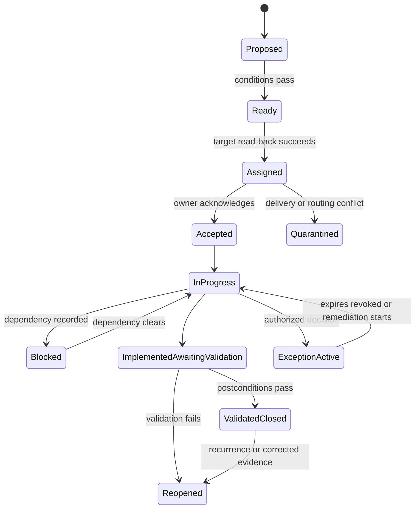

This is a general practice model, not a published UVM state diagram. Customers may implement different supported states while preserving these semantic distinctions.

## SLA tiers and clock contracts

An SLA tier should follow customer policy and consequence, not an invented product default. A tier can govern acknowledgment, evidence resolution, containment, implementation, validation, exception review, or integration recovery. One episode may have several clocks serving different owners.

| Clock type | Starts when | Stops when | Key caveat |
|---|---|---|---|
| Triage | Qualified decision enters review population | Decision class and owner route established | Raw observation time may precede qualification |
| Owner acknowledgment | Successful target assignment/read-back | Owner accepts or disputes | Delivery is not acceptance |
| Evidence resolution | Material unknown assigned | Evidence supported/dispositioned | Unknown exposure age remains visible |
| Containment | Credible urgent path approved for containment | Defined path/control postcondition passes | Temporary mitigation is not durable closure |
| Remediation | Customer-defined action start event | Implementation reported or validation passes, per policy | Define which endpoint explicitly |
| Validation | Implementation evidence received | Required postconditions pass/fail | Source cadence can affect elapsed time |
| Exception approval | Complete request submitted | Approved/rejected | Waiting should not silently pause all risk views |
| Exception review | Approval effective | Review/expiry/revocation | Residual risk remains reported |
| Integration recovery | Delivery/reconciliation incident detected | Reconciled and backlog replayed | Technical health clock, not exposure SLA |

| Clock field | Required definition |
|---|---|
| Population | Exact cohort and exclusions |
| Policy authority | Customer policy owner and version |
| Start event | Event type and timestamp authority |
| Time basis | UTC storage, display timezone, calendar/business time |
| Warning thresholds | When and to whom escalation occurs |
| Pause reasons | Enumerated, approved conditions only |
| Pause authority | Who can approve and audit pause |
| Stop event | Implementation, validation, or decision, explicitly named |
| Priority change | Recalculation rule and no-age-reset invariant |
| Reopen | Whether original episode/clock history persists |
| Exception | Relationship between exception and operational clock |
| Reporting denominator | Eligible population, exclusions, unknowns, breaches |

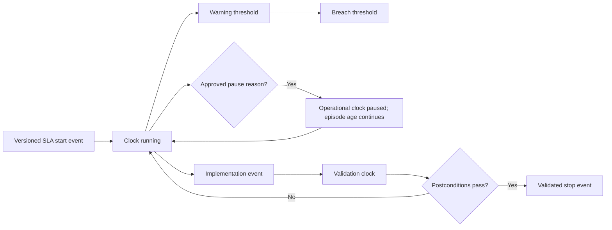

SLA compliance needs transparent denominators. Report eligible episodes, met, breached, active-not-due, approved pauses, exceptions, missing owner, unknown validation, and source-degraded populations. A single percentage can be green while critical unknowns are excluded.

## Approvals and separation of duties

| Decision | Typical customer authority | Why approval matters | TSM boundary |
|---|---|---|---|
| Enable consequential automation | Platform/security/change governance | Controls blast radius | Facilitate evidence; do not authorize |
| Bulk ticket/state action | VM program/target owner | Prevents scaled semantic error | Verify supported behavior and safeguards |
| Production change | Change/service authority | Protects availability and rollback | No unilateral change approval |
| Compensating control | Control plus service/risk owners | Confirms scope and residual path | Help clarify evidence only |
| Risk acceptance | Authorized customer risk owner | Records accountability | TSM cannot accept customer risk |
| Exception extension | Risk/service authority under policy | Prevents permanent deferral | Surface debt and evidence |
| Closure override | Defined security/service authority | Handles rare evidence cases | Preserve reason and audit |
| Workflow/model change | Customer policy/platform authority | Affects priorities and work | Support testing and rollback plan |

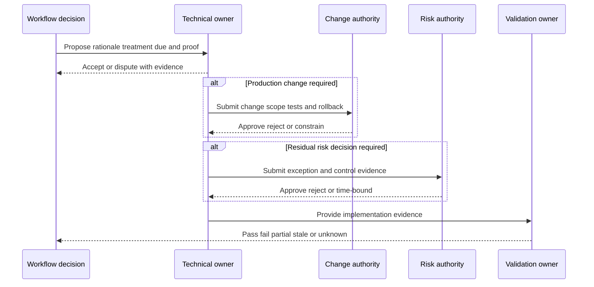

Approval should not become a rubber stamp. The request needs scope, evidence, options, operational consequence, controls, residual risk, expiry, postconditions, and rollback. Emergency processes can be faster but still need authority and retrospective review.

## Exceptions, compensating controls, and risk acceptance

An exception is a governed deviation from policy, usually time-bounded. A compensating control reduces a specific scenario prerequisite when the preferred treatment is unavailable or unsafe. Risk acceptance is a customer-authorized decision about stated residual risk. These concepts are related but not interchangeable.

| Concept | Core question | Required evidence | Never implies |
|---|---|---|---|
| Exception request | Why cannot policy treatment complete now? | Constraint, options, consequence, owner | Approval |
| Compensating control | Which prerequisite is reduced, for what scope/time? | Applicability, health, enforcement, test, bypass | Vulnerability removal |
| Risk acceptance | Who authorizes retaining which residual scenario? | Authority, rationale, scope, duration | Technical validation |
| Deferral | When is treatment rescheduled and why? | Dependency and milestone | Risk accepted automatically |
| Waiver | Which policy requirement is waived under authority? | Policy citation and expiry | Permanent immunity |
| False positive/non-applicable disposition | What evidence shows condition does not apply? | Source/config/version/test evidence | Risk acceptance |

| Exception record field | Purpose |
|---|---|
| Exposure scope | Exact episodes/assets/services covered |
| Policy deviation | Requirement not met |
| Business/technical reason | Why preferred treatment is blocked |
| Residual scenario | What can still happen |
| Compensating controls | Exact prerequisite, state, evidence, limitations |
| Owner roles | Technical, service, risk, control, validation |
| Approval | Authorized actor, decision, time |
| Effective/expiry | Bounded validity |
| Review cadence | Control/dependency reassessment |
| Remediation plan | Durable treatment and milestones |
| Revocation conditions | Threat, control, service, or evidence changes |
| Reporting | How exception remains in risk/backlog views |

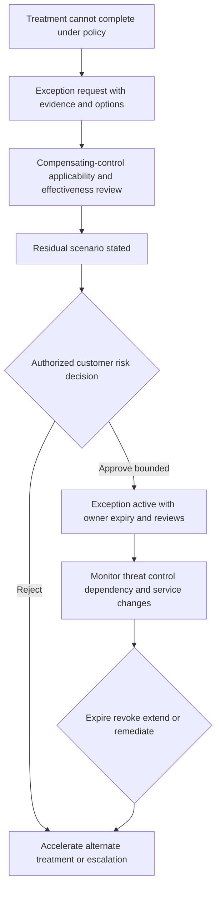

### Plain-English deep-dive 3 - An exception is an alarm clock, not a drawer

Putting a difficult vulnerability into an exception should make its residual risk, owner, control, dependency, and expiry more visible. It should not move the record into a drawer where normal reporting cannot see it.

Think of an alarm clock attached to a temporary permit. It wakes the right authorities before expiry, and it can ring earlier if the threat changes, a control fails, a service becomes more critical, or a supplier releases a fix. Extensions require current evidence rather than copying old rationale.

## Closure validation and reopen logic

Different treatments require different postconditions. Closure policy should state which evidence is mandatory, who owns it, how freshness and source health affect it, and whether a failed test reopens the same episode.

| Treatment | Technical postcondition | Additional postcondition | Closure caveat |
|---|---|---|---|
| Patch/upgrade | Native version/config no longer vulnerable | Service health and required path | Scanner disappearance alone may be source outage |
| Configuration change | Exact insecure setting corrected | Functional and policy checks | Configuration drift can recur |
| Component removal | Component absent and feature unavailable | Dependency/service checks | Dormant copies/images may remain |
| Asset retirement | Entity terminated and routes/DNS/identity removed | Inventory reconciliation | Stale record is not retirement proof |
| Segmentation | Unauthorized path blocked | Required paths still work | Underlying vulnerability remains |
| Identity control | Effective unauthorized privilege removed | Required workload/user flow works | Group membership alone may not prove effect |
| WAF/IPS rule | Relevant path blocked under authorized test | Alternate path and service checks | Temporary mitigation, not patch |
| Exception | Approval and control evidence current | Review/expiry scheduled | Episode is not technically closed |
| Non-applicable | Version/config/feature evidence supports disposition | Source conflicts resolved | Reassess after configuration change |

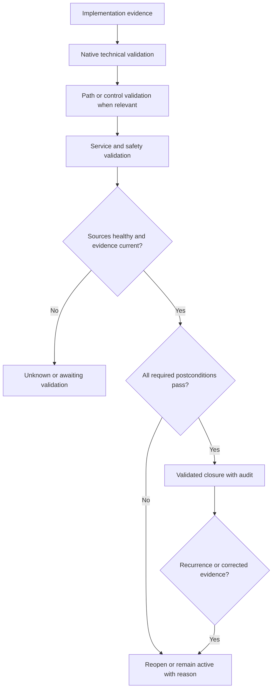

Reopen should preserve the original episode and age when the same condition never truly cleared or recurs within the governed lifecycle. A genuinely new entity or new condition may need a new episode with a relationship to the prior case. Reopen reason codes distinguish validation failure, recurrence, source correction, identity correction, control expiry, exception expiry, or threat/context change.

## Integration delivery, retries, and idempotency

Distributed systems fail in ambiguous ways. A request can time out after the target commits it. Retrying without checking may create a duplicate. A target can return success while an asynchronous rule later rejects or modifies data. Read-back and reconciliation are essential.

| Failure category | Example | Retry posture | Required control |
|---|---|---|---|
| Authentication | Token expired or permission removed | Repair auth before retry storm | Least privilege and secret rotation |
| Authorization | Target rejects object/field/action | Do not repeat unchanged request | Permission and object verification |
| Validation/schema | Required field/type/enumeration rejected | Quarantine and correct mapping | Contract/version tests |
| Rate limit | Target requests slower traffic | Honor retry guidance/backoff | Rate control and queue visibility |
| Transient network | Reset, timeout, DNS/TLS/proxy issue | Bounded retry with jitter when safe | Correlation ID and observability |
| Ambiguous timeout | Target may have committed action | Query by stable key before retry | Idempotency/read-back |
| Server failure | Target internal error | Bounded retry or quarantine | Attempts and escalation evidence |
| Conflict | Record changed since read/version mismatch | Read current state and resolve authority | Optimistic concurrency/merge policy |
| Partial bulk | Some members succeeded | Retry only proven missing members | Per-member result ledger |
| Callback/webhook loss | State changed but event not received | Scheduled reconciliation | Cursor/checkpoint and replay |

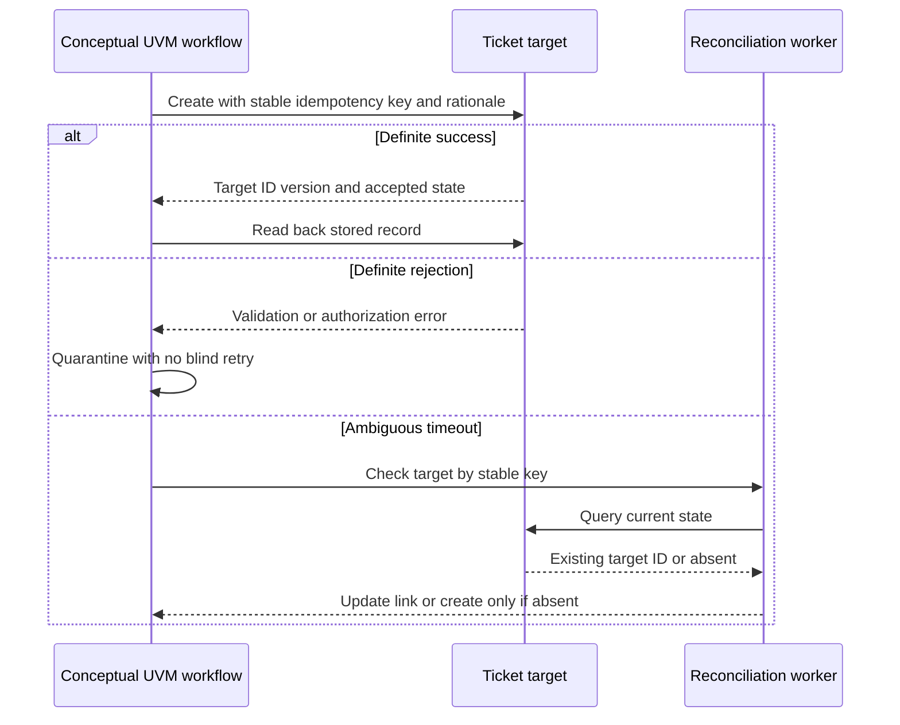

Idempotency key design depends on intended action grain. A key might conceptually relate to episode, group, target, action type, and policy version, but exact construction is customer/product-specific. Including changing presentation text can make a stable action look new. Reusing a key across genuinely different actions can suppress required work. Define and test the contract.

### Retry policy elements

| Element | Required definition |
|---|---|
| Eligible failures | Which errors are transient versus permanent |
| Maximum attempts | Prevent infinite retry |
| Backoff/jitter | Protect target and avoid synchronized bursts |
| Timeout | Separate connect/read/overall behavior where observable |
| Idempotency | Stable key and target support assumptions |
| Read-back | Query after ambiguous result |
| Checkpoint | Last safely processed event/member |
| Dead letter | Quarantine with owner and reason |
| Replay | Deterministic order, version, and duplicate guard |
| Alerting | Threshold, audience, and business impact |
| Audit | Attempt time, request correlation, result, actor |
| Recovery acceptance | Reconciled target and source totals/state |

## Ticket reconciliation

Reconciliation compares intended workflow state with target state and authoritative exposure evidence. It can be event-driven, scheduled, or both. Automatic ticket reconciliation is a public UVM positioning statement; exact behavior must be verified.

| Discrepancy | Risk | General response |
|---|---|---|
| Intended create, target absent | Work lost | Retry safely after auth/schema/idempotency check |
| One episode, multiple target tickets | Duplicate effort/conflicting state | Identify canonical item, link/merge/close duplicates under policy |
| Target closed, exposure active | False closure | Reopen/update target with validation reason |
| Target open, exposure validated closed | Stale work | Reconcile closure after required authority/evidence |
| Owner differs | Misrouting or legitimate reassignment | Resolve ownership authority and update both sides |
| Due differs | SLA reporting conflict | Recalculate policy clock and target mapping |
| Exception differs | Residual risk hidden or stale | Synchronize authority, scope, expiry if supported |
| Target updated during outage | Lost event | Read current version and replay from checkpoint |
| Group membership changed | Missing/extra work | Version members and reconcile additions/removals |
| Source unhealthy | False resolution possible | Freeze automatic closure and mark degraded |

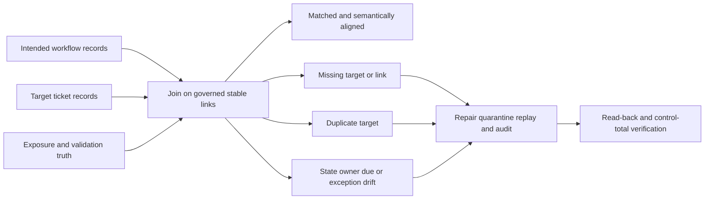

Reconciliation metrics need denominators: intended actions, delivered, acknowledged, read back, linked, duplicate, quarantined, stale, state mismatched, and fully reconciled. A high API success rate can coexist with poor semantic reconciliation.

## Audit, security, privacy, and evidence retention

| Audit event | Minimum evidence | Security/privacy consideration |
|---|---|---|
| Rule/model change | Before/after, approver, tests, version, rollback | Restrict configuration authority |
| Trigger evaluation | Episode, event, conditions, version | Minimize sensitive context |
| Ticket action | Stable key, target, actor, payload hash/reference, result | Do not log secrets/tokens |
| Approval | Request, decision, authority, scope, time | Protect approver and risk details |
| Exception | Scope, controls, expiry, reviews, changes | Limit broad vulnerability disclosure |
| Retry/replay | Attempt, error, correlation, checkpoint | Avoid sensitive payload duplication |
| Reconciliation | Compared states, discrepancy, repair | Retain enough for RCA |
| Validation | Method, source, time, result, limitations | Authorized testing and safe evidence |
| Closure/reopen | Reason, postconditions, actor, policy | Preserve history; no destructive overwrite |
| Export/support share | Requestor, purpose, redaction, destination, expiry | Approved channel and minimization |

Workflow service identities need least privilege, secure secret storage, rotation, scoped target permissions, network controls, monitoring, and separation from human accounts. Logs should capture correlation and result without tokens, passwords, session cookies, sensitive payloads, or unnecessary personal behavior. Retention should support audit and troubleshooting while following purpose and legal/privacy requirements.

AI assistance must use approved environments and grounded structured evidence. It can draft a rationale, summarize a cited state history, or propose test cases. Human and deterministic controls must verify identifiers, treatment, due logic, sensitive content, and authority. AI must not send tickets, change state, approve exceptions, accept risk, or close episodes autonomously.

## Workflow health metrics

| Metric | Definition question | Misleading shortcut |
|---|---|---|
| Trigger volume | Evaluations or qualified actions? | Count every source update |
| Condition pass rate | Which condition/version/population? | Treat low pass as product failure automatically |
| Delivery success | HTTP/API response or target read-back? | Success code alone |
| Duplicate rate | Duplicate intended action at target under stable key? | Duplicate source observations |
| Quarantine rate | Failed actions by reason/population? | Hide dead-letter queue |
| Reconciliation coverage | Which intended/target/exposure records compared? | Sample without disclosure |
| Owner acceptance | Accepted versus disputed routes? | Assignment count |
| SLA compliance | Which clock, tier, denominator, pause, exception? | One green percentage |
| Validation latency | Implementation to required proof? | Scanner schedule ignored |
| First-pass validation | Treatments passing initially? | Punish complex safe work without context |
| Reopen rate | Which reason and episode lifecycle? | Suppress honest reopen |
| Exception debt | Active/expiring/expired extensions and control health? | Remove exceptions from backlog |
| Workflow availability | Can intended actions evaluate/deliver/reconcile? | Connector login success only |

## Troubleshooting integrations and workflow behavior

Contain first: pause affected automatic actions if they can create duplicates, wrong routing, false closure, or sensitive disclosure. Preserve queues, attempt histories, versions, and target records. Select one stable episode/action and exact UTC interval.

| Layer | Question | Discriminating check | Repair direction |
|---|---|---|---|
| Decision | Should workflow have triggered? | Compare event, cohort, rule version | Correct source/policy or expectation |
| Conditions | Which guard passed/failed? | Decision trace with input times | Repair quality, owner, or condition logic |
| Routing | Was correct destination/owner resolved? | Source provenance and target access | Correct mapping/attestation |
| Authentication | Could service identity authenticate? | Token/secret validity without exposing secret | Rotate/repair approved credential |
| Authorization | Could identity perform exact object/action? | Target audit and permission test | Least-privilege permission correction |
| Transport | Did DNS/TCP/TLS/proxy/HTTP path work? | Correlated network/application evidence | Repair path/certificate/proxy/rate issue |
| Schema | Did payload satisfy current contract? | Target error and redacted payload shape | Update mapping/version |
| Delivery | Was result definite or ambiguous? | Correlation ID, response, target query | Read-back before retry |
| Idempotency | Did key represent intended action? | Search target by key and episode | Repair key and reconcile duplicates |
| State mapping | Do source/target meanings align? | Compare event histories | Correct semantic mapping |
| Validation | Is exposure/control/service evidence healthy? | Native source and postconditions | Restore evidence; block false closure |
| Reporting | Does dashboard use current grain/clock/denominator? | Recalculate one episode | Repair semantic layer/restatement |

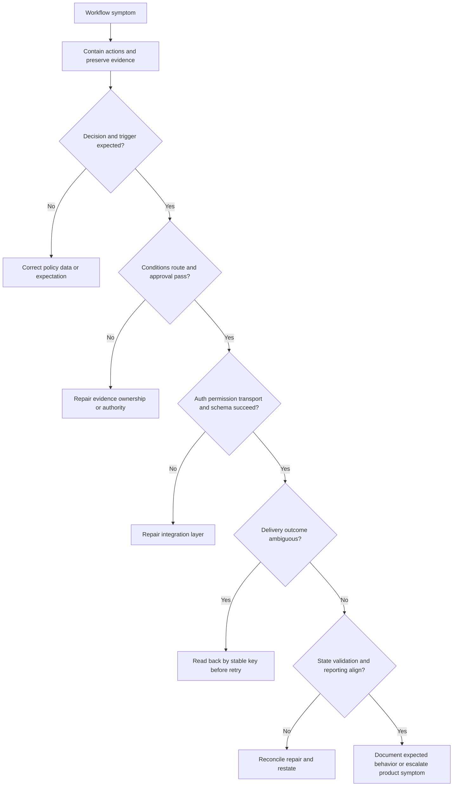

Your networking background supports transport isolation: resolve from the correct vantage, inspect TCP establishment and resets, verify TLS certificate/hostname/protocol, evaluate proxy behavior, correlate HTTP status and retry headers, and align UTC timestamps. The boundary remains clear: this is transferable troubleshooting method, not production UVM integration experience.

### Minimal escalation packet

Include redacted environment identifiers through approved channels, episode/action/stable-key/target IDs, expected and observed behavior, exact UTC timeline, rule/model/workflow/connector/target versions when available, condition trace, correlation IDs, response/error, retry and read-back history, target audit, state mapping, business impact, containment, reproducibility, recent changes, and one precise ask. Exclude credentials, tokens, session data, unnecessary personal information, and unsupported root-cause or ETA claims.

### Plain-English deep-dive 4 - A timeout says the answer is unknown

When a payment screen times out, paying again immediately may charge twice. The timeout does not prove failure; it proves the client did not receive a definite answer. The safe next step is to check the order or transaction state using a stable reference.

Ticket creation has the same ambiguity. A target can commit the ticket and lose the response. Query by stable key, record the target ID if present, and create only when absence is established. Bounded retries recover transient failures; reconciliation repairs uncertainty.

## Common failure modes and misconceptions

| Misconception or anti-pattern | Why it fails | Better approach |
|---|---|---|
| Automate every high score | Quality, owner, and change authority may be missing | Preconditions, proposal mode, human gates |
| One ticket per scan row | Duplicate observations become duplicate work | Stable episode/action grain |
| Success response means delivered correctly | Target may transform/reject asynchronously | Read-back and reconciliation |
| Retry every error | Permanent errors create storms | Classify transient/permanent/ambiguous |
| Timeout means failure | Target may have committed | Query by stable key before retry |
| Assignee means owner | Routing can be stale or disputed | Owner acceptance and resolution |
| Closed ticket means remediated | Work status is not postcondition | Technical/path/control/service validation |
| Exception means closed | Residual risk remains active | Time-bounded governance and review |
| Control installed means compensated | Exact path/effectiveness unknown | Scoped evidence and bypass testing |
| Pause stops exposure age | Operational delay is not risk removal | Preserve episode age separately |
| One SLA percentage proves health | Denominator and clocks may exclude hard cases | Tiered clock dictionary and distributions |
| Reopen is failure to hide | Honest reopen protects truth | Reason-coded learning and root-cause review |
| Bidirectional sync means equal authority | Domains have different systems of record | Field/state authority matrix |
| AI can write and send remediation tickets | Hallucination and sensitive leakage risk | Grounded drafts with deterministic review |

## Complete synthetic NMH workflow case

Everything in this section is explicitly fictional and synthetic. It does not describe a Zscaler tenant, supported UVM states, fields, formulas, APIs, connectors, entitlement, customer deployment, or product result. No date later than the official review date is used. The official source snapshot remains 2026-08-24.

### Synthetic NMH workflow contract

NMH's fictional patient-access pilot defines an episode-to-action workflow. A synthetic trigger occurs when a qualified episode enters a customer-approved actionable cohort or when material context changes. Conditions require stable identity, supported applicability, source health, reason codes, accepted routing, least-privilege destination access, and any necessary approval. The first phase is proposal-only. Human-reviewed tickets use a synthetic stable key and target read-back. Closure requires treatment-specific validation.

| Synthetic contract item | Fictional NMH choice | Caveat |
|---|---|---|
| Trigger | Qualified cohort or material context change | Not a claimed UVM trigger |
| Quality gate | Identity/applicability/source health required | Synthetic policy |
| Owner route | Service-catalog technical owner with acceptance | No real source or field |
| Stable key | Episode plus action type under versioned contract | Illustrative, not product format |
| SLA tiers | Customer-defined acknowledgment/treatment/validation bands | No product defaults claimed |
| Exception | Customer risk authority, expiry, controls, review | Synthetic governance |
| Closure | Native plus relevant path/control/service postconditions | Synthetic policy |
| Reconciliation | Scheduled comparison plus event response | General pattern to verify |

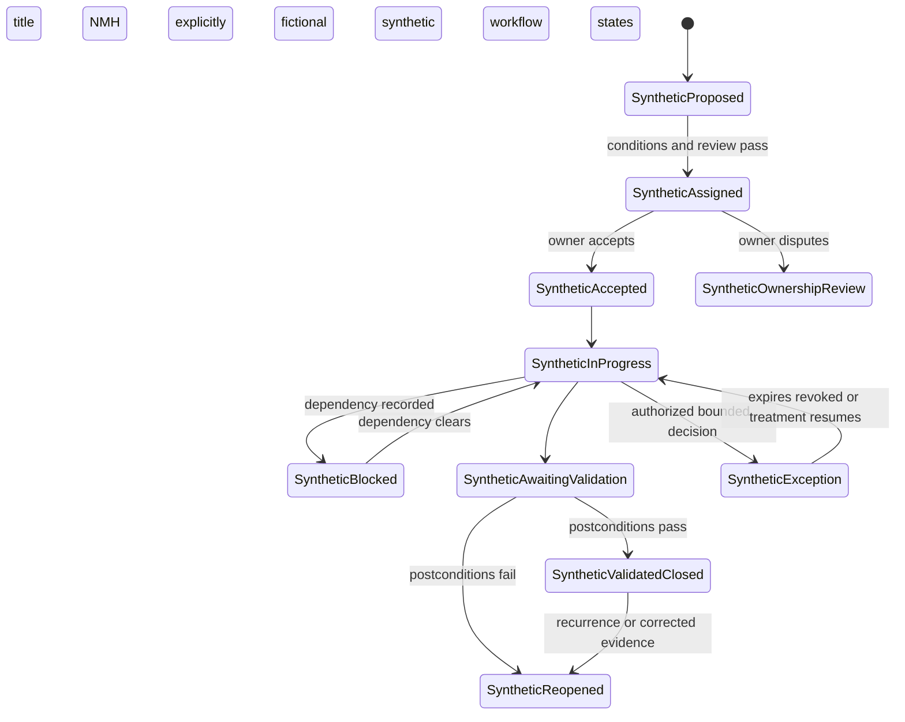

### Synthetic scenario 1: trigger prevented by weak identity

A fictional high-priority observation maps to two assets because a hostname was reused. The workflow does not create remediation tickets. It creates one urgent identity-resolution action, keeps the potential consequence visible, and records why automation is blocked. After cloud resource IDs and lifecycle evidence split the entities, the active applicable episode is recomputed under the same policy version and routed once.

### Synthetic scenario 2: owner dispute improves routing

A synthetic ticket routes a patient-portal library issue to the server team. The team supplies evidence that deployment is owned by the application pipeline team. NMH treats the dispute as useful data, not refusal. The service owner confirms authority, routing is corrected, open work is updated with audit, age remains unchanged, and the routing source receives a quality task.

### Synthetic scenario 3: timeout would have duplicated a ticket

The fictional target commits a ticket but its response times out. The workflow records an ambiguous result and stops automatic retry. Reconciliation queries by stable key, finds the existing target ID, reads back owner/state, stores the link, and continues. The event becomes a reliability test case rather than a duplicate.

### Synthetic scenario 4: partial bulk delivery

A synthetic campaign sends 40 proposal tickets; 31 succeed, five fail a target enumeration validation, and four are rate-limited. NMH records per-member results, quarantines the schema failures, honors bounded backoff for rate limits, and never retries the successful 31. After mapping correction, only the five missing actions replay. Control totals reconcile 40 intended to 40 linked targets.

### Synthetic scenario 5: ticket closes before validation

An owner closes a fictional ticket after deploying an update. Native validation still reports the vulnerable version on two instances because services did not restart. Reconciliation moves the conceptual episode to implemented-awaiting-validation or reopens target work under customer mapping, preserves age, and supplies the failed postcondition. No blame is assigned; the workflow contract is corrected.

### Synthetic scenario 6: compensating control is path-limited

A fictional WAF rule blocks the public route while a partner route remains open. The exception request states the residual partner path, control evidence, durable component-remediation dependency, owner, and expiry. Customer risk authority may approve only the bounded scope. The episode remains visible, and a route restriction plus authorized validation is required.

### Synthetic scenario 7: SLA metric excludes hard cases

The fictional dashboard reports 96 percent compliance but excludes blocked, exception-active, unknown-owner, and awaiting-validation episodes. NMH rebuilds the denominator by tier and state, preserves exposure age, distinguishes approved pauses from exclusions, and reports both operational-clock and episode-age views. The historical chart is restated with a definition note.

### Synthetic scenario 8: source outage attempts false closure

A synthetic scanner source stops reporting after credential permission loss. Findings disappear. A source-health condition blocks auto-closure and marks validation unknown. NMH restores least-privilege access, reruns a small sample, backfills the cohort, deterministically replays state, reconciles target tickets, and communicates which decisions were affected.

### Synthetic scenario 9: exception expiry reactivates work

A fictional supplier dependency remains unresolved when an exception nears expiry. The workflow requests current control evidence and owner/risk review before expiry. Because one control test is stale, extension is not automatic. The customer authority can require alternate containment, escalate the supplier, approve a shorter bounded extension, or reject it. The TSM learning role facilitates evidence and product questions but does not decide.

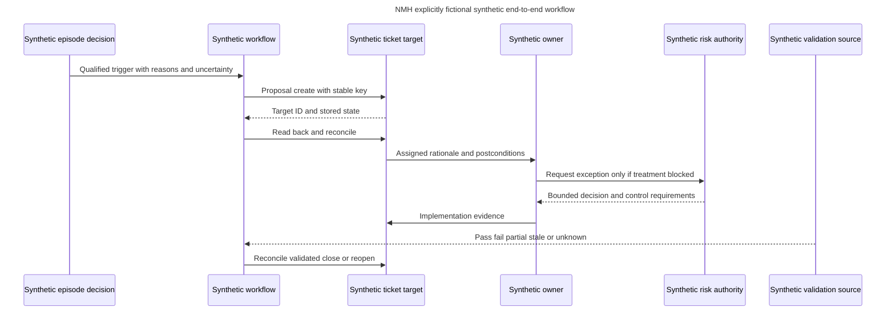

### Synthetic customer review narrative

"The fictional patient-access workflow remains in a human-reviewed pilot. Stable identity and source-health gates prevented one wrong ticket and blocked false closure during a scanner outage. An ambiguous timeout was reconciled to an existing target item with no duplicate. Thirty-one of forty campaign proposals delivered; nine were handled by per-member rate/schema recovery and all forty now reconcile. Two implemented members failed validation and remain active. One path-limited control supports a bounded exception request, but the partner route and durable fix remain explicit. The decision requested is approval to continue a small canary after SLA denominator and exception-expiry tests pass. No production UVM behavior or result is claimed."

## Customer and TSM artifact kit

| Artifact | Minimum contents | Value |
|---|---|---|
| Workflow charter | Outcome, scope, systems, authorities, phases, safety | Aligns purpose |
| Trigger-condition-action catalog | Events, guards, actions, failure routes, versions | Makes logic testable |
| State dictionary | Meaning, authority, entry/exit evidence, mappings | Prevents label mismatch |
| Field authority matrix | Domain, source of truth, direction, conflict rule | Governs synchronization |
| Routing hierarchy | Technical/service/risk/control/data owners and provenance | Reduces bounce |
| Rationale template | What, why, consequence, evidence, treatment, dependency, due, proof | Improves adoption |
| SLA clock dictionary | Tier, start, stop, pause, age, reopen, denominator | Reproducible compliance |
| Approval matrix | Decision, authority, evidence, segregation | Protects customer governance |
| Exception template | Scope, deviation, controls, residual, approval, expiry, review | Makes debt visible |
| Validation matrix | Treatment-to-postcondition methods | Prevents ticket-as-proof |
| Idempotency contract | Action grain, stable key, retry/read-back behavior | Prevents duplicates |
| Retry policy | Error classes, attempts, backoff, dead letter, replay | Safe recovery |
| Reconciliation report | Intended/target/exposure state and discrepancy reasons | Restores agreement |
| Workflow health scorecard | Delivery, duplicates, quarantine, SLA, validation, exceptions | Operates reliably |
| Escalation packet | IDs, UTC, versions, trace, target evidence, containment, one ask | Speeds diagnosis |

## Safe labs and exercises

All exercises use synthetic records, public official pages, or isolated explicitly authorized systems. No production Zscaler tenant, customer data, real credential, exploit, or disruptive action is required.

| Exercise | Task | Deliverable | Pass condition |
|---:|---|---|---|
| 1 | Classify claims | Product/general/synthetic/unknown ledger | No invented behavior |
| 2 | Identify systems of record | Authority matrix | Domain authority remains distinct |
| 3 | Write triggers | Five event contracts | Event/time/version explicit |
| 4 | Write conditions | Quality/policy/owner/security gates | Failure route defined |
| 5 | Draft actions | Proposal/update/evidence tasks | Idempotent and auditable |
| 6 | Build rationale | One synthetic owner ticket | Actionable without excess sensitive detail |
| 7 | Test routing | Ten ownership cases | Last user never defaults to owner |
| 8 | Map states | Source-to-target semantic table | Meanings, not labels, align |
| 9 | Define SLA clocks | Tier dictionary | Start/stop/pause/reopen/denominator complete |
| 10 | Review approvals | Separation-of-duty matrix | Customer authority explicit |
| 11 | Draft exception | Synthetic bounded record | Residual, controls, expiry, remediation included |
| 12 | Validate control | Path-specific evidence plan | Alternate route included |
| 13 | Define closure | Treatment/postcondition matrix | Ticket status never sufficient |
| 14 | Simulate timeout | Query-before-retry sequence | No duplicate |
| 15 | Simulate partial bulk | Per-member recovery ledger | Successful members not repeated |
| 16 | Build reconciliation | Intended/target/exposure comparison | Every discrepancy classified |
| 17 | Recalculate SLA | One event-history exercise | Exact clock reproduced |
| 18 | Diagnose source outage | Containment/replay plan | False closure blocked |
| 19 | Draft escalation packet | Redacted synthetic integration case | Exact IDs/UTC/versions/one ask |
| 20 | Deliver review | Technical and executive narratives | Facts, caveats, decisions, checkpoints |
| 21 | Rehearse Q1-Q8 | Recorded answers | Neutral honesty and source boundaries |

## Experience bridge: factual strengths applied to workflow operations

| Factual strength | Workflow application | Interview bridge | Boundary |
|---|---|---|---|
| M365/OneDrive/SharePoint support | Trace user/client/tenant/service state and route exact actions | "A status label is meaningful only with its system and evidence." | No UVM operation claim |
| Networking/traces | Diagnose DNS, TCP, TLS, proxy, HTTP, timeout, reset, and timing | "A timeout is ambiguous; correlate and read back before retry." | Authorized evidence only |
| SQL | Reconstruct event history, calculate clocks, detect duplicates, anti-join missing links | "Stable keys and event grains make reconciliation possible." | No product database claim |
| Power BI | Show SLA tiers, workflow health, discrepancy reasons, and drill-down | "One SLA percentage needs denominator and clock context." | General analytics design |
| Escalations | Contain impact, coordinate owners, package evidence, communicate checkpoints | "Pause harmful automation, isolate one action, and preserve history." | No unsupported root cause/ETA |
| Mentoring | Teach workflow semantics, exception discipline, and validation | "Adoption requires owners to understand why and how to challenge work." | No rollout claim |
| AI exploration | Draft cited rationale and edge tests with review | "AI assists wording and coverage, never authority or execution." | No autonomous action |

## TSM operating and adoption value

```mermaid
flowchart LR
    DISC[Discover systems policies owners and constraints] --> DESIGN[Design states clocks gates routes and proof]
    DESIGN --> VERIFY[Verify supported product and target behavior]
    VERIFY --> PILOT[Proposal shadow and human-reviewed canary]
    PILOT --> ENABLE[Owner training playbooks and feedback]
    ENABLE --> OPERATE[Health reconciliation SLA and exception reviews]
    OPERATE --> ESC[Support Product and customer escalation]
    ESC --> IMP[Repair tune measure and expand]
    IMP --> DISC
```

TSM value includes facilitating discovery, mapping supported capability to customer authority, verifying target integration assumptions, designing acceptance tests, helping owners receive useful rationale, establishing health/reconciliation reviews, producing evidence for Support/Product, and translating technical workflow outcomes into customer decisions. Value should be measured through trustworthy delivery, lower duplicate/stale work, faster owner acceptance, clearer exceptions, better validation, and reduced recurrence, with denominators and caveats. Ticket volume and login counts are not sufficient.

## Official Source Anchors

Research/source snapshot and review date: **2026-08-24**.

Official Zscaler sources support only bounded public product positioning. Trigger-condition-action mechanics, state authority, clocks, exception governance, reliability patterns, and troubleshooting are general study practices, not claims about proprietary internals. NMH is synthetic. Current official documentation, target-system contracts, and licensed-tenant evidence govern production.

| Source | URL | Used for | Boundary |
|---|---|---|---|
| Zscaler Unified Vulnerability Management | https://www.zscaler.com/products-and-solutions/vulnerability-management | Public custom remediation workflows with details/rationale, automatic ticket reconciliation, and dynamic risk/KPI/SLA reporting positioning | No exact triggers, conditions, actions, fields, states, SLA formulas, exception behavior, target, retry, API, limit, entitlement, or result claim |
| Zscaler Data Fabric for Security | https://www.zscaler.com/products-and-solutions/data-fabric | Public custom workflow/business logic and operationalization positioning | No proprietary execution architecture |
| Zscaler Data Fabric integrations | https://www.zscaler.com/products-and-solutions/data-fabric/integrations | Public AnySource/AnyTarget and integration catalog discovery at review date | Listing is not proof of direction, object, action, version, permission, support, or entitlement |
| NIST Cybersecurity Framework 2.0 | https://www.nist.gov/cyberframework | Govern/Identify/Protect/Detect/Respond/Recover outcome and governance context | Voluntary; profiles and implementations vary |
| NIST SP 800-40 Rev. 4 | https://csrc.nist.gov/pubs/sp/800/40/r4/final | Enterprise patch-management planning and verification | Does not define UVM workflow behavior |
| NIST SP 800-53 Rev. 5 | https://csrc.nist.gov/pubs/sp/800/53/r5/upd1/final | Vulnerability, change, access, audit, configuration, assessment, incident, contingency, and privacy control context | Requires customer selection, tailoring, implementation, and assessment |
| CISA Known Exploited Vulnerabilities Catalog | https://www.cisa.gov/known-exploited-vulnerabilities-catalog | Known-exploitation prioritization input | Not customer compromise proof or universal SLA definition |
| FIRST EPSS | https://www.first.org/epss/ | Time-bounded exploitation probability estimate | Not certainty, severity, or customer breach probability |

## Likely Interview Questions

### Q1. What does a safe UVM-style remediation workflow need?

**Model answer:** A qualified exposure episode, explicit trigger, identity/applicability/quality/policy/owner/security conditions, evidence-based rationale, accepted routing, stable action key, customer approvals where needed, supported target delivery, read-back, bounded retry, reconciliation, treatment-specific validation, exception/reopen logic, and complete audit. Zscaler publicly describes custom remediation workflows with details/rationale and ticket reconciliation, but exact product states, fields, and behavior require current verification.

### Q2. How should trigger-condition-action logic work?

**Model answer:** The trigger is a versioned material event such as qualification, cohort change, threat/control change, SLA event, exception event, or validation result. Conditions test stable identity, applicability, source quality, policy, ownership, least privilege, approval, capacity, duplicate state, and change safety. The action is idempotent, observable, auditable, and has an explicit failure route. Failed preconditions create evidence or review work rather than silent loss.

### Q3. How do you prevent duplicate tickets after failures?

**Model answer:** Define action grain and stable idempotency key, include a correlation ID, classify errors as definite rejection, definite success, transient, or ambiguous, and read back target state. After an ambiguous timeout, query by stable key before creating again. For partial bulk results, retry only proven missing members. Keep bounded backoff, attempt history, dead-letter handling, deterministic replay, and reconciliation controls.

### Q4. How would you define and report SLAs?

**Model answer:** Customer policy defines tier, eligible population, start event, UTC/timezone and calendar basis, warnings, allowed pauses and authority, stop event, priority-change behavior, reopen handling, exception relationship, and denominator. I would separate triage, acknowledgment, evidence, containment, remediation, validation, exception, and integration clocks when useful. Report met, breached, active-not-due, paused, exception, unknown-owner, and source-degraded populations, while preserving underlying exposure age.

### Q5. How do exceptions and compensating controls differ from closure?

**Model answer:** An exception is an authorized, time-bounded policy deviation. A compensating control reduces a specific prerequisite under verified scope, health, enforcement, effectiveness, and bypass limits. Risk acceptance is the customer's authorized decision to retain the stated residual scenario. None removes the vulnerability automatically. The record needs scope, rationale, residual risk, owners, approval, controls, expiry, review cadence, revocation conditions, and durable remediation plan.

### Q6. What should prove remediation closure?

**Model answer:** Treatment-specific postconditions: native version/configuration or component evidence, path/control checks where relevant, service and safety checks, healthy validation sources, and explicit limitations. Implementation moves work to awaiting validation; it does not close the exposure. Failed, stale, partial, or corrected evidence keeps it active or reopens the same episode with original age when appropriate.

### Q7. How would you troubleshoot a ticketing or reconciliation failure?

**Model answer:** Pause harmful actions, preserve attempts and versions, select one stable episode/action and UTC window, then test decision/trigger, conditions, routing, authentication, authorization, DNS/TCP/TLS/proxy/HTTP, schema, delivery certainty, idempotency, target read-back, state mapping, validation, and reporting. Repair the controlling layer, replay only missing actions, reconcile source/target/exposure state, restate metrics, and escalate a redacted minimal case if product behavior remains unexplained.

### Q8. How does your background transfer without overstating experience?

**Model answer:** Microsoft 365, OneDrive, and SharePoint escalation work built discipline in exact IDs, permissions, cross-system state, timelines, customer impact, ownership, updates, and closure evidence. Networking traces support integration-path and timeout diagnosis. SQL and Power BI support event history, stable keys, SLA clocks, reconciliation, and dashboards. Escalations, mentoring, and reviewed AI assistance support adoption. NMH is synthetic, and production Zscaler/UVM/ITSM workflow operation remains a learning boundary.

## 30-Second Memory Hooks

| Concept | Memory hook |
|---|---|
| Workflow | Decision conveyor belt with safeguards |
| Trigger | What changed now? |
| Condition | What must be true before action? |
| Action | Observable intended effect, not assumed result |
| Rationale | Work-order diagnosis, not alert dump |
| Route | Accepted authority, never last user by default |
| Ticket | Coordination record, not vulnerability truth |
| Stable key | Same intended action, same identity |
| Idempotency | Safe repeat has one effect |
| Timeout | Unknown result; read back before retry |
| Backoff | Recover without creating a storm |
| Reconciliation | Match intended, target, and exposure ledgers |
| SLA | Clock contract with population and denominator |
| Pause | Operational clock may stop; exposure age continues |
| Exception | Alarm clock on bounded residual risk |
| Control | Credit only proven prerequisite and scope |
| Closure | Postconditions, not status label |
| Reopen | Truth-preserving transition with reason and age |
| Audit | Who, what, when, why, version, result |
| TSM | Enable supported workflow, trust, health, and evidence without customer authority |

## Completion Checklist

- [ ] I separate product fact, general security practice, scenario assumption, customer fact, and unknown.
- [ ] I state public UVM workflow/rationale/reconciliation/SLA positioning without inventing states, fields, APIs, or entitlements.
- [ ] I define workflow, trigger, condition, action, precondition, rationale, route, ticket, stable key, idempotency, retry, backoff, reconciliation, read-back, SLA, clock, approval, exception, compensating control, risk acceptance, validation, closure, reopen, audit, and dead-letter queue.
- [ ] I keep finding, episode, priority, work, execution, risk, validation, and reporting authorities distinct.
- [ ] I design triggers for qualification, context change, threat/control change, ownership, SLA, exception, ticket, validation, and integration events.
- [ ] I gate actions on identity, applicability, quality, policy, ownership, security, approval, capacity, duplicate state, and change safety.
- [ ] I preserve a versioned workflow decision record with inputs, reasons, uncertainty, intended action, result, and proof.
- [ ] I route through governed technical/service/risk/control/data/validation ownership rather than last user or hostname alone.
- [ ] I provide remediation rationale with what, why now, consequence, evidence, treatment, dependencies, due logic, validation, uncertainty, and contact.
- [ ] I map target states by semantic meaning rather than label.
- [ ] I distinguish proposed, ready, assigned, accepted, in-progress, blocked, implemented-awaiting-validation, exception-active, validated-closed, reopened, delivery-failed, and quarantined concepts.
- [ ] I define separate triage, acknowledgment, evidence, containment, remediation, validation, exception, and integration clocks where useful.
- [ ] I document SLA population, authority, start, time basis, warnings, pauses, stop, priority change, reopen, exception, and denominator.
- [ ] I preserve exposure age while an operational clock is paused.
- [ ] I separate workflow/model, bulk, production change, control, risk, extension, and closure authorities.
- [ ] I distinguish exception request, compensating control, risk acceptance, deferral, waiver, and non-applicable disposition.
- [ ] I require exception scope, deviation, reason, residual scenario, controls, roles, approval, validity, reviews, remediation, revocation, and reporting.
- [ ] I map patch, configuration, removal, retirement, segmentation, identity, WAF/IPS, exception, and non-applicable treatments to exact postconditions.
- [ ] I never close an exposure based only on ticket, command, or scanner absence.
- [ ] I preserve episode history and reason-coded reopen behavior.
- [ ] I classify authentication, authorization, schema, rate, network, ambiguous timeout, server, conflict, partial-bulk, and callback failures.
- [ ] I query target state by stable key before retry after ambiguous outcome.
- [ ] I define retry eligibility, attempts, backoff/jitter, timeout, idempotency, read-back, checkpoint, dead letter, replay, alerting, audit, and recovery acceptance.
- [ ] I reconcile missing, duplicate, stale, owner, due, exception, state, group, and source-health discrepancies.
- [ ] I audit rule changes, evaluations, actions, approvals, exceptions, retries, reconciliation, validation, closure/reopen, and exports without logging secrets.
- [ ] I protect sensitive vulnerability, identity, behavior, business, incident, and exception data with minimization and least privilege.
- [ ] I measure trigger, condition, delivery, duplicate, quarantine, reconciliation, owner, SLA, validation, reopen, exception, and availability health with denominators.
- [ ] I troubleshoot decision, condition, routing, auth, permission, transport, schema, delivery, idempotency, state, validation, and report layers.
- [ ] I can create a minimal redacted escalation packet with exact IDs, UTC evidence, versions, containment, and one ask.
- [ ] I use AI only for grounded drafts and tests, never autonomous actions, approvals, acceptance, or closure.
- [ ] I can explain all nine NMH scenarios as explicitly fictional and synthetic.
- [ ] I can create every artifact and complete all twenty-one safe exercises.
- [ ] I connect M365/OneDrive/SharePoint support, networking traces, SQL/Power BI, escalations, mentoring, and AI without claiming production Zscaler/UVM/workflow experience.
- [ ] I retain the official-source snapshot and review date exactly as 2026-08-24.
- [ ] I can answer Q1 through Q8 with architecture, mechanics, tradeoffs, troubleshooting, governance, TSM value, and honesty.

[Part 85 - UVM Dashboards, KPIs, Trends, and Executive Reporting](Part-85-uvm-dashboards-kpis.md)