# Part 85 - UVM Dashboards, KPIs, Trends, and Executive Reporting

> **Audience:** Arti Thakur, preparing for a Zscaler Security Operations Technical Success Manager role after Microsoft enterprise Support Escalation Engineering.

> **Purpose:** Explain UVM dashboards and reporting from zero. Cover risk-reduction evidence, exposure aging, SLA performance, remediation backlog, recurrence, exceptions, ownership, control coverage, trend integrity, denominators, drill-down, technical versus executive narratives, board-safe caveats, data quality, privacy, troubleshooting, practical customer artifacts, and TSM value.

> **Scope and honesty:** Northstar Meridian Holdings, abbreviated NMH, is an explicitly fictional and synthetic customer used only for learning. Every NMH asset, service, metric, dashboard, score, denominator, trend, target, date, result, exception, decision, and narrative is invented. Arti's factual background is Microsoft 365, OneDrive, and SharePoint support; networking and trace analysis; SQL and Power BI; escalations; mentoring; and responsible AI exploration. Production Zscaler, Data Fabric, UVM, Risk360, CAASM, CTEM, vulnerability-program operation, and board reporting remain learning boundaries.

> **Currency caveat:** Product wording, dashboards, metrics, refresh behavior, fields, integrations, entitlements, source data, standards, and customer policies change. The controlled official-source snapshot and review date for this Part is exactly **2026-08-24**. Current official documentation, licensed-tenant evidence, customer metric definitions, source-native data, approved reporting policy, product specialists, Zscaler Support, and measured postconditions govern production.

> **Section goal:** Enable Arti to design and discuss a trustworthy UVM reporting system: define every metric before visualizing it, show source and model health beside risk, distinguish score/count movement from validated exposure reduction, preserve denominators and history, support drill-down, tailor technical and executive narratives, and troubleshoot misleading trends without inventing product behavior or customer outcomes.

The reviewed official UVM page publicly describes dynamic insights into risk posture, key performance indicators, service-level agreements, and other metrics based on a correlated, context-rich dataset. The reviewed Data Fabric page supports bounded public positioning around dynamic reports across fabric elements. These statements support a product conversation about reporting. They do not publish exact UVM dashboards, tiles, measures, formulas, semantic models, refresh intervals, historical retention, drill paths, row-level access, exports, board templates, or entitlements.

In this Part, **product fact** means a bounded statement from a reviewed official source. **General security practice** means a recommended reporting method, not a claim about proprietary internals. **Scenario assumption** means an explicitly fictional NMH design. **Customer fact** requires current authorized evidence; none is asserted here.

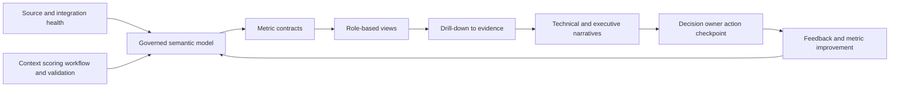

| Reporting layer | Primary question | Failure if omitted |
|---|---|---|
| Source health | Is expected evidence present, current, and complete? | Source loss appears as improvement |
| Semantic contract | What exactly is each entity, state, time, and relationship? | Different views disagree invisibly |
| Metric contract | What is numerator, denominator, grain, clock, and exclusion? | Percentages cannot be reproduced |
| Visual design | Which comparison or action should be easy to see? | Attractive chart obscures decision |
| Drill-down | Can summary reach governed evidence and owner work? | Users cannot trust or troubleshoot |
| Narrative | What changed, why, what remains, and what decision is needed? | Dashboard becomes passive theater |
| Governance | Who approves definitions, access, restatement, and targets? | Metrics drift with no accountability |

## JD Mapping

| JD signal | Capability developed here | Customer or TSM artifact | Honest boundary |
|---|---|---|---|
| Develop product expertise | Explain reviewed UVM dynamic reporting positioning and unknowns | Source-bounded reporting whiteboard | No invented dashboard/formula |
| Trusted advisor | Translate technical exposure evidence into decisions | Metric dictionary and review narrative | Customer owns risk/reporting authority |
| Drive adoption and value | Give each audience an actionable view and drill path | Role-based review pack | No guaranteed outcome |
| Troubleshoot complexity | Isolate source, grain, join, measure, filter, refresh, and access defects | Dashboard runbook | No unsupported product root cause |
| Use analytics | Define dimensions, denominators, temporal measures, cohorts, and movement bridges | SQL/Power BI model design | No claim of UVM schema access |
| Coordinate stakeholders | Align VM, SecOps, owners, risk, data, executives, audit, Support/Product | Metric governance RACI | TSM does not certify board statements |
| Communicate proactively | State fact, movement/cause, uncertainty, decision, and checkpoint | Technical/executive update templates | No unsupported assurance or ETA |
| Partner with Support/Product | Package reproducible report mismatch evidence | Redacted escalation packet | No roadmap/fix promise |
| Explore AI responsibly | Draft cited narratives and quality checks under review | Reporting AI guardrail | No invented metrics, causes, or board claims |

## Candidate honesty note

| Evidence class | Neutral candidate phrasing | Boundary |
|---|---|---|
| Factual Microsoft support | Escalation reporting required exact scope, customer impact, evidence, timelines, ownership, status, and next checkpoints | Not production UVM or board reporting |
| M365/OneDrive/SharePoint | Service health, client state, permissions, network evidence, and customer context needed separate interpretation | Transferable analytical discipline |
| Networking/traces | Time-aligned path evidence supports reachability/control and integration-health explanations | No claim of Zscaler telemetry operation |
| SQL/Power BI | Skills support star models, joins, windows, denominators, drill-down, trend bridges, and data-quality views | No undocumented UVM data access claim |
| Escalations | Technical and executive updates can separate facts, hypotheses, impact, containment, action, and ETA boundary | No authority to certify customer risk |
| Mentoring | Teach-back supports metric literacy and adoption | No production rollout claim |
| AI exploration | Reviewed AI can draft source-cited summaries or identify missing caveats | No autonomous executive report |
| Synthetic NMH | Dashboard designs and results are learning artifacts | No real customer or product outcome |

## Beginner vocabulary and memory hooks

| Term | Plain meaning | Why it matters | Analogy or hook |
|---|---|---|---|
| Dashboard | Visual decision surface built from defined data | Helps users scan and act | Instrument panel |
| Metric | Quantified observation under a definition | Makes state comparable | One gauge reading |
| KPI | Key performance indicator linked to an objective | Focuses management attention | Critical gauge |
| Measure | Calculation over a defined population | Produces metric value | Recipe |
| Dimension | Attribute used to group/filter measures | Gives context | Labels on storage shelves |
| Grain | What one row or count represents | Prevents counting apples as baskets | Unit on the receipt |
| Numerator | Count/value above the fraction line | Represents achieved/event population | Completed inspections |
| Denominator | Eligible population below the fraction line | Gives percentage meaning | All inspections due |
| Cohort | Population sharing a rule at a time | Enables fair comparison | Triage lane |
| Baseline | Defined starting reference | Supports measured change | Before photo |
| Target | Approved desired value/time | Guides action | Destination marker |
| Trend | Values over comparable periods | Shows direction and volatility | Movie, not snapshot |
| Movement bridge | Explanation of additions, removals, and reclassifications | Distinguishes treatment from data change | Bank-account reconciliation |
| Restatement | Recompute history under corrected/declared definitions | Preserves trend honesty | Corrected financial statement |
| Aging | Time a stable episode remains active | Reveals exposure duration | Time since leak began |
| SLA compliance | Fraction meeting a defined clock contract | Measures timeliness | Deliveries on time under stated rules |
| Backlog | Active accepted/candidate remediation demand | Shows debt and capacity pressure | Repair inventory |
| Recurrence | Exposure returns or common cause creates new episodes | Tests durability | Leak comes back |
| Exception debt | Residual exposures under temporary approved deviations | Shows accepted but unresolved obligation | Temporary permits accumulating |
| Coverage | Share of expected population with usable evidence/control/owner | Shows what is known and managed | Lit area of a map |
| Drill-down | Navigate summary to detailed evidence | Builds trust and actionability | Open gauge to inspect engine |
| Drill-through | Navigate to a related detail page/context | Supports focused investigation | Follow work order to machine history |
| Freshness | Age of evidence relative to expectation | Current-looking values can be stale | Time stamp on food |
| Board-safe | Accurate, material, bounded, decision-oriented wording | Prevents unsupported certainty | Executive label with evidence and caveat |

### Plain-English deep-dive 1 - A percentage is a fraction with a policy attached

"Ninety-five percent compliant" sounds complete, but it hides the most important questions. Ninety-five percent of what? Which episodes were eligible? Which clock started when? Were blocked work, exceptions, unknown owners, and stale validation excluded? Did a source outage shrink the denominator? Was implementation or validated closure the stop event?

A percentage has four layers: numerator, denominator, time window, and policy definition. It also needs data-health context. The formula may be simple while the semantics are difficult. Trustworthy reporting publishes those semantics and lets users inspect excluded or unknown populations.

## Reporting architecture and semantic model

A UVM reporting model usually needs several grains, even if an implementation exposes them differently. Do not flatten observations, episodes, decisions, tickets, exceptions, and validations into one row without controlling multiplication.

| Conceptual fact/event | Grain | Useful measures | Join risk |
|---|---|---|---|
| Source observation | One source assertion at one time | Coverage, freshness, conflict | Multiple observations inflate episode count |
| Exposure episode snapshot | One episode at reporting time | Active cohort, priority, age | Snapshot count confused with new episodes |
| Episode event | One state/context change | Arrivals, transitions, reopen | Late events change history |
| Priority decision | One episode under one policy/model version | Cohort transitions, reason distribution | Latest-only loses historical cause |
| Workflow event | One action/state event | acceptance, cycle time, retries | Several events per ticket multiply counts |
| Ticket snapshot | One target item at time | open state, owner, due | Duplicate targets inflate backlog |
| Exception | One approved decision/scope/version | active, expiring, extensions | One exception can cover many episodes |
| Validation | One postcondition test | pass/fail/unknown, latency | Several tests per episode require rule |
| Source-health interval | One source/object scope over time | availability, freshness, completeness | Global health hides partial failure |

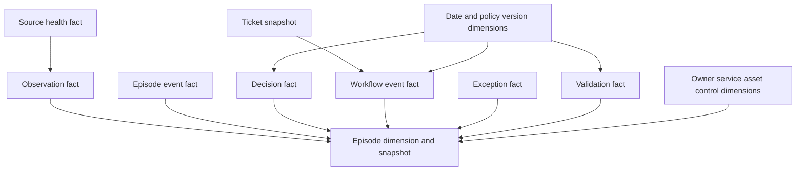

This is a general analytical model, not a published UVM schema. In SQL or Power BI, dimensions should use stable keys and effective dates. Measures should count distinct governed entities at the intended grain. Relationships should prevent accidental many-to-many multiplication or make bridge semantics explicit.

## Metric contract template

| Contract element | Question |
|---|---|
| Name | What concise label is used? |
| Decision/objective | What customer decision does it support? |
| Definition | What exactly is being measured? |
| Grain | What unit is counted or aggregated? |
| Numerator | Which records/values qualify? |
| Denominator | Which population is eligible? |
| Time | Event, observation, snapshot, calculation, and window semantics? |
| Filters | Which cohort, service, environment, owner, or state? |
| Exclusions | What is removed and why? |
| Unknowns | How are null, stale, conflict, and degraded source states shown? |
| Source/authority | Which system and field owns each assertion? |
| Refresh/freshness | How current is the view and what lag is acceptable? |
| Target/bands | Who approves thresholds and when are they reviewed? |
| Drill-down | Which evidence and work record supports the summary? |
| Guardrail | Which companion metric prevents gaming/misread? |
| Owner | Who maintains definition and acts on result? |
| Version | Which definition/model/report release applies? |
| Restatement | What happens when data/definition is corrected? |

Every KPI should have an action. A red metric without a decision owner is decoration. A green metric without guardrails can be dangerous. For example, high SLA compliance should sit beside source coverage, validation waiting, exception debt, and episode age.

## Risk reduction: what can be claimed

Risk reduction is stronger than score reduction, count reduction, ticket closure, or control deployment. A defensible claim identifies a scenario, intervention, validated postcondition, affected population, remaining exposure, evidence window, and attribution limitations.

| Observed movement | What can be said safely | What cannot be inferred alone |
|---|---|---|
| Contextual score falls | Model output decreased for stated reasons/version | Real-world risk fell |
| Critical/high episode count falls | Fewer episodes meet defined cohort at snapshot | Treatment caused the decline |
| Tickets close | Work system changed state | Vulnerabilities are absent |
| Patches deploy | Implementation command/report completed | Every instance is remediated and healthy |
| Public path blocks | Tested path prerequisite was interrupted | All paths are blocked or component fixed |
| Assets retire | Governed lifecycle evidence supports removal | All DNS, identities, routes, images are removed |
| Validation passes | Defined postconditions passed at time/scope | Future recurrence or zero residual risk |
| Recurrence falls | Fewer related episodes appear under definition | One intervention caused change without analysis |
| Exceptions decline | Fewer active approved deviations | Exposures were remediated rather than reclassified |

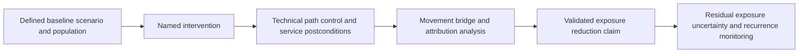

Board-safe wording might say: "For the defined patient-access cohort, the customer validated removal of the affected component from the active runtime population and confirmed required service checks. Two supplier-constrained members remain under bounded controls and review. The measurement does not estimate incidents prevented or financial loss avoided." It should not say "UVM prevented a breach" without evidence that cannot usually be established.

## Exposure aging

Exposure age should follow a stable episode, not ticket creation, last scan, regrouping, reassignment, or reopen date. Several ages answer different questions.

| Age | Start | End/current point | Use |
|---|---|---|---|
| Observation age | Source observed assertion | Current/report time | Source recency |
| Episode age | First supported start of continuing condition | Validated end/current | Exposure duration |
| Qualification age | Episode became decision-ready | Decision/current | Triage delay |
| Assignment age | Work successfully assigned/read back | Owner acceptance/current | Routing delay |
| Active-work age | Owner accepted | Implementation/current | Execution time |
| Validation-wait age | Implementation reported | Postconditions/current | Proof bottleneck |
| Blocked age | Entered explicit dependency | Dependency cleared/current | Constraint governance |
| Exception age | Approval effective | Expiry/remediation/current | Residual-risk duration |
| Recurrence interval | Prior validated close | Related recurrence | Durability signal |

| Aging view | Question | Guardrail |
|---|---|---|
| Bands by priority | How many active episodes are 0-7, 8-30, 31-90, 90+ days under customer bands? | Bands are policy choices, not universal |
| Oldest material episodes | Which high-consequence items are oldest and why? | Avoid focusing only on raw oldest |
| Age by owner | Where is delay concentrated? | Pair with case complexity/dependencies |
| Age by state | Is work waiting on ownership, change, validation, or risk review? | Preserve episode age beside state age |
| Age by service | Which critical services carry prolonged exposure? | Service mapping confidence visible |
| Age trend | Is cohort duration changing over time? | Control population and definition changes |

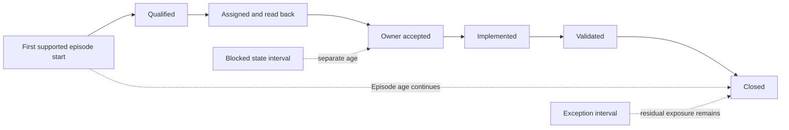

Survival-style views can show the share of episodes remaining open over age, but interpretation requires comparable cohorts and censored/open cases. A simple average can hide a long tail and is sensitive to rapid closure of easy work. Use medians, percentiles, aging bands, and oldest material cases together.

## SLA reporting

Part 84 defined clock contracts. Reporting must make tier, population, start/stop, pauses, validation, reopen, and policy version visible.

| SLA view | Numerator | Denominator | Companion guardrail |
|---|---|---|---|
| Acknowledgment compliance | Eligible assignments accepted within target | Successfully delivered eligible assignments due in window | Routing dispute and delivery-failure rates |
| Remediation compliance | Episodes reaching policy-defined stop within target | Eligible episodes due in window | Validation-wait and source-health coverage |
| Validation compliance | Implemented episodes validated within target | Implemented episodes eligible/due | Validation source cadence and unknowns |
| Evidence-resolution compliance | Material unknowns resolved within target | Assigned evidence cases due | High-consequence unknown count |
| Exception-review compliance | Exceptions reviewed before due/expiry | Active exceptions requiring review | Expired and repeatedly extended exceptions |
| Integration recovery | Workflow incidents reconciled within target | Detected eligible incidents | Undetected discrepancy sampling |

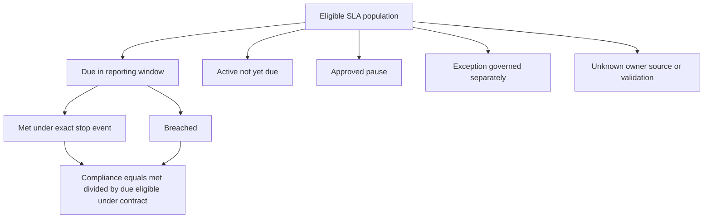

Do not remove hard cases from the denominator silently. If policy excludes approved pauses from one compliance rate, publish pause count, age, reason, and exposure separately. A high percentage can coexist with serious old exceptions or unassigned work.

## Backlog, flow, and capacity reporting

| Metric | Definition | Why it matters | Caveat |
|---|---|---|---|
| Active episode backlog | Distinct active exposure episodes at snapshot | Security demand | Context/policy can change membership |
| Actionable owner backlog | Episodes/work accepted and executable | Owner workload | Excludes evidence/risk work; disclose it |
| New arrivals | Episodes first qualified in period | Incoming demand | Source onboarding can cause step change |
| Validated exits | Episodes meeting closure postconditions | Outcome flow | Retirement/disposition separated |
| Work in progress | Accepted active treatment items | Focus/congestion | Several actions can relate to one episode |
| Throughput | Validated work/episodes per period | Capacity | Do not reward low-value volume alone |
| Lead time | Episode start to validation | Exposure duration | Open cases require careful treatment |
| Cycle time | Accepted work to validation | Execution efficiency | Ignores pre-assignment delay |
| Blocked population | Active episodes with governed dependency | Constraint load | Blocked does not mean low priority |
| Arrival/throughput ratio | Incoming demand relative to validated exits | Sustainability clue | Populations and periods must match |
| Owner load distribution | Work/age/consequence by accepted owner | Capacity and imbalance | Do not rank people without context |

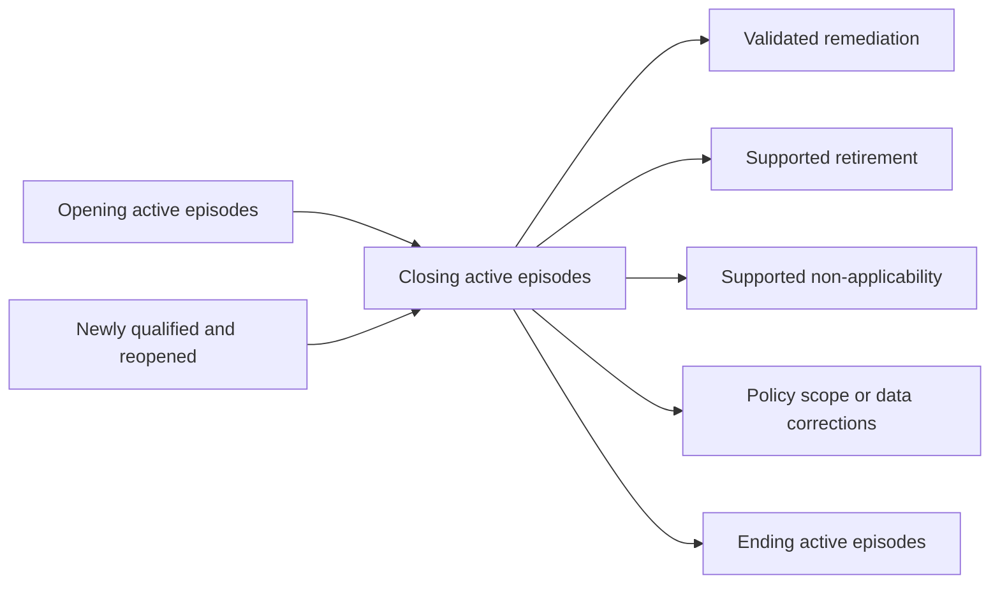

The diagram represents a movement bridge. Additions and removals must balance from opening to ending population. Exceptions usually remain active residual exposure in a separate state rather than becoming a treatment exit. Customer policy can differ, but semantics must be explicit.

## Recurrence and root-cause reporting

Recurrence can mean the same episode reopened, a new episode on the same asset after validated closure, or related episodes produced by a shared root cause. Each needs a definition and observation window.

| Recurrence type | Example | Measure idea | Caution |
|---|---|---|---|
| Validation failure | Condition never cleared | First-pass validation failure rate | Not technically recurrence if never closed |
| Same-episode reopen | Corrected/new evidence shows continuing condition | Reopen rate by reason | Preserve original age |
| Asset recurrence | Same condition returns after confirmed clearance | Episodes per asset/window | Configuration changes may explain |
| Image/pipeline recurrence | New deployments inherit fixed vulnerability | New members after root-cause change | Requires lineage evidence |
| Control recurrence | Previously effective control becomes bypassed/unknown | Control-gap episodes over time | Sensor outage can look like control failure |
| Exception recurrence | Repeated extension without durable progress | Extensions and cumulative duration | Extension can be justified but needs review |
| Organizational recurrence | Similar causes across teams/services | Root-cause taxonomy distribution | Taxonomy quality and blame risk |

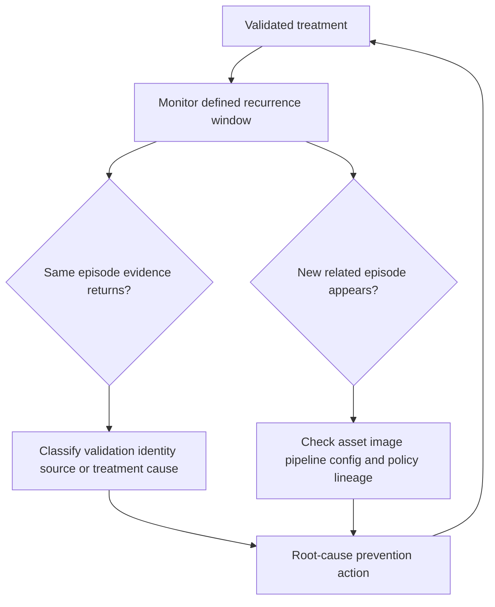

Recurrence should support learning, not blame. A rise may result from improved detection or stricter identity rules. A fall may result from source degradation. Show coverage and definition changes beside the trend.

## Exception debt reporting

| Exception KPI | Definition question | Why it matters |
|---|---|---|
| Active exceptions | How many distinct approved records/episodes are in scope? | Residual-risk inventory |
| Expiring soon | Which approved exceptions reach review/expiry within window? | Prevents surprise expiration |
| Expired unresolved | Which remain active without current authority? | Governance breach |
| Extension count | How many times has each exception been renewed? | Detects permanent temporary state |
| Cumulative duration | How long has residual exposure remained accepted? | Shows debt age |
| Control health | Which required controls are effective, partial, stale, or unknown? | Acceptance assumptions may fail |
| Remediation milestone health | Are durable-fix dependencies progressing? | Connects acceptance to exit plan |
| Concentration | Which services/owners/root causes carry most exception debt? | Resource/governance decision |
| Threat/context change | Which exceptions need early review because conditions changed? | Acceptance is time/context bounded |

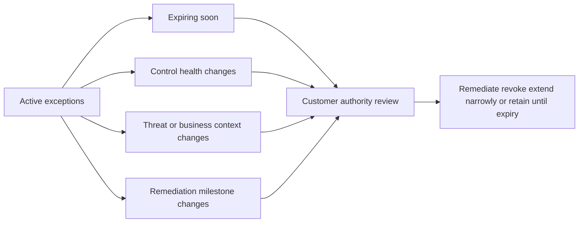

Do not remove exceptions from risk reporting merely because a customer accepted them. Distinguish accepted residual exposure from unapproved overdue work, and protect sensitive rationale through role-based views.

## Ownership and control coverage

Coverage metrics can be deceptively green. "Owner coverage" may count any non-null assignee, including a default queue. "Control coverage" may count installed agents without health or effectiveness.

| Coverage metric | Strong denominator | Strong numerator | Guardrail |
|---|---|---|---|
| Technical-owner coverage | Active episodes requiring technical action | Current accepted governed technical owner | Disputed/default/stale owner counts |
| Service-owner coverage | In-scope services/assets requiring service context | Current attested service owner | Relationship confidence and expiry |
| Risk-owner coverage | Episodes/exceptions requiring risk decision | Authorized current risk owner | Approval authority verified |
| Scanner coverage | Expected assessable population | Fresh successful evidence at required depth | Auth/subsystem completion and exclusions |
| Control presence | Population expected to have control | Current component/rule observed | Not effectiveness |
| Control health | Expected controlled population | Healthy configured control in scope | Enforcement/path unknown |
| Control effectiveness | Scenarios where control is applicable | Authorized evidence supports prerequisite interruption | Alternate paths and test recency |
| Validation coverage | Implemented episodes requiring proof | Complete current required postconditions | Source health and partial results |
| Business-context coverage | Episodes requiring service/criticality | Current authoritative relationship | Default values separated |

### Plain-English deep-dive 2 - Installed, healthy, enforcing, and effective are four different claims

A smoke detector can be mounted on the ceiling, powered on, sending health telemetry, and still fail to alert for a particular room because coverage or configuration is wrong. Counting installed detectors is not the same as proving effective fire detection.

Security control reporting needs the same ladder: expected, present, configured, healthy, enforcing on the exact scope/path, and effective under authorized evidence. Exceptions, bypasses, stale tests, and unknowns remain visible. A dashboard should not use one green "covered" percentage to collapse those states.

## Trend integrity and movement bridges

A trend is valid only when periods are comparable or differences are explained. Changes in source scope, entity-resolution rules, policy, weights, severity feeds, asset criticality, owner mappings, workflow state, exceptions, refresh, filters, or metric definitions can move the chart without changing underlying exposure.

| Trend disturbance | Example | Reporting response |
|---|---|---|
| Source onboarding | New scanner adds findings | Annotate scope increase; comparable cohort view |
| Source outage | Cloud account stops reporting | Mark degraded; block success claim |
| Backfill | Historical observations arrive late | Restate affected periods or show ingestion bridge |
| Entity merge/split | Duplicate assets corrected | Separate data correction from treatment |
| Policy/model change | Weight or gate changes cohorts | Version split, transition matrix, restatement policy |
| Feed revision | CVSS/KEV/threat data changes | Preserve as-of source and cause |
| Criticality update | Service mapping raises/lowers context | Show business-context movement |
| Exception treatment | Items move to accepted state | Keep residual exposure/exception debt visible |
| Filter/access change | Viewer sees different population | Display scope and access context |
| Metric-definition change | Stop event changes from implementation to validation | Restate or break series explicitly |
| Timezone/calendar change | Monthly boundary shifts | Govern time dimension and note break |

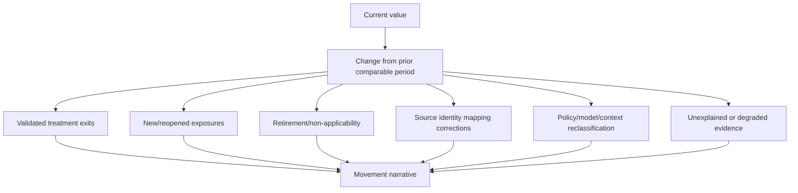

### Comparable-cohort techniques

| Technique | Use | Limitation |
|---|---|---|
| Fixed baseline cohort | Follow original members over time | Misses new exposures |
| Current population snapshot | Show current state | Membership changes distort trend |
| Matched cohort | Compare entities present in both periods | Excludes churn that may matter |
| Entry/exit bridge | Explain population movement | Requires reliable event classification |
| Version-separated series | Show values under each policy/model | Harder executive interpretation |
| Restated history | Apply corrected definition to comparable history | Original reported decisions still need audit |
| Dual view | Show as-reported and restated | More complex but transparent |
| Index/normalized rate | Adjust for asset or service population | Denominator quality remains critical |

## Denominator integrity

Denominator errors often produce the most misleading dashboards. Count the intended eligible population, not only records that successfully joined the fact table.

| Denominator failure | Example | Detection |
|---|---|---|
| Inner-join loss | Assets without owner disappear from owner coverage | Anti-join expected population to metric set |
| Null exclusion | Unknown control state omitted | Explicit unknown category and control totals |
| Duplicate multiplication | Many observations inflate episode count | Distinct stable grain and join tests |
| Stale population | Retired assets remain expected forever | Lifecycle-valid denominator |
| Source-only denominator | Only scanned assets count as scan coverage | Independent authoritative asset population |
| Exception removal | Accepted exposures vanish from backlog | Separate residual-risk state, retain reporting |
| Filter mismatch | Numerator and denominator use different service/time filters | Shared filter contract and unit tests |
| Access trimming | Row-level security changes rate silently | Display viewer scope and protected totals where appropriate |
| Partial period | Current month compared with full prior month | Comparable elapsed-period view |
| Snapshot/event mix | New-event numerator divided by active snapshot | Align grain and time semantics |

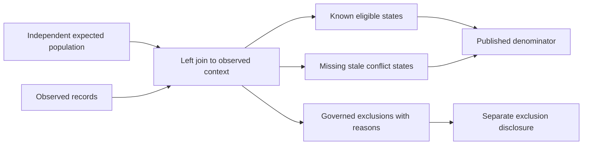

SQL anti-joins and control totals are especially valuable: expected assets without scanner evidence, active episodes without owner, implemented episodes without validation, exceptions without current controls, tickets without episodes, and episodes without tickets. Arti's SQL background supports these tests naturally.

## Drill-down and drill-through design

An executive summary should drill to material service/cohort, then episode, decision reasons, source evidence, owner work, exception, validation, and health. Access controls may abstract sensitive details while preserving traceability for authorized users.

| Level | Audience/question | Required content |
|---|---|---|
| Enterprise summary | What material exposure moved and what decision is needed? | Outcome, cause, caveat, owner, checkpoint |
| Service/cohort | Which business service or policy lane drives movement? | Scope, trends, owners, dependencies |
| Owner/campaign | What work is actionable or blocked? | Rationale, due logic, treatment, proof |
| Episode | Why this condition on this entity? | Context, score reasons, uncertainty, history |
| Factor/control | Which evidence changed priority? | Source, as-of time, state, limitations |
| Observation/source | What native evidence supports the claim? | Source ID, method, freshness, health |
| Ticket/exception | Who decided or acted, under which authority? | State, approval, expiry, reconciliation |
| Validation | What postcondition passed/failed? | Method, result, time, scope, limitation |

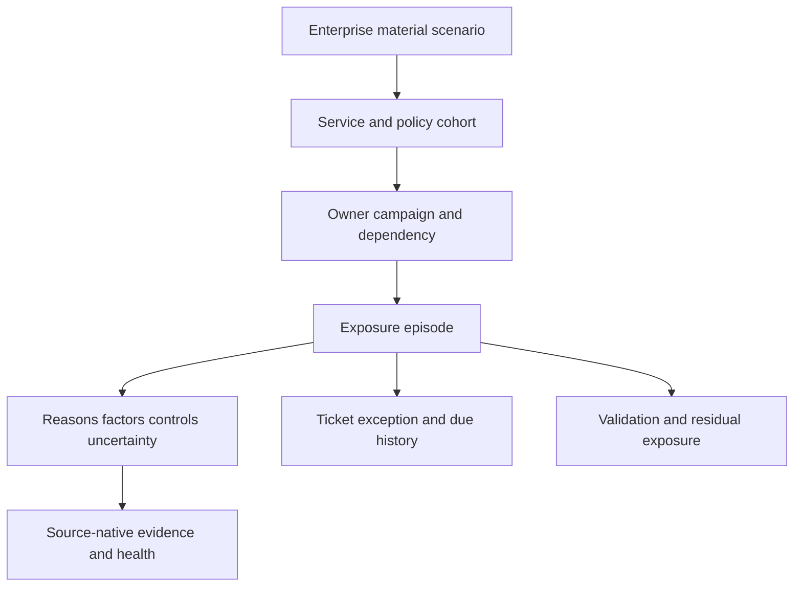

Drill-down should preserve filter context and show the metric version. If a summary counts 40 episodes, detail should reconcile to 40 under the same scope. When privacy prevents detail, explain the restricted category rather than changing totals silently.

## Role-based dashboard design

| View | Primary questions | Metrics | Avoid |
|---|---|---|---|
| VM/SecOps analyst | Which episodes need evidence or treatment and why? | Priority reasons, unknowns, age, threat/context changes | Executive-only aggregates |
| Remediation owner | What exact work, dependency, due logic, and proof? | Accepted backlog, blocked reasons, validation | Other teams' sensitive details |
| Program operator | Are sources, models, workflows, exceptions, and adoption healthy? | Coverage, reconciliation, queues, overrides, drift | Risk chart without system health |
| Service/risk owner | Which residual scenarios and decisions apply? | Material episodes, controls, exceptions, milestones | Raw scanner rows |
| Executive | What moved, why, what remains, what is blocked, what is requested? | Material risk cohorts, aging, validated outcomes, exception debt | Dense technical lists and false precision |
| Board | What material cyber exposure and governance decision deserves oversight? | Direction, major scenarios, control/remediation confidence, resources, caveats | Operational score theater or exploit detail |
| Support/Product | Which technical layer and record diverges? | IDs, UTC, versions, health, expected/actual | Unnecessary customer-sensitive narrative |

Stable dashboard layout supports repeated use. Place scope/as-of/health context near the top, outcome and risk views next, workflow/exception/coverage views below, and detailed tables behind drill-down. Avoid cards nested inside cards and do not use color alone. Include labels, accessible contrast, meaningful sort, and responsive dimensions.

## Technical narrative versus executive narrative

| Element | Technical narrative | Executive narrative |
|---|---|---|
| Scope | Exact source/service/cohort and UTC window | Material business service and period |
| Observation | Counts, states, source/model versions | Direction and magnitude with denominator |
| Cause | Source, identity, policy, workflow, treatment bridge | Why movement occurred in plain language |
| Uncertainty | Nulls, stale/conflict, source health, sample limits | What could change the conclusion |
| Impact | Affected episodes, owners, validation, operations | Material consequence and decision relevance |
| Action | Exact repair, replay, ticket, validation steps | Owner, resources, governance decision |
| Checkpoint | Technical evidence expected and time basis | Next review and decision milestone |
| Boundary | No unsupported root cause/ETA | No breach prevention or loss-avoidance claim |

### Technical update pattern

1. Scope and UTC/as-of window.
2. Exact observed metric and expected definition.
3. Source/model/workflow health.
4. Movement bridge or competing hypotheses.
5. Customer impact and affected decisions.
6. Containment and current owner.
7. Next discriminating check and checkpoint.
8. Restatement or escalation plan.

### Executive update pattern

1. Material scenario and business service.
2. Direction and validated movement.
3. Leading cause, not every technical detail.
4. Residual exposure and uncertainty.
5. Blocked dependency or resource decision.
6. Accountable owner and next checkpoint.
7. Board-safe caveat.

### Plain-English deep-dive 3 - Executives need compression, not omission

An executive summary is like a cockpit alert: it compresses thousands of sensor readings into a decision, but the underlying evidence must remain available. Compression removes detail that does not change the decision. Omission hides uncertainty, denominator changes, source failures, or unresolved exposure.

A strong summary can be short: what material scenario changed, why, what evidence validated it, what remains, which decision is blocked, who owns it, and when the next checkpoint occurs. It still includes caveats such as source coverage, sample scope, policy change, or inability to estimate incidents prevented.

## Board-safe reporting and caveats

| Unsafe statement | Why unsafe | Board-safe alternative |
|---|---|---|
| Risk fell 40 percent | Score/count may not be a ratio-scale risk measure | Defined high-attention cohort fell from X to Y; movement bridge attributes stated portions |
| UVM prevented breaches | Counterfactual not established | Defined exposures were validated remediated; incidents prevented are not estimated |
| We are 98 percent secure | No complete denominator or universal security measure | 98 percent of defined eligible episodes met the stated SLA; exceptions/unknowns are separate |
| All critical vulnerabilities are fixed | Source coverage/applicability/validation may be incomplete | No validated-open episodes remain in the defined critical cohort as of time, subject to coverage caveat |
| The WAF eliminates the risk | Control may cover one path | Authorized tests support blocking the stated path; alternate/residual paths and durable fix remain |
| No exploitation occurred | Absence of evidence is not proof | Reviewed telemetry found no confirmed exploitation in the stated scope/window; visibility limits apply |
| Exception means accepted forever | Acceptance is bounded | Customer authority approved stated residual risk until expiry with controls and review |
| Dashboard is real time | Sources and processing have cadence/lag | Values are current as of stated source and calculation times; health/lag shown |
| Financial impact avoided is $X | Unsupported counterfactual/precision | Financial exposure is not quantified in this report; resource decision is based on stated scenarios |

Board-safe caveats do not weaken the report. They define what the evidence can support. Place important caveats next to the claim, not in unreadable footnotes. If a source or model is degraded, say so prominently and state which decisions are affected.

## Visual and interaction choices

| Question | Suitable visual | Why | Risk to control |
|---|---|---|---|
| Current distribution | Bar or table by cohort | Compares categories | Categories and denominators must be stable |
| Trend over time | Line with annotations | Shows direction and breaks | Avoid incomparable periods |
| Aging | Stacked bands plus detail table | Shows long tail | Band definitions visible |
| SLA | Met/breached/active/paused distribution | Shows denominator states | Avoid one gauge only |
| Movement | Waterfall/bridge table | Explains causes | Categories must reconcile |
| Owner load | Ranked table/heatmap with age and consequence | Supports capacity | Avoid blaming individuals |
| Control coverage | State ladder/bars | Separates presence/health/effectiveness | Do not collapse unknowns |
| Exceptions | Expiry timeline and debt table | Supports governance | Sensitive access control |
| Drill detail | Searchable table with links/reasons | Enables action | Stable dimensions and performance |

Color should not be the only signal. Use labels, icons where appropriate, patterns or text, accessible contrast, and clear sorting. Red should identify an action-relevant state, not decorate every severe item. Avoid 3D charts, truncated axes that exaggerate change, and giant single-number tiles without denominator or as-of context.

## Data freshness, refresh, and latency

| Time | Meaning | Dashboard use |
|---|---|---|
| Event time | Activity/state change occurred | Sequence and SLA start |
| Observation time | Source measured condition | Evidence freshness |
| Source publication time | Advisory/intelligence issued | Threat context |
| Ingestion time | Platform received record | Pipeline lag |
| Mapping/correlation time | Context became available | Decision latency |
| Calculation time | Metric/model computed | Report as-of |
| Render/query time | Viewer requested dashboard | User experience, not data freshness |
| Ticket update time | Target state changed | Workflow recency |
| Validation time | Postcondition tested | Closure evidence |

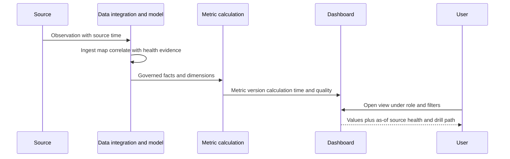

Do not promise "real time" from marketing language. Measure source cadence, ingestion lag, calculation cadence, query/cache behavior, and target-system updates in the licensed environment. A dynamic dashboard can be current relative to its pipeline and still contain a semantic error.

## Security, privacy, and reporting governance

| Risk | Example | Guardrail |
|---|---|---|
| Overexposure | Executive export includes exploit details and identities | Role-based abstraction and redaction |
| Inference | Small group reveals sensitive service/owner | Suppression/aggregation under policy |
| Row-level mismatch | User sees numerator but not denominator rows | Access-aware metric design and scope display |
| Export sprawl | Static files persist outside governed system | Approved destinations, encryption, expiry, tracking |
| Screenshot leakage | Sensitive dashboard shared in chat/email | Classification and approved channels |
| Manipulation | Metric owner changes filter to improve target | Versioned definitions and independent review |
| AI leakage | Customer data sent to unapproved assistant | Approved environment, minimization, no secrets |
| AI fabrication | Narrative invents cause or outcome | Structured grounding, citations, human approval |
| Audit gap | Historical value overwritten | As-reported history and restatement ledger |
| Availability | Dashboard outage blocks operations | Runbook, exports/alternate evidence under policy |

Metric governance should define owner, steward, approver, change process, testing, versioning, release notes, access, retention, restatement, target review, and retirement. Segregation of duties is useful when metrics affect incentives or regulatory reporting.

## Troubleshooting a wrong dashboard or trend

Start with containment: stop using the affected metric for consequential decisions, mark it degraded, preserve screenshots/exports and versions, and select one summary value plus one detail record. Establish exact viewer, filters, access role, and UTC/as-of window.

| Layer | Diagnostic question | Cheap discriminating check | Repair |
|---|---|---|---|
| Scope | Is expected population included? | Compare independent inventory/control total | Correct inclusion and exclusions |
| Source | Are objects complete and fresh? | Native count and last-success by scope | Restore source/backfill |
| Mapping | Did schema/type/category/time mapping change? | Compare raw-to-canonical sample | Repair/version mapping |
| Identity | Did merge/split/lifecycle alter grain? | Trace strong IDs for one episode | Repair entity and replay |
| Semantic model | Are relationships multiplying/dropping rows? | Reconcile fact/dimension counts and anti-joins | Correct relationships/bridge |
| Measure | Are numerator/denominator/filter/time rules correct? | Hand-calculate one small cohort | Fix expression and tests |
| Policy/model | Did factor, cohort, or state definition change? | Compare old/new version transitions | Annotate/restatement |
| Workflow | Are ticket/exception/validation states reconciled? | Compare target event history | Repair sync and replay |
| Refresh/cache | Is view using current processed version? | Compare calculation/render timestamps | Refresh/measure latency |
| Access | Does role-level filtering alter totals? | Compare authorized test roles | Repair RLS/scope display |
| Visual | Does chart sort/axis/band hide data? | Compare underlying table | Correct visual configuration |
| Narrative | Does text claim more than metric supports? | Trace each sentence to contract/evidence | Rewrite with caveat |

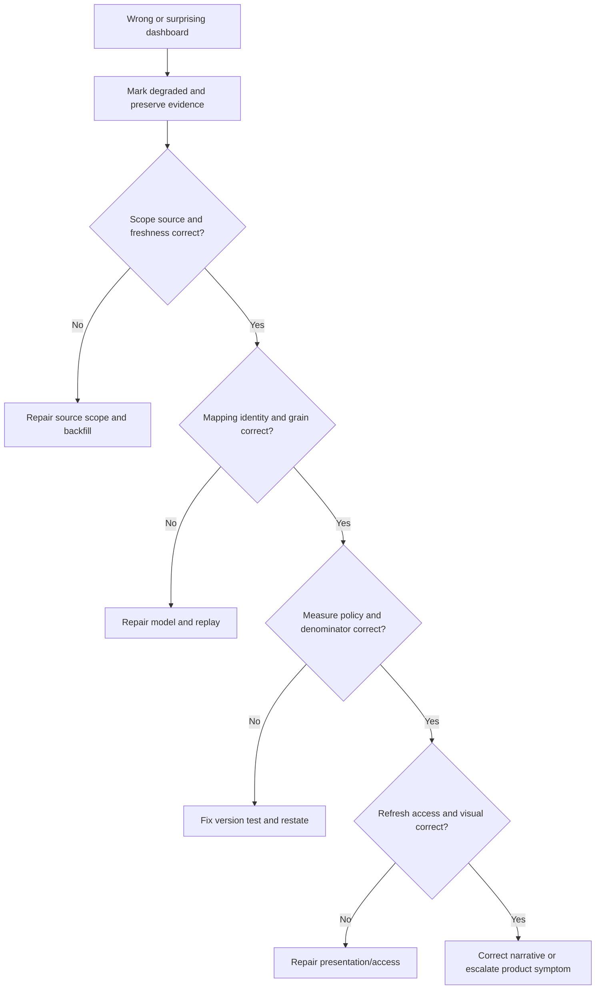

### Minimal escalation packet

Include redacted environment/report identifiers through approved channels, report/view/metric name, exact filters and viewer role, expected and observed values, numerator/denominator detail IDs, UTC source/ingestion/calculation/render times, source/model/policy/report versions, control totals, screenshots/exports, reproducibility, affected decisions, containment, recent changes, and one precise ask. Exclude secrets and unnecessary personal or exploit detail.

### Plain-English deep-dive 4 - A dashboard is a model with pixels

A chart can fail even when every pixel renders perfectly. The source may be incomplete, a join may drop unknown owners, a relationship may multiply episodes, a measure may mix snapshots and events, or a filter may exclude exceptions. Visual correctness is the final layer, not the first.

Troubleshooting works from evidence upward: expected population, source health, mapping, identity, grain, relationships, calculation, policy version, refresh, access, visual, and narrative. Repair the controlling layer and restate affected history before trusting the color again.

## Common misconceptions and anti-patterns

| Misconception or anti-pattern | Why it fails | Better approach |
|---|---|---|
| One enterprise risk score is enough | Hides scenarios, uncertainty, and action | Drill to material cohorts and evidence |
| Score sum equals total risk | Scores may not be additive or ratio-scale | Use governed cohorts and validated movement |
| Lower count equals risk reduction | Source/scope/model changes can lower count | Movement bridge and postconditions |
| Average age shows the backlog | Easy closures hide long tail | Median, percentiles, bands, oldest material cases |
| SLA percent needs no denominator detail | Exclusions can make it green | Publish contract and state distribution |
| Exceptions are removed from risk | Residual exposure continues | Exception debt and control health |
| Owner field means ownership coverage | Defaults/disputes/stale mappings exist | Accepted authoritative owner coverage |
| Installed control means effective | Presence is one state | Expected-to-effective ladder |
| Current dashboard means correct | Pipeline can be fresh and semantically wrong | Health, quality, and reconciliation |
| Executive reports should omit uncertainty | Omission creates false confidence | Compress evidence and state caveats |
| Board needs exploit details | Oversight needs material scenarios/decisions | Bounded, non-sensitive narrative |
| AI can write final executive conclusions | It may invent cause or overstate | Grounded draft, citations, human approval |
| More charts improve visibility | Cognitive load obscures action | Metric tree and role-specific views |
| Red/green color is universal | Accessibility and context issues | Labels, icons/text, definitions |

## Complete synthetic NMH reporting case

Everything in this section is explicitly fictional and synthetic. It does not describe a Zscaler tenant, UVM dashboard, metric, field, formula, refresh behavior, customer deployment, board report, or real outcome. No date later than the official review date is used. The official source snapshot remains 2026-08-24.

### Synthetic NMH metric tree

NMH's fictional patient-access pilot uses one outcome question: "Is the program reducing validated exposure for the patient-access service while preserving service safety and decision trust?" The synthetic metric tree includes source/context coverage, high-attention cohort and age, accepted-owner backlog, workflow/reconciliation health, SLA distributions, exception debt, validation, recurrence, and stakeholder adoption. No aggregate score is called total enterprise risk.

| Synthetic objective | Fictional KPI | Guardrail |
|---|---|---|
| Trust evidence | Expected-source/context coverage | Unknown and degraded scopes |
| Focus work | High-attention episodes by reason/age | Policy/model version and denominator |
| Execute | Accepted actionable backlog and blocked reasons | Evidence/risk work shown separately |
| Timeliness | Tiered acknowledgment/remediation/validation SLA | Pauses, exceptions, source health |
| Validate | Treatment-specific first-pass and final validation | Service safety and source cadence |
| Govern | Active/expiring/expired exception debt | Control health and remediation milestones |
| Prevent | Recurrence by root cause | Detection/source changes |
| Adopt | Owner acceptance, dispute quality, review action closure | Login/view counts not outcomes |

```mermaid
flowchart TD
    title NMH explicitly fictional synthetic metric tree
    OUT[Synthetic outcome: validated exposure reduction with service safety and trust] --> Q[Synthetic source and context quality]
    OUT --> R[Synthetic material exposure and aging]
    OUT --> W[Synthetic owner workflow and SLA]
    OUT --> E[Synthetic exception and control debt]
    OUT --> V[Synthetic validation and recurrence]
    OUT --> A[Synthetic adoption and decisions]
    Q --> CAVEAT[Synthetic caveats and degraded scopes]
    R --> CAVEAT
    W --> CAVEAT
    E --> CAVEAT
    V --> CAVEAT
```

### Synthetic baseline and movement bridge

At a fictional baseline, 180 patient-access exposure episodes are active. During the synthetic review window, 28 newly qualify, six reopen, 44 validate after remediation, five retire with reconciled DNS/identity/inventory evidence, three are supported non-applicable, 12 move between contextual cohorts after an approved model change, and four remain under source-degraded uncertainty. These values are invented to practice reconciliation.

| Synthetic bridge item | Fictional count | Treatment in narrative |
|---|---:|---|
| Opening active episodes | 180 | Starting denominator |
| Newly qualified | +28 | New evidence/demand |
| Reopened | +6 | Truth-preserving return |
| Validated remediation exits | -44 | Supported exposure reduction |
| Validated retirement exits | -5 | Lifecycle removal, separate from remediation |
| Supported non-applicable exits | -3 | Evidence disposition |
| Ending active before classification notes | 162 | Reconciled arithmetic |
| Model-reclassified members | 12 | Movement within active population, not exits |
| Source-degraded members | 4 | Included as active unknown, not false closure |

The arithmetic is $180 + 28 + 6 - 44 - 5 - 3 = 162$. The 12 reclassified members remain inside the ending population, and the four source-degraded members remain visible. The report does not add contextual scores or call the 10 percent count decline a 10 percent risk reduction. It specifically attributes 44 exits to validated remediation under stated postconditions.

### Synthetic scenario 1: high cohort falls because criticality mapping breaks

A fictional hierarchy-key type change maps service criticality to null for 14 percent of episodes. The high-attention cohort falls. Source observations remain stable. NMH marks the view degraded, blocks the success narrative, repairs mapping in shadow, backfills, recomputes under the same policy version, restates the trend, and adds null/control-total tests. No exposure reduction is claimed.

### Synthetic scenario 2: green SLA hides validation wait

A synthetic SLA tile uses ticket implementation as the stop event and excludes awaiting-validation work. It shows 97 percent compliance. The governed policy requires validated closure for this metric. NMH corrects the stop event, publishes due/met/breached/active/paused/exception/unknown states, adds validation-wait age, and restates history. The result becomes lower but more useful.

### Synthetic scenario 3: backlog shrink is source permission loss

A fictional source loses access to one cloud account. Episodes begin disappearing under a weak resolution rule. Source-health gating prevents closure in the corrected design. NMH marks affected metrics degraded, restores approved access, backfills, reconciles episodes and tickets, and explains the temporary denominator change. The executive update states that apparent improvement was withdrawn.

### Synthetic scenario 4: installed-control coverage is misleading

A synthetic dashboard shows 99 percent WAF coverage because a presence field is populated. Authorized path evidence supports enforcement for public routes on 82 percent of in-scope episodes; partner/direct-origin evidence is unknown or partial for the remainder. NMH replaces the single percentage with expected, present, configured, healthy, enforcing, effective, partial, bypassed, and unknown states. Sensitive path detail remains role-restricted.

### Synthetic scenario 5: exception debt accumulates behind stable count

The fictional active-exception count stays at 20 for three periods, appearing stable. Cumulative duration and extension count rise, two controls become stale, and three remediation milestones slip. NMH reports age, extensions, expiry, control health, and milestone status. Customer risk authority receives a decision list before expiry; the TSM learning role supplies evidence and product questions, not the acceptance decision.

### Synthetic scenario 6: average age improves while old material work worsens

Many new easy episodes validate quickly, lowering average age. Three high-consequence supplier-constrained episodes become older. NMH adds median, 75th/90th percentiles, age bands, oldest material cases, and blocked reason/milestone views. The narrative recognizes flow improvement and unresolved long-tail risk simultaneously.

### Synthetic scenario 7: recurrence rise reflects better detection

A new fictional image-lineage mapping identifies repeated vulnerable deployments that were previously unrelated. Reported recurrence rises. NMH does not call the prevention program worse immediately. It annotates the detection-definition change, restates a comparable cohort where possible, and then tracks new recurrence after the pipeline fix under the new method.

### Synthetic scenario 8: row-level access changes denominator

A service owner sees only one business unit, while the numerator tile was cached at enterprise scope. The percentage is impossible under visible details. NMH disables the affected view, aligns access-aware numerator and denominator, displays scope, tests authorized roles, and adds reconciliation between summary and detail. No broad access is granted merely to make totals match.

### Synthetic scenario 9: board wording overclaims prevention

A draft says "The platform prevented 12 breaches and reduced risk 35 percent." No evidence supports the counterfactual or ratio. The synthetic board-safe revision says: "For the defined patient-access cohort, 44 exposure episodes completed treatment and passed required postconditions. Four members remain under degraded source evidence and 20 exceptions require bounded governance. Incidents prevented and financial loss avoided are not estimated. The decision requested is funding for the supplier-constrained replacement plan."

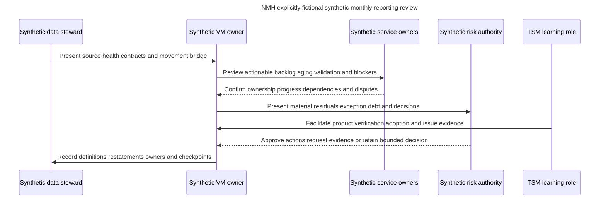

### Synthetic technical narrative

"The fictional high-attention view decreased before validation because 14 percent of episodes lost service-criticality mappings after a hierarchy-key type change. Native finding volume was stable. The view is marked degraded; automatic success reporting is paused. Mapping repair passed a small shadow sample, backfill and deterministic recomputation are in progress, and affected periods will be restated. Four source-degraded episodes remain active unknown. The next checkpoint is the control-total and member-level reconciliation review."

### Synthetic executive narrative

"For the defined fictional patient-access cohort, 44 episodes completed treatment and passed required technical and service checks. The ending active population is 162 after new, reopened, retired, and non-applicable movements are reconciled. One apparent improvement was caused by a mapping defect and has been withdrawn. Twenty exceptions remain visible; two require refreshed control evidence. The decision requested is support for the supplier-constrained replacement plan. Incidents prevented and financial loss avoided are not estimated."

## Customer and TSM artifact kit

| Artifact | Minimum contents | Value |
|---|---|---|
| Reporting claim ledger | Public claim, source, date, boundary, verification owner | Prevents product overstatement |
| Outcome/metric tree | Objective, drivers, KPIs, guardrails, actions | Avoids random chart collection |
| Semantic model dictionary | Facts, dimensions, grains, keys, time, authority | Prevents join/count errors |
| Metric contract | Numerator, denominator, filters, unknowns, time, owner, version | Reproducibility |
| Movement bridge | Opening, additions, exits, corrections, ending, caveats | Trend honesty |
| Source-health panel | Scope, freshness, completeness, rejects, last success | Prevents false improvement |
| Aging pack | Episode/state ages, bands, percentiles, oldest material cases | Exposes long tail |
| SLA dictionary/report | Clock contracts and state distribution | Prevents green-percentage theater |
| Backlog/flow pack | Arrivals, WIP, throughput, blocked, capacity | Operating decisions |
| Recurrence ledger | Definition, lineage, reason, observation window | Root-cause learning |
| Exception-debt report | Age, expiry, extension, control, milestone, owner | Governance action |
| Coverage ladder | Expected/present/healthy/enforcing/effective/unknown | Honest control/owner context |
| Drill-down contract | Summary-to-evidence path and access | Trust and troubleshooting |
| Executive narrative template | Materiality, movement/cause, residual, decision, caveat | Clear leadership communication |
| Dashboard escalation packet | IDs, filters, roles, times, versions, controls, one ask | Efficient Support/Product diagnosis |

## Safe labs and exercises

All exercises use synthetic data, public official pages, or isolated explicitly authorized systems. They require no production Zscaler tenant, customer data, real credentials, exploit, or sensitive board material.

| Exercise | Task | Deliverable | Pass condition |
|---:|---|---|---|
| 1 | Classify reporting claims | Product/general/synthetic/unknown ledger | No invented dashboard behavior |
| 2 | Build semantic grains | Fact/dimension table | Observations do not multiply episodes |
| 3 | Define metric contract | One complete KPI record | Numerator/denominator/time/unknowns explicit |
| 4 | Build metric tree | Outcome-driver-KPI diagram | Every KPI has decision/owner |
| 5 | Calculate aging | Synthetic event history | Episode age survives regroup/reopen |
| 6 | Build aging views | Bands/median/percentiles/oldest cases | Long tail visible |
| 7 | Calculate SLA | Tier event histories | Clock and denominator reproducible |
| 8 | Build movement bridge | Opening-to-ending table | All changes reconcile |
| 9 | Separate risk claims | Ten movement statements | Score/count/ticket/treatment distinctions correct |
| 10 | Analyze flow | Arrivals/WIP/throughput/blocked | Same grains and periods |
| 11 | Define recurrence | Three recurrence types | Detection changes annotated |
| 12 | Build exception report | Age/expiry/extensions/controls/milestones | Debt cannot disappear |
| 13 | Build coverage ladder | Owner/control synthetic data | Unknown/default separated |
| 14 | Test denominators | Anti-join and control totals | Missing records remain visible |
| 15 | Design drill-down | Executive-to-source flow | Summary/detail totals reconcile |
| 16 | Compare audiences | Technical and executive updates | Same facts, appropriate compression |
| 17 | Rewrite board claims | Unsafe-to-safe table | No prevention/financial overclaim |
| 18 | Diagnose trend drop | Layered runbook output | Source/model/treatment causes separated |
| 19 | Draft escalation packet | Redacted synthetic mismatch | IDs/filters/roles/UTC/versions/one ask |
| 20 | Run review | Ten-minute synthetic QBR | Decisions, owners, caveats, checkpoints |
| 21 | Rehearse Q1-Q8 | Recorded answers | Neutral honesty and source boundaries |

## Arti bridge: factual strengths applied to reporting

| Factual strength | Reporting application | Interview bridge | Boundary |
|---|---|---|---|
| M365/OneDrive/SharePoint support | Combine service/client/identity/permission/network evidence into scoped updates | "One status needs exact population, time, and evidence." | No UVM dashboard claim |
| Networking/traces | Explain path/control evidence and integration latency with timestamps | "Fresh visuals depend on source and transport health." | Authorized evidence only |
| SQL | Model facts/dimensions, anti-join missing populations, calculate windows and bridges | "Denominator integrity starts in the semantic model." | No product query-access claim |
| Power BI | Design measures, role views, drill-through, accessible visuals, and narratives | "A dashboard is a decision surface backed by contracts." | General analytics strength |
| Escalations | Produce technical/executive updates with facts, impact, owner, checkpoint, ETA boundary | "Compression must not omit uncertainty." | No board certification authority |
| Mentoring | Teach metric definitions and run review teach-backs | "Adoption means users can explain and act on the metric." | No production rollout claim |
| AI exploration | Draft source-grounded summaries and quality tests under review | "AI can compress evidence but cannot invent cause or outcome." | No autonomous report |

## TSM value in reporting and reviews

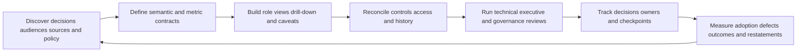

TSM value includes clarifying product claims, facilitating customer metric definitions, aligning dashboards with operating outcomes, testing source/metric health, enabling role-specific adoption, troubleshooting discrepancies, preparing Support/Product evidence, and helping translate technical state into customer decisions. The TSM should challenge unsupported success narratives constructively, not certify customer risk or board disclosures. Value evidence includes decisions accelerated, duplicate/manual reporting reduced, owner adoption improved, discrepancies resolved, exceptions governed, and validated outcomes made visible, each with attribution caveats.

## Official Source Anchors

Research/source snapshot and review date: **2026-08-24**.

Official Zscaler sources support bounded public product positioning only. Semantic modeling, metric contracts, movement bridges, denominator tests, board-safe language, privacy, and troubleshooting are general study practices, not proprietary implementation claims. NMH is synthetic. Current official documentation and licensed-tenant evidence govern production.

| Source | URL | Used for | Boundary |
|---|---|---|---|
| Zscaler Unified Vulnerability Management | https://www.zscaler.com/products-and-solutions/vulnerability-management | Public dynamic insight into risk posture, KPIs, SLAs, and other metrics from correlated contextual data | No exact dashboard, tile, measure, formula, semantic model, refresh, history, drill, access, export, entitlement, or outcome claim |
| Zscaler Data Fabric for Security | https://www.zscaler.com/products-and-solutions/data-fabric | Public dynamic report and correlated-data positioning | No proprietary reporting architecture |
| Zscaler Data Fabric integrations | https://www.zscaler.com/products-and-solutions/data-fabric/integrations | Public integration ecosystem discovery at review date | Listing does not prove direction, object, metric, cadence, permission, support, or entitlement |
| FIRST CVSS | https://www.first.org/cvss/ | Versioned technical severity foundation | CVSS is not complete customer risk or additive exposure quantity |
| FIRST EPSS | https://www.first.org/epss/ | Daily next-30-day in-wild exploitation probability estimate | Not certainty or customer breach probability |
| CISA Known Exploited Vulnerabilities Catalog | https://www.cisa.gov/known-exploited-vulnerabilities-catalog | Known-exploitation prioritization input | Not proof of customer compromise |
| NIST Cybersecurity Framework 2.0 | https://www.nist.gov/cyberframework | Governance, outcomes, profiles, and improvement context | Voluntary; implementation varies |
| NIST SP 800-40 Rev. 4 | https://csrc.nist.gov/pubs/sp/800/40/r4/final | Patch-management planning and verification | Does not define UVM metrics |
| NIST SP 800-53 Rev. 5 | https://csrc.nist.gov/pubs/sp/800/53/r5/upd1/final | Vulnerability, audit, assessment, configuration, risk, incident, privacy, and reporting control context | Requires customer selection/tailoring |

## Likely Interview Questions

### Q1. What makes a UVM dashboard trustworthy?

**Model answer:** A governed semantic model with explicit grains, stable identities, temporal relationships, source and integration health, metric contracts, versioned policy, transparent numerators/denominators/exclusions/unknowns, comparable trends, access-aware drill-down, and reconciliation to native evidence and work records. Every KPI needs a decision owner and guardrail. Zscaler publicly describes dynamic UVM risk/KPI/SLA insights, but exact dashboards and formulas require current verification.

### Q2. How do you report risk reduction responsibly?

**Model answer:** Do not equate a lower score, count, ticket closure, or deployment with risk reduction. Define baseline scenario/population, name the intervention, require treatment-specific technical/path/control/service postconditions, build a movement bridge, state residual exposure and uncertainty, and qualify attribution. A safe claim is validated exposure reduction for a defined cohort and period, not breaches prevented or financial loss avoided unless separately supported.

### Q3. How should exposure aging and SLA metrics be designed?

**Model answer:** Episode age starts with the continuing supported condition and survives rescans, regrouping, reassignment, pauses, and reopen. State-specific ages explain where time is spent. SLA metrics need tier, eligible population, policy/version, start/stop events, time basis, warnings, pauses, validation, reopen, and denominator. Report met, breached, active-not-due, paused, exception, unknown-owner, and source-degraded populations, plus age distributions.

### Q4. Which backlog, recurrence, and exception KPIs matter?

**Model answer:** Use active episode and actionable-owner backlogs, arrivals, validated exits, WIP, lead/cycle time, blocked reasons, owner acceptance, and movement bridges. Define recurrence as validation failure, same-episode reopen, asset recurrence, or shared root-cause recurrence. For exceptions, show active, expiring, expired, extension count, cumulative duration, control health, remediation milestones, concentration, and threat/context changes. Keep residual risk visible.

### Q5. How do you measure owner and control coverage honestly?

**Model answer:** Use an independent expected population. For ownership, count current accepted authoritative owners and expose defaults, disputes, stale mappings, and missing relationships. For controls, separate expected, present, configured, healthy, enforcing, effective, partial, bypassed, stale, unknown, and not applicable. Installed-agent percentage is not control effectiveness, and null records must remain in the denominator or an explicit unknown state.

### Q6. How do you preserve trend and denominator integrity?

**Model answer:** Version definitions and policy; annotate source onboarding/outage, backfill, identity merge/split, model changes, feed revisions, criticality changes, exceptions, filters, and time boundaries. Use fixed/matched cohorts, movement bridges, version-separated series, or restated history as appropriate. Reconcile expected populations with left joins, anti-joins, distinct stable grains, control totals, and shared filters. Never let failed joins silently remove hard cases.

### Q7. How would you troubleshoot a dashboard drop?

**Model answer:** Mark the metric degraded and preserve evidence. Fix exact viewer, role, filters, and UTC/as-of time. Reconcile independent scope, source completeness/freshness, mapping/types/time, entity identity, fact/dimension relationships, numerator/denominator calculation, policy/model version, ticket/exception/validation state, refresh/cache, access, visual configuration, and narrative. Repair, replay, restate, communicate affected decisions, and escalate a redacted minimal case if needed.

### Q8. How does Arti's background support this work without overstating experience?

**Model answer:** Microsoft 365, OneDrive, and SharePoint escalation work built scoped evidence and audience-aware status communication. Networking traces support source/path/latency reasoning. SQL and Power BI support fact/dimension models, joins, nulls, windows, denominators, drill-through, quality checks, trends, and narratives. Escalations, mentoring, and reviewed AI assistance support adoption. NMH is synthetic, and production UVM dashboards, vulnerability-program metrics, and board reporting remain learning boundaries.

## 30-Second Memory Hooks

| Concept | Memory hook |
|---|---|
| Dashboard | Model with pixels |
| Metric | Defined observation, not decoration |
| KPI | Measure tied to objective and action |
| Grain | Know whether counting rows, episodes, tickets, or services |
| Denominator | Eligible universe, including honest unknowns |
| Percentage | Fraction plus time and policy |
| Risk reduction | Scenario, intervention, postcondition, residual, caveat |
| Aging | Stable episode clock survives workflow changes |
| SLA | Tiered clock contract and transparent states |
| Backlog | Demand, flow, quality, and capacity together |
| Recurrence | Define return type before measuring |
| Exception debt | Temporary permits with age, controls, and exit plan |
| Ownership coverage | Accepted authority, not non-null assignee |
| Control coverage | Expected to effective is a ladder |
| Trend | Comparable movie with annotated breaks |
| Movement bridge | Reconcile why the number changed |
| Drill-down | Summary to episode to evidence to action to proof |
| Executive narrative | Compress evidence; never omit uncertainty |
| Board-safe | Material, bounded, decision-oriented, no counterfactual claims |
| TSM | Turn product data into trusted customer decisions without certifying risk |

## Completion Checklist

- [ ] I separate product fact, general security practice, scenario assumption, customer fact, and unknown.
- [ ] I state public UVM dynamic risk/KPI/SLA reporting positioning without inventing dashboards, measures, refresh, or entitlements.
- [ ] I define dashboard, metric, KPI, measure, dimension, grain, numerator, denominator, cohort, baseline, target, trend, movement bridge, restatement, aging, SLA compliance, backlog, recurrence, exception debt, coverage, drill-down, drill-through, freshness, and board-safe.
- [ ] I model observation, episode snapshot/event, decision, workflow event, ticket, exception, validation, and source-health grains separately.
- [ ] I prevent many-to-many joins from multiplying episodes or dropping unknowns.
- [ ] I create metric contracts with objective, definition, grain, numerator, denominator, time, filters, exclusions, unknowns, authority, freshness, target, drill, guardrail, owner, version, and restatement.
- [ ] I distinguish score, count, ticket, deployment, path-control, retirement, validation, and recurrence movement from risk reduction.
- [ ] I make only bounded validated-exposure claims with residuals and attribution caveats.
- [ ] I preserve observation, episode, qualification, assignment, work, validation, blocked, exception, and recurrence ages.
- [ ] I use bands, median, percentiles, survival/long-tail views, and oldest material episodes rather than average alone.
- [ ] I define SLA numerator, denominator, tier, start/stop, pause, validation, reopen, unknown, and source health.
- [ ] I report active backlog, actionable backlog, arrivals, validated exits, WIP, throughput, lead/cycle time, blockers, and owner load at explicit grains.
- [ ] I define validation failure, same-episode reopen, asset, image/pipeline, control, exception, and organizational recurrence carefully.
- [ ] I report active, expiring, expired, extended, aged, control-degraded, milestone-delayed, and concentrated exception debt.
- [ ] I measure ownership through current accepted authority and expose defaults/disputes/staleness.
- [ ] I measure controls through expected, present, configured, healthy, enforcing, effective, partial, bypassed, stale, unknown, and not applicable.
- [ ] I annotate source, backfill, entity, policy/model, feed, criticality, exception, filter, definition, and time changes.
- [ ] I select fixed, current, matched, bridge, version-separated, restated, dual, or normalized trends deliberately.
- [ ] I protect denominator integrity with independent populations, left/anti-joins, explicit unknowns, distinct grain, shared filters, and access-aware design.
- [ ] I reconcile every summary value to authorized detail under the same scope and metric version.
- [ ] I design analyst, owner, operator, risk, executive, board, and Support/Product views for their decisions.
- [ ] I create technical narratives with scope, observation, health, cause/hypothesis, impact, containment, owner, checkpoint, and restatement.
- [ ] I create executive narratives with materiality, validated movement, cause, residual, uncertainty, decision, owner, checkpoint, and caveat.
- [ ] I never claim breaches prevented, financial loss avoided, complete security, real-time truth, or universal control effectiveness without support.
- [ ] I choose visuals that match questions and use accessible labels, stable axes, scope, definitions, and as-of context.
- [ ] I distinguish event, observation, publication, ingestion, mapping, calculation, render, ticket, and validation times.
- [ ] I govern reporting access, exports, screenshots, history, AI, metric changes, targets, and restatements.
- [ ] I troubleshoot scope, source, mapping, identity, semantic model, measure, policy, workflow, refresh, access, visual, and narrative layers.
- [ ] I can build a redacted dashboard escalation packet with exact IDs, roles, filters, UTC times, versions, control totals, containment, and one ask.
- [ ] I can explain all nine NMH scenarios as explicitly fictional and synthetic only.
- [ ] I can create every artifact and complete all twenty-one safe exercises.
- [ ] I connect M365/OneDrive/SharePoint support, networking traces, SQL/Power BI, escalations, mentoring, and AI without claiming production Zscaler/UVM/program/board experience.
- [ ] I retain the official-source snapshot and review date exactly as 2026-08-24.
- [ ] I can answer Q1 through Q8 with definitions, architecture, metrics, caveats, troubleshooting, TSM value, and honesty.

[Part 86 - UVM Program Operations, Tuning, Troubleshooting, and Adoption](Part-86-uvm-program-operations.md)