# Part 86 - UVM Program Operations, Tuning, Troubleshooting, and Adoption

> **Audience:** Arti Thakur, preparing for a Zscaler Security Operations Technical Success Manager role after Microsoft enterprise Support Escalation Engineering.

> **Purpose:** Explain how a contextual vulnerability-management capability becomes a durable operating service. Cover source onboarding, phased acceptance, scoring calibration, data defects, workflow health, stakeholder trust, remediation resistance, governance cadence, maturity, service delivery, TSM adoption and value, change safety, operational incidents, runbooks, customer artifacts, and continuous improvement.

> **Scope and honesty:** Northstar Meridian Holdings, abbreviated NMH, is an explicitly fictional and synthetic customer used only for study. Every NMH source, service, connector, score, policy, workflow, ticket, date, metric, incident, result, stakeholder, maturity level, and decision is invented. Arti's factual background is Microsoft 365, OneDrive, and SharePoint support; networking and trace analysis; SQL and Power BI; escalations; mentoring; and responsible AI exploration. Production Zscaler, Data Fabric, UVM, Risk360, CAASM, CTEM, vulnerability-program administration, and customer service ownership remain learning boundaries.

> **Currency caveat:** Product wording, packaging, integrations, workflows, interfaces, fields, defaults, limits, entitlements, standards, threat evidence, and customer conditions change. The controlled official-source snapshot and review date for this Part is exactly **2026-08-24**. Current official documentation, licensed-tenant evidence, connector-specific guidance, customer policy, product specialists, Zscaler Support, approved change/security/privacy procedures, source-native evidence, and measured postconditions govern production.

> **Section goal:** Enable Arti to run a credible TSM-level UVM operating conversation from discovery through sustained adoption: onboard one bounded source/use case safely, establish acceptance and health, tune scoring without hiding data defects, operate workflows and governance, diagnose resistance, measure value honestly, handle incidents with runbooks, and plan maturity improvements without claiming customer authority or production experience.

Zscaler's reviewed public UVM page positions the product as powered by Data Fabric for Security, using aggregated and correlated data, contextual multifactor scoring, adjustable factors and weights, custom remediation workflows with details and rationale, ticket reconciliation, and dynamic risk/KPI/SLA reporting. The reviewed Data Fabric pages support public positioning around ingestion, harmonization/mapping, deduplication, correlation/enrichment, customizable data models/business logic, workflows, reporting, and a broad integration ecosystem. These are bounded product facts. Exact deployment architecture, connector behavior, objects, health telemetry, acceptance criteria, operational roles, support processes, fields, limits, service levels, and entitlements require current verification.

This Part uses **product fact** only for reviewed official wording, **general security practice** for the recommended operating model, **scenario assumption** for explicitly fictional NMH choices, and **unknown** for tenant/product details not established. Operational credibility depends on retaining those boundaries.

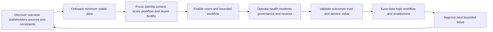

| Operating principle | Practical meaning | Failure it prevents |
|---|---|---|
| Outcome before connector | Start with a customer decision and minimum evidence | Tool-first ingestion without use |
| Quality before automation | Prove identity, applicability, ownership, and source health | Wrong tickets and false closure |
| One variable at a time | Separate data repair from scoring/workflow tuning | Unknown cause of improvement/regression |
| Health beside risk | Report pipeline/model/workflow state with exposure | Source outage looks like success |
| Human authority | Keep customer policy, risk, privacy, and change decisions with authorized roles | Vendor/TSM overreach |
| Validate before scale | Shadow, canary, postconditions, reconciliation, rollback | Large blast radius |
| Explain and teach | Make reasons, limits, and challenge paths clear | Stakeholder resistance and automation bias |
| Measure outcomes honestly | Use denominators, movement bridges, residuals, and caveats | Activity theater |
| Runbook and rehearse | Define detection, containment, repair, replay, and communication | Improvised incident response |
| Improve continuously | Use defects, overrides, recurrence, and feedback as evidence | Static program decay |

## JD Mapping

| JD signal | Capability developed in this Part | Customer or TSM artifact | Honest boundary |
|---|---|---|---|
| Develop deep expertise | Explain reviewed UVM/Data Fabric operating implications and verification needs | Product claim ledger and operating whiteboard | No proprietary implementation claim |
| Trusted advisor | Connect customer outcomes, architecture, governance, and operating choices | Success plan and maturity roadmap | Customer owns risk/change authority |
| Drive adoption and value | Convert capability into repeated correct tasks and validated outcomes | Adoption ladder and value scorecard | No guaranteed adoption/result |
| Troubleshoot complexity | Isolate source, mapping, entity, score, workflow, report, and user-process defects | Layered incident runbooks | No unsupported root cause |
| Use analytics | Define baselines, health, cohorts, drift, reconciliation, and value evidence | SQL/Power BI operating model | No undocumented product schema |
| Coordinate stakeholders | Align VM, SecOps, IT, cloud, app, IAM, data, risk, change, executives, Support/Product | Governance RACI/action register | TSM facilitates, not governs customer risk |
| Communicate proactively | State impact, uncertainty, containment, owner, checkpoint, and ETA boundary | Incident/QBR narratives | No unsupported assurance |
| Partner cross-functionally | Route product symptoms and feedback with minimal evidence | Support/Product packet and feedback record | No roadmap/fix promise |
| Apply AI responsibly | Assist runbooks, summaries, test generation, and anomaly review under controls | AI use-case charter | No autonomous prioritization or remediation |

## Candidate honesty note

| Evidence class | Neutral candidate phrasing | Boundary |
|---|---|---|
| Factual Microsoft support | Enterprise escalation work required service operations, customer communication, exact evidence, cross-team ownership, containment, RCA, and validation | Not production UVM operation |
| M365/OneDrive/SharePoint | Complex incidents crossed identity, permissions, endpoint/client, sync, network, service, and tenant configuration layers | Transferable systems thinking |
| Networking/traces | DNS, TCP, TLS, proxy, HTTP, packet/trace, and timestamp analysis supports integration and reachability diagnosis | No claim of Zscaler telemetry administration |
| SQL/Power BI | Skills support source reconciliation, quality, temporal models, health trends, adoption, and value evidence | No claim of UVM database access |
| Escalation practice | Severity, business impact, updates, ownership, case packets, and post-incident learning transfer | No authority to promise product fixes |
| Mentoring | Structured teaching, playbooks, shadowing, and teach-back support adoption | No production UVM training rollout claim |
| AI exploration | Reviewed assistance can summarize cited evidence, draft runbooks, and generate tests | No autonomous security/risk authority |
| Synthetic NMH | Operating artifacts and incidents are fictional practice | No customer, product, or service result |

## Beginner vocabulary and memory hooks

| Term | Plain meaning | Why it matters | Analogy or hook |
|---|---|---|---|
| Operating model | Agreed people, process, technology, data, and governance design | Makes capability repeatable | How the hospital runs daily |
| Service | Capability delivered to users under defined outcomes and responsibilities | Moves beyond project setup | Ongoing clinic, not one event |
| Onboarding | Controlled introduction of a source, use case, team, or workflow | Establishes usable evidence | Admit one patient safely |
| Acceptance criteria | Evidence required before a stage is approved | Prevents hope-based go-live | Inspection checklist |
| Baseline | Defined starting state under a metric contract | Enables change comparison | Before measurement |
| Health | Ability of a component/process to perform intended function | Risk output depends on working system | Vital signs |
| Observability | Evidence explaining internal/operational state from outputs, logs, metrics, and traces | Speeds diagnosis | Windows into machinery |
| Calibration | Compare output with reviewed evidence and outcomes, then tune | Builds decision usefulness | Calibrate thermometer |
| Tuning | Controlled change to data, policy, score, workflow, report, or enablement | Improves fit | Adjust one instrument setting |
| Drift | Inputs, relationships, behavior, or output change over time | Can degrade trust silently | Compass slowly deviates |
| Regression | Previously working behavior fails after change | Requires tests/rollback | Repair breaks another function |
| Defect | Evidence-supported failure against expected contract | Enables ownership and repair | Broken part under specification |
| Symptom | Observed unexpected behavior | Starting point, not root cause | Warning light |
| Root cause | Controlling condition whose repair prevents recurrence under scope | Supports durable improvement | Broken mold |
| Adoption | Users repeatedly perform the intended task correctly | Usage alone is insufficient | Correct routine becomes normal |
| Resistance | Friction, disagreement, or non-use with a cause | Often useful evidence | Pain signal, not disobedience |
| Champion | Trusted stakeholder helping peers adopt change | Local credibility and feedback | Department guide |
| Governance | Decision rights, policy, oversight, and accountability | Protects consequential change | Rules and referees |
| Cadence | Repeated schedule for reviews and actions | Keeps loops alive | Operating rhythm |
| Runbook | Tested step-by-step response guide with owners and evidence | Reduces incident improvisation | Emergency checklist |
| Playbook | Broader response pattern with choices for scenario | Guides judgment | Field manual |
| Service review | Structured review of health, outcomes, risks, actions, and roadmap | Connects operations to value | Recurring care conference |
| Maturity | Observable capability level, not tool age | Guides next practical improvement | Skill ladder |
| Value hypothesis | Testable claim that a capability improves a customer outcome | Avoids unsupported ROI | Expected benefit to verify |
| Leading indicator | Early signal of behavior/process likely to support outcome | Helps steer before lagging result | Temperature trend |
| Lagging indicator | Result observed after actions | Confirms or challenges value | Recovery outcome |
| Error budget | Tolerated unreliability under defined service objective | Balances change and stability | Allowance for service misses |

### Plain-English deep-dive 1 - Installing capability is not operating a service

Buying kitchen equipment and connecting ingredients does not create a reliable restaurant. The restaurant still needs menus, food-safety rules, trained roles, recipes, supplier checks, order routing, quality inspection, incident response, customer feedback, and daily management. More equipment can make failures faster if the operating system is weak.

UVM adoption works similarly. Sources and scoring are ingredients. The operating service needs defined outcomes, source contracts, identity/context quality, customer policy, accepted owners, safe workflows, reconciliation, validation, metrics, governance, training, and improvement. A TSM helps connect product capability to that system while keeping customer authority and product boundaries explicit.

## UVM service charter and operating scope

An operating charter states who receives what service, which decisions it supports, and what remains outside scope. It should avoid promising universal vulnerability elimination.

| Charter element | Question | Example general practice |
|---|---|---|
| Customer outcome | Which exposure decision improves? | Prioritize and validate patient-service vulnerability treatment |
| Service consumers | Who uses outputs and for what task? | VM analysts, platform owners, service/risk leaders |
| Scope | Which business services, assets, sources, and environments? | One bounded service pilot |
| Inputs | Which authoritative evidence is required? | Vulnerability, asset, identity, path, control, business, work |
| Outputs | Which decisions/actions/reports result? | Explained cohorts, tickets, exceptions, validation, review |
| Service hours/cadence | When is operation/review performed? | Customer-defined operational rhythm |
| Roles | Who owns data, policy, platform, work, risk, validation, support? | RACI and escalation paths |
| Quality objectives | What completeness/freshness/reconciliation is required? | Versioned acceptance thresholds |
| Safety/privacy | What authorization and data controls apply? | Least privilege, minimization, canary, rollback |
| Exclusions | What is not covered? | Unsupported source/use case pending verification |
| Success evidence | Which outcomes and guardrails matter? | Validated movement plus trust/health |
| Exit/expansion | What evidence justifies next wave? | Stable health, adoption, outcomes, capacity |

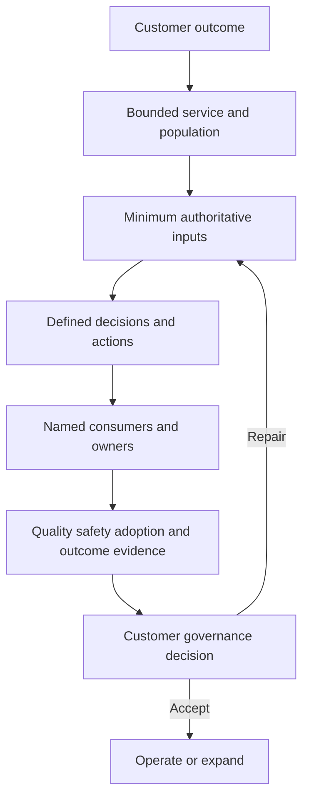

## Source onboarding lifecycle

Onboarding starts with a source/use-case contract, not credentials. A source can connect successfully and still provide the wrong scope, grain, fields, permissions, cadence, or semantics. Introduce minimum data required for one decision before pursuing connector count.

| Stage | Core work | Acceptance evidence | Stop condition |
|---|---|---|---|
| Discover | Outcome, source owner, objects, grain, volume, history, auth, constraints | Signed discovery record | No clear decision or authority |
| Contract | IDs, scope, semantics, time, quality, security, decommission | Source contract | Ambiguous fields/ownership |
| Access design | Least privilege, service identity, secret handling, network path | Approved access design | Excess privilege or unsafe secret process |
| Connectivity | DNS/TCP/TLS/proxy/API/file path and authentication | Bounded transport/auth proof | Unapproved path or unstable auth |
| Sample ingestion | Small representative objects | Control totals and payload/schema checks | Unexpected sensitive data or wrong scope |
| Mapping | Canonical fields, enums, units, time, null behavior | Positive/negative/boundary mapping tests | Semantic conflict unresolved |
| Identity/correlation | Entity keys, lifecycle, relationships, confidence | Match/nonmatch/merge/split tests | Unsafe false merges |
| Backfill/incremental | History, checkpoints, late data, replay, quotas | Completeness/freshness reconciliation | Duplicate/loss/overload |
| Use-case shadow | Scoring/grouping/workflow/report without action | Human-reviewed decision sample | Poor trust or unexplained output |
| Canary | Small approved operational cohort | Delivery/read-back/validation/rollback proof | Harm, duplication, or unresolved discrepancy |
| Production wave | Bounded expansion | Health/adoption/outcome thresholds | Capacity or quality degradation |
| Operate/retire | Monitoring, changes, incident/runbook, decommission | Service acceptance and exit evidence | Owner or support boundary absent |


### Source contract

| Contract field | Required detail | Operational test |
|---|---|---|
| Purpose | Decision/use case supported | Remove source and state what breaks |
| Owner | Technical, data, business, security contacts | Escalation drill |
| Objects/grain | One record meaning and relationships | Duplicate/multiplication tests |
| Identity | Namespaces, keys, aliases, lifecycle | Match/nonmatch/reuse tests |
| Authority | Which assertions source owns | Conflict scenario |
| Scope | Accounts, regions, tenants, groups, environments | Independent inventory reconciliation |
| Acquisition | API, file, webhook, supported connector path | End-to-end sample |
| Authentication | Method, service identity, rotation, least privilege | Expiry/rotation rehearsal |
| Frequency | Full/incremental cadence, expected lag | Freshness alert test |
| Volume | Baseline, peaks, pagination, quotas | Load/rate test in safe scope |
| Schema | Fields, types, enums, units, versions | Contract regression tests |
| Time | Event/observation/update/ingestion, timezone | Out-of-order/late test |
| Quality | Completeness, uniqueness, validity, conflict thresholds | Control totals and samples |
| Security/privacy | Classification, minimization, retention, access, residency | Access/export review |
| Failure/recovery | Retry, checkpoint, dead letter, backfill, replay | Failure injection/tabletop |
| Change/decommission | Notice, compatibility, archive, deletion, fallback | Schema-change and retirement drill |

### Plain-English deep-dive 2 - Green connector is not green data

A courier can arrive on time with a sealed package, but the package may contain the wrong forms, only half the pages, stale records, or data for the wrong branch. Transport success proves delivery mechanics, not decision quality.

Connector health should therefore have layers: authentication, scope, extraction, pagination/checkpoint, transport, parsing, schema, mapping, identity, semantic quality, freshness, use-case readiness, and downstream reconciliation. A single green status is a starting signal. Acceptance compares independent source/control totals and representative records at every layer.

## Onboarding acceptance and exit gates

| Gate | Evidence question | Example proof |
|---|---|---|
| Security | Is access least-privileged and data handling approved? | Permission review, secret rotation, RBAC test |
| Scope | Are expected accounts/regions/objects represented? | Independent inventory reconciliation |
| Completeness | Are required records/fields present within threshold? | Control totals and null distributions |
| Freshness | Is evidence current enough for decisions? | Event/observation/ingestion lag distribution |
| Validity | Do fields/types/enums/units match contract? | Contract tests and rejects |
| Identity | Are strong IDs and lifecycle reliable? | False-merge/split test set |
| Correlation | Are relationships semantically and temporally supported? | Positive/negative relationship review |
| Scoring | Are reasons and uncertainty understandable? | Reviewed truth set and transitions |
| Workflow | Are owner, delivery, idempotency, read-back, and failure paths safe? | Proposal/canary/reconciliation results |
| Reporting | Do summaries reconcile to detail and source health? | Metric contract/control totals |
| Adoption | Can users complete intended tasks and challenge defects? | Teach-back and task observation |
| Operations | Are monitoring, runbooks, owners, escalation, and rollback ready? | Tabletop and recovery exercise |

Acceptance can be conditional. A source may support one use case while missing optional fields for another. Record accepted scope and limitations explicitly. Do not turn a pilot exception into an invisible permanent gap.

## Scoring calibration as an operational service

Calibration is not a one-time setup. Threat signals, asset populations, business priorities, controls, source coverage, owner capacity, and remediation options change. Operate calibration under a versioned change process.

| Calibration input | Operational signal | Possible response | Do not assume |
|---|---|---|---|
| Reviewer overrides | Repeated reason-coded corrections | Fix data, rule, or rubric after analysis | Every override means weight problem |
| Owner disputes | Work rejected as wrong/not actionable | Diagnose routing, treatment, context, trust | Owners resist security |
| Validation outcomes | High-priority treatments fail or pass | Review treatment/grouping and evidence | Validation success proves score accuracy |
| Recurrence | Same cause returns | Strengthen root-cause prevention | Increase vulnerability weight automatically |
| Unknown rate | Missing/stale/conflicting factors rise | Repair source or semantics | Unknown should be assigned zero |
| Cohort distribution | Urgent queue floods or empties | Check scope/data/policy/capacity | Desired percentage is universal |
| Threat/context shift | KEV, exposure, criticality, controls change | Recompute under policy and explain | Historical trend remains comparable |
| Capacity feedback | One owner receives unexecutable demand | Revisit grouping/sequence/resources | Lower material priority to make chart green |
| Fairness/coverage | Undercovered business units rank lower | Improve evidence and unknown handling | Low score means low exposure |
| Model drift | Input/output/outcome relationship changes | Investigate, shadow change, monitor | Correlation establishes cause |

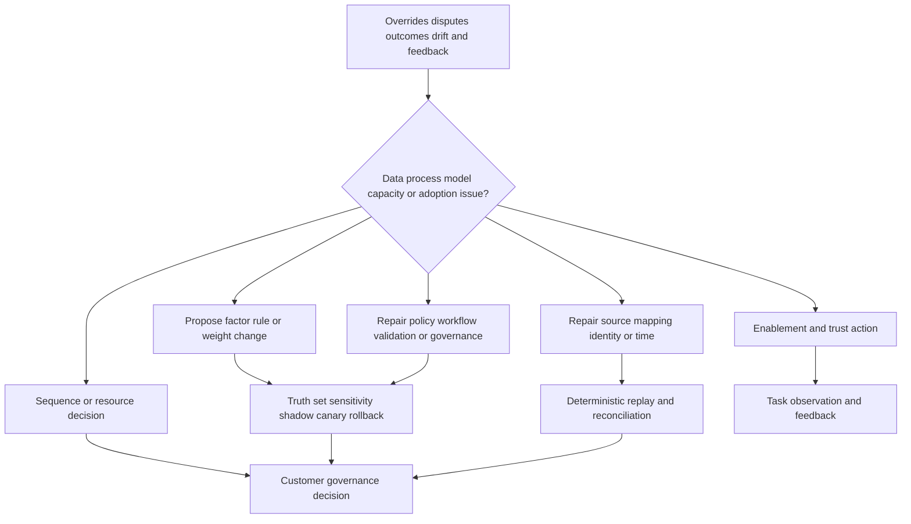

### Change record for tuning

| Field | Purpose |
|---|---|
| Problem statement | Evidence-supported defect or opportunity |
| Classification | Data, semantics, identity, policy, score, workflow, report, adoption, capacity |
| Hypothesis | One expected cause/effect |
| Scope | Population, service, owners, decisions affected |
| Baseline | Current version and metrics |
| Proposed change | One controlled modification where possible |
| Tests | Positive, negative, boundary, missing, conflict, load, security, regression |
| Sensitivity | Episode/owner/workflow transitions and capacity |
| Approval | Customer authority and segregation |
| Shadow/canary | Bounded non-consequential comparison/operational proof |
| Rollback | Trigger, method, state and ticket reconciliation |
| Reporting | Annotation/restatement and communication |
| Postconditions | Technical, workflow, adoption, and outcome evidence |
| Review | Follow-up time and owner |

Tune the controlling problem. If asset identity is wrong, changing a severity weight only hides the defect. If owner work is unhelpful, add treatment/dependency context before assuming analysts need training. If source coverage is biased, adding a business-criticality factor can amplify inequity. One change at a time helps establish cause.

## Data defects and quality operations

| Defect class | Symptom | Decision risk | Operational response |
|---|---|---|---|
| Scope omission | Account/region/business unit absent | False low exposure | Mark degraded, restore/backfill, reconcile |
| Authentication depth | Login succeeds but privileged query fails | False clean scan | Measure subsystem completion |
| Pagination/checkpoint | Later pages missing after rate limit | Partial population | Repair checkpoint/replay and control totals |
| Schema drift | Field type/enum changes | Mapping nulls or wrong categories | Quarantine, version mapping, backfill |
| Time defect | Local time parsed as UTC | Wrong SLA/correlation | Correct time semantics and restate |
| Identity false merge | Two lifecycle entities become one | Context contamination | Split and rebind every assertion/work item |
| Identity false split | One entity appears as many | Duplicate risk/work | Merge under strong temporal evidence |
| Stale context | Old owner/criticality/control persists | Wrong routing/priority | Validity expiry and re-attestation |
| Authority conflict | Sources disagree on lifecycle or service | Unstable decisions | Preserve claims and apply governed authority |
| Null coercion | Unknown becomes false/zero | Unsafe downgrade | Explicit unknown state and invariant |
| Duplicate influence | Copied threat facts count repeatedly | Inflated confidence/priority | Lineage and overlap governance |
| Orphan relationship | Finding cannot join to active asset | Disappears from dashboard | Anti-join queue and identity resolution |

```mermaid
flowchart LR
    DET[Quality detector or user report] --> TRI[Classify scope transport schema time identity semantics]
    TRI --> CONT[Contain affected automation and claims]
    CONT --> SAMPLE[Trace one source-native record through decision]
    SAMPLE --> REPAIR[Repair smallest controlling layer]
    REPAIR --> TEST[Regression and control-total tests]
    TEST --> REPLAY[Backfill or deterministic replay]
    REPLAY --> REC[Reconcile tickets exceptions and reports]
    REC --> COMM[Communicate impact restatement and prevention]
```

### Data-quality operational metrics

| Metric | Contract question | Guardrail |
|---|---|---|
| Expected-scope coverage | Which independent population should appear? | Do not use source itself as denominator |
| Freshness | Which object/source cadence and percentile? | Average hides stale tail |
| Completeness | Which required fields under which applicability? | Not every field applies to every object |
| Validity | Which type/range/enum/format contract? | Valid-looking value can be semantically wrong |
| Uniqueness | Unique at which grain/key/time? | Duplicate assertions can be legitimate provenance |
| Referential integrity | Which relationships must resolve? | Unknown remains visible, not dropped |
| Identity confidence | Which strong/weak keys and conflicts? | Confidence score needs explanation |
| Reject/quarantine | Which records/actions failed and why? | Hidden queue defeats metric |
| Reconciliation variance | Source/canonical/use-case totals by scope? | Explain expected transformations |
| Restatement count | How often and why was history corrected? | More restatements can mean better honesty initially |

## Workflow health operations

Workflow health asks whether intended decisions safely reach accepted owners, remain synchronized, and validate outcomes. Connector uptime alone is insufficient.

| Health layer | Signal | Failure symptom | Response |
|---|---|---|---|
| Trigger | Qualified events evaluated | Missing or duplicate evaluations | Event/version trace and replay |
| Conditions | Guards execute with current inputs | Unsafe action or unexplained hold | Decision trace and rule tests |
| Routing | Owner source current/accepted | Bounce/default queue | Ownership-resolution action |
| Delivery | Target request stored/read back | Missing work | Auth/transport/schema diagnosis |
| Idempotency | Same intended action maps once | Duplicate tickets | Query stable key and reconcile |
| State sync | Target and exposure meanings align | False close/stale open | Authority/state mapping repair |
| SLA clock | Event history reproduces due status | Conflicting compliance | Clock recalculation |
| Exception | Approval/control/expiry synchronized | Hidden expired risk | Governance reconciliation |
| Validation | Postconditions return healthy evidence | Close-on-deploy or unknown wait | Source health and validation queue |
| Audit | Actor/version/result retained | Irreproducible action | Logging/access/retention repair |

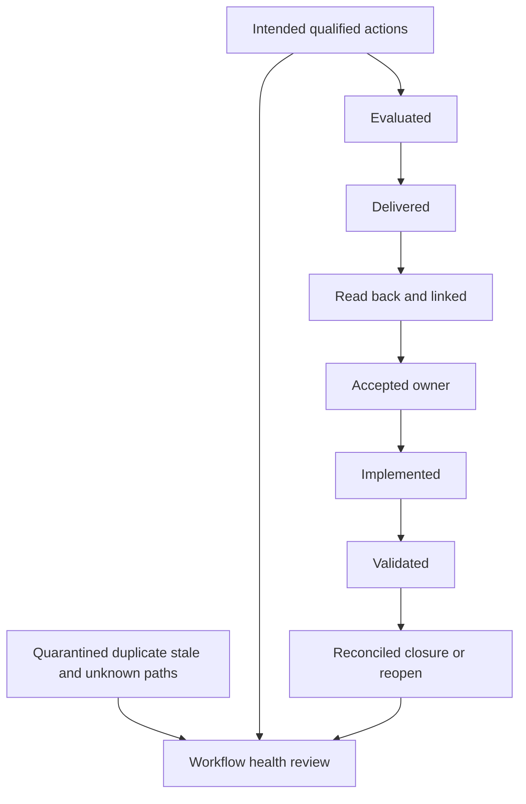

### Workflow health service objectives

Service objectives should be customer-defined and verified against supported capability. Useful categories include evaluation completeness, delivery/read-back, duplicate rate, quarantine age, reconciliation coverage, owner acceptance, validation latency, exception-expiry handling, and recovery time. Targets should not encourage unsafe retries or premature closure.

An error budget can be a general operational tool: tolerate a defined amount of non-harmful unreliability while protecting critical invariants. If duplicate or false-closure incidents exceed tolerance, pause feature expansion and prioritize reliability. This is not a published UVM service-level model.

## Operational observability

| Signal type | Examples | Operational question |
|---|---|---|
| Metrics | Counts, rates, latency, freshness, queue age | Is service behaving within defined objectives? |
| Logs | Structured action/error/audit events | What happened for one ID/version? |
| Traces | Correlated path across source/integration/target | Where did request or data stop? |
| Events | Schema, auth, policy, ticket, validation changes | What changed and when? |
| Synthetic checks | Safe known record/path/action tests | Can critical path work now? |
| Reconciliation | Independent source/target/control totals | Is apparent success semantically complete? |
| User feedback | Disputes, confusion, workarounds, acceptance | Is output useful and trusted? |
| Business evidence | Decisions, constraints, service outcomes | Does operation support customer value? |

Observability should use correlation IDs, stable entity/action keys, UTC timestamps, version identifiers, scope, result, and sanitized error categories. Avoid secrets, tokens, full sensitive payloads, or unnecessary behavior data. Sampling can reduce cost but must not hide rare high-consequence failures.

## Stakeholder trust and adoption

Adoption is repeated correct use that improves the intended customer decision. Logins, connector count, dashboard views, or ticket volume are activity signals, not sufficient outcomes.

| Adoption level | Observable behavior | Evidence | Next enablement |
|---|---|---|---|
| Awareness | Stakeholder can state purpose and boundary | Teach-back | Role-specific concept session |
| Access | Correct roles can reach intended view/task | Access test | Remove access friction safely |
| Comprehension | User explains reasons, uncertainty, and challenge path | Scenario exercise | Guided walkthrough |
| Trial | User completes task with support | Task observation | Office hours and job aid |
| Correct routine | User repeatedly handles work under contract | Quality/acceptance evidence | Peer coaching |
| Integration | Task is embedded in existing process/governance | Workflow and meeting artifacts | Automation/cadence refinement |
| Outcome | Validated exposure/decision improvement is observed | Metric bridge and postconditions | Expand bounded scope |
| Advocacy | Champion teaches peers and supplies feedback | Peer session and feedback quality | Community of practice |

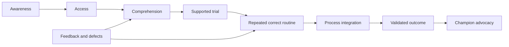

### Trust equation

Trust grows when output is relevant, explainable, current, correct enough for purpose, secure, actionable, and responsive to challenge. Trust falls when teams receive duplicates, wrong owners, unexplained numbers, sensitive over-sharing, false urgency, premature closure, or no response to feedback.

| Trust driver | Evidence | TSM/customer action |
|---|---|---|
| Relevance | Work maps to service/team responsibility | Tailor cohorts and owner views |
| Explainability | Reason/source/time/version/uncertainty available | Improve rationale and drill-down |
| Accuracy | Sample and postcondition review supports output | Repair source/model defects |
| Timeliness | Evidence is fresh enough for decision | Operate source/workflow health |
| Actionability | Treatment, dependency, due, and proof are clear | Co-design owner playbook |
| Safety | Access/change/automation controls work | Least privilege, approval, canary, rollback |
| Responsiveness | Disputes receive evidence-based resolution | Feedback SLA and action register |
| Consistency | Definitions/states remain governed | Versioning and release communication |

### Plain-English deep-dive 3 - Resistance is diagnostic data

When a mechanic rejects a work order, the cause may be poor wording, the wrong machine, unavailable parts, unsafe timing, or an assignment to the wrong shop. Calling the mechanic resistant misses evidence about the system.

Remediation teams can resist because the finding is duplicated, ownership is wrong, rationale is weak, the fix is unsupported, validation is slow, deadlines ignore change windows, incentives reward closure, sensitive context is overexposed, or prior defects damaged trust. Listen, classify the friction, test it against evidence, repair the controlling issue, and close the feedback loop. Some disagreement remains a customer policy decision, not a training problem.

## Remediation resistance and change management

| Resistance signal | Possible cause | Discriminating check | Response |
|---|---|---|---|
| Ticket rejection | Wrong owner, non-applicable condition, weak rationale | Review one episode with owner evidence | Repair route/evidence/template |
| Slow acceptance | Queue overload, access issue, unclear process | Observe task and queue/capacity | Simplify view, sequence work, resource decision |
| Repeated exceptions | Unsupported fix, change risk, missing sponsor | Review dependency/control/milestones | Escalate governance and durable plan |
| Shadow spreadsheets | Product view lacks fields/workflow users need | Compare actual task and data contract | Improve supported view/integration/process |
| Premature closure | Incentive/SLA stop event rewards status | Trace metric and postconditions | Separate implementation/validation |
| No dashboard use | Wrong audience, stale data, no decision cadence | Ask which decision view supports | Redesign role view and review rhythm |
| Weight disputes | Policy disagreement or bad data | Trace reasons/source/version | Separate data repair from policy governance |
| Automation fear | Prior duplicates/harm or unclear rollback | Review incident history and controls | Proposal mode, canary, transparency |
| Security/privacy objection | Excess identity/behavior detail | Access/data-purpose review | Minimize and role-restrict |
| Executive disengagement | Technical report lacks material decision | Review narrative and asks | Scenario/outcome/decision format |

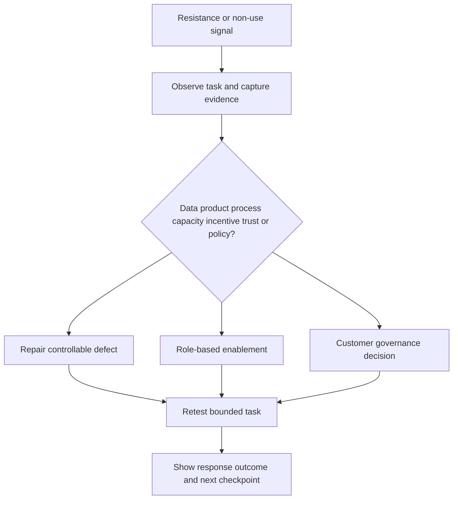

Change management should include stakeholder mapping, sponsor, champions, detractors, role/task inventory, communications, training, office hours, job aids, shadowing, teach-back, feedback mechanisms, release notes, and success evidence. Avoid generic training before understanding the job to be done.

## Governance cadence and decision forums

Different forums need different scopes. Operational detail should not consume executive reviews, and strategic decisions should not remain trapped in ticket queues.

| Cadence/forum | Participants | Inputs | Outputs |
|---|---|---|---|
| Event-driven incident | Service/platform/data owners, VM, Support as needed | Impact, exact IDs/times, containment, hypotheses | Incident owner, actions, checkpoints, communications |
| Daily/regular operations | VM operators, data/workflow owners | Health, quarantines, urgent cohorts, SLA warnings | Repairs, assignments, escalation |
| Weekly remediation | VM, platform/app/cloud/service owners | Backlog, aging, dependencies, validation, disputes | Wave plan, owner decisions, blockers |
| Source/data quality review | Source/data/platform owners | Coverage, freshness, rejects, identity, restatements | Quality actions and change approval |
| Calibration council | VM, risk, service, data, control owners | Overrides, transitions, outcomes, capacity | Approve/reject/shadow tuning |
| Exception/risk review | Risk/service/control/technical owners | Residual scenarios, controls, expiry, milestones | Accept/revoke/extend/remediate decisions |
| Monthly service review | Customer sponsor, program leads, TSM/account team | Outcomes, health, adoption, issues, roadmap | Decisions, success-plan updates |
| Quarterly executive review | Security/business leaders | Material scenarios, trends, caveats, resources | Strategic priorities and sponsorship |
| Post-incident review | Affected technical/governance parties | Timeline, causes, controls, impact | Prevention actions and runbook updates |

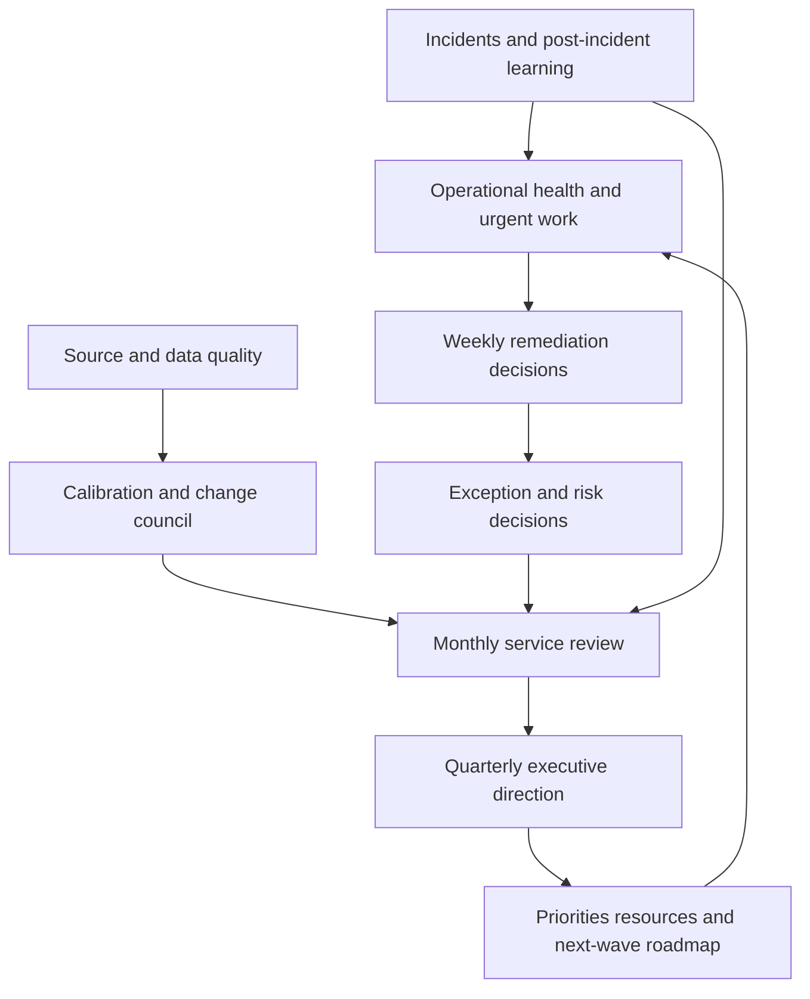

Every forum needs pre-read, definitions, decision rights, action owner, due/checkpoint, and a record of decisions. Meeting attendance is not adoption. Closed actions and improved task/outcome evidence matter.

## Service delivery model and TSM responsibilities

The TSM is a technical success partner across product, customer architecture, data, process, adoption, troubleshooting, and communication. The TSM does not replace customer administrators, remediation owners, risk authorities, change approvers, Support, Product, or Sales roles.

| Lifecycle phase | TSM contribution | Customer responsibility | Evidence of progress |
|---|---|---|---|
| Discover | Facilitate outcome, architecture, source, stakeholder, constraint questions | Supply goals, owners, policy, environment facts | Agreed discovery/assumption record |
| Design | Map public/supported capability to source/use-case/operating contract | Approve architecture, data, policy, security | Design and verification backlog |
| Plan | Sequence prerequisites, milestones, risks, acceptance, enablement | Resource and change commitments | Success plan/RACI |
| Implement | Coordinate current docs/specialists; track assumptions/issues | Configure/administer under authority | Stage acceptance evidence |
| Validate | Help define tests, reconciliation, source-bounded proof | Execute authorized tests and accept results | Acceptance ledger |
| Enable | Deliver role-based explanation, labs, teach-back, job aids | Participate, practice, nominate champions | Task competence evidence |
| Operate | Review health, adoption, outcomes, actions, issues | Own daily operation and decisions | Service scorecard/action closure |
| Escalate | Build minimal Support/Product packet and coordinate updates | Provide approved evidence/access and impact | Case progression/evidence quality |
| Improve | Analyze feedback, maturity, value, next use case | Approve tuning, resources, expansion | Roadmap decision |

### Account-team boundaries

| Role | Primary responsibility | TSM partnership | Boundary |
|---|---|---|---|
| Customer executive sponsor | Outcomes, sponsorship, resource decisions | Material service/value narrative | TSM does not own business strategy |
| Customer program/platform owner | Configuration, operations, policy implementation | Architecture, adoption, health collaboration | Current supported responsibility must be agreed |
| Customer risk/change/privacy | Authority for consequential decisions | Evidence and options | TSM does not approve |
| Remediation/service teams | Treatment, dependencies, validation | Owner enablement and feedback | TSM does not execute customer changes by default |
| Sales/account executive | Commercial relationship and account strategy | Align technical success and risks | TSM avoids unsupported commercial promises |
| Customer Success | Success plan, relationship/adoption orchestration | Shared health/outcomes | Role split varies; verify |
| Support | Break/fix investigation under support process | High-quality case and coordination | TSM does not replace Support |
| Product/Engineering | Product direction and defect resolution | Structured feedback/evidence | No roadmap/fix-date promise |
| Professional Services/partners | Scoped implementation/consulting | Handoff and operating continuity | Entitlement/scope verified |

## Health model

Do not collapse customer health into one opaque color. A composite can aid triage only if dimensions and evidence remain visible.

| Health dimension | Example signals | Interpretation caution |
|---|---|---|
| Product/service | Availability, errors, performance, known issues | Public/tenant evidence and support scope needed |
| Source/data | Scope, freshness, completeness, identity, reconciliation | Green auth does not mean usable data |
| Scoring/decision | Explanation, unknowns, overrides, drift, calibration | Low overrides can mean non-use |
| Workflow | delivery, duplicates, quarantine, state sync, validation | Ticket volume is not health |
| Security/privacy | Access reviews, secret rotation, audit, retention | No incident does not prove control effectiveness |
| Adoption | Task completion, owner acceptance, teach-back, champions | Logins alone insufficient |
| Outcome/value | Validated movement, recurrence, decisions, trust | Attribution and denominators required |
| Relationship/governance | Sponsor, owners, cadence, action closure, escalations | Sentiment should be evidenced and bounded |
| Capacity/readiness | Staff, windows, skills, dependencies, roadmap | Product tuning cannot fix resource shortage |

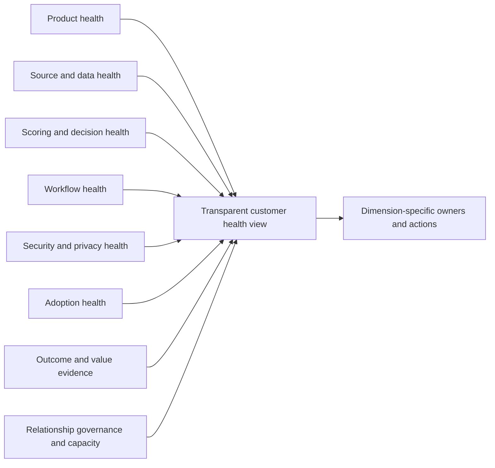

Health should predict or explain intervention, not punish the customer. A red source-health dimension may coexist with strong stakeholder engagement. A green adoption dimension may coexist with poor workflow reliability. Keep evidence and owners separate.

## Maturity model

Maturity describes observable capability and consistency. It should not imply every customer needs maximum complexity. The best next level matches risk, capacity, and value.

| Level | Operating behavior | Evidence | Next practical improvement |
|---:|---|---|---|
| 0 - Ad hoc | Separate scans/spreadsheets, severity queues, unclear owners | Manual examples and unresolved definitions | Charter one service/outcome and stable grain |
| 1 - Visible | Sources and basic inventory/backlog exist | Coverage baseline and source owners | Source contracts and data-quality gates |
| 2 - Contextual | Asset/business/threat/control/identity context informs priority | Explainable reviewed cohorts | Versioned calibration and owner acceptance |
| 3 - Operational | Governed workflows, SLAs, exceptions, reconciliation, validation | Repeatable state/clock/audit evidence | Reliability runbooks and root-cause campaigns |
| 4 - Measured | Health, adoption, validated outcomes, recurrence, trend integrity | Metric contracts and movement bridges | Predictive leading signals and cross-service learning |
| 5 - Adaptive | Continuous evidence-based tuning and broader exposure mobilization | Safe feedback loops and governance | Expand only where value/capacity justify |

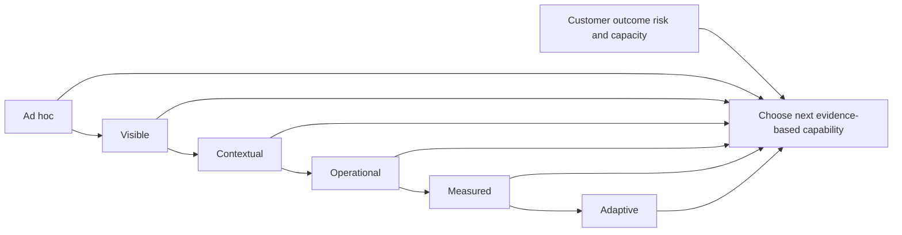

Do not average unrelated dimensions into a flattering maturity number. A customer can have excellent source engineering and weak owner adoption, or mature governance and limited automation by choice. Assess dimensions, cite evidence, and recommend the smallest valuable improvement.

## Value realization

Value is a tested relationship between capability, changed behavior, and customer outcome. Start with a baseline and value hypothesis.

| Value hypothesis | Leading evidence | Lagging evidence | Guardrail |
|---|---|---|---|
| Better context reduces wasted triage | Explanation completeness, review agreement | Fewer supported duplicate/non-actionable handoffs | Do not hide unknowns |
| Better grouping reduces remediation effort | Root-cause groups and owner acceptance | Validated member treatment with less rework | Row/ticket reduction is not risk reduction |
| Reliable routing improves flow | Accepted-owner coverage and dispute resolution | Shorter assignment-to-action time | Avoid blaming teams/case-mix bias |
| Workflow automation reduces manual coordination | Delivery/read-back/reconciliation health | Lower manual touch for same controlled task | Automation safety and exceptions |
| Validation improves closure quality | Awaiting-validation visibility | Higher first-pass pass, lower premature reopen | Detection/source changes affect rate |
| Exception governance reduces hidden debt | Expiry/control/milestone coverage | Fewer expired/uncontrolled residuals | Acceptance count alone is not value |
| Source quality improves decision trust | Coverage/freshness/conflict metrics | Higher correct task use and fewer data disputes | More detected defects can be healthy |
| Enablement improves adoption | Teach-back/task competence/champion activity | Repeated correct use and outcome contribution | Training attendance alone insufficient |

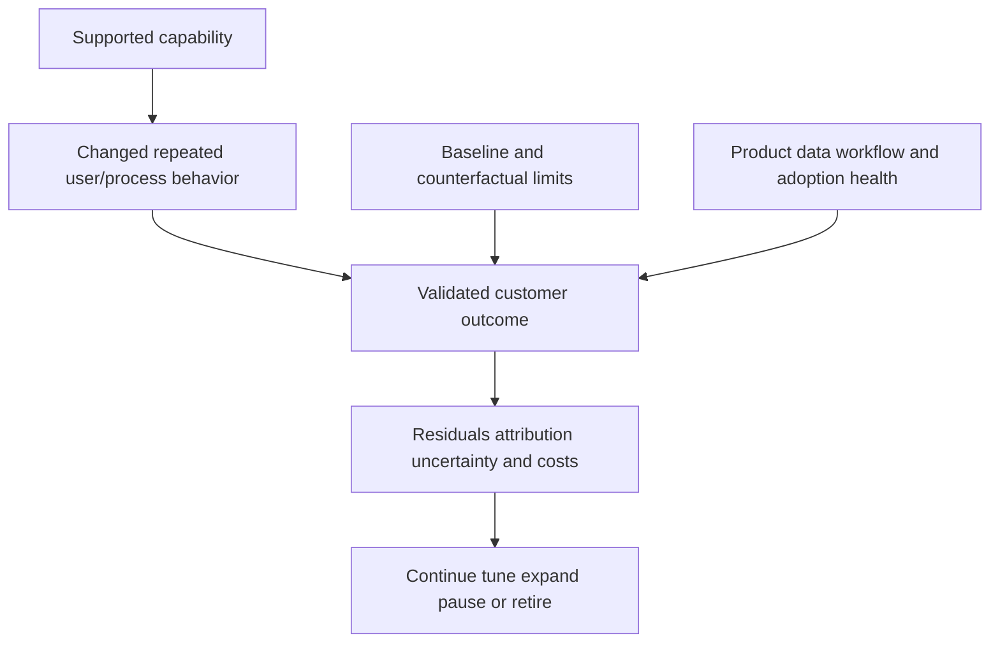

### Value narrative contract

1. Customer objective and bounded population.
2. Baseline definition and source health.
3. Capability and operating change introduced.
4. Leading adoption/process evidence.
5. Validated technical/service outcomes.
6. Movement bridge and denominator.
7. Residual exposure, exceptions, uncertainty, and cost.
8. Attribution boundary; no prevented-breach claim.
9. Customer decision and next checkpoint.

## Operational incident management

An operational incident is an unplanned degradation that affects decisions, workflow, security, or customer trust. Severity should reflect impact and urgency under customer/vendor processes, not emotional language.

| Incident type | Potential impact | Immediate containment |
|---|---|---|
| Source outage/partial scope | False clean state or missing context | Mark degraded; block downgrade/closure |
| Identity corruption | Wrong context, priority, owner, or work | Freeze affected automation; preserve mappings |
| Scoring regression | Cohort/owner workload changes incorrectly | Pin/rollback version; shadow recompute |
| Workflow duplication | Owner confusion and wasted work | Pause creates; query/reconcile stable keys |
| False closure | Active exposure disappears | Reopen/hold closure; restore validation evidence |
| SLA/report defect | Misleading governance decisions | Mark metric degraded; preserve/restatement plan |
| Access/privacy issue | Unauthorized sensitive visibility | Restrict access, preserve audit, follow incident policy |
| Secret/auth issue | Integration failure or credential risk | Disable/rotate through approved process |
| Performance/backlog | Stale decisions and delayed workflow | Rate control, prioritize critical path, capacity action |
| Product symptom | Supported behavior differs from expectation | Contain and open evidence-rich Support path |

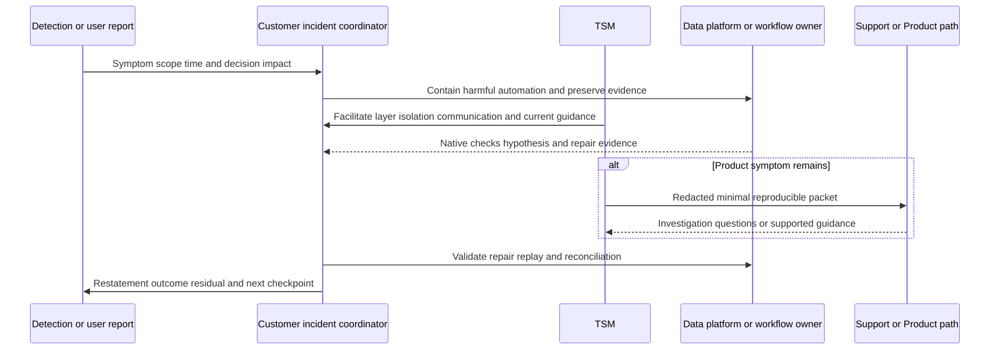

### Incident lifecycle

| Phase | Required work | Evidence |
|---|---|---|
| Detect | Establish symptom, reporter, time, scope | Alert/user report and initial IDs |
| Assess | Determine decisions/work/data/security affected | Impact matrix and severity owner |
| Contain | Stop harmful actions/claims without destroying evidence | Change record and preserved state |
| Diagnose | Test one layer/hypothesis at a time | Timeline, source/target traces, versions |
| Repair | Change smallest controlling layer safely | Approval, implementation, rollback |
| Validate | Test technical, workflow, report, and service postconditions | Acceptance ledger |
| Recover | Replay/backfill/reconcile/restatement | Control totals and target agreement |
| Communicate | Facts, uncertainty, owner, checkpoint, ETA boundary | Audience-specific updates |
| Learn | Root/cause factors, detection/control gaps, actions | Post-incident review and runbook tests |

### Plain-English deep-dive 4 - Recovery includes the decisions made while data was wrong

Fixing a broken pipeline is not the end of recovery. If its bad output created tickets, changed scores, closed episodes, moved SLA reports, or informed an executive decision, downstream state must be repaired too.

Think of a bank correcting a faulty transaction feed. Restoring the feed does not reconcile customer balances automatically. UVM operations need backfill or replay, member-level ticket reconciliation, exception and validation checks, report restatement, notification of affected decisions, and prevention tests. Recovery is end-to-end.

## Layered troubleshooting model

| Layer | Key question | Cheap discriminating check |
|---|---|---|
| Customer outcome/scope | Is the expected population/decision correctly defined? | Compare charter and independent inventory |
| Native source | Does authoritative system contain expected record/state? | Inspect one source-native object/time |
| Access/transport | Can approved identity reach exact API/file/object? | Auth plus DNS/TCP/TLS/proxy/status evidence |
| Acquisition | Are pagination, checkpoint, quota, webhook, file, and incremental behavior complete? | Reconcile page/object/control totals |
| Parsing/schema | Did format/type/enum/version change? | Compare raw sample with contract |
| Mapping/time | Are canonical values and timestamps correct? | Hand-map one record and UTC timeline |
| Identity/lifecycle | Is record attached to correct active entity? | Strong IDs and lifecycle history |
| Correlation/context | Are service, identity, path, control relationships valid? | Trace provenance/validity of one relationship |
| Score/policy | Did correct gates/factors/version execute? | Decision trace and boundary test |
| Group/workflow | Are members, owner, due, target, retry, state correct? | Stable-key target read-back |
| Exception/validation | Is residual authority and postcondition evidence current? | Approval/expiry/source-health check |
| Report/access | Do grain, denominator, refresh, filter, role reconcile? | Hand-calculate one scoped metric |
| Adoption/process | Can user complete task and trust rationale? | Observe one real/synthetic task |

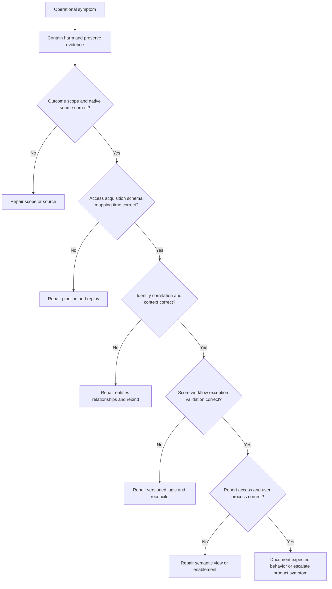

### TSM/Support escalation packet

| Element | Content |
|---|---|
| Business impact | Decision/work/service affected, no unsupported breach statement |
| Scope | Bounded source/object/episode/group/workflow/report population |
| Exact IDs | Redacted tenant/source/entity/action/target/report identifiers through approved channels |
| UTC timeline | Event, observation, ingestion, calculation, action, error, recovery times |
| Versions | Product, connector, schema, mapping, model, workflow, target where available |
| Expected behavior | Source-bounded contract or current official documentation |
| Observed behavior | Reproducible result with evidence |
| Native/control checks | What source and target independently show |
| Network/application evidence | DNS/TCP/TLS/proxy/HTTP/correlation data if relevant |
| Attempts/changes | Retries, read-back, recent changes, rollback |
| Containment | Harmful actions/claims paused and residual impact |
| Reproduction | Smallest safe steps and frequency |
| Ask | One precise investigation/guidance request |
| Data handling | Redaction, approved channel, no secrets |

## Operational runbooks

### Runbook anatomy

| Section | Required content |
|---|---|
| Purpose/scope | Which symptom/service/population the runbook covers |
| Preconditions | Access, authority, skills, safe environment |
| Detection | Alerts, thresholds, user reports, control checks |
| Impact/severity | Decisions, actions, security/privacy/service effects |
| Immediate containment | Safe reversible steps and prohibited actions |
| Evidence | IDs, UTC, versions, source/target/log/trace artifacts |
| Decision tree | One hypothesis/check at a time |
| Repair | Approved change and rollback |
| Validation | Technical/workflow/report/service postconditions |
| Recovery | Backfill/replay/reconciliation/restatement |
| Communication | Audiences, owner, cadence, ETA boundary |
| Escalation | Customer, Support, Product, privacy/security paths |
| Closure | Acceptance authority and residuals |
| Learning | RCA, prevention, tests, runbook update |

### Runbook 1: source data drops suddenly

1. Mark affected source/scope and risk metrics degraded.
2. Block automatic downgrade and closure for dependent populations.
3. Record last known-good event/ingestion/calculation times and recent changes.
4. Compare independent expected inventory with native source and ingested control totals.
5. Test authentication, authorization, pagination/checkpoint, quota, schema, rejects, and freshness in that order.
6. Repair the smallest controlling failure under approved change.
7. Validate a representative sample, then backfill/replay deterministically.
8. Recompute priorities in shadow; reconcile tickets, exceptions, and validations.
9. Restate affected reports and communicate decisions made during the gap.
10. Add detection/regression tests and review source contract.

### Runbook 2: priority distribution changes unexpectedly

1. Pause consequential automation for affected cohorts and preserve model versions.
2. Compare source population/health before and after.
3. Select episodes that moved up, down, and remained stable.
4. Trace identity, applicability, each material factor, missing behavior, gate, weight/rule, and policy version.
5. Separate source/context change from logic/model change.
6. Check lineage overlap, null coercion, criticality/control validity, and temporal joins.
7. Repair data before tuning weights when data controls the symptom.
8. Run truth-set, boundary, sensitivity, segment, capacity, shadow, and canary tests.
9. Reconcile workflow and restate trend under approved policy.
10. Communicate movement cause and residual uncertainty.

### Runbook 3: duplicate or missing tickets

1. Pause affected creates/updates without deleting evidence.
2. Define intended action grain and obtain stable episode/group keys.
3. Reconcile intended actions with target items using key, target ID, and event history.
4. Classify definite reject, definite success, ambiguous timeout, partial bulk, or lost callback.
5. Repair auth, permissions, schema, transport, rate, or idempotency contract.
6. Query before retry; replay only proven missing members.
7. Identify canonical duplicates and resolve under customer target policy.
8. Read back owner/state/due data and reconcile exposure workflow.
9. Validate control totals and downstream dashboards.
10. Add failure-injection/idempotency tests and update runbook.

### Runbook 4: dashboard improvement cannot be explained

1. Withdraw success claim and mark affected metric degraded.
2. Fix exact viewer, filters, role, report/model version, and UTC/as-of window.
3. Build opening-to-ending movement bridge at stable episode grain.
4. Reconcile source scope/freshness and expected population.
5. Test mapping, identity, joins, numerator, denominator, exclusions, and unknown handling.
6. Inspect policy/model/workflow/exception/validation changes.
7. Hand-calculate a small cohort and compare authorized detail.
8. Repair, replay, restate history, and disclose definition changes.
9. Notify affected decision owners.
10. Add control totals, anti-joins, and narrative review tests.

### Runbook 5: remediation teams reject the program

1. Pause judgment and gather task-level feedback.
2. Sample rejected, accepted, overdue, duplicate, and disputed work.
3. Classify relevance, identity, applicability, ownership, rationale, fix feasibility, due logic, access, privacy, workflow, capacity, incentive, and trust causes.
4. Observe one owner completing the task; do not assume training is the answer.
5. Repair product/data/process defects and route policy conflicts to governance.
6. Co-design owner view, rationale, playbook, and challenge path.
7. Pilot with a champion and representative difficult cases.
8. Measure accepted correct tasks, disputes resolved, validation, and recurrence.
9. Close feedback visibly and document remaining constraints.
10. Expand only after trust and outcome evidence.

## Common anti-patterns and failure modes

| Anti-pattern | Symptom | Better approach |
|---|---|---|
| Connector-count adoption | Many sources, little correct use | Outcome-first minimum data |
| Big-bang onboarding | Unknown defects and owner overload | Stage gates, shadow, canary, waves |
| Green-auth health | Partial/semantically bad data unseen | Layered source and use-case health |
| Tune weights first | Data defects hidden | Classify controlling layer |
| Change many variables | Cannot attribute outcome | One hypothesis/change where possible |
| Default null to safe | Source outage lowers priority | Explicit unknown and health gate |
| Automate before trust | Wrong work scales | Proposal mode and owner review |
| Train around defects | Users learn workarounds | Repair system, then enable |
| Label teams resistant | Root causes ignored | Treat resistance as evidence |
| Use logins as adoption | Activity without correct task | Adoption ladder and outcomes |
| Use tickets as value | Coordination volume mistaken for risk reduction | Validated episode outcomes |
| Hide incidents | Trust erodes and recurrence continues | Transparent impact/restatement/PIR |
| One opaque health score | No actionable owner | Dimension-level evidence/actions |
| Maturity as competition | Complexity pursued without value | Smallest useful next capability |
| TSM owns customer decisions | Governance boundary crossed | Facilitate authorized roles |
| AI as autonomous operator | Hallucination/leakage/authority risk | Grounded bounded assistance and review |

## Security, privacy, safety, and AI operations

| Operational risk | Example | Control |
|---|---|---|
| Privilege creep | Connector/service identity gains broad rights | Least privilege, periodic review, rotation |
| Sensitive concentration | Vulnerability, identity, behavior, service, control data combined | Classification, minimization, RBAC, encryption |
| Export sprawl | Troubleshooting extracts persist | Approved channel, redaction, expiry, deletion |
| Unsafe tests | Production path scanned without authorization | Written rules, rate, stop, contacts, isolated labs |
| Change outage | Tuning/workflow creates broad actions | Shadow, canary, approval, rollback |
| Audit gap | Configuration/action changes untraceable | Actor/version/reason/result retention |
| Insider misuse | Sensitive exposure data used beyond purpose | Segregation, monitoring, need-to-know |
| AI prompt leakage | Customer evidence sent to unapproved service | Approved environment, no secrets, minimization |
| AI hallucination | Runbook/narrative invents product state | Retrieval/citation, deterministic checks, review |
| AI prompt injection | Untrusted source text manipulates assistant | Treat content as data, tool/authority restrictions |

AI may assist with official-source summaries, runbook drafts, test-case generation, reason-code summaries, anomaly candidates, meeting-action extraction, and knowledge retrieval in approved systems. Validate citations and structured fields. AI must not set risk policy, tune weights autonomously, run unapproved tests, expose secrets, send consequential tickets, accept exceptions, close episodes, or make final customer/board claims.

## Complete synthetic NMH UVM operating case

Everything in this section is explicitly fictional and synthetic. It does not describe a Zscaler tenant, UVM/Data Fabric deployment, supported connector, field, metric, workflow, SLA, support process, customer result, or Arti production experience. No date later than the official review date is used. The official source snapshot remains 2026-08-24.

### Synthetic outcome and operating charter

NMH's fictional patient-access pilot aims to reduce time and rework required to identify, route, treat, and validate material exposure episodes while protecting patient-service availability and preserving decision trust. The synthetic service scope includes one vulnerability source, one asset/cloud inventory source, one service/owner source, one control/path source, and one work target. Each is conceptual and not a named supported connector.

| Synthetic charter element | Fictional NMH choice | Caveat |
|---|---|---|
| Outcome | Trusted contextual remediation for patient-access cohort | Learning objective only |
| Scope | One service and representative asset populations | Not a real customer |
| Operating owner | Synthetic VM program lead | Fictional role |
| Risk authority | Synthetic customer risk committee | TSM not authority |
| Data owners | Synthetic source/service/platform teams | No product field claim |
| Workflow phase | Proposal, then human-reviewed canary | General pattern to verify |
| Success evidence | Quality, accepted work, validation, recurrence, trust | No guaranteed value |
| Expansion gate | Stable health, capacity, adoption, outcomes, governance | Synthetic policy |

```mermaid
flowchart TD
    title NMH explicitly fictional synthetic UVM operating service
    V[Synthetic vulnerability evidence] --> F[Synthetic contextual data layer]
    A[Synthetic asset and lifecycle evidence] --> F
    S[Synthetic service owner and criticality] --> F
    C[Synthetic path and control evidence] --> F
    F --> P[Synthetic explainable priority]
    P --> W[Synthetic human-reviewed workflow]
    W --> T[Synthetic remediation owners]
    T --> VAL[Synthetic technical path and service validation]
    VAL --> R[Synthetic reporting governance and tuning]
    R --> F
```

### Synthetic source-onboarding acceptance

The vulnerability source connects but sample review shows privileged package queries fail on part of the population. The cloud inventory initially omits one account after a pagination checkpoint issue. Service ownership covers most assets but several relationships are stale. The path/control source reports presence without effectiveness. NMH does not activate consequential automation. It records conditional acceptance by use case and runs evidence work.

| Synthetic source role | Fictional acceptance state | Required action |
|---|---|---|
| Vulnerability evidence | Conditional | Restore query depth; no false clean state |
| Asset/cloud inventory | Conditional | Repair checkpoint, backfill, reconcile account/region |
| Service ownership | Conditional | Re-attest stale relationships; route unknowns separately |
| Path/control evidence | Display/candidate only | Define scope/health/enforcement/effectiveness tests |
| Work target | Proposal canary accepted | Verify stable key, read-back, retries, access |

### Synthetic scenario 1: connector green, use case red

The fictional cloud source authenticates and reports success, but one account is absent because an organization permission changed. Dashboard asset and exposure counts fall. NMH's independent scope reconciliation detects the omission. Automatic downgrade and success reporting are blocked. Approved permission is restored, missing pages are backfilled, priorities recompute in shadow, tickets reconcile, and the trend is restated. The incident proves why transport health and use-case health are separate.

### Synthetic scenario 2: scoring tune request is actually identity corruption

Owners complain that many low-value episodes rank high. Initial pressure is to lower the business-criticality weight. Episode tracing shows retired and replacement hosts merged by reused hostname, carrying old privileged identities and service relationships. NMH freezes affected actions, splits temporal entities using strong resource IDs, rebinds findings/context/work, replays under the unchanged model, and adds regression tests. No weight change is needed.

### Synthetic scenario 3: owner resistance reveals poor rationale

Platform teams reject tickets that list a score and CVE but omit affected component, evidence time, supported treatment, dependency, and validation. NMH does not schedule generic training first. It co-designs a rationale template, adds source-bounded evidence links and reason codes, distinguishes shared-image from member work, pilots with a champion, and measures accepted correct tasks and disputes. Trust improves as a synthetic learning result only; no percentage is claimed.

### Synthetic scenario 4: duplicate tickets damage adoption

An ambiguous timeout after target creation causes a naive retry and duplicate work in the fictional pilot. NMH pauses creates, reconciles stable keys, identifies canonical items under target policy, updates affected owners, and repairs query-before-retry behavior. A failure-injection test becomes an acceptance gate. The post-incident review acknowledges customer effort rather than framing the event as user error.

### Synthetic scenario 5: workflow health is green but closure is false

Delivery and API success are green, yet owners close tickets at implementation. Native validation later shows old versions remain on instances that did not restart. NMH adds implemented-awaiting-validation semantics, validation-source health, first-pass result, and reconciliation. It restates SLA and outcome metrics. Workflow health now includes semantic outcomes, not just delivery.

### Synthetic scenario 6: exception debt and remediation resistance share a cause

Several fictional supplier-managed devices receive repeated exceptions. Review finds no approved upgrade path, maintenance windows require clinical coordination, and current segmentation tests are stale. NMH separates technical constraint from process capacity, refreshes control evidence, escalates supplier planning through customer channels, creates a replacement milestone, and asks customer risk authority to make bounded decisions. The TSM learning role facilitates current product guidance and evidence, not acceptance.

### Synthetic scenario 7: calibration change floods one team

A proposed synthetic factor adjustment moves many episodes into one platform queue. Sensitivity testing shows the change also pulls in records with unknown ownership and weak service mappings. Governance rejects immediate rollout. NMH repairs context, checks material policy gates, groups by root cause, evaluates capacity, shadows the revised version, and canaries one service. A good policy intention is not enough without executable effects.

### Synthetic scenario 8: dashboard value claim exceeds evidence

A draft review claims large risk reduction from fewer high scores. Movement analysis shows validated remediation, asset retirement, model reclassification, and a source outage all contributed. NMH withdraws the aggregate claim, reports each bridge category, keeps source-degraded episodes active unknown, and states that incidents prevented and financial losses avoided are not estimated.

### Synthetic scenario 9: support escalation lacks a reproducible ask

A fictional case initially says "workflow is broken." The TSM learning exercise restructures it: one stable episode/action/target key, exact UTC timeline, expected condition/action, observed timeout, target read-back, retry behavior, versions, redacted logs, business impact, containment, and one question about supported reconciliation behavior. This is a practice artifact, not a real Zscaler case.

### Synthetic scenario 10: bounded pilot earns next-wave consideration

The fictional pilot completes source, mapping, identity, workflow, report, security, and recovery acceptance for the defined scope. Owners can explain and challenge rationale, runbooks have been table-topped, source and ticket incidents reconcile, and validated treatment evidence exists for representative cases. Unknown-owner and supplier-constrained items remain visible. Governance considers a second service only after capacity and privacy review. No universal rollout, time saving, or prevented incident is claimed.

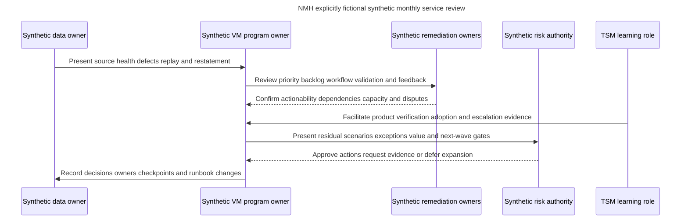

### Synthetic service-review narrative

"The fictional patient-access pilot remains bounded to one service. A cloud-scope omission and one identity merge were detected by acceptance controls before broad automation; affected output was replayed and restated. Owner feedback showed that rationale, not awareness, was the main adoption barrier, so the work template and grouping were repaired. One ambiguous delivery timeout produced duplicate work and led to a query-before-retry gate. Validation now separates implementation from closure. Supplier-constrained exceptions remain visible with stale-control actions and customer risk review. The next-wave decision depends on stable source health, owner capacity, privacy approval, and repeatable recovery. No production UVM result, breach prevention, or quantified savings is claimed."

## Customer and TSM artifact kit

| Artifact | Minimum contents | Operational value |
|---|---|---|
| Product claim ledger | Official claim, URL, review date, boundary, verification | Current honest expertise |
| UVM service charter | Outcome, scope, users, inputs, outputs, roles, quality, exclusions, proof | Operating alignment |
| Stakeholder/RACI map | Sponsors, owners, authorities, champions, escalation | Clear decisions |
| Source contract inventory | Purpose, grain, scope, auth, time, quality, security, recovery | Reliable onboarding |
| Acceptance ledger | Gate, evidence, result, exception, owner, next action | Evidence-based progression |
| Dependency/risk register | Constraint, impact, probability/confidence, owner, mitigation, checkpoint | Plan transparency |
| Calibration change record | Problem, hypothesis, version, tests, transitions, approval, rollback | Safe tuning |
| Data-quality scorecard | Scope, freshness, completeness, identity, rejects, reconciliation | Detects false confidence |
| Workflow health scorecard | Evaluation, delivery, duplicate, quarantine, sync, validation | Reliable operations |
| Adoption ladder | Roles, tasks, competence, routine, outcomes, champions | Measures correct use |
| Feedback/action register | Signal, classification, owner, response, closure evidence | Builds trust |
| Governance calendar | Forums, inputs, decisions, pre-reads, owners | Sustains cadence |
| Maturity assessment | Dimension, current evidence, gap, next capability | Practical roadmap |
| Value realization plan | Baseline, hypothesis, leading/lagging measures, guardrails | Honest outcomes |
| Incident/runbook library | Detection, containment, diagnosis, repair, recovery, communication | Operational resilience |
| Support/Product packet | IDs, UTC, versions, expected/actual, evidence, containment, one ask | Efficient escalation |
| Service review pack | Outcomes, health, adoption, incidents, risks, decisions, roadmap | Customer governance |

## Safe labs and exercises

All exercises use synthetic records, public official pages, or isolated explicitly authorized environments. They require no production Zscaler tenant, customer data, real credential, unapproved scan, exploit, disruptive action, or confidential support information.

| Exercise | Task | Deliverable | Pass condition |
|---:|---|---|---|
| 1 | Classify product claims | Fact/general/synthetic/unknown ledger | No invented operation claim |
| 2 | Write service charter | One bounded use-case contract | Outcome, scope, roles, proof clear |
| 3 | Map stakeholders | RACI/champion/detractor map | Authorities and TSM boundary explicit |
| 4 | Build source contract | One synthetic source | Grain/scope/auth/time/quality/security/recovery complete |
| 5 | Design onboarding | Stage/acceptance plan | Shadow, canary, rollback included |
| 6 | Reconcile scope | Expected versus observed dataset | Partial account omission detected |
| 7 | Test schema drift | Synthetic changed field | Quarantine/version/backfill plan |
| 8 | Test identity reuse | Old/new hostname records | False merge prevented |
| 9 | Build calibration set | Representative reviewed episodes | Boundary/conflict/unknown/capacity included |
| 10 | Write tuning record | One controlled hypothesis | Data defect separated from model change |
| 11 | Build workflow health | Funnel and discrepancy table | Delivery not equated with outcome |
| 12 | Diagnose timeout | Stable-key reconciliation | No blind retry |
| 13 | Create adoption ladder | Role/task/evidence plan | Logins not used as outcome |
| 14 | Interview resistant owner | Synthetic observation guide | Root cause classified without blame |
| 15 | Design governance | Cadence and decision calendar | Inputs/outputs/owners explicit |
| 16 | Assess maturity | Dimension-level evidence | Smallest useful next step chosen |
| 17 | Build value hypothesis | Baseline-leading-lagging-guardrail record | No prevention/ROI overclaim |
| 18 | Tabletop source outage | Runbook execution notes | Closure blocked, replay/restatement included |
| 19 | Tabletop duplicate tickets | Incident/PIR output | Containment/reconciliation/prevention complete |
| 20 | Draft escalation packet | Redacted synthetic case | Exact IDs/UTC/versions/one ask |
| 21 | Run service review | Ten-minute synthetic review | Health, adoption, outcomes, decisions, caveats |
| 22 | Rehearse Q1-Q8 | Recorded answers | Neutral honesty and source boundaries |

## Arti bridge: factual strengths applied to UVM operations

| Factual strength | UVM operating application | Interview bridge | Boundary |
|---|---|---|---|
| M365/OneDrive/SharePoint support | Diagnose multi-layer service and customer workflows | "I am used to separating tenant, identity, permission, client, network, and service facts before action." | No UVM production claim |
| Networking/traces | Isolate source/target DNS, TCP, TLS, proxy, HTTP, reset, timeout, and timing | "I can build a precise transport evidence package when an integration symptom appears." | Authorized evidence only |
| SQL | Reconcile populations, detect anti-joins/duplicates, model events, replay, and trends | "Operational trust depends on stable grain and control totals." | No product schema-access claim |
| Power BI | Build health/adoption/value views with denominators and drill-down | "I would show system health beside exposure outcomes." | General analytics strength |
| Escalations | Assess impact, contain, coordinate, update, escalate, validate, and learn | "I keep facts, hypotheses, owners, and checkpoints explicit." | No unsupported root cause/fix date |
| Mentoring | Role-based teaching, shadowing, teach-back, job aids, champion development | "Adoption means repeated correct tasks, not attendance." | No UVM rollout claim |
| AI exploration | Assist cited summaries, runbooks, tests, and action extraction under review | "AI can reduce preparation effort while authority and evidence remain human-governed." | No autonomous operation |

## TSM discovery and review questions

### Onboarding discovery

1. Which customer decision and business service define the first bounded outcome?
2. Which sources are necessary, authoritative, and permitted for that decision?
3. What are each source's grain, scope, identity, time, quality, security, and recovery contracts?
4. Which exact connector objects/directions/permissions/entitlements require current verification?
5. Which quality failures must block downgrade, automation, closure, or reporting?
6. Which customer roles own policy, data, technical work, service impact, controls, risk, validation, and privacy?
7. What owner capacity, change windows, supplier constraints, and safety conditions apply?
8. Which acceptance postconditions justify shadow, canary, production wave, or rollback?

### Operating review

1. Are source scope, freshness, identity, mapping, and reconciliation healthy?
2. Which priority movements came from treatment, context, policy, or data defects?
3. Are owner work items accepted, actionable, duplicate-free, and validated?
4. Which unknowns, dependencies, exceptions, and long-aged material episodes require decisions?
5. Which stakeholder feedback indicates a data, product, process, capacity, incentive, trust, or policy issue?
6. What did incidents, overrides, validation, and recurrence teach?
7. Which outcomes are validated, and what cannot be attributed or quantified?
8. What is the smallest next improvement or expansion justified by evidence?

## Official Source Anchors

Research/source snapshot and review date: **2026-08-24**.

Official Zscaler sources support bounded public product positioning only. The onboarding stages, acceptance gates, health model, calibration process, adoption ladder, governance cadence, maturity model, incident lifecycle, runbooks, and value methods are general study practices, not claims about proprietary internals or support entitlements. NMH is synthetic. Current official documentation and licensed-tenant evidence govern production.

| Source | URL | Used for | Boundary |
|---|---|---|---|
| Zscaler Unified Vulnerability Management | https://www.zscaler.com/products-and-solutions/vulnerability-management | Public UVM/Data Fabric, contextual multifactor scoring/customization, remediation workflow/rationale/ticket reconciliation, dynamic KPI/SLA reporting positioning | No deployment, field, default, health metric, operating role, support process, SLO, entitlement, or outcome claim |
| Zscaler Data Fabric for Security | https://www.zscaler.com/products-and-solutions/data-fabric | Public aggregate/unify, customizable model, ingest, harmonize/map, deduplicate, correlate/enrich, logic/workflow/report positioning | No proprietary architecture, algorithm, latency, or service-level claim |
| Zscaler Data Fabric integrations | https://www.zscaler.com/products-and-solutions/data-fabric/integrations | Public broad connector/AnySource/AnyTarget ecosystem discovery at review date | Listing does not prove direction, object, version, permission, support, entitlement, or compatibility |
| Zscaler Asset Exposure Management | https://www.zscaler.com/products-and-solutions/caasm | Adjacent Data Fabric-powered asset visibility/context positioning | Do not infer UVM packaging, shared objects, or behavior |
| Zscaler Continuous Threat Exposure Management | https://www.zscaler.com/products-and-solutions/ctem | Broader exposure-management positioning and bridge to Part 87 | CTEM is not reduced to a UVM operating feature |
| FIRST CVSS | https://www.first.org/cvss/ | Versioned technical severity foundation | Severity is not complete customer risk |
| FIRST EPSS | https://www.first.org/epss/ | Daily next-30-day in-wild exploitation probability estimate | Not certainty or customer breach probability |
| CISA Known Exploited Vulnerabilities Catalog | https://www.cisa.gov/known-exploited-vulnerabilities-catalog | Known-exploitation prioritization input | Not proof of customer compromise |
| NIST Cybersecurity Framework 2.0 | https://www.nist.gov/cyberframework | Govern/Identify/Protect/Detect/Respond/Recover outcomes and improvement | Voluntary; customer profiles/implementation vary |
| NIST SP 800-40 Rev. 4 | https://csrc.nist.gov/pubs/sp/800/40/r4/final | Enterprise patch-management planning and verification | Does not define UVM operations |
| NIST SP 800-53 Rev. 5 | https://csrc.nist.gov/pubs/sp/800/53/r5/upd1/final | Vulnerability, access, audit, configuration, assessment, incident, contingency, privacy, and supply-chain control context | Requires customer selection/tailoring |

## Likely Interview Questions

### Q1. How would you operationalize UVM for a new customer?

**Model answer:** Start with one business-aligned exposure decision, bounded service, stakeholders, authority, and success evidence. Define minimum source contracts and least-privilege access. Validate connectivity, scope, mapping, identity, context, scoring explanation, workflow idempotency/reconciliation, reporting, security, and user tasks in stages. Use shadow, human-reviewed canary, rollback, and postconditions before waves. Establish health, runbooks, governance, adoption, and value reviews. Exact product capabilities and entitlements require current verification.

### Q2. What proves a source is ready for a UVM use case?

**Model answer:** Not connector green alone. I need approved purpose/access, independent scope reconciliation, completeness, freshness, validity, identity/lifecycle, relationship semantics, security/privacy, backfill/incremental reliability, rejects, and recovery. Then I test use-case output: explainable scoring, safe owner workflow, target read-back, validation, and report/detail reconciliation. Acceptance states its scope and limitations explicitly.

### Q3. How do you tune scoring without hiding data defects?

**Model answer:** Classify the signal first as source, mapping, identity, context, policy, model, workflow, capacity, or adoption. Trace representative episodes under the current version. Repair data/semantics before changing weights when they control the symptom. For a true model change, write one hypothesis, use a reviewed truth set, boundary/missing/conflict/sensitivity/segment/capacity tests, shadow comparison, canary, customer approval, rollback, reconciliation, and trend-restatement policy.

### Q4. How do you measure workflow and program health?

**Model answer:** Keep dimensions visible: source/data scope and freshness; scoring explanation, unknowns, overrides, and drift; workflow evaluation, delivery, duplicates, quarantine, read-back, state sync, SLA, exceptions, and validation; security/privacy controls; adoption task competence and owner acceptance; validated outcomes, recurrence, governance, and capacity. A single green connector, API rate, login count, ticket count, or opaque health score is insufficient.

### Q5. How would you respond to remediation resistance?

**Model answer:** Treat it as diagnostic evidence. Observe the task and sample accepted/rejected/disputed work. Test relevance, identity, applicability, ownership, rationale, fix feasibility, dependencies, due logic, access/privacy, workflow reliability, capacity, incentives, and prior trust. Repair system defects, route policy conflicts to customer governance, co-design the owner experience, pilot representative cases with champions, teach back, and measure repeated correct use plus validated outcomes rather than attendance.

### Q6. What governance and maturity model would you use?

**Model answer:** Use event-driven incidents, operations, remediation, data-quality, calibration, exception/risk, monthly service, executive, and post-incident forums with clear inputs, decisions, owners, and action records. Assess maturity by dimensions from ad hoc to visible, contextual, operational, measured, and adaptive. Cite observable evidence and choose the smallest valuable next capability; do not chase one averaged maturity score or maximum automation.

### Q7. How would you troubleshoot and recover from a UVM operational incident?

**Model answer:** Assess decision/security/service impact, contain harmful automation and claims, preserve IDs/times/versions, and trace one record through scope, native source, access/transport, acquisition, schema/mapping/time, identity/context, scoring, workflow, exception/validation, report/access, and user process. Repair the smallest controlling layer, validate, backfill/replay, reconcile tickets/exceptions/reports, restate affected history, notify decision owners, and complete a prevention-focused post-incident review. Escalate a redacted minimal product case when needed.

### Q8. How does Arti's background support UVM operations while preserving honesty?

**Model answer:** Microsoft 365, OneDrive, and SharePoint escalation work provides adjacent experience in multi-layer service diagnosis, exact identity/permissions, customer impact, containment, cross-team ownership, RCA, updates, and validation. Networking traces support integration-path evidence. SQL and Power BI support control totals, temporal models, health/adoption/value reporting, and restatement. Mentoring supports teach-back and champions; AI can assist grounded runbooks and summaries. NMH is synthetic, while production Zscaler/UVM/vulnerability-program operation remains a learning boundary.

## 30-Second Memory Hooks

| Concept | Memory hook |
|---|---|
| Operating model | People, process, data, product, governance, outcomes |
| Service charter | Outcome, scope, users, inputs, outputs, roles, proof |
| Onboarding | Contract, sample, reconcile, shadow, canary, wave |
| Connector green | Transport success, not use-case truth |
| Acceptance | Evidence gate before progression |
| Calibration | Ongoing comparison with reviewed cases and outcomes |
| Tuning | Fix the controlling layer, one hypothesis at a time |
| Data defect | Contain, trace, repair, replay, reconcile, restate |
| Workflow health | Intended to delivered to accepted to validated to reconciled |
| Adoption | Repeated correct task, not login |
| Resistance | Diagnostic evidence, not disobedience |
| Trust | Relevant, explainable, current, safe, actionable, responsive |
| Governance | Right decision in the right forum by the right authority |
| Health | Keep dimensions visible; one color is not enough |
| Maturity | Observable capability; choose smallest valuable next step |
| Value | Capability to behavior to validated outcome with caveats |
| Incident recovery | Repair downstream decisions, not only pipeline |
| Runbook | Detect, contain, diagnose, repair, validate, recover, communicate, learn |
| TSM | Product plus architecture plus adoption plus evidence, without customer authority |
| Arti bridge | Microsoft escalation rigor becomes honest UVM service methodology |

## Completion Checklist

- [ ] I separate product fact, general security practice, scenario assumption, customer fact, and unknown.
- [ ] I state reviewed UVM/Data Fabric public claims without inventing deployment, telemetry, operating roles, SLOs, or entitlements.
- [ ] I define operating model, service, onboarding, acceptance, baseline, health, observability, calibration, tuning, drift, regression, defect, symptom, root cause, adoption, resistance, champion, governance, cadence, runbook, playbook, service review, maturity, value hypothesis, leading/lagging indicator, and error budget.
- [ ] I create a UVM service charter with outcome, users, scope, inputs, outputs, cadence, roles, quality, safety, exclusions, proof, and expansion gates.
- [ ] I onboard through discovery, contract, access, connectivity, sample, mapping, identity, backfill/incremental, shadow, canary, waves, and operations.
- [ ] I build source contracts with purpose, owners, grain, identity, authority, scope, acquisition, auth, cadence, volume, schema, time, quality, security, recovery, change, and decommission.
- [ ] I distinguish authentication/transport health from scope, schema, semantic, identity, freshness, and use-case health.
- [ ] I require security, scope, completeness, freshness, validity, identity, correlation, scoring, workflow, reporting, adoption, and operations acceptance.
- [ ] I allow conditional acceptance only with explicit scope, limits, owner, and next action.
- [ ] I calibrate continuously using overrides, disputes, outcomes, recurrence, unknowns, distributions, context shifts, capacity, coverage, and drift.
- [ ] I classify data/process/model/capacity/adoption causes before tuning.
- [ ] I create tuning records with problem, hypothesis, scope, baseline, change, tests, sensitivity, approval, shadow/canary, rollback, reporting, postconditions, and review.
- [ ] I repair scope, auth depth, pagination, schema, time, identity, stale context, authority, null, overlap, and orphan defects at their source.
- [ ] I contain affected automation/claims before replay and reconciliation.
- [ ] I measure data quality with independent denominators and explicit unknowns.
- [ ] I operate trigger, condition, routing, delivery, idempotency, state, SLA, exception, validation, and audit health.
- [ ] I define service objectives that do not reward unsafe retry or premature closure.
- [ ] I use metrics, logs, traces, events, synthetic checks, reconciliation, user feedback, and business evidence safely.
- [ ] I measure adoption from awareness through access, comprehension, trial, routine, integration, outcome, and advocacy.
- [ ] I treat resistance as evidence about data, product, process, capacity, incentives, trust, or policy.
- [ ] I repair defects before using training to compensate for them.
- [ ] I use stakeholder maps, sponsors, champions, role tasks, job aids, teach-back, feedback, and release communication.
- [ ] I establish incident, operations, remediation, data, calibration, risk, service, executive, and post-incident forums with decisions and action records.
- [ ] I distinguish customer, TSM, Sales, Customer Success, Support, Product, Engineering, Services, and partner responsibilities.
- [ ] I keep product, data, scoring, workflow, security, adoption, outcome, relationship, governance, and capacity health dimensions visible.
- [ ] I assess maturity by observable dimensions and recommend the smallest valuable next capability.
- [ ] I build value hypotheses with baseline, leading/lagging evidence, guardrails, residuals, costs, and attribution boundaries.
- [ ] I never claim incidents prevented, financial loss avoided, universal time savings, or risk elimination without support.
- [ ] I manage source, identity, scoring, workflow, closure, report, privacy, credential, capacity, and product incidents through a complete lifecycle.
- [ ] I recover with backfill/replay, ticket/exception/validation reconciliation, report restatement, and affected-decision communication.
- [ ] I troubleshoot from outcome/scope through source, access, acquisition, schema, mapping/time, identity, context, score, workflow, exception/validation, report/access, and adoption.
- [ ] I build a redacted Support/Product packet with impact, scope, IDs, UTC, versions, expected/observed, checks, evidence, containment, reproduction, and one ask.
- [ ] I write and rehearse runbooks for source drop, priority shift, ticket discrepancy, unexplained dashboard improvement, and remediation resistance.
- [ ] I protect vulnerability, identity, behavior, service, control, exception, credential, log, export, and support data through purpose, minimization, least privilege, encryption, retention, and audit.
- [ ] I use AI only in approved grounded bounded tasks with human review and no autonomous authority.
- [ ] I can explain all ten NMH scenarios as explicitly fictional and synthetic only.
- [ ] I can create every artifact and complete all twenty-two safe exercises.
- [ ] I connect M365/OneDrive/SharePoint support, networking traces, SQL/Power BI, escalations, mentoring, and AI without claiming production Zscaler/UVM/vulnerability-program experience.
- [ ] I retain the official-source snapshot and review date exactly as 2026-08-24.
- [ ] I can answer Q1 through Q8 with onboarding, health, tuning, adoption, governance, maturity, troubleshooting, value, TSM role, and honesty.

[Part 87 - Continuous Threat Exposure Management (CTEM) from Zero](Part-87-ctem-from-zero.md)